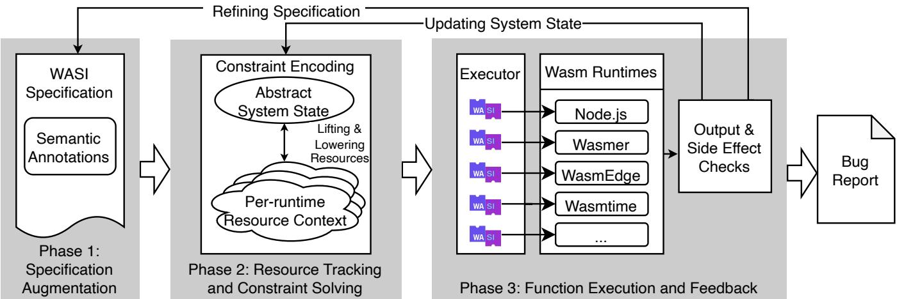
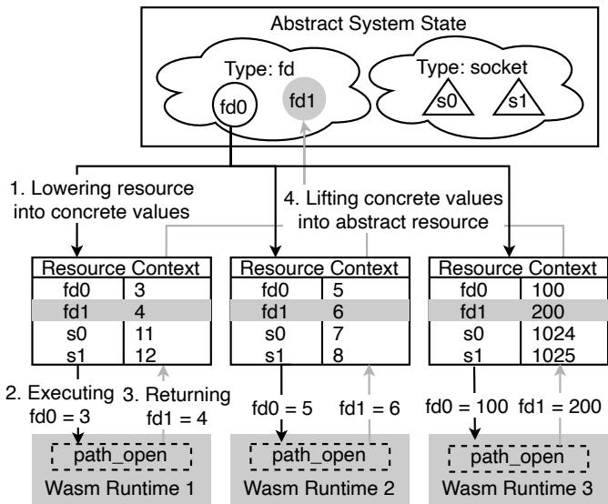
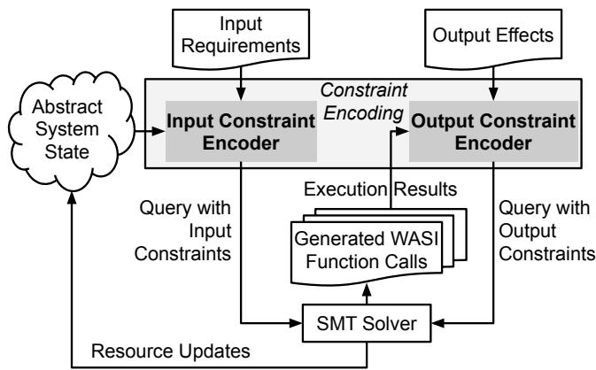
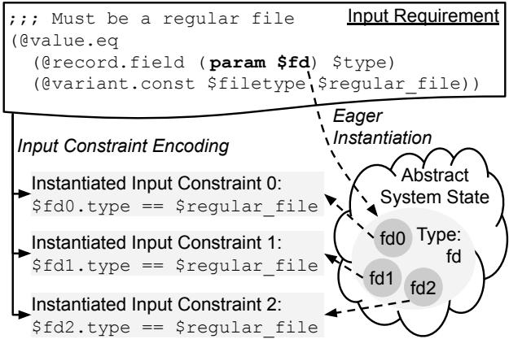
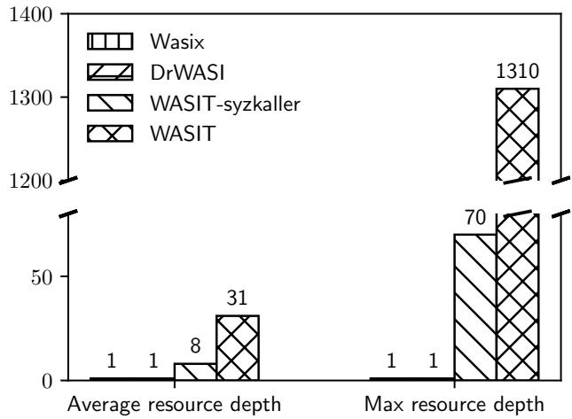
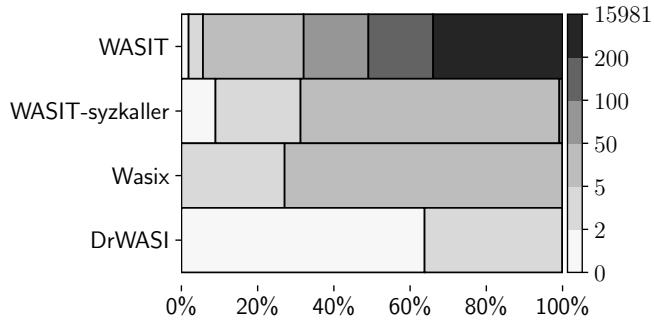

Latest updates: hps://dl.acm.org/doi/10.1145/3731569.3764819

RESEARCH-ARTICLE

# WASIT: Deep and Continuous Differential Testing of WebAssembly System Interface Implementations

YAGE HU, University of Georgia, Athens, GA, United States

WEN ZHANG, University of Georgia, Athens, GA, United States

BOTANG XIAO, University of Georgia, Athens, GA, United States

QINGCHEN KONG, University of Georgia, Athens, GA, United States

BOYANG YI, University of Georgia, Athens, GA, United States

SUXIN JI, University of Georgia, Athens, GA, United States

View all

Open Access Support provided by:

University of Georgia


Published: 12 October 2025

Citation in BibTeX format

SOSP '25: ACM SIGOPS 31st Symposium   
on Operating Systems Principles   
October 13 - 16, 2025   
Seoul, Republic of Korea

Conference Sponsors: SIGOPS

# WASIT: Deep and Continuous Differential Testing of WebAssembly System Interface Implementations

Yage Hu University of Georgia

Boyang Yi University of Georgia

Wen Zhang University of Georgia

Suxin Ji University of Georgia

Botang Xiao University of Georgia

Songlan Wang University of Georgia

Qingchen Kong University of Georgia

Wenwen Wang University of Georgia

## Abstract

This paper presents WASIT, a powerful specification-driven differential testing framework for WebAssembly (Wasm) system interface (WASI) implementations. WASIT invents several innovative techniques to address the challenges facing state-of-the-art testing approaches when applied to WASI implementations. Specifically, it introduces real-time resource abstraction and tracking to facilitate the generation of meaningful and dependent WASI function calls. It also creates a domain-specific language to automatically filter out uninteresting WASI function argument values by augmenting the WASI specification. Finally, it adopts a decoupled system architecture to achieve smooth co-evolution with WASI. Our evaluation shows that WASIT successfully found 48 new WASI-specific bugs in six popular Wasm runtimes, with 41 confirmed, 37 fixed, and three CVEs assigned.

CCS Concepts: • Software and its engineering → Software testing and debugging; • Computer systems organization → Reliability.

Keywords: WASI, Differential testing, System state abstraction and tracking, Specification-driven testing.

ACM Reference Format:

Yage Hu, Wen Zhang, Botang Xiao, Qingchen Kong, Boyang Yi, Suxin Ji, Songlan Wang, and Wenwen Wang. 2025. WASIT: Deep and Continuous Differential Testing of WebAssembly System Interface Implementations . In ACM SIGOPS 31st Symposium on Operating Systems Principles (SOSP ’25), October 13–16, 2025, Seoul, Republic of Korea. ACM, New York, NY, USA, 17 pages. https://doi.org/10.1145/ 3731569.3764819

## 1 Introduction

WebAssembly (Wasm) is a portable low-level bytecode format. As a language-agnostic compilation target, it was originally introduced for safe and efficient execution of programs written in languages like C, C++, and Rust in web


This work is licensed under a Creative Commons Attribution 4.0 International License.

browsers [31]. The promising features of Wasm, such as sandboxed execution, memory safety, and near-native performance, have attracted both industry and academia to push it beyond the Web, e.g., machine learning [53, 62, 72], edge computing [26, 43, 52, 74], Internet of things [41, 42, 51, 57], blockchains [13, 20, 80], high-performance computing [11], etc. Even the U.S. federal government recently pushed cloudnative services to adopt Wasm for improved security [27].

Since Wasm by itself provides no support for system services, the WebAssembly system interface (WASI) [36] is the key enabler for Wasm code to run outside web browsers. Similar to system calls, WASI specifies a list of functions for Wasm programs to access essential system resources, e.g., files, clocks, and network connections. With the WASI support in compiler toolchains like wasi-sdk [61] and the official support in Rust [23] and Go [8], native applications relying on system services can be compiled to Wasm. Owing to its importance, WASI has been well implemented in most standalone Wasm runtimes. This is indispensable for enriching the Wasm ecosystem by migrating a diverse range of existing applications to Wasm.

However, correctly implementing WASI is not easy for several reasons. First, WASI functions are inherently complex. A WASI function may exhibit different behaviors under different system states. For instance, the WASI function path\_open() may return a valid file descriptor if the file to open is available or an error if not. Worse, the WASI specification [22] only provides a very brief description for each WASI function, as shown in Figure 1. This makes it challenging for Wasm runtime developers to accurately understand the semantics of WASI functions.

Second, the implementation of WASI highly depends on the host OS kernel. Specifically, WASI functions are mainly implemented by invoking host system calls with similar functionalities. Nevertheless, WASI functions may not have exactly the same functionalities as corresponding host system calls. As a result, a subtle overlook of the semantic discrepancies between WASI functions and host system calls may lead to an incorrect WASI implementation. This situation is further exacerbated when implementing portable WASI functions across multiple host OS kernels.

Finally, WASI is still at a very early stage, evolving rapidly with frequent version releases and new proposals added [35].

;;; Read from a file descriptor .   
2 ;;; Note : This is similar to \`readv \` in POSIX .   
3 ( @interface func ( export " fd\_read ")   
4 ( param \$fd \$fd )   
5 ;;; List of scatter / gather vectors   
6 ;;; to which to store data .   
7 ( param \$iovs \$iovec\_array )   
8 ;;; The number of bytes read .   
9 ( result \$error ( expected \$size ( error \$errno ) ))   
10 )  
Figure 1. The sketchy and vague description of the WASI function fd\_read() in the WASI specification. The function semantics are described in comments, i.e., lines starting with ;;;. Note that WASI is not fully compliant with the portable operating system interface (POSIX). This resembles many popular operating system (OS) kernels, including Linux.

In particular, there are currently 32 active proposals, and three WASI versions have been released in the past six months. This puts an extra burden on Wasm runtime developers to timely update and maintain WASI implementations.

Worse, defects and errors in WASI implementations can cause WASI programs to exhibit abnormal behaviors, significantly impacting their correctness, reliability, and dependability. For instance, an improperly implemented WASI file system-related function may result in silent and critical data corruption [67]. Moreover, WASI implementation bugs can render the sandboxed execution environments enforced by Wasm runtimes ineffective, e.g., allowing untrusted Wasm code to escape from the environments. This has been evidenced by recently reported security vulnerabilities in popular Wasm runtimes, e.g., CVE-2024-38358 [15] and CVE-2024- 51745 [16]. Therefore, it is imperative to find bugs hidden in WASI implementations, especially considering the growing adoption of WASI in real-world safety-critical applications.

Unfortunately, however, most existing Wasm runtime testing techniques, including wasm-smith [2], WASMaker [10], and WADIFF [83], primarily exercise Wasm runtimes using various Wasm instructions, with very limited touch on WASI functions. Although recent research work has started to pay attention to the correctness of WASI implementations, e.g., DrWASI [79] and Wasix [21, 39], they only scratch the surface and thus cannot uncover deep semantic issues. For example, DrWASI generates test cases with simple and isolated WASI function calls, which have limited ability to explore deep system states derived through close interactions between a sequence of dependent WASI function calls. Another limitation of existing testing approaches, including those targeting OS kernels like the well-known syzkaller [28], is that they have no mechanism to achieve continuous testing without triggering previously found bugs in the following testing when the found bugs have not yet been (or will not be) fixed.

While testing techniques like model-based testing [19, 47, 48, 50] and application programming interface (API) testing [6, 76, 82] have been extensively studied in prior research, directly applying them to WASI implementations either face unique difficulties or cannot explore deep system states. For example, model-based testing techniques often derive test cases from an accurate and complete behavior model of the system under test. Creating such a model for WASI is challenging due to its ambiguous, fast-evolving specification and diverse development ecosystem.

To fill the above research gap, this paper presents WASIT, the first specification-driven differential testing framework for WASI implementations. WASIT adapts and combines insights from model-based and API testing to overcome the challenges facing the state of the art when applied for testing WASI implementations. Specifically, it introduces real-time resource abstraction and tracking to facilitate the generation of dependent and semantic-rich WASI function calls. This allows WASIT to reach deep system states. To avoid triggering previously found bugs, WASIT creates a domain-specific language to augment the WASI specification. Through this language, meaningless argument values of WASI function calls can be automatically filtered out during testing. Additionally, WASIT adopts a decoupled system architecture to separate the core control logic, e.g., the testing strategies, from the actual generation of WASI function calls. This provides flexibility and extensibility for WASIT to evolve smoothly and effortlessly along with WASI.

Our evaluation demonstrates WASIT’s effectiveness in finding deep semantic bugs in WASI implementations. Specifically, through intermittent testing in four months, WASIT has discovered 48 new WASI-specific bugs in six mainstream Wasm runtimes. Among the 48 bugs, 41 have been confirmed by the runtime developers, 37 have been fixed—mostly by our patches, and three CVEs have been filed and assigned. While WASI is still in an immature state, finding these high-severity, long-standing, previously undetected bugs in the actively maintained Wasm runtime codebases is not a task easier than finding bugs in mature and relatively stable systems. Our efforts have received very positive feedback from the community, e.g., “thanks for the comprehensive test” [7] from a Node.js [24] developer and “Good catch” [34] from a Wasmer [73] developer. Moreover, our reported bugs have stimulated active discussions among Wasm runtime developers, particularly on the sketchy WASI specification, e.g., a WasmEdge [25] developer complaining that “The filesystem-related parts in WASI spec are a nightmare” [65]. To facilitate future research, we have opensourced WASIT at https://github.com/yagehu/wasit.

In summary, this paper makes the following contributions.

• We introduce a novel system testing approach that leverages dynamic resource abstraction and tracking to achieve a good semantic understanding of the system under test while requiring no complex and expensive program analysis of the concrete implementation.

  
Figure 2. The high-level workflow of WASIT.

• We devise an effective domain-specific language to augment and extend the WASI specification by embedding semantic constraints for filtering out uninteresting argument values, which can also be applied to other interface specifications.

• We propose an elegant system architecture to decouple the testing control logic and the actual test case generation, allowing a testing framework to co-evolve easily with a fast-changing specification like WASI.

• We present WASIT, a powerful specification-driven differential testing framework for WASI implementations, which has successfully discovered 48 new WASIspecific bugs in six popular and actively developed Wasm runtimes, with three CVEs being assigned.

## 2 Technical Challenges

In this section, we elaborate on the key technical challenges facing testing WASI implementations.

## 2.1 Exploring Deep System States

Conventional testing frameworks like the widely used American Fuzzy Lop (AFL) [78] rely on gray-box testing to guide input generation/mutation, e.g., using the coverage feedback. While this approach works well for general-purpose software systems, it is ineffective for WASI implementations because of the complicated semantic relationships between WASI functions, such as function dependencies, operation preconditions, and shared resource lifetimes. Without awareness fi fiof these relationships, gray-box testing can only explore the input space blindly and trigger shallow behaviors of WASI functions, failing to test WASI implementations under deep and sophisticated system states.

Conversly, even though white-box static/dynamic analysis could technically provide the necessary semantic knowledge for testing a specific WASI implementation, it is impractical due to the heterogeneity and diversity of WASI implementations in Wasm runtimes. In particular, Wasm runtimes are written in a variety of languages, ranging from C to C++, Rust, Go, Java, and Swift. This makes developing a comprehensive white-box analysis to cover all WASI implementations both complex and costly.

To address this challenge, WASIT introduces a middleground approach to obtain the meaningful semantic insight of WASI function calls through dynamic resource abstraction and tracking, without requiring any access to or analysis of WASI implementations.

## 2.2 Avoiding False Positives and Known Bugs

Once a bug is uncovered, it would be desirable if the following testing could avoid triggering this bug again, especially when the bug has not yet been fixed. This testing strategy can not only save testing resources but also reduce human efforts in bug triage. When conducting differential testing of WASI implementations, this testing strategy becomes essential for at least three reasons.

First, WASI implementations in different Wasm runtimes are usually not at the same/similar maturity level, and as a consequence, differential testing via comparing WASI function execution results of multiple Wasm runtimes can lead to an overwhelming number of bug reports, most of which are actually false positives, e.g., unimplemented WASI features in some runtimes. Second, the WASI specification is intentionally underspecified in many areas, leaving plenty of room for implementation-specific semantic interpretation. As a result, behavior divergences observed during differential testing may not lead to any change to the Wasm runtimes under test. Finally, even if a WASI implementation bug is confirmed, it still takes time to construct a patch to fix the bug. Until a fixed version is available, which may take several days or weeks, the testing procedure has to continue with the unfixed version, and thus, repeatedly triggering existing known bugs wastes valuable testing cycles.

To the best of our knowledge, none of the existing testing approaches provides a mechanism to achieve the above testing strategy, unless manually hacking the code responsible for generating test cases. WASIT overcomes this challenge by designing an effective domain-specific language, which makes it possible to programmatically filter out WASI function argument values that may trigger previously found bugs.

## 2.3 Adapting for Rapid Evolution of WASI

In existing testing frameworks such as syzkaller, the core control logic, including the testing strategies, is often entangled with the concrete generation of test cases. This tight coupling is generally manageable for slow-moving targets like system calls, as their signatures and behaviors remain relatively stable across versions. However, it becomes a major obstacle when testing a rapidly evolving interface like WASI. Notably, the WASI specification is frequently updated, and the changes usually require continual modifications to testing strategies. For instance, to respond to the recent removal of the fine-grained capability-based security model between WASI versions 0.1 and 0.2, some Wasm runtimes have dropped support for capabilities, while others continue to enforce them, either fully or partially. Keeping pace with these shifts entails substantial re-engineering efforts for existing testing frameworks.

To solve this problem, WASIT adopts a decoupled system architecture, which elegantly separates the control logic from the generation of WASI function calls, making updates to testing strategies simple and easy. This also enables WASIT to co-evolve smoothly with WASI.

## 3 WASIT

In this section, we present the system design of WASIT. Figure 2 shows the high-level workflow of WASIT.

WASIT takes as input the augmented WASI specification and iteratively generates WASI function calls to exercise the Wasm runtimes under test to find bugs in their WASI implementations. In each testing iteration, WASIT first generates a WASI function call based on the current abstract system state consisting of live system resources. It then instantiates the WASI function call according to the per-runtime resource context and sends the instantiated WASI function calls to corresponding Wasm runtimes to execute. Next, it collects the execution results and compares them. If a divergence is detected in the execution results, a bug report will be generated. Otherwise, the execution results are analyzed to yield a new system state by updating the affected resources. After that, WASIT enters the next iteration to continue testing.

TypeDef typedef F typename id ty promo?   
Type ty F id | u8 - u64 | s8 - s64 | handle   
| string | flags id+ | enum id+   
| union ty+ | record (field id ty)+   
Promotion promo F @resource ty   
;;; A file descriptor handle .   
( typename \$fd ( handle )   
3 + (@resource (record   
4 + (field \$offset \$filesize)   
5 + (field \$flags \$fdflags)   
6 + (field \$type \$filetype)   
7 + (field \$path string)   
8 + ...)) ;;; Other fields omitted .   
9 )

Figure 3. The language syntax rules for resource type promotion (top) and an annotation example showing that the handle type \$fd in WASI is promoted to a type of file descriptor resource (bottom). The annotation is highlighted in bold. Note that the types \$filesize, \$fdflags, and \$filetype are defined by the original WASI specification.

The WASI specification is augmented with semantic annotations, through which WASIT can recognize system resources and dynamically track their real-time states during testing. Importantly, with the annotations, WASIT can restrict the inputs of WASI functions—with the help of a satisfiability modulo theories (SMT) solver—to avoid meaningless argument values, e.g., those triggering false positives or known bugs. The annotations are written in a domainspecific language provided by WASIT. This language is designed to be compatible with the original language of the WASI specification, i.e., witx, an interface description language. Therefore, adding the annotations will not disrupt the current WASI specification toolchain, e.g., parsers. Moreover, when the WASI specification is updated, we only need to revise the annotations instead of modifying the actual code responsible for generating WASI function calls, significantly reducing the maintenance efforts.

Next, we present more details about the design of WASIT.

## 3.1 Specification Augmentation

To facilitate testing, the WASI specification is augmented with annotations to provide three categories of semantic information: (1) resource types, (2) input requirements, and (3) output effects. It is worth mentioning that the annotations are not necessarily added to the WASI specification at a time. Instead, they can be added gradually as the testing proceeds.

Resource Types. The original WASI specification only defines data types of WASI function parameters and return values. This makes it challenging to track system resources. To address this issue, the domain-specific language in WASIT provides @resource annotations to promote WASI basic data types into resource types. Through this resource type system, WASIT can recognize system resources produced/consumed by WASI function calls.

Figure 3 shows the language syntax for resource type promotion and an @resource annotation example. As the example shows, the built-in type handle of the WASI specification is promoted to a type of file descriptor resource with a structured record that includes multiple fields to describe the attributes of the resource, e.g., its offset and flags. Note that WASIT reuses the primitive data types defined by the original WASI specification to declare resource types. That means, the values of all abstract resources are also WASI values. For instance, a file descriptor resource is a WASI record, and each field of this record is also a WASI value. This design makes the resource type system compatible with the original WASI data type system, simplifying their parsing and analysis.

Input Requirements. To filter out uninteresting argument values, as well as enforce valid invocations of WASI functions for deep system state exploration, each WASI function in the WASI specification is augmented with an input requirement, which defines under what conditions the WASI function can be called. This is realized through @input annotations supported by the domain-specific language in WASIT. Input requirements can be written as quantifier-free Boolean expressions in first-order logic. Rather than allowing arbitrary quantification, the domain-specific language in WASIT uses implicit quantifiers over the live resources in the abstract system state to reduce complexity (See Section 3.3).

Figure 4 provides the language syntax for defining input requirements. Each input requirement is a term, which is defined recursively with other terms and lambdas. Under a set of variable assignments, WASIT expects a top-level term to be evaluated to true or false, indicating the input requirement is met or not. Terms such as @variant.const and @record.field allow constructing and transforming WASI values, which can then be compared with terms like @int.gt and @value.eq. The param term indicates a reference to a function parameter. We also add a @foldl term along with the ability to define lambdas so input requirements can reason about lists. These syntax rules result in a restricted yet expressive logic framework that allows various input requirements of WASI functions to be specified.

Figure 4 also shows an example of input requirements for the WASI function fd\_seek(). Specifically, it requires the \$fd parameter pointing to a regular file, e.g., not a directory.

Output Effects. The execution of WASI functions can manipulate resources in the abstract system state, e.g., creating/deleting a resource or updating an existing resource. To provide this semantic information, the WASI specification is augmented with output effects through @output annotations supported by the domain-specific language in WASIT. Output effects can be defined in a similar way to input requirements, as shown in Figure 4. Note that, if a WASI function updates a resource, the references to the updated resource state in the function’s output effect are primed to differentiate them from the old resource state before the function call, e.g., param \$fd' at Line 22 in Figure 4. This is necessary, as both of a resource’s old and updated states may be referenced in a function’s output effect, e.g., a relative file seeking operation updates the file offset by adding an increment to the current offset.

Input ?? F @input ??   
Output ?? F @output ??   
Term ?? F int | param id | @true | @false   
@and ??+ | @or ??+ | @not ??   
@int.const ?? | @variant.const id id   
@value.eq ?? ?? | @int.le ?? ?? | @int.gt ?? ??   
@flags.get ?? id | @record.field ?? id   
@foldl ?? ?? ??   
Lambda ?? F @lambda (param id ty)\* ??   
;;; Move the offset of a file descriptor .   
;;; Note : This is similar to \`lseek \` in POSIX .   
( @interface func ( export " fd\_seek ")   
( param \$fd \$fd )   
5 ;; Other parameters omitted .   
6 ;;; The new offset of the file descriptor ,   
;;; relative to the start of the file .   
8 ( result \$error   
9 ( expected \$filesize ( error \$errno )))   
10 + ;;; Input requirements   
11 + (@input ( @and   
12 + ;;; The parameter \$fd should point to a regular file.   
13 + ( @value . eq   
14 + ( @record . field ( param \$fd ) \$type )   
15 + ( @variant . const \$filetype \$regular\_file ) )   
16 + ...) ) ;;; Other input clauses omitted .   
17 + (@output ( @and   
18 + ;;; The offset field of fd’s abstract state   
19 + ;;; should be updated to the function result value.   
20 + ( @value . eq   
21 + ( @int . const   
22 + ( @record . field ( param \$fd ') \$offset ) )   
23 + ( @int . const ( result \$ok ) ))   
24 + ...) ) ;;; Other output clauses omitted .   
25 )  
Figure 4. The language syntax rules for specifying input requirements and output effects (top) and an example showing @input and @output annotations added to the specification of the WASI function fd\_seek() (bottom).

## 3.2 Resource Abstraction and Tracking

To model WASI function behaviors, WASIT abstracts and tracks system resources manipulated by WASI functions. Specifically, WASIT maintains a global abstract system state comprised of all live system resources, e.g., file descriptors and network sockets. This abstract system state is shared across all Wasm runtimes under test. In the beginning, the state is empty. When a WASI function call produces a new resource, WASIT adds the resource to the system state and initializes its state based on the resource type defined in the specification. Likewise, if a resource is consumed and updated by a WASI function, WASIT mutates its state according to the output effects of the function.

  
Figure 5. An example showing how WASIT lifts and lowers abstract resources to accommodate harmless execution differences between multiple Wasm runtimes.

To hide benign execution inconsistencies between Wasm runtimes, e.g., different integer values of a file descriptor, WASIT also creates a runtime-specific resource context for each Wasm runtime. This resource context contains key mapping information between global abstract resources and concrete local values. WASIT performs two operations to realize the mappings. (1) Lowering. Before a WASI function call, WASIT maps abstract resource references to concrete values appropriate to each runtime. (2) Lifting. After a WASI function call, WASIT maps back concrete values to abstract resources to update the system state. The example in Figure 5 illustrates this lowering and lifting process.

## 3.3 Constraint Encoding and Solving

WASIT employs SMT-based constraint solving to automate the generation of WASI function calls and the transition of the abstract system state. To this end, WASIT includes an input constraint encoder and an output constraint encoder, as illustrated in Figure 6. The input constraint encoder produces input constraints based on the input requirements in the augmented WASI specification and the live resources in the abstract system state. By solving the input constraints using an SMT solver, WASIT can generate valid WASI function calls. Likewise, the output constraint encoder creates output constraints according to the output effects and the execution results of the generated WASI functions. Solving the output constraints can produce resource updates for state transition.

  
Figure 6. Constraint encoding and solving for generating WASI function calls and updating the abstract system state.

Candidate WASI Function Selection. To determine which WASI functions are valid to invoke under the current abstract system state, the input constraint encoder converts the input requirements of every function into a quantifier-free firstorder SMT formula, i.e., input constraint, and checks its satisfiability. A function is added to a candidate set if its input constraint is satisfiable. Otherwise, the function will be skipped, as the resources required to call this function are currently not available.

To encode the SMT formula, the encoder recursively traverses the input requirements and collects parameter references in the form of (param \$id). For each referenced parameter, the encoder creates a symbolic variable matching the parameter’s type. In the case that the type has been promoted to a resource type, e.g., file descriptor, the encoder further converts the symbolic variable into an implicit quantifier and eagerly instantiates it using live abstract resources in the promoted resource type, e.g., all currently available file descriptors. This not only avoids introducing unnecessary symbolic resource declarations, simplifying the resulting constraints, but also eliminates the need for any explicit quantifiers, ensuring that the constraints are decidable and solvable by construction. Figure 7 shows an example of this eager instantiation process.

Function Argument Synthesis. Once the function candidate set is formed, WASIT randomly selects a function from the set and generates valid argument values for invoking it. To diversify argument values, WASIT generates multiple values for each argument by solving the function’s input constraint multiple times. Each time a solution is found, a blocking clause that negates the found argument value is added to the input constraint, forcing the solver to explore new regions of the input space. After sampling a sufficient number of satisfying argument values, WASIT selects one at random and uses it to prepare a WASI function call.

  
Figure 7. An example of eager instantiation of resource references in input requirements. Here, the reference \$fd is converted into an implicit quantifier eagerly instantiated to the live resources with the file descriptor type in the abstract system state. The satisfiability of the instantiated input constraints will be checked by an SMT solver.

Abstract State Transition. After a WASI function call is completed, the output constraint encoder converts the function’s output effects into an SMT formula, i.e., output constraint, using the returned execution result. The solution to the SMT formula will be used to update the abstract system state. Specifically, the encoder traverses the output effects and creates a symbolic variable for each reference to a primed parameter in the form of (param \$id'), which represents the post-call state of each modified resource. In the case that an input parameter is referenced, i.e., (param \$id), it is directly substituted with the corresponding argument value passed to the function call. Also, the result references like (result \$id) are replaced with concrete values in the execution result. Recall the example in Figure 4. The output effect clause from Line 20 to Line 23 specifies that the \$offset field of the parameter resource \$fd should be updated to match the execution result of fd\_seek(). This is realized by solving the SMT fomula \$fd'.offset == \$res, where \$fd'.offset is a symbolic variable representing the new state of the offset field, and \$res is the concrete execution result. The solver-returned solution will be used to update the abstract system state.

It is worth pointing out that it is necessary to encode and solve the output constraints, as the state transition can be complicated, especially when some WASI functions update resources conditionally, e.g., based on different input values. Instead of developing a separate imperative-style language to update resource states, the above design allows sharing the same facility as encoding and solving the input constraints, significantly reducing the development efforts.

## 4 Implementation

In this section, we describe the implementation of WASIT, which has roughly 6.7k lines of Rust code implementing the major testing framework, including the domain-specific language, and a WASI function executor written in C.

While the design of WASIT is general enough to support a broad class of resource-centric APIs such as POSIX and system calls, our current implementation mainly targets WASI. We based our implementation on the WASI specification version 0.1 (also referred to as preview1), as the newer version 0.2 had not yet been stabilized when we completed the implementation, and most Wasm runtimes lack consistent support for it. The official specification consists of 1301 lines of sexpression code. During our implementation, as well as the following testing procedure, we manually added around 170 lines of code in the domain-specific language to augment the specification. We believe the engineering effort of writing such a small amount of code is manageable in practice.

Next, we discuss some interesting issues we addressed in our implementation.

## 4.1 Handling Inconsistent Initial Runtime States

To run Wasm applications, Wasm runtimes create sandboxed execution environments. However, different runtimes may initialize the environments with different system states. For instance, our experience shows that Wasmer [73] begins with a file descriptor pointing to a virtual file system root, whereas some other runtimes may pre-open multiple directories with separate descriptors. These inconsistencies can lead to unexpected behavior divergences of WASI functions. To address this issue, our implementation normalizes the initial system states of the Wasm runtimes under test before launching the test. Specifically, the initial system states are aligned through runtime-tailored reconfigurations to provide a consistent starting point across all runtimes.

## 4.2 Dealing with Incomplete Executions

In some circumstances, a system service requested through a WASI function call may not be completed entirely when the function returns. For example, a file writing operation via calling the WASI function fd\_write() may return even if only part of the file data is written due to, for example, host signals or internal runtime policies. Despite being infrequent, such partial executions are generally allowable. Importantly, they can lead to false alarms and halt continuous testing.

To tackle this problem, our WASI function executor, which is implemented as a remote procedural call (RPC) agent inside each Wasm runtime under test, transparently retries partially executed WASI functions until the requested service is fully completed, e.g., the entire file data has been written to the file in the above example. It also aggregates the intermediate execution results into a single consistent outcome before returning control to the testing framework.

Table 1. The details of the tested Wasm runtimes. “Lang.” shows the major language used to implement the runtime. “KLOC” presents the source code size of each runtime in kilo lines of code, with the estimated code size of its WASI implementation in parentheses. “#Years” tells the development history of each WASI implementation. “#Stars” displays the number of stars received by a runtime’s GitHub project.
<table><tr><td></td><td>Version</td><td>Lang.</td><td>KLOC</td><td>#Years</td><td>#Stars</td></tr><tr><td>Node.js</td><td>20.18.0</td><td>C</td><td>691 (5)</td><td>6</td><td>111k</td></tr><tr><td>WAMR</td><td>1.2.3</td><td>C</td><td>127 (8)</td><td>6</td><td>5.3k</td></tr><tr><td>WasmEdge</td><td>0.13.3</td><td>C++</td><td>97 (16)</td><td>6</td><td>9.1k</td></tr><tr><td>Wasmer</td><td>4.2.4</td><td>Rust</td><td>177 (27)</td><td>7</td><td>19.6k</td></tr><tr><td>Wasmtime</td><td>30.0.0</td><td>Rust</td><td>456 (41)</td><td>8</td><td>16.2k</td></tr><tr><td>Wazero</td><td>1.5.0</td><td>Go</td><td>152 (11)</td><td>5</td><td>5.3k</td></tr></table>

## 4.3 Cross-Checking Execution Results

It is generally straightforward to cross-check the execution results of WASI functions by comparing their return values. Nevertheless, our implementation must confront two issues. (1) Nondeterministic results. Some WASI functions may return nondeterministic values, e.g., time results returned by clock\_gettime(). Simply comparing these results creates a lot of noise and is unnecessary. Therefore, our implementation does not cross-check the concrete values. Instead, it only examines whether the functions are finished consistently across runtimes. (2) Implicit results. Some WASI functions may silently produce some results, either correctly or incorrectly. This makes it challenging to identify such results and cross-check them. To mitigate this issue, our implementation creates a snapshot of every runtime’s sandboxed file system after each WASI function call. This is done by recursively traversing the file system and collecting observable elements like files and directories. By cross-checking the snapshots, we can detect execution discrepancies.

## 5 Evaluation

Our evaluation of WASIT aims to answer three key research questions. (1) Can WASIT find new bugs in real-world WASI implementations? (2) Can WASIT effectively deepen system state exploration during testing? (3) Can WASIT effectively deal with false positives and known bugs?

To this end, we use WASIT to test six representative and actively maintained Wasm runtimes, including Node.js [24], Wasmtime [3], WAMR [4], Wasmer [73], WasmEdge [25], and Wazero [66]. Among these runtimes, Wasmtime and WAMR are official Wasm runtimes developed by the Bytecode Alliance [1]. Node.js is a JavaScript runtime environment outside a web browser with support for Wasm and WASI. Wasmer and WasmEdge are two open-source Wasm runtimes that have been successfully commercialized. Wazero is a zero-dependency Wasm runtime for Go developers. Table 1 presents the details of these runtimes.

We begin our testing with the official WASI specification augmented with our annotations. When WASIT discovers inconsistencies, we triage the results by filtering out inconclusive or ambiguous cases and adding extra input requirements when appropriate. We report confirmed issues to Wasm runtime developers to seek their feedback. During this process, we actively engage in discussions, assist in minimizing reproductions, and construct patches to fix the bugs.

Since our implementation is not limited to any specific host OS kernels, we conduct our testing on three different platforms, including (1) a server equipped with a 14-core Intel Xeon E5-2697 v3 CPU and 200GB of memory running Linux-6.11, (2) a desktop equipped with an octa-core Intel Core i7-10700KF CPU and 64GB of memory running Windows 11, and (3) a laptop equipped with an octa-core Intel Core i9 CPU and 32GB of memory running macOS 15.4.

## 5.1 Finding New Bugs

During intermittent testing in four months, WASIT has successfully discovered 48 new WASI implementation bugs in the six evaluated Wasm runtimes. Table 2 shows the details of the bugs. For each bug, it lists the corresponding Wasm runtime, the buggy WASI function, a brief summary of the bug, the current bug status, the time it took to fix the bug, and the host OS platform on which the bug was uncovered.

As we can see from the table, all tested Wasm runtimes have WASI-specific bugs. This shows the prevalence of WASI implementation bugs, emphasizing the importance of developing effective testing techniques to discover them. Among the 48 bugs, 37 have been acknowledged by the corresponding runtime developers and fixed mostly with patches we prepared. This includes three assigned CVEs. Five bugs have been confirmed but have not yet been fixed due to the complexity of the bugs and the substantial effort required to compose an acceptable patch. There are five bugs for which the runtime developers have indicated that they will not fix them due to different understandings of WASI function semantics and/or the significant changes to the entire runtime systems. Finally, one bug is still in the pending status, waiting for confirmation. Overall, this result demonstrates the capability of WASIT to uncover previously unknown bugs in WASI implementations.

There are several interesting observations we can make from Table 2. First, the bugs were discovered in various WASI functions. For some WASI functions, e.g., path\_open(), multiple bugs were found in a single Wasm runtime, and more importantly, bugs were found in more than one runtime. This signifies the semantic complexity of WASI functions and the difficulties of implementing them consistently across runtimes. Second, among the 37 fixed bugs, 23 bugs were fixed in three days, and six were fixed in just several hours. This shows the prompt actions from Wasm runtime developers, given the high severity and critical impacts of these bugs. Third, the bugs were found on three major OS platforms on the market, i.e., Linux, macOS, and Windows. This confirms the challenge of realizing portable WASI implementations on different platforms. Finally, we find that 15 out of the 37 fixed bugs had been dormant in the runtimes for more than four years, e.g., the CVE found in WAMR has been present since its v1.0 release. This proves the effectiveness of WASIT in finding deep, long-standing bugs in WASI implementations that have been actively developed for multiple years.

Table 2. The new WASI implementation bugs found by WASIT in the six tested Wasm runtimes. “Runtime” shows the Wasm runtime in which the corresponding bug was found. “WASI Function” presents the buggy WASI function that have implementation flaws. “Summary” briefly describes the symptom of each bug. “Status” shows the current bug status at the time of paper submission. “Time-to-Fix” provides the time it took to fix a bug, from when the bug was reported to runtime developers to when a pull request fixing the bug was approved and merged. “Host OS” depicts the host OS platform by running the Wasm runtime on which the bug was discovered.
<table><tr><td></td><td>Runtime</td><td>WASI Function</td><td> Summary</td><td>Status</td><td>Time-to-Fix</td><td>Host Os</td></tr><tr><td>1</td><td>Node.js</td><td>fd_filestat_set_times</td><td>Ambiguous $fstflags handling</td><td>Fixed</td><td>4 days</td><td>macOs</td></tr><tr><td>2</td><td>Node.js</td><td>fd_advise</td><td>Invalid advice handling on directories</td><td>Fixed</td><td>4days</td><td>Linux</td></tr><tr><td>3</td><td>Node.js</td><td>fd_pwrite</td><td>Silent failure on large offset</td><td>Fixed</td><td>2 hours</td><td>Linux</td></tr><tr><td>4</td><td>Node.js</td><td>fd_pwrite</td><td>Offset integer overflow</td><td>Fixed</td><td>2 days</td><td>Linux</td></tr><tr><td>5</td><td>Node.js</td><td>fd_read</td><td>Empty buffer read fails</td><td>Fixed</td><td>4 days</td><td>macOs</td></tr><tr><td>6</td><td>Node.js</td><td>All path functions</td><td>Lack of malformed string validation</td><td>Fixed</td><td>7days</td><td>Linux</td></tr><tr><td>7</td><td>Node.js</td><td>path_open</td><td>Ignoring trailing slashes in paths</td><td>Fixed</td><td>3 days</td><td>Linux</td></tr><tr><td>8</td><td>Node.js</td><td>path_open</td><td>Acceptingabsolute paths</td><td>Fixed</td><td>4 days</td><td>macOs</td></tr><tr><td>9</td><td>Node.js</td><td>path_symlink</td><td>Should forbid absolute paths</td><td>Fixed</td><td>23 days</td><td>macOs</td></tr><tr><td>10</td><td>Node.js</td><td>fd_pwrite</td><td>Writing to wrong offsets with append flag</td><td>Wontfix</td><td>=</td><td>Linux</td></tr><tr><td>11</td><td>WasmEdge</td><td>fd_sync</td><td>Base directory descriptors failure</td><td>Confirmed</td><td></td><td>Linux</td></tr><tr><td>12</td><td>WasmEdge</td><td>fd_renumber</td><td>Same descriptor segfaults</td><td>Fixed</td><td>2 days</td><td>Linux</td></tr><tr><td>13</td><td>WasmEdge</td><td>sock_shutdown</td><td>Closed descriptor segfaults</td><td>Fixed</td><td>2 days</td><td>Linux</td></tr><tr><td>14</td><td>WasmEdge</td><td>fd_pwrite</td><td>Writing to wrong offsets with append flag</td><td>Confirmed</td><td>=</td><td>Linux</td></tr><tr><td>15</td><td>WasmEdge</td><td>fd_filestat_set_times</td><td>Failures with large timestamps</td><td>Fixed</td><td>3 days</td><td>Linux</td></tr><tr><td>16</td><td>Wasmer</td><td>path_open</td><td>Creating files outside the sandbox</td><td>CVE</td><td>20 days</td><td>Linux</td></tr><tr><td>17</td><td>Wasmer</td><td>fd_filestat_get</td><td>Wrong timestamp unit</td><td>Fixed</td><td>30 days</td><td>Linux</td></tr><tr><td>18</td><td>Wasmer</td><td>path_open</td><td>Mounting cwd breaks open</td><td>Confirmed</td><td></td><td>Linux</td></tr><tr><td>19</td><td>Wasmer</td><td>path_open</td><td>Trunc and append flags preventing open</td><td>Fixed</td><td>14 days</td><td>Linux</td></tr><tr><td>20</td><td>Wasmer</td><td>fd_seek</td><td>Offset underflow</td><td>Fixed</td><td>17 hours</td><td>Linux</td></tr><tr><td>21</td><td>Wasmer</td><td>fd_seek</td><td>Offset overflow</td><td>Fixed</td><td>18 hours</td><td>Linux</td></tr><tr><td>22</td><td>Wasmer</td><td>All path functions</td><td>Empty path mis-validation</td><td>Fixed</td><td>2 days</td><td>Linux</td></tr><tr><td>23</td><td>Wasmer</td><td>path_open</td><td>No failure if a dir is opened with write</td><td>Fixed</td><td>6days</td><td>Linux</td></tr><tr><td>24</td><td>Wasmer</td><td>path_open</td><td>Absolute path mis-validation</td><td>Wontfix</td><td>1</td><td>Linux</td></tr><tr><td>25</td><td>Wasmer</td><td>path_open</td><td>No failure if a dir is opened with excl flag</td><td>Fixed</td><td>2 days</td><td>Linux</td></tr><tr><td>26</td><td>Wasmer</td><td>path_open</td><td>Silently dropping trailing slashes</td><td>Fixed</td><td>2 days</td><td>Linux</td></tr><tr><td>27</td><td>Wasmer</td><td>path_open</td><td>Trailing slash dropped on create file</td><td>Fixed</td><td>2 days</td><td>macOs</td></tr><tr><td>28</td><td>Wasmer</td><td>path_open</td><td>Symlink bypassing the file system sandbox</td><td>CVE</td><td>5 days</td><td>Linux</td></tr><tr><td>29</td><td>Wasmer</td><td>path_symlink</td><td>Crash caused by a single pathname</td><td>Confirmed</td><td>=</td><td>macOs</td></tr><tr><td>30</td><td>Wasmer</td><td>fd_write</td><td>Loss of append flag across descriptors</td><td>Pending</td><td></td><td>macOs</td></tr><tr><td>31</td><td>Wasmer</td><td>path_create_directory</td><td>Recursively creating directories</td><td>Fixed</td><td>15 hours</td><td>Linux</td></tr><tr><td>32</td><td>Wasmer</td><td>fd_seek</td><td>Failure of seeking with the append flag</td><td>Fixed</td><td>5 days</td><td>Linux</td></tr><tr><td>33</td><td>Wasmer</td><td>path_open</td><td>Changing unrelated file descriptor offset</td><td>Fixed</td><td>6days</td><td>Linux </td></tr><tr><td>34</td><td>WAMR</td><td>sock_shutdown</td><td>No failure with non-socket fle descriptors</td><td>Fixed</td><td>6days</td><td>macOs</td></tr><tr><td>35</td><td>WAMR</td><td>fd_pwrite</td><td>Writing to wrong offsets with append flag</td><td>Wontfix</td><td></td><td>macOs</td></tr><tr><td>36</td><td>WAMR</td><td>fd_filestat_set_times</td><td>Ambiguous $fstflags handling</td><td>Fixed</td><td>3 days</td><td>Linux</td></tr><tr><td>37</td><td>WAMR</td><td>fd_advise</td><td>No failure with directory descriptors</td><td>Fixed</td><td>3 hours</td><td>Linux</td></tr><tr><td>38</td><td>WAMR</td><td>fd_advise</td><td>Missing error handling</td><td>Fixed</td><td>2 days</td><td>Linux</td></tr><tr><td>39</td><td>WAMR</td><td>fd_pread</td><td>Failure with empty buffer read</td><td>Wontfix</td><td>=</td><td>macOs</td></tr><tr><td>40</td><td>WAMR</td><td>path_open</td><td>Sandbox escaping with symlink</td><td>CVE</td><td>2 days</td><td>Windows</td></tr><tr><td>41</td><td>Wasmtime</td><td>fd_tell</td><td>Always O offset with append flag</td><td>Fixed</td><td>3 days</td><td>macOs</td></tr><tr><td>42</td><td>Wasmtime</td><td>path_open</td><td>Crash when opening a trunc directory</td><td>Confirmed</td><td>1</td><td>Windows</td></tr><tr><td>43</td><td>Wazero</td><td>fd_fdstat_set_flags</td><td>Unexpected file truncation</td><td>Fixed</td><td>2 days</td><td>Linux</td></tr><tr><td>44</td><td>Wazero</td><td>fd_fdstat_set_flags</td><td>Reseting file descriptor offset</td><td>Fixed</td><td>5 hours</td><td>Linux</td></tr><tr><td>45</td><td>Wazero</td><td>fd_filestat_set_size</td><td>Integer overflow</td><td>Fixed</td><td>2 days</td><td>Linux</td></tr><tr><td>46</td><td>Wazero</td><td>clock_res_get</td><td>Inaccurate clock resolution</td><td>Wontfix</td><td>=</td><td>Linux</td></tr><tr><td>47</td><td>Wazero</td><td>path_open</td><td>Empty path mis-validation</td><td>Fixed</td><td>2 days</td><td>Linux</td></tr><tr><td>48</td><td>Wazero</td><td>path_open</td><td>Failure of rejecting directories with write</td><td>Fixed</td><td>2 days</td><td>Linux</td></tr></table>

```asm
1 ( call $path_open
2 ( local . get $base_fd )
3 ( i32 . const 0) ;; dirflags
4 ( i32 . const 100) ;; path addr
5 ( i32 . const 1) ;; path len
6 ( i32 . const 0) ;; oflags
7 ( i64 . const 66) ;; fs_rights_base : R+W
8 ( i64 . const 0) ;; fs_rights_inheriting
9 ( i32 . const 1) ;; fdflags : append
10 ( i32 . const 200) ) ;; fd_append addr
11 ( call $fd_write
12 ( i32 . load 200) ;; fd_append
13 ( i32 . const 300) ;; ciovec_array addr
14 ( i32 . const 1) ;; ciovec_array len
15 ( i32 . const 400) ) ;; ret bytes written addr
16 ( call $fd_tell
17 ( i32 . load 200) ;; fd_append
18 ( i32 . const 500) ) ;; ret offset addr
19 ( call $fd_pwrite ;; Previously written
20 ;; data overwritten !!!
21 ( i32 . load 200) ;; fd_append
22 ( i32 . const 600) ;; ciovec_array addr
23 ( i32 . const 1) ;; ciovec_array len
24 ( i64 . load 500) ;; offset
25 ( i32 . const 700) ) ;; ret bytes written addr
```  
Figure 8. A WASIT-generated WASI call sequence finding a critical bug in Wasmtime that causes file content corruption.

Case Study 1: A Wasmtime Bug. Figure 8 shows a WASI call sequence generated by WASIT. Using this call sequence, WASIT successfully revealed a critical file corruption bug in Wasmtime. Concretely, this code first calls path\_open() to open a file with the \$fdflags::append flag, which is analogous to O\_APPEND in POSIX. Then, it calls fd\_write() to write some data to the opened file descriptor. Next, fd\_- tell() is called to get the current offset of the file descriptor. If the returned offset is incorrect, the following write operation performed via fd\_pwrite() can corrupt the file content.

The root cause of this bug is the mishandling of the file offset in the virtual file system layer in Wasmtime. Specifically, Wasmtime creates some internal data structures to keep track of file descriptor features, including the offset. Nevertheless, Wasmtime does not update the data structures appropriately and timely. This bug shows that correctly emulating file system features in the WASI layer is not easy. At the same time, it underscores the importance of generating dependent and meaningful WASI function calls to find deep bugs in WASI implementations.

1 ;; Open a new file , without the append flag .   
2 ( call \$path\_open   
3 ( local . get \$base\_fd )   
4 ( i32 . const 0) ;; dirflags   
5 ( i32 . const 100) ;; path addr   
6 ( i32 . const 4) ;; path len   
7 ( i32 . const 1) ;; oflags : creat   
8 ( i64 . const 66) ;; fs\_rights\_base : R+W   
9 ( i64 . const 0) ;; fs\_rights\_inheriting   
10 ( i32 . const 0) ;; fdflags : no append   
11 ( i32 . const 200) ) ;; fd addr   
12   
13 ;; Write some data to fd .   
14 ( call \$fd\_write   
15 ( i32 . load 200) ; ; f d   
16 ( i32 . const 300) ;; ciovec\_array data addr   
17 ( i32 . const 1) ;; ciovec\_array data len   
18 ( i32 . const 400) ) ;; ret num bytes written   
19   
20 ;; Set the append flag on fd .   
21 ( call \$fd\_fdstat\_set\_flags   
22 ( i32 . load 200) ;; fd   
23 ( i32 . const 1) ) ;; fdflags : append   
24   
25 ;; Get the descriptor offset .   
26 ;; The buggy runtime returns the wrong offset .   
27 ( call \$fd\_tell   
28 ( i32 . load 200) ; ; f d   
29 ( i32 . const 500) ) ;; ret offset addr  
Figure 9. A WASIT-generated WASI call sequence uncovering a bug in Wazero that resets a file descriptor after any flag of the descriptor is reset.

Case Study 2: A Wazero Bug. Figure 9 shows another WASI call sequence generated by WASIT. Through this call sequence, a WASI implementation bug in Wazero was successfully discovered. Specifically, this code first calls path\_- open() to open a file without the \$fdflags::append flag. Then, it calls fd\_write() to perform some writes on the returned file descriptor, changing the offset of the file descriptor from 0 to some positive integer value. Finally, it calls fd\_fdstat\_set\_flags() to set the append flag on this descriptor, which causes the subsequent call to fd\_tell() to get the wrong offset 0.

Unlike some Wasm runtimes that implement a virtual file system layer to emulate file descriptor flag behaviors, Wazero largely relies on the host file system. To handle system call discrepancies between different host OS kernels, Wazero chooses to reopen a file if the flag of its previously opened file descriptor is changed. However, when a file is reopened, Wazero fails to correctly restore its prior offset. This bug shows the challenge facing Wasm runtime developers to implement consistent WASI function behaviors across different host OS kernels. More importantly, it highlights the difficulty of generating sophisticated WASI function calls to find deep semantic bugs in WASI implementations.

  
Figure 10. The average and max resource depths of WASI function calls generated by different testing approaches.

## 5.2 Effectiveness of Exploring Deep States

To study the effectiveness of WASIT in terms of exploring deep system states, we compare it with two state-of-theart testing techniques targeting WASI implementations, i.e., DrWASI [79] and Wasix [21, 39]. To further understand the necessity of dynamic resource abstraction and tracking in WASIT, we disable this functionality and adopt a syzkallerlike approach to randomly generate relevant WASI function calls. We name this system WASIT-syzkaller, and also compare WASIT with it.

Resource Depth. We first compare the resource depths achieved by these testing systems. Here, resource depth means the number of valid and dependent WASI function calls manipulating the same resource, e.g., file descriptor. Compared with shallow resource depths, WASI function calls with deep resource depths have a higher possibility to reveal deeply hidden WASI implementation bugs. To measure resource depths, we run all these testing systems on the same platform using the same amount of time, i.e., two hours.

Figure 10 illustrates the average and max resource depths achieved by the four testing systems. As shown in the figure, both Wasix and DrWASI can only achieve resource depth one. This is because they generate WASI function calls through hand-written heuristics and therefore, by design, do not invoke more WASI functions using the same resource. In contrast, both WASIT-syzkaller and WASIT can realize deeper resource depths. Thanks to its resource abstraction and tracking, WASIT achieves the highest average and max resource depths. The reason why WASIT-syzkaller cannot achieve better resource depths is that, like syzkaller without real-time system resource modeling, WASIT-syzkaller can only blindly pass the results of prior WASI function calls to following WASI functions, leading to massive invalid calls.

Table 3. The code coverage achieved by different testing approaches. The coverage is measured using the number of covered branches in WASI implementations, i.e., not the entire Wasm runtime. Two runtimes, i.e., Wasmer and Wazero, are excluded here due to their lack of support for LLVM’s coverage instrumentation. We run the test for 100 minutes due to the huge sizes of the produced coverage files exceeding our disk space. Also, DrWASI cannot be adapted to Node.js.
<table><tr><td></td><td>Wasix</td><td>DRWASI</td><td>WASIT-syzkaller</td><td>WASIT</td></tr><tr><td>Node.js</td><td>748</td><td>-</td><td>1204</td><td>1216</td></tr><tr><td>WAMR</td><td>363</td><td>272</td><td>385</td><td>403</td></tr><tr><td>WasmEdge</td><td>456</td><td>322</td><td>438</td><td>490</td></tr><tr><td>Wasmtime</td><td>114</td><td>81</td><td>153</td><td>156</td></tr></table>

Code Coverage. We next evaluate how effectively these testing approaches can exercise WASI implementations. To this end, we measure the code coverage, i.e., branches covered in WASI implementations, using the LLVM instrumentation [45]. The experimental results are presented in Table 3. As we can see, WASIT achieves the highest code coverage consistently across all Wasm runtimes. This again demonstrates the effectiveness of WASIT-generated WASI function calls. Note that we only ran the test for 100 minutes due to the huge coverage file sizes. We believe the coverage advantage of WASIT will be further enlarged as testing proceeds.

## 5.3 Effectiveness of Continuing Testing

We finally study the effectiveness of WASIT in terms of continuing the testing process without being terminated by minor or meaningless inconsistencies, i.e., false positives.

False Positives. There are generally four types of reasons causing false positives during differential testing of multiple WASI implementations. (1) Different support levels. The maturity of WASI support is varied in different Wasm runtimes. For example, the \$process\_cputime\_id clock is not supported by all Wasm runtimes, and thus WASI calls using this clock can cause inconsistent execution results. (2) Undefined behaviors. The behavior of a WASI function is undefined if it is invoked with “invalid” arguments. For example, the \$buf\_- len field should contain the length of the preceding buffer, and as a result, an unmatched length may lead to different behaviors among Wasm runtimes. (3) Implementation-defined behaviors. The semantics of some WASI functions may be specified in a way that allows different choices, i.e., defined by the actual implementation. For example, a file read operation to an empty buffer may fail with an error code returned or succeed like a no-op, depending on the concrete WASI implementation. (4) Underspecified behaviors. Due to its sketch nature, the WASI specification may not prescribe some WASI function behaviors, though runtime developers may have a consensus about the expected behaviors, e.g., based on POSIX semantics.

Table 4. The details of some false positives that are removed by WASIT with the annotated specification. “Inter” and “Intra” indicate if the corresponding false positive can be eliminated with inter- or intra-function constraints, or a combination of both. “#Lines” shows the number of lines of the added annotation.
<table><tr><td>WASI Function</td><td>False Positive Description</td><td>Reason</td><td>Inter </td><td>Intra</td><td>#Lines</td></tr><tr><td>clock_res_get</td><td>Unsupported clock features</td><td>Different support levels</td><td></td><td>√</td><td>12</td></tr><tr><td>fd_advise</td><td>Descriptor must point to a regular file</td><td>Underspecified</td><td>√</td><td></td><td>8</td></tr><tr><td>fd_datasync</td><td>Descriptor must point to a regular fle</td><td>Underspecified</td><td>√</td><td></td><td>8</td></tr><tr><td>fd_fdstat_set_flags</td><td>Descriptor must point to a regular file</td><td>Underspecified</td><td>√</td><td></td><td>6</td></tr><tr><td></td><td>Unsupported descriptor flags</td><td>Different support levels</td><td></td><td>√</td><td>5</td></tr><tr><td>fd_filestat_set_size</td><td>Descriptor must point to a regular file</td><td>Underspecified</td><td>√</td><td></td><td>8</td></tr><tr><td>fd_filestat_set_times fd_pread</td><td>Descriptor must not be preopened dir</td><td>Underspecified</td><td>√</td><td></td><td>8</td></tr><tr><td></td><td>Descriptor must point to a regular file</td><td>Underspecified</td><td>√</td><td></td><td>6</td></tr><tr><td rowspan="4">fd_read</td><td>Buffer lengths must sum to positive</td><td>Implementation-defined behavior</td><td></td><td>√</td><td>6</td></tr><tr><td>Buffer lengths must match buf_len field</td><td>Undefined behavior</td><td></td><td>√</td><td>9</td></tr><tr><td>Descriptor must point to a regular fle</td><td>Underspecified</td><td>√</td><td></td><td>6</td></tr><tr><td>Buffer lengths must sum to positive</td><td>Implementation-defined behavior</td><td></td><td>√</td><td>6</td></tr><tr><td rowspan="2">fd_seek</td><td>Buffer lengths must match buf_len field</td><td>Undefined behavior</td><td></td><td>√</td><td>9</td></tr><tr><td>Descriptor must point to a regular fle</td><td>Underspecified</td><td>√</td><td></td><td>6</td></tr><tr><td>fd_write</td><td>Input offset and whence should be in range</td><td>Implementation-defined behavior</td><td>√</td><td>√</td><td>38</td></tr><tr><td rowspan="3"></td><td>Descriptor must point to a regular fle</td><td>Underspecified</td><td>√</td><td></td><td>6</td></tr><tr><td>Buffer lengths must sum to positive</td><td>Implementation-defined behavior</td><td></td><td>√</td><td>6</td></tr><tr><td>Buffer lengths must match buf_len field</td><td>Undefined behavior</td><td></td><td>√</td><td>9</td></tr><tr><td rowspan="2">path_open</td><td>Invalid oflags/fdflags combinations</td><td>Underspecified</td><td></td><td>√</td><td>20</td></tr><tr><td>Unsupported rights features</td><td>Different support levels</td><td></td><td>√</td><td>58</td></tr></table>

Table 5. The total number of WASI call sequences generated by the testing approaches in 10 minutes, as well as the number of reported inconsistencies and false positives. We manually triage false positives based on known WASI function behaviors dismissed by runtime developers as non-bugs.
<table><tr><td></td><td>Total</td><td>#Inconsistencies</td><td>#False Positives</td></tr><tr><td>Wasix</td><td>1800</td><td>1620</td><td>1620 (100%)</td></tr><tr><td>DRWASI</td><td>2383</td><td>715</td><td>715 (100%)</td></tr><tr><td>WASIT-syzkaller</td><td>2770</td><td>1662</td><td>1662 (100%)</td></tr><tr><td>WASIT</td><td>1</td><td>0</td><td>0 (0%)</td></tr></table>

WASIT begins with the WASI specification without input requirements as a baseline. Through iterative testing campaigns, we progressively augment the specification with input requirement annotations to introduce semantic constraints, which allow WASIT to eliminate recurring false positives. In total, annotating the WASI specification requires about 10 person-hours, showing the lightweight nature of our approach. To clarify, we do not consider the time spent triaging bugs and filing reports as part of the annotation process. Table 4 shows some false positives removed by WASIT through the annotations added to the specification.

Using this annotated specification, we further measure false positives by running the four testing approaches for the same period to collect their reported execution inconsistencies of Wasm runtimes. We manually triage the inconsistencies based on known WASI function behaviors dismissed by runtime developers as non-bugs. Due to the massive amount of short WASI call sequences generated by Wasix, DrWASI, and WASIT-syzkaller, we run the experiment for only 10 minutes. Table 5 shows the experimental results.

Although Wasix, DrWASI, WASIT-syzkaller report a large number of inconsistencies, none of them are real bugs. On the contrary, WASIT does not report any inconsistencies. Note that WASIT only generates one WASI call sequence, as its testing process is terminated at the end of 10 minutes. This demonstrates the effectiveness of WASIT in continuing testing without wasting testing cycles on triggering existing known inconsistencies repeatedly. During this experiment, we also observed that most execution inconsistencies reported by Wasix, DrWASI, and WASIT-syzkaller are actually duplicated. This further indicates the inefficiency of these testing approaches in generating diverse WASI function calls to thoroughly explore different system states.

Length Distribution of WASI Call Sequences. Figure 11 reports the length distributions of WASI function call sequences generated by different testing approaches in a single test run, i.e., not terminated due to an execution inconsistency. As shown in the figure, fewer than 50 WASI function calls can be generated for all test runs with Wasix, DrWASI, and WASIT-syzkaller. In contrast, WASIT is able to generate more than 100 WASI function calls for more than 50% test runs before reporting an execution consistency, even reaching tens of thousands of WASI calls in some runs. This demonstrates the capability of WASIT to generate long WASI call sequences to exercise WASI implementations.

  
Figure 11. The length distribution of WASI call sequences generated by the testing approaches. For each approach, we run the test for two hours. A darker color means more WASI calls are generated before an inconsistency is reported.

## 6 Related Work

In this section, we compare WASIT with related work and highlight its key distinctions.

## 6.1 Wasm Runtime Testing

The increased popularity of Wasm binaries has attracted recent research efforts devoted to testing Wasm runtimes. The wasm-smith tool [2] constructs type-safe Wasm instruction sequences to generate syntactically valid Wasm binaries for Wasm runtime testing. Although it can find crashes and miscompilation issues in Wasm runtimes, it does not target system services exposed through WASI. WADIFF [83] performs instruction-level differential testing to uncover implementation bugs related to Wasm instructions. Since it only constructs test cases with single Wasm instructions, it also does not consider WASI implementations. WASMaker [10] generates test cases by disassembling and reassembling real-world Wasm binaries without explicitly testing WASI interactions. WarpDiff [38] focuses on identifying performance issues in Wasm runtimes by running existing hand-written test cases. LWDIFF [84] adopts a large language model (LLM)-assisted approach to learn semantic information from the Wasm specification for test case generation, but does not test WASI.

Differently, DrWASI [79] and Wasix [21, 39] focus specifically on WASI implementations. DrWASI leverages LLMs to generate C test cases with system calls and compiles them into Wasm binaries to test WASI implementations. However, it can only touch shallow system states, as LLMs struggle to generate sophisticated system call sequences that respect their intricate dependences. Wasix employs hand-written heuristics to generate C test programs with system calls for WASI implementation testing. Although Wasix may have the potential to produce longer WASI calls, it is hard to scale up due to the significant effort required to engineer the heuristics. Compared with them, WASIT is the first to bring the deep and continuous specification-driven differential testing into the space of WASI implementation testing. Another limitation shared by DrWASI and Wasix is that they generate C test programs. This makes it challenging to explicitly call individual WASI functions, as the translation from system calls to WASI calls is controlled by the compiler toolchain, and the mappings between system calls and WASI calls are not always one-to-one. In contrast, WASIT does not have this issue because it generates WASI function calls directly.

## 6.2 Model-Based Testing

Model-based testing [5, 9, 19, 44, 47, 48, 50, 59, 63] is a software testing approach where test cases are automatically generated from formal models that describe the expected behaviors of the systems under test. Representative modelbased testing tools include Mutagen [48], TestEra [47], Morest [44], QuickCheck [14], QuickChick [56], etc.

The requirement of a complete, accurate reference model of the system under test makes it challenging to apply existing model-based testing approaches directly to WASI implementations for two reasons. (1) Technical. At the time of our testing, the WASI specification (version 0.1) did not specify many important Wasm function behaviors. We initially attempted to tighten the specification by using POSIX function semantics. However, during testing, we found that many WASI function implementations diverge from corresponding POSIX functions, making a painstakingly tightened WASI specification useless in practice. (2) Realistic. The Wasm runtime development ecosystem is diverse in the sense that developers of different runtimes often interpret the WASI specification differently. As a result, constructing a reference model, testing runtimes against it, and filing bugs based on the findings require developers to buy into the authority of the model, which, according to our communication with runtime developers, is very challenging.

WASIT tackles these two challenges by adopting a more lightweight approach using an abstract state model solely for guiding input generation and deferring correctness checking to differential testing between multiple runtimes. This decision has two important consequences. First, the responsibility to construct correct and complete reference models has been greatly alleviated from the developers. During testing, we spent relatively little time writing and tweaking the model, which is only a couple of hundred code lines, and can still consistently uncover new bugs in WASI implementations. Second, we found that runtime developers are much more receptive to bug reports that point out an errant behavior as a divergence from other popular Wasm runtimes, as opposed to from a hypothetical specification.

Recent work has also explored techniques to handle underspecified or evolving systems by automatically inferring semantic rules from failures and enforcing them at runtime [46]. These approaches demonstrate how lightweight models extracted from execution traces can enhance system reliability without requiring complete formal specifications. Inspired by such approaches, we plan to bring more automation to WASIT’s specification augmentation process in the future, though its current focus is on test generation rather than production system checking.

## 6.3 API Testing

Prior research work has proposed many API testing techniques [6, 17, 18, 55, 71, 76, 82]. WASIT shares core principles with prior work on stateful API testing such as Randoop [54], RestTestGen [68], Atropos [30], RestCT [75], and RESTler [6], particularly in its use of dynamic feedback to guide test generation. Like Randoop, WASIT constructs sequences of interface calls by iteratively extending valid operation chains. This approach also aligns with feedback-directed techniques, as seen in RESTler, where execution traces inform the subsequent test cases. The importance of state awareness in API testing is well-established, as demonstrated by tools like AFLNet [58] for network protocols.

WASIT extends these ideas in its handling of fine-grained system resource states during sequence generation. While Randoop and RESTler maintain states primarily across independent test sequences, WASIT models intra-sequence dependencies more precisely through its abstract state model. This technique, also adopted by GraphFuzz [29], allows deeper exploration of stateful interactions. WASIT implements this capability through its constraint language, which incorporates state predicates directly into test generation.

Another practical distinction lies in WASIT’s interfacefirst adaptation of these concepts. Where AFLNet targets protocol state machines or RESTler assumes HTTP semantics, WASIT decouples state modeling from implementation details, a necessity given polyglot WASI implementations. This design echoes earlier work on protocol conformance testing, though WASIT applies it to lower-level system interfaces. Empirically, this approach is proven effective for WASI, but the core ideas are built on decades of research into state-aware test generation.

## 6.4 File System Testing

Prior research work on file system testing, e.g., FiSC [77] and SibylFS [60], and device driver testing, e.g., StateFuzz [81], adopts resource-aware testing approaches. FiSC and State-Fuzz rely on white-box techniques like instrumentation or static analysis, which are impractical for WASI’s polyglot implementations. SibylFS employs formal methods based on HOL4/Isabelle to rigorously model POSIX semantics, but this imposes significant usability barriers. WASIT instead adopts a pragmatic approach with lightweight symbolic state tracking, making specification-based testing accessible to systems developers. While less rigorous than SibylFS, WASIT’s model suffices to capture real-world interface contracts, as evidenced by its bug finding efficacy.

## 6.5 Finding Bugs in OS Kernels

Given the importance of OS kernels, finding kernel bugs has seen significant advancements in recent years [33, 37, 40, 49, 70], particularly with testing tools like syzkaller [28] and its derivatives [12, 32, 69], which have been instrumental in uncovering numerous kernel bugs. Syzkaller relies on manually crafted system call descriptions, written in the domain-specific language Syzlang, to generate system calls. However, the system call descriptions in syzkaller cannot provide real-time states of system resources, which hinders the generation of long, valid, and dependent system call sequences. Moreover, the mixed implementations of the core control logic and the generation of system calls make applying it to test a fast-evolving interface like WASI difficult. WASIT addresses these issues via dynamic resource abstraction and tracking, along with a decoupled system design.

Kernel specification generation (KSG) [64] develops a white-box dynamic analysis technique to automatically generate system call descriptions in Syzlang. However, it is challenging to apply this approach for WASI implementations due to their diversity, e.g., the various languages used to implement Wasm runtimes. StateFuzz [81] conducts stateaware testing by considering the internal states of kernel drivers. By modeling and tracking state transitions, State-Fuzz can generate more meaningful test cases that are more likely to find bugs related to state management within drivers. Nevertheless, similar to KSG, StateFuzz also requires expensive source code analysis to be effective. Different from these approaches, WASIT introduces a novel system testing approach, which allows WASIT to model WASI function behaviors without requiring any expensive code analysis.

## 7 Conclusion

In this paper, we have presented WASIT, a specificationdriven differential testing framework for WASI implementations. WASIT creates several innovative techniques, including real-time resource abstraction and tacking, a domainspecific language to augment the WASI specification, and a decoupled system design, to overcome the limitations in state-of-the-art testing techniques when applied to WASI implementations. Through these techniques, WASIT can explore deep system states and avoid triggering minor and meaningless inconsistencies across different WASI implementations. The evaluation results have demonstrated the effectiveness of WASIT in finding new WASI implementation bugs in actively maintained Wasm runtimes. We believe the techniques developed in WASIT can also be applied to test other resource-centric APIs.

## Acknowledgments

We thank our shepherd, Ryan Huang, and the anonymous reviewers for their insightful comments and constructive feedback. This material is based upon work supported by the National Science Foundation under Award No. CNS-2330752 and CNS-2401873. Any opinions, findings and conclusions or recommendations expressed in this material are those of the authors and do not necessarily reflect the views of the National Science Foundation.

## References

[1] Bytecode Alliance. Accessed in April 2025. A nonprofit organization dedicated to creating secure new software foundations, building on standards such as WebAssembly and WebAssembly System Interface (WASI). https://bytecodealliance.org.

[2] Bytecode Alliance. Accessed in April 2025. wasm-smith. https://github. com/bytecodealliance/wasm-tools/tree/main/crates/wasm-smith.

[3] Bytecode Alliance. Accessed in April 2025. Wasmtime. https:// wasmtime.dev.

[4] Bytecode Alliance. Accessed in April 2025. WebAssembly Micro Runtime. https://bytecodealliance.github.io/wamr.dev.

[5] Paolo Arcaini, Angelo Gargantini, and Elvinia Riccobene. 2015. Improving Model-Based Test Generation by Model Decomposition. In Proceedings of the 2015 10th Joint Meeting on Foundations of Software Engineering (Bergamo, Italy) (ESEC/FSE 2015). Association for Computing Machinery, New York, NY, USA, 119–130. doi:10.1145/2786805.2786837

[6] Vaggelis Atlidakis, Patrice Godefroid, and Marina Polishchuk. 2019. RESTler: Stateful REST API Fuzzing. In Proceedings of the 41st International Conference on Software Engineering (Montreal, Quebec, Canada) (ICSE ’19). IEEE Press, 748–758. doi:10.1109/ICSE.2019.00083

[7] Guy Bedford. 2023. Node.js uvwasi pull request #242 comment. https: //github.com/nodejs/uvwasi/pull/242#pullrequestreview-1773491822

[8] Johan Brandhorst-Satzkorn, Julien Fabre, Damian Gryski, Evan Phoenix, and Achille Roussel. September 2023. WASI support in Go. https://go.dev/blog/wasi.

[9] Shaoheng Cao, Renyi Chen, Wenhua Yang, Minxue Pan, and Xuandong Li. 2025. A Mixed-Methods Study of Model-Based GUI Testing in Real-World Industrial Settings. Proc. ACM Softw. Eng. 2, FSE, Article FSE070 (June 2025), 22 pages. doi:10.1145/3715789

[10] Shangtong Cao, Ningyu He, Xinyu She, Yixuan Zhang, Mu Zhang, and Haoyu Wang. 2024. WASMaker: Differential Testing of WebAssembly Runtimes via Semantic-Aware Binary Generation. In Proceedings of the 33rd ACM SIGSOFT International Symposium on Software Testing and Analysis (Vienna, Austria) (ISSTA 2024). Association for Computing Machinery, New York, NY, USA, 1262–1273. doi:10.1145/3650212.3680358

[11] Mohak Chadha, Nils Krueger, Jophin John, Anshul Jindal, Michael Gerndt, and Shajulin Benedict. 2023. Exploring the Use of WebAssembly in HPC. In Proceedings of the 28th ACM SIGPLAN Annual Symposium on Principles and Practice of Parallel Programming (Montreal, QC, Canada) (PPoPP ’23). Association for Computing Machinery, New York, NY, USA, 92–106. doi:10.1145/3572848.3577436

[12] Weiteng Chen, Yu Hao, Zheng Zhang, Xiaochen Zou, Dhilung Kirat, Shachee Mishra, Douglas Schales, Jiyong Jang, and Zhiyun Qian. 2024. SyzGen++: Dependency Inference for Augmenting Kernel Driver Fuzzing. In 2024 IEEE Symposium on Security and Privacy (SP). 4661–4677. doi:10.1109/SP54263.2024.00269

[13] Weimin Chen, Xiapu Luo, Haoyu Wang, Heming Cui, Shuyu Zheng, and Xuanzhe Liu. 2024. EVMBT: A Binary Translation Scheme for Upgrading EVM Smart Contracts to WASM. In Proceedings of the 25th ACM SIGPLAN/SIGBED International Conference on Languages, Compilers, and Tools for Embedded Systems (Copenhagen, Denmark) (LCTES 2024). Association for Computing Machinery, New York, NY, USA,

131–142. doi:10.1145/3652032.3657570

[14] Koen Claessen and John Hughes. 2000. QuickCheck: A Lightweight Tool for Random Testing of Haskell Programs. In Proceedings of the Fifth ACM SIGPLAN International Conference on Functional Programming (ICFP ’00). Association for Computing Machinery, New York, NY, USA, 268–279. doi:10.1145/351240.351266

[15] The MITRE Corporation. 2024. CVE-2024-38358. https://cve.mitre. org/cgi-bin/cvename.cgi?name=CVE-2024-38358

[16] The MITRE Corporation. 2024. CVE-2024-51745. https://cve.mitre. org/cgi-bin/cvename.cgi?name=CVE-2024-51745

[17] Davide Corradini, Zeno Montolli, Michele Pasqua, and Mariano Ceccato. 2024. DeepREST: Automated Test Case Generation for REST APIs Exploiting Deep Reinforcement Learning. In Proceedings of the 39th IEEE/ACM International Conference on Automated Software Engineering (Sacramento, CA, USA) (ASE ’24). Association for Computing Machinery, New York, NY, USA, 1383–1394. doi:10.1145/3691620.3695511

[18] Davide Corradini, Michele Pasqua, and Mariano Ceccato. 2023. Automated Black-Box Testing of Mass Assignment Vulnerabilities in RESTful APIs. In Proceedings of the 45th International Conference on Software Engineering (Melbourne, Victoria, Australia) (ICSE ’23). IEEE Press, 2553–2564. doi:10.1109/ICSE48619.2023.00213

[19] S. R. Dalal, A. Jain, N. Karunanithi, J. M. Leaton, C. M. Lott, G. C. Patton, and B. M. Horowitz. 1999. Model-based Testing in Practice. In Proceedings of the 21st International Conference on Software Engineering (Los Angeles, California, USA) (ICSE ’99). Association for Computing Machinery, New York, NY, USA, 285–294. doi:10.1145/302405.302640

[20] DeFiChain. March 2024. WebAssembly: The Game-Changer for Blockchain Performance and Flexibility. https://blog.defichain.com/ webassembly-the-game-changer-for-blockchain-performance-andflexibility.

[21] Wasix Developers. Accessed in April 2025. Wasix. https://github.com/ PLSysSec/wasix.

[22] WASI Developers. Accessed in April 2025. WebAssembly System Interface. https://github.com/WebAssembly/WASI.

[23] DOCS.RS. Accessed in April 2025. Crate wasi. https://docs.rs/wasi.

[24] OpenJS Foundation. Accessed in April 2025. Node.js. https://nodejs. org.

[25] The Cloud Native Computing Foundation. Accessed in April 2025. WasmEdge. https://wasmedge.org.

[26] Phani Kishore Gadepalli, Sean McBride, Gregor Peach, Ludmila Cherkasova, and Gabriel Parmer. 2020. Sledge: A Serverless-First, Light-Weight Wasm Runtime for the Edge. In Proceedings of the 21st International Middleware Conference (Delft, Netherlands) (Middleware ’20). Association for Computing Machinery, New York, NY, USA, 265–279. doi:10.1145/3423211.3425680

[27] B. Cameron Gain. February 2025. The Feds Push for WebAssembly Security Over eBPF. https://thenewstack.io/the-feds-push-forwebassembly-security-over-ebpf.

[28] Google. Accessed in April 2025. Syzkaller: An unsupervised coverageguided kernel fuzzer. https://github.com/google/syzkaller.

[29] Harrison Green and Thanassis Avgerinos. 2022. Graphfuzz: Library api fuzzing with lifetime-aware dataflow graphs. In Proceedings of the 44th International Conference on Software Engineering. 1070–1081.

[30] Emre Güler, Sergej Schumilo, Moritz Schloegel, Nils Bars, Philipp Görz, Xinyi Xu, Cemal Kaygusuz, and Thorsten Holz. 2024. Atropos: Effective Fuzzing of Web Applications for {Server-Side} Vulnerabilities. In 33rd USENIX Security Symposium (USENIX Security 24). 4765–4782.

[31] Andreas Haas, Andreas Rossberg, Derek L. Schuff, Ben L. Titzer, Michael Holman, Dan Gohman, Luke Wagner, Alon Zakai, and JF Bastien. 2017. Bringing the Web up to Speed with WebAssembly. In Proceedings of the 38th ACM SIGPLAN Conference on Programming Language Design and Implementation (Barcelona, Spain) (PLDI 2017). Association for Computing Machinery, New York, NY, USA, 185–200. doi:10.1145/3062341.3062363

[32] Yu Hao, Guoren Li, Xiaochen Zou, Weiteng Chen, Shitong Zhu, Zhiyun Qian, and Ardalan Amiri Sani. 2023. SyzDescribe: Principled, Automated, Static Generation of Syscall Descriptions for Kernel Drivers. In 2023 IEEE Symposium on Security and Privacy (SP). 3262–3278. doi:10.1109/SP46215.2023.10179298

[33] Liang He, Purui Su, Chao Zhang, Yan Cai, and Jinxin Ma. 2023. One Simple API Can Cause Hundreds of Bugs An Analysis of Refcounting Bugs in All Modern Linux Kernels. In Proceedings of the 29th Symposium on Operating Systems Principles (Koblenz, Germany) (SOSP ’23). Association for Computing Machinery, New York, NY, USA, 52–65. doi:10.1145/3600006.3613162

[34] Christoph Herzog. 2024. Wasmer pull request #4557 comment. https://github.com/wasmerio/wasmer/pull/4557#pullrequestreview-1998421018

[35] The WASI Subgroup in the W3C WebAssembly Community Group. Accessed in April 2025. WASI Interfaces. https://wasi.dev/interfaces.

[36] The WASI Subgroup in the W3C WebAssembly Community Group. Accessed in April 2025. WebAssembly System Interface. https://wasi. dev.

[37] Dae R. Jeong, Yewon Choi, Byoungyoung Lee, Insik Shin, and Youngjin Kwon. 2024. OZZ: Identifying Kernel Out-of-Order Concurrency Bugs with In-Vivo Memory Access Reordering. In Proceedings of the ACM SIGOPS 30th Symposium on Operating Systems Principles (Austin, TX, USA) (SOSP ’24). Association for Computing Machinery, New York, NY, USA, 229–248. doi:10.1145/3694715.3695944

[38] Shuyao Jiang, Ruiying Zeng, Zihao Rao, Jiazhen Gu, Yangfan Zhou, and Michael R. Lyu. 2023. Revealing Performance Issues in Server-Side WebAssembly Runtimes Via Differential Testing. In 2023 38th IEEE/ACM International Conference on Automated Software Engineering (ASE). 661–672. doi:10.1109/ASE56229.2023.00088

[39] Evan Johnson, Evan Laufer, Zijie Zhao, Dan Gohman, Shravan Narayan, Stefan Savage, Deian Stefan, and Fraser Brown. 2023. WaVe: a verifiably secure WebAssembly sandboxing runtime. In 2023 IEEE Symposium on Security and Privacy (SP). 2940–2955. doi:10.1109/SP46215. 2023.10179357

[40] Seulbae Kim, Meng Xu, Sanidhya Kashyap, Jungyeon Yoon, Wen Xu, and Taesoo Kim. 2019. Finding semantic bugs in file systems with an extensible fuzzing framework. In Proceedings of the 27th ACM Symposium on Operating Systems Principles (Huntsville, Ontario, Canada) (SOSP ’19). Association for Computing Machinery, New York, NY, USA, 147–161. doi:10.1145/3341301.3359662

[41] Pyry Kotilainen, Viljami Järvinen, Juho Tarkkanen, Teemu Autto, Teerath Das, Muhammad Waseem, and Tommi Mikkonen. 2023. WebAssembly in IoT: Beyond Toy Examples. In Web Engineering - 23rd International Conference, ICWE 2023, Alicante, Spain, June 6-9, 2023, Proceedings (Lecture Notes in Computer Science, Vol. 13893). Springer, 93–100. doi:10.1007/978-3-031-34444-2\_7

[42] Borui Li, Hongchang Fan, Yi Gao, and Wei Dong. 2025. WaWoT: Towards Flexible and Efficient Web of Things Services via WebAssembly on Resource-Constrained IoT Devices. IEEE Trans. Comput. 74, 3 (2025), 1094–1108. doi:10.1109/TC.2024.3500385

[43] Zhexiong Li, Deze Zeng, and Ranzhao Chen. 2024. WebAssembly or Container? Joint Optimization of Microservice Consolidation and Deployment towards Cost Efficient Edge-End Consortium. In 2024 IEEE/ACM 32nd International Symposium on Quality of Service (IWQoS). 1–10. doi:10.1109/IWQoS61813.2024.10682874

[44] Yi Liu, Yuekang Li, Gelei Deng, Yang Liu, Ruiyuan Wan, Runchao Wu, Dandan Ji, Shiheng Xu, and Minli Bao. 2022. Morest: Modelbased RESTful API Testing with Execution Feedbac. In Proceedings of the 44th International Conference on Software Engineering (Pittsburgh, Pennsylvania) (ICSE ’22). Association for Computing Machinery, New York, NY, USA, 1406–1417. doi:10.1145/3510003.3510133

[45] LLVM. Accessed in April 2025. Source-based Code Coverage. https: //clang.llvm.org/docs/SourceBasedCodeCoverage.html.

[46] Chang Lou, Yuzhuo Jing, and Peng Huang. 2022. Demystifying and Checking Silent Semantic Violations in Large Distributed Systems. In Proceedings of the 16th USENIX Symposium on Operating Systems Design and Implementation (OSDI ’22). USENIX Association, Carlsbad, CA, USA, 91–107. https://www.usenix.org/conference/osdi22/ presentation/lou-demystifying

[47] D. Marinov and S. Khurshid. 2001. TestEra: a novel framework for automated testing of Java programs. In Proceedings 16th Annual International Conference on Automated Software Engineering (ASE 2001). 22–31. doi:10.1109/ASE.2001.989787

[48] Agustín Mista and Alejandro Russo. 2023. MUTAGEN: Reliable Coverage-Guided, Property-Based Testing using Exhaustive Mutations. In 2023 IEEE Conference on Software Testing, Verification and Validation (ICST). 176–187. doi:10.1109/ICST57152.2023.00025

[49] Jayashree Mohan, Ashlie Martinez, Soujanya Ponnapalli, Pandian Raju, and Vijay Chidambaram. 2018. Finding Crash-Consistency Bugs with Bounded Black-Box Crash Testing. In 13th USENIX Symposium on Operating Systems Design and Implementation (OSDI 18). USENIX Association, Carlsbad, CA, 33–50. https://www.usenix.org/conference/ osdi18/presentation/mohan

[50] Anders Møller and Martin Toldam Torp. 2019. Model-Based Testing of Breaking Changes in Node.js Libraries. In Proceedings of the 2019 27th ACM Joint Meeting on European Software Engineering Conference and Symposium on the Foundations of Software Engineering (Tallinn, Estonia) (ESEC/FSE 2019). Association for Computing Machinery, New York, NY, USA, 409–419. doi:10.1145/3338906.3338940

[51] Jämes Ménétrey, Marcelo Pasin, Pascal Felber, and Valerio Schiavoni. 2021. Twine: An Embedded Trusted Runtime for WebAssembly. In 2021 IEEE 37th International Conference on Data Engineering (ICDE). 205–216. doi:10.1109/ICDE51399.2021.00025

[52] Manuel Nieke, Lennart Almstedt, and Rüdiger Kapitza. 2021. Edgedancer: Secure Mobile WebAssembly Services on the Edge. In Proceedings of the 4th International Workshop on Edge Systems, Analytics and Networking (Online, United Kingdom) (EdgeSys ’21). Association for Computing Machinery, New York, NY, USA, 13–18. doi:10.1145/3434770.3459731

[53] Emma Ning, Yulong Wang, and Du Li. September 2021. ONNX Runtime Web—running your machine learning model in browser. https://cloudblogs.microsoft.com/opensource/2021/09/02/onnxruntime-web-running-your-machine-learning-model-in-browser.

[54] Carlos Pacheco and Michael D. Ernst. 2007. Randoop: feedbackdirected random testing for Java. In Companion to the 22nd ACM SIGPLAN Conference on Object-Oriented Programming Systems and Applications Companion (Montreal, Quebec, Canada) (OOPSLA ’07). Association for Computing Machinery, New York, NY, USA, 815–816. doi:10.1145/1297846.1297902

[55] Lianglu Pan, Shaanan Cohney, Toby Murray, and Van-Thuan Pham. 2024. EDEFuzz: A Web API Fuzzer for Excessive Data Exposures. In Proceedings of the IEEE/ACM 46th International Conference on Software Engineering (Lisbon, Portugal) (ICSE ’24). Association for Computing Machinery, New York, NY, USA, Article 45, 12 pages. doi:10.1145/ 3597503.3608133

[56] Zoe Paraskevopoulou, Cătălin Hriţcu, Maxime Dénès, Leonidas Lampropoulos, and Benjamin C. Pierce. 2015. Foundational Property-Based Testing. In Interactive Theorem Proving, Christian Urban and Xingyuan Zhang (Eds.). Springer International Publishing, Cham, 325–343.

[57] Gregor Peach, Runyu Pan, Zhuoyi Wu, Gabriel Parmer, Christopher Haster, and Ludmila Cherkasova. 2020. eWASM: Practical Software Fault Isolation for Reliable Embedded Devices. IEEE Transactions on Computer-Aided Design of Integrated Circuits and Systems 39, 11 (2020), 3492–3505. doi:10.1109/TCAD.2020.3012647

[58] Van-Thuan Pham, Marcel Böhme, and Abhik Roychoudhury. 2020. AFLNet: A Greybox Fuzzer for Network Protocols. In Proceedings of the 13rd IEEE International Conference on Software Testing, Verification

and Validation : Testing Tools Track.

[59] A. Pretschner, W. Prenninger, S. Wagner, C. Kühnel, M. Baumgartner, B. Sostawa, R. Zölch, and T. Stauner. 2005. One Evaluation of Model-Based Testing and its Automation. In Proceedings of the 27th International Conference on Software Engineering (St. Louis, MO, USA) (ICSE ’05). Association for Computing Machinery, New York, NY, USA, 392–401. doi:10.1145/1062455.1062529

[60] Tom Ridge, David Sheets, Thomas Tuerk, Andrea Giugliano, Anil Madhavapeddy, and Peter Sewell. 2015. SibylFS: formal specification and oracle-based testing for POSIX and real-world file systems. In Proceedings of the 25th Symposium on Operating Systems Principles (Monterey, California) (SOSP ’15). Association for Computing Machinery, New York, NY, USA, 38–53. doi:10.1145/2815400.2815411

[61] WASI SDK. Accessed in April 2025. WASI-enabled WebAssembly C/C++ toolchain. https://github.com/WebAssembly/wasi-sdk.

[62] Daniel Smilkov, Nikhil Thorat, and Ann Yuan. March 2020. Introducing the WebAssembly backend for TensorFlow.js. https://blog.tensorflow.org/2020/03/introducing-webassemblybackend-for-tensorflow-js.html.

[63] Ting Su, Guozhu Meng, Yuting Chen, Ke Wu, Weiming Yang, Yao Yao, Geguang Pu, Yang Liu, and Zhendong Su. 2017. Guided, Stochastic Model-Based GUI Testing of Android Apps. In Proceedings of the 2017 11th Joint Meeting on Foundations of Software Engineering (Paderborn, Germany) (ESEC/FSE 2017). Association for Computing Machinery, New York, NY, USA, 245–256. doi:10.1145/3106237.3106298

[64] Hao Sun, Yuheng Shen, Jianzhong Liu, Yiru Xu, and Yu Jiang. 2022. KSG: Augmenting Kernel Fuzzing with System Call Specification Generation. In 2022 USENIX Annual Technical Conference (USENIX ATC 22). USENIX Association, Carlsbad, CA, 351–366. https://www.usenix. org/conference/atc22/presentation/sun

[65] Hung-Ying Tai. 2023. WasmEdge issue #3062 comment. https://github. com/WasmEdge/WasmEdge/issues/3062#issuecomment-1833453372 [66] Tetrate.io, Inc. Accessed in April 2025. wazero. https://wazero.io.

[67] Userzxcvbvnm. June 2024. File fd\_pwrite bug #8817. https://github. com/bytecodealliance/wasmtime/issues/8817.

[68] Emanuele Viglianisi, Michael Dallago, and Mariano Ceccato. 2020. Resttestgen: automated black-box testing of restful apis. In 2020 IEEE 13th International Conference on Software Testing, Validation and Verification (ICST). IEEE, 142–152.

[69] Daimeng Wang, Zheng Zhang, Hang Zhang, Zhiyun Qian, Srikanth V. Krishnamurthy, and Nael Abu-Ghazaleh. 2021. SyzVegas: Beating Kernel Fuzzing Odds with Reinforcement Learning. In 30th USENIX Security Symposium (USENIX Security 21). USENIX Association, 2741–2758. https://www.usenix.org/conference/usenixsecurity21/ presentation/wang-daimeng

[70] Wenwen Wang. 2021. MLEE: Effective Detection of Memory Leaks on Early-Exit Paths in OS Kernels. In 2021 USENIX Annual Technical Conference (USENIX ATC 21). USENIX Association, 31–45. https: //www.usenix.org/conference/atc21/presentation/wang-wenwen

[71] Zan Wang, Ming Yan, Junjie Chen, Shuang Liu, and Dongdi Zhang. 2020. Deep Learning Library Testing via Effective Model Generation. In Proceedings of the 28th ACM Joint Meeting on European Software Engineering Conference and Symposium on the Foundations of Software Engineering (Virtual Event, USA) (ESEC/FSE 2020). Association for Computing Machinery, New York, NY, USA, 788–799. doi:10.1145/ 3368089.3409761

[72] WASI-NN. Accessed in April 2025. A proposed WebAssembly System Interface API for machine learning (ML). https://github.com/ WebAssembly/wasi-nn.

[73] Wasmer. Accessed in April 2025. Wasmer: The Universal WebAssembly Runtime. https://wasmer.io.

[74] Elliott Wen and Gerald Weber. 2020. Wasmachine: Bring the Edge up to Speed with A WebAssembly OS. In 2020 IEEE 13th International Conference on Cloud Computing (CLOUD). 353–360. doi:10.1109/ CLOUD49709.2020.00056

[75] Huayao Wu, Lixin Xu, Xintao Niu, and Changhai Nie. 2022. Combinatorial Testing of RESTful APIs. In Proceedings of the 44th International Conference on Software Engineering (Pittsburgh, Pennsylvania) (ICSE ’22). Association for Computing Machinery, New York, NY, USA, 426–437. doi:10.1145/3510003.3510151

[76] Rahulkrishna Yandrapally, Saurabh Sinha, Rachel Tzoref-Brill, and Ali Mesbah. 2023. Carving UI Tests to Generate API Tests and API Specification. In Proceedings of the 45th International Conference on Software Engineering (Melbourne, Victoria, Australia) (ICSE ’23). IEEE Press, 1971–1982. doi:10.1109/ICSE48619.2023.00167

[77] Junfeng Yang, Paul Twohey, Dawson Engler, and Madanlal Musuvathi. 2004. Using Model Checking to Find Serious File System Errors. In 6th Symposium on Operating Systems Design & Implementation (OSDI 04). USENIX Association, San Francisco, CA. https://www.usenix.org/conference/osdi-04/using-modelchecking-find-serious-file-system-errors

[78] Michal Zalewski. Accessed in April 2025. American Fuzzy Lop (AFL). https://lcamtuf.coredump.cx/afl.

[79] Yixuan Zhang, Ningyu He, Jianting Gao, Shangtong Cao, Kaibo Liu, Haoyu Wang, Yun Ma, Gang Huang, and Xuanzhe Liu. 2025. DrWASI: LLM-assisted Differential Testing for WebAssembly System Interface Implementations. ACM Trans. Softw. Eng. Methodol. (Feb. 2025). doi:10. 1145/3716379 Just Accepted.

[80] Yixuan Zhang, Shuyu Zheng, Haoyu Wang, Lei Wu, Gang Huang, and Xuanzhe Liu. 2024. VM Matters: A Comparison of WASM VMs and EVMs in the Performance of Blockchain Smart Contracts. ACM Trans. Model. Perform. Eval. Comput. Syst. 9, 2, Article 5 (March 2024), 24 pages. doi:10.1145/3641103

[81] Bodong Zhao, Zheming Li, Shisong Qin, Zheyu Ma, Ming Yuan, Wenyu Zhu, Zhihong Tian, and Chao Zhang. 2022. StateFuzz: System Call-Based State-Aware Linux Driver Fuzzing. In 31st USENIX Security Symposium (USENIX Security 22). USENIX Association, Boston, MA, 3273–3289. https://www.usenix.org/conference/usenixsecurity22/ presentation/zhao-bodong

[82] Chijin Zhou, Quan Zhang, Mingzhe Wang, Lihua Guo, Jie Liang, Zhe Liu, Mathias Payer, and Yu Jiang. 2022. Minerva: Browser API Fuzzing with Dynamic Mod-Ref Analysis. In Proceedings of the 30th ACM Joint European Software Engineering Conference and Symposium on the Foundations of Software Engineering (Singapore, Singapore) (ESEC/FSE 2022). Association for Computing Machinery, New York, NY, USA, 1135–1147. doi:10.1145/3540250.3549107

[83] Shiyao Zhou, Muhui Jiang, Weimin Chen, Hao Zhou, Haoyu Wang, and Xiapu Luo. 2024. WADIFF: A Differential Testing Framework for WebAssembly Runtimes. In Proceedings of the 38th IEEE/ACM International Conference on Automated Software Engineering (Echternach, Luxembourg) (ASE ’23). IEEE Press, 939–950. doi:10.1109/ASE56229. 2023.00188

[84] Shiyao Zhou, Jincheng Wang, He Ye, Hao Zhou, Claire Le Goues, and Xiapu Luo. 2025. LWDIFF: An LLM-Assisted Differential Testing Framework for WebAssembly Runtimes . In 2025 IEEE/ACM 47th International Conference on Software Engineering (ICSE). IEEE Computer Society, Los Alamitos, CA, USA, 769–769. doi:10.1109/ICSE55347.2025. 00233