Latest updates: hps://dl.acm.org/doi/10.1145/3731569.3764820

RESEARCH-ARTICLE

TAL ZUSSMAN, Columbia University, New York, NY, United States IOANNIS ZARKADAS, Columbia University, New York, NY, United States JEREMY CARIN, Columbia University, New York, NY, United States ANDREW CHENG, Columbia University, New York, NY, United States HUBERTUS FRANKE, IBM Research, Yorktown Heights, NY, United States JONAS PFEFFERLE, IBM Research, Yorktown Heights, NY, United States View all

Open Access Support provided by:

Columbia University

IBM Research

  
Published: 12 October 2025

Citation in BibTeX format

SOSP '25: ACM SIGOPS 31st Symposium   
on Operating Systems Principles   
October 13 - 16, 2025   
Seoul, Republic of Korea

Conference Sponsors:

SIGOPS

# cache\_ext: Customizing the Page Cache with eBPF

Tal Zussman∗ Columbia University

Andrew Cheng Columbia University

Ioannis Zarkadas∗ Columbia University

Hubertus Franke IBM Research

Jeremy Carin Columbia University

Jonas Pfefferle† IBM Research

Asaf Cidon Columbia University

## Abstract

The OS page cache is central to the performance of many applications, by reducing excessive accesses to storage. However, its one-size-fits-all eviction policy performs poorly in many workloads. While the systems community has experimented with a plethora of new and adaptive eviction policies in non-OS settings (e.g., key-value stores, CDNs), it is very difficult to implement such policies in the page cache, due to the complexity of modifying kernel code. To address these shortcomings, we design a flexible eBPF-based framework for the Linux page cache, called cache\_ext, that allows developers to customize the page cache without modifying the kernel. cache\_ext enables applications to customize the page cache policy for their specific needs, while also ensuring that different applications’ policies do not interfere with each other and preserving the page cache’s ability to share memory across different processes. We demonstrate the flexibility of cache\_ext’s interface by using it to implement eight different policies, including sophisticated eviction algorithms. Our evaluation shows that it is indeed beneficial for applications to customize the page cache to match their workloads’ unique properties, and that they can achieve up to 70% higher throughput and 58% lower tail latency.

CCS Concepts: • Software and its engineering → Memory management.

Keywords: Operating systems, eBPF, page cache

∗Equal contribution †The author is no longer affiliated with IBM.

ACM Reference Format:   
Tal Zussman, Ioannis Zarkadas, Jeremy Carin, Andrew Cheng, Hubertus Franke, Jonas Pfefferle, and Asaf Cidon. 2025. cache\_ext: Customizing the Page Cache with eBPF. In ACM SIGOPS 31st Symposium on Operating Systems Principles (SOSP ’25), October 13–16, 2025, Seoul, Republic of Korea. ACM, New York, NY, USA, 17 pages. https://doi.org/10.1145/3731569.3764820

## 1 Introduction

In his 1981 paper on OS support for databases, Michael Stonebraker lamented that OS buffer cache mechanisms were illsuited for the needs of databases at the time [71]. He argued that the buffer cache’s one-size-fits-all eviction policy – approximate least-recently used (LRU) – cannot possibly accommodate the heterogeneity of database workloads.

In the intervening decades, there have been many efforts to allow applications to customize the page cache. In the ’80s and ’90s, several designs were proposed for extensible operating systems, which allow applications to customize the page cache eviction policies [8, 11, 12, 44, 65, 67]. However, none of these operating systems achieved widespread adoption, and they were overtaken by monolithic kernels such as Linux.

Some recent studies have tried to introduce page cache customization into Linux. P2Cache [52], a concurrently published work, has proposed allowing applications to customize the Linux page cache. However, it has significant limitations. For example, applications can only implement their policies using a single LRU (or MRU) queue, which means P2Cache cannot support many classes of eviction policies that either do not rely on an LRU queue, or require multiple queues (e.g., LFU, LHD [5], MGLRU [18], ARC [55], S3-FIFO [75]). Similarly, PageFlex [76], another concurrently published system, allows offloading page cache policies to userspace. PageFlex focuses on swapping and prefetching rather than eviction, and does not track file-based access to pages. Another recent effort, FetchBPF [13], allows users to customize Linux prefetching policies, but not page cache eviction, which historically has required much more complex data structures. Finally, Linux itself has tried to contend with this problem, by adding some customization options to its LRU policy (e.g., using fadvise()), and by introducing a new MGLRU policy [18] to replace the old one. However, as we will show in §6, these options often do not result in any meaningful improvement to application performance.

At the same time, the diversity of applications and workloads running on Linux has only increased, from enterprise file systems and large-scale distributed datacenter ML training, to multimedia rich applications running on an Android phone. All of these applications must use Linux’s fixed LRUbased policies, despite the fact that they are widely known to be inadequate for many workloads and scenarios (e.g., large scans [43, 62, 64], multi-core applications [79]).

Applications are “stuck” with Linux’s rigid eviction policy for two reasons. First, modifying the Linux page cache is a hard task, requiring extensive kernel knowledge. Second, upstreaming changes to the page cache is difficult, because the changes must work well for the wide range of applications that run on Linux. For instance, it took Google years to upstream its proposed Multi-Generational LRU (MGLRU) policy, and even after several years, it is not enabled by default in all Linux distributions or upstream [18, 20].

The goal of our work is to allow applications to run a very wide range of custom page cache policies within Linux. To this end, we design a novel framework, cache\_ext, which provides visibility and control of the OS page cache, without requiring the application to make kernel changes. cache\_ext takes advantage of eBPF [27], a Linux (and Windows) supported runtime that allows safely running application code inside the kernel. We take a cue from sched\_ext, an eBPFbased framework that allows applications to customize the OS scheduler [41, 46] and that has been adopted by Linux [16].

cache\_ext’s design is motivated by four main insights. First, modern storage devices support millions of IOPS with low latency, so custom page cache policies must run with low overhead. Therefore, we design cache\_ext so that its eBPFbased policies run in the kernel, avoiding expensive and frequent synchronization between the kernel and userspace. Second, caching algorithms are very diverse and may use complex data structures. To address this challenge, cache\_ext exposes a simple yet flexible interface that allows applications to define one or more variable-sized lists of pages, and a set of policy functions (e.g., admission, eviction) that operate on these lists, which can be used to express a wide range of eviction policies. Third, in order for cache\_ext to be useful in multi-tenant scenarios, it should allow each application to use its own policy without interfering with others. We identify cgroups as a natural isolation boundary. Thus, cache\_ext allows each cgroup to implement its own eviction policy without interfering with other cgroups. Finally, custom policies determine which pages to evict and return page references to the kernel. However, these references may be invalid, which could lead to kernel crashes or security breaches. To solve this, cache\_ext maintains a registry of valid page references, which is used to validate the page references returned by the user-defined policies.

We demonstrate cache\_ext’s utility and flexibility by implementing several custom eviction policies, from “stateof-the-art” sophisticated policies to “classic” ones: least hit density (LHD) [5], S3-FIFO [75], Multi-Generational LRU (MGLRU) [18], least-frequently used (LFU) and most-recently used (MRU). We also show how cache\_ext enables application-informed policies with only minor changes, allowing applications to use policies that utilize application-level insights. For example, a database can use a custom policy that prioritizes point queries over scans, yielding higher throughput for point queries, or an admission filter based on the thread accessing the page. We compare these cache\_ext policies with the kernel’s default eviction policy and various options (e.g., fadvise()), and with the recently-upstreamed MGLRU algorithm. We show that with cache\_ext, developers can significantly improve their applications’ performance far beyond the existing algorithms provided by the Linux page cache. Additionally, we believe that cache\_ext can allow developers to easily incorporate and experiment with caching policy innovations in the Linux kernel, pushing forward the frontier of caching research.

In general, we find that there is no one-size-fits-all policy that improves all workloads – customization is necessary to maximize performance. In particular, cache\_ext can improve application throughput by up to 38% using “generic” policies, and achieve up to 1.70× throughput and 58% lower P99 latency with application-informed policies.

We have open sourced cache\_ext and all policies here: https://github.com/cache-ext/cache\_ext. A key benefit of cache\_ext is that any publicly available policy can be used by anyone, lowering the barrier to using cache\_ext and experimenting with eviction policies on different workloads. Our primary contributions are:

• cache\_ext, a flexible, scalable, and safe eBPF framework for custom eviction policies in the Linux page cache.

• A suite of custom eviction policies and userspace libraries allowing developers to easily experiment with policy innovations and new policies.

• An evaluation of cache\_ext across various applications, demonstrating the benefits of custom policies.

## 2 Background and Motivation

By default, the page cache buffers write and read operations to and from storage devices. In Linux, the page cache tracks pages and stores them in lists (see §2.1), on which it approximates the LRU algorithm. While this scheme works reasonably well for some workloads, it is inadequate for many others. For example, scan-heavy workloads perform poorly with LRU or its approximations [5, 55, 71]. While Linux provides interfaces (e.g., fadvise() or sysctl) through which the page cache behavior can be tweaked on a global or perapplication basis, these interfaces are opaque and may not perform as intended, as we show in §2.1 and §6.1.4.

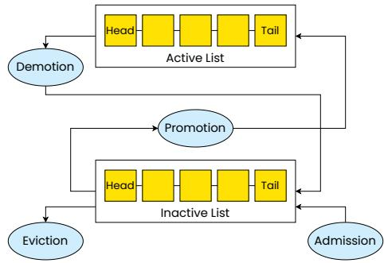  
Figure 1. Overview of the current Linux page cache eviction policy.

Therefore, to avoid compromising performance, some applications implement their own userspace-based caches [4, 30, 59, 61]. However, userspace caches are not a panacea. First, they require significant effort to implement. Second, they typically require the application to specify the size of the cache in advance. However, the amount of memory available to an application may change over time (e.g., when multiple applications run on the same physical server). Third, application-specific caches are hard to share across processes, due to security and compatibility issues. Ultimately, even applications that implement their own userspace-based cache often still rely on the page cache by default as a “secondtier” cache [4, 30, 59], allowing operators to fully utilize the server’s memory and share memory across processes. As such, despite the page cache’s limitations, it is still used extensively by storage-optimized workloads, such as key-value stores [33, 59, 70], databases [35, 61], and ML inference and training systems [14, 58].

Customizing the page cache is not an easy task – it is deeply intertwined with other performance- and correctnesscritical memory management and filesystem code paths. While work to modernize the page cache is ongoing, it does not yet seem to have achieved this goal. In particular, MGLRU, an alternative page cache eviction policy, has still not been enabled by default in upstream Linux several years after it was introduced, and it does not provide customization interfaces [18, 20]. Indeed, in §6 we show that MGLRU sometimes underperforms the default LRU algorithm, and that in general there is no single eviction policy that performs best across a wide range of workloads.

We now provide a primer on the Linux page cache. We also describe the eBPF framework, which cache\_ext uses to allow applications to write custom page cache policies.

## 2.1 Linux Page Cache

The page cache is a core component of the Linux kernel, responsible for caching data from storage. While anonymous memory pages are managed similarly to file-backed memory, in this paper we focus specifically on file-backed memory. The kernel’s default eviction policy is an LRU approximation algorithm which uses two FIFO lists, termed the active and inactive lists.1 As shown in Figure 1, when a page is first fetched from storage, it is added to the tail of the inactive list. If that page is accessed again, it will eventually be promoted to the active list. This policy uses the inactive list as a preliminary filter and keeps frequently accessed pages in the active list. On eviction, pages are removed from the head of the inactive list. If necessary, the page cache will balance the lists by demoting pages from the head of the active list to the tail of the inactive list. Notably, during balancing or shrinking, pages in the active list that have been referenced are typically demoted to the inactive list, rather than being given another chance in the active list, as is typical for LRU or CLOCK-like algorithms.

Importantly, active and inactive lists are segmented by cgroup. cgroups are a Linux mechanism that isolate resource usage for groups of processes [37]. Each cgroup has its own set of page cache lists which count toward its memory allocation, allowing for cgroup-specific eviction when its memory threshold is reached. Processes in cgroup A can access a page “owned” by cgroup B – such an access will update the page’s metadata (affecting its placement in cgroup B’s lists), but will not count against cgroup A’s memory limit. The combination of these per-cgroup lists make up the page cache as a whole.2

Pages in the page cache can be accessed through memory mappings (in which case the page table entry access bit will be set) or through file-based interfaces (e.g., read()). We focus primarily on file-based accesses.

The page cache also keeps track of “shadow entries” in order to mitigate thrashing. After a page has been evicted, these entries retain some metadata, enabling calculation of a page’s refault distance (i.e. the time elapsed between eviction and the new request). If a page has been evicted and inserted again recently enough, the kernel may decide to insert it directly into the active list instead of the inactive list. There are several additional edge cases in the kernel’s implementation, but these are the broad strokes of the existing policy.

Folios. Linux is moving away from struct pages to folios, which represent either zero-order pages (a single page) or the head page of a compound page (a set of contiguous physical pages that can be treated as a single larger page) [17]. While the page cache now largely uses folios, we use the terms “folio” and “page” interchangeably, as in our workloads all folios represent a single page.

Userspace interfaces. While LRU is a commonly-used eviction policy that works well across many workloads, there are many applications that would benefit from a different policy for their I/O requests. For example, LRU is notoriously bad for scan-like access patterns. In order to try and solve this well-known problem, the kernel provides madvise() and fadvise() system calls. These interfaces allow userspace applications to give hints to the kernel about how to handle certain ranges of memory or files.

While these hints may help in simple cases, we show in our evaluation that they do not work as expected for some workloads. Additionally, while the hints may have a semantic meaning, their actual behavior is highly dependent on the kernel implementation, which is opaque, may change across versions, and can yield unexpected results [10, 54]. Advice values may also be ignored by the kernel for a range of reasons, or may have restrictions on what memory they can be applied to. Most importantly, these hints are still subject to the basic inflexible structure of the kernel’s LRU-like policy.

## 2.2 eBPF

eBPF [27] allows userspace functions to run in a sandbox within the Linux kernel in a safe and controlled manner. eBPF has found many use cases, including observability [40], security [42, 56], scheduling [16, 41, 46], and I/O acceleration [38, 77, 80–82]. Recent work has also proposed using eBPF for customizing page cache behavior [52, 76] and prefetching [13], but as we describe in §7, these works do not provide a general and flexible interface that allows multiple processes to customize their page cache policies. eBPF programs are verified by the kernel before they can be run, ensuring, for example, that the programs do not contain illegal memory accesses, and that they will terminate within a fixed number of instructions.

struct\_ops and kfuncs. In recent years, improvements to Linux’s eBPF runtime have greatly expanded the potential functionality of eBPF programs. For example, struct\_ops exposes an interface of function-pointer callbacks to userspace. These callbacks are implemented as eBPF programs and can be called by kernel subsystems [51]. Through this infrastructure, struct\_ops makes it much easier to introduce new user-defined policies by minimizing complex verifier changes. This feature has been used for TCP congestion control algorithms, FUSE BPF filesystems, correcting HID device behavior, packet scheduling, and by sched\_ext, an eBPF scheduling framework [16, 19, 28, 39, 50].

eBPF programs interact with the kernel via kfuncs: specialized kernel functions exposed to eBPF that do not necessarily have a stable interface [49]. Properties of the arguments and return values of kfuncs are enforced by the verifier, providing some correctness guarantees. Many kfuncs that implement complex operations or modify kernel state have been added to the kernel in recent years [9]. Notably, eBPF programs also interact with the kernel through helper functions, which are considered a stable interface [36]. However, kfuncs are simpler to implement and are more flexible. As such, the eBPF subsystem is exclusively adding new functionality through kfuncs, while leaving existing helper functions in place.

## 3 Challenges

There are several challenges in allowing applications to customize the page cache using eBPF. We describe them below.

1. Scalability. Modern SSDs support millions of IOPS [24, 68], requiring the page cache to efficiently handle millions of events per second. Any changes to the page cache in order to enable custom policies must incur a low overhead, and the policies themselves must also be efficient.

2. Flexibility. Researchers have proposed many different caching algorithms. These algorithms often require custom data structures. Any interface for custom policies must be flexible enough to accommodate the diversity of existing caching algorithms and also allow for experimenting with novel policy innovations.

3. Isolation and sharing. The page cache is shared by many applications. Therefore, we must avoid a situation where one application’s policy interferes with those of other applications, while still allowing applications to benefit from the shared nature of the page cache.

4. Security. Custom eviction policies return page references to the kernel to indicate which pages to evict. This must not lead to unsafe memory references.

## 4 Design and Implementation

In this section, we present cache\_ext’s architecture and discuss how it addresses the challenges described in §3. Figure 2 shows a diagram of the system. At a high level, cache\_ext allows users to run custom eviction policy functions, which are implemented as eBPF functions in the kernel. The policy functions are triggered by particular events (e.g., folio eviction, access, admission), and operate on a user-specified number of variable-sized eviction lists, which store pointers to folios managed by the policy. The policy functions determine which folios to admit or evict to and from the lists based on metadata (e.g., access frequency, recency, which thread accessed the folio), which is stored in eBPF maps. Upon eviction, cache\_ext runs a user-defined eviction function to propose a set of eviction candidates for the kernel to evict. While this interface is relatively simple, it is also flexible, and can support a wide set of eviction policies from the literature either exactly or approximately.

We now describe cache\_ext’s design in detail, starting with our design choice to implement cache\_ext’s eviction policies within the kernel, rather than in userspace, to ensure scalability (challenge 1 from §3).

## 4.1 Policies in Kernel or Userspace?

Our first key design decision is whether to run cache\_ext’s policies in the kernel or in userspace. While from a development standpoint it might be simpler to run the eviction policies in userspace, doing so would require notifying userspace about all page cache events. However, modern SSDs can service millions of IOPS, each of which may trigger a page cache event (e.g., folio access, insertion).

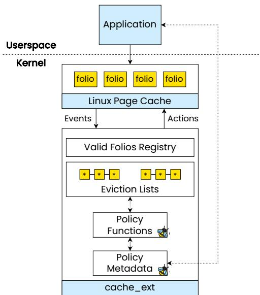

Figure 2. Overview of cache\_ext. Eviction lists hold pointers to folios.
<table><tr><td>Workload</td><td>Baseline</td><td>Benchmark</td><td>% Degradation</td></tr><tr><td>YCSB A</td><td>82,808 op/s</td><td>69,089 op/s</td><td>-16.6%</td></tr><tr><td>YCSB C</td><td>76,166 op/s</td><td>62,578 op/s</td><td>-17.8%</td></tr><tr><td>Uniform</td><td>44,618 op/s</td><td>35,443 op/s</td><td>-20.6%</td></tr><tr><td>Search</td><td>42.3s</td><td>44.4s</td><td>-4.7%</td></tr></table>

Table 1. Performance of workloads without and with userspace-dispatch.

Userspace-offload overhead. We estimate the “best-case” overhead of such a userspace-offload architecture. We attach eBPF programs to existing kernel tracepoints (folio inserted, accessed, and evicted). The eBPF programs use a lockless ring buffer to notify userspace on each event [48]. Since no userspace logic actually processes these events, this provides an optimistic measure of this architecture’s overhead.

We run two applications on an enterprise SSD to evaluate this architecture: YCSB workloads with RocksDB [70], a keyvalue store, and a file search workload using ripgrep [32], a parallelized grep-like tool, where we search the Linux kernel sources 10 times. The workloads are allocated 8 GiB and 1 GiB of memory, respectively. We run these applications on both the baseline system and with the eBPF benchmark programs. The results are presented in Table 1, with the benchmark yielding up to a 20.6% performance decrease, without even implementing a custom eviction policy.

As such, we opt to run the policies within the kernel as eBPF functions, rather than offloading decisions to userspace. We decide to use eBPF as it has already proven to match the kernel’s performance, even in performance-critical domains such as networking [38] and storage [80]. While eBPF programs face many restrictions due to the verifier, we find that cache\_ext can provide sufficient flexibility for custom policies, as we describe below.

## 4.2 Interface

Caching is an active research area, with many recentlyproposed eviction and admission algorithms [5–7, 69, 72, 73, 75, 78] that take advantage of different workload features (e.g., recency, frequency, size), using various techniques (e.g., conditional probability models [5], Markov chains [7], machine learning [69]). To ensure flexibility, cache\_ext should allow experimenting with a wide range of policies, including relatively sophisticated ones. We implement cache\_ext using struct\_ops and new kfunc APIs in accordance with modern eBPF practices. We now describe cache\_ext’s API and demonstrate how it can be used to implement a wide range of policies, addressing challenge 2 in §3.

4.2.1 Policy Functions. cache\_ext allows applications to define custom eviction policies as policy functions, a set of eBPF programs that trace caching events and determine which folios to evict from the page cache. Policy functions are triggered by five events: policy initialization, request for eviction, folio admission, folio access, and folio removal. Policy functions are implemented using eBPF’s struct\_ops kernel interface [51], as shown in Figure 3.

Eviction vs. removal. These five events are central to page cache decisions. Notably, requests for eviction and folio removal are different: in the former, the kernel asks the policy to propose folios to evict, while in the latter the kernel informs the policy that a folio was actually evicted. This distinction exists for the following reasons. A folio can be evicted in circumvention of the “normal” eviction path if, for example, the file containing it is deleted. Conversely, in rare cases, proposing a folio for eviction does not guarantee that it will be evicted (e.g., the folio is in use by the kernel).

struct\_ops. We use eBPF’s struct\_ops feature to minimize verifier changes to add new eBPF hooks. struct\_ops is designed to allow kernel subsystems to expose modular interfaces to eBPF components. struct\_ops programs are loaded into the kernel like any other eBPF program. Using struct\_ops also makes it much easier to extend cache\_ext and add new hooks. For example, we implemented an extension to cache\_ext that added a page cache admission filter with only 15 additional lines of verifier-related code, which we evaluate in §6.1.5. Our struct\_ops hooks are located within the core page cache code, requiring ∼200 lines of modifications. Once a set of policy functions is loaded and verified, the kernel will call the appropriate eBPF program when the corresponding event occurs. The eBPF programs can then manipulate the eviction data structures and metadata, as we now describe.

4.2.2 Eviction Lists. Eviction algorithms are implemented on a wide range of data structures. Nevertheless, we observe that many of these policies can be implemented either exactly or approximately using linked lists, where the policy iterates over one or more lists and evicts items based on a calculated per-item score. For example, the “classic” eviction policies, (e.g., LRU, MRU) are all based on lists, with items inserted or evicted from the head or tail of a list. Similarly, families of policies like ARC [55], segmented LRU [47] or MGLRU [18], can be implemented using multiple variable-sized lists, where items are inserted into any list or moved between lists. Even recent “state-of-the-art” policies, such as LHD, S3-FIFO, or LRB either store data directly in a list [75, 78], or sample objects and evict the ones with the lowest score [5, 69].

```c
// Policy function hooks
struct cache_ext_ops {
s32 (*policy_init)(struct mem_cgroup *memcg);
// Propose folios to evict
void (*evict_folios)(struct eviction_ctx *ctx,
struct mem_cgroup *memcg);
void (*folio_added)(struct folio *folio);
void (*folio_accessed)(struct folio *folio);
// Folio was removed: clean up metadata
void (*folio_removed)(struct folio *folio);
char name[CACHE_EXT_OPS_NAME_LEN];
};
struct eviction_ctx {
u64 nr_candidates_requested; /* Input */
u64 nr_candidates_proposed; /* Output */
struct folio *candidates[32];
};
Figure 3. struct_ops for cache_ext and eviction context.
```

In order to facilitate an interface flexible enough for all these policies, cache\_ext is built around an eviction list API, a simple interface for policies to construct and manipulate a set of variable-sized linked lists. Each node in the list corresponds to a single folio, and stores a pointer to that folio, rather than the folio itself. Importantly, the actual folios are still stored and maintained by the default kernel page cache implementation, in order to minimize changes to the kernel.

kfuncs. This API is implemented as a set of eBPF kfuncs (kernel functions that are exposed to eBPF) and is shown in Table 2.3 For example, init() can call list\_create() to create a new eviction list, and folio\_added() can call list\_add() to add the folio to a list. Newly-created lists are added to a “registry”, an internal per-policy hash table which maps from list IDs (exposed to eBPF) to the lists themselves. Notably, these lists are indexed – that is, given a folio pointer, the APIs can directly obtain that folio’s list node. This is necessary for operations such as deletion from the list, and is facilitated using a per-policy hash table which maps from folios to list nodes. We discuss this hash table further in §4.4.

<table><tr><td rowspan=1 colspan=1>EvictionlistAPI</td></tr><tr><td rowspan=1 colspan=1>u64 list_create(struct mem_cgroup *memcg)</td></tr><tr><td rowspan=1 colspan=1>int list_add(u64 list，struct folio *f，bool tail)</td></tr><tr><td rowspan=1 colspan=1>int list_move(u64 list，struct folio *f，bool tail)</td></tr><tr><td rowspan=1 colspan=1>int list_del(struct folio *f)</td></tr><tr><td rowspan=1 colspan=1>int list_iterate(struct mem_cgroup *memcg，u64 list,s64(*iter_fn)(int id，struct folio *f),struct iter_opts *opts，struct eviction_ctx *ctx)</td></tr><tr><td rowspan=1 colspan=1>Tahle 2 cache ext eyiction list APL</td></tr></table>

Table 2. cache\_ext eviction list API.

4.2.3 Eviction Candidate Interface. Policy functions iterate over their eviction lists in order to determine which folios to evict. Note that policies do not directly evict folios – rather, they propose eviction candidates to the kernel, which checks if the folios are indeed valid eviction targets (i.e. not pinned or in use by the kernel) and evicts them if they are. Eviction candidates are proposed to the kernel in batches of up to 32 folios. Most of cache\_ext’s changes to the core page cache code are to facilitate this batched eviction process.

List iteration. eBPF currently does not provide a straightforward way to iterate over the eviction lists, so cache\_ext provides a new iteration kfunc which allows policy functions to iterate over an eviction list and make decisions for each node. Specifically, list\_iterate() takes a list to iterate over, an iter\_opts struct, an eviction context, and a callback function. list\_iterate() maintains an iteration counter and calls the callback function on each node. The callback function (which is also an eBPF program) then decides whether to keep or evict the passed folio. Folios chosen for eviction are added to the candidates array in the eviction\_ctx struct. The iter\_opts struct specifies how the interface should treat evaluated folios. For example, they can be left in place, moved to the tail of the list, or moved to a different list. This enables implementing policies that make use of multiple lists and require balancing the lists, such as S3-FIFO or ARC.

We provide two modes for this interface. In the “simple” mode, list\_iterate() runs until enough candidates are chosen (e.g., 32) using the callback function’s return value to indicate whether to skip the folio or evict it. In the “batch scoring” mode, the callback function returns scores for ?? folios. list\_iterate() then selects the ?? folios with the lowest score for eviction. This mode can be used for policies such as LFU.

4.2.4 eBPF limitations. We ran into a number of challenges when implementing cache\_ext’s eviction lists. eBPF maps, the standard way to maintain state in eBPF programs, do not provide interfaces that both store items in a specified order while also providing random access, both of which are necessary to implement eviction properly. Specifically, eBPF provides maps such as BPF\_MAP\_TYPE\_QUEUE and

```c
u64 lfu_list;
int lfu_policy_init(struct mem_cgroup *cg) {
lfu_list = list_create(cg);
return 0;
}
void lfu_folio_added(struct folio *folio) {
u64 freq = 1;
list_add(lfu_list, folio, true); // Add to tail
bpf_map_update_elem(&freq_map, &folio, &freq);
}
void lfu_folio_accessed(struct folio *folio) {
u64 *freq = bpf_map_lookup_elem(&freq_map, &folio);
__sync_fetch_and_add(freq, 1); // Increment freq
}
long score_lfu(int id, struct folio *folio) {
return bpf_map_lookup_elem(&freq_map, &folio);
}
void lfu_evict_folios(struct eviction_ctx *ctx, struct
mem_cgroup *cg) {
struct iter_opts opts = { /* Set scoring mode */ };
list_iterate(cg, lfu_list, score_lfu, &opts, ctx);
}
void lfu_folio_removed(struct folio *folio) {
bpf_map_delete_elem(&freq_map, &folio);
}
```  
Figure 4. Simplified LFU implementation with cache\_ext.

BPF\_MAP\_TYPE\_STACK, which provide pop() and push() operations, but do not allow deleting or accessing elements from the “middle” of the map. Conversely, BPF\_MAP\_TYPE\_HASH provides random access, but no method to easily maintain an ordering of elements (e.g., MRU order). A notable exception is BPF\_MAP\_TYPE\_LRU\_HASH, which provides both an LRU structure and random-access, but is too deeply tied to its specific algorithm for our purposes [23]. This necessitated the development of a custom data structure for cache\_ext.

While eBPF has introduced experimental support for custom data structures and more complex locking in eBPF, this support is not yet mature enough for our use case [2, 21, 26]. As such, we designed our list API to be managed by the kernel and exposed to eBPF via kfuncs. Additionally, in order to avoid concurrency issues and verifier limitations around locking, the provided API is concurrency-safe and makes use of locks under the hood, in the kernel implementations. As eBPF matures, new features could further reduce overhead and provide even more flexibility for eBPF policies.

4.2.5 Example: LFU Policy. To illustrate how cache\_ext’s policy functions can be used to implement custom policies, we walk through implementing a simple eviction policy, LFU, using cache\_ext. LFU evicts the least-frequently accessed item in the list, which requires storing access frequency metadata. Our LFU implementation uses a single list and an eBPF map for frequencies. It approximates LFU with cache\_ext’s batch scoring mode to select the ?? (e.g., 32) least-frequently accessed folios out of the first ?? (e.g., 512) folios.

A simplified version of the policy is shown in Figure 4. When the policy is loaded, lfu\_policy\_init() is called, creating a new eviction list. On insertion, lfu\_folio\_added() adds the folio to the tail of the list using list\_add() and sets its frequency to 1 in the freq\_map eBPF map (not shown). When a folio is accessed, we increment its frequency. On eviction, lfu\_evict\_folios() calls list\_iterate(), which calls the score\_lfu() callback function on ?? nodes in the list, until ?? eviction candidates are proposed. The score function returns the frequency of each folio as its score. list\_iterate() then selects the ?? folios with the lowest scores, which are added to ctx->candidates as eviction candidates. Folios not selected as eviction candidates are then moved to the end of the list by list\_iterate(). The kernel will then attempt to evict the eviction candidates. When a folio is evicted, lfu\_folio\_removed() is called, and the folio’s metadata is removed from the map. Note it is not necessary to remove the folio from the list upon eviction, as this is done by cache\_ext. We discuss this point further in §4.4.

## 4.3 Isolation

We now tackle the third challenge from §3: allowing applications to deploy their own policy functions without interfering with other applications’ policies, while preserving the sharing property of the page cache, whereby applications can avoid having to load duplicate pages into memory.

cgroups. We observe that implementing policies within a cgroup can address this challenge, due to the fact that within a cgroup, processes have the same custom eviction policy, and different cgroups can each use their own eviction policy. In addition, deploying per-cgroup policies fits the common pattern of deploying modern applications via containers, which isolate each application in its own memory cgroup. Note that processes from cgroup A can still access page cache memory managed by cgroup B, and benefit from accessing shared data. However, both cache\_ext and the baseline page cache are not fully isolated. If a page critical for cgroup A is managed by cgroup B, which evicts it, that could lead to a performance degradation. In that case, cgroup A will likely bring the page back into memory and manage it in the future. However, we believe that such workloads are rare in practice, as it is unlikely that two applications with entirely different access patterns will operate on the exact same files frequently enough to cause a problem.

We extend eBPF’s struct\_ops functionality to support cgroup-specific struct\_ops for per-cgroup policies (it currently only supports system-wide policies). This involved adding a cgroup identifier (in the form of a file descriptor) to the kernel’s struct\_ops loading interface, along with corresponding libbpf interfaces in userspace.

## 4.4 Security

Memory Safety. We must ensure that cache\_ext prevents unsafe memory accesses (challenge 4 from §3). Specifically, cache\_ext must ensure that eBPF programs only return valid pointers (i.e. in the eviction candidate interface). Otherwise, a malicious eBPF program could return invalid values, leading to memory corruption or a kernel crash. We note that sched\_ext solves this in part by using PIDs as identifiers for processes. However, folios do not have analogous easilyobtainable unique identifiers, so we resort to using pointers.

In order to validate these pointers, we implement a “valid folios” registry in the kernel. When a folio is inserted, it is added to the registry. When a folio is evicted, it is removed from the registry. When cache\_ext proposes folio eviction candidates, the kernel uses the registry to verify that each candidate is indeed a valid folio before proceeding with eviction. This registry is implemented as a hash table with a per-bucket lock, which also stores a folio’s list node (as described in §4.2.2), which maps from folio pointer to list node. We find that this design incurs minimal overhead, which we evaluate in §6.3. Future developments in eBPF may make it easier to keep track of “trusted” pointers, potentially allowing us to remove this check and further reduce overhead.

Eviction fallback. We protect against adversarial behavior by providing a fallback for eviction. For example, if the kernel asks a faulty policy to evict 10 folios, but it only proposes 5 candidates, the kernel will fall back to its default policy and evict additional folios. Similarly, when a folio is evicted, the kernel ensures that it is removed from any eviction lists, in order to release memory resources and minimize stale references lying around. Similar fallbacks are present in other frameworks, such as sched\_ext, which implements a watchdog that forcibly removes misbehaving policies.

kfuncs. We ensure that cache\_ext’s list kfuncs verify inputs, perform bounds-checking, and enforce loop termination, in order to minimize potential security risks. We note that kfuncs are the current best practice for eBPF to interface with complex data structures, and have been used in multiple upstream kernel components, such as sched\_ext [16].

Root privileges. Loading cache\_ext policies requires root privileges, like other eBPF frameworks. This impacts both security and usability. Custom scheduling frameworks like sched\_ext and ghOSt [16, 41] mitigate this with a privileged policy loader, allowing policies to be managed through systemd. We envision a similar solution for cache\_ext.

## 4.5 Kernel Implementation Complexity

Implementing cache\_ext required adding ∼2000 lines to the kernel. Only a fraction of these lines modified the core kernel: 210 lines in the page cache (mostly the eBPF hooks and eviction candidate batching), 80 lines in the verifier (registering our callback functions), and 80 lines in cgroup code. Implementing per-cgroup struct\_ops required 220 lines in the kernel and 75 lines in libbpf. The remaining lines implemented pure cache\_ext functionality: 750 lines for cache\_ext’s eviction list kfuncs and 580 lines for registry operations.

## 5 Policies

In this section, we describe our experience implementing several custom page cache policies on cache\_ext: from simple “classic” policies (MRU and LFU) to state-of-the-art policies such as LHD [5], which uses conditional probabilities to model different page features (e.g., age, frequency), and S3- FIFO [75]. We also re-implemented the newly-introduced kernel policy MGLRU [18] on cache\_ext, and in §6.3 compare the cache\_ext version with the native-kernel version. We also explore how an application can make its eviction policy aware of application-specific information, such as assigning different priorities to specific types of requests.

## 5.1 S3-FIFO

S3-FIFO [75] is a recent caching policy designed for keyvalue caches, which uses three FIFO queues to quickly remove “one-hit wonders” (keys that are accessed only once). It has been shown to yield high throughput for in-memory key-value caches. S3-FIFO uses a main FIFO and a small FIFO to hold ∼90% and 10% of the objects, respectively. New objects are added to the small FIFO. The small FIFO filters out short-lived objects, while objects that are accessed more often are promoted to the main FIFO. It uses a third ghost FIFO to track recently-evicted objects, in order to promote them to the main FIFO on readmission.

Implementation. We create eviction lists for the main and small FIFOs, and a BPF\_MAP\_TYPE\_LRU\_HASH map for the ghost FIFO. The map then automatically removes entries from the ghost FIFO in LRU order when it hits capacity. When a folio is evicted, we create a ghost entry using a pointer to its struct address\_space (which represents a file’s contents), along with the folio’s offset in the file, as the key. Note that we cannot use folio pointers as the key, as they are not persistent across evictions. We maintain folio access frequencies in an eBPF map. We use eviction candidate requests to evict folios, but also to maintain the 90-10 ratio between the main and small lists. We use cache\_ext’s eviction iteration interface: if a folio’s access frequency is greater than 1, we move it to the tail of the main list, balancing the lists. Otherwise, we propose the folio for eviction, and move it to the tail of the small list so that it isn’t considered again before it is evicted. When evicting from the main list, we use the iteration interface to find folios with access frequency of 0.

## 5.2 Least Hit Density (LHD)

LHD is a sophisticated eviction policy that uses conditional probabilities to predict future object accesses [5]. LHD uses a hit density metric to determine which objects should be evicted, along with a dynamic ranking approach which allows it to automatically tune its eviction policy over time.

We use one eviction list, with folios divided into classes based on their last access and their age at that time. Each class stores statistics (e.g., hits, evictions, hit densities) for different folio ages. Folios use metadata from classes based on which class they most closely correspond to at a given time. We maintain folio metadata, such as last access time, in an eBPF map. LHD iterates over the list and selects the folios with the lowest hit density as eviction candidates. To maintain accurate hit densities, LHD requires periodically “reconfiguring” its statistics in order to ensure that its probability distributions are accurate and aged appropriately over time using an exponentially weighted moving average (EWMA).

Reconfiguration. Reconfiguration runs every ?? folio insertions or accesses (where ?? is a relatively large number $- \ \mathrm { e . g . } , \ 2 ^ { 2 0 } )$ . Reconfiguration is a relatively expensive process, as it updates all metadata. In order to avoid the page cache’s insertion or access hot paths, we use an eBPF ring buffer to notify userspace that reconfiguration needs to take place. Userspace then calls a BPF\_PROG\_TYPE\_SYSCALL program, which runs an eBPF program without attaching it to a specific hook. This program then performs the required reconfiguration, including computing updated hit densities, and scaling or compressing distributions as necessary. We use atomic operations to ensure that the page cache can continue using these values, albeit with some potential inaccuracy, which we permit for the sake of performance. While we could implement this reconfiguration step in userspace, doing so would have required numerous syscalls to interact with eBPF maps, and atomic updates would not have been possible. Additionally, we note that in a standard LHD policy, hit densities and other parameters are stored as floatingpoint values. However, eBPF does not support floating-point operations, so we resort to scaling values by a large constant in order to approximate such calculations.

## 5.3 Multi-Generational LRU (MGLRU)

MGLRU is a complex page eviction policy that was recently added to the Linux kernel [18]. MGLRU groups folios into generations, each capturing folios with similar access recency. Each generation is a list and is further divided into tiers, with tiers acting as logarithmic buckets based on access frequency. The kernel maintains up to four generations and four tiers per generation. Eviction starts from the oldest generation, using a tier threshold computed by a PID controller based on eviction and refault statistics. Pages above the threshold are promoted to the next generation; others are evicted.

Concretely, generations are implemented as eviction lists, stored in a circular buffer. We track the minimum and maximum generation numbers – min\_seq and max\_seq, respectively. A generation number is mapped to its eviction list by computing the generation number modulo max\_nr\_gens to find the list index. A new generation is created (aging) by incrementing max\_seq. When the oldest generation is empty, it is retired by incrementing min\_seq. We use a map to store the generation and access frequency of each folio. We port the PID controller logic from the kernel, and maintain the global statistics it needs using atomic operations. Refault detection, needed for computing refault statistics, is implemented using ghost entries, similar to the S3-FIFO policy in §5.1. Finally, we serialize the generation aging operations using an eBPF spinlock. On folio insertion, we calculate the folio’s generation and add the folio to the generation’s head. On eviction, the policy iterates the minimum generation list, obtains a tier threshold from the PID controller, and selects folios below the threshold as eviction candidates, while promoting folios above the threshold.

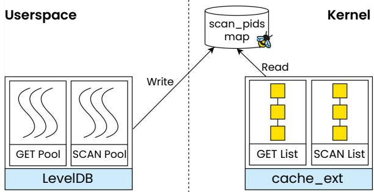  
Figure 5. Overview of GET-SCAN policy implementation.

## 5.4 Classic Policies: LFU, MRU, FIFO

We implemented three additional “classic” eviction policies: LFU, MRU and FIFO. §4.2.5 describes our LFU implementation. For MRU, we add folios to the head of the list upon insertion, and move them to the head on access. However, if we evict folios right after they are added to the page cache, they may still be in use by the kernel to service the I/O request. This would lead to the kernel refusing to evict the folios and resorting to the fallback path to evict folios. Therefore, we skip a small fixed number of folios when iterating the eviction list before proposing eviction candidates. For FIFO, folios are removed from the head of the eviction list.

## 5.5 Application-Informed Eviction (GET-SCAN)

In addition to enabling the implementation of a variety of general eviction algorithms, cache\_ext enables applications to use eviction algorithms tailored to their design. In other words, the eviction algorithm can be made aware of application-level abstractions and uses this information to make better decisions. To illustrate the value of applicationinformed policies, consider the case of heterogeneous queries in databases. For example, a database serving financial transactions could see many small queries for individual payments, while also performing slower scan-like queries in the background to conduct fraud detection, reconciliation, and other business processes. While these scan-like queries are important, they typically have more relaxed service-level objectives. However, these large scan-like requests can “pollute” the page cache and degrade the performance of the smaller requests, as generic eviction algorithms struggle to isolate the folios used by these requests. Ideally, the page cache should prioritize the small requests over the large ones in the presence of memory pressure. We note that such workloads have frequently been examined in the literature [45, 46]. Using cache\_ext, we can build an application-informed policy that is aware of the different request types.

A folio accessed by a SCAN should not be worth the same as a folio accessed by a GET. To implement prioritization, the policy uses two eviction lists: one for folios inserted by GETs, and the other for those inserted by SCANs. When loading the policy, the application initializes an eBPF map with the PIDs of the SCAN threads. When a folio is inserted, the policy checks whether the PID of the current task is in the map to determine which eviction list to add the folio to. Each eviction list independently maintains an approximate LFU policy, as described in §4.2.5. When the kernel requests eviction candidates, the policy prioritizes evicting folios from the SCAN list. Figure 5 illustrates this policy.

## 5.6 Application-Informed Admission Filter

As mentioned in 4.2.1, we extend cache\_ext to also support an admission filter hook. When a folio is requested and is not yet present in the page cache, the admission filter determines whether to allow the folio into the page cache, or to service it analogously to a direct I/O request. Such a hook is useful for preventing thrashing in workloads that may need to read many pages once, but cannot use direct I/O for performance or coherency reasons. For example, LSM-tree key-value stores use a compaction process which periodically reads large files potentially unrelated to servicing requests, resulting in thrashing of “relevant” files. However, direct I/O cannot easily be used for these large reads, as these files (using the same file descriptor) may still be read from the page cache by other threads to process requests.

To this end, we create an admission policy that prevents this thrashing behavior, by preventing background compaction from evicting folios that will be needed for read requests in the critical path, on an LSM-tree key-value store (RocksDB). When RocksDB spawns compaction threads, we place the thread TIDs in an eBPF map. When a folio is proposed to be added to the page cache, the policy checks whether the thread adding it is a compaction thread in the TID map. If so, our policy does not add it to the page cache. Otherwise, it is added to the page cache in the “normal” path.

## 6 Evaluation

We aim to answer the following questions:

Q1: Can cache\_ext policies improve application performance with low developer effort? (§6.1)

Q2: Can different applications use different policies without interfering with each other? (§6.2)

Q3: What is the overhead of cache\_ext? (§6.3)

System configuration. We conduct our experiments on Cloudlab [25] c6525-25g machines, with a 16-core AMD Rome CPU, 128GB of memory and a 480GB SSD drive. We use CPU-pinning and disable SMT, swap, and address space randomization to make our results more reproducible. We also drop the page cache before each test. We run Ubuntu 22.04 with Linux v6.6.8 as the kernel.

## 6.1 Custom Policies (Q1)

In this section, we evaluate the policies described in §5 on a number of different workloads and configurations.

6.1.1 YCSB. We evaluate our policies by running LevelDB [33], a popular key-value store, on the YCSB (Zipfian) workloads, as well as against uniform and uniform-readwrite workloads. We compare the custom policies against both the default and MGLRU Linux policies, using a 100GiB database with a 10GiB cgroup. We slightly modify LevelDB to always use pread() instead of mmap() to improve performance across the board. While LevelDB will sometimes use pread(), RocksDB, an optimized fork of LevelDB, makes a similar modification to improve performance.

Our results in Figure 6 show that cache\_ext’s LFU policy performs best, outperforming both the default and MGLRU policies, for all the evaluated workloads, except for YCSB D, which only uses the latest key-value pairs and as such is cached entirely in-memory. This is not surprising: LFU should be an ideal policy for YCSB, since YCSB by default assigns a fixed Zipfian distributed for the access distribution of each key. Therefore, a frequency-based policy should perform best. cache\_ext’s LFU achieves up to 37% better throughput than the default Linux policy, and interestingly, it outperforms MGLRU by an even greater margin. We note that LHD and S3-FIFO also outperform the Linux policies; in particular, LHD provides throughput very similar to LFU. As expected, the MRU policy performs worse than the baseline, due to its mismatch with the workload’s access pattern. However, our simple FIFO policy slightly outperforms MGLRU in most cases, but not the default policy, likely due to its low overhead compared to MGLRU. We also measure the P99 read latency, for which cache\_ext beats the default policy by up to 55%. Note that YCSB D’s tail latency barely registers in the figure due to its lack of disk accesses.

Disk access. Since the page cache doesn’t expose systemwide hit-rate metrics and external tools may yield inaccurate results [34], we use disk access as a proxy to analyze policy behavior. We record the total disk I/O (reads and writes)

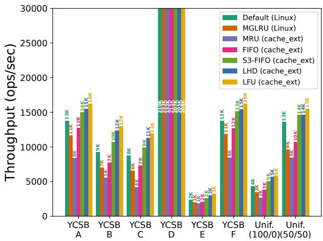  
(a) Throughput.  
(b) P99 latency.

Figure 6. YCSB workload results.  
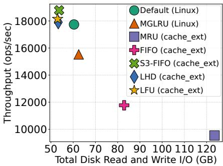  
(a) YCSB A.

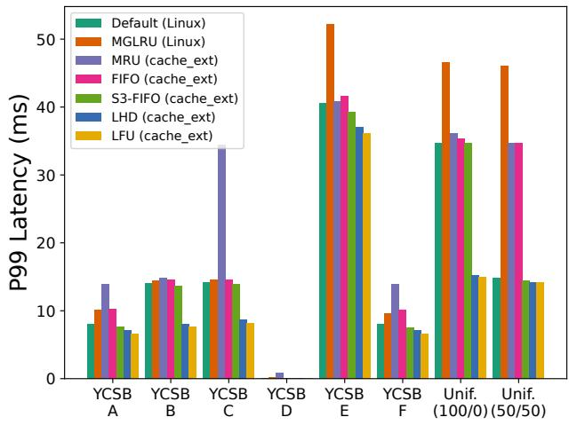

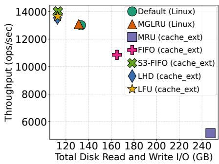  
(b) YCSB C.  
Figure 7. YCSB throughput vs. total disk I/O.

when running the YCSB workloads for 8 million keys. Figure 7 demonstrates an inverse relationship between throughput and disk I/O for YCSB A and C. We observed similar results for the other workloads. These results illustrate how policies impact performance – those that make good caching decisions (e.g., LFU, LHD) interact with disk less, increasing throughput, while those that don’t (e.g., FIFO, MRU) introduce additional disk overhead.

Takeaway 1: cache\_ext can significantly improve application performance even with simple policies (e.g., LFU) that match the application’s access patterns.

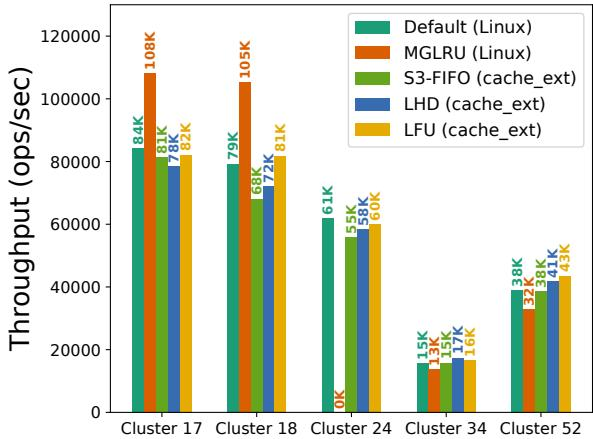  
Figure 8. Twitter workload results (LHD, S3-FIFO, and LFU policies) using LevelDB. No one policy performs best across the different clusters.

6.1.2 Twitter Traces. For many real-world workloads, it may not be obvious in advance which policy works best for a given workload. cache\_ext makes experimentation easy, allowing developers to implement a set of policies and empirically choose the best one for each workload.

We evaluate our LHD, LFU, and S3-FIFO policies on production traces from the Twitter cache workloads [74]. The workloads divide the traces by cluster ID. We compare these policies to Linux’s default and MGLRU policies. Each cluster was evaluated with a cgroup size set to 10% of the cluster’s data size using LevelDB. As shown in Figure 8, we find that, in general, there is no single policy that is best for all workloads. While LHD beats the default and MGLRU policies by 13% and 30%, respectively, on cluster 34, and LFU beats them by 13% and 34% on cluster 52, MGLRU dominates on clusters 17 and 18. In cluster 24, the default policy is best, while MGLRU consistently resulted in out-of-memory errors, hence its throughput is equal to zero in the graph. Meanwhile, S3-FIFO beats or matches the baseline on clusters 34 and 52, but does not outperform the other cache\_ext policies.

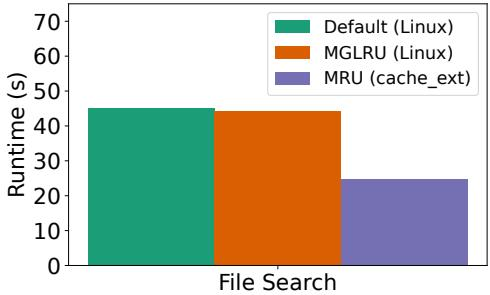  
Figure 9. File search workload results (MRU policy).

6.1.3 File Search. We construct a file search workload that searches the Linux kernel codebase (v6.6), using the multithreaded ripgrep CLI tool [32]. More specifically, we perform 10 searches within a 1GiB cgroup, which is roughly 70% the size of the codebase (excluding Git history). File search would be a particularly challenging workload for Linux’s LRU-based policies, since it involves a large amount of scans. We compare the cache\_ext MRU policy with the default Linux kernel policy as well as the kernel’s experimental MGLRU policy. The results in Figure 9 show that cache\_ext is almost 2× faster than both baseline and MGLRU, since both policies suffer from the scan “pathology” of LRU.

Takeaway 2: There is no one-size-fits-all policy that performs best for all workloads. Customization and experimentation are necessary to maximize performance.

6.1.4 Application-Informed Policy (GET-SCAN). To simulate the application we describe in §5.5, we run LevelDB with a mixed SCAN/GET workload. This workload is highly skewed and is composed of 99.95% GET requests with a few SCAN requests (0.05%). We use a separate thread-pool for SCAN requests to avoid head-of-line blocking at the scheduling level, as per prior work [45, 46], with a disjoint set of threads handling GET requests. While the workload exhibits good cache locality for GETs, it has poor locality for SCANs, which span many folios and exhibit high reuse distance. The default kernel policy does not handle this scenario well, leading to cache pollution due to the SCAN folios.

To evaluate the policy, we compare against Linux’s default and MGLRU policies, and various fadvise() options: FADV\_DONTNEED, FADV\_NOREUSE and FADV\_SEQUENTIAL (on top of the default policy). We apply these options to files used by SCAN requests, in order to inform the kernel that we plan to read the files sequentially or only once (SEQUENTIAL and NOREUSE) or that we no longer need the folios after their use (DONTNEED). As shown in Figure 10, cache\_ext’s applicationinformed policy achieves 70% higher throughput and 57% lower P99 latency for GETs, while SCANs experience an 18% throughput decrease. In addition, the fadvise() options do not help much, demonstrating the inadequacy of existing kernel page cache interfaces compared to cache\_ext. MGLRU performs even worse than the default LRU.

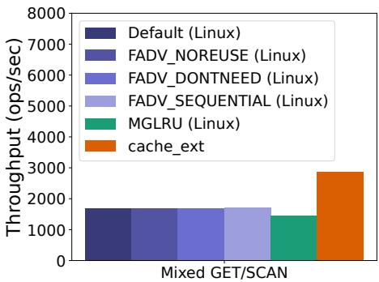

(a) GET throughput.  
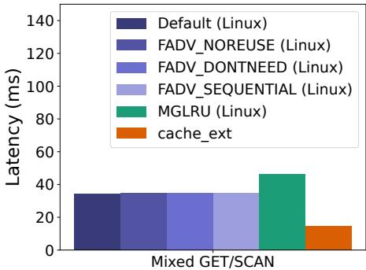  
(b) GET P99 latency.  
Figure 10. Mixed GET-SCAN workload results.

6.1.5 Application-Informed Admission Filter. We run our admission policy that filters folios fetched by background compaction (§5.6) on RocksDB [70] with a uniform R/W workload. This simple admission filter improves P99 latency by 17% (from 2.61ms to 2.16ms), because folios required for read requests are not evicted by folios accessed by the compaction threads. We do not see a meaningful difference in throughput, which is expected, as compaction is infrequent.

Takeaway 3: Even very simple application-aware eviction policies can significantly improve performance. Takeaway 4: Existing Linux page cache customization interfaces are insufficient.

6.1.6 Implementation Complexity. Table 3 shows the lines of eBPF and userspace loader code necessary to implement each of the aforementioned policies. The policies are all implemented in at most a few hundred lines of code, a much smaller amount than would be necessary to implement them within the kernel (or in userspace). We find that cache\_ext reduces the complexity of developing new policies by using its list and policy function abstractions. In addition, developer experience and velocity are greatly improved, since eBPF prevents kernel crashes and many types of bugs, enabling developers to focus on the policy logic. We found that it was much easier to experiment with policies with cache\_ext without having to worry about breaking the kernel. For example, we easily introduced various tweaks into our MRU and LFU policies and evaluated different versions of S3-FIFO and LHD in order to find the best design. Thus, cache\_ext allows developers to accelerate their applications with a relatively modest amount of effort, while also easily enabling experimentation with policy innovations.

<table><tr><td>Policy</td><td>eBPFLoC</td><td>Userspace LoC</td></tr><tr><td>Admission filter</td><td>35</td><td>262</td></tr><tr><td>FIFO</td><td>56</td><td>131</td></tr><tr><td>MRU</td><td>101</td><td>101</td></tr><tr><td>LFU</td><td>215</td><td>110</td></tr><tr><td>S3-FIFO</td><td>287</td><td>157</td></tr><tr><td>GET-SCAN</td><td>324</td><td>112</td></tr><tr><td>LHD</td><td>367</td><td>165</td></tr><tr><td>MGLRU</td><td>689</td><td>105</td></tr></table>

Table 3. Lines of eBPF and userspace loader code in cache\_ext policies.

Additionally, we have open sourced all of our policies, allowing developers to easily try them with their applications, lowering the barrier to entry for using cache\_ext.

Takeaway 5: Overall implementation complexity for cache\_ext policies is modest, even for complex policies.

## 6.2 Isolation (Q2)

The Linux page cache already provides a measure of isolation by establishing per-cgroup LRU lists. cache\_ext utilizes this to enable each cgroup to have its own custom policy. We demonstrate the utility of this by simulating and comparing against “global” policies, as opposed to cache\_ext’s per-cgroup policies. We create two cgroups, one running a YCSB C workload with LevelDB, and the other running a file search workload with ripgrep. The YCSB cgroup is allocated 10GiB and the file search cgroup is allocated 1GiB. We run four configurations: both cgroups using the default policy, both using LFU, both using MRU, and a “tailored” setup: YCSB with LFU and file search with MRU.

Evaluation. File search performance is measured by number of searches executed in a fixed time span (7 minutes). YCSB performance is measured in terms of throughput. Figure 11 shows that the tailored setup beats the other configurations, yielding 49.8% and 79.4% improvements for YCSB and file search, respectively, over the baseline. While the other two cache\_ext configurations provide performance improvements for the workloads corresponding to their policy, they can significantly degrade the performance of the other workload, demonstrating that global policies are not a viable solution. Note that YCSB performs better in the tailored setup compared to the global LFU configuration (and vice versa for file search compared to the global MRU configuration). This is due to improved caching of the workloads yielding reduced disk contention. The file search workload improves in the LFU configuration for the same reason.

Takeaway 6: Using cache\_ext with per-cgroup policies allows for fine-grained control and improved performance.

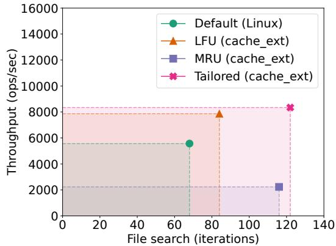  
Figure 11. Isolation workload results: a file search workload (number of searches executed) and a YCSB C workload (throughput) running concurrently in two cgroups. Up and to the right is better.

<table><tr><td>cgroup size</td><td>Linux default</td><td>cache_ext no-op</td><td>Overhead (%)</td></tr><tr><td>5 GiB</td><td>234.80</td><td>236.51</td><td>0.72%</td></tr><tr><td>10 GiB</td><td>217.48</td><td>221.14</td><td>1.66%</td></tr><tr><td>30 GiB</td><td>197.67</td><td>198.01</td><td>0.17%</td></tr></table>

Table 4. cache\_ext ??CPU per I/O operation using fio.

## 6.3 Memory and CPU Overhead (Q3)

The advent of faster and larger storage devices means that the page cache (and cache\_ext) must be able to handle millions of events per second. We run a number of micro-benchmarks to investigate cache\_ext’s memory and CPU overhead.

6.3.1 Memory Overhead. cache\_ext’s primary memory usage is the valid folios registry hash table (§4.4). In the worst case, we set up the hash table with as many buckets as there are 4KiB pages in the cgroup (based on its configured size). Each bucket requires 16 bytes to store the hash table’s internal list pointers. Thus, the memory overhead for an empty registry is: $\textstyle { \frac { 1 6 } { 4 0 9 6 } } = 0 . 4 \%$ . Following the same logic, each filled entry in the hash table uses 32 more bytes for the cache\_ext list node, so the full registry memory overhead is 1.2%. Therefore, the memory overhead for cache\_ext’s registry is between 0.4%-1.2% of a policy’s cgroup’s memory. This overhead can be further reduced with recent improvements to eBPF’s handling of kernel objects, allowing eBPF to directly ensure that some pointers are trusted.

6.3.2 CPU Overhead. To measure the baseline CPU overhead of our framework, we use a no-op cache\_ext policy and run the fio microbenchmark [3] with 8 threads on a randread workload. A no-op policy defers to the default kernel eviction policy while still maintaining cache\_ext data structures, allowing us to measure the baseline CPU overhead imposed by cache\_ext. We compare to the default Linux policy, using a metric of CPU usage per I/O operation (measured in ??CPUs, i.e. one-millionth of a CPU). Table 4 shows that the CPU overhead of no-op cache\_ext is at most 1.7%.

<table><tr><td rowspan=1 colspan=1>YCSB A</td><td rowspan=1 colspan=1>B</td><td rowspan=1 colspan=1>C</td><td rowspan=1 colspan=1>D</td><td rowspan=1 colspan=1>E</td><td rowspan=1 colspan=1>F</td><td rowspan=1 colspan=1>Uniform</td><td rowspan=1 colspan=1>UniformR/W</td></tr><tr><td rowspan=1 colspan=1>0.97</td><td rowspan=1 colspan=1>0.99</td><td rowspan=1 colspan=1>0.96</td><td rowspan=1 colspan=1>0.98</td><td rowspan=1 colspan=1>0.98</td><td rowspan=1 colspan=1>0.99</td><td rowspan=1 colspan=1>1.06</td><td rowspan=1 colspan=1>1.05</td></tr></table>

Table 5. Relative performance of cache\_ext vs. baseline MGLRU with YCSB. The harmonic mean is 0.99, indicating a 1% slowdown on average.

6.3.3 Overall Application Impact. To estimate the overall impact of cache\_ext to application performance, we reimplemented the kernel’s MGLRU policy, as described in §5.3. We compare the throughput achieved by the Linux MGLRU implementation with the cache\_ext implementation. Table 5 shows the relative performance for each YCSB benchmark (shown in §6.1.1), calculated as cache\_ext throughput over baseline MGLRU throughput. The two implementations perform very similarly, with an average 1% throughput decrease.

Takeaway 7: cache\_ext incurs relatively low overhead.

## 7 Related Work

eBPF policy customization in Linux. There has been recent work on customizing memory management policies using eBPF, such as huge page placement, page fault handling, and page table designs [60, 66, 83]. P2Cache is a recent concurrent proposal for a framework that uses eBPF to customize page cache policies [52]. While P2Cache is conceptually similar to cache\_ext, it only allows LRU or MRU ordering with a single queue, limiting the types of policies that can be implemented. Similarly, PageFlex [76] customizes prefetching and swapping policies by offloading policies to userspace using eBPF for event notifications and madvise() to communicate policy decisions. PageFlex focuses on memory mapping-based page access rather than file-based access. PageFlex only delegates some “non-performance-critical” decisions to the custom policy and enforces these decisions through madvise() hints. In contrast, by implementing policies in-kernel, cache\_ext can delegate all policy decisions to custom policies and enforce them directly.

FetchBPF allows customizing Linux’s memory prefetching policy, and could easily be integrated into cache\_ext as an additional hook [13]. We note that prefetching policies typically utilize significantly simpler data structures than page eviction policies. Additionally, FetchBPF does not consider multi-tenant isolation or application-informed policies.

Interestingly, the authors of Linux’s MGLRU have proposed adding eBPF hooks to determine which generation a page should be placed in, but they have not presented a design nor implementation of such a mechanism [20].

sched\_ext is an eBPF framework for custom Linux scheduling policies [16]. sched\_ext policies can be implemented entirely in eBPF, like cache\_ext, or scheduling decisions can be offloaded to userspace for more complex scheduler implementations. This userspace dispatch approach is more performant for process scheduling than page eviction, as there are orders of magnitude fewer processes on a machine than pages in memory, and process scheduling occurs less frequently than page cache events (e.g., page access).

Extensible kernels. In the ’80s and ’90s page cache customization was introduced as a use case for extensible kernels [1, 8, 29, 65], which allow applications to customize kernel interfaces and policies. For example, VINO [65, 67] and SPIN [8] allow applications to customize buffer cache eviction, admission, and prefetching policies. These OS designs never achieved widespread use, even though some of their underlying ideas have become relevant again with the adoption of eBPF, which enables extensibility within monolithic kernels like Linux or Windows.

Extensible file systems. Another page cache customization approach, introduced in the ’90s, was to allow customizable file systems, with custom page cache policies. ACFS [11, 12] is an application-controlled file system which enables customizing caching and prefetching. The XN [44] libOS file system enables running a userspace-level file system within the exokernel OS, which can be fully customized. More recent work in this vein is Bento [57], which allows custom file systems written in Rust to be installed in the kernel, without disrupting applications. None of these approaches would work with existing Linux or legacy file systems.

Userspace caches. Another approach is for applications to simply implement their own userspace cache, and bypass the OS page cache with direct I/O. There are many examples of data systems that implement a userspace cache [15, 53, 70]. TriCache [31] is a recent framework that helps applications customize their own userspace caches. Nonetheless, many popular data systems still rely on the page cache, sometimes in conjunction with userspace caches [22, 35, 59, 63, 70].

## 8 Conclusion

This work explores the design of a new eBPF framework to implement custom eviction policies in the kernel, enabling applications to choose a policy according to their needs and making the latest caching research accessible to the kernel. We believe our work opens the door to exploring new dynamic page cache policies, such as ML-based or more sophisticated application-informed policies, and experimenting with policy innovations, pushing the frontier of practical caching research. Furthermore, recent efforts in the Linux community to support more complex eBPF data structures could benefit cache\_ext.

## Acknowledgments

We would like to thank Adam Belay, Kostis Kaffes, Tanvir Ahmed Khan, and Yuhong Zhong for their feedback, along with our shepherd, Jing Liu, and the anonymous reviewers. We also thank the CloudLab team for their help in supporting our experiments. This work was supported by IBM, and NSF awards CNS-2143868 and CNS-2106530. Tal Zussman was supported by NSF award DGE-2036197. Ioannis Zarkadas was supported by the Onassis Foundation.

## References

[1] Michael J. Accetta, Robert V. Baron, William J. Bolosky, David B. Golub, Richard F. Rashid, Avadis Tevanian, and Michael Young. Mach: A new kernel foundation for UNIX development. In Proceedings of the USENIX Summer Conference, Altanta, GA, USA, June 1986, pages 93–113. USENIX Association, 1986.

[2] Daroc Alden. A proposal for shared memory in BPF programs, 2024. https://lwn.net/Articles/961941/.

[3] Jens Axboe. fio: Flexible I/O tester. https://github.com/axboe/fio.

[4] Nidhi Bansal. An Overview of Caching for PostgreSQL, 2020. https: //severalnines.com/blog/overview-caching-postgresql/.

[5] Nathan Beckmann, Haoxian Chen, and Asaf Cidon. LHD: Improving cache hit rate by maximizing hit density. In 15th USENIX Symposium on Networked Systems Design and Implementation (NSDI 18), pages 389–403, Renton, WA, April 2018. USENIX Association.

[6] Daniel S. Berger, Benjamin Berg, Timothy Zhu, Siddhartha Sen, and Mor Harchol-Balter. RobinHood: Tail latency aware caching – dynamic reallocation from Cache-Rich to Cache-Poor. In 13th USENIX Symposium on Operating Systems Design and Implementation (OSDI 18), pages 195–212, Carlsbad, CA, October 2018. USENIX Association.

[7] Daniel S. Berger, Ramesh K. Sitaraman, and Mor Harchol-Balter. Adapt-Size: Orchestrating the hot object memory cache in a content delivery network. In 14th USENIX Symposium on Networked Systems Design and Implementation (NSDI 17), pages 483–498, Boston, MA, March 2017. USENIX Association.

[8] Brian N Bershad, Stefan Savage, Przemyslaw Pardyak, Emin Gün Sirer, Marc E Fiuczynski, David Becker, Craig Chambers, and Susan Eggers. Extensibility safety and performance in the SPIN operating system. In Proceedings of the fifteenth ACM symposium on Operating systems principles, pages 267–283, 1995.

[9] eBPF timeline. https://docs.ebpf.io/linux/timeline/.

[10] Bryan Cantrill. A crime against common sense (MADV\_DONTNEED), 2015. https://www.youtube.com/watch?v=bg6-LVCHmGM&t=3518s, OmniTi Surge 2015.

[11] Pei Cao, Edward W. Felten, Anna R. Karlin, and Kai Li. Implementation and performance of integrated application-controlled file caching, prefetching, and disk scheduling. ACM Trans. Comput. Syst., 14(4):311–343, nov 1996.

[12] Pei Cao, Edward W. Felten, and Kai Li. Implementation and performance of application-controlled file caching. In First Symposium on Operating Systems Design and Implementation (OSDI 94), Monterey, CA, November 1994. USENIX Association.

[13] Xuechun Cao, Shaurya Patel, Soo Yee Lim, Xueyuan Han, and Thomas Pasquier. FetchBPF: Customizable prefetching policies in linux with eBPF. In 2024 USENIX Annual Technical Conference (USENIX ATC 24), pages 369–378, Santa Clara, CA, July 2024. USENIX Association.

[14] PyTorch contributors. PyTorch torch.load. https://pytorch.org/docs/ stable/generated/torch.load.html.

[15] Alexander Conway, Abhishek Gupta, Vijay Chidambaram, Martin Farach-Colton, Richard Spillane, Amy Tai, and Rob Johnson. SplinterDB: Closing the bandwidth gap for NVMe Key-Value stores. In 2020 USENIX Annual Technical Conference (USENIX ATC 20), pages 49–63. USENIX Association, July 2020.

[16] Jonathan Corbet. The extensible scheduler class. https://lwn.net/ Articles/922405/.

[17] Jonathan Corbet. Clarifying memory management with page folios, 2021. https://lwn.net/Articles/849538/.

[18] Jonathan Corbet. The multi-generational LRU, 2021. https://lwn.net/ Articles/851184/.

[19] Jonathan Corbet. BPF for HID drivers, 2022. https://lwn.net/Articles/ 909109/.

[20] Jonathan Corbet. Merging the multi-generational LRU, 2022. https: //lwn.net/Articles/894859/.

[21] Jonathan Corbet. Red-black trees for BPF programs, 2023. https: //lwn.net/Articles/924128/.

[22] Yifan Dai, Jing Liu, Andrea Arpaci-Dusseau, and Remzi Arpaci-Dusseau. Symbiosis: The art of application and kernel cache cooperation. In 22nd USENIX Conference on File and Storage Technologies (FAST 24), pages 51–69, Santa Clara, CA, February 2024. USENIX Association.

[23] Kernel development community. BPF\_MAP\_TYPE\_HASH, with PERCPU and LRU variants. https://docs.kernel.org/bpf/map\_hash.html.

[24] Western Digital. Western digital PC SN8000S NVMe SSD, 2024. https://documents.westerndigital.com/content/dam/doclibrary/en\_us/assets/public/western-digital/product/internaldrives/pc-sn8000s-nvme-ssd/data-sheet-pc-sn8000s-nvme-ssd.pdf.

[25] Dmitry Duplyakin, Robert Ricci, Aleksander Maricq, Gary Wong, Jonathon Duerig, Eric Eide, Leigh Stoller, Mike Hibler, David Johnson, Kirk Webb, Aditya Akella, Kuangching Wang, Glenn Ricart, Larry Landweber, Chip Elliott, Michael Zink, Emmanuel Cecchet, Snigdhaswin Kar, and Prabodh Mishra. The design and operation of CloudLab. In 2019 USENIX Annual Technical Conference (USENIX ATC 19), pages 1–14, Renton, WA, July 2019. USENIX Association.

[26] Kumar Kartikeya Dwivedi, Rishabh Iyer, and Sanidhya Kashyap. Fast, flexible, and practical kernel extensions. In Proceedings of the ACM SIGOPS 30th Symposium on Operating Systems Principles, SOSP ’24, page 249–264, New York, NY, USA, 2024. Association for Computing Machinery.

[27] eBPF.io authors. eBPF. https://ebpf.io/.

[28] Jake Edge. The FUSE BPF filesystem, 2023. https://lwn.net/Articles/ 937433/.

[29] Dawson R Engler, M Frans Kaashoek, and James O’Toole Jr. Exokernel: An operating system architecture for application-level resource management. ACM SIGOPS Operating Systems Review, 29(5):251–266, 1995.

[30] Facebook. Memory usage in RocksDB, 2024. https://github.com/ facebook/rocksdb/wiki/memory-usage-in-rocksdb.

[31] Guanyu Feng, Huanqi Cao, Xiaowei Zhu, Bowen Yu, Yuanwei Wang, Zixuan Ma, Shengqi Chen, and Wenguang Chen. TriCache: A User-Transparent block cache enabling High-Performance Out-of-Core processing with In-Memory programs. In 16th USENIX Symposium on Operating Systems Design and Implementation (OSDI 22), pages 395– 411, Carlsbad, CA, July 2022. USENIX Association.

[32] Andrew Gallant. ripgrep is faster than {grep, ag, git grep, ucg, pt, sift}, 2016. https://blog.burntsushi.net/ripgrep/.

[33] Google. LevelDB. https://github.com/google/leveldb/.

[34] Brendan Gregg. total\_accesses calculation in cachetop tool - comment, 2022. https://github.com/iovisor/bcc/issues/4263#issuecomment-1328038049.

[35] The PostgreSQL Global Development Group. PostgreSQL: The world’s most advanced open source relational database. https:// www.postgresql.org/.

[36] eBPF helper functions. https://docs.ebpf.io/linux/helper-function/.

[37] Tejun Heo. cgroup-v2. https://docs.kernel.org/admin-guide/cgroupv2.html.

[38] Toke Høiland-Jørgensen, Jesper Dangaard Brouer, Daniel Borkmann, John Fastabend, Tom Herbert, David Ahern, and David Miller. The eXpress data path: fast programmable packet processing in the operating system kernel. In Proceedings of the 14th International Conference on Emerging Networking EXperiments and Technologies, CoNEXT ’18, page 54–66, New York, NY, USA, 2018. Association for Computing Machinery.

[39] Amery Huang. Bpf qdisc, 2024. http://oldvger.kernel.org/ bpfconf2024\_material/BPF-Qdisc.pdf.

[40] Claire Huang, Stephen Blackburn, and Zixian Cai. Improving garbage collection observability with performance tracing. In Proceedings of the 20th ACM SIGPLAN International Conference on Managed Programming Languages and Runtimes, MPLR 2023, page 85–99, New York, NY, USA,

2023. Association for Computing Machinery.

[41] Jack Tigar Humphries, Neel Natu, Ashwin Chaugule, Ofir Weisse, Barret Rhoden, Josh Don, Luigi Rizzo, Oleg Rombakh, Paul Turner, and Christos Kozyrakis. GhOSt: Fast & flexible user-space delegation of Linux scheduling. In Proceedings of the ACM SIGOPS 28th Symposium on Operating Systems Principles, SOSP ’21, page 588–604, New York, NY, USA, 2021. Association for Computing Machinery.

[42] Jinghao Jia, YiFei Zhu, Dan Williams, Andrea Arcangeli, Claudio Canella, Hubertus Franke, Tobin Feldman-Fitzthum, Dimitrios Skarlatos, Daniel Gruss, and Tianyin Xu. Programmable system call security with eBPF, 2023.

[43] Song Jiang and Xiaodong Zhang. LIRS: an efficient low inter-reference recency set replacement policy to improve buffer cache performance. In Proceedings of the 2002 ACM SIGMETRICS International Conference on Measurement and Modeling of Computer Systems, SIGMETRICS ’02, page 31–42, New York, NY, USA, 2002. Association for Computing Machinery.

[44] M. Frans Kaashoek, Dawson R. Engler, Gregory R. Ganger, Hector M. Briceño, Russell Hunt, David Mazières, Thomas Pinckney, Robert Grimm, John Jannotti, and Kenneth Mackenzie. Application Performance and Flexibility on Exokernel Systems. In Proceedings of the Sixteenth ACM Symposium on Operating Systems Principles, SOSP ’97, page 52–65, New York, NY, USA, 1997. Association for Computing Machinery.

[45] Kostis Kaffes, Timothy Chong, Jack Tigar Humphries, Adam Belay, David Mazières, and Christos Kozyrakis. Shinjuku: Preemptive scheduling for ??second-scale tail latency. In 16th USENIX Symposium on Networked Systems Design and Implementation (NSDI 19), pages 345– 360, Boston, MA, February 2019. USENIX Association.

[46] Kostis Kaffes, Jack Tigar Humphries, David Mazières, and Christos Kozyrakis. Syrup: User-defined scheduling across the stack. In Proceedings of the ACM SIGOPS 28th Symposium on Operating Systems Principles, SOSP ’21, page 605–620, New York, NY, USA, 2021. Association for Computing Machinery.

[47] Ramakrishna Karedla, J Spencer Love, and Bradley G Wherry. Caching strategies to improve disk system performance. Computer, 27(3):38–46, 1994.

[48] The kernel development community. bpf-ringbuf. https:// www.kernel.org/doc/html/next/bpf/ringbuf.html.

[49] Kfuncs. https://docs.kernel.org/bpf/kfuncs.html.

[50] Martin Lau. BPF extensible network, 2020. https://lpc.events/event/7/ contributions/687/attachments/537/1262/BPF\_network\_tcp-cc-hdrsk-stg\_LPC\_2020.pdf.

[51] Martin KaFai Lau. struct-ops, 2020. https://lwn.net/Articles/809092/.

[52] Dusol Lee, Inhyuk Choi, Chanyoung Lee, Hyungsoo Jung, and Jihong Kim. P2Cache: Enhancing data-centric applications via applicationguided management of OS page caches. ACM Trans. Storage, June 2025. Just Accepted.

[53] Lanyue Lu, Thanumalayan Sankaranarayana Pillai, Hariharan Gopalakrishnan, Andrea C. Arpaci-Dusseau, and Remzi H. Arpaci-Dusseau. WiscKey: Separating keys from values in SSD-conscious storage. ACM Trans. Storage, 13(1), mar 2017.

[54] Linux man pages project. madvise – linux manual page, 2024. https: //man7.org/linux/man-pages/man2/madvise.2.html.

[55] N. Megiddo and D.S. Modha. Outperforming LRU with an adaptive replacement cache algorithm. Computer, 37(4):58–65, 2004.

[56] Sebastiano Miano, Matteo Bertrone, Fulvio Risso, Mauricio Vásquez Bernal, Yunsong Lu, and Jianwen Pi. Securing Linux with a faster and scalable iptables. SIGCOMM Comput. Commun. Rev., 49(3):2–17, November 2019.

[57] Samantha Miller, Kaiyuan Zhang, Mengqi Chen, Ryan Jennings, Ang Chen, Danyang Zhuo, and Thomas Anderson. High velocity kernel file systems with Bento. In 19th USENIX Conference on File and Storage Technologies (FAST 21), pages 65–79. USENIX Association, February

2021.

[58] Milvus. Milvus chunk cache. https://milvus.io/docs/chunk\_cache.md.

[59] MongoDB. WiredTiger storage engine. https://www.mongodb.com/ docs/manual/core/wiredtiger/.

[60] Konstantinos Mores, Stratos Psomadakis, and Georgios Goumas. eBPFmm: Userspace-guided memory management in Linux with eBPF, 2024.

[61] MySQL. InnoDB Buffer Pool Optimization, 2024. https: //dev.mysql.com/doc/refman/8.4/en/innodb-buffer-pooloptimization.html.

[62] Elizabeth J. O’Neil, Patrick E. O’Neil, and Gerhard Weikum. The LRU-K page replacement algorithm for database disk buffering. In Proceedings of the 1993 ACM SIGMOD International Conference on Management of Data, SIGMOD ’93, page 297–306, New York, NY, USA, 1993. Association for Computing Machinery.

[63] Yingjin Qian, Marc-André Vef, Patrick Farrell, Andreas Dilger, Xi Li, Shuichi Ihara, Yinjin Fu, Wei Xue, and Andre Brinkmann. Combining buffered I/O and direct I/O in distributed file systems. In 22nd USENIX Conference on File and Storage Technologies (FAST 24), pages 17–33, Santa Clara, CA, February 2024. USENIX Association.

[64] John T. Robinson and Murthy V. Devarakonda. Data cache management using frequency-based replacement. SIGMETRICS Perform. Eval. Rev., 18(1):134–142, apr 1990.

[65] Margo I. Seltzer, Yasuhiro Endo, Christopher Small, and Keith A. Smith. Dealing with disaster: Surviving misbehaved kernel extensions. In Proceedings of the Second USENIX Symposium on Operating Systems Design and Implementation, OSDI ’96, page 213–227, New York, NY, USA, 1996. Association for Computing Machinery.

[66] Dimitrios Skarlatos and Kaiyang Zhao. Towards programmable memory management with eBPF, 2024. https: //lpc.events/event/18/contributions/1932/attachments/1646/3414/ Towards%20Programmable%20Memory%20Management%20with% 20eBPF%20(LPC%202024).pdf.

[67] Christopher A Small and Margo I Seltzer. Vino: An integrated platform for operating system and database research. Harvard Computer Science Group Technical Report, 1994.

[68] Solidigm. Solidigm d7-ps1030. https://www.solidigm.com/products/ data-center/d7/ps1030.html#configurator.

[69] Zhenyu Song, Daniel S. Berger, Kai Li, and Wyatt Lloyd. Learning relaxed Belady for content distribution network caching. In 17th USENIX Symposium on Networked Systems Design and Implementation (NSDI 20), pages 529–544, Santa Clara, CA, February 2020. USENIX Association.

[70] Meta Open Source. RocksDB. https://rocksdb.org/.

[71] Michael Stonebraker. Operating system support for database management. Commun. ACM, 24(7):412–418, jul 1981.

[72] Linpeng Tang, Qi Huang, Wyatt Lloyd, Sanjeev Kumar, and Kai Li. RIPQ: Advanced photo caching on flash for Facebook. In 13th USENIX Conference on File and Storage Technologies (FAST 15), pages 373–386, Santa Clara, CA, February 2015. USENIX Association.

[73] Daniel Lin-Kit Wong, Hao Wu, Carson Molder, Sathya Gunasekar, Jimmy Lu, Snehal Khandkar, Abhinav Sharma, Daniel S. Berger, Nathan Beckmann, and Gregory R. Ganger. Baleen: ML admission & prefetching for flash caches. In 22nd USENIX Conference on File and Storage Technologies (FAST 24), pages 347–371, Santa Clara, CA, February 2024. USENIX Association.

[74] Juncheng Yang, Yao Yue, and K. V. Rashmi. A large scale analysis of hundreds of in-memory cache clusters at Twitter. In 14th USENIX Symposium on Operating Systems Design and Implementation (OSDI 20), pages 191–208. USENIX Association, November 2020.

[75] Juncheng Yang, Yazhuo Zhang, Ziyue Qiu, Yao Yue, and Rashmi Vinayak. FIFO queues are all you need for cache eviction. In Proceedings of the 29th Symposium on Operating Systems Principles, SOSP ’23, page 130–149, New York, NY, USA, 2023. Association for Computing Machinery.

[76] Anil Yelam, Kan Wu, Zhiyuan Guo, Suli Yang, Rajath Shashidhara, Wei Xu, Stanko Novaković, Alex C Snoeren, and Kimberly Keeton. PageFlex: Flexible and efficient user-space delegation of Linux paging policies with eBPF. In 2025 USENIX Annual Technical Conference (USENIX ATC 25), pages 291–306, 2025.

[77] Ioannis Zarkadas, Tal Zussman, Jeremy Carin, Sheng Jiang, Yuhong Zhong, Jonas Pfefferle, Hubertus Franke, Junfeng Yang, Kostis Kaffes, Ryan Stutsman, and Asaf Cidon. BPF-oF: Storage function pushdown over the network, 2023.

[78] Yazhuo Zhang, Juncheng Yang, Yao Yue, Ymir Vigfusson, and K.V. Rashmi. SIEVE is simpler than LRU: an efficient turn-key eviction algorithm for web caches. In 21st USENIX Symposium on Networked Systems Design and Implementation (NSDI 24), pages 1229–1246, Santa Clara, CA, April 2024. USENIX Association.

[79] Da Zheng, Randal Burns, and Alexander S. Szalay. A parallel page cache: IOPS and caching for multicore systems. In 4th USENIX Workshop on Hot Topics in Storage and File Systems (HotStorage 12), Boston, MA, June 2012. USENIX Association.

[80] Yuhong Zhong, Haoyu Li, Yu Jian Wu, Ioannis Zarkadas, Jeffrey Tao, Evan Mesterhazy, Michael Makris, Junfeng Yang, Amy Tai, Ryan

Stutsman, and Asaf Cidon. XRP: In-Kernel storage functions with eBPF. In 16th USENIX Symposium on Operating Systems Design and Implementation (OSDI 22), pages 375–393, Carlsbad, CA, July 2022. USENIX Association.

[81] Yang Zhou, Zezhou Wang, Sowmya Dharanipragada, and Minlan Yu. Electrode: Accelerating distributed protocols with eBPF. In 20th USENIX Symposium on Networked Systems Design and Implementation (NSDI 23), pages 1391–1407, Boston, MA, April 2023. USENIX Association.

[82] Yang Zhou, Xingyu Xiang, Matthew Kiley, Sowmya Dharanipragada, and Minlan Yu. DINT: Fast In-Kernel distributed transactions with eBPF. In 21st USENIX Symposium on Networked Systems Design and Implementation (NSDI 24), pages 401–417, Santa Clara, CA, April 2024. USENIX Association.

[83] Tal Zussman, Teng Jiang, and Asaf Cidon. Custom page fault handling with eBPF. In Proceedings of the ACM SIGCOMM 2024 Workshop on eBPF and Kernel Extensions, eBPF ’24, page 71–73, New York, NY, USA, 2024. Association for Computing Machinery.