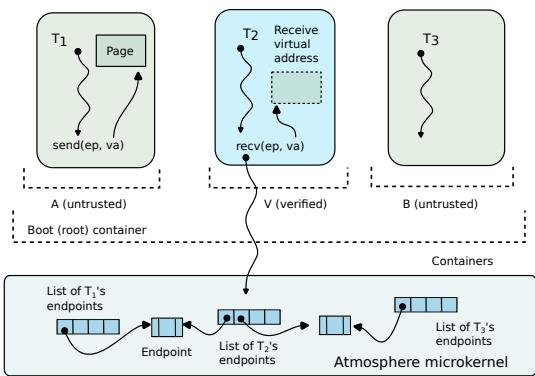
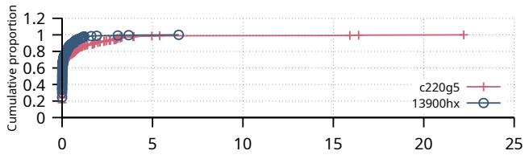
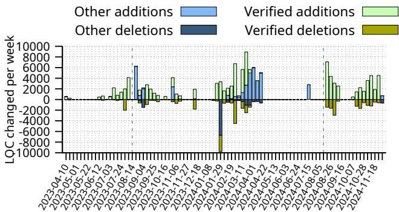
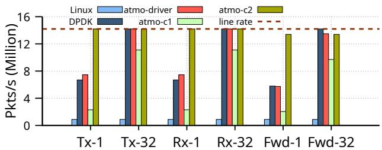
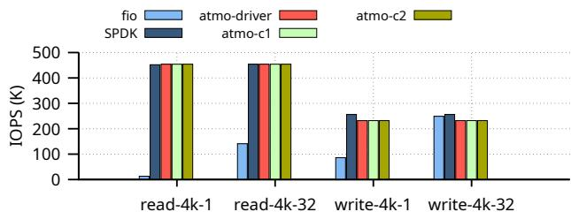
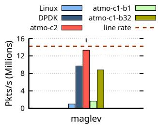
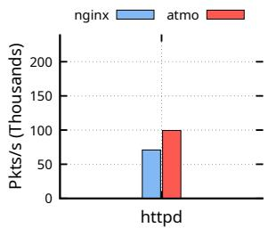
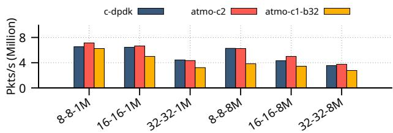

Latest updates: hps://dl.acm.org/doi/10.1145/3731569.3764821

RESEARCH-ARTICLE

## Atmosphere: Practical Verified Kernels with Rust and Verus

XIANGDONG CHEN, The University of Utah, Salt Lake City, UT, United States ZHAOFENG LI, The University of Utah, Salt Lake City, UT, United States JERRY ZHANG, The University of Utah, Salt Lake City, UT, United States VIKRAM NARAYANAN, Palo Alto Networks, Inc., Santa Clara, CA, United States ANTON BURTSEV, The University of Utah, Salt Lake City, UT, United States

Open Access Support provided by:

The University of Utah

Palo Alto Networks, Inc.


Published: 12 October 2025

Citation in BibTeX format

SOSP '25: ACM SIGOPS 31st Symposium   
on Operating Systems Principles   
October 13 - 16, 2025   
Seoul, Republic of Korea

Conference Sponsors: SIGOPS

# Atmosphere: Practical Verified Kernels with Rust and Verus

Xiangdong Chen University of Utah

Zhaofeng Li University of Utah

Jerry Zhang University of Utah

Vikram Narayanan∗Palo Alto Networks

Anton Burtsev University of Utah

## Abstract

Recent advances in programming languages and automated formal reasoning have changed the balance between the complexity and practicality of developing formally verified systems. Our work leverages Verus, a new verifier for Rust that combines ideas of linear types, permissioned reasoning, and automated verification based on satisfiability modulo theories (SMT), for the development of a formally verified microkernel, Atmosphere.

Atmosphere is a full-featured microkernel with support for strict isolation in mixed-criticality systems. We develop all code in Rust and prove its functional correctness, i.e., refinement of a high-level specification, with Verus. Development and verification of 6K lines of executable code required an effort of less than 2.5 person-years (only 1.5 years were spent on verification, another person-year was spent developing non-verified parts of the system). On average, our code has a proof-to-code ratio of 3.32:1 and completes verification in less than 20 seconds on a modern laptop, which we argue is practical for the development of verified systems.

CCS Concepts: • Security and privacy → Operating systems security; Logic and verification; • Software and its engineering → Runtime environments; Formal software verification.

Keywords: Operating systems, microkernels, formal verification

## ACM Reference Format:

Xiangdong Chen, Zhaofeng Li, Jerry Zhang, Vikram Narayanan, and Anton Burtsev. 2025. Atmosphere: Practical Verified Kernels with Rust and Verus. In ACM SIGOPS 31st Symposium on Operating Systems Principles (SOSP ’25), October 13–16, 2025, Seoul, Republic of Korea. ACM, New York, NY, USA, 16 pages. https://doi.org/10.1145/ 3731569.3764821

∗Work done at the University of Utah


This work is licensed under a Creative Commons Attribution 4.0 International License.   
SOSP ’25, Seoul, Republic of Korea   
© 2025 Copyright held by the owner/author(s).   
ACM ISBN 979-8-4007-1870-0/25/10   
https://doi.org/10.1145/3731569.3764821

## 1 Introduction

Historically, the complexity of systems software kept it beyond the reach of formal verification. While several projects demonstrated the possibility of developing verified kernels [1, 2, 3, 4, 5], verification required extensive formal expertise and significant human effort. For example, development of the first formally verified microkernel, seL4, required 11 person-years (an additional 9 person-years were needed for the development of formal language frameworks, proof tools, and libraries [1]).

To address the complexity of verification, several projects explored development of programming languages with support for a high degree of proof automation [6] and even complete “push-button” verification that attempted direct translation of the kernel code into a satisfiability modulo theories (SMT) expression [7, 8, 9, 10, 11]. While achieving nearly complete automation, such approaches required numerous simplifying assumptions about the internal organization of the kernel and its interface [12], e.g., Hyperkernel required all paths in the kernel to be finite – the file open system call forced the user to provide an explicit file descriptor number for opening a file instead of choosing an available one itself [7].

Recent advances in automated formal reasoning change the balance between the effort and practicality of verified development by combining ideas from programming languages (and specifically linear type systems), separation logic, and automation with SMT solving. First, linear type systems [13] can take care of reasoning about aliasing and the heap, hence enabling a significantly simpler SMT encoding of the program [14, 15, 16]. Second, a combination of linear types and ideas of permission-based reasoning [14, 17, 18, 19, 20] provides a practical way of reasoning about non-linear pointers that are typical in the low-level kernel data structures like linked lists, trees, etc.

Yet, despite impressive progress offered by recent SMTbased verifiers [14, 19] the practicality of verifying featurerich, low-level system code remains an open debate [21]. Modern kernels implement their logic as a collection of recursive data structures with frequent pointer references and a combination of complex, non-linear lifetimes. Recursive specifications required to reason about recursive data structures are inherently difficult for SMT solvers, which do not support inductive proofs natively – a typical approach is to unroll a recursive proof a finite number of times, hence making it inherently unsuitable for verifying unbounded data structures. While tools like Verus support recursive specifications and proofs through inductive proof functions [22], the verification complexity remains high and often becomes unmanageable for complex, feature-rich data structures typical in the kernel.

In this work, we argue that automated verifiers can be used for development and verification of low-level systems. Specifically, we demonstrate the possibility of using Verus [14], an SMT-based verifier for Rust, for developing a fully-verified microkernel, Atmosphere. Atmosphere is similar to classical microkernels: it runs on multi-CPU hardware (under a big lock), supports processes and threads, dynamic memory management, inter-process communication (IPC), virtual address spaces, IOMMU, and an abstraction of containers, groups of isolated processes. Atmosphere is designed as a separation kernel that supports strict isolation in mixedcriticality systems. We develop all code in Rust and prove its functional correctness, i.e., refinement of a high-level specification, with Verus. Moreover, our speed and development effort approach the commodity unverified development – while more time was spent on the design and implementation of formal specifications and proofs, a lot less effort was required for testing.

Several design choices were critical for enabling practical, low-effort verification of a semantically complex, pointercentric kernel code:

Pointer-centric design. Linear languages do not support non-linear data structures well, e.g., Rust relies on trusted unsafe extensions to support cyclic references. This result in a range of suboptimal design choices: one can try to represent kernel state without non-linear data structures [23], or just trust unsafe smart pointer types, or implement their verified versions and then establish high-level correctness of each data structure along with leak freedom.

In Atmosphere, we make the design choice to embrace the use of raw, nonlinear pointers, arguably, deviating from canonical Rust idioms and instead use the language in a manner similar to unsafe C. In other words, we develop kernel data structures using raw pointers, but rely on Verus to establish the correctness of all pointer operations via the proof. This allows us to design performance-efficient data structures with all optimizations typical for unsafe code, e.g., use internal storage to represent pointers to tree nodes, similar to Linux, use reverse pointers to support efficient, constant-time removal from linked lists, etc.

Intuitively, such a design choice is prohibitive due to the pervasive use of raw pointers and the complexity of the proofs required to establish the correctness of pointer operations. Surprisingly, however, a combination of linear permission pointers [14] (an abstraction offered by Verus for reasoning about pointer operations) and the flat approach to permission storage – allows us to avoid complexity or recursive proofs.

Flat approach to permission storage. To keep the complexity of the proof under control, we adapt a “flat” permission design, in which permission pointers to inner objects in the hierarchy, e.g., all nodes of the page table, all threads in the system, all nodes of a tree, etc., are stored at the topmost level of the subsystem with the global view of a specific subsystem in a flat map. We build on the ideas of prior systems that advocated for flat permission storage [14, 24, 25, 26] but push it to the extreme arguing that it is a key design choice critical for the scalability of the proof. The global view of the data structure gives us the freedom to encode the properties of unbounded, recursive data structures, in a simple non-recursive manner. Moreover, it allows us to separate reasoning about the structural (e.g., the tree has no cycles, reverse pointers are correct) and non-structural (e.g., a new thread is added to a process) arguments.

Manual memory management. Rust ensures memory safety and automatic memory management via its borrow checker and a collection of trusted pointer types. Unfortunately, automatic memory management creates a semantic gap between the formal specification of the system and the state of its memory. I.e., reasoning about global, kernel-wide properties requires explicit knowledge of all memory in the system. For example, the non-interference theorem requires that one domain cannot exhaust the memory of the system. Without explicit knowledge of the state of all memory in the system, specifications of the memory-related system calls become nondeterministic. Additionally, Rust type system does not protect against memory leaks, which are possible in the kernel due to complex cyclic dependencies and intricate object lifetimes [27].

In Atmosphere, we abandon automated memory management of Rust, i.e., we do not rely on the Rust borrow checker for reasoning about lifetimes of kernel objects and instead allocate and deallocate them explicitly (again, similar to how it is done in an unsafe language like C). We, however, establish the safety of all memory operations as well as leak freedom via a proof. Note, that Rust ownership model is still critical for establishing correctness of the code as it is used by Verus to reason about linearity of all tracked proof variables (e.g., linear permissioned pointers) as well as the heap and aliasing. This design choice allows us to support a combination of complex manual and reference counted lifetimes in the kernel without trusting any of the Rust pointer types.

Our experience shows that even though we embrace pointer-centric design of the system, the combination of permission pointer reasoning offered by Verus, careful design choices for constructing the proofs about recursive data structures, and the level of automation provided by Verus enables practical development of formally verified kernels. Atmosphere is developed without relying on any unverified types from the Rust standard library, e.g., vectors, smart pointers, reference counting types, etc. We only trust Verus’ native types and trusted functions for mutating tracked permissions (at the moment, Verus lacks support for mutable references for tracked permissions).

Careful design of system call specifications allows reasoning about the functional correctness of user applications and non-interference. Specifically, we demonstrate a scenario where two isolated container groups can define a custom version of non-interference, in which mixed-criticality domains are completely isolated (do not interfere) but can establish communication with a verified process that provides a shared service.

In total, the development of Atmosphere took less than one and a half physical years and an effort of roughly two and a half person-years. But only one and a half personyears was spent on the development of the verified parts (we used the second person-year on unverified parts such as the boot and initialization infrastructure, user-level device drivers, application benchmarks, and the build environment). For the microkernel, we developed 6K lines of executable code and relied on 20.1K lines of proof code (14.3K lines of specifications, and 5.8K lines of hints to the verifier and proofs). Out of the 14.3K lines of specifications, 2.9K lines are used to describe top-level abstract specification of the kernel system call interface (i.e., expected behavior of the kernel). On average, our code has a proof-to-code ratio of 3.32:1, which is lower than prior approaches [1, 2]. Moreover, careful design choices allow Atmosphere to finish verification in less than 20 seconds on a modern laptop. To put this number in perspective, it takes less time to finish verification than compiling the kernel, which enables a truly interactive development cycle with a verifier as opposed to traditional recompile, reboot, and run tests approach.

## 2 Background: Verus

Verus is a new formal verification framework for Rust [14]. In contrast to general theorem provers [28, 29, 30], Verus sacrifices generality for a high degree of proof automation – Verus is designed to establish functional correctness of Rust programs and specifically low-level systems [31]. Building on success of automated verifiers [6, 32, 33], Verus translates the Rust program into SMT expressions, which are then passed to a solver (Z3 in case of Verus [34]). To improve verification speed, Verus leverages the idea that it is possible to use the type system, and specifically the linear type system of Rust, to reason about aliasing and memory instead of SMT solving [15, 35, 36, 37]. This reduces the complexity of the SMT queries by orders of magnitude, hence resulting in both faster and more scalable verification [31]. To support reasoning about non-linear data structures like doubly-linked lists and raw pointers in general, Verus adapts ideas of permissionbased separation logic [17, 38]. In practice, this provides support for verifying data structures common in the kernel, e.g., trees of processes, lists of threads, etc., and, as we argue in this work, allows one to structure kernel data structures like one would do in an unsafe kernel like Linux.

Verus allows one to write executable code, specifications, and proofs in a dialect of Rust. Executable code is written in a subset of Rust, while specifications and proofs are written in a functional extension of Rust, which includes logical quantifiers like forall and exists (Listing 1).

In Verus, the typical flow of building and verifying a system involves defining the abstract state of the system and the expected behavior of the system interface. One then proves that the implementation of the system is a refinement of its high-level (abstract) specification, i.e., the system is functionally correct. Verus allows one to define the abstract state side by side with the concrete executable code by using ghost variables. Ghost variables can be used to develop the abstract model of the system (e.g., as a state machine on the ghost state) and to aid the proofs. For example, the abstract state of the page table in Atmosphere is a map from virtual addresses to physical addresses with access permissions (Listing 1, line 3).

Verification is static. Specifications and proofs (ghost code) are erased by Verus using the Rust procedural macro during the compilation time, and thus do not incur any runtime overhead. Verified Rust code is compiled into an efficient machine implementation that can be executed on bare metal. As an unmanaged language (i.e., Rust enforces safety without garbage collection) even on most demanding systems workloads, Rust achieves performance comparable to unsafe C [39, 40, 41].

To prove refinement, one establishes equivalence between the abstract and concrete state of the system, e.g., in the case of the page table, the abstract map and the virtual to physical translation seen by the hardware memory management unit. That is, for each entry in the abstract map, if the MMU does a page table walk, the resolved physical address and access permission are equal to the value in the map.

Specification functions allow one to express the expected behavior of the system as a collection of pre- and postconditions that reflect changes to the abstract state. For example, syscall\_mmap\_spec() defines the expected behavior for the mmap() system call, which lets the process allocate multiple physical pages and map them to a range of virtual addresses va\_range (Listing 1, lines 5-27). At a high level, our specification captures how the system call changes the state of the system, i.e., after the system call, each virtual address in the range maps a unique physical page, other kernel objects are not changed (e.g., threads and the scheduler), virtual addresses outside of the newly mapped range are not changed, newly allocated pages were free before, and each page is mapped uniquely, etc.

The concrete implementation of the mmap() system call operates on concrete, non-ghost variables (Listing 1, lines 28-41). The proof code provides hints to the verifier for how to complete the proof and helps to mutate ghost and tracked variables in the executable functions. old() is a built-in Verus spec function that returns the state of a variable before the function invocation. The system call requires that the kernel is well-formed before the invocation (i.e., old(Ψ).total\_wf()), and ensures that the kernel is wellformed after the invocation as well as that the kernel state is updated according to the system call specification (i.e., ensures syscall\_mmap\_spec()).

1 pub struct PageTable{   
2 pub cr3: usize   
3 pub map: Ghost<Map<VAddr,MapEntry>>,   
4 ... }   
5 pub open spec fn syscall\_mmap\_spec(Ψ:Kernel, Ψ′:Kernel, t\_id:   
ThrdPtr, va\_range: VaRange4K, perm\_bits:MapEntryPerm, ret:   
SyscallReturnStruct) -> bool{   
6   
7 // the state of each thread is unchanged   
8 &&& Ψ.thread\_dom() =\~= Ψ′.thread\_dom()   
9 &&& forall|t\_ptr:ThrdPtr|   
10 Ψ.thread\_dom().contains(t\_ptr) ==>   
11 Ψ.get\_thread(t\_ptr) =\~= Ψ′.get\_thread(t\_ptr)   
12 ... // other objects in the kernel   
13 // virtual addresses outside of va range are not changed   
14 &&& forall|va:VAddr| va\_range@.contains(va) == false   
15 ==> Ψ.get\_address\_space(proc\_ptr).dom().contains(va)   
16 == Ψ′.get\_address\_space(proc\_ptr).dom().contains(va)   
17 && Ψ.get\_address\_space(proc\_ptr)[va]   
18 =\~= Ψ′.get\_address\_space(proc\_ptr)[va]   
19 // newly allocated pages were free pages   
20 &&& forall|page\_ptr:PagePtr|   
21 mmapped\_physical\_pages\_seq.contains(page\_ptr)   
22 ==> Ψ.page\_is\_free(page\_ptr)   
23 // each virtual address in va range gets a unique page   
24 &&& forall|i:usize| 0<=i<va\_range.len   
25 ==> Ψ′.get\_address\_space(proc\_ptr)[va\_range@[i]].addr   
26 == mmapped\_physical\_pages\_seq[i]   
27 ...}   
28 pub fn mmap(Ψ: &mut Kernel, t\_ptr: ThrdPtr, va\_range: VaRange4K)   
-> (ret: SyscallReturnStruct)   
29 requires   
30 old(Ψ).total\_wf(), //global invariants   
31   
32 ensures   
33 syscall\_mmap\_spec(old(Ψ), Ψ, t\_ptr, va\_range, ret),   
34 {   
35 let tracked thrd\_perm = Ψ.process\_manager   
36 .thrd\_perms.tracked\_borrow(t\_ptr);   
37 assert(thrd\_perm@.addr()== t\_ptr && thrd\_perm.is\_init());   
38 let thread: &Thread = PPtr::<Thread>::from\_usize(t\_ptr)   
39 .borrow(Tracked(thrd\_perm));   
40 let proc\_ptr = thread.owning\_proc;   
41 ... }  
Listing 1. Abstract and concrete state, specification and implementation functions. For readability, we use Ψ and Ψ′ as variables that hold the state of the kernel before and after the system call.

Linear ghost (tracked) permissions. To reason about raw pointers, Verus introduces two types: PPtr<T>, permissioned pointer, a wrapper around a raw, usize pointer to an object on the heap, and PointsTo<T>, a linear (tracked) ghost permission to access the value through the pointer. Tracked permissions are ghost (exist only at the proof level and are erased during compilation time), but they strictly follow all the Rust borrow-checking rules. Hence, they ensure linearity of pointer accesses as well as the absence of lifetime violations. A permissioned pointer and permission are allocated together when the object is allocated on the heap. The tracked permission cannot be duplicated and is consumed during deallocation to ensure safety. Each tracked permission not only carries the ownership of the object but also carries the state of the object used in the proofs (i.e., updates to the object are reflected on the ghost state of the tracked permissions, not the raw pointers). To use a raw pointer in Verus, the code must prove that it possesses the corresponding tracked permission to the pointer, and the permission is initialized. For example, to access the parent process from a raw thread pointer (Listing 1 line 40), one proves that the address of the tracked permission matches the pointer (line 37) and gets an immutable reference to the thread’s permission (line 36). If one were to create a mutable reference to the thread’s permission before the immutable reference is dropped, the lifetime checks will throw an error.

## 3 System Architecture

Atmosphere is a full-featured microkernel. The microkernel supports a minimal set of mechanisms to implement address spaces, threads of execution, memory management, interrupt dispatch, inter-process communication, IOMMUs, and containers – groups of user processes with guaranteed memory and CPU reservations that are used to enforce isolation between mixed-criticality systems. In Atmosphere, system device drivers, network stacks, file systems, etc. run as userspace processes. Atmosphere supports multiprocessor machines, but to simplify verification, we rely on a big-lock synchronization, i.e., all interrupts and system calls execute in the microkernel under one global lock and with further interrupts disabled.

Processes can communicate via endpoints. A sender thread can pass scalar data, references to memory pages, IOMMU identifiers, and references to other endpoints. Endpoints allow processes to establish regions of shared memory, which then can be used for efficient asynchronous communication [42, 43, 44].

Isolation and non-interference. To support provable separation between groups of processes, Atmosphere implements an abstraction of a container. A container is a group of processes that have a guaranteed reservation of memory (container quota) and CPU cores, i.e., when a container is created, the parent container passes a subset of its own reservation of memory and cores to a child. The microkernel implements careful accounting of all memory allocations from any process in the container, i.e., memory allocated for the user process or allocated by the kernel to keep metadata about threads, endpoints, etc. The system call specifications are designed to support user-level proofs of functional correctness and non-interference between containers. The noninterference theorem guarantees that any arbitrary system call from any of the isolated containers cannot change the observable state of another.

  
Figure 1. Architecture of Atmosphere. Containers ?? and ?? are untrusted but can establish communication with a verified container ??. Thread $T _ { 1 }$ invokes the send() system call to pass a page to $T _ { 2 }$ which is already waiting on the endpoint inside the microkernel.

Access control and revocation. In Atmosphere, containers form a tree to maintain parent-child relationships. Parents have the capability to terminate their direct and indirect children and harvest their resources. Inside each container, the processes form a separate process tree, which allows parent-child tracking of all processes in the same container. Similarly, the parent process has the capability to terminate child processes. Note that container and process hierarchies are unbounded – processes and nested containers can be created for as long as memory is available.

In contrast to classical capability microkernels [1], in Atmosphere we make a design choice to prohibit fine-grained revocation of resources. Resources return to the parent container when the child container is terminated (i.e., the only way to revoke resources of a container is to terminate it). This design choice simplifies verification of the user code – we have a guarantee that memory cannot be revoked while the user code that we verify is executed. Note, that it’s possible to pass resources outside of the container via an endpoint and then they will not be revoked. Hence, the system has to be carefully constructed to control the flow of resources across container boundaries and may involve trusted or verified proxy containers to enforce information and resource flow policies.

This is, however, intentional. Atmosphere is designed to support verification of user-level code that can be used for enforcing such policies. In our running example, which we discuss in Section 4.3, we demonstrate a simple scenario of a system configuration in which multiple isolated containers can establish controlled communication with a shared container. Specifically, we show how two mistrusting containers ?? and ?? that are otherwise completely isolated by the microkernel can establish communication channel with a third container ?? (Figure 1). We demonstrate how we can proof functional correctness of ?? and non-interference between ?? and ??. Functional correctness of ?? guarantees that even without explicit revocation, resources are correctly released as ?? correctly implements the resource release protocol. Specifically, in our example, containers establish efficient shared-memory communication channels with ??. Since we prove functional correctness of $\mathrm { ~ \cal ~ V ~ } ,$ we have a guarantee that 1) while ?? exchanges shared memory with ?? and ?? it does not leak memory between them, and 2) ?? always releases all memory received from either ?? or ?? even if the container on the other end of the communication channel crashes.

## 4 Verification

To gain confidence that Atmosphere is operating correctly, we prove two theorems: refinement and well-formedness. The refinement theorem establishes high-level functional correctness, i.e., implementation of the microkernel is a refinement of its high-level abstract specification. The well-formedness theorem proves that high-level correctness invariants about the system state hold after each state transition.

We model the microkernel as a state machine operating on the abstract state. We rely on a collection of high-level specifications that describe how the abstract state of the kernel is updated on each kernel invocation, and a hierarchy of invariants that describe the correctness of each kernel data structure, as well as express cross-cutting properties like safety and isolation.

## 4.1 Flat, Pointer-Centric Design

In Atmosphere, we make a design choice to embrace the use of raw, non-linear pointers. We develop recursive pointer data structures like linked lists, container and process trees, and in general, freely use pointers to implement complex logical dependencies between kernel data structures. Unrestricted use of pointers offers the freedom of unsafe development, i.e., use coding paradigms and performance optimizations typical for unsafe, unverified code, e.g., reverse pointers from children to parents for efficient lookup, internal list and tree storage, etc. Not surprisingly, establishing the correctness of pointer operations is challenging. Reasoning about recursive data structures is inherently difficult for SMT solvers as they provide only limited support for inductive proofs and can only unroll recursive proofs a finite number of times, making them unsuitable for unbounded verification.

Flat organization of pointer permissions. We make a key architectural choice: “flat” organization of pointer permissions for complex recursive data structures. Specifically, in all recursive pointer data structures, we use raw pointers like one would do in unsafe C. Yet permissions to access these pointers are stored as a single flat map at the topmost

```rust
1 pub struct ProcessManager {
2 pub root_container: ContainerPtr,
3 pub cntr_perms: Tracked<Map<CtnrPtr, PointsTo<Container>>>,
4 pub proc_perms: Tracked<Map<ProcPtr, PointsTo<Process>>>,
5 pub thrd_perms: Tracked<Map<ThrdPtr, PointsTo<Thread>>>,
6 pub edpt_perms: Tracked<Map<EdptPtr, PointsTo<Endpoint>>>,
7 ...}
8 pub struct Container {
9 parent: Option<CtnrPtr>, // root has no parent
10 children: StaticList<CtnrPtr>, // direct children
11 depth: usize,
12 path: Ghost<Seq<CtnrPtr>>, // direct and indirect parents
13 subtree: Ghost<Set<CtnrPtr>>, // all reachable children
14 ... }
```

## Listing 2. Flat permissions

level of the subsystem, which provides the global view of the entire subsystem. For example, the process manager, a subsystem responsible for managing processes, IPC, and scheduling, holds the permissions to all threads, processes, containers, endpoints, etc., as a collection of flat maps (Listing 2, lines 3–6).

Flat ownership provides us with a global view of the data structure and specifically allows us to: 1) convert recursive specifications into non-recursive ones; 2) decouple the proofs about the structure of the data structure (e.g., a tree is wellformed) from other non-structural proofs (e.g., object lifetimes); and 3) flexible traversal of the data structure (e.g., up and down traversal is required when the tree is updated, i.e., we need to access both the parent and all children of the updated node).

Global invariants. Availability of the global system state via the permission pointer map allows us to formulate global invariants without navigating through the object hierarchies, i.e., peering into the threads of a process within a container. For example, we can directly access the state of all the threads in the system and establish invariants about them:

```rust
1 // all threads in the system are well formed
2 pub spec threads_wf(pm: &ProcessManager) -> bool {
3 forall|t_ptr:ThrdPtr|
4 pm.thrd_perms@.dom().contains(t_ptr)
5 ==>
6 pm.thrd_perms@[t_ptr].value().wf()
7 }
```

Here, we iterate over the thrd\_perms map that stores the tracked permissions of all threads in the system (Listing 2) to establish that they all are well-formed (wf()).

Non-recursive invariants. To illustrate how we use flat ownership to avoid inductive proofs about unbounded data structures, consider an example of a container tree – an unbounded data structure that can grow for as long as the system has memory (Listing 2, lines 8–14). In Atmosphere, containers form a single recursive tree (internally, each container has a separate tree of processes). We implement the tree in a manner similar to unsafe C: each node has a list of children and a pointer to its parent (Listing 2, lines 9–10). However, all permissions to access the nodes of the container tree are stored at the level of the process manager that holds the non-ghost root of the container tree.

To support various aspects of the proof, we expose the parent-child relationships between nodes as two ghost variables: path and subtree. The node sequence path describes the path from the root to the current node (Listing 2, line 12), and the subtree holds all children of the node.

The path along with the set of reachable children is critical for constructing user-level proofs about the properties of subtrees (e.g., in the isolation proof, we prove that all the address spaces in the subtree of one isolated container are disjoint from the address spaces in the subtree of another).

Without the flat storage, maintaining the path invariant requires recursive definitions about the parents and their direct children – only local information about immediate children is available in a non-flat, hierarchical case. For example, one first encodes that the child’s path equals the parent’s path plus the parent:

```rust
1 pub spec fn child_resolve_path_wf(&self:Container) -> bool{
2 forall|child:Container|
3 self.children@.contains(child) ==>
4 self.get_child(child).path =~= self.path.push(self)}
```

This recursive definition can be used to reconstruct the full path from the root to any node in the tree. Verus supports both automatic unrolling of the definition and constructing a manual inductive proof. However, SMT solvers can only unroll a recursive proof a finite number of times (due to their bounded recursion depth) and lack native support for inductive reasoning. Although the unbounded recursions can be proven in Verus with the help of inductive proof functions, the verification difficulty and manual effort are high.

With the global view of all children available in the flat case, we can instead describe the path invariant in a nonrecursive way:

1 pub spec fn resolve\_path\_wf(&self:ProcessManager) -> bool {   
2 for|c:container, d:int|   
3 0 <= i < self.cntr\_perms@[c].value().path.len() ==>   
4 self.cntr\_perms@[c].value().path.subrange(0, d)   
5 =\~= self.cntr\_perms@[self.cntr\_perms@[c].value().path[d]].   
value().path   
6 }

I.e., for any node n at depth d on the path of container c, c’s subpath from the root (node at depth 0) to the node at d is equal to the path of n. Instead of relying on recursive reasoning about pairs of parents and children, we directly express the correctness of the path invariant for all nodes of the tree. Global permission map cntr\_perms allows us to reason about any node in the tree.

Modularity and isolation of structural and nonstructural proofs. Pointer-centric design of the kernel data structures requires us to maintain structural invariants that control the correctness of each data structure, e.g., the tree has no cycles besides the child-to-parent reference in each node. Maintaining such invariants is challenging as they have to be validated on any update even if it is not structural, e.g., mmap() changes container’s quota, but does not change the structure of the tree. We leverage flat permission storage along with closed specification functions to isolate structural invariants and proofs from non-structural arguments (e.g., each alive container has at least one alive process).

We define structural invariants as separate closed specification functions (the body of a closed function is only visible in the defining module, hence incurring no verification overhead if used in a different module). For example, executable function new\_container() creates a child container $C _ { C }$ for the given parent container $C _ { P }$ and transitions the state of the process manager from Φ (old state) to $\Phi ^ { \prime }$ (new state). We separate structural and non-structural proofs into two functions. First, we use a closed spec function container\_tree\_wf() to define all the structural invariants of the container tree in a separate container tree module. Second, an open spec function new\_container\_ensures() defines how each container’s state changes in new\_container().

The new\_container\_ensures() function only describes the changes in the kernel state, but does not check any structural invariants. Hence, it has very little verification overhead. In our example, a new container $C _ { C }$ is added to the container tree. We extend the set of reachable children of $C _ { C } { } ^ { \ ' } { s }$ direct and indirect parent (.subtree) by $C _ { C } .$ In the preconditions, new\_container() requires the container tree to be well-formed on entry and establishes that it satisfies new\_container\_ensures() (line 9) on exit. The proof function new\_container\_preserve\_tree\_wf() in the container tree module proves that if the transition from the old state to the new state satisfies the specification new\_container\_ensures(), the new state also satisfies container\_tree\_wf(). In new\_container\_preserve\_tree\_wf(), we reveal the function body of container\_tree\_wf() and use a range of proof code to help Verus finish the proof. Therefore, in the new\_container() function we can establish container\_tree\_wf() (line 10) without requiring the details of complex structural invariants of the container tree. Such an approach to the proof structure significantly reduces the size of the SMT search space and allows us to lower both proof complexity and verification time.

## 4.2 Manual Memory Management

In Atmosphere we implement manual memory management. This design choice allows us to support reasoning about complex cross-cutting properties like isolation and non-interference (this requires knowledge of all memory in the system) as well as support nonlinear lifetimes for a variety of kernel data structures.

Memory allocation. In Atmosphere dynamic memory allocation for kernel objects, e.g., containers, processes, threads, endpoints, is done at the granularity of 4KB, 2MB, or 1GB memory pages. While it seems wasteful, in practice, the system does not allocate a large number of objects. The simplicity of the allocator, however, allows us to reason about non-interference between containers as well as to simplify specifications that expose the internal state of the allocator required for maintaining safety and leak freedom invariants. We support allocation of 2MB and 1GB superpages to support construction of large address spaces with low TLB pressure.

1 pub fn new\_container(Φ:&mut PM, ????:CntrPtr, ????:CntrPtr,...)   
2 requires   
3 container\_tree\_wf(Φ), ...   
4 ensures   
5 container\_tree\_wf(Φ′), ...   
6 { ...   
7 // at the end of the function   
8 assert(container\_tree\_wf(Φ′)) by {   
9 assert(new\_container\_ensures(Φ, Φ′, ?? , ?? ));   
10 new\_container\_preserve\_tree\_wf(Φ, Φ′, ????, ????);   
11 }}   
12 pub open spec fn new\_container\_ensures(Φ:&PM, Φ′:&PM,   
13 ?? :CntrPtr, ?? :CntrPtr) -> bool{   
14 &&&   
15 // new container's direct and indirect parents' subtrees   
16 forall|c\_ptr:CntrPtr|   
17 Φ.cntr\_perms@.dom().contains(c\_ptr) &&   
18 (c\_ptr == ???? || !Φ.cntr\_perms@[????].value().resolve\_path.   
contains(c\_ptr)) ==>   
19 Φ.cntr\_perms@[c\_ptr].value().subtree@.insert(?? ) =\~=   
20 Φ′.cntr\_perms@[c\_ptr].value().subtree@   
21 // other fields   
22 . // other containers are not changed   
23 }   
24 pub proof fn new\_container\_preserve\_tree\_wf(Φ:&PM, Φ′:&PM,   
25 ????:CntrPtr, ????:CntrPtr)   
26 require   
27 container\_tree\_wf(Φ),   
28 new\_container\_ensures(Φ, Φ′, ????, ????),   
29 ensures   
30 container\_tree\_wf(Φ′),   
31 {...}   
Listing 3. Isolation of structural and non-structural proofs

The page allocator uses a page array (similar to the page array in Linux) to maintain the metadata for each physical page in the system. We ensure that each physical page is in one of the following states: 1) free (on the list of free pages in the memory allocator), 2) mapped, (mapped by one or more processes), 3) merged, (merged to form a 2MB or 1GB superpage), or 4) allocated (allocated for one of the kernel data structures, e.g., a process).

The allocator uses three doubly-linked lists to store the free pages of different sizes (4KB, 2MB, 1GB). We use the page metadata array to efficiently merge 4KB pages into superpages, e.g., to form a 2MB superpage out of free 4KB pages we scan the page array and remove merged 4KB pages from the list of free 4KB pages. Each page metadata in the array maintains a pointer to the node of the linked list holding the page, which allows us to perform constant-time removal when the page is merged.

Safety. We establish safety and the correctness of all pointer operations. We define memory safety and leak freedom as a combination of: 1) type safety (each allocated region of memory is used by exactly one data structure of a correct type), 2) spatial safety (we check that data types are within allocated memory, and all memory accesses to variable-sized data structures like arrays are in-bounds), and 3) temporal safety (all pointers point to live objects, i.e., memory is not deallocated or reallocated for another object).

To prove safety, we need to prove that all allocated memory is used by disjoint objects. To prove leak freedom, we need to prove that the sum of all memory used by all objects in the system equals all allocated memory (i.e., a combination of pages in the “allocated”, “mapped”, and “merged” states). The most challenging part of the proof is establishing safety and leak freedom for memory allocated for kernel objects. For this, we need to establish: 1) all the objects in the kernel are pairwise disjoint in memory and 2) the sum of all memory used by all objects in the system is equal to the collection of “allocated” pages.

A straightforward approach to such proof is to establish that all the objects in the kernel are pairwise disjoint, and then prove that the sum of the memory used for storing these objects is equal to the collection of “allocated” pages. Such an approach is challenging as it requires establishing explicit invariants for all objects (i.e., sizes and addresses) in the kernel, making the SMT search space to grow exponentially. Instead, we leverage the fact that objects of each specific type are used in the kernel in a hierarchical manner, i.e., page tables are used in the memory subsystem; threads, processes, and containers are used by the process management subsystem, etc.

In Atmosphere, for each data structure in the kernel, we implement the page\_closure() specification function, which returns a set of pages used by the data structure and all objects owned by it. Here, the ownership means either a direct ownership of Rust (e.g., an array of objects) or ownership via a tracked permission. For example, a page table does not own any other objects, besides the physical pages used to construct the page table.

Bottom-up recursive memory reasoning. To reason about the system’s memory usage, we hierarchically maintain the page\_closure() for each kernel object, prove pairwise disjointness locally, and merge the page\_closure() of all subsystems. For example, the virtual memory management subsystem owns the memory of all page tables and IOMMU page tables. The subsystem maintains a set of invariants to ensure that each page table and IOMMU table’s page\_closure() are pairwise disjoint, and their union is equal to the page\_closure() of the virtual memory management subsystem. With this, we can easily infer the desired memory properties (i.e., all the objects in the kernel are pairwise disjoint) without explicitly proving them as global invariants.

Explicit memory allocator state. Establishing leak freedom and cross-cutting properties of the memory subsystem requires visibility of the state of the memory allocator.

1 pub fn alloc\_page\_4k(alloc:&mut Allocator)   
2 ensures   
3 alloc.free\_pages\_4k() =\~=   
4 old(alloc).free\_pages\_4k().remove(ret.0),   
5 alloc.allocated\_pages\_4k() =\~=   
6 old(alloc).allocated\_pages\_4k().insert(ret.0),   
7   
8   
9 pub fn new\_endpoint(pm:&mut ProccessManager)   
10 ensures   
11 pm.page\_closure() =\~=   
12 pm(self).page\_closure().insert(page\_ptr),   
13   
14 // allocate new endpoint   
15 let (p\_ptr,mut p\_perm) = self.page\_alloc.alloc\_page\_4k();   
16 self.proc\_man.new\_endpoint(p\_ptr, p\_perm, ...);  
Listing 4. Establishing safety of allocation

Specifically, explicit invocation of the allocation and deallocation APIs enable exact reasoning about the allocator’s state through the API’s pre- and post-conditions. We expose the internal state of the allocator as sets of free, allocated, merged, and mapped pages. Each time we allocate memory (i.e., a page), we need to establish that: 1) the page closure of the allocating subsystem is extended by the new freshly allocated page, 2) the set of total “allocated” pages is extended by this page, 3) the page was previously “free”, i.e., not used by any other subsystem, and 4) other subsystems in the kernel are not changed.

For example, allocation of a new endpoint uses the postcondition of the alloc\_page\_4k() (allocates a page and a permission to use it), and new\_endpoint() (consumes the page and adds the new endpoint to the calling thread) functions (lines 15-16, Listing 4). First, we establish that a newly allocated page was previously not allocated via the postconditions of alloc\_page\_4k(). This ensures that using this page to form a new endpoint object in the kernel is safe. Furthermore, the postconditions of the two functions ensure that the set of allocated pages grows by exactly one page, and process manager’s page\_closure() grows exactly by this one page as well. Since other subsystems do not change, we can prove that the memory safety and leak freedom invariants still hold.

Consistency of page table updates. Even though Atmosphere operates under a big lock, threads of the same process scheduled on different cores might access the page table while it is updated by one of the threads. Floyd-Hoare reasoning only guarantees the correctness of the final state, not that intermediate states during execution are well-formed or consistent. We model each page table update (i.e., each write to both leaf and intermediate levels) as a separate step. For any step that does not modify the last-level page table entry, we prove that the address space (abstract mapping) of the page table does not change. For any step that modifies the last-level page table entry, exactly one entry in the page table abstract mapping is changed (adds a new entry or removes an existing entry).

## 4.3 Noninterference

Atmosphere is a separation kernel designed to support isolation and noninterference between containers. In most realworld scenarios, complete isolation is impractical – isolated subsystems need to communicate, but in a controlled manner (e.g., access multiplexed device drivers, etc.). Careful design of the system call interface specifications allows us to use Atmosphere for deployment of mixed-criticality systems in which users can define their custom notions of isolation and non-interference, i.e., support isolation across missioncritical domains and yet allow them to communicate in a controlled manner.

Specifically, we develop a proof of isolation and noninterference for a system that executes three containers: two untrusted, unverified, and isolated containers ?? and ?? and a verified, shared container ?? (we discuss how such proof can be generalized for different system configurations). ?? and ?? do not interfere with each other but are allowed to establish communication with ?? (Figure 1). Naturally, since both ?? and ?? can communicate with ??, their isolation and noninterference relies on ??’s functional correctness, which we prove. However, we make no assumptions about ?? and ??. They are not trusted, not verified, and thus can perform arbitrary system calls with arbitrary system call arguments.

We implement ?? as a container with one process that runs one thread of execution. This simplifies verification, but is arguably practical for simple containers that implement system security policies. I/O intensive shared device drivers will require proof about concurrent code, which we leave as future work (note that such proofs are feasible due to limited concurrency in modern device drivers, which separate control and data planes and avoid sharing and synchronization across threads in the data plane).

We implement ?? as an event-driven state machine: it executes a loop that checks for incoming IPC messages from ?? and ??, and reacts to the actions from ?? and ?? according to its abstract specifications. ?? may receive pages and endpoints from ?? and ??, but never shares them across container boundaries.

“Flat” system call specifications. The proof of noninterference depends on the following state of the system: a) The state of the entire kernel (Ψ). b) All subcontainers $C _ { A }$ $C _ { B } , C _ { V }$ that are recursively created from ??, ??, and ??. c) All processes $P _ { A } , P _ { B } , P _ { V }$ from all containers in $C _ { A } , C _ { B } , C _ { V }$ respectively. d) All threads $T _ { A } , T _ { B } , T _ { V }$ from all containers in $C _ { A } , C _ { B } ,$ ???? respectively.

We leverage flat permission storage to provide direct access to the state of the kernel objects, i.e., state of all containers, threads, processes, etc. For example, to construct $T _ { A }$ with recursive ownership, one would need to rely on two unbounded recursive specs to first walk the container subtree to form $C _ { A }$ (by recursively merging the children containers level by level), second walk the process tree of each container to form $P _ { A } ,$ , and finally create a union of the threads of $P _ { A }$ to form $T _ { A } .$ . With flat storage, we can maintain the sets of all reachable child containers in .subtree and simply construct $T _ { A }$ with the following bidirectional invariant to ensure $T _ { A }$ contains and only contains all the threads in $C _ { A } \colon$

```rust
1 spec fn T_A_wf(Ψ:Kernel,??:CntrPtr,????:Set<ThrdPtr>) -> bool{
2 &&& forall|c_ptr: CntrPtr, t_ptr:ThrdPtr|
3 (c_ptr == ?? || Ψ.get_cntr(??).subtree@.contains(c_ptr))
4 && Ψ.get_cntr(c_ptr).owned_thrds@.contains(t_ptr)
5 ==> $T _ { A } .$ .contains(t_ptr)
6 &&& forall|t_ptr:ThrdPtr| $T _ { A } .$ .contains(t_ptr) ==>
7 (Ψ.get_thrd(t_ptr).owning_cntr == ?? || Ψ.get_cntr(??)
8 .subtree@.contains(Ψ.get_thrd(t_ptr).owning_cntr))}
```

Isolation. We define and prove isolation between $P _ { A }$ and $P _ { B }$ as two main invariants: memory and endpoint isolation.

1 pub open spec fn memory\_iso(Ψ: Kernel, $P _ { A }$ :Set<ProcPtr>, $P _ { B } \colon$ Set<   
ProcPtr>) -> bool{   
2 forall|a\_p\_ptr: ProcPtr, a\_va:VAddr,   
3 b\_p\_ptr: ProcPtr, b\_va:VAddr|   
4 $P _ { A } .$ .contains(a\_p\_ptr) && $P _ { B } .$ .contains(b\_p\_ptr) &&   
5 Ψ.get\_address\_space(a\_p\_ptr).dom().contains(a\_va) &&   
6 Ψ.get\_address\_space(b\_p\_ptr).dom().contains(b\_va)   
7 ==>   
8 Ψ.get\_address\_space(a\_p\_ptr)[a\_va].addr !=   
9 Ψ.get\_address\_space(b\_p\_ptr)[b\_va].addr}   
10   
11 pub open spec fn endpoint\_iso(Ψ: Kernel, $T _ { A }$ :Set<ThrdPtr>, ????:Set   
<ThrdPtr>) -> bool{   
12 forall|a\_t\_ptr:ThrdPtr, a\_e\_idx: EdptIdx,   
13 b\_t\_ptr:ThrdPtr, b\_e\_idx: EdptIdx|   
14 $T _ { A } .$ .contains(a\_t\_ptr) && ????.contains(b\_t\_ptr)   
15 ==>   
16 Ψ.get\_thrd\_edpt\_descriptors(a\_t\_ptr)[a\_e\_idx] !=   
17 Ψ.get\_thrd\_edpt\_descriptors(b\_t\_ptr)[b\_e\_idx]}

That is, the pages mapped by the address spaces of $P _ { A }$ are proven not to be mapped by the address spaces of $P _ { B } .$ Additionally, to allow fast communication, shared endpoints can be established between $T _ { V }$ and $T _ { A }$ or $T _ { V }$ and $T _ { B } ,$ , but not between $T _ { A }$ and $T _ { B } \mathrm { : }$

To prove that ?? and ?? cannot break the memory and communication channel isolation, we show that after a random system call with random system call arguments from any thread in $T _ { A }$ and $T _ { B } ,$ the memory isolation and endpoint isolation are still satisfied:

1 forall|Ψ: Kernel, Ψ′: Kernel, t:ThrdPtr, a:SysCallArg|   
2 Step(Ψ, Ψ′, t, a) && $( T _ { A }$ .contains(t) || ????.contains(t)) &&   
3 memory\_iso(Ψ, ????, ????) && endpoint\_iso(Ψ, ????, ????)   
4 ==> memory\_iso(Ψ′, ????, ????) && endpoint\_iso(Ψ′, ????, ????)

Noninterference. At a high level, the non-interference theorem establishes that isolated containers cannot observe actions of each other. Similar to prior systems [45, 2], we leverage the unwinding theorem [46, 47] stating that it’s sufficient to establish unwinding conditions to prove the global noninterference property. Specifically, we leverage unwinding conditions as formulated by Luke et al. [48]:

Output consistency (OC): Output consistency requires the kernel to provide the same system return value given two identical system states. In Atmosphere, the return value of system calls is deterministic and only depends on the state of the old kernel state and arguments. According to all system call postconditions, same kernel pre-states always result in same kernel post-states and return values. Thus, OC is trivial to prove.

Step consistency (SC): SC requires that the system state remains equivalent for one domain before and after any action is performed by another domain. In our model, the observable state of a container subtree $C _ { B }$ includes its memory quotas, address spaces, schedulers, endpoints, state of the processes, etc. We show that the observable state of ?? and the system call return value of each arbitrary system call from container ?? remains unaffected before and after an arbitrary system call from container ??.

Local respect (LR): Local respect requires that an arbitrary system call executed by one container cannot affect the observable state of another distrusting container. In our setup, since only ?? and ?? are isolated, LR is proven when we prove SC.

Discussion and limitations. We illustrate how noninterference and isolation can be established for a system configured with three container hierarchies: ??, ?? and ??. To make a similar poof but for a different system configuration, one has to define the desired isolation and noninterference invariants. We argue that such proofs will be similar to the one we discuss here. The key observation is that this and similar noninterference proofs leverage the flat state of the kernel, which allows accessing it in a non-recursive manner. In the case, when any number of isolated containers do not communicate, the proof is a strict subset of the proof presented here.

In the non-interference proof, we only reason about the effects of system calls, but not the user code. Despite being isolated on different CPUs, user processes can introduce timing channels in shared caches and other hardware resources. Also, at the moment, Atmosphere allows execution of several long-running system calls (e.g., operations like mapping and sending large regions of memory, or terminating containers and processes), which can block other processes due to a big lock in the kernel for a long period of time and leak timing information. This limitation can be removed in the future by bounding the memory region size and by implementing iterative versions of the “kill” system calls similar to seL4.

## 5 Trusted Computing Base

Formal verification enables us to establish the correctness of the system and eliminate a range of errors that are typical in low-level code. Yet, it is important to be explicit about all software and hardware layers that form the trusted computing base (TCB) of the system, and hence can still contain flaws and vulnerabilities: 1) The Verus frontend responsible for translating Rust and Verus code into SMT verification conditions. 2) The underlying SMT solver (Z3). Verus uses Z3, and any unsoundness in it will compromise the soundness of verification. 3) The Rust compiler. We trust the compiler to correctly perform borrow checking, type checking, and code generation. We also assume that the toolchain provides correct implementations of core intrinsics. Other standard build tools (assembler, linker, etc.) are also used to create the final microkernel binary. 4) The Rust core library (core). The Rust standard library contains three parts: core implements core routines for primitive types (e.g., u64::pow()) and standard abstractions (e.g., Option::is\_some()), while alloc and std build on top of it to provide heap-allocated data structures and platform-specific interfaces. Atmosphere only makes use of a minimal subset of core. We do not rely on alloc and std, and our code does not use many common types like vectors, strings, Rc and Arc, hash maps, mutexes, etc. 5) Specifications of core Rust data structures and routines. These specifications model the expected behavior of core data structures and routines as implemented in compiler intrinsics and core. For example, Atmosphere trusts that a Rust slice behaves like a Seq with a fixed length. 6) Axioms missing in Verus. For example, if we remove an element from a unique sequence, the result sequence is still unique (around 700 lines of spec). These axioms can be verified in the future. 7) Setter functions for mutating tracked ghost permissions and Rust core primitive data structures. Verus currently has very limited support for &mut. This adds 300 lines of executable code with 1900 lines of specifications. 8) Sequences of assembly and trusted Rust code. The fragments of assembly code (172 lines) implement entry and exit trampolines for system call and interrupt handlers. Trusted Rust code (total of around 3,000 lines) implementing hardware interface to configure IOMMU (465 lines), setup execution environment of the kernel (321 lines), initialize interrupt handling (293 lines), advanced programmable interrupt controller (287 lines), interrupt descriptor table (179 lines), initialize task state segment (TSS) and global descriptor table (172 lines), fast system call entry via sysenter, handle kernel command line (123 lines), initialize per-CPU data structures and application processes, etc. 9) The Atmosphere boot loader. We implement a minimal, trusted boot loader that sets up the initial runtime environment for the verified kernel (e.g., enumerates available physical memory, sets up stacks, initializes interrupt controllers, etc.). 10) The trampolines for system calls, 11) Finally, we trust the CPU (i.e., the silicon implementation, CPU microcode and all other firmware executing on hidden CPU cores like power management microcontroller), DRAM, and the main board including the system management mode (SMM) and Intel Management Engine (ME) that have access to physical memory of the machine. We do not trust physical devices that we can run behind an I/O Memory Management Unit (IOMMU).

<table><tr><td>Name</td><td>Language</td><td>Spec Lang.</td><td>Proof-to-Code Ratio</td></tr><tr><td>seL4</td><td>C+Asm</td><td>Isabelle/HOL</td><td>20:1[1]</td></tr><tr><td>CertiKOS</td><td>C+Asm</td><td>Coq</td><td>14.9:1[2]</td></tr><tr><td>SeKVM</td><td>C+Asm</td><td>Coq</td><td>6.9:1[51]</td></tr><tr><td>Ironclad</td><td>Dafny</td><td>Dafny</td><td>4.8:1[4]</td></tr><tr><td>NrOS</td><td>Rust</td><td>Verus</td><td>10:1 [25]</td></tr><tr><td>VeriSMo</td><td>Rust</td><td>Verus</td><td>2:1[24]</td></tr><tr><td>Atmosphere</td><td>Rust</td><td>Verus</td><td>3.3:1</td></tr></table>

Table 1. Proof effort for existing verification projects.

<table><tr><td>System</td><td></td><td>1 thread|8threadsProofCode</td><td></td><td></td><td>P/C Ratio</td></tr><tr><td>NrOS page table Atmo. page table</td><td>1m 52s 33s</td><td>51s</td><td>5329 2168</td><td>400</td><td>13.3:1</td></tr><tr><td>Mimalloc</td><td>8m 12s</td><td>1 1m 40s</td><td>13703</td><td>496 3178</td><td>4.3:1 4.3:1</td></tr><tr><td>VeriSMo</td><td>61m 24s</td><td>12m 11s</td><td>16101</td><td>7915</td><td>2.0:1</td></tr><tr><td>Atmosphere</td><td></td><td></td><td></td><td></td><td></td></tr><tr><td></td><td>3m 29s</td><td>1m 7s</td><td>20098</td><td>6048</td><td>3.3:1</td></tr></table>

Table 2. Verification time of different systems on CloudLab c220g5

## 6 Evaluation

Primarily, we evaluate Atmosphere to answer two main questions: 1) How practical is the development of verified kernel code with Verus in terms of verification speed and development effort? 2) Can Atmosphere be used as a practical kernel which does not sacrifice performance for formal correctness? To ensure repeatability of experimentation, we conduct evaluation on the publicly available CloudLab [49] machines: c220g5, c220g2, and d430 [50]. We measure the verification time on c220g5, which is configured with two Intel Xeon Silver 4114 10-core CPUs running at 2.20 GHz, 192 GB RAM. Network experiments use a pair of c220g2 machines with Intel X520 10Gb network interfaces. NVMe experiments utilize d430, which are configured with PCIe-attached 400GB Intel P3700 Series SSDs. All the machines run 64-bit Ubuntu 20.04 with a 5.4.0 kernel. To reduce variance in benchmarking, we disable hyper-threading, turbo boost, CPU idle states, and frequency scaling for all the experiments.

## 6.1 Verification complexity

To put the verification effort of Atmosphere in perspective with prior work, we collect the proof-to-code ratio across several recent kernel projects. Atmosphere has a proof-tocode ratio of 3.32:1, which is a good improvement compared to the existing formally verified microkernels seL4 [1] and CertiKOS [2], which have proof-to-code ratio of 20:1 and 14.9:1, respectively (Table 1). Interestingly, VeriSMo has an even lower proof-to-code ratio of 2.0. Two factors contribute to the low proof-to-code ratio. First, arguably, VeriSMo is semantically less complex than Atmosphere. Second, the VeriSMo development team prioritized reducing proof effort over verification speed – by significantly relaxing the verification timeout limit, VeriSMo achieves a low proof-to-code ratio at the cost of higher verification time.

Verification time. Rapid verification is essential for interactive development. On the c220g5 server, Atmosphere finishes full verification in about 1 minute 7 seconds with 8 threads (Figure 2 and Table 2). On a modern laptop with a recent Intel i9-13900hx CPU, Atmosphere finishes full verification in under 20 seconds (on 32 threads), and 47 seconds (on 1 thread).

<table><tr><td>System call</td><td>Atmosphere</td><td>seL4</td></tr><tr><td>Call/reply</td><td>1,058</td><td>1,026</td></tr><tr><td>Map a page</td><td>1,984</td><td>2.650</td></tr></table>

Table 3. Latency of communication and typical system calls (cycles) on c220g5

  
Figure 2. Verification time for each function (seconds)

## 6.2 Impact of flat design

To isolate the impact of our flat approach, we compare the proof-to-code ratio and verification times for the page table subsystems in NrOS [52] and Atmosphere – both systems use Verus to implement a comparable page table logic with similar verification goals, and a similar size of executable code.

We implement support for a 4-level page table with different page sizes: 4KiB, 2MiB, and 1GiB. The abstract state of the page table is represented by three maps (one for each page size) from virtual to physical addresses along with the permission bits. The tracked permissions of each PML level are stored at the topmost level of each page table. NrOS’ page table, however, follows Rust recursive ownership.

Refinement proof. The page table uses a range of invariants to prove its structural invariants (e.g, each entry in any PML level only maps to the next PML level). Most importantly, it proves refinement between its concrete state and its abstract mapping. For example, in mappings of 4KiB pages, we use four-level spec functions to simulate the address resolution of the MMU and prove that the mapping\_4k() matches what the MMU will theoretically see.

1 forall|l4i: L4I,l3i: L3I,l2i: L2I,l1i: L2I|   
2 0<=l4i<512 && 0<=l3i<512 && 0<=l2i<512 && 0<=l1i<512   
3 ==>PT.mapping\_4k().contains(index2va((l4i,l3i,l2i,l1i)))   
4 == PT.resolve\_mapping\_4k(l4i,l3i,l2i,l1i).is\_Some()   
5 forall|l4i: L4I,l3i: L3I,l2i: L2I,l1i: L2I|   
6 0<=l4i<512 && 0<=l3i<512 && 0<=l2i<512 && 0<=l1i<512   
7 && PT.resolve\_mapping\_4k\_l1(l4i,l3i,l2i,l1i).is\_Some()   
8 ==> PT.mapping\_4k()[index2va((l4i,l3i,l2i,l1i))]   
9 =\~= PT.resolve\_mapping\_4k(l4i,l3i,l2i,l1i).unwrap()

The first forall statement ensures that the domain of virtual addresses mapped in the concrete page table is equal to the domain of the abstract mapping. The second forall statement ensures the equivalency of the mappings.

  
Figure 3. Atmosphere commit history (vertical lines separate versions)

One of the most complicated parts of the proof is to establish that if the page table adds a new virtual-to-physical mapping, the abstract mapping of other virtual addresses does not change. In NrOS, such a proof requires manual unrolling of the recursive specs through different PML levels and requires around 200 lines of proof code in map\_frame\_aux() function [52]. Since we have direct access to the states of all page table levels, no unrolling is needed. With around 30 lines (PML4 requires 7 lines) of proof code, we directly prove that all other entries in all PML levels do not change:

1 pub fn map\_4k\_page(PT: &mut PageTable, dst\_l4i:L4I, dst\_l3i: L3I,   
dst\_l2i: L2I, dst\_l1i: L2I, va:VAddr, ...)   
2 { // executable code   
3 // other virtual addresses at PML1,2,3 do not change   
4 // other virtual addresses at PML4 do not change   
5 assert( forall|l4i: L4I,l3i: L3I,l2i: L2I, l1i: L1I|   
6 0<=l4i<512 && 0<=l3i<512 && 0<=l2i<512 && 0<=l1i<512   
7 && ((dst\_l4i, dst\_l3i, dst\_l2i, dst\_l1i)   
8 != (l4i,l3i,l2i,l2i))   
9 ==> PT.resolve\_mapping\_l1(l4i,l3i,l2i,l1i) =\~=   
10 old(PT).resolve\_mapping\_l1(l4i,l3i,l2i,l1i));   
11 }

Compared to NrOS [25], Atmosphere page table has 3x lower proof to code ratio (13.3:1 and 4.4:1). Moreover, on a single thread, verification of the Atmosphere’s page table is over 3x faster.

## 6.3 Development speed and effort

fiWe completed development of Atmosphere in three stages, fior, more specifically, we developed three versions, which were clean-slate rewrites borrowing design and implementation lessons from a previous version (Figure 3): 1) version 1 (2 months, one person) resulted in a simplistic kernel centered around the process manager and the page allocator, which was aimed primarily at familiarizing ourselves with Verus, 2) version 2 (8 months two people, clean-slate rewrite) resulted in a simple but functioning kernel with initial ideas of pointer-centric design, flat permission organization and manual memory management, and 3) version 3 (4 months, one person, 50% code reuse from the previous version) developed support for revocation via recursive container trees, superpages, practical user-level specifications and support of isolation and noninterference proofs. The entire development of Atmosphere took around 2 person years, with roughly 14 months spent on development of verified code.

  
Figure 4. Ixgbe driver performance

## 6.4 Microbenchmarks

We perform several microbenchmarks on a c220g5 node on CloudLab. Note that here we run experiments under the KVM hypervisor with hardware virtualization enabled. We use KVM as it allows us to disable turbo boost and frequency scaling for a more accurate measurement. We compare our call/reply with the synchronous IPC mechanism implemented by the seL4 microkernel (we use the IPC call test). An IPC send/receive mechanism in Atmosphere takes around 1058 cycles, whereas seL4 takes 1026 cycles. We also measure the overhead of mapping a page which takes around 1984 cycles Atmosphere and 2650 cycles in seL4, although the system calls are not strictly equivalent. Overall, careful use of Rust allows Atmosphere to achieve performance comparable to carefully-optimized C.

## 6.5 Device Drivers

In Atmosphere, device drivers can either run as: 1) part of the user process (similar to user-level device drivers like DPDK [53] and SPDK [54]), or 2) as a separate user process that communicates with clients via fast asynchronous IPC. We develop and evaluate two device drivers: 1) an Intel 82599 10Gbps Ethernet driver (Ixgbe), and 2) an NVMe driver for PCIe-attached SSDs.

6.5.1 Ixgbe Network Driver. We compare the performance of Atmosphere’s Ixgbe driver with a highly-optimized driver from the DPDK user-space packet processing framework [53] on Linux. Similar to DPDK, we use polling mode to achieve peak performance. We configure Atmosphere to run several configurations: 1) atmo-driver: the benchmark application is statically linked with the driver (this configuration is very similar to user-level packet frameworks like DPDK). 2) atmo-c2: the benchmark application runs in a separate process on a different core, and communicates with the driver driving on a separate core through a shared-memory ring buffer. 3) atmo-c1-b1 and atmo-c1-b32: the benchmark application runs as a separate process on the same CPU alongside the driver. The application uses a shared ring buffer with the driver and invokes the driver through an IPC endpoint which involves a context switch. The number after b represents the batch size of the request, i.e., the number of requests the application sends to the ring buffer before invoking the driver.

We send 64 byte UDP packets and measure the performance on two batch sizes: 1 and 32 packets (Figure 4). For packet receive tests, we use Pktgen, a packet generator that utilizes DPDK framework to generate packets at line-rate. Linux achieves 0.89 Mpps as it uses a synchronous interface and crosses the syscall boundary for every packet and goes through layers of abstraction in the kernel (Figure 4). On a batch of 32 packets, both drivers achieve the line-rate performance of a 10GbE interface (14.2 Mpps).

To understand the impact of interprocess invocations, we run the benchmark application as a separate process (atmo-c1-b1) and (atmo-c1-b32). Atmosphere can send and receive packets at the rate of 2.3 Mpps per-core with one context switching per packet (atmo-c1-b1). On a batch of 32 packets, the overhead of context switching is less pronounced and the application achieves 11.1 Mpps (atmo-c1-b32).

6.5.2 NVMe Driver. To understand the performance of Atmosphere’s NVMe driver, we compare it with the multiqueue block driver in the Linux kernel and a well-optimized NVMe driver from the SPDK storage framework [54]. Similar to SPDK, the Atmosphere driver works in polling mode. Similar to Ixgbe, we evaluate NVMe driver under various configurations: 1) statically linked (atmo-driver); 2) application and driver run on different cores and communicate through shared ring buffer (atmo-c2); 3) application runs on the same core with the driver and uses the endpoint to invoke the driver process after sending a batch of requests (atmo-c1-b1 and atmo-c1-b32).

We perform sequential read and write tests with a block size of 4KiB on a batch size of 1 and 32 requests (Figure 5). On Linux, we use fio, a fast I/O generator; on SPDK and Atmosphere, we develop similar benchmark applications that submit a set of requests at once, and then poll for completed requests. To set an optimal baseline for our evaluation, we chose the configuration parameters that could give us the fastest path to the device. Specifically, on Linux, we configure fio to use the asynchronous libaio library to overlap I/O submissions, and bypass the page cache with the direct I/O flag.

On sequential read tests, fio on Linux achieves 13K IOPS and 141K IOPS per-core on the batch size of 1 and 32, respectively (Figure 5). On a batch size of 1 and 32, the Atmosphere driver performs similar to SPDK, achieving maximum device read performance. On sequential write tests with a batch size of 32, Linux is within 3% of the device’s maximum throughput of around 256K IOPS. Atmosphere driver incurs an overhead of 10% on all the configurations for writes (232K IOPS).

  
Figure 5. Performance of the NVMe driver





Figure 6. Performance of Maglev and Httpd  
  
Figure 7. Key-value store

## 6.6 Application Benchmarks

To further evaluate the performance of Atmosphere under real-world scenarios, we develop three data-intensive applications on top of the device drivers: 1) the Maglev load balancer (Maglev) [55], 2) a memcached-compatible key-value store (kv-store), as well as 3) a tiny web server (httpd).

Since device drivers in Atmosphere run as user space processes, we evaluate the applications in two scenarios. First, when the application itself communicates with the device driver through shared memory, and second, when the device driver runs in the same process with the application.

Maglev load-balancer. Maglev is Google’s load balancer with an algorithm that evenly distributes incoming traffic among backend servers [55]. To compare with Atmosphere we develop a normal Linux program that uses the socket interface, and a DPDK-powered application that directly accesses the network card via PCIe passthrough [53]. With a normal Linux socket interface, Maglev only achieves 1.0 Mpps per core because of both the overhead of the system call interface and an overly generic design of the Linux network stack (Figure 6). The DPDK-powered application has direct access to the NIC and achieves 9.72 Mpps per core. In Atmosphere, Maglev achieves 13.3 Mpps with the device driver running on a separate core with communication established over a shared ring buffer (atmo-c2). With Maglev invoking the device driver on the same core, the load balancer runs at 8.8 Mpps with a batch size of 32 (atmo-c1-b32), and 1.66 Mpps with a batch size of 1 (atmo-c1-b1).

Key-value store. Key-value stores are crucial building blocks for modern datacenter systems ranging from social networks [56] to key-value databases [57]. To evaluate Atmosphere’s ability to meet the performance requirement of datacenter applications, we develop a prototype of a networkattached key-value store, kv-store. Our implementation relies on an open addressing hash table with linear probing and uses the FNV hash function. In our experiments, we compare three implementations: a C version running on Linux with the DPDK driver, an Atmosphere program that executes in a process separate from the driver but utilizes a separate core (atmo-c2) and as a separate process but on the same core with batch size of 32 (atmo-c1-b32). We evaluate two hash table sizes: 1 M and 8 M entries with three sets of key and value pairs (<8B,8B>, <16B,16B>, <32B,32B>).

Web server. We develop a simple web server, httpd, capable of serving static HTTP context. The web server continuously polls for incoming requests from open connections in a round-robin manner, parses requests, and returns the static web page. We compare httpd against one of the de facto industry standard web servers, Nginx [58]. We configure the wrk HTTP load generator [59] to dispatch requests for 10 seconds using one thread and 20 concurrent open connections. Nginx on Linux achieve 70.9 K requests per second, whereas our implementation of httpd is able to serve 99.4 K requests per second when httpd is directly linked to the device driver.

## 7 Related Work

Early verification efforts were aimed at attaining the highest A1 assurance rating defined by the “Orange Book” [60] but remained largely unsuccessful due to limitations of existing verification tools [61, 62, 63, 64]. SeL4 became the first system to demonstrate a way to achieve verification of a practical microkernel [1]. Verification of seL4 involved 180,000 lines of proof code of the Isabelle/HOL theorem prover for 8,700 lines of C and required 20 person-years (11 years for the proofs and 9 years for the development of supporting formal language frameworks, proof tools, and libraries [1]). Similar to seL4, Atmosphere uses pointer-centric design for ultimate performance, yet leverages Verus for high-degree of automation. CertiKOS [2] and ??C/OS-II [65] were aimed at verification of concurrent systems with fine-grained locking through the use of the Coq interactive theorem prover [28]. Verification of CertiKOS and ??C/OS-II took 2 and 5.5 person-years, respectively but required nearly the same proof-to-code ratio as seL4. Although these systems demonstrate the level of complexity that interactive theorem provers (ITP) can verify, the verification effort remains high and the verification speed is far from ideal, hindering the development experience.

Hyperkernel demonstrated a high degree of automation through the use of SMT solvers but at the cost of severe limitations in kernel functionality [7]. Despite the automation offered by Z3, verification time is roughly 30 minutes on quad-core i7-7700K [66].

Verified NrOS [25] suggests the use of Verus for verification of operating systems and specifically for retrofitting verification into the existing NrOS kernel incrementally [67]. At the time of writing, only the page table code was verified [52]. Unlike Atmosphere, NrOS follows the classical hierarchical approach to permission management. Flat ownership in Atmosphere significantly lowers complexity of the proofs by avoiding bounded unrolling and inductive proofs.

VeriSMo uses Verus to implement a verified security module for confidential VMs on AMD SEV-SNP [24]. VeriSMo proves functional correctness of the security module as well as correctness of the information flow. Despite the large codebase, the core of VeriSMo is semantically simple – most of the systems state can be described in safe Rust with minimal use of pointer references. As a result, verification of VeriSMo does not hit scalability problems related to the verification of complex, recursive data structures. We, on the other hand, demonstrate how to handle semantic complexity of a typical kernel.

## 8 Conclusions

Our work demonstrates that a collection of careful design choices combined with modern automated verification tools enables practical development of formally verified kernels. A combination of pointer-centric design, flat permission organization and manual memory management allowed us to develop Atmosphere in a manner similar to unsafe, unverified kernels and with an unexpectedly modest development effort. We hope that our design and development experiences can inspire a shift in how we as a community approach correctness, reliability, and security at the core of the systems stack.

## Acknowledgments

We would like to thank our shepherd, Ziqiao Zhou, and the anonymous SOSP’24, OSDI’25 and SOSP’25 reviewers for numerous insights that helped us to improve this work. This research is supported in part by the National Science Foundation under Grant Numbers 2220410 and 2239615, and Amazon.

## References

[1] Gerwin Klein, Kevin Elphinstone, Gernot Heiser, June Andronick, David Cock, Philip Derrin, Dhammika Elkaduwe, Kai Engelhardt, Rafal Kolanski, Michael Norrish, Thomas Sewell, Harvey Tuch, and

Simon Winwood. seL4: Formal verification of an OS kernel. In Proceedings of the ACM SIGOPS 22nd Symposium on Operating Systems Principles (SOSP), October 11, 2009.

[2] Ronghui Gu, Zhong Shao, Hao Chen, Xiongnan (Newman) Wu, Jieung Kim, Vilhelm Sjöberg, and David Costanzo. CertiKOS: An extensible architecture for building certified concurrent OS kernels. In 12th USENIX Symposium on Operating Systems Design and Implementation (OSDI), 2016.

[3] Jean Yang and Chris Hawblitzel. Safe to the last instruction: Automated verification of a type-safe operating system. In Proceedings of the 31st ACM SIGPLAN Conference on Programming Language Design and Implementation (PLDI), 2010.

[4] Chris Hawblitzel, Jon Howell, Jacob R. Lorch, Arjun Narayan, Bryan Parno, Danfeng Zhang, and Brian Zill. Ironclad Apps: End-to-end security via automated full-system verification. In 11th USENIX Symposium on Operating Systems Design and Implementation (OSDI), October 2014.

[5] Chris Hawblitzel, Jon Howell, Manos Kapritsos, Jacob R. Lorch, Bryan Parno, Michael L. Roberts, Srinath Setty, and Brian Zill. Iron-Fleet: Proving practical distributed systems correct. In Proceedings of the 25th Symposium on Operating Systems Principles (SOSP), 2015.

[6] K. Rustan M. Leino. Dafny: An automatic program verifier for functional correctness. In Logic for Programming, Artificial Intelligence, and Reasoning, 2010.

[7] Luke Nelson, Helgi Sigurbjarnarson, Kaiyuan Zhang, Dylan Johnson, James Bornholt, Emina Torlak, and Xi Wang. Hyperkernel: Pushbutton verification of an OS kernel. In Proceedings of the 26th Symposium on Operating Systems Principles (SOSP), October 14, 2017.

[8] Helgi Sigurbjarnarson, James Bornholt, Emina Torlak, and Xi Wang. Push-button verification of file systems via crash refinement. In Proceedings of the 12th USENIX Symposium on Operating Systems Design and Implementation (OSDI), November 2016.

[9] Luke Nelson, James Bornholt, Ronghui Gu, Andrew Baumann, Emina Torlak, and Xi Wang. Scaling symbolic evaluation for automated verification of systems code with Serval. In Proceedings of the 27th ACM Symposium on Operating Systems Principles (SOSP), 2019.

[10] Oded Padon, Kenneth L. McMillan, Aurojit Panda, Mooly Sagiv, and Sharon Shoham. Ivy: Safety verification by interactive generalization. In Proceedings of the 37th ACM SIGPLAN Conference on Programming Language Design and Implementation (PLDI), 2016.

[11] Helgi Sigurbjarnarson, Luke Nelson, Bruno Castro-Karney, James Bornholt, Emina Torlak, and Xi Wang. Nickel: A framework for design and verification of information flow control systems. In Proceedings of the 13th USENIX Symposium on Operating Systems Design and Implementation (OSDI), October 2018.

[12] Can Cebeci, Yonghao Zou, Diyu Zhou, George Candea, and Clément Pit-Claudel. Practical verification of system-software components written in standard C. In Proceedings of the ACM SIGOPS 30th Symposium on Operating Systems Principles (SOSP), 2024.

[13] Philip Wadler. Linear types can change the world! In Proceedings of the IFIP Working Group 2.2, 2.3 Working Conference on Programming Concepts and Methods, number 4, 1990.

[14] Andrea Lattuada, Travis Hance, Chanhee Cho, Matthias Brun, Isitha Subasinghe, Yi Zhou, Jon Howell, Bryan Parno, and Chris Hawblitzel. Verus: Verifying Rust programs using linear ghost types, OOPSLA1, April 6, 2023.

[15] Jialin Li, Andrea Lattuada, Yi Zhou, Jonathan Cameron, Jon Howell, Bryan Parno, and Chris Hawblitzel. Linear types for large-scale systems verification. Proceedings of the ACM on Programming Languages, (OOPSLA1), April 2022.

[16] Vytautas Astrauskas, Peter Müller, Federico Poli, and Alexander J. Summers. Leveraging Rust types for modular specification and verification. Proc. ACM Program. Lang., (OOPSLA), October 2019.

[17] Richard Bornat, Cristiano Calcagno, Peter O’Hearn, and Matthew Parkinson. Permission accounting in separation logic. In Proceedings of the 32nd ACM SIGPLAN-SIGACT Symposium on Principles of Programming Languages (POPL), 2005.

[18] Peter Müller, Malte Schwerhoff, and Alexander J. Summers. Viper: A verification infrastructure for permission-based reasoning. In Verification, Model Checking, and Abstract Interpretation, 2016.

[19] Vytautas Astrauskas, Aurel Bílý, Jonáš Fiala, Zachary Grannan, Christoph Matheja, Peter Müller, Federico Poli, and Alexander J. Summers. The Prusti Project: Formal verification for Rust. In NASA Formal Methods, 2022.

[20] Ralf Jung, Jacques-Henri Jourdan, Robbert Krebbers, and Derek Dreyer. RustBelt: Securing the foundations of the Rust programming language. Proc. ACM Program. Lang., POPL, December 27, 2017.

[21] Gernot Heiser. Benchmarking crimes meet formal verification, April 27, 2025. url: https : / / microkerneldude . org / 2025 / 04 / 27 / benchmarking-crimes-meet-formal-verification/.

[22] Verus-Lang. Recursive exec and proof functions, proofs by induction. url: https://verus-lang.github.io/verus/guide/induction.html.

[23] Amit Levy, Bradford Campbell, Branden Ghena, Daniel B. Giffin, Pat Pannuto, Prabal Dutta, and Philip Levis. Multiprogramming a 64kB computer safely and efficiently. In Proceedings of the 26th Symposium on Operating Systems Principles (Shanghai, China) (SOSP), 2017.

[24] Ziqiao Zhou, Anjali, Weiteng Chen, Sishuai Gong, Chris Hawblitzel, and Weidong Cui. VeriSMo: A verified security module for Confidential VMs. In 18th USENIX Symposium on Operating Systems Design and Implementation (OSDI), 2024.

[25] Matthias Brun, Reto Achermann, Tej Chajed, Jon Howell, Gerd Zellweger, and Andrea Lattuada. Beyond isolation: OS verification as a foundation for correct applications. In Proceedings of the 19th Workshop on Hot Topics in Operating Systems (HOTOS), June 22, 2023.

[26] Verus-Lang. A verified doubly-linked list example in Verus. url: https://github.com/verus-lang/verus/blob/main/examples/doubly\_ linked.rs.

[27] The Rust Project. Reference cycles can leak memory. url: https : //doc.rust-lang.org/book/ch15-06-reference-cycles.html.

[28] The Coq proof assistant. url: https://coq.inria.fr/.

[29] Tobias Nipkow, Markus Wenzel, and Lawrence C Paulson. Isabelle/HOL: A Proof Assistant for Higher-Order Logic (Lecture Notes in Computer Science). 2002.

[30] Leonardo de Moura, Soonho Kong, Jeremy Avigad, Floris van Doorn, and Jakob von Raumer. The Lean theorem prover (system description). In Automated Deduction - CADE-25, 2015.

[31] Andrea Lattuada, Travis Hance, Jay Bosamiya, Matthias Brun, Chanhee Cho, Hayley LeBlanc, Pranav Srinivasan, Reto Achermann, Tej Chajed, Chris Hawblitzel, Jon Howell, Jacob R. Lorch, Oded Padon, and Bryan Parno. Verus: A practical foundation for systems verification. In Proceedings of the 30th Symposium on Operating Systems Principles (SOSP). ACM, November 2024.

[32] Nikhil Swamy, Cătălin Hriţcu, Chantal Keller, Aseem Rastogi, Antoine Delignat-Lavaud, Simon Forest, Karthikeyan Bhargavan, Cé- dric Fournet, Pierre-Yves Strub, Markulf Kohlweiss, Jean-Karim Zinzindohoue, and Santiago Zanella-Béguelin. Dependent types and multi-monadic effects in f\*. In Proceedings of the 43rd Annual ACM SIGPLAN-SIGACT Symposium on Principles of Programming Languages (POPL), 2016.

[33] Mike Barnett, Bor-Yuh Evan Chang, Robert DeLine, Bart Jacobs, and K. Rustan M. Leino. Boogie: A modular reusable verifier for objectoriented programs. In Proceedings of the 4th international conference on Formal Methods for Components and Objects (FMCO), 2005.

[34] Leonardo de Moura and Nikolaj Bjørner. Z3: An efficient SMT solver. In International Conference on Tools and Algorithms for the Construction and Analysis of Systems (TACAS) (Lecture Notes in Computer Science), 2008.

[35] Liam O’Connor, Zilin Chen, Christine Rizkallah, Vincent Jackson, Sidney Amani, Gerwin Klein, Toby Murray, Thomas Sewell, and Gabriele Keller. Cogent: Uniqueness types and certifying compilation. Journal of Functional Programming, 2021.

[36] Xavier Denis, Jacques-Henri Jourdan, and Claude Marché. Creusot: A foundry for the deductive verification of Rust programs. In Formal Methods and Software Engineering, 2022.

[37] Son Ho and Jonathan Protzenko. Aeneas: Rust verification by functional translation. Proc. ACM Program. Lang., (ICFP), August 2022.

[38] John Boyland. Checking interference with fractional permissions. In Static Analysis, 2003.

[39] Paul Emmerich, Maximilian Pudelko, Simon Bauer, and Georg Carle. User space network drivers. In Proceedings of the Applied Networking Research Workshop (ANRW), 2018.

[40] Vikram Narayanan, Tianjiao Huang, David Detweiler, Dan Appel, Zhaofeng Li, Gerd Zellweger, and Anton Burtsev. RedLeaf: Isolation and communication in a safe Operating System. In Proceedings of the 14th USENIX Symposium on Operating Systems Design and Implementation (OSDI), 2020.

[41] Aurojit Panda, Sangjin Han, Keon Jang, Melvin Walls, Sylvia Ratnasamy, and Scott Shenker. NetBricks: Taking the V out of NFV. In 12th USENIX Symposium on Operating Systems Design and Implementation (OSDI), November 2016.

[42] Keir Fraser, Steven Hand, Rolf Neugebauer, Ian Pratt, Andrew Warfield, Mark Williamson, et al. Safe hardware access with the Xen virtual machine monitor. In 1st Workshop on Operating System and Architectural Support for the on Demand IT InfraStructure (OASIS), 2004.

[43] Willem de Bruijn and Herbert Bos. Beltway buffers: Avoiding the OS traffic jam. In INFOCOM, 2008.

[44] Anton Burtsev, Kiran Srinivasan, Prashanth Radhakrishnan, Kaladhar Voruganti, and Garth R. Goodson. Fido: Fast inter-virtualmachine communication for enterprise appliances. In 2009 USENIX Annual Technical Conference (ATC), June 2009.

[45] Andrew Ferraiuolo, Andrew Baumann, Chris Hawblitzel, and Bryan Parno. Komodo: Using verification to disentangle secure-enclave hardware from software. In Proceedings of the 26th Symposium on Operating Systems Principles (SOSP), 2017.

[46] John Rushby. Noninterference, transitivity, and channel-control security policies. 1992.

[47] Joseph A. Goguen and Jose Meseguer. Unwinding and inference control. In 1984 IEEE Symposium on Security and Privacy, 1984.

[48] Luke Nelson, James Bornholt, Arvind Krishnamurthy, Emina Torlak, and Xi Wang. Noninterference specifications for secure systems. SIGOPS Oper. Syst. Rev., (1), August 2020.

[49] Robert Ricci, Eric Eide, and The CloudLab Team. Introducing Cloud-Lab: Scientific infrastructure for advancing cloud architectures and applications. USENIX ;login: (6), December 2014.

[50] CloudLab hardware info. url: https://docs.cloudlab.us/hardware. html.

[51] Shih-Wei Li, Xupeng Li, Ronghui Gu, Jason Nieh, and John Zhuang Hui. Formally verified memory protection for a commodity multiprocessor hypervisor. In Proceedings of the 30th USENIX Security

Symposium. 30th USENIX Security Symposium (USENIX Security), 2021.

[52] Recursive proof in Verified NrOS page table. url: https : / / github . com / matthias - brun / verified - nrkernel / blob / 8f30cf0f910e7606c3a0f633821acfdfde410cf4 / page - table / impl \_ u / l2\_impl.rs#L947-L1562.

[53] DPDK: Data Plane Development Kit. url: https://www.dpdk.org.

[54] Intel Corporation. Storage Performance Development Kit (SPDK). url: https://spdk.io.

[55] Daniel E. Eisenbud, Cheng Yi, Carlo Contavalli, Cody Smith, Roman Kononov, Eric Mann-Hielscher, Ardas Cilingiroglu, Bin Cheyney, Wentao Shang, and Jinnah Dylan Hosein. Maglev: A fast and reliable software network load balancer. In Proceedings of the 13th USENIX Symposium on Networked Systems Design and Implementation (NSDI), March 2016.

[56] Rajesh Nishtala, Hans Fugal, Steven Grimm, Marc Kwiatkowski, Herman Lee, Harry C. Li, Ryan McElroy, Mike Paleczny, Daniel Peek, Paul Saab, David Stafford, Tony Tung, and Venkateshwaran Venkataramani. Scaling memcache at Facebook. In Proceedings of the 10th USENIX Symposium on Networked Systems Design and Implementation (NSDI), April 2013.

[57] Giuseppe DeCandia, Deniz Hastorun, Madan Jampani, Gunavardhan Kakulapati, Avinash Lakshman, Alex Pilchin, Swaminathan Sivasubramanian, Peter Vosshall, and Werner Vogels. Dynamo: Amazon’s highly available key-value store. In Proceedings of the 21st ACM SIGOPS Symposium on Operating Systems Principles (SOSP), 2007.

[58] NGINX. NGINX: High performance load balancer, web server, and reverse proxy. url: https://www.nginx.com.

[59] wrk - a HTTP benchmarking tool. url: https://github.com/wg/wrk. [59] Wrk chmarking tool.URL: https://github.com/wg/wrk.

[60] Department of defense trusted computer system evaluation criteria. In The ‘Orange Book’ Series. 1985.

[61] B. D. Gold, R. R. Linde, and P. F. Cudney. KVM/370 in retrospect. In 1984 IEEE Symposium on Security and Privacy, 1984.

[62] P.A. Karger, M.E. Zurko, D.W. Bonin, A.H. Mason, and C.E. Kahn. A retrospective on the VAX VMM security kernel. IEEE Transactions on Software Engineering, (11), 1991.

[63] L. J. Fraim. Scomp: A solution to the multilevel security problem. Computer, (7), July 1983.

[64] W. R. Schockley, T. F. Tao, and M. F. Thompson. An overview of the GEMSOS Class A1 technology and application experience. In Proceedings of the 11th National Computer Security Conference, October 1988.

[65] Fengwei Xu, Ming Fu, Xinyu Feng, Xiaoran Zhang, Hui Zhang, and Zhaohui Li. A practical verification framework for preemptive OS kernels. In Computer Aided Verification, 2016.

[66] The UNSAT group. Hyperkernel git repository. url: https://github. com/uw-unsat/hyperkernel.

[67] Ankit Bhardwaj, Chinmay Kulkarni, Reto Achermann, Irina Calciu, Sanidhya Kashyap, Ryan Stutsman, Amy Tai, and Gerd Zellweger. NrOS: Effective replication and sharing in an operating system. In 15th USENIX Symposium on Operating Systems Design and Implementation (OSDI), July 2021.