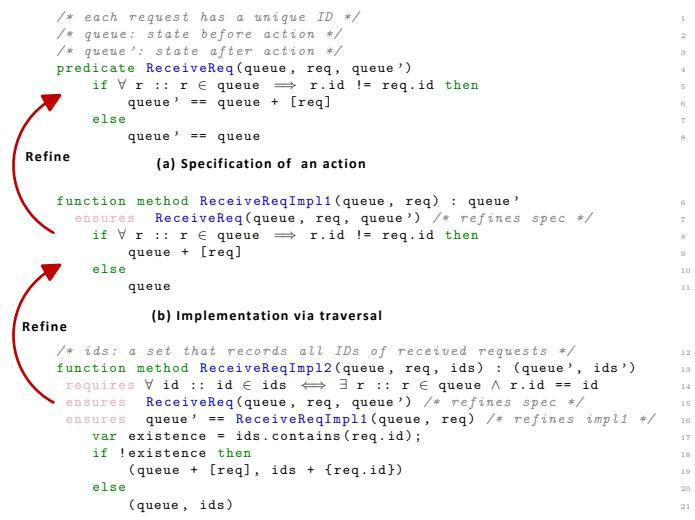
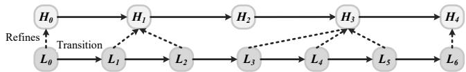
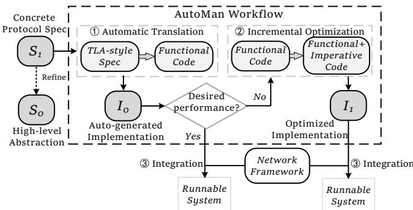
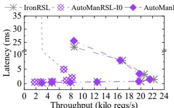
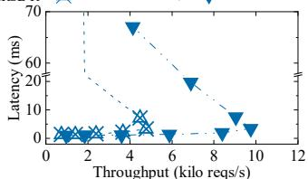
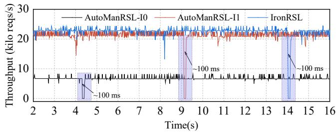
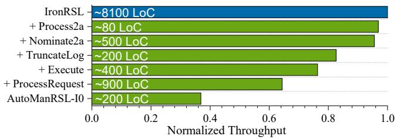
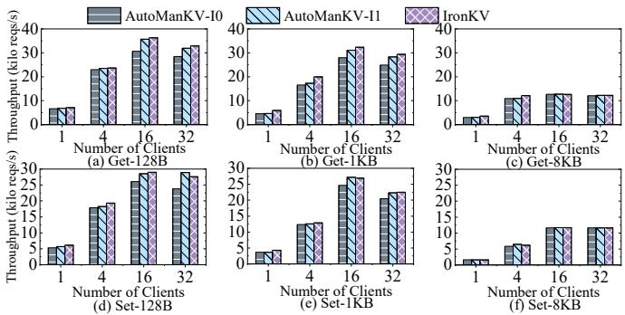
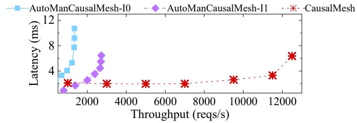
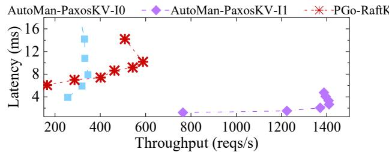

Latest updates: hps://dl.acm.org/doi/10.1145/3731569.3764822

RESEARCH-ARTICLE

# AutoMan: Facilitating Verified Distributed Systems Development Through Automatic Code Generation and Manual Optimizations

ZIHAO ZHANG, Stony Brook University, Stony Brook, NY, United States TI ZHOU, Stony Brook University, Stony Brook, NY, United States CHRISTA JENKINS, Stony Brook University, Stony Brook, NY, United States OMAR CHOWDHURY, Stony Brook University, Stony Brook, NY, United States SHUAI MU, Stony Brook University, Stony Brook, NY, United States

Open Access Support provided by: Stony Brook University

  
Published: 12 October 2025

Citation in BibTeX format

SOSP '25: ACM SIGOPS 31st Symposium   
on Operating Systems Principles   
October 13 - 16, 2025   
Seoul, Republic of Korea

Conference Sponsors: SIGOPS

# AutoMan: Facilitating Verified Distributed Systems Development Through Automatic Code Generation and Manual Optimizations

Zihao Zhang† Ti Zhou† Christa Jenkins Omar Chowdhury Shuai Mu

Stony Brook University

## Abstract

Developing correct and performant distributed systems is notoriously challenging due to their complexity and scale. There are two main approaches to addressing correctness issues that stem from their complexity: (i) formal verification, and (ii) automatic compilation of specifications to implementations. The former provides machine-checked correctness guarantees along with good performance but requires substantial expert effort. In contrast, the latter can reduce developer effort, though often at the expense of rigorous correctness guarantees. In this paper, we design, develop, and evaluate the AutoMan workflow, which makes developing distributed systems with refinement-based formal verification techniques more accessible and practical for both experts and developers. AutoMan achieves this by automatically generating implementations and their corresponding verification obligations from formal system specifications. This is accomplished without placing trust in the code generator and without sacrificing end-to-end correctness or performance. AutoMan’s use of refinement-based verification methodology for ensuring soundness allows hand-tuned performancecritical code and automatically generated code to harmoniously co-exist without jeopardizing end-to-end correctness guarantees. The effectiveness of AutoMan is demonstrated through the reimplementation of Multi-Paxos, PBFT, a sharded Key-Value store, and CausalMesh following the AutoMan methodology. In all cases, the use of AutoMan substantially reduced development effort (e.g., 70%-97% for Multi-Paxos), while the resulting systems maintained robust efficiency and correctness.

CCS Concepts: • Software and its engineering → Software verification and validation; • Computer systems

organization → Dependable and fault-tolerant systems and networks.

Keywords: Distributed Systems, Formal Verification, Code Generation

## 1 Introduction

Distributed systems form the fundamental infrastructure for hosting critical services. However, even with rigorous testing, their design and implementation remain notoriously error-prone, often leading to subtle bugs that are difficult to uncover and even harder to reproduce when discovered [3, 25, 31, 51, 52, 64]. Formal methods offer stronger correctness guarantees than traditional testing. Within this space, there are two main approaches, each with distinct trade-offs, for addressing correctness issues in distributed systems. Both approaches require, as input, a low-level formal specification of the system under development that soundly refines the corresponding abstract protocol specification.

The first approach employs formal verification techniques to develop correct-by-construction distributed system implementations (e.g., Verdi [100], IronFleet [37]). Such implementations are guaranteed to be free of runtime bugs that violate any formally proven properties, within the verified portions of the system. Unfortunately, these assurances often come at a high cost in terms of manual effort, particularly from verification experts. In contrast, the second approach automates implementation by compiling the verified low-level specification into executable code using a compiler or translator (e.g., PGo [32]). However, these approaches suffer from two key limitations: (1) Low performance: such a translator mostly focuses on functionality and has limited capability for optimizing performance; (2) Weak correctness guarantees: no formal correctness guarantees can be provided unless the translator is formally proven to be semantic-preserving.

This naturally raises the question: Is it possible to design a distributed system development workflow that combines the strengths of both approaches, lowering manual effort while maintaining formal correctness and achieving reasonable performance? In this paper, we answer this question affirmatively by designing, developing, and evaluating AutoMan, which proposes a new workflow accompanied by automation tools that makes the development of distributed system implementations under the refinement-based verification methodology more user-friendly, practical, and accessible.

A practical workflow for developing correct but performant distributed systems often follows the following philosophy: develop the system that works correctly first, and then incrementally perform performance-improving but semanticpreserving optimizations on it to achieve performance goals. AutoMan’s accompanying automation (i.e., automated code generator) contributes to reducing the manual effort associated with developing the correct but not necessarily performant system. Generally speaking, a typical refinement-based verification methodology has the following high-level steps: ❶ formalize the low-level system specification ?? in a suitable logic; ❷ develop an implementation ?? from the system specification ??; ❸ formally verify using some deductive verifier that ?? satisfies ?? (i.e., ?? |= ??). AutoMan develops an automated code generator that can automatically translate ?? to an executable implementation ?? along with the associated verification conditions needed in step ❸, many of which can be automatically discharged by the underlying SMT solver. This automation removes the manual work associated with developing ?? . Unlike approaches like PGo [32], one does not have to trust the code generator of AutoMan because the generated implementation is formally verified in step ❸.

Due to the adoption of the refinement-based approach as its underlying verification methodology, AutoMan can naturally facilitate the incorporation of performance-improving but semantic-preserving optimizations. This is achieved by simply treating these optimizations as sound refinements of ?? (the implementation developed in step ❷ and verified in step ❸). In addition, distributed systems often require optimizing only a few performance-sensitive components to enhance overall efficiency. Take replicated state machines (RSMs) as an example: protocols like Raft [75] and Paxos [13] usually have two components: failure recovery (leader election) and data replication. While failure recovery is essential for data safety, it rarely affects steady-state performance. In contrast, replication dominates normal-case execution, so optimization efforts in practice often focus on replication [8, 85, 99]. As a result, it is possible that one can use a majority of the AutoMan-generated code while needing to hand-tune only a few performance-critical components, substantially reducing manual effort.

AutoMan’s translator expects the TLA-style specification of a distributed system to be expressed in Dafny, which specifies the system as a state machine with first-order-logic predicates that describe state transitions. Since automatic program synthesis from arbitrary specifications is undecidable [83], we confine our scope to a fragment of Dafny that is translatable to code without resorting to search-based (enumerative and solver-aided) program synthesis [4, 30, 90]. This fragment, however, is expressive enough to precisely capture the specifications of many complex distributed systems, as demonstrated in our case studies on Multi-Paxos, PBFT, a sharded key–value store, and CausalMesh [106].

AutoMan’s supported fragment of Dafny is characterized by both syntactic restrictions (programs outside the fragment will fail to parse) and semantic restrictions. Given a TLA-style specification of a distributed system in Dafny, we develop a novel static, flow-sensitive analysis to determine not only whether the specification is well-formed but also whether it is amenable to AutoMan’s translator. The static analysis also generates meaningful feedback to developers, localizing portions of the specification that lie outside the supported fragment, enabling them to reformulate the specification or supply additional annotations.

As discussed before, for end-to-end correctness of the hand-tuned code, AutoMan relies on refinement proofs to connect both auto-generated and manually written code. During translation, a refinement scaffolding is generated. It provides proof obligations to ensure that each auto-generated function refines the specification, and also enables manual refinement proofs for human-optimized code by leveraging the Abstractify functions in the scaffolding. These manual proofs can then be integrated into the overall refinement structure, allowing the entire codebase to be verified with the same level of correctness guarantee as a purely manually verified implementation, such as IronFleet [37].

In summary, this paper makes the following contributions: • We present a structured development workflow supported by the AutoMan methodology. The workflow decomposes the development of distributed systems into steps with different focuses: first ensuring correctness, then optimizing for performance. AutoMan facilitates this workflow through a hybrid methodology that combines the strengths of both automatic and manual verification approaches, with high manual effort reduction and a safety guarantee.

• We develop a translator to support our methodology. It performs static, flow-sensitive analysis of specifications to ensure well-formedness, automatically generates implementation code together with refinement scaffolding, and supports the incorporation of further manual proofs for optimized code, enabling the verification of the entire mixed system implementation.

• We demonstrate AutoMan’s generality and efficacy through case studies on Multi-Paxos, PBFT, a sharded KV store, and CausalMesh. In our evaluation, AutoMan reduces manual effort by 70% to 97%, while delivering over 90% of the throughput of manual implementations like IronFleet.

## 2 Background and Design Overview

This section provides the necessary background and a highlevel overview of AutoMan’s design. We first present the preliminary concepts, then touch upon the key insights and design philosophy behind AutoMan. We conclude this section with a step-by-step workflow.

## 2.1 Temporal Logic of Actions

Background: TLA-style State Machine Specification. Distributed systems can naturally be modeled as state machines, where system behavior is expressed as a sequence of state transitions triggered by events such as messages, timeouts, or internal logic. TLA [44] formalizes this model by defining state variables and actions, where each action is expressed as a predicate relating the transition from the old state to the new state. Figure 1(a) illustrates a simple action, whose state is a request queue. This action is triggered upon receiving a request and specifies the transition by describing the relation between queue and queue’, the states of the queue before and after the action. The specification enforces exactly-once semantics for queuing requests, i.e., the request req is enqueued if and only if it has not been received before. Critically, this is not expressed as imperative code, but as a relational constraint between states, making TLA an expressive and flexible modeling discipline.

Beyond its expressive power, TLA specs are also amenable to verification. They support reasoning about both safety and liveness properties using temporal logic, and are backed by mature toolchains for performing model checking [43] and deductive reasoning [53, 82].

Why do we choose TLA-style state machine specification for AutoMan? AutoMan targets protocol specifications written in TLA style because it is widely adopted in practice. We surveyed distributed systems works in the past 15 years of OSDI and SOSP, finding that out of 10 systems providing formal specifications, 9 used TLA [18, 41, 55– 57, 70, 71, 92, 107], with only one exception [96]. TLA is also popular for verifying production systems, including wide usage in S3, DynamoDB, and Cosmos DB [33, 42, 73].

Given its widespread adoption, AutoMan targets TLA specifications to maximize compatibility and applicability. TLA serves as the underlying formalism and can be expressed in different languages, including the native TLA+ [45], and TLA embeddings in other languages, such as Dafny (as used in IronFleet [37]). AutoMan primarily supports Dafny TLA but also provides a translation tool to convert native TLA+ into Dafny TLA, enabling integration into the AutoMan workflow (§2.4). TLA+ and Dafny TLA have almost identical underlying formalisms, and they primarily differ in syntax.

## 2.2 State Machine Refinement Approach for Verified Distributed Systems

Background: Refinement-based Verification. Refinementbased verification is a methodology for incrementally transforming an abstract description of system behavior into more detailed specifications and, eventually, a concrete implementation. Applying refinement to state machines provides a structured way to reason about distributed systems. As shown in Figure 2, one says that a low-level state machine L refines a high-level state machine H if each state in L has a corresponding state in $H ,$ and each of L’s behaviors, a sequence of state transitions, corresponds to an equivalent behavior of H.

IronFleet [37] demonstrates a concrete application. In Iron-Fleet, the system is modeled as a TLA state machine specification $S _ { 1 }$ , which defines node-level behaviors and combines them into a distributed system specification. From the

  
(c) Efficient implementation via set lookup

Figure 1. An example of an action specification and its multi-layered refinement.

distributed specification $S _ { 1 } ,$ there is an upward step that proves it refines an abstract, centralized (single-node) state machine $S _ { 0 } ,$ , which captures the system’s correctness guarantees (e.g., linearizability). It can then go through a downward step, which refines $S _ { 1 }$ to a concrete system implementation $I _ { 0 } .$ 1 . This establishes a three-layered refinement structure:

$S _ { 0 } \stackrel { \mathrm { R e f i n e s } } { \longleftarrow } S _ { 1 } \stackrel { \mathrm { R e f i n e s } } { \longleftarrow } I _ { 0 } ,$ where the first step guarantees the correctness of system design, and the second step guarantees the correctness of implementation.

Multi-layered Refinement. Beyond IronFleet’s three-layer structure, refinement can happen in more steps. Starting with an abstract state machine $S _ { 0 } ,$ , one can derive a sequence of increasingly concrete specifications. From the most refined specification $S _ { n } ,$ , an initial implementation ??0 is developed, which may then undergo performance-enhancing optimizations, yielding a final implementation $I _ { n } .$

Figures 1 (b) and (c) illustrate an example of refining a specification for queuing requests (Figure 1(a)) to multiple implementations. Figure 1(b) shows an initial implementation, which is inefficient, as it requires a sequence traversal (arising from the use of universal quantification), so in Figure 1(c) it is refined by another implementation that introduces a set whose elements mirror the ids of the queue’s contents, enabling efficient hash-based membership checking.

The correctness of the optimized implementation can be guaranteed by proving that it refines either the original specification (line 15) or the previous implementation (line 16). However, refinement between implementations is not always feasible—for example, when two implementations have significantly different internal logic (even if they produce the same output), or when the implementation is written in a form that is opaque to the verifier (e.g., using method in Dafny). In these cases, the optimized implementation can still be verified to refine specification $S _ { n }$

  
Figure 2. Low-level state machine L refines the high-level state machine H. Each transition in $L ( \mathbf { e . g . } , L _ { 0 }  L _ { 1 } )$ may correspond to zero, one, or several transitions in H.

Why do we choose Dafny as AutoMan’s target language and verification platform? Dafny has proven effective for facilitating refinement verification [37]. Its deductive reasoning capabilities allow us to verify refinement of both generated and optimized implementations, enabling automation and end-to-end correctness. In cases where automated verification fails, Dafny has language features for writing proofs explicitly. Additionally, Dafny’s support for both functional and imperative programming styles makes it suitable for our purposes. We use functional code for TLA specifications and auto-generated initial implementations, while imperative code can be used in manual optimizations to enhance performance.

## 2.3 Design Philosophy behind AutoMan

AutoMan is guided by two key insights that inform its hybrid approach, building directly on the foundations established in §2.1 and §2.2.

Insight 1: State machine refinement facilitates implementation automation without sacrificing correctness. A distributed system specified as a TLA state machine is composed of actions. In the refinement step from TLA specification to implementation, each action predicate is connected to the corresponding implementation function or method. Therefore, system-level correctness is established by proving that each action’s implementation refines its specification. This structure naturally decomposes implementation and verification into independent units, enabling tools to automatically generate both code and refinement proof obligations for each action. The obligations are often simple enough to be discharged automatically by SMT solvers when the implementation faithfully follows the specification, allowing automation without sacrificing correctness.

Insight 2: The performance of distributed systems is often dominated by some key components. A classic example is state machine replication (SMR) systems, which can be decomposed into two parts: a control plane and a data replication plane. The control plane often handles complex but rare cases, such as leader election and recovery, which are crucial for data safety but not performance-critical. Conversely, the data replication plane, which handles request processing, log replication, and execution, dominates system performance as it runs continuously during normal day-today operation. Optimizations to the data replication plane will thus directly improve relevant performance metrics such as throughput and latency. Table 1 lists a few SMR systems and their lines of code for the two planes. The results show that the replication plane, which is performance-sensitive, constitutes a small portion of the code base, suggesting that overall system performance can often be improved by targeting these few critical components.

<table><tr><td>Systems</td><td>Control plane</td><td>Data replication plane</td></tr><tr><td>IronFleet [37] Multi-Paxos spec</td><td>970</td><td>220</td></tr><tr><td>NuRaft [22]</td><td>3600</td><td>1100</td></tr><tr><td>etcd [23]</td><td>1700</td><td>180</td></tr></table>

Table 1. LoC estimates of SMRs. The control plane (complex, performance-insensitive) accounts for 76%-90% of the codebase.

Design Philosophy. Insight 2 motivates a natural division of development effort: automating implementation and verification of performance-insensitive components to reduce developer burden, while allowing developers to concentrate their effort on the parts that are valuable to be optimized. This results in the design philosophy of AutoMan: first, use a mechanical tool to produce a correct-by-construction implementation, and then selectively optimize critical components as needed.

Insight 1 highlights that the structure of state-machine refinement makes this design philosophy practical. AutoMan features an automatic tool to translate specification into implementation code at the action-level, along with corresponding refinement proof obligations. These obligations are usually verified automatically using an SMT solver, allowing developers to obtain a basic yet verified implementation with minimal effort. Developers can then selectively hand-optimize key actions without impacting the rest of the system. Although manual optimizations are error-prone, AutoMan supports writing refinement proofs for manual code and integrating them into the generated refinement structure, enabling unified verification of hybrid systems that mix auto-generated and manually optimized code. As a result, AutoMan achieves reduced human effort, high performance, and end-to-end provable correctness.

Importantly, while the observation in Insight 2 motivates our design philosophy, it is not a prerequisite for applying AutoMan. Even in systems without a clear distinction of performance-critical components, developers can still use AutoMan to minimize the cost of obtaining a correct implementation, and then choose whether and where to optimize based on their needs.

## 2.4 AutoMan’s Workflow

Figure 3 illustrates the AutoMan workflow, which presents a four-layered refinement, $S _ { 0 } \stackrel { \mathrm { R e f i n e s } } { \longleftarrow } S _ { 1 } \stackrel { \mathrm { R e f i n e s } } { \longleftarrow } I _ { 0 } \stackrel { \mathrm { R e f i n e s } } { \longleftarrow } I _ { 1 } .$ The workflow takes a concrete TLA specification $S _ { 1 }$ as input, which is proved to refine a single-node state machine abstraction $S _ { 0 } .$ . Then the workflow proceeds in three steps: (i) a translator automatically translates each action predicate in $S _ { 1 }$ into a refining implementation with refinement proof obligations (§3), (ii) developers optionally optimize performance-critical parts, guided by profiling or domain expertise, and write proofs for the optimized code (§4), and (iii) the produced implementation (optimized or auto-generated) is integrated with the network framework to form a runnable system.

  
Figure 3. Overview of AutoMan’s workflow.

## 3 AutoMan’s Translator

AutoMan translator aims to translate the Dafny TLA specification to a functional implementation. However, translating abstract, declarative specifications requires overcoming several challenges like (i) implicit input/output distinction, (ii) flexible relational constraints, and (iii) inherent nondeterminism. These challenges arise primarily from the generality of the modeling language (Dafny) and discipline (TLA) targeted by AutoMan. We intend to address them at the tooling level, rather than requiring developers to use another customized spec language. The benefit of doing so is compatibility with existing practice, allowing it to meet distributed systems developers where they already are.

In this section, we describe the design and key phases of the AutoMan translator. We begin with an overview, then present our solution for inferring argument modes to address challenge (i) (§3.1). We then describe static analysis techniques used to resolve challenges (ii) and (iii) (§3.2.1). We follow with a description of the code-generation process (§3.2.2), and finally present the generation of refinement scaffolding (§3.3), which enables verification of the generated implementation.

## 3.1 Overview of the AutoMan Translator Tool We now overview AutoMan’s translator, detailing its inputs and modular design.

Inputs. AutoMan takes Dafny TLA specifications as input. Figure 4 shows an example derived from IronRSL [37], a verified Multi-Paxos protocol. Such specifications consist of initial-state predicates (e.g., AcceptorInit) and action predicates (e.g., AcceptorTruncateLog), where each action specifies how the next state is computed from the current state. We refer to these as “functionalizable predicates”, meaning that executable code can be generated from them. In addition, there are “evaluatable predicates” used solely for specification purposes (e.g., in contracts, invariants, or guards), such as IsTruncationPointValid, where all arguments are inputs. To distinguish between these two kinds of predicates, each predicate argument requires a mode indicating whether it is an input (read-only, provided by the caller) or an output (produced by the predicate). This mode information guides the translator to identify the functionalizable predicates to be translated.

However, TLA does not explicitly distinguish input and output arguments. To resolve this ambiguity, AutoMan requires users to provide mode annotations for predicates. Thus, the input to the translator consists of: (i) a Dafny TLA spec, and (ii) user-supplied annotations for predicates. These annotations declare modes using ‘+’ for input and ‘–’ for output, following logic programming conventions [5, 19, 21]. The semantic of this annotation is that, given concrete values for input-mode arguments, the values of output-mode arguments can be computed. By adding such an annotation, user instructs the translator to check that the predicate is functionalizable and, if so, generate an implementation.

Modularity. AutoMan’s translator is designed with a modular architecture, comprising five sequential modules: Parser → Annotator → Mode Validator → Checker → Code Generator. This design aligns with conventional translator designs [2, 24]—including parsing, semantic analysis, and code generation—yet incorporates specialized modules tailored for handling TLA specifications and refinement verification.

Specifically, the Parser converts a raw Dafny specification into an abstract syntax tree (AST). Subsequently, the Annotator processes user annotations, attaching input-output mode declarations as metadata to predicate nodes in the AST to form the intermediate representation (IR). Next, the Mode Validator module performs sanity checks, ensuring consistency between user annotations and the specification and enforcing syntactic restrictions. The Checker then conducts extensive semantic analysis to verify that each action predicate, as a relation, is functional. Finally, the Code Generator transforms the validated IR into functional-style implementation code accompanied by refinement verification constructs, enabling verification of the generated output.

While the translation pipeline may appear complex, each intermediate check plays a critical role in increasing confidence in translation soundness. In contrast, a more lightweight translator that omits these checks could potentially result in unpredictable or invalid implementations, wasting developer time. The modular structure also supports extensibility, so new checking rules or analyses can be incorporated incrementally. Moreover, the intermediate modules (i.e., Annotator, Mode Validator, and Checker) follow a general design for TLA specifications, leaving our tool open to extensions supporting other source languages.

## 3.2 Analysis and Code Generation

Following the parsing and annotation phases, which produce a mode-description augmented IR, AutoMan’s translator

```verilog
1 /* RSL / Acceptor . i. dfy */
2 module RSL_Acceptor_i {
3 predicate AcceptorInit ( a: Acceptor , c : Constants ) {
4 && a. constants == c
5 && a. max_bal == Ballot (0 ,0)
6 && a. votes == map []
7 && a. truncation_point == 0
8 && |a . last_checkpointed | == | c. config . replicas |
9 && ( forall idx :: 0 <= idx < | c. config . replicas |
10 == > a. last_checkpointed [ idx ] == 0)
11 }
12
13 predicate AcceptorTruncateLog ( s : Acceptor ,
s ’: Acceptor , opn :int ) {
14 if opn <= s. truncation_point then
15 s ’ = = s
16 else
17 && RemoveVotesBefore ( s . votes , s ’. votes , opn )
18 && s ’ == s .( truncation_point := opn ,
19 votes := s ’. votes )
20 }
21
22 predicate IsTruncationPointValid (
23 truncation_point :int ,
24 last_checkpointed : seq <int > ,
25 config : Configuration )
26 { /* ... */ }
27 }
28 /* RSL . automan */
29 module RSL_Acceptor_i {
30 AcceptorInit ( - ,+) ;
31 AcceptorTruncateLog (+ , - ,+) ;
32 RemoveVotesBefore (+ , - ,+) ;
33 IsTruncationPointValid (+ ,+ ,+) ; /* optional */
34 }
```  
Figure 4. AutoMan’s input: specification and annotation

performs rigorous mode checking analysis to ensure the specification is well-formed for translation, ultimately delivering a validated IR for the code-generation phase.

## 3.2.1 Mode Checking

TLA specifications are expressive and declarative, allowing flexible relational constraints (e.g., unconstrained ordering, partial or multiple constraints on outputs) and nondeterminism (e.g., due to disjunctions and existential quantifiers). While beneficial for abstract modeling, such constructs introduce ambiguity when translating to concrete, deterministic implementations.

To address this, mode checking enforces syntactic and semantic restrictions, guaranteeing that code is generated only when the specification precisely describes implementable functions. When AutoMan encounters an predicate that fails mode checking, it emits diagnostic information for the user and generates a stub (a function signature with no body). This gives users the flexibility of either: modifying the specification and rerunning AutoMan’s translator; or providing a manual implementation. Conceptually, mode checking can be decomposed into the following phases.

Phase 1: Sanity Checking. The first phase, performed by the Mode Validator module, ensures the specification conforms to syntactic restrictions and that user annotations align correctly with the specification. Specifically, it performs the following checks:

function method CAcceptorInit ( c : CConstants ): CAcceptor   
2 /\* generated refinement obligation \*/   
3 {   
4 var a\_constants := c ;   
5 var a\_max\_bal := CBallot (0 , 0) ;   
6 var a\_votes := map [];   
7 var a\_truncation\_point := 0;   
8 var a\_last\_checkpointed :=   
seq (| c . config . replicas | , ( idx ) => 0) ;   
9 /\* assemble variables into a new state and return \*/   
10 CAcceptor ( a\_constants , a\_max\_bal , a\_votes ,   
a\_last\_checkpointed , a\_truncation\_point )   
11 }   
12   
13 function method CAcceptorTruncateLog ( s: CAcceptor , opn : int)   
: CAcceptor   
14 /\* generated refinement obligation \*/   
15 {   
16 if opn <= s. log\_truncation\_point then   
17 var s ’ := s ;   
18 s ’   
19 else   
20 var s ’ \_votes := CRemoveVotesBefore ( s . votes , opn ) ;   
21 var s ’ := s .( truncation\_point := opn ,   
22 votes := s ’ \_votes ) ;   
23 s ’   
24 }  
Figure 5. Example output of AutoMan

• Checks that each annotated predicate correctly matches its definition in both name and arity.

• Disallows disjunctions and existential quantifiers in constraints involving output-mode variables. Such constructs introduce nondeterminism, and thus are permitted only within guards or contracts.

• Prohibits unsupported Dafny constructs (e.g., classes, abstract modules, and complex generics).

Phase 2: Functionalizability Checking. This phase, performed by the Checker module, enforces semantic restrictions that every functionalizable predicate defines all outputmode variables completely and unambiguously.

Specifically, it addresses the following semantic pitfalls:

• Assignment completeness and uniqueness: Each outputmode variable (including subfields) must have exactly one candidate assignment, avoiding both under- and overconstrained specifications. The only exception is benign reflexive equalities used in record updates (e.g., s’.votes == s’.votes in Figure 4, line 19), while this field has already been assigned elsewhere (e.g., line 17 by invoking another action).

• Dependency ordering: If one output variable depends on another (e.g., s’ depends on s’.votes in lines 18–19 of Figure 4), the Checker enforces a dependency ordering to guarantee correct computation sequences.

Additionally, AutoMan supports universal quantifierbased updates on collection types, such as sequences and maps. For instance, Figure 4 (lines 8–10) contains two constraints on sequence a.last\_checkpointed: the first constrains the domain of the sequence (i.e., its length); the second constrains the mapping of indices in the sequence’s domain to its elements. To facilitate translation, universal quantification must adhere to a constrained pattern: ∀?? :: ?? (??) =⇒ expr, where ?? (??) delineates the domain and expr specifies the mapping of the collection’s domain to its elements. The Checker validates that universal quantifications conform to this translatable pattern.

1 function method CAcceptorTruncateLog ( s: CAcceptor , opn : int )   
: (s ’: CAcceptor )   
2 requires CAcceptorIsValid ( s)   
3 ensures CAcceptorIsValid (s ’)   
4 /\* refines the original spec \*/   
5 ensures AcceptorTruncateLog (   
6 AbstractAcceptor ( s) ,   
7 AbstractAcceptor (s ’) ,   
8 AbstractOperationNumber ( opn ) )  
Figure 6. Example of generated refinement obligations

## 3.2.2 Functional Implementation Code Generation

Upon successful completion of all analysis phases, AutoMan generates functional implementation code for each functionalizable predicate. The significance of a predicate labeled as functionalizable is that one can turn it into a function based on the mode description. For example, given a predicate ${ \sf T } \subseteq \mathbb { N } \times \mathbb { Z } \times \mathbb { R }$ with the mode declaration $\mathsf { T } ( + , + , - )$ the resulting implementation is an executable function of signature: $\mathsf { f u n } _ { \mathsf { T } } : \mathbb { N } \times \mathbb { Z } \to$ R. Then for conjuncts in the predicate body, AutoMan maps candidate assignments to local variable declarations and assembles output-mode variables as return values.

Concretely, Figure 5 demonstrates this process by translating the actions in Figure 4. AutoMan first partitions predicate arguments into input arguments and output return values. Subsequently, it translates candidate assignments in predicate conjuncts into local variable declarations: equalities (Figure 4, lines 4–7) become variable assignments (Figure 5, lines 4–7); predicate invocations (Figure 4, line 17) convert to function calls assigned to local variables (Figure 5, line 20); universal quantifiers (Figure 4, line 9) are rendered as collection comprehensions (Figure 5, line 8). Finally, the outputs are assembled from these variables and returned (Figure 5, lines 10 and 21).

## 3.3 Refinement Verification Scaffolding Generation

Beyond generating executable code, the Code Generator module is specifically designed to support refinement verification. Unlike existing tools such as PGo [32], it produces not only implementation code but also refinement scaffolding that facilitates verification. This scaffolding reduces boilerplate in refinement proofs and enables formal verification that the generated code correctly refines the original specification, ensuring translation correctness. Moreover, based on this scaffolding, developers can incorporate refinement proofs for manually optimized components into the same framework (§4.3). This capability bridges auto-generated and manually written code, enabling end-to-end correctness for hybrid implementations.

Establishing Correspondence for Types. To support refinement, types in the implementation must be mapped to their counterparts in the specification, a process typically called abstraction. AutoMan automatically generates Abstract functions for implementation types. Since (in general) not all implementation values necessarily correspond to valid abstract values, AutoMan also generates a Valid predicate for each type, used as preconditions of Abstract functions to ensure soundness in refinement.

For built-in types (e.g., seq, set, map), AutoMan provides predefined Abstract functions in a common library. These ensure that operations such as sequence slicing, concatenation, and map updates preserve the intended abstraction. For user-defined types, AutoMan automatically synthesizes corresponding Abstract functions by recursively abstracting each field, ultimately reducing to built-in types, at which point the predefined Abstract functions are applied.

Generating Refinement Proof Obligations. For every action in $I _ { 0 } ,$ it must be proven that its input and output states are permitted by the specification. To support this, AutoMan augments the contract of each generated function with the following proof obligations:

• requires clauses assert that all inputs are valid refinements of their corresponding specification types.

• If the function has outputs, it includes ensures clauses that guarantee all outputs are valid refinements of their corresponding specification types.

• If the function is generated from a functionalizable predicate f\_spec, it includes an ensures clause asserting that the abstractions of its inputs and outputs satisfy f\_spec.

Example. Figure 6 shows the generated function signature of the AcceptorTruncateLog action in Figure 4. The function includes requires clauses to ensure that inputs satisfy their respective validity predicates. It also contains an ensures clause that asserts both the validity of the resulting state and that the implementation soundly refines AcceptorTruncateLog.

Verifying Generated Implementation. Ultimately, it is Dafny that verifies that the generated $I _ { 0 }$ satisfies the refinement obligations. Since code generation closely follows the specification’s state transition constraints, most obligations are verified automatically. In more complex cases, minimal manual annotations—such as assertions—may be required to assist Dafny’s automated reasoning. As demonstrated in §5, verifying refinement for Multi-Paxos required only 63 lines of additional annotations.

## 4 Verified Manual Optimization

Automatically generated functional implementations may not meet performance requirements. To address this, AutoMan supports targeted manual optimizations on generated code. In this section, we will first describe the focus of optimization, then present common bottlenecks and their optimizations, and finally explain how these optimizations are verified and integrated into the overall system.

## 4.1 Optimization Focus and Bottleneck Identification

AutoMan primarily targets implementation-level optimizations, which improve the efficiency of the generated implementation without changing its high-level semantics. Such optimizations typically focus on performance bottlenecks that are small in scope but yield significant performance gains.

Rather than prescribing a fixed strategy for identifying these bottlenecks, AutoMan gives developers the flexibility to decide what to optimize based on their system context. Common approaches include runtime profiling, domainspecific insights, and targeted code inspection. In our case studies, we primarily used tools such as dotnet-trace and PerfView to visualize function-level CPU usage and identify bottlenecks efficiently. Although not fully automated, this process is lightweight and effective in practice, helping developers focus their optimization efforts where they are most impactful.

Besides implementation-level optimizations, in practice, developers may also wish to improve the protocol itself—for example, by adjusting quorum sizes, modifying message flows, or applying more sophisticated design-level changes. Such optimizations fall outside the scope of AutoMan, as they are difficult to verify via refinement unless explicitly modeled in the specification. A practical approach to incorporate the design-level optimization is that developers design advanced protocols in specification, and then use AutoMan to produce efficient, verified implementations.

## 4.2 Optimizing Representative Performance Bottlenecks

We now present several representative examples of bottlenecks that arise in the generated distributed system implementations. Although these issues may seem minor, addressing them can lead to substantial performance improvements. As demonstrated in our case study in §5.1.2, such bottlenecks can account for over 70% of total CPU usage.

Redundant Traversals from Abstract Operations. Specifications often use high-level declarative constructs, such as quantifiers, to express protocols, which facilitate formal reasoning but do not prescribe how to compute the result efficiently. In translation, such constructs are preserved or transformed into equivalent computable expressions. For example, existential quantifiers in guards are preserved, and universal quantifiers used for collection updates are mapped to collection comprehensions, both of which essentially involve traversals. While correct, these rigid translations result in expensive traversals that degrade runtime performance. Optimization: Many traversals are usually unnecessary in concrete implementations. By understanding the underlying intent of the specification, developers can introduce auxiliary data structures (e.g., hash sets or indexed maps) or metadata (e.g., min/max in a collection) to replace costly traversals. These optimizations preserve semantics while improving complexity from linear to constant or logarithmic.

Underutilization of Data Properties. Generated code often lacks awareness of implicit semantic properties in specifications (e.g., monotonicity, sortedness). As a result, generated implementations frequently resort to suboptimal, generic algorithms. For instance, when dealing with sorted arrays, models may default to linear search instead of leveraging the sortedness property for binary search.

Optimization: By applying domain-specific insights, developers can recognize and exploit the data properties that are missed in generated code, enabling the use of more efficient algorithms, such as binary search on a sorted sequence.

Verification-Friendly Types Hindering Runtime Efficiency. Auto-generated code defaults to immutable types and unbounded integers to simplify verification, but this comes at the cost of performance. Frequent modifications to immutable structures can result in repeated copying and reconstruction, leading to significant overhead.

Optimization: Replacing immutable types with mutable ones can greatly enhance performance, especially in scenarios involving frequent updates to large data structures.

## 4.3 Optimized Implementation Verification

To preserve correctness after integrating manual code into generated code, each optimized function must be verified, followed by verifying the combined implementation that contains both manual and auto-generated code.

Verifying Optimized Functions Individually. Optimized code is typically written as imperative methods, using constructs like loops and mutable types. To verify the correctness of an optimized method, one can prove either that it refines the original spec or that it behaves equivalently to the generated function (i.e., produces the same outputs for the same inputs). Since the generated code is functional (i.e., function method in Dafny) and therefore transparent to verification, it enables refinement between two layers of implementations. In Dafny, each obligation can be expressed with an ensures clause. The following example shows both forms for illustration, but in practice, only one is required:

```c
method CAcceptorTruncateLog_I1 ( s : CAcceptor , opn : int )
returns (s ’: CAcceptor )
requires CAcceptorIsValid ( s)
3 ensures CAcceptorIsValid (s ’)
4 /* refines the original spec */
5 ensures AcceptorTruncateLog (
6 AbstractAcceptor ( s) ,
7 AbstractAcceptor (s ’) ,
8 AbstractOperationNumber ( opn ) )
9 /* refines the auto - generated impl */
10 ensures s ’ == CAcceptorTruncateLog (s , opn )
```

The verification of optimized code also relies on the refinement scaffolding generated by translator. For instance, optimized functions use generated Abstract functions to get corresponding abstract states. When an optimized function $M _ { 1 }$ invokes a generated function $A _ { 2 } ,$ its refinement depends on the correctness of $A _ { 2 } .$ . Fortunately, AutoMan generates refinement obligations for all auto-generated functions, and these obligations are verified by Dafny to be satisfied. Therefore, the correctness of $A _ { 2 }$ can be assumed when verifying optimized code, ensuring transitive refinement.

Mutable types in optimization introduce intermediate states, which complicate reasoning about refinement obligations. To address this, we use ghost variables, which are immutable shadow variables that mirror the evolution of mutable state. Then the verification is separated into two steps: (1) prove that the ghost variable satisfies desired properties, and (2) ensure that the mutable state remains consistent with its ghost counterpart after each update. This decouples correctness reasoning from imperative effects, making verification more tractable.

Verifying the Combined Implementation. System-level correctness is established by composing individually verified actions. Since each system transition is implemented by a single action, verifying each action independently enables modular reasoning. As a result, manually optimized actions can seamlessly replace their auto-generated counterparts, as long as refinement is proven, without compromising overall system correctness. This refinement framework supports verifying the hybrid implementation, ensuring end-to-end system correctness.

## 5 Case Studies

To demonstrate the applicability of AutoMan, we applied it to a diverse set of distributed systems, spanning different levels of complexity and application domains. Our case studies include the consensus protocol Multi-Paxos (§5.1), the Byzantine-tolerant protocol PBFT (§5.2), a distributed key-value store (§5.3), and the causally consistent system (§5.4).

## 5.1 Multi-Paxos

Multi-Paxos is a widely adopted consensus protocol with significant complexity, and thus is a popular target for verification [37, 78, 80, 102, 103].

## 5.1.1 Automatic Translation

We applied AutoMan to the IronFleet Multi-Paxos specification (IronRSL) to construct AutoManRSL-I0. A total of 33 functions and 55 actions were translated, producing 2,119 lines of code including both implementation and refinement scaffolding. Two actions could not be translated as they used existential quantification in a manner unsupported by AutoMan, and so required manual implementations.

<table><tr><td>Systems</td><td>Actions</td><td>10(%)</td><td>11 (%)</td></tr><tr><td rowspan="5">AutoManRSL</td><td>ProcessRequest</td><td>28.1</td><td>4.6</td></tr><tr><td>Execute</td><td>26.8</td><td>10.5</td></tr><tr><td>TruncateLog</td><td>9.2</td><td>0.2</td></tr><tr><td>Nominate2a</td><td>11.1</td><td>2.5</td></tr><tr><td>Process2a</td><td>3.5</td><td>0.1</td></tr><tr><td rowspan="4">AutoManPBFT</td><td>ProcessRequest</td><td>16.8</td><td>5.1</td></tr><tr><td>Execute</td><td>22.6</td><td>10.7</td></tr><tr><td>TruncateLog</td><td>9.4</td><td>0.6</td></tr><tr><td>ProcessPrePrepare</td><td>12.4</td><td>1.8</td></tr></table>

Table 2. CPU usage of bottleneck actions before and after optimization.

The generated code was verified using Dafny. One action failed due to a map update, requiring manual annotations to prove that the map update refined the corresponding update on the abstract type. Additionally, six actions required simple injectivity assertions over sets when calling the Abstract function. In total, 63 lines of proof annotation were added.

## 5.1.2 Manual Optimization

Profiling results (Table 2) for AutoManRSL $- \mathrm { I } _ { 0 }$ reveal several CPU-intensive actions in the data replication plane. We categorize the bottlenecks and corresponding optimizations as follows, reflecting the strategies outlined in §4.2.

Eliminating Inefficient Traversals. Several actions incurred significant overhead due to traversals arising from direct mappings of abstract quantifiers.

ProcessRequest accounts for 28% of total CPU time, primarily due to its subaction ReflectReceivedRequest, which enforces exactly-once semantics by enqueuing a request only if it has not been received before. As shown in Figure 7, this action uses an existential quantifier to check whether a request has been received, resulting in a traversal of the request queue during execution. We optimized it by maintaining an additional mutable set that records all IDs of received requests. In this way, the existence check was replaced with a constant-time hash-based lookup, instead of a linear traversal.

Nominate2a consumes 11% of CPU time. Before proposing a value at a given operation number (opn), the Proposer must check if this opn has been proposed in earlier views, by checking if any received 1b message contains a proposal with the same opn. This step is crucial for ensuring consistency across failures, but it introduces a traversal over all received 1b messages. To eliminate this traversal, we introduced metadata, maxOpnWithProposal, recording the highest previously proposed opn in 1b messages. This metadata is calculated once when a replica becomes the Proposer. Subsequently, each time the Proposer attempts to propose at opn, the traversal can be eliminated when opn is greater than maxOpnWithProposal.

function method ReflectReceivedRequest\_I0 ( s : Replica ,   
req : Request ) : Replica   
2 /\* pre - and post - conditions \*/   
3 {   
4 if !( exists r :: r in s . req\_received   
5 && RequestsMatch (r , req ) ) then   
6 s .( req\_received := s . req\_received + [ req ])   
7   
8 }   
9   
10 /\* s. checkpoints is a sequence that indicates the last   
executed operation on all replicas \*/   
11 function method TruncateLog\_I0 ( s : Replica ) : Replica   
12 /\* pre - and post - conditions \*/   
13 {   
14 if ( exists opn ::   
15 && opn in s . checkpoints   
16 && opn > s . log\_truncation\_point   
17 /\* check if opn is the N - th highest value \*/   
18 /\* n is the quorum size \*/   
19 && IsNthHighestValue ( opn , s . checkpoints , n)   
20 then   
21 /\* perform truncate \*/   
22 else   
23   
24 }  
Figure 7. Inefficient actions in AutoManRSL-I0.

Process2a consumes 3.5% of CPU time, and we adopted the same strategy as optimizing Nominate2a, introducing auxiliary metadata to eliminate unnecessary traversals.

Leveraging Data Structure Properties. Automatically generated code does not utilize implicit data properties that facilitate efficient algorithms.

For example, TruncateLog consumes 9% of CPU time. To prevent unbounded log growth, each replica periodically truncates its log. As illustrated in Figure 7, each replica maintains a sequence named checkpoints that records the last executed operation number for each replica. When truncating, a replica attempts to find the latest operation that has 1 been executed by a quorum to be the truncate point, which triggers a nested traversal of the checkpoint sequence. Recognizing that calculating the truncate point is actually finding the ?? -th largest element, we optimized it by converting the sequence into a mutable sorted array (descending). Then the desired value can be directly accessed at index ?? − 1.

Utilizing Efficient Data Types. Performance penalties could arise from using immutable data types.

ExecuteRequest consumes 26.8% of CPU time updating an immutable reply cache. Once a request reaches consensus, it is executed and a reply is sent to the client. To handle potential reply loss in unreliable networks, replies are cached for resend in case of client timeouts. However, AutoManRSL-I0 uses an immutable map for the reply cache, resulting in slow cache updates. This action was optimized by replacing the immutable map with a mutable one, which significantly speeds up queries and updates on the reply cache.

Summary. After optimization, the CPU usage of these actions was reduced from 79% to 18% (Table 2), which demonstrates the effectiveness of targeted optimizations.

## 5.2 PBFT

Byzantine fault-tolerant protocols, such as PBFT [9], are vital for blockchains. Due to the need to handle malicious nodes, PBFT is more complex than Multi-Paxos. Using AutoMan, we implemented and verified a PBFT variant proposed by Lamport [47]. Notably, our PBFT core protocol does not model message encryption; instead, message authentication and integrity are handled in C# code using HMAC (Hashbased Message Authentication Code) [6].

## 5.2.1 Automatic Translation

We began by writing the PBFT specification (??1) in Dafny and proving that it refines the centralized state machine abstraction (??0). The specification was then fed into AutoMan, which generated the implementation AutoManPBFT-I0. This process translated 43 functions and 60 actions, resulting in 2,430 lines of generated code.

During translation, four actions that use existential quantifiers to describe state transitions could not be translated, incurring 248 lines of manual code to implement them. During verification, 8 functions and 2 actions failed as the generated refinement obligations on collection types could not be proved; this required manual annotations that collection operations (e.g., sequence concatenation, slicing, and map modifications) and properties (e.g., sequence uniqueness) are preserved during abstraction. In total, 440 lines of manual code were required for AutoManPBFT-I0.

## 5.2.2 Manual Optimization

Table 2 shows four CPU-intensive actions that we optimized. Three of them were also identified in Multi-Paxos, and we applied the same optimizations as discussed in §5.1.2. The fourth action happens when replicas process the PrePrepare message from the primary. Each replica checks whether the request in the message matches the request received from the client to prevent malicious modifications by the primary. This check involves traversing the request queue and is timeconsuming.

To optimize it, we introduced an auxiliary map to enable request lookups by their IDs, reducing the complexity to constant time. Finally, after optimization, the CPU usage of the four actions was reduced from 61.2% to 18.2%.

## 5.3 Sharded Key-Value Store

The third case study is a sharded key-value store, also evaluated in IronFleet as IronKV. Using the same specification as input, AutoMan generated AutoManKV-I0 by translating 30 functions and 13 actions into 1,487 lines of code. As in the previous case studies, two actions required manual annotations for collection type refinement.

Although profiling AutoManKV-I0 did not reveal major performance bottlenecks, we still optimized the delegation map, which maintains the mapping from keys to their hosting nodes. Specifically, we replaced the map with a sequence of key ranges assigned to each host, enabling more efficient key location queries through range-based lookup.

<table><tr><td>Systems</td><td>I (Auto)</td><td>I (Manual)</td><td>I1</td><td>Total Manual</td></tr><tr><td rowspan="2">AutoManRSL IronRSL</td><td>2119</td><td>~200 (4 hours)</td><td>~2200 (1 week)</td><td>~2400</td></tr><tr><td>-</td><td>-</td><td>-</td><td>~8100</td></tr><tr><td rowspan="2">AutoManKV IronKV</td><td>1487</td><td>~80 (2 hours)</td><td>~1100 (3 days)</td><td>~1180</td></tr><tr><td>1</td><td>-</td><td></td><td>~2700</td></tr><tr><td>AutoManPBFT</td><td>2430</td><td>~440 (6 hours)</td><td>~2400 (1 week)</td><td>~2840</td></tr><tr><td>AutoManCausalMesh</td><td>1120</td><td>~110 (4 hours)</td><td>~700 (2 days)</td><td>~810</td></tr></table>

Table 3. Code size (LoC) and time effort in system implementations. For AutoMan, the reported time reflects the effort of a single developer. The LoC count includes only core system logic implementations derived from specs and their proofs; it excludes framework code such as the main loop and message parsing/marshalling.

## 5.4 CausalMesh

CausalMesh [106] is a system that ensures clients always observe a causally consistent view, even when clients roam among multiple servers. We translated its TLA+ specification into a Dafny specification and proved that it guarantees causal consistency. Using AutoMan, we derived CausalMesh-I0 by translating 26 functions and 4 actions into 1,120 lines of code. Since CausalMesh involves extensive merge operations over sets and maps when merging data versions, and prior studies have noted that operations on such collection types often pose challenges for automatic verification, this resulted in 110 lines of manual annotations to assist the verifier.

In the generated implementation, we identified two operations that impair performance. The most significant one occurs when processing a write request: the server must merge the vector clocks of all versions previously read or written by the client into its own clock to ensure that the new write is assigned a causally larger version. This merging introduces a costly traversal over the dependency set. To optimize this, we introduced an auxiliary variable, max\_- vc, which captures the maximum vector clock among the client’s prior operations. The server can then merge only max\_vc into its own clock, eliminating the full traversal. In addition, we optimized the read path by avoiding unnecessary merges. Originally, when serving a read request, the server would first merge all versions in the read’s dependency set into the cache to ensure causal visibility. However, this step is unnecessary if the cache already stores newer versions. By checking version freshness before merging, we avoid redundant work and further improve performance.

## 6 Evaluation

To validate our methodology, we developed the AutoMan translator in OCaml [17]. We applied AutoMan to the Multi-Paxos protocol, the PBFT protocol, the sharded key-value store, and CausalMesh. In our evaluation, we compare the performance of our implementations with the manual counterparts in IronFleet and automatically generated implementations from PGo [32].



  
Figure 8. Performance of Multi-Paxos and PBFT.

1. How much manual effort can the hybrid method save compared to fully manual implementations (§6.1)?

2. Can translated code achieve usable performance, and how does manual optimization improve it (§6.2)?

3. How does the performance of the hybrid method compare to manually written and optimized implementations like in IronFleet (§6.2)?

4. How does the performance of the hybrid method compare to fully automated (but unverified) approaches like PGo (§6.3)?

## 6.1 Manual Effort Reduction

We quantify the reduction in manual effort by comparing the lines of code (LoC) and time required for both implementation and verification. Table 3 summarizes the effort across all case studies. As PBFT and CausalMesh lack a comparable fully manual baseline, we focus our analysis on Multi-Paxos and the sharded KV store.

Multi-Paxos. During translation, AutoMan generated 2,119 lines of code for AutoManRSL-I0, with only ∼200 lines of manual annotations required (details in §5.1). The entire process took approximately 4 person-hours to complete. The optimized version, AutoManRSL-I1, added ∼2,200 lines of manually written code and required about one person-week of effort.

In comparison, IronRSL, a fully manual implementation, required approximately 8,100 lines of code. AutoMan achieved a 97% reduction in manual effort for AutoManRSL-I0. As for AutoManRSL- $- \mathrm { I } _ { 1 } ,$ the manual effort was reduced by 70%, while achieving over 97% of IronRSL’s throughput (§6.2).

Sharded KV Store. The sharded KV store case study yields similar results. AutoMan generated 1,487 lines of code for AutoManKV-I0, with only ∼80 lines of manual effort required, completed in ∼2 hours. The optimized version, AutoManKV-$\mathrm { I } _ { 1 } ,$ required an additional ∼1,100 lines and took about 3 person-days to complete. Compared to IronKV, which required 2,700 lines of manual code, AutoManKV-I0 reduced manual effort by 97%, while the optimized AutoManKV-I1 achieved a 56% reduction.

## 6.2 Performance of Case Studies

Our experiments for Multi-Paxos, PBFT, and a sharded KV store were conducted on a local cluster, each server equipped with 64 CPU cores and 96 GB of memory. By default, we used four servers, with three serving as replicas/data stores and one dedicated to running clients. For CausalMesh, the experiments were conducted on the Cloudlab platform [94] with 5 cloud servers, each equipped with 16 CPUs and 64 GB of memory.

  
Figure 9. Performance under failures.

Multi-Paxos. We evaluated throughput and latency using 1–256 client threads generating serial request streams.

Figure 8(a) shows that all implementations exhibited increasing throughput with rising concurrency, followed by a decline under overload. AutoManRSL-I0 overloaded sooner. AutoManRSL- $\cdot \mathrm { I } _ { 0 } { } ^ { : }$ ’s peak throughput was 36% of IronRSL and then dropped to near zero under high concurrency.

After optimization, AutoManRSL ${ \bf - I } _ { 1 }$ achieved 2.7× the peak throughput of AutoManRSL $- \mathrm { I } _ { 0 }$ and reached 97% of IronRSL’s peak throughput, while maintaining stable performance under increasing concurrency. These results highlight AutoMan’s ability to deliver comparable performance to fully optimized manual implementations.

We also measured system performance under leader failures. As depicted in Figure 9, we triggered failures by shutting down the leader and observed that AutoManRSL- $\cdot \mathrm { I } _ { 0 } ,$ AutoManRS $_ { \cdot - \mathrm { I } _ { 1 } , }$ , and IronRSL all recovered within 100 ms. Although the recovery code in our implementations is automatically generated, recovery is not CPU-intensive and thus achieves the same performance as IronRSL’s manual implementation. This result further supports our design philosophy: automating performance-insensitive components does not hurt performance.

We further measured the LoC and normalized peak throughput (relative to IronRSL) for each optimization step in Figure 10. Starting from the baseline AutoManRSL-I0, we incrementally optimized five actions, resulting in AutoManRSL-I1. The results demonstrate that performance can be progressively improved through targeted optimizations, allowing developers to flexibly tune the system as needed. Notably, addressing the top bottlenecks yields the most significant gains.

PBFT. The PBFT evaluation followed the same setup as Multi-Paxos, with the number of replicas increased to four to tolerate one malicious node. Since no comparable manually verified implementation exists under the same verification framework, we compared the performance between AutoManPBFT-I0 and AutoManPBFT-I1 under normal-case execution. As shown in Figure 8(b), AutoManPBFT-I1 achieved 2.04× the peak throughput of AutoManPBFT-I0, with the performance gap widening under higher concurrency, demonstrating the effectiveness of the applied optimizations.

  
Figure 10. LoC and throughput (normalized to IronRSL) of each incremental optimization step.

  
Figure 11. Sharded KV: AutoMan vs. IronFleet.

Sharded KV Store. We evaluated the throughput of KV store implementations under varying workloads of get and set operations, with different numbers of client threads. The data store was initialized with 100,000 keys, with 64-bit unsigned integers as keys and varying sizes of byte arrays as values.

The results, shown in Figure 11, confirm the practicality of AutoManK $\mathrm { { N } } { \cdot } \mathrm { { I } } _ { 0 } .$ . As noted in §5.3, AutoManK $\mathrm { V } { - } \mathrm { I } _ { 0 }$ did not reveal significant bottlenecks, therefore, it achieved over 90% of IronKV’s throughput across all workloads. This indicates that for protocols with simpler logic, the auto-generated implementation delivers competitive performance without requiring manual optimization.

For AutoManKV-I1, which optimized the delegation map, throughput matched that of IronKV, offering an 8% improvement over AutoManKV-I0. However, considering the performance gain and the additional manual effort required, AutoManKV-I0 emerges as a more cost-effective solution.

CausalMesh. We evaluated $I _ { 0 }$ and $I _ { 1 }$ of CausalMesh using a microbenchmark with a 50% read and 50% write workload, and compared them to the original unverified CausalMesh implementation written in Rust.

The results are shown in Figure 12. The comparison between AutoManCausalMesh- $- \mathrm { I } _ { 0 }$ and AutoManCausalMesh-$\mathrm { I } _ { 1 }$ reflects the effect of two optimizations applied to the write and read paths (§5.4). AutoManCausalMesh-I1 achieved 1.92× the throughput of AutoManCausalMesh-I0, further demonstrating the effectiveness of our methodology. Compared to the original unverified CausalMesh implementation in Rust, AutoManCausalMesh-I1 lagged behind. The Rust version achieved over 4.7× higher throughput, due to the utilization of more performant but unsafe data structures (e.g., FxHashMap) as well as the asynchronous runtime for performance.

  
Figure 12. Performance of CausalMesh.

Summary. For simple applications like the KV store, the generated code already demonstrates reasonable performance without requiring manual optimization. For more complex systems like Multi-Paxos, PBFT, and CausalMesh, manual optimization is critical and can significantly improve performance. Across these applications, the implementations generated by AutoMan achieve performance comparable to fully manual implementations in IronFleet, demonstrating the effectiveness of our method.

## 6.3 Performance Comparison with PGo

We then compared with RaftKV, which was automatically generated by PGo. To conduct the comparison, we integrated our Multi-Paxos and sharded KV store into a Paxos-based KV store, producing PaxosKV-I0 (unoptimized) and PaxosKV-I1 (optimized). Since PGo’s RaftKV uses TCP and does not support batch replication, we modified PaxosKV from UDP to TCP and disabled batching to ensure a fair comparison.

Figure 13 presents the results. PGo’s RaftKV divides protocol tasks into separate processes (e.g., AppendEntries, AdvanceCommitIndex), each assigned to a dedicated goroutine communicating through channels. In contrast, PaxosKV is single-threaded. As a result, RaftKV utilized more CPU resources and achieved 1.7 times the peak throughput of PaxosKV-I0. However, the optimized PaxosKV-I1 outperformed RaftKV, despite being single-threaded. This result further demonstrates that manual optimization is crucial for improving the performance of auto-generated code.

## 7 Discussion

We emphasize that AutoMan is not so ambitious as to claim to automate the whole development process. Instead, we focus on reducing the burden of the labor-intensive step of moving from a system’s design to its implementation. In our case studies, we demonstrated a reduction of manual effort in this step by 70%–97%. Developers remain responsible for (i) writing the system specification in TLA, and (ii) implementing glue code, such as the main event loop and marshalling/unmarshalling logic, to make the core logic implementation generated by AutoMan executable. Even within the design-to-implementation step, AutoMan does not provide guarantees for proof automation; instead, it makes this task easier by generating the necessary refinement proof obligations. Empirically, Dafny can almost always verify refinement for the generated implementation (see § 5). Integrating existing approaches specifically developed for improving proof automation is a subject of future work.

  
Figure 13. Replicated KV: AutoMan vs. PGo.

AutoMan’s translator synthesizes the code through a predicate-level local analysis by translating each conjunct in the predicate left-to-right. As a result, the Dafny fragment amenable to AutoMan’s translator, though expressive enough for developing realistic distributed systems, is technically more restricted than necessary. A more sophisticated, inter-predicate, flow-sensitive analysis can be devised to support a richer fragment of the Dafny language and synthesize more efficient code. Finally, one can also envision supporting a richer declarative specification in Dafny by incorporating a Syntax-Guided Synthesis (SyGuS) Solver with AutoMan’s translator. This is, however, a subject of future research.

While designing a domain-specific language (DSL) for specifications could bypass some challenges addressed by AutoMan’s translator, we chose instead to support Dafny TLA specifications for several reasons. The first reason is due to the widely adopted formalism as discussed in § 2.1. Secondly, Dafny is a verifiable language that supports both specification and implementation. We can use it to verify the correctness of both the generated code and the optimized code. In contrast, DSLs such as PlusCal [46] and PGo’s MPCal [32] are not verification-amenable, and thus the generated code cannot be verified, breaking the end-to-end refinement verification process.

Another limitation of AutoMan is that it currently does not support generating multi-threaded programs. As sharedmemory concurrency is important for performance, we plan to explore extending AutoMan to this setting as part of future work. Inspired by techniques from Linear Dafny [54] and IronSync [36], one possible direction is to allow users to decompose the shared state into shards at the granularity of operations, and to specify per-shard behavior as actions. The tool could then automatically generate implementations for localized actions, using locks (encapsulated by linear types) to ensure exclusive access during execution, and verify refinement between the implementation and the specification.

Then the composition of localized actions would enable the construction of verified concurrent programs.

## 8 Related Work

In this section, we provide a summary of previous efforts to enhance system implementation correctness.

Testing and Bug Detection. Testing is the traditional approach for detecting bugs in distributed systems. While effective, testing can face challenges with state-space explosion in complex systems. To mitigate this, techniques such as bug-depth bounding [76, 77], partial order reduction [105], and semantic-aware analysis [51, 66] have been employed. Recently, model-based testing has gained traction. Tools like MBTCG [86], Modulo [39], and Mocket [98] utilize modelbased testing to evaluate distributed protocols and systems, including Raft, Zookeeper, MongoDB, and Redis. Other system testing efforts focus on detecting specific distributed system bugs, such as crash recovery bugs [26, 27, 65], concurrency bugs [58, 59, 62, 63, 104], and network partition-related bugs [14]. While these testing approaches provide valuable insights and can identify many important bugs, they inherently miss bugs in untested paths. Therefore, formal methods are necessary to provide strong correctness guarantees.

System Verification. Efforts to verify real implementations span various domains, including distributed systems [10, 20, 61, 87, 91, 97, 110], OS kernels [29, 40, 72, 89], storage systems [7, 11, 15, 16, 38, 50, 112], and network systems [1, 81, 84, 108]. Approaches to implementation verification can be broadly classified into three categories:

Interactive Theorem Proving. Interactive theorem provers like Coq [95] and Isabelle [74] provide the strongest guarantees, but require developers to manually construct proofs for each step, making the process highly labor-intensive. For instance, Verdi [100] and Grove [88] incurred proof-to-code ratios of 7.79 and 11.5, respectively, and Woos et al. [101] verified Raft with over 50,000 lines of proof for 90 invariants. While providing strong guarantees, interactive theorem proving can be challenging to scale for complex systems.

Deductive Reasoning. Tools like Dafny [53] and Verus [48, 49] combine manual reasoning with automated solvers (typically SMT). Programmers guide solvers with logic annotations (e.g., pre-/post-conditions) and proof hints (e.g., loop invariants). The solver then automatically generates proof obligations and infers conclusions. IronFleet [37] demonstrated the practicality of deductive reasoning by verifying Multi-Paxos and a sharded KV store, inspiring subsequent systems such as IronSync [36] for concurrency, DaisyNFS [12] for network file systems, VeriBetrKV [35] for complex KV stores, and Anvil [92] for Kubernetes controllers. While deductive reasoning offers more automation than interactive theorem proving, it still demands substantial manual effort to write proofs that guide the solver in inferring conclusions.

Compared to these works, AutoMan combines deductive reasoning with automated code generation, reducing the effort of system development while facilitating the construction of refinement proofs.

Verification Automation. To reduce the verification burden, many works aim to push automation further. A critical first step for system verification is the discovery of inductive invariants; therefore, works like I4 [68, 69], Dinv [28], Swiss [34], DistAI [103], DuoAI [102], and Basilisk [111] automate invariant synthesis for distributed systems. Beyond invariant synthesis, tools like Ivy [79, 93], Sift [67], Spoq [60], MoLi [113], and Kondo [109] extend automation into proof construction, supporting automatic system validation or the generation of partial proofs.

While these approaches effectively reduce human effort in verification, they still require developers to implement the system manually. AutoMan differs by targeting both implementation and verification effort. PGo [32] represents the most closely related work in this direction, automatically generating Go implementations from MPCal specifications. However, PGo lacks the ability to verify the correctness of generated implementations, whereas AutoMan addresses this by also generating necessary refinement proof conditions and enabling deductive reasoning to verify the generated implementations.

In summary, AutoMan builds upon these related works by combining deductive reasoning with automated code generation techniques. This approach aims to provide the same correctness guarantees as those offered by deductive reasoning approaches, while reducing manual implementation and proof effort.

## 9 Conclusion

This paper presents AutoMan, a hybrid methodology for deriving verified, high-performance implementations of distributed systems from formal specifications with minimal manual effort. AutoMan leverages the observation that most non-critical components in distributed systems can be automatically implemented, while only performance-critical components require targeted manual optimization. AutoMan makes this idea practical: by auto-generating code with a translator and selectively optimizing critical components, AutoMan achieves near-optimal performance with significantly reduced effort.

## 10 Acknowledgments

We are grateful to our shepherd, Jay Lorch, as well as the anonymous reviewers of SOSP’25 and OSDI’25 for their thorough and insightful feedback. This project was supported in part by State University of New York’s Empire Innovation Award and NSF awards CNS-2107147, CNS-2321726, CNS-2326576, CNS-2045861, CNS-2321725, CNS-2238768, and CNS-2130590.

## References

[1] Anubhavnidhi Abhashkumar, Aaron Gember-Jacobson, and Aditya Akella. Tiramisu: Fast multilayer network verification. In Proceedings of the USENIX Symposium on Networked Systems Design and Implementation (NSDI), 2020.

[2] V Aho Alfred, S Lam Monica, and D Ullman Jeffrey. Compilers Principles, Techniques & Tools. 2007.

[3] Ahmed Alquraan, Hatem Takruri, Mohammed Alfatafta, and Samer Al-Kiswany. An analysis of network-partitioning failures in cloud systems. In Proceedings of the USENIX Symposium on Operating Systems Design and Implementation (OSDI), 2018.

[4] Rajeev Alur, Rastislav Bodík, Garvit Juniwal, Milo M. K. Martin, Mukund Raghothaman, Sanjit A. Seshia, Rishabh Singh, Armando Solar-Lezama, Emina Torlak, and Abhishek Udupa. Syntax-guided synthesis. In Formal Methods in Computer-Aided Design (FMCAD), 2013.

[5] Krzysztof R. Apt and Elena Marchiori. Reasoning about Prolog programs: From modes through types to assertions. Formal Aspects of Computing, 6(Suppl 1):743–765, 1994.

[6] Mihir Bellare, Ran Canetti, and Hugo Krawczyk. Keying hash functions for message authentication. In Proceedings of the International Cryptology Conference (Crypto), 1996.

[7] James Bornholt, Rajeev Joshi, Vytautas Astrauskas, Brendan Cully, Bernhard Kragl, Seth Markle, Kyle Sauri, Drew Schleit, Grant Slatton, Serdar Tasiran, Jacob Van Geffen, and Andrew Warfield. Using lightweight formal methods to validate a key-value storage node in Amazon S3. In Proceedings of the ACM Symposium on Operating Systems Principles (SOSP), 2021.

[8] Wei Cao, Zhenjun Liu, Peng Wang, Sen Chen, Caifeng Zhu, Song Zheng, Yuhui Wang, and Guoqing Ma. PolarFS: An ultra-low latency and failure resilient distributed file system for shared storage cloud database. In Proceedings of the ACM International Conference on Very Large Databases (VLDB), 2018.

[9] Miguel Castro and Barbara Liskov. Practical Byzantine fault tolerance. In Proceedings of the USENIX Symposium on Operating Systems Design and Implementation (OSDI), 1999.

[10] Tej Chajed, M. Frans Kaashoek, Butler W. Lampson, and Nickolai Zeldovich. Verifying concurrent software using movers in CSPEC. In Proceedings of the USENIX Symposium on Operating Systems Design and Implementation (OSDI), 2018.

[11] Tej Chajed, Joseph Tassarotti, M. Frans Kaashoek, and Nickolai Zeldovich. Argosy: Verifying layered storage systems with recovery refinement. In Proceedings of the ACM SIGPLAN Conference on Programming Language Design and Implementation (PLDI), 2019.

[12] Tej Chajed, Joseph Tassarotti, Mark Theng, M. Frans Kaashoek, and Nickolai Zeldovich. Verifying the DaisyNFS concurrent and crashsafe file system with sequential reasoning. In Proceedings of the USENIX Symposium on Operating Systems Design and Implementation (OSDI), 2022.

[13] Tushar Deepak Chandra, Robert Griesemer, and Joshua Redstone. Paxos made live: An engineering perspective. In Proceedings of the ACM Symposium on Principles of Distributed Computing (PODC), 2007.

[14] Haicheng Chen, Wensheng Dou, Dong Wang, and Feng Qin. CoFI: Consistency-guided fault injection for cloud systems. In Proceedings of the IEEE/ACM International Conference on Software Engineering (ICSE), 2020.

[15] Haogang Chen, Tej Chajed, Alex Konradi, Stephanie Wang, Atalay Mert Ileri, Adam Chlipala, M. Frans Kaashoek, and Nickolai Zeldovich. Verifying a high-performance crash-safe file system using a tree specification. In Proceedings of the ACM Symposium on Operating Systems Principles (SOSP), 2017.

[16] Haogang Chen, Daniel Ziegler, Tej Chajed, Adam Chlipala, M. Frans Kaashoek, and Nickolai Zeldovich. Using crash Hoare logic for certifying the FSCQ file system. In Proceedings of the ACM Symposium on

Operating Systems Principles (SOSP), 2015.

[17] The OCaml Community. OCaml programming language. https: //ocaml.org/.

[18] Rafael Lourenco de Lima Chehab, Antonio Paolillo, Diogo Behrens, Ming Fu, Hermann Härtig, and Haibo Chen. CLoF: A compositional lock framework for multi-level NUMA systems. In Proceedings of the ACM Symposium on Operating Systems Principles (SOSP), 2021.

[19] Saumya K. Debray and David S. Warren. Automatic mode inference for logic programs. The Journal of Logic Programming, 5(3):207–229, 1988.

[20] Cezara Dragoi, Thomas A. Henzinger, and Damien Zufferey. PSync: A partially synchronous language for fault-tolerant distributed algorithms. In Proceedings of the ACM SIGPLAN Symposium on Principles of Programming Languages (POPL), 2016.

[21] Nikos Drakos. Unrestricted and parallel execution of logic programs with dependency directed backtracking. In Proceedings of the International Joint Conference on Artificial Intelligence (IJCAI), 1989.

[22] eBay. NuRaft. https://github.com/eBay/NuRaft.

[23] etcd. etcd Raft. https://github.com/etcd-io/etcd.

[24] José Pedro Ferreira, João Bispo, and Susana Lima. Transpilejs, an intelligent framework for transpiling JavaScript to webassembly. In Proceedings of the International Conference on Software Language Engineering (SLE), 2025.

[25] Yu Gao, Wensheng Dou, Feng Qin, Chushu Gao, Dong Wang, Jun Wei, Ruirui Huang, Li Zhou, and Yongming Wu. An empirical study on crash recovery bugs in large-scale distributed systems. In Proceedings of the Symposium on the Foundations of Software Engineering (FSE), 2018.

[26] Yu Gao, Wensheng Dou, Dong Wang, Wenhan Feng, Jun Wei, Hua Zhong, and Tao Huang. Coverage guided fault injection for cloud systems. In Proceedings of the IEEE/ACM International Conference on Software Engineering (ICSE), 2023.

[27] Yu Gao, Dong Wang, Qianwang Dai, Wensheng Dou, and Jun Wei. Common data guided crash injection for cloud systems. In Proceedings of the IEEE/ACM International Conference on Software Engineering (ICSE), 2022.

[28] Stewart Grant, Hendrik Cech, and Ivan Beschastnikh. Inferring and asserting distributed system invariants. In Proceedings of the IEEE/ACM International Conference on Software Engineering (ICSE), 2018.

[29] Ronghui Gu, Zhong Shao, Hao Chen, Xiongnan (Newman) Wu, Jieung Kim, Vilhelm Sjöberg, and David Costanzo. CertiKOS: An extensible architecture for building certified concurrent OS kernels. In Proceedings of the USENIX Symposium on Operating Systems Design and Implementation (OSDI), 2016.

[30] Sumit Gulwani, Susmit Jha, Ashish Tiwari, and Ramarathnam Venkatesan. Synthesis of loop-free programs. In Proceedings of the ACM SIGPLAN Conference on Programming Language Design and Implementation (PLDI), 2011.

[31] Haryadi S. Gunawi, Mingzhe Hao, Tanakorn Leesatapornwongsa, Tiratat Patana-anake, Thanh Do, Jeffry Adityatama, Kurnia J. Eliazar, Agung Laksono, Jeffrey F. Lukman, Vincentius Martin, and Anang D. Satria. What bugs live in the cloud? A study of 3000+ issues in cloud systems. In Proceedings of the ACM Symposium on Cloud Computing (SoCC), 2014.

[32] Finn Hackett, Shayan Hosseini, Renato Costa, Matthew Do, and Ivan Beschastnikh. Compiling distributed system models with PGo. In Proceedings of the ACM International Conference on Architectural Support for Programming Languages and Operating Systems (ASPLOS), 2023.

[33] Finn Hackett, Joshua Rowe, and Markus Alexander Kuppe. Understanding inconsistency in Azure Cosmos DB with TLA+. In Proceedings of the IEEE/ACM International Conference on Software Engineering (ICSE), 2023.

[34] Travis Hance, Marijn Heule, Ruben Martins, and Bryan Parno. Finding invariants of distributed systems: It’s a small (enough) world after all. In Proceedings of the USENIX Symposium on Networked Systems Design and Implementation (NSDI), 2021.

[35] Travis Hance, Andrea Lattuada, Chris Hawblitzel, Jon Howell, Rob Johnson, and Bryan Parno. Storage systems are distributed systems (so verify them that way!). In Proceedings of the USENIX Symposium on Operating Systems Design and Implementation (OSDI), 2020.

[36] Travis Hance, Yi Zhou, Andrea Lattuada, Reto Achermann, Alex Conway, Ryan Stutsman, Gerd Zellweger, Chris Hawblitzel, Jon Howell, and Bryan Parno. Sharding the state machine: Automated modular reasoning for complex concurrent systems. In Proceedings of the USENIX Symposium on Operating Systems Design and Implementation (OSDI), 2023.

[37] Chris Hawblitzel, Jon Howell, Manos Kapritsos, Jacob R. Lorch, Bryan Parno, Michael Lowell Roberts, Srinath T. V. Setty, and Brian Zill. IronFleet: Proving practical distributed systems correct. In Proceedings of the ACM Symposium on Operating Systems Principles (SOSP), 2015.

[38] Atalay Mert Ileri, Tej Chajed, Adam Chlipala, M. Frans Kaashoek, and Nickolai Zeldovich. Proving confidentiality in a file system using DiskSec. In Proceedings of the USENIX Symposium on Operating Systems Design and Implementation (OSDI), 2018.

[39] Beom Heyn Kim, Taesoo Kim, and David Lie. Modulo: Finding convergence failure bugs in distributed systems with divergence resync models. In Proceedings of the USENIX Conference on Annual Technical Conference (ATC), 2022.

[40] Gerwin Klein, Kevin Elphinstone, Gernot Heiser, June Andronick, David A. Cock, Philip Derrin, Dhammika Elkaduwe, Kai Engelhardt, Rafal Kolanski, Michael Norrish, Thomas Sewell, Harvey Tuch, and Simon Winwood. seL4: Formal verification of an OS kernel. In Proceedings of the ACM Symposium on Operating Systems Principles (SOSP), 2009.

[41] Ramakrishna Kotla, Tom Rodeheffer, Indrajit Roy, Patrick Stuedi, and Benjamin Wester. Pasture: Secure offline data access using commodity trusted hardware. In Proceedings of the USENIX Symposium on Operating Systems Design and Implementation (OSDI), 2012.

[42] Leslie Lamport. Industrial use of TLA+. https://lamport.azurewebsites.net/tla/industrial-use.html.

[43] Leslie Lamport. TLC model checker. https://lamport.azurewebsites.net/tla/current-tools.pdf.

[44] Leslie Lamport. The temporal logic of actions. ACM Transactions on Programming Languages and Systems, 16(3):872–923, 1994.

[45] Leslie Lamport. Specifying Systems, The TLA+ Language and Tools for Hardware and Software Engineers. 2002.

[46] Leslie Lamport. The PlusCal algorithm language. In Proceedings of the International Colloquium on Theoretical Aspects of Computing (ICTAC), 2009.

[47] Leslie Lamport. Byzantizing Paxos by refinement. In Proceedings of the International Conference on Distributed Computing (DISC), 2011.

[48] Andrea Lattuada, Travis Hance, Jay Bosamiya, Matthias Brun, Chanhee Cho, Hayley LeBlanc, Pranav Srinivasan, Reto Achermann, Tej Chajed, Chris Hawblitzel, Jon Howell, Jacob R. Lorch, Oded Padon, and Bryan Parno. Verus: A practical foundation for systems verification. In Proceedings of the ACM Symposium on Operating Systems Principles (SOSP), 2024.

[49] Andrea Lattuada, Travis Hance, Chanhee Cho, Matthias Brun, Isitha Subasinghe, Yi Zhou, Jon Howell, Bryan Parno, and Chris Hawblitzel. Verus: Verifying Rust programs using linear ghost types. Proceedings of the ACM on Programming Languages, 7(OOPSLA1):286–315, 2023.

[50] Hayley LeBlanc, Jacob R. Lorch, Chris Hawblitzel, Cheng Huang, Yiheng Tao, Nickolai Zeldovich, and Vijay Chidambaram. PoWER never corrupts: Tool-agnostic verification of crash consistency and corruption detection. In Proceedings of the USENIX Symposium on

Operating Systems Design and Implementation (OSDI), 2025.

[51] Tanakorn Leesatapornwongsa, Mingzhe Hao, Pallavi Joshi, Jeffrey F. Lukman, and Haryadi S. Gunawi. SAMC: Semantic-Aware model checking for fast discovery of deep bugs in cloud systems. In Proceedings of the USENIX Symposium on Operating Systems Design and Implementation (OSDI), 2014.

[52] Tanakorn Leesatapornwongsa, Jeffrey F. Lukman, Shan Lu, and Haryadi S. Gunawi. TaxDC: A taxonomy of non-deterministic concurrency bugs in datacenter distributed systems. In Proceedings of the ACM International Conference on Architectural Support for Programming Languages and Operating Systems (ASPLOS), 2016.

[53] K. Rustan M. Leino. Dafny: An automatic program verifier for functional correctness. In Logic for Programming, Artificial Intelligence, and Reasoning, 2010.

[54] Jialin Li, Andrea Lattuada, Yi Zhou, Jonathan Cameron, Jon Howell, Bryan Parno, and Chris Hawblitzel. Linear types for large-scale systems verification. Proceedings of the ACM on Programming Languages, 6(OOPSLA1):1–28, 2022.

[55] Jialin Li, Ellis Michael, and Dan R. K. Ports. Eris: Coordination-free consistent transactions using in-network concurrency control. In Proceedings of the ACM Symposium on Operating Systems Principles (SOSP), 2017.

[56] Jialin Li, Ellis Michael, Naveen Kr Sharma, Adriana Szekeres, and Dan RK Ports. Just say NO to Paxos overhead: Replacing consensus with network ordering. In Proceedings of the USENIX Symposium on Operating Systems Design and Implementation (OSDI), 2016.

[57] Jialin Li, Jacob Nelson, Ellis Michael, Xin Jin, and Dan R. K. Ports. Pegasus: Tolerating skewed workloads in distributed storage with in-network coherence directories. In Proceedings of the USENIX Symposium on Operating Systems Design and Implementation (OSDI), 2020.

[58] Jiaxin Li, Yuxi Chen, Haopeng Liu, Shan Lu, Yiming Zhang, Haryadi S. Gunawi, Xiaohui Gu, Xicheng Lu, and Dongsheng Li. PCatch: Automatically detecting performance cascading bugs in cloud systems. In Proceedings of the ACM European Conference on Computer Systems (EuroSys), 2018.

[59] Jiaxin Li, Yiming Zhang, Shan Lu, Haryadi S. Gunawi, Xiaohui Gu, Feng Huang, and Dongsheng Li. Performance bug analysis and detection for distributed storage and computing systems. ACM Transactions on Storage, 19(3), 2023.

[60] Xupeng Li, Xuheng Li, Wei Qiang, Ronghui Gu, and Jason Nieh. Spoq: Scaling machine-checkable systems verification in Coq. In Proceedings of the USENIX Symposium on Operating Systems Design and Implementation (OSDI), 2023.

[61] Bingzhe Liu, Gangmuk Lim, Ryan Beckett, and Philip Brighten Godfrey. Kivi: Verification for cluster management. In Proceedings of the USENIX Conference on Annual Technical Conference (ATC), 2024.

[62] Haopeng Liu, Guangpu Li, Jeffrey F. Lukman, Jiaxin Li, Shan Lu, Haryadi S. Gunawi, and Chen Tian. DCatch: Automatically detecting distributed concurrency bugs in cloud systems. In Proceedings of the ACM International Conference on Architectural Support for Programming Languages and Operating Systems (ASPLOS), 2017.

[63] Haopeng Liu, Xu Wang, Guangpu Li, Shan Lu, Feng Ye, and Chen Tian. FCatch: Automatically detecting time-of-fault bugs in cloud systems. In Proceedings of the ACM International Conference on Architectural Support for Programming Languages and Operating Systems (ASPLOS), 2018.

[64] Chang Lou, Peng Huang, and Scott Smith. Understanding, detecting and localizing partial failures in large system software. In Proceedings of the USENIX Symposium on Networked Systems Design and Implementation (NSDI), 2020.

[65] Jie Lu, Chen Liu, Lian Li, Xiaobing Feng, Feng Tan, Jun Yang, and Liang You. CrashTuner: Detecting crash-recovery bugs in cloud systems via meta-info analysis. In Proceedings of the ACM Symposium on Operating Systems Principles (SOSP), 2019.

[66] Jeffrey F. Lukman, Huan Ke, Cesar A. Stuardo, Riza O. Suminto, Daniar Heri Kurniawan, Dikaimin Simon, Satria Priambada, Chen Tian, Feng Ye, Tanakorn Leesatapornwongsa, Aarti Gupta, Shan Lu, and Haryadi S. Gunawi. FlyMC: Highly scalable testing of complex interleavings in distributed systems. In Proceedings of the ACM European Conference on Computer Systems (EuroSys), 2019.

[67] Haojun Ma, Hammad Ahmad, Aman Goel, Eli Goldweber, Jean-Baptiste Jeannin, Manos Kapritsos, and Baris Kasikci. Sift: Using refinement-guided automation to verify complex distributed systems. In Proceedings of the USENIX Conference on Annual Technical Conference (ATC), 2022.

[68] Haojun Ma, Aman Goel, Jean-Baptiste Jeannin, Manos Kapritsos, Baris Kasikci, and Karem A. Sakallah. I4: Incremental inference of inductive invariants for verification of distributed protocols. In Proceedings of the ACM Symposium on Operating Systems Principles (SOSP), 2019.

[69] Haojun Ma, Aman Goel, Jean-Baptiste Jeannin, Manos Kapritsos, Baris Kasikci, and Karem A. Sakallah. Towards automatic inference of inductive invariants. In Proceedings of the ACM SIGOPS Workshop on Hot Topics in Operating Systems (HotOS), 2019.

[70] Iulian Moraru, David G. Andersen, and Michael Kaminsky. There is more consensus in egalitarian parliaments. In Proceedings of the ACM Symposium on Operating Systems Principles (SOSP), 2013.

[71] Shuai Mu, Lamont Nelson, Wyatt Lloyd, and Jinyang Li. Consolidating concurrency control and consensus for commits under conflicts. In Proceedings of the USENIX Symposium on Operating Systems Design and Implementation (OSDI), 2016.

[72] Luke Nelson, Helgi Sigurbjarnarson, Kaiyuan Zhang, Dylan Johnson, James Bornholt, Emina Torlak, and Xi Wang. Hyperkernel: Push-button verification of an OS kernel. In Proceedings of the ACM Symposium on Operating Systems Principles (SOSP), 2017.

[73] Chris Newcombe, Tim Rath, Fan Zhang, Bogdan Munteanu, Marc Brooker, and Michael Deardeuff. How Amazon Web Services uses formal methods. Communications of the ACM, 58(4):66–73, 2015.

[74] Tobias Nipkow, Lawrence C. Paulson, and Markus Wenzel. Isabelle/HOL - A Proof Assistant for Higher-Order Logic. 2002.

[75] Diego Ongaro and John K. Ousterhout. In search of an understandable consensus algorithm. In Proceedings of the USENIX Conference on Annual Technical Conference (ATC), 2014.

[76] Burcu Kulahcioglu Ozkan, Rupak Majumdar, Filip Niksic, Mitra Tabaei Befrouei, and Georg Weissenbacher. Randomized testing of distributed systems with probabilistic guarantees. Proceedings of the ACM on Programming Languages, 2(OOPSLA):160:1–160:28, 2018.

[77] Burcu Kulahcioglu Ozkan, Rupak Majumdar, and Simin Oraee. Trace aware random testing for distributed systems. Proceedings of the ACM on Programming Languages, 3(OOPSLA):180:1–180:29, 2019.

[78] Oded Padon, Giuliano Losa, Mooly Sagiv, and Sharon Shoham. Paxos made EPR: decidable reasoning about distributed protocols. Proceedings of the ACM on Programming Languages, 1(OOPSLA):108:1–108:31, 2017.

[79] Oded Padon, Kenneth L. McMillan, Aurojit Panda, Mooly Sagiv, and Sharon Shoham. Ivy: Safety verification by interactive generalization. In Proceedings of the ACM SIGPLAN Conference on Programming Language Design and Implementation (PLDI), 2016.

[80] Lauren Pick, Ankush Desai, and Aarti Gupta. Psym: Efficient symbolic exploration of distributed systems. In Proceedings of the ACM SIGPLAN Conference on Programming Language Design and Implementation (PLDI), 2023.

[81] Solal Pirelli, Akvile Valentukonyte, Katerina J. Argyraki, and George Candea. Automated verification of network function binaries. In Proceedings of the USENIX Symposium on Networked Systems Design and Implementation (NSDI), 2022.

[82] Microsoft Research. TLA+ proof system. https://proofs.tlapl.us/doc/web/content/Home.html.

[83] H. G. Rice. Classes of recursively enumerable sets and their decision problems. Transactions of the American Mathematical Society, 74(2):358–366, 1953.

[84] Leonid Ryzhyk, Nikolaj S. Bjørner, Marco Canini, Jean-Baptiste Jeannin, Cole Schlesinger, Douglas B. Terry, and George Varghese. Correct by construction networks using stepwise refinement. In Proceedings of the USENIX Symposium on Networked Systems Design and Implementation (NSDI), 2017.

[85] Nuno Santos and André Schiper. Tuning Paxos for high-throughput with batching and pipelining. In Proceedings of the International Conference on Distributed Computing and Networking (ICDCN), 2012.

[86] Judah Schvimer, A. Jesse Jiryu Davis, and Max Hirschhorn. eXtreme modelling in practice. In Proceedings of the ACM International Conference on Very Large Databases (VLDB), 2020.

[87] Ilya Sergey, James R. Wilcox, and Zachary Tatlock. Programming and proving with distributed protocols. In Proceedings of the ACM SIGPLAN Symposium on Principles of Programming Languages (POPL), 2018.

[88] Upamanyu Sharma, Ralf Jung, Joseph Tassarotti, M. Frans Kaashoek, and Nickolai Zeldovich. Grove: A separation-logic library for verifying distributed systems. In Proceedings of the ACM Symposium on Operating Systems Principles (SOSP), 2023.

[89] Helgi Sigurbjarnarson, Luke Nelson, Bruno Castro-Karney, James Bornholt, Emina Torlak, and Xi Wang. Nickel: A framework for design and verification of information flow control systems. In Proceedings of the USENIX Symposium on Operating Systems Design and Implementation (OSDI), 2018.

[90] Armando Solar-Lezama, Liviu Tancau, Rastislav Bodík, Sanjit A. Seshia, and Vijay A. Saraswat. Combinatorial sketching for finite programs. In Proceedings of the ACM International Conference on Architectural Support for Programming Languages and Operating Systems (ASPLOS), 2006.

[91] Christoph Sprenger, Tobias Klenze, Marco Eilers, Felix A. Wolf, Peter Müller, Martin Clochard, and David A. Basin. Igloo: Soundly linking compositional refinement and separation logic for distributed system verification. Proceedings of the ACM on Programming Languages, 4(OOPSLA):152:1–152:31, 2020.

[92] Xudong Sun, Wenjie Ma, Jiawei Tyler Gu, Zicheng Ma, Tej Chajed, Jon Howell, Andrea Lattuada, Oded Padon, Lalith Suresh, Adriana Szekeres, and Tianyin Xu. Anvil: Verifying liveness of cluster management controllers. In Proceedings of the USENIX Symposium on Operating Systems Design and Implementation (OSDI), 2024.

[93] Marcelo Taube, Giuliano Losa, Kenneth L. McMillan, Oded Padon, Mooly Sagiv, Sharon Shoham, James R. Wilcox, and Doug Woos. Modularity for decidability of deductive verification with applications to distributed systems. In Proceedings of the ACM SIGPLAN Conference on Programming Language Design and Implementation (PLDI), 2018.

[94] The CloudLab Team. CloudLab. https://www.cloudlab.us/.

[95] The Coq Team. The Coq proof assistant. https://coq.inria.fr/.

[96] Pasindu Tennage, Cristina Basescu, Lefteris Kokoris-Kogias, Ewa Syta, Philipp Jovanovic, Vero Estrada-Galiñanes, and Bryan Ford. QuePaxa: Escaping the tyranny of timeouts in consensus. In Proceedings of the ACM Symposium on Operating Systems Principles (SOSP), 2023.

[97] Klaus von Gleissenthall, Rami Gökhan Kici, Alexander Bakst, Deian Stefan, and Ranjit Jhala. Pretend Synchrony: Synchronous verification of asynchronous distributed programs. In Proceedings of the ACM SIGPLAN Symposium on Principles of Programming Languages (POPL), 2019.

[98] Dong Wang, Wensheng Dou, Yu Gao, Chenao Wu, Jun Wei, and Tao Huang. Model checking guided testing for distributed systems. In Proceedings of the ACM European Conference on Computer Systems (EuroSys), 2023.

[99] Michael J. Whittaker, Ailidani Ailijiang, Aleksey Charapko, Murat Demirbas, Neil Giridharan, Joseph M. Hellerstein, Heidi Howard,

Ion Stoica, and Adriana Szekeres. Scaling replicated state machines with compartmentalization. In Proceedings of the ACM International Conference on Very Large Databases (VLDB), 2021.

[100] James R. Wilcox, Doug Woos, Pavel Panchekha, Zachary Tatlock, Xi Wang, Michael D. Ernst, and Thomas E. Anderson. Verdi: A framework for implementing and formally verifying distributed systems. In Proceedings of the ACM SIGPLAN Conference on Programming Language Design and Implementation (PLDI), 2015.

[101] Doug Woos, James R. Wilcox, Steve Anton, Zachary Tatlock, Michael D. Ernst, and Thomas E. Anderson. Planning for change in a formal verification of the Raft consensus protocol. In Proceedings of the ACM SIGPLAN Conference on Certified Programs and Proofs (CPP), 2016.

[102] Jianan Yao, Runzhou Tao, Ronghui Gu, and Jason Nieh. DuoAI: Fast, automated inference of inductive invariants for verifying distributed protocols. In Proceedings of the USENIX Symposium on Operating Systems Design and Implementation (OSDI), 2022.

[103] Jianan Yao, Runzhou Tao, Ronghui Gu, Jason Nieh, Suman Jana, and Gabriel Ryan. DistAI: Data-driven automated invariant learning for distributed protocols. In Proceedings of the USENIX Symposium on Operating Systems Design and Implementation (OSDI), 2021.

[104] Xinhao Yuan and Junfeng Yang. Effective concurrency testing for distributed systems. In Proceedings of the ACM International Conference on Architectural Support for Programming Languages and Operating Systems (ASPLOS), 2020.

[105] Xinhao Yuan, Junfeng Yang, and Ronghui Gu. Partial order aware concurrency sampling. In Proceedings of the International Conference on Computer-Aided Verification (CAV), 2018.

[106] Haoran Zhang, Shuai Mu, Sebastian Angel, and Vincent Liu. CausalMesh: A causal cache for stateful serverless computing. In Proceedings of the ACM International Conference on Very Large Databases

(VLDB), 2024.

[107] Irene Zhang, Naveen Kr. Sharma, Adriana Szekeres, Arvind Krishnamurthy, and Dan R. K. Ports. Building consistent transactions with inconsistent replication. In Proceedings of the ACM Symposium on Operating Systems Principles (SOSP), 2015.

[108] Kaiyuan Zhang, Danyang Zhuo, Aditya Akella, Arvind Krishnamurthy, and Xi Wang. Automated verification of customizable middlebox properties with Gravel. In Proceedings of the USENIX Symposium on Networked Systems Design and Implementation (NSDI), 2020.

[109] Tony Nuda Zhang, Travis Hance, Manos Kapritsos, Tej Chajed, and Bryan Parno. Inductive invariants that spark joy: Using invariant taxonomies to streamline distributed protocol proofs. In Proceedings of the USENIX Symposium on Operating Systems Design and Implementation (OSDI), 2024.

[110] Tony Nuda Zhang, Upamanyu Sharma, and Manos Kapritsos. Performal: Formal verification of latency properties for distributed systems. In Proceedings of the ACM SIGPLAN Conference on Programming Language Design and Implementation (PLDI), 2023.

[111] Tony Nuda Zhang, Keshav Singh, Tej Chajed, Manos Kapritsos, and Bryan Parno. Basilisk: Using provenance invariants to automate proofs of undecidable protocols. In Proceedings of the USENIX Symposium on Operating Systems Design and Implementation (OSDI), 2025.

[112] Mo Zou, Haoran Ding, Dong Du, Ming Fu, Ronghui Gu, and Haibo Chen. Using concurrent relational logic with helpers for verifying the AtomFS file system. In Proceedings of the ACM Symposium on Operating Systems Principles (SOSP), 2019.

[113] Mo Zou, Dong Du, Mingkai Dong, and Haibo Chen. Using dynamically layered definite releases for verifying the RefFS file system. In Proceedings of the USENIX Symposium on Operating Systems Design and Implementation (OSDI), 2024.