Latest updates: hps://dl.acm.org/doi/10.1145/3731569.3764823

RESEARCH-ARTICLE

# Jenga: Effective Memory Management for Serving LLM with Heterogeneity

CHEN ZHANG, Tsinghua University, Beijing, China   
KUNTAI DU, The University of Chicago, Chicago, IL, United States   
SHU LIU, University of California, Berkeley, Berkeley, CA, United States   
WOOSUK KWON, University of California, Berkeley, Berkeley, CA, United States   
XIANGXI MO, University of California, Berkeley, Berkeley, CA, United States   
YUFENG WANG

View all

Open Access Support provided by:

Tsinghua University

University of California, Berkeley

The University of Chicago


Published: 12 October 2025

Citation in BibTeX format

SOSP '25: ACM SIGOPS 31st Symposium   
on Operating Systems Principles   
October 13 - 16, 2025   
Seoul, Republic of Korea

Conference Sponsors: SIGOPS

# Jenga: Effective Memory Management for Serving LLM with Heterogeneity

Chen Zhang†⋄ Kuntai Du¶ Shu Liu⋄ Woosuk Kwon⋄ Xiangxi Mo⋄

Yufeng Wang§ Xiaoxuan Liu⋄ Kaichao You† Zhuohan Li⋄ Mingsheng Long† Jidong Zhai† Joseph Gonzalez⋄ Ion Stoica⋄

†Tsinghua University ⋄UC Berkeley ¶University of Chicago §Independent Researcher

## Abstract

Large language models are widely used but expensive to run. To reduce costs, it is crucial to maximize request batch size through efficient GPU memory management. Existing approaches, such as PagedAttention, struggle with modern LLMs because of the growing heterogeneity in the sizes of models’ internal embeddings and attention mechanisms.

In this paper, we present Jenga, a memory allocation framework for these heterogeneous LLMs. Jenga tackles two key challenges: (1) memory fragmentation caused by embeddings of different sizes, and (2) unpredictable memory usage from varying attention mechanisms across layers. Jenga employs an attention-property-aware allocator, leveraging the least common multiple (LCM) of embedding sizes to optimize memory usage and performing cache eviction based on attention patterns to enhance memory reuse. We implement Jenga in vLLM, and evaluate it with diverse LLMs, datasets, and GPUs. Evaluations show that Jenga improves GPU memory utilization by up to 83% and serving throughput by up to 2.16× (1.46× on average).

CCS Concepts: • Software and its engineering → Memory management; • Computing methodologies → Artificial intelligence.

Keywords: LLM Serving, Memory Management

## ACM Reference Format:

Chen Zhang, Kuntai Du, Shu Liu, Woosuk Kwon, Xiangxi Mo, Yufeng Wang, Xiaoxuan Liu, Kaichao You, Zhuohan Li, Mingsheng Long, Jidong Zhai, Joseph Gonzalez, and Ion Stoica. 2025. Jenga: Effective Memory Management for Serving LLM with Heterogeneity. In ACM SIGOPS 31st Symposium on Operating Systems Principles (SOSP ’25), October 13–16, 2025, Seoul, Republic of Korea. ACM, New York, NY, USA, 16 pages. https://doi.org/10.1145/3731569.3764823


This work is licensed under a Creative Commons Attribution-NonCommercial 4.0 International License.   
SOSP ’25, Seoul, Republic of Korea   
© 2025 Copyright held by the owner/author(s).   
ACM ISBN 979-8-4007-1870-0/25/10   
https://doi.org/10.1145/3731569.3764823

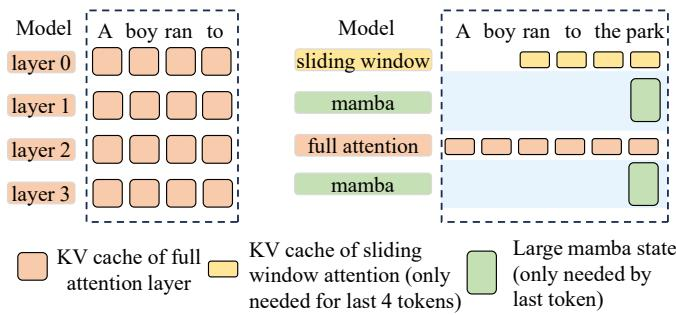  
(b) Heterogeneous LLMs (Hymba model)  
Figure 1. Traditional LLMs (left) vs. latest LLMs (right). LLMs are becoming more heterogeneous and produce KV caches with different sizes and numbers of tokens, which demands a new GPU memory manager design.

## 1 Introduction

Large language models (LLMs) have become increasingly popular across a wide range of applications. Serving LLMs efficiently thus becomes extremely important. A common strategy to improve serving throughput is batching multiple requests in parallel. However, batching imposes heavy pressure on GPU memory capacity, which grows linearly with the batch size because each request needs to cache its entire prefix. Consequently, GPU memory capacity becomes the primary bottleneck to high throughput. Thus, efficient memory management is essential for increasing serving throughput and reducing costs.

PagedAttention [25] is the most widely used memory management algorithm for LLM serving. It divides the memory into fixed-size pages, and allocates pages to requests dynamically based on token count in the request (request length). Its design relies on two assumptions driven by the homogeneity of early-generation Transformers [46] (Figure 1a).

1. Fixed-size embeddings: Embedding (e.g., KV cache) sizes are the same for different tokens and layers. As such, the granularity of memory allocation is naturally a fixed page size, which is a multiple of the embedding size.

2. Full attention: All layers use full attention, meaning that each layer has an associated KV cache with all tokens, and requires the same number of pages.

Under these assumptions, the memory usage is uniform across layers (Figure 2a). Therefore, PagedAttention leverages homogeneous-style management that partitions the memory into same-size buffers per layer and divides each buffer into an equal number of fixed-size pages.

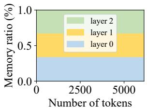  
(a) Traditional LLMs

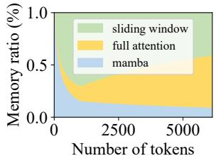  
(b) Heterogeneous LLMs  
Figure 2. Memory usage ratio across layers is fixed in early LLMs while varying in recent heterogeneous LLMs.

However, recent LLM architectures are more heterogeneous (Fig. 1b) and invalidate both assumptions.

First, recent models often have heterogeneous embeddings with different sizes. For example, vision-language models (VLMs) such as LLaVA [31] and InternVL [10] retain vision embeddings for image inputs and KV cache for each token. The sizes of these embeddings are naturally different as they encode different types of information. Moreover, recent approaches [14, 28] combine Mamba [19] with the regular full attention, where the Mamba state representing a sequence is typically larger than KV cache associated with one token.

Second, not all layers use the same attention mechanism. To accelerate long-context inference, some new LLM architectures incorporate efficient attention algorithms that use only a subset of the prefix tokens to generate the next token. For instance, Google’s Gemma-3 [44] interleaves full attention with sliding window attention [6]: some layers attend to the entire prefix, while other layers only attend to a sliding window of the most recent tokens. Building on this, NVIDIA’s Hymba [14] further integrates Mamba layers, which rely solely on the state of the last token. Therefore, the number of pages needed for each layer becomes different.

In these heterogeneous LLMs, memory consumption varies significantly across layers and is highly dependent on request length (Figure 2b). For shorter requests, Mamba layers dominate memory usage because the size of their internal state is large but independent of request length; conversely, for longer requests, full-attention layers become dominant because their associated KV caches’ sizes grow linearly with request length. As demonstrated in Section 8, uniformly partitioning memory using PagedAttention leads to a throughput reduction of up to 2.16× compared to an oracle-guided memory partition because the under-utilization of memory limits the maximum batch size that can be used.

Therefore, a heterogeneity-aware memory management system is essential to address the variability in both embedding size and attention mechanisms. The key to such a system is enabling dynamic memory exchange among different layers at runtime, which brings the following challenges.

First, fragmented memory is less likely to be usable in LLMs than in general workloads, and thus should be avoided.

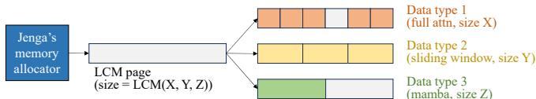  
Figure 3. LCM allocator in Jenga

Traditional allocators typically allocate the needed memory chunk from a slightly larger chunk and rely on future allocations to use the leftover fragments. As most LLMs only have 2-3 possible allocation sizes, one for each layer type, fragments often cannot satisfy any allocation sizes. For example, Gemma-3 27B, with 52 sliding window attention layers and 10 full attention layers, only needs 1664 KB and 320 KB memory blocks (see Table 1 for details) for the two layer types. Buddy allocator [49] allocates 2048 KB for a 1664 KB chunk, leaving two fragments with 128 KB and 256 KB respectively. Both fragments are smaller than the minimum 320 KB granularity and thus unusable. This can lead to about 18.75% memory waste.

Second, different attention mechanisms complicate GPU memory partitioning for prefix caching (let a new request reuse KV caches of an early request with common prefix): (1) Cache hit dependency: The cache hit length, defined as the max number of tokens in the common prefix, is limited by the layer with the shortest hit length because the cache miss of any one layer will require all layers to recompute that token. Thus balanced caching across layers is needed. However, to reach similar cache hit length, different attention mechanisms need to cache a different number of tokens. For instance, full-attention layers need to cache all tokens in a prefix, while Mamba layers only need to cache the last token. Additionally, the optimal memory partition across layers depends heavily on request length and can change during runtime. (2) Trade-off between increasing cache hits and batch size: For example, caching only the last token in Mamba means exact matches are required for cache hits. By caching more intermediate tokens, partial matches become possible, improving cache hits and reducing the recomputation in future requests. However, this approach uses more memory, limiting batch size and reducing processing speed per token.

To address these challenges, we propose Jenga, a memory management framework specifically designed for heterogeneous KV caches. Since memory-related behaviors, such as possible allocation sizes and page access patterns, can be identified in advance, Jenga models these behaviors through layer properties and enables advanced memory management based on the properties. This approach significantly reduces fragmentation and achieves higher cache hit rates:

Based on all possible embedding sizes, Jenga minimizes fragmentation by introducing a two-level memory allocator. At the bottom layer, we have large, fixed-size pages, while at the top layer we have different-size embeddings divided from the large pages. To minimize internal fragmentation of large pages, we pick a compatible large page size so that it is a multiple of each embedding size. In particular, we propose a “LCM allocator” that chooses the page size as least common multiple (LCM) of all possible token embedding sizes (Figure 3). For example, if we have embeddings of two different sizes, 2KB and 3KB, respectively, we pick a page with a compatible size of 6KB. Note that the LCM allocator can be seen as a particular case of a slab memory allocator [7], commonly used in modern operating systems.

Based on the page access pattern of different attention mechanisms, Jenga customizes the cache hit and eviction policies for various attention mechanisms such as sliding window, Mamba, local attention, and cross attention while maintaining a balanced cache hit rate among layers. Jenga further proposes a common-prefix predictor to guide which tokens to cache and a prefix cache simulator to find the best trade-off between cache hit and batch size.

We have implemented Jenga in a wide variety of models and use cases: from heterogeneous attention layers within the same model, to KV caches of draft and target models in speculative decoding [26], and to vision embeddings of VLMs. Compared to vLLM, a state-of-the-art LLM serving engine, Jenga improves memory utilization by up to 79.6%, and achieves up to 4.92× higher throughput (1.80× on average) without impacting end-to-end latency. Jenga also enables the full 10M context length of Llama 4 [34] on one 8 × ?? 200 GPU node (vLLM reaches only 3.6M).

In summary, this paper makes the following contributions.

• We identify the growing heterogeneity of new LLM architectures, both in terms of embedding sizes and token dependencies to generate a new token.

• We propose a two-level memory allocation system for KV cache that efficiently supports different-size embeddings, and provides flexibility to customize prefix caching policies to maximize hit rate of different attention mechanisms.

• An open-source implementation, Jenga1, that is deployed by our industry partners in production.

• Achieve 1.46× throughput improvement over state-of-theart LLM inference engines, without hurting latency, and push context length of 1 GPU node to more than 10M.

## 2 Background

Tokens and Embeddings. LLMs operate on text by breaking it into small units called tokens (such as words or subwords). LLMs typically generate new text by processing input tokens, and then generating output tokens iteratively, one at a time. During computation, each token is represented by several embeddings, which are numerical vectors that capture information about that token.

KV Cache. LLMs typically use attention layers to capture the relationship between tokens. The inference engine must store KV caches—intermediate embedding tensors produced by the attention layers—for each token on GPU because the computation of a new token depends on interactions between its embedding and the intermediate KV cache tensors of previous tokens. The size of KV caches can be substantial, e.g., 1.2 GB for a single request with ten thousand tokens in Llama 3.1 8B [17]. Moreover, LLM serving systems typically batch tens of requests for efficient inference [25], requiring them to manage tens of GBs of KV caches. Therefore, the KV cache needs to be managed carefully to achieve high inference efficiency.

Prefix Caching. KV caches can be retained in GPU memory even after the corresponding request generation is complete. This allows subsequent requests with shared prefixes to reuse these caches, thereby reducing repeated computation. Prefix caching is particularly effective when multiple queries share a common prefix, such as when asking different questions about the same long document.

## 3 Heterogeneous LLMs and Challenges

## 3.1 Heterogeneous LLMs

Modern LLMs go beyond stacking homogeneous full-context attention layers. Many new types of attention are introduced, making the LLM architecture heterogeneous. We highlight four main sources of heterogeneity in Figure 4:

(a) Sparse attention Full-attention layers’ KV cache grows linearly with sequence length and takes a large portion of accelerator memory. Sparse attention variants reduce KV cache size by attending to only a subset of prefix tokens. A common approach is sliding-window attention (SWA), where each token only attends to a fixed number of adjacent tokens inside the sliding window. To trade-off between model quality and KV cache size, recent models typically use a mix of full- and sliding-window attention layers (Figure 4a.1), including Google’s Gemma-3 [45] and Mistral AI’s Ministral [4]. More advanced sparse attention variants, such as dynamically dropping some of the tokens [8, 52] (Figure 4a.2), are also proposed to control the KV cache size.

(b) State space models [19], or linear attention [24, 35, 37] use a large, fixed-size tensor to capture the information of all tokens and update it recurrently during decoding. Since each token only depends on this tensor, these layers can be viewed as SWA with window size 1. However, the state tensor is hundreds of times larger than the per-token KV cache in attention layers. These layers are also mixed with full-attention (as in Jamba [28], Figure 4b). Thus, the memory allocator needs to coordinate two different patterns, i.e., a small number of large fixed-size states for state space layers, and a large number of small KV cache blocks for each token of full-attention layers.

(c) Vision language models (VLMs) [31] accept vision inputs in addition to text as input and generate text output (Figure 4c.1 ). VLM contains a vision encoder that takes images as input and generates vision embeddings in the format of image tokens. Then, the LLM merges image tokens and text tokens into one sequence and performs autoregressive text generation with full-attention layers as normal LLMs. The memory allocator needs to manage the vision embedding cache, which only contains image tokens, and the KV cache of LLM parts, which contains both text tokens and image tokens. Due to KV cache compression like grouped query attention [5], the KV cache size of a token also differs from the size of the vision embedding of an image token.

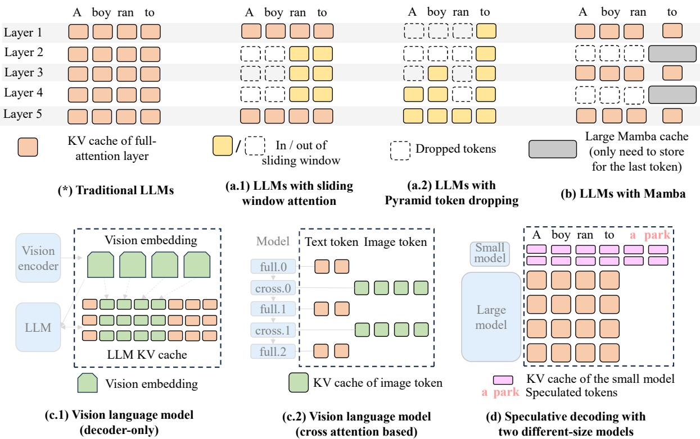  
Figure 4. Contrasting traditional LLMs (top left) and latest LLMs. LLMs are becoming more and more heterogeneous: the KV cache sizes may differ, the KV cache dependencies are different, and the LLM architecture can also diverge

Some VLMs (Figure 4c.2), including Meta’s Llama 3.2 vision model [17] and NVIDIA’s NVLM-X [11], utilize crossattention to integrate the results from the image encoder into the text decoder. These LLMs interleave full-attention within text tokens (with text token KV cache) and cross-attention between image tokens and text tokens (with image token KV cache), which have different KV cache sizes.

(d) Serving multiple concurrent models Sometimes two models run simultaneously. For example, speculative decoding (Figure 4d) ○1 uses a small model to quickly propose new tokens sequentially, and ○2 uses a large model to verify the correctness of the tokens in parallel, so that it can generate multiple new tokens in each forward pass of the large model and keep the same quality. The KV cache size of each token differs a lot between the two models.

## 3.2 Challenges due to Memory Fragmentation

The above heterogeneity necessitates allocating KV cache of different sizes for different tokens. This section analyzes

PagedAttention’s fragmentation using Llama 3.2 11B Vision model as an example. This model contains 32 full-attention layers, which require KV cache for text tokens, and 8 crossattention layers, which require KV cache for image tokens, The KV cache size per text token2 is 4× that per image token.

PagedAttention can only deal with homogeneous layers and has to allocate KV cache for both text and image tokens for all layers (Figure 5a). Suppose a request has ?? text tokens and ?? image tokens, the embedding size per layer per token is ?? bytes, then PagedAttention needs to store (?? + ?? ) × (32 + 8) × ?? bytes of memory. While ideally, we only need to store text token KV cache for full-attention layers and image token KV cache for cross-attention layers, and the necessary memory for a single request should be (?? ×32+?? ×8) ×??. This allocation strategy results in 79.6% memory waste in MMMUpro [56] dataset (6193 image tokens and 43 text tokens per request). Similarly, the memory waste for Gemma-3, a model combining full-attention and sliding-window attention, can be 73.6% on the request length distribution of Mooncake’s open source trace [39]. Therefore, a new memory allocator is needed to reduce memory waste of heterogeneous LLMs.

Naive optimizations cannot fix this problem. For example:

• Max page (Figure 5b) that sets the page size to the largest among all layer types3 and allocates different sets of pages to image tokens and text tokens. In that case, we need page size ?????? (32??, 8??) = 32?? and memory consumption (?? + ?? ) × 32 × ??. It still wastes 74.5% of memory in MMMUpro dataset for Llama 3.2 11B Vision model.

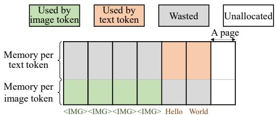  
(a) PagedAttention. It always reserves the memory space for all tokens and for all layers, thus wastes memory when the token does not need to store KV cache for that layer.

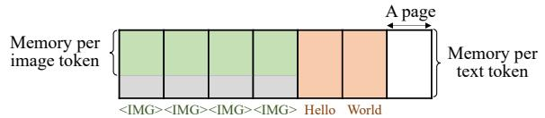  
(b) Max page. It sets the page size to the maximum of the 2 types, thus wastes some memory for the smaller image tokens.

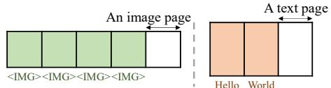

(c) Static partition with two fixed-size memory pools for image and text tokens. It works well on specific workloads, but cannot adapt to other token count like 2 image tokens plus 4 text tokens.  
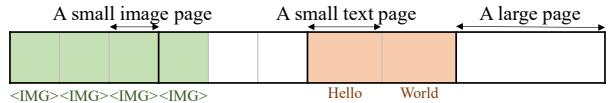  
(d) Jenga with LCM alloctor. It has little fragmentation and can adapt to different workloads.  
Figure 5. Different memory allocation strategies for Llama 3.2 vision model. Assume the KV cache size per token of text tokens is 1.5× that of image tokens.

• Static Partition (Figure 5c) that partitions the memory to different memory pools. It works well when the workload has a relatively static request length, but cannot adapt to dynamic workload changes like different ratio of image tokens and text tokens in vision language models and different request length in sparse attention, which are common in LLM inference.

To solve the problem, Jenga (Figure 5d) introduces the LCM allocator which divides the memory into large pages whose sizes are the LCM of all types, and further divides each large page into small pages with the needed page sizes.

## 3.3 Challenges in Prefix Caching

In addition to memory fragmentation, heterogeneous attention mechanisms also lead to challenges for prefix caching: Customize prefix caching policy to maximize hit rate Efficient attention mechanisms were originally proposed to reduce compute and KV cache size. We observe that efficient attention also relaxes prefix caching requirements and may result in a high cache hit rate. Traditional full-attention layers compute attention between a token and all its prefixes, requiring all prefix tokens to remain unevicted for a cache hit. In contrast, efficient attention mechanisms—like sliding windows—only attend to a subset of prefix tokens, so only that subset must remain cached. For example, with sliding window size 1024, only the KV cache of last 1024 tokens is needed for generating new tokens. Being aware of such layer property, we can keep only the last 1024 tokens in the prefix cache and evict older tokens, instead of caching the full sequence. For 10k-length sequences, this layer-propertyaware strategy can reduce the memory needed to cache the sequence for future reuse by 10×, making it possible to cache more sequences in memory to improve cache hit rate.

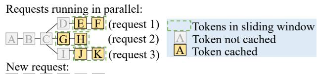  
A B C L M N (request 4, no cache hit)  
Figure 6. Memory allocation for requests with common prefix ABC. Only caching tokens inside sliding window maximizes batch size, but causes cache miss for common tokens.

Nevertheless, different attention mechanisms, e.g., sliding window, Llama 4 local attention, and Mamba, rely on distinct subsets of tokens. Hence, we need to customize an evict policy for each layer type to enable effective prefix caching. Moreover, for each token, we need a full recomputation of all layers when the KV cache of any single layer is missing, because the KV cache calculation of one layer depends on the model output of all its previous layers. Therefore, the model’s cache hit rate is bounded by the layer type with the worst rate, so we need to carefully balance cache sizes across different types for a good overall cache hit rate.

Trade-off between batch size and prefix cache hit rate To maximize decoding throughput, we can enlarge batch size by allocating memory only for tokens actively used by the attention layers (e.g., the last two tokens when the sliding window size is two, as in Figure 6). This approach, however, reduces prefix caching hit rate. Only requests whose prefix exactly matches a running request (e.g., ABCDEF, ABCGH, or ABCIJK) can benefit from cache hit. Requests sharing only a partial prefix (e.g., ABCLMN) cannot hit the prefix cache, even though “ABC” is a common prefix. As a result, we must redo the prefill for “ABC”, adding unnecessary overhead.

To coordinate batch size with prefix caching, we can devote some KV cache memory to store inactive tokens (e.g., those outside the sliding window). However, this introduces a trade-off: allocating more cache space to inactive tokens improves the cache-hit rate, whereas allocating more space to active tokens supports larger batch sizes. Both factors are crucial to overall performance. Additionally, to use the memory for inactive tokens effectively, we also need an accurate prediction of potential common prefix.

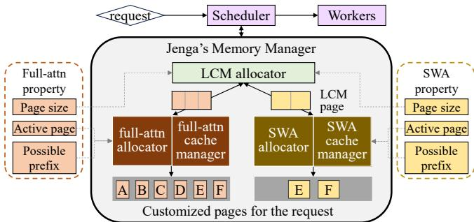

Figure 7. Overview of Jenga  
```rust
class LayerProperty:
def page_size();
def active_pages(r: Request, length: int) -> list[Page];
def possible_prefix(is_hit: list[bool]) -> set[int];
```

```python
class SlidingWindowProperty(LayerProperty):
def page_size(): return KV_hidden_size
def active_pages(r: Request, length: int) -> list[Page]:
return r.pages[length-sliding: length]
def possible_prefix(is_hit: list[bool]):
l = len(is_hit)
return {?? | 0 ≤ ?? < ?? ∧ ∀?? ∈ [0, sliding), is_hit[p-x] = True}
```  
(b) Example implementation of sliding window layer  
Figure 8. Interface for defining layer property

## 4 Overview

The heterogeneity of LLMs motivates Jenga, a layer-propertyaware LLM memory management system that customizes memory allocation and prefix caching strategies for different attention mechanisms. The overview of Jenga is shown in Figure 7.

The core idea of Jenga is introducing a unified layer property interface (Figure 8a) that abstracts the behavior of each attention mechanism. This interface specifies three attributes: page size (i.e., per-token KV memory footprint), active pages required for future token generation, and valid prefix cache hit lengths. Based on it, Jenga introduces three key components:

• Global LCM allocator that allocates pages with the least common multiple (LCM) of all layer page sizes to avoid memory fragmentation across heterogeneous layers (§5.1).

• Layer-specific allocators that allocate memory only for active pages to reduce memory footprint (§5.1).

• Layer-specific prefix cache managers that customize prefix cache policy per attention type (§6).

## 4.1 Layer Property Interface

Figure 8 shows the interface to model attention layers.

• Page size: Returns the total memory usage per token of that layer type, typically the total hidden size of KV cache. This defines the memory allocation unit of the layer type.

• Active pages: Returns the set of pages needed to compute future tokens from a given length, e.g., the pages for the last sliding window size tokens of a sliding window layer. This guides the free of inactive pages, and helps to determine the eviction order of cached pages.

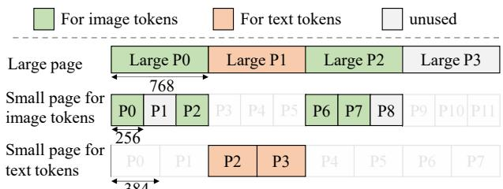  
Figure 9. Two-level allocation for Llama 3.2 vision model.

• Possible prefix: Given a boolean list marking which pages are cached, return all valid prefix cache hit length. More details are provided in §6.2.

Layer property only needs to be defined when adding a new attention variant. For new models composed of existing mechanisms, Jenga automatically parses the model structure and assigns the properties to each layer. Thus, Jenga can be used for new models without additional configuration.

## 5 LCM-based Memory Allocation

## 5.1 LCM Allocator

Based on “page size” from layer properties, Jenga introduces the LCM allocator to allocate fixed-size large pages, and customized allocators for each specific layer type (e.g., full attention and sliding window attention) to allocate pages with specialized size for their type from the large pages.

Figure 9 shows the memory layout of Jenga for Llama vision model with page size 256 for image tokens and 384 for text tokens.4 Jenga uses the LCM of all page sizes as the compatible page size, which is ?????? (256, 384) = 768 in this case. Jenga first partitions the entire KV Cache memory into large pages of LCM size and uses the LCM allocator to manage them. The customized allocators request some large pages from the LCM allocator (large pages 0 and 2 for image tokens, large page 1 for text tokens), partition the large pages into small pages tailored to that type, and allocate the small pages as needed (4 256-byte small pages P0, P2, P6, and P7 for 4 image tokens; 2 384-byte small pages P2 and P3 for 2 text tokens in request Hello World).

The LCM size is typically not too large. Most embedding sizes in modern LLMs are typically chosen as multiples of powers of 2 (e.g., 1664KB = 13 × 27KB and 320KB = 5 × 26KB in Gemma-3-27B), because GPU hardware (Tensor Cores, warp sizes, memory alignment) requires such regularity for high performance. Since their factorizations are dominated by powers of two, the LCM is determined primarily by the largest power of two and a small product of odd factors, which keeps the LCM size (e.g., 8320 KB in Gemma-3-27B)

Table 1. LCM size of models with ????????????\_??????\_???????? = 16. TP refers to tensor parallel size.
<table><tr><td>Model</td><td>TP</td><td>Embedding Sizes</td><td>LCM Size</td></tr><tr><td>Llama 3.2 11B</td><td>1</td><td>2048 KB,512 KB</td><td>2048KB</td></tr><tr><td>Gemma 3 27B</td><td>4</td><td>1664 KB,320 KB</td><td>8320KB</td></tr><tr><td>Jamba 1.5 52B</td><td>4</td><td>2128 KB,64 KB</td><td>8512KB</td></tr><tr><td>Llama 4 109B</td><td>8</td><td>288 KB,96 KB</td><td>288KB</td></tr></table>

close to the maximum among them. The LCM size of some popular heterogeneous models are listed in Table 1.

Specifically, the customized small page allocators interact with the LCM large page allocator as follows:

• allocate() for allocating a small page of that type. If all small pages for this small page allocator are allocated, it requests a new large page from the LCM allocator and partitions it into free small pages. Then, the allocator allocates an unused small page.

• free(small\_page\_id) to free a small page. If all small pages within a large page are freed, the large page is returned to the LCM allocator.

To only allocate memory for active pages, the customized allocators allocate small pages when each token’s KV cache is generated, and immediately free them when they become inactive as indicated by active\_pages interface.

The LCM-based two-level allocation strategy prevents external fragmentation among large pages. To reduce internal fragmentation, Jenga allocates small pages within a single large page to the same request whenever feasible. This ensures that large pages can be returned to the large-page allocator once the request is completed.

Additionally, for each layer type, allocated pages can be fully represented by small page IDs of that type (e.g. small pages P2 and P3 for text tokens) so the attention kernels can be executed as if there is only one layer type and do not need to consider the complexity introduced by multiple types.

## 5.2 Execution with New Memory Layout

Although Jenga employs a memory layout distinct from the standard PagedAttention, Jenga can reuse the PagedAttention workers with very little change.

The new memory layout PagedAttention (Figure 10a) uses a layer-page partition that first partitions memory into layers and then partitions each layer into pages. This layout simplifies model execution because when executing one layer, we only need to pass the memory of that layer. It is widely used by systems like vLLM [25], SGLang [57], TGI [23], and libraries like FlashAttention [13] and FlashInfer [54].

However, this memory layout is not suitable for Jenga, because different layer types can have different number of layers. As shown in Figure 10b, Jenga proposes a page-layer partition that partitions the memory into pages and then partitions each page into layers. Despite the new layout, memory allocated for each layer (e.g., cross.1) can still be represented by a customized start\_ptr, page\_size, and page\_id like Figure 10c, preserving the original interface.

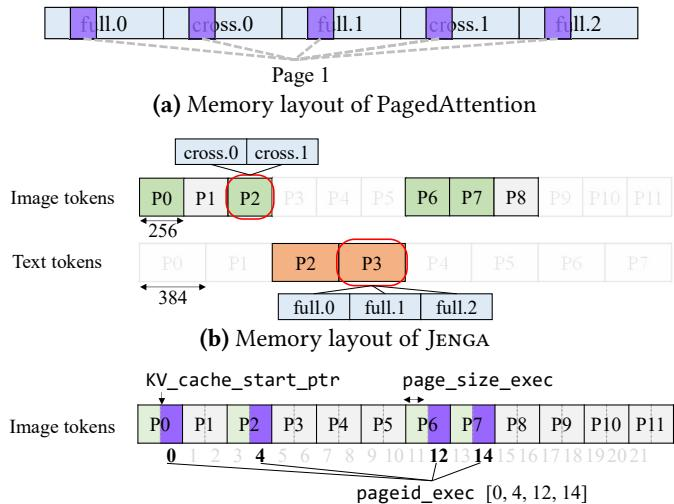  
(c) Memory allocated for layer cross.1  
Figure 10. Memory layout of PagedAttention and Jenga

Jenga using PagedAttention workers with minimal changes Jenga requires no modifications to PagedAttention kernels. Attention can be computed as usual by passing the above arguments KV\_cache\_start\_ptr, page\_size\_exec, pageid\_exec to the libraries. Jenga can preserve the efficiency of attention kernels since it still utilizes the same kernel with the same per-layer page size. Only page IDs are different, but the kernels are efficient for arbitrary page IDs.

The changes to the inference engine workers are also minimal. Major changes only include: (1) allocate a single KV cache tensor and give different layers different offsets (KV\_cache\_start\_ptr), instead of allocating fixed-size tensors for each layer (2) prepare attention metadata (parameters passed to attention kernels, e.g., page ID), for each layer type, rather than a global metadata for all layers.

## 6 Customizable Prefix Caching

As introduced in §3.3, being aware of each layer’s attention pattern enables Jenga to customize prefix caching policies for heterogeneous attention mechanisms, significantly reducing memory needed for prefix cache.

Prefix caching of LLM inference involves 3 operations:

1. Add Page: Add a freed page to the “cached page pool” so it can be reused by future requests with common prefix.

2. Cache Eviction: Evict an existing page from the “cached page pool” to free up space for a new page.

3. Cache Hit: Match the longest cached prefix in a request to skip the recomputation of prefill for this prefix.

Jenga uses all memory not allocated to running requests to maintain the “cached page pool” and adds pages to the pool immediately after they are freed by running requests. To maximize overall cache hit rate, Jenga customizes both eviction and hit policies for heterogeneous attention layers.

<table><tr><td>Step</td><td>Request</td><td>Full attention</td><td>Sliding window</td></tr><tr><td>1</td><td>1&#x27;s prefill</td><td>ABCD-&gt;E</td><td>ABCD-&gt;E</td></tr><tr><td>2</td><td>1&#x27;s decode</td><td>ABCDE-&gt;F</td><td>DE-&gt;F</td></tr><tr><td>3</td><td>2&#x27;s prefill</td><td>ABCDG-&gt;H</td><td>CDG-&gt;H</td></tr></table>

(a) Timeline of the 2 requests. ABC->D means access KV cache of tokens ABC and generate token D. Note that the generated token does not have KV cache. Assume sliding window size 2.  
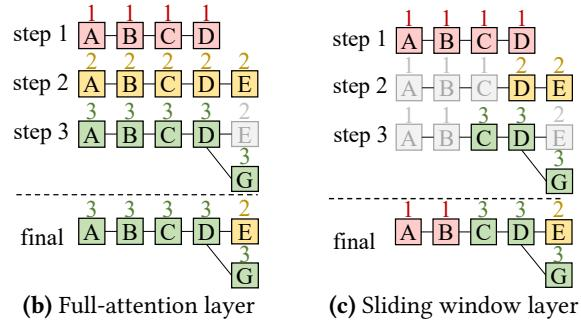  
Figure 11. Last access time after two requests

## 6.1 Customized Cache Eviction

An effective cache eviction for heterogeneous layers should: 1. Prioritize cache eviction for unimportant pages, e.g., pages outside sliding window of potential common prefix.

2. Maintain balanced eviction across layers, since the model’s hit rate is bounded by the layer with worst cache hit rate.

Jenga uses a LRU-based eviction policy, which evicts the page with the earliest last access time, to manage the pages in the cached page pool. Jenga achieves the above two goals by overriding each page’s last access time. To evict unimportant pages, Jenga tracks the pages needed by each layer per generation step by active\_pages, and only update the last access time of active pages and pages for saving the generated KV cache in this step. To achieve balanced eviction, Jenga sets unified last access time across different layers, thus the eviction priorities of different layers are similar.

Figure 11 shows the timeline and last access time of a model with one full-attention layer and one sliding window layer when running the following two requests:

• Request 1: input [A B C D] and output [E F]

• Request 2: input [A B C D G] and output [H]

For simplicity of explanation, we assume all layer types have the same page size, so that each “large page” contains one “small page”. In this scenario, the terms “large page” and “small page” can be used interchangeably and are collectively referred to as “page”. The general case, where multiple page sizes coexist, will be discussed later.

For full-attention layer, the last access times of all running tokens are updated in each step. For example, in Figure 11b, tokens [A B C D] are updated in step 1, and then tokens [A B C D E] in step 2 and [A B C D G] in step 3.

For the sliding-window layer, Jenga updates the last access time only for tokens within the sliding window, as these are the tokens actively involved in the attention computation. For example, in step 2, tokens [A B C] are not updated because generating token [F] only needs the KV cache of tokens [D E]. This customization ensures that tokens outside the sliding window, e.g., [A B], retain an earlier last access time, making them a higher priority for eviction.

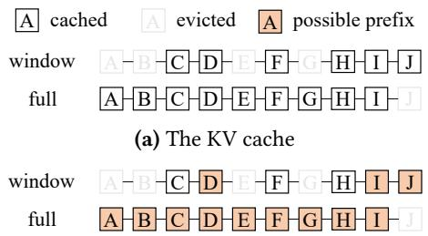  
(b) The possible prefixes for request ABCDEFGHIJ  
Figure 12. Customized cache hit (sliding window size is 2)

Despite these customizations, eviction remains balanced since tokens from the same request share identical last access timestamps across layers. For example, Jenga will evict tokens exclusive to Request 1 (e.g., [E] with timestamp 2) in both layers before those from Request 2 (e.g., [C D G] with timestamp 3) based on the last access time.

Cache eviction of LCM page table To coordinate with LCM page table, Jenga sets the last access time of a large page to the latest last access time among all its small pages. When a new small page is needed but the corresponding customized small page allocator doesn’t have one, the large page allocator will evict one large page with LRU strategy and gives it to the small page allocator.

## 6.2 Customizable Cache Hit

Cache hit rules differ across layer types. For example, a prefix hit in a full-attention layer requires all tokens in the prefix to remain unevicted, whereas a sliding window layer only requires the last sliding\_window\_size tokens of the prefix to remain unevicted.

Jenga relies on the possible\_prefix interface to customize the cache hit rules for different layer types. Given the parameter is\_hit indicating whether the KV value of each token is cached, the function should return all valid prefixes of that layer. For example, for request [ABCDEFGHIJ], with the KV cache status in Figure 12a, valid prefixes for a fullattention layer are [A], [AB], ..., [ABCDEFGHI], while valid prefixes for a sliding window layer are [ABCD], [ABCDE-FGHI], and [ABCDEFGHIJ]. The prefix [ABC] is invalid for a sliding window layer because both B and C must remain cached to achieve such hit.

Upon receiving a new request, Jenga invokes get\_possible\_prefix for each layer type to identify valid prefixes. The longest common prefix valid across all layers is selected as the cache hit prefix.

## 6.3 The Customization of Different Layers

Sliding Window Layer Jenga updates the last access time only for tokens within the sliding window and requires only these tokens to remain cached for a prefix hit. Its implementation is shown in Figure 8b.

Mamba Layer For Mamba layers, caching is specialized due to the significantly larger per-token state compared to other attention-based layers. Instead of caching all tokens, which requires too much memory, Jenga only caches the state of every 512 tokens. Then, Jenga can hit the prefixes with length a multiplier of 512, which is implemented by the possible\_prefix interface. Additionally, active\_pages only returns the page of the last cached token and Jenga only updates the last access time of that page.

Local Attention Some layers in Llama 4 adopt local attention, where a request is divided into 8192-token chunks and attention is computed only within each chunk. active\_pages includes the pages belonging to the same chunk as the last token. A prefix is considered a possible\_prefix only if all its prefix pages within the same chunk are cached.

Vision Embedding Cache and Vision Cross Attention Cache In these caches, evicting even a single image token will require the recomputation of the entire vision encoder. To minimize the number of recomputed images, it is better to evict all tokens from one image than partially evict multiple images. Jenga supports this behavior by making active\_pages include all pages of the same image, ensuring they share the same last access time and eviction priority.

## 6.4 Common Page Pool

As discussed in Figure 6, increasing batch size negatively impacts the prefix cache hit rate in efficient attention layers. To address this, Jenga introduces a common page pool to separately cache pages highly likely to be reused in future requests, alongside the regular cached page pool managed as described in §6.1-§6.3. This algorithm is mainly designed for efficient sparse attention mechanisms like sliding window attention, Llama 4 local attention, and state space models, as well as models combining those attention mechanisms with full attention. This section first describes the algorithm for maintaining the common page pool given a fixed pool size and predicted common prefix length, followed by the method for determining both the predicted common prefix length for individual pages and the optimal pool size.

6.4.1 Management of Common Page Pool. The common page pool exclusively stores pages identified as having a high reuse likelihood. These pages cannot be evicted to accommodate new requests for larger batch sizes. Each layer type maintains its own common page pool, with a maximum size either pre-defined or determined at runtime. Algorithm 1 shows Jenga’s common page pool management.

Add Page When a page is freed and adding to the prefix caching system, Jenga first determines whether the page has a high probability of reuse (Line 2). This decision is based on the predicted common prefix length of this request with future requests and identifying the pages required for a cache hit at that prefix length (with active\_pages interface). If the page is not a required page for cache hit of that prefix length, it is classified as a normal page and added to the standard cached page pool (Line 3). Otherwise, the page is added into the common page pool (Line 8). If the common page pool reaches capacity, Jenga moves the least recently used page of that pool to the normal pool, and gives it the lowest eviction priority by updating its last access time to the current moment (Line 5-7).

Algorithm 1: Common Page Pool Management   
1 Function AddPage(req, p: Page)   
2 if p ∉ p.layer\_type.active\_pages(req.predPrefix) then   
// cache in the normal cached page pool   
3 cachePool.add(p, time = now());   
4 else   
// may reuse, cache in the common page pool   
5 if commonPool.size() = maxSize then   
6 evicted ← commonPool.lru\_evict();   
7 cachePool.add(evicted, time = now());   
8 commonPool.add(p, time = now());   
9 Function CacheEviction() → Page or None   
10 return cachePool.lru\_evict();   
11 Function CacheHit(req) → list[Page or None]   
12 return [cachePool.get(p) or   
commonPool.get(p)]?? ∈??????.?????? ?? ???????? ;

Cache Eviction To allocate space for new pages, Jenga only evicts pages from the normal cached page pool.

Cache Hit Jenga matches incoming request prefixes using pages from both pools.

6.4.2 Common Prefix Prediction. In LLM inference, we observe that if a prefix is shared by two requests arriving within a short interval, which may benefit from GPU prefix caching, this prefix is likely to recur multiple times during that period. Typical scenarios include system prompts, parallel sampling, and long-document question answering. Our analysis of Mooncake’s real-world traces [39] indicates that if a request A shares a common prefix with a recent request B, and the interval between their arrivals is within one minute, there is an 81% probability that this common prefix exactly matches the prefix shared between request B and an even earlier request C.

Leveraging this insight, Jenga predicts a potential future common prefix for a request A as the longest shared prefix between A and preceding requests B, which arrived within a short time interval before A. Specifically, we define requests B arriving shortly before A as satisfying:

$$
\sum _ { B \leq i < A } \sum _ { l \in \mathrm { l a y e r s } } l . \mathrm { a c t i v e \_ p a g e s } ( r e q [ i ] , \mathrm { l e n } ( r e q [ i ] ) ) < n \_ p a g e s ( 1\tag{}
$$

where n\_pages denotes the total number of KV cache pages available. Intuitively, this indicates that GPU can simultaneously hold all requests arriving between B and A.

6.4.3 Determine the Common Page Pool Size. To identify the optimal size for the common page pool, we evaluate multiple candidate sizes by estimating total execution time to process a given sequence of requests. We select the pool size that yields the lowest estimated execution time.

The estimation involves simulating the token scheduling for each forward pass and summing the predicted execution times. We adapt SmartSpec [32]’s execution time estimation of a forward pass to heterogeneous models as follows:

$$
T ( N _ { a c t i v e } , N _ { b a t c h e d } ) = \sum _ { l \in l a y e r s } \alpha _ { l } \cdot N _ { a c t i v e _ { l } } + \gamma \cdot N _ { b a t c h e d } + \delta\tag{2}
$$

Here, $N _ { a c t i v e _ { l } }$ represents the total number of active pages for attention layer ?? across all running requests, and $N _ { b a t c h e d }$ is the number of tokens processed in the batch. The term $\textstyle \sum _ { l \in l a y e r s } \alpha _ { l } \cdot N _ { a c t i v e _ { l } }$ models the KV cache loading time for heterogeneous attention layers, $\gamma \cdot N _ { b a t c h e d }$ estimates computation time for the batched tokens, and ?? captures modelweight loading time. Parameters $\alpha _ { l } , \gamma _ { \mathrm { { ; } } }$ and ?? are values fixed for a specific model and hardware configuration. Jenga derives them through profiling the execution time of several different batches and perform linear regression.

In practice, setting the common page pool size to about 1000 pages is enough for avoiding the cache miss due to maximized batch size in Figure 6.

## 7 Case Studies

## 7.1 Speculative Decoding and Multiple Models

Speculative decoding involves an extra small model (the speculator) in the LLM inference engine. Jenga can be naturally extended to support this case as it can allocate two different KV cache sizes for the two models automatically with negligible fragmentation.

Moreover, Jenga can be extended to serve multiple models in one GPU. Jenga can set the large page size as the LCM of all models, which serves as the granularity to exchange pages between inference engines. We leave the full support of serving multiple models as future work.

## 7.2 Vision Embedding Cache of VLMs

As the vision embedding cache can be treated as another type of layer with a specific hidden size, Jenga can automatically handle the different page sizes of vision embedding tokens and LLM KV cache tokens. After being generated by the vision encoder, the vision embedding cache is consumed by chunked prefill steps of the LLM part. Current inference engines support chunked prefill of LLM part in two ways, both of which Jenga can effectively manage the vision embedding:

Allocate-on-demand KV cache with free-on-demand vision embedding cache Some inference engines only allocate the KV cache for tokens used in the current chunked prefill step. Jenga can free the vision embedding of image tokens once consumed by the prefill step. Figure 13a shows the timeline of request [t0 i0 i1 i2 i3 t1], where t\* and i\* refers to text token and image token respectively. Jenga can process this request with the following steps: (1) runs the vision encoder and generates the vision embedding; (2) runs the chunked prefill of 3 tokens [t0 i0 i1] and generates their KV cache; (3) frees the consumed vision embedding of image tokens [i0 i1] and runs the chunked prefill of 3 tokens [i2 i3 t1]; (4) frees the consumed vision embedding of image tokens [i2 i3] and runs a decode step. In this case, the peak memory usage is the KV cache of all tokens, plus at most chunk\_prefill\_size tokens of vision embedding.

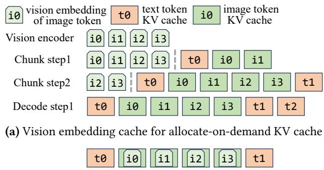  
(b) Vision embedding cache for fully-allocated KV cache  
Figure 13. Vision embedding and chunked prefill KV cache

Fully allocated KV cache and cache reusing by vision embedding Other inference engines allocate the full KV cache of all prefill tokens at the first chunked prefill step. As the vision embedding cache of one token is used before generating the KV cache of that token, Jenga supports reusing the KV cache for the vision embedding cache, as shown in Figure 13b, making the vision embedding cache consume no memory.

## 8 Evaluation

Implementation Jenga is implemented with about 4,000 lines of Python code in vLLM and is transparent to users of the inference engine. Jenga requires no configuration to support new models as Jenga can parse all possible embedding sizes from the model structure to initialize the memory management system.

Platform We evaluate Jenga on two GPU platforms: (1) NVIDIA H100 80GB GPU with 2 Intel Xeon Platinum 8480C CPUs, equipped with CUDA 12.4. This is the default platform in the evaluation unless explicitly mentioned. (2) NVIDIA L4 24GB GPU with 2 AMD EPYC 7F52 16-Core Processor, equipped with CUDA 12.4.

Baselines We perform end-to-end evaluation of Jenga by using vLLM v0.8.3 and only change the memory management system. We also offer a breakdown experiment to compare Jenga with the memory management systems of other state-of-the-art LLM inference engines, including vLLM [25], SGLang [57], and TGI [23]. We do not perform end-to-end evaluation on these engines as they only support a very small subset of the evaluated models.

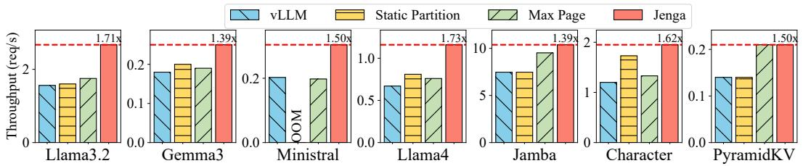  
(a) H100 GPU

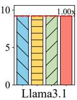

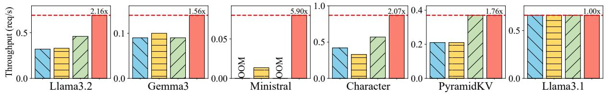  
(b) L4 GPU

Figure 14. End-to-end throughput  
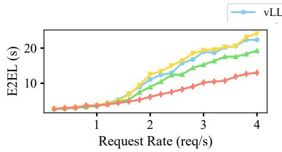  
(a) End-to-end latency

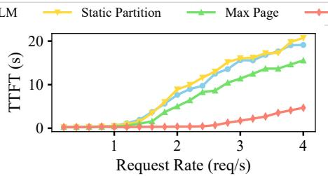  
(b) Time to first token

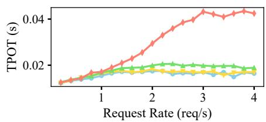  
(c) Time per output token  
Figure 15. Averaged Latency for the Llama Vision Model with changing request rates

Table 2. Model and dataset. ∗ means with FP8 quantization.
<table><tr><td>Model</td><td>Dataset</td><td>H100</td><td>H00-TP</td><td>L4</td></tr><tr><td>Llama 3.2Vision</td><td>MMMU-pro</td><td>11B</td><td>1</td><td>11B*</td></tr><tr><td>Gemma-3</td><td>arXiv-QA</td><td>12B</td><td>1</td><td>4B</td></tr><tr><td>Ministral</td><td>arXiv-QA</td><td>8B</td><td>1</td><td>8B*</td></tr><tr><td>Llama 4</td><td>arXiv-QA</td><td>109B</td><td>8</td><td>OOM</td></tr><tr><td>Jamba-1.5</td><td>MMLU-pro</td><td>52B</td><td>4</td><td>OOM</td></tr><tr><td>character.ai</td><td>MMLU-pro</td><td>70B*</td><td>1</td><td>8B</td></tr><tr><td>PyramidKV</td><td>MMLU-pro</td><td>70B*</td><td>1</td><td>8B</td></tr><tr><td>Llama 3.1</td><td>MMLU-pro</td><td>70B</td><td>4</td><td>8B</td></tr></table>

Models We include a wide range of heterogeneous LLMs. Llama 3.2 vision model [17] is a multi-modal model with cross attention layers. Gemma-3 [45] and Ministral [4] are two models with sliding window layers. Llama 4 [34] is with local attention layers. Jamba [28] contains Mamba [19] layers. Character.ai [9] is a private model with sliding window layers and KV cache sharing. We implement the model based on their blog post on top of Llama. PyramidKV [52] is a sparse attention model that drops different number of tokens in different layers. All these models mix the aforementioned attention variants with full-attention layers. We also use standard Llama with full attention layers only for evaluating the overhead of Jenga. The size of the model is listed in Table 2. Hamba [14] in §1 is not evaluated because it lacks essential GPU kernels and is not supported by vLLM yet. Dataset We use MMLU-pro [17] for text-only models and MMMU-pro [56] for multi-modality models. MMLU-pro’s maximum length is 3076. To evaluate Jenga on long context scenarios, we use arXiv-QA, a long-context dataset that does question answering on a collection of arXiv articles [22].

## 8.1 End-to-end Evaluation

End-to-end throughput Figure 14 compares the end-toend inference throughput of vLLM and Jenga on both H100 and L4 GPUs. The experiment also includes two simple extensions of PagedAttention to support heterogeneous models:

• Static Partition Statically partition KV cache memory by layer type. Each type receives an equal number of pages. Efficient attention layers, which need fewer pages, are assigned 50% as many pages as full attention layers. This ratio is based on profiling across diverse models and datasets.

• Max Page All layers adopt a common page size equal to the largest among them, allowing all pages to be exchanged across attention types.

Jenga achieves up to 1.73× speedup (1.46× on average) on H100 and 2.16× speedup (1.65× on average) on L4 over vLLM.

The speedup comes from both less memory waste and better prefix caching. We will provide more breakdowns in §8.2. Jenga also achieves comparable throughput with vLLM on the standard Llama 3.1, proving that it can be used to serve full-attention-only models without introducing overhead.

The smallest Jamba model and Llama 4 model are too large to be filled in one L4 24GB GPU, so these models are skipped on the L4 platform. vLLM fails to serve the longest request in the dataset for the Ministral model on the L4 platform, while Jenga can serve it due to the reduced memory usage. End-to-end latency Figure 15 shows the latency under different request rates of the Llama 3.2 Vision model. When the request rate is low (<1.2 requests/s), the latency of vLLM and Jenga is similar, with only a 4.2% difference on average. This proves that Jenga does not sacrifice model latency. When the request rate grows, Jenga reduces the end-to-end latency by up to 1.90× and time to first token by up to 23.40×, because Jenga has less memory waste and larger batch size, thus can achieve higher throughput and reduces queuing delay under high request rates. The time per output token (TPOT) of Jenga is larger than vLLM because Jenga batches more requests and has more computation in each step. Jenga can achieve the same TPOT if scheduling the same number of requests in each step.

Max context length Table 3 shows the maximum supported context length of Llama 4, a 10M-context model. vLLM cannot fit the full context within a single GPU node. In contrast, Jenga reduces per-request memory usage by 4× through freeing inactive pages, enabling 4× longer context and supporting the full context length within one 8×H200 GPU node.

Table 3. Max supported length of Llama 4 109B model
<table><tr><td rowspan=1 colspan=1></td><td rowspan=1 colspan=1>vLLM</td><td rowspan=1 colspan=1>JENGA</td><td rowspan=1 colspan=1></td><td rowspan=1 colspan=1>vLLM</td><td rowspan=1 colspan=1>JENGA</td></tr><tr><td rowspan=1 colspan=1>8×H100</td><td rowspan=1 colspan=1>1.3M</td><td rowspan=1 colspan=1>5.2M</td><td rowspan=1 colspan=1>8×H200</td><td rowspan=1 colspan=1>3.7M</td><td rowspan=1 colspan=1>14.7M</td></tr></table>

## 8.2 Breakdown

Decode batch size Jenga improves the LLM serving throughput and reduces end-to-end latency by maximally enlarging the batch size. To measure the batch size of Jenga compared to other inference engines, we use three open-source inference engines (vLLM [25], SGLang [57], and TGI [23]) that are widely used in production. As for the workload, we use a simulated workload, where there are 20 requests arriving at the inference engine all at once, with input length randomly drawn from 55-110 thousand tokens and with output length from 50-100 tokens. This simulates the typical long document question-answering workload, where the input length can be excessively long, but the output length is relatively short. We then visualize the batch size of LLM decoding steps in Figure 16. As Jenga can free inactive pages and use less memory to serve each request, Jenga’s average batch size is 5.39, 1.95× larger than the average batch size of other inference engines (2.63, 2.74, and 2.50 for vLLM, SGLang, and TGI, respectively). As a result, Jenga finishes LLM inference within 300 steps, while other systems need around 600 steps. Note that TGI finishes earlier as it does not support the --ignore-eos flag [47], and thus generates fewer tokens compared to the other inference engines.

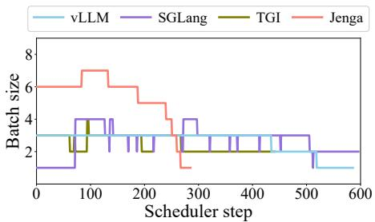  
Figure 16. Timeline of decode batch size for Ministral model of Jenga and existing LLM inference engines.

Fragmentation analysis Figure 17 shows the memory used for each part during the inference of Ministral model. We use a static trace that the request length distribution does not change over time and a dynamic trace that the average length forms a uniform distribution over time. We divide the use of GPU memory into five types, (1) the model weight, (2) the memory reserved for the inference engine for things like model activations and cuda graphs, (3) the memory used for storing KV caches required by new token generation (used in Figure 17ab, used-full and used-window in Figure 17cd), (4) the wasted memory that is allocated but not storing useful KV cache, and (5) the unallocated KV cache memory. For the two traces, vLLM wastes 38.2% KV cache memory on average as it fails to free the KV cache of sliding window layers for tokens outside the window, while Jenga only has 0.04% KV cache memory waste, which comes from the unused small pages inside the large pages and the last page that is only partially filled. Moreover, in the dynamic trace, Jenga can dynamically allocate the KV cache memory to sliding window layers and full-attention layers based on the workload, with the rate of full-attention KV cache ranging from 27.8% to 54.5% among all allocated KV cache memory.

Prefix caching Figure 18 evaluates the prefix caching system of Jenga by varying different number of articles in the arXiv dataset [22] and asking multiple questions at the end of each article with Ministral model. When the number of articles is small $( \mathbf { e . g . } , < = 3 )$ , both systems can cache all articles and provide similar throughput. The reason for the slight overhead of Jenga is Jenga needs to allocate memory twice, one for full-attention layers and one for sliding window layers, while vLLM only allocates once for all layers. When the number of articles is big, Jenga has up to 1.60× higher cache hit rate as being able to prioritize the eviction of KV cache for tokens outside sliding window, while vLLM treats all layers as full-attention layers. The higher cache hit rate saves more computation and thus provides up to 1.77× throughput improvement.

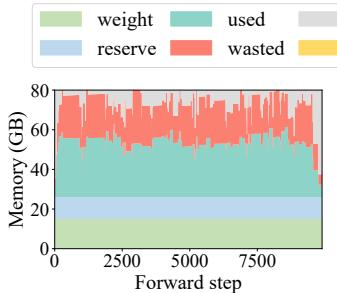

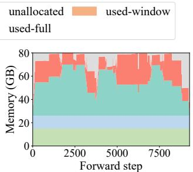  
(a) vLLM (static)

(b) vLLM (dynamic)  
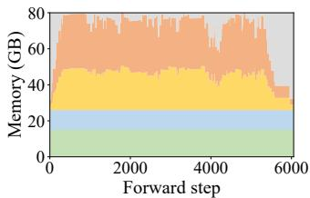  
(c) Jenga (static)

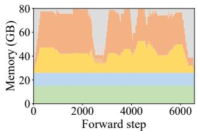  
(d) Jenga (dynamic)

Figure 17. Timeline of memory usage for Ministral model. vLLM shows significant wasted memory due to memory fragmentation (in red), while Jenga minimizes waste.  
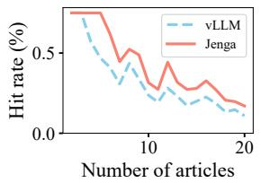  
(a) Hit rate

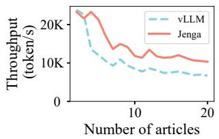  
(b) Throughput  
Figure 18. Prefix caching with different number of articles

Table 4. Cache hit rates of prefix caching optimizations
<table><tr><td rowspan=1 colspan=1></td><td rowspan=1 colspan=1>Full Attention</td><td rowspan=1 colspan=1>Customized LRU</td><td rowspan=1 colspan=1>Common Page Pool</td></tr><tr><td rowspan=1 colspan=1>arXiv-QA</td><td rowspan=1 colspan=1>2.4%</td><td rowspan=1 colspan=1>15.2%</td><td rowspan=1 colspan=1>34.6%</td></tr><tr><td rowspan=1 colspan=1>Mooncake</td><td rowspan=1 colspan=1>14.1%</td><td rowspan=1 colspan=1>15.5%</td><td rowspan=1 colspan=1>20.9%</td></tr></table>

Table 4 shows the breakdown of prefix caching optimizations in Jenga with Gemma-3 model. The baseline “full attention” manages all layers as full attention, “customized LRU” enables the customized prefix caching policies in §6.1- §6.3, and “common page pool” further adds the technology in §6.4. The arXiv-QA uses 10 articles in that dataset with average input length 70873 and Mooncake [39] uses the first 100 request of that dataset.

## 8.3 Case Study

Vision embedding cache for VLMs Figure 19 shows the performance improvement of vision language models due to Jenga’s support of vision embedding cache. The models are LLaVA-OneVision [27] 7B, InternVL2 [10] 8B, Phi-3 Vision [1] 4B, and Paligemma2 [43] 10B. Paligemma2 is a model mixed with three types, i.e., vision embedding cache, sliding window KV cache and full-attention KV cache.

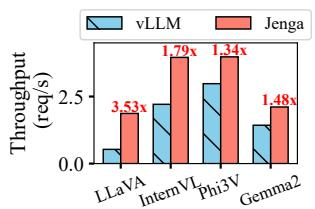  
(a) Throughput

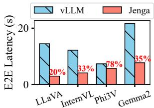  
(b) E2E latency

Figure 19. Vision language model with chunked prefill.  
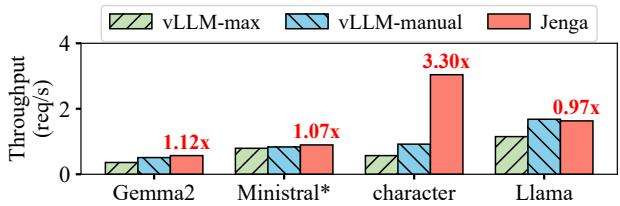  
Figure 20. Speculative decoding. Amplified the throughput of Ministral by 10 × for better visualization.

Without vision embedding cache, inference engines such as vLLM and SGLang need to re-run vision encoder in each chunked prefill step. With vision embedding cache, Jenga only needs to run the vision encoder once for each request, leading to 1.88× and 1.60× improvements in throughput and latency over vLLM. The models are evaluated on the MMMU-pro dataset with chunked prefill batch size 1024. Speculative decoding Figure 20 compares the performance of speculative decoding in vLLM and Jenga, which includes a small model and a large model running simultaneously. The large models are Gemma-2 27B and models in Table 2, and the small model sizes are 2B for Gemma-2 and 1B for other models, where the 1B model of ministral is an example model created by us following the model configuration of Llama 3.2 1B. The experiment uses 3 speculative tokens.

vLLM-max refers to the scenario of using a uniform page size as in the PagedAttention [47], where the page size needs to be set as the page size of the large model. vLLM-manual uses a manually-designed memory allocation strategy for speculative decoding by SmartSpec [32]. This strategy has no memory fragmentation when the model only contains full-attention layers but does not work perfectly on heterogeneous LLMs. Jenga can achieve the same performance as vLLM-manual in standard Llama, showing the automatic memory management in Jenga can reach the optimal case for full-attention-only models. Moreover, Jenga can achieve an averaged 1.58× throughput improvement on heterogeneous LLMs without redesigning the memory allocation strategy.

Compared with Figure 14a, the speedup of Ministral model is smaller in Figure 20 because we disable prefix caching to have a fair comparison with vLLM which does not support prefix caching in speculative decoding and lose the performance gain from higher cache hit rate. However, the speedup of Character model is larger. This model contains only one global attention layer and all remaining layers use slidingwindow attention, so vLLM has severe memory waste. And the waste is more sensitive in speculative decoding because GPU also needs to save the weight of the draft model and the KV cache memory becomes more precious.

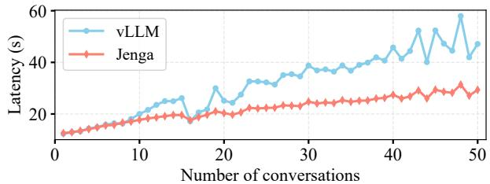  
(a) Multi-turn conversation

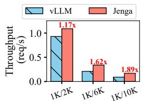  
(b) Chain of thought

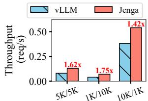  
(c) Parallel sampling (n=3)  
Figure 21. Typical workloads with Gemma-3 model. nK/mK means nK input tokens and mK output tokens

Typical workloads Figure 21 benchmarks three representative LLM inference workloads.

(a) Multi-turn conversation, which is important in chatbots and agent workflows. We simulate 4–8 turns with a 500-token common prefix for all conversations, 1200–1600 token inputs, and 800–1200 token outputs. Jenga has lower latency when there are more than 9 simultaneous conversations because Jenga can cache more conversations and run more conversations in parallel.

(b) Chain-of-thought, where the model produces long intermediate reasoning before giving a final answer in complex tasks. We evaluate 1000-token inputs with varying output lengths. Jenga achieves up to 1.59× speedup.

(c) Parallel sampling, which generates multiple outputs per request and is widely used in creative generation and RLHF training. We use different input-output length combinations and let each request generate 3 outputs. Jenga achieves up to 1.53× speedup.

## 9 Related Work

LLM serving systems Many works have optimized LLM serving for different scenarios. Orca [55] enables tokenlevel continuous batching to enhance inference throughput. LoongServe [50] and DeepSpeed-FastGen [21] focus on accelerating long-context LLM inference. DistServe [58] and SARATHI [3] can reduce the variance of output token latency. Parrot [29], SGLang [57], and XGrammar [15] target structured output generation. These approaches have successfully optimized serving for homogeneous models with standard full-attention layers and can be paired with Jenga to further support heterogeneous models.

LLM memory allocation The key objective of this line of work is to reduce memory fragmentation during LLM inference. PagedAttention [25] eliminates fragmentation caused by variable-length sequences by dividing the KV cache into fixed-size pages but fails to handle heterogeneous models with different embedding sizes. Though being more complex, Jenga still has the “page” abstraction, and thus is compatible with most features in PagedAttention, like parallel sampling, beam search, and shared prefix. MuxServe [16] supports serving multiple models with the same head size by setting that head size asthe page size, but cannot be extended to general cases like varying head sizes (e.g., Baichuan-M1 [48]) or other layer types (e.g., Mamba). Several studies propose memory allocation algorithms for specific types of tensors [32, 36, 42]. In contrast, Jenga provides a general solution that is compatible with different types of LLM tensors.

vAttention [38] and GMLake [20] utilize GPU virtual memory (VM) to manage the GPU memory for the intermediate tensors. They can only allocate memory at the granularity of the 2MB GPU driver page size. However, as shown in Table 1, LLM inference needs both fine-grained allocations (e.g., 64KB or 96KB) and irregular allocation sizes (e.g., 2,128KB, which consumes two 2MB pages if using VM). This mismatch leads to substantial internal fragmentation. Moreover, VMbased solutions still require a prefix caching system to decide which pages to cache in the physical memory for KV cache. LLM Memory optimization There is also a wide range of works that propose different types of LLM memory optimizations, including controlling the peak GPU memory usage [12, 13, 40], CPU or disk offloading on KV caches [18, 33, 39, 53], shrinking the KV cache size by novel attention modules [5, 30, 41] and pruning KV caches during runtime [2, 8, 51, 52]. These novel designs can be easily integrated into inference engines with the help of Jenga.

## 10 Conclusion

This paper introduces Jenga, an efficient memory allocation framework for managing heterogeneous embeddings in modern LLM architectures. By leveraging layer properties, Jenga reduces memory fragmentation and enables customizable caching policies for different types of embeddings. In our experiments, Jenga achieved up to 83.3% higher GPU memory utilization and a 1.39 to 2.16× increased serving throughput across a variety of models and scenarios.

## Acknowledgements

We thank the anonymous reviewers and our shepherd Deepak Narayanan for their extensive suggestions. Sky Computing Lab is supported by gifts from Accenture, AMD, Anyscale, Cisco, Google, IBM, Intel, Intesa Sanpaolo, Lambda, Lightspeed, Mibura, Microsoft, NVIDIA, Samsung SDS, and SAP.

## References

[1] Marah Abdin, Jyoti Aneja, Hany Awadalla, Ahmed Awadallah, Ammar Ahmad Awan, Nguyen Bach, Amit Bahree, Arash Bakhtiari, Jianmin Bao, Harkirat Behl, et al. 2024. Phi-3 technical report: A highly capable language model locally on your phone. arXiv preprint arXiv:2404.14219 (2024).

[2] Muhammad Adnan, Akhil Arunkumar, Gaurav Jain, Prashant Nair, Ilya Soloveychik, and Purushotham Kamath. 2024. Keyformer: Kv cache reduction through key tokens selection for efficient generative inference. Proceedings of Machine Learning and Systems 6 (2024), 114– 127.

[3] Amey Agrawal, Nitin Kedia, Ashish Panwar, Jayashree Mohan, Nipun Kwatra, Bhargav Gulavani, Alexey Tumanov, and Ramachandran Ramjee. 2024. Taming {Throughput-Latency} Tradeoff in {LLM} Inference with {Sarathi-Serve}. In 18th USENIX Symposium on Operating Systems Design and Implementation (OSDI 24). 117–134.

[4] Mistral AI. 2024. Introducing the world’s best edge models. https:// huggingface.co/mistralai/Ministral-8B-Instruct-2410 Accessed: 2024- 12-08.

[5] Joshua Ainslie, James Lee-Thorp, Michiel de Jong, Yury Zemlyanskiy, Federico Lebrón, and Sumit Sanghai. 2023. Gqa: Training generalized multi-query transformer models from multi-head checkpoints. arXiv preprint arXiv:2305.13245 (2023).

[6] Iz Beltagy, Matthew E Peters, and Arman Cohan. 2020. Longformer: The long-document transformer. arXiv preprint arXiv:2004.05150 (2020).

[7] Jeff Bonwick et al. 1994. The slab allocator: An object-caching kernel memory allocator.. In USENIX summer, Vol. 16. Boston, MA, USA.

[8] Zefan Cai, Yichi Zhang, Bofei Gao, Yuliang Liu, Tianyu Liu, Keming Lu, Wayne Xiong, Yue Dong, Baobao Chang, Junjie Hu, et al. 2024. Pyramidkv: Dynamic kv cache compression based on pyramidal information funneling. arXiv preprint arXiv:2406.02069 (2024).

[9] Character.ai. 2024. Optimizing AI Inference at Character.AI. https: //research.character.ai/optimizing-inference/?ref=blog.character.ai Accessed: 2024-12-10.

[10] Zhe Chen, Jiannan Wu, Wenhai Wang, Weijie Su, Guo Chen, Sen Xing, Muyan Zhong, Qinglong Zhang, Xizhou Zhu, Lewei Lu, et al. 2024. Internvl: Scaling up vision foundation models and aligning for generic visual-linguistic tasks. In Proceedings of the IEEE/CVF Conference on Computer Vision and Pattern Recognition. 24185–24198.

[11] Wenliang Dai, Nayeon Lee, Boxin Wang, Zhuolin Yang, Zihan Liu, Jon Barker, Tuomas Rintamaki, Mohammad Shoeybi, Bryan Catanzaro, and Wei Ping. 2024. Nvlm: Open frontier-class multimodal llms. arXiv preprint arXiv:2409.11402 (2024).

[12] Tri Dao. 2023. Flashattention-2: Faster attention with better parallelism and work partitioning. arXiv preprint arXiv:2307.08691 (2023).

[13] Tri Dao, Dan Fu, Stefano Ermon, Atri Rudra, and Christopher Ré. 2022. Flashattention: Fast and memory-efficient exact attention with io-awareness. Advances in Neural Information Processing Systems 35 (2022), 16344–16359.

[14] Xin Dong, Yonggan Fu, Shizhe Diao, Wonmin Byeon, Zijia Chen, Ameya Sunil Mahabaleshwarkar, Shih-Yang Liu, Matthijs Van Keirsbilck, Min-Hung Chen, Yoshi Suhara, et al. 2024. Hymba: A Hybridhead Architecture for Small Language Models. arXiv preprint arXiv:2411.13676 (2024).

[15] Yixin Dong, Charlie F Ruan, Yaxing Cai, Ruihang Lai, Ziyi Xu, Yilong Zhao, and Tianqi Chen. 2024. XGrammar: Flexible and Efficient Structured Generation Engine for Large Language Models. arXiv preprint arXiv:2411.15100 (2024).

[16] Jiangfei Duan, Runyu Lu, Haojie Duanmu, Xiuhong Li, Xingcheng Zhang, Dahua Lin, Ion Stoica, and Hao Zhang. 2024. MuxServe: Flexible Multiplexing for Efficient Multiple LLM Serving. arXiv preprint arXiv:2404.02015 (2024).

[17] Abhimanyu Dubey, Abhinav Jauhri, Abhinav Pandey, Abhishek Kadian, Ahmad Al-Dahle, Aiesha Letman, Akhil Mathur, Alan Schelten, Amy Yang, Angela Fan, et al. 2024. The llama 3 herd of models. arXiv preprint arXiv:2407.21783 (2024).

[18] Bin Gao, Zhuomin He, Puru Sharma, Qingxuan Kang, Djordje Jevdjic, Junbo Deng, Xingkun Yang, Zhou Yu, and Pengfei Zuo. 2024. {Cost-Efficient} Large Language Model Serving for Multi-turn Conversations with {CachedAttention}. In 2024 USENIX Annual Technical Conference (USENIX ATC 24). 111–126.

[19] Albert Gu and Tri Dao. 2023. Mamba: Linear-time sequence modeling with selective state spaces. arXiv preprint arXiv:2312.00752 (2023).

[20] Cong Guo, Rui Zhang, Jiale Xu, Jingwen Leng, Zihan Liu, Ziyu Huang, Minyi Guo, Hao Wu, Shouren Zhao, Junping Zhao, et al. 2024. GMLake: Efficient and Transparent GPU Memory Defragmentation for Largescale DNN Training with Virtual Memory Stitching. In Proceedings of the 29th ACM International Conference on Architectural Support for Programming Languages and Operating Systems, Volume 2. 450–466.

[21] Connor Holmes, Masahiro Tanaka, Michael Wyatt, Ammar Ahmad Awan, Jeff Rasley, Samyam Rajbhandari, Reza Yazdani Aminabadi, Heyang Qin, Arash Bakhtiari, Lev Kurilenko, et al. 2024. Deepspeed-fastgen: High-throughput text generation for llms via mii and deepspeed-inference. arXiv preprint arXiv:2401.08671 (2024).

[22] Huggingface. 2024. arxiv-march-2023. https://huggingface.co/ datasets/liyucheng/arxiv-march-2023 Accessed: 2024-12-10.

[23] huggingface. 2024. Text Generation Inference. https://github.com/ huggingface/text-generation-inference Accessed: 2024-12-10.

[24] Angelos Katharopoulos, Apoorv Vyas, Nikolaos Pappas, and François Fleuret. 2020. Transformers are rnns: Fast autoregressive transformers with linear attention. In International conference on machine learning. PMLR, 5156–5165.

[25] Woosuk Kwon, Zhuohan Li, Siyuan Zhuang, Ying Sheng, Lianmin Zheng, Cody Hao Yu, Joseph Gonzalez, Hao Zhang, and Ion Stoica. 2023. Efficient memory management for large language model serving with pagedattention. In Proceedings of the 29th Symposium on Operating Systems Principles. 611–626.

[26] Yaniv Leviathan, Matan Kalman, and Yossi Matias. 2023. Fast inference from transformers via speculative decoding. In International Conference on Machine Learning. PMLR, 19274–19286.

[27] Bo Li, Yuanhan Zhang, Dong Guo, Renrui Zhang, Feng Li, Hao Zhang, Kaichen Zhang, Peiyuan Zhang, Yanwei Li, Ziwei Liu, et al. 2024. Llavaonevision: Easy visual task transfer. arXiv preprint arXiv:2408.03326 (2024).

[28] Opher Lieber, Barak Lenz, Hofit Bata, Gal Cohen, Jhonathan Osin, Itay Dalmedigos, Erez Safahi, Shaked Meirom, Yonatan Belinkov, Shai Shalev-Shwartz, et al. 2024. Jamba: A hybrid transformer-mamba language model. arXiv preprint arXiv:2403.19887 (2024).

[29] Chaofan Lin, Zhenhua Han, Chengruidong Zhang, Yuqing Yang, Fan Yang, Chen Chen, and Lili Qiu. 2024. Parrot: Efficient Serving of LLM-based Applications with Semantic Variable. arXiv preprint arXiv:2405.19888 (2024).

[30] Aixin Liu, Bei Feng, Bin Wang, Bingxuan Wang, Bo Liu, Chenggang Zhao, Chengqi Dengr, Chong Ruan, Damai Dai, Daya Guo, et al. 2024. Deepseek-v2: A strong, economical, and efficient mixture-of-experts language model. arXiv preprint arXiv:2405.04434 (2024).

[31] Haotian Liu, Chunyuan Li, Qingyang Wu, and Yong Jae Lee. 2024. Visual instruction tuning. Advances in neural information processing systems 36 (2024).

[32] Xiaoxuan Liu, Cade Daniel, Langxiang Hu, Woosuk Kwon, Zhuohan Li, Xiangxi Mo, Alvin Cheung, Zhijie Deng, Ion Stoica, and Hao Zhang. 2024. Optimizing Speculative Decoding for Serving Large Language Models Using Goodput. arXiv preprint arXiv:2406.14066 (2024).

[33] Yuhan Liu, Hanchen Li, Yihua Cheng, Siddhant Ray, Yuyang Huang, Qizheng Zhang, Kuntai Du, Jiayi Yao, Shan Lu, Ganesh Ananthanarayanan, et al. 2024. Cachegen: Kv cache compression and streaming

for fast large language model serving. In Proceedings of the ACM SIG-COMM 2024 Conference. 38–56.

[34] Meta. [n. d.]. The Llama 4 herd: The beginning of a new era of natively multimodal AI innovation. https://ai.meta.com/blog/llama-4- multimodal-intelligence/. [Accessed 2025-04-17].

[35] Antonio Orvieto, Samuel L Smith, Albert Gu, Anushan Fernando, Caglar Gulcehre, Razvan Pascanu, and Soham De. 2023. Resurrecting recurrent neural networks for long sequences. In International Conference on Machine Learning. PMLR, 26670–26698.

[36] Rui Pan, Zhuang Wang, Zhen Jia, Can Karakus, Luca Zancato, Tri Dao, Ravi Netravali, and Yida Wang. 2024. Marconi: Prefix Caching for the Era of Hybrid LLMs. arXiv preprint arXiv:2411.19379 (2024).

[37] Bo Peng, Eric Alcaide, Quentin Anthony, Alon Albalak, Samuel Arcadinho, Stella Biderman, Huanqi Cao, Xin Cheng, Michael Chung, Matteo Grella, et al. 2023. Rwkv: Reinventing rnns for the transformer era. arXiv preprint arXiv:2305.13048 (2023).

[38] Ramya Prabhu, Ajay Nayak, Jayashree Mohan, Ramachandran Ramjee, and Ashish Panwar. 2024. vAttention: Dynamic Memory Management for Serving LLMs without PagedAttention. arXiv preprint arXiv:2405.04437 (2024).

[39] Ruoyu Qin, Zheming Li, Weiran He, Mingxing Zhang, Yongwei Wu, Weimin Zheng, and Xinran Xu Mooncake. 2024. Kimi’s kvcachecentric architecture for llm serving. arXiv preprint arXiv:2407.00079 (2024).

[40] Jay Shah, Ganesh Bikshandi, Ying Zhang, Vijay Thakkar, Pradeep Ramani, and Tri Dao. 2024. Flashattention-3: Fast and accurate attention with asynchrony and low-precision. arXiv preprint arXiv:2407.08608 (2024).

[41] Noam Shazeer. 2019. Fast transformer decoding: One write-head is all you need. arXiv preprint arXiv:1911.02150 (2019).

[42] Ying Sheng, Shiyi Cao, Dacheng Li, Coleman Hooper, Nicholas Lee, Shuo Yang, Christopher Chou, Banghua Zhu, Lianmin Zheng, Kurt Keutzer, et al. 2024. SLoRA: Scalable Serving of Thousands of LoRA Adapters. Proceedings of Machine Learning and Systems 6 (2024), 296– 311.

[43] Andreas Steiner, André Susano Pinto, Michael Tschannen, Daniel Keysers, Xiao Wang, Yonatan Bitton, Alexey Gritsenko, Matthias Minderer, Anthony Sherbondy, Shangbang Long, et al. 2024. PaliGemma 2: A Family of Versatile VLMs for Transfer. arXiv preprint arXiv:2412.03555 (2024).

[44] Gemma Team, Aishwarya Kamath, Johan Ferret, Shreya Pathak, Nino Vieillard, Ramona Merhej, Sarah Perrin, Tatiana Matejovicova, Alexandre Ramé, Morgane Rivière, et al. 2025. Gemma 3 technical report. arXiv preprint arXiv:2503.19786 (2025).

[45] Gemma Team, Morgane Riviere, Shreya Pathak, Pier Giuseppe Sessa, Cassidy Hardin, Surya Bhupatiraju, Léonard Hussenot, Thomas Mesnard, Bobak Shahriari, Alexandre Ramé, et al. 2024. Gemma 2: Improving open language models at a practical size. arXiv e-prints (2024), arXiv–2408.

[46] A Vaswani. 2017. Attention is all you need. Advances in Neural Information Processing Systems (2017).

[47] vLLM Team. [n. d.]. vLLM v0.6.0: 2.7x Throughput Improvement and 5x Latency Reduction — blog.vllm.ai. https://blog.vllm.ai/2024/09/05/perfupdate.html. [Accessed 10-12-2024].

[48] Bingning Wang, Haizhou Zhao, Huozhi Zhou, Liang Song, Mingyu Xu, Wei Cheng, Xiangrong Zeng, Yupeng Zhang, Yuqi Huo, Zecheng Wang, et al. 2025. Baichuan-m1: Pushing the medical capability of large language models. arXiv preprint arXiv:2502.12671 (2025).

[49] Wikipedia. 2025. Buddy memory allocation. https://en.wikipedia.org/ wiki/Buddy\_memory\_allocation Accessed: 2025-04-17.

[50] Bingyang Wu, Shengyu Liu, Yinmin Zhong, Peng Sun, Xuanzhe Liu, and Xin Jin. 2024. Loongserve: Efficiently serving long-context large language models with elastic sequence parallelism. In Proceedings of the ACM SIGOPS 30th Symposium on Operating Systems Principles.

640–654.

[51] Guangxuan Xiao, Yuandong Tian, Beidi Chen, Song Han, and Mike Lewis. 2023. Efficient streaming language models with attention sinks. arXiv preprint arXiv:2309.17453 (2023).

[52] Dongjie Yang, XiaoDong Han, Yan Gao, Yao Hu, Shilin Zhang, and Hai Zhao. 2024. PyramidInfer: Pyramid KV Cache Compression for Highthroughput LLM Inference. arXiv preprint arXiv:2405.12532 (2024).

[53] Jiayi Yao, Hanchen Li, Yuhan Liu, Siddhant Ray, Yihua Cheng, Qizheng Zhang, Kuntai Du, Shan Lu, and Junchen Jiang. 2024. CacheBlend: Fast Large Language Model Serving with Cached Knowledge Fusion. arXiv preprint arXiv:2405.16444 (2024).

[54] Zihao Ye, Lequn Chen, Ruihang Lai, Yilong Zhao, Size Zheng, Junru Shao, Bohan Hou, Hongyi Jin, Yifei Zuo, Liangsheng Yin, Tianqi Chen, and Luis Ceze. 2024. Accelerating Self-Attentions for LLM Serving with FlashInfer. https://flashinfer.ai/2024/02/02/introduce-flashinfer.html

[55] Gyeong-In Yu, Joo Seong Jeong, Geon-Woo Kim, Soojeong Kim, and Byung-Gon Chun. 2022. Orca: A distributed serving system for {Transformer-Based} generative models. In 16th USENIX Symposium on Operating Systems Design and Implementation (OSDI 22). 521–538.

[56] Xiang Yue, Tianyu Zheng, Yuansheng Ni, Yubo Wang, Kai Zhang, Shengbang Tong, Yuxuan Sun, Botao Yu, Ge Zhang, Huan Sun, et al. 2024. Mmmu-pro: A more robust multi-discipline multimodal understanding benchmark. arXiv preprint arXiv:2409.02813 (2024).

[57] Lianmin Zheng, Liangsheng Yin, Zhiqiang Xie, Jeff Huang, Chuyue Sun, Cody Hao Yu, Shiyi Cao, Christos Kozyrakis, Ion Stoica, Joseph E Gonzalez, et al. 2023. Efficiently programming large language models using sglang. arXiv e-prints (2023), arXiv–2312.

[58] Yinmin Zhong, Shengyu Liu, Junda Chen, Jianbo Hu, Yibo Zhu, Xuanzhe Liu, Xin Jin, and Hao Zhang. 2024. {DistServe}: Disaggregating Prefill and Decoding for Goodput-optimized Large Language Model Serving. In 18th USENIX Symposium on Operating Systems Design and Implementation (OSDI 24). 193–210.