Latest updates: hps://dl.acm.org/doi/10.1145/3731569.3764824

RESEARCH-ARTICLE

# Mantle: Efficient Hierarchical Metadata Management for Cloud Object Storage Services

JIAHAO LI, University of Science and Technology of China, Hefei, Anhui, China

BIAO CAO, Baidu, Inc., Beijing, China

JIELONG JIAN, Baidu, Inc., Beijing, China

CHENG LI, University of Science and Technology of China, Hefei, Anhui, China

SEN HAN, University of Science and Technology of China, Hefei, Anhui, China

YIDUO WANG, University of Science and Technology of China, Hefei, Anhui, China

View all

Open Access Support provided by:

Baidu, Inc.

University of Science and Technology of China

Tsinghua University

Published: 12 October 2025

Citation in BibTeX format

SOSP '25: ACM SIGOPS 31st Symposium   
on Operating Systems Principles   
October 13 - 16, 2025   
Seoul, Republic of Korea

Conference Sponsors: SIGOPS

# Mantle: Efficient Hierarchical Metadata Management for Cloud Object Storage Services

Jiahao Li†§\* Biao Cao§\* Jielong Jian§ Cheng Li†¶ Sen Han† Yiduo Wang† Yufei Wu† Kang Chen‡ Zhihui Yin§ Qiushi Chen§ Jiwei Xiong§ Jie Zhao§ Fengyuan Liu§ Yan Xing§ Liguo Duan§ Miao Yu§ Ran Zheng§ Feng Wu†¶ Xianjun Meng§ † University of Science and Technology of China § Baidu (China) Co., Ltd ‡ Tsinghua University ¶ Institute of Artificial Intelligence, Hefei Comprehensive National Science Center

## Abstract

Cloud Object Storage Services (COSSs) are the primary storage backend in the cloud, supporting large-scale analytics and ML workloads that frequently access deep object paths and update metadata concurrently. However, current COSS architectures incur costly multi-round lookups and high directory contention, delaying job execution. Prior optimizations, largely designed for distributed file systems (with least adoption in clouds), do not apply due to COSS-specific constraints like stateless proxies and limited APIs.

Mantle is a new COSS metadata service for modern cloud workloads. It adopts a two-layer architecture: a scalable, sharded database (TafDB) shared across namespaces and a per-namespace, single-server IndexNode consolidating lightweight directory metadata. With a fine-grained division of metadata and responsibility, Mantle supports up to 10 billion objects or directories in a single namespace and achieves 1.8 million lookups per second through scalable execution of single-RPC lookups on IndexNode. It also delivers up to 58K directory updates per second under high contention by integrating out-of-place delta updates in TafDB and offloading loop detection for cross-directory renames to IndexNode, both effectively eliminating coordination bottlenecks. Compared to the metadata services of Tectonic, InfiniFS and LocoFS, Mantle reduces metadata latency by 6.6-99.1% and improves throughput by 0.07-115.00×. With data access enabled, it shortens job completion times by 63.3–93.3% for interactive Spark analytics and 38.5–47.7% for AI-driven audio preprocessing tasks. Mantle has been deployed on Baidu

Object Storage (BOS) for over 2 years, a service offered by Baidu Canghai Storage.

CCS Concepts: • Information systems → Cloud based storage; Directory structures.

## 1 Introduction

Cloud Object Storage Services (COSSs) such as Amazon S3 [5], Azure Blob Storage [28], and Google Cloud Storage [14] have become the dominant storage infrastructure in modern cloud environments [41]. They serve as the foundational layer for a wide range of critical workloads, especially in data-intensive domains such as data analytics and machine learning (ML) training and inference. These applications rely heavily on COSSs to store vast datasets and access them frequently and concurrently. As a result, they demand ultra-low latency and high throughput for both resolving object paths and modifying object metadata to maintain job responsiveness and cost efficiency, particularly given the involvement of expensive computing resources like GPUs.

However, meeting these performance demands in COSSs is non-trivial. Modern workloads often operate on deeply nested directory hierarchies with long access paths and involve substantial directory mutation under concurrency. Our analysis of real-world namespaces (§3) reveals that these namespaces are at billion-scale and the average directory depth is around 11 while the maximum is 95. Overall, many concurrent applications access these namespaces simultaneously, driving the peak throughput of a single namespace to several hundred thousand operations per second or more. Across all metadata requests, the path resolution (also known as lookup) dominates execution time, accounting for over 89% of metadata operation latency in some cases. Furthermore, contention in shared directories significantly degrades the performance of directory modification operations like mkdir and dirrename, throttling the performance of applications such as interactive analytics queries.

Extensive research has focused on metadata optimizations in distributed file systems (DFSs), yet little attention has been paid to COSSs, despite their significantly higher adoption in cloud environments. COSS architectures impose fundamental constraints, such as stateless proxy layers, limited APIs, and the absence of cooperative client logic, render traditional DFS techniques ineffective. Techniques like metadata caching [26, 42, 50] and speculative parallel path resolution [26] rely on tightly coupled designs that COSSs inherently lack. Similarly, relaxed isolation via single-shard updates [8] can reduce directory update contention but fails to fully address the complex coordination patterns in COSS workloads and leaves path resolution performance largely unoptimized.

To address these limitations, we present Mantle, a new COSS metadata service designed to provide ultra-low latency, high throughput, and contention-resilient performance. Mantle features an inclusive two-layer architecture comprising a scalable, sharded TafDB and a lightweight, per-namespace IndexNode optimized for fast directory lookups. Unlike prior tiered designs [21], Mantle introduces a fine-grained division of metadata and serving responsibilities: TafDB stores all metadata at scale and is shared across namespaces, while IndexNode caches only essential directory metadata for a single namespace, enabling efficient single-RPC path lookups rather than cross-node, multi-round path traversals.

Beyond its architectural innovations, Mantle introduces two key optimizations to meet its performance goals. First, it redesigns the data organization and lookup-serving workflow within IndexNode to prevent it from becoming a singlenode bottleneck. To reduce CPU overhead, Mantle employs the TopDirPathCache, a static cache that stores resolution results for high-stability path prefixes. TopDirPathCache avoids runtime promotion or demotion; instead, stale entries are removed by the Invalidator, a lightweight, lock-free mechanism. This design effectively balances fast lookup performance with efficient cache invalidation, triggered by directory updates. In addition, Mantle leverages the Raft-based replication group of IndexNode by offloading lookup tasks to follower and learner replicas, distributing the workload and enhancing lookup scalability beyond the leader node.

Second, to address contention in concurrent directory updates, Mantle introduces to TafDB a novel delta record mechanism that replaces in-place updates with conflict-free appends, significantly reducing transaction aborts and retries under high concurrency. For complex operations like crossdirectory renames, Mantle moves loop detection logic to IndexNode and uses its local metadata index to perform locking and validation in a single RPC, avoiding costly distributed coordination. Finally, Mantle applies Raft log batching and follower write offloading to sustain the write throughput of IndexNode as directory update rates increase.

Mantle has been deployed in the Baidu Object Storage for over 1.5 years. We have reported in §7 with rich deployment experience where 19 internal namespaces and billions of objects are managed. In our evaluation, it supports 10 billion entries in a single namespace, achieving 1.89 million lookups per second. Under high contention, it delivers up to 58.8K mkdir and 38.0K dirrename operations per second. We compare Mantle to three modern hierarchical metadata services, including Tectonic [33], LocoFS [21], and InfiniFS [26], using two real-world workloads (interactive Spark analytics and AI-based audio preprocessing) and the mdtest benchmark. Mantle reduces the metadata latency of 17.5-95.2%, 9.5-99.1% and 6.6-98.8%, while introducing throughput speedups of 1.20-20.90×, 1.16-116.00× and 1.07-80.78×, respectively.These improvements translate to 63.3–93.3% shorter job completion times for Spark analytics and 38.5–47.7% for audio preprocessing tasks. Mantle and its analysis data will be made available at https://mantle-opensource.github.io/.

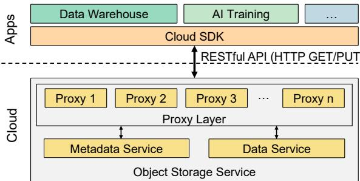  
Figure 1. Architecture of typical COSSs with the constrained application interfaces. Note that a single COSS often hosts a number of applications that share the internal metadata and data services.

In summary, the contributions of this paper are:

• A study of real-world COSS namespaces that identifies critical metadata bottlenecks caused by inefficient lookups and high update contention.

• A two-layer design of Mantle that combines a single-node directory index with a scalable database for bulk metadata storage and processing, incorporating optimizations such as metadata division and coordination elimination to avoid single-node bottlenecks.

• An implementation of Mantle, incorporating these paradigms, enabling a billion-scale single namespace.

• An in-depth evaluation of Mantle using real-world application benchmarks and metadata benchmarks, with comparison against state-of-the-art systems.

• A production deployment of Mantle with detailed deployment lessons, offering insights that may inspire future research in the community.

## 2 Background

## 2.1 Cloud Object Storage Services (COSSs)

Cloud computing infrastructure investment is projected to account for more than 60% of all global IT infrastructure spending in 2023 [17]. Cloud Object Storage Services (COSSs) have emerged as the primary storage solution for building cloud-based applications. A recent study [41], which examines 396 applications and systems built on Amazon Web Services (AWS), finds that approximately 68% of them use Amazon S3 object storage, whereas distributed file systems are not particularly important and see the least adoption, with only 4% usage. Furthermore, Enterprise Storage Forum reports that the global cloud object storage market was valued at \$4.83 billion in 2020 and is projected to reach \$13.65 billion by 2028, growing at a compound annual growth rate of 13.6% [40]. This dominant adoption and expanding market highlight COSSs as a critical and timely research focus.

The same study also highlights that two key workloads, analytics and machine learning (ML) tasks, dominate the cloud application landscape. Specifically, over 60% of applications use either analytics or ML services, with analytics accounting for 42% and ML for 18%. Given the growing prominence of AI, ML workloads are expected to continue increasing. COSSs play a vital role in supporting both workloads: analytics engines typically store pre-processed and post-processed data in COSSs like S3, while many ML services—such as those for language and video processing—rely on COSSs to access input data and store output results. These findings are consistent with our observations from an internal cloud environment at a Baidu (see §3 for details).

## 2.2 COSSs’ Interface and Programming Constraints

Figure 1 shows that a typical COSS consists of three key components: a proxy layer, a metadata service, and a data service. The data service maintains a pool of servers to store object data, while the metadata service spans a few servers to manage the object namespace, mapping object paths to their physical data locations.

Typically, a number of applications share a single COSS, where their namespaces and objects are stored in the internal metadata and data services, respectively. COSSs impose constraints on their interactions with applications. Applications interact with COSSs through a restricted set of RESTful APIs [5, 28], typically accessed via cloud SDKs. For example, to retrieve an object, an application issues an HTTP GET request with a specified path to a randomly chosen proxy server. The proxy resolves the path via the metadata service, fetches the corresponding object from the data service, and returns it to the application. Notably, this proxy layer is stateless, which helps with load balancing.

COSSs’ loosely coupled architecture strictly isolates their internal components from external users, presenting new challenges for scaling their metadata and data services.

## 2.3 Metadata Management in COSSs

Metadata performance is crucial for applications using COSSs, because according to the metadata-data separation architecture in Figure 1, metadata services must be accessed before object operations. Furthermore, the application object size is usually small [3, 44], and the metadata overhead has become non-negligible compared to the object accesses. Later, we show that metadata enhancements bring significant application-level performance gains in §6.2.

Recently, many COSSs, including Amazon S3, Azure Data Lake Storage, and Google Cloud Storage, have gradually enhanced their metadata services by transitioning from managing flat namespaces to hierarchical ones [5, 14, 28]. Furthermore, they began to employ databases to handle hierarchical namespaces as database tables, which are sharded and distributed across several servers for scale-out, and orchestrate metadata operations as database transactions [7, 22, 30, 33]. The aforementioned study points out that 16 applications store in DynamoDB [9] pointers to data on S3.

Figure 2 shows the architecture of a DBtable-based hierarchical metadata service of the COSSs of Baidu, similar to that used in the Tectonic [33] storage from Meta. This DBtablebased metadata service maps each hierarchical namespace to a large database table and uses the parent directory’s unique ID (pid) and object/directory names as primary keys. To achieve load balance while preserving the locality of directories, it further partitions the metadata table by pid to place the entries under the same directory within the same shard as possible.

Multi-RPC path resolution. With this architecture, resolving a path to an object or directory involves level-by-level traversal from the root, requiring interaction between the proxy and the metadata service (i.e., the underlying database servers) through multiple rounds of RPCs. This is due to the partitioned nature of the metadata tables, where each directory is stored on a specific database server. At each level, the proxy must retrieve the inode ID of the current directory to compute which server to contact for the nextlevel lookup. Additionally, permission checks are performed at each step to ensure access control. The top right part of Figure 2 shows that when an application attempts to create a new directory ‘/A/C/E/G’, it first issues an HTTP PUT request to the proxy layer. A randomly selected proxy server then processes this request by recursively traversing the path from the root, validating each component’s existence and checking permissions along the way ( 1 , 2 , and 3 ).

Distributed metadata transaction processing. Directory modifications, such as mkdir and dirrename, require updating metadata entries of more than one directory. When these updates span multiple metadata shards, distributed transactions are needed to ensure strong consistency across the involved database servers [26, 49]. As shown in Figure 2, steps 4a and 4b together form a distributed transaction initiated by the proxy to complete the second half of the above mkdir request. This transaction coordinates between node3 and node4 to insert the metadata entry for the newly created directory ‘G’ and to update the metadata of its parent directory ‘E’ accordingly.

## 3 Namespace Behaviors of COSSs

To understand the metadata bottleneck of applications atop COSSs, we conduct a detailed analysis of the volume, access characteristics, and performance requirements of namespaces corresponding to data-intensive applications in the

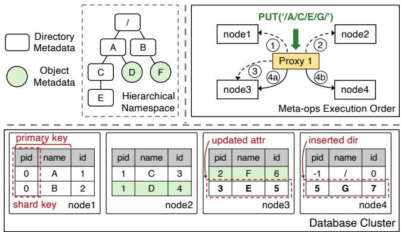

Figure 2. A DBtable-based hierarchical, COSS metadata service. The top left part represents an exemplified namespace containing both directories and objects, with object metadata colored as green. The bottom part depicts the same namespace represented as a table with four shards distributed across four nodes. The top right box shows the execution flow of a mkdir request, where dotted arrows stand for retrieving during path resolution, while solid arrows indicate the insertion of new directory metadata plus the mutation on its parent directory’s metadata, spanning node3 and node4.

cloud environments of Baidu, where the DBtable-based metadata service has been deployed for years. We profiled five representative namespaces that primarily host workloads like big-data analytic or ML tasks, and the results are summarized in Figure 3 and Figure 4.

Figure 3a shows that all five namespaces have over 2 billion entries, with objects making up 82.0% to 91.7% and directories only 8.3% to 18.0%. Furthermore, their workloads are characterized by frequent operations on numerous small objects and must sustain a high throughput of 150K to 300K operations per second. Data access to small objects is accelerated by SSDs, reducing latency to a single RPC plus tens of microseconds for device access [1, 4]. As a result, metadata access emerges as a key factor in end-to-end performance.

As an example, in autonomous driving model data preprocessing, multiple tasks process a large dataset of over 1 billion small objects (mostly below 512KB), each encapsulating a short time-span segment of multimodal sensor data and associated metadata collected during vehicle operation. The preprocessing workflow involves scanning existing objects and creating new ones, generating heavy lookup and creation loads. In such scenarios, metadata access dominates total execution time (over 70%).

However, achieving high metadata performance is challenging due to the following two inefficiencies.fl

## 3.1 Lookup Inefficiencies

Surprisingly, these namespaces possess deeply nested directory hierarchies, with average path depths exceeding 10 and maximum depths reaching up to 95. Access patterns from applications are heavily skewed toward deeper levels of the hierarchy. Figure 3b shows that the average access depths for the five namespaces are 11.6, 11.5, 10.8, 10.6, and 11.9, respectively. For namespace ns4, one of the largest, half of the requests access paths with a depth exceeding 10.

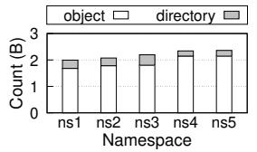  
(a) Object/directory counts

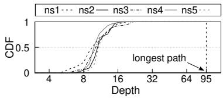  
(b) Request path depths

Figure 3. Characteristics of five real-world namespaces  
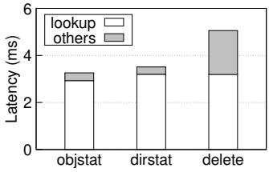  
(a) Latency breakdown

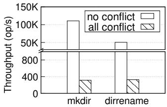  
(b) Throughput  
Figure 4. Performance analysis of the DBtable-based COSS metadata service

Deep directory hierarchies and long access paths make modern metadata management methods face path resolution bottlenecks. To illustrate this, we analyzed the latency breakdown results of three metadata operations, such as objstat, dirstat, and delete∗, by experimenting with the mdtest benchmark [39], the DBtable-based metadata service, and 512 application threads (detailed configurations in §6.3). Figure 4a highlights that most of execution time is consumed by the lookup step, i.e., 89.9%, 91.2%, and 63.1% for the three exercised operations, respectively. This long lookup time is contributed by the several rounds of interactions between the proxy layer and the metadata service, as mentioned in §2.3. Note that this conclusion is valid for all other metadata operations (omitted due to space limit), since lookup is the first step of all metadata operations.

## 3.2 Directory Update Contentions

Directory modification operations, such as mkdir, rmdir and dirrename, constitute a relatively small portion of overall accesses towards a namespace. However, for some applications, they can cause substantial contention on shared directories due to concurrent updates to the same directory attributes.

In our production environment, Spark ad-hoc queries issue over 10,000 runs daily with stringent latency requirements. Each query generates hundreds of subtasks whose temporary directories are atomically renamed into a shared output directory, inducing concentrated metadata updates. Under existing DBtable-based mechanism, the contention causes

∗For consistency and clarity, we retain the operation names from mdtest.

<table><tr><td rowspan=1 colspan=1></td><td rowspan=1 colspan=1>Type</td><td rowspan=1 colspan=1>#RTTs forlookup</td><td rowspan=1 colspan=1>Reduced dir.contention</td></tr><tr><td rowspan=1 colspan=1>Metadatacaching [26,42, 50]</td><td rowspan=1 colspan=1></td><td rowspan=1 colspan=1> pathlen</td><td rowspan=1 colspan=1>N/A</td></tr><tr><td rowspan=1 colspan=1>Parallelresolving [26]</td><td rowspan=1 colspan=1>DFS</td><td rowspan=1 colspan=1>[1, pathlen]</td><td rowspan=1 colspan=1>N/A</td></tr><tr><td rowspan=1 colspan=1>Isolationrelaxing [49]</td><td rowspan=1 colspan=1></td><td rowspan=1 colspan=1>pathlen</td><td rowspan=1 colspan=1>restricted</td></tr><tr><td rowspan=1 colspan=1>Tiering [21]</td><td rowspan=1 colspan=1></td><td rowspan=1 colspan=1>single</td><td rowspan=1 colspan=1>N/A</td></tr><tr><td rowspan=1 colspan=1>Mantle (ours)</td><td rowspan=1 colspan=1>COSS</td><td rowspan=1 colspan=1>single</td><td rowspan=1 colspan=1>all</td></tr></table>

Table 1. Comparison of metadata services: lookup latency optimizations vs. directory modification contention handling. pathlen denotes the length of the path to be resolved.

frequent transaction retries, turning this commit phase into the primary bottleneck. In extreme cases, it accounts for over 99% of the total task execution time.

To demonstrate the impact of shared directory contention, we additionally ran the mdtest mkdir and dirrename workloads from 512 threads with two cases, where ‘no conflict’ means all threads write to different directories, while ‘all conflict’ emulates the above Spark query scenario that writes a single directory. Figure 4b shows that the DBtable-based metadata service performs significantly worse with full contention compared to scenarios without contention, i.e., 99.7% and 99.4% throughput reductions for the two metadata operations, respectively. This degradation occurs because mkdir and dirrename operations trigger distributed two-phase commit transactions across database shards, leading to high abort rates or long lock waiting time under high contention.

## 3.3 Motivations

In this paper, we aim to build a new metadata service for modern COSSs that delivers ultra-low lookup latency, reduces directory update contention, and maintains high overall metadata throughput. However, as summarized in Table 1, most existing metadata optimization efforts target distributed file systems (DFSs), and they are not directly applicable to COSSs due to fundamental architectural differences.

First, several DFS-based works focus on reducing the number of round-trip times (RTTs) in path lookups. Metadata caching—used in systems like Ceph [50], NFSv4 [42], and InfiniFS [26]—caches directory traversal results to accelerate repeated lookups. While effective in tightly coupled DFS architectures, such caching is difficult to realize in COSSs due to their stateless proxy design, limited API exposure, and lack of cross-layer visibility. Another technique, parallel resolving [26], speculatively predicts and queries metadata shards concurrently across all path levels to reduce average latency. However, under high concurrency, this method becomes counterproductive, as the lookup latency is determined by the slowest request and exacerbated by thread oversubscription. Furthermore, parallel resolving does not reduce the number of RPCs and can not improve throughput capacity of the metadata service. Consequently, resolving a 10-level path with 512 threads in InfiniFS results in an average latency of 7.4 RTTs—approaching that of naïve, sequential resolution in DBtable-based architectures.

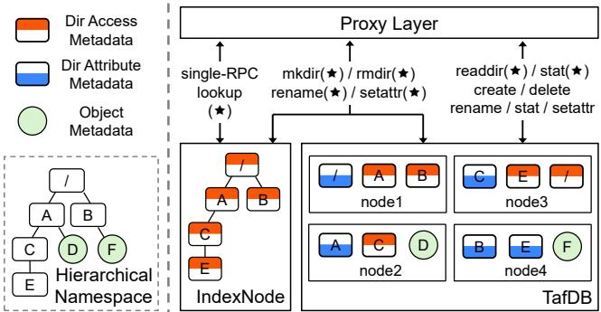  
Figure 5. Architecture of the Mantle metadata service and division of metadata request processing over IndexNode and TafDB. Operations marked with (★) are directory operations, while the others are object operations.

LocoFS [21] proposes a tiered metadata service by decoupling directory and object metadata, placing the former on a dedicated directory node and the latter within a scalable database cluster. While this separation theoretically enables independent scaling, it also introduces new challenges. The centralized directory node must handle all directory-related operations, creating a performance bottleneck. Moreover, cross-component coordination is still required for operations like object creation, which involves duplicate name check and parent directory update, both of which must go through the directory node, imposing extra overhead.

Critically, most existing works overlook contention in directory updates, often assuming such operations are infrequent and have negligible impact on overall system performance. This assumption no longer holds in modern COSSs supporting dynamic and high-concurrency cloud workloads. Recent efforts such as CFS [8] attempt to reduce coordination overhead by relaxing isolation levels and transforming distributed transactions into single-shard transactions using atomic primitives. While effective in avoiding coordination for simple directory updates, this strategy breaks down for complex operations like dirrename, which span multiple shards and still incur costly distributed transactions.

In summary, existing approaches either optimize lookup latency or marginally reduce update overheads, but none simultaneously address both in the COSS context. These limitations motivate the design of a new metadata service architecture that holistically enhances COSS performance across diverse and large-scale workloads.

## 4 Mantle Overview

Figure 5 presents the high-level architecture of Mantle, a new COSS metadata service designed to support a single namespace containing up to 10 billion directories and objects. Mantle achieves 1.8 million path lookups and 30 thousand directory hierarchy modifications per second, while significantly reducing latency for cloud workloads operating on that namespace. Moreover, by accelerating path lookups, Mantle also improves the performance of all other metadata operations involving both directories and objects.

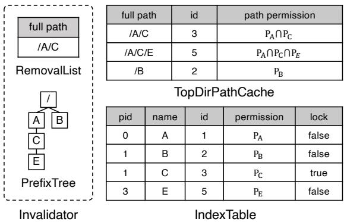  
Figure 6. Main data structures on Mantle’s IndexNode

To enable these capabilities, Mantle is composed of three core components: a proxy layer, TafDB, and IndexNode. As in the DBtable-based metadata service (Figure 1), Mantle’s proxy layer receives applications’ HTTP requests and coordinates their execution by interacting with the internal components to handle both metadata and data requests. TafDB is a scalable, sharded database responsible for storing metadata at any scale. IndexNode is a dedicated, single-node index that consolidates all/some directory metadata for a given namespace. Each namespace is assigned its own IndexNode, while the shared TafDB remains the scalable backend for all namespaces. This paper focuses on optimizing metadata performance within a single namespace, though the architecture naturally supports multi-namespace deployments by deploying multiple IndexNode instances.

In contrast to the above tiering method, Mantle employs an inclusive, two-layer architecture between IndexNode and TafDB with fine-grained metadata division. While TafDB retains complete metadata, IndexNode maintains only a critical subset of directory metadata (approximately 80 bytes per directory) for efficient lookups and cross-directory coordination. We partition directory metadata into access metadata (red-topped boxes in Figure 5) and attribute metadata (bluebottomed boxes), with IndexNode storing only the access metadata. As shown in Figure 6, this is implemented through the IndexTable in IndexNode, which includes: parent directory ID (pid), directory name (dirname), directory ID (id), access permissions (permission), and a lock bit for concurrent update coordination.

To complement our data division, we design a fine-grained responsibility split that minimizes IndexNode workload while maximizing TafDB’s scale-out capacity for directory operations. As shown in Figure 5, IndexNode handles lookup and permission checks as single-RPC operations, while TafDB processes both object metadata and directory operations (readdir and stat) using its stored attribute metadata. For complex mutations (e.g., mkdir and rename), coordination occurs across both components: TafDB updates all metadata (access and attribute) while IndexNode refreshes access data for future lookups, maintaining strong synchronization. Additionally, IndexNode manages rename loop detection, a particularly challenging task for TafDB when directories span multiple database shards.

The introduction of IndexNode does not alter the availability guarantees of the MetaTable, which is ensured by the underlying database. Therefore, our focus lies on ensuring high availability for the IndexNode itself. This is achieved through the adoption of Raft consensus protocol [31] to replicate updates to multiple nodes. Within the Raft group, all nodes maintain identical in-memory data structures, which are independently constructed by each node according to the procedures described in §5.1.

While these design choices enable scalable metadata management, they also introduce specific challenges that must be addressed to ensure the system’s overall performance and consistency. We will elaborate on these challenges together with our solutions next.

## 5 Design of Mantle

## 5.1 Scaling Single-RPC Lookup

While the IndexNode centralizes distributed lookups to a single node, the CPU-intensive path resolution process creates a performance bottleneck in IndexNode. This is because the single-RPC lookup on IndexNode still breaks down into several local accesses to IndexTable. Note that this bottleneck becomes more pronounced as the path depth deepens. To this end, we introduce the novel TopDirPathCache design that effectively reduces the CPU consumption in IndexNode (§5.1.1). Following this, to maintain cache coherence with low overhead, we propose a lightweight cache invalidation mechanism that minimizes interference with lookup requests (§5.1.2). Finally, in the Raft group of IndexNode, follower nodes are typically idle, performing only replication tasks, which wastes the CPU resource. Therefore, whether we can use follower nodes to share the path resolution pressure of leader becomes another key to lookup optimization. Detailed designs are provided in §5.1.3.

5.1.1 TopDirPathCache. We design a lookup cache, named as TopDirPathCache, within the IndexNode to alleviate the load on the IndexTable by storing path resolution results. The cache efficiency makes fundamental trade-offs between memory consumption, performance improvement and cache maintenance overhead. Caching every path is infeasible due to excessive memory requirements. For instance, 1 billion directory entries would require over 1TB memory usage. Furthermore, maintaining cache consistency incurs non-trivial overhead: any modification to ancestor directories requires invalidating affected entries, imposing additional CPU burden on the IndexNode. Therefore, we prefer the cached path resolution results highly stable.

Empirical analysis of production traces indicates that most directory rename operations occur near the leaf nodes of the namespace hierarchy. Therefore, we decide not to cache the resolution results of the full path. Instead, we cache only the truncated prefix of the path, keeping some distance from the leaf nodes. Doing so minimizes memory footprint and the overhead of frequent maintenance operations such as promotion and demotion. As shown in Figure 6, TopDirPathCache is implemented as an in-memory hash table, where each entry maps a full path prefix to the pid of the corresponding directory and its aggregated permission mask. Following the Lazy-Hybrid approach [6], permissions along the path are intersected to compute a unified path permission.

The workflow works as follows. Specifically, when handling a lookup request of depth ?? , IndexNode truncates the final ?? levels and consults TopDirPathCache using the resulting prefix. The empirical constant ?? represents the distance from the leaf level beyond which caching is disabled. Consequently, all paths within ?? levels of leaf nodes are omitted from the TopDirPathCache. As an illustration, when resolving the path ‘/A/C/E/G/H’ with ?? = 3, the prefix ‘/A/C/’ is inspected in TopDirPathCache. If no corresponding entry is found, a new entry for this prefix will be created following path resolution via IndexTable. Evaluations in §6.5 demonstrate that ?? = 3 strikes a balance between performance gains and memory consumption. Specifically, this configuration yields a significant speedup while consuming only 12% of the memory required for caching all results.

5.1.2 Alleviating Lookup-Modification Tension. Directory modifications, such as dirrename and setattr, can render related cache entries stale. Specifically, all entries prefixed by the affected path must be invalidate and removed from TopDirPathCache. This requires a range scan to identify all descendants of the affected directory. However, hash tables, which underlie TopDirPathCache, do not natively support range scanning. Additionally, a coordination mechanism is needed to prevent incoming lookups from accessing the affected range, ensuring consistency.

To coordinate lookups and directory modifications, Mantle introduces Invalidator, a lightweight mechanism for cache invalidation. It relies on two auxiliary data structures, namely PrefixTree and RemovalList. PrefixTree is a lockfree radix tree that rebuilds the directory tree of all cached paths in TopDirPathCache, enabling efficient range queries for invalidation. RemovalList is a lock-free skiplist that records the full paths of directories being modified. These two data structures are populated as follows. Upon new lookup results are cached in TopDirPathCache, PrefixTree is synchronously updated to reflect the new paths. When a directory modification happens (e.g. dirrename and setattr), the target directory’s full path is inserted into RemovalList. A background execution thread in Invalidator periodically polls RemovalList, queries PrefixTree to obtain the range of affected paths, and removes the corresponding entries from TopDirPathCache. For rmdir, the target directory can be safely removed without updating RemovalList, as an empty directory cannot be the prefix of an existing directory, eliminating potential conflicts from insertion. The lock-free design of the Invalidator reduces the CPU overhead associated with maintaining consistency, while its non-blocking architecture minimizes contention during lookup operations. These optimizations enable IndexNode to sustain high throughput for path resolution, even under heavy directory modification workloads.

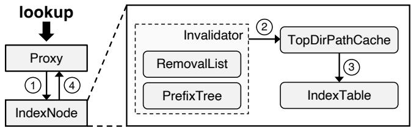  
Figure 7. The workflows for processing lookup operation

The new lookup workflow on an IndexNode involves interactions with several data structures. As shown in Figure 7, a lookup request begins by scanning RemovalList to check if any paths being modified are prefixes of the requested path. ( 1 ). This scan is lightweight and incurs negligible overhead, as RemovalList is empty most of time. If such paths are found, the search skips TopDirPathCache and directly queries IndexTable to avoid accessing stale cached results ( 3 ); Otherwise, the request proceeds to search in TopDirPathCache for the truncated prefix path ( 2 ). If the prefix is cached, the request resolves the remaining descendant directories through a level-by-level path traversal in IndexTable ( 3 ). Upon completing the lookup, TopDirPath-Cache caches the resolved results of the truncated prefix if the following two conditions meet: (a) the truncated prefix is not cached and (b) RemovalList is not modified during the execution of the lookup request. To detect conflicts between concurrent modifications and the lookup, a conventional timestamp mechanism is used. Finally, the pid of the requested path is returned to Proxy ( 4 ).

5.1.3 Path Resolution on Followers/Learners. To overcome the resource limitation of a single node, we offload path resolution requests to idle IndexNode followers when the leader node is under heavy load. A follower first queries the leader node for the latest commitIndex to ensure consistency and avoid stale read. Afterwards, it waits until its local applyIndex exceeds commitIndex before executing local path resolution routine. To minimize the overhead imposed on the leader, queries for the commitIndex are batched. Additionally, learners (read replicas) [20] are added to the Raft group to further enhance throughput. Both followers and learners maintain and utilize their local TopDirPathCache independently to accelerate path resolution.

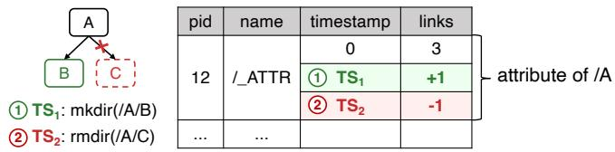  
Figure 8. Using delta records avoids contention between different directory modifications within a directory.

However, follower read also risks reading stale entries in their local TopDirPathCache. To avoid it, cache invalidation is synchronized within the Raft group by replicating invalidation information through the Raft logs. Operations requiring cache invalidation append the full paths of affected directories to the Raft logs. When these logs are applied, the corresponding cache entries are invalidated using the Invalidator mechanism described earlier. This approach ensures that followers and learners remain consistently updated with changes to the directories without incurring high overhead.

## 5.2 Scaling Directory Modifications

There are three key cases to address for improving directory modification performance. First, as observed in §3.2, concurrent modifications to the same directory—particularly those that update its attribute metadata—can cause repeated transaction aborts and retries, resulting in high tail latency. To mitigate this issue, we introduce an out-of-place update mechanism that eliminates attribute contention (§5.2.1). Second, we optimize cross-directory dirrename, the most complex metadata operation. In particular, we leverage IndexNode to transform loop detection from a distributed coordination task into a local operation (§5.2.2). Finally, as directory modifications become significantly more efficient, we must ensure that IndexNode can sustain the increased write load. To this end, we introduce targeted mechanisms to prevent write throughput from becoming bottlenecked by the capacity of a single Raft group (§5.2.3).

5.2.1 Delta Record and Compaction. When concurrent directory operations (such as mkdir and rmdir) act on the same directory, they often compete for the directory attribute metadata, triggering transaction aborts. This results in frequent retries and increased tail latency. In CFS [49], contention for mkdir and rmdir is mitigated by splitting each operation into two single-shard transactions: one to insert or delete attribute metadata, and another to update both the access metadata and the parent directory’s attribute metadata. However, in our system, this particular two-transaction strategy is incompatible with the synchronization requirements between the IndexNode and TafDB.

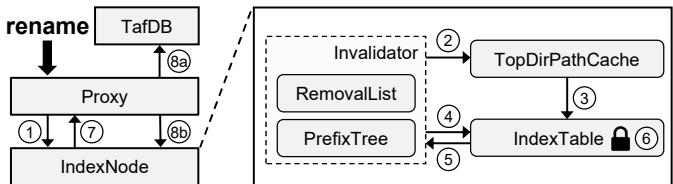  
Figure 9. The workflows for processing directory rename operation

Instead, Mantle introduces delta records to avoid in-place updates and thereby mitigate contention. As illustrated in Figure 8, each delta record is identified by a composite key composed of the parent directory ID (pid), a special name field (‘/\_ATTR’), and a transaction timestamp (?? ????????). Rather than updating the primary attribute record (the one with timestemp=0) directly, each operation simply inserts a distinct delta record. For example, in Figure 8, a mkdir(/A/B) and a concurrent rmdir(/A/C) both need to modify /A’s attribute metadata. Without delta records, these operations would collide on the same row. With delta records, however, the mkdir inserts one delta (with ????1 and +1 to the link count), and the rmdir inserts another (with ?? ??2 and -1), eliminating the conflict. These delta records are later asynchronously compacted into the main directory attribute metadata, with a shared latch ensuring that the directory metadata remains intact and cannot be deleted during the compaction process. This deferred update strategy eliminates contention, significantly reducing transaction aborts, retries, and tail latency in high-concurrency environments.

Despite its advantages, this design introduces a trade-off: dirstat operations must scan delta records to compute accurate results. To address this, delta records are enabled selectively, activated only under sustained contention within a directory. This approach effectively reduces contention and improves overall latency. The performance benefits of these two optimizations are demonstrated in §6.4.

5.2.2 Improving Cross-Directory dirrename. Mantle designates IndexNode as the coordinator for cross-directory dirrename. Each directory metadata entry in IndexTable contains a lock bit, enabling Proxy to lock directories involved in a dirrename request via a single RPC (see Figure 6). This approach eliminates the need for multiple RPCs to acquire distributed locks.

The cross-directory dirrename workflow, illustrated in Figure 9, begins with path resolution ( 1 , 2 , 3 ). IndexNode adds the source directory path to RemovalList ( 4 ) and performs loop detection by setting the lock bit of the source directory path in IndexTable ( 5 ). It then examines the lock status of directories along the path from the least common ancestor of both the source directory and destination directory to the destination directory ( 6 ). The results of path resolution and loop detection are returned to Proxy ( 7 ). If an existing lock is detected, indicating a conflict with another ongoing rename, the operation aborts and retries. If no conflict is found, Proxy finalizes the dirrename through a distributed transaction, updating all related metadata in both MetaTable and IndexTable ( 8a and 8b ). The rename lock is automatically released when the access metadata of the source directory is deleted in IndexTable.

5.2.3 Improving Raft Write of IndexNode. Under heavy directory modification workloads, the write throughput of an IndexNode is often constrained by the capacity of a single Raft group. This limitation primarily arises from the overhead introduced by frequent fsync operations required to persist data to disks, posing a significant bottleneck during intensive workloads. To mitigate this bottleneck, Mantle employs a batched Raft submissions mechanism, aggregating multiple operations into a single submission. By batching operations, Mantle effectively decreases the frequency of costly fsync calls, reducing disk I/O overhead and significantly improving throughput under high-intensity workloads.

## 5.3 Fault Tolerance

Mantle ’s design incorporates robust mechanisms to guarantee metadata consistency and high availability in the event of component failures.

For metadata server failures, the affected Raft group automatically initiates leader re-election. Integrity and availability are intrinsically preserved by the Raft protocol.

When a proxy becomes unresponsive, clients reconnect to another proxy and resubmit pending requests. To ensure idempotence, each metadata request carries a unique clientgenerated UUID. As illustrated in Figure 9, if a proxy fails during steps 1 – 7 , the IndexNode retries these steps while leveraging the UUID to recognize if a lock was already held by the original attempt, thereby avoiding deadlocks. If loop detection succeeds, the new proxy continues with steps 8a / 8b as normal execution to commit the 2PC transaction and release the lock. If the crash occurs during steps 8a / 8b , standard 2PC recovery resolves the final commit decision, ensuring the system reaches a consistent state.

## 6 Evaluation

## 6.1 Experimental Setup

Hardware configuration. We conduct experiments in a local cluster of 53 physical servers, each with 128GB DRAM and running CentOS 6.3 (Kernel 4.14.0). Of these, 21 servers are used for metadata services and 32 serve as clients to generate testing workloads. Three metadata servers are equipped with dual sockets Intel(R) Xeon(R) Platinum 8350C processors for Mantle’s IndexNode, LocoFS’s directory metadata server and InfiniFS’s rename coordinator, operating at 2.60GHz with 64 cores, and each has a 1TB NVMe SSD. The remaining servers use dual socket Intel(R) Xeon(R) Silver 4314 CPUs at 2.40GHz with 32 cores, each paired with eight 4TB

Table 2. Deployment configurations
<table><tr><td rowspan=1 colspan=1>Systems</td><td rowspan=1 colspan=1>Metadata</td><td rowspan=1 colspan=1>Client</td></tr><tr><td rowspan=1 colspan=1>Tectonic</td><td rowspan=1 colspan=1>21× servers</td><td rowspan=4 colspan=1>32× servers</td></tr><tr><td rowspan=1 colspan=1>InfiniFS</td><td rowspan=1 colspan=1>3× servers for rename coordinator+ 18× servers for metadata</td></tr><tr><td rowspan=1 colspan=1>LocoFS</td><td rowspan=1 colspan=1>3×servers for directorymetadata+ 18× servers for object metadata</td></tr><tr><td rowspan=1 colspan=1>Mantle</td><td rowspan=1 colspan=1>3×servers forIndexNode+ 18× servers for TafDB</td></tr></table>

NVMe SSDs. All servers are inter-connected with Mellanox ConnectX-5 25Gbps. Table 2 presents the evaluation deployment for these four metadata systems. All deployments share the same data storage (using extra data servers).

Baselines. We compare Mantle against three representative baselines: Tectonic, LocoFS and InfiniFS, which exemplify the DBtable-based approach, tiering, and parallel resolving, respectively. We re-implement them faithfully since they are not public. For Tectonic, we relax the consistency and avoid using distributed transactions. In InfiniFS, we adopt CFS’s two transactions strategy for directory modification operations. Additionally, we implement AM-Cache from InfiniFS for metadata caching and assess its effectiveness under real-world workloads. Our evaluation shows that the performance of the re-implemented baseline systems aligns with the results reported in their original papers.

Workloads. We evaluate metadata service performance using real-world workloads and adapt mdtest benchmarks to generate heavy-load operations, including object creation (create), object deletion (delete), metadata retrieval (objstat, dirstat), directory creation (mkdir) and renaming (dirrename). These workloads use an average path depth of 10. Throughput is measured via mdtest, with internal and clientside latencies logged. For parallel processing, we employ OpenMPI 5.0.2 to initiate mdtest processes on client nodes. Notice that data storage is only used in application evaluations (§6.2). All other evaluations involve only metadata, which is the focus of this paper. Prior to running experiments, we use mdtest to populate each system with data, scaling the namespace size to 1 billion entries with an objectto-directory ratio of 10:1.

## 6.2 Application Evaluation

We use two applications to test the performance improvements that Mantle brings to real-world applications. The AI-oriented audio pre-processing (Audio) that processes long audio inputs by dividing them into segments that are seconds long, involving a total of 200GB of data. Spark analytics (Analytics) performs interactive data analytics involving 10GB of data and includes extensive metadata operations. At first, we cut out data access and record the completion time. Then, we re-enable the data access and record the end-to-end completion time. Meanwhile, we select representative metadata operations in each application and show their latency distribution in Figure 11.

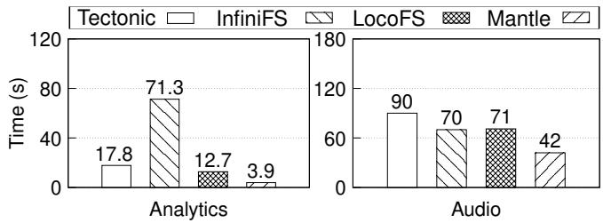

(a) Without data access  
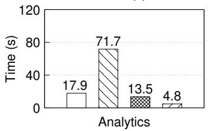  
(b) With data access

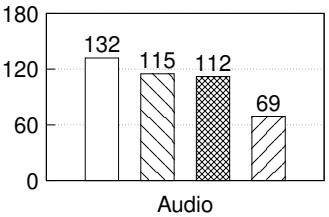  
Figure 10. Completion time of real-world workloads

Figure 10a illustrates the completion time of two workloads when data access is disabled. In the Analytics workload, all directory modification operations target the same attribute of the temporary directory, leading to severe conflicts. Tectonic’s completion time is 75.0% longer than InfiniFS due to the lack of consistency guarantee in the implementation of Tectonic’s directory modification operations. In contrast, InfiniFS employs distributed transactions to ensure consistency, but its dirrename performance is impaired by massive transaction retries due to contention. As shown in Figure 11b, 10.6% of its dirrename operations experience latencies exceeding 5 seconds, with a peak latency of 52 seconds. LocoFS further reduces the completion time by 27.0%, yet its completion time remains 225% longer than Mantle. Although LocoFS avoids conflicts in distributed transaction, modifications to the same key in sub-directory list are serialized by a latch, limiting performance. The CDF curves of mkdir and dirrename in LocoFS and Tectonic are remarkably similar, as illustrated in Figure 11a and Figure 11b. LocoFS exhibits a slight advantage by completing these operations on a centralized node.

Unlike the Analytics workload, the Audio workload consists only of non-conflicting metadata operations, highlighting the path resolution performance. Tectonic performs the worst on account of its low efficient level-by-level path resolution approach. InfiniFS performs slightly better, reducing completion time by 23.9%, though it does not achieve a significant improvement. This is because the substantial number of sub-threads generated by speculative path resolution results in considerable latency variability.

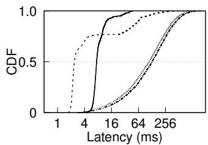  
(a) Analytics - mkdir

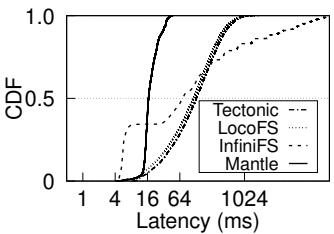  
(b) Analytics - dirrename

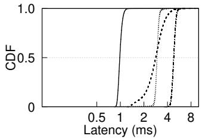  
(c) Audio - create

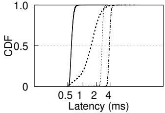  
(d) Audio - objstat  
Figure 11. CDF of latency of metadata operations in application workloads when doing only metadata operations

As shown in Figure 11c and Figure 11d, the latency distribution of InfiniFS metadata operations is broad. While a small portion of objstat operations achieve latencies close to Mantle, its tail latencies are notably high. LocoFS’s singlenode path resolution design lacks optimizations to scale up the central node, resulting in increased latencies in path resolution and a completion time comparable to InfiniFS. In contrast, Mantle reduces the completion time by 40.8% compared to LocoFS. The CDF curves further demonstrate that Mantle achieves high efficiency in these operations.

Finally, Figure 10b presents the completion time of the two workloads when data access is enabled. For the Analytics workload, metadata operations dominate the completion time, resulting in minor difference compared to the time when data access is disabled. This is because enabling data access reduces blocking time by overlapping data access with the previously necessary blocking period. Mantle reduces the completion time by 73.2%, 93.3% and 63.3% compared to Tectonic, InfiniFS, LocoFS, respectively. The Audio workload, however, experiences a significant increase in completion time, diminishing Mantle’s relative improvement. Nevertheless, Mantle reduces the completion time by 47.7%, 40.1% and 38.5% compared to Tectonic, InfiniFS, LocoFS, respectively.

## 6.3 Individual Namespace Operations

We use mdtest with 512 clients to evaluate performance across seven key operations: create, delete, objstat, dirstat, mkdir, rmdir, and dirrename. These are grouped into: (1) object and directory read operations (create, delete, objstat, dirstat) and (2) directory modification operations (mkdir, rmdir, dirrename). We measure throughput and latency for each operation and perform a latency breakdown into three phases: (1) lookup (path resolution), (2) loop detection (optional), and (3) execution. The lookup phase retrieves the directory ID (pid). Loop detection, which is only applicable during dirrename operations, identifies and resolves potential directory loops. Execution phase allows the metadata service to read or update metadata using the pid. InfiniFS bypasses execution phase for objstat, handling it in lookup phase, while LocoFS resolves paths during execution phase for directory operations. Mantle records zero lookup time in dirrename since its merged with loop detection.

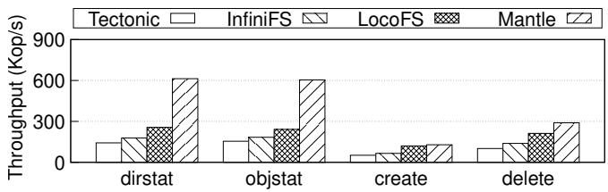

Figure 12. Throughput of object operations and directory read operations  
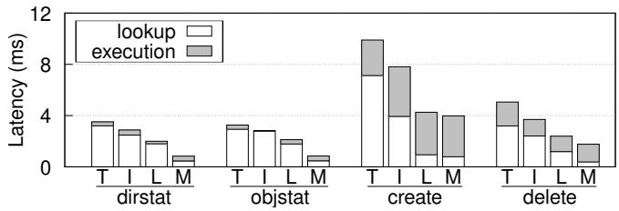  
Figure 13. Latency breakdown of object operations and directory read operations (T represents Tectonic, I represents InfiniFS, L represents LocoFS, M represents Mantle)

Object and directory read operations. Figure 12 and 13 illustrates the performance of object and directory read operations, which is primarily determined by the efficiency of path resolution. Thus, the performance trends are similar across all operations, ranked from worst to best as Tectonic, InfiniFS, LocoFS, and Mantle. Tectonic exhibits the lowest performance due to its high overhead in layer-wise path traversal. InfiniFS, while outperforming Tectonic, achieves only a marginal improvement of 0.19-0.37×, attributed to thread over-provisioning in parallel resolving. LocoFS further enhances throughput by 0.32-0.83× compared to InfiniFS, with its centralized path resolution design effectively reducing path traversal overhead. However, its scalability is constrained as local record retrieval exhausts CPU resource of the directory metadata server. Mantle achieves the highest performance with the help of TopDirPathCache fiand follower read, maintaining the lowest path resolution latency across all four operations.

Mantle introduces significant performance improvements over other baseline systems in dirstat, objstat and delete operations. For create, LocoFS achieves comparable throughput to Mantle. This similarity is due to data layer modifications in the mdtest benchmark, which incurs additional attribute updates to the metadata. These updates reduce the path resolution workload, thereby narrowing the performance gap between LocoFS and Mantle.

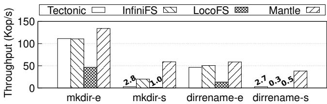

Figure 14. Throughput of directory modification operations  
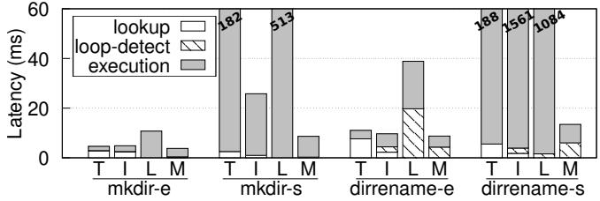  
Figure 15. Latency breakdown of directory modification operations (T represents Tectonic, I represents InfiniFS, L represents LocoFS, M represents Mantle)

In conclusion, Mantle reduces lookup latency by 83.9- 89.0%, 80.0-84.2% and 16.4-74.5%, over Tectonic, InfiniFS and LocoFS, respectively, achieving speedups of 2.49-4.30×, 1.96- 3.44× and 1.07-2.50×.

Directory modification operations. We use mdtest to evaluate directory modification operations under both conflicting and non-conflicting workloads. In conflicting workloads (suffix ’-s’), threads operate on a shared directory, while in non-conflicting workloads (suffix ’-e’), each thread uses its own exclusive directory. Results for rmdir are omitted as they are similar to mkdir.

As shown in Figure 14 and 15, in mkdir-e, the throughput of Tectonic and InfiniFS are very close. Tectonic performs slightly better during the execution phase, while InfiniFS shows a slight advantage in the lookup phase. As a result, their overall performance is similar. Both systems are constrained by metadata server bottlenecks under saturated read (for lookup) and write (for rename) requests. LocoFS’s throughput is throttled by the Raft throughput, resulting in the worst performance among these systems. Mantle achieves the highest throughput with a shorter lookup phase compensating for its longer execution phase. Mantle’ throughput is bound to a single Raft group and requires further optimizations to scale. Nevertheless, based on our production experience (see §7), its current throughput capacity is sufficient for our deployment needs.

In mkdir-s, modifications to the parent directory’s attribute are serialized by a latch in both Tectonic and LocoFS. While InfiniFS applies single-shard atomic primitives to avoid retries, its performance still falls short compared to non-conflicting scenario. Mantle improves the throughput by 1.96× over InfiniFS using delta records, which enable fully concurrent updates to the directory’s attributes.

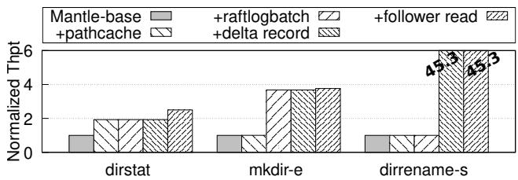  
Figure 16. Effects of individual optimization

For dirrename-e, the trends are similar to those observed in mkdir-e, but two key differences emerge: (1) dirrename requires two rounds of path resolution, enlarging the performance gap; (2) loop detection overhead incurs additional overhead in InfiniFS, LocoFS, and Mantle. Consequently, Mantle achieves 26.2% higher throughput than Tectonic. Loop detection increases the pressure on the central node for both LocoFS and Mantle, with LocoFS showing the lowest performance. Mantle mitigates extra overhead through its optimized dirrename procedure, achieving the highest throughput despite higher loop detection costs. In dirrenames, the performance of Tectonic, InfiniFS and LocoFS degrade significantly due to conflicts. Mantle eliminates conflicts using delta records, achieving the highest performance.

In conclusion, Mantle demonstrates significant performance improvements in directory modification operations, achieving speedups of 1.20-20.9×, 1.16-116.00×, and 2.87- 80.78× over Tectonic, InfiniFS and LocoFS, respectively.

## 6.4 Effects of Individual Optimization

We evaluate the impact of each optimization by progressively enabling them. We start with the base configuration of Mantle (Mantle-base), where TopDirPathCache is disabled. The ‘+pathcache’ configuration activates in TopDirPathCache, enhancing Mantle’s efficiency. Subsequent enhancements include ‘+raftlogbatch’ and ‘+delta record’, which respectively implement Raft log batching and delta records. Finally, ‘+follower read’ enables follower read in Raft to accelerate lookup. We test these configurations using three mdtest workloads: dirstat, mkdir-e, and dirrename-s.

Figure 16 reports the normalized throughput to Mantlebase. The ‘+pathcache’ optimization effectively doubles the throughput of dirstat, which is further improved by the ‘+follower read’ optimization. The throughput of mkdir-e in Mantle-base is constrained by the commit speed of the Raft logs in IndexNode. The ‘+raftlogbatch’ optimization takes effect by amortizing the commit overhead. In Mantle-base, dirrename-s incurs lots of conflicts, leading to failures and retries of database transactions. The ‘+delta record’ optimization eliminates these conflicts and boosts the throughput.

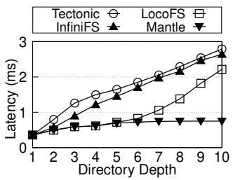  
Figure 17. Impact of depth on path resolution

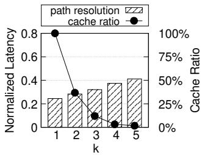  
Figure 18. Impact of k in IndexNode

## 6.5 Study of Other Factors

Impacts of depth on path resolution. We evaluate the path resolution latency across various directory depths to assess the impacts on system performance. We initiate 512 threads in 32 servers to send lookup requests. As depicted in Figure 17, the path resolution latencies of Tectonic and InfiniFS escalate with increasing directory depth. Notably, for a ten-level path, the latency for Tectonic and InfiniFS is 6.82× and 6.4× higher, respectively, than that of a single-level path. Tectonic’s lookup latency exhibits a linear increase relative to path depth, primarily due to the latency associated with sequentially dispatching an equivalent number of RPCs. In contrast, InfiniFS experiences a bottleneck at greater depths due to thread over-provisioning. LocoFS shows comparable lookup latency to Mantle up to a path depth of 6, where CPU limitations become a bottleneck. In comparison, Mantle exhibits remarkable stability, with its lookup latency for a tenlevel path being only 1.09× higher than that of a single-level path, demonstrating its superior scalability and efficiency. Impact of ?? in TopDirPathCache. We disable follower read and evaluate the impact of ?? in TopDirPathCache by running 512 threads to issue lookup requests and measuring the latency across different ?? values, ranging from 1 to 5. We also analyze the namespace ns4 (see §3) and calculate the portion of directories that could be cached under different k settings. As shown in Figure 18, the lookup latency increases with larger ?? values. At ?? = 3, the value chosen in our system, the normalized (to Mantle-base) latency is 0.32, 31.1% slower than the latency of ?? = 1. However, the memory consumption is reduced by 88% compared to ?? = 1. In production, we set ?? = 3 to balance between performance and memory usage.

IndexNode scalability. We evaluate Mantle’s scalability by running mdtest’s objstat and create workloads while varying the size of namespace and number of threads. Initially, we conduct experiments using 512 threads, varying the namespace size from 1 billion to 10 billion entries, and present the results in Figure 19a. The throughput remains consistent regardless of the increasing namespace size, demonstrating Mantle’s capability to handle namespaces of up to 10 billion scale effectively. Next, we assess Mantle’s scalability with respect to the number of threads by varying the client count from 64 to 2048 on a 10 billion namespace. To analyze the impact of follower read, we evaluate the objstat workload under 3 configurations: no follower read (objstat), follower read with 2 followers (+followers) and follower read with additional 2 learner replicas (+learners).

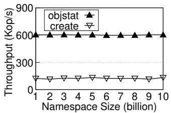  
(a) w.r.t. namespace size

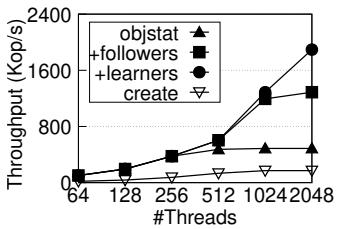  
(b) w.r.t. number of threads

Figure 19. Mantle’s scalability w.r.t. namespace size or the number of concurrent clients  
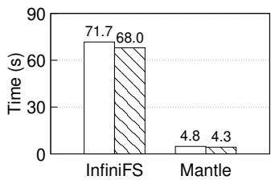  
(a) Analytics

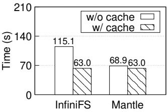  
(b) Audio  
Figure 20. Impact of adding metadata caching

As shown in Figure 19b, the throughput of create workload scales linearly up to 512 threads, reaching 18.8 Kop/s at 64 threads and 133.5 Kop/s at 512 thread. However, as the thread count increases to 1024, the throughput rises by only 28.3%, constrained by TafDB reaching its maximum capacity. For the objstat workload, throughput achieves 101.6 Kop/s and 376.5 Kop/s at 64 and 256 threads, respectively, but levels at 512 threads due to the capacity limitations of a single node. Beyond 1024 threads, no further throughput increase is observed. In contrast, enabling follower read with 2 followers allows objstat to scale beyond 512 threads, achieving a throughput of 1288.0 Kop/s with 2048 threads. Adding two learner replicas further enhances scalability, enabling objstat to achieve 1894.5 Kop/s at 2048 threads.

Adding metadata caching. Although metadata caching isn’t adopted in Mantle’s design, we evaluate its effectiveness for potential scenarios outside Mantle ’s primary focus, where it may still be applicable. We equip InfiniFS and Mantle with metadata caching and measure its performance on two real-world applications. Figure 20 illustrates the impact of metadata caching on the performance of InfiniFS and Mantle across the Analytics and Audio workloads. For the Analytics workload, metadata caching results in a modest improvement. This limited improvement is due to the nature of the Analytics workload, which is dominated by directory modifications. In contrast, for the Audio workload, metadata caching delivers substantial performance improvements. InfiniFS sees a significant reduction in execution time from 115.1 seconds to 63.0 seconds. Mantle also benefits from caching, with its execution time reduced from 68.9 seconds to 63.0 seconds. However, the relative improvement for Mantle is smaller, as it already implements an efficient single-RPC path resolution mechanism, leaving less room for optimization through metadata caching.

<table><tr><td rowspan=2 colspan=1>Name</td><td rowspan=2 colspan=1>#object</td><td rowspan=2 colspan=1>#dir.</td><td rowspan=2 colspan=1>Ratio of Small Obj.</td><td rowspan=1 colspan=2>Peak Thpt.(Kop/s)</td></tr><tr><td rowspan=1 colspan=1>lookup</td><td rowspan=1 colspan=1>mkdir</td></tr><tr><td rowspan=1 colspan=1>C1</td><td rowspan=1 colspan=1>3.2B</td><td rowspan=1 colspan=1>27M</td><td rowspan=1 colspan=1>62.0%</td><td rowspan=1 colspan=1>400</td><td rowspan=1 colspan=1>24</td></tr><tr><td rowspan=1 colspan=1>C2</td><td rowspan=1 colspan=1>2.1B</td><td rowspan=1 colspan=1>194M</td><td rowspan=1 colspan=1>29.2%</td><td rowspan=1 colspan=1>300</td><td rowspan=1 colspan=1>12</td></tr><tr><td rowspan=1 colspan=1>C3</td><td rowspan=1 colspan=1>1.2B</td><td rowspan=1 colspan=1>145M</td><td rowspan=1 colspan=1>33.7%</td><td rowspan=1 colspan=1>350</td><td rowspan=1 colspan=1>18</td></tr><tr><td rowspan=1 colspan=1>C4</td><td rowspan=1 colspan=1>0.8B</td><td rowspan=1 colspan=1>88M</td><td rowspan=1 colspan=1>28.8%</td><td rowspan=1 colspan=1>175</td><td rowspan=1 colspan=1>11</td></tr><tr><td rowspan=1 colspan=1>C5</td><td rowspan=1 colspan=1>75M</td><td rowspan=1 colspan=1>9M</td><td rowspan=1 colspan=1>28.1%</td><td rowspan=1 colspan=1>215</td><td rowspan=1 colspan=1>9</td></tr></table>

Table 3. Characteristics of 5 namespaces in Cluster-C. Small object means object with size ≤ 512KB.

## 7 Mantle in Production

## 7.1 Deployment Overview

Mantle has been integrated with the legacy COSS system, replacing its DBtable-based metadata management. The new COSS system supports both flat and hierarchical namespaces simultaneously, forming a unified storage foundation.

Mantle and the COSS system have been deployed across three clusters (A, B, and C), hosting 19 internal namespaces and numerous external namespaces. These internal namespaces are distributed 7, 7, and 5 across clusters A, B, and C, respectively. Within each cluster, all namespaces share a common TafDB deployment. These namespaces serve different application domains, comprising both metadata-intensive tasks (e.g., AI data preprocessing, ad-hoc SQL queries) and I/O-intensive tasks (e.g., model checkpointing, batch analytics). These workloads generate average daily metadata request volumes of tens of billions.

## 7.2 Lessons and Experiences

Prevalence of Small Objects. To provide a detailed analysis of production workloads, we focus on the five representative internal namespaces hosted in Cluster C, which correspond to our AI training (C1-C3, C5), data warehouse (C2, C3), advertising (C2-C3), finance processing (C3), log analysis (C3, C5) and search engine (C2-C4) workloads. Table 3 summarizes their characteristics. These namespaces represent a spectrum of use cases, from mature, billion-scale workloads (C1-C3) to rapidly growing services (C4, C5). A key workload characteristic across these namespaces is the prevalence of small objects (≤512 KB), ranging from approximately 30% to over 60% for C1. High proportion of small objects indicates many workloads are inherently metadata heavy and can benefit from Mantle’s low-latency path resolution. Under these real-world conditions, the system delivers peak lookup throughputs of 175–400 Kop/s and peak mkdir throughputs of 9–24 Kop/s for these namespaces. These production peaks represent only a fraction of Mantle’s full throughput capacity, leaving significant headroom for future workload growth.

Co-locating IndexNode for resource utilization. High single-node throughput of IndexNode enables an efficient operational strategy: co-locating IndexNode from multiple namespaces on shared hardware to maximize resource utilization. Specifically, we maintain a shared pool of physical servers to host the IndexNode replicas for all namespaces. Within the pool, leaders of smaller namespaces (e.g. C4, C5) can share a node, while leaders of large, high-traffic namespaces can be assigned exclusive nodes. To avoid hotspots, we adopt a dynamic mechanism to rebalance leader distribution and add new physical nodes on demands.

Impact across workload profiles. Mantle’s performance impact is highly dependent on the workload profile, with metadata-intensive applications benefiting the most. For example, the end-to-end completion time of our data preprocessing task described in §3.1 drops by over 40% after migrating to Mantle. In contrast, I/O-intensive workloads experience no performance regression while still benefiting from accelerated lookups. Beyond application-level acceleration, Mantle’s high efficiency provides operational benefits by reducing the number of metadata servers required.

Optimization potential. Our profiling shows that Mantle’s scalability is currently constrained by the CPU resource of IndexNode. Further optimizations that reduce CPU usage can extend Mantle ’s capacity to handle future workload growth without major architectural changes. For example, a proof-of-concept implementation demonstrates that adopting RDMA in the RPC framework can boost per-node path resolution throughput from 500K ops/s to 1M ops/s.

## 8 Related Work

Metadata management. Early distributed file systems decouple metadata from data and store metadata in a centralized metadata server [13, 16, 24, 29, 32]. To improve scalability, numerous architectures distribute metadata across multiple servers [11, 25, 45, 50, 51, 55]. Recently, in addition to the aforementioned systems, CalvinFS [47], ADLS [37], HopsFS [30] and ??FS [7] leverage distributed databases for metadata management.

Different metadata partitioning mechanisms are used to distribute metadata among metadata servers. Sub-tree partition [27, 48, 50] is prone to load imbalance [46]. Full path indexing enables fine-grained load balancing [25, 35], but incurs multiple RPC lookup because permission checks must traverse the directory hierarchy step by step. Moreover, the lack of locality leads to high coordination overhead. To address these challenges, range partitioning [30, 43], which is also adopted by Mantle, is used to achieve load balance while mitigates distributed coordination. But our evaluation reveals this strategy still introduces significant coordination overhead in directory modification operations.

Path resolution. Client-side caching [21, 26, 38, 42] is used to minimize or eliminate the lookup RPCs. However, this approach is infeasible for COSSs. InfiniFS [26] speculatively uses parallel RPCs for fast lookup with poor scaling under high concurrency. FalconFS [52] lazily replicates all metadata to enable local lookup in any metadata server, but this approach is impractical in COSSs due to massive namespace sizes. CephFS [50] and FileScale [22] implement server-side caching atop subtree partitioning to improve lookup latency, yet they fall short of achieving the single-RPC lookup enabled by Mantle. Moreover, their approaches are prone to load imbalance and incur high migration overhead [46]. Duplex [10] caches path permissions on a central node, incurring high consistency overhead and falling back to parallel resolution after failures. In contrast, Mantle uses efficient data structures and lightweight indexing to ensure fast lookups, low maintenance overhead, and failure resilience. Other works. Several studies propose replication protocols with high write throughput [12, 18, 34, 36, 53], offering opportunities to enhance directory modification performance in Mantle. Other works leverage emerging hardware, such as PM, RDMA, and SmartNICs, for high-performance metadata services [2, 15, 19, 23, 54], which are orthogonal to Mantle and can potentially complement its design.

## 9 Conclusion

Mantle offers a scalable solution for hierarchical metadata management for cloud object storage services, addressing challenges like high path resolution latency and directory modification contention. By utilizing IndexNode for single-RPC lookups, delta records, Raft-based replication, and balanced workload distribution, Mantle outperforms existing systems. Evaluations show its capability to handle billionscale namespaces with high throughput and low latency, making it ideal for data-intensive cloud applications and future metadata services.

## 10 Acknowledgment

We thank all the anonymous reviewers for their insightful feedback, and our shepherd, George Amvrosiadis, for his guidance during the preparation of our camera-ready submission. We also thank Meng Wang, Yao Wang, and Xinxing Wang for their contributions to the development of Mantle. We are also grateful to Zewen Jin and Jiaan Zhu for their help with the figures. This work was supported in part by the National Key R&D Program of China under Grant No. 2024YFB4505701 and University Synergy Innovation Program of Anhui Province under Grant No. GXXT-2022-045. Cheng Li and Biao Cao are the corresponding authors.

## References

[1] Marco Abela. Overview of Cloud Storage Storage for AI, Lustre, GCSFuse, and Anywhere cache with Google Cloud. https://techfieldday.com/video/overview-of-cloud-storage-storagefor-ai-lustre-gcsfuse-and-anywhere-cache-with-google-cloud/. Accessed August 10, 2025.

[2] Thomas E Anderson, Marco Canini, Jongyul Kim, Dejan Kostić, Youngjin Kwon, Simon Peter, Waleed Reda, Henry N Schuh, and Emmett Witchel. Assise: Performance and Availability via Client-local NVM in a Distributed File System. In 14th USENIX Symposium on Operating Systems Design and Implementation (OSDI 20), pages 1011–1027, 2020.

[3] Srinivasan Archana and Kumar SR Arun. Identify cold objects for archiving to Amazon S3 Glacier storage classes. https://aws.amazon.com/cn/blogs/storage/identify-cold-objects-forarchiving-to-amazon-s3-glacier-storage-classes/. Accessed April 10, 2025.

[4] AWS. Amazon S3 Express One Zone Storage Class. https://aws.amazon. com/cn/s3/storage-classes/express-one-zone/. Accessed April 8, 2024.

[5] AWS. AWS S3 API Reference. https://docs.aws.amazon.com/ AmazonS3/latest/API/Type\_API\_Reference.html. Accessed November 21, 2024.

[6] Scott A Brandt, Ethan L Miller, Darrell DE Long, and Lan Xue. Efficient metadata management in large distributed storage systems. In 20th IEEE/11th NASA Goddard Conference on Mass Storage Systems and Technologies (MSST 03), pages 290–298. IEEE, 2003.

[7] Benjamin Carver, Runzhou Han, Jingyuan Zhang, Mai Zheng, and Yue Cheng. ??fs: A scalable and elastic distributed file system metadata service using serverless functions. In Proceedings of the 28th ACM International Conference on Architectural Support for Programming Languages and Operating Systems, Volume 4, ASPLOS ’23, page 394–411, New York, NY, USA, 2024. Association for Computing Machinery.

[8] CFS. Posix compatibility of cfs. https://github.com/cfs-for-review/CFSfor-review. Accessed April 8, 2024.

[9] Giuseppe DeCandia, Deniz Hastorun, Madan Jampani, Gunavardhan Kakulapati, Avinash Lakshman, Alex Pilchin, Swaminathan Sivasubramanian, Peter Vosshall, and Werner Vogels. Dynamo: Amazon’s highly available key-value store. In Proceedings of Twenty-First ACM SIGOPS Symposium on Operating Systems Principles (SOSP 07), page 205–220, New York, NY, USA, 2007. Association for Computing Machinery.

[10] Chao Dong, Fang Wang, Yuxin Yang, Mengya Lei, Jianshun Zhang, and Dan Feng. Low-latency and scalable full-path indexing metadata service for distributed file systems. In 2023 IEEE 41st International Conference on Computer Design (ICCD 23), pages 283–290, 2023.

[11] John JD Douceur and Jon Howell. Distributed directory service in the Farsite file system. In Proceedings of the 7th symposium on operating systems design and implementation (OSDI 06), 2006.

[12] Aishwarya Ganesan, Ramnatthan Alagappan, Andrea C. Arpaci-Dusseau, and Remzi H. Arpaci-Dusseau. Exploiting nil-externality for fast replicated storage. In Proceedings of the ACM SIGOPS 28th Symposium on Operating Systems Principles, SOSP ’21, page 440–456, New York, NY, USA, 2021. Association for Computing Machinery.

[13] Sanjay Ghemawat, Howard Gobioff, and Shun-Tak Leung. The Google file system. In Proceedings of the 19th ACM Symposium on Operating Systems Principles (SOSP 03), 2003.

[14] Google. Google Cloud Storage APIs. https://cloud.google.com/storage/ docs/apis. Accessed November 21, 2024.

[15] Hao Guo, Youyou Lu, Wenhao Lv, Xiaojian Liao, Shaoxun Zeng, and Jiwu Shu. SingularFS: A billion-scale distributed file system using a single metadata server. In 2023 USENIX Annual Technical Conference (USENIX ATC 23), pages 915–928, 2023.

[16] Apache Hadoop. Hadoop distributed file system. http://hadoop.apache. org. Accessed April 8, 2024.

[17] MIT Technology Review Insights. 2023 Global Cloud Ecosystem. https://www.technologyreview.com/2023/11/16/1078645/2023- global-cloud-ecosystem/. Accessed April 10, 2025.

[18] Manos Kapritsos, Yang Wang, Vivien Quema, Allen Clement, Lorenzo Alvisi, and Mike Dahlin. All about eve: Execute-Verify replication for Multi-Core servers. In 10th USENIX Symposium on Operating Systems Design and Implementation (OSDI 12), pages 237–250, Hollywood, CA, October 2012. USENIX Association.

[19] Jongyul Kim, Insu Jang, Waleed Reda, Jaeseong Im, Marco Canini, Dejan Kostić, Youngjin Kwon, Simon Peter, and Emmett Witchel. LineFS: Efficient SmartNIC offload of a distributed file system with pipeline parallelism. In Proceedings of the ACM SIGOPS 28th Symposium on Operating Systems Principles (SOSP 21), pages 756–771, 2021.

[20] Leslie Lamport. Paxos made simple. ACM SIGACT News (Distributed Computing Column) 32, 4 (Whole Number 121, December 2001), pages 51–58, 2001.

[21] Siyang Li, Youyou Lu, Jiwu Shu, Yang Hu, and Tao Li. LocoFS: a looselycoupled metadata service for distributed file systems. In Proceedings of the International Conference for High Performance Computing, Networking, Storage and Analysis (SC 17), 2017.

[22] Gang Liao and Daniel J Abadi. Filescale: Fast and elastic metadata management for distributed file systems. In Proceedings of the 2023 ACM Symposium on Cloud Computing (SoCC 23), pages 459–474, 2023.

[23] Youyou Lu, Jiwu Shu, Youmin Chen, and Tao Li. Octopus: an RDMAenabled distributed persistent memory file system. In 2017 USENIX Annual Technical Conference (ATC 17), pages 773–785, 2017.

[24] Lustre. Lustre file system. http://www.lustre.org. Accessed April 8, 2024.

[25] Lustre. Lustre metadata service. https://wiki.lustre.org/Lustre\_ Metadata\_Service\_(MDS). Accessed April 8, 2024.

[26] Wenhao Lv, Youyou Lu, Yiming Zhang, Peile Duan, and Jiwu Shu. InfiniFS: An efficient metadata service for large-scale distributed filesystems. In 20th USENIX Conference on File and Storage Technologies (FAST 22), pages 313–328, 2022.

[27] Stathis Maneas and Bianca Schroeder. The evolution of the hadoop distributed file system. In 2018 32nd International Conference on Advanced Information Networking and Applications Workshops (WAINA), pages 67–74, 2018.

[28] Microsoft. Azure Data Lake Storage Gen2 REST APIs. https://learn.microsoft.com/en-us/rest/api/storageservices/datalake-storage-gen2. Accessed November 21, 2024.

[29] MooseFS. MooseFS – a petabyte distributed file system. https:// moosefs.com. Accessed April 8, 2024.

[30] Salman Niazi, Mahmoud Ismail, Seif Haridi, Jim Dowling, Steffen Grohsschmiedt, and Mikael Ronström. HopsFS: Scaling hierarchical file system metadata using newsql databases. In 15th USENIX Conference on File and Storage Technologies (FAST 17), pages 89–104, 2017.

[31] Diego Ongaro and John K. Ousterhout. In search of an understandable consensus algorithm. In 2014 USENIX Annual Technical Conference (ATC 12), Philadelphia, PA, USA, June 19-20, 2014, pages 305–319. USENIX Association, 2014.

[32] Michael Ovsiannikov, Silvius Rus, Damian Reeves, Paul Sutter, Sriram Rao, and Jim Kelly. The quantcast file system. Proceedings of the VLDB Endowment (VLDB 13), 6(11):1092–1101, 2013.

[33] Satadru Pan, Theano Stavrinos, Yunqiao Zhang, Atul Sikaria, Pavel Zakharov, Abhinav Sharma, Mike Shuey, Richard Wareing, Monika Gangapuram, Guanglei Cao, et al. Facebook’s Tectonic filesystem: Efficiency from exascale. In 19th USENIX Conference on File and Storage Technologies (FAST 21), pages 217–231, 2021.

[34] Seo Jin Park and John Ousterhout. Exploiting commutativity for practical fast replication. In 16th USENIX Symposium on Networked Systems Design and Implementation (NSDI 19), pages 47–64, Boston, MA, February 2019. USENIX Association.

[35] Swapnil Patil and Garth A Gibson. Scale and concurrency of GIGA+: File system directories with millions of files. In 9th USENIX Conference on File and Storage Technologies (FAST 11), 2011.

[36] Dan R. K. Ports, Jialin Li, Vincent Liu, Naveen Kr. Sharma, and Arvind Krishnamurthy. Designing distributed systems using approximate synchrony in data center networks. In 12th USENIX Symposium on Networked Systems Design and Implementation (NSDI 15), pages 43–57, Oakland, CA, May 2015. USENIX Association.

[37] Raghu Ramakrishnan, Baskar Sridharan, John R Douceur, Pavan Kasturi, Balaji Krishnamachari-Sampath, Karthick Krishnamoorthy, Peng Li, Mitica Manu, Spiro Michaylov, Rogério Ramos, et al. Azure Data Lake Store: a hyperscale distributed file service for big data analytics. In Proceedings of the 2017 ACM International Conference on Management of Data (SIGMOD 17), pages 51–63, 2017.

[38] Kai Ren, Qing Zheng, Swapnil Patil, and Garth Gibson. IndexFS: Scaling file system metadata performance with stateless caching and bulk insertion. In Proceedings of the International Conference for High Performance Computing, Networking, Storage and Analysis (SC 14), 2014.

[39] HPC IO Benchmark Repository. IOR and mdtest. https://github.com/ hpc/ior. Accessed April 8, 2024.

[40] Emergen Research. Global Cloud Object Storage Market. https://www.emergenresearch.com/press-release/global-cloudobject-storage-market. Accessed April 10, 2025.

[41] Sambhav Satija, Chenhao Ye, Ranjitha Kosgi, Aditya Jain, Romit Kankaria, Yiwei Chen, Andrea C. Arpaci-Dusseau, Remzi H. Arpaci-Dusseau, and Kiran Srinivasan. Cloudscape: a study of storage services in modern cloud architectures. In Proceedings of the 23rd USENIX Conference on File and Storage Technologies, FAST ’25, USA, 2025. USENIX Association.

[42] Spencer Shepler. Nfsv4. In 2005 USENIX Annual Technical Conference (USENIX ATC 05), 2005.

[43] Konstantin V Shvachko and Yuxiang Chen. Scaling namespace operations with giraffa file system. USENIX; login, 2017.

[44] Sacheendra Talluri, Alicja Łuszczak, Cristina L Abad, and Alexandru Iosup. Characterization of a big data storage workload in the cloud. In Proceedings of the 2019 ACM/SPEC International Conference on Performance Engineering, pages 33–44, 2019.

[45] Houjun Tang, Suren Byna, Bin Dong, Jialin Liu, and Quincey Koziol. SoMeta: Scalable object-centric metadata management for high performance computing. In 2017 IEEE International Conference on Cluster Computing (CLUSTER 17), pages 359–369. IEEE, 2017.

[46] Mouratidis Theofilos. Ceph MDS balancing issues. https://www.spinics. net/lists/ceph-devel/msg44650.html. Accessed April 10, 2025.

[47] Alexander Thomson and Daniel J Abadi. CalvinFS: Consistent WAN replication and scalable metadata management for distributed file systems. In 13th USENIX Conference on File and Storage Technologies (FAST 15), pages 1–14, 2015.

[48] Yiduo Wang, Cheng Li, Xinyang Shao, Youxu Chen, Feng Yan, and Yinlong Xu. Lunule: an agile and judicious metadata load balancer for CephFS. In Proceedings of the International Conference for High Performance Computing, Networking, Storage and Analysis (SC 21), pages 1–16, 2021.

[49] Yiduo Wang, Yufei Wu, Cheng Li, Pengfei Zheng, Biao Cao, Yan Sun, Fei Zhou, Yinlong Xu, Yao Wang, and Guangjun Xie. CFS: Scaling metadata service for distributed file system via pruned scope of critical sections. In Proceedings of the Eighteenth European Conference on Computer Systems (EuroSys 23), page 331–346, New York, NY, USA, 2023. Association for Computing Machinery.

[50] Sage A. Weil, Scott A. Brandt, Ethan L. Miller, Darrell D. E. Long, and Carlos Maltzahn. Ceph: A scalable, high-performance distributed file system. In 7th USENIX Symposium on Operating Systems Design and Implementation (OSDI 06), Seattle, WA, November 2006. USENIX Association.

[51] Jing Xing, Jin Xiong, Ninghui Sun, and Jie Ma. Adaptive and scalable metadata management to support a trillion files. In Proceedings of the Conference on High Performance Computing Networking, Storage and Analysis (SC 09), pages 1–11. IEEE, 2009.

[52] Jingwei Xu, Junbin Kang, Mingkai Dong, Mingyu Liu, Lu Zhang, Shaohong Guo, Ziyan Qiu, Mingzhen You, Ziyi Tian, Anqi Yu, Tianhong Ding, Xinwei Hu, and Haibo Chen. FalconFS: Distributed file system for large-scale deep learning pipeline. In 23rd USENIX Symposium on Networked Systems Design and Implementation (NSDI 26), Renton, WA, May 2026. USENIX Association.

[53] Yi Xu, Henry Zhu, Prashant Pandey, Alex Conway, Rob Johnson, Aishwarya Ganesan, and Ramnatthan Alagappan. IONIA:High-Performance replication for modern disk-based KV stores. In 22nd USENIX Conference on File and Storage Technologies (FAST 24), pages 225–241, 2024.

[54] Jian Yang, Joseph Izraelevitz, and Steven Swanson. Orion: A distributed file system for non-volatile main memory and RDMA-capable networks. In 17th USENIX Conference on File and Storage Technologies (FAST 19), pages 221–234, 2019.

[55] Yifeng Zhu, Hong Jiang, Jun Wang, and Feng Xian. HBA: Distributed metadata management for large cluster-based storage systems. IEEE transactions on parallel and distributed systems (TPDS), 19(6):750–763, 2008.