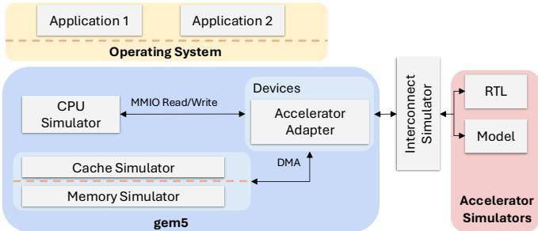
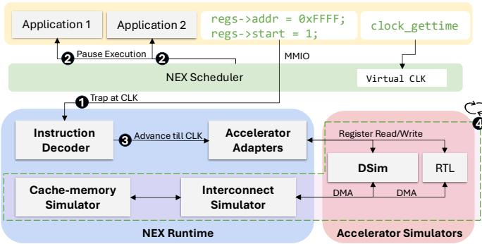
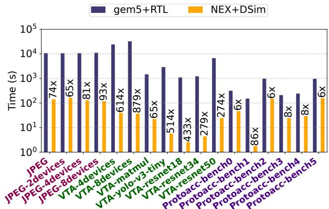
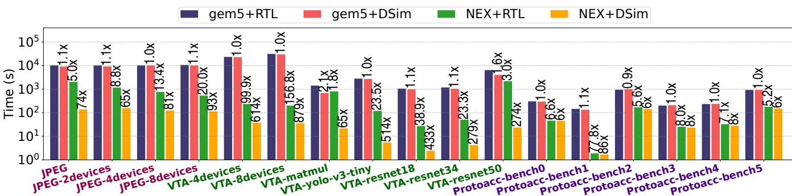
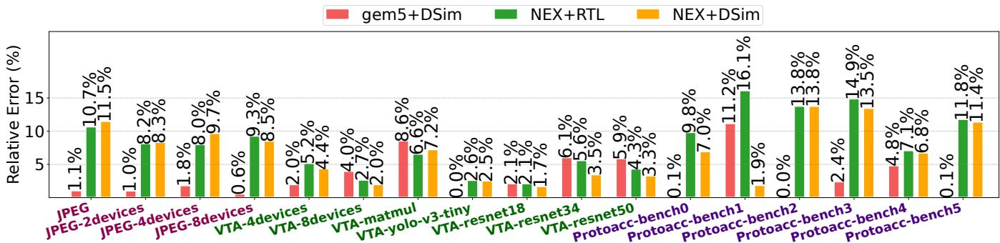

Latest updates: hps://dl.acm.org/doi/10.1145/3731569.3764825

RESEARCH-ARTICLE

# Fast End-to-End Performance Simulation of Accelerated Hardware-Soware Stacks

JIACHENG MA, EPFL, Lausanne, Switzerland

JONAS KAUFMANN, Max Planck Institute for Soware Systems, Saarbrucken, Saarland, Germany

EMILIEN GUANDALINO, EPFL, Lausanne, Switzerland

RISHABH IYER, University of California, Berkeley, Berkeley, CA, United States

THOMAS BOURGEAT, EPFL, Lausanne, Switzerland

GEORGE CANDEA, EPFL, Lausanne, Switzerland

Open Access Support provided by:

EPFL

University of California, Berkeley

Max Planck Institute for Soware Systems

Citation in BibTeX format

SOSP '25: ACM SIGOPS 31st Symposium   
on Operating Systems Principles   
October 13 - 16, 2025   
Seoul, Republic of Korea

Conference Sponsors: SIGOPS

# Fast End-to-End Performance Simulation of Accelerated Hardware–Software Stacks

Jiacheng Ma† Jonas Kaufmann∗ Emilien Guandalino† Rishabh Iyer†§ Thomas Bourgeat† George Candea†

†EPFL ∗MPI-SWS §UC Berkeley

## Abstract

The increased use of hardware acceleration has created a need for efficient simulators of the end-to-end performance of accelerated hardware–software stacks: both software and hardware developers need to evaluate the impact of their design choices on overall system performance. However, accurate full-stack simulations are extremely slow, taking hours to simulate just 1 second of real execution. As a result, development of accelerated stacks is non-interactive, and this hurts productivity.

We propose a way to simulate end-to-end performance that is orders-of-magnitude faster yet still accurate. The main idea is to take a minimalist approach: We simulate only those components of the system that are not available, and run the rest natively. Even for unavailable components, we simulate cycleaccurately only aspects that are performance-critical. The key challenge is how to correctly and efficiently synchronize the natively executing components with the simulated ones.

Using this approach, we demonstrate 6× to 879× speedup compared to the state of the art, across three different hardwareaccelerated stacks. The accuracy of simulated time is high: 7% error rate on average and 14% in the worst case, assuming CPU cores are not underprovisioned. Reducing simulation time down to seconds enables interactive development of accelerated stacks, which was until now not possible.

## 1 Introduction

From datacenters to hand-held devices, modern systems increasingly rely on hardware accelerators to speed up a variety of computations, including machine learning [4, 27, 28, 45], video processing [16, 48], compression [53], encryption [12, 25], and system infrastructure tasks [3, 24, 31].

Building such accelerated systems requires repeated fullstack simulations, i.e., simulations that model and evaluate the entire computing stack, from the hardware (e.g., processors, memory, accelerators) all the way to the applications (e.g., user programs, libraries), while executing the actual software. For example, systems developers do not always have access to physical accelerators—due to budget constraints, or because the accelerator has not been taped out yet—and thus rely on simulation to develop and optimize the software stack. As another example, increasingly more organizations co-design in-house hardware accelerators together with the software that uses them [4, 5, 24, 27, 31, 40, 41]—both the hardware and software engineers employ full-stack simulation to evaluate the end-to-end benefits of the hardware design choices before committing to silicon fabrication. As a result, full-stack simulators have become day-to-day tools not only for hardware engineers and microarchitects but also for systems developers who build and optimize accelerator-integrated software stacks.

However, full-stack simulation incurs serious slowdowns, on the order of 10,000× relative to native execution: simulating 1 second of execution time takes hours of wall-clock time [13]. The reason is that every component in the system is simulated with accurate, computationally expensive models. The outcome is that development of accelerated hardware-software stacks is bottlenecked by simulation time. This forces developers into productivity-sapping batch-mode development: they evaluate new changes by grouping microbenchmark simulations and then waiting hours or days for the results. This is reminiscent of programming with punch cards in the 60s.

Much of this slowdown stems from a design that is historically justified: simulators were originally meant for microarchitects, who relied on cycle-level simulation to inspect microarchitectural state in detail and to experiment with modifications to low-level hardware components. This level of visibility was essential for their needs. For systems developers higher up in the stack, this inherited cycle-level visibility is no longer justified, as it introduces overhead without delivering proportional value for systems developers. Full-stack simulation calls for a different set of trade-offs that better match the shift in needs and how systems are built today—more integrated, spanning many layers, and centered on system-level software-hardware interactions. We therefore ask the question: If a full-stack simulator offered only the visibility needed by systems developers, how much faster could it be?

To answer this, we propose a design for full-stack simulation based on the following two-part minimality principle: (1) simulate only components that are not available, and run natively whatever is available (unless finer-grained visibility is desired, in which case they should be simulated); and (2) for unavailable components, simulate in a cycle-accurate manner only aspects that are performance-critical, i.e., necessary to answer the desired performance questions with the desired level of granularity—for the rest, simulate just enough for the stack to work correctly. For example, instead of running in a simulator like gem5 [9], software can be executed natively if the system’s target CPU is available, provided that microarchitectural visibility of the CPU is unnecessary and the CPU internals are not being modified. Similarly, hardware accelerators can be simulated at the microarchitectural level instead of gate-level, saving the overhead of gate-level simulation if systems developers do not require it. The key challenge in implementing this principle is synchronizing fast, natively executing components with slower, simulated ones, in a way that avoids undue slowdown and preserves overall accuracy.

Our design has two components: a native-execution orchestrator (NEX) and an accelerator di-simulator (DSim). NEX embodies part (1) of the minimality principle by enabling the co-existence of natively executing software with simulated accelerators, and then synchronizing the native and simulated executions strictly when necessary. The basic idea of simulating only what must be simulated appeared already in the Wisconsin Wind Tunnel [49]. However, doing this for a full system stack running on CPUs alongside hardware accelerators (as opposed to a parallel program running on a shared-memory multiprocessor [49]), and weaving together the resulting components, requires a very different design.

DSim embodies part (2) of the principle by simulating an accelerator circuit on two decoupled tracks (i.e., di-simulation): the performance track computes the number of cycles needed by the accelerator to process each request it receives, and the functionality track computes the actual response of the accelerator. This split approach is inspired in part by trace-based simulation [42, 56, 57, 62]. The performance track employs the recently proposed Latency Petri Net (LPN) abstraction [37]. An LPN provides a basis for cycle-accurate simulation of only the performance-critical aspects of an accelerator (e.g., microarchitecture-level simulation) while abstracting away the low-level, cycle-by-cycle updates of gates and wires. The functional track employs standard functional simulation.

We evaluate a prototype of NEX+DSim on three hardwareaccelerated stacks: deep learning, RPC message serialization, and JPEG image decoding. We demonstrate that NEX and DSim together are 6× to 879× faster than state-of-the-art fullstack simulation. Simulation accuracy is high: across all evaluated accelerators, the simulated time is at worst within 14% of the baseline, and within 7% on average, unless CPU cores are underprovisioned. For the deep learning stack, we also validate NEX+DSim against FPGA-based testbeds: simulated time is within 6% of the real system on average, and at worst within 12%. Unlike regular system simulators, NEX’s native execution enables it to run arbitrary software stacks with very little configuration or cross-compilation. Furthermore, NEX and DSim can be used independently of each other, and can thus be integrated into existing workflows that rely on proprietary RTL or processor simulators. We define general interfaces for such integrations and evaluate the possible combinations for our three accelerated stacks.

The visibility-vs-speed trade-off inherent in the minimality principle makes the orders-of-magnitude speedup come at the price of reduced visibility: NEX+DSim does not produce detailed hardware-level execution traces. Instead, NEX+DSim only provides coarse-grained traces, reporting how cycles are spent as execution weaves between CPU threads and accelerators. Despite this limitation, we believe that the use cases described above—developing an accelerated stack without the accelerator, and software/hardware co-design—are better served by fast simulation with coarse-grained visibility.

Using NEX and DSim, developers can interactively simulate a full system stack and quickly iterate over design changes in both the software and accelerators. Coarse-grained traces can help developers locate bottlenecks in the full system stack more easily. And end-to-end full-stack simulation can now be done much earlier in the design process. For final functional and performance verification, slower, fully cycle-accurate simulators can be used just before deployment or tapeout.

This paper makes two contributions:

• A practical realization of the minimality principle for full-stack performance simulation of hardware-accelerated systems, demonstrating orders-ofmagnitude speedups while preserving good accuracy.

• A qualitative change for developers of hardwareaccelerated stacks, who can now transition from batch-mode to interactive-mode development. They can interactively experiment with both the software stack and the hardware parameters, in quick iterations.

In the rest of this paper, we provide background and an overview (§2), describe the design of NEX (§3) and DSim (§4), and show how NEX and DSim can be used both together and individually (§5). We evaluate NEX and DSim (§6), discuss limitations (§7) and related work (§8), and conclude (§9).

NEX and DSim are open-source and freely available at [47].

## 2 Background and Overview

In this section, we provide an overview of how full-stack simulation is done today by developers engaged in either pure software development or in software/hardware co-design (§2.1), and then describe, at a high level, how our proposed minimalist approach to full-stack simulation works (§2.2).

## 2.1 State-of-the-Art Full-Stack Simulation

Developers of a hardware-accelerated software stack who do not have access to all the necessary accelerators would use a full-stack simulator to run their code during development. They want to know, for instance, how the accelerated stack would perform compared to a CPU-only stack. If the accelerated stack is slow, then where is the bottleneck? They would want to tweak the software (or the hardware accelerator, in the case of co-design) and quickly see if performance improves.

For full-stack simulation, the host processor and memory subsystem are often simulated using system simulators like gem5 [9, 35], illustrated in Fig. 1. The developer runs their unmodified software stack (the application + OS) in gem5, which simulates the target system with cycle-level fidelity. The software runs as if it were on a real machine, with the CPU, memory, and interconnect behavior modeled by gem5.

  
Figure 1. Simplified overview of a general full-stack simulation framework, in the style of Simbricks [33]. Gem5 simulates the host system, while RTL simulators or custom models simulate the accelerators. Accelerators are often simulated as PCIe attached devices, but different placements, such as having the accelerator on-chip, can also be simulated by configuring a faster interconnect. DMA requests emitted by the accelerators are handled by gem5.

Accelerators can be simulated, for example, by passing the accelerator’s RTL (e.g., Verilog) to a cycle-accurate RTL simulator like Synopsys VCS [55], Cadence Xcelium [10], or the open-source Verilator [61]. The RTL simulator runs the Verilog model of the accelerator, executing the offloaded computation at the register-transfer level of detail. When available, a gem5 model of the accelerator provides a more efficient alternative to simulating the RTL, though one would have to develop it in-house for all but the most commonly used accelerators. Coarser-grained, analytical models can be even more efficient, but their accuracy is typically low.

The gem5 system simulator executes the software stack in coordination with the accelerator simulators. When the software stack needs to pass a task to a hardware accelerator, it either writes the task to accelerator control registers through Memory-Mapped IO (MMIO), or puts it in a shared memory buffer and lets the accelerator fetch the task through Direct Memory Access (DMA). Gem5 simulates either of these mechanisms, and then the accelerator simulator starts a new task.

Gem5 now simulates the host in parallel with the accelerators and synchronizes their timestamps periodically. It listens for DMA requests from the accelerators and simulates them alongside CPU memory accesses. When the accelerator completes the task, the software running in gem5 finds out either by polling the accelerator’s control registers through MMIO or because the accelerator sends an interrupt (processed by gem5). Software running in gem5 then reads the accelerator’s output. Depending on how an accelerator operates, multiple tasks can be issued to it without waiting for the previous task to finish.

A full-stack simulator has both upsides and downsides. First, it can provide an accurate estimate of performance, which is a central objective of simulation when developing hardwareaccelerated systems. Second, it can provide a detailed trace of how the simulated hardware executed, thus providing lowlevel data that can lead to insights into what is affecting performance. The key downside is that full-stack simulation is slow: the time to run the simulation is typically 4 orders of magnitude greater than the simulated time [13]. This slowdown makes it impractical to use in full-stack system development, which often requires evaluating activities that execute over long timescales and span the stack, such as OS mechanisms for memory management, page migration, or heap compaction.

## 2.2 Minimalist Full-Stack Simulation

Our work addresses use cases where getting fast answers to end-to-end performance questions dominates the need for finegrained simulation traces. Specifically, we exploit the willingness of developers to give up some granularity of the hardware events in the execution trace in exchange for significant reductions in the simulation slowdown factor. We propose a design consisting of a native execution orchestrator (NEX) and an accelerator di-simulator (DSim).

The NEX orchestrator handles system-wide time synchronization. It relies on the fact that the software running on the CPUs communicates with the accelerators through welldefined interfaces, namely shared memory regions or MMIO operations. NEX runs the software natively, in microsecondscale epochs, controlled by a custom scheduler that pauses only when the software attempts to interact with a simulated component. At this point, the simulated components are allowed to “catch up” in virtual (simulated) time, thus ensuring that interactions happen at the correct virtual time.

In terms of Fig. 1, we replace the gem5 component (in blue) with NEX. Unlike gem5, NEX runs mostly natively (i.e., does not simulate the CPU microarchitecture) and simulates only accelerator-relevant interactions: MMIO accesses, sharedmemory communication, and accelerator-initiated DMAs.

DSim decouples the simulation of accelerator performance from accelerator functionality. For performance, DSim builds upon the Latency Petri Net (LPN) abstraction [37]. The LPN of an accelerator is essentially an abstract circuit that is “performance-equivalent” to the accelerator, in that it only captures essential performance characteristics (like pipeline stages and resource contention) without modeling every clock cycle and hardware detail or signal transition.

  
Figure 2. Architecture of the NEX orchestrator. NEX coordinates the execution of both the CPU threads and the accelerator simulators, keeping them synchronized. The NEX runtime (§3.2) simulates interactions with the accelerator (i.e., control-register reads/writes through MMIOs, and shared-memory accesses for task metadata), while advancing the accelerator simulators. The interconnect and memory simulators in the NEX runtime handle DMA operations originating at the accelerator simulators.

This makes LPNs an efficient basis for performance simulation that is both accurate and fast. For functionality, DSim reproduces all interactions with the accelerator’s external environment (e.g., control-register updates and timings of all DMAs issued from the accelerator), ensuring that the performance effects of these interactions are captured precisely. As a result, an accelerator di-simulated with DSim is externally indistinguishable from the corresponding RTL simulation. So, abstractly speaking, DSim discards from performance simulation all performance-irrelevant functionality and, conversely, discards from functional simulation all performance-specific aspects.

In our proposed design, developers can mix and match NEX and DSim independently of each other with system simulators like gem5 or with RTL simulators, as shown in Table 1.

We now describe the NEX orchestrator (§3), the DSim disimulator (§4), and the interfaces that enable the modular composition of these two new elements with other simulators (§5).

## 3 The NEX Orchestrator

The NEX orchestrator consists of two parts, the NEX scheduler and the NEX runtime (Fig. 2). The NEX scheduler controls all threads in the system and overrides the OS kernel scheduler. It maintains a global virtual (simulated) time. The NEX runtime is in user-space and handles synchronization and interactions between the host CPUs and the accelerator simulators.

NEX builds on the insight that achieving high accuracy in full-stack performance simulation does not strictly require simulating the host CPUs. Careful synchronization between the native host CPUs and accelerator simulators can achieve the same level of accuracy, while yielding significant benefits in terms of reduced simulation time.

The NEX orchestrator manages virtual time (i.e., the simulated system’s time progression) distinctly from physical wall-clock time. NEX advances the simulation by discrete virtual-time intervals called epochs, and each epoch increases virtual time by a fixed epoch duration. Application threads run natively on the CPUs, progressing epoch-by-epoch, under the control of the NEX scheduler. Accelerator simulators, controlled by the NEX runtime, proceed differently, depending on the synchronization mode, as described below.

The NEX orchestrator provides two basic modes: eager synchronization and lazy synchronization. They both serve the purpose of preventing accelerators and native CPUs from advancing past each other across MMIO, shared-memory, or DMA interaction boundaries. Eager synchronization, as seen in typical full-stack simulators [33], advances accelerator simulators in lock-step with the native CPUs, at every epoch boundary. In contrast, lazy synchronization advances the accelerator simulators only when the application attempts to interact with them. To regain control upon such interaction attempts, the NEX runtime uses system hooks to force application threads to trap on MMIOs and on accesses to memory shared between the CPUs and the accelerators.

An invariant for both modes is that any synchronization event (interaction) in epoch ?? must be fully resolved by the NEX runtime before any application thread proceeds to epoch ?? +1.

## 3.1 NEX Synchronization

Eager synchronization advances both CPUs and accelerator simulators in small locked steps, to ensure that any event sent at time ?? is received at ?? +??, where ?? is the link delay between the sender and receiver. This has two drawbacks: First, such lock-step synchronization forces the entire system simulation to proceed at the pace of the slowest simulator. Second, every synchronization incurs a fixed cost (including the exchange of messages among simulators and the pausing/resuming of the simulation) and, the more frequently this is done, the greater the overhead and hence slowdown of the simulation.

Lazy synchronization mitigates these drawbacks by partially decoupling how virtual time advances in the CPUs vs. the accelerators: NEX splits the host simulation into a dedicated DMA simulator and a simulator for everything else. The DMA simulator is akin to a clutch in a gearbox: The dedicated DMA simulator receives DMA events from the accelerators and proceeds in lock-step with the accelerator simulators—on the rest of the host, execution advances freely, without synchronization, until the host attempts to communicate with an accelerator (e.g., via MMIO). When that happens, NEX catches up all accelerator simulators and the DMA simulator by taking them through multiple simulation epochs at once. The DMA simulator ensures that all DMAs up to the current epoch are visible in the host’s memory. A minor drawback of this approach is that it cannot model memory contention between the CPU and the accelerator—doing so would require tracing all CPU memory accesses, not just the ones interacting with the accelerator, and that renders native execution impractical.

Since lazy synchronization ignores accelerator-initiated interrupts, NEX employs a hybrid synchronization scheme for accelerators that use interrupts. In this scheme (not shown in Fig. 2, to avoid clutter), periodic synchronization every few epochs is layered on top of lazy synchronization. Lazy synchronization still promptly handles all host-to-accelerator interactions within each periodic interval, while acceleratorto-host interrupts are delivered at the interval boundaries. The interval length adapts to the required interrupt frequency: shorter intervals support higher-frequency interrupts but incur larger overhead, whereas longer intervals lower the synchronization cost when interrupts are infrequent.

## 3.2 NEX Runtime

For lazy synchronization, the NEX runtime performs two functions: (1) trap when application threads interact with accelerators; and (2) resolve the traps, i.e., advance accelerator simulators to the current simulation epoch and handle the event that caused the trap.

For (1), NEX allocates memory to share with the accelerators and relies on memory protection to intercept accesses to it via ptrace [19]. The accelerator drivers then map this memory and mprotect() it—a minor code addition to the driver. If the driver uses MMIO, it treats the memory as an MMIO region, otherwise it uses it as a task buffer. When a thread accesses the memory, it causes a trap that results in a segmentation fault, which NEX intercepts and recognizes as an event to process. Data buffers passed between the software and the accelerator require no special handling because accessing them should be already synchronized via the corresponding task buffers.

For (2), when the NEX runtime intercepts a read or write, it first advances the accelerator simulators to the current epoch, i.e., to the latest virtual-time epoch reached by the NEX scheduler. It then checks whether the faulting instruction was a read or a write, gets the target of the access, performs the access to the accelerator’s control register or shared-memory region, and completes the instruction. For instance, completing a memoryto-register move instruction entails storing the read data into the target CPU register. In this way, the intended read or write occurs after the accelerator simulators have been synchronized (so the data access is consistent and correct), and occurs transparently to the application thread. The NEX runtime then informs the NEX scheduler that the trap is fully resolved.

Under hybrid synchronization, the NEX runtime may also receive synchronization requests from the NEX scheduler, in which case it advances the accelerator simulators to the current epoch. If the runtime receives an interrupt from an accelerator, it forwards the interrupt as a user-space signal to the driver responsible for the accelerator. The NEX runtime then informs the NEX scheduler that the synchronization event completed.

When a trap occurs or a synchronization request arrives, the NEX scheduler does not allow any application thread to proceed to the next epoch. It allows all threads (except the one that trapped) to complete their epoch, thus avoiding the overhead of interprocessor interrupts. Once the trap is fully resolved or the synchronization is completed, it resumes all threads.

Finally, the NEX runtime makes gettimeofday() and clock\_gettime() return virtual time. We overwrite these functions with custom versions at application load time using LD\_PRELOAD [18]. Alternatively, NEX could intercept timerelated system calls using ptrace or seccomp filters.

Reducing traps with NEX tick mode. Advancing virtual time in fixed epoch increments introduces inaccuracy when threads trap mid-epoch, because these threads resume execution with virtual time corresponding to the end of the epoch rather than the mid-epoch trap point. To reduce the number of traps (and thus inaccuracy), NEX supports a tick mode in which the driver batches multiple accesses and triggers a single trap using a designated illegal instruction. This requires small changes in the accelerator driver, to explicitly tick at certain places.

## 3.3 NEX Scheduler

The NEX scheduler is implemented in Linux eBPF, using the sched-ext [51] kernel extension. It implements an epoch-based policy we call EBS, which schedules application threads on epoch boundaries and ensures that threads do not enter epoch ??+1 until all application threads completed epoch ??, and all synchronization events and traps of epoch ?? are fully resolved.

During native execution, virtual time flows at the same rate as physical time. To regain control over an application thread after executing for an epoch’s worth ?? of virtual time, NEX must preempt it after an equivalent period of physical time. So, when resuming a thread, the NEX scheduler sets a timer to expire after time ?? +??, where ?? is a calibration constant that accounts for the time between when the scheduler decides to resume a thread and when the CPU actually starts executing that thread’s instructions. In this way, the thread gets to effectively execute for exactly the epoch duration ??, in both virtual and physical time. We use core-local timer interrupts to control thread execution in a way that is simultaneously precise and has a fixed, low overhead. ?? is specific to the CPU–kernel combination and is obtained automatically on startup—it accounts for the time to restore a thread’s context, the microarchitectural disruption induced by thread preemption, etc.

To reduce overhead of microarchitectural interference, we reserve a set of cores for simulation, and we pin threads to cores for an integer multiple of epochs ?? = ?? ·??, which is on par with a normal scheduling slice (e.g., 20 msec). Threads can only migrate between cores on a time granularity of ??, not of ??.

Complementary scheduling on top of EBS: As described thus far, NEX can accurately simulate systems in which the number of application threads does not exceed the number of virtual cores, i.e., the number of hardware cores in the simulated system. Under EBS, all runnable threads are assumed to execute in parallel on these virtual cores, which is accurate only when the thread count is less than or equal to the virtual core count. However, in oversubscribed scenarios— where there are more application threads than available cores—threads must share cores. In such cases, NEX needs to not only enforce EBS but also mimic the kernel’s prioritization among competing threads to maintain simulation fidelity.

To ensure accurate simulation for oversubscribed scenarios, NEX allows developers to specify the thread scheduling policy used in their systems—we call this the complementary scheduling policy, because it operates in conjunction with EBS. When the number of runnable threads exceeds the number of virtual cores, the complementary policy selects which subset of threads should execute during each epoch, thereby simulating the target system’s scheduling behavior. NEX’s default complementary policy provides fair scheduling and load balancing across virtual cores, similar to Linux. Users can replace it with their own policies. We discuss implementation details in §A.1 and show how such complementary scheduling policies improve simulation accuracy in §6.6.

## 3.4 Warping Time with NEX

In addition to normal simulation, the NEX scheduler provides developers with three ways to control the flow of time. To use any of the three features, developers mark the start and end of a code region to which the feature should apply. These annotations then turn into writes to a protected memory region, which causes the executing thread to trap into the NEX scheduler; the writes themselves contain control messages that NEX interprets and acts upon.

CompressT enables developers to “speed up” a portion of code by a given factor, i.e., to compress time. This feature allows developers to explore the potential benefits of offloading specific code regions to an accelerator. To use it, developers mark the target region and specify the assumed acceleration factor. NEX then applies the hypothetical acceleration and reflects the overall impact on system performance.

This acceleration is hypothetical on multiple levels: First, developers do not necessarily have (or know of) an accelerator to which that code can be offloaded. Second, even if the accelerator existed, there would be no certainty that the indicated acceleration factor could be achieved. This feature allows developers to do what-if analyses of end-to-end performance without actually implementing the offload. A similar idea appears in Coz [15].

To implement this, NEX proportionally extends the relevant thread’s scheduling slice beyond the epoch duration, allowing it to execute longer in physical time while still consuming only an epoch’s worth of virtual time. Multiple threads can use CompressT concurrently.

SlipStream allows developers to maximally fast-forward a portion of code that is uninteresting, such as setup code that does not interact with accelerators. NEX then simulates that portion as fast as possible while still staying on the virtual timeline. Underneath the covers, NEX sets the epoch duration to a large value (by default 20 msec), then resets it at the end of the code region, and forces an immediate reschedule of threads. This enables reducing simulation time for segments whose execution time is of no interest.

JumpT is the most extreme form of time warp: code executes in zero virtual time. In other words, when JumpT starts, the thread exits the virtual timeline entirely, executes outside virtual time, and then re-enters the timeline exactly where it exited. NEX implements this by removing the thread from EBS and running it under the standard scheduler while virtual time is paused. Multiple threads can use JumpT concurrently within the same epoch—the NEX scheduler waits for all of them to finish JumpT-ing before advancing the epoch.

We demonstrate the use of CompressT and JumpT in §6.4.

## 4 The DSim Di-Simulator

DSim simulates the operation of accelerators on two decoupled tracks: The performance track computes the number of cycles taken by each request to the accelerator (§4.1), and the functionality track computes the response of the accelerator (§4.2). The functional simulation of the accelerator includes every interaction with its external environment (e.g., control-register updates and timings of all DMAs issued from the accelerator), ensuring that a DSim-simulated accelerator is indistinguishable from the real accelerator or its corresponding RTL simulation. Even though the two tracks are decoupled, they must synchronize occasionally (§4.3), to correctly timestamp the external memory accesses and/or DMAs issued by the accelerator. These DMAs can then be accurately simulated by host simulators (NEX, gem5, etc.), enabling precise end-to-end cycle counts for the entire hardware–software stack.

DSim aims to replicate an accelerator’s externally observable functionality and timing behavior with perfect fidelity— from a black-box perspective, a DSim model is indistinguishable from the real accelerator it simulates. This enables DSim to omit accelerator-internal details that do not affect external behavior, and to simulate at a higher level of abstraction than RTL simulators. This results in significantly faster simulation.

While DSim is indistinguishable from the outside, its implementation requires the host simulator to provide zero-cost DMA, i.e., the ability to perform DMAs without affecting virtual time. As explained below, this capability is used to perform functional simulation without affecting overall timing. In any simulation environment that supports this feature, DSim can serve as a drop-in replacement for RTL simulators.

DSim is versatile and can be used to simulate hardware other than accelerators. For instance, we used DSim to construct interconnect simulators (e.g., for a PCIe topology including a root complex) as well as cache and memory simulators. Interconnect, cache, and memory simulators expose identical request/response interfaces, so they can be hierarchically composed. For example, an interconnect simulator can be stacked with a cache simulator. Multiple cache simulators can also be stacked, one for each level (e.g., L1, L2, LLC, respectively). Furthermore, by connecting DMA requests to the interface at different layers, we can flexibly model various topologies that connect the host to the accelerators. We integrated these simulators into NEX (Fig. 2).

## 4.1 Computing Performance with LPNs

To efficiently compute cycle count (i.e., virtual time), DSim runs a performance model of the accelerator based on a Latency Petri Net (LPN) [37]. The LPN abstraction models the performance behavior of a circuit without also computing the circuit’s functional outputs. At a high level, an LPN is a directed dataflow graph that models how data flows through the hardware circuit, along with the cycles spent in each processing stage. LPNs capture latency, pipelining, parallelism, and backpressure, which together determine the performance behavior. The authors envision that LPNs will either be shipped by vendors with accelerators or written afterward (e.g., by DSim users). Prior work has shown LPNs to be both accurate and orders of magnitude faster than RTL simulators [37].

LPNs take the same input as the modeled hardware, so they can be easily integrated with existing software drivers and serve as replacements for RTL simulators.

We use the LPN toolchain—specifically the lpnlang [36] Python package—to prototype accelerator models and compile them into C++ simulators. In our experience, LPNs are straightforward to write when the accelerator design is available: an LPN directly models the performance-relevant aspects of the microarchitecture, mirrors the accelerator’s dataflow, and is assembled module by module, much like RTL. Prior work [37] reports that a hardware engineer can construct an LPN for an accelerator in under three hours. Since hardware engineers already build performance models at various abstraction levels as part of their standard workflow, LPNs can serve as direct replacements, incurring little to no extra effort.

## 4.2 Computing Functionality

We implement the functionality track in DSim using a functional simulator that computes the accelerator’s functional results. While our primary goal is performance simulation, it is essential to compute correct results for every operation, to ensure correct operation of the hardware–software stack.

Developing a functional simulator is normally one of the initial steps in accelerator development. This process typically involves defining custom instructions and the request–response interfaces between the software and the hardware. As a result, most accelerators already have functional simulators that can be directly incorporated into DSim, and these simulators are available long before the accelerators are taped out.

Although a functional simulator focuses solely on functionality, it must still accurately reflect key architectural and implementation details. This includes implementing the accelerator’s ISA, ensuring compatibility with software-defined memory layouts shared outside the accelerator, and correctly modeling DMA accesses to host memory. Unlike RTL implementations (or LPNs), where tasks can be pipelined in the accelerator, a functional simulator is simpler and processes one task at a time (e.g., decoding an image, serializing a message, or executing a series of instructions for a convolution). Since they omit low-level microarchitectural details, functional simulators are orders of magnitude faster than RTL simulators.

## 4.3 Synchronizing Performance with Functionality

DSim synchronizes the LPN with the functional simulator to ensure that accelerator reads and writes to host memory occur at the right time (with accurate timestamps) and carry the correct data. The memory requests get their content from the functional simulator’s outputs, and their timestamps from the requests issued by the LPN. For PCIe-attached accelerators, all memory accesses take the form of DMA transfers.

The synchronization proceeds as follows: First, DSim runs the functional simulator for the current accelerator task. During this phase, it reads all relevant data from the host memory using the zero-cost DMAs mentioned earlier. From this execution, DSim obtains a complete trace of all DMA requests that the accelerator would produce. Each request is tagged and stored in FIFO queues. Tags typically exist at the hardware level and are used to differentiate requests issued by different modules or types of requests within the same module. For instance, in the VTA accelerator [6], possible tags include LOAD\_INPUT, LOAD\_WEIGHT, LOAD\_ACC, and STORE\_OUTPUT. Requests sharing the same tag are stored in the same queue.

Next, DSim begins the LPN simulation for the task. As the LPN advances, it emits DMA requests at specific timestamps, each associated with a tag. For every emitted request, DSim dequeues a pre-recorded DMA request from the FIFO queue corresponding to the tag. The DMA request is then sent to the host simulator as a tuple of the timestamp from the LPN and the content from the functional simulator, ensuring accurate simulation of DMA cost. For DMA writes, the DMA could include the correct content, or the functional simulator could use zero-cost DMA to write it directly to memory.

It is important to note that the timing of these DMAs is determined not by the LPN alone but in conjunction with the host simulator. The LPN cannot predict the timing of later DMAs that depend on responses to earlier ones. However, as the simulation progresses with the host simulator, the LPN accurately replicates the accelerator’s behavior, ensuring DMAs are issued at the correct times and from the appropriate modules.

## 5 Interfaces for Modular Composition

In addition to the NEX+DSim use case presented so far, it is meaningful to also combine NEX or DSim independently with alternate host or accelerator simulators. Such composition lowers the adoption barrier for practitioners who are restricted to specific processor or accelerator simulators. For instance, companies like Intel have spent years tuning their proprietary processor simulators, while others, like Google, have developed their own accelerator performance models akin to LPNs.

<table><tr><td rowspan=1 colspan=1>Composition →</td><td rowspan=1 colspan=1>gem5+RTL</td><td rowspan=1 colspan=1>gem5 + DSim</td><td rowspan=1 colspan=1>NEX+ RTL</td><td rowspan=1 colspan=1>NEX+ DSim</td></tr><tr><td rowspan=1 colspan=1>Our contribution ?</td><td rowspan=1 colspan=1>×</td><td rowspan=1 colspan=1>厂</td><td rowspan=1 colspan=1>【</td><td rowspan=1 colspan=1></td></tr><tr><td rowspan=1 colspan=1>Use in CPUdesign exploration ?</td><td rowspan=1 colspan=1></td><td rowspan=1 colspan=1></td><td rowspan=1 colspan=1>X</td><td rowspan=1 colspan=1>X</td></tr><tr><td rowspan=1 colspan=1>Use in acceleratordesign exploration ?</td><td rowspan=1 colspan=1>X</td><td rowspan=1 colspan=1></td><td rowspan=1 colspan=1>×</td><td rowspan=1 colspan=1></td></tr><tr><td rowspan=1 colspan=1>Range of simulationslowdown</td><td rowspan=1 colspan=1>5,582x-23,970x</td><td rowspan=1 colspan=1>2,766×-21,833×</td><td rowspan=1 colspan=1>630×-3,740x</td><td rowspan=1 colspan=1>36×-253×</td></tr><tr><td rowspan=1 colspan=1>Visibilitythrough traces</td><td rowspan=1 colspan=1>full</td><td rowspan=1 colspan=1>reduced foraccelerator</td><td rowspan=1 colspan=1>reducedfor host</td><td rowspan=1 colspan=1>reducedfor both</td></tr></table>

Table 1. Comparison of different simulation modes. Except for gem5+RTL, all other simulation modes are new. The simulation speeds increase from left column to right column. Simulation slowdowns are compared to real physical systems and calculated after running real applications using a single JPEG or VTA accelerator (§6).

For simulators to compose, they need a communication channel for exchanging timestamped messages representing simulation events. We reuse the optimized shared-memorybased channel provided by the SimBricks library [33].

Each simulator requires only an adapter to use this channel. We implement adapters for NEX and DSim, and reuse gem5 and RTL adapters provided by SimBricks. We then modularly compose them into full-stack simulators that provide different trade-offs, as illustrated in Table 1. Simulating multiple accelerators can be supported using this modular design as well. We describe some aspects for each combination below, and provide further details in §A.2.

gem5 + DSim. The DSim adapter provides a base class that DSim models override. This base class handles MMIO from the host and provides primitives for DSim to issue DMAs and interrupts. As discussed in §4.3, DSim requires access to host memory via zero-cost DMA. We provide a separate channel for communicating such DMAs, and we handle them using gem5’s functional memory accesses [35], which do not impact the simulated cycles. NEX also supports zero-cost DMA.

NEX + RTL. Any RTL simulator that composes with gem5 can be used with NEX too, without any modifications. Additionally, NEX simulates the latency of DMAs from the RTL simulator using its built-in memory simulator.

NEX + DSim. To fully leverage the speed of DSim, we augmented the SimBricks protocol to reduce unnecessary inter-simulator synchronization messages (see §A.2).

We also offer a tighter integration method that does not use the SimBricks channel. At the price of giving up modularity, this method avoids exchanging messages over shared memory, and can take full advantage of DSim’s speed.

## 6 Evaluation

In this evaluation section, we answer the following questions:

1. How does the simulation accuracy of NEX+DSim compare to the state of the art (§6.2)? Quick answer: 7% error on average, max 14%, across all our evaluation targets.

2. How does the simulation time of NEX+DSim compare to a state-of-the-art full-stack simulator (§6.3)? Quick answer: 6× to 879× faster.

3. Can NEX+DSim change today’s “batch-mode” way of developing hardware-accelerated stacks (§6.4)?

4. How much do the individual parts of NEX and DSim contribute to the accuracy and speed improvements (§6.5)?

5. How do NEX+DSim’s configuration options impact overall speed and accuracy (§6.6)?

6. What is the impact of hybrid synchronization on NEX+DSim’s simulation speed (§6.7)?

7. Can NEX+DSim reveal deeper aspects of performance behavior beyond just total execution time (§6.8)?

## 6.1 Methodology

Accelerators. Our evaluation uses three accelerators, shown in Table 2: a JPEG decoder, a deep-learning accelerator (Apache VTA), and an accelerator for Protobuf serialization and deserialization (Protoacc). VTA and Protoacc come with their software stacks; for the JPEG decoder, we wrote a software driver. Since DSim relies on the accelerator’s LPN, which requires access to its implementation internals, our evaluation is limited for now to open-source accelerators.

<table><tr><td rowspan=1 colspan=1>Accelerator</td><td rowspan=1 colspan=1>Domain</td><td rowspan=1 colspan=1>Software Stack</td><td rowspan=1 colspan=1>Workload</td></tr><tr><td rowspan=1 colspan=1>VTA [6]</td><td rowspan=1 colspan=1>Deep learning</td><td rowspan=1 colspan=1>TVM</td><td rowspan=1 colspan=1>ResNet-18,34,50[23]and yolo-v3-tiny [1]</td></tr><tr><td rowspan=1 colspan=1>Protoacc [31]</td><td rowspan=1 colspan=1>RPC messageserialization</td><td rowspan=1 colspan=1>Protobufcompiler</td><td rowspan=1 colspan=1>HyperProtoBench [20]</td></tr><tr><td rowspan=1 colspan=1>JPEG [60]</td><td rowspan=1 colspan=1>Imagedecoding</td><td rowspan=1 colspan=1>Customsoftware driver</td><td rowspan=1 colspan=1>Images from Flickrand Div2k datasets</td></tr></table>

Table 2. Accelerators used to evaluate NEX and DSim.

We now provide additional details about each accelerator and the workloads we used when simulating them.

Apache VTA (Versatile Tensor Accelerator) [6] is a deep-learning accelerator with hardware cores specialized for matrix and vector operations. When simulating VTA, we run inference computations for a number of deep neural networks supported by VTA, including the ResNet-18, ResNet-34,

ResNet-50 [23], and YOLO-v3-tiny [1] models. We also simulate a multi-process ResNet-18 inference workload using both 4 and 8 VTA accelerators in parallel.

Protoacc [31] is a co-processor-based accelerator designed by Google for speeding up protocol buffer serialization and de-serialization [21]. We only consider Protoacc’s serializer, which is the most interesting part because multiple fields within a message are serialized in parallel—deserialization is sequential and thus not interesting. We had to make two changes to Protoacc before we could use it in our evaluation: First, Protoacc was integrated into a RISC-V SoC, so we eliminated Protoacc’s dependencies on the RISC-V SoC and made it possible to integrate it into any CPU via a standard AXI interface [8]. Second, we added a translation layer to the Protoacc software driver that allows Protoacc to operate on physical addresses instead of virtual addresses. This was necessary not due to a limitation of NEX but because the gem5+RTL simulator we compare to does not support simulating RTL with virtual addresses in gem5. Note that neither change affects the accuracy or simulation time relative to the baseline—it’s just that each simulator is evaluated on a variant of Protoacc. As in the Protoacc paper [31], we evaluate Protoacc with the HyperProtoBench benchmark suite [20]. Protoacc is used asynchronously with the CPU. The CPU preprocesses and launches a series of tasks to Protoacc, then waits for a batch to finish.

JPEG [60] is an image decoding accelerator that supports various chroma, fixed and dynamic Huffman tables, and DQT tables for JPEG input streams. We simulate JPEG with a workload that consists of 50 JPEG images randomly sampled from the Flickr [30] and Div2k [29] datasets. After decoding each image, the workload applies a 2D kernel post-processing step. We also simulate a multithreaded version using 2, 4, and 8 JPEG accelerators, with each thread using one accelerator. Threads repeatedly fetch image-decoding and post-processing tasks from a shared queue until completion.

Baseline real system. The VTA accelerator is already capable of running on FPGAs, so we synthesized it and ran it on two FPGAs, with the software stack running on the host CPU.

Baseline simulator. For the simulator baseline, we use the state-of-the-art gem5 + cycle-accurate RTL simulator provided by SimBricks [33]. The RTL simulator we use is Verilator [61], which is the fastest open-source cycle-accurate RTL simulator today. We use SimBricks version v0.2.0, which uses gem5 version v24.0.0.1 and Verilator version v5.010. Since SimBricks is primarily an orchestrator for gem5 and the RTL simulator, we refer to our baseline as gem5+RTL hereafter.

Experimental setup. We run the VTA stack on two FPGA testbeds at 160MHz and 201MHz, respectively. For comparison with gem5+RTL, we ran all experiments on a 2-socket, 48-core Intel Xeon Gold 6248R processor. Each core was clocked at a fixed frequency of 3GHz. We configured the gem5 CPU to match the above Xeon using publicly available information [63, 64]. The baseline and our three proposed simulation modes (as described in Table 1) use the same hardware setup and configuration. We assume that JPEG and VTA are connected to the CPU via a PCIe channel with a one-way delay of 400ns. Similarly, Protoacc is assumed to be placed on-chip with an interconnect latency of 4ns. All accelerators are configured to run at 2GHz and can directly access the last-level cache (LLC). The interconnect used by the baseline has a constant latency and by default handles a maximum of 16 concurrent read and write requests each, based on a real hardware configuration. We configured NEX’s interconnect similarly. NEX uses the default EBS scheduling and lazy synchronization, unless specified otherwise. The epoch duration is set to 1µs, with the calibration constant set to 850ns. We use checkpointing in gem5 and similarly SlipStream in NEX to fast-forward the application setup phase.

## 6.2 Simulation Accuracy

To evaluate the simulation accuracy of NEX+DSim, we compare its reported total simulated time to the real execution time on FPGA testbeds for VTA, and to the simulated time of the baseline software-based simulator for all accelerators.

Table 3 describes the results for comparison with the FPGA testbeds and gem5+RTL. We see that NEX+DSim is accurate and incurs an average error of 6% compared to FPGA execution and a maximum error of 12% across applications that use a single VTA. Comparing to gem5+RTL, NEX+DSim incurs an average error of 7% and a maximum error of 14% across all benchmarks and accelerators.

Our discussions with practitioners indicate that error rates of up to 20% are considered acceptable, which leads us to conclude that our tools are accurate enough for developers to use when iterating over designs and code alternatives.

<table><tr><td>Baseline</td><td>Accelerator</td><td>Avg</td><td>Max Min</td><td>E2E Latency</td></tr><tr><td>FPGA-1 FPGA-2</td><td>VTA</td><td>4.3% 9.9% 7.1% 11.4%</td><td>1.1% 2.6%</td><td>71ms-1822ms 48ms-1506ms</td></tr><tr><td>gem5+RTL I</td><td>VTA Protoacc JPEG</td><td>3.5% 7.3% 9.0% 13.8% 9.5%</td><td>1.7% 61.9% 11.5% 8.3%</td><td>47ms-700ms 240μs-21ms 527ms-1955ms</td></tr></table>

Table 3. Simulation error (absolute) of NEX+DSim compared to both real FPGA testbeds and the gem5+RTL, and the range of the exact simulated time across applications. Statistics and ranges are computed across all corresponding benchmarks.

## 6.3 Simulation Speed

To measure simulation speedup, we compare NEX+DSim’s execution time to gem5+RTL’s for the various benchmarks.

Fig. 3 shows the results. We see that NEX+DSim provides a 6× to 879× speedup compared to gem5+RTL—this reduces the simulation time from hours or tens of minutes down to seconds. The speedups provided are greater for compute-intensive benchmarks (e.g., Yolo-v3-tiny and various Resnet models), since native execution of the software on the host CPU and the LPN abstraction used by DSim are significantly faster than simulation. For benchmarks where the fraction of time spent transferring data is higher (e.g., those from the HyperProto-Bench suite), the speedup provided by NEX is lower since NEX (like gem5) simulates DMA requests and responses.

  
Figure 3. Total time required to complete simulation for different benchmarks that run on the three hardware accelerators. The data label above each yellow bar represents the corresponding relative speedup of NEX+DSim compared to gem5+RTL.

Based on these results, we conclude that developers can indeed use NEX+DSim to interactively simulate the full hardware-software stack and quickly iterate over design changes in both the software and the accelerator. We provide a detailed breakdown of NEX+DSim’s speedup in §6.5.

## 6.4 Development Use Cases

As mentioned in §1, NEX+DSim can enable a more interactive way to develop hardware-accelerated software and to co-design hardware-software stacks. We now present different use cases corresponding to three distinct development stages.

Using NEX for early-stage development of hardwareaccelerated stacks. When optimizing full-stack systems, developers first identify bottlenecks and evaluate the expected performance gains of using an accelerator to address these performance issues before committing to a full implementation. We show how NEX’s CompressT and JumpT features described in §3.3 can help.

For this illustration, we reuse the multi-threaded JPEG application with 8 JPEG decoders reported above, but extend it with more time-consuming post-processing in software, to have a clear bottleneck. We call this code matrix\_filter\_2d(). From here on, all performance numbers correspond to NEX+DSim simulation. Initially, the application takes 3,233ms.

Once profiling reveals matrix\_filter\_2d() to be a bottleneck, developers ask themselves whether speeding up this postprocessing with a custom accelerator would improve end-toend execution time. So they wrap matrix\_filter\_2d() in a CompressT block, then simulate again with NEX. For example, a

10× CompressT acceleration results in the application’s execution time reducing to 667ms, i.e., a 4.8× overall acceleration.

However, a 10× acceleration of matrix\_filter\_2d() might be unrealistic, due to memory access latency. To figure out a more realistic speedup, developers can instrument their application and wrap this instrumentation in JumpT, to make it zerooverhead in virtual time. For example, in a JumpT block, the developer adds code that runs matrix\_filter\_2d(), times its execution, computes how many memory accesses it makes, multiplies them by a constant 1ns access time, and then computes the ratio of matrix\_filter\_2d()’s execution time to its estimated memory-access time. It then passes this value to the subsequent CompressT block, in which matrix\_filter\_2d() is executed again. Running the instrumented application in NEX+DSim obtains an end-to-end execution time that accounts for the dynamically computed acceleration of matrix\_filter\_2d() but excludes all the instrumentation overhead. In our JPEG example, the new latency is 855ms, meaning that a tighter, more realistic upper bound on overall acceleration is 3.78×.

If this overall speedup is worth the effort, developers can begin sketching a design for the envisioned custom accelerator. Note that such what-if analyses would be difficult to derive analytically because of the complex interactions between the application’s multiple threads and the accelerator.

Sketching accelerator design with DSim. Developers doing software-hardware co-design can use LPNs in DSim as sketches of the microarchitecture of the desired accelerator. They can then write a separate functional model (unrelated to the microarchitecture) and compose the two using the method described in §4.3. Loose coupling between the performance and functionality track allows developers to explore functionally equivalent microarchitectural designs by merely adjusting the LPN.

Using NEX+DSim interactively. If developers are considering using accelerator Φ, and they have an LPN and functional simulator for it, then they can use NEX+DSim to simulate Φ-accelerated stacks interactively. In so doing, they can interactively answer questions like Q1: What would the end-to-end latency be if I used Φ? Q2: How much would Φ speed up my software? Q3: What would the performance bottlenecks in my system be once I integrated Φ into it? and Q4: Can I further optimize Φ’s design for my use case? We use the VTA accelerator as an example of how developers could do this.

We assume an initial design of VTA that is attached via PCIe to the host CPU, with DMAs served by the host’s LLC. The application of interest is Resnet50 inference.

For Q1 and Q2, NEX+DSim can show within seconds that Resnet50 inference takes 677ms when using VTA but takes 537ms when running exclusively on the CPU. Thus, the current design of VTA actually increases application latency by 26%.

To identify bottlenecks (Q3) and optimize the accelerator design (Q4), developers can begin by testing different interconnect latencies. For instance, reducing the interconnect latency from 400ns to 100ns reduces inference latency from 677ms to 292ms. Further reducing the latency to 4ns (i.e., putting VTA on-chip) leads to an overall latency of 162ms, and switching the DMA serving from the LLC to an L2 cache gives 146ms. Since each of these simulations takes less than a minute, NEX+DSim enables such design exploration to be done interactively.

A similar process applies to Protoacc. A naive design of Protoacc is slower than a Xeon CPU. Simulations with NEX+DSim—each of which takes approximately a minute— reveal that Protoacc only delivers significant speedups if memory access latency is less than 4ns. Developers can observe that message creation and content filling is costly, and typically leads to stalls in Protoacc. Finally, they can realize that Protoacc is underutilized unless it is used by multiple CPU cores.

Today’s batch-mode development and evaluation of hardware-accelerated stacks is reminiscent of programming with punch cards in the 1960s. We believe that NEX+DSim makes modern, interactive development a reality.

## 6.5 Breakdown of Accuracy and Simulation Speed Improvements

To better understand how each component of NEX+DSim contributes to the reported results, we simulate the three accelerators using two additional setups: gem5+DSim and NEX+RTL. For each composite simulator, we measure the overall simulation time and the error in simulated time relative to the baseline. We present the results in Fig. 4 and Fig. 5.

Breaking down speed improvements. Fig. 4 illustrates the speedup achieved by each simulator configuration relative to the gem5+RTL baseline. We make the following observations:

First, replacing gem5 with NEX’s native execution alone yields substantial speedups, ranging from 2× to 157×. This can be observed by comparing the gem5+RTL histograms to the NEX+RTL ones. The simulation speedup arises because CPUs performs significant computation even in accelerated systems.

Second, DSim alone (i.e., gem5+DSim) delivers notable speedups when the accelerators are more loaded than the CPU, such as the matmul benchmark, for which it delivers a 2× speedup in simulation time.

Finally, NEX and DSim work best when used together, offering speedups of up to 92× compared to the best-performing individual component. Full-stack simulation speedup is gated on the slowest component-level simulator, so the simulation of both the CPUs and accelerators must be fast.

Breaking down simulation error. We now similarly break down the simulation error of NEX+DSim, and show it in Fig. 5.

Most of the simulation error comes from NEX’s native execution: in most cases, the simulators that use NEX have the highest error. This simulation error is multifaceted. While part of it is due to NEX itself, a significant portion actually stems from our baseline: although we did our best to configure gem5 to match the Xeon platform where NEX runs natively, we observe differences between the two on some benchmarks.

To evaluate this, we re-run the JPEG, VTA and Protoacc benchmarks, but this time with all calls to accelerators removed. We execute them on both NEX and gem5, and then compare the reported simulated time to the true native execution (without NEX) on our Xeon server. Compared to this ground truth, NEX incurs an average error of 7.0% across all benchmarks, with a maximum error of 13.7%—this is good accuracy, as it stays below 20%. In contrast, gem5 exhibits larger error, with an average of 13% and a maximum of 37%. Discussions with practitioners indicate that these numbers align with their own experience, but they continue using gem5 for full-stack simulation because of the lack of viable alternatives.

## 6.6 Impact of NEX Configuration

We now evaluate how two configuration parameters in NEX—the epoch duration and the number of physical cores used—impact the simulation speed and accuracy. In addition, we also evaluate the simulation accuracy of NEX when the complementary scheduling policy atop EBS is enabled.

Impact of the epoch duration. We use the OpenMP-based NAS Parallel Benchmarks class W [26]. We vary the thread count from 1 to 16 to analyze how increased inter-thread communication affects NEX accuracy. We test four different epoch durations: 500ns, 1µs, 2µs, and 4µs. Sufficient cores are provisioned for both NEX and bare-metal. Table 4 shows the results for accuracy and slowdown relative to actual execution.

<table><tr><td rowspan=2 colspan=1>Metric</td><td rowspan=2 colspan=1>Threads</td><td rowspan=1 colspan=4>Epoch duration</td></tr><tr><td rowspan=1 colspan=1>500ns</td><td rowspan=1 colspan=1>1us</td><td rowspan=1 colspan=1>2ps</td><td rowspan=1 colspan=1>4us</td></tr><tr><td rowspan=1 colspan=1>Slowdown</td><td rowspan=1 colspan=1>1816</td><td rowspan=1 colspan=1>30.0×37.6×42.8×</td><td rowspan=1 colspan=1>14.6×18.9×20.7×</td><td rowspan=1 colspan=1>8.0×10.8×11.9×</td><td rowspan=1 colspan=1>4.5×6.5x7.7×</td></tr><tr><td rowspan=1 colspan=1>Avg error</td><td rowspan=1 colspan=1>1816</td><td rowspan=1 colspan=1>4.0%14.0%31.5%</td><td rowspan=1 colspan=1>2.9%9.5%9.8%</td><td rowspan=1 colspan=1>3.3%20.9%13.1%</td><td rowspan=1 colspan=1>3.7%40.7%34.5%</td></tr></table>

Table 4. Average error and slowdown (relative to non-simulated execution) of NEX on OpenMP benchmarks.

For each thread count, the slowdown decreases as the epoch duration increases. This is expected, because a larger epoch duration reduces the scheduling overhead.

The results for simulation error are more nuanced. The main source of error (relative to non-simulated execution) comes from the EBS scheduling policy in NEX, because EBS executes threads within an epoch asynchronously. When thread synchronization (e.g., locks and unlocks) spans epoch boundaries, this leads to inaccuracies. Shorter epochs should reduce the cost of cross-epoch synchronizations, hence reducing the error.

  
Figure 4. Absolute simulation time in seconds and speedup of different simulator combinations over the gem5+RTL baseline.

  
Figure 5. Error in simulated time relative to the gem5+RTL baseline.

And indeed, error reduces when the epoch duration decreases from 4 to 1µs. However, reducing further from 1µs to 500ns increases the error. One hypothesis is that 500ns approaches the ballpark of how long it takes for the microarchitecture to get back to full throughput after a flush (pipeline, queues, ROB, caches, TLB, branch prediction state, etc.), so a good fraction of the epoch is wasted, thus increasing inaccuracy.

In general, increasing the epoch duration reduces simulation slowdown at the cost of increasing the error. Based on our experiments, a 1µs epoch duration seems to be a sweet-spot for this trade-off. Nevertheless, we envision developers picking the epoch duration based on the maximum error they can tolerate.

Impact of underprovisioning physical cores for NEX. To assess what happens when there are fewer physical cores than simulated virtual cores, we employ the same OpenMP benchmark suite with 16 threads and a 1µs epoch, but we configure NEX to use only 1 or 4 physical cores. NEX still simulates 16 virtual cores, as per EBS (§3.3). With 1 core, we observe a 69× slowdown and 14.7% average error (37.0% max). With 4 cores, the simulation slowdown is reduced to 36×, and error is reduced to 12.7% on average (26.0% max). In conclusion, underprovisioning physical cores reduces NEX performance and accuracy relative to a 1-to-1 physical-virtual core configuration.

Accuracy of the complementary scheduling policy in NEX. We evaluate simulation accuracy with the complementary scheduling policy atop EBS (§3.3) in comparison to native

Linux (i.e., with the default scheduler). The impact of the scheduling policy is accentuated when there are more runnable threads than cores, so we run the OpenMP benchmark suite with oversubscribed cores (using the taskset tool) in four configurations: 2 threads on 1 core, 4 threads on 2 cores, 8 threads on 4 cores, and 16 threads on 4 cores. For each scenario, the number of virtual cores in NEX is the same as that of physical cores in the baseline non-simulated Linux.

Except for the SP and LU benchmarks, NEX with complementary scheduling policy incurs an average error of 9.1% (maximum 22.3%). For SP and LU, however, NEX does significantly worse: avg 33%/max 55% and avg 51%/max 128%, respectively. This is because there are nuances of the native Linux scheduler that are not modeled in NEX’s complementary policy. Further details appear in §A.1.

## 6.7 Impact of Supporting Interrupts in NEX+DSim

To support interrupts, NEX+DSim uses hybrid synchronization modes (§3.1). We evaluate the hybrid synchronization with two periodic synchronization intervals: every 10µs and every 1µs, effectively supporting interrupt frequencies up to 0.1MHz and 1MHz, respectively. We execute the OpenMP benchmark suite across all accelerators. With hybrid synchronization, NEX+DSim experiences an average slowdown of 1.6× (2.1× max) at a 10µs interval and 2.1× (2.9× max) at a 1µs interval. In conclusion, the orders-of-magnitude speedup offered by NEX+DSim over the baseline simulator still holds even with hybrid synchronization.

## 6.8 Going Beyond End-to-End Execution Latency

Although in our evaluation we used NEX+DSim primarily to compute execution latency, it can also measure a wide range of other performance metrics, including throughput, tail latency, and fairness. This versatility stems from two main factors: First, NEX+DSim executes the entire unmodified software stack, including the application, system libraries, OS, and code that programs the accelerators. As a result, software performance anomalies—such as synchronization issues, garbage collection pauses, or queue buildup—that affect, e.g., tail latency are faithfully reproduced within NEX+DSim. Second, DSim’s underlying LPN abstraction accurately models critical microarchitectural behaviors such as queuing, stalls, and backpressure within accelerators and interconnects. Consequently, DSim can capture subtle accelerator performance behaviors, such as latency spikes caused by bursts of requests leading to hardware-level contention. For instance, in the same benchmarks we run with Protoacc, we measured the latency of all completed serialization tasks and computed the 90th-percentile latency. When comparing NEX+DSim to gem5+RTL, the average relative error is 20.0%, except for Protoacc-bench1. In Protoacc-bench1, the 90th-percentile latency is below 10 µs; in this range, variance of the real CPU on which NEX runs, and discrepancies between gem5 and the real CPU lead to disproportionately large relative errors.

## 7 Discussion

Minimal modification of drivers. Using NEX requires modifications to accelerator drivers, however, these changes are minimal and limited to the mapping of MMIO regions or task buffers. Furthermore, it is common for developers to implement a separate driver or make slight adjustments to existing ones for simulation purposes, because the interface for interacting with a real device and a simulated device is different.

Reducing simulation slowdown. NEX introduces a 10–20× slowdown, even though applications run natively on the CPUs. This baseline overhead is mainly due to frequent kernel crossings for scheduling and per-epoch thread management. SlipStream helps NEX users avoid this overhead when it is not necessary. Using user-space threading libraries could reduce kernel-crossing overhead, but this would require special linking or application changes, and it complicates control over microarchitectural effects in simulation. Such exploration is left for future work.

Memory modeling limitations. NEX has several limitations in its current memory modeling. First, it cannot capture memory contention between the host CPU and accelerators. As discussed in §3.1, accurately modeling such contention would require tracing all CPU memory accesses, which would make native execution impractical. Nonetheless, NEX does simulate contention among multiple accelerators. Second, NEX does not yet account for the cost of virtual memory address translation for accelerator DMAs, which involves I/O TLBs. This is not a fundamental restriction, as adding I/O TLB modeling simply requires extending the current memory model in NEX— we leave this for future work. For now, NEX can still simulate DMAs that use virtual addresses correctly, but it ignores the translation overhead they would incur in real hardware.

Accelerator baselines. Our evaluation was limited to opensource RTL-based accelerator models. Analytical or gem5 models instead of RTL could speed up full-stack simulation baselines. However, significant reductions in simulation time by NEX+DSim are still to be expected, as seen in §6.5.

## 8 Related Work

CPU simulators. Simulators such as Graphite [42], ZSim [50], Sniper [11], and WWT [49] were developed to explore CPU microarchitectures, offering various speed and accuracy trade-offs for modeling multiple processors and processor core-level details. Although NEX does not simulate CPU architectures, it shares several key ideas with them.

Like WWT [49], NEX runs instructions natively on the CPU and simulates the missing real components. WWT simulates a shared-memory multicore system on a non-shared-memory host by executing instructions natively and trapping only on cache misses, which it then simulates. NEX adopts the same principle, but for accelerator simulation.

Like ZSim [50] and Graphite [42], NEX relaxes timing synchronization among simulated components, albeit at the granularity of system-level interactions rather than individual CPU cores. For instance, in ZSim, each core runs independently for a short quantum (bounding phase), and then all conflicts are resolved collectively, with each core’s timing adjusted during a subsequent weaving phase. NEX’s epochbased approach is similar. Extending ZSim’s methodology to include both CPUs and accelerators could provide more accurate modeling of memory contention, which NEX does not address. However, this approach requires tracing all CPU memory accesses, which incurs significant overhead (see §7). Full-stack software simulators. Simulators like gem5 [9], Simics [38], and Cotson [7] extend CPU simulators to model complete computing environments, including processors, memory, and peripheral devices. Gem5 has become a standard in academia and industry due to its flexibility, robustness, and accuracy. To avoid simulating uninteresting code, practitioners often fast-forward execution to a certain point—for example, using QEMU [43] or gem5’s KVM CPU [9]—then checkpoint the system state and switch to a detailed gem5 model to simulate only the code of interest. We employed such fast-forwarding in our gem5 evaluation with its KVM CPU.

Furthermore, several projects have integrated accelerator models into full-system simulators to enable hardware– software co-simulation and full-stack evaluation. Approaches such as gem5-RTL [34] and SimBricks [33] rely on RTL-based simulations, while others, like gem5-Aladdin [52] and gem5- SystemC [39], use high-level accelerator models derived from High-Level Synthesis C code or SystemC abstractions.

Despite gem5 being the bottleneck in such full-stack simulators, existing approaches are also constrained by how they model accelerators: RTL simulations are slow, and High-Level Synthesis (HLS) mostly shines only for specific families of accelerators, such as signal processing accelerators. In contrast, DSim offers greater flexibility: it can be used for high-level design sketches, providing developers with full control over the accelerator architecture (unlike HLS), as well as being capable of replacing an RTL simulator while remaining both accurate and fast.

Simulation frameworks that only run the software stack as an accelerator task generator are not full-stack simulators. For example, GPGPU-Sim [17] and Direct Code Execution [58] allow software to run natively with simulated accelerators (or networks) by intercepting GPU or POSIX APIs. However, they ignore host CPU timing, host–accelerator parallelism, and synchronization, ensuring only functional correctness of the full stack, not proper modeling of performance behavior.

Full-stack FPGA simulators. FPGA-based simulators like FireSim[32] require the RTL source code to be available for the entire SoC (including the CPU). This precludes many use cases, such as engineers at Google and Amazon designing accelerators around ARM-based CPUs for which they do not have the RTL. Several works [56, 57] synthesize a model of the CPU, but their performance-simulation fidelity is poor. The accelerator’s RTL is also typically not accessible to software developers of the full stack. Finally, FPGA-based approaches involve lengthy compilation and synthesis time—as designs increase and/or include multiple accelerators, they require larger or multiple FPGAs, increasing the simulation cost in both time and resources. FireSim reports ∼110× slowdown for single-node simulation—NEX has similar slowdown, even though it is fully software-based, and thus cheaper.

Analytical Models. We regard analytical models [2, 14, 54] as complementary to NEX+DSim, much as they complement traditional full-stack simulators. They are especially valuable in the early stages of accelerator design—for example, to assess whether a workload is compute- or memory-bound and to estimate potential speedups before investing in RTL. They are also useful when the bottleneck does not shift within the system, i.e., when system performance is determined by a single bottleneck (like memory accesses), and this bottleneck is highly predictable. However, to our knowledge, no analytical model is simultaneously general, full-stack, and sufficiently detailed.

The complexity of modern software stacks, memory hierarchies, and interconnects exceeds the ability of analytical models to accurately answer many real-world performance questions. For example, it is not feasible for a hyperscaler to estimate the end-to-end benefits of an accelerator across thousands of applications using only analytical models. Similarly, questions about the system as a whole—such as the impact of co-located workloads on tail latency—cannot be answered without modeling the full interaction of the applications, system libraries, OS kernel, CPU, memory hierarchy, interconnects, and accelerators. This is why full-stack simulators like NEX+DSim have become indispensable tools for the design and evaluation of hardware-accelerated systems.

Functionality and performance decoupling. Decoupling performance and functionality into two tracks for simulation is found in various CPU/GPU simulators [32, 42, 50, 56, 57, 62]. DSim adopts similar principles but focuses on accelerators. Whereas prior work typically limits itself to a single architecture with tailored fine-grained coupling between the two tracks, DSim loosely couples the two tracks and unifies how they interact across diverse accelerator designs, making this approach more broadly applicable.

Performance models for accelerators. Besides full-stack simulation of both the host and the accelerators, developers might want to evaluate the accelerators’ performance in isolation, for which analytical models are commonly employed. For example, prior work [22, 44, 46] has introduced performance models designed to quickly evaluate accelerators running specific kernels, such as loop nests, sparse tensor operations, or SmartNIC processing. However, these models are highly domain-specific, limiting their broader applicability. Besides analytical models, DAM [65] introduced a simulator framework to model dataflow systems using constructs similar to those employed by the LPNs used in DSim. However, a key distinction between LPNs and DAM is that LPNs decouple performance from functionality, making them considerably faster for performance simulation.

## 9 Conclusion

We presented a new performance simulation framework for hardware-accelerated stacks that is orders-of-magnitude faster than the state of the art, yet still accurate. The design is motivated by the question: If a full-stack simulator offered only the visibility needed by systems developers, how much faster could it be? The resulting quantitative improvement has a qualitative impact on the development of hardware-accelerated stacks: what used to be a batch-mode development workflow can now be made truly interactive.

## 10 Acknowledgments

We are grateful to our shepherd, Mike Swift, the anonymous SOSP reviewers, and several EPFL colleagues for their feedback that was essential to improving the paper. We thank Antoine Kaufmann for his continuous support, including with the DSim–SimBricks integration and the gem5+RTL baseline.

## References

[1] Adarsh, P., Rathi, P., and Kumar, M. Yolo v3-tiny: Object detection and recognition using one stage improved model. In Intl. Conf. on Advanced Computing and Communication Systems (2020).

[2] Altaf, M. S. B., and Wood, D. A. LogCA: A high-level performance model for hardware accelerators. In Intl. Symp. on Computer Architecture (2017).

[3] Amazon. AWS Nitro System. https://aws.amazon.com/ec2/nitro/, 2017.

[4] Amazon. Amazon Inferentia. https://aws.amazon.com/ai/machinelearning/inferentia/, 2025.

[5] Amazon. Amazon Trainium. https://aws.amazon.com/ai/machinelearning/trainium/, 2025.

[6] Apache TVM. Apache versatile tensor accelerator. https:// tvm.apache.org/docs/v0.9.0/topic/vta, 2018.

[7] Argollo, E., Falcón, A., Faraboschi, P., Monchiero, M., and Ortega, D. COTSon: Infrastructure for full system simulation. ACM SIGOPS Operating Systems Review (2009).

[8] ARM Ltd. AMBA AXI and ACE protocol specification, AXI4, AXI4-Lite, and AXI4-Stream, 2010. Available from https:// developer.arm.com/architectures/system-architectures/amba.

[9] Binkert, N. L., Beckmann, B. M., Black, G., Reinhardt, S. K., Saidi, A. G., Basu, A., Hestness, J., Hower, D., Krishna, T., Sardashti, S., Sen, R., Sewell, K., Altaf, M. S. B., Vaish, N., Hill, M. D., and Wood, D. A. The gem5 simulator. SIGARCH Comput. Archit. News (2011).

[10] Cadence Design Systems, Inc. Xcelium logic simulator. https://www.cadence.com/en\_US/home/tools/system-designand-verification/simulation-and-testbench-verification/xceliumsimulator.html, 2017.

[11] Carlson, T. E., Heirman, W., and Eeckhout, L. Sniper: Exploring the level of abstraction for scalable and accurate parallel multi-core simulation. In Intl. Conf. for High Performance Computing, Networking, Storage and Analysis (2011).

[12] Chiosa, M., Maschi, F., Müller, I., Alonso, G., and May, N. Hardware acceleration of compression and encryption in SAP HANA. In Intl. Conf. on Very Large Databases (2022).

[13] Cubero-Cascante, J., Zurstraßen, N., Nöller, J., Leupers, R., and Joseph, J. M. parti-gem5: gem5’s timing mode parallelised. In Intl. Conf. on Embedded Computer Systems: Architectures, Modeling, and Simulation (2023).

[14] Culler, D. E., Karp, R., Patterson, D., Sahay, A., Schauser, K. E., Santos, E., Subramonian, R., and von Eicken, T. LogP: Towards a realistic model of parallel computation. In Symp. on Principles and Practice of Parallel Computing (1993).

[15] Curtsinger, C., and Berger, E. D. Coz: Finding code that counts with causal profiling. In Symp. on Operating Systems Principles (2015).

[16] Facebook. Accelerating Facebook’s infrastructure with applicationspecific hardware. https://engineering.fb.com/2019/03/14/datacenter-engineering/accelerating-infrastructure/, 2019.

[17] Fung, W. W., Sham, I., Yuan, G., and Aamodt, T. M. Dynamic warp formation and scheduling for efficient GPU control flow. In IEEE/ACM Intl. Symp. on Microarchitecture (2007).

[18] GNU Project. ld.so(8) – dynamic linker/loader. Linux man-pages project, 2025.

[19] GNU Project. ptrace(2). Linux man-pages project, 2025.

[20] Google. HyperProtoBench. https://github.com/google/ HyperProtoBench, 2021.

[21] Google. Protocol buffers. http://code.google.com/p/protobuf/, 2021.

[22] Guo, Z., Lin, J., Bai, Y., Kim, D., Swift, M., Akella, A., , and Liu, M. LogNIC: A high-level performance model for SmartNICs. In IEEE/ACM Intl. Symp. on Microarchitecture (2023).

[23] He, K., Zhang, X., Ren, S., and Sun, J. Deep residual learning for image recognition. In Conf. on Computer Vision and Pattern Recognition

(2016).

[24] Intel. Infrastructure processing unit (Intel IPU) ASIC E2000. https://www.intel.de/content/www/de/de/products/networkio/infrastructure-processing-units/asic/e2000-asic.html, 2022.

[25] Intel. QAT: Accelerating data compression and encryption. https://www.intel.com/content/www/us/en/architecture-andtechnology/intel-quick-assist-technology-overview.html, 2025.

[26] Jin, H.-Q., Frumkin, M., and Yan, J. The OpenMP implementation of NAS parallel benchmarks and its performance. Tech. Rep. NAS-99-011, NASA Ames Research Center, 1999.

[27] Jouppi, N. P., Yoon, D. H., Ashcraft, M., Gottscho, M., Jablin, T. B., Kurian, G., Laudon, J., Li, S., Ma, P. C., Ma, X., Norrie, T., Patil, N., Prasad, S., Young, C., Zhou, Z., and Patterson, D. A. Ten lessons from three generations shaped Google’s TPUv4i (industrial product). In Intl. Symp. on Computer Architecture (2021).

[28] Jouppi, N. P., Young, C., Patil, N., Patterson, D. A., Agrawal, G., Bajwa, R., Bates, S., Bhatia, S., Boden, N., Borchers, A., Boyle, R., Cantin, P., Chao, C., Clark, C., Coriell, J., Daley, M., Dau, M., Dean, J., Gelb, B., Ghaemmaghami, T. V., Gottipati, R., Gulland, W., Hagmann, R., Ho, C. R., Hogberg, D., Hu, J., Hundt, R., Hurt, D., Ibarz, J., Jaffey, A., Jaworski, A., Kaplan, A., Khaitan, H., Killebrew, D., Koch, A., Kumar, N., Lacy, S., Laudon, J., Law, J., Le, D., Leary, C., Liu, Z., Lucke, K., Lundin, A., MacKean, G., Maggiore, A., Mahony, M., Miller, K., Nagarajan, R., Narayanaswami, R., Ni, R., Nix, K., Norrie, T., Omernick, M., Penukonda, N., Phelps, A., Ross, J., Ross, M., Salek, A., Samadiani, E., Severn, C., Sizikov, G., Snelham, M., Souter, J., Steinberg, D., Swing, A., Tan, M., Thorson, G., Tian, B., Toma, H., Tuttle, E., Vasudevan, V., Walter, R., Wang, W., Wilcox, E., and Yoon, D. H. In-datacenter performance analysis of a tensor processing unit. In Intl. Symp. on Computer Architecture (2017).

[29] Kaggle. Div2k JPEG image dataset. https://www.kaggle.com/ datasets/mingyuouyang/div2k-jpeg-0400, 2024.

[30] Kaggle. Flickr image dataset. https://www.kaggle.com/datasets/ hsankesara/flickr-image-dataset, 2024.

[31] Karandikar, S., Leary, C., Kennelly, C., Zhao, J., Parimi, D., Nikolic, B., Asanovic, K., and Ranganathan, P. A hardware accelerator for protocol buffers. In IEEE/ACM Intl. Symp. on Microarchitecture (2021).

[32] Karandikar, S., Mao, H., Kim, D., Biancolin, D., Amid, A., Lee, D., Pemberton, N., Amaro, E., Schmidt, C., Chopra, A., Huang, Q., Kovacs, K., Nikolic, B., Katz, R. H., Bachrach, J., and Asanovic, K. FireSim: FPGA-accelerated cycle-exact scale-out system simulation in the public cloud. In Intl. Symp. on Computer Architecture (2018).

[33] Li, H., Li, J., and Kaufmann, A. SimBricks: End-to-End Network System Evaluation with Modular Simulation. In ACM SIGCOMM Conf. (2022).

[34] López-Paradís, G., Armejach, A., and Moretó, M. gem5+rtl: A framework to enable RTL models inside a full-system simulator. In Intl. Conf. on Parallel Processing (2021).

[35] Lowe-Power, J., Ahmad, A. M., Akram, A., Alian, M., Amslinger, R., Andreozzi, M., Armejach, A., Asmussen, N., Beckmann, B., Bharadwaj, S., Black, G., Bloom, G., Bruce, B. R., Carvalho, D. R., Castrillon, J., Chen, L., Derumigny, N., Diestelhorst, S., Elsasser, W., Escuin, C., Fariborz, M., Farmahini-Farahani, A., Fotouhi, P., Gambord, R., Gandhi, J., Gope, D., Grass, T., Gutierrez, A., Hanindhito, B., Hansson, A., Haria, S., Harris, A., Hayes, T., Herrera, A., Horsnell, M., Jafri, S. A. R., Jagtap, R., Jang, H., Jeyapaul, R., Jones, T. M., Jung, M., Kannoth, S., Khaleghzadeh, H., Kodama, Y., Krishna, T., Marinelli, T., Menard, C., Mondelli, A., Moreto, M., Mück, T., Naji, O., Nathella, K., Nguyen, H., Nikoleris, N., Olson, L. E., Orr, M., Pham, B., Prieto, P., Reddy, T., Roelke, A., Samani, M., Sandberg, A., Setoain, J., Shingarov, B., Sinclair, M. D., Ta, T., Thakur, R., Travaglini, G., Upton, M., Vaish, N., Vougioukas, I., Wang, W., Wang, Z., Wehn, N., Weis, C., Wood, D. A., Yoon, H., and Éder F. Zulian. The gem5 simulator: Version 20.0+, 2020.

[36] Ma, J., Iyer, R., Kashani, S., Emami, M., Bourgeat, T., and Candea, G. LPN source code repository. https://github.com/dslab-epfl/lpn, 2024.

[37] Ma, J., Iyer, R., Kashani, S., Emami, M., Bourgeat, T., and Candea, G. Performance interfaces for hardware accelerators. In Symp. on Operating Sys. Design and Implem. (2024).

[38] Magnusson, P. S., Christensson, M., Eskilson, J., Forsgren, D., Hållberg, G., Högberg, J., Larsson, F., Moestedt, A., and Werner, B. Simics: A full system simulation platform. Computer (2002).

[39] Menard, C., Castrillon, J., Jung, M., and Wehn, N. System simulation with gem5 and SystemC: The keystone for full interoperability. In Intl. Conf. on Embedded Computer Systems: Architectures, Modeling, and Simulation (2017).

[40] Meta AI. Our next-generation Meta training and inference accelerator. https://ai.meta.com/blog/next-generation-meta-traininginference-accelerator-AI-MTIA, 2024.

[41] Microsoft Azure. Enhancing infrastructure efficiency with Azure Boost DPU. https://techcommunity.microsoft.com/blog/ azureinfrastructureblog/enhancing-infrastructure-efficiencywith-azure-boost-dpu/4298901, 2024.

[42] Miller, J. E., Kasture, H., Kurian, G., Gruenwald, C., Beckmann, N., Celio, C., Eastep, J., and Agarwal, A. Graphite: A distributed parallel simulator for multicores. In Intl. Symp. on High-Performance Computer Architecture (2010).

[43] Nagendra, N. P., Godala, B. R., Chaturvedi, I., Patel, A., Kanev, S., Moseley, T., Stark, J., Pokam, G. A., Campanoni, S., and August, D. I. EMISSARY: Enhanced miss awareness replacement policy for L2 instruction caching. In Intl. Symp. on Computer Architecture (2023).

[44] Nayak, N., Odemuyiwa, T. O., Ugare, S., Fletcher, C. W., Pellauer, M., and Emer, J. S. TeAAL: A declarative framework for modeling sparse tensor accelerators. In IEEE/ACM Intl. Symp. on Microarchitecture (2023).

[45] Norrie, T., Patil, N., Yoon, D. H., Kurian, G., Li, S., Laudon, J., Young, C., Jouppi, N. P., and Patterson, D. A. Google’s training chips revealed: TPUv2 and TPUv3. In IEEE Hot Chips Symposium (2020).

[46] Parashar, A., Raina, P., Shao, Y. S., Chen, Y.-H., Ying, V. A., Mukkara, A., Venkatesan, R., Khailany, B., Keckler, S. W., and Emer, J. S. Timeloop: A systematic approach to DNN accelerator evaluation. In IEEE Intl. Symp. on Performance Analysis of Systems and Software (2019).

[47] Performance interfaces (project website). https://dslab.epfl.ch/ research/perf.

[48] Ranganathan, P., Stodolsky, D., Calow, J., Dorfman, J., Hechtman, M. G., Smullen, C., Kuusela, A., Laursen, A. J., Ramirez, A., Wijaya, A. A., Salek, A., Cheung, A., Gelb, B., Fosco, B., Kyaw, C. M., He, D., Munday, D. A., Wickeraad, D., Persaud, D., Stark, D., Walton, D., Indupalli, E., Perkins-Argueta, E., Lou, F., Wu, H. K., Chong, I. S., Jayaram, I., Feng, J., Maaninen, J., Lucke, K. A., Mahony, M., Wachsler, M. S., Tan, M., Penukonda, N., Dasharathi, N., Kongetira, P., Chauhan, P., Balasubramanian, R., Macias, R., Ho, R., Springer, R., Huffman, R. W., Foss, S., Bhatia, S., Gwin, S. J., Sekar, S. K., Sokolov, S. N., Muroor, S., Rautio, V.- M., Ripley, Y., Hase, Y., and Li, Y. Warehouse-scale video acceleration: Co-design and deployment in the wild. In Intl. Conf. on Architectural Support for Programming Languages and Operating Systems (2021).

[49] Reinhardt, S. K., Hill, M. D., Larus, J. R., Lebeck, A. R., Lewis, J. C., and Wood, D. A. The Wisconsin Wind Tunnel: Virtual prototyping of parallel computers. In ACM SIGMETRICS Conf. (1993).

[50] Sanchez, D., and Kozyrakis, C. Zsim: Fast and accurate microarchitectural simulation of thousand-core systems. In Intl. Symp. on Computer Architecture (2013).

[51] SCX: Scheduling extension framework. https://github.com/schedext/scx, 2024.

[52] Shao, Y. S., Xi, S. L., Srinivasan, V., Wei, G.-Y., and Brooks, D. Co-designing accelerators and SoC interfaces using gem5-Aladdin. In IEEE/ACM Intl. Symp. on Microarchitecture (2016).

[53] Sofia, A. T., Klein, M., Stilwell, B. D., Weishaupt, S., Chen, Q. Y., and John, R. W. S. Integration of z15 processor-based DEFLATE acceleration into IBM z/OS. IBM J. Res. Dev. (2020).

[54] Sriraman, A., and Dhanotia, A. Accelerometer: Understanding acceleration opportunities for data center overheads at hyperscale. In Intl. Conf. on Architectural Support for Programming Languages and Operating Systems (2020).

[55] Synopsys, Inc. VCS: Functional verification solution. https://www.synopsys.com/verification/simulation/vcs.html, 2024.

[56] Tan, Z., Qian, Z., Chen, X., Asanovic, K., and Patterson, D. DIABLO: A warehouse-scale computer network simulator using FPGAs. In Intl. Conf. on Architectural Support for Programming Languages and Operating Systems (2015).

[57] Tan, Z., Waterman, A., Avizienis, R., Lee, Y., Cook, H., Patterson, D., and Asanovic, K. RAMP gold: An FPGA-based architecture simulator ´ for multiprocessors. In Design Automation Conf. (2010).

[58] Tazaki, H., Uarbani, F., Mancini, E., Lacage, M., Camara, D., Turletti, T., and Dabbous, W. Direct code execution: Revisiting library OS architecture for reproducible network experiments. In Intl. Conf. on Emerging Networking Experiments and Technologies (2013).

[59] The Linux kernel development community. CFS scheduler. https://docs.kernel.org/scheduler/sched-design-CFS.html, 2025.

[60] Ultra-Embedded. High-throughput JPEG decoder. https: //github.com/ultraembedded/core\_jpeg, 2020.

[61] Veripool. The Verilator simulator. https://www.veripool.org/verilator/.

[62] Villa, O., Lustig, D., Yan, Z., Bolotin, E., Fu, Y., Chatterjee, N., Jiang, N., and Nellans, D. Need for speed: Experiences building a trustworthy system-level GPU simulator. In Intl. Symp. on High-Performance Computer Architecture (2021).

[63] Wikichip. Cascade Lake microarchitectures. https://en.wikichip.org/ wiki/intel/microarchitectures/cascade\_lake, 2024.

[64] Wikichip. Skylake microarchitectures. https://en.wikichip.org/wiki/ intel/microarchitectures/skylake\_(client)#Pipeline, 2024.

[65] Zhang, N., Lacouture, R., Sohn, G., Mure, P., Zhang, Q., Kjolstad, F., and Olukotun, K. The dataflow abstract machine simulator framework. In Intl. Symp. on Computer Architecture (2024).

## A Appendix

## A.1 Complementary Scheduling on Top of EBS

As described in §3.3, NEX has a complementary scheduling policy on top of EBS to emulate the behavior of a conventional scheduler when there are more runnable threads than virtual cores.

When selecting threads to run in each epoch, the policy prioritizes threads that remain runnable across epochs, up to a typical scheduling slice (e.g., 20ms). After this slice expires, such threads are deprioritized in favor of runnable threads that haven’t been recently scheduled. This mirrors fairness mechanisms in typical schedulers, such as Linux’s Completely Fair Scheduler (CFS) [59].

Like CFS, the complementary policy maintains a per-task virtual runtime (vruntime) and prioritizes tasks with smaller vruntime (i.e., those that have run less). However, the policy simplifies CFS in several ways. For example, when a task resumes from a non-runnable state (e.g., sleep), it resets the task’s vruntime to a fixed baseline rather than aligning it with the current minimum. CFS determines each task’s target run length from the number of runnable threads, but the complementary policy in NEX always sets the run length to the minimum threshold set in CFS. In addition, because the NEX policy is implemented on top of EBS, both the book-keeping of vruntime and the timing of updates differ from CFS’s implementation. This can lead to differences in observed application performance.

A concrete example arises when running OpenMP’s SP and LU benchmarks (introduced in §6.6) in scenarios where physical cores are oversubed. Both benchmarks are barrier-intensive and require frequent global synchronization, which makes them highly sensitive to scheduling decisions. In such cases, differences between Linux CFS and NEX’s complementary policy are magnified, increasing NEX’s simulation error. On native Linux (no simulation), oversubscription induces substantial slowdowns relative to a one-thread-per-core baseline: LU is 780× on average (2,227× max) slower, and SP is 14× on average (25× max) slower than in a non-oversubscribed scenario. In NEX, the complementary policy causes the slowdowns to diverge from Linux: LU is 1,230× slower on average (2,930× max), whereas SP is 9× slower on average (11× max). This reduces the accuracy of simulated time.

In our design, each physical CPU managed by EBS is assigned a fixed number of credits per epoch, determined by the ratio of simulated virtual cores to available physical cores. For example, if EBS uses 4 physical cores to simulate 16 virtual cores, each physical CPU receives 4 credits per epoch, effectively simulating 4 virtual cores. Each thread execution consumes one credit, and a CPU cannot run additional threads once its credits are exhausted.

The complementary policy tracks credit usage to achieve load balancing across virtual cores. However, it avoids work stealing between physical CPUs, as such cross-core migration would break simulation correctness. Instead, it performs load balancing by deciding, at the start of each epoch, on which CPU queue to enqueue each thread. This enables fine-grained balancing while preserving correctness. Both the load-balancing frequency and the window size for resetting CPU credit usage statistics are configurable. Our load-balancing mechanism is simplified compared to the implementation of conventional schedulers such as Linux. As a result, this too might introduce differences in observed application performance.

This complementary scheduling policy should be enabled when simulating oversubscribed systems, to improve accuracy, as evaluated in §6.6.

## A.2 Adapters for Integration with gem5

As mentioned in §5, DSim includes an adapter to integrate with gem5 over SimBricks connections. NEX also has an adapter to connect to RTL simulators.

DSim adapter. To support different accelerator semantics, we implement the DSim adapter as an abstract base class. This class wraps SimBricks library calls and defines five callbacks that DSim models can override: SetupIntro, RegRead, RegWrite, ExecuteEvent, and DmaComplete. RegRead and RegWrite handle MMIO operations sent from gem5 that access accelerator control registers. ExecuteEvent signals to run events previously scheduled by DSim, and DmaComplete signals DSim DMA completion and provides the data in case of a DMA read. Apart from callbacks, the base class also provides methods to send DMA requests to gem5 via IssueDma, and interrupts through MsiXIssue, MsiIssue, and IntXIssue. The adapter operates in an event-driven manner, which is consistent with DSim’s design.

As discussed in §4.3, DSim requires access to host memory via zero-cost DMAs. For integration with gem5, we implement these DMAs using a second, unsynchronized SimBricks communication channel, where the events or messages exchanged are not timestamped. On the gem5 side, incoming requests from this connection are handled using functional memory accesses [35], a special class of memory accesses typically used for debugging that do not consume any simulated cycles. This setup allows DSim to access gem5-simulated memory (including caches) without advancing virtual time.

NEX adapter. This adapter allows NEX to communicate with accelerators over a SimBricks connection. It provides primitives including AdvanceUntil, which NEX can use to advance the accelerator to a specific timestamp. The NEX adapter supports managing multiple accelerators together with multiple threads. When connecting to DSim, the NEX adapter also spawns threads that handle zero-cost DMAs from DSim. Additionally, it forwards interrupts from accelerators to the NEX runtime.

To reduce unnecessary synchronization messages among simulators and avoid wasted simulation cycles when accelerator simulators are idle, we extend the SimBricks protocol with a new FastForward primitive. This primitive allows NEX to force-update the clock of an inactive accelerator simulator. It applies to both RTL simulators and DSim. Moreover, DSim can proactively request a force-update when it detects that the LPN is idle (e.g., after completing all tasks). For this purpose, DSim raises a simulated MSI-X interrupt via a dedicated interrupt vector, signaling NEX that the simulator is idle and can be fast-forwarded.

NEX can integrate with DSim also without using this adapter, by running DSim in the same process and invoking AdvanceUntil directly. We used this tight integration for applications with a single accelerator in §6. It achieves an average speedup of 1.6× over communication via the SimBricks channel, with a maximum speedup of 1.9× in the VTA matmul benchmark, where most execution time is spent on the accelerator and DMAs.