Latest updates: hps://dl.acm.org/doi/10.1145/3731569.3764826

RESEARCH-ARTICLE

## The Design and Implementation of a Virtual Firmware Monitor

CHARLY CASTES, EPFL, Lausanne, Switzerland   
FRANÇOIS COSTA, Swiss Federal Institute of Technology, Zurich, Zurich, ZH, Switzerland   
NEELU S. KALANI, EPFL, Lausanne, Switzerland

TIMOTHY ROSCOE, Swiss Federal Institute of Technology, Zurich, Zurich, ZH, Switzerland NATE FOSTER

THOMAS BOURGEAT, EPFL, Lausanne, Switzerland

View all

Open Access Support provided by: Swiss Federal Institute of Technology, Zurich EPFL

Published: 12 October 2025

Citation in BibTeX format

SOSP '25: ACM SIGOPS 31st Symposium   
on Operating Systems Principles   
October 13 - 16, 2025   
Seoul, Republic of Korea

Conference Sponsors: SIGOPS

# The Design and Implementation of a Virtual Firmware Monitor

Charly Castes EPFL, Switzerland

Timothy Roscoe ETH Zurich, Switzerland

François Costa ETH Zurich, Switzerland

Nate Foster Cornell and Jane Street, USA

Neelu S. Kalani EPFL, Switzerland

Thomas Bourgeat EPFL, Switzerland

Edouard Bugnion EPFL, Switzerland

## Abstract

Low level software is often granted high privilege, yet this need not be the case. Although vendor firmware plays a critical role in the operation and management of the machine, most of its functionality does not require unfettered access to security critical software and data. In this paper we demonstrate that vendor firmware can be safely and efficiently deprivileged, decoupling its functionality from isolation enforcement.

We introduce a new class of systems, called virtual firmware monitors, that run unmodified vendor firmware in userspace through software-based virtualization of the highest privilege mode of the application CPU. We describe the implementation of Miralis, a RISC-V virtual firmware monitor, and develop three security policies to protect the OS, enclaves, and confidential VMs from malicious firmware. We verify key components of Miralis, such as instruction emulation and memory protection, through exhaustive symbolic execution. Finally, we demonstrate that Miralis can effectively virtualize unmodified vendor firmware for two hardware platforms with no performance degradation compared to native execution.

CCS Concepts: • Security and privacy → Virtualization and security; Trusted computing; Embedded systems security.

## ACM Reference Format:

Charly Castes, François Costa, Neelu S. Kalani, Timothy Roscoe, Nate Foster, Thomas Bourgeat, and Edouard Bugnion. 2025. The Design and Implementation of a Virtual Firmware Monitor. In ACM SIGOPS 31st Symposium on Operating Systems Principles (SOSP ’25), October 13–16, 2025, Seoul, Republic of Korea. ACM, New York, NY, USA, 16 pages. https://doi.org/10.1145/3731569.3764826

This work is licensed under a Creative Commons Attribution 4.0 International License.   
SOSP ’25, Seoul, Republic of Korea   
© 2025 Copyright held by the owner/author(s).   
ACM ISBN 979-8-4007-1870-0/25/10   
https://doi.org/10.1145/3731569.3764826

## 1 Introduction

The security challenges resulting from multi-tenancy, increased exposure to networks and other external threats, supply chain attacks, and more capable adversaries have forced systems designers to shift from traditional models based on trusted, privileged components to ones based on mutual distrust between components. In particular, Trusted Execution Environments, rely on a privileged security monitor that protects applications or virtual machines from untrusted kernels or hypervisors. All major Instruction Set Architectures (ISAs) now offer TEE hardware extensions [15, 21, 23, 54, 55, 68], and a growing number of software solutions seek to provide similar security guarantees [37, 48, 49, 62, 73, 79, 99].

Security monitors have thus become one of the most important software components running on modern systems, acting as the root of trust supporting TEEs. One might expect such critical components to be well-isolated from other software on the machine, but this is not the case today: in most systems, security monitors are co-located with vendorsupplied firmware running at the highest privilege level on the application CPU, with no isolation between them. Bugs or vulnerabilities in the tens-to-hundreds of thousands of lines of firmware code can compromise the security of the entire platform [36, 44, 47, 70, 88].

In this paper, we show how to apply the principle of leastprivilege to vendor firmware to strengthen the guarantees provided by TEEs. We propose a new class of system software called Virtual Firmware Monitors (VFMs) that de-privilege vendor firmware by virtualizing the highest privilege mode on the application CPU. A VFM runs vendor firmware in user-space and intercepts accesses to privileged resources and configuration registers. Figure 1 provides a comparison of VFMs with existing systems.

A VFM has two components: (1) a required firmware virtualization subsystem and (2) an optional fast path offloading subsystem for better performance. The former relies on classical software virtualization techniques without requiring specific hardware extensions. Under the classical Popek and Goldberg definition of virtualizability [81], we find that RISC-V’s M-mode is virtualizable but that Arm’s EL3 is not. The fast path offloading subsystem bypasses the deprivileged firmware for common operations, and is only required on platforms which rely heavily on software emulation of optional hardware features.

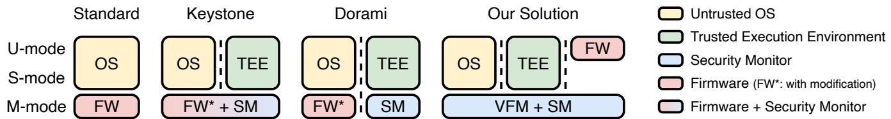  
Figure 1. Comparison of TEE deployments on RISC-V. With Keystone [62] and most TEEs the security monitor is co-located with the vendor firmware. Dorami [61] is a recent attempt at privilege separation that requires firmware refactoring and binary scanning. Our solution achieves privilege separation with no firmware modification.

We present the implementation of Miralis, the first virtual firmware monitor. Miralis is written in Rust, runs on RISC-V, and is extensible, supporting custom isolation policies. We demonstrate the virtualization and sandboxing of unmodified vendor firmware for multiple hardware platforms including VisionFive 2, HiFive Premier P550, and popular open-source firmware. We further extend Miralis with support for secure enclaves and confidential VMs by porting the Keystone [62] and ACE [79] security monitors respectively. Unlike previous security monitors and other attempts at privilege separation, Miralis required no vendor firmware modifications. We evaluate Miralis’s performance on a wide range of applications and report no degradation compared to native execution.

In the course of developing Miralis, we designed a new automated framework for verifying key components of VFMs, including instruction emulation and hardware configuration. While we do not aim at full formal verification of security properties [58], we do provide pragmatic, automated tools to find bugs and improve assurance using lightweight formal methods [18, 30, 57]. Our key insight is to express the VFM specification in terms of existing, high-quality executable ISA specifications [24, 83]. We apply our method to verify instruction emulation and memory isolation in Miralis using the Kani [94] Rust model checker. This methodology allowed us to identify and correct 21 bugs in development, including losses of virtual interrupts, PC overflow, and out-of-bounds accesses.

## In summary, our contributions are as follows:

C1 We theorize that it is possible to safely and efficiently deprivilege and isolate unmodified vendor firmware.

C2 We prove by construction that our approach can be deployed on commercially available RISC-V platforms, and detail the design and implementation of Miralis.

C3 We explain how to automate the specification and verification of virtual firmware monitors.

## 2 Background and Motivation

In this section we define our key terms and concepts and motivate the need for sandboxing unmodified firmware.

## 2.1 The Anatomy of Firmware

“Firmware” is often an umbrella term for a variety of software running on a physical machine: devices, management controllers, and security co-processors all run different flavors of firmware. In this paper we use “firmware” to mean software running at the highest privilege level on the application CPU, such as Arm’s EL3 and RISC-V’s M-mode, although other kinds of firmware are the subject of complementary research efforts [50, 51]. We exclude AMD and Intel x86\_64 from our discussion because of their heavy reliance on microcode for system management [27] and the complex, vendor-specific, and often undocumented privilege modes required for system operations (such as SMM, SEAM, Architectural Enclaves, or the AMD Secure Processor [38, 41, 89]).

In contrast, the Arm and RISC-V architectures implement system management in software using well-documented privilege levels, and on high-end Arm and RISC-V platforms the process of building firmware is standardized around an open core with vendor-specific extensions. The core infrastructure is provided by open-source firmware libraries, such as Arm TF-A [16] and RISC-V OpenSBI [14]. Those libraries are high-quality and well-audited, although vulnerabilities in them do appear [17]. Above the core, vendors add their own management code: drivers, debugging tools, configuration, telemetry, and more. To take one example, the vendor firmware of the Cavium ThunderX-1 Arm CPU is more than a million lines of C, including a custom standard library, scheduler, and Lua interpreter to customize firmware operations [74]. Often, vendor firmware is provided without source, as an opaque binary.

## 2.2 Vendor Firmware and TEEs are incompatible

While firmware vulnerabilities often make the headlines [7– 11] and security researchers continue to find new flaws in vendor firmware [36, 44, 47, 70, 88], the threat of a buggy or malicious firmware has been largely ignored by system software designers so far. Even high-assurance systems like seL4 [58] simply assume the firmware to be correct – not out of negligence, but because firmware by its nature is a highly privileged, non-portable, and proprietary artifact.

However, this is particularly problematic in the context of TEEs such as enclaves [25, 42, 48, 49, 62] and confidential VMs (CVMs) [68, 79, 86], all of which rely on a security monitor to enforce isolation between trusted and non-trusted environments. This security monitor currently runs at the same privilege level as the vendor firmware.

Figure 1 shows TEE deployments on RISC-V, where the security monitor is co-located with vendor firmware [25, 62, 79]. This means that the whole vendor firmware image is part of the security monitor’s Trusted Computing Base (TCB). For RISC-V, the problem will get worse as RISC-V cores and vendor firmware become more complex, particularly with an increased emphasis on server platforms.

The Arm architecture provides separation of vendor firmware and security monitor via additional privilege modes, such as TrustZone [23] and realm EL2 [12], but this fails to address the fundamental security issue: vendor firmware remains more privileged than security monitors, and the latter must trust the former.

Dorami [61] is a recent RISC-V security monitor that isolates firmware in an M-mode compartment. However, it requires binary scanning and vendor firmware modification for each platform and thus faces significant adoption challenges. If vendors choose not to adopt Dorami and the associated re-engineering effort, the problem remains.

## 2.3 Threat Model

We therefore define our threat model as follows: we assume an adversary with full control over vendor-supplied firmware and the OS or hypervisor. Furthermore, we assume that the vendor firmware binary is closed and cannot be modified by the system operator.

We exclude physical attacks, denial of service, or attacks from firmware running on auxiliary cores or other devices in the platform. Further, transient execution attacks [33, 59, 71, 75, 82] are also out of scope, although standard mitigations can be applied [28]. We also assume that platform-specific instructions, hardware registers, and MMIO regions are known and documented (although the vendor firmware itself may be closed), and that the hardware adheres to its specification.

Under this threat model, we guarantee that the adversary can neither gain code execution capability (integrity) at the highest privilege level nor gain access to memory used by code at this level (confidentiality). In §5 we further discuss how to extend this protection to other components of the system, such as the OS, enclaves, or confidential VMs.

## 3 Virtual Firmware Monitors

In this paper we show how to make security monitors secure in the presence of untrustworthy vendor firmware without requiring new hardware or changes to firmware binaries. We introduce a new category of system software, the Virtual Firmware Monitor (VFM), to enforce the principle of least privilege all the way down to firmware.

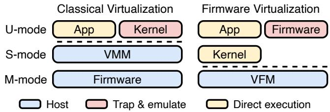  
Figure 2. Classical vs. firmware virtualization.

VFMs rely on classical virtualization to de-privilege only vendor firmware, achieving this using software-based virtualization techniques without requiring any additional hardware extension.

## 3.1 Theory of Classical Virtualization

In 1974 Popek & Golberg formulated the formal architectural requirements to support virtual machines safely controlled by a Virtual Machine Monitor (VMM) using a technique called trap & emulate [81]. The approach is purely software-based and predates the introduction of CPU virtualization extensions [20, 93] and modern hypervisors. The resulting requirements provide sufficient criteria for virtualizable ISAs: all sensitive instructions must be privileged. An instruction is said to be sensitive if it modifies or depends on the privileged state or privilege level. Famously, not all ISAs are classically virtualizable, e.g., x86\_32 is not classically virtualizable as instructions such as popf are “sensitive” ” and leak privileged state (e.g., the interrupt flag) [32].

Figure 2 (left) illustrates classical virtualization on a RISC-V architecture, where the unmodified guest kernel runs in user-mode (U) rather than supervisor-mode (S). Upon executing a privileged instruction, the guest kernel traps to the VMM, which then emulates the trapping instruction and resumes the kernel in U-mode, effectively creating a virtual S-mode in user space.

## 3.2 Firmware Virtualization

Firmware Virtualization extends the concept of classical virtualization to the highest privilege level, which is used to execute firmware, i.e., machine-mode (M-mode) on RISC-V.

Figure 2 (right) shows how, by analogy with classical virtualization, a VFM creates a virtual M-mode (vM-mode) by running firmware in user-space with trap & emulate. Importantly, the host OS (both S- and U-mode) runs natively without interference from the VFM. As VFMs are used solely for isolation they do not require the complexity of traditional hypervisors needed to multiplex physical resources like memory management, scheduling, and device drivers. VFMs can co-exist in M-mode with security monitors that implement TEE abstractions, and do not interfere with hypervisors running in S or HS-mode.

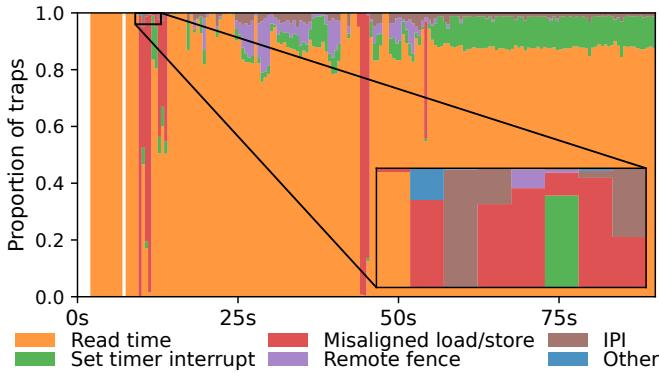  
Figure 3. Distributions of M-mode trap causes over time during Linux boot on the VisionFive 2. Only five causes account for 99.98% of all traps.

The classical virtualization requirements of Popek & Golberg [81] also provide a good lens to reason about the construction of VFMs. A manual review reveals that RISC-V’s M-mode is virtualizable, while Arm’s EL3 is not. Indeed, just as the x86\_32 popf instruction is “sensitive”, the operation of the Arm cpsid instruction used to disable interrupts also depends on the current privilege level but does not trap: instead, it is treated as a no-op in userspace.

## 3.3 Access Control to System Resources

A VFM enables enforcing fine-grained access control to system resources beyond main memory. Vendor firmware configures and operates the hardware through two means: control registers to configure CPU cores, and Memory Mapped I/O (MMIO) for the rest of the system. By design, a VFM intercepts all accesses to control registers by trapping privileged instructions and can decide to either forward the write to the hardware register, filter the value, or simply ignore it. Similarly, a VFM leverages the memory protection unit (PMP on RISC-V) to trap accesses to MMIO regions.

## 3.4 Fast Path Offloading

An explicit requirement of the VFM is to minimize the impact on OS performance. A VFM introduces two kinds of overhead: emulation of privileged operations during firmware execution, and world switches on a transition between the firmware and the OS. Notably, a VFM introduces no overhead during OS execution. The impact on OS performance is therefore proportional to the number of – and duration of – world switches to the virtualized firmware.

To better understand the performance implications of a VFM we measure the interactions between Linux and the vendor firmware on the VisionFive 2 RISC-V single board computer and plot the results in Figure 3, which represents the proportion of traps from the OS to the firmware grouped per category during 500ms windows throughout the kernel boot, including the bootloader, early kernel initialization, and idling in user-space.

On this platform 99.98% of all traps to firmware have one of five causes: reading the time register, configuring the timer deadline, misaligned load & store, IPIs, and remote fences. Those traps all share an important property: they are software emulation of unimplemented hardware features specified in the RISC-V architecture [85, 96]. Any hardware that does not implement this functionality will require the same generic emulation. For instance, the supervisor timer deadline is part of the Sstc RISC-V extension, while IPIs and remote fences require a compatible interrupt controller.

Due to this portable nature, and because of the high trap frequency (5500 trap/s during boot), we can offload the handling of the most traps to the VFM itself, bypassing the virtualized firmware. This is practical because the features are part of the open RISC-V standard and are portable across RISC-V platforms and vendors. In our experience, each can be implemented in 10 to 100 lines of code. We emphasize that this does not involve porting code from vendor firmware, nor does it require firmware to be open-source as long as it adheres to the RISC-V standard SBI [84]. Doing so reduces the number of world switches to just 1.17 per second during the boot sequence, and therefore has no noticeable performance overhead compared to the baseline.

We revisit and measure the impact of this design decision in the evaluation section (§8). In particular, we find that support for reading the time CSR and the supervisor timer (Sstc) extension would remove the need for fast path offloading. For instance, fast path offloading is not required on CPUs implementing RVA23 or a more recent RISC-V profile [3].

## 4 M-mode Virtualization with Miralis

This section presents the design of Miralis, a virtual firmware monitor for RISC-V platforms. Miralis is written in Rust, executes in M-mode, and can run unmodified firmware in user-space by simulating a virtual M-mode through trap & emulate. In the following we describe the virtualization of three main aspects of the RISC-V architecture: the CPU, memory protection unit, and interrupts.

## 4.1 CPU Virtualization

Miralis executes in M-mode with interrupts disabled and follows a simple execution model where trap handlers always run to completion. Figure 4 provides an overview of the design of Miralis. At any time, a CPU core (i.e., hart on RISC-V) executes in one of two worlds: vM-mode for the virtual firmware, and direct execution for the OS. The trap handler dispatches traps to different subsystems based on the world the trap comes from. A trap from the virtual firmware will result in software emulation, whereas traps from the OS are either re-injected in the virtual firmware or handled directly by Miralis as a fast path for common operations. Miralis additionally virtualizes M-mode interrupts, such as timer and Inter-Processor Interrupts (IPI), by intercepting and re-injecting corresponding physical interrupts.

During virtual firmware execution all S- or M-mode instructions trap to Miralis for emulation. The instruction emulator is the biggest subsystem in Miralis, with 2.1k lines of code to implement the decoder and execution engine for privileged instructions. On RISC-V the number of privileged instructions is small, Miralis has support for 12. The complexity, however, lies in the emulation of the Control and Status Registers (CSRs), which occupies most of the RISC-V privilege architecture specification [96]. The number of CSRs is platform specific; Miralis has support for 84 of them. Miralis maintains a shadow copy of the CSRs on which the instruction emulator operates. Those virtual CSRs are never installed in the physical registers while the virtual firmware is executing, although Miralis will configure the physical CSRs in accordance for emulation purposes. Memory traps are handled by different subsystems, as explained in §4.2 and §4.3, while all other traps are simply re-injected in vM-mode.

After processing each trap, Miralis checks for vM-mode interrupts and which execution mode (firmware or OS) to return to. A virtual interrupt must be injected if it is both pending and enabled. This check must be done after emulation as traps and privileged instructions can mask or unmask interrupts (e.g., mie CSR). The last step is to check for world switches. A world switch is when Miralis switches from vMmode (firmware mode) to direct execution (OS mode) or vice versa, usually because of a trap from the OS or the firmware executing the mret instruction. Each direction requires a different handling: from firmware to the OS Miralis installs the virtual CSRs into the physical registers, except for CSRs required for emulation or isolation such as PMP and mie, and conversely from the OS to firmware Miralis loads the content of the physical CSRs into the virtual copies and installs well defined values in physical registers. As a world switch involves changing memory permissions, it also requires a TLB flush. Finally, Miralis restores the general purpose registers and returns control to the appropriate mode.

## 4.2 Physical Memory Protection Virtualization

On RISC-V, M-mode software does not use an MMU for memory management and protection but instead relies on Physical Memory Protection (PMP). Unlike virtual memory systems, PMP virtualization does not require shadow or multi-level page tables, thus simplifying emulation.

PMP rules are defined using up to 8 configuration registers and 64 address registers, each protecting a contiguous memory segment. Rules are evaluated in order of priority, with the first matching entry determining access permissions. Miralis provides virtual PMP CSRs to the firmware by multiplexing the physical PMP registers, as shown in Figure 5 in the case of 8 physical PMP entries. The virtual PMP entries are installed in the physical registers with lower priority than the entries protecting Miralis to ensure Miralis’s PMP rules always take precedence. As PMPs do not take effect in M-mode unless locked, Miralis sets read-write-execute permissions on unlocked vPMP entries while executing the firmware to mimic hardware behavior.

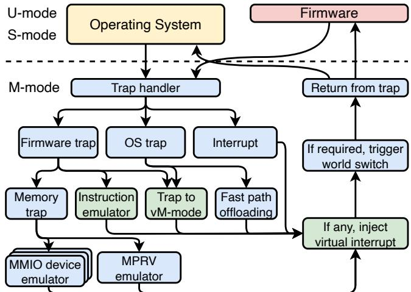  
Figure 4. Overview of Miralis: Firmware executes in virtual M-mode and OS traps and associated devices are emulated. Green boxes are verified via symbolic execution (see §6).

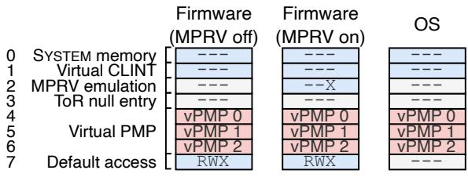  
9 Figure 5. Physical PMP access rights configuration for memory virtualization in the different execution modes. RWX stands for read-write-execute, - - - for no permission.

In addition to reserving PMP entries to protect Miralis’s own memory and MMIO devices, Miralis reserves three extra entries to emulate M-mode memory protection. First, by default M-mode is granted access to all memory whereas S- and U-mode are granted no access. When running the virtual firmware in vM-mode (i.e., physical U-mode) Miralis configures read-write-execute permissions for all memory using the last PMP entry to emulate this behavior. On worldswitches, the last entry is disabled to match S- and U-mode semantic. Second, with the Top of Range (ToR) addressing mode, the starting address of the segment is defined by the preceding entry. When the PMP 0 entry uses ToR addressing mode, the starting address is hardwired as 0. To ensure virtual PMP 0 behaves accordingly in ToR addressing mode, the physical PMP entry preceding the PMP entry that hosts vPMP 0 (e.g., entry 3 on Figure 5) must be configured with the address 0. Finally, the mstatus.MPRV bit (Memory PRiVilege) modifies the effective privilege mode for loads and stores but not for instruction read, in M-mode. This allows the firmware to read or write data using the kernel or user virtual addresses without software page table walk. We emulate this behavior by setting a PMP entry with execute-only permission on all memory when the firmware enables MPRV. This causes all loads and stores to trap to Miralis, which then install the page tables and perform the access on behalf of the firmware using MPRV itself.

Table 1. Miralis lines of code decomposition
<table><tr><td>Emulator</td><td>2.7k LoC</td><td>Fast path offload</td><td>190 LoC</td></tr><tr><td>Hardware interface</td><td>1.1k LoC</td><td>Other</td><td>1.8k LoC</td></tr><tr><td>MMIO devices</td><td>430 LoC</td><td>Total</td><td>6.2k LoC</td></tr></table>

## 4.3 Interrupts, Devices, and MMIO Virtualization

Miralis does not virtualize devices such as disks or network interface cards, as such devices are usually managed by the kernel rather than the firmware. Therefore, Miralis forces the delegation of all non-M-mode interrupts by hard-wiring corresponding bits to 1 in the virtual mideleg CSR, as allowed by the RISC-V specification [96]. This only leaves M-mode interrupts to be virtualized.

On the platforms we consider, the only MMIO device which needs emulation is the CLINT (Core Local INTerruptor). In contrast, we found that other devices such as the PLIC, cache controllers, or embedded NPU and GPU do not need emulation because they are either not used by the virtual firmware, or used only during initialization and access can be safely revoked afterward (see sandbox policy §5.2). A virtual MMIO device is created by protecting the corresponding MMIO region with a PMP entry. Then on a memory trap, Miralis checks if the access is within the bounds of an MMIO device and calls into the corresponding device emulator. Miralis’s virtual CLINT multiplexes timer and software interrupts between itself and the virtual firmware. Miralis also has experimental support for virtualizing M-mode external interrupts through a virtual PLIC, although it is not needed on the platforms we support as vendor firmware delegates all external interrupts to the OS.

Finally, Miralis needs to restrict direct memory accesses (DMA) by the firmware. On platforms with IOPMP [2] support, Miralis would virtualize the IOPMP to restrict which memory regions can be accessed through DMA by the firmware, similarly to how Miralis restrict direct memory accesses through PMP virtualization (§4.2). As with PMP virtualization, this would only incur a small overhead on IOPMP modification, and a minimal runtime overhead if IOPMP was not already enabled by the platform’s firmware [97]. However, as IOPMP is not widely supported yet, Miralis defaults to preventing firmware DMA by blocking firmware access to all MMIO regions controlling DMA-capable devices.

## 4.4 Comparison with Hypervisors

In our experience developing Miralis, VFMs are drastically simpler software than traditional hypervisors, even with hardware support for virtualization. Indeed, virtualizing firmware is a simpler problem in many aspects: (1) there is a single virtual firmware, removing the need for memory, CPU, and devices multiplexing; (2) firmware-level instructions and features are easier to virtualize, such as the PMP compared to an MMU; and (3) there is no need for complex drivers beyond interrupt controllers. Table 1 provides a breakdown of Miralis’s implementation.

## 5 Isolation Policies

So far, we have discussed how to virtualize a firmware, but not how to isolate the rest of the system from a buggy or malicious firmware. This section describes how to enforce isolation policies with Miralis, leveraging the same ideas behind security monitors built on top of traditional hypervisors [13, 37, 52, 53, 73, 99]. As VFMs are useful across a wide variety of scenarios and requirements, we designed Miralis to be extensible, with support for custom isolation policies.

## 5.1 Policy Modules

An isolation policy is defined in terms of a policy module, i.e., a Rust struct that implements the policy module interface. The interface consists in seven optional methods: three are called on ecall, trap, and world switch from the firmware, three other from the OS, and one called on interrupts. The methods either complement or override Miralis’s implementation based on the return value. In addition, policy modules can get assigned PMP entries with higher priority than the virtual PMPs to configure memory protection for both the OS and firmware. Policy modules are meant to implement security monitor features and decouple M-mode virtualization from use case-specific isolation requirements. In the following we present three examples of policy modules.

## 5.2 Firmware Sandbox Policy

The firmware sandbox policy isolates the whole OS from an untrusted firmware. More precisely, the policy allocates a small memory range for the firmware and blocks access to the rest of the memory, including OS memory, the PCIe address space, and most other MMIO devices. In addition, the policy saves and restores general purpose registers and S-mode CSRs to prevent unintended leakage. In the case of explicit calls to the firmware (SBI calls), the policy module allows a well-defined set of registers to be passed as SBI call arguments. We automatically generate the per-SBI call register allow-list from the SBI specification [85]. Finally, some firmware need access to platform specific CSRs or MMIO regions to operate and configure the hardware. Access to those resources is denied by default but can be granted assuming that the hardware vendor accurately documents the effects of those resources and that they do not allow the firmware to bypass the sandbox policy restrictions. In our implementation, Miralis will stop the machine with an error message if the firmware performs an illegal action. In production systems, we imagine that Miralis would instead log the invalid action and return arbitrary values. This would enable the detection of malware, such as rootkits, without impacting the OS execution.

Threat model: The sandbox policy considers an adversary with full control over the firmware whose goal is to violate the integrity or confidentiality of the OS. Physical and side channel attacks are out of scope of the policy. Assuming the hardware behaves as documented, the sandbox policy guarantees the integrity and confidentiality of the OS.

On the two platforms used in our evaluation sandboxing the firmware had surprisingly little consequences, all of which could easily be worked around. First, the firmware needs access to OS memory during initialization to load the S-mode bootloader (U-Boot in our case). As a result we allow access to all OS memory until the first jump to S-mode, at which point the policy locks down the OS memory on all harts until the machine is powered off and then compute a hash of the initial S-mode image. Second, on some platforms the firmware is used to emulate misaligned loads and stores. We thus simply implemented the misaligned loads and stores emulation directly in the policy. Finally, the Linux printk early console was configured to use an SBI call requiring shared memory between the OS and firmware.

## 5.3 Keystone Policy

The Keystone [62] policy is a re-write of the Keystone security monitor in Rust as a Miralis policy module. The Keystone policy adds support for enclaves to Miralis, a common TEE abstraction [42, 55, 73] that protects a user application from the OS and hypervisor. The policy exposes the same SBI interface as the original Keystone security monitor, such as the ability to create, run, and terminate enclaves, although our current implementation lacks attestation capabilities. Therefore, we re-use the existing Keystone infrastructure including the enclave runtime, libraries, and kernel module. The policy protects the enclave using policy PMPs that take priority over the virtual PMPs, protecting the enclave from both the OS and firmware.

Threat model: The Keystone policy follows the same threat model as the original Keystone security monitor [62] except that the vendor firmware is no longer trusted and follows the same attacker model as the OS.

## 5.4 ACE Policy

The ACE policy provides support for confidential VMs (CVMs) by porting the ACE monitor [79] to Miralis. With CVMs the host hypervisor is responsible for managing and scheduling VMs, but has no access to the underlying memory, making the content of the VM confidential from the hypervisor point of view. The firmware, however, can get access to the VM’s content. All major ISA have support or plan to support CVMs [54, 68, 86, 89]. The ACE monitor is an M-mode security monitor that enforces isolation between the host hypervisor and CVMs through PMPs. To run CVMs, ACE leverages the RISC-V H (hypervisor) extension which introduces the HS and VS-mode. Note that supporting HS and VS-mode in Miralis requires no special treatment compared to any other S-mode extension, it suffices to implement support for saving and restoring the new CSRs on world switches and creating shadow copies.

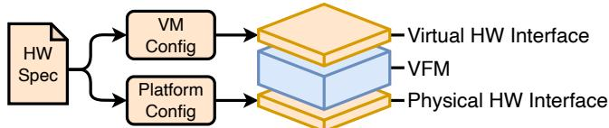  
Figure 6. The host and virtual hardware interfaces follow the same hardware specification, but with different configurations.

Threat model: The ACE policy follows the same threat model as the original ACE monitor [79], except that the adversary additionally has full control over the virtual firmware.

As ACE is significantly more complex than the Keystone monitor and already written in Rust, we port the existing monitor as a policy module rather than attempting a full re-implementation. To minimize changes to the ACE code base we opt for a co-location approach, where the ACE policy takes control over M-mode while running the host hypervisor and confidential VMs by handling traps directly without Miralis intervention, but yield back to Miralis when trapping to the firmware.

## 6 Hardening VFMs with Lightweight Formal Methods

While developing Miralis we found it difficult to accurately implement an emulator for RISC-V privileged instruction based on the prose in the English specification [96]. Each of the CSRs we added required translating the corresponding chapter into code, and searching through the whole manual for other CSRs whose behavior was affected by the new values. The emulator is the biggest attack surface exposed to the firmware, with 2.7k lines of code (see Table 1). Any mismatch between the emulator and the specification might ultimately lead to the injection of faulty values during a world switch and compromise the OS.

As we realized that manual translation of the prose specification was not sustainable we set out to leverage the official executable ISA specification [24, 87]. Although we acknowledge that formal verification has led to impressive results in proving various properties for similar systems [19, 58, 63, 67, 91, 95], it typically required a huge effort and manually written specifications. We do not aim at full verification of general properties, but rather a pragmatic, highly automated, and non-disruptive approach that can verify critical components of VFMs against an authoritative, high quality specification through lightweight formal methods [18, 30, 57, 76].

Our key idea is to express the specification of a VFM as a function of the underlying ISA. Then, existing ISA specifications, such as the official RISC-V Sail model [4], can be leveraged to automate the generation of the VFM specification. For this purpose we formalized two criteria, faithful emulation and faithful execution, that guarantee proper emulation and configuration of the hardware, respectively. We then generate a Rust VFM specification and use the Kani [94] Rust model checker to check for divergence between Miralis and the VFM specification. We use our methodology to verify privileged instruction emulation, virtual interrupt delivery, and memory protection.

## 6.1 Modelling the Architecture

Our key insight is that a VFM re-exposes the ISA interface, although with different configuration. Figure 6 illustrates the physical and virtual interfaces. Therefore, a VFM specification can be expressed as a function of the hardware specification.

The ISA defines the transition function of the system’s state machine. The transitions depend on the configuration $c \in C$ of the platform (accessible memory ranges, available hardware extensions, number of PMP entries, etc.) and the current state ?? ∈ ?? of the machine (registers and memory). For simplicity we make the next instruction ?? ∈ ?? explicit— i.e., we encode the instruction fetch in the model. Note that interrupts can be modelled as special instructions. We can then formalize the hardware transition function as follows:

$$
h w : C \times S \times I \to S .
$$

Here, the ℎ?? function encodes the whole architecture— e.g., 16k lines of code for the official RISC-V Sail model [4]. By fixing a configuration ??, ℎ?? can also be used as a simulator. Indeed, Sail can generate C and OCaml simulators from the RISC-V model. In short, the ℎ?? function is an already existing, high-quality specification of the architecture.

## 6.2 Faithful Emulation

Privileged instructions (and interrupts) executed by the firmware trap to the VFM for software emulation. We designate the emulation function of a VFM as ??????, where $I _ { p } \subset I$ is the set of privileged instructions:

$$
v f m : S \times I _ { p } \to S
$$

The ?????? function corresponds to one iteration of the trap, emulate, resume loop of the VFM. Using these definitions, we can define faithful emulation, which states that the VFM implements a correct virtual hardware interface:

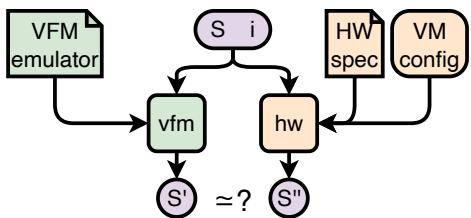  
Figure 7. The faithful emulation criteria. A VFM implementation properly emulates the virtual hardware interface if for any state and instruction the resulting state is equivalent to what a reference machine would produce.

Definition 1 (Faithful emulation).

$$
\exists c \in C , \forall ( s , i ) \in S \times I _ { p } , v f m ( s , i ) \simeq h w ( c , s , i )
$$

In plain English, the VFM and ISA specifications produce the same output for the same input, at least for all privileged instructions. The comparison (≃) implicitly takes into account differences in internal representation of the system state. The faithful emulation criteria has been used in previous works to generate test cases [22, 72], in this paper we demonstrate it can scale to exhaustive symbolic execution of a VFM emulation subsystem. Figure 7 illustrates the criteria.

## 6.3 Faithful Execution

To enforce identical behavior compared to a reference machine while the firmware executes un-privileged instructions directly, the VFM must configure the host hardware to behave appropriately. The difficulty comes from the difference in configuration between the host and reference machine, for instance fewer virtual than physical PMP entries, as well as the need for the VFM to maintain its own privileged state.

To make reasoning easier it is helpful to partition the machine’s state between privileged and unprivileged state, i.e., $S = S _ { p } \times S _ { u }$ . Further, as per the Popek and Goldberg criteria (§3.1), the privileged state cannot be modified by unprivileged instructions, thus we consider a restriction of ℎ?? to the unprivileged state:

$$
h w | _ { u } : C \times S _ { p } \times S _ { u } \times I \longrightarrow S _ { u } .
$$

Faithful execution requires that the VFM configures the host privileged state such the the virtual firmware executes as it would on a reference machine. During privileged instruction emulation the VFM might update the firmware’s privileged state $p _ { v } \in S _ { p } .$ , which is often kept in in-memory data structures, and gets a chance to modify the host’s own privileged state $p _ { h } \in S _ { p } ,$ which is installed in the hardware during firmware execution. We use $c f g : S _ { p } \to S _ { p }$ to denote the abstract VFM function which given a virtual privileged state returns the host privileged state. Often, the implementation of ?????? is scattered across the code base: a change in one virtual register might trigger a change to the corresponding physical register.

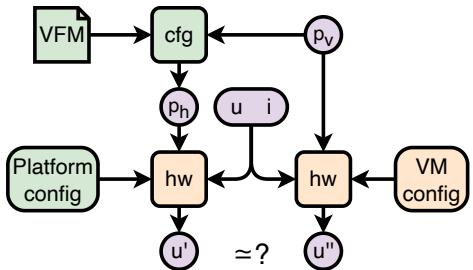  
Figure 8. The faithful execution criteria. A VFM must configure the host machine such that direct execution produces observable results similar to a reference machine.

Definition 2 (Faithful execution).

$$
\begin{array} { c } { \exists ( c _ { h } , c _ { r } ) \in C \times C , \forall ( { p _ { v } , u } , i ) \in S _ { p } \times S _ { u } \times I , } \\ { h w | _ { u } ( c _ { h } , c f g ( p _ { v } ) , u , i ) \simeq h w | _ { u } ( c _ { r } , { p _ { v } , u } , i ) } \end{array}
$$

In plain English, the host hardware must be programmed to execute as if the firmware was running natively on a reference machine with a different configuration. The verification of the host machine programming therefore requires instantiating two hardware interfaces, one with the reference platform configuration and privileged state, and another with the host platform configuration and the privileged state derived from the firmware virtual state by the hypervisor. Figure 8 illustrates the criteria. Although it might be impractical to verify faithful execution for all instructions, the criteria is still useful for detecting specific hardware misconfiguration. For instance, proving faithful execution of loads and stores implies that memory protection has been properly configured.

## 6.4 Model Checking

The faithful execution and faithful emulation criteria serve as a specification for critical virtualization components of VFMs. We use the Kani Rust model checker [94] to verify the main Miralis’s subsystems through exhaustive symbolic execution of the Rust code. For this purpose, we first translate the official RISC-V Sail model [4] to Rust. As the Sail compiler can output C code but not Rust yet, we wrote a Rust backend for the Sail compiler in 2K lines of OCaml as a onetime effort. We paid special attention to preserving the Sail semantic during translation. In particular, we encode Sail’s bitvectors into custom Rust structs that preserve bitwise operation semantics. Using this Rust model, we write the faithfulness criteria as simple unit tests whose inputs are symbolic values. In total, the translated Rust model amount to 6.9k lines of code, on top of which we manually wrote 1.1k lines of proofs in the form of standard Rust tests and helper functions. The verification covers a total of 2.7k lines of code in Miralis, or 43% of the total code base.

Faithful Emulation: We verify the implementation of the instruction emulator, traps to vM-mode, and check for virtual interrupts (see green boxes in Figure 4). Instruction emulation is the biggest attack surface exposed to the virtual firmware, 2.1k lines of code, or 34% of the total Miralis code base, while virtual interrupt losses can cause system stalls or instabilities. The verification follows Figure 7: we instantiate a symbolic initial state (i.e., all 84 CSRs and general purpose registers) and a symbolic privileged instruction, perform exhaustive symbolic execution through both Miralis’s emulator and the Sail model, and check for equality of all of the resulting virtual registers. As end-to-end verification of instruction emulation is time consuming (close to 2 hours) we found that it is useful to verify the emulation of individual instructions during development. We report verification time for different parts of the instruction emulator in Table 2.

Table 2. Model checking time of the emulation pipeline
<table><tr><td>Verification task</td><td>Time</td><td>Verification task</td><td>Time</td></tr><tr><td>mret instruction</td><td>68s</td><td>wfi instruction</td><td>28s</td></tr><tr><td>sret instruction</td><td>56s</td><td>instruction decoder</td><td>45s</td></tr><tr><td>CSR read</td><td>99s</td><td>virtual interrupt</td><td>94s</td></tr><tr><td>CSR write</td><td>9min</td><td>end-to-end emulation</td><td>118min</td></tr></table>

Faithful Execution: We verify the faithful execution of loads and stores, i.e., that memory protection is properly configured. As described in §4.2, Miralis multiplexes the PMP registers to protect itself, enforce security policy, and allow the virtual firmware to use the remaining entries. Thus, the configuration of physical PMPs is crucial for the security of both Miralis and the firmware. We follow the procedures illustrated in Figure 8: We initialize a set of symbolic virtual PMP registers, compute the corresponding set of physical registers using the appropriate Miralis function, and use the pmpCheck function from the reference RISC-V model to check for the success or failure of a load/store instruction at a symbolic address. If the symbolic address corresponds to Miralis memory or a virtual device then we expect the load or store to fail with the physical PMPs, for all other addresses we verify that the load or store either succeed or fail for both the physical and virtual PMPs.

## 6.5 Bugs Found During Development

In total we found and corrected 21 bugs in Miralis’s implementation, including a virtual PC overflow, out of bound accesses (which cause crashes but not UB in Rust), flawed mret emulation, wrong interrupt priorities, and a long tail of edge cases in CSRs bit patterns. Most importantly, we found three bugs in PMP virtualization: one of which allowed the firmware the overwrite the PMP configuration beyond the allowed number of virtual PMPs, another accepting the reserved combination of W=1 and R=0 permissions, and an invalid legalization bitmask due to a misplaced parenthesis. Overall the use of the official executable specification has been essential to the implementation and robustness of Miralis, and lightweight formal method tools such as the Kani model checker has made it practical for doing so.

Table 3. Characteristics of our evaluation platforms
<table><tr><td></td><td>VisionFive2</td><td>HiFive Premier P550</td></tr><tr><td>Number of cores</td><td>4</td><td>4</td></tr><tr><td>Frequency</td><td>1.5GHz</td><td>1.8GHz</td></tr><tr><td>RAM</td><td>4GB</td><td>16GB</td></tr><tr><td>Linux kernel version</td><td>5.15</td><td>6.6</td></tr></table>

## 7 Security Analysis

Before discussing the evaluation of Miralis, we propose to review the security guarantees of our implementation. Miralis enforces its own integrity and confidentiality by protecting itself from accesses by the firmware and the OS. This includes direct loads and stores, as well as DMA from devices. DMA protection relies on IOPMP or an equivalent mechanism. If no such mechanism is available, as is the case on the platforms we evaluate, Miralis revokes firmware accesses to DMA-capable devices, but is vulnerable to device accesses from the OS. The core virtualization logic has been verified for functional correctness, which covers 43% of the code base. The rest of the code, including assembly, device drivers, and fast-path offloading, is part of the TCB.

Miralis is intended to be used with at least one policy module, which is responsible for providing the desired isolation guarantees for the OS, enclaves, or confidential VMs. Policy modules play a similar role to traditional security monitors, such as Keystone [62] or Komodo [49]. In comparison, Miralis provides the necessary infrastructure to extend the security policies to the vendor firmware, which would otherwise need to be trusted. It is the responsibility of the policy authors to verify policy modules. We did not verify the sandbox and Keystone policies, but ported verified code for the ACE policy [79].

## 8 Evaluation

In this section we seek to validate the hypothesis underlying the design of VFMs. Specifically, we seek to answer the following questions:

Q1 Can a VFM virtualize unmodified vendor firmware?

Q2 Does a VFM induce overhead on OS execution?

Q3 Is fast path offloading necessary on the current generation of RISC-V CPUs?

Q4 Can a VFM be used to implement custom isolation policies, such as enclaves and confidential VMs?

For this purpose, we evaluate Miralis on two platforms from different vendors. We demonstrate the virtualization of two unmodified firmware, evaluate the overhead of Miralis through a comprehensive suite of micro and macrobenchmarks with and without fast path offloading, and port two existing security monitors as Miralis policy modules.

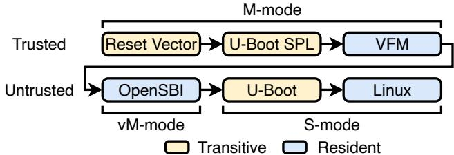  
Figure 9. Modified boot-flow with the Miralis VFM.

## 8.1 Experiment Setup

For our evaluation, we port Miralis to two platforms from different vendors: StarFive’s VisionFive 2 and SiFive’s HiFive Premier P550. The VisionFive 2 is powered by U74 in-order RISC-V cores, while the Premier P550 uses the high performance P550 out-of-order super-scalar cores with H-mode support. Table 3 summarizes the characteristics of both platforms. Unless stated otherwise Miralis is configured with the firmware sandbox policy (§5.2), results are averaged over 5 runs, and number of traps are reported per core. “Miralis no-offload” designates the configuration without fast path offloading. When network is involved we use a remote client with 8 cores at 3.5 GHz on the local Ethernet network.

## 8.2 Virtualizing Unmodified Firmware

To answer Q1 we evaluate Miralis’s ability to virtualize unmodified vendor firmware on the VisionFive 2 and Premier P550 boards. Both vendors rely on a two stage M-mode firmware. The first stage is responsible for initializing DRAM and loading the second stage in memory, but is no longer used afterward. The second stage is the firmware used at runtime, and stays resident in memory until system reset. Both second-stage firmware are open-source, and account for 31.8k and 24.7k lines of code on the VisionFive 2 and Premier P550, respectively. We insert Miralis in-between the two firmware stages, ensuring that Miralis gets full control over the machine and that the second stage firmware never executes in M-mode. Figure 9 illustrates the boot flow on both platforms. The Premier P550 further exposes four nonstandard but documented CSRs for controlling speculation and error reporting, Miralis explicitly allows writes to these CSRs for that platform. With those configurations the user sees no difference in machine behavior besides additional logs during system boot.

As both vendor firmware are based on OpenSBI, we further exercise Miralis’s virtualization capabilities with two independent open-source firmware: RustSBI and Zephyr. RustSBI [5] is an alternative to OpenSBI, written from scratch in Rust. Zephyr [6] is a Real Time OS (RTOS) designed for micro-controllers, it consists of an M-mode kernel and user applications. Both RustSBI and Zephyr pass their respective test suite while being virtualized by Miralis, and are in fact part of the test pipeline. Finally, to demonstrate that the firmware does not need to be open-source, we port Miralis to a third platform, the Star64, for which the vendor do not provide firmware sources. Upon receiving the board, we extracted the 164kB firmware image from the flash and succesfully ran it virtualized with Miralis.

Table 4. Overhead of Miralis operations in cycles
<table><tr><td></td><td>Instruction emulationWorld switch</td><td></td></tr><tr><td>VisionFive 2</td><td>483</td><td>2704</td></tr><tr><td>Premier P550</td><td>271</td><td>4098</td></tr></table>

We conclude that the answer to Q1 is yes: Miralis can virtualize unmodified vendor firmware.

## 8.3 Impact on OS performance

We then proceed to evaluate the impact of a VFM on OS operations to answer Q2 and Q3.

8.3.1 Cost of Miralis Operations. A VFM introduces overhead when the OS traps to the virtualized firmware. The incurred cost falls in two categories: firmware instruction emulation and world switches. Table 4 reports both costs measured with a minimal firmware and kernel. Specifically, we measure the cost of emulating the “csrw mscratch, x0” privileged instruction, including the overhead of trapping to M-mode and jumping back to U-mode (i.e., vM-mode). The cost of a world switch is reported for a full round trip, i.e., sequence OS → VFM → firmware → VFM → OS, where the firmware returns directly to the OS. On average, we observe around 10 firmware instruction emulations from the virtual firmware to handle a trap from the OS. This results in a world switch round trip cost of about 7 000 cycles or 5????.

On platforms that heavily rely on the firmware for software emulation of unimplemented hardware features the overhead of firmware virtualization might become prohibitive. To keep the overhead low, we implement a fast path for the five most common operations (§3.4) directly in Miralis, bypassing the virtual firmware for those operations. We compare the implementation in Miralis and the vendor firmware (based on OpenSBI) of two such operations, reads to the time CSR and IPIs, by instrumenting the Linux kernel to execute 100k of each operation in a tight loop. Table 5 reports the results for the VisionFive 2. We found Miralis’s implementation to be slightly faster, a difference that might be caused by OpenSBI’s heavy use of indirect function calls that prevent cross-functions inlining and compiler optimisations, although this is an implementation detail rather than a fundamental result. In addition, we report the cost of the two operations with fast path disabled as “Miralis no-offload”. Without fast path, the operations trap to the virtualized firmware, which in turns require emulation for each privileged instruction and adds up to an order of magnitude of overhead.

Table 5. Cost of timer read and IPI
<table><tr><td></td><td>read time</td><td>IPI</td></tr><tr><td>Native (OpenSBI)</td><td>288 ns</td><td>3.96 μs</td></tr><tr><td>MIRALIS</td><td>208ns</td><td>3.65 μs</td></tr><tr><td>MIRALIs no-offload</td><td>7.26 μs</td><td>39.8 μs</td></tr></table>

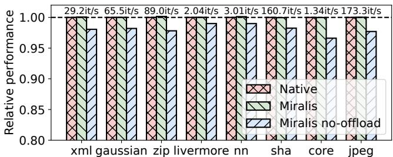  
Figure 10. Relative CoreMark-Pro scores

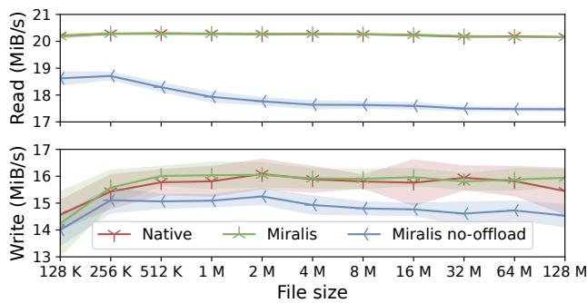  
Figure 11. IOzone throughputs on the VisionFive 2

8.3.2 Microbenchmarks. We evaluate the impact of Miralis on OS CPU and I/O microbenchmarks. We report the results for the VisionFive 2 but observe similar patterns for the Premier P550.

CPU: We use CoreMark-Pro [46] running on all 4 cores as a CPU-bound microbenchmark. We report the relative performance compared to running without Miralis (Native) in Figure 10.

Disk I/O: We use IOzone [56] with O\_DIRECT to evaluate the impact on disk I/O. We report the read and write throughput for a 128K record size on the VisionFive 2 in Figure 11. The absolute performance depends on the underlying hardware: we measure close to 10x the throughput on the Premier P550.

Network latency: Finally we evaluate the impact of Miralis on the latency of Memcached using Memtier [1]. Memtier is a closed-loop latency benchmark, we open 32 concurrent connections with 100k requests each. We report the latency distribution in Figure 12.

On all three microbenchmark suites, Miralis causes no overhead compared to the baseline (“Native”). Indeed, we measure 0.479 world switches per second on average across all microbenchmarks, a negligible amount. In fact we observe that Miralis performs slightly better on IOzone write and on Memcached under the 95 percentile, 263 vs 279 ???? at the median for instance. The difference is due to Miralis’s fast path implementation being slightly more efficient than the vendor firmware’s. However, with the fast path disabled (“Miralis no-offload”), we observe an overhead that scales with the frequency of traps to M-mode. The CPU benchmark causes the least traps to M-mode, 11k/s, while Memcached causes the most at 388k trap/s. As a result, we observe on average 1.9% overhead on CoreMark-Pro, 10.6% on IOzone, and 2× the latency on Memcached.

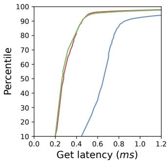

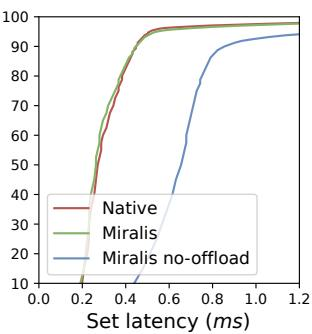  
Figure 12. Memcached latency distribution

We observe similar results on boot time, measured from board power-on to login prompt display on the screen, during which the firmware plays a major role. We measure 48.0s boot time with Miralis against 47.5s for the baseline (1% overhead), whereas removing the offload increases boot time to 61.3s, i.e., 29% overhead.

8.3.3 Application benchmarks. We then proceed to evaluate the impact of Miralis in realistic application scenarios. We consider four workloads: two in-memory key-value stores, Redis and Memcached, an SQL database (MySQL), and GCC. Figure 13 reports the relative performance (higher is better) for both the VisionFive 2 and the Premier P550.

Key-value stores: We evaluate the popular Redis (v7.0) and Memcached (v1.6) in-memory key-value stores on YCSB workload A [40] with one million operations each. Redis executes as a single threaded application, while Memcached uses the 4 available cores on both platforms.

SQL workload: We evaluate MySQL (v8.0) as a mixed CPU, network, and disk application. We use the OLTP read-/write workload from Sysbench [60] with 128 concurrent clients over 5 minutes.

Compilation: Finally we measure the time to compile Redis with GCC v12.2.

In line with the microbenchmarks evaluation, we observe very few world switches, 0.486/s on average on the Vision-Five 2 and none at all on the Premier P550, and therefore no overhead due to Miralis. As network workloads tend to generate more traps to M-mode, up to 272k trap/s for Redis and 389k trap/s for Memcached, Miralis performs better on those with up to 7.6 and 1.2% improvement on the VisionFive 2 and Premier P550, respectively. Once again, this is due to the Miralis’s fast path slightly faster implementation, although the vendor firmware could be tuned to achieve comparable performance. Disabling fast path offloading drastically increases the overhead: up to 259% on Redis for the Premier P550, although compute heavy workload is less dramatically affected.

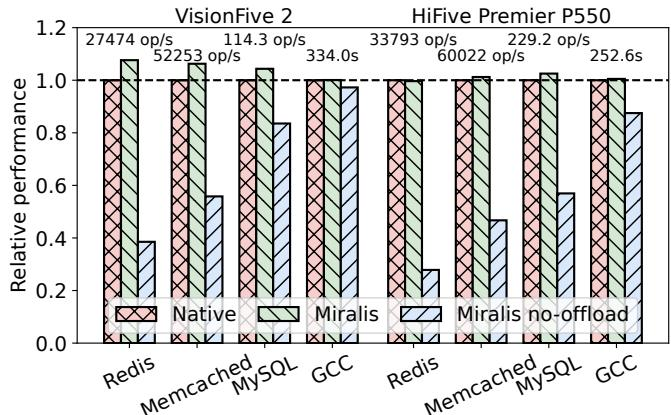  
Figure 13. Relative performance comparison for various application workloads.

Overall, we conclude that a VFM introduces no overhead on OS execution due to the low frequency of world switches (Q2). However, considering the overhead incurred when disabling fast path offloading we conclude that the fast path for the most common operations must be implemented within the VFM (Q3). We expect this to change with the next generation of RISC-V CPUs. Indeed, implementing support for reading the time CSR plus the Sstc extension would remove 96.5% of all world switches on our application benchmarks.

## 8.4 Support for Isolation Policies

Finally, to answer Q4 we test the suitability of Miralis for enforcing custom isolation policies by deploying the three policies described in §5.

All benchmarks presented so far use the firmware sandbox policy (§5.2), and therefore prevent the firmware from accessing OS memory, devices, and registers with no overhead.

In addition, we demonstrate the Keystone policy (§5.3) by reproducing the RV8 benchmark from the Keystone paper [62] using a re-implementation of the Keystone security monitor as a Miralis policy module. We nonetheless re-use the rest of the Keystone infrastructure without modification, including the kernel driver, enclave runtime, applications, and loader. Figure 14 reports the results on the VisionFive 2, with an average overhead of 1% when running inside an enclave, in line with the results reported by Keystone.

Lastly, with the ACE policy (§5.4), we reproduce the configuration demonstrated by the ACE authors. Specifically, we run a confidential Linux VM with 1GB of RAM, a virtio NIC and a drive. We run the VM through the ACE API, where we further strengthen confidentiality by excluding the firmware from the TCB. As ACE does not support available hardware platforms at the time of writing, we reproduce the ACE example on QEMU and are therefore unable to provide a meaningful performance comparison.

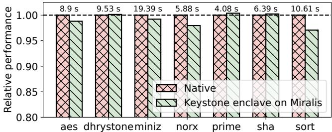  
Figure 14. Relative performance of Keystone enclaves implemented by Miralis on RV8.

Overall, we conclude that VFMs are a suitable host for TEE security monitors (Q4), as they do not require vendor firmware modification and efficiently de-privilege untrusted firmware while removing it from the TCB. We further built Miralis around a modular architecture, making it simple to experiment with new isolation policies.

## 9 Discussion & Related Work

Privilege Separation: Dorami [61] is the first system to propose a practical privilege separation between the security monitor and the firmware. Dorami sandboxes the firmware directly within M-mode by leveraging ePMP (Smepmp [96] extension) through a combination of firmware modifications and binary scanning. Dorami is closely related to systems such as Nested Kernel [43] for kernel-level privilege separation. In comparison, Miralis requires no firmware modification and runs on commercially available hardware. Miralis instead is more closely related to micro-kernels [58, 64, 69] and privilege-separation hypervisors [65, 66], with the firmware virtualization subsystem inspired from classical VMMs [29, 31, 32].

Security Monitors: The growing popularity of TEEs has led to booming research in building security monitors [25, 48, 49, 62, 68, 79]. In particular, the idea of leveraging virtualization to deprivilege an untrusted kernel has been widely explored [23, 34, 37, 52, 53, 73, 99]. Miralis provides the mechanisms needed to push this idea one step further, down to the firmware, and can serve as the basis for the next generation of security monitors. Beyond security considerations, the biggest benefit of Miralis is maybe the ease of maintenance and portability. Indeed, maintaining ?? security monitors across ?? platforms currently requires O (?? × ??) engineering effort, whereas developing security monitors as Miralis policy modules reduces that effort to O (?? + ??).

Automated System Verification: In contrast with interactive theorem provers [39, 78], there has been a lot of efforts in automating system verification [35, 80, 90, 98]. The methodology to automatically verify critical components of Miralis was inspired by the finding of past work that verification of systems with finite interfaces [76, 77] is often amendable to fully automated verification by SMT solvers [45, 92]. Indeed, a VFM exposes an ISA interface which (at least on RISC platforms) is finite. Our approach leverages the specificities of VFMs to go even one step further by expressing the specification of a VFM as a function of an already existing ISA specification, lifting the burden of writing both the proof and the specification. In particular, this guarantees that the VFM specification stays up-to-date as the ISA evolves.

Non-Virtualizable ISAs: As discussed in §3.2, Arm’s EL3 is not virtualizable due to the ISA design. This does not preclude the sandboxing of firmware with an Arm VFM, however the virtual EL3 mode would behave slightly differently, potentially affecting the execution of the virtualized firmware. We envision two potential solutions to this problem: (1) modifying the vendor firmware to call into the VFM for emulation of instructions that violate the virtualization requirements [81], i.e., paravirtualization [26]; or (2) add a configuration register in the next iteration of the Arm architecture to enable trapping on those instructions.

Running firmware in S-mode: Although we only discussed running vendor firmware in U-mode, running vendor firmware in S-mode is possible under some conditions. Per the Popek & Goldberg requirements [81] all sensitive instructions must trap, yet a firmware in S-mode gets access to many more instructions. On RISC-V it is possible to force all sensitive instructions to trap, such as accesses to the page table pointer or sret, and thus possible to run a firmware in S-mode. That is because RISC-V has been designed so that HS-mode can be emulated in software. Yet there are few benefits for doing so: it complicates the VFM implementation with limited performance benefits as most S-mode instructions should be intercepted.

## 10 Conclusion

In this paper, we describe how to safely and efficiently deprivilege and isolate unmodified vendor firmware. We introduce the concept of virtual firmware monitor (VFM), a new class of system software that virtualizes the firmware privilege mode. We describe Miralis, and demonstrate that VFMs can be deployed on commercially available RISC-V platforms and introduce no performance overhead. We explain how to verify critical VFM components by automating both verification and specification generation. Finally, we demonstrate that existing security monitors can be ported to Miralis, removing the vendor firmware from the TCB.

## Acknowledgements

We thank as the anonymous reviewers for their valuable feedback. Moreover, we thank the master students who worked on Miralis through the multiple phases of the project: Abel Vexina Wilkinson, Sofia Saltovskaia, Noé Terrier, and Frederic Khayat. This work has received funding from the Swiss State Secretariat for Education, Research, and Innovation (SERI) under the SwissChips initiative, from the Microsoft-EPFL Joint Research Center, an ONR grant N68335-22-C-0411, a DARPA grant W912CG-23-C-0032, and gifts from Google, InfoSys, and the VMware University Research Fund.

## References

[1] Memtier benchmark. https://github.com/RedisLabs/memtier\_ benchmark.

[2] RISC-V IOPMP specification. https://github.com/riscv-non-isa/iopmpspec.

[3] RISC-V profiles. https://github.com/riscv/riscv-profiles.

[4] RISC-V Sail model. https://github.com/riscv/sail-riscv.

[5] RustSBI: RISC-V supervisor binary interface library in Rust. https: //github.com/rustsbi/rustsbi.

[6] Zephyr project: Scalable real-time operating system (RTOS). https: //www.zephyrproject.org.

[7] Millions of Devices Vulnerable to ’PKFail’ Secure Boot Bypass Issue. https://www.darkreading.com/endpoint-security/millions-ofdevices-vulnerable-to-pkfail-secure-boot-bypass-issue, 2024.

[8] "Sinkclose" Vulnerability Affects Every AMD CPU Dating Back to 2006. https://www.techpowerup.com/325488/sinkclose-vulnerabilityaffects-every-amd-cpu-dating-back-to-2006, 2024.

[9] TPM GPIO fail: How bad OEM firmware ruins TPM security. https: //mkukri.xyz/2024/06/01/tpm-gpio-fail.html, 2024.

[10] UEFIcanhazbufferoverflow: Widespread Impact from Vulnerability in Popular PC and Server Firmware. https://eclypsium.com/blog/, 2024.

[11] AMD: Microcode Signature Verification Vulnerability . https: //github.com/google/security-research/security/advisories/GHSA-4xq7-4mgh-gp6w, 2025.

[12] Arm Realm Management Extension (RME) System Architecture. https: //developer.arm.com/documentation/den0129/latest/, 2025.

[13] Aws nitro enclaves. https://aws.amazon.com/ec2/nitro/nitro-enclaves/, 2025.

[14] RISC-V Open Source Supervisor Binary Interface (OpenSBI). https: //github.com/riscv-software-src/opensbi, 2025.

[15] RISC-V Supervisor Domains Access Protection. https://github.com/ riscv/riscv-smmtt, 2025.

[16] Trusted Firmware-A. https://trustedfirmware-a.readthedocs.io/en/ latest/, 2025.

[17] Trusted Firmware-A, Security Advisories. https://trustedfirmwarea.readthedocs.io/en/latest/security\_advisories/index.html, 2025.

[18] Sten Agerholm and Peter Gorm Larsen. A Lightweight Approach to Formal Methods. In Proceeedings of the International Workshop on Current Trends in Applied Formal Method, pages 168–183, 1998.

[19] Eyad Alkassar, Mark A. Hillebrand, Wolfgang J. Paul, and Elena Petrova. Automated Verification of a Small Hypervisor. In Proceedings of the 3rd International Conference on Verified Software, Theories, Tools and Experiments (VSTTE), pages 40–54, 2010.

[20] AMD. Secure virtual machine architecture reference manual, 2005.

[21] AMD. Sev-snp: Strengthening vm isolation with integrity protection and more. White Paper, January, 2020.

[22] Nadav Amit, Dan Tsafrir, Assaf Schuster, Ahmad Ayoub, and Eran Shlomo. Virtual CPU validation. In Proceedings of the 25th ACM Symposium on Operating Systems Principles (SOSP), pages 311–327, 2015.

[23] ARM. Building a secure system using trustzone technology. White Paper, April, 2009.

[24] Alasdair Armstrong, Thomas Bauereiss, Brian Campbell, Alastair Reid, Kathryn E. Gray, Robert M. Norton, Prashanth Mundkur, Mark Wassell, Jon French, Christopher Pulte, Shaked Flur, Ian Stark, Neel Krishnaswami, and Peter Sewell. ISA semantics for ARMv8-a, RISC-v, and CHERI-MIPS. Proc. ACM Program. Lang., 3(POPL):71:1–71:31, 2019.

[25] Raad Bahmani, Ferdinand Brasser, Ghada Dessouky, Patrick Jauernig, Matthias Klimmek, Ahmad-Reza Sadeghi, and Emmanuel Stapf. CURE: A Security Architecture with CUstomizable and Resilient Enclaves. In Proceedings of the 30th USENIX Security Symposium, pages 1073–1090, 2021.

[26] Paul Barham, Boris Dragovic, Keir Fraser, Steven Hand, Tim Harris, Alex Ho, Rolf Neugebauer, Ian Pratt, and Andrew Warfield. Xen and the art of virtualization. In Proceedings of the 19th ACM Symposium on Operating Systems Principles (SOSP), pages 164–177, 2003.

[27] Andrew Baumann. Hardware is the new Software. In Proceedings of The 16th Workshop on Hot Topics in Operating Systems (HotOS-XVI), pages 132–137, 2017.

[28] Jonathan Behrens, Adam Belay, and M. Frans Kaashoek. Performance evolution of mitigating transient execution attacks. In Proceedings of the 2022 EuroSys Conference, pages 251–265, 2022.

[29] Jonathan Behrens, Cel Skeggs, Samuel Ortiz, and Frans Kaashoek. RVirt. https://github.com/mit-pdos/RVirt.

[30] James Bornholt, Rajeev Joshi, Vytautas Astrauskas, Brendan Cully, Bernhard Kragl, Seth Markle, Kyle Sauri, Drew Schleit, Grant Slatton, Serdar Tasiran, Jacob Van Geffen, and Andrew Warfield. Using Lightweight Formal Methods to Validate a Key-Value Storage Node in Amazon S3. In Proceedings of the 28th ACM Symposium on Operating Systems Principles (SOSP), pages 836–850, 2021.

[31] Edouard Bugnion, Scott Devine, Kinshuk Govil, and Mendel Rosenblum. Disco: Running Commodity Operating Systems on Scalable Multiprocessors. ACM Trans. Comput. Syst., 15(4):412–447, 1997.

[32] Edouard Bugnion, Scott Devine, Mendel Rosenblum, Jeremy Sugerman, and Edward Y. Wang. Bringing Virtualization to the x86 Architecture with the Original VMware Workstation. ACM Trans. Comput. Syst., 30(4):12:1–12:51, 2012.

[33] Jo Van Bulck, Daniel Moghimi, Michael Schwarz, Moritz Lipp, Marina Minkin, Daniel Genkin, Yuval Yarom, Berk Sunar, Daniel Gruss, and Frank Piessens. LVI: Hijacking Transient Execution through Microarchitectural Load Value Injection. In Proceedings of the 41st IEEE Symposium on Security and Privacy (S&P), pages 54–72, 2020.

[34] Charly Castes, Adrien Ghosn, Neelu Shivprakash Kalani, Yuchen Qian, Marios Kogias, Mathias Payer, and Edouard Bugnion. Creating Trust by Abolishing Hierarchies. In Proceedings of The 19th Workshop on Hot Topics in Operating Systems (HotOS-XIX), pages 231–238, 2023.

[35] Can Cebeci, Yong-Hao Zou, Diyu Zhou, George Candea, and Clément Pit-Claudel. Practical Verification of System-Software Components Written in Standard C. In Proceedings of the 30th ACM Symposium on Operating Systems Principles (SOSP), pages 455–472, 2024.

[36] David Cerdeira, Nuno Santos, Pedro Fonseca, and Sandro Pinto. SoK: Understanding the Prevailing Security Vulnerabilities in TrustZoneassisted TEE Systems. In Proceedings of the 41st IEEE Symposium on Security and Privacy (S&P), pages 1416–1432, 2020.

[37] Xiaoxin Chen, Tal Garfinkel, E. Christopher Lewis, Pratap Subrahmanyam, Carl A. Waldspurger, Dan Boneh, Jeffrey S. Dwoskin, and Dan R. K. Ports. Overshadow: a virtualization-based approach to retrofitting protection in commodity operating systems. In Proceedings of the 13th International Conference on Architectural Support for Programming Languages and Operating Systems (ASPLOS-XIII), pages 2–13, 2008.

[38] Pau-Chen Cheng, Wojciech Ozga, Enriquillo Valdez, Salman Ahmed, Zhongshu Gu, Hani Jamjoom, Hubertus Franke, and James Bottomley. Intel TDX Demystified: A Top-Down Approach. ACM Comput. Surv.,

56(9):238:1–238:33, 2024.

[39] Adam Chlipala. Certified Programming with Dependent Types - A Pragmatic Introduction to the Coq Proof Assistant. MIT Press, 2013.

[40] Brian F. Cooper, Adam Silberstein, Erwin Tam, Raghu Ramakrishnan, and Russell Sears. Benchmarking cloud serving systems with YCSB. In Proceedings of the 2010 ACM Symposium on Cloud Computing (SOCC), pages 143–154, 2010.

[41] Victor Costan and Srinivas Devadas. Intel SGX Explained. IACR Cryptol. ePrint Arch., 2016:86, 2016.

[42] Victor Costan, Ilia A. Lebedev, and Srinivas Devadas. Sanctum: Minimal Hardware Extensions for Strong Software Isolation. In Proceedings of the 25th USENIX Security Symposium, pages 857–874, 2016.

[43] Nathan Dautenhahn, Theodoros Kasampalis, Will Dietz, John Criswell, and Vikram S. Adve. Nested Kernel: An Operating System Architecture for Intra-Kernel Privilege Separation. In Proceedings of the 20th International Conference on Architectural Support for Programming Languages and Operating Systems (ASPLOS-XX), pages 191–206, 2015.

[44] Drew Davidson, Benjamin Moench, Thomas Ristenpart, and Somesh Jha. FIE on Firmware: Finding Vulnerabilities in Embedded Systems Using Symbolic Execution. In Proceedings of the 22nd USENIX Security Symposium, pages 463–478, 2013.

[45] Leonardo Mendonça de Moura and Nikolaj S. Bjørner. Z3: An Efficient SMT Solver. In Proceeedings of 14th International Conference on Tools and Algorithms for Construction and Analysis of Systems (TACAS), pages 337–340, 2008.

[46] EEMBC. CoreMark PRO, July 2019. v1.1.2743 https://www.eembc.org/ coremark-pro.

[47] Bo Feng, Alejandro Mera, and Long Lu. P2IM: Scalable and Hardwareindependent Firmware Testing via Automatic Peripheral Interface Modeling. In Proceedings of the 29th USENIX Security Symposium, pages 1237–1254, 2020.

[48] Erhu Feng, Xu Lu, Dong Du, Bicheng Yang, Xueqiang Jiang, Yubin Xia, Binyu Zang, and Haibo Chen. Scalable Memory Protection in the PENGLAI Enclave. In Proceedings of the 15th Symposium on Operating System Design and Implementation (OSDI), pages 275–294, 2021.

[49] Andrew Ferraiuolo, Andrew Baumann, Chris Hawblitzel, and Bryan Parno. Komodo: Using verification to disentangle secure-enclave hardware from software. In Proceedings of the 26th ACM Symposium on Operating Systems Principles (SOSP), pages 287–305, 2017.

[50] Ben Fiedler, Roman Meier, Jasmin Schult, Daniel Schwyn, and Timothy Roscoe. Specifying the de-facto OS of a production SoC. In Proceedings of the 1st Workshop on Kernel Isolation, Safety and Verification (KISV), pages 18–25, 2023.

[51] Ben Fiedler, Daniel Schwyn, Constantin Gierczak-Galle, David A. Cock, and Timothy Roscoe. Putting out the hardware dumpster fire. In Proceedings of The 19th Workshop on Hot Topics in Operating Systems (HotOS-XIX), pages 46–52, 2023.

[52] Alexander Van’t Hof and Jason Nieh. BlackBox: A Container Security Monitor for Protecting Containers on Untrusted Operating Systems. In Proceedings of the 16th Symposium on Operating System Design and Implementation (OSDI), pages 683–700, 2022.

[53] Owen S. Hofmann, Sangman Kim, Alan M. Dunn, Michael Z. Lee, and Emmett Witchel. InkTag: secure applications on an untrusted operating system. In Proceedings of the 18th International Conference on Architectural Support for Programming Languages and Operating Systems (ASPLOS-XVIII), pages 265–278, 2013.

[54] Intel. Architecture specification: Intel trust domain extensions (intel tdx) module. https://software.intel.com/content/dam/develop/ external/us/en/documents/intel-tdx-module-1eas.pdf, 2023.

[55] Intel. Intel software guard extensions (intel sgx). https: //www.intel.com/content/www/us/en/developer/tools/softwareguard-extensions/overview.html, 2023.

[56] IOzone.org. IOzone Filesystem Benchmark, 2006.

[57] Daniel Jackson. Lightweight Formal Methods. In Proceedings of the 2001 International Symposium on Formal Methods Europe, page 1, 2001.

[58] Gerwin Klein, Kevin Elphinstone, Gernot Heiser, June Andronick, David A. Cock, Philip Derrin, Dhammika Elkaduwe, Kai Engelhardt, Rafal Kolanski, Michael Norrish, Thomas Sewell, Harvey Tuch, and Simon Winwood. seL4: formal verification of an OS kernel. In Proceedings of the 22nd ACM Symposium on Operating Systems Principles (SOSP), pages 207–220, 2009.

[59] Paul Kocher, Jann Horn, Anders Fogh, Daniel Genkin, Daniel Gruss, Werner Haas, Mike Hamburg, Moritz Lipp, Stefan Mangard, Thomas Prescher, Michael Schwarz, and Yuval Yarom. Spectre Attacks: Exploiting Speculative Execution. In IEEE Symposium on Security and Privacy, pages 1–19, 2019.

[60] Alexey Kopytov. Sysbench: Scriptable database and system performance benchmark. https://github.com/akopytov/sysbench.

[61] Mark Kuhne, Stavros Volos, and Shweta Shinde. Dorami: Privilege Separating Security Monitor on RISC-V TEEs. CoRR, abs/2410.03653, 2024.

[62] Dayeol Lee, David Kohlbrenner, Shweta Shinde, Krste Asanovic, and Dawn Song. Keystone: an open framework for architecting trusted execution environments. In Proceedings of the 2020 EuroSys Conference, pages 38:1–38:16, 2020.

[63] Dirk Leinenbach and Thomas Santen. Verifying the Microsoft Hyper-V Hypervisor with VCC. In Proceedings of the 16th International Symposium on Formal Methods (FM), pages 806–809, 2009.

[64] Amit Levy, Bradford Campbell, Branden Ghena, Daniel B. Giffin, Pat Pannuto, Prabal Dutta, and Philip Alexander Levis. Multiprogramming a 64kB Computer Safely and Efficiently. In Proceedings of the 26th ACM Symposium on Operating Systems Principles (SOSP), pages 234–251, 2017.

[65] Dingji Li, Zeyu Mi, Yubin Xia, Binyu Zang, Haibo Chen, and Haibing Guan. TwinVisor: Hardware-isolated Confidential Virtual Machines for ARM. In Proceedings of the 28th ACM Symposium on Operating Systems Principles (SOSP), pages 638–654, 2021.

[66] Shih-Wei Li, John S. Koh, and Jason Nieh. Protecting Cloud Virtual Machines from Hypervisor and Host Operating System Exploits. In Proceedings of the 28th USENIX Security Symposium, pages 1357–1374, 2019.

[67] Shih-Wei Li, Xupeng Li, Ronghui Gu, Jason Nieh, and John Zhuang Hui. Formally Verified Memory Protection for a Commodity Multiprocessor Hypervisor. In Proceedings of the 30th USENIX Security Symposium, pages 3953–3970, 2021.

[68] Xupeng Li, Xuheng Li, Christoffer Dall, Ronghui Gu, Jason Nieh, Yousuf Sait, and Gareth Stockwell. Design and Verification of the Arm Confidential Compute Architecture. In Proceedings of the 16th Symposium on Operating System Design and Implementation (OSDI), pages 465–484, 2022.

[69] Jochen Liedtke. On micro-Kernel Construction. In Proceedings of the 15th ACM Symposium on Operating Systems Principles (SOSP), pages 237–250, 1995.

[70] Christian Lindenmeier, Mathias Payer, and Marcel Busch. EL3XIR: Fuzzing COTS Secure Monitors. In Proceedings of the 33rd USENIX Security Symposium, 2024.

[71] Moritz Lipp, Michael Schwarz, Daniel Gruss, Thomas Prescher, Werner Haas, Stefan Mangard, Paul Kocher, Daniel Genkin, Yuval Yarom, and Mike Hamburg. Meltdown. CoRR, abs/1801.01207, 2018.

[72] Lorenzo Martignoni, Stephen McCamant, Pongsin Poosankam, Dawn Song, and Petros Maniatis. Path-exploration lifting: hi-fi tests for lo-fi emulators. In Proceedings of the 17th International Conference on Architectural Support for Programming Languages and Operating Systems (ASPLOS-XVII), pages 337–348, 2012.

[73] Jonathan M. McCune, Yanlin Li, Ning Qu, Zongwei Zhou, Anupam Datta, Virgil D. Gligor, and Adrian Perrig. TrustVisor: Efficient TCB Reduction and Attestation. In IEEE Symposium on Security and Privacy, pages 143–158, 2010.

[74] Thomas Meyer-Lehnert. Towards a unified firmware for enzian. B.S. thesis, 2024.

[75] Daniel Moghimi. Downfall: Exploiting Speculative Data Gathering. In Proceedings of the 32nd USENIX Security Symposium, pages 7179–7193, 2023.

[76] Luke Nelson, James Bornholt, Ronghui Gu, Andrew Baumann, Emina Torlak, and Xi Wang. Scaling symbolic evaluation for automated verification of systems code with Serval. In Proceedings of the 27th ACM Symposium on Operating Systems Principles (SOSP), pages 225– 242, 2019.

[77] Luke Nelson, Helgi Sigurbjarnarson, Kaiyuan Zhang, Dylan Johnson, James Bornholt, Emina Torlak, and Xi Wang. Hyperkernel: Push-Button Verification of an OS Kernel. In Proceedings of the 26th ACM Symposium on Operating Systems Principles (SOSP), pages 252–269, 2017.

[78] Tobias Nipkow, Lawrence C. Paulson, and Markus Wenzel. Isabelle/HOL - A Proof Assistant for Higher-Order Logic. Lecture Notes in Computer Science. Springer, 2002.

[79] Wojciech Ozga, Guerney D. H. Hunt, Michael V. Le, Elaine R. Palmer, and Avraham Shinnar. Towards a formally verified security monitor for vm-based confidential computing. In Proceedings of the 12th International Workshop on Hardware and Architectural Support for Security and Privacy, HASP2023, 2023.

[80] Solal Pirelli, Akvile Valentukonyte, Katerina J. Argyraki, and George Candea. Automated Verification of Network Function Binaries. In Proceedings of the 19th Symposium on Networked Systems Design and Implementation (NSDI), pages 585–600, 2022.

[81] Gerald J. Popek and Robert P. Goldberg. Formal Requirements for Virtualizable Third Generation Architectures. Commun. ACM, 17(7):412– 421, 1974.

[82] Hany Ragab, Alyssa Milburn, Kaveh Razavi, Herbert Bos, and Cristiano Giuffrida. CrossTalk: Speculative Data Leaks Across Cores Are Real. In Proceedings of the 42nd IEEE Symposium on Security and Privacy (S&P), pages 1852–1867, 2021.

[83] Alastair Reid. Trustworthy specifications of ARM® v8-A and v8-M system level architecture. In Proceedings of the 2016 Formal Methods in Computer-Aided Design Conferenc (FMCAD), pages 161–168, 2016.

[84] RISC-V Foundation. RISC-V SBI specification. https://github.com/riscvnon-isa/riscv-sbi-doc, 2023.

[85] RISC-V International. RISC-V Supervisor Binary Interface Specification, 2024. https://github.com/riscv-non-isa/riscv-sbi-doc/releases/tag/vv3. 0-rc1.

[86] Ravi Sahita, Vedvyas Shanbhogue, Andrew Bresticker, Atul Khare, Atish Patra, Samuel Ortiz, Dylan Reid, and Rajnesh Kanwal. CoVE: Towards Confidential Computing on RISC-V Platforms. In Proceedings of the 20th ACM International Conference on Computing Frontiers (CF), pages 315–321, 2023.

[87] Michael Sammler, Angus Hammond, Rodolphe Lepigre, Brian Campbell, Jean Pichon-Pharabod, Derek Dreyer, Deepak Garg, and Peter Sewell. Islaris: verification of machine code against authoritative ISA

semantics. In Proceedings of the ACM SIGPLAN 2022 Conference on Programming Language Design and Implementation (PLDI), pages 825–840, 2022.

[88] Tobias Scharnowski, Nils Bars, Moritz Schloegel, Eric Gustafson, Marius Muench, Giovanni Vigna, Christopher Kruegel, Thorsten Holz, and Ali Abbasi. Fuzzware: Using Precise MMIO Modeling for Effective Firmware Fuzzing. In Proceedings of the 31st USENIX Security Symposium, pages 1239–1256, 2022.

[89] AMD Sev-Snp. Strengthening vm isolation with integrity protection and more. White Paper, January, 53:1450–1465, 2020.

[90] Helgi Sigurbjarnarson, James Bornholt, Emina Torlak, and Xi Wang. Push-Button Verification of File Systems via Crash Refinement. In Proceedings of the 12th Symposium on Operating System Design and Implementation (OSDI), pages 1–16, 2016.

[91] Runzhou Tao, Jianan Yao, Xupeng Li, Shih-Wei Li, Jason Nieh, and Ronghui Gu. Formal Verification of a Multiprocessor Hypervisor on Arm Relaxed Memory Hardware. In Proceedings of the 28th ACM Symposium on Operating Systems Principles (SOSP), pages 866–881, 2021.

[92] Emina Torlak and Rastislav Bodík. Growing solver-aided languages with rosette. In Proceedings of the 2013 ACM SIGPLAN International Symposium on New Ideas, New Paradigms, and Reflections on Programming and Software (Onward!), pages 135–152, 2013.

[93] Richard Uhlig, Gil Neiger, Dion Rodgers, Amy L. Santoni, Fernando C. M. Martins, Andrew V. Anderson, Steven M. Bennett, Alain Kägi, Felix H. Leung, and Larry Smith. Intel Virtualization Technology. Computer, 38(5):48–56, 2005.

[94] Alexa VanHattum, Daniel Schwartz-Narbonne, Nathan Chong, and Adrian Sampson. Verifying Dynamic Trait Objects in Rust. In ICSE (SEIP), pages 321–330, 2022.

[95] Amit Vasudevan, Sagar Chaki, Limin Jia, Jonathan M. McCune, James Newsome, and Anupam Datta. Design, Implementation and Verification of an eXtensible and Modular Hypervisor Framework. In IEEE Symposium on Security and Privacy, pages 430–444, 2013.

[96] Andrew Waterman, Krste Asanović, and John Hauser. The RISC-V Instruction Set Manual, Volume II: Privileged Architecture, Document Version 20211203. https://github.com/riscv/riscv-isa-manual, Dec 2021.

[97] Nils Wistoff, Andreas Kuster, Michael Rogenmoser, Robert Balas, Moritz Schneider, and Luca Benini. Protego: A low-overhead opensource i/o physical memory protection unit for risc-v. In Proceedings of the 1st Safety and Security in Heterogeneous Open System-on-Chip Platforms Workshop (SSH-SoC 2023). SSH-SoC, 2023.

[98] Arseniy Zaostrovnykh, Solal Pirelli, Rishabh R. Iyer, Matteo Rizzo, Luis Pedrosa, Katerina J. Argyraki, and George Candea. Verifying software network functions with no verification expertise. In Proceedings of the 27th ACM Symposium on Operating Systems Principles (SOSP), pages 275–290, 2019.

[99] Fengzhe Zhang, Jin Chen, Haibo Chen, and Binyu Zang. CloudVisor: retrofitting protection of virtual machines in multi-tenant cloud with nested virtualization. In Proceedings of the 23rd ACM Symposium on Operating Systems Principles (SOSP), pages 203–216, 2011.