Latest updates: hps://dl.acm.org/doi/10.1145/3731569.3764827

RESEARCH-ARTICLE

## KNighter: Transforming Static Analysis with LLM-Synthesized Checkers

CHENYUAN YANG, University of Illinois Urbana-Champaign, Urbana, IL, United States

ZIJIE ZHAO, University of Illinois Urbana-Champaign, Urbana, IL, United States

ZICHEN XIE, Zhejiang University, Hangzhou, Zhejiang, China

HAOYU LI, Shanghai Jiao Tong University, Shanghai, China

LINGMING ZHANG, University of Illinois Urbana-Champaign, Urbana, IL, United States

Open Access Support provided by:

Shanghai Jiao Tong University

University of Illinois Urbana-Champaign

Zhejiang University


Published: 12 October 2025

Citation in BibTeX format

SOSP '25: ACM SIGOPS 31st Symposium   
on Operating Systems Principles   
October 13 - 16, 2025   
Seoul, Republic of Korea

Conference Sponsors:

SIGOPS

# KNighter: Transforming Static Analysis with LLM-Synthesized Checkers

Chenyuan Yang University of Illinois Urbana-Champaign USA cy54@illinois.edu

Zijie Zhao   
University of Illinois   
Urbana-Champaign USA   
zijie4@illinois.edu

Haoyu Li Shanghai Jiao Tong University China learjet@sjtu.edu.cn

## Abstract

Static analysis is a powerful technique for bug detection in critical systems like operating system kernels. However, designing and implementing static analyzers is challenging, time-consuming, and typically limited to predefined bug patterns. While large language models (LLMs) have shown promise for static analysis, directly applying them to scan large systems remains impractical due to computational constraints and contextual limitations.

We present KNighter, the first approach that unlocks scalable LLM-based static analysis by automatically synthesizing static analyzers from historical bug patterns. Rather than using LLMs to directly analyze massive systems, our key insight is leveraging LLMs to generate specialized static analyzers guided by historical patch knowledge. KNighter implements this vision through a multi-stage synthesis pipeline that validates checker correctness against original patches and employs an automated refinement process to iteratively reduce false positives. Our evaluation on the Linux kernel demonstrates that KNighter generates high-precision checkers capable of detecting diverse bug patterns overlooked by existing human-written analyzers. To date, KNightersynthesized checkers have discovered 92 new, critical, longlatent bugs (average 4.3 years) in the Linux kernel; 77 are confirmed, 57 fixed, and 30 have been assigned CVE numbers. This work establishes an entirely new paradigm for scalable, reliable, and traceable LLM-based static analysis for real-world systems via checker synthesis.

Zichen Xie   
Zhejiang University   
China   
xiezichen@zju.edu.cn

Lingming Zhang University of Illinois Urbana-Champaign USA lingming@illinois.edu

CCS Concepts: • Security and privacy → Systems security; • Software and its engineering → Automated static analysis.

Keywords: Static Analysis, Large Language Models

ACM Reference Format:   
Chenyuan Yang, Zijie Zhao, Zichen Xie, Haoyu Li, and Lingming Zhang. 2025. KNighter: Transforming Static Analysis with LLM-Synthesized Checkers. In ACM SIGOPS 31st Symposium on Operating Systems Principles (SOSP ’25), October 13–16, 2025, Seoul, Republic of Korea. ACM, New York, NY, USA, 15 pages. https://doi.org/10.1145/ 3731569.3764827

## 1 Introduction

The reliability of fundamental software systems—particularly operating system (OS) kernels—hinges on robust defect detection methodologies [10, 18, 19, 21, 36, 39, 45, 52, 55]. Among various techniques, static analysis [7] stands out for its ability to examine source code without execution, making it indispensable for scenarios involving hardware-dependent drivers, complex or rarely exercised paths, and configurations difficult to reproduce in real environments [18, 19, 21, 35, 36, 45]. Compared to dynamic approaches such as fuzzing— which requires an execution environment and thus only tests actual runtime paths [3, 13, 53, 55]—static analysis can (in principle) cover all potential execution paths, including corner cases that are seldom triggered in practice. While formal verification techniques [25, 43, 54] offer stronger correctness guarantees, their high manual overhead renders them impractical for large-scale systems like OS kernels, making static analysis a more scalable and feasible solution.

The static analysis problem. Large-scale systems present a dual challenge for static analysis: addressing diverse bug patterns and managing enormous codebases, as illustrated in Figure 1. An ideal static analyzer should (i) detect a wide range of defects—including those related to nuanced, systemspecific semantics—and (ii) efficiently process millions of lines of code. However, existing techniques typically compromise on one of these critical objectives.

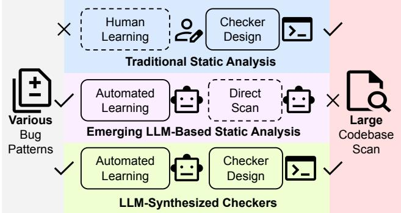  
Figure 1. Motivation. Static analysis should scale to address a diverse range of bug patterns and handle massive codebases. Traditional static analysis struggles with covering wide-ranging bugs, whereas LLM-based methods face hurdles in scaling to large codebases.

Traditional static analysis. Traditional static analyzers are effective in identifying certain bug types, yet they fundamentally rely on pre-defined, rule-based, or formally modeled checks. This reliance necessitates extensive domain expertise and substantial engineering effort for their development and maintenance [2, 10, 21]. Consequently, these tools are often fine-tuned to a narrow subset of bug patterns, which not only limits their ability to detect unforeseen defects but also hampers their scalability in automatically addressing a broader spectrum of issues.

Emerging LLM-based static analysis. On the other hand, Large Language Models (LLMs) are compelling tools for discovering bug patterns in part because they can learn directly from historical patch commits—a treasure trove of real fixes and associated bug contexts [11, 21, 31]. Their ability to parse both textual and code content [5, 20, 46] suggests that LLMs can adapt to new bug types without explicit rule-crafting. However, directly deploying LLMs on large-scale systems (e.g., the Linux kernel at over 30 million lines of code) confronts severe limitations. Their bounded context windows make it impossible to upload all relevant source code at once, and doing so repeatedly would also incur prohibitive computational costs (potentially hundreds of dollars per thorough scan). In addition, LLMs can hallucinate [14, 22, 30], producing plausible but incorrect outputs, especially when faced with the intricacies of large-scale systems [37].

Insight. Can we scale and automate static analysis to handle both diverse bug patterns and enormous codebases? We answer this question by harnessing the strengths of traditional static analysis alongside emerging LLMs. More specifically, we propose synthesizing static checkers using LLMs rather than applying LLM-based analysis directly to the entire codebase. In this paradigm, LLMs learn bug patterns from historical patches, and these insights are encoded into dedicated static analysis checkers. This method circumvents the prohibitive costs and context-length limitations of scanning vast codebases while maintaining the flexibility needed to address a wide spectrum of bugs. Moreover, by validating each synthesized checker against the original patches, we mitigate hallucinations and produce transparent, humanreadable logic that developers can trust and maintain.

Technical challenges and our solutions. Although automated checker synthesis holds significant promise, generating complete static analysis logic remains a formidable challenge—even experts struggle with it. To address this, we introduce a multi-stage synthesis pipeline (§ 3.1) that decomposes checker generation into manageable subtasks. Furthermore, to enhance the quality of the synthesized checkers by reducing false positives, we develop a fully automated refinement pipeline (§ 3.2) that leverages bug report triage agents. Together, these pipelines yield checkers that are robust and practical for deployment in real-world scenarios.

We implement our approach in a tool, KNighter, the first fully automated pipeline for synthesizing static analyzers, built upon the open-source Clang Static Analyzer (CSA) [12]. While the methodology generalizes to different systems, we target the Linux kernel, one of the most fundamental software systems. In the evaluation of 61 diverse bug-fix patches, KNighter synthesized the high-quality checkers for 61% of them, achieving a false positive rate of about 35% aided by the triage agent. Demonstrating practical impact, KNighter has uncovered 92 new, long-latent vulnerabilities (average 4.3 years) in the Linux kernel, resulting in 77 developer confirmations, 57 fixes, and 30 CVEs. Furthermore, the vulnerabilities detected are orthogonal to those found by existing expertwritten analyzers [2]. These findings validate our approach’s efficacy and its contribution to system reliability.

Our main contributions are summarized as follows:

• Novelty. We introduce a pioneering approach for synthesizing static analyzers from patch commits. To our knowledge, KNighter is the first fully automated static analyzer generation system, establishing a new paradigm for LLM-based static analysis.

• Approach. We implement KNighter with multi-stage synthesis and automated refinement pipelines for the Linux kernel. This design enables detection of diverse bug classes in large-scale systems.

• Evaluation. We demonstrate that KNighter successfully synthesizes effective checkers from the Linux kernel bug-fix patches across various bug categories, achieving practical false positive rates.

• Real-world impact. KNighter-generated checkers have discovered 92 new, long-latent (average 4.3 years) bugs in the Linux kernel, with 77 confirmed, 57 fixed, and 30 assigned CVE numbers—demonstrating its practical impact on system reliability and security.

KNighter is available at ise-uiuc/KNighter.

```diff
--- a/drivers/spi/spi-pci1xxxx.c
+++ b/drivers/spi/spi-pci1xxxx.c
@@ -275,6 +275,8 @@ static int pci1xxxx_spi_probe
spi_bus->spi_int[iter] = devm_kzalloc(&pdev->dev, ...);
+ if (!spi_bus->spi_int[iter])
+ return -ENOMEM;
spi_sub_ptr = spi_bus->spi_int[iter];
spi_sub_ptr->spi_host = devm_spi_alloc_host(...)
```

(a) Patch for a Null-Pointer-Dereference bug. The pointer returned by devm\_kzalloc should be checked.

```c
int asoc_qcom_lpass_cpu_platform_probe(...)
{
drvdata = devm_kzalloc(dev, ...);
+if (!drvdata)
+ return-ENOMEM; Patch
drvdata->variant = variant; Without NULL checking
```

(b) A new bug detected by KNighter with CVE-2024-50103.

```cpp
void checkPostCall(...) const {
if (!ExprHasName(OriginExpr, "devm_kzalloc", C))
return;
State = State->set<PossibleNullPtrMap>(MR, false);
}
void checkBranchCondition(...) const {
// Pattern 1 : if (!ptr)
if (const UnaryOperator *UO =
dyn_cast<UnaryOperator>(CondExpr)) {
if (UO->getOpcode() == UO_LNot) {
State = markRegionChecked(State, MR);
}
}
// Pattern 2: if (ptr == NULL) or if (ptr ! = NULL)
}
void checkLocation(...) const {
..
// Look up the region in the PossibleNullPtrMap.
const bool *Checked = State->get<PossibleNullPtrMap>(MR);
// If the region is recorded as unchecked, warn .
if (Checked && *Checked == false)
reportUncheckedDereference(MR, S, C);
}
void checkBind(...) const {
// For pointer assignments, update the aliasing map.
State = State->set<PtrAliasMap>(LHSReg, RHSReg);
State = State->set<PtrAliasMap>(RHSReg, LHSReg);
}
```  
(c) A checker synthesized by KNighter for the patch in Fig. 2a.  
Figure 2. A bug pattern related to devm\_kzalloc.

## 2 Background and Motivation

## 2.1 Clang Static Analyzer

Static analysis [7] is a technique for detecting bugs by inspecting code without executing it. The Clang Static Analyzer [12] (CSA) serves as a powerful engine for this purpose. It operates using path-sensitive symbolic execution, building an internal representation called an ExplodedGraph. Each node within this graph, an ExplodedNode, represents a specific ProgramPoint paired with an abstract ProgramState. This state meticulously maps program expressions to symbolic values and tracks the contents of memory locations.

The modularity of CSA is built upon checkers. These are small, specialized components, typically implemented as subclasses of a Checker template. Checkers function in an eventdriven manner, registering interest in specific analysis events such as pre- and post-function calls, the identification of dead symbols, or instances of pointer escapes. A key capability of checkers is their ability to extend the ProgramState with custom, checker-specific data using provided macros, allowing them to maintain sophisticated state across the analysis. Developing a new checker for CSA generally involves several steps: defining the specific bug pattern to be detected, implementing callback methods corresponding to the relevant analysis events, registering the new checker with the analysis framework, and integrating it into the testing system. Effective bug reporting is crucial, utilizing mechanisms like BugType and BugReport to provide clear diagnostics.

To illustrate, consider the example checker shown in Figure 2c, which registers four distinct callback functions.

• The checkPostCall callback activates after function calls. It uses ExprHasName to check if the call was to devm\_kzalloc. If so, it updates the custom state map PossibleNullPtrMap to mark the returned memory region as potentially null (unchecked).

• The checkBranchCondition callback is used to handle conditional checks involving the pointer. It recognizes patterns like negation (if (!ptr)) or direct comparison (if (ptr == NULL)) and updates the state via markRegionChecked to reflect that a null check has occurred for the associated memory region.

• The checkLocation callback is triggered when a memory location is accessed. More specifically, it consults the PossibleNullPtrMap state; if the region is marked as unchecked at this point, it issues a warning using reportUncheckedDereference.

• The checkBind callback manages pointer assignments. It updates another custom state map, PtrAliasMap, to track potential aliases between memory regions involved in the assignment, ensuring the checker correctly handles cases where multiple pointers might refer to the same potentially null memory.

## 2.2 Motivating Example

We demonstrate KNighter’s effectiveness through a case study involving a Null-Pointer-Dereference vulnerability pattern. Figure 2a shows a historical patch addressing this pattern, where the original bug stemmed from a missing null pointer check after a devm\_kzalloc call. Without this check, the system could crash if memory allocation failed and the returned null pointer was subsequently dereferenced.

Limitations of existing tools. Despite this vulnerability pattern recurring since at least 2017 (commit 49af64e), with our analysis identifying at least six historical patches addressing it, no static analysis tool had been developed to systematically detect these issues. Even specialized kernel checkers like Smatch [2] fail to identify these vulnerabilities because they lack the domain-specific knowledge that devm\_kzalloc may return NULL upon failure.

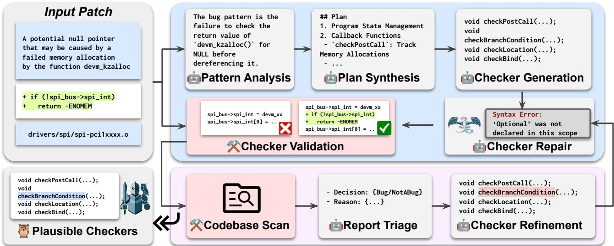  
Figure 3. Overview of KNighter.

Our approach. KNighter extracts critical insights from the patch: unchecked return values from devm\_kzalloc represent potential Null-Pointer-Dereference vulnerabilities. The synthesized checker (written in CSA, Figure 2c) tracks nullcheck status across execution paths while correctly handling pointer aliasing, a sophisticated static analysis capability. This checker discovered 3 new vulnerabilities in the Linux kernel. Figure 2b presents one such vulnerability exhibiting the same pattern where a null pointer check is missing for the pointer returned by the devm\_kzalloc call. This bug was subsequently fixed and assigned CVE-2024-50103.

Advantages over direct LLM scanning. Directly using LLMs to scan the Linux kernel would be prohibitively expensive, as devm\_kzalloc alone appears over 7K times across 5.4K files. In contrast, KNighter’s static analyzers primarily consume CPU resources rather than repeated LLM invocations, making the approach both scalable and cost-effective. Moreover, since generating the checkers is mostly a one-time effort, they can naturally evolve alongside the system.

Technical challenges and solutions. Creating effective static analyzers with LLMs presents several challenges. First, writing robust checkers end-to-end is complex. KNighter addresses this through a multi-stage synthesis pipeline that breaks down complex tasks into manageable steps. Second, LLM hallucination can produce incorrect analyzers. KNighter mitigates this by validating synthesized checkers against historical patches, verifying they correctly distinguish between buggy and patched code. Finally, to reduce false positives, we implement a bug triage agent that identifies false alarms, enabling iterative refinement of the checkers.

## 3 Design

Terminology. KNighter takes a patch commit as input and outputs a corresponding CSA checker. Valid checkers correctly distinguish between buggy and patched code, flagging pre-patch code as defective while recognizing post-patch code as correct. Plausible checkers1 are valid checkers that additionally demonstrate practical utility through low false positive rates or a manageable number of reports. We provide formal definitions of these terms in § 4.

Overview. KNighter leverages agentic workflow to process patch commits for static analyzer synthesis, as illustrated in Figure 3. It operates in two phases: checker synthesis (§ 3.1) and checker refinement (§ 3.2). In the checker synthesis phase, KNighter analyzes the input patch to identify bug patterns (§ 3.1.1), synthesizes a detection plan (§ 3.1.2), and implements a checker using CSA (§ 3.1.3). If compilation errors occur, a syntax-repair agent automatically repairs them based on the error messages. This phase concludes with the generation of valid checkers (§ 3.1.4). In the subsequent checker refinement phase, these valid checkers are deployed to scan the entire codebase for potential bugs. When bug reports are generated, a triage agent evaluates them for false positives, and KNighter refines the checker accordingly. If the scan produces a manageable number of reports with a low false positive rate, KNighter presents the plausible checkers and their filtered reports as potential bugs for review.

spi: mchp-pci1xxx: Fix a possible null pointer dereference in   
pci1xxx\_spi\_probe   
In function pci1xxxx\_spi\_probe, there is a potential null   
pointer that may be caused by a failed memory allocation   
by the function devm\_kzalloc. Hence, a null pointer check   
needs to be added to prevent null pointer dereferencing   
later in the code.   
To fix this issue, spi\_bus->spi\_int[iter] should be checked.   
The memory allocated by devm\_kzalloc will be automatically   
released, so just directly return -ENOMEM.  
Figure 4. Patch commit message.

## 3.1 Checker Synthesis

Algorithm 1 presents the multi-stage pipeline of checker synthesis. In the first stage, KNighter analyzes the bug pattern shown in the patch (Line 5). Next, KNighter synthesizes the plan based on the patch and the identified bug pattern (Line 7). With the plan in hand, KNighter implements the checker using CSA (Line 9). If any compilation issues arise, a syntax-repair agent is invoked to debug and repair them (Line 12). The repair process is allowed up to maxAttempts (default is 5) attempts. If the checker compiles successfully, KNighter validates it by checking whether it can distinguish between the buggy and patched code (Line 18). Once the checker is deemed valid, it is returned for the next phase (Line 20). Otherwise, the synthesis pipeline continues iterating until reaching maxIterations. If all iterations fail, the process returns Null, indicating that a valid checker could not be synthesized (Line 21).

3.1.1 Bug Pattern Analysis. The initial stage involves analyzing patch commits to identify underlying bug patterns. Patch commits typically consist of diff patches and may include developer comments describing the bug being fixed, as illustrated in Figure 4. Our goal is to extract patterns that can be translated into static analysis rules for bug detection. While bug patterns are sometimes explicitly described in commit messages, they often require deeper analysis of the code changes within the patch.

We have developed an LLM-based agent specifically designed to perform this pattern analysis, with the prompt template shown in Figure 5a. In addition to the patch, we extract the complete function code that was modified from the kernel codebase. This additional context is crucial because the patch diff alone may not capture all relevant buggy patterns, as some issues depend on the broader context of the code. By providing both the patch and the complete function code to LLMs, we enable a more comprehensive understanding of the bug being patched.

A single bug pattern identified from a patch can be expressed with varying scope and complexity. Consider the Null-Pointer-Dereference involving devm\_kzalloc (Figure 2a). A broad pattern (e.g., check any potentially null return) is comprehensive, but identifying all relevant functions/conditions poses significant static analysis challenges, hindering robust implementation by LLMs. Consequently, our approach favors more targeted bug patterns derived from the patch context. These facilitate precise and tractable checker synthesis by the LLMs. For the devm\_kzalloc example, focusing specifically on its return value yields a targeted pattern that effectively addresses the observed bug class while being significantly more manageable for the LLM to implement correctly compared to the broader, more complex alternative.

Algorithm 1: Synthesize checkers with input patch.   
1 Function GenChecker(patch):   
2 # Iterative checker generation and evaluation   
3 for i = 1 to maxIterations do   
4 # Stage 1: Bug Pattern Analysis   
5 pattern ← AnalyzePatch(patch)   
6 # Stage 2: Detection Plan Synthesis   
7 plan ← SynthesizePlan(patch, pattern)   
8 # Stage 3: Analyzer Implementation and Repair   
9 checker ← Implement(patch, pattern, plan)   
10 attempts ← 0   
11 while hasCompilationErrors(checker) and attempts   
< maxAttempts do   
12 checker ← RepairChecker(checker)   
13 attempts ← attempts + 1   
14 if hasCompilationErrors(checker) then   
15 # Skip evaluation if checker still has errors   
16 Continue   
17 # Stage 4: Validation   
18 isValid ← ValidateChecker(checker, patch)   
19 if isValid then   
20 return checker   
21 return Null

3.1.2 Plan Synthesis. Once the bug pattern is identified, KNighter generates a high-level plan for implementing the static analyzer. This plan serves two critical purposes: first, it provides structured guidance to the LLMs during implementation, preventing confusion and promoting effective execution. Second, it facilitates debugging of the entire pipeline by making the LLMs’ reasoning process transparent and traceable. Our ablation study in § 5.4.2 confirms the value of this plan synthesis, demonstrating improved performance consistent with findings in other domains [44].

For instance, synthesizing a checker for the unchecked devm\_kzalloc return value pattern (illustrated in Figure 2c) might generate a plan with key steps such as: (1) Using program state to track memory regions from devm\_kzalloc, (2) monitoring conditional branches (checkBranchCondition) to mark regions as checked if a null check occurs, and (3)

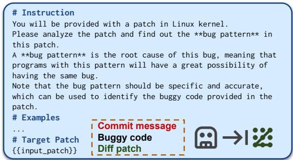

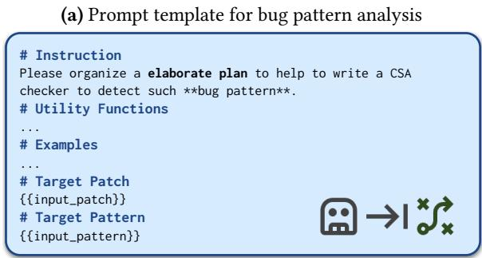

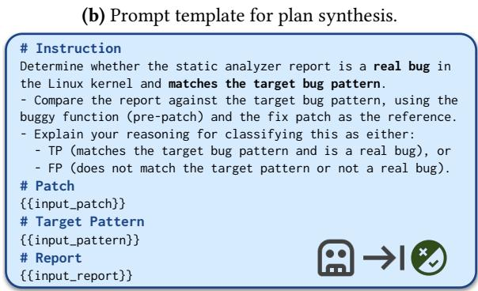  
(c) Prompt template for report triage.  
Figure 5. Simplified prompt templates used by KNighter.

detecting uses (checkLocation) of unchecked regions, potentially signaling a bug. This high-level structure guides the subsequent implementation phase.

To synthesize the implementation plan for the checker, we have designed an LLM-based agent whose prompt template is shown in Figure 5b. This agent takes the previously summarized bug pattern as input. Additionally, we maintain a curated database of utility functions for checker implementation that can be easily extended. By including the signatures and brief descriptions of these utility functions in the prompt, we enable LLMs to leverage them effectively during the planning process, simplifying the overall task.

3.1.3 Analyzer Implementation and Syntax Repair. After identifying the bug pattern and making the plan, we leverage an LLM-based agent to implement the corresponding checker. To maximize implementation accuracy, we provide the agent with comprehensive inputs: the distilled bug

Chenyuan Yang, Zijie Zhao, Zichen Xie, Haoyu Li, and Lingming Zhang

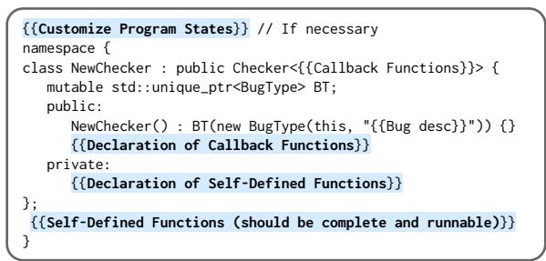  
Figure 6. Pre-defined checker template for CSA.

pattern and a structured implementation plan. We also provide a pre-defined checker template, as shown in Figure 6, which standardizes the implementation structure and reduces potential errors. Moreover, we provide a list of utility functions that could help with the implementation.

The synthesized checkers could have compilation errors, e.g., using the wrong static analysis API or incorrect variable types. To handle the potential compilation errors, we employ a dedicated debugging agent. Inspired by existing work on program repair [50], this agent automatically processes compiler error messages and applies necessary fixes, effectively addressing syntax errors that may arise from LLM hallucinations. This automated debugging pipeline ensures that the final checkers are both syntactically correct and compilable.

3.1.4 Validation. To semantically validate our checkers and mitigate potential inaccuracies from LLMs, we evaluate them against both the buggy (pre-patch) and patched versions of the relevant code (e.g., Linux kernel files). This differential analysis verifies that a checker correctly identifies the target bug in the original code and confirms its absence after the patch. For efficiency, we scope this validation to only the files modified by the patch and their dependencies, rather than the entire codebase. A checker is considered valid if it flags the bug in the pre-patch version and shows a corresponding reduction or elimination of that specific warning in the patched version. More details are in § 4.

## 3.2 Checker Refinement

Following synthesis, each valid checker is used to scan the entire system. However, its initial validation doesn’t prevent potential false positives when analyzing the broader codebase, where correct code might be flagged erroneously. To mitigate this, we implement an iterative refinement procedure driven by LLMs. This involves evaluating the generated bug reports and feeding identified false positives back to refine the checker.

However, automating this refinement faces hurdles. First, bug reports are often verbose, containing extensive context that is difficult to process efficiently. Second, debugging the checker logic and modifying it correctly based on false positives requires complex analysis.

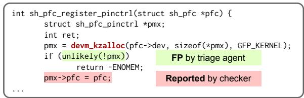  
Figure 7. A report labeled as FP by our triage agent.

Our refinement pipeline addresses these challenges methodically. First, to manage report complexity, we distill generated bug reports to their essential components—primarily the “relevant lines” highlighted by the static analyzer (e.g., CSA [12]) and the corresponding trace path—stripping extraneous context while preserving critical diagnostics. Second, to navigate the complexity of analysis and modification, we employ specialized LLM-based agents. A triage agent classifies each distilled report, focusing strictly on alignment with the target bug pattern (rather than general code correctness); the prompt template is shown in Figure 5c.

If the triage agent identifies a report as a false positive, as exemplified in Figure 7, a dedicated refinement agent takes over. In the case shown, the initial checker (derived from the patch in Figure 2a) flagged the use of pmx->pfc because its logic failed to recognize if (unlikely(!pmx)) as a valid null check, perhaps confused by the unlikely() macro. The triage agent correctly interprets the check semantically and flags the report as FP. The refinement agent then uses this information to adjust the checker’s logic, specifically enhancing its ability to handle constructs like unlikely(), thereby preventing this type of false positive in subsequent scans while ensuring it can still detect the original vulnerability.

A refined checker is accepted only if it satisfies two criteria: (1) it no longer generates warnings for the previously identified false positive cases, and (2) it maintains its validity by correctly differentiating between the original buggy and patched code versions. This criterion ensures the semantic accuracy of the refined checkers.

## 4 Implementation

Input commit collection. To collect patch commits for rigorous evaluation, we implemented a systematic classification and selection process. First, we established 10 distinct bug categories. We then used relevant keywords to identify potentially related commits. A commit was included in our dataset only when two authors independently agreed on its categorization. For each bug type, we initially examined the first 20 commits that matched our search criteria. We continued reviewing commits beyond the initial 20 if we hadn’t yet collected 5 qualifying commits for a given category. Our goal was to gather a minimum of 5 commits per bug type whenever possible. Table 1 presents our categorization of 10 bug types and their corresponding patch commit counts.

Table 1. Distribution of patch commits across 10 bug categories and the validity status of their synthesized checkers. “NPD” denotes “Null-Pointer-Dereference” and “UBI” indicates “Use-Before-Initialization”.
<table><tr><td rowspan="2">Bug Type</td><td rowspan="2">Total</td><td rowspan="2">Invalid</td><td colspan="3">Valid</td></tr><tr><td>Direct</td><td>Refined</td><td>Fail</td></tr><tr><td>NPD</td><td>6</td><td>1</td><td>2</td><td>2</td><td>1</td></tr><tr><td>Integer-Overflow</td><td>7</td><td>3</td><td>1</td><td>3</td><td>0</td></tr><tr><td>Out-of-Bound</td><td>6</td><td>2</td><td>4</td><td>0</td><td>0</td></tr><tr><td>Buffer-Overflow</td><td>5</td><td>3</td><td>2</td><td>0</td><td>0</td></tr><tr><td>Memory-Leak</td><td>5</td><td>2</td><td>3</td><td>0</td><td>0</td></tr><tr><td>Use-After-Free</td><td>7</td><td>4</td><td>2</td><td>1</td><td>0</td></tr><tr><td>Double-Free</td><td>8</td><td>1</td><td>5</td><td>1</td><td>1</td></tr><tr><td>UBI</td><td>5</td><td>1</td><td>1</td><td>3</td><td>0</td></tr><tr><td>Concurrency</td><td>5</td><td>2</td><td>3</td><td>0</td><td>0</td></tr><tr><td>Misuse</td><td>7</td><td>3</td><td>3</td><td>1</td><td>0</td></tr><tr><td>Total</td><td>61</td><td>22</td><td>26</td><td>11</td><td>2</td></tr></table>

These manually collected and labeled commits served as our benchmark dataset for rigorous evaluation.

Few-shot examples. We prepared three end-to-end examples for in-context learning. These three are patch commit 3027e7b15b02 (Null-Pointer-Dereference), 3948abaa4e2b (Use-Before-Initialization), and 4575962aeed6 (Double-Free). The design and implementation of the checker for these three commits required approximately 40 person-hours. This was a one-time effort, yielding reusable examples. We also explore the use of real-world, off-the-shelf examples (§ 5.4.2).

Utility functions. While implementing example checkers, we identified several common helper operations. We implemented 9 such utility functions (e.g., getMemRegionFromExpr) to encapsulate low-level Clang Static Analyzer tasks, simplifying checker development, particularly for LLM synthesis. These utilities were designed for simplicity and extensibility. Valid checkers. To evaluate checker validity, we verify that it can both detect the original bug and recognize its fix. We first identify buggy objects by examining the modified files in the diff patch. Next, we check out the repository to the buggy commit (immediately preceding the patch) and scan these objects to count the number of bug reports $( N _ { b u g g y } )$ . We then scan these objects after applying the patch commit to obtain the number of remaining bug reports $( N _ { p a t c h e d } )$ . A checker is considered valid if $N _ { b u g g y } > N _ { p a t c h e d }$ and $N _ { p a t c h e d } < T _ { v a l i d } ,$ where $T _ { v a l i d }$ is a threshold value (50 by default).

Plausible checkers. We determine plausible checkers based on their performance when analyzing the entire Linux kernel. Our approach is founded on the principle that high-quality checkers, especially those derived from historical commits, should generate a reasonable number of actionable bug reports. A checker is classified as plausible if it either: (1) produces fewer reports than a predefined threshold $T _ { p l a u s i b l e }$ (default: 20), or (2) demonstrates an acceptable false positive rate in sampled warnings.

Checker refinement. We evaluate each valid checker by scanning the entire kernel codebase independently, with execution bounded by either a one-hour time limit or a maximum of 100 warnings during the refinement process. Note that these limits are only applied during the checker refinement phase; when performing actual bug detection, we run the checkers without such constraints. The refinement process begins with LLM-assisted triage of the checker’s output. Using a consistent random seed, we sample 5 warnings for LLM inspection due to cost consideration. A checker qualifies as plausible if it either generates fewer than $T _ { p l a u s i b l e } = 2 0$ total reports or exhibits at most one false positive in the evaluated sample (labeled by our triage agent). For checkers failing these criteria, we implement an iterative refinement protocol targeting the identified false positives, permitting up to three refinement iterations to improve precision.

## 5 Evaluation

We explore the following research questions for KNighter:

RQ-1. Can KNighter generate high-quality checkers?

RQ-2. Can the checkers generated by KNighter find realworld kernel bugs?

RQ-3. Are the capabilities of KNighter orthogonal to the human-written checkers?

RQ-4. Are all the key components in KNighter effective?

Evaluation metrics. We conduct an extensive evaluation by using the following metrics:

Checker Validity Rate. A valid checker successfully identifies the buggy pattern in the original code and confirms its absence in the patched version. This metric reflects our framework’s and LLMs’ ability to understand patch semantics and synthesize discriminative checkers.

Plausible Checker Rate. This metric measures the number of high-quality checkers synthesized, representing those that are both valid and exhibit a low false positive rate.

Bug Detection. We assess the number of real-world bugs successfully detected by the synthesized checkers.

Resource Efficiency. This metric captures the computational time and monetary costs associated with both checker synthesis and execution.

Checker Error Categories. We classify checker failures into the following categories, ordered by severity:

• Compilation Failures: Checkers that fail during compilation due to syntax or dependency errors.

• Runtime Errors: Checkers that compile successfully but crash during execution (e.g., "The analyzer encountered problems on source files").

• Semantic Issues: Checkers that cannot distinguish between the buggy and patched code.

Chenyuan Yang, Zijie Zhao, Zichen Xie, Haoyu Li, and Lingming Zhang

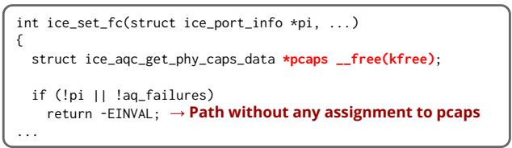

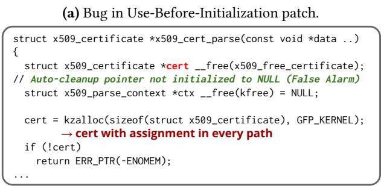  
(b) False positive report for UBI.  
Figure 8. Examples of false positives by KNighter.

Static Analysis Capabilities. We further examine the static analysis capabilities employed by checkers, including path sensitivity, region sensitivity, and advanced state tracking. Hardware and software. All our experiments are run on a workstation with 64 cores, 256 GB RAM, and 4 Nvidia A6000 GPUs, operating on Ubuntu 20.04.5 LTS. We use O3- mini as our default LLM backend. By default, when scanning the entire codebase, we use -j32. We evaluated using Linux v6.13, and for bug finding, we examined versions from v6.9 to v6.15. The Linux configuration used is allyesconfig.

## 5.1 RQ1: Synthesized Checkers

We evaluate KNighter on the 61 commits listed in Table 1 to show that it can synthesize high-quality checkers across various bug types, beyond those in our few-shot examples.

5.1.1 Checker Synthesis. In total, valid checkers were generated for 39 commits. The 39 synthesized checkers average 125.7 lines of code and exhibit diverse static analysis capabilities. Specifically, 37 checkers are path-sensitive, 13 incorporate region sensitivity, and 16 employ advanced state tracking; in contrast, only 2 leverage AST travelers. This suggests that KNighter can generate complex analysis logic, not just simple pattern matching.

Cost. The full synthesis process required 15.9 hours, during which 8.2 million input tokens were processed and 1.2 million output tokens produced, resulting in an approximate cost of \$0.24 per commit using O3-mini. For commits that ultimately yielded valid checkers, an average of 2.4 synthesis attempts was necessary (with a maximum of 8 attempts observed).

Failure analysis. We now break down the failures from two perspectives: the underlying failure root causes and the observed failure symptoms during the synthesis process.

(i) Failure root causes. Among the 61 commits processed, 22 did not result in any valid checker. Our investigation into these failures indicates that:

• 2 (9%) commits failed due to an inaccurate bug pattern,

• 7 (32%) failed owing to an inaccurate plan, and

• 13 (59%) were caused by inaccurate implementation. For the implementation-related failures, a common issue was that compiler optimizations inlined certain function calls (e.g., strcp and memset), which prevented the checker from properly intercepting these calls.

Our approach exhibits limitations in handling buffer overflow and use-after-free commits. We believe these challenges stem from two main factors: static analysis inherently struggles with precise value determination—especially when establishing buffer bounds at compile time—and it also faces significant hurdles in analyzing multi-threaded code, for instance, when assessing the proper use of locks.

(ii) Failure symptoms. During synthesis (allowing up to 10 attempts per commit), 273 failed attempts were recorded from all 61 commits. The failures can be categorized as:

• 65 attempts (23.8%) resulted in compilation errors,

• 1 attempt (0.4%) led to a runtime error, and

• 207 attempts (75.8%) suffered from semantic issues that obstructed proper bug identification.

Of the 207 semantic failures, 34 checkers erroneously flagged both buggy and patched code as potentially problematic, while the remaining 173 misclassified both versions as bugfree. This outcome underscores the challenge of accurately distinguishing buggy code.

Interestingly, even the 173 checkers that did not recognize the specific bug in their input patch can still be valuable. When deployed across the large system, these checkers may successfully detect bugs with similar patterns in other contexts. This apparent paradox likely arises because the failure to detect the training bug is sometimes due to edge cases or context-specific complexities rather than inherent deficiencies in the checkers’ detection logic. Moreover, these checkers generally exhibit lower false positive rates compared to those that incorrectly flag both buggy and patched code, enhancing their practical utility for bug detection.

5.1.2 Checker Refinement. After scanning the entire kernel codebase with these 39 valid checkers, 26 of them were labeled “plausible” directly. Our refinement pipeline was applied to the remaining 13 valid checkers, successfully refining 11 of them. In total, 19 refinement steps were completed successfully. This demonstrates the effectiveness of our refinement pipeline, which successfully refined 84.6% of the valid checkers that were not “plausible” initially.

False positive rate. Of the 37 plausible checkers, 16 did not report any bugs. For the remaining checkers, we applied our bug triage agent to filter all the reports, focusing only on those labeled as “bug” since our triage agent demonstrated a low false negative rate in our evaluation (as shown in § 5.4.1). In total, we obtained 90 reports labeled as “bug”. Upon manual verification, we confirmed 61 true positives. This indicates that the combination of our plausible checkers and bug triage agent has a false positive rate of 32.2%.

Table 2. Newly detected bugs by KNighter.
<table><tr><td></td><td>Total</td><td>Confirmed</td><td>Fixed</td><td>Pending</td><td>CVE</td></tr><tr><td>KNighter</td><td>92</td><td>77</td><td>57</td><td>15</td><td>30</td></tr></table>

Our manual analysis of the 29 false positives revealed three recurring patterns leading to incorrect reports:

• Inaccurate bug pattern: In 5 cases, although the checker correctly identified the original bug/patch scenario, the inferred bug pattern lacked the necessary precision for reliable detection across different contexts.

• Incorrect pattern matching: For 6 reports, the checker correctly identified the bug pattern but applied it too broadly, flagging code segments that did not meet the specific constraints intended by the pattern.

• Trigger condition mismanagement: The most common issue (18 reports) involved checkers where both the pattern and matching were correct, but the checker failed to manage trigger or state conditions properly (e.g., failing to recognize a pointer had already been validated before use).

Case study: A high false positive rate checker. In commit 90ca6956d383 (“ice: Fix freeing uninitialized pointers”, see Figure 8a), the issue stems from the pointer pcaps not being initialized to NULL. If an early return or error path occurs before the pointer is allocated, the cleanup routine may inadvertently attempt to free an uninitialized (or garbage) pointer. In such cases, the checker should account for the possibility of an early exit leaving the pointer unset. In contrast, the bug report in Figure 8b highlights a scenario where, although the cert pointer starts uninitialized, it is immediately assigned a valid value along every execution path, ensuring it is never left in an unassigned state. Thus, despite the initial uninitialized state, the code does not constitute a bug. Our synthesized checker did not incorporate these nuanced constraints, and the triage agent likewise failed to recognize the critical differences, ultimately leading to a false positive.

## 5.2 RQ2: Detected Bugs

5.2.1 Overall. To date, static analyzers synthesized by KNighter have identified 92 new bugs in the Linux kernel. As summarized in Table 2, developer confirmation has been received for 77 of these bugs. Among those confirmed, 57 have already been fixed. The remaining 15 bugs are currently awaiting developer review (calculated as Total - Confirmed). Notably, 30 of the discovered bugs have been assigned CVE numbers, showing their practical security impact.

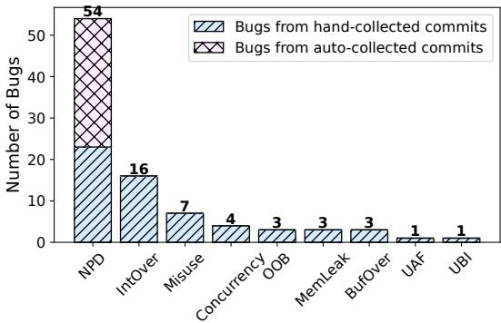

(a) Number of bugs in each type.  
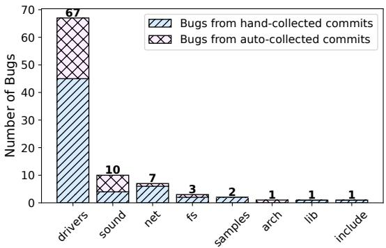

(b) Number of bugs in each subsystem.  
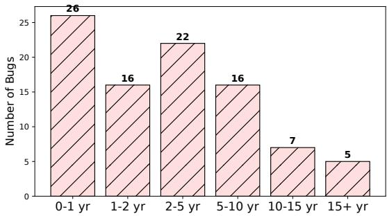

(c) Number of bugs with different lifetimes.  
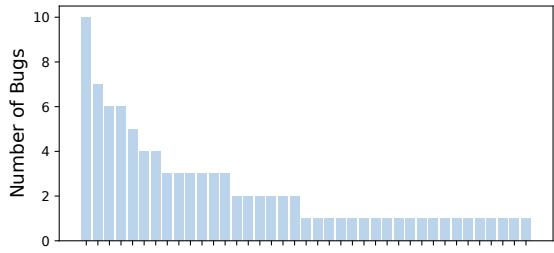  
(d) Number of bugs detected by each commit.

Figure 9. Details of new bugs. Subfigures (a), (b), (c), and (d) show breakdowns by type, subsystem, lifetime, and commit.

The checkers for bug detection originate from two sources: (i) the initial 61 manually collected commits used for evaluation in § 3.1 across diverse bug types (shown in Table 1), and (ii) an additional set of 100 commits automatically collected using keywords related to Null-Pointer-Dereference to further explore that specific bug class. Figure 9a and Figure 9b show the bug distribution from these sources—with the light blue for bugs from the initial evaluation set and the light purple for those from the auto-collected set.

Bug types. Analysis of checkers from the manually collected commits reveals that KNighter can detect a diverse range of bug types (see Figure 9a). Null-Pointer-Dereference bugs are the most prevalent, highlighting KNighter ’s strength in this area. In response, we expanded our effort by automatically collecting commits related to Null-Pointer-Dereference, which yielded an additional 30 bugs.

Bug location. As shown in Figure 9b, the detected bugs span various Linux kernel subsystems. The majority appear in the drivers subsystem (67 out of 92), reflecting its large footprint in the kernel [9]. Additionally, 10 and 7 bugs were identified in the sound and net subsystems, respectively. Notably, 2 bugs were found in the samples directory—an area that provides example usage for kernel developers and where correctness is especially critical.

Bug lifetime. Figure 9c illustrates the distribution of bug lifetimes. Notably, the average bug lifetime is 4.3 years, and 26 bugs had existed for over five years before detection. This indicates that the vulnerabilities uncovered by KNighter are difficult to detect and remain latent for extended periods, underscoring the effectiveness of our approach.

Bug distribution over commits. Synthesized checkers from 39 bug-fix commits uncovered new bugs (2.4 each on average), with a long-tail skew (as shown in Figure 9d): five checkers each found five or more bugs. In general, checkers derived from recurring error patterns yield higher counts, while those from specialized fixes surface fewer, yet still valuable, findings. This suggests that KNighter can learn and propagate impactful patterns beyond their original contexts, producing a mix of broad-coverage and high-yield checkers.

## 5.2.2 Case Study. Here are examples of vulnerabilities detected by KNighter.

CVE-2025-21715. Figure 10a (the input patch to KNighter) shows a fix for a Use-After-Free vulnerability. In this patch, free\_netdev must be invoked only after all the references to its private data, otherwise, it could cause a Use-After-Free issue. Leveraging this patch, the checker generated by KNighter identified a similar bug in dm9000\_drv\_remove, as shown in Figure 10b, where dm (the private data of ndev) remains in use after ndev is freed, causing a Use-After-Free. This newly discovered issue was assigned CVE-2025-21715. CVE-2024-50259. Figure 10c shows an input patch fixing a buffer overflow vulnerability. The patch mitigates the risk by limiting the number of bytes copied via copy\_from\_user to sizeof(mybuf) - 1, thereby preserving space for a trailing zero. This trailing zero is essential for subsequent string operations, such as sscanf, to function correctly. Taking this (b) CVE-2025-21715, found by the checker for the patch above.

```c
static int emac_remove(struct platform_device *pdev) {
mdiobus_unregister(adpt->mii_bus);
free_netdev(netdev);
if (adpt->phy.digital)
iounmap(adpt->phy.digital);
iounmap(adpt->phy.base);
+ free_netdev(netdev);
return 0;
}
```

```c
static void dm9000_drv_remove(struct platform_device *pdev) {
dm9000_release_board(pdev, dm);
free_netdev(ndev); /* free device structure */
if (dm->power_supply)
Use the private data dm after freeing ndev
regulator_disable(dm->power_supply);
}
```

```c
int lpfc_debugfs_lockstat_write(struct file *file, ...) {
char mybuf[64];
int i;
size_t bsize;
memset(mybuf, 0, sizeof(mybuf));
if (copy_from_user(mybuf, buf, nbytes))
+ bsize = min(nbytes, (sizeof(mybuf) - 1));
if (copy_from_user(mybuf, buf, bsize))
return -EFAULT;
```

```c
static ssize_t nsim_nexthop_bucket_activity_write(...) {
memset(mybuf, 0, sizeof(mybuf));
if (size > sizeof(buf)) Possible buffer overflow
+ if (size > sizeof(buf) - 1)
return -EINVAL;
if (copy_from_user(buf, user_buf, size))
return -EFAULT;
+ buf[size] = 0;
}
```  
(d) CVE-2024-50259, found by the checker for the patch above.  
Figure 10. Example vulnerabilities detected by KNighter.

patch as input, the checker generated by KNighter identified a similar bug in nsim\_nexthop\_bucket\_activity\_write, as shown in Figure 10d. In this case, the omission of appending a trailing zero after copying data from userspace could lead to improper string handling and potential overflow issues. This detected issue was subsequently fixed by adding the trailing zero and was assigned CVE-2024-50259.

## 5.3 RQ3: Orthogonality with Smatch

Since no comparable automated static analyzer generation approaches exist for this domain, we evaluate KNighter against expert-written checkers. Our baseline is provided by Smatch [2], which is widely used in Linux kernel analysis and supports tailored checks for all bug types considered in

Table 1. We conducted the comparative analyses by running Smatch on the entire codebase to determine if it could detect the bugs found by KNighter.

Smatch reported a total of 1970 errors and 2870 warnings across the kernel. We manually inspected all the files where bugs were detected to assess whether any of the true positive bugs identified by KNighter were also detected by Smatch. Notably, Smatch failed to detect any of our true positive bugs, underscoring the unique detection capabilities of KNighter. Further analysis of Smatch’s checkers revealed that they do not fully leverage the domain-specific knowledge embedded in the Linux kernels—a resource that KNighter effectively extracts from historical patches. For instance, Smatch’s check\_deref checker employs static range analysis to identify potential null pointers but lacks domain-specific insights. It fails to recognize that functions like devm\_kzalloc may return NULL under error conditions that conventional static range analysis cannot detect. Consequently, Smatch identified only three potential null pointer dereferences, all of which were confined to unit test files rarely prioritized by developers. We conclude that KNighter and Smatch detect different classes of bugs, demonstrating KNighter’s effectiveness in learning domain knowledge from patches and subsequently identifying diverse bugs and vulnerabilities.

## 5.4 RQ4: Effectiveness of Components

5.4.1 Bug Triage Agent. To evaluate our bug triage agent, from the 39 valid checkers, we sampled up to 5 reports per checker to reduce manual inspection efforts, aiming to reduce manual inspection efforts while maintaining evaluation coverage. In total, we collected 79 reports from 18 checkers, while the remaining 21 valid checkers didn’t generate reports. Our triage agent classified 29 reports as “bug” (positive) and 50 as “not-a-bug” (negative). These classifications were compared against ground truth labels established by manual review from two authors. The agent achieved 7 true positives (TP), 22 false positives (FP), 50 true negatives (TN), and zero false negatives (FN). The absence of false negatives is particularly important, as it indicates the agent effectively prioritized all potentially true bugs in this set, minimizing the risk of overlooking genuine issues, even though the 22 false positives require further filtering.

We also evaluated 5-way self-consistency via majority voting [48]. For each report, we ran our triage agent five independent times and labeled the report as a “bug” only if the agent made that prediction in at least ?? of the runs. Compared to our single-sample baseline, which identified 7 TPs and 22 FPs, majority voting did not offer a significant improvement. Using a threshold of ?? = 3 kept the TP count at 7 but slightly increased FPs to 24. A stricter threshold of ?? = 4 also resulted in 7 TPs while reducing FPs to 20. Ultimately, majority voting only slightly shifted the false positive count in this setting. There could be two potential reasons. For TPs, the agent likely identifies these bugs with high confidence, meaning a single run is sufficient to detect all of them. For FPs, the agent’s predictions are likely less confident and more inconsistent across different runs.

Table 3. Ablation study results. “Default” means KNighter’s standard configuration utilizing multi-stage synthesis, fixed few-shot examples, and the O3-mini model. Alternative configurations are compared against this baseline.
<table><tr><td rowspan="2">Variants</td><td rowspan="2">Valid</td><td colspan="3">Errors</td></tr><tr><td>Syntax</td><td>Runtime</td><td>Semantics</td></tr><tr><td>Default</td><td>12</td><td>28</td><td>0</td><td>75</td></tr><tr><td rowspan="2">W/o multi-stage W/ RAG</td><td>8</td><td>52</td><td>3</td><td>75</td></tr><tr><td>12</td><td>37</td><td>4</td><td>62</td></tr><tr><td>W/ GPT-40</td><td>11</td><td>31</td><td>0</td><td>76</td></tr><tr><td>W/ DeepSeek-R1</td><td>11</td><td>29</td><td>8</td><td>66</td></tr><tr><td>W/ Gemini-2-flash</td><td>4</td><td>130</td><td>2</td><td>44</td></tr></table>

5.4.2 Ablation Study. To evaluate our design choices, we created a sample dataset of patch commits for an ablation study. We randomly sampled 2 commits from each bug type using zero as the random seed. This resulted in a dataset of 20 commits (2 commits × 10 bug types). Table 3 shows the overall results of our ablation study.

Checker synthesis. First, we assessed the impact of our default three-stage synthesis approach (bug pattern analysis, plan synthesis, checker implementation) compared to directly synthesizing checkers in a single stage (omitting explicit pattern/plan steps), using identical few-shot examples. As shown in Table 3, the multi-stage approach proved more effective, yielding valid checkers for 12 commits compared to only 8 for the single-stage method. Furthermore, the single-stage approach resulted in significantly more syntax errors (52 vs. 28), often leading to checkers that failed to compile. This highlights the value of the structured multi-stage process for improving both validity and compilability.

Second, we explored using Retrieval-Augmented Generation (RAG) [16] for selecting few-shot examples dynamically, comparing it against our default set of fixed examples. It utilizes a knowledge base derived from 118 official CSA checkers [12], embedded using text-embedding-ada-002 [4]. During synthesis, three relevant examples are retrieved based on semantic similarity. Our results indicate that RAG-based example selection achieved comparable effectiveness to our fixed examples, also generating valid checkers for 12 commits. However, because the official CSA checkers used are substantially longer than our curated fixed examples, the RAG approach incurred approximately double the input/output token cost. Due to similar effectiveness, our default fixed few-shot examples offer better cost-efficiency for this task. LLM choice. We evaluated the performance of KNighter across different language models for checker synthesis. In addition to our default model, O3-mini, we tested GPT-4o, Gemini-2-flash, and open-source DeepSeek-R1.

As detailed in Table 3, O3-mini yielded the most valid checkers (12). GPT-4o and DeepSeek-R1 performed comparably to each other, generating 11 valid checkers each, only slightly fewer than O3-mini. This suggests that multiple highcapability models, including open-source options, are viable, although minor differences in performance exist.

In contrast, Gemini-2-flash performed substantially worse, producing valid checkers for only 4 commits. Upon closer inspection, we found that Gemini-2-flash struggled with CSA implementation, frequently using non-existent APIs and generating syntax errors at a much higher rate (130 vs. 28). This highlights a crucial insight: successful checker synthesis demands more than general coding proficiency; accurate knowledge or inference of the target framework’s specific APIs and conventions (CSA in this case) is essential.

## 6 Limitations and Discussion

Limitations. KNighter faces challenges with highly complex bug patterns, particularly those involving state-machine reasoning, such as use-after-free, and concurrency issues that require analyzing multi-threaded code and locking schemes. Synthesizing precise checkers for these issues is difficult for today’s LLMs, as it requires a sophisticated understanding of a program’s temporal and interprocedural behavior. To address this, a promising future direction is to improve the analysis agent to automatically abstract complex bug reports into more formal state-machine representations. This would enable the synthesis of precise, state-aware checkers that can trace the specific sequences of operations leading to a bug. A second, complementary strategy is to focus on selectively identifying high-quality, canonical bug fixes. This involves developing methods to filter out patches that are overly complex or specific, allowing KNighter to learn from reusable, idiomatic repair patterns and improve the overall performance of checker synthesis.

Generability. KNighter employs a general three-stage workflow: LLM-driven synthesis of checkers from bug-fix patches, patch-grounded validation, and triage/refinement to reduce false positives. While the Linux kernel served as an ideal and challenging initial target due to its scale, complexity, and importance, our approach is not fundamentally tied to it. The workflow’s applicability extends to any project that meets two criteria: a version history with bug-fix commits for learning, and a static analysis framework to serve as a synthesis target (e.g., Chromium [1]). Furthermore, the implementation is not limited to C/C++. Although we demonstrated its use with the Clang Static Analyzer [12], the pipeline can be readily adapted—via a small set of few-shot examples—to generate checkers or rules for other ecosystems (e.g., CodeQL [17] or Semgrep [41]).

## 7 Related Work

This section mainly discusses related work on both traditional and LLM-based static analysis, contextualizing the contributions of KNighter. While our work focuses on synthesizing static analyzers that inspect source code without execution, it is worth noting that checker synthesis has also been explored for generating dynamic runtime checks [24, 33, 34]. These approaches are fundamentally different from KNighter. Dynamic checkers typically learn rules from test executions [34] to detect bugs based on concrete runtime states, such as capturing semantic “grey-failures”. In contrast, KNighter learns from source code patches to create static checkers that can cover all potential execution paths, including corner cases rarely triggered during program execution.

## 7.1 Traditional Static Analysis

Given the cruciality of the Linux kernel and the diversity of its bugs, many static analyzers have been developed. These generally fall into several categories based on their approach. Rule/Model-based analyzers. A significant body of work focuses on detecting specific classes of bugs using predefined rules or models. Examples include CRIX [35] (detecting missing checks via def-use slices), Goshawk [36] (memory corruption analysis), UBITect [56] (Use Before Initialization bugs), CRed [51] (Use-After-Free detection), LR-Miner [28] (data races via locking rules), tools targeting refcounting bugs based on derived anti-patterns [21] or specific conventions [32], DCUAF [8] (concurrent Use-After-Free), and SUTURE [58] (taint analysis for userspace input vulnerabilities). While often effective for their targeted bug classes, these approaches typically require extensive human expertise for analysis design and implementation, limiting their scalability and adaptability to newly emerging bug patterns in the rapidly evolving kernel.

Deviation-based specification inference. Methods such as [6, 15, 38] infer specifications by assuming the majority of uses are correct and flagging deviations. While effective in some settings, classic systems rely on a small, fixed set of rule templates plus probabilistic clustering/ranking, which constrains bug-pattern coverage and—without strong semantic post-checks or refinement—often yields higher FPR [15, 38]. FICS [6] reduces template dependence via ML grouping of functionally similar code, but still rests on the majoritycorrect assumption and similarity heuristics, which can miscluster code and introduce noise.

Patch-based specification inference. Another line of work leverages historical patches to infer specifications, which are then used by separate checkers. For instance, APHP [31] extracts API Post-Handling (APH) specifications from both code and descriptions in patches to detect APH violations. A very recent work, Seal [11], analyzes security patches to infer diverse specifications for Linux interfaces. While powerful, these methods generally rely on existing static analysis infrastructure to enforce the inferred specifications. We attempted to include Seal in our experimental comparison, but encountered practical difficulties as its publicly available version depends on private commercial tools and was not compatible with the recent Linux kernel versions.

General static analysis frameworks. Other systems focus on improving underlying static analysis techniques for better precision or efficiency across multiple bug types. FiTx [45], for example, implements fast analysis for single compilation units, while PATA [29] enhances alias analysis precision using path information. These systems often encode bug patterns as state machines [29, 45], but designing these patterns still typically involves manual effort.

Our synthesis approach. In contrast to the above, KNighter uses LLMs to synthesize the static analyzer itself directly from historical patch information. Instead of relying on predefined rules or inferring specifications for existing checkers, KNighter learns both the bug pattern and the corresponding detection logic, generating a new checker automatically. This approach fundamentally differs by automating the analyzer creation process, potentially offering greater adaptability to new bug types compared to traditional methods or specification inference. This distinction may also make KNighter more versatile; while specification-inference tools excel at finding bugs related to the interfaces they model, KNighter can synthesize checkers for a broader range of issues demonstrated in patches, including problems not strictly tied to interface misuse, such as certain integer overflows or complex logic errors. Furthermore, although KNighter currently generates CSA checkers, the core idea of LLM-based checker synthesis is potentially generalizable to target other static analysis frameworks, given the broad training data of modern LLMs. Thus, KNighter complements existing approaches by providing a mechanism to automatically generate analyzers for newly observed bug patterns found in patches.

## 7.2 LLM-Based Static Analysis

Recent LLM advancements enable new static analysis techniques, differing significantly from our synthesis approach. LLM-augmented static analysis. Some techniques use LLMs to assist existing tools by automating tasks previously requiring manual effort. For example, LLMs can infer taint specifications for external APIs (IRIS [30], Artemis [23]), generate post-constraints to prune analysis paths (LLift [26]), or infer resource-handling intentions (InferROI [47]). While helpful, these methods still fundamentally depend on a substantial, human-developed analyzer core, e.g., the manually defined rules for taint propagation [23]. This can limit their ability to easily generalize to detect novel bug types beyond those originally targeted by the core analyzer’s design.

Direct code analysis with LLMs. Other work uses LLMs to directly analyze source code, using techniques like Retrieval-Augmented Generation (Vul-RAG [14]), prompt engineering [57], or fine-tuning [42]. However, directly applying

LLMs to scan large systems like the Linux kernel is often prohibitively expensive and faces scalability challenges.

Our synthesis approach. In contrast, KNighter uses LLMs to synthesize the entire static analyzer from patches. Unlike LLM-augmented tools, this minimizes reliance on preexisting manual analyzer development, enhancing adaptability for diverse bug types. Unlike direct LLM analysis, KNighter generates efficient, reusable static checkers, avoiding the high costs and scalability issues of scanning massive codebases directly with LLMs. A very recent concurrent work, MoCQ [27], also explores checker/query synthesis, but it focuses on general bug patterns and relies on manual examples for validation. KNighter distinguishes itself not only by automatically inferring specific, nuanced patterns from patches but also by incorporating a closed-loop triage-refinement pipeline to iteratively improve checker precision. This fully automated refinement process makes our approach more scalable for detecting complex defects in system software, establishing it as a practical paradigm for applying LLM intelligence to large-scale static analysis.

## 8 Conclusion

This paper introduces KNighter, a novel approach that transforms how LLMs can contribute to static analysis for complex systems like the Linux kernel. By synthesizing static analyzers rather than directly analyzing code, KNighter bridges the gap between LLMs’ reasoning capabilities and the practical constraints of analyzing massive systems. KNighter’s practical impact is shown by the discovery of 92 new, long-latent bugs in the Linux kernel, with 77 confirmed, 57 fixed, and 30 CVE assigned.

Looking forward, KNighter opens new possibilities for scalable LLM-based static analysis. Future work could extend this approach to other systems beyond the Linux kernel, incorporate additional learning paradigms, and further refine checker generation techniques to address more complex bug patterns. By leveraging LLMs to synthesize tools rather than perform analysis directly, we establish a scalable, reliable, and traceable paradigm for utilizing AI in critical software security applications.

## Acknowledgments

We are grateful to the anonymous reviewers for their valuable feedback that helped to improve this paper. This work was partially supported by NSF grant CCF-2131943.

## References

[1] Chromium. https://www.chromium.org/chromium-projects/.

[2] Smatch. https://github.com/error27/smatch.

[3] Syzkaller. https://github.com/google/syzkaller/.

[4] text-embedding-ada-002. https://openai.com/index/new-andimproved-embedding-model/.

[5] Achiam, J., Adler, S., Agarwal, S., Ahmad, L., Akkaya, I., Aleman, F. L., Almeida, D., Altenschmidt, J., Altman, S., Anadkat, S., et al. Gpt-4 technical report. arXiv preprint arXiv:2303.08774 (2023).

[6] Ahmadi, M., Farkhani, R. M., Williams, R., and Lu, L. Finding bugs using your own code: detecting functionally-similar yet inconsistent code. In 30th USENIX security symposium (USENIX Security 21) (2021), pp. 2025–2040.

[7] Ayewah, N., Pugh, W., Hovemeyer, D., Morgenthaler, J. D., and Penix, J. Using static analysis to find bugs. IEEE software 25, 5 (2008), 22–29.

[8] Bai, J.-J., Lawall, J., Chen, Q.-L., and Hu, S.-M. Effective static analysis of concurrency Use-After-Free bugs in linux device drivers. In 2019 USENIX Annual Technical Conference (USENIX ATC 19) (Renton, WA, July 2019), USENIX Association, pp. 255–268.

[9] Bursey, J., Sani, A. A., and Qian, Z. Syzretrospector: A large-scale retrospective study of syzbot, 2024.

[10] Cai, Y., Yao, P., Ye, C., and Zhang, C. Place your locks well: understanding and detecting lock misuse bugs. In 32nd USENIX Security Symposium (USENIX Security 23) (2023), pp. 3727–3744.

[11] Chen, W., Zhang, B., Wang, C., Tang, W., and Zhang, C. Seal: Towards diverse specification inference for linux interfaces from security patches. In Proceedings of the Twentieth European Conference on Computer Systems (2025), pp. 1246–1262.

[12] Clang, and LLVM. Clang Static Analyzer. https://clang-analyzer. llvm.org/.

[13] Deng, Y., Xia, C. S., Peng, H., Yang, C., and Zhang, L. Large language models are zero-shot fuzzers: Fuzzing deep-learning libraries via large language models. In Proceedings of the 32nd ACM SIGSOFT international symposium on software testing and analysis (2023), pp. 423–435.

[14] Du, X., Zheng, G., Wang, K., Feng, J., Deng, W., Liu, M., Chen, B., Peng, X., Ma, T., and Lou, Y. Vul-rag: Enhancing llm-based vulnerability detection via knowledge-level rag. arXiv preprint arXiv:2406.11147 (2024).

[15] Engler, D., Chen, D. Y., Hallem, S., Chou, A., and Chelf, B. Bugs as deviant behavior: A general approach to inferring errors in systems code. ACM SIGOPS Operating Systems Review 35, 5 (2001), 57–72.

[16] Gao, Y., Xiong, Y., Gao, X., Jia, K., Pan, J., Bi, Y., Dai, Y., Sun, J., Wang, H., and Wang, H. Retrieval-augmented generation for large language models: A survey. arXiv preprint arXiv:2312.10997 2 (2023).

[17] GitHub. CodeQL. https://codeql.github.com/.

[18] Gong, S., Peng, D., Altinbüken, D., Fonseca, P., and Maniatis, P. Snowcat: Efficient kernel concurrency testing using a learned coverage predictor. In Proceedings of the 29th Symposium on Operating Systems Principles (2023), pp. 35–51.

[19] Gong, S., Wang, R., Altinbüken, D., Fonseca, P., and Maniatis, P. Snowplow: Effective kernel fuzzing with a learned white-box test mutator. In Proceedings of the 30th ACM International Conference on Architectural Support for Programming Languages and Operating Systems, Volume 2 (2025), pp. 1124–1138.

[20] Grattafiori, A., Dubey, A., Jauhri, A., Pandey, A., Kadian, A., Al-Dahle, A., Letman, A., Mathur, A., Schelten, A., Vaughan, A., et al. The llama 3 herd of models. arXiv preprint arXiv:2407.21783 (2024).

[21] He, L., Su, P., Zhang, C., Cai, Y., and Ma, J. One simple api can cause hundreds of bugs an analysis of refcounting bugs in all modern linux kernels. In Proceedings of the 29th Symposium on Operating Systems Principles (2023), pp. 52–65.

[22] Huang, L., Yu, W., Ma, W., Zhong, W., Feng, Z., Wang, H., Chen, Q., Peng, W., Feng, X., Qin, B., et al. A survey on hallucination in large language models: Principles, taxonomy, challenges, and open questions. ACM Transactions on Information Systems 43, 2 (2025), 1–55.

[23] Ji, Y., Dai, T., Zhou, Z., Tang, Y., and He, J. Artemis: Toward accurate detection of server-side request forgeries through llm-assisted interprocedural path-sensitive taint analysis. Proceedings of the ACM on Programming Languages 9, OOPSLA1 (2025), 1349–1377.

[24] Jiang, Y., Zhou, Z., Xu, B., Liu, B., Xu, R., and Huang, P. Training with confidence: Catching silent errors in deep learning training with

automated proactive checks. In Proceedings of the 19th USENIX Symposium on Operating Systems Design and Implementation (Boston, MA, USA, July 2025), OSDI ’25, USENIX Association.

[25] Lattuada, A., Hance, T., Cho, C., Brun, M., Subasinghe, I., Zhou, Y., Howell, J., Parno, B., and Hawblitzel, C. Verus: Verifying rust programs using linear ghost types. Proceedings of the ACM on Programming Languages 7, OOPSLA1 (2023), 286–315.

[26] Li, H., Hao, Y., Zhai, Y., and Qian, Z. Enhancing static analysis for practical bug detection: An llm-integrated approach. Proceedings of the ACM on Programming Languages 8, OOPSLA1 (2024), 474–499.

[27] Li, P., Yao, S., Korich, J. S., Luo, C., Yu, J., Cao, Y., and Yang, J. Automated static vulnerability detection via a holistic neuro-symbolic approach. arXiv preprint arXiv:2504.16057 (2025).

[28] Li, T., Bai, J.-J., Han, G.-D., and Hu, S.-M. {LR-Miner}: Static race detection in {OS} kernels by mining locking rules. In 33rd USENIX Security Symposium (USENIX Security 24) (2024), pp. 6149–6166.

[29] Li, T., Bai, J.-J., Sui, Y., and Hu, S.-M. Path-sensitive and alias-aware typestate analysis for detecting os bugs. In Proceedings of the 27th ACM International Conference on Architectural Support for Programming Languages and Operating Systems (New York, NY, USA, 2022), ASPLOS ’22, Association for Computing Machinery, p. 859–872.

[30] Li, Z., Dutta, S., and Naik, M. Llm-assisted static analysis for detecting security vulnerabilities. arXiv preprint arXiv:2405.17238 (2024).

[31] Lin, M., Chen, K., and Xiao, Y. Detecting {API} {Post-Handling} bugs using code and description in patches. In 32nd USENIX Security Symposium (USENIX Security 23) (2023), pp. 3709–3726.

[32] Liu, J., Yi, L., Chen, W., Song, C., Qian, Z., and Yi, Q. LinKRID: Vetting imbalance reference counting in linux kernel with symbolic execution. In 31st USENIX Security Symposium (USENIX Security 22) (Boston, MA, Aug. 2022), USENIX Association, pp. 125–142.

[33] Lou, C., Jing, Y., and Huang, P. Demystifying and checking silent semantic violations in large distributed systems. In 16th USENIX Symposium on Operating Systems Design and Implementation (OSDI 22) (2022), pp. 91–107.

[34] Lou, C., Parikesit, D. S., Huang, Y., Yang, Z., Diwangkara, S., Jing, Y., Kistijantoro, A. I., Yuan, D., Nath, S., and Huang, P. Deriving semantic checkers from tests to detect silent failures in production distributed systems. In 19th USENIX Symposium on Operating Systems Design and Implementation (OSDI 25) (2025), pp. 19–38.

[35] Lu, K., Pakki, A., and Wu, Q. Detecting Missing-Check bugs via semantic-and Context-Aware criticalness and constraints inferences. In 28th USENIX Security Symposium (USENIX Security 19) (2019), pp. 1769–1786.

[36] Lyu, Y., Fang, Y., Zhang, Y., Sun, Q., Ma, S., Bertino, E., Lu, K., and Li, J. Goshawk: Hunting memory corruptions via structure-aware and object-centric memory operation synopsis. In 2022 IEEE Symposium on Security and Privacy (SP) (2022), IEEE, pp. 2096–2113.

[37] Mathai, A., Huang, C., Maniatis, P., Nogikh, A., Ivančić, F., Yang, J., and Ray, B. Kgym: A platform and dataset to benchmark large language models on linux kernel crash resolution. Advances in Neural Information Processing Systems 37 (2024), 78053–78078.

[38] Min, C., Kashyap, S., Lee, B., Song, C., and Kim, T. Cross-checking semantic correctness: The case of finding file system bugs. In Proceedings of the 25th Symposium on Operating Systems Principles (2015), pp. 361–377.

[39] Oracle. Kernel-Fuzzing. https://github.com/oracle/kernel-fuzzing.

[40] Qi, Z., Long, F., Achour, S., and Rinard, M. An analysis of patch plausibility and correctness for generate-and-validate patch generation systems. In Proceedings of the 2015 international symposium on software testing and analysis (2015), pp. 24–36.

[41] Semgrep. Semgrep. https://github.com/semgrep/semgrep.

[42] Shestov, A., Levichev, R., Mussabayev, R., Maslov, E., Zadorozhny, P., Cheshkov, A., Mussabayev, R., Toleu, A., Tolegen, G., and Krassovitskiy, A. Finetuning large language models for vulnerability detection. IEEE Access 13 (2025), 38889–38900.

[43] Sun, C., Sheng, Y., Padon, O., and Barrett, C. Clover: Clo sedloop ver ifiable code generation. In International Symposium on AI Verification (2024), Springer, pp. 134–155.

[44] Sun, S., Liu, Y., Wang, S., Zhu, C., and Iyyer, M. Pearl: Prompting large language models to plan and execute actions over long documents. arXiv preprint arXiv:2305.14564 (2023).

[45] Suzuki, K., Ishiguro, K., and Kono, K. Balancing analysis time and bug detection: daily development-friendly bug detection in linux. In 2024 USENIX Annual Technical Conference (USENIX ATC 24) (2024), pp. 493–508.

[46] Team, G., Anil, R., Borgeaud, S., Alayrac, J.-B., Yu, J., Soricut, R., Schalkwyk, J., Dai, A. M., Hauth, A., Millican, K., et al. Gemini: a family of highly capable multimodal models. arXiv preprint arXiv:2312.11805 (2023).

[47] Wang, C., Liu, J., Peng, X., Liu, Y., and Lou, Y. Boosting static resource leak detection via llm-based resource-oriented intention inference, 2024.

[48] Wang, X., Wei, J., Schuurmans, D., Le, Q., Chi, E., Narang, S., Chowdhery, A., and Zhou, D. Self-consistency improves chain of thought reasoning in language models. arXiv preprint arXiv:2203.11171 (2022).

[49] Xia, C. S., Wei, Y., and Zhang, L. Automated program repair in the era of large pre-trained language models. In 2023 IEEE/ACM 45th International Conference on Software Engineering (ICSE) (2023), IEEE, pp. 1482–1494.

[50] Xia, C. S., and Zhang, L. Automated program repair via conversation: Fixing 162 out of 337 bugs for \$0.42 each using chatgpt. In Proceedings of the 33rd ACM SIGSOFT International Symposium on Software Testing and Analysis (2024), pp. 819–831.

[51] Yan, H., Sui, Y., Chen, S., and Xue, J. Spatio-temporal context reduction: a pointer-analysis-based static approach for detecting use-afterfree vulnerabilities. In Proceedings of the 40th International Conference on Software Engineering (New York, NY, USA, 2018), ICSE ’18, Association for Computing Machinery, p. 327–337.

[52] Yang, C., Deng, Y., Lu, R., Yao, J., Liu, J., Jabbarvand, R., and Zhang, L. Whitefox: White-box compiler fuzzing empowered by large language models. Proceedings of the ACM on Programming Languages 8, OOPSLA2 (2024), 709–735.

[53] Yang, C., Deng, Y., Yao, J., Tu, Y., Li, H., and Zhang, L. Fuzzing automatic differentiation in deep-learning libraries. In 2023 IEEE/ACM 45th International Conference on Software Engineering (ICSE) (2023), IEEE, pp. 1174–1186.

[54] Yang, C., Li, X., Misu, M. R. H., Yao, J., Cui, W., Gong, Y., Hawblitzel, C., Lahiri, S. K., Lorch, J. R., Lu, S., Yang, F., Zhou, Z., and Lu, S. Autoverus: Automated proof generation for rust code. Proceedings of the ACM on Programming Languages 9, OOPSLA2 (2025).

[55] Yang, C., Zhao, Z., and Zhang, L. Kernelgpt: Enhanced kernel fuzzing via large language models. ASPLOS ’25, Association for Computing Machinery, p. 560–573.

[56] Zhai, Y., Hao, Y., Zhang, H., Wang, D., Song, C., Qian, Z., Lesani, M., Krishnamurthy, S. V., and Yu, P. Ubitect: a precise and scalable method to detect use-before-initialization bugs in linux kernel. In Proceedings of the 28th ACM Joint Meeting on European Software Engineering Conference and Symposium on the Foundations of Software Engineering (2020), pp. 221–232.

[57] Zhang, C., Liu, H., Zeng, J., Yang, K., Li, Y., and Li, H. Promptenhanced software vulnerability detection using chatgpt. In Proceedings of the 2024 IEEE/ACM 46th International Conference on Software Engineering: Companion Proceedings (New York, NY, USA, 2024), ICSE-Companion ’24, Association for Computing Machinery, p. 276–277.

[58] Zhang, H., Chen, W., Hao, Y., Li, G., Zhai, Y., Zou, X., and Qian, Z. Statically discovering high-order taint style vulnerabilities in os kernels. In Proceedings of the 2021 ACM SIGSAC Conference on Computer and Communications Security (New York, NY, USA, 2021), CCS ’21, Association for Computing Machinery, p. 811–824.