Latest updates: hps://dl.acm.org/doi/10.1145/3731569.3764829

RESEARCH-ARTICLE

# IC-Cache: Efficient Large Language Model Serving via In-context Caching

YIFAN YU, University of Illinois Urbana-Champaign, Urbana, IL, United States

YU GAN, Google LLC, Mountain View, CA, United States

NIKHIL SARDA, Google LLC, Mountain View, CA, United States

LILLIAN TSAI, Google LLC, Mountain View, CA, United States

JIAMING SHEN, Google LLC, Mountain View, CA, United States

YANQI ZHOU, Google LLC, Mountain View, CA, United States

View all

Open Access Support provided by:

Google LLC

University of Illinois Urbana-Champaign

Published: 12 October 2025

Citation in BibTeX format

SOSP '25: ACM SIGOPS 31st Symposium

on Operating Systems Principles

October 13 - 16, 2025

Seoul, Republic of Korea

Conference Sponsors: SIGOPS

# IC-Cache: Efficient Large Language Model Serving via In-context Caching

Yifan Yu\*† University of Illinois Urbana-Champaign

Yanqi Zhou Google

Yu Gan\* Google

Nikhil Sarda Google

Arvind   
Krishnamurthy   
Google & University   
of Washington

Fan Lai† University of Illinois Urbana-Champaign

Lillian Tsai Google

Jiaming Shen Google

Henry M. Levy Google & University of Washington

David E. Culler Google

## Abstract

Large language models (LLMs) have excelled in various applications, yet serving them at scale is challenging due to their substantial resource demands and high latency. Our realworld studies reveal that over 70% of user requests to LLMs have semantically similar counterparts, suggesting the potential for knowledge transfer among requests. However, naively caching and reusing past responses leads to a big quality drop.

In this paper, we introduce IC-Cache, a caching system that enables live LLM capability augmentation to improve serving efficiency: by leveraging historical request-response pairs from larger models as in-context examples, IC-Cache empowers small LLMs to imitate and even exceed the compositional abilities (e.g., reasoning) of their larger counterparts, enabling selective offloading of requests to reduce cost and latency. Achieving this live augmentation at scale introduces intricate trade-offs between response quality, latency, and system throughput. For a new request, IC-Cache efficiently selects similar, high-utility examples to prepend them to the new request’s input. At scale, it adaptively routes requests across LLMs of varying capabilities, accounting for response quality and serving loads. IC-Cache employs a cost-aware cache replay mechanism that refines example quality offline to maximize online cache utility and efficiency. Evaluations on millions of realistic requests demonstrate that IC-Cache improves LLM serving throughput by 1.4–5.9x and reduces latency by 28–71% without hurting response quality.

CCS Concepts: • Computer systems organization → Cloud computing; • Computing methodologies → Machine learning.

\*Both authors contributed equally to this research.   
†Part of the work was done when working at Google.

Keywords: Large Language Models (LLMs), LLM serving, Cloud Computing, Semantic Caching, Request Routing, Load Balancing, Quality-Efficiency Tradeoff

ACM Reference Format: Yifan Yu, Yu Gan, Nikhil Sarda, Lillian Tsai, Jiaming Shen, Yanqi Zhou, Arvind Krishnamurthy, Fan Lai, Henry M. Levy, and David E. Culler. 2025. IC-Cache: Efficient Large Language Model Serving via In-context Caching. In ACM SIGOPS 31st Symposium on Operating Systems Principles (SOSP ’25), October 13–16, 2025, Seoul, Republic of Korea. ACM, New York, NY, USA, 24 pages. https://doi.org/10.1145/3731569.3764829

## 1 Introduction

Large language models (LLMs) have achieved remarkable success in diverse applications like chatbots [3, 4], code generation [2, 10], and math reasoning [29], already handling millions of daily user requests [68, 71]. While the trend towards ever-larger LLMs enhances service quality—DeepSeek-R1 has 671 billion parameters [7]—serving these large models is becoming prohibitively costly and operationally complex.

At the heart of these challenges lies a fundamental tradeoff between model quality, latency, and serving cost. The drive for high-quality outputs has led to the deployment of models with hundreds of billions of parameters [29, 30]. However, their substantial resource demands have led to soaring operational costs for service providers and high latency for users. Ensuring efficient serving is further complicated by the prevalence of bursty workloads, where request loads fluctuate dramatically even in minutes [11, 57]. As a result, service providers often have to rely on complex and/or overprovisioned infrastructure to maintain responsiveness [7, 59].

Recent advances in LLM serving systems have primarily focused on optimizing system throughput—such as improving parallelism [37, 47], GPU utilization [18, 65, 71, 82], and memory efficiency [42, 81]—and reducing serving latency (e.g., through better request scheduling [50, 51, 63]). However, a complementary opportunity remains largely unexplored: exploiting the natural similarity among daily LLM requests. Our analysis of four open-source user request datasets reveals that over 70% of requests have a semantically similar counterpart in past requests. Unfortunately, simply caching historical requests and reusing their responses either yields low hit rates for exact matches or suffers from significant quality degradation in similarity-based matches, as any contextual mismatches can risk off-topic replies (§2.3).

In this paper, we introduce an In-Context Caching system, IC-Cache, that unlocks new sweet spots in the qualitylatency-cost tradeoff for practical LLM serving as the emergence of long-context small LLMs (1B-10B) [8, 30, 67]. It addresses these classic systems concerns, resource efficiency, load balancing, and response latency, through novel, end-toend ML-system co-designs. Grounded by in-context learning theory [32, 72], IC-Cache cautiously selects high-utility historical request-response pairs from large LLMs, and prepends them as in-context examples to the new request’s input, guiding smaller LLMs to produce better responses. This enables live capability augmentation of LLMs, where small LLMs can imitate and sometimes even exceed the compositional abilities (e.g., reasoning) of larger models. As a result, lowlatency, cost-efficient LLMs can adaptively offload requests from expensive counterparts without compromising response quality. Extending the caching architectures widely adopted in LLM deployments (e.g., prefix caching [6, 9] and semantic caching [17]), IC-Cache is lightweight, complementary to existing LLM serving systems, and can be integrated with a few lines of code changes (§3).

IC-Cache addresses three key challenges to optimize the quality-latency-cost tradeoff. First, it must efficiently identify high-utility examples to improve model responses for voluminous daily requests [58, 68]. Selecting examples based solely on relevance often leads to marginal gains, as it ignores both the model’s intrinsic capabilities and the quality of examples. IC-Cache employs a two-stage example selection mechanism that balances selection efficiency and quality. It first pre-selects a small subset of examples with high relevance to ensure scalability, then uses a lightweight proxy model to estimate their end-to-end utility. While adding more examples can further improve response quality—thus enabling more offloading from large models—it increases the input length, which raises latency and risks exceeding the context window of small models. IC-Cache considers the utility and coverage of examples to optimize offloading efficiency (§4.1).

Second, request offloading to smaller LLMs must account for response quality. Aggressively offloading requests can degrade response quality. Optimizing this efficiency-quality tradeoff requires accounting for request complexity, example utility, and current serving load. Further complicating this is the dynamic nature of real-world deployments, with shifts in request trends (e.g., hot topics), model performance (e.g., after upgrades), and bursty load patterns. IC-Cache introduces a lightweight, bandit-based request router that jointly considers the request and selected examples to route requests to LLMs of varying capabilities. The router adapts to instantaneous load conditions to strike an effective balance between efficiency and quality, and learns from recent requests to refine its policy in a resource- and data-efficient manner (§4.2).

Third, managing the example cache under data and load dynamics requires optimizing example quality and efficiency at scale. The distribution of requests (e.g., new or hot topics) evolves over time, which in turn impacts the utility and access frequency of examples. To maximize overall cache utility, IC-Cache employs a cost-aware example replay mechanism that selectively refines example quality offline—e.g., by opportunistically replaying past examples and preserving those that yield the most effective responses—when the expected gains justify the replay cost. Over time, IC-Cache selectively retains and evicts examples to maintain a bounded cache size while respecting privacy (§4.3).

Our implementation of IC-Cache supports three popular LLM serving frameworks (§5): HuggingFace Runtime [13], vLLM [42], and LangChain [14]. We evaluate IC-Cache across millions of realistic, open-source queries using both proprietary models (e.g., Gemini) and open-source families such as DeepSeek-R1, Qwen, Gemma, and Phi models (§6). Our evaluations show that IC-Cache can improve LLM serving throughput by 1.4–5.9x, reduce response latency by 28– 71% without compromising response quality.

Overall, we make the following contributions in this paper:

• We introduce a novel approach to repurpose past requests for live LLM capability augmentation;

• We design efficient mechanisms for example selection, request routing, and example management, unlocking better sweet spots in the cost-latency-accuracy tradeoff;

• We implement IC-Cache, demonstrating efficiency and quality improvements across millions of realistic opensource requests and different LLM families.

## 2 Background and Motivation

We start by reviewing existing LLM serving deployments (§2.1), highlighting the accuracy-cost-latency tradeoff they face based on our extensive real-world studies (§2.2). We then describe the opportunities that motivate our work (§2.3).

## 2.1 LLM Serving

Practical LLM deployments often employ a scheduler to orchestrate the execution of many user requests, optimizing per-request latency and overall system throughput [18, 63, 77, 82]. Once scheduled, a highly optimized backend (e.g., vLLM [42]) makes the best use of hardware resources to generate request responses over two sequential stages: (i) Prefilling Stage: The LLM generates the first token—a token is a unit of text, such as a word, subword, or character, that the model processes to understand and generate language. The Time-To-First-Token (TTFT) herein is critical for real-time interactions; (ii) Decoding Stage: the LLM iteratively generates each subsequent token based on both the input request and previously generated tokens, until reaching either a predefined token limit or an end-of-sequence token. Here, the focus shifts to optimizing the Time-Between-Tokens (TBT).

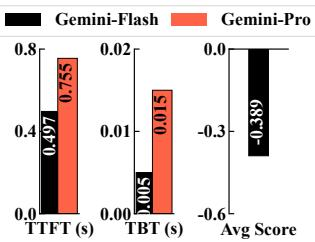  
(a) Gemini on conversation task.

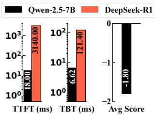  
(b) Qwen and DeepSeek.  
Figure 1. Quality-Efficiency Trade-off of Gemini, DeepSeek-R1, and Qwen Models. The average score represents a seven-point scale ranging from -3 (significantly worse) to 3 (significantly better), evaluating the smaller model’s performance relative to the larger model. Self-comparison scores (large vs. large) are omitted as they would yield 0 by definition.

Beyond generation efficiency, ensuring high-quality output is equally important. A widely adopted evaluation strategy is the LLM-as-a-judge framework [29, 30, 80], where an expert LLM (e.g., GPT-4 or Gemini-1.5-Pro) compares model responses to assess quality. This yields metrics such as (i) Win Rate: the percentage of queries for which a model produces a higher-rated response than its counterparts; and (ii) Response Score: it rates responses on a scale from significantly worse (e.g., -3) to significantly better (e.g., 3) [80]. Both approaches offer a scalable evaluation mechanism and have shown strong correlation with human preferences [34].

## 2.2 Challenges in LLM Deployment

Serving LLMs can require hundreds of GPUs, with each request potentially taking many seconds to process [18], leading to orders-of-magnitude higher costs compared to traditional ML workloads such as image classification with ResNet. As request volumes continue to surge, this imposes significant costs on both LLM users and service providers.

Accuracy-Cost-Latency Tensions in LLM Serving. Everlarger LLMs continue to advance the performance frontier [12], e.g., DeepSeek-R1 has 671B parameters, fueling their adoption across a wide range of applications. Increasingly, this cycle heightens the tension between model quality and efficiency: users expect high-quality responses and lowlatency interactions, yet larger LLMs deliver high-quality results at higher expense (e.g., a 10× per-token API cost difference between ChatGPT-4o and ChatGPT-3.5).

We further delve into this cost-latency-accuracy trade-off across both proprietary and open-source LLMs. We evaluate performance on 10K real-world user requests from the LMSys-Chat dataset [79], a free-form conversational generation benchmark. Our experiments compare Gemini-1.5-Pro and Gemini-1.5-Flash on the proprietary side, and Qwen2.5- 7B and DeepSeek-R1 on the open-source side. To ensure fair and cross-validated quality assessment, we use DeepSeek-R1 as the autorater for Gemini experiments, and Gemini-1.5- Pro as the autorater for DeepSeek-R1 experiments. Figure 1 shows that more complex and larger models produce higherquality outputs. For example, Gemini-1.5-Pro achieves a 0.39 higher response score compared to the Gemini-Flash model, corresponding to a 65% win rate in our win rate evaluation. However, this quality improvement comes at the cost of 3× higher TBT latency and a significantly larger resource footprint. For comparison, deploying DeepSeek-R1 requires 16 A100 GPUs, whereas Qwen-7B can run on a single GPU.

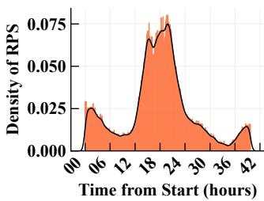  
(a) Request Density over Time.

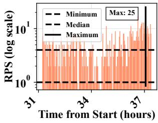  
(b) Minute-level request arrivals.  
Figure 2. Serving loads vary significantly between peak and offpeak hours (a), and even within minutes (b).

Substantial Scaling Demands. Optimizing such trade-off between accuracy, quality, and latency becomes increasingly difficult in the face of stringent service level objectives (SLOs) [48], growing request volumes [7], and highly dynamic serving loads. Figure 2 reports our analysis of the Azure LLM serving trace [68]. It reveals that, beyond typical diurnal patterns, serving loads can spike dramatically in minutes, with peak loads reaching up to 25× higher than offpeak loads. Meeting SLOs under such transient load surges substantially increases operational complexity and often necessitates significant resource overprovisioning, particularly in private clusters. Indeed, user requests often face severe latency fluctuations even on highly optimized proprietary LLM service platforms [11], making SLO guarantees challenging.

## 2.3 Opportunities for Repurposing Historical Requests

Recent advances have made strides in optimizing resource efficiency (e.g., through disaggregated resource allocation [18, 82]) and user-perceived latency (e.g., via better request scheduling [63, 65, 77]) for individual requests and LLMs. Instead, we explore a complementary opportunity: leveraging historical request-response pairs as in-context examples to enable live LLM capability augmentation at scale. This strategy empowers smaller LLMs to produce higher-quality responses by imitating the behavior of larger models, thereby adaptively offloading traffic from them. The result is a system that significantly reduces serving costs and latency. Our approach builds on the following key observations.

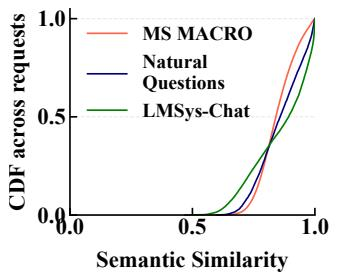  
(a) Query similarity of three realworld datasets.

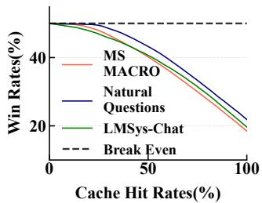  
(b) Naive semantic caching based on request similarities hurts quality.  
Figure 3. Pervasive request similarity in the requests. We measure the top-1 request similarities of each request to others on MS MACRO [15], Natural Questions [54], and LMSys-Chat [79] datasets (Table 1). Semantic caching hurts quality significantly.

Voluminous requests lead to pervasive similarity. With the rapid growth in daily LLM requests, semantic similarities among them are also increasing. We analyze the request similarity in three real-world datasets: MS MACRO (Bing Search requests) [15] (1 million requests), Natural Questions (300K requests), and LMSys-Chat [79] (about 1 million requests). We extract the dense embedding (i.e., the model’s semantic representation of text) of each request input using the popular T5-model [60] and measure their cosine similarity (∈ [0, 1]), where 1 indicates identical requests. Figure 3(a) shows that more than 70% of the requests have at least one other request with a cosine similarity greater than 0.8, a threshold commonly considered to reflect strong semantic overlap [27], compared to the 0.5 similarity of random request pairs.

Semantic caching is widely adopted yet limits efficiency and quality. The abundance of similar requests in online LLM serving presents significant opportunities to reuse historical responses. Major providers—including Google Gemini, OpenAI, and DeepSeek—already support context caching mechanisms to reduce deployment costs, such as reusing KV caches for shared input prefixes [81]. Building on this, GPT-Cache [21] and Databricks [17] introduce semantic caching, which reuses responses when a new request is semantically similar to a previous one.

Despite established infrastructure support, existing semantic caching approaches remain limited in both efficiency and quality. Exact match rates are typically low due to diverse phrasings of similar queries. However, reusing semantically similar queries risks degrading output quality, as determining whether two requests are semantically equivalent is inherently subjective [27]. As shown in Figure 3(b), if we select the most similar request and return its cached response, the win rate compared to generating a response using the same model drops from 50% to 18%.

History can enable live LLM capability augmentation. Rather than risking off-topic responses, we argue that historical request-response pairs can be repurposed as in-context examples, prepended to new requests to enable live capability augmentation for smaller models. This insight is grounded in in-context learning theory [28], which demonstrates that LLMs can learn from high-quality examples, enabling on-thefly knowledge transfer and skill imitation. This augmentation allows smaller models to mirror not only surface-level answer patterns (e.g., structure or detail) but also the reasoning trajectories of larger models. In contrast, Retrieval-Augmented Generation (RAG), a different approach for adding additional information to the context, performs piecemeal factual knowledge lookups over static documents, lacking the compositional reasoning captured in LLM responses.

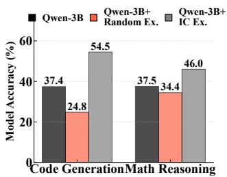  
(a) Response quality with examples.

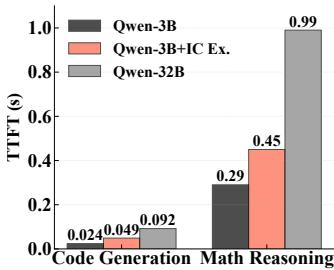  
(b) TTFT performance.  
Figure 4. (a) Incorporating in-context (IC) examples improves response quality, whereas adding random examples degrades it. (b) Prepending examples introduces a slight TTFT overhead, but it remains lower than that of querying larger models.

We validate this opportunity for augmentation by comparing Qwen2.5-3B augmented with five examples from Qwen2.5-32B on the NL2Bash code generation [75] and Math-500-Hard reasoning benchmarks [45]. Our extensive evaluations on various free-form generation tasks report consistent results (§6.2). Figure 4(a) shows that small LLMs with well-selected in-context examples can significantly improve response quality, while random examples degrade performance due to distractions. Figure 4(b) shows that prepending examples slightly increases prefilling time due to longer input—the decoding time remains largely unaffected—but still far lower than that of large models.

Design Challenges. As online LLM serving deployments routinely process large volumes of requests, they provide a continuous stream of fresh, in-distribution examples. This enables customized, live augmentation of model capabilities without retraining. Yet doing so introduces unique challenges:

• Accuracy: Examples are collected online, introducing variability in quality and diversity. Selecting high-utility examples requires going beyond relevance; it must account for example quality, diversity, and the capabilities of the target model to maximize final response quality. Further, how to ensure response quality when offloading requests between LLMs of varying capabilities?

• Efficiency: How can we efficiently select examples and manage their cache across voluminous daily requests? How to react to fluctuating serving loads and evolving

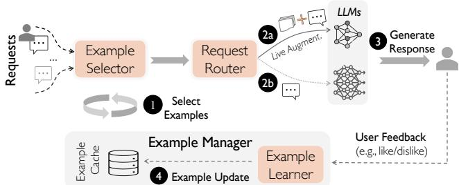  
Figure 5. IC-Cache overview and request execution flow.  
data distributions, optimizing for the optimal accuracylatency-cost trade-off in flight?

## 3 IC-Cache Overview

Extending the prevalent semantic caching architecture in today’s LLM deployments, we introduce IC-Cache, an incontext caching LLM serving system. It exploits historical requests for live LLM capability augmentation, adaptively offloading requests to reduce serving latency and cost while maintaining response quality.

Design Space and Architectures. IC-Cache benefits today’s LLM serving paradigms across three popular settings: (i) Cloud Deployment: IC-Cache enables the offloading of requests from larger LLMs to smaller, more efficient models, providing users with responsive, high-quality outputs while reducing service providers’ deployment costs; (ii) Edge Deployment: By personalizing the selection of historical examples, IC-Cache empowers small, on-device LLMs (e.g., Apple Intelligence [31] and Copilot + PC [10]) to generate higher-quality responses, alleviating the costs associated with cloud-based solutions; (iii) Edge-Cloud Deployment: In collaborative edge-cloud scenarios, IC-Cache enables smaller models to generate better responses locally while selectively routing requests to the cloud. In this paper, we focus on online LLM serving in the cloud and demonstrate IC-Cache’s effectiveness across various deployment scenarios (§6).

As shown in Figure 5, IC-Cache serves as a complementary layer between existing serving systems (e.g., vLLM [42]) and LLM applications. It comprises three key system components:

• Example Selector: It selects high-utility requestresponse pairs from history as examples to augment LLMs.

• Request Router: It routes new requests to the most suitable LLM, such as small models augmented with examples, or larger models, based on request complexity and the current serving load.

• Example Manager: It manages the caching of requests over time (e.g., eviction) and opportunistically improves example quality (e.g., by asynchronously replaying requests and storing the best response).

Serving Workflow. Figure 6 illustrates the IC-Cache user interface, complementing existing serving paradigms with minimal code modifications. Upon receiving new requests from users (Figure 5): 1 The Example Retriever retrieves the most helpful request-response pairs (e.g., based on relevance and quality) from the cache to serve as in-context examples. 2 The new request, now augmented with these examples, is passed to the Request Router, which determines the appropriate LLM to handle the request. 3 The selected model processes the request and generates a response, following the usual LLM generation process. The response is then delivered to the user. 4 Finally, the Example Manager may add the request-response pair to the cache, depending on application-specific requirements (e.g., removing sensitive information), improve example quality via cost-aware replay, and evict stale or low-quality entries over time.

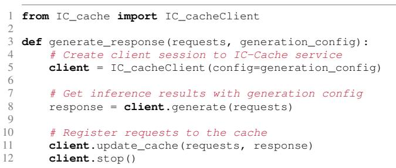  
Figure 6. IC-Cache benefits LLM serving with a few lines of code.

## 4 IC-Cache Design

In this section, we describe how IC-Cache unlocks new Pareto frontiers for accuracy-efficiency trade-offs in existing LLM serving, by selecting helpful examples at scale (§4.1), adaptively offloading requests among LLMs (§4.2), and managing examples to improve efficiency and utility (§4.3).

## 4.1 Example Selector: Select High-Utility Examples

The utility of an example is defined by its effectiveness in improving response quality. However, directly measuring this utility post hoc is impractical, as it requires generating model responses conditioned on each example, a costly and timeconsuming process. A common alternative is to approximate utility using semantic relevance, such as the cosine similarity between text embeddings, following practices from RAG systems [17]. However, as shown in Figure 7, semantic relevance exhibits only a weak correlation with true example helpfulness, limiting its reliability as a utility proxy.

This limitation arises because relevance-based selection fails to account for model-specific capabilities and example quality, resulting in biased utility estimation. For instance, examples containing low-quality responses or covering skills the smaller model already handles well contribute little to quality improvement, and may even degrade generation quality while incurring additional overhead (Figure 4). Furthermore, while relevance can enrich response details, overall response quality depends on a broader set of dimensions, such as accuracy, depth, and creativity [80], which extend far beyond relevance.

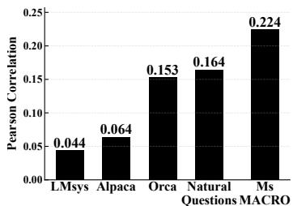  
Figure 7. Pearson correlation (∈ [-1, 1]) between example similarity and its helpfulness is weak.

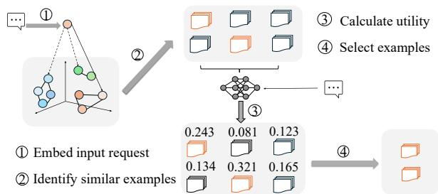  
Figure 8. Overview of two-stage example selection.

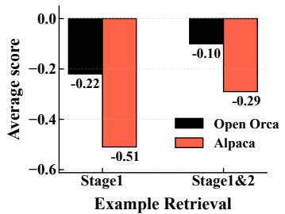  
Figure 9. Two-stage example selection improves response quality.

Next, we present a two-stage hierarchical example selection mechanism to select high-utility examples at scale, and extend it to select the combination of examples.

Two-Stage Scalable Example Selection. Our key insight is that, while semantic relevance alone has a weak correlation with actual helpfulness, it remains a useful lightweight filter (Figure 7). We exploit this by first applying relevance-based selection to narrow down the candidate pool. Since directly estimating the helpfulness of each example through rule-based heuristics is impractical, we introduce a second-stage proxy model to estimate the fine-grained helpfulness of examples on a per-request basis. This two-stage selection design enables request- and model-aware example retrieval while avoiding the prohibitive cost of scanning the entire example pool.

As illustrated in Figure 8, when a new request arrives, we compute its semantic similarity to cached examples using dense text embeddings and prioritize examples with high similarity scores. To ensure scalability, we can cluster cached examples offline into ?? groups using K-Means and process incoming requests online. However, the choice of ?? introduces a trade-off: using too many clusters increases the cost of identifying the nearest centroid (i.e., ?? comparisons), while too few clusters increases the cost of searching within clusters (i.e., ?? /?? comparisons per cluster on average). To minimize total matching cost per request, we balance these components by solving: ?? = arg min?? ?? + ???? , yielding ?? = ?? .

From the preselected candidate pool, we apply a lightweight proxy model to estimate each example’s helpfulness. The model takes as input the current request and a candidate request-response pair, estimating the example’s end-toend helpfulness to improve the final response. Our design builds on existing infrastructure in practical LLM serving platforms, where user feedback, such as thumbs-up/down ratings and preference comparisons (e.g., "Which response do you prefer?" in ChatGPT, Gemini, and DeepSeek), is often collected. Moreover, serving systems often sample and evaluate response quality using reward models or human feedback to monitor serving performance over time [26, 56]. Given the scale of modern LLM deployments, even a small sampling rate (e.g., 1%) across millions of daily requests [7] already yields tens of thousands of feedback, sufficient to continuously update the proxy model offline. We note that the proxy model is lightweight (e.g., TinyBert has <0.2% model size of Qwen2.5-7B), updated asynchronously.

Figure 9 shows that the two-stage mechanism greatly improves response quality with little (<1%) overhead (§6.3).

Selecting Example Combinations. While our two-stage selection mechanism identifies high-utility examples, including too many yields diminishing quality improvements, implying marginal efficiency gains from offloading. Moreover, longer input sequences increase inference costs after offloading (Figure 4), reducing the net benefit of using examples. Thus, the number of examples should be adapted per query.

Our key insight is that LLM serving is a long-running process, which enables IC-Cache to explore and adapt to the impact of varying example counts continuously over time. Building on the two-stage selection process, the Example Selector uses a dynamic utility threshold to filter out low-impact examples, excluding those whose estimated helpfulness falls below the current threshold. During online deployment, IC-Cache periodically samples a subset of requests and evaluates the average efficiency gains achieved under different utility thresholds (e.g., utility > 0.5). It then selects the threshold that maximizes overall performance and applies it globally. Note that our Request Router will ensure the response quality of sampled requests is preserved (§4.2), making this adaptive process robust. This ensures that the number of selected examples is both query- and example-dependent, continuously optimized to maximize end-to-end efficiency.

## 4.2 Request Router: Trade off Efficiency and Accuracy

With carefully selected examples, small LLMs gain live capability augmentation and can generate high-quality responses, enabling them to handle requests that would otherwise require larger, more expensive models. However, aggressively offloading to small LLMs can hurt response quality as the augmentation can be limited; Being overly conservative limits efficiency gains. While one could frame request routing as a classification problem (e.g., using a BERT-based model to predict the optimal model per request [55]), this approach introduces significant systems challenges, since an effective request router must: (i) respond to dynamic serving loads and

Algorithm 1: Pseudo-code of IC-Cache runtime 1 Function ServeRequests(??????????????, ??????\_????????): /\* Example Retriever: select an example combination in terms of helpfulness to improve response quality. \*/ 2 ???????????????? ← RetrieveExamples(request) /\* Request Router: select a model based on system load and expected response quality. Prepend examples to the request if offloading occurs. \* / 3 ?????????? ← RouteRequest(??????????????, ????????????????, ????????????, ??????\_????????) 4 ???????????????? ← GenerateResponse(??????????, ??????????????, ????????????????[Optional]) /\* Example Manager: selectively cache requests in example pool and optimize example quality. \*/ 5 ManageExamples(??????????????, ????????????????) 6 return ???????????????? 7 Function RetrieveExamples(??????????????): /\* Stage 1: Lightweight relevance selection \*/ 8 ??????????????\_?????? ← ExtractEmbedding(??????????????) 9 ????????????????\_???????????????? ← GetSimilarExamples(??????????????\_??????, ????????????????) /\* Stage 2: Helpfulness prediction \* / 10 for ???? in ????????????????\_???????????????? do 11 ℎ?????? ?? ???????????? ← PredHelpfulness(??????????????, ????) /\* Optimize example combination by accounting for example diversity and ordering \*/ 12 ????????????????\_???????????????? ← RetrieveComb(????????????????\_????????????????, ℎ?????? ?? ????????????) 13 return ????????????????\_????????????????

changing quality-throughput tradeoffs; (ii) adapt efficiently to evolving data and model characteristics, including shifts in request distributions, example utility, model weights, and even available model sets; and (iii) remain execution- and dataefficient, avoiding the prohibitive cost of generating and labeling responses across all model choices. These requirements render heavyweight classifier-based routers impractical.

To address these practical challenges, we propose modeling the routing decision as a contextual multi-armed bandit (MAB) problem, a lightweight and data-efficient approach often used in online recommendation systems. Here, the context (input) includes the request’s question and its selected examples, while each “arm” corresponds to a candidate model (e.g., a small LLM with examples or a large LLM without). MAB explores and exploits by pulling different arms across trials (e.g., user requests), aiming to maximize cumulative rewards such as maximizing response quality. Its lightweight nature and minimal needs for online feedback make it especially well-suited for real-time serving [46].

Algorithm 1 illustrates how IC-Cache efficiently finds the sweet spot between response quality and system efficiency under dynamics. After the Example Selector identifies highutility examples (Lines 7-13), IC-Cache invokes our MABbased Request Router to select the most suitable model for that request. The router continuously updates its offloading policy with user feedback, factoring in both perceived response quality and current system load, allowing it to adapt its routing decisions on the fly (Lines 3-4).

Load- and Quality-aware Request Offloading. To handle load fluctuations, the Request Router incorporates a loadaware biasing strategy. Specifically, it tracks the Exponential Moving Average (EMA) of the system serving load over time. When the EMA remains below the desired operational threshold (e.g., the service capacity of large models), the router prioritizes response quality. In this regime, many requests may still be offloaded to small models, IC-Cache enables small LLMs to match or even outperform larger models on a substantial fraction of requests (§6.2), much like how primary school teachers may better engage young learners than university professors after the right pedagogical augmentation.

In contrast, when the EMA exceeds the operational threshold, the router triggers a feedback controller to compute a corrective bias. This bias is calculated using the hyperbolic tangent (tanh) function [39], applied to the positive load deviation (i.e., current load − threshold). The resulting bias adjusts the bandit’s output logits, reducing the selection scores of high-cost models and favoring more efficient, lower-cost alternatives to relieve system pressure. This design offers several advantages: the tanh function provides a smooth, saturating response, enhancing stability by preventing unbounded bias values, and the bias is only active during actual overload conditions. Crucially, this lightweight control mechanism adjusts routing preferences without modifying or retraining the underlying Request Router, effectively decoupling overload management from the core routing logic. Importantly, the persistent magnitude of this applied bias can be used as a signal for infrastructure auto-scaling.

Efficient Router Adaptation under Dynamics. In practical deployments, the Request Router must adapt to evolving data distributions and shifts in model behavior (e.g., due to model upgrades). While retraining the router is computationally inexpensive, thanks to our contextual bandit model’s compact size (0.5 million parameters), the primary challenge lies in acquiring sufficient feedback for adaptation, which may be delayed, sparse, or costly, especially when relying on explicit user signals like thumbs-up/down ratings. To address this, we design a cost-efficient feedback collection mechanism that enables effective adaptation with minimal data overhead. The key insight is to solicit feedback selectively, focusing only on requests where the router exhibits high uncertainty in its decision. We quantify uncertainty using the model’s output confidence scores, which reflect how decisively the router ranks candidate LLMs. Only requests with near-uniform confidence distributions (e.g., with standard deviation below 0.1) are tagged for feedback solicitation. For these uncertain cases, we always include the top-ranked LLM, and probabilistically sample a second choice based on its relative confidence, encouraging adequate exploration. Following current interface features (e.g., “Which response do you prefer?” in ChatGPT, Gemini, and DeepSeek), IC-Cache collects user preference feedback to refine its routing model. We formally analyze the sample complexity of this selective feedback strategy and demonstrate its cost-effectiveness in Appendix A.2.

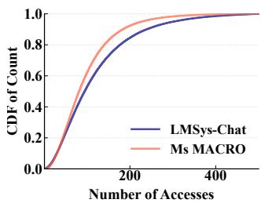

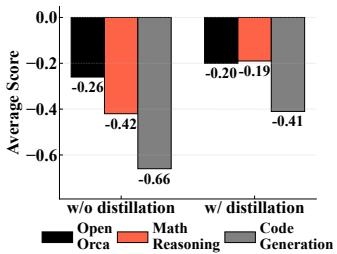  
Figure 10. Example access ex- Figure 11. Example distillation hibits long-tail distribution. improves final response quality.

Our evaluations show that our bandit-based router scales effectively, outperforming state-of-the-art alternatives and adapting to dynamics (§6.3).

## 4.3 Example Manager: Effective Caching in the Wild

Maximizing end-to-end efficiency hinges on (i) improving the utility of individual examples to enable more effective per-request offloading, and subsequently (ii) maintaining a high-utility example pool for offloading various requests under capacity and privacy constraints. Yet, real-world LLM serving systems process millions of requests daily [7, 68], with dynamic changes in data distribution and model behavior (e.g., trending topics), making example management a non-trivial challenge. IC-Cache includes an Example Manager that curates and optimizes examples over time.

Cost-aware Example Replay. Recent LLM advances [25, 35] reveal large variance in response quality due to the stochastic nature of generation (e.g., token sampling). This variance can be harnessed through example replay, where the same request is queried multiple times, and the best response is selected for reuse. By refining example responses in this way, we can boost their downstream utility for offloading. This example replay can be performed offline (e.g., during off-peak hours) to avoid runtime latency. Understandably, the relative cost can be negligible, considering that a refined example reused hundreds of times incurs only around 1% amortized overhead. But serving at scale, it is still important to curb the resource overhead from generating new responses.

In practice, both the frequency and effectiveness of example reuse exhibit large heterogeneity, often following a long-tail distribution (Figure 10). Hence, the Example

Manager introduces a cost-aware example replay mechanism that selectively replays examples based on their potential efficiency gains. Intuitively, when repurposing an example, the smaller the model to which its augmented request can be routed and the higher the response quality it achieves, the smaller the gain we can expect from further refining the example’s response. So we can define the potential gain of improving an example ?? as: $G ( e ) ~ = ~ ( 1 -$ ????????????????????\_????????????????\_??????????????) ×????????????????????\_??????????\_????????. 1 Here, ????????????????????\_????????????????\_?????????????? reflects user feedback (e.g., thumbs up/down) on the response quality of the exampleaugmented request, while ????????????????????\_??????????\_???????? denotes the relative cost (e.g., API pricing) of the model used to serve the request. Since both metrics are readily available in production deployments, computing ?? (??) is lightweight and practical. Each time ?? is repurposed, its ?? (??) accumulates, and IC-Cache maintains an exponentially moving average of ?? (??) to account for evolving usage patterns. As a result, examples that are frequently repurposed, or with them, the new requests still require larger models, or yield lower-quality responses, are prioritized for replay.

With the above formulation of potential replay gain, the Example Manager selects examples to replay whose potential resource savings outweigh the cost of replay itself. Specifically, it ranks examples by their potential gain, ?? (??), and stops replaying examples whose potential gain falls below a cut-off. This cut-off is determined online, by the point at which replaying a higher-ranked example no longer leads to additional offloading, meaning its resource savings are lower than the one-time replay (generation) cost.

Figure 11 demonstrates that our example replay design achieves a better response quality for new requests on the Gemini-Flash model compared to the Gemini-Pro, suggesting efficiency gains during online serving.

Capping Example Cache Size over Time. The Example Manager follows the deployment of popular semantic caching designs [17, 78] to minimize both overhead and engineering complexity: caching historical requests in plaintext. Plaintext caching offers low memory consumption—storing one million LMSys-Chat examples requires only about 1GB of memory (about 1% of an A100 GPU)—and facilitates broader reuse across different models. In fact, due to the high similarity among requests and their long-tailed access distribution, our evaluation on millions of real-world queries shows that caching just tens of thousands of examples already yields diminishing returns (§6.4). Hence, IC-Cache introduces small memory footprints.

For deployments with strict memory budgets, the Example Manager employs an online cache management policy that evicts low-utility examples. The decision process mirrors a classic knapsack problem: each example is treated as an item with a weight (its cache size, such as plaintext length) and a value (the achievable efficiency gain). The objective is to maximize the total value, i.e., the cumulative efficiency gains from caching the selected examples. The solution yields a binary caching decision for each example: whether to retain it in the cache or evict it. The efficiency gain of an example is measured by the number of successful offloadings it enables. To adapt to changing request patterns over time, we maintain a moving average of this gain, applying a decay factor of 0.9 every hour to emphasize recent usage while gradually discounting stale patterns.

This one-dimensional knapsack problem can be solved efficiently (§5). Our solver runs periodically in the background or whenever the memory limit is approached, ensuring that cache optimization does not interfere with online serving. Evaluations on millions of real-world requests show that our strategy consistently improves performance, even under tight memory constraints (§6.4).

How Does IC-Cache Respect Privacy? IC-Cache follows a well-established practice of using information in cached queries to serve future requests (e.g., context or semantic caching in production systems like Databricks [17], Gemini [9], DeepSeek [6], and open frameworks like GPT-Cache [21]). IC-Cache builds on this foundation, advancing it toward live LLM capability augmentation and offloading. We also observe that many LLM use cases where IC-Cache can provide large benefits involve only non-private data. For instance, public information retrieval and general knowledge Q&A—such as those in Google’s AI Overview [1] and Chat-GPT Deep Search [5]—make up a substantial LLM traffic.

To further ensure that the cache respects user privacy, IC-Cache controls sensitive query admission into the cache by (i) providing simple APIs for access control (Figure 6), choosing whether to cache and allowing cached data sharing only within designated user domains (e.g., within the organization); and (ii) locally sanitizing inputs by removing sensitive data on the client endpoints before adding examples to the cache (e.g., IC-Cache removes personally identifiable information using the widely adopted tool spaCy [16]).

If developers require very strict privacy guarantees, IC-Cache offers replacing the historical example cache with a differentially private (DP) synthetic example cache [45]. DP synthesis ensures that an adversary with access to the synthetic examples cannot infer (with high probability) the presence or value of any specific example in the original dataset. Our empirical results demonstrate that IC-Cache, even when using DP-synthesized examples, continues to deliver substantial improvements over the baseline (§6.4).

## 5 Implementation

We implemented a prototype of IC-Cache to enable efficient LLM serving across GPUs. Our implementation leverages components already prevalent in modern LLM deployments, such as semantic caching systems [17, 81], introducing minimal complexity. The IC-Cache prototype consists of approximately 3,000 lines of code to support widely used platforms, including vLLM [42], HuggingFace Runtime [13], and LangChain [14], with a few lines of integration code (§3).

IC-Cache Backend. IC-Cache’s backend supports distributed deployments across machines. The Example Retriever, Request Router, and Example Manager run in separate processes that can scale horizontally and communicate via gRPC. The Example Retriever utilizes GPU-accelerated FAISS [38] for high-throughput similarity search. The Request Router was implemented in Jax [23]. It includes the contextual bandit algorithm along with a prioritized replay buffer. To improve robustness against outliers, the Example Manager follows existing advances [25] to filter out examples in replay that have undergone more than five replay iterations. To ensure high availability and load balancing, we maintain multiple replicas of IC-Cache components for load balancing.

Fault Tolerance. IC-Cache maintains system state and metadata in a distributed manner across replicas, with each component periodically checkpointing its state. If a failed request to the Example Retriever or Request Router is detected, the system automatically bypasses these components and routes the request directly to the inference backend to maintain service continuity. Each component runs a lightweight daemon process that monitors service health and initiates automatic recovery procedures upon detecting failures.

## 6 Evaluation

We evaluate IC-Cache on millions of publicly available, realworld user requests, using both open-source and proprietary models. The key results are summarized as follows:

• IC-Cache reduces serving latency by 28–71% and improves throughput by 1.4–5.9× without comprising response quality (§6.2).

• IC-Cache can potentially offload all requests to smaller models, achieving sweet spots of efficiency-quality tradeoffs under bursty workloads (§6.2-§6.3);

• IC-Cache improves performance over a wide range of settings and outperforms its design counterparts (§6.4);

## 6.1 Methodology

Experimental setup. We evaluate IC-Cache using proprietary Gemini-1.5-Pro and Gemini-1.5-Flash models via Google Cloud Vertex AI APIs, and open-source models, including DeepSeek-R1, Qwen2.5, Gemma-2, and Phi-3 model families. We summarize the datasets used in our evaluations in Table 1, and discuss data preprocessing (e.g., deduplication) in Appendix A.4. Requests span real-world conversation, question answering, translation, code generation, and long-context math reasoning tasks.

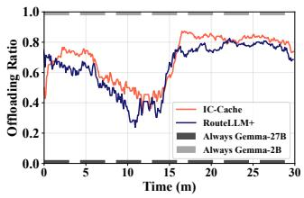  
(a) Load Offloading (MS MARCO).

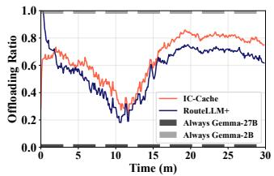  
(b) Load Offloading (Natural Questions).

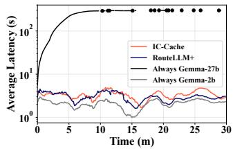  
(c) Serving latency (MS MARCO).

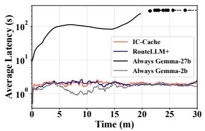  
(d) Serving latency (Natural Questions).

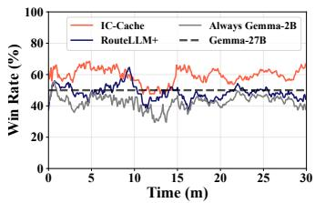  
(e) Response Quality (MS MARCO).

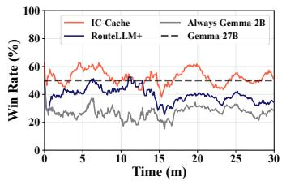  
(f) Response Quality (Natural Questions).

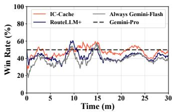  
(g) Response Quality (LMSys).

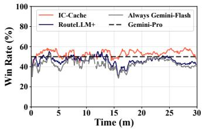  
(h) Response Quality (Orca).

Figure 12. IC-Cache enables offloading more requests to small models, improving serving throughput (a)-(b), while achieving better response latency (c)-(d) and response quality (e)-(h).
<table><tr><td>Task</td><td>Dataset</td><td>Example Size</td><td>Request Size</td></tr><tr><td rowspan="3">Conversation</td><td>Alpaca[66]</td><td>32,392</td><td>1,800</td></tr><tr><td>Imsys-chat-1m [79]</td><td>273.043</td><td>15,170</td></tr><tr><td>OpenOrca [49]</td><td>774,285</td><td>43,016</td></tr><tr><td rowspan="2">Question Q&amp;A</td><td>MS MARCO [54]</td><td>808,731</td><td>101,092</td></tr><tr><td>Natural Questions [41]</td><td>300,000</td><td>7,830</td></tr><tr><td>Translation</td><td>WMT-16-PM[22]</td><td>600,000</td><td>1000</td></tr><tr><td>Code Gen.</td><td>Nl2bash [75]</td><td>8090</td><td>609</td></tr><tr><td>Math reasoning</td><td>Math500-Level5[45]</td><td>7500</td><td>5000</td></tr></table>

Table 1. Our evaluation data spans millions of realistic requests.

We set up a cluster of 16 NVIDIA A100 GPUs, where requests arrive follow Microsoft’s realistic LLM serving trace [68], scaled by our cluster resource capacity.

Baselines. To the best of our knowledge, IC-Cache is the first system to optimize LLM serving through real-time capability augmentation using historical requests, complementing existing LLM inference frameworks. We compare IC-Cache against the following state-of-the-art baselines:

• w/o IC-Cache: The widely-used LLM serving system (e.g., vLLM [42]) without IC-Cache integration.

• RouteLLM [55]: A model routing framework that dynamically selects between a small and a large model based on a binary classifier.

• LongRAG [78]: Retrieves external documents as auxiliary knowledge. We follow the same retrieval method to select and append the top-5 documents to the prompt.

• Semantic Caching [17]: Caches past requests and returns cached responses based on embedding similarity.

Metrics. We evaluate IC-Cache using following metrics:

• Quality: To evaluate response quality, we follow established practices [30, 53, 80] to adopt the LLM-as-ajudge methodology. Specifically, we use DeepSeek-R1 as the autorater for evaluating Gemini outputs, and Gemini-1.5-Pro for the rest, to minimize selfcomparison bias. We report the strong alignment of our autoraters with human preferences in Appendix A.5. Each autorater produces a seven-point score ranging from -3 (significantly worse) to 3 (significantly better), where a score within [-0.3, 0.3] indicates a tie. To reduce the order bias, we sample eight responses for both input orders and report the average across 16 comparisons. We compare overall model quality using average pairwise scores and win $\scriptstyle r a t e s = { \frac { ( # \mathrm { w i n s } + 0 . 5 \times \# \mathrm { t i e s } ) } { \# \mathrm { t o t a l } } }$ . A win rate of 0.5 or an average score of 0 indicates parity between compared models.

• Latency: The latency reduction in Time-To-First-Token (TTFT) and Time-Between-Tokens (TBT).

• Throughput: We quantify the throughput performance in terms of requests per second achieved.

## 6.2 End-to-End Performance

IC-Cache adapts effectively online for better efficiency. We first evaluate IC-Cache under realistic online load conditions. Request arrivals follow a 30-minute trace from Microsoft’s LLM serving traces (Figure 22), where arrival timestamps are mapped to requests from the MS MARCO, Natural Questions, LMSys-Chat, and Open Orca datasets. Due to space constraints, we report results for the Gemini and Gemma model families here, and additional evaluations are provided in Appendix B.

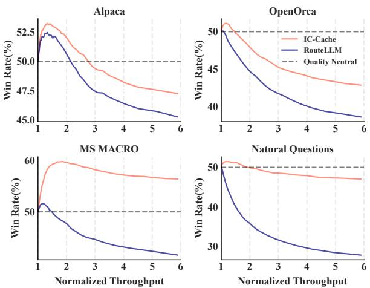  
Figure 13. IC-Cache enables better quality-efficiency tradeoffs.

Figure 12 presents the online offload ratio, serving latency, and response quality under real-time load. Notably, IC-Cache achieves a 9.0% higher response quality compared to RouteLLM, while maintaining comparable serving latency and throughput. Without dynamic offloading, relying solely on the small model leads to subpar responses, whereas using only the large model risks overload and increased latency. While RouteLLM offloads requests based on request difficulty, it is oblivious to the current system load. In contrast, IC-Cache dynamically adjusts the offloading ratio based on real-time load and request characteristics. It achieves response quality comparable to always using the large model, without incurring the associated cost and latency.

IC-Cache enables better quality-efficiency tradeoff. We further demonstrate that IC-Cache enables better qualityefficiency tradeoffs by being aware of the current serving load and intelligently repurposing examples. Figure 13 reports the win rates of Gemma-2-2B over Gemma-2-27B across four datasets, with throughput normalized to that of serving solely with the large model. By varying the router’s decision threshold, we dynamically control the fraction of requests offloaded to the small model, investigating the quality and efficiency performance under different requirements on the tradeoff.

IC-Cache consistently achieves higher serving throughput than RouteLLM for the same target response quality. For example, on the Natural Questions dataset, it delivers 2.3× higher throughput when aiming for a 50% win rate. Conversely, for a fixed throughput target (e.g., 6× the throughput of the large model), IC-Cache improves response quality by 4–16%. Notably, by routing each query to the most suitable model, IC-Cache enables the 2B model to surpass the 27B model on MS MARCO, achieving a win rate above 50%.

IC-Cache augments existing serving infra effectively. Figure 14 shows that combining IC-Cache with existing semantic caching systems consistently improves response quality across different cache hit rates. Higher hit rates, achieved by relaxing the similarity threshold, typically reduce response quality due to less relevant cache matches. In such cases, IC-Cache repurposes retrieved responses as in-context examples to improve small LLM outputs, leading to up to a 28% quality improvement, or equivalently, 4.1× higher efficiency (hit rate) for the same quality target.

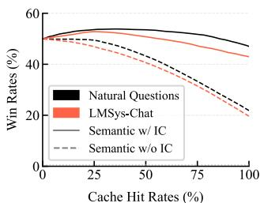  
Figure 14. IC-Cache augments semantic caching deployment.

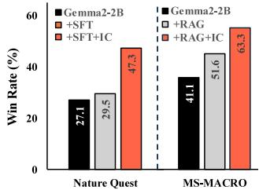

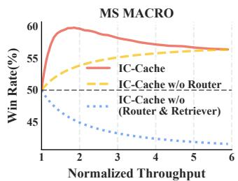  
Figure 15. IC-Cache augments supervised fine-tuning (SFT) and RAG deployments.

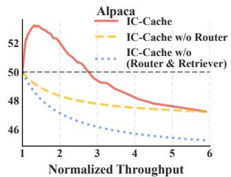  
Figure 16. IC-Cache achieves better quality-efficiency tradeoff by orchestrating its design components.

Figure 15 further shows that IC-Cache augments the popular supervised fine-tuning (SFT) and RAG systems on the Nature Question and MS-MACRO dataset, respectively. We notice that while both post-training support, SFT and RAG, improve the response quality, combining them with IC-Cache improves the small model’s response quality by 17.8 and 9.8%, respectively, significantly narrowing the gap between small model performance and that of the larger model.

## 6.3 Performance Breakdown

Breakdown by components. Figure 16 shows that IC-Cache achieves a superior quality-efficiency tradeoff by effectively orchestrating its design components. Leveraging in-context examples, Gemma-2-2B + IC-Cache consistently outperforms Gemma-2-27B on both the MS MARCO and Alpaca datasets. The combination of the request router and example-based augmentation enables IC-Cache to establish a new Pareto frontier, surpassing baseline approaches. Specifically, IC-Cache attains a win rate of up to 60% against Gemma-2-27B while delivering 2× higher throughput on MS MARCO. On Alpaca, it achieves a 2.8× throughput improvement with no quality degradation. Importantly, we observe that efforts to increase throughput without the request router lead to suboptimal response quality, highlighting the necessity of qualityand load-aware routing.

We further dissect IC-Cache’s performance by isolating the effect of repurposing historical examples, i.e., disabling the request router. Figure 17 reports that IC-Cache significantly improves response quality across diverse model families and datasets. For example, IC-Cache improves the win rate of smaller models over larger ones by up to 12.4% for Gemini models on LMSys-Chat and OpenOrca. Remarkably, on some datasets, smaller models surpass the 50% win rate, indicating they can outperform their larger counterparts when empowered with high-quality in-context examples. Even in settings with considerable differences in latency, cost, and base accuracy, such as DeepSeek-R1 vs. Qwen2.5-7B, IC-Cache still yields an 18% accuracy gain in win rate.

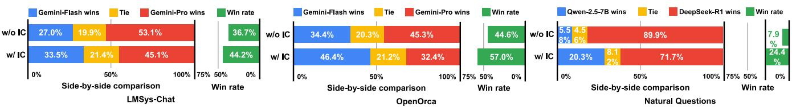  
Figure 17. IC-Cache improves the quality of generation across different tasks for Gemini, Qwen, and DeepSeek series models.

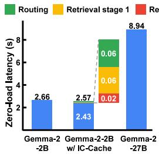

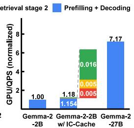  
Figure 18. IC-Cache introduces little overhead (left) while improving cost-efficiency in sustaining serving throughput (right).

Beyond the average performance, we observe that IC-Cache shifts the entire score distribution toward higher quality, without sacrificing individual requests’ quality. Additional results in Appendix B confirm that IC-Cache provides consistent benefits across a broad range of models and datasets, including Qwen, Gemma, and Phi models.

Breakdown by execution lifecycle. Figure 18 presents a detailed execution breakdown for Gemma models. The left figure reports the average contention-free serving latency without batching. We observe that Gemma-2-2B + IC-Cache achieves a 3% reduction in latency compared to Gemma-2-2B alone, attributed to shorter average decoding lengths guided by examples from the large model. Moreover, it is 71% faster than Gemma-2-27B, primarily due to the smaller model size. The right figure illustrates the serving cost, measured as the number of GPUs required to sustain the throughput target, i.e., normalized to the cost of serving with Gemma-2-2B. Under the same resource constraint, Gemma-2-2B + IC-Cache delivers a 5.1× improvement in system throughput compared to Gemma-2-27B with little overhead.

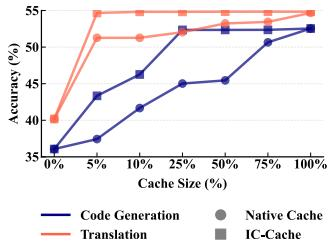  
Figure 19. IC-Cache delivers improvement under different the example cache sizes.

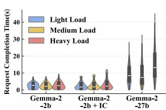  
Figure 20. IC-Cache improves serving efficiency across serving loads.

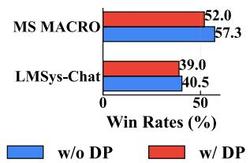

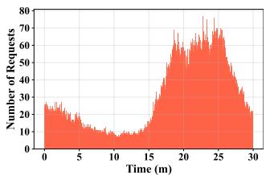  
Figure 21. IC-Cache with DP synthetic example pool brings marginal quality degradation.  
Figure 22. Request arrival pattern sampled from Microsoft’s LLM serving traces.

## 6.4 Ablation Study

Impact of example cache size. To evaluate the impact of cache size on generation quality, we conduct experiments using Qwen2.5-3B on both code generation and translation tasks, varying the size of the example cache pool. Specifically, we retain different proportions of the full example set, ranging from 5% to 100%, and compare two strategies: (i) Naive Cache, which randomly retains examples, and (ii) IC-Cache, which employs utility-aware example caching (§4.3). As shown in Figure 19, IC-Cache achieves near-saturated performance even with a minimal cache, just 12,056 examples for translation and 2,022 for code generation. These correspond to under 20MB in plaintext, demonstrating the efficiency and practicality of our caching design, particularly for memory-constrained deployments.

Impact of Serving Loads. Figure 20 shows that IC-Cache achieves superior serving latency performance under varying request loads on the Alpaca dataset. The light, medium, and high load levels correspond to QPS = 1, 2, and 4, respectively. The end-to-end latency of Gemma-2-2B + IC-Cache is similar to that of Gemma-2-2B without IC-Cache, with 11–35% lower P50 latency and 14-31% higher P99 latency primarily due to different patterns in decoding length distributions, aligning with our observations in Figure 18. Compared to

<table><tr><td></td><td>Gemma-2B</td><td>Gemma-2B +RAG</td><td>Gemma-2B + IC</td><td>Gemma-2B + IC + RAG</td></tr><tr><td>Avg score</td><td>-0.4272</td><td>0.0047</td><td>0.0667</td><td>0.2972</td></tr><tr><td>Win rates(%)</td><td>41.54</td><td>52.63</td><td>56.35</td><td>62.40</td></tr></table>

Table 2. IC-Cache complements LongRAG and improves its performance. Gemma-2-2B over Gemma-2-27B on MS MACRO.

<table><tr><td>Alpaca</td><td>Gemma-2B</td><td>Gemma-2B +OOD SFT</td><td>Gemma-2B + in-domain IC</td><td>Gemma-2B +OOD IC</td></tr><tr><td>Avg score</td><td>-0.1896</td><td>-0.5927</td><td>-0.1792</td><td>-0.2104</td></tr><tr><td>Win rates(%)</td><td>45.58</td><td>32.33</td><td>47.25</td><td>46.69</td></tr></table>

Table 3. Quality comparison between IC-Cache and SFT. Gemma-2-2B vs. Gemma-2-27B on Natural Questions (in-domain) and Alpaca (out-of-domain, OOD).

Gemma-2-27B, Gemma-2-2B + IC-Cache reduces P50 latency by 75–83% and P99 latency by 69–71% because of the 10× difference in model size. We observe similar patterns on other datasets and model families (Appendix B).

Impact of DP synthesized example pool. To test the effect of using DP synthetic examples instead of the original example pool, we generate DP synthetic examples for MS MACRO and LMsys-chat, two datasets with real user queries where DP synthesis may be considered necessary. As shown in Figure 21, IC-Cache’s quality slightly decreases with a DP synthetic example pool instead of the original examples, but still improves performance over a non-IC-Cache design.

IC-Cache vs. RAG. Table 2 shows the average pairwise scores and win rates between Gemma-2-2B and Gemma-2-27B on MS MACRO using a combination of LongRAG (introduced in Section 6.1) and IC-Cache. Both retrieved documents and historical query examples can provide extra information to the model to answer users’ queries, which is often more helpful to the smaller models due to their less capacity. IC-Cache outperforms RAG because knowledge transfer from historical responses from Gemma-2-27B makes the responses of Gemma-2-2B more aligned with Gemma-2- 27B. Such results were also observed in model training [83]. More importantly, IC-Cache can be used together with RAG to boost the response quality even further, significantly outperforming RAG-only Gemma-2-27B.

IC-Cache vs. Supervised Finetuning (SFT). To assess the benefits of IC-Cache compared to traditional fine-tuning, we finetune Gemma-2-2B on a Natural Questions dataset to mimic the output of the larger Gemma-2-27B model. Table 3 presents the results on Natural Questions (in-domain task) and Alpaca (out-of-domain task) test sets. While fine-tuning led to some improvements on Natural Questions, the gains were less pronounced than those achieved by IC-Cache. In contrast, IC-Cache’s live LLM capability augmentation allows the model to leverage information from the larger model without modifying its own weights, adapting to new domains while preserving its original knowledge.

## 7 Related Work

LLM Serving Systems. Recent LLM serving advances have primarily focused on efficiency. Orca’s continuous batching increases throughput [77], while vLLM [42] offers LLM execution beyond GPU memory capacity. SARATHI [18] employs chunked prefill techniques to improve throughput and GPU utilization. FastServe[70] proposes a preemptive scheduling to mitigate the queuing delay. Systems like DistServe[82], TetriInfer[33], and Splitwise[57] employ a disaggregation strategy to separate prefill and decode phases for low interference latencies. PowerInfer-2[73] leverages the sparsity of neuron activation to predict and prefetch neurons for on-device LLM serving. IC-Cache complements existing LLM serving systems by exploiting the in-context learning abilities of LLMs without altering scheduling order.

RAG Systems. Retrieval-Augmented Generation (RAG) improves the reliability of LLM outputs by integrating knowledge retrieved from external sources[44]. It identifies relevant text chunks using either sparse retrieval methods, such as BM25 [61] and TF-IDF [64], or dense retrieval methods. The retrieval process can be further optimized with techniques like iterative[62], recursive[40], or adaptive retrieval[20, 36]. CacheBlend[74] reduces RAG system latency by storing and reusing KV caches with selective recomputations. However, RAG relies on long external sources and is vulnerable to out-of-domain or low-quality documents [43]. IC-Cache complements RAG by generating cached queries with RAG to incorporate external knowledge (§6.4).

Knowledge Distillation and In-context Learning. Incontext learning (ICL) allows LLMs to perform new tasks by learning from demonstrations in the input context [24, 69]. The effectiveness of ICL is influenced by multiple factors, including the number of demonstrations, quality, diversity, and order [24, 52]. Ceil [76] trains an example selector to pick examples from external documents. IC-Cache exploits the ICL capability and the high volume of requests in LLM serving systems to optimize the generation quality-efficiency tradeoff with example selection, request routing, and management.

## 8 Discussions

Handling Query Distribution Shift. User interests and popular topics are not static. They can cause the query distribution to shift over time. IC-Cache is designed for this with its two core components. First, the MAB-based request router is inherently adaptive to distribution shift. Unlike a static classifier that would degrade as the query distribution drifts from its training data, the bandit model continuously learns from recent requests. It adjusts its routing policy in a data-efficient manner, adapting to evolving topics and changing example utility without requiring costly offline retraining. Second, the Example Manager actively refines caches and evicts stale queries to reflect current query trends. Its eviction policy is aware of the cost and time to live of each query and response pair, which ensures that stale or low-utility examples are replaced with fresh, relevant ones. By maintaining a moving average of each example’s utility with a decay factor, the system prioritizes examples that are effective for the current query distribution, ensuring the cache’s contents do not become obsolete.

Handling Model Updates. LLM providers can update their models from time to time, which can alter performance characteristics and make static routing policies suboptimal. IC-Cache’s architecture provides inherent resilience to such changes. The Request Router’s exploration-exploitation strategy allows it to dynamically probe the performance of updated models and adjust the traffic accordingly. For instance, if a smaller model is upgraded and can suddenly handle a new class of queries effectively with augmentation, the router will detect this shift through online feedback and begin offloading more requests to it. This avoids the prohibitive cost of generating and re-labeling vast datasets each time a model is updated, ensuring the system can fluidly accommodate improvements or changes in the underlying LLM fleet.

Performance and Quality Tradeoff. IC-Cache relies on online capability augmentation, which is grounded in in-context learning theory. It allows for on-the-fly knowledge transfer and imitation without costly retraining the model. By providing high-quality demonstrations, IC-Cache guides the smaller model to generate responses that are not only structurally similar but also capture the important information of the larger model, thus maintaining high quality while benefiting from the smaller model’s lower latency and resource footprint. When multiple models are available, we can identify more sweet spots on the efficiency-quality curve with offline profiling. Instead of being limited to a binary choice between a single small, fast model and a single large, high-quality one, the request router can select the most appropriate model.

## 9 Conclusion

We introduce IC-Cache, an in-context caching system for LLM serving that leverages historical requests as in-context examples. IC-Cache identifies high-utility examples and efficiently prepends them to the input for better response at scale. IC-Cache employs a cost-aware cache replay mechanism to improve example quality offline, and a bandit-based request router to adaptively route requests to LLMs with varying capabilities. Our evaluations on real-world datasets demonstrate that IC-Cache improves both serving throughput and latency.

## Acknowledgments

We sincerely thank Ana Klimovic for her valuable feedback while shepherding our paper. We also sincerely thank Martin Maas, Chandu Thekkath, Fatma Ozcan, Salem Haykal, and the anonymous reviewers for their feedback on earlier versions of this manuscript. This work was also supported in part by ACE, one of the seven centers in JUMP 2.0, a Semiconductor Research Corporation (SRC) program sponsored by DARPA. The work utilized the Delta system at the National Center for Supercomputing Applications (NCSA) through allocation CIS240236 from the ACCESS program.

## References

[1] AI Overviews and Your Website. https://developers.google.com/ search/docs/appearance/ai-overviews.

[2] Amazon codewhisperer. https://aws.amazon.com/codewhisperer/.

[3] Anthropic claude. https://claude.ai/.

[4] Character ai. https://character.ai/.

[5] ChatGPT: Introducing deep research. https://openai.com/index/ introducing-deep-research/.

[6] DeepSeek Context caching. https://api-docs.deepseek.com/guides/ kv\_cache.

[7] DeepSeek-V3/R1 Inference System Overview. https: //github.com/deepseek-ai/open-infra-index/blob/main/ 202502OpenSourceWeek/day\_6\_one\_more\_thing deepseekV3R1\_inference\_system\_overview.md.

[8] Gemini 1.5 Flash-8B is now production ready. https: //developers.googleblog.com/en/gemini-15-flash-8b-is-nowgenerally-\available-for-use/.

[9] Gemini Context caching. https://ai.google.dev/gemini-api/docs/ caching?lang=python.

[10] Github copilot. https://github.com/features/copilot/.

[11] Helicone:Open source LLM observability platform. https://www. helicone.ai/status/provider/Google.

[12] https://huggingface.co/spaces/lmarena-ai/chatbot-arena-leaderboard. https://huggingface.co/spaces/lmarena-ai/chatbot-arenaleaderboard.

[13] HuggingFace Serverless Inference API. https://huggingface.co/docs/ api-inference/index.

[14] LangChain: Build context-aware reasoning applications. https://github. com/langchain-ai/langchain.

[15] MS MARCO. https://microsoft.github.io/msmarco/.

[16] spaCy: Industrial-strength Natural Language Processing (NLP). https: //github.com/explosion/spaCy.

[17] Databricks: Building a cost-optimized chatbot with semantic caching. https://www.databricks.com/blog/building-cost-optimizedchatbot-semantic-caching, 2024.

[18] Amey Agrawal, Ashish Panwar, Jayashree Mohan, Nipun Kwatra, Bhargav S Gulavani, and Ramachandran Ramjee. Sarathi: Efficient llm inference by piggybacking decodes with chunked prefills. arXiv preprint arXiv:2308.16369, 2023.

[19] Shipra Agrawal and Navin Goyal. Analysis of thompson sampling for the multi-armed bandit problem. In Shie Mannor, Nathan Srebro, and Robert C. Williamson, editors, Proceedings of the 25th Annual Conference on Learning Theory, volume 23 of Proceedings of Machine Learning Research, pages 39.1–39.26, Edinburgh, Scotland, 25–27 Jun 2012. PMLR.

[20] Akari Asai, Zeqiu Wu, Yizhong Wang, Avirup Sil, and Hannaneh Hajishirzi. Self-rag: Learning to retrieve, generate, and critique through self-reflection. arXiv preprint arXiv:2310.11511, 2023.

[21] Fu Bang. Gptcache: An open-source semantic cache for llm applications enabling faster answers and cost savings. In Proceedings of the 3rd Workshop for Natural Language Processing Open Source Software (NLP-OSS 2023), pages 212–218, 2023.

[22] Ondˇrej Bojar, Rajen Chatterjee, Christian Federmann, Yvette Graham, Barry Haddow, Matthias Huck, Antonio Jimeno Yepes, Philipp Koehn,

Varvara Logacheva, Christof Monz, Matteo Negri, Aurélie Névéol, Mariana Neves, Martin Popel, Matt Post, Raphael Rubino, Carolina Scarton, Lucia Specia, Marco Turchi, Karin Verspoor, and Marcos Zampieri. Findings of the 2016 conference on machine translation. In Ondˇrej Bojar, Christian Buck, Rajen Chatterjee, Christian Federmann, Liane Guillou, Barry Haddow, Matthias Huck, Antonio Jimeno Yepes, Aurélie Névéol, Mariana Neves, Pavel Pecina, Martin Popel, Philipp Koehn, Christof Monz, Matteo Negri, Matt Post, Lucia Specia, Karin Verspoor, Jörg Tiedemann, and Marco Turchi, editors, Proceedings of the First Conference on Machine Translation: Volume 2, Shared Task Papers, pages 131–198, Berlin, Germany, August 2016. Association for Computational Linguistics.

[23] James Bradbury, Roy Frostig, Peter Hawkins, Matthew James Johnson, Chris Leary, Dougal Maclaurin, George Necula, Adam Paszke, Jake VanderPlas, Skye Wanderman-Milne, and Qiao Zhang. JAX: composable transformations of Python+NumPy programs, 2018.

[24] Tom B Brown. Language models are few-shot learners. arXiv preprint arXiv:2005.14165, 2020.

[25] Lingjiao Chen, Jared Quincy Davis, Boris Hanin, Peter Bailis, Ion Stoica, Matei Zaharia, and James Zou. Are more llm calls all you need? towards scaling laws of compound inference systems. In NeurIPS, 2024.

[26] Josef Dai, Xuehai Pan, Ruiyang Sun, Jiaming Ji, Xinbo Xu, Mickel Liu, Yizhou Wang, and Yaodong Yang. Safe rlhf: Safe reinforcement learning from human feedback. arXiv preprint arXiv:2310.12773, 2023.

[27] Michel Deudon. Learning semantic similarity in a continuous space. In NeurIPS, 2018.

[28] Qingxiu Dong, Lei Li, Damai Dai, Ce Zheng, Jingyuan Ma, Rui Li, Heming Xia, Jingjing Xu, Zhiyong Wu, Tianyu Liu, Baobao Chang, Xu Sun, Lei Li, and Zhifang Sui. A survey on in-context learning. In Arxiv: 2301.00234, 2023.

[29] Gemini Team Google. Gemini: A family of highly capable multimodal models. arXiv preprint arXiv:2312.11805, 2023.

[30] Aaron Grattafiori, Abhimanyu Dubey, Abhinav Jauhri, Abhinav Pandey, Abhishek Kadian, Ahmad Al-Dahle, Aiesha Letman, Akhil Mathur, Alan Schelten, Alex Vaughan, Amy Yang, Angela Fan, Anirudh Goyal, Anthony Hartshorn, Aobo Yang, Archi Mitra, Archie Sravankumar, Artem Korenev, Arthur Hinsvark, Arun Rao, Aston Zhang, Aurelien Rodriguez, Austen Gregerson, Ava Spataru, Baptiste Roziere, Bethany Biron, Binh Tang, Bobbie Chern, Charlotte Caucheteux, Chaya Nayak, Chloe Bi, Chris Marra, Chris McConnell, Christian Keller, Christophe Touret, Chunyang Wu, Corinne Wong, Cristian Canton Ferrer, Cyrus Nikolaidis, Damien Allonsius, Daniel Song, Danielle Pintz, Danny Livshits, Danny Wyatt, David Esiobu, Dhruv Choudhary, Dhruv Mahajan, Diego Garcia-Olano, Diego Perino, Dieuwke Hupkes, Egor Lakomkin, Ehab AlBadawy, Elina Lobanova, Emily Dinan, Eric Michael Smith, Filip Radenovic, Francisco Guzmà ˛an, Frank Zhang, Gabriel Synnaeve, Gabrielle Lee, Georgia Lewis Anderson, Govind Thattai, Graeme Nail, Gregoire Mialon, Guan Pang, Guillem Cucurell, Hailey Nguyen, Hannah Korevaar, Hu Xu, Hugo Touvron, Iliyan Zarov, Imanol Arrieta Ibarra, Isabel Kloumann, Ishan Misra, Ivan Evtimov, Jack Zhang, Jade Copet, Jaewon Lee, Jan Geffert, Jana Vranes, Jason Park, Jay Mahadeokar, Jeet Shah, Jelmer van der Linde, Jennifer Billock, Jenny Hong, Jenya Lee, Jeremy Fu, Jianfeng Chi, Jianyu Huang, Jiawen Liu, Jie Wang, Jiecao Yu, Joanna Bitton, Joe Spisak, Jongsoo Park, Joseph Rocca, Joshua Johnstun, Joshua Saxe, Junteng Jia, Kalyan Vasuden Alwala, Karthik Prasad, Kartikeya Upasani, Kate Plawiak, Ke Li, Kenneth Heafield, Kevin Stone, Khalid El-Arini, Krithika Iyer, Kshitiz Malik, Kuenley Chiu, Kunal Bhalla, Kushal Lakhotia, Lauren Rantala-Yeary, Laurens van der Maaten, Lawrence Chen, Liang Tan, Liz Jenkins, Louis Martin, Lovish Madaan, Lubo Malo, Lukas Blecher, Lukas Landzaat, Luke de Oliveira, Madeline Muzzi, Mahesh Pasupuleti, Mannat Singh, Manohar Paluri, Marcin Kardas, Maria Tsimpoukelli, Mathew Oldham, Mathieu Rita,

Maya Pavlova, Melanie Kambadur, Mike Lewis, Min Si, Mitesh Kumar Singh, Mona Hassan, Naman Goyal, Narjes Torabi, Nikolay Bashlykov, Nikolay Bogoychev, Niladri Chatterji, Ning Zhang, Olivier Duchenne, Onur Celebi, Patrick Alrassy, Pengchuan Zhang, Pengwei Li, Petar Vasic, Peter Weng, Prajjwal Bhargava, Pratik Dubal, Praveen Krishnan, Punit Singh Koura, Puxin Xu, Qing He, Qingxiao Dong, Ragavan Srinivasan, Raj Ganapathy, Ramon Calderer, Ricardo Silveira Cabral, Robert Stojnic, Roberta Raileanu, Rohan Maheswari, Rohit Girdhar, Rohit Patel, Romain Sauvestre, Ronnie Polidoro, Roshan Sumbaly, Ross Taylor, Ruan Silva, Rui Hou, Rui Wang, Saghar Hosseini, Sahana Chennabasappa, Sanjay Singh, Sean Bell, Seohyun Sonia Kim, Sergey Edunov, Shaoliang Nie, Sharan Narang, Sharath Raparthy, Sheng Shen, Shengye Wan, Shruti Bhosale, Shun Zhang, Simon Vandenhende, Soumya Batra, Spencer Whitman, Sten Sootla, Stephane Collot, Suchin Gururangan, Sydney Borodinsky, Tamar Herman, Tara Fowler, Tarek Sheasha, Thomas Georgiou, Thomas Scialom, Tobias Speckbacher, Todor Mihaylov, Tong Xiao, Ujjwal Karn, Vedanuj Goswami, Vibhor Gupta, Vignesh Ramanathan, Viktor Kerkez, Vincent Gonguet, Virginie Do, Vish Vogeti, Vitor Albiero, Vladan Petrovic, Weiwei Chu, Wenhan Xiong, Wenyin Fu, Whitney Meers, Xavier Martinet, Xiaodong Wang, Xiaofang Wang, Xiaoqing Ellen Tan, Xide Xia, Xinfeng Xie, Xuchao Jia, Xuewei Wang, Yaelle Goldschlag, Yashesh Gaur, Yasmine Babaei, Yi Wen, Yiwen Song, Yuchen Zhang, Yue Li, Yuning Mao, Zacharie Delpierre Coudert, Zheng Yan, Zhengxing Chen, Zoe Papakipos, Aaditya Singh, Aayushi Srivastava, Abha Jain, Adam Kelsey, Adam Shajnfeld, Adithya Gangidi, Adolfo Victoria, Ahuva Goldstand, Ajay Menon, Ajay Sharma, Alex Boesenberg, Alexei Baevski, Allie Feinstein, Amanda Kallet, Amit Sangani, Amos Teo, Anam Yunus, Andrei Lupu, Andres Alvarado, Andrew Caples, Andrew Gu, Andrew Ho, Andrew Poulton, Andrew Ryan, Ankit Ramchandani, Annie Dong, Annie Franco, Anuj Goyal, Aparajita Saraf, Arkabandhu Chowdhury, Ashley Gabriel, Ashwin Bharambe, Assaf Eisenman, Azadeh Yazdan, Beau James, Ben Maurer, Benjamin Leonhardi, Bernie Huang, Beth Loyd, Beto De Paola, Bhargavi Paranjape, Bing Liu, Bo Wu, Boyu Ni, Braden Hancock, Bram Wasti, Brandon Spence, Brani Stojkovic, Brian Gamido, Britt Montalvo, Carl Parker, Carly Burton, Catalina Mejia, Ce Liu, Changhan Wang, Changkyu Kim, Chao Zhou, Chester Hu, Ching-Hsiang Chu, Chris Cai, Chris Tindal, Christoph Feichtenhofer, Cynthia Gao, Damon Civin, Dana Beaty, Daniel Kreymer, Daniel Li, David Adkins, David Xu, Davide Testuggine, Delia David, Devi Parikh, Diana Liskovich, Didem Foss, Dingkang Wang, Duc Le, Dustin Holland, Edward Dowling, Eissa Jamil, Elaine Montgomery, Eleonora Presani, Emily Hahn, Emily Wood, Eric-Tuan Le, Erik Brinkman, Esteban Arcaute, Evan Dunbar, Evan Smothers, Fei Sun, Felix Kreuk, Feng Tian, Filippos Kokkinos, Firat Ozgenel, Francesco Caggioni, Frank Kanayet, Frank Seide, Gabriela Medina Florez, Gabriella Schwarz, Gada Badeer, Georgia Swee, Gil Halpern, Grant Herman, Grigory Sizov, Guangyi, Zhang, Guna Lakshminarayanan, Hakan Inan, Hamid Shojanazeri, Han Zou, Hannah Wang, Hanwen Zha, Haroun Habeeb, Harrison Rudolph, Helen Suk, Henry Aspegren, Hunter Goldman, Hongyuan Zhan, Ibrahim Damlaj, Igor Molybog, Igor Tufanov, Ilias Leontiadis, Irina-Elena Veliche, Itai Gat, Jake Weissman, James Geboski, James Kohli, Janice Lam, Japhet Asher, Jean-Baptiste Gaya, Jeff Marcus, Jeff Tang, Jennifer Chan, Jenny Zhen, Jeremy Reizenstein, Jeremy Teboul, Jessica Zhong, Jian Jin, Jingyi Yang, Joe Cummings, Jon Carvill, Jon Shepard, Jonathan McPhie, Jonathan Torres, Josh Ginsburg, Junjie Wang, Kai Wu, Kam Hou U, Karan Saxena, Kartikay Khandelwal, Katayoun Zand, Kathy Matosich, Kaushik Veeraraghavan, Kelly Michelena, Keqian Li, Kiran Jagadeesh, Kun Huang, Kunal Chawla, Kyle Huang, Lailin Chen, Lakshya Garg, Lavender A, Leandro Silva, Lee Bell, Lei Zhang, Liangpeng Guo, Licheng Yu, Liron Moshkovich, Luca Wehrstedt, Madian Khabsa, Manav Avalani, Manish Bhatt, Martynas Mankus, Matan Hasson, Matthew Lennie, Matthias

Reso, Maxim Groshev, Maxim Naumov, Maya Lathi, Meghan Keneally, Miao Liu, Michael L. Seltzer, Michal Valko, Michelle Restrepo, Mihir Patel, Mik Vyatskov, Mikayel Samvelyan, Mike Clark, Mike Macey, Mike Wang, Miquel Jubert Hermoso, Mo Metanat, Mohammad Rastegari, Munish Bansal, Nandhini Santhanam, Natascha Parks, Natasha White, Navyata Bawa, Nayan Singhal, Nick Egebo, Nicolas Usunier, Nikhil Mehta, Nikolay Pavlovich Laptev, Ning Dong, Norman Cheng, Oleg Chernoguz, Olivia Hart, Omkar Salpekar, Ozlem Kalinli, Parkin Kent, Parth Parekh, Paul Saab, Pavan Balaji, Pedro Rittner, Philip Bontrager, Pierre Roux, Piotr Dollar, Polina Zvyagina, Prashant Ratanchandani, Pritish Yuvraj, Qian Liang, Rachad Alao, Rachel Rodriguez, Rafi Ayub, Raghotham Murthy, Raghu Nayani, Rahul Mitra, Rangaprabhu Parthasarathy, Raymond Li, Rebekkah Hogan, Robin Battey, Rocky Wang, Russ Howes, Ruty Rinott, Sachin Mehta, Sachin Siby, Sai Jayesh Bondu, Samyak Datta, Sara Chugh, Sara Hunt, Sargun Dhillon, Sasha Sidorov, Satadru Pan, Saurabh Mahajan, Saurabh Verma, Seiji Yamamoto, Sharadh Ramaswamy, Shaun Lindsay, Shaun Lindsay, Sheng Feng, Shenghao Lin, Shengxin Cindy Zha, Shishir Patil, Shiva Shankar, Shuqiang Zhang, Shuqiang Zhang, Sinong Wang, Sneha Agarwal, Soji Sajuyigbe, Soumith Chintala, Stephanie Max, Stephen Chen, Steve Kehoe, Steve Satterfield, Sudarshan Govindaprasad, Sumit Gupta, Summer Deng, Sungmin Cho, Sunny Virk, Suraj Subramanian, Sy Choudhury, Sydney Goldman, Tal Remez, Tamar Glaser, Tamara Best, Thilo Koehler, Thomas Robinson, Tianhe Li, Tianjun Zhang, Tim Matthews, Timothy Chou, Tzook Shaked, Varun Vontimitta, Victoria Ajayi, Victoria Montanez, Vijai Mohan, Vinay Satish Kumar, Vishal Mangla, Vlad Ionescu, Vlad Poenaru, Vlad Tiberiu Mihailescu, Vladimir Ivanov, Wei Li, Wenchen Wang, Wenwen Jiang, Wes Bouaziz, Will Constable, Xiaocheng Tang, Xiaojian Wu, Xiaolan Wang, Xilun Wu, Xinbo Gao, Yaniv Kleinman, Yanjun Chen, Ye Hu, Ye Jia, Ye Qi, Yenda Li, Yilin Zhang, Ying Zhang, Yossi Adi, Youngjin Nam, Yu, Wang, Yu Zhao, Yuchen Hao, Yundi Qian, Yunlu Li, Yuzi He, Zach Rait, Zachary DeVito, Zef Rosnbrick, Zhaoduo Wen, Zhenyu Yang, Zhiwei Zhao, and Zhiyu Ma. The llama 3 herd of models. In arXiv: 2407.21783, 2024.

[31] Tom Gunter, Zirui Wang, Chong Wang, Ruoming Pang, Andy Narayanan, Aonan Zhang, Bowen Zhang, Chen Chen, Chung-Cheng Chiu, David Qiu, Deepak Gopinath, Dian Ang Yap, Dong Yin, Feng Nan, Floris Weers, Guoli Yin, Haoshuo Huang, Jianyu Wang, Jiarui Lu, John Peebles, Ke Ye, Mark Lee, Nan Du, Qibin Chen, Quentin Keunebroek, Sam Wiseman, Syd Evans, Tao Lei, Vivek Rathod, Xiang Kong, Xianzhi Du, Yanghao Li, Yongqiang Wang, Yuan Gao, Zaid Ahmed, Zhaoyang Xu, Zhiyun Lu, Al Rashid, Albin Madappally Jose, Alec Doane, Alfredo Bencomo, Allison Vanderby, Andrew Hansen, Ankur Jain, Anupama Mann Anupama, Areeba Kamal, Bugu Wu, Carolina Brum, Charlie Maalouf, Chinguun Erdenebileg, Chris Dulhanty, Dominik Moritz, Doug Kang, Eduardo Jimenez, Evan Ladd, Fangping Shi, Felix Bai, Frank Chu, Fred Hohman, Hadas Kotek, Hannah Gillis Coleman, Jane Li, Jeffrey Bigham, Jeffery Cao, Jeff Lai, Jessica Cheung, Jiulong Shan, Joe Zhou, John Li, Jun Qin, Karanjeet Singh, Karla Vega, Kelvin Zou, Laura Heckman, Lauren Gardiner, Margit Bowler, Maria Cordell, Meng Cao, Nicole Hay, Nilesh Shahdadpuri, Otto Godwin, Pranay Dighe, Pushyami Rachapudi, Ramsey Tantawi, Roman Frigg, Sam Davarnia, Sanskruti Shah, Saptarshi Guha, Sasha Sirovica, Shen Ma, Shuang Ma, Simon Wang, Sulgi Kim, Suma Jayaram, Vaishaal Shankar, Varsha Paidi, Vivek Kumar, Xin Wang, Xin Zheng, Walker Cheng, Yael Shrager, Yang Ye, Yasu Tanaka, Yihao Guo, Yunsong Meng, Zhao Tang Luo, Zhi Ouyang, Alp Aygar, Alvin Wan, Andrew Walkingshaw, Andy Narayanan, Antonie Lin, Arsalan Farooq, Brent Ramerth, Colorado Reed, Chris Bartels, Chris Chaney, David Riazati, Eric Liang Yang, Erin Feldman, Gabriel Hochstrasser, Guillaume Seguin, Irina Belousova, Joris Pelemans, Karen Yang, Keivan Alizadeh Vahid, Liangliang Cao, Mahyar Najibi, Marco Zuliani, Max Horton, Minsik Cho, Nikhil Bhendawade, Patrick Dong, Piotr Maj,

Pulkit Agrawal, Qi Shan, Qichen Fu, Regan Poston, Sam Xu, Shuangning Liu, Sushma Rao, Tashweena Heeramun, Thomas Merth, Uday Rayala, Victor Cui, Vivek Rangarajan Sridhar, Wencong Zhang, Wenqi Zhang, Wentao Wu, Xingyu Zhou, Xinwen Liu, Yang Zhao, Yin Xia, Zhile Ren, and Zhongzheng Ren. Apple intelligence foundation language models. In Arxiv: 2407.21075, 2024.

[32] Michael Hahn and Navin Goyal. A theory of emergent in-context learning as implicit structure induction. In arXiv: 2303.07971, 2023.

[33] Cunchen Hu, Heyang Huang, Liangliang Xu, Xusheng Chen, Jiang Xu, Shuang Chen, Hao Feng, Chenxi Wang, Sa Wang, Yungang Bao, et al. Inference without interference: Disaggregate llm inference for mixed downstream workloads. arXiv preprint arXiv:2401.11181, 2024.

[34] Hui Huang, Yingqi Qu, Jing Liu, Muyun Yang, and Tiejun Zhao. An empirical study of llm-as-a-judge for llm evaluation: Fine-tuned judge models are task-specific classifiers. arXiv preprint arXiv:2403.02839, 2024.

[35] Yuki Ichihara, Yuu Jinnai, Tetsuro Morimura, Kaito Ariu, Kenshi Abe, Mitsuki Sakamoto, and Eiji Uchibe. Evaluation of best-of-n sampling strategies for language model alignment. In arXiv: 2502.12668, 2025.

[36] Zhengbao Jiang, Frank F Xu, Luyu Gao, Zhiqing Sun, Qian Liu, Jane Dwivedi-Yu, Yiming Yang, Jamie Callan, and Graham Neubig. Active retrieval augmented generation. arXiv preprint arXiv:2305.06983, 2023.

[37] Ziheng Jiang, Haibin Lin, Yinmin Zhong, Qi Huang, Yangrui Chen, Zhi Zhang, Yanghua Peng, Xiang Li, Cong Xie, Shibiao Nong, Yulu Jia, Sun He, Hongmin Chen, Zhihao Bai, Qi Hou, Shipeng Yan, Ding Zhou, Yiyao Sheng, Zhuo Jiang, Haohan Xu, Haoran Wei, Zhang Zhang, Pengfei Nie, Leqi Zou, Sida Zhao, Liang Xiang, Zherui Liu, Zhe Li, Xiaoying Jia, Jianxi Ye, Xin Jin, and Xin Liu. MegaScale: Scaling large language model training to more than 10,000 GPUs. In NSDI.

[38] Jeff Johnson, Matthijs Douze, and Hervé Jégou. Billion-scale similarity search with GPUs. IEEE Transactions on Big Data, 2019.

[39] Dongjin Kim, Woojeong Kim, and Suhyun Kim. Tanh works better with asymmetry. In NeurIPS, 2023.

[40] Gangwoo Kim, Sungdong Kim, Byeongguk Jeon, Joonsuk Park, and Jaewoo Kang. Tree of clarifications: Answering ambiguous questions with retrieval-augmented large language models. arXiv preprint arXiv:2310.14696, 2023.

[41] Tom Kwiatkowski, Jennimaria Palomaki, Olivia Redfield, Michael Collins, Ankur Parikh, Chris Alberti, Danielle Epstein, Illia Polosukhin, Matthew Kelcey, Jacob Devlin, Kenton Lee, Kristina N. Toutanova, Llion Jones, Ming-Wei Chang, Andrew Dai, Jakob Uszkoreit, Quoc Le, and Slav Petrov. Natural questions: a benchmark for question answering research. Transactions of the Association of Computational Linguistics, 2019.

[42] Woosuk Kwon, Zhuohan Li, Siyuan Zhuang, Ying Sheng, Lianmin Zheng, Cody Hao Yu, Joseph Gonzalez, Hao Zhang, and Ion Stoica. Efficient memory management for large language model serving with pagedattention. In SOSP, 2023.

[43] Tobias Leemann, Periklis Petridis, Giuseppe Vietri, Dionysis Manousakas, Aaron Roth, and Sergul Aydore. Auto-gda: Automatic domain adaptation for efficient grounding verification in retrieval augmented generation. arXiv preprint arXiv:2410.03461, 2024.

[44] Patrick Lewis, Ethan Perez, Aleksandra Piktus, Fabio Petroni, Vladimir Karpukhin, Naman Goyal, Heinrich Küttler, Mike Lewis, Wen-tau Yih, Tim Rocktäschel, et al. Retrieval-augmented generation for knowledgeintensive nlp tasks. Advances in Neural Information Processing Systems, 33:9459–9474, 2020.

[45] Haoran Li, Li Xiong, Lifan Zhang, and Xiaoqian Jiang. Dpsynthesizer: differentially private data synthesizer for privacy preserving data sharing. VLDB, 2014.

[46] Lihong Li, Wei Chu, John Langford, and Robert E. Schapire. A contextual-bandit approach to personalized news article recommendation. In WWW, 2010.

[47] Zhuohan Li, Lianmin Zheng, Yinmin Zhong, Vincent Liu, Ying Sheng, Xin Jin, Yanping Huang, Zhifeng Chen, Hao Zhang, Joseph E. Gonzalez, and Ion Stoica. AlpaServe: Statistical multiplexing with model parallelism for deep learning serving. In OSDI, 2023.

[48] Zikun Li, Zhuofu Chen, Remi Delacourt, Gabriele Oliaro, Zeyu Wang, Qinghan Chen, Shuhuai Lin, April Yang, Zhihao Zhang, Zhuoming Chen, Sean Lai, Xupeng Miao, and Zhihao Jia. Adaserve: Slocustomized llm serving with fine-grained speculative decoding. In arXiv: 2501.12162, 2025.

[49] Wing Lian, Bleys Goodson, Eugene Pentland, Austin Cook, Chanvichet Vong, and "Teknium". Openorca: An open dataset of gpt augmented flan reasoning traces. https://https://huggingface.co/Open-Orca/ OpenOrca, 2023.

[50] Chaofan Lin, Zhenhua Han, Chengruidong Zhang, Yuqing Yang, Fan Yang, Chen Chen, and Lili Qiu. Parrot: Efficient serving of llm-based applications with semantic variable. In OSDI, 2024.

[51] Jiachen Liu, Jae-Won Chung, Zhiyu Wu, Fan Lai, Myungjin Lee, and Mosharaf Chowdhury. Andes: Defining and enhancing quality-ofexperience in llm-based text streaming services. 2024.

[52] Man Luo, Xin Xu, Yue Liu, Panupong Pasupat, and Mehran Kazemi. In-context learning with retrieved demonstrations for language models: A survey. arXiv preprint arXiv:2401.11624, 2024.

[53] Yu Meng, Mengzhou Xia, and Danqi Chen. Simpo: Simple preference optimization with a reference-free reward. In Advances in Neural Information Processing Systems (NeurIPS), 2024.

[54] Tri Nguyen, Mir Rosenberg, Xia Song, Jianfeng Gao, Saurabh Tiwary, Rangan Majumder, and Li Deng. MS MARCO: A human generated machine reading comprehension dataset. CoRR, abs/1611.09268, 2016.

[55] Isaac Ong, Amjad Almahairi, Vincent Wu, Wei-Lin Chiang, Tianhao Wu, Joseph E. Gonzalez, M Waleed Kadous, and Ion Stoica. Routellm: Learning to route llms with preference data. In arXiv: 2406.18665, 2024.

[56] Long Ouyang, Jeffrey Wu, Xu Jiang, Diogo Almeida, Carroll Wainwright, Pamela Mishkin, Chong Zhang, Sandhini Agarwal, Katarina Slama, Alex Ray, et al. Training language models to follow instructions with human feedback. Advances in neural information processing systems, 35:27730–27744, 2022.

[57] Pratyush Patel, Esha Choukse, Chaojie Zhang, Aashaka Shah, Íñigo Goiri, Saeed Maleki, and Ricardo Bianchini. Splitwise: Efficient generative llm inference using phase splitting. In 2024 ACM/IEEE 51st Annual International Symposium on Computer Architecture (ISCA), pages 118–132. IEEE, 2024.

[58] Yifan Qiao, Shu Anzai, Shan Yu, Haoran Ma, Yang Wang, Miryung Kim, and Harry Xu. Conserve: Harvesting gpus for low-latency and high-throughput large language model serving. In arXiv: 2410.01228, 2024.

[59] Haoran Qiu, Anish Biswas, Zihan Zhao, Jayashree Mohan, Alind Khare, Esha Choukse, Inigo Goiri, Zeyu Zhang, Haiying Shen, Chetan Bansal, Ramachandran Ramjee, and Rodrigo Fonseca. Modserve: Scalable and resource-efficient large multimodal model serving. In arXiv: 2502.00937, 2025.

[60] Colin Raffel, Noam Shazeer, Adam Roberts, Katherine Lee, Sharan Narang, Michael Matena, Yanqi Zhou, Wei Li, and Peter J. Liu. Exploring the limits of transfer learning with a unified text-to-text transformer. Journal of Machine Learning Research, 21(140):1–67, 2020.

[61] Stephen Robertson, Hugo Zaragoza, et al. The probabilistic relevance framework: Bm25 and beyond. Foundations and Trends® in Information Retrieval, 3(4):333–389, 2009.

[62] Zhihong Shao, Yeyun Gong, Yelong Shen, Minlie Huang, Nan Duan, and Weizhu Chen. Enhancing retrieval-augmented large language models with iterative retrieval-generation synergy. arXiv preprint arXiv:2305.15294, 2023.

[63] Ying Sheng, Shiyi Cao, Dacheng Li, Banghua Zhu, Zhuohan Li, Danyang Zhuo, Joseph E. Gonzalez, and Ion Stoica. Fairness in serving

large language models. In OSDI, 2024.

[64] Karen Sparck Jones. A statistical interpretation of term specificity and its application in retrieval. Journal of documentation, 28(1):11–21, 1972.

[65] Ting Sun, Penghan Wang, and Fan Lai. Hygen: Efficient llm serving via elastic online-offline request co-location. In arXiv: 2501.14808, 2025.

[66] Rohan Taori, Ishaan Gulrajani, Tianyi Zhang, Yann Dubois, Xuechen Li, Carlos Guestrin, Percy Liang, and Tatsunori B. Hashimoto. Stanford alpaca: An instruction-following llama model. https://github.com/ tatsu-lab/stanford\_alpaca, 2023.

[67] Gemma Team, Morgane Riviere, Shreya Pathak, Pier Giuseppe Sessa, Cassidy Hardin, Surya Bhupatiraju, Léonard Hussenot, Thomas Mesnard, Bobak Shahriari, Alexandre Ramé, et al. Gemma 2: Improving open language models at a practical size. arXiv preprint arXiv:2408.00118, 2024.

[68] Jaylen Wang, Daniel S. Berger, Fiodar Kazhamiaka, Celine Irvene, Chaojie Zhang, Esha Choukse, Kali Frost, Rodrigo Fonseca, Brijesh Warrier, Chetan Bansal, Jonathan Stern, Ricardo Bianchini, and Akshitha Sriraman. Designing cloud servers for lower carbon. In ISCA, 2024.

[69] Jason Wei, Yi Tay, Rishi Bommasani, Colin Raffel, Barret Zoph, Sebastian Borgeaud, Dani Yogatama, Maarten Bosma, Denny Zhou, Donald Metzler, et al. Emergent abilities of large language models. arXiv preprint arXiv:2206.07682, 2022.

[70] Bingyang Wu, Yinmin Zhong, Zili Zhang, Shengyu Liu, Fangyue Liu, Yuanhang Sun, Gang Huang, Xuanzhe Liu, and Xin Jin. Fast distributed inference serving for large language models. arXiv preprint arXiv:2305.05920, 2023.

[71] Bingyang Wu, Ruidong Zhu, Zili Zhang, Peng Sun, Xuanzhe Liu, and Xin Jin. dLoRA: Dynamically orchestrating requests and adapters for LoRA LLM serving. In OSDI, 2024.

[72] Shiguang Wu, Yaqing Wang, and Quanming Yao. Why in-context learning models are good few-shot learners? In ICLR, 2025.

[73] Zhenliang Xue, Yixin Song, Zeyu Mi, Le Chen, Yubin Xia, and Haibo Chen. Powerinfer-2: Fast large language model inference on a smartphone. arXiv preprint arXiv:2406.06282, 2024.

[74] Jiayi Yao, Hanchen Li, Yuhan Liu, Siddhant Ray, Yihua Cheng, Qizheng Zhang, Kuntai Du, Shan Lu, and Junchen Jiang. Cacheblend: Fast large language model serving with cached knowledge fusion. arXiv preprint arXiv:2405.16444, 2024.

[75] Jiacheng Ye, Chengzu Li, Lingpeng Kong, and Tao Yu. Generating data for symbolic language with large language models. arXiv preprint arXiv:2305.13917, 2023.

[76] Jiacheng Ye, Zhiyong Wu, Tao Yu, and Lingpeng Kong. Compositional exemplars for in-context learning. ICML, 2023.

[77] Gyeong-In Yu, Joo Seong Jeong, Geon-Woo Kim, Soojeong Kim, and Byung-Gon Chun. Orca: A distributed serving system for {Transformer-Based} generative models. In 16th USENIX Symposium on Operating Systems Design and Implementation (OSDI 22), pages 521–538, 2022.

[78] Qingfei Zhao, Ruobing Wang, Yukuo Cen, Daren Zha, Shicheng Tan, Yuxiao Dong, and Jie Tang. Longrag: A dual-perspective retrievalaugmented generation paradigm for long-context question answering. EMNLP, 2024.

[79] Lianmin Zheng, Wei-Lin Chiang, Ying Sheng, Tianle Li, Siyuan Zhuang, Zhanghao Wu, Yonghao Zhuang, Zhuohan Li, Zi Lin, Eric P. Xing, Joseph E. Gonzalez, Ion Stoica, and Hao Zhang. Lmsys-chat-1m: A large-scale real-world llm conversation dataset. arXiv: 2309.11998, 2024.

[80] Lianmin Zheng, Wei-Lin Chiang, Ying Sheng, Siyuan Zhuang, Zhanghao Wu, Yonghao Zhuang, Zi Lin, Zhuohan Li, Dacheng Li, Eric Xing, et al. Judging llm-as-a-judge with mt-bench and chatbot arena. NeurIPS, 2023.

[81] Lianmin Zheng, Liangsheng Yin, Zhiqiang Xie, Chuyue Sun, Jeff Huang, Cody Hao Yu, Shiyi Cao, Christos Kozyrakis, Ion Stoica, Joseph E. Gonzalez, Clark Barrett, and Ying Sheng. Sglang: Efficient execution of structured language model programs. In ASPLOS, 2023.

[82] Yinmin Zhong, Shengyu Liu, Junda Chen, Jianbo Hu, Yibo Zhu, Xuanzhe Liu, Xin Jin, and Hao Zhang. Distserve: Disaggregating prefill and decoding for goodput-optimized large language model serving. arXiv preprint arXiv:2401.09670, 2024.

[83] Yongchao Zhou, Kaifeng Lyu, Ankit Singh Rawat, Aditya Krishna Menon, Afshin Rostamizadeh, Sanjiv Kumar, Jean-Francois Kagy, and Rishabh Agarwal. Distillspec: Improving speculative decoding via knowledge distillation, 2024.

## A Appendix

## A.1 Prompt Templates

We list all system prompt templates for the generative models with or without IC-Cache, and the autoraters in Figure 23 – 25.

## A.2 Sample complexity of router training

As indicated in the design section, we always pick the highest confidence score LLM and select the second LLM via Thompson sampling. If the sample has been selected for training, that implies ambiguity, and we train the critic model on the response outcomes of the picked models.

Thompson sampling maintains a Beta distribution for each model, representing our belief about its performance. After each comparison or round, we update these distributions and sample from them to make selections.

We assume the Bradley-Terry model for our analysis.

## A.2.1 Definitions.

• Let $U _ { i }$ be the true utility (quality) of model ??.

• $\operatorname { L e t } C _ { i }$ be the computational cost (e.g., latency) of model ?? .

• Let ?? be the current system load (e.g., queries per second).

• Let $\mu _ { i } ( t )$ be the estimated utility of model ?? after ?? rounds.

• Let $\Delta _ { i } = U _ { 1 } - U _ { i }$ where model 1 is the best model in terms of utility.

A.2.2 Convergence Guarantees. Theorem 1: With the hybrid Thompson sampling approach, the probability of failing to identify the best model after ?? rounds decreases with ?? as follows:

$$
P ( \hat { i } _ { T } \neq 1 ) \leq ( N - 1 ) T ^ { - C }\tag{1}
$$

where $\hat { i } _ { T }$ is the model with the highest estimated utility after ?? rounds, ?? is the number of models, and ?? is a positive constant.

Proof: The proof proceeds by bounding the probability of mistaking a single suboptimal model for the best one, and then summing these probabilities using a union bound.

1. Union Bound: The overall probability of failure is the probability that any suboptimal model ??’s estimated utility $\mu _ { i }$ is greater than the best model’s estimated utility $\mu _ { 1 }$ . We can bound this with the union bound:

$$
P ( \hat { i } _ { T } \neq 1 ) \leq \sum _ { i = 2 } ^ { N } P ( \mu _ { i } > \mu _ { 1 } )\tag{2}
$$

2. Number of Samples: For Thompson sampling, each suboptimal model ?? is sampled approximately ${ O } ( \log ( T ) / \Delta _ { i } ^ { 2 } )$ times in ?? rounds [19]. We can state this more formally for the number of comparisons, $m _ { i } ( T )$ ,

for a sufficiently large T:

$$
m _ { i } ( T ) \geq K \frac { \log ( T ) } { \Delta _ { i } ^ { 2 } }\tag{3}
$$

where ?? is a positive constant.

3. Applying Hoeffding’s Inequality: Let’s analyze the probability of a single error, $P ( \mu _ { i } > \mu _ { 1 } )$ . Let the empirical difference be $\hat { \Delta } _ { i } ( m ) = \mu _ { 1 } - \mu _ { i }$ after ?? comparisons, whose true mean is the utility gap $\Delta _ { i } = U _ { 1 } - U _ { i }$ The error event $\mu _ { i } \ > \ \mu _ { 1 }$ is equivalent to $\hat { \Delta } _ { i } ( m ) \ < \ 0$ This can be written as a deviation from the true mean: $\hat { \Delta } _ { i } ( m ) - \Delta _ { i } < - \Delta _ { i }$ . Applying Hoeffding’s inequality with $\epsilon = \Delta _ { i }$

$$
P ( \mu _ { i } > \mu _ { 1 } ) = P ( \hat { \Delta } _ { i } ( m ) < 0 ) \leq e ^ { - 2 m _ { i } ( T ) \Delta _ { i } ^ { 2 } }\tag{4}
$$

4. Now we substitute the bound for the number of samples $m _ { i } ( T )$

$$
P ( \mu _ { i } > \mu _ { 1 } ) \leq \exp \left( - 2 \left( K \frac { \log ( T ) } { \Delta _ { i } ^ { 2 } } \right) \Delta _ { i } ^ { 2 } \right)\tag{5}
$$

Which simplifies to:

$$
P ( \mu _ { i } > \mu _ { 1 } ) \le e ^ { - 2 K \log ( T ) } = e ^ { \log ( T ^ { - 2 K } ) } = T ^ { - 2 K }\tag{6}
$$

5. Setting $C = 2 K$ ,we have $P ( \mu _ { i } > \mu _ { 1 } ) \leq T ^ { - C }$ . Substituting this result back into the union bound from step 1 gives the final bound.

Theorem 2: To identify the best model with probability at least $1 - \delta ,$ the hybrid Thompson sampling approach requires:

$$
T = O \left( \frac { N } { \Delta _ { \mathrm { m i n } } ^ { 2 } } \log \left( \frac { N } { \delta } \right) \right)\tag{7}
$$

comparisons, where $\Delta _ { \mathrm { m i n } } = \mathrm { m i n } _ { i > 1 } \Delta _ { i }$ is the minimum utility gap.

Proof: To achieve a total failure probability of at most $\delta ,$ we use a union bound to require the failure probability for each of the ?? − 1 suboptimal models to be at most $\delta / ( N - 1 )$ . For a single model ??, we need to find the number of comparisons ?? such that $P ( \mu _ { i } > \mu _ { 1 } ) \ \leq \ \delta / ( N - 1 )$ . From Hoeffding’s inequality, this implies $e ^ { - m \Delta _ { i } ^ { 2 } / 2 } \ \leq \ \delta / ( N - 1 )$ . Solving for ?? using the worst-case gap Δmin gives $\begin{array} { r } { m = O \big ( \frac { 1 } { \Delta _ { \mathrm { m i n } } ^ { 2 } } \log \bigl ( \frac { N } { \delta } \bigr ) \big ) } \end{array}$ The total number of samples ?? is (?? − 1) · ??, which gives the final bound.

Theorem 3: To identify the top-k models with probability at least $1 - \delta .$ , the hybrid Thompson sampling approach requires:

$$
T = O \left( \frac { N } { \Delta _ { \mathrm { m i n } , k } ^ { 2 } } \log \left( \frac { k ( N - k ) } { \delta } \right) \right)\tag{8}
$$

comparisons, where $\begin{array} { r } { \Delta _ { \mathrm { m i n } , k } = \operatorname* { m i n } _ { i \leq k , j > k } ( U _ { i } - U _ { j } ) } \end{array}$ is the minimum gap between any model in the top-k and any model outside the top-k.

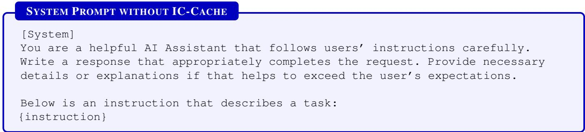  
Figure 23. System Prompt without IC-Cache for conversational tasks.

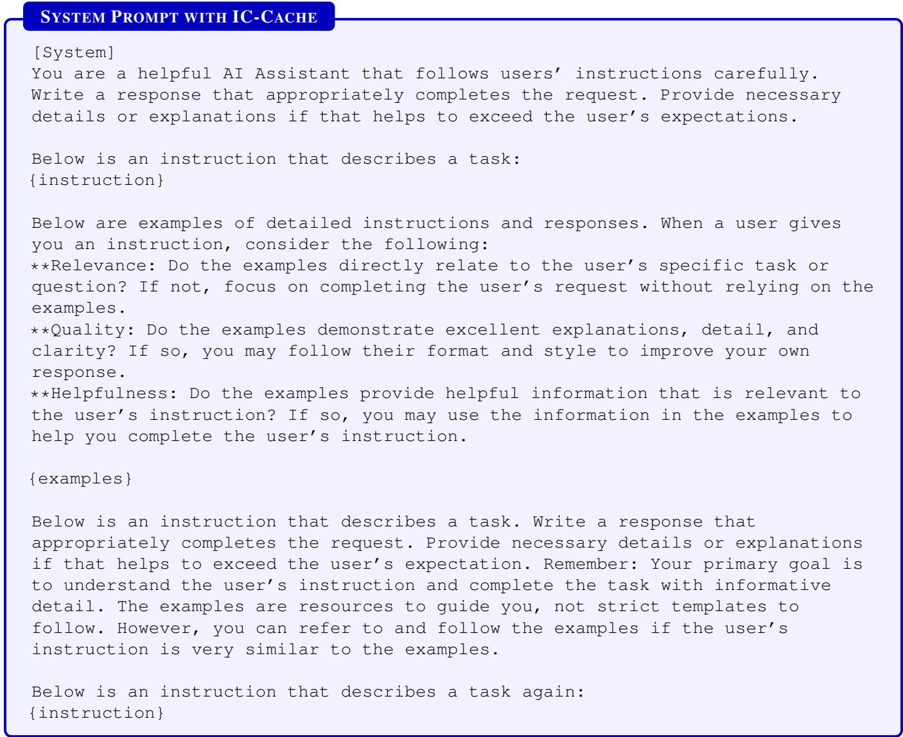  
Figure 24. System Prompt with IC-Cache for conversational tasks.

Proof: A failure occurs if any of the ?? (?? − ??) critical pairs (one model from the top-k, one from outside) are incorrectly ordered. Using a union bound, the required error rate for any

single pair is ??/(?? (?? − ??)). The critical gap for this problem is $\Delta _ { \operatorname* { m i n } , k }$ . Applying Theorem 2 with the critical gap yields the stated complexity.

## AUTORATER SYSTEM PROMPT AUTORATER SYSTEM PROMPT

```ini
[System]
Please act as an impartial judge and evaluate the overall quality of the
responses provided by two AI assistants to the user question displayed below.
You should choose the assistant that follows the user’s instructions and
answers the user’s question better. Your evaluation should consider factors
such as instruction following, factuality, helpfulness, depth, creativity, and
level of necessary details of their responses. Avoid any position biases and
ensure that the order in which the responses were presented does not influence
your decision. Do not allow the length of the responses to influence your
evaluation. Do not favor certain names of the assistants. Be as objective as
possible.
You should start with your evaluation by comparing the two responses and
provide a short rationale. After providing your rationale, you should output
the final verdict by strictly following this seven-point Likert scale: 3 if
assistant A is much better, 2 if assistant A is better, 1 if assistant A is
slightly better, 0 if the two responses have roughly the same quality, -1
if assistant B is slightly better, -2 if assistant B is better, and -3 if
assistant B is much better.
You should format as follows:
[Rationale]: Placeholder for the short rationale of the score. (less than 200
words)
[Score]: Placeholder for the score. This should be -3, -2, -1, 0, 1, 2, or 3.
```  
Figure 25. Autorater system prompt for side-by-side quality evaluation.

Theorem 4: Let the score (logit) for selecting model ?? be defined by its utility and a load-dependent cost penalty:

$$
S _ { i } ( L ) = \mu _ { i } - \lambda _ { 0 } \operatorname { t a n h } ( \gamma L ) C _ { i }\tag{9}
$$

where $\lambda _ { 0 } , \gamma > 0$ are constants. Let the selection policy be a softmax over these scores. If ?? is the model with the highest load-adjusted utility as defined, then $\begin{array} { r } { \operatorname* { l i m } _ { L \to \infty } P _ { j } ( L ) = 1 } \end{array}$

Proof: The selection probability for model ?? is $P _ { i } ( L ) =$ $\frac { \exp ( S _ { i } ( L ) ) } { \sum _ { n = 1 } ^ { N } \exp ( S _ { n } ( L ) ) }$

1. Limiting Behavior of Tanh: As the load $L \to \infty ,$ the hyperbolic tangent term approaches its maximum value: $\mathrm { l i m } _ { L \to \infty } \mathrm { t a n h } ( \gamma L ) = 1$

2. Ratio of Probabilities: Consider the ratio of probabilities between any model $k \neq j$ (where $C _ { k } > C _ { j } )$ and the minimum-cost model ?? :

$$
{ \frac { P _ { k } ( L ) } { P _ { j } ( L ) } } = { \frac { \exp ( S _ { k } ( L ) ) } { \exp ( S _ { j } ( L ) ) } } = \exp ( S _ { k } ( L ) - S _ { j } ( L ) )\tag{10}
$$

Substituting the score definition:

$$
S _ { k } ( L ) - S _ { j } ( L ) = ( \mu _ { k } - \mu _ { j } ) - \lambda _ { 0 } \operatorname { t a n h } ( \gamma L ) ( C _ { k } - C _ { j } )\tag{11}
$$

3. Asymptotic Limit: We take the limit of this difference as ?? → ∞:

$$
\operatorname* { l i m } _ { L \to \infty } ( S _ { k } ( L ) - S _ { j } ( L ) ) = ( \mu _ { k } - \mu _ { j } ) - \lambda _ { 0 } ( C _ { k } - C _ { j } )\tag{12}
$$

Since $C _ { k } > C _ { j }$ , the term $( C _ { k } - C _ { j } )$ is a positive constant. For a sufficiently large cost-sensitivity parameter $\lambda _ { 0 } ,$ the negative cost term $- \lambda _ { 0 } ( C _ { k } - C _ { j } )$ will dominate the constant utility difference $( \mu _ { k } - \mu _ { j } )$ , making the entire expression approach −∞.

4. As the exponent approaches −∞, the ratio of probabilities approaches zero:

$$
\operatorname* { l i m } _ { L \to \infty } { \frac { P _ { k } ( L ) } { P _ { j } ( L ) } } = 0 \quad { \mathrm { f o r ~ a l l ~ } } k \neq j\tag{13}
$$

Since $\begin{array} { r } { \sum _ { i = 1 } ^ { N } P _ { i } ( L ) = P _ { j } ( L ) + \sum _ { k \neq j } P _ { k } ( L ) = 1 } \end{array}$ , and the ratio of every other model’s probability to model $j ^ { \prime } s$ probability goes to zero, it must be that lim $\operatorname { \Pi } _ { L \to \infty } P _ { j } ( L ) =$ 1.

## A.3 An Example of IC-Cache

Figure 26 shows an example of how IC-Cache improves the response quality of the small model with retrieved examples from the large model, collected from the Natural Questions dataset. Without in-context examples, Gemma-2-2B cannot correctly answer the user’s question because it has less capacity to memorize certain historical events compared to the larger model. In-context examples similar to the question, not being semantically identical though, provide related information from different perspectives to answer the question even better than the large model. It is also noteworthy that a well-tuned small model like Gemma-2-2B has the capability to distinguish nuanced concepts and avoid distractions even if the retrieval process doesn’t have perfect precision (e.g., the unrelated examples in red in Figure 26).

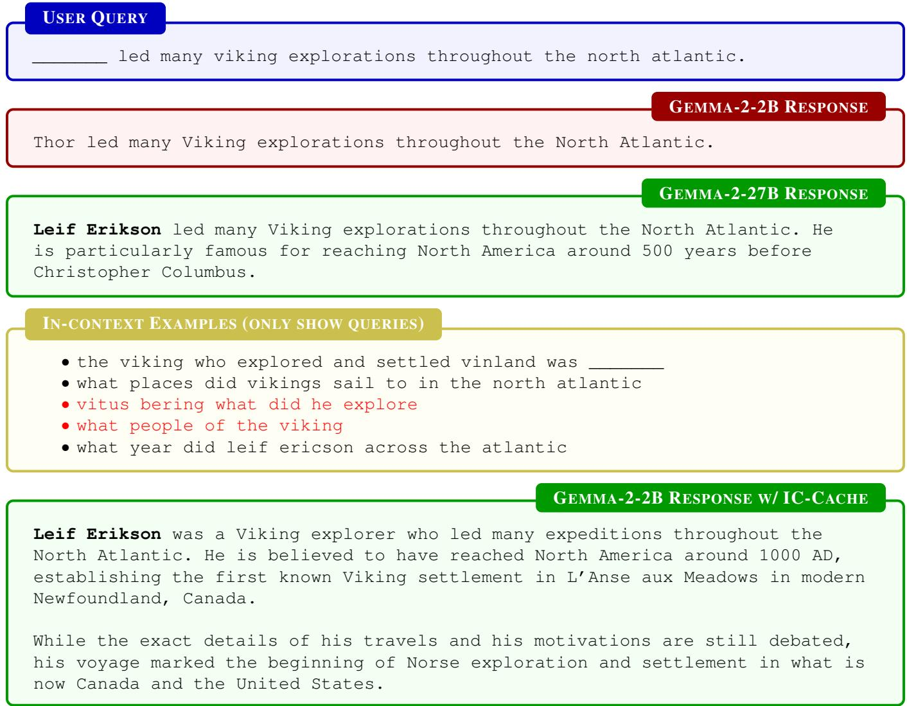  
Figure 26. An example of how IC-Cache works to improve response quality of Gemma-2-2B using a retrieved example from Gemma-2-27B.

## A.4 Dataset Preprocessing

The datasets are curated and processed as follows:

• Preprocessing: We deduplicate examples and filter out non-English queries, as not all models are multilingual.

• Dataset split: For datasets with predefined training and test splits, we use the training split to populate the example bank and the test split for online request evaluation. Otherwise, we randomly partition the data to kick-start example banks and online request sets.

• Example pool initialization: For the purpose of experiments within each model family, we initialize the example pool in each dataset using the responses generated by the larger model.

## A.5 LLM-as-a-Judge

We adopt an LLM-as-a-Judge policy in our evaluations. To validate the effectiveness of this evaluation method, we assess the alignment between LLM-based judgments and human labels. Specifically, we evaluate the LLM judges used in our study—Gemini-1.5-Pro and Gemini-2.5-Pro—on MT-Bench [80], a benchmark designed to measure agreement between model and human preferences. As shown in Table 4, both Gemini judges exhibit strong alignment with human labels, even outperforming alignments among different human raters. Also, Gemini-1.5-Pro achieves agreement levels comparable to GPT-4, further supporting the reliability of our LLM-as-a-Judge policy.

<table><tr><td>Judge</td><td>Gemini-1.5-Flash</td><td>Gemini-1.5-Pro</td><td>Gemini-2.5-Pro</td><td>Human</td></tr><tr><td>GPT-4</td><td>74%</td><td>77%</td><td>76%</td><td>66%</td></tr><tr><td>Gemini-1.5-Flash</td><td></td><td>80%</td><td>76%</td><td>67%</td></tr><tr><td>Gemini-1.5-Pro</td><td></td><td></td><td>81%</td><td>68%</td></tr><tr><td>Gemini-2.5-Pro</td><td></td><td></td><td></td><td>73%</td></tr><tr><td>Human</td><td></td><td></td><td></td><td>63%</td></tr></table>

Table 4. Preference agreement matrix between different LLM raters and human raters on MT-Bench [80].

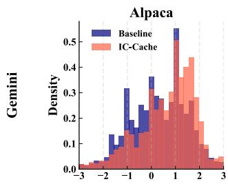

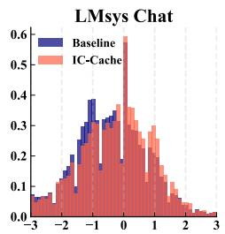

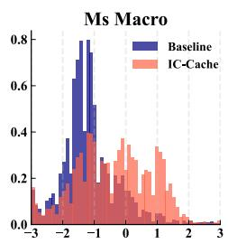

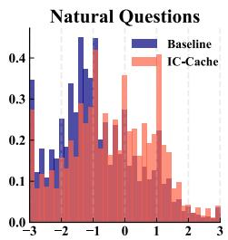

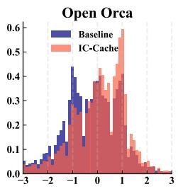

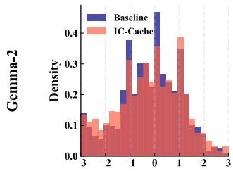

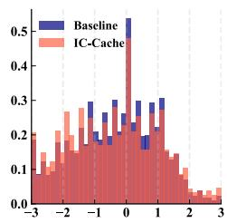

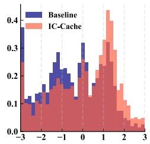

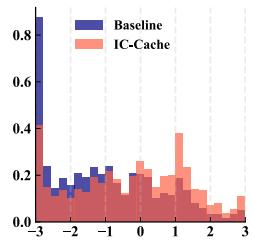

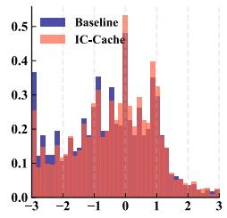

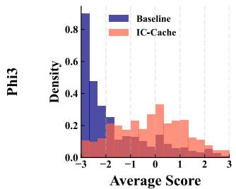

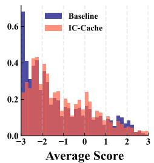


  
Figure 27. Model quality comparison on five text generation tasks with three different model families. With IC-Cache, the quality of a smaller model can be significantly boosted.

  
Figure 28. IC-Cache improves response score on natural question using Phi-3.

## B More Evaluation Results

## B.1 Response Quality Improvement

IC-Cache brings significant improvements in response quality across diverse model families and datasets (Figure 17). In this experiment, the model router was configured to route each query to both the small and large models, enabling a direct quality comparison. With IC-Cache, the win rate of smaller models over larger models improves by up to 12.4 percentage points for Gemini models on LMSys-Chat and OpenOrca. Notably, on certain datasets, IC-Cache enables smaller models to achieve win rates exceeding 50%, showing that with examples, they can outperform larger models.

When we zoom into individual queries, we notice that IC-Cache improves the distribution of scores toward higher values. As shown in Figure 28, without IC-Cache, small models frequently generated responses that received a score of -3 (significantly worse). With IC-Cache, we observe a marked reduction in responses scoring -3, with the overall distribution shifting rightward toward higher scores. The mean score improves substantially from -2.33 to -0.89, with nearly 50% of queries performing at or above the level of large models.

We provide the side-by-side response quality comparison of generation scores among all three model families on five datasets in Figure 27.