Latest updates: hps://dl.acm.org/doi/10.1145/3731569.3764830

RESEARCH-ARTICLE

YUXUAN ZHANG, University of Pennsylvania, Philadelphia, PA, United States SEBASTIAN ANGEL, University of Pennsylvania, Philadelphia, PA, United States

Open Access Support provided by: University of Pennsylvania

  
Published: 12 October 2025

Citation in BibTeX format

SOSP '25: ACM SIGOPS 31st Symposium   
on Operating Systems Principles   
October 13 - 16, 2025   
Seoul, Republic of Korea

Conference Sponsors: SIGOPS

# Quilt: Resource-aware Merging of Serverless Workflows

Yuxuan Zhang University of Pennsylvania Philadelphia, PA, USA

## Abstract

This paper describes Quilt, a serverless optimizer that automatically merges workflows that consist of many functions (possibly in different languages) into one process thereby avoiding high invocation latency, communication overhead, and long chains of cold starts. Instead of merging all functions, Quilt takes into account the provider’s resource constraints to decide which functions to merge. Quilt is compatible with existing platforms without modification (Fission, OpenWhisk, and OpenFaaS), can merge functions in different languages (C, C++, Swift, Go, Rust) by acting at the level of LLVM IR, and requires no input or help from developers. Our evaluation shows that Quilt improves median workflow completion time by 45.63%–70.95% and throughput by 2.05×–12.87×.

## ACM Reference Format:

Yuxuan Zhang and Sebastian Angel. 2025. Quilt: Resource-aware Merging of Serverless Workflows. In ACM SIGOPS 31st Symposium on Operating Systems Principles (SOSP ’25), October 13–16, 2025, Seoul, Republic of Korea. ACM, New York, NY, USA, 21 pages. https://doi.org/10.1145/3731569.3764830

## 1 Introduction

Serverless platforms let developers upload code for individual functions without developers having to manage the servers that will run these functions. The provider takes care of placement, function discovery, request routing, load balancing, scaling, failure recovery, per-function billing, etc. In exchange for providing these benefits to customers, providers get flexibility: they can place functions wherever there are idle resources, and move them around to improve utilization.

When developers’ needs go beyond one function they deploy workflows, which are graphs of functions that implement the logic of an application by calling each other as needed. Each function in the workflow is independent and is deployed in a separate container. Workflows are a great way to enjoy the benefits of the microservice design paradigm within the

Sebastian Angel University of Pennsylvania Philadelphia, PA, USA

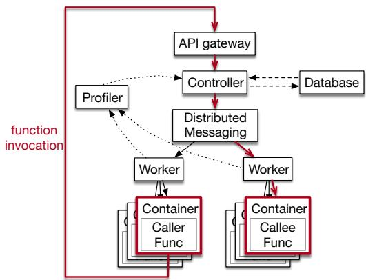  
Figure 1. Typical serverless function invocation path.

serverless ecosystem: applications are decomposed into small components and different teams can work, test, and iterate over these components independently.

The price that developers currently pay for the flexibility and convenience afforded by serverless workflows is a reduction in their application’s performance. The reason is that serverless actually exacerbates the well-known overheads of microservice architectures whereby each microservice talks to another via the network. In serverless workflows, as we show in Figure 1, when a function calls another function the invocation is actually an HTTP request sent to the destination function. This request is received by an API gateway, who forwards it to a controller that decides which of the existing instances of a given function should process the request; if there are none available, the controller must first launch an instance and then forward the request to it. In short, function invocations in serverless (1) introduce intermediaries (e.g., API gateway); (2) create new connections (e.g., TCP handshake, libcurl session); and (3) sometimes run into cold starts where a function is not currently available and must be deployed and provisioned from scratch [39, 41].

Looking at this state of affairs would lead one to conclude that workflows are not the right way to build larger applications. But building specialized units of code has merits in serverless: each function can be written in a (potentially different) suitable language, it can be reused across multiple workflows by just using an identifier, and the provider can do a great job scheduling it to any machine that has enough resources (e.g., memory, CPUs) to run that specific function rather than having to find a machine that can run the much larger and resource demanding application.

In this paper we therefore ask: can we get the scheduling and development flexibility afforded by having many small functions and the performance of large monolithic applications? To answer this question we build Quilt, an optimizer for serverless platforms that runs in the background and automatically merges serverless workflows at runtime to form a single process that avoids network and inter-process communication. Function invocations with Quilt take nanoseconds instead of many milliseconds.

While the goal of merging functions is straightforward, proper quilting is an art. One cannot simply merge all functions in a workflow and expect to get good resource utilization and good performance. As one example, if one merges workflows with many parallel functions or with functions that use a lot of data, the resulting merged function will require too many CPUs or too much memory, complicating placement. This creates resource fragmentation: severless workers will have spare resources that have to go unused because they are not sufficient to fit large merged functions.

This type of resource fragmentation awareness is one of the ways in which Quilt is different from prior works that merge functions together [29, 31, 37, 38, 40]. The other main difference is that prior works focus on merging functions written in a single interpreted language (e.g., JavaScript) which can be done by stitching functions at the source code level. While interpreted languages are prevalent in serverless, compiled languages like Rust, C, C++, Swift, Go, and others are becoming popular because of their helpful type systems and good performance. Quilt handles functions in these languages, and can even merge across languages (e.g., Rust and Go).

In particular, Quilt achieves the following goals:

• Constraint-aware merging. Providers can tell Quilt about their available resources and Quilt figures out how best to stitch functions to reduce resource fragmentation.

• Transparent execution. Functions created by Quilt work immediately on existing unmodified serverless platforms.

• Language flexibility. Developers can write functions in many popular languages.

• No developer effort. Quilt is easy for developers to use and is backwards compatible. Developers simply upload functions to the platform as they do today, and then indicate whether a function can be merged if included in a workflow.

To achieve these goals, Quilt makes three observations. First, function-level isolation via the use of containers or VMs makes sense when collocating functions of different tenants in the same machine. In Quilt, we preserve this arrangement. However, for a single workflow from a single tenant, perfunction isolation appears needlessly restrictive. Consider how one builds a complex application: a developer imports libraries (e.g., Boost, Tokio) and then uses functions within these libraries. These library functions are linked and loaded in the same address space as the rest of the application and have access to other functions and data in the same process. We think the same trust model should apply to serverless in the context of the same workflow and the same tenant.

The second observation is that the LLVM project [17] is widely supported and many languages compile to its intermediate representation (LLVM IR). These include C, C++, D, Go (via Gollvm [10]), Haskell, Kotlin, Nim, OCaml, Objective-C, Python (via Codon [12]), Rust, Scala, Swift, Zig, among others. As a result, merging functions at the LLVM-IR level means that, at least in theory, Quilt can work with many languages and even merge functions across languages.

The last observation is that Quilt does not need to merge functions immediately when the developer uploads them. Quilt can instead monitor workflows as they execute for some time and then, in the background, decide when and what to merge. This means that the merging does not need to be real-time. Further, once the functions are merged, Quilt can replace the entry point to the relevant subgraph of the workflow with the appropriate merged function. The scheduler is completely oblivious to the fact that a merge took place and just learns that a function was updated.

## 1.1 Overview of Quilt

Quilt provides workflow-level isolation, where functions in a tenant’s workflow are isolated from other tenants and workflows, but are not isolated within a workflow. Quilt then merges functions within a workflow into the same process. There may be cases where a team built a function expecting that it would be isolated from other functions (e.g., the function may process sensitive data). We discuss ways to add function-level isolation in Section 8, but in general, sensitive functions should not be merged. Quilt is opt-in: developers set if a function can be merged when they upload it.

Quilt merges functions by compiling them into LLVM-IR, extracting the function’s code, giving unique names to functions and variables to avoid aliasing, replacing invocationrelated code which uses the network (e.g., libcurl sessions) into regular function calls, and performing a variety of optimizations (e.g., dead code elimination, library deduplication, program debloating) to reduce the size of the function. Quilt also deals with the challenge of getting functions of different languages to interact properly with each other. Normally, this task would be onerous, but Quilt observes that serverless functions interact with each other exclusively through a REST API. That is, there is no shared memory and the only data type are (JSON-encoded) strings. Quilt therefore only needs to translate between the string types of the various languages.

Quilt discovers functions’ call graphs and collects performance and resource utilization statistics with a distributed tracing framework that requires no modifications to workflows or functions; Quilt can start monitoring which functions call each other, how often, and how expensive they are as soon as developers upload them. Once Quilt has this information, it employs a new constraint-aware merging algorithm that merges functions in a way that improves performance and satisfies the provider’s resource constraints.

Finally, Quilt monitors its merged functions and reconsiders the merge if there are big workload changes, a function is updated, or its permission to be merged is removed.

We have implemented Quilt in 1.8K lines of C++ that perform the LLVM passes, and 1.7K lines of Bash and Python that manage the compilation and profiling pipelines. We have tested Quilt on three serverless platforms: Fission [9], Open-FaaS [18], and OpenWhisk [2]. Since Quilt is transparent, we did not have to modify these platforms’ schedulers.

We have ported three applications from the DeathStar-Bench [27] microservice benchmark to both C++ and Rust; each application is a workflow. We have also used Quilt to merge functions from different languages (C, C++, Go, Rust, and Swift). Our evaluation confirms that Quilt (with the same number of resources) can improve median workflow completion time by 45.63%—70.95%, and throughput by 2.05×–12.87×. Further, Quilt is also more resource efficient as merging functions can eliminate overhead from duplicated containers, libraries, and runtimes.

Limitations. We have tested Quilt’s ability to merge functions across five languages but new languages could bring unexpected challenges. Another limitation is that we have not optimized the performance of our LLVM compiler passes so merging functions takes around a minute. Section 8 discusses how to mitigate these limitations. Furthermore, Quilt only helps when functions call each other directly. If functions use external services to interact with each other (e.g., Amazon’s SQS [1]), Quilt cannot merge those external interactions.

A missing component in Quilt and prior works is a mechanism to ensure graceful failure handling. If a function crashes due to an unexpected input, some platforms return an error message to the caller function who can then handle the failure gracefully. When a workflow (or part of it) is a single process, any function crash becomes a workflow crash. It remains an open question how to best remedy this situation.

## 2 Background and motivation

Serverless computing is widely available today, with services like AWS Lambda, Azure Functions, Google Functions, IBM Cloud Functions, Oracle Cloud Functions, Cloudflare Workers, and Meta’s XFaaS [36]. Further, open source platforms such as Fission [9], OpenWhisk [2], and OpenFaaS [18] let developers setup up their own serverless environments. As we describe in the introduction, the promise of serverless is that functions can be run anywhere suitable, and developers are freed from dealing with the time-consuming tasks of balancing load, autoscaling, machine management, etc.

In this section we discuss serverless workflows, how functions call each other, and the limitations of existing platforms. We then review prior works and how Quilt differs from them.

Serverless workflows. Workflows are a way in which developers can express larger applications by allowing functions to call each other. In this case, a function A can call functions B and C, wait for B and C to finish, and then use their outputs. These function calls can be synchronous (call B and wait for it to return before calling C) or asynchronous (call both B and C in parallel). Workflows can be explicitly defined using specification languages such as AWS Step Functions [4], or functions can simply call each other using an invocation API. In this latter case, workflows are not known a priori to the serverless platforms; instead, they are implicitly defined by the function invocations and may vary across executions (e.g., function A may invoke function B inside a branch, so A may only call B on some inputs).

How do functions call each other? There are two principals: the caller and the callee. In the caller function’s code, developers use the invocation API to specify the callee’s handle (i.e., unique identifier) and the desired input. Then, as shown in Figure 1, the invocation information is first serialized into either JSON or a flat string, packed into the payload of the function invocation request, and sent to the API gateway via HTTP. The API gateway verifies that the request is valid and then forwards it to a controller or scheduler that decides which worker should be responsible for the request. Finally, the invocation request is sent to the selected worker.

If the callee’s container is not present in the main memory of the worker, the worker has to load the corresponding function container, which includes the runtime, libraries, and function code, into the main memory from remote storage. This loading time is referred to as a “function cold start”.

Once the container is ready, the worker spawns a new process that runs the callee’s code in the container and forwards the function invocation request to the callee. Then, the callee function processes the request by first deserializing the payload to understand the caller’s inputs and then executing the function code to generate the corresponding response. Similarly, sending the response back involves the same steps as receiving the request. The response must be serialized and sent to the caller via the API gateway.

Sources of overhead. Function invocations incur overheads due to: (1) serialization and deserialization; (2) networking delay; (3) queueing delay; and (4) function cold starts.

If a function cold start is not present, the invocation overhead typically ranges from a few milliseconds to tens of milliseconds [3, 32], which can be relatively high compared to the actual function execution time. For example, the median invocation latency of a warm no-op function on AWS Lambda is 10.4 ms [29], while 20% of AWS Lambda functions run in under 100ms [8], and 67% of Lambda@Edge functions run in under 20ms [7]. In addition, statistics from Meta’s XFaaS platform indicate that “short-lived” functions tend to generate significantly more function invocations [36]. As a result, when workflows consist of these short-lived functions, the frequent function invocations may lead to significant overhead. Cold starts are an order of magnitude worse [39].

## 2.1 How do prior works address invocation overheads?

Prior works have observed that invocation costs in workflows are problematic. Their proposal is to place functions near each other. Quilt has a similar objective but it has different requirements (§1) and proposes different mechanisms.

Worker or VM-based co-location. Nightcore [29] places related functions in the same worker but in different containers, and then uses OS pipes to support the communication. This approach replaces existing platforms instead of working with them, and requires all functions in a workflow to be in the same machine (which can lead to resource fragmentation), or requires developers to specify which functions to co-locate (which requires manual effort). This information is needed because the functions need to explicitly use the OS pipe API.

Like Nightcore, SONIC [33] co-locates functions in the same VM (different containers), but its focus is reducing data movement by using the VM’s local storage. Quilt is inspired by SONIC, but merges functions in the same process.

Merging. Quilt is inspired by works that merge functions into the same container or process, including WiseFuse [34], Faastlane [31], Faasm [40], and Fusionize [37, 38]. Quilt has three salient aspects that make it unique.

1. Transparency. There is no need for developers to write specific code, which is in contrast to Faasm (though merging is not Faasm’s primary goal but rather a nice byproduct).

2. Language flexibility. Functions can be written in different languages, including compiled languages; WiseFuse, Fusionize, and Faastlane require all functions to be written in the same interpreted language (e.g., Python).

3. Constraint-aware merging. Merging takes into account functions’ resource needs and the provider’s constraints. Fusionize ignores constraints when merging functions, while Wisefuse and Faastlane take container sizes into account. Quilt expands on this by incorporating fine-grained profiling data like inter-function call frequency.

Roadmap. Section 1.1 briefly outlines Quilt’s approach. The next sections provide the details.

## 3 Profiling

The first step in Quilt is to infer workflows and their resource requirements. In particular, Quilt needs to gather two things:

• Call graph: which functions call which other functions, and how often. The vertices in the graph represent functions and the directed edges represent invocations. The weight of the edges represents the frequency of the invocation.

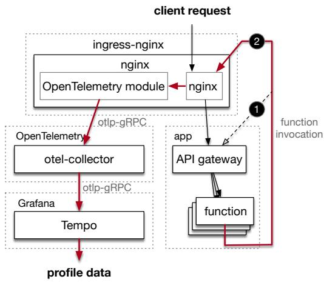  
Figure 2. Quilt uses lightweight and transparent distributed tracing to collect caller-callee information.

• Resource use: how many resources does each function need. This labels each vertex in the call graph with the corresponding number of CPU and memory that it needs. One can also collect network bandwidth and storage IOPS.

To construct the call graph without many changes to the serverless platform or requiring developer involvement, Quilt adopts a transparent and lightweight distributed tracing approach. In detail, Quilt places an nginx ingress controller before the API gateway as shown in Figure 2. We configure ingress rules to ensure that HTTP requests retain the same path and query string after passing through the ingress controller. This allows the API gateway, which relies on this data to identify functions and request parameters, to continue working. We enable the OpenTelemetry [19] module in nginx to record and report traces that contain the caller-callee information. We also deploy an OpenTelemetry Collector (otelcollector) for trace collecting and processing, and Grafana Tempo [11] as a backend for storage and future analysis.

Whenever a function invocation is made from a caller function, it follows path ➋ in Figure 2 to send the invocation request to nginx rather than the original path ➊. Upon receiving the request, nginx’s OpenTelemetry logs the request and then forwards it to the API gateway. The recorded traces are batched and periodically sent to the otel-collector for intermediate filtering and processing, and are finally exported to Tempo. Quilt can then query Tempo to retrieve all necessary caller-callee information whenever it needs it.

Note that Quilt does not profile functions all the time, as this would introduce the overhead of going through the extra hop of nginx permanently. Instead, it is done dynamically by the provider. To support this on/off switch for profiling, we observe that all three platforms that we study (Open-Whisk [2], OpenFaaS [18], and Fission [9]) are based on Kubernetes, so Quilt introduces a one-bit Kubernetes token, profiler-enabled, to specify whether the function invocation should be profiled. When a function invocation is made, it first checks the profiler-enabled parameter stored in the container. If profiling is enabled, the request follows path ➋ in Figure 2; otherwise, it follows path ➊. When the token is changed, all containers that store this parameter automatically receive the update and change their behavior.

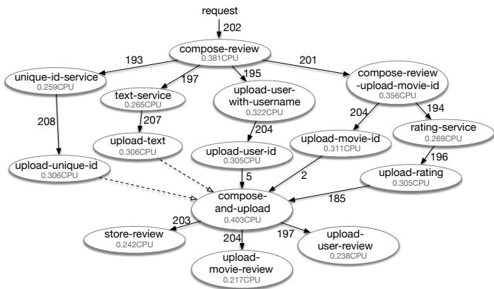  
Figure 3. Example call graph for a Movie Review service generated by Quilt’s distributed tracing (Figure 2).

Collecting resource usage. Quilt collects the cumulative CPU time and the peak memory usage of each container within a profiling window with cAdvisor [5], and stores the results in InfluxDB [14]. Quilt then queries InfluxDB to get the necessary statistics. Since the serverless platform creates multiple containers for the same function (but different instances), Quilt aggregates the data of the relevant containers. From this information Quilt can derive the average CPU and max memory used by each function.

Call graph construction. Quilt fetches the data stored in Tempo and counts the number of requests to the workflow and the occurrences of each caller-callee pair in the profile window. It then uses this information to build the edges of the call graph. We show an example call graph generated by profiling DeathStarBench’s Media Microservice in Figure 3. In the call graph, we use dash arrows to represent function calls from upload-unique-id and upload-text to compose-and-upload because these two calls appear in the code but are not present in the profiling samples (i.e., profiling is not perfect as some code paths are data-dependent).

## 4 Deciding what to merge

Serverless platforms impose resource limits on each function instance, such as a maximum CPU and memory. If an instance exceeds its CPU limit, the function is throttled. If a function exceeds its memory limit, it is terminated. Further, some platforms place relationships between CPU and memory [15].

Therefore, given a call graph, Quilt must carefully decide which functions to merge to balance the performance benefits of merging, with the resource constraints of the platform. Aggressively merging too many functions can lead to overuse of resources, causing function slowdowns or failures. Conversely, merging too few functions limits the benefits.

Are container limits reasonable? One might wonder whether the provider could simply merge the entire workflow into a single function and increase the resource limits? Yes, but at the cost of resource fragmentation. If a provider has many containers with heterogenous demands (memory, CPU), placing them in worker machines without leaving many resources stranded is a hard bin-packing problem. Worse yet, as the resource demands get large in relation to the available resources, the waste increases: in the extreme case, each worker can only run one container and any leftover resources are wasted. We design Quilt to provide most of the benefits of merging while satisfying the restrictions of existing platforms.

## 4.1 Problem statement

Deciding which functions to merge while respecting resource constraints is a graph clustering problem. The objective is to cluster the call graph into (potentially overlapping) groups that satisfy the resource constraints while minimizing intergroup edges. Specifically, the call graph is modeled as a connected rooted Directed Acyclic Graph (rDAG) $G = ( V , E )$ where all nodes are reachable from a single root node via a directed path. Each node $i \in V$ represents a function and is labeled by two parameters obtained from profiling: the peak memory usage $m _ { i } ,$ , and the average CPU usage $c _ { i } .$

A directed edge $( i , j ) \in E$ from node ?? to node ?? denotes a caller-callee relationship and is assigned a weight $w _ { i , j }$ derived from the call frequency profiling. For each edge, we define the normalized per-workflow edge weight to be $\begin{array} { r } { \alpha _ { i , j } = \lceil \frac { w _ { i , j } } { N } \rceil } \end{array}$ ， where ?? is the number of times the workflow was invoked during the profile window. This $\alpha _ { i , j }$ is an upper bound on the expected number of times that function ?? calls function ?? when the workflow is invoked.

We will use $\alpha _ { i , j }$ to help us scale the amount of resources that function ?? would consume if it were to be placed in the same group as function ??. For example, if function ?? calls function ?? asynchronously $\alpha _ { i , j }$ times (so all instances of ?? run in parallel), then the $\alpha _ { i , j }$ instances of ?? would require $\alpha _ { i , j } \cdot m _ { j }$ units of memory and $\alpha _ { i , j } \cdot { c _ { j } }$ units of CPU. On the other hand, if ?? calls ?? synchronously $\alpha _ { i , j }$ times (so each instance of ?? runs after the previous instance completes), then function ?? would consume $m _ { j }$ memory and $\alpha _ { i , j } \cdot c _ { j }$ CPU. This asymmetry stems from the fact that ?? can free memory after it completes so other instances (or other functions in the same group) can use it, but ?? cannot “free” the CPU time that it has already used.

Let ?? be the maximum amount of CPU time and ?? be the maximum amount of memory allocated to a container. The goal is to obtain ?? subgraphs $G _ { 1 } , G _ { 2 } , \ldots , G _ { k } \subseteq G$ each representing a group of functions that will be merged into a single process. Note that we say nothing about subgraphs being disjoint. If a workflow includes a function that is called multiple times by other functions (e.g., compose-and-upload in Figure 3), it is sometimes beneficial to include the function in many subgraphs. The constraints on the subgraphs are:

• The union of the ?? subgraphs recovers the call graph:

$$
G _ { 1 } \cup G _ { 2 } \cup \cdot \cdot \cdot \cup G _ { k } = G .
$$

• Each subgraph $G _ { u } = \left( V _ { u } , E _ { u } \right)$ must be a connected rDAG. This constraint ensures that all functions within $G _ { u }$ can be merged into a program with a single entry point that is transparent to the scheduler. An implication of this constraint is that if an edge (??, ?? ) crosses from subgraph $G _ { u }$ to a different subgraph $G _ { v } ~ ( \mathrm { i . e . , ~ } i \in { V _ { u } , j } \in { V _ { v } , u } \ne v )$ , then node ?? must be the root of $G _ { v } .$

• Each subgraph $G _ { u } = \left( V _ { u } , E _ { u } \right)$ with root ?? satisfies the memory and CPU resource constraints:

$$
c _ { u } + \sum _ { ( i , j ) \in E _ { u } } \alpha _ { i , j } \cdot c _ { j } \leq C
$$

$$
m _ { u } + \sum _ { ( i , j ) \in E _ { u } } m _ { j } + \sum _ { ( i , j ) \in E _ { u , \mathrm { a s y n c } } } ( \alpha _ { i , j } - 1 ) \cdot m _ { j } \leq M
$$

Some explanation for the above formulas. The CPU constraint says: every incoming edge to ?? from within $G _ { u }$ , namely $( i , j ) \in E _ { u } .$ , that is taken $\alpha _ { i , j }$ times, causes function ?? to run, with an overall consumption of $\boldsymbol { \alpha } \cdot \boldsymbol { c } _ { j }$ units of CPU. The exception is the root of $G _ { u }$ because every call to ?? creates a new instance of the graph (i.e., spawns a new “merged function” or container). Further, edges from nodes in other subgraphs to $j \in V _ { u }$ do not exist unless ?? is the root of $G _ { u }$ due to the connected rDAG restriction. Note that the function ?? can be cloned and appear in many subgraphs (this is why our problem is not a standard partitioning problem), but the CPU constraint is only talking about the instance of $j \in V _ { u }$

The memory constraint is more involved because we can assume that functions free memory when they finish, but we need to be careful. We first label edges $E _ { u } = E _ { u , \mathrm { s y n c } } \cup E _ { u , \mathrm { a s y n c } }$ by the type of call (synchronous or asynchronous). The first sum accounts for potential concurrency across edges, even if the edges are synchronous. For example, consider a diamondshaped DAG with edges (??, ??), (??, ??), (??, ??), (??, ??). Even if (??, ??) and (??, ??) are synchronous, (??, ??) and (??, ??) might be asynchronous, allowing (??, ??) and (??, ??) to be concurrent. The second sum accounts for concurrency within each edge.

Objective function: The goal is to find the set of subgraphs that minimizes the number of function calls that require remote invocations (i.e., the sum of cross-graph edges). Formally, for subgraphs $G _ { u }$ and $G _ { v }$ define $E _ { u , v }$ to be the set of edges that have one endpoint in $G _ { u }$ and the other in $G _ { v } .$ The

objective function is:

$$
\operatorname* { m i n i m i z e } _ { \boldsymbol { u } , \boldsymbol { v } \in [ 1 , \boldsymbol { k } ] } \left( \sum _ { ( i , j ) \in E _ { \boldsymbol { u } , \boldsymbol { v } } } w _ { i , j } \right)
$$

Workflows with high fan-out. One consequence of these constraints is that our merging algorithm is unlikely to merge functions with very high fan-out (e.g., a function that calls another function 1000s of times), as doing so would incur a very high resource cost. This ensures that workflows in Quilt can retain the elasticity and burstiness provided by serverless platforms that systems like gg [24] or ExCamera [25] exploit to complete tasks quickly with massive parallelism.

Section 5.6 discusses what happens when the fan-out is data dependent and therefore the profiled edge values are not representative of future invocations.

## 4.2 Finding the optimal set of subgraphs

We could not find prior work that solves a non-disjoint graph clustering problem where the constraints are over vertices and the optimization is over the edges. In the context of serverless, the closest is Costless [22], which helps developers decide which functions to run at the edge (e.g., in a Raspberry Pi) and which to run in the cloud to minimize financial costs. Costless deals with disjoint partitions and only 2 groups (cloud or edge). Quilt’s problem is more complex as it needs to determine how many groups to create and which functions to put in each group to reduce costs and satisfy all constraints.

Below we show how to find the optimal solution to this problem for small call graphs (≤20 vertices)—which includes all of the benchmark applications that we could find. Given that this problem is NP hard, we also describe how to compute a suboptimal (but empirically good) solution for large graphs.

Optimial solution. To motivate our solution, we make three observations. First, each of the ?? subgraphs must be an rDAG, so each subgraph has one root. Second, the ?? roots must be unique, as otherwise if there are multiple subgraphs with the same root, it is not clear which subgraph (merged function) the scheduler should run when the root’s handle is used. Third, there are cases where having more subgraphs is beneficial, so picking the smallest ?? for which there is a valid grouping does not guarantee the lowest sum of all weights. Appendix A has an example of this. As a result, one needs to try all possible ??.

Our algorithm therefore has two phases.

Phase 1: Find candidate root sets for a given ??. Given a value of $k ,$ output a list of candidate root sets $\mathcal { R } = \{ R _ { 1 } , . . . , R _ { \ell } \}$ Each set $R _ { i } \ = \ \{ r _ { 1 } , r _ { 2 } , \ldots , r _ { k } \} \ \in \ V ^ { k }$ consists of the chosen roots for the ?? subgraphs. It includes the original root in ?? , in addition to ?? − 1 other roots. Consequently, there are a total of $1 + \binom { | V | - 1 } { k - 1 }$ possible candidate root sets.

Phase 2: Subgraph Construction for a given ??. Given a single candidate root set ??, we determine the exact assignment of all graph nodes to the ?? potential subgraphs $\left( G _ { 1 } , \ldots , G _ { k } \right)$ such that all constraints are satisfied and the sum of cross-graph weights is minimized. We formulate this assignment problem as the following Integer Linear Program (ILP):

Decision Variables: We create the following binary variables:

$x _ { i , j } \colon$ for each edge $( i , j ) \in E .$ We set $x _ { i , j } = 1$ if the edge $( i , j )$ is a cross-edge (i.e., it s a cut), and $x _ { i , j } = 0$ if it is internal to a subgraph.

$y _ { i , r } \colon$ for each node ?? and each root $r \in R .$ We set $y _ { i , r } = 1$ to mean “assign ?? to subgraph ${ G _ { r } } ^ { * } ; y _ { i , r } = 0$ otherwise. Note that ?? can be assigned to multiple subgraphs.

Objective Function:

$$
{ \mathrm { M i n i m i z e } } \sum _ { ( i , j ) \in E } w _ { i , j } \cdot x _ { i , j }
$$

The objective is to minimize the sum of cross-edge weights, which corresponds to the number of non-local serverless calls. Constraints: We have 8 sets of constraints that must be simultaneously satisfied. We give 3 examples here and list all in Appendix B. (1) Every root belongs to its own subgraph: ∀?? ∈ ??, ????,?? = 1. (2) Every node $i \in V$ must be assigned to at least one subgraph: $\begin{array} { r } { \forall i \in V \sum _ { r \in R } y _ { i , r } \geq 1 . ( 3 ) \mathrm { I f } \left( i , j \right) \in E } \end{array}$ is a cross edge $( \mathrm { i } . \mathrm { e } . , y _ { i , r } = 1 $ and $y _ { j , r } = 0 )$ then $x _ { i , j } = 1$ . This is captured by: $\forall r \in R , \forall ( i , j ) \in E , x _ { i , j } \geq y _ { i , r } - y _ { j , r }$

Full algorithm. We start at ?? = 1 and use Phase 1 to compute the list of candidate root sets R. For each $R _ { i } \in \mathcal R$ , we use Phase 2 to find the best subgraph assignment for $R _ { i } .$ Once we have tried all candidate sets in R, we increment ?? and repeat. We do this until $k = | V |$ and output the best assignment seen.

## 4.3 A fast and good (but suboptimal) solution

The above approach is slow in three ways: (1) it tries every value of ??; (2) it outputs a list of root sets R that is exponential in $k ;$ and (3) it solves an ILP for each $R \in { \mathcal { R } }$ . We relax these.

First, instead of trying every value of ?? we keep increasing ?? until we find good enough groupings. Second, we avoid trying every possible candidate set ??. Instead, we study the graph structure and identify nodes that could serve as promising roots. Some promising candidates are nodes with high out-degree, in-degree, or high betweenness centrality. The intuition is that if these nodes are roots, we can internalize many cross-graph edges. Unfortunately, we find empirically that these heuristics produce low quality solutions. The core issue is that they look at properties of a single node without understanding downstream effects.

We thus propose the Downstream Impact heuristic (DIH). Informally, DIH measures the resource demands of the portion of the graph reachable from node ??. If ?? is the gateway to a large, resource-intensive subgraph, forcing this subgraph into another (if ?? is not made a root) might violate the memory or CPU constraints. Making ?? a root allows this resource-heavy part to form its own subgraph and relieve capacity elsewhere.

```rust
sync_inv(callee: &str, req: String) -> String;
async_inv(callee: &str, req: String) -> Future;
async_wait(future: &Future) -> String;
get_req() -> String;
send_res(response: String);
```  
Figure 4. Typical serverless function I/O and invocation API.

We formalize DIH in Appendix C and find empirically in Section 7.5.2 that it works very well: it is fast and identifies high quality roots that are often optimal.

Last, we relax the ILP formulation by allowing the solver to return a solution for a given candidate set ?? that is within some percentage of optimal. For example, in Gurobi [16] setting the “MIP Gap” parameter causes the solver to stop when it finds a feasible solution whose objective value is guaranteed to be within the chosen percentage of the optimum.

## 5 Merging

Given a set of groups as described in the prior section, Quilt’s goal is to merge each group. This requires integrating the callee function into the caller’s address space, and transforming invocations into local calls. Quilt observes that serverless platforms have APIs that functions use to perform I/O and call other functions. We give a Rust API in Figure 4; the specifics vary by platform and language, but the general idea applies.

The sync\_inv and async\_inv APIs are used to call other functions (async\_inv spawns a thread and then calls sync\_inv). The caller specifies the handle of the callee to be invoked and the payload. Inside sync\_inv, an HTTP client library (e.g., reqwest, libcurl) is used to establish an HTTP connection with the API gateway. Note that this API is heavily simplified; in reality the types are more complex to deal with timeouts, errors, etc.

The get\_req() and send\_res() interfaces are used by functions to receive inputs from STDIN and return outputs via STDOUT. The serverless platform’s container takes care of providing the actual inputs to the function and routing the outputs over the network.

Quilt leverages these existing APIs to merge functions. The key point that makes merging manageable even as we go across different programming languages is that in all serverless platforms we have surveyed the input and outputs to a serverless function are always a single string (usually JSON encoded). Quilt exploits this fact to build a compilation pipeline that merges functions.

## 5.1 Compilation pipeline

As shown in Figure 5, Quilt’s pipeline relies heavily on the LLVM infrastructure. Because serverless functions may be written in various programming languages, merging them into the same address space requires an intermediate representation to which different languages can be uniformly converted.

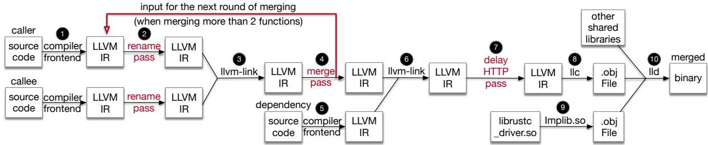  
Figure 5. Compilation pipeline for merging serverless functions based on LLVM.

LLVM’s language-agnostic intermediate representation, designed as a portable, high-level assembly language, serves as the ideal intermediate layer for this purpose. Our implementation demonstrates cross-language merging of functions written in Rust, C, C++, Swift, and Go. However, we believe our approach can be applied to functions written in other languages that support translation to LLVM IR.

Below we describe how Quilt merges 2 functions in the same language, then two functions in different languages, and finally how it merges many functions from a call graph.

## 5.2 Merging functions in the same language

We give an example of how Quilt merges two Rust functions. While the idea of merging functions is conceptually straightforward, the mechanics take considerable care.

Quilt’s compilation pipeline operates as follows. First, the source code for the two serverless functions is compiled into LLVM IR using the rustc compiler. We leverage cargo to fetch and compile dependencies; if multiple functions use the same dependencies we only compile them once. We choose rustc+nightly because it enables compiling core Rust libraries such as libstd into bitcode, which is a binary encoding of LLVM IR that allows us to perform further customization and optimization. If these libraries are not compiled to bitcode, the linker must instead link them from Rust’s official toolchain during the linking stage. Given that these libraries often exceed 100 MB in size, linking them directly to the function binaries causes these binaries to be much larger. Such size difference results in several milliseconds of overhead during a cold start where the worker needs to retrieve the binary from remote storage.

Then, in step ➋, we perform the RenameFunc pass to rename functions in the callee that may have the same signature as those in the caller, since functions with identical signatures cannot reside in the same address space. In step ➌, the LLVM bitcode linker, llvm-link, combines the caller and callee bitcode into a single LLVM bitcode file.

In step ➍, our MergeFunc pass facilitates converting serverless functions to local functions. The MergeFunc pass checks all sync\_inv() calls in the caller function to identify those with a first argument matching the callee’s name, and then converts them into local calls. For instance, suppose the caller’s code contains:

```rust
let req = serde_json::to_string(&arg).unwrap();
let res = sync_inv("text-service", req);
```

The second line will be converted to:

let res = text\_service(req);

The MergeFunc pass is also responsible for fixing up the callee function to match the type signature of a local call and to deal with its input and outputs as if it were a local function. For example, the following serverless function:

```rust
fn text_service() {
let request = get_req();
// compute response payload
let res = serde_json::to_string(&payload);
send_res(res);
```

is converted to this local function:

```rust
fn text_service(req: String) -> String {
let request = req;
// compute response payload
let res = serde_json::to_string(&payload);
res
}
```

After merging, Quilt reruns llvm-link in step ➏ to add various Rust crates to the program’s bitcode. Then, Quilt executes the DelayHTTP pass, which delays the initialization of the libraries used by sync\_inv to perform HTTP requests. For example, Quilt relocates the curl\_global\_init() call, which Rust serverless functions call before main to the sync\_inv call itself (with appropriate guards). We do this so that later (in step ➒) we can defer the loading of the libcurl shared library until it is actually needed. The rationale behind this optimization is that libcurl usually loads about 40 additional shared libraries, and all of this loading takes several milliseconds. In the merged code, most function invocations are converted into local calls that do not use HTTP at all. By deferring the initialization of curl, the merged function avoids library loading overhead unless an actual non-local function invocation occurs.

In step ➑, llc compiles the final LLVM bitcode down to a target-specific assembly code. Quilt’s compilation pipeline then leverages Implib.so [13] in step ➒ to wrap infrequently used shared libraries. Typically, all shared libraries are loaded before a program’s execution, regardless of whether they are needed. By generating wrappers, Implib.so ensures that the wrapped libraries are not loaded until the first call to one of their functions, minimizing the cost of loading unnecessary libraries. Finally, in step ➓, the linker combines all shared libraries and object files into a binary, applying optimization flags such as -Wl,-gc-sections to strip out unused functions and variables.

In short, merging function with Quilt ensures that our functions do not negatively impact each other when they are in the same process. Quilt handles all naming and conflict resolution, and also ensures that large libraries like libcurl that are no longer needed are not included unless necessary.

## 5.3 Merging functions in different languages

There are two main challenges in merging functions across languages. First, ensuring that they are in the same intermediate representation (IR) that can then be lowered to produce a static binary. Second, dealing with varying argument and return types. For example, the sync\_inv() interface in Rust uses std::string::String as its argument and return type, while the C/C++ interface uses char\*.

Quilt relies on LLVM to address the first challenge. This means that Quilt is limited to languages that compile to LLVM IR. Fortunately, this is a large set that includes C, C++, Objective C, D, Kotlin, Rust, Scala, Swift, Go (via gollvm), among others. Further, some dynamically typed languages like Python have ahead-of-time compilers like Codon [12] that produce LLVM IR that could work with Quilt.

To address the second challenge we need a way to make the types across languages compatible. Automatically finding ways to convert between every possible pair of types (including custom structs) across every pair of languages is onerous. However, serverless functions use (JSON encoded) strings as argument and return types, since functions implement a REST API and are triggered by HTTP requests. Our solution therefore only needs to handle a translation between string types. Further, most languages already implement a foreign interface that contains the C string type (char \*) in order to interact with the OS during system calls. Consequently, Quilt implements simple shims that convert to and from the various string types and C’s char \*.

Appendix D gives the detailed changes to the LLVM pipeline that are required to make the above work, and also gives examples of the shims that Quilt uses for Rust and Swift. At a high level, the shims are carefully created and injected during the linking and the merge passes in steps ➌ and ➍.

Memory management. A concern we had when merging functions across five languages (C, C++, Go, Swift, Rust) was whether the different memory allocators and runtimes would conflict. We find this not to be the case. C, C++, and

Rust’s default allocators are the same (provided by glibc); they happily share the same heap without issue. Custom allocators for C, C++, and Rust (e.g., jemalloc), as well as the default allocators of Swift and Go get their memory regions/arenas through mmap. The OS already guarantees that allocated memory regions for different memory allocators do not overlap, and each allocator manages its own region without interference (e.g., Go’s garbage collector does not interact with the regions of other allocators).

## 5.4 Merging multiple functions

In Section 4, Quilt creates ?? subgraphs, where each subgraph represents functions that should be merged. The subgraphs are independent so merging is done in parallel. Within a subgraph, Quilt operates in rounds, merging two functions at a time.

Quilt starts with the root and then merges additional nodes in BFS traversal order. For example, in the first round the root and one of its children are the inputs to the compilation pipeline. A caveat is that after the MergeFunc pass transforms the function invocation to a local call in step ➍, the compilation pipeline does not proceed to the final binary generation steps. Instead, it stops the current round and reuses the LLVM IR produced in step ➍ for the next round, as indicated by the red arrow in Figure 5 that goes from step ➍ to step ➋.

Since functions are merged following BFS traversal order, subsequent merge rounds have the guarantee that the caller of a function already resides in the address space of the merged function, or is in a separate subgraph and will not be merged. Thus, only the callee is fed into the compilation pipeline.

Sometimes the callee may already be in the address space of the merged function. For example, in Figure 3, after merging upload-user-id and compose-and-upload, the code of compose-and-upload is already present. So later on when Quilt goes to merge upload-rating and compose-and-upload, there is no need to reintroduce compose-and-upload. Quilt can start from step ➍.

## 5.5 Updating functions

When the container for a merged function is ready, Quilt sends a request to the API gateway to notify it to update the function container. This uses exactly the same mechanism as when a developer uploads an updated version of their function in the existing platforms. While the merged function’s container is being deployed, the platform continues to run the previous (unmerged) functions. Once the new container is deployed, the runtime seamlessly switches to serve requests with the merged function. Such smooth transition is possible because Quilt is transparent to the serverless platform.

## 5.6 Unrepresentative profiling

If the profiling of a workflow is not representative of future invocations this can lead to (1) subpar merges or (2) resource limit violations. Outcome (1) is not problematic: the merged workflow derives less (but still some) benefit versus a world in which workloads followed the profile. Outcome (2) is problematic: there are more calls to certain functions than Quilt expects, or functions use more resources than profiled— either way the process may consume more resources than provisioned which would cause throttling or a crash. As an example, consider a function with data-dependent fan-out:

```rust
fn fan_out_function(num: i32) {
for i in 0..num {
let req = // generate request for callee
let res = async_inv("text-service", req);
}
}
```

Suppose that during profiling clients send requests with num values uniformly in [1, 15]. Then, the expected number of calls to text\_service() is 8, so Quilt will use ?? = 8 for the respective edge in the call graph. When Quilt merges both functions based on this information, assuming the workload remains uniform in [1,15], 46.7% of the requests will have num > 8, potentially causing issues.

Quilt handles subpar profiling of call frequencies by making sync\_inv and async\_inv conditional (recall that async\_inv spawns a thread and calls sync\_inv):

```rust
let req = serde_json::to_string(&arg).unwrap();
let res = if callee_fn_num <= profiled_edge {
callee_fn_num += 1;
text_service(req) // local call
} else {
sync_inv("text-service", req) // RPC
};
```

In other words, if a request triggers the profiled number of invocations or fewer, all calls are local. Otherwise, Quilt issues the remaining calls remotely, preserving the correctness, scalability, and elasticity of the status quo. We discuss subpar CPU and memory profiling in Section 8.

## 6 Implementation

We extend LLVM 19.1.0 with over 1.8K lines of C++ for the compiler passes introduced by Quilt. We also write 1.7K lines of Python and Bash to orchestrate the compilation pipeline, and interact with the other components to collect statistics, merge functions, and update containers in the serverless platform. The merging decision algorithm uses Gurobi 12.0.1 [16] as the ILP solver. We use Nginx Ingress Controller 1.10.1, OpenTelemetry Collector 0.121.0, Tempo-Distributed 1.23.0, Grafana 8.10.4, cAdvisor 0.35.1, and InfluxDB 1.8.10. The serverless functions sometimes need state; we use KeyDB 6.3.4 and Memcached 1.6.37.

We have tested Quilt with 3 serverless platforms: Fission 1.20.5 [9], OpenFaaS 0.27.10 [18], and OpenWhisk 1.0.1 [2]. The only required change was the introduction of the Kubernetes token described in Section 3, which is independent of the platform. We use Kubernetes K3s 1.30.6+k3s1.

Our code is available at: https://github.com/eniac/quilt.

## 7 Evaluation

We aim to answer four key questions in this evaluation:

1. Does merging functions within a workflow improve performance and resource usage for actual applications?

2. Do we need to merge functions in the same process, or can we simply colocate functions in the same container?

3. Can we merge everything into a single function?

4. Is profiling, deciding what to merge, and actually merging functions efficient enough that it makes sense to do it?

5. What happens if the call frequency profiling is wrong?

## 7.1 Evaluation environment

Our cluster consists of 6 machines. 3 machines (128-core Intel Xeon Platinum 8253 with 2 TB RAM) run all the serverless functions; one machine (20-core Intel Xeon E5-2680 with 500 GB RAM) runs the API Gateway, serverless runtime, cAdvisor, and the trace collector; one machine (8-core Intel Xeon Gold 6334 with 64 GB RAM) runs Tempo, InfluxDB, KeyDB, and memcached; and one machine (8-core AMD EPYC 72F3 with 64 GB RAM) runs the workload generator. All machines run Ubuntu 24.04.2 LTS (Linux 6.8.0) and are connected to a 1 Gbps network with ≈200 ??s RTTs.

Serverless platform and function language. Quilt works with multiple platforms and languages (§6). To reduce the number of experimental variables, we focus on a specific platform and language. While the numbers change as we move across platforms and languages, the conclusions are similar. We focus on Fission as the serverless platform, and Rust as the language for all functions. We chose Fission because the free version of OpenFaaS is limited to 15 functions [18], and OpenWhisk’s performance (independent of Quilt) is worse than Fission’s. The choice of Rust was arbitrary.

## 7.2 Evaluated systems and workloads

To put Quilt in context we consider two baselines.

• Baseline. Status quo with each function in its container.

• Container merge (CM). All functions are placed in the same container. Inspired by WiseFuse [34], which creates a Python function that calls other Python functions, we extend this idea to compiled languages. We deploy an “internal API gateway” inside the container that intercepts the HTTP requests coming from function invocations and then spawns the callee process and passes the request to it.

Applications and workloads. We use DeathStarBench [27], which is a benchmark suite studied by many prior serverless projects [21, 28–30, 35, 42–44]. These applications include a social network (SN), a hotel reservation system (HR), and a movie review service (MR). We show a workflows of MR in Figure 3. The remaining workflows and the other applications are given in Appendix F. For workload generation we use wrk2 [6], which is a closed-loop HTTP workload generator.

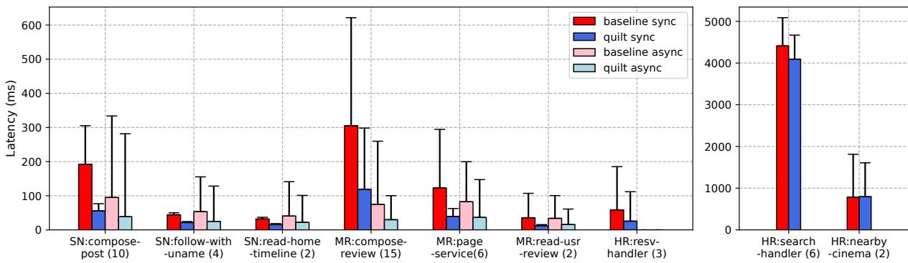  
Figure 6. Median and 99-percentile (error bar) latency for all of the DeathStarBench workflows [27].

## 7.3 Are there benefits to merging workflows?

There are many sides to this question, as there are different benefits that one could expect from merging workflows.

Hypothesis 1. Merging workflows: (1) reduces median and tail completion latency; (2) improves throughput because of reduced overhead; and (3) uses less memory because functions reuse the container, runtime, and libraries.

We perform two experiments to test this hypothesis.

7.3.1 Experiment 1: Effect on latency. We want to show that given the same resources, Quilt improves latency. To do so, we set Fission’s Max Scale limit for each function in a workflow to 10, and each container is given 2 vCPUs and 128 MB of RAM. What this means is that our smallest test workflow which has 2 functions can use 20 containers (40 cores), whereas our largest workflow which has 15 functions can scale to 150 containers (300 cores). Given these resource limits and profiling of the functions (§7.5.1), Quilt’s decision algorithm (§4.2) determined that each workflow can be merged into a single binary, so this is exactly what we do. We then give Quilt the same resources as the baseline (i.e., if the baseline uses 20 containers, Quilt also gets 20 containers).

Figure 6 shows the median and 99th percentile latency of running wrk2 with 1 connection at low load for 10 minutes on each workflow (we warm up the system prior to collecting results). We test workflows using both synchronous and asynchronous invocations, except for the HR application which cannot profitably use asynchronous invocations.

Results. Quilt reduces median latency by 45.63%–70.95% and tail latency by 15.64%–85.47% across 9 of 11 workflows (Figure 6, left graph). The remaining two workflows are from the HR application and show limited improvement because they take multiple seconds to complete(Figure 6, right graph); reducing invocation overhead makes little difference for them.

Takeaway. Quilt benefits workflows whose functions run on the order tens of milliseconds or less. Workflows with expensive functions do not benefit from Quilt, and one should be strategic about which workflows to optimize.

## 7.3.2 Experiment 2: Effect on throughput and resources.

We want to confirm if Quilt increases throughput since we expect merged functions to do less work by avoiding certain code paths (e.g., HTTP handling), and to use less memory by amortizing the container and runtime. As with Experiment 1, we give each function 10 containers with 2 vCPUs and 128 MB of RAM. One challenge is that in the DeathStarBench applications the bottleneck is the database (KeyDB or Memcached) and not the functions’ execution; it is therefore hard to observe Quilt’s effect. To isolate the benefits of Quilt, we replace the databases used by all the stateful functions with fake calls: the database result is hardcoded into the function and a sleep simulates the database’s response delay.

We run the baseline, container merge (CM), and Quilt with load generated by wrk2 for 10 mins, and collect latency, throughput, and memory usage for that load. We give the median latency and throughput for the compose-post workflow from the SN application in Figures 7a and 7b. These results are representative of our other workflows.

Results. The baseline achieves low throughput and high latency. We observe that the latency decreases as the load increases, before increasing again once the system reaches saturation and is overloaded. This behavior is actually inherent to Fission’s scheduler on our testbed and we replicate it in other experiments (§7.5.1) and when running Quilt and CM.

CM reduces latency by 31.56% (sync) and 25.89% (async) over the baseline but does not improve throughput (observe only the yellow line). The reason is that when load is high, Fission runs multiple instances of a function in the same container until it reaches a utilization threshold (default is 80% of allocated vCPUs). But in CM, each function then calls other functions through the internal API gateway, so the entire workflow ends up running in the same container. This also means that Fission inadvertently ends up launching multiple instances of the entire workflow in the same container, eventually exceeding the memory limits and getting the container killed. The gray line that completes the yellow line is the performance that CM can achieve if we double the container memory limit to 256 MB.

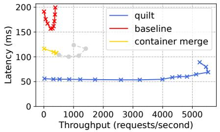  
(a) Compose Post (sync)

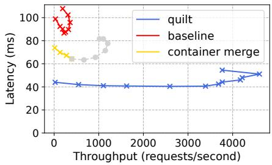  
(b) Compose Post (async)

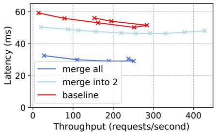  
(c) Nearby Cinema (async, modified)  
Figure 7. Median latency and throughput with varying load for the compose-post workflow (sync and async) and our modified nearby-cinema workflow (see Section 7.4.1). Containers in (c) have a limit of 1.6 vCPU and 320 MB of RAM.

But why does CM improve throughput if it runs the same code as the baseline? Better CPU sharing: each of the baseline’s 11 functions use 10 containers, but the single CM function uses 110 containers each running the entire workflow. Many functions in the workflow call other functions and then wait for a response. In CM the spare cycles are used by other functions in the workflow. In the baseline, this effect is limited to instances of the same function in the same container.

The same principle applies to Quilt, which achieves 65.74% (sync) and 51.0% (async) lower latency and 11.24× (sync) and 12.87× (async) higher throughput than the baseline. Quilt also does not encounter out-of-memory issues despite each container running the same number of functions as CM, since Quilt’s merged function uses less memory. Finally, Quilt does less total work during each function invocation.

Memory use. As we alluded to, Quilt uses less memory than CM and the baseline. Appendix E gives the size of each function binary and Quilt’s merged binaries. In short, Quilt’s merged binaries are 3.4%–86.7% smaller than the sum of the corresponding function binaries (except for one where Quilt’s merged binary is 9% larger). Further, Quilt’s merged binaries amortize the memory use of the mutable parts of shared libraries (normally copied across processes) and reduces the number of TCP buffers maintained by the OS.

Takeaway. Quilt improves both throughput and latency, in part because it does less work, in part because it eliminates invocation overhead, and in part because it shares the CPU more flexibly than the baseline. In combination with Experiment 1, we think there is enough evidence to reject the null hypothesis (merging does not help) and favor Hypothesis 1.

## 7.4 Should we merge entire workflows?

In the previous section Quilt was able to merge the entire workflow into a single function without adverse consequences. We do not think this is always the case.

Hypothesis 2. Merging all functions can lead to containers being killed or throttled, limiting the application’s throughput.

7.4.1 Experiment 3: Effect of resource limits. The previous section shows (for CM) that if one places too many functions in a container one will exceed memory limits and get the container killed. We now focus on CPU usage.

Unfortunately, functions in DeathStarBench are not CPU intensive. We modify the nearby-cinema workflow as follows. The original has two functions: nearby-cinema (NC) and get-nearby-points (GNP). GNP fetches data from the database and filters it according to GPS location and then gives NC the closest 5 points. Our modified version has 9 functions: 6 are identical to GNP but work over 300K data points, 2 new functions aggregate the GNP results (3 each), and the original NC function calls the 2 aggregators. We set container limits to 1.6 vCPUs and 320 MB of RAM.

The baseline runs each function on 10 containers (90 total), while Quilt uses 90 containers for its single merged function. Figure 7c gives the median latency and throughput.

Results. If Quilt merges all of the functions in this workflow its latency is 42.13% better than the baseline, but its throughput is 11.64% worse. The reason is that Quilt’s binary exceeds the CPU limit and is throttled. In contrast, if we split the workflow into 2 merged binaries following the optimal split (light blue line), Quilt’s throughput is 50.75% higher than the baseline as it avoids throttling and can better use resources (same argument as Experiments 1 and 2). The figure also shows that merging all functions is better in terms of latency than merging some. This is because with partial merges Quilt has to perform cross-container invocations, which introduce latency and forces Quilt to load libcurl (§5.2).

Takeaway. Experiment 2 and 3 provide preliminary evidence that merging all functions is not always a good idea, particularly at high load. This suggests that providers should be intelligent about when and what to merge.

## 7.5 How expensive is it to merge?

Merging workflows is not free. It requires the provider (or developers) to invest resources to profile functions, decide what to merge, and then actually merge functions.

Hypothesis 3. Profiling is lightweight, whereas deciding what to merge and performing the merge scales with the size of the workflow and could require seconds or minutes.

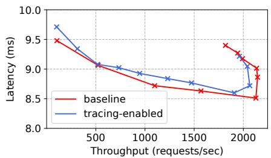  
(a) Performance of noop function.

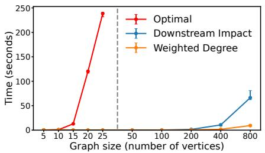  
(b) Time to find good feasible grouping

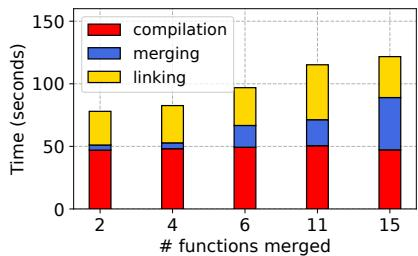  
(c) Time to merge functions

Figure 8. Time required to profile functions, find the best grouping, and perform the merging.  
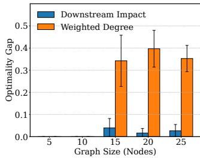

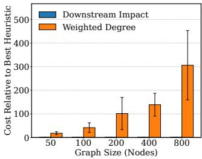  
(a) Heuristics vs. Optimal  
(b) Quality of both heuristics  
Figure 9. Quality of the merging solutions. See the main text for a description of how we compute the optimality gap. In both figures, a lower value is better; error bars are stdev.

7.5.1 Experiment 4: Cost of profiling. We take a no-op function that performs no computation or memory allocation and measure its latency and throughput across loads with wrk2. We then perform the same experiment but with profiling and tracing enabled. This serves two purposes: (1) it gives a baseline idea of Fission’s behavior when handling a single function; (2) it shows a lower bound on the cost of tracing and profiling, since we pay for this cost for each invocation in a workflow. Figure 8a gives the results.

Results. As we foreshadowed in Section 7.3.2, the median latency of the no-op function decreases as load increases. This relates to how Fission routes requests and reuses containers. We also observe minimal impact from tracing and profiling. The ingress node that collects caller-callee information is collocated with the API gateway, and cAdvisor [5] reads basic statistics from cgroup and proc virtual files (collected even without cAdvisor) and streams them to InfluxDB.

7.5.2 Experiment 5: Cost of finding good merges. We create random rDAGs with varying numbers of vertices and 20% more edges that vertices. We make 10% of the edges asynchronous. Vertices are assigned random CPU and memory usage; we set the maximum memory and CPU limits so that the rDAG needs at least 2 containers to satisfy all constraints. We then run 3 algorithms: optimal, approximate with a simple heuristic (weighted in-degree), and approximate with Downstream Impact (§4.3). We repeat graph generation and measurement 100 times for each graph size and report the median (bar height), and 5th and 95th percentile (error bars). Results. Merging optimally is efficient for small workflows (<20 functions), but too costly for large workflows. The Downstream Impact heuristic, on the other hand, is very fast (Figure 8b), requiring <0.27 sec (median time) for graphs with up to 200 nodes, and 3.10 sec for graphs with 800 nodes.

But being fast is not meaningful if it produces poor results. This is why we also study the quality of the merging decision. We use the optimality gap as a normalized metric that allows for fair comparison across different problem sizes and graph structures. It quantifies the fraction of the total possible crosscontainer cost reduction (compared to not merging) that a given heuristic fails to capture.

We compute the gap as (CostH − CostO)/(CostB − CostO), where CostH, CostO, and CostB are the number of non-local calls required under the heuristic, optimal, and non-merging baseline, respectively. In short, the numerator represents the absolute error of the heuristic, while the denominator represents the potential for improvement over the non-merge baseline. A value of 0 means that the heuristic found the optimal solution, whereas a value closer to 1.0 indicates that the heuristic’s solution is no better than the baseline.

Figure 9a gives the results. The Downstream Impact Heuristic is not only very fast (as we argued earlier), but this speed does not come with a big compromise in quality: the solutions that it finds are optimal or close to optimal across all the configurations that we could test (graphs with up to 25 nodes), with an optimality gap of 0.0394 at 25 nodes. In contrast, the simpler heuristic produces poor solutions. For example, Figure 9b shows that Downstream Impact leads to up to hundreds of times fewer non-local calls than the simpler weighted degree heuristic on our randomly generated graphs.

7.5.3 Experiment 6: Cost of compiling and merging. To measure compiling and merging time we use workflows from DeathStarBench. Figure 8 shows all results.

A large proportion of the time (about a 1.5 minutes) is spent compiling functions and linking libraries. Compile and linking time depends on the provided code, but the biggest factor is the code’s dependencies. This is why there is no difference between compiling and linking read-home-timeline (2 functions) and compose-review (15 functions). The compiling time could be eliminated if developers upload LLVM IR instead of source code. Indeed, any platform that plans to support C, C++, Rust, Swift, or Go has to compile and link the code anyway (so neither action introduces overhead over the status quo) or ask developers to upload binaries/containers.

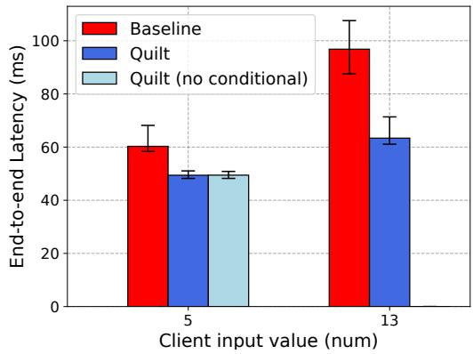  
Figure 10. Median latency of a function that invokes a memory-intensive callee num times (§5.6). The container can handle a fan-out of up to 6. When num ≤ 6, Quilt can process all calls locally. When num > 6, functions merged by Quilt without conditional invocations crash; conditional invocations prevents crashes. Error bars are 10th and 90th pct.

Merging time scales linearly with the number of functions and is of the same order of magnitude as compiling or linking.

Takeaway. Experiment 4 shows that Quilt can profile with very minimal overhead to understand the needs of workflows and the opportunities for merging. Experiment 5 then shows that Quilt can make merging decisions quickly and close to optimally. The major issue is compiling and merging the functions (Experiment 6). But this is a one-time background operation that only needs to be re-done whenever functions or workflows change or are updated. Spending 2 minutes is justifiable when workflows are invoked often.

## 7.6 What if the call graph edge values are wrong?

Hypothesis 4: If the profile is not good at capturing invocation frequency, merged functions can exhaust resource limits. However, Quilt’s conditional invoke prevents this problem.

To test this hypothesis we implement the data-dependent fan-out example of Section 5.6. We make the callee memory intensive to the point that at most 8 instances can run in the same process without exceeding memory limits. We then have clients issue requests with input values below or above the profiled call frequency. Figure 10 shows the result. Quilt with conditional invocations improves latency in both cases by eliminating all remote calls when client values are below the profiled edge, and ≈60% of remote calls otherwise.

Takeaway. Quilt’s use of conditional invocations (§5.6) eliminates the risks of poor profiling of function call frequencies.

## 8 Discussion

Merging time and language support. Quilt’s compilation and merging takes considerable time and it is restricted to languages that produce LLVM IR. We are currently exploring the idea of building Quilt on top of Junction [26] to address both limitations. With Junction, we could merge binaries directly into the same address space, avoiding LLVM entirely and working with functions written in all languages. The drawbacks are that it will not work with unmodified serverless platforms, will create larger binaries since we cannot deduplicate functionality or perform program debloating, and requires injecting an “internal API gateway” into the process similar to what we did with the CM baseline in Section 7.2.

Unrepresentative CPU and Memory profiling. If CPU and memory profiles are poor, the provider will start to notice workflows either crashing (due to container memory limits) or being throttled. In these cases the provider can then roll back the merge (which is fast as we discuss next). Note that crashes need to be handled carefully if functions are stateful due to state consistency issues [42]. However, this is true of single functions as well, which can crash even without Quilt. This is why systems like Beldi [42] and Boki [28] have been proposed to ensure consistency in the presence of failures.

Roll back merges. In cases where a merge is deemed unsuitable because the workload changed, a function’s code is updated, or the expected performance benefits did not materialize, the provider can simply replace the entry container of a merged workflow (or sub-workflow) with the original container. This reverts the workflow (or sub-workflow) to its original state. This operation is already supported since providers must deal with function updates triggered by users.

Function-level isolation. Quilt targets workflow-level isolation, so functions in a workflow can interact in the same way as libraries linked into traditional monolithic applications. If one really needs function-level isolation, Quilt could borrow ideas from prior works [31, 40] that use software fault isolation and Intel Memory Protection Keys to provide some additional assurances. Quilt could also use rWASM [20] since LLVM IR can be lowered to WASM.

Per-function billing. Merged functions obscure the serverless billing boundary because now many functions run as one. In many cases this might not be an issue. But if one desires perfunction billing it might be possible to instrument the merged code with billing-related operations via LLVM. We did not do this in Quilt.

## Acknowledgments

We thank the anonymous SOSP reviewers for their feedback which improved this paper. This work was funded in part by NSF Awards CCF-2326576, CCF-2124184, CNS-2107147, and CNS-2321726.

## References

[1] Amazon simple queue service. https://aws.amazon.com/sqs/.

[2] Apache OpenWhisk: Open source serverless cloud platform. https: //openwhisk.apache.org/.

[3] Aws lambda faqs. https://aws.amazon.com/lambda/faqs/.

[4] Aws step functions. https://aws.amazon.com/step-functions/.

[5] cAdvisor: Analyzes resource usage and performance characteristics of running containers. https://github.com/google/cadvisor.

[6] A constant throughput, correct latency recording variant of wrk. https: //github.com/giltene/wrk2.

[7] Datadog: the state of serverless (2021). https://www.datadoghq.com/ state-of-serverless-2021/.

[8] Datadog: the state of serverless (2022). https://www.datadoghq.com/ state-of-serverless-2020/.

[9] Fission: Open source kubernetes-native serverless framework. https: //www.fission.io/.

[10] Gollvm. https://go.googlesource.com/gollvm/.

[11] Grafana tempo oss | distributed tracing backend. https://grafana.com/ oss/tempo/.

[12] A high-performance, zero-overhead, extensible Python compiler with built-in NumPy support. https://github.com/exaloop/codon.

[13] Implib.so, posix equivalent of windows dll import libraries. https: //github.com/yugr/Implib.so.

[14] InfluxDB. https://www.influxdata.com/lp/influxdb-database/.

[15] Lambda quotas. https://docs.aws.amazon.com/lambda/latest/dg/ gettingstarted-limits.html.

[16] The leader in decision intelligence technology – Gurobi optimization. https://www.gurobi.com/.

[17] llvm language reference manual. https://llvm.org/docs/LangRef.html.

[18] Openfaas | serverless functions, made simple. https://www.openfaas. com/.

[19] Opentelemetry, high-quality, ubiquitous, and portable telemetry to enable effective observability. https://opentelemetry.io/.

[20] Jay Bosamiya, Wen Shih Lim, and Bryan Parno. Provably-safe multilingual software sandboxing using WebAssembly. In Proceedings of the USENIX Security Symposium, 2022.

[21] Nilanjan Daw, Umesh Bellur, and Purushottam Kulkarni. Speedo: Fast dispatch and orchestration of serverless workflows. In Proceedings of the ACM Symposium on Cloud Computing (SOCC), 2021.

[22] Tarek Elgamal, Atul Sandur, Klara Nahrstedt, and Gul Agha. Costless: Optimizing cost of serverless computing through function fusion and placement. In Proceedings of the USENIX Security Symposium, 2018.

[23] Thomas A Feo and Mauricio GC Resende. A probabilistic heuristic for a computationally difficult set covering problem. Operations research letters, 8(2):67–71, 1989.

[24] Sadjad Fouladi, Francisco Romero, Dan Iter, Qian Li, Shuvo Chatterjee, Christos Kozyrakis, Matei Zaharia, and Keith Winstein. From laptop to lambda: Outsourcing everyday jobs to thousands of transient functional containers. In Proceedings of the USENIX Annual Technical Conference (ATC).

[25] Sadjad Fouladi, Riad S Wahby, Brennan Shacklett, Karthikeyan Vasuki Balasubramaniam, William Zeng, Rahul Bhalerao, Anirudh Sivaraman, George Porter, and Keith Winstein. Encoding, fast and slow:{Low-Latency} video processing using thousands of tiny threads. In Proceedings of the USENIX Symposium on Networked Systems Design and Implementation (NSDI), 2017.

[26] Joshua Fried, Gohar Irfan Chaudhry, Enrique Saurez, Esha Choukse, Íñigo Goiri, Sameh Elnikety, Rodrigo Fonseca, and Adam Belay. Making kernel bypass practical for the cloud with junction. In Proceedings of the USENIX Symposium on Networked Systems Design and Implementation (NSDI), 2024.

[27] Yu Gan, Yanqi Zhang, Dailun Cheng, Ankitha Shetty, Priyal Rathi, Nayan Katarki, Ariana Bruno, Justin Hu, Brian Ritchken, Brendon Jackson, Kelvin Hu, Meghna Pancholi, Yuan He, Brett Clancy, Chris

Colen, Fukang Wen, Catherine Leung, Siyuan Wang, Leon Zaruvinsky, Mateo Espinosa, Rick Lin, Zhongling Liu, Jake Padilla, and Christina Delimitrou. An open-source benchmark suite for microservices and their hardware-software implications for cloud & edge systems. In Proceedings of the International Conference on Architectural Support for Programming Languages and Operating Systems (ASPLOS), 2019.

[28] Zhipeng Jia and Emmett Witchel. Boki: Stateful serverless computing with shared logs. In Proceedings of the ACM Symposium on Operating Systems Principles (SOSP), 2021.

[29] Zhipeng Jia and Emmett Witchel. Nightcore: efficient and scalable serverless computing for latency-sensitive, interactive microservices. In Proceedings of the International Conference on Architectural Support for Programming Languages and Operating Systems (ASPLOS), 2021.

[30] Konstantinos Kallas, Haoran Zhang, Rajeev Alur, Sebastian Angel, and Vincent Liu. Executing microservice applications on serverless, correctly. Proceedings of the ACM on Programming Languages, 7(POPL), 2023.

[31] Swaroop Kotni, Ajay Nayak, Vinod Ganapathy, and Arkaprava Basu. Faastlane: Accelerating Function-as-a-Service workflows. In Proceedings of the USENIX Annual Technical Conference (ATC), 2021.

[32] Collin Lee and John Ousterhout. Granular computing. In Proceedings of the Workshop on Hot Topics in Operating Systems (HotOS), 2019.

[33] Ashraf Mahgoub, Li Wang, Karthick Shankar, Yiming Zhang, Huangshi Tian, Subrata Mitra, Yuxing Peng, Hongqi Wang, Ana Klimovic, Haoran Yang, et al. SONIC: Application-aware data passing for chained serverless applications. In Proceedings of the USENIX Annual Technical Conference (ATC), 2021.

[34] Ashraf Mahgoub, Edgardo Barsallo Yi, Karthick Shankar, Eshaan Minocha, Sameh Elnikety, Saurabh Bagchi, and Somali Chaterji. Wisefuse: Workload characterization and dag transformation for serverless workflows. Proceedings of the ACM on Measurement and Analysis of Computing Systems, 6(2), 2022.

[35] Sheng Qi, Xuanzhe Liu, and Xin Jin. Halfmoon: Log-optimal faulttolerant stateful serverless computing. In Proceedings of the ACM Symposium on Operating Systems Principles (SOSP), 2023.

[36] Alireza Sahraei, Soteris Demetriou, Amirali Sobhgol, Haoran Zhang, Abhigna Nagaraja, Neeraj Pathak, Girish Joshi, Carla Souza, Bo Huang, Wyatt Cook, Andrii Golovei, Pradeep Venkat, Andrew Mcfague, Dimitrios Skarlatos, Vipul Patel, Ravinder Thind, Ernesto Gonzalez, Yun Jin, and Chunqiang Tang. Xfaas: Hyperscale and low cost serverless functions at meta. In Proceedings of the ACM Symposium on Operating Systems Principles (SOSP), 2023.

[37] Trever Schirmer, Joel Scheuner, Tobias Pfandzelter, and David Bermbach. Fusionize: Improving serverless application performance through feedback-driven function fusion. In IEEE International Conference on Cloud Engineering (IC2E), 2022.

[38] Trever Schirmer, Joel Scheuner, Tobias Pfandzelter, and David Bermbach. Fusionize++: Improving serverless application performance using dynamic task inlining and infrastructure optimization. IEEE Transactions on Cloud Computing, 2024.

[39] Mohammad Shahrad, Rodrigo Fonseca, Íñigo Goiri, Gohar Chaudhry, Paul Batum, Jason Cooke, Eduardo Laureano, Colby Tresness, Mark Russinovich, and Ricardo Bianchini. Serverless in the wild: Characterizing and optimizing the serverless workload at a large cloud provider. In Proceedings of the USENIX Annual Technical Conference (ATC), 2020.

[40] Simon Shillaker and Peter Pietzuch. Faasm: Lightweight isolation for efficient stateful serverless computing. In Proceedings of the USENIX Annual Technical Conference (ATC), 2020.

[41] Liang Wang, Mengyuan Li, Yinqian Zhang, Thomas Ristenpart, and Michael Swift. Peeking behind the curtains of serverless platforms. In Proceedings of the USENIX Annual Technical Conference (ATC), 2018.

[42] Haoran Zhang, Adney Cardoza, Peter Baile Chen, Sebastian Angel, and Vincent Liu. Fault-tolerant and transactional stateful serverless

workflows. In Proceedings of the USENIX Symposium on Operating Systems Design and Implementation (OSDI), 2020.

[43] Haoran Zhang, Shuai Mu, Sebastian Angel, and Vincent Liu. Causalmesh: A causal cache for stateful serverless computing. Proceedings of the VLDB Endowment, 2024.

[44] Zhuangzhuang Zhou, Yanqi Zhang, and Christina Delimitrou. Aquatope: Qos-and-uncertainty-aware resource management for multistage serverless workflows. In Proceedings of the International Conference on Architectural Support for Programming Languages and Operating Systems (ASPLOS), 2022.

## A Are fewer subgraphs always better?

Figure 11 gives a simple example that shows that in some cases, having more subgraphs can result in lower sums of cross-edge weights (and therefore fewer cross-function invocations). As a result, an optimal solution would need to try every possible value of ?? (the number of subgraphs). For large graphs, this is impossible. For example, if a graph has 100 nodes, the number of possible ways to select $k = 5 0$ roots is $\left( { \begin{array} { c } { | 1 0 0 | - 1 } \\ { 5 0 - 1 } \end{array} } \right) \ \geq \ 1 0 ^ { 2 8 } \ \approx \ 2 ^ { 9 3 }$ . As a result, in our evaluation we cannot run the optimal solution on large graphs; our heuristic solution obviously does not explore all possible root combinations for large graphs either.

## B Constraints for Optimal ILP

This appendix details the full Integer Linear Program (ILP) for the subgraph construction phase, extending the model from the main text to incorporate distinct resource accounting for synchronous and asynchronous function invocations.

## B.1 Input Parameters

• $G = ( V , E ) ;$ : The directed acyclic graph of the workflow, where ?? is the set of functions and ?? is the set of edges representing invocations.

$R \subseteq V \colon \mathbf { A }$ given set of nodes chosen to be potential roots of subgraphs.

• $m _ { i } , c _ { i } .$ : The baseline memory and CPU requirements for each function $i \in V$

• $w _ { i , j } \colon$ The total number of invocations from function ?? to function ?? over a measurement period.

• ?? : The total number of times the entire workflow was invoked during the same measurement period. Observe that $w _ { i , j } / N$ represents the average number of invocations from ?? to ?? per workflow execution over a measurement period. Since we need variables to be integers, we will upper bound this value by $\alpha _ { i , j } = \lceil \boldsymbol { w } _ { i , j } / N \rceil$

$E _ { \mathrm { s y n c } } , E _ { \mathrm { a s y n c } }$ : The partition of edges ?? into synchronous and asynchronous invocations, where $E = E _ { \mathrm { s y n c } } \cup E _ { \mathrm { a s y n c } } .$

• $M , C \colon$ The maximum memory and CPU capacity per provisioned container.

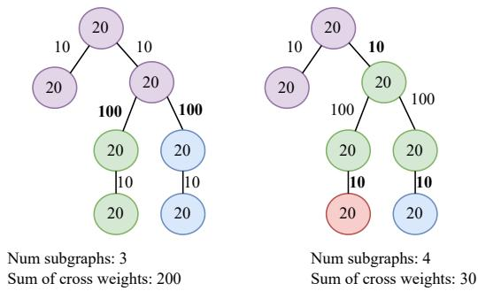  
Figure 11. Two feasible groupings for a workflow with 7 functions and a memory constraint of 60 units. Node values indicate memory usage, and edges indicate call frequency. The left figure shows 3 subgraphs (purple, green, blue). The right figure shows 4 subgraphs (purple, green, red, blue). The right figure is better as it has a lower cross-graph cost.

## B.2 Decision Variables

$x _ { i , j } \in \{ 0 , 1 \}$ : A binary variable for each edge $( i , j ) \in E$ If the edge $( i , j ) \in E$ is a cross-edge (i.e., it is a cut), $x _ { i , j } = 1 ;$ ; otherwise if it is internal to a subgraph $x _ { i , j } = 0$

$y _ { i , r } ~ \in ~ \{ 0 , 1 \}$ : A binary variable that is 1 if function $i \in V$ is assigned to the subgraph rooted at $r \in R ,$ and 0 otherwise. Note that a function can be assigned to multiple subgraphs, allowing for duplication.

• $z _ { i , j , r } \in \{ 0 , 1 \}$ : An auxiliary binary variable for each edge $( i , j ) \in E _ { r }$ . It is constrained to be 1 if and only if both function ?? and function ?? are assigned to the subgraph rooted at $r \in R .$ . This variable indicates that the call is internal to subgraph $G _ { r }$

## B.3 Objective Function

The goal is to minimize the sum of cross-graph edge weights:

$$
{ \mathrm { M i n i m i z e } } \sum _ { ( i , j ) \in E } w _ { i , j } \cdot x _ { i , j }
$$

## B.4 Constraints

The following 4 constraints ensure the structure and the coverage of the subgraphs.

1. Root Inclusion: Every chosen root ?? must belong to its own subgraph.

$$
y _ { r , r } = 1 \quad \forall r \in R
$$

2. Node Coverage: Every function ?? in the graph must be assigned to at least one subgraph.

$$
\sum _ { r \in R } y _ { i , r } \geq 1 \quad \forall i \in V
$$

3. Connectivity: If a function ?? is in subgraph $G _ { r }$ and is not the root, at least one of its predecessors must also be

in $G _ { r }$ . This ensures the subgraph is a connected rDAG.

$$
y _ { j , r } \leq \sum _ { ( i , j ) \in E } y _ { i , r } \quad \forall r \in R , \forall j \in V \setminus \{ r \}
$$

4. Cross-Edge Definition: This constraint links the ?? and ?? variables. It defines a cross-edge $( i , j )$ as one where, for any given subgraph $G _ { r } , i \in V _ { r }$ but $j \notin V _ { r }$

$$
x _ { i , j } \geq y _ { i , r } - y _ { j , r } \quad \forall ( i , j ) \in E , \forall r \in R
$$

To understand the above inequality, observe that since the edge weights $w _ { i , j }$ are always positive, the objective function is minimized when every $x _ { i , j }$ is as small as possible; the solver will try its hardest to set every $x _ { i , j }$ to 0. The only time it will set $x _ { i , j }$ to 1 is when it has no choice: ∃?? such that $i \in V _ { r }$ and $j \notin V _ { r }$

5. Cross-Edge Root Rule: If an edge $( i , j ) \in E$ exists and its target ?? is not a root $( j \notin R )$ , then for any given subgraph $G _ { r }$ , if the source ?? is included in $G _ { r }$ , the target ?? must also be included in $G _ { r } .$ . This forces edges not pointing to roots to be internal.

$$
y _ { i , r } \leq y _ { j , r } \quad \forall ( i , j ) \in E \mathrm { ~ s . t . ~ } j \not \in R , \forall r \in R
$$

The following two constraints ensure that the total resource consumption for each merged subgraph does not exceed the container limits. Asynchronous calls imply parallelism and are thus more memory-intensive than synchronous calls.

6. Memory Capacity (M): For each subgraph $G _ { r }$ , the total memory is the sum of baseline memories of all included functions, plus an additional scaled memory cost for each internalized asynchronous call.

$$
m _ { r } + \sum _ { ( i , j ) \in E _ { r } } m _ { j } \cdot z _ { i , j , r } + \sum _ { ( i , j ) \in E _ { r , \mathrm { a s y n c } } } m _ { j } \cdot ( \alpha _ { i , j } - 1 ) \cdot z _ { i , j , r } \leq M
$$

The first sum $\sum m _ { j } \cdot z _ { i , j , r }$ accounts for one instance of each function. If the edge is asynchronous, then the second term $m _ { j } \cdot ( \alpha _ { i , j } - 1 )$ adds the memory for the additional $\alpha _ { i , j } - 1$ expected concurrent instances of ??.

7. CPU Capacity (C): The CPU cycles used by function ?? cannot be “returned” when ?? completes, so there is no difference in treatment between synchronous and asynchronous edges. We therefore scale the cost of ?? by $\alpha _ { i , j }$ . For each subgraph $G _ { r }$

$$
c _ { r } + \sum _ { ( i , j ) \in E _ { r } } c _ { j } \cdot \alpha _ { i , j } \cdot z _ { i , j , r } \leq C
$$

The capacity constraints (6 and 7) depend on whether a call from ?? to ?? is internal to a subgraph $G _ { r }$ . This condition is true only if both $y _ { i , r } = 1$ and $y _ { j , r } = 1 . \mathrm { \ A }$ direct representation in the capacity constraint would involve the product of these two binary variables $( y _ { i , r } \cdot y _ { j , r } )$ , which would make the constraint non-linear. Integer Linear Programs, by definition, cannot handle such non-linearities.

To overcome this, we introduce the auxiliary binary variable $z _ { i , j , r }$ and a set of linear constraints that force it to behave like the product $y _ { i , r } \cdot y _ { j , r }$ . This standard technique, known as linearization, allows us to keep the entire model within the solvable realm of ILP.

The following three inequalities collectively enforce the logical condition $z _ { i , j , r } \iff ( y _ { i , r } \land y _ { j , r } )$

8. Auxiliary Variable Linearization:

$$
z _ { i , j , r } \leq y _ { i , r } \quad \forall ( i , j ) \in E _ { r } , \forall r \in R\tag{1}
$$

$$
z _ { i , j , r } \le y _ { j , r } \quad \forall ( i , j ) \in E _ { r } , \forall r \in R\tag{2}
$$

$$
z _ { i , j , r } \geq y _ { i , r } + y _ { j , r } - 1 \quad \forall ( i , j ) \in E _ { r } , \forall r \in R\tag{3}
$$

Inequalities (1) and (2) ensure that if either $y _ { i , r }$ or $y _ { j , r }$ is 0, then $z _ { i , j , r }$ must also be 0. Inequality (3) ensures that if both $y _ { i , r }$ and $y _ { j , r }$ are 1, then $z _ { i , j , r }$ must be at least 1 (and thus 1, since it is binary). Together, they model the logical AND.

## C Approximate Merge Decision Algorithm

The partitioning problem in Section 4.2 is NP hard. Our optimal algorithm requires exploring a vast search space. In particular, it works on two phases:

1. Phase 1 (Root Selection): Output a list $\mathcal { R } = \{ R _ { 1 } , . . . , R _ { \ell } \}$ of promising sets of nodes $R _ { i } = \left\{ { { r } _ { 1 } } , \ldots , { { r } _ { k } } \right\}$ to serve as the roots for the ?? subgraphs. The original graph root, $r _ { G } .$ , must be included in every $R _ { i }$

2. Phase 2 (Subgraph Construction): For a fixed set ??, use an exact method like Integer Linear Programming (ILP) to assign nodes to subgraphs $G _ { 1 } , \ldots , G _ { k }$ such that all constraints are met and the cross-edge cost is minimized for that specific choice of R.

The quality of the final solution heavily depends on the effectiveness of the approach used in Phase 1 to select the candidate root sets ??. Simple heuristics, such as selecting candidates based solely on weighted in-degree (the sum of weights of incoming edges), weighted out-degree, or high betweenness centrality (meaning that it might connect different dense regions) are often insufficient and produce poor approximations (as we show in Section 7.4.1). The reason is that they only consider the immediate, local cost of potentially cutting edges ending at a node ??. They fail to account for a crucial factor: the cumulative resource demands of the portion of the graph reachable from node ?? . If node ?? is the gateway to a large, resource-intensive subgraph, forcing this entire subgraph into another subgraph (if ?? is not made a root) might easily violate the memory or CPU constraints (?? or ??). Making ?? a root allows this resource-heavy part to potentially form its own subgraph, relieving capacity pressure elsewhere.

We formalize this intuition into what we call the Downstream Impact Heuristic. This heuristic evaluates potential root candidates based on a combination of incoming edge pressure and the resource footprint of their descendants.

## C.1 Downstream Impact Heuristic Score

For each node $j \in V$ (where ?? is not the main graph root $r _ { G } )$ we calculate a score, Score( ?? ), reflecting its suitability as a root candidate. This involves pre-calculating:

$\mathcal { D } ( j ) ;$ : The set of all descendant nodes reachable from ?? (including ?? ) in ?? .

$E ( \mathcal { D } ( j ) )$ : The set of edges (??, ??) where both $u , v \in$ $\mathcal { D } ( j )$

$E _ { \mathrm { a s y n c } } ( \mathcal { D } ( j ) )$ : The set of asynchronous edges within $E ( \mathcal { D } ( j ) )$

$M _ { d s } ( j ) \colon$ The memory usage of all descendants of $j \ \mathrm { i f }$ they were merged, calculated using the conservative upper bound.

$$
M _ { d s } ( j ) = m _ { j } + \sum _ { \substack { ( u , v ) \in E ( \mathcal { D } ( j ) ) } } m _ { v } + \sum _ { \substack { ( u , v ) \in E _ { \mathrm { a y n c } } ( \mathcal { D } ( j ) ) } } m _ { v } \cdot \left( \alpha _ { u , v } - 1 \right)
$$

$C _ { d s } ( j )$ : The CPU usage of all descendants of $j ,$ accounting for invocation counts.

$$
C _ { d s } ( j ) = c _ { j } + \sum _ { ( u , v ) \in E ( \mathcal { D } ( j ) ) } c _ { v } \cdot \alpha _ { u , v }
$$

$\begin{array} { r } { W _ { i n } ( j ) \ = \ \sum _ { ( i , j ) \in E } w _ { i j } \colon } \end{array}$ The sum of weights of edges incoming to ?? .

The score is then calculated as a weighted sum of normalized components:

$$
\mathrm { S c o r e } ( j ) = \beta \cdot { \frac { W _ { i n } ( j ) } { \operatorname* { m a x } _ { v \in V \backslash \{ r _ { G } \} } W _ { i n } ( v ) + \epsilon } } + \gamma \cdot { \frac { M _ { d s } ( j ) } { M + \epsilon } } + \delta \cdot { \frac { C _ { d s } ( j ) } { C + \epsilon } }
$$

Where:

• The first term represents the normalized weighted indegree, capturing the direct cost pressure of incoming edges. Normalization is done against the maximum observed weighted in-degree among potential candidates.

• The second term represents the normalized downstream memory impact. Normalizing by the global limit ?? directly reflects the pressure this downstream subgraph exerts relative to the capacity constraint.

• The third term represents the normalized downstream CPU impact, normalized by ??.

• $\beta , \gamma , \delta$ are non-negative weights (summing to 1) that control the influence of each factor.

$\epsilon > 0$ is a small constant to prevent division by zero.

Candidate Pool Selection. The nodes $j \in G \backslash \{ r _ { G } \}$ are ranked according to their calculated Score( ??) in descending order. The top ℓ nodes (where ℓ is a user-defined parameter) are selected to form the pool of root candidates, denoted P.

Phase 1 then proceeds by exploring root sets ?? of size ?? (up to a maximum $k _ { m a x } )$ , where each ?? is constructed as $R = \{ r _ { G } \} \cup R ^ { \prime }$ , with $R ^ { \prime } \subseteq { \mathcal { P } }$ and $| R ^ { \prime } | = k - 1$

## C.2 Effectiveness of the Downstream Impact Heuristic

Despite being an approximation, the Downstream Impact Heuristic works much better than simpler heuristics because its scoring mechanism directly addresses the key drivers of partitioning complexity in our problem.

Edge Costs (via $W _ { i n } ( j )$ and $\alpha ) \colon$ It still considers the direct cost implication of incoming edges. Nodes with high-weight incoming edges are prioritized, as making them roots potentially avoids paying those high costs if the edges need to cross subgraph boundaries.

Capacity Pressure (via $M _ { d s } ( j ) , C _ { d s } ( j ) , \beta , \gamma ) \colon$ This is the key improvement. By evaluating the total resource cost of all descendants, the heuristic identifies nodes ?? that act as bottlenecks for large, resource-intensive sub-parts of the graph. In particular, if $M _ { d s } ( j )$ is large relative to ?? , it signals that the entire subgraph downstream from ?? consumes a significant fraction of the total allowed memory. $\operatorname { I f } j$ is not made a root, this entire block of resources must be accommodated within some other subgraph $G _ { r } .$ This drastically increases the likelihood of $G _ { r }$ violating its memory limit, forcing difficult partitioning decisions or potentially leading to infeasibility for that choice of ??.

Making such a high-impact node ?? a root (i.e., including it in ??) provides an “escape valve”. The resource-heavy downstream portion can now potentially form its own subgraph $G _ { j }$ , satisfying capacity locally without overburdening other subgraphs.

The same logic applies to $C _ { d s } ( j )$ and the CPU limit.

Balanced View: By combining these factors with tunable weights $( \beta , \gamma , \delta )$ , the heuristic provides a way to capture a node’s potential role as a root, balancing the immediate edge costs with the anticipated downstream resource challenges. It helps identify nodes that are critical not just locally, but structurally and resource-wise for enabling a valid, low-cost global partition.

In essence, the Downstream Impact Heuristic guides the search towards root sets ?? that are more likely to allow the ILP solver in Phase 2 to find a feasible solution satisfying the capacity constraints, while still keeping an eye on minimizing the direct cross-edge costs represented by $W _ { i n } ( j )$

## C.3 The Downstream Impact Heuristic is Fast

While the Downstream Impact score incorporates more global information than simpler metrics, its calculation remains efficient relative to the overall complexity of the partitioning problem. This efficiency stems from several factors:

Precomputation phase. The most expensive step—calculating descendant sets and their cumulative costs—is performed once as a preprocessing step before the main loop that iterates through different values of ?? (number of roots) and combinations of candidate roots. This avoids repeated expensive calculations within the primary heuristic loop.

Descendant calculation. The set of descendants $\mathcal { D } ( j )$ for a node ?? can be found with Depth-First Search (DFS) starting from ?? . The complexity of DFS is linear in the size of the subgraph reachable from $j \colon O ( | \mathcal { D } ( j ) | + | E ( \mathcal { D } ( j ) ) | )$ , where $E ( \mathcal { D } ( j ) )$ are edges within the descendant subgraph.

Furthermore, we employ memoization when computing ${ \mathcal { D } } ( j ) { \mathrm { : } }$ : we recursively compute the descendants of $j ^ { \prime } { \bf s }$ successors. If the descendants of a successor ?? have already been computed (e.g., during the calculation for another node or a different branch of the DFS), the cached result is reused instantly. In a DAG, where nodes can have multiple parents, this dramatically avoids redundant traversals of shared downstream subgraphs. The result is that the total work across all nodes to compute all descendant sets is significantly less than |?? | independent DFS traversals.

Finally, processing nodes in reverse topological order ensures that when $\mathcal { D } ( j )$ is calculated, the results for all its successors are already memoized.

Cost aggregation. Once all descendant sets $\mathcal { D } ( j )$ and the edges between them $E ( \mathcal { D } ( j ) )$ are computed, calculating the downstream costs ${ M } _ { { d s } } ( j )$ and $C _ { d s } ( j )$ involves iterating over these sets to apply the formulas from Section C.1. These sums can be computed incrementally during the DFS/memoization process. Calculating the weighted in-degree $W _ { i n } ( j )$ requires a simple pass over the incoming edges for each node ??, which takes $O ( | E | )$ time in total across all nodes.

Score calculation. After the descendant costs and weighted in-degrees are precomputed, calculating the final Score( ??) for each candidate node involves simple arithmetic operations: normalization, multiplication by weights $\alpha , \beta , \gamma$ , and addition.

In summary, the computationally intensive part of this algorithm is handled efficiently through a one-time precomputation using DFS and memoization. The overall time complexity of calculating the scores for all potential candidates is significantly lower than the combinatorial complexity of exploring all possible root sets.

## C.4 Dealing with large graphs

The approach outlined in Appendix C.1 of selecting a pool of the top ℓ candidates and exploring combinations of up to $k _ { m a x }$ of them faces a major practical challenge for large, complex graphs. If the pool size ℓ is too small, it may not contain any combination of roots that yields a feasible solution under tight resource constraints. Conversely, if ℓ is large enough to likely contain a feasible set, the number of combinations to test is $\binom { \ell } { k }$ for each ??, which quickly becomes computationally intractable.

To address this, we further refine our candidate pool selection approach to find high-quality solutions for large graphs. Our method focuses on finding a viable starting point and then iteratively refines it.

Stage 1: Find an initial feasible solution. Instead of committing to a fixed candidate pool size ℓ, this stage employs an adaptive approach inspired by the Greedy Randomized Adaptive Search Procedure (GRASP) [23].

1. Start small: The algorithm begins with a small initial candidate pool size, ℓ.

2. Randomized selection: Rather than deterministically picking the top ℓ nodes to use as the pool of root candidates P, we form a Restricted Candidate List (RCL) of the top-scoring nodes (where the RCL size is a tunable parameter). The algorithm then randomly selects candidates from this list to construct $\mathcal { P }$ . This randomization is key to avoiding getting stuck on a single, high-scoring but ultimately infeasible set of candidates.

3. Feasibility check: The algorithm attempts to solve the ILP for the entire selected candidate pool, $R _ { i n i t i a l } =$ $\{ r _ { G } \} \cup \mathcal { P }$

4. Increment and retry: If the ILP solver finds no feasible solution, the algorithm increments the candidate pool size ℓ and repeats the randomized selection and feasibility check. This process continues until an initial, valid solution is found. This solution serves as the starting point for the next stage.

This adaptive, randomized search ensures that we can find a feasible, albeit likely suboptimal, solution without having to guess a good initial pool size and composition (which is very hard for large graphs).

Stage 2: Greedy refinement. Once an initial feasible solution $( R _ { b e s t } )$ is found, the algorithm switches to a greedy local search to improve it. This refinement process forgoes adding new roots and instead focuses on intelligently pruning the existing set to reduce cost.

1. Identify least valuable roots: The core of the greedy strategy lies in how it prunes the current root set, $R _ { b e s t } .$ It uses the pre-computed Downstream Impact Heuristic (DIH) scores for all nodes in $R _ { b e s t } .$ A low DIH score suggests that a node contributes less to resolving downstream resource pressure, making it a “less valuable” root. The algorithm creates a list of removable roots (all roots in $R _ { b e s t }$ except for the main graph root $r _ { G } )$ , sorted in ascending order of their DIH score.

2. Iterative removal: The algorithm enters a loop, attempting to remove one root at a time from the sorted list. For each candidate root $r _ { r e m o v e }$ in the list, it forms a new, smaller root set $\begin{array} { r } { R _ { t e m p } = R _ { b e s t } \ \backslash \ \{ r _ { r e m o v e } \} } \end{array}$ and solves the ILP for this new set.

3. Update on Improvement: If the ILP for $R _ { t e m p }$ yields a feasible solution with a cost $C _ { t e m p } < C _ { b e s t } ,$ , the refinement is successful. The algorithm updates its state: $R _ { b e s t }  R _ { t e m p }$ and $C _ { b e s t } \gets C _ { t e m p }$ . It then immediately restarts the refinement process from Step 1 with the new, smaller, and more efficient root set.

4. Termination: If the algorithm completes a full pass through the sorted list of removable roots without finding any single removal that improves the cost, it concludes that it has reached a local optimum. The refinement process terminates and returns the current best solution, $R _ { b e s t }$

```rust
use libc::{c_char};
use std::ffi::{CStr, CString};
fn caller2c (input: String) -> String {
let input_cstr: CString = CString::new(&input[..])
.unwrap();
let input_c: *const c_char = input_cstr.as_ptr();
let output_c: *const c_char = dummy_c2callee(input_c);
let output: String = unsafe {
CStr::from_ptr(output_c).to_str().unwrap().to_owned()
};
output
}
```  
Figure 12. Shim code for caller2c in Rust

At this point, we can use $R _ { b e s t }$ in Phase 2 of the algorithm in Appendix C (Subgraph Construction) to produce the graph assignments.

## D LLVM pass to merge across languages

When merging functions written in different languages, our approach largely follows the steps in Figure 5, with minor modifications in steps ➌ and ➍.

In step ➌, the IR of both the caller and callee, along with the shim functions, are merged into a single module. The shim consists of two layers:

• Layer 1 (caller2c): Written in the caller’s language, it has the same function type as invoke\_func(). Inside caller2c, arguments and return values are converted from the caller’s string type to C’s char\* and passed to the call of dummy\_c2callee. The caller2c example is shown in Listing Figure 12.

• Layer 2 (c2callee): Written in the callee’s language, it has the same function signature as dummy\_c2callee. It receives only char\* arguments and return values. Inside c2callee, these char\* are converted into the callee’s string type before being passed to dummy\_callee, which matches the modified callee function’s signature. (Note: We still need to adjust the callee function’s interface to conform to the local call’s convention before we replace dummy\_callee with it.) The c2callee example is shown in Listing Figure 13.

In step ➍, three additional modifications are added on the LLVM IR to convert the serverless function invocation into a local call: First, the call to invoke\_func in the caller function is replaced with a call to caller2c. Second, the call to dummy\_c2callee in caller2c is replaced with a call to c2callee. Finally, the call to dummy\_callee function in c2callee is replaced with the call to the modified callee function.

By using this shim-based approach, we effectively convert string types between different languages, enabling seamless cross-language function calls within the same address space.

```swift
import Foundation
func swiftStr2CCharPtr(_ swiftString: String)
-> UnsafePointer<CChar> {
// strdup allocates memory and copies the string
let cString = strdup(swiftString)
if cString == nil {
fatalError("Failed to allocate memory for the C string.")
}
return UnsafePointer<CChar>(cString!)
}
func cCharPtr2SwiftStr(_ cString: UnsafePointer<CChar>)
-> String {
return String(cString: cString)
}
func c2callee(_ inputC: UnsafePointer<CChar>)
-> UnsafePointer<CChar> {
let inputSwift = cCharPtr2SwiftStr(inputC)
let resultSwift = dummy_callee(inputSwift)
let outputC = swiftStr2CCharPtr(resultSwift)
return outputC
}
```  
Figure 13. Shim code for c2callee in Swift

## E Function Size

The table below gives statistics about the different function binaries. For each workflow, it lists the number of functions in the workflow, the size of the smallest, average, and max size binary. It also provides the size of the merged binary produced by Quilt. In all but one case, the merged binary is smaller than the sum of the corresponding function binaries.

<table><tr><td>Workflow</td><td>#fn</td><td colspan="3">Baseline (MB)</td><td>Quilt (MB)</td><td>change</td></tr><tr><td></td><td></td><td>min</td><td>avg</td><td>max</td><td></td><td></td></tr><tr><td>compose-post</td><td>11</td><td>0.57</td><td>1.16</td><td>3.6</td><td>5.1</td><td>60.0%</td></tr><tr><td>follow-with-uname</td><td>4</td><td>1.2</td><td>1.4</td><td>1.5</td><td>3.6</td><td>35.7%</td></tr><tr><td>read-home-timel.</td><td>2</td><td>1.6</td><td>1.65</td><td>1.7</td><td>3.6</td><td>9.1%</td></tr><tr><td>compose-review</td><td>15</td><td>1.2</td><td>2.0</td><td>2.0</td><td>4.0</td><td>86.7%</td></tr><tr><td>page-service</td><td>6</td><td>1.2</td><td>1.48</td><td>1.7</td><td>3.9</td><td>56.1%</td></tr><tr><td>read-user-review</td><td>2</td><td>1.5</td><td>1.6</td><td>1.7</td><td>3.5</td><td>-9.4%</td></tr><tr><td>search-handler</td><td>6</td><td>1.2</td><td>1.38</td><td>1.6</td><td>4.0</td><td>51.7%</td></tr><tr><td>reservation-handler</td><td>3</td><td>1.2</td><td>1.33</td><td>1.6</td><td>3.6</td><td>10.0%</td></tr><tr><td>nearby-cinema</td><td>2</td><td>1.2</td><td>1.45</td><td>1.7</td><td>2.8</td><td>3.4%</td></tr></table>

## F Call Graphs

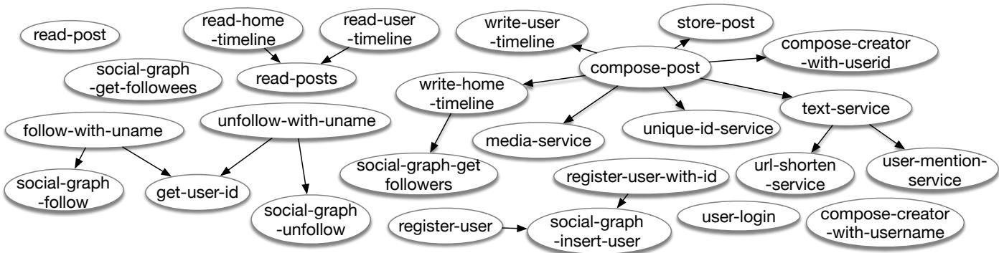

Figure 14. Call Graph of SocialNetwork from DeathStarBench  
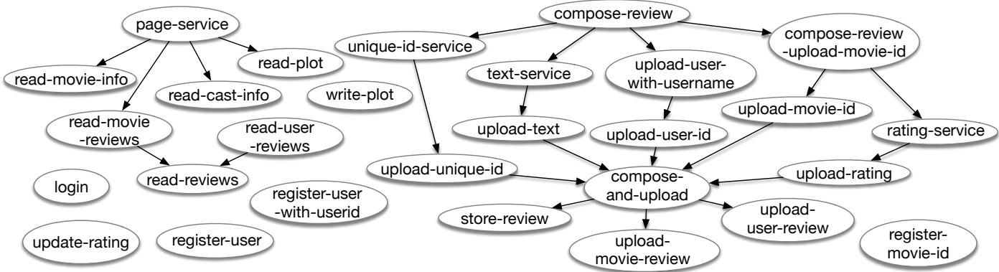

Figure 15. Call Graph of MovieReview from DeathStarBench  
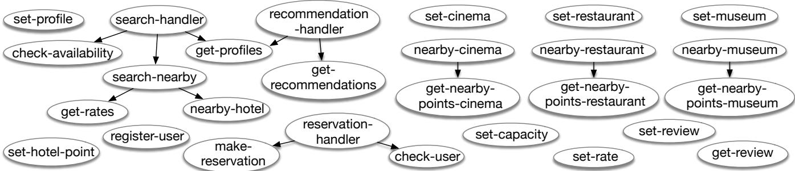  
Figure 16. Call Graph of HotelReservation from DeathStarBench