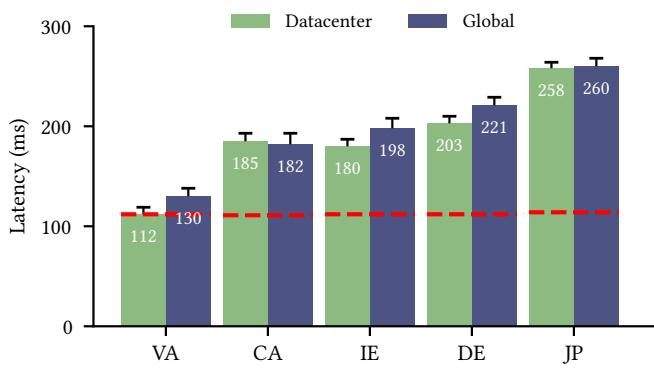
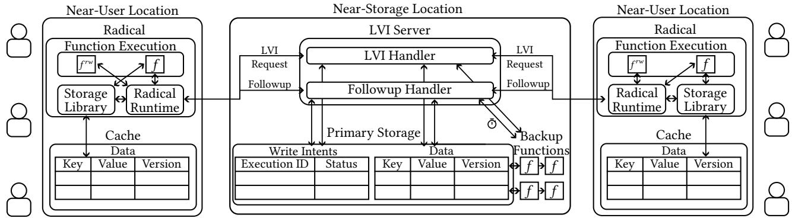
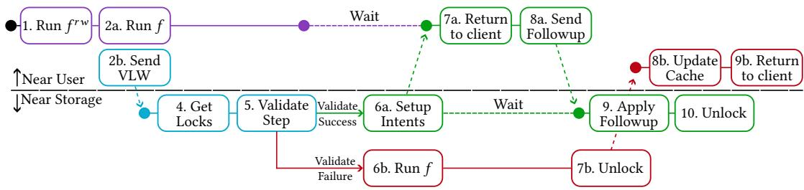
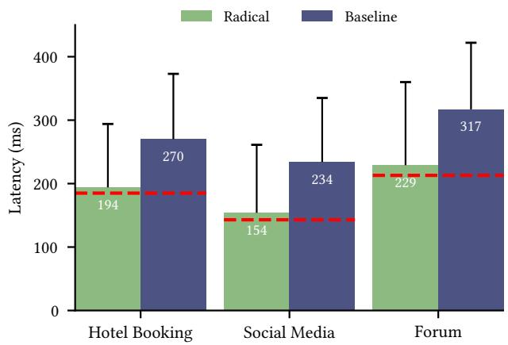
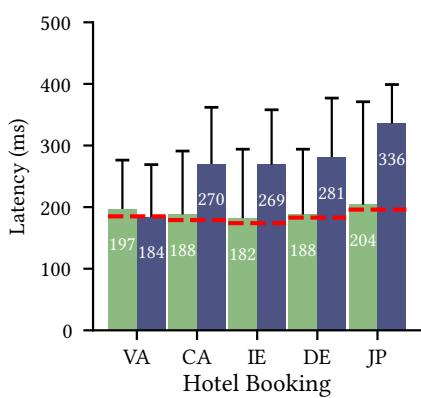
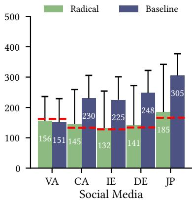
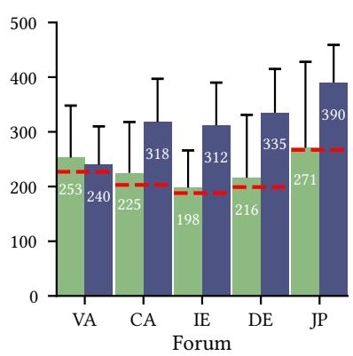
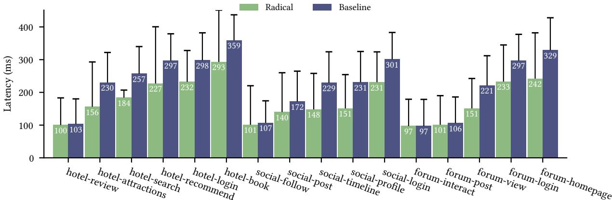

Latest updates: hps://dl.acm.org/doi/10.1145/3731569.3764831

RESEARCH-ARTICLE

# Running Consistent Applications Closer to Users with Radical for Lower Latency

NICOLAAS KAASHOEK, Princeton University, Princeton, NJ, United States

OLEG A. GOLEV

AUSTIN T. LI, Cornell University, Ithaca, NY, United States

AMIT LEVY, Princeton University, Princeton, NJ, United States

WYATT LLOYD, Princeton University, Princeton, NJ, United States

Open Access Support provided by:

Princeton University

Cornell University

Published: 12 October 2025

Citation in BibTeX format

SOSP '25: ACM SIGOPS 31st Symposium

on Operating Systems Principles

October 13 - 16, 2025

Seoul, Republic of Korea

Conference Sponsors: SIGOPS

# Running Consistent Applications Closer to Users with Radical for Lower Latency

Nicolaas Kaashoek   
nicolaas@princeton.edu   
Princeton University   
Princeton, New Jersey, USA

Oleg A. Golev∗ oleg@sentient.foundation Sentient Foundation San Francisco, California, USA

Amit Levy   
aalevy@princeton.edu   
Princeton University   
Princeton, New Jersey, USA

Austin T. Li∗ atl63@cornell.edu Cornell University Ithaca, New York, USA

Wyatt Lloyd   
wlloyd@princeton.edu   
Princeton University   
Princeton, New Jersey, USA

## Abstract

Running applications close to users—in nearby datacenters, at edge points of presence, or in on-premises clusters—is attractive, as it reduces end-to-end latency. Moving strong consistent applications closer to users is difficult, as they incur high latencies either when accessing, or coordinating, their storage system. This restricts such applications to running co-located with their data, in a datacenter. Radical allows these applications to leverage the latency benefits that come from running near users. Radical uses its new LVI protocol to perform all necessary coordination in a single request. This request guarantees linearizability with a combination of locks, a validation step, and write intents. Radical hides the latency of the LVI request by overlapping it with speculative execution of the application. Our evaluation shows that Radical achieves 84–89% of the latency improvement obtainable by moving out of the datacenter, while providing Linearizability.

CCS Concepts: • Computer systems organization → Cloud computing; • Information systems → Cloud based storage.

## ACM Reference Format:

Nicolaas Kaashoek, Oleg A. Golev, Austin T. Li, Amit Levy, and Wyatt Lloyd. 2025. Running Consistent Applications Closer to Users with Radical for Lower Latency. In ACM SIGOPS 31st Symposium on Operating Systems Principles (SOSP ’25), October 13–16, 2025, Seoul, Republic of Korea. ACM, New York, NY, USA, 17 pages. https: //doi.org/10.1145/3731569.3764831

## 1 Introduction

Cloud infrastructure is changing to reduce the latency between users and execution locations. New datacenters, edge points of presence, and on-premises clusters are opening up across the world [58, 59, 63, 64]. This infrastructure makes it possible to deploy an application across a wider range of locations, such that nearly every user is close to one.

However, strongly consistent applications such as social media, booking sites, and online forums, cannot easily make use of all these new locations, as that will increase latency over the status quo. These applications typically execute in either a primary datacenter, or a handful of datacenters, that have fast access to the strongly consistent storage system they use. If the new locations do not have replicas of the storage system, then they incur the high latency between the location and the storage system for every access. If the new locations do have replicas of the storage system, then all accesses to the storage system will become unavoidably slower as they must coordinate with more replicas that are further apart [15, 43].

The Radical framework overcomes the challenges of providing both strong consistency and low latency to applications running close to users by using speculative execution and a novel protocol for providing Linearizability. Radical keeps the storage system in a primary datacenter, but augments it with eventually consistent caches in each application deployment location. It runs the application speculatively against a cache, in parallel with the new Lock-Validate-WriteIntent (LVI) protocol, which handles coordination between executions, caches, and the storage system. The speculative result is returned if the protocol determines it is linearizable; otherwise, Radical executes the application in the primary datacenter and returns that result.

To minimize end-to-end latency, the LVI protocol must be as fast as possible, to maximize the amount of overlap between it and the speculative execution. For this reason, the LVI protocol sends only a single LVI request to the storage system. The protocol must overcome two challenges—late reads and speculative writes—in order for the LVI request to be able to perform all the necessary coordination.

The first challenge is handling reads that happen late in an execution. Validating the consistency of reads from the eventually consistent cache as they occur narrows the overlap between the speculative execution and the round trip to the storage system. Radical overcomes this by determining which items the application will access before it executes. To do so, it uses static analysis to derive the read/write sets of the application based on its inputs. Radical’s analyzer runs on each request handler in the application independently; in a social media application, this means the handler for posting, the handler for following, the handler for reading a timeline, and so on. The protocol then validates the versions of the items returned by the cache against the versions in the storage system. If any are stale, it executes the handler in the primary datacenter and returns that result, invalidating the speculative one.

Radical’s implementation operates on serverless functions, which are particularly amenable to this analysis. Serverless functions are inherently stateless, so each of their accesses to storage must be explicit; this makes it easy for the analyzer to find and interpose on any access made by an application. Each handler can be implemented as a separate function, as demonstrated by prior work that shows that all microservices can be decomposed into serverless functions [36]. This in turn means that Radical supports any such application.

The second challenge is handling speculative writes. Applying them to the storage system without knowing if the speculation succeeds breaks consistency. But, waiting until speculation succeeds and then sending them adds a second round trip to the storage system that negates the latency benefit of being closer to the user. Radical’s LVI protocol uses a combination of locks and deterministic re-execution to avoid this additional round trip.

The protocol acquires read or write locks on each item an execution will read or write as part of the single LVI request. The write locks allow the speculative execution to be released to the user without coordinating with the storage system again because they ensure no future reads will succeed until this write is eventually applied. Yet, this introduces a new challenge where the failure of an execution location would leave items locked forever and the application unavailable.

Radical ensures writes are applied and locks are released promptly using write intents that trigger deterministic reexecution. Write intents are setup during the handling of the LVI request if a function might write to storage. When they are, the handler creates a timer that waits for a followup from that execution; if the followup never arrives, it re-executes in the primary datacenter. The read locks acquired by the initial execution ensure this re-execution sees the same state from the storage system. To guarantee that this re-execution results in the same writes, Radical requires applications to be deterministic, which it achieves by compiling them to a subset of the WebAssembly language.

Together, these mechanisms allow the LVI protocol to coordinate between an execution location and the storage system in a single request that overlaps with execution for lower latency. For an application to run on Radical and realize this lower latency, it must meet three requirements. The first two are mentioned above: applications must be decomposed into serverless functions that are then compiled to deterministic WebAssembly. The third is that Radical only benefits request handlers that have a high enough execution time to hide the latency of the LVI request. Our evaluation shows that handlers that take at least 20 ms benefit from Radical.

We evaluate Radical using a set of 3 popular microservices— a social media site, a hotel booking service, and a online forum—that we decompose into 15 serverless functions and deploy across five locations with varying latencies to the primary copy of the data. For each application evaluated, the static analysis was able to extract the read/write sets. We find that Radical is effective: it runs on existing serverless infrastructure using existing storage systems, and delivers 84–88% of the possible latency improvement obtainable for these applications. These improvements vary according to application and are between 28–35%. We also evaluate the added cost imposed by Radical from the addition of the caches, and find it to be 1.3 times the baseline.

In summary, this paper makes the following contributions:

• Radical: a framework for enabling applications that require strong consistency to leverage new deployment locations to run closer to users for lower latency.

• The LVI protocol, which manages communication between executions, caches, and the storage system to provide Linearizability in a single round trip.

• An evaluation of Radical across a set of applications that demonstrates its practicality and effectiveness.

## 2 Motivation

New cloud locations are opening up around the world, making it possible to deploy applications closer to users than before. Hyperscale providers like Amazon and Microsoft are opening new datacenters across the globe [5, 9]. At the same time, providers like Akamai and Cloudflare offer customers the option to deploy their applications at the edge [1, 13]. Additionally, many organizations are turning to on-premises clusters for privacy concerns and cost efficiency [26, 32, 51, 60]. In theory, these execution locations should give applications an opportunity to improve endto-end latency by deploying instances as close to users as possible.

Today, however, this opportunity is unavailable to a broad class of applications. Social networks, forums, and messaging apps which must order posts and messages consistently across users [41], as well as booking services, which should avoid double booking resources or discarding confirmed reservations, are user-facing and, thus latency sensitive [18], while relying on strong consistency to operate correctly. Deploying them across multiple execution locations closer to users does not currently improve latency over a centralized deployment.

  
Figure 1. Comparing the latency of running an application against a geo-replicated storage system or a single primary copy of the data. Red lines represent the best possible latency.

Using multiple execution locations while leaving the datastore in a single centralized location does not improve performance and, indeed, is likely to hurt performance. While in a totally centralized deployment, end-user access to the application instance might be slow, applications are close to the datastore and, thus, fast. Conversely, by moving only applications closer to users, end-user latency to the application might be low, but each storage operation from the application is as slow as the single round-trip from the user in the totally centralized case. The impact of these requests on end-to-end latency is further magnified because a single user request often creates several requests to storage.

A more plausible option is to use a consistent, geo-replicated storage system, such as Amazon’s Multiregion DynamoDB [8] or Google’s Spanner [23]. This could allow each execution location to have low-latency access to a storage replica. Unfortunately, the PRAM impossibility result tells us that for strong consistency, the sum of read and write latencies must be greater than the maximum distance between replicas [15, 43]. This impossibility result means that end-to-end latency is bounded by the distance between replicas—in a geo-replicated setting, this distance is large, and the latency high.

This leaves a large performance gap on the table. Figure 1 shows the latency for an end-user in five different global locations—Ashburn, Virginia (VA); San Francisco, California (CA); Dublin, Ireland (IE); Frankfurt, Germany (DE); and Tokyo, Japan (JP)—accessing a simple application that represents the base case scenario for a global deployment. Requests execute ∼100 ms of computation and a single storage read. We deploy this application two ways: a totally centralized deployment where both the application and data storage are in a single datacenter (VA); and a distributed deployment with a geo-replicated, consistent storage system (DynamoDB global tables in VA; Columbus, Ohio; and Portland, Oregon) and application instances deployed in each global location. The red line on the graph represents the latency of running the application in that region, accessing local—not globally consistent—storage. Using local storage represents the best possible latency for the application, but does not provide strong consistency.

As expected, users close to the centralized deployment experience the lowest latencies while other users experience higher latencies the farther away they are. For the farthest away users, latency is more than double that of the closest user. Importantly, though, placing consistent replicas close to end-users does not improve user-perceived latency because storage operations still incur the cost of global coordination. In most cases, geo-replication performs worse than a centrally deployed application and data store.

Global coordination is unavoidable, but as we demonstrate with Radical, it is nonetheless possible to get close to the lowest latency in many cases. For both a centralized deployment and a geo-replicated storage system, the key problem is that the high cost of coordination blocks progress on executing the application, even when coordination turned out not to be necessary.

Radical avoids the downsides of existing approaches by ensuring that replicas communicate with the datacenter in a single message that guarantees strong consistency. This message is sent in parallel with the speculative execution of the application, which allows Radical to cope with the PRAM impossibility result by overlapping their latencies. The combination of this single message and speculative execution enables Radical to provide applications with the latency benefits of running near their users without compromising on consistency.

## 3 Design

Radical is a framework for running strongly-consistent applications near-users, allowing them to take advantage of the lower latency that comes from doing so. To make this possible, Radical uses a combination of static analysis, speculative execution, and the new LVI protocol. It uses static analysis (§ 3.3) to determine which items in storage a function will access. The LVI protocol (§ 3.2) sends this information to the near-storage location while the function executes speculatively on a cached copy of the data. The protocol ensures that any updates made to near-user storage are durable (§ 3.4) and that any results exposed to users are Linearizable (§ 3.6).

## 3.1 Architecture

Radical’s architecture is illustrated in Figure 2, which depicts near-user and near storage locations. Example near-user locations include a nearby datacenter, an edge point of presence, or an on-premises cluster. Client requests are routed to Radical in a near-user location, which consists of two components: a runtime and a storage library. The runtime executes the application speculatively and communicates with the near storage location. The application communicates with a cache through the storage library. This cache does not need to be durable or strongly consistent.

  
Figure 2. The architecture of Radical. Radical’s runtime begins by executing ?? rw to find the read/write set and sends it to the near-storage location as part of the LVI request while speculatively executing the ?? , which communicates with the cache through Radical’s storage library. The LVI request is processed by the LVI server, which sets up write intents, and runs a backup copy of ?? on the same inputs if validation fails. If validation succeeds, the runtime sends a followup to the server containing the speculative writes made by ?? .

There are many near-user locations in Radical, spread out across the globe. Each of these locations communicates with a single near-storage location through the LVI protocol. The near-storage location runs a server dedicated to handling LVI requests and followups from the near-user locations. The near-storage location also hosts backup copies of the applications and invokes them when the validate step (§ 3.2) of the LVI protocol fails. The near-storage location is where the primary copy of the data resides, stored in a storage system that provides Linearizability and durability. Example storage systems that fulfill these requirements include DynamoDB, BigTable, and CosmosDB [20, 25, 56].

Radical stores two additional pieces of data: version numbers, and write intents. Version numbers are used as part of the LVI request to check whether a cache is up-to-date. They are stored as part of the data, and Radical interposes on each write request to increment them whenever an item is updated. Write intents are a mapping from an execution id to a status bit, which it uses to ensure that updates made to near-user caches reach primary storage. They are stored in a separate table.

The near storage location and the near-user locations do not need to be run by the same cloud provider. However, as data is shared between the two locations, developers must trust both the near-user and near storage locations. In addition, Radical’s use of deterministic re-execution requires that the near-user and near storage locations have the same serverless runtimes.

## 3.2 LVI Protocol

Radical’s LVI protocol is designed to allow applications that require strong consistency to take advantage of the latency improvements that come from running in a near-user location. The protocol must, therefore, provide Linearizability without incurring a significant latency overhead.

The first step in the protocol is function registration. Applications using Radical are split into independent, serverless functions that each handle a single request. For example, a simple social media application might have one for making a new post, one for following a user, and one for viewing a user’s timeline. The LVI protocol is part of each execution of an individual function.

When users upload or update a function ?? , Radical runs a static analyzer on that function (§ 3.3). The output of this step is a new function, ?? rw, that takes the same inputs as the original and returns the read/write set—the collection of items it will access—for that specific execution. This output function is stored alongside the function in each near-user location.

Figure 3 shows the steps of the LVI protocol when a function is invoked by a client after registration. First (1), Radical invokes ?? rw to get the read/write set for the function. Then, it begins speculatively executing ?? itself (2a) using the nearuser cache. Simultaneously, it gathers the local versions of each item, which it includes in a LVI request, sending the request to the near storage location (2b). Radical delays updates to the storage near-user until the LVI request returns; this includes the increment of the version number. Radical delays responding to the client until it receives a response from the near-storage location and ?? finishes executing.

The protocol continues when the request arrives at the near storage location (4). That location acquires locks for each key (§ 3.6), and (5) compares the versions from the nearuser cache to those in the near storage storage. We refer to this comparison as the validate step. If validation succeeds and there are items in the write set, the near storage location creates a write intent (6a)—an object in storage that signals the function may perform writes. It also starts a timer to check that write intent, which is used to guarantee that any updates made to caches reach the primary copy of the data. The near storage location then returns to the near-user location.

  
Figure 3. The steps of the LVI protocol. Execution begins in a near-storage location. Radical executes the function speculatively in the near-user location while the near-storage location continues the protocol based on the success or failure of validation.

If the check in (5) fails, the function is run in the nearstorage location (6b), and then locks are released (7b). The results of this execution, along with items detected as stale in the validation step and those updated by the function, are sent back to the near-user location, which it uses to update its cache (8b). The near-user location then returns the result from the backup function to the client (9b).

Once the near-user location has finished executing the function and has received the result of the LVI request from the near storage location, it returns back to the user (7a). If the function wrote to any of the items, Radical sends the updates to the near storage location (8a). It does so after returning to the client. This update is the write followup. If the followup never arrives, Radical leverages deterministic re-execution (§ 3.4) to replay the function. In either case, Radical then applies the updates (9) and releases any held locks (10).

Latency improvements. When the validation step of the LVI protocol fails, Radical provides similar latency to running in the near-storage location because the function executes immediately after validation. When validation succeeds, Radical provides lower latency than running in the near-storage location. It does so by sending only one request, the LVI request, whose latency is observable to users between the near-user and near storage locations, and that is overlapped with the speculative execution of the function. When the function execution is shorter than the LVI request, the latency reduction from running near the user is proportional to the execution time of the function. When the function execution takes as long or longer than the LVI request, the latency reduction is the round-trip time between the near-user location and the near-storage location.

Managing caches. Radical relies on the LVI request to both handle data misses and updates for the near-user caches. In (2), if an item is not present in the cache, Radical includes a version number of -1 in the LVI request, and does not run the function speculatively, as validation is guaranteed to fail. The response to the LVI request includes the up-to-date values and version numbers for all the items identified as stale in (5). Upon receiving this response, Radical updates the cache with these values. The process of updating a cache on a version mismatch means that caches do not need to be durable—even if all cached state is lost, it will gradually be recovered with successive LVI requests. Instead, Radical uses write intents and deterministic re-execution (§ 3.4) to ensure updates reach primary storage, which then provides durability, as such storage systems typically have mechanisms to survive nearly all non-catastrophic failure scenarios.

The gradual bootstrap process for caches has a latency penalty, as during that time LVI requests are guaranteed to fail. This latency penalty can be mitigated with extensions to the design. For example, our implementation of Radical uses persistent storage for the caches so that they do not need to bootstrap from scratch in the case of a failure.

## 3.3 Static Analysis

The LVI protocol uses the read/write set to perform the validation step, which Radical determines using static analysis [24]. When a client registers a function ?? with Radical, the analyzer extracts a $f ^ { r w }$ that takes the same inputs and returns the set of the read and write calls that ?? will make. The analyzer extracts this function through a combination of symbolic execution and dependency analysis [34, 38].

To derive ?? rw, the analyzer symbolically executes ?? . Traditionally, symbolic execution is used to determine constraints on the inputs to a function that will result in its execution reaching some undesirable error state. Radical uses the same technique, but looks for access to storage rather than errors; serverless functions make this possible, as they are stateless by default. For this reason, all accesses to storage are explicit—this makes them easy for the symbolic execution engine to track.

For each access to storage, Radical’s analyzer determines the set of constraints on the input required to reach that access. Additionally, it tracks the dependencies of each argument to the storage call to determine how to construct them. The combination of the constraints and dependencies form the basis of $f ^ { r w } ;$ , which is derived when a function is registered with the system. $f ^ { r w }$ contains only the pieces of $f$ needed to determine the final inputs to read and write calls. Then, when a function is executed, $f ^ { r w }$ runs on the same inputs as ?? , following the same path through the function that ?? will to determine the exact inputs to each read and write call.

Failure case. Radical’s analyzer may not succeed. For one, symbolic execution is not guaranteed to terminate. This is unlikely to occur given the simplicity of serverless functions, but is possible. Additionally, some functions require significant computational work in order to compute the dependencies of their reads and writes. In these cases, running $f ^ { r w }$ may take as long as $f ;$ this adds a significant latency overhead when compared to running near storage as $f ^ { r w }$ and ?? are run in series.

In situations like these, the analyzer either times out or returns an error. Radical handles these errors by running the function in the near-storage location in all cases.

Dependent accesses. One design pattern present in some stateful applications is dependent accesses. Consider a simple function that reads from one key and uses that result as input to a second read. In this case, the analyzer has no way to determine the input to the second read ahead of time. Radical handles this case by running depended-upon reads in the derived function. These reads run against the local cache to determine what keys will be read or written later. This is safe: if the first read returns stale data, the validation step will catch it. If the first read is not stale, then it is guaranteed that the following reads will be rejected at the validation step as well.

## 3.4 Deterministic Re-execution

All writes made speculatively to near-user caches must reach primary storage, and Radical uses the write intents setup by the LVI protocol and deterministic re-execution to do so. After the validation step of the protocol, if the write set for the function is non-empty, the near-storage location creates a write intent, a mapping from the execution id for that function to a status. It stores the intent in primary storage and starts a timer longer than the expected execution latency of the function, then waits for a followup containing the updates from the near-user location to arrive.

Now, there are two possibilities: first, the near-user location runs to completion and successfully sends the followup to the near-storage location. The near-storage location then writes the updates from the followup to storage—which is durable—and then marks the intent as completed.

The second option is that the followup request never arrives, due to a failure either at the near-user location or in transmitting the followup. The timer created in the nearstorage location handles this case: when it expires, the nearstorage location checks the write intent for the corresponding execution and sees if it has been handled. If it has not, Radical executes the function in the primary datacenter and applies the updates it makes directly to storage and then marks the intent as completed. Whether the intent handled by re-execution or a follow-up, the near-storage location now removes it from storage.

For this to be correct, the replay of the function must be identical to the original execution. Radical ensures this by requiring that functions be deterministic. There are a variety of ways of achieving determinism in practice, from relying on developers [46] to dynamically recording all sources of non-determinism [54]. Radical takes a simple approach: it runs functions in a sandbox with limited sources of nondeterminism. Specifically, our implementation of Radical requires functions to be compiled to WebAssembly and runs them in a runtime with no access to timers or randomness. The 5 applications we implemented for our evaluation decomposed into 27 functions, none of which relied on a source of non-determinism.

## 3.5 Interacting with external services.

A single request in Radical can result in two executions of the corresponding function: either because of a mismatch as part of the LVI request, or because a follow-up is delayed. The potential for double execution, combined with functions needing to execute deterministically, requires that functions take precautions when interacting with external services beyond storage. If none are taken, then the same service may be invoked twice for a single function, which may be unsafe, such as a payment API being invoked twice double charging the user.

Radical restricts the kinds of services that a function can communicate with, and requires that developers take steps to make that communication safe. First, only services that have mechanisms in place to provide at-most-once semantics are safe to call. If a service does not have such a mechanism, then invoking it twice can leave behind different side-effects, breaking the determinism requirement imposed by Radical. Many existing services provide these mechanisms, as unreliable networks and failures can cause them to be executed twice as is: the response from the payment processor may be dropped by the network, and then the request retried, for instance. As an example, Stripe [11], a popular payment processing service, uses an IdempotencyKey [6]. If a function in Radical needs to communicate with an external service, developers must ensure that they are using such a mechanism in order to ensure the function can execute deterministically.

## 3.6 Validation, Locking, and Write Intents for Linearizability

Radical provides the same consistency as the primary storage: Linearizability [33]. Linearizability ensures there exists a legal total order over all operations that is consistent with the real-time ordering of operations, $\mathrm { i . e . , }$ , if ${ \boldsymbol { o } } { \boldsymbol { p } } _ { 1 }$ ends before ${ \boldsymbol { o p } } _ { 2 }$ begins then ${ \boldsymbol { o } } { \boldsymbol { p } } _ { 1 }$ must be ordered before ${ \boldsymbol { o p } } _ { 2 }$

We review at a high-level how Radical provides Linearizability using the LVI protocol. There are three execution paths for a function in Radical:

1. it runs entirely near-user; validation succeeds and the followup succeeds

2. it runs near storage; validation fails and invalidates the speculative result.

3. it runs both near storage and near-user; validation succeeds and the followup fails

Radical holds locks in each of these cases. As shown in Figure 3, locks are acquired before the LVI protocol performs the validation step near storage, and are held for the duration of a function’s execution. Each LVI request acquires a read or write lock per item included in the request; the lock type is determined by the result of the static analysis. Locks are acquired in parallel and sorted lexicographically to avoid deadlocks. Locks are stored in primary storage storage for fault tolerance. The locks are released when the write followup arrives or after deterministic reexeuction completes if the followup is late.

Holding these locks limits the parallel execution of functions both near-user and near storage. While locks are held near storage, all near-user executions perform a LVI request, and the locks ensure that if two such executions write the same keys, only one can proceed. Others have to wait until the lock holder’s followup reaches the near-storage location. Using read-write locks helps Radical mitigate this overhead for read-heavy workloads. For write heavy workloads, if they have a low skew, most functions can run in parallel.

Consistency when validation succeeds and the followup succeeds. When locks are acquired and then validation succeeds, Radical returns a LVI success message to the edge (after committing the write intent). The validation step ensures that the edge execution reads values that are currently visible in the datacenter. The write locks ensure that the writes from this edge execution will be visible to any other executions that start after it returns as required by Linearizability; they are only released after the writes from this function reach the near-storage location. Because version numbers are incremented along with an item update, the write lock also guarantees that other executions will see the updated version number. The read locks ensure the keys read by this function are not being updated by some other edge execution; if they were, that near-user execution would hold write locks that would prevent this function from acquiring read locks.

Thus, the combination of locks and validation ensures Linearizability when the LVI request succeeds. Validation ensures the edge execution uses the value present in the datacenter. The use of read/write locks ensures a partial order of operations with writes happening exclusively and reads happening potentially concurrently. This partial order can trivially be extended to a total order by ordering reads of the same write by their invocation time. That total order is trivially consistent with the real-time order for reads of the same value by definition. And it is consistent with the real-time ordering for all other operations due to the read-/write locks; if ${ \boldsymbol { o } } { \boldsymbol { p } } _ { 1 }$ finishes in real time before ${ \boldsymbol { o p } } _ { 2 }$ begins then ${ \boldsymbol { o p } } _ { 1 }$ .lock\_ $r e l e a s e < o p _ { 1 } . e n d < o p _ { 2 } . b e g i n < o p _ { 2 }$ .lock\_acquire.

Consistency when the LVI protocol detects a mismatch. If the validation step detects a version mismatch, Radical immediately begins executing the function in the near storage location. As locks are acquired prior to doing the check, they are already held prior to execution starting and are not released until it finishes. Thus, the use of read/write locks provides Linearizability following exactly the same argument as when the LVI request succeeds.

Consistency when validation succeeds but the followup is late. The third and final case to examine is when both the edge and the datacenter execute the function. This only occurs when the LVI request succeeds but its write followup to the datacenter is late, either because of failure or because it is slow. When this happens there could be two writes and therefore two version numbers for each key in the write set. Radical precludes this difference by marking the intent as handled whenever the near storage execution finishes or a followup arrives, discarding any late followups. The write that is applied falls into one of the two categories argued above and, thus, this final case also provides Linearizability.

Proof of Linearizability. The above provides an intuition as to why Radical provides Linearizability. We provide a more formal proof of Linearizability at a Zenodo record with the following identifier: doi:10.5281/zenodo.17009554.

## 4 Implementation

We implemented a prototype of Radical on top of AWS Lambda [7], and use an EC2 [3] server to handle the LVI protocol (LVI server), with DynamoDB [25] as a storage system. While Radical’s design can achieve better performance with a custom serverless platform that internalizes much of Radical’s functionality, many existing serverless platforms are amenable already. By implementing Radical on top of existing cloud platforms, we show that this design is practical for applications today. Moreover, by evaluating this prototype on AWS, we show that even a suboptimal implementation can achieve significant performance improvements.

We implement Radical in three components: the near-user runtime and storage library, the LVI server, and the static analyzer used to derive ?? rw. The near-user runtime is implemented in ∼1000 lines of Rust. It builds on the Lambda Rust runtime, and manages the cache near-user, executes ?? rw and the compiled WebAssembly functions, and communicates with the LVI server. The runtime uses a Lambda extension to send the followup requests to the LVI server.

The LVI server is implemented in ∼2000 lines of Go, and handles LVI requests: it performs the validation step, sets up write intents, acquires and releases locks, and applies the updates sent by near-user functions. It uses DynamoDB to get the versions of items and to store write intents. Locks are implemented using an in-memory table and persisted to disk to ensure durability. The server is a singleton in our implementation, and was sufficient to handle the load in all our experiments. We also implemented a replicated LVI server—the additions to the server amounted to an extra ∼500 lines of code.

The functions themselves are written in Rust and compiled to WASM using the wasm32-unknown-unknown target, though any language that compiles to WebAssembly would have worked. The static analyzer builds on Eunomia [31], adding and modifying ∼2000 lines of code to the existing ∼8000 lines of Python. Our changes to Eunomia consist mostly of augmenting the analyzer to recognize calls to the storage system and returning the state of symbolic variables at those points as well as the dependencies to each call. We use WasmTime [12] as our web assembly runtime, which executes embedded in the runtime.

The static analyzer is run against each function before uploading them to the cloud, and the results of the analysis are included with the function to allow the runtime to predict the read and write sets. Radical’s static analyzer derives ?? rw automatically, but requires additional manual effort to connect the resulting function to the rest of the code, which enables the runtime to invoke and use the results of ?? rw.

Radical imposes limitations on registered functions and relies on WasmTime to ensure that functions run deterministically. First, all registered functions must ensure that they follow the restrictions laid out in § 3 when interacting with external services. Second, all registered functions must not import any non-deterministic functions such as random number generation or retrieving the current time. To handle other sources of non-determinism, Radical properly configures the WasmTime runtime [2]. As long as developers take the first two steps, all functions registered with Radical will execute deterministically.

## 5 Evaluation

Our evaluation of Radical quantifies how it impacts end-toend latency for realistic applications (§ 5.1) in a real deployment setting (§ 5.2) and how sensitive Radical’s performance is to function execution time.

We find that Radical improves average end-to-end latency for all users (§ 5.3). We find that Radical provides the largest improvement to users far from the primary copy of the data, and incurs only marginal overhead when users are very close to the primary copy (§ 5.4). For many realistic applications, performance is consistent regardless of how far users are from the datacenter. We also find this improvement is consistent across most function execution times (§ 5.5).

Finally, we evaluate the infrastructure cost of running Radical compared to running in the datacenter and find that Radical is only moderately more expensive (§ 5.7).

## 5.1 Benchmark applications

We evaluate Radical by replicating the functionality of popular web applications as Radical applications. To find suitable applications, we looked at the most popular open-source Ruby on Rails web applications on GitHub. Ruby on Rails is a popular framework for developing web applications that run in the datacenter, most of which use external storage services; these characteristics make them good candidates for Radical.

We separated the applications into four categories, as many of the most popular repositories have the same or similar functionality. For example, both Diaspora and Mastodon are social networks that allow users to follow other users, make posts and comments, and like other users’ content. The four categories are: social media, project/team management, image boards, and forums. We selected the most popular application from each category whose functionality we port to Radical: Diaspora, Discourse, Danbooru, and Lobsters. Additionally, we ported the Hotel reservation benchmark from Deathstarbench [29].

To port these applications to Radical, we separated their core functionality into serverless functions, implemented in Rust. The Rust code was then compiled to WebAssembly. In total, we implemented 27 serverless functions across the five applications. We were able to reuse some functions across multiple applications. The static analyzer successfully handled all 27 functions, three of which required the optimization for dependent reads presented in § 3.3.

For the remainder of the evaluation, we focus on three applications detailed in Table 1. We selected the social network, forum, and hotel reservation benchmarks as they exhibit the full range of Radical’s benefits. Radical provides the greatest benefit for the hotel reservation system, median benefit for the social network, and the least benefit for the forum.

## 5.2 Methodology

We evaluate Radical in a global scenario, across five application deployment locations in AWS datacenters: Ashburn, Virginia (VA); San Francisco, California (CA); Dublin, Ireland (IE); Frankfurt, Germany (DE); and Tokyo, Japan (JP). Clients are deployed in the same locations as the applications so that they have low-latency access to them.

<table><tr><td>Function</td><td>Description</td><td>Writes</td><td>Analyzable</td><td>Execution Time</td><td>Workload%</td></tr><tr><td>Social Media Login</td><td>Performs pbkdf2-based password check</td><td>No</td><td>Yes</td><td>213 ms</td><td>9.5%</td></tr><tr><td>Social Media Post</td><td>Make a post and add to follower&#x27;s timelines</td><td>Yes</td><td>Yes*</td><td>106ms</td><td>0.5%</td></tr><tr><td>Social Media Follow</td><td>Follow another user</td><td>Yes</td><td>Yes</td><td>16 ms</td><td>0.5%</td></tr><tr><td>Social Media Timeline</td><td>View the posts from following users</td><td>No</td><td>Yes</td><td>120 ms</td><td>80%</td></tr><tr><td>Social Media Profile</td><td>Viewa user&#x27;s profile and their posts</td><td>No</td><td>Yes</td><td>124 ms</td><td>9.5%</td></tr><tr><td>Hotel Search</td><td>Finds all hotels near a user&#x27;s location</td><td>No</td><td>Yes*</td><td>161ms</td><td>60%</td></tr><tr><td>Hotel Recommend</td><td>Get recommendations based on prior reviews</td><td>No</td><td>Yes</td><td>207ms</td><td>30%</td></tr><tr><td>Hotel Book</td><td>Book a room in a hotel</td><td>Yes</td><td>Yes</td><td>272 ms</td><td>0.5%</td></tr><tr><td>Hotel Review</td><td>Make a review for a hotel</td><td>Yes</td><td>Yes</td><td>13 ms</td><td>0.5%</td></tr><tr><td>Hotel Login</td><td>Performs pbkdf2-based password check</td><td>No</td><td>Yes</td><td>213 ms</td><td>0.5%</td></tr><tr><td>Hotel Attractions</td><td>View all nearby attractions to a hotel</td><td>No</td><td>Yes</td><td>111 ms</td><td>8.5%</td></tr><tr><td>Forum Homepage</td><td>View most recent/popular posts</td><td>No</td><td>Yes</td><td>209 ms</td><td>80%</td></tr><tr><td>Forum Post</td><td>Make a comment or post</td><td>Yes</td><td>Yes</td><td>18 ms</td><td>1%</td></tr><tr><td>Forum Interact</td><td>Upvote or favorite comments/posts</td><td>Yes</td><td>Yes</td><td>16 ms</td><td>9%</td></tr><tr><td>Forum View</td><td>View a post and all comments</td><td>No</td><td>Yes</td><td>123 ms</td><td>8%</td></tr><tr><td>Forum Login</td><td>Performs pbkdf2-based password check</td><td>No</td><td>Yes</td><td>212 ms</td><td>2%</td></tr></table>

Table 1. Benchmark application’s function descriptions, whether they include writes, if they are analyzable, median execution time, and percent of the workload. Asterisks indicate analyzing the function required the dependent read optimization.

<table><tr><td rowspan=1 colspan=1></td><td rowspan=1 colspan=1>VA</td><td rowspan=1 colspan=1>CA</td><td rowspan=1 colspan=1>IE</td><td rowspan=1 colspan=1>DE</td><td rowspan=1 colspan=1>JP</td></tr><tr><td rowspan=1 colspan=1>latnuns</td><td rowspan=1 colspan=1>7</td><td rowspan=1 colspan=1>74</td><td rowspan=1 colspan=1>70</td><td rowspan=1 colspan=1>93</td><td rowspan=1 colspan=1>146</td></tr></table>

Table 2. The round-trip latency (ms) between each location and the primary DynamoDB instance in Virigina.

Using AWS datacenters for each location limited exogenous performance variation across locations, though function execution times vary slightly, likely due to scheduling and networking differences. Our experience evaluating Radical showed that variance between different cloud providers was much greater—for example, we found that Cloudflare workers tended to execute the same applications much faster than Amazon Lambda, which made it difficult to determine how much Radical improved end-to-end latency. To isolate the performance improvement that comes from Radical, we use AWS for all locations.

All five locations use DynamoDB as their storage system, with the copy in Virginia acting as the primary. Radical enables using a more performant, potentially non-durable, storage system, such as an in-memory cache, in non-primary locations, which would lower execution times. We use DynamoDB as the cache, however, to isolate the performance differences due to Radical’s architecture and the LVI protocol from differences in storage system performance.

The round-trip latencies between each near-user location (CA, IE, DE, and JP) and the near-storage location (VA) are specified in Table 2. We refer to this latency as ??????nu↔ns, which is identical to the round trip latency the LVI request, as it also travels from the application location to the datacenter holding the primary copy of the data. The latency for invoking a lambda function in the same datacenter is \~12 ms. All reported latencies are medians measured across 10,000 requests.

The LVI server is deployed in Virginia alongside the primary DynamoDB instance, running on an EC2 t3.2xlarge instance with 8 vCPUs and 32 GiB of memory.

We evaluate Radical using logical clients: a c6i.8xlarge EC2 instance instantiates 50 client processes that send requests to the functions in Radical. All function scaling is handled using AWS’s built-in scaler.

Each lambda function is allocated 2 GB of memory to ensure that it has 2 vCPUs, ensuring the LVI request and the function’s execution are concurrent.

## 5.3 End-to-End Latency

Radical runs applications that need strong consistency near the user with the goal of reducing end-to-end latency. To evaluate whether it achieves this goal, we evaluate each of the benchmark applications against a primary-datacenter baseline. The baseline provides strong consistency by sending all requests to the copy of the application running alongside the primary copy of the data in Virginia. Additionally, we compare Radical’s performance to that of running the application in each location against its local copy of the data. This represents the best possible performance Radical could provide an application: it incurs no overheads as the storage is inconsistent; latency reflects only the execution time of each function. The closer Radical is to this value, the better.

We do not evaluate the performance of the applications using DynamoDB’s global tables with strong consistency. This is because the feature is not available across all regions. Additionally, our results in § 2 suggest the latency tradeoff between locations with global tables will be worse than the primary-datacenter baseline we compare against. Those results show that the cost of accessing the global table once is higher than the cost of accessing the primary datacenter. If the application were to make more accesses to storage, such as those in our evaluation do, this penalty would only be exacerbated; using global tables would never be better than the primary-datacenter baseline.

Workloads. We evaluate each application using a realistic workload with a high level of skew. At higher skew values, the requests an application makes go to a smaller portion of the key space; this stresses Radical’s ability to handle many concurrent requests that touch the same keys and thereby the performance of its locking scheme For the social media application, we use the same workload parameters as Tapir [68] with a zipf parameter of 0.99 for selecting users. For the hotel application, we use the mixed workload parameters from Deathstarbench [29], which accesses hotels and users uniformly at random. For the forum application, we used numbers based on the reported statistics from lobste.rs with a zipf parameter of 0.99 when selecting posts. Workload parameters are identical for Radical and the baseline.

Results. Figure 4 shows that Radical delivers on its goal: it improves end-to-end latency for all applications by 28– 35%. Even with the high level of skew in these workloads, the success rate of the validation step in the LVI protocol remains around 95% for all the applications, ensuring that Radical is faster than the primary-datacenter baseline.

Radical’s improvements come from its abilities to hide the latency between the near-user and near storage locations. It does introduce some overhead to the application, however, as extracting the keys the application will access is on the critical path, and in cases where the check fails, the processing of the LVI request is added onto the function’s execution in the near-storage location. To see how close Radical gets to the ideal, we plot the maximum possible improvement on the graphs with a red line using the results from the inconsistent lower bound experiments. The results show that Radical achieves 89% of the maximum possible improvement for the hotel application, 88% for the social media application, and 84% for the forum—while providing strong consistency and durability.

We do not present throughput results for Radical. This is because it has the same throughput as the baseline: the only bottleneck Radical introduces is the singleton LVI server. The server can be replicated to make it highly available and fault tolerant; we discuss the impact of doing so in § 5.6

Summary. Radical delivers on its promise of allowing applications that require strong consistency and durability to move away from their data, taking advantage of proximity to the user to reduce end-to-end latency.

  
Figure 4. End-to-end median (bar) and p99 (whisker) latency for applications across both deployments. Red lines represent the maximum possible improvement.

## 5.4 Regional Variation

To better understand how Radical impacts applications running in different regions, we evaluate the end-to-end latency of each application across the five deployment locations. The benefit Radical provides comes from hiding the latency between the location and the primary copy of the data in Virginia, which is the $l a t _ { n u  n s } .$ . We expect that that Radical benefits locations with a higher $l a t _ { n u  n s }$ more than those with a lower $l a t _ { n u  n s } .$

Results. The results are shown in Figure 5. Table 2 shows the $l a t _ { n u  n s }$ for each location. As expected, the magnitude of the latency improvement Radical provides is correlated with the $l a t _ { n u  n s } ,$ , with locations with a higher $l a t _ { n u  n s }$ seeing a larger improvement. That Radical performs worse than the baseline in Virginia is also expected: Radical and the baseline run the same function and access the same storage in the Virginia datacenter, but Radical incurs the additional overheads described above.

The dashed red lines on the graph show the results of running the applications in the same regions with the inconsistent lower bound. The results show that Radical gets close to this value in all locations. Excitingly, these results also show that Radical allows applications to leverage the benefits that come from running in any location, regardless of the distance to the primary copy of the data.

The one situation where this is not the case is for the social media application in Japan. This is because the $l a t _ { n u  n s }$ is so high that it exceeds the execution time of 4 of the functions in the application. In these situations, Radical has to wait for the LVI protocol to complete before releasing the speculative result to the client, which adds some overhead to the function’s execution time. However, this overhead is small in comparison to $l a t _ { n u  n s } ,$ which the baseline has to pay for each invocation. This explains why Radical does not get as close to the ideal but still outperforms the baseline.

  
Figure 5. End-to-end median (bar) and p99 (whisker) latency for each application across the five deployment locations. Red lines represent the maximum possible improvement.

Summary. The results above show that Radical is able to provide the largest latency improvements in locations with the highest $l a t _ { n u  n s }$ and that Radical is able to get close to the best possible performance in all locations, regardless of distance to the primary copy of the data.

## 5.5 Function Latency

To better understand how Radical improves end-to-end latency, we analyze the performance of each function in the three benchmark applications. As each function has a different execution time and different read/write characteristics, this analysis helps reveal which functions most benefit from using Radical and which do not. The total latency of a request to a single function can be broken down into the following components:

1. The time it takes to instantiate the lambda function.

2. The time it takes to load the web assembly blob into memory from disk.

3. The execution time of the extracted $f ^ { r w }$ function

4. The maximum of the following:

• The execution time of the WebAssembly function

• The time it takes to send, process and receive a response to the LVI request.

5. In the case of a validation failure, the time it takes to execute the function in primary datacenter and send the response back to the application location.

We expect that functions with a WASM execution time higher than $l a t _ { n u  n s }$ benefit the most from Radical. This is because $l a t _ { n u  n s }$ governs the latency of the LVI protocol; when this is lower than the WASM execution time of the function, it will be the maximum component in (4) above.

Results. The results are shown in Figure 6. Table 1 shows which functions have a higher WASM execution time than $l a t _ { n u  n s } .$ As expected, these functions receive the greatest benefit from using Radical. For functions with particularly low execution times, such as forum-interact, forum-post, and hotel-review, the benefits of Radical are small; they have approximately the same total latency as running them near storage.

Even for these low execution time functions, all are within a few ms of running directly in the near-storage location. This means Radical, at worst, has a similar latency to running near storage. This is a useful characteristic of the system, as it means developers can safely use Radical for its latency benefits for most function without worrying about negatively impacting other functions. These results show that even functions with execution times as low as 13 ms can benefit from using Radical.

Summary. The results above show that Radical is most beneficial for functions with execution times greater than $l a t _ { n u  n s } ,$ and at worse is similar to running near storage.

## 5.6 Impact of Server Replication

The server used in this evaluation was a singleton, making the system vulnerable to failures because LVI requests cannot be handled until the server is brought back online. Replicating the server to make it highly available addresses this problem, but adds extra latency to the system: here, we discuss that impact. There are two pieces of persistent state the server must keep track of: locks, and write intents. Write intents are already stored in DynamoDB, so no extra work needs to be done here. Locks are persisted to an EBS volume, but are not highly available—we address this by storing the locks in a three node etcd [4] cluster spread across three availability zones. Additionally, we include an idempotency key for each function execution to ensure that they will be run at most twice for each user request: once near-user, and at most once near storage. These idempotency keys are stored in DynamoDB along with the write intents.

  
Figure 6. End-to-end median (bar) and p99 (whisker) latency for each function used in the evaluation.

Using etcd for locks adds latency to Radical because lock acquisitions now travel through Raft [48], which requires communication between nodes in the cluster. This increases the latency of processing a LVI request at the server, which has a direct impact on latency in two ways. First, when validation fails, the end-to-end latency for the request is increased by the time it takes to acquire locks. Second, the previously mentioned minimum runtime to see a benefit from Radical increases, as it is directly related to the latency of the LVI request. Our implementation of the replicated server acquires all locks in series. This increases the latency added by the replicated server, but can be optimized in the future with batching.

Our implementation of the replicated server takes 2.3 ms to acquire a single lock, and 3 ms to write and update the idempotency key for each function invocation in DynamoDB. The total increase in latency when processing an LVI request is 3+2.3∗?? where ?? is the number of locks a function acquires. This in turn means that when validation fails, the Radical’s incurs 3 + 2.3 ∗ ?? ms of additional latency over the system as evaluated above. Similarly, the minimum execution time for a function to benefit from Radical increases to 16 + 2.3 ∗ ?? ms. Given the possibility of batching, we believe that 20 ms is a reasonable approximation for this constant.

## 5.7 Cost Analysis

Radical increases the cost of running an application by running functions twice when the LVI request fails, for the extra bandwidth used by the LVI protocol, the LVI server, and the storage needed in near-user locations. To quantify this increase we calculate the cost of running a generic application that makes at most 50000 reads per second and 500 writes per second using the costs of AWS services. This ratio matches those of the applications above. The cost of one such DynamoDB instance is \$1077.36/month.

In the deployment above, we use DynamoDB as the storage system to isolate the latency improvement between Radical and the baseline due to the LVI protocol. However, we also implemented Radical using ScyllaDB [10] running in an EC2 instance in the same datacenter as the functions. We used m6g.large instances (\$34\*5=\$170/month) for ScyllaDB, which can handle more throughput than what we provisioned for DynamoDB. Using ScyllaDB would further improve the performance of Radical, as the latency to access to ScyllaDB is lower than that to access DynamoDB. Radical still uses DynamoDB in the near storage location.

The LVI server costs \$166 per month, so the total cost of Radical in the above deployment becomes \$1077.36 + \$170 + \$166 = \$1413.36/month, or a 31% increase over the baseline, which just needs to pay for the DynamoDB instance. This number represents the added cost of the infrastructure needed to run Radical.

In addition to infrastructure costs, Radical runs a second lambda function when validation fails. This cost is proportional to the validation failure rate in the LVI protocol, which in the applications we evaluated is 5%.

As the number of functions invoked increases, function executions eventually dominates the total deployment cost. Consider a sample application whose functions have an average runtime of 100 ms, and a validation success rate of 5%. If the application invokes 1,000,000 functions near-user each month, it incurs an additional 50,000 requests near storage due to validation failures—this costs \$0.14/month. The baseline’s total cost in this situation is the cost of DynamoDB and the cost of the million invocations: \$1077.36 + \$2.87 = \$1080.23/month as compared to Radical, which costs \$1413.36 + \$2.87 + \$0.14 = \$1416.37/month. For 10,000,000 monthly invocations, the baseline costs 1106.06 and Radical costs 1443.50. For 100,000,000 monthly invocations, the baseline costs 1364.36, and Radical costs 1714.71.

Radical incurs one additional potential source of overhead. It provisions functions with 2 GB of memory in order to obtain the vCPUs it needs to parallelize the speculative execution of the function with the LVI request. Not all functions need this much memory: some can be provisioned with less memory without degrading in performance to further reduce cost.

## 6 Related Work

We review relevant work in three categories: stateful serverless computing, geo-replicated storage systems, and speculative execution. Radical is inspired by and builds on work in each of these categories, but is mostly complementary to it as Radical addresses the new problem of enabling strongly consistent speculation execution with a single request sent prior to execution.

Stateful serverless. Various systems have sought to improve the storage solutions available to serverless functions. Recent examples include Beldi [67], Boki [35], Halfmoon [53], and libDSE [42], which build on one another to provide serverless functions with low-latency, transactional storage systems. Unlike Radical, which uses stateful serverless functions to run applications more efficiently, these systems make stateful serverless workloads in the datacenter faster: as such, they do not address the high access latency that exists between near-user locations and the near-storage location. We believe Radical could be complemented by these systems; it could use them in place of DynamoDB as a better solution to storage.

Systems like Pocket [39] and Netherite [19] improve the performance of workflows where multiple serverless functions are coordinated together in sequence. These systems focus on running near storage, and their designs would perform poorly if they were to run at near-user locations. Radical does not try to optimize for serverless workflows, and applying it naively to such applications would likely perform poorly. However, we believe that the techniques used by prior work are portable to Radical as well, but leave that as future work.

Other work focuses on porting microservice-style applications to serverless function. exCamera [28] highlights the power of serverless functions, using them to run a computeintensive application with high efficiency. gg [27] builds on these ideas; it provides a framework that generalizes some of the techniques used by exCamera. Finally, Mu2sls [36] proves that microservices can be automatically translated into serverless functions. All of these techniques are complementary to Radical; Radical requires applications to be implemented as serverless functions, and the above systems make it possible and simpler to perform those conversions.

Geo-replicated storage. Radical enables stateful applications to run across the globe, all accessing the same storage. This follows in the footsteps of work dedicated to providing geo-replicated storage systems. Systems like Anna [66], TAO [17], and COPS [44] replicate storage across datacenters, but only provide eventual or causal consistency between replicas. They can provide low-latency access to data, as they avoid or minimize communication between replicas, but it also means they do not provide the level of consistency needed by the applications Radical targets.

State machine replication protocols such as Rabia [49], WPaxos [14], and EPaxos [45, 62] do provide strong consistency across wide areas. Similarly, distributed databases like Spanner [22] and CockroachDB [57] provide wide area strong consistency. These systems require communication between replicas that introduces extra latency on each request to the storage system as discussed in § 2. In contrast, Radical augments an existing storage system to enable speculative execution with strong consistency using a single request whose latency overlaps with the speculative execution.

Other transactional, distributed storage systems like Hyder [16], Calvin [61], and Mako [55] provide wide-area strong consistency and use various techniques to manage the latency penalty that comes from doing so. However, each of the systems still introduces latency that Radical avoids. While Hyder runs a transaction against a local copy of the database, it replicates the results of that transaction across the network and cannot commit until that is completed. Calvin, which requires that users submit the read/write set for a transaction— unlike Radical, which can derive these sets automatically— uses reconnaissance transactions to handle dependent accesses that require cross-network communication. Mako, which speculatively executes transactions separately from replicating them, delays responses to users until it can be sure the transaction will be replicated.

Radical operates at a higher level of the stack than the above systems, which enables it to deliver lower latency. Rather than replacing the storage system an application uses, Radical modifies the way the application is run, while reusing the existing storage system and augmenting it with nearuser caches. Running the application provides insights about it that Radical would not have access to were it lower on the stack: it can see every request to storage the application will make, and analyze the application ahead of time. Both of these are critical: they form the backbone for Radical’s static analysis, and enable it to interpose on the requests to storage as part of the LVI request. Additionally, because it controls the execution of the application, Radical can run it speculatively, in its entirely, against a cache. The combination of speculative execution and the single LVI request allow Radical to deliver lower latencies than the above storage systems, which cannot leverage the same insights about the applications they support.

Speculative execution. There is a long line of work on speculative execution such as Zyzzyva [40], PBFT-CS [65], Speculative Paxos [52], and Rethink the Sync [21, 47]. This prior work uses speculative execution to hide the latency of communication rounds in Byzantine fault tolerance (first two), consensus, and syncing to a local or remote disk, respectively.

Correctables extend promises to be able to return multiple, successively more consistent values providing incremental consistency guarantees [30]. For instance, a correctable could initially return an eventually consistent result and then later return a Linearizable result. This allows an application to speculatively execute using the eventually consistent result and only need to redo computation and pay the latency cost when the Linearizable result is different.

Kemme et al. [37] expose an initial optimistic result of atomic broadcast to a database that can be corrected later when the final result is delivered only in the cases when it differs. Planet [50] similarly exposes the progress of transaction commit to applications with the addition of the estimated likelihood of commit. This allows applications to speculatively use results (informed by the likelihood) and then correct them later if they change.

Radical’s use of speculative execution is inspired by this previous work. Radical differs from it, however, in that to the best of our knowledge it is the first system to enable strongly consistent speculative execution with a single request sent prior to execution. Achieving this required Radical to introduce three new techniques. First, Radical’s static analysis tool allows the protocol to determine relevant items ahead of time, and check only those items. The above systems all require that the application or transaction first execute before being able to perform operations like Radical’s validation step. Second, with the geo-distributed setting of Radical, the communication hidden by speculative execution must be minimal—Radical addresses this by sending only the (single) LVI request. Third, the write intent mechanism ensures that updates made to local caches are guaranteed to reach storage, even in the case of failure, providing consistency and durability with that single LVI request.

## 7 Limitations

Not every application receives a reduction in end-to-end latency when using Radical.

Radical must know the read/write set of the application prior to running it. Its static analyzer handles this for all the applications in our evaluation, but there are limits to this technique. First, the application must decompose into independent, serverless functions for the analysis to work. Prior work shows that, in general, microservices can be decomposed into serverless functions [36].

Second, some functions do not have read/write sets that can be efficiently derived prior to their execution. As noted in § 3.3, if a function uses the result of an expensive computation to read from storage, then running $f ^ { r w }$ incurs a latency penalty. This is because the execution of $f ^ { r w }$ is not run in parallel with anything else: its latency is added directly to that of the function itself. Additionally, while Radical allows developers to also provide the read/write set or an $f ^ { r w }$ manually, there will always be cases where it is indeterminable. In these situations, Radical resorts to running the function in the near-storage location.

An application must also compile to a deterministic subset of WebAssembly, i.e. it cannot rely on non-determinism other than the data store operations. This is necessary for deterministic re-execution (§ 3.4). Not every application fulfills this requirement, and others require significant refactoring if they rely on sources of non-determinism like timers or native extensions.

## 8 Conclusion

Radical is a framework that provides both low latency and strong consistency to applications running close to users. To do so, it runs the application speculatively against an eventually consistent cache, while sending a single request as part of the LVI protocol to coordinate between the cache and a primary copy of the data. The LVI protocol uses the results of static analysis to acquire locks and perform a validation check to ensure that all results exposed to users are Linearizable. To ensure updates made to caches reach the primary storage, Radical sets up write intents, and uses deterministic re-execution to reconstruct the updates if the near-user location fails to followup on the intent. Radical hides the latency of the LVI request by overlapping it with the speculative execution of the application. It does so successfully: our evaluation shows that Radical delivers 84–89% of the possible latency improvement that comes from running applications closer to users.

## Acknowledgments

We thank the anonymous reviewers and our anonymous shepherd. Thanks to Anja Kalaba, Leon Schuermann, Christopher Branner-Augmon, Natalie Popescu, Constantine Doumanidis, Jianan Lu, Shai Caspin, Amelia Dobis, Mohanna Shahrad, Theano Stavrinos, Daniel Berger, Mae Milano, and Robert Morris for their support, feedback, and mentorship throughout the research process. Thanks also to Brian Chen, Jonathan Mindel, and Donna Wang for the wonderful work they did working with Radical. This work was supported by the National Science Foundation under grant CNS 2321723. Any opinions, findings, and conclusions or recommendations expressed in this material are those of the authors and do not necessarily reflect the views of the National Science Foundation

## References

[1] Cloudflare Workers. https://workers.cloudflare.com/. Accessed: 2024- 12-09.

[2] Deterministic wasm execution. https://docs.wasmtime.dev/examplesdeterministic-wasm-execution.html. Accessed: 2025-07-30.

[3] EC2. https://aws.amazon.com/ec2/. Accessed: 2024-04-19.

[4] etcd. https://etcd.io/. Accessed: 2025-08-27.

[5] Explore the latest news for Azure datacenter regions. https://azure. microsoft.com/en- us/explore/global- infrastructure/geographies# new-regions. Accessed: 2024-12-09.

[6] Idempotent requests. https: / /docs.stripe.com /api /idempotent\_ requests. Accessed: 2025-07-30.

[7] Lambda. https://aws.amazon.com/lambda/. Accessed: 2024-04-19.

[8] Multi-region strong consistency. https://docs.aws.amazon.com/ amazondynamodb / latest / developerguide / multi - region - strong - consistency-gt.html. Accessed: 2024-04-01.

[9] Regions and Zones. https://docs.aws.amazon.com/AWSEC2/latest/ UserGuide/using-regions-availability-zones.html. Accessed: 2024-12- 09.

[10] ScyllaDB. https://www.scylladb.com/. Accessed: 2024-12-10.

[11] Stripe. https://stripe.com/. Accessed: 2025-07-30.

[12] Wasmtime. https://wasmtime.dev/. Accessed: 2024-12-10.

[13] Welcome to EdgeWorkers. https://techdocs.akamai.com/edgeworkers/ docs/welcome-to-edgeworkers. Accessed: 2024-04-19.

[14] Ailidani Ailijiang, Aleksey Charapko, Murat Demirbas, and Tevfik Kosar. Wpaxos: Wide area network flexible consensus. IEEE Trans. Parallel Distrib. Syst., 31(1):211–223, January 2020.

[15] Hagit Attiya and Jennifer L. Welch. Sequential consistency versus linearizability. ACM Trans. Comput. Syst., 12(2):91–122, May 1994.

[16] Phil Bernstein, Colin Reid, and Sudipto Das. Hyder - a transactional record manager for shared flash. In CIDR, pages 9–20, January 2011. Best Paper Award.

[17] Nathan Bronson, Zach Amsden, George Cabrera, Prasad Chakka, Peter Dimov, Hui Ding, Jack Ferris, Anthony Giardullo, Sachin Kulkarni, Harry Li, Mark Marchukov, Dmitri Petrov, Lovro Puzar, Yee Jiun Song, and Venkat Venkataramani. Tao: Facebook’s distributed data store for the social graph. In Proceedings of the 2013 USENIX Conference on Annual Technical Conference, USENIX ATC’13, page 49–60, USA, 2013. USENIX Association.

[18] Jake Brutlag. Speed matters. https://research.google/blog/speedmatters/, 2009. Accessed: 2024-12-09.

[19] Sebastian Burckhardt, Badrish Chandramouli, Chris Gillum, David Justo, Konstantinos Kallas, Connor McMahon, Christopher S. Meiklejohn, and Xiangfeng Zhu. Netherite: Efficient execution of serverless workflows. Proc. VLDB Endow., 15(8):1591–1604, apr 2022.

[20] Fay Chang, Jeffrey Dean, Sanjay Ghemawat, Wilson C. Hsieh, Deborah A. Wallach, Mike Burrows, Tushar Chandra, Andrew Fikes, and Robert E. Gruber. Bigtable: A distributed storage system for structured data. ACM Trans. Comput. Syst., 26(2), jun 2008.

[21] Peter M. Chen, Jason Flinn, and Edmund B Nightingale. Speculative execution in a distributed file system. In Proceedings of the 20th Symposium on Operating Systems Principles (SOSP ’05) Award paper., pages 191–205, October 2005. Selected as an award paper.

[22] James C. Corbett, Jeffrey Dean, Michael Epstein, Andrew Fikes, Christopher Frost, J. J. Furman, Sanjay Ghemawat, Andrey Gubarev, Christopher Heiser, Peter Hochschild, Wilson Hsieh, Sebastian Kanthak, Eugene Kogan, Hongyi Li, Alexander Lloyd, Sergey Melnik, David Mwaura, David Nagle, Sean Quinlan, Rajesh Rao, Lindsay Rolig, Yasushi Saito, Michal Szymaniak, Christopher Taylor, Ruth Wang, and Dale Woodford. Spanner: Google’s globally-distributed database. In Proceedings of the 10th USENIX Conference on Operating Systems Design and Implementation, OSDI’12, page 251–264, USA, 2012. USENIX Association.

[23] James C. Corbett, Jeffrey Dean, Michael Epstein, Andrew Fikes, Christopher Frost, J. J. Furman, Sanjay Ghemawat, Andrey Gubarev, Christopher Heiser, Peter Hochschild, Wilson Hsieh, Sebastian Kanthak, Eugene Kogan, Hongyi Li, Alexander Lloyd, Sergey Melnik, David Mwaura, David Nagle, Sean Quinlan, Rajesh Rao, Lindsay Rolig, Yasushi Saito, Michal Szymaniak, Christopher Taylor, Ruth Wang, and Dale Woodford. Spanner: Google’s globally distributed database. ACM Trans. Comput. Syst., 31(3), August 2013.

[24] Patrick Cousot and Radhia Cousot. Abstract interpretation: a unified lattice model for static analysis of programs by construction or approximation of fixpoints. In Proceedings of the 4th ACM SIGACT-SIGPLAN Symposium on Principles of Programming Languages, POPL ’77, page 238–252, New York, NY, USA, 1977. Association for Computing Machinery.

[25] Mostafa Elhemali, Niall Gallagher, Nick Gordon, Joseph Idziorek, Richard Krog, Colin Lazier, Erben Mo, Akhilesh Mritunjai, Somasundaram Perianayagam, Tim Rath, Swami Sivasubramanian, James Christopher Sorenson III, Sroaj Sosothikul, Doug Terry, and Akshat Vig. Amazon DynamoDB: A scalable, predictably performant, and fully managed NoSQL database service. In 2022 USENIX Annual Technical Conference (USENIX ATC 22), pages 1037–1048, Carlsbad, CA, July 2022. USENIX Association.

[26] Lidice Fernandez, Juan Seminara, and Michael Shirer. Shared cloud infrastructure spending continues to accelerate, fueled by ai-related spending in the first quarter of 2024, according to idc. https://www. idc.com/getdoc.jsp?containerId=prUS52398324, 2024. Accessed: 2024- 12-09.

[27] Sadjad Fouladi, Francisco Romero, Dan Iter, Qian Li, Shuvo Chatterjee, Christos Kozyrakis, Matei Zaharia, and Keith Winstein. From laptop to lambda: Outsourcing everyday jobs to thousands of transient functional containers. In 2019 USENIX Annual Technical Conference (USENIX ATC 19), pages 475–488, Renton, WA, July 2019. USENIX Association.

[28] Sadjad Fouladi, Riad S. Wahby, Brennan Shacklett, Karthikeyan Vasuki Balasubramaniam, William Zeng, Rahul Bhalerao, Anirudh Sivaraman, George Porter, and Keith Winstein. Encoding, fast and slow: low-latency video processing using thousands of tiny threads. In Proceedings of the 14th USENIX Conference on Networked Systems Design and Implementation, NSDI’17, page 363–376, USA, 2017. USENIX Association.

[29] Yu Gan, Yanqi Zhang, Dailun Cheng, Ankitha Shetty, Priyal Rathi, Nayan Katarki, Ariana Bruno, Justin Hu, Brian Ritchken, Brendon Jackson, Kelvin Hu, Meghna Pancholi, Yuan He, Brett Clancy, Chris Colen, Fukang Wen, Catherine Leung, Siyuan Wang, Leon Zaruvinsky, Mateo Espinosa, Rick Lin, Zhongling Liu, Jake Padilla, and Christina Delimitrou. An open-source benchmark suite for microservices and their hardware-software implications for cloud & edge systems. In Proceedings of the Twenty-Fourth International Conference on Architectural Support for Programming Languages and Operating Systems, ASPLOS ’19, page 3–18, New York, NY, USA, 2019. Association for Computing Machinery.

[30] Rachid Guerraoui, Matej Pavlovic, and Dragos-Adrian Seredinschi. Incremental consistency guarantees for replicated objects. In 12th USENIX Symposium on Operating Systems Design and Implementation (OSDI 16), pages 169–184, 2016.

[31] Ningyu He, Zhehao Zhao, Jikai Wang, Yubin Hu, Shengjian Guo, Haoyu Wang, Guangtai Liang, Ding Li, Xiangqun Chen, and Yao Guo. Eunomia: Enabling user-specified fine-grained search in symbolically executing webassembly binaries. In Proceedings of the 32nd ACM SIGSOFT International Symposium on Software Testing and Analysis, ISSTA 2023, page 385–397, New York, NY, USA, 2023. Association for Computing Machinery.

[32] David Heinemeier Hansson. Our cloud-exit savings will now top ten million over five years. https://world.hey.com/dhh/our-cloud-exitsavings-will-now-top-ten-\million-over-five-years-c7d9b5bd, 2024. Accessed: 2024-12-09.

[33] Maurice P Herlihy and Jeannette M Wing. Linearizability: A correctness condition for concurrent objects. ACM Transactions on Programming Languages and Systems (TOPLAS), 12(3):463–492, 1990.

[34] S. Horwitz, P. Pfeiffer, and T. Reps. Dependence analysis for pointer variables. In Proceedings of the ACM SIGPLAN 1989 Conference on Programming Language Design and Implementation, PLDI ’89, page 28–40,

New York, NY, USA, 1989. Association for Computing Machinery.

[35] Zhipeng Jia and Emmett Witchel. Boki: Stateful serverless computing with shared logs. In Proceedings of the ACM SIGOPS 28th Symposium on Operating Systems Principles, SOSP ’21, page 691–707, New York, NY, USA, 2021. Association for Computing Machinery.

[36] Konstantinos Kallas, Haoran Zhang, Rajeev Alur, Sebastian Angel, and Vincent Liu. Executing microservice applications on serverless, correctly. Proc. ACM Program. Lang., 7(POPL), jan 2023.

[37] Bettina Kemme, Fernando Pedone, Gustavo Alonso, and André Schiper. Processing transactions over optimistic atomic broadcast protocols. In Proceedings. 19th IEEE International Conference on Distributed Computing Systems (Cat. No. 99CB37003), pages 424–431. IEEE, 1999.

[38] Sarfraz Khurshid, Corina S. Păsăreanu, and Willem Visser. Generalized symbolic execution for model checking and testing. In Proceedings of the 9th International Conference on Tools and Algorithms for the Construction and Analysis of Systems, TACAS’03, page 553–568, Berlin, Heidelberg, 2003. Springer-Verlag.

[39] Ana Klimovic, Yawen Wang, Patrick Stuedi, Animesh Trivedi, Jonas Pfefferle, and Christos Kozyrakis. Pocket: Elastic ephemeral storage for serverless analytics. In 13th USENIX Symposium on Operating Systems Design and Implementation (OSDI 18), pages 427–444, Carlsbad, CA, October 2018. USENIX Association.

[40] Ramakrishna Kotla, Lorenzo Alvisi, Mike Dahlin, Allen Clement, and Edmund Wong. Zyzzyva: Speculative byzantine fault tolerance. ACM Trans. Comput. Syst., 27(4), jan 2010.

[41] Raffi Krikorian. Timelines at Scale. https: / /www.infoq.com / presentations/Twitter-Timeline-Scalability/. video link. consistency discussion at 26min.

[42] Tianyu Li, Badrish Chandramouli, Philip A. Bernstein, and Samuel Madden. Distributed speculative execution for resilient cloud applications, 2024.

[43] Richard J Lipton and Jonathan S Sandberg. PRAM: A scalable shared memory. Princeton University, Department of Computer Science, 1988.

[44] Wyatt Lloyd, Michael J Freedman, Michael Kaminsky, and David G Andersen. Don’t settle for eventual: scalable causal consistency for wide-area storage with cops. In Proceedings of the Twenty-Third ACM Symposium on Operating Systems Principles, pages 401–416, 2011.

[45] Iulian Moraru, David G. Andersen, and Michael Kaminsky. There is more consensus in egalitarian parliaments. In Proceedings of the Twenty-Fourth ACM Symposium on Operating Systems Principles, SOSP ’13, page 358–372, New York, NY, USA, 2013. Association for Computing Machinery.

[46] Derek G. Murray, Malte Schwarzkopf, Christopher Smowton, Steven Smith, Anil Madhavapeddy, and Steven Hand. Ciel: a universal execution engine for distributed data-flow computing. In Proceedings of the 8th USENIX Conference on Networked Systems Design and Implementation, NSDI’11, page 113–126, USA, 2011. USENIX Association.

[47] Edmund B. Nightingale, Kaushik Veeraraghavan, Peter M. Chen, and Jason Flinn. Rethink the sync. ACM Trans. Comput. Syst., 26(3), sep 2008.

[48] Diego Ongaro and John Ousterhout. In search of an understandable consensus algorithm. In Proceedings of the 2014 USENIX Conference on USENIX Annual Technical Conference, USENIX ATC’14, page 305–320, USA, 2014. USENIX Association.

[49] Haochen Pan, Jesse Tuglu, Neo Zhou, Tianshu Wang, Yicheng Shen, Xiong Zheng, Joseph Tassarotti, Lewis Tseng, and Roberto Palmieri. Rabia: Simplifying state-machine replication through randomization. In Proceedings of the ACM SIGOPS 28th Symposium on Operating Systems Principles, SOSP ’21, page 472–487, New York, NY, USA, 2021. Association for Computing Machinery.

[50] Gene Pang, Tim Kraska, Michael J Franklin, and Alan Fekete. Planet: making progress with commit processing in unpredictable environments. In Proceedings of the 2014 ACM SIGMOD international conference on Management of data, pages 3–14, 2014.

[51] Ben Popper. Are clouds having their on-prem moment? https:// stackoverflow.blog/2023/02/20/are-companies-shifting-away-from\- public-clouds/, 2023. Accessed: 2024-12-09.

[52] Dan RK Ports, Jialin Li, Vincent Liu, Naveen Kr Sharma, and Arvind Krishnamurthy. Designing distributed systems using approximate synchrony in data center networks. In 12th USENIX Symposium on Networked Systems Design and Implementation (NSDI 15), pages 43–57, 2015.

[53] Sheng Qi, Xuanzhe Liu, and Xin Jin. Halfmoon: Log-optimal faulttolerant stateful serverless computing. In Proceedings of the 29th Symposium on Operating Systems Principles, SOSP ’23, page 314–330, New York, NY, USA, 2023. Association for Computing Machinery.

[54] Michiel Ronsse and Koen De Bosschere. Recplay: a fully integrated practical record/replay system. ACM Trans. Comput. Syst., 17(2):133–152, may 1999.

[55] Weihai Shen, Yang Cui, Siddhartha Sen, Sebastian Angel, and Shuai Mu. Mako: Speculative distributed transactions with geo-replication.

[56] Dharma Shukla. A technical overview of Azure Cosmos DB. https: //azure.microsoft.com/en-us/blog/a- technical-overview-of-azurecosmos-db/. Accessed: 2024-04-19.

[57] Rebecca Taft, Irfan Sharif, Andrei Matei, Nathan VanBenschoten, Jordan Lewis, Tobias Grieger, Kai Niemi, Andy Woods, Anne Birzin, Raphael Poss, Paul Bardea, Amruta Ranade, Ben Darnell, Bram Gruneir, Justin Jaffray, Lucy Zhang, and Peter Mattis. Cockroachdb: The resilient geo-distributed sql database. In Proceedings of the 2020 ACM SIGMOD International Conference on Management of Data, SIGMOD ’20, page 1493–1509, New York, NY, USA, 2020. Association for Computing Machinery.

[58] Boris Tane. Moving baselime from aws to cloudflare: simpler architecture, improved performance, over 80https://blog.cloudflare.com/80- percent- lower- cloud- cost- how- baselime- \moved- from- aws- tocloudflare/, 2024. Accessed: 2024-12-09.

[59] Chunqiang Tang. Meta’s hyperscale infrastructure: Overview and insights. Commun. ACM, 68(2):52–63, January 2025.

[60] Edward Targett. Warren buffett’s geico repatriates work from the cloud, continues ambitious infrastructure overhaul. https://www. thestack.technology/warren-buffetts-geico-repatriates-work\-fromthe-cloud-continues-ambitious\-infrastructure-overhaul/, 2024. Accessed: 2024-12-09.

[61] Alexander Thomson, Thaddeus Diamond, Shu-Chun Weng, Kun Ren, Philip Shao, and Daniel J. Abadi. Calvin: fast distributed transactions for partitioned database systems. In Proceedings of the 2012 ACM SIGMOD International Conference on Management of Data, SIGMOD ’12, page 1–12, New York, NY, USA, 2012. Association for Computing Machinery.

[62] Sarah Tollman, Seo Jin Park, and John Ousterhout. EPaxos revisited. In 18th USENIX Symposium on Networked Systems Design and Implementation (NSDI 21), pages 613–632. USENIX Association, April 2021.

[63] Peter Vanhee. A technical deep dive into processing €5 million in donations in 2 hours using cloudflare workers. https://medium.com/weare-serverless/a-technical-deep-dive-into-processing\-5-million-indonations-in-2-hours-using\-cloudflare-workers-fd857ea5cd37, 2020. Accessed: 2024-12-09.

[64] Bob Violino. Computing and storage are moving to the edge, and it needs to be ready. https://www.cnbc.com/2024/06/11/computing-andstorage-are-moving-to-the\-edge-and-it-needs-to-be-ready.html, 2024. Accessed: 2024-12-09.

[65] Benjamin Wester, James Cowling, Edmund B. Nightingale, Peter M. Chen, Jason Flinn, and Barbara Liskov. Tolerating latency in replicated state machines through client speculation. In Proceedings of the 6th USENIX Symposium on Networked Systems Design and Implementation, NSDI’09, page 245–260, USA, 2009. USENIX Association.

[66] Chenggang Wu, Jose M. Faleiro, Yihan Lin, and Joseph M. Hellerstein. Anna: A kvs for any scale. IEEE Trans. on Knowl. and Data Eng., 33(2):344–358, February 2021.

[67] Haoran Zhang, Adney Cardoza, Peter Baile Chen, Sebastian Angel, and Vincent Liu. Fault-tolerant and transactional stateful serverless workflows. In Proceedings of the 14th USENIX Conference on Operating Systems Design and Implementation, OSDI’20, USA, 2020. USENIX

Association.

[68] Irene Zhang, Naveen Kr. Sharma, Adriana Szekeres, Arvind Krishnamurthy, and Dan R. K. Ports. Building consistent transactions with inconsistent replication. In Proceedings of the 25th Symposium on Operating Systems Principles, SOSP ’15, page 263–278, New York, NY, USA, 2015. Association for Computing Machinery.