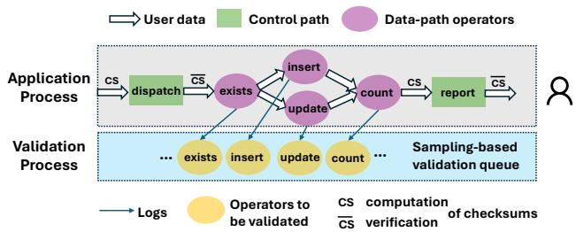
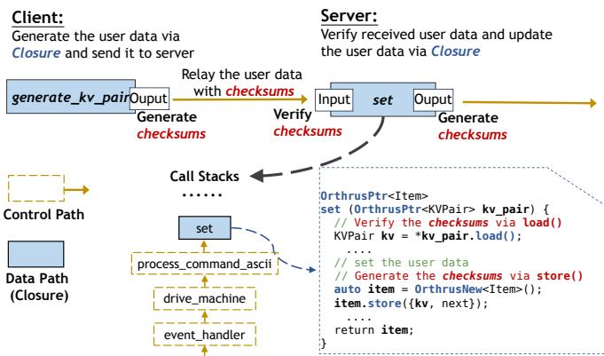
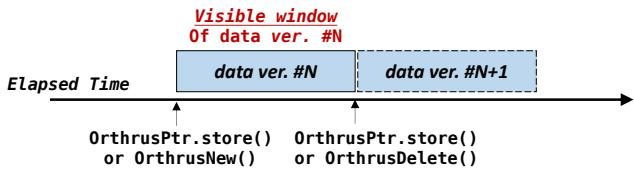
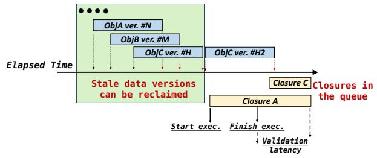
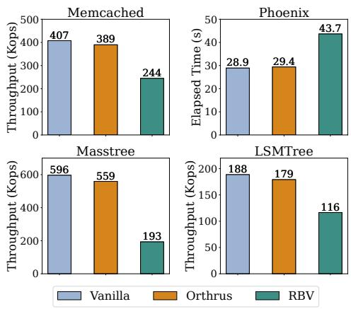
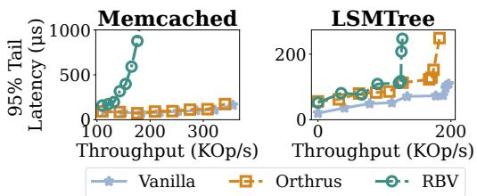
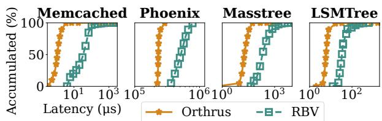
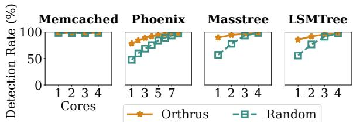
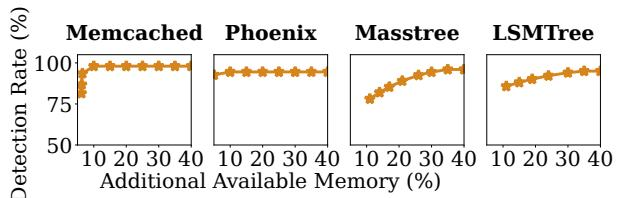

Latest updates: hps://dl.acm.org/doi/10.1145/3731569.3764832

RESEARCH-ARTICLE

# Orthrus: Efficient and Timely Detection of Silent User Data Corruption in the Cloud with Resource-Adaptive Computation Validation

CHENXIAO LIU, University of Chinese Academy of Sciences, Beijing, China ZHENTING ZHU, University of California, Los Angeles, Los Angeles, CA, United States QUANXI LI, University of Chinese Academy of Sciences, Beijing, China YANWEN XIA, University of Chinese Academy of Sciences, Beijing, China YIFAN QIAO, University of California, Berkeley, Berkeley, CA, United States XIANGYUN DENG, Peking University, Beijing, China

View all

Open Access Support provided by:

Peking University

University of Chinese Academy of Sciences

University of California, Los Angeles

University of California, Berkeley

Tsinghua University


Published: 12 October 2025

Citation in BibTeX format

SOSP '25: ACM SIGOPS 31st Symposium   
on Operating Systems Principles   
October 13 - 16, 2025   
Seoul, Republic of Korea

Conference Sponsors: SIGOPS

# Orthrus: Efficient and Timely Detection of Silent User Data Corruption in the Cloud with Resource-Adaptive Computation Validation

Chenxiao Liu†∗ Zhenting Zhu??∗ Xiangyun Deng?? Youyou Lu⋄ Harry Xu??

Quanxi Li† Yanwen Xia† Yifan Qiao‡ Tao Xie?? Huimin Cui† Zidong Du† Chenxi Wang†

University of Chinese Academy of Sciences† UCLA?? UC Berkeley‡ Peking University?? Tsinghua University⋄

## Abstract

Even with substantial endeavors to test and validate processors, computational errors may still arise post-installation. One particular category of CPU errors transpires discreetly, without crashing applications or triggering hardware warnings. These elusive errors pose a significant threat by undermining user data, and their detection is challenging. This paper introduces Orthrus, a solution for the timely detection of silent user data corruption caused by post-installation CPU errors. Orthrus safeguards user data in cloud applications by providing simple annotations and compiler support for users to identify data operators and validating these operators asynchronously across cores while maintaining a low overhead (2%–6%), making it practical for production deployment. Our evaluation, using carefully injected errors, demonstrates that Orthrus can detect 87% of data corruptions with just a single core dedicated to validation, increasing to 91% and 96% when two and four cores are used, respectively.

CCS Concepts: • Hardware → Testing with distributed and parallel systems; • Computer systems organization → Reliability; • Software and its engineering → Software maintenance tools.

Keywords: Mercurial cores, silent computation error, silent data corruption, computation validation

## 1 Introduction

Microprocessors have advanced to a point where they are no longer entirely reliable. As Google describes, they have become “mercurial” [42], meaning their calculations may no longer behave predictably. While CPU errors have existed for as long as CPUs themselves, they were historically rare and primarily affected only highly sensitive calculations. This situation, unfortunately, no longer holds with cloud computing, where data centers house thousands of CPUs. While individual errors remain rare, the likelihood of such errors affecting system reliability and data integrity is significantly higher. Google reported that these errors manifested monthly, often long after installation, and were isolated to specific CPU cores rather than entire chips or families of components [42]. Similar findings have been reported by other tech firms [30, 48, 71], as well as research institutions such as Oak Ridge [34] and Los Alamos National Laboratories [52].

CPU errors can have varying consequences [71], with silent user data corruption (SDC) being among the most severe (i.e., considered catastrophic by cloud providers such as Google [40], AWS [9], and Alibaba [71]), as user data corruption poses a significant risk by violating SLAs and causing far greater damage than crash-induced failures. Consider a cloud service storing data for a bank. If it returns a deflated account balance to a user during a query, the consequences could be disastrous—the bank would likely need to compensate the customer and might face significant fines from the federal regulators. Furthermore, the bank could initiate a lawsuit against the cloud provider, leading to a lengthy and costly legal battle that could span years and involve millions of dollars. Detecting and reporting user data corruption is a critical priority for cloud providers. For example, Alibaba Cloud requires developers to explicitly implement data integrity verification (with checksums) after every read or write operation on user data [11, 71]. However, this manual process is labor-intensive and checksums cannot be used to detect instances where data payloads are corrupted by CPU errors during data updates.

State of the Art. The most common technique today for detecting CPU errors involves periodically running test cases (e.g., every three months [30, 71]) to assess CPU fleets [38, 71]. However, as an offline technique, this form of testing is designed to detect mercurial cores rather than the user data that they may have corrupted. Consequently, it fails to catch data corruption in real-time for cloud applications, allowing damage to occur before detection—for instance, a user account may be compromised long before the tests are executed.

In contrast, online techniques such as replication-based validation (RBV) [15, 56] and instruction-level validation (ILV) [65] can detect errors in real time but come at a high cost. RBV requires running the original application alongside its replica in isolated environments (e.g., separate servers), resulting in significant resource overheads and expensive cross-server communication. RBV consumes more than 100% CPU and memory resources due to maintaining a replica and performing validation. In addition, synchronizing operations between the primary instance and its replica introduces further performance overhead. ILV, on the other hand, enforces cycle-by-cycle synchronization and comparison, leading to a 50-fold performance slowdown and requiring specialized hardware that is not available in current cloud environments. As such, neither technique is practical for production use.

A substantial body of research exists on crash-consistency techniques that validate [18, 19] or check [16, 41] data consistency during crashes. However, these techniques primarily focus on validating a system’s on-disk or in-memory metadata, rather than the actual data payload. Ensuring the integrity of the payload itself is significantly more resourceintensive and remains an unsolved challenge.

Goals and Non-Goals. This paper investigates the feasibility of a low-overhead, best-effort technique for continuously validating cloud applications to detect SDCs caused by CPU errors. Note that we do not intend to detect mercurial CPU cores or offer coverage guarantees; nor do we provide mechanisms for applications to withstand CPU errors. Our goal is to provide an online validation assistant for each application that has low tolerance of corrupted user data, detecting and reporting corruptions as soon as they occur. Once an SDC is detected, the application is aborted, preventing the corrupted data from being returned to the client.

Insights. Our work stems from a key observation: the codebase of a typical cloud application often exhibits a clear separation [55, 57, 58] between a control path—which implements control logic such as scheduling and dispatching and does not manipulate user data—and a data path that performs operations on user data. For instance, in big data systems such as MapReduce [25] and Spark [72], the data path consists of straightforward user-defined data processing functions such as map, reduce, and shuffle. In key-value stores and databases, the data path includes data retrieval and update functions such as insert, read, and update, which operate over a distributed data structure such as a hash table or B+ tree. User data enters an application through the control path (e.g., file operators and network sockets), which forwards it to the data path for computation; the results flow through the control path again before getting back to the user.

  
Figure 1: An overview of Orthrus’ mechanism.

Building on this observation, we developed Orthrus, a system that detects SDCs using a hybrid technique tailored to the behaviors of the two execution paths. Figure 1 provides an overview of Orthrus’ mechanism. Since the control path does not modify user data, Orthrus computes a checksum when each user-data object is generated and verifies it before it enters the data path (§3.4). In the data path, Orthrus ensures correctness by validating (re-executing) each data operator on a different core and comparing the results of the two executions (§3.1). Given that the data path has a much simpler code structure than the control path, re-executing data-path operators is significantly more feasible and efficient than re-executing the entire program (done in RBV).

Orthrus maintains a low time overhead of ∼4% while dynamically adjusting its resource usage based on available cores, making it deployable for production. Achieving such a low overhead and high resource adaptability requires overcoming two challenges, as elaborated below.

The first challenge is how to efficiently re-execute datapath operators. Our experience shows that most of these operators, even in large, real-world applications, are simple in logic and most of their implementation code can be directly re-executed for validation. To correctly re-execute a data-path operator, Orthrus provides simple annotations that allow developers to declare user-data types (e.g., tree and hash map) as well as closures that represent data operators to be validated (e.g., map, reduce, and insert). Our compiler automatically identifies the input and output of each closure and transforms the closure to use a set of Orthrus primitives for logging (§3.1).

To ensure that the validation of a closure (i.e., VAL) is conducted on the same input and memory state as the original execution (i.e., APP), Orthrus employs a versioned memory. It runs the application and validation in separate processes, each with its own private heap while sharing a user-data space backed by versioned memory. Every write to user data (i.e., objects of an annotated user-data class) in the APP creates a new version in this shared space. Upon the APPexecution completion, Orthrus generates a validation log containing the addresses of the input, output, and all data versions produced during execution. This log is forwarded to the VAL, which re-executes the closure on a different core using the same input and an identical initial memory state. Versioned memory also enables Orthrus to completely eliminate dependencies between the APP and the VAL—validation can occur out-of-order with logs and independently of the original computation, reducing overhead (§3.3).

The second challenge is how to effectively use resources. Timely validation of all data-path operators may require a large amount of CPU resources, taking compute away from applications. To effectively validate closures without incurring a heavy burden on compute, Orthrus employs a sampling-based algorithm that selectively chooses closures to validate, effectively adapting the amount of validation work to the available resources. In other words, validation logs produced by APPs are pushed into a validation queue (Figure 1) and selectively validated by the validation process.

The Orthrus scheduler dynamically adjusts the sampling rate based on observed validation latency—the time gap between the execution of each APP and its corresponding VAL. A high latency suggests excessive computational load, prompting the scheduler to decrease the sampling rate. Orthrus prioritizes operators that have not been recently validated, leveraging prior observations [33, 42] that CPU errors are highly reproducible and correlated with specific instructions rather than being transient. If an operator has undergone multiple validations without user data corruption being detected, its future executions are also likely to remain SDC-free. Orthrus also gives high priority to operators that contain certain types of instructions (such as fp and vector) on which CPU errors were observed to frequently occur [30, 38, 71] (see §3.5).

Results. We emulated CPU faults by using LLVM to inject instruction-level errors following the patterns observed in [44, 71]. Our results with four real-world applications demonstrate that Orthrus incurs a low overhead of ∼4%, which is 1.9× faster than RBV, and enjoys a validation latency of 40µs, which is three orders of magnitude lower than that of RBV. Although the SDC detection ratio (i.e., coverage) depends on the sampling rate, which, in turn, is determined by the amount of available CPU resources, our results demonstrate that Orthrus can detect 87% of data corruptions with just a single core dedicated to validation, increasing to 91% and 96% when two and four cores are used, respectively. Orthrus is available at https://github.com/ICTPLSys/Orthrus.

1 static inline uint64\_t   
2 pow2\_ceil\_u64 ( uint64\_t x ) {   
3 // A computation error in branching .   
4 if ( unlikely ( x <= 1) ) {   
5 return x ;   
6 }   
7 size\_t msb\_on\_index = fls\_u64 ( x - 1) ;   
8 return 1 ULL << ( msb\_on\_index + 1) ;   
9 }   
Listing 1: Masked error: a silent computation error occurs in branch   
condition calculation, but it does not change the branching results.

## 2 Background

## 2.1 Silent Computation Errors

Silent computation errors are a significant contributor to data corruption in large-scale data centers [30, 42, 71]. For instance, testing over one million processors on Alibaba Cloud revealed that 3.61‱ of them exhibited computational errors capable of causing SDCs [71]. This phenomenon underscores the importance for both industry and academia to better understand the data corruption fault model and develop efficient validation techniques. Recent studies [30, 42, 71] indicate that silent computation errors are highly reproducible, occur even in CPUs that have passed pre-production testing, and affect all micro-architectures.

Silent computation errors occur at the instruction level, encompass a range of issues such as arithmetic errors, memory access errors, vector computation errors, and even jump errors [30, 38, 44, 71]. Unlike fail-stop errors, these errors can bypass traditional fault-tolerant mechanisms such as checkpointing and recovery. They are strongly correlated with certain types of instructions. A study from Google [42] shows that once a CPU error occurs in a function (e.g., upon detection of its crash), it will often continue to occur in the same function at a certain frequency. This behavior leads to our sampling strategy (§3.5) that favors the selection of data operators that have not been recently validated.

The consequences of such errors can be categorized into two types: masked errors and silent data corruptions (SDCs). Masked errors do not affect the final computation results; for instance, a bitflip error might occur on the variable x during the evaluation of x <= 1 (Line 4 in Listing 1), but this error does not alter the control flow, allowing the application to proceed correctly by executing the appropriate branch (Line 7). In contrast, SDCs corrupt computation results, as illustrated in Listing 2, where an error during a hash table query leads to incorrect data being returned to users.

Although silent CPU errors can occur at any instruction and corrupt various types of data, this work focuses on safeguarding user data managed by cloud applications for the reasons detailed in §1. Orthrus ensures coverage for both data reads and writes, flagging errors in cases of corruption either when (1) user data is returned to clients (i.e., load) or (2) user data is written into memory (i.e., store).

```c
1 dictEntry * dictFind ( dict *d , const void * key ) {
2 // SCEEs occur in calculating the hash from key .
3 h = dictHashKey (d , key ) ;
4 for ( table = 0; table <= 1; table ++) {
5 idx = h & DICTHT_SIZE_MASK (d - > ht_size_exp [ table ]) ;
6 // Query tables accodring to the hash value
7 }
8 }
```

Listing 2: SDC: a silent computation error occurs during the hash calculation, resulting in returning wrong results to the client.

```c
1 // Data path :
2 Item * set ( KVPair * kv_pair ) {
3 KVPair kv = * kv_pair ;
4 uint32_t hv = hash ( kv . key ) ;
5 item_lock ( hv ) ;
6 Item * next = hashtable [ hv & hashmask ];
7 Item * item = new Item ;
8 * item = { kv , next };
9 hashtable [ hv & hashmask ] = item ;
10 item_unlock ( hv ) ;
11 return item ;
1 2 } ;
13 Item * get ( String key ) ;
14 void remove ( String key ) ;
15
16 // Control path
17 void drive_machine ( conn * c ) ;
18 // network IO
19 int new_socket ( struct addrinfo * ai ) ;
20 ssize_t tcp_read (...) ;
21 ssize_t tcp_write (...) ;
22 void conn_init ( void ) ;
23 // scheduling and event processing
24 void dispatch_conn_new (...) ;
25 void event_handler (...) ;
26 void stop_threads ( void ) ;
27 // miscellaneous
28 bool get_stats (...) ;
29 // parse and dispatch commands
30 int try_read_command_ascii ( conn * c ) ;
31 void process_command_ascii ( conn *c , char * cmd ) {
32 token_t command_token = /* ... */;
33 if ( command_token == " set") {
34 KVPair * pair = /* parse key - value pair ... */;
35 Item * it = set ( pair ) ;
36 /* copy it - > value to response buffer ... */
37 } else { /* process other command types ... */ }
38 }
39 /* other functions ... */
```  
Listing 3: Data path and control path in Memcached.

It is important to note that SDC is caused by instructionlevel CPU errors and hence checksums alone are only capable of protecting data against bit-flip errors that directly corrupt data, but cannot detect errors during computations that are meant to update user data and impact control flow. To illustrate, consider Listing 2 again. If the dictHashKey function produces an incorrect value of h due to a computation error, the dictFind function still executes normally but returns an incorrect result. In the worst-case scenario, if a subsequent Set operation depends on the result of this dictFind, the data may be inserted into the wrong bucket and consequently never be retrieved again. To address this issue, Orthrus employs the re-execution mechanism in addition to checksums, effectively protecting cloud applications from both bit-flip errors as well as errors in execution flow and computation.

## 2.2 Data and Control Path

As discussed in §1, Orthrus builds on an observation that a cloud application has a clearly defined control and data path. To illustrate, consider Listing 3 which shows how the data and control paths split in Memcached [2], a real-world data store commonly used in industry. Its data path consists of a series of data operators, such as get, set, and remove (Lines 2- 14), whereas its control path (Lines 17-38) is responsible for handling network traffic, parsing requests, dispatching them to the data operations, and/or forwarding the retrieved data to the client.

On one hand, the boundary between the data and control paths is clearly defined: all data operators are located in four files assoc.c, hash.c, item.c, and cache.c, and only these operators manipulate user data. The control path manages the data flow by invoking these operators to pass inputs and retrieve outputs (e.g., Line 35), without directly modifying the user data. On the other hand, the control logic is significantly more complex than the data path logic. In the original implementation, for instance, the control path has a code size over 20× larger than the data path. This pattern consistently appears across all real-world applications we evaluated, forming the basis for Orthrus’ data-path validation technique.

## 2.3 What Orthrus Cannot Detect

First, Orthrus is unable to detect masked errors that do not impact computation results. This limitation arises because Orthrus identifies corruption by comparing the outcomes of data operators to minimize overhead. However, this limitation is not a concern since these errors do not affect the data stored in the cloud or returned to users.

Second, an error may occur in a data operator that invokes a non-deterministic (e.g., a random number generator or timer) system call or a synchronization primitive (e.g., mutex) or interacts with external devices (e.g., disk or network). Since Orthrus records the outcomes of these calls and replays them during validation (see §3.3), it cannot directly validate the system call itself. Profiling results from representative cloud applications reveal only a few system calls, with extremely small code sizes—only 0.04% of the executed instructions belong to these syscalls, leaving extremely low probabilities of being hit by a silent execution error.

Third, Orthrus employs checksums to detect SDCs caused by CPU errors in the control path (see §3.4). However, if a CPU error affects the interaction between the control and data paths, using checksums alone may not catch it. For example, an error in a comparison instruction that belongs to the control path could incorrectly alter the control flow, causing the wrong data-path function to be invoked (e.g., calling get instead of insert when handling a user request).

Fourth, in an unlikely scenario where the two cores running a data operator APP and its corresponding VAL both produce errors that corrupt user data in precisely the same way, Orthrus would be unable to detect such corruptions.

Finally, Orthrus uses sampling to adapt the validation effort to the amount of available resources, and hence can also miss errors that occur in functions that are not selected for validation. Since practicality is the most important design goal, Orthrus was architected to be a best-effort tool that runs efficiently online alongside applications to promptly catch data corruptions that occur in resource-constrained production environments. Users could use heavyweight validation techniques such as RBV if resources are abundant or offline testing if their goal is only to identify erroneous CPUs.

## 3 Orthrus Design and Implementation

This section is organized as follows. First, we present Orthrus’ user-data management and its low-level primitives (§3.1). Then, we present Orthrus’ LLVM-based compiler that can automatically transform annotated operators to operate user data in versioned memory with the low-level primitives (§3.2). Next, we present Orthrus’ online validator capable of detecting silent data corruptions in the data path (§3.3) as well as how to use checksums to validate data integrity in the control path (§3.4). Finally, we present Orthrus’s scheduler (§3.5) and memory manager (§3.6), which schedule validation tasks based on resource availability and recycle unused data versions, respectively.

## 3.1 User-Data Management in Orthrus

Key to Orthrus’ efficiency is a novel technique to model and version user data in applications. This subsection focuses on the presentation of Orthrus’ low-level primitives (e.g., with Orthrus pointers and allocation API) to manage user data. Note that these low-level primitives will not be directly used by developers—our compiler support (§3.2) automatically transforms a program’s data path to use such primitives.

Memory and Low-level Primitives. As shown in Figure 2, the application heap is divided into two regions: a private space and a user-data space that is versioned to enable effective validation. Objects allocated with regular allocation libraries such as new are placed in the private space, whereas user data must be allocated using OrthrusNew (and deallocated with OrthrusDelete) and will be placed in the userdata space for data corruption detection. User data can be accessed and manipulated only through Orthrus pointers (Listing 4), which are typically used to specify the input and output of a data operator (i.e., a closure as discussed shortly).

An OrthrusPtr, similar to the C++ smart pointer, is designed to track accesses to user data stored in the user-data space. Its structure is shown in Listing 4. The actual user data can be obtained through the load function, and the returned data is immutable. Any updates to user data must be through the store function. Orthrus leverages OrthrusPtr to implement versioning, where each update creates a distinct version in versioned memory out-of-place and is automatically logged in the closure’s closure log for the subsequent validation. Versioning provides two major benefits: (1) it enables an operator to be re-executed on a heap snapshot identical to that on which the operator was executed originally, and (2) it eliminates dependencies between the original and validation executions, enabling Orthrus to perform out-of-order validation and thereby significantly improving efficiency. Further details can be found in §3.3.

<table><tr><td rowspan=1 colspan=2>Virtual Address Space of Application</td><td rowspan=1 colspan=1></td></tr><tr><td rowspan=1 colspan=1>Unversioned</td><td rowspan=1 colspan=1>Versioned</td><td rowspan=2 colspan=1>UnversionedPrivate Heap</td></tr><tr><td rowspan=1 colspan=1>Private Heap</td><td rowspan=1 colspan=1>User-data Space</td></tr><tr><td rowspan=1 colspan=1></td><td rowspan=1 colspan=2>Virtual Address Space of Validator</td></tr></table>

Figure 2: Memory organization of an Orthrus-based application: the versioned user-data space is shared between the application and the validation processes to maximize validation efficiency.

1 class OrthrusPtr <T > {   
2 uint64\_t metadata ; // flags & pointer value   
3 const T \* load () ; // Get the pointer value   
4 void store ( T ) ; // Atomic , out -of - place update   
5 } ;   
Listing 4: Orthrus user-data pointer API.

```c
1 # pragma user - data
2 class KVPair {...}
3
4 # pragma closure
5 Item * set ( KVPair * kv_pair ) {
6 KVPair kv = * kv_pair ;
7 /* * /
8 Item * item = new Item ;
9 /* * /
10 return item ;
11 };
```  
Listing 5: Annotating a function as a closure.

Closure and User-Data Classes. The only extra work developers must do to use Orthrus is to (1) annotate user-data operators with keyword closure, which serves as a basic unit for validation, and (2) annotate classes/structs that represent user-data structures (such as Hashmap and Tree) with user-data. To annotate a function as a closure, the developer explicitly specifies a scope for re-execution, while the input and output of the closure are automatically identified by our compiler. The input data includes arguments and global variables that may be accessed, while the output consists of a set of new data versions generated in versioned memory as well as the return value. The reason for annotating user-data classes is for the compiler to automatically identify user-data objects and place them into the versioned space.

Listing 5 depicts a simple example of annotating a Memcached user-data class and a closure that represents a data operator. For instance, class KVPair is annotated as a user-data class and hence our compiler can find all its allocation sites and replace them with the Orthrus allocation (OrthrusNew), which places the allocated objects into versioned memory.

```c
1 struct closure_log {
2 uint32_t closure_id ;
3 uint32_t core_id ;
4 closure * closure_class ; // Point to the closure
class
5 const void * inputs ; // The inputs
6 const void * outputs ; // The outputs
7 void (* self_defined_validation ) ; // Optional
8 void * reserved ; //e.g. , record results of syscalls
9 uint64_t start_time ; // for resource reclamation
10 };
```  
Listing 6: Structure of a closure log.

In addition, the implementation of a closure must follow a single-threaded execution model, ensuring that the validator can re-execute the closure on a different core for validation. Note that this execution model is already the case in most real-world applications—an application may launch data operators in multiple threads, but the implementation of each operator itself (such as get, set, map, and reduce) is always single-threaded.

Shared data accessed by multiple closures through Orthrus pointers can be tracked explicitly. For example, if two closures running in separate threads attempt to update the same data object via Orthrus pointers, the first closure to acquire the lock creates a new data version, records its closure ID, and proceeds. The second closure then creates another version. This technique ensures that both the accessing closures and the versions they take as input are recorded for a faithful re-execution.

Closure Log. To ensure consistent results for comparison, Orthrus produces a closure log at the end of the execution of each closure. It provides the validator with a memory view identical to what the application sees, including the closure’s inputs, outputs, versions of user-data reads, writes, as well as the recorded results of system calls. Since system calls may have side effects (i.e., read from or write into a socket) or return non-deterministic values (i.e., a random number or a timestamp), Orthrus does not re-execute them, but instead, it directly uses the logged results during validation.

Listing 6 outlines the structure of a log. As explained earlier, Orthrus employs versioning to make the memory view consistent. User data is read-only, and any update to it results in a new data version. The inputs field captures the corresponding versions of all input user-data accessed by the closure during the execution. If the input data is mutated during the execution, newer versions of the data are generated but the original version remains the same (for the validation to correctly execute).

Orthrus considers the output of a closure to include (1) the addresses of all new data versions created through the invocation of store on OrthrusPtrs and (2) the return value of the closure. These values are recorded in the outputs field of the log. The closure\_class field references the closure’s class, containing its computations. Since all inputs and outputs are accessible through this log, the validator can execute the closure with the log and compare the results, asynchronously, without requiring interaction with the application. The system calls executed in a closure are intercepted and their values are recorded in the closure\_log.reserved field of the log for the replay of these calls during its validation.

To optimize the logging performance, we implement a cache-locality-aware log allocator to efficiently manage logs. Details are omitted due to space constraints.

## 3.2 Orthrus Compiler Support

The Orthrus compiler automatically transforms annotated data-path operators using our LLVM-based infrastructure. This transformation is applied at the IR level and focuses on identifying user-data objects. It replaces standard allocations/deallocations and pointers associated with these objects with OrthrusNew/OrthrusDelete and OrthrusPtr, respectively. The core idea is to allocate user-data objects in versioned memory using OrthrusNew and ensure that all accesses go through OrthrusPtr, which enables versioning and checksum operations; the latter is for data integrity validation when user data goes through the control path, as discussed in §3.4.

To realize this idea, our compiler identifies all classes annotated with user-data and locates every allocation site that instantiates objects of these classes. Each such class is made to inherit from OrthrusObj (Listing 7), which contains a checksum field that stores the checksum of the object’s data payload. This checksum will be used to validate data integrity when user data goes through the control path (§3.4). Each allocation site of the class is then replaced with a call to OrthrusNew. For each closure, Orthrus performs two passes over the function body. The first pass conducts type inference to determine which variables are of user-data types. Any pointers referencing these variables are replaced with OrthrusPtr, and all reads/writes through these pointers are rewritten as OrthrusPtr.load and .store, respectively.

The second pass performs escape analysis [10, 28], aiming to identify objects that may potentially outlive the function execution—i.e., those whose lifetimes extend beyond the closure. Objects that do not escape are guaranteed to be deallocated before the function returns and can therefore be safely placed in the private heap even if they are of a user-data type. These objects are not part of the closure’s initial heap state; they do not need to be allocated in versioned memory and their pointers are not replaced with OrthrusPtr, thereby improving performance. Note that corruption of such temporary objects will go undetected by our validator unless it propagates to user data stored in versioned memory.

## 3.3 Validation

Orthrus maintains a validator process that uses a per-core log queue to run validation. When an application closure finishes its execution, it generates a closure log. The scheduler picks a core that is different from the one that runs the closure and pushes the log into its log queue. Validation is done by dequeuing logs from each queue and re-executing closures on them. The validator process is allowed to read from the user-data space of the application process (where log entries point to), but it can write into only its private heap.

1 template < typename T >   
2 class OrthrusObj : public T { uint16\_t checksum ; }   
3 OrthrusPtr < Item > set ( OrthrusPtr < KVPair > kv\_pair ) {   
4 KVPair kv = \* kv\_pair . load () ;   
5 /\* \*/   
6 OrthrusPtr < Item > item = OrthrusNew < Item >() ;   
7 /\* \* /   
8 return item ;   
9 } ;  
Listing 7: The transformed closure code from Listing 5.

Read and Write. Once a log is dequeued, the validator first retrieves the input and output by following the input and output OrthrusPtrs. The validator runs the closure with the input in a separate execution environment. When the closure dereferences an OrthrusPtr to load data, it reads from either the shared user-data space (such as the input or log entries) or its private heap. However, a store with an OrthrusPtr always writes into its private heap to avoid interfering with the application heap—if the raw memory address in the pointer initially belongs to the shared user-data space, Orthrus finds a new location in the validator’s private space, writes the value in, and atomically updates the pointer with the new address. This design ensures that all subsequent reads and writes use this updated address. The validator’s private heap is not versioned since we do not need to re-execute the closure after validation.

Result Comparison. Orthrus allows users to overload the “==” operator on the OrthrusPtr that points to the output data structure. This operator is used to check whether the validator’s output matches the record in the closure log. If it is not explicitly defined, Orthrus performs a bitwise comparison between the two memory regions.

Out-of-Order Validation. Closure logs serve as a selfcontained record, providing the validator with all necessary inputs, outputs, and computations. This design allows the validator to process closure logs independently without requiring synchronization with the application. Furthermore, Orthrus leverages the lightweight user-thread runtime Shenango [60] to implement the validator, allowing dynamic scaling at the microsecond level. This design enhances CPU utilization and further reduces detection latency.

## 3.4 Handling Control Path

Although the control path does not directly modify user data, CPU errors occurring within control code can still result in data corruption. For example, a CPU fault during a socket read may alter user-provided input, and such an error would bypass data-path validation since it does not originate from a data-path operator. Since the control path does not perform computations that update user data, our key idea is to use checksums to efficiently validate data integrity at the interface between the control and data paths.

  
Figure 3: Execution flow of the closures defined in Listing 3.

In particular, Orthrus assigns a 16-bit cyclic redundancy check (CRC) to each data object version, storing it in the version header. The CRC is created each time a version is generated (e.g., at the instantiation of a new object through OrthrusNew or an update of the object through OrthrusPtr.store). When a data object flows from the control/data path into the data/control path, the CRC is compared against the content of the object.

To illustrate this technique, consider Figure 3, which shows the execution of a set closure on the server side of Memcached. On the client side, a key-value pair is created within the generate\_kv\_pair closure using OrthrusNew. Once the object is generated, Orthrus computes a CRC checksum and attaches it to the object. As the key-value pair is transmitted over the network to the server, it passes through the control path without modification before reaching the data path (i.e., the set closure). When set is invoked, the checksum is validated upon the first OrthrusPtr.load access to the object. Since the control path—from the client-side generate\_kv\_pair to the server-side set—is not expected to modify the key-value pair, any data corruption introduced along the way can be reliably detected by a checksum mismatch.

New checksums are generated when the key-value pair is inserted into user data (e.g., a hash map) using the Orthrus pointer via item.store. Once the insertion is complete, the set closure returns a user-data handler—an Orthrus pointer referencing the inserted object—back to the control path. Since the checksum is used solely for integrity validation rather than error recovery, a 16-bit checksum per object is sufficient. Generating this checksum is lightweight, requiring only a few dozen CPU cycles, and introduces ∼1% performance overhead in our evaluation.

## 3.5 Orthrus Runtime

The Orthrus scheduler is a NUMA-aware system that monitors idle cores, dynamically assigns validation tasks to the cores that are not used to run application threads, and scales tasks as needed to maximize resource utilization and minimize detection latency.

Scheduling Policy. Since silent computation errors can recur on the same hardware components such as ALUs, FPUs, and vector units [30, 39, 71], our scheduler is designed to prevent validation tasks from sharing these computing units with application processes. On Intel platforms [45], where ALUs, FPUs, and vector units are core-private, it is safe to colocate application and validation tasks on different cores within the same CPU (i.e., NUMA node). Colocating application and validation tasks on the same CPU facilitates fast log sharing. Many closure logs generated by application threads are accessed by validation tasks within microseconds. This technique increases L3 cache hit rates, significantly enhancing validation throughput and reducing detection latency. Additionally, the scheduling policy is user-configurable to detect other types of errors, such as cache consistency issues, provided the detection can be achieved by comparing results.

Sampling. When hardware resources are limited, Orthrus employs sampling to scale validation efforts according to available compute capacity. The primary goal of this sampling strategy is to maximize code coverage—that is, to validate as many distinct code paths as possible. To achieve this goal, Orthrus monitors logs from the validation queue and adaptively selects closures that have not been validated recently. It tracks a timestamp for each closure, indicating the last time that it was validated, and gives priority to those whose timestamps exceed a defined threshold, ensuring that less frequently validated code receives higher attention.

While this strategy offers a baseline level of code coverage, a single closure can be invoked in various contexts (e.g., by different callers), with each context potentially exercising different control paths [70, 75]. To improve the precision of sampling and further enhance code coverage, Orthrus also takes the caller into account. Specifically, it maintains a timestamp for each unique (closure, caller) pair. If a given pair has been invoked frequently within a recent time window, its likelihood of being selected for validation is reduced.

Prior studies [30, 33, 39, 42, 44, 71] have shown that CPU errors are strongly correlated with specific instruction types, particularly those involving fp and vector operators. During compilation, the Orthrus compiler detects and tags closures containing these instruction types. These closures are then given elevated priority in the validation process.

Orthrus begins by validating all closures. Running at a low execution priority, the validation process initially tries to utilize all available cores, although these resources can be preempted by application threads at any time. If the queuing delay for validation exceeds a predefined threshold, Orthrus adaptively reduces the sampling rate in increments until the delay returns to an acceptable range.

Safe Mode. Since SDCs are rare, validation does not, by default, block results from being returned to users, thereby avoiding unnecessary latency. Instead, when an SDC is detected, the system flags the specific corrupted operation result. This design, however, may risk externalizing corrupted outputs. To address this issue, Orthrus offers an optional strict safe mode that users can enable, ensuring that application results are withheld until their corresponding closures are validated. The performance cost of this mode is modest: only a limited subset of operations can potentially expose corrupted data and thus require safe-mode execution. For instance, in Memcached, only the get operation returns data to users, while operations such as insert and remove do not. Similarly, Phoenix only reveals results at the end of execution. Moreover, the validation overhead in Orthrus is minimal—just a few microseconds per operation on average (§4.3)—contributing less than 2% of total execution time.

Dynamic Scaling. The scheduler continuously monitors the CPU utilization of the application and ensures that validation tasks are scheduled only on idle cores to avoid performance interference. To adapt to fluctuating application workloads, the Orthrus scheduler supports dynamic scaling and workstealing mechanisms, enabling low SDC detection latency, which is critical for preventing error propagation.

The Orthrus validator builds on Shenango [35, 60] userlevel threads, which support core reallocation within microseconds. Initially, the scheduler launches a single validation thread to periodically scan all log queues. Each closure tracks its average validation latency, defined as the time between a log’s enqueue and validation completion, over the last eight validated closure logs. If this closure-specific latency exceeds a pre-defined threshold—such as 50% higher than the average latency across all validated logs—it notifies the scheduler to launch an additional validation thread (i.e., a Shenango thread) to handle half of its log queues.

Load Balancing. While out-of-order validation enhances throughput, it can introduce tail latency issues. For instance, a closure log might remain in its queue longer than its successors due to imbalanced validation workloads across threads. Such delays can result in both prolonged SDC detection latency and wasted computational resources if the log contains corrupted data. Errors in the stranded log can propagate to its successors that rely on its outputs, yet these errors cannot be detected by validating the successors. The reason is that closure log re-execution detects errors only occurring during the current closure’s execution and assumes that the inputs are correct. Consequently, resources spent validating successors are wasted. This problem can escalate with higher error rates. To address this issue, Orthrus incorporates work stealing [51] to balance validation workloads and mitigate tail latency issues.

  
Figure 4: Visible window of a data version.

## 3.6 Memory Reclamation

While versioning enables efficient validation, it leads to increased memory consumption. To mitigate this issue, redundant data versions must be reclaimed promptly to minimize memory overhead. Orthrus provides a garbage collector (GC) that reclaims data versions as soon as they are not needed.

The core challenge in reclaiming stale data versions lies in determining the exact moment when no pending closures or closure logs reference those versions as inputs. This determination is non-trivial as a data version may be used by multiple closures (and hence appear in multiple logs) due to multi-threading. The problem is further complicated by Orthrus’ out-of-order validation model, which makes the validation timing of each closure unpredictable. Traditional GC [20, 27, 50] does not work for unmanaged languages such as C/C++. Reference counting (RC) [21], as another common memory reclamation technique, tracks the number of active references per version at a very high overhead—maintaining reference counts requires atomic operations for each increment and decrement, which can lead to substantial synchronization costs—up to 13% overhead in memory-intensive workloads [66, 74].

The key insight driving our technique is that an object version is accessible only within a specific visible window, defined as the period between its creation (via OrthrusPtr.store) and the creation of a new version of the same object (via OrthrusPtr.store again)—the forward execution will not see this old version any more—or deallocation (via delete), as illustrated in Figure 4. Similarly, each closure execution has an active window: from the point the closure is executed by the application all the way until its validation is done by the validator (as illustrated by closure A in Figure 5). After its validation is over, none of the versions referenced by the closure’s log will be referenced any more.

Consequently, by tracking the visible window for each data version and the active window for each closure, the validator can determine whether a version can be safely reclaimed by checking for time overlaps. Note that this check is a coarse-grained one—even if a data version’s visible window overlaps with a closure’s active window, the version may still be reclaimed if it is not referenced by the closure. However, tracking such references requires maintaining the mapping between data versions and the closures that use them, introducing both high time and space overhead.

  
Figure 5: Data versions whose visible windows end before the earliest starting closure A in the queue can be safely reclaimed.

As a result, Orthrus employs an efficient approximate algorithm to detect overlaps and quickly reclaim versions that are guaranteed to be stale. Whenever the validator finishes validating a closure, Orthrus searches a combined queue, which contains all closures currently being executed by the application and by the validator as well as those waiting to be validated, to find the one with the earliest starting time (say ?? )—given ?? is a past time, it is guaranteed that no current and future closure executions can start earlier than ??. As such, Orthrus can safely reclaim all data versions whose visible window ends before ??.

As shown in Figure 5, the algorithm is efficient because the combined queue is organized as a list sorted by the start times of closure executions, with the earliest-starting closure always at the tail. Orthrus asynchronously identifies data versions whose visible windows end before time ?? and reclaims them in batches to maximize efficiency. Experimental results demonstrate that this algorithm significantly improves memory usage, reducing Orthrus’ memory overhead to ∼20% while incurring a negligible time overhead.

## 4 Evaluation

## 4.1 Setup and Methodology

We develop the Orthrus compiler, library, and runtime in C/C++. Our experiments are conducted on a cluster of three servers, each equipped with two Intel Xeon Gold 6342 CPUs and connected via 100 Gbps Mellanox ConnectX-5 InfiniBand adapters. The test environment runs on Ubuntu 18.04 with the kernel version 5.14. To ensure consistent performance, we disable Turbo Boost, C-states, and CPU frequency scaling, following the practices outlined by Shenango [60].

Workloads. We select a diverse set of real-world cloud applications: Memcached [2], an in-memory object caching system; Masstree [4], a multi-core in-memory key-value store; Log-Structured Merge-Tree (LSMTree) [61], a two-level tree structure commonly used for indexing write-intensive files, such as in RocksDB [5]; Phoenix [62], a MapReduce framework designed for data-intensive processing tasks, as detailed in Table 1.

Table 1: Applications and datasets used for our evaluation.
<table><tr><td>Application</td><td>Dataset</td><td>Size</td><td>Characteristics</td></tr><tr><td>Memcached[2] Masstree [4] LSMTree [61]</td><td>CacheLib[14] ALEX [29] Synthetic [3]</td><td>150MOP 200 MOP 50 MOP</td><td>Skewed withchurn Read-intensive Write-intensive</td></tr></table>

Annotating these applications is straightforward, as most follow a well-defined separation between the control path and data path. For example, MapReduce frameworks such as Phoenix already define standard data operations (e.g., split, map, and reduce), and utilize structured data types including hash\_container and array\_container. These components can be directly converted into closures and Orthrus user data through our annotations, as described in §3.1. Similarly, in-memory data stores such as Memcached and Masstree are structured around explicit operations—such as get, set, and remove—for manipulating user data, making them equally amenable to Orthrus’ validation. As a result, porting these applications requires minimal effort, with fewer than 20 lines of code needing modification.

Baselines. We use the original, unmodified applications—referred to as the vanilla version—to evaluate the performance overhead. For assessing SDC detection in terms of overhead, timeliness, and coverage, we use replicationbased validation (RBV) as a baseline. In the RBV setup, a replica of the application is run on a separate server from the primary to avoid shared hardware and software states. All client requests are directed to the primary application, which batch and forward them—along with their outputs—to the replica in the same processing order. The replica executes the requests and compares the results against those from the primary. Any mismatches trigger a signal to interrupt the primary’s execution. Instruction-level validation (ILV) is excluded from our evaluation, as it requires specialized hardware and incurs prohibitively high overhead.

Fault Injection. Given that CPU errors are rare, to fully evaluate our technique, we use a compiler-based fault injection method to emulate the corrupted execution of individual instructions on a mercurial core [26, 36, 44]. By adding a fault-injection machine function pass to the LLVM, we could leverage an external configuration file to specify which machine instructions the Clang compiler should target for fault injection and define the types of faults to apply. Typically, this injection involves replacing the target instruction or modifying its output to emulate corrupted execution.

We develop a fault-injection compiler framework (Appendix A in the supplementary material) to ensure the coverage of the four types of vulnerable CPU features reported by Alibaba Cloud [71]: arithmetic logic computation, vector operations, floating point calculation and cache coherency.

CPU Resources. We conduct two sets of performance experiments. The first set focuses on Orthrus’ overall performance (§4.2) and its validation latency—how fast a closure can be validated (§4.3). Since Orthrus is fully adaptive to available resources, varying the number of cores has minimal impact on these results. For example, the primary overhead arises from logging and runtime bookkeeping, which occur during application execution regardless of how many cores are allocated for validation. Similarly, validation latency remains largely unaffected by compute resources—sampling may skip certain closures, but once a closure is selected, its validation proceeds promptly and hence validation latency is not impacted. The second set of experiments centers on error coverage analysis (§4.4), which is directly influenced by the number of cores allocated to the validator. Consequently, we fix the validator to use two cores in the experiments for §4.2 and §4.3, while varying the number of cores in §4.4 to illustrate the impact of sampling on coverage.

  
Figure 6: Application performance: throughput measured for Memcached, Masstree, and LSMTree, while time measured for Phoenix.

## 4.2 Application Performance

This subsection evaluates the end-to-end performance and tail latency of applications under various validation techniques. Because RBV relies on state-machine replication, it is allocated the same number of cores as the corresponding application (which is significantly more than the cores used by Orthrus) to ensure reasonable performance. Overall, Orthrus introduces only a modest overhead—4% in execution time and 25% in memory usage. In contrast, RBV incurs significantly higher costs, with execution time and memory overheads of 2.0× and 2.1×, respectively.

Memcached is a widely used in-memory data store with extensive deployment in cloud environments. We annotate a total number of five closures from its open-source implementation [8]. For evaluation, the client and Memcached server are deployed on separate machines. Following the default configuration, the client uses 32 threads to generate a high request load, while the Memcached server operates with 4 threads. The dataset for Memcached is sourced from Meta’s CacheLib [1, 14], which exhibits highly skewed access patterns, where the top 20% of objects account for 80% of requests [14].

  
Figure 7: The $9 5 ^ { \mathrm { t h } }$ latency of latency-critical applications.

As Figure 6 shows, Memcached-Orthrus achieves throughput comparable to Memcached-Vanilla, with only a slight 4.4% reduction attributed to the overhead of generating logs for validation. The reason is that Memcached is a readintensive workload with most of the requests consisting of GET operations that do not lead to version generation.

Memcached-Orthrus delivers a 1.6× throughput improvement over Memcached-RBV, thanks to its use of sharedmemory communication and relaxed synchronization between the application and the validator. RBV, on the other hand, is built on state machine replication [15, 56], which relies on TCP/IP-based inter-server communication. As a result, Memcached-RBV spends 43% of total CPU resources on communication, even with batching applied to reduce sync frequency. Figure 7 further highlights that Memcached-RBV suffers from tail latencies up to 1000× worse than Memcached-Orthrus, largely due to queuing delays.

We also measure memory consumption and find that versioning in Memcached-Orthrus incurs a 29% memory overhead compared to Memcached-Vanilla—7.3× lower than the overhead observed in Memcached-RBV.

Phoenix [62] is a MapReduce framework designed for coarse-grained batch processing. In Phoenix-Orthrus, each map and reduce function is annotated as a closure. Unlike Memcached, where each operation involves small amounts of user data, Phoenix operates on large batches of data, resulting in significantly fewer log entries and versioned objects. For our evaluation, we run both mapper and reducer processes with 16 cores and execute a word count task on the 2024 English news subset of the WMT dataset [46]. As shown in Figure 6, Phoenix-Orthrus introduces minimal overhead—less than 2%—compared to the vanilla version.

In contrast, Phoenix-RBV experiences a 51% drop in throughput. Degradation stems from two main factors. First, Phoenix is a data-intensive application, with each operation producing and modifying large result sets that must be validated. Transmitting these results over the network to the replica consumes significant CPU resources. Second, data processing workloads often involve complex structures [37, 69], such as large arrays and nested object graphs, which require expensive equivalence checks during validation. Phoenix-Orthrus significantly improves data transfer efficiency by using shared-memory-based logs, eliminating the need to serialize and transmit read-only user data.

This design results in a 1.5× improvement in throughput over RBV. Phoenix-Orthrus incurs just a 2.6% memory overhead, while Phoenix-RBV introduces a significantly higher 2.1× memory overhead due to the need to maintain a full replica of the application state.

Masstree [4] is a KV store optimized for multi-core systems. We allocate 4 cores to the Masstree server and 16 cores to the client, which is run on a separate machine. We use the real-world ALEX [29] workload, which is skewed and composed of 50% range queries and 50% updates. Each range query begins by locating the node containing the specified key, and then scans forward through the node. Updates require looking up the key and modifying its associated value. This workload is read-intensive and introduces a series of dependencies between scanning and update operations.

As shown in Figure 6, Masstree-Orthrus delivers throughput comparable to Masstree-Vanilla, whereas Masstree-RBV suffers from a significant performance drop—65% lower than Masstree-Orthrus. Beyond the communication overhead previously discussed, Masstree’s use of optimistic concurrency on a complex tree structure introduces considerable synchronization overhead. For instance, when multiple concurrent requests contend for shared data, the application must record their execution order and forward the requests to the replica. Due to data dependencies, the replica is forced to process these requests sequentially, severely restricting parallelism. This results in two major performance bottlenecks: (1) reduced validation throughput, leading to increased validation latency (§4.3); and (2) frequent application blocking when the validator falls behind, causing the message queue to overflow, which further degrades throughput and increases long-tail latency.

Masstree-Orthrus, however, can validate the received logs out of order, resulting in much higher validation throughput compared to Masstree-RBV. As a result, Masstree-Orthrus achieves a 2.9× increase in throughput. It incurs a 35% memory overhead compared to Masstree-Vanilla.

LSMTree [61], or Log-Structured Merge Tree, is optimized for indexing in write-intensive file systems and widely adopted in databases such as RocksDB [5] and Cassandra [12]. LSMTree consists of two tiers: an in-memory skip list as the first tier and a simplified version of the Sorted String Table (SSTable) on the block device as the second. For this evaluation, we focus on the memory-tier performance—specifically the skip list—by allocating a large memory buffer to minimize data flushing to the SSTable.

The dataset used for this evaluation consists of 100% random writes, which introduce significant memory overhead due to data versioning. As a result, LSMTree-Orthrus achieves 95% of the throughput of LSMTree-Vanilla, with a memory overhead of 34%. Despite this result, LSMTree-RBV lags behind LSMTree-Orthrus in throughput by 54%, primarily due to communication overhead. It is worth noting that a workload composed of 100% random writes is unrealistic; this setup is intentionally chosen to stress-test Orthrus’s performance under extreme conditions.

Impact of Checksum. We measure the cost of checksum computation and verification that is used to ensure userdata integrity in the control path. The overall overhead is negligible (< 1%) as checksum can be efficiently executed on modern processors (e.g., with SSE4.2 instructions).

Resource Overhead. Overall, Orthrus incurs resource overhead from two sources. First, the validator consumes CPU and memory resources for re-execution, which are controlled through the adaptive sampling mechanism. Second, the modified application introduces additional runtime and memory overhead due to its use of OrthrusPtr to manage user data.

To address the first source, Orthrus’ sampling policy strikes a balance between SDC detection coverage and resource consumption, while ensuring bounded detection latency. When computing resources are insufficient to process all generated closure logs, the validator selectively drops logs containing recently validated code patterns (as described in §3.5), improving validation and memory reclamation throughput. We evaluate how detection coverage evolves under varying levels of computing and memory resources in §4.4.

The second source of overhead comes from Orthrus ’s data management, particularly the use of OrthrusPtr, which incurs both memory and runtime access overhead—averaging 7% and 3%, respectively, in our evaluation. This overhead can be mitigated by adopting a dedicated pool allocator for versioning metadata to reduce memory fragmentation. Our design also encourages coarse-grained data annotation, allowing developers to consolidate related data chunks into single objects to further lower management costs. We leave these optimizations for future work.

## 4.3 Closure Validation Latency

This section evaluates closure validation latency, defined as the time between the completion of a closure’s execution and the completion of its validation, for both RBV and Orthrus. This metric reflects the timeliness of SDC detection—how quickly a user data corruption can be identified after it occurs. Figure 8 presents the validation latency across four applications. On average, Orthrus achieves a validation latency of 1.6 µs, 234 ms, 22.6 µs, and 7.7 µs for Memcached, Phoenix, Masstree, and LSMTree, respectively—two or three orders of magnitude lower than that of RBV in latency-critical applications. This improvement is primarily due to three factors: (1) RBV must validate data in sequence if there is data dependency between operations, while Orthrus validates out of order due to versioning, leading to much higher validation throughput; (2) Orthrus validates only code in the data path, while RBV needs to re-execute the entire program; and (3) Orthrus leverages efficient shared-memory-based log transfer between the application and the validator, eliminating the need for costly network synchronization.

  
Figure 8: Closure validation latency distribution.

Memcached. Memcached requests are typically small, resulting in relatively low request-level validation latency under RBV, averaging 90 µs. This latency is still 56× higher than that of Memcached-Orthrus, which achieves an average latency of just 1.6 µs. Orthrus particularly benefits from the out-of-order validation for the highly skewed workloads, which usually exhibit data dependencies between operations, whereas validating each operation under RBV requires cross-server communication and synchronization.

Phoenix. As discussed in §4.2, each Phoenix operation, such as map or reduce, can take up to 240 ms to complete. With RBV, validation is delayed until these large outputs are serialized and transmitted to the replica, a process that is both timeconsuming and resource-intensive. Consequently, Phoenix-RBV suffers from high tail validation latency, reaching up to 1100 ms, with an average of 513 ms. In contrast, Orthrus leverages a shared user-data space between the application and the validator, significantly reducing the data movement overhead. Furthermore, Orthrus performs validation using efficient bitwise comparisons, which are substantially faster than the complex data structure comparisons required by RBV. As a result, Orthrus achieves an average validation latency of just 234 ms.

Masstree. Masstree-Orthrus achieves a validation latency that is 21× lower than Masstree-RBV. This improvement stems from Masstree’s use of optimistic concurrency on a complex tree structure, which requires RBV to strictly synchronize the execution order of operations in the replica to ensure consistency. This synchronization introduces substantial communication overhead and severely limits parallelism in replica execution. In contrast, Orthrus leverages out-oforder, log-based validation, enabling 2.9× higher validation throughput compared to RBV. Additionally, RBV incurs additional latency due to the high cost of comparing complex tree structures, further widening the performance gap.

LSMTree. Here Orthrus and RBV exhibit the smallest difference (still 8× apart) in validation latency. As discussed in §4.2, we use a random-write dataset for LSMTree-Orthrus,

Table 2: SDC coverage when both Orthrus and RBV were given the same number of cores as were used by the applications.
<table><tr><td rowspan="2"> Apps</td><td rowspan="2">Detections</td><td colspan="4">Injected Error Type</td></tr><tr><td>Arithmetic</td><td>Floating point</td><td>Vector</td><td>Cache</td></tr><tr><td rowspan="3">Memcached</td><td>Total SDCs</td><td>132</td><td>0</td><td>217</td><td>122</td></tr><tr><td>RBV</td><td>130(98%)</td><td>0</td><td>216(99%)</td><td>122(100%)</td></tr><tr><td>Orthrus</td><td>126(95%)</td><td>0</td><td>213(98%)</td><td>120(98%)</td></tr><tr><td rowspan="3">Masstree</td><td>Total SDCs</td><td>145</td><td>0</td><td>163</td><td>210</td></tr><tr><td>RBV</td><td>143(99%)</td><td>0</td><td>163(100%)</td><td>209(99%)</td></tr><tr><td>Orthrus</td><td>140(97%)</td><td>0</td><td>160(98%)</td><td>209(99%)</td></tr><tr><td rowspan="3">LSMTree</td><td>Total SDCs</td><td>126</td><td>337</td><td>157</td><td>198</td></tr><tr><td>RBV</td><td>123(98%)</td><td>334(99%)</td><td>155(99%)</td><td>198(100%)</td></tr><tr><td>Orthrus</td><td>123(98%)</td><td>330(98%)</td><td>151(96%)</td><td>195(98%)</td></tr><tr><td rowspan="3">Phoenix</td><td>Total SDCs</td><td>227</td><td>244</td><td>213</td><td>0</td></tr><tr><td>RBV</td><td>223(98%)</td><td>244(100%)</td><td>212(99%)</td><td>0</td></tr><tr><td>Orthrus</td><td>219(96%)</td><td>237(97%)</td><td>208(98%)</td><td>0</td></tr></table>

which introduced minimal data dependencies between operations. As a result, RBV requires less synchronization effort in LSMTree compared to other applications.

## 4.4 SDC Coverage

This subsection evaluates Orthrus’ validation efficiency and its ability to detect SDCs by varying the computation and memory resource assigned to the validator. SDC coverage is defined as the percentage of user data corruptions successfully detected out of the total number of corruptions that occur. We also compare Orthrus’ adaptive sampling strategy to unguided random sampling as well as RBV, a strategy that does not use sampling.

Full SDC Detection Capabilities. We use LLVM to inject instruction-level errors (into both the control and data paths), following the four common error types identified by Alibaba Cloud [71]. Details of the fault injection methodology are provided in the supplementary document. To evaluate the maximum SDC detection capability of both Orthrus and RBV, we allocate the same number of cores for validation as those used by the applications themselves. Table 2 presents the total number of injected errors for each fault type, along with the number of SDCs detected by Orthrus and RBV across different applications. Note that dedicating as many cores to validation as to the application is impractical in real-world deployments. As such, the SDC detection rates reported for Orthrus represent an upper bound on what could be achieved in a production environment.

Overall, RBV detects 98.3%, 99.5%, 99.5%, and 99.8% of SDCs across the four error types, while Orthrus achieves detection rates of 97.2%, 97.6%, 97.6%, and 98.9%, respectively. RBV demonstrates slightly higher detection coverage, primarily because it re-executes the entire control path within a replica. For instance, RBV can catch branching errors in the control path that cause the program to return prematurely, skipping the data operation that is intended to run. In our evaluation, all but three of the SDCs detected by RBV but missed by Orthrus originate in the control path—cases that Orthrus checksum-based mechanism is not designed to catch. The remaining three missed SDCs are caused by errors during system calls (one in write and two in mutex operations), which are not re-executed by Orthrus validator. These missing cases correspond to the second and third limitations outlined earlier in §2.

  
Figure 9: SDC detection rate with varied validation cores.

SDC Detection with Varying Cores. As shown in Figure 9, Orthrus’ SDC detection rate decreases slightly to an average of 86.7% when the validator is limited to a single core—still 1.41× higher than what is achieved with random sampling. Notably, coverage for Memcached remains unchanged, as even a fraction of a core is sufficient to validate its execution. In contrast, Phoenix experiences the steepest drop in coverage, falling to 78.2% with one core. The main reason is its high degree of parallelism (16 threads), which produces a high volume of closures to validate. Additionally, Phoenix’s word count workload is extremely memory-intensive, requiring considerable CPU resources to compare user data during validation. Masstree, on the other hand, shows better resilience to reduced validation resources. Due to access skewness, many closures share similar calling contexts, allowing Orthrus’ adaptive sampling to maintain higher coverage efficiency. For Masstree, coverage drops by only 8.6% when decreasing from four cores to one.

Note that under sampling, Orthrus’ application performance and validation latency remain largely consistent as the number of validation cores is reduced to one. However, memory consumption decreases sharply—by an average of 36%—because closures are processed (either validated or skipped) more quickly, preventing log accumulation and delay in resource reclamation.

SDC Detection with Varying Memory Constraints. This experiment evaluates how the SDC detection rate changes as available memory decreases. To limit validation throughput, we fix the number of cores to two; otherwise, closure logs and data versions would be validated and reclaimed quickly with only negligible memory usage. We then switch the sampling trigger from detection latency to available memory capacity, allowing us to directly control memory consumption. Using the vanilla application’s memory footprint as a baseline, we vary the constraint by permitting an additional 5% to 40% memory beyond that baseline. When a burst of writes generates excessive closure logs and data versions that exceed validation throughput and exhaust memory resources, the validator activates sampling. This increases validation and reclamation throughput, impacting the detection rate.

  
Figure 10: SDC detection rates with varying memory constraints.

As shown in Figure 10, Phoenix’s SDC detection rate remains largely stable, averaging 91% even when available memory is restricted to 15% of the application’s footprint. As discussed in §4.2, Phoenix is relatively insensitive to memory limits. The reasons are two factors: (1) its word count workload is read-intensive, producing relatively few data versions; and (2) its data dependencies are simpler than those of tree-based applications, enabling high validation and reclamation throughput. Consequently, its detection rate only slightly decreases to an average of 92.7% when additional available memory is reduced to 5%. In contrast, Masstree’s detection rate steadily declines as memory resources shrink. This result stems from its complex tree-based structures, where even a small number of writes can trigger significant updates. Moreover, memory reclamation is slowed by dependencies on unverified closures. Under high sampling rates, the validator, limited to two cores, struggles to promptly verify closures, resulting in long-tail verification latency and memory buildup. As a result, constraining memory resources can reduce the sampling rate and, in turn, lower the detection rate. For Memcached, however, the validator achieves very high validation throughput even with a single core (Figure 9), so memory limitations have only a modest impact on its sampling rate.

## 5 Related Work

Instruction-level Validation. To provide strong dependability for critical applications, e.g., software running in space shuttles, a series of instruction-level error detection techniques are proposed [24, 43, 44, 54, 63, 65], ranging from space redundancy to time redundancy. However, these techniques suffer from significant performance and resource overheads.

Dedicated processors are proposed to speed up the instruction-level validation [54, 63, 64]. However, these prototypes are not readily deployable in commodity data centers.

Offline CPU Testing. Cloud providers may stress-test their processors [30, 38, 71]. For example, Google built a CPUcheck test set for SDC detection based on their experience [38]. The test set includes a series of code ranging from compression, encryption, and checksum to hash algorithms etc. CPU testing is an offline technique. In order to limit resource contention and performance interference with deployed services, cloud providers usually schedule validation at a (low) frequency (e.g., once a few weeks) and damages may have occurred during an interval [30, 71].

Replication-Based Validation (RBV). To provide high reliability and availability, databases [7, 17, 22, 68, 68] often maintain several replicas, which are also referred to as replicated state machines [15, 56, 73]. A replica is designed to replace the primary database and serve user requests when software or hardware failures are encountered. A series of consensus algorithms, notably Paxos [47] and Raft [59], were proposed to guarantee data consistency across replicas. A similar technique that uses redundant computation for validation has been employed for error detection in different scenarios [31, 34, 67].

Compared to offline CPU testing, RBV improves SDC detection timeliness by validating each client request (e.g., comparing primary and replica results). However, it has limitations: long requests involving many cores, such as those in Spark [72] and DataFrame [53], lead to unpredictable error propagation; RBV’s linearizability introduces synchronization overhead even with batching optimizations [56]; and communication between primary and replica over Ethernet limits validation timeliness.

Transient Error Detection. While techniques such as PASC [23] and SEI [13] are proposed to tolerate transient errors, the key distinction lies in our fault model. These techniques exploit the transient nature of errors by performing replay validation on the same CPU core as the original execution. As noted in previous work [71] and discussed in §2, a significant number of SDCs stem from persistent, reproducible hard errors that consistently manifest on a specific CPU core. Hence, replaying on the same core may fail to detect these persistent errors.

## 6 Conclusion

Orthrus has offered a practical and efficient solution for detecting SDCs caused by post-installation CPU errors—an increasingly critical challenge in modern cloud environments. By combining lightweight annotations, compiler support, and asynchronous validation, Orthrus has enabled highcoverage protection with minimal performance impact.

## Acknowledgments

We thank the anonymous reviewers for their comments and are particularly grateful to our shepherd, Wyatt Lloyd, for his valuable feedback. This work was supported in part by the National Key Research and Development Program of China (No. 2024YFE0204100), the Pioneer Initiative Talent Program B of Chinese Academy of Sciences (No. E545030000), the National Natural Science Foundation of China (No. 92464301), as well as the US National Science Foundation (Grants No. CNS-2403254, CNS-2330831, and CNS-2106838), Tao Xie is also with the Key Laboratory of High Confidence Software Technologies (Peking University), Ministry of Education; School of Computer Science, Peking University; Fudan University Institute of Systems for Advanced Computing; Shanghai Institute of Systems for Open Computing.

## A Orthrus’ Fault Injection Framework

Generating realistic SDC errors is challenging, as research on SDC error patterns is nascent and real-world hardware platforms that can produce SDC errors are not available on the market. Current frameworks such as LLFI [26, 49] and REFINE [36] randomly inject faults at the instruction level and identify SDCs solely by program output. In this work, we have developed our Fault Injection (FI) framework based on REFINE and used it in §4 to inject SDC errors on x86 CPUs. Further, we extend the generated fault models to cover all the vulnerable CPU features reported by Alibaba Cloud [71].

This appendix describes our methodology and implementation, covering technical background (Section A.1), fault model (Section A.2), workflow (Section A.3), and implementation (SectionA.4).

## A.1 Background

Hardware Error Types. Hardware errors manifest in three ways during program execution:

• Fail-Stop Errors: Cause program termination or system crashes. Detected by hardware exceptions or OS checks, leading to program abortion. Examples include segmentation faults from invalid memory access.

• Masked Errors: Occur without affecting final program output. Errors in intermediate values may be neutralized by program logic or subsequent operations. Examples include errors in unused bits or overwritten values.

• Silent Data Corruption (SDC): Alter program output without detection. Programs complete normally but produce incorrect results.

Our framework generates errors at the instruction level, which could produce all three error types and classify them as Fail-Stop, Masked, or SDC based on their output. However, during the evaluation, we care about only the SDC errors that could silently corrupt the user data.

Injected Fault Types. Prior research has used instructionlevel fault operations including bitflip (inverting bits), stuckat0 (forcing bits to 0), stuckat1 (forcing bits to 1), and nop (no operation)[32]. We adopt these same mechanisms for our injections.

Recent studies from Alibaba [71], Meta [30], and Google [42] have documented SDC error patterns detected in their datacenters, identifying that certain CPU components such as FPU and Cache Coherence Units are particularly susceptible to SDC errors, with specific bitflip patterns emerging across faulty instructions.

Our framework incorporates these findings by injecting faults with distributions that match observed patterns and targeting vulnerable computational units with higher injection probabilities [71].

LLVM-based Fault Injection. Compiler-based Fault Injection is widely used in resilience studies to evaluate program error impacts. LLVM [6] provides a collection of reusable compiler modules and uses an Intermediate Representation (IR) for code optimization. While many Fault Injection frameworks operate at LLVM IR level, REFINE shows that these are less accurate than machine code due to limited access to dynamic instructions. To improve accuracy, REFINE works at the Machine IR (MIR) level, which is closer to actual machine code. Orthrus adopts the same technique.

## A.2 Fault Model

Our fault model considers both permanent and transient faults, consistent with previous studies. We focus on faults in execution units (ALU, SIMD, FPU, cache, and transactional memory). Our fault injection model mirrors real-world SDC error distributions observed in Alibaba’s production environments [71], applying a 1:2:2:1 ratio across ALU, SIMD, FPU, and cache units. §A.3.2 details our implementation to achieve this distribution.

## A.3 Workflow

A.3.1 Input, Processing, and Output. Our framework takes user-defined parameters (fault types, target functions, and program) as input and produces fault-injected binaries with corresponding SDC fault classifications. LLVM compilation generates the necessary fault instructions. If no specific configuration is provided, the framework defaults to injecting all fault types evenly and randomly.

A.3.2 Processing Phases. Following REFINE’s methodology, our framework operates in three phases: Inspection, Profiling, and Injection.

Inspection Phase. During Inspection, we compile the program and gather essential information about specified functions through our custom LLVM backend pass. The framework loads target functions from configuration files and extracts their instruction details for subsequent phases.

Profiling Phase. In the Profiling Phase, we identify executed instructions from the Inspection Phase and classify them by hardware unit type. This information, including instruction counts per unit, is passed to the Injection Phase to maintain our target distribution.

To track executed instructions, we replace target function instructions with INT3, which triggers a SIGTRAP signal when executed. We then run these modified binaries and mark instructions as executed if they trigger the expected SIGTRAP signal.

For hardware unit classification, we analyze X86 machine IR opcodes and operands using the following rules. (1) Classify instructions between atomic primitives or lock calls as cache coherency unit instructions. (2) Match opcode and opname of floating point instructions, including SSE, X87, MMX etc. (3) Match opcode and opname of vector instructions, including AVX and CRC instructions. (4) Classify instructions not matching the preceding criteria as ALU instructions.

Injection Phase. During the injection phase, we insert faults according to our unit-based distribution model. For a program with instructions distributed across ALU, SIMD, FPU, cache, and TSX units, we apply the 1:2:2:1:1 ratio to determine fault counts per unit. For example, if injecting 60 faults into a program with 1000 ALU and 1000 SIMD instructions, we would inject 20 faults in ALU instructions and 40 in SIMD instructions. After building the injected binaries, we execute them and classify errors based on return codes and outputs.

A.3.3 Example. We demonstrate our framework using a simple example function. Consider the user-provided code in Listing 8, which contains atomic operations for shared data access.

```cpp
1 std :: atomic <int > shared_data (0) ;
2
3 void writer ( int value1 , int value2 ) {
4 int value = value1 + value2 ;
5 shared_data . store ( value ) ;
6 }
7
8 void reader () {
9 int value1 = random () , value2 = random () ;
10 int value = shared_data . load () ;
11 std :: cout << " value1 : << value1 +
12 value2 : " << value2
13 << " = result : " << value ;
14 }
```

During the inspection phase, our compiler extracts the Machine IR representation:

1 Function ( writer (int , int ) )   
2 All instructions :   
3 [ Inst .0]: renamable \$edi = nsw ADD32rr killed   
renamable \$edi ( tied - def 0) , killed renamable \$esi   
, implicit - def dead \$eflags # add value1 and   
value2   
4 [ Inst .1]: dead renamable \$edi = XCHG32rm killed   
renamable \$edi ( tied - def 0) , \$rip , 1 , \$noreg ,   
@shared\_data , \$noreg :: ( store seq\_cst ( s32 ) into   
@shared\_data ) # store the add result

In the profiling phase, we replace instructions with INT3, execute the binary, and determine that all three instructions are executed. We identify the XCHG32rm operation as cacherelated due to its atomic nature.

For the injection phase, we insert a bitflip fault:

1 [ New .0] renamable \$edi = nsw ADD32rr killed renamable   
\$edi ( tied - def 0) , killed renamable \$esi , implicit   
- def dead \$eflags # simulate a bitflip   
2 [ New .1] \$rax = PUSH64r implicit - def \$rsp , implicit   
\$rsp   
3 [ New .2] \$rax = MOV64ri 2861048013   
4 [ New .3] \$edi = XOR32rr \$edi ( tied - def 0) , \$rax ,   
implicit - def \$eflags   
5 [ New .4] \$rax = POP64r implicit - def \$rsp , implicit \$rsp

6 [ New .5] dead renamable \$edi = XCHG32rm killed   
renamable \$edi ( tied - def 0) , \$rip , 1 , \$noreg ,   
@shared\_data , \$noreg :: ( store seq\_cst ( s32 ) into   
@shared\_data )   
7 [ New .6] RET64   
Listing 10: MIR of the writer function after injection.

When executed, the injected binary produces an SDC in the cache unit:

1 value1 : 3 + value2 : 34 = result : -1433919256.   
Listing 11: Program Output.

## A.4 Implementation

Our implementation consists of two main components: (1) a fault injection pass integrated into the Clang 16.0.6 X86 backend (released June 2023), implemented in C++ with approximately 4,376 LOCs of modifications, and (2) an automated testing platform written in Python (2,118 LOCs). While our current implementation targets X86, the methodology is architecture-independent and could be adapted to other platforms.

## B Orthrus Artifact

## B.1 Artifact Summary

Silent user data corruptions (SDCs) caused by postinstallation CPU errors is becoming an increasingly critical challenge in modern cloud environments. Orthrus is a system for the timely detection of SDCs. Orthrus enables high-coverage protection of user data in the cloud, with minimal performance impact.

## B.2 Artifact Check-list

• Hardware: Intel servers with InfiniBand, requires a minimum of two CPU sockets

• Software environment: Ubuntu 20.04, cmake version >= 3.20

• Public link: https://github.com/ICTPLSys/Orthrus

## B.3 Description

B.3.1 Orthrus’s Codebase. Orthrus contains the following four components:

• the Orthrus Runtime.

• the modified LLVM compiler for fault injection.

• the automated Python testing platform for fault injection.

• necessary shell scripts and configuration files.

## B.3.2 Deploying Orthrus.

To set up Orthrus, the first step is to download the source code:

# For performance test.   
git clone git@github.com:ICTPLSys/Orthrus.git   
# For fault-injection.   
git clone   
git@github.com:ICTPLSys/Orthrus-FaultInjection.git

Then, you need to install essential software packages for performance test. If you are on Ubuntu 20.04, run ./init.sh under the root directory of the repository ICTPLSys/Orthrus, with root permission.

```shell
# Notice: run as root or via sudo
sudo ./init.sh
```

This script will (1) install necessary packages from apt package manager, (2) install gcc-13 and llvm-16 compilers, (3) and install cmake and just for building and testing the Orthrus.

Finally, you need to set up the automated testing framework for Orthrus’s fault-injection tests. Run the script ./fw/scripts/table2\_setup.sh from the root directory of the repository ICTPLSys/Orthrus-FaultInjection as a normal user.

# Notice: Run as normal user, not as root   
./fw/scripts/table2\_setup.sh

This script will (1) install the modified LLVM compiler. (2) and prepare the Python environment.

For more details, you can refer to the README.md of both repositories.

## B.3.3 Running Applications.

Performance Tests. Tests are grouped by the target applications: Memcached, Masstree, Phoenix, and LSMTree.

The detection rate is computed from the fault-injection results. Since generating these results takes a long time, we provide a pre-generated copy. Please save the file to datasets/fault\_injection.tar.gz from the following link:

https://github.com/ICTPLSys/Orthrus-FaultInjection/ releases/download/data-fi/fault\_injection.tar.gz

You can run the tests using one of the following ways,

If you already set up the required environment, run the following command to start the full test suite:

just test-all

Or, you can use the docker compose:

```powershell
docker-compose run test-all
```

Fault-injection Tests. The complete fault-injection test will take several days, so we provide two versions of the test: fastcheck version and full version.

\# Run as normal user, not as root

\# For fastcheck.

./fw/scripts/table2\_fastcheck.sh

\# For full test.

./fw/scripts/table2\_full.sh

## References

[1] Meta CacheLib. https://cachelib.org.

[2] Memcached - a distributed memory object caching system. http://memcached.org, 2020.

[3] YCSB - Yahoo! cloud serving benchmark. https://github.com/brianfrankcooper/YCSB/, 2021.

[4] A fast, multi-core key-value store. https://github.com/kohler/masstreebeta, 2023.

[5] RocksDB - a library that provides an embeddable, persistent key-value store for fast storage. https://github.com/facebook/rocksdb/, 2023.

[6] The LLVM compiler infrastructure. https://llvm.org/docs/LangRef. html, 2024.

[7] Redis - an in-memory data structures server. https://github.com/redis, 2024.

[8] The GitHub repo of an open-source Memcached. https://github.com/memcached/memcached, 2025.

[9] Amazon. Checking object integrity in Amazon S3. https://docs.aws.amazon.com/AmazonS3/latest/userguide/checkingobject-integrity.html, 2025.

[10] Aditya Anand, Solai Adithya, Swapnil Rustagi, Priyam Seth, Vijay Sundaresan, Daryl Maier, V. Krishna Nandivada, and Manas Thakur. Optimistic stack allocation and dynamic heapification for managed runtimes. Proc. ACM Program. Lang., 8(PLDI), June 2024.

[11] Anonymous. Personal communication with Alibaba Cloud, 2025.

[12] Apache. Apache Cassandra. https://cassandra.apache.org, 2021.

[13] Diogo Behrens, Marco Serafini, Sergei Arnautov, Flavio P. Junqueira, and Christof Fetzer. Scalable error isolation for distributed systems. In Proceedings of the 12th USENIX Conference on Networked Systems Design and Implementation, NSDI’15, pages 605–620.

[14] Benjamin Berg, Daniel S. Berger, Sara McAllister, Isaac Grosof, Sathya Gunasekar, Jimmy Lu, Michael Uhlar, Jim Carrig, Nathan Beckmann, Mor Harchol-Balter, and Gregory R. Ganger. The CacheLib caching engine: Design and experiences at scale. In Proceedings of the 14th USENIX Symposium on Operating Systems Design and Implementation, OSDI’20, pages 753–768, November 2020.

[15] William J. Bolosky, Dexter Bradshaw, Randolph B. Haagens, Norbert P. Kusters, and Peng Li. Paxos replicated state machines as the basis of a High-Performance data store. In Proceedings of the 8th USENIX Symposium on Networked Systems Design and Implementation, NSDI’11, March 2011.

[16] James Bornholt, Antoine Kaufmann, Jialin Li, Arvind Krishnamurthy, Emina Torlak, and Xi Wang. Specifying and checking file system crashconsistency models. In Proceedings of the 21st International Conference on Architectural Support for Programming Languages and Operating Systems, ASPLOS’16, pages 83–98, 2016.

[17] Mike Burrows. The chubby lock service for loosely-coupled distributed systems. In Proceedings of the 7th Symposium on Operating Systems Design and Implementation, OSDI’06, page 335–350, 2006.

[18] Haogang Chen, Tej Chajed, Alex Konradi, Stephanie Wang, Atalay undefinedleri, Adam Chlipala, M. Frans Kaashoek, and Nickolai Zeldovich. Verifying a high-performance crash-safe file system using a tree specification. In Proceedings of the 26th Symposium on Operating Systems Principles, SOSP’17, pages 270–286, 2017.

[19] Haogang Chen, Daniel Ziegler, Tej Chajed, Adam Chlipala, M. Frans Kaashoek, and Nickolai Zeldovich. Using crash hoare logic for certifying the FSCQ file system. In Proceedings of the 25th Symposium on Operating Systems Principles, SOSP’15, pages 18–37, 2015.

[20] Cliff Click, Gil Tene, and Michael Wolf. The pauseless gc algorithm. In Proceedings of the 1st ACM/USENIX International Conference on Virtual Execution Environments, VEE’05, page 46–56, 2005.

[21] George E. Collins. A method for overlapping and erasure of lists. Commun. ACM, (12):655–657, December 1960.

[22] James C. Corbett, Jeffrey Dean, Michael Epstein, Andrew Fikes, Christopher Frost, JJ Furman, Sanjay Ghemawat, Andrey Gubarev, Christopher Heiser, Peter Hochschild, Wilson Hsieh, Sebastian Kanthak, Eugene Kogan, Hongyi Li, Alexander Lloyd, Sergey Melnik, David Mwaura, David Nagle, Sean Quinlan, Rajesh Rao, Lindsay Rolig, Yasushi Saito, Michal Szymaniak, Christopher Taylor, Ruth Wang, and Dale Woodford. Spanner: Google’s Globally-Distributed database. In Proceedings of the 10th USENIX Symposium on Operating Systems Design and Implementation, OSDI’12, pages 261–264, October 2012.

[23] Miguel Correia, Daniel Gómez Ferro, Flavio P. Junqueira, and Marco Serafini. Practical hardening of crash-tolerant systems. In Proceedings of the 2012 USENIX Conference on Annual Technical Conference, ATC’12, page 41, 2012.

[24] Robert S. Swarzd Daniel P. Siewiorek. Reliable Computer Systems: Design and Evaluation. 1998.

[25] Jeffrey Dean and Sanjay Ghemawat. MapReduce: Simplified data processing on large clusters. In Proceedings of the 6th Symposium on Operating Systems Design & Implementation, OSDI’04, December 2004.

[26] Dependable Systems Lab at UBC. LLFI : an LLVM based fault injection tool. https://github.com/DependableSystemsLab/LLFI.

[27] David Detlefs, Christine Flood, Steve Heller, and Tony Printezis. Garbage-first garbage collection. In Proceedings of the 4th International Symposium on Memory Management, ISMM’04, page 37–48, 2004.

[28] Boyao Ding, Qingwei Li, Yu Zhang, Fugen Tang, and Jinbao Chen. MEA2: A lightweight field-sensitive escape analysis with points-to calculation for Golang. Proc. ACM Program. Lang., 8(OOPSLA2), 2024.

[29] Jialin Ding, Umar Farooq Minhas, Jia Yu, Chi Wang, Jaeyoung Do, Yinan Li, Hantian Zhang, Badrish Chandramouli, Johannes Gehrke, Donald Kossmann, David Lomet, and Tim Kraska. ALEX: An updatable adaptive learned index. In Proceedings of the 2020 ACM SIGMOD International Conference on Management of Data, SIGMOD’20, page 969–984, 2020.

[30] Harish Dattatraya Dixit, Sneha Pendharkar, Matt Beadon, Chris Mason, Tejasvi Chakravarthy, Bharath Muthiah, and Sriram Sankar. Silent Data Corruptions at Scale, February 2021. arXiv.2102.11245.

[31] James Elliott, Kishor Kharbas, David Fiala, Frank Mueller, Kurt Ferreira, and Christian Engelmann. Combining partial redundancy and checkpointing for HPC. In Proceedings of the 32nd IEEE International Conference on Distributed Computing Systems, ICDCS’12, pages 615– 626, 2012.

[32] Tagir Fabarisov, Ilshat Mamaev, Andrey Morozov, and Klaus Janschek. Model-based fault injection experiments for the safety analysis of exoskeleton system. arXiv preprint arXiv:2101.01283, 2021.

[33] Bo Fang, Panruo Wu, Qiang Guan, Nathan DeBardeleben, Laura Monroe, Sean Blanchard, Zhizong Chen, Karthik Pattabiraman, and Matei Ripeanu. SDC is in the eye of the beholder: A survey and preliminary study. In Proceedings of the 46th Annual IEEE/IFIP International Conference on Dependable Systems and Networks Workshop, DSN-W, pages 72–76, 2016.

[34] David Fiala, Frank Mueller, Christian Engelmann, Rolf Riesen, Kurt Ferreira, and Ron Brightwell. Detection and correction of silent data corruption for large-scale high-performance computing. In Proceedings of the International Conference on High Performance Computing, Networking, Storage and Analysis, SC’12, pages 1–12, 2012.

[35] Joshua Fried, Zhenyuan Ruan, Amy Ousterhout, and Adam Belay. Caladan: mitigating interference at microsecond timescales. In Proceedings of the 14th USENIX Conference on Operating Systems Design and Implementation, OSDI’20, 2020.

[36] Giorgis Georgakoudis, Ignacio Laguna, Dimitrios S Nikolopoulos, and Martin Schulz. Refine: Realistic fault injection via compiler-based instrumentation for accuracy, portability and speed. In Proceedings of the International Conference for High Performance Computing, Networking, Storage and Analysis, SC’17, pages 1–14, 2017.

[37] Joseph E. Gonzalez, Yucheng Low, Haijie Gu, Danny Bickson, and Carlos Guestrin. PowerGraph: Distributed Graph-Parallel computation on natural graphs. In Proceedings of the 10th USENIX Symposium on Operating Systems Design and Implementation, OSDI’12, pages 17–30, October 2012.

[38] Google. CPU Check - CPU torture test designed to find CPU hardware faults. https://github.com/google/cpu-check.

[39] Google. Silent data corruption - industrywide hardware issue impacting computer CPUs. https://support.google.com/cloud/answer/10759085.

[40] Google. Verifying data integrity on Google Cloud. https://cloud.google.com/kms/docs/data-integrity-guidelines, 2025.

[41] Hamed Gorjiara, Guoqing Harry Xu, and Brian Demsky. Jaaru: efficiently model checking persistent memory programs. In Proceedings of the 26th ACM International Conference on Architectural Support for Programming Languages and Operating Systems, ASPLOS’20, pages 415–428, 2021.

[42] Peter H. Hochschild, Paul Jack Turner, Jeffrey C. Mogul, Rama Krishna Govindaraju, Parthasarathy Ranganathan, David E. Culler, and Amin Vahdat. Cores that don’t count. In Proceedings of the 18th Workshop on Hot Topics in Operating Systems, HotOS’21, 2021.

[43] Ted Hong, Yanjing Li, Sung-Boem Park, Diana Mui, David Lin, Ziyad Abdel Kaleq, Nagib Hakim, Helia Naeimi, Donald S. Gardner, and Subhasish Mitra. QED: Quick error detection tests for effective post-silicon validation. In Proceedings of the 2010 IEEE International Test Conference, pages 1–10, 2010.

[44] Yafan Huang, Shengjian Guo, Sheng Di, Guanpeng Li, and Franck Cappello. Mitigating silent data corruptions in HPC applications across multiple program inputs. In Proceedings of the International Conference for High Performance Computing, Networking, Storage and Analysis, SC’22, pages 1–14, 2022.

[45] Intel. Xeon scalable processors, products formerly Cascade Lake. https://www.intel.com/content/www/us/en/products/platforms/ details/cascade-lake.html, 2023.

[46] Tom Kocmi, Eleftherios Avramidis, Rachel Bawden, Ondřej Bojar, Anton Dvorkovich, Christian Federmann, Mark Fishel, Markus Freitag, Thamme Gowda, Roman Grundkiewicz, Barry Haddow, Marzena Karpinska, Philipp Koehn, Benjamin Marie, Christof Monz, Kenton Murray, Masaaki Nagata, Martin Popel, Maja Popović, Mariya Shmatova, Steinthór Steingrímsson, and Vilém Zouhar. Findings of the WMT24 general machine translation shared task: The LLM era is here but MT is not solved yet. In Barry Haddow, Tom Kocmi, Philipp Koehn, and Christof Monz, editors, Proceedings of the 9th Conference on Machine Translation, pages 1–46, November 2024.

[47] Leslie Lamport. Paxos made simple. ACM SIGACT News (Distributed Computing Column) 32, 4 (Whole Number 121, December 2001), pages 51–58, December 2001.

[48] Bob Liles. Managing data corruption in the cloud. https://www.mongodb.com/blog/post/managing-data-corruption-inthe-cloud, 2024.

[49] Qining Lu, Mostafa Farahani, Jiesheng Wei, Anna Thomas, and Karthik Pattabiraman. LLFI: An intermediate code-level fault injection tool for hardware faults. In Proceedings of the 2015 IEEE International Conference on Software Quality, Reliability and Security, pages 11–16, 2015.

[50] Haoran Ma, Shi Liu, Chenxi Wang, Yifan Qiao, Michael D. Bond, Stephen M. Blackburn, Miryung Kim, and Guoqing Harry Xu. Mako: A low-pause, high-throughput evacuating collector for memorydisaggregated datacenters. In Proceedings of the 43rd ACM SIGPLAN International Conference on Programming Language Design and Implementation, PLDI’22, pages 92–107, 2022.

[51] Sarah McClure, Amy Ousterhout, Scott Shenker, and Sylvia Ratnasamy. Efficient scheduling policies for Microsecond-Scale tasks. In Proceedings of the 19th USENIX Symposium on Networked Systems Design and Implementation, NSDI’22, pages 1–18, April 2022.

[52] Sarah E. Michalak, William N. Rust, John T. Daly, Rew J. Dubois, and David H. Dubois. Correctness field testing of production and decommissioned high performance computing platforms at Los Alamos National Laboratory. In Proceedings of the International Conference for High Performance Computing, Networking, Storage and Analysis, SC’14, pages 609–619, 2014.

[53] Hossein Moein. C++ dataframe for statistical, financial, and ML analysis. https://github.com/hosseinmoein/DataFrame, 2020.

[54] S.S. Mukherjee, M. Kontz, and S.K. Reinhardt. Detailed design and evaluation of redundant multi-threading alternatives. In Proceedings of the 29th Annual International Symposium on Computer Architecture, ISCA’02, pages 99–110, 2002.

[55] Christian Navasca, Cheng Cai, Khanh Nguyen, Brian Demsky, Shan Lu, Miryung Kim, and Guoqing Harry Xu. Gerenuk: thin computation over big native data using speculative program transformation. In Proceedings of the 27th ACM Symposium on Operating Systems Principles, SOSP’19, page 538–553, 2019.

[56] Khiem Ngo, Siddhartha Sen, and Wyatt Lloyd. Tolerating slowdowns in replicated state machines using copilots. In Proceedings of the 14th USENIX Symposium on Operating Systems Design and Implementation, OSDI’20, pages 583–598, November 2020.

[57] Khanh Nguyen, Lu Fang, Guoqing Xu, Brian Demsky, Shan Lu, Sanazsadat Alamian, and Onur Mutlu. Yak: a high-performance big-datafriendly garbage collector. In Proceedings of the 12th USENIX Conference on Operating Systems Design and Implementation, OSDI’16, page 349–365, 2016.

[58] Khanh Nguyen, Kai Wang, Yingyi Bu, Lu Fang, Jianfei Hu, and Guoqing Xu. FACADE: A compiler and runtime for (almost) object-bounded Big Data applications. ASPLOS’15, pages 675–690, 2015.

[59] Diego Ongaro and John Ousterhout. In search of an understandable consensus algorithm. In 2014 USENIX Annual Technical Conference, ATC’14, pages 305–319, June 2014.

[60] Amy Ousterhout, Joshua Fried, Jonathan Behrens, Adam Belay, and Hari Balakrishnan. Shenango: achieving high cpu efficiency for latency-sensitive datacenter workloads. In Proceedings of the 16th USENIX Conference on Networked Systems Design and Implementation, NSDI’19, page 361–377, 2019.

[61] Patrick O’Neil, Edward Cheng, Dieter Gawlick, and Elizabeth O’Neil. The log-structured merge-tree (LSM-tree). Acta Inf., 33(4):351–385, June 1996.

[62] Colby Ranger, Ramanan Raghuraman, Arun Penmetsa, Gary Bradski, and Christos Kozyrakis. Evaluating mapreduce for multi-core and multiprocessor systems. In Proceedings of the 13th IEEE International Symposium on High Performance Computer Architecture, HPCA’07, 2007.

[63] S.K. Reinhardt and S.S. Mukherjee. Transient fault detection via simultaneous multithreading. In Proceedings of the 27th International Symposium on Computer Architecture (IEEE Cat. No.RS00201), pages 25–36, 2000.

[64] E. Rotenberg. AR-SMT: a microarchitectural approach to fault tolerance in microprocessors. In Digest of Papers. Twenty-Ninth Annual International Symposium on Fault-Tolerant Computing (Cat. No.99CB36352), pages 84–91, 1999.

[65] N.R. Saxena and E.J. McCluskey. Dependable adaptive computing systems-the ROAR project. In Proceedings of the 1998 IEEE International Conference on Systems, Man, and Cybernetics (Cat. No.98CH36218), SMC’98, pages 2172–2177 vol.3, 1998.

[66] H. Schweizer, Maciej Besta, and Torsten Hoefler. Evaluating the Cost of Atomic Operations on Modern Architectures. In Proceedings of the 24th International Conference on Parallel Architectures and Compilation, PACT’15, 10 2015.

[67] J. R. Sklaroff. Redundancy management technique for space shuttle computers. IBM Journal of Research and Development, 20(1):20–28, 1976.

[68] Alexandre Verbitski, Anurag Gupta, Debanjan Saha, Murali Brahmadesam, Kamal Gupta, Raman Mittal, Sailesh Krishnamurthy, Sandor Maurice, Tengiz Kharatishvili, and Xiaofeng Bao. Amazon Aurora: Design considerations for high throughput cloud-native relational databases. In Proceedings of the 2017 ACM International Conference on Management of Data, SIGMOD’17, page 1041–1052, 2017.

[69] Chenxi Wang, Huimin Cui, Ting Cao, John Zigman, Haris Volos, Onur Mutlu, Fang Lv, Xiaobing Feng, and Guoqing Harry Xu. Panthera: Holistic memory management for big data processing over hybrid memories. In Proceedings of the 40th ACM SIGPLAN Conference on Programming Language Design and Implementation, PLDI’19, pages 347–362, 2019.

[70] Kai Wang, Aftab Hussain, Zhiqiang Zuo, Guoqing Xu, and Ardalan Amiri Sani. Graspan: A single-machine disk-based graph system for interprocedural static analyses of large-scale systems code. In Proceedings of the 22nd International Conference on Architectural Support for Programming Languages and Operating Systems, ASPLOS’17, pages 389–404, 2017.

[71] Shaobu Wang, Guangyan Zhang, Junyu Wei, Yang Wang, Jiesheng Wu, and Qingchao Luo. Understanding silent data corruptions in a large production CPU population. In Proceedings of the 19th ACM Symposium on Operating Systems Principles, SOSP’23, 2023.

[72] Matei Zaharia, Mosharaf Chowdhury, Michael J. Franklin, Scott Shenker, and Ion Stoica. Spark: cluster computing with working sets. In Proceedings of the 2nd USENIX Conference on Hot Topics in Cloud Computing, HotCloud’10, page 10, 2010.

[73] Yunhao Zhang, Srinath Setty, Qi Chen, Lidong Zhou, and Lorenzo Alvisi. Byzantine ordered consensus without byzantine oligarchy. In Proceedings of the 14th USENIX Symposium on Operating Systems Design and Implementation, OSDI’20, pages 633–649, November 2020.

[74] Wenyu Zhao, Stephen M. Blackburn, and Kathryn S. McKinley. Lowlatency, high-throughput garbage collection. In Proceedings of the 43rd ACM SIGPLAN International Conference on Programming Language Design and Implementation, PLDI’22, page 76–91, 2022.

[75] Zhiqiang Zuo, Yiyu Zhang, Qiuhong Pan, Shenming Lu, Yue Li, Linzhang Wang, Xuandong Li, and Guoqing Harry Xu. Chianina: an evolving graph system for flow- and context-sensitive analyses of million lines of c code. In Proceedings of the 42nd ACM SIGPLAN International Conference on Programming Language Design and Implementation, PLDI’21, pages 914–929, 2021.