Latest updates: hps://dl.acm.org/doi/10.1145/3731569.3764833

RESEARCH-ARTICLE

# ORQ: Complex Analytics on Private Data with Strong Security Guarantees

ELI BAUM, Boston University, Boston, MA, United States

SAM BUXBAUM, Boston University, Boston, MA, United States

NITIN MATHAI, The University of Texas at Austin, Austin, TX, United States

MUHAMMAD FAISAL, Boston University, Boston, MA, United States

VASILIKI KALAVRI, Boston University, Boston, MA, United States

MAYANK VARIA, Boston University, Boston, MA, United States

View all

Open Access Support provided by:

Boston University

The University of Texas at Austin

  
Published: 12 October 2025

Citation in BibTeX format

SOSP '25: ACM SIGOPS 31st Symposium   
on Operating Systems Principles   
October 13 - 16, 2025   
Seoul, Republic of Korea

Conference Sponsors:

SIGOPS

# Orq: Complex Analytics on Private Data with Strong Security Guarantees

Eli Baum Boston University elibaum@bu.edu

Sam Buxbaum Boston University sambux@bu.edu

Vasiliki Kalavri Boston University vkalavri@bu.edu

Nitin Mathai∗ UT Austin nitinm@cs.utexas.edu

Mayank Varia Boston University varia@bu.edu

Muhammad Faisal Boston University mfaisal@bu.edu

John Liagouris Boston University liagos@bu.edu

## Abstract

We present Orq, a system that enables collaborative analysis of large private datasets using cryptographically secure multi-party computation (MPC). Orq protects data against semi-honest or malicious parties and can efficiently evaluate relational queries with multi-way joins and aggregations that have been considered notoriously expensive under MPC. To do so, Orq eliminates the quadratic cost of secure joins by leveraging the fact that, in practice, the structure of many real queries allows us to join records and apply the aggregations “on the fly” while keeping the result size bounded. On the system side, Orq contributes generic oblivious operators, a data-parallel vectorized query engine, a communication layer that amortizes MPC network costs, and a dataflow API for expressing relational analytics—all built from the ground up.

We evaluate Orq in LAN and WAN deployments on a diverse set of workloads, including complex queries with multiple joins and custom aggregations. When compared to state-of-the-art solutions, Orq significantly reduces MPC execution times and can process one order of magnitude larger datasets. For our most challenging workload, the full TPC-H benchmark, we report results entirely under MPC with Scale Factor 10—a scale that had previously been achieved only with information leakage or the use of trusted compute.

CCS Concepts: • Security and privacy → Cryptography;   
• Information systems → Database query processing.

Keywords: secure analytics; multi-party computation

## ACM Reference Format:

Eli Baum, Sam Buxbaum, Nitin Mathai, Muhammad Faisal, Vasiliki Kalavri, Mayank Varia, and John Liagouris. 2025. Orq: Complex Analytics on Private Data with Strong Security Guarantees. In ACM

SIGOPS 31st Symposium on Operating Systems Principles (SOSP ’25), October 13–16, 2025, Seoul, Republic of Korea. ACM, New York, NY, USA, 32 pages. https://doi.org/10.1145/3731569.3764833

## 1 Introduction

Secure multi-party computation (MPC) [47] is a cryptographic technique that distributes trust across non-colluding parties, which perform a computation collectively. Thanks to its decentralized nature, it offers a robust solution that protects data both from individual parties and from powerful adversaries, who may have compromised a subset of the parties.

To avoid leaking information about the data, MPC programs are oblivious, i.e., they perform the same operations and memory accesses for all inputs of the same size. In practice, oblivious execution hides access patterns and the data distribution by generating worst-case outputs. For example, a secure MPC filter on a table with ?? records returns a table of the same size. This guarantees that the filter selectivity remains hidden from computing parties and external adversaries. However, hiding the data distribution for binary operators incurs a quadratic blowup in the worst case. An oblivious relational join on two input tables with ?? records will return the Cartesian product of size ??2. The problem gets worse for large ?? and multi-way join queries, due to a cascading effect: in general, a naive oblivious evaluation of a query with ?? joins has $O ( n ^ { k + 1 } )$ time and space complexity.

Secure join queries have been extensively studied in the context of peer-to-peer MPC, where data owners also act as computing parties [10–12, 27, 50, 61, 62, 70, 71]. In this setting, performance can be improved by introducing controlled leakage [11, 12], offloading computation to trusted parties [70], or by applying optimizations tailored to specific data ownership schemes [10, 27, 50, 62, 71]. For example, SecretFlow [27] assumes the participation of exactly two data owners and Senate [62] expects each party to be a data owner who contributes an entire table to the analysis. Despite their particular differences, all of these works are restricted to a single (often custom) MPC protocol and threat model, offload expensive operations to data owners for plaintext execution in their trusted compute, and do not scale beyond a small number of participants.

To lift the restriction on the number of data owners and the need for trusted resources, MPC has also been deployed in the outsourced setting [2, 6, 17, 18, 26, 33, 43, 45, 51, 56, 63], where computation is performed by a small set of untrusted servers. Although promising, this approach makes oblivious join queries even more challenging, as servers never get access to plaintext data and cannot perform operations in the clear. Prior works on outsourced systems for relational analytics suggest that avoiding the cascading effect is inherently incompatible with strong security guarantees: Secrecy [45] ensures no information leakage but its join operator has quadratic cost, while Scape [33] reduces the complexity to ?? (?? log2 ??) but leaks the join result size to the servers.

Core problem. Making secure analytics practical in the outsourced setting requires tackling a hard open problem: how to efficiently evaluate queries that involve joins where both input tables may contain duplicates. This is the crux of the cascading effect and becomes the norm when multiple data owners contribute data to a joint analysis. To evaluate such queries, all prior MPC works that support fully oblivious execution either compute the Cartesian product of the input tables (which is expensive), enforce a subquadratic upper bound on the join output (which silently drops joined records), or leak the join result size (which is insecure). In fact, the problem is not specific to MPC but manifests itself in the broader area of oblivious analytics. When it comes to joins on duplicate keys, even state-of-the-art approaches for trusted hardware either require an upper bound on the join result [22, 76] or introduce volume leakage [53].

This paper describes the design and implementation of Orq, an Oblivious Relational Query engine that enables efficient analytics in the outsourced MPC setting with strong security guarantees. Orq takes a holistic approach that considers the entire workload and supports a broad class of analytics without suffering from the limitations of prior approaches. We make the observation that all relational queries used in prominent MPC works (even those that include multi-way joins on potentially duplicate keys) produce results whose size is worst-case bounded by the input size; that is, there exists an upper bound ?? (??) on the query output that is independent of the data distribution. By analyzing 31 real and synthetic workloads we collected from the standard TPC-H benchmark [67] and prior MPC works, we find that the cascading effect is avoidable in all of them, even in the queries that have been used to pinpoint the problem and motivate the need for leakage [11]. Orq leverages the data-independent upper bound on the query result size to achieve fully oblivious tractable execution—entirely under MPC—with no leakage and without relying on trusted compute.

A new scalable approach to oblivious analytics. In a typical MPC scenario, data owners would only agree to participate in analyses that return aggregated results (to preserve their privacy), and, oftentimes, the aggregation function is amenable to partial evaluation. Driven by this insight, Orq’s core novelty is a technique that avoids materializing the Cartesian product of joins by decomposing and applying the aggregation eagerly (whenever possible) to bound the size of intermediate results. In practice, Orq performs a series of composite join-aggregation operations resembling a MapReduce-style evaluation [59]. To achieve competitive performance, Orq generalizes recent oblivious shuffling and sorting techniques [5, 60] to different MPC protocols, optimizes them for tabular data (to avoid redundant column permutations), and integrates them with a butterfly-style control flow [14, 29] (to further reduce communication rounds between parties). It evaluates all queries we have collected from prior MPC works with asymptotic cost equal to that of sorting the input tables: ?? (?? log ??) operations, ?? (log ??) rounds, and ?? (??) memory, where ?? is the total number of input records.

## Contributions. We make the following contributions:

• We develop Orq, a system that enables complex analytics on large private datasets using cryptographically secure MPC. Orq provides a novel system runtime that employs data-parallel vectorized execution, a highlevel dataflow API for composing secure analytics on tabular data, and an efficient communication layer that amortizes MPC costs in LAN and WAN settings.

• We design an oblivious join-aggregation operator that supports all join types (inner, outer, semi- and antijoin), a broad class of aggregation functions, and composition with itself or other operators (e.g., user-defined filters) to form arbitrary data pipelines. Using this operator and known transformations from relational algebra, Orq can evaluate all queries we have collected from prior MPC works, without suffering from the quadratic blowup of intermediate results.

• We design all Orq operators to make black-box use of MPC primitives (e.g., +, ×, div, ⊕, ∧). As such, they can be easily instantiated with any MPC protocol to support use cases with different threat models and security requirements. To showcase generality, we instantiate Orq with three protocols: two semi-honest (for honest and dishonest majorities) and one maliciously secure protocol in the honest-majority setting.

• We present a comprehensive experimental evaluation on diverse workloads, including the complete TPC-H benchmark (for the first time under MPC)1 and nine queries from prior works inspired by real use cases. We show that Orq significantly outperforms state-of-theart relational MPC systems while also scaling complex analytics to one order of magnitude larger inputs.

Additionally, we contribute data-parallel vectorized implementations of oblivious shuffling, quicksort, and radixsort that achieve better concrete performance than existing approaches. For oblivious sorting, we report results with up to half a billion rows—10× larger than the best published results [4, 5] (whose implementations are not publicly available). We have released Orq as open-source at:

https://github.com/CASP-Systems-BU/orq

## 2 System overview

Orq targets the outsourced setting in Figure 1 that has recently gained popularity in industry [2, 33, 43, 51, 56], academia [18, 21, 26, 45, 63], and non-profit organizations [69]. In our setting, data owners distribute secret shares of their data to a set of untrusted non-colluding computing parties, in practice, servers managed by different infrastructure providers. Computing parties execute a query on the input shares, following a specified MPC protocol, and send shares of the result only to the designated data analysts. Orq currently supports three MPC protocols and can be instantiated with semi-honest or malicious security. We describe Orq’s secret-sharing techniques and protocols in §2.3-2.4.

Orq is designed for the typical outsourced setting with no access to a Trusted Compute Base (TCB) [33, 45], but can also be deployed on premises in scenarios where data owners want to participate in the computation [10, 62, 70] (and in that case it could use optimizations from prior work that leverage trusted resources). Naturally, Orq also supports the scenario in Flock [40], where a single data owner wants to securely outsource some computation to the cloud.

## 2.1 Supported workloads

Orq supports a rich class of relational workloads, allowing an arbitrary composition of the following operators to form query plans: SELECT, PROJECT, INNER\_JOIN, (RIGHT / LEFT / FULL)-OUTER\_JOIN, SEMI-JOIN, ANTI-JOIN, GROUP BY, DISTINCT, ORDER BY and LIMIT. It also supports all common aggregations (COUNT, SUM, MIN, MAX, AVG) and userdefined aggregations, which can be constructed with its secure primitives: addition, multiplication, bitwise operations, comparisons, and division with private or public divisor. Orq does not impose any restrictions on the database schema, such as the existence of integrity constraints (e.g., primary or foreign keys), but analysts can leverage these constraints, if they exist, to improve execution performance.

What can Orq compute efficiently? Orq’s focus is on complex, multi-way join-aggregation queries that have so far been considered impractical in the outsourced MPC setting [6, 33]. Specifically, Orq can efficiently compute acyclic conjunctive queries [72] that include: (i) only one-to-many joins, i.e., joins where at least one input has unique keys, or (ii) many-to-many joins (with duplicate keys in both inputs) as long as there exists a decomposable (or algebraic) aggregation function [30, 73], and any group-by keys appear in a single input table. Interestingly, all queries we have collected from prior relational MPC works [10–12, 27, 45, 50, 62, 70, 71] fall in one of these two categories.

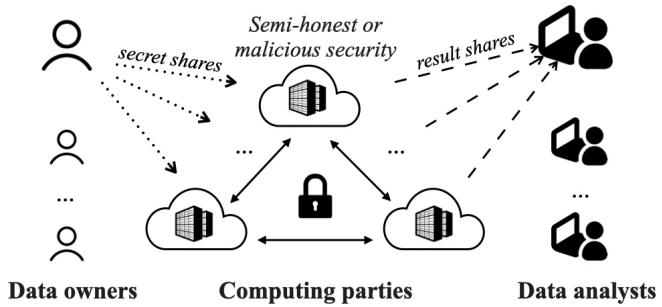  
Figure 1. Orq targets the typical outsourced setting that uses a small set of computing parties (whose number depends on the MPC protocol) to support any number of data owners and analysts.

We note that many-to-many joins (also known as cross joins) are particularly common in collaborative data analysis because integrity constraints (e.g., the existence of unique join keys) may not be public. Moreover, even if integrity constraints are known, it is hard to enforce them outside MPC, unless data owners rely on a trusted third party or are willing to reveal some information about their data.

What can Orq not compute efficiently? There are queries outside this class that are inherently difficult to perform under MPC, and for these queries Orq falls back to an oblivious ?? (??2) join algorithm, like prior work. Examples of such queries (in SQL syntax) are: SELECT COUNT(\*) FROM A,B,C WHERE A.X=B.Y AND B.Y=C.W AND C.W=A.Z (cyclic), or SELECT COUNT(\*) FROM A,B WHERE A.X=B.Y AND A.W>B.Z, when A.X contains duplicates (aggregation across tables).

## 2.2 Programming model

Orq users write queries in a dataflow-style API, similar to the ones provided by Apache Spark [74] and Conclave [70]. Relational operators are modeled as transformations on input tables and can be chained to construct complex queries. Users submit their queries to the Orq engine, which compiles them into secure MPC programs for the computing parties.

Listing 1 shows an implementation of TPC-H Q3 in the Orq API (see the benchmark specification [67] for the SQL definition). The query combines filters, joins, and aggregations to compute the shipping priority and total revenue of customer orders that had not been shipped as of a given date.

Filters (lines 5-7) expect logical predicates that are constructed with Orq secure primitives (e.g., ∧, =, ≠, ≥, ≤). Joins expect a key and an optional list of aggregation functions (each with an input and output column) that will be applied on the same key as the join. Line 13 joins tables C and O on column CustKey. The result is a new (anonymous) table that is then joined with table LI on column OrdKey, in line 14. The join propagates OrdDate and Priority values from the left input to the output by applying the function copy.

1 // Initialize C ( Customers ) , O ( Orders ) , LI ( Lineitem )   
2 ...   
3   
4 // Apply filters   
5 C . filter (" MktSegment " == SEGMENT ) ;   
6 O . filter (" OrdDate " < DATE ) ;   
7 LI . filter (" ShipDate " > DATE ) ;   
8   
9 // Calculate the revenue   
10 LI [" Revenue "] = LI [" Price " ]\*(100 - LI [" Discount "]) /100;   
11   
12 // Joins and group - by with aggregation   
13 auto RES = C . inner\_join (O , {" CustKey "})   
14 . inner\_join ( LI , {" OrdKey "} , {   
15 {" OrdDate "," OrdDate ", copy } ,   
16 {" Priority "," Priority ", copy }})   
17 . aggregate ({" OrdKey "," OrdDate "," Priority "} ,   
18 {" Revenue "," TotalRevenue ", sum })   
19 . project ({" OrdKey "," TotalRevenue ",   
20 " OrdDate "," Priority "})   
21 . sort ({{" TotalRevenue ", DESC } ,   
22 {" OrdDate ", ASC }})   
23 . limit (10) ;  
Listing 1. TPC-H Q3 with the Orq API

The aggregate operator (line 17) expects a list of columns as grouping keys ({"OrdKey","OrdDate","Priority"}) and a list of functions along with their input and output columns ({"Revenue","TotalRevenue", sum}). Orq can apply multiple aggregation functions in a single control flow (see §3.5) and can also update columns in place (e.g., {"C","C", sum}) to reuse memory. Orq provides a set of built-in aggregation functions (e.g., count, sum, min, max, and avg) but also allows users to define custom ones.

Our rationale for exposing a dataflow-style API in Orq instead of a SQL interface was motivated by a recent critique of SQL [58]. We also found that multi-way join queries with nested sub-queries written with the Orq API were often more concise and easier to understand than their SQL counterparts. For this paper, we implemented 31 queries of varying complexity in a few hours.

## 2.3 Secret sharing

Orq protects data using secret sharing [65]. Given ?? computing parties, a secret ℓ-bit string ?? is encoded using ℓ-bit shares ??1, ??2, · · · , ???? that individually are uniformly distributed over all possible ℓ-bit strings and collectively are sufficient to reconstruct the secret ??. Orq supports two types of secret sharing: arithmetic (for numbers) and boolean (for strings or numbers). In arithmetic sharing, the secret number ?? is encoded with ?? random shares such that $s = s _ { 1 } + s _ { 2 } + \cdot \cdot \cdot + s _ { N }$ mod 2ℓ , where mod is used to handle overflow. In boolean sharing, the secret string ?? is encoded with ?? random shares such that ?? = ??1 ⊕ ??2 ⊕ · · · ⊕ ???? , where ⊕ is the bitwise XOR. Orq provides efficient MPC primitives to convert between the two representations without relying on data owners.

Data owners distribute secret shares to non-colluding computing parties, which in practice are Orq servers running in different trust domains. Each computing party receives a strict subset of the shares (per secret) so that no single party can reconstruct the original data. Given random shares, parties can execute a secure MPC protocol to jointly perform arbitrary computations on the shares—as if they had access to the secrets—and end up with shares of the result. Operations on shares break down into a set of low-level secure primitives (e.g., +, ×, ⊕, ∧), which are more expensive than the respective plaintext primitives because they require communication: given two ℓ-bit shares, secure multiplication (for arithmetic shares) and bitwise AND (for boolean shares) require exchanging ?? (ℓ) bits between computing parties. Addition and bitwise XOR are local operations.

## 2.4 Threat model and security guarantees

Like in prior works [26, 45, 62, 70], data owners and analysts who want to use Orq must agree beforehand on the computation to execute. The query and data schema are public and also known to the computing parties. To ensure data privacy, Orq uses end-to-end oblivious computation and protects all input, intermediate, and output data—including the sizes of intermediate and final results—throughout the analysis.

Threat models. MPC protocols protect data against computing parties and external adversaries who may control ?? out of ?? computing parties, where ?? < ?? . Orq can withstand adversaries who can be semi-honest (“honest-but-curious”) or malicious. A semi-honest adversary passively attempts to break privacy without deviating from the protocol (by monitoring the state of the parties it controls, e.g., via inspection of messages and access patterns). A malicious adversary actively attempts to break privacy or correctness and can deviate arbitrarily from the protocol for the parties it controls.

Supported protocols. Orq operators are protocol-agnostic, that is, they use the underlying MPC functionalities (+, ×, ⊕, ∧) as black boxes [20]. This way, they can be instantiated for any MPC protocol by simply replacing the corresponding functionalities. In its current version, Orq supports three state-of-the-art protocols with different threat models and guarantees: (i) the semi-honest ABY protocol [23] for dishonest majorities (?? = 1, ?? = 2), (ii) the semi-honest protocol by Araki et al. [3] for honest majorities (?? = 1, ?? = 3), and (iii) the malicious-secure Fantastic Four protocol [19] for honest majorities (?? = 1, ?? = 4).

Security guarantees. Orq inherits the security guarantees of its underlying MPC protocols, ensures a fully oblivious control flow, and always operates over secret-shared data. It provides (i) privacy, which means that computing parties and adversaries do not learn anything about the data, and (ii) correctness, which means that all participants are convinced that the computation result is accurate. Our malicious-secure protocol provides security with abort, meaning that honest parties halt the computation if they detect malicious behavior (to protect data privacy). That said, Orq can easily be amended to support robust execution if desired.

## 3 The Orq approach to oblivious analytics

We first review oblivious primitives that we use as building blocks and we then describe Orq’s sorting protocols in §3.2. We present Orq’s core join-aggregation operator in §3.3 and its extensions in §3.4-3.6. In §3.7, we show a step-by-step example evaluation of a multi-way join query in Orq.

Notation. We denote a column ?? in table ?? as ?? .??. For a row $r \in T ,$ we denote its ?? value as $r . C .$ To simplify the presentation, we avoid secret-sharing notation and describe the control flow of operators as if they are applied to plaintext data. When saying “an operator is applied to table?? ,” we mean that Orq parties perform MPC operations on the secretshared table ?? , and produce secret shares of the result.

Oblivious computation. We say a computation is oblivious if its control flow and observable side effects (such as data access patterns and timing) are input-independent, so that a computing party learns nothing about input, output, or intermediate values. Obliviousness prevents data reconstruction attacks [13, 31, 38, 39, 57] but has an inherent overhead compared to plaintext computation, as it requires transforming all data-dependent conditionals (if-then-else statements) into data-independent ones. For example, consider the expression if $a > b$ then $\textsf { c } = \textsf { a }$ else d = b. As written, a computing party (or adversary) could infer the relationship $a > b ,$ , by observing whether memory location c or d was written to. Such expressions exist in relational analytics, e.g., in filters and CASE statements. To avoid leaking information about the data, Orq transforms and evaluates this expression as shown below:

condition = ( a > b )   
c = (1 - condition ) \* c + condition \* a   
d = (1 - condition ) \* b + condition \* d

Note that we now write to both memory locations, irrespective of the condition, and follow no data-dependent branches. In practice, $\mathsf { a } , \mathsf { b } , \mathsf { c } ,$ and d are secret-shared values, and operators $* , + , -$ in the above listing correspond to secure functionalities provided by the underlying MPC protocol.

## 3.1 Oblivious building blocks

To hide true table sizes, Orq tables (input, intermediate, or output) have a special validity column of secret-shared bits, encoding which rows are “valid” (1) or “dummy” (0). Dummy rows are those invalidated by oblivious operators and can also exist in input tables as a result of padding by data owners. Since valid bits are secret-shared, Orq servers cannot distinguish real from invalid rows and operate on worst-case table sizes during the entire execution. Validity columns are never exposed to parties; they are managed by Orq operators transparently. Invalid rows are masked and shuffled before opening to prevent leakage of “deleted” data.

Orq provides efficient implementations of core oblivious operators for relational tables. An oblivious filter applies a predicate to each row in the input table and outputs a secretshared bit that denotes whether the row passes the filter. Oblivious deduplication (the “distinct” operator) is applied to one or more columns treated as a composite key. It obliviously sorts the table on these columns and then compares adjacent rows to mark the first occurrence of each distinct key with a secret-shared bit. Oblivious multiplexing is used in sorting, join, and aggregation operators. An arithmetic multiplexer Mux(??, ??, ??) implements b $? { \mathsf { y } } : { \mathsf { x } }$ by evaluating $( 1 - b ) \cdot x + b \cdot y .$ , where $b \in \{ 0 , 1 \}$ } and ??, ?? are the elements to multiplex (boolean multiplexers are defined similarly).

Protocol 1: Aggregation Network (AggNet)   
Input : Table ?? with n rows, group key column ??,   
function ?? , input column ??, result column ??   
Result : Table ?? with one value in ?? per unique ??   
1 $r . G \gets r . A$ // Copy input into result   
2 for $d = 1 ; \ d < n - d ; \ d = d { \star } 2$ do   
3 for each pair of rows $( r _ { i } , r _ { i + d } ) , 0 \leq i < n - d$ do   
4 $b ~ \gets ~ r _ { i } . K = = r _ { i + d } . K$ // Compare keys   
5 $g \gets f ( r _ { i } . G , r _ { i + d } . G )$ // Aggregate   
6 $\boldsymbol { r } _ { i + d } . \boldsymbol { G } \gets \mathsf { M u x } ( b , \ r _ { i + d } . \boldsymbol { G } , \ g )$ // Update

Oblivious aggregation identifies groups of records based on a (composite) key and applies one or more aggregation functions to each group, updating the input table in place. Orq implements oblivious aggregation using sort followed by a butterfly-style network [14, 29, 37] which requires ?? (?? log ??) operations and messages, ?? (log ??) communication rounds, and ?? (??) space per party, where ?? is the cardinality of the input table. Protocol 1 shows the control flow of the aggregation, which resembles the Hillis-Steele network [34]. We provide a proof of correctness in Appendix C.2.

The algorithm expects a table ?? sorted on column ?? (the grouping key) and compares keys at distance ??, while doubling the distance after every iteration. Each step applies an aggregation function ?? to pairs of input values and multiplexes the result (in-place) into column ??, based on whether the respective records belong to the same group $( b = 1 )$ . For simplicity, the pseudocode assumes a single key column ?? and a single aggregation function ?? . In practice, however, Orq’s operator expects one or more key columns and can evaluate more than one aggregation function on the $f l y$ (on the same or different columns) by reusing ?? (line 4). In §3.3, we show how Orq leverages this functionality to reduce the cost of joins followed by aggregation.

## 3.2 Sorting protocols for tabular data

Orq sorts tables in place using Protocol 2 (TableSort). The protocol expects a table and a subset of columns (1 to ??) to use as sorting keys. The strawman approach is to sort the entire table for each key, which would incur expensive communication under MPC. This strawman is commonly used in other MPC systems that sort multiple columns, such as Secrecy [45]. TableSort avoids this overhead as follows: it extracts sorting permutations (i.e., mappings from old to new positions) from key columns in line 5, composes them from right to left (line 6), and applies the final permutation to all columns of the table once at the end (lines 7-8). To extract sorting permutations from a sorted vector, we expand each input element with additional bits encoding its original position before sorting, and we extract these bits from the sorted result into a vector. The vector of extracted bits amounts to a sorting permutation. In practice, this happens on secret-shared data, and the resulting vector is a secret sharing of the mapping from old to new element positions (see Appendix B for more details).

Protocol 2: TableSort   
Input : Table ?? with ?? columns $\big \{ C _ { 1 } , \ldots , C _ { p } \big \} ,$ , integer   
$k \leq p ,$ orders $o = \{ o _ { 1 } , \ldots , o _ { k } \} , o _ { i } \in$ {ASC, DESC}   
Output : Table ?? sorted on $\{ C _ { 1 } , \ldots , C _ { k } \}$   
1 $\pi  \mathbb { I }$ // Identity permutation   
2 for ?? from ?? to 1 descending do   
3 ?? ← ???? // Temp copy of column i   
4 applyPerm(??, ??) // Permutation so far   
5 $\pi ^ { \prime }  s o r t { ( t , \ 0 _ { i } ) }$ // Sort temp column   
6 ?? ← composePerm $( \pi , \pi ^ { \prime } )$ // Build iteratively   
// Apply final permutation to all columns   
7 for ?? from 1 to ?? do   
8 applyPerm(????, ??)

Unlike prior works, TableSort uses different protocols to extract sorting permutations, depending on the key bitwidth. By default, it uses quicksort for large bitwidths (e.g., ℓ = 64) and radixsort for small bitwidths $\left( \ell \leq 3 2 \right)$ . Both algorithms rely on state-of-the-art oblivious shuffling [5, 60], which we generalize to work with all MPC protocols in Orq. We briefly describe Orq’s sorting protocols below and provide further information on shuffling and sorting in Appendix A and B.

Oblivious Quicksort. Quicksort has a non-oblivious and recursive control flow that makes its naïve application to the MPC setting problematic in both efficiency and security. The typical recursive instantiation of the algorithm would incur ?? (??) rounds of comparisons, which is prohibitively slow. To address this challenge, we devise an iterative control flow that applies all independent comparisons at a given recursion depth simultaneously, facilitating vectorization and reducing the number of rounds to ?? (log ??). To guarantee security, we employ a shuffle-then-sort [4, 32] approach that avoids leaking information about the relative order of input data. We expand the ?? input elements with ⌈log ??⌉ additional (secret-shared) bits to encode each element’s index in the original table and guarantee that elements are unique. We then apply oblivious shuffling, which moves the input elements to random positions and enables parties to safely execute the standard quicksort control flow by opening the (single-bit) result of each secure comparison in the clear to rearrange the elements. By obliviously shuffling a vector of unique elements, the control flow of the comparisons in quicksort is independent of the input vector, so we are free to reveal the results of comparisons without compromising security. Indeed, prior work [4, 32] has proven that revealing these random bits does not leak any information about the data (and this should not be confused with one-bit leakage protocols, e.g., [75]).

Oblivious Radixsort. Radixsort sorts a vector one bit at a time, moving from the least to most significant bit. Bogdanov et al. [16] permutes the entire vector after each round of bit comparisons, while the later approach by Asharov et al. [5] composes the permutations bit by bit and applies them to the vector at the end, similarly to what we do in TableSort at the table level. For radixsort, we have found that a hybrid approach which combines the eager technique by Bogdanov et al. [16] with the shuffling primitives by Asharov et al. [5] reduces the number of rounds for a small increase in bandwidth and outperforms both protocols by up to 1.44×. Orq uses a vectorized implementation of this hybrid approach.

## 3.3 A composite join-aggregation operator

Let ??, ?? be two tables with dimensions $n \times p$ and $m \times q ,$ respectively. ??.?? and ??.?? are the special validity columns. Without loss of generality, we assume that ?? and ?? are joined on ?? common columns $K = \{ K _ { 1 } , \ldots , K _ { j } \} , 0 < j \leq p , q .$ . We collectively refer to the columns in ?? (and their values) as the join keys ??.?? and ??.??. The join keys can be arbitrary columns and should not be confused with Primary Keys (PK) or Foreign Keys (FK). Orq’s join-aggregation operator is based on oblivious sort and an aggregation network. It is more general than a PK-FK join, in that it handles cases where rows in either input may not have matching keys on the other side. It is also not equivalent to a sort-merge join, in that it computes a join and an (optional) aggregation within the same oblivious control flow (to reduce MPC costs).

Overview of basic operator. We first describe the basic skeleton for a simple equality join that requires ??.?? to be unique, but allows ??.?? to contain duplicates. Later on, we discuss how to further generalize the operator to other join types, including joins with duplicate keys in both inputs. The operator joins ?? with ?? (denoted as $L \bowtie _ { K }$ ??) to identify all pairs of rows from ?? and ?? with the same key ??. The result is a new table ?? that includes all columns from ?? along with columns ?? from ??. Given that keys in ?? are unique, the cardinality of table ?? is at most $m = | R | ,$ , enabling Orq to chain multiple such join operators while keeping memory bounded. If an aggregation function is provided, the operator also applies the function to each group of rows in ?? with the same key ??. Protocol 3 shows the pseudocode and Figure 2 depicts the internal steps of the operator.

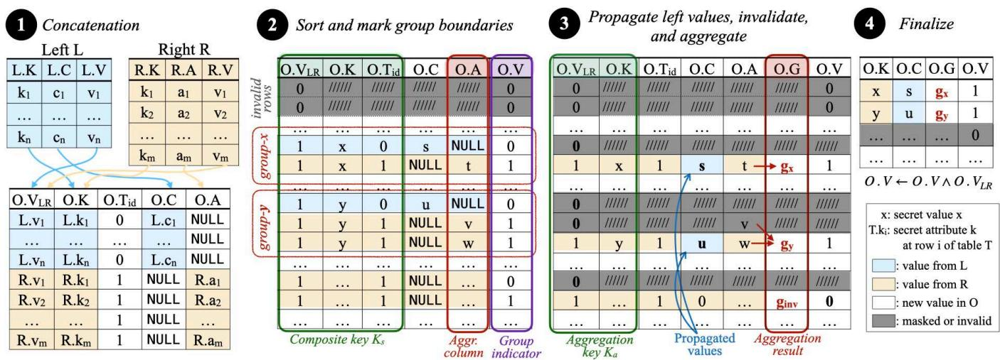  
Figure 2. Steps of the basic Orq operator. The input tables are concatenated and sorted to bring valid rows with the same join key ?? (e.g., x and y) next to each other. Values in ??.?? are copied to matching rows from ??. Values in ??.?? are aggregated per key ?? and stored in ??.??.

Step 1: Concatenation. In the first step, the operator initializes the output table ?? with ?? +?? rows and $\textstyle p + q - 1$ columns from the two input tables. It combines the validity columns ??.?? and ??.?? into $O . V _ { L R }$ and the join key columns ??.?? and ??.?? into ??.??. Next, it appends an auxiliary column $O . T _ { i d }$ and initializes rows [1 . . . ??] with 0 and rows [?? + 1 . . . ?? +??] with 1, indicating the origin table (?? and ??, respectively) of each row. Finally, it expands the non-key columns from ?? and ?? with ?? (resp. ??) NULL values and appends them to ??. Figure 2 shows a concatenation example. For simplicity, we assume one key (??) and one non-key column per table (?? and ?? resp.). The resulting table ?? has $p + q - 1 = 5$ columns.

Step 2: Sort and mark group boundaries. The operator sorts table ?? on the composite key $K _ { s } = \{ O . V _ { L R } , O . K , O . T _ { i d } \}$ using the table sort protocol from §3.2. This way, valid rows with the same key ?? are clustered together, and each row from ?? becomes the first row of its respective ?? group. Each group of rows in ?? has at most one row from ?? and zero or more rows from ??. Next, the operator calls oblivious distinct from §3.2 with key $K _ { a } = \{ O . V _ { L R } , O . K \}$ to mark the first row of each group. It then flips the result bit of distinct and ANDs it with $O . V _ { L R }$ to update the validity column ??.?? . The first row of each group now has $O . V = 0$

Step 3: Propagate values from ??, invalidate rows, and apply aggregation. In this step, the operator calls the AggNet protocol from §3.1 to apply two functions: $f _ { \mathrm { c o p y } }$ and $f _ { \mathrm { a g g } } .$ Function $f _ { \mathrm { c o p y } }$ is an internal function that takes as input a pair of values from ??.?? and simply returns the first one, i.e., $f _ { \mathrm { c o p y } } ( x , y ) = x .$ It is used by Orq to copy non-key values from ?? into ?? by obliviously populating the NULL values, and also to invalidate rows from ?? that did not match with any row from ??. Function $f _ { \mathrm { a g g } }$ is a user-provided aggregation function. The operator applies $f _ { \mathrm { a g g } }$ to column ?? and stores its result in a new column ??.??. The function $f _ { \mathrm { a g g } }$ can be one of the common aggregations from §2.1 or a custom function constructed as we explain in Appendix C.

Protocol 3: Join-Aggregation (Join-Agg)   
Input : Tables ??, ??; keys $K = \{ K _ { 1 } , \cdots , K _ { j } \} _ { } { \mathrm { ; } }$ columns   
$C = \{ C _ { 1 } , \cdots , C _ { k } \}$ to propagate from ?? to ??, an   
aggregation function $f _ { \mathrm { a g g } }$ to apply to column ??   
Result : Table ??   
// Step 1: Initialize table ??   
1 ?? ← Concat(??, ??) // Schema shown in Fig. 2   
2 let $K _ { s } = \{ O . V _ { L R } , O . K , O . T _ { i d } \}$ // Sorting keys   
$K _ { a } = \{ O . V _ { L R } , O . K \}$ // Aggregation keys   
// Step 2: Sort table ?? on ???? (ASC)   
3 TableSort(??, ????)   
4 ??.?? ← ??.?????? ∧ ¬Distinct(??, ????) // Mark groups   
// Step 3: Join and aggregate per group   
5 AggNet(??, {????, ??, ??copy}, // Copy ?? into ??   
$\{ K _ { s } , V , f _ { \mathrm { c o p y } } \} ,$ // Propagate ??   
$\{ K _ { s } , A , f _ { \mathrm { a g g } } \} )$ // Aggregate   
// Step 4: Remove redundant rows and columns   
6 Finalize(??)

Step 4: Finalize result. At this point, ?? has ?? + ?? rows; however, we know that the actual output of the join contains at most ?? valid rows. In the final step, Orq removes redundant columns $( { \mathrm { e . g . , } } O . V _ { L R } , O . A , O . T _ { i d }$ in Figure 2) and trims all unnecessary rows which came from ??. To remove these rows, we sort ?? on ??.?? (in descending order), placing valid rows above invalid ones, and trim the last ?? rows from the sorted table. In practice, we observe that the trimming operation is cheap but not costless, even when using our single-bit radixsort protocol: if ?? $\ll m ,$ the overhead of sorting by ??.?? may be higher than the improvement gained in subsequent operations with the trimmed table. To address this tradeoff, we develop a heuristic that automatically estimates whether trimming pays off, based on the sizes of the input tables. For example, in our semi-honest honest-majority protocol, the operator trims when 9?? < ?? lg ?? lg ℓ, where ℓ is the share representation bitlength. Using this (conservative) heuristic has improved end-to-end execution times modestly across all queries of §5 and bounds the maximum working table size in queries with many joins. For a detailed analysis, see Appendix C.

## 3.4 Generalizing to different join types

Join-Agg computes inner joins with equality predicates; however, its control flow can support different join types with only minor changes to the way we invalidate rows. All operators of this section require unique keys on the left input (one-to-many) like the basic operator. We describe how to handle duplicates in both inputs in §3.6. For all join types we discuss, we provide correctness proofs in Appendix C.

Semi-join. A semi-join $L \ltimes _ { K }$ ?? returns all rows in ?? that matched with any row from ?? on ??. Orq implements the semi-join by simply running Join-Agg with the two input tables swapped. After sorting ??, rows from ?? will now precede rows from ?? in all groups that contain rows from both tables. The operator will therefore invalidate (and later trim) all rows from ?? and will only invalidate those rows from ?? that do not match with any row from ?? (i.e., they appear at the beginning of a group). In all other cases, the validity of rows from ?? remains as is (equal to $O . V _ { L R } )$ , matching the semantics of semi-join without any changes in Protocol 3.

Outer joins. A left-outer join $( L = \infty _ { K } R )$ returns all pairs of rows from the two inputs that have the same key ?? plus all remaining rows from ?? that did not match with any row from ??. To support a left-outer join, we only need to replace line 4 in Join-Agg with the following line:

$$
O . V  O . V _ { L R } \land \lnot ( O . T _ { i d } \land \mathrm { D t s T I N C T } ( K _ { a } ) )
$$

This will invalidate the first row of each group only if it comes from ??. If the row comes from ??, its ?? .?? is set equal to $O . V _ { L R }$ This ensures that valid rows from ?? do not get invalidated, even if they have no matches in ??, but unmatched rows from ?? will be invalidated as in the basic operator.

A right-outer join $( L \Join _ { \overline { { \mathbf { \Lambda } } } K } R )$ works the opposite way: it returns all pairs of rows from the two inputs that matched on ?? plus all remaining rows from ?? that did not match with any row from ??. In this case, we only need to replace line 4 in Protocol 3 with $O . V \gets O . V _ { L R } \land O . T _ { i d }$ . The line invalidates all rows from $L ,$ since they have $O . T _ { i d } = 0$ , and leaves the validity of rows from ?? intact (equal to $O . V _ { L R } )$ . A right-outer join does not need to propagate valid bits and therefore omits this step while executing the AggNet protocol in line 5.

Finally, the full-outer join (?? ⊲⊳ ?? ??) does not invalidate any rows from either input. In this case, the operator sets $O . V  O . V _ { L R }$ in line 4 of Protocol 3 and does not propagate any valid bit, as in the right-outer join above. All outer joins return $n + m$ rows and never trim rows from ??.

Anti-join. An anti-join ?? ▷ ?? returns all rows from ?? that do not match any row from ??. Orq implements the anti-join by executing Protocol 3 with the two input tables swapped and line 4 replaced with $O . V \gets O . V _ { L R } \land O . T _ { i d } ,$ , as in right-outer join. However, here we must propagate valid bits from ?? to $L ,$ which is done by invoking $f _ { \mathrm { c o p y } }$ . When a row exists in ??, it will be sorted above the rows from ?? and invalidated. Then, its valid bit (= 0) will be copied down to all other rows, including those from ??, in its group.

Theta-join. Orq’s operator can support one-to-many joins with ?? predicates, as long as ?? is conjunctive and contains one or more equality conditions, e.g., ??.Name = ??.Name ∧ ??.Time ≤ ??.Time. In this case, Orq executes Protocol 3 using the equality predicate(s) that bound the output size and reduces all other predicates in ?? into oblivious filters.

## 3.5 Supporting aggregations

In line 5 of Join-Agg, join is combined with an aggregation in the same oblivious control flow (AggNet). In fact, Orq can evaluate multiple aggregation functions $f _ { \mathrm { a g g } }$ with keys $K _ { a }$ on any combination of columns from ?? and ??. If the query includes aggregations with keys different than $K _ { a } ,$ an additional invocation of TableSort followed by AggNet is necessary. In case the join or aggregation key is a prefix of the other, we can sort on the largest prefix in line 3 of Join-Agg to avoid the extra TableSort call.

Orq supports decomposable aggregation functions of the form $f _ { \mathrm { a g g } } ( \bar { X } ) = f _ { \mathrm { f i n a l } } ( f _ { \mathrm { p o s t } } ( f _ { \mathrm { p r e } } ( \bar { X } ) ) )$ , where $f _ { \mathrm { p r e } }$ is a partial aggregation function over a set $X , f _ { \mathrm { p o s t } }$ combines partial aggregates, and $f _ { \mathrm { f i n a l } }$ generates the final result. Self-decomposable functions are those with $f _ { \mathrm { f i n a l } } \ = \ \mathbb { I } ,$ the identity function. Function $f _ { \mathrm { p r e } }$ must itself be self-decomposable, $f _ { \mathrm { p r e } } ( ( X , Y ) ) =$ $f _ { \mathrm { p o s t } } ( f _ { \mathrm { p r e } } ( \dot { X } ) , f _ { \mathrm { p r e } } ( Y ) )$ . Examples include min, max, sum (where $f _ { \mathrm { p o s t } } = f _ { \mathrm { p r e } } )$ , and count (where $f _ { \mathrm { p o s t } } = { \sf s u m } )$ . Note that selfdecomposability implies commutativity and associativity [35], which are necessary for AggNet correctness. Decomposable aggregations enable efficient incremental computation and data-parallelism, and have been studied extensively in the context of sensor networks [52] and dataflow systems [73]. In Orq, we employ similar ideas in oblivious computation to bound the size of intermediate results, as we explain next.

## 3.6 Supporting joins on duplicate keys

We can use Join-Agg to handle many-to-many joins (with duplicate keys on both sides), as long as the join is followed by a decomposable aggregation and the aggregation keys belong to one input table (see §2.1). This ensures that the worst-case cardinality of the output table is equal to the cardinality of the table with the aggregation key(s).

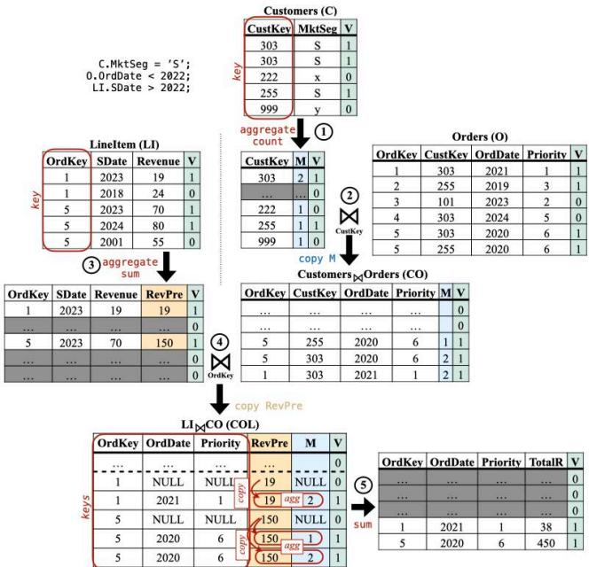  
Figure 3. Step-by-step oblivious evaluation of TPC-H Q3 assuming no PK-FK constraints (all input tables have duplicate join keys).

Decomposable functions are amenable to partial evaluation; therefore, we can apply them without having to materialize the Cartesian product of the two input tables. $_ { \mathrm { A } s }$ such, we apply $f _ { \mathrm { p r e } }$ before the join, $f _ { \mathrm { p o s t } }$ after the join, and, optionally, $f _ { \mathrm { f i n a l } }$ to compute the final result. Let $K _ { j }$ and $K _ { a }$ be the join and aggregation keys, respectively. Orq applies function $f _ { \mathrm { p r e } }$ to one of the input tables to compute a partial aggregation on $K _ { j }$ . The result is a table with unique join keys that can now be joined with the second table using the basic operator. Function $f _ { \mathrm { p o s t } }$ is evaluated on the output table ?? with aggregation key $K _ { a }$

As an example, consider a join $L \bowtie _ { K _ { j } }$ ?? on $K _ { j }$ with duplicate keys in both input tables followed by $f _ { \mathrm { a g g } } = { \tt c o u n t }$ that outputs the number of rows in the join result. We can obliviously compute the aggregation without a quadratic blowup by first evaluating function $f _ { \mathrm { p r e } } = \mathsf { c o u n t }$ on ?? to count the number of rows per key $K _ { j }$ (multiplicity). Then, we can join ?? with ?? using Join-Agg and apply $f _ { \mathrm { p o s t } } =$ sum to add the multiplicities. The idea also applies to acyclic queries with multi-way joins like in plaintext query evaluation [36].

## 3.7 Putting it all together

Figure 3 shows an example with many-to-many joins, using a generalization of Q3 (see Listing 1), where we allow duplicates in all columns. That is, we assume no public knowledge of the PK-FK constraints in the TPC-H specification of this query. We omit filter operations to keep the example simple.

To evaluate $C \bowtie _ { \mathsf { C u s t K e y } } O$ , we first apply a pre-aggregation to ?? that computes the multiplicity of each CustKey using Protocol 1. The pre-aggregation makes CustKey in ?? unique and stores multiplicities in a new column M. Next, we join ?? with ?? on CustKey using Protocol 3 to produce a new table ????. The second join ???? $\Join$ ???? is evaluated similarly: we first apply a pre-aggregation to ???? that computes the Revenue per OrdKey and stores it in column RevPre. Then, we compute the join using Protocol 3 and apply the post-aggregation to sum the product RevPre\*M per key $K _ { a } = \{ 0 r { \sf d } { \sf K } { \sf e } { \bf y } ,$ , OrdDate, Priority} using Protocol 1. Listing 2 shows the implementation using the Orq API.

```javascript
1 // Pre - aggregate and apply first join
2 auto CO = C . aggregate ({" CustKey "} ,
3 {" M "," M ", count })
4 . inner_join (O , {" CustKey "} ,
5 {" M "," M ", copy }) ;
6 // Pre - aggregate and apply second join
7 auto COL = LI . aggregate ({" OrdKey "} ,
8 {" Revenue "," RevPre ", sum })
9 . inner_join ( CO , {" OrdKey "} ,
10 {" RevPre "," RevPre ", copy }) ;
11 // Apply post - aggregation
12 COL [" TotalR "] = COL [" RevPre "] * COL [" M "];
13 auto RES = COL . aggregate ({" OrdKey "," OrdDate "," Priority "} ,
14 {" TotalR "," TotalR ", sum }) ;
```  
Listing 2. The example of Figure 3 implemented in Orq

## 4 System implementation

We have implemented Orq from scratch in C++. Each computing party runs a software stack that includes (i) an MPC layer with vectorized implementations of secure primitives, (ii) a library of oblivious relational operators, (iii) a custom communication layer, and (iv) a data-parallel execution engine. Users can configure the share size 2  (ℓ = 64 by default), the MPC protocol, and the sorting protocol (quicksort by default), according to their application needs.

We use libOTe [64] to produce random oblivious transfers, from which we generate OLE (Oblivious Linear Evaluation) correlations and Beaver triples. For permutation correlations, we use the technique by Peceny et al. [60]. For random number generation, we use AES from libsodium [46].

Protocol-agnostic secure operator abstractions. All relational operators, sorting, multiplexing, and division with private denominator are protocol-agnostic. The protocolspecific primitives are the functionalities defined by each MPC protocol (e.g., ×, ∧, etc.), division by public denominator, and two shuffling primitives that we use to generate and apply sharded permutations. All other shuffle primitives (composing, inverting, and converting permutations) are protocol-agnostic. See also Supplementary A.

Vectorization and data parallelism. Orq uses a columnar data format that allows for efficient vectorized execution. Recall that each secure multiplication and bitwise AND operation incurs a message exchange between parties. With vectorization, Orq can efficiently group independent messages within operations and exchange them in the same network call. All low-level primitives and oblivious operators in Orq are vectorized to work this way.

Each Orq server runs as a single process with the same (configurable) number of threads ??. Execution within a server is data-parallel: a coordinator thread assigns tasks to workers, which operate on disjoint partitions of the input vector. Orq’s communication layer establishes a static mapping between workers, so that thread with id ?? communicates only with thread ?? in other servers, $0 \leq t < \tau .$

Communication layer. In Orq, we implement a TCP-based communicator, tailored to I/O-intensive MPC execution. The communicator manages network sockets via a configurable number of dedicated threads. A high number of communication threads can significantly improve performance in WAN settings, where multiple parallel connections between parties can be used to leverage available bandwidth.

Worker threads interact with communication threads using lock-free ring buffers to avoid blocking computation. Communication threads are decoupled from worker threads and process ring buffers in a round-robin fashion. Data copies are avoided both ways; worker threads pass offsets in vectors they operate on, and the communicator directly pulls from (on send) and pushes to (on receive) these vectors.

## 5 Experimental evaluation

Our experimental evaluation is structured into four parts:

Orq’s performance on complex analytics. In §5.2, we present a comprehensive performance evaluation of Orq in LAN and WAN with three MPC protocols. Our results demonstrate that Orq provides excellent performance across the board and can compute complex multi-way join queries on millions of input rows within minutes.

Comparison with state-of-the-art. In §5.3, we compare Orq with the following state-of-the-art systems:

(i) Secrecy [45], a relational MPC framework targeting the 3-party outsourced setting with semi-honest security and no leakage. Secrecy is the only open-source relational system for this setting.

(ii) SecretFlow [27], a relational MPC framework targeting the 2-party peer-to-peer setting with semi-honest security. SecretFlow is the only system we are aware of that scales some TPC-H queries to millions of rows per table, albeit by leaking information to parties.

(iii) MP-SPDZ [42], a general-purpose MPC compiler used in many prior works. While MP-SPDZ does not support relational analytics, we compare with its sorting implementation, as sorting is the most expensive operator in relational queries.

Orq provides up to 827× lower query latency than Secrecy and its secure sorting implementations are up to 5.9× and 189.1× faster than the ones provided by SecretFlow and MP-SPDZ, respectively. We also achieve modest speedups over SecretFlow on queries with joins (up to 1.5×), despite the fact that SecretFlow introduces leakage while Orq does not.

Scalability evaluation. In §5.4, we show that Orq’s operators scale to hundreds of millions of rows under all protocols. When configured with our most expensive protocol for malicious security, Orq sorts 229 rows in less than 2 hours.

We report additional results on Orq’s performance in a geodistributed setting in Appendix E, where we show that Orq can be practically deployed over the Internet.

## 5.1 Evaluation setup

We use c7a.16xlarge AWS instances with Ubuntu 22.04.5 LTS and gcc 11.4.0, in two configurations: (i) LAN is an unconstrained setting in the us-east-2 (Ohio) region, with a maximum bandwidth of 25Gbps and a 0.3ms round-trip time (RTT), (ii) WAN is a restricted setting in us-east-2, with symmetric RTT of 20ms and 6Gbps bandwidth (as measured between us-west-2 and us-east-1 with 16 parallel iperf3 streams). Unless otherwise specified, Orq is configured with 16 compute threads and the communicator uses 4 connections in LAN and 16 connections in WAN.

Workloads. We use 31 queries for evaluation. Our most comprehensive benchmark is the full set of TPC-H queries [67], implemented with the Orq dataflow API. We replace floating point values with equivalent integral values and pattern matching expressions (X like 'Y%') in six queries with oblivious (in)equality. To perform fully private averages, we implement a non-restoring division circuit inspired by the hardware literature [49]. Various prior works have implemented selected TPC-H queries [11, 27, 45, 62], but to our knowledge, we are the first to report performance numbers for all TPC-H queries (22 in total) entirely under MPC. We also implement all other queries we could find in prior relational MPC works [10–12, 27, 45, 50, 62, 70, 71]:

• Aspirin, C. Diff, Password, Credit Score, Comorbidity, and SecQ2, used in Secrecy [45], Conclave [70], and Senate [62], among others.

• Market Share from Conclave.

• SYan, Example 1.1 from Wang et al. [71].

• Patients, a 3-way join query used in Shrinkwrap [11] to showcase the cascading effect (which Orq avoids). to showcase the cascading effect (which ORQ avoids).

Additionally, we implement the five peer-to-peer variations of TPC-H queries in SecretFlow [27], denoted as S1-S5. To validate correctness, we also implemented all queries in SQLite [66].

Inputs. In all experiments, we use ℓ = 64-bit shares by default. However, because our sorting protocols pad inputs to guarantee uniqueness and compute permutations, sorting is actually performed over 128-bit shares. We standardize a notion of query size: in the TPC-H specification [68], input tables grow according to the scale factor (SF) parameter, where SF1 corresponds to an (approximately) 1GB database. The smallest table (Supplier) has 10k · SF rows, while the largest (LineItem) has 6M · SF rows. TPC-H queries have total input sizes between 810k · SF (Q11) to 8.5M · SF (Q9) rows, and average 5.8M · SF rows. For non-TPC-H queries, we accordingly define input sizes with ≈ 5M rows per SF.

Protocols. We label results according to the MPC protocol: SH-DM (semi-honest, dishonest majority) for ABY [23], SH-HM (semi-honest, honest majority) for Araki et al. [3], and Mal-HM (malicious-secure, honest majority) for Fantastic Four [19]. In all SH-DM experiments, we report online time, as in prior works [27].

## 5.2 Performance on complex analytics

In this experiment, we run Orq at Scale Factor 1 (SF1) on the full workload, which includes queries of varying complexity. Queries like Q5, Q7, Q8, Q9 and Q21 are expensive, involving 4-7 joins each, with Q21 also performing a self-join on the largest input table, LineItem. Other queries include multiple filters, semi-joins, outer joins, group-by aggregations, distinct, and order-by operations, covering a wide range of query patterns. Q6 is the least expensive query, as it does not require sorting.

Figure 4 shows the end-to-end times in LAN and WAN and summarizes the result statistics. Overall, Orq computes complex multi-way join queries on millions of input rows in a few minutes. The most expensive query, Q21, calls the sorting operator 12 times and, under malicious security, completes in 42 minutes over LAN. In the same setting, Orq executes all other queries from prior work in under 10 minutes. Our results also demonstrate the effectiveness of Orq’s vectorization and message batching. In the WAN environment, we see 1.2×-6.9× higher execution times for a 75× higher RTT.

## 5.3 Comparison with state-of-the-art systems

In this section, we compare Orq with three state-of-the-art MPC frameworks on relational queries and oblivious sort.

Comparison on queries. We first compare Orq with Secrecy [45], the only open-source relational MPC system without leakage that operates in the outsourced setting. We configure Orq with the SH-HM protocol, which is the one used by Secrecy, and we execute all queries from the Secrecy paper, using the maximum input size they report [45, Fig. 4].

Figure 5 (left) shows the results. For the most expensive queries (Aspirin, Q4, and Q13) that perform a join or semijoin, Orq achieves 478× – 760× lower latency. Password, Credit, Comorbidity, and C.Diff include group-by and distinct operators. For these queries, Orq’s optimized sorting protocols also improve latency by $1 7 \times - 4 2 \times .$ . Q6 does not have any join or sorting, yet Orq outperforms Secrecy by 3×. The significant improvements come from better asymptotic complexity of our join and sorting algorithms. Secrecy uses an $O ( n ^ { 2 } )$ join and an $O ( n \log ^ { 2 } n )$ bitonic sort, while Orq evaluates join-aggregation queries in ?? (?? log ??). Also, Secrecy’s runtime is single-threaded.

<table><tr><td rowspan="2"></td><td colspan="2">TPC-H</td><td colspan="2">Other</td></tr><tr><td>Median</td><td>Max</td><td>Median</td><td>Max</td></tr><tr><td>SH-DMLAN</td><td>3.8</td><td>15.0</td><td>1.6</td><td>3.1</td></tr><tr><td>WAN</td><td>13.5</td><td>52.7</td><td>6.2</td><td>11.7</td></tr><tr><td>SH-HMLAN</td><td>4.4</td><td>17.4</td><td>2.0</td><td>3.7</td></tr><tr><td>WAN</td><td>10.9</td><td>41.4</td><td>4.8</td><td>9.1</td></tr><tr><td>Mal-HMLAN</td><td>10.9</td><td>42.3</td><td>4.9</td><td>8.3</td></tr><tr><td>WAN</td><td>27.1</td><td>108.4</td><td>11.9</td><td>21.7</td></tr></table>

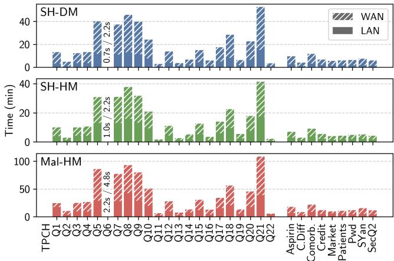

Figure 4. Query execution time (min) at SF1 in LAN (solid) and WAN (hatched). Bars are overlapped, not stacked. TPC-H queries shown on the left and other queries on the right. Q6 times annotated.  
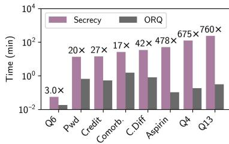

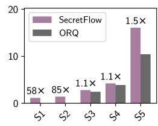  
Figure 5. Orq query times compared to Secrecy and SecretFlow. Secrecy operates in the outsourced setting without leakage. Secret-Flow is a peer-to-peer system that offloads operations to the data owners’ trusted compute and leaks the result of the join to parties.

Next, we compare with SecretFlow [27], a recent relational MPC framework that operates in the peer-to-peer setting. To our knowledge, SecretFlow is the only open-source system of this type that scales TPC-H-based queries to millions of input rows per table. However, we emphasize that SecretFlow leaks which rows match to the parties, while Orq does not introduce any leakage. Nevertheless, we include this comparison to show that Orq can achieve competitive performance even in a peer-to-peer setting. We configure Orq with the SH-DM protocol that uses the same underlying MPC primitives as SecretFlow (ABY [23]), and we allow both systems to perform operations in the data owners’ trusted compute, otherwise SecretFlow’s optimizations are not applicable.

Figure 5 (right) shows results for the five queries used in the SecretFlow paper, run on 16M input rows per table. Orq delivers superior performance in all cases, while protecting all data and intermediate result sizes. It achieves 58× - 85× lower latency for simple queries without joins (S1, S2) and 1.1× -1.5× lower latency for join queries that also include aggregation (S3, S4) and oblivious group-by (S5). Despite SecretFlow’s leakage, Orq still wins on performance due to its more efficient sorting and fused join-aggregation operator. Both systems use radixsort, but SecretFlow cannot leverage parallelism. In contrast, ORQ’s operators are vectorized and data-parallel.

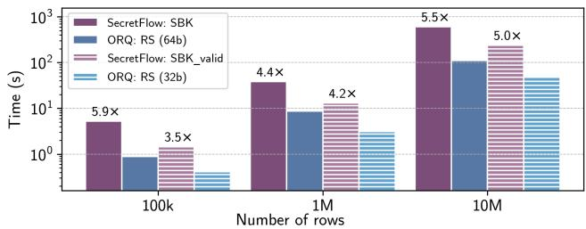  
Figure 6. Performance of oblivious sort in SecretFlow and Orq.

Comparison on oblivious sort. We now compare Orq’s oblivious radixsort against two publicly available state-ofthe-art implementations. In Figure $^ { 6 , }$ we compare our SH-DM radixsort with SecretFlow’s SBK (64-bit radixsort) and SBK\_valid protocols. SBK\_valid is a modified radixsort that relies on data owners locally mapping plaintext data to use at most ⌈log2 ??⌉ bits, where ?? is the input size (?? = 17, 20, 24 bits in this experiment). Even though it favors the baseline, we compare SBK\_valid to our 32-bit radixsort and SBK to our 64-bit protocol. We see that Orq is up to 4.4× and 5.5× faster when sorting 1M and 10M elements, respectively.

Our next comparison is with MP-SPDZ [42], a state-ofthe-art general-purpose MPC library that provides secure sorting implementations for all MPC protocols supported by Orq. We compare with its radixsort implementation, which is its most efficient sorting algorithm. Figure 7 shows the results. We vary the input size by powers of two, starting from $2 ^ { 1 6 }$ elements and increasing the input size until MP-SPDZ either runs out of memory or crashes: up to $2 ^ { 2 2 }$ elements with SH-DM, $2 ^ { 2 5 }$ with SH-DM, and $2 ^ { 2 0 }$ with Mal-HM. In the SH-DM and Mal-HM settings, Orq’s radixsort is 189× and 134× faster than the corresponding MP-SPDZ implementations. Under the SH-HM protocol, which is heavily optimized in MP-SPDZ, Orq achieves a 8.5× speedup when sorting $2 ^ { 2 4 }$ elements, however, MP-SPDZ could not complete the experiment for larger inputs. The large performance improvements over MP-SPDZ come from data-parallelism; although MP-SPDZ supports parallelism and advanced vectorization, it does not parallelize sorting.

Bandwidth consumption. We also evaluate bandwidth consumption in Orq and the baselines. When compared to Secrecy, Orq exhibits up to two orders of magnitude lower bandwidth consumption, due to our asymptotic improvements in sorting and join. Likewise, our sorting implementations achieve 1.6× lower bandwidth than MP-SPDZ SH-HM and more than an order of magnitude improvement against MP-SPDZ SH-DM and Mal-HM. Orq also achieves a 1.8× lower bandwidth than SecretFlow in sorting. In the case of queries, SecretFlow has a lower bandwidth than Orq, as it leaks matching rows in its join operator and performs subsequent operations locally. We report detailed results in Appendix D.

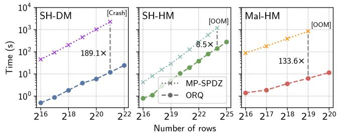  
Figure 7. Performance of oblivious radixsort protocols in MP-SPDZ and Orq. We run MP-SPDZ until it crashes or runs out of memory.

## 5.4 Orq scalability

In this section, we show that Orq can deliver practical performance for complex analytics on large inputs, without sacrificing security. To the best of our knowledge, we are the first to report results at this scale, for end-to-end MPC execution without leakage or the use of trusted parties.

TPC-H at SF10. We repeat the experiment of §5.2 on the TPC-H benchmark at Scale Factor 10. In this setting, queries operate on inputs of 58M rows, on average. The most expensive query, Q21, has a total input of size 75M rows and performs two of the largest joins, sorting tables with 120M rows each time.

Figure 8 plots the ratio of execution times at SF10 over SF1 for the SH-DM protocol in LAN. Assuming that query latency is dominated by sorting and aggregation, we would expect the runtime to scale as ?? (?? log ??). If the queries consisted only of ideal sorts, then theoretical scaling would be 10 log(10??)/log ?? ≈ 11.5, when ?? ≈ 5.8M (SF1). Overall, this is indeed the trend we see in Figure 8, with some outliers. In practice, queries are more complex and consist of operations with different costs. Some overheads are sublinear: for example, oblivious division is round-constrained for most inputs, so scaling appears lower for queries with division, like Q22. Other queries suffer slightly suboptimal scaling, due to the power-of-two padding required in AggNet. For example, Q12 aggregates over a table of size 7.5M at SF1, which is padded to $2 ^ { 2 3 } \approx 8 \mathrm { M }$ rows. However, at SF10, this same aggregation occurs on a table of size 75M, which now must be padded to $2 ^ { 2 7 }$ ≈ 134M rows, 16× larger than the table at SF1.

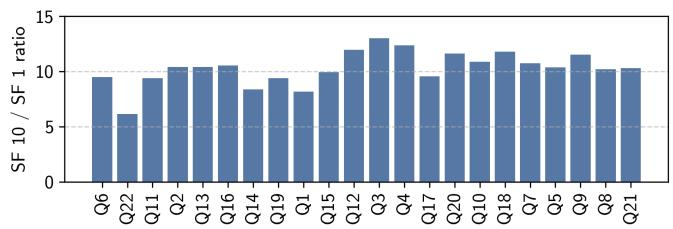  
Figure 8. Ratio of TPC-H query execution times at SF10 over SF1 for the SH-DM protocol in LAN. The 22 queries are sorted from left to right by increasing SF10 latency.

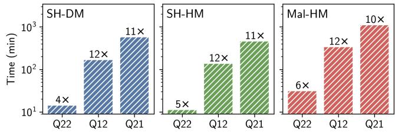  
Figure 9. Orq performance at SF10 in WAN. Bars are labeled with the scaling ratio compared to SF1 in the same environment. Q21 is the most expensive query in the TPC-H benchmark across protocols.

Next, we evaluate Orq’s scalability in WAN, using the two outlier queries mentioned above, Q22 and Q12, and the most expensive query, Q21. Figure 9 shows the results for all protocols, where each bar is annotated with the scaling ratio compared to SF1. Orq’s scaling behavior in this environment is consistent with our previous findings. Under malicious security, Q22 completes in 31 minutes and Q21 in 18 hours.

Scalability of sorting protocols. In the previous experiment, we showed that Orq provides practical performance on complex queries that repeatedly sort tables with over 100M rows. We now stress Orq’s oblivious sorting protocols further and evaluate their performance on even larger inputs. We run radixsort and quicksort in LAN with 32 threads, increasing the input size from 220 to 229 elements. Figure 10 shows the results. The slowest protocol, Mal-HM radixsort, can sort 134 million $( n ~ = ~ 2 ^ { 2 7 } )$ elements in about 35 minutes, while the fastest protocol, SH-HM quicksort, sorts 537 million $\left( n = 2 ^ { 2 9 } \right)$ in just over 70 minutes.

We find that quicksort and radixsort are competitive across settings. Quicksort is consistently faster under the malicious protocol, while radixsort is slightly faster in the SH-DM setting. Overall, quicksort (Orq’s default sorting protocol) scales to larger inputs in our experimental setting, as radixsort has higher memory demands: it requires computing and storing ℓ + 2 secret-shared permutations of length ??.

## 6 Related Work

There is a large body of work on systems for secure computation. In this section, we only focus on works that are directly related to Orq.

Relational MPC. Most systems and protocols for secure relational analytics target peer-to-peer settings and propose techniques tailored to a small, fixed number of semi-honest data owners, who also act as computing parties: either two [10–12, 27, 61, 71] or three [50, 70]. In such settings, performance can be improved by splitting the query into (i) a plaintext part that data owners compute locally (e.g., filters, hashing, sorting, and grouping), and (ii) an oblivious part that is executed under MPC (e.g., joins, aggregations). Some of these works report results for a small subset of TPC-H queries on a maximum input size of 10M rows per table [27] (including rows processed in plaintext). Senate [62] proposes a custom malicious-secure circuit decomposition protocol that supports any number of parties and provides strong security against dishonest majorities. Even though the codebase is not publicly available, published results indicate that the protocol’s scalability is limited: the paper reports performance for a subset of TPC-H queries with 16k input rows (Scale Factor ∼0.004), and three queries from §5 (Pwd, Comorb., and Credit) with up to 80k rows.

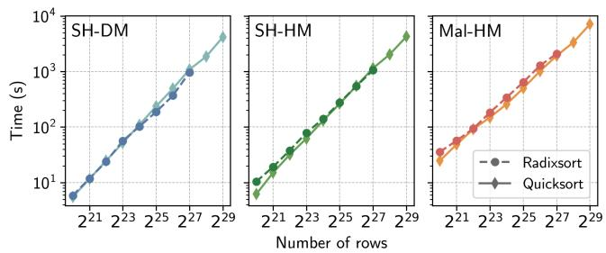  
Figure 10. Scaling Orq’s oblivious sorting protocols to very large inputs. Quicksort scales to larger inputs than radixsort, which has higher time and memory requirements for permutation generation.

Contrary to Orq, join optimizations in the above works rely on the assumption that each party owns one or more input tables. For example, they can improve performance in a scenario where a hospital and an insurance company wish to identify common patients with high premiums, but they are not effective (or do not even apply) in cases where multiple hospitals contribute to the patients table. Orq’s operators are designed for the more general outsourced setting, hence, they are independent of the number of participants and data schema. Moreover, while circuit decomposition techniques pay off in early stages of complex queries, later stages still need to be evaluated under MPC by all parties. As a result, Orq could also be used in the peer-to-peer setting to speed up the oblivious (and by far most expensive) part of complex queries. Other systems for outsourced MPC like Scape [33] (not publicly available) and Secrecy [45] report results for queries with up to two joins and maximum input sizes of 2M rows (for joins) and 8M rows (for other operators). Sharemind [15] (also not publicly available) reports results for queries with a single join and up to 17M input rows.

Oblivious join operators. Several works from the cryptography community study individual join operators in the outsourced setting, building from research into private set intersection (PSI). Mohassel et al. [55] propose efficient oneto-one joins with linear complexity, but rely on the LowMC library that has been cryptanalyzed [48]. For one-to-many joins, Krastnikov et al. [44], Badrinarayanan et al. [8], and Asharov et al. [6] propose protocols based on sorting. They report results with up to 1M rows per input table and do not evaluate complex queries like in Orq. These operators have the same asymptotic costs as our join-aggregation operator, but are tailored to 3-party computation protocols [6, 8] or target Trusted Execution Environments (TEEs) [44]. None of these works support many-to-many joins without suffering from the limitations we described in §1.

State-of-the-art systems for relational analytics in TEEs [22, 53, 76] also provide oblivious join and group-by operators. To protect access patterns from side-channel attacks, join and aggregation in these systems rely on bitonic sort, which requires ?? (?? log2 ??) operations. Early systems perform the grouping using fast parallel scans [76], while recent approaches rely on prefix sums [53]. These TEE-based systems perform the join and the group-by one after the other. Consequently, they either leak intermediate result sizes [53], resort to worst-case padding [22], or require users to provide an upper bound on the query result size [76]. In contrast, Orq uses a composite join-aggregation operator, with oblivious quicksort and an aggregation network, that requires ?? (?? log ??) operations in total. The techniques used by Orq in the MPC context can also be used to achieve oblivious execution in enclaves, and this is an exciting direction for future work.

## 7 Conclusion

We have presented Orq, a scalable, secure framework for evaluating complex relational analytics under MPC. We instantiate Orq in multiple threat models, contribute a unified join-aggregation operator to the literature, and implement state-of-the-art sorting protocols. We deploy Orq to obliviously execute queries with multi-way joins larger than any prior work. As presented, Orq requires data analysts to translate queries into our dataflow API; future work includes integrating Orq with an automatic query planner. Cryptographic advances in oblivious sorting will also directly lead to performance improvements in Orq.

## Acknowledgments

We thank our shepherd, the anonymous reviewers and artifact evaluators, and Sakshi Sharma for their constructive feedback that substantially improved the paper. We also thank Selene Wu for implementing low-level optimizations in the Orq runtime. This work was developed in part with computing resources provided by the Chameleon [41] and CloudLab [24] research testbeds, supported by the National Science Foundation. Final results and evaluation used Amazon Web Services clusters through the CloudBank project (National Science Foundation Grant No. 1925001). This material is based upon work supported by the National Science Foundation under Grant No. 2209194, REU supplement awards No. 2432612 and 2326580, by the DARPA SIEVE program under Agreement No. HR-00112020021, and by a gift from Robert Bosch GmbH.

## References

[1] Navid Alamati, Guru-Vamsi Policharla, Srinivasan Raghuraman, and Peter Rindal. 2024. Improved Alternating-Moduli PRFs and Postquantum Signatures. In Advances in Cryptology – CRYPTO 2024: 44th Annual International Cryptology Conference, CRYPTO 2024, Santa Barbara, CA, USA, August 18–22, 2024, Proceedings, Part VIII (Santa Barbara, CA, USA). Springer-Verlag, Berlin, Heidelberg, 274–308. doi:10.1007/978-3-031-68397-8\_9

[2] Apple and Google. 2021. Exposure Notification Privacy-preserving Analytics (ENPA). https://covid19-static.cdn-apple.com/applications/ covid19/current/static/contact-tracing/pdf/ENPA\_White\_Paper.pdf. [Online; accessed April 2025].

[3] Toshinori Araki, Jun Furukawa, Yehuda Lindell, Ariel Nof, and Kazuma Ohara. 2016. High-Throughput Semi-Honest Secure Three-Party Computation with an Honest Majority. In Proceedings of the 2016 ACM SIGSAC Conference on Computer and Communications Security (CCS) (Vienna, Austria). 805–817. doi:10.1145/2976749.2978331

[4] Toshinori Araki, Jun Furukawa, Kazuma Ohara, Benny Pinkas, Hanan Rosemarin, and Hikaru Tsuchida. 2021. Secure Graph Analysis at Scale. In Proceedings of the 2021 ACM SIGSAC Conference on Computer and Communications Security (Virtual Event, Republic of Korea) (CCS ’21). Association for Computing Machinery, New York, NY, USA, 610–629. doi:10.1145/3460120.3484560

[5] Gilad Asharov, Koki Hamada, Dai Ikarashi, Ryo Kikuchi, Ariel Nof, Benny Pinkas, Katsumi Takahashi, and Junichi Tomida. 2022. Efficient Secure Three-Party Sorting with Applications to Data Analysis and Heavy Hitters. In Proceedings of the 2022 ACM SIGSAC Conference on Computer and Communications Security (Los Angeles, CA, USA) (CCS ’22). Association for Computing Machinery, New York, NY, USA, 125–138. doi:10.1145/3548606.3560691

[6] Gilad Asharov, Koki Hamada, Ryo Kikuchi, Ariel Nof, Benny Pinkas, and Junichi Tomida. 2023. Secure Statistical Analysis on Multiple Datasets: Join and Group-By. In Proceedings of the 2023 ACM SIGSAC Conference on Computer and Communications Security (Copenhagen, Denmark) (CCS ’23). Association for Computing Machinery, New York, NY, USA, 3298–3312. doi:10.1145/3576915.3623119

[7] Axel Bacher, Olivier Bodini, Alexandros Hollender, and Jérémie Lumbroso. 2015. Mergeshuffle: a very fast, parallel random permutation algorithm. arXiv preprint 1508.03167 (2015).

[8] Saikrishna Badrinarayanan, Sourav Das, Gayathri Garimella, Srinivasan Raghuraman, and Peter Rindal. 2022. Secret-Shared Joins with Multiplicity from Aggregation Trees. In Proceedings of the 2022 ACM SIGSAC Conference on Computer and Communications Security (Los Angeles, CA, USA) (CCS ’22). Association for Computing Machinery, New York, NY, USA, 209–222. doi:10.1145/3548606.3560670

[9] Kenneth E. Batcher. 1968. Sorting Networks and Their Applications. In American Federation of Information Processing Societies: AFIPS Conference Proceedings: 1968 Spring Joint Computer Conference, Atlantic City, NJ, USA, 30 April - 2 May 1968. 307–314. doi:10.1145/1468075.1468121

[10] Johes Bater, Gregory Elliott, Craig Eggen, Satyender Goel, Abel N. Kho, and Jennie Rogers. 2017. SMCQL: Secure Query Processing for Private Data Networks. Proc. VLDB Endow. 10, 6 (2017), 673–684. doi:10.14778/3055330.3055334

[11] Johes Bater, Xi He, William Ehrich, Ashwin Machanavajjhala, and Jennie Rogers. 2018. Shrinkwrap: efficient sql query processing in

differentially private data federations. Proceedings of the VLDB Endowment 12, 3 (2018), 307–320.

[12] Johes Bater, Yongjoo Park, Xi He, Xiao Wang, and Jennie Rogers. 2020. SAQE: practical privacy-preserving approximate query processing for data federations. Proceedings of the VLDB Endowment 13, 12 (2020), 2691–2705.

[13] Laura Blackstone, Seny Kamara, and Tarik Moataz. 2020. Revisiting Leakage Abuse Attacks. In NDSS. The Internet Society.

[14] Marina Blanton and Everaldo Aguiar. 2012. Private and oblivious set and multiset operations. In AsiaCCS. ACM, 40–41.

[15] Dan Bogdanov, Liina Kamm, Baldur Kubo, Reimo Rebane, Ville Sokk, and Riivo Talviste. 2016. Students and Taxes: a Privacy-Preserving Study Using Secure Computation. Proceedings on Privacy Enhancing Technologies (PoPETS) 2016, 3 (2016), 117– 135. http://www.degruyter.com/view/j/popets.2016.2016.issue-3/ popets-2015-0019/popets-2016-0019.xml

[16] Dan Bogdanov, Sven Laur, and Riivo Talviste. 2014. A Practical Analysis of Oblivious Sorting Algorithms for Secure Multi-party Computation. In Secure IT Systems, Karin Bernsmed and Simone Fischer-Hübner (Eds.). Springer International Publishing, Cham, 59–74.

[17] Boston Women’s Workforce Council. 2024. Data Privacy: Ensuring Secure and Private Data Analysis. https://thebwwc.org/mpc.

[18] Henry Corrigan-Gibbs and Dan Boneh. 2017. Prio: Private, Robust, and Scalable Computation of Aggregate Statistics. In Proceedings of the $1 4 ^ { t h }$ USENIX Symposium on Networked Systems Design and Implementation (NSDI). USENIX Association, Boston, Massachusetts, USA, 259–282. https://www.usenix.org/conference/nsdi17/technicalsessions/presentation/corrigan-gibbs

[19] Anders P. K. Dalskov, Daniel Escudero, and Marcel Keller. 2021. Fantastic Four: Honest-Majority Four-Party Secure Computation With Malicious Security. In USENIX Security Symposium. USENIX Association, 2183–2200.

[20] Ivan Damgård and Jesper Buus Nielsen. 2003. Universally Composable Efficient Multiparty Computation from Threshold Homomorphic Encryption. In CRYPTO (Lecture Notes in Computer Science, Vol. 2729). Springer, 247–264.

[21] Emma Dauterman, Mayank Rathee, Raluca Ada Popa, and Ion Stoica. 2022. Waldo: A Private Time-Series Database from Function Secret Sharing. In 2022 IEEE Symposium on Security and Privacy (SP). 2450– 2468. doi:10.1109/SP46214.2022.9833611

[22] Ankur Dave, Chester Leung, Raluca Ada Popa, Joseph E. Gonzalez, and Ion Stoica. 2020. Oblivious coopetitive analytics using hardware enclaves. In EuroSys. ACM, 39:1–39:17.

[23] Daniel Demmler, Thomas Schneider, and Michael Zohner. 2015. ABY - A Framework for Efficient Mixed-Protocol Secure Two-Party Computation. In 22nd Annual Network and Distributed System Security Symposium, NDSS 2015, San Diego, California, USA, February 8-11, 2015. The Internet Society. https://www.ndss-symposium.org/ndss2015/aby---frameworkefficient-mixed-protocol-secure-two-party-computation

[24] Dmitry Duplyakin, Robert Ricci, Aleksander Maricq, Gary Wong, Jonathon Duerig, Eric Eide, Leigh Stoller, Mike Hibler, David Johnson, Kirk Webb, et al. 2019. The design and operation of {CloudLab}. In 2019 USENIX annual technical conference (USENIX ATC 19). 1–14.

[25] Daniel Escudero, Satrajit Ghosh, Marcel Keller, Rahul Rachuri, and Peter Scholl. 2020. Improved Primitives for MPC over Mixed Arithmetic-Binary Circuits. In CRYPTO (2) (Lecture Notes in Computer Science, Vol. 12171). Springer, 823–852.

[26] Muhammad Faisal, Jerry Zhang, John Liagouris, Vasiliki Kalavri, and Mayank Varia. 2023. TVA: A multi-party computation system for secure and expressive time series analytics. In 32nd USENIX Security Symposium (USENIX Security 23). USENIX Association, Anaheim, CA, 5395–5412. https://www.usenix.org/conference/usenixsecurity23/ presentation/faisal

[27] Wenjing Fang, Shunde Cao, Guojin Hua, Junming Ma, Yongqiang Yu, Qunshan Huang, Jun Feng, Jin Tan, Xiaopeng Zan, Pu Duan, et al. 2024. SecretFlow-SCQL: A Secure Collaborative Query Platform. Proceedings of the VLDB Endowment 17, 12 (2024), 3987–4000.

[28] Ronald Aylmer Fisher and Frank Yates. 1938. Statistical Tables for Biological, Agricultural and Medical Research. Oliver and Boyd.

[29] Michael T. Goodrich. 2011. Data-oblivious external-memory algorithms for the compaction, selection, and sorting of outsourced data. In SPAA. ACM, 379–388.

[30] J. Gray, A. Bosworth, A. Lyaman, and H. Pirahesh. 1996. Data cube: a relational aggregation operator generalizing GROUP-BY, CROSS-TAB, and SUB-TOTALS. In Proceedings of the Twelfth International Conference on Data Engineering. 152–159. doi:10.1109/ICDE.1996.492099

[31] Paul Grubbs, Marie-Sarah Lacharité, Brice Minaud, and Kenneth G. Paterson. 2018. Pump up the Volume: Practical Database Reconstruction from Volume Leakage on Range Queries. In CCS. ACM, 315–331.

[32] Koki Hamada, Ryo Kikuchi, Dai Ikarashi, Koji Chida, and Katsumi Takahashi. 2012. Practically Efficient Multi-party Sorting Protocols from Comparison Sort Algorithms. In ICISC (Lecture Notes in Computer Science, Vol. 7839). Springer, 202–216.

[33] Feng Han, Lan Zhang, Hanwen Feng, Weiran Liu, and Xiangyang Li. 2022. Scape: Scalable Collaborative Analytics System on Private Database with Malicious Security. In 2022 IEEE 38th International Conference on Data Engineering (ICDE). 1740–1753. doi:10.1109/ICDE53745.2022. 00176

[34] W Daniel Hillis and Guy L Steele Jr. 1986. Data parallel algorithms. Commun. ACM 29, 12 (1986), 1170–1183.

[35] Paulo Jesus, Carlos Baquero, and Paulo Sérgio Almeida. 2014. A survey of distributed data aggregation algorithms. IEEE Communications Surveys & Tutorials 17, 1 (2014), 381–404.

[36] Manas R. Joglekar, Rohan Puttagunta, and Christopher Ré. 2016. AJAR: Aggregations and Joins over Annotated Relations. In Proceedings of the 35th ACM SIGMOD-SIGACT-SIGAI Symposium on Principles of Database Systems, PODS 2016, San Francisco, CA, USA, June 26 - July 01, 2016, Tova Milo and Wang-Chiew Tan (Eds.). ACM, 91–106. doi:10.1145/ 2902251.2902293

[37] Kristján Valur Jónsson, Gunnar Kreitz, and Misbah Uddin. 2011. Secure multi-party sorting and applications. In Proceedings of the 9th International Conference on Applied Cryptography and Network Security (ACNS) (Nerja (Malaga), Spain).

[38] Seny Kamara, Abdelkarim Kati, Tarik Moataz, Jamie DeMaria, Andrew Park, and Amos Treiber. 2024. MAPLE: MArkov Process Leakage attacks on Encrypted Search. Proc. Priv. Enhancing Technol. 2024, 1 (2024), 430–446.

[39] Seny Kamara, Abdelkarim Kati, Tarik Moataz, Thomas Schneider, Amos Treiber, and Michael Yonli. 2022. SoK: Cryptanalysis of Encrypted Search with LEAKER - A framework for LEakage AttacK Evaluation on Real-world data. In EuroS&P. IEEE, 90–108.

[40] Darya Kaviani, Sijun Tan, Pravein Govindan Kannan, and Raluca Ada Poda. 2024. Flock: A Framework for Deploying On-Demand Distributed Trust. In USENIX Symposium on Operating Systems Design and Implementation.

[41] Kate Keahey, Jason Anderson, Zhuo Zhen, Pierre Riteau, Paul Ruth, Dan Stanzione, Mert Cevik, Jacob Colleran, Haryadi S. Gunawi, Cody Hammock, Joe Mambretti, Alexander Barnes, François Halbach, Alex Rocha, and Joe Stubbs. 2020. Lessons Learned from the Chameleon Testbed. In Proceedings of the 2020 USENIX Annual Technical Conference (USENIX ATC ’20). USENIX Association.

[42] Marcel Keller. 2020. MP-SPDZ: A versatile framework for multi-party computation. In Proceedings of the 2020 ACM SIGSAC conference on computer and communications security. 1575–1590.

[43] B. Knott, S. Venkataraman, A.Y. Hannun, S. Sengupta, M. Ibrahim, and L.J.P. van der Maaten. 2020. CrypTen: Secure Multi-Party Computation Meets Machine Learning. In Proceedings of the NeurIPS Workshop on

Privacy-Preserving Machine Learning.

[44] Simeon Krastnikov, Florian Kerschbaum, and Douglas Stebila. 2020. Efficient Oblivious Database Joins. Proc. VLDB Endow. 13, 11 (2020), 2132–2145. http://www.vldb.org/pvldb/vol13/p2132-krastnikov.pdf

[45] John Liagouris, Vasiliki Kalavri, Muhammad Faisal, and Mayank Varia. 2023. SECRECY: Secure collaborative analytics in untrusted clouds. In 20th USENIX Symposium on Networked Systems Design and Implementation (NSDI 23). USENIX Association, Boston, MA, 1031–1056. https://www.usenix.org/conference/nsdi23/presentation/liagouris

[46] The libsodium Community. 2025. libsodium: A modern, portable, easy to use crypto library. https://libsodium.org/. [Online; accessed September 2025].

[47] Yehuda Lindell. 2020. Secure multiparty computation. Commun. ACM 64, 1 (dec 2020), 86–96. doi:10.1145/3387108

[48] Fukang Liu, Takanori Isobe, and Willi Meier. 2021. Cryptanalysis of Full LowMC and LowMC-M with Algebraic Techniques. In Advances in Cryptology – CRYPTO 2021: 41st Annual International Cryptology Conference, CRYPTO 2021, Virtual Event, August 16–20, 2021, Proceedings, Part III. Springer-Verlag, Berlin, Heidelberg, 368–401. doi:10.1007/978-3-030-84252-9\_13

[49] Mi Lu. 2005. Arithmetic and logic in computer systems. John Wiley & Sons.

[50] Qiyao Luo, Yilei Wang, Wei Dong, and Ke Yi. 2024. Secure Query Processing with Linear Complexity. arXiv preprint 2403.13492 (2024). arXiv:2403.13492 [cs.CR] https://arxiv.org/abs/2403.13492

[51] Junming Ma, Yancheng Zheng, Jun Feng, Derun Zhao, Haoqi Wu, Wenjing Fang, Jin Tan, Chaofan Yu, Benyu Zhang, and Lei Wang. 2023. SecretFlow-SPU: A Performant and User-Friendly Framework for Privacy-Preserving Machine Learning. In 2023 USENIX Annual Technical Conference (USENIX ATC 23). USENIX Association, Boston, MA, 17–33. https://www.usenix.org/conference/atc23/presentation/ ma

[52] Samuel R. Madden, Michael J. Franklin, Joseph M. Hellerstein, and Wei Hong. 2005. TinyDB: an acquisitional query processing system for sensor networks. ACM Trans. Database Syst. 30, 1 (March 2005), 122–173. doi:10.1145/1061318.1061322

[53] Apostolos Mavrogiannakis, Xian Wang, Ioannis Demertzis, Dimitrios Papadopoulos, and Minos Garofalakis. 2025. OBLIVIATOR: Oblivious Parallel Joins and other Operators in Shared Memory Environments. Cryptology ePrint Archive, Paper 2025/183. https://eprint.iacr.org/ 2025/183

[54] C.J.H. McDiarmid and R.B. Hayward. 1996. Large Deviations for Quicksort. J. Algorithms 21, 3 (Nov. 1996), 476–507. doi:10.1006/jagm. 1996.0055

[55] Payman Mohassel, Peter Rindal, and Mike Rosulek. 2020. Fast Database Joins and PSI for Secret Shared Data. In Proceedings of the 2020 ACM SIGSAC Conference on Computer and Communications Security (Virtual Event, USA) (CCS ’20). Association for Computing Machinery, New York, NY, USA, 1271–1287. doi:10.1145/3372297.3423358

[56] Mozilla. 2019. Next steps in privacy-preserving telemetry with Prio. https://blog.mozilla.org/security/2019/06/06/next-steps-inprivacy-preserving-telemetry-with-prio/. [Online; accessed September 2025].

[57] Muhammad Naveed, Seny Kamara, and Charles V. Wright. 2015. Inference Attacks on Property-Preserving Encrypted Databases. In Proceedings of the 22nd ACM SIGSAC Conference on Computer and Communications Security (CCS ’15). 644–655. doi:10.1145/2810103.2813651

[58] Thomas Neumann and Viktor Leis. 2024. A Critique of Modern SQL and a Proposal Towards a Simple and Expressive Query Language. In 14th Conference on Innovative Data Systems Research, CIDR 2024, Chaminade, HI, USA, January 14-17, 2024. www.cidrdb.org. https: //www.cidrdb.org/cidr2024/papers/p48-neumann.pdf

[59] Christopher Olston, Benjamin Reed, Adam Silberstein, and Utkarsh Srivastava. 2008. Automatic optimization of parallel dataflow programs.

In USENIX 2008 Annual Technical Conference (Boston, Massachusetts) (ATC’08). USENIX Association, USA, 267–273.

[60] Stanislav Peceny, Srinivasan Raghuraman, Peter Rindal, and Harshal Shah. 2024. Efficient Permutation Correlations and Batched Random Access for Two-Party Computation. Cryptology ePrint Archive, Paper 2024/547. https://eprint.iacr.org/2024/547

[61] Xinyu Peng, Feng Han, Li Peng, Weiran Liu, Zheng Yan, Kai Kang, Xinyuan Zhang, Guoxing Wei, Jianling Sun, and Jinfei Liu. 2024. MapComp: A Secure View-based Collaborative Analytics Framework for Join-Group-Aggregation. arXiv preprint 2408.01246 (2024). arXiv:2408.01246 [cs.CR] https://arxiv.org/abs/2408.01246

[62] Rishabh Poddar, Sukrit Kalra, Avishay Yanai, Ryan Deng, Raluca Ada Popa, and Joseph M Hellerstein. 2021. Senate: A Maliciously-Secure MPC Platform for Collaborative Analytics. In 30th USENIX Security Symposium (USENIX Security 21). USENIX Association, Vancouver, B.C. https://www.usenix.org/conference/usenixsecurity21/ presentation/poddar

[63] Mayank Rathee, Yuwen Zhang, Henry Corrigan-Gibbs, and Raluca Ada Popa. 2024. Private Analytics via Streaming, Sketching, and Silently Verifiable Proofs. In 2024 IEEE Symposium on Security and Privacy (SP). IEEE Computer Society, 194–194.

[64] Peter Rindal and Lance Roy. Last access: September 2024. libOTe: an efficient, portable, and easy to use Oblivious Transfer Library. https: //github.com/osu-crypto/libOTe.

[65] Adi Shamir. 1979. How to Share a Secret. Commun. ACM 22, 11 (Nov. 1979), 612–613. doi:10.1145/359168.359176

[66] SQLite. 2025. SQLite SQL database engine. https://sqlite.org/. [Online; accessed September 2025].

[67] Transaction Processing Performance Council. 2024. TPC-H Benchmark Specification. https://www.tpc.org/tpch/. [Online; accessed September 2024].

[68] Transaction Processing Performance Council. 2024. TPC-H Benchmark Specification (Query Definitions). https://www.tpc.org/TPC\_ Documents\_Current\_Versions/pdf/TPC-H\_v3.0.1.pdf. [Online; accessed September 2024].

[69] United Nations Global Working Group (GWG) Task Team on Privacy Preserving Techniques. 2023. Case study repository. https://unstats. un.org/wiki/display/UGTTOPPT/Case+study+repository.

[70] Nikolaj Volgushev, Malte Schwarzkopf, Ben Getchell, Mayank Varia, Andrei Lapets, and Azer Bestavros. 2019. Conclave: secure multi-party computation on big data. In Proceedings of the Fourteenth EuroSys Conference 2019, Dresden, Germany, March 25-28, 2019, George Candea, Robbert van Renesse, and Christof Fetzer (Eds.). ACM, 3:1–3:18. doi:10. 1145/3302424.3303982

[71] Yilei Wang and Ke Yi. 2021. Secure Yannakakis: Join-Aggregate Queries over Private Data. Association for Computing Machinery, New York, NY, USA, 1969–1981. https://doi.org/10.1145/3448016.3452808

[72] Mihalis Yannakakis. 1981. Algorithms for acyclic database schemes. In VLDB, Vol. 81. 82–94.

[73] Yuan Yu, Pradeep Kumar Gunda, and Michael Isard. 2009. Distributed aggregation for data-parallel computing: interfaces and implementations. In Proceedings of the ACM SIGOPS 22nd Symposium on Operating Systems Principles (Big Sky, Montana, USA) (SOSP ’09). Association for Computing Machinery, New York, NY, USA, 247–260. doi:10.1145/1629575.1629600

[74] Matei Zaharia, Reynold S. Xin, Patrick Wendell, Tathagata Das, Michael Armbrust, Ankur Dave, Xiangrui Meng, Josh Rosen, Shivaram Venkataraman, Michael J. Franklin, Ali Ghodsi, Joseph Gonzalez, Scott Shenker, and Ion Stoica. 2016. Apache Spark: a unified engine for big data processing. Commun. ACM 59, 11 (2016), 56–65. doi:10.1145/2934664

[75] Wenhao Zhang, Xiaojie Guo, Kang Yang, Ruiyu Zhu, Yu Yu, and Xiao Wang. 2024. Efficient Actively Secure DPF and RAM-based 2PC with One-Bit Leakage. In IEEE Symposium on Security and Privacy, SP 2024,

San Francisco, CA, USA, May 19-23, 2024. IEEE, 561–577. doi:10.1109/ SP54263.2024.00205

[76] Wenting Zheng, Ankur Dave, Jethro G. Beekman, Raluca Ada Popa, Joseph E. Gonzalez, and Ion Stoica. 2017. Opaque: An Oblivious and Encrypted Distributed Analytics Platform. In Proceedings of the 14th USENIX Symposium on Networked Systems Design and Implementation (NSDI). Boston, Massachusetts, USA, 283–298. https://www.usenix. org/conference/nsdi17/technical-sessions/presentation/zheng

## Appendix

In the following sections, we provide additional details on our oblivious shuffling primitives (Appendix A), sorting (including quicksort, radixsort, and our table sort protocol; $\mathsf { A p - }$ pendix B), and join (including arguments of correctness and more information on the trimming heuristic; Appendix C). Appendix D provides detailed bandwidth measurements for Orq and the systems we compare against, and Appendix E shows Orq’s performance in a geodistributed setting. Appendices are not included in the peer-review process.

## A Oblivious Shuffle

This section describes a set of primitives related to obliviously shuffling a secret-shared vector. Existing works typically discuss such primitives for a fixed number of parties and specific MPC protocol (e.g., [5, 60]). Our primary contribution in this section is a single stack of primitives that can be used across a variety of MPC protocols and threat models. We also provide novel algorithms for obliviously inverting elementwise permutations and converting elementwise permutations between arithmetic and boolean sharings.

## A.1 Preliminaries

A permutation is a bijective mapping from [??] to [??], where [??] represents the set $\{ 1 , \ldots , n \}$ . We denote the composition of permutations ?? and ?? by $\pi \circ \rho ( \cdot ) = \pi ( \rho ( \cdot ) )$ . We represent permutations as index maps: starting from a data array ??®, if $\pi _ { i } = j$ then $\pi ( \vec { x } )$ maps the value ???? to position ??. As a special case, a sorting permutation for an input vector ??® is a permutation ?? such that ?? ( ®??) is sorted. We use I to denote the identity permutation $\mathbb { I } = ( 1 , \ldots , n )$ . We use [[?? ]] to denote that a value ?? is secret-shared, and we do not distinguish in notation between an arithmetic and boolean sharing.

Like Asharov et al. [5], in this work we consider two different forms of secret-sharing for permutations:

Elementwise Permutation. A vector of secret-shared indices, denoted $[ [ \pi ] ] = ( [ [ \pi _ { 1 } ] ] , \ldots , [ [ \pi _ { n } ] ] )$ . The elements can either be arithmetic or boolean secret-sharings.

Sharded Permutation. A composition of random permutations, denoted $\langle \pi \rangle = \pi _ { n } \circ \cdot \cdot \cdot \circ \pi _ { 1 }$

We reproduce an important fact about permutations from Observation 2.4 of Asharov et al. [5].

Fact 1. Let ?? and ?? be permutations over the set [??] and let $\vec { \sigma } = ( \sigma ( 1 ) , \ldots , \sigma ( m ) )$ be the vector of destinations of the permutation ??. Then $\pi ( \vec { \sigma } ) = \sigma \circ \pi ^ { - 1 } ( [ m ] )$ , i.e. a vector of destinations for the permutation ?? $\cdot \circ \pi ^ { - 1 }$

## A.2 Local permutations

Many of the oblivious shuffling primitives that will be discussed in the following sections involve locally generating and locally applying random permutations as subroutines. In this section, we discuss the algorithms used for generating and applying random local permutations and our methods for parallelizing these operations.

Generating random local permutations. To generate local random permutations, we use the Fisher-Yates shuffle algorithm [28], a single-threaded algorithm. While there exist algorithms for generating random permutations in parallel (such as MergeShuffle [7]), we typically need to generate many random permutations at once. As a result, we parallelize the generation by distributing a batch of permutations among all cores, so that each permutation is generated in a single-threaded fashion.

We may additionally wish to generate identical random permutations among multiple parties. This can be achieved by having each party generate the permutation locally using a pseudorandom generator (PRG) with the same seed.

Applying random local permutations. Unlike generation, we apply random local permutations one at a time, so we need to parallelize each individual local permutation application. To apply a local permutation, we want each element $x _ { i }$ of a vector ??® to be placed at index $\pi _ { i }$ in the output vector ${ \vec { y } } .$ We can easily divide ??® and ?? into contiguous blocks and give one to each thread. Since we must access random elements in ${ \vec { y } } ,$ we cannot give each thread a contiguous block of ${ \vec { y } } .$ However, we can give each thread full write access to $\vec { y }$ and mathematically guarantee that no element will be written to more than once.

## A.3 Sharded permutation protocols

In this section, we describe protocols to generate and apply sharded permutations, which we denote as genSharded-Perm and applyShardedPerm, respectively. These permutations apply to all three MPC protocols used in Orq. We explain separately our protocols in the honest-majority and dishonest-majority settings.

Honest majority. In the three-party setting with replicated secret-sharing, we use the methods for generating and applying sharded permutations by Asharov et al. [5], which we restate below for completeness. A sharded permutation $\langle \pi \rangle = \pi _ { 3 } \circ \pi _ { 2 } \circ \pi _ { 1 }$ can be expressed as a replicated secret sharing

$$
\left. \pi \right. = ( ( \pi _ { 1 } , \pi _ { 2 } ) , ( \pi _ { 2 } , \pi _ { 3 } ) , ( \pi _ { 3 } , \pi _ { 1 } ) ) .
$$

That is, each party $P _ { i }$ holds two permutations: one in common with $P _ { i + 1 }$ and one in common with $P _ { i - 1 } .$ . To generate such a sharing, each pair of parties generates a random local permutation using their common PRG seed. However, there is one permutation that $P _ { i }$ does not know, so ?? remains secret.

Later when the parties call applyShardedPerm to apply a sharded permutation, each pair of parties locally applies their common permutation and reshares the permuted result to the excluded party. First, $P _ { 1 }$ and $P _ { 3 }$ permute under $\pi _ { 1 }$ and reshare to $P _ { 2 } ,$ , and then so on for $\pi _ { 2 }$ and $\pi _ { 3 }$

We generalize the protocol to work with any replicated secret-sharing scheme in the honest-majority setting, with an emphasis on the four-party Fantastic Four [19] protocol. The three-party protocol proceeds in a sequence of rounds, where in each round a subset of the parties—which we will call a shuffle group—locally permutes the vector and reshares it to the remaining party. We generalize this idea of shuffle groups and design protocols in which each round contains a local permutation application and resharing by a single shuffle group. For security, we require that shuffle groups obey two properties:

1. Each shuffle group can collectively hold a sharing of the input data. As a result, the size of a shuffle group is greater than ?? , which is why this approach is limited to the honest-majority setting.

2. There must exist at least one shuffle group containing no corrupted parties, so that the composed permutation ?? is unknown to the adversary.

Using the Fantastic Four protocol as a concrete example [19], here is a set of shuffle groups in the semi-honest setting: $\mathcal { G } = \{ \{ P _ { 0 } , P _ { 1 } \} , \{ P _ { 2 } , P _ { 3 } \} \}$ . Since there is only ?? = 1 corrupted party, each shuffle group possesses at least one copy of all secret shares, and there is a shuffle group with no corrupted parties.

There are two ways to extend this idea to the malicioussecure four-party setting. One trivial approach is to combine the above idea with the generic compiler from semi-honest to malicious security for the reshare functionality proposed by Asharov et al. [5]. However, we take a different approach that provides ease of implementation and consistency with the other functionalities in the Fantastic Four protocol [19]. We use four shuffle groups of three parties each, so that each share is contained twice in each group, allowing for redundancy in resharing the value to the excluded party:

$$
{ \mathcal { G } } = \{ \{ P _ { 0 } , P _ { 1 } , P _ { 2 } \} , \{ P _ { 1 } , P _ { 2 } , P _ { 3 } \} , \{ P _ { 2 } , P _ { 3 } , P _ { 0 } \} , \{ P _ { 3 } , P _ { 0 } , P _ { 1 } \} \} .
$$

We can then base the malicious security of the oblivious sharded permutation application on the black-box security of the INP protocol described in Fantastic Four [19]. Specifically, the receiving party receives either two copies of each share or one copy and its hash. In either case, a single corrupted party cannot corrupt both values received, so cheating will be detected with overwhelming probability.

Dishonest majority. In the two-party setting with one dishonest party, we cannot use shuffle groups and therefore instead adopt the framework of Peceny et al. [60] for generating and applying sharded permutations. Their approach is based on a permutation correlation, which is a pair of tuples, one held by each party: $( A , B _ { 0 } ) , ( B _ { 1 } , \pi )$ such that $\pi ( A ) = B _ { 0 } + B _ { 1 }$ . Here, $A , B _ { 0 } , B _ { 1 } \in \mathbb { R } ^ { n }$ and ?? is a random permutation over ?? elements. $B _ { 0 }$ and $B _ { 1 }$ can be either arithmetic or boolean secret-shares, with the addition operator defined correspondingly.

To generate a sharded permutation, it suffices to generate two permutation correlations in a preprocessing phase, one with each party as the sender. Peceny et al. [60] propose two protocols for generating permutation correlations, both based on oblivious pseudorandom functions (OPRFs), with one of them additionally using pseudorandom correlation generators to achieve communication sublinear in the length of the elements (as opposed to the length of the permutations).

To apply a sharded permutation obliviously, we use the protocol $\Pi _ { \mathrm { C o m p - P e r m } }$ from Peceny et al. [60]. We make use of their libary’s OPRF implementation [1, 60] and construct the rest of the permutation correlations from scratch. Similar ideas can be used to build applyInverseShardedPerm that applies the inverse of a sharded permutation. Since the output of the OPRF is a boolean secret sharing, we generate all permutation correlations with a boolean sharing and convert to an arithmetic sharing where needed using a boolean-toarithmetic conversion protocol.

## A.4 Shuffling framework

Our framework provides generic interfaces to the functionalities genShardedPerm, applyShardedPerm, and applyInverseShardedPerm that call the protocols to generate and apply (respectively) a sharded permutation as described in the previous section depending on the desired MPC protocol and threat model. In this section, we describe our abstract interface and the protocols for oblivious shuffling primitives. A detailed analysis of the complexity of each protocol in each setting can be found in Table 1.

The Permutation Manager abstraction. We now describe the PermutationManager, our abstraction for generating sharded permutations in a setting-agnostic manner. The goal is to make all differences in the generation and application of sharded permutations invisible to the higher level shuffle protocols. The PermutationManager exposes two functions:

• genShardedPerm<T>(size, enc)

• genShardedPermPair<T1,T2>(size, enc1, enc2)

The function genShardedPerm returns a random sharded permutation over size elements of type T (e.g., int32), where the elements have encoding enc (either an arithmetic or boolean sharing). The function genShardedPermPair returns two random sharded permutations over size elements such that they correspond to the same random permutation. This is necessary if we wish to permute multiple columns of data according to the same sharded permutation, as is the case, for example, when applying or composing elementwise permutations. The two vectors have types T1 and T2 and encodings enc1 and enc2. Both functions allow for batched, parallel generation of many sharded permutations. Since all computation is data-independent, our framework generates sufficiently-many sharded permutations in preprocessing;

when called, these functions fetch an already-generated permutation.

In the honest-majority setting, sharded permutations are identical for all input types, regardless of the bitwidth or sharing type of the vectors to be permuted. To reserve a pair of sharded permutations which represent the same permutation, we simply generate a single sharded permutation ⟨?? ⟩ and return the pair $( \langle \pi \rangle , \langle \pi \rangle )$ . The need to distinguish between a single sharded permutation and a pair of sharded permutations only arises in the dishonest-majority setting, as the underlying permutation correlations are type-dependent and cannot be securely reused.

Applying and composing permutations. As described in Section A.3, our framework provides methods that apply a sharded permutation and its inverse. It also provides methods for oblivious shuffling, permutation composition, and applying an elementwise permutation.

Our oblivious shuffle protocol shuffle simply generates and applies a sharded permutation, as shown in Protocol 4.

```tcl
Protocol 4: $\underline { { \Pi _ { \mathrm { S h u f f l e } } } }$ : shuffle
input : [[?? ]]
output : $\left[ \left[ \pi ( x ) \right] \right]$ for random ??
1 ⟨?? ⟩ ←
genShardedPerm<type(??)>(size(??), enc(??))
2 [[?? (??)]] ← applyShardedPerm $( [ [ x ] ] , \langle \pi \rangle )$
3 return $\left[ \left[ \pi ( x ) \right] \right]$
```

Next, Protocol 5 shows applyElementwisePerm, which generalizes protocol 4.2 of Asharov et al. [5]. The main idea here (which we use also in subsequent protocols) is that if we obliviously shuffle the elementwise permutation, then it is safe to open the shuffled vector in line 6 while revealing nothing about the unshuffled vector.

Protocol ${ \bf 5 } \colon \Pi _ { \mathrm { A p p l y E l e m } }$ : applyElementwisePerm   
input : [[?? ]], [[??]]   
output : $\mathbb { I } \rho ( x ) \mathbb { I }$   
1 $\tau _ { 1 } , \tau _ { 2 } \gets \mathrm { t y p e } ( x ) , \mathrm { t y p e } ( \rho )$   
2 $\epsilon _ { 1 } , \epsilon _ { 2 } \gets \mathsf { e n c } ( x ) , \mathsf { e n c } ( \rho )$   
3 $\langle \pi _ { 1 } \rangle , \langle \pi _ { 2 } \rangle \gets$   
genShardedPermPair<??1, ??2>(size(??), ??1, ??2)   
4 $[ [ \pi ( x ) ] ] \gets \mathsf { a p p l y S h a r d e d P e r m } ( [ [ x ] ] , \langle \pi _ { 1 } \rangle )$   
5 [[?? (??)]] ← applyShardedPerm $\left( [ \rho ] \right] , \left. \pi _ { 2 } \right. )$   
6 $\pi ( \rho )  \mathsf { o p e n } ( \ [ \pi ( \rho ) \ ] )$   
7 [[?? (??)]] ← localApplyPerm( [[?? (??)]], ?? (??))   
8 return $[ [ \rho ( x ) ] ]$

Finally, Protocol 6 shows composePerms, our method to compose two permutations [[??]] and $[ [ \rho ] ]$ that is based on protocol 4.3 of Asharov et al. [5]. For simplicity, we describe the case where both permutations have the same encoding (either arithmetic or boolean). Otherwise, we can convert one encoding using the conversion protocol described next. Alternatively, we could allow the input elementwise permutations to have different sharing types, but we would then have to pay the additional cost of generating a pair of sharded permutations rather than a single sharded permutation.

Protocol 6: $\Pi _ { \mathrm { C o m p o s e } }$ : composePerms   
input : $: [ [ \sigma ] ] , [ [ \rho ] ]$   
output : $[ [ \rho \circ \sigma ] ]$   
1 $\langle \pi \rangle \gets$   
genShardedPerm<type(??)>(size(??), enc(??))   
2 $[ [ \pi ( \sigma ) ] ] $ applyShardedPerm( $[ [ \sigma ] ] , \langle \pi \rangle )$   
3 $\pi ( \sigma ) \gets \mathsf { o p e n } ( [ [ \pi ( \sigma ) ] ] )$   
4 $\ [ [ \pi \circ \sigma ^ { - 1 } ( \rho ) ] ] $ localApplyPerm $[ [ \rho ] ] , ( \pi ( \sigma ) ) ^ { - 1 } )$   
5 $[ [ \rho \circ \sigma ] ] \gets$   
applyInverseShardedPerm $[ [ \pi \circ \sigma ^ { - 1 } ( \rho ) ] ] , \langle \pi \rangle )$   
6 return $[ [ \rho \circ \sigma ] ]$

Novel shuffle primitives. We propose two novel protocols related to oblivious shuffling. The first converts an elementwise permutation from either an arithmetic sharing to a boolean sharing or from a boolean sharing to an arithmetic sharing. The second inverts an elementwise permutation.

To convert between arithmetic and boolean encodings, one trivial approach is to use arithmetic to boolean share conversions for each element of the permutation. In the dishonestmajority setting, we use this trivial approach. However, in the honest-majority setting, we can take advantage of the additional structure imposed by permutations by recognizing that we already know every value contained in the plaintext vector, but not the ordering. Specifically, we can open a shuffled version of the vector, re-share the opened vector under the desired type, and obliviously apply the inverse of the shuffle. This approach, shown in Protocol 7, is faster than the trivial protocol in the honest-majority.

Protocol $7 : \Pi _ { \mathrm { C o n v } }$ : convertElementwisePerm   
input $\overline { { : \left[ [ x ] \right] _ { T } , T \in \left\{ A : 0 , B : 1 \right\} } }$   
output $: \left[ \left[ x \right] \right] _ { 1 - T }$   
1 ?? ← type(??)   
2 ⟨??1⟩, ⟨??2⟩ ← genShardedPerm<??, $\tau > ( x , T , 1 - T )$   
3 [[?? (??)]]?? ← applyShardedPerm $\left[ \left[ x \right] \right] _ { T } , \left. \pi _ { 1 } \right. )$   
4 $\pi ( x )  \mathsf { r e v e a l } ( [ [ \pi ( x ) ] ] _ { T } )$   
5 [[?? (??)]]1−?? ← secretShare(?? (??), 1 − ?? )   
6 $[ [ x ] ] _ { 1 - T } $   
applyInverseShardedPerm $\left( \left[ | \pi ( x ) \right] \right] _ { 1 - T } , \left. \pi _ { 2 } \right. )$   
7 return $\left[ \left[ x \right] \right] _ { 1 - T }$

We now describe a protocol for inverting an elementwise permutation. Whereas in applyInverseShardedPerm the

Orq : Complex Analytics on Private Data with Strong Security Guarantees

<table><tr><td rowspan="2">Primitive</td><td colspan="2">2PC</td><td colspan="2">3PC</td><td colspan="2">4PC</td></tr><tr><td>Comm.</td><td>Rounds</td><td>Comm.</td><td>Rounds</td><td>Comm.</td><td>Rounds</td></tr><tr><td>genSharded</td><td>preprocessing</td><td> preprocessing</td><td>1</td><td>1</td><td>1</td><td>1</td></tr><tr><td>applySharded</td><td>2ln</td><td>2</td><td>6ln</td><td>3</td><td>24ln</td><td>4</td></tr><tr><td>shuffle</td><td>2ln</td><td>2</td><td>6ln</td><td>3</td><td>24ln</td><td>4</td></tr><tr><td>applyElementwise</td><td> $2 \ell n + 3 \ell _ { \sigma } n$ </td><td>5</td><td> $6 \ell n + 7 \ell _ { \sigma } n$ </td><td>7</td><td> $2 4 \ell n + 2 5 \ell _ { \sigma } n$ </td><td>9</td></tr><tr><td>compose</td><td> $5 \ell _ { \sigma } n$ </td><td>5</td><td> $1 3 \ell _ { \sigma } n$ </td><td>7</td><td> $4 9 \ell _ { \sigma } n$ </td><td>9</td></tr><tr><td>invertElementwise</td><td> $5 \ell _ { \sigma } n$ </td><td>5</td><td> $1 3 \ell _ { \sigma } n$ </td><td>7</td><td> $4 9 \ell _ { \sigma } n$ </td><td>9</td></tr><tr><td>convertElementwise</td><td> $5 \ell _ { \sigma } n$ </td><td>5</td><td> $1 3 \ell _ { \sigma } n$ </td><td>7</td><td> $4 9 \ell _ { \sigma } n$ </td><td>9</td></tr></table>

Table 1. Communication and round complexities for 2PC, 3PC, and 4PC shuffling primitives. Here, ?? denotes the number of elements in the input vector, ℓ denotes the bitwidth of the elements, and $\ell _ { \sigma }$ denotes the bitwidth of a permutation $( \ell _ { \sigma } = 3 2$ in our system).

inverse was not computed directly but applied to a vector, here we wish to compute the inverse so it can be composed with other elementwise permutations. The protocol $\Pi _ { \mathrm { I n v } }$ is simple: to invert an elementwise permutation, we simply obliviously apply it to the identity permutation. Let $[ [ \pi ] ]$ be the permutation we wish to invert. We create an identity vector $\mathbb { I } = ( 1 , \ldots , n )$ and secret-share it. We then obliviously apply [[?? ]] to [[I]]. The permuted identity vector is $\pi ^ { - 1 }$ . By Fact 1, $\pi ( \mathbb { I } ) = \mathbb { I } \circ \pi ^ { - 1 } = { \bar { \pi } } ^ { - 1 }$ . We provide a formal description in Protocol 8, and we discuss how to use such an inversion protocol to extract the sorting permutation from a sorting protocol in section B.2.

Protocol 8: $\Pi _ { \mathrm { I n v } }$ : invertElementwisePerm   
input : $\overline { { \left[ \left[ \pi \right] \right] } }$   
output : $[ [ \pi ^ { - 1 } ] ]$   
1 $[ [ \pi ^ { - 1 } ] ] $ applyElementwisePerm( [[I]], [[??]])   
2 return $[ [ \pi ^ { - 1 } ] ]$

## B Oblivious Sorting

We implement two oblivious sorting protocols, quicksort and radixsort, each competitive with the state of the art in terms of performance. In §B.1, we describe the ‘base’ version of each protocol as an in-place, ascending-order sorting protocol that requires unique keys. In §B.2, we describe a wrapper protocol that removes these restrictions and allows us to extract the sorting permutation applied to the input as an elementwise permutation, which we then use to sort multiple columns in a table. In §B.3, we compare our radixsort protocol in detail with the prior state of the art. Finally, in §B.4, we discuss a probabilistic bound on the amount of preprocessing required for two-party quicksort.

Note on sorting complexity in MPC. The lower bound on the complexity of general-purpose comparison-based sorting algorithms for input size ?? is Ω(?? log ??) comparisons. In MPC, comparisons are expensive operations, typically requiring Ω(ℓ) communication, where ℓ is the bitwidth of the elements. Hence, quicksort in MPC requires Ω(?? log ??) comparison operations over ℓ-bit strings, for a total of Ω(ℓ?? log ??) bits of communication. Alternatively, sorting networks like bitonic sort involve $O ( n \log ^ { 2 } n )$ comparisons and require $\Omega ( \ell n \log ^ { 2 } n )$ communication [9]. Finally, radixsort [5] has either $O ( \ell ^ { 2 } n )$ or ?? (ℓ?? log ??) communication depending on subtleties in the protocol that we discuss in §B.3.

In the general case where the plaintext vector might contain unique elements, our input space must have a bitwidth of at least $\ell = \Omega ( \log n )$ . Both quicksort and radixsort thus require $\Omega ( n \log ^ { 2 } n )$ ) communication, while bitonic sort requires $\Omega ( n \log ^ { 3 } n )$ communication. Hence, $\Omega ( n \log ^ { 2 } n )$ communication is the gold standard of general MPC sorting protocols.

## B.1 Base sorting protocols

Orq provides two base sorting protocols: an iterative version of quicksort and a radixsort protocol that combines features of Asharov et al. [5] and Bogdanov et al. [16]. The protocols only sort in ascending order, and quicksort requires unique keys in the sorting column; these restrictions simplify the protocols and allow for more effective optimization.

Quicksort. Quicksort is typically considered to be the most efficient general sorting algorithm in practice. However, it typically has a recursive and data-dependent control flow, both of which make a naïve application of quicksort to the MPC setting problematic in both efficiency and security.

To benefit from the efficiency of quicksort in the MPC setting, we use the shuffle-then-sort paradigm by Hamada et al. [32] in which we obliviously shuffle the input vector first. As a result, the subsequent data-dependent sorting protocol only reveals the (meaningless) order of the shuffled vector. Additionally, we implement an iterative control flow for quicksort that executes all comparisons with a specified pivot in one round of comparisons. As a result, the sort takes ?? (log ??) comparison rounds or ?? (log ?? log ℓ) communication rounds.

The resulting protocol is described in Protocol 9 below. All sorting happens in place, and the protocol alternates between local computation and rounds of full vector comparisons. The protocol initializes a plaintext set of pivots ?? with the first element of the vector and iterates until ?? contains all elements in the vector. In each iteration, we compare every element at index ?? with one of the pivots: namely, the highest pivot index ?? such that $j \leq i$ via a function ?? ← prevPivot(??) that can be computed locally by each party. We create a secret-shared vector [[®??]] of all previouspivot elements, perform all comparisons between ??® and ??® in parallel, and omit comparisons for pivot elements (which would be compared with themselves).

After each round of secure comparisons, we reveal the result vector ??® and then partition the vector based on the desired pivot locations. Concretely, for each pivot ??, we define a partitioning subroutine partition( [[ ®??]], ??, ??, ??®) that takes as input the vector [[ ®??]], the start index ?? where the pivot is located, an end index ??, and ??®. The subroutine moves items in the subvector according to standard quicksort: all items less than the pivot, then the pivot itself, and all items greater than the pivot. It returns a set $S ^ { \prime }$ of up to three locations for the pivot position and the next-round pivots for the left and right halves. This step is entirely local since $S ^ { \prime }$ and ??® are common knowledge.

To improve concrete efficiency, we can represent ?? as a scaled indicator vector, $S _ { i } = i \cdot \mathbb { I } [ i$ is a pivot]; i.e., if index ?? is a pivot, index ?? of ?? contains ??; otherwise, 0. Then, prevPivot is implementable via a single call to a prefix-max function (which computes a running maximum of a list). Likewise, the result of partition is no longer used to compute ?? ∪ ??′; instead, we update the new indices to contain their value, $\forall j \in S ^ { \prime } : S _ { j } = j .$

Protocol 9: Iterative Quicksort   
input : [[ ®??]] containing unique elements   
output : [[ ®??]] = ?? ( [[ ®?? ]])   
1 [[ ®??]] ← shuffle( [[ ®??]])   
2 ?? ← {1}   
3 while |?? | ≠ ?? do   
4 [[®??]] ← []   
5 for ?? from 1 to ?? do   
6 ?? ← prevPivot(??)   
7 [[®??]]?? ← [[ ®?? ]] ??   
8 [[®?? ]] ← compare( [[ ®?? ]], [[®??]])   
9 ??® ← open( [[®?? ]])   
10 ?? ← ??   
11 for ?? ∈ reversed(??) do   
12 ??′ ← partition( [[ ®?? ]], ??, ??, ??®)   
13 ?? ← ?? ∪ ?? ′   
14 ?? ← ?? − 1   
15 return [[ ®??]]

To see (informally) why this is secure, consider the first iteration of quicksort after shuffling a vector ??®. Let the pivot be the first element, $x _ { 1 }$ . We compare all elements $x _ { 2 } , \ldots , x _ { n }$ to $x _ { 1 }$ under MPC. Since ??1 is the first element after shuffling, it is drawn randomly from the original vector. The results of the comparisons are ?? − 1 bits revealing only ??1’s position in the sorted list but no information about the non-pivot elements: any (?? − 1)-bit string with the same Hamming weight is consistent with multiple permutations of the original vector. Since the shuffle permutation is drawn randomly, and is not known in plaintext to any single party, no information is revealed by opening the result of the comparisons to all parties.

We remark that Protocol 9 is only secure if all input elements in [[ ®??]] are unique, so that each comparison check in ??® is equally likely to be true or false based only on the random shuffle and not the data ??®. We remove this limitation in §B.2.

Radixsort. We now describe our radixsort protocol. We apply the recent advances in efficient oblivious shuffling to the radixsort protocol of Bogdanov et al. [16]. We find that for sorting key bitwidths that are reasonable in practice (e.g., ℓ = 32 or 64), our protocol achieves lower round complexity and concretely better performance than the radixsort protocol of Asharov et al. [5] while being comparable in communication complexity, as shown in the performance analysis in §B.3.

Radixsort is shown in Protocol 10. The basic idea is simple: for each bit that we wish to sort by, we invoke the genBitPerm protocol of Asharov et al., which returns an elementwise sharing of the sorting permutation for that bit $\sigma _ { i } .$ Although genBitPerm was proposed in the honestmajority three-party setting, we observe that it is actually agnostic to the setting and the number of parties, and it only makes black-box use of basic MPC primitives. We then apply the permutation to the full vector by invoking the applyElementwisePerm protocol.

It is sometimes desirable to sort only a subset of the bits, for instance when we want to prune a table and each element of the input vector ??® contains a binary flag bit indicating whether to keep this row. For this reason, the radixsort protocol takes two inputs beyond the data vector: the total number of bits to sort ℓ and the number of least significant bits to skip ℓ?? .

Protocol 10: Radixsort   
input : [[ ®?? ]], ℓ, ℓ??   
output : [[ ®??]] = ?? ( [[ ®?? ]])   
1 [[ ®??]] ← [[ ®?? ]]   
2 for ?? from 1 to ℓ do   
3 [[???? ]] ← genBitPerm( [[ ®??]] ≫ (?? + ℓ?? ))   
4 [[®??]] ← applyElementwisePerm( [[®??]], [[????]])   
5 return [[ ®??]]

Orq : Complex Analytics on Private Data with Strong Security Guarantees

## B.2 Wrapper and table sort protocols

We now describe a general sorting wrapper protocol that takes as input a boolean secret-shared vector [[ ®??]] to sort, the order in which to sort (either ascending (ASC) or descending (DESC)), and a base sorting protocol (either quicksort or radixsort). As output, it returns the sorted vector $[ [ { \vec { y } } ] ] = \sigma ( [ [ { \vec { x } } ] ] )$ and an elementwise sharing of the sorting permutation [[??]]. The wrapper protocol has three steps: input padding, executing the base sorting protocol, and permutation extraction.

Input padding. Following Hamada et al. [32], for each element of the input vector $\cdot { \vec { x } } ,$ we append its index. This padding ensures that the elements are unique, that we can extract the sorting permutation, and that the sort is stable in the sense that if $x _ { i } = x _ { j }$ with $i < j ,$ then $x _ { i }$ will remain before $x _ { j }$ in the sorted vector. Concretely, to sort an input vector [[ ®??]] in ascending order, we form the concatenated string $[ [ x _ { i } ^ { \prime } ] ] = [ [ x _ { i } ] ] \ | [ [ i ] ]$ , with the sharing of ?? being a local operation using the publicShare protocol. To ensure that all ?? elements in ${ \vec { x ^ { \prime } } }$ are unique, we must add at least ⌈lg ??⌉ bits of padding; our implementation always adds 32 bits of padding.

Permutation extraction. After the base sort of ${ \vec { x ^ { \prime } } }$ is completed, the $i ^ { \mathrm { { t h } } }$ element in the input vector, with the padded value ??, winds up at position $\sigma _ { i }$ . We then extract the sorting permutation from the padding bits so that we can apply it to other columns in a table; to the best of our knowledge, no prior works have detailed how to extract the sorting permutation from the padding. We separate the sorted list $\vec { y ^ { \prime } }$ into the data ${ \vec { y } } = \sigma ( { \vec { x } } )$ and a permutation ??. The padding bits contain the result of applying the sorting permutation ?? to the identity permutation, so $\pi = \sigma ( \mathbb { I } )$ . By Fact 1, $\sigma ( \mathbb { I } ) = \mathbb { I } \circ \sigma ^ { - 1 } = \pi .$ so $\sigma = \pi ^ { - 1 }$ . Hence, we obtain the sorting permutation ?? by inverting ?? using the invertElementwisePerm protocol.

Descending order. Sorting an input vector ??® in descending order can be done similarly. As a thought experiment: it almost works to use the ascending-sort protocol above and locally reverse the output vector, except it breaks stability by reversing the tiebreak condition. That is, if $x _ { i } = x _ { j }$ and $i < j ,$ , then ascending-sort preserves stability but the local reverse ensures that $x _ { i }$ always comes after $x _ { j }$ instead.

To solve this issue, we negate the padding for each element. That is, each secret-shared element $[ [ x _ { i } ] ]$ now gets padded to $[ [ x _ { i } ^ { \prime } ] ] = [ [ x _ { i } ] ] \ | \ [ [ - i ] ]$ . Since we are attaching the padding bits as the least significant bits, we need any two values −?? and −?? where $i < j$ to satisfy $- i > - j$ even when interpreted as an unsigned integer. Our implementation one-indexes the input vector and uses two’s complement encoding for the padding.

Putting it all together. We write the general sorting wrapper in Protocol 11 and summarize it here. We start by padding the input [[ ®?? ]] with $\mathbb { I } _ { n }$ in order to perform an ascending sort for input size $n ,$ or with $- 1 \cdot \mathbb { I } _ { n }$ to sort in descending order.

The resulting padded input vector $[ [ \vec { x ^ { \prime } } ] ]$ is fed into the base quicksort or radixsort protocol from §B.1, which results in the padded sorted vector $[ [ \vec { y ^ { \prime } } ] ]$ . Finally, we locally split $[ [ \vec { y ^ { \prime } } ] ]$ into the unpadded result [[®??]] and a permutation [[??]] and invert $[ [ \pi ] ]$ to obtain the sorting permutation [[??]]. If sorting in descending order, before inverting [[??]], we convert it from boolean to arithmetic sharing to negate each element in the permutation, as constant multiplication is free for arithmetic shares. We return both [[ ®??]] and [[??]].

Protocol 11: Sorting Wrapper Protocol   
input : [[ ®??]], order ∈ {ASC, DESC},   
sort ∈ {quicksort, radixsort}   
output : [[ ®??]] = ?? ( [[ ®?? ]]), [[??]]   
1 $\vec { p }  \mathbb { I } _ { n }$   
2 if order == DESC then   
3 $\big \lfloor \ Y i \in [ n ] , p _ { i } \gets - p _ { i }$   
4 [[??®]] ← publicShare(??®)   
5 ∀?? ∈ [??], [[??®′]]?? ← [[ ®?? ]]?? || [[??®]]??   
6 $[ [ \vec { y ^ { \prime } } ] ] \gets s o r t ( [ [ \vec { x ^ { \prime } } ] ] )$   
7 [[ ®??]] || [[?? ]] ← split( [[??®′]])   
8 if order == DESC then   
9 [[??]] ← convertElementwisePerm( [[??]], A)   
10 $\forall i \in [ n ] , [ [ \pi ] ] _ { i } \gets - [ [ \pi ] ] _ { i }$   
11 [[??]] ← invertElementwisePerm( [[??]])   
12 return [[ ®??]], [[??]]

Table sort. Finally, in Protocol 2 (in the main text) we use the wrapper protocol to design a simple and efficient protocol for sorting a table, where we may want to sort many columns of the table in a mix of ascending and descending order. Table sort takes as input an ordered list of columns to sort along with a corresponding direction and a list of additional columns to be permuted according to the sort columns. The protocol then sorts the sort columns from the least to the most significant column, and then applies the overall sorting permutation to all columns.

## B.3 Radixsort analysis

Our radixsort is similar to the protocol of Bogdanov et al. [16], except we make use of recent advances in oblivious shuffling discussed in §A.4. For reasonable bitwidths like ℓ = 32, our protocol can be seen as an optimization of Asharov et al. [5] that achieves a significant improvement in round complexity and a mild improvement in communication complexity.

Comparison. The key difference between our works is that, whereas Asharov et al. runs composePerms after sorting each bit, we apply the permutation for each bit to a larger vector. While this increases the communication required for the permutation application step, it does not add additional rounds and it allows us to eliminate the compose step and therefore reduce the round complexity. We demonstrate analytically in Table 2 and empirically in Figure 11 that our protocol typically outperforms Asharov et al. [5] for both $\ell = 3 2$ and $\ell = 6 4$ bits. Because the codebase of Asharov et al. [5] is proprietary, we provide our own reimplementation of their protocol that we use in the Figure 11 benchmarks.

This may seem contradictory to the claims of Asharov et al. In fact, they claim that it is precisely the permutation composition step that leads to their improvement in performance over Bogdanov et al. The distinction is that the protocol of Asharov et al. has constant factors that scale better than Bogdanov et al. (and better than our protocol) as ℓ grows without bound, whereas our analysis focuses on the values $\ell = 3 2$ and 64 that we use in our shuffling and sorting frameworks.

Relationship to Bogdanov et al. [16]. Here we show that by instantiating the components of the Bogdanov et al. protocol with the more efficient variants proposed in recent works, we arrive at our protocol. Concretely, there are three differences in our protocols. First, their work converts the bit to sort into an arithmetic sharing and subsequently computes the [[??????]] vector, whereas our work and Asharov et al. do the same using the genBitPerm subprotocol. Second, they apply the [[??????]] permutation to the input vector using an oblivious shuffle, open, and local application, which we do with our equivalent applyElementwisePerm protocol (Protocol 4.2 of Asharov et al. in the three-party setting). Finally, the input padding and permutation extraction procedure described in Section 5 of Bogdanov et al. is equivalent to our procedure in §B.2 for padding and permutation extraction, plus our protocol is generalized to include descending-order sorting.

Performance analysis. In the remainder of this section and in Table 2, we compare the costs of our protocol and Asharov et al. [5], specifically in the three-party setting as that is the only one they support.

Common elements. Both protocols invoke genBitPerm ℓ times. Each invocation incurs ?? calls to b2abit and ?? multiplications that cost $3 \ell _ { \sigma }$ ?? and $\ell _ { \sigma } n$ bits of communication, and 3 and 1 rounds of communication, respectively, with elements of size $\ell _ { \sigma }$ since genBitPerm computes a permutation. In total, each protocol communicates $4 \ell _ { \sigma } n$ bits over 4 rounds for each call to genBitPerm, amounting to $4 \ell \cdot \ell _ { \sigma } n$ bits of communication and 4ℓ rounds in total.

Costs of Asharov et al. There are two additional costs in Asharov et al. [5]: ℓ − 1 calls to applyElementwisePerm and ℓ − 1 calls to composePerms. First, each call to

applyElementwisePerm operates over a single bit; using Table 1, we see that the total cost is $( \ell - 1 ) ( 6 n + 7 \ell _ { \sigma } n )$ bits of communication over $7 ( \ell - 1 )$ rounds. Second, the calls to composePerms collectively cost $1 3 ( \ell - 1 ) \ell _ { \sigma } n$ bits of communication and $7 ( \ell - 1 )$ rounds of communication. When adding the cost of the ℓ calls to genBitPerm, the total cost

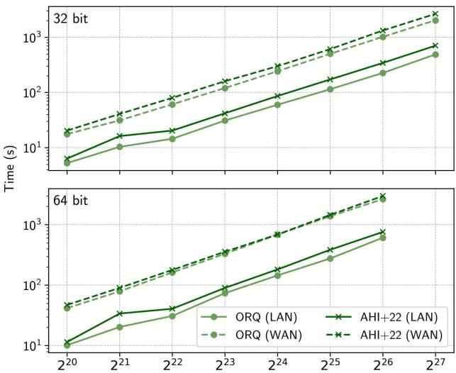  
Figure 11. Comparison of our radixsort protocol with Asharov et al. [5] for (a) ℓ = 32 and (b) $\ell = 6 4$ . All data points are the average of 3 runs and are run with 34 threads in the 3-party setting. WAN data points are collected in a WAN environment with 20ms latency. 64-bit radixsort runs out of memory for $2 ^ { 2 7 }$ input rows. Our hybrid protocol wins in all scenarios by up to 1.44×.

of the protocol is

$$
2 4 \ell \cdot \ell _ { \sigma } n - 2 0 \ell _ { \sigma } n + 6 ( \ell - 1 ) n
$$

bits of communication over $1 8 \ell - 1 4$ rounds.

Our costs. In our protocol, we eliminate the permutation compositions and instead apply the permutations to a vector of bitwidth $\ell + \ell _ { \sigma }$ . We make:

$\ell - 1$ calls to applyElementwisePerm, each costing $6 ( \ell + \ell _ { \sigma } ) n + 7 \ell _ { \sigma } n$ bits of communication and 7 rounds.

• One call to each of convertElementwisePerm and invertElementwisePerm, adding $2 6 \ell _ { \sigma } n$ bits of communication and 14 rounds of communication.

Therefore, in total, our protocol has a cost of

$$
1 7 \ell \cdot \ell _ { \sigma } n + 1 3 \ell _ { \sigma } n + 6 \ell ^ { 2 } n - 6 \ell n
$$

bits of communication and $1 1 \ell + 7$ rounds of communication.

Discussion. In Table 2, we describe the costs both as a function of ℓ and $\ell _ { \sigma }$ and for three values of the bitwidth. Our protocol has the better concrete round complexity, scaling as 11ℓ rather than 18ℓ (although they are asymptotically equivalent). For communication complexity, because ℓ and log ?? are often similar, the two protocols are typically asymptotically equivalent. Concretely, our protocol has the smaller constant factor for the $\ell \cdot \ell _ { \sigma }$ term, which for typical values of ℓ close to $\ell _ { \sigma } \left( { \bf e . g . } , \ell = \ell _ { \sigma } = 3 2 \right)$ means our protocol will require less communication. However, only our protocol has an $\ell ^ { 2 }$ term, so it is a poor choice when $\ell \gg \ell _ { \sigma }$

Orq : Complex Analytics on Private Data with Strong Security Guarantees

<table><tr><td></td><td>Asharov et al. (AHI+22)</td><td>Ours</td></tr><tr><td>Asymptotic Comm.</td><td> $O ( \ell n \log n )$ </td><td> $O ( \ell ^ { 2 } n )$ </td></tr><tr><td>Concrete Comm.</td><td> $2 4 \ell \cdot \ell _ { \sigma } n - 2 0 \ell _ { \sigma } n + 6 ( \ell - 1 ) n$ </td><td> $1 7 \ell \cdot \ell _ { \sigma } n + 1 3 \ell _ { \sigma } n + 6 \ell ^ { 2 } n - 6 \ell n$ </td></tr><tr><td>Asymptotic Rounds</td><td> $O ( \ell )$ </td><td> $O ( \ell )$ </td></tr><tr><td>Concrete Rounds</td><td> $1 8 \ell - 1 4$ </td><td> $1 1 \ell + 7$ </td></tr><tr><td>l =1 Comm.</td><td>128n(4 rounds)</td><td>960n(18 rounds)</td></tr><tr><td>l = 32 Comm.</td><td>24122n (562 rounds)</td><td>23776n (359 rounds)</td></tr><tr><td>l = 64 Comm.</td><td>48890n (1138 rounds)</td><td>59424n (711 rounds)</td></tr></table>

Table 2. Cost analysis of the state-of-the-art radixsort protocol by Asharov et al. [5] and our hybrid radixsort protocol.

We discuss a few specific examples that are shown in Table 2 for the setting $\ell _ { \sigma } = 3 2$ (since we never sort more than 4 billion elements due to speed constraints).

• If ℓ = 32 as well, then our protocol saves a modest 1.4% improvement in total communication and a significant 36% improvement in communication rounds. In practice, the improved round complexity leads to substantially better performance, which we demonstrate empirically in both the LAN and WAN settings in Figure 11.

• If ℓ = 64, then our protocol requires 22% more communication but decreases the number of rounds by 37%. Once again, Figure 11 shows empirically that Orq performs better in both the LAN and WAN settings when ℓ = 64, although by a slimmer margin than with ℓ = 32.

• If ℓ = 1 then the constant additive overhead of input padding and permutation extraction makes our protocol inferior to Asharov et al.

## B.4 Bounding preprocessing for Quicksort

In the two-party setting, we need to generate Beaver triples for the quicksort comparisons in the preprocessing phase. Quicksort involves a nondeterministic number of comparisons, but we would like to probabilistically bound the number of comparisons so we can generate triples ahead of time. For ?? input elements, we generate Beaver triples for 2?? lg ?? comparisons, which is sufficient approximately 99.9% of the time. We make use of the work of McDiarmid et al. [54], which discusses this exact problem in the case of a random pivot selection. Since we shuffle the input list, our method of pivot selection chooses a random element, so the analysis applies.

The expected number of comparisons $q _ { n }$ for quicksort with uniformly random pivot selection as ?? → ∞ is

$$
\begin{array} { r } { q _ { n } = 2 n \ln n - ( 4 - 2 \gamma ) n + 2 \ln n + O ( 1 ) } \\ { \leq 2 n \ln n = ( \ln 4 ) \ n \log n \leq 1 . 3 9 n \lg n . } \end{array}
$$

This says nothing about how concentrated the distribution is around this expectation. Let $Q _ { n }$ be the random variable representing the actual number of comparisons required for a given run of quicksort. McDiarmid et al. [54] discuss the probability $\dot { p } = \operatorname* { P r } \left[ | Q _ { n } / q _ { n } - 1 | > \varepsilon \right]$ describing the concentration. Here, $\left( \varepsilon + 1 \right)$ is the multiplicative overhead over the expectation $q _ { n } .$ We want to solve for ?? as a function of both the input size ?? and the probability $\textstyle { p . }$ We set the probability to a constant $p = 2 ^ { - 1 0 }$ . This is significantly larger than a typical statistical failure, because if we “fail,” we can simply generate more triples in the online phase with no impact on security and an acceptable performance penalty. The chosen value of ?? makes our generated randomness sufficient for 99.9% of executions.

Theorem 1 of McDiarmid et al. [54] gives the following expression of the above probability.

$$
\begin{array} { r } { \dot { p } = n ^ { - 2 \varepsilon ( \ln ( \ln ( n ) ) - \ln ( \frac { 1 } { \varepsilon } ) + O ( \ln ^ { ( 3 ) } ( n ) ) ) } \leq n ^ { - 2 \varepsilon ( \ln ( \ln ( n ) ) - \ln ( \frac { 1 } { \varepsilon } ) ) } } \end{array}
$$

To write ?? as a function of ${ \boldsymbol { p } } ,$ we can take the natural log of both sides of this inequality. Even so, it is not feasible to calculate an analytic solution to this equation due to the presence of both ?? and ln(1/??) terms. To simplify the equation, we use the bound $\varepsilon \ge 0 . 4 3$ because $1 . 3 9 \cdot 1 . 4 3 \approx 2 $ . We simplify the equation using this value.

$$
\varepsilon \leq - \frac { \ln ( p ) } { 2 \ln ( n ) ( \ln ( \ln ( n ) ) - \ln ( \frac { 1 } { 0 . 4 3 } ) ) }
$$

For $p = 2 ^ { - 1 0 } , \varepsilon \leq 0 .$ 43 for all $n \geq 1 3 0 0$ , meaning the chosen value of $\varepsilon = 0 . 4 3$ is suitable for all $n \geq 1 3 0 0$ . To offset the fact that values of $n \textless 1 3 0 0$ are not covered by this case (however unlikely it may be for us to need a sort that small in practice), we handle this case separately with an additive buffer of 10, 000 triples whenever the input size is below ?? = 2000. This buffer is loose but sufficient, and it will not have a noticeable impact on performance for any reasonable use of the library.

## C Analysis of the Join Operator

In this appendix, we address the security of our join operator and then describe its correctness in detail.

Security. Security comes naturally from our oblivious building blocks: since we never open any secret-shared data, and make no assumptions about the true cardinality of input or output tables, any execution of the join operator on tables $L _ { 1 } , R _ { 1 }$ is identically distributed to any other execution on similarly-sized tables $L _ { 2 } , R _ { 2 } ; \left| L _ { 1 } \right| = \left| L _ { 2 } \right|$ and $\left| R _ { 1 } \right| = \left| R _ { 2 } \right|$ Note that here we refer to the observable size of the table in memory (both rows and columns) and not the number of valid rows (which would be the “size” of the table in the conventional sense). For example, even if $L _ { 2 }$ and $R _ { 2 }$ consisted entirely of (secret-shared) zero values, an execution of the join protocol would be indistinguishable from an execution on real values.

In more detail, we can analyze the security of the join operator using the arithmetic black-box model (e.g., [25, §2.1]), which provides an ideal functionality abstraction of all primitive MPC protocols for secret-sharing and reconstructing secrets, performing arithmetic and boolean operations, and converting between arithmetic and boolean shares. Through inspection of Protocols 1, 2, and 3, we can see that the join operators in Orq make use of MPC primitives in a black-box way. Concretely, the join-aggregation in Protocol 3 only uses oblivious logical operators (e.g., AND and NOT), (in)equality comparisons to find distinct keys, and calls to underlying methods like AggNet, TableSort, and Concat. These methods, in turn, are shown in Protocols 1-3 to rely exclusively on oblivious comparisons and logical operations along with the oblivious shuffling and sorting protocols defined in Appendices A-B. Finally, inspection of all shuffling and sorting protocols (in Protocols 4-11) reveals that they only rely on oblivious arithmetic and boolean operators. Importantly, none of these algorithms opens sensitive data; the only openings are on permuted data (Protocols 5-6) or control flow data (Protocol 9) that have been carefully constructed so that the distribution of openings is independent of the data. As a result, Orq join operators inherit the security guarantees of the underlying MPC protocols.

Correctness. In the remainder of this section, we argue the correctness of the inner join operation and its variants. We will use the following important fact when reasoning about joins:

## Fact 2. Invalid rows are never revalidated.

This fact is guaranteed by only operating on the valid column using logical AND. Thus, rows may move from valid to invalid (Valid ∧ 0 → Invalid) but once invalidated can never be revalidated (∀?? : Invalid $\wedge x \to$ Invalid). Rows are only validated when creating a fresh table.

## Theorem 1 (Informal). The inner join protocol is correct.

Proof Sketch. Define the key and valid columns of each input table as ??.??, ??.?? ; ??.??, ??.?? , respectively. Without loss of generality we only consider a single abstract data column, ??.?? and ??.??, in each of the two tables. Assume the left table ?? has unique keys – each distinct value of ?? occurs at most once – and ?? has an arbitrary key distribution. Note that primarykey foreign-key relations are a strict subset of unique-key many-key relations, since keys on the right in a one-to-many relation need not exist on the left. Finally, while we discuss the case of a single key ?? below, our protocol transparently handles compound keys, $k _ { 1 } \parallel k _ { 2 } \parallel . . .$ , exactly as if all such key columns were concatenated into one.

The first step of the protocol is to concatenate the two tables. We concatenate by merging the schemas of the two tables and copying each table’s rows into the appropriate columns. All other values are zero (such as within left-table rows but under right-table columns). We additionally append a $T _ { i d }$ column, which is 0 for left-table rows and 1 for righttable rows, and sort by $V \ | \ k \ | | \ T _ { i d } .$ . Any invalid rows in either table would remain invalid after concatenation and thus be sorted to the top of the table. The resulting table $O = \mathrm { C o n c a T } ( L , R )$ may have the form:

<table><tr><td>0.k</td><td> $O . a$ </td><td>0.b</td><td>0.V  $O . T _ { i d }$ </td></tr><tr><td>-</td><td>■</td><td>-</td><td>0 -</td></tr><tr><td> $k _ { 1 }$ </td><td> $L . a _ { 1 }$ </td><td>0</td><td>1 0</td></tr><tr><td> $k _ { 2 }$ </td><td> $L . a _ { 2 }$ </td><td>0</td><td>1 0</td></tr><tr><td> $k _ { 2 }$ </td><td>0</td><td> $R . b _ { 1 }$ </td><td>1 1</td></tr><tr><td> $k _ { 2 }$ </td><td>0</td><td> $R . b _ { 2 }$ </td><td>1 1</td></tr><tr><td> $k _ { 2 }$ </td><td>0</td><td> $R . b _ { 3 }$ </td><td>1 1</td></tr><tr><td> $k _ { 3 }$ </td><td>0</td><td> $R . b _ { 4 }$ </td><td>1 1</td></tr></table>

Next we discuss the two main functions of our inner join algorithm: (a) identifying matching rows, according to the join keys, and (b) copying data into the result of the join.

We first turn to the identification of matching rows. This step takes the form of invalidating rows which do not belong to the output of the join. In the case of an inner join, we only keep those (valid) rows from the right for which their key matches an associated unique key on the left:

$$
\begin{array} { r l r } { O . V _ { i } : = O . V _ { i } \wedge [ O . T _ { i d , i } = 1 ] } & { } & { \mathrm { v a l i d ~ r o w ~ f r o m ~ } R } \\ { \wedge [ \exists j : O . k _ { j } = O . k _ { i } } & { \mathrm { e x i s t s ~ m a t c h i n g ~ k e y ~ } } \\ { \wedge O . T _ { i d , j } = 0 } & { } & { \mathrm { f r o m ~ l e f t ~ } } \\ { \wedge O . V _ { j } = 1 ] } & { } & { \mathrm { w h i c h ~ i s ~ v a l i d } } \end{array}
$$

Due to previously having sorted on $V | | k | | T _ { i d } ,$ we know that if any such $O . k _ { j }$ exists, it will occur as the first position of this ??-group. If not, a row from the right appears as the first position of this ??-group, and no rows with this key are in the output of the join. We use the Distinct operator to mark the first row of each group with a 1. Then, the join output is formed by updating a temporary valid bit, $O . V _ { o } : = O . V \wedge$ ¬Distinct(?? , ??). That is, $O . V _ { o }$ invalidates any valid rows which are the first of their (??, ??) group.2

For each group four possibilities exist, shown in the tables below.

Case I. There are duplicate keys on the left, and no matching keys on the right. The validity update procedure marks the first row from the left invalid, and aggregation (below) will mark the entire group invalid. This represents (possibly duplicated) primary keys with no foreign key rows.

Case II. There are duplicate rows on the left, and greater than zero matching keys on the right. The first left row is marked invalid, and aggregation similarly invalidates the entire left group. The right group remains valid.

Case III. This is another matching case, but with exactly one primary key on the left. The single row from the left is invalidated, but the aggregation makes no changes. Case III is frequently observed in realistic workloads, where our join operator operates on an explicit primary-key foreign-key relation.

Case IV. There are no matching rows on the left. Now we invalidate the first row from the right, and the subsequent aggregation invalidates all rows on the right. With no key on the left, this key is not be part of the output table.

<table><tr><td>O.k</td><td>-DIST</td><td>0.V</td></tr><tr><td>：</td><td>：</td><td>0</td></tr><tr><td>L.k</td><td>… 0</td><td>…</td></tr><tr><td>L.k</td><td>1</td><td>1 1</td></tr><tr><td>L.k</td><td>1</td><td>1</td></tr><tr><td>L.k</td><td>1</td><td>1</td></tr></table>

Table 3. Case I

<table><tr><td rowspan=1 colspan=1>O.k</td><td rowspan=1 colspan=1>-DIST</td><td rowspan=1 colspan=1>0.V</td></tr><tr><td rowspan=1 colspan=1></td><td rowspan=1 colspan=1>…：</td><td rowspan=1 colspan=1>0…</td></tr><tr><td rowspan=1 colspan=1>L.kL.k</td><td rowspan=1 colspan=1>01</td><td rowspan=1 colspan=1>11</td></tr><tr><td rowspan=1 colspan=1>R.kR.k</td><td rowspan=1 colspan=1>11</td><td rowspan=1 colspan=1>11</td></tr></table>

Table 4. Case II

<table><tr><td>O.k</td><td>-DIST</td><td>0.V</td></tr><tr><td></td><td>：</td><td>0</td></tr><tr><td></td><td>…</td><td>…</td></tr><tr><td>L.k</td><td>0</td><td>1</td></tr><tr><td>R.k R.k</td><td>1</td><td>1</td></tr><tr><td>R.k</td><td>1 1</td><td>1 1</td></tr></table>

Table 5. Case III

<table><tr><td>O.k</td><td>-DIST</td><td>0.V</td></tr><tr><td>：</td><td>：</td><td>0</td></tr><tr><td>… R.k</td><td>… 0</td><td>… 1</td></tr><tr><td>R.k</td><td>1</td><td>1</td></tr><tr><td>R.k</td><td>1</td><td>1</td></tr><tr><td>R.k</td><td>1</td><td>1</td></tr></table>

Table 6. Case IV

In Cases I and II, there are multiple matching “primary keys”; we operate as if only the first existed. We tend to avoid this mode of operation, since it does not follow the semantics of pk-fk relations, but it is useful in some environments, such as when performing semi-join. It also allows us to natively perform COUNT(DISTINCT(...)) operations over many-tomany joins (with duplicates on both sides).

After the invalid rows are marked, a final aggregation is applied (as part of the copy step, below) to similarly invalidate all rows in the group. This aggregation is a special case of the aggregation step outlined below, as the aggregation keys here are $V \parallel k \parallel T _ { i d }$ . This allows for an invalidated left row to invalidate all other left rows, and an invalidated right row to invalidate all other right rows, but invalidation will never cross the table boundary.

The size of the output of a one-to-many inner join is bounded by the size of the right table: assume every key on the right is present exactly once on the left. Then the output of the join is exactly the right table. Because our protocol is oblivious, it must be input-independent, even in the worst case. Thus our output must always exactly the size of the right table; we use the valid column to mark rows not actually present in the join output.

The cardinality equivalence means it is most efficient to build the output of the join within the rows of the right table. As such, all data from the right is included in the output by default. Data from the left table, on the other hand, must be explicitly copied. This operation is performed with a groupby aggregation and implemented via AggNet. In practice, we have noticed that this default behavior also matches the semantics of many queries, so few copy aggregations are required.

Groups are defined as ?? || ?? (note the exclusion of the table ID column). The aggregation performed is a simple Mux, where the selection bit denotes whether values belong to the same group. We perform a reverse aggregation, which has the effect of aggregating down, and copying the first row of each multiplex group into all other rows of that group. Where a row on the left exists, it is the first row, due to the final sort by $T _ { i d } ;$ should multiple left rows exist, we only copy the value from the first. All left rows will be invalidated (Case II, above). The join operator does not support, at this stage, many-to-many-key joins. However, with a prior aggregation, or under certain conditions (e.g., the join performs a Distinct(·) aggregation), our operator still applies. See Section 3.3 and 3.6 for more details. □

Unifying join and aggregation. The validity-update procedure of join looks very similar to aggregations performed over joined tables. For improved efficiency, we would like to combine these two operations into a single unified control flow, which will approximately halve the number of operations required.

Theorem 2 (Informal). Aggregations can be performed in the same control flow as the join operator provided the following conditions are met:

1. The aggregation keys are the same as the join keys.

2. No aggregation key is also an aggregation output.

3. No aggregation input is also an aggregation output for a different aggregation.

The intuition behind this theorem is that the conditions preclude any interaction between individual aggregations, so they can be evaluated in parallel: calling AggNet $( f _ { 1 } , \ldots )$ , AggNet( ??2, . . . ), AggNet( ??3, . . . ) is equivalent to

$$
\mathrm { A G G N E T } ( \{ f _ { 1 } , f _ { 2 } , f _ { 3 } \} , \dots )
$$

If any of the conditions are not true, these calls are not independent (and may have side effects), so sequential calls to the operator are required.

Handling other scenarios. Our operator only provides correct semantics for the case where there are at most unique keys on the left. To handle duplicate keys, we must first preaggregate over the left key. This requires an additional call to AggNet, after which the aggregated table has unique keys and aggregated values. Then, our operator can be applied. We note that this collapsing is only valid for self-decomposable aggregation functions.

This general technique is also applicable, as alluded to above, if one of the join or aggregation keys are a prefix of the other. (i.e., $K _ { j } = K _ { a } \vert \vert K ^ { * }$ or $K _ { a } = K _ { j } | | K ^ { * } )$ . Then, we sort on the longest combined key (argmax $\left( | K _ { j } | , | K _ { a } | \right) )$ and perform the join normally. If the aggregation keys are a prefix of the join keys, we need to handle the possible interspersed rows from the left $( T _ { i d } = 0 ) \mathrm { { ; } }$ : AggNet requires all rows in a group to be adjacent. We can accomplish this by masking rows from the left from an identity element for the given aggregation (e.g. for sum, 0; for min, ∞.) Then, while the join occurs over $K _ { j } = K _ { a } | | K ^ { * }$ , we can still aggregate over $K _ { a }$ by ignoring all ??∗ keys and taking advantage of the masked identity elements.

Finally, if the aggregation is applied to columns from both the left and the right (as in the Secure Yannakakis query, [71]) we must first break the aggregation function apart, apply either of the techniques above, and post-aggregate over the joined table. In the Secure Yannakakis example, we have:

```sql
1 SELECT T . class , SUM ( S . cost * (1 - R . coinsurance ) )
2 FROM R , S , T
3 WHERE R . person = S . person AND S . disease = T . disease
4 GROUP BY T . class ;
```

We observe that we can first pre-aggregate the quantity 1-R.coinsurance per person, join ?? ⊲⊳ ?? on person, compute the product with cost, and then post-aggregate by summing over disease and class. This rewriting applies because the SUM function is self-decomposable.

Custom Aggregatons. Orq users can also define custom aggregation functions, as in the following example that computes a product:

```c
template<typename A>
A prod(const A& a, const A& b) {
return a * b; // User-defined logic here
}
```

Orq will call Mux(??, ??, prod(??, ??)) within the aggregation control flow, where g denotes whether the elements belong to the same group and a, b are slices of the vector to be aggregated. For each pair of elements in the same group $( g _ { i } = 1 )$ , the aggregation function prod is applied; otherwise, no update occurs. For the example above, this will result in obliviously multiplying all elements of each group.

Unique-key joins. An additional optimization is possible in the case of unique keys on both sides of the join. (We assume this information is included in the tables’ public schema.) In this case, the call to AggNet is unnecessary: since each row on the left has at most one match on the right, the call to Distinct is sufficient for computing the join; the output of is then bounded by min $( | L | , | R | )$ rather than just |??|. Additionally, in this context, aggregating over the join keys is a nonsensical operation, so we omit it. This operation is now effectively just a PSI protocol; many more optimizations are possible. However, we only use this optimized join algorithm for the comparison with SecretFlow, since they only implement a PSI-join which requires unique keys.

## C.1 Correctness of other types of joins

Outer joins. Outer joins work similarly to an inner join but with different validation rules. That is,

• A left-outer join is an inner join, plus all rows from the left.

• A right-outer join is an inner join, plus all rows from the right.

• A full-outer join contains all rows from both input tables, and is effectively just a concatenation with aggregation.

Full-outer join is the simplest case. Since we take all rows, there is nothing new to invalidate. We copy the valid bits from each input table and apply them to the joined output, which is just a concatenation ??||??. (We may also sort, so that user-defined aggregations can be applied, if necessary.)

For a right-outer join, we do not invalidate any rows from the right. But by the semantics of our join operator, we only include new columns from the left if explicitly specified by the user with a copy aggregation. Any rows originally from the left table should always be removed. This validation rule, therefore, is also quite simple: $O . V \gets O . V _ { L R } \land O . T _ { i d } ,$ where rows from the left have $T _ { i d } = 0 .$

To compute a left outer join, we can compute the inner join but should not invalidate any left-table rows. The desired relation is shown in the table below:

<table><tr><td> $V _ { L R }$ </td><td> $T _ { i d }$ </td><td>DISTINCT</td><td>V</td></tr><tr><td>0</td><td>X</td><td>X</td><td>0</td></tr><tr><td>1</td><td>0</td><td>0</td><td>1</td></tr><tr><td>1</td><td>0</td><td>1</td><td>1</td></tr><tr><td>1</td><td>1</td><td>0</td><td>1</td></tr><tr><td>1</td><td>1</td><td>1</td><td>0</td></tr></table>

$$
O . V \gets O . V _ { L R } \land \neg ( O . T _ { i d } \land \mathrm { D t s T I N C T } ( K ) )
$$

That is, invalidate rows from ?? which are the first of their group. When this occurs, it means no such row from ?? exists, so this row is not in the output relation. To only keep unique (rather than all) rows from ??, the second clause could instead be replaced with $O . T _ { i d }$ ⊕ Distinct(??).

Semi-join. The semi-join ?? ⋉ ?? returns all rows in ?? which match a row in ??. Observe that we can reframe this operator into one we have already seen by swapping the tables: which operator returns all rows in ?? which match a row in ??? This is the inner join ?? ⊲⊳ ??. So, to implement $L \ * _ { \ * } R ,$ we simply call ?? ⊲⊳ ??, and then project the result columns to maintain the semantics of semi-join (namely, only return columns in ??). This final operation requires no extra work because our inner-join operator, by default, returns all data in columns from the “right” (here, ??). We acknowledge that this transformation of semi-join to inner join is not correct in general, but rather a byproduct of the way our oblivious control flow is implemented for one-to-many joins.

To see why this rewriting works, consider what rows are removed from ?? ⊲⊳ ?? by the validity-update procedure of our inner join protocol: all rows from $R ,$ and all rows from ?? which do not have a matching “primary key” in ??. Of course, in a semi-join, table ?? is not part of the output relation, so we should always remove all rows from ??. And, if a row in ?? does not have a match in ??, then it should be removed from the output, by the definition of semi-join.

Anti-join. The inverse of semi-join is anti-join, ?? ▷ ??, which removes from ?? all rows matching one in ??. We apply a similar transformation: we need an operator which will ignore all rows from ??, and keep rows from ?? which do not match any in ??. A partial answer is the right-outer join from above, again applied in the opposite direction, $R \bowtie L$ . This would keep all rows in the “right” (here, ??), but it would also incorrectly keep rows from ?? which matched one from ??.

The solution here is to apply a special aggregation over the valid bit3 which copies the valid bit of the first row of a group to all other rows in the group. We do not include $O . T _ { i d }$ as an aggregation key. Thus, we invalidate all rows for which the first row in that group was previously invalidated by the (right outer) join. Since this join will invalidate all “left” $( = R )$ rows, any group for which a row exists in ?? will have its first row invalidated by the join, and in the subsequent aggregation, all such rows from this group will be invalidated. This correctly implements anti-join; to match the semantics of the operator, we again project to the columns on the left. Thanks to our unified join-aggregation control flow, this validation update is performed at the same time as the join, and incurs the same cost as a copy aggregation $( { \mathrm { i . e . } }$ ?? (?? log ??) multiplex operations) in a normal join. Again, we acknowledge that this rewriting of anti-join to right-outer join is not correct in relational algebra, but a convenient optimization in our setting.

One side effect of this rewriting (for both semi-join and anti-join) is that our implementations of these operators transparently handles duplicates in ??, by Cases I and II, above. Both semi-join and anti-join only consider the existence, in table ??, of keys in ??, so we need no special handling for duplicate keys.

## C.2 Proof Sketch of AggNet correctness

In this section, we provide an argument for why the AggNet protocol achieves correctness. As an illustrative example, consider a table with $n \ = \ 2 ^ { \ell }$ rows and three columns: a key column ??, input column ??, and output column ??. We use these parameters for convenience but emphasize that the ideas generalize to any database. Additionally, while the aggregation network requires that the full table size is a power of two, each key can have arbitrary cardinality. If the number of input rows is not a power of two, we pad the table with dummy (invalid) rows and remove them after the protocol terminates.

The first step of the algorithm is to copy column ?? into column ?? (Line 1), since the aggregation function is applied in place. From this point, we only consider column ??.

## Claim 1. Values across distinct keys are never aggregated.

Take an arbitrary row ?? and distance ??. Assume the keys in rows $( i , i + d )$ do not match. Then $b \gets 0$ (Line 4) and we update $G _ { i + d } \gets \mathsf { M u x } ( 0 , G _ { i + d } , g ) = G _ { i + d }$ (Line 6), so this row is not modified. Therefore, we only aggregate rows with matching keys.

## Claim 2. The algorithm correctly aggregates groups.

AggNet expects an input table sorted on the key column. This puts all rows of a given key-group next to each other. Assume row ?? is the final row of some arbitrary group ?? of size ?? $\leq n .$ Then, we want to argue that the final value $G _ { j } = f ( G _ { j - m } , \ldots , G _ { j } )$

In the final round of the protocol, $G _ { j }$ is updated with the value $n / 2$ indices earlier (assume for the sake of argument that $m > n / 2 ) , G _ { j }  f ( G _ { j - n / 2 } , G _ { j } )$ . In the prior round, each of these two values were updated with their own value along with the values $n / 4$ indices prior. The algorithm proceeds in this manner, taking the next power of two in each round. In the first round we have a distance $d = 1$ so adjacent elements are aggregated.

This procedure is easy to visualize if we consider this aggregation structure as a tree, where each “prior index” is a left branch, and the “same index” is a right branch. AggNet builds a binary tree, where the path through the tree from $G _ { j }$ to $G _ { j - h } ,$ for arbitrary $h \leq m ,$ , corresponds to the binary representation of ℎ. Each leaf node has a single unique path to $G _ { j }$ , since each offset ℎ has a unique binary representation. Thus, each input value is aggregated once and in order of its appearance in the original list. Since the aggregation function ?? is self-decomposable, we have that $f ( f ( X ) , f ( Y ) ) = f ( X , Y )$ , so by induction we can show that the final result is $f ( G _ { j - m } , \ldots , G _ { j } )$ □

## C.3 Trimming the output of Join operations

In Section 3.3, we discussed bounding the outputs of joins to the size of the right table. Here, we elaborate on the heuristic used to automatically govern this trim operation. It is important that, due to the obliviousness of our operators, the $\ " \mathrm { s i z e } \ " $ of tables discussed in this section refers to the secret-shared table size, not the number of valid rows (which is not known at runtime).

First, we provide intuition by way of an example. Consider a join between two asymmetric tables, $| L | = 1 0$ and $\vert { R } \vert = 1 0 ^ { 6 }$ After join, we have a larger table of size $| O | = 1 0 + 1 0 ^ { 6 }$ Clearly it is not worth trimming: we must perform valid-bit sort on a table of size $| O | \approx | R | = 1 0 ^ { 6 }$ , but are only able to remove $| L | = 1 0$ elements.

However, if a join is more symmetric, say $| L | = 1 0 ^ { 6 }$ and $| R | = 2 \cdot 1 0 ^ { 6 }$ , trimming is much more promising. While we sort on $| O | = 3 \cdot 1 0 ^ { 6 }$ elements, we can then remove $1 / 3$ of the output rows.

Trimming brings significant improvements in composed queries where we also perform aggregations on the output of the join. Since the odd-even aggregation algorithm requires power-of-two-sized inputs, trimming frequently allows us to “drop” below the next power of two, leading to significant speedups in query execution. In the analysis below, we optimize for such composed operation, assuming a join will be followed by additional joins with other tables.

To establish the heuristic, we define the abstract costs of each of our major operators. Let $J ( n ) , V ( n ) , S ( n )$ , and $A ( n )$ be the respective costs of join, valid-bit sort, full sort, and aggregation over ?? rows (we abstract away aggregation functions at this phase).

In this analysis, we will say we first join two tables of size ?? and ??, with $N : = L + R$ the combined size. A subsequent join is performed with a table of size ?? . Intuitively, we want to trim if the additional cost (valid-bit sorting over ?? rows) is less than the future savings. Expressed formally,

$$
J ( N + T ) > V ( N ) + J ( R + T ) \implies \mathrm { s h o u l d t r i m }
$$

First, we observe that joins are superlinear: $\forall n , m > 0 : J ( n +$ ?? $\ i ) \geq J ( \boldsymbol n ) + J ( \boldsymbol m )$ . This follows from both the superlinearity of both sorting and aggregation.

$$
\begin{array} { r } { J ( N + T ) > J ( L ) + J ( R + T ) } \\ { J ( L ) + J ( R + T ) > V ( N ) + J ( R + T ) } \\ { J ( L ) > V ( N ) \implies \mathrm { t r i m } } \end{array}
$$

That is, we should trim when the cost of performing a join over the trimmed rows would be more expensive than performing a valid-bit sort over the entire table.

We now decompose each operator:

• Valid-bit sorting is implemented with radixsort so is approximately linear, $V ( n + m ) \approx V ( n ) + V ( m )$

• Joins consist of a two single-bit sorts (valid column plus $T _ { i d } )$ , a regular sort, and an aggregation; $J ( n ) \approx$ $2 V ( n ) + S ( n ) + A ( n )$

Define $\alpha : = R / L$ . For most applications involving uniquekey joins, $\alpha > 1 .$ . Then,

$$
\begin{array} { c } { { V ( N ) < J ( L ) \implies \mathrm { t r i m } } } \\ { { V ( L ) + V ( R ) < 2 V ( L ) + S ( L ) + A ( L ) } } \\ { { ( \alpha - 1 ) V ( L ) < S ( L ) + A ( L ) } } \end{array}
$$

It is difficult to reason, in general, about the cost of aggregation, $A ( \cdot )$ , since this cost depends heavily on (possibly user-defined) aggregation functions. However, it can be bounded from below considering only the control flow of the aggregation operator itself. Let ?? be the bitwidth of values in the table. Then both aggregation and quicksort perform at least ?? $\log ( n )$ comparisons,4 which, under MPC, each require log ?? operations. Valid-bit sorting, on the other hand, performs 6?? ??-bit permutation operations, each of which we can approximate as costing ?? multiplications, where ?? is the number of parties required by the MPC protocol. Inserting these costs into the above, we see that:

$$
\begin{array} { c } { { ( \alpha - 1 ) 6 N L < 2 L \log ( L ) \log ( \omega ) \implies \mathrm { t r i m } } } \\ { { 3 \alpha N < \mathrm { l g } ( L ) \mathrm { l g } ( \omega ) } } \end{array}
$$

For our common use cases, $\omega = 1 2 8$ bits (due to input padding) and $N \in \{ 2 , 3 , 4 \}$ . The table below gives some example sizes, and confirms our intuitions about only trimming when we can remove sufficiently many rows from the left table.

<table><tr><td>L</td><td>α forN=3PC</td><td>Trim when  $R < . . .$ </td></tr><tr><td>100</td><td>5.2</td><td>516</td></tr><tr><td>10k</td><td>10.3</td><td>103k</td></tr><tr><td>1M</td><td>15.5</td><td>15.5M</td></tr><tr><td>100M</td><td>20.7</td><td>2.07B</td></tr></table>

This analysis differs slightly from the version of the heuristic we have implemented (which was originally derived for radixsort, not quicksort). However, the concrete decisions it makes in real queries are similar.

## D Bandwidth Measurements

In Table 7, we provide the bandwidth usage for each query used in the paper. Since TPC-H queries have a wide variety of input sizes (nearly an order-of-magnitude spread at a fixed Scale Factor), we report bandwidth usage in kilobytes per row. While these results have been collected at SF10, query execution scales only slightly superlinearly, so the values below provide a good bandwidth estimate across all query sizes reported in Orq. Measurements are also normalized per party; some protocols are not perfectly symmetric, so we divide the total communication by the number of computing parties (2 in SH-DM, 3 in SH-HM, and 4 in Mal-HM, respectively). We observe that SH-DM has just under twice the communication complexity of SH-HM, and Mal-HM about three times. Bandwidth for other experiments (§5.3) are provided in Tables 8, 9, 10, and 11.

<table><tr><td>Query</td><td>SH-DM</td><td>SH-HM</td><td>Mal-HM</td></tr><tr><td>TPC-H Q1</td><td>33.1</td><td>18.5</td><td>51.4</td></tr><tr><td>Q2</td><td>65.0</td><td>35.2</td><td>100.2</td></tr><tr><td>Q3</td><td>42.2</td><td>23.6</td><td>65.4</td></tr><tr><td>Q4</td><td>44.1</td><td>24.3</td><td>68.5</td></tr><tr><td>Q5</td><td>122.5</td><td>66.4</td><td>188.7</td></tr><tr><td>Q6</td><td>0.2</td><td>0.3</td><td>0.6</td></tr><tr><td>Q7</td><td>111.9</td><td>61.0</td><td>173.4</td></tr><tr><td>Q8</td><td>120.2</td><td>65.5</td><td>186.6</td></tr><tr><td>Q9</td><td>113.4</td><td>62.5</td><td>176.1</td></tr><tr><td>Q10</td><td>73.6</td><td>40.5</td><td>114.7</td></tr><tr><td>Q11</td><td>41.8</td><td>23.4</td><td>65.7</td></tr><tr><td>Q12</td><td>46.9</td><td>25.5</td><td>72.0</td></tr><tr><td>Q13</td><td>45.6</td><td>25.6</td><td>70.4</td></tr><tr><td>Q14</td><td>18.0</td><td>9.9</td><td>27.9</td></tr><tr><td>Q15</td><td>54.1</td><td>30.0</td><td>83.6</td></tr><tr><td>Q16</td><td>94.2</td><td>51.3</td><td>144.3</td></tr><tr><td>Q17</td><td>53.0</td><td>29.4</td><td>82.8</td></tr><tr><td>Q18</td><td>86.6</td><td>47.5</td><td>133.3</td></tr><tr><td>Q19</td><td>21.2</td><td>11.5</td><td>32.8</td></tr><tr><td>Q20</td><td>82.1</td><td>45.8</td><td>127.0</td></tr><tr><td>Q21</td><td>160.2</td><td>87.0</td><td>245.8</td></tr><tr><td>Q22</td><td>16.6</td><td>9.3</td><td>26.2</td></tr><tr><td>Aspirin</td><td>39.9</td><td>21.2</td><td>61.2</td></tr><tr><td>Comorbidity</td><td>42.5</td><td>23.5</td><td>65.8</td></tr><tr><td>Credit</td><td>26.6</td><td>14.0</td><td>40.6</td></tr><tr><td>SYan</td><td>42.2</td><td>23.9</td><td>65.6</td></tr><tr><td>Patients</td><td>22.3</td><td>12.0</td><td>34.5</td></tr><tr><td>Market Share</td><td>17.8</td><td>10.0</td><td>27.3</td></tr><tr><td>Password</td><td>26.9</td><td>14.8</td><td>40.8</td></tr><tr><td>C.Diff</td><td>27.4</td><td>15.0</td><td>41.6</td></tr><tr><td>Secrecy Q2</td><td>32.7</td><td>18.4</td><td>50.6</td></tr></table>

Table 7. Bandwidth (KB) per row and computing party, for all queries and protocols used in Orq.

## E Performance in a geodistributed setting

In this section, we evaluate Orq’s ability to amortize network costs in a geodistibuted setting. We create a deployment spanning four AWS regions: us-east-1 (N.Virginia), us-east-2 (Ohio), us-west-1 (N.California), and us-west-2 (Oregon). The deployment is constrained by minimum link bandwidth between 4.23 − 8.47 Gbps, and RTT between 50 − 61 ms. To make the setting challenging, we deploy parties so that at least one link exists between the U.S. west and east coasts.

We show results for five TPC-H queries: two of the fastest (Q11, Q21), the median (Q12), and the two slowest (Q8, Q21). These five queries account for approximately 30% of the total time to run the entire TPC-H benchmark. Figure 12 shows the execution time, along with the overhead compared to the symmetric WAN environment used in the experiments of Fig. 4. Latency increases by up to 2.4× for SH-DM, 1.7× for SH-HM, and 1.9× for Mal-HM. These results demonstrate that Orq’s overhead is lower than the corresponding 3× increase in RTT between the two WAN environments, indicating its ability to effectively amortize network costs and achieve competitive performance.

<table><tr><td>Query</td><td>Secrecy</td><td>ORQ</td></tr><tr><td>TPCH-Q6</td><td>0.3</td><td>0.3</td></tr><tr><td>Password</td><td>30.9</td><td>10.7</td></tr><tr><td>Credit</td><td>39.2</td><td>9.3</td></tr><tr><td>Comorbidity</td><td>56.4</td><td>23.7</td></tr><tr><td>C.Diff</td><td>63.1</td><td>12.1</td></tr><tr><td>Aspirin</td><td>2820</td><td>10.7</td></tr><tr><td>TPCH-Q4</td><td>4825</td><td>16.5</td></tr><tr><td>TPCH-Q13</td><td>1712</td><td>20.0</td></tr></table>

Table 8. Bandwidth (KB) per row and party for the queries used in Fig. 5 (left). Secrecy’s high bandwidth is due to its ?? (??2) join operator and $O ( n \log ^ { 2 } n )$ sorting algorithm (bitonic sort).

<table><tr><td>Query</td><td>SecretFlow</td><td>ORQ</td></tr><tr><td>S1</td><td>&lt;1</td><td>14</td></tr><tr><td>S2</td><td>&lt;1</td><td>28</td></tr><tr><td>S3</td><td>88</td><td>7677</td></tr><tr><td>S4</td><td>286</td><td>7735</td></tr><tr><td>S5</td><td>2835</td><td>29 834</td></tr></table>

Table 9. Bandwidth (bytes) per row and party for the queries used in Fig. 5 (right). SecretFlow’s low bandwidth is due to its join operator, which leaks matching rows to parties and allows them to perform most subsequent operations locally (i.e., without communication).

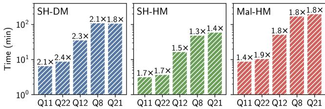  
Figure 12. TPC-H query times at SF1 in a geo-distributed WAN deployment, with ratios over times in our symmetric WAN.

<table><tr><td>Input Size</td><td>SecretFlow: SBK</td><td>ORQ: RS (64b)</td><td>SecretFlow: SBK_valid</td><td>ORQ: RS (32b)</td></tr><tr><td>100k</td><td>921.4</td><td>517.6</td><td>282.0</td><td>210.0</td></tr><tr><td>1M</td><td>9 212.4</td><td>5 176.0</td><td>3 212.2</td><td>2100.0</td></tr><tr><td>10M</td><td>92 118.9</td><td>51 760.0</td><td>37 568.5</td><td>21000.0</td></tr></table>

Table 10. Total bandwidth (MB) for SecretFlow and Orq in the experiment of Fig. 6. Orq’s optimized radixsort achieves between 1.34× and 1.79× lower bandwidth than the SecretFlow algorithms.

<table><tr><td></td><td colspan="2">SH-DM (2PC)</td><td colspan="2">SH-HM (3PC)</td><td colspan="2">Mal-HM (4PC)</td></tr><tr><td>k=</td><td>MP-SPDZ</td><td>ORQ</td><td>MP-SPDZ</td><td>ORQ</td><td>MP-SPDZ</td><td>ORQ</td></tr><tr><td>10</td><td>165.3</td><td>5.3</td><td>18.7</td><td>11.9</td><td>272.0</td><td>40.3</td></tr><tr><td>11</td><td>363.7</td><td>10.6</td><td>37.4</td><td>23.9</td><td>600.4</td><td>80.6</td></tr><tr><td>12</td><td>793.4</td><td>21.2</td><td>74.8</td><td>47.8</td><td>1315.3</td><td>161.3</td></tr><tr><td>13</td><td>1719.0</td><td>42.4</td><td>149.6</td><td>95.6</td><td>2860.5</td><td>322.7</td></tr><tr><td>14</td><td>3702.2</td><td>84.8</td><td>299.2</td><td>191.2</td><td>6182.2</td><td>645.5</td></tr><tr><td>15</td><td>7933.0</td><td>169.6</td><td>598.4</td><td>382.4</td><td>13 288.1</td><td>1291.0</td></tr><tr><td>16</td><td>16 922.9</td><td>339.2</td><td>1196.7</td><td>764.9</td><td>28 424.6</td><td>2582.1</td></tr><tr><td>17</td><td>35 959.8</td><td>678.4</td><td>2393.5</td><td>1529.8</td><td>60 547.2</td><td>5 164.2</td></tr><tr><td>18</td><td>76 147.6</td><td>1356.8</td><td>4787.1</td><td>3 059.7</td><td>128 492.2</td><td>10 328.4</td></tr><tr><td>19</td><td>160 751.0</td><td>2 713.7</td><td>9 574.2</td><td>6 119.4</td><td>271 780.4</td><td>20 656.9</td></tr><tr><td>20</td><td>338 414.0</td><td>5 427.4</td><td>19 148.4</td><td>12 238.9</td><td>(00M)</td><td></td></tr><tr><td>21</td><td>710 650.0</td><td>10 854.8</td><td>38 296.8</td><td>24 477.9</td><td></td><td></td></tr><tr><td>22</td><td>(Crash)</td><td></td><td>76 593.9</td><td>48 955.9</td><td></td><td></td></tr><tr><td>23</td><td></td><td></td><td>153 187.5</td><td>97 911.8</td><td></td><td></td></tr><tr><td>24</td><td></td><td></td><td>306 375.0</td><td>195 823.6</td><td></td><td></td></tr></table>

Table 11. Total bandwidth (MB) for MP-SPDZ and Orq in the experiments of Fig. 7 (oblivious radixsort on $2 ^ { k }$ rows). Orq’s optimized radixsort achieves between 1.57× and 65.5× lower bandwidth than the MP-SPDZ algorithm. MP-SPDZ crashes at $2 ^ { 2 2 }$ in SH-DM and runs out of memory at $2 ^ { 2 5 }$ in SH-HM and $2 ^ { 2 0 }$ in Mal-HM.