Latest updates: hps://dl.acm.org/doi/10.1145/3731569.3764834

RESEARCH-ARTICLE

# PrefillOnly: An Inference Engine for Prefill-only Workloads in Large Language Model Applications

KUNTAI DU, The University of Chicago, Chicago, IL, United States

BOWEN WANG, University of California, Berkeley, Berkeley, CA, United States

CHEN ZHANG, University of California, Berkeley, Berkeley, CA, United States

YIMING CHENG, The University of Chicago, Chicago, IL, United States

QING LAN, LinkedIn Corporation, Sunnyvale, CA, United States

HEJIAN SANG, LinkedIn Corporation, Sunnyvale, CA, United States

View all

Open Access Support provided by:

University of California, Berkeley

LinkedIn Corporation

The University of Chicago


Published: 12 October 2025

Citation in BibTeX format

SOSP '25: ACM SIGOPS 31st Symposium   
on Operating Systems Principles   
October 13 - 16, 2025   
Seoul, Republic of Korea

Conference Sponsors: SIGOPS

# PrefillOnly: An Inference Engine for Prefill-only Workloads in Large Language Model Applications

Kuntai Du University of Chicago TensorMesh, Inc.

Yiming Cheng University of Chicago

Yihua Cheng University of Chicago TensorMesh, Inc.

Yifan Qiao UC Berkeley

Bowen Wang Tsinghua University

Qing Lan LinkedIn

Jiayi Yao University of Chicago TensorMesh, Inc.

Ion Stoica UC Berkeley

Chen Zhang Tsinghua University

Hejian Sang LinkedIn

Xiaoxuan Liu UC Berkeley

Junchen Jiang University of Chicago TensorMesh, Inc.

## Abstract

Besides typical generative applications, like ChatGPT, GitHub Copilot, and Cursor, we observe an emerging trend that LLMs are increasingly used in traditional discriminative tasks, such as recommendation, credit verification, and data labeling. The key characteristic of these emerging use cases is that the LLM generates only a single output token, rather than an arbitrarily long sequence of tokens. We refer to this as a prefill-only workload. However, since existing LLM engines assume arbitrary output lengths, they fail to leverage the unique properties of prefill-only workloads. In this paper, we present PrefillOnly, the first LLM inference engine that improves the inference throughput and latency by fully embracing the properties of prefill-only workloads. First, since it generates only one token, PrefillOnly only needs to store the KV cache of only the last computed layer, rather than of all layers. This drastically reduces the GPU memory footprint of LLM inference and allows handling long inputs without using solutions that reduce throughput, such as cross-GPU KV cache parallelization. Second, because the output length is fixed, rather than arbitrary, PrefillOnly can precisely determine the job completion time (JCT) of each prefill-only request before it starts. This enables efficient JCT-aware scheduling policies such as shortest prefill first. PrefillOnly can process up to 4× larger queries per second without inflating the average and P99 latency.

CCS Concepts: • Computing methodologies → Natural language processing; • Software and its engineering → Memory management; Scheduling.

Keywords: large language models, prefill-only, hybrid prefilling, shortest prefill first, continuous prefill time estimation

ACM Reference Format:

Kuntai Du, Bowen Wang, Chen Zhang, Yiming Cheng, Qing Lan, Hejian Sang, Yihua Cheng, Jiayi Yao, Xiaoxuan Liu, Yifan Qiao, Ion Stoica, and Junchen Jiang. 2025. PrefillOnly: An Inference Engine for Prefill-only Workloads in Large Language Model Applications. In ACM SIGOPS 31st Symposium on Operating Systems Principles (SOSP ’25), October 13–16, 2025, Seoul, Republic of Korea. ACM, New York, NY, USA, 16 pages. https://doi.org/10.1145/3731569.3764834

## 1 Introduction

Nowadays, large language models (LLMs) are widely used in generative tasks, such as chatting (e.g., ChatGPT [41], Character.AI [2]), code generation (e.g., GitHub Copilot [19], Cursor [7]), and summarization (e.g., Perplexity [45]), which generate new content (of variable lengths) for people to read and use. However, researchers and industry practitioners have also recently started to use LLMs to replace traditional deep learning models in discriminative tasks, such as recommendation [17, 51, 53], credit verification [16, 50, 54], and data labeling [22, 32, 63], which are already widely deployed in production at scale. For example, multiple companies have deployed LLMs for recommendation, including Meta [61], LinkedIn [17], and many more [12, 21, 25, 26, 57, 64].

The reasons behind using LLMs for discriminative tasks are:

• Streamlining development: Traditional deep learning solutions often require multiple iterations of data preprocessing, feature engineering, and model tuning, which

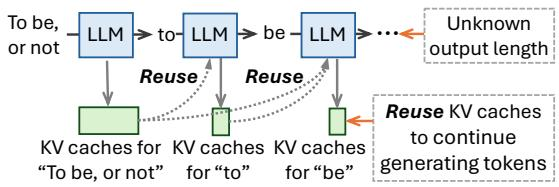

(a) Traditional generative LLM inference  
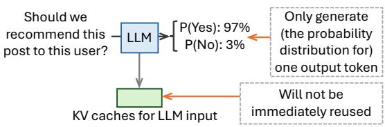

(b) Prefill-only LLM inference

Figure 1. Contrasting traditional LLM inference and prefillonly LLM inference. A prefill-only request generates only one output token and does not immediately reuse its KV caches.

typically involve cross-team collaboration and are timeconsuming. In contrast, LLMs can directly process raw data and are general enough to obviate frequent finetuning [17, 18, 49], allowing developers to interactively debug and improve quality simply by modifying prompts.

• High decision quality: By carefully choosing the LLM and engineering the prompt, LLMs can achieve comparable or even higher decision quality compared to existing production models [17].

Prefill-only workloads: Our observation is that when used in these discriminative tasks, the LLM does not generate multiple tokens. Instead, for each incoming request, it generates the probability distribution for a single output token [31, 32, 37, 48, 52]. This distribution already fully expresses the output required for these discriminative tasks. For example, in a document recommendation application, the following prompt is used: “Here is the user profile: [user profile], and here is the document: [document]. Should we recommend this document to this user? Your answer is: ”. To determine the recommendation score of this document, the LLM only needs to generate the probability distribution for one output token (i.e., the likelihood of generating Yes versus No). See §2.3 for more details. 1

In this paper, we refer to such workloads as prefill-only, because to generate one token, the LLM engine only needs to run the prefilling stage of LLM inference.

Prefill-only workloads also arise beyond discriminative tasks. For example, LLMs are widely used to generate document embeddings [64] by appending an end-of-sequence token (<EOS>) to the document and returning the hidden state of the last pre-logit layer corresponding to this token, which is also a prefill-only computation. In addition, generative applications often use prefill-decode disaggregation [46, 68] to reduce tail inter-token latency and fully utilize heterogeneous hardware; in this case, the workload on the prefill nodes is also prefill-only. See §2.4 for further discussion. Untapped opportunities: Unlike traditional LLM requests, prefill-only requests present two unique opportunities.

• Smaller active GPU memory footprint: Normally, the LLM engine stores the KV caches for all layers in GPU memory to avoid repeated computation during decoding. This requires a large amount of KV cache data, particularly when the input is long (e.g., the user profile in the example above may contain months of browsing history). For prefill-only requests, however, most KV caches will not be reused by decoding, because the engine only needs to decode one token (as shown in Figure 1). This makes it possible to significantly reduce the active GPU memory footprint during inference.

• Less uncertainty in JCT: A typical LLM request’s job completion time (JCT) is difficult to predict because the output length can be arbitrary depending on sampling [34, 47]. For prefill-only requests, however, the output length is always one, so the LLM engine knows in advance the amount of work for each request, enabling better scheduling logic.

However, existing LLM engines fall short of leveraging these properties of prefill-only workloads. Because these engines assume the output length of a request can be arbitrarily long, they must store the KV caches for all tokens at all layers in GPU memory, and their scheduling logic must account for uncertainty in JCT, rather than exploiting efficient strategies like shortest job first.

PrefillOnly fully embraces the opportunities: We present PrefillOnly, the first LLM inference engine tailored for prefillonly workloads. Its technical contribution is two-fold.

First, it uses a novel hybrid prefilling to allow the engine to keep only the KV cache for one layer, drastically reducing the active memory footprint during inference. This reduces cross-GPU communication overhead and slowdown, since each request can now fit in fewer GPUs. Yet, this is easier said than done. Naively keeping the KV cache for one layer does not directly reduce the memory footprint, since temporary tensors allocated during LLM inference still consume large amounts of GPU memory. Also, chunked prefilling reduces the size of these temporary tensors but forces the KV caches for all layers to remain in GPU memory.

Our hybrid prefilling addresses this conundrum by processing non-attention layers chunk-by-chunk while keeping attention layers unchunked. The intuition is three-fold. First, unlike chunked prefilling, which requires multiple forward passes, hybrid prefilling completes prefilling in a single forward pass. This enables the inference engine to offload or discard part of the KV caches without reloading or regenerating them later. Second, keeping attention layers unchunked maximizes the performance of attention kernels. Third, although attention layers are not chunked, hybrid prefilling still substantially reduces the GPU memory footprint, since most GPU memory usage in LLM inference comes from nonattention layers (§4.1).

Second, PrefillOnly’s scheduling logic leverages the fact that the system can pre-determine each prefill-only request’s completion time. This makes a range of classic JCT-aware scheduling algorithms possible, such as shortest job first (hereinafter shortest prefill first as the requests are prefillonly). However, this again is easier said than done. For each incoming request, its prefill time also depends on whether its prefix’s KV cache is available. Given that the stored KV caches constantly change, PrefillOnly continuously re-estimates the prefill time of all waiting requests before each scheduling step. With continuous prefill time estimation, PrefillOnly can more precisely determine the prefill time of each request for better scheduling and maximize the prefix cache hit rate (§6.3). Moreover, PrefillOnly also modifies the scheduling algorithm to improve fairness and prevent starvation (§6.3).

While conceptually the prefill-only properties are not unique to LLMs but also apply to many classic deep neural networks, the exact techniques of PrefillOnly are specialized to LLMs: PrefillOnly handles attention and non-attention layers differently via hybrid prefilling to maximally reduce GPU memory footprint. In addition, PrefillOnly continuously re-estimates prefill time to update the prefill time estimation and increase the prefix cache hit rate.

In short, our contributions are:

• We identify the emerging trend of using LLMs to substitute traditional deep-learning-based pipelines, and characterize an emerging workload — the prefill-only workload — underlying this trend.

• We present PrefillOnly, the first LLM inference engine that fully embraces the unique properties of prefill-only workloads, drastically reducing active GPU memory footprints and enabling better JCT-aware scheduling.

We implement PrefillOnly on top of an enterprise-grade LLM inference engine (vLLM [3, 29]). Our implementation generalizes to different LLMs (via torch.compile) and different hardware (as PrefillOnly does not introduce new kernels). We evaluate PrefillOnly under 4 hardware setups, 3 LLM models, and 2 traces. Our evaluation shows that PrefillOnly can handle up to 4× queries per second while still achieving lower average and P99 latency than the baselines.

## 2 Motivation

## 2.1 Preliminary of large language models

Prefilling and decoding: Large language model (LLM) inference contains two phases. The prefilling phase of an LLM processes the input and generates one output token. Then, the LLM engine runs multiple rounds of the decoding phase, where each round forwards the request through the LLM and generates one more output token.

KV caches: As LLM inference incurs multiple rounds, when processing one request, the LLM engine stores the intermediate tensors produced by the attention layers inside the GPU, known as KV caches, to accelerate future rounds of LLM inference. The size of KV caches can be large — e.g., the KV cache for a request with 100,000 tokens is around 12 GB for a medium-sized LLM model (Llama-3.1-8B).

Prefix caching: The KV caches generated by one request can be reused by another if they share the same prefix, which is commonly referred to as prefix caching. As a result, existing LLM inference engines [30, 67] will not immediately free these KV caches after request execution, but instead cache them for future requests to reuse.

## 2.2 Substituting traditional deep learning models with LLMs

In addition to generative LLM applications that generate new content for people to read and use, both industry and academia have started to use LLMs to replace traditional deep learning pipelines in recommendation, credit verification, and data labeling for the following reasons.

LLM streamlines development: Developing traditional deep learning pipelines is time-consuming and complex, as it requires co-optimizing multiple stages in the pipeline, from data cleaning to model fine-tuning, which involves cross-team collaboration and extensive infrastructure support, and eventually accumulates maintenance debt. In contrast, LLMs can take raw text as input and are general enough to eliminate frequent fine-tuning. For example, recent industry work [17] shows that a single LLM can serve over 30 tasks across more than 8 domains. As a result, developers can improve the pipeline simply by changing the prompts and can better understand pipeline behavior by interacting with the LLM to let the LLM explain its outputs.

LLM achieves higher decision quality: Further, by properly selecting the size of the LLM and engineering the prompt, LLMs can generalize to out-of-domain tasks and achieve comparable or even better performance than production models [17], especially for long-context tasks.

## 2.3 Underlying workload: prefill-only workload

We observe that these applications use LLMs differently from traditional generative applications. Concretely, each request only lets the LLM generate the probability distribution for one single output token. We call such requests prefill-only requests (as they only require the LLM engine to run prefilling), and refer to this type of workload as a prefill-only workload.

Single token suffices to express LLM’s preference: Generating the probability distribution for one single output token still allows an LLM to express its preference between different options. To illustrate, consider post recommendations. Assume that we are a social media platform that aims to recommend posts to a specific user via an LLM. The recommendation system first gathers the user’s browsing history as the user profile. Then, the system selects, for example, 50 posts that the user might be interested in via heuristics such as embedding-based similarity search. The recommendation system then sends 50 LLM requests, one per post. Here is an example request:

You are a recommendation assistant that uses a user’s profile and history to recommend the item the user is most interested in.

Here is the user profile:

[User profile]

Here is the browsing history of a user: [User browsing history]

If we recommend the following post to this user, will the user be interested in reading it? Please respond using Yes or No. [Post]

Your answer is:

We then constrain the output of the LLM to only Yes and No, and let the LLM prefill this request to generate a probability distribution over this constrained token set (P(Yes) and P(No) in this example). The recommendation system then uses P(Yes) as the recommendation score.

Lower latency: Generating one single token also significantly reduces LLM inference latency. This is because the input processing throughput (in tokens per second) of LLMs is much higher than output generation throughput (i.e., output tokens per second). Concretely, using Llama-3.1-8B and one NVIDIA H100, we measure that handling a request with 2048 input tokens and 256 output tokens is 1.5× slower than handling a request with 2048 input tokens but just 1 output token.

Clearly-defined and controlled output behavior: Prefillonly workloads also allow developers to clearly define and control the output behavior by passing a list of acceptable tokens to the LLM engine and letting it sample only from this list. In contrast, it is difficult to clearly define and guarantee the expected output behavior in traditional generative requests, which has motivated a long line of research [13, 59]. Characteristics of prefill-only workload: We conclude two characteristics of prefill-only workloads. First, the input length of prefill-only requests is typically long. For example, in a document recommendation application, the user profile potentially contains months of browsing history, which can easily reach tens of thousands of tokens or more. Second, different from a traditional LLM workload that is GPUmemory-bound, a prefill-only workload is bounded by GPU computation [29, 46, 69] unless the context length becomes so long that the inference engine cannot fully store the KV caches in GPU memory.

## 2.4 Prefill-only workloads beyond discriminative tasks

LLMs for embedding generation: LLMs are increasingly deployed to generate embeddings for documents and queries, which are then consumed by reranking stages in recommendation pipelines or by similarity search modules in retrievalaugmented generation (RAG) applications. For example, Qwen3- Embedding [64] appends an end-of-sequence token to the input and returns the hidden state of the final pre-logit layer corresponding to this token. Such inference is prefill-only.

Prefill–decode disaggregation: In generative applications, batching prefill-phase and decode-phase requests together at scale is less common, as it fails to deliver sufficient goodput under time to first token (TTFT) and inter token latency (ITL) service-level objectives (SLOs). First, such batching inflates tail ITL even with chunked prefilling [5], leading to higher SLO violation rates. Second, it couples prefill and decode to the same parallelism strategy, even though the optimal strategies for these phases typically differ depending on SLO targets and hardware. As a result, recent systems [43, 46, 68] disaggregate prefill and decode onto separate node pools to maximize goodput. The workload on prefill nodes is prefillonly.

## 2.5 Sharing GPU resources with generative LLM workload is impractical

We argue that a prefill-only workload typically has its own dedicated GPU resources and does not share them with generative LLM workloads. This is because in the use cases involving prefill-only workloads, the LLMs are usually trained for those specific use cases and thus are not reused to serve generative workloads. For example, in recommendation, the LLMs are trained on user engagement data [17, 21, 25, 64] to maximize the performance of the recommendation application.

## 2.6 Limitation of existing LLM engines

In practice, we observe two issues that result in suboptimal latency-throughput trade-off when handling prefill-only workloads using existing inference engines.

Trade throughput to handle long requests: As existing LLM engines fully store the KV caches, this limits the maximum input length (MIL) they can handle, since the size of KV caches is large and scales linearly with input length. For example, the MIL is only 11,000 tokens on an NVIDIA A100 40GB GPU with the Qwen-32B model (FP8-quantized).

As a result, when the expected maximum request length exceeds MIL, LLM engines must choose one of the following approaches, all of which reduce throughput:

• Chunked prefilling. Chunked prefilling processes the request chunk-by-chunk so that the engine can handle longer requests without parallelization. However, chunking attention layers reduces attention kernel performance, lowering throughput. Concretely, we measure that chunked prefill lowers end-to-end throughput by 14% when chunking an input length of 20,000 with a chunk size of 512. Moreover, this technique can only increase MIL by less than 2× (as shown in Table 2), since it forces the engine to fully store the KV caches for all previous chunks.

• Tensor parallelism. One can increase MIL using tensor parallelism. However, although tensor parallelism can reduce latency when used with high-speed interconnects such as NVLink, it may instead inflate latency when such interconnects are unavailable, and it always decreases overall throughput. This is because tensor parallelism requires expensive all-reduce communication between GPUs, which consumes significant GPU time even with NVLink, leaving GPU computation under-utilized.

• Pipeline parallelism. One can also increase MIL using pipeline parallelism. Since its communication overhead is much lower than tensor parallelism, pipeline parallelism ideally has the same latency–throughput trade-off as non-parallelized inference on the same number of GPUs. However, pipeline parallelism introduces bubbles when request lengths vary, resulting in suboptimal tradeoffs. These bubbles can be reduced by chunking inputs into fixed sizes via chunked prefilling, but chunked prefilling itself reduces throughput as noted above.

We further discuss parallelization-based solutions in the prefix caching scenario (§5.2).

Scheduling algorithm is unaware of JCT: Existing LLM engines typically rely on JCT-agnostic scheduling, such as first-come-first-serve, because the output length of LLM requests can be non-deterministic and difficult to predict. If JCT can be accurately estimated, JCT-aware scheduling (such as shortest remaining job first) could be used to further reduce request latency.

## 2.7 Opportunity and challenges

In prefill-only workloads, we identify two optimization opportunities:

• The active GPU memory of prefill-only inference is much lower — the generated KV caches will not be reused for future decoding, so they can potentially be offloaded or discarded from the GPU (as shown in Figure 1). This allows much longer requests to be handled without resorting to solutions that degrade throughput, such as parallelizing the KV caches or chunking the input.

• The JCT of prefill-only requests is deterministic and predictable, since the output length is always 1.

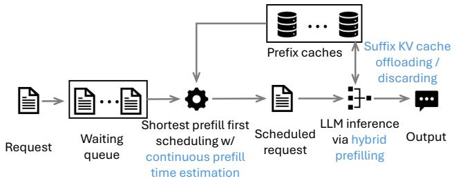  
Figure 2. Overview of PrefillOnly and its core techniques (highlighted in blue).

A naive solution to leverage the opportunities above is offline profiling of how JCT changes with request length. In the online phase, the LLM engine uses this JCT profile to estimate the JCT of each incoming request and then schedules waiting requests using JCT-aware algorithms (e.g., shortest job first), while discarding the KV caches during inference. This solution is widely adopted in traditional deep learning systems, but it has two limitations:

Simply dropping KV caches increases MIL marginally: Ideally, if the inference engine drops the KV caches immediately after each attention layer is computed, it only needs to reserve GPU memory for the KV caches temporarily generated by current attention layer. In principle, this would enlarge the MIL by up to number-of-layer times, compared to storing the KV caches for all layers. However, in practice we observe that dropping the KV caches yields only a 1.6× improvement in MIL, measured on an NVIDIA L4 with the Llama-3.1-8B model. Moreover, although the exact improvement depends on hardware, the theoretical maximum MIL improvement is capped at about 2.41×.2 The key reason is that LLM inference itself allocates large temporary tensors, which consume substantial GPU memory and ultimately limit MIL. See §4.1 for further analysis.

Incompatible with prefix caching: Existing LLM engines store KV caches so that future requests with the same prefix can be accelerated. This technique, known as prefix caching, is incompatible with fully discarding the KV caches.

## 3 Overview

To maximize the latency–throughput trade-off in prefill-only workloads, we propose PrefillOnly, the first inference engine tailored for prefill-only workloads, built on top of a production-level serving engine (vLLM [3, 29]).

## 3.1 Overview of PrefillOnly

The workflow of PrefillOnly proceeds as follows.

2Based on the numbers in Figure 4, storing all-layer KV caches plus temporary tensors for the input and output of SwiGLU activation requires 32 × 2048 floats/token + (28672 + 14336) floats/token. In contrast, naively discarding the KV caches still requires temporarily storing the KV cache for one layer, along with the temporary tensors for SwiGLU activation, leading to 2048 floats/token + (28672 + 14336) floats/token. As a result, the maximum improvement is capped at about 2.41×.

Profile run: PrefillOnly requires the user to provide the maximum input length (MIL). Based on this MIL, PrefillOnly estimates the GPU memory requirement by forwarding a synthetic request of maximum length through the LLM model and measuring peak GPU memory usage during this process. The remaining GPU memory is then reserved for prefix KV caches.

During runtime: PrefillOnly launches an HTTP server compatible with the OpenAI API protocol, through which users send prefill-only requests. When a new request arrives, PrefillOnly tokenizes it and sends it to the scheduler process via ZeroMQ-based RPC. The scheduler then schedules requests at the granularity of a step. During each step, PrefillOnly iterates through the waiting queue, selects the request with the minimum estimated prefill time (details in §3.2), pops it from the queue, and sends it to the executor processes. The executors then perform the prefill-only inference (details in §3.2) and return the probability distribution of the first output token back to the user.

The overall workflow is summarized in Figure 2.

## 3.2 Core techniques of PrefillOnly

At its core, PrefillOnly integrates three techniques that increase MIL and throughput for prefill-only requests (illustrated in Figure 2):

• Hybrid prefilling: PrefillOnly processes non-attention layers chunk-by-chunk while keeping attention layers unchunked. This approach significantly increases MIL by reducing the GPU memory footprint of non-attention layers, while preserving full attention kernel performance. It also enables PrefillOnly to discard part of the KV caches when they are not needed, further lowering memory usage.

• Suffix KV cache discarding/offloading: When KV caches cannot fit into GPU memory, PrefillOnly discards (or offloads) the KV caches of suffix tokens. This allows it to handle much longer requests without relying on techniques such as chunked prefilling or parallelization, which introduce extra overhead and reduce throughput. In this paper, for simplicity, we discard suffix KV caches; in practice, they may also be offloaded to CPU memory using solutions like LMCache [40] or Mooncake Store [4].

• Shortest prefill first with continuous prefill time estimation: PrefillOnly continuously re-estimates the prefill time of each request based on prefix cache status and schedules the request with the shortest estimated prefill time. This maximizes the benefit of shortest prefill first while also improving KV cache locality [8], leading to a higher prefix cache hit rate.

Comparing against prior techniques:

• Chunked prefilling [5]: Both chunked and hybrid prefilling reduce GPU memory footprint. However, hybrid prefilling enables further memory reduction by allowing KV caches to be stored directly in GPU memory, while chunked prefilling requires reloading KV caches from previous chunks for subsequent steps.

• Suffix token eviction [29, 67]: Unlike vLLM, which drops KV caches only after request execution, PrefillOnly can drop caches during execution (enabled by the prefill-only workload), allowing it to handle longer requests.

• Prefix-aware scheduling (e.g.,, D2LPM): Like this line of work, our scheduling improves prefix cache locality, since requests with longer prefix cache hits generally have shorter prefill times. However, PrefillOnly also considers the number of tokens not hitting the cache (and could incorporate prefix cache loading time, though not implemented here). As a result, PrefillOnly performs better in workloads where the shared prefix length is relatively fixed.

## 4 Hybrid prefilling

In this section, we first introduce hybrid prefilling, the key optimization for PrefillOnly to improve MIL by maximally controlling the GPU memory footprint during prefilling.

## 4.1 Bottleneck: intermediate tensors of linear layers

As mentioned in §2.6, simple solutions only marginally increase MIL: storing the KV cache for one active layer increases MIL by merely 1.6×, while chunked prefilling increases MIL by 2× but at the cost of reduced kernel performance in attention operations, thereby lowering throughput.

To understand why simply discarding the KV cache for one active layer is insufficient, we profile how the PyTorch GPU memory allocator usage varies over time when prefilling a request with 32, 768 tokens using the Llama-3.1-8B model.

As shown in Figure 3a, there are periodic spikes during prefilling. These spikes correspond to intermediate tensors allocated to store the input and output of the MLP module (a sequence of linear layers) inside Llama models. These tensors are large, as they contain 28,672 floats per token— 14× larger than the KV cache size for one layer (2048 floats per token). To illustrate why, we visualize the forward pass of the MLP module in Llama-3.1-8B in Figure 4, along with each intermediate tensor’s shape and GPU memory footprint in bfloat16 precision.

This trend—that intermediate tensors allocated by linear layers are much larger than the KV cache for one layer— applies to a wide range of LLMs. This is because modern LLMs deliberately reduce KV cache size (to increase decoding throughput by enabling larger batch sizes, and to handle longer requests) without reducing the total number of model parameters. As a result, the tensor size in the MLP module must be increased to incorporate sufficient parameters into the linear layers.

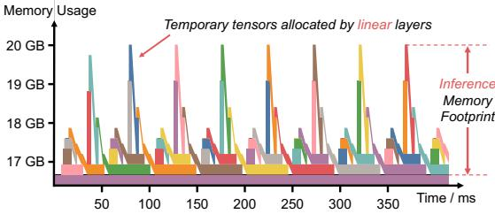

(a) Without hybrid prefilling  
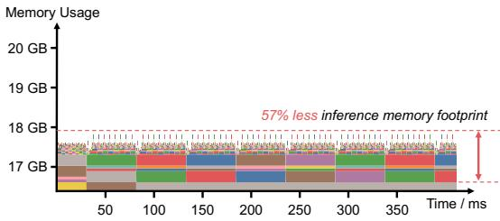  
(b) With hybrid prefilling

Figure 3. GPU memory traces of prefilling 32,768 tokens through Llama-3.1-8B. Intermediate tensors allocated by linear layers create large GPU memory spikes and substantially increase peak memory usage, while hybrid prefilling forwards the linear layers chunk-by-chunk and thus significantly reduces the inference memory footprint.  
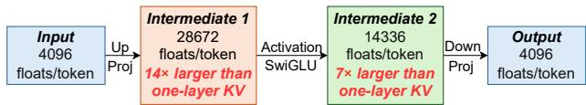  
Figure 4. Intermediate tensor sizes in the MLP module of Llama-3.1-8B. The intermediate tensors are much larger than the KV cache for one layer (2048 floats per token).

## 4.2 Controlling intermediate tensors via hybrid prefilling

To control the size of intermediate tensors, we propose hybrid prefilling, where non-attention layers are processed chunkby-chunk, while attention layers are handled without chunking. This hybrid prefilling does not alter inference correctness, because non-attention layers are linear layers and thus each chunk can be computed independently.

To show why hybrid prefilling reduces the GPU memory footprint of non-attention layers, we contrast traditional prefilling and hybrid prefilling in Figure 3. In traditional prefilling, GPU memory traces contain high peaks as intermediate tensors for all input tokens must be stored in GPU. In hybrid prefilling, only one chunk’s intermediate tensor is stored at a time, substantially reducing peak GPU memory usage.

## 4.3 Implementing hybrid prefilling via torch.compile

We employ torch.compile to implement hybrid prefilling. torch.compile is a PyTorch feature that allows modifying the computation graph without rewriting the model inference code.

We implement hybrid prefilling on top of the computation graph compiled by torch.compile. Specifically, we group consecutive linear operations into a large virtual layer. Then, we forward through this virtual layer chunk-by-chunk and concatenate the output tensors of each chunk at the end.

We further apply two optimizations:

• Output preallocation: Concatenating output chunks into a large tensor doubles the GPU memory usage. To avoid this, we preallocate the full output tensor using shape information inferred from the graph and directly write each chunk’s output into this preallocated tensor.

• In-place computation: If input and output tensors have the same shape, we reuse the input tensor’s memory for the output. This is possible because the relative offset of each output chunk matches that of the input chunk.

We evaluate these optimizations in §7.

## 5 Enabling prefix caching

In this section, we illustrate how PrefillOnly enables prefix caching while still preserving the benefit of not storing full KV caches in GPU.

## 5.1 Suffix KV cache discarding / offloading

To simultaneously enable prefix caching and allow PrefillOnly to increase MIL without storing all KV caches in GPU, we propose suffix KV cache discarding / offloading, where PrefillOnly maximally preserves the KV cache of prefix tokens in GPU and discards or offloads the KV cache of suffix tokens. Determining the discarding / offloading length: In the profiling run of PrefillOnly (§3.1), we profile the maximum number of tokens that can be cached in GPU. At runtime, PrefillOnly then discards or offloads the KV caches for suffix tokens if the request length exceeds this limit.

Compared to suffix KV cache eviction (widely used by existing inference engines [29, 67]) that discards the KV caches after the inference of the request, PrefillOnly discards the KV cache during the inference of that request and thus can handle longer requests.

We note that hybrid prefilling is the enabler of this technique, since it completes prefilling within a single LLM inference, allowing part of the KV cache to be discarded or offloaded without needing to regenerate or reload it for later rounds of LLM inference.

Implementation: Currently, our implementation of PrefillOnly discards only the KV cache of suffix tokens. These suffix KV caches can be offloaded using frameworks such as

LMCache [40] or Mooncake Store [4], and we leave this extention to future work. Our implementation does not modify hardware kernels; instead, it reuses the abstractions created by sliding window attention in vLLM [3] to implement suffix KV cache discarding.

## 5.2 Limitation of suffix KV cache discarding

Suffix KV cache discarding allows PrefillOnly to handle longer requests without adding communication overhead from inference parallelization, thus increasing throughput. However, compared to parallelization-based approaches, it provides substantially smaller GPU prefix cache space (since parallelization enables each GPU to hold only a slice of KV caches and model parameters). As a result, when prefix cache space itself becomes the bottleneck (e.g., workloads with long requests and heavy prefix sharing), parallelization-based approaches are preferable to suffix KV cache discarding.

## 6 Scheduling in the context of prefix caching

In this section, we discuss the scheduling algorithm of PrefillOnly in the context of prefix caching. We first explain why PrefillOnly does not batch prefill-only requests. We then explain why simple scheduling like shortest prefill first can have low prefix cache hit rate in prefix caching scenario, and propose continuous prefill time estimation to improve the prefix cache hit rate.

## 6.1 Why not batching prefill-only requests

In traditional LLM workloads, inference is typically bounded by GPU memory [29, 60, 67]. To maximize output generation throughput (i.e., decoding throughput), the engine maintains a large batch by continuously adding new requests and removing completed ones [29, 60, 67].

However, as shown in §2.3, prefill-only workloads are generally computation-bound (unless requests are so long that their KV caches cannot fully fit in GPU memory). Thus, batching prefill-only requests does not increase throughput. As a result, PrefillOnly processes prefill-only requests sequentially rather than batching them.

## 6.2 Limitation of traditional JCT-aware scheduling

Traditional JCT-aware scheduling, such as shortest job first (we call it shortest prefill first hereinafter), estimates the execution time of each request (i.e., prefill time) at arrival and executes the request with the lowest execution time.

However, in the context of prefix caching this approach achieves low cache hit rates, leading to higher latency and lower throughput. The reason is that the prefill time of one request changes dynamically: it decreases when a relevant prefix cache is present and increases when that cache has been evicted. Therefore, if the inference engine estimates the prefill time upon request arrival, it will fail to timely prioritize requests that could benefit from newly-generated prefix cache, and when it finally processes those requests the prefix cache may have already been evicted, leading to lower prefix cache hit rate.

```csv
Request A, B arrives first, and request C, D comes right after.
Request length: A < C < B < D
A, D share prefix, and B, C share prefix
(ideally, we can cache hit 2 times)
Assume that GPU can only store the prefix cache of one request
FIFO Req A Req B(Evict A’s cache) Req C(Cache Req D(Cache miss)
SPF Req A Req C(Evict A’s cache) Req B(Cache hit) Req D(Cache miss)
. ?!"#$%&&: A<B, Request C, D arrive. Estimate $T _ { p r e f i l l }$ immediately.
schedule A ?!"#$%&& : C < B < D. Schedule in order C, B, D.
Ours Req A Req D(Cache hit) Req C(Evict A’s cache) Req B(Cache hit) cache hit2 times!
?!"#$%&& : D can hit the cache, so  C is shorter, so Re-estimate ?!"#$%&&. Re-estimate ?!"#$%&& . Schedule B
A<B, schedule A ?!"#$%&& : D < C < B, schedule D Time?!"#$%&& : C < B, schedule C
```  
Figure 5. Contrasting first-in-first-out (FIFO), shortest prefill first (SPF), and PrefillOnly’s scheduling. PrefillOnly achieves two cache hits while other methods have only one cache hit.

## 6.3 Continuous prefill time estimation

Algorithm 1 Shortest prefill first scheduling with continu  
ous prefill time estimation   
1: At each scheduling step:   
2: Input: Waiting queue ?? of requests   
3: Output: Request ??next to schedule   
4: ??shortest ← None   
5: ??????????min ← ∞   
6: for each request ?? ∈ ?? do   
7: ??input ← number of input tokens in ??   
8: ??cached ← number of tokens in ?? that hit prefix cache   
9: ??queue ← queuing time of ??   
10: ?????????? $ T _ { \mathrm { p r e f l l } } ( n _ { \mathrm { i n p u t } } , n _ { \mathrm { c a c h e d } } ) - \lambda \cdot T _ { \mathrm { q u e u e } }$   
11: if ?????????? < ??????????min then   
12: ??????????min ← ??????????   
13: ??shortest ← ??   
14: end if   
15: end for   
16: Schedule ??shortest

To improve prefix cache hit rates, PrefillOnly employs continuous prefill time estimation, recalibrating the prefill time of all waiting requests at each scheduling decision.

This substantially increases hit rates, since the scheduler can immediately prioritize requests that benefit from cache hits (lowering their prefill time), allowing them to be executed before eviction.

Example: Figure 5 contrasts FIFO, shortest prefill first (SPF), and PrefillOnly ’s scheduling. In the example, requests A and

B arrive first, followed by C and D. Request-length-wise A $< \mathrm { C } < \mathrm { B } < \mathrm { D } .$ . Assume A and D share a prefix, and B and C share a prefix. Ideally, there should be two cache hits. We also assume GPU cache can store only one prefix at a time. In this setting, only PrefillOnly achieves the ideal two cache hits, while FIFO and naive SPF achieve one. Concretely:

• FIFO: Requests are scheduled as A, B, C, D. C hits B’s cache, but D misses since A’s cache was evicted by B. Total: 1 cache hit.

• SPF: A is scheduled first (shorter than B). While A runs, C and D arrive. Since A’s cache is not yet written into prefix cache, the prefill time of C and D are estimated as if they both miss the prefix cache. Thus, the scheduling order is C, B, D. B hits C’s cache, but D misses since A’s cache was evicted. Total: 1 cache hit.

• PrefillOnly: A is scheduled first. At the next step, C and D already arrived, and PrefillOnly re-estimates the prefill time for all waiting requests $( i . e . , \mathrm { { B } } , \mathrm { { C } } ,$ and D). D’s prefill time estimation is lowered as it can hit A’s cache, so D is scheduled next. Then C (shorter than B), then B (which hits C’s cache). Total: 2 cache hits.

Calibration details: As shown in Algorithm 1, PrefillOnly recalibrates the prefill time by computing input length $n _ { \mathrm { i n p u t } } ,$ cache hits $n _ { \mathrm { c a c h e d } }$ , and estimating the prefill time by using $T _ { \mathrm { p r e f i l l } } ( n _ { \mathrm { i n p u t } } , n _ { \mathrm { c a c h e d } } )$

Proxy for $T _ { \mathrm { p r e f i l l } } ( n _ { \mathrm { i n p u t } } , n _ { \mathrm { c a c h e d } } )$ : Because the prefill time depends on multiple factors (e.g., GPU type, kernel efficiency, speculative decoding), exact estimation requires extensive profiling. As a result, PrefillOnly instead uses the number of cache-miss tokens $( n _ { \mathrm { i n p u t } } - n _ { \mathrm { c a c h e d } } )$ as a proxy of prefill time. The advantage of this proxy is two-fold:

• General: independent of hardware or inference engine implementation.

• Accurate: on 1×A100, the Pearson correlation between $T _ { \mathrm { p r e f i l l } } ( n _ { \mathrm { i n p u t } } , n _ { \mathrm { c a c h e d } } )$ and $n _ { \mathrm { i n p u t } } { - } n _ { \mathrm { c a c h e d } }$ is 0.987 for Qwen-32B with FP8 quantization.

Preventing starvation: To prevent starvation, we offset the estimated prefill time by $- \lambda \cdot T _ { \mathrm { q u e u e } } ,$ , where $T _ { \mathrm { q u e u e } }$ is the queuing time and ?? is a hyperparameter: higher ?? improves worst-case latency at the cost of average latency.

We summarize the scheduling algorithm in Algorithm 1.

## 7 Evaluation

Our evaluation shows that:

• PrefillOnly handles 1.4 − 4.0× larger query-per-second without inflating the average latency and P99 latency compared to baselines.

• PrefillOnly expands the maximum request length by up to 5× without requiring parallelizing the LLM inference.

## 7.1 Evaluation setup

In this subsection, we introduce the dataset, GPUs, LLM models, evaluation metrics, and baselines in our evaluation.

Existing LLM datasets mainly focus on evaluating the LLM accuracy instead of the performance of the LLM engine. As a result, in our evaluation, we use two simulated datasets, covering two tasks: post recommendation on a social media platform and credit verification for a bank application. We summarize our evaluation dataset in Table 1.

Why simulated dataset: Since prefill-only inference is relatively new, we did not find realistic production traces available online. Thus, we simulate the dataset, where we ensure that the workload characteristics (e.g., request length and request construction) are as realistic as possible (except for the exact choice of input tokens, which does not affect the throughput or latency of PrefillOnly and baselines).

Post recommendation dataset: In this dataset, we aim to evaluate the benefit of PrefillOnly under a short context scenario, where the major benefit of PrefillOnly comes from its scheduling. Concretely, we simulate a post recommendation scenario, where we recommend 10 out of 50 posts for a given user, based on the browsing history of this user using 10 requests3. The key attributes from the perspective of LLM engine performance are the following parameters:

• Post length: To get a rough estimation of the post length, in terms of number of tokens, we take X as an example, and measured that the number of tokens for a short X post is less than 150 tokens. As a result, we use 150 tokens as the post length.

• Number of posts to be recommended per user: We set the number of posts to be recommended per user as 50. We assume that these 50 posts are given by the underlying recommendation systems using heuristics like embedding-based similarity search.

• User profile length: As for the user profile length, we focus on the click history of one user, where the user has already been engaged with the social media four times a week, and for four weeks. We assume that each time the user only clicks on five or six posts. As a result, the total length of the profile history is roughly 11,000 to 17,000 tokens. Based on this, we use a normal distribution to simulate the user profile length, with a mean as 14,000 and a standard deviation of 3,000.

• Number of users: We evaluated 20 users in total.

Credit verification dataset: In this dataset, our goal is to simulate a credit verification scenario. This dataset has much longer input (due to long credit history), and thus

<table><tr><td>Dataset</td><td>Why evaluating this dataset</td><td>#ofusers</td><td>User profile length</td><td>Post length</td><td># of requests per user</td><td>Total # of tokens</td></tr><tr><td>Post recommendation</td><td>Evaluate the ability of PrefillOnly under frequent prefix cache reuse</td><td>20</td><td>11,000 tokens － 17,000 tokens</td><td>150 tokens</td><td>50 (Each request corresponds~ 14,000,000 to one post)</td><td></td></tr><tr><td>Credit verification</td><td>Evaluate the ability of PrefillOnly under long input length</td><td>60</td><td>40,000 tokens - 60,000 tokens</td><td>N/A</td><td>1</td><td>~3,000,000</td></tr></table>

Table 1. Summarizing the dataset used in the evaluation of PrefillOnly and baselines.

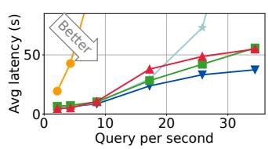  
(a) Post recommendation L4 QPS — mean latency

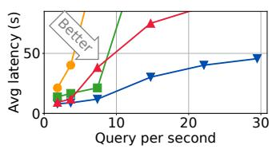  
(b) Post recommendation A100 QPS — mean latency

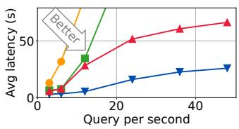  
(c) Post recommendation H100 w/o NVLink QPS — mean latency

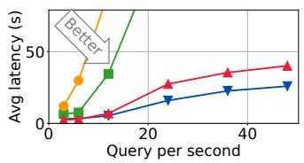  
(d) Post recommendation H100 w/ NVLink QPS — mean latency

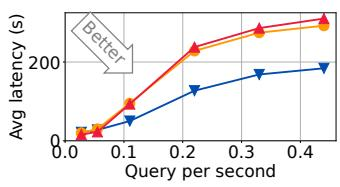  
L4  
(e) Credit verification

QPS — mean latency  
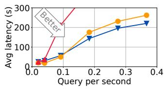  
(f) Credit verification  
A100

QPS — mean latency  
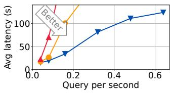  
(g) Credit verification

H100 w/o NVLink  
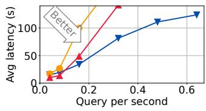  
QPS — mean latency  
(h) Credit verification  
H100 w/ NVLink

QPS — mean latency  
Figure 6. QPS — mean latency trade-off of PrefillOnly and baselines on four different hardware setups and two applications. PrefillOnly significantly reduces the latency when the QPS is high and only has higher QPS than tensor parallel baseline when QPS is low. Though tensor parallelism sometimes have lower latency than PrefillOnly under low QPS, it has much lower throughput than PrefillOnly due to extra communication cost and thus scales much worse than PrefillOnly in high QPS.
<table><tr><td rowspan="2">Config</td><td colspan="3">Max input length (measured by number of tokens)</td></tr><tr><td>L4</td><td>A100</td><td>H100</td></tr><tr><td>Paged</td><td>24,000</td><td>11,000</td><td>15,000</td></tr><tr><td rowspan="2">Attention Chunked</td><td>WL1:√,WL2: ×</td><td>WL1: ×,WL2: ×</td><td>WL1: ×,WL2: ×</td></tr><tr><td>46,000</td><td>17,000</td><td>25,000</td></tr><tr><td rowspan="2">Prefill Pipeline</td><td>WL1:√,WL2: X</td><td>WL1:√,WL2: X</td><td>WL1:√,WL2: X</td></tr><tr><td>72,000</td><td>38,000</td><td>183,000</td></tr><tr><td>Parallel</td><td>WL1:√,WL2:</td><td>WL1:√,WL2:</td><td>WL1:√,WL2:</td></tr><tr><td rowspan="2">Tensor Parallel</td><td>195,000</td><td>77,000</td><td>238,000</td></tr><tr><td>WL1:√,WL2:</td><td>WL1:√,WL2:</td><td>WL1:√,WL2:</td></tr><tr><td rowspan="2">PrefillOnly (ours)</td><td>130,000</td><td>87,000</td><td>97,000</td></tr><tr><td>WL1:√,WL2:</td><td>WL1:√,WL2:</td><td>WL1:√,WL2:</td></tr></table>

Table 2. Evaluating the max input length that PrefillOnly and baselines can handle under various hardware setups. WL1 indicates the post recommendation workload, and WL2 indicates the credit verification workload. × means that the max input length is insufficient to run corresponding workload.

the major benefit of PrefillOnly comes from being able to handle long context length without parallelism. Concretely, we measure the length of credit history for one month by tokenizing personal bank statement, which leads to 4,000 to 6,000 tokens. We simulate 10 months of credit history, resulting in a credit history length from 40,000 to 60,000 for each user. We consider 60 users in total.

Request arrival pattern: We assume that the user arrival pattern is a Poisson process, where in our evaluation we vary the rate in the Poisson process to adjust the request incoming rate (i.e., query per second).

Hardware and LLM setup: We summarize the hardware and the LLM setup in Table 3.

PrefillOnly: We implement PrefillOnly based on state-ofthe-art LLM serving engine vLLM [3], with 4.6k lines of Python code to implement the core techniques of PrefillOnly. We set the fairness parameter ?? = 500 by default.

Baselines: We pick four baselines, where two of them parallelize the LLM inference (tensor parallel and pipeline parallel) and the other two do not parallelize the inference (PagedAttention [29] and chunked prefilling [5]):

• Tensor parallel. In this baseline, we parallelize the inference onto 2 GPUs with the degree of tensor parallelism equal to 2 using the existing implementation available in production-grade inference engine vLLM [3].

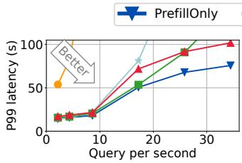  
(a) Post recommendation L4 QPS — p99 latency

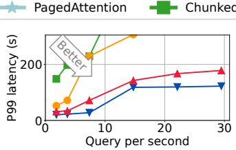

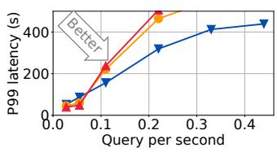

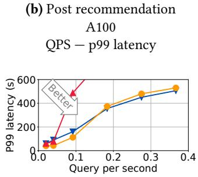

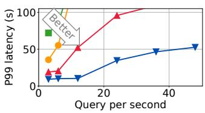

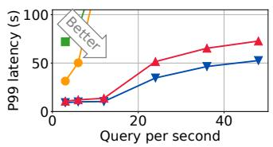

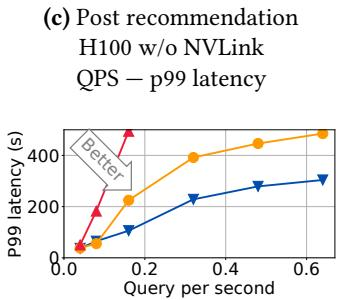

(d) Post recommendation H100 w/ NVLink QPS — p99 latency  
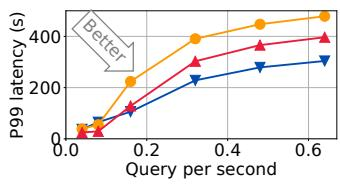

Figure 7. QPS — P99 latency trade-off of PrefillOnly and baselines on three different hardware setups and two applications.
<table><tr><td>Scenario</td><td>GPU Type</td><td>LLMModel</td></tr><tr><td>Low-end GPU</td><td>2x NVIDIA L4PCIe (24 GB)</td><td>meta-llama/ Llama-3.1-8B</td></tr><tr><td>Middle-end GPU</td><td>2x NVIDA A100 PCIe (40 GB)</td><td>RedHatAI/ DeepSeek-R1-Distil- Qwen-32B-FP8-dynamic</td></tr><tr><td>High-end GPU</td><td>2x NVIDIA H100 PCIe (80 GB)</td><td>Infermatic/ Llama-3.3-70B-Instruct- FP8-Dynamic</td></tr><tr><td>High-end GPU w/ NVLink</td><td>2x NVIDIA H100 NVLink (80 GB)</td><td>Infermatic/ Llama-3.3-70B-Instruct- FP8-Dynamic</td></tr></table>

Table 3. The hardware and the corresponding LLM.

• Pipeline parallel. In this baseline, we parallelize the inference onto 2 GPUs with the degree of pipeline parallelism equal to 2. We also use the implementation in vLLM [3].

• PagedAttention [29]. This baseline manages the KV caches using a page table to minimize fragmentation and employs first-come-first-serve scheduling.

• Chunked prefilling [5]. This baseline processes the LLM input chunk-by-chunk to allow handling longer requests. Note that we enable prefix caching for PrefillOnly and baselines. Also, some baselines cannot handle some workloads as their maximum input length is too short (shown in Table 2). Routing: We note that, for PrefillOnly and non-parallelizationbased baselines, in order to utilize multiple GPUs, we launch multiple instances of LLM inference engines, one on each GPU, and then perform user-id-based routing, where we route the request from the same user to the same instance, and decide which user should be assigned to which instance in a round-robin manner.

## 7.2 Evaluation results

QPS–latency trade-off: We show the trade-off between query per second (QPS) and latency (mean latency and p99 latency) across three different hardware setups and two different applications in Figure 6. In this figure, we determine the evaluation QPS by running PrefillOnly with all requests in the dataset coming at once, and then obtain the throughput (requests per second) of PrefillOnly in this situation, where we denote this value as ??. We then evaluate QPS 1/4??, 1/2??, ??, 2??, 3??, 4??. This approach allows us to show the full spectrum performance of PrefillOnly.

In Figure 6, we see that PrefillOnly always achieves lowest latency when the QPS is high, indicating that the throughput of PrefillOnly is significantly higher than the baselines. However, in low QPS the latency of PrefillOnly can be higher than parallelization-based baselines as PrefillOnly does not parallelize the inference.

We also show in Figure 7 that PrefillOnly achieves better P99 latency than baselines, indicating that the shortest prefill first scheduling of PrefillOnly does not hurt P99 latency after applying the fairness twist mentioned in §6.3.

Source of improvement: We analyze the source of improvement of PrefillOnly on two datasets.

• Post recommendation To understand the source of improvement of PrefillOnly, we show how the throughput of PrefillOnly and baselines varies with respect to query per second in Figure 8. We can see that the query per second of chunked prefilling baseline drops as it uses first-come-first-serve scheduling that yields low cache hit rate under constrained GPU prefix cache space (i.e., prefix cache thrashing), and PrefillOnly avoids such thrashing by using continuous prefill time estimation to identify and prioritize requests that can hit the prefix cache. Parallelization-based baselines parallelize the prefix caches across GPUs and thus have sufficient prefix cache space to avoid thrashing, but they have lower throughput because of extra communication and synchronization cost.

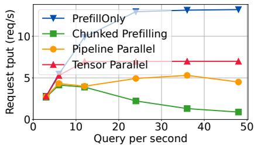  
Figure 8. Illustrating the throughput of PrefillOnly and the baselines in post recommendation dataset under 2× H100 without NVLink. PrefillOnly has better improvement as it can maintain high throughput under high query-per-second, while the query per second of chunked prefilling baseline drops as it uses first-come-first-serve scheduling that yields low cache hit rate under constrained GPU prefix cache space (i.e., prefix cache thrashing). Parallelization-based baselines parallelize the prefix cache across GPUs and thus have sufficient prefix cache space to avoid prefix cache thrashing, but they have lower throughput because of extra communication and synchronization cost.

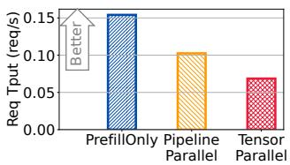  
(a) Throughput

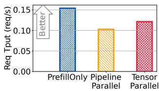  
w/o NVLink  
(b) Throughput  
w/ NVLink  
Figure 9. Contrasting the throughput of PrefillOnly and baselines on credit verification workload under 2× H100. Though NVLink significantly accelerates the communication and thus enhances the throughput of communication-intensive parallelization like tensor parallel, PrefillOnly still has the highest throughput as it does not spend extra communication to parallelize the inference.

• Credit verification: The main reason PrefillOnly performs better than other baselines under high QPS is because PrefillOnly can handle long context without parallelizing LLM inference, where a parallelization-based solution will have GPU idle time due to expensive all-reduce communication in the tensor parallel baseline, or the pipeline bubbles in the pipeline parallel baseline. To visualize the effect of GPU communication, we contrast the throughput of PrefillOnly and parallelization solutions between using NVLink and not using NVLink in Figure 9. We can see that, though having NVLink can significantly improve the throughput of the tensor parallel baseline due to much faster all-reduce communication, PrefillOnly still has better throughput as it does not spend extra communication to parallelize the inference.

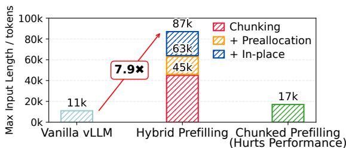

Figure 10. Hybrid prefilling improves the MIL by 7.9× without hurting the throughput, measured on a Qwen-2.5-32B model with fp8 quantization on an A100 GPU.  
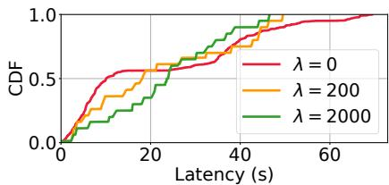  
Figure 11. The CDF of request latency of PrefillOnly, under different value of fairness parameter ??. Higher ?? result in better P99 latency, at the cost of inflating the average latency.

Hybrid prefilling largely improves MIL: PrefillOnly can improve the maximum input length of LLM to up to 5× compared to the non-parallelization-based baseline (as shown in Table 2) without reducing throughput. Further, to show that hybrid prefilling can effectively enlarge the maximum input length (MIL), we plot how our individual techniques contribute to MIL. From Figure 10, we can see that compared to the chunked prefilling baseline, PrefillOnly can improve the maximum context length of a Qwen-2.5-32B model in fp8 precision on an A100 GPU by more than 8.7×. We note that, though chunked prefilling can also improve the MIL, it sacrifices both latency and throughput since it chunks the input and thus reduces GPU kernel efficiency.

Varying the fairness parameter ??: We vary the CDF of request latency of PrefillOnly, under different values of fairness parameter ?? in Figure 11. Higher ?? results in better P99 latency, at the cost of inflating the average latency.

## 8 Related Work

LLM inference engines: After HuggingFace transformers standardized the way people access open-source LLMs, people started to engineer LLM inference engines that can serve

LLMs with high throughput and low latency. Orca [60] introduces continuous batching that schedules LLM inference in token granularity instead of request granularity, allowing the LLM to significantly enlarge the batch size and improve the decoding throughput. vLLM [29] further lowers the GPU memory management granularity from request granularity to token granularity, thus minimizing GPU memory fragmentation, which leads to larger batch sizes and thus larger decoding throughput. DistServe [68] disaggregates prefill and decode across GPUs which significantly improves the goodput under TTFT and TPOT SLO constraints.

However, these inference engines are suboptimal for prefillonly workload, as the prefill-only request does not require decoding, so fully storing the KV caches unnecessarily enlarges the GPU footprint and does not accelerate this request. Also, the JCT of prefill-only requests is deterministic, which enables one to improve the scheduling by predicting JCT.

LLM caching systems: Beyond simple prefix caching [10, 11, 27, 36, 67], recent literature started to explore KV cache compression [23, 28, 38, 39, 65] to reduce KV cache size, and KV cache blending [24, 58, 66] to reuse non-prefix KV cache. CacheGen [38] compresses and streams KV states to reduce loading time for long prompts. CacheBlend [58] merges KV caches from multiple documents, selectively recomputing minimal attention states to support efficient RAG-style inference. PrefillOnly is compatible with these works, as PrefillOnly does not change the KV caches.

Building applications via LLM: Recent studies have started to leverage LLM to build a wide range of applications, including agentic systems [42, 55, 56, 62], recommendation systems [17, 51, 53] and more. This paper focuses on LLMs for discriminative applications, which typically requires the LLM to generate single output token for long input requests. Traditional deep learning systems: Prefill-only workload resembles characteristics that are similar to traditional deep learning systems, where traditional deep learning systems also eliminate unnecessary tensors generated during inference [6] and leverage JCT-aware scheduling to improve performance [20, 44]. However, the GPU memory footprint of traditional systems may come from non-linear layers like convolution layers, and the JCT is roughly a constant [9, 14, 15, 33, 35]. PrefillOnly instead embraces LLM-specific properties that the GPU memory footprint mainly comes from linear layers, and the JCT is prefix-caching-sensitive, and develops optimizations on top of these properties.

## 9 Discussion

In this section, we discuss the limitation of PrefillOnly and potential directions that can further improve PrefillOnly.

Offloading the KV caches: Current implementation of PrefillOnly discards suffix KV caches, which prevents future requests to reuse them. This limitation can be alleviated by offloading the KV caches instead of discarding them, via solutions like LMCache [40] and Mooncake Store [4].

Shortest prefill first routing: PrefillOnly uses shortest prefill first scheduling (with continuous prefill time estimation) inside the inference engine. However, a better solution in large-scale deployment is to perform shortest prefill first routing, where the router constantly identifies the request with shortest prefill time and route them first. This is because the router can make routing decision globally, where the inference engine only has partial visibility of requests and prefix cache status.

Latency-centric optimizations: PrefillOnly mainly focuses on improving throughput in prefill-only workload. However, we find that latency can also be optimized in prefill-only workload. For example, instead of paging the GPU memory [30], we can allocate the KV caches contiguously, which yields better KV cache access locality and can potentially accelerate attention computation.

Batching requests with the same prefix: In §6.1, we explained why batching prefill-only requests in general is not ideal. However, batching can be beneficial if multiple prefill-only requests share long common prefix and the suffix length is relatively short [1].

## 10 Conclusion

Besides generative LLM workloads, we observe that LLMs are increasingly being used in traditional discriminative tasks such as recommendation, credit verification, and data labeling. A new workload — the prefill-only workload — emerges under this trend, where LLMs generate only a single output token per request. Existing LLM engines perform suboptimally on such workloads, as their designs are specialized for multi-token generation. In this paper, we propose PrefillOnly, the first LLM inference engine tailored specifically for prefill-only workloads. PrefillOnly improves throughput for long requests by enabling one to offload or discard the KV caches during inference without slowing down the inference, thus avoiding parallelizing the KV caches when handling long requests, which hurts throughput. Furthermore, PrefillOnly introduces a scheduling algorithm based on continuous calibration of job completion time, reducing latency and improving cache hit rate. We evaluate PrefillOnly on 4 different hardware setups, 3 different models, and 2 types of workloads and show that PrefillOnly can handle up to 4× higher queries per second without increasing latency, paving the way for empowering day-to-day user applications through recommendation-based LLM pipelines.

## 11 Acknowledgement

We thank the anonymous reviewers and our shepherd Deepak Narayanan. This project is supported by NSF CNS 2146496, 2131826, 2313190, 1901466, UChicago CERES Center, and Google Faculty Research Award.

## References

[1] add multi-item scoring by arde171 · Pull Request #1015 · flashinferai/flashinfer — github.com. https://github.com/flashinfer-ai/flashinfer/ pull/1015. [Accessed 20-08-2025].

[2] character.ai | personalized ai for every moment of your day. https: //character.ai/. (Accessed on 09/07/2024).

[3] Extensions in arc: How to import, add, & open – arc help center. [Online; accessed 2025-04-17].

[4] GitHub - kvcache-ai/Mooncake: Mooncake is the serving platform for Kimi, a leading LLM service provided by Moonshot AI. — github.com. https://github.com/kvcache-ai/Mooncake. [Accessed 18-08-2025].

[5] Amey Agrawal, Nitin Kedia, Ashish Panwar, Jayashree Mohan, Nipun Kwatra, Bhargav Gulavani, Alexey Tumanov, and Ramachandran Ramjee. Taming {Throughput-Latency} tradeoff in {LLM} inference with {Sarathi-Serve}. In 18th USENIX Symposium on Operating Systems Design and Implementation (OSDI 24), pages 117–134, 2024.

[6] Jason Ansel, Edward Yang, Horace He, Natalia Gimelshein, Animesh Jain, Michael Voznesensky, Bin Bao, Peter Bell, David Berard, Evgeni Burovski, et al. Pytorch 2: Faster machine learning through dynamic python bytecode transformation and graph compilation. In Proceedings of the 29th ACM International Conference on Architectural Support for Programming Languages and Operating Systems, Volume 2, pages 929– 947, 2024.

[7] Anysphere. The ai code editor. https://cursor.com/, 2025.

[8] Shiyi Cao, Yichuan Wang, Ziming Mao, Pin-Lun Hsu, Liangsheng Yin, Tian Xia, Dacheng Li, Shu Liu, Yineng Zhang, Yang Zhou, et al. Locality-aware fair scheduling in llm serving. arXiv preprint arXiv:2501.14312, 2025.

[9] Tiffany Yu-Han Chen, Lenin Ravindranath, Shuo Deng, Paramvir Bahl, and Hari Balakrishnan. Glimpse: Continuous, real-time object recognition on mobile devices. In Proceedings of the 13th ACM Conference on Embedded Networked Sensor Systems, pages 155–168, 2015.

[10] Yihua Cheng. A scalable approach to distributed large language model inference. 2025.

[11] Yihua Cheng, Kuntai Du, Jiayi Yao, and Junchen Jiang. Do large language models need a content delivery network? arXiv preprint arXiv:2409.13761, 2024.

[12] Jiaxin Deng, Shiyao Wang, Kuo Cai, Lejian Ren, Qigen Hu, Weifeng Ding, Qiang Luo, and Guorui Zhou. Onerec: Unifying retrieve and rank with generative recommender and iterative preference alignment. arXiv preprint arXiv:2502.18965, 2025.

[13] Yixin Dong, Charlie F Ruan, Yaxing Cai, Ruihang Lai, Ziyi Xu, Yilong Zhao, and Tianqi Chen. Xgrammar: Flexible and efficient structured generation engine for large language models. arXiv preprint arXiv:2411.15100, 2024.

[14] Kuntai Du, Yuhan Liu, Yitian Hao, Qizheng Zhang, Haodong Wang, Yuyang Huang, Ganesh Ananthanarayanan, and Junchen Jiang. Oneadapt: Fast adaptation for deep learning applications via backpropagation. In Proceedings of the 2023 ACM Symposium on Cloud Computing, pages 158–176, 2023.

[15] Kuntai Du, Qizheng Zhang, Anton Arapin, Haodong Wang, Zhengxu Xia, and Junchen Jiang. Accmpeg: Optimizing video encoding for accurate video analytics. Proceedings of Machine Learning and Systems, 4:450–466, 2022.

[16] Duanyu Feng, Yongfu Dai, Jimin Huang, Yifang Zhang, Qianqian Xie, Weiguang Han, Zhengyu Chen, Alejandro Lopez-Lira, and Hao Wang. Empowering many, biasing a few: Generalist credit scoring through large language models. arXiv preprint arXiv:2310.00566, 2023.

[17] Hamed Firooz, Maziar Sanjabi, Adrian Englhardt, Aman Gupta, Ben Levine, Dre Olgiati, Gungor Polatkan, Iuliia Melnychuk, Karthik Ramgopal, Kirill Talanine, et al. 360brew: A decoder-only foundation model for personalized ranking and recommendation. arXiv preprint arXiv:2501.16450, 2025.

[18] Luciano Floridi and Massimo Chiriatti. Gpt-3: Its nature, scope, limits, and consequences. Minds and Machines, 30:681–694, 2020.

[19] GitHub. Github copilot - write code faster. https://copilot.github.com/, 2025.

[20] Juncheng Gu, Mosharaf Chowdhury, Kang G Shin, Yibo Zhu, Myeongjae Jeon, Junjie Qian, Hongqiang Liu, and Chuanxiong Guo. Tiresias: A {GPU} cluster manager for distributed deep learning. In 16th USENIX Symposium on Networked Systems Design and Implementation (NSDI 19), pages 485–500, 2019.

[21] Ruidong Han, Bin Yin, Shangyu Chen, He Jiang, Fei Jiang, Xiang Li, Chi Ma, Mincong Huang, Xiaoguang Li, Chunzhen Jing, et al. Mtgr: Industrial-scale generative recommendation framework in meituan. arXiv preprint arXiv:2505.18654, 2025.

[22] Xingwei He, Zhenghao Lin, Yeyun Gong, Alex Jin, Hang Zhang, Chen Lin, Jian Jiao, Siu Ming Yiu, Nan Duan, Weizhu Chen, et al. Annollm: Making large language models to be better crowdsourced annotators. arXiv preprint arXiv:2303.16854, 2023.

[23] Coleman Hooper, Sehoon Kim, Hiva Mohammadzadeh, Michael W Mahoney, Yakun Sophia Shao, Kurt Keutzer, and Amir Gholami. Kvquant: Towards 10 million context length llm inference with kv cache quantization. arXiv preprint arXiv:2401.18079, 2024.

[24] Junhao Hu, Wenrui Huang, Haoyi Wang, Weidong Wang, Tiancheng Hu, Qin Zhang, Hao Feng, Xusheng Chen, Yizhou Shan, and Tao Xie. Epic: Efficient position-independent context caching for serving large language models, 2024.

[25] Yanhua Huang, Yuqi Chen, Xiong Cao, Rui Yang, Mingliang Qi, Yinghao Zhu, Qingchang Han, Yaowei Liu, Zhaoyu Liu, Xuefeng Yao, et al. Towards large-scale generative ranking. arXiv preprint arXiv:2505.04180, 2025.

[26] Jian Jia, Yipei Wang, Yan Li, Honggang Chen, Xuehan Bai, Zhaocheng Liu, Jian Liang, Quan Chen, Han Li, Peng Jiang, et al. Learn: Knowledge adaptation from large language model to recommendation for practical industrial application. In Proceedings of the AAAI Conference on Artificial Intelligence, volume 39, pages 11861–11869, 2025.

[27] Chao Jin, Zili Zhang, Xuanlin Jiang, Fangyue Liu, Xin Liu, Xuanzhe Liu, and Xin Jin. Ragcache: Efficient knowledge caching for retrievalaugmented generation. arXiv preprint arXiv:2404.12457, 2024.

[28] Hao Kang, Qingru Zhang, Souvik Kundu, Geonhwa Jeong, Zaoxing Liu, Tushar Krishna, and Tuo Zhao. Gear: An efficient kv cache compression recipe for near-lossless generative inference of llm, 2024.

[29] Woosuk Kwon, Zhuohan Li, Siyuan Zhuang, Ying Sheng, Lianmin Zheng, Cody Hao Yu, Joseph Gonzalez, Hao Zhang, and Ion Stoica. Efficient memory management for large language model serving with pagedattention. In Proceedings of the 29th Symposium on Operating Systems Principles, pages 611–626, 2023.

[30] Woosuk Kwon, Zhuohan Li, Siyuan Zhuang, Ying Sheng, Lianmin Zheng, Cody Hao Yu, Joseph Gonzalez, Hao Zhang, and Ion Stoica. Efficient memory management for large language model serving with pagedattention. In Proceedings of the 29th Symposium on Operating Systems Principles, pages 611–626, 2023.

[31] Maxime Labonne and Sean Moran. Spam-t5: Benchmarking large language models for few-shot email spam detection. arXiv preprint arXiv:2304.01238, 2023.

[32] Xiaochong Lan, Yiming Cheng, Li Sheng, Chen Gao, and Yong Li. Depression detection on social media with large language models. arXiv preprint arXiv:2403.10750, 2024.

[33] Yuanqi Li, Arthi Padmanabhan, Pengzhan Zhao, Yufei Wang, Guoqing Harry Xu, and Ravi Netravali. Reducto: On-camera filtering for resource-efficient real-time video analytics. In Proceedings of the Annual conference of the ACM Special Interest Group on Data Communication on the applications, technologies, architectures, and protocols for computer communication, pages 359–376, 2020.

[34] Zhuohan Li, Siyuan Zhuang, Shiyuan Guo, Danyang Zhuo, Hao Zhang, Dawn Song, and Ion Stoica. Terapipe: Token-level pipeline parallelism

for training large-scale language models. In International Conference on Machine Learning, pages 6543–6552. PMLR, 2021.

[35] Luyang Liu, Hongyu Li, and Marco Gruteser. Edge assisted real-time object detection for mobile augmented reality. In The 25th annual international conference on mobile computing and networking, pages 1–16, 2019.

[36] Shu Liu, Asim Biswal, Audrey Cheng, Xiangxi Mo, Shiyi Cao, Joseph E. Gonzalez, Ion Stoica, and Matei Zaharia. Optimizing llm queries in relational workloads, 2024.

[37] Xiao-Yang Liu, Guoxuan Wang, Hongyang Yang, and Daochen Zha. Fingpt: Democratizing internet-scale data for financial large language models. arXiv preprint arXiv:2307.10485, 2023.

[38] Yuhan Liu, Hanchen Li, Yihua Cheng, Siddhant Ray, Yuyang Huang, Qizheng Zhang, Kuntai Du, Jiayi Yao, Shan Lu, Ganesh Ananthanarayanan, Michael Maire, Henry Hoffmann, Ari Holtzman, and Junchen Jiang. Cachegen: Kv cache compression and streaming for fast large language model serving. In Proceedings of the ACM SIGCOMM 2024 Conference, ACM SIGCOMM ’24, page 38–56, New York, NY, USA, 2024. Association for Computing Machinery.

[39] Zirui Liu, Jiayi Yuan, Hongye Jin, Shaochen Zhong, Zhaozhuo Xu, Vladimir Braverman, Beidi Chen, and Xia Hu. Kivi: A tuning-free asymmetric 2bit quantization for kv cache. arXiv preprint arXiv:2402.02750, 2024.

[40] LMCache. Github - lmcache/lmcache: Redis for llms. [Online; accessed 2025-04-17].

[41] OpenAI. Chatgpt: Conversational language model. https://chat.openai. com, 2025.

[42] Joon Sung Park, Joseph O’Brien, Carrie Jun Cai, Meredith Ringel Morris, Percy Liang, and Michael S Bernstein. Generative agents: Interactive simulacra of human behavior. In Proceedings of the 36th annual acm symposium on user interface software and technology, pages 1–22, 2023.

[43] Pratyush Patel, Esha Choukse, Chaojie Zhang, Aashaka Shah, Íñigo Goiri, Saeed Maleki, and Ricardo Bianchini. Splitwise: Efficient generative llm inference using phase splitting. In 2024 ACM/IEEE 51st Annual International Symposium on Computer Architecture (ISCA), pages 118– 132. IEEE, 2024.

[44] Yanghua Peng, Yixin Bao, Yangrui Chen, Chuan Wu, and Chuanxiong Guo. Optimus: an efficient dynamic resource scheduler for deep learning clusters. In Proceedings of the Thirteenth EuroSys Conference, pages 1–14, 2018.

[45] Perlexity AI. Perplexity is a free ai search engine. https://www. perplexity.ai/, 2025.

[46] Ruoyu Qin, Zheming Li, Weiran He, Mingxing Zhang, Yongwei Wu, Weimin Zheng, and Xinran Xu. Mooncake: A kvcache-centric disaggregated architecture for llm serving. arXiv preprint arXiv:2407.00079, 2024.

[47] Mohammad Shoeybi, Mostofa Patwary, Raul Puri, Patrick LeGresley, Jared Casper, and Bryan Catanzaro. Megatron-lm: Training multibillion parameter language models using model parallelism. arXiv preprint arXiv:1909.08053, 2019.

[48] Yubo Shu, Haonan Zhang, Hansu Gu, Peng Zhang, Tun Lu, Dongsheng Li, and Ning Gu. Rah! recsys–assistant–human: A human-centered recommendation framework with llm agents. IEEE Transactions on Computational Social Systems, 2024.

[49] Adam Sobieszek and Tadeusz Price. Playing games with ais: the limits of gpt-3 and similar large language models. Minds and Machines, 32(2):341–364, 2022.

[50] Guijin Son, Hanearl Jung, Moonjeong Hahm, Keonju Na, and Sol Jin. Beyond classification: Financial reasoning in state-of-the-art language models. arXiv preprint arXiv:2305.01505, 2023.

[51] Yan Wang, Zhixuan Chu, Xin Ouyang, Simeng Wang, Hongyan Hao, Yue Shen, Jinjie Gu, Siqiao Xue, James Y Zhang, Qing Cui, et al. Enhancing recommender systems with large language model reasoning

graphs. arXiv preprint arXiv:2308.10835, 2023.

[52] Jason Wei, Xuezhi Wang, Dale Schuurmans, Maarten Bosma, Fei Xia, Ed Chi, Quoc V Le, Denny Zhou, et al. Chain-of-thought prompting elicits reasoning in large language models. Advances in neural information processing systems, 35:24824–24837, 2022.

[53] Likang Wu, Zhi Zheng, Zhaopeng Qiu, Hao Wang, Hongchao Gu, Tingjia Shen, Chuan Qin, Chen Zhu, Hengshu Zhu, Qi Liu, et al. A survey on large language models for recommendation. World Wide Web, 27(5):60, 2024.

[54] Yufei Xia, Lingyun He, Yinguo Li, Nana Liu, and Yanlin Ding. Predicting loan default in peer-to-peer lending using narrative data. Journal of Forecasting, 39(2):260–280, 2020.

[55] Hui Yang, Sifu Yue, and Yunzhong He. Auto-gpt for online decision making: Benchmarks and additional opinions. arXiv preprint arXiv:2306.02224, 2023.

[56] Yi Yang, Yitong Ma, Hao Feng, Yiming Cheng, and Zhu Han. Minimizing hallucinations and communication costs: Adversarial debate and voting mechanisms in llm-based multi-agents. Applied Sciences, 15(7):3676, 2025.

[57] Zhen Yang, Haitao Lin, Ziji Zhang, et al. Gr-llms: Recent advances in generative recommendation based on large language models. arXiv preprint arXiv:2507.06507, 2025.

[58] Jiayi Yao, Hanchen Li, Yuhan Liu, Siddhant Ray, Yihua Cheng, Qizheng Zhang, Kuntai Du, Shan Lu, and Junchen Jiang. Cacheblend: Fast large language model serving for rag with cached knowledge fusion. In Proceedings of the Twentieth European Conference on Computer Systems, EuroSys ’25, page 94–109, New York, NY, USA, 2025. Association for Computing Machinery.

[59] Zihao Ye, Lequn Chen, Ruihang Lai, Wuwei Lin, Yineng Zhang, Stephanie Wang, Tianqi Chen, Baris Kasikci, Vinod Grover, Arvind Krishnamurthy, et al. Flashinfer: Efficient and customizable attention engine for llm inference serving. arXiv preprint arXiv:2501.01005, 2025.

[60] Gyeong-In Yu, Joo Seong Jeong, Geon-Woo Kim, Soojeong Kim, and Byung-Gon Chun. Orca: A distributed serving system for {Transformer-Based} generative models. In 16th USENIX Symposium on Operating Systems Design and Implementation (OSDI 22), pages 521–538, 2022.

[61] Jiaqi Zhai, Lucy Liao, Xing Liu, Yueming Wang, Rui Li, Xuan Cao, Leon Gao, Zhaojie Gong, Fangda Gu, Michael He, et al. Actions speak louder than words: Trillion-parameter sequential transducers for generative recommendations. arXiv preprint arXiv:2402.17152, 2024.

[62] Qizheng Zhang, Ali Imran, Enkeleda Bardhi, Tushar Swamy, Nathan Zhang, Muhammad Shahbaz, and Kunle Olukotun. Caravan: practical online learning of in-network ml models with labeling agents. In Proceedings of the 3rd Workshop on Practical Adoption Challenges of ML for Systems, pages 17–20, 2024.

[63] Ruoyu Zhang, Yanzeng Li, Yongliang Ma, Ming Zhou, and Lei Zou. Llmaaa: Making large language models as active annotators. In Findings of the Association for Computational Linguistics: EMNLP 2023, pages 13088–13103, 2023.

[64] Yanzhao Zhang, Mingxin Li, Dingkun Long, Xin Zhang, Huan Lin, Baosong Yang, Pengjun Xie, An Yang, Dayiheng Liu, Junyang Lin, et al. Qwen3 embedding: Advancing text embedding and reranking through foundation models. arXiv preprint arXiv:2506.05176, 2025.

[65] Zhenyu Zhang, Ying Sheng, Tianyi Zhou, Tianlong Chen, Lianmin Zheng, Ruisi Cai, Zhao Song, Yuandong Tian, Christopher Ré, Clark Barrett, et al. H2o: Heavy-hitter oracle for efficient generative inference of large language models. Advances in Neural Information Processing Systems, 36, 2024.

[66] Shiju Zhao, Junhao Hu, Rongxiao Huang, Jiaqi Zheng, and Guihai Chen. Mpic: Position-independent multimodal context caching system for efficient mllm serving, 2025.

[67] Lianmin Zheng, Liangsheng Yin, Zhiqiang Xie, Chuyue Sun, Jeff Huang, Cody Hao Yu, Shiyi Cao, Christos Kozyrakis, Ion Stoica,

Joseph E. Gonzalez, Clark Barrett, and Ying Sheng. Sglang: Efficient execution of structured language model programs, 2024.

[68] Yinmin Zhong, Shengyu Liu, Junda Chen, Jianbo Hu, Yibo Zhu, Xuanzhe Liu, Xin Jin, and Hao Zhang. {DistServe}: Disaggregating prefill and decoding for goodput-optimized large language model serving. In 18th USENIX Symposium on Operating Systems Design and

[69] Kan Zhu, Yufei Gao, Yilong Zhao, Liangyu Zhao, Gefei Zuo, Yile Gu, Dedong Xie, Zihao Ye, Keisuke Kamahori, Chien-Yu Lin, et al. {NanoFlow}: Towards optimal large language model serving throughput. In 19th USENIX Symposium on Operating Systems Design and Implementation (OSDI 25), pages 749–765, 2025.

Implementation (OSDI 24), pages 193–210, 2024.