Latest updates: hps://dl.acm.org/doi/10.1145/3731569.3764835

RESEARCH-ARTICLE

# Mitigating Application Resource Overload with Targeted Task Cancellation

YIGONG HU, Boston University, Boston, MA, United States

ZEYIN ZHANG, Johns Hopkins University, Baltimore, MD, United States

YICHENG LIU, University of Michigan, Ann Arbor, Ann Arbor, MI, United States

YILE GU, UW College of Engineering, Seale, WA, United States

SHUANGYU LEI, University of Michigan, Ann Arbor, Ann Arbor, MI, United States

BARIS KASIKCI, UW College of Engineering, Seale, WA, United States

View all

Open Access Support provided by:

University of Michigan, Ann Arbor

UW College of Engineering

Johns Hopkins University

Boston University

Published: 12 October 2025

Citation in BibTeX format

SOSP '25: ACM SIGOPS 31st Symposium   
on Operating Systems Principles   
October 13 - 16, 2025   
Seoul, Republic of Korea

Conference Sponsors: SIGOPS

# Mitigating Application Resource Overload with Targeted Task Cancellation

Yigong Hu Boston University

Yile Gu University of Washington

Zeyin Zhang Johns Hopkins University

Shuangyu Lei University of Michigan

Yicheng Liu University of Michigan University of California, Los Angeles

Baris Kasikci University of Washington

Peng Huang University of Michigan

## Abstract

Modern software inevitably encounters periods of resource overload, during which it must still sustain high servicelevel objective (SLO) attainment while minimizing request loss. However, achieving this balance is challenging due to subtle and unpredictable internal resource contention among concurrently executing requests. Traditional overload control mechanisms, which rely on global signals, such as queuing delays, fail to handle application resource overload effectively because they cannot accurately predict which requests will monopolize critical resources.

In this paper, we propose Atropos, an overload control framework that proactively cancels the culprit request that cause severe resource contention rather than the victim requests that are blocked by it. Atropos continuously monitors the resource usage of executing requests, identifies the requests contributing most significantly to resource overload, and selectively cancels them. We integrate Atropos into six large-scale applications and evaluate it against 16 real-world overload scenarios. Our results show that Atropos maintains the performance goals while achieving minimal request drop, significantly outperforming state-of-the-art solutions.

CCS Concepts: • Software and its engineering → Software performance; Operating systems.

Keywords: Overload Control, Resource Contention, Request Cancellation

## ACM Reference Format:

Yigong Hu, Zeyin Zhang, Yicheng Liu, Yile Gu, Shuangyu Lei, Baris Kasikci, and Peng Huang. 2025. Mitigating Application Resource Overload with Targeted Task Cancellation. In ACM SIGOPS 31st Symposium on Operating Systems Principles (SOSP ’25), October

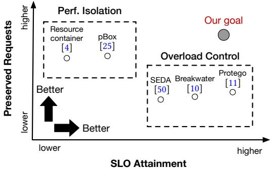  
Figure 1. Design space for mitigating application resource overload. Isolation approaches partition resources among requests, limiting SLO attainment under overload.

13–16, 2025, Seoul, Republic of Korea. ACM, New York, NY, USA,   
16 pages. https://doi.org/10.1145/3731569.3764835

## 1 Introduction

Modern software is designed to maximize the utilization of available resources and deliver high performance. However, running a system near peak throughput makes it vulnerable to overload, where a short spike in demand can lead to a large number of service-level objective (SLO) violations. A classic consequence is the receive livelock [38], where the system is busy processing incoming requests and cannot make progress in completing pending requests.

Besides receive livelock, overload can also be caused by contention on application-level resources, such as table locks or buffer pools in a database. In these cases, a single request may hold a resource for a long time and block other requests requiring this resource. Such resource overload is difficult to mitigate because one request’s impact depends on the subtle and unpredictable interactions with others. This unpredictability is exacerbated by the variability in how different requests access resources in modern systems. For instance, a short single-row update query might lock a table for only 2 ms, whereas a long, grouped write request could hold locks on multiple tables for hundreds of seconds. Consequently, a single long-running write query may cause much more severe overload than hundreds of shorter requests combined.

Existing overload mitigation strategies fall broadly into two categories (Figure 1): admission control and performance isolation. Admission control mechanisms favor throttling incoming requests or reducing load [10, 50, 56]. These approaches assume the overload is caused by total demand. They perform poorly under application-level resource overload due to the lack of insight into individual request behavior. As a result, they often indiscriminately drop many requests that are victims of the overload, before they are served at all, instead of specifically targeting requests that are culprits of the overload. This indiscriminate drop of requests severely damages application usability. On the other hand, performance isolation allocates resource quotas to each request [4, 25]. The static resource partitions cannot adapt to highly variable workloads, leading to low resource utilization and high tail latency.

These limitations raise the following research question: how to enable applications to maximize SLO attainment under resource overload while minimizing request drops?

To address this question, we design Atropos, an overload control system whose core principle is to actively identify requests that monopolize the resource and cancel those requests, rather than deny requests that are victims of resource overload. Atropos does not perform admission control directly, but aims to maximize the chance that a request is admitted (served) and focuses on ongoing requests instead of pending requests. It monitors the overall application resource usage and the resource consumption of each executing request. When a resource is about to overload, Atropos identifies and cancels the request that if canceled, would release the most load on the contended resource.

Atropos provides two abstractions to simplify the estimation of resource overload. First, it groups all application activities—both requests and background tasks into individual cancelable tasks, which are units of work that can be canceled. It attributes resource usage to these cancelable tasks. Second, Atropos provides an application resource abstraction that unifies a variety of resources, enabling resource-agnostic cancellation policies. Each application resource exposes two performance metrics: contention level, a measure of resource contention and resource gain, which estimates how much load would be freed by canceling a given request. Atropos continuously monitors resource usage. When resource overload is detected, it proactively cancels the task that offers the greatest resource gain to quickly alleviate contention before the end-to-end performance decreases significantly.

While providing general support for canceling an executing request safely is challenging due to the diverse and complex cancellation logic in each application, our study reveals opportunities to enable safe request cancellation. We analyze 151 popular applications and find that 76% applications already implement custom cancellation logic to safely terminate ongoing requests. Our study further shows that most applications follow a common cancellation design pattern:

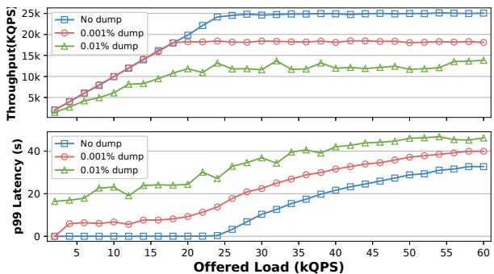  
Figure 2. Impact of dump queries on buffer pool contention.

they expose a cancellation initiator to trigger the cancellation. This observation inspires us to hook Atropos to the existing cancellation initiator functions in each application to perform cancellation safely.

Atropos aims to provide a general resource overload control framework applicable to diverse software. We implemented Atropos for three programming languages: C/C++, Java, and Go, and integrated it into six widely-used, large applications: MySQL, Apache, PostgreSQL, Elasticsearch, Solr, and etcd. To evaluate its effectiveness, we reproduced 16 real-world application resource overload issues and compared Atropos with Protego [11], a state-of-the-art overload control mechanism; pBox [25], a request-level performance isolation framework; and DARC [14], a request-aware scheduling framework. Our evaluation shows that Atropos outperforms all three systems in the evaluated cases. Atropos sustains 96% of the baseline throughput and keeps the 99th tail latency within 1.16x compared to the non-overloaded case, while dropping fewer than 0.01% of requests.

In summary, this paper makes the following contributions:

• We propose a novel overload control mechanism based on selective runtime request cancellation, enabling effective mitigation of resource overload.

• We develop Atropos, a general and resource-agnostic framework that proactively cancels culprit requests to mitigate application resource overload.

• We demonstrate the practicality and effectiveness of Atropos in six complex, large-scale applications across three programming languages.

## 2 Background and Motivation

## 2.1 Application Resources Overload

Application resources are logical abstractions defined by an application. These resources typically encapsulate underlying system resources, such as memory or synchronization primitives, to provide higher-level, application-specific functionality. To concretely discuss the challenges of mitigating application resource overload, we present two real-world case studies of application resource overload in MySQL.

Case 1: Buffer Pool Overload: MySQL’s InnoDB storage engine maintains a buffer pool to cache table and index to accelerate query execution. However, when this buffer pool becomes overloaded, it can trigger thrashing, where MySQL spends a lot of time evicting and loading pages between the buffer pool and disk [45, 54]. This buffer pool contention is further complicated by the fact that different types of request consume varying amounts of buffer space, making it difficult to predict the performance impact of each request.

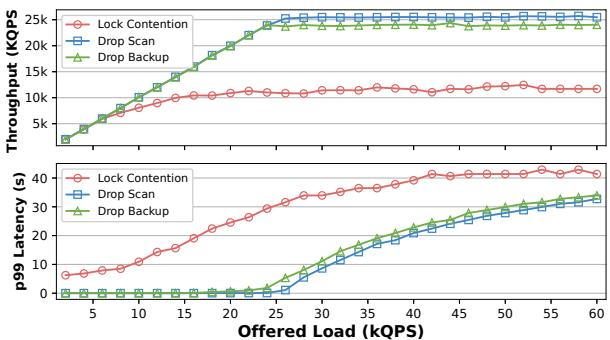  
Figure 3. Performance impact of table lock contention. Lock Contention runs both scan queries and the backup thread. Drop Scan represents workloads without scan queries, and Drop Backup represents workloads without the backup thread.

To better understand how different types of queries impact the buffer pool, we set up a MySQL with a 512 MB buffer pool and populated it with 2 GB of data. We executed two categories of queries: lightweight operations, e.g., point-select and row-update queries, each consuming only a few kilobytes of buffer pool space and heavy dump queries, which use roughly 2 GB of buffer space. We tested the impact of dump query under three workload scenarios: a baseline with no heavy dump queries, adding heavy queries at a ratio of 1:100K, and a third scenario increasing this ratio to 1:10K.

Figure 2 shows the performance results in the three workloads. Even a small number of heavy dump queries reduced the maximum throughput from approximately 25 K QPS in the baseline to around 18 K QPS with 0.001% dump query and around 12 K QPS with 0.01% dump query. Furthermore, tail latency increased sharply and at much lower overall load levels when dump queries were introduced. While such dump query are rare in typical workloads, our results clearly show that even a tiny proportion can severely degrade performance when the buffer pool is already nearing saturation. The key takeaway is that during heavy load periods, resourceintensive dump queries should ideally be delayed until the system returns to a less loaded state.

Buffer pool contention occurs independently of the overall system memory pressure. The buffer pool is configured to be smaller than the total system memory. Therefore, monitoring overall system memory usage alone is insufficient to detect or mitigate buffer pool contention effectively.

Case 2: Table Lock Overload: MySQL uses table locks to manage concurrent table access. Typically, these locks are efficiently managed, but complex interactions among requests can sometimes cause locks to be held longer than necessary and thus exacerbate the lock contention. For example, the MySQL backup query acquires write locks on all tables before obtaining the necessary metadata locks. The backup query normally holds these locks very short with little disruption. However, due to some subtle interactions, a long-running table scan query can cause the backup query to hold the table locks much longer than intended and prevent MySQL from processing subsequent write queries [29, 46].

To demonstrate this scenario, we reproduced the backup query overload issue using a database containing five tables, each with 1 M rows. We ran two types of queries: longrunning table scan query and lightweight operations (pointselect and row-update queries). Specifically, we executed a mixed workload primarily consisting of lightweight operations and introduced one scan query at 5, 10, and 15 seconds and launched a single backup query at 20 seconds. As Figure 3 shows, under lock contention, MySQL end-to-end throughput dropped sharply to around 11 K QPS. When we remove the backup query or the table scan queries, the throughput restores to approximately 25 K QPS. This case shows how a single problematic request can significantly impact overall system performance.

These two cases highlight that a small number of problematic requests can have a severe impact on system overall performance. Such problematic requests can significantly reduce maximum throughput, dramatically increase tail latency, and even cause system stalls. Dropping non-problematic requests can temporarily preserve SLO attainment but cannot effectively resolve the underlying performance interference caused by the problematic requests.

## 2.2 Limitation of Existing Solutions

Traditional overload control mechanisms keep track of global signals such as queue length to adjust the admitted workload. However, these signals are ineffective in managing the application resource overload, whose severity depends heavily on the application-specific logic. Application resources are logic abstractions managed by applications and thus invisible to the system. For example, Breakwater [10] predicts queuing delays for incoming requests based on past observations but it cannot directly associate the global queuing delay with contention on specific resources such as MySQL buffer pool contention. Without knowing in advance which requests will monopolize critical resources, Breakwater is unable to accurately identify and drop problematic requests.

Protego [11] allows requests to execute normally. It dynamically detects lock contention and drops requests during execution. However, Protego only monitors each request’s locking delay and drops requests whose lock wait times are approaching SLO violations. In other words, it cancels requests that are victims of lock contention rather than identifying and canceling the requests causing the contention. Consequently, Protego often treats symptoms rather than addressing the root cause and thus is ineffective in mitigating application resource contention.

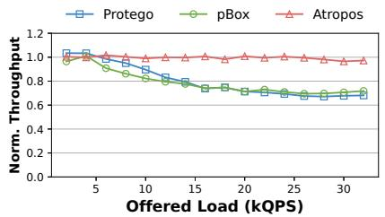  
(a) Normalized Throughput

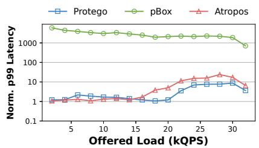  
(b) Normalized p99 Latency

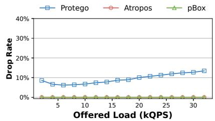  
(c) Drop Rate

Figure 4. Performance of Protego, pBox, and Atropos evaluated in case 2. Metrics are normalized by the non-overloaded performance.
<table><tr><td>Language</td><td>Applications</td><td>Supporting Cancel</td><td>With Initiator</td></tr><tr><td>C/C++</td><td>60</td><td>49</td><td>46</td></tr><tr><td>Java</td><td>34</td><td>25</td><td>25</td></tr><tr><td>Go</td><td>44</td><td>32</td><td>29</td></tr><tr><td>Python</td><td>13</td><td>9</td><td>9</td></tr><tr><td>Total</td><td>151</td><td>115 (76%)</td><td>109 (95% of 115)</td></tr></table>

Table 1. Prevalence of task cancellation support in 151 popular open-source applications, including built-in initiators for launching cancellation.

Another potential solution is performance isolation, which mitigates performance interference by assigning resource quotas to requests [14, 25]. State-of-the-art systems such as pBox [25] do not rely on static quota but dynamically adjust resource allocations based on observed request performance. It estimates resource usage per request by tracing specific internal events, and reallocates resources away from requests that consume excessive resources. However, such performance isolation mechanisms do not drop running requests. Therefore, while isolation proactively manages resource allocation, it cannot directly mitigate resource overload caused by problematic requests already executing.

We demonstrate these limitations by evaluating existing overload control and performance isolation techniques using the table lock overload scenario (case 2 in Section 2.1). Figure 4 compares the normalized throughput, tail latency, and request drop rate of Protego, pBox, and Atropos. Protego successfully bounds tail latency by dropping requests experiencing excessive lock contention. However, because it does not specifically target the problematic backup request, it must drop many non-problematic requests, significantly reducing throughput and increasing the overall drop rate. pBox partially mitigates resource overload by reallocating contended application resources, but since it cannot drop the problematic request that already holds critical resource, it fails to fully recover from severe resource overload.

## 2.3 Challenges

Since the behavior of individual requests on application resources is highly variable and difficult to predict in advance, existing mechanisms inevitably misclassify problematic requests and allow them to execute. An effective overload control system should allow requests to execute first, observe their actual impact, estimate each request’s current and future resource usage, and selectively cancel those that monopolize critical resources. Such selective cancellation is key to maintaining SLO while keeping the drop rate low.

While dropping a running request helps more effectively mitigate resource overload, this action also changes the application’s execution logic and risks introducing dangerous side effects. For example, naïvely killing the backup thread while it is actively backing up tables could leave the database in an inconsistent state, where some tables are backed up and others are not. Requiring developers to significantly change their application code to accommodate an overload control solution for dropping running requests can incur high manual effort and be error-prone.

## 2.4 Prevalence of Task Cancellation

Cancellation must be used carefully to preserve end-to-end semantics. We observe that task cancellation has become an increasingly common feature in mainstream programming languages, many of which now provide built-in cancellation constructs. For example, Go offers the Context package [30], where canceling a parent context automatically cancels all dependent work. Similarly, Java supports threads interrupt() [39], C# provides CancellationToken [35], and C++ 20 provides stop\_token [12]. Many libraries and OSes also provide cancel APIs, e.g., pthread\_cancel in the pthread library [34], the pthread\_cancel system call in Linux, and the CancelIoEx Win32 API. These mechanisms provide a strong foundation for implementing safe task cancellation.

Application developers often use these built-in mechanisms as building blocks to implement their own applicationspecific cancellation mechanisms. Such customized mechanisms are typically exposed as APIs that allow users to drop a running request. Developers carefully decide when and how to cancel requests, ensuring that cancellation is performed safely. For example, most applications set a cancellation flag when a cancellation request is issued and instrument specific checkpoints where it is safe to check this flag. At those checkpoints, the application can stop the request, perform necessary cleanup of critical internal state, and preserve invariants before moving on to the next request. Because developers explicitly exclude unsafe operations from being cancellable, these customized mechanisms are generally safe.

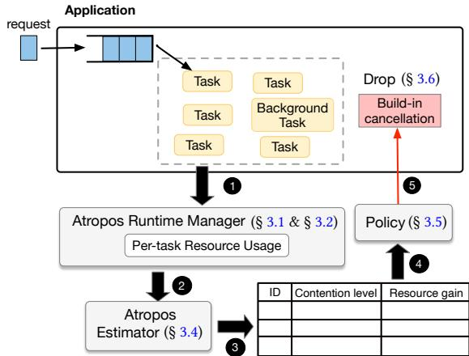  
Figure 5. Overview of Atropos.

To understand how prevalent customized cancellation is in practice, we conducted a study of 151 popular open-source software projects from platforms such as GitHub and GitLab. Applications were selected based on popularity metrics, such as the number of stars. For each application, we manually reviewed its documentation, development logs, user manuals, and source code. If an application exposed a general-purpose cancellation API along with a corresponding implementation, we categorized it as supporting task cancellation.

Table 1 summarizes the results. We found that the majority of our studied applications (76%) implement task cancellation within their codebases. Among these, 95% rely on developers to manually decide when and where cancellation can be safely performed. Applications that do not support cancellation are typically non-interactive systems, such as libraries or simple single-threaded key-value stores, where cancellation is unnecessary. Based on these findings, rather than re-implementing a generic cancellation mechanism from scratch, Atropos leverages each application’s existing cancellation support to ensure safety and consistency.

## 3 Design of Atropos

We present Atropos, an overload control system that selectively cancels requests responsible for monopolizing application resources and causing an overload. To accurately identify and drop problematic requests, our high-level strategy is to directly track application resource usage and uses this information to guide cancellation decisions. Unlike traditional overload control mechanisms that react only to end-to-end performance signals, Atropos proactively monitors the resource impact of each admitted request and cancels those most likely to cause performance degradation.

Figure 5 shows the high-level architecture of Atropos. Developers first use Atropos’ APIs to identify and register user requests or internal background tasks as cancellable tasks (§ 3.1). At runtime, the Atropos Runtime Manager (§ 3.2) tracks resource usage for each cancellable task, capturing their impact on various application resources (step ❶). When the overload detection module (§ 3.3) observes that end-toend performance violates the SLO, it activates the Atropos Estimator (§ 3.4). The estimator then analyzes the resource usage information provided by the runtime manager and computes two critical metrics: resource gain and contention level (steps ❷ and ❸). These metrics quantify current resource contention and predict the potential performance improvement achievable by canceling specific tasks. Next, the Policy Engine (§ 3.5) uses these metrics to decide which task to cancel (step ❹). It selects the optimal task by balancing the severity of resource contention and the potential resource gains from cancellation across multiple resources. Finally, Atropos triggers the selected task’s built-in cancellation mechanism to safely terminate its execution.

(a) Main APIs to integrate Atropos.  
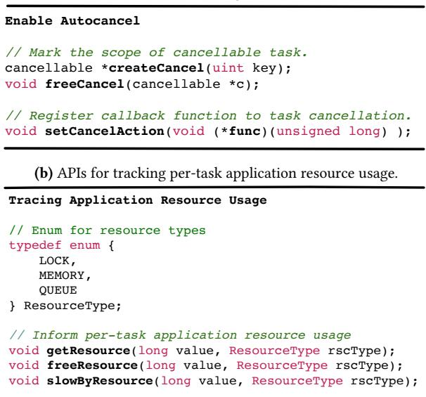  
Figure 6. Atropos APIs

## 3.1 Integrating Atropos into Applications

Figure 6a lists the APIs used to integrate Atropos into an application. At its core, Atropos treats all application tasks uniformly through an abstraction called cancellable task. A cancellable task represents a logical unit of work within an application, such as a user-issued database transaction, background operations (e.g., garbage collection or deadlock detection), or groups of requests sent from a single user.

Developers decide how application tasks should be aggregated into cancellable tasks. For example, they can either group all requests from a single user into one cancellable task or treat each request as a separate cancellable task. The createCancel and freeCancel APIs define the scope of cancellable tasks. When registering a task via createCancel, developers may optionally provide a unique key to explicitly identify the task. If a unique key is not provided, Atropos generates a unique key automatically. To facilitate safe cancellation, developers must specify the application’s cancellation initiator by providing a function pointer to Atropos through the setCancelInitiator. Atropos calls this registered callback function when it decides to cancel a task.

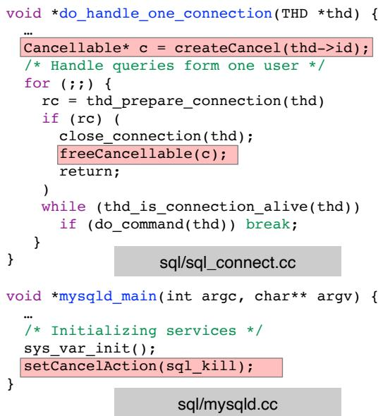  
Figure 7. Example of setting cancellation in MySQL.

Figure 7 shows how MySQL, a widely used database system, integrates with Atropos. In this example, we group all requests from a single user connection into a cancellable task. We register MySQL’s built-in cancellation initiator function, sql\_kill at the main function. We call createCancel when a client connection begins, and subsequently invoke freeCancel when the connection terminates.

## 3.2 Per-task Resource Usage Tracking

Atropos’ task manager is responsible for managing cancellable tasks and attributing resource usage to each task. The task manager assigns each cancellable task with a unique task ID and maintains a mapping between cancellable task to their corresponding application-level activities.

A key challenge is tracing different types of resources that exhibit complex and diverse usage patterns. For system resources such as CPU or network, Atropos can monitor usage by using existing tools like cgroups and attributing resource consumption to the threads executing each task. However, application resources are much harder to trace because their usage patterns are deeply tied to application-specific logic. For example, a queue may be used for task scheduling in one application and for message passing in another. These variations mean that application resources lack standardized hook-up interfaces. Blindly instrumenting all possible usage points would introduce significant overhead.

Atropos addresses this challenge by unifying all resources under a single abstraction: the application resource. Each application resource supports three operations: get, free, and wait. To capture these operations, Atropos provides three resource tracing APIs, shown in Figure 6b. The getResource API records when a task acquires a resource; freeResource records when a resource is released; and slowByResource records when a task is delayed while waiting for a resource. Each API takes two parameters: value, which specifies the resource being acquired, released, or waited on, and rsc-Type, which specifies the resource type. Currently, Atropos supports three categories of application resources: (1) synchronization resources, representing resources protected by synchronization primitives; (2) queue resources, representing application-managed task queues; and (3) memory resources, representing application-managed memory pools or caches. This unified abstraction allows Atropos to handle different types of resource contention consistently. Equally important, it enables incremental extensions to support new resource types without requiring changes to the core framework.

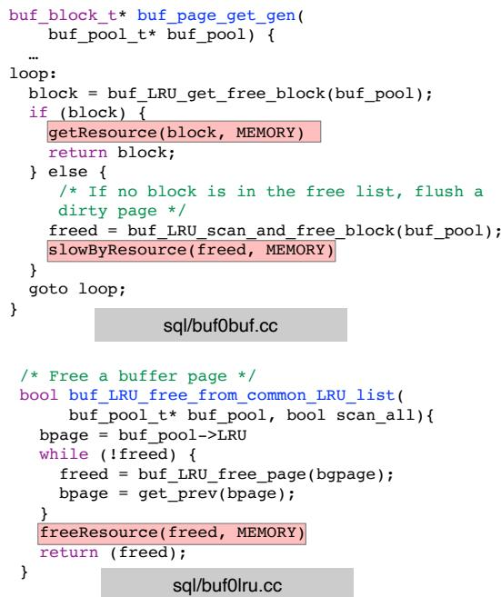  
Figure 8. Example of tracing buffer pool in MySQL.

The three APIs are straightforward to instrument. Figure 8 shows how MySQL uses these APIs to report buffer pool usage in Case 1 (Section 2.1). When a request acquires a new buffer page from the buffer pool, it calls buf\_page\_get\_gen() to return a pointer to the new page. The getResource API is invoked just before returning the page to record the get operation. If MySQL cannot obtain a free buffer page, it calls buf\_LRU\_scan\_and\_free\_block() to evict a dirty page. In this case, the slowByResource API is placed immediately after the eviction function to capture the delay. Finally, when the request releases a buffer page through buf\_LRU\_free(), the freeResource API is invoked to record the release operation.

Atropos ensures that its resource usage tracking works correctly with common system optimizations such as batching and asynchronous processing. For batching, Atropos attributes the resources consumed by each individual request within a batch. For example, in MySQL, updates from multiple queries are batched in the same buffer pool. Whenever a query acquires a buffer pool page, Atropos instruments a call to the getResource API and attributes that page to the calling query. For asynchronous processing, the tracing logic is identical to the synchronous case because the APIs are inserted directly at the resource usage points.

The overhead of each API is minimal, as Atropos only records a tuple (value, rscType, eventType) along with a timestamp. We use the rdtsc instruction to measure CPU cycles. To further reduce overhead, instead of recording a timestamp for every event, Atropos samples timestamps at fixed intervals and assigns the same timestamp to all events within that interval. While this batching approach reduces timestamp precision, it is sufficient to detect tasks that monopolize resources. To improve accuracy when needed, Atropos dynamically switches to record the timestamps for every event when the detection module detects a potential overload.

## 3.3 Triggering Cancellation

Atropos has an overload detection module that periodically monitors the software’s end-to-end performance to detect resource overload and trigger a cancellation decision. As shown in our case study 2.1, resource overload often exhibits patterns similar to regular overload. Thus, Atropos’s detection module leverages the state-of-the-art overload detection method [10]. Specifically, it continuously monitors application throughput and latency. When latency exceeds the service-level objective while throughput remains flat, this indicates a potential resource overload. In such cases, the detection agent notifies the Atropos estimator, which then verifies whether a specific application resource is the bottleneck. If a bottlenecked resource is confirmed, the estimator classifies it as a resource overload and triggers a cancellation decision. Otherwise, the performance degradation is classified as regular overload; Atropos invokes other overload control mechanisms in place to handle it.

## 3.4 Estimating Resource Overload

When Atropos receives a resource overload signal, it needs to identify which resource is overloaded and which request is monopolizing the resource. To support the wide variety of resources in practice, Atropos characterizes the resource contention using two general, unit-less metrics:

• Contention level: a per-resource metric that quantifies the severity of contention for that resource.

• Resource gain: a per-task metric that estimates how much of the resource would be freed if the task were canceled.

Below, we detail how Atropos calculates these metrics for the three supported application resource types:

Memory Related Resources: Intuitively, buffer pool contention reflects how often queries must evict existing pages to make room for new ones. The more frequently evictions occur, the higher the contention, since queries compete aggressively for limited buffer space. For example, in Case 1 (Section 2.1), suppose that query ?? acquires $M _ { i }$ buffer pages from the buffer pool, releases $F _ { i }$ pages, and causes $E _ { i }$ evictions during a certain interval. The buffer pool contention level can be computed as the average eviction ratio: $\frac { \sum _ { i } E _ { i } } { \sum _ { i } M _ { i } }$ As shown in Figure $^ { 8 , }$ the number of pages acquired corresponds directly to the number of getResource API calls in the buffer pool, while the number of evictions corresponds to the number of slowByResource API calls. Both are traced by the Atropos Runtime Manager.

Defining resource gain for memory resources is challenging. Intuitively, it could be defined as the number of buffer pages held by a request, expressed as $M _ { i } - F _ { i }$ , since canceling the request would immediately free those pages. However, this definition only captures the memory released at the moment of cancellation and does not reflect the true benefit of dropping the request. For example, consider two requests that both monopolize the buffer pool. Query A has completed 90% of its workload, while Query B has completed only 10%. Although Query A holds more buffer pages than Query B, canceling this nearly finished query would bring less performance benefit than canceling Query B. To make matters worse, because Query B is just beginning, even if Query A were canceled and its buffer pages freed, Query B would eventually monopolize the buffer pool again. Thus, measuring resource gain by current memory usage incorrectly biases the decision toward long-running tasks that are close to completion, rather than tasks that still have substantial memory demand ahead.

We instead define resource gain as the future memory usage of a task as. To estimate future usage, Atropos assumes that a task’s remaining resource demand is proportional to its remaining workload. Under this model, the resource gain is calculated as the current resource usage multiplied by progress, expressed as $\begin{array} { r } { \left( M _ { i } - F _ { i } \right) * \frac { 1 - P r o g ( i ) } { P r o g ( i ) } } \end{array}$ . To estimate task progress, Atropos employs the well-established GetNext model [20], which defines progress as $\begin{array} { r } { P r o g ( i ) = \frac { k } { N } } \end{array}$ , where k is the number of rows already processed by the operator and N is the total number of rows expected by completion. This model is suited for applications with quantifiable progress information, such as databases and search engines. For example, MySQL has the internal variable rows\_examined, which records the number of rows processed by a request, and the variable estimatedRows, which stores the optimizer’s estimate of the total rows to be processed. Atropos can read these values for each request to obtain accurate progress information. For applications without such metrics, Atropos provides an API that allows developers to explicitly support accurate progress estimations.

While the proportional assumption is strong and may be inaccurate for many resources, it remains a valid and effective choice in the context of cancellation. First, building an accurate prediction model typically requires heavyweight analysis, which would incur high runtime overhead and is unsuitable for fast decision-making. In Atropos, cancellation decisions need to be made at microsecond granularity with negligible overhead. Second, the goal of Atropos is to identify requests that monopolize resources. We observe that heavy, resource-intensive requests tend to dominate a resource for most of their execution lifecycle, making the proportional assumption sufficiently accurate in practice for these cases. Finally, even if a misprediction occurs, the consequence is minor: canceling a suboptimal request. Atropos can simply issue another cancellation until the true monopolized request is identified.

Synchronization Resource: For resources protected by synchronization primitives, contention can be defined as the ratio of the time requests spend waiting to acquire the resource compared to the time they spend actually using it. If the waiting time dominates the total execution time, it indicates that multiple requests are blocked and the resource is overloaded. Consider the table lock in MySQL as an example. Suppose a write request ?? monopolizes the table for $E _ { i }$ seconds while multiple read requests ?? each access the table for $E _ { j }$ seconds. The contention level can be expressed as $\frac { E _ { i } \cdot j } { \sum _ { j } E _ { j } }$ .The waiting time for a synchronization resource is measured as the timestamp difference between the wait and the get event and the usage time is measured as the timestamp difference between get and release event.

The resource gain is defined as the amount of time a request holds the resource. Similar to memory resources, this metric is defined in terms of the future resource holding time. It is calculated as the current holding time multiplied by the remaining workload fraction, $\frac { 1 - { P r o g ( i ) } } { { P r o g ( i ) } }$ . For example, if a write request has already held a table lock for 1 second and has completed 40% of its workload, the estimated resource gain is $\textstyle 1 \times { \frac { 0 . 6 } { 0 . 4 } } = 1 . 5$ seconds.

Queue Resource: The contention level for queue resources is defined as the ratio of the time requests spend waiting in the queue to the time they spend executing after leaving the queue. A higher ratio indicates more severe contention, as the tasks wait longer than they run. For example, if a request waits in a task queue for an average of 1 second but takes only 0.1 seconds to execute, the contention level is 10. The resource gain for a queue resource is defined as the expected future thread time a task will consume.

## 3.5 Multi-objective Cancellation Policy

After the Atropos estimator computes the contention level for each resource and the resource gain for each task–resource pair, Atropos must select the request whose cancellation gains the largest performance benefit. A simple policy is to cancel the task with the greatest resource gain on the most contended resource. Formally, let $r ^ { \star } = \arg \operatorname* { m a x } _ { r }$ Contention(?? ). Atropos cancels ?????????????? = arg max?? Gain(??, ??★).

However, this policy assumes that resource gains from different resources contribute equally to performance improvement. In real-world applications, the performance impact of different resource is not directly comparable. For example, a buffer pool’s contention level is the eviction ratio, while a table lock’s contention level is the lock waiting time. Even if both report the same numeric value (e.g., 20%), the implications are very different. Additionally, resource overload may occur across multiple resources at the same time. Selecting a task based on the most congested resource might identify one that is optimal for that resource but suboptimal overall. For example, suppose there are two overloaded resources, ?? and ??. Task ?? has a resource gain of 3 on ?? and 0 on ??, while Task ?? has a gain of 2 on ?? and 2 on ??. In such cases, it is difficult to say that canceling Task ?? is better than canceling Task ?? , since the performance benefit depends on how resource gains across different resources.

To make contention level comparable across different resource types, we normalize contention on a per-window basis by expressing it as the fraction of the request’s execution time lost to a given resource. Let $T _ { \mathrm { e x e c } }$ denote the request’s execution time in the window (baseline), and let $D _ { r }$ be the contention-induced delay attributed to resource r. We define $\begin{array} { r } { C _ { r } = \frac { D _ { r } } { T _ { \mathrm { e x e c } } } } \end{array}$ . For memory resources, the delay $D _ { r }$ is computed as eviction time weighted by contention level. For synchronization and queue resources, the delay corresponds to the measured waiting time.

With the normalized metric, the next question is how to identify the optimal request for cancellation. Inspired by multi-objective optimization problems (MOOPs) in operations management [13], we propose a multi-objective cancellation policy that evaluates the impact of canceling a task across multiple resource. The key insight is that the performance improvement from cancellation is not determined by the single most contended resource, but by the combined gains across all resources. Similar to MOOPs, our approach seeks to identify the task whose cancellation gains the largest overall performance benefit across all resources.

To identify the request that provides the greatest overall performance benefit, we leverage the concept of the nondominated set from multi-objective optimization. Intuitively, the non-dominated set consists of cancellable tasks whose cancellation brings strictly greater resource gains compared to tasks outside the set. For example, a task that provides 5 units of resource gain in resource ?? and 2 units of resource gain in resource ?? clearly dominates another task that provides only 4 units of resource gain in resource ?? and 1 unit of resource gain in resource ??. Atropos identifies all tasks that belong to this non-dominated set. Lines 2–10 of Algorithm 1 outline this process: the algorithm iterates over all cancellable tasks, comparing their resource gains across each resource type to determine whether a task is dominated. A task is included in the non-dominated set if it has strictly larger resource gain in at least one resource and is no worse in all others compared to every other task.

Algorithm 1: Multi-objective Policy   
Vars: taskMap - Statistics of each cancellable task   
Vars: resourceMap - Statistics of each resource   
1 /\* Find the dominator tasks \*/;   
2 for ?????????? ∈ taskMap do   
3 if is\_Cancellable(????????1) then   
4 ?????????????????? ← true;   
5 foreach ?????????? ∈ taskMap do   
6 if dominate(??????????, ??????????) then   
7 ?????????????????? ← false;   
8 break;   
9 if ?????????????????? then   
10 dominator\_tasks.add(??????????);   
11 /\* Find the optimal task to cancel \*/;   
12 for ???????? ∈ dominator\_tasks do   
13 ??????????\_???????? ← 0;   
14 for ???????????????? ∈ resourceMap do   
15 ??????????????\_?????????? ← ?????????????????????????????? (????????????????);   
16 ???????? ← ??????????????????????????????(????????, ????????????????);   
17 ??????????\_???????? ← ??????????\_???????? + ??????????????\_?????????? · ????????;   
18 if ??????????\_???????? > ??????\_???????? then   
19 ??????\_???????? ← ??????????\_????????;   
20 ????????\_???????? ← ????????;   
21 return ???????? \_????????;

As shown in lines 12–20, once the non-dominated set is identified, Atropos selects the optimal task through scalarization, which combines multiple objectives into a single scalar value by assigning weights to each objective. Consider a resource overload case with two contended resources: a buffer pool and a table lock. Suppose their normalized contention levels are $C _ { \mathrm { m e m } } = 0 . 6$ and $C _ { \mathrm { l o c k } } = 0 . 4$ . Task ?? provides 3 units memory gain and 1 unit lock gain, while Task ?? provides 2 units memory gain and 2 units lock gain. Using scalarization, Task ??’s score is $0 . 6 \times 3 + 0 . 4 \times 1 = 2 . 2$ , whereas Task ??’s score is $0 . 6 \times 2 + 0 . 4 \times 2 = 2 . 0$ . Thus, Atropos selects Task ?? for cancellation. We use contention level as the weight to reflect the intuition that reducing contention on heavily congested resources brings greater performance benefits.

The policy only considers tasks that developers explicitly register as cancellable using the createCancel API. Tasks that do not support cancellation, or are not marked as such, are excluded from the algorithm. While this restriction means that the policy may occasionally overlook the globally optimal task to cancel, it guarantees that cancellation is always safe and consistent, preventing unintended termination of tasks that could violate application correctness.

## 3.6 Handling Task Cancellations

Atropos statically instruments each cancellable task with a setCancelAction callback that invokes the application’s customized cancellation mechanism. Because these mechanisms are implemented by developers, they ensure that cancellation is performed safely and consistently. In applications without built-in cancellation support, Atropos provides an optional flag that enables library-level cancellation, such as invoking pthread\_cancel. However, this approach is coarse-grained and potentially unsafe because it operates at the thread level rather than the application-task level. As a result, it may terminate threads holding critical variables or locks, leaving the system in an inconsistent state. Therefore, this flag is disabled by default and can only be enabled when developers explicitly determine that thread-level cancellation is safe for their application.

## 4 Implementation

We implemented Atropos in three programming languages: C/C++, Java, and Go, with 4,002, 3,534, and 2,106 lines of code, respectively. While the core design principles remain consistent across all language implementations, Atropos adapts to each language’s specific features and runtime environments. In C/C++, we provide Atropos as a user-space library that applications can directly link and invoke. In Java, we implemented Atropos as a CancellableTask class, which application tasks inherit to leverage cancellation functionality. In Go, we integrated Atropos directly into the Go runtime, enabling direct tracking of resource usage metrics such as goroutine wait times.

Atropos is mainly designed for single-node applications. Its abstractions, however, can extend to distributed systems where a single user request may span multiple nodes. In such cases, the Atropos task manager could associate child tasks with their root request and propagate cancellation signals. Extending cancellation to distributed systems also requires handling failures such as crashes, timeouts, or network partitions. Such extensions are beyond the scope of this paper. We leave robust distributed cancellation as future work.

Addressing Fairness Issue: The cancellation policy naturally tends to target long-running requests, which can create fairness issues and starvation on those requests. To address fairness issues, Atropos provides a re-execution mechanism that ensures canceled tasks are retried. Each task can be canceled at most once to prevent starvation. When re-executed, a task is marked as non-cancellable so that subsequent overloads only trigger the cancellation of a different resourceintensive request. Re-execution occurs only after sustained resource availability has been observed. If resources do not become available and a canceled task eventually exceeds its SLO, Atropos drops the request, since it can no longer meet its performance requirements. For background tasks, which typically have no explicit SLO, Atropos enforces a maximum waiting threshold and guarantees re-execution once that threshold is reached.

<table><tr><td>Id.</td><td>Application</td><td>Resource Type</td><td>Resource Detail</td><td>Overload Triggering Condition</td></tr><tr><td>c1 (link)</td><td>MySQL</td><td>Synchronization</td><td>Backup lock</td><td>A subtle interaction causes backup queries to hold write locks for long time.</td></tr><tr><td>c2 (link)</td><td>MySQL</td><td>Thread pool</td><td>Innodb queue</td><td>Slow queries monopolize the InnoDB queue,exceeding its concurrency limit.</td></tr><tr><td>c3 (link)</td><td>MySQL</td><td>Synchronization</td><td>Undo log</td><td>Background purge task blocks causes contention on the undo log</td></tr><tr><td>c4 (link)</td><td>MySQL</td><td>Synchronization</td><td>Table lock</td><td>SELECTFOR UPDATE query blocks other clients&#x27; insert query</td></tr><tr><td>c5 (link)</td><td>MySQL</td><td>Memory</td><td>Buffer pool</td><td>Scan query monopolizes the buffer pool and causes contention with other queries</td></tr><tr><td>c6 (link)</td><td>PostgreSQL</td><td>Synchronization</td><td>Table lock</td><td>The write operation slows down the other query due to MVCC</td></tr><tr><td>c7 (link)</td><td>PostgreSQL</td><td>Synchronization</td><td>Write ahead log</td><td> The background WAL task causes group insertion and blocks other queries</td></tr><tr><td>c8 (link)</td><td>PostgreSQL</td><td>System</td><td>System IO</td><td> The vacum process causes contention on IO and slows down other queries</td></tr><tr><td>c9 (link)</td><td>Apache</td><td>Thread pool</td><td>Thread pool</td><td>Slow request blocks other clients&#x27;requests when the max client limit is reached</td></tr><tr><td>c10 (link)</td><td>Elasticsearch</td><td>Memory</td><td>Query cache</td><td>Alarge search slows down other queries due to cache contention</td></tr><tr><td>c11 (link)</td><td>Elasticsearch</td><td>Memory</td><td>Buffer memory</td><td>The nested aggregation exhausts heap memory causing frequent garbage collection</td></tr><tr><td>c12 (link)</td><td>Elasticsearch</td><td>System</td><td>CPU</td><td> The long running queries cause CPU contention and slow down other requests</td></tr><tr><td>c13 (link)</td><td>Elasticsearch</td><td>Synchronization</td><td>Document lock</td><td>Alarge update blocks other requests</td></tr><tr><td>c14 (link) c15 (link)</td><td>Solr</td><td>Synchronization</td><td>Index lock</td><td>Complex boolean request slows down other requests</td></tr><tr><td></td><td>Solr</td><td>Thread pool</td><td>Solr queue</td><td>Nested range queries occupy thread pool and block other requests</td></tr><tr><td>c16 (link)</td><td>etcd</td><td>Synchronization</td><td>Key-value lock</td><td>Complex read query blocks other queries</td></tr></table>

Table 2. Description of 16 real-world application resource overload cases that we reproduced.

<table><tr><td>Software</td><td>Language</td><td>Category</td><td>SLOC</td><td>SLOC Added</td></tr><tr><td>MySQL</td><td>C/C++</td><td>Database</td><td>2.23M</td><td>74</td></tr><tr><td>PostgreSQL</td><td>C/C++</td><td>Database</td><td>1.49M</td><td>59</td></tr><tr><td>Apache</td><td>C/C++</td><td>Web Server</td><td>198K</td><td>30</td></tr><tr><td>Elasticsearch</td><td>Java</td><td>Search Engine</td><td>3.29M</td><td>65</td></tr><tr><td>Solr</td><td>Java</td><td>Search Engine</td><td>961K</td><td>47</td></tr><tr><td>etcd</td><td>Go</td><td>Key-Value Store</td><td>244K</td><td>22</td></tr></table>

Table 3. Evaluated software and integration effort measured by added lines of code.

Importantly, task re-execution does not compromise application correctness. For user requests, re-execution only changes the execution order of incoming requests. Since Atropos targets applications that supports concurrent request processing, changes to request execution ordering do not affect correctness. Similarly, re-executing background tasks is just a normal retry of background tasks.

## 5 Evaluation

We now evaluate Atropos to answer the following key questions: (1) How effective can Atropos mitigate application resource overload? (2) How does Atropos compare to the state-of-art works? (3) How well is multi-objective policy? (4) What is the runtime overhead of Atropos?

## 5.1 Experiment Setup

We conducted experiments on Microsoft Azure virtual machines [36], each configured with 16-core virtual CPUs, 64 GB DRAM, and 160 GB SSD storage, running Ubuntu 20.04.

Integration Effort: We integrated Atropos into six widelyused, large-scale applications: MySQL, PostgreSQL, Apache, Elasticsearch, Solr, and etcd. As summarized in Table 3, these applications represent diverse categories, including databases, web servers, search engines, and key-value stores. Integration is primarily instrumenting Atropos’ resource tracing APIs (Figure 6b) to track usage of application-defined resources. Applications with more resources naturally required slightly more code modifications; however, the overall code modification is lightweight. The most modification is 74 lines of code for MySQL, which contains approximately 20 different application resources.

Compared to the code modifications, identifying all application resources was the most time-consuming part of integrating Atropos. We systematically reviewed each application’s official documentation and community blog posts to identify potential application resource. The amount of manual effort depended largely on the number of resources in each application and the completeness of its official documentation. As an anecdotal reference, locating and identifying all resources in MySQL took approximately seven days for one graduate student. Apache and etcd required about two days each, while PostgreSQL, Elasticsearch, and Solr took roughly four to five days each.

During manual annotation, we found a robust heuristic that can speed up application resources annotation. Because application resources are often implemented as global variables, we first enumerate all global variables in the codebase and using their names, comments, and official documentation to discard variables that are clearly not resources. For the remaining candidates, we run a static analysis to enumerate all usage points. We then triage each usage by (i) inspecting the function name, comments, and documentation to judge whether the function likely uses a resource, and (ii) checking whether the variable is shared across multiple application tasks. If a shared variable is accessed by multiple tasks, it is likely an application resource. After the triaging, we apply resource-specific checks: for LOCK resources, we verify that the variable is accessed within critical sections; for MEMORY resources, we check whether the variable appears in controlflow condition that trigger heavy write-related library call or syscall such as fsync or fwrite; and for QUEUE resources, we confirm that the variable is used to store and pass tasks.

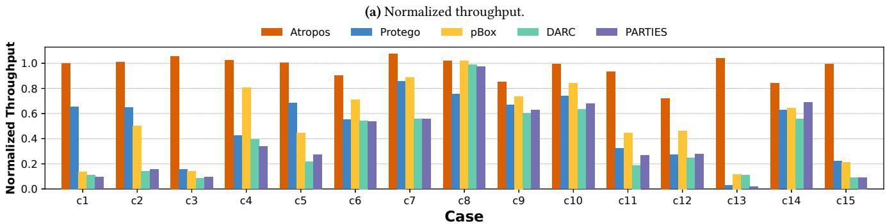

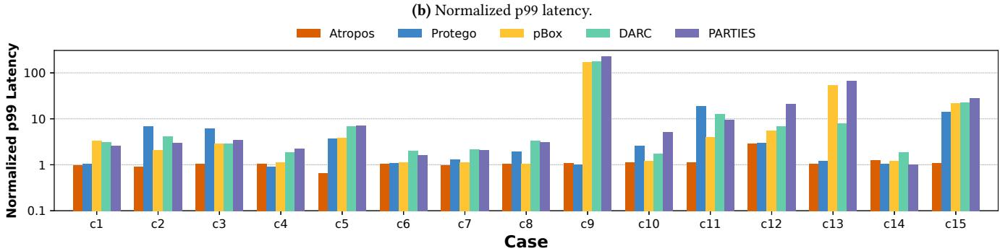  
Figure 9. Comparison of Atropos with state-of-the-art systems on normalized throughput and 99th percentile latency. Metrics are normalized against each application’s baseline performance without overload.

Benchmark Datasets: We collected and reproduced 16 real-world resource overload cases as our benchmark datasets. To identify these cases, we systematically searched each application’s official bug trackers, community forums, and technical blog posts using keywords such as “slow”, “overload”, and “resource contention”. We selected cases with clear bug reproduction steps that we could reliably reproduce in our evaluation environment.

Table 2 summarizes the selected cases, categorized by the type of resource contention involved: eight cases related to synchronization resources, three involving thread-pool contention, three involving memory-related contention, and two involving system resources (CPU and I/O).

Synchronization related resources are application-critical data structures such as table, UNDO logs or Write-Ahead logs. Accessing these types of data requires synchronization to protect the data integrity. Thread-pool resources represent application defined internal queue such as the MySQL concurrent control mechanisms for accessing its InnoDB storage engine. These internal queues are implemented by applications themselves and thus are invisible to the operating system. Memory related resources include application-specific caching and buffer mechanisms. System resources are CPU and I/O, representing fundamental hardware resource overload that directly impact overall application performance.

To reproduce each resource overload case, we followed detailed reproduction instructions provided in original bug reports and community discussions. We modified the benchmark tools to issue the request sequences for triggering each issue. Specifically, we modified Sysbench [28] for MySQL and PostgreSQL, ApacheBench [17] for Apache, Rally [16] for Elasticsearch, Solrbench [2] for Solr, and a etcdbench [1] for etcd. For Sysbench, Rally and Solrbench, we directly use their built-in capabilities to measure throughput and tail latency. For ApacheBench and etcdbench that lack appropriate measurement, we modified their client-side code to collect and report detailed performance metrics.

## 5.2 Mitigating Application Resource Overload

We first evaluate the effectiveness of Atropos in mitigating real-world application resource overload cases. We run the 16 reproduced cases with and without Atropos, measuring throughput and 99th percentile latency for each case. Figure 10 summarizes our results, with metrics normalized against each application’s baseline performance under nonoverload conditions. On average, Atropos bounds the throughput across the 16 cases with an average of 96%. Additionally, Atropos successfully bounds tail latency to an average normalized 99th percentile latency of 1.16.

We compare Atropos against four state-of-the-art systems: Protego [11], a lock contention-aware overload control mechanism; pBox [25], a request-level performance isolation system; DARC [14], a scheduling framework that schedules requests based on request type; and PARTIES [8], a resource management framework enforcing resource isolation.

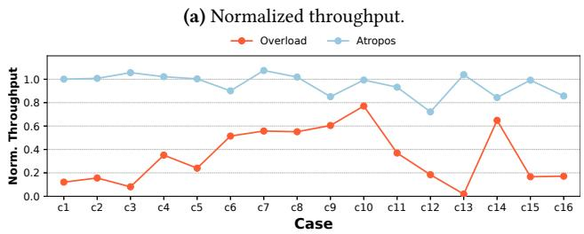

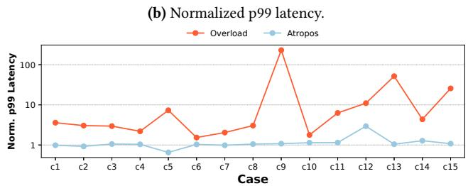  
Figure 10. Performance mitigation effectiveness of Atropos across 16 cases.

We carefully integrate each of these frameworks into our test applications to ensure fair and consistent evaluation. For Protego, we modified the C/C++ application code to adopt Protego’s synchronization primitives for tracking lock contention. For Java-based applications, we integrated Protego’s core algorithm into our Atropos framework. For pBox, we instrumented each application with pBox APIs and created a Java library for its integration into Java applications. For DARC, we extended its scheduling policies to recognize the request types specific to our target software. For PARTIES, we modified its monitoring module to trace client-level latency and allocate resources at the client level.

Figure 9a shows the throughput normalized by throughput under no overload. Atropos achieves an average normalized throughput of 96%, which significantly outperforms other systems due to its ability to accurately identify and cancel the problematic requests responsible for resource monopolization. In contrast, the other four frameworks: Protego, pBox, DARC, and PARTIES achieve average throughput of 50.7%, 53.9%, 36.3%, and 37.8%, respectively. Figure 9b shows the 99th percentile tail latency results. Atropos bounds tail latency with an average normalized tail latency of 1.16. Protego also successfully controls tail latency (average normalized latency of 1.88) for synchronization-related and system resource cases. However, Protego fails to address contention on other application resources since it does not monitor their usage. Additionally, pBox, DARC, and PARTIES demonstrate limited effectiveness in bounding tail latency.

Atropos effectively improves software performance without compromising application usability. Across all evaluated cases, Atropos selectively cancels only requests that monopolize critical resources, resulting in an average drop rate below 0.01%. Figure 11 shows Atropos advantage compared to Protego, which must drop victim requests to control tail latency, leading to a significantly higher average drop rate of approximately 25%.

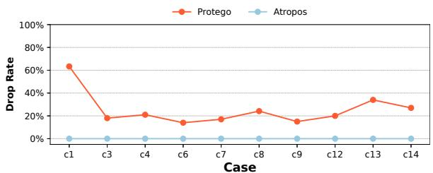  
Figure 11. Drop rate of Atropos and Protego.

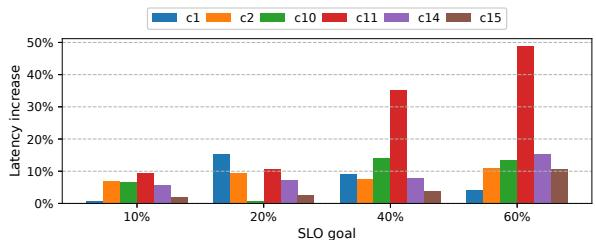  
Figure 12. SLO maintenance under different thresholds.

Incomplete Cancellation Support in Apache. When running Atropos with Apache, we observed that noisy requests often execute through PHP scripts. Apache’s built-in cancellation mechanism does not support terminating a script once it has started. To enable cancellation in this setting, we turned on the system-level cancellation flag, which uses pthread\_cancel to abort the request. In this case, safety is preserved because the script runs outside of Apache’s core application logic. Consistency is guaranteed through Apache’s write log: when a script writes data, Apache flushes the context to persistent storage. If the context is not flushed before cancellation, the data is simply discarded, ensuring that no partial or inconsistent state is introduced.

## 5.3 Maintaining the SLO under Resource Overload

To evaluate the impact of task cancellation on meeting SLOs, we set the SLO to tolerate up to a 20% latency increase. Using the same reproduction scripts, we test Atropos across the 16 overload cases. In 14 cases, Atropos successfully maintains the SL $\scriptstyle { \mathcal { O } } ,$ with an average latency increase of only 10.2%.

In the two remaining cases, the SLO could not be met under any policy. Specifically, in case 3, Atropos reduces the latency increase to 23%, and in case 12, to 26%. The main reason is that, to avoid excessive task termination, Atropos enforces a small time interval between consecutive cancellations. This introduces a trade-off between aggressive cancellation and fast recovery. In the two cases where the SLO could not be met, there are many noisy tasks and thus achieving the SLO requires canceling multiple requests. As a result, the average latency increases in these cases exceed the 20% threshold.

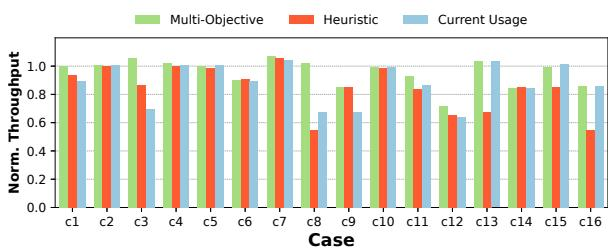  
Figure 13. Comparison of different cancellation policies.

To further evaluate how task cancellation performs under different SLO requirements, we tested Atropos with SLO thresholds of 10%, 20%, 40%, and 60% across six cases. Figure 12 shows that in all cases, Atropos successfully met the specified SLO. As the SLO becomes stricter, Atropos cancels more tasks in order to maintain the performance goal. These results shows that Atropos is an adaptive cancellation framework capable of adjusting its behavior to meet varying SLO requirements.

## 5.4 Effectiveness of Multi-objective Policies

To evaluate the effectiveness of Atropos’ multi-objective cancellation policy, we compare it against two baseline policies. The first baseline policy replaces the multi-objective algorithm with a straightforward heuristic that cancels the request exhibiting the highest resource gain on the single most congested resource. The second baseline keeps the multi-objective algorithm but uses the current resource usage instead of predicted future resource gain.

Figure 13 shows the throughput results for all 16 cases, normalized against the performance without resource overload. The multi-objective policy consistently outperforms the heuristic-based policy in 8 out of the 16 cases and exceeds the performance of the second baseline policy in 6 cases. The multi-objective policy in Atropos considers the performance impact of canceling tasks across multiple resources. Thus, it avoids convergence to locally optimal decisions, a limitation in heuristic-based greedy approaches. Additionally, by estimating future resource gain instead of relying on current resource usage, Atropos prevents bias towards canceling requests that are already nearing completion.

## 5.5 Overhead

To evaluate the impact of Atropos on throughput and endto-end latency, we benchmark MySQL, PostgreSQL, Apache, Elasticsearch, and Solr. As mentioned in Section 3.2, the overhead of Atropos varies based on workload conditions. Under normal workloads, Atropos performs lightweight tracing, resulting in minimal overhead. Under overload scenarios, Atropos performs aggressive tracing and runs cancellation decision logic, leading to slightly higher overhead.

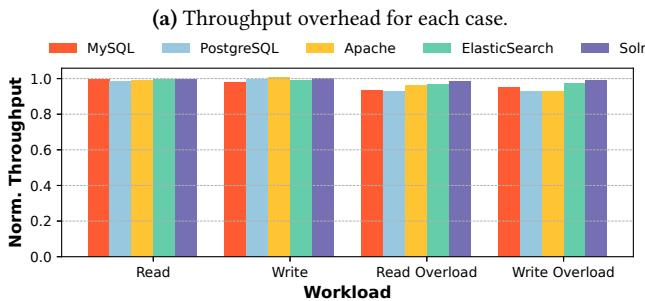

(b) p99 latency overhead for each case.  
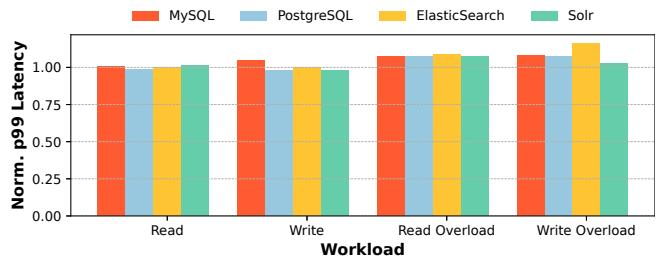  
Figure 14. Overhead of Atropos. Read Overload: introducing resource overload under read-intensive workload; Write Overload: introducing resource overload under write-intensive workload.

Thus, we design two types of workloads to test Atropos overhead: (1) Normal workloads, where we ran readintensive and write-intensive workloads without triggering resource overload; and (2) Resource overload workloads, where we introduced requests to monopolize application resources to trigger resource overload. In overload workloads, we disabled Atropos’ cancellation actions to isolate and accurately measure only the overhead from tracing and decision computations.

Figure 14 shows the throughput and 99th latency for five applications under the two types of workloads. Under normal workload, Atropos decreased throughput at most 1.95%, with an average reduction of 0.59%, and increased 99th percentile latency by an average of 0.21%, with a maximum increase of 1.55%. When there is no resource overload, Atropos periodically samples timestamps and assigns the same timestamp to Atropos resource tracing API calls within each interval, thereby amortizing the overhead of timestamp retrieval over the sampling period. Under resource overload conditions, Atropos aggressively gets timestamp for every resource tracing API call and thus incurs larger overhead. Specifically, throughput decreases by an average of 7.09%, with a maximum drop of 8.12%, and the 99th percentile latency increased by an average of 8.12%, reaching a maximum increase of 16.14%. Notably, under application resource overload condition, the system performance is already significantly degraded, and the overhead of Atropos is small compared to the performance benefits gained by canceling the problematic requests.

## 6 Related Work

Overload Control. Existing admission control methods avoid overload by limiting new requests based on completed session counts or QoS metrics [7, 9], or by bounding incoming requests and dropping excessive ones [10, 50, 56]. For example, Breakwater [10] adjusts admission based on observed queuing delay, making it effective for CPU and network overload but ineffective for application-level resource overload. Protego [11] specifically targets overload caused by lock contention, dropping victim requests rather than problematic ones. Other methods, like SEDA [50], dynamically control client-side request rates, while DAGOR [56] implements priority-based admission with active queue management. Atropos introduces a novel overload control approach that leverages internal signals of application resource contention and selectively cancels tasks responsible for the contention, maintaining SLO while minimizing request drops.

Resource Management.The prevalence of cloud applications and microservices has motivated many works designed to avoid resource contention and achieve end-to-end performance requirements [43, 55]. Autopilot [44] uses an ensemble of models to infer efficient CPU and memory requirements and automatically reconfigure the resource limit for each task. Erms [33] determines the minimum resource requirement to achieve end-to-end SLA requirements and dynamically provision resources. DS2 [27] dynamically scales allocated computational resources to maintain the performance of the workload, while QJUMP [21] prioritizes latencycritical packets in the network queue. We focus on applicationlevel resource contention. Such issues are dependent on application logic. Partitioning or adjusting system resources cannot mitigate such contention.

SLO-aware Scheduling. Numerous projects [5, 40, 48] have proposed to enhance scheduling policies with software SLO awareness to ensure performance guarantees. DARC [14] profiles software requests and allocates dedicated cores to shorter requests to prevent them from being blocked by longer requests, while Shinjuku [26] improves end-to-end latency by implementing user-level preemption to allow for the interruption of user requests. MittOS [22] predicts I/O times and quickly rejects I/O that will fail to meet the SLO, allowing applications to redirect requests to less busy nodes.

SLO Guarantees. Several prior works aim at enforcing SLOs in multi-tenant environments. PSLO [31] maintains tail latency and throughput targets for consolidated virtual machine storage by dynamically adjusting the I/O concurrency and arrival rate per VM. FIRM [41] employs machine learning methods to detect SLO violations in microservices and adaptively adjusts hardware resources to mitigate these violations. pBox [25] identifies and penalizes tasks that cause performance interference to alleviate resource contention and ensure SLO compliance. While these methods effectively enforce SLO guarantees, they struggle to simultaneously achieve high SLO attainment and low request drop rates under severe resource overload conditions.

Real time system is another main target for SLO guarantee. Real-time systems assume a finite task set with known parameters like periods, deadlines, or worst-case execution times (WCETs) [53]. In overload scenarios, models such as (m,k)-firm scheduling [42] and elastic tasks [6] enable controlled job skipping or graceful degradation. Feedbackcontrol-based schedulers adapt to workload variation by monitoring performance metrics and adjusting resource allocations dynamically [32]. Other approaches that proactive task skipping to adapt to dynamic environmental conditions, including overload scenarios [49]. Despite these advances, most prior work focuses on system-level resource management and lacks mechanisms to monitor internal application resource usage or selectively cancel problematic requests that Atropos addresses.

Detecting Performance Bugs. Diagnosing performance bugs that cause resource overload in large-scale software is challenging. To address this issue, several performance profilers and analyzers have been developed [3, 19, 23, 24, 37, 47, 51, 52]. For instance, Sage [18] employs graphical models to identify root causes of unpredictable performance issues and dynamically adjusts resource allocations. Seer [19] applies deep learning techniques to detect spatial and temporal patterns associated with SLO violations, facilitating proactive performance management.

## 7 Conclusion

Application-level resource contention is inevitable in highly concurrent software. We propose a novel overload control approach that leverages built-in task cancellation support available in modern software and selectively identifies problematic requests that monopolize critical resources to cancel under overload. We implement this approach in a framework, Atropos. Our evaluation across widely-used large applications and real-world overload issues shows that Atropos consistently maximizes SLO attainment while minimizes request loss, significantly outperforming state-of-the-art solutions. It demonstrates that targeted cancellation is a powerful and general strategy for overload control. Atropos is available at https://github.com/OrderLab/Atropos.

## Acknowledgments

We thank the anonymous SOSP reviewers and our shepherd for their valuable and detailed feedback that improved our work. We thank CloudLab [15] for providing us with the experiment platform. This work was supported in part by NSF grants CNS-2317698, CNS-2317751, and CCF-2318937.

## References

[1] Engineering at Fullstory. 2024. Benchmarking etcd v3-demo. https: //etcd.io/docs/v3.2/op-guide/performance/#benchmarks.

[2] Engineering at Fullstory. 2024. Solr benchmarking and load testing harness. https://github.com/fullstorydev/solr-bench.

[3] Mona Attariyan, Michael Chow, and Jason Flinn. 2012. X-ray: Automating Root-cause Diagnosis of Performance Anomalies in Production Software. In Proceedings of the 10th USENIX Conference on Operating Systems Design and Implementation (OSDI’12). Hollywood, CA, USA, 307–320.

[4] Gaurav Banga, Peter Druschel, and Jeffrey C. Mogul. 1999. Resource containers: a new facility for resource management in server systems. In Proceedings of the Third Symposium on Operating Systems Design and Implementation (New Orleans, Louisiana, USA) (OSDI ’99). USENIX Association, USA, 45–58.

[5] Romil Bhardwaj, Kirthevasan Kandasamy, Asim Biswal, Wenshuo Guo, Benjamin Hindman, Joseph Gonzalez, Michael Jordan, and Ion Stoica. 2023. Cilantro: Performance-Aware Resource Allocation for General Objectives via Online Feedback. In 17th USENIX Symposium on Operating Systems Design and Implementation (OSDI 23). USENIX Association, Boston, MA, 623–643. https://www.usenix.org/conference/ osdi23/presentation/bhardwaj

[6] G. Buttazzo et al. 2009. Elastic task model for adaptive real-time systems. In IEEE Real-Time Systems Symposium.

[7] Huamin Chen and Prasant Mohapatra. 2003. Overload control in QoS-aware web servers. Comput. Netw. 42, 1 (May 2003), 119–133. doi:10.1016/S1389-1286(03)00178-6

[8] Shuang Chen, Christina Delimitrou, and Jose F. Martinez. 2019. PAR-TIES: QoS-Aware Resource Partitioning for Multiple Interactive Services. In Proceedings of the Twenty-Fourth International Conference on Architectural Support for Programming Languages and Operating Systems (Providence, RI, USA) (ASPLOS ’19). Association for Computing Machinery, New York, NY, USA, 107–120. doi:10.1145/3297858.3304005

[9] Ludmila Cherkasova and Peter Phaal. 2002. Session-Based Admission Control: A Mechanism for Peak Load Management of Commercial Web Sites. IEEE Trans. Comput. 51, 6 (June 2002), 669–685. doi:10.1109/ TC.2002.1009151

[10] Inho Cho, Ahmed Saeed, Joshua Fried, Seo Jin Park, Mohammad Alizadeh, and Adam Belay. 2020. Overload Control for µs-scale RPCs with Breakwater. In 14th USENIX Symposium on Operating Systems Design and Implementation (OSDI 20). USENIX Association, 299–314. https://www.usenix.org/conference/osdi20/presentation/cho

[11] Inho Cho, Ahmed Saeed, Seo Jin Park, Mohammad Alizadeh, and Adam Belay. 2023. Protego: Overload Control for Applications with Unpredictable Lock Contention. In 20th USENIX Symposium on Networked Systems Design and Implementation (NSDI 23). USENIX Association, Boston, MA, 725–738. https://www.usenix.org/conference/nsdi23/ presentation/cho-inho

[12] cppreference.com. [n. d.]. stop\_token. https://en.cppreference.com/ w/cpp/thread/stop\_token.html

[13] Kalyanmoy Deb and Deb Kalyanmoy. 2001. Multi-Objective Optimization Using Evolutionary Algorithms. John Wiley & Sons, Inc., USA.

[14] Henri Maxime Demoulin, Joshua Fried, Isaac Pedisich, Marios Kogias, Boon Thau Loo, Linh Thi Xuan Phan, and Irene Zhang. 2021. When Idling is Ideal: Optimizing Tail-Latency for Heavy-Tailed Datacenter Workloads with Perséphone. In Proceedings of the ACM SIGOPS 28th Symposium on Operating Systems Principles (Virtual Event, Germany) (SOSP ’21). Association for Computing Machinery, New York, NY, USA, 621–637. doi:10.1145/3477132.3483571

[15] Dmitry Duplyakin, Robert Ricci, Aleksander Maricq, Gary Wong, Jonathon Duerig, Eric Eide, Leigh Stoller, Mike Hibler, David Johnson, Kirk Webb, Aditya Akella, Kuangching Wang, Glenn Ricart, Larry Landweber, Chip Elliott, Michael Zink, Emmanuel Cecchet,

Snigdhaswin Kar, and Prabodh Mishra. 2019. The Design and Operation of CloudLab. In 2019 USENIX Annual Technical Conference (USENIX ATC ’19). USENIX Association, Renton, WA, 1–14. https: //www.usenix.org/conference/atc19/presentation/duplyakin

[16] Elastic. 2024. Rally: Macrobenchmarking framework for Elasticsearch. https://github.com/elastic/rally.

[17] The Apache Software Foundation. 2024. ab - Apache HTTP server benchmarking tool. https://httpd.apache.org/docs/2.4/programs/ab. html.

[18] Yu Gan, Mingyu Liang, Sundar Dev, David Lo, and Christina Delimitrou. 2021. Sage: practical and scalable ML-driven performance debugging in microservices. In Proceedings of the 26th ACM International Conference on Architectural Support for Programming Languages and Operating Systems (Virtual, USA) (ASPLOS ’21). Association for Computing Machinery, New York, NY, USA, 135–151.

[19] Yu Gan, Yanqi Zhang, Kelvin Hu, Dailun Cheng, Yuan He, Meghna Pancholi, and Christina Delimitrou. 2019. Seer: Leveraging Big Data to Navigate the Complexity of Performance Debugging in Cloud Microservices. In Proceedings of the Twenty-Fourth International Conference on Architectural Support for Programming Languages and Operating Systems (Providence, RI, USA) (ASPLOS ’19). Association for Computing Machinery, New York, NY, USA, 19–33.

[20] Goetz Graefe. 1993. Query evaluation techniques for large databases. ACM Comput. Surv. 25, 2 (jun 1993), 73–169.

[21] Matthew P. Grosvenor, Malte Schwarzkopf, Ionel Gog, Robert N. M. Watson, Andrew W. Moore, Steven Hand, and Jon Crowcroft. 2015. Queues Don’t Matter When You Can JUMP Them!. In 12th USENIX Symposium on Networked Systems Design and Implementation (NSDI 15). USENIX Association, Oakland, CA, 1–14. https://www.usenix. org/conference/nsdi15/technical-sessions/presentation/grosvenor

[22] Mingzhe Hao, Huaicheng Li, Michael Hao Tong, Chrisma Pakha, Riza O. Suminto, Cesar A. Stuardo, Andrew A. Chien, and Haryadi S. Gunawi. 2017. MittOS: Supporting Millisecond Tail Tolerance with Fast Rejecting SLO-Aware OS Interface. In Proceedings of the 26th Symposium on Operating Systems Principles (Shanghai, China) (SOSP ’17). Association for Computing Machinery, New York, NY, USA, 168–183.

[23] Mingzhe Hao, Levent Toksoz, Nanqinqin Li, Edward Edberg Halim, Henry Hoffmann, and Haryadi S. Gunawi. 2020. LinnOS: Predictability on Unpredictable Flash Storage with a Light Neural Network. In 14th USENIX Symposium on Operating Systems Design and Implementation (OSDI 20). USENIX Association, 173–190. https://www.usenix.org/ conference/osdi20/presentation/hao

[24] Yigong Hu, Gongqi Huang, and Peng Huang. 2020. Automated Reasoning and Detection of Specious Configuration in Large Systems with Symbolic Execution. In 14th USENIX Symposium on Operating Systems Design and Implementation (OSDI 20). USENIX Association, 719–734. https://www.usenix.org/conference/osdi20/presentation/hu

[25] Yigong Hu, Gongqi Huang, and Peng Huang. 2023. Pushing Performance Isolation Boundaries into Application with pBox. In Proceedings of the 29th Symposium on Operating Systems Principles (Koblenz, Germany) (SOSP ’23). Association for Computing Machinery, New York, NY, USA, 247–263. doi:10.1145/3600006.3613159

[26] Kostis Kaffes, Timothy Chong, Jack Tigar Humphries, Adam Belay, David Mazières, and Christos Kozyrakis. 2019. Shinjuku: Preemptive Scheduling for usecond-scale Tail Latency. In 16th USENIX Symposium on Networked Systems Design and Implementation (NSDI 19). USENIX Association, Boston, MA, 345–360. https://www.usenix.org/ conference/nsdi19/presentation/kaffes

[27] Vasiliki Kalavri, John Liagouris, Moritz Hoffmann, Desislava Dimitrova, Matthew Forshaw, and Timothy Roscoe. 2018. Three steps is all you need: fast, accurate, automatic scaling decisions for distributed streaming dataflows. In 13th USENIX Symposium on Operating Systems Design and Implementation (OSDI 18). USENIX Association, Carlsbad, CA, 783–798. https://www.usenix.org/conference/osdi18/

presentation/kalavri

[28] Alexey Kopytov. 2024. Sysbench: Scriptable database and system performance benchmark. https://github.com/akopytov/sysbench.

[29] Choudhary Lalit. 2023. MySQL 5.7 Queriesin Waiting for Table Flush State. https://www.percona.com/blog/percona-xtrabackup-andmysql-5-7-queries-in-waiting-for-table-flush-state/.

[30] The Go Programming Language. [n. d.]. context Package. https: //pkg.go.dev/context

[31] Ning Li, Hong Jiang, Dan Feng, and Zhan Shi. 2016. PSLO: enforcing the Xth percentile latency and throughput SLOs for consolidated VM storage. In Proceedings of the Eleventh European Conference on Computer Systems (London, United Kingdom) (EuroSys ’16). Association for Computing Machinery, New York, NY, USA, Article 28, 14 pages. doi:10.1145/2901318.2901330

[32] C. Lu, J. A. Stankovic, G. Tao, and S. H. Son. 2002. Feedback Control Real-Time Scheduling: Framework, Modeling, and Algorithms. Real-Time Systems (2002).

[33] Shutian Luo, Huanle Xu, Kejiang Ye, Guoyao Xu, Liping Zhang, Jian He, Guodong Yang, and Chengzhong Xu. 2022. Erms: Efficient Resource Management for Shared Microservices with SLA Guarantees. In Proceedings of the 28th ACM International Conference on Architectural Support for Programming Languages and Operating Systems, Volume 1 (Vancouver, BC, Canada) (ASPLOS 2023). Association for Computing Machinery, New York, NY, USA, 62–77.

[34] Linux man page. [n. d.]. pthread\_cancel(3). https://www.man7.org/ linux/man-pages/man3/pthread\_cancel.3.html

[35] Microsoft. [n. d.]. CancellationToken Struct. https://learn.microsoft. com/en-us/dotnet/api/system.threading.cancellationtoken?view= net-9.0

[36] Microsoft. 2024. Microsoft Azure: Cloud Computing Services. https: //azure.microsoft.com/en-us.

[37] Amirhossein Mirhosseini, Sameh Elnikety, and Thomas F. Wenisch. 2021. Parslo: A Gradient Descent-based Approach for Near-optimal Partial SLO Allotment in Microservices. In Proceedings of the ACM Symposium on Cloud Computing (Seattle, WA, USA) (SoCC ’21). Association for Computing Machinery, New York, NY, USA, 442–457.

[38] Jeffrey C. Mogul and K. K. Ramakrishnan. 1997. Eliminating receive livelock in an interrupt-driven kernel. ACM Trans. Comput. Syst. 15, 3 (Aug. 1997), 217–252. doi:10.1145/263326.263335

[39] Oracle. [n. d.]. The Java Tutorials: Interrupt. https://docs.oracle.com/ javase/tutorial/essential/concurrency/interrupt.html

[40] George Prekas, Marios Kogias, and Edouard Bugnion. 2017. ZygOS: Achieving Low Tail Latency for Microsecond-scale Networked Tasks. In Proceedings of the 26th Symposium on Operating Systems Principles (Shanghai, China) (SOSP ’17). Association for Computing Machinery, New York, NY, USA, 325–341. doi:10.1145/3132747.3132780

[41] Haoran Qiu, Subho S. Banerjee, Saurabh Jha, Zbigniew T. Kalbarczyk, and Ravishankar K. Iyer. 2020. FIRM: An Intelligent Fine-grained Resource Management Framework for SLO-Oriented Microservices. In Proceedings of the 14th USENIX Symposium on Operating Systems Design and Implementation (OSDI ’20). USENIX Association, 805–825. https://www.usenix.org/conference/osdi20/presentation/qiu

[42] Gang Quan and Xiaobo Hu. 2000. Enhanced fixed-priority scheduling with (m,k)-firm guarantee. In Proceedings of the 21st IEEE Conference on Real-Time Systems Symposium (Orlando, Florida) (RTSS ’00). IEEE Computer Society, USA, 79–88.

[43] Francisco Romero, Mark Zhao, Neeraja J. Yadwadkar, and Christos Kozyrakis. 2021. Llama: A Heterogeneous & Serverless Framework for Auto-Tuning Video Analytics Pipelines. In Proceedings of the ACM Symposium on Cloud Computing (Seattle, WA, USA) (SoCC ’21). Association for Computing Machinery, New York, NY, USA, 1–17. doi:10.1145/3472883.3486972

[44] Krzysztof Rzadca, Pawel Findeisen, Jacek Swiderski, Przemyslaw Zych, Przemyslaw Broniek, Jarek Kusmierek, Pawel Nowak, Beata Strack,

Piotr Witusowski, Steven Hand, and John Wilkes. 2020. Autopilot: workload autoscaling at Google. In Proceedings of the Fifteenth European Conference on Computer Systems (Heraklion, Greece) (EuroSys ’20). Association for Computing Machinery, New York, NY, USA, Article 16, 16 pages.

[45] ServerFault. 2017. How to deal with mysqldump and innodb\_buffer\_pool\_size? https://serverfault.com/questions/852323/howto-deal-with-mysqldump-and-innodb-buffer-pool-size.

[46] Combaudon Stephane. 2013. Handling long-running queries in MySQL with XtraBackup. https://www.percona.com/blog/handling-longrunning-queries-in-mysql-with-percona-xtrabackup/.

[47] Jörg Thalheim, Antonio Rodrigues, Istemi Ekin Akkus, Pramod Bhatotia, Ruichuan Chen, Bimal Viswanath, Lei Jiao, and Christof Fetzer. 2017. Sieve: actionable insights from monitored metrics in distributed systems. In Proceedings of the 18th ACM/IFIP/USENIX Middleware Conference (Las Vegas, Nevada) (Middleware ’17). Association for Computing Machinery, New York, NY, USA, 14–27.

[48] Midhul Vuppalapati, Giannis Fikioris, Rachit Agarwal, Asaf Cidon, Anurag Khandelwal, and Éva Tardos. 2023. Karma: Resource Allocation for Dynamic Demands. In 17th USENIX Symposium on Operating Systems Design and Implementation (OSDI 23). USENIX Association, Boston, MA, 645–662. https://www.usenix.org/conference/osdi23/ presentation/vuppalapati

[49] Zhilu Wang, Chao Huang, Hyoseung Kim, Wenchao Li, and Qi Zhu. 2021. Cross-Layer Adaptation with Safety-Assured Proactive Task Job Skipping. ACM Trans. Embed. Comput. Syst. 20, 5s, Article 100 (Sept. 2021), 25 pages. doi:10.1145/3477031

[50] Matt Welsh and David Culler. 2003. Adaptive overload control for busy internet servers. In Proceedings of the 4th Conference on USENIX Symposium on Internet Technologies and Systems - Volume 4 (Seattle, WA) (USITS’03). USENIX Association, USA, 4.

[51] Lingmei Weng, Yigong Hu, Peng Huang, Jason Nieh, and Junfeng Yang. 2023. Effective Performance Issue Diagnosis with Value-Assisted Cost Profiling. In Proceedings of the Eighteenth European Conference on Computer Systems (Rome, Italy) (EuroSys ’23). Association for Computing Machinery, New York, NY, USA, 1–17. doi:10.1145/3552326.3587444

[52] Lingmei Weng, Peng Huang, Jason Nieh, and Junfeng Yang. 2021. Argus: Debugging Performance Issues in Modern Desktop Applications with Annotated Causal Tracing. In 2021 USENIX Annual Technical Conference (USENIX ATC 21). USENIX Association, 193–207. https://www.usenix.org/conference/atc21/presentation/weng

[53] Reinhard Wilhelm, Jakob Engblom, Andreas Ermedahl, Niklas Holsti, Stephan Thesing, David Whalley, Guillem Bernat, Christian Ferdinand, Reinhold Heckmann, Tulika Mitra, Frank Mueller, Isabelle Puaut, Peter Puschner, Jan Staschulat, and Per Stenström. 2008. The worst-case execution-time problem—overview of methods and survey of tools. ACM Trans. Embed. Comput. Syst. 7, 3, Article 36 (May 2008), 53 pages. doi:10.1145/1347375.1347389

[54] Peter Zaitsev. 2017. The Impact of Swapping on MySQL Performance. https://www.percona.com/blog/impact-of-swapping-onmysql-performance/.

[55] Yanqi Zhang, Weizhe Hua, Zhuangzhuang Zhou, G. Edward Suh, and Christina Delimitrou. 2021. Sinan: ML-based and QoS-aware resource management for cloud microservices. In Proceedings of the 26th ACM International Conference on Architectural Support for Programming Languages and Operating Systems (Virtual, USA) (ASPLOS ’21). Association for Computing Machinery, New York, NY, USA, 167–181. doi:10.1145/3445814.3446693

[56] Hao Zhou, Ming Chen, Qian Lin, Yong Wang, Xiaobin She, Sifan Liu, Rui Gu, Beng Chin Ooi, and Junfeng Yang. 2018. Overload Control for Scaling WeChat Microservices. In Proceedings of the ACM Symposium on Cloud Computing (Carlsbad, CA, USA) (SoCC ’18). Association for Computing Machinery, New York, NY, USA, 149–161. doi:10.1145/ 3267809.3267823