Latest updates: hps://dl.acm.org/doi/10.1145/3731569.3764836

RESEARCH-ARTICLE

# CortenMM: Efficient Memory Management with Strong Correctness Guarantees

JUNYANG ZHANG, Peking University, Beijing, China

XIANGCAN XU, Peking University, Beijing, China

YONGHAO ZOU, Peking University, Beijing, China

ZHE TANG, Peking University, Beijing, China

XINYI WAN, Ant group, Hangzhou, Zhejiang, China

KANG HU, Peking University, Beijing, China

View all

Open Access Support provided by:

University of California, Los Angeles

Peking University

Ant group

Michigan Technological University

CertiK

Key Lab of High Confidence Soware Technologies, Ministry of Education


Published: 12 October 2025

Citation in BibTeX format

SOSP '25: ACM SIGOPS 31st Symposium   
on Operating Systems Principles   
October 13 - 16, 2025   
Seoul, Republic of Korea

Conference Sponsors: SIGOPS

# CortenMM: Efficient Memory Management with Strong Correctness Guarantees

Junyang Zhang∗ Peking University

Kang Hu∗ Peking University

Xiangcan Xu Peking University

Siyuan Wang∗ Peking University

Yonghao Zou Peking University

Wenbo Xu∗ Peking University

Zhe Tang∗ Peking University

Xinyi Wan Ant Group

Hao Chen CertiK

Di Wang∗ Peking University

Lin Huang Ant Group

Shoumeng Yan Ant Group

Huashan Yu∗ Peking University

Yuval Tamir UCLA

Zhenlin Wang Michigan Tech

Yingwei Luo∗ Peking University

Xiaolin Wang∗ Peking University

Hongliang Tian Diyu Zhou Ant Group Peking University

## Abstract

Modern memory management systems suffer from poor performance and subtle concurrency bugs, slowing down applications while introducing security vulnerabilities. We observe that both issues stem from the conventional design of memory management systems with two levels of abstraction: a software-level abstraction (e.g., VMA trees in Linux) and a hardware-level abstraction (typically, page tables). This design increases portability but requires correctly and efficiently synchronizing two drastically different and complex data structures, which is generally challenging.

We present CortenMM, a memory management system with a clean-slate design to achieve both high performance and synchronization correctness. Our key insight is that most OSes no longer need the software-level abstraction, since mainstream ISAs use nearly identical hardware MMU formats. Therefore, departing from prior designs, CortenMM eliminates the software-level abstraction to achieve sweeping simplicity. Exploiting this simplicity, CortenMM proposes a transactional interface with scalable locking protocols to program the MMU, achieving high performance by avoiding the extra contention in the software-level abstraction. The one-level design further enables us to formally verify the correctness of concurrent code operating on the MMU (correctness of basic operations and locking protocols), thereby offering strong correctness guarantees. Our evaluation shows that the formally verified CortenMM outperforms Linux by 1.2× to 26× on real-world applications.

CCS Concepts: • Computing methodologies → Concurrent algorithms; • Software and its engineering → Formal software verification; • Computer systems organization → Processors and memory architectures.

Keywords: Memory Management, Virtual Memory, Concurrency, Formal Verification, Scalability

ACM Reference Format:   
Junyang Zhang, Xiangcan Xu, Yonghao Zou, Zhe Tang, Xinyi Wan, Kang Hu, Siyuan Wang, Wenbo Xu, Di Wang, Hao Chen, Lin Huang, Shoumeng Yan, Yuval Tamir, Yingwei Luo, Xiaolin Wang, Huashan Yu, Zhenlin Wang, Hongliang Tian, and Diyu Zhou. 2025. CortenMM: Efficient Memory Management with Strong Correctness Guarantees. In ACM SIGOPS 31st Symposium on Operating Systems Principles (SOSP ’25), October 13–16, 2025, Seoul, Republic of Korea. ACM, New York, NY, USA, 17 pages. https://doi.org/10.1145/ 3731569.3764836

## 1 Introduction

The memory management system (henceforth, MM) is at the core of any operating system [28, 80, 84], responsible for handling memory resources and programming MMU hardware (i.e., page tables and TLBs). Shared memory multithreading, the prevailing way to exploit modern multicore processors, relies on the MM. To avoid being a performance bottleneck, the MM must efficiently handle requests from multiple threads. Furthermore, given its critical role in security, there is a potential for severe consequences of bugs in the MM, especially subtle concurrency bugs [70, 88, 89].

However, despite decades of development, modern memory management still struggles with both performance and correctness. Even after a long list of enhancements [30, 45, 46, 55], Linux memory management is still a severe scalability bottleneck for multithreaded applications.

A few academic works propose sophisticated data structures and/or advanced concurrency control mechanisms [31, 33, 42, 43, 64], but, as shown in Figure 1, the scalability of memory management is still lacking. Linux developers reported that such performance bottlenecks slow down important real-world tasks, such as Android app startup [29]. Worse still, performance optimizations for memory management systems are often complicated, and thus highly susceptible to concurrency bugs, leading to security vulnerabilities [2–8, 18–20].

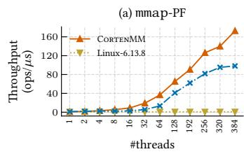

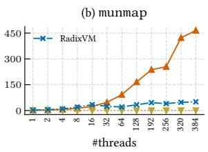  
Figure 1. The multicore performance of two other memory systems and CortenMM, each thread: (a) mmaps a region and access it, leading to page faults; (b) munmaps a region of mmaped pages.

This paper presents CortenMM1, a novel memory management system offering both high performance and strong correctness guarantees. CortenMM is a clean-slate design, part of a larger effort to develop a production OS from scratch. Our goal is to build a general-purpose OS, supporting mainstream ISAs, namely, x86 [21], ARM [17], and RISC-V [22], and serving as a drop-in replacement for Linux across various production environments, including trusted execution environments [81], data centers, and mobile computing.

We designed CortenMM to meet three key requirements: 1) Full featured: CortenMM must provide the same interfaces to applications and support advanced semantics that applications often rely on, such as on-demand paging and copy-on-write. 2) High performance: CortenMM must not be a performance bottleneck for modern applications, especially multithreaded ones. 3) Synchronization correctness: CortenMM must provide strong correctness guarantees on concurrency, instead of relying exclusively on testing.

To meet the above requirements, CortenMM’s design is guided by our observation that the performance and correctness deficiencies of MMs stem from their use of two levels of abstraction. Specifically, most OSes [9, 10, 12, 13, 15, 16, 33, 40, 43, 65] involve 1) a software-level abstraction, e.g., a balanced tree storing a set of virtual memory regions in a process as in Linux, and 2) a hardware-level abstraction, e.g., page tables. The goals of this design, which dates back to SunOS in 1986 [52], were to 1) increase the portability to diverse MMU hardware; and 2) support advanced memory semantics, such as on-demand paging. However, to ensure portability, the data structure in a software-level abstraction must be general, thus not similar to the one in a hardwarelevel abstraction. Unfortunately, correctly synchronizing two drastically different data structures requires complex concurrency control, leading to subtle concurrency bugs. In addition, two levels of abstraction generally introduce more synchronization overhead, thereby reducing scalability.

Our key insight is that a software-level abstraction is no longer necessary for OSes targeting mainstream ISAs (e.g., x86, ARM, and RISC-V). This is because, unlike in the past, when there was greater diversity among MMUs (e.g., segments [86], hashed page tables [53]), the mainstream ISAs mentioned above uniformly adopt multi-level radix tree page tables. Current OSes hides the minor differences among these MMUs with language features, such as C macros, rather than software-level abstractions. Furthermore, while providing advanced memory semantics requires storing extra state outside the MMU, this does not mandate a decoupled different level of abstraction and the associated complexity.

Based on the above, CortenMM departs from prior designs by eliminating the software-level abstraction. Instead, CortenMM uses language features to maintain portability and associates each page in the page table with an auxiliary memory region that stores only the minimal necessary information to support advanced semantics. Such sweeping simplicity enables us to design a high-performance and intuitive concurrency control mechanism, as detailed next.

CortenMM introduces a transaction interface as the only way to program the MMU. The transaction interface takes as input a virtual memory region and a sequence of basic operations (e.g., map or unmap pages) that operate within the region. CortenMM subsequently applies all basic operations within a transaction atomically, significantly simplifying reasoning regarding the concurrency control. Furthermore, the locking protocols for the transactional interface do not suffer from additional contention for the software level abstraction, thereby achieving high performance while ensuring atomicity. We design two locking protocols: a simple one $\left( \mathrm { C o R T E N M M _ { r w } } \right)$ based on readers-writer locks, and an advanced one $\left( \mathrm { C o R T E N M M _ { a d v } } \right)$ based on lock-free page table traversal enabled by RCU [1].

Finally, CortenMM uses programming language techniques to offer strong synchronization correctness guarantees. Our industry partners view testing alone as insufficient for the complex yet critical MM, especially for a new design like CortenMM. Therefore, thanks to its simplicity and clean concurrency control semantics, we were able to formally verify the concurrency code that operates on the MMU, the core part of CortenMM. We proved 1) functional correctness of the basic operations (map, unmap, etc.) in the transactional interface, and 2) the correctness of both locking protocols. For other components, we use safe Rust [14] to ensure that they are memory-safe, data-race-free, and can only use the verified transactional interface to access the MMU.

We evaluated CortenMM on a 384 core machine with workloads that stress memory management. Our evaluation shows that, for most memory management operations, the formally verified CortenMM scales well. CortenMM outperforms Linux by 1.2× to 26× on real-world benchmarks.

In summary, this paper makes the following contributions:   
• Insights. We reveal that 1) the root causes of poor performance and correctness in memory management lie in the two levels of abstraction, and 2) the softwarelevel abstraction is unnecessary for modern OSes.

• Transactional interface. We contribute an efficient and formally verified transactional interface for MMU operations, which future work can build upon.

• CortenMM. We design CortenMM, a full-featured memory management system achieving high performance while offering strong synchronization correctness guarantees, suitable for modern MMUs.

The artifact of CortenMM is available at https://github. com/TELOS-syslab/CortenMM-Artifact.

## 2 Background

The context of this work is a collaboration between academic researchers and industry practitioners to develop a production OS named Asterinas [79] from the ground up (§2.1). As part of this larger project, we are investigating the potential benefits of departing from the long-standing software-level abstraction (§2.2) in memory management systems.

## 2.1 Building a Production OS from Scratch

Our OS, Asterinas, is designed to be general-purpose, and suitable for various production environments. The goal is a production-strength, open-source, drop-in replacement for Linux on mainstream ISAs, namely, x86, ARM, and RISC-V. The development team currently comprises around thirty people, twelve of whom are full-time engineers. The core part of Asterinas (excluding drivers) consists of 130K lines of code. For compatibility with existing applications, Asterinas provides the same system call interfaces and replicates key features of Linux. At the time of this writing, we have implemented 219 (out of 336) of the most commonly used system calls in Linux, able to run large-scale applications, such as JVM and MySQL.

## 2.2 Current MM: the Good, the Bad, and the Ugly

This subsection reviews the advantages and disadvantages of the conventional memory management system design, which is based on two levels of abstraction.

The good: supporting advanced memory management semantics and increasing portability. The earliest design we found that introduced two levels of abstraction is SunOS [52], dating back to 1986. The software-level abstraction represents the process address space as a set of virtual memory areas. We refer to these virtual memory areas as VMAs, the term used in Linux. A VMA represents a set of contiguous virtual pages with the same properties (e.g., the same access permissions).

SunOS introduced the software-level abstraction for two reasons [52]. First, VMAs maintain state not in the hardware MMU that is required for advanced memory management semantics. For example, to support on-demand paging, the OS initially only reflects mmaped regions in VMAs and later propagates changes to the hardware MMU on demand (upon a page fault). Second, the software-level abstraction decouples most memory management code from hardware. This facilitates porting to various types of hardware MMUs, including segments [86], inverted [58], hashed [53], and linear page tables [83], with some employing software TLBs [56].

<table><tr><td>Type</td><td>Operations</td><td>Locks to acquire</td></tr><tr><td rowspan="2">VMA</td><td>① Read VMA fields</td><td>Reader side of mmap_lock or the VMA lock.</td></tr><tr><td>② Write VMA fields</td><td>Writer side of mmap_lock and the VMA lock.</td></tr><tr><td>PT</td><td>③ Access page table</td><td>Acquire the locks for writes; no locking for reads.</td></tr><tr><td rowspan="4">Basic Op</td><td>④ Page table traversal</td><td>Locks to read VMA fields. Locks to read VMA fields</td></tr><tr><td>③ Insert a page table entry</td><td>and the lock of the target page table.</td></tr><tr><td>③ Clear a page table entry</td><td>Locks to read VMA fields and the lock of the parent page table.</td></tr><tr><td>⑦ Free a page table</td><td>Locks to write VMA fields and the page table entry has been cleared.</td></tr></table>

Table 1. Simplified locking rules for Linux virtual memory.

The two-level abstraction design became the standard for memory management systems. In the 1990s, Linux [12] and BSD [72], two mainstream OSes at that time, inherited this design. Today, most modern OSes, including mature industry OSes (Linux [12], FreeBSD [9], Solaris [15], Windows [16], Fuchsia [10], and HongMeng [40]) and academic proposals (K42 [65], Barrelfish [31], NrOS [33], Bonsai [42], RadixVM [43]), adopt this design.

The bad: complicated concurrency control protocol. With modern servers commonly comprising hundreds of cores, a drawback of two levels of abstraction has emerged: the requirement for complex fine-grained concurrency control. Below, we use the latest Linux design as an example.

To balance portability, feature support, single- and multicore performance, the software-level abstraction in Linux evolved to a balanced tree [47] (now an RCU-safe maple tree [55]) indexed by intervals: a node stores the entire VMA by recording the start and end memory addresses. The data structure of the software-level abstraction is optimized for advanced memory management operations and, to maintain portability, is not tied to any specific hardware MMU [87].

Linux memory management employs four different locks: 1) mmap\_lock, protecting the whole address space; 2) VMA locks, guarding individual VMAs, 3) a coarse-grained page table lock, protecting all entries above the level 3 page table, which are closer to the page table root, and 4) fine-grained page table locks, each protecting a page in level 2 or level 1 page tables. The first two VMA-related locks are readerswriter locks, while the last two for page tables are exclusive.

Table 1 lists the simplified locking rules summarized from the official 5000-word Linux document [62]. Rules for either VMAs or page tables are simple. However, rules for basic memory operations are much more complicated, requiring dealing with the locks in both levels. All operations must hold at least the locks for VMA read to prevent the VMA from being deleted or modified concurrently. They then acquire page table locks only for writing to the page table. Freeing a page table entry is an exception: it requires the code to have cleared the entry first, and thus only holds VMA locks.

1 /\* during page\_fault(addr): \*/ 1 /\* during mmap(addr, len): \*/   
2 rcu\_start\_read(mm.tree) 2 write\_lock(mm.mmap\_lock)   
3 vm\_area\_struct \*vma 3 vm\_area\_struct \*vma   
4 = find\_vma(mm.tree, addr) 4 = find\_vma(mm.tree, addr)   
5 rcu\_end\_read(mm.tree) 5 write\_lock(vma.lock)   
6 // checked vma == NULL 6 expand(vma)   
7 read\_lock(mm.mmap\_lock) 7 write\_unlock(vma.lock)   
8 vma = find\_vma(mm.tree, addr) 8 write\_unlock(mm.mmap\_lock)   
9 // checked vma == NULL   
10 upgrade\_lock(mm.mmap\_lock) 1 /\* during munmap(addr, len): \*/   
11 vma = find\_vma(mm.tree, addr) 2 write\_lock(mm.mmap\_lock)   
12 write\_lock(vma.lock) 3 do {   
13 expand(vma) 4 // in vma\_start\_write()   
14 write\_unlock(vma.lock) 5 write\_lock(vma.lock)   
15 downgrade\_lock(mm.mmap\_lock) 6 WRITE\_ONCE(vma.vm\_lock\_seq)   
16 // No need to read lock VMA. 7 write\_unlock(vma.lock)   
17 // Read locked mm, operate PTs 8 } for\_each\_vma(mm.tree)   
18 lock(mm.page\_table\_lock) 9 downgrade\_lock(mm.mmap\_lock)   
19 unlock(mm.page\_table\_lock) 10 // Marked VMAs before downgrade   
20 lock(pmd) 11 // mm, do without VMA locks   
21 \*pmd = pmd\_alloc() 12 unmap\_vmas()   
22 unlock(pmd) 13 free\_page\_tables()   
23 read\_unlock(mm.mmap\_lock) 14 write\_unlock(mm.mmap\_lock)  
Figure 2. Part of Linux’s locking for page faults, mmap and, munmap.

The challenge lies in handling complete operations such as system calls (e.g., mmap, munmap) and page faults2. Such operations involve multiple VMAs, and perform a combination of several basic operations (e.g., first traverse the page table and then insert an entry). The locking rules for such cases are hard to derive from Table 1 and are only documented in the code. Figure 2 shows part of the locking in several Linux operations. Much of the complexity in page fault is in finding the most scalable way (L2-L15) at the VMA level to modify a VMA, specifically, expanding a VMA (L13) to match the subsequent updates in the page table (L21). Interestingly, while mmap also requires expanding a VMA (L6), it avoids the complexity and simply acquires the writer side of the coarse-grain mmap\_lock.

The ugly: scalability bottleneck for multicore applications and concurrency bugs. Despite the complex finegrained concurrency control discussed above, Linux memory management is still a well-known scalability bottleneck for multithreaded applications. Several academic works mitigate such overhead with new data structure designs [42, 43, 64] and/or advanced concurrency control [31, 33], but it is still far from ideal (§6.3). The memory management bottleneck is reported to affect important real-world use cases by severely reducing the performance of, for example, application startup in Android, thread creation in Google Fibers, and TCP zero-copy [29].

Furthermore, modern memory management systems are susceptible to subtle concurrency bugs, leading to severe vulnerabilities. For example, Linux introduced the fine-grained concurrency control presented above in April 2023 [30]. Over the past two years, there have already been ten CVEs [2– 8, 18–20] resulting from concurrency bugs in this recent change. Among these ten CVEs, nine can be exploited to crash the system, and five can lead to other severe vulnerabilities, such as information leak and privilege escalation.

<table><tr><td></td><td>On-demand paging</td><td>COw</td><td>Page swapping</td><td>Reverse mapping</td><td>mmaped file</td><td>Huge page</td><td>NUMA policy</td></tr><tr><td>Linux</td><td>√</td><td>√</td><td>√</td><td>√</td><td>√</td><td>√</td><td>√</td></tr><tr><td>RadixVM [43]</td><td>√</td><td>√</td><td>×</td><td>×</td><td>√</td><td>×</td><td>√</td></tr><tr><td>NrOs[33]</td><td>×</td><td>×</td><td>×</td><td>×</td><td>×</td><td>√</td><td>√</td></tr><tr><td>CORTENMM</td><td>√</td><td>√</td><td>√</td><td>√</td><td>√</td><td>√</td><td>×</td></tr></table>

Table 2. A comparison of supported memory management features.  
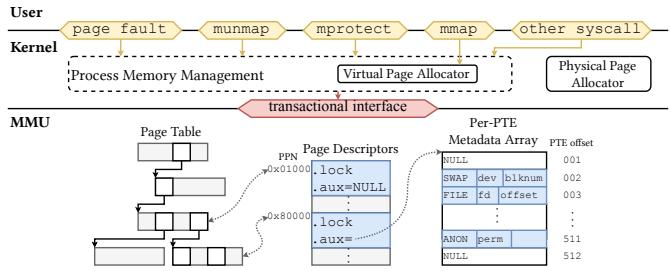  
Figure 3. CortenMM architecture.

## 3 An Overview of CortenMM

This section overviews CortenMM, a clean-slate, highperformance memory management system with strong concurrency correctness guarantees. CortenMM manages MMU hardware, allocates virtual address spaces and physical pages, and handles all memory management system calls (e.g., mmap, munmap, mprotect) as well as page faults.

## 3.1 Design Goals

We design CortenMM to meet the following goals.

• Full featured. To replace Linux (§2.1), CortenMM must maintain compatibility with existing applications by providing the same interfaces as Linux and supporting common memory management semantics such as those shown in Table 2.

• High performance. CortenMM should not be an OS performance bottleneck for both single- and multithreaded applications.

• Synchronization correctness. High performance requires fine-grained locking, which has proven challenging even for experienced OS developers (§2.2). CortenMM should provide an intuitive locking protocol that is easy to reason about and offers stronger correctness guarantees than testing alone.

## 3.2 Design Insight

CortenMM simultaneously achieves high performance and synchronization correctness. Our observation is that the two levels of abstraction are the root cause of both challenges, since it is difficult to correctly and efficiently synchronize two drastically different and complex data structures.

More specifically, the synchronization correctness issue stems from complicated locking rules. At first glance, as shown in Table 1, concurrency control for either level is simple. However, complication arises when properly synchronizing both levels to avoid state inconsistency between them, especially in cases involving multiple operations. Furthermore, synchronizing both levels requires more concurrency control, which leads to possible contentions, reducing scalability. For example, concurrent page faults on disjoint memory regions scale at the page table level, but they may require modifying the VMA and thus contend at the VMA level (Figure 2).

Our key insight is that the two-level abstractions no longer suit most modern OSes since the two main reasons (§2.2) for introducing the software-level abstraction are largely gone. First, most, if not all, modern ISAs (e.g., x86, ARM, and RISC-V) utilize similar MMU hardware based on multilevel radix tree page tables. To hide the minor differences among these hardware MMUs, kernel code of current OSes already uses language features, such as C macros, rather than the software-level abstraction. Second, while supporting advanced semantics (e.g., those shown in Table 2) requires bookkeeping state that is not included in the MMU, this does not mandate another level of abstraction.

## 3.3 A Single-Level Abstraction Design

Data structure. Departing from prior design, as shown in Figure 3, CortenMM eliminates the software-level abstraction and the associated complexity, achieving sweeping simplicity. CortenMM associates each page table page (PT page) with a page descriptor. The page descriptors are allocated in a contiguous memory region during the OS boot. Each descriptor is indexed by the physical page number (i.e., physical address divided by page size) of the corresponding PT page. The descriptor consists of a lock to protect itself, the PT page, and a per-PTE (page table entry) metadata array.

The per-PTE metadata array, indexed by the PTE offset, stores the minimal necessary state for advanced semantics (in Table 2). This array is allocated on demand and freed together with the corresponding PT page.

Programming interface. Exploiting the simplicity of the single-level abstraction, we further design a scalable and intuitive concurrency control mechanism. Specifically, CortenMM introduces a transactional interface (Figure 4) and uses it as the only way to program the MMU.

The interface design decouples concurrency control from operations; the caller first invokes AddrSpace::lock(r) (L10) to specify a virtual memory region. The AddrSpace::lock(r) returns a RCursor object, and the caller uses this RCursor to specify any combination of four basic operations (i.e., query, map, mark, and unmap) (L12), which CortenMM atomically performs within the specified range. The combination of the basic operations encapsulates all ways to manipulate the MMU. As an optimization, CortenMM creates page table entries on demand, using upper-level PT pages to represent large memory regions with identical status.

```rust
1 pub enum Status { // Variants of the virtual page state.
2 Invalid, Mapped(PhysPage, Perm),
3 // Below are virtually allocated page states.
4 PrivateAnon(Perm),
5 PrivateFileMapped(File, Offset, Perm),
6 Swapped(BlockDev, BlockNum, Perm),
7 * shared anonymous, etc. */
8 }
9 impl AddrSpace {
10 pub fn lock(&self, r: Range<Vaddr>) -> RCursor;
11 }
12 impl RCursor {
13 /// Returns the status of the virtual page at addr.
14 pub fn query(&mut self, addr: Vaddr) -> Status;
15 /// Maps a physical page to addr.
16 pub fn map(&mut self, addr: Vaddr, page: PhysPage);
17 /// Changes a memory region specified by range to status.
18 pub fn mark(&mut self, range: Range<Vaddr>, status: Status);
19 /// Unmaps a virtual region specified by range
20 pub fn unmap(&mut self, range: Range<Vaddr>);
21 }
22 // On destruction, the `RCursor` releases the acquired locks.
23 impl Drop for RCursor { fn drop(&mut self) { /*...*/ } }
```  
Figure 4. The transactional interface to program the MMU. Status encodes state for various types of virtual pages (e.g., for a swapped page, Status stores the disk ID, the location on the disk, and the permission). The comments explain what each basic operation does.

Locking protocol. The simplicity of handling only MMU hardware further enables us to design the locking protocol (§4.1) that directly locks on PT pages, exploiting the hierarchy structure of the page table. By eliminating contentions on the software-level abstraction, our protocols achieve much better scalability than conventional two-level abstraction designs and can support a transactional interface. Concurrency control semantics. As a result, CortenMM offers simple yet powerful concurrency control semantics: 1) all memory operations within a transaction are executed atomically, simplifying the reasoning for complex cases; and 2) concurrent transactions are serialized only when they operate on overlapping memory regions, while transactions on disjoint regions execute in parallel.

## 3.4 Achieving Strong Correctness Guarantee

Formal verification. The design of CortenMM also enables us to formally verify concurrency code operating on the MMU (§5). Verification offers much stronger guarantees than testing, which our industry partners consider insufficient for the complicated yet critical memory management code, especially for a new implementation like CortenMM. We verified 1) the correctness of both locking protocols; and 2) the functional correctness of RCursor operations, including the well-formedness invariant of the page table.

Verification is made possible for the following two reasons. First, the transactional interface decouples concurrency control from operations. Therefore, one can verify these two aspects separately, simplifying the verification. Second, clean concurrency semantics let us write simple formal specifications provable with modest manual effort.

Rust. We program CortenMM in Rust, which offers strong correctness guarantees for the rest of the code (e.g., maintaining usage statistics, allocating physical pages) that does not operate on the MMU. CortenMM forces such code to only use safe Rust (by #![deny(unsafe\_code)]), offering two benefits. First, safe Rust helps detect concurrency bugs by preventing data races. CortenMM uses simple concurrency control (e.g., mutual-exclusive locks) in such code, and thus is mostly susceptible to straightforward bugs (e.g., forgetting to acquire the lock before access), which data race detection can effectively catch. Second, safe Rust, which cannot contain inline assembly, prevents the rest of the code from bypassing the transactional interface to access the MMU, thereby ensuring the correctness guarantees.

## 3.5 Discussion

Portability and security on mainstream ISAs. Current mainstream ISAs (e.g., x86, ARM, RISC-V) all use the MMU format that CortenMM targets (i.e., a multi-level radix tree page table; see §4.4 for more discussion). For these ISAs, eliminating the software-level abstraction improves performance (§6.2), security, and even portability. CortenMM improves security by offering stronger correctness guarantees and avoiding extra kernel code for the software-level abstraction. For portability, CortenMM uses Rust traits to hide the hardware differences, similarly to how Linux uses C macros (§4.5). Our evaluation (§6.7) shows that porting from x86 to RISC-V and supporting new MMU features (i.e., MPK) only incur minor code changes (less than 200 LoC). The changed LOC is even smaller than Linux, mostly because Linux needs to add extra code for VMAs.

Limitations. CortenMM does not apply to ISAs whose MMU is not a multi-level radix tree page table. Since CortenMM eliminates the software-level abstraction, porting it across these ISAs likely incurs significant efforts. Furthermore, since the locking protocol of CortenMM exploits the page table structure, it may not apply to other MMUs. Retrofitting to existing OSes. We believe the idea of eliminating the software-level abstraction also applies to a mature OS such as Linux, if Linux drops support for ISAs that do not use multi-level linear page tables. However, this requires substantial engineering efforts.

## 4 CortenMM Design

## 4.1 The Locking Protocol

Upon AddrSpace::lock(r) (Figure 4), CortenMM performs the locking protocol to lock the correct set of PT pages, fulfilling the concurrency control semantics (§3.3). We refer to PT pages closer to the root as higher-level ones and those close to the leaf as lower-level ones. We first present a very simple readers-writer lock version of the locking protocol $\left( \mathrm { C o R T E N M M _ { r w } } \right)$ , followed by a more advanced version $\mathrm { ( C o R T E N M M _ { a d v } ) }$ , and conclude by discussing the correctness of CortenMMrw and CortenMMadv.

1 def AddrSpace::lock(addr\_space, range):   
2 cur\_pt\_page = addr\_space.pt\_root   
3 while child\_pt\_page\_should\_cover(cur\_pt\_page, range):   
4 read\_lock(cur\_pt\_page)   
5 if cur\_pt\_page.has\_child(range):   
6 cur\_pt\_page = child\_node\_of(cur\_pt\_page, range)   
7 else: read\_unlock(cur\_pt\_page) break   
8 write\_lock(cur\_pt\_page) # lock one implicitly locks all   
9 ranged\_cursor.root = cur\_pt\_page   
10 return ranged\_cursor   
11   
12 def AddrSpace::unlock(ranged\_cursor):   
13 release\_locks\_in\_reverse(ranged\_cursor)  
Figure 5. Pseudocode of the CortenMMrw locking protocol.

1 def AddrSpace::lock(addr\_space, range):   
2 while True: # retry loop   
3 start\_rcu\_read\_critical\_section()   
4 cur\_page = addr\_space.pt\_root   
5 while child\_pt\_page\_should\_cover(cur\_page, range):   
6 ch\_page = atomic\_read\_child\_page\_of(cur\_page, range)   
7 if ch\_page == None: break   
8 cur\_page = ch\_page   
9 lock(cur\_page) # this is covering PT page now   
10 if cur\_page.stale: # race with unmap?   
11 unlock(cur\_page)   
12 end\_rcu\_read\_critical\_section()   
13 continue # retry since the PT page is being removed   
14 end\_rcu\_read\_critical\_section()   
15 ranged\_cursor.root = cur\_page   
16 # lock all descendants of the covering PT page   
17 dfs(ranged\_cursor.root, for\_each page: lock(page))   
18 return ranged\_cursor   
19   
20 def AddrSpace::unlock(ranged\_cursor):   
21 # release the locks in the reversed order   
22 rev\_dfs(ranged\_cursor.root, for\_each page: unlock(page))   
23 unlock(ranged\_cursor.root)   
24   
25 def RCursor::unmap(ranged\_cursor, range):   
26 page = navigate\_to\_target\_page(ranged\_cursor, range)   
27 if NO\_NEED\_TO\_REMOVE\_PTS:   
28 # logics where there is no need to remove PTs   
29 elif NEED\_TO\_REMOVE(page, child):   
30 atomic\_remove\_pt\_from\_parent(page, child)   
31 rev\_dfs(child, for\_each page:   
32 page.stale = True   
33 unlock(page)   
34 )   
35 rcu\_delay\_free(child)  
Figure 6. Pseudocode of the CortenMMadv locking protocol.

$\mathbf { C o R T E N M M } _ { \mathrm { r w } } .$ Figure 5 shows the pseudocode of the CortenMMrw locking protocol. The thread traverses from the root of the page table (L2). It first checks, assuming the current PT page is fully populated, whether one of its child PT pages completely covers the specified range (L3). If so, it acquires a reader lock on the PT page (L4), and moves to that child PT page if it exists (L6) and continues. Otherwise, the current PT page is the lowest possible level one that covers the entire region specified by the range. We term this PT page the “covering PT page”. The thread releases the reader lock of the covering PT page (L7) and acquires the writer lock (L8). The covering PT page is recorded in the RCursor (L9) to perform basic operations. When the RCursor goes out of scope, the acquired locks are automatically released in the reverse order of the lock acquisition (L13). This very simple locking protocol outperforms Linux by 15× in real-world benchmarks (§6.4).

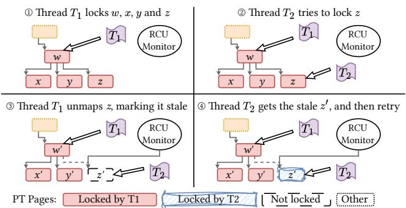  
Figure 7. CortenMMadv handles concurrent unmap and locking.

CortenMMadv is based on mutually exclusive spin-locks. Figure 6 shows the pseudocode. We first present the basic locking protocol, followed by the handling of a corner case. Basic locking protocol of $\mathbf { C o R T E N M M } _ { \mathrm { a d v } } .$ . The locking protocol operates in two phases: a traversal phase (L2-L8) and then a locking phase (L9-L17). The traverse phase finds the covering PT page similar to $\mathrm { C o R T E N M M _ { r w } }$ . However, unlike $\mathrm { C o R T E N M M _ { r w } , }$ the traversal phase does not acquire any lock, thereby offering better scalability than $\mathrm { C o R T E N M M _ { r w } }$

The locking phase locks the PT page (L9) and then performs a preorder DFS search to lock all the PT pages that are descendants of the covering PT page (L17). The locking phase is necessary since Corte ${ \ J } \mathrm { M M } _ { \mathrm { a d v } }$ cannot simply lock the covering PT page as $\mathrm { C o R T E N M M _ { r w } }$ . Otherwise, since the traverse phase is lockless, another thread may bypass the covering PT page to operate on the same PT page as the current thread, violating mutual exclusion.

Unmapping PT pages in $\mathbf { C o R T E N M M } _ { \mathrm { a d v } }$ . Figure 7 shows a corner case in $\mathrm { C o R T E N M M _ { a d v } } ;$ , involving unmapping PT pages. Thread $T _ { 1 }$ has locked PT pages ??, ??, ??, and ?? and is about to unmap (and thus free) ??. Meanwhile, thread $T _ { 2 }$ tries to lock ??. Without special handling, this race leads to use-after-free. For example, another thread ??3 may reuse the freed $z ,$ making $T _ { 2 }$ access corrupted state.

$\mathrm { C o R T E N M M _ { a d v } }$ handles this race with RCU (read copy update) [1]. To unmap a PT page, ??1 first atomically clears the PTE entry in the parent PT page (L30). Therefore, other threads either see the old PT page or a cleared PTE entry. Next, ??1 keeps the freed PT pages in a global array (L35) that we call the RCU monitor. We put the traversal phase in an RCU read-side critical section (L3-L14). This enables $\mathrm { C o R T E N M M _ { a d v } }$ to check, for each PT page in the RCU monitor, if any threads remain in the read-side critical section to access the PT page. The RCU monitor frees the PT page when no threads can access the PT page, thereby preventing accesses to corrupted state.

With RCU, $T _ { 2 }$ may still access a stale state. Specifically, ?? Thhas been removed from the page table before ??2 locks ??, and thus any operation $T _ { 2 }$ performs on ?? is lost. $\mathrm { C o R T E N M M _ { a d v } }$ handles this by marking unmapped PT pages in a special stale status (L30). Once a thread locks a covering PT page, it checks if the page is in the stale status, and if so, re-traverses the page table (L11-13). Figure 7 shows the complete process. Correctness. Both $\mathrm { C o R T E N M M _ { a d v } }$ and $\mathrm { C o R T E N M M _ { r w } }$ ensure that memory operations within a transaction are performed atomically since they resemble two-phase locking [32, 50]. They acquire all necessary locks before performing any memory operation and release them only after all operations end. The exception in L6 in Figure 6 does not violate atomicity (since no operations have been performed) nor cause a deadlock, since $\mathrm { C o R T E N M M _ { r w } }$ always walks from the page table root to leaves. We prove that both algorithms maintain mutual exclusion in §5.

```rust
1 fn do_syscall_mmap(offset: Vaddr, size: usize, perm: Perm) {
2 let offset = if offset != 0 { offset } else { alloc_va() };
3 let range = offset..offset + size;
4 let mut rcursor = this_addr_space!().lock(range)?;
5 if rcursor.query(range) { /* necessary checks */ }
6 rcursor.mark(range, Status::PrivateAnon(perm));
7 }
8
9 fn do_syscall_munmap(offset: Vaddr, size: usize) {
10 let range = offset..offset + size;
11 let mut rcursor = this_addr_space!().lock(range)?;
12 rcursor.unmap(range);
1 3 }
14
15 fn page_fault_handler(faulting_addr: Vaddr, reason: PFReason)
16 -> Result<()> {
17 let mut rcursor = this_addr_space!().lock(fault_range)?;
18 match rcursor.query(faulting_addr) {
19 // Fault on virtually allocated private anonymous page?
20 Status::PrivateAnon(perm) => {
21 // ... SEGFAULT checks omitted.
22 rcursor.map(faulting_addr, alloc_zeroed(), perm);
23 }
24 // Fault on mapped page? Maybe COW or unprivileged access.
25 Status::Mapped(page, perm) => {
26 // Use the first unused bit as "copy-on-write".
27 if reason.is_write() && perm.contains(COW) {
28 // No need to COW if parent/child has left.
29 if page.meta().map_count() == 1 {
30 p -= COW; p |= WRITE;
31 rcursor.map(faulting_addr, page, p);
32 } else { // Do copy-on-write.
33 rcursor.map(faulting_addr, alloc_copied(&page),
34 *perm | WRITE); }
35 } else { return Err(SEGFAULT); }
36 this_addr_space!().tlb_flush(faulting_addr);
37 }
38 VirtPageState::Invalid => { return Err(SEGFAULT); }
39 // ... other states (e.g., swapped, file-backed) omitted
40 } // This function is atomic under `rcursor`.
41 }
```  
Figure 8. The simplified mmap, munmap, and the page fault handler.

## 4.2 Handling Memory Management Operations

Figure 8 shows the code to perform mmap, munmap, and handle page faults. Handling these operations is straightforward with the transactional interface (Figure 4). For example, mmap involves locking the range (L4), atomically performing 1 a query on the range to check, e.g., if it already exists; and 2 if the check passes, mark the range with the desired access permission. The mprotect and msync code is similar, where the code locks a range and accesses/modifies the page state.

The page fault handler first uses the faulting address to acquire an RCursor (L17). Afterwards, the whole complex page fault handling logic executes in a transaction (L18- L40). At the beginning of the transaction, the page fault handler uses query to check the state of the faulting address (L18). Next, it performs different operations based on the returned state. For example, the handler maps a new page for a virtually allocated anonymous page (L22). Lines 18 to 40 show the complicated case of handling a page fault on a mapped page, which all execute atomically.

```rust
1 /// A trait that abstracts over page table entries.
2 pub trait PageTableEntryTrait {
3 /// Returns if the PTE points to something.
4 /// Similar to `pte_present` in Linux.
5 fn is_present(&self) -> bool;
6 } // Other methods ignored for brevity.
7 // x86-64 specific implementation:
8 impl PageTableEntryTrait for x86::PageTableEntry {
9 fn is_present(&self) -> bool {
10 self.0 & x86::PteFlags::PRESENT.bits() != 0
11 || self.0 & x86::PteFlags::HUGE.bits() != 0
12 }
13 } // Other methods ignored for brevity.
14 // RISC-V specific implementation:
15 impl PageTableEntryTrait for riscv::PageTableEntry {
16 fn is_present(&self) -> bool {
17 self.0 & riscv::PteFlags::V.bits() != 0
18 }
19 } // Other methods ignored for brevity.
```  
Figure 9. How CortenMM uses Rust traits to hide ISA differences.

## 4.3 Supporting Advanced Memory Semantics

Supporting advanced memory semantics relies on the metadata array, which stores state that cannot be held in the MMU (Figure 3). Each entry in the array stores: 1) the status of the corresponding virtual page (e.g., invalid, virtually allocated but not mapped to a physical page, mapped to a physical page, or swapped); and 2) extra state for the page (e.g., access permissions for virtually allocated pages, and the device ID and offset for swapped pages).

On-demand paging. CortenMM supports on-demand paging as follows. Upon mmap, CortenMM marks the status of the virtual memory pages as virtually allocated and stores the access permissions in the corresponding metadata array entries. Upon a page fault, CortenMM maps the allocated physical page with access permissions stored in the metadata array entries.

Copy-on-write. CortenMM implements copy-on-write similar to Linux. Specifically, to facilitate copy-on-write, for each virtual page, CortenMM maintains two extra bits in the corresponding metadata array entry: a shared bit, denoting if multiple processes share the page, and a writable bit, denoting if the virtual page is actually writable. Upon fork, for each virtual page, CortenMM sets the shared bit, programs the MMU to make the page read-only, and sets the writable bit according to its original access permission. Afterwards, upon a page fault caused by a write access, CortenMM checks if both the shared bit and writable bit are set. If so, CortenMM clears the shared bit and copies the page.

## 4.4 Handling Page Table Format Differences

Other than assuming the page table as a multi-level radix tree, the implementation also assumes that the softwarecontrolled PTE bits can 1) identify the validity of the entry, 2) tell if the entry is a leaf, 3) enforce access permissions, and 4) provide access and dirty information. All the ISAs CortenMM targets, namely ARM, x86, and RISC-V, meet the above assumptions.

Figure 9 shows an example of how CortenMM hides minor architecture differences with Rust traits. The code hides the difference in the page table format, enabling the rest of the CortenMM code to remain unchanged.

## 4.5 Implementation

We implement CortenMM from scratch with 8028 lines of safe Rust and 122 lines of unsafe Rust. The core transactional interface consists of 829 LOC with 225 LOC for $\mathrm { C o R T E N M M _ { a d v } }$ (153 for CortenMMrw).

CortenMM currently supports page sizes of 4KB, 2MB, and 1GB, using the conventional huge page mechanism. Optimization: per-core virtual address allocator. Following prior work [36], to maximize scalability, CortenMM makes the virtual address allocator per core, and each core owns a private share of the address space. This avoids the contention on concurrent allocation and freeing.

Optimization: TLB shootdown. CortenMM borrows optimizations from prior works to scale TLB shootdowns. CortenMM parallelizes TLB flushes on all cores and does early TLB flush acknowledgement [25]. Also, CortenMM supports lazy TLB shootdown on munmap (LATR [66]). With this optimization, a CPU pushes unmapped pages and CPUs that may require the TLB shootdown to its private per-CPU buffer. On timer interrupts or rescheduling, each CPU checks other CPUs’ buffers and flushes the relevant TLB entries.

Physical memory management. The physical memory allocator and kernel heap allocator follow Linux’s buddy system allocator and slab allocator. CortenMM also borrows the design of Linux page descriptors (struct page) to store the additional metadata of any physical pages.

Locks. The lock of each PT page is stored in the corresponding page descriptor. CortenMMrw uses BRAVOpfqlock (phase fair queued lock [37] optimized with BRAVO [49]). CortenMMadv uses a simple preemptionbased RCU and the MCS lock [74] as the spin-lock.

Reverse mapping. We implement reverse mapping for both named pages (i.e., have a path in a file system that refers to this page) and private anonymous pages. The reverse mapping is recorded in the page descriptor, which points to either the file object (for named pages) or the AddrSpace (for anonymous pages). The file object contains a tree of all AddrSpaces that map the file, enabling reverse mapping. Reverse mappings of shared anonymous mappings are supported by naming the pages within the kernel. Reverse mappings are treated as hints. Access to the page table via reverse mapping always goes through the transactional interface.

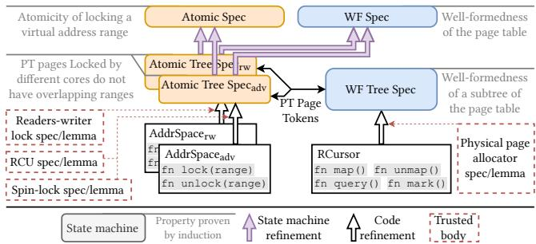  
Figure 10. The refinement hierarchy of CortenMM’s core part.

ARM support. The ARM support for our OS is currently under development, so we have not ported CortenMM to ARM. We expect that such porting should be straightforward, since ARM follows CortenMM’s assumptions on the page table format. ARM has special MMU features, such as the contiguous bit [78] and the break-before-make rule [24]. Supporting these features does not require changing our design or our proof (§5), but rather more engineering efforts. NUMA policy support. CortenMM runs on NUMA systems, but currently lacks NUMA policies (e.g., it does not optimize memory placement for NUMA). This can be addressed through more engineering efforts. We plan to incorporate Linux’s NUMA policy into CortenMM by storing the state of NUMA policy in the per-PTE metadata array.

## 5 Verifying Synchronization Correctness

We formally verify the core part of CortenMM that directly programs the MMU using Verus [67, 68], a recent semi-automated SMT-based verifier for Rust. Figure 10 shows the refinement hierarchy of our verification. We trust the hardware, the Verus verifier (and the associated SMT solver), and the rest of the OS code, e.g., the physical page allocator, DMA programming code, code to implement concurrency control primitives, such as locks and RCU.

Verification Goals. The implementation under transactional interfaces is separated into two loosely coupled modules, enabling compartmental proof: the AddrSpace module (L10 in Figure 4) that performs the locking protocol (§4.1) and the RCursor module (L12) that manipulates the page table. We prove the following key properties:

P1: Mutual exclusion. Both locking protocols in §4.1, namely, $\mathrm { C o R T E N M M _ { r w } }$ and $\mathrm { C o R T E N M M _ { a d v } } ,$ , correctly serialize concurrent invocations of AddrSpace::lock(r) operating on overlapping regions.

P2: Functional correctness of page table operations in the RCursor module (query(), map(), mark(), and unmap()) and that the page table is always well-formed.

## 5.1 Verifying the Correctness of Locking Protocols

Our proof leverages the property preservation of state machine refinements. We specify the mutual exclusion property at the top spec and prove that each lower spec refines the upper spec, all the way down to the locking protocol implementation, to complete the proof. We focus on the proof of CortenMMrw, since the one for CortenMMadv is similar.

Proving CortenMMrw adds two specs: a lower Atomic Tree Spec and an upper Atomic Spec (for proving mutual exclusion). We use the tokenized state machine [67] in Verus to ensure the implementation refines the Atomic Tree Spec. We prove that the Atomic Tree Spec refines the Atomic Spec with forward simulation.

The Atomic Tree Spec. With Atomic Tree Spec, each allocated PT page is in one of the following states: Unlocked, ReadLocked, and WriteLocked. A ReadLocked PT page is also associated with a counter storing the number of readers.

Each core also maintains the state for the locking protocol execution. A core can only lock one range at a time, since CortenMM disables preemptions during page table operations (following Linux [71]). The state of a locking protocol execution can be in Void, ReadLocking, or WriteLocked. The latter two states also include a path field, storing a set of PT pages that have been locked. Due to space limitations, we omit the state and the associated transition for 1) the unlock part of the protocol; and 2) PT page allocation/free.

There are three state transitions: LockingStart(core), ReadLock(core,PT\_page), and WriteLock(core,PT\_page). LockingStart changes the locking protocol state of the specified core from Void to ReadLocking. ReadLock requires that the locking protocol is in the ReadLocking state, the target PT page is either in Unlocked or ReadLocked, and it is a child of the last PT page in the path. It appends the path field with the target PT page and updates the status for the PT page. WriteLock requires that the locking protocol is in the ReadLocking state and that the target PT page is similarly lockable and is connectable to the path. It also appends the path field and changes the locking protocol state to WriteLocked.

At the Atomic Tree Spec, we prove the non-overlapping property: for any two cores with the locking protocol being WriteLock, the respective last PT pages in their path (the write-locked PT page) do not form an ancestor-descendant relationship.

The Atomic Spec. The Atomic Spec is only left with two states for the locking protocol: Null and Hold, which maintains the path field. There are two state transitions: lock(core,PT\_page), which makes all PT pages that are descendants of the specified PT page exclusively accessible by the specified core, and the reverse operation, unlock(core).

We prove the mutual-exclusion property by showing that the Atomic Spec maintains the following invariant: for any lock, before its corresponding unlock is called, no other operations can operate on a PT page that is an ancestor or descendant of the PT page in this lock, as shown in Figure 11.

We show that the Atomic Tree Spec refines the Atomic Spec by first providing a function interp that maps states

```rust
1 pub proof fn lemma_mutual_exclusion(
2 states: Seq<AtomicSpec::State>, steps: Seq<AtomicSpec::Step>,
3 core: Core, pt_page: PTPage
4 ) requires
5 all_hold_invariants(states),
6 steps.len() >= 1,
7 states_generated_from_steps(states, steps),
8 // The first transition is 'lock(core, pt_page)',
9 // and the remains are not the corresponding 'unlock'.
10 steps[0] =~= AtomicSpec::Step::lock(core, pt_page),
11 forall |i| 0 < i < steps.len() && steps[i].is_unlock() ==>
12 core != _core, // _core = steps[i].get_unlock_0()
13 ensures
14 // Other cores cannot access the critical section.
15 forall |i| 0 < i < steps.len() && steps[i].is_lock() ==>
16 core != _core && // _core = steps[i].get_lock_0()
17 // _pt_page = steps[i].get_lock_1()
18 !ancestor_descendant(pt_page, _pt_page),
19 decreases steps.len(),
20 { /* Proof details omitted */ }
```

## Figure 11. Pseudocode of proof of the mutual-exclusion.

```rust
1 #[invariant]
2 pub spec fn page_table_wf(self) -> bool {
3 &&& forall |addr: int| self.pages.dom().contains(addr) ==> {
4 let page = #[trigger] self.pages[addr];
5 &&& forall |pte_addr: int|
6 page.pte_addrs.contains(pte_addr) ==> {
7 // pte is valid
8 &&& self.ptes.dom().contains(pte_addr)
9 &&& self.ptes[pte_addr].level > 1 ==> {
10 let pte = self.ptes[pte_addr];
11 // pte points to a valid page
12 &&& self.pages.dom().contains(pte.page_pa)
13 &&& forall |child_pte_addr: int|
14 #[trigger] self.pages[pte.page_pa]
15 .pte_addrs.contains(child_pte_addr) ==> {
16 let child_pte = self.ptes[child_pte_addr];
17 // child is valid
18 &&& self.ptes.dom().contains(child_pte_addr)
19 // child points to a valid page
20 &&& self.pages.dom().contains(child_pte.page_pa)
21 // child level relation
22 &&& self.ptes[child_pte_addr].level == pte.level - 1
23 }}}} // additional invariants omitted
24 }
```  
Figure 12. The key invariant of page table.

in the Atomic Tree Spec to the states in the Atomic Spec. Based on interp, we find the corresponding transition in the Atomic Spec for each transition in the Atomic Tree Spec. Next, we use the non-overlapping property in the Atomic Tree Spec to show that the mapped state also maintains the invariants in the Atomic Spec.

The proof of mutual exclusion for CortenMMadv is similar. Given that RCU enables safe reads without explicit synchronization with other threads, we model the traverse phase of CortenMMadv in a way that a core can start locking from any PT page. Therefore, the proof only requires a minor change in the Atomic Tree Spec to model the locking phase to lock all descendants of the covering PT page, instead of only the covering PT page.

## 5.2 Verifying the Correctness of Basic Operations

The transactional interface design enables us to verify the functional correctness of operations that manipulate page tables with sequential reasoning. As shown in Figure 10, we connect the functional correctness proof with the mutual exclusion proof with tracked ownership (PT page tokens).

In terms of functional correctness, we prove that 1) a map operation creates the correct entries in all levels of the page table with the correct permission and metadata to map the specified virtual page to the physical page; 2) similarly, an unmap operation removes entries in any levels of the page table covered by the specified virtual address range; 3) a mark operation correctly updates the status of the specified range by modifying relevant per-PTE metadata arrays (§3.3); and 4) a query operation walks along the page table and returns the status of the queried page.

We also prove that, under these operations, the page table is always a well-formed tree: for any page table entry with its present bit set, it must either be the last level entry or point to a valid PT page belonging to the lower level of the page table, as shown in Figure 12. To prove this global invariant, we introduce a lower WF Tree Spec to prove that subtrees in the page table are well-formed.

## 5.3 Verification Limitations

We model the physical page storing the page table as a simple linear array following prior work [51, 90], since our proof does not employ a machine model.

In addition, our proven code is not linked with the unproven code. Verus requires programmers to rewrite the code with the provided primitives for proof and compile such rewritten code with Verus. However, other than CortenMM, part of our OS uses certain Rust features (e.g., min\_specialization [23]) that require the nightly version of the Rust compiler to compile. We found it difficult to link these two types of code. As a result, we port the code to Verus and verify it separately from the rest of the OS code. We ensure that the proven code matches the implementation in the kernel. We are also in the process of eliminating code that relies on the nightly version of the Rust compiler.

## 6 Evaluation

Our evaluation answers the following questions:

• Does CortenMM improve the single-threaded performance of memory management operations? (§6.2)

• How scalable is CortenMM? (§6.3)

• Does CortenMM improve the performance of realworld applications? (§6.4)

• What is the memory overhead of CortenMM? (§6.5)

• What is the verification cost in CortenMM? (§6.6)

• How portable is CortenMM? (§6.7)

## 6.1 Evaluation Setup

Baseline. We compare CortenMM with Linux (kernel version 6.13.8), RadixVM [43], and NrOS [33]. Linux represents a mature real-world kernel. RadixVM and NrOS represent stateof-the-art research work for high-performance memory management. For a fair comparison, we disable all Linux’s mitigations (e.g., KPTI [61]) that may slow down its performance for the evaluated workloads. We compile NrOS and RadixVM in the release mode. Linux and CortenMM both run Ubuntu 22.04; CortenMM can run Ubuntu since, as discussed in §2.1, our OS provides the same system call interfaces as Linux. Other configurations are by default.

<table><tr><td>Name</td><td>Repeated operations on each thread</td></tr><tr><td>mmap</td><td>Each thread mmap(s a 16KB region</td></tr><tr><td>mmap-PF</td><td>Each thread mmap(s a 16KB region and then accesses it.</td></tr><tr><td>unmap-virt</td><td>Each thread munmap(s a 16KB region not backed by physical pages.</td></tr><tr><td>unmap</td><td>Each thread munmap(s a 16KB region backed by physical pages.</td></tr><tr><td>PF</td><td>Each thread accesses a 16KB region not backed by physical pages.</td></tr></table>

Table 3. Evaluated microbenchmarks.

Environments. We conducted our evaluation on a twosocket AMD EPYC 9965 machine. Each socket is equipped with a 192-core CPU (384 cores in total) and 512GB DRAM (1TB in total). We disabled hyper-threading and turbo boost. We conducted the experiments in a virtual machine because our OS (also RadixVM and NrOS) lacks some drivers to boot directly on our evaluation machine. We do not believe that using a VM affects our performance claims.

Workloads. Our workloads cover a wide range of memory management use cases. We use five microbenchmarks (Table 3) to study the performance of several important workload patterns. For real-world applications, we use PARSEC 3.0 [34], metis [60], psearchy [82], and JVM (with Open-JDK version 21.0.6 [26]). metis and psearchy are from MOS-BENCH [36], a benchmark suite to study operating system multicore scalability.

## 6.2 Single Thread Microbenchmarks

Figure 13 shows that CortenMMadv outperforms Linux for four out of five microbenchmarks (namely, mmap-PF, PF, unmap-virt, and unmap), ranging from 7.8% to 46.8%, except for a small −3.1% degradation at mmap. Linux suffers in unmap-virt because this operation requires the VMA tree to split nodes, which is much more costly than simply removing the page table. For the rest, the performance difference is due to the time Linux spends in the VMA.

$\mathrm { C o R T E N M M _ { a d v } }$ is slower than Linux in mmap due to allocating and initializing page table pages, which is slightly more expensive than initializing a VMA structure in Linux. However, in most cases, Linux still needs to allocate the page table pages eventually upon page faults. Therefore, $\mathrm { C o R T E N M M _ { a d v } }$ outperforms Linux in mmap-PF.

$\mathrm { C o R T E N M M _ { r w } }$ is slower than $\mathrm { C o R T E N M M _ { a d v } }$ due to acquiring read locks, which is more costly than RCU. $\mathrm { C o R T E N M M _ { r w } }$ still outperforms Linux, except for mmap, for the same reason as $\mathrm { C o R T E N M M _ { a d v } }$

NrOS does not support on-demand paging. Therefore, we only evaluate mmap-PF and unmap with NrOS. (For NrOS, mmap-PF is mmap()) The performance of NrOS and RadixVM conforms to previously reported results [33, 43].

Operations that must enumerate the address space. The worst case for CortenMM are operations that must enumerate the address space, such as fork(), since CortenMM needs to walk the page tables to locate all memory regions, while Linux uses the VMA for that.

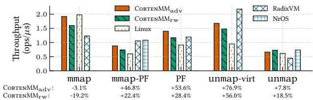  
Figure 13. Single-threaded throughput of memory operations. Improvements of CortenMM over Linux are listed below the figure.

We evaluated such a case using LMbench [48, 73], which includes three relevant micro-benchmarks: 1) fork, where a dummy process repeatedly forks itself; 2) fork + exec, where the child execves another dummy process after fork; and 3) shell, where the child does execlp sh -c echo. Figure 20 shows the results. CortenMM is 17.7% slower than Linux for fork. However, CortenMM outperforms Linux by 23.0% in fork + exec, since CortenMM handles page faults faster than Linux. Finally, in the shell benchmark, CortenMM performs similarly to Linux.

Summary. CortenMM speeds up single-threaded memory operations by eliminating the software-level abstraction.

## 6.3 Multithreaded Microbenchmarks

Figure 14 shows the throughput of multithreaded microbenchmarks. Each microbenchmark has two variants. In the low-contention one, each thread works on a private memory region, whereas in the high-contention one, each thread works on a random region within a large shared region.

$\mathrm { C o R T E N M M _ { a d v } }$ scales almost linearly for all lowcontention workloads, outperforming Linux by 33× (PF) to 2270× (unmap-virt) at 384 cores. This is because the scalable locking protocol in $\mathrm { C o R T E N M M a d v }$ enables parallel memory operations on disjoint memory regions. For high-contention cases, $\mathrm { C o R T E N M M _ { a d v } }$ does not scale beyond 64 threads due to contention for the last-level PT page. However, at 384 cores, $\mathrm { C o R T E N M M _ { a d v } }$ still outperforms Linux by 3× (on PF) to 1489× (on unmap).

The scalability difference between $\mathrm { C o R T E N M M _ { r w } }$ and $\mathrm { C o R T E N M M _ { a d v } }$ is due to readers-writer locks vs. lockless reads in the first phase. At 384 cores, for low-contention workloads, $\mathrm { C o R T E N M M _ { r w } }$ outperforms Linux by 1.8× (PF) to 275× (unmap). For high-contention workloads, at 384 cores, $\mathrm { C o R T E N M M _ { r w } }$ outperforms Linux by 5.9× (mmap-PF) to 275× (unmap). However, in PF, Linux outperforms by 1.8×.

Linux suffers from poor scalability, due to the reason already explained in Figure 2. For mmap and unmap, Linux acquires the writer-side of the coarse-grained mmap\_lock due to the complexity of fine-grained concurrency control. For page faults, Linux does use a certain degree of fine-grained concurrency control to achieve better scalability. However, due to the extra synchronization for the VMA layer, Linux is still not as scalable as $\mathrm { C o R T E N M M _ { a d v } }$

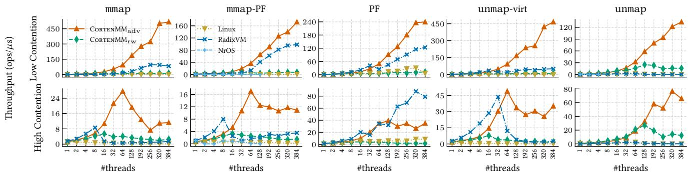

Figure 14. Multithreaded throughput of microbenchmarks. Higher is better. Each benchmark has two variants of the degree of contention.  
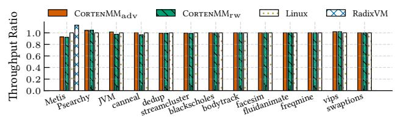  
Figure 15. Single-threaded performance of real-world applications. Results are normalized to Linux. Higher is better.

RadixVM also scales better than Linux, outperforming $\mathrm { C o R T E N M M _ { a d v } }$ in PF with high contention. This is because RadixVM uses per-core private page tables, thereby avoiding cache coherence traffic on the page table itself. However, replicating the page table incurs severe memory overhead, as shown in Figure 22. NrOS employs a simple coarse-grained locking scheme within each NUMA replica, resulting in performance comparable to Linux.

Summary. CortenMM achieves good scalability due to a fine-grained locking protocol for the page table and the elimination of unnecessary contention for extra layers.

## 6.4 Real-world Benchmarks

We distinguish between two types of real-world workloads: those that stress memory management and those that do not. Most of the PARSEC benchmarks represent the latter type; only dedup stresses memory management, while others do not. For these benchmarks, as shown in Figure 15 and Figure 21, CortenMM does not reduce their performance.

We evaluate four workloads that stress memory management: JVM thread creation, metis, dedup, and psearchy. We found that the performance of two of the benchmarks, dedup and psearchy, benefits from modern memory allocators (e.g., tcmalloc), which work around the deficient scalability of Linux memory management, by, e.g., rarely returning freed memory. Hence, the evaluation includes the impact of using tcmalloc instead of the default allocator.

To understand the reason for performance improvements, we measured the time breakdowns for different operations using perf. We found that, for these workloads, due to the scalability bottleneck in memory management, as the thread count increases, the fraction of time spent in the kernel increases significantly,

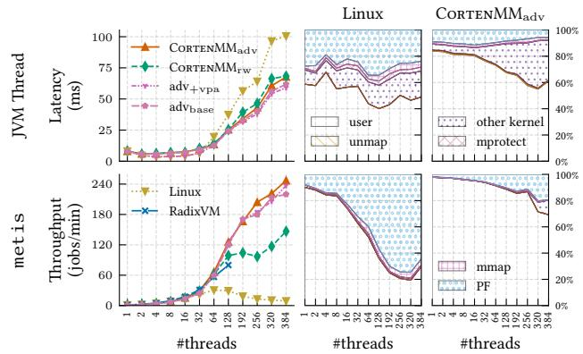  
Figure 16. Multithreaded performance and kernel/user breakdowns of real-world applications. Note that, for JVM thread creation, lower is better. For metis, higher is better.

To perform a breakdown analysis, we also evaluate $\mathrm { C o R T E N M M _ { a d v } }$ without the two optimizations: per-core virtual address allocators and advanced TLB shootdowns (§4.5), labeled as $\mathrm { a d v } _ { \mathrm { b a s e } } ;$ and with only the per-core virtual page allocators, labeled as adv+vpa.

JVM thread creation. Figure 16 shows the result of JVM thread creation. This benchmark is used to mimic the Android app startup use case discussed in §2.2. It creates ?? Java threads, each of which runs on a dedicated core, and measures the time between the beginning of thread spawning and the end of thread initialization. With 384 cores, $\mathrm { C o R T E N M M _ { a d v } }$ and $\mathrm { C o R T E N M M _ { r w } }$ outperform Linux by 32%. Linux suffers from the scalability bottleneck in the page fault handler, when each thread accesses its stack, confirming previously reported results [29].

metis. Figure 16 shows the result of metis, which performs map-reduce on a 1.6 GB text file. Our setup is the same as that in the RadixVM paper [43], which allocates 8 MB chunks and never returns them to the kernel. $\mathrm { C o R T E N M M _ { a d v } }$ outperforms Linux by 26× with 384 cores (15× for CortenMMrw). The two optimizations (shown by $\mathrm { \ a d v _ { + v p a } }$ and $\mathrm { a d v _ { b a s e } ) }$ bring small benefits since neither mmap nor munmap is frequent in $\mathtt { m e t i s . C O R T E N M M _ { a d v } }$ outperforms RadixVM by 1.24× with 128 cores. RadixVM crashes after 128 cores.

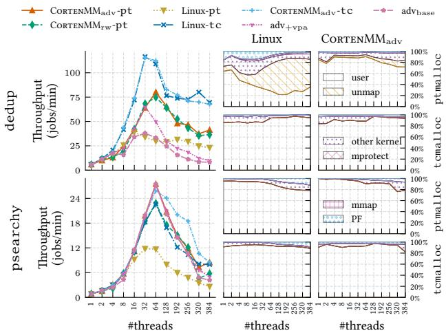

Figure 17. Multithreaded performance and kernel/user breakdowns of allocations applicable with modern mallocs.  
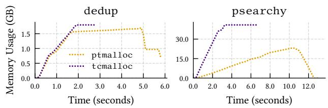  
Figure 18. Memory usage: tcmalloc vs. the default one in Linux.

dedup. Figure 17 shows the result for dedup. With the glibc default allocator (ptmalloc), Linux does not scale beyond 16 threads, since dedup frequently returns memory to the OS using unmap, leading to contention for mmap\_lock. $\mathrm { C o R T E N M M a d v }$ mitigates this contention, achieving 2.69× higher throughput than Linux with 64 threads. The application itself contributes to most of the contention beyond 64 threads due to unscalable userspace locking. tcmalloc reduces the frequency of unmap by rarely returning memory to the OS, allowing Linux and $\mathrm { C o R T E N M M _ { a d v } }$ to scale to 64 threads. This performance improvement is at a cost of more memory usage (Figure 18). CortenMMrw performs similarly $\mathrm { t o } \mathrm { C o R T E N M M _ { a d v } }$

psearchy. Psearchy indexes the Linux 2.6 source tree, consisting of 368 MB of text across 33,312 files. Figure 17 shows the results. With ptmalloc, both $\mathrm { C o R T E N M M _ { r w } }$ and $\mathrm { C o R T E N M M _ { a d v } }$ outperform Linux by ∼ 2× with 64 threads. With tcmalloc, the performance of Linux improves but is still not as good as CortenMM. tcmalloc also incurs a 2× memory overhead (Figure 18).

Summary. CortenMM improves multicore performance for real-world applications with intensive memory management operations. For other applications, CortenMM does not incur any additional overhead.

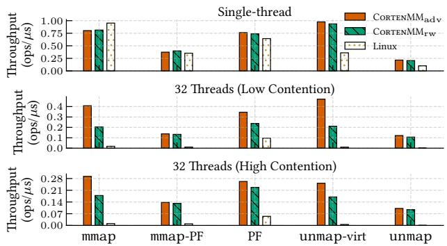

Figure 19. Comparison of memory operation throughput between CortenMM and Linux in a RISC-V VM.
<table><tr><td>Component</td><td>Spec</td><td>Proof</td><td>Impl</td></tr><tr><td>Locking Model</td><td>2023</td><td>2018</td><td>N/A</td></tr><tr><td>Locking Code</td><td>268</td><td>290</td><td>568</td></tr><tr><td>RCursor Ops</td><td>958</td><td>765</td><td>631</td></tr><tr><td>MM Common</td><td>442</td><td>259</td><td>346</td></tr><tr><td>Glue/Helper</td><td>1177</td><td>947</td><td>224</td></tr><tr><td>Total</td><td>4868</td><td>4279</td><td>1769</td></tr></table>

Table 4. Lines of code for Verus specifications, implementations and proofs of the transaction interface.
<table><tr><td>Feature</td><td>Ours</td><td>Linux</td></tr><tr><td>RISC-V</td><td>252</td><td>699</td></tr><tr><td>Intel MPK</td><td>82</td><td>273</td></tr><tr><td>Intel TDX</td><td>368</td><td>471</td></tr></table>

Table 5. Lines of code added for different ISAs/MMU features in MM (drivers and user level APIs excluded).

## 6.5 Memory Overhead

Figure 22 compares the memory storage overheads for memory management systems using metis. CortenMM and Linux have similar storage overheads. Figure 22 also provides the theoretical upper bound for CortenMM’s memory overhead, by fully populating the per-PTE metadata array for each PT page. This doubles the memory overhead, but is still within 2%. Therefore, eliminating the software-level abstraction does not incur significant memory overhead. RadixVM replicates the page table, incurring extra memory overhead.

## 6.6 Verification Effort

Table 4 summarizes the verification efforts in lines of code. The overall proof-to-code ratio is 5.2:1. We spent approximately 8 person-months on the verification. Verus can verify our code in less than 20 seconds.

## 6.7 Portability

Table 5 shows the extra lines of code required for the x86 implementation of CortenMM to be ported to different architectures or support new MMU features (e.g., Intel TDX [11] and Intel MPK [44]). Interestingly, Linux requires more porting code for the evaluated ISAs and MMU features. This is because Linux needs to adapt both the software-level abstraction and hardware-level abstraction for porting. Therefore, CortenMM achieves better portability.

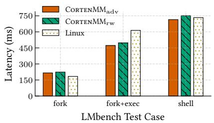  
Figure 20. LMbench results. They compare the performance of operations that must enumerate the address space. Lower is better.

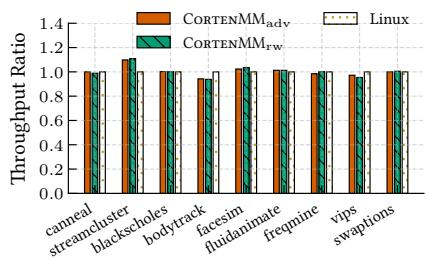  
Figure 21. 8-threaded performance of other PARSEC workloads. Results are normalized to Linux. Higher is better.

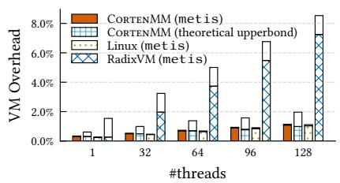  
Figure 22. A comparison of memory overhead, which consists of page tables (filled bars) and other metadata (empty bars).

Figure 19 shows the single-threaded and 32-threaded performance of memory operations in a RISC-V VM. The performance differences between CortenMM and Linux remain similar to those in the x86-64 setting (Figure 13). Summary. CortenMM maintains portability for modern mainstream ISAs without sacrificing performance.

## 7 Related Works

Formally verified systems. Much prior work verifies the entire OS [54, 63, 77, 90], or the whole memory management system [51, 59], while CortenMM verifies the core part of memory management. The aforementioned prior work also proves stronger correctness and/or safety properties (e.g., noninterference) than CortenMM.

Recent advancement [38, 41, 57] focuses on reducing verification efforts by, e.g., leveraging linear types in Rust, as done in Verus [68]. VRM [85] verifies memory management on ARM’s relaxed memory models, while CortenMM assumes a sequential memory model. We believe that the techniques in VRM are helpful for verifying CortenMM on ARM.

Prior OSes written in Rust exploit various interesting language features. For example, Tock [69], RedLeaf [76], and Theseus [35] leverage Rust for fine-grained lightweight isolation among OS components. RedLeaf extends Tock to support, e.g., end-to-end zero-copy drivers, and Theseus offloads much of the semantic checking to Rust.

Scalable memory management systems. Much prior work, as discussed earlier, focuses on proposing advanced data structures (e.g., Bonsai tree [42]) and/or concurrency control (e.g., scalable range locks [64]) to scale memory management systems. Modern Linux follows the same approach [55]. However, as discussed in §2.2, such approaches encounter challenges in simultaneously achieving high performance and correctness.

NrOS [33] forms an interesting comparison with CortenMM. Both works target multicore scalability and enable verification [38]. A key difference is that NrOS uses a general mechanism (i.e., node replication [39]) for memory management. Instead, CortenMM proposes a general principle (i.e., a single-level of abstraction) to guide the design of a specific memory management system.

The K42 project [27, 65] develops a highly scalable microkernel, offering compatibility with Linux. For memory management, K42 achieves scalability by minimizing shared state and leveraging application-specific customization, which is orthogonal to CortenMM’s approach.

## 8 Conclusion

This paper presents CortenMM, a high-performance memory management system offering strong correctness guarantees, thereby overcoming both long-standing challenges in prior designs. Our key insight is that both challenges stem from the extra complexity incurred by software-level abstraction (e.g., VMA trees in Linux), which is no longer necessary for modern MMUs that uniformly use multi-level page tables. Using this insight, CortenMM eliminates the software-level abstraction, achieving sweeping simplicity. Building on this, CortenMM proposes a transactional interface with locking protocols to program the MMU. The locking protocols avoid unnecessary contentions on the software-level abstraction, achieving high performance while maintaining atomicity for the transactions. We formally verified the correctness of the locking protocols and the basic functions in the transactional interface, offering strong correctness guarantees. Our evaluation shows that the formally verified CortenMM outperforms Linux by 1.2× to 26× on real-world benchmarks.

## Acknowledgements

We thank our shepherd, Andi Quinn, and the anonymous reviewers for their insightful feedback. We thank Yuwei Liu, Zhiyuan Gao, Sean Noble Anderson, and the Verus community for their help on formal verification. We are grateful to the Asterinas community, especially Ruihan Li, for contributing to the kernel. This work was supported by AntGroup, the National Key R&D Program of China (under Grant No. 2022YFB4500701), and the National Science Foundation of China (No. 62032001, 62032008, 62372011). Diyu Zhou and Hongliang Tian are the corresponding authors.

## References

[1] What is RCU, Fundamentally?, 2007. https://lwn.net/Articles/262464/.

[2] CVE-2023-3269, 2023. https://www.cve.org/CVERecord?id=CVE-2023- 3269.

[3] CVE-2023-4611, 2023. https://www.cve.org/CVERecord?id=CVE-2023- 4611.

[4] CVE-2024-1312, 2024. https://www.cve.org/CVERecord?id=CVE-2024- 1312.

[5] CVE-2024-27022, 2024. https://www.cve.org/CVERecord?id=CVE-2024-27022.

[6] CVE-2024-47676, 2024. https://www.cve.org/CVERecord?id=CVE-2024-47676.

[7] CVE-2024-50066, 2024. https://www.cve.org/CVERecord?id=CVE-2024-50066.

[8] CVE-2024-56765, 2024. https://www.cve.org/CVERecord?id=CVE-2024-56765.

[9] FreeBSD, 2024. https://www.freebsd.org.

[10] Fuchsia, 2024. https://fuchsia.dev.

[11] Intel Trust Domain Extensions (Intel TDX) , 2024. https: //www.intel.com/content/www/us/en/developer/tools/trust-domainextensions/overview.html.

[12] Linux, 2024. https://www.kernel.org.

[13] Redox: A Unix-like General-Purpose Microkernel-Based Operating System, 2024. https://www.redox-os.org/.

[14] Rust, 2024. https://www.rust-lang.org/.

[15] Solaris, 2024. https://www.oracle.com/solaris/solaris11.

[16] Windows, 2024. https://www.microsoft.com/en-us/windows.

[17] ARM, 2025. https://www.arm.com.

[18] CVE-2025-21696, 2025. https://www.cve.org/CVERecord?id=CVE-2025-21696.

[19] CVE-2025-21932, 2025. https://www.cve.org/CVERecord?id=CVE-2025-21932.

[20] CVE-2025-21984, 2025. https://www.cve.org/CVERecord?id=CVE-2025-21984.

[21] Intel 64 and IA-32 Architectures Software Developer’s Manual, 2025. https://www.intel.com/content/www/us/en/developer/articles/ technical/intel-sdm.html.

[22] RISC-V, 2025. https://riscv.org.

[23] Tracking issue for specialization (RFC 1210), 2025. https://github.com/ rust-lang/rust/issues/31844.

[24] What is the purpose of Break-Before-Make (FEAT\_BBM) in the Arm Architecture?, 2025. https://developer.arm.com/documentation/ ka006181/latest/.

[25] Nadav Amit, Amy Tai, and Michael Wei. Don’t Shoot Down TLB Shootdowns! In Proceedings of the 15th European Conference on Computer Systems (EuroSys), Heraklion, Greece, April 2020.

[26] Oracle Corporation and/or its affiliates. OpenJDK, 2025. https:// openjdk.org/.

[27] Jonathan Appavoo, Marc Auslander, Dilma Da Silva, David Edelsohn, Orran Krieger, Michal Ostrowski, Bryan Rosenburg, Robert W. Wisniewski, and Jimi Xenidis. Providing a Linux API on the Scalable K42 Kernel. In Proceedings of the 2003 USENIX Annual Technical Conference (ATC), San Antonio, TX, June 2003.

[28] Remzi H Arpaci-Dusseau and Andrea C Arpaci-Dusseau. Operating Systems: Three Easy Pieces. 2018.

[29] Suren Baghdasaryan. [PATCH v3 00/35] Per-VMA Locks, 2023. https://lore.kernel.org/lkml/ZCstwjKhn76%2FmxIa@casper. infradead.org/t/.

[30] Suren Baghdasaryan. Per-VMA Locks, 2023. https://lwn.net/Articles/ 924572/.

[31] Andrew Baumann, Paul Barham, Pierre-Evariste Dagand, Tim Harris, Rebecca Isaacs, Simon Peter, Timothy Roscoe, Adrian Schüpbach, and Akhilesh Singhania. The Multikernel: A New OS Architecture for Scalable Multicore Systems. In Proceedings of the 22nd ACM Symposium on Operating Systems Principles (SOSP), Big Sky, MT, October 2009.

[32] Philip A Bernstein, Vassos Hadzilacos, Nathan Goodman, et al. Concurrency Control and Recovery in Database Systems, volume 370. Addison-Wesley, 1987.

[33] Ankit Bhardwaj, Chinmay Kulkarni, Reto Achermann, Irina Calciu, Sanidhya Kashyap, Ryan Stutsman, Amy Tai, and Gerd Zellweger. NrOS: Effective Replication and Sharing in an Operating System. In Proceedings of the 15th USENIX Symposium on Operating Systems Design and Implementation (OSDI), pages 295–312, Virtual, July 2021.

[34] Christian Bienia. Benchmarking Modern Multiprocessors. Princeton University, 2011.

[35] Kevin Boos, Namitha Liyanage, Ramla Ijaz, and Lin Zhong. Theseus: An Experiment in Operating System Structure and State Management. In Proceedings of the 14th USENIX Symposium on Operating Systems Design and Implementation (OSDI), Banff, Canada, November 2020.

[36] Silas Boyd-Wickizer, Austin T. Clements, Yandong Mao, Aleksey Pesterev, M. Frans Kaashoek, Robert Morris, and Nickolai Zeldovich. An Analysis of Linux Scalability to Many Cores. In Proceedings of the 9th USENIX Symposium on Operating Systems Design and Implementation (OSDI), Vancouver, Canada, October 2010.

[37] Björn B Brandenburg and James H Anderson. Spin-Based Reader-Writer Synchronization for Multiprocessor Real-Time Systems. Real-Time Systems, 46(1):25–87, 2010.

[38] Matthias Brun, Reto Achermann, Tej Chajed, Jon Howell, Gerd Zellweger, and Andrea Lattuada. Beyond Isolation: OS Verification as a Foundation for Correct Applications. In 19th USENIX Workshop on Hot Topics in Operating Systems (HotOS) (HotOS XIX), pages 158–165, Providence, RI, June 2023.

[39] Irina Calciu, Siddhartha Sen, Mahesh Balakrishnan, and Marcos K. Aguilera. Black-box Concurrent Data Structures for NUMA Architectures. In Proceedings of the 22nd ACM International Conference on Architectural Support for Programming Languages and Operating Systems (ASPLOS), pages 207–221, Xi’an, China, April 2017.

[40] Haibo Chen, Xie Miao, Ning Jia, Nan Wang, Yu Li, Nian Liu, Yutao Liu, Fei Wang, Qiang Huang, Kun Li, et al. Microkernel Goes General: Performance and Compatibility in the HongMeng Production Microkernel. In Proceedings of the 18th USENIX Symposium on Operating Systems Design and Implementation (OSDI), pages 465–485, Santa Clara, CA, July 2024.

[41] Xiangdong Chen, Zhaofeng Li, Lukas Mesicek, Vikram Narayanan, and Anton Burtsev. Atmosphere: Towards Practical Verified Kernels in Rust. In Proceedings of the 1st Workshop on Kernel Isolation, Safety and Verification (KISV), pages 9–17, Koblenz, Germany, October 2023.

[42] Austin T. Clements, M. Frans Kaashoek, and Nickolai Zeldovich. Scalable Address Spaces Using RCU Balanced Trees. In Proceedings of the 17th ACM International Conference on Architectural Support for Programming Languages and Operating Systems (ASPLOS), London, UK, March 2012.

[43] Austin T. Clements, M. Frans Kaashoek, and Nickolai Zeldovich. RadixVM: Scalable Address Spaces for Multithreaded Applications. In Proceedings of the 8th European Conference on Computer Systems

(EuroSys), pages 211–224, Prague, Czech Republic, April 2013.

[44] Jonathan Corbet. Memory protection keys, 2015. https://lwn.net/ Articles/643797/.

[45] Jonathan Corbet. The Ongoing Search for mmap\_lock Scalability, 2022. https://lwn.net/Articles/893906/.

[46] Jonathan Corbet. Stabilizing Per-VMA Locking, 2023. https://lwn.net/ Articles/937943/.

[47] Jonathan Corbet, Alessandro Rubini, and Greg Kroah-Hartman. Linux Device Drivers. "O’Reilly Media, Inc.", 3 edition, 2005.

[48] Intel Corporation. lmbench, 2025. https://github.com/intel/lmbench.

[49] Dave Dice and Alex Kogan. BRAVO: Biased Locking for Reader-Writer Locks. In Proceedings of the 2019 USENIX Annual Technical Conference (ATC), pages 315–328, Renton, WA, July 2019. USENIX Association.

[50] Kapali P. Eswaran, Jim N Gray, Raymond A. Lorie, and Irving L. Traiger. The Notions of Consistency and Predicate Locks in a Database System. Communications of the ACM, 19(11):624–633, 1976.

[51] Andrew Ferraiuolo, Andrew Baumann, Chris Hawblitzel, and Bryan Parno. Komodo: Using verification to disentangle secure-enclave hardware from software. In Proceedings of the 26th ACM Symposium on Operating Systems Principles (SOSP), pages 287–305, Shanghai, China, October 2017.

[52] Robert A. Gingell, Joseph P. Moran, and William A. Shannon. Virtual Memory Architecture in SunOS. In Proceedings of the USENIX Summer Conference, pages 81–94. USENIX Association, 1987.

[53] Charles Gray, Matthew Chapman, Peter Chubb, David Mosberger-Tang, and Gernot Heiser. Itanium—A System Implementor’s Tale. In Proceedings of the 2005 USENIX Annual Technical Conference (ATC), pages 264–278, Anaheim, CA, April 2005.

[54] Ronghui Gu, Zhong Shao, Hao Chen, Xiongnan Newman Wu, Jieung Kim, Vilhelm Sjöberg, and David Costanzo. CertiKOS: An Extensible Architecture for Building Certified Concurrent OS Kernels. In Proceedings of the 12th USENIX Symposium on Operating Systems Design and Implementation (OSDI), pages 653–669, Savannah, GA, November 2016.

[55] Liam R. Howlett. Maple Tree, 2024. https://docs.kernel.org/coreapi/maple\_tree.html.

[56] Jerry Huck and Jim Hays. Architectural Support for Translation Table Management in Large Address Space Machines. In Proceedings of the 20th ACM/IEEE International Symposium on Computer Architecture (ISCA), pages 39–50.

[57] Ramla Ijaz, Kevin Boos, and Lin Zhong. Leveraging Rust for Lightweight OS Correctness. In Proceedings of the 1st Workshop on Kernel Isolation, Safety and Verification (KISV), pages 1–8, Koblenz, Germany, October 2023.

[58] Bruce L. Jacob and Trevor N. Mudge. A look at several memory management units, tlb-refill mechanisms, and page table organizations. In Proceedings of the 8th ACM International Conference on Architectural Support for Programming Languages and Operating Systems (ASPLOS), pages 295–306, San Jose, CA, October 1998.

[59] Yuekai Jia, Shuang Liu, Wenhao Wang, Yu Chen, Zhengde Zhai, Shoumeng Yan, and Zhengyu He. HyperEnclave: An Open and Crossplatform Trusted Execution Environment. In Proceedings of the 2022 USENIX Annual Technical Conference (ATC), pages 437–454, Carlsbad, CA, July 2022.

[60] Frans Kaashoek, Robert Morris, and Yandong Mao. Optimizing MapReduce for Multicore Architectures. 2010.

[61] The kernel development community. Page Table Isolation (PTI), 2025. https://www.kernel.org/doc/html/next/x86/pti.html.

[62] The kernel development community. Process Addresses, 2025. https: //docs.kernel.org/mm/process\_addrs.html.

[63] Gerwin Klein, Kevin Elphinstone, Gernot Heiser, June Andronick, David Cock, Philip Derrin, Dhammika Elkaduwe, Kai Engelhardt, Rafal Kolanski, Michael Norrish, Thomas Sewell, Harvey Tuch, and Simon Winwood. seL4: Formal Verification of an OS Kernel. In Proceedings of the 22nd ACM Symposium on Operating Systems Principles (SOSP), pages 207–220, Big Sky, MT, October 2009.

[64] Alex Kogan, Dave Dice, and Shady Issa. Scalable Range Locks for Scalable Address Spaces and Beyond. In Proceedings of the 15th European Conference on Computer Systems (EuroSys), pages 1–15, Heraklion, Greece, April 2020.

[65] Orran Krieger, Marc Auslander, Bryan Rosenburg, Robert W. Wisniewski, Jimi Xenidis, Dilma Da Silva, Michal Ostrowski, Jonathan Appavoo, Maria Butrico, Mark Mergen, Amos Waterland, and Volkmar Uhlig. K42: Building a Complete Operating System. pages 133–145, April 2006.

[66] Mohan Kumar Kumar, Steffen Maass, Sanidhya Kashyap, Ján Veselý, Zi Yan, Taesoo Kim, Abhishek Bhattacharjee, and Tushar Krishna. LATR: Lazy Translation Coherence. In Proceedings of the 23rd ACM International Conference on Architectural Support for Programming Languages and Operating Systems (ASPLOS), pages 651–664, Williamsburg, VA, March 2018.

[67] Andrea Lattuada, Travis Hance, Jay Bosamiya, Matthias Brun, Chanhee Cho, Hayley LeBlanc, Pranav Srinivasan, Reto Achermann, Tej Chajed, Chris Hawblitzel, Jon Howell, Jacob R. Lorch, Oded Padon, and Bryan Parno. Verus: A Practical Foundation for Systems Verification. In Proceedings of the 30th ACM Symposium on Operating Systems Principles (SOSP), pages 438–454, Austin, TX, USA, November 2024.

[68] Andrea Lattuada, Travis Hance, Chanhee Cho, Matthias Brun, Isitha Subasinghe, Yi Zhou, Jon Howell, Bryan Parno, and Chris Hawblitzel. Verus: Verifying Rust Programs using Linear Ghost Types. In Proceedings of the 34th Annual ACM Conference on Object-Oriented Programming, Systems, Languages, and Applications (OOPSLA), Lisbon, Portugal, October 2023.

[69] Amit Levy, Bradford Campbell, Branden Ghena, Daniel B Giffin, Pat Pannuto, Prabal Dutta, and Philip Levis. Multiprogramming a 64KB Computer Safely and Efficiently. In Proceedings of the 26th Symposium on Operating Systems Principles, pages 234–251, Shanghai, China, October 2017.

[70] Oscar Llorente-Vazquez, Igor Santos-Grueiro, and Pablo Garcia Bringas. When Memory Corruption Met Concurrency: Vulnerabilities in Concurrent Programs. IEEE Access, 11:44725–44740, 2023.

[71] Robert Love. Proper Locking Under a Preemptible Kernel: Keeping Kernel Code Preempt-Safe, 2025. https://docs.kernel.org/locking/preemptlocking.html.

[72] Marshall Kirk McKusick, Keith Bostic, Michael J. Karels, and John S. Quarterman. The Design and Implementation of the 4.4 BSD Operating System, volume 2. Addison-Wesley Reading, MA, 1996.

[73] Larry McVoy and Carl Staelin. lmbench: Portable Tools for Performance Analysis. In Proceedings of the 1996 USENIX Annual Technical Conference (ATC), pages 279–294, San Diego, CA, January 1996.

[74] John M. Mellor-Crummey and Michael L. Scott. Algorithms for Scalable Synchronization on Shared-Memory Multiprocessors. ACM Transactions on Computer Systems, 9(1):21–65, February 1991.

[75] Microsoft. VirtualProtect function (memoryapi.h), 2025. https: //learn.microsoft.com/en-us/windows/win32/api/memoryapi/nfmemoryapi-virtualprotect.

[76] Vikram Narayanan, Tianjiao Huang, David Detweiler, Dan Appel, Zhaofeng Li, Gerd Zellweger, and Anton Burtsev. RedLeaf: Isolation

and Communication in a Safe Operating System. In Proceedings of the 14th USENIX Symposium on Operating Systems Design and Implementation (OSDI), pages 21–39, Banff, Canada, November 2020.

[77] Luke Nelson, Helgi Sigurbjarnarson, Kaiyuan Zhang, Dylan Johnson, James Bornholt, Emina Torlak, and Xi Wang. Hyperkernel: Push-Button Verification of an OS Kernel. In Proceedings of the 26th ACM Symposium on Operating Systems Principles (SOSP), pages 252–269, Shanghai, China, October 2017.

[78] ARM Limited (or its affiliates). Long-descriptor Format Memory Region Attributes, 2025. https://developer.arm.com/documentation/ ddi0406/c/System-Level-Architecture/Virtual-Memory-System-Architecture--VMSA-/Memory-region-attributes/Long-descriptorformat-memory-region-attributes?lang=en.

[79] Yuke Peng, Hongliang Tian, Junyang Zhang, Ruihan Li, Chengjun Chen, Jianfeng Jiang, Jinyi Xian, Xiaolin Wang, Chenren Xu, Diyu Zhou, Yingwei Luo, Shoumeng Yan, and Yinqian Zhang. ASTERINAS: A Linux ABI-Compatible, Rust-Based Framekernel OS with a Small and Sound TCB. In Proceedings of the 2025 USENIX Annual Technical Conference (ATC), Boston, MA, July 2025.

[80] James L. Peterson and Abraham Silberschatz. Operating System Concepts. Addison-Wesley Longman Publishing Co., Inc., USA, 2 edition, 1985.

[81] Mohamed Sabt, Mohammed Achemlal, and Abdelmadjid Bouabdallah. Trusted Execution Environment: What It Is, and What It Is Not. In 2015 IEEE Trustcom/BigDataSE/Ispa, volume 1, pages 57–64. IEEE, 2015.

[82] Jeremy Stribling, Jinyang Li, Isaac G Councill, M Frans Kaashoek, and Robert Tappan Morris. OverCite: A Distributed, Cooperative CiteSeer. In Proceedings of the 3rd USENIX Symposium on Networked Systems Design and Implementation (NSDI), San Jose, CA, May 2006.

[83] Madhusudhan Talluri, Mark D. Hill, and Yousef A. Khalidi. A New Page Table for 64-Bit Address Spaces. In Proceedings of the 15th ACM Symposium on Operating Systems Principles (SOSP), pages 184–200, Copper Mountain, CO, December 1995.

[84] Andrew S Tanenbaum and Herbert Bos. Modern Operating Systems. Pearson Education, Inc., 2015.

[85] Runzhou Tao, Jianan Yao, Xupeng Li, Shih-Wei Li, Jason Nieh, and Ronghui Gu. Formal Verification of a Multiprocessor Hypervisor on Arm Relaxed Memory Hardware. In Proceedings of the 28th ACM Symposium on Operating Systems Principles (SOSP), pages 866–881, Koblenz, Germany, October 2021.

[86] Colin J Theaker and Graham R Brookes. Memory Management—Segmentation. In A Practical Course on Operating Systems, pages 77–91. Springer, 1983.

[87] Linus Torvalds. Re: /proc/<n>/maps getting \_VERY\_ long, 2001. https: //yarchive.net/comp/linux/VMAs.html.

[88] Haris Volos, Andres Tack, Jaan, Michael M. Swift, and Shan Lu. Applying transactional memory to concurrency bugs. In Proceedings of the 17th ACM International Conference on Architectural Support for Programming Languages and Operating Systems (ASPLOS), pages 211–222, London, UK, March 2012.

[89] Ying Wei, Xiaobing Sun, Lili Bo, Sicong Cao, Xin Xia, and Bin Li. A Comprehensive Study on Security Bug Characteristics. Journal of Software: Evolution and Process, 33(10), 2021.

[90] Jean Yang and Chris Hawblitzel. Safe to the Last Instruction: Automated Verification of a Type-Safe Operating System. In Proceedings of the 2010 ACM SIGPLAN Conference on Programming Language Design and Implementation (PLDI), pages 99–110, Toronto, ON, Canada, June 2010.