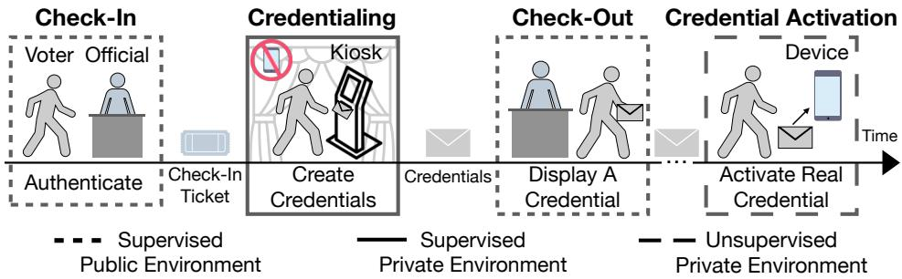
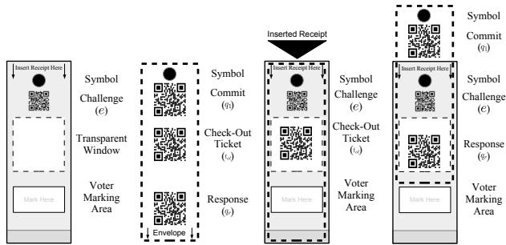
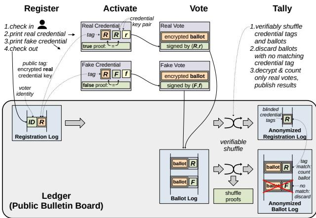
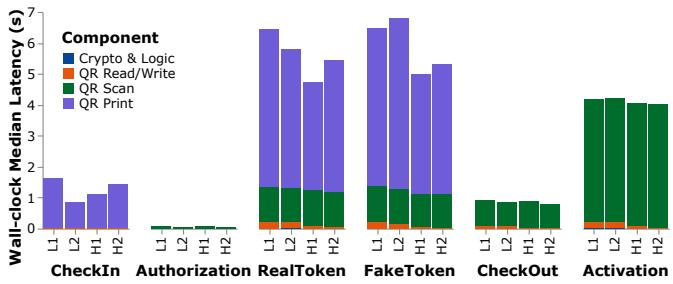
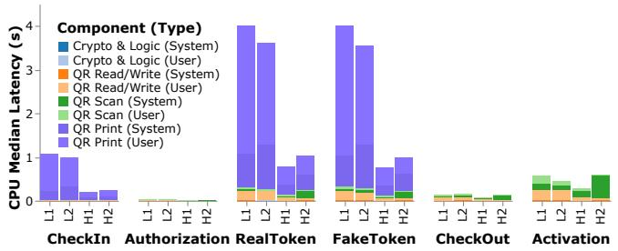
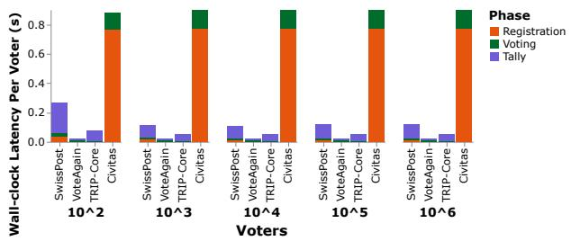
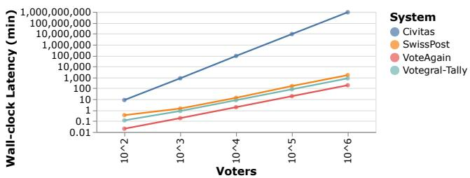
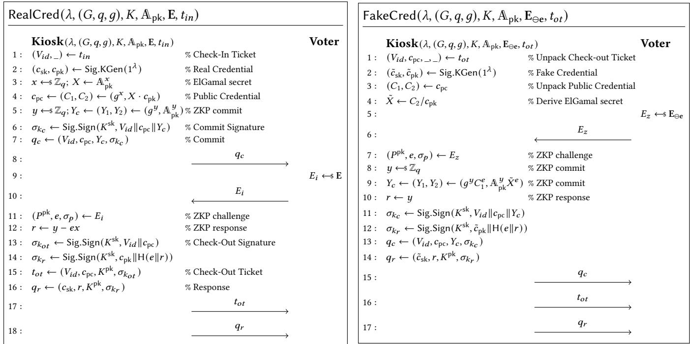
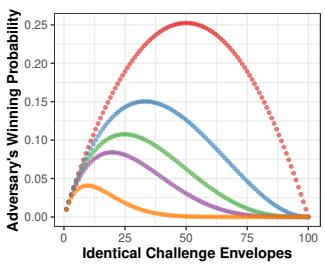
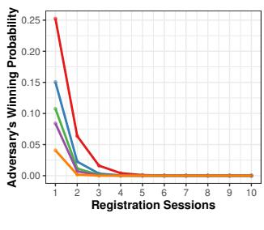

Latest updates: hps://dl.acm.org/doi/10.1145/3731569.3764837

RESEARCH-ARTICLE

# TRIP: Coercion-resistant Registration for E-Voting with Verifiability and Usability in Votegral

LOUIS-HENRI MERINO, EPFL, Lausanne, Switzerland

SIMONE COLOMBO, King's College London, London, U.K.

RENE REYES, Boston University, Boston, MA, United States

ALALEH AZHIR, Harvard University, Cambridge, MA, United States

SHAILESH MISHRA, EPFL, Lausanne, Switzerland

PASINDU TENNAGE, EPFL, Lausanne, Switzerland

View all

Open Access Support provided by:

King's College London

Boston University

Harvard University

EPFL

Yale University

Armasuisse, Switzerland


Published: 12 October 2025

Citation in BibTeX format

SOSP '25: ACM SIGOPS 31st Symposium   
on Operating Systems Principles   
October 13 - 16, 2025   
Seoul, Republic of Korea

Conference Sponsors: SIGOPS

# TRIP: Coercion-resistant Registration for E-Voting with Veriability and Usability in Votegral

Louis-Henri Merino EPFL Lausanne, Switzerland

Alaleh Azhir Harvard University Cambridge, USA

Mohammad Amin Raeisi Yale University New Haven, USA

Bernhard Tellenbach Armasuisse S+T Bern, Switzerland

Simone Colombo King’s College London London, United Kingdom

Shailesh Mishra EPFL Lausanne, Switzerland

Haoqian Zhang EPFL Lausanne, Switzerland

Vero Estrada-Galiñanes EPFL Lausanne, Switzerland

Rene Reyes Boston University Boston, USA

Pasindu Tennage EPFL Lausanne, Switzerland

Je R. Allen EPFL Lausanne, Switzerland

Bryan Ford EPFL Lausanne, Switzerland

## Abstract

Online voting is convenient and exible, but amplies the risks of voter coercion and vote buying. One promising mitigation strategy enables voters to give a coercer fake voting credentials, which silently cast votes that do not count. Current systems along these lines make problematic assumptions about credential issuance, however, such as strong trust in a registrar and/or in voter-controlled hardware, or expecting voters to interact with multiple registrars. Votegral is the rst coercion-resistant voting architecture that leverages the physical security of in-person registration to address these credential-issuance challenges, amortizing the convenience costs of in-person registration by reusing credentials across successive elections. Votegral’s registration component, TRIP, gives voters a kiosk in a privacy booth with which to print real and fake credentials on paper, eliminating dependence on trusted hardware in credential issuance. The voter learns and can verify in the privacy booth which credential is real, but real and fake credentials thereafter appear indistinguishable to others. Only voters actually under coercion, a hopefully-rare case, need to trust the kiosk. To achieve veriability, each paper credential encodes an interactive zero-knowledge proof, which is sound in real credentials but unsound in fake credentials. Voters observe

the dierence in the order of printing steps, but need not understand the technical details. Experimental results with our prototype suggest that Votegral is practical and su- ciently scalable for real-world elections. User-visible latency of credential issuance in TRIP is at most 19.7 seconds even on resource-constrained kiosk hardware, making it suitable for registration at remote locations or on battery power. A companion usability study indicates that TRIP’s usability is competitive with other e-voting systems including some lacking coercion resistance, and formal proofs support TRIP’s combination of coercion-resistance and veriability.

CCS Concepts: • Applied computing → Voting / election technologies; • Computer systems organization → Distributed architectures; Dependable and fault-tolerant systems and networks; • Security and privacy → Cryptography; Formal methods and theory of security; • Human-centered computing → Empirical studies in HCI ; Interactive systems and tools.

Keywords: e-voting, online voting, registration, coercion resistance, zero-knowledge proofs, veriability, usability

## ACM Reference Format:

Louis-Henri Merino, Simone Colombo, Rene Reyes, Alaleh Azhir, Shailesh Mishra, Pasindu Tennage, Mohammad Amin Raeisi, Haoqian Zhang, Je R. Allen, Bernhard Tellenbach, Vero Estrada-Galiñanes, Bryan Ford, and . 2025. TRIP: Coercion-resistant Registration for E-Voting with Veriability and Usability in Votegral. In ACM SIGOPS 31st Symposium on Operating Systems Principles (SOSP ’25), October 13–16, 2025, Seoul, Republic of Korea. ACM, New York, NY, USA, 41 pages. hps://doi.org/10.1145/3731569.3764837

## 1 Introduction

Democracy is the operating system of a free self-governing civilization: it holds governments accountable to their citizens and enables correction and renewal through the peaceful transfer of power, periodically “rebooting” the government, so to speak. Tech-savvy idealists often dream that large-scale distributed computing systems could improve or even positively transform democracy, enabling more convenient large-scale direct participation via mechanisms like liquid democracy [16, 45] or online citizens’ assemblies [73]. However, today’s computing systems are not even safe to use in basic democratic processes – such as popular voting – according to the overwhelming consensus of today’s experts [7, 23, 118]. Further, large-scale social platforms not only failed to live up to their one-time promise to help “democratize” the world [64], but have come to appear increasingly anti-democratic in eect if not intent [37, 43, 104], feeding an increasingly-prevalent technology backlash [63].

One central challenge for national voting systems is resolving the conicting goals of transparency and ballot secrecy [11, 13, 42, 61, 94]. Transparency requires convincing voters that their ballots were cast and counted properly, while ballot secrecy ensures that voters can express their true preferences, free from improper inuence such as coercion or vote buying. In the best practice of in-person voting, voters get ballot secrecy by marking paper ballots alone in a privacy booth at an ocial polling site. Voters obtain “endto-end” transparency by rst depositing their marked ballots in a ballot box, then relying on election observers to monitor the subsequent handling and tallying of all the ballots.

While in-person voting is widely accepted by experts [23], it has posed signicant inconveniences to voters, including long wait times [39, 130], temporary polling place closures [115], and even voter intimidation near polling locations [130]. In-person voting is additionally dicult for those traveling and living abroad, such as expatriates or deployed military [111] and during crises like the recent pandemic [128].

Remote voting—at any location of the voter’s choosing— promises to improve convenience and increase voter turnout [100, 111]. Because the voting location is uncontrolled, however, remote voting normally compromises ballot secrecy and hence resistance to coercion or vote-buying [18, 41, 48, 50, 103, 105, 130]. An abusive spouse might insist on their partner voting their way under supervision, a party activist might oer to purchase and “help” ll mail-in ballots, as seen in the United States [52, 121], or a foreign power might attempt the same at scale, as seen recently in Moldova [103]. Postal voting also compromises transparency by subjecting ballots to unpredictable delays and potential loss [60, 65, 125].

Remote electronic voting or e-voting, using a voter’s preferred device, promises further convenience benets and avoids postal issues [36, 93, 111]. E-voting can even oer voters greater transparency via “end-to-end” cryptographic proofs, veriable on their devices, that their vote was cast and tallied correctly [2, 11, 24]. However, such proofs, or receipts, can also enable voters to prove how they voted to a coercer or vote buyer [13, 61, 94]. Blockchain and cryptocurrencybased techniques such as “dark DAOs” might even fund votebuying anonymously, at scale and across borders, with no realistic prospect for accountability or deterrence [9, 109].

One seminal proposal to counter coercion in e-voting is to provide voters with both real and fake credentials [61]. Only the voter knows which credential is real, enabling them to give or sell fake credentials to a coercer or vote buyer while secretly casting their true vote using the real credential. A key limitation of this appealing idea, however, is that it not so much solves but rather shifts the most security-critical, delicate, and challenging stage from voting time to credentialissuance or registration time. Eorts to make fake credentials practical often make strong and arguably-unrealistic assumptions that all voters have special trusted hardware, such as expensive smart cards, at registration [22, 38, 40, 87]. A common implicit assumption is that a coercer cannot simply conscate the voter’s trusted hardware and allow its use only under their supervision. Related approaches either compromise transparency by assuming a fully-trusted registrar [61], or achieve transparency at the cost of requiring voters to interact with multiple registration authorities [22] – a usability challenge that has yet to be rigorously studied.

We present Votegral, the rst coercion-resistant online voting system with end-to-end veriability and systematic evidence of potential usability. This paper focuses primarily on TRIP, Votegral’s novel registration component. TRIP enables voters to obtain veriable real and indistinguishable fake voting credentials on paper. TRIP addresses three key challenges: 1) issuing veriably real voting credentials without requiring voters to have a trusted device during registration, 2) issuing fake credentials that are distinguishable only to the voter, and 3) materializing these real and fake credentials usably with only inexpensive paper materials.

TRIP leverages an in-person process to give voters a coercion-free environment in which to create voting credentials. Unlike in-person voting, voters may register at any time convenient to them, and may use their credentials to cast votes in multiple successive elections. To address the rst challenge of issuing veriable real credentials, voters interact with a kiosk in a privacy booth. The kiosk proves to the voter that this credential is in fact real using an interactive zero-knowledge proof (IZKP), although the voter need not understand the details. To address the second challenge of creating fake credentials distinguishable only to the voter, the voter and the kiosk follow a visibly distinct process in which the kiosk forges a false IZKP that is subsequently indistinguishable from the real one. The voter thus knows which credential is real but is unable to prove that fact to anyone, and can safely give or sell fake credentials to a coercer.

To address the third challenge of materializing real and fake credentials, kiosks print all credentials on paper. Paperbased credentials are inexpensive, making it more easy and cost-eective for most voters to create a few fake credentials including for reasons other than coercion risks. Voters can activate credentials on any device they choose, including a trusted friend’s device if their own is under a coercer’s control. Printed envelopes supplied to voters in the booth form a part of each credential, simplifying the voter’s task of choosing a random challenge for each IZKP, and serving to conceal sensitive secret keys during credential transport.

While this paper focuses on e-voting, we view this work as a stepping-stone toward secure large-scale democratic computing systems usable by self-governing groups, such as user communities, organizations, and nations. Many decentralized projects, for example, wish to incorporate democratic self-governance into their designs for decentralized autonomous organizations (DAOs), but lack the means to ensure that voting participants are real people acting in their own interests [91, 112]. This is one of the most important and challenging instances of the well-known Sybil attack problem [33], which has motivated considerable systems research in the past [49, 82, 123, 132–134], though none of this prior work has addressed coercion. Integrating TRIP’s coercion-resistance mechanism into in-person pseudonym parties [46] as a proof-of-personhood protocol [17, 44, 113], in particular, could help address this challenge and enable truly democratic DAOs and other democratic computing platforms in the future. Appendix A further discusses the broader potential systems applications of this work.

We implemented a prototype of TRIP consisting of 2,633 lines of Go [79]. Our Votegral and TRIP prototypes focus on the cryptographic path, which represents the dominant computation and latency cost in e-voting systems. We evaluated Votegral against three state-of-the-art e-voting systems: (1) Civitas, an end-to-end veriable and coercion-resistant system based on fake credentials [22], (2) the Swiss Post’s veriable but non-coercion-resistant system [120], and (3) VoteAgain, a coercion-resistant system based on deniable re-voting [76]. We nd that Votegral’s end-to-end latency is comparable to that of Swiss Post and VoteAgain, and signi- cantly improves upon Civitas. For TRIP, we also implement the use of peripherals to determine TRIP’s voter-observable latency across several setups: (1) a Point of Sale Kiosk, (2) a Raspberry Pi 4, (3) a Macbook Pro, and (4) a Mini PC. We nd that TRIP’s voter-observable latency is slowest on the Kiosk at 19.7 seconds and fastest on the Macbook Pro at 15.8 seconds, both suitable inside a booth where voters typically spend a few minutes.

To rene and validate our design, we incorporate feedback from two preliminary user studies involving 77 participants. We also summarize key insights from our main user study involving 150 participants, which we conducted on this design [77]. We nd that 83% of participants successfully created and used their real credential to cast a mock vote. Additionally, 47% of participants exposed to a malicious kiosk, with security education, could identify and report it.

We summarize important limitations of Votegral in §4.5. This paper makes the following primary contributions:

• TRIP, the rst coercion-resistant, user-studied voter registration scheme to oer a concrete realization of real and fake credentials while maintaining veriability.

• The rst use of paper transcripts of interactive zero-knowledge proofs to achieve veriability during registration, avoiding reliance on trusted hardware.

• Security proofs demonstrating that TRIP satises veriability and coercion-resistance.

• An implementation and evaluation of TRIP against stateof-the-art baselines on multiple hardware platforms.

## 2 Background and motivation

Voting systems represent one of the most-critical components in the functioning of a modern democracy. The high stakes of national elections inevitably attract all manner of self-serving tactics from those wishing to acquire or maintain power. These stakes attract hundreds of millions of dollars in investment from those wishing to inuence national power [103, 122], and even create multi-billion-dollar markets merely around predicting election outcomes [98].

Central requirements for a national voting system include transparency, ballot secrecy, and usability [11, 13, 42, 61, 94]. The importance of transparency in elections is evident from the contrastingly non-transparent sham elections routinely held by dictatorships to support predetermined outcomes [129, 135]. Ballot secrecy was rst recognized gradually across several countries, but quickly became standard internationally after Australia’s introduction of the modern secret ballot in 1856 [26]. Moreover, election systems must be comprehensible and reliably usable by all voters – including those with special needs or disabilities – to ensure broad, equitable participation [102]. Despite eorts towards digitalizing voting, in-person voting with paper ballots remains the accepted best practice, as further discussed in Appendix G, extended version [78].

## 2.1 Remote voting with end-to-end veriability

E-voting systems aim to enhance transparency by providing cryptographic end-to-end veriability of the voting and tallying process [2, 25, 72, 120]. In a simplistic but illustrative sketch of such a process, the voter’s personal device encrypts the voter’s choices and posts the encrypted ballot to a public bulletin board or PBB that anyone can read, such as a tamperevident log [27] or blockchain [131]. Each encrypted ballot is posted along with voter identity information sucient to ensure eligibility and prevent multiple votes. After the voting deadline, each of several talliers reads the ballot ciphertexts from the PBB, shues them to anonymize the ballots (scrubbing their linkage to voter identities), then strips one layer o each ballot’s encryption, and posts the shued ballots back onto the PBB along with a zero-knowledge proof that the shue was performed correctly [53, 85]. After these shufes and decryptions, anyone may tally the cleartext ballots left on the PBB and verify the series of proofs that they correspond to the originally-cast ballots, providing universal veriability of the process. Voters may additionally use their private voting materials to check that their own choices were correctly encrypted and recorded on the PBB, and included in the tally, for individual veriability.

While this e-voting sketch oers individual and universal veriability, it unfortunately compromises ballot secrecy by eectively giving voters a receipt [13, 61], allowing them to prove how (and whether) they voted. A coercer need merely check the PBB to see whether the voter cast a ballot, and if so, demand the voter’s receipt to conrm compliance.

## 2.2 Coercion resistance in e-voting systems

Most proposals to address coercion and vote buying rely on either re-voting or fake credentials. Re-voting lets voters override coerced votes by casting their intended vote later in secret [1, 76, 96, 99]. Estonia is currently the only nation to deploy an e-voting system with coercion-resistance using the re-voting approach [36], but this approach comes at the cost of end-to-end veriability [118]. Moreover, re-voting can be circumvented by coercing a last-minute vote, or by seizing key voting materials – such as the voter’s ID card used in Estonia’s system [34, 57] – until after the election.

The fake credentials approach [61] instead relies on enabling voters to obtain both real and fake credentials. A voter may use a fake credential under a coercer’s supervision, or give or sell fake credentials to a coercer or vote buyer. A voter may cast their intended vote in secret at any time with their real credential, avoiding the weakness in re-voting of requiring the real vote to follow all coerced votes. A limitation of fake credentials, however, is that it time-shifts key unsolved problems earlier from voting to registration time.

Making fake credentials practical requires physically embodying or materializing credentials and their issuance, in a way that ordinary people can understand and use [71, 87, 88]. One challenge is that the voter must know which credential is real, and must personally be able to verify it as real for transparency, but then must be unable to prove this fact to anyone else. A coercer must also not know how many fake credentials the voter has or can create; otherwise a coercer can simply demand all of the voter’s credentials.

Usability-focused approaches to materializing fake credentials have generally followed Estonia’s lead by assuming trusted hardware, such as smart cards that store both real and fake credentials under dierent PINs [22, 40, 69, 87, 88]. Even under the as-yet-unproven assumption that sucientlypowerful and secure smart cards can be developed, they will be expensive, making even one per voter dicult to justify economically – let alone several per voter, as would be required to achieve real coercion resistance. If governments issue only one smart card per voter, then, as with Estonia’s e-ID cards, a coercer can simply “oer” to “keep safe” (i.e., conscate) the voter’s smart card and allow its use only under supervision, negating its eective coercion resistance.

Registration-time transparency is another key challenge. Why can’t a compromised election authority just issue fake smart cards, for example, which silently issue only fake credentials, while the authority retains the secret keys required to cast “real” votes on behalf of all voters?

## 2.3 E-voting as a computer systems challenge

To design e-voting systems that are usable, practical, and above all safe to deploy, we feel it is necessary to approach the problem holistically as a computer systems research challenge. In that sense, we must build and maintain a clear picture of the entire “end-to-end” architecture and system design, considering together many important constraints both technical (e.g., security, privacy, performance, scalability, code correctness) and non-technical (e.g., usability, political and legal constraints, and other human factors).

E-voting needs and critically builds on cryptography, for example, but the vast cryptographic literature on e-voting habitually makes key assumptions that work well in cryptographic proofs but are unrealistic in practice – such as that ordinary voters can perform complex cryptographic calculations “in their heads” without electronic devices (see Appendix H, extended version [78]). Usability and usable security are thus crucial, but the problem is not just userinterface (UI) design either. While a typical UI designer or human-factors researcher might readily identify many usability issues and make stylistic and process improvements, a UI designer without a broad, end-to-end systems-architecture and security perspective would never have made the decision we made in Votegral not only to avoid depending on, but even to depend on the absence of, personal devices at registration time (see Appendix I, extended version [78]). These complex interdependencies make end-to-end systems research on e-voting a challenging prospect, but we see no other way forward towards solving the problem.

## 3 Votegral design overview

This section provides a high-level overview of Votegral’s architecture to provide context needed to understand TRIP. We defer a detailed technical description of TRIP, the focus and central contribution of this paper, to §4.

## 3.1 High-level election process

Any voting system generally includes setup, voting, and tallying phases. In the setup phase, the election authority establishes the roster or list of eligible voters, and the set of

  
Figure 1. Voter-registration workow in the TRIP architecture

In this workow, the voter (1) authenticates to an ocial at a check-in desk to obtain a check-in ticket, (2) enters a supervised private environment to create a real and any potential fake credentials, (3) presents one of their credentials to an ocial at the check-out desk, and (4) activates their real credential on a device they trust.

choices that each voter is entitled to make, then prepares the system to accept ballots. In the voting phase, voters cast ballots via one or more voting channels or ballot-submission methods. For clarity we will assume here that e-voting via Votegral is the only channel, but Appendix B outlines some considerations applicable if Votegral were to be integrated with other channels such as in-person and/or postal voting. Once the voting deadline passes, the system accepts no more ballots and tallying begins, where all properly-submitted ballots are counted and the results published. In systems like Votegral supporting fake credentials, it is crucial that the tallying phase count only votes cast using real credentials. Registration. Like any coercion-resistant design with fake credentials, Votegral assumes that voters register for e-voting before they can cast ballots. Votegral more uniquely requires that this registration for e-voting be done in person. Votegral’s registration for e-voting may, but need not necessarily, coincide with registration to vote, as further detailed in Appendix B. In US-style elections where voters must register to vote anyway, voters might in principle register for e-voting via Votegral at the same time. In Europe-style elections where registration to vote is normally automatic, registration for e-voting might be a separate step required only of those wishing to opt-in to e-voting. Regardless, registration for e-voting should normally be required at most once every several elections, thereby amortizing the costs of in-person registration across multiple successive uses of the same credentials.

In Votegral’s design, we consider in-person registration to be not just a step technically needed to create real and fake credentials, but also an educational opportunity for voters to learn and ask questions about the e-voting system, and an opportunity for voters to report and discuss actual attempts at coercion or other voting irregularities in a protected environment. We will focus here on the actual process of credential creation, however – rst from the voter’s perspective, ignoring technical details, in the next subsection. Renewal. While we expect TRIP credentials to be reusable across successive elections, they will normally expire at some point, and need to be renewed by again registering in-person. While credential lifetime is a policy choice outside this paper’s scope, Appendix H, extended version [78] discusses some credential lifetime considerations, including the tension between voter convenience and recovery from “surprise coercion” situations.

## 3.2 Voter-facing design of e-voting registration

Registering to use Votegral involves the following main steps, which Fig. 1 illustrates at a high level.

Instructional Video. In the registrar’s oce, voters rst watch an instructional video, covering the credential creation processes and the purpose of fake credentials.

Check-In. A registration ocial veries each voter’s eligibility, then gives the voter a check-in ticket, which permits the voter to enter a privacy booth and use the kiosk inside. Depending on applicable anti-recording policy, voters might be asked to turn o or check in personal devices before entering the privacy booth, as further discussed in Appendix I, extended version [78].

Privacy Booth. Inside the booth is a touchscreen kiosk that can scan and print machine-readable codes, along with a pen and an ample supply of envelopes. Each envelope has a see-through area and printed markings as depicted in Fig. 2a. Real Credential Creation. Voters follow a 4-step process to create their real credential. The voter rst scans the barcode on their check-in ticket (Step 1). The kiosk prints a symbol and a QR code on receipt paper (Step 2). The voter selects an envelope with a matching symbol and scans its QR code (Step 3). The kiosk then prints two additional QR codes (Step 4), completing the receipt shown in Fig. 2b. The voter inserts the receipt inside the scanned envelope for transport (Fig. 2c), forming their real paper credential. The voter marks the credential, for instance by labeling it as ‘R’, to distinguish it from any fake credentials. If a coercer learns or guesses that the voter follows this practice, then at the next registration the voter might mark a fake credential ‘R’ and mark their real credential ‘RR’ or in any other memorable way. Because each voter privately marks both real and fake credentials, only voters themselves know their own convention.

  
(a) Envelope  
(b) Receipt  
(c) Transport  
(d) Activate  
Figure 2. Registration receipt and envelope design A paper credential consists of an envelope (a) and printed receipt (b). Voters mark envelopes to discern their real credential from fake ones. They transport each credential by placing the receipt in the envelope (c), and activate it on their devices by lifting the receipt one-third of its length (d).

Fake Credential Creation. A voter wishing to create a fake credential does so in 2 steps: the voter picks and scans an envelope (Step 1, Fig. 2a), then the kiosk prints the entire receipt (Step 2, Fig. 2b). The voter inserts the receipt into the newly-chosen envelope and marks it dierently from the real one. Voters can create as many fake credentials as desired. Ocials may inquire if a voter spends excessive time in a booth, thus imposing an informal, non-deterministic limit. Once nished, the voter leaves the booth and checks out.

Check-Out. The voter presents any one of their credentials to the ocial, who scans the receipt’s second QR code through the envelope’s window. This completes the voter’s visit. To ensure prompt detection and rectication of any successful impersonation of voters, the registrar subsequently noties voters digitally and/or by mail of their registration session, as discussed in Appendix J, extended version [78].

Activation. The voter activates their real credential on any device they trust, whether that is their own or a friend’s device. The voter lifts the receipt one-third out of the envelope to the activate state (Fig. 2d). They scan the three visible QR codes: the receipt’s top and bottom QR codes, and the envelope’s QR code. The voter can now discard this credential, perhaps shredding it if the voter faces a coercion threat.

Voting. The voter can now use this device to cast their ballot, verifying it with existing cast-as-intended methods [12, 24] to ensure its integrity. Only the vote cast with the real credential will count, however. A voter who loses their device can re-register for new credentials. Other options like social key recovery are also possible as discussed in Appendix K, extended version [78].

Results. After each election, the voter’s device downloads, veries, and shows the election results to the voter.

## 3.3 Desired System Properties

We now informally present Votegral’s system properties.

• Universal Veriability [61, 120]: anyone can independently verify that the election results accurately reect the will of the electorate as represented by the ballots cast.

• Individual Veriability [15, 120]: each voter can independently verify that their issued real credential casts ballots that are accurately recorded and included in the nal tally, and that this ballot reects their intended vote.

• Coercion Resistance [61]: voters can cast their intended vote even when faced with coercion because the coercer cannot determine whether the voter has complied with the coercer’s demands, even if the voter wishes to comply.

• Privacy [61]: uncompromised voters’ ballots stay secret.

• Usability [32, 71, 90]: voters can understand and use the voting system, including for registering and casting ballots, and can understand the uses of real and fake credentials. End-to-end veriability requires both individual and universal veriability, with voters verifying the integrity of their own real vote, and the public at large verifying the results.

## 4 Registration and voting protocol design

This section informally describes the Votegral protocol, with a particular focus on TRIP, the system’s registration stage.

The core design of Votegral addresses four key challenges: (1) threat modeling and designing a registration process in which we trust neither voters nor registrars in general; (2) providing an end-to-end veriable registration, voting, and tallying process despite only voters themselves knowing how many credentials they have or which of them is real; (3) enabling the registration kiosk to prove interactively to a voter that a credential is real without the voter being able to prove that fact subsequently to a coercer; and (4) materializing this credentialing and interactive proof process in a usable fashion using only low-cost disposable materials such as paper. The rest of this section addresses these challenges, then §4.5 summarizes optional extensions to the base design.

## 4.1 System model and threat model

We summarize Votegral’s system and threat models here at a concise intuitive level, leaving detailed formal system model and threat models used in our proofs to Appendix D.

Consistent with common e-voting system designs, we assume an election authority, or simply authority, responsible for setting up and coordinating the election process. The registration sites or registrars at which voters can sign up for e-voting answer to, or at least coordinate with, the election authority. The authority provides client-side software that voters need to activate credentials and cast ballots; for transparency we assume this software is open source. Finally, the authority is responsible for providing two logical backend components: a ledger or public bulletin board implementing a tamper-evident log [27], and a tally service.

We assume that these backend services are distributed across multiple servers, preferably operated independently, ensuring that backend services remain secure provided not all servers are compromised. Backend trust-splitting is standard in cryptography and e-voting practice and not novel or unique to Votegral: e.g., the Swiss e-voting system splits backend services across four “control components” maintained by independent teams [97]. For exposition clarity, we leave this trust-splitting implicit for now, as if the ledger and tally services were trusted third parties. In contrast with Civitas’ expectation that users interact directly with multiple registrars [22], splitting backend services does not introduce usability issues because ordinary users need not interact directly with them, nor even be aware of them. Users interact with backend services only through the front-end client, which anyone with sucient expertise may inspect but ordinary voters are not required or expected to understand.

One challenge to threat modeling Votegral is that we wish to trust neither voters nor registrars in general, but if we distrust all voters and all registrars at once then we have no foundation on which to build any arguably-secure system. We address this challenge by specializing the threat model to distinct threat vectors, which we model as separate adversaries. To evaluate Votegral’s transparency we use an integrity adversary I, which can cause any or all registrars to misbehave arbitrarily – attempting to steal voters’ real credentials and issue only fake credentials for example – but which prefers not to be “caught” in such misbehavior. To evaluate Votegral’s coercion resistance we use a coercion adversary C, which can coerce and hence eectively compromise voters, but which cannot compromise registrars. The key desirable property this nuanced threat model achieves is that the majority of voters not under coercion need not trust the registrars in order to verify the end-to-end correctness of the election. Only the hopefully-few voters actually under coercion must trust the registrar. This trust appears unavoidable because in this case we must treat the voter himself as untrustworthy, by virtue of being coerced or otherwise incentivized to follow the coercer’s demands.

Our formal analysis also considers a privacy adversary, whose aim is to identify and decrypt a voter’s real ballot. Unlike the coercion adversary, however, this adversary cannot directly compromise or exert coercive inuence over voters.

## 4.2 High-level protocol ow summary

Figure 3 presents an illustration of Votegral’s overall protocol operation, omitting various details for clarity and focusing on a single voter, Alice, who creates one real and one fake credential. Alice rst registers using the voter-facing process above in §3.2, then at home activates her real and fake credentials on her voting device(s). At the next election, Alice uses each credential (on the same or dierent devices) to cast real and fake ballots. After the election, the tally service anonymizes all ballots, discards those cast via fake credentials, and counts the remaining ballots, posting the results.

  
Figure 3. Votegral protocol operation summary

Upon Alice’s registration, her registrar posts a record to the registration log on the ledger, including metadata uniquely identifying Alice as an eligible voter. This identity metadata might include Alice’s name in districts where voting rosters are considered public, or might just be a pseudonymous index into the authority’s eligible-voter database if the database is not public. Each time Alice registers or renews, the new record supersedes and invalides all prior registration records for the same voter identity. Thus, there is always at most one active registration record per voter, and for transparency anyone can at least count the total number of active records and check it against relevant census data, regardless of how much metadata about each voter may be public.

Each credential in TRIP has a unique public/private key pair (𝐾, 𝑘). In this example, Alice’s real credential has key pair (𝑅, 𝑟), and her fake credential has a dierent key pair (𝐹, 𝑓 ). The main use of each credential’s key pair is to authenticate – essentially as if by signing – encrypted ballots submitted using that credential. Each credential also has a public credential tag, which unlike the per-credential key pairs, is identical across all credentials created in the same registration session. In all of Alice’s new credentials, this public tag is an encryption of the public key associated with Alice’s real credential. This tag goes into Alice’s registration record on check-out. It does not matter which credential Alice shows on check-out because all have this same tag.

After the election deadline, Votegral’s tally service uses veriable shues [53] in a mix cascade [31] to anonymize the set of public credential tags associated with currentlyactive records in the registration log. The tally service similarly shues the set of all encrypted ballots cast using any credential. In this shuing process, the tally service cryptographically blinds the public key that each credential was submitted with, and in parallel, decrypts while identically blinding all the public credential tags derived from the registration log. Because the public tag on all of Alice’s credentials was an encryption of the public key of Alice’s real credential, this means that the blinded credential key associated with Alice’s real vote now matches the decrypted and blinded public credential tag derived from the registration log. The tally service veriably counts Alice’s real vote as a result of this tag match. The credential public keys associated with fake votes, however, do not match any blinded public credential tag after the shue, and as a result are discarded.

The design sketched so far mostly achieves universal veri-ability. Anyone may inspect the eligible voter roster on the registration log, and the encrypted ballots on the ballot log; anyone can check the shue proofs to verify that both the roster and ballots were shued via a correct but secret permutation; and, anyone can verify that only ballots authorized by appropriate registration log entries are counted, at most one ballot per voter. We have not yet achieved individual veriability, however: how does Alice know or verify which of her credentials is real, or that any of them are real?

## 4.3 Interactively proving real credentials real

To enable Alice to verify individually that the ballot she cast with her real credential will be counted, she needs to “know” that the public credential tag printed on all her credentials and recorded in the registration log is a correct encryption of her real credential’s public key. This is ultimately the critical single bit of information Alice needs to complete the end-to-end transparency chain and verify that her real vote will count. For coercion resistance, however, Alice must be unable to prove that critical information bit to anyone else.

As a straw-man, the kiosk might give Alice an ordinary non-interactive zero-knowledge proof, of the kind commonly used in digital signatures, that her credentials’ public tag is an encryption of her real credential. Alice could then be certain that her real credential is real – but then she might also take that proof (receipt) with her upon leaving the booth and hand it to a coercer or vote buyer, who would be equally convinced. Such a non-interactive proof would therefore support transparency but undermine coercion resistance.

A key observation is that we can use interactive zeroknowledge proofs or IZKPs to convince Alice that her real credential is real without making that information transferable. TRIP uses IZKPs taking the common Σ-protocol form, which consist of three steps: commit, challenge, and response. For such an IZKP to be sound and eectively prove anything, the protocol must be executed in precisely this order: rst the prover chooses a cryptographic commitment; then the verier chooses a challenge value previously-unknown to the prover; nally the prover computes the sole valid response corresponding to the combination of commit and challenge. If the Σ-protocol is executed in the wrong order – in particular, if the prover knows or can guess the verier’s challenge before choosing the commit – then the IZKP is unsound and the prover can trivially “prove” anything.

Leveraging this observation, TRIP includes in all credentials, real and fake, a transcript of the three phases of an IZKP, which purports to prove that the public credential tag contains an encryption of the credential’s public key – i.e., that the credential is real. Anyone can verify the structural validity of these IZKP proof transcripts, and voters’ devices do so automatically when activating credentials. Such a transcript alone omits one crucial bit of information, however: was the commit, or the challenge, chosen rst? TRIP achieves coercion-resistant veriability by revealing this one crucial bit of information to the voter only interactively, via the sequence of steps that the voter takes in the privacy booth to print real and fake credentials. Once the voter observes this distinction in printing steps, the credentials themselves embody only IZKP transcripts, which lack the crucial bit of “voter’s-eyes-only” information, and are useless to prove to anyone else which credential is real. Real credentials contain sound IZKPs, fake credentials contain unsound ones, and the two are cryptographically indistinguishable once printed.

Prior work has used sound and unsound IZKPs in similar fashion for coercion-resistant in-person voting [3, 4, 59, 80]. To our knowledge, however, TRIP is the rst design to use IZKPs in registration for e-voting to achieve veriability and coercion resistance using fake credentials.

## 4.4 Physically materializing usable credentials

Although IZKPs in principle resolve the conict between individual veriability and coercion resistance, for usability we cannot expect ordinary voters to understand e-voting systems or cryptography, or any of the technical details underlying credentials, or precisely why technically Alice should be convinced that her real credential is real. In particular, we need a physically materialized credentialing process that ordinary voters can understand and follow given only minimal training, and ideally that is cheap and ecient enough to deploy at scale. These are the considerations that motivate TRIP’s specic design using paper credentials.

One particular issue is that to ensure that the kiosk must honestly produce sound IZKPs for real credentials, the voter – taking the verier’s role in the IZKP – must choose and give the kiosk a cryptographic challenge, only after the kiosk has printed the IZKP commit. Choosing and entering a highentropy random challenge manually would be tedious and burdensome, and ordinary users are bad at choosing random numbers [89]. These considerations motivate TRIP’s choice to use envelopes, each pre-printed with a unique random QR code, enabling voters to pick a challenge by selecting any envelope from a supply provided in the booth. A compromised registrar could duplicate envelopes to make challenges more predictable, but an activation-time check for duplicate challenges detailed in Appendix F.3.5 ensures high-probability detection if many envelopes are duplicated.

Above and beyond the instructional video, we would like the credentialing process itself to help train voters to learn and expect the correct process, especially for printing real credentials. To ensure in particular that voters do not hastily choose or present an envelope too early, before the kiosk has printed the IZKP commit, an honest kiosk rst chooses one of a few symbols at random and prints it just above the commit QR code. The voter must then choose and scan any envelope with the matching symbol. When interacting with an honest kiosk, therefore, the voter must wait to see the symbol (and hence commit) printed before picking an envelope; otherwise the honest kiosk gently rejects a voter’s choice of an envelope with the wrong symbol. If a voter accustomed to this process later encounters a compromised kiosk that asks them to present an envelope rst while supposedly printing a “real” credential, we hope that the voter’s normal-case training will make such an irregularity more noticeable.

To create fake credentials, in contrast, the kiosk asks the voter to choose and present an envelope rst. The kiosk thereby obtains the challenge before choosing its commit, thus enabling the kiosk to fake a “proof” of the credential’s “realness.” Again, we hope that even voters completely unaware of the reasons for this curious process will nevertheless be able to follow it and, at least with moderate probability, notice and report if a compromised kiosk ever attempts to use the fake-credential process to print a “real” credential.

TRIP’s envelope and receipt design secures transport and activation. Fully inserting the receipt into the envelope places the credential in the transport state (Fig. 2c). In this state, the QR code necessary for check out appears through the envelope’s window, but the envelope’s opaque lower portion hides the area of the receipt containing the credential’s secret key. Only after the voter transports the credential to whatever device the voter trusts to activate it on, the voter pulls the receipt out of the envelope just enough to reveal the two other QR codes needed for activation, including the credential’s secret key, as shown in Fig. 2d.

## 4.5 Subtleties, design extensions, and limitations

The above summary omitted two subtleties of TRIP’s design. Impersonation defenses. To ensure prompt detection and remediation of any successful registration-time impersonation of a voter – whether by a look-alike or by a corrupt registration ocial – TRIP noties voters of all registration events. Appendix J, extended version [78] discusses in more detail these threats, defenses, and their implications for coercion resistance.

Credential signing. All TRIP credentials include a signature of the kiosk that produced them, not shown in Fig. 3. This signature ensures that credentials are authorized and traceable to a particular registrar and check-in event, and also counters subtle attacks against related prior approaches [117] in which a coercer identies a voter’s real credential by forging a mathematically-related fake credential [8, 22, 119].

The design of Votegral supports a few optional extensions, which might be included or excluded for policy reasons. Voting History. Voters can save and view their voting history on their devices to further enhance cast-as-intended individual veriability, as discussed in Appendix C.1. Coercion resistance remains intact because casting votes with a fake credential eectively fabricates a fake voting history. Reducing Credential Exposure. Although the protocol above ensures that theft of and voting with a credential’s secret is eventually detectable, an extension in Appendix C.2 reduces the “window of vulnerability” by ensuring that credential theft is more promptly detectable by activation time. Resisting Extreme Coercion. A few voters might face extreme coercion, such as by being searched immediately after registration. An extension in Appendix C.3 allows voters to delegate their vote within the privacy booth, e.g., to a political party, leaving the booth holding only fake credentials.

Like any system, Votegral has important limitations. Votegral assumes the public roster of eligible voters is correct, and cannot address the suppression or fakery of voters, as discussed in Appendix B. Systematically addressing other threat vectors, such as voter impersonation (Appendix J, extended version [78]), side channels (Appendix L, extended version [78]), and rare “Ramanujan voters” able to compute cryptographic functions in their heads (Appendix I.3, extended version [78]), are also beyond this paper’s scope.

## 5 Informal security analysis

A voting system is secure if it resists attacks that manipulate the election outcome, despite all participants being untrustworthy to some extent. This section summarizes how Votegral achieves end-to-end veriability and coercion resistance, countering two of the three adversaries we model.

We do not cover the privacy adversary here, as this paper focuses primarily on veriability and coercion resistance. In brief, Votegral ensures privacy because decryption of a voter’s real ballot would require compromising all election authority members, which is not possible per our threat model. We present a privacy proof sketch in Appendix F.2.

## 5.1 Individual and universal veriability

The integrity adversary’s goal is to manipulate the election outcome without detection. By making each step of the election process veriable, ensuring end-to-end veriability, Votegral prevents this adversary from achieving its goal.

Individual Veriability. This notion of veriability ensures that voters can verify that their submitted real ballot reects their intended vote and is included in the nal tally. Since this paper focuses on the registration process (TRIP), our security analysis centers on achieving the latter: ensuring that the cast ballot counts.1 To achieve this in a system with real and fake credentials, the voter must be convinced that they have obtained their real credential. The integrity adversary can attempt to steal the voter’s real credential by either impersonating the voter during registration or by issuing the voter a fake credential and claiming it as their real one.

To counter impersonation, Votegral publishes the real credential’s public component $c _ { \mathsf { p c } }$ alongside the voter’s identity on the ledger at check-out. The voter’s device then alerts the voter to any registration event. If the voter did not initiate this registration, the attack is detected, and the voter can re-register to replace $c _ { \mathsf { p c } }$ and invalidate the false registration.

To prevent an adversary from claiming a fake credential as real, voters are educated through an instructional video on the four-step process for creating a real credential and how it diers from a fake one. In §7.5, we present voter performance in this process from our user study. Consequently, the integrity adversary’s only chance of success is to guess the envelope—the ZKP challenge—that the voter selects. While the adversary can control the number of envelopes in the booth, and create duplicate envelopes (envelopes with identical challenges), they cannot inuence the voter’s actions, such as envelope selection or the number of envelopes consumed (each credential consumes one envelope). This makes the adversary’s success probability minimal, and it becomes negligible over repeated attacks against many voters, as are usually necessary to inuence an election.

Denition (Individual veriability — informal). The integrity adversary interacts with an honest voter’s votersupporting device (VSD) throughout the registration and voting workow, controlling all registrar components. We x a target voter $V _ { \mathrm { i d } } ^ { \star }$ , an intent (the public credential and desired vote), and a conicting goal. I wins if (1) the VSD’s activation-time checks and cast-as-recorded comparison accept, and (2) the ledger records the adversary’s goal for $V _ { \mathrm { i d } } ^ { \star }$ (with goal ≠ intent).

Theorem (Individual veriability, sketch). Let $n _ { E }$ be the number of envelopes in the booth, $n _ { c }$ the voter’s chosen number of credentials, $D ^ { c }$ the probability distribution of voters choosing $n _ { c } .$ , and 𝑘 the number of envelopes the adversary duplicates with the same challenge. Then the success probability of any PPT integrity adversary I is at most

$$
\operatorname* { m a x } _ { 1 \leq k \leq n _ { E } } \mathbb { E } _ { n _ { c } \sim D ^ { c } } \left[ \frac { k } { n _ { E } } \cdot \frac { \binom { n _ { E } - k } { n _ { c } - 1 } } { \binom { n _ { E } - 1 } { n _ { c } - 1 } } \right] + \mathsf { n e g l } ( \lambda )
$$

Proof sketch. Tampering after correct registration is detected: the VSD compares the posted ballot to the one it formed and signed; ElGamal decryption is unique (binding), so any plaintext change necessarily aects the ciphertext. Tampering at registration reduces to either (a) forging the

Σ-protocol (negligible under DLP), or (b) guessing the voter’s chosen challenge in advance. The best strategy is to “stu” 𝑘 envelopes with the same challenge $e ^ { \star }$ and hope the voter uses one such envelope for the real credential (probability $k / n _ { E } )$ , while picking the remaining $n _ { c } - 1$ envelopes for fake credentials from the honest pool without picking another $e ^ { \star }$ . Averaging over $n _ { c } \sim D ^ { c }$ gives the bound. See Appendix F.3 for the formal game (Game IV), theorem and proofs. Across 𝑁 independent target voters, the success probability becomes $ { p _ { \mathrm { m a x } } ^ { N } }$ (strong iterative IV; Appendix F.3.6).

Universal Veriability. This enables anyone to verify the outcome by ensuring the integrity of the tallying process. Since this paper focuses on TRIP, the registration component of Votegral, we omit this proof. Votegral’s voting and tally processes follow the JCJ lineage with publicly veriable shues and threshold decryption [61], while using publicly veriable deterministic tags limited to registrar-issued credentials for linear-time ltering [67].

## 5.2 Coercion resistance

The coercion adversary aims to inuence election outcomes by pressuring voters either to cast a specic vote, or not to vote. Coercion resistance ensures this adversary cannot determine whether a voter complied, thereby thwarting their objective. This section summarizes how Votegral achieves coercion resistance, with formal proofs in Appendix F.1.

Votegral achieves coercion resistance by enabling voters to create fake credentials, allowing them to appear compliant while concealing their real credential. These fake credentials are cryptographically and visibly indistinguishable from real ones, as discussed in §4.3 on credential issuance. This indistinguishability also holds when a voter uses a fake credential to cast fake votes. Thus, the coercer cannot determine voter’s compliance based on credential appearance or behavior.

Since the coercer cannot observe the voter creating their credential—the only way to distinguish these credentials— the coercer may attempt, before registration, to demand the voter to create a specic number of fake credentials and present them along with one additional credential—their real one. However, voters can always generate one more fake credential, maintaining the secrecy of their real credential.

Unable to discern compliance through voter actions, the coercer might turn to the ledger to determine whether the voter complied with their demands. The ledger reveals the voter’s associated public component $c _ { \mathrm { p c } } ,$ the total number of envelopes used in the system and the nal tally. Regarding $c _ { \mathsf { p c } } ,$ the coercer might attempt to encrypt the credentials’ $c _ { \mathsf { p k } }$ given by the voter with the election authority’s public key. Encryptions are cryptographically randomized, however, so even if the adversary possesses the real credential, the resulting $c _ { \mathsf { p c } }$ will dier from the one on the ledger. Similarly, decrypting $c _ { \mathsf { p c } }$ is infeasible as the adversary cannot compromise all the tally servers, as per the threat model, and thus cannot reconstruct the tally service’s private key. As for the ledger’s disclosure, in aggregate, of the number of envelopes used and the tally, coercion remains ineective due to statistical uncertainty stemming from the actions of voters the adversary does not control. For example, if the tally shows 5 votes each for candidates A and B, a coercer demanding a vote for A cannot determine whether the coerced voter contributed to A’s votes or voted for B alongside others.

Denition (Coercion resistance — informal). Compare a real game, where coercer C interacts with TRIP (choosing a target voter, dictating actions, obtaining controlled voters’ credentials, and observing the ledgers), with an ideal game where the attacker sees only the statistical uncertainty from honest voters’ behavior (distributions $D ^ { c }$ over number of fake credentials and $D ^ { v }$ over vote choices). The advantage is

$$
\mathrm { A d v } _ { C } ^ { \mathrm { c r } } = \left| \operatorname* { P r } [ \mathrm { R e a l \ : g a m e } = 1 ] - \operatorname* { P r } [ \mathrm { I d e a l \ : g a m e } = 1 ] \right|
$$

Appendix F.1 denes games C-Resist and C-Resist-Ideal. Theorem (Coercion resistance, sketch). Under DDH in $G ,$ the Σ-protocol’s soundness, and EUF-CMA signatures (with NIZK simulations in the random-oracle model), $\mathrm { A d v } _ { C } ^ { \mathrm { c r } } \ \leq$ negl(𝜆); only uncertainty induced by $D ^ { c }$ and $D ^ { v }$ remains.

Proof sketch. Hybrid 1 (Eliminate Voting Ledger View): Replace honest ballots by a DDH-based simulation and program proofs in the ROM; C’s view becomes independent of honest votes. Hybrid 2 (Number of Fake Credentials): Real and fake credential transcripts are indistinguishable, and giving C the real credential adds no tallying power, so only the distribution $D ^ { c }$ over honest voters’ fake credentials inuences C’s uncertainty. Hybrid 3 (Eliminate Registration Ledger View): Replace the TRIP roster with a JCJ roster via ElGamal semantic security. Each hybrid hop is indistinguishable, so the total distinguishing advantage is negligible. (See Appendix F.1.)

## 6 Implementation

Our full Votegral prototype consists of 9,182 lines of code as counted by CLOC [29], broken down further in Appendix N, extended version [78]. The code is available at https://github.com/dedis/votegral.

TRIP is 2,633 lines of Go [79], and uses dedis/kyber [30] for cryptographic operations, gozxing [51] for QR code processing, gofpdf [62] and pdfcpu [107] for printing and reading QR codes. We use Schnorr signatures with SHA-256 on the edwards25519 curve and ElGamal on the same group.

The rest of Votegral comprises 1,816 lines of Go, utilizing dedis/kyber [30] for cryptographic operations, Bayer Groth [10] for shuing ElGamal ciphertexts, and a distributed deterministic tagging protocol [127]. Votegral uses a C implementation of Bayer Groth for shue proofs [28]. Unlike a complete system, Votegral simulates each phase of an evoting system, focusing on the cryptographic operations as these incur the highest computational costs.

## 7 Experimental evaluation

We evaluate TRIP’s practicality via these key questions:

• Q1: Is TRIP fast enough in practice to accommodate voters who are willing to spend only a few minutes in a booth?

• Q2: How does TRIP’s registration-phase performance compare to that of state-of-the-art e-voting systems?

• Q3: How does an online voting system using TRIP perform, and scale with voter population, measuring the full “endto-end” (E2E) voting pipeline from setup though tallying?

• Q4: Can voters eectively register using TRIP, and protect veriability by identifying a malfunctioning kiosk?

To evaluate Votegral’s computational cost and answer Q2 and Q3, we compare TRIP against three e-voting protocols: (1) Swiss Post [120], a veriable secret ballot system used in Switzerland; (2) VoteAgain [76], a coercion-resistant voting system based on deniable re-voting; and (3) Civitas [22], a veriable and coercion-resistant voting system. Swiss Post’s voting system represents the state-of-the-art in veriable secret-ballot systems, despite lacking coercion resistance. We chose VoteAgain for its ecient tallying process, despite stronger trust assumptions to achieve end-to-end veriability. We compare against Civitas because it is a well-known coercion-resistant, end-to-end veriable system based on JCJ [38, 67, 68, 86–88]. We omit coercion-resistant systems that rely on cryptographic primitives still deemed impractical [108], or that we were unable to run despite our eorts, including Estonia’s system based on deniable re-voting [35].

## 7.1 Experimental setup and benchmarks

For §7.2, we run TRIP across four distinct hardware setups: (L1) a Point-of-Sale Kiosk (Quad-core Cortex-A17, 2GB RAM, Linaro), (L2) a Raspberry Pi 4 (Quad core Cortex-A72, 4GB RAM, Raspberry Pi), (H1) a Parallels VM on Macbook Pro (M1 Max 4 cores, 8GB RAM, Ubuntu 22.04.2), and (H2) a Beelink GTR7 (AMD Ryzen 7840HS, 32GB RAM, Ubuntu 22.04.4). (L) devices represent resource-constrained systems.

The Macbook Pro serves as our baseline, while the Raspberry Pi and Beelink are compact computational units suitable for integration into devices with QR printing and scanning capabilities. The Point-of-Sale Kiosk, used in our user study [77], includes both computational elements and QR peripherals (receipt printer and barcode/QR scanner). Due to issues with the kiosk’s built-in receipt printer, particularly with tearing receipts, we replaced it with a dedicated EPSON TM-T20III printer with an automatic cutter for easier receipt handling. To ensure consistency across all devices, we equipped each conguration with this printer and a Bluetooth-connected barcode/QR scanner, as wired connections were not compatible across all four congurations.

Our end-to-end evaluation in §7.4 simulates the main phases of an election—Registration, Voting and Tally—while focusing on computational costs. This focus is because cryptographic primitives usually incur the most expensive computational costs, making these costs a standard metric for comparing dierent e-voting systems. For these experiments, we use Deterlab [14] featuring a bare-metal node with two AMD EPYC 7702 processors for a total of 128 CPU cores (256 threads) and 256GB RAM. The latency of the Swiss Post system represents a realistic benchmark, as it is a governmentapproved e-voting system deployed in Switzerland.

  
(a) Wall-clock time incurred by each sub task in TRIP

  
(b) CPU time incurred by each sub task of TRIP  
Figure 4. Execution latency: (L) represents resource-constrained devices while (H) represents resource-abundant devices.

## 7.2 Voter-observable registration latencies

This experiment addresses Q1: whether TRIP’s performance is adequate for realistic use in environments where voters typically spend a few minutes each in the privacy booth. This experiment also explores whether TRIP can operate on low-cost, resource-constrained, or battery-powered devices.

We scripted TRIP to issue one real and one fake credential without human involvement, measuring all user-observable wall-clock delays across all registration phases, including cryptographic operations, QR code scanning (“QR Scan”), encoding/decoding (“QR Read/Write”), and receipt printing (“QR Print”). Since QR printing and scanning are mechanical components, they introduce unique challenges in latency measurement. For QR printing, we adapted CUPS [92] to capture CPU and wall-clock latency from job initiation to completion. For QR scanning, we measured the time when TRIP starts to receive data to when it captures the terminating character. We ran TRIP for 10 consecutive registrations on each hardware, recording wall-clock and CPU latencies for each registration component and phase (Figs. 4a and 4b).

First, the maximum wall-clock latency perceived by voters during registration is under 19.7 seconds on all deployments, with the longest wall-clock latency for any specic registration process being under 6.5 seconds. In in-person voting, by comparison, the duration that a voter stays inside a booth varies greatly, depending on the complexity of the ballot. A voting time estimator tool [124] states that marking a singlerace ballot—where a voter chooses one candidate among several—takes between 19 and 44 seconds (90% condence interval). Assuming voters instantly execute the mechanical tasks, QR printing and scanning, TRIP meets the lower end of this time range, even on resource-constrained devices.

Second, QR-related tasks signicantly contribute to the total wall-clock latency: QR Printing and scanning account for at least 69.5% of the time, with a median overhead of 97.5%. In particular, it takes about 948 milliseconds on average to scan each QR code across devices. This duration is primarily due to the time required to transfer QR data (13-356 bytes) from the scanner to the computational devices. We expect that a real deployment would use a more suitable barcode/QR scanner, such as the kiosk’s embedded scanner, which scans even 300-byte QR codes almost instantly. Using a more ecient scanner could thus reduce the overall registration latency by about a third, on average, as each registration run currently takes 7 seconds, on average, to scan QR codes.

Third, we nd that the resource-constrained devices (L1 and L2) perform up to 19.8% slower than higher-end devices (H1 and H2). Specically, L1 is the slowest with a wall-clock latency of 19.7 seconds, while H1 is the fastest at 15.8 seconds. We attribute this dierence to the CPU time distribution shown in Fig. 4b. On average, the CPU latency for resourceconstrained devices is 260% higher than that for higher-end devices. In particular, QR printing on these devices takes 380% longer than that on higher-end devices. Despite these signicant increases in CPU latency, the overall wall-clock latency rises only by an average of 16.5%.

In answer to Q1, we nd that TRIP appears suitable for environments on time scales comparable to those applicable to in-person voting, even on resource-constrained devices.

## 7.3 Registration performance across systems

We now examine Q2: How does registration performance in TRIP compare to the registration-time costs of other evoting systems? This experiment focuses on computational costs, excluding the I/O-related latencies such as QR code printing and scanning considered earlier for Q1. We focus on computation cost for two reasons: TRIP’s I/O-bound phases lack direct analogs in existing systems, making “apples-toapples” comparison impractical; and second, computation cost is a key metric in e-voting research, as cryptographic operations, such as shuing, decryption, and zero-knowledge proof generation and verication, typically dominate and can be prohibitive for deployment. We compare the cryptographic performance between TRIP, Swiss Post, VoteAgain, and Civitas, while varying the number of voters.

  
(a) Latency per voter for registration, voting, and tallying. We exclude Civitas tallying to avoid skewing the graph’s scale.

  
(b) Tally phase latency  
Figure 5. Comparing Phase Execution across Voting Systems. Swiss Post is end-to-end veriable but not coercion resistant. VoteAgain is coercion resistant via deniable re-voting. Civitas implements the JCJ system with coercion resistance via fake credentials. Due to its quadratic time complexity, we extrapolate Civitas’ latency beyond 104 voters. Each system uses four shuers. As this parameter was not congurable in VoteAgain, we ran its mixing and shuing processes four times.

For TRIP, which includes voter-interaction features like QR codes, we use a conguration termed “TRIP-Core” that omits all QR-related tasks to isolate the cryptographic operations. Swiss Post provided us with their end-to-end election simulator, enabling us to run their cryptographic functions. VoteAgain and Civitas did not require any changes to the code provided by their respective papers. Figure 5a presents our per-voter results, which also include data for the voting and tallying phases, which is later discussed in §7.4.

In the 1-million-voter conguration, the per-voter registration latency is 1.2 ms for TRIP, 13 ms for Swiss Post, 0.1 ms for VoteAgain, and 771 ms for Civitas (Fig. 5a). Accordingly, TRIP is about two orders of magnitude faster than Civitas, about one order of magnitude faster than Swiss Post, and about one order of magnitude slower than VoteAgain. Part of the gap comes from group choice: Civitas uses large-modulus primitives, whereas TRIP, Swiss Post, and VoteAgain use elliptic curve cryptography, which is generally faster at the same security level. These results suggest that TRIP lies in the same performance range as modern e-voting systems.

## 7.4 End-to-end performance across systems

To address Q3, we broaden our perspective to the full “endto-end” e-voting pipeline, comparing Votegral against Swiss Post, VoteAgain and Civitas. We used TRIP-Core as the registration component, and the voting and tallying schemes detailed in Appendix M, extended version [78]. We measured the execution latency of each phase for congurations ranging from 100 to 1 million voters while maintaining four talliers. Because tallying in Civitas has quadratic complexity, we extrapolated its results after 1,000 voters. Figure 5a depicts the total execution latency per voter across each phase (excluding the tally phase in Civitas), and Figure 5b compares the tally latencies of the four systems.

During the voting phase alone, the per-voter latency for TRIP, Swiss Post, VoteAgain, and Civitas is 1 ms, 10 ms, 10 ms, and 128 ms, respectively. Voting latency is independent of voting population in all systems, unsurprisingly, since this phase is “embarrassingly parallel.” Voting in Votegral performs an order of magnitude faster than Swiss Post and VoteAgain, and two orders of magnitude faster than Civitas.

In the tally phase (Fig. 5b), Votegral requires approximately 14 hours for 1 million ballots, compared to 3 hours for VoteAgain, 27 hours for Swiss Post and an impractical 1,768 years (estimated) for Civitas. VoteAgain signicantly outperforms, but it does so under stronger trust assumptions: it assumes a registration authority that will not impersonate voters (e.g., not cast votes on their behalf), and a centralized service necessary to preserve coercion resistance. It also inherits the standard revoting limitation: if a coercer controls the voter until the polls close, the voter cannot recover. Civitas’ signi- cant tally cost stems from the JCJ ltering step [61]: pairwise plaintext-equivalence tests (PETs [58]) to remove duplicate ballots and to test membership against real credential tags. While Civitas can improve tally performance by partitioning voters into groups and tallying each group separately, this approach reduces the per-group anonymity set—and thus the coercer’s statistical uncertainty—which weakens coercion resistance. Votegral achieves a signicant improvement over Civitas by leveraging TRIP’s natural constraint on issued credentials and by restricting valid ballots to those cast with registrar-issued credentials (real or fake), as explained in Appendix M, extended version [78].

In summary, Votegral outperforms Civitas in “end-to-end” performance across the pipeline, and is competitive with other recent systems such as Swiss Post and VoteAgain.

## 7.5 Usability studies of TRIP

To address Q4, whether voters can use TRIP and detect a compromised kiosk, we conducted a usability study with 150 participants in Boston, Massachusetts. Our ndings, detailed in our companion paper [77], are summarized below. Our studies were approved by our institutional review board.

We initially conducted two preliminary user studies involving 77 participants to gain insights on our design.2 This led to two enhancements in TRIP. First, we replaced a QR code on the check-in ticket with a barcode, as participants often mistook it for the kiosk’s rst printed QR code used to create real credentials. Second, to remind participants to pick and scan an envelope after the rst QR, we added a matching symbol on the receipt and envelopes, prompting the voter to select an envelope bearing the same symbol.

In our main study with 150 participants [77], TRIP achieved an 83% success rate and a System Usability Scale score of 70.4 – slightly above the industry average of 68. Participants found TRIP just as usable as a simplied one involving only real credentials. Furthermore, 47% of participants who received security education could detect and report a misbehaving kiosk, while 10% could do so without security education. Assuming each voter has a 10% chance of detecting and reporting a malicious kiosk, the probability that such a kiosk could trick 50 voters without detection is under 1%. For 1000 voters, that drops to a cryptographically negligible $1 / 2 ^ { 1 5 2 }$

## 8 Related work

In JCJ [61], the registrar issues a real credential via an abstract untappable channel. The registrar and voter are then assumed to protect the secrecy of this real credential. TRIP implements this untappable channel using a paper-based workow utilizing interactive zero-knowledge proofs.

Civitas [22] proposes that voters interact with multiple registration tellers to reduce trust in any one teller. Asking real-world voters to interact with several tellers, however, incurs signicant complexity and convenience costs, whose practicality has never been tested with a usability study. The election authority also faces the prospect of explaining this convenience cost to voters with a justication that risks sounding like: “You must interact with several registration tellers because you can’t fully trust any of them, although we hired and trained them and they answer to us.” Election authorities usually want to and are mandated to promote trust in elections and electoral processes, not to undermine that very trust! In TRIP, coerced voters avoid such a predicament: they know they must either trust the kiosk (and realistically the registrar) not to collude with their coercer, or else comply with the coercer’s demands—a simpler binary choice.

In Krivoruchko’s work on registration [69, 70], voters must generate their real credential, encrypt it, and then provide the encrypted version to the registrar. This process ensures that the registrar never obtains the real credential, eliminating the need for the registrar to prove the credential’s integrity. Nevertheless, this approach has two shortcomings with respect to coercion resistance: First, voters must possess a device prior to registration, which the coercer could have compromised or conscated beforehand. Second, the scheme lacks a mechanism that proves to the registrar that the voter’s device knows the real credential from the encrypted version it submits to the registrar. This is essential to prevent voters from giving the registrar an encrypted version of a real credential that was generated by a coercer, thus rendering the credential inaccessible to the voter.

Prior work used interactive zero-knowledge proofs (IZKP) for receipt-free in-person voting [3, 4, 19, 59, 80]. Moran and Noar’s approach [80] relied on DRE machines to place an opaque shield over part of the receipt and asked voters to enter random words as a challenge. In contrast, TRIP uses IZKPs for registration rather than voting, and simplies the process with a design that involves selecting an envelope and scanning its QR code. TRIP also eliminates the need for a trusted party to generate ZKP challenges for usability [59], especially when an adversary targets many voters. As discussed in Appendix I.3, extended version [78], we do not deem it necessary to shield the printed commitment from the voter: it is hard for ordinary users to interpret QR codes or compute cryptographic functions without electronic devices, a much easier unauthorized use of which is simple recording (Appendix I.1, extended version [78]).

## 9 Conclusion

Votegral is the rst coercion-resistant, veriable, user-studied online voting system based on fake credentials, requiring no trusted device in credential issuance. We nd that Votegral is competitive in performance and eciency with today’s stateof-the-art e-voting systems. Formal security proofs conrm that TRIP provides individual veriability and coercion resistance. Finally, usability studies oer evidence that Votegral is understandable and usable by ordinary voters.

## 10 Acknowledgments

The authors would like to thank Eric Dubuis, Rolf Haenni, Ari Juels, Ron Rivest, Peter Ryan, and the anonymous reviewers for their valuable feedback on earlier drafts. The authors are also grateful to the Swiss Post team for their help with running and evaluating the Swiss Post e-Voting System.

This project was supported in part by the Fulbright U.S. Student Program, the Swiss Government Excellence Scholarships for Foreign Scholars, armasuisse Science and Technology, the AXA Research Fund, and ONR grant N000141912361. Simone Colombo’s work was partly supported by UKRI grant EP/X017524/1, and not by armasuisse or ONR grants.

## References

[1] Dirk Achenbach, Carmen Kempka, Bernhard Löwe, and Jörn Müller-Quade. 2015. Improved Coercion-Resistant Electronic Elections through Deniable Re-Voting. In USENIX Journal of Election Technology and Systems (2, Vol. 3). USENIX Association, 26– 45. hps://www.usenix.org/conference/jets15/workshop-program/ presentation/achenbach

[2] Ben Adida. 2008. Helios: Web-based Open-Audit Voting.. In USENIX Security Symposium, Vol. 17. USENIX Association, 335– 348. hps://www.usenix.org/legacy/events/sec08/tech/full\_papers/ adida/adida.pdf

[3] Ben Adida and C. Andrew Ne. 2006. Ballot Casting Assurance. In Proceedings of the USENIX/Accurate Electronic Voting Technology Workshop 2006 on Electronic Voting Technology Workshop. USENIX Association. hps://www.usenix.org/conference/evt-06/ballot-castingassurance

[4] Ben Adida and C. Andrew Ne. 2009. Ecient Receipt-Free Ballot Casting Resistant to Covert Channels. In Proceedings of the 2009 conference on Electronic voting technology/workshop on trustworthy elections. USENIX Association. hps://www.usenix.org/conference/evtwote-09/eicient-receipt-free-ballot-casting-resistant-covert-channels

[5] Steven Adler, Zoë Hitzig, Shrey Jain, Catherine Brewer, Wayne Chang, Renée DiResta, Eddy Lazzarin, Sean McGregor, Wendy Seltzer, Divya Siddarth, Nouran Soliman, Tobin South, Connor Spelliscy, Manu Sporny, Varya Srivastava, John Bailey, Brian Christian, Andrew Critch, Ronnie Falcon, Heather Flanagan, Kim Hamilton Duy, Eric Ho, Claire R. Leibowicz, Srikanth Nadhamuni, Alan Z. Rozenshtein, David Schnurr, Evan Shapiro, Lacey Strahm, Andrew Trask, Zoe Weinberg, Cedric Whitney, and Tom Zick. 2025. Personhood credentials: Articial intelligence and the value of privacy-preserving tools to distinguish who is real online. hps://doi.org/10.48550/arXiv.2408.07892

[6] Makhabbat Amanbay. 2023. The Ethics of AI-generated Art. hps: //papers.ssrn.com/abstract=4551467

[7] Andrew W. Appel, Richard A. DeMillo, and Philip B. Stark. 2020. Ballot-Marking Devices Cannot Ensure the Will of the Voters. Election Law Journal: Rules, Politics, and Policy 19, 3 (Sept. 2020), 432–450. hps://doi.org/10.1089/elj.2019.0619

[8] Roberto Araújo, Sébastien Foulle, and Jacques Traoré. 2010. A Practical and Secure Coercion-Resistant Scheme for Internet Voting. In Towards Trustworthy Elections: New Directions in Electronic Voting. Springer, Berlin, Heidelberg, 330–342. hps://doi.org/10.1007/978-3- 642-12980-3\_20

[9] James Austgen, Andrés Fábrega, Sarah Allen, Kushal Babel, Mahimna Kelkar, and Ari Juels. 2023. DAO Decentralization: Voting-Bloc Entropy, Bribery, and Dark DAOs. hps://doi.org/10.48550/arXiv.2311. 03530

[10] Stephanie Bayer and Jens Groth. 2012. Ecient Zero-Knowledge Argument for Correctness of a Shue. In Advances in Cryptology – EUROCRYPT 2012. Vol. 7237. Springer Berlin Heidelberg, Berlin, Heidelberg, 263–280. hp://link.springer.com/10.1007/978-3-642- 29011-4\_17

[11] Josh Benaloh. 1987. Veriable Secret-Ballot Elections. Ph.D. Thesis. Yale University. hps://www.microso.com/en-us/research/publication/ verifiable-secret-ballot-elections/

[12] Josh Benaloh. 2007. Ballot Casting Assurance via Voter-Initiated Poll Station Auditing. In 2007 USENIX/ACCURATE Electronic Voting Technology Workshop. Boston, MA. hps: //www.usenix.org/conference/evt-07/ballot-casting-assurancevoter-initiated-poll-station-auditing

[13] Josh Benaloh and Dwight Tuinstra. 1994. Receipt-free secret-ballot elections. In Proceedings of the 26th annual ACM symposium on Theory of Computing (STOC ’94). 544–553. hps://doi.org/10.1145/195058. 195407

[14] Terry Benzel. 2011. The science of cyber security experimentation: the DETER project. In Proceedings of the 27th Annual Computer Security Applications Conference (ACSAC ’11). Association for Computing Machinery, New York, NY, USA, 137–148. hps://doi.org/10.1145/ 2076732.2076752

[15] David Bernhard, Véronique Cortier, Pierrick Gaudry, Mathieu Turuani, and Bogdan Warinschi. 2018. Veriability Analysis of CHVote. hps://eprint.iacr.org/undefined/undefined

[16] Christian Blum and Christina Isabel Zuber. 2016. Liquid Democracy: Potentials, Problems, and Perspectives. The Journal of Political Philosophy 24, 2 (June 2016), 162–182.

[17] Maria Borge, Eleftherios Kokoris-Kogias, Philipp Jovanovic, Linus Gasser, Nicolas Gailly, and Bryan Ford. 2017. Proof-of-Personhood: Redemocratizing Permissionless Cryptocurrencies. In 2017 IEEE European Symposium on Security and Privacy Workshops (EuroS&PW). 23–26. hps://doi.org/10.1109/EuroSPW.2017.46

[18] Eleno Castro and Randy Kotti. 2022. Saving Democracy: Reducing Gang Inuence on Political Elections in El Salvador. Master’s thesis. Harvard University.

[19] David Chaum. 2004. Secret-ballot receipts: True voter-veriable elections. IEEE Security & Privacy 2, 1 (Jan. 2004), 38–47. hps: //doi.org/10.1109/MSECP.2004.1264852

[20] David Chaum and Torben Pryds Pedersen. 1993. Wallet Databases with Observers. In Advances in Cryptology — CRYPTO’ 92. Berlin, Heidelberg, 89–105. hps://doi.org/10.1007/3-540-48071-4\_7

[21] Bobby Chesney and Danielle Citron. 2019. Deep Fakes: A Looming Challenge for Privacy. California Law Review 107, 6 (2019). hps: //doi.org/10.15779/Z38RV0D15J

[22] Michael R. Clarkson, Stephen Chong, and Andrew C. Myers. 2008. Civitas: Toward a Secure Voting System. In 2008 IEEE Symposium on Security and Privacy. IEEE, 354–368. hps://doi.org/10.1109/SP.2008. 32

[23] Committee on the Future of Voting: Accessible, Reliable, Veriable Technology, Committee on Science, Technology, and Law, Policy and Global Aairs, Computer Science and Telecommunications Board, Division on Engineering and Physical Sciences, and National Academies of Sciences, Engineering, and Medicine. 2018. Securing the Vote: Protecting American Democracy. National Academies Press, Washington, D.C. hps://www.nap.edu/catalog/25120

[24] Véronique Cortier, Alexandre Debant, Pierrick Gaudry, and Stéphane Glondu. 2024. Belenios with Cast as Intended. In Financial Cryptography and Data Security. FC 2023 International Workshops (Lecture Notes in Computer Science), Aleksander Essex, Shin’ichiro Matsuo, Oksana Kulyk, Lewis Gudgeon, Ariah Klages-Mundt, Daniel Perez, Sam Werner, Andrea Bracciali, and Geo Goodell (Eds.). Springer Nature Switzerland, Cham, 3–18. hps://doi.org/10.1007/978-3-031- 48806-1\_1

[25] Véronique Cortier, Jannik Dreier, Pierrick Gaudry, and Mathieu Turuani. 2019. A simple alternative to Benaloh challenge for the cast-asintended property in Helios/Belenios. (2019). hps://hal.inria.fr/hal-02346420

[26] Malcolm Crook and Tom Crook. 2011. Reforming Voting Practices In a Global Age: The Making and Remaking of the Modern Secret Ballot in Britain, France and the United States c. 1600—c. 1950. Past & Present 212 (2011), 199–237. hps://www.jstor.org/stable/23014789

[27] Scott A. Crosby and Dan S. Wallach. 2009. Ecient data structures for tamper-evident logging. In Proceedings of the 18th conference on USENIX security symposium (SSYM’09). USENIX Association, USA, 317–334.

[28] Anders Dalskov. 2021. anderspkd/groth-shue: Bayer-Groth shue. hps://github.com/anderspkd/groth-shule/tree/master

[29] Al Danial. [n. d.]. Counting Lines of Code. hp://cloc.sourceforge. net/.

[30] DEDIS. 2025. DEDIS Advanced Crypto Library for Go. hps: //github.com/dedis/kyber

[31] Roger Dingledine and Paul Syverson. 2003. Reliable MIX Cascade Networks through Reputation. In Financial Cryptography, Gerhard Goos, Juris Hartmanis, Jan Van Leeuwen, and Matt Blaze (Eds.). Vol. 2357. Springer Berlin Heidelberg, Berlin, Heidelberg, 253–268. hp://link.springer.com/10.1007/3-540-36504-4\_18

[32] Verena Distler, Marie-Laure Zollinger, Carine Lallemand, Peter B. Roenne, Peter Y. A. Ryan, and Vincent Koenig. 2019. Security - Visible, Yet Unseen?. In Proceedings of the 2019 CHI Conference on Human Factors in Computing Systems (CHI ’19). Association for Computing Machinery, New York, NY, USA, 1–13. hps://doi.org/10.1145/ 3290605.3300835

[33] John R. Douceur. 2002. The Sybil Attack. In Peer-to-Peer Systems, Peter Druschel, Frans Kaashoek, and Antony Rowstron (Eds.). Springer, Berlin, Heidelberg, 251–260. hps://doi.org/10.1007/3-540-45748- 8\_24

[34] E-Estonia. 2024. ID-card | e-estonia. hps://e-estonia.com/solutions/ estonian-e-identity/id-card/

[35] E-Estonia. 2025. e-Democracy & open data - e-Estonia. hps://eestonia.com/solutions/e-governance/e-democracy/ Accessed August 2025.

[36] Piret Ehin, Mihkel Solvak, Jan Willemson, and Priit Vinkel. 2022. Internet voting in Estonia 2005–2019: Evidence from eleven elections. Government Information Quarterly 39, 4 (Oct. 2022), 101718. hps: //doi.org/10.1016/j.giq.2022.101718

[37] Robert Epstein and Ronald E. Robertson. 2015. The search engine manipulation eect (SEME) and its possible impact on the outcomes of elections. Proceedings of the National Academy of Sciences 112, 33 (Aug. 2015), E4512–E4521. hps://doi.org/10.1073/pnas.1419828112

[38] Ehsan Estaji, Thomas Haines, Kristian Gjøsteen, Peter B. Rønne, Peter Y. A. Ryan, and Najmeh Soroush. 2020. Revisiting Practical and Usable Coercion-Resistant Remote E-Voting. In E-Vote-ID 2020: Electronic Voting. 50–66. hps://doi.org/10.1007/978-3-030-60347-2\_4

[39] Christopher Famighetti. 2016. Long voting lines: Explained. Technical Report. Brennan Center for Justice. hps://www.brennancenter.org/ sites/default/files/analysis/Long\_Voting\_Lines\_Explained.pdf

[40] Christian Feier, Stephan Neumann, and Melanie Volkamer. 2014. Coercion-Resistant Internet Voting in Practice. In Informatik 2014. hps://dl.gi.de/handle/20.500.12116/2749

[41] Dragan Filipovich, Miguel Niño-Zarazúa, and Alma Santillán Hernández. 2021. Voter coercion and pro-poor redistribution in rural Mexico. WIDER Working Paper 2021/141. The United Nations University World Institute for Development Economics Research (UNU-WIDER). hps://hdl.handle.net/10419/248355

[42] Caitriona Fitzgerald, Pamela Smith, and Susannah Goodman. 2016. The Secret Ballot At Risk: Recommendations for Protecting Democracy. (Aug. 2016).

[43] James Flamino, Alessandro Galeazzi, Stuart Feldman, Michael W. Macy, Brendan Cross, Zhenkun Zhou, Matteo Serano, Alexandre Bovet, Hernán A. Makse, and Boleslaw K. Szymanski. 2023. Political polarization of news media and inuencers on Twitter in the 2016 and 2020 US presidential elections. Nature Human Behaviour 7, 6 (June 2023), 904–916. hps://doi.org/10.1038/s41562-023-01550-8

[44] Bryan Ford. 2020. Identity and Personhood in Digital Democracy: Evaluating Inclusion, Equality, Security, and Privacy in Pseudonym Parties and Other Proofs of Personhood. hps://doi.org/10.48550/ arXiv.2011.02412

[45] Bryan Ford. 2020. A Liquid Perspective on Democratic Choice. hp: //arxiv.org/abs/2003.12393

[46] Bryan Ford and Jacob Strauss. 2008. An oine foundation for online accountable pseudonyms. In Proceedings of the 1st Workshop on Social Network Systems (SocialNets ’08). Association for Computing Machinery, New York, NY, USA, 31–36. hps://doi.org/10.1145/1435497.

1435503

[47] David Froelicher, Patricia Egger, João Sá Sousa, Jean Louis Raisaro, Zhicong Huang, Christian Vincent Mouchet, Bryan Ford, and Jean-Pierre Hubaux. 2017. UnLynx: A Decentralized System for Privacy-Conscious Data Sharing. In Proceedings on Privacy Enhancing Technologies, Vol. 4. 152–170. hps://petsymposium.org/2017/papers/ issue4/paper54-2017-4-source.pdf

[48] Timothy Frye, Ora John Reuter, and David Szakonyi. 2019. Hitting Them With Carrots: Voter Intimidation and Vote Buying in Russia. British Journal of Political Science 49, 3 (July 2019), 857–881. hps: //doi.org/10.1017/S0007123416000752

[49] Yossi Gilad, Rotem Hemo, Silvio Micali, Georgios Vlachos, and Nickolai Zeldovich. 2017. Algorand: Scaling Byzantine Agreements for Cryptocurrencies. In Proceedings of the 26th Symposium on Operating Systems Principles (SOSP ’17). Association for Computing Machinery, New York, NY, USA, 51–68. hps://doi.org/10.1145/3132747.3132757

[50] Ezequiel Gonzalez-Ocantos, Chad Kiewiet de Jonge, Carlos Meléndez, David Nickerson, and Javier Osorio. 2020. Carrots and sticks: Experimental evidence of vote-buying and voter intimidation in Guatemala. Journal of Peace Research 57, 1 (Jan. 2020), 46–61. hps://doi.org/10.1177/0022343319884998

[51] gozxing 2021. A Barcode Scanning/Encoding Library for Go. https://github.com/makiuchi-d/gozxing.

[52] Michael Gra and Nick Ochsner. 2021. ‘This Smacks of Something Gone Awry’: A True Tale of Absentee Vote Fraud. hps://www.politico.com/news/magazine/2021/11/29/true-taleabsentee-voter-fraud-north-carolina-523238

[53] Jens Groth. 2010. A Veriable Secret Shue of Homomorphic Encryptions. Journal of Cryptology 23, 4 (Oct. 2010), 546–579. hps: //doi.org/10.1007/s00145-010-9067-9

[54] Lydia Hardy. 2020. Voter Suppression Post-Shelby: Impacts and Issues of Voter Purge and Voter ID Laws. Mercer Law Review (May 2020).

[55] Michael Hauben and Ronda Hauben. 1997. Netizens: On the History and Impact of Usenet and the Internet. IEEE Computer Society Press. hps://www.columbia.edu/\~hauben/netbook/

[56] Landemore Hélène. 2020. Open Democracy: Reinventing Popular Rule for the Twenty-First Century. hps://press.princeton.edu/books/ hardcover/9780691181998/open-democracy

[57] ID. 2025. E-voting and e-elections. hps://www.id.ee/en/article/evoting-and-e-elections/ Accessed August 2025.

[58] Markus Jakobsson and Ari Juels. 2000. Mix and Match: Secure Function Evaluation via Ciphertexts. In Advances in Cryptology — ASI-ACRYPT 2000. 162–177. hps://doi.org/10.1007/3-540-44448-3\_13

[59] Rui Joaquim and Carlos Ribeiro. 2012. An Ecient and Highly Sound Voter Verication Technique and Its Implementation. In E-Voting and Identity. 104–121. hps://doi.org/10.1007/978-3-642-32747-6\_7

[60] Malcolm Johnson. 2021. Mail Carrier Accused of Throwing Away Mail-in Ballots. NBC Boston (Oct. 2021). hps://www.nbcboston.com/news/local/mail-carrier-accusedof-throwing-away-mail-in-ballots/2544494/

[61] Ari Juels, Dario Catalano, and Markus Jakobsson. 2010. Coercion-Resistant Electronic Elections. In Towards Trustworthy Elections: New Directions in Electronic Voting. Berlin, Heidelberg, 37–63. hps: //doi.org/10.1007/978-3-642-12980-3\_2

[62] Kurt Jung. 2024. GoFPDF document generator. hps://github.com/ jung-kurt/gofpdf

[63] Alex Katsomitros. 2025. The great big tech break-up. hps://www. worldfinance.com/special-reports/the-great-big-tech-break-up

[64] Habibul Haque Khondker. 2011. Role of the New Media in the Arab Spring. Globalizations (Oct. 2011). hps://www.tandfonline.com/ doi/abs/10.1080/14747731.2011.621287

[65] Christian Killer and Burkhard Stiller. 2019. The Swiss Postal Voting Process and Its System and Security Analysis. In Electronic Voting. Springer International Publishing, Cham, 134–149. hps://doi.org/

10.1007/978-3-030-30625-0\_9

[66] Christoph Kling, Jérôme Kunegis, Heinrich Hartmann, Markus Strohmaier, and Steen Staab. 2015. Voting Behaviour and Power in Online Democracy: A Study of LiquidFeedback in Germany’s Pirate Party. Proceedings of the International AAAI Conference on Web and Social Media 9, 1 (2015), 208–217. hps://doi.org/10.1609/icwsm.v9i1. 14618

[67] Reto Koenig, Rolf Haenni, and Stephan Fischli. 2011. Preventing Board Flooding Attacks in Coercion-Resistant Electronic Voting Schemes. In Future Challenges in Security and Privacy for Academia and Industry. Berlin, Heidelberg, 116–127. hps://doi.org/10.1007/978-3-642- 21424-0\_10

[68] Kristjan Krips and Jan Willemson. 2019. On Practical Aspects of Coercion-Resistant Remote Voting Systems. In E-Vote-ID 2019: Electronic Voting. 216–232. hps://doi.org/10.1007/978-3-030-30625-0\_14

[69] Taisya Krivoruchko. 2007. Robust Coercion-Resistant Registration for Remote E-voting. In Proceedings of the IAVoSS Workshop on Trustworthy Elections. hps://ucalgary.scholaris.ca/items/6cd2fb33-95ae-4712-83-b863dd915abe

[70] Taisya Krivoruchko. 2007. Robust coercion-resistant registration for remote electronic voting. Master’s thesis. University of Calgary. hp: //hdl.handle.net/1880/102243

[71] Oksana Kulyk and Stephan Neumann. 2020. Human Factors in Coercion Resistant Internet Voting–A Review of Existing Solutions and Open Challenges. In Proceedings of the Fifth International Joint Conference on Electronic Voting. TalTech press, 189.

[72] Ralf Küsters, Julian Liedtke, Johannes Müller, Daniel Rausch, and Andreas Vogt. 2020. Ordinos: A Veriable Tally-Hiding E-Voting System. In 2020 IEEE European Symposium on Security and Privacy. IEEE. hps://doi.org/10.1109/EuroSP48549.2020.00022

[73] Antonin Lacelle-Webster and Mark E. Warren. 2021. Citizens’ Assemblies and Democracy. In Oxford Research Encyclopedia of Politics. Oxford University Press. hps://oxfordre.com/politics/display/10.1093/ acrefore/9780190228637.001.0001/acrefore-9780190228637-e-1975

[74] J.C.R. Licklider. 1968. The Computer as a Communication Device. Science and Technology (April 1968).

[75] Simon Luechinger, Myra Rosinger, and Alois Stutzer. 2007. The Impact of Postal Voting on Participation: Evidence for Switzerland. Swiss Political Science Review 13, 2 (2007), 167–202.

[76] Wouter Lueks, Iñigo Querejeta-Azurmendi, and Carmela Troncoso. 2020. VoteAgain: A scalable coercion-resistant voting system. In 29th USENIX Security Symposium. USENIX Association, 1553–1570. hps: //www.usenix.org/conference/usenixsecurity20/presentation/lueks

[77] Louis-Henri Merino, Alaleh Azhir, Haoqian Zhang, Simone Colombo, Bernhard Tellenbach, Vero Estrada-Galiñanes, and Bryan Ford. 2024. E-Vote Your Conscience: Perceptions of Coercion and Vote Buying, and the Usability of Fake Credentials in Online Voting. In 2024 IEEE Symposium on Security and Privacy (SP). 3478–3496. hps://doi.org/ 10.1109/SP54263.2024.00252

[78] Louis-Henri Merino, Simone Colombo, Rene Reyes, Alaleh Azhir, Shailesh Mishra, Pasindu Tennage, Mohammad Amin Raeisi, Haoqian Zhang, Je R. Allen, Bernhard Tellenbach, Vero Estrada-Galiñanes, and Bryan Ford. 2025. TRIP: Coercion-resistant Registration for E-Voting with Veriability and Usability in Votegral (extended version). hp://arxiv.org/abs/2202.06692

[79] Je Meyerson. 2014. The Go Programming language. IEEE Software 31, 5 (2014), 104–104.

[80] Tal Moran and Moni Naor. 2006. Receipt-Free Universally-Veriable Voting with Everlasting Privacy. In Advances in Cryptology. hps: //doi.org/10.1007/11818175\_22

[81] move 2009. Military and Overseas Voter Empowerment "MOVE" Act. Pub. L. No. 111-84, §§ 577-83(a). hps://www.eac.gov/sites/ default/files/document\_library/files/Military-and-Overseas-Voter-Empowerment-%E2%80%9CMOVE%E2%80%9D-Act.pdf Enacted as

part of the National Defense Authorization Act for Fiscal Year 2010.

[82] Satoshi Nakamoto. 2008. Bitcoin: A Peer-to-Peer Electronic Cash System.

[83] National Conference of State Legislatures. 2024. Table 18: States with All-Mail Elections. hps://www.ncsl.org/elections-and-campaigns/ table-18-states-with-all-mail-elections. Accessed: 2024-12-07.

[84] National Conference of State Legislatures. 2024. Table 3: States with Permanent Absentee Voting Lists. hps://www.ncsl.org/electionsand-campaigns/table-3-states-with-permanent-absentee-votinglists. Accessed: 2024-12-07.

[85] C. Andrew Ne. 2001. A veriable secret shue and its application to e-voting. In Proceedings of the 8th ACM conference on Computer and Communications Security (CCS ’01). Association for Computing Machinery, New York, NY, USA, 116–125. hps://doi.org/10.1145/ 501983.502000

[86] André Silva Neto, Matheus Leite, Roberto Araújo, Marcelle Pereira Mota, Nelson Cruz Sampaio Neto, and Jacques Traoré. 2018. Usability Considerations For Coercion-Resistant Election Systems. In Proceedings of the 17th Brazilian Symposium on Human Factors in Computing Systems (IHC 2018). New York, NY, USA, 1–10. hps: //doi.org/10.1145/3274192.3274232

[87] Stephan Neumann, Christian Feier, Melanie Volkamer, and Reto Koenig. 2013. Towards a practical JCJ/Civitas implementation. In Informatik angepasst an Mensch, Organisation und Umwelt.

[88] Stephan Neumann and Melanie Volkamer. 2012. Civitas and the Real World: Problems and Solutions from a Practical Point of View. In Seventh Conference on Availability, Reliability and Security. hps: //doi.org/10.1109/ARES.2012.75

[89] Raymond S. Nickerson. 2002. The production and perception of randomness. Psychological Review 109, 2 (April 2002), 330–357. hps: //doi.org/10.1037/0033-295x.109.2.330

[90] NIST. 2007. Usability Performance Benchmarks For the Voluntary Voting System Guidelines. Technical Report. NIST. hps://www.nist. gov/document/usability-benchmarks-080907doc

[91] Puja Ohlhaver, Mikhail Nikulin, and Paula Berman. 2025. Compressed to 0: The Silent Strings of Proof of Personhood. Stanford Journal of Blockchain Law & Policy (Jan. 2025). hps://stanford-jblp.pubpub. org/pub/compressed-to-0-proof-personhood/release/5

[92] OpenPrinting. 2024. OpenPrinting/cups. hps://github.com/ OpenPrinting/cups https://github.com/OpenPrinting/cups.

[93] Jon H Pammett and Nicole Goodman. 2013. Consultation and Evaluation Practices in the Implementation of Internet Voting in Canada and Europe.

[94] Sunoo Park, Michael Specter, Neha Narula, and Ronald L Rivest. 2021. Going from bad to worse: from Internet voting to blockchain voting. Journal of Cybersecurity 7, 1 (Feb. 2021). hps://doi.org/10.1093/ cybsec/tyaa025

[95] Richard H. Pildes. 2020. How to Accommodate a Massive Surge in Absentee Voting. The University of Chicago Law Review (2020). hps://lawreview.uchicago.edu/online-archive/howaccommodate-massive-surge-absentee-voting

[96] Gerald V. Post. 2010. Using re-voting to reduce the threat of coercion in elections. Electronic Government, an International Journal 7, 2 (Jan. 2010), 168–182. hps://doi.org/10.1504/EG.2010.030926

[97] Swiss Post. 2024. E-Voting Architecture Document. Technical Report. v1.4.0.

[98] Marie Poteriaieva. 2024. Polymarket’s \$3.2 Billion Election Bet Shows Web3 Potential. hps://www.forbes.com/sites/digital-assets/2024/ 11/05/polymarkets-32-billion-election-bet-shows-web3-potential/

[99] Iñigo Querejeta-Azurmendi, David Arroyo Guardeño, Jorge L. Hernández-Ardieta, and Luis Hernández Encinas. 2020. NetVote: A Strict-Coercion Resistance Re-Voting Based Internet Voting Scheme with Linear Filtering. Mathematics 8, 9 (Sept. 2020), 1618. hps: //doi.org/10.3390/math8091618

[100] Matt Qvortrup. 2005. First past the Postman: Voting by Mail in Comparative Perspective. The Political Quarterly 76, 3 (2005), 414– 419. hps://doi.org/10.1111/j.1467-923X.2005.00700.x

[101] Rahul Rathi. 2019. Eect of Cambridge Analytica’s Facebook ads on the 2016 US Presidential Election. hps: //towardsdatascience.com/eect-of-cambridge-analyticasfacebook-ads-on-the-2016-us-presidential-election-dacb5462155d

[102] Robert W. [R-OH-18 Rep. Ney. 2002. H.R.3295 - 107th Congress (2001- 2002): Help America Vote Act of 2002. hps://www.congress.gov/ bill/107th-congress/house-bill/3295

[103] RFE/RL’s Moldovan Service. 2024. Moldovan Police Accuse Pro-Russian Oligarch Of \$39M Vote-Buying Scheme. Radio Free Europe/Radio Liberty (Oct. 2024). hps: //www.rferl.org/a/moldova-police-accuse-shor-russia-oligarch-39m-vote-buying/33172951.html

[104] Manoel Horta Ribeiro, Raphael Ottoni, Robert West, Virgílio A. F. Almeida, and Wagner Meira. 2020. Auditing radicalization pathways on YouTube. In Proceedings of the 2020 Conference on Fairness, Accountability, and Transparency (FAT\* ’20). Association for Computing Machinery, New York, NY, USA, 131–141. hps://doi.org/10.1145/ 3351095.3372879

[105] Gary Robertson. 2022. Plea agreements reached by 4 in NC Congress ballot probe. hps://apnews.com/article/2022- midterm-elections-health-covid-north-carolina-raleigh-07c0fbdcdbb4595e4ea0076892c9d294

[106] Bertrall L. Ross and Douglas M. Spencer. 2019. Passive Voter Suppression: Campaign Mobilization and the Eective Disfranchisement of the Poor. Northwestern University Law Review 114, 3 (November 2019), 633–704.

[107] Horst Rutter. 2024. pdfcpu/pdfcpu. hps://github.com/pdfcpu/ pdfcpu https://github.com/pdfcpu/pdfcpu.

[108] Peter B. Rønne, Arash Atashpendar, Kristian Gjøsteen, and Peter Y. A. Ryan. 2020. Coercion-Resistant Voting in Linear Time via Fully Homomorphic Encryption: Towards a Quantum-Safe Scheme. Vol. 11599. 289–298. hps://doi.org/10.1007/978-3-030-43725-1\_20 arXiv:1901.02560 [quant-ph].

[109] Peter B. Rønne, Tamara Finogina, and Javier Herranz. 2025. Expanding the Toolbox: Coercion and Vote-Selling at Vote-Casting Revisited. In Electronic Voting, David Duenas-Cid, Peter Roenne, Melanie Volkamer, Jurlind Budurushi, Michelle Blom, Adrià Rodríguez-Pérez, Iuliia Spycher-Krivonosova, Jordi Castellà Roca, and Jordi Barrat Esteve (Eds.). Springer Nature Switzerland, Cham, 141–157. hps: //doi.org/10.1007/978-3-031-72244-8\_9

[110] Sinem Sav, Apostolos Pyrgelis, Juan Ramón Troncoso-Pastoriza, David Froelicher, Jean-Philippe Bossuat, Joao Sa Sousa, and Jean-Pierre Hubaux. 2021. POSEIDON: Privacy-Preserving Federated Neural Network Learning. In Proceedings 2021 Network and Distributed System Security Symposium. Internet Society, Virtual. hps: //doi.org/10.14722/ndss.2021.24119

[111] Uwe Serdult, Micha Germann, Fernando Mendez, Alicia Portenier, and Christoph Wellig. 2015. Fifteen years of internet voting in Switzerland [History, Governance and Use]. In 2015 Second International Conference on eDemocracy & eGovernment (ICEDEG). IEEE, Quito, Ecuador, 126–132. hps://doi.org/10.1109/ICEDEG.2015.7114482

[112] Tanusree Sharma, Yujin Potter, Kornrapat Pongmala, Henry Wang, Andrew Miller, Dawn Song, and Yang Wang. 2024. Unpacking How Decentralized Autonomous Organizations (DAOs) Work in Practice. In 2024 IEEE International Conference on Blockchain and Cryptocurrency (ICBC). 416–424. hps://doi.org/10.1109/ICBC59979.2024. 10634404

[113] Divya Siddarth, Sergey Ivliev, Santiago Siri, and Paula Berman. 2020. Who Watches the Watchmen? A Review of Subjective Approaches for Sybil-resistance in Proof of Personhood Protocols. hps://arxiv. org/abs/2008.05300

[114] Divya Siddarth, Sergey Ivliev, Santiago Siri, and Paula Berman. 2020. Who Watches the Watchmen? A Review of Subjective Approaches for Sybil-Resistance in Proof of Personhood Protocols. Frontiers in Blockchain 3 (Nov. 2020). hps://doi.org/10.3389/fbloc.2020.590171

[115] Sky News. 2024. US election: Bomb threats and printer glitches disrupt voting in battleground states. Sky News (Nov. 2024). hps://news.sky.com/story/us-election-bomb-threats-andprinter-glitches-disrupt-voting-in-key-swing-states-13249161

[116] Smartmatic. 2024. Estonia: The World’s Longest Standing, Most Advanced Internet Voting Solution. hps: //www.smartmatic.com/featured-case-studies/estonia-the-worldslongest-standing-most-advanced-internet-voting-solution/. Accessed: 2024-12-07.

[117] Warren D Smith. 2005. New cryptographic election protocol with best-known theoretical properties. Technical Report. Center for Range Voting. 14 pages. hps://rangevoting.org/WarrenSmithPages/ homepage/jcj.pdf

[118] Drew Springall, Travis Finkenauer, Zakir Durumeric, Jason Kitcat, Harri Hursti, Margaret MacAlpine, and J. Alex Halderman. 2014. Security Analysis of the Estonian Internet Voting System. In ACM SIGSAC Conference on Computer and Communications Security. hps: //doi.org/10.1145/2660267.2660315

[119] Oliver Spycher, Reto Koenig, Rolf Haenni, and Michael Schläpfer. 2011. A New Approach towards Coercion-Resistant Remote E-Voting in Linear Time. In Proceedings of the 15th International Conference on Financial Cryptography and Data Security. 182–189. hps://doi.org/ 10.1007/978-3-642-27576-0\_15

[120] Swiss Post. 2021. Protocol of the Swiss Post Voting System: Computational Proof of Complete Veriability and Privacy. Technical Report 1.0.0. hps://gitlab.com/swisspost-evoting/e-voting/e-votingdocumentation

[121] The Associated Press. 2022. Four people plead guilty in North Carolina ballot probe of 2016 and 2018 elections. NBC News (Sept. 2022). hps://www.nbcnews.com/politics/elections/four-people-pleadguilty-north-carolina-ballot-probe-2016-2018-electio-rcna49534

[122] The Associated Press. 2024. Elon Musk’s \$1 million-a-day voter sweepstakes can proceed, a Pennsylvania judge says. NPR (Nov. 2024). hps://www.npr.org/2024/11/05/g-s1-32345/elon-musk-votersweepstakes-proceed

[123] Nguyen Tran, Bonan Min, Jinyang Li, and Lakshminarayanan Subramanian. 2009. Sybil-resilient online content voting. In Proceedings of the 6th USENIX symposium on Networked systems design and implementation (NSDI’09). USENIX Association, USA, 15–28.

[124] U.S. Alliance for Election Excellence. 2025. Voting Time Estimator. hps://go41.com/vote/estimator.htm Accessed August 2025.

[125] U.S. Attorney’s Oce, District of New Jersey. 2021. District of New Jersey | Postal Employee Admits Dumping Mail, Including Election Ballots Sent to West Orange Residents | United States Department of Justice. hps://www.justice.gov/usao-nj/pr/postalemployee-admits-dumping-mail-including-election-ballots-sentwest-orange-residents

[126] USA.gov. 2024. Absentee and Early Voting. hps://www.usa.gov/ absentee-voting. Accessed: 2024-12-07.

[127] Stefan G. Weber, Roberto Araujo, and Johannes Buchmann. 2007. On Coercion-Resistant Electronic Elections with Linear Work. In The Second Conference on Availability, Reliability and Security. hps: //doi.org/10.1109/ARES.2007.108

[128] Wendy Weiser. 2020. How to Protect the 2020 Vote from the Coronavirus | Brennan Center for Justice. hps://www.brennancenter.org/ our-work/policy-solutions/how-protect-2020-vote-coronavirus

[129] Danielle Wiener-Bronner. 2014. Yes, There Are Elections in North Korea and Here’s How They Work. hps://www.theatlantic.com/ international/archive/2014/03/north-korea-elections-guide/358875/

[130] William Wilder. 2021. Voter Supression in 2020. Brennan Center for Justice at New York University School of Law. hps://www.brennancenter.org/sites/default/files/2021-08/ 2021\_08\_Racial\_Voter\_Suppression\_2020.pdf

[131] Dylan Yaga, Peter Mell, Nik Roby, and Karen Scarfone. 2018. Blockchain Technology Overview. Technical Report NIST Internal or Interagency Report (NISTIR) 8202. National Institute of Standards and Technology. hps://csrc.nist.gov/pubs/ir/8202/final

[132] Haifeng Yu, Phillip B. Gibbons, Michael Kaminsky, and Feng Xiao. 2008. SybilLimit: A Near-Optimal Social Network Defense against Sybil Attacks. In 29th IEEE Symposium on Security and Privacy (S&P) (Oakland, CA). hps://www.iscs.nus.edu.sg/\~yuhf/sybillimit-tr.pdf

[133] Haifeng Yu, Michael Kaminsky, Phillip B. Gibbons, and Abraham Flaxman. 2006. SybilGuard: Defending Against Sybil Attacks via Social Networks. In ACM SIGCOMM (Pisa, Italy).

[134] Haifeng Yu, Chenwei Shi, Michael Kaminsky, Phillip B. Gibbons, and Feng Xiao. 2009. DSybil: Optimal Sybil-resistance for recommendation systems. In 30th IEEE Symposium on Security and Privacy (S&P) (Oakland, CA).

[135] Margarita Zavadskaya. 2024. Why Does the Kremlin Bother Holding Sham Elections? hps://www.journalofdemocracy.org/elections/ why-does-the-kremlin-bother-holding-sham-elections/

## Appendices

The following appendices contain material supplemental to the main paper above. The authors feel that this material may be useful in understanding certain subtleties of Votegral and its relation to prior work in more detail. Readers are advised, however, that the material in these appendices has not received the same level of peer review as the main paper.

## Contents

Abstract 1   
1 Introduction 2   
2 Background and motivation 3   
3 Votegral design overview 4   
4 Registration and voting protocol design 6   
5 Informal security analysis 9   
6 Implementation 11   
7 Experimental evaluation 11   
8 Related work 14   
9 Conclusion 14   
10 Acknowledgments 14   
References 15   
Appendices 20   
Contents 20   
A Broader computing systems applications 20   
B Registration and voting channels 21   
C Extensions to the base Votegral system 24   
D Formal system and threat models 25   
E Formal TRIP registration protocol 26   
F Formal proofs 29

## A Broader computing systems applications

Ever since early visionaries such as J.C.R. Licklider [74], generations of technology researchers and engineers have predicted the positive transformative eects that networked, distributed or decentralized computer systems would have on the ways people interact socially, from small groups to entire nations. The USENET was the rst large-scale decentralized platform that its users called, and widely believed, would be strongly "democratizing" – at least by virtue of given everyone with Internet access an "equal" and "uncensorable" platform for speech, communication, and coordination with others for myriad purposes [55]. Decades later, after USENET had eectively succumbed to a heat death from uncontrolled spam and been replaced by commercialized platforms, excitement in social media applications in particular sparked another global wave of optimism about large-scale computing technologies being "democratizing", culminating in the short-lived Arab Spring movement [64].

Not long after this movement’s collapse, however, it became increasingly clear that large-scale computing platforms were just as readily usable as tools of surveillance and control by anti-democratic actors, as for support or promotion of democracy or related ideals. Increasing suspicion has fallen on large-scale platforms for their potential to interfere with democracy in nontransparent and unaccountable ways, whether intentionally – such as by potentially aecting election outcomes through search-engine rankings [37] – or promoting sensationalistic and radicalizing content in the blind algorithmic pursuit of human attention and associated advertising revenue [104] – or generally increasing the political polarization of a nation by presenting users with information diets consisting mostly of opinions of their friends and others they already agree with [43]. A large segment of the public even in advanced democracies has increasingly been drawn into a "technology backlash" against large-scale computing platforms and the companies and personalities associated with them [63]. In summary, while the early proponents of large-scale distributed computing technologies tended to see only positive eects on society, hindsight now paints a much more pessimistic picture.

Even focusing more narrowly on technologies speci- cally intended to support and improve democracy, such as e-voting, boundless optimism has generally turned toward dark pessimism. Technology-accepting politicians and the public at large regularly express interest in and even demand the convenience of voting on their favorite mobile devices, while experts in voting practices and security consistently and nearly-unanimously agree that using e-voting is extremely risky and not generally recommended at least at high-stakes, national scales. Worse, large-scale decentralized computing platforms such as Decentralized Autonomous Organizations (DAOs) might well be used not as tools of democracy but rather as weapons against democracy, such as to buy votes at large scale while exposing the attacker to little or no risk of accountability or deterrence [9, 109].

Despite this pessimistic climate surrounding computing technology’s interaction with democracy, there nevertheless remains persistent and recurring interest in the idea of democratic computing systems in various forms: large-scale distributed or decentralized systems designed to serve and be accountable to their human user population, and to support social and democratic coordination and self-organization in the “one person, one vote” egalitarian characteristic of democracy. In the recently-burgeoning interest in DAOs, for example, there has been a signicant subcurrent of interest in democratic DAOs, in which decentralized organizations operating entirely “on the blockchain” are nevertheless controlled, at least in part, by deliberative decision-making and voting among their human users. These aspirations always run into the fundamental problem of the Sybil attack, however [33] – namely that our networked computing systems do not reliably or security "know" what a real human is.

This problem in turn led to a subcurrent of interest in proof of personhood protocols and mechanisms – attempting to distinguish real humans from Sybils or bots, in various fashions [44, 114]. Recent lessons in this space have revealed the ultimate importance of not only distinguishing humans from bots, but also of ensuring that participating humans are representing their own interests and not those of a coercer, astroturfer, or other vote-buyer. Such attacks were found to have gradually taken over the Idena proof-of-personhood system over several years, for example [91]. Thus, when a proof of personhood is intended to facilitate democractic selforganization in any fashion, a lack of coercion resistance results in a gaping vulnerability and invitation to vote-buying or astroturng, whether at small or large scale.

Beyond merely supporting e-voting in conventional elections, therefore, we see the work represented by this paper as a potential stepping stone or building block for true large-scale democratic computing systems in the future: distributed or decentralized systems governed by, and accountable to, their users collectively, while assuring that their voting participants are actually representing their own interests and not someone else’s. While we leave the details of such democratic-computing applications to future work, one conceivably-workable approach is to combine TRIP’s in-person coercion-resistance mechanism with the in-person practice of pseudonym parties as a proof-of-personhood mechanism, where people obtain one anonymous participation token each at periodic real-world events [17, 46].

If this key socio-technical hurdle – of identifying real people acting in their own interests – can be surmounted, then there is already ample evidence that further development could enable distributed computing systems to improve and enhance democracy in numerous other ways long envisioned but as-yet of limited practicality. Even serious political philosophers and democratic theorists see this potential, as exemplied in Hélène Landemore’s proposal of open democracy for example [56]. Similarly, for over two decades there has been a persistent subcurrent of interest in concepts such as liquid democracy – enabling large numbers of users to participate more regularly and directly in governmental deliberation and voting as their time and interest permits, by participating directly in selected topics or forums close to their interest while delegating their vote in other areas to others they trust to represent them, individually rather than only in large collectives as in traditional representative democracy [16, 45]. This idea took hold for a number of years in the German pirate party, which implemented and used this idea for intra-party deliberation via their LiquidFeedback platform [66] – although they never adequately solved the conundrum of wishing to support user anonymity and freedom of choice while ensuring that only real humans were voting, one per person, and only in their own interests. Similarly, widespread and increasing interests in mass online deliberation and scalable participatory mini-publics [56] shows widely-acknowledged promise to help make democracy more eective and participatory, but similarly requires as a key building block a mechanism to ensure that only real humans are registered and participating in their own interests, free from coercion or vote-buying.

Even the recent furor of global interest and research in machine learning, articial intelligence, and large language models in particular, often neglects to observe that these technologies build on – and are fundamentally dependent upon – the collective intelligence (CI) of all the human users who, intentionally or not, created and provided the enormous global datasets of data that the large AI models were trained on. Further, the inability to distinguish human-generated from articially-generated content presents an increasing threat not only to artists and other content produces [6, 21] but also to the long-term eectiveness and usability of AI systems such as LLMs themselves [5]. Without being able to tell what comes from people and what comes from bots, Sybils, or AIs, we may lose not only the online world’s eective anchor on “truth” or “reality” but also the eectiveness of the very AI systems of such great interest at the moment.

In summary, while we fully believe that coercion-resistant e-voting along the lines this paper explores is a useful, challenging, and interesting systems research topic in its own right, we also see it as ultimately far more relevant in the long term as a potential enabler for future democratic computing systems and human-based collective intelligence platforms, which might conceivably serve and be used by collectives of all sizes from small groups to entire nations or ultimately even the global population of networked computing users.

## B Registration and voting channels

For clarity of design and exposition, the main paper simplistically assumes that there is a single registration step that is mandatory for all voters, and that e-voting is the only voting channel, or supported method of ballot casting.

Deploying Votegral or any e-voting architecture in a real nation would of course require addressing many important considerations to integrate and adapt e-voting to that nation’s legal, cultural, and practical environment. These considerations would necessarily include adapting Votegral to the nation’s prevailing voter registration paradigm, and integrating Votegral properly with the nation’s pre-existing voting channels. Addressing such challenges in detail for any given nation is beyond the scope of this paper, but we briey outline some of the relevant considerations here, with a few particular nations as illustrative and contrasting examples.

## B.1 Voting across multiple channels

In practice, e-voting is never realistically deployed (at least nationally) as the sole available voting channel. Instead, evoting is generally an opt-in alternative to one or more preexisting “base case” channels, such as in-person voting with paper ballots and/or postal voting. We outline these voting channel considerations by briey examining practices in three countries: the US, Estonia, and Switzerland.

US:. Although in-person voting by paper ballot remains the established baseline voting channel throughout most of the US, all states allow certain voters to request and submit absentee ballots by post, under conditions varying by state [81, 95, 126]. Some states allow some or all voters to join a permanent absentee voting list and obtain mail-in ballots automatically before every election [84]. Eight US states have adopted postal voting as a primary voting channel, with other states allowing postal voting for all voters but only in certain districts or for certain elections [83]. Although the US has never systematically adopted any remote e-voting system, many states allow certain citizens, such as military and those with disabilities, to submit scanned ballots by e-mail [81]. As a communication channel that is neither encrypted nor even authenticated by default, this ad hoc adoption of e-mail as the US’s standard “remote e-voting system” (while carefully never calling it one) seems to us like a strikingly worst-of-all-worlds solution to the inevitable demand for remote e-voting.

Estonia: Estonia introduced e-voting as an opt-in alternative to in-person voting with paper ballots in 2005, and its adoption has gradually increased from 2% to over 50% [116]. Despite e-voting’s popularity in Estonia, casting a paper ballot remains an option. Further, these two alternative voting channels contribute further to Estonia’s revoting-based approach to coercion resistance. A paper ballot cast in-person overrides any e-vote cast remotely by the same person, and the in-person voting deadline is later than the e-voting deadline. A voter who is coerced (or has their e-voting materials conscated) all the way though the e-voting deadline, therefore, still has the option in principle of casting an uncoerced ballot in person. The eectiveness of this “last line of defense” against coercion remains limited, however, by the voter’s practical ability to make an in-person trip to a polling station, in secret without the knowledge of the coercer, during the short time window between the e-voting and in-person voting deadlines. For voters living outside Estonia or living full-time with abusive partners, for example, it seems unlikely that the in-person backup channel can oer an effective defense.

Switzerland: Although Switzerland has so far adopted e-voting only in a few cantons, this adoption came amidst a backdrop of two well-established voting channels already available almost nationwide: namely both in-person voting and postal voting [75]. Since postal voting was already the most popular baseline channel in Switzerland before the adoption of e-voting, the general security and privacy properties of this postal baseline eectively came to dene the “goal posts” for Switzerland’s e-voting program. This historical development explains in part why coercion resistance has never been a high priority in Switzerland’s e-voting program: the public and political circles alike had already adopted and accepted postal voting almost universally, despite its well-known lack of coercion resistance. Thus, an e-voting system design without coercion resistance was at least no less coercion-resistant than the predominant baseline of postal voting.

## B.2 Registering to vote versus for e-voting

The e-voting research literature, and especially that addressing coercion resistance using fake credentials [22, 61], typically assumes that all voters must perform a step generically called “registration.” In realistic environments supporting multiple voting channels discussed above, however, the reality of what “registration” might mean is more complex.

In particular, we must distinguish in practice between two potential forms of “registration”: namely registering to vote, and registering for e-voting. “Registering to vote” means signing up to be allowed to cast a ballot in an election at all, by any voting channel. “Registering for e-voting” means signing up to use the e-voting channel in particular, as distinguished from any other available voting channels.

The Votegral architecture makes an important and essential assumption that voters are required to register in-person at least for e-voting, in particular acquiring real and fake credentials for coercion resistance. Votegral makes no signicant assumptions about whether or how voters register to vote, however. While we generically use the term “registration” in the main paper for consistency with the e-voting literature, perhaps a better terms for the in-person step that Votegral requires might be “e-voting sign-up” or “credentialing” rather than “registration.” The actual requirements for and considerations surrounding Votegral’s “registration” stage are more appropriately comparable to that of obtaining or renewing an identity document at a government oce, and less suitably comparable to “registering to vote” in the US for example. We next briey examine these contrasting notions of “registering to vote” versus “registering for evoting” (credentialing) in the contrasting contexts of Europe versus the US.

Europe: In most European countries, including the above examples of Estonia and Switzerland, a standard and accepted responsibility of government is to maintain an accurate registry of inhabitants: i.e., a database listing who currently lives where, including basic metadata such as age, origin, and citizenship. Residents are expected and required to report when they move into, out of, or between localities, for various reasons orthogonal to voting, such as for reliable communication between the resident and the government, and for determination of the resident’s tax obligations. Determining which current residents of some locality are eligible to vote in which elections is just one more, of many, standard and required uses of this registry of inhabitants. Since governments are expected to “know their inhabitants” anyway, including residence-address and voting-eligibility metadata, “registration to vote” is generally automatic throughout European countries. Unlike in the US, voters need not do anything special to “register to vote”: instead they receive instructions and materials needed for voting automatically by virtue of being listed on the appropriate registry of inhabitants.

Votegral’s assumption of in-person “registration” might therefore seem at rst glance incompatible with Europe’s convenient standard of automatic registration to vote. This is not the case, however, once we correctly identify Votegral’s “registration” step as registration for e-voting or credentialing. If Votegral were to be integrated into a European nation’s election system, in particular, it need not and should not aect the European standard of automatic registration to vote. Instead, in-person credentialing would be a step required only for those voters wishing to opt-in to the e-voting channel in particular, and need not be required of anyone opting for existing voting channels such as in-person voting by paper ballot. Thus, in-person registration for e-voting or credentialing would remain an occasional convenience cost, but only one imposed on those desiring the option of using the e-voting channel. Visiting a government oce inperson is often still required occasionally, anyway, for other security-critical processes such as obtaining or renewing IDs or passports. European voters could therefore in principle do their in-person credentialing for e-voting at the same time as they sign up for or periodically renew other IDs.

US:. In the US, in contrast, voters must normally register to vote as a separate step, as a prerequisite to casting a ballot via any voting channel. In states where this mandatory voter registration step is normally done (or required to be done) in-person anyway, there is a conceivable opportunity to deploy an e-voting architecture like Votegral without imposing on voters any “new” obligation to visit a government oce in most cases. US voters in principle could opt-in to Votegral and perform the necessary credentialing for e-voting immediately after registering to vote, in the same in-person visit.

Despite this potential short-term opportunity, however, we do not suggest or endorse such an approach as an ideal long-term strategy. The US’s requirement of a separate voter registration step is not only inconvenient to voters, but has been regularly abused in practice as a method of deliberate voter suppression [54, 106]. The fact that the roster of registered voters (often including party aliation) is publicly available in many states further exacerbates this weakness.

In particular, any coercer wishing to ensure that certain “undesirable voters” do not vote at all need not monitor the target voters continuously: the coercer need only watch the public lists of registered voters and threaten “consequences” if any of the targets’ names ever appear on it. Thus, independent of the coercion-resistance properties of any particular voting channels, the US’s general voter registration paradigm has a severe and inherent weakness to coercion not to register at all, at the very least.

The hypothetical adoption of an e-voting architecture like Votegral in the US would not appear to aect these USspecic registration issues either for better or worse in any obvious way. Votegral would not help address the problem of voter suppression at registration time, but it would not appear to exacerbate the problem either. Further, realistic solutions to the US’s registration-time voter suppression weaknesses appear to be orthogonal to Votegral and in general to any particular voting channel. The obvious solution is to adopt the European approach of automatic voter registration: there is no opportunity for coercers to suppress voters at registration time if all eligible voters are registered automatically without their taking any specic action. This solution is clearly feasible and requires no new technology such as e-voting, and hence we argue is important but orthogonal to and beyond the scope of this paper.

## B.3 Cross-channel coercion considerations

Any election system supporting multiple channels and desiring coercion resistance must in general consider coercionresistance properties not just within but across channels. We noted about in Appendix B.1 how Estonia’s design consciously uses in-person voting as a backup channel to evoting, including for purposes of coercion resistance.

In general, a voting system may be eectively only as coercion-resistant as its least-coercion-resistant voting channel, unless the system’s cross-channel interactions are carefully designed to avoid this undesirable eect. As a purelyhypothetical negative example, suppose that Switzerland were to adopt a coercion-resistant e-voting channel such as Votegral, without addressing the legacy problem that Switzerland’s currently-predominant postal-voting channel is not coercion-resistant. Even if both the e-voting and in-person voting channels are perfectly coercion resistant, a coercer could simply demand that a target voter elect postal voting, and supervise the lling and mailing of the victim’s postal ballots. In other words, a voter’s choice of voting channel itself represents a point of potential vulnerability to coercion.

One way to address this cross-channel issue in general is to allow votes via less-coercion-resistant channels to be overridden by votes via more-coercion-resistant channels. Estonia’s cross-channel design is an example of this design principle, albeit with important time-based constraints due to the revoting approach.

An important challenge with revoting and vote-overriding in general, however, is ensuring the voting system’s end-toend transparency, not just in terms of the veriability each channel provides, but also veriability of correct tallying across channels. If Alice revotes several times using Estonia’s e-voting channel, then overrides all of those votes by casting a paper ballot in-person, how do election observers—or the public at large—know that only Alice’s in-person vote was counted? If the government makes publicly-available the fact that Alice cast a ballot in-person, then this defeats coercion resistance because Alice’s coercer can see that information as well. If the government keeps this information secret, in contrast (as Estonia’s must), then the public must apparently “just trust” that Alice’s last e-vote and her in-person vote are not both counted, no matter how transparent the e-voting channel alone might be. (Estonia’s current e-voting channel itself is not veriable anyway [118], so while this cross-channel transparency issue is important in general, it is moot in Estonia’s current practical design.)

In summary, a nation’s registration paradigm, and other alternative voting channels available, represent important environmental issues in any conceivable deployment of a coercion-resistant e-voting system like Votegral. Both the details of the environment and the appropriate solutions are necessarily country-specic, however, and hence are beyond the scope of this paper.

## C Extensions to the base Votegral system

In this section, we present several extensions to Votegral that generally improves usability, veriability and coercionresistance. All of these extensions are optional, however, and might be omitted from a deployment due to the complexity they add or for other technical or policy reasons.

## C.1 Voting history review and verication

The use of fake credentials in principle allows voters to see a record of how they voted in recent elections with a particular credential (real or fake). Being able to see later how one voted is an obvious feature often desired in e-voting systems, but is usually not allowed due to receipt-freeness concerns [13]. In the case of TRIP, however, allowing voters to see how they voted in the past does not constitute a receipt or compromise coercion resistance, because the record of votes cast with a particular credential does not leak the crucial single bit of information of whether this is was a real or fake credential, and hence whether these votes actually counted or not.

From a cryptographic perspective the ability to view past votes does not aect TRIP’s security properties such as veri- ability: e.g., TRIP remains veriable even if the VSD does not allow voters to view their past votes. Nevertheless, we feel that allowing voters to view their past votes can improve the perception of transparency in the voting process, and in this way can provide a useful psychological benet towards the acceptance of an e-voting system, and the acceptance of the results of any given election. Such psychological eects of viewing voting history remain to be studied systematically, however.

Furthermore, this approach actually oers a veriability advantage, as each vote can be accompanied by a receipt proving the ballot contains that vote. Voters could use a second device to verify the accuracy of their vote not only for the current election but also for all previous ones. Additionally, even if a second device is not available immediately, a new device purchased later can verify the integrity of votes cast on the previous device(s).

Voters can also request the election authority to reveal all previous votes cast with a credential stored on their device. To accomplish this, the voter’s device proves ownership of the credential to each election authority member and requests veriable decryption shares of the ballots cast with it. The voter’s device then reconstructs the vote using the decryption shares while verifying its integrity. Importantly, this process does not disclose the vote to any election authority members since the reconstruction is performed locally, on the voter’s device.

## C.2 Reducing the credential exposure window

The voter’s real credential is vulnerable in two places: during transport on the printed receipt and at the issuing kiosk. To mitigate transport risks, envelopes are designed with a hollow section that conceals the condential QR codes when the receipt is inserted. A transparent window reveals only the non-condential second QR code, which contains check-out material, preventing exposure of the entire receipt. At the kiosk, exposure can be addressed using the signing keypair to sign votes when they are posted on the ledger. Voters’ devices monitor the ledger to detect if a vote was cast using the signing keypair it holds. Coercion resistance is preserved because $c _ { \mathsf { p c } }$ is a non-deterministic encryption of $c _ { \mathrm { p k } }$ so releasing $c _ { \mathrm { p k } }$ publicly reveals nothing about whether a particular $c _ { \mathsf { p c } }$ contains $c _ { \mathsf { p k } }$

However, impersonation creates inconvenience for voters, who must contest fraudulent votes with the election authority. To avoid this, another approach enables voters’ devices to sign a newly generated key pair $( \hat { c } _ { \mathrm { s k } } , \hat { c } _ { \mathrm { p k } } )$ with their kiosk-issued key pair. The device then publicly discloses the signature, along with the new public key $\hat { c } _ { \mathsf { p k } } ,$ allowing only votes cast with $\hat { c } _ { \mathrm { p k } }$ to be tallied. This process eectively transfers voting rights from the kiosk-generated key pair to the device-generated one. Additionally, it enables voters to port their credentials to new devices, rendering the old device’s credential unusable. Both approaches apply to fake credentials since they are also just signing key pairs. The tallying process would then use this intermediary table (post-shued) to link credentials on the voting log with the credentials on the registration log.

## C.3 Resisting extreme coercion scenarios

A signicant challenge with remote voting systems is handling voters under practically constant coercion (e.g., by an abusive spouse). In TRIP, such voters might struggle to hide their real credential from a coercer who could, for example, conduct a complete physical search immediately after registration. TRIP can allow these voters to delegate their voting rights to a well-known entity, like a political party, while leaving the booth with only fake credentials. Thus, when the coercer searches the victim, all credentials found are fake, although the victim of course claims that one of them is real. This approach unavoidably requires voters under extreme coercion to trust the kiosk, however, as these voters can retain no material evidence that the kiosk acted honestly.

We envision the kiosk asking voters if they believe they cannot cast their intended vote outside the booth (e.g., lacking a device outside a coercer’s control). If the voter acknowledges, the kiosk prompts them to delegate their vote by selecting a political party they align with. The kiosk then encrypts the political party’s preloaded public key (P), which becomes this voter’s blinded public credential tag. This process does not require the kiosk to have the private key for P, eliminating any exposure of the party’s credential private key to the registrar. Each political party’s vote will then be counted for each voter who delegated their vote to that party.

## D Formal system and threat models

## D.1 System Model

The Votegral architecture involves the following key actors. Ledger. The ledger L is an append-only, always available, publicly accessible data structure. It includes three “subledgers”, the Registration Ledger $\mathbb { L } _ { R } ,$ , the Envelope Commitment Ledger $\mathbb { L } _ { E } ,$ , and the Ballot Ledger $\mathbb { L } _ { V }$ . We idealize the ledger as a tamper-evident, globally consistent view with perfect access: All actors observe the same authentic ledger state, and any tampering (e.g., denials, alterations, or view manipulations) is detectable with overwhelming probability. This assumption abstracts away consensus, allowing us to focus on e-voting security denitions. In practice, ledger integrity holds under honest-majority assumptions with decentralized querying and well-decentralized nodes.

Registrar. The registrar R enrolls eligible voters from a given electoral roll V. The registrar consists of: (1) kiosks $\mathrm { ~ \mathbb ~ K ~ } = \mathrm { ~ \{ ~ } K _ { 1 } , ~  . . . , K _ { n _ { K } } \}$ , each in a privacy booth, which issue voters credentials; (2) envelope printers $\mathbb { P } = \{ P _ { 1 } , \ldots , P _ { n _ { P } } \}$ which issue the envelopes that the voters use during credentialing; and (3) registration ocials $\mathbb { O } = \{ O _ { 1 } , . . . , O _ { n _ { O } } \}$ represented by their ocial supporting device (OSD), who authenticate voters and authorize their credentialing sessions. Voters. Voters on the electoral roll $\mathbb { V } = \left\{ V _ { 1 } , . . . , \bar { V } _ { n _ { V } } \right\}$ who interact with the system to register and vote. Voters obtain their credentials in-person at the registrar, and activate them on their voter supporting device (VSD) to cast ballots on a \* The ledger can be compromised but since all actors observe the same authentic ledger state, any tampering (e.g., denials, alterations, or view manipulations) is detectable with overwhelming probability.

<table><tr><td rowspan=1 colspan=1>DeviceAdv.</td><td rowspan=1 colspan=1> $\operatorname { L e d g e r }$ </td><td rowspan=1 colspan=1>Authority</td><td rowspan=1 colspan=1>OSD</td><td rowspan=1 colspan=1>Kiosk</td><td rowspan=1 colspan=1>EnvelopePrinters</td><td rowspan=1 colspan=1>VSD w/ Cred.RealFake1</td></tr><tr><td rowspan=1 colspan=1>Integrity</td><td rowspan=1 colspan=1>Yes*</td><td rowspan=1 colspan=1>All</td><td rowspan=1 colspan=1> ${ \mathrm { Y e s } } ^ { \dagger }$ </td><td rowspan=1 colspan=1> ${ \mathrm { Y e s } } ^ { \dagger }$ </td><td rowspan=1 colspan=1> ${ \mathrm { Y e s } } ^ { \dagger }$ </td><td rowspan=1 colspan=1>No一No</td></tr><tr><td rowspan=1 colspan=1>Privacy</td><td rowspan=1 colspan=1>Yes</td><td rowspan=1 colspan=1> $n _ { A } - 1$ </td><td rowspan=1 colspan=1>Yes</td><td rowspan=1 colspan=1>Yes</td><td rowspan=1 colspan=1>Yes</td><td rowspan=1 colspan=1>No一Yes</td></tr><tr><td rowspan=1 colspan=1>Coercion</td><td rowspan=1 colspan=1>Yes</td><td rowspan=1 colspan=1> $n _ { A } - 1$ </td><td rowspan=1 colspan=1>No</td><td rowspan=1 colspan=1>No</td><td rowspan=1 colspan=1>No</td><td rowspan=1 colspan=1>No一Yes</td></tr></table>

Table 1. Threat Model: This table depicts an adversary’s ability to compromise a device and the entity or credential it represents.

† The risk of the adversary compromising voter registration (see Section 5, Appendix F.3), is small per registration, and becomes negligible when considering the combined probability across registrations.

‡ If voters cannot conceal their device from a coercer, they can entrust their real credential to a trusted third party to cast votes on their behalf.

ledger. VSDs periodically monitor the ledger to inform voters of relevant updates, such as a successful registration session. Authority. The election authority $\mathbb { A } = \left\{ A _ { 1 } , \ldots , A _ { n _ { A } } \right\}$ consists of $n _ { A }$ members who jointly process the ballots cast on the ledger to produce a publicly veriable tally. The authority also manages election logistics, sets policy, and is ultimately accountable to the public.

## D.2 Threat Model

We dene three adversaries corresponding to specic scenarios: integrity I, privacy P and coercion C.3 Table 1 illustrates which actors, represented by their device for added granularity, each adversary may compromise. We assume that all adversaries are computationally bounded, cryptographic primitives are secure, and communication channels are secure (e.g., via TLS), unless stated otherwise.

Integrity. Integrity adversary I’s goal is to manipulate the election outcome without detection, as any detected interventions could undermine public condence in the results. I cannot compromise the electoral roll nor the VSDs.4

Privacy. P’s goal is to reveal a voter’s real vote to, for example, target specic voters with personalized political advertising to inuence their vote in future elections [101]. P can compromise all but one authority member.5 P cannot compromise the VSDs containing voters’ real credentials.

Coercion. Unlike P, the coercion adversary C aims to pressure voters overtly into casting the coercer’s vote. C’s objective is to determine whether the targeted voters complied with their demands, which may involve demanding voters to cast C-dictated ballots, or reveal their real credential. C inherits the same capabilities as P, meaning it can compromise all but one authority member, and cannot compromise the VSD containing the voter’s real credential. Additionally, C cannot compromise the registrar nor observe the communication channel between the voter and the kiosk. While side-channel attacks are out-of-scope, we discuss them briey in Appendix L, extended version [78]. As is typical in coercion-resistant e-voting systems [22, 61], we assume that the communication channel used by voters to cast their real vote is anonymous, at least to the extent of not being monitored by the coercer. Otherwise the coercion adversary could simply demand that the voter never communicates with the ledger, and monitor all of the voter’s communication in order to enforce that demand.

<table><tr><td>Symbol</td><td>Description</td></tr><tr><td>Gqg</td><td>A cyclic group G of order q with generator g</td></tr><tr><td>A,O,K,P,V</td><td>Authority,Officials,Kiosks,EnvelopePrinters,Electoral roll</td></tr><tr><td>nA,no,nk,np</td><td>Number of Authorities,Offcials,Kiosks, Envelope printers</td></tr><tr><td> $\overline { { \mathbb { L } , \mathbb { L } _ { R } , \mathbb { L } _ { E } , \mathbb { L } _ { V } } }$ </td><td>Ledger and Registration,Envelope&amp; Voting (sub-)ledgers</td></tr><tr><td>Vid,Cpc,Cpk,Csk</td><td>Voter&#x27;s identifier,Public Credential,Public&amp;Private Keys</td></tr><tr><td> $\underline { c } , \tilde { c } _ { \mathrm { p k } } , \tilde { c } _ { \mathrm { s k } }$ </td><td>Acredential,A fake credential&#x27;s Publicand Private Keys</td></tr><tr><td> $\overline { { { \bf E } , n _ { E } , n _ { c } } }$ </td><td>Envelope challenges and number of envelopes &amp; credentials</td></tr><tr><td>T,Srk</td><td>MAC authorization tag, Official &amp; kiosk shared secret key</td></tr><tr><td>OSD,VSD</td><td>Registration officials and Voters&#x27;supporting devices</td></tr><tr><td>tin,tout,qc,qr</td><td>Check-In&amp; Check-OutTickets,Commit&amp;Response Codes</td></tr></table>

Table 2. Scheme Notations.

TRIP (𝜆, (𝐺 , 𝑞, 𝑔), 𝑉 , L, A, O, K, P, E, 𝑠𝑟𝑘 )   
1 : 𝑂, 𝐾 ← 𝑉 (O, K)% Voter-chosen/given ocial and kiosk   
2 : 𝑡𝑖𝑛 ← (𝑉𝑖𝑑 , \_) ← CheckIn(𝑂, 𝐾, 𝑠𝑟𝑘 , 𝑉𝑖𝑑 )   
3 : $c \gets ( q _ { c } , t _ { o t } , q _ { r } , e ) \gets ( ( V _ { i d } , c _ { \mathrm { p c } } , Y _ { c } , \sigma _ { k c } ) , ( V _ { i d } , c _ { \mathrm { p c } } , K , \sigma _ { k _ { o t } } ) ,$   
$( c _ { \mathsf { s k } } , r , K , \sigma _ { k r } ) , ( P , e , \sigma _ { p } ) )$   
← RealCred(𝜆, (𝐺, 𝑞, 𝑔), 𝐾, Apk, E, 𝑡𝑖𝑛)   
4 : e ← {𝑒}; c ← {𝑐} % Used challenges; credentials set   
5 : for 1 to $( n _ { c } \gets V ( ) ) - 1$ do % Voter-chosen # credentials   
6 : 𝑐˜ ← FakeCred(𝜆, (𝐺, 𝑞, 𝑔), 𝐾, Apk, E⊖e, 𝑡𝑜𝑡 )   
7 : c ⇐ 𝑐˜; e ⇐ 𝑐˜[𝑒]   
8 : $c _ { v } \gets V ( \mathbf { c } )$ % Voter-chosen credential for check-out   
9 : L ← CheckOut(𝑂, L, K, 𝑐𝑣 [𝑡𝑜𝑡 ])   
10 : for 𝑖 to 𝑛𝑐 do   
11 : L ← Activate(L, 𝑉 , c𝑖 )  
Figure 6. TRIP Registration process for a prospective voter.

## E Formal TRIP registration protocol

This section presents TRIP, formally described in Fig. 6.

Notation. For a nite set $S , s  \$ 5$ denotes that 𝑠 is sampled independently and uniformly at random from 𝑆. The symbol ⊖ represents exclusion from a collection of elements. We denote $a \Leftarrow b$ as appending 𝑏 to 𝑎, 𝑎∥𝑏 as concatenating 𝑏 with 𝑎, x as a vector of elements of type 𝑥, and x[𝑖] as the 𝑖th entries of the vector x. We use ⊤ and ⊥ to indicate success and failure, respectively. Variables used throughout the TRIP scheme are summarized in Table 2.

Primitives. TRIP requires (1) the ElGamal encryption scheme EG, (2) a distributed key generation scheme DKG, (3) a EUF-CMA signature scheme Sig, (4) a secure hash function H, (5) a message authentication code scheme MAC, and (6) an interactive zero-knowledge proof of equality of discrete logarithms ZKPoE. We dene these primitives below.

## E.1 Cryptographic primitives

Distributed Key Generation Scheme. TRIP uses a distributed key generation protocol DKG [47] that inputs a group description $( G , q , g ) - \mathbf { a }$ cyclic group 𝐺 of order 𝑞 with generator 𝑔—and the number of parties 𝑛 and creates a private and public key pair for each party $( P _ { i } ^ { \mathrm { s k } } , P _ { i } ^ { \mathrm { p k } } )$ and a collective public key 𝑃pk:

$$
\Big \{ P _ { i } ^ { \mathrm { s k } } , P _ { i } ^ { \mathrm { p k } } \Big \} , P ^ { \mathrm { p k } } \gets \mathsf { D K G } ( G , \boldsymbol { p } , g , n ) ,
$$

such that $P _ { i } ^ { \mathsf { p k } } = g ^ { P _ { i } ^ { \mathsf { s k } } }$ where $\begin{array} { r } { P _ { i } ^ { \mathrm { s k } }  \mathbb { Z } _ { q } , P ^ { \mathrm { p k } } = \prod _ { i = 1 } ^ { n } P _ { i } ^ { \mathrm { p k } } . } \end{array}$ ElGamal Encryption Scheme. This scheme is parameterized by a cyclic group 𝐺 of prime order 𝑞 and a random generator 𝑔; and consists of the following algorithms: $E { \mathrm { G . K G e n } } ( G , q , g )$ which takes as input the group denition and outputs a public key pk along with a private key sk such that $\mathsf { p k } = \mathsf { \boldsymbol { g } } ^ { \mathsf { s k } }$ where sk $ \$ \mathbb Z _ { q } ;$ a randomized encryption algorithm EG.Enc(pk,𝑚) which inputs a public key pk and a message 𝑚 ∈ 𝐺 and outputs a ciphertext $C = \left( C _ { 1 } , C _ { 2 } \right) = \left( g ^ { r } , \mathsf { p k } ^ { r } m \right)$ for $r  \mathbb { Z } _ { q } ;$ and a deterministic decryption algorithm EG.Dec(sk, 𝐶) which takes as input a private key sk and a ciphertext 𝐶 and outputs a message $m = C _ { 2 } ( C _ { 1 } ^ { s \mathbf { k } } ) ^ { - 1 }$

Signature Scheme. TRIP uses a EUF-CMA signature scheme dened by the following three algorithms: a randomized key generation algorithm Sig.KGen(1𝜆) which takes as input the security parameter and outputs a signing key pair (sk, pk); a signing algorithm Sig.Sign(sk,𝑚) which inputs a private key and a message 𝑚 $\in \ \{ 0 , 1 \} ^ { * }$ and outputs a signature 𝜎; a signature verication algorithm Sig.Vf(pk, 𝑚, 𝜎) which outputs ⊤ if 𝜎 is a valid signature of 𝑚 and ⊥ otherwise; and an algorithm Sig.PubKey(sk) that takes as input a private key sk and outputs the corresponding public key pk.

Hash. TRIP utilizes a cryptographic secure hash function H, for which the output is 2𝜆 bits, for security parameter 𝜆.

Message Authentication Code. TRIP uses a message authentication code scheme dened by the following two algorithms: a probabilistic signing algorithm MAC.Sign(𝑘, 𝑚) which takes as input a (secret) key 𝑘 and a message 𝑚 and outputs an authorization tag 𝜏; and a deterministic veri- cation algorithm MAC.Vf(𝑘,𝑚, 𝜏) which takes as input the (secret) key 𝑘, the message 𝑚 and the authorization tag 𝜏 and outputs either ⊤ for accept or ⊥ for reject.

Setup(𝜆, V, (𝐺, 𝑝, 𝑔), 𝑛𝐴, 𝑛𝑂, 𝑛𝐾, 𝑛𝑃, 𝑛𝐸)   
1 : L ← ∅   
2 : n𝐴sk𝑖 , 𝐴pk𝑖 o, Apk ← DKG(𝐺, 𝑝, 𝑔, 𝑛𝐴 )   
3 : n𝑂𝑖, 𝐾𝑖, 𝑃𝑖 ← Sig.KGen(1𝜆 )o0≤𝑖<𝑛𝑂 ,0≤𝑖<𝑛𝐾 ,0≤𝑖<𝑛𝑃   
$\begin{array} { r l } { { 4 } : } & { { } \mathbb { L } _ { R } \gets \left\{ \mathbb { V } _ { i } ^ { i d } \right\} _ { i \in \mathbb { V } } } \end{array}$   
5 : E ← {𝑃 𝑗 ←\$ P; 𝑒𝑖 ←\$ Z𝑞 ;   
L𝐸 ⇐ (𝑃 pk𝑗 , H(𝑒𝑖 ), Sig.Sign(𝑃 sk𝑗 , H(𝑒𝑖 )))}0≤𝑖<𝑛𝐸   
6 : 𝑠𝑟𝑘 ← {0, 1}𝜆  
Figure 7. Setup Procedure for the ledger, the authority members, the ocials, the kiosks and the envelope printers with envelope issuance. The secret $s _ { r k }$ is shared between ocials and kiosks.

Zero-Knowledge Proof of Equality. TRIP employs an interactive zero-knowledge proof of equality of discrete logarithms [20] ZKPoE so that a prover P can convince a verier V that P knows 𝑥, given messages $y \equiv g _ { 1 } ^ { x }$ (mod 𝑝) and $z \equiv g _ { 2 } ^ { x }$ (mod 𝑝) without revealing 𝑥. In interactive zero knowledge proofs, the verier V must provide the challenge only after the prover P has computed and provided the commit to V.

## E.2 Setup.

Setup (Fig. 7) initializes the core system actors (Ledger, Authority, and Registrar). Prior works often include registration as part of a broader setup process, but we separate it to delineate registration cleanly:

• The ledger L becomes available and made accessible to all (including third) parties. To delineate the dierent types of recorded events, we introduce sub-ledgers: $\mathbb { L } _ { R } , \mathbb { L } _ { E }$ , and $\mathbb { L } _ { V }$ , which are dedicated to storing registration sessions, envelope data, and votes, respectively.

• The authority members A run DKG, outputting a private, public keypair for each authority member $( A _ { i } ^ { \mathsf { s k } } , A _ { i } ^ { \mathsf { p k } } )$ and a collective public key $\mathrm { { \mathbb A } _ { p k } }$ which is made available to all parties. $\mathbb { A } _ { \mathsf { p k } }$ must be a generator of $G _ { q } .$

• Each registrar actor (OSDs, kiosks & printers) generates their own private and public key pair using $\mathsf { S i g . K G e n } ( 1 ^ { \lambda } )$ The registrar uses the electoral roll V to populate $\mathbb { L } _ { R }$ with each voter’s unique identier $V _ { i } ^ { i d }$ . The printer issues at least $n _ { E } > c | \mathrm { V } | + \lambda _ { \mathrm { E } } | \mathrm { K } |$ envelopes E, where constant $c \ \geq \ 2$ represents the authority’s estimate of the number of envelopes each voter consumes and $\lambda _ { \mathrm { E } }$ is a security parameter detailed in Appendix F.1, which represents the minimum number of envelopes required in each booth. If authorities underestimate the average consumption of envelopes, P can issue additional envelopes.6 Each envelope contains the printer’s public key $P _ { i } ^ { \mathsf { p k } }$ , a cryptographic nonce $e  \mathbb { Z } _ { q } ,$ and a signature on this nonce $\sigma _ { \mathscr { P } } \gets \mathsf { S i g . S i g n } _ { \mathscr { p } } ( \mathsf { H } ( e ) )$ . For each envelope, the printer also publishes $( P _ { i } ^ { \mathrm { p k } } , \mathsf { H } ( e ) , \sigma _ { p } )$ to the ledger $\mathbb { L } _ { E } .$ The ocials O and kiosks K generate a shared secret key $s _ { r k }$ to create and verify MAC tags that authorize voters access to a kiosk.

<table><tr><td colspan="2"> $\mathrm { C h e c k l n } ( O , K , s _ { r k } , V _ { i d } )$ </td></tr><tr><td> $\mathbf { O S D } ( O , s _ { r k } , V _ { i d } )$ </td><td>Kiosk(K,Srk, tin)</td></tr><tr><td>1:tr ← MAC.Sign(srk, Vid)</td><td>(Vid,Tr) ←tin</td></tr><tr><td>2:tin ←(Vid,Tr)</td><td>MAC.Vf(srk,Tr,Vid)=T</td></tr></table>

Figure 8. Check-In. The ocial’s device issues check-in ticket and kiosk veries authenticity of check-in ticket.

## E.3 Check-In.

Upon successful authentication at Check-In (Fig. 8), the OSD issues the voter a check-in ticket, $t _ { i n }$ , consisting of the voter’s identier, $V _ { i d } ,$ , and an authorization tag, $\tau _ { r } ,$ on $V _ { i d } . ^ { 7 }$ The kiosk validates the authorization tag, $\tau _ { r } ,$ when the voter presents their ticket $t _ { i n } \left( \mathrm { F i g } . \ 8 \right)$

## E.4 Real credential.

The kiosk now issues the voter their real credential while proving its correctness (Fig. 9a). The kiosk rst generates the voter’s real credential’s private and public keys $( c _ { \mathrm { s k } } , c _ { \mathrm { p k } } )$ and ElGamal encrypts $c _ { \mathsf { p k } }$ using the authority’s public key $\mathbb { A } _ { \mathrm { p k } }$ to obtain the voter’s public credential $c _ { \mathsf { p c } } .$ To prove that $c _ { \mathsf { p c } }$ encrypts $c _ { \mathrm { p k } }$ without revealing the ElGamal randomness secret 𝑥 (to enable the construction of fake credentials later), the kiosk, as the prover, and the voter, as the verier, run an interactive zero-knowledge proof of equality of discrete logarithms:8 $Z { \sf K P o E } _ { C _ { 1 } , X } \{ ( x ) : \bar { C _ { 1 } } = g ^ { x } \land X = \mathbb { A } _ { \mathrm { p k } } ^ { x } \}$ . The kiosk rst computes the commits $Y _ { 1 } = g ^ { y }$ , and $Y _ { 2 } = \mathrm { \hat { A } } _ { \mathrm { p k } } ^ { y }$ for $y  \ S$ $\mathbb { Z } _ { q }$ and prints the commit $q _ { c }$ containing the voter’s public credential $c _ { \mathsf { p c } } ,$ the commits $Y _ { c } = \left( Y _ { 1 } , Y _ { 2 } \right)$ , and a signature $\sigma _ { k _ { c } }$ on $( V _ { i d } \big | | \dot { c } _ { \mathfrak { p c } } | | Y _ { c } )$ . The voter then supplies the kiosk with an envelope $E _ { i }  \$ 1$ containing the challenge 𝑒. The kiosk nally computes the response $\boldsymbol { r } = \boldsymbol { y } - e \boldsymbol { x } ,$ , the signatures $\sigma _ { k _ { o t } }$ and $\sigma _ { k _ { r } }$ , and prints the check-out ticket $t _ { o t }$ and response $q _ { r } .$

  
(a) Real Credential Creation Process. Voter and kiosk follow a sound zero-knowledge proof construction.  
(b) Fake Credential Creation Process. Voter and kiosk follow an unsound zero-knowledge proof construction. Envelopes cannot be reused.  
Figure 9. Voting Credential Creation Process.

At this stage, the voter observes that the process adheres to the Σ-protocol sequence: commit, challenge, response. If the voter detects and reports an anomaly, we expect the registrar or some other authority to direct the voter to another kiosk and inspect the one reported, as detailed in Appendix F.3.5. After successful registration, the voter’s device later veries the computational correctness of the credential.

## E.5 Fake credentials.

To create a fake credential (Fig. 9b), the kiosk generates a new credential $( \tilde { c } _ { \mathrm { s k } } , \tilde { c } _ { \mathrm { p k } } )$ and falsely proves that the public credential $c _ { \mathsf { p c } }$ encrypts $\tilde { c } _ { \mathrm { p k } }$ . The kiosk rst derives the “new” ElGamal secret $\tilde { X }  C _ { 2 } / \tilde { c } _ { \mathrm { p k } }$ . The kiosk has no knowledge of an 𝑥˜ that satises $\tilde { X } = \mathbb { A } _ { \mathrm { p k } } ^ { \tilde { x } }$ , requiring one to solve the discrete logarithm problem. Instead, the kiosk and the voter follow an incorrect proof construction sequence that violates soundness without aecting correctness. In this sequence, the voter rst supplies a new envelope $E _ { z }  \Phi \mathrm { \bf ~ E } _ { \ominus \mathrm { { e } } }$ to the kiosk, where e are the previously used envelopes/challenges. Then, the kiosk uses the new challenge 𝑒 to compute a ZKP commit $( Y _ { 1 } , Y _ { 2 } )  ( g ^ { y } C _ { 1 } ^ { e } , \mathbb { A } _ { \sf p k } ^ { y } \tilde { X } ^ { e } )$ for some $y  \$ \mathbb { Z } _ { q }$ and the ZKP response $r \gets y$ . The kiosk nishes by computing signatures $\sigma _ { k _ { c } }$ and $\sigma _ { k _ { r } }$ and printing the commit $q _ { c } ,$ , checkout $t _ { o t }$ , and response 𝑞𝑟 sequentially, where $t _ { o t }$ is identical (both in content and visually) to the one in the real credential process. The voter can repeat this process for any number of desired fake credentials (within reasonable limits mentioned in §3.2).

## E.6 Check-Out.

At check-out (Fig. 10), the ocial uses their OSD to scan the credential shown by the voter. The voter shows this credential in the transport state (Fig. 2c), which reveals the contents of the check-out ticket $t _ { o t }$

The OSD rst checks the credential’s authenticity by checking the kiosk’s public key $K ^ { \mathsf { p k } } \in \mathbb { K } ^ { \mathsf { p k } }$ , and verifying the signature $\sigma _ { k _ { o t } }$ . The OSD then provides its stamp of approval with a digital signature $\sigma _ { o }$ on the voter’s identier $V _ { i d } ,$ the voter’s public credential $c _ { \mathsf { p c } }$ and the kiosk’s signature $\sigma _ { k _ { o t } }$ . Finally, OSD updates the ledger entry $V _ { i d }$ with $( c _ { \mathrm { p c } } , K ^ { \mathrm { p k } } , \sigma _ { k _ { o t } } , O ^ { \mathrm { p k } } , \sigma _ { o } )$ Once updated, the ledger L performs the necessary checks and the VSD noties the voter about their recent registration with information on how to report any irregularities.

## E.7 Activation.

During activation (Fig. 11), the voter uses their VSD to scan a credential in the activate state (Fig. 2d). This reveals the commit $q _ { c }$ , envelope 𝑒, and response $q _ { r }$ ; the check-out ticket $t _ { o t }$ is not visible. VSD then veries the integrity of the credential by (1) verifying the signatures $( \sigma _ { k _ { c } } , \sigma _ { k _ { r } } , \sigma _ { p } ) ,$ (2) deriving the ElGamal secret 𝑋 and verifying the ZKP, (3) checking whether the public credential $c _ { \mathsf { p c } }$ matches the public credential on the ledger $c _ { \mathrm { p c } } ^ { \prime } ,$ and (4) checking via the ledger $\mathbb { L } _ { E }$ that the challenge 𝑒 has not already been used. Upon success, the device publishes the challenge 𝑒 on $\mathbb { L } _ { E }$ and stores the credential $c _ { s \mathrm { k } }$ for future voting. The device publishes the envelope challenge on the ledger for integrity, ensuring that the challenges are unique. Upon failure, the VSD reports the oending actor that results from the failure check, and instructs the voter to re-register.

CheckOut(𝑂, L, K, 𝑡𝑜𝑡 )   
$\mathbf { O S D } ( O , \mathbb { L } , \mathbb { K } , t _ { o t } )$   
1 : $( V _ { i d } , c _ { \mathrm { p c } } , K ^ { \mathrm { p k } } , \sigma _ { k _ { o t } } ) \gets t _ { o t }$ % Check-Out Ticket   
2 : $K ^ { \mathsf { p k } } \overset { ? } { \in } \mathbb { K } ^ { \mathsf { p k } } ;$ % Authorized?   
3 : ${ \tt S i g . V f } ( K ^ { \mathsf { p k } } , \sigma _ { k _ { o t } } , V _ { i d } \| c _ { \mathsf { p c } } ) \overset { ? } { = } \top$ % Verify Signature   
4 : $\sigma _ { o } \gets \mathrm { S i g . S i g n } ( O ^ { \mathrm { s k } } , V _ { i d } \| c _ { \mathrm { p c } } \| \sigma _ { k _ { o t } } )$ % Ocial Approval   
5 : $\mathbb { L } _ { R } [ V _ { i d } ] \gets ( c _ { \mathrm { p c } } , K ^ { \mathsf { p k } } , \sigma _ { k _ { o t } } , O ^ { \mathsf { p k } } , \sigma _ { o } )$ % Update Ledger   
VSD(L, 𝑉 )   
6 : Notify(𝑉𝑖𝑑 ) % Notify Voter  
Figure 10. Check-Out. The ocial approves the voter’s registration session, publishing on the ledger their signature, the kiosk’s signature and the voter’s public credential. The ledger veries signatures and the VSD monitoring the ledger noties the voter.

Activate(L, 𝑉 , 𝑐)   
$\mathbf { V S D } ( ( G , q , g ) , \mathbb { L } , V , c )$   
1 : $( ( V _ { i d } ^ { \prime } , c _ { \mathrm { p c } } , Y _ { c } , \sigma _ { k _ { c } } ) , \_ ( c _ { \mathrm { s k } } , r , K ^ { \mathrm { p k } } , \sigma _ { k _ { r } } ) ,$   
$( P ^ { \mathsf { p k } } , e , \sigma _ { p } ) ) \gets ( q _ { c } , \sigma _ { r } , e ) \gets c$ % Unpack Credential   
2 : $c _ { \mathrm { p k } } \gets \mathrm { S i g . P u b K e y } ( c _ { \mathrm { s k } } )$ % Get Public Key   
3 : ${ \mathsf { S i g . V f } } ( K ^ { \mathsf { p k } } , \sigma _ { k _ { c } } , V _ { i d } ^ { \prime } \| c _ { \mathsf { p c } } \| Y _ { c } ) \overset { ? } { = } { \mathsf { T } }$ % Receipt Integrity Check 1   
4 : ${ \mathsf { S i g . V f } } ( K ^ { \mathsf { p k } } , \sigma _ { k r } , c _ { \mathsf { p k } } \| \mathsf { H } ( e \| r ) ) \overset { ? } { = } \top$ % Receipt Integrity Check 2   
5 : ${ \tt S i g . V f } ( P ^ { \mathrm { p k } } , \sigma _ { P } , H ( e ) ) \stackrel { ? } { = } 7$ % Envelope Integrity Check   
6 : $( C _ { 1 } , C _ { 2 } ) \gets c _ { \mathrm { p c } } ; X \gets C _ { 2 } / c _ { \mathrm { p k } }$ % Derive ElGamal Secret   
7 : $( Y _ { 1 } , Y _ { 2 } ) \gets Y _ { c }$ % Extract ZKP commitments   
8 : $Y _ { 1 } \overset { ? } { = } g ^ { r } C _ { 1 } ^ { e } ; \ Y _ { 2 } \overset { ? } { = } \mathbb { A } _ { \mathrm { p k } } ^ { r } X ^ { e }$ % Verify ZKP   
9 : $( c _ { \mathrm { p c } } ^ { \prime } , K ^ { ' \mathrm { p k } } , \sigma _ { k _ { o t } } , O ^ { \mathrm { p k } } , \sigma _ { o } ) \gets \mathrm { L } _ { R } [ V _ { i d } ]$ % Voter Reg. Session   
10 : $c _ { \mathrm { p c } } ^ { \prime } \overset { ? } { = } c _ { \mathrm { p c } } \wedge K ^ { ' \mathrm { p k } } \overset { ? } { = } K ^ { \mathrm { p k } } \wedge V _ { i d } ^ { \prime } \overset { ? } { = } V _ { i d }$ % Verify Public Cred & Actors   
?   
11 : 𝑒 ∉ $\begin{array} { r } { \mathbb { L } _ { E } [ \mathsf { H } ( e ) ] ; \quad \mathbb { L } _ { E } [ \mathsf { H } ( e ) ] \gets e } \end{array}$ % Challenge Unused & Append  
Figure 11. Credential Activation. Veries the integrity of the credential: if any procedure with fails, then the process aborts. Upon success, the VSD stores the credential’s private key $c _ { s \bf k }$

```latex
$\bullet c _ { \mathrm { s k } } ^ { i } , c _ { \mathrm { p c } } ^ { i } , P ^ { i } , \mathbb { L } _ { R } \gets \mathrm { R e a l } { \cal C } \mathrm { r e d } ( \mathbb { L } _ { R } , \mathbb { R } _ { \mathrm { s k } } , \mathbb { V } _ { i } ^ { i d } , \lambda )$ : takes as input the ledger
L𝑅, the registrars’ private key $\mathbb { R } _ { s \mathbf { k } } ,$ a voter’s identier $\mathbb { V } _ { i } ^ { i d }$ and a security
parameter 𝜆 and outputs the voter’s private and public credentia $c _ { \mathrm { s k } } ^ { i }$ k and 𝑐𝑖pc ,
correctness proofs 𝑃𝑖 and an updated registration ledger L𝑅 . For simplicity,
RealCred incorporates the CheckIn and CheckOut processes required in
TRIP.
• $\mathbf { c } _ { f } ^ { i } , \mathbf { P } ^ { i } \gets \mathsf { F a k e C r e d } s ( \mathbb { R } _ { \mathsf { s k } } , \mathbb { V } _ { i } ^ { i d } , c _ { \mathsf { p c } } ^ { i } , n _ { f } , \lambda )$ : takes as input the registrar’s
private key $R _ { s \bf k } ,$ the voter’s identier $\mathbb { V } _ { i } ^ { i d } ,$ the voter’s public credential $c _ { \mathrm { p c } } ^ { i } ,$
the number of fake credentials 𝑛𝑓 ∈ N, and a security parameter 𝜆 and
outputs 𝑛𝑓 fake credentials $\mathbf { c } _ { f } ^ { i }$ and 𝑛𝑓 proofs of correctness $\mathbf { P } ^ { i } .$
• 𝑜𝑢𝑡, L𝑅 ← Activate(L𝑅, 𝑐, 𝑃 ): takes as input the registration ledger L𝑅,
a credential 𝑐 and the credential’s correctness proof 𝑃 and outputs 𝑜𝑢𝑡 ∈
{⊤, ⊥} and an updated registration ledger L𝑅.
• L𝑉 ← Vote(csk,𝑇pk, 𝑛𝑀 , 𝐷𝑛𝑈 ,𝑛𝐶 , 𝜆): takes as input the set of credentials
$\mathbf { c } _ { s \mathbf { k } } ,$ the talliers’ public key $\bar { T _ { \mathrm { p k } } }$ , the candidate list $^ { n } M ,$ and a probability
distribution $D _ { n _ { H } , n _ { M } }$ over the possible (voter, candidate) pairsa. It appends
a TRIP-formatted ballot for each credential in $\pmb { \mathrm { c } } _ { s \mathbf { k } }$ to the ledger L𝑉 .
• (𝑋, 𝑃 ) ← Tally(𝑇sk, L, 𝑛𝑀 , 𝜆): takes as input the talliers’ private key $T _ { s \mathbf { k } }$
the ledger L, the candidates 𝑛𝑀 , and a security parameter 𝜆 and outputs the
tally 𝑋 and a proof 𝑃 showing that the talliers computed the tally correctly.
(𝑋, 𝑃 ) ← Ideal-Tally(𝑇sk, L, 𝑛𝑀 , 𝜆): takes as input the talliers’ private
key $T _ { s \mathbf { k } } ,$ the ledger L, the candidates 𝑛𝑀 , and a security parameter 𝜆 and
outputs an ideal-tally 𝑋 and a proof 𝑃. This algorithm, as dened in JCJ and
only used in the ideal game, diers from Tally by not counting any ballots
cast by the adversary if the bit 𝑏 = 0.
aThis distribution captures the uncertainty of honest voters’ choices, which
impairs the adversary’s ability to detect coercion.
```

Figure 12. TRIP API.
<table><tr><td>Notation</td><td>Description</td></tr><tr><td>R</td><td>Registrar (combines kiosks, envelope printers and officials)</td></tr><tr><td> $\overline { { { \cal X } , { \cal P } , { \cal M } } }$ </td><td>Tally&amp;Tally Proofs,Voting options</td></tr><tr><td> $\overline { { D ^ { c } , D ^ { v } } }$ </td><td>Probability distribution of chosen #credentialsand votes</td></tr><tr><td> $\overline { { C , \mathbf { V } _ { C } , j , \beta } }$ </td><td>Coercer,C-controlled voters,C-target voter,C-intended ballot</td></tr><tr><td> ${ \underline { { n _ { j } ^ { c } , s \mathrm { t } _ { C } } } }$ </td><td>C-target number of total credentials,C (adversarial) state</td></tr><tr><td>nv,nc,nm</td><td>Number of voters,controlled voters and voting options</td></tr></table>

Table 3. Proof Notations.

We present the voting and tallying scheme in Appendix M, extended version [78].

## F Formal proofs

We formally prove that TRIP satises coercion-resistance and individual veriability, and provide a proof sketch for the privacy adversary. Tables 2 and 3 show our notation and summarize our variables.

TRIP API. We rst redene the TRIP API (Fig. 12), where algorithms append to a ledger instead of submitting to it. Since the registrar is either all malicious (integrity, privacy) or all honest for coercion, we denote R to represent the kiosks, registration ocials and the envelope printers.

## F.1 Coercion resistance

We prove that TRIP is coercion-resistant by showing that the dierence between $\boldsymbol { C } ^ { \prime } \boldsymbol { s }$ winning probability in a real game – representing the adversary’s interactions with our system – and in an ideal game – representing the desired level of coercion-resistance – is negligible. In both games, C’s goal is to determine whether the targeted voter evaded coercion and cast a real vote. Like the total number of votes cast in an election, we treat the total number of credentials created as public information: C could trivially win if it knew exactly how many (fake) credentials all other voters created. The adversary’s uncertainty about the target voter thus derives from the other honest voters, each of whom creates an unknown (to the adversary C) number of fake credentials, which we model as a probability distribution $D ^ { c . 9 }$ To achieve statistical uncertainty also on the voting choice, we adopt the same approach for the content of the ballot with the distribution $D ^ { v } .$ . This “anonymity among the honest voters” mimics the reasoning by which votes themselves are considered to be (statistically) protected once anonymized. We present the ideal game in Fig. 13 to highlight TRIP’s level of coercion-resistance.

```csv
Game C-Resist-IdealC′,𝑏 (𝜆, V, R, A, 𝑀, 𝑛 C )
1 : $\nabla _ { C } , \left\{ n _ { c } ^ { i } \right\} _ { 1 \leq i \leq | V _ { C } | } , s \mathrm { t } _ { C ^ { \prime } } \gets C ^ { \prime } ( \mathbb { V } ,$ “Choose controlled voter set”)
2 : $\mathbb { L } ^ { J C J } , \mathbb { L } _ { E } , n _ { V } , n _ { M } , n _ { C } ^ { \prime } \gets \emptyset , \emptyset , | \mathbb { V } | , | M | , | \mathbb { V } _ { C } |$
3 : $( j , \beta , s \mathfrak { t } _ { C ^ { \prime } } )  C ^ { \prime } ( s \mathfrak { t } _ { C ^ { \prime } } ,$ “Pick target voter and their parameters”)
4 : i $: n _ { C } ^ { \prime } \neq n _ { C } \mathrm { ~ o r ~ } j \notin \{ 1 , 2 , . . . , n _ { V } \} \ \backslash \ \mathbf { V } _ { C }$ then abort
5 : for 𝑖 = 1 to 𝑛𝑉 do % All voters — real credential
6 : $c _ { \mathrm { s k } } ^ { i } , c _ { \mathrm { p c } } ^ { i } , \hdots , \mathbb { L } _ { R } ^ { J C J } \gets \mathrm { R e a l C r e d } ( \mathbb { L } _ { R } ^ { J C J } , \mathbb { R } _ { \mathrm { s k } } , \mathbb { V } _ { i d } ^ { i } , \lambda )$
7 : if 𝑖 $\in \mathbb { V } \setminus ( \mathbf { V } _ { C } \cup \{ j \} )$ do % Honest voters — fake credentials
8 : $\tilde { \mathbf { c } } _ { \mathrm { s k } } ^ { i } , \gets \mathsf { F a k e C r e d s } ( \mathbb { R } _ { s \mathrm { k } } , \mathbb { V } _ { i d } ^ { i } , c _ { \mathrm { p c } } ^ { i } , D _ { 1 , [ 0 , \mathrm { i n f } ] } ^ { c } , \lambda )$
9 : $\mathbf { \Psi } , \mathbb { L } _ { E } \Leftarrow \left\{ \mathrm { A c t i v a t e } ( \mathbb { L } _ { E } , \tilde { c } _ { s \mathbf { k } } ^ { i } ) \right\} _ { 1 \leq i \leq | \tilde { \mathbf { c } } | }$
10 : if 𝑏 = 0 then % Target voter evades — casts real vote
11 : $\tilde { c } _ { s \mathbf { k } ^ { \prime } - } ^ { j }  \mathsf { F a k e C r e d s } ( \mathbb { R } _ { s \mathbf { k } } , \mathbb { V } _ { i d } ^ { j } , c _ { \mathsf { p c } } ^ { j } , 1 , \lambda )$
12 : _, L𝐸 ⇐ nActivate(L𝐸 , 𝑐 𝑗sk ), Activate(L𝐸 , $\tilde { c } _ { s \mathbf { k } } ^ { j } ) \Bigg \}$
13 : $\mathbb { L } _ { V } ^ { J C J } \Leftarrow \mathsf { V o t e } ( c _ { \mathrm { s k } } ^ { j } , \mathbb { A } _ { \mathsf { p k } } , M , \beta , \lambda )$
14 : 𝑐 C′ ← $c _ { \mathrm { s k } } ^ { j }$ % Target voter always releases their real credential
15 : $\mathbb { L } _ { V } ^ { J C J } \Leftarrow \left\{ \mathsf { V o t e } ( c _ { \mathrm { s k } } ^ { i } , \mathbb { A } _ { \mathrm { p k } } , M , D _ { n _ { V } - n _ { C } , n _ { M } } ^ { v } , \lambda ) \right\} _ { i \in \mathbb { V } \backslash \left\{ \mathsf { v } _ { C } \cup j \right\} }$
16 : $\mathbb { L } _ { V } ^ { J C J } \Leftarrow C ^ { \prime } ( s \mathfrak { t } _ { C ^ { \prime } } , \mathbb { L } _ { R } ^ { J C J } , c _ { C ^ { \prime } } , \left\{ c _ { s \mathbf { k } } ^ { i } \right\} _ { i \in \mathbb { V } _ { C } } , \lambda , ^ { \cdot }$ “Coercer casts ballots”)
17 : (X, _) ← Ideal-Tally (Ask, L𝐽 𝐶 𝐽𝑉 , 𝑀, L𝐽 𝐶 𝐽𝑅 , 𝜆 ) 18 : $b ^ { \prime }  C ^ { \prime } ( s \mathrm { t } _ { C ^ { \prime } } , \mathbf { X } , \mathbb { L } _ { E } , ^ { \mathit { \ . } } \mathrm { G u e s s } b ^ { \prime } )$
19 : return $\boldsymbol { b } ^ { \prime } = \boldsymbol { b }$
```  
Figure 13. Game C-Resist-Ideal. The TRIP ideal game for coercion-resistance, adapted from JCJ, that considers the adversary’s probabilistic knowledge of honest voters’ fake credentials. Notations are dened in Tables 2 and 3, TRIP API in Fig. 12.

In this ideal game, adapted from JCJ [61], the coercer chooses a target voter 𝑗 and a set $\mathbb { V } _ { C }$ of $n _ { C } < n _ { V }$ controlled voters who comply with the coercer’s demands. Every voter obtains their real credential, and each voter may also create and activate fake credentials. The envelope ledger $\mathbb { L } _ { E } { \mathrm { \ ' s } }$ (line 18) discloses to C only the aggregate number of credentials created and activated. A challenge bit $b \in \{ 0 , 1 \}$ determines both the target voter’s behavior and which ballot under the target’s real credential is ultimately tallied by Ideal-Tally. If 𝑏 = 0 (evasion), the target voter casts a ballot using the real credential and the adversary also learns this voter’s real credential and may cast ballots using it. Ideal-Tally under 𝑏 = 0 then tallies the voter’s ballot and discards any adversary ballots cast using the voter’s real credential. If 𝑏 = 1 (compliance), the target voter does not cast a ballot using the real credential and Ideal-Tally tallies any adversary ballots cast under the voter’s real credential. Ballots from honest voters are sampled from $D ^ { v }$ and tallied normally in both cases. Given the tally, released credentials to the adversary, and the contents of the ledger, the adversary now guesses the bit 𝑏, i.e., whether the target voter has cast a ballot. The degree of coercion-resistance is bounded by the adversary’s residual uncertainty about honest voters’ fake-credential behavior $D ^ { c }$ and voting behavior $D ^ { v }$

Game C-ResistC,𝑏 (𝜆, V, R, A, 𝑀, 𝑛C)   
1 : $\mathbf { V } _ { C } , \left\{ n _ { f } ^ { i } \right\} _ { i \in \mathbf { V } _ { C } } , s \mathbf { t } _ { C } \gets C ( \mathrm { V } ,$ “Choose controlled voter set”)   
2 : $\mathsf { L } , n _ { V } , n _ { M } , n _ { C } ^ { \dagger } \gets \emptyset , | \mathbb { V } | , | M | , | \mathbf { V } _ { C } |$   
3 : $( j , n _ { f } ^ { j } , \beta , \mathsf { s t } _ { C } ) \gets C ( \mathsf { s t } _ { C } ,$ “Pick target voter and their parameters”   
4 : i $\textbf { f } n _ { C } ^ { ' } \neq n _ { C } \ \mathrm { o r } \ j \not \in \{ 1 , 2 , . . . , n _ { V } \} \ \backslash \ \mathbf { V } _ { C }$ then abort endif   
5 : for 𝑖 = 1 to 𝑛𝑉 do   
6 : $c _ { \mathrm { s k } } ^ { i } , c _ { \mathrm { p c } } ^ { i } , P _ { c } ^ { i } , \operatorname { L } _ { R } \gets \mathrm { R e a l C r e d } ( \operatorname { L } _ { R } , \operatorname { \mathbb { R } } _ { \mathrm { s k } } , V _ { i } ^ { i d } , \lambda )$   
7 : $\mathbf { i f } \ i = j$ and $b = 0$ then % Target voter evades coercion   
8 : $\tilde { \mathbf { c } } _ { \mathrm { s k } } ^ { j } , \tilde { \mathbf { P } } _ { c } ^ { j } \gets \mathsf { F a k e C r e d s } ( \mathbb { R } _ { \mathsf { s k } } , \mathbb { V } _ { i d } ^ { j } , c _ { \mathrm { p c } } ^ { j } , n _ { f } ^ { j } + 1 , \lambda )$   
9 : elseif $i \in ( \mathbf { V } _ { C } \cup j )$ then % C-Controlled Voters; target voter submits   
10 : $\tilde { \mathbf { c } } _ { \mathrm { s k } } ^ { i } , \tilde { \mathbf { P } } _ { c } ^ { i } \gets \mathsf { F a k e C r e d s } ( \mathbb { R } _ { \mathsf { s k } } , \mathbb { V } _ { i d } ^ { i } , c _ { \mathrm { p c } } ^ { i } , n _ { f } ^ { i } , \lambda )$   
11 : else % Honest voters   
12 : $\tilde { \mathbf { c } } _ { \mathrm { s k } } ^ { i } , \tilde { \mathbf { P } } _ { c } ^ { i } \gets \mathsf { F a k e C r e d s } ( \mathbb { R } _ { \mathsf { s k } } , \mathbb { V } _ { i d } ^ { i } , c _ { \mathrm { p c } } ^ { i } , D _ { 1 , [ 0 , \mathrm { i n f } ] } ^ { c } , \lambda )$   
13 : endif   
14 : $\mathbf { c } ^ { i } \gets ( \tilde { \mathbf { c } } _ { s \mathbf { k } } ^ { i } , \tilde { \mathbf { P } } _ { c } ^ { i } ) ; \mathbf { c } ^ { i } \gets ( c _ { s \mathbf { k } } ^ { i } , P _ { c } ^ { i } )$   
15 : endfor   
16 : $\mathbf { c } _ { C } \gets \mathbf { c } ^ { i }$ % Target voter releases all credentials   
17 : if 𝑏 = 0 then % Target voter evades coercion   
18 : \_, L𝐸 ← Activate( $\mathbb { L } _ { E } , c _ { \mathrm { s k } } ^ { j } )$   
19 : $\mathbb { L } _ { V } \in \mathsf { V o t e } ( c _ { \mathrm { s k } } ^ { j } , \mathbb { A } _ { \mathrm { p k } } , M , \beta , \lambda )$   
20 : $\mathbf { c } _ { C } \gets ( \tilde { \mathbf { c } } ^ { j } , \tilde { \mathbf { P } } ^ { j } )$ % Target voter releases only fake credentials   
21 : endif   
22 : for 𝑖 ∈ $\mathbb { V } \setminus ( \mathbf { V } _ { C } \cup \{ j \} )$ do % Honest voters cast vote   
23 : $, \mathbb { L } _ { R } \gets \Bigl \{ \mathsf { A c t i v a t e } ( \mathbb { L } _ { R } , c _ { \mathrm { s k } } ^ { i } ) \Bigr \} _ { 1 \leq i \leq | \mathbf { c } ^ { i } | }$   
24 : $\mathbb { L } _ { V } \Leftarrow \left\{ \mathrm { v o t e } ( c _ { \mathrm { s k } } ^ { i } , \mathbb { A } _ { \mathrm { p k } } , M , D _ { n _ { V } - n _ { C } , n _ { M } } ^ { v } , \lambda ) \right\} _ { 1 \leq i \leq | \mathbf { c } ^ { i } | }$   
25 : endfor   
26 : $\mathbb { L } \Leftarrow C ( s \mathsf { t } _ { C } , \mathbb { L } , \mathsf { c } _ { C } , \left\{ \mathbf { c } ^ { i } \right\} _ { i \in \mathsf { V } _ { C } } , \lambda ,$ “Activate and cast votes”)   
27 : $( \mathbf { X } , P _ { t } ) \gets \top \mathrm { a l l y } ( \mathbb { A } _ { s \mathbf { k } } , \mathbb { L } , n _ { C } ^ { \smile } , \lambda )$   
28 : $b ^ { \prime } \gets C ( \mathsf { s t } _ { C } , \mathbf { X } , P _ { t } , \mathbb { L } , ^ { \mathrm { \tiny ~ \mathrm { \tiny ~ c } ~ } } \mathbf { g } \mathsf { u } ^ { \mathrm { \tiny ~ \mathrm { \tiny ~ c } ~ } }$ ess 𝑏”)   
29 : return $\boldsymbol { b } ^ { \prime } = \boldsymbol { b }$  
Figure 14. Game C-Resist.

We introduce the following three major changes from JCJ games to model TRIP’s behavior.

Change #1: Voter Registration Algorithms. To model information beyond the credential (e.g., proofs of correctness), we replace JCJ algorithms register and fakekey with RealCred and FakeCreds, respectively. We also use Activate to model additional registration data on the ledger (e.g., envelope challenges). In our C-Resist games, Activate consistently returns 𝑜𝑢𝑡 as ⊤ since the registrar R is trusted.

Change #2: Fake Credentials Issuance. In contrast to the JCJ game where C has no inuence over the voter before the voting phase, TRIP allows C to interact with voters before registration. Specically, C can demand voters to generate $n _ { f } ~ \in ~ \mathbb { N }$ fake credentials during registration. We use the probability distribution $D ^ { c }$ to model the uncertainty around fake credentials created and activated by honest voters.

The coercion adversary C has no control on the probability distribution $D ^ { c }$ and we enforce this in the system through the parameter $\lambda _ { E } .$ This security parameter represents the minimum number of envelopes that each booth requires to ensure that coerced voters cannot accurately count all the envelopes that a booth contains. This system property— that is, a minimum number of envelopes per booth—ensures in practice that the distribution $D ^ { c }$ is out of the coercion adversary’s control, as we assume for the rest of the proof. Change #3: Ledger Entries. While JCJ uses a trusted registration algorithm to generates a voting roster with each voter’s public credential $c _ { \mathsf { p c } } ,$ TRIP incorporates a more complex protocol to achieve individual veriability. Specically, during Activate, the envelope challenge is disclosed on the envelope ledger, permitting the adversary to discern the total number of fake credentials created. Additionally, the registration ledger includes digital signatures from both the kiosk and ocials responsible for issuing the voter’s credential. Despite these additions, we show that $\boldsymbol { C } \boldsymbol { \mathsf { \Pi } } _ { s }$ winning probability is negligibly aected, outside of the added probability distribution of fake credentials represented in the ideal game. Similar to JCJ, the winning probability of the ideal game is $\gg 0$ as coercion-resistance is bounded by the adversary’s uncertainty over the behavior of honest voters.

We present our formal denition for coercion-resistance under Denition 1, and use the ideal (C-Resist-Ideal) and real (C-Resist) games in gures 13 and 14, respectively. The coercer wins if they can correctly guess the bit $b ,$ representing whether or not the targeted voter gives in to coercion. While C-Resist represents the coercive adversary $C ,$ , to prove security we must compare C with another adversary $C ^ { \prime }$ who plays C-Resist-Ideal, which embodies the security we want to achieve against coercion. We show that the dierence between the real and ideal games is negligible.

Denition 1 (Coercion-resistance). A scheme is coercionresistant if for all PPT adversaries C, all security parameters $\lambda \in \mathbb { N } ,$ and all parameters V, R, A, 𝑀, 𝑛C, the following holds:

$$
\begin{array} { r l r } & { } & { \mathsf { A d } \mathsf { v } _ { C , \mathsf { C } \cdot \mathsf { R e s i s t } } ^ { c o e r } ( \lambda , \cdot ) = \qquad } \\ & { } & { \mid \operatorname* { P r } _ { C , b } [ \mathsf { C } \cdot \mathsf { R e s i s t } ^ { C , b } ( \cdot ) = 1 ] - \operatorname* { P r } _ { C ^ { \prime } , b } [ \mathsf { C } \cdot \mathsf { R e s i s t } - \mathsf { I d e a l } ^ { C ^ { \prime } , b } ( \cdot ) = 1 ] \mid } \\ & { } & { \leq \mathsf { n e g l } ( \lambda ) , \qquad } \end{array}
$$

where the probability is computed over all the random coins used by the algorithms in the scheme.

Theorem 2 (Coercion-resistance). The TRIP registration scheme (within the JCJ remote electronic voting scheme10 [61]) is coercion-resistant under the decisional-Die-Hellman assumption in the random oracle model.

Proof. We use three hybrid games to transition from the real game to the ideal game, with each game involving a protocol change.

1. Eliminate Voting Ledger View: Eliminate $C ^ { \prime } s$ access to the TRIP voting ledger $\mathbb { L } _ { V }$ , as C is incapable of dierentiating between a ledger lled with honest-voter ballots and a randomly-generated set of ballots, assuming the decisional-Die-Hellman assumption holds.

2. Number of Fake Credentials: $C ^ { \prime } s$ ability to demand voters to create a specic number of fake credentials is equal to that of an adversary $C ^ { \prime }$ who cannot demand voters to create a specic number of fake credentials, given the distribution of the honest voters’ fake credentials.

3. Eliminate Registration Ledger View: Eliminate $C ^ { \prime } s$ access to TRIP roster $\mathbb { L } _ { R }$ by introducing a new ledger $\mathbb { L } _ { R } ^ { J C J }$ where we can decouple $V _ { i } ^ { i d }$ and $( c _ { \mathrm { p c } } ^ { i } , K , \sigma _ { k } , R , \sigma _ { r } )$ via semantic security: L𝑅: $( V _ { i } ^ { i d } , c _ { \mathrm { p c } } ^ { i } , K , \sigma _ { k } , R , \sigma _ { r } ) \& \mathbb { L } _ { R } ^ { J C J } { : ( c _ { \mathrm { p c } } ^ { i } ) }$

Hybrid 1. We replace Tally (Fig. 14, l. 27) with Ideal-Tally (Fig. 13, l. 17) by proving that C no longer has access to L𝑉 . We use a simulation-based approach to show that if an adversary with access to $\mathbb { L } _ { V }$ has a non-negligible advantage over an adversary who does not have access to $\mathbb { L } _ { V }$ , then the decisional-Die-Hellman assumption is broken. The simulator gets as input a tuple of group elements that are either a Die-Hellman tuple or uniformly random and must output a guess. It interacts with $C ,$ , simulates the honest parties of the protocol, and makes a guess based on its output. The simulator then proceeds as follows:

1. Setup: The simulator receives its DDH challenge tuple $( g , X , Y , Z )$ from an external challenger; they do not know the discrete logarithm of any component. It sets the system’s public key as $\mathbf { p } \mathbf { k } = \left( g , h = X \right)$ and broadcasts it.

2. Coin Flip: Flip the coin 𝑏.

3. Adversarial Corruption: The adversary chooses the set $\mathbf { V } _ { C }$ of controlled voters and a target voter 𝑗. For each controlled voter and the target voter, the adversary chooses the number of fake credentials $n _ { f }$ to create. For the target voter, C sets the target vote $\beta .$ . If the number of controlled voters is not equal to $n _ { C }$ , or 𝑗 is not an appropriate index then the simulator aborts.

4. Registration: For each voter 𝑖, the simulator runs the TRIP registration process while acting as the registrar. The simulator rst issues each voter their real credential $c _ { \mathrm { s k } } ^ { i }$ along with their public credential $c _ { \mathrm { p c } } ^ { i }$ . The simulator then continues with generating fake credentials for each group of voters. For each controlled voter 𝑖 in $\mathbf { V } _ { C } ,$ , the simulator issues $n _ { f } ^ { i }$ fake credentials as specied by the adversary. For the target voter, $\dot { \mathrm { 1 f } } b = 0$ , the simulator generates $n _ { f } ^ { i } { + } 1$ fake credentials for the target voter; otherwise, it generates $n _ { f } ^ { i }$ fake credentials. For each uncontrolled honest voter, the simulator creates fake credentials, for which the amount is sampled from a probability distribution that models the adversary’s knowledge of the number of fake credentials that these voters intend to create $D ^ { c }$ . Finally, the simulator carries out check-out for all voters.

5. Credential Release: The simulator gives C the real and fake credentials of voters in $\mathbf { V } _ { C }$ . If $b = 0 _ { \mathrm { { i } } }$ , the simulator gives C the target voter’s $n _ { f } ^ { j } { + } 1$ fake credentials; otherwise, the simulator gives C the voter’s real credential and $n _ { f } ^ { j }$ fake credentials.

6. Honest Ballot Casting: For each honest voter $i ,$ the simulator samples a random vote $\beta _ { i }  \$ { D } _ { n _ { V } - n _ { C } , n _ { M } }$ and posts a ballot for this vote on the voting ledger L𝑉 . The simulator forms the ballot using the input DDH tuple $( g , X , Y , Z )$ as follows. To compute the encryption of the public credential $c _ { \mathsf { p c } } ^ { i }$ , the simulator sets the ciphertext components as: $E _ { 1 } = \mathrm { ^ { ' } } ( Y , Z \cdot c _ { \mathrm { p k } } ^ { i } )$ . To compute the encryption of the vote $\beta _ { i }$ , the simulator must use an independent set of random values. It can do this by creating a second, re-randomized challenge ciphertext, for instance by picking a random $s \in \mathbb { Z } _ { q }$ and computing $E _ { 2 } = \left( Y \cdot g ^ { s } , Z \cdot X ^ { s } \cdot \beta _ { i } \right)$ . This way, if the input is Die-Hellman, the result is a valid ElGamal encryption, whereas if the input is random, the ciphertext is a random tuple and contains no information about the vote or the credential used to cast it. The simulator must now provide the accompanying NIZK proof that $E _ { 1 }$ correctly encrypts a valid credential. Since the simulator does not know the randomness 𝑏 (from $Y = g ^ { b } )$ used to form $E _ { 1 }$ , it cannot generate the proof honestly. Instead, it leverages its control over the random oracle 𝐻:

• For a given proof $( \mathrm { e . g . , a }$ Schnorr-style proof of knowledge), the simulator chooses the nal response 𝑧 and challenge 𝑐 rst, picking them uniformly at random.

• It then uses the public verication equation for the proof and works backwards to compute the commitment value 𝐴 that would make the transcript $( A , c , z )$ valid.

• Finally, the simulator programs the random oracle, dening that for the input $( A , E _ { 1 }$ , 𝑠𝑡𝑎𝑡𝑒𝑚𝑒𝑛𝑡), the output of 𝐻 shall be 𝑐.

The resulting proof is computationally indistinguishable from a real one for any adversary that can only query, but not control, the random oracle. The simulator follows the same procedure for all other required proofs and signatures.

7. Adversarial Ballot Posting: The adversary now posts a set of ballots onto L.

8. Decryption of Ballots: The simulator can now check the NIZK proofs and discard the ballots with incorrect proofs. Then, since the simulator plays the role of the honest talliers, it can decrypt the ballots to prepare for the tallying process.

9. Tallying Simulation: This step is carried out as in JCJ’s simulator [61]. Namely, the simulator eliminates duplicates, mixes, removes fake votes and nally decrypts the remaining real votes:

• Duplicate elimination: The simulator removes duplicates.

• Mixing: To simulate the MixNets from the real tally protocol, the simulator outputs an equal-length list of random ciphertexts.

• Credential Validity: The simulator now checks, for each ballot, whether it was cast with a valid credential. This check is possible since the simulator can decrypt all the entries in L𝑅 and L𝑉 .

• Output nal count: The simulator can then use the decrypted values to compute the nal tally and output it.

10. Output Guess: The simulator uses $C ^ { \ast } s$ output to make its guess about whether the input was a DDH triplet or a random triplet.

If we can show that C has a non-negligible advantage in the real game over hybrid 1, then this implies that the simulator can break the DDH assumption. The key to this argument lies in how the simulator constructs the ballots in Step 6. When the input is a DDH tuple, where $X = g ^ { a } , Y = g ^ { b }$ , and ${ \cal Z } = g ^ { a b }$ for unknown $a , b ,$ the public key given to C is $h = g ^ { a }$ The ciphertext $E _ { 1 }$ is $( g ^ { b } , g ^ { a b } \cdot \bar { c } _ { \mathrm { p k } } ^ { i } )$ . This is a mathematically valid ElGamal encryption of $c _ { \mathsf { p k } } ^ { i }$ under the public key $h = g ^ { a }$ using 𝑏 as the randomness. The same holds for $E _ { 2 }$ . Thus, when the input is DDH, the view of C corresponds to the actual game, and the adversary receives the contents of L𝑉 . However, if the input tuple is a random one, where $Z = g ^ { c }$ for a random 𝑐, then the ciphertext $E _ { 1 }$ is $( g ^ { b } , g ^ { c } \cdot c _ { \mathrm { p k } } ^ { i } )$ . The second component, $g ^ { c } \cdot c _ { \mathrm { p k } } ^ { i } .$ , is a uniformly random group element from the adversary’s perspective, as 𝑐 is unknown and independent of 𝑎 and $b .$ . In this scenario, the ciphertext perfectly conceals the credential, making the adversary’s view equivalent to denying them access to the meaningful encrypted content of the ledger. Hence, if the adversary

C holds a signicant advantage in distinguishing the real game from the hybrid, then the probability that the simulator correctly guesses whether its input was DDH or random will also be signicant, leading to a contradiction of the DDH assumption.

Hybrid 2. In this Hybrid, we demonstrate that the adversary’s ability to demand a specic number of fake credentials from voters is lost, as compared to Hybrid 1. In C-Resist (Fig. 14, l. 16 and 20), the voter gives their credentials to the adversary while in C-Resist-Ideal, the adversary always gets the voter’s single real credential. (Fig. 13, l. 14).

First, we show that real and fake credentials are indistinguishable: both real and fake credentials contain a ZKP transcript, although the ZKP transcript for the fake credentials are simulated. The zero-knowledge property of the proof system implies indistinguishability.

Next, from hybrid 1, C does not get access to $\mathbb { L } _ { V }$ , thus C cannot use any real or fake credentials to cast valid ballots, or see ballots cast with these. As a result, since real and fake credentials are indistinguishable, always giving the adversary the real credential gives them no advantage since the credentials cannot inuence the tally outcome with it. Now the value of 𝑏 only determines whether or not the target voter casts a ballot.

For the same reason, $c$ can only use the $n _ { f }$ fake credentials for determining whether the target voter cast a ballot or not and to inuence the number of envelope challenges on $\mathbb { L } _ { E } .$

Yet, the signing key pair $( \tilde { c } _ { \mathrm { s k } } , \tilde { c } _ { \mathrm { p k } } )$ corresponding to each fake credential is sampled independently from the real pair $( c _ { \mathsf { s k } } , c _ { \mathsf { p k } } )$ , and these cannot be used by the adversary or the target voter to cast a vote that counts. Regarding the number of challenges on $\mathbb { L } _ { E } ,$ the only dierence in the case where the target voter resists coercion is that they create an additional fake credential. As a result, the number of challenges will only dier by one. To detect this, the adversary needs to distinguish between the following distributions:

• Number of envelope challenges when target complies:

$$
n _ { C } + n _ { T } + n _ { H } + n _ { f } + D _ { n _ { H } } ^ { f a k e }
$$

• Number of envelope challenges when target resists: 𝑛𝐶 + 𝑛𝑇 + 𝑛𝐻 + 𝑛𝑓 + 𝐷 𝑓 𝑎𝑘𝑒𝑛𝐻 + 1

Since everything but $D _ { n _ { H } } ^ { f a k e }$ is known to the adversary, this is equivalent to just distinguishing between $D _ { n _ { H } } ^ { f a k e }$ and $D _ { n _ { H } } ^ { f a k e } +$ 1, so they get no advantage from requesting a certain number of fake credentials. Therefore, the adversary does not gain an advantage from specifying the number of fake credentials, since these fake credentials will not help them identify whether the voter gave them a real credential.

Hybrid 3. In this hybrid, we replace the TRIP roster L𝑅 initialized on the rst line of Figure 14 with the JCJ Roster $\mathbb { L } _ { R } ^ { \prime }$ from the Ideal Game in Figure 13.

To prove that the advantage of the adversary is negligible between these hybrids, we show that given a JCJ roster, a simulator can output a TRIP roster that is indistinguishable from a real one. This is possible due to the semantic security of ElGamal.

We describe the simulator:

Input: JCJ roster $\mathbb { L } _ { R } ^ { \prime } ,$ List of voter IDs $V _ { i d }$

1. Create a kiosk key pair (𝑘, 𝐾) and a registrar key pair $( r , R )$ . If there are multiple kiosks and registrars, these keys contain all the individual keys.

2. Initialize $\mathbb { L } _ { R } ^ { \prime }$ to contain each $V _ { i d }$ in a dierent entry, along with a random timestamp $d .$

3. Apply a random permutation to the JCJ roster.

4. Append one entry $V _ { e }$ of the JCJ roster to each entry of L𝑅 .

5. For each entry, add the necessary signatures. First, use 𝑘 to simulate the kiosk signature

$$
\sigma _ { 2 } = \mathsf { S i g . S i g n } _ { k } ( V _ { i d } ^ { i } | | d | | V _ { e } )
$$

and append $K , \sigma _ { k _ { 2 } }$ to the entry. Then, use 𝑟 to simulate the registrar’s check-out signature

$$
\sigma _ { r } = { \sf S i g . S i g n } _ { r } ( V _ { i d } | | d | | V _ { e } | | \sigma _ { k _ { 2 } } )
$$

and append $R , \sigma _ { r }$ to the entry.

6. Output $( K , R , \mathbb { L } _ { R } ^ { \prime } )$ . Recall that we consider a single logical entity for all the registration actors.

As stated earlier, $L _ { R } ^ { \prime }$ is indistinguishable from a real TRIP roster for the same list of voters due to the semantic security of ElGamal. If we start with a real TRIP roster, we could create intermediate rosters by swapping two encryptions at a time and updating the digital signatures until we get a random permutation. Each of these swaps will yield indistinguishable rosters by the semantic security of ElGamal. At the end, the distribution will be the same as that of our simulator.

Recall that the view of C is the list of valid verication keys for the kiosks and registrars, along with the TRIP roster. Since we have shown that the additional elements contained in the TRIP roster but not in the JCJ roster can be simulated, this means that the advantage of C is negligible.

With this, we have reached the Ideal JCJ game and have thus shown that the advantage of C in the C-Resist game is negligible over the advantage in C-Resist-Ideal.

## F.2 Privacy

The privacy adversary seeks to uncover a voter’s vote by identifying and decrypting the voter’s real ballot. See our threat model for the capabilities of such an adversary (Appendix D.2). Unlike the coercion adversary, this adversary cannot directly interact with or inuence voters; it must achieve its objective solely via electronic means. A voter’s ballot is electronically accessible in three locations: on the voter’s device, on the voting sub-ledger $\mathbb { L } _ { V }$ , and in the nal tally. In what follows, we informally argue that the privacy adversary is unable to decrypt the voter’s real ballot in these three locations.

Voter’s device. Per our threat model (Appendix D.2), this adversary cannot compromise the device containing the voter’s real credential. Compromising devices that hold fake credentials oers no advantage because ballots cast from these devices are not counted: the adversary cannot deduce from them the voter’s real vote.

Voting sub-ledger L𝑉 . The voter’s real ballot on the voting sub-ledger is encrypted, so the adversary has access only to the real ballot’s ciphertext. The adversary can identify the voter’s real ballot on the ledger because it can compromise the registrar, including the kiosk that issued the target voter’s credentials. Decrypting this ballot, however, would require the adversary to obtain the election authority’s private key, which is impossible since the adversary can only compromise all but one authority member. Secret keys from compromised members provide no information about the secret key of the member that remains uncompromised, thus preventing the adversary from reconstructing the election authority’s collective private key.

Final tally. In the nal tally, ballots are revealed in decrypted form, but only through a mixing process that unlinks ballots from voters. While the adversary can acquire the mixing permutation from all the compromised authority members, it cannot obtain it from the one member it cannot compromise. Each authority member generates and keeps their permutation secret, leaving no information for the adversary to deduce the permutation of the uncompromised member.

The privacy adversary is thus unable to achieve its goal of revealing any voter’s vote, thereby preserving privacy. Excluded attack. As in the Swiss Post e-voting system [120, Section 18.2], we exclude trivial attacks where all voters vote for the same option, which would indicate to the adversary what the targeted voter voted. Also, we do not consider the adversarial strategy to delete from the voting sub-ledger and nal tally all but one vote, to learn the targeted ballot from the tally’s result. We assume this attack to be readily detectable and thus inapplicable to the privacy adversary.

## F.3 Individual veriability

In this section, we provide a formal security analysis of the individual veriability (IV) property for TRIP. Informally, IV ensures that an honest voter can detect any adversarial attempt to tamper with either (1) the credential produced during registration or (2) the ballot that will eventually be tallied. Appendix F.3.1 revisits the threat model tailored to individual veriability. Appendix F.3.2 formalizes the IV security game. Appendix F.3.3 maps TRIP’s procedures to the formal model. Appendix F.3.4 states the main security theorem followed by its proof. Appendix F.3.5 presents the implications of the adversary’s advantage. Appendix F.3.6 presents our new security denitions, iterative individual veriability, and strong iterative individual veriability, which take into account the adversary’s campaign of targeting more than one voter to alter the election outcome. We also show that TRIP satises strong iterative individual veriability.

F.3.1 Threat model. The adversary’s objective is to cause the nal registration or ballot associated with an honest voter on the ledger to be inconsistent with that voter’s actions, without this inconsistency being detected by the voter or their VSD.

The honest parties are the voter and their personal device, VSD, which follow the protocol exactly. This includes the voter following the procedural steps required during in-person registration, such as completing the correct interactive sequence of the Σ-protocol.

The integrity adversary I is computationally bounded and controls every actor other than the voter and their VSD. This includes other voters, registration kiosks, printers, ocials, the election authority and the public ledger. In essence, I has complete, active control over the entire election infrastructure, and consequently possesses all long-term secret keys. The adversary, however, cannot interfere with the physically printed envelopes once the voter has entered the booth for their registration session without being detected.

The public ledger L is modeled as an ideal, append-only functionality accessible to all parties. The adversary I may append arbitrary entries but cannot delete, modify, or reorder existing entries.

F.3.2 Formal denition. We now present our formal definition, building on prior work such as Swiss Post E-Voting System [120], and CH-Vote [15]. We rst dene the syntax of a generic voting scheme Π — an election scheme without tallying — and then use it to construct our security game, IV. A voting scheme Π is a tuple of four algorithms:

• SetupI (params) → (pp, L, V, stI): An algorithm run by the adversary I that takes as input the game’s public parameters params which are assumed to be honestly generated and hardcoded into the game. It outputs schemespecic public parameters pp, the initial ledger state L, the list of the eligible voters V and the adversary’s state ${ \sf s t } _ { T }$ containing any secret keys (like the authority’s secret key $\mathbb { A } _ { s \mathbf { k } }$ to determine the game’s outcome).

• VoterInteraction(𝑉 ↔ infra): An interactive protocol between the honest voter’s agency (represented by an oracle, V ) and the malicious infrastructure infra controlled by the adversary I. This protocol encapsulates registration and voting, resulting in a voter receipt 𝜋, and a possibly modied ledger L.

• VoterVerify(params, pp, L, 𝜋) → {⊤, ⊥}: A deterministic algorithm executed on VSD. It takes as input the public parameters params, the scheme-specic parameters pp, the nal public ledger L to be used for tallying, and the voter’s receipt 𝜋. It outputs ⊤ (accept) if the voter’s interactions are correctly reected on the ledger, and ⊥ (reject) otherwise.

```csv
Game IVΠ,I (params)
1 : (pp, L, V, stI ) ← Π.SetupI (params)
2 : $( V _ { \mathrm { i d } } ^ { \star } ,$ intent, goal) ← I (Choose Target & Goal)
3 : $( \pi , \mathbb { L } ) \gets \underline { { { \cal T } } } ^ { V ( V _ { \mathrm { i d } } ^ { \star } , \mathrm { i n t e n t } ) } ( \mathbb { L } )$
4 : happy ← Π.VoterVerify(params, pp, L, 𝜋)
5 : adv_outcome ← (Extract(params, pp, L, stI, 𝑉 ) = goal)
6 : return 1 if (happy ∧ adv_outcome ∧ (goal ≠ intent)) else 0
```  
Figure 15. Individual Veriability (Ind-Ver). An adversary wins if it can make the ledger reect its malicious goal for an honest voter, without the voter’s verication procedures detecting the manipulation.

• Extract(params, pp, $\mathbb { L } , s \mathfrak { t } _ { \mathcal { I } } , V _ { i d } )$ → goal: A deterministic algorithm used only inside the security game that takes as input the public parameters params, scheme-specic parameters pp, the nal ledger L, the adversary’s state ${ \sf s t } _ { \mathit { I } }$ and a voter identier $V _ { i d } .$ . It outputs the recorded information associated with that voter $V _ { i d }$ on the ledger or ⊥ if no valid record exists.

We formalize individual veriability using the security game Game IV, shown in Fig. 15. The game begins with the adversary I running Setup. Following this, I chooses a target voter $V _ { i d } ^ { \star } .$ an honest intent for that voter, and a malicious goal it wishes to have recorded on the ledger, where goal ≠ intent.

The core of the game is the interaction phase, where I is given oracle access to $V ( V _ { i d } ^ { \star } ,$ intent) which perfectly simulates the honest voter’s actions. At the end of the interaction, I outputs the voter’s receipt 𝜋 and the nal ledger L.

The adversary wins if its malicious goal is recorded on the ledger (Extract returns goal) and the voter’s local veri- cation on VSD passes (VoterVerify returns ⊤). We dene the advantage of an adversary I against individual veriability of scheme Π as:

$$
A d v _ { \Pi , \boldsymbol { T } } ^ { \mathsf { I V } } = \operatorname* { P r } [ \mathrm { G a m e } \mathsf { I V } _ { \Pi , I } = 1 ]
$$

F.3.3 Protocol instantiation. We now map the abstract syntax to the concrete procedures of Π𝑇 𝑅𝐼𝑃 .

The global public parameters are params = (𝐺, 𝑞, 𝑔, 𝐻), where $( G , q , g )$ is a cyclic group of prime order 𝑞 where the DDH problem is hard, and 𝐻 : $\{ 0 , 1 \} ^ { * } \to \mathbb { Z } _ { q }$ is a cryptographically secure hash function. These are assumed to be honestly set to prevent the adversary from winning vacuously.

Setup is executed by I, taking params as input. I may generate arbitrary keys for the election authority, ocials, kiosks, and printers, and may populate the ledger L and voter list V in any way. It outputs the scheme-specic parameters pp which would include the public keys of all parties.

The VoterInteraction abstract protocol is instantiated by two concrete interactions: the in-person TRIP registration procedure (Fig. 6, lines 1-9), and the subsequent “at-home” Vote procedure (Fig. 19, extended version [78]). The adversary I controls the infrastructure side of both interactions. For the registration procedure, the voter — not their VSD— performs the interactive choices, such as selecting the number of credentials $n _ { c }$ (line 4), and the nal credential for checkout $c _ { v } ( \mathrm { l i n e } 8 )$ . The pick of $n _ { c }$ envelopes is a sequential process, where the voter picks one envelope for RealCred and then $n _ { c } - 1$ envelopes for FakeCred. The voter aborts the game, returning 0, if the adversary deviates from the Σ-protocol during RealCred. For the voting procedure, VSD also keeps the computed ballot 𝐵 in memory for the VoterVerify procedure.

The voter receipt 𝜋 corresponds to the full set of data contained in the $n _ { c }$ physical paper credentials (QR codes) the voter takes home after registration.

The abstract VoterVerify(params, pp, L, 𝜋) protocol is instantiated as a procedure run on the voter’s trusted VSD, taking the nal public ledger L to be tallied and the registration receipt 𝜋 as input. It returns ⊤ if and only if both of the following checks succeed:

• Registration verication: VSD runs the Activate procedure for every credential contained in the receipt 𝜋 (Fig. 6, lines 10-11). This includes verifying the correctness of the zero-knowledge proof constructed during RealCred, and the rst-time redemption of the envelope’s nonce against L𝐸. This check succeeds only if this loop completes for all credentials created without aborting.

• Vote verication: VSD retrieves the locally stored ballot $\boldsymbol { B _ { \mathrm { l o c a l } } }$ that it cast during the Vote procedure. It queries the ledger L for the ballot associated with the voter’s credential $c _ { \mathsf { p k } } .$ Let this be $B _ { \mathrm { p o s t e d } } .$ . This check succeeds only if the ballot posted on the ledger $B _ { \mathrm { p o s t e d } }$ is bit-for-bit identical to $B _ { \mathrm { l o c a l } } .$ . If multiple ballots are posted for $c _ { \mathsf { p k } }$ it retrieves the one that will be tallied — based on some policy, which for this instantiation, we set as the last ballot cast counts.

The game’s Extract algorithm determines the nal outcome for a voter as recorded on the ledger. It rst parses the registration ledger $\mathbb { L } _ { R } [ V _ { i d } ]$ to nd the public credential $c _ { \mathsf { p c } } .$ It then decrypts $c _ { \mathsf { p c } }$ using the authority key $\mathbb { A } _ { s \mathbf { k } }$ from stI to recover the associated credential public key, $c _ { \mathrm { p k } } ^ { \prime } .$ . It continues by nding the ballot that counts (i.e., last ballot cast) $B _ { \mathrm { p o s t e d } }$ on the voting ledger L𝑉 associated with $c _ { \mathrm { p k } } ^ { \prime }$ . Finally, it decrypts $B _ { \mathrm { p o s t e d } }$ using $\mathbb { A } _ { s \mathbf { k } }$ to recover the vote message $m ^ { \prime }$ If any of the steps fail, it returns ⊥. Otherwise, it outputs the tuple $( c _ { \mathrm { p k } } ^ { \prime } , m ^ { \prime } )$ . The intent and goal are thus dened as tuples of the voter’s credential public key and the choice of vote.

F.3.4 Security Theorem. We now state our main theorem regarding the individual veriability of our protocol.

Theorem 3. Let $\Pi _ { T R I P }$ be instantiated as described in Appendix F.3.3. If the underlying Σ-protocol is computationally sound (which relies on the hardness of the Discrete Logarithm Problem), and the ElGamal scheme is perfectly binding, then, for any PPT adversary I playing Game IV, its advantage $\bar { A } d v _ { \Pi _ { T R I P } , \bar { I } } ^ { 1 V } ( \lambda )$ is bounded by:

$$
A d v _ { \Pi _ { T R I P } , J } ^ { \mathsf { I V } } ( \lambda ) \leq \operatorname* { m a x } _ { 1 \leq k \leq n _ { E } } E _ { n _ { c } \sim D _ { C } } \left[ \frac { k } { n _ { E } } \cdot \frac { \binom { n _ { E } - k } { n _ { c } - 1 } } { \binom { n _ { E } - 1 } { n _ { c } - 1 } } \right] + \mathsf { n e g l } ( \lambda )
$$

where $n _ { E }$ is the total number of physical envelopes present in the booth during the voter’s registration, 𝑘 is the number of those envelopes maliciously prepared by ${ \cal { I } } , n _ { c }$ is the number of credentials the voter chose to create, and $D _ { C }$ is the distribution of the voter’s choice $f o r n _ { c }$

Proof. Let Win be the event that I wins the Game IV. In other words, Win means that VoterVerify returns ⊤ and Extract returns the adversary’s goal. The adversary can win by tampering with registration or by tampering with the vote. Let RegSub be the event that the adversary’s goal for the credential key, goal $. c _ { \mathrm { p k } }$ , diers from the honest intent, intent. $. c _ { \mathrm { p k } } \mathrm { : }$ goal.𝑐pk ≠ intent $\cdot c _ { \mathrm { p k } }$ . Let VoteSub be the event that goal.𝑚 ≠ intent.𝑚 where 𝑚 represents the vote.

For the adversary to win, the goal must dier from intent, which means either RegSub or VoteSub (or even both) must occur. Therefore, the Win event is a sub-event of (RegSub ∨ VoteSub), allowing us to partition the Win event into two disjoint cases based on whether registration was tampered. By the law of total probability, we get:

$$
\begin{array} { r l } {  { \operatorname* { P r } [ \mathbb { W } \mathrm { i n } ] = \operatorname* { P r } [ \mathbb { W } \mathrm { i n } \wedge ( \mathrm { R e g } \mathsf { S u b } \vee \mathsf { V o t e } \mathsf { S u b } ) ] } } \\ & { = \operatorname* { P r } [ \mathbb { W } \mathrm { i n } \wedge \mathrm { R e g } \mathsf { S u b } ] } \\ & { \quad + \operatorname* { P r } [ \mathbb { W } \mathrm { i n } \wedge \neg \mathrm { R e g } \mathsf { S u b } \wedge \mathsf { V o t e } \mathsf { S u b } ] } \end{array}
$$

We bound each term in a separate lemma, Lemma 4 and Lemma 5, respectively.

Lemma 4. The probability of adversary I winning Game IVvia registration tampering is bounded by:

Pr[Win ∧ RegSub] ≤

$$
\operatorname* { m a x } _ { 1 \leq k \leq n _ { E } } E _ { n _ { c } \sim D _ { C } } \left[ \frac { k } { n _ { E } } \cdot \frac { \binom { n _ { E } - k } { n _ { c } - 1 } } { \binom { n _ { E } - 1 } { n _ { c } - 1 } } \right] + \mathsf { n e g l } ( \lambda )
$$

Proof. The proof proceeds via a game hop argument. Let Win𝑖 be the event that the adversary wins Hybrid 𝑖.

Hybrid 0. This is the real Game IV. The adversary I interacts with the game as dened in the TRIP protocol. The adversary’s success probability is Pr[Win0 ∧ RegSub].

Hybrid 1. This hybrid is identical to Hybrid 0 except that it aborts if the adversary I produces two dierent plaintexts (e.g., credential public keys) that are valid openings to the same ElGamal ciphertext $c _ { \mathsf { p c } }$ . Since ElGamal is perfectly binding, this event is information-theoretically impossible. Thus,

$$
| \operatorname* { P r } [ \mathsf { W i n } _ { 0 } \land \mathsf { R e g S u b } ] - \operatorname* { P r } [ \mathsf { W i n } _ { 1 } \land \mathsf { R e g S u b } ] | = 0
$$

Hybrid 2. This hybrid is identical to Hybrid 1 except we replace the Σ-protocol with an idealized proof system that aborts if I tries to produce a proof for a false statement. The statement being proven in RealCred is knowledge of the randomness 𝑥 used to create $c _ { \mathsf { p c } }$ as the encryption of $c _ { \mathrm { p k } }$

$$
Z { \sf K P o E } _ { C _ { 1 } , X } \{ ( x ) : C _ { 1 } = g ^ { x } \wedge X = { \mathbb { A } } _ { \sf p k } ^ { x } \}
$$

where $c _ { \mathrm { p c } } = ( C _ { 1 } , C _ { 2 } )$ and $\begin{array} { r } { c _ { \mathrm { p k } } = \frac { C _ { 2 } } { X } } \end{array}$ . An adversary attempting to tamper with registration wants to get on the ledger $c _ { \mathsf { p c } }$ that encrypts some other $c _ { \mathrm { p k } } ^ { \prime } -$ known only to I — instead of the voter’s intended public key $c _ { \mathrm { p k } }$ . This is a false statement, so the probability that the adversary wins in Hybrid 2 is:

$$
{ \mathrm { P r } } [ { \mathrm { W i n } } _ { 2 } \wedge { \mathrm { R e g } } { \mathrm { S u b } } ] = 0
$$

We now wish to bound the advantage of I between Hybrid 1 and Hybrid 2. To do this, we must adapt the soundness analysis of the Schnorr Σ-protocol to our setting where adversarially chosen envelopes are used for the challenge instead of a uniformly random group element. The adversary can break soundness by either guessing the envelope challenge or nding the corresponding discrete logarithm that allows them to produce the desired ciphertext. This second case is oblivious to how the challenge is chosen, and puts us back in the standard computational soundness analysis of the Schnorr Σ-protocol. By reduction to the hardness of the Discrete Logarithm Problem, the probability of generating a valid proof in this case is negligible.

Now we must bound the probability that I is able to guess the challenge 𝑒 that will be selected by the voter. Recall that our threat model allows I to adversarially select the set of envelopes available to the voter. We rst show that the best strategy that I can adopt is to have a malicious set of credentials M that contains the same repeated nonce, and an honest set H consisting of envelopes with a unique nonce.

Consider an arbitrary strategy where the adversary prepares 𝑛𝐸 envelopes consisting of a malicious set M and an honest set H. We partition M into subsets $M _ { 1 } , \cdots M _ { k }$ where M𝑖 contains various envelopes with the same nonce $e _ { i } ^ { * }$ . Now, when guessing the nonce the voter will choose, let 𝑝𝑖 be the probability that the adversary guesses $e _ { i } ^ { * } .$ . Then, let $P = \sum { p _ { i } }$ , so the probability that the adversary tries to guess an envelope from H is 1 − 𝑃. The adversary wins if it correctly guesses the envelope picked by the voter for their real credential and the voter only picks envelopes with unique nonces. We show that this probability is maximal when all the envelopes in M have the same repeated nonce.

Now assume the voter creates $n _ { c }$ total credentials. We can upper bound the probability that the adversary correctly guesses the voter’s real credential without getting caught as follows. Let EnvGuess be the event where the adversary correctly guesses the nonce and let DupCatch be the event where the voter nds duplicate nonces. First, we lower bound the probability that the adversary gets caught. Note that for all $M _ { i }$ , this probability is at least the probability that it gets

TRIP: Coercion-resistant Registration for E-Voting

caught on a specic $M _ { i }$ . This tells us that

$$
\begin{array} { r } { \operatorname* { P r } [ \mathrm { D u p C a t c h } \mid \mathrm { E n v G u e s s } ] \geq \qquad } \\ { \operatorname* { m a x } _ { i } \operatorname* { P r } [ \mathcal { I } \mathrm { c a u g h t o n } \ M _ { i } \mid \mathrm { E n v G u e s s } ] , } \end{array}
$$

which implies that

$$
\begin{array} { r } { \operatorname* { P r } [ \neg \mathsf { D u p C a t c h } \mid \mathsf { E n v G u e s s } ] \leq \qquad } \\ { \qquad 1 - \operatorname* { m a x } _ { i } \operatorname* { P r } [ \mathcal { I } \mathrm { c a u g h t o n } \ M _ { i } \mid \mathsf { E n v G u e s s } ] . } \end{array}
$$

Then, the probability of success is

$$
\operatorname* { P r } [ \neg \mathsf { D u p C a t c h } \land \mathsf { E n v G u e s s } ]
$$

≤ (1−max Pr[I caught on $\boldsymbol { { M } } _ { i } \mathrm { ~ } \boldsymbol { { | } }$ EnvGuess])·Pr[EnvGuess] By Union Bound:

$$
\begin{array} { r l } & { \leq \left( 1 - \underset { i } { \operatorname* { m a x } } \operatorname* { P r } [ \mathcal { I } \mathrm { \ c a u g h t \ o n \ } \mathcal { M } _ { i } \mid \mathrm { \ E n v G u e s s } ] \right) \cdot \left( { \displaystyle \sum _ { i = 1 } ^ { k } } \operatorname* { \mathcal { P } } _ { i } \frac { | \mathcal { M } _ { i } | } { n _ { E } } \right) } \\ & { \leq \left( 1 - \underset { i } { \operatorname* { m a x } } \operatorname* { P r } [ \mathcal { I } \mathrm { \ c a u g h t \ o n \ } \mathcal { M } _ { i } \mid \mathrm { \ E n v G u e s s } ] \right) \cdot \left( { \displaystyle \sum _ { i = 1 } ^ { k } } \frac { | \mathcal { M } _ { i } | } { n _ { E } } \right) } \\ & { \qquad \leq \left( 1 - \underset { i } { \operatorname* { m a x } } \operatorname* { P r } [ \mathcal { I } \mathrm { \ c a u g h t \ o n \ } \mathcal { M } _ { i } \mid \mathrm { \ E n v G u e s s } ] \right) \cdot \frac { | \mathcal { M } | } { n _ { E } } . } \end{array}
$$

Now, note that if M consists of envelopes with a single repeated nonce, then this actually becomes an equality. We can therefore conclude that an adversary gains nothing from using various repeated nonces.

Now, we analyze the optimal strategy, which is:

1. I prepares 𝑛𝐸 envelopes composed of two sets: a malicious set M of 𝑘 envelopes containing the same, pre-determined nonce $e ^ { \star }$ , and an honest set H of $n _ { E } - k$ envelopes containing unique nonces.

2. During the RealCred interaction, I must commit to $Y _ { c }$ before seeing the voter’s challenge 𝑒. Therefore, to prove a false statement that $c _ { \mathrm { p c } }$ encrypts intent. $. c _ { \mathrm { p k } }$ when it actually encrypts goal $. c _ { \mathrm { p k } } ,$ I must guess the challenge 𝑒 that the voter will choose. Thus, I hopes that the voter chooses an envelope from M (containing $e ^ { \star } )$ for this step.

3. The VoterVerify procedure checks for reused nonces across all envelopes posted on the ledger $\mathbb { L } _ { E } .$ Therefore, to pass this check, I must hope that the voter during FakeCred picks only envelopes from the honest set H.

The adversary wins if the voter chooses an envelope from M for RealCred — probability of $\frac { k } { n _ { E } }$ and chooses the subsequent $n _ { c } - 1$ envelopes for FakeCred entirely from H. Given the rst choice was from M, there are $n _ { E } - 1$ envelopes left, of which $n _ { E } - k$ are in H. The probability of the second event is then:

$$
{ \frac { { \binom { n _ { E } - k } { n _ { c } - 1 } } } { { \binom { n _ { E } - 1 } { n _ { c } - 1 } } } } .
$$

Given that these are two distinct and ordered probabilistic events, the total advantage of the adversary in Hybrid 1 over Hybrid 2 (and thus its probability of success), maximizing

over $\boldsymbol { \tau } { \boldsymbol { s } }$ choice of 𝑘 and averaging over the voter’s choice of $n _ { c } ,$ , is:

$$
\begin{array} { r } { \operatorname* { P r } [ \operatorname { W i n } _ { 1 } \land \operatorname { R e g } \operatorname { S u b } ] = \qquad } \\ { \operatorname* { m a x } _ { 1 \leq k \leq n _ { E } } E _ { n _ { c } \sim D _ { C } } \left[ \frac { k } { n _ { E } } \cdot \frac { \binom { n _ { E } - k } { n _ { c } - 1 } } { \binom { n _ { E } - 1 } { n _ { c } - 1 } } \right] + \mathsf { n e g } ! . } \end{array}
$$

This probability represents the adversary’s optimal strategy in a game of uncertainty. The adversary must choose the number of malicious envelopes, $k ,$ without knowing how many credentials, $n _ { c } ,$ the voter will choose to create. A greedy strategy of setting $k = n _ { c }$ (all envelopes being malicious) would guarantee a win if the adversary knew that $n _ { c } = 1$ as the nonce-reuse check in VoterVerify would never detect duplicates assuming the adversary issues new envelopes after each registration session. However, this strategy fails if $n _ { c } > 1$ , as the VSD would immediately detect a nonce-reuse on the activation of the second credential. Since I does not know $n _ { c } ,$ , it must balance the potential reward of subverting the RealCred interaction against the risk of detection during FakeCred procedures. This formula captures the maximum expected success for ${ \boldsymbol { \mathit { I } } } ,$ averaged over the voter’s behavioral distribution $D _ { C }$ ·

Summing this statistical term with the negligible terms from the game hops concludes the proof of this lemma. □

Lemma 5. Given that registration was not subverted (indicated by ¬RegSub), the probability of an adversary winning via vote manipulation is 0, i.e., Pr[Win ∧ ¬RegSub ∧ VoteSub] = 0

Proof. We proceed by direct argument. The non-subversion condition ¬RegSub implies that the public credential $c _ { \mathsf { p c } }$ on the ledger correctly encrypts the honest credential key $c _ { \mathsf { p k } }$ that the voter possesses. The adversary ${ \boldsymbol { \mathit { I } } } ,$ however, knows the credential’s secret key as it generated the key pair $( c _ { \mathsf { s k } } , c _ { \mathsf { p k } } )$ on the kiosk during RealCred. The adversary’s goal is to have the nal tallied vote be goal.𝑚 while the voter’s intent was intent.𝑚, without the VoterVerify check failing. We consider all possible strategies for I.

The rst strategy is to submit a ballot on the ledger given I knowledge of $c _ { s \mathbf { k } } . \mathcal { I }$ constructs and signs a ballot $B _ { \cal I }$ for the vote goal.𝑚. I then sends this ballot to ledger $\mathbb { L } _ { V }$ such that it will be the one extracted for the tally. The game requires I to output the nal ledger L before VoterVerify is run, as a means of mimicking continuous checking by VSD. If I posts only its ballot $B _ { \cal I }$ , the voter’s VSD will detect a ballot 𝐵 associated with $c _ { \mathrm { p k } }$ on $L _ { V }$ when no vote was cast and fail. If the voter’s ballot is posted $B _ { V }$ , and then I posts $B _ { \cal I }$ , VoterVerify will compare the last ballot $B _ { \cal I }$ with its locally stored ballot $B _ { V }$ Since $B _ { V } \neq B _ { \cal I }$ , the check will fail. If I posts $B _ { \cal I }$ and then the voter’s ballot is posted $B _ { V }$ , the last ballot will be $B _ { V } ,$ and the Extract function will nd intent.𝑚, not the adversary’s goal.𝑚. Therefore, in all cases I does not win.



  
(a) Adversary’s Winning Proba- (b) Adversary’s Winning Probability based on the 𝑘 identical en- bility across Voter Registration velopes & $n _ { c }$ voter-chosen cre- Sessions & Number of Credendentials tials Voter Creates.

Figure 16. Adversary’s probability of winning for 100 dnvelopes.

The other strategy is to modify the decryption of the ballot. I intercepts or appends a new ballot based on the voter’s honestly generated ballot $B _ { V }$ (containing an encryption of intent.𝑚) and attempts to modify it into $B _ { \cal I }$ such that $B _ { \cal I }$ decrypts to goal.𝑚. For VoterVerify to pass, $B _ { \cal I }$ must be bitfor-bit identical to the original $B _ { V }$ that the VSD stored locally. However, since the ElGamal encryption is perfectly binding, I cannot get the ciphertext to decrypt to anything but the voter’s plaintext intent $. m .$ . It is information-theoretically impossible to nd a dierent message goal.𝑚 that is a valid opening of the same ciphertext. Therefore, any modication that changes the underlying vote will necessarily change the ciphertext, causing the bit-for-bit check in VoterVerify to fail. The probability of success for this strategy is 0.

In all scenarios, the combination of the VSD’s bit-for-bit check and the perfect binding property of the encryption scheme ensures that any attempt by I to change the vote after a successful registration will be detected. The probability of success is therefore 0. □

We now combine the results of Lemma 4 and Lemma 5 to complete the proof. The total advantage of the adversary I is the sum of its advantages in the two disjoint scenarios we analyzed:

$$
\begin{array} { r l } {  { \mathrm { A d v } _ { \Pi _ { T R I P } , I } ^ { \mathsf { V } } = \operatorname* { P r } [ \mathsf { W i n } ] } } \\ & { = \operatorname* { P r } [ \mathsf { W i n } \wedge \mathsf { R e g S u b } ] } \\ & { \qquad + \operatorname* { P r } [ \mathsf { W i n } \wedge \neg \mathsf { R e g S u b } \wedge \mathsf { V o t e S u b } ] } \\ & { \leq ( \operatorname* { m a x } _ { 1 \leq k \leq n _ { E } } \mathbb { E } _ { n _ { c } \sim D _ { C } } [ \frac { k } { n _ { E } } \cdot \frac { \binom { n _ { E } - k } { n _ { c } - 1 } } { \binom { n _ { E } - 1 } { n _ { c } - 1 } } ] + \mathsf { n e g l } ( \lambda ) ) } \end{array}
$$

This concludes the proof of the theorem.

F.3.5 Implications of the security bound. Beyond the proof, we can build intuition for the adversary’s security bound by analyzing their strategic options. To subvert a voter’s registration without being cryptographically detected, the adversary must forge a zero-knowledge proof during the RealCred procedure. This requires knowing the voter’s ZKP challenge before committing to the proof, as done for FakeCred. The adversary’s only viable strategy to achieve this is to “poison” the deck of envelopes in such a way that they can predict which challenge the voter will select.

The adversary’s dilemma. The core of the adversary’s strategy is to place multiple envelopes containing the same, pre-selected nonce $e ^ { \star }$ in the booth: the malicious set M. Their hope is that the voter, when creating their real credential, will pick up one of these malicious envelopes. This strategy, however, presents a fundamental dilemma, a trade-o between maximizing the chance of success and minimizing the risk of immediate detection. This is precisely the dynamic captured by the security bound in Theorem 3 and visualized in Figure 16.

Consider the adversary’s choice of how many malicious envelopes, 𝑘, to place in the booth our of a total of $n _ { E } .$ As an adversary increases $k ,$ the probability that the voter selects a malicious envelope for their real credential, $\mathrm { P r } [ e ^ { \star } \in \mathcal { M } ]$ increases linearly $k / n _ { E } .$ . This is the adversary’s path to a successful tampering. The voter’s primary defense is the creation of fake credentials — not just individual veriability, but also for coercion-resistance! For each fake credential, the voter picks another envelope from the remaining pool and if any of these additional draws also comes from the malicious set, then VSD will detect a reused nonce during activation and the attack will fail. As 𝑘 increases, so does the probability that the VSD detects the attack.

This tension is illustrated in Figure 16a. For any given number of credentials the voter creates, the adversary’s winning probability initially rises with 𝑘, but then decreases as the risk of detection increases. The peak of each curve represents the adversary’s optimal choice of $k ,$ but the adversary does not know which curve they are on when selecting 𝑘, as this depends on the voter’s choice of $n _ { c } .$ . The expectation over the voter’s choice distribution $D _ { X }$ captures this uncertainty and signicantly limits the adversary’s real-world advantage. The user study ([77]) demonstrates the soundness of this notion: 76% of participants chose to create at least one fake credential, with 53% stating they would create fake credentials if such a system existed today.

Large-scale fraud. The adversary’s diculty in winning compounds dramatically when attempting to inuence an entire election. To succeed, they must win the registration gamble not just for one targeted voter, but for every single voter they target, as a single detected failure could expose the entire operation. If the maximum probability of deceiving a single voter is 𝑝max, the probability of deceiving 𝑁 independent voters is $ { p _ { \mathrm { m a x } } ^ { N } }$

This exponential decay is visualized in Fig. 16b. Even with an optimistic success probability of ∼ 25% for a single voter (the peak for $n _ { c } = 2 )$ , the chance of successfully subverting just three such voters undetectably drops to less than 2%. This shows that the success probability makes large-scale fraud infeasible against a population of even moderately cautious voters. This fact, where security against one is amplied into security against many, is what motivates the concept of iterative individual veriability (Appendix F.3.6).

Additional adversarial behaviors. An adversary might exploit human biases — humans being non-random — by, for example, placing their malicious envelopes at the top of the stack. However, even if this could double or triple the success rate against one voter, it provides only a constant-factor advantage against an exponential problem when targeting many voters.

The adversary could also program the kiosk to abort if the voter selects an “un-guessed” envelope. This, however, is not an undetectable subversion but rather an observable and undeniable failure. A single voter reporting such behavior can be sucient to reveal misconduct. The authorities are capable of challenging the kiosk to reveal the ZKP commitment secret 𝑦 for the $Y _ { c }$ it printed in the rst QR code (Fig. 9a, line 5) — a computationally infeasible task if it cheated. If the kiosk refuses to reveal 𝑦 or provides an incorrect value, authorities gain unequivocal proof of misconduct.

Ultimately, while the adversary has a non-negligible advantage of winning against a single voter, this advantage becomes negligible when attempting to scale the attack.

F.3.6 Iterative individual veriability. While the IV game establishes security for a single voter, the adversary’s true objective is not to deceive one voter but to deceive enough voters to alter an election’s nal outcome. This requires a model of security that accounts for an adversarial campaign across a population of voters. To change an election outcome, they must successfully and undetectably subvert a number of votes $\lambda _ { v }$ equal to or greater than the election’s margin of victory.

We explore this requirement through two complementary views. First, we discuss a general model applicable to any voting protocol, resulting in a standard binomial security bound. Second, we leverage a specic property of TRIP— the ability to produce non-repudiable proof of misbehavior — to dene a “high-stakes” game, S-I-IV, which yields a much stronger exponential security bound for TRIP.

Formal denition: iterative individual veriability. We dene the I-IV property using the security game Game I-IV shown in Fig. 17. This game is a wrapper that repeatedly calls a voter-targeted version of our base IV game, which we now dene formally.

The I-IV game requires a sub-routine that forces the adversary to attack a specic, pre-determined voter. We denote this game as Game $\mathsf { I V } ^ { * }$ . It is identical in all respects to Game IV from Figure 15 but with two modications. First, the game now takes as an additional input parameter $V _ { i d }$ and hardcodes the target voter as ${ V } _ { i d } ^ { \star }  { V } _ { i d }$ . Then, the step

Game I-IV𝜆𝑣Π (params)   
1 : V ← I (% Compile electoral roll)   
2 : successes ← 0   
3 : for 𝑉𝑖𝑑 in V do   
4 : successes += Game IV∗Π,I (params, 𝑉𝑖𝑑 )   
5 : endfor   
6 : return 1 if (successes ≥ 𝜆𝑣) else 0  
Figure 17. Iterative Individual Veriability (I-IV) De- nition of iterative individual veriability to account for an adversary’s goal of altering an election outcome.

$$
( V _ { i d } ^ { \star } , \mathsf { i n t e n t , g o a l } ) \gets I ( \mathrm { C h o o s e ~ T a r g e t } \& \mathrm { G o a l } )
$$

becomes

$$
( \mathsf { i n t e n t , g o a l } ) \gets I ( \mathrm { C h o o s e G o a l } ) .
$$

With this sub-game dened, we now present the main game in Fig. 17. In this game, the adversary rst commits to an electoral roll V. The challenger then executes |V| independent rounds of IV∗, one for each voter $V _ { i d } \in \mathbb { V }$ . The adversary wins if they accumulate at least $\lambda _ { v }$ successful attacks.

General model for iterative attacks. For any voting scheme where a detected failure might be deniably attributed to a “systems fault”, an adversary’s campaign can be modeled as a sequence of Bernoulli trials. An adversary might therefore attack $n _ { V } > \lambda _ { v }$ voters, tolerating some failed attempts to maximize their chance of reaching $\lambda _ { v }$ wins. Each attempt against a single voter is a trial with maximum success probability $\scriptstyle p _ { \mathrm { m a x } } .$ . The adversary’s success in this scenario is bounded by the tail property of the binomial distribution $B ( n _ { V } , p _ { \mathrm { m a x } } )$ :

$$
\operatorname* { P r } [ s \mathrm { u c c e s s e s } \ge \lambda _ { v } ] \le \sum _ { i = \lambda _ { v } } ^ { n _ { V } } { \binom { n _ { V } } { i } } ( p _ { \mathrm { m a x } } ) ^ { i } ( 1 - p _ { \mathrm { m a x } } ) ^ { n _ { V } - i }
$$

This bound reects a weaker security guarantee, as an adversary can trade a higher number of attempts for a greater probability of success.

Strong iterative individual veriability. TRIP provides a stronger guarantee that allows us to move beyond the general binomial model. Specically, any detected attempt at tampering provides non-repudiable proof of the adversary’s malicious actions. We show this in the following lemma.

Lemma 6. Let ⊥ be the event that VoterVerify returns reject for an honest voter’s interaction in TRIP. This event constitutes non-repudiable cryptographic proof of misbehavior, which an adversary can only deny culpability for this event by breaking the hardness of the Discrete Logarithm Problem or the EUF-CMA security of the underlying signature scheme.

Lemma 6 proof sketch. A rejection by VoterVerify(⊥) during the registration phase of TRIP arises from a failed attempt to deceive the voter. We can disregard failures during the voting phase, as Lemma 5 of Theorem 3 shows that the adversary’s success probability is 0 in that phase. The registration failures can be categorized into two main types: ZKP soundness failure and nonce-reuse detection.

As established in Theorem 3, to cheat the RealCred ZKP, the adversary must commit to $Y _ { c }$ before seeing the voter’s challenge 𝑒. This forces the kiosk to guess a challenge $e ^ { \star } .$ If the voter selects an envelope with a dierent challenge $e \neq e ^ { \star }$ , the adversary has two options:

First, it may abort the protocol. The voter is left with an incomplete but signed receipt (i.e., the rst QR containing the commitment $Y _ { c } )$ . Upon reporting the voter reporting the kiosk’s malfunction, authorities can challenge the kiosk to reveal the ZKP secret 𝑦 corresponding to $Y _ { c } .$ A malicious kiosk, having computed $Y _ { c }$ to cheat, will be unable to produce a valid 𝑦 that satises the ZKP commitment equation: $Y _ { c } = ( Y _ { 1 } , Y _ { 2 } ) = ( g ^ { y } , \mathbb { A } _ { \sf p k } ^ { y } )$ , which is a failure reducible to the hardness of the DLP.

The adversary may also complete the protocol with an invalid proof. If the adversary provides an invalid ZKP response 𝑟 on the receipt, the voter’s VSD will detect this during the Activate procedure, triggering the ⊥ event. The voter now possesses, at the minimum, a receipt containing a signed ZKP commitment in the rst QR code and an invalid ZKP response 𝑟 in the third QR code. This is also non-repudiable proof that the kiosk acted maliciously unless the adversary can shift the blame to a third party by demonstrating that they can break the EUF-CMA security of the signature scheme to claim forgery.

The second class of attacks is the nonce-reuse detection. Suppose the adversary successfully guesses the challenge for RealCred (i.e., the voter picks an envelope with 𝑒★). They must still pass the $n _ { c } - 1$ FakeCred checks. If the voter selects another malicious envelope containing $e ^ { \star }$ , the kiosk similarly has two options: abort or complete the procedure.

If the kiosk aborts during FakeCred, the authorities check that each envelope used has a unique challenge. Furthermore, for additional verication, the authorities can perform the same ZKP soundness check as described earlier using the voter’s stated real credential. An honest kiosk can always comply with the challenges faced by the authorities by retaining the secrets produced during their interaction with the voter until the end of that interaction.

If the kiosk completes the protocol, the VSD will later detect a nonce re-use during the Activate procedure, triggering a ⊥. This detection is non-repudiable because each physical envelope is supposed to contain a unique challenge, signed by an (adversary-controlled) envelope printer. The voter can now present these distinct envelopes with the same challenge to the authorities, providing a direct proof of malicious behavior.11

Game S-I-IV𝜆𝑣Π (params)   
1 : V ← I (% Compile electoral roll)   
2 : successes ← 0   
3 : for $V _ { i d }$ in V do   
4 : 𝑟 = Game $\mathsf { I V } _ { \mathrm { ~ \Pi ~ } , I } ^ { \dagger }$ (params, 𝑉𝑖𝑑 )   
5 : if 𝑟 = ⊥ then return 0 % Adversary caught   
6 : successes += 𝑟   
7 : endfor   
8 : return 1 if (successes ≥ 𝜆𝑣) else 0  
Figure 18. Strong iterative individual veriability (S-I-IV) Denition of strong iterative individual veriability to account for an adversary’s immediate loss if caught.

In all scenarios, a ⊥ event provides the voter and the authorities with cryptographic evidence of misbehavior. Therefore, the adversary’s failure to tamper is non-repudiable, bounded only by the negligible probability of breaking DLP and the EUF-CMA property of the underlying signature scheme. □

Lemma 6 allows us to model a game where the entire campaign fails upon a single detection. Furthermore, it implies that a rational adversary has no incentive to continue attacking once their goal of $\cdot \lambda _ { v }$ wins is met, as any further attempts only add risk for any $ { p _ { \mathrm { m a x } } } < 1$ . We formalize this with the game S-I-IV.

Formal Denition: strong iterative individual veriability. We now formalize our notion of strong iterative individual veriability using the following game S-I-IV shown in Fig. 18. This game models a sequential and adaptive attack where the adversary I must achieve a target, $\lambda _ { v }$ wins, without a single detection.

To dene the outcome of each round in IV, we dene another sub-game $\mathsf { I V } ^ { \dagger }$ , which adopts the same modications as $\mathsf { I V } ^ { * }$ with the one additional modication: IV returns three values: 1 for win, ⊥ for detection, and 0 for benign loss. Concretely, for detection (⊥), this means that goal ≠ intent, adv\_outcome is ⊤ and happy (VoterVerify) is ⊥.

Theorem 7. Let Π𝑇 𝑅𝐼𝑃 be instantiated as described in Appendix F.3.3, and $\begin{array} { r } { p _ { \operatorname* { m a x } } = A d \nu _ { \Pi _ { T R I P } , J } ^ { | \vee } } \end{array}$ be the maximum advantage in the IV game. Under the hardness of the Discrete Logarithm problem and the EUF-CMA security of the signature scheme, for any PPT adversary I playing the S-I-IV game with a success threshold $o f \lambda _ { v } ,$ , its advantage is bounded by:

$$
A d \nu _ { \Pi _ { T R I P } , J } ^ { 1 - | \vee } ( \lambda _ { v } , \lambda ) \leq ( p _ { \operatorname* { m a x } } ) ^ { \lambda _ { v } } + \mathsf { n e g l } ( \lambda )
$$

Proof. Let Win be the event that Game S-I-IV returns 1. Our goal is to bound $\mathrm { P r } [ \mathsf { W i n } ]$ . Let $R _ { i } \in \{ 1 , 0 , \bot \}$ be the random variable for the outcome of the $\mathsf { I V } ^ { \dagger }$ game against voter $V _ { i \cdot }$ The adversary wins if

$$
\left( \bigwedge _ { i = 1 } ^ { | \mathcal { V } | } R _ { i } \neq \bot \right) \wedge \left( \sum _ { i = 1 } ^ { | \mathcal { V } | } \mathbf { 1 } _ { R _ { i } = 1 } \geq \lambda _ { v } \right)
$$

The proof proceeds via two lemmas.

Lemma 8. For any round $i \in \{ 1 , \cdots , | \mathcal { V } | \}$ and for any PPT adversary I, the probability of success in that round is bounded by $\phi _ { \mathrm { m a x } } ,$ conditioned on the event that no prior round resulted in a detection, and on the full transcript $\bar { \mathsf { T } } _ { 1 } ^ { i - 1 }$ . Formally,

$$
\begin{array} { r } { \operatorname* { P r } [ R _ { i } = 1 | \mathbb { \Lambda } _ { i = 1 } ^ { i - 1 } \left( R _ { i } \neq \perp \right) \wedge \mathsf { T } _ { 1 } ^ { i - 1 } \leq p _ { \operatorname* { m a x } } + \mathsf { n e g l } ( \lambda ) . } \end{array}
$$

Lemma 8 proof. We proceed via a standard reduction. Assume for contradiction that there exists a PPT adversary I for which this inequality does not hold for some round 𝑖. That is, for some history $\mathsf T _ { i - 1 } = { \wedge _ { j < i } } S _ { j } \ne \perp \wedge \mathsf T _ { i - 1 } , { \cal J ^ { \prime } } s$ success probability $p _ { i } ~ = ~ \mathrm { P r } [ S _ { i } ~ = ~ 1 | { \sf T } _ { i - 1 } ]$ is greater than $p _ { \mathrm { m a x } } + \mathsf { n e g l } ( \lambda )$ . We construct an adversary 𝐵 that uses I to win IV game with probability $\begin{array} { r } { \mathscr { P } _ { i } , } \end{array}$ contradicting the denition of $ { p _ { \mathrm { m a x } } }$

𝐵 receives the parameters of $\mathsf { I V } ^ { \dagger }$ game targeting an honest voter oracle 𝑉 . 𝐵 internally runs I and perfectly simulates the history $\mathsf { T } _ { i - 1 }$ by playing the role of the honest voters for rounds $\{ 1 , \ldots , i - 1 \}$ (i.e., creates a fake history for all previous voters). At round 𝑖, 𝐵 connects I to the voter oracle 𝑉 in the $\mathsf { I V } ^ { \dagger }$ game. From $\boldsymbol { \tau } { \boldsymbol { s } }$ perspective, this interaction is indistinguishable from a real round 𝑖 of $_ { \mathsf { S - l - l } \mathsf { V } }$ , as the sources of randomness (the voter’s choice for $n _ { c }$ from the distribution $D _ { C } )$ are fresh and independent of past transcripts. 𝐵 then forwards $\boldsymbol { \tau } { \boldsymbol { s } }$ output to the challenger.

𝐵’s advantage in its $\mathsf { I V } ^ { \dagger }$ game is exactly $\mathbf { \nabla } \mathcal { P } i$ . Our assumption $p _ { i } > p _ { \mathrm { m a x } } + \mathsf { n e g l } ( \lambda )$ thus implies 𝐵 can break the underlying cryptography underpinning the $\mathsf { I V } ^ { \dagger }$ game, a contradiction. Therefore, the lemma holds. □

Lemma 9. For any PPT adversary I, Pr[Win] is bounded by $( p _ { \mathrm { m a x } } ) ^ { \lambda _ { v } } + \mathsf { n e g l } ( \lambda )$

Lemma 9 proof. For the Win event to occur, the adversary must achieve $\lambda _ { v }$ wins before any ⊥ outcome occurs, at which point the game terminates. Let us analyze the adversary’s probability of success. The adversary’s strategy involves choosing which voters to attack. Let the sequence of attacked voters be $V _ { i _ { 1 } } , V _ { i _ { 2 } } , \dots$ . To win, the the adversary must succeed in the rst $\lambda _ { v }$ of these attacks.

Let E be the event that the adversary succeeds in its rst $\lambda _ { v }$ attempted attacks. The Win event is a sub-event of E, so $\mathrm { P r } [ \mathsf { W i n } ] \leq \mathrm { P r } [ \mathsf { E } ]$ . We can express $\mathrm { P r } [ \mathsf { E } ]$ using the chain rule of probability:

$$
\begin{array} { l } { { \displaystyle \operatorname* { P r } [ \mathsf { E } ] = \operatorname* { P r } [ R _ { i _ { 1 } } = 1 ] \cdot \operatorname* { P r } [ R _ { i _ { 2 } } = 1 | R _ { i _ { 1 } } = 1 ] \cdot \ldots } } \\ { ~ \cdot \operatorname* { P r } [ R _ { i _ { \lambda _ { v } } } = 1 | \wedge _ { k = 1 } ^ { \lambda _ { v } - 1 } R _ { i _ { k } } ] } \\ { ~ = \displaystyle \prod _ { k = 1 } ^ { \lambda _ { v } } \operatorname* { P r } [ R _ { i _ { k } } = 1 | \wedge _ { l = 1 } ^ { k - 1 } R _ { i _ { l } } = 1 ] . }  \end{array}
$$

For each term in this product, the conditioning event $( \wedge _ { l = 1 } ^ { k - 1 } R _ { i _ { l } } =$ 1) implies no prior detections occurred. By Lemma $^ { 8 , }$ each term is bounded by $p _ { \mathrm { m a x } } + \mathsf { n e g l }$

$$
\begin{array} { r } { \mathrm { P r } [ \mathsf { W i n } ] \le \mathrm { P r } [ \mathsf { E } ] \le \displaystyle \prod _ { k = 1 } ^ { \lambda _ { v } } ( \rlap / p _ { \operatorname* { m a x } } + \mathsf { n e g l } ) } \\ { = ( \rlap / p _ { \operatorname* { m a x } } + \mathsf { n e g l } ) ^ { \lambda _ { v } } } \\ { \le ( \rlap / p _ { \operatorname* { m a x } } ) ^ { \lambda _ { v } } + \mathsf { n e g l } . } \end{array}
$$

We now conclude the proof. Lemma 8 establishes a bound on the adversary’s per-round success probability, showing that past interactions do not increase its chances beyond $\scriptstyle p _ { \mathrm { m a x } } .$ Lemma 9 then leverages this per-round bound to analyze the probability of the global Win event. By substituting the nal result of Lemma 9, we have:

$$
\mathrm { A d v } _ { \Pi _ { T R I P } , \boldsymbol { \mathcal { I } } } ^ { \lambda _ { v } } = \mathrm { P r } [ \mathsf { W i n } ] \leq ( \rho _ { \operatorname* { m a x } } ) ^ { \lambda _ { v } } + \mathsf { n e g l } ( \lambda ) .
$$

This result demonstrates that with TRIP’s non-repudiable proofs of malicious behavior, the security against scalable attacks on individual veriability scales exponentially with the number of votes the adversary must alter, as shown in Figure 16b.