Latest updates: hps://dl.acm.org/doi/10.1145/3731569.3764838

RESEARCH-ARTICLE

## Robust LLM Training Infrastructure at ByteDance

BORUI WAN, The University of Hong Kong, Hong Kong, Hong Kong

GAOHONG LIU, ByteDance Ltd., Beijing, China

ZUQUAN SONG, ByteDance Ltd., Beijing, China

JUN WANG, ByteDance Ltd., Beijing, China

YUN ZHANG, ByteDance Ltd., Beijing, China

GUANGMING SHENG, The University of Hong Kong, Hong Kong, Hong Kong

View all

Open Access Support provided by:

The University of Hong Kong

ByteDance Ltd.

Published: 12 October 2025

Citation in BibTeX format

SOSP '25: ACM SIGOPS 31st Symposium

on Operating Systems Principles

October 13 - 16, 2025

Seoul, Republic of Korea

Conference Sponsors: SIGOPS

# Robust LLM Training Infrastructure at ByteDance

Borui Wan1∗, Gaohong Liu∗, Zuquan Song∗, Jun Wang∗, Yun Zhang∗, Guangming Sheng1∗, Shuguang Wang, Houmin Wei, Chenyuan Wang, Weiqiang Lou, Xi Yang, Mofan Zhang, Kaihua Jiang, Cheng Ren, Xiaoyun Zhi, Menghan Yu, Zhe Nan, Zhuolin Zheng, Baoquan Zhong, Qinlong Wang, Huan Yu, Jinxin Chi, Wang Zhang, Yuhan Li, Zixian Du, Sida Zhao, Yongqiang Zhang, Jingzhe Tang, Zherui Liu, Chuan Wu1†, Yanghua Peng, Haibin Lin, Wencong Xiao†, Xin Liu, Liang Xiang

1The University of Hong Kong ByteDance Seed

## Abstract

The training scale of large language models (LLMs) has reached tens of thousands of GPUs and is still continuously expanding, enabling faster learning of larger models. Accompanying the expansion of the resource scale is the prevalence of failures (CUDA error, NaN values, job hang, etc.), which poses significant challenges to training stability. Any large-scale LLM training infrastructure should strive for minimal training interruption, efficient fault diagnosis, and effective failure tolerance to enable highly efficient continuous training. This paper presents ByteRobust, a large-scale GPU infrastructure management system tailored for robust and stable training of LLMs. It exploits the uniqueness of LLM training process and gives top priorities to detecting and recovering failures in a routine manner. Leveraging parallelisms and characteristics of LLM training, ByteRobust enables high-capacity fault tolerance, prompt fault demarcation, and localization with an effective data-driven approach, comprehensively ensuring continuous and efficient training of LLM tasks. ByteRobust is deployed on a production GPU platform and advances the state of the art in training robustness by achieving 97% ETTR for a three-month training job on 9,600 GPUs.

CCS Concepts: • Computer systems organization → Reliability; • Hardware → Fault tolerance; • Computing methodologies → Distributed artificial intelligence; Natural language processing.

Keywords: LLM Training, Fault Tolerance, Fault Diagnosis

Borui Wan1∗, Gaohong Liu∗, Zuquan Song∗, Jun Wang∗, Yun Zhang∗, Guangming Sheng1∗, Shuguang Wang, Houmin Wei, Chenyuan

Wang, Weiqiang Lou, Xi Yang, Mofan Zhang, Kaihua Jiang, Cheng Ren, Xiaoyun Zhi, Menghan Yu, Zhe Nan, Zhuolin Zheng, Baoquan Zhong, Qinlong Wang, Huan Yu, Jinxin Chi, Wang Zhang, Yuhan Li, Zixian Du, Sida Zhao, Yongqiang Zhang, Jingzhe Tang, Zherui Liu, Chuan Wu1†, Yanghua Peng, Haibin Lin, Wencong Xiao†, Xin Liu, Liang Xiang . 2025. Robust LLM Training Infrastructure at ByteDance. In ACM SIGOPS 31st Symposium on Operating Systems Principles (SOSP ’25), October 13–16, 2025, Seoul, Republic of Korea. ACM, New York, NY, USA, 18 pages. https://doi.org/10.1145/ 3731569.3764838

## 1 Introduction

Large Language Models (LLMs) [1, 19, 71] have elevated generative artificial intelligence to an unprecedented level. They are being applied in a wide range of domains such as chatbots [2, 58] and programming assistants [28, 65], spawn various speculation on future applications [23, 59], and are exerting profound impacts on people’s life and work styles.

Training an LLM demands huge amounts of resources and long training time. The pretraining of LLaMA 3, a 405-billionparameter model, involves 16,384 NVIDIA H100 GPUs and spans 54 days [19]. A 175-billion-parameter model was trained in ByteDance using 12,288 GPUs [42]. Recently, xAI established a cluster of 100,000 GPUs to further scale training [87]. Given the massive scale of distributed training over extended durations, failures (e.g., CUDA error, NaN values, job hang, etc.) are nearly inevitable. Meta reports that hardware failures occur approximately every 2.78 hours during the training of large models on 16,000 GPUs [19].

For LLM training, current failure diagnosis and handling practice typically relies on log analysis and exit code evaluation following the fail-stop events [36, 42], or monopolizing the entire cluster to conduct stress testing [89]. Once the root cause is identified, the training job is resumed with rescheduled resources and parallel configuration [44], reloading checkpoints, often consisting of terabytes of data, from a remote file system [20, 53, 80]. This fail-stop, diagnosis and reassuming procedure incurs non-negligible overhead, ranging from several hours to even days [32], which constrains the effective training time ratio (ETTR, calculated as the ratio between the productive training time and the wall-clock time of a job) in the face of high fault frequencies that increase with the expansion of model/resource scales.

There are many factors contributing to the instability of training large-scale models. Firstly, we have observed that many errors do not manifest as explicit failures, i.e., failures where the fault source can be accurately located through error messages and faulty machines. Instead, they include numerous implicit failures. Such implicit failures encompass scenarios where the fault itself lacks clear signals, such as jobs hanging without making progress, training trajectories deviating unexpectedly, performance jittering and degrading, as well as hard-to-locate root-cause failures like silent data corruption [14, 19, 35, 52] (SDC), e.g., NaN loss values. Current approaches often rely on timeouts and termination of training processes to identify faulty machines [32, 36], which may incur significant waste of GPU cycles. MegaScale [42] uses plummeting RDMA traffic as an indicator of implicit errors, and still requires manual investigation to fully identify the issue and pinpoint the root causes.

Secondly, the ultra-large training scale also poses challenges to sustained, stable training. When scaling to tens of thousands of GPUs, even if a current failure is identified as caused by some machines, there are not enough spare machines to replace all training resources for recovery, making the localization and isolation of faulty machines a critical path in the entire stable training process. Therefore, compared to stable fault-tolerant training in small-scale task scenarios, the expansion of scale not only increases the frequency of failure interruptions but also introduces more difficult phases, making the system even more challenging.

Lastly, compared to small-scale and short-duration model training, the months-long LLM pretrain presents a different paradigm shift, namely the continuous evolution of user code, with ongoing integration of performance optimizations or algorithmic adjustment updates. It arises primarily from the unprecedented scale, complex parallelization strategies, and the pursuit of near-optimal resource utilization (e.g., GPU memory) to save LLM training costs. Optimization techniques and parallelization strategies derived from small-scale testing [10, 39, 46, 50, 54, 55, 62] are often suboptimal at large scales; continuous optimization based on profiling during training job execution becomes essential. Additionally, the extended duration of model training, often spanning months, frequently necessitates the integration of new versions of code and modules. All these require frequent job interruptions and restarts, introducing additional complexity to maintaining stable distributed training. Furthermore, the evolving code itself can be a source of errors, particularly those undetectable during small-scale testing that fail to simulate real production environments.

Driven by in-production observations and experience (details in Sec. 2), we build ByteRobust, a robust LLM training infrastructure that achieves our key goal: highly efficient incident diagnosis and handling with minimal unproductive time. ByteRobust is carefully designed to monitor and manage the entire lifecycle of LLM training [19, 67, 83, 85] to handle training incidents automatically and efficiently at scale. Unlike conventional GPU management and fault tolerance systems [36, 42, 84, 88] which typically operate at Kubernetes pod levels, ByteRobust extends LLM training job manifests to include fine-grained process management, capable of leveraging runtime information for failure detection and achieving fast recovery. ByteRobust achieves this goal with a comprehensive set of techniques, based on our novel system design philosophy as summarized below.

Prioritize rapid isolation, not precise localization. ByteRobust favors rapid fault isolation over exhaustive localization. In large-scale LLM training (often spanning thousands of GPUs), precise failure pinpointing can leave vast GPUs idle [19, 42]. To maximize ETTR, we combine lightweight real-time detection with hierarchical stop-time diagnostics, quickly singling out faulty machines with minimal overhead. When these approaches fall short, ByteRobust applies datadriven clustering of runtime stack-traces to isolate suspect machines at defined fault domains, i.e., parallel groups, overevicting them rather than chasing exact root causes.

Incorporate human error in design. Unlike standard DL training jobs [60, 88], multi-month LLM training entails continuous updates to data, algorithms, and engineering, which compounds system vulnerability. Recognizing the human error as an inevitable failure source, ByteRobust’s automated fault tolerance framework combines machine fault detection and diagnostics with code rollback for rapid verification and recovery. Further, user code changes are merged with deterministic failures through a lazy update approach, utilizing the inevitability and high frequency of failures.

Control variability during swift recovery. Failures stem from both hardware faults and software bugs, and machines can degrade over long-running jobs. Ensuring stability during code upgrades and recovery is therefore essential. For changes that don’t alter machine allocation, we use an inplace hot-update mechanism to preserve the runtime environment and simplify diagnostics. To ensure controlled and rapid recovery, ByteRobust leverages pre-provisioned warm standbys that execute self-checks before delivery to avoid full job rescheduling. Finally, our checkpointing module dovetails with the failure domains by distributing backups across parallel groups, outside any single failure domain, eliminating remote-fetch dependencies to achieve rapid restarts.

ByteRobust has been deployed for over one year to facilitate our in-house LLM training in high-performance production GPU clusters. ByteRobust identifies 38,236 explicit failures, 5,948 implicit failures in the three-month period through the automated fault tolerance training framework. Our micro-benchmark experiments on 16,384 GPUs show that the warm standby and hot update mechanisms achieve up to 10.87× and 11.04× respectively in recovery. The efficient checkpoint mechanism in ByteRobust achieves everystep checkpointing with less than 0.9% overhead to speed up failover. Deployment experiments show ByteRobust achieves up to 97% ETTR for a three-month 9,600 GPUs training job.

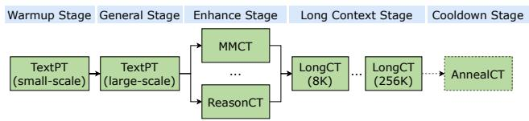  
Figure 1. Recipe of LLM pretraining. TextPT: Text Pretraining; MMCT: Multimodal Mixed Continual Training; ReasonCT: Reasoning Continual Training; LongCT: Long Context Continual Training; AnnealCT: Annealing Continual Training. Different LLMs may reorder stages [19, 74].

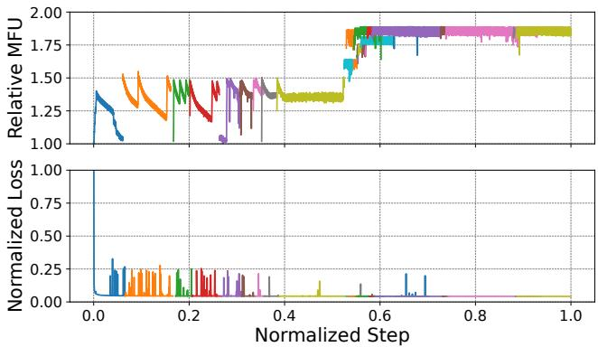  
Figure 2. Normalized loss and relative MFU (ratio to the minimum MFU value) curves of an LLM training job running on 1000 GPUs in a production environment. Each color indicates one continuous, uninterrupted training period.

## 2 Background and Motivation

## 2.1 Characteristics of LLM Training

Complex parallelism strategies. A variety of parallelism strategies have been exploited in distributed LLM training, including data parallelism (DP) [48, 97], tensor parallelism (TP) [68], pipeline parallelism (PP) [38, 54, 55, 62], and sequence parallelism (SP) [39, 50]. Gradient checkpointing [12] and CPU offloading [64] are often integrated for GPU memory optimization. Adam optimizers [43] consume 6× GPU memory compared to model weights [36]. Zero Redundancy Optimizer (ZeRO) [63] is adopted to reduce the memory footprint by sharding the optimizer states (ZeRO-1), gradients (ZeRO-2), and model parameters (ZeRO-3) across GPUs.

Multi-stage configuration adjustments. Whereas traditional DL jobs often run with a single, fixed configuration and unchanging user code [60, 88], LLM pretraining unfolds over multiple stages, each demanding shifts in both algorithmic paradigm and system optimization. Consequently, user code must evolve continuously to meet differing optimization goals. Fig. 1 illustrates a typical five-stage LLM pretraining pipeline [9, 19, 49, 74, 90]: (i) Warmup Stage. A small-scale pure text pretraining runs with a reduced DP size to validate algorithmic changes. Frequent code tweaks here ensure stability and early performance gains [80]. (ii) General Stage. Full-scale pretraining on a broad text corpus to absorb knowledge. Since training scales up, engineering codes are iteratively refined for optimal throughput and memory efficiency [42]. (iii) Enhance Stage. Data mixtures are re-weighted to bolster specific capabilities, e.g., highquality STEM, coding, and math datasets for improved reasoning [90] or multimodal corpora for cross-modal understanding [9, 74]. Apart from data adjustments, user code may also be extended to incorporate additional adaptors [17] or modality-specific optimization techniques [30, 96]. (iv) Long Context Stage, the context windows and the allocated machines are progressively expanded (e.g., from 8K to 256K). Scenario-tailored engineering codes such as Hybrid Data Parallelism (HDP) [27] are integrated to sustain efficiency at extreme sequence lengths. (v) optional Anneal Stage, certain domain-specific or synthetic datasets are carefully unsampled [19, 74] to tune and stabilize the final performance.

Table 1. Statistics of training incidents collected over a threemonth span, encompassing 778,135 LLM training jobs.
<table><tr><td>Category</td><td>Incident Symptom</td><td>Count</td><td>Percentage</td></tr><tr><td rowspan="18">Explicit</td><td>CUDA Error</td><td>19968</td><td>36.1%</td></tr><tr><td>CPU Overload</td><td>6095</td><td>11.0%</td></tr><tr><td>CPU OOM</td><td>5567</td><td>10.1%</td></tr><tr><td>Insufficient Disk Space</td><td>2755</td><td>5.0%</td></tr><tr><td>Infiniband Error</td><td>1599</td><td>2.9%</td></tr><tr><td>Filesystem Mount</td><td>1176</td><td>2.1%</td></tr><tr><td>HDFS [22] Error</td><td>1104</td><td>2.0%</td></tr><tr><td>Container Error</td><td>781</td><td>1.4%</td></tr><tr><td>OS Kernel Panic</td><td>203</td><td>0.4%</td></tr><tr><td>GPU Memory Error</td><td>188</td><td>0.3%</td></tr><tr><td>External Service Error</td><td>128</td><td>0.2%</td></tr><tr><td>GPUUnavailable</td><td>76</td><td>0.1%</td></tr><tr><td>Disk Fault</td><td>47</td><td>0.1%</td></tr><tr><td rowspan="4">Implicit</td><td>Job Hang</td><td>5506</td><td>9.9%</td></tr><tr><td>MFU Decline</td><td>442</td><td></td></tr><tr><td></td><td></td><td>0.8%</td></tr><tr><td>NaN value</td><td>148</td><td>0.3%</td></tr><tr><td>Manual Restart</td><td>Code/Data Adjustment</td><td>9582</td><td>17.3%</td></tr></table>

Frequent failures and restarts. Large-scale LLM training is often plagued by frequent failures and restarts. Fig. 2 shows the training loss and Model FLOPs Utilization (MFU) when training an LLM in a 1000-GPU cluster over a 10-day training span, during which a total of 28 runs were conducted (each run corresponds to a restart of the model training). The interruptions were caused by infrastructure issues, as well as manual adjustments to the training algorithm and strategies. As training progresses, the loss gradually decreases while the MFU increases, reflecting the impact of engineering efforts such as tuning parallel strategies, integrating fused computational kernels, etc., exerted for improving performance upon each restart. Notably, when a manual restart occurs, the training progress might be intentionally rolled back by several steps to verify the correctness of the engineering improvements and to ensure that the loss curves remain bitwise consistently aligned, which corresponds to the curve overlap observed in some of the runs.

Unproductive Time
<table><tr><td rowspan="2">training progress</td><td rowspan="2">NCCL Timeout</td><td colspan="2"></td><td rowspan="2"></td><td rowspan="2">build pod</td><td rowspan="2">load ckpt</td><td rowspan="2">recompute</td></tr><tr><td> diagnostics</td><td></td></tr><tr><td>unsaved ckpt interval</td><td></td><td>blacklist</td><td>blacklist</td><td> schedule</td><td></td><td></td><td>unsaved ckpt interval</td></tr><tr><td>W</td><td>儿</td><td></td><td>儿</td><td></td><td></td><td></td><td></td></tr><tr><td> Failure</td><td>Detection</td><td>Localization</td><td></td><td></td><td></td><td>Failover</td><td></td></tr><tr><td></td><td></td><td></td><td></td><td></td><td></td><td></td><td></td></tr><tr><td></td><td></td><td></td><td></td><td></td><td></td><td></td><td></td></tr></table>

Figure 3. Unproductive time breakdown upon failures. Implicit failures, such as job hangs, are selected as examples since they typically result in prolonged unproductive times.

## 2.2 Observations on Training Incidents

Incident distribution. Table 1 summarizes training incidents in all LLM training jobs captured on our production platform over the last three months. We classify these incidents into three categories, based on their characteristics: (i) Explicit failures, which are characterized by clear diagnostic indicators, such as error messages in stdout or stderr logs or specific exit codes; (ii) Implicit failures, which often manifest as job hang-ups, performance degradation, or anomalous training trajectories,whose root causes are often elusive; and (iii) Manual restart, which refers to proactive interruptions of training for the purposes of algorithm and engineering improvement. For instance, optimization techniques such as kernel fusing [10], computationcommunication overlapping [11], etc., are continuously integrated; updates to software versions and adjustments in parallelism configurations are also made to enhance training efficiency. To mitigate undesirable trajectories like loss spikes, changes in algorithmic code are also necessary, e.g., skip problematic mini-batches, tune hyper-parameters [7, 13, 92]. Different unproductive times. The breakdown of unproductive time caused by training incidents is shown in Fig. 3, which includes detection, localization, and failover times. As the majority of incidents, explicit failures enable immediate faulty machine identification or application of targeted diagnostics [16, 36, 42, 89]. These failures typically exhibit short detection times (around 60s, via error messages or other log-based indicators) and localization times (ranging from 2 minutes to 15 minutes). In addition, more than 10% of incidents manifest as implicit failures and are difficult to detect or pinpoint their sources. For instance, we encountered a communication hang issue caused by CUDA errors (see this example in Sec. 5.1), which took us more than one and a half hours for manual diagnosis. Besides, SDC [14, 19, 35, 52] on GPU hardware has emerged as a critical challenge in LLM training. It appears as stochastic faults, such as abrupt loss divergence or NaN values, and often makes stop-time diagnostics unable to reproduce within a short period of time. We uncovered a data-type-dependent computation error rooted in GPU SDC, characterized by non-deterministic behavior that hindered reliable reproduction. Through more than 8 hours of offline stress testing, we successfully identified the faulty GPU machines. Finally, as LLM training is akin to a scientific experiment, 9582 manual interruptions occurred, primarily due to modifying the execution code to optimize training performance or to test new configurations. The unproductive time for them includes only failover time.

Table 2. Root cause of incidents
<table><tr><td>Symptom</td><td>#Infrastructure</td><td>#User Code</td><td>#Total</td></tr><tr><td>Job Hang</td><td>21</td><td>5</td><td>26</td></tr><tr><td>Illegal memory access</td><td>21</td><td>41</td><td>62</td></tr><tr><td>NaN value</td><td>3</td><td>1</td><td>4</td></tr></table>

## 2.3 Challenges to Achieve High ETTR

Effectively mitigating diagnosis and recovery overhead of various failures and restarts is crucial to ensure training efficiency of large-scale LLMs, but is complicated as follows. Complex root causes of failures. Under the same symptoms, the root cause of failures can be tangled among different aspects. In Table 2, we summarize incidents in the largescale training jobs (on >2000 GPUs) over the last month, exhibiting three typical symptoms and categorize their root causes into two types: infrastructure and user code. Failure categories as infrastructure are raised from issues within the underlying hardware or software, such as GPUs or remote storage [36]. User code failures typically stem from programming or configuration errors in model development or training frameworks by engineers. Job Hang can be triggered by NVIDIA IB Switch Unified Fabric Manager (UFM) faults (infrastructure issue) or mis-configurations of checkpoint resharding (user code issue). GPU memory errors like illegal memory access can be caused by the broken High Bandwidth Memory (HBM) or incorrect implementation of computation kernels in handling variable sequence lengths, i.e., both infrastructure error and user code error are possible. Furthermore, NaN values (e.g., loss NaN) can also stem from multiple sources, including problematic data, code bugs, or hardware-induced SDCs. This multi-factorial origin makes it hard to identify the fault sources, particularly in distributed training [33]. Log analysis based on specific rules can hardly diagnose failure from different aspects automatically. User code evolution further exacerbates the difficulty of fault localization. When a new code version is applied, the running job is stopped, and the new job is launched. If a failure occurs at this moment, it is difficult to distinguish whether the root cause is due to user code or the infrastructure.

Implicit failures are hard to detect and locate. According to Table 1, a typical indicator of implicit failures is Hang, covering over 10% of all incidents. Existing LLM robust training systems rely on log analysis to monitor the training health status [32, 36]; when hang happens, the training job will not produce any logs until timeout (i.e., 30 or 60 minutes for NCCL). Utilizing RDMA traffic monitoring, MegaScale [42] can identify anomalous behavior earlier, but locating the root-cause anomalous machines or GPUs is still challenging. When MFU declines or fluctuates, all measurements regarding IO, computation, and communication decrease or fluctuate simultaneously, challenging root cause diagnosis. Apart from job hang and performance degradation, SDC is also hard to handle. This issue is further compounded by the collective communication paradigm intrinsic to distributed LLM training, which exacerbates SDC propagation: a single corrupted gradient from one node can contaminate the global parameter update across all participating workers. This amplifying effect is particularly insidious because it obfuscates the original fault locus within the aggregated signals.

Uncertainty and high overhead of failover. Upon fault isolation or manual adjustments, failover is triggered for training recovery. As depicted in Fig. 3, failover operations include: scheduling new machines [44] associated with the terminated job, reconstructing the pod environment, reloading the latest checkpoint from the remote storage [80], and recomputing the lost training progress. During the machine rescheduling process, degraded machines may be assigned, introducing potential new faults after job restarts. For manual restarts that include code upgrades, this process can create ambiguity in determining whether new faults stem from the recently integrated code or the underlying infrastructure. In addition to its uncertainty, failover is inherently costly, leading to significant unproductive time. For instance, retrieving checkpoints from remote storage over lowbandwidth frontend networks can be notably time-consuming. Furthermore, relying on remote storage leads to substantial recomputation overheads, as relatively large checkpointing intervals (e.g., 30 minutes [20] or every 100 training steps [6, 80]) are required to reduce checkpoint stalls. We observed that the time cost of failover operations is often more than 10 minutes for the large model training at the scale of 10,000 GPUs. As the scale of LLM training increases, the failure frequency increases [19, 92, 94], amplifying the overhead of failover operations in the entire training span.

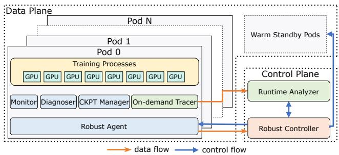  
Figure 4. Architecture of ByteRobust.

## 3 ByteRobust Overview

ByteRobust is designed to address the above challenges and fulfill our primary goal of achieving high ETTR in largescale LLM training: automatically diagnosing and addressing various training incidents while minimizing unproductive time. As illustrated in Fig. 4, ByteRobust consists of two core components, control plane and data plane. The control plane operates external to the training job, orchestrating the robust incident-handling strategy that detects anomalies, localizes faults, and triggers appropriate recovery actions. The data plane resides within each training pod and integrates modules for monitoring, diagnosing, checkpoint management, and stack-trace capture, furnishing real-time observability, immediate diagnostics upon interruption, rapid checkpoint rollbacks, and on-demand aggregation analysis.

Control plane. The control plane comprises two modules that enable robust failure detection, localization, and recovery in LLM training. Robust Controller orchestrates an automated failure mitigation framework (Sec. 4), leveraging real-time monitoring and stop-time diagnostics to handle most incidents. For controlled and swift recovery, it uses an in-place hot-update mechanism to restart training when no machine is evicted (Sec. 6.1). When certain machines are decided to be evicted, it requests warm standby machines, prevalidated via self-checks, to resume the job (Sec. 6.2). Runtime Analyzer addresses job hangs and performance degradations by aggregating stack traces from training pods to isolate and (over-)evict suspected machines (Sec. 5).

Data plane. The Robust Agent daemon runs in each training pod, processing control signals from the Robust Controller and managing four sub-modules below: Monitor collects multifaceted data to detect outliers, supporting real-time checks (Sec. 4.1) and triggering aggregation analysis upon anomalies. Diagnoser runs domain-specific benchmarks and test suites [89, 91] after job suspension, enabling in-depth diagnosis of complex failures (Sec. 4.2). On-Demand Tracer captures stack-traces from training processes (when aggregation analysis is invoked) and uploads them to the Runtime Analyzer. CKPT manager performs asynchronous checkpointing with cross-parallel-group backups to CPU memory and local disk, minimizing resuming costs (Sec. 6.3).

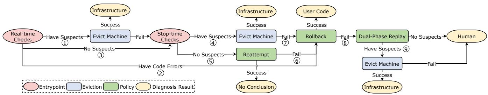  
Figure 5. The automated fault tolerance mechanism of ByteRobust.

## 4 Automated Fault Tolerance

Automated fault tolerance is essential for scaling LLM training. By detecting, localizing, and resolving incidents with minimal human intervention, it dramatically reduces unproductive time. Besides, since GPU cycles are the most expensive resources in a training cluster, rapid, coarse-grained fault isolation often yields a better trade-off than expensive, fine-grained root-cause pinpointing between diagnostic coverage and efficiency. To meet these requirements, we propose an automated fault tolerance framework (Fig. 5) that combines real-time checks for immediate detection of common errors, stop-time diagnostics for in-depth analysis of complex failures, in-place reattempts to recover from transient faults, code rollbacks to revert from defective user codes, and replay tests to address corner cases such as SDCs.

## 4.1 Proactive Real-time Checks

System inspection. The monitor employs inspection threads to carry out a series of lightweight system health status queries at predefined second-level intervals. These inspections introduce no workload to GPUs and are transparent to the ongoing training job. The inspections mainly cover: (i) Network-side items, such as NIC down or jitter, packet loss rate, switches down. (ii) GPU-side items, including the status of DCGM service [75], PCIe bandwidth, memory row remapping [76], and GPU temperature, etc.(iii) Host-side items, such as OS kernel event (e.g., Xid [57] in dmesg). We set different inspection intervals and triggering thresholds for these items to tolerate automatic recovery.

Once any anomaly is detected (step ○1 ), the monitor reports the warning event to the robust agent, which then notifies the robust controller. For highly confident events that point to specific machines, such as GPU Unavailable, Disk Fault, the controller stops all processes immediately and evicts problematic machines, skipping stop-time diagnostics (Sec. 4.2). For network issues, the controller tolerates several alerts (e.g., twice within 5 minutes empirically) before evicting problematic machines, since some of them (e.g., NIC and Network Switch flipping) can automatically recover themselves [15]. If restarted training fails again after machine eviction, ByteRobust enter the stop-time check procedure.

Metrics collection. The monitor also gathers various metrics based on three categories of data: (i) workload-specific training metrics, including loss, gradient norm, MFU, etc. We leverage wandb [81] to collect these continuously observable metrics, considering significant changes in them as the faulty signals, e.g., 5× increase in loss/gradient norms, NaN values. (ii) stdout/stderr logs and process exit codes, which serve as hints for diagnostics. (iii) events, including CUDA, RDMA, host, and storage events. These events are crucial for deriving system performance metrics such as RDMA traffic and TensorCore utilization. Given the periodic nature of LLM training, significant declines in these metrics serve as a signal for potential job hangs and MFU declines.

During runtime, the controller analyzes collected metrics. If it detects user-space errors, e.g., TypeError, IndexError, traceable to specific code modules from logs and exit codes, it triggers a code rollback (step ○2 ). If training crashes or abnormal metrics, e.g., NaN losses, arise without a clear culprit, it suspends training and runs stop-time checks (step ○3 ). On spotting performance anomalies, e.g., zero RDMA traffic within 10 minutes or low TensorCore utilization, the aggregation analysis is triggered for machine isolation (Sec. 5).

## 4.2 Hierarchical Stop-time Checks

Although proactive real-time checks can utilize inspections to connect most of the explicit failures to faulty machines, there still exist some errors that are hard to resolve with only real-time collected information. ByteRobust takes potential human errors into consideration and conducts hierarchical stop-time checks to handle these cases.

Diagnose. The diagnoser analyzes the logs and exit code for failure diagnosis, running corresponding tests to locate the root causes. For instance, upon NCCL Internal Error, NCCL tests are conducted: It first runs NVIDIA Extended Utility Diagnostics (EUD) [56] to confirm whether there are obvious errors in GPUs. If no, an intra-machine all-to-all test is run to verify if inter-GPU connection bandwidth meets expectations. If the intra-machine test is passed, the intermachine machine communication test is conducted. Each machine runs an all-gather test with neighboring machines to verify the connectivity and integrity of data transfer. The discovered suspected machines are evicted with their IP addresses blocked (step ○4 ). After that, warm standby machines are awakened to restart training (Sec. 6.2).

Algorithm 1: Dual-Phase Replay   
Input :??: Total number of machines   
??: Group size (recommended as PP size   
multiple)   
$n \gets z / m \colon$ Number of groups   
Output : Suspect set $S \subseteq \{ 0 , 1 , . . . , z - 1 \}$   
1 Function LocateFaultyMachines(??, ??, ??)   
2 The machine ?? is assigned the ID ????   
3 Phase 1: Horizontal Grouping   
4 Partition machines into ?? groups by $x _ { i } / m$   
5 Identify faulty group ?? via replaying   
6 Phase 2: Vertical Grouping   
7 Re-partition into ?? groups by $x _ { i }$ mod ??   
8 Identify faulty group ?? via replaying   
9 Solve the constrained system:   
$\left\lfloor { \frac { x _ { i } } { m } } \right\rfloor = a$   
$x _ { i }$ mod $n = b$   
10 Determine solution cardinality:   
$| S | = { \left\{ \begin{array} { l l } { 1 } & { { \mathrm { i f ~ } } m \leq n } \\ { \lceil m / n \rceil } & { { \mathrm { o t h e r w i s e } } } \end{array} \right. }$   
11 return $S ;$

Reattempt. If all tests are passed, the diagnoser assumes that the failures are caused by transient faults such as temporary link flapping, switches down, connection reset, etc. The training job is then directly restarted (step ○5 ).

Rollback. When restarting training fails to resolve the problem (step ○6 ) or training crashes again after machine eviction (step ○7 ), the diagnoser assumes that recent updates of user code are highly risky. It then rollbacks the user code with the hot-update mechanism (Sec. 6.1) to remove integrated new features (e.g., newly fused computational kernels) and restarts training. If training restarts successfully, the user code is deemed as the root causes. Relevant teams are involved to examine the reliability of their codes while training keeps progressing.

Dual-Phase Replay. If training still fails, ByteRobust assumes unknown faults (e.g., SDCs) and resorts to group testing in a controlled setting for localization. For large-scale 3D parallel training [55], machine stress testing and benchmarking [89] disrupt the original computing-communication pattern and data dependence of current LLM job [16], undermining reproducibility. To preserve diagnostic fidelity, we introduce a dual-phase, dimension-aware replay that keeps the original TP/PP sizes fixed while varying only the DP sizes (step ○8 ). Algorithm 1 details the localization procedure. We partition machines into horizontal and vertical groups, reduce the model layers, and replay the job on each group with a reduced DP size (lines 2–8). The intersection of the faulty horizontal and vertical groups pinpoints the failed machine (lines 9–11), which is then evicted (step ○9 ). In practice, we set ?? = ??· PP\_size, ?? = DP\_size/?? where $k \in \mathbb { N } ^ { + }$ , and $m \leq n$ for a unique solution. Since PP\_size ≪ DP\_size, intra-group communication remains representative. As the depicted example in Fig. 6, by replaying the training job twice and identifying the faulty group in each phase, SDC machine #13 is isolated correctly. This design choice effectively reduces unproductive time without the reliance on advanced diagnosis tools. In our experience, each SDC incident typically involves only a single faulty machine, which is the common case in large-scale training.

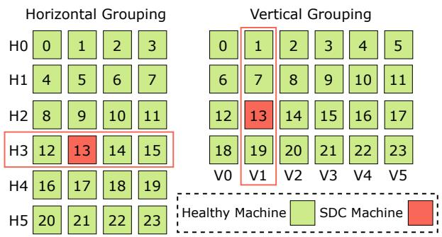  
Figure 6. Examples of running Alg. 1 to identify the SDC machine, where $m = 4 , n = 6 .$ . H?? denotes group ?? in the horizontal grouping phase, while V?? denotes group ?? in the vertical grouping phase.

Lesson: Simple approaches address most incidents. Based on empirical observations across 19 large-scale LLM training jobs (≥ 9,600 GPUs), we find that direct machine eviction via real-time checks resolved 32.52% of failures, reattempts recovered 22.70%, and rollbacks handled another 9.20%. Only 1.23% of failures required dual-phase replay.

## 4.3 Case Study

NaN loss diagnosis. In case that NaN losses are detected by the monitor during training, standard GPU and network tests are conducted first, including EUD and NCCL tests. If all these tests are passed, a bit-wise alignment test is run: each machine initiates a reference model whose structure matches that of the target training job (e.g., dense models [7] or MoE models [66]). It loads predefined weights, employs a specific parallelism configuration (e.g., TP=2, PP=2, DP=2 or EP=2, PP=2, DP=2), and executes one training step on fixed input to ensure reproducibility. The outputs from all machines are collected and analyzed to verify bit-wise accuracy. Machines that yield incorrect results are promptly isolated and removed. If this test does not identify any defective machines, reattempt and rollback are sequentially employed to settle potential transient failures and human errors. If training still fails, the dual-phase replay testing is applied for troubleshooting.

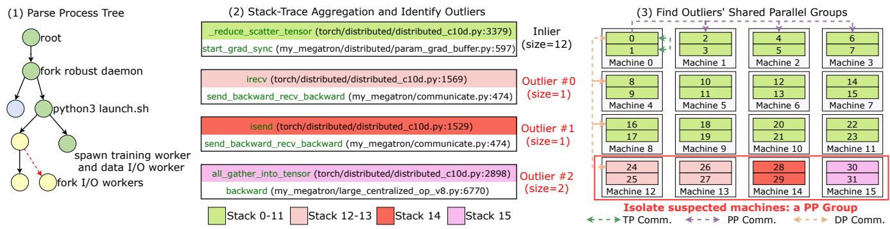  
Figure 7. Stack aggregation for backward-communication hang pinpointing. The parallelism configuration: TP=2, PP=4, DP=4.

## 5 Data-Driven Over-Eviction

Beyond NaN values, implicit failures also manifest as job hangs and MFU declines (Table 1). When a job gets hung, no traceable information is logged for stop-time diagnostics. As for the decline in MFU, although the task slows down, all machines slow down simultaneously, and the throughputs of IO and RDMA, among others, all decline at the same time. All of these factors make it extremely difficult to identify the potentially faulty machines by analyzing the existing external information, as mentioned earlier. To overcome this challenge, ByteRobust hooks into and inspects the stack traces of all internal training processes upon detecting these silent failures to localize faulty machines. When receiving the aggregation triggering message, the controller notifies the on-demand tracer to capture process stack-traces, which are then sent to the runtime analyzer to conduct aggregation analysis in the background. We first introduce the aggregation analysis mechanism through a job hang example, then present a case study for further illustration.

## 5.1 Aggregation Analysis

To pinpoint the location of anomalies, the aggregation analysis compares the invocation stacks of GPU ranks in different machines. Compared to events, training metrics, and stdout/stderr logs, stack-traces of processes offer a rich source of information for addressing complex incidents. However, root causes may reside in subprocesses spawned by the main training processes for tasks like data fetching or checkpointing [80]; merely analyzing the stacks from the primary training processes is insufficient. ByteRobust incorporates this observation and performs a three-step aggregation to conduct a comprehensive analysis, based on the assumption that most healthy machines exhibit identical stack traces under a single implicit failure.

Fig. 7 illustrates a silent backward-communication hang. In this example, machine 15, which hosts the last stage of a model pipeline to generate activation gradients for backward propagation, stalls in all\_gather\_into\_tensor. Meanwhile, unlike machines 0-11, which complete launching all backward-related kernels and proceed to gradient synchronization in the optimizer, machine 14 and machines 12-13 are blocked in isend and irecv, respectively, while transmitting gradients for certain micro-batches. Conventional diagnostics make it difficult to efficiently and precisely determine the set of faulty machines. Instead, ByteRobust addresses this issue by over-evicting isolated machines via a three-step procedure, avoiding the need to pinpoint the exact root cause. First, ByteRobust parses the process trees in each training pod to identify training-related processes, e.g., torchrun, dataloader, and checkpoint processes. Next, stacktraces from these identified processes are aggregated into multiple groups via string matching to differentiate abnormal sources. The dominant groups are deemed healthy (green stacks in Figure 7), while the remaining groups are classified as outliers (other colors). Finally, we find the shared parallel groups for those outliers and isolate the corresponding machines. In this example, the shared parallel group is one PP group (machines 12, 13, 14, and 15). The robust controller evicts the suspects and then resumes training.

For fail-slow incidents (i.e., MFU decline), ByteRobust repeats aggregation every 10 seconds, flagging the parallel group with the most outliers at each round. The parallel group with the highest cumulative flag count across 5 rounds is marked as the degrader for over-eviction.

## 5.2 Case Study

Next, we dive into details of a representative implicit failure and how aggregation analysis works.

Evaluation hang. We experienced task hangs during the LLM evaluation step [34], which typically measures model’s multitask capacity. In one example, the stack aggregation analysis isolated a specific pipeline spanning 6 machines, where the stacks in the intermediate stages differed from those of other ranks in the same DP×TP group. Those stages were hence stuck in their P2P communication operations. The 6 machines were automatically blacklisted and evicted, and the warm standby instances were scheduled for rapid replacement and training restarting. Through background stress testing spanning several days, we finally determined the root cause: two of the machines have defective CUDA cores, causing hangs and preventing the P2P operations.

## 6 Controlled and Swift Recovery

After failure detection and localization, ByteRobust restarts training swiftly in a consistent environment, minimizing downtime and avoiding new faults. Specifically, we apply in-place hot-update (Sec. 6.1) for code/data adjustments, use warm standbys (Sec. 6.2) to eliminate scheduling costs, and employ over-eviction-aware checkpointing for fast snapshots and local safe backups (Sec. 6.3).

## 6.1 In-Place Hot-Update

Manual training restarts for code adjustments are the norm during LLM training. Rescheduling new machines for code upgrades or rollbacks not only incurs significant overheads but also introduces potentially faulty machines, complicating fault localization when failures occur after restarts. To minimize the overhead and avoid the risks of deploying potentially faulty machines during restart, a lazy hot-update mechanism is introduced for in-place code modifications without destroying the existing pod environments. Update strategies are tailored according to the nature of the code modification. For urgent requests like bug fixes, training is immediately halted to apply the updates. For less critical changes such as experimenting with new optimizations or updating software versions, updates are integrated into the recovery procedure upon the next failure, leveraging frequent interruptions observed in large-scale LLM training (e.g., interruptions occur on average once every 2.78 hours during Llama 3.1 training [19]). In any case, a non-applied non-critical update is performed when a default triggering window (e.g., 24 hours) expires. All modifications will be persisted in our database, making them traceable and reproducible. The hot-update mechanism also makes the continuous integration of the evolving training code part of the pipeline in robust LLM training, through automatic apply and rollback (Sec. 8.1.2).

## 6.2 Warm Standby Machines

Whenever machine evictions occur, ByteRobust utilizes warm standby instances to quickly replace the missing machines for training resumption. Though introducing some GPU idling on standby machines, the reduced restart costs translate into the utilization improvements on healthy machines in the cluster, especially under high-frequency training interruptions during large-scale training [19]. We maintain a standby machine pool and decide the number of backup machines based on the key observation that failures in largescale training are typically independent, happening at single nodes, and simultaneous failures involving multiple nodes are extremely rare [31, 94]. We estimate the daily failure rate of individual machines using historical data and model simultaneous failures across machines by a binomial distribution. We set the number of warm standby instances to the 99th percentile (P99) of this distribution, which can effectively meet the needs in most scenarios.

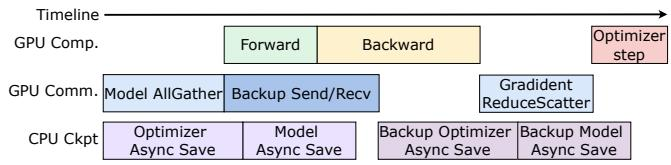  
Figure 8. An example of checkpointing and backup operations scheduling with ZeRO-style parallelism.

The standby machine pool is replenished dynamically. Pod environment initialization is performed on each new standby machine, including machine self-checks to ensure its healthy status, image installation, and library downloading, which then enters a low-power sleep mode. Upon machine evictions, if there are sufficient standby machines, they are directly awakened and integrated into training; otherwise, prompt replenishment is carried out, and training restarts when all needed machines finish their pod environment initialization. An additional benefit of this design is that only a minimal number of machines change in the event of a failure and subsequent job restart; the remainder continue exactly as before, improving both resource efficiency and the controllability of model training.

## 6.3 Over-Eviction-Aware Checkpointing

ByteRobust advocates in-memory checkpointing by saving and backing up checkpoints on both local and peer machines. It employs a hierarchical checkpointing scheme that leverages host CPU memory and SSD storage tiers, incorporating a backup strategy that anticipates machine over-eviction (Sec. 5) to guarantee availability. By eliminating reliance on remote storage services over low-bandwidth frontend networks [20, 80], ByteRobust prevents potential training hangs or crashes caused by storage-service failures (see Table 1, where we had 1104 HDFS errors).

Operation scheduling. Through meticulous operation scheduling, ByteRobust achieves near-zero-overhead in-memory checkpointing. As the example in Fig. 8, to back up sharded model and optimizer states, ByteRobust exploits the idle communication cycles in each training step, i.e., during forward and backward computations, and employs P2P communication for each rank to exchange these shards with its peer rank in selected backup machines (see details in the backup strategy). These backup shards are then saved into CPU memory. Checkpoint I/O operations are performed in an asynchronous manner with forward and backward computation. The optimizer step of GPU computation waits for the completion of saving each rank’s own checkpoints to ensure data integrity. Backup checkpoints can be saved concurrently with model and optimizer updates. ByteRobust creates a separated CUDA stream to isolate the execution of trainingrelated and checkpointing-related kernels. For the backup communication executed in parallel with forward and backward propagations, we partition the states into small chunks, interleaving the transmission with training communication traffic in different parallelism dimensions.

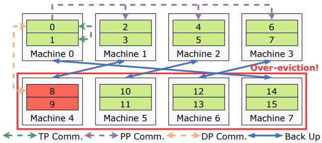  
Figure 9. Checkpoint backup with over-eviction awareness. 3D Parallelism configuration: TP=2, PP=4, DP=2.

Cross parallel group backup strategy. Replicating sharded optimizer and model states across machines is essential to tolerate machine failures. In ByteRobust, machine over-eviction mainly stems from aggregation analysis (Sec. 5), where an entire parallel group can be evicted for prompt training restarts. Therefore, it is crucial to select target machines for safely storing backups upon over-eviction. ByteRobust advocates a cross parallel group backup strategy to tackle potential machine over-eviction. As depicted in Fig. 9, during large-scale 3D parallel training, each rank backs up its sharded optimizer states outside of its 3D parallel groups. For instance, ranks 8 and 9 exchange their optimizer states with ranks 2 and 3, ensuring that none share the same PP, DP, or TP groups. Similarly, sharded model states, which are deduplicated within the DP group [80], adhere to this backup strategy. If the parallelism strategy comprises only a single parallel group (e.g., ZeRO parallelism), the system defaults to backup in neighboring machines.

## 7 Implementation

Robust Controller and Agent. The Robust Controller consists of an orchestration module and a control module written in 20k lines in Golang. We implement the orchestration module using Kubernetes Custom Resource Definitions (CRDs) to represent job operations (\~3k LoC). Each job has a runtime CRD for elastic training rules and a job CRD for pod scheduling. To enhance cluster management efficiency, we replace the standard etcd [21] with an internal metadata system and utilize an internal scheduler for pod group scheduling. The control module centers around a job manager service that maintains job controllers (\~17k LoC). For each job, we register a dedicated controller service with the job manager, using goroutines to enable efficient resource sharing, various warm backup strategies, and unified failure recovery. The Robust agent is a Python daemon(\~5k LoC) running alongside each job to manage training processes. The agent communicates with the controller through gRPC-based heartbeats and supports runtime hot updates.

Runtime Analyzer is implemented in around 12k lines of Golang. The analyzer standardizes anomalies by aggregating logs, I/O operations, host anomalies, on-demand tracer output, and pod anomalies into unified events. Due to the heterogeneous and dispersed nature of observed data and the need for rapid issue classification, we designed an event-driven system for real-time analysis. It allows swift root cause localization and collaborates with the robust controller for fast failure handling. For NCCL timeout issues, it collects stack traces from the on-demand tracer, which is implemented using py-spy [5] and flight-recorder [61], and training topology information to facilitate troubleshooting. The analyzer also constructs a process tree of worker training processes, to meet various analysis needs.

Warm Standby. We leverage the Robust Controller’s orchestration module to maintain a specified number of warm standby nodes through asynchronous provisioning. Upon initialization, each Robust Agent queries the Controller to determine its state, either warm standby or active training. When execution reaches pre-set barriers that block code execution, processes on standby machines verify their current state. If they are in the standby state, these processes enter a polling loop, periodically checking with the Robust Controller for an activation signal. Once activation is signaled, training seamlessly resumes beyond the barrier, integrating warm standby nodes into the ongoing training workflow without disruption.

High-Frequency Checkpointing is implemented in 3k lines of Python with a dual-buffer for CPU tensors, which alternately stores the optimizer’s state dictionary between different iterations. We implement asynchronous checkpointing by overlapping three operations: Device-to-Host (D2H) copying, serialization, and sending to other ranks for backup. When the first CPU tensor is undergoing D2H copying, we perform serialization or sending on the second tensor simultaneously. D2H operations are executed on a dedicated CUDA stream, enabling independent execution of D2H memory copy alongside training computation. Failure recovery is implemented by selecting the latest available checkpoints based on D2H and serialization completion status.

## 8 Evaluation

We first present deployment results to demonstrate how ByteRobust achieves robust training in real production (Sec. 8.1).

Table 3. The time to detect different infrastructure failures. $T _ { t i m e o u t }$ is the default timeout threshold of PyTorch-Distributed [48] (\~10 minutes). $T _ { m o n i t o r }$ is the time interval to monitor the MFU decline.
<table><tr><td>Category</td><td>Root Cause</td><td>w/ Inspection (s)</td><td>w/o Inspection</td></tr><tr><td rowspan="3">Network</td><td>NIC crash</td><td>30</td><td> $T _ { t i m e o u t }$ </td></tr><tr><td>Port Flapping</td><td>30</td><td> $T _ { t i m e o u t }$ </td></tr><tr><td>Switch Down</td><td>30·2</td><td> $T _ { t i m e o u t }$ </td></tr><tr><td rowspan="3">GPU</td><td>Driver Hang</td><td>10</td><td>Ttimeout</td></tr><tr><td>High Temperature</td><td>10</td><td> $T _ { m o n i t o r }$ </td></tr><tr><td>GPU Lost</td><td>10</td><td> $T _ { t i m e o u t }$ </td></tr><tr><td>Host</td><td>OS Kernel Fault</td><td>2</td><td> $T _ { t i m e o u t }$ </td></tr></table>

We then compare ByteRobust with several baselines to underscore its enhancements in failure recovery (Sec. 8.2).

Testbed. All experiments are conducted on production GPU clusters. For deployment results in Sec. 8.1, up to 1200 machines are employed, each equipped with 8 NVIDIA Hopper 80GB GPUs. For evaluation in Sec. 8.2, we use a total of 1024 machines, each equipped with 16 NVIDIA L20 48GB GPUs connected via 30GB/s PCIe, resulting in over 16,384 GPUs in total. All machines mentioned above are interconnected through eight 400 Gbps RDMA links and powered by 96-core Intel Xeon processors and equipped with 2 TB of DRAM.

## 8.1 Robustness in Real Production

ByteRobust has been deployed on ByteDance’s production clusters to serve LLM training tasks. We show that ByteRobust can effectively reduce incident detection time (Sec. 8.1.1) and resolve incidents via the automatic fault tolerance framework and aggregation analysis (Sec. 8.1.2). The overall ETTR and MFU statistics are also reported to verify the end-to-end effectiveness (Sec. 8.1.3). Finally, we compare our automated fault tolerance framework with prior practice to justify its advantages (Sec. 8.1.4). We collected two in-house pretraining jobs of our production-grade models: a three-month job for training a dense model (Llama-like [19], 70+B), and a one-month job for training an MoE model [8] (200+B). These pretraining jobs were run on a GPU cluster comprising 9,600 Hopper GPUs.

8.1.1 Reduce Detection Time. We show that the realtime check mechanism effectively reduces failure detection time by comparing it with a baseline approach relying on only the timeout threshold (\~30 minutes) and performance metric alerts from the monitor. The alert frequency depends on actual training iteration time (Sec. 4.1).

We implement different detection frequencies and judgment criteria for various infrastructure components, as shown in Table 3. For example, the inspection interval for network components is set to 30 seconds. We wait for two consecutive unresponsive switch events before raising an alert. File system errors, especially those due to panic-level OS kernel faults, are detected promptly. For high temperature issues, our system detects individual GPU overheating within 10 seconds and correlates this with MFU degradation to verify gray failures caused by thermal throttling GPUs. The baseline system can only detect MFU decline after gathering statistics from multiple training iterations. By detecting failures earlier, we minimize unproductive idle periods and eliminate the need for stop-time diagnostics.

Table 4. Distribution of resolved incidents across different mechanisms in two production jobs. Numbers represent incident counts, with percentages shown in parentheses.
<table><tr><td>Job</td><td>Mechanism</td><td>Explicit</td><td>Implicit</td><td>Manual Restart</td></tr><tr><td rowspan="2">Dense</td><td>AutoFT-ER</td><td>128 (73.1%)</td><td>·</td><td>+</td></tr><tr><td>AutoFT-HU Analyzer-ER</td><td>+ ·</td><td>· 15 (8.6%)</td><td>20 (11.4%) +</td></tr><tr><td rowspan="2"></td><td>Rollback</td><td>·</td><td>12 (6.9%)</td><td>·</td></tr><tr><td>AutoFT-ER</td><td>71 (56.8%)</td><td>+</td><td>+</td></tr><tr><td rowspan="4">MoE</td><td>AutoFT-HU</td><td></td><td></td><td></td></tr><tr><td>Analyzer-ER</td><td>+</td><td>·</td><td>31 (24.8%)</td></tr><tr><td>Rollback</td><td>·</td><td>9 (7.2%)</td><td>→</td></tr><tr><td></td><td>1 (0.8%)</td><td>13 (10.4%)</td><td>→</td></tr></table>

8.1.2 Resolve Incident. Table 4 presents incident resolution ratios from the two production jobs, by four mechanisms in ByteRobust: 1) AutoFT-ER is the automated fault tolerance mechanism with machine eviction followed by training restart; 2) AutoFT-HU represents the hot-update mechanism; 3) Analyzer-ER corresponds to incidents diagnosed by the aggregation analyzer and resolved through machine eviction and training restart; and 4) Rollback reverts the code to a previous stable version. The majority of explicit failures were resolved by automatic machine eviction and training restart, accounting for 73.1% and 56.8% of incidents in the two jobs, respectively. For implicit failures (job hangs and MFU declines in the two jobs), the analyzer successfully resolved 24 incidents through machine over-eviction, avoiding the need for human intervention, significantly reducing the unproductive time. In addition, rollback identified several engineering code issues, accounting for 6.9% and 11.2% of incidents in the two jobs, respectively. Finally, we observe that all manual restart requirements related to code and data adjustments are handled by the hot-update mechanism.

8.1.3 Guarantee Performance. For performance evaluation, we measure ETTR and MFU on both Dense and MoE LLM training jobs. We define Cumulative ETTR, which is computed as the ratio of the accumulated productive training time to the cumulated wall-clock time of a job run [44]. However, for long-running jobs, this aggregate metric obscures the temporal dynamics of failure handling and recovery. We introduce sliding-window ETTR, computed over a one-hour window, which more accurately reflects the impact of intermittent failures. Results are depicted in Fig. 10 and Fig. 11.

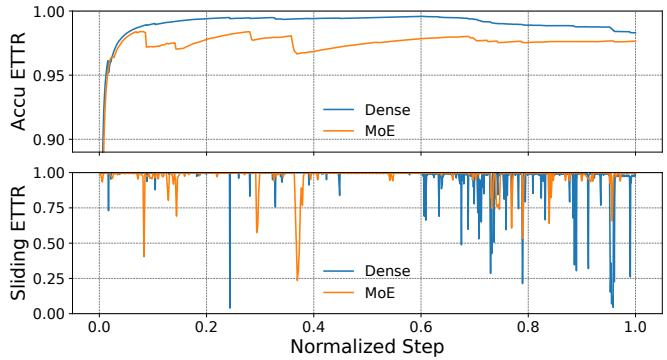  
Figure 10. Cumulative ETTR and sliding-window ETTR in dense LLM and MoE pre-training jobs.

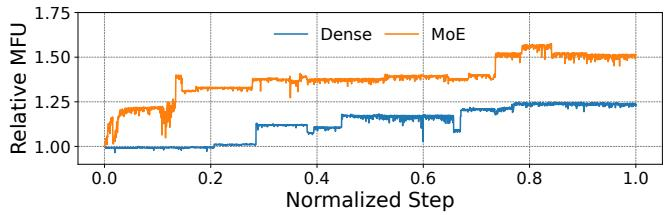  
Figure 11. Relative MFU from dense LLM/MoE training jobs, as the ratio to the respective minimum MFU value.

ByteRobust maintained the cumulative ETTR at a plateau of up to 97% and kept the unproductive training time within a maximum of 50 minutes for both jobs. We observed in Fig. 10 that during the later training periods of the two models, the cumulative ETTR experienced slight degradation while the sliding-window ETTR exhibited increased fluctuations. These changes are caused by the following: The engineering team deployed a feature for long-context training for the first time, which led to several code failures; then, the prolonged training time made the cluster more vulnerable, causing more frequent performance degradation and failures. Despite the increased frequency of failures and manual restarts, ByteRobust was able to detect, diagnose, and recover the training status efficiently.

The relative MFU of the two jobs kept increasing as training progressed. During training, we initially deployed a naive version of the pretraining code on the cluster, and then continuously tuned and optimized its learning process and computational efficiency. In Fig. 11, each leap in the MFU curves indicates that a more efficient version of the training code was deployed through ByteRobust’s hot update, which caused only a negligible degradation in ETTR. We achieved a 1.25× and 1.58× MFU improvement as compared to the initial run in the dense and MoE jobs, respectively.

We also observed that the ETTR of MoE training is relatively lower compared to dense models (Fig. 10). Unlike the training of dense models, whose performance is typically well-optimized by the community [42, 45, 55, 68], MoE training often involves the integration of numerous custom optimizations, such as GPU kernel tuning, computationcommunication overlapping, and load balancing strategies. While these optimizations are necessary for improving training efficiency, showing higher MFU (Fig. 11), they also introduce additional complexity, increasing the likelihood of rollbacks and manual restarts.

Table 5. Training setup of two sparse LLM training jobs. Scale gives the number of machines × GPUs used for training. P99 indicates the number of backup machines × GPUs.Catastrophic represents the number of machines × GPUs involved in extreme failure cases (< 1% probability).
<table><tr><td>Model</td><td>Scale</td><td>Parallelism</td><td>Batch Size</td><td>#P99</td><td>#Catastrophic</td></tr><tr><td rowspan="2">70B</td><td>128×16</td><td> $\mathrm { T P } { = } 8 , \mathrm { D P } { = } 3 2 , \mathrm { P P } { = } 8$ </td><td>512</td><td>2×16</td><td>32×16</td></tr><tr><td>256×16</td><td> $\mathrm { T P = } 8 , \mathrm { D P = } 6 4 , \mathrm { P P = } 8$ </td><td>1024</td><td>2×16</td><td>32×16</td></tr><tr><td rowspan="2">256B</td><td>512×16</td><td> $\mathrm { T P } { = } 8 , \mathrm { D P } { = } 6 4 , \mathrm { P P } { = } 1 6$ </td><td>1024</td><td>3×16</td><td>32×16</td></tr><tr><td>1024×16</td><td> $\mathrm { T P } { = } 8 , \mathrm { D P } { = } 1 2 8 , \mathrm { P P } { = } 1 6$ </td><td>2048</td><td>4×16</td><td>32×16</td></tr></table>

Table 6. Incident resolution cost comparison.
<table><tr><td>Incident Symptoms</td><td>Ours Mean (s)</td><td>Ours Max (s)</td><td>Selective (s)</td></tr><tr><td>CUDA Error</td><td>93</td><td>600</td><td>518 (INF)</td></tr><tr><td>Inifiband Error</td><td>60</td><td>60</td><td>288</td></tr><tr><td>HDFS Error</td><td>58</td><td>65</td><td>INF</td></tr><tr><td>OS Kernel Panic</td><td>109</td><td>120</td><td>168</td></tr><tr><td>GPU Memory Error</td><td>10</td><td>10</td><td>600</td></tr><tr><td>NaN Value</td><td>4289</td><td>7200</td><td>7200 (INF)</td></tr><tr><td>GPUUnavailable</td><td>10</td><td>10</td><td>120</td></tr><tr><td>Code/Data Adjustment</td><td>57</td><td>64</td><td>INF</td></tr></table>

8.1.4 Compare with Prior Practice. We collect incident symptoms, logs, and exit codes from Dense/MoE jobs and compare our automated fault-tolerance framework against selective stress testing [36, 89], one of the most common practices for troubleshooting in previous works [36, 89]. For ByteRobust, we measure the time from failure localization to successful restart. For the baseline method, we conduct corresponding stress testing (e.g., GPU-related, network-related, etc.) guided by indicators in logs and exit codes, recording the testing time. As Table 6 shows, our approach cuts mean resolution time across all symptoms, up to an 84.50% reduction for CUDA errors. For symptoms due to human mistakes, the baseline’s stress tests fail to localize the fault, whereas our rollback mechanism pinpoints and recovers from them.

## 8.2 Efficiency in Failure Recovery

We highlight the performance improvements in job restart (Sec. 8.2.1) and checkpointing (Sec. 8.2.2). achieved by ByteRobust through different techniques.

8.2.1 Swift Job Restart. We compare ByteRobust’s job restart mechanism with three baselines: (i) requeue [44, 72, 73, 77]: kill and requeue the entire job, reallocating all machines;

Table 7. Scheduling time comparison between requeue and hot update mechanisms upon 5 code update events.
<table><tr><td>Scale (# GPUs)</td><td>128×16</td><td>256×16</td><td>512×16</td><td>1024×16</td></tr><tr><td>Requeue (s)</td><td>454</td><td>545</td><td>635</td><td>768</td></tr><tr><td>Hot updates (s)</td><td>46</td><td>51</td><td>54</td><td>65</td></tr></table>

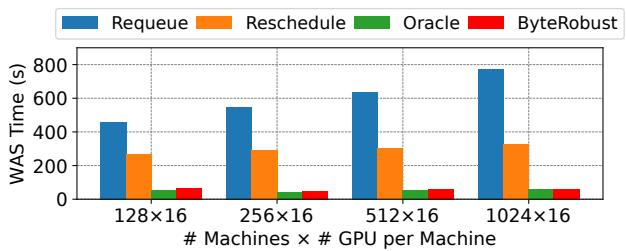  
Figure 12. Weighted average scheduling (WAS) time upon machine eviction events.

(ii) reschedule[4]: spin up replacements only for evicted machines, reinstalling pods on them; (iii) oracle: assume unlimited warm standbys ready to replace any evicted machine. Ours: we provision warm standbys based on the P99 failure count (4 backups for a 1,024-instance job). If evictions ≤ 4, we reuse standbys and replenish them asynchronously; if evictions ≥ 4, we only reschedule the shortfall.

Efficient hot-update. We measure scheduling time (from the update request to job resume) across five manual code-change events. By reusing the existing environment, our hot-update mechanism is 11.04× faster than full requeue (Table 7).

Efficient warm standby. For each training scale, we first identify the P99 faulty-machine count N, then simulate evictions of 1 to ?? machines, plus catastrophic switch failures (all machines evicted, e.g., 32 nodes). We measure scheduling time from failure detection to job resume and compute a weighted-average scheduling time (WAS) by weighting each scenario according to a binomial distribution (Sec.6.2), with catastrophic failures fixed at 1%. As Fig.12 shows, our warm-standby approach reduces recovery time by 10.87× versus requeue and 5.36× versus reschedule, and is within just 5.19% of the oracle upper bound.

Scalability. From Fig. 12 we find that as the training scale grows, requeue’s restart time increases markedly. This is due to the costs of clear job metadata, reallocate instance quotas, reinstall, and reset the entire pod environment. On the contrary, our warm standby and hot-update incur constant, low overhead—demonstrating superior scalability.

8.2.2 Near Zero-Overhead Checkpointing. We evaluate our checkpointing on sparse MoE [66] LLMs (70B and 256B model sizes), leveraging 3D parallelism [55] with ZeRO-1 [63] on real-world text generation tasks. Detailed configurations are given in Table 5. We compare: (i) ByteRobust save, our module; (ii) Memory save, in-memory checkpointing, proposed by Gemini [84]; (iii) Megatron save, blocking checkpointing in Megatron-LM [68]. We evaluate the training blocking time (i.e., checkpoint stalls) and the MFU difference with and without enabling checkpointing during training. The checkpointing frequency is set to one iteration. As Table 8 shows, ByteRobust save cuts blocking time by 99.69% and 95.10% versus Megatron save and Memory save. By exploiting idle PCIe and network bandwidth in ZeRO-style parallelism to overlap I/O with training, it limits MFU loss to just 0.71%, improving over Megatron save and Memory save by 98.8% and 89.6%, respectively.

Table 8. Checkpointing efficiency comparison. MFU values are relative to the training MFU without checkpointing.
<table><tr><td>Model</td><td>Scale</td><td>Approach</td><td>Blocking Time (s)</td><td>MFU (%)</td></tr><tr><td rowspan="4">70B</td><td rowspan="2">128×16</td><td>Megatron save</td><td>6.77</td><td>39.84</td></tr><tr><td>Memory save</td><td>1.84</td><td>70.05</td></tr><tr><td rowspan="2">256×16</td><td>ByteRobust save</td><td>0.04</td><td>99.23</td></tr><tr><td>Megatron save Memory save</td><td>7.14 1.69</td><td>39.11 72.36</td></tr><tr><td rowspan="5"></td><td rowspan="2">512×16</td><td>ByteRobust save</td><td>0.03</td><td>99.12</td></tr><tr><td>Megatron save</td><td>13.02</td><td>43.07</td></tr><tr><td rowspan="2"></td><td>Memory save ByteRobust save</td><td>0.22 0.01</td><td>95.90 99.71</td></tr><tr><td>Megatron save</td><td>12.98</td><td>42.80</td></tr><tr><td rowspan="2">1024×16</td><td>Memory save</td><td>0.18</td><td>96.92</td></tr><tr><td>ByteRobust save</td><td>0.02</td><td>99.11</td></tr></table>

## 9 Experiences and Limitations

Immature Diagnostic Tools. As GPU hardware evolves rapidly, associated monitoring and diagnostic tools often lag in maturity, making fault root cause analysis challenging. To ensure robustness under these constraints, we introduce system-level adaptations, including application-level isolation strategies such as data-driven over-eviction and dual-phase replay. These techniques are particularly valuable during the early deployment of GPU clusters with new hardware, though their necessity diminishes as diagnostic tools mature. Notably, diagnostic tools themselves can occasionally introduce new faults. In one case, we observed MFU degradation during training, traced to a diagnostic procedure (EUD) that inadvertently lifted a previously applied frequency lock, resulting in unexpected GPU downclocking.

False Positive. False positives primarily stem from two sources. (i) Diagnostic tool limitations: Imperfections in tools such as EUD or network diagnostics can trigger erroneous alerts, leading to the unnecessary eviction and stress testing of healthy machines, with minor impact on cluster utilization. (ii) Intentional over-eviction: To expedite fault localization in 3D parallel training, we evict entire pipeline parallel (PP) groups (e.g., 8 machines per group in a 9600-GPU job), even though only 1–2 nodes are typically faulty. While this results in 6–7 false positives, the trade-off is acceptable given that training jobs commonly involve around 10,000 GPUs, and early isolation significantly reduces recovery time.

Silent Data Corruption. SDC is a critical yet often overlooked challenge in scaling large language model (LLM) training to the next-scale. SDC results from factors such as input-sensitive numerical instabilities, race conditions, and thermal variations, causing incorrect computations like NaN values or gradient anomalies [19, 35]. The collective communication patterns in distributed training exacerbate the propagation of these errors across multiple machines. Deep Learning’s inherent robustness can obscure such faults, making them difficult to detect. In our production environment, NVIDIA’s EUD diagnostic tool [56] achieves only 70% recall. To mitigate this, we developed the MiniGPT verification suite, using deterministic workloads for intra-machine validation and dual-phase replay testing for inter-machine fault reproduction. However, these methods incur significant overhead, and as training scales increase, so does the frequency and impact of SDC, underscoring the need for more efficient detection, isolation, and diagnosis techniques.

## 10 Related Work

Fault-Tolerant LLM Training. Megascale [42] combines periodical heartbeats and RDMA metrics monitoring to detect faults and run lightweight stop-time checks for diagnosis. However, it cannot automatically isolate suspected machines when detecting anomalies in RDMA traffic, necessitating manual investigations. Hu et al. [36] incorporate an LLM-based log agent with rule-based heuristics to improve the accuracy of stop-time diagnostics. It relies on the log data and does not leverage runtime information, while the runtime data could enable faster and more precise identification of root causes, particularly in cases of implicit failures. Both systems employ asynchronous checkpointing, but do not offer backup strategies [84, 98], while ByteRobust proposes a novel over-eviction-aware strategy.

Elastic and Resilient Training. Other efforts have been put into enhancing training elasticity and resilience to prevent training interruptions [3, 18, 25, 40, 47, 78, 79]. Bamboo [78] introduces cross-stage redundant computations into the model pipeline, enabling continued training on spot instances. Oobleck [40] introduces the pipeline instantiation mechanism via predefined pipeline templates to tolerate concurrent failures in different pipelines. Parcae [18] proactively adjusts parallelism strategies before instance preemptions and optimizes instance migration to achieve high liveput. However, these methods are limited by certain parallelism strategies (e.g., DP, TP), while ByteRobust supports a wide range of prevalent parallelism strategies for LLM training. Gray Failure and SDC. A number of research studies have investigated characteristics of deep learning training jobs [41, 86] and the failure incidents [26, 36, 93]. Gray failure [37] is studied in-depth for storage systems [29, 51, 95], data center networks [70] and cloud services [24]. However, the causes of gray failures in LLM training are rarely explored. Ekko [69] routes requests to avoid fail-slow in parameter servers of deep learning recommendation systems. Super-Bench [89] introduces deep learning benchmarking to locate faulty GPU machines. For large-scale LLM training, ByteRobust exploits runtime stack clustering and coarse-grained isolation to mitigate potential gray failures swiftly. SDC is another major category of hard-to-detect faults, with recent research [14, 35, 82] primarily focusing on its impact in CPU workloads. However, we observe that SDC also significantly affects large-scale LLM training on GPU clusters. While such faults are infrequent, their consequences—such as sudden loss spikes or NaN values—can be severe. These symptoms may overlap with data errors or engineering bugs, and SDC may not be deterministically reproducible. This complexity often results in prolonged fault diagnosis and resolution, ultimately limiting the scalability of LLM training.

Checkpointing. Check-N-Run [20] employs differential checkpointing, which saves only the altered parts of the model and uses quantization to minimize the checkpoint size. CheckFreq [53] pipelines training state saving with ongoing training to reduce stalls. Gemini [84] stores checkpoints in CPU memory with inter-machine backups, facilitating high-frequency checkpointing. ByteCheckpoint [80] unifies checkpoints from different training frameworks into a parallelism-agnostic representation, enabling efficient loadtime resharding and high scalability. ByteRobust steps further to incorporate checkpointing with fine-grained scheduling and backup with eviction strategy awareness.

## 11 Conclusion

We present ByteRobust, an LLM training management system deployed in ByteDance’s GPU clusters. Drawing from extensive experience in large-scale LLM training, ByteRobust integrates fault characteristics, diagnostic capabilities, and LLM-specific features into a comprehensive system design. It employs an automated fault tolerance framework that efficiently distinguishes fault types, using runtime state analysis and data-driven methods to detect and isolate faulty machines. We introduce mechanisms for efficient failover, including aggregated hot updates, warm backup machines, and fault-aware checkpointing, minimizing downtime. Our insights aim to inspire further research and enhance the reliability of LLM training systems.

## 12 Acknowledgment

We thank our shepherd, Mahesh Balakrishnan, and the anonymous SOSP reviewers for their insightful feedback. We are grateful to Xiang Li and He Sun for implementing the initial version of the system. We also thank the ByteDance infrastructure and SRE teams. This work was supported in part by a ByteDance collaborative research grant and grants from Hong Kong RGC under contracts 17204423, 17205824, and C7004-22G (CRF).

## References

[1] Josh Achiam, Steven Adler, Sandhini Agarwal, Lama Ahmad, Ilge Akkaya, Florencia Leoni Aleman, Diogo Almeida, Janko Altenschmidt, Sam Altman, Shyamal Anadkat, et al. 2023. GPT-4 Technical Report. arXiv preprint arXiv:2303.08774 (2023).

[2] Anthropic. 2023. Meet Claude. https://www.anthropic.com/claude.

[3] Sanjith Athlur, Nitika Saran, Muthian Sivathanu, Ramachandran Ramjee, and Nipun Kwatra. 2022. Varuna: Scalable, Low-Cost Training of Massive Deep Learning Models. In Proceedings of the Seventeenth European Conference on Computer Systems (Rennes, France) (EuroSys ’22). Association for Computing Machinery, New York, NY, USA, 472–487. doi:10.1145/3492321.3519584

[4] Paul Barham, Aakanksha Chowdhery, Jeff Dean, Sanjay Ghemawat, Steven Hand, Daniel Hurt, Michael Isard, Hyeontaek Lim, Ruoming Pang, Sudip Roy, et al. 2022. Pathways: Asynchronous Distributed Dataflow for ML. Proceedings of Machine Learning and Systems 4 (2022), 430–449.

[5] Ben Frederickson. 2019. py-spy. https://github.com/benfred/py-spy.

[6] BigScience. 2022. BLOOM. https://github.com/bigscience-workshop/ bigscience/blob/master/train/tr11-176B-ml/chronicles.md.

[7] Tom Brown, Benjamin Mann, Nick Ryder, Melanie Subbiah, Jared D Kaplan, Prafulla Dhariwal, Arvind Neelakantan, Pranav Shyam, Girish Sastry, Amanda Askell, et al. 2020. Language models are few-shot learners. Advances in neural information processing systems 33 (2020), 1877–1901.

[8] ByteDance Seed. 2025. Doubao-1.5-pro. https://seed.bytedance.com/ en/special/doubao\_1\_5\_pro/.

[9] ByteDance Seed. 2025. Technical Introduction to the Seed1.6 Model Series. https://seed.bytedance.com/en/seed1\_6.

[10] Li-Wen Chang, Wenlei Bao, Qi Hou, Chengquan Jiang, Ningxin Zheng, Yinmin Zhong, Xuanrun Zhang, Zuquan Song, Ziheng Jiang, Haibin Lin, Xin Jin, and Xin Liu. 2024. FLUX: Fast Software-Based Communication Overlap on GPUs Through Kernel Fusion. CoRR abs/2406.06858 (2024). doi:10.48550/ARXIV.2406.06858 arXiv:2406.06858

[11] Chang Chen, Xiuhong Li, Qianchao Zhu, Jiangfei Duan, Peng Sun, Xingcheng Zhang, and Chao Yang. 2024. Centauri: Enabling Efficient Scheduling for Communication-Computation Overlap in Large Model Training via Communication Partitioning. In Proceedings of the 29th ACM International Conference on Architectural Support for Programming Languages and Operating Systems, Volume 3 (La Jolla, CA, USA) (ASPLOS ’24). Association for Computing Machinery, New York, NY, USA, 178–191. doi:10.1145/3620666.3651379

[12] Tianqi Chen, Bing Xu, Chiyuan Zhang, and Carlos Guestrin. 2016. Training Deep Nets with Sublinear Memory Cost. arXiv preprint arXiv:1604.06174 (2016).

[13] Aakanksha Chowdhery, Sharan Narang, Jacob Devlin, Maarten Bosma, Gaurav Mishra, Adam Roberts, Paul Barham, Hyung Won Chung, Charles Sutton, Sebastian Gehrmann, et al. 2023. PaLM: Scaling Language Modeling with Pathways. Journal of Machine Learning Research 24, 240 (2023), 1–113.

[14] Harish Dattatraya Dixit, Sneha Pendharkar, Matt Beadon, Chris Mason, Tejasvi Chakravarthy, Bharath Muthiah, and Sriram Sankar. 2021. Silent Data Corruptions at Scale. arXiv preprint arXiv:2102.11245 (2021).

[15] Jianbo Dong, Bin Luo, Jun Zhang, Pengcheng Zhang, Fei Feng, Yikai Zhu, Ang Liu, Zian Chen, Yi Shi, Hairong Jiao, Gang Lu, Yu Guan, Ennan Zhai, Wencong Xiao, Hanyu Zhao, Man Yuan, Siran Yang, Xiang Li, Jiamang Wang, Rui Men, Jianwei Zhang, Huang Zhong, Dennis Cai, Yuan Xie, and Binzhang Fu. 2024. Boosting Large-Scale Parallel Training Efficiency with C4: A Communication-Driven Approach. CoRR abs/2406.04594 (2024). doi:10.48550/ARXIV.2406.04594 arXiv:2406.04594

[16] Jianbo Dong, Kun Qian, Pengcheng Zhang, Zhilong Zheng, Liang Chen, Fei Feng, Yichi Xu, Yikai Zhu, Gang Lu, Xue Li, Zhihui Ren,

Zhicheng Wang, Bin Luo, Peng Zhang, Yang Liu, Yanqing Chen, Yu Guan, Weicheng Wang, Chaojie Yang, Yang Zhang, Man Yuan, Hanyu Zhao, Yong Li, Zihan Zhao, Shan Li, Xianlong Zeng, Zhiping Yao, Binzhang Fu, Ennan Zhai, Wei Lin, Chao Wang, and Dennis Cai. 2025. Evolution of Aegis: Fault Diagnosis for AI Model Training Service in Production. In 22nd USENIX Symposium on Networked Systems Design and Implementation (NSDI 25). USENIX Association, Philadelphia, PA, 865–881. https://www.usenix.org/conference/nsdi25/presentation/ dong

[17] Alexey Dosovitskiy, Lucas Beyer, Alexander Kolesnikov, Dirk Weissenborn, Xiaohua Zhai, Thomas Unterthiner, Mostafa Dehghani, Matthias Minderer, Georg Heigold, Sylvain Gelly, Jakob Uszkoreit, and Neil Houlsby. 2021. An Image is Worth 16x16 Words: Transformers for Image Recognition at Scale. arXiv:2010.11929 [cs.CV]

[18] Jiangfei Duan, Ziang Song, Xupeng Miao, Xiaoli Xi, Dahua Lin, Harry Xu, Minjia Zhang, and Zhihao Jia. 2024. Parcae: Proactive, Liveput-Optimized DNN Training on Preemptible Instances. In 21st USENIX Symposium on Networked Systems Design and Implementation (NSDI 24). 1121–1139.

[19] Abhimanyu Dubey, Abhinav Jauhri, Abhinav Pandey, Abhishek Kadian, Ahmad Al-Dahle, Aiesha Letman, Akhil Mathur, Alan Schelten, Amy Yang, Angela Fan, et al. 2024. The Llama 3 Herd of Models. arXiv preprint arXiv:2407.21783 (2024).

[20] Assaf Eisenman, Kiran Kumar Matam, Steven Ingram, Dheevatsa Mudigere, Raghuraman Krishnamoorthi, Krishnakumar Nair, Misha Smelyanskiy, and Murali Annavaram. 2022. Check-N-Run: A Checkpointing System for Training Deep Learning Recommendation Models. In 19th USENIX Symposium on Networked Systems Design and Implementation (NSDI 22). 929–943.

[21] etcd. 2022. etcd: Distributed Reliable Key-Value Store for the Most Critical Data of a Distributed System. https://github.com/etcd-io/etcd.

[22] Apache Software Foundation. 2022. Hadoop Distributed File System. https://hadoop.apache.org/docs/current/hadoop-project-dist/ hadoop-hdfs/HdfsDesign.html.

[23] Roberto Gallotta, Graham Todd, Marvin Zammit, Sam Earle, Antonios Liapis, Julian Togelius, and Georgios N Yannakakis. 2024. Large Language Models and Games: A Survey and Roadmap. arXiv preprint arXiv:2402.18659 (2024).

[24] Vaibhav Ganatra, Anjaly Parayil, Supriyo Ghosh, Yu Kang, Minghua Ma, Chetan Bansal, Suman Nath, and Jonathan Mace. 2023. Detection Is Better Than Cure: A Cloud Incidents Perspective. In Proceedings of the 31st ACM Joint European Software Engineering Conference and Symposium on the Foundations of Software Engineering (San Francisco, CA, USA) (ESEC/FSE 2023). Association for Computing Machinery, New York, NY, USA, 1891–1902. doi:10.1145/3611643.3613898

[25] Swapnil Gandhi, Mark Zhao, Athinagoras Skiadopoulos, and Christos Kozyrakis. 2024. ReCycle: Resilient Training of Large DNNs using Pipeline Adaptation. In Proceedings of the ACM SIGOPS 30th Symposium on Operating Systems Principles. 211–228.

[26] Yanjie Gao, Yichen He, Xinze Li, Bo Zhao, Haoxiang Lin, Yoyo Liang, Jing Zhong, Hongyu Zhang, Jingzhou Wang, Yonghua Zeng, Keli Gui, Jie Tong, and Mao Yang. 2024. An Empirical Study on Low GPU Utilization of Deep Learning Jobs. In Proceedings of the IEEE/ACM 46th International Conference on Software Engineering (Lisbon, Portugal) (ICSE ’24). Association for Computing Machinery, New York, NY, USA, Article 96, 13 pages. doi:10.1145/3597503.3639232

[27] Hao Ge, Junda Feng, Qi Huang, Fangcheng Fu, Xiaonan Nie, Lei Zuo, Haibin Lin, Bin Cui, and Xin Liu. 2025. ByteScale: Efficient Scaling of LLM Training with a 2048K Context Length on More Than 12,000 GPUs. arXiv preprint arXiv:2502.21231 (2025).

[28] Github. 2022. Copilot: Your AI Pair Programmer. https://github.com/ features/copilot.

[29] Haryadi S Gunawi, Riza O Suminto, Russell Sears, Casey Golliher, Swaminathan Sundararaman, Xing Lin, Tim Emami, Weiguang Sheng,

Nematollah Bidokhti, Caitie McCaffrey, et al. 2018. Fail-Slow at Scale: Evidence of Hardware Performance Faults in Large Production Systems. ACM Transactions on Storage (TOS) 14, 3 (2018), 1–26.

[30] Dong Guo, Faming Wu, Feida Zhu, Fuxing Leng, Guang Shi, Haobin Chen, Haoqi Fan, Jian Wang, Jianyu Jiang, Jiawei Wang, et al. 2025. Seed1. 5-VL Technical Report. arXiv preprint arXiv:2505.07062 (2025).

[31] Tanmaey Gupta, Sanjeev Krishnan, Rituraj Kumar, Abhishek Vijeev, Bhargav Gulavani, Nipun Kwatra, Ramachandran Ramjee, and Muthian Sivathanu. 2024. Just-In-Time Checkpointing: Low Cost Error Recovery from Deep Learning Training Failures. In Proceedings of the Nineteenth European Conference on Computer Systems. 1110–1125.

[32] Tao He, Xue Li, Zhibin Wang, Kun Qian, Jingbo Xu, Wenyuan Yu, and Jingren Zhou. 2024. Unicron: Economizing Self-Healing LLM Training at Scale. CoRR abs/2401.00134 (2024). doi:10.48550/ARXIV.2401.00134 arXiv:2401.00134

[33] Yi He, Mike Hutton, Steven Chan, Robert De Gruijl, Rama Govindaraju, Nishant Patil, and Yanjing Li. 2023. Understanding and Mitigating Hardware Failures in Deep Learning Training Systems. In Proceedings of the 50th Annual International Symposium on Computer Architecture (Orlando, FL, USA) (ISCA ’23). Association for Computing Machinery, New York, NY, USA, Article 70, 16 pages. doi:10.1145/3579371.3589105

[34] Dan Hendrycks, Collin Burns, Steven Basart, Andy Zou, Mantas Mazeika, Dawn Song, and Jacob Steinhardt. 2020. Measuring Massive Multitask Language Understanding. arXiv preprint arXiv:2009.03300 (2020).

[35] Peter H. Hochschild, Paul Turner, Jeffrey C. Mogul, Rama Govindaraju, Parthasarathy Ranganathan, David E. Culler, and Amin Vahdat. 2021. Cores that don’t count. In Proceedings of the Workshop on Hot Topics in Operating Systems (Ann Arbor, Michigan) (HotOS ’21). Association for Computing Machinery, New York, NY, USA, 9–16. doi:10.1145/ 3458336.3465297

[36] Qinghao Hu, Zhisheng Ye, Zerui Wang, Guoteng Wang, Meng Zhang, Qiaoling Chen, Peng Sun, Dahua Lin, Xiaolin Wang, Yingwei Luo, et al. 2024. Characterization of Large Language Model Development in the Datacenter. In 21st USENIX Symposium on Networked Systems Design and Implementation (NSDI 24). 709–729.

[37] Peng Huang, Chuanxiong Guo, Lidong Zhou, Jacob R. Lorch, Yingnong Dang, Murali Chintalapati, and Randolph Yao. 2017. Gray Failure: The Achilles’ Heel of Cloud-Scale Systems. In Proceedings of the 16th Workshop on Hot Topics in Operating Systems (Whistler, BC, Canada) (HotOS ’17). Association for Computing Machinery, New York, NY, USA, 150–155. doi:10.1145/3102980.3103005

[38] Yanping Huang, Youlong Cheng, Ankur Bapna, Orhan Firat, Dehao Chen, Mia Chen, HyoukJoong Lee, Jiquan Ngiam, Quoc V Le, Yonghui Wu, et al. 2019. GPipe: Efficient Training of Giant Neural Networks using Pipeline Parallelism. Advances in Neural Information Processing Systems 32 (2019).

[39] Sam Ade Jacobs, Masahiro Tanaka, Chengming Zhang, Minjia Zhang, Shuaiwen Leon Song, Samyam Rajbhandari, and Yuxiong He. 2023. Deepspeed Ulysses: System Optimizations for Enabling Training of Extreme Long Sequence Transformer Models. arXiv preprint arXiv:2309.14509 (2023).

[40] Insu Jang, Zhenning Yang, Zhen Zhang, Xin Jin, and Mosharaf Chowdhury. 2023. Oobleck: Resilient Distributed Training of Large Models Using Pipeline Templates. In Proceedings of the 29th Symposium on Operating Systems Principles. 382–395.

[41] Myeongjae Jeon, Shivaram Venkataraman, Amar Phanishayee, Junjie Qian, Wencong Xiao, and Fan Yang. 2019. Analysis of Large-Scale Multi-Tenant GPU Clusters for DNN Training Workloads. In 2019 USENIX Annual Technical Conference (USENIX ATC 19). 947–960.

[42] Ziheng Jiang, Haibin Lin, Yinmin Zhong, Qi Huang, Yangrui Chen, Zhi Zhang, Yanghua Peng, Xiang Li, Cong Xie, Shibiao Nong, Yulu Jia, Sun He, Hongmin Chen, Zhihao Bai, Qi Hou, Shipeng Yan, Ding Zhou, Yiyao Sheng, Zhuo Jiang, Haohan Xu, Haoran Wei, Zhang Zhang,

Pengfei Nie, Leqi Zou, Sida Zhao, Liang Xiang, Zherui Liu, Zhe Li, Xiaoying Jia, Jianxi Ye, Xin Jin, and Xin Liu. 2024. MegaScale: Scaling Large Language Model Training to More Than 10,000 GPUs. In 21st USENIX Symposium on Networked Systems Design and Implementation (NSDI 24). USENIX Association, Santa Clara, CA, 745–760. https: //www.usenix.org/conference/nsdi24/presentation/jiang-ziheng

[43] Diederik P Kingma. 2014. Adam: A Method for Stochastic Optimization. arXiv preprint arXiv:1412.6980 (2014).

[44] Apostolos Kokolis, Michael Kuchnik, John Hoffman, Adithya Kumar, Parth Malani, Faye Ma, Zachary DeVito, Shubho Sengupta, Kalyan Saladi, and Carole-Jean Wu. 2024. Revisiting Reliability in Large-Scale Machine Learning Research Clusters. arXiv preprint arXiv:2410.21680 (2024).

[45] Vijay Anand Korthikanti, Jared Casper, Sangkug Lym, Lawrence McAfee, Michael Andersch, Mohammad Shoeybi, and Bryan Catanzaro. 2023. Reducing Activation Recomputation in Large Transformer Models. Proceedings of Machine Learning and Systems 5 (2023), 341– 353.

[46] Dmitry Lepikhin, HyoukJoong Lee, Yuanzhong Xu, Dehao Chen, Orhan Firat, Yanping Huang, Maxim Krikun, Noam Shazeer, and Zhifeng Chen. 2020. Gshard: Scaling Giant Models with Conditional Computation and Automatic Sharding. arXiv preprint arXiv:2006.16668 (2020).

[47] Mingzhen Li, Wencong Xiao, Hailong Yang, Biao Sun, Hanyu Zhao, Shiru Ren, Zhongzhi Luan, Xianyan Jia, Yi Liu, Yong Li, et al. 2023. EasyScale: Elastic Training with Consistent Accuracy and Improved Utilization on GPUs. In Proceedings of the International Conference for High Performance Computing, Networking, Storage and Analysis. 1–14.

[48] Shen Li, Yanli Zhao, Rohan Varma, Omkar Salpekar, Pieter Noordhuis, Teng Li, Adam Paszke, Jeff Smith, Brian Vaughan, Pritam Damania, et al. 2020. Pytorch Distributed: Experiences on Accelerating Data Parallel Training. arXiv preprint arXiv:2006.15704 (2020).

[49] Aixin Liu, Bei Feng, Bing Xue, Bingxuan Wang, Bochao Wu, Chengda Lu, Chenggang Zhao, Chengqi Deng, Chenyu Zhang, Chong Ruan, et al. 2024. Deepseek-V3 Technical Report. arXiv preprint arXiv:2412.19437 (2024).

[50] Hao Liu, Matei Zaharia, and Pieter Abbeel. 2023. Ring attention with blockwise transformers for near-infinite context. arXiv preprint arXiv:2310.01889 (2023).

[51] Ruiming Lu, Erci Xu, Yiming Zhang, Fengyi Zhu, Zhaosheng Zhu, Mengtian Wang, Zongpeng Zhu, Guangtao Xue, Jiwu Shu, Minglu Li, et al. 2023. Perseus: A Fail-Slow Detection Framework for Cloud Storage Systems. In 21st USENIX Conference on File and Storage Technologies (FAST 23). 49–64.

[52] Jeffrey Ma, Hengzhi Pei, Leonard Lausen, and George Karypis. 2025. Understanding Silent Data Corruption in LLM Training. arXiv:2502.12340 [cs.LG] https://arxiv.org/abs/2502.12340

[53] Jayashree Mohan, Amar Phanishayee, and Vijay Chidambaram. 2021. CheckFreq: Frequent, Fine-Grained DNN Checkpointing. In 19th USENIX Conference on File and Storage Technologies (FAST 21). 203–216.

[54] Deepak Narayanan, Aaron Harlap, Amar Phanishayee, Vivek Seshadri, Nikhil R. Devanur, Gregory R. Ganger, Phillip B. Gibbons, and Matei Zaharia. 2019. PipeDream: Generalized Pipeline Parallelism for DNN Training. In Proceedings of the 27th ACM Symposium on Operating Systems Principles (Huntsville, Ontario, Canada) (SOSP ’19). Association for Computing Machinery, New York, NY, USA, 1–15. doi:10.1145/ 3341301.3359646

[55] Deepak Narayanan, Mohammad Shoeybi, Jared Casper, Patrick LeGresley, Mostofa Patwary, Vijay Korthikanti, Dmitri Vainbrand, Prethvi Kashinkunti, Julie Bernauer, Bryan Catanzaro, Amar Phanishayee, and Matei Zaharia. 2021. Efficient Large-Scale Language Model Training on GPU Clusters Using Megatron-LM. In Proceedings of the International Conference for High Performance Computing, Networking, Storage and Analysis (SC ’21). Association for Computing Machinery, New York,

NY, USA.

[56] NVIDIA. 2024. Extended Utility Diagnostics (EUD). https://docs.nvidia. com/datacenter/dcgm/latest/user-guide/dcgm-eud.html.

[57] NVIDIA. 2024. Xid Errors. https://docs.nvidia.com/deploy/xid-errors/.

[58] OpenAI. 2022. Introducing ChatGPT. https://openai.com/blog/ chatgpt.

[59] OpenAI. 2024. Introducing OpenAI o1. https://openai.com/o1/.

[60] Yanghua Peng, Yixin Bao, Yangrui Chen, Chuan Wu, and Chuanxiong Guo. 2018. Optimus: An Efficient Dynamic Resource Scheduler for Deep Learning Clusters. In Proceedings of the Thirteenth EuroSys Conference. 1–14.

[61] PyTorch Team. 2025. Flight Recorder for Debugging Stuck Jobs. https: //docs.pytorch.org/tutorials/unstable/flight\_recorder\_tutorial.html.

[62] Penghui Qi, Xinyi Wan, Guangxing Huang, and Min Lin. 2024. Zero Bubble (Almost) Pipeline Parallelism. In The Twelfth International Conference on Learning Representations.

[63] Samyam Rajbhandari, Jeff Rasley, Olatunji Ruwase, and Yuxiong He. 2020. Zero: Memory Optimizations Toward Training Trillion Parameter Models. In SC20: International Conference for High Performance Computing, Networking, Storage and Analysis. IEEE, 1–16.

[64] Jie Ren, Samyam Rajbhandari, Reza Yazdani Aminabadi, Olatunji Ruwase, Shuangyan Yang, Minjia Zhang, Dong Li, and Yuxiong He. 2021. Zero-Offload: Democratizing Billion-Scale Model Training. In 2021 USENIX Annual Technical Conference (USENIX ATC 21). 551–564.

[65] Baptiste Roziere, Jonas Gehring, Fabian Gloeckle, Sten Sootla, Itai Gat, Xiaoqing Ellen Tan, Yossi Adi, Jingyu Liu, Romain Sauvestre, Tal Remez, et al. 2023. Code Llama: Open Foundation Models for Code. arXiv preprint arXiv:2308.12950 (2023).

[66] Noam Shazeer, Azalia Mirhoseini, Krzysztof Maziarz, Andy Davis, Quoc Le, Geoffrey Hinton, and Jeff Dean. 2017. Outrageously Large Neural Networks: The Sparsely-Gated Mixture-of-Experts Layer. arXiv preprint arXiv:1701.06538 (2017).

[67] Guangming Sheng, Chi Zhang, Zilingfeng Ye, Xibin Wu, Wang Zhang, Ru Zhang, Yanghua Peng, Haibin Lin, and Chuan Wu. 2024. Hybrid-Flow: A Flexible and Efficient RLHF Framework. arXiv preprint arXiv: 2409.19256 (2024).

[68] Mohammad Shoeybi, Mostofa Patwary, Raul Puri, Patrick LeGresley, Jared Casper, and Bryan Catanzaro. 2019. Megatron-LM: Training Multi-Billion Parameter Language Models Using Model Parallelism. arXiv preprint arXiv:1909.08053 (2019).

[69] Chijun Sima, Yao Fu, Man-Kit Sit, Liyi Guo, Xuri Gong, Feng Lin, Junyu Wu, Yongsheng Li, Haidong Rong, Pierre-Louis Aublin, et al. 2022. Ekko: A Large-Scale Deep Learning Recommender System with Low-Latency Model Update. In 16th USENIX Symposium on Operating Systems Design and Implementation (OSDI 22). 821–839.

[70] Cheng Tan, Ze Jin, Chuanxiong Guo, Tianrong Zhang, Haitao Wu, Karl Deng, Dongming Bi, and Dong Xiang. 2019. NetBouncer: Active Device and Link Failure Localization in Data Center Networks. In 16th USENIX Symposium on Networked Systems Design and Implementation (NSDI 19). USENIX Association, Boston, MA, 599–614. https://www. usenix.org/conference/nsdi19/presentation/tan

[71] Gemini Team, Petko Georgiev, Ving Ian Lei, Ryan Burnell, Libin Bai, Anmol Gulati, Garrett Tanzer, Damien Vincent, Zhufeng Pan, Shibo Wang, et al. 2024. Gemini 1.5: Unlocking Multimodal Understanding Across Millions of Tokens of Context. arXiv preprint arXiv:2403.05530 (2024).

[72] KubeDL Team. 2024. KubeDL Makes Deep Learning Workloads Run on Kubernetes More Easily and Efficiently. https://kubedl.io/.

[73] Kubeflow Team. 2024. Kubeflow: The Machine Learning Toolkit for Kubernetes. https://www.kubeflow.org/.

[74] Kimi Team, Yifan Bai, Yiping Bao, Guanduo Chen, Jiahao Chen, Ningxin Chen, Ruijue Chen, Yanru Chen, Yuankun Chen, Yutian Chen, et al. 2025. Kimi K2: Open Agentic Intelligence. arXiv preprint arXiv:2507.20534 (2025).

[75] NVIDIA Team. 2021. NVIDIA DCGM. https://developer.nvidia.com/ dcgm.

[76] NVIDIA Team. 2022. NVIDIA GPU Memory Error Management. https://docs.nvidia.com/deploy/a100-gpu-mem-error-mgmt/ index.html#row-mapping.

[77] Volcano Team. 2024. VolcanoJob. https://volcano.sh/en/docs/vcjob/.

[78] John Thorpe, Pengzhan Zhao, Jonathan Eyolfson, Yifan Qiao, Zhihao Jia, Minjia Zhang, Ravi Netravali, and Guoqing Harry Xu. 2023. Bamboo: Making Preemptible Instances Resilient for Affordable Training of Large DNNs. In 20th USENIX Symposium on Networked Systems Design and Implementation (NSDI 23). 497–513.

[79] Marcel Wagenländer, Guo Li, Bo Zhao, Luo Mai, and Peter Pietzuch. 2024. Tenplex: Dynamic Parallelism for Deep Learning using Parallelizable Tensor Collections. In Proceedings of the ACM SIGOPS 30th Symposium on Operating Systems Principles. 195–210.

[80] Borui Wan, Mingji Han, Yiyao Sheng, Yanghua Peng, Haibin Lin, Mofan Zhang, Zhichao Lai, Menghan Yu, Junda Zhang, Zuquan Song, et al. 2025. ByteCheckpoint: A Unified Checkpointing System for Large Foundation Model Development. In 22nd USENIX Symposium on Networked Systems Design and Implementation (NSDI 25). 559–578.

[81] Wandb Team. 2025. AI is Easy to Productionize. https://wandb.ai/site/.

[82] Shaobu Wang, Guangyan Zhang, Junyu Wei, Yang Wang, Jiesheng Wu, and Qingchao Luo. 2023. Understanding Silent Data Corruptions in a Large Production CPU Population. In Proceedings of the 29th Symposium on Operating Systems Principles (Koblenz, Germany) (SOSP ’23). Association for Computing Machinery, New York, NY, USA, 216–230. doi:10.1145/3600006.3613149

[83] Yizhong Wang, Swaroop Mishra, Pegah Alipoormolabashi, Yeganeh Kordi, Amirreza Mirzaei, Anjana Arunkumar, Arjun Ashok, Arut Selvan Dhanasekaran, Atharva Naik, David Stap, et al. 2022. Super-Naturalinstructions: Generalization via Declarative Instructions on 1600+ NLP Tasks. arXiv preprint arXiv:2204.07705 (2022).

[84] Zhuang Wang, Zhen Jia, Shuai Zheng, Zhen Zhang, Xinwei Fu, TS Eugene Ng, and Yida Wang. 2023. Gemini: Fast Failure Recovery in Distributed Training with In-Memory Checkpoints. In Proceedings of the 29th Symposium on Operating Systems Principles. 364–381.

[85] Jason Wei, Maarten Bosma, Vincent Y Zhao, Kelvin Guu, Adams Wei Yu, Brian Lester, Nan Du, Andrew M Dai, and Quoc V Le. 2021. Finetuned Language Models are Zero-Shot Learners. arXiv preprint arXiv:2109.01652 (2021).

[86] Qizhen Weng, Wencong Xiao, Yinghao Yu, Wei Wang, Cheng Wang, Jian He, Yong Li, Liping Zhang, Wei Lin, and Yu Ding. 2022. MLaaS in the Wild: Workload Analysis and Scheduling in Large-Scale Heterogeneous GPU Clusters. In 19th USENIX Symposium on Networked Systems Design and Implementation (NSDI 22). USENIX Association, Renton, WA, 945–960.

[87] xAI. 2024. xAI Blog. https://x.ai/blog.

[88] Wencong Xiao, Romil Bhardwaj, Ramachandran Ramjee, Muthian Sivathanu, Nipun Kwatra, Zhenhua Han, Pratyush Patel, Xuan Peng, Hanyu Zhao, Quanlu Zhang, Fan Yang, and Lidong Zhou. 2018. Gandiva: Introspective Cluster Scheduling for Deep Learning. In 13th USENIX Symposium on Operating Systems Design and Implementation, OSDI 2018, Carlsbad, CA, USA, October 8-10, 2018. USENIX Association, 595–610. https://www.usenix.org/conference/osdi18/presentation/ xiao

[89] Yifan Xiong, Yuting Jiang, Ziyue Yang, Lei Qu, Guoshuai Zhao, Shuguang Liu, Dong Zhong, Boris Pinzur, Jie Zhang, Yang Wang, et al. 2024. SuperBench: Improving Cloud AI Infrastructure Reliability with Proactive Validation. In 2024 USENIX Annual Technical Conference (USENIX ATC 24). 835–850.

[90] An Yang, Anfeng Li, Baosong Yang, Beichen Zhang, Binyuan Hui, Bo Zheng, Bowen Yu, Chang Gao, Chengen Huang, Chenxu Lv, et al. 2025. Qwen3 Technical Report. arXiv preprint arXiv:2505.09388 (2025).

[91] Ding Yuan, Yu Luo, Xin Zhuang, Guilherme Renna Rodrigues, Xu Zhao, Yongle Zhang, Pranay U. Jain, and Michael Stumm. 2014. Simple Testing Can Prevent Most Critical Failures: An Analysis of Production Failures in Distributed Data-Intensive Systems. In 11th USENIX Symposium on Operating Systems Design and Implementation (OSDI 14). USENIX Association, Broomfield, CO, 249–265. https://www.usenix. org/conference/osdi14/technical-sessions/presentation/yuan

[92] Aohan Zeng, Xiao Liu, Zhengxiao Du, Zihan Wang, Hanyu Lai, Ming Ding, Zhuoyi Yang, Yifan Xu, Wendi Zheng, Xiao Xia, et al. 2022. GLM-130B: An open Bilingual Pre-Trained Model. arXiv preprint arXiv:2210.02414 (2022).

[93] Ru Zhang, Wencong Xiao, Hongyu Zhang, Yu Liu, Haoxiang Lin, and Mao Yang. 2020. An Empirical Study on Program Failures of Deep Learning Jobs. In Proceedings of the 42nd International Conference on Software Engineering (Seoul, Republic of Korea) (ICSE ’20). Association for Computing Machinery, NY, USA, 1159–1170.

[94] Susan Zhang, Stephen Roller, Naman Goyal, Mikel Artetxe, Moya Chen, Shuohui Chen, Christopher Dewan, Mona Diab, Xian Li, Xi Victoria Lin, et al. 2022. OPT: Open Pre-Trained Transformer Language Models.

arXiv preprint arXiv:2205.01068 (2022).

[95] Yuqi Zhang, Tianyi Zhang, Wenwen Hao, Shuyang Wang, Na Liu, Xing He, Yang Zhang, Weixin Wang, Yongguang Cheng, Huan Wang, et al. 2024. MSFRD: Mutation Similarity based SSD Failure Rating and Diagnosis for Complex and Volatile Production Environments. In 2024 USENIX Annual Technical Conference (USENIX ATC 24). 869–884.

[96] Juntao Zhao, Qi Lu, Wei Jia, Borui Wan, Lei Zuo, Junda Feng, Jianyu Jiang, Yangrui Chen, Shuaishuai Cao, Jialing He, et al. 2025. OVER-LORD: Ultimate Scaling of DataLoader for Multi-Source Large Foundation Model Training. arXiv preprint arXiv:2504.09844 (2025).

[97] Yanli Zhao, Andrew Gu, Rohan Varma, Liang Luo, Chien-Chin Huang, Min Xu, Less Wright, Hamid Shojanazeri, Myle Ott, Sam Shleifer, et al. 2023. Pytorch FSDP: Experiences on Scaling Fully Sharded Data Parallel. arXiv preprint arXiv:2304.11277 (2023).

[98] Yuchen Zhong, Guangming Sheng, Juncheng Liu, Jinhui Yuan, and Chuan Wu. 2024. SWIFT: Expedited Failure Recovery for Large-scale DNN Training. IEEE Transactions on Parallel and Distributed Systems (2024).