Latest updates: hps://dl.acm.org/doi/10.1145/3731569.3764840

RESEARCH-ARTICLE

# Tempo: Compiled Dynamic Deep Learning with Symbolic Dependence Graphs

PEDRO F. SILVESTRE, Imperial College London, London, U.K.   
PETER PIETZUCH, Imperial College London, London, U.K.

Open Access Support provided by:

Imperial College London

  
Published: 12 October 2025

Citation in BibTeX format

SOSP '25: ACM SIGOPS 31st Symposium   
on Operating Systems Principles   
October 13 - 16, 2025   
Seoul, Republic of Korea

Conference Sponsors: SIGOPS

# Tempo: Compiled Dynamic Deep Learning with Symbolic Dependence Graphs

Pedro F. Silvestre p.silvestre21@imperial.ac.uk Imperial College London

Peter Pietzuch prp@imperial.ac.uk Imperial College London

## Abstract

Deep learning (DL) algorithms are often defined in terms of temporal relationships: a tensor at one timestep may depend on tensors from earlier or later timesteps. Such dynamic dependencies (and corresponding dynamic tensor shapes) are difficult to express and optimize: while eager DL systems support such dynamism, they cannot apply compiler-based optimizations; graph-based systems require static tensor shapes, which forces users to pad tensors or break-up programs into multiple static graphs.

We describe Tempo, a new DL system that combines the dynamism of eager execution with the whole-program optimizations of graph-based compilation. Tempo achieves this through a declarative programming model with recurrent tensors, which include explicit temporal dimensions. Temporal dimensions can be indexed using symbolic expressions to express dynamic dependencies on past and future tensors. Based on this, Tempo constructs a symbolic dependence graph, which concisely encodes dynamic dependencies between operators, and applies whole-program optimizations, such as algebraic simplifications, vectorization, tiling, and fusion. By tiling dynamic dependencies into static-size blocks, Tempo can also reuse existing static code-generators. It then uses a polyhedral model to find a feasible execution schedule, which includes memory management operations. We show that Tempo achieves a 7× speedup over JAX for Llama-3.2- 3B decoding; for reinforcement learning algorithms, Tempo achieves a 54× speedup, with 16× lower peak memory usage.

CCS Concepts: • Computing methodologies → Machine learning; Symbolic and algebraic manipulation.

Keywords: Deep Learning, Compilation, Dynamic Tensors ACM Reference Format:

Pedro F. Silvestre and Peter Pietzuch. 2025. Tempo: Compiled Dynamic Deep Learning with Symbolic Dependence Graphs. In ACM SIGOPS 31st Symposium on Operating Systems Principles (SOSP ’25), October 13–16, 2025, Seoul, Republic of Korea. ACM, New York, NY, USA, 17 pages. https://doi.org/10.1145/3731569.3764840


## 1 Introduction

Deep Learning (DL) has had enormous success in domains such as robotics [1], games [2], natural language [3], protein folding [4], and image generation [5]. DL computation is defined using operators (e.g., matrix multiplication, addition, and indexing) with input and output tensors. Tensors are multi-dimensional arrays laid out spatially in memory, whose shape—a tuple of integers—specifies the size of each spatial dimension. DL workloads are resource-intensive, and DL systems, such as Torch [6] or JAX [7], offer high-level tensor programming models for GPU accelerators [8].

A common feature of many DL algorithms [5, 9–12] is their mathematical definition through recurrence equations [13]. Recurrence equations express temporal relationships between values at different timesteps (past and future) declaratively, i.e., without specifying an order of execution. For example, attention [9]—a key operation in large language models (LLMs)—depends, at a given timestep, on outputs from all prior timesteps; reinforcement learning (RL) [14, 15] algorithms produce actions at each timestep and use a sum of future rewards to evaluate them.

Such dynamic (i.e., time-varying) dependencies between operators and tensors of different timesteps introduce challenges when existing DL systems try to support them:

• Expressiveness—dynamic dependencies can create tensors with dynamic shapes whose support is limited in terms of current APIs [16, 17];

• Optimization—existing graph representations [7, 18] cannot express dynamic dependencies, missing opportunities for algebraic simplification or vectorization;

• Scheduling—future dependencies complicate scheduling, as dependent computations must be delayed [13, 19];

• Memory management—dependencies on past timesteps result in complex decisions on which tensors to retain, deallocate or evict with limited GPU memory [20].

Eager DL systems, such as Torch [6] or TF-Eager [21], support dynamism through the host language (Python) by dispatching GPU kernels on-demand [22]. This imperative approach, however, prevents them from performing compilerbased optimizations [16] or scheduling; in contrast, graphbased systems, such as TensorFlow [18] and JAX [7], enable ahead-of-time compilation by first constructing a dataflow graph in which each node represents a DL operator and edges are tensors that flow between them. Optimizations such as memory planning [23, 24], operator fusion [25], vectorization [26], and code-generation [27, 28], however, require statically known fixed-size tensor shapes.

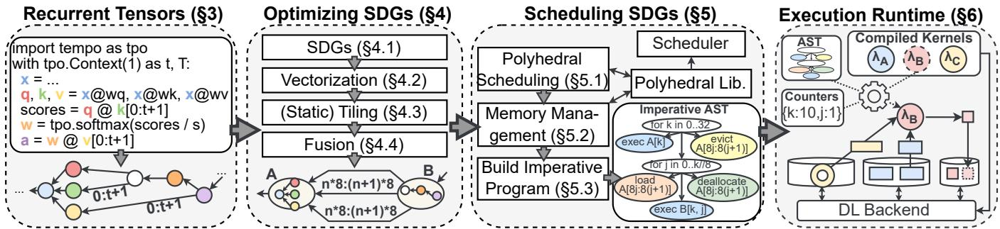  
Fig. 1: Overview of how Tempo expresses, optimizes, schedules and manages the memory of dynamic DL algorithms

To compile dynamic DL algorithms, users must pad dynamic tensor shapes to a static size, and use masks to encode dynamic dependencies, which leads to large memory and execution overheads [29]. Alternatively, users can break-up computation into static sub-programs, but this prevents wholeprogram optimizations leading to worse performance [30].

Our key insight is that tensors in dynamic DL algorithms have implicit temporal dimensions. By making them explicit, dynamic dependencies become regular tensor-indexing operations across temporal dimensions. Furthermore, we show that dynamism in dependencies and shapes has structure, and can be concisely represented using symbolic expressions of timestep symbols, enabling optimization.

We describe Tempo, a new DL system that expresses, optimizes, and schedules dynamic DL programs, as well as manages their memory. Tempo makes the following novel technical contributions (shown in Fig. 1):

(1) Declarative programming with recurrent tensors (§3). To capture dynamic dependencies, we introduce recurrent tensors (RTs), a declarative programming model inspired by recurrence equations [13], often used in DL algorithms [9, 11, 14, 31]. RTs can have multiple temporal dimensions (e.g., timestep and iteration), which define a temporal domain. RTs can be indexed using symbolic expressions to declaratively express dynamic dependencies. RTs have well-defined domain broadcast [32] and backpropagation [33] semantics.

(2) Optimization using symbolic dependence graphs (§4). Tempo translates RTs into a symbolic dependence graph (SDG) in which each vertex operator carries the temporal domain of the RT that created it, i.e., the set of timesteps at which the operator produces output tensors; edges describe how operators at different timesteps depend on each other’s outputs using the symbolic expressions extracted from RTs.

SDGs enable Tempo to extend classic compiler optimizations (e.g., algebraic simplifications, redundant code elimination) to dynamic computations by manipulating symbolic expressions. In addition, SDGs simplify advanced transformations, such as vectorization (batching many small operations) and tiling (executing large operations in smaller tiles), by viewing them as moving tensor dimensions from temporal to spatial and vice versa. For efficient code-generation, Tempo tiles dynamic dependencies into static-size tiles and fuses islands of static operations into single operations.

(3) Scheduling using a polyhedral model (§5.1). The declarative RT program does not prescribe an execution order, and, due to their dynamic dependencies, SDGs cannot be scheduled using topological sorting. Instead, Tempo uses the polyhedral model [34, 35] for program-wide scheduling: Tempo translates the SDG into a set of constraints and solves an integer linear program to obtain a schedule that assigns a physical execution time to each timestep. Based on the schedule, Tempo generates an imperative program for the user computation, represented as an abstract syntax tree (AST).

(4) Automated memory management (§5.2). Tempo introduces a simple method for automatic memory management, including buffer deallocations, donations, and GPU/CPU buffer swapping. It augments the SDG with explicit memory management operations, which are restricted by dependency edges. Therefore, memory management is also handled when solving for an execution schedule.

Our prototype implementation of Tempo1 supports single-GPU execution on multiple execution engines (Torch and JAX). To execute SDGs, Tempo picks physical tensor memory representations based on dependence expressions and applies existing code-generators [36] to fused operators. It then follows the schedule AST, evaluating symbolic dependence expressions, to resolve dynamic dependencies at runtime.

Our evaluation shows that Tempo effectively compiles dynamic DL programs, while automating algorithm-specific scheduling and memory management. For LLM decoding using Llama-3.2-3B [37], we compare Tempo against Torch and JAX and show that it is up to 7× faster and scales to 4× longer sequences due to its awareness of dynamic dependencies. For three typical RL algorithms [14, 15, 38] with different dynamic dependencies, Tempo achieves up to 54× faster end-to-end training times than five baseline RL systems by eliminating redundant computation. For both workloads, Tempo has an up to 16× lower peak GPU memory usage due to its tiling optimization and efficient memory management.

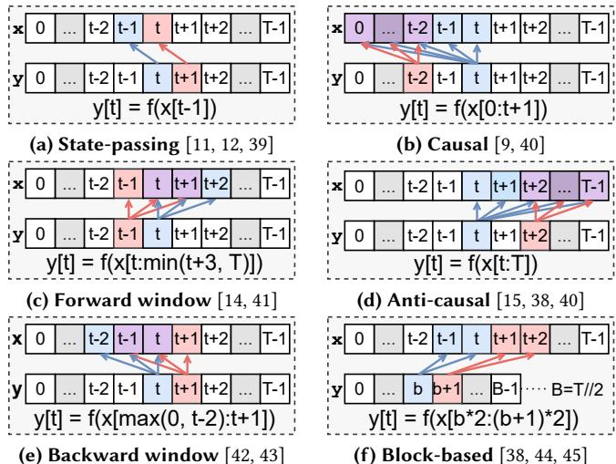  
Fig. 2: Dynamic dependencies (Tensor ?? at time ?? depends on (as indicated by the arrow direction) a dynamic range of ?? values.)

## 2 Supporting Dynamic DL Programs

Today’s DL algorithms include diverse dynamic dependencies, often described in papers using recurrence equations [13], such as those in Fig. 2. For example, recurrent [11], statespace [12], and diffusion models [39] all pass state from a timestep to the next (Fig. 2a, where ?? may equal ??). DQN [43] and windowed attention [42] use backwards windows (Fig. 2e). PPO [38], video models [45], and long-context transformers [46] access data in chunks (Fig. 2f). We now focus on two popular workloads and their dynamic dependencies.

Large language models (LLMs) [3, 37] generate text as sequences of tokens. Fig. 3 shows a transformer-based LLM architecture. After an initial user prompt processing step (prefill), the LLM begins iteratively decoding, i.e., generating a response one token at a time, until it generates a special endof-sequence token at time ?? . LLMs are stacks of transformer blocks, each with a feed-forward and an attention layer.

Attention uses dynamic computation. It first projects the input ???? into query $q _ { t } ,$ , key $k _ { t } ,$ and value $v _ { t }$ vectors, and then computes attention (Eq. 1), where ?? is a scaling constant and ?? (?? ) is called the attention pattern. This pattern defines a dynamic range of keys and values used to compute attention at timestep ??. Typical patterns include causal attention [9] (Fig. 2b) where $\phi ( t ) = 0 : t + 1$ , and window attention [42] (Fig. 2e) where $\phi ( t ) = \operatorname* { m a x } ( t - w , 0 ) : t + 1$ , with window size ??. The dynamic section ends when the dot product with values contracts the dynamically-sized dimension.

$$
a _ { t } = \operatorname { s o f t m a x } ( q _ { t } k _ { \phi ( t ) } ^ { \top } \cdot s ) v _ { \phi ( t ) }\tag{1}
$$

Reinforcement learning (RL) [10] learns an acting policy ???? , represented by a deep neural network (DNN) with parameters ?? , from experience data collected by trial-anderror interactions with a simulated environment (see Fig. 4). At each timestep ?? , starting from the initial observation $^ { O } 0 ,$ the acting policy produces an action $a _ { t }$ , which is executed in the environment and, in response, receives the next observation $o _ { t + 1 }$ , a done signal $d _ { t } ,$ and a reward $r _ { t }$

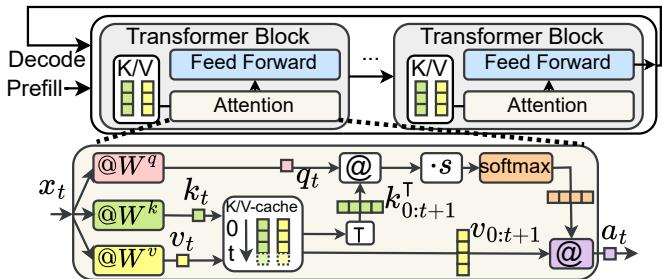  
Fig. 3: Simplified Llama-3.2-3B architecture (Each decoding step depends on a dynamic range of cached key-value (K/V) pairs.)

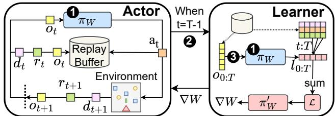  
Fig. 4: Actor-learner architecture in RL systems (Decoupling acting and learning causes ➊ duplicate forward passes, ➋ serial acting and learning, and ➌ high peak memory usage.)

In each iteration, a learner computes a loss L from the generated experience data and backpropagates it into a parameter update $\nabla _ { W }$ . The loss is a sum of per-timestep losses, $\textstyle { \mathcal { L } } = \sum _ { t = 0 } ^ { T } l _ { t }$ , where each $l _ { t }$ dynamically accesses only a portion of the experience data, depending on the algorithm. REINFORCE [15] accesses all future steps (Fig. 2d), while A2C [41] uses a forward-looking window (Fig. 2c).

## 2.1 Dynamic DL and whole-program compilation

Dynamic algorithms are difficult to represent and optimize in today’s DL systems, preventing whole-program compilation. Imperative (eager) systems, such as PyTorch [6] and TF-Eager [21], support dynamism well: users write imperative code that dynamically dispatches GPU kernels that are appropriately-sized to the dynamic shape [22]. They rely on the host language (e.g., Python) to evaluate control-flow, conditionals, and dynamic dependencies. These systems, however, lack a graph representation that can be optimized and scheduled ahead-of-time, thus placing the burden of writing efficient code on the user. Lazy eager approaches [47] collect small subgraphs before optimizing them, but this is still insufficient for whole-program compilation.

Declarative (graph-based) systems, such as TensorFlow [18] and JAX [7], first build a dataflow graph of the program before performing optimizations and execution scheduling. TensorFlow uses a flat dataflow graph with several controlflow operators [48] that encode loops and conditionals; JAX uses a single while operator [49], with nested subgraphs for loop body and condition. Both approaches, however, require static tensor shapes in the graph, and thus cannot directly express dynamic data dependencies.

As a result, users are forced into different workarounds to implement dynamic computation, each with drawbacks:

(a) Per-shape compilation. Users can compile a separate graph for each possible tensor shape, but this is expensive for highly variable shapes [47] as found in LLMs and RL.

(b) Unrolling loops. Users can statically unroll the timestep loop [7] when ?? is known, generating all instantiations of dynamic dependencies. This leads to graph size explosion, increasing compilation times, and also loses the semantics of dynamic dependencies, which prevents optimizations.

(c) Padding and masking. Users can coarsen dynamic dependencies, padding them to a fixed maximum sequence length $T ^ { \prime } > T$ . For correctness, users must also mask out valid timesteps. This is cumbersome and introduces processing and memory overheads.

## 2.2 Consequences in DL implementations

We now discuss how the lack of support for dynamic dependencies affects the implementations of DL algorithms.

In LLM inference, the dependence on past key/value (K/V) pairs hinders whole-program compilation. This dependence creates dynamic tensor shapes, which require inefficient padding to compile. Furthermore, to avoid recomputing keys and values, K/V caches are used (see Fig. 3), often managed by external systems [50, 51].

Managing these caches is complex because different types of attention require different cache policies. While causal attention [9] must store all prior K/V pairs, window attention [42] allows for the deallocation of old K/V pairs. Linear [52], global [42], block [46], and full attention [53], or hybrid models that interleave attention types [54], demand even more nuanced cache policies. Since existing LLM inference systems [50, 55] do not model dynamic dependencies, they struggle to offer tailored cache policies,2 requiring large engineering effort for each new supported attention type.3 RL frameworks [56–62] address forward-looking dependencies in loss computation by coarsening them to 0:?? and decomposing the computation into two subgraphs: (i) an actor graph executed repeatedly until termination, which produces the full simulation data and stores results in a replay buffer [63, 64]; and (ii) a learner graph that is invoked once after the simulation terminates to compute a parameter update using the experience from the replay buffer.

While the actor-learner model can be applied to most RL algorithms, it has several drawbacks (indicated by the numbers in Fig. 4) due to the independently compiled subgraphs: (1) Redundant computation. Intermediate activations produced by the actor ???? are discarded and recomputed in the learner for use in back-propagation. This adds substantial overhead, as it doubles the amount of inference work per timestep for typical algorithms;

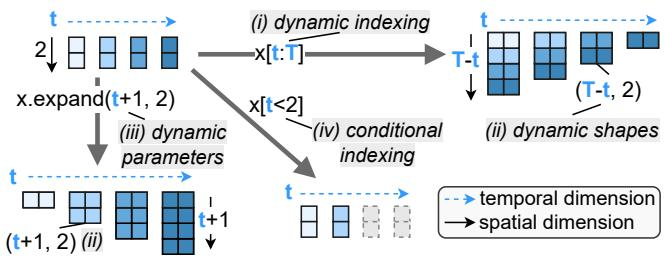  
Fig. 5: How a RT ?? with domain (??, ) can be used in Tempo

(2) Missed parallelism. The execution of actors and learners must be serialized due to the coarse 0 : ?? dependency. This prevents the parallelization of learning on past timesteps while acting out future timesteps; and

(3) High peak memory usage. The “all-at-once” learning prevents early deallocations and results in high peak GPU memory usage, potentially causing out-of-memory errors.4

## 3 Recurrent Tensors

While writing dynamic algorithms is challenging in current DL systems (see §2.1), we observe that they are naturally expressible as recurrence equations [13]. This makes recurrence equations ubiquitous in algorithmic pseudocode, e.g., when defining optimizers [65], learning rate schedules [66], models [39, 67, 68], layers [9, 42], and loss functions [31, 38].

To exploit this expressiveness, Tempo introduces recurrent tensors (RTs). In addition to the spatial dimensions for its shape, an RT has temporal dimensions, such as iterations or timesteps, which define its domain (see Fig. 5). Each temporal dimension has an associated pair of symbols—a current step (e.g., ?? , ??) and an upper bound (e.g., ?? , ?? ). If an RT ?? has ?? in its domain, it is defined by a recurrence equation for every point $0 \leq t < T$ , and its value (and shape) may vary with ??. RTs enable declarative programming, as their defining equations can refer to past or future values of other RTs by indexing them with symbolic expressions.

Symbolic expressions are constructed from symbols using overloaded operators, such as arithmetic (e.g., +, /), boolean comparison (e.g., ≤, =) and logic (e.g., &, |), as well as min and max. Accessing a range of temporal values is done using a slice expression (start : stop : step), and to express multiple dimensions at once, sequence expressions ( [·, ·]) are used.

Symbolic expressions are versatile and can be used to (as shown by the labels in Fig. 5): (i) index the temporal dimensions of RTs expressing dynamic dependencies; (ii) express dynamic shapes; (iii) parameterize tensor operations which receive index or shape arguments (e.g., a dynamic expand or spatial index select); and (iv) naturally express conditional computation using boolean expressions. Indexing an RT’s temporal dimension with a slice expression creates a (possibly dynamic) leading spatial dimension in the output RT.

```python
Alg. 1:REINFORCE using RTs. (Line 13 is discussed later.)
1 import tempo as tpo
2 ctx = tpo.Context(num_dims=3)
3 with ctx as (b, B), (i, I), (t, T):
4 env = tpo.rl.env.make("gym.CartPole-v1")
5 dnn = tpo.DNNBuilder(domain=(i,))
6 .from_env(env, hidden=[32, 32]).build()
7 o = tpo.like(env.obs_space, domain=(b, i, t))
8 o[b, i, 0] = env.reset(domain=(b, i))
9 a = dnn(obs) # Acting
10 o[b, i, t+1], r, d = env.step(a)
11 # Different access pattern -> different schedule
12 g = r[b, i, t:T].discounted_sum(0.95)
13 + g = r[b, i, t:min(t+5, T)].discounted_sum(0.95)
14 l = -dnn.log_prob(a) * g # Learning
15 l[0:B, i, 0:T].mean().backward()
16 lr = 1e-3 * (0.99 ** i) # Decaying learning rate
17 tpo.optim.Adam(dnn.params, lr=lr).step()
18 dnn[(i+1) % 5 == 0].checkpoint(save_path)
19 ctx.run({B: 64, I: 20, T: 200})
```

REINFORCE with RTs. Alg. 1 shows an example of the REINFORCE RL algorithm [15] written in Tempo. Users begin by setting up a context (line 2) with a chosen number of temporal dimensions5, associating each dimension with a semantic meaning (line 3): batch sample ??, iteration ??, and timestep ??. An RL environment is created (line 4), and a DNN is defined (line 5). Similar to PyTorch [6], DNNs are defined by composing modules, but the domain over which parameters vary (iterations) must be explicit (line 5).

The observations tensor is defined as a branching RT: the first timestep is given by the environment reset (line 8) and subsequent timesteps are computed by stepping the environment with the DNN’s action (line 10). The returns ?? of each timestep ?? are computed from the rewards ?? indexed by [?? :?? ] (line 12), yielding an RT with dynamic shape (?? −??, ). Tempo propagates dynamic shapes transparently.

The loss is then backpropagated (lines 14–15), and the gradients are used by the Adam optimizer [65] (line 17), also defined using RTs, to update the DNN. Expressing conditional computation, such as checkpointing (line 18), is done by indexing with boolean expressions, which only execute when the boolean evaluates to true. Finally, the program is compiled and run, with the user providing bounds for each temporal dimension (line 19).

Note how, with RTs, there is no need to decouple acting and learning. The original forward pass can simply be used within the loss definition. Furthermore, there is no need to use replay buffers [63] to store prior timesteps of experience6, because Tempo manages the storage of each RT based on the dynamic dependencies.

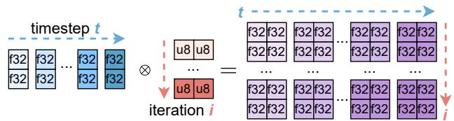  
Datatype Promotion  Shape broadcasting  Domain Unioning Fig. 6: Domain unioning (Similar to shape broadcasting and u8  (2,) f32 f32 (2,1) (2, 2) (t,) (i,) (i, t) datatype promotion, domains are unioned when tensors interact.)

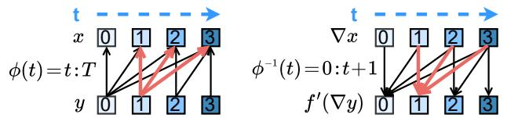  
Fig. 7: Symbolic automatic differentiation (??[1] depends on ?? [1 : 4] and thus ∇?? [1] contributes to ∇?? [1 : 4].)

Automatic domain inference. Annotating domains is often unnecessary, as Tempo infers them. For example, temporally indexing an RT with a constant (e.g., 5 or 0 :?? ) on dimension ?? removes ?? from the resulting RT’s domain. Spatially indexing an RT with ?? adds ?? to the resulting RT’s domain. If an RT is not explicitly temporally indexed (?? in line 14), it is treated as if indexed by the identity (i.e., ?? [??, ??, ?? ]).

When two RTs interact, their domains are unioned, as shown in Fig. 6. In this example, the left RT varies with timesteps ?? , while the right RT varies with iterations ??. Their interaction produces an RT that varies with both (i.e., has a domain of (??, ?? )). Domain inference allows, e.g., for learning rate schedules, to be easily expressed as RTs (line 16), and be integrated with the optimizer without code changes.

Symbolic automatic differentiation. When backward() is called on an RT, automatic differentiation [33] is used to compute the input gradients for an operator based on its output gradients. Tempo, however, must also accumulate gradients through temporal dimensions. Consider the RT ?? [?? ] = ?? (?? [?? (?? )]), where $\phi$ is called the dependence expression ?? has on ??. A single timestep of ?? may contribute to several timesteps of ??. Thus, the gradient of ??, ∇??, is an RT with the same shape, datatype, and temporal domain as ??, which sums the gradient contributions from all timesteps of ∇?? to which ?? [?? ] contributed to:

$$
\nabla x [ t ] = \sum _ { t ^ { \prime } \in \phi ^ { - 1 } ( t ) } f ^ { \prime } ( \nabla y [ t ^ { \prime } ] )
$$

where $f ^ { \prime }$ is the derivative of $f ,$ and $\phi ^ { - 1 }$ is the inverse of the dependence expression. Inverting a dependence can be thought of as converting “which source timesteps does the sink depend on at timestep $t ? ^ { \mathfrak { s } }$ to “which sink timesteps depend on the source’s timestep $t ? ? .$ For example, [??+3] inverts into [?? − 3], [max(0, ?? − 3) : ?? + 1] into [?? : min(?? + 4, ?? )], and [?? :?? ] into [0 :?? +1]. This last example is depicted in Fig. 7. If ?? indexes ?? with a constant expression (e.g., $y = f ( x [ 0 { : } T ] )$ , ?? does not vary with ??. To recover ∇??’s domain, Tempo must select the corresponding spatial dimension of ?? using ?? as an index, i.e., $\nabla x [ t ] = f ^ { \prime } ( \nabla y [ ] )$ .index(??). This process generalizes to multiple temporal dimensions by concatenation.

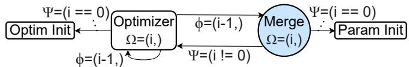  
Fig. 8: Encoding DNN state using cycles (Boxes are subgraphs.)

## 4 Symbolic Dependence Graphs

As users define DL programs with RTs, Tempo constructs a symbolic dependence graph (SDG) of the program, which encodes the dynamic dependencies between operators.

## 4.1 SDG representation

An SDG is a directed graph of operators. Each operator may have multiple input or output tensors, and cycles are allowed. Each operator ?? is tagged with a temporal domain Ω(??): the set of temporal points in $\mathbb { Z } ^ { n }$ at which the operator executes, producing output tensors.

Edges describe how operators at different temporal points depend on each other’s outputs. Each edge $o _ { 1 } \stackrel { \psi } {  } o _ { 2 }$ is annotated with a dependence expression $\phi .$ . It indicates that $o _ { 1 }$ (the sink) at point $p \in \Omega ( o _ { 1 } )$ depends on $o _ { 2 }$ (the source) at points $\phi ( p )$ . The domain Ω and dependence expressions $\phi$ are obtained directly from the RTs that defined them.7

Tensor operators. Tempo supports a minimal set of 44 stateless operators, most of which are typical elementwise maps, reductions, scans, view, or spatial indexing operators. View and indexing operators (e.g., ReshapeOp, SliceOp) may use symbolic expressions in shape and index parameters. UDFOps allow users to register custom operations, useful for injecting (retrieving) values to (from) the runtime. UDFOps may access external state. Tempo uses UDFOps to integrate with RL environments [70] and LLM tokenizers [71].

To support branching RTs, we define MergeOps. They conditionally select which of their multiple inputs to move to their single output based on which edge condition $\psi$ first evaluates to true at time ??. Edge conditions are obtained from the conditional indexing of RTs.

Encoding state. To encode state (e.g., DNN parameters) in a graph, Tensorflow [18] uses stateful operators (tf.Variable). JAX [7] graphs are stateless, and JAX offloads state management responsibilities to the user. In Tempo, state is instead encoded in the SDG using MergeOp cycles.

Fig. 8 shows an example of this for a DNN parameter. The parameter’s initial value is given by a parameter initialization subgraph. Subsequent parameter values are obtained from the optimizer step subgraph, which itself depends on the previous parameter value to compute an update. Optimizers such as Adam [65] also hold state, which is encoded using the same mechanism. This approach enables Tempo to represent state implicitly, without additional operator types that have complex semantics and side-effects, and without requiring users to manage state explicitly.

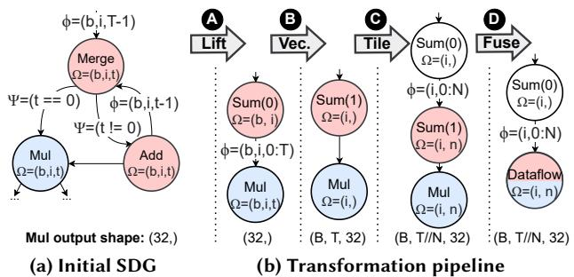  
Fig. 9: SDG passing through Tempo’s transformation pipeline

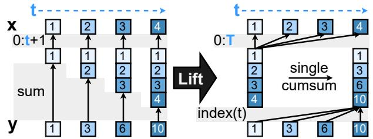  
Fig. 10: Lifting shown with RTs (left: redundant sum of 0 :?? +1 at each ??; right: equivalent with single cumulative sum of 0 :?? )

Optimizing symbolically. Tempo applies compiler optimizations to SDGs, such as dead and duplicate code elimination, algebraic equivalences, and broadcasting removal, which are extended to support dynamic dependencies.

Suppose that Tempo considers a re-association optimization for a chain of matrix multiplications $( A \cdot B ) \cdot C _ { : }$ , where $A \in \mathbb { R } ^ { 3 2 , 1 6 } , B \in \mathbb { R } ^ { 1 6 , t }$ , and $C \in \mathbb { R } ^ { t , 8 }$ . Since ?? is in the shape of ?? and ??, (??·??)·?? has a dynamic cost of 32·16·?? +32·?? ·8 = 768·?? FLOPs. Re-associating as ?? · (?? ·??) costs 16 · ?? · 8 + 32 · 16 · 8 = 128·?? +4096, which is lower when $t > 6 . 4$ . Tempo can use the original association for $t \leq 6 ,$ , and re-associate when $t > 6 ,$

Tempo also performs domain reduction, which reduces the domain of operators to the union of the domains of their dependencies, thus removing redundant work. This is akin to loop-invariant code motion [72] in optimizing compilers.

The SDG in Fig. 9a computes the sum of the MulOp’s output over timesteps ?? using a MergeOp. At ?? =0, the MergeOp simply copies the MulOp’s output; otherwise, it adds the current MulOp output to the sum at ?? −1. Though correct, this SDG is inefficient. Fig. 9b shows how Tempo progressively transforms this SDG for efficient execution.

Lifting. Tempo starts by eliminating recurrent patterns (reductions, scans [73], and stencils [26] implemented using MergeOps) that prevent vectorization. SDGs enable simple pattern-matching of these complex structures, allowing Tempo to replace them with batch SumOps, CumSumOps, or ConvOps. In Fig. 9b, Tempo $l i f t s \pmb { \bigotimes }$ the recurrent addition into a SumOp.

Lifting can also optimize computation. In Fig. 10, the original computation, $y [ t ] = x [ 0 : t + 1 ]$ .sum(), redundantly sums the prior steps of ?? at each timestep ??. Tempo replaces this with $y [ t ] = x [ 0 : T ]$ .cumsum(), and restores the temporal dimension ?? using a spatial indexing operation with ?? as an index.

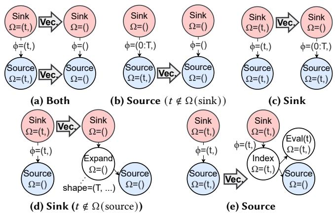  
Fig. 11: How Tempo updates edges when vectorizing

## 4.2 Vectorization

Vectorization ( B in Fig. 9b) reduces the execution time of SDGs by laying out temporal dimensions spatially. Vectorized operators execute fewer times but with larger input and output tensors. This offers greater SIMD parallelism [74], at the cost of increased peak memory usage.

For each temporal dimension ??, Tempo finds a set of vectorizable operators and applies a vectorization rule to each. Such rules are simple: most operators simply have ?? removed from their domain and ?? prepended to their input and output shapes; operators with dimension parameters (e.g., SumOp, SqueezeOp) have them incremented, to account for ?? being prepended to their input shape; and operators with shape parameters (e.g., ReshapeOp, ExpandOp) also prepend ?? to this shape. When vectorizing IndexOps or IndexAddOps and both their source (i.e., the tensor being indexed) and index input tensors are also being vectorized, Tempo must promote these operators into GatherOp and ScatterAddOp, because index operations only support one-dimensional indexes.

Vectorizability. Cycles complicate vectorization, because incorrectly vectorizing them can lead to unschedulable SDGs. Tempo avoids unschedulable SDGs using the following conservative approach: we define a cycle as trivial on ?? if all symbolic indexes of that dimension are [??] itself or a constant expression (e.g., [0 : ?? ], [5], [0 : 5]). Tempo does not vectorize operators in non-trivial cycles; operators in trivial cycles must all be vectorized or none can be.

Handling edges. Tempo must also update SDG edges for correctness (see Fig. 11). If both source and sink are vectorized (Fig. 11a) or, if only the source is, and the sink does not have ?? in its domain (Fig. 11b), Tempo drops the ?? index from the connecting dependence ??. If only the sink is vectorized, the ?? index is promoted to 0 : ?? (Fig. 11c). If the sink is vectorized, and the source does not originally vary with ?? (Fig. 11d), the source shape is expanded to the ?? elements expected by the sink. Finally, if both vary with ?? , but only the source is vectorized (Fig. 11e), an IndexSelectOp is added to extract the ?? -th spatial element each step ?? .

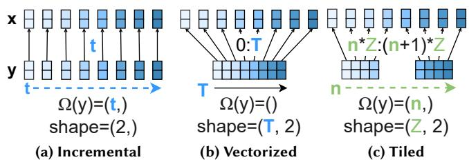  
Fig. 12: Equivalent execution strategies for ??[??] = −??[??] as RTs (Example assumes ?? is not also vectorized or tiled.)

## 4.3 Tiling

Some operators require too much memory, especially after vectorization. In these cases, Tempo can tile the SDG ( C in Fig. 9b). Similar to vectorization, tiling computes a set of operators to tile, applies a tiling rule to each, and updates the edges. Unlike vectorization, however, tiling adds a new temporal dimension ?? to the domain of tiled operators and decomposes a chosen spatial dimension of size ?? into ?? tiles of size ?? , with ?? = ??//?? .

Computing the tiled operator set. Since reductions (e.g., SumOp and MatMulOp’s contracting dimension) eliminate specific input spatial dimensions, they are natural starting points for tiling. Tempo picks one of the reduced spatial dimensions, ??, to tile on, preferring dimensions which are eventually introduced by temporal indexing operations. This is because tiling on these enables online garbage collection during scheduling (§5.2) and thus implicitly enables advanced execution strategies, such as gradient accumulation [75].

Next, Tempo recursively traverses operator dependencies, adding them to the tiled operator set until it encounters one of the following stopping conditions:

• a dependence expression ?? that creates the spatial dimension being tiled. In this case, Tempo modifies the expression to instead temporally access the ??-th tile of size ?? ;

• an operator with a memory demand below a user-defined threshold. Here, Tempo inserts a SliceOp to spatially slice the ??-th tile of size ?? from the non-tiled dependency;

• an ExpandOp that expands the dimension being tiled. Tempo modifies the ExpandOp to expand to ?? instead of ??.

A tiling rule is then applied to each operator in the tiled operator set. These are essentially the opposite of the corresponding vectorization rules. To finish the tiling, Tempo performs an aggregation over all ?? tiles (e.g., the white sum of C in Fig. 9b), restoring the original reduction.

Fig. 12 visualizes vectorization and tiling as RTs. Initially defined by a user incrementally (Fig. 12a), the identity dependency allows ?? [??] to execute immediately after ?? [??]. Tempo can also vectorize ?? (Fig. 12b), which requires that ?? wait for all ?? [0 : ?? ] values, increasing memory usage. Tempo can then tile the freshly vectorized dimension (Fig. 12c). Note how ?? [??] now accesses a tile of size ?? = 4 using the dependence expression ?? = [?? · ?? : (??+1) · ?? ]. Fully tiling on the same spatial dimension brings the SDG back to Fig. 12a.

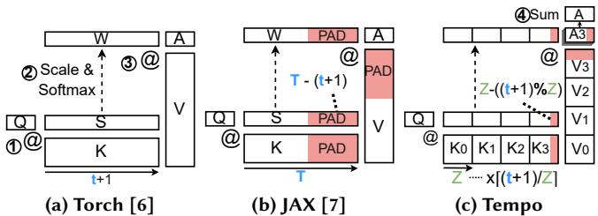  
Fig. 13: Attention in DL systems (Torch computes attention eagerly. JAX optimizes it, but introduces large padding. Tempo tiles it into static tiles, enabling code-generation with minimal padding.)

Static tiling. In general, dynamic dependencies with changing shapes prevent code-generation. In these cases, Tempo tiles them into statically-sized tiles by adding minimal padding.

Fig. 13 shows this for causal attention (Eq. 1), which uses $K [ t ] = k [ 0 : t + 1 ]$ to obtain dynamically shaped ?? and ?? tensors. As discussed in §2.1, Torch [6] eagerly executes attention despite the dynamic shapes (Fig. 13a), which prevents optimizations; JAX [7] requires padding to a static upper bound ?? to enable whole-program optimization, which adds overhead that grows with ?? (Fig. 13b).

In contrast, Tempo tiles attention, trading a dynamic computation for a dynamic number of static tiles (Fig. 13c). Tiling starts from ?? · ?? , which contracts the dynamic dimension, and continues through the softmax, down to ?? and ?? . This creates ⌈(?? +1)/?? ⌉ tiles of size ?? for each tensor.

Tempo uses $K [ t , n ] \ = \ k [ n \cdot Z : \operatorname* { m i n } ( ( n + 1 ) \cdot Z , t + 1 ) ]$ to construct each tile, which may not fill ?? timesteps due to the use of min. Thus, it is necessary to pad the remaining amount: ?? − (?? +1) mod ?? . Tempo also appropriately masks this padding, using a 0 mask for MatMulOps and SumOps, and a −∞ mask for MaxOpOp. To obtain the final attention output, Tempo then sums together each masked attention tile.

Padding and masking overhead is minimal, as they are only applied to the last tile. Furthermore, Tempo can often optimize them away by hinting to the runtime that buffers for ?? and ?? tiles should be pre-allocated with the padded size and pre-filled with the mask value (see §6).

## 4.4 Operator fusion

An SDG often contains static islands in which all operators have the same domain and only identity edges between them. Within these islands, the SDG directly passes the outputs of one operator to the inputs of another. The fusion transformation identifies and fuses ( D in Fig. 9b) these islands into a single DataflowOp operator, routing edges as needed.

Tempo initially assigns each operator to its own island and iteratively merges islands with the same domain and no inter-dependencies. Dynamic operations (e.g., RNGOp, UDFOp, MergeOp) are excluded from fusion, because they cannot be compiled statically. Fusion enables Tempo to leverage existing DL code-generators [7, 16, 76] to generate kernels. This lowers dispatching overheads, minimizes the number of tensors Tempo must manage, and speeds-up scheduling.

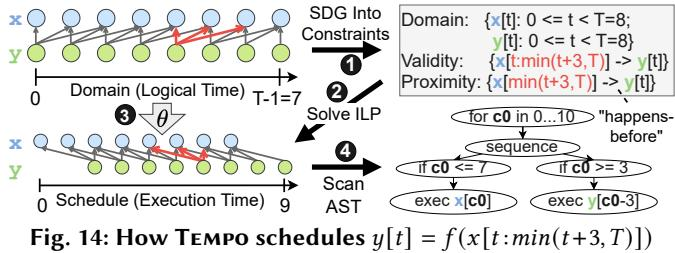

## 5 Scheduling SDGs with the Polyhedral Model

RTs are declarative and thus require scheduling to find an execution order. Due to their dynamic dependencies, existing dataflow scheduling techniques [18, 19], however, are unsuitable. Tempo uses a polyhedral model [34, 35] to address this challenge. Scheduling occurs in two rounds: Tempo first finds a schedule for tensor operations (§5.1), and then uses it to schedule memory management operations (§5.2).

## 5.1 Polyhedral execution scheduling

The polyhedral model [34, 35] has its origins in the scheduling of uniform recurrence equations [13], but has since evolved to support more complex computation [77]. Today, it is used to optimize localized loop nests (kernels) in imperative programs [28, 78], as using it to model arbitrary programs remains challenging [79]. Since RTs are inspired by recurrence equations, Tempo can apply the polyhedral model for whole-program scheduling.

Scheduling in a polyhedral model finds a schedule function ?? that maps each ??-dimensional timestep of an operation to an execution time in Z  , ?? ≥ ??, and where the lexicographic order8 (≺) determines what operation executes first. A valid schedule must respect all dependencies, i.e., for $y [ t ] = f ( x [ \phi ( t ) ] )$ then $\forall t \in \Omega ( y ) . \theta ( x [ \phi ( t ) ] ) \prec \theta ( y [ t ] )$ Finding a schedule function requires solving an integer linear program (ILP) [34], with an ILP objective which minimizes the sum of dependence distances $\theta ( y [ t ] ) - \theta ( x [ \phi ( t ) ] )$ ) constrained by a set of validity constraints derived from program dependencies. This yields schedules with low makespan.

Fig. 14 shows the scheduling approach in Tempo. SDGs already represent tensor domains, dependencies and conditions explicitly using symbolic expressions, which can be translated easily into polyhedral validity constraints (➊ in Fig. 14). In addition, Tempo creates proximity constraints, which guide the scheduler towards schedules with higher temporal locality and smaller tensor lifetimes. Tempo uses the Pluto scheduler [35] through the isl library [34] (➋). In Fig. 14, the schedule found delays ??’s execution by 3 steps.

Since Tempo fuses large regions of the SDG, the number of operations is reduced, making the ILP tractable even for large programs. Tempo stores the resulting schedule function ?? (➌) for scheduling memory management operations, as discussed next. We describe how Tempo scans the schedule to produce an imperative program AST (➍) in §5.3.

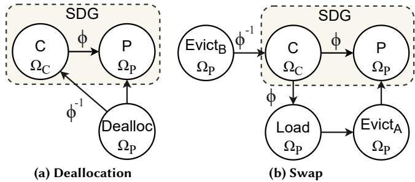  
Fig. 15: SDG memory management augmentations

## 5.2 Memory management

Memory management is a key concern in DL systems [20, 80, 81]. Using the polyhedral model, Tempo automates memory management concerns: (i) deallocations, (ii) GPU/CPU memory swapping, and (iii) buffer donations.

The key idea is to augment the SDG with memory management operations (and constraining dependencies), which enable Tempo to reuse the polyhedral scheduler to find a memory management schedule.

Scheduling deallocations. Fig. 15a shows how Tempo augments the SDG with deallocations for the tensor produced by ?? and consumed by ??. Since ?? produces a tensor for each timestep in its domain, Ω?? , the deallocation Dealloc shares this same domain. Tempo interprets the execution of Dealloc[?? ] as the time to deallocate the tensor ?? [?? ].

Deallocation must always happen after production, which Tempo models with an identity dependence, Dealloc → ??. Then, to also ensure ?? [??] is deallocated only after the consumer has finished using it, Tempo adds a dependence from Dealloc to ??, with the inverse dependence expression ?? has on ??. For example, i $\operatorname { f } \phi = t - 3$ , then Dealloc[?? ] must wait for $C [ t + 3 ]$ to run, before it can deallocate ?? [?? ].

Scheduling GPU/CPU memory swapping. Fig. 15b shows how Tempo augments the SDG with evict (GPU-to-CPU) and load (CPU-to-GPU) memory movement operations. Tempo inserts an initial evict operation $\operatorname { E v i c t } _ { \mathrm { A } : }$ , which evicts the tensor ?? [?? ] immediately after production. It then inserts Load and EvictB operators, to re-load and again evict all timesteps of ?? needed by ?? at timestep ??. All operations have domain $\Omega _ { P }$ and Tempo interprets the execution of $\mathrm { E v i c t _ { A / B } } [ t ]$ and Load[?? ] as the time to evict or load ?? [?? ], respectively.

A tensor can only be evicted after it has been produced, and loaded after it has been evicted. Tempo models this with the identity dependencies, Load $ \mathrm { E v i c t } _ { \mathrm { A } }  P .$ To guarantee that the timesteps of ?? needed by ?? [??] are available in-memory when ?? [??] executes, Tempo adds $\dot { C } \xrightarrow { \phi }$ Load. Finally, similarly to deallocations, EvictB must execute only after the last use of ?? [??] by ??, so Tempo adds the inverse of the consumer’s dependence from EvictB to ??.

By placing these dependencies, Tempo introduces constraints on when the memory management operations can execute, which guarantees that the resulting schedule is valid and efficient. To prevent thrashing [82], Tempo does not currently swap frequently accessed tensors, such as DNN parameters or K/V caches in attention models. At runtime, Tempo performs such swap operations asynchronously, through a shared page-locked host-memory manager, which pre-allocates page-locked buffers for each swapped RT.

Finding buffer donations. Given the SDG’s stateless nature, it is also important to detect when a tensor produced by one operation can be donated to be reused by another operation. This avoids expensive re-allocations and enables in-place mutation of, e.g., DNN parameters.

After a tensor is donated, it is invalidated and can no longer be used by other operations. Thus, an operator $O _ { d }$ can only donate its output tensor to one of its dependents, called the donation receiver $O _ { r }$ , if for every timestep ?? in its domain $\Omega ( O _ { d } ) , O _ { r }$ is the last user of $O _ { d } [ t ]$ . This requires that it is scheduled after all other competing dependents $O _ { c }$ according to the schedule function ??. Formally, Tempo donates $O _ { d }$ to $O _ { r }$ if and only if

$$
\forall t \in \Omega ( O _ { d } ) . \forall O _ { c } \in \mathcal { D } ( O _ { d } ) \ \backslash \ \{ O _ { r } \} . \theta \left( \phi _ { c } ^ { - 1 } ( t ) \right) \prec \theta \left( \phi _ { r } ^ { - 1 } ( t ) \right)
$$

where $\mathcal { D } ( O _ { d } )$ is the set of dependents of $O _ { d } , \phi _ { c } ^ { - 1 }$ and $\phi _ { r } ^ { - 1 }$ are the inverse dependence expressions from $O _ { c }$ and $O _ { r }$ to $O _ { d }$ respectively, and \ is the set difference operator.

## 5.3 Generating imperative programs

Tempo must obtain an imperative program for the user’s declarative RT computation, but the schedule function ?? produced by the polyhedral scheduler [35] is not directly executable. Tempo transforms it into an abstract syntax tree (AST) by using the polyhedral library [34] to scan [83] it. The AST contains the following types of statements:

• sequence: a block of AST nodes executed in order;

• if: a conditional with then and else sub-ASTs;

• loop: a generic loop with an iteration counter, start value, condition, step and body sub-AST;

• execute: executes operation ?? [??], where ?? is given by a mapping from loop counters; and

• deallocate/load/evict: executes the memory instruction for timestep ?? (or multiple steps at once) given by a mapping from loop counters.

To generate efficient ASTs, Tempo applies further optimizations: (1) it partially unrolls loops to reduce the number of nested conditionals; (2) it promotes static loops that contain only memory management operations into batched instructions by mapping the loop’s range to a slice of points; and (3) it finds and removes redundant loads/evicts by removing (i) any evict followed by a load or deallocation for the same tensor; and (ii) loads for already in-memory tensors.

By interpreting the AST at runtime, users are able to step through the program with high granularity. This allows for simpler debugging and integration with existing DL libraries.

## 6 Execution Runtime Implementation

The core of Tempo is written in ∼33K Python LoC. Its runtime (rightmost block in Fig. 1) is responsible for executing the program given an SDG, imperative AST, and DL backend.

The runtime executor is simple: it traverses the schedule AST from the root, keeping track of loop counters as they are introduced, evaluates if conditions and follows each execute/deallocate/swap instruction in order. We highlight four key components of the runtime:

DL execution backends implement a thin interface, which has methods for (i) allocating tensors, (ii) moving tensors between GPU/CPU, (iii) translating each Tempo tensor operation to the backend equivalent, and (iv) a code-generation function that returns a kernel when given a fused DataflowOp. Tempo currently offers Torch [6] (without buffer donation support) and JAX [7] DL backends, easing integration with existing projects.

Kernel launchers manage the inputs and outputs of kernel invocations. When the executor encounters an execute instruction, it invokes the corresponding kernel launcher with the loop counter state. Using the loop counters, kernel launchers evaluate input dependence expressions and use the result to index tensor stores for the inputs to the kernel. They then execute the kernel and store the outputs back in tensor stores at the current timestep ?? .

Tensor stores are how Tempo stores the timesteps of RTs at runtime. Tensor stores are always written into timestepby-timestep, but are accessed using various patterns, which requires tailored storage strategies for best performance. Tempo assigns each RT to one of three storage methods:

• If the RT is point accessed (see Fig. 2a), Tempo stores it in a point store, which maps the point directly to a physical tensor. This makes point insertions and reads fast, at the cost of requiring tensor stacking for slice reads;

• If the RT is block accessed (see Fig. 2f) Tempo stores it in a block store, which maps the access to a block-sized preallocated buffer. It offers fast slice reads, but writes require in-place mutation. Causally and anti-causally accessed RTs also use this store (with buffer size ?? );

• If the RT is window accessed (see Fig. 2c), Tempo stores it in a window store, which maps the access to a pre-allocated circular buffer twice the size of the window. Tempo writes to two mirrored locations, ensuring that a contiguous read window is always ready.

Kernel wrappers inject storage related operations into kernels prior to code-generation (see Fig. 16). This enables efficient interaction with block or window stored RTs. Normally, a kernel first produces an output tensor, which is then copied into a pre-allocated buffer at index ??. The in-place writes wrapper eliminates such copies by enabling the kernel to write directly to the preallocated buffer. Conversely, some DL backends (e.g., JAX) perform copies when slicing tensors.

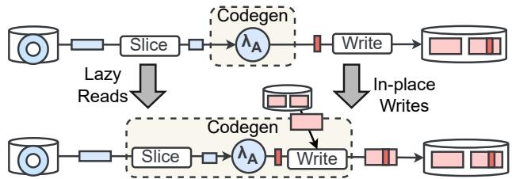  
Fig. 16: Kernel wrappers (Tempo avoids copies by co-designing the storage and code-generation of kernels.)

The lazy reads wrapper optimizes this by slicing the backing buffer in the code-generated region.

## 7 Evaluation

We evaluate Tempo to answer the following questions: do Tempo’s optimizations lead to more efficient computation compared to existing approaches? does Tempo’s tiling and memory management enable scaling on a single GPU? can Tempo effectively support algorithm-specific execution and memory-management schedules? does Tempo’s compilation scale to large model sizes?

## 7.1 Methodology

We evaluate Tempo on LLM decoding and RL training.

LLM decoding. We focus on decoding, because it often dominates LLM inference latency [84]. We implement a Llama-3.2-3B [37] decoding loop (Fig. 3) in Tempo, and compare it against end-to-end JIT-compiled JAX [7] (a graph-based system), and Torch [6]9 (an eager-execution system). For the JAX baseline, we pad the minimal amount possible (i.e., up to the sequence length being decoded). We compare the performance as we modify batch size, sequence length, and the attention pattern from causal [9] to windowed [42]. All systems use the same tokenizer, sampling method, and prompts. RL training. We experiment with (a) PPO [38], (b) REIN-FORCE [15] and (c) REINFORCE with ??-step returns [14] (essentially A2C [41]). We compare Tempo against 5 RL frameworks with different focus: (i) performance-focused frameworks (SampleFactory v2.1.1 [57], RLGames v1.6.1 [61]), (ii) single-file algorithm implementations (CleanRL commit e648ee2 [85]), and (iii) scalable RL frameworks (Ray RLlib v2.5.0 [59]). To focus on framework overheads, we employ a test RL environment [86, 87] with short simulationstep time for all experiments. It is GPU-accelerated except for RLlib, which lacks such support.

All experiments use the same hardware and software configuration. We use a server with an AMD EPYC 7402P 24- core CPU, 384 GB of DDR4 RAM (3200 MT/s) and an NVIDIA RTX A6000 GPU (48 GB of GDDR6 RAM, PCIe Gen4 ×16 at 32 GB/s). We run Ubuntu v22.04 with Linux kernel v5.15, CUDA v12.8, PyTorch v2.7.1, and JAX v0.6.2. We discard the first iteration of each experiment to avoid warmup effects.

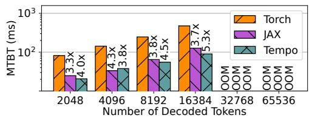  
(a) Causal attention [9] at batch size 16

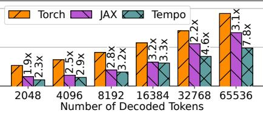  
(b) Causal attention [9] at batch size 4

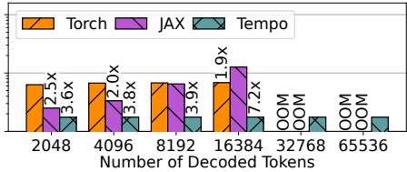  
(c) Window attention [42] at batch size 16

Fig. 17: Llama-3.2-3B mean time between tokens (MTBT) with different attention mechanisms and batch sizes  
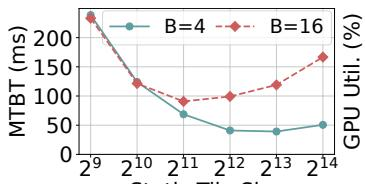  
Static Tile Size

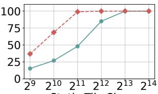  
Fig. 18: Effect of Tempo’s tile size on Llama-3.2-3B  
Static Tile Size

## 7.2 LLM decoding

We begin our evaluation with LLama-3.2-3B [37] token-bytoken decoding. For each system, we fix the batch size to 16 and measure the latency in terms of mean time between tokens (MTBT) when decoding sequences of length ?? =2, 048 to ?? =65, 536 tokens with standard causal attention. Fig. 17a shows the results, where the factors indicate speedups over the slowest system. In general, as we increase the sequence length, the MTBT of all systems increases. This is expected as the dynamic [0 : ?? + 1] dependency of causal attention increases the amount of work with each added timestep.

Torch is consistently the slowest system, and its MTBT grows the fastest. This is because, as an eager-execution system, Torch does not make use of compilation-based optimizations. For ?? < 4, 096, Tempo and JAX behave similarly, as both process the entire sequence as a single padded tensor. For $T \geq 4 , 0 9 6$ , however, JAX continues to add padding, while Tempo begins tiling attention (§4.3). This causes an initial slow-down at?? =4, 096 as Tempo’s tiling reduces parallelism, but a growing speedup for $T > 4 , 0 9 6 ,$ , due to reduced padding overhead. Tempo is up to 43% faster at ?? =16, 384, and while this gap should grow with ?? , all systems run out of GPU memory at ?? =16, 384 due to K/V cache pressure.

Decoding long sequences. To scale to longer sequences, we lower the batch size to 4 and repeat the experiment. Fig. 17b shows the results. Similar behavior is observed, with 16,384 now serving as the point at which Tempo’s tiling reduces parallelism and JAX starts accumulating padding overhead. However, the longer sequence lengths cause more drastic slowdown for JAX, as the amount of padding it processes grows linearly with ?? . At ?? =32, 768, Tempo is 2× faster than JAX, and that grows to 2.5× faster at ?? =65, 536.

Static tile size. These results can be better understood by studying how Tempo’s tiling strategy (§4.3) impacts decoding performance. The tile size used to decompose causal attention into statically-sized tiles is a key parameter that controls the trade-off between parallelism and padding overhead.

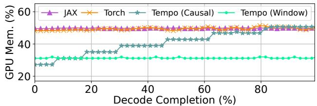  
Fig. 19: Runtime GPU memory use for Llama-3.2-3B decoding

Fig. 18 shows the tile size affects latency for a fixed decode length of ?? = 16, 384 tokens and varying batch size ??. At ?? = 4, increasing the tile size up to ?? = 8, 192 progressively lowers MTBT despite adding large padding, because the GPU has spare capacity to process this padding. At ???? = 16, however, MTBT decreases until the GPU utilization is maximized with ?? =2, 048, at which point it begins increasing again, yielding a u-shaped latency curve. This is because padding adds overhead when there is no spare GPU capacity. For medium to long sequence lengths, JAX is essentially in the low spare GPU capacity regime, and thus it is affected by padding overheads.

Windowed attention. Another method for scaling LLMs to longer sequences is to switch to a windowed attention pattern. Fig. 17c shows the results for Llama-3.2-3B with windowed attention at ?? =16. Tempo and Torch achieve near constant MTBTs due to their support for dynamic shapes. Torch is eager however, while Tempo enjoys whole-program compilation, making Tempo up to 3.9× faster. JAX retains the exact same MTBT profile as for causal attention (Fig. 17a) since it models dynamic dependencies using masking over a spatial dimension. At ?? =16, 384 Tempo is up to 7× faster. Furthermore, Tempo is the only system that adapts memory management to window dynamic dependencies. Tempo uses a circular store for K/Vs and infers when old K/Vs can be deallocated, scaling to at least 4× longer sequences.

These conclusions are further confirmed by examining the runtime GPU memory usage (Fig. 19). JAX and Torch retain the same memory usage behavior between causal and windowed attention, i.e., they preallocate large buffers up-front and never deallocate memory. In contrast, Tempo effectively manages memory according to algorithm-specific dynamic dependencies. For causal attention, Tempo’s memory usage grows only as Tempo requires more static tiles to be processed, yielding a stepped usage pattern; for windowed attention, Tempo’s circular buffer tensor storage uses a small static allocation for all sequence lengths.

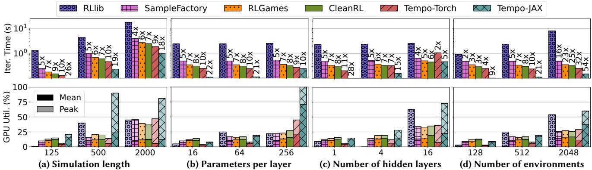  
de Length  Parameters per Layer  Number of Hidden Layers  NumberFig. 20: End-to-end iteration time and GPU utilization for PPO at small-to-medium scale.

## 7.3 Training performance for RL

We evaluate the end-to-end RL training performance of Tempo with PPO, a popular RL algorithm. PPO includes an anti-causal dependency (Fig. 2d) that prevents parallel acting and learning. We start with a default configuration with a simulation length of 250, 512 environments, 64 parameters per layer, 2 hidden layers, and a 3×4×4 observation shape and then vary each parameter individually.

Small-to-medium scale PPO. Fig. 20 shows the result by reporting iteration time, GPU utilization, and speed-up factors over the slowest system. Tempo has consistently lower iteration times than all other baselines: it is up to 54× faster than RLlib, and on average 2.6× faster than the next fastest system, CleanRL, which is a hand-optimized Torch PPO implementation. This is due to Tempo’s whole-program compilation: Tempo deduplicates the forward passes of actor and learner by caching actor activations. In addition, Tempo’s vectorization of the timestep dimension, efficient scheduling, and code-generation further improve performance.

As simulation length grows (Fig. 20a), all systems slow down linearly, narrowing relative performance differences. Adjusting the number of parameters per layer (Fig. 20b) does not affect relative performance until 256 parameters, when Tempo begins tiling the backward pass. Increasing hidden layers (Fig. 20c) slows down all systems, but particularly Tempo. This is likely due to Python-level AST interpretation overheads, which become apparent at this smaller scale and could be avoided by using an efficient C++ AST executor. We confirm this by the fact that adding environments (Fig. 20d) improves Tempo’s relative performance, because AST interpretation overheads are amortized.

Tempo’s Torch backend is consistently slower (by 2× on average) than the JAX backend. This highlights the importance of pairing Tempo with a capable code-generator such as XLA [36], with support for Triton [76] to find optimized kernels, CUDAGraphs [88] to lower dispatch overheads, and buffer donations (§5.2) to avoid allocations.

At this scale, the GPU is generally underutilized by all systems. However, Tempo’s GPU utilization is on average higher than the other systems, which indicates lower dispatch overheads due to our vectorization and dataflow fusion optimizations. Peak utilization is also high for RLlib, but this is due to CPU/GPU data transfers performed every timestep. Scaling to large observations. Training RL models from image observations is a common use case [89–91] that actorlearner RL frameworks struggle with. Higher image resolutions improve task performance, but require more memory. In this experiment, we halve the number of environments to 256, set the simulation length to 1,000, and show iteration times, GPU utilization and memory, and CPU memory, as we scale observations up to 3×256×256.

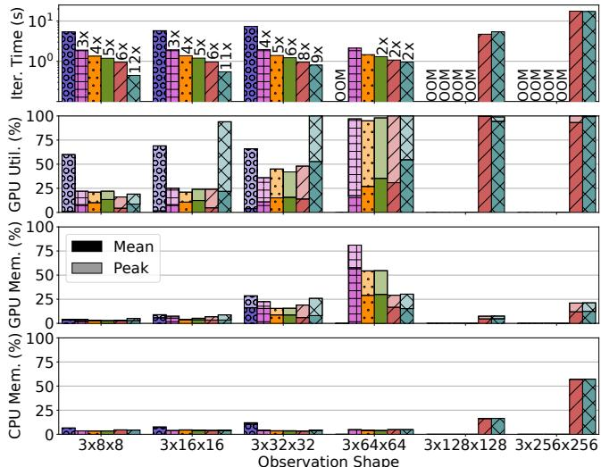  
Fig. 21: Scaling to large observation sizes with PPO

As Fig. 21 shows, the actor-learner approach stores and learns from all observations at once, resulting in a GPU peak memory usage that exceeds capacity. RLlib enters a fail-retry loop before 3 × 64 × 64, while the other baselines fail to scale due to out-of-memory (OOM) errors. In contrast, Tempo scales to 3×256×256 (16× larger) by balancing GPU/CPU memory usage through tiling and swapping (see §4.3 and §5.2), without the need for a replay buffer. Tempo uses tiling after 3×64×64, leading to a slight slow-down, and swapping is used after 3×128×128. To scale PPO further, Tempo would only require adding more CPU memory.

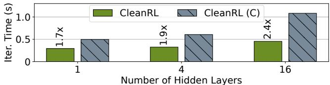  
Fig. 22: Activation caching without symbolic differentiation

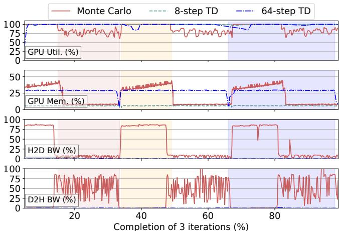

(a) Aligned runtime metrics for different algorithms  
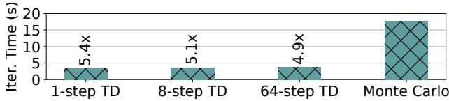  
(b) Iteration times for REINFORCE variations  
Fig. 23: Algorithm-specific scheduling with Tempo-JAX

Activation caching. We modify CleanRL to also cache and reuse forward pass activations during learning. Fig. 22 shows that CleanRL’s iteration time is on average 2× slower with caching (CleanRL (C)). In Torch, which CleanRL uses, each forward pass creates a corresponding backpropagation graph. The full backward graph concatenates each timestep’s graph, causing graph size explosion. Thus, Torch must process thousands of small subgraphs, incurring large overhead. In Tempo, forward pass activations have an explicit timestep dimension, which is automatically vectorized (§4.2), enabling an efficient backpropagation graph.

## 7.4 Algorithm-specific scheduling

We explore Tempo’s ability to adapt scheduling to algorithmspecific dynamic dependencies in the large observation setting (3×256×256). We use the two variations of REINFORCE shown in Alg. 1, which use: (i) traditional Monte Carlo [15] returns; and (ii) ??-step temporal-difference (TD) returns [14].

Fig. 23a shows how Tempo executes these two algorithms. Since Monte Carlo (red line) uses an anti-causal access pattern (?? [?? : ?? ]), Tempo’s scheduler waits until the simulation finishes before learning. During simulation (red shading), Tempo continually evicts observations to CPU memory, maintaining low GPU memory usage, but not fully utilizing the GPU. Once finished, learning begins (orange shading), and Tempo incrementally swaps observations back to GPU memory, learning from them while fully utilizing the GPU.

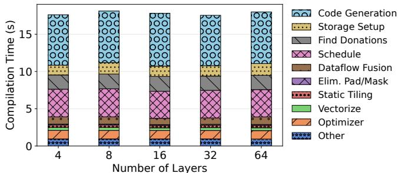  
Fig. 24: Compilation breakdown for different model sizes

With ??-step TD (blue and teal lines), however, Tempo’s scheduler finds a different strategy: due to the forward window access pattern (?? [?? :??????(??+??, ?? )]), after an ??-step delay, it begins computing gradients in parallel with simulation (blue shading). This enables Tempo to: (i) fully utilize the GPU; (ii) only store the last ?? observations, deallocating older data as early as possible; and (iii) avoid swapping due to the lower memory demand. Due to the 64-step delay before learning starts, 64-step TD still experiences a slight GPU utilization dip, which 8-step TD does not.

For smaller ??, Tempo parallelizes acting and learning sooner, leading to faster iteration times, as shown in Fig. 23b. Note that actor-learner frameworks (see §2.2) cannot use such parallel strategies due to coarsening dynamic dependencies between acting and learning to [0:?? ]. For either algorithm, Tempo finds an effective schedule, allowing for large-scale training on a single GPU.

## 7.5 Compilation scalability

We evaluate the scalability of Tempo’s compilation process by varying the number of transformer blocks in the Llama-3.2 architecture. Fig. 24 shows that the compilation time remains near constant as the model size is increased. This is due to Tempo’s ability to exploit repeated structure in models with a temporal dimension ?? for layers, creating small SDGs even for large models. Each layer ?? depends upon the previous layer ?? −1, and the final output is given by layer ??−1.

Compilation times are around 18 s, of which 7 s are spent in DL backend code-generation and 1 s is spent on initial allocations for tensor stores. Beyond this, the majority of the compilation time is taken by polyhedral scheduling and buffer donation analysis. This is because these steps require invocations of the polyhedral library [34], which parses constraint strings. Due to Tempo’s fusion and layer encoding, ILP solving accounts for only 2 s of the scheduling time. The remaining compiler passes are fast, because they involve only SDG and symbolic manipulations. Vectorization, tiling and the optimizer each take under 1 s to complete, despite their fairly complex transformations. Dataflow fusion takes slightly longer, because it performs a large number of validity checks for each fusion.

## 8 Discussion

Distribution. While Tempo is currently a single-GPU system, its temporal tensor dimensions can serve as a foundation for distribution [92]. This requires identifying temporal dimensions that can be mapped to parallel for-loops in the schedule. Tempo can create such temporal dimensions by tiling (§4.3) the SDG across a new “worker” dimension. If the starting point is an input-data tensor, this gives dataparallelism [93]; in combination with SDG cuts (partitioning the SDG into per-worker subgraphs), input-data tiling also yields pipeline parallelism [75]; if tiling starts from a weight tensor, we obtain model-parallelism [94]. Tempo can then assign schedule partitions to workers, which perform reductions as collective communication operations.

Dynamic termination. Tempo does not yet support dynamic termination of temporal dimensions (e.g., ?? determined at runtime). Prior work [77] has shown that this can be achieved by generating schedules that break out of infinite loops when the termination condition is met. Evaluating termination at each step, however, is expensive, because it requires a GPU/CPU transfer. We plan to explore speculative methods to reduce this overhead in future work.

Smart transformation policies. While Tempo proposes powerful transformations, it often lacks sophisticated policies for applying them. For example, Tempo’s swapping augmentations are oblivious to kernel execution latencies, causing stalls when dependent operations wait for data. This can be addressed through adding constraints to the scheduling problem based on kernel profiling. Additionally, tiling is currently triggered based on operator’s point memory usage, and not on a more accurate memory usage analysis of the whole program. Finally, the tile size used in static tiling is currently set by the user, which can be suboptimal. The ideal tile size, typically the smallest size that maximizes GPU utilization (§7.2), could instead be found through binary search. Optimized kernels. LLM programs today use hand-crafted, high-performance kernels, such as FlashAttention [95], which are not currently supported by Tempo. Adding these as firstclass operators to Tempo is difficult due to their complex semantics [96], which prevents Tempo from applying its transformations (vectorization, tiling, etc.). One approach is to introduce a final compiler pass, before scheduling, that identifies attention-like patterns in the SDG and lifts them (§4.1) into a single FlashAttention kernel operator.

## 9 Related Work

Memory management in DL. Prior work has explored gradient accumulation [97] and swapping [20, 98] to reduce memory pressure. Tempo transparently integrates these ideas at a program level through transformations (tiling) and scheduling (loads and evicts). Recomputation [80, 81] of intermediate activations can also reduce peak memory usage. Tempo does not currently offer automatic recomputation.

Polyhedral model in DL. Tensor comprehensions [28] and Tiramisu [99] optimize tensor computations through polyhedral loop fusions, tilings, and parallelization. PPCG [100] is a C-to-CUDA compiler that performs similar loop optimizations and manages memory across the GPU hierarchy. In general, these approaches use the polyhedral model for kernel-level optimizations, while Tempo employs it for whole-program execution scheduling and memory management.

DL compilers. TVM [25] and Triton [76] are kernel-level compilers but do not use the polyhedral model. Each introduces a domain-specific language for expressing and optimizing low-level tensor computations. MLIR [27] is a more general compiler infrastructure, which can be used to build domain-specific compilers, including for DL [36]. Tempo can leverage these systems for kernel code-generation.

Support for dynamic tensor shapes. JANUS [101] and Py-Torch 2 [16] have some support for dynamic DL compilation through a combination of symbolic tensor shapes, speculative compilation, and assertions that trigger recompilation. These approaches, however, suffer from recompilation overheads when shapes change. Relax [17] targets compilation for model inference but requires user annotations for dynamic shapes. Nimble [102] and DISC [29] support dynamic tensor shapes through runtime adaptation. Nimble uses an interpreted approach, while DISC compiles just-in-time. While prior approaches support dynamic shapes, Tempo is the first system to focus on dynamic dependencies, offering a complete solution with symbolic automatic differentiation, and ahead-of-time whole-program optimization, scheduling, and memory planning with dynamic dependencies.

## 10 Conclusion

We described Tempo, a system that combines the flexibility of eager execution with the program-wide optimizations and scheduling of graph-based execution for dynamic DL algorithms. Tempo introduces recurrent tensors, which add explicit temporal dimensions to tensors that can be indexed using symbolic expressions to express dynamic dependencies. Tempo uses symbolic dependence graphs (SDG), to extend traditional optimizations to dynamic DL programs: it views vectorization, and tiling as transformations that move tensor dimensions from temporal to spatial and vice versa. Tempo leverages tiling to decompose dynamic computations into static-size tiles, which enables code-generation with minimal padding. To find valid execution schedules, Tempo uses the polyhedral model and augments SDGs to schedule memory management operations. Tempo achieves substantial performance speed-ups, which demonstrates its potential of whole-program optimization for dynamic DL workloads.

Acknowledgements. We thank our anonymous reviewers and our shepherd for their insightful feedback and suggestions, which greatly improved this paper.

## References

[1] Jemin Hwangbo, Joonho Lee, Alexey Dosovitskiy, Dario Bellicoso, Vassilios Tsounis, Vladlen Koltun, and Marco Hutter. Learning Agile and Dynamic Motor Skills for Legged Robots. Science Robotics, 2019.

[2] David Silver, Julian Schrittwieser, Karen Simonyan, Ioannis Antonoglou, Aja Huang, Arthur Guez, Thomas Hubert, Lucas Baker, Matthew Lai, Adrian Bolton, et al. Mastering the Game of Go Without Human Knowledge. Nature, 2017.

[3] Tom Brown, Benjamin Mann, Nick Ryder, Melanie Subbiah, Jared D Kaplan, Prafulla Dhariwal, Arvind Neelakantan, Pranav Shyam, Girish Sastry, Amanda Askell, et al. Language Models are Few-Shot Learners. In Advances in Neural Information Processing Systems (NeurIPS), 2020.

[4] John Jumper, Richard Evans, Alexander Pritzel, Tim Green, Michael Figurnov, Olaf Ronneberger, Kathryn Tunyasuvunakool, Russ Bates, Augustin Žídek, Anna Potapenko, et al. Highly Accurate Protein Structure Prediction with AlphaFold. Nature, 2021.

[5] Robin Rombach, Andreas Blattmann, Dominik Lorenz, Patrick Esser, and Björn Ommer. High-Resolution Image Synthesis with Latent Diffusion Models. In Conference on Computer Vision and Pattern Recognition (CVPR), 2022.

[6] Adam Paszke, Sam Gross, Francisco Massa, Adam Lerer, James Bradbury, Gregory Chanan, Trevor Killeen, Zeming Lin, Natalia Gimelshein, Luca Antiga, et al. PyTorch: An Imperative Style, High-Performance Deep Learning Library. In Advances in Neural Information Processing Systems (NeurIPS), 2019.

[7] Roy Frostig, Matthew James Johnson, and Chris Leary. Compiling Machine Learning Programs via High-Level Tracing. In Conference on Machine Learning and Systems (MLSys), 2018.

[8] Rajat Raina, Anand Madhavan, Andrew Y Ng, et al. Large-Scale Deep Unsupervised Learning Using Graphics Processors. In International Conference on Machine Learning (ICML), 2009.

[9] A Vaswani. Attention Is All You Need. In Advances in Neural Information Processing Systems (NeurIPS), 2017.

[10] Richard S Sutton and Andrew G Barto. Reinforcement Learning: An Introduction. MIT press, 2018.

[11] David E Rumelhart, Geoffrey E Hinton, and Ronald J Williams. Learning Representations by Back-Propagating Errors. Nature, 1986.

[12] Albert Gu, Karan Goel, and Christopher Ré. Efficiently Modeling Long Sequences with Structured State Spaces. arXiv preprint arXiv:2111.00396, 2021.

[13] Richard M Karp, Raymond E Miller, and Shmuel Winograd. The Organization of Computations for Uniform Recurrence Equations. Journal of the ACM (JACM), 1967.

[14] Richard S Sutton. Learning to Predict by the Methods of Temporal Differences. Machine Learning (Mach. Learn.), 1988.

[15] Ronald J Williams. Simple Statistical Gradient-Following Algorithms for Connectionist Reinforcement Learning. Machine learning (Mach. Learn.), 1992.

[16] Jason Ansel, Edward Yang, Horace He, Natalia Gimelshein, Animesh Jain, Michael Voznesensky, Bin Bao, Peter Bell, David Berard, Evgeni Burovski, et al. PyTorch 2: Faster Machine Learning Through Dynamic Python Bytecode Transformation and Graph Compilation. In International Conference on Architectural Support for Programming Languages and Operating Systems (ASPLOS), 2024.

[17] Ruihang Lai, Junru Shao, Siyuan Feng, Steven Lyubomirsky, Bohan Hou, Wuwei Lin, Zihao Ye, Hongyi Jin, Yuchen Jin, Jiawei Liu, Lesheng Jin, Yaxing Cai, Ziheng Jiang, Yong Wu, Sunghyun Park, Prakalp Srivastava, Jared Roesch, Todd C. Mowry, and Tianqi Chen. Relax: Composable Abstractions for End-to-End Dynamic Machine Learning. In International Conference on Architectural Support for Programming Languages and Operating Systems (ASPLOS), 2025.

[18] Martín Abadi, Paul Barham, Jianmin Chen, Zhifeng Chen, Andy Davis, Jeffrey Dean, Matthieu Devin, Sanjay Ghemawat, Geoffrey

Irving, Michael Isard, et al. TensorFlow: A System for Large-Scale Machine Learning. In Symposium on Operating Systems Design and Implementation (OSDI), 2016.

[19] Philipp Moritz, Robert Nishihara, Stephanie Wang, Alexey Tumanov, Richard Liaw, Eric Liang, Melih Elibol, Zongheng Yang, William Paul, Michael I Jordan, et al. Ray: A Distributed Framework for Emerging AI Applications. In Symposium on Operating Systems Design and Implementation (OSDI), 2018.

[20] Minsoo Rhu, Natalia Gimelshein, Jason Clemons, Arslan Zulfiqar, and Stephen W Keckler. vDNN: Virtualized Deep Neural Networks for Scalable, Memory-Efficient Neural Network Design. In International Symposium on Microarchitecture (MICRO), 2016.

[21] Akshay Agrawal, Akshay Modi, Alexandre Passos, Allen Lavoie, Ashish Agarwal, Asim Shankar, Igor Ganichev, Josh Levenberg, Mingsheng Hong, Rajat Monga, et al. TensorFlow Eager: A Multi-Stage, Python-Embedded DSL for Machine Learning. In Conference on Machine Learning and Systems (MLSys), 2019.

[22] Sharan Chetlur, Cliff Woolley, Philippe Vandermersch, Jonathan Cohen, John Tran, Bryan Catanzaro, and Evan Shelhamer. CuDNN: Efficient Primitives for Deep Learning. arXiv preprint arXiv:1410.0759, 2014.

[23] Martin Maas, Ulysse Beaugnon, Arun Chauhan, and Berkin Ilbeyi. Telamalloc: Efficient On-Chip Memory Allocation for Production Machine Learning Accelerators. In International Conference on Architectural Support for Programming Languages and Operating Systems (ASPLOS), 2022.

[24] Siran Liu, Chengxiang Qi, Ying Cao, Chao Yang, Weifang Hu, Xuanhua Shi, Fan Yang, and Mao Yang. Uncovering Nested Data Parallelism and Data Reuse in DNN Computation with FractalTensor. In Symposium on Operating Systems Principles (SOSP), 2024.

[25] Tianqi Chen, Thierry Moreau, Ziheng Jiang, Lianmin Zheng, Eddie Yan, Haichen Shen, Meghan Cowan, Leyuan Wang, Yuwei Hu, Luis Ceze, et al. TVM: An Automated End-to-End Optimizing Compiler for Deep Learning. In Symposium on Operating Systems Design and Implementation (OSDI), 2018.

[26] Jonathan Ragan-Kelley, Connelly Barnes, Andrew Adams, Sylvain Paris, Frédo Durand, and Saman Amarasinghe. Halide: A Language and Compiler for Optimizing Parallelism, Locality, and Recomputation in Image Processing Pipelines. ACM SIGPLAN Notices, 2013.

[27] Chris Lattner, Mehdi Amini, Uday Bondhugula, Albert Cohen, Andy Davis, Jacques Pienaar, River Riddle, Tatiana Shpeisman, Nicolas Vasilache, and Oleksandr Zinenko. MLIR: Scaling Compiler Infrastructure for Domain Specific Computation. In International Symposium on Code Generation and Optimization (CGO), 2021.

[28] Nicolas Vasilache, Oleksandr Zinenko, Theodoros Theodoridis, Priya Goyal, Zachary DeVito, William S Moses, Sven Verdoolaege, Andrew Adams, and Albert Cohen. Tensor Comprehensions: Framework-Agnostic High-Performance Machine Learning Abstractions. arXiv preprint arXiv:1802.04730, 2018.

[29] Zhen Zheng, Zaifeng Pan, Dalin Wang, Kai Zhu, Wenyi Zhao, Tianyou Guo, Xiafei Qiu, Minmin Sun, Junjie Bai, Feng Zhang, et al. Bladedisc: Optimizing Dynamic Shape Machine Learning Workloads via Compiler Approach. In ACM Conference on Management of Data (SIGMOD), 2023.

[30] Matteo Hessel, Manuel Kroiss, Aidan Clark, Iurii Kemaev, John Quan, Thomas Keck, Fabio Viola, and Hado van Hasselt. Podracer Architectures for Scalable Reinforcement Learning. arXiv preprint arXiv:2104.06272, 2021.

[31] John Schulman, Philipp Moritz, Sergey Levine, Michael Jordan, and Pieter Abbeel. High-Dimensional Continuous Control Using Generalized Advantage Estimation. arXiv preprint arXiv:1506.02438, 2015.

[32] Stefan Van Der Walt, S Chris Colbert, and Gael Varoquaux. The NumPy Array: A Structure for Efficient Numerical Computation. Computing in Science & Engineering (Comput. Sci. Eng.), 2011.

[33] Atilim Gunes Baydin, Barak A Pearlmutter, Alexey Andreyevich Radul, and Jeffrey Mark Siskind. Automatic Differentiation in Machine Learning: A Survey. Journal of Machine Learning Research (JMLR), 2018.

[34] Sven Verdoolaege. isl: An Integer Set Library for the Polyhedral Model. In International Congress on Mathematical Software (ICMS), 2010.

[35] Uday Bondhugula, Albert Hartono, J Ramanujam, and P Sadayappan. Pluto: A Practical and Fully Automatic Polyhedral Program Optimization System. In Conference on Programming Language Design and Implementation (PLDI), 2008.

[36] OpenXLA Team. XLA (Accelerated Linear Algebra), 2024.

[37] Abhimanyu Dubey, Abhinav Jauhri, Abhinav Pandey, Abhishek Kadian, Ahmad Al-Dahle, Aiesha Letman, Akhil Mathur, Alan Schelten, Amy Yang, Angela Fan, et al. The Llama 3 Herd of Models. arXiv preprint arXiv:2407.21783, 2024.

[38] John Schulman, Filip Wolski, Prafulla Dhariwal, Alec Radford, and Oleg Klimov. Proximal Policy Optimization Algorithms. arXiv preprint arXiv:1707.06347, 2017.

[39] Jonathan Ho, Ajay Jain, and Pieter Abbeel. Denoising Diffusion Probabilistic Models. In Advances in Neural Information Processing Systems (NeurIPS), 2020.

[40] Long Ouyang, Jeffrey Wu, Xu Jiang, Diogo Almeida, Carroll Wainwright, Pamela Mishkin, Chong Zhang, Sandhini Agarwal, Katarina Slama, Alex Ray, et al. Training Language Models to Follow Instructions with Human Feedback. In Advances in Neural Information Processing Systems (NeurIPS), 2022.

[41] Volodymyr Mnih, Adria Puigdomenech Badia, Mehdi Mirza, Alex Graves, Timothy Lillicrap, Tim Harley, David Silver, and Koray Kavukcuoglu. Asynchronous Methods for Deep Reinforcement Learning. In International Conference on Machine Learning (ICML), 2016.

[42] Manzil Zaheer, Guru Guruganesh, Kumar Avinava Dubey, Joshua Ainslie, Chris Alberti, Santiago Ontanon, Philip Pham, Anirudh Ravula, Qifan Wang, Li Yang, et al. Big Bird: Transformers for Longer Sequences. In Advances in Neural Information Processing Systems (NeurIPS), 2020.

[43] Volodymyr Mnih, Koray Kavukcuoglu, David Silver, Alex Graves, Ioannis Antonoglou, Daan Wierstra, and Martin Riedmiller. Playing Atari with Deep Reinforcement Learning. arXiv preprint arXiv:1312.5602, 2013.

[44] Colin Lea, Michael D Flynn, Rene Vidal, Austin Reiter, and Gregory D Hager. Temporal Convolutional Networks for Action Segmentation and Detection. In Conference on Computer Vision and Pattern Recognition (CVPR), 2017.

[45] Xuezhe Ma, Chunting Zhou, Xiang Kong, Junxian He, Liangke Gui, Graham Neubig, Jonathan May, and Luke Zettlemoyer. Mega: Moving Average Equipped Gated Attention. arXiv preprint arXiv:2209.10655, 2022.

[46] Zihang Dai, Zhilin Yang, Yiming Yang, Jaime Carbonell, Quoc V Le, and Ruslan Salakhutdinov. Transformer-XL: Attentive Language Models Beyond a Fixed-Length Context. arXiv preprint arXiv:1901.02860, 2019.

[47] Alex Suhan, Davide Libenzi, Ailing Zhang, Parker Schuh, Brennan Saeta, Jie Young Sohn, and Denys Shabalin. LazyTensor: Combining Eager Execution with Domain-Specific Compilers. arXiv preprint arXiv:2102.13267, 2021.

[48] Yuan Yu, Martín Abadi, Paul Barham, Eugene Brevdo, Mike Burrows, Andy Davis, Jeff Dean, Sanjay Ghemawat, Tim Harley, Peter Hawkins, et al. Dynamic Control Flow in Large-Scale Machine Learning. In European Conference on Computer Systems (EuroSys), 2018.

[49] OpenXLA Team. Operation Semantics | XLA, 2025. OpenXLA Team.

[50] Woosuk Kwon, Zhuohan Li, Siyuan Zhuang, Ying Sheng, Lianmin Zheng, Cody Hao Yu, Joseph Gonzalez, Hao Zhang, and Ion Stoica. Efficient Memory Management for Large Language Model Serving with PagedAttention. In Symposium on Operating Systems Principles

(SOSP), 2023.

[51] Ruoyu Qin, Zheming Li, Weiran He, Mingxing Zhang, Yongwei Wu, Weimin Zheng, and Xinran Xu. Mooncake: A KVCache-Centric Disaggregated Architecture for LLM Serving. arXiv preprint arXiv:2407.00079, 2024.

[52] Angelos Katharopoulos, Apoorv Vyas, Nikolaos Pappas, and François Fleuret. Transformers Are RNNs: Fast Autoregressive Transformers with Linear Attention. In International Conference on Machine Learning (ICML), 2020.

[53] Jacob Devlin, Ming-Wei Chang, Kenton Lee, and Kristina Toutanova. Bert: Pre-Training of Deep Bidirectional Transformers for Language Understanding. In Conference of the North American Chapter of the Association for Computational Linguistics: Human Language Technologies (NAACL-HLT), 2019.

[54] Gemma Team, Morgane Riviere, Shreya Pathak, Pier Giuseppe Sessa, Cassidy Hardin, Surya Bhupatiraju, Léonard Hussenot, Thomas Mesnard, Bobak Shahriari, Alexandre Ramé, et al. Gemma 2: Improving Open Language Models at a Practical Size. arXiv preprint arXiv:2408.00118, 2024.

[55] Lianmin Zheng, Liangsheng Yin, Zhiqiang Xie, Chuyue Livia Sun, Jeff Huang, Cody Hao Yu, Shiyi Cao, Christos Kozyrakis, Ion Stoica, Joseph E Gonzalez, et al. Sglang: Efficient Execution of Structured Language Model Programs. In Advances in Neural Information Processing Systems (NeurIPS), 2024.

[56] Adam Stooke and Pieter Abbeel. Rlpyt: A Research Code Base for Deep Reinforcement Learning in PyTorch. arXiv preprint arXiv:1909.01500, 2019.

[57] Aleksei Petrenko, Zhehui Huang, T. Kumar, G. Sukhatme, and V. Koltun. Sample Factory: Egocentric 3D Control from Pixels at 100000 FPS with Asynchronous Reinforcement Learning. arXiv preprint arXiv:2006.11751, 2020.

[58] Matt Hoffman, Bobak Shahriari, John Aslanides, Gabriel Barth-Maron, Feryal Behbahani, Tamara Norman, Abbas Abdolmaleki, Albin Cassirer, Fan Yang, Kate Baumli, et al. Acme: A Research Framework for Distributed Reinforcement Learning. arXiv preprint arXiv:2006.00979, 2020.

[59] Eric Liang, Richard Liaw, Robert Nishihara, Philipp Moritz, Roy Fox, Ken Goldberg, Joseph Gonzalez, Michael Jordan, and Ion Stoica. RLlib: Abstractions for Distributed Reinforcement Learning. In International Conference on Machine Learning (ICML), 2018.

[60] Jiayi Weng, Huayu Chen, Dong Yan, Kaichao You, Alexis Duburcq, Minghao Zhang, Hang Su, and Jun Zhu. Tianshou: A Highly Modularized Deep Reinforcement Learning Library. arXiv preprint arXiv:2107.14171, 2021.

[61] Denys Makoviichuk and Viktor Makoviychuk. rl-games: A Highperformance Framework for Reinforcement Learning, 2022.

[62] Albert Bou, Matteo Bettini, Sebastian Dittert, Vikash Kumar, Shagun Sodhani, Xiaomeng Yang, Gianni De Fabritiis, and Vincent Moens. TorchRL: A Data-Driven Decision-Making Library for PyTorch. arXiv preprint arXiv:2306.00577, 2023.

[63] Albin Cassirer, Gabriel Barth-Maron, Eugene Brevdo, Sabela Ramos, Toby Boyd, Thibault Sottiaux, and Manuel Kroiss. Reverb: A Framework for Experience Replay. arXiv preprint arXiv:2102.04736, 2021.

[64] Hanjing Wang, Man-Kit Sit, Congjie He, Ying Wen, Weinan Zhang, Jun Wang, Yaodong Yang, and Luo Mai. GEAR: A GPU-Centric Experience Replay System for Large Reinforcement Learning Models. In International Conference on Machine Learning (ICML), 2023.

[65] Diederik P Kingma. Adam: A Method for Stochastic Optimization. arXiv preprint arXiv:1412.6980, 2014.

[66] Christian Darken and John Moody. Note on Learning Rate Schedules for Stochastic Optimization. In Advances in Neural Information Processing Systems (NeurIPS), 1990.

[67] Paul J Werbos. Backpropagation through Time: What It Does and How to Do It. Proceedings of the IEEE, 1990.

[68] Emmanuel Bengio, Moksh Jain, Maksym Korablyov, Doina Precup, and Yoshua Bengio. Flow Network Based Generative Models for Non-Iterative Diverse Candidate Generation. In Advances in Neural Information Processing Systems (NeurIPS), 2021.

[69] Sergey Levine, Aviral Kumar, George Tucker, and Justin Fu. Offline Reinforcement Learning: Tutorial, Review, and Perspectives on Open Problems. arXiv preprint arXiv:2005.01643, 2020.

[70] Greg Brockman, Vicki Cheung, Ludwig Pettersson, Jonas Schneider, John Schulman, Jie Tang, and Wojciech Zaremba. OpenAi Gym. arXiv preprint arXiv:1606.01540, 2016.

[71] Taku Kudo and John Richardson. SentencePiece: A Simple and Language Independent Subword Tokenizer and Detokenizer for Neural Text Processing. arXiv preprint arXiv:1808.06226, 2018.

[72] Ken Kennedy and John R Allen. Optimizing Compilers for Modern Architectures: A Dependence-Based Approach. Morgan Kaufmann Publishers Inc., 2001.

[73] Guy E Blelloch. Prefix Sums and their Applications. 1990.

[74] Michael J Flynn. Very High-Speed Computing Systems. Proceedings of the IEEE, 2005.

[75] Yanping Huang, Youlong Cheng, Ankur Bapna, Orhan Firat, Dehao Chen, Mia Chen, HyoukJoong Lee, Jiquan Ngiam, Quoc V Le, Yonghui Wu, et al. GPipe: Efficient Training of Giant Neural Networks Using Pipeline Parallelism. In Advances in Neural Information Processing Systems (NeurIPS), 2019.

[76] Philippe Tillet, Hsiang-Tsung Kung, and David Cox. Triton: An Intermediate Language and Compiler for Tiled Neural Network Computations. In International Workshop on Machine Learning and Programming Languages (MAPL), 2019.

[77] Mohamed-Walid Benabderrahmane, Louis-Noël Pouchet, Albert Cohen, and Cédric Bastoul. The Polyhedral Model is More Widely Applicable than You Think. In International Conference on Compiler Construction (CC), 2010.

[78] Tobias Grosser, Armin Groesslinger, and Christian Lengauer. Polly: Performing Polyhedral Optimizations on a Low-Level Intermediate Representation. Parallel Processing Letters, 2012.

[79] Sven Verdoolaege and Tobias Grosser. Polyhedral Extraction Tool. In International Workshop on Polyhedral Compilation Techniques (IM-PACT), 2012.

[80] Xuan Peng, Xuanhua Shi, Hulin Dai, Hai Jin, Weiliang Ma, Qian Xiong, Fan Yang, and Xuehai Qian. Capuchin: Tensor-based GPU Memory Management for Deep Learning. In International Conference on Architectural Support for Programming Languages and Operating Systems (ASPLOS), 2020.

[81] Linnan Wang, Jinmian Ye, Yiyang Zhao, Wei Wu, Ang Li, Shuaiwen Leon Song, Zenglin Xu, and Tim Kraska. SuperNeurons: Dynamic GPU Memory Management for Training Deep Neural Networks. In Symposium on Parallelism in Algorithms and Architectures (SPAA), 2018.

[82] Peter J Denning. The Working Set Model for Program Behavior. Communications of the ACM (CACM), 1968.

[83] Tobias Grosser, Sven Verdoolaege, and Albert Cohen. Polyhedral AST Generation is More than Scanning Polyhedra. ACM Transactions on Programming Languages and Systems (TOPLAS), 2015.

[84] Amey Agrawal, Nitin Kedia, Ashish Panwar, Jayashree Mohan, Nipun Kwatra, Bhargav Gulavani, Alexey Tumanov, and Ramachandran Ramjee. Taming Throughput-Latency Tradeoff in LLM Inference with Sarathi-Serve. In Symposium on Operating Systems Design and Implementation (OSDI), 2024.

[85] Shengyi Huang, Rousslan Fernand Julien Dossa, Chang Ye, Jeff Braga, Dipam Chakraborty, Kinal Mehta, and JoÃG, o GM AraÚjo. CleanRL: High-Quality Single-File Implementations of Deep Reinforcement Learning Algorithms. Journal of Machine Learning Research (JMLR), 2022.

[86] C Daniel Freeman, Erik Frey, Anton Raichuk, Sertan Girgin, Igor Mordatch, and Olivier Bachem. Brax–A Differentiable Physics Engine

for Large Scale Rigid Body Simulation. arXiv preprint arXiv:2106.13281, 2021.

[87] Viktor Makoviychuk, Lukasz Wawrzyniak, Yunrong Guo, Michelle Lu, Kier Storey, Miles Macklin, David Hoeller, Nikita Rudin, Arthur Allshire, Ankur Handa, et al. Isaac Gym: High Performance GPU-Based Physics Simulation for Robot Learning. arXiv preprint arXiv:2108.10470, 2021.

[88] NVIDIA Corporation. Getting Started with CUDA Graphs, 2020.

[89] Ankur Handa, Arthur Allshire, Viktor Makoviychuk, Aleksei Petrenko, Ritvik Singh, Jingzhou Liu, Denys Makoviichuk, Karl Van Wyk, Alexander Zhurkevich, Balakumar Sundaralingam, et al. Dextreme: Transfer of Agile In-Hand Manipulation from Simulation to Reality. In International Conference on Robotics and Automation (ICRA), 2023.

[90] B Ravi Kiran, Ibrahim Sobh, Victor Talpaert, Patrick Mannion, Ahmad A Al Sallab, Senthil Yogamani, and Patrick Pérez. Deep Reinforcement Learning for Autonomous Driving: A Survey. IEEE Transactions on Intelligent Transportation Systems (T-ITS), 2021.

[91] Chao Yu, Jiming Liu, Shamim Nemati, and Guosheng Yin. Reinforcement Learning in Healthcare: A Survey. ACM Computing Surveys (CSUR), 2021.

[92] Pedro F. Silvestre and Peter Pietzuch. Systems Opportunities for LLM Fine-Tuning using Reinforcement Learning. In Workshop on Machine Learning and Systems (EuroMLSys), 2025.

[93] Alex Krizhevsky, Ilya Sutskever, and Geoffrey E Hinton. ImageNet Classification with Deep Convolutional Neural Networks. Communications of the ACM (CACM), 2017.

[94] Mohammad Shoeybi, Mostofa Patwary, Raul Puri, Patrick LeGresley, Jared Casper, and Bryan Catanzaro. Megatron-LM: Training Multi-Billion Parameter Language Models Using Model Parallelism. arXiv preprint arXiv:1909.08053, 2019.

[95] Tri Dao, Dan Fu, Stefano Ermon, Atri Rudra, and Christopher Ré. FlashAttention: Fast and Memory-Efficient Exact Attention with IO-Awareness. In Advances in Neural Information Processing Systems (NeurIPS), 2022.

[96] Paul Barham and Michael Isard. Machine Learning Systems Are Stuck in a Rut. In Workshop on Hot Topics in Operating Systems (HotOS), 2019.

[97] Shixiong Zhao, Fanxin Li, Xusheng Chen, Xiuxian Guan, Jianyu Jiang, Dong Huang, Yuhao Qing, Sen Wang, Peng Wang, Gong Zhang, et al. vPipe: A Virtualized Acceleration System for Achieving Efficient and Scalable Pipeline Parallel DNN Training. Transactions on Parallel and Distributed Systems (TPDS), 2021.

[98] Chien-Chin Huang, Gu Jin, and Jinyang Li. Swapadvisor: Pushing Deep Learning Beyond the GPU Memory Limit via Smart Swapping. In International Conference on Architectural Support for Programming Languages and Operating Systems (ASPLOS), 2020.

[99] Riyadh Baghdadi, Jessica Ray, Malek Ben Romdhane, Emanuele Del Sozzo, Abdurrahman Akkas, Yunming Zhang, Patricia Suriana, Shoaib Kamil, and Saman Amarasinghe. Tiramisu: A Polyhedral Compiler for Expressing Fast and Portable Code. In International Symposium on Code Generation and Optimization (CGO), 2019.

[100] Sven Verdoolaege, Juan Carlos Juega, Albert Cohen, Jose Ignacio Gomez, Christian Tenllado, and Francky Catthoor. Polyhedral Parallel Code Generation for CUDA. ACM Transactions on Architecture and Code Optimization (TACO), 2013.

[101] Eunji Jeong, Sungwoo Cho, Gyeong-In Yu, Joo Seong Jeong, Dong-Jin Shin, Taebum Kim, and Byung-Gon Chun. Speculative Symbolic Graph Execution of Imperative Deep Learning Programs. ACM SIGOPS Operating Systems Review, 2019.

[102] Haichen Shen, Jared Roesch, Zhi Chen, Wei Chen, Yong Wu, Mu Li, Vin Sharma, Zachary Tatlock, and Yida Wang. Nimble: Efficiently Compiling Dynamic Neural Networks for Model Inference. In Conference on Machine Learning and Systems (MLSys), 2021.