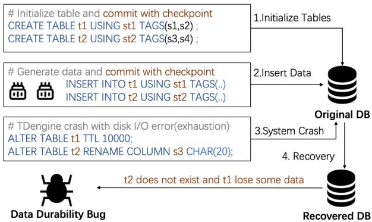
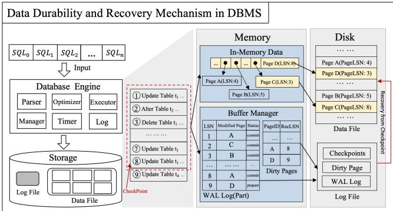
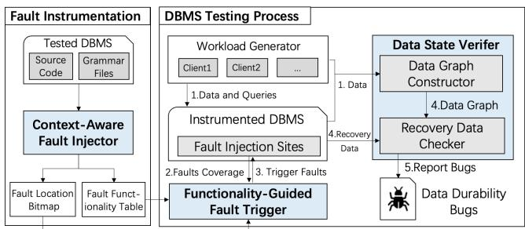
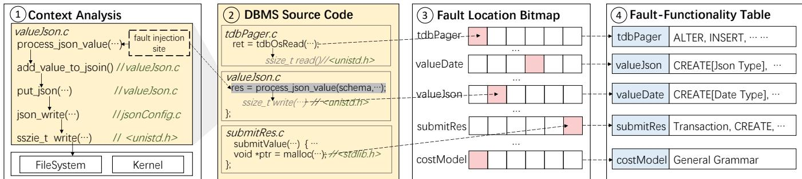
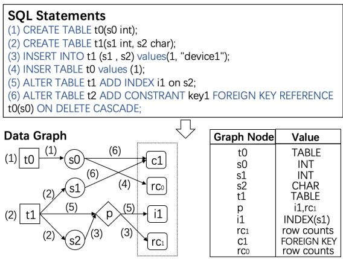
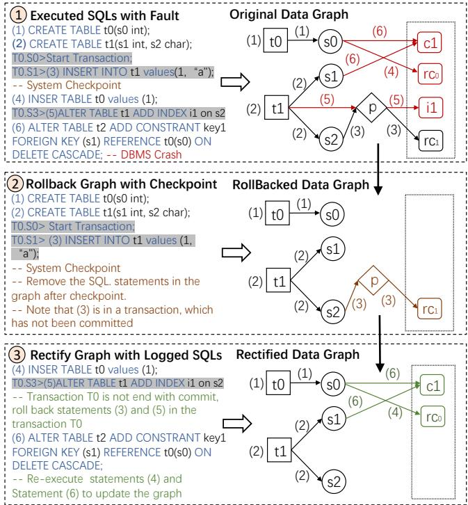
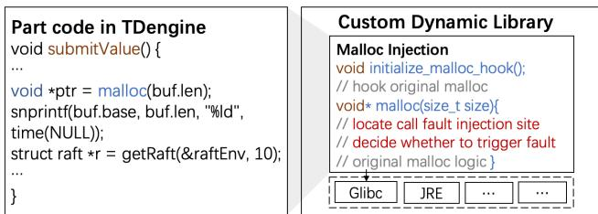
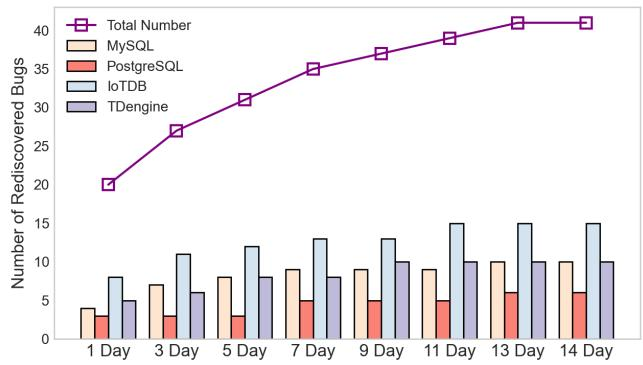

Latest updates: hps://dl.acm.org/doi/10.1145/3731569.3764841

RESEARCH-ARTICLE

# Fawkes: Finding Data Durability Bugs in DBMSs via Recovered Data State Verification

ZHIYONG WU, Tsinghua University, Beijing, China

JIE LIANG, Beihang University, Beijing, China

JINGZHOU FU, Tsinghua University, Beijing, China

WENQIAN DENG, Tsinghua University, Beijing, China

YU JIANG, Tsinghua University, Beijing, China

Open Access Support provided by:

Tsinghua University

Beihang University

Published: 12 October 2025

Citation in BibTeX format

SOSP '25: ACM SIGOPS 31st Symposium

on Operating Systems Principles

October 13 - 16, 2025

Seoul, Republic of Korea

Conference Sponsors: SIGOPS

# Fawkes: Finding Data Durability Bugs in DBMSs via Recovered Data State Verification

Zhiyong Wu KLISS, BNRist, School of Software Tsinghua University, China

Jie Liang\* School of Software Beihang University, China

Wenqian Deng KLISS, BNRist, School of Software Tsinghua University, China

Jingzhou Fu KLISS, BNRist, School of Software Tsinghua University, China

## Abstract

Data durability is a fundamental requirement in DBMSs, ensuring that committed data remains intact despite unexpected faults such as power failures. Despite its critical importance, implementations of durability and recovery mechanisms continue to exhibit flaws, leading to severe issues(e.g., data loss, data inconsistency), which we refer to as Data Durability Bugs (DDBs). However, there is a limited understanding of the characteristics and root causes of DDBs. Furthermore, existing testing methods(e.g., Mallory) are often inadequate for detecting DDBs, particularly those that cause data loss or data inconsistency following DBMS failures.

This paper presents a comprehensive study of 43 DDBs across four widely used DBMSs. It reveals that DDBs primarily manifest as data loss, data inconsistency, log corruption, and system unavailability, often stem from flawed durability and recovery mechanisms, and are typically triggered when faults occur during filesystem or kernel-level calls. Based on these findings, we developed Fawkes, a testing framework to detect DDBs with recovered data state verification. It employs context-aware fault injection to target critical filesystem and kernel-level regions, functionality-guided fault triggering to explore untested paths, and checkpoint-based data graph verification to detect post-crash inconsistencies. We applied Fawkes to eight popular DBMSs and discovered 48 previously unknown DDBs, of which 16 have been fixed and 8 have been assigned CVE identifiers due to the severity.

## CCS Concepts

Yu Jiang\* KLISS, BNRist, School of Software Tsinghua University, China

• Security and privacy → Database and storage security.

## Keywords

Database Management System; Data Durability; DBMS Testing;

## ACM Reference Format:

Zhiyong Wu, Jie Liang\*, Jingzhou Fu, Wenqian Deng, and Yu Jiang\*. 2025. Fawkes: Finding Data Durability Bugs in DBMSs via Recovered Data State Verification. In ACM SIGOPS 31st Symposium on Operating Systems Principles (SOSP ’25), October 13–16, 2025, Seoul, Republic of Korea. ACM, New York, NY, USA, 15 pages. https://doi.org/10.1145/3731569.3764841

\*Jie Liang and Yu Jiang are the corresponding authors.

## 1 Introduction

Database management systems (DBMSs) play a critical role in modern software infrastructures, managing vast amounts of crucial data across numerous applications and services. A key aspect of DBMS reliability is ensuring data durability, which guarantees that once data is committed, it remains intact despite unexpected failures such as power outages, crashes, or disk errors [2]. To achieve this, DBMSs implement advanced durability and recovery mechanisms, including Write-Ahead Logging (WAL) [13, 39], Checkpoints [24], and Redo/Undo Logging [36], which help preserve data durability and facilitate recovery following unexpected disruptions.

However, even robust durability and recovery mechanisms implemented in DBMSs may occasionally fail to operate as intended, leading to data inconsistencies, data loss, or even complete system failures. These failures often stem from the inherent complexity of such mechanisms, where implementation errors may go unnoticed, resulting in unintended consequences. We refer to these issues as Data Durability Bugs (DDBs), which are critical flaws that can severely compromise data durability and DBMS reliability. For example, Figure 1 illustrates a representative DDB in TDengine [54]. In this example, an unexpected disk-space exhaustion crashes the TDengine server while it is executing ALTER statements to modify constraints on tables t1 and t2(Step 3). However, due to the implementation errors in TDengine’s WAL and checkpoints, table t1 loses part of its data and t2 is wiped entirely after recovery(Step 4)—even though the previous CREATE TABLE and INSERT operations have successfully been committed(Steps 1, 2). TDengine is a widely used DBMS with extensively tested data durability and recovery mechanism. However, the bug still arises from an implementation flaw in this mechanism, which leads to data loss when the DBMS encounters disk-space exhaustion.

Although DDBs are critical for DBMSs, the understanding of their characteristics remains limited. More importantly, there is a lack of effective testing methods for detecting these DDBs. Manual analysis can be used to test DDBs by simulating faults in the DBMS and checking whether the data remains intact after a system restart. Although insightful, this process is inherently time-consuming and labor-intensive. Conventional fault injection tools (e.g., Jespen [25] and Mallory [37]) are typically used to assess the fault tolerance and consistency of distributed systems by simulating network partitions, node crashes, and delays. However, these tools have limitations in detecting DDBs. Specifically, they inject faults randomly, often missing durability issues tied to specific execution states, such as those involving filesystem or kernel-level calls. Moreover, they were designed for verifying distributed node correctness and can not address issues like data loss, data inconsistency, and log corruption in single-node DBMSs after recovery. Therefore, an effective testing approach to detecting DDBs in DBMSs is required.

  
Figure 1: A DDB in TDengine results in data loss following a crash due to disk space exhaustion.

To better understand and systematically address the nature of DDBs, we collected and conducted an in-depth study of 43 realworld DDB cases across four widely-used DBMSs: PostgreSQL, MySQL, IoTDB, and TDengine. For each case, we manually analyzed detailed bug reports, developer discussions, and associated code fixes to characterize their manifestations, root causes, and triggering conditions. Our study revealed three fundamental findings: 1 Manifestations: DDBs in DBMS often exhibit 4 primary manifestations following a crash and subsequent recovery, including data loss(33%), data inconsistency(31%), log corruption(20%), and system unavailability(16%); 2 Root causes: Most (70%) data durability bugs originate from flawed crash recovery or data flushing logic. 3 Triggering conditions: DDBs are triggered by a four-step process: workload generation, checkpoint execution, fault-induced crash, and revealing anomalies after recovery. We also found that 86% of these bugs are triggered specifically when faults occur during filesystem or kernel-level call operations associated with executing SQL statements. These characteristics establish essential requirements for DDB detection: simulate complete crash-recovery cycles via controlled fault injection at precise SQL execution phases and verify DDBs based on post-crash manifestations.

However, translating these requirements into practical detection tools faces three fundamental technical challenges: (1) Precisely injecting faults at critical filesystem or kernel-level call sites during SQL operations. Many durability bugs surface only when crashes occur at specific execution points, necessitating targeted fault injection. (2) Systematically exploring rarely executed, durability-critical paths in DBMS implementations. Existing tools frequently trigger faults along common or shallow paths, missing subtle bugs hidden deep within less-used SQL features or complex internal states. (3) Accurately verifying data integrity after DBMS recovery. Determining whether the DBMS has correctly recovered requires understanding the expected post-recovery state. Due to the complexity of durability and recovery procedures, calculating the post-recovery data state is challenging.

To address these challenges, we propose Fawkes, a testing framework designed to detect DDBs in DBMSs. First, Fawkes applies context-aware fault injection to identify critical code regions (referred to as fault injection sites), particularly targeting filesystem and kernel-level calls. Second, Fawkes employs functionality-guided fault triggering, leveraging fault injection site coverage and a faultfunctionality table. By prioritizing less-covered sites and generating targeted SQL workloads, Fawkes systematically explores critical execution paths, enhancing its ability to reveal subtle DDBs. Finally, Fawkes integrates a checkpoint-based data graph verification mechanism to rigorously validate recovery outcomes, accurately detecting subtle data loss and data inconsistency issues that other methods overlook.

We implemented Fawkes and evaluated it on eight popular DBMSs: PostgreSQL, MySQL, MariaDB, IoTDB, TDengine, GridDB, CnosDB, and OpenGemini. Fawkes detects 48 previously unknown DDBs, 16 of them have been fixed, and 8 DDBs have been assigned CVE due to their severity. Moreover, in comparison to other stateof-the-art fault injection approaches, the 72-hour result shows that Fawkes detects 27, 25, 23, and 28 more bugs, and covers 84%, 48%, 47%, and 70% more branches than Jespen [25], CrashFuzz [21], Mallory [37], and CrashTuner [35], respectively. In summary, our paper makes the following contributions:

(1) We find that data durability bugs significantly hampered the stability and reliability of DBMS, yet contemporary testing methodologies largely overlook these critical bugs.

(2) We analyze trigger conditions of DDBs and propose Fawkes, which employs context-aware fault injection, functionalityguided fault triggering, and checkpoint-based data graph verification to detect DDBs.

(3) Fawkes detects 48 previously-unknown DDBs in eight popular DBMSs. Among them, 16 have been fixed and 8 are assigned with CVEs due to their severity.

## 2 Preliminaries of Data Durability

Data Durability. Modern DBMSs generally handle large volumes of critical data frequently operate under complex and dynamic environments, and must reliably store data despite potential failures such as power outages, crashes, or disk errors. Data durability guarantees that once SQL statements or transactions are committed, their changes remain safely stored and recoverable, even if the system experiences unexpected failures such as power loss or process crashes [44]. Ensuring data durability is a core DBMS requirement.

Data Durability and Recovery Mechanism. To ensure data durability, DBMSs commonly employ robust data durability and recovery mechanisms (e.g., Write-Ahead Logging (WAL), Redo Logs, ARIES, and Checkpoints). The core idea is to maintain comprehensive log files recording essential SQL operations (e.g., whether committed, uncommitted, or already flushed to disk), while updating persistent data structures [44, 12]. If a fault or crash occurs, DBMSs can roll back incomplete operations and replay those that were committed but not fully flushed, regardless of each write’s completion status at the time of failure.

Figure 2 provides an example of data durability and recovery mechanism. When executing a committed sequence of SQL statements that modify data, the DBMS updates two core in-memory structures: 1 in-memory data, which holds the data pages currently loaded in memory. The DBMS analyzes which disk pages must be modified and updates the corresponding in-memory pages to reflect the SQL operation’s results. 2 Buffer manager, which logs essential information (e.g., statements, modified pages, commit status) to a dedicated log file. Besides, it also records “dirty pages” representing data altered in memory but not yet flushed to disk. If a crash occurs during the write process, the DBMS can rely on the logged details to restore corrupted pages on restart.

  
Figure 2: Data durability and recovery mechanism in DBMS.

To enhance performance, data pages updated in memory are not immediately flushed to disk; instead, the DBMS relies on periodic checkpoint operations. Each checkpoint ensures that modified in-memory (including in-memory data and buffer manager) is synchronized with persistent storage—often by invoking fsync. Notably, any SQL operations within a transaction that has not been fully committed are excluded from this persistent state. After a crash, the DBMS initiates recovery by reverting to the state saved at the most recent checkpoint. It then consults the log records for all SQL modifications performed since that checkpoint, reapplying or discarding changes as needed to restore committed data. This design ensures the data durability of DBMSs [1].

Definition of Data Durability Bugs in DBMSs. Despite the theoretical soundness of DBMS durability mechanisms, their practical implementation frequently contains errors due to their complexity. In this paper, we define Data Durability Bugs (DDBs) as DBMS implementation errors that prevent committed SQL statements from keeping data intact and accessible during unexpected failures or runtime conditions. For example, to guarantee correctness, the DBMS should perform small atomic writes in sequence after each checkpoint, thereby preserving write order and ensuring durability—but at a significant cost to performance [62]. In reality, DBMS commonly batch or aggregate multiple writes before an explicit flush or employ larger payloads in a single write to increase throughput, which amplifies the complexity and increases the likelihood of failures. Errors in such optimizations may lead to lost writes, out-of-order updates, or partially persisted data, especially when a single SQL modifies multiple pages or requires several write operations.

## 3 Motivation Study

To better understand the characteristics of DDBs in DBMS and inform our detection approach, we investigate DDBs across four widely used DBMSs in industry [33], namely MySQL, PostgreSQL, IoTDB, and TDengine. We systematically search DDBs and related information from the issue track systems and commit logs of each DBMS [41, 16, 46, 53]. Since DBMS developers rarely label issues explicitly as DDBs, we use keywords such as “durability”, “recovery”, “reliability”, “transaction”, and their variations to locate potential cases. We then manually review the bug reports and developer discussions, discarding issues that are not relevant to data durability. We identify a total of 43 data durability bugs, summarized in Table 1.

Table 1: The numbers of studied DDBs in four DBMSs.
<table><tr><td>DBMS</td><td>PostgreSQL</td><td>MySQL</td><td>IoTDB</td><td>TDengine</td><td>Total</td></tr><tr><td>DDBs</td><td>6</td><td>11</td><td>15</td><td>11</td><td>43</td></tr></table>

Threats to Validity. Similar to other studies, our research has two main limitations that should be considered. (1) DDBs Selection. Our study mainly focuses on DDBs arising from fault-induced crashes. A small subset of bugs in which data silently fails to persist due to optimizer logic errors or other non-fault-based causes were excluded. Developers often label these issues as “logic bugs” rather than “durability” problems. (2) Scope of Studied DBMSs. We concentrated on four DBMSs (PostgreSQL, MySQL, IoTDB, and TDengine). While these systems are widely used, the breadth of DBMS technologies is extensive, encompassing graphs, vector stores, and specialized architectures. Our findings may not fully generalize to DBMSs with different architectures. However, examining these four representative DBMSs allowed us to capture a diverse set of fault-induced DDB patterns.

## 3.1 Symptoms of Data Durability Bugs

We begin by examining the consequences and manifestations of each data durability bug (DDB), with the goal of designing a reliable detection mechanism.

Finding 1: Observed Manifestations. Among the 43 studied bugs, DDBs in DBMSs exhibit 4 primary manifestations following a crash and subsequent recovery: data loss(33%), data inconsistency(31%), log corruption(20%), and system unavailability(16%).

While the manifestations of these DDBs might initially appear subtle (e.g., slight data mismatches), our in-depth analysis shows that even minor irregularities frequently precede major problems. Specifically, 33%(14/43) DDBs lead to data loss, where crucial data entries are either improperly flushed or dropped entirely. Another 31% (13/43) DDBs result in data inconsistencies, such as incorrect values or corrupted fields. Meanwhile, 20%(9/43) DDBs are related to log corruption, hindering or completely blocking the crash recovery process. Moreover, 16%(7/43) culminate in system unavailability, rendering the DBMS offline or unable to recover. These findings highlight the importance of rigorously monitoring operations (e.g., WAL writes, checkpoint procedures, log integrity) to promptly identify and address data durability issues.

Finding 2: DDB Severity. Most(81%) DDBs result in critical data security issues and are labeled as Critical by developers, 9 DDBs have been assigned official CVEs due to severity.

Specifically, out of the 43 studied DDBs, 35 (81%) are explicitly labeled as Critical by developers, underscoring their severe impact.

Further analysis reveals that 11 of these bugs have been assigned official CVE identifiers, indicating recognized security implications. Notably, 6 bugs receive a CVSS severity score greater than 7.5, highlighting their significant threat levels. Additionally, our analysis shows that manifestations involving data loss, data inconsistency, and log corruption lead to more severe consequences than other symptoms, due to their widespread impact and challenging data security. For example, when logs(e.g., write-ahead logs or checkpoint logs) become corrupted, the DBMS will lose its ability to accurately record or replay changes. This underscores the critical severity of DDBs, highlighting the need for an automated approach to detect these DDBs.

Finding 3: Root Causes. Most (72%) data durability bugs originate from flawed crash recovery or data flushing logic.

By examining the patches and discussion threads for each bug, we identified three main categories of root causes for the data durability bugs. First, 72%(31/43) DDBs are caused by oversights in crash recovery or data flushing logic. Examples include missing fsync calls before process termination, improper ordering of writes that leave data in an inconsistent state on disk, or faulty WAL replay routines that skip essential data blocks. Second, 16%(7/43) DDBs result from incorrect concurrency handling in critical code paths (e.g., race conditions during log flushing) that lead to lost or overwritten data. Finally, 12%(5/43) DDBs stem from errors in checkpoint management: for instance, incomplete checkpoint files or neglected metadata updates that incorrectly signal successful persistence. These root causes highlight the importance of robust synchronization primitives, atomic write protocols, and meticulous recovery procedures to safeguard the data durability of DBMS.

## 3.2 Triggering of the Data Durability Bugs

We then analyzed the steps leading to each DDB to understand how these failures are triggered, thereby informing our design of an automated triggering strategy.

Finding 4: Trigger Steps. Data durability bugs can be reliably triggered using a concise four-step sequence.

We further examined the steps required to consistently reproduce each DDB. Our findings indicate that the reproducible triggering pattern of DDBs can be summarized into the following four steps: 1 Initial Data Creation and Continuous Data Modification. The process begins by creating an initial dataset and then continually modifying the dataset via DML or DDL operations (e.g., UPDATE, ALTER). 2 Checkpoint Execution. During the execution of these SQL operations, the checkpoints are executed by manual intervention or automated system processes, which flush a portion of the modified data to disk, marking a recovery baseline. 3 Fault-Induced Crash. For SQL statements executed after the last checkpoint (i.e., those still in progress or uncommitted), a fault is deliberately triggered(e.g., power failure) to cause a system crash. 4 System Recovery and Replay. Upon restarting, the DBMS automatically performs a recovery process by restoring from the latest checkpoint and replaying subsequent SQL logs. At this stage, anomalies such as data loss, data errors, or log corruption become apparent.

Finding 5: Fault Categories. Among the 43 bugs studied, we identified 7 distinct fault categories that led to system crashes that happened during the third triggering step.

During the third triggering step, we identified seven distinct fault types causing system crashes during in-flight SQL operations. Specifically, 26% (11/43) DDBs result from power failures during SQL execution; 19% (8/43) DDBs from memory exhaustion, which forces the system to crash due to depleted resources; 16% (7/43) DDBs from internal shutdown commands triggered by specific SQL statements(e.g., reboot statement) from other clients; 10%(4/43) DDBs from abrupt DBMS process killed by others; another 10% (4/43) DDBs from kernel crashes; 12%(6/43) DDBs from severe disk I/O failures that impede data flushing and checkpoint operations; and 7%(3/43) DDBs from unhandled software exceptions, leading to unpredictable system behavior. These faults represent realistic scenarios that underline the importance of robust durability and recovery mechanisms in DBMS.

Finding 6: DBMS Behaviors During Fault. When faults occur during the third trigger step, the SQL statements of 86% DDBs are actively performing filesystem calls or other kernel-level system calls in the DBMS.

As shown in Figure 3, during the reproduction of studied DDBs, we found that 86% (37/43) of DDBs were reliably triggered only when SQL statements interacted with filesystem operations or kernel system calls.

File System Call
<table><tr><td colspan="4"></td></tr><tr><td>9%</td><td>52%</td><td>39%</td><td></td></tr><tr><td></td><td colspan="3"></td></tr><tr><td colspan="2">InterNal Code</td><td colspan="2">Other Kernel System Call</td></tr></table>

Figure 3: DBMS behaviors statistics during faults happening.

For instance, Figure 4 illustrates a DDB in MySQL. This bug requires a UPDATE statement modifying table c0 in batch mode while the DBMS process is terminated by signal kill. If the UPDATE statement is interrupted during parsing or other preliminary stages, the bug can not be reproduced. The root cause of this issue lies in MySQL’s improper handling of filesystem call failures. In contrast, only 14% of the DDBs studied could be triggered at any phase of SQL execution. For example, the DDB in TDengine (Figure 1) arises from implementation errors in TDengine’s WAL log checkpoint logic rather than its handling of filesystem interactions, which can be triggered at any execution stage under disk I/O failure conditions. This finding shows the importance of filesystem or kernel-level calls for triggering DDBs with faults.

CREATE TABLE tO (c1 INT);   
CREATE TABLE t1(c2, DOUBLE,c3 INT,FOREIG KEY (c3) REEFERENCES   
t0(c1) ON UPDATE CASCADE);   
INSERT INTO tO (c1) values ():   
INSERT INTO t1 (c2,c3) values (): -- DBMS Checkpoint;   
UPDATE TABLE t0 SET c1=83782294 WHERR c1=0 (c2); Process Killed (while fsync)   
-- MySQL Recovery   
ERROR LOG in Recovery Process  
Figure 4: A log corruption problem in MySQL with abrupt process termination fault.

Finding 7: Involved SQL Grammar. Data durability bugs affect diverse SQL grammar features, spanning 37 distinct data processing functionalities among the 43 studied bugs.

Our analysis reveals that DDBs are not limited to a single type of SQL operation but span a diverse set of SQL grammar features. In the 43 studied DDB cases, we observed 37 different SQL grammar rules and built-in functions related to data processing that played a role in triggering data durability. These features include fundamental operations such as INSERT, UPDATE, and DELETE, as well as more complex analytical functions like time-based aggregations (AVG, MAX, INTERPOLATE), downsampling functions (GROUP BY, TIME), and schema-altering commands (ALTER TABLE, CREATE TIMESERIES). These findings suggest that detecting DDBs requires comprehensive testing across various SQL features or functionalities in the DBMS.

## 3.3 Limitations of Existing Approaches

Ensuring data durability is critical for DBMS, and various approaches have been employed to detect Data Durability Bugs (DDBs, which can be categorized into two types. However, both types have limitations in effectively capturing DDBs.

(1)Manually crafted testing is the most common approach to test DDBs, relying on testing engineers to design specific scenarios that simulate durability failures. [42, 17] While effective in capturing common cases, this approach is labor-intensive and unscalable. Moreover, manually scripted scenarios rarely explore hidden DDBs, which are triggered during filesystem interactions. For example, the DDB in Figure 3 requires the fault occurring when the SQL statement is executed for modifying the data in the table(filesystem interactions). Furthermore, its limited coverage of SQL grammar leaves critical durability bugs undetected.

(2)To enhance performance, developers import automated fault injection testing tools that introduce randomized faults(e.g., process termination), to assess DBMS resilience and data durability. While these methods can detect issues like system unavailability, their inherent randomness provides insufficient coverage to detect DDBs. Specifically, state-of-the-art fault injection tools (e.g., Jespen [25], CrashFuzz [25]) are designed for distributed systems and lack precise fault injection along critical durability paths in single-node DBMSs. In particular, they rarely induce faults precisely at filesystem or kernel-level call sites, which are critical to triggering subtle DDBs. In addition, their random fault-triggering methods may inadequately exercise DBMS-specific durability-critical execution path, saving many potential DDB scenarios unexplored. Moreover, their correctness checks are typically coarse-grained (e.g., confirming system availability or distributed consistency), making them unsuited for identifying data loss or inconsistencies, which require comparing data states before and after a crash. Since SQL statements are only persisted after checkpoints, predicting the post-crash state is challenging.

Idea of Fawkes. Based on previous findings, we designed Fawkes to detect DDBs with recovered data state verification. The main idea is to precisely inject faults and trigger them guided by DBMS functionality during SQL execution, then detect DDBs by comparing the expected post-recovery data state with the observed recovered data state. Specifically, it applies context-aware fault injection to identify critical code regions (referred to as fault injection sites), particularly targeting filesystem and kernel-level calls. To effectively explore the state space, Fawkes monitors the execution coverage of fault-injection sites and the related SQL functionality to guide the triggering of faults. When faults trigger a crash and recovery begins, Fawkes calculates the expected post-recovery state based on the checkpoints and recovery logs, then compares it with the observed recovered data state to detect DDBs.

## 4 Design of Fawkes

Figure 5 illustrates the workflow of Fawkes for detecting DDBs, consisting of two main phases. The first phase is the fault instrumentation process. Given a DBMS as the test target, Fawkes’s Context-Aware Fault Injector scans the source code for critical regions(i.e., fault-injection sites) around filesystem or kernel-level calls. Using a library-based injection approach, it hooks fundamental OS libraries (e.g., the standard C library, filesystem library) to insert faults into these instrumented windows seamlessly. The second phase is the testing process, comprising several steps. In Step 1 , Fawkes generates amounts of data and queries to simulate a realistic DBMS environment. In Step 2 , Fawkes collects the coverage of triggered fault-injection sites, and the Semantic-Guided Fault Trigger decides which fault-injection site is selected to trigger during the execution of SQL queries in Step 3 . In Step 4 , once the DBMS crashes, Fawkes automatically reboots and initiates its recovery process. Meanwhile, the Data State Verifier compares the DBMS’s recovered data against the expected committed state. If discrepancies are detected (e.g., data loss, corruption), Fawkes reports a DDB in the target DBMS.

  
Figure 5: Workflow of Fawkes. It includes three major components: (1) Context-Aware Fault Injector to determine where to inject faults. (2) Functionality-Guided Fault Trigger for deciding when to activate faults. (3) Data State Verifier to check the recovery data state and detect DDBs.

## 4.1 Context-Aware Fault Injection

Fawkes first scans source code to pinpoint critical code segments (i.e., fault injection sites), where disruptions are most likely to compromise data durability. Each fault injection site corresponds to a specific code segment in which faults can be deliberately triggered during execution. Inspired by Finding 6 that 86% of DDBs occur specifically when SQL data-modification statements invoke filestem calls or other kernel-level system calls, Fawkes explicitly targets and marks these filesystem and kernel interaction code segments as fault injection sites. Concretely, Fawkes performs contextual analysis during compilation to establish a call-dependency graph among DBMS functions. Whenever the analysis reveals a chain of calls culminating in OS foundational libraries (e.g., glibc), the relevant code or function is labeled as a fault injection site.

  
Figure 6: An example of context-aware fault injection and corresponding fault-functionality table in TDengine.

Subfigure 1 and 2 in Figure 6 illustrate how Fawkes uses context analysis to identify fault injection sites in TDengine. For example, the process\_json\_value function in valueJson.c eventually calls add\_value\_to\_json function and put\_json function, which, via jsonconfig.c, invoke the standard C <unistd> library’s write function to access the filesystem. Based on this analysis, Fawkes concludes that process\_json\_value and its call code regions in valueJson.c are fault injection sites, as they perform filesystem operations. Once the SQL statements execute these instrumented sites, Fawkes induces controlled crashes to trigger recovery procedures, thereby exposing potential DDBs. For example, when executing res = process\_json\_value(schema,. . . ), Fawkes injects a fault at that code path, forcing the DBMS to crash mid-execution. The details of fault injection implementation and fault types can be found in Section 5.

Fault Location Bitmap. After identifying fault injection sites in the DBMS source code, Fawkes maintains a Fault Location Bitmap that precisely records each site’s position. Specifically, for every source file, the bitmap logs all fault injection sites associated with filesystem or kernel-level calls, enabling comprehensive tracking of fault injection site coverage during testing. Subfigure 3 of Figure 6 illustrates an example of the fault location bitmap. Once Fawkes determines that res=process\_json\_value(schema,. . . ) constitutes a fault injection site, it assigns a unique identifier to correlate with that code segment. This identifier is then added to the valueJson list within the Fault Location Bitmap, and correlated with the associated source-code region of fault injection sites to enable precise fault injections.

## 4.2 Functionality-Guided Fault Triggering

After identifying fault injection sites in the DBMS source code, Fawkes then decides which one to activate during each test run. Formally, let $F = \{ f _ { 1 } , f _ { 2 } \ldots f _ { l } \}$ represent all identified fault injection; in principle, there are 2?? possible combinations, making exhaustive exploration impractical. Existing fault injection tools rely on various heuristics to explore fault injection site combinations, including random, brute-force, coverage-guided, and deep-priority. However, random selection often misses rarely-used code paths; brute-force strategy quickly becomes intractable for large ??; coverage-guided approaches focus on general code coverage rather than fault injection site-related execution paths; and deep-priority heuristics only enhance fault injection site coverage on the single execution path, neglecting comprehensive fault injection site coverage. None of these methods efficiently captures fault injection sites tied to rarelyinvoked SQL functionality—critical to exposing hidden DDBs.

To address these limitations, we propose a Functionality-Guided Fault Triggering strategy that leverages fault injection site coverage alongside SQL functionality. Instead of randomly exploring combinations, Fawkes builds on Finding 7, which correlates fault injection site coverage with specific SQL operations (e.g., INSERT, UPDATE). Fawkes maintains a Fault-Functionality Table to record the relationship between source files (described in fault location bitmap) and their associated SQL functionalities. Subfigure 4 in Figure 6 presents an example of the table. For each source file in the fault location bitmap, the table logs relevant SQL functionality based on the document. For example, valueJson.c, which handles JSON-related data types, is linked to the SQL grammar involved in creating and manipulating JSON fields (e.g., in CREATE TABLE or in DML operations concerning JSON data). During testing, Fawkes monitors coverage of fault injection sites through the fault location bitmap. If the fault injection site in a file has been insufficiently triggered, Fawkes then consults fault-functionality table to identify the relevant SQL functionalities and then steers subsequent query generation toward them, ensuring that test workloads continuously expand into less-covered fault injection site paths.

Algorithm 1 describes the process of functionality-guided fault triggering. Fawkes maintains a FilePool, which contains files with the highest number of uncovered fault injection sites, representing the most interesting targets for fault injection(Line 1). Given a SQL workload, Fawkes first traces the fault injection sites triggered during execution (Lines 2-3) and maps them to the corresponding source code files using the fault location bitmap(FLB). To prioritize insufficiently tested fault injection sites, it evaluates their coverage status (Lines 4-6). If an uncovered site belongs to a file in FilePool, it is selected for fault injection and the file’s coverage is updated accordingly (Lines 7-9). In addition, leveraging the fault-functionality table (FFT), Fawkes then identifies SQL functionality and grammar associated with these sites and adjusts workload generation to emphasize them in subsequent tests (Lines 9 and 13). Faults are then

Fawkes: Finding Data Durability Bugs in DBMSs via Recovered Data State Verification

Algorithm 1: Functionality-Guided Fault Trigger.   
Input : ??: DBMS under Test   
?? : SQL Workloads for DBMS   
?? ????: Fault Location Bitmap   
?? ???? : Fault Functionality Table   
Output : ????: Detected Data Durability Bugs   
1 ?? ?????????????? ← InterestFaultBlockFile(?? ????, ?? );   
2 while true do   
3 ?? ???????????????????? ← TraceFaultBlocksofSQL(?? );   
4 foreach fault block ???? ∈ ?? ???????????????????? do   
5 ?? ← ???? .BlockFile( );   
6 if ?? ∈ ?? ?????????????? and FaultCov(????, ?? ????) = 0 then   
7 updateFaultCovs(????, ?? ????);   
8 updateLowCoverFiles(?? ??????????????, ?? ????);   
9 ?????????? ← getSQLFeatures(?? ??????????????, ?? ???? );   
10 InjectFaultandMonitorDBMSRcovery(??, ????, ???? )   
11 end   
12 end   
13 ?? ← generateTestCases(??????????);   
14 end

injected, and DBMS recovery is monitored for potential DDBs. If a DDB is detected, Fawkes updates fault coverage, ensuring future tests target unexplored execution paths (Lines 10-12). By continuously refining its fault selection based on runtime feedback, Fawkes improves fault injection site coverage, efficiently uncovering DDBs in DBMS implementations.

## 4.3 Checkpoint-Based Data Graph Verification

According to Finding 1, DDBs typically manifest in four ways: data loss, data inconsistency, log corruption, and system unavailability. System availability and log corruption can be directly detected by determining whether an exception was reported during the DBMS restart and recovery process, and whether there were error messages in the log files. In contrast, data loss and data inconsistency are more subtle, which requires comparing data states before and after a crash. Since SQL statements are flushed to persistent storage only after checkpoints(may occur manually or automatically over time), predicting exactly which data should be present postcrash is challenging. Moreover, DBMS may store vast amounts of data (e.g., tens of thousands), making exhaustive data comparisons time-consuming.

To tackle these challenges, Fawkes’s Date State Verifier introduces Checkpoint-Based Data Graph Verification to detect data loss and data inconsistencies, in addition to identifying system unavailability and log corruption. Specifically, Fawkes constructs a data graph that captures the DBMS metadata state before a crash, rather than storing the entire dataset. After injecting faults that induce a crash and forcing the DBMS to undergo recovery, Fawkes first checks the recovery logs or error messages to detect system unavailability and log corruption. It then analyzes the recovered DBMS logs to locate the latest checkpoint and updates the initial data graph based on this checkpoint information. Finally, Fawkes compares the recovered data against the constraints in the updated data graph to detect any data loss or inconsistencies.

Data Graph Construction. During generating SQL statements for execution, Fawkes constructs a data graph that represents the metadata state of the DBMS before a crash. Instead of storing the entire dataset, which is voluminous, the data graph consists of the metadata information, including the tables, columns, row counts, and other data constraints.

  
Figure 7: An example of data graph construction in MySQL.

Figure 7 illustrates an example of the data graph construction process in MySQL, including the 6 SQL statements for execution. In this test case, Fawkes first creates two tables (t0 with column s0 and t1 with columns (s1,s2)). Correspondingly, the data graph constructed by Fawkes initializes two table nodes (t0 (TABLE), t2(TABLE)), and adds three columns nodes (s0(INT), s1(INT), s2(CHAR)). Subsequently, one row is inserted into each table(t0, t1), and the SQL statements add an index constraint on column s2 as well as a foreign key constraint between columns s0 and s1 of two tables. In the data graph, Fawkes updates the row counts(????0, ????1) that reflect the number of data entries, and Fawkes construct two constraint nodes i1 (index constraint) and c1(foreign key constraint) in the data graph.

Checkpoint-Based Data Graph Rectification. During testing, as Fawkes continuously generates and sends SQL statements or transactions with functionality-guided fault triggering, it updates the data graph to reflect the current metadata state. However, at crash time, not all SQL statements(or transactions) are successfully committed and flushed to disk. The SQL statements(or uncommitted transactions) after the latest checkpoint are rolled back by the DBMS during the recovery process. Only the statements before the checkpoint can be preserved. Some statements after the checkpoint will be re-executed for recovery. Therefore, Fawkes needs to rectify the data graph constructed before the crash to align with the final recovered status.

Figure 8 illustrates how the data graph is rectified using the same 6 SQL statements in Figure 7. Note that statements (3) and (4) are grouped into transaction T0, which remains uncommitted (i.e., no commit statements). After statement (3) executes, the DBMS performs a checkpoint. Later, when statement (6) is executed, Fawkes injects a fault that crashes the DBMS (subfigure 1 ). After the DBMS recovery, Fawkes first analyzes the recovery logs to locate the latest checkpoint, which represents a consistent state where all preceding committed SQL statements and transactions are durably stored. Therefore, Fawkes first rolls back the data graph to the state before the checkpoint (retaining statements (1), (2), and (3)) as shown in subfigure 2 . Then, it rectifies the data graph with the SQL statements recorded for re-execution in logs, as shown in subfigure 3 . Note that if a transaction (consisting of multiple SQL statements) was not committed prior to the latest checkpoint, all statements within that transaction also require rollback. For instance, transaction T0 is not committed, thus statements (3) and (5) need to be rolled back. The statements (4) and (6), logged to be re-executed, are used to update the graph. This process ensures the data graph accurately reflects the DBMS’s expected state after recovery.

  
Figure 8: Example of checkpoint-based graph rectification.

Recovered Data State Verification. To detect DDBs, Fawkes first checks for system unavailability by confirming whether the DBMS reports exceptions during recovery, and log corruption by examining error messages in log files. It then verifies the recovered state by comparing the metadata in its data graph with the observed DBMS’s metadata, targeting data loss and data inconsistency.

Data loss typically manifests as missing tables, rows, or constraints, which ultimately affect the DBMS’s metadata. Therefore, by comparing the metadata information in the data graph with the recovered metadata, Fawkes can identify data loss. For example, if a table, present in the graph, is absent post-recovery, it is flagged as a potential data loss.

Data inconsistencies take two forms: metadata inconsistencies and entity data inconsistencies(e.g., incorrect row values in tables). For the metadata inconsistencies, Fawkes detects them if the recovered metadata does not match the metadata of the data graph (e,g., the data type of a column differs from what was recorded).

For the entity data inconsistencies, Fawkes tracks all DML statements committed after the last checkpoint and verifies that each corresponding row exists in the recovered database. For entity data inconsistencies, Fawkes logs all DML statements committed after the last checkpoint and verifies whether the modified data remains correct. For instance, during MySQL recovery in Figure 8, statement (4) (a DML statement on table t0) is re-executed, Fawkes first checks for data loss and metadata inconsistencies in table t0 (e.g., by comparing row counts). It then confirms whether the newly inserted record (i.e., ("1")), is indeed present in t0, thereby detecting entity data inconsistencies. This verification process ensures that any deviations caused by the recovery mechanism are detected, thereby validating the integrity of the recovered DBMS.

## 5 Implementation

We implemented Fawkes based on our proposed approach. The overall codebase consists of roughly 10k lines of C++ codes, 5k lines of Rust codes, 4k lines of Bison/Flex codes, encompassing the workload generator, context-aware fault injector, functionalityguided fault trigger, and data state verifier. For the fault injector component, we modified Glibc and JVM libraries to implement our custom dynamic libraries, involving about 3k lines of C codes and 4k lines of Java codes. Below, we explain some other implementation details, which we consider significant for the outcome.

Workload Generator. Fawkes’s workload generator encompasses both data and query generation to reflect real-world DBMS usage. For data generation, Fawkes first creates diverse tables, each with 10–100 randomly chosen columns; next, it randomly applies indexes (e.g., BTREE) and foreign keys, ensuring consistent references by matching column types; finally, Fawkes periodically populates these tables while respecting defined constraints. The query generation is built based on SQLsmith, which is a classic SQL generator. Since SQLsmith only supports the dialect of PostgreSQL, we adapt other DBMSs’ dialects with their official grammar files [8, 7, 6, 5]based on Flex and Bison.

  
Figure 9: An example of library-based injection in TDengine.

Library-based Injection. After identifying fault injection sites, Fawkes then injects faults when these critical codes are being executed, to trigger DBMS crashes and initiate the recovery procedures. To enhance generality, Fawkes leverages a library-based injection strategy, hooking fundamental OS libraries (e.g., standard C library, filesystem library, JVM, system call interfaces) used by the DBMS. These libraries encompass the filesystem and kernel-level calls invoked by fault injection sites. Specifically, Fawkes intercepts these filesystem and kernel-level calls functions(e.g.,open, read, and write), embedding custom fault logic to crash the DBMS on demand. Figure 9 illustrates an example of this process in TDengine. Fawkes hook the malloc filesystem call function in the standard C libraries(e.g., glibc) with custom malloc function implementation in a custom library. Once invoked, the custom function logs the associated fault injection site and then selects one of the 7 fault categories(detailed in Finding 5) to induce a controlled crash. Different from traditional source code injection, which manually modifies the source code in the tested target, this approach is a one-time effort because the fundamental libraries for each programming language are common.

Bug Reproduction. To systematically reproduce discovered DDBs, Fawkes logs the complete sequence of workloads, fault injections, and DBMS states during each test. Once a DDB is detected, Fawkes collects the nearest checkpoint’s entire workload (including both data and queries), fault injection sites, fault types, and observed behaviors. To reproduce the bug, Fawkes replays the captured workloads and corresponding fault injections exactly as they occurred between the starting and triggering states, applying the same faults at the same times. Any transient or probabilistic conditions are replaced with deterministic triggers, reducing the likelihood of false positives. By preserving the precise timing and sequence of operations, this method improve bug reproduction and facilitates root-cause analysis of the DDBs.

## 6 Evaluation

To evaluate the effectiveness of Fawkes, we conduct experiments to address the following research questions:

• RQ1: Can finding DDBs in real-world DBMSs?

• RQ2: How does Fawkes performance compared with stateof-the-art techniques?

• RQ3: How effective of each component in Fawkes?

• RQ4: How many bugs collected in the study can be rediscovered by Fawkes?

## 6.1 Evaluation Setup

Tested DBMS. To evaluate Fawkes’s generality, we select 8 widelyused DBMS as targets, including MySQL [4], MariaDB [3], PostgreSQL [9], IoTDB [45], OpenGemini [15], CnosDB [14], GridDB [18], and TDengine [54]. MySQL [4], MariaDB [3], PostgreSQL [9] are the most popular open-source databases that consistently rank near the top (i.e, ranking 2, 4, and 13, respectively) of the DB-Engines popularity ranking [33]. They always serve as standard subjects in prior DBMS testing work. Moreover, to further evaluate the generalability of Fawkes, we also tested commercial DBMSs such as TDengine, IoTDB, and OpenGemini, developed by Taos Data, the Apache Foundation, and Huawei, respectively.

For performance comparisons, we also adapt state-of-the-art fault injection tools CrashFuzz [21], Jespen [25], Mallory [37], and CrashTuner [35] to those DBMS. Although these tools are not specifically designed for detecting DDBs, they represent the current best practices in DBMS reliability testing and serve as strong baselines for performance comparison in our experiments.

Basic Setup. We deployed both the DBMS and Fawkes within the same local network to ensure direct communication and minimize network latency. All tested DBMS and Fawkes are run in docker containers with the source code downloaded directly from their website. For quantitative comparisons, we run the docker containers for each DBMS experiment (including DBMS server and Fawkes) with 10 CPU cores and 32 GiB of main memory.

## 6.2 Data Durability Bug Detection

Overall Result. We applied Fawkes to 8 target DBMSs to detect data durability bugs for two weeks. Table 2 shows the statistics of the bugs detected in the two-week continuous testing. Fawkes totally identified 48 unique previously unknown data durability bugs. Among them, 16 have been fixed at the time of writing this paper, and 8 have been assigned with CVE identifiers due to their severity, which enhances the data durability and reliability of DBMSs.

Table 2: DDBs detected by the Fawkes within two weeks.
<table><tr><td># DBMS</td><td>Bug Type</td><td>Fault Category</td><td>Bug Status</td></tr><tr><td>1 MySQL</td><td>Data Loss</td><td></td><td>Memory Exhaustion Confirmed</td></tr><tr><td>2 MySQL</td><td>Data Loss</td><td>Disk I/O Error</td><td>Fixed</td></tr><tr><td>3 MySQL</td><td></td><td>System Unavailability y Disk I/O Error</td><td>Confirmed</td></tr><tr><td>4 MySQL</td><td>Data Inconsistency</td><td>Power Error</td><td>Fixed</td></tr><tr><td>5 MariaDB</td><td>DataLoss</td><td></td><td>Memory Exhaustion Confirmed</td></tr><tr><td>6 MariaDB</td><td>Data Inconsistency</td><td></td><td>Memory Exhaustion Fixed</td></tr><tr><td>7</td><td>MariaDB</td><td>Data Inconsistency Power Failure</td><td>Fixed</td></tr><tr><td>8</td><td>MariaDB Data Loss</td><td>Power Failure</td><td>Confirmed</td></tr><tr><td>9</td><td>MariaDB Log Corruption</td><td>Process Killed</td><td>Confirmed</td></tr><tr><td>10</td><td>MariaDB</td><td>System Unavailability Internal Showdown</td><td>Confirmed</td></tr><tr><td>11</td><td>PostgreSQL</td><td>DataLoss</td><td>Power Failure Confirmed</td></tr><tr><td>12</td><td>PostgreSQL</td><td>Data Inconsistency</td><td>Memory Exhaustion Confirmed</td></tr><tr><td>13</td><td>IoTDB</td><td>DataLoss</td><td>Memory Exhaustion Confirmed</td></tr><tr><td>14</td><td>IoTDB Data Loss</td><td>Power Failure</td><td>Confirmed</td></tr><tr><td>15</td><td>IoTDB Data Loss</td><td></td><td>Internal Showdown Confirmed</td></tr><tr><td>16</td><td>IoTDB Data Loss</td><td>Process Killed</td><td>Fixed</td></tr><tr><td>17</td><td>IoTDB</td><td>Data Loss Kernel Crash</td><td>Fixed</td></tr><tr><td>18</td><td>IoTDB</td><td>Log Corruption Disk I/O Failure</td><td>Confirmed</td></tr><tr><td>19</td><td>IoTDB</td><td>Log Corruption Power Failure</td><td>Fixed</td></tr><tr><td>20</td><td>IoTDB</td><td>Log Corruption Software Exception</td><td>Fixed</td></tr><tr><td>21</td><td>IoTDB</td><td>Data Inconsistency Software Exception</td><td>Confirmed</td></tr><tr><td>22</td><td>IoTDB</td><td>Data Inconsistency Kernel Crash</td><td>Confirmed</td></tr><tr><td>23</td><td>IoTDB</td><td>System Unavailability Kernel Crash</td><td>Fixed</td></tr><tr><td>24</td><td>IoTDB</td><td>System Unavailability Memory Exhaustion Confirmed</td><td></td></tr><tr><td>25</td><td>TDengine</td><td>Data Loss</td><td>Memory Exhaustion Confirmed</td></tr><tr><td>26</td><td>TDengine</td><td>Data Loss</td><td>Power Failure Fixed</td></tr><tr><td>27</td><td>TDengine</td><td>Data Inconsistency</td><td>Disk I/O Error Confirmed</td></tr><tr><td>28</td><td>TDengine</td><td>Data Inconsistency</td><td>Internal Showdown Fixed</td></tr><tr><td>29</td><td>TDengine</td><td>System Unavailability Software Exception Fixed</td><td></td></tr><tr><td>30</td><td>GridDB</td><td>Data Loss</td><td>Memory Exhaustion Confirmed</td></tr><tr><td>31</td><td>GridDB Data Loss</td><td>Power Failure</td><td>Confirmed</td></tr><tr><td>32</td><td>GridDB</td><td>Log Corruption Kernel Crash</td><td>Fixed</td></tr><tr><td>33</td><td>GridDB</td><td>Log Corruption</td><td>Disk I/O Error Fixed</td></tr><tr><td>34</td><td>CnosDB</td><td>DataLoss Kernel Crash</td><td>Confirmed</td></tr><tr><td>35</td><td>CnosDB Data Loss</td><td></td><td>Memory Exhaustion Confirmed</td></tr><tr><td>36</td><td>CnosDB</td><td>Data Inconsistency</td><td>Memory Exhaustion Confirmed</td></tr><tr><td>37</td><td>CnosDB</td><td>Data Inconsistency Power Failure</td><td>Fixed</td></tr><tr><td>38</td><td>CnosDB Data Loss</td><td>Power Failure</td><td>Confirmed</td></tr><tr><td>39</td><td>CnosDB</td><td>System Unavailability Disk Full</td><td>Confirmed</td></tr><tr><td>40</td><td>CnosDB</td><td>System Unavailability Kernel Crash</td><td>Confirmed</td></tr><tr><td>41</td><td>OpenGemini Data Loss</td><td>Power Failure</td><td>Confirmed</td></tr><tr><td>42</td><td>OpenGemini Data Loss</td><td>Kernel Crash</td><td>Confirmed</td></tr><tr><td>43</td><td>OpenGemini Data Inconsistency</td><td>Power Failure</td><td>Confirmed</td></tr><tr><td>44</td><td>OpenGemini Data Inconsistency</td><td>Memory Exhaustion Fixed</td><td></td></tr><tr><td>45</td><td>OpenGemini Data Inconsistency</td><td>Internal Showdown</td><td>Confirmed</td></tr><tr><td>46</td><td>OpenGemini Data Loss</td><td>Process Killed</td><td>Confirmed</td></tr><tr><td>47</td><td>OpenGemini</td><td>Log Corruption Disk I/O Failure</td><td>Confirmed</td></tr><tr><td>48</td><td>OpenGemini</td><td>System unavailability Software Exception Confirmed</td><td></td></tr></table>

Bug Severity. Based on the analysis conducted by DBMS developers, the DDBs identified by Fawkes are linked to 39 SQL grammar

rules. While these bugs are challenging to detect, they can lead to critical problems for data durability. Specifically, among the 48 discovered DDBs, 20 have been observed to cause extensive data loss, 13 cause data inconsistency, 7 cause log corruption, and 8 lead to system unavailability after the crash. Due to their severity, 8 DDBs have been assigned CVE identifiers at the time of writing. Moreover, 6 DDBs had been latent in production for over five years. Developers have expressed surprise at the severity of the data durability issues and shown strong interest in our methods to enhance DBMS durability and reliability.

Case Study: A data durability bug leading to data loss caused by unflushed write-ahead logs in MariaDB. Figure 10 illustrates the complete process of triggering this DDB with 3 steps. In Step 1 , Fawkes creates two tables(??0, and ??1) for storing data in MariaDB and inserts several records into the tables. Note that after executing the final INSERT statement, the test performs a checkpoint to flush previous changes to disk. In Step 2 , Fawkes deliberately triggers a crash with power failure, while MariaDB is executing multiple write operations, including structure modifications and data inserts. In Step 3 , after the triggered crash, the MariaDB restarts and initiates its recovery process. The expectation is that the DBMS will utilize its write-ahead logs (WAL) to restore to a consistent state without data loss. However, Fawkes observes that table ??0 and ??1 are missing post-recovery, along with the data inserted in these two tables that both had been committed to disk prior to the crash.

The root cause of the bug. In MariaDB, the WAL mechanism is designed to ensure data durability by recording all write operations before the actual data files are modified. When a write request arrives, MariaDB performs filesystem calls (e.g., write, fsync) to flush data and WAL entries to disk. During recovery, the DBMS replays these WAL entries to revert to their final consistent state. However, Fawkes discovered an implementation error in the WAL flushing mechanism. If a crash interrupts a write call while modifying the storage group structure, certain changes are logged incorrectly. Consequently, the recovery process fails to restore data properly.

(1) Create Initial Data   
CREATE TABLE tO (c1 INT,c2 FLOAT,c3 TEXT);   
CREATE TABLE t1 (C4, DOUBLE, c5 DATE, c6 INT);   
INSERT INTO t0 (c1,c2,c3) value (1,1222.1,'employ');   
ALTER TABLE t0 ADD BTREE INDEX i1 on c1;   
INSERT INTO t1 (c4,c5,c6) values(.):-- DBMS Checkpoint;   
(2) Modify the Data and Inject Fault   
ALTER TABLE t1 ADD HASH INDEX i2 i2 on c4;   
ALTER TABLE t1 ADD CONSTRAINT K1 FOREIGN KEY (c6) REFERENCE t0(s0):   
ALTER TABLE t0 ADD t1 PRIMARY KEY (c1, c2): PoWer Failure   
(3) Check the Data Information after Recovery   
SHOW TABLES t0,t1:  t0 and t1 does not exist  
Figure 10: The steps to trigger a DDB in MariaDB.

Why the bug was only discovered by Fawkes? We also test MariaDB with Jespen, CrashFuzz, Mallory, and CrashTuner but they do not find this bug. Detecting this particular issue requires a power failure to occur precisely while an ALTER TABLE statement invokes the write system call for logging WAL, followed by metadata verification after recovery. Traditional approaches face difficulty injecting faults at such a narrow timing window, which induces random crashes rather than triggering power failure or precisely targeting the moment a write call is made. Besides, they can not detect data loss and data inconsistency in a single node.

In contrast, Fawkes instruments all filesystem and kernel calls to identify fault injection sites through context-aware fault injection and employs functionality-guided fault triggering to generate workloads and quickly cover these fault injection sites. When MariaDB invokes a write system call, Fawkes can inject one of the fault types summarized in Finding 5 (e.g., power failure) to provoke the crash at exactly the needed moment. By examining the DBMS’s data and metadata before and after recovery, Fawkes detects this data loss problem that is overlooked by other testing techniques.

## 6.3 Compared With Other Techniques

To evaluate Fawkes’s effectiveness, we compared it with four stateof-the-art fault injection tools Jespen, CrashFuzz, Mallory, and CrashTuner, which are commonly used for assessing data robustness and consistency in the industry. We ran each testing tool on various DBMSs for 72 hours, recording the number of detected DDBs and covered branches as performance metrics. Since each tool employs different fault injection mechanisms, we use covered branches to gauge how thoroughly each approach exercises the DBMS code. Notably, because the other tools lack SQL generator, we adapted Fawkes’s workload generation to them.

Table 3: Number of branches by each tool in 72 hours.
<table><tr><td rowspan=1 colspan=1>DBMS</td><td rowspan=1 colspan=1>Jespen</td><td rowspan=1 colspan=1>CrashFuzz</td><td rowspan=1 colspan=1>Mallory</td><td rowspan=1 colspan=1>CrashTuner</td><td rowspan=1 colspan=1>FAWKES</td></tr><tr><td rowspan=1 colspan=1>MySQL</td><td rowspan=1 colspan=1>15,304</td><td rowspan=1 colspan=1>17,583</td><td rowspan=1 colspan=1>19,293</td><td rowspan=1 colspan=1>19,001</td><td rowspan=1 colspan=1>33,203</td></tr><tr><td rowspan=1 colspan=1>MariaDB</td><td rowspan=1 colspan=1>30,445</td><td rowspan=1 colspan=1>30,455</td><td rowspan=1 colspan=1>39,578</td><td rowspan=1 colspan=1>30,945</td><td rowspan=1 colspan=1>41,913</td></tr><tr><td rowspan=1 colspan=1>PostgreSQL</td><td rowspan=1 colspan=1>13,731</td><td rowspan=1 colspan=1>23,034</td><td rowspan=1 colspan=1>21,029</td><td rowspan=1 colspan=1>16,733</td><td rowspan=1 colspan=1>29,002</td></tr><tr><td rowspan=1 colspan=1>IoTDB</td><td rowspan=1 colspan=1>10,934</td><td rowspan=1 colspan=1>19,203</td><td rowspan=1 colspan=1>17,363</td><td rowspan=1 colspan=1>12.393</td><td rowspan=1 colspan=1>30,929</td></tr><tr><td rowspan=1 colspan=1>TDengine</td><td rowspan=1 colspan=1>21,034</td><td rowspan=1 colspan=1>28,393</td><td rowspan=1 colspan=1>19,293</td><td rowspan=1 colspan=1>26,393</td><td rowspan=1 colspan=1>43,182</td></tr><tr><td rowspan=1 colspan=1>GridDB</td><td rowspan=1 colspan=1>30,123</td><td rowspan=1 colspan=1>33,012</td><td rowspan=1 colspan=1>31,023</td><td rowspan=1 colspan=1>21,039</td><td rowspan=1 colspan=1>42,034</td></tr><tr><td rowspan=1 colspan=1>CnosDB</td><td rowspan=1 colspan=1>23,731</td><td rowspan=1 colspan=1>33,034</td><td rowspan=1 colspan=1>38,273</td><td rowspan=1 colspan=1>31,283</td><td rowspan=1 colspan=1>49,002</td></tr><tr><td rowspan=1 colspan=1>OpenGemini</td><td rowspan=1 colspan=1>29,302</td><td rowspan=1 colspan=1>32,271</td><td rowspan=1 colspan=1>32,283</td><td rowspan=1 colspan=1>31,023</td><td rowspan=1 colspan=1>51,583</td></tr><tr><td rowspan=1 colspan=1>Total</td><td rowspan=1 colspan=1>174,604</td><td rowspan=1 colspan=1>216,985</td><td rowspan=1 colspan=1>218,135</td><td rowspan=1 colspan=1>188.810</td><td rowspan=1 colspan=1>320,848</td></tr></table>

Covered Branches. Table 3 shows covered branches by each technique in 72 hours. Fawkes outperforms the other tools by covering 84%, 48%, 47%, and 70% more code branches than Jespen, CrashFuzz, Mallory, and CrashTuner, respectively. This enhanced coverage stems from Fawkes’s comprehensive fault injection and selection strategies. With context-aware fault injection, Fawkes can introduce faults into code segments about filesystem or kernellevel system calls in DBMS, while tracking coverage of these fault injection sites throughout testing. With functionality-guided fault triggering, Fawkes systematically traverses underexplored execution paths, uncovering more code branches and fault injection sites than other tools might miss.

Detected Bugs. Table 4 displays detected bugs by each tool, demonstrating that Fawkes outperforms the other tools in identifying bugs. In 72 hours, Fawkes detected 29 DDBs across the tested DBMSs, while Jespen, CrashFuzz, Mallory, CrashTuner only found 2, 4, 6, and 1 bugs, respectively. One main reason for Fawkes’s superior performance is its targeted fault injection and selection strategy, which focuses on critical data durability mechanisms and covers more code branches, thereby contributing to uncovering hidden bugs. Moreover, its checkpoint-based recovery verification(comparing the recovered data state against the metadata in the data graph), enables Fawkes to uncover data loss, data inconsistency, and log corruption that are missed by others.

Table 4: Number of bugs detected by each tool in 72 hours.
<table><tr><td rowspan=1 colspan=1>DBMS</td><td rowspan=1 colspan=1>[ Jespen</td><td rowspan=1 colspan=4>CrashFuzzMalloryCrashTunerFAWKES</td></tr><tr><td rowspan=1 colspan=1>MySQL</td><td rowspan=1 colspan=1>0</td><td rowspan=1 colspan=1>1</td><td rowspan=1 colspan=1>0</td><td rowspan=1 colspan=1>0</td><td rowspan=1 colspan=1>2</td></tr><tr><td rowspan=1 colspan=1>MariaDB</td><td rowspan=1 colspan=1>0</td><td rowspan=1 colspan=1>0</td><td rowspan=1 colspan=1>0</td><td rowspan=1 colspan=1>0</td><td rowspan=1 colspan=1>3</td></tr><tr><td rowspan=1 colspan=1>PostgreSQL</td><td rowspan=1 colspan=1>0</td><td rowspan=1 colspan=1>0</td><td rowspan=1 colspan=1>1</td><td rowspan=1 colspan=1>0</td><td rowspan=1 colspan=1>1</td></tr><tr><td rowspan=1 colspan=1>IoTDB</td><td rowspan=1 colspan=1>0</td><td rowspan=1 colspan=1>0</td><td rowspan=1 colspan=1>1</td><td rowspan=1 colspan=1>0</td><td rowspan=1 colspan=1>9</td></tr><tr><td rowspan=1 colspan=1>TDengine</td><td rowspan=1 colspan=1>1</td><td rowspan=1 colspan=1>1</td><td rowspan=1 colspan=1>1</td><td rowspan=1 colspan=1>0</td><td rowspan=1 colspan=1>3</td></tr><tr><td rowspan=1 colspan=1>GridDB</td><td rowspan=1 colspan=1>0</td><td rowspan=1 colspan=1>1</td><td rowspan=1 colspan=1>0</td><td rowspan=1 colspan=1>0</td><td rowspan=1 colspan=1>2</td></tr><tr><td rowspan=1 colspan=1>CnosDB</td><td rowspan=1 colspan=1>0</td><td rowspan=1 colspan=1>0</td><td rowspan=1 colspan=1>1</td><td rowspan=1 colspan=1>0</td><td rowspan=1 colspan=1>4</td></tr><tr><td rowspan=1 colspan=1>OpenGemini</td><td rowspan=1 colspan=1>1</td><td rowspan=1 colspan=1>1</td><td rowspan=1 colspan=1>2</td><td rowspan=1 colspan=1>1</td><td rowspan=1 colspan=1>5</td></tr><tr><td rowspan=1 colspan=1>Total</td><td rowspan=1 colspan=1>2</td><td rowspan=1 colspan=1>4</td><td rowspan=1 colspan=1>6</td><td rowspan=1 colspan=1>1</td><td rowspan=1 colspan=1>29</td></tr></table>

To better understand the relationships among the bugs detected by different tools, we analyzed their corresponding bug reports. Among the 29 DDBs found by Fawkes, 2, 2, 4, and 1 bug are overlapped with Jespen, CrashFuzz, Mallory, and CrashTuner, respectively. The overlapping DDBs all manifest as system unavailability, which is the symptom commonly captured by other tools. Nevertheless, there remain 27, 27, 25, and 28 bugs that were exclusively identified by Fawkes. These bugs are only found by Fawkes because other tools do not detect data consistency, data loss, and log corruption. Moreover, Fawkes is guided to cover fault injection sites related to the file system and kernel-level calls, which are critical for triggering DDBs but have received limited attention in other tools.

## 6.4 Contributions of Each Component.

To understand the contributions of each component, we implement Fawkes ?????? , Fawkes ?? , Fawkes ??+?? . Fawkes ?????? uses the random fault injection algorithm of Jespen to randomly inject and trigger faults. Besides, Fawkes ?????? also detects bugs following Jespen methods, which can only detect system unavailability. Building on Fawkes ?????? , Fawkes ?? incorporates context-aware fault injection to precisely target critical code regions. Extending Fawkes ?? , Fawkes ??+?? adds functionality-guided fault triggering mechanism, enabling functionality-directed workload generation and fault triggering. Fawkes ?????? (i.e., Fawkes) enables all three components.

Table 5 and Table 6 summarize the branch coverage and detected bugs over 72 hours. With context-aware fault injection, Fawkes ?? detects 3 more bugs than Fawkes ?????? . This improvement stems from its precise fault injection strategy targeting filesystem or kernel-level call code regions in DBMS, where most DDBs occur while meeting faults (as indicated by Finding 4). Building on that, Fawkes ??+?? achieves 40.1% additional branches and 3 more bugs than Fawkes ?? . This improvement stems from systematically exploring rarely executed code paths and fault injection sites with functionality-guided fault triggering. Finally, when checkpointbased data graph verification is enabled, Fawkes ?????? covers 1.8% fewer branches due to additional runtime overhead, but it detects 21 more DDBs than Fawkes ??+?? by effectively identifying subtle

Table 5: Number of branches covered by each tool.
<table><tr><td rowspan=1 colspan=1>DBMS</td><td rowspan=1 colspan=1>FAWKEs mal</td><td rowspan=1 colspan=1>FAWKESi</td><td rowspan=1 colspan=1>FAWKESi+t</td><td rowspan=1 colspan=1>FAWKESall</td></tr><tr><td rowspan=1 colspan=1>MySQL</td><td rowspan=1 colspan=1>16,711</td><td rowspan=1 colspan=1>24,393</td><td rowspan=1 colspan=1>33,405</td><td rowspan=1 colspan=1>33,203</td></tr><tr><td rowspan=1 colspan=1>MariaDB</td><td rowspan=1 colspan=1>29,945</td><td rowspan=1 colspan=1>31,739</td><td rowspan=1 colspan=1>42,034</td><td rowspan=1 colspan=1>41,913</td></tr><tr><td rowspan=1 colspan=1>PostgreSQL</td><td rowspan=1 colspan=1>14,934</td><td rowspan=1 colspan=1>24,495</td><td rowspan=1 colspan=1>31,023</td><td rowspan=1 colspan=1>29,002</td></tr><tr><td rowspan=1 colspan=1>IoTDB</td><td rowspan=1 colspan=1>11,004</td><td rowspan=1 colspan=1>21,304</td><td rowspan=1 colspan=1>31,003</td><td rowspan=1 colspan=1>30,929</td></tr><tr><td rowspan=1 colspan=1>TDengine</td><td rowspan=1 colspan=1>20,416</td><td rowspan=1 colspan=1>30,203</td><td rowspan=1 colspan=1>43,433</td><td rowspan=1 colspan=1>43,182</td></tr><tr><td rowspan=1 colspan=1>GridDB</td><td rowspan=1 colspan=1>31,533</td><td rowspan=1 colspan=1>33,847</td><td rowspan=1 colspan=1>42,915</td><td rowspan=1 colspan=1>42,034</td></tr><tr><td rowspan=1 colspan=1>CnosDB</td><td rowspan=1 colspan=1>23,422</td><td rowspan=1 colspan=1>34,925</td><td rowspan=1 colspan=1>51,023</td><td rowspan=1 colspan=1>49,002</td></tr><tr><td rowspan=1 colspan=1>OpenGemini</td><td rowspan=1 colspan=1>30,495</td><td rowspan=1 colspan=1>32,271</td><td rowspan=1 colspan=1>52,063</td><td rowspan=1 colspan=1>51,583</td></tr><tr><td rowspan=1 colspan=1>Total</td><td rowspan=1 colspan=1>178,460</td><td rowspan=1 colspan=1>233,177</td><td rowspan=1 colspan=1>326,899</td><td rowspan=1 colspan=1>320,848</td></tr></table>

DDBs such as data loss, data inconsistency, and log corruption, in addition to system unavailability.

Table 6: Number of bugs detected by each tool in 72 hours.
<table><tr><td rowspan=1 colspan=1>DBMS</td><td rowspan=1 colspan=1>FAWKESmal</td><td rowspan=1 colspan=1>FAWKESi</td><td rowspan=1 colspan=1>FAWKESi+t</td><td rowspan=1 colspan=1>FAWKESall</td></tr><tr><td rowspan=1 colspan=1>MySQL</td><td rowspan=1 colspan=1>0</td><td rowspan=1 colspan=1>1</td><td rowspan=1 colspan=1>1</td><td rowspan=1 colspan=1>2</td></tr><tr><td rowspan=1 colspan=1>MariaDB</td><td rowspan=1 colspan=1>0</td><td rowspan=1 colspan=1>1</td><td rowspan=1 colspan=1>1</td><td rowspan=1 colspan=1>3</td></tr><tr><td rowspan=1 colspan=1>PostgreSQL</td><td rowspan=1 colspan=1>0</td><td rowspan=1 colspan=1>0</td><td rowspan=1 colspan=1>1</td><td rowspan=1 colspan=1>1</td></tr><tr><td rowspan=1 colspan=1>IoTDB</td><td rowspan=1 colspan=1>0</td><td rowspan=1 colspan=1>1</td><td rowspan=1 colspan=1>2</td><td rowspan=1 colspan=1>9</td></tr><tr><td rowspan=1 colspan=1>TDengine</td><td rowspan=1 colspan=1>1</td><td rowspan=1 colspan=1>1</td><td rowspan=1 colspan=1>1</td><td rowspan=1 colspan=1>3</td></tr><tr><td rowspan=1 colspan=1>GridDB</td><td rowspan=1 colspan=1>0</td><td rowspan=1 colspan=1>0</td><td rowspan=1 colspan=1>0</td><td rowspan=1 colspan=1>2</td></tr><tr><td rowspan=1 colspan=1>CnosDB</td><td rowspan=1 colspan=1>0</td><td rowspan=1 colspan=1>0</td><td rowspan=1 colspan=1>1</td><td rowspan=1 colspan=1>4</td></tr><tr><td rowspan=1 colspan=1>OpenGemini</td><td rowspan=1 colspan=1>1</td><td rowspan=1 colspan=1>1</td><td rowspan=1 colspan=1>1</td><td rowspan=1 colspan=1>5</td></tr><tr><td rowspan=1 colspan=1>Total</td><td rowspan=1 colspan=1>2</td><td rowspan=1 colspan=1>5</td><td rowspan=1 colspan=1>8</td><td rowspan=1 colspan=1>29</td></tr></table>

## 6.5 Rediscovery of Surveyed DDBs

To evaluate Fawkes’s effectiveness in identifying DDBs, we conducted an experiment to see if it could rediscover 43 previously studied DDBs in Section 3. Our goal was to evaluate whether Fawkes could systematically detect these DDBs in real-world settings. We applied Fawkes to corresponding versions of PostgreSQL, MySQL, IoTDB, and TDengine for each DDB, running for two weeks for detection. A bug was considered rediscovered if it manifested in the same way as originally reported (e.g., data loss, data inconsistency, log corruption, or system unavailability). Figure 11 shows the cumulative number of rediscovered DDBs over two weeks.

  
Figure 11: Number of rediscovered bugs in two weeks.

Within the first one week, Fawkes rediscovered 34 (79%) of the 43 bugs, demonstrating its efficiency in rapidly exposing amounts of data durability issues. By the end of two weeks, Fawkes increased the total number of rediscovered bugs to 39, representing 91% of studied DDBs. This includes 6 bugs in PostgreSQL, 9 out of 11 in MySQL, 14 out of 15 in IoTDB, and 10 out of 11 in TDengine.

The high rediscovery rate is attributed to three main features of Fawkes. First, the context-aware fault injection systematically identifies and injects faults when DBMS executes the path of the filesystem or kernel-level call functions to trigger more DDBs. First, its context-aware fault injection systematically identifies and injects faults along filesystem and kernel-level call paths to trigger more DDBs. Second, its functionality-guided fault triggering rapidly covers more code branches and fault injection sites, improving testing efficiency. Finally, checkpoint-based data graph verification can detect data loss, data inconsistency, log corruption, and system unavailability. Together, these strategies enable Fawkes to thoroughly test critical durability-related paths and uncover hidden DDBs in DBMS implementations.

## 7 Discussion

Extend to Other Testing Tools. Although Fawkes primarily targets DDBs in single-node DBMSs by injecting faults at filesystem or kernel-level code regions, its fault-triggering strategy and data graph validation can also benefit other DBMS testing tools. First, the injection and triggering strategies can also be applied to distributed DBMSs to enhance durability. Second, integrating Fawkes’s functionality-guided workload generation with grammarbased SQL generators (e.g., Sqirrel [63]) would allow them to focus on durability-critical paths for triggering DDBs. Finally, the data graph validation could be adopted by metamorphic testing methods (e.g., SQLancer [47]) to detect SQL correctness bugs.

Overhead of Fawkes. Fawkes continuously injects faults during the SQL execution and verifies the recovery DBMS state to detect DDBs with checkpoint-based data graph analysis, which may import overhead. We accessed Fawkes’s overhead by disabling its continuous fault injection (Fawkes ??????????????????−) and data graph analysis (Fawkes ????????ℎ−) separately, measuring cases executed and DDBs found over a 24-hour experiment on 8 DBMSs.

Table 7: Overhead Evaluation of Fawkes in 24 hours.
<table><tr><td></td><td>FAWKES</td><td>FAWKEs injection- FAWKEs graph-</td><td></td></tr><tr><td>Test Cases Executed</td><td>1,434,559</td><td>4,070,465</td><td>1,475,236</td></tr><tr><td>DDBs Found</td><td>12</td><td>0</td><td>3</td></tr></table>

Table 7 shows that the overhead introduced by continuous fault injection and metadata graph analysis reduces the executed test cases by 64.8% and 2.8%, respectively. The overhead of continuous fault injection arises from the instrumented code as well as the process of DBMS crash and recovery. The overhead of data graph analysis arises from maintaining graph and verifying DBMS states. However, Fawkes ??????????????????− and Fawkes ????????ℎ− found 12 and 9 fewer DDBs than Fawkes, respectively. Without continuous fault injection, Fawkes ??????????????????− cannot explore diverse failure scenarios and fails to detect DDBs. Without data graph analysis, Fawkes ????????ℎ− can only detect system unavailability and fails to identify issues such as data loss, inconsistency, and log corruption.

Influence of the DBMS tuning parameters. DBMS tuning parameters may impact Fawkes ’ effectiveness for detecting DDBs. Some settings directly affect the rate at which Fawkes executes test cases. For example, when running Fawkes on MySQL, lowering the checkpoint frequency (i.e., increasing the time per checkpoint) slows test case execution and thus reduces the pace of bug discovery. This occurs primarily because higher time per checkpoint leads to higher overhead for Fawkes to rectify the data graph upon DBMS crashes, consequently reducing the total number of executed test cases and detected DDBs. In the evaluation, we set the DBMS’s default tuning parameters for experiments.

## 8 Related Work

DBMS Testing. Database systems are complex and are prone to various issues. To improve the reliability of DBMS, a variety of DBMS testing tools have been developed to detect bugs(e.g., crash, logic bug, and performance bug) [49, 63, 58, 29, 30, 55, 57, 56, 20, 48].

For crash detection, SQLsmith[50] uses a generative approach to discover crash issues by generating a large number of test cases. Similarly, Sqirrel [63], Lego[29], Ratel [55], and Griffin[19] apply coverage feedback techniques to trigger crashes. Unicorn [58] designs time-series mutation to test time-series databases. For logic bug detection, SQLancer[49] adopts a metamorphic testing approach[47, 48, 11, 60] to detect logical errors in DBMS. DQE[51] extends this idea by verifying whether different SQL queries with equivalent predicates access consistent row sets. Mozi[31] proposes a configuration-based equivalence transformation framework that leverages DBMS-specific optimizations to expose hidden logic bugs. TQS[52] decomposes wide tables into smaller ones and synthesizes join queries, using the original table as a ground truth reference. TxCheck [26] constructs semantically equivalent test cases based on fine-grained statement-level dependencies in transactions to detect isolation bugs in DBMS. PINOLO [23] introduces a result-set containment approach, generating queries whose results should be supersets or subsets of a reference query; discrepancies are used to identify violations of expected result relationships. Zheng et al. propose a prototype that detects potential violations of the ACID properties in DBMS by focusing on simulating power failures [61]. For performance bug detection, Apollo [28] utilizes differential testing on multiple versions to test regression testing. Amoeba [32] generates equivalent queries and compares their response time to find performance issues in DBMS.

However, existing DBMS testing tools are inadequate for testing DDBs. They primarily target relational semantics and overlook the implementation errors in data durability and recovery mechanisms. Moreover, these tools can not inject faults at precise code segments and verify post-crash consistency, hindering comprehensive DDB detection. By contrast, our approach automatically injection faults and detect DDBs with recovered data state verification.

Fault Injection. Fault injection techniques have long been recognized as a crucial method for validating the reliability of systems, especially in the context of distributed systems. Random fault injection introduces faults at arbitrary locations or times during the execution of the system, simulating unpredictable failures in the real world [25, 40]. System fault injection follows a deliberate strategy of injecting faults at specific points during execution, guided by predefined rules [10, 22, 27]. These rules can be specified by the user or derived through heuristics. Besides fault injection, modeling checking [59, 38], log analysis [35, 34], and fuzzing are also used to find crash recovery bugs. For example, MODIST [59] systematically simulates different network failures. CrashTuner [35] finds crash recovery bugs through log analysis. Moreover, CrashFuzz [21] utilizes fuzzing to find crash recovery bugs guided by coverage. ALICE [43] simulates various persistence properties of file systems to trigger crashes and detect recovery bugs.

While existing error injection tools often concentrate on faults at the distributed node level, Fawkes targets specific data durability in single-node DBMS, particularly those involving filesystem or kernel-level calls. Additionally, Fawkes can identify data loss, data inconsistency, and log corruption of DDBs, which is not addressed by other tools.

## 9 Conclusion

This paper presented a study of 43 DDBs across 4 DBMSs. Our findings reveal that DDBs manifest as data loss, data inconsistencies, log corruption, and system unavailability. They are often triggered by faults occurring at filesystem or kernel-level calls during SQL operations. We developed Fawkes to detect DDBs with recovered data state verification. Finally, Fawkes uncovered 48 previously unknown DDBs across eight popular DBMSs, 16 of which have been fixed and 8 assigned with CVE identifiers. In the future, we will adapt Fawkes to test more DBMS and improve their reliability.

## Acknowledgements

We thank the shepherd and reviewers for their valuable comments. This research is partly sponsored by the National Key Research and Development Project (No. 2022YFB3104000), NSFC Program (No. 62525207, 62302256, 92167101, 62021002, U2441238), and CCF-ApsaraDB Research Fund(No. 2024007).

## References

[1] Crash recovery to ensure durability. https://docs.oracle.com/ en-us/iaas/mysql-database/doc/crash-recovery.html/. Accessed: September 17, 2025.

[2] Data durability in dbms. https://en.wikipedia.org/wiki/ Durability\_(database\_systems). Accessed: September 17, 2025.

[3] Mariadb. https://mariadb.org/. Accessed: September 17, 2025.

[4] Mysql. https://www.mysql.com/. Accessed: September 17, 2025.

[5] Official iotdb grammar file. https://github.com/apache/ iotdb/blob/858c8b8538ba5dd370ce9604e659bd0050303c58/ iotdb-core/antlr/src/main/antlr4/org/apache/iotdb/db/qp/ sql/IoTDBSqlParser.g4#L4. Accessed: September 17, 2025.

[6] Official mariadb grammar file. https://github.com/MariaDB/ server/blob/main/sql/sql\_yacc.yy. Accessed: September 17, 2025.

[7] Official mysql grammar file. https://github.com/mysql/mysqlserver/blob/ff05628a530696bc6851ba6540ac250c7a059aa7/ sql/sql\_yacc.yy. Accessed: September 17, 2025.

[8] Official postgresql sql grammar file. https://github.com/ postgres/postgres/blob/master/src/backend/parser/gram.y. Accessed: September 17, 2025.

[9] Postgresql. https://www.postgresql.org/. Accessed: September 17, 2025.

[10] Alvaro, P., Rosen, J., and Hellerstein, J. M. Lineage-driven fault injection. In Proceedings of the 2015 ACM SIGMOD International Conference on Management of Data, Melbourne, Victoria, Australia, May 31 - June 4, 2015 (2015), T. K. Sellis, S. B. Davidson, and Z. G. Ives, Eds., ACM, pp. 331–346.

[11] Ba, J., and Rigger, M. Keep it simple: Testing databases via differential query plans. Proceedings of the ACM on Management of Data 2, 3 (2024), 1–26.

[12] Campbell, L., and Majors, C. Database reliability engineering: designing and operating resilient database systems. " O’Reilly Media, Inc.", 2017.

[13] Commitee, P. Write-ahead logging (wal) in postgresql. https: //www.postgresql.org/docs/current/wal-intro.html. Accessed: September 17, 2025.

[14] Community, C. Cnosdb github, 2021.

[15] Community, O. Opengemini github, 2021.

[16] Community, P. Postgresql bug list. https: //www.postgresql.org/. Accessed: September 17, 2025.

[17] Community, P. Postgresql test, Today.

[18] Company, G. Griddb: Open database supporting cyberphysical systems, 2019.

[19] Fu, J., Liang, J., Wu, Z., Wang, M., and Jiang, Y. Griffin: Grammar-free dbms fuzzing. In Conference on Automated Software Engineering (ASE’22) (2022).

[20] Fu, J., Liang, J., Wu, Z., Zhao, Y., Li, S., and Jiang, Y. Understanding and detecting sql function bugs: Using simple boundary arguments to trigger hundreds of dbms bugs. In Proceedings of the Twentieth European Conference on Computer Systems (2025), pp. 1061–1076.

[21] Gao, Y., Dou, W., Wang, D., Feng, W., Wei, J., Zhong, H., and Huang, T. Coverage guided fault injection for cloud systems. In 2023 IEEE/ACM 45th International Conference on Software Engineering (ICSE) (2023), IEEE, pp. 2211–2223.

[22] Gunawi, H. S., Do, T., Joshi, P., Alvaro, P., Hellerstein, J. M., Arpaci-Dusseau, A. C., Arpaci-Dusseau, R. H., Sen, K., and Borthakur, D. FATE and DESTINI: A framework for cloud recovery testing. In Proceedings of the 8th USENIX Symposium on Networked Systems Design and Implementation, NSDI 2011, Boston, MA, USA, March 30 - April 1, 2011 (2011), D. G. Andersen and S. Ratnasamy, Eds., USENIX Association.

[23] Hao, Z., Huang, Q., Wang, C., Wang, J., Zhang, Y., Wu, R., and Zhang, C. Pinolo: Detecting logical bugs in database management systems with approximate query synthesis. In 2023 USENIX Annual Technical Conference (USENIX ATC 23) (2023), pp. 345–358.

[24] IBM. Checkpoints. https://www.ibm.com/docs/en/informixservers/12.10?topic=recovery-checkpoints. Accessed: September 17, 2025.

[25] Jepsen. Jepsen. https://github.com/jepsen-io/jepsen, 2024. Accessed: September 17, 2025.

[26] Jiang, Z.-M., Liu, S., Rigger, M., and Su, Z. Detecting transactional bugs in database engines via {graph-based} oracle

construction. In 17th USENIX Symposium on Operating Systems Design and Implementation (OSDI 23) (2023), pp. 397–417.

[27] Joshi, P., Gunawi, H. S., and Sen, K. PREFAIL: a programmable tool for multiple-failure injection. In Proceedings of the 26th Annual ACM SIGPLAN Conference on Object-Oriented Programming, Systems, Languages, and Applications, OOPSLA 2011, part of SPLASH 2011, Portland, OR, USA, October 22 - 27, 2011 (2011), C. V. Lopes and K. Fisher, Eds., ACM, pp. 171–188.

[28] Jung, J., Hu, H., Arulraj, J., Kim, T., and Kang, W. APOLLO: Automatic Detection and Diagnosis of Performance Regressions in Database Systems (to appear). In Proceedings of the 46th International Conference on Very Large Data Bases (VLDB) (Tokyo, Japan, Aug. 2020).

[29] Liang, J., Chen, Y., Wu, Z., Fu, J., Wang, M., Jiang, Y., Huang, X., Chen, T., Wang, J., and Li, J. Sequence-oriented dbms fuzzing. In 2023 IEEE International Conference on Data Engineering (ICDE), IEEE.

[30] Liang, J., Wu, Z., Fu, J., Bai, Y., Zhang, Q., and Jiang, Y. {WingFuzz}: Implementing continuous fuzzing for {DBMSs}. In 2024 USENIX Annual Technical Conference (USENIX ATC 24) (2024), pp. 479–492.

[31] Liang, J., Wu, Z., Fu, J., Wang, M., Sun, C., and Jiang, Y. Mozi: Discovering dbms bugs via configuration-based equivalent transformation. In Proceedings of the IEEE/ACM 46th International Conference on Software Engineering (2024), pp. 1– 12.

[32] Liu, X., Zhou, Q., Arulraj, J., and Orso, A. Automatic detection of performance bugs in database systems using equivalent queries.

[33] Ltd, R. G. S. Db-engines ranking of time series dbms. https: //db-engines.com/en/ranking/time+series+dbms. Accessed: September 17, 2025.

[34] Lu, J., Li, F., Liu, C., Li, L., Feng, X., and Xue, J. Cloudraid: Detecting distributed concurrency bugs via log mining and enhancement. IEEE Trans. Software Eng. 48, 2 (2022), 662–677.

[35] Lu, J., Liu, C., Li, L., Feng, X., Tan, F., Yang, J., and You, L. Crashtuner: detecting crash-recovery bugs in cloud systems via meta-info analysis. In Proceedings of the 27th ACM Symposium on Operating Systems Principles, SOSP 2019, Huntsville, ON, Canada, October 27-30, 2019 (2019), T. Brecht and C. Williamson, Eds., ACM, pp. 114–130.

[36] MariaDB. Innodb undo log. https://mariadb.com/kb/en/ innodb-undo-log/. Accessed: September 17, 2025.

[37] Meng, R., Pîrlea, G., Roychoudhury, A., and Sergey, I. Greybox fuzzing of distributed systems. In Proceedings of the 2023 ACM SIGSAC Conference on Computer and Communications Security (2023), pp. 1615–1629.

[38] Musuvathi, M., Park, D. Y. W., Chou, A., Engler, D. R., and Dill, D. L. CMC: A pragmatic approach to model checking real code. In 5th Symposium on Operating System Design and Implementation (OSDI 2002), Boston, Massachusetts, USA, December 9-11, 2002 (2002), D. E. Culler and P. Druschel, Eds., USENIX Association.

[39] MySQL. Mysql 8.0: New lock free, scalable wal design. https://dev.mysql.com/blog-archive/mysql-8-0-newlock-free-scalable-wal-design/. Accessed: September 17, 2025.

[40] Chaos monkey. https://netflix.github.io/chaosmonkey/. Accessed: September 17, 2025.

[41] Oracle. Mysql bug list. https://bugs.mysql.com/, 1 2014. Accessed: September 17, 2025.

[42] Oracle. Mysql test, Today.

[43] Pillai, T. S., Chidambaram, V., Alagappan, R., Al-Kiswany, S., Arpaci-Dusseau, A. C., and Arpaci-Dusseau, R. H. All file systems are not created equal: On the complexity of crafting {Crash-Consistent} applications. In 11th USENIX Symposium on Operating Systems Design and Implementation (OSDI 14) (2014), pp. 433–448.

[44] Post, G. V. Database management systems. PHI Learning Pvt. Limited, 2009.

[45] Qiao, J. Apache iotdb: Database for internet of things, 2024.

[46] Qiao, J. Apache iotdb github, 2024.

[47] Rigger, M., and Su, Z. Detecting optimization bugs in database engines via non-optimizing reference engine construction. In Proceedings of the 28th ACM Joint Meeting on European Software Engineering Conference and Symposium on the Foundations of Software Engineering (2020), pp. 1140–1152.

[48] Rigger, M., and Su, Z. Finding bugs in database systems via query partitioning. Proceedings of the ACM on Programming Languages 4, OOPSLA (2020), 1–30.

[49] Rigger, M., and Su, Z. Testing database engines via pivoted query synthesis. In 14th USENIX Symposium on Operating Systems Design and Implementation OSDI 20) (2020), pp. 667– 682.

[50] Seltenreich, A., Tang, B., and Mullender, S. Sqlsmith: a random sql query generator.

[51] Song, J., Dou, W., Cui, Z., Dai, Q., Wang, W., Wei, J., Zhong, H., and Huang, T. Testing database systems via differential query execution. In 2023 IEEE/ACM 45th International Conference on Software Engineering (ICSE) (2023), IEEE, pp. 2072– 2084.

[52] Tang, X., Wu, S., Zhang, D., Li, F., and Chen, G. Detecting logic bugs of join optimizations in dbms. Proceedings of the ACM on Management of Data 1, 1 (2023), 1–26.

[53] TaosData. Tdengine github, 2024.

[54] TaosData. Tdengine website, 2024.

[55] Wang, M., Wu, Z., Xu, X., Liang, J., Zhou, C., Zhang, H., and Jiang, Y. Industry practice of coverage-guided enterprise-level dbms fuzzing. In 2021 IEEE/ACM 43rd International Conference on Software Engineering: Software Engineering in Practice (ICSE-SEIP) (2021), IEEE, pp. 328–337.

[56] Wu, Z., Liang, J., Fu, J., Wang, M., and Jiang, Y. Puppy: Finding performance degradation bugs in dbmss via limitedoptimization plan construction. In 2025 IEEE/ACM 47th International Conference on Software Engineering (ICSE) (2024), IEEE Computer Society, pp. 560–571.

[57] Wu, Z., Liang, J., Fu, J., Wang, M., and Jiang, Y. Hulk: Exploring data-sensitive performance anomalies in dbmss via data-driven analysis. Proceedings of the ACM on Software Engineering 2, ISSTA (2025), 2181–2202.

[58] Wu, Z., Liang, J., Wang, M., Zhou, C., and Jiang, Y. Unicorn: Detect runtime errors in time-series databases with hybrid input synthesis. In Symposium on Software Testing and Analysis (ISSTA’22) (2022).

[59] Yang, J., Chen, T., Wu, M., Xu, Z., Liu, X., Lin, H., Yang, M., Long, F., Zhang, L., and Zhou, L. MODIST: transparent model checking of unmodified distributed systems. In Proceedings of the 6th USENIX Symposium on Networked Systems Design and Implementation, NSDI 2009, April 22-24, 2009, Boston, MA, USA (2009), J. Rexford and E. G. Sirer, Eds., USENIX Association, pp. 213–228.

[60] Zhang, C., and Rigger, M. Constant optimization driven database system testing. Proceedings of the ACM on Management of Data 3, 1 (2025), 1–24.

[61] Zheng, M., Tucek, J., Huang, D., Qin, F., Lillibridge, M., Yang, E. S., Zhao, B. W., and Singh, S. Torturing databases for fun and profit. In 11th USENIX Symposium on Operating Systems Design and Implementation (OSDI 14) (2014), pp. 449– 464.

[62] Zheng, W., Tu, S., Kohler, E., and Liskov, B. Fast databases with fast durability and recovery through multicore parallelism. In 11th USENIX Symposium on Operating Systems Design and Implementation (OSDI 14) (2014), pp. 465–477.

[63] Zhong, R., Chen, Y., Hu, H., Zhang, H., Lee, W., and Wu, D. Squirrel: Testing database management systems with language validity and coverage feedback. In The ACM Conference on Computer and Communications Security (CCS), 2020 (2020).