Latest updates: hps://dl.acm.org/doi/10.1145/3731569.3764842

RESEARCH-ARTICLE

## Scalable Far Memory: Balancing Faults and Evictions

YUEYANG PAN, EPFL, Lausanne, Switzerland

YASH LALA, Yale University, New Haven, CT, United States

MUSA UNAL, EPFL, Lausanne, Switzerland

YUJIE REN, EPFL, Lausanne, Switzerland

SEUNG-SEOB LEE, Yale University, New Haven, CT, United States

ABHISHEK BHATTACHARJEE, Yale University, New Haven, CT, United States

View all

Open Access Support provided by:

EPFL

Yale University

Published: 12 October 2025

Citation in BibTeX format

SOSP '25: ACM SIGOPS 31st Symposium

on Operating Systems Principles

October 13 - 16, 2025

Seoul, Republic of Korea

Conference Sponsors:

SIGOPS

# Scalable Far Memory: Balancing Faults and Evictions

Yueyang Pan∗ Yash Lala∗‡ Musa Unal Yujie Ren Seung-seob Lee‡ Abhishek Bhattacharjee‡ Anurag Khandelwal‡ Sanidhya Kashyap EPFL ‡Yale University

## Abstract

Page-based far memory systems transparently expand an application’s memory capacity beyond a single machine without modifying application code. However, existing systems are tailored to scenarios with low application thread counts, and fail to scale on today’s multi-core machines. This makes them unsuitable for data-intensive applications that both rely on far memory support and scale with increasing thread count. Our analysis reveals that this poor scalability stems from inefficient holistic coordination between page fault-in and eviction operations. As thread count increases, current systems encounter scalability bottlenecks in TLB shootdowns, page accounting, and memory allocation.

This paper presents three design principles that address these scalability challenges and enable efficient memory offloading. These principles are always-asynchronous decoupling to handle eviction operations as asynchronously as possible, cross-batch pipelined execution to avoid idle waiting periods, and scalability prioritization to avoid synchronization overheads at high thread counts at the cost of eviction accuracy. We implement these principles in both the Linux kernel and a library OS. Our evaluation shows that this approach increases throughput for batch-processing applications by up to 4.2× and reduces 99th percentile latency for a latency-critical memcached application by 94.5%.

## 1 Introduction

Modern data centers face a significant challenge in managing memory. While average memory utilization across servers remains low [22, 28, 42, 49], data-intensive applications like large-scale analytics [66] and machine learning [6, 37] increasingly demand memory capacities that exceed local DRAM limits [7, 21, 38, 49, 59]. To address this mismatch between supply and demand, far memory techniques [8, 27, 51, 52, 62, 65] leverage high-bandwidth, low-latency networks to create expanded memory pools that satisfy application requirements while improving overall resource utilization. These solutions include 1) clean-slate approaches [15, 29, 52, 56] that introduce new programming models, which developers need to adapt to, and 2) pagebased approaches [8, 27, 51, 65] that build on existing OS paging mechanisms. Page-based approaches are particularly attractive because they preserve application compatibility, allowing unmodified legacy applications to transparently offload memory to various backends including remote DRAM, NVMe storage, or compressed swap (zswap). This transparency has driven widespread adoption of page-based memory offloading in production environments at major cloud providers [63].

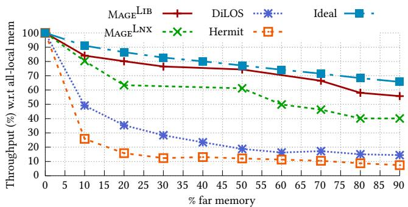  
Figure 1. Throughput as a function of the percentage of far memory used by different remote memory systems for GapBS (page rank) at 48 threads. This figure serves as a guide for datacenter operators, who can choose a throughput drop compatible with their SLOs, then trade that performance for improved memory utilization.

However, today’s page-based far memory systems fail to sustain the performance required by highly parallel dataintensive applications as thread count increases, leading to severe performance degradation when offloading local memory. Figure 1 illustrates this issue for GapBS [12], a representative cloud workload running with 48 threads (experimental setup detailed in §6.1). We compare the throughput of existing systems against an ideal baseline that excludes software paging overhead and accounts only for RDMA-based remote memory access costs (detailed in §3.1). When offloading just 10% of GapBS’ memory, both DiLOS [65] and Hermit [51] degrade GapBS’ throughput by 50% and 75% respectively, far exceeding the ideal 10% degradation. This performance gap, driven by software paging overhead, only widens as we increase the amount of offloaded memory. As a result, the key benefits of far memory—accessing large remote pools to improve capacity and cost efficiency—remain largely untapped because existing systems hit severe performance bottlenecks way before approaching ideal offloading limits.

This scalability problem stems from a fundamental architectural mismatch: existing far memory systems apply traditional virtual memory mechanisms—originally designed for millisecond-latency disk storage—to modern datacenter networks capable of microsecond-level page transfers. This mismatch creates severe performance bottlenecks, especially in high-thread-count environments common in modern data-intensive applications. Our analysis reveals three primary causes of performance collapse: First, maintaining translation lookaside buffer (TLB) coherence through cross-core interrupts scales poorly, becoming prohibitively expensive as the number of threads increases. Second, shared data structures for page tracking (such as system-wide LRU lists) create high contention between application threads faulting-in pages and background threads evicting them. Finally, both local and remote memory allocators exhibit high tail latencies under contention, hindering efficient page frame circulation between free and used states. As shown in Figure 5, these bottlenecks collectively throttle both fault-in and eviction throughput, with eviction performance suffering disproportionately.

This paper presents design principles for building scalable far memory systems that address the key challenges of operating at large scale. Our approach relies on the core principle of always-asynchronous decoupling of the fault-in and eviction paths, which we achieve by offloading eviction logic to a small pool of dedicated threads. This separation enables path-specific optimizations: it minimizes latency on the application-critical fault-in path while maximizing throughput on the eviction path, an approach that moves expensive operations like TLB coherence off the critical path. To reduce contention and enforce asynchrony, we strictly limit the number of active evictor threads, eliminating the “synchronous fallback” mechanisms found in prior works. Eviction throughput is further enhanced via cross-batch pipelining, a technique that overlaps operations across batches to utilize otherwise idle periods. For multi-core scalability, we prioritize contention avoidance, employing techniques like per-CPU data structure sharding. This approach trades precise, finegrained information on page “hotness” for significantly improved performance under high load. The resulting high-performance eviction path ensures a constant supply of free pages, enabling the fault-in path to deliver lowlatency remote memory accesses by avoiding direct eviction operations.

We apply these principles to design two far-memory variants: Linux-based (MageLnx) and library OS-based (MageLib). Both systems open up a completely new set

Yueyang Pan, Yash Lala, Musa Unal, Yujie Ren, Seung-seob Lee, Abhishek Bhattacharjee, Anurag Khandelwal, and Sanidhya Kashyap

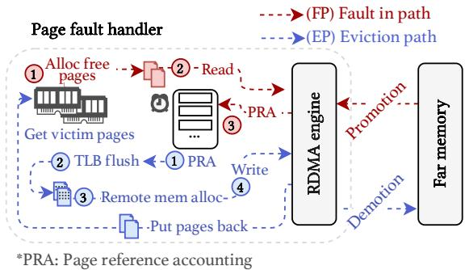  
Figure 2. Workflow abstraction for page-based far memory systems. Generally, they contain fault-in and eviction paths. The fault-in path handles the application page faults and triggers the eviction path under memory pressure.

of opportunities for far memory systems, as they permit memory offloading opportunities close to the ideal scenario (Figure 1). We evaluate Mage on a set of real-world applications, including both latency-critical and batchprocessing ones. Mage outperforms existing far memory systems by 1.2–4.2× in terms of throughput and reduces tail latency by 50.2%–94.5% for latency-sensitive applications.

This paper makes the following contributions:

• Scalability analysis. We emphasize the importance of throughput scalability for far memory systems, identifying and analyzing the associated overheads that directly impact application performance and offloading capability.

• Design principles. We propose three principles to unlock the full potential of scalable far memory systems: always-asynchronous decoupling, cross-batch pipelining, and prioritizing contention avoidance.

• Scalable far memory system. We introduce two new page-based remote memory systems that use the above principles. These systems outperform existing ones by 1.2–4.2× for memory-intensive applications.

## 2 Evolution of Page-Based Far Memory

Remote memory transforms DRAM into elastic memory by enabling applications to utilize idle memory on remote machines through a fast network fabric. This makes remote memory a viable solution to cater to the increasing demands of data-intensive applications [12, 19, 34] that are already hitting the memory wall problem [28, 49].

Several software solutions [51, 52, 65] demonstrate this approach’s feasibility in modern datacenters. The most practical and easily adoptable solution is the kernel pagebased approach [8, 27, 51, 65], which builds upon the old idea of paging to secondary storage to expand memory.

## 2.1 Remote Page Life Cycle

Page-based systems use remote paging to manage memory placement. They aim to keep frequently accessed (“hot”) pages in local memory while migrating less-used (“cold”)

pages to remote memory. Figure 2 illustrates the typical life cycle of remote paging in kernel-based far memory systems. This process involves two primary, coordinated paths:

Fault-in path (FP). This path handles page faults when an application accesses a page absent from local memory. It works as follows: upon a page fault, the OS requests a free page from the local memory allocator $( F P _ { 1 } )$ . If no page is available, the OS triggers the eviction path (EP). Once a free page is available, the OS fetches the page from the remote end using RDMA read $( F P _ { 2 } )$ , and updates the page replacement metadata to reflect the page’s recent use (????3). Eviction path (EP). This path runs when local memory pressure is high. It evicts pages to free up space for the application. It works as follows: The OS first identifies victim pages for eviction based on replacement criteria using replacement metadata information [32, 47] (????1). The page accounting mechanism uses an LRU data structure to keep track of hot and cold pages. After selecting the victim pages, the OS updates the page table entries and invalidates the TLB entries for the victim pages via TLB shootdowns (????2). The OS then allocates pages on the remote end $( E P _ { 3 } )$ and copies the page content from local victim pages to remote pages using RDMA write $( E P _ { 4 } )$ . Subsequently, the OS reclaims the victim pages back into the local memory allocator pool.

## 2.2 Focus of Today’s Far Memory Systems

Current systems primarily focus on optimizing the latency of individual page operations at low thread counts. Several works optimize the eviction path by enhancing the Linux swap subsystem with an RDMA-based backend for efficient remote memory access [8, 27]. Hermit [51] reduces fault-in latency through feedback-directed asynchrony, employing multiple eviction threads to perform page eviction concurrently without blocking application threads. Meanwhile, DiLOS [65] takes a different approach by implementing a specialized library OS (LibOS) with a custom paging subsystem specifically designed to minimize page fault handling overhead. For the fault-in path, prior works explore various prefetching policies [44, 65] to proactively load pages before they are accessed, in order to reduce the frequency of page faults. However, a critical limitation with current systems is their failure to address the scalability bottlenecks that emerge in both fault-in and eviction paths when running on many-core systems.

## 3 It’s Not Paging’s Fault: Understanding Remote Paging Bottlenecks at Scale

Despite advances in page-based far memory systems, scaling data-intensive applications remains challenging. While modern OSes efficiently handle thousands of page faults per second per core for local memory access, remote paging mechanisms (§2.1) introduce severe scalability bottlenecks as thread count increases. This limitation significantly restricts memory offloading benefits for modern data-intensive applications requiring expanded capacity. We analyze two recent far memory systems—Hermit and DiLOS—focusing on their fault-in and eviction path performance at higher thread count, increasingly common in such applications.

## 3.1 Scaling Barriers to Memory Offloading

Modern applications exhibit diverse memory access patterns. Current remote paging techniques effectively utilize far memory for applications with few threads, but performance severely degrades as thread count increases. This creates a critical paradox—highly parallel applications that need expanded memory capacity cannot leverage remote resources efficiently. The resulting performance collapse leaves significant memory offloading opportunities unrealized at scale, undermining their practical value. We first establish a baseline for calculating far-memory throughput demand, followed by three representative cases, then present three representative cases demonstrating this issue with DiLOS and Hermit. All systems use the same experimental testbed detailed in §6.1.

Baseline: The “ideal” far-memory system. We assess an application’s far-memory demand by modeling its throughput on an ideal system. This system incurs only data movement costs, with zero software overhead in the faultin and eviction paths. This analytical model represents the theoretical upper bound on far-memory throughput. We use best-case memory access latency $( L = 3 . 9 \mu s$ RDMA latency detailed in §6.1). Any remaining slowdown indicates poor system scalability due to paging overheads.

We first define the baseline throughput when all memory resides locally. If its runtime is $T _ { 0 }$ seconds, the local throughput $( \mathrm { T h p } _ { \mathrm { l o c a l } } )$ is $\frac { 3 6 0 0 } { T _ { 0 } }$ jobs/hour. When a portion of memory (??%) is remote, the performance is affected due to access latency. Each remote page on a CPU, ??, introduces a delay, ??. If core ?? experiences $F _ { c , x }$ page faults during execution, its runtime increases to $T _ { 0 } + L \times F _ { c , x }$ . Since the application’s completion time is bounded by its slowest thread, which incurs the most page faults, the ideal farmemory th gh

$$
\begin{array} { r l } & { \mathrm { \mathop { y } ~ t n r o u g n p u r ~ { 1 8 : } } } \\ & { \mathrm { \mathop { T h p } _ { i d e a l } } ( x ) = \displaystyle { \operatorname* { m i n } _ { c \in { \cal C } } } ( \frac { 3 6 0 0 } { T _ { 0 } + L \times F _ { c , x } } ) \mathrm { \ j o b s / h o u r } } \end{array}
$$

Then the throughput drop attributable to far-memory is:

$$
\begin{array} { r } { \Delta \mathrm { T h p } ( x ) = \left( 1 - \frac { \mathrm { T h p } _ { \mathrm { i d e a l } } ( x ) } { \mathrm { T h p } _ { \mathrm { l o c a l } } } \right) \times 1 0 0 \% } \\ { = \underset { c \in C } { \operatorname* { m a x } } \frac { L \times F _ { c , x } } { T _ { 0 } + L \times F _ { c , x } } \times 1 0 0 \% } \end{array}
$$

We now use this “ideal” curve as a baseline to demonstrate how today’s systems exhibit performance collapse for three classes of applications.

Applications with random access patterns. The inherent characteristics of some applications pose a significant challenge for remote memory systems. For instance, GapBS page rank (graph random walks) and XSBench (simulation sampling) perform random memory access over large working sets. Figure 3 compares their throughput using 48 threads with varying memory offloading ratios on Hermit and our “ideal” system. The “ideal” curve shows that application throughput should degrade moderately with increasing memory offloading. In contrast, Hermit cannot sustain the remote memory pressure (1.5 million pages/second, i.e., 48 Gbps), causing severe performance degradation of 73% and 69% for GapBS and XSBench, respectively, at 10% memory offloading. While this effect is less pronounced at lower thread count, performance drops still remain significant: At 4 threads for 10% offloading, GapBS and XSBench suffer 35% and 19% degradation, respectively, due to reduced memory bandwidth requirements that Hermit can better handle. These overheads stem from inefficiencies in both the fault-in and eviction paths, which we analyze in detail in §3.2.

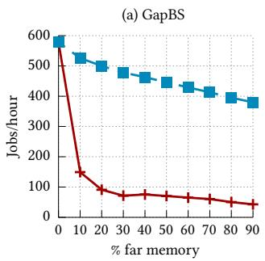

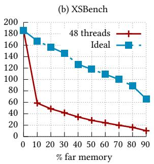

Figure 3. Throughput comparison of GapBS page rank and XSBench workloads using 48 threads between an “ideal” farmemory system and Hermit.  
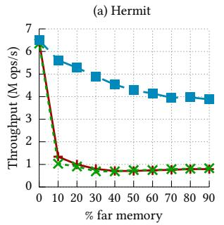

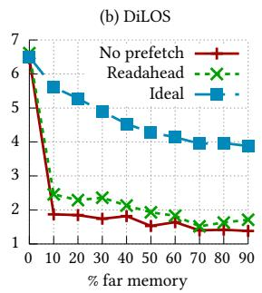  
Figure 4. Throughput of sequential-scan micro-benchmark using 48 threads and varying memory offloading for Hermit and DiLOS compared to their respective “ideal” baselines.

Applications with regular access patterns. Even applications with regular, prefetchable patterns face severe throughput limitations at scale. We use a microbenchmark that sequentially scans through a memory buffer, which represents the ideal case for prefetching, as it enables simple read-ahead heuristics. Figure 4 presents the throughput for 48 threads. Although prefetching reduces major fault counts by 26.9% and 43.9% at 10% memory offloading for Hermit and DiLOS, respectively, throughput remains

Yueyang Pan, Yash Lala, Musa Unal, Yujie Ren, Seung-seob Lee, Abhishek Bhattacharjee, Anurag Khandelwal, and Sanidhya Kashyap

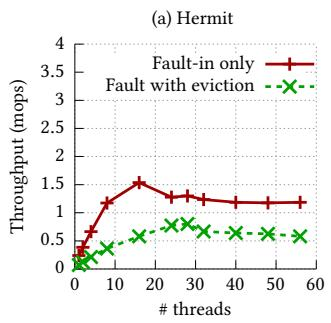

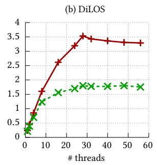  
Figure 5. Throughput of existing systems for fault-in only vs. fault-in with eviction. The ideal limit is 5.83 M ops/s.

virtually unchanged compared to the non-prefetch case. This occurs because the fault-in path becomes bottlenecked by the shortage of free local pages. For Hermit, performance degrades even further due to synchronous eviction triggered by its eager fault-in approach.

Applications with varying working sets. Application phase changes trigger working set shifts that cause severe, temporary performance degradation, even when local memory capacity is sufficient for either phase. These transitions simultaneously evict pages from the old working set while faulting in pages from the new working set. We observe this in data processing workloads that follow bulk-synchronous parallel (BSP) programming models like MapReduce [34]. While throughput remains stable within each phase, transition periods lead to drastic performance drops (∼99%) that persist until the new working set stabilizes. This occurs due to inefficient overlap of the fault-in and eviction paths, especially at high thread count.

Takeaway. Regardlessly of application behavior, current far memory systems sharply degrade application performance with increasing thread count. While this may appear to be application-level thrashing due to insufficient local memory, the next section reveals that the underlying remote paging system is the actual bottleneck. The fault-in and eviction paths cannot handle the throughput demands of highly parallel workloads, preventing the effective use of remote memory when applications need it most. As we demonstrate in §6.2, applications can achieve high performance at scale once these system-level overheads are resolved.

## 3.2 Remote Paging Bottlenecks at Scale

We now analyze the scalability bottlenecks of existing far memory systems. We use a sequential read microbenchmark, in which each thread performs sequential reads at page granularity over sufficient network bandwidth (200 Gbps). We compare throughput under two scenarios: (1) fault-in only, and (2) fault-in with active eviction. For the fault-in only case, we use 100% local memory and pre-evict pages with madvise\_pageout to force page faults on each access. For the combined case, we enable eviction with 50% memory offload and use four asynchronous eviction threads. Figure 5 shows that both Hermit and DiLOS fail to scale linearly, and saturate at around 24 to 28 threads. Hermit exhibits severe limitations: fault-in-only throughput reaches just 20% of ideal performance, drops to 14% when eviction is enabled, and degrades further to 10% at higher thread count. DiLOS performs better but still faces significant constraints: faultin-only throughput reaches 56% of ideal performance (at 24+ threads), but drops to 30% when eviction is enabled. The eviction path is the primary performance bottleneck for both systems.

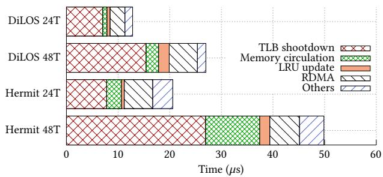  
Figure 6. Latency breakdown of DiLOS and Hermit’s page fault handler for the sequential read benchmark at 24 and 48 threads. At low thread count, the RDMA read cost dominates. The “others” category includes context switch costs, faultdispatching, page-table walks, and PTE updates.

We now analyze the underlying causes of both paths.

Fault-in path. We analyzed system performance and found several scalability bottlenecks at high thread counts. At 48 threads, Hermit’s scalability is limited by contention on shared metadata structures within the Linux kernel. Notable bottlenecks include locks associated with virtual memory areas (VMAs) [41] and the swap allocator. In particular, the swap allocator’s global spinlock severely contends under fault-intensive conditions [65].

DiLOS mitigates many of these Linux-specific overheads through heavy kernel specialization. It embeds synchronization within page table entries and leverages a unikernel architecture (one application with one address space), which avoids the VMA lock contention inherent in the Linux kernel. DiLOS also replaces the standard swap system with a specialized direct local-to-remote mapping mechanism. Despite these optimizations, DiLOS exhibits its own throughput bottleneck due to contention on a global sleepable mutex protecting its physical page allocator.

Eviction path. Figure 6 presents the average remote paging costs and path-specific breakdowns at 24 and 48 threads, respectively, with active eviction. As thread count doubles from 24 to 48, both Hermit and DiLOS experience severe software bottlenecks. These stem mainly from synchronous eviction, which gets triggered when asynchronous eviction threads cannot maintain sufficient page eviction throughput. This issue gets further amplified by cross-socket effects. Hermit’s multi-threaded asynchronous eviction design becomes ineffective at higher thread count. Due to the spike in memory management operations in the eviction path, increasing the number of asynchronous threads does not improve eviction throughput under the swap-intensive case. This throughput inefficiency then triggers synchronous eviction, further exacerbating the scalability issues. For instance, TLB shootdown is the dominant factor in overall performance degradation. With two application threads (not shown in the figure), page eviction remains asynchronous, i.e., TLB flush does not show up in the fault-in path. However, as the number of threads increases to 48, poor scaling for synchronous evictions causes TLB flush times to increases to 27 ??s. One point to note is that Hermit’s throughput is also limited by the complex memory management functionality of Linux, which suffers from severe contention in reverse mapping, page table manipulation, cgroup accounting, and swap cache maintenance, leading to a collapse in throughput.

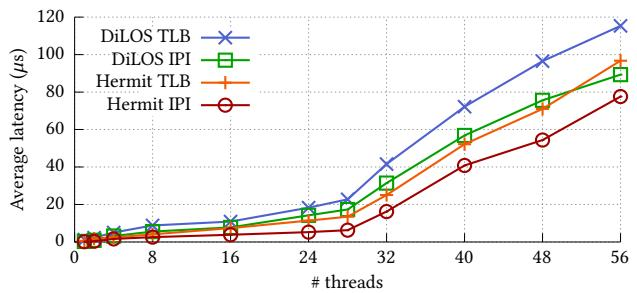  
Figure 7. The average latency of TLB shootdowns and IPI delivery in the sequential read micro benchmark.

DiLOS, on the other hand, employs a specialized farmemory unikernel that merges user and kernel address spaces for single applications. This design eliminates crossapplication components like rmap and swap cache, replacing the swap allocator with direct remote memory mapping. As a result, it achieves better throughput compared to Hermit in both fault-in only and eviction scenarios (Figure 5).

Vanilla DiLOS relies on a single eviction thread with an inefficient IPI-based wait-wake mechanism. We extend it with multiple eviction threads and synchronous eviction while preserving the eviction path functionality, yielding higher throughput. However, as the number of threads increases, DiLOS encounters scalability bottlenecks similar to Hermit: TLB shootdowns increase from zero at two threads to 6 ??s at 48 threads, while local memory allocation and page accounting costs rise by 2.9× and 3.5×, respectively.

## 3.3 Challenges of Scaling Remote Paging

We identified that existing systems are bottlenecked by faults and evictions at scale. We now conduct an in-depth analysis of the throughput bottlenecks for three page operations: metadata coherence, page accounting, and page circulation.

3.3.1 Page metadata coherence cost (????2). During page eviction, maintaining coherence is the most expensive operation. Most architectures, including x86, require explicit OS support for translation lookaside buffer (TLB) coherence. The current approach to modifying the TLB is either invalidating a single entry using the INVLPG instruction or flushing all local TLB entries by writing to the cr3 register. These instructions only control the per-core TLB. The OS invalidates TLBs on remote cores (on the same machine) with an IPI-based mechanism, in which the OS delivers IPIs to each remote core one by one via the Advanced Programmable Interrupt Controller (APIC) [31].

Although TLB maintenance is a well-known problem in the context of page free (munmap) and page migration in modern OSes [9, 10, 14, 36], it becomes even more critical for far memory systems in the eviction path. To illustrate this point, we measure TLB shootdown costs in our sequential read microbenchmark with increasing thread count. Figure 7 presents the results for both Hermit and DiLOS; both systems suffer from significant overheads from TLB shootdowns. This happens for two reasons. First, IPI delivery latencies increase substantially across NUMA sockets [36], which causes the latency inflection point at 28 application threads. Second, when eviction threads cannot provide sufficient bandwidth, fault-in threads perform synchronous eviction on the critical path. Both fault-in and eviction threads must send TLB flush requests to invalidate victim pages, which requires issuing IPIs to all application cores. This IPI “storm” results in IPI queuing, increasing per-IPI latency by 33× when scaling from 1 to 48 application threads for Hermit. Additionally, DiLOS exhibits higher absolute TLB shootdown costs because it runs on virtualized hardware [35], where each IPI triggers a VMexit that adds approximately 1,200 cycles overhead. Although hypervisor optimizations attempt to reduce VMexit overhead [1], they still suffer from existing IPI costs.

Challenge 1: TLB coherence maintenance becomes a major bottleneck with increasing thread count. The challenge lies in limiting the number of IPI senders and hiding, reducing, or amortizing its high latency.

3.3.2 Page accounting $( F P _ { 3 } , \ E P _ { 1 } )$ . Another dominant factor is the data structure for maintaining page replacement information for remote paging. The intuition behind victim page selection algorithms is to keep hot data local and reduce the page fault rate. In particular, the OS keeps track of pages to eventually decide on the eviction of some pages based on the goal of minimizing IO operations while maximizing hit rates. Hermit and DiLOS, derived from Linux and OSv respectively, use a system-wide single LRU list to account for the access recency of each occupied page.

This page accounting data structure is the most updateintensive one, as both paths $( F P _ { 3 }$ and ????1, §2.1) update it frequently. Operations on this data structure create a significant throughput bottleneck in the eviction path. Both Hermit and DiLOS suffer from severe contention that increases with thread count, as shown in Figure 6. In

Hermit, the multi-threaded asynchronous eviction threads (????1) contend on the LRU data structure with application threads performing fault-in operations $( F P _ { 1 } )$ , which offsets the desired benefits of asynchronous eviction. DiLOS suffers from the same scalability issue. As a result, contention on the LRU list increases by 9.6–11.4× with increasing thread count.

Challenge 2: Current page eviction algorithms only focus on replacement effectiveness, overlooking the contention. The challenge lies in designing a page-eviction algorithm in the OS that ensures scalability with similar replacement effectiveness.

3.3.3 Cost of page circulation $( F P _ { 1 } , E P _ { 3 } )$ . During both paths (FP and EP), the OS allocates and deallocates pages, which move from the unused pool to the used pool. In particular, the local memory allocator $( F P _ { 1 } )$ grabs pages from the unused local memory pool, while the remote memory allocator $\left( E P _ { 3 } \right)$ allocates a page or metadata on the remote end to evict a victim page. Most modern OSes [13, 35] use the buddy allocation algorithm, which partitions memory into zones and allocates contiguous blocks of sizes that closely match the requested allocation size. Current allocator designs add a fast-path layer in the form of per-CPU page caches to reduce contention on the centralized buddy allocator [25]. Similarly, remote page allocation uses the swap subsystem to track remote pages [25].

We investigate the performance of both local and remote allocations by analyzing the contention overhead. Figure 6 shows that both systems suffer from high contention while circulating pages at high thread count for different reasons. The high contention in Hermit occurs due to a global spinlock on the Linux swap subsystem $( E P _ { 3 } )$ . DiLOS, on the other hand, completely gets rid of the swap subsystem and eliminates the bottleneck in the remote memory allocator (????3) by storing the remote page info in the local page table entry. However, in the swap-intensive workloads with high thread count, DiLOS severely contends on the local memory allocator due to a global lock.

Challenge 3: Current memory allocators incur high tail latency with increasing thread count. The challenge lies in how to avoid contending the global allocators in both FP and EP by retrofitting them for far memory systems.

## 3.4 Summary

The current landscape of far memory systems shows throughput bottlenecks in both the fault-in and eviction paths, with the latter being more severe. The biggest deterrent to a scalable throughput is the contention on maintaining core OS-level remote paging mechanisms, such as TLB shootdowns, page accounting, and memory allocation. While prior works advanced low-thread-count latency reduction, they overlook scalability under high thread count, where the latency of individual FP and EP operations can increase super-linearly. As a result, the nonscalable aspect of existing systems directly affects application performance as well as the memory offloading capability.

## 4 Design: Balancing FP and EP

Handling the scalability challenges of far memory systems requires a holistic approach that balances both the fault-in and eviction paths. We propose the following core design principles to address the core paging scalability challenges: P1: Always-asynchronous decoupling To reduce the latency of heavy operations, such as maintaining TLB coherence, we offload EP-specific tasks from the application’s critical path to dedicated background threads. Such decoupling enables specialized optimization objectives for each path based on its role and observed system bottlenecks: FP is optimized for minimal latency impact on application execution, while EP is optimized aggressively for high throughput. Unlike prior works [51, 65], FP threads do not perform synchronous eviction during a shortage of free pages, leaving this responsibility to EP threads. This minimizes contention overheads, and avoids the TLB IPI queuing delays associated with synchronous eviction.

P2: Cross-batch pipelined execution Since Principle P1 dedicates CPUs to the EP, we optimize the EP for maximum throughput. This minimizes CPU cycles per evicted page to avoid blocking the FP. We pipeline execution using large eviction batches to amortize TLB coherence costs across the dedicated EP threads. We leverage asynchrony across batches to maximize remote memory throughput without degrading application execution.

P3: Prioritizing scalability via coordination avoidance. Lock contention on shared data structures is a fundamental barrier to scaling across multiple cores. Thus, our design favors low-contention techniques over potentially more accurate but less scalable alternatives. We rely on sharding data structures across CPUs and choose algorithms that reduce synchronization needs, even if it means occasionally sacrificing some precision in our eviction policies. To mitigate these trade-offs where possible, we dynamically adapt mechanisms to maintain a balance between low contention and accuracy.

Based on these principles, we design Mage to achieve scalable remote paging. We now detail how we apply these principles to redesign the eviction path (§4.1), and minimize contention on global data structures that impact both fault-in and eviction paths (§4.2).

## 4.1 Always-Asynchronous Decoupling and Cross-Batch Pipelined Eviction

Eviction plays a critical role in remote paging. We first discuss existing approaches to eviction and their shortcomings. Then, we present our eviction design using the aforementioned principles (P1 and P2).

Traditional eviction path and its problems. Traditional remote paging systems suffer from sequential eviction paths and colocated scheduling models. By scheduling eviction threads on the same CPU cores as application threads, these systems create mutual contention between them, leading to two main interference patterns: First, application threads can delay eviction threads, reducing the overall eviction rate. This can trigger synchronous eviction, forcing application threads to stall during page faults until memory is freed. As a result, application performance gets completely throttled (§3.3). Second, eviction threads can block application threads, causing unpredictable slowdowns as they process large batches of pages destined for far memory.

These performance issues are fundamentally rooted in the rigid, sequential nature of batch page eviction (Figure 8). The process involves a series of dependent steps—extracting a page batch from the global LRU list, checking accessed bits, allocating swap space, unmapping pages, and managing the RDMA write—that must complete for one batch before the next can begin. This monolithic design introduces significant software latencies on the critical path, with key bottlenecks including contention on shared data structures and expensive TLB coherence synchronization.

One might consider using larger batches to amortize these overheads. However, larger batches are counterproductive: they increase per-page processing overhead and intensify lock contention due to longer page scanning times and sequential dependencies (Figure 18). Moreover, during synchronous eviction, these large batches introduce significant latency for the faulting application. Similarly, adding more eviction threads to match fault-in throughput fails to solve the underlying problem. Additional threads only exacerbate the contention because the latency of these operations increases with more eviction threads (§3.3).

Solution: Asynchronous eviction with pipelined execution. In Mage, we resolve application-eviction interference through always-asynchronous decoupling (P1). First, Mage dedicates CPU cores to evictor threads, avoiding context switches and enabling path-specific optimizations. Moreover, Mage disallows synchronous eviction in the faultin path; instead, it relies entirely on the eviction threads to always maintain a steady supply of free pages. This dedicated design allows us to optimize the eviction path for maximum throughput while delegating latency-sensitive optimizations to the FP path. To ensure the FP path always has free pages available, the EP path must keep pace with demand through sufficient dedicated evictor threads. However, too many evictor threads cause high contention and IPI queuing (discussed in §3.3.1). Our empirical analysis shows that four evictor threads provide a sweet spot: they allow Mage to maintain a steady supply of free pages for the FP, without suffering from excessive synchronization overheads, even enabling MageLib to saturate the 200 Gbps NIC.

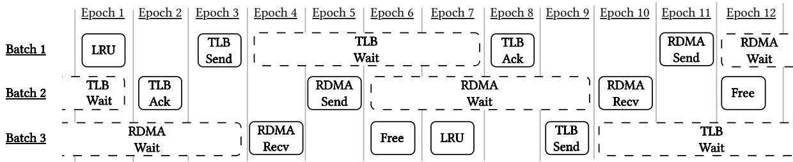  
Figure 8. Cross-Batch Pipelined Eviction Workflow. TLB Send corresponds to TLB flush using IPI.

Second, Mage tackles the challenge of ensuring these dedicated threads execute fast enough to meet fault-in throughput demands. The key insight is that while operations within a batch have dependencies, the long waiting periods to complete each operation enables parallelization across multiple batches. For instance, both RDMA writes and TLB flushes comprise two phases: issuing the request and waiting for completion. Since waiting time significantly exceeds sending time, these idle periods can be used to execute pipeline stages for other batches.

Following this insight, we implement pipelined execution (P2) through a multi-staged out-of-order eviction path. Our design uses two per-CPU staging buffers: 1) The TLB staging buffer (TSB) holds unmapped pages with potentially cached TLB entries. 2) The RDMA staging buffer (RSB) contains pages awaiting remote memory writes. Each batch gets executed in the following order: 1 It first slices a batch of pages from the LRU list, allocates swap entries, and unmaps the pages. 2 Next, it initiates TLB flush requests via IPIs for the current batch and moves these pages to the TSB. 3 It waits for TLB flush completion. 4 Once it receives ACKs for the TLB flushes for the entries in the TSB, it moves dirty pages from the TSB to a local buffer. 5 It then initiates RDMA write requests for dirty pages in the local buffer and moves them to the RSB. 6 Then, it waits for RDMA write completion for the batch in the RSB. 7 Once it receives the RDMA ACKs for the requests in the RSB, it reclaims clean pages from the RSB.

Instead of waiting during steps 3 and 6 , our pipelined design works on subsequent batches (see Figure 8), maximizing throughput. The eviction thread batches across three conceptual stages: It begins by scanning the LRU list and unmapping pages for a new batch. It checks for completed TLB flushes for a second batch, then initiates a remote TLB flush for the first batch. It waits for a third batch to complete RDMA, then initiates RDMA writes for the second batch. Finally, it reclaims the page frames from the third batch, and starts scanning the LRU list again. Pipelining allows RDMA wait latency to hide the overhead of the other pipeline stages. As a result, eviction threads achieve high throughput with lower thread count. This implementation directly supports our design principles: P1 by completely separating the eviction path from the fault path, and P2 by optimizing the eviction process specifically for maximum throughput rather than minimizing per-operation latency.

## 4.2 CPU-efficient Remote Paging Paths

Current paging designs rely on traditional virtual memory and paging structures to transparently access remote memory. In particular, every application thread must be able to view the latest changes to the page table (triggered every time a page is fetched from far memory to local DRAM and vice versa) to ensure the correctness of its page accesses. Additionally, the system maintains the same data structures, such as page metadata coherence (TLB), page accounting (LRU), and the memory allocator across cores for the latest information. Thus, concurrent accesses to these global data structures and components lead to throttling of remote paging paths (§3.3). To resolve this, Mage prioritizes coordination avoidance (P3) over eviction accuracy. Next, we discuss practical optimizations to reduce contention on these global data structures.

4.2.1 Dedicated Batched TLB Invalidation. To minimize TLB coherence costs, Mage batches multiple page invalidations into a single TLB shootdown request, amortizing the overhead of expensive IPI-based operations. Unlike Hermit, which uses up to 32 dynamic eviction threads that create contention despite batching, Mage adopts a more constrained approach. Mage employs a small, fixed number of eviction threads that issue large batches of shootdowns to reduce shootdown frequency and synchronization waits, thereby lowering contention on system interrupt controllers like the APIC. Specifically, Mage uses a maximum of four dedicated eviction threads, each responsible for aggregating invalidation requests into batches of up to 256 pages per shootdown event. We found that 4 threads are sufficient to saturate the 200 Gbps NIC in our experiments. Combined with our other EP optimizations, this approach enables Mage’s EP to maintain a steady supply of free pages for the FP, ensuring low FP latency by avoiding page evictions on its critical path.

4.2.2 Partitioned Page Accounting. Effective remote paging requires page accounting to track access history and select appropriate eviction candidates under memory pressure. LRU is the most common page replacement algorithm, and modern OSes implement LRU using multilevel feedback queues [2]. However, current page accounting mechanisms suffer from contention at the centralized final level during eviction, leading to throughput collapse. While newer algorithms like S3FIFO [64] reduce LRU contention, they require fine-grained access frequency tracking that is incompatible with existing OS page table mechanisms, which rely on coarse-grained access bits to detect page hotness. To address this limitation, Mage adopts a partitioned design, where each dedicated eviction thread maintains its own independent LRU list. This approach deliberately sacrifices global eviction accuracy in favor of substantially reduced lock contention and improved scalability. We now detail how Mage handles pages with several LRU lists.

Adding pages to the LRU lists Pages enter the partitioned inactive LRU lists in two situations: when faulted-in from remote memory, or when identified as hot during eviction scanning and subsequently reactivated. In both cases, Mage distributes incoming pages by selecting a target list based on the hash of the current CPU’s ID modulo the number of LRU lists. This hashing strategy aims to distribute pages evenly across partitions, enabling balanced parallel page selection by the eviction threads later and helping sustain high eviction throughput under load.

Removing pages from LRU lists During eviction, dedicated eviction threads concurrently select candidate pages by scanning their respective partitioned LRU lists. To balance the load, each thread begins scanning at a different list index and proceeds through the lists in a round-robin fashion for subsequent eviction cycles. If a thread finds its current list empty, it moves to the next list in its round-robin sequence.

4.2.3 Boosting Page Circulation. In the execution of fault-in path and eviction path, a physical page circulates between local and remote allocators. Under memory pressure, the underlying paging mechanism stresses the local and remote memory (page) allocation. Here, we adopt the sharding and caching principle to reduce the possible contention of page allocation on both the local and remote sides. In particular, Mage maintains per-CPU caches of free pages, which are asynchronously replenished with pages from the global free-page list. We detail the design of Mage’s local physical page allocator in §5.2.

Remote swap allocator. The swap allocator design leverages the observation that the remote memory node is usually large and cheap. Therefore, we use VMA-level direct mapping to eliminate any form of swap entry allocation. For example, the local page at ??????????\_???????? + 512KB is mapped to the remote virtual address ????????????\_???????? + 512KB directly.

## 5 Implementation

We build two variants of Mage, one for Linux and one for OSv, which is a library OS.

## 5.1 MageLnx: A Linux-based Version of Mage

We realize our design principles on the Linux kernel 4.15.0 [4] to demonstrate that remote paging can be made scalable even on commodity OSes. MageLnx is written in 17k lines of code (LoC). We adopt several of Hermit’s optimizations to bypass overheads in Linux’s rmap layer. We further reduce contention by reimplementing throughputspecialized versions of Linux’s memory management data paths. For example, we skip the Linux swap layer entirely, optimize coarse-grained address space locks into intervaltree-based “shards”, and bypass the Linux memory allocator when managing our free pages. We use low-contention FIFO queues for tracking in-use pages instead of Linux’s multi-generation LRU lists [2], trading eviction accuracy for reduced list contention.

## 5.2 MageLib: An LibOS Version of Mage

We build MageLib based on the OSv unikernel [35] (v0.55). The core part is written in 4,234 LoC. MageLib memory node consists of 320 LoC. We adopted several components from DiLOS to deliver high performance, including the unified page table, the linker layer and the low-latency RDMA driver. The unified page table replaces the kernel swap cache for deduplication on concurrent fault-in requests. We further optimize the OSv memory allocator to reduce contention on the global buddy allocator. We introduce a three-level hierarchy: per-core free-page caches for immediate access, a shared concurrent queue for batch operations, and the traditional global buddy allocator as a fallback. This hierarchical approach enables fast allocation/deallocation paths, with application threads and eviction threads following different strategies to optimize for either locality or throughput, significantly reducing contention even under swap-intensive workloads.

Memory node. MageLib uses one-sided RDMA for communication. A daemon on the memory node manages the setup requests and registers the memory region to its RDMA NIC. The memory region uses HugeTLB to reduce the cost of page table walks on the memory node side.

## 6 Evaluation

We evaluate Mage to answer the following questions:

Q1. What is the impact of our design on offloading throughput-bound applications? (§6.2)

Q2. What is Mage’s impact on offloading latency-critical applications? (§6.3)

Q3. What is the maximum throughput that Mage can achieve, and can it shift the bottleneck from software to hardware? (§6.4)

Q4. Which components contribute to performance improvements, and does Mage maintain efficiency for low throughput requirements? (s§6.5)

<table><tr><td>Category</td><td>Application</td><td>Dataset</td><td>Size</td><td>Characteristic</td></tr><tr><td rowspan="5">Throughput-bound</td><td>GapBS[12]</td><td>Kronecker [39]</td><td>1.5B Edges, 41.7M Vertices</td><td>Random graph</td></tr><tr><td>XSBench [58]</td><td>Nuclide and unionized grid355 Nuclides and 10.6m gridpoints</td><td></td><td>Random grid</td></tr><tr><td>Sequential Scan</td><td>Synthetic</td><td>20GB</td><td>Prefetchable scan</td></tr><tr><td>Gups [50]</td><td>Synthetic</td><td>32GB</td><td>Phase changing random</td></tr><tr><td>Metis [34]</td><td>Wikipedia English [3]</td><td>30GB</td><td> Phase changing map reduce</td></tr><tr><td>Latency-critical</td><td>Memcached [5]</td><td>Facebook&#x27;s USR like [11]</td><td>21M KV Pairs</td><td>In-memory KV Store</td></tr></table>

Table 1. Applications used to evaluate Mage.  
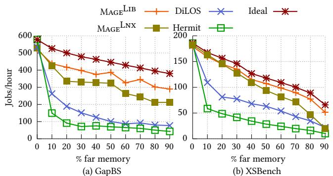  
Figure 9. Impact of far memory systems on applications’ throughput with varying local memory at 48 threads.

## 6.1 Experiment Setup

We evaluate our systems using two VMs deployed across two RDMA-connected servers. The first VM executes application threads and maintains a configurable quota of local DRAM; memory exceeding this quota is transparently offloaded to the second VM, which serves as a passive far-memory pool. We vary the local memory quota to test different memory pressure scenarios. Each server has dual-socket Intel Xeon Gold 6348 CPUs (28 cores per socket, 56 cores total) with 512 GB of memory, running Ubuntu 22.04 with Linux 5.14. We use QEMU/KVM for virtualization and disable CPU frequency scaling, AutoNUMA migration, hyper-threading, and transparent hugepages on the host to eliminate performance interference. The servers are connected via Mellanox BlueField-2 DPUs providing 200 Gbps bandwidth [46], configured in NIC mode without utilizing the DPU’s ARM cores. We run Hermit on bare metal due to virtualization compatibility issues.

We compare MageLib and MageLnx with Hermit and DiLOS. We configure a maximum of four dedicated eviction threads. This configuration allows all four systems to reach their peak performance; additional eviction threads beyond four do not improve throughput. In all graphs, “?? % far memory” means the remote memory pool is provisioned with ?? % of the application’s working set size (WSS), while the local VM is configured to retain 100 − ?? % of the WSS.

## 6.2 Offloading Throughput-bound Applications

We evaluate offloading performance across three application types, each running with 48 application threads.

Applications with random access patterns. We test a) GapBS [12] (GAP Benchmark Suite) page rank with a 20GB Kronecker[39] workload, using OpenMP parallelization. b) XSBench [58], which simulates Monte Carlo neutron transport through random walks on a 15GB dataset. These applications generate intense memory pressure with unpredictable access patterns.

Figure 9 shows that both Mage variants significantly outperform Hermit and DiLOS, as these applications stress the paging subsystems even at low offloading percentages. With GapBS, offloading just 10% of local memory generates a fault-in throughput of 1.82 M ops/s (1.82 million pages per second, equivalent to 59.3 Gbps), which exceeds DiLOS (1.77 M ops/s) and Hermit (0.80 M ops/s) capabilities. This forces these systems to trigger synchronous eviction, which causes significant stalls in the fault handler (up to 80??s). This leads to sharp throughput drops (51% and 74%), effectively preventing memory offloading.

In contrast, MageLib and MageLnx achieve faster eviction and fault-in paths, resulting in much smaller performance reductions of 15% and 19%, respectively, at 10% offloading. If operators can tolerate a 30% performance drop, MageLib enables offloading up to 61% of memory. Even at 90% offloading, MageLib and MageLnx maintain 56% and 41% of baseline performance, respectively, allowing significantly more applications to be co-located on the same local memory budget.

For XSBench, which performs more computation per page access, both Mage variants achieve similar performance. Both systems experience a 10% throughput drop when offloading 9% of memory, and a 20% throughput reduction when offloading approximately 20% of memory. This represents a 3.6–3.8× improvement in offloadable memory capacity compared to DiLOS and Hermit.

Applications with regular access patterns. We use the dataframe library [45] as a representative application with regular, prefetchable access patterns. Unfortunately, since its implementation does not scale with multiple threads, our evaluation uses a custom dataframe-style sequential scan that performs checksums over a 20GB memory region equally sharded among worker threads.

MageLib, DiLOS and Hermit use pattern matching for prefetching: they record past fault-in virtual address to detect sequential access patterns. Due to the lack of support of

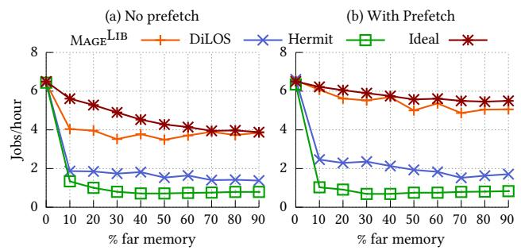

Figure 10. Impact of far memory systems on a regular, prefetchable sequential access pattern.  
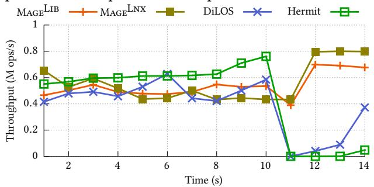

Figure 11. Impact of far memory systems on the GUPS benchmark, which exhibits a phase change at 10 seconds. prefetching in $\mathbf { M A G E } ^ { \mathrm { L N X } }$ , we focus on $\mathbf { M A G E } ^ { \mathrm { L I B } }$ . Figure 10 shows that without prefetching, MageLib performance drops by 32% when offloading 10% of local memory, which is only 68% of the ideal performance. With prefetching enabled, $\mathbf { M A G E } ^ { \mathrm { L I B } }$ dramatically reduces page faults from 1.2M to 324K, maintaining low fault latency (4.6??s) without triggering synchronous eviction. This results in near-ideal throughput: $\boldsymbol { M } \boldsymbol { \mathrm { A G E } } ^ { \mathrm { L I B } }$ achieves 93.6% of baseline performance with only a 6.4% performance drop when offloading 10% of memory. Prefetching is effective with Mage because its fast eviction path can sustain the increased fault-in pressure that prefetching creates. In contrast, prefetching provides minimal benefit for DiLOS (throughput increases only from 1.87 to 2.46 M ops/s) and actually degrades Hermit’s performance (dropping from 1.34 to 1.03 M ops/s) due to synchronous eviction overheads.

Applications with varying working sets. We test two applications: a) GUPS [50], a modified HPC benchmark that performs random updates following the Zipf distribution in one region (uses 80% of the WSS) and then shifts accesses to another region (using the remaining 20% of the WSS). b) Metis [34]: a bulk data processing application with an explicit phase change.

GUPS. Figure 11 shows the timeline of the GUPS benchmark with 85% local memory. Initially, both DiLOS and $\mathbf { M A G E } ^ { \mathrm { L I B } }$ exhibit lower performance than Hermit due to virtualization overheads (e.g., slower memory accesses from additional EPT translations), as both are unikernels running on a hypervisor. $\boldsymbol { \mathrm { M A G E } } ^ { \mathrm { L N X } }$ suffers from both virtualization penalties and Linux RDMA stack overhead, resulting in poor performance during the initial phase. Following the phase change at 10 seconds, DiLOS and Hermit have severe performance degradation, nearly stalling for over 2 seconds. Our analysis shows that after the phase change, both fault-in and eviction rates spike to 3.17 M ops/s, exceeding the capacity of existing systems. In contrast, both Mage variants avoid stalling and quickly recover to 0.7 M ops/s, which is beyond what other systems can sustain. Mage experiences only a temporary throughput drop to 0.4 M ops/s for 1.4 seconds during the phase transition, after which the fault-in rate returns to zero. Metis. Similar to GUPS, Metis exhibits a phase change after the map phase completion, where the reduce phase accesses a different memory region. Figure 12 shows throughput for both phases. Both Mage variants significantly outperform Hermit and DiLOS after the phase transition. At 20% offloading, Mage variants achieve near-baseline performance, as the map phase working set fits entirely within local DRAM. After the phase change, $\mathbf { M A G E } ^ { \mathrm { L I B } }$ throughput reduces by 14.3%, while Hermit and DiLOS drop by 61.3% and 41.2%, respectively. Mage variants outperform others in the reduce phase due to performant eviction paths that efficiently drain the previous memory region.

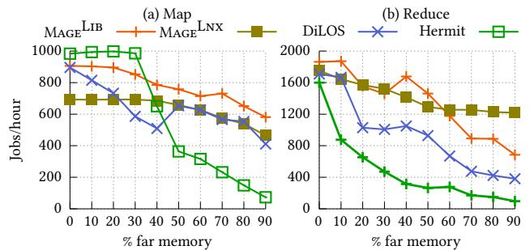  
Figure 12. Impact of far memory systems on the Metis benchmark that comprises a map phase (a) and a reduce phase (b).

Each system exhibits distinct limitations. MageLib performs slightly below Hermit initially because of its less optimized object allocation mechanism. MageLnx suffers during the map phase from eager memory initialization— unlike other systems that initialize pages on-demand, it preinitializes far memory at mmap time, which creates overhead during syscall-intensive phases such as map. Further analysis reveals that MageLnx degradation stems from Linux network stack interference between fault-in and eviction threads, rather than its eviction pipeline being the bottleneck. Hermit suffers from its poor handling of phase transitions, which can be observed from its steep performance drop. Meanwhile, DiLOS starts early memory reclamation through its per-CPU threads that fill local page buffers, which causes higher memory pressure. However, this early eviction behavior benefits DiLOS as it preserves sufficient local memory at 90% allocation by maintaining stable throughput during phase changes.

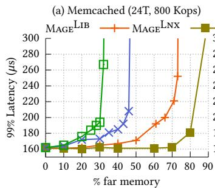

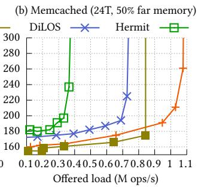  
Figure 13. (a) Impact of far memory on p99 latency for Memcached. The load is fixed as 50% of Memcached’s load capacity with 100% local memory. (b) Impact of varying load at fixed far memory ratio and thread count on tail latency for Memcached.

## 6.3 Offloading Latency-sensitive Applications

We now evaluate offloading performance for Memcached [5], a widely used in-memory key-value store. We follow Facebook’s USR distribution to generate a workload to Memcached with 99.8% GET and 0.2% SET operations [11]. We generate request keys following Zipfian distribution with skewness of 0.99 aligned with YCSB suite [18]. We restrict our experiments to use 24 threads to avoid the impact of cross-NUMA communications for the latency-sensitive workload.

Figure 13 presents the results under two scenarios. In the first case (a), we consider with varying local memory ratios for a fixed load (800 Kops). Here, due to its lightweight paging components, both Mage variants outperform DiLOS and Hermit. For an SLO of 200??s, MageLib offloads 21% more memory compared to DiLOS and 36% more than Hermit. If SLO is further relaxed to $2 2 0 \ \mu \mathrm { s } ,$ the offloaded memory gap increases to 40% more than Hermit, offloading nearly 60% of the memory. $\mathbf { M A G E } ^ { \mathrm { L N X } }$ , on the other hand, permits even more memory to be offloaded at lower latencies—nearly 70% at 160??s and 80% at 180??s.

In the second scenario (b), we evaluate Memcached under varying load with 50% local memory. At high loads, both Mage variants achieve higher throughput than DiLOS and Hermit due to their more efficient eviction path design. Unlike DiLOS and Hermit, Mage completely eliminates synchronous eviction. As a result, the observed latency increases stem entirely from network congestion delays. Thus, Mage sustains 0.64 M ops/s higher load capacity than Hermit and 0.28 M ops/s higher than DiLOS while maintaining a p99 latency SLO of 200??s.

## 6.4 Mage Available Throughput Analysis

We evaluate the performance of the page fault handler to understand how much software overhead Mage removes. We use a sequential read benchmark with prefetching disabled for all systems. Each thread reads its own private memory region. The local memory is set to 30% to ensure that each access to a page triggers a page fault.

Yueyang Pan, Yash Lala, Musa Unal, Yujie Ren, Seung-seob Lee, Abhishek Bhattacharjee, Anurag Khandelwal, and Sanidhya Kashyap

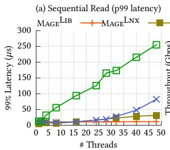

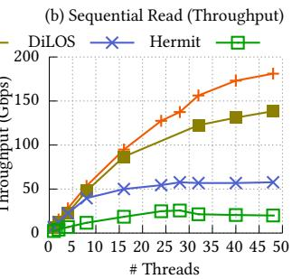  
Figure 14. The p99-latency of sequential read and the number of synchronous eviction invoked over 5.2 million page faults. $\dot { \mathbf { M A G E } } ^ { \mathrm { L I B } }$ is able to remove synchronous eviction in all cases.

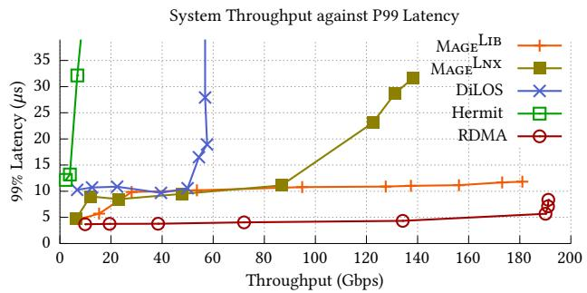  
Figure 15. The throughput-latency graph for compared systems and raw RDMA read operations. To ensure parity with other systems, we use 4 background threads constantly performing RDMA writes for the RDMA-only case.

As shown in Figure 14, $\mathbf { M A G E } ^ { \mathrm { L I B } }$ nearly saturates the network bandwidth by utilizing 94% (i.e., 181 Gbps) of the 192 Gbps RDMA bandwidth limit. This is 3.1× and 7.1× faster than DiLOS and Hermit, respectively. Detailed analysis reveals that with 48 faulting threads, $M _ { \mathrm { A G E } } mathrm { ^ { L I B } \mathrm { ^ { , } } _ { S } }$ local page allocation never stalls. It maintains an average latency of 7.7 ??s, with 5.1??s spent on RDMA stack congestion. The remaining cycles outside page faults are mostly consumed by remote TLB flush operations initiated by background eviction threads. Meanwhile, MageLnx achieves lower network utilization at 139 Gbps due to scalability limitations in its network stack implementation. In contrast, both DiLOS and $\mathbf { M A G E } ^ { \mathrm { L I B } }$ benefit from their microkernelbased RDMA driver architecture, which significantly reduces network stack contention. Mage’s careful design of paging components also controls fault latencies; p99 latency decreases drastically from 255 $\mu s$ and 82 ??s for Hermit and DiLOS, respectively, to 12??s and 31??s for $\mathbf { M A G E } ^ { \mathrm { L I B } }$ and MageLnx, respectively.

Figure 15 compares the throughput-latency curves across all systems against raw RDMA operations. $\mathbf { M A G E } ^ { \mathrm { L I B } }$ maintains a relatively stable tail latency across different loads for two key reasons: (1) its efficient eviction design prevents memory allocation stalls in the fault path, and (2) its fault path components (memory allocation and PTE updates) provide natural back pressure to the RDMA stack, preventing congestion that causes the tail latency spikes observed in the RDMA-only case. MageLnx also exhibits more stable tail latency than DiLOS and Hermit because its asynchronous decoupling eliminates blocking synchronous eviction operations.

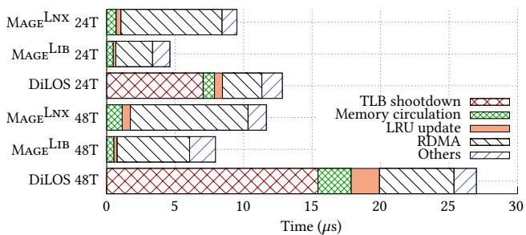  
Figure 16. Average latency breakdown of DiLOS and Mage variants for the sequential read benchmark.

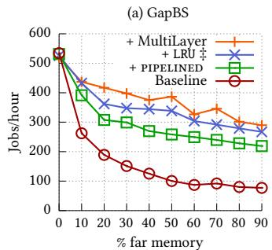

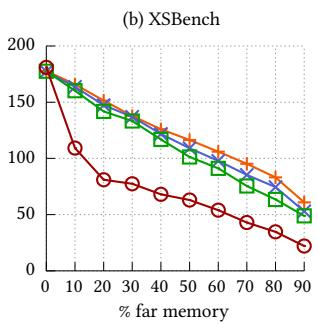  
Figure 17. The performance impact of all the techniques when applied in the following order: Baseline → pipelined →LRU ‡ (LRU partitioning)→ MultiLayer (multi-layer mem allocator).

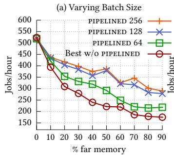

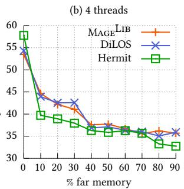  
Figure 18. (a) Comparison of different batch sizes for pipelined eviction compared to the non-pipelined eviction (sequential eviction). (b) Regression test for MageLib under low-fault-in throughput condition.

Figure 16 breaks down the latency contributions of key components at 24 and 48 threads for DiLOS and Mage. MageLib eliminates TLB latency from the fault path and reduces page accounting latency from 2.1??s to 0.2??s through partitioning (§4.2.2), and memory circulation latency from 2.4??s to 0.5??s through its staging allocator. These optimizations achieve sub-10 ??s average latency for MageLib.

## 6.5 Breaking down Mage Performance

We now evaluate how each of Mage’s techniques performs in isolation and whether our throughput-oriented optimizations trigger a regression for cases with low throughput demand. We conduct the analysis using MageLib as it addresses most other scalability bottlenecks in the memory management subsystem.

Technique breakdown. We evaluate GapBS and XSBench with varying percentages of local memory to demonstrate how different techniques contribute to the performance Figure 17 presents the results using DiLOS as the baseline.

First, pipelined eviction enables cross-batch pipelining (§4.1) . This results in 4.3% and 15% more offloadable memory for GapBS and XSBench, respectively, when the SLO allows 20% throughput drop (i.e., a 20% throughput drop for the workload will not violate operator’s SLOs), and delivers 1.58× and 1.74× throughput improvement while offloading 20% local memory.

Then, for GapBS, our partitioned LRU approach (§4.2.2) removes 81.2% of the cycles spent on scanning pages in eviction. This reduces wait time for free pages in the fault handler when the local memory is less than 80%, giving an additional 5.1% of offloadable memory when the SLO permits 20% performance drop. Our multi-layer allocator (§4.2.3) reduces the average time spent on the shared allocator per page by 93.1% from 2.4??s to 0.5??s. This allows a further 8% more memory to be offloaded with the same SLO criteria. These two techniques mainly reduces the contention on the shared data structures. For XSBench, the contention is not as severe as GapBS, since the per-page computation is higher, so two techniques combined lead to ∼ 10% higher throughput.

pipelined vs. non-pipelined. To evaluate how batch size affects throughput, we compare pipelined decoupled eviction design against the best-performing non-pipelined method on GapBS. Figure 18 (a) presents the results. Our pipelined design with asynchronous eviction performs best with batch sizes of 128 and 256. At these sizes, the RDMA wait latency completely hides the TLB shootdown latency. While still effective at a batch size of 64, TLB latency begins to impact performance as it becomes visible. We further verify that increasing the batch size beyond 256 provides no further benefit. In contrast, the non-pipelined approach is more limited. We use a batch size of 64. Larger batches fail to improve its throughput because asynchronous eviction threads spend 40% of their time on TLB flushes, capping RDMA bandwidth utilization at just 60%. Smaller batches are also inefficient, as they trigger synchronous eviction, which incurs the substantial TLB latency overhead detailed in §3.3. In fact, even when both methods use the batch size of 64, our pipelined design achieves higher offloading throughput.

Regression test with a low thread count We run a regression test for GapBS using four threads to understand

SOSP ’25, October 13–16, 2025, Seoul, Republic of Korea

<table><tr><td>Category</td><td> $\mathbf { M A G E } ^ { \mathbf { L I B } }$ </td><td> $\mathbf { M A G E } ^ { \mathbf { L N X } }$ </td><td>DiLOS</td><td>Hermit</td></tr><tr><td>GapBS (Jobs/h)</td><td>536.91 (-7%）)</td><td>528.6 (-8%)</td><td>534.23 (-7.6%)</td><td>578.46</td></tr><tr><td>XSBench (Jobs/h)</td><td>179.06 (-5%）</td><td>181.02 (-4%）</td><td>182.5 (-3%)</td><td>188.78</td></tr><tr><td>Prefetching Sequential Scan (M ops/s)</td><td>8.43 (-3%)</td><td>=</td><td>8.46 (-2%)</td><td>8.61</td></tr><tr><td>Gups (M ops/s)</td><td>0.75 (-4%)</td><td>0.76 (-3%)</td><td>0.76 (-3%)</td><td>0.78</td></tr><tr><td>Metis (Jobs/h)</td><td>609.5 (-2%)</td><td>496.9 (-20%)</td><td>587.7 (-5%)</td><td>620.6</td></tr></table>

Table 2. The performance of throughput bound applications when running on 100% local memory (i.e., no offloading). The relative % degradation is with respect to the best performing system, which is Hermit.

how different systems perform when the demand for faultin throughput is low. Figure 18 (b) presents the results. With four threads, the maximum fault-in throughput is 0.81 M ops/s (26 Gbps), which falls well below the maximum available throughput that all tested systems can sustain. In this low-demand configuration, Mage and DiLOS perform similarly and are slightly better than Hermit in most cases. This improvement stems from DiLOS removing several Linux memory management components, which makes its fault handler faster than Hermit’s (4.7 ??s versus 5.8??s) when no synchronous eviction occurs. However, with 100% local memory, Mage and DiLOS are slower than Hermit due to virtualization overheads.

All-local memory performance. We execute batchprocessing applications with 100% local memory (Table 2) to evaluate the virtualization costs. MageLib incurs an 8.6% performance regression on GapBS compared to Hermit. This overhead stems from two sources: (1) MageLib and DiLOS use OSv’s less mature userspace libraries (e.g., object allocators), and (2) both MageLib and MageLnx run in VMs while Hermit runs on bare metal. As a result, MageLib and MageLnx incur virtualization overheads, such as EPT translations and VMexits. We consider addressing these virtualization overheads outside the scope of this paper.

## 7 Related work

Far-memory systems. Page-based far memory systems reuse the existing swap subsystems in OSes [8, 27, 44, 51, 61, 62, 65]. Infiniswap [27] and Fastswap [8] optimize swap backend for latency. Hermit [51] introduces feedbackdirected asynchrony, with multiple asynchronous eviction threads. DiLOS [65] adopts application-guided prefetching to reduce application faults. Object-based far memory mitigates I/O amplification of paging [20, 52, 67]. AIFM [52] proposes remotable pointers abstraction for far memory. However, their downside is requiring application rewrite. Hybrid-pageobject approach [29, 56] finds a middle point by exploiting compilers.

Hardware-managed far-memory technologies propose accessing far-memory through a load/store interface, managing data movement by hardware [24, 26, 53, 55, 57], such as today’s CXL protocol [17]. Such an approach has several tradeoffs compared to paging. First is the cost of flexibility. While CXL’s load/store interface excels at rackscale scaling, it isn’t fully routable across multiple chassis, whereas paging naturally pools over RDMA networks and can offload memory to heterogenous backends. Additionally, CXL expanders still face stability, scalability, and deployment hurdles [40], while some vendors have already deployed RDMA NICs at fleet-scale [23]. Meanwhile, page-based offloading is battle-tested by hyperscalers like Google and Meta at fleet scale [63]. We believe page-based remote memory systems and CXL are likely to coexist in the fleet, targeting different memory scaling scenarios (scale out and scale up respectively), and limit this work’s scope only to software-level approaches.

Scalable virtual memory. Virtual memory has been studied in different contexts and requires careful design of multiple components. Efficient page promotion and demotion requires wise page accounting [32, 47, 60, 64]. LRU is a well known technique with different variations [33, 47, 48, 54] while Linux uses Multi-Gen LRU [2] for page evictions. Different solutions have been proposed to solve TLB shootdowns which is a major bottleneck as discussed in §3 [10, 16, 30, 36, 43]. Latr [36] and EcoTLB [43] lazily handle TLB shootdowns while relying on scheduler ticks.

## 8 Conclusion

Page-based far memory systems support data-intensive applications but struggle with scalability from imbalanced fault-in and eviction path. We present Mage, the first system to offer both transparent far memory and multicore scalability. With asynchronous decoupling, pipelined execution, and scalable data structures, Mage boosts throughput by up to 4.2x and cuts tail latency by 94.5%. Its OS-level optimizations apply to any fast swap backend, including RDMA memory, SSDs, and ZSwap.

## 9 Acknowledgments

We thank our shepherd Steven Hand, as well as our anonymous reviewers for their feedback. We also thank Vishal Gupta, Tao Lyu, and Jiacheng Ma for their feedback on drafts of the paper at various stages. Finally, we thank SeongJae Park, Dan Schatzberg, Johannes Weiner, and other Linux Kernel maintainers for their feedback. This work was supported in part by the NSF awards #2047220, #2112562, #2147946, #2444660, a NetApp Faculty Fellowship, and gifts from Meta and Intel.

## References

[1] Intel® Virtualization Technology for Directed I/O architecture Specification. URL https://www.intel.com/content/www/us/en/ content-details/774206/intel-virtualization-technology-for-directedi-o-architecture-specification.html. Accessed: 2024-04-19.

[2] Multi-Gen LRU - The Linux Kernel Documentation. URL https://docs. kernel.org/admin-guide/mm/multigen\_lru.html. Accessed: 2024-04- 18.

[3] Wikipedia Networks Data, 2023. https://www.tensorflow.org/datasets/ catalog/wikipedia.

[4] Linux Kernel Archives, 2025. URL https://www.kernel.org/pub/. Accessed: 2025-04-13.

[5] Memcached - A Distributed Memory Object Caching System, 2025. URL https://memcached.org/. Accessed: 2025-04-19.

[6] M. Abadi, P. Barham, J. Chen, Z. Chen, A. Davis, J. Dean, M. Devin, S. Ghemawat, G. Irving, M. Isard, et al. TensorFlow: a System for Large-Scale Machine Learning. In 12th USENIX Symposium on Operating Systems Design and Implementation (OSDI 16), pages 265–283, 2016.

[7] M. K. Aguilera, E. Amaro, N. Amit, E. Hunhoff, A. Yelam, and G. Zellweger. Memory Disaggregation: Why Now and What are the Challenges. SIGOPS Oper. Syst. Rev., 57(1):38–46, June 2023. ISSN 0163-5980. doi: 10.1145/3606557.3606563. URL https://doi.org/10.1145/ 3606557.3606563.

[8] E. Amaro, C. Branner-Augmon, Z. Luo, A. Ousterhout, M. K. Aguilera, A. Panda, S. Ratnasamy, and S. Shenker. Can Far Memory Improve Job Throughput? In Proceedings of the Fifteenth European Conference on Computer Systems, EuroSys ’20, New York, NY, USA, 2020.

[9] N. Amit. Optimizing the TLB Shootdown Algorithm with Page Access Tracking. In 2017 USENIX Annual Technical Conference (USENIX ATC 17), pages 27–39, 2017.

[10] N. Amit, A. Tai, and M. Wei. Don’t Shoot Down TLB Shootdowns! In Proceedings of the Fifteenth European Conference on Computer Systems, EuroSys ’20, 2020.

[11] B. Atikoglu, Y. Xu, E. Frachtenberg, S. Jiang, and M. Paleczny. Workload Analysis of a Large-Scale Key-Value Store. In Proceedings of the 12th ACM SIGMETRICS/PERFORMANCE Joint International Conference on Measurement and Modeling of Computer Systems, pages 53–64, 2012.

[12] S. Beamer, K. Asanović, and D. Patterson. The GAP Benchmark Suite, 2017. URL https://arxiv.org/abs/1508.03619.

[13] J. Bonwick. The Slab Allocator: An Object-Caching Kernel. In USENIX Summer 1994 Technical Conference (USENIX Summer 1994 Technical Conference), Boston, MA, June 1994. USENIX Association. URL https://www.usenix.org/conference/usenix-summer-1994-technical-conference/slab-allocator-object-caching-kernel.

[14] S. Boyd-Wickizer, H. Chen, R. Chen, Y. Mao, F. Kaashoek, R. Morris, A. Pesterev, L. Stein, M. Wu, Y. Dai, Y. Zhang, and Z. Zhang. Corey: An operating system for many cores. In 8th USENIX Symposium on Operating Systems Design and Implementation (OSDI 08), San Diego, CA, Dec. 2008. USENIX Association. URL https://www.usenix.org/ conference/osdi-08/corey-operating-system-many-cores.

[15] I. Calciu, M. T. Imran, I. Puddu, S. Kashyap, H. A. Maruf, O. Mutlu, and A. Kolli. Rethinking Software Runtimes for Disaggregated Memory. In Proceedings of the 26th ACM International Conference on Architectural Support for Programming Languages and Operating Systems (ASPLOS), Virtual, Apr. 2021.

[16] A. T. Clements, M. F. Kaashoek, and N. Zeldovich. RadixVM: Scalable Address Spaces for Multithreaded Applications. In Proceedings of the 8th ACM European Conference on Computer Systems, EuroSys ’13, page 211–224, 2013.

[17] T. C. Consortium. Compute Express Link Specification. https: //www.computeexpresslink.org/. Accessed: 2025-04-13.

[18] B. F. Cooper, A. Silberstein, E. Tam, R. Ramakrishnan, and R. Sears. Benchmarking Cloud Serving Systems with YCSB. In Proceedings of the 1st ACM Symposium on Cloud Computing, pages 143–154, 2010.

[19] L. Dhulipala, G. E. Blelloch, and J. Shun. Low-Latency Graph Streaming using Compressed Purely-Functional Trees. In Proceedings of the 40th ACM SIGPLAN conference on programming language design and implementation, pages 918–934, 2019.

[20] A. Dragojević, D. Narayanan, O. Hodson, and M. Castro. FaRM: Fast Remote Memory. In Proceedings of the 11th USENIX Conference on Networked Systems Design and Implementation, NSDI’14, page 401–414, USA, 2014. ISBN 9781931971096.

[21] L. Fang, K. Nguyen, G. Xu, B. Demsky, and S. Lu. Interruptible tasks: treating memory pressure as interrupts for highly scalable data-parallel programs. In Proceedings of the 25th Symposium on Operating Systems Principles, SOSP ’15, page 394–409, 2015.

[22] A. Fuerst, S. Novaković, I. n. Goiri, G. I. Chaudhry, P. Sharma, K. Arya, K. Broas, E. Bak, M. Iyigun, and R. Bianchini. Memory-Harvesting VMs in Cloud Platforms. In Proceedings of the 27th ACM International Conference on Architectural Support for Programming Languages and Operating Systems, ASPLOS ’22, page 583–594, New York, NY, USA, 2022.

[23] A. Gangidi, R. Miao, S. Zheng, S. J. Bondu, G. Goes, H. Morsy, R. Puri, M. Riftadi, A. J. Shetty, J. Yang, et al. RDMA Over Ethernet for Distributed Training at Meta Scale. In Proceedings of the ACM SIGCOMM 2024 Conference, pages 57–70, 2024.

[24] D. Gibson, H. Hariharan, E. Lance, M. McLaren, B. Montazeri, A. Singh, S. Wang, H. M. Wassel, Z. Wu, S. Yoo, et al. Aquila: A Unified, Low-Latency Fabric for Datacenter Networks. In 19th USENIX Symposium on Networked Systems Design and Implementation (NSDI 22), pages 1249–1266, 2022.

[25] N. Gorman. Swap Management. URL https://www.kernel.org/doc/ gorman/html/understand/understand014.html. Accessed: 2024-04-19.

[26] D. Gouk, S. Lee, M. Kwon, and M. Jung. Direct Access, High-Performance Memory Disaggregation with DirectCXL. In 2022 USENIX Annual Technical Conference (USENIX ATC 22), pages 287–294, Carlsbad, CA, July 2022. USENIX Association. ISBN 978-1-939133-29- 65. URL https://www.usenix.org/conference/atc22/presentation/gouk.

[27] J. Gu, Y. Lee, Y. Zhang, M. Chowdhury, and K. G. Shin. Efficient Memory Disaggregation with Infiniswap. In 14th USENIX Symposium on Networked Systems Design and Implementation (NSDI 17), pages 649–667, Boston, MA, Mar. 2017. USENIX Association. ISBN 978-1-931971-37-9. URL https://www.usenix.org/conference/nsdi17/ technical-sessions/presentation/gu.

[28] J. Guo, Z. Chang, S. Wang, H. Ding, Y. Feng, L. Mao, and Y. Bao. Who Limits the Resource Efficiency of My Datacenter: An Analysis of Alibaba Datacenter Traces. In 2019 IEEE/ACM 27th International Symposium on Quality of Service (IWQoS), pages 1–10, 2019. doi: 10.1145/3326285.3329074.

[29] Z. Guo, Z. He, and Y. Zhang. Mira: A Program-Behavior-Guided Far Memory System. In Proceedings of the 29th Symposium on Operating Systems Principles, SOSP ’23, page 692–708, New York, NY, USA, 2023. Association for Computing Machinery. ISBN 9798400702297. doi: 10. 1145/3600006.3613157. URL https://doi.org/10.1145/3600006.3613157.

[30] S. Gupta, A. Bhattacharyya, Y. Oh, A. Bhattacharjee, B. Falsafi, and M. Payer. Rebooting Virtual Memory with Midgard. In 2021 ACM/IEEE 48th Annual International Symposium on Computer Architecture (ISCA), pages 512–525. IEEE, 2021.

[31] Intel. Multiprocessor Specification, 1997. URL http://www.intel.com/ design/archives/processors/pro/docs/242016.htm.

[32] S. Jiang, F. Chen, and X. Zhang. CLOCK-Pro: An Effective Improvement of the CLOCK Replacement. In USENIX Annual Technical Conference, General Track, pages 323–336, 2005.

[33] H. Jung, H. Shim, S. Park, S. Kang, and J. Cha. LRU-WSR: Integration of LRU and Writes Sequence Reordering for Flash Memory. IEEE Transactions on Consumer Electronics, 54(3):1215–1223, 2008.

[34] F. Kaashoek, R. Morris, and Y. Mao. Optimizing MapReduce for Multicore Architectures. MIT CSAIL Technical Reports, 2010(020), 2010. URL http://hdl.handle.net/1721.1/54692.

[35] A. Kivity, D. Laor, G. Costa, P. Enberg, N. Har’El, D. Marti, and V. Zolotarov. OSv—Optimizing the operating system for virtual machines. In 2014 USENIX Annual Technical Conference (USENIX ATC 14), pages 61–72, Philadelphia, PA, June 2014. USENIX Association. ISBN 978-1-931971-10-2. URL https://www.usenix.org/conference/ atc14/technical-sessions/presentation/kivity.

[36] M. Kumar, S. Maass, S. Kashyap, J. Veselý, Z. Yan, T. Kim, A. Bhattacharjee, and T. Krishna. LATR: Lazy Translation Coherence. In Proceedings of the 23rd ACM International Conference on Architectural Support for Programming Languages and Operating Systems (ASPLOS), Williamsburg, VA, Mar. 2018.

[37] W. Kwon, Z. Li, S. Zhuang, Y. Sheng, L. Zheng, C. H. Yu, J. Gonzalez, H. Zhang, and I. Stoica. Efficient Memory Management for Large Language Model Serving with PagedAttention. In Proceedings of the 29th Symposium on Operating Systems Principles, pages 611–626, 2023.

[38] A. Lagar-Cavilla, J. Ahn, S. Souhlal, N. Agarwal, R. Burny, S. Butt, J. Chang, A. Chaugule, N. Deng, J. Shahid, G. Thelen, K. A. Yurtsever, Y. Zhao, and P. Ranganathan. Software-Defined Far Memory in Warehouse-Scale Computers. In Proceedings of the Twenty-Fourth International Conference on Architectural Support for Programming Languages and Operating Systems, ASPLOS ’19, page 317–330, 2019.

[39] J. Leskovec, D. Chakrabarti, J. Kleinberg, C. Faloutsos, and Z. Ghahramani. Kronecker graphs: an approach to modeling networks. Journal of Machine Learning Research, 11(2), 2010.

[40] P. Levis, K. Lin, and A. Tai. A Case Against CXL Memory Pooling. In Proceedings of the 22nd ACM Workshop on Hot Topics in Networks, pages 18–24, 2023.

[41] Linux Kernel. Process Addresses, 2024. https://docs.kernel.org/mm/ process\_addrs.html.

[42] C. Lu, K. Ye, G. Xu, C.-Z. Xu, and T. Bai. Imbalance in the Cloud: An Analysis on Alibaba Cluster Trace. In 2017 IEEE International Conference on Big Data (Big Data), pages 2884–2892. IEEE, 2017.

[43] S. Maass, M. K. Kumar, T. Kim, T. Krishna, and A. Bhattacharjee. EcoTLB: Eventually Consistent TLBs. ACM Transactions on Architecture and Code Optimization (TACO), 17(4):1–24, 2020.

[44] H. A. Maruf and M. Chowdhury. Effectively Prefetching Remote Memory with Leap. In 2020 USENIX Annual Technical Conference (USENIX ATC 20), pages 843–857. USENIX Association, July 2020. ISBN 978-1-939133-14-4. URL https://www.usenix.org/conference/atc20/ presentation/al-maruf.

[45] H. Moein. Dataframe. https://github.com/hosseinmoein/DataFrame.

[46] NVIDIA. NVIDIA Bluefield-2 DPU Datasheet. https: //www.nvidia.com/content/dam/en-zz/Solutions/Data-Center/ documents/datasheet-nvidia-bluefield-2-dpu.pdf.

[47] E. J. O’neil, P. E. O’neil, and G. Weikum. The LRU-K Page Replacement Algorithm for Database Disk Buffering. ACM Sigmod Record, 22(2): 297–306, 1993.

Yueyang Pan, Yash Lala, Musa Unal, Yujie Ren, Seung-seob Lee, Abhishek Bhattacharjee, Anurag Khandelwal, and Sanidhya Kashyap

[48] S.-y. Park, D. Jung, J.-u. Kang, J.-s. Kim, and J. Lee. CFLRU: a Replacement Algorithm for Flash Memory. In Proceedings of the 2006 International Conference on Compilers, Architecture and Synthesis for Embedded Systems, pages 234–241, 2006.

[49] R. J. Pfitscher, M. A. Pillon, and R. R. Obelheiro. Customer-Oriented Diagnosis of Memory Provisioning for IaaS Clouds. SIGOPS Oper. Syst. Rev., 48(1):2–10, 2014.

[50] S. J. Plimpton, R. Brightwell, C. Vaughan, K. Underwood, and M. Davis. A Simple Synchronous Distributed-Memory Algorithm for the HPCC RandomAccess Benchmark. In 2006 IEEE International Conference on Cluster Computing, pages 1–7. IEEE, 2006.

[51] Y. Qiao, C. Wang, Z. Ruan, A. Belay, Q. Lu, Y. Zhang, M. Kim, and G. H. Xu. Hermit: Low-Latency, High-Throughput, and transparent remote memory via Feedback-Directed asynchrony. In 20th USENIX Symposium on Networked Systems Design and Implementation (NSDI 23), pages 181–198, Boston, MA, Apr. 2023. USENIX Association. ISBN 978-1-939133-33-5. URL https://www.usenix.org/conference/nsdi23/ presentation/qiao.

[52] Z. Ruan, M. Schwarzkopf, M. K. Aguilera, and A. Belay. AIFM: High-Performance, Application-Integrated Far Memory. In 14th USENIX Symposium on Operating Systems Design and Implementation (OSDI 20), pages 315–332, 2020.

[53] V. Shrivastav, A. Valadarsky, H. Ballani, P. Costa, K. S. Lee, H. Wang, R. Agarwal, and H. Weatherspoon. Shoal: A Network Architecture for Disaggregated Racks. In 16th USENIX Symposium on Networked Systems Design and Implementation (NSDI 19), pages 255–270, Boston, MA, Feb. 2019. USENIX Association. ISBN 978-1-931971-49-2. URL https://www.usenix.org/conference/nsdi19/presentation/shrivastav.

[54] Y. Smaragdakis, S. Kaplan, and P. Wilson. EELRU: Simple and Effective Adaptive Page Replacement. ACM SIGMETRICS Performance Evaluation Review, 27(1):122–133, 1999.

[55] K. Taranov, S. Di Girolamo, and T. Hoefler. CoRM: Compactable Remote Memory over RDMA. In Proceedings of the 2021 International Conference on Management of Data, SIGMOD ’21, page 1811–1824, 2021.

[56] B. R. Tauro, B. Suchy, S. Campanoni, P. Dinda, and K. C. Hale. TrackFM: Far-out Compiler Support for a Far Memory World. In Proceedings of the 29th ACM International Conference on Architectural Support for Programming Languages and Operating Systems, Volume 1, ASPLOS ’24, page 401–419, 2024.

[57] S. Thomas, G. M. Voelker, and G. Porter. CacheCloud: Towards Speed-of-Light Datacenter Communication. In 10th USENIX Workshop on Hot Topics in Cloud Computing (HotCloud 18), Boston, MA, July 2018. USENIX Association. URL https://www.usenix.org/conference/ hotcloud18/presentation/thomas.

[58] J. R. Tramm, A. R. Siegel, T. Islam, and M. Schulz. XSBench - The Development and Verification of a Performance Abstraction for Monte Carlo Reactor Analysis. In PHYSOR 2014 - The Role of Reactor Physics toward a Sustainable Future, Kyoto, 2014. URL https://www.mcs.anl.gov/papers/P5064-0114.pdf.

[59] A. Verma, L. Pedrosa, M. Korupolu, D. Oppenheimer, E. Tune, and J. Wilkes. Large-Scale Cluster Management at Google with Borg. In Proceedings of the Tenth European Conference on Computer Systems, pages 1–17, 2015.

[60] D. Vöhringer and V. Leis. Write-Aware Timestamp Tracking: Effective and Efficient Page Replacement for Modern Hardware. Proc. VLDB Endow., 16(11):3323–3334, jul 2023. ISSN 2150-8097. doi: 10.14778/ 3611479.3611529. URL https://doi.org/10.14778/3611479.3611529.

[61] C. Wang, H. Ma, S. Liu, Y. Li, Z. Ruan, K. Nguyen, M. D. Bond, R. Netravali, M. Kim, and G. H. Xu. Semeru: A Memory-Disaggregated

Managed Runtime. In 14th USENIX Symposium on Operating Systems Design and Implementation (OSDI 20), pages 261–280, 2020.

[62] C. Wang, H. Ma, S. Liu, Y. Qiao, J. Eyolfson, C. Navasca, S. Lu, and G. H. Xu. MemLiner: Lining up Tracing and Application for a Far-Memory-Friendly Runtime. In 16th USENIX Symposium on Operating Systems Design and Implementation (OSDI 22), pages 35–53, 2022.

[63] J. Weiner, N. Agarwal, D. Schatzberg, L. Yang, H. Wang, B. Sanouillet, B. Sharma, T. Heo, M. Jain, C. Tang, and D. Skarlatos. TMO: Transparent Memory Offloading in Datacenters. In Proceedings of the 27th ACM International Conference on Architectural Support for Programming Languages and Operating Systems, ASPLOS ’22, page 609–621, 2022.

[64] J. Yang, Y. Zhang, Z. Qiu, Y. Yue, and R. Vinayak. FIFO Queues are All You Need for Cache Eviction. In Proceedings of the 29th Symposium on

Operating Systems Principles, SOSP ’23, page 130–149, 2023.

[65] W. Yoon, J. Ok, J. Oh, S. Moon, and Y. Kwon. DiLOS: Do Not Trade Compatibility for Performance in Memory Disaggregation. In Proceedings of the Eighteenth European Conference on Computer Systems, EuroSys ’23, page 266–282, New York, NY, USA, 2023. Association for Computing Machinery. ISBN 9781450394871. doi: 10.1145/3552326. 3567488. URL https://doi.org/10.1145/3552326.3567488.

[66] M. Zaharia, M. Chowdhury, M. J. Franklin, S. Shenker, and I. Stoica. Spark: Cluster Computing with Working Sets. In 2nd USENIX Workshop on Hot Topics in Cloud Computing (HotCloud 10), 2010.

[67] Y. Zhou, H. M. Wassel, S. Liu, J. Gao, J. Mickens, M. Yu, C. Kennelly, P. Turner, D. E. Culler, H. M. Levy, et al. Carbink: Fault-Tolerant Far Memory. In 16th USENIX Symposium on Operating Systems Design and Implementation (OSDI 22), pages 55–71, 2022.