Latest updates: hps://dl.acm.org/doi/10.1145/3731569.3764843

RESEARCH-ARTICLE

# KTransformers: Unleashing the Full Potential of CPU/GPU Hybrid Inference for MoE Models

HONGTAO CHEN, Tsinghua University, Beijing, China

WEIYU XIE, Tsinghua University, Beijing, China

BOXIN ZHANG, Tsinghua University, Beijing, China

JINGQI TANG

JIAHAO WANG

JIANWEI DONG, Tsinghua University, Beijing, China

View all

Open Access Support provided by:

Tsinghua University

  
Published: 12 October 2025

Citation in BibTeX format

SOSP '25: ACM SIGOPS 31st Symposium   
on Operating Systems Principles   
October 13 - 16, 2025   
Seoul, Republic of Korea

Conference Sponsors: SIGOPS

# KTransformers: Unleashing the Full Potential of CPU/GPU Hybrid Inference for MoE Models

Hongtao Chen♠∗ Weiyu Xie♠∗ Boxin Zhang♠∗ Jingqi Tang♥ Jiahao Wang♥♣ Jianwei Dong♠ Shaoyuan Chen♠ Ziwei Yuan♥♦ Chen Lin♠ Chengyu Qiu♠ Yuening Zhu♠ Qingliang Ou♥△

Jiaqi Liao♥⊳ Xianglin Chen♥ Zhiyuan Ai♥ Yongwei Wu♠ Mingxing Zhang♠+

♠Tsinghua University ♥Approaching.AI ♣Hangzhou Dianzi University

♦University of Electronic Science and Technology of China △Beijing University of Posts and Telecommunications ⊳Beijing Institute of Technology

## Abstract

Due to the sparse nature of Mixture-of-Experts (MoE) models, they are particularly suitable for hybrid CPU/GPU inference, especially in low-concurrency scenarios. This hybrid approach leverages both the large, cost-effective memory capacity of CPU/DRAM and the high bandwidth of GPU/VRAM. However, existing hybrid solutions remain bottlenecked by CPU computation limits and CPU-GPU synchronization overheads, severely restricting their ability to efficiently run state-of-the-art large MoE models, such as the 671B DeepSeek-V3/R1.

This paper presents KTransformers, a high-performance inference system designed specifically for efficient heterogeneous computing of diverse MoE models. KTransformers employs optimized, AMX-specialized kernels that fully utilize the computational capabilities of modern CPUs and incorporates an asynchronous CPU-GPU task scheduling mechanism to minimize overhead—achieving 4.62–19.74× prefilling speedups and 1.25–4.09× decoding speedups compared to existing systems.

Furthermore, we propose a novel Expert Deferral mechanism that strategically enhances the potential for overlapping CPU and GPU computations, increasing CPU utilization from typically below 75% to almost 100%. This yields up to 1.45× additional throughput beyond the aforementioned optimizations, with an average model accuracy drop of no more than 0.5% across a diverse set of benchmarks.

The resulting system, KTransformers, substantially enhances the accessibility of large MoE models for local users who prioritize security or intend to dig into the internals of the models. As a result, it has already been widely adopted within both the open-source community and industry.

CCS Concepts: • Computer systems organization → Heterogeneous (hybrid) systems; Neural networks.

Keywords: Mixture-of-Experts, Hybrid Inference, Large Language Models

ACM Reference Format:

Hongtao Chen♠∗ Weiyu Xie♠∗ Boxin Zhang♠∗ Jingqi Tang♥ Jiahao Wang♥♣ Jianwei Dong♠ Shaoyuan Chen♠ Ziwei Yuan♥♦ Chen Lin♠ Chengyu Qiu♠ Yuening Zhu♠ Qingliang Ou♥△ Jiaqi Liao♥⊳ Xianglin Chen♥ Zhiyuan Ai♥ Yongwei Wu♠ Mingxing Zhang♠+. 2025. KTransformers: Unleashing the Full Potential of CPU/GPU Hybrid Inference for MoE Models. In ACM SIGOPS 31st Symposium on Operating Systems Principles (SOSP ’25), October 13–16, 2025, Seoul, Republic of Korea. ACM, New York, NY, USA, 16 pages. https://doi.org/10.1145/3731569.3764843

## 1 Introduction

Mixture-of-Experts (MoE) large language models (LLMs) have demonstrated impressive performance across diverse tasks [11, 23, 29, 36, 41]. By activating only a subset of experts within each feed-forward layer, MoE architectures achieve computational sparsity, significantly reducing compute demands during both training and inference. Recent models, such as DeepSeek-V3/R1 [7, 8], have leveraged this sparsity to achieve state-of-the-art open-weight performance, sparking widespread community interest in practical deployment scenarios.

Due to their sparse activation patterns, MoE models are particularly well-suited to two deployment extremes: (1) Large-scale cloud deployments, characterized by massive concurrency (e.g., tens of thousands of requests per batch), where frequent expert activations improve hardware utilization and maximize achievable MFU [7]; (2) Local deployments with low concurrency (e.g., single or few requests per batch), where the sparse expert activation dramatically reduces the memory access overhead.

Despite substantial engineering optimizations for largescale cloud environments, local deployment of MoE models remains highly challenging, primarily due to GPU memory constraints that prevent hosting entire models within limited VRAM capacities (Figure 1a). A promising solution to this constraint is CPU/GPU hybrid inference, which offloads portions of model parameters to CPU and leverages the larger capacity and lower cost of DRAM. Previous work, most notably Fiddler [24], demonstrates that partitioning based on arithmetic intensity can substantially reduce GPU memory requirements and enhance hardware utilization. To be specific, attention layers with the highest arithmetic intensity are prioritized on the GPU, followed by frequently-used experts identified through offline profiling of expert popularity. Our work adopts a similar partitioning strategy for CPU/GPU hybrid inference. In particular, this paper focuses on models with shared experts, which naturally emerge as the most frequently-used experts and are therefore placed on the GPU, while routed experts, designed to be activated in a balanced manner, are offloaded to the CPU (Figure 1b). This focus simplifies the setup without sacrificing generality, since for models without shared experts, popular experts can still be identified via offline profiling, as done in Fiddler.

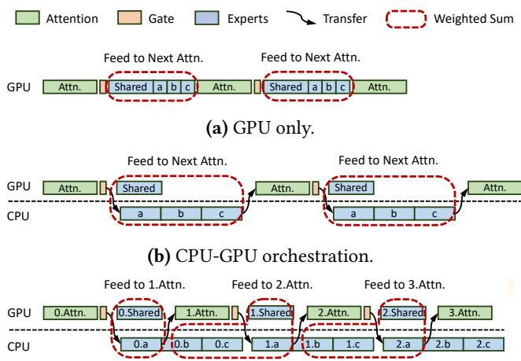  
(c) CPU-GPU orchestration with Expert Deferral.  
Figure 1. Timeline of different execution modes.

However, applying the aforementioned Fiddler-style hybrid inference techniques to large MoE models (e.g., 671B DeepSeek-V3/R1) in local deployment settings (such as one NVIDIA A100 GPU combined with two Intel Xeon CPUs) reveals significant bottlenecks. Specifically, we observed severely limited system throughput (70.02 tokens per second during prefill phase and 4.68 tokens per second during decode phase) and low GPU utilization (below 30%), clearly indicating that CPU-bound operations are a primary performance constraint.

To address these limitations and enable practical, efficient MoE inference on resource-constrained hardware, we performed a comprehensive system-level analysis to identify critical performance bottlenecks. Our investigation highlights two major inefficiencies:

• Underutilized CPU compute during the prefill phase. The prefill phase in MoE models processes thousands of tokens simultaneously, imposing a substantial computational burden on CPUs. Current implementations typically utilize generic SIMD instruction sets (e.g., AVX-512), failing to exploit advanced CPU extensions such as Intel AMX or ARM SME effectively. Despite PyTorch’s [32] integration of specialized kernels from hardware vendors (e.g., Intel’s AMX kernel via the oneDNN library [43]), the achieved performance remains limited to only 7% of the theoretical peak. We attribute this gap primarily to suboptimal memory layouts, which degrade cache efficiency, reduce effective memory bandwidth, and introduce unnecessary overhead.

• Inefficient CPU-GPU/CPU coordination during the decode phase. Unlike the prefill phase, the decode phase typically processes a small number of tokens (often one) per inference step and activates only a few experts at a time. The resulting short CPU and GPU kernel execution times (usually a few milliseconds or less per layer) exacerbate synchronization overheads between CPU and GPU. Traditional synchronization approaches introduce excessive kernel launch latency, limited CPU-GPU execution overlap, and insufficient pipeline parallelism. Additionally, misaligned CPU memory accesses and expensive cross-NUMA data transfers (i.e., inefficient CPU-CPU coordination) further degrade system throughput, substantially widening the gap between theoretical hardware capabilities and actual achieved performance.

To address these challenges and enable efficient deployment of large Mixture-of-Experts (MoE) LLMs on resourceconstrained local hardware, we present KTransformers, a high-performance inference system tailored specifically for heterogeneous CPU/GPU environments.

KTransformers introduces an Arithmetic Intensity-Aware Hybrid Inference Kernel, a mixed-instruction backend optimized explicitly for MoE workloads on CPUs. By analyzing the arithmetic intensity (ARI) of different tasks, KTransformers selectively employs Intel AMX instructions for high-ARI expert computations during the prefill phase (e.g., long prompts activating multiple experts frequently) and proposes a specialized memory layout co-designed with AMX tiling. This design includes block-wise quantization, 64- byte alignment, and tiling-aware submatrix access patterns, significantly improving cache locality and reducing memory bandwidth requirements. In contrast, for low-ARI tasks (such as the decode phase with short prompts), KTransformers defaults to lighter AVX-512 kernels, achieving greater efficiency. Additionally, KTransformers develops a throughputpreserving NUMA-aware tensor placement strategy, ensuring scalability and high utilization in multi-socket CPU systems. By implementing a MoE-specific kernel explicitly optimized for AMX instructions, KTransformers achieves

1.69–4.30× speedups compared to existing methods across various microbenchmarks.

Moreover, KTransformers employs an Asynchronous CPU-GPU Task Scheduling Mechanism based on advanced CUDA Graph utilization to effectively overlap CPU and GPU computations. While CUDA Graphs are widely adopted [14, 26, 31, 56] for minimizing kernel launch overhead, existing solutions do not adequately support dynamic tensor shapes and typically require separate CUDA Graph instances per layer and per batch size, resulting in significant VRAM overhead and inefficiency. In contrast, KTransformers encapsulates the entire decode phase into a single CUDA Graph instance by leveraging CUDA-based spinning, substantially reducing kernel launch overheads and maximizing GPU throughput. This optimization yields up to 1.23× speedup in the decode phase.

However, despite these enhancements, our analysis indicates that decode throughput for extremely large MoE models (such as DeepSeek-V3) remains limited to 5.87 tokens per second. To further optimize resource utilization and performance, we introduce a novel execution strategy called Expert Deferral.

Our profiling shows that, in hybrid setups, both CPU and GPU utilization remain low especially under the single batch scenario, primarily due to the sequential execution of MoE and attention modules, which leads to idle hardware resources. The Expert Deferral approach addresses this by restructuring the execution pipeline: as depicted in Figure 1c, within each MoE layer, only a subset of experts (immediate experts) are processed immediately, while the remaining experts (deferred experts) are scheduled concurrently with the computation of the subsequent layer (primarily the attention module). By carefully determining the number of experts to defer, Expert Deferral significantly enhances CPU and GPU parallelism with only limited impact on model behavior.

In the DeepSeek-V3 showcase, Expert Deferral improves CPU and GPU utilization from 74%/28% to 100%/37%, respectively, yielding a 33% throughput increase in decode throughput. Across all evaluation scenarios, throughput improvements of up to 45% are observed. Crucially, the average model accuracy drop remains within 0.5% across a diverse range of benchmarks, including HumanEval [3], MBPP [2], GSM8K [4], StrategyQA [15], and LiveBench [46].

This paper makes the following contributions:

• We design and implement KTransformers, a highperformance expert-offloading MoE inference system for resource-constrained local deployments. Our fullaccuracy implementation achieves 4.62–19.74× prefilling speedups and 1.25–4.09× decoding speedups over existing systems.

• We propose a novel Expert Deferral technique that enables fine-grained CPU-GPU parallelism via model execution reordering. This technique boosts decoding performance by up to 1.45×, leading to overall 1.66–4.90× decoding speedups, with only limited impact on model accuracy.

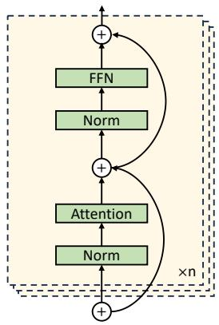  
(a) Dense model.

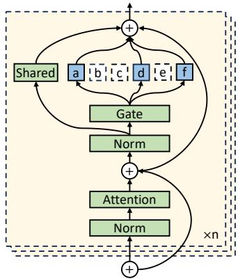  
(b) Sparse MoE model.  
Figure 2. Comparison of different model architectures.

• We implement KTransformers with 11,000 lines of C++ extensions for performance-critical components, along with 2,000 lines of Python scripts for integration, providing a drop-in replacement for HuggingFacestyle transformer inference. KTransformers can serve trillion-parameter-scale MoE models on a single server with only one consumer-grade GPU, offering a costeffective alternative to multi-GPU clusters in local deployments.

• The source code of KTransformers is available at https://github.com/kvcache-ai/ktransformers. Because it is well-suited for running huge MoE models in local environments, KTransformers has been widely adopted by both open-source communities and industry teams. It currently operates on hundreds of machines where local deployment is essential for security or for examining model internals.

## 2 Background

## 2.1 Mixture-of-Experts Models

Mixture-of-Experts (MoE) introduces conditional computation into Transformer models by activating only a subset of specialized sub-networks, known as experts, at each layer for each token [36]. As illustrated in Figure 2, in a typical MoE layer, the dense feed-forward module is replaced with a large pool of expert networks, and a learned gating mechanism dynamically selects the most relevant experts to process each token, usually the top-k or its variants (e.g., grouped top-k in DeepSeek-V3/R1). Recent architectures, including DeepSeek [6–8] and the Qwen [42, 50] series, further introduce shared experts activated across all tokens, ensuring that every token benefits from a foundational level of understanding before more specialized processing occurs.

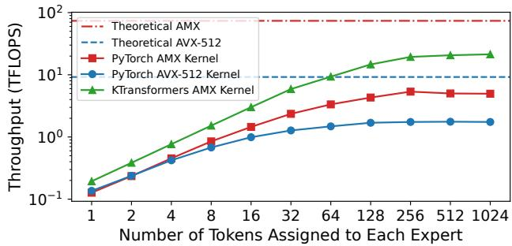  
Figure 3. Microbenchmark results comparing the throughput of the MoE layers on DeepSeek-V3 using PyTorch’s AMX and AVX-512 kernels, as well as KTransformers’s AMX kernel proposed in this work.

Despite the computational sparsity of MoE models, their large total parameter count poses significant memory challenges. A common mitigation is weight offloading [17, 20, 37, 40], where expert weights are stored in CPU memory and transferred to GPU on demand. But this approach quickly hits a bottleneck due to PCIe bandwidth limits (e.g., 32 GB/s with PCIe 4.0). To overcome this, computation offloading [24] has emerged as a more efficient alternative. Instead of transferring weights to the GPU, expert weights are persistently stored in CPU RAM, and computations are executed directly on the CPU. This approach benefits from the significantly higher memory bandwidth available on modern CPUs. For example, a dual-socket Intel Xeon system with DDR5 memory can offer 440 GB/s of memory bandwidth. This makes CPU execution particularly suitable for low-concurrency scenarios. However, it shifts the performance bottleneck to CPU-side memory access and compute throughput, introducing new challenges in system design.

## 2.2 Advanced CPU Instructions

Modern CPUs, particularly in high-performance computing (HPC) environments, continue to adopt increasingly sophisticated instruction set architectures. Emerging instruction sets such as Intel’s Advanced Matrix Extensions (AMX) and ARM’s Scalable Matrix Extension (SME) are specifically designed to accelerate computations in matrix-intensive tasks, with Transformer model inference being a representative example. However, our experimental evaluations reveal that current software implementations do not adequately utilize these accelerators.

For instance, we conduct a microbenchmark of the MoE layers in DeepSeek-V3 on an Intel Xeon 8452Y processor with 36 cores, using a PyTorch implementation that internally leverages Intel’s oneDNN library to utilize the AMX and AVX-512 instruction sets. We evaluate scenarios with different arithmetic intensities (ARI) by varying the number of tokens assigned to each expert. As shown in Figure 3, AMX outperforms AVX-512 especially in high-ARI scenarios, achieving a peak throughput of up to 5.4 TFLOPS, compared to 1.8 TFLOPS with AVX-512. Nevertheless, this reaches only around 7% of AMX’s theoretical peak capability (73.7 TFLOPS), with performance gaps attributed to factors such as memory bandwidth constraints and thread synchronization overhead.

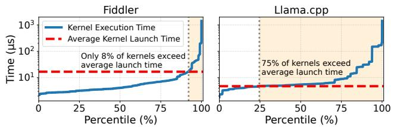  
Figure 4. GPU kernel launch and execution time analysis of DeepSeek-V3 inference using Fiddler and Llama.cpp.

## 2.3 CPU-GPU/CPU Coordination

CPU-GPU coordination. Traditional GPU kernel launches, initiated by CPUs, are inefficient for token-by-token decoding due to the high overhead from frequent synchronization and kernel invocations [54]. Using NVIDIA NSight Systems [30], we profiled the decode phase of DeepSeek-V3, implemented in Fiddler [24] and Llama.cpp [14], where routed experts are computed on the CPU while the rest of the model is executed on an NVIDIA A100 GPU. As shown in Figure 4, Fiddler triggers over 7,000 CUDA kernel launches per decoded token, each with an average latency of 16µs, consuming 73% of GPU execution time due solely to kernel launch overhead. In contrast, Llama.cpp reduces kernel launches to approximately 3,000 per token through aggressive operator fusion and lower-level optimizations. Its C++ implementation also avoids the overhead of the Python interpreter, lowering the average kernel launch latency to 5µs. Despite these optimizations, kernel launch overhead still represents 21% of total GPU execution time.

To address this overhead, modern LLM inference frameworks support CUDA Graph [31] optimizations, which enable the fusion of multiple GPU kernel invocations into a single executable graph, thereby significantly reducing launch overhead. However, its effectiveness is limited in our CPU/GPU hybrid execution scenario because CPU-based operations introduce synchronization and data transfer points, which disrupt CUDA Graph continuity. Optimization mechanisms like PyTorch’s torch.compile attempt to automatically manage these points, yet they frequently fragment the graph at layer boundaries, negating potential performance benefits. Similarly, Llama.cpp disables CUDA Graph optimizations to avoid repeated capture overhead.

Furthermore, simultaneous execution of GPU-based shared experts and CPU-based routed experts introduces additional challenges not addressed by conventional CUDA Graph deployment, requiring specialized strategies to overlap CPU and GPU computations effectively.

CPU-CPU coordination. Besides CPU-GPU synchronization, modern systems often incorporate multiple NUMA nodes, introducing heterogeneity in memory access latency and bandwidth, and high CPU-CPU synchronization costs [5]. Local memory accesses are significantly faster than remote (cross-socket) accesses, highlighting the need for NUMAaware optimizations. However, existing inference frameworks like Fiddler and Llama.cpp currently overlook this distinction, assuming uniform memory accessibility.

We profile the decoding pass of a single MoE layer in DeepSeek-V3 using Fiddler: running on a single socket takes 6.9 ms, while utilizing both sockets only reduces the latency to 5.8 ms—a modest 16% improvement. The limited speedup is primarily due to inefficient memory access across NUMA nodes, particularly when traversing socket boundaries, highlighting the mismatch between framework-level abstractions and underlying hardware topology.

## 3 KTransformers System

## 3.1 Overview of KTransformers

We present KTransformers, a high-performance system that enables efficient heterogeneous computation for various Mixture-of-Experts (MoE) models. As illustrated in Figure 5, KTransformers extends a standard HuggingFace Transformers [47] implementation, allowing a flexible injection of optimized implementations tailored for specific hardware to replace default PyTorch modules (more details will be provided in §5). Importantly, KTransformers retains full compatibility with the widely-used HuggingFace interface, requiring no end-user changes, thus balancing ease of use and performance effectively.

To specifically address expert offloading, the primary focus of our work, KTransformers introduces targeted optimizations on both CPU and GPU. On the CPU, we replace PyTorch’s default MoE module with a custom fused-MoE module, significantly reducing runtime overhead. Additionally, standard PyTorch GEMM kernels are substituted with highly optimized AMX/AVX-512 kernels, leveraging specialized CPU instructions for enhanced computational efficiency. On the GPU, KTransformers injects an efficient FlashInferbased [51] attention module and optionally supports efficient weight quantization like the Marlin kernels [13], enabling scalable heterogeneous execution.

Moreover, KTransformers employs asynchronous task scheduling to coordinate cross-device computations. This allows the entire dynamic-shaped CPU/GPU hybrid forward computation to be captured within a single CUDA graph, effectively eliminating CUDA kernel launch overhead and ensuring seamless integration across heterogeneous platforms.

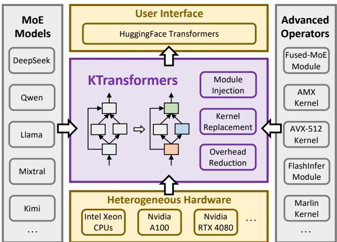  
Figure 5. System overview of KTransformers.

## 3.2 Unleashing the Full Potential of the CPU

We describe a series of optimizations designed to enhance CPU efficiency for large-scale MoE inference. First, we introduce an AMX tiling-aware memory layout and cacheoptimized AMX kernel to overcome memory bottlenecks. Then, recognizing the inefficiency of AMX for low arithmetic intensity tasks, we implement a lightweight AVX-512 kernel that dynamically replaces AMX instructions as needed. Finally, we employ operator-level fusion and dynamic task scheduling to reduce synchronization overhead and workload imbalance typical in MoE execution.

AMX Tiling-aware Memory Layout. Intel’s Advanced Matrix Extensions (AMX) significantly accelerate dense matrix multiplications. Each AMX-enabled core provides eight tile registers, each storing a 16-row by 64-byte submatrix. AMX instructions efficiently multiply these tiles, transferring entire tiles to and from memory in a single instruction. However, given AMX’s high throughput, memory access efficiency is crucial and easily becomes a bottleneck if not carefully optimized.

To fully utilize AMX capabilities, we proactively align memory layout with AMX tile registers. Expert weight matrices are preprocessed during model loading into AMXcompatible submatrices, eliminating costly transpositions or reshaping at inference. Tiles are memory-aligned to 64- byte cache lines, optimizing cache efficiency and prefetching performance.

We employ symmetric group-wise linear quantization for Int8 and Int4 formats, storing shared scale factors separately to maintain alignment. Int4 tiles are packed into Int8-sized blocks and unpacked using SIMD intrinsics, ensuring minimal overhead.

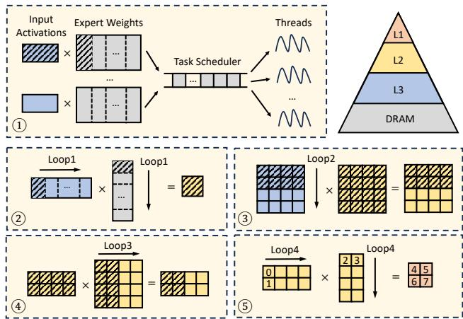  
Figure 6. Execution process of KTransformers’s AMX kernel.

Cache-Friendly AMX Kernels. Based on the optimized memory layout, our AMX kernels fully exploit CPU cache hierarchies. The execution steps for a batch matrix multiplication are as follows (Figure 6): ○1 Expert weight matrices are vertically partitioned into tasks dynamically scheduled across threads, while input activations reside typically in the shared L3 cache. ○2 Each task partitions expert weights horizontally into blocks precisely fitting the L2 cache. ○3 ○4 Each block comprises AMX tile-sized submatrices. Inputs and weights are loaded once from L3 and DRAM respectively into L2 cache. ○5 Tile-level computations use AMX instructions to produce and accumulate results directly in tile registers, buffering intermediate outputs in L1 cache if necessary.

Our design ensures minimal DRAM traffic by caching inputs, weights, and intermediate results optimally. Dynamic task scheduling prioritizes co-scheduling tasks targeting the same expert, further maximizing cache utilization. As illustrated in Figure 3, our AMX kernel achieves up to 21.3 TFLOPS on a single-socket CPU, delivering a 3.98× speedup over the vendor optimized oneDNN-based PyTorch baseline. Adaptive AVX-512 Kernel for Low ARI Scenarios. Although AMX excels in dense computations, it is inefficient in low arithmetic intensity (ARI) scenarios such as decodephase vector-matrix multiplications, where AMX incurs excessive overhead by processing full tiles.

To address this, we develop a lightweight AVX-512 kernel fully compatible with the AMX memory layout. This kernel executes similarly to the AMX kernel, but replaces AMX instructions with finer-grained AVX-512 instructions during low-ARI computations. Microbenchmark evaluations, varying ARI via token counts per expert (Figure 7), show AVX-512 consistently outperforming AMX when ARI is four or fewer tokens per expert. Thus, our hybrid approach dynamically switches between AVX-512 and AMX kernels based on ARI, achieving up to 1.20× speedup in decode phases compared to pure AMX, and up to 10.81× speedup in prefill phases compared to pure AVX-512.

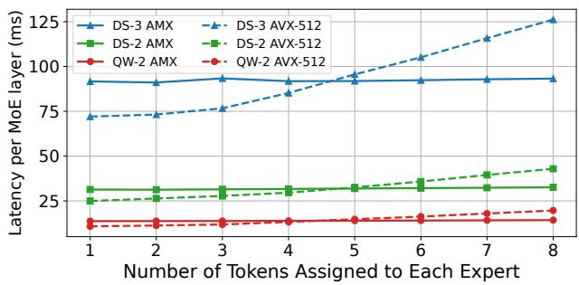  
Figure 7. Microbenchmark results comparing the latency of the MoE layers across different models using KTransformers ’s AMX kernel and AVX-512 kernel.

Fused MoE Operator. Based on the above kernel, we further optimize by applying operator-level fusion. MoE layers involve multiple small matrix multiplications (Gate, Up, and Down projections), causing frequent synchronization overhead. We mitigate this by merging Gate projections across experts into one larger task, similarly fusing Up and Down projections independently, and combining Gate and Up projections where no data dependency exists. Consequently, MoE execution reduces to two fused batches, significantly lowering threading overhead.

Additionally, we introduce dynamic task scheduling to tackle workload imbalance, especially during the prefill phase with uneven expert activations. Unlike static scheduling, dynamic scheduling partitions large tasks into smaller sequential subtasks in a lightweight task queue. CPU threads dynamically retrieve tasks, significantly reducing imbalance and maximizing resource utilization. Experimental results indicate up to a 1.83× performance improvement in prefill phases due to dynamic scheduling.

## 3.3 CPU-GPU/CPU Coordination

Low-latency MoE decoding on hybrid hardware depends on smooth interaction between the CPU and GPU and on balanced use of the NUMA fabric. KTransformers introduces two techniques that address these needs: an asynchronous CPU-GPU scheduler and NUMA-aware tensor parallelism. Asynchronous CPU-GPU Task Scheduling Mechanism. KTransformers places shared experts on the GPU and routed experts on the CPU. After the GPU’s gating network finishes, it knows the routed experts for every token. A CPU control thread then (i) pushes routed-expert tasks into a lock-free queue and (ii) launches GPU kernels for the shared experts. Background worker threads execute the queued tasks in parallel. When the GPU kernels complete, the control thread waits for the remaining CPU work, merges the two sets of activations, and proceeds to the next layer.

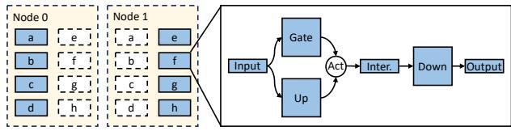

(a) Expert parallel.  
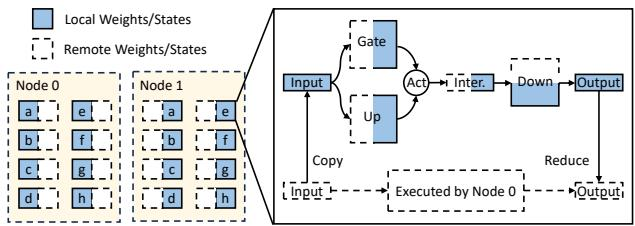  
(b) Tensor parallel.  
Figure 8. Workflow comparison between different parallel mechanisms.

A naive design must synchronize twice per MoE layer, once when the GPU sends activations to the CPU (submit) and again when the CPU returns its results (sync). These barriers break CUDA Graphs and add kernel-launch overhead. To hide the barriers, KTransformers encapsulates both submit and sync in cudaLaunchHostFunc, which lets CUDA invoke the callbacks inside the current stream. The entire decode path for one token now fits in a single CUDA Graph, eliminating host interruptions and improving decoding speed by up to 1.23×.

NUMA-aware Tensor Parallelism. Non-Uniform Memory Access (NUMA) architectures pose performance challenges for MoE inference due to high penalties from remote memory accesses. Large-scale cloud deployments typically adopt Expert Parallelism (EP), assigning entire expert subnetworks to individual computational nodes (Figure 8a). But, this strategy often leaves some sockets idle and others saturated.

KTransformers instead partitions every expert’s weight matrix across sockets (column/row-wise for linear layers). As demonstrated in Figure 8b, each socket stores only its slice and performs local compute and a lightweight reduce-scatter is used to combine partial outputs. This approach balances work, avoids almost all remote memory traffic, and scales with the number of sockets. On a dual-socket server, it improves decoding throughput by up to 1.63× compared with a NUMA-oblivious baseline that treats the machine as a uniform node.

## 4 CPU-GPU Overlap

## 4.1 Expert Deferral

While the sparse structure of MoE models naturally facilitates CPU/GPU hybrid inference, the traditional Transformer architecture [44] imposes a rigid computational sequence, significantly restricting parallelism. Specifically, the alternating execution of attention and MoE blocks frequently results in CPU stalls, as the CPU must wait for the operations on the GPU side to complete. Although GPU-executed shared experts can partially overlap with CPU-routed experts, their contribution to GPU workloads remains minor. For instance, in DeepSeek-V3, shared experts account for only 18% of the GPU execution time (detailed analysis in §4.2), yielding limited performance benefits from overlapping execution and causing frequent idle periods.

To overcome these inefficiencies stemming from strict dependencies between routed experts and attention layers, we propose a novel architectural optimization, Expert Deferral. The key insight underpinning Expert Deferral is the inherent robustness of modern Transformer models to delayed intermediate computations, primarily due to residual connections [16]. Unlike conventional MoE layers, where outputs of routed experts at layer ?? directly feed into the attention module of layer $k + 1$ , Expert Deferral strategically delays some routed experts’ outputs to layer ?? + 2. This approach breaks rigid dependencies between expert computations and adjacent attention layers, enabling greater CPU-GPU overlap and improved hardware utilization.

We classify routed experts into two categories based on when their outputs are utilized:

• Immediate Experts: Outputs consumed immediately by the subsequent attention layer, following the standard Transformer workflow.

• Deferred Experts: Outputs delayed and consumed by the attention modules of later layers, facilitating concurrent CPU-GPU execution.

Figure 9a demonstrates the workflow in a traditional MoE model, where all selected routed experts (e.g., ??, ??, ??, ??) directly feed into the next layer’s attention module. In contrast, Figure 9b illustrates the Expert Deferral strategy: only the top-2 experts with the highest routing score (e.g., ??, ??) at layer ?? are immediate experts, feeding outputs directly into layer ?? + 1. The remaining two experts (??, ??) become deferred experts, with their outputs delayed to layer ?? +2 (highlighted with bold red arrows). Notably, Expert Deferral is not applied at the final layer to preserve critical information.

Formally, in a standard MoE model, the output of the MoE module at layer ?? is:

$$
O _ { k } = I _ { k } + S _ { k } ( I _ { k } ) + R _ { k } ^ { \mathrm { a l l } } ( I _ { k } )
$$

Notation.

• ??: the total number of MoE layers in the model.

• ???? : input to the MoE module at layer ??.

$O _ { k } { : }$ : output of the MoE module at layer ??.

$S _ { k } ( \cdot )$ : computation of shared experts at layer ??.

$R _ { k } ^ { \mathrm { i m m } } ( \cdot )$ : computation of immediate experts at layer ??.

$R _ { k } ^ { \mathrm { d e f } } ( \cdot )$ : computation of deferred experts at layer ??.

$R _ { k } ^ { \mathrm { a l l } } ( \cdot ) { : }$ : computation of all routed experts at layer ?? (without deferral).

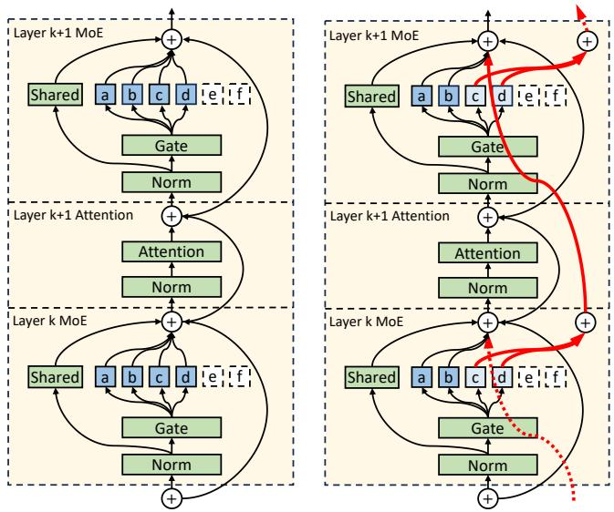  
(a) Workflows of standard MoE model.  
(b) Workflows of Expert Deferral optimized MoE model.  
Figure 9. Workflow comparison between standard MoE model and Expert Deferral optimized MoE model.

And in a model that employs the Expert Deferral mechanism, output of the MoE module at layer ?? is defined as:

$$
O _ { k } = \left\{ \begin{array} { l l } { I _ { k } + S _ { k } ( I _ { k } ) + R _ { k } ^ { \mathrm { i m m } } ( I _ { k } ) , } & { k = 1 } \\ { I _ { k } + S _ { k } ( I _ { k } ) + R _ { k - 1 } ^ { \mathrm { d e f } } ( I _ { k - 1 } ) + R _ { k } ^ { \mathrm { i m m } } ( I _ { k } ) , } & { 1 < k < L } \\ { I _ { k } + S _ { k } ( I _ { k } ) + R _ { k - 1 } ^ { \mathrm { d e f } } ( I _ { k - 1 } ) + R _ { k } ^ { \mathrm { a l l } } ( I _ { k } ) , } & { k = L } \end{array} \right.
$$

This adjustment allows GPU-side operations (e.g., attention computations, gating, activation transfers) to overlap effectively with CPU execution of deferred experts, significantly reducing CPU idle time. Furthermore, due to residual connections inherent in Transformer architectures, delayed outputs from deferred experts still contribute effectively to subsequent layers, maintaining model expressiveness and performance. Consequently, deferring certain expert computations enhances scheduling flexibility at the cost of only slight changes in model behavior.

Our empirical results (detailed in §6.3) confirm that Expert Deferral notably increases inference throughput while largely preserving accuracy. However, Expert Deferral is applied exclusively during the decode phase, not during the prefill phase. Our observations indicate that during prefill, tokens in a batch typically select a diverse set of experts, causing almost complete coverage of experts across immediate and deferred categories. This nearly doubles memory access footprints, becoming a new bottleneck and counteracting the intended overlap benefits. In contrast, decoding processes tokens sequentially, making Expert Deferral more effective at eliminating dependencies without significant overhead.

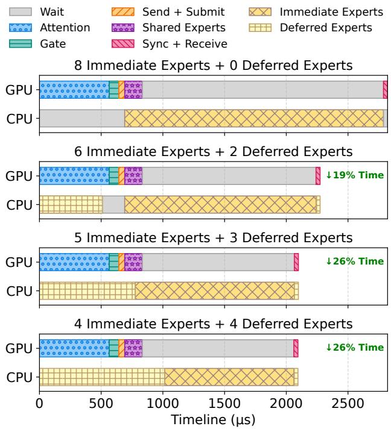  
Figure 10. CPU and GPU execution timelines under different Expert Deferral configurations in the MoE layer.

## 4.2 Determining the Number of Deferred Experts

To optimally configure Expert Deferral, we conducted a comprehensive performance analysis of a single DeepSeek-V3 layer using BF16 precision under conditions described in §6.1. Figure 10 presents the execution timeline analysis. Initially, without Expert Deferral, CPU utilization was 74%, while GPU utilization was merely 28%, with CPU-GPU overlap accounting for only 5% of total execution time. Additionally, synchronization and activation transfers accounted for another 3% idle time, emphasizing significant hardware underutilization.

We experimented with deferring 2, 3, and 4 routed experts to evaluate throughput and hardware utilization impacts. With 2 deferred experts, GPU attention computation began immediately after the CPU completed 6 immediate experts, enabling CPU-GPU overlap and reducing execution time by 19%. However, deferred experts completed execution prematurely, causing CPU idle cycles. Increasing to 3 deferred experts allowed their computations to complete concurrently with the start of immediate expert processing for the subsequent layer, fully saturating the CPU. This optimal configuration eliminated idle cycles, reduced single-layer execution time by 26%, and increased end-to-end decoding throughput by 33%. Conversely, deferring 4 experts provided no further throughput benefits due to CPU saturation.

Based on these insights, we established a balanced Expert Deferral configuration: 5 immediate experts and 3 deferred experts per layer. A general heuristic derived from our analysis for other MoE models suggests deferring the minimum number of experts required to achieve full CPU utilization while ensuring at least 2 immediate experts per layer to maintain model stability and accuracy.

## 5 Flexible Module Injection Framework

The previous sections presented the optimizations applied by KTransformers to speed up MoE model inference. These optimizations range from highly tuned compute kernels to careful layer placement and overlap strategies. In practice, integrating such techniques into an existing inference stack is difficult and time-consuming, slowing further system evolution. To address this barrier, KTransformers builds directly on HuggingFace Transformers. We add a lightweight injection framework that replaces standard PyTorch modules with hardware-specific, high-performance implementations. A single YAML file drives the process, so researchers can combine new kernels and placement policies with only a few lines of configuration.

Specifically, KTransformers exposes compute kernels written in C++ and exported to Python through pybind11 [34]. These kernels are packaged as ordinary PyTorch modules, so they can stand in for any existing ones. A single YAML file orchestrates the substitution. The file contains multiple match clauses that identify target modules by regular-expression name matching, class matching, or both, and replace clauses that specify the new class, its execution device, and any keyword arguments required by the kernel. During initialization the framework walks the model tree; whenever a module satisfies a match clause it is replaced by the module named in the corresponding replace clause, and traversal continues recursively through the new submodules. The procedure is lightweight, adds no runtime overhead beyond construction, and leaves the public HuggingFace interface unchanged.

To illustrate, Listing 1 presents a concise YAML configuration used to adapt the DeepSeek-V3 model with Int4 quantization. Specifically, the framework performs the following replacements: (lines 1–9) through class matching, all instances of DeepseekV3MoE are replaced with our optimized custom FusedMoE module, which encapsulates asynchronous communications with a CPU backend; the replacement is configured via keyword arguments to specify a hybrid\_AMX\_AVX512 compute kernel, apply Int4 quantization to expert weights, and enable the Expert Deferral strategy with 6 deferred experts. Then, (lines 11–15) self-attention modules are replaced by FlashInferMLA modules via name matching, in order to leverage FlashInfer’s high-performance CUDA kernel with support for matrix absorption optimization to efficiently compute DeepSeek’s Multi-head Latent Attention (MLA). Finally, (lines 17–24) all linear projections implemented by torch.nn.Linear, excluding the output projection lm\_head, are replaced with MarlinLinear modules via combined class and name matching; these modules are executed on CUDA device with Int4 quantization.

Listing 1. Example configuration for adapting DeepSeek-V3.  
```yaml
1 - match :
2 class : modeling_deepseek_v3 . DeepseekV3MoE
3 replace :
4 class : operators . experts . FusedMoE
5 device : " cpu "
6 kwargs :
7 backend : " hybrid_AMX_AVX512 "
8 data_type : " Int4 "
9 n_deferred_experts : 6
10
11 - match :
12 name : "^ model \\. layers \\..*\\. self_attn$ "
13 replace :
14 class : operators . attention . FlashInferMLA
15 device : " cuda :0"
16
17 - match :
18 name : "^(?! lm_head$ ).*"
19 class : torch . nn . Linear
20 replace :
21 class : operators . linear . MarlinLinear
22 device : " cuda :0"
23 kwargs :
24 data_type : " Int4 "
```

The aforementioned injection framework significantly reduces repetitive work when adapting different models. For related models such as DeepSeek-V2, seamless integration can be achieved by simply updating the model class name (line 2 of Listing 1). Beyond this specific showcase, the injection framework also offers substantial flexibility, enabling fine-grained control over model behavior through simple YAML edits. This includes support for multi-GPU pipelining, mixed-precision inference, and techniques such as KV-cache offloading, and it further lays the groundwork for integrating a larger set of advanced optimization strategies in the future.

By separating optimization logic from model code, KTransformers converts what was once bespoke engineering into simple configuration. Researchers can prototype new kernels or placement policies, compose them with existing ones, and measure end-to-end performance without touching framework internals. This capability both preserves ease of use for end users and lowers the barrier to future system advances, which we view as essential for the rapid iteration cycles expected in modern LLM research.

## 6 Evaluation

## 6.1 Experimental Setup

Hardware. All experiments were conducted on a dual-socket machine, each socket equipped with an Intel(R) Xeon(R) Platinum 8452Y processor. Each processor provides 36 physical cores and is paired with 1 TB of DDR5 memory. According to measurements using Intel MLC [22], the intra-socket memory bandwidth is 220 GB/s, while cross-socket memory bandwidth is 125 GB/s. The machine is configured with two types of GPU: a server-grade NVIDIA A100 with 40 GB memory and a consumer-grade NVIDIA RTX 4080 with 16 GB memory. Both GPUs are connected to the CPU through PCIe 4.0 with a theoretical peak bandwidth of 32 GB/s.

Models. We evaluate our system on three state-of-the-art, publicly available mixture-of-experts (MoE) models. Specifically, we include DeepSeek-V3-0324 [7] (DS-3), DeepSeek-V2.5-1210 [6] (DS-2), and Qwen2-57B-A14B [50] (QW-2). These models vary in architecture and scale, covering a diverse range of MoE configurations. Table 1 summarizes the key characteristics. For each model, we deploy the fullprecision (BF16/FP16) versions on the A100, and deploy the highest-accuracy quantized version that can be accommodated by GPU memory on the RTX 4080. Specifically, DS-3 is quantized into Int4, while DS-2 and QW-2 are quantized into Int8.

Workloads. To evaluate performance, we employ the Wikitext corpus [28] as input prompts. All experiments use a batch size of 1, representing the most typical local deployment scenario. To assess prefill performance, we vary the prompt length from 32 to 8192 tokens. For decode performance, we use a fixed prompt length of 32 tokens and constrain the generated output to a maximum of 512 tokens. For performance evaluation, we report throughput in terms of tokens per second (tokens/s) for both prefill and decode stages.

To assess the impact of Expert Deferral on model quality, we evaluate on HumanEval [3] (0-shot) and MBPP [2] (3-shot) for code generation, GSM8K [4] (8-shot) and StrategyQA [15] (4-shot) for mathematical and commonsense reasoning. For DS-3, we additionally evaluate on the more challenging LiveBench dataset [46], using its latest public release (2024-11-25), which includes coding, data analysis, instruction following, language, math, and reasoning subcategories. As HumanEval and all LiveBench subcategories contain no more than 200 problems, we set temperature ?? = 0.3 and perform 10 sampling runs to obtain a more robust estimate. For other benchmarks, we use greedy decoding. Following standard evaluation practices, we report pass@1 for HumanEval and MBPP, exact match (EM) for GSM8K and StrategyQA, and avg@10 for LiveBench.

Baselines. We evaluate KTransformers against two stateof-the-art baselines: Fiddler [24], a PyTorch-based CPU/GPU hybrid serving system, and Llama.cpp [14], a C++-based high-performance framework with heterogeneous execution support. For full-precision inference, we run BF16 models on both KTransformers and Fiddler. Since Llama.cpp lacks BF16 CUDA kernels, we run FP16 models as a substitute. We further compare the performance of KTransformers and

Table 1. Configuration of evaluated MoE models.
<table><tr><td>Model</td><td>DS-3</td><td>DS-2</td><td>QW-2</td></tr><tr><td>Total Parameters</td><td>671B</td><td>236B</td><td>57B</td></tr><tr><td>GPUParameters</td><td>17B</td><td>13B</td><td>8B</td></tr><tr><td>CPUParameters</td><td>654B</td><td>223B</td><td>49B</td></tr><tr><td>MoE Layers</td><td>58</td><td>59</td><td>28</td></tr><tr><td>Routed Experts per Layer</td><td>256</td><td>160</td><td>64</td></tr><tr><td>Routing Strategy</td><td>Top-8</td><td>Top-6</td><td>Top-8</td></tr></table>

Llama.cpp on quantized models, using the built-in quantization capabilities of Llama.cpp.

Both baselines implement a Fiddler-style offloading approach, executing routed experts on the CPU while processing other computations on the GPU. Since Llama.cpp originally only supports layer-wise offloading and lacks expertlevel offloading capability, to ensure fair comparisons, we extended Llama.cpp with custom code to enable expert-level offloading analogous to Fiddler.

## 6.2 End-to-end Performance

Figures 11 and 12 illustrate the throughput performance of KTransformers compared to both baselines across multiple workloads during the prefill and decode phases, respectively.

As shown, in the prefill phase, Llama.cpp outperforms Fiddler in short-prompt scenarios due to superior operator fusion strategies, whereas Fiddler surpasses Llama.cpp for longer prompts due to better utilization of AMX instructions in its oneDNN backend. Nevertheless, KTransformers consistently outperforms both baselines across all prompt lengths during the prefill phases. This performance advantage primarily results from KTransformers ’s optimized kernels utilizing advanced CPU instructions and improved coordination between CPU and GPU resources. Specifically, as depicted in Figure 3, KTransformers ’s CPU MoE kernel achieves 21.3 TFLOPS for DS-3, outperforming the PyTorch implementation by 3.98×. These improvements result from the comprehensive optimizations detailed in §3.2 and an in-depth breakdown will be provided later in §6.4.

In the decode phase for full-precision models, KTransformers (without Expert Deferral) achieves speedups ranging from 2.42× to 4.09× over Fiddler and 1.25× to 1.76× over Llama.cpp. This enhanced performance is driven not only by optimized kernels but also by our advanced utilization of CUDA Graph, significantly reducing GPU invocation overhead from over 20% (Figure 4) to almost zero. With quantized models, KTransformers exhibits even greater performance advantages over Llama.cpp, achieving speedups ranging from 1.77× to 1.93×. We attribute this difference primarily to significantly lower kernel execution time on both CPU and GPU, which amplifies the effectiveness of our synchronization strategy.

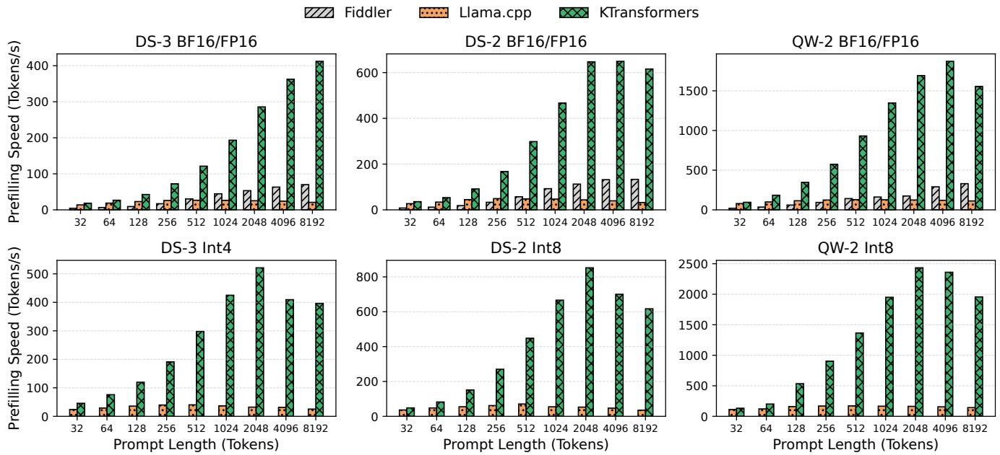  
Figure 11. Comparison of prefilling speed between KTransformers and the state-of-the-art baselines.

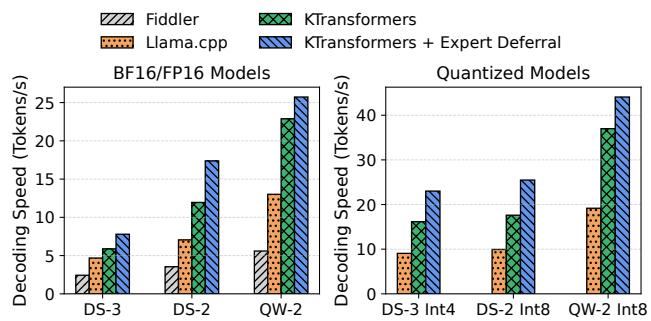  
Figure 12. Comparison of decoding speed between KTransformers and the state-of-the-art baselines.

## 6.3 Expert Deferral

We next evaluate the impact of the Expert Deferral mechanism. For all models, we follow the parameter selection strategy described in §4.2, which aims to saturate CPU utilization by deferring as few experts as necessary, while ensuring at least two immediate experts are active in all models to maintain behavioral stability. Specifically, for DS-3, we defer 3 experts in the BF16 model and 6 in the quantized model. For DS-2, we defer 4 experts in both the BF16 and quantized configurations. For QW-2, we defer 2 experts in the BF16 model and 4 in the quantized version.

As demonstrated in Figure 12, by further employing our Expert Deferral optimization, an additional improvement of up to 45% is achieved, resulting in overall speedups of 1.66× to 2.56× over Llama.cpp. This is mainly from the better overlapping of CPU and GPU computations.

Table 2. Accuracy of different models on various benchmarks with and without Expert Deferral. Each configuration is denoted as (I+D), where I is the number of immediate experts and D is the number of deferred experts. For example, (8+0) indicates that no Expert Deferral is applied, while (2+6) represents a setting with 2 immediate and 6 deferred experts.
<table><tr><td>Model</td><td>HumanEval</td><td>MBPP</td><td>GSM8K</td><td> StrategyQA</td></tr><tr><td>DS-3 (8+0)</td><td>83.0</td><td>71.2</td><td>94.8</td><td>83.0</td></tr><tr><td>DS-3 (2+6)</td><td>83.0</td><td>70.2</td><td>95.2</td><td>82.9</td></tr><tr><td>DS-2 (6+0)</td><td>80.5</td><td>67.6</td><td>93.3</td><td>79.7</td></tr><tr><td>DS-2 (2+4)</td><td>82.5</td><td>66.8</td><td>92.8</td><td>80.4</td></tr><tr><td>QW-2 (8+0)</td><td>65.7</td><td>52.4</td><td>84.7</td><td>83.6</td></tr><tr><td>QW-2 (4+4)</td><td>67.4</td><td>53.4</td><td>83.4</td><td>82.5</td></tr></table>

However, as our Expert Deferral mechanism introduces structural adjustments to the MoE model by selectively deferring certain experts during decoding, we intend to justify this strategy by evaluating the potential impact on model accuracy.

To clearly assess the influence of this mechanism, we report downstream task scores of quantized models, as they defer more experts and thus exhibit more pronounced behavioral changes. First, we evaluate all three models on HumanEval, MBPP, GSM8K, and StrategyQA, as shown in Table 2. Expert Deferral causes only minimal variations, with scores either slightly improving or declining within a narrow range (no more than 2 points).

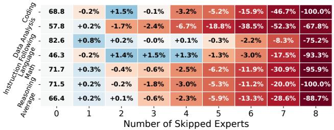

(a) Expert Skipping.  
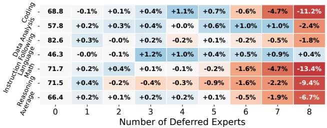  
(b) Expert Deferral.  
Figure 13. DS-3 accuracy on LiveBench under (a) Expert Skipping, which discards the lowest-scoring experts, and (b) Expert Deferral, which delays their computation. The first column shows the baseline scores (no experts affected); other columns report relative accuracy changes (%) with varying numbers of affected experts.

We then evaluate DS-3 on LiveBench and compare Expert Deferral with a straightforward Expert Skipping strategy, which simply discards the experts with the lowest routing scores instead of merging their computation in later layers. As shown in Figure 13, under the same number of affected experts, Expert Deferral outperforms Expert Skipping in most cases. In particular, in our default configuration with 6 affected experts, the average accuracy drop is only 0.5% compared to 13.3% for Expert Skipping. Importantly, when deferred expert computation fully overlaps with GPU execution, its overhead is minimal, thus yielding a speedup similar to Expert Skipping. These results demonstrate that our Expert Deferral mechanism offers an effective way to trade a slight accuracy drop for a significant decoding speedup.

## 6.4 Performance Breakdown

To further understand the benefits of the optimization proposed in KTransformers, we provide a detailed breakdown of the performance improvements achieved through various optimizations in our system. We evaluated BF16 versions of all three models, including the prefill phase with a prompt length of 8192 and the decode phase. Starting from the Py-Torch based Fiddler baseline, we gradually merged each system optimization proposed in this work, and the normalized speedup ratio is shown in Figure 14.

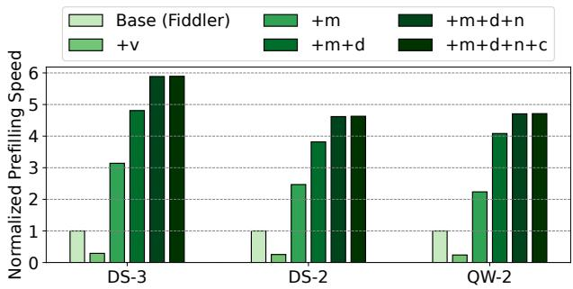

(a) Breakdown of prefill phase.  
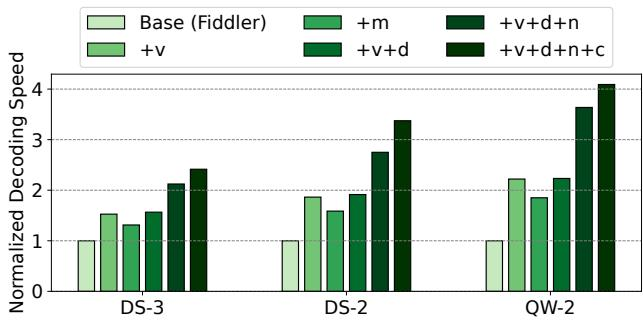  
(b) Breakdown of decode phase.  
Figure 14. Normalized speed compared to Fiddler baseline, and the optimizations include the following abbreviations: v - MoE kernel with the AVX-512 instruction set, m - MoE kernel with the AMX instruction set, d - dynamic work scheduling, n - NUMA-aware tensor parallelism, c - CUDA Graph.

The first optimization involved replacing the baseline MoE module in PyTorch with two fused MoE kernels based on the AVX-512/AMX instruction sets. In the prefill phase, the AVX-512 kernel performs worse than the baseline, whereas the AMX kernel demonstrates a significant speedup, achieving up to 3.14× faster performance. This disparity arises because AVX-512 instructions are less efficient than AMX instructions in computation-heavy workloads. Conversely, in the decode phase, both kernels outperform the baseline, but the AVX-512 kernel is more efficient than the AMX kernel, achieving up to 2.22× speedup over baseline. This is due to the low latency of AVX-512 instructions in lightweight vector-matrix multiplications.

With AMX instructions used in the prefill phase and AVX-512 instructions used in the decode phase, we further introduced optimizations aimed at reducing overhead. Notably, the dynamic work scheduling optimization is more beneficial in the prefill phase, offering a speedup of up to 1.83×, while its impact in the decode phase is minimal. This difference can be attributed to the highly imbalanced expert selection in the prefill phase, where some threads are assigned particularly heavy tasks. Dynamic work scheduling effectively balances the load, while the decode phase is more balanced, as each task is assigned with a similar amount of work. In contrast, the NUMA-aware tensor parallelism optimization shows a substantial impact in the decode phase, providing up to 1.63× speedup, while the speedup in the prefill phase is up to 1.22×. This is because the decode phase is more memory bandwidth-bound, and this optimization helps avoid inefficient cross-NUMA memory accesses.

Finally, we incorporated the CUDA Graph optimization. This optimization has slight impact on the prefill phase, as the overhead from CUDA launch is amortized into a large number of tokens. However, in the decode phase, the CUDA Graph optimization results in significant improvements, providing a speedup of up to 1.23×.

## 7 Related Work

MoE model inference under constrained resources. The growing demand for LLM serving has spurred the development of numerous optimized inference frameworks [1, 19, 26, 33, 35, 56, 58]. While these frameworks are primarily designed for high-throughput datacenter environments, their dependence on multiple high-end GPU servers renders them impractical for resource-constrained private and edge computing scenarios. Several solutions, such as Llama.cpp [14], PowerInfer [38, 49] and Specexec [39], attempt to address this limitation by enabling LLM deployment on consumergrade GPUs through weight offloading techniques. However, they mostly focus on dense models and fail to account for MoE-specific characteristics, resulting in a degraded performance to serve large MoE models. Recent systems like [10, 17, 20, 37, 40, 48, 52] are explicitly optimized for MoE model inference by selectively reloading the activated experts as needed. Fiddler [24] advances this design by also offloading computation, effectively eliminating the PCIe bottleneck associated with expert reloading. Nevertheless, these solutions still fall short of KTransformers’s performance due to their lack of crucial optimizations such as advanced CPU instruction utilization and NUMA-aware architecture design.

Quantizing MoE models. Model quantization [9, 12, 13, 45, 55] compresses models to lower precision (e.g., BF16 to Int8/Int4), reducing memory capacity demands while accelerating inference. Frameworks like Llama.cpp [14] provide more versatile out-of-the-box quantization schemes (e.g., Int2, Int3, Int5). Quantization techniques are widely used when deploying MoE models. Notably, MoQE [25] observed that expert weights are less sensitive to quantization than other parts of the model, allowing aggressive quantization of expert parameters down to Int2. Several works explore more fine-grained precision selection. For example, Edge-MoE [52] statically selects precision per expert by profiling their relative importance and quantization sensitivity offline. Meanwhile, other methods such as MPTQS [21] and HOBBIT [40] store multiple versions of experts at different precisions and dynamically choose which precision to use at runtime based on context-specific signals. All these methods are orthogonal to KTransformers and can be incorporated into its framework.

Adaptive gating. Another line of work reduces inference cost by selectively activating fewer experts per token through adaptive gating. Instead of using a fixed top-k gating strategy, these methods dynamically determine the number of experts to activate for each token and each layer. For instance, NAEE [27] and AdapMoE [57] design heuristic rules based on the distribution of gating scores, while MC-MoE [18] incorporates attention scores into the decision-making process. Motivated by the insight that different tokens vary in inference difficulty, Ada-K [53] trains a reinforcementlearning-based classifier to predict the optimal number of experts to activate per token. While these methods speed up inference, the loss of expert knowledge can harm model performance, requiring careful trade-offs between efficiency and accuracy. In contrast, KTransformers ’s Expert Deferral mechanism leverages the properties of residual networks to accelerate heterogeneous inference while incurring a substantially smaller accuracy drop compared to these approaches.

## 8 Conclusion

In this paper, we presented KTransformers, a system that enables efficient local inference for large MoE models on hybrid CPU/GPU platforms. By combining AMX-optimized kernels, asynchronous scheduling, and the Expert Deferral strategy, KTransformers maximizes hardware utilization and significantly improves throughput by 1.66–19.74×. These optimizations largely mitigate the longstanding bottlenecks in CPU-based operations, kernel launch overhead, and cross-NUMA memory transfers. With KTransformers, resource-limited local devices can now host huge MoE models, paving the way for secure, transparent, and cost-effective LLM deployment.

## Acknowledgments

We thank the anonymous reviewers and our shepherd, Prof. Zeyu Mi, for their valuable comments and suggestions. The authors affiliated with Tsinghua University are all in the Department of Computer Science and Technology, Beijing National Research Center for Information Science and Technology (BNRist), Tsinghua University, China. This work is supported by National Key Research & Development Program of China (2024YFB4505600), Natural Science Foundation of China (92467102) and Tsinghua University Initiative Scientific Research Program, Young Elite Scientists Sponsorship Program by CAST (2022QNRC001), and Beijing Natural Science Foundation (L252014).

## References

[1] Reza Yazdani Aminabadi, Samyam Rajbhandari, Ammar Ahmad Awan, Cheng Li, Du Li, Elton Zheng, Olatunji Ruwase, Shaden Smith, Minjia Zhang, Jeff Rasley, and Yuxiong He. 2022. DeepSpeed-inference: enabling efficient inference of transformer models at unprecedented scale. In Proceedings of the International Conference on High Performance Computing, Networking, Storage and Analysis (Dallas, Texas) (SC ’22). IEEE Press, Article 46, 15 pages.

[2] Jacob Austin, Augustus Odena, Maxwell Nye, Maarten Bosma, Henryk Michalewski, David Dohan, Ellen Jiang, Carrie Cai, Michael Terry, Quoc Le, et al. 2021. Program Synthesis with Large Language Models. arXiv preprint arXiv:2108.07732 (2021).

[3] Mark Chen, Jerry Tworek, Heewoo Jun, Qiming Yuan, Henrique Ponde de Oliveira Pinto, Jared Kaplan, Harri Edwards, Yuri Burda, Nicholas Joseph, Greg Brockman, Alex Ray, Raul Puri, Gretchen Krueger, Michael Petrov, Heidy Khlaaf, Girish Sastry, Pamela Mishkin, Brooke Chan, Scott Gray, Nick Ryder, Mikhail Pavlov, Alethea Power, Lukasz Kaiser, Mohammad Bavarian, Clemens Winter, Philippe Tillet, Felipe Petroski Such, Dave Cummings, Matthias Plappert, Fotios Chantzis, Elizabeth Barnes, Ariel Herbert-Voss, William Hebgen Guss, Alex Nichol, Alex Paino, Nikolas Tezak, Jie Tang, Igor Babuschkin, Suchir Balaji, Shantanu Jain, William Saunders, Christopher Hesse, Andrew N. Carr, Jan Leike, Josh Achiam, Vedant Misra, Evan Morikawa, Alec Radford, Matthew Knight, Miles Brundage, Mira Murati, Katie Mayer, Peter Welinder, Bob McGrew, Dario Amodei, Sam McCandlish, Ilya Sutskever, and Wojciech Zaremba. 2021. Evaluating Large Language Models Trained on Code. arXiv:2107.03374 [cs.LG]

[4] Karl Cobbe, Vineet Kosaraju, Mohammad Bavarian, Mark Chen, Heewoo Jun, Lukasz Kaiser, Matthias Plappert, Jerry Tworek, Jacob Hilton, Reiichiro Nakano, Christopher Hesse, and John Schulman. 2021. Training Verifiers to Solve Math Word Problems. arXiv preprint arXiv:2110.14168 (2021).

[5] Mohammad Dashti, Alexandra Fedorova, Justin Funston, Fabien Gaud, Renaud Lachaize, Baptiste Lepers, Vivien Quema, and Mark Roth. 2013. Traffic management: a holistic approach to memory placement on NUMA systems. ACM SIGPLAN Notices 48, 4 (2013), 381–394.

[6] DeepSeek-AI. 2024. DeepSeek-V2: A Strong, Economical, and Efficient Mixture-of-Experts Language Model. arXiv:2405.04434 [cs.CL]

[7] DeepSeek-AI. 2024. DeepSeek-V3 Technical Report. arXiv:2412.19437 [cs.CL] https://arxiv.org/abs/2412.19437

[8] DeepSeek-AI. 2025. DeepSeek-R1: Incentivizing Reasoning Capability in LLMs via Reinforcement Learning. arXiv:2501.12948 [cs.CL] https: //arxiv.org/abs/2501.12948

[9] Tim Dettmers, Mike Lewis, Younes Belkada, and Luke Zettlemoyer. 2022. Gpt3. int8 (): 8-bit matrix multiplication for transformers at scale. Advances in neural information processing systems 35 (2022), 30318–30332.

[10] Artyom Eliseev and Denis Mazur. 2023. Fast inference of mixture-of-experts language models with offloading. arXiv preprint arXiv:2312.17238 (2023).

[11] William Fedus, Barret Zoph, and Noam Shazeer. 2022. Switch transformers: Scaling to trillion parameter models with simple and efficient sparsity. Journal of Machine Learning Research 23, 120 (2022), 1–39.

[12] Elias Frantar, Saleh Ashkboos, Torsten Hoefler, and Dan Alistarh. 2022. Gptq: Accurate post-training quantization for generative pre-trained transformers. arXiv preprint arXiv:2210.17323 (2022).

[13] Elias Frantar, Roberto L Castro, Jiale Chen, Torsten Hoefler, and Dan Alistarh. 2024. MARLIN: Mixed-Precision Auto-Regressive Parallel Inference on Large Language Models. arXiv preprint arXiv:2408.11743 (2024).

[14] Georgi Gerganov 2023. ggerganov/llama.cpp. Retrieved Feb 8, 2025 from https://github.com/ggerganov/llama.cpp

[15] Mor Geva, Daniel Khashabi, Elad Segal, Tushar Khot, Dan Roth, and Jonathan Berant. 2021. Did Aristotle Use a Laptop? A Question Answering Benchmark with Implicit Reasoning Strategies. Transactions of the Association for Computational Linguistics (TACL) (2021).

[16] Kaiming He, Xiangyu Zhang, Shaoqing Ren, and Jian Sun. 2016. Deep residual learning for image recognition. In Proceedings of the IEEE conference on computer vision and pattern recognition. 770–778.

[17] Xin He, Shunkang Zhang, Yuxin Wang, Haiyan Yin, Zihao Zeng, Shaohuai Shi, Zhenheng Tang, Xiaowen Chu, Ivor Tsang, and Ong Yew Soon. 2024. Expertflow: Optimized expert activation and token allocation for efficient mixture-of-experts inference. arXiv preprint arXiv:2410.17954 (2024).

[18] Wei Huang, Yue Liao, Jianhui Liu, Ruifei He, Haoru Tan, Shiming Zhang, Hongsheng Li, Si Liu, and Xiaojuan Qi. 2024. Mc-moe: Mixture compressor for mixture-of-experts llms gains more. arXiv preprint arXiv:2410.06270 (2024).

[19] HuggingFace 2022. huggingface/text-generation-inference. Retrieved Apr 17, 2025 from https://github.com/huggingface/text-generationinference

[20] Ranggi Hwang, Jianyu Wei, Shijie Cao, Changho Hwang, Xiaohu Tang, Ting Cao, and Mao Yang. 2024. Pre-gated MoE: An Algorithm-System Co-Design for Fast and Scalable Mixture-of-Expert Inference . In 2024 ACM/IEEE 51st Annual International Symposium on Computer Architecture (ISCA). IEEE Computer Society, Los Alamitos, CA, USA, 1018–1031. doi:10.1109/ISCA59077.2024.00078

[21] HamidReza Imani, Abdolah Amirany, and Tarek El-Ghazawi. 2024. Mixture of experts with mixture of precisions for tuning quality of service. arXiv preprint arXiv:2407.14417 (2024).

[22] Intel 2013. Intel Memory Latency Checker. Retrieved Apr 5, 2025 from https://www.intel.com/content/www/us/en/developer/articles/ tool/intelr-memory-latency-checker.html

[23] Albert Q. Jiang, Alexandre Sablayrolles, Antoine Roux, Arthur Mensch, Blanche Savary, Chris Bamford, Devendra Singh Chaplot, Diego de las Casas, Emma Bou Hanna, Florian Bressand, Gianna Lengyel, Guillaume Bour, Guillaume Lample, Lélio Renard Lavaud, Lucile Saulnier, Marie-Anne Lachaux, Pierre Stock, Sandeep Subramanian, Sophia Yang, Szymon Antoniak, Teven Le Scao, Théophile Gervet, Thibaut Lavril, Thomas Wang, Timothée Lacroix, and William El Sayed. 2024. Mixtral of Experts. arXiv:2401.04088 [cs.LG] https://arxiv.org/abs/2401.04088

[24] Keisuke Kamahori, Yile Gu, Kan Zhu, and Baris Kasikci. 2024. Fiddler: CPU-GPU Orchestration for Fast Inference of Mixture-of-Experts Models. arXiv:2402.07033 [cs.LG]

[25] Young Jin Kim, Raffy Fahim, and Hany Hassan Awadalla. 2023. Mixture of quantized experts (moqe): Complementary effect of low-bit quantization and robustness. arXiv preprint arXiv:2310.02410 (2023).

[26] Woosuk Kwon, Zhuohan Li, Siyuan Zhuang, Ying Sheng, Lianmin Zheng, Cody Hao Yu, Joseph Gonzalez, Hao Zhang, and Ion Stoica. 2023. Efficient memory management for large language model serving with pagedattention. In Proceedings of the 29th Symposium on Operating Systems Principles. 611–626.

[27] Xudong Lu, Qi Liu, Yuhui Xu, Aojun Zhou, Siyuan Huang, Bo Zhang, Junchi Yan, and Hongsheng Li. 2024. Not All Experts are Equal: Efficient Expert Pruning and Skipping for Mixture-of-Experts Large Language Models. In Proceedings of the 62nd Annual Meeting of the Association for Computational Linguistics (Volume 1: Long Papers). 6159– 6172.

[28] Stephen Merity, Caiming Xiong, James Bradbury, and Richard Socher. 2016. Pointer Sentinel Mixture Models. arXiv:1609.07843 [cs.CL]

[29] Meta 2025. Llama 4. Retrieved Apr 17, 2025 from https://www.llama. com/models/llama-4/

[30] NVIDIA 2018. NVIDIA Nsight Systems. Retrieved Jul 25, 2024 from https://developer.nvidia.com/nsight-systems

[31] NVIDIA 2019. Getting Started with CUDA Graphs. Retrieved Apr 17, 2025 from https://developer.nvidia.com/blog/cuda-graphs/

[32] Adam Paszke, Sam Gross, Francisco Massa, Adam Lerer, James Bradbury, Gregory Chanan, Trevor Killeen, Zeming Lin, Natalia Gimelshein, Luca Antiga, Alban Desmaison, Andreas Köpf, Edward Yang, Zach DeVito, Martin Raison, Alykhan Tejani, Sasank Chilamkurthy, Benoit Steiner, Lu Fang, Junjie Bai, and Soumith Chintala. 2019. PyTorch: an imperative style, high-performance deep learning library. Curran Associates Inc., Red Hook, NY, USA.

[33] Pratyush Patel, Esha Choukse, Chaojie Zhang, Aashaka Shah, Íñigo Goiri, Saeed Maleki, and Ricardo Bianchini. 2024. Splitwise: Efficient generative LLM inference using phase splitting. arXiv:2311.18677 [cs.AR]

[34] Pybind 2015. pybind/pybind11. Retrieved Jun 30, 2024 from https: //github.com/pybind/pybind11

[35] Ruoyu Qin, Zheming Li, Weiran He, Jialei Cui, Feng Ren, Mingxing Zhang, Yongwei Wu, Weimin Zheng, and Xinran Xu. 2025. Mooncake: Trading More Storage for Less Computation – A KVCachecentric Architecture for Serving LLM Chatbot. In 23rd USENIX Conference on File and Storage Technologies (FAST 25). USENIX Association, Santa Clara, CA, 155–170. https://www.usenix.org/conference/fast25/ presentation/qin

[36] N Shazeer, A Mirhoseini, K Maziarz, A Davis, Q Le, G Hinton, and J Dean. 2017. The sparsely-gated mixture-of-experts layer. Outrageously large neural networks (2017).

[37] Xiaoniu Song, Zihang Zhong, Rong Chen, and Haibo Chen. 2024. Promoe: Fast moe-based llm serving using proactive caching. arXiv preprint arXiv:2410.22134 (2024).

[38] Yixin Song, Zeyu Mi, Haotong Xie, and Haibo Chen. 2024. PowerInfer: Fast Large Language Model Serving with a Consumer-grade GPU. In Proceedings of the ACM SIGOPS 30th Symposium on Operating Systems Principles (Austin, TX, USA) (SOSP ’24). Association for Computing Machinery, New York, NY, USA, 590–606. doi:10.1145/3694715.3695964

[39] Ruslan Svirschevski, Avner May, Zhuoming Chen, Beidi Chen, Zhihao Jia, and Max Ryabinin. 2024. Specexec: Massively parallel speculative decoding for interactive llm inference on consumer devices. Advances in Neural Information Processing Systems 37 (2024), 16342–16368.

[40] Peng Tang, Jiacheng Liu, Xiaofeng Hou, Yifei Pu, Jing Wang, Pheng-Ann Heng, Chao Li, and Minyi Guo. 2024. Hobbit: A mixed precision expert offloading system for fast moe inference. arXiv preprint arXiv:2411.01433 (2024).

[41] Kimi Team, Yifan Bai, Yiping Bao, Guanduo Chen, Jiahao Chen, Ningxin Chen, Ruijue Chen, Yanru Chen, Yuankun Chen, Yutian Chen, Zhuofu Chen, Jialei Cui, Hao Ding, Mengnan Dong, Angang Du, Chenzhuang Du, Dikang Du, Yulun Du, Yu Fan, Yichen Feng, Kelin Fu, Bofei Gao, Hongcheng Gao, Peizhong Gao, Tong Gao, Xinran Gu, Longyu Guan, Haiqing Guo, Jianhang Guo, Hao Hu, Xiaoru Hao, Tianhong He, Weiran He, Wenyang He, Chao Hong, Yangyang Hu, Zhenxing Hu, Weixiao Huang, Zhiqi Huang, Zihao Huang, Tao Jiang, Zhejun Jiang, Xinyi Jin, Yongsheng Kang, Guokun Lai, Cheng Li, Fang Li, Haoyang Li, Ming Li, Wentao Li, Yanhao Li, Yiwei Li, Zhaowei Li, Zheming Li, Hongzhan Lin, Xiaohan Lin, Zongyu Lin, Chengyin Liu, Chenyu Liu, Hongzhang Liu, Jingyuan Liu, Junqi Liu, Liang Liu, Shaowei Liu, T. Y. Liu, Tianwei Liu, Weizhou Liu, Yangyang Liu, Yibo Liu, Yiping Liu, Yue Liu, Zhengying Liu, Enzhe Lu, Lijun Lu, Shengling Ma, Xinyu Ma, Yingwei Ma, Shaoguang Mao, Jie Mei, Xin Men, Yibo Miao, Siyuan Pan, Yebo Peng, Ruoyu Qin, Bowen Qu, Zeyu Shang, Lidong Shi, Shengyuan Shi, Feifan Song, Jianlin Su, Zhengyuan Su, Xinjie Sun, Flood Sung, Heyi Tang, Jiawen Tao, Qifeng Teng, Chensi Wang, Dinglu Wang, Feng Wang, Haiming Wang, Jianzhou Wang, Jiaxing Wang, Jinhong Wang, Shengjie Wang, Shuyi Wang, Yao Wang, Yejie Wang, Yiqin Wang, Yuxin Wang, Yuzhi Wang, Zhaoji Wang, Zhengtao Wang, Zhexu Wang, Chu Wei, Qianqian Wei, Wenhao Wu, Xingzhe Wu, Yuxin Wu, Chenjun Xiao, Xiaotong Xie, Weimin Xiong, Boyu Xu, Jing Xu, Jinjing Xu, L. H. Xu, Lin Xu, Suting Xu, Weixin Xu, Xinran Xu, Yangchuan Xu, Ziyao Xu, Junjie Yan, Yuzi Yan, Xiaofei Yang, Ying Yang,

Zhen Yang, Zhilin Yang, Zonghan Yang, Haotian Yao, Xingcheng Yao, Wenjie Ye, Zhuorui Ye, Bohong Yin, Longhui Yu, Enming Yuan, Hongbang Yuan, Mengjie Yuan, Haobing Zhan, Dehao Zhang, Hao Zhang, Wanlu Zhang, Xiaobin Zhang, Yangkun Zhang, Yizhi Zhang, Yongting Zhang, Yu Zhang, Yutao Zhang, Yutong Zhang, Zheng Zhang, Haotian Zhao, Yikai Zhao, Huabin Zheng, Shaojie Zheng, Jianren Zhou, Xinyu Zhou, Zaida Zhou, Zhen Zhu, Weiyu Zhuang, and Xinxing Zu. 2025. Kimi K2: Open Agentic Intelligence. arXiv:2507.20534 [cs.LG] https://arxiv.org/abs/2507.20534

[42] Qwen Team. 2024. Qwen1.5-MoE: Matching 7B Model Performance with 1/3 Activated Parameters". https://qwenlm.github.io/blog/qwenmoe/

[43] Unified Acceleration (UXL) Foundation 2016. uxlfoundation/oneDNN. Retrieved Apr 6, 2025 from https://github.com/uxlfoundation/oneDNN

[44] Ashish Vaswani, Noam Shazeer, Niki Parmar, Jakob Uszkoreit, Llion Jones, Aidan N Gomez, Łukasz Kaiser, and Illia Polosukhin. 2017. Attention is all you need. Advances in neural information processing systems 30 (2017).

[45] Hongyu Wang, Shuming Ma, Li Dong, Shaohan Huang, Huaijie Wang, Lingxiao Ma, Fan Yang, Ruiping Wang, Yi Wu, and Furu Wei. 2023. Bitnet: Scaling 1-bit transformers for large language models. arXiv preprint arXiv:2310.11453 (2023).

[46] Colin White, Samuel Dooley, Manley Roberts, Arka Pal, Benjamin Feuer, Siddhartha Jain, Ravid Shwartz-Ziv, Neel Jain, Khalid Saifullah, Sreemanti Dey, Shubh-Agrawal, Sandeep Singh Sandha, Siddartha Venkat Naidu, Chinmay Hegde, Yann LeCun, Tom Goldstein, Willie Neiswanger, and Micah Goldblum. 2025. LiveBench: A Challenging, Contamination-Free LLM Benchmark. In The Thirteenth International Conference on Learning Representations.

[47] Thomas Wolf, Lysandre Debut, Victor Sanh, Julien Chaumond, Clement Delangue, Anthony Moi, Pierric Cistac, Tim Rault, Rémi Louf, Morgan Funtowicz, Joe Davison, Sam Shleifer, Patrick von Platen, Clara Ma, Yacine Jernite, Julien Plu, Canwen Xu, Teven Le Scao, Sylvain Gugger, Mariama Drame, Quentin Lhoest, and Alexander M. Rush. 2020. Transformers: State-of-the-Art Natural Language Processing. In Proceedings of the 2020 Conference on Empirical Methods in Natural Language Processing: System Demonstrations. Association for Computational Linguistics, Online, 38–45. https://www.aclweb.org/anthology/ 2020.emnlp-demos.6

[48] Leyang Xue, Yao Fu, Zhan Lu, Luo Mai, and Mahesh Marina. 2024. Moe-infinity: Activation-aware expert offloading for efficient moe serving. arXiv e-prints (2024), arXiv–2401.

[49] Zhenliang Xue, Yixin Song, Zeyu Mi, Xinrui Zheng, Yubin Xia, and Haibo Chen. 2024. Powerinfer-2: Fast large language model inference on a smartphone. arXiv preprint arXiv:2406.06282 (2024).

[50] An Yang, Baosong Yang, Binyuan Hui, Bo Zheng, Bowen Yu, Chang Zhou, Chengpeng Li, Chengyuan Li, Dayiheng Liu, Fei Huang, Guanting Dong, Haoran Wei, Huan Lin, Jialong Tang, Jialin Wang, Jian Yang, Jianhong Tu, Jianwei Zhang, Jianxin Ma, Jin Xu, Jingren Zhou, Jinze Bai, Jinzheng He, Junyang Lin, Kai Dang, Keming Lu, Keqin Chen, Kexin Yang, Mei Li, Mingfeng Xue, Na Ni, Pei Zhang, Peng Wang, Ru Peng, Rui Men, Ruize Gao, Runji Lin, Shijie Wang, Shuai Bai, Sinan Tan, Tianhang Zhu, Tianhao Li, Tianyu Liu, Wenbin Ge, Xiaodong Deng, Xiaohuan Zhou, Xingzhang Ren, Xinyu Zhang, Xipin Wei, Xuancheng Ren, Yang Fan, Yang Yao, Yichang Zhang, Yu Wan, Yunfei Chu, Yuqiong Liu, Zeyu Cui, Zhenru Zhang, and Zhihao Fan. 2024. Qwen2 Technical Report. arXiv preprint arXiv:2407.10671 (2024).

[51] Zihao Ye, Lequn Chen, Ruihang Lai, Wuwei Lin, Yineng Zhang, Stephanie Wang, Tianqi Chen, Baris Kasikci, Vinod Grover, Arvind Krishnamurthy, et al. 2025. Flashinfer: Efficient and customizable attention engine for llm inference serving. arXiv preprint arXiv:2501.01005 (2025).

[52] Rongjie Yi, Liwei Guo, Shiyun Wei, Ao Zhou, Shangguang Wang, and Mengwei Xu. 2025. EdgeMoE: Empowering Sparse Large Language

Models on Mobile Devices. IEEE Transactions on Mobile Computing (2025).

[53] Tongtian Yue, Longteng Guo, Jie Cheng, Xuange Gao, Hua Huang, and Jing Liu. 2024. Ada-k routing: Boosting the efficiency of moebased llms. In The Thirteenth International Conference on Learning Representations.

[54] Lingqi Zhang, Mohamed Wahib, and Satoshi Matsuoka. 2019. Understanding the overheads of launching CUDA kernels. ICPP19 (2019), 5–8.

[55] Yilong Zhao, Chien-Yu Lin, Kan Zhu, Zihao Ye, Lequn Chen, Size Zheng, Luis Ceze, Arvind Krishnamurthy, Tianqi Chen, and Baris Kasikci. 2024. Atom: Low-bit quantization for efficient and accurate llm serving. Proceedings of Machine Learning and Systems 6 (2024), 196–209.

[56] Lianmin Zheng, Liangsheng Yin, Zhiqiang Xie, Chuyue Livia Sun, Jeff Huang, Cody Hao Yu, Shiyi Cao, Christos Kozyrakis, Ion Stoica, Joseph E Gonzalez, et al. 2024. Sglang: Efficient execution of structured language model programs. Advances in Neural Information Processing Systems 37 (2024), 62557–62583.

[57] Shuzhang Zhong, Ling Liang, Yuan Wang, Runsheng Wang, Ru Huang, and Meng Li. 2024. Adapmoe: Adaptive sensitivity-based expert gating and management for efficient moe inference. In Proceedings of the 43rd IEEE/ACM International Conference on Computer-Aided Design. 1–9.

[58] Yinmin Zhong, Shengyu Liu, Junda Chen, Jianbo Hu, Yibo Zhu, Xuanzhe Liu, Xin Jin, and Hao Zhang. 2024. {DistServe}: Disaggregating prefill and decoding for goodput-optimized large language model serving. In 18th USENIX Symposium on Operating Systems Design and Implementation (OSDI 24). 193–210.