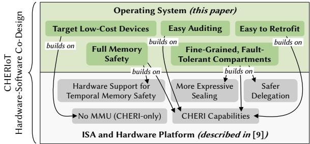
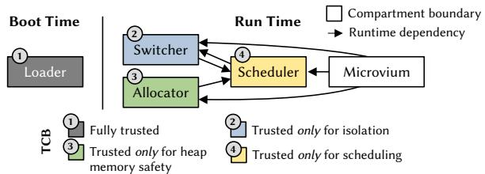
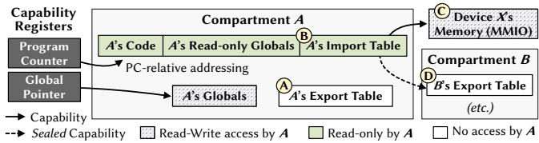
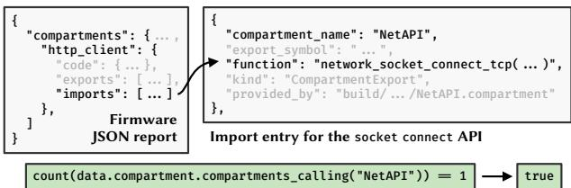
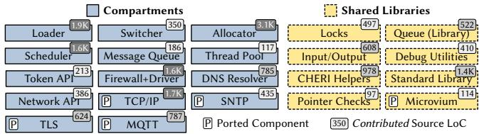
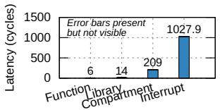
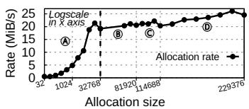
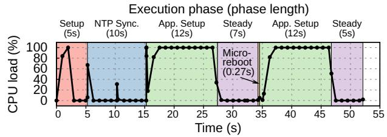

Latest updates: hps://dl.acm.org/doi/10.1145/3731569.3764844

RESEARCH-ARTICLE

# CHERIoT RTOS: An OS for Fine-Grained Memory-Safe Compartments on Low-Cost Embedded Devices

SAAR AMAR, Apple Computer, Cupertino, CA, United States

TONY CHEN, Microso Corporation, Redmond, WA, United States

DAVID CHISNALL

NATHANIEL WESLEY FILARDO

BEN LAURIE, Google LLC, Europe, Dublin, Ireland

HUGO LEFEUVRE, The University of British Columbia, Vancouver, BC, Canada

View all

Open Access Support provided by:

University of Cambridge

Microso Corporation

The University of British Columbia

Google LLC, Europe

Apple Computer

Arm Limited

Published: 12 October 2025

Citation in BibTeX format

SOSP '25: ACM SIGOPS 31st Symposium   
on Operating Systems Principles   
October 13 - 16, 2025   
Seoul, Republic of Korea

Conference Sponsors: SIGOPS

# CHERIoT RTOS: An OS for Fine-Grained Memory-Safe Compartments on Low-Cost Embedded Devices

Saar Amar1,†,★ Tony Chen2 David Chisnall3,★ Nathaniel Wesley Filardo3,★ Ben Laurie4 Hugo Lefeuvre5,★ Kunyan Liu2,★ Simon W. Moore6 Robert Norton-Wright3,★ Margo Seltzer5 Yucong Tao2 Robert N. M. Watson6 Hongyan Xia7,†,★

1Apple, 2Microsoft, 3SCI Semiconductor, 4Google, 5University of British Columbia, 6University of Cambridge, 7ARM Ltd.

## Abstract

Embedded systems do not benefit from strong memory protection, because they are designed to minimize cost. At the same time, there is increasing pressure to connect embedded devices to the internet, where their vulnerable nature makes them routinely subject to compromise. This fundamental tension leads to the current status-quo where exploitable devices put individuals and critical infrastructure at risk.

We present the design of a dependable embedded OS where compartmentalization and memory safety are firstclass citizens. We co-design the OS with an embedded hardware platform that implements CHERI capabilities at a similar cost profile to existing chips with minimal security. We demonstrate key design benefits: fine-grained fault-tolerant compartments, OS-level support for compartment-interface hardening, and auditing facilities to thwart supply-chain attacks, among others, and show that they come at a memory usage and performance cost that allows their widespread deployment in cheap, resource-constrained devices.

CCS Concepts: • Security and privacy → Operating systems security; Embedded systems security.

## ACM Reference Format:

Saar Amar, Tony Chen, David Chisnall, Nathaniel Wesley Filardo, Ben Laurie, Hugo Lefeuvre, Kunyan Liu, Simon W. Moore, Robert Norton-Wright, Margo Seltzer, Yucong Tao, Robert N. M. Watson, Hongyan Xia. 2025. CHERIoT RTOS: An OS for Fine-Grained Memory-Safe Compartments on Low-Cost Embedded Devices. In ACM SIGOPS 31st Symposium on Operating Systems Principles (SOSP ’25), October 13–16, 2025, Seoul, Republic of Korea. ACM, New York, NY, USA, 18 pages. https://doi.org/10.1145/3731569.3764844

## 1 Introduction

Embedded systems exist in ecosystems where pennies on the bill of materials can be the difference between profit and loss for the manufacturer. Thus, embedded devices are often deployed with fewer security features than conventional devices to cut costs, for example, without an MMU [92]. On top of this, they generally run legacy software stacks written in unsafe languages. Sacrificing security for cost, combined with the increased pressure to connect embedded devices to the Internet, creates a vulnerability storm. Botnets such as Mirai [10] hoard hundreds of thousands of IoT devices, and their impact grows every year [24, 34, 70, 73, 76, 94, 97]. Vulnerable IoT control systems are also a growing concern, routinely compromising critical infrastructure [35, 61, 84, 86, 95].

The specific nature of embedded hardware and software exacerbate the vulnerabilities that cheap hardware makes possible. Embedded software often has complex multi-vendor auditing requirements that constrain how software components are distributed and integrated. For example, software that directly interfaces with hardware might be supplied in binary-only form [81], e.g., because that specific binary passed regulator approval [82]. These requirements must compose with increasingly complex software supply chains [105, 107, 108]: parts may be developed in-house or adopted from external (open-source) vendors or SDKs. Embedded systems also have attribution requirements (who is liable when software causes damage?) [47], leading to security features such as the memory protection unit (MPU) [11], present on many low-cost devices, to be used for attribution as much as for security. These particularities make the design of dependable embedded systems especially challenging.

Prior works on securing embedded OSes [18, 36, 45, 46, 49, 55, 77, 109] use existing hardware such as the MPU or TrustZone for memory isolation, limiting these solutions to coarse-grained isolation [92]. Further, most works automatically retrofit memory isolation into existing embedded software [18, 45, 46, 49, 109]. This causes a lack of research on hardening interfaces, needed for strong isolation [52, 53] and a lack of research on enforcing availability, memory safety, or thwarting supply-chain attacks [51], all important in the embedded space. Other works use safe languages [55, 56] which are not ideal either [90], e.g., rewriting software is often impracticable for cost-sensitive devices.

  
Figure 1. The CHERIoT hardware-software co-design.

We present the design of a dependable embedded OS where isolation and memory safety are core primitives. We design this OS together with the CHERIoT core [9] (commercial silicon expected in 2025 [88]), a specialized implementation of CHERI capabilities [98] that fits the same area and power costs as existing embedded devices. We show that, building upon this hardware, we can implement truly fine-grained fault isolation and fault tolerance at both code and thread boundaries. We demonstrate how these hardware primitives and the OS APIs we build upon them enable seamless hardening of compartment interfaces and complex delegation patterns. We also show how our platform can be mechanically audited to help detect supply-chain attacks and programming errors. We envision deploying these benefits at scale and show that they can be achieved on a tiny embedded core with only tens of KBs of SRAM. Our platform can run existing embedded code such as the Microvium [42] JavaScript engine, the FreeRTOS TCP/IP stack [5], and the BearSSL TLS stack [79], providing a simple migration path for existing systems. Similar techniques are applicable to larger systems: we aim, through this work, to showcase ideas that are valuable at other scales. The CHERIoT platform is open-source [2].

## 2 CHERIoT: Hardware-Software Co-Design

We claim that a clean-slate approach to the entire hardwaresoftware stack is needed to improve embedded security. We begin with an overview of the CHERIoT hardware architecture, described in a separate publication [9], and then highlight the core design ideas of our OS. The link between both parts of the co-design is illustrated in Fig. 1.

## 2.1 The CHERIoT ISA and Hardware Platform

The CHERIoT ISA is an implementation of CHERI capabilities [98] specialized for embedded systems. A CHERI capability is a hardware pointer type that carries a cursor, the address to which it points, permissions, and bounds within which the cursor may range. The lower bound is called base. In CHERIoT, all pointers are implemented as CHERI capabilities. This allows the hardware to enforce deterministic spatial memory safety by checking bounds at each memory access, and to enforce compartmentalization [98]. Each capability is associated with a non-addressable CHERI tag bit. If the

CHERI tag is cleared, the capability becomes invalid. The tag attests that the capability stems from a permitted sequence of rights non-increasing operations. Invalid operations on a capability (e.g., overwriting part of it) automatically clear the CHERI tag of the capability. Using an invalid or out-ofbounds capability traps before the operation is performed. We now focus on the core architectural features specific to CHERIoT that enable our OS design. Each of these points is covered in details in the dedicated publication [9].

No MMU. Unlike existing CHERI systems, CHERIoT has no MMU (or MPU [11]) so CHERI is the only isolation mechanism present. This is necessary not only for the low-cost devices we target [92], but also for the real-time CHERIoT use-cases by removing nondeterministic latencies that arise from caches with a conventional MMU and page-table walker.

Heap temporal memory safety. When we deallocate a heap object, we must invalidate all capabilities pointing to it (wherever they are in memory) to achieve temporal memory safety. Existing CHERI systems implement this by repurposing MMU features [26], but these are absent on most embedded devices. Instead, CHERIoT enables deterministic temporal memory safety via two new hardware features.

The load filter makes capabilities that point to a freed heap object unusable when they are loaded into registers. In CHERIoT, each eight-byte granule of heap memory is associated with a revocation bit, stored in a separate SRAM region. When an object is freed, the allocator sets the revocation bit for each granule of the object. Later, whenever a capability is loaded from memory, the CPU’s load filter checks the revocation bit corresponding to the base of that capability, and, if set, clears the capability’s CHERI tag. The bounds of a capability can be only reduced, not increased, so the address of the base is guaranteed by the hardware to always be within the bounds of the original allocation.

The revoker enables reuse of freed heap memory. The revoker iteratively scans every capability in memory, invalidating any that point to freed memory. This happens in parallel to normal CPU execution.1 Once all memory has been swept, we know that no valid capabilities exist to any object that was freed before the sweep: the revocation bits can be cleared and memory from freed objects can be reused for new allocations. Safe delegation. Compartments need to share (delegate) objects across trust boundaries. Prior CHERI systems support this via two mechanisms. First, the permit-load, permit-store, and permit-exec permissions on capabilities, which encode read, write, and execute rights for the memory referenced by the capability. These can be stripped to enforce fine-grain, yet shallow access control: though permit-store (which encodes write rights) may be removed from a capability ??1, it may still be present on a capability ??2 reachable in the memory pointed to by $c _ { 1 }$ . Second, the global permission which, when stripped from a capability $c _ { 1 }$ , forbids storing $c _ { 1 }$ except through a capability that has the permit-store-local permission. The only such capabilities in our OS are stacks, which are themselves nonglobal, and register-save areas. This prevents non-global pointers and pointers to the stack from being stored anywhere other than on the stack, enforcing a shallow no-capture guarantee: an untrusted callee cannot keep a non-global argument $c _ { 1 }$ after returning, but may keep a global $c _ { 2 }$ loaded through $c _ { 1 }$

These permissions are insufficient to secure compartment interfaces because they are shallow. CHERIoT adds two capability permissions to solve this. The first, permit-load-mutable, enforces deep immutability: if $c _ { 1 }$ lacks this permission, any capability $c _ { 2 }$ loaded through $c _ { 1 }$ will have its permit-store and permit-load-mutable permissions removed. This enables passing a pointer argument while ensuring that a bad callee cannot modify anything reachable from that pointer. The second permission, permit-load-global, enforces deep no-capture: if $c _ { 1 }$ lacks this permission, any $c _ { 2 }$ loaded through $c _ { 1 }$ will have its global and permit-load-global permissions removed, preventing a callee from capturing anything reachable from that pointer. More expressive sealing. The sealing mechanism, present in existing CHERI ISAs, is another architectural approach to protect compartment interfaces. Sealing transforms a capability into one that can be loaded and stored but not used or modified except via an explicit unseal operation. Sealed capabilities have an object type, and both sealing and unsealing operations are capability-mediated: (un)sealing a capability of a particular type requires an authorizing capability matching that type. As we show, sealed capabilities are key in enabling distrusting compartments to safely share opaque object references (§3.2.1). The sealing mechanism also enables sealed entry (sentry) capabilities, which are sealed executable capabilities unsealable via a jump instruction. These enable granting access to a function without exposing any data that might be accessed via program-counter (PC)-relative addressing within that function. We also use sentries to protect return addresses by sealing the return capability as a sentry, allowing the callee to jump back only to that address.

CHERIoT refines CHERI’s notion of sentries to carry semantics with respect to enabling and disabling interrupts. It discriminates between forward (call) and backward (return) control flow. A forward sentry can optionally specify a change of interrupt status (enable/disable), and matching backward sentries restore the interrupt status if it was changed. Non-TCB software cannot directly enable or defer interrupts; instead, functions may be annotated with their desired posture, to be adopted at invocation. This enforces a structured programming model on interrupt posture and facilitates auditing of code that disables interrupts.

## 2.2 Co-Designing an OS with the CHERIoT hardware

We co-design the hardware platform with a clean-slate embedded OS and programming model (upper part of Fig. 1).

2.2.1 Threat Model. Attackers aim to compromise the integrity, confidentiality, or availability of the system. They may do so by exploiting software vulnerabilities (e.g., from the network for an IoT device) or by attacking the software supply-chain to backdoor software parts. We assume that the Trusted Computing Base (TCB), discussed next, is bug-free and not backdoored. We do not assume any correctness properties for compilers used for untrusted components, an attacker is assumed to be able to run arbitrary instructions in a compartment. We assume that the CHERIoT hardware is free of bugs and side channels. CHERIoT benefits from CHERI’s formal verification [30, 72], and both CHERIoT hardware and software are currently being formally verified [21, 78]. Physical attacks (e.g., tampering with the device) are out of scope.

## 2.2.2 Approach. We build on five high-level principles:

(P1) Full memory safety. Memory-safety bugs remain the most prevalent type of security vulnerabilities [96]. We systematically mitigate them. CHERI enables spatial memory safety; our allocator complements this with temporal memory safety leveraging the CHERIoT architecture (§2.1). With CHERI, memory-safety bugs still harm availability since they cause a fault: we leverage compartments, introduced next, for fine-grained fault handling.

(P2) Fine-grained fault-tolerant compartments. We design a hybrid compartment model [53] where compartments isolate at code boundaries and threads isolate flows across and within compartments, to isolate other types of bugs and contain the impact of memory-safety faults on availability. This model enables us to implement least privilege at a fine granularity and adapt isolation strategies to the specifics of each component. We make it easy to secure compartment interfaces by designing APIs that build on CHERIoT’s hardware features (§2.1) to thwart interface vulnerabilities [52]. Our compartments are fault-tolerance boundaries: our OS design enables easy micro-reboot [16] of compartments.

(P3) Fit low-cost embedded deployments. We target inexpensive devices with 10s-100s KB of RAM. To fit such memory constraints we must trade-off memory usage and performance. We contribute a memory management approach centered on a unified heap with a quota system that enables compartments to easily and safely share memory.

(P4) Easy to audit. Integrators [39, 91] should be able to systematically audit firmware images to detect policy violations at the integration level. We enable this by adopting a static isolation model where compartments and threads are fixed at build-time. We combine this with a linker that produces a human- and machine-readable report of the structure of the system, and develop tooling to verify that these reports conform to given policy requirements.

(P5) Easily integrate with existing code-bases. Embedded software is usually compiled targeting specific SoCs, so we do not try to be binary compatible. However, we do try to minimize source-code changes, and do so through wrappers that encapsulate legacy components to retrofit our compartment model (e.g., harden interfaces and add fault tolerance) and interface with our platform APIs.

  
Figure 2. Overview of the TCB when running a JavaScript program (some non-TCB compartments are omitted).

## 3 Design of the CHERIoT RTOS

We now illustrate how CHERIoT RTOS embodies the principles laid out in the previous section by introducing its core OS components, its architecture, and its APIs.

Compartments and threads. Our OS instantiates the hybrid compartment model described in P2. A compartment is a static isolation abstraction that encapsulates code and data. Compartments can share code via shared libraries. They can also share data, either statically via code annotations or at run time. A thread is a statically-created schedulable entity composed of a stack, a register state (in registers or saved), and a trusted stack (discussed in §3.1.2). At any point in time, a thread executes in exactly one compartment. Threads can move from one compartment to another via compartment calls into pre-defined entry-points. Compartment calls can take arguments and return values, similarly to function calls. Threads can access only their current compartment’s code and data, the call’s arguments, a subset of their stack exclusive to the call, and transitively reachable resources. While threads can exchange capabilities and data through shared memory (e.g., compartment globals), they are otherwise isolated from one another to provide flow isolation.

Fault tolerance. At any given time, the CHERIoT core runs one thread, though multiple threads (in the same compartment or not) may share the core with preemptive scheduling. A thread that encounters a fault, e.g., due to a memory-safety violation, invokes the developer-provided error handler for that compartment. The handler might unwind the thread out of the compartment and/or micro-reboot [16] the compartment (i.e., reset it into a pristine condition, §3.2.6). Our design fundamentally simplifies micro-reboots: fine-grained isolation of compartments and threads reduces reset complexity and latency; isolation and capabilities enable easy segregation of state; and components are inherently decoupled with well-defined, hardened, and retryable APIs.

Shared libraries. We allow compartments to easily share code with a shared library abstraction. A shared library does not define a new security context, and its code executes within the caller’s security domain. Shared libraries must not have mutable globals, to ensure that they cannot transfer or leak state between calling compartments and threads. This enables a programming model equivalent to each library function being copied into the compartment that calls it, without the corresponding memory overhead which is crucial for our embedded deployment (P3).

  
Figure 3. Simplified overview of a CHERIoT compartment.

Trust. The TCB of the OS includes only four components: the loader, the switcher, the allocator, and the scheduler (see Fig. 2). We take a strong stance on the principle of least privilege [85]: aside from the loader which is fully trusted (but only runs at boot time), no runtime component, even in the TCB, runs with all privileges, e.g., none can access all of the memory. Instead, we trust each TCB compartment to enforce a specific security property, whose failure would impact an aspect of confidentiality, integrity, or availability, but would be insufficient by itself to take complete control of the system.

## 3.1 OS Architecture Overview

Let us go through the components of the TCB (Fig. 2): the loader, the switcher, the memory allocator, and the scheduler.

3.1.1 The Loader ( 1 ). The loader runs on boot to start up the system. Its only input is the firmware image. The loader has access to the omnipotent root set of CHERI capabilities, which it refines to populate all initial capabilities in memory, based on compiler-generated metadata from the firmware.

The loader sets up compartments (Fig. 3). This includes two per-compartment tables used for compartment calls and shared-library calls. The export table ( A in Fig. 3) contains a capability to the compartment’s code and metadata describing its entry points. It is directly accessible only to the switcher ( 2 in Fig. 2). The import table ( B ) is accessible read-only to the compartment via PC-relative addressing and contains the only capabilities that, after boot, may point outside of the compartment: capabilities to MMIO regions ( C ) granting access to device memory;2 sentry capabilities (§2.1) allowing direct invocation of switcher and library exported functions; sealed capabilities to the export table of other compartments ( D ), unsealable by the switcher, for compartment calls; and sealed capabilities to static opaque objects and their matching unsealing capabilities (§3.2.1).

The net effect of the loader is to instantiate the initial capability graph described by the firmware. Its correctness is key to the system’s confidentiality, integrity, and availability. We thus design it to be deterministic to ease auditing. Moreover, the loader runs only during boot. We therefore place it along with the firmware metadata it consumes in SRAM that later becomes the shared heap. After boot, a small assembly routine erases this memory before handing control to the scheduler. This reduces size constraints on the loader, which can thus use simpler code and a lot of invariant and consistency checks to further ease auditing.

3.1.2 The Switcher ( 2 ). The switcher is responsible for transitions between threads (context switches), between compartments (compartment calls/returns), and for first-level trap handling. Context switches occur in response to traps (cf. §3.1.4), whereas compartment calls are triggered via a direct call into the switcher through the sentry in each compartment’s import table ( B in Fig. 3). The switcher is the most privileged component that runs after boot and contains \~355 assembly instructions (similar to the number of unverified instructions in seL4 [6]). A malicious switcher can compromise availability (by deciding not to context switch) and partially confidentiality and integrity as it can access each thread’s register file and stack. However, the switcher cannot directly access any other parts of the system’s memory.

Each thread has an associated trusted stack, which is a region of memory exclusively accessible to the switcher after boot. It contains the register save area for context switches and a small frame for every compartment call, allowing the switcher to safely operate even if a compartment has corrupted all the state to which it has access. The switcher (and only the switcher) holds a PC capability with a special permission which allows it access to a dedicated control register containing a capability to the current thread’s trusted stack.

A compartment performs a compartment call by passing the switcher a sealed capability from its import table ( B in Fig. 3) that points to the callee’s export table ( D ). Only the switcher holds the capability that can unseal this sealed capability, as it is the sole entity trusted to perform domain switches. The base of the capability points to the beginning of the callee’s export table, where the loader stored the callee’s code and data capabilities. The cursor points to the target entry in the callee’s export table, which describes the metadata for the call, including the offset of the target entry point within the code capability, the number of argument registers, and the minimum required stack space. The switcher pushes a new frame on the trusted stack describing the return address once this compartment finishes and then clears all non-argument registers, truncates the stack capability, zeroes the new stack’s memory, and jumps into the callee. The return path is similar: the switcher zeroes the stack, restores the code, data, and stack capabilities from the caller, zeroes all non-return registers, and returns to the caller.

3.1.3 The Shared Heap ( 3 ). The memory allocator exposes a shared spatially- and temporally-safe heap. A shared heap is a key part of our approach to lower embedded deployment costs (P3). Embedded software often has each component pre-allocate all of the memory it requires (e.g., by storing everything in globals). In that case, the total memory requirement (and thus the minimum price for a usable SoC) is bounded by the sum of each component’s worst-case memory usage. A shared heap lowers this bound to the worst case of the sum of the memory usage of all compartments at any given time. This allows phases of computation that have different memory requirements to use time-division multiplexing to share memory. This is the same reason why all OSes for larger computers provide dynamic memory allocation.

We allow safe sharing of allocations at the level of subobjects from mutually-distrusting components. Heaps with object-granular sharing were historically impracticable on embedded devices due to the limitations of isolation mechanisms. Cheap devices often feature an MPU [11] (PMP [50] on RISC-V) that supports eight domains. MPU regions must be configured by a trusted component, making it hard to expose a simple programming model for sharing anything more complex than a simple buffer. The low number of regions results in a lot of over-privilege, and the need to track protection mappings complicates the TCB. CHERI capabilities overcome these limitations. They can isolate at a fine grain, eliminating fragmentation and over-privilege. Their unforgeability simplifies the allocator by removing the need to track mapping metadata. Most importantly, they are exposed as pointers in the source language, so sharing is expressed in terms of language-level objects, not regions of address space.

The allocator is trusted for heap memory safety. A compromise of the allocator will impact confidentiality and integrity through leaking or tampering with heap-allocated data, as well as availability through not fulfilling allocations (or doing so incorrectly, to trigger faults). The concrete impact highly depends on how much compartments rely on the allocator, as the allocator has access only to heap memory.

At a high level, our allocator hands out capabilities to ranges of memory and guarantees that a compartment can access a heap object only if it has a pointer to it. When an object is freed, the allocator sets the revocation bits corresponding to the allocation (§2.1) and the CHERIoT load filter ensures that these pointers cannot be used. The allocator must eventually reuse freed memory to satisfy our low-memory deployment model (P3), but such reuse must be done carefully to preserve memory safety (P1) and compartmentalization (P2):

• Revocation. Re-using freed memory requires invalidating all existing capabilities to that memory. Our hardware revoker handles this (§2.1). Unlike prior works in larger (CHERI) systems [25, 26, 103], accesses to freed objects trap as soon as free returns rather than only after the revocation pass has finished. The allocator alone may access freed memory as it retains a privileged capability over the entire heap, such that its loads do not consult the revocation bits.

Quarantine. Memory associated with an object is safe to reuse once there are no non-TCB capabilities held to it, i.e., after a full revocation sweep. Sweeps take time, thus our allocator batches revocation, quarantining freed memory until a revocation pass has been completed (which the allocator can see through a hardware-exposed counter). The allocator alone can access freed data, so it limits its overhead by using in-band metadata to track quarantine. Our allocator attempts to remove a small, constant number of objects from quarantine on every malloc and free. Limiting that number bounds the run time of the allocator to satisfy soft realtime constraints, and removing more than one object per operation ensures that the quarantine eventually drains.

• Real-time behavior. Revocation is asynchronous and takes variable time. Allocations may be delayed until the end of a revocation pass. Though worst-case revocation time is constant we, like all RTOSes, discourage from calling the allocator in phases with deterministic latency requirements.

• Zeroing. Allocations must not leak secrets from previously freed data. We thus zero the entire heap on boot, and erase objects in free(). The allocator’s exclusive access to freed memory ensures that these zeros persist through to reuse.

3.1.4 The Scheduler ( 4 ). The scheduler is invoked by the switcher to make scheduling policy decisions. On a trap, the switcher’s trap entry point spills the registers into the current thread’s register save area and checks the cause of the trap. Protection-related traps are handled by the compartment itself if it provides an error handler (§3.2.6). Other traps (e.g., timer or device-specific interrupt) are forwarded to the scheduler: the switcher fetches a pointer to the scheduler’s stack from PC-relative storage, scrubs registers, and calls the scheduler with a sealed capability to the saved state. The scheduler then returns to the switcher with a sealed capability indicating the next thread to run. For interrupts other than the timer, this may be the thread responsible to handle the interrupt in the appropriate compartment.

The scheduler can refuse to run threads, so it is trusted for availability. However, it is not trusted for confidentiality or integrity as it cannot unseal the stacks and registers of interrupted threads and its outputs are carefully checked by the switcher. Aside from its special switcher entry point, the scheduler is a normal compartment that provides services via compartment calls (e.g., futexes, see §3.2.4).

## 3.2 CHERIoT RTOS Programming Model and APIs

We contribute new APIs to fit the principles formalized in §2.2.2. Our core OS is not POSIX or FreeRTOS compatible, however, as we show in §5.2, wrappers can easily be implemented to bring compatibility (P5). We now present the core APIs and discuss how one can build new APIs on CHERIoT. Tab. 1 gives an overview of the APIs covered in this section.

Table 1. Overview of CHERIoT RTOS APIs presented in §3.2.
<table><tr><td rowspan=1 colspan=1>API</td><td rowspan=1 colspan=1>Key Idea</td></tr><tr><td rowspan=1 colspan=1>Opaque Objects($3.2.1)</td><td rowspan=1 colspan=1>Opaque objects make it possible foracompartmentto pass a pointer to an object to another compartmentand later receive that pointer with assurance that theobject was not tampered with.This makes it easier toharden interfaces,to reduce the amount of state in acompartment,and to simplify error handling.</td></tr><tr><td rowspan=1 colspan=1>Allocation Capabilities&amp; Quotas (S3.2.2)</td><td rowspan=1 colspan=1>Allocation capabilities embody the permission to allo-cate and free heap memory. They are associated witha quota to control compartment heap memory usage.This enables the CHERIoTRTOS to enforce least priv-ilege while supporting heap memory allocation.</td></tr><tr><td rowspan=1 colspan=1>Quota Delegation($3.2.3)</td><td rowspan=1 colspan=1>Allocation capabilitiescan be delegated.This makesit possible for a compartment to authorize anotherone to perform heap operations on its behalf.</td></tr><tr><td rowspan=1 colspan=1>Synchronization&amp;Communication (S3.2.4)</td><td rowspan=1 colspan=1>Builda rich set of de-privileged multi-threading APIsatop a simple futex primitive.</td></tr><tr><td rowspan=1 colspan=1>InterfaceHardening(S3.2.5)</td><td rowspan=1 colspan=1>Provide mechanisms and APIs against most classes ofcompartment interface vulnerabilities.</td></tr><tr><td rowspan=1 colspan=1>Error Handling($3.2.6)</td><td rowspan=1 colspan=1>Makeit possible to define compartment-specific fault-handling policies to enable fault tolerance.</td></tr></table>

3.2.1 Opaque Objects. Limiting the amount of global state stored in each compartment is key to writing robust compartmentalized software. The more state a compartment holds, the harder it is to assert that this state is correct and does not break thread or flow isolation, and the harder it is to recover from faults [14, 16]. We provide OS support for opaque objects to reduce the amount of state stored in a compartment. Pointers to opaque objects can be exported (e.g., returned from a compartment call) and later re-imported (e.g., passed via another call) with assurance that the object was not tampered with. Consider an SSL compartment: APIs only need to access the state of one flow at a time, so flow state can be opaquely returned (e.g., state tls\_connect(void)) and passed as API argument (int tls\_send(state, buffer, length)) to make an SSL compartment nearly stateless. This shows a key pattern enabled by opaque objects: safely making callers hold state that corresponds to their interaction with a callee. Callers become responsible for holding their entire state at the scale of the system, simplifying fault recovery in the callee by avoiding state spill [14, 15]. CHERIoT’s architectural support for sealing (§2.1) makes implementing opaque objects simple. However, the encoding of CHERIoT capabilities allows for only seven distinct types of opaque objects. This is a problem as two compartments sharing a sealing key would be able to unseal each other’s opaque objects.

We design a token API compartment that virtualizes sealing on top of a hardware sealing type to which it has exclusive access. The unsealing API void\* token\_unseal(key, sobj) it implements is similar to hardware unsealing: to unseal a sobj of a given virtual sealing type, an authorizing key for that virtual sealing type must be provided. The key must be a tagged capability with the permit-unseal permission, and its cursor must be the virtual sealing type. The sobj handle must be sealed with the token API’s hardware-backed sealing type and bear a header that stores its virtual sealing type followed by the payload. The token API unseals sobj (from under its architectural seal) then checks that the type in the key and the type in the header of sobj match. If so, it returns a capability to the payload of the unsealed object, exclusive of the header.

Virtual sealing types can be created at run time with a key token\_key\_new() API. Sealed objects (sobj) can be dynamically allocated with an allocator API that allocates memory with a (protected) header holding a given key. Virtual sealing types and sealed objects can also be created statically with macros, to be instantiated by the loader at boot time (§3.1.1). Allocation capabilities, discussed next, are an example of static (i.e., statically-instantiated) opaque objects.

3.2.2 Allocation Capabilities and Quotas. It is essential to control compartments memory usage to enforce availability. To that end the allocator defines allocation capabilities that specify quotas. Allocation capabilities are static opaque objects logically decoupled from compartments: a compartment may hold none or several allocation capabilities with distinct quotas. CHERIoT’s core memory allocation APIs heap\_allocate and heap\_free take allocation capabilities, such that only compartments with access to an allocation capability may allocate memory, and the memory they can allocate is limited by the quota defined therein. For compatibility we provide malloc and free which use, if extant, the compartment’s default allocation capability. Since quotas are defined statically, policies on each compartment’s quota(s) can be enforced globally via firmware auditing (§4).

Allocation capabilities also contribute to safer delegation. It is often necessary to share a heap object with another compartment without allowing it to free the object. This is not possible if the object itself is the token of authority that permits freeing. heap\_free addresses this by requiring an allocation capability matching the one used to allocate the object. As we discuss next, compartments may decide on a case-by-case basis to share their allocation capability to grant another compartment the right to free their objects.

3.2.3 Quota Delegation. Some compartments need to allocate memory but should not own that memory. Consider a compartment that offers services to several mutuallydistrusting callees. If the compartment allocates memory with its own quota to satisfy API calls, a bad callee might repeatedly call its APIs to exhaust its quota and thus violate availability. For example, a realistic tls\_connect API must allocate memory and may be called by any compartment on the system. To address this, such APIs can take an allocation capability as an argument to allocate on behalf of the caller.

Quota delegation must be done carefully from a security point of view. First, allocating memory with the caller’s capability allows the caller to free the memory at any time to trigger CHERI faults in the callee. For API endpoints that do not alter the global state of the compartment, this is fine: due to memory safety and thread isolation, callers may only DoS themselves. In other cases, a fault in the callee may affect other callers, which is problematic. The sealed allocation API (§3.2.1) neatly solves this problem by requiring both a matching allocation capability and virtual sealing type to deallocate. Since callers do not have access to the sealing type, they cannot free the memory out from under the callee if they used this API. Additionally, our interface hardening API features primitives to temporarily prevent freeing of a pointer (§3.2.5).

Second, a malicious callee might exhaust the quota, or appropriate the allocation capability. The former can be avoided by using a dedicated allocation capability for API calls, which we enable by decoupling quotas from compartments. We address the latter through strict enforcement of the principle of intentional use [69]: callers can use CHERIoT’s enforcement of deep no-capture (§2.1) to prevent callees from storing their allocation capabilities. This also has the advantage of avoiding confused deputy problems [38]: by not keeping callees’ allocation capabilities, a callee cannot be tricked into allocating in another compartment’s quota it may also have access to.

3.2.4 Synchronization and Communication. We build a rich set of thread synchronization and communication abstractions from a small set of key OS primitives. At the core, the scheduler provides a least-privilege futex [27] abstraction. It has two APIs: compare-and-wait, which atomically sleeps if the futex word matches a given value, and wake, which wakes one or more sleepers, who are responsible for comparing the futex word again. Both require only a capability to the futex word with load permission, not retained by the scheduler.

We build locks as a shared library on top of futexes by storing the lock state in the futex word. This fits the scheduler trust model: the scheduler can spuriously wake a thread or can avoid waking one (breaking availability) but cannot modify the lock word to cause two threads to believe that they have acquired the same lock (breaking integrity). Typically, the lock’s futex word is a private compartment global. A compartment may be called from multiple threads and safely use the futex-based lock for mutual exclusion.

We build message queues atop futexes. Message queues are an interesting case as they cater to two different trust models: communication between threads that trust each other (e.g., in a compartment), and between threads that distrust each other. To satisfy both, we build message queues as a shared library usable as-is in the trusted case. For mutual distrust, we encapsulate the library in a compartment that exposes queues as opaque objects and adds additional interface hardening.

A mechanism to wait on multiple futexes is needed to build more complex synchronization APIs. We provide the scheduler multiwaiter API, which allows a calling thread to block for a set of futex events. All asynchronous APIs on CHERIoT expose a futex that can be passed to the multiwaiter: e.g., sockets (enabling poll use-cases) and message queues. Unlike Kqueues [54], we prioritize memory usage over scalability as we expect a low number of events on our embedded deployments, and the multiwaiter is trusted only for availability.

3.2.5 Interface Hardening. The attack surface of compartments consists of their API endpoints and the data they share through compartment call arguments and statically shared globals. The attack surface of isolated threads is shared data. Interfaces require careful hardening as they are the weak spot of compartmentalization [52, 53, 68]. We design the CHERIoT platform to provide mechanisms and APIs against most classes of interface vulnerabilities [52].

Thwarting information leaks. In CHERI systems, information leaks affect not only confidentiality but also integrity as leaked capabilities can grant write rights. Leaks can stem from uninitialized memory (e.g., compiler-added paddings) that leak data from previous allocations, or from over-sharing, i.e., shared data or capability permissions that the other party does not need [52]. Our allocator addresses the former by systematically erasing memory before assignment to a compartment. Thus, uninitialized data can leak only in compartments that do custom memory management or share non-zeroed stack buffers, which we advise against. We address the latter with capability de-privileging APIs. Before sharing a capability (e.g., in a compartment call), compartments should use our APIs to tighten capability bounds and permissions. For example, before passing a send buffer to a socket API, the sender should set the capability read-only and tighten its bounds around the payload. When possible, capabilities should also be made deeply immutable and non-capturable (§2.1) with the same API to prevent other parties from modifying or capturing capabilities reachable from the shared capability. These APIs are reinforced by our auditing support (§4) which helps detect statically-visible cases of over-sharing.

Checking inputs. Inputs that cross trust domains must be carefully checked at two levels. First, pointer arguments must be valid capabilities, of the right length, and with the right permissions. Though error handlers (§3.2.6) can recover from faults caused by invalid inputs, preventing faults in the first place is often simpler. We enable such checks with APIs that can check if a pointer is a capability with valid permissions and length, whether or not a capability is sealed, and if a heap buffer can be freed. Second, data itself must be checked. As in prior work [68], CHERIoT makes compartments responsible for correctly vetting data flows as these checks are application-specific. However, our opaque objects (§3.2.1) considerably simplify the case of exported-and-reimported data: objects returned opaquely need to be checked for successful unsealing only when reimported, eliminating the complex object-correctness checks otherwise needed.

Thwarting TOCTOU [3]. Checks must be resilient to TOC-TOU attacks, a problem overlooked by prior compartmentalization works [52]. Copying data before checking is necessary in the general case, thus we simplify specific cases. First, our capability de-privileging APIs (§2.1) make it possible to prevent a callee from (concurrently) modifying an object they are passed or accessing it after returning. A distinct problem is temporal-memory-safety TOCTOU attacks, where a bad compartment frees an object that another one is using to trigger a temporal memory-safety fault. We address this with our allocator claim and ephemeral claim APIs. A claim prevents the allocator from freeing the object until the claim is released. It requires an allocation capability whose quota can account for the object. Freeing the object with the allocation capability used to claim releases the claim, and the memory is released only once all claims are gone. An ephemeral claim prevents an object from being freed until the thread’s next compartment call or ephemeral claim. It does not require an allocator capability and is much faster than a full claim as it uses a switcher mechanism inspired by hazard pointers [63] to avoid a compartment call to the allocator.

Checking entry points. Compartment and shared library entry points are defined via compiler annotations. The compiler populates compartment import and export tables based on (a) these annotations and (b) the calls each compartment makes. Functions not exposed at compile time via an annotation cannot be called by any other compartment at run time. Further, if a compartment’s code does not call another one’s entry points, then these entry points will not be in its import table and thus not callable at runtime (providing cross-compartment control-flow integrity [53]). When declaring entry points, developers can also state how much stack memory they require. This protects against an attacker calling an API with a small stack to trigger stack overflow faults in the callee. This matches good embedded systems practices to be careful with stack usage [12], and we provide tooling to dynamically determine stack usage with a watermark.

3.2.6 Error Handling. Compartments are fault-tolerance boundaries: they can define error handlers, called by the switcher (but executing in the context and with the rights of the compartment), to handle traps such as CHERI faults or illegal instruction faults. We expose two such abstractions:

Global error handlers are implemented by defining a special function compartment\_error\_handler() in the compartment. The function takes as argument the cause of the fault, and a copy of the register file, which it may modify. Its return value can instruct the switcher to resume (with the potentially modified register file), or unwind in the caller compartment. Though they share similarities with UNIX signal handlers, global handlers handle only synchronous faults (not arbitrary events), and do so only in their respective compartment.

Scoped error handlers are lexically-scoped. Developers wrap code with macros DURING {...} HANDLER {...} similar to tryexcept exception handling. We design scoped handlers using C’s longjmp and setjmp, revisiting historical exception-handling mechanisms [19, 71]. Upon entering a scope, setjmp stores the four non-temporary registers onto a linked-list on the stack, whose head pointer is at the top of the stack. When the error handler is called, longjmp retrieves the head and jumps to the handler by restoring the four registers. Scoped handlers are less expressive than global handlers (e.g., they do not indicate the cause of the fault and do not allow resume), but feature a near-zero memory overhead. longjmp and setjmp have become uncommon for exception handling due to their runtime cost on the non-error path [19]; however the specifics of CHERIoT (our small register set and storing the list head at the top of the stack) allow us to implement them in just six instructions. Error-handling policies. Handlers can either (a) ignore the fault and unwind the thread, (b) correct the fault, or (c) entirely micro-reboot [16] the compartment. Without handler the switcher defaults to (a), which is the right approach for APIs that do not operate on global state. Correcting faults typically consists of a rollback, releasing resources held by the thread or resetting some state before unwinding. Correcting faults is possible as illegal operations trap before affecting data, unlike an MPU that faults only after writes have overflowed up to the bounds of a memory region. Microrebooting is needed in the most complex cases where APIs operate on global state that is too complex to be corrected.

Our hybrid compartment model fundamentally simplifies micro-reboots by reducing the amount of state that must be reset. Faults naturally do not spread: compartments are inherently decoupled with well-defined and hardened interfaces; our programming model encourages retryable interfaces with timeouts; and the opaque object paradigm (§3.2.1) fundamentally reduces state spill [14, 15].

To our experience the most complex micro-reboots entail five steps, which we support with dedicated APIs. (1) Preventing new threads from entering the compartment, typically by wrapping entry points with a guard controlled by the error handler. When using a scoped handler, guard and handler can be co-located. (2) Rewinding all threads that are in the compartment. Switcher APIs simplify this by waking up and faulting all other threads in the compartment. (3) Releasing all heap data using allocator APIs that free all memory associated with a quota. (4) Resetting all globals from safe read-only values. This can be automated with compile-time snapshots of compartment global data and APIs to restore them. Components that must keep persistent state across micro-reboots can do so through a separate state store [16] compartment.

## 4 Auditing CHERIoT RTOS Images

So far we presented techniques to prevent policy violations at run time. However, it is also critical to ensure that the firmware itself is compliant with the policy at the integration level [39, 91]. For example, we might need to know precisely which compartments can access a given critical object. Ensuring policy compliance not only matters for regulatory purposes, it can highlight programmer mistakes (that result in policy violations, e.g., sharing a capability that should not be shared) and help detecting supply-chain attacks (malicious source changes that violate system-level policies). Compartmentalization works generally overlook such issues [53].

  
Rego policy: there must be only one caller to the network API.  
Figure 4. Examples of JSON report and Rego policy.

Our compartment model has a simple guarantee that enables auditing firmware images: at boot, only the import table of a compartment may contain pointers that authorize access to memory that is not owned by that compartment (§3.1.1). This includes, for example, sealed capabilities pointing to other compartments’ export tables and capabilities that permit direct access to MMIO. It is thus easy to audit, for each compartment, what APIs it calls in shared libraries and other compartments, or what devices (or specific device memorymapped registers) it accesses. By consolidating this information we can also obtain system-wide information, such as whether or not the sum of the quotas of all allocation capabilities (§3.2.2) in the system is less than the system’s total heap memory, or assert that a certificate embedded in the firmware image is accessible only to one specific compartment.

Our linker emits a JSON report containing all of these. External auditing tools can then mechanically check the report for compliance against a policy without access to all compartment sources. This supports both simple and complex policies such as dual-signing policies where two entities provide code for a device and have policies (e.g., regulatory requirements) that must be met for each to sign the firmware image. We ship CHERIoT with an auditing tool that supports userprovided policies in the Rego policy language [74]. By declaratively expressing desired properties, users can systematically assert local and system-wide properties before deployment. Fig. 4 illustrates the firmware report of an HTTP client, along with a Rego policy checking that only one compartment uses the network API. In practice such queries would be part of a larger Rego script that checks a broader policy.

## 5 Evaluation

We implement our OS (Fig. 5), including the TCB, core APIs (partly described in §3.2), C/C++ standard libraries, a compartmentalized network stack, and device drivers in \~13K LoC of C++/C and 920 LoC of RISC-V assembly. We build for our production-grade CHERIoT architecture based on the Ibex RISC-V core [60], expecting commercial silicon in 2025.

## 5.1 Security Evaluation

5.1.1 TCB Size and Attack Surface. The core properties of our OS, memory safety (P1) and isolation (P2) rely on the safety of the TCB (§3). The loader consists of 1.9K LoC of C++ and takes no external input apart from the firmware. After boot, it erases itself, eliminating it from the run time TCB. The switcher consists of 355 instructions of carefully-audited assembly, with 11 thoroughly-checked entry points. It is the most critical component of the run time TCB, however its small size makes it a difficult attack target. The allocator is the largest component of the TCB, with 3.1K LoC and 16 entry points. Still, as discussed throughout §3, we strictly apply the principle of least privilege to the TCB, such that even a compromised allocator cannot mount a complete exploit to, e.g., leak and exfiltrate data. The scheduler consists of 1.6K LoC and 15 endpoints. It is in the TCB only for availability. In addition to our efforts to reduce the size and number of entry points, TCB components are currently the target of verification building on our formal model of the ISA [21, 78].

  
Figure 5. Native and ported OS components (simplified).

5.1.2 Attack Scenarios. Our design is the result of an adversarial evaluation by an experienced red team. Still, no defense is perfect: we now discuss which attacks it can and cannot prevent, and how we achieve the principles from §2.2.2.

Memory safety. If attackers trigger a memory-safety bug, the hardware raises a trap. The switcher will then call the compartment’s error handler (§3.2.6), or unwind the thread out of the compartment if no handler is defined, which is the correct behavior in most cases. Thus, assuming these mechanisms are correctly used, memory-safety bugs cannot impact confidentiality, integrity, or availability.

Repeat attacks. Error handlers maintain availability by resetting a compartment into a functional state. However this cannot prevent DoS with a strong attacker that can repeatedly trigger traps to force a victim compartment to spend all its cycles micro-rebooting. This is fundamental to micro-reboots [16], not to CHERIoT. Gecko’s shadow compartments [58] could easily be implemented to address this. Attacks on the error handler. A buggy error handler can incorrectly reset compartment state. Such a bug would not be exploitable by itself and require a chain of exploits to trigger the error handler and then abuse the invalid state. The reliance on correct error handling is fundamental to microreboots [16] and error handling in general, not to CHERIoT. Attacks that do not cause a trap. CHERIoT cannot prevent the exploitation of bugs that do not cause a trap (e.g., highlevel program logic bugs). However, it can fully contain them in a compartment to mitigate their impact. Note that, aside from formal verification, we are not aware of any technique that could prevent the exploitation of such bugs.

Supply-chain attacks. Supply-chain attacks are contained by compartments at run time. Further, offline auditing (§4) can mechanically and pro-actively detect software supplychain attacks that affect compartment interactions, e.g., a bad compartment illegitimately importing the exported globals of other compartments. Consider a library that is not supposed to use the network API. Auditing can check that the compartment indeed does not declare a dependency on the network API, as this would allow it to do illegitimate network calls at run time. We expand in §5.1.3.

Interface attacks. Attackers that compromised a compartment will try to leverage interface vulnerabilities to spread to other compartments and mount a full attack [52]. While we cannot entirely rule out such attacks, our interface hardening APIs (§3.2.5) help developers build strong interfaces to prevent them, and our fine grain of isolation and crosscompartment control-flow integrity increases the number of interfaces that must be breached to mount a full attack [83]. Our programming model could be extended with RLBox’s tainted types [68] to reduce the risk of oversights.

Overall, our defenses are effective to achieve P1, P2, and P4 as long as integrator-controlled parts (error handlers, interface hardening, auditing) are correctly implemented. This is generally true for all compartmentalization techniques [53].

5.1.3 Case Study. We materialize these attack scenarios through a case study. Consider the recent supply-chain attack on liblzma [17]. A stealthy malicious actor gained upstream rights on liblzma, a dependency of OpenSSH on Debian and Fedora systems. A backdoored version of the library used the GNU C library’s indirect function mechanism [29] to run malicious code during dynamic linking, to override the RSA API in OpenSSL. Would CHERIoT, and other approaches to secure embedded systems, be vulnerable to this class of attack? CHERIoT would make it very hard to mount such an attack. Set aside the fact that our OS does not (yet) support dynamic linking, by design no compartment can run code in the context of the loader. Our SSL library is compartmentalized, and liblzma would typically be compartmentalized too. Thus, at runtime, there is no way for liblzma to access the memory of the SSL library. It could try to corrupt the SSL library through interface attacks, yet any outputs from the liblzma library would be checked by its callers through our interface hardening APIs (§3.2.5), and again by the SSL compartment itself. The backdoored liblzma release could also introduce code that made network calls, e.g., to break real-time properties or turn the device into a botnet. However auditing (§4) makes it impossible to hide such a backdoor: these new properties would immediately show up in the JSON firmware report, and a global auditing policy with queries such as the one presented in Fig. 4 would detect these changes. Writing an auditing policy for the liblzma compartment would be easy since the library has very few runtime dependencies and thus relies on a stable and well-defined set of compartment APIs.

Language-based isolation alone cannot prevent this attack. Consider Rust, which powers Tock’s capsules [55]. Rust does not support the indirect function mechanism used in the liblzma attack, but there are many other ways in which a bad dependency could affect the SSL library even without using the unsafe keyword. For example on a Unix-like system it could overwrite memory through /proc [4, 40]. More subtly, a bad library could exploit soundness bugs in the Rust compiler [59], which does not claim security guarantees in the case of actively malicious (as opposed to simply buggy) code.

Automated compartmentalization, which represents most recent works in embedded compartmentalization [18, 45, 46, 49, 109], is fundamentally vulnerable to this attack. These works aim to automatically split memory and insert domain switches, provided a code base and desired compartment boundaries. If liblzma’s new release installs an indirect function resolver or accesses OpenSSL’s memory, the automated compartmentalization tool will grant it the right to do so. This is because these works do not include supply-chain attacks in their threat model: source code is taken as policy as components are assumed to be well-intended.

## 5.2 Source-Compatibility Evaluation

We analyze the existing codebases we ported ( P in Fig. 5) and the effort involved to evaluate the source compatibility of our platform (P5). These cover low-level, security-critical, and higher-level embedded components, representing examples of relevant code. We discuss four of them (two more in Fig. 5).

The FreeRTOS TCP/IP stack [5] (TCP/IP in Fig. 5) is a mature embedded TCP/IP stack of \~25K LoC. The code-base runs unmodified on the CHERIoT core. However, it assumes that it can enable and disable interrupts at will, which our programming model forbids (§2.1). Interrupts are disabled only for synchronization in the TCP/IP stack, so we replace them with a mutex by changing an external header. We also want the TCP/IP stack to be isolated with all the benefits of CHERIoT, so we add a wrapper encapsulating it to use opaque objects for connection state, allocated with quota delegation, to use our interface hardening APIs, and to be micro-rebootable. This takes 1.7K LoC with no changes to upstream code; we pulled code updates for more than a year without conflicts. We consider this an upper bound of the cost of developing a wrapper given the complexity and statefulness of the TCP/IP stack, and costs could be traded off with security properties. BearSSL [79] (TLS in Fig. 5) is an embedded TLS library of \~30K LoC (including all ciphers). BearSSL runs unmodified on our platform. As with the network stack, BearSSL is not designed to be called by mutually-distrusting callers, so we build a wrapper in 624 LoC to make it run in a fault-tolerant CHERIoT compartment with flow isolation.

The TPM reference stack [64] is a security-critical C codebase of 60K LoC. It exposes a single entry point that processes a TPM command. The TPM stack requires only a <10 LoC patch to add RISC-V support. A single annotation is needed to run it isolated from the I/O compartment, as the TPM stack is already designed assuming distrust with callers.

Microvium [42] is an embedded JavaScript interpreter of \~6K LoC. It runs unmodified on CHERIoT. We provide Microvium as a shared library, requiring changes that would not be needed for a private copy in a compartment (total 114 LoC): we set macros defining memory (de-)allocation functions to use the default allocation capability, and an export macro to our library export attribute.

From this experience, we believe that we achieve a level of source compatibility comparable to moving to any new embedded platform, while providing significantly more security. Integrators can choose to develop more or less complex wrappers to benefit from CHERIoT’s security full potential.

## 5.3 Memory Usage and Performance Evaluation

Setup and baseline. We run all experiments on an Arty A7-100T FPGA board, set up at 33 MHz and with 256 KiB of SRAM. We compile all code with -Oz to favor code size over performance. To the best of our knowledge, there are no comparable baseline systems: existing embedded platforms do not support fine-grained isolation and memory safety on such small systems and other embedded OSes do not run on the CHERIoT hardware without significant porting effort. Thus, we evaluate through an ablation study (§5.3.1), microbenchmarks (§5.3.1, §5.3.2), and a case study (§5.3.3). Hardware performance. How does the CHERIoT core influence the performance of the overall system? Our main hardware implementation (§5), is aggressively optimized for core area at the expense of performance. CHERIoT adds about 4.5% more area than a 16-entry PMP [50] (the RISC-V equivalent of an MPU [11]), which represents a negligible cost on most SoCs used for IoT deployments. The performance overhead is 20.65% on CoreMark [93] (bare metal), versus non-CHERI RISC-V 32E. Some of the overhead is due to the load filter (\~8%) and to the size of the memory bus (\~8%) which is widened from 32 bits to only 33 for the tag bit to limit area cost, but now requires two bus reads to load a 64-bit capability. This implementation matches low-cost devices: in comparison, the Raspberry Pi Pico has a 192-bit memory bus [80]. Some of the overhead is also due to the temporal memory safety check and to an immature compiler. We evaluate the hardware in detail in [9]. We now focus on the overheads specific to our OS and compartment model.

5.3.1 Memory Usage. Low-end chips (<\$1) typically have as little as 128 KB of NVRAM for program code, and 32 KB of SRAM. More expensive chips used for networked applications often have up to 1 MB of flash and 512 KB of SRAM. We demonstrate that we can cater to both (P3).

Code size. Code must fit in NVRAM (often flash memory) and SRAM where it is loaded at boot time. On low-end devices code may be eXecuted In Place (XIP) in flash. Our base system fits in 25.9 KB (Tab. 2), and 18.4 KB without the loader which is erased at boot time. This increases to 84.8 KB with a network stack (151.8 KB with TLS and MQTT), similar to Tock [55], which requires 87 KB with a simpler network stack. Compatibility and hardening wrappers represent a variable portion of ported components (8%-47%, Tab. 2). BearSSL’s wrapper is comparatively small as its APIs simplify fault tolerance and directly map to those we expose. Conversely, our SNTP and MQTT wrappers expose higher-level compartment APIs, encapsulating part of what would usually be application code. As discussed in §5.2, the size of wrappers can be traded off. Code size will further reduce as our CHERIoT compiler improves to match upstream RISC-V.

Table 2. Code and data size of CHERIoT RTOS components.
<table><tr><td rowspan=1 colspan=2>Component</td><td rowspan=1 colspan=1>Code Size</td><td rowspan=1 colspan=1>%ofwhich forwrapper</td><td rowspan=1 colspan=1>Data Size</td></tr><tr><td rowspan=1 colspan=2>BaseSystem</td><td rowspan=1 colspan=1>25.9KB</td><td rowspan=1 colspan=1></td><td rowspan=1 colspan=1>3.7KB</td></tr><tr><td rowspan=4 colspan=1>ruipnipu</td><td rowspan=1 colspan=1>Loader</td><td rowspan=1 colspan=1>7.5KB</td><td rowspan=1 colspan=1> $0 \%$ </td><td rowspan=1 colspan=1>66B</td></tr><tr><td rowspan=1 colspan=1>Switcher</td><td rowspan=1 colspan=1>1.4 KB</td><td rowspan=1 colspan=1> $0 \% ^ { 2 }$ </td><td rowspan=1 colspan=1>0B</td></tr><tr><td rowspan=1 colspan=1>Allocator</td><td rowspan=1 colspan=1>9KB</td><td rowspan=1 colspan=1> $\overline { { 0 \% ^ { 2 } } }$ </td><td rowspan=1 colspan=1>56B</td></tr><tr><td rowspan=1 colspan=1>Scheduler</td><td rowspan=1 colspan=1>3.3KB</td><td rowspan=1 colspan=1> $0 \% ^ { 2 }$ </td><td rowspan=1 colspan=1>472B</td></tr><tr><td rowspan=1 colspan=1>Bas</td><td rowspan=1 colspan=1>Base+Network Stack</td><td rowspan=1 colspan=1>151.8KB</td><td rowspan=1 colspan=1>=</td><td rowspan=1 colspan=1>20.4KB</td></tr><tr><td rowspan=6 colspan=1>Supnpu</td><td rowspan=1 colspan=1>Firewall + Driver</td><td rowspan=1 colspan=1>6.6KB</td><td rowspan=1 colspan=1> $0 \% ^ { 2 }$ </td><td rowspan=1 colspan=1>176B</td></tr><tr><td rowspan=1 colspan=1>TCP/IP</td><td rowspan=1 colspan=1>38KB</td><td rowspan=1 colspan=1> $\overline { { 2 3 \% } }$ </td><td rowspan=1 colspan=1>1.1 KB</td></tr><tr><td rowspan=1 colspan=1>DNSResolver</td><td rowspan=1 colspan=1>3.6KB</td><td rowspan=1 colspan=1> $\overline { { 0 \% ^ { 2 } } }$ </td><td rowspan=1 colspan=1>400B</td></tr><tr><td rowspan=1 colspan=1>SNTP</td><td rowspan=1 colspan=1>4.2 KB</td><td rowspan=1 colspan=1> $4 7 . 2 \%$ </td><td rowspan=1 colspan=1>56KB</td></tr><tr><td rowspan=1 colspan=1>TLS</td><td rowspan=1 colspan=1>56KB</td><td rowspan=1 colspan=1>8%</td><td rowspan=1 colspan=1>24 KB</td></tr><tr><td rowspan=1 colspan=1>MQTT</td><td rowspan=1 colspan=1>11KB</td><td rowspan=1 colspan=1>28%</td><td rowspan=1 colspan=1>24B</td></tr></table>

1 Not detailing shared libraries, stacks, and compartment/library metadata.  
2 No wrapper since these are native components (see Fig. 5).

Data and heap usage. The overall SRAM usage consists of (a) code if not using XIP, (b) data and BSS (including stacks and per-thread data), and (c) heap usage. The base system requires 3.7 KB of data (Tab. 2), and no heap. The data size is dominated by the 1.5 KB of stacks and 400 B of trusted stacks, required for the minimal two-thread system (scheduler and application), and 1 KB of compartment and library metadata, such as the import and export tables. This brings the overall base usage to 29.6 KB without XIP, small enough to fit lowend deployments. The network stack setting requires 20.3 KB of data, mainly stacks (12.3 KB), trusted stacks (1.15 KB), and compartment and library metadata (2.1 KB). Heap requirements depend on the workload, e.g., a heap of size 1.5 KB is needed to run a functional network stack that can reply to pings. This brings the base cost of the full networked setting to 173.6 KB, fitting devices typically used for networked applications. We provide an end-to-end example in §5.3.3.

Per-compartment usage. The base overhead for each additional compartment (i.e., moving a function into a new compartment) is 83 B, though post-link firmware footprints can increase or reduce due to alignment paddings. This compares favorably to Tock processes, which require 164 B [55].

5.3.2 Performance Microbenchmarks. We now evaluate the performance of our isolation primitives and core APIs, and discuss how they satisfy our target deployment (P3).

Cross-compartment call overheads are due to: (a) an indirect call through the switcher, which (b) performs checks and bookkeeping and (c) zeroes stacks. Fig. 6a shows that it takes, on average, 209 cycles to perform an empty compartment call (repeated twenty times with one call for warm-up). This cost increases as caller and callee use more stack: used stack memory must be zeroed to avoid caller-leaks on the call path, and callee-leaks upon return. For example a compartment call that uses 256 B of stack costs 452 cycles, similar to the cost of a traditional null system call. In the unlikely worst case where 1KiB of stack must be zeroed for both caller and callee, the round trip costs 1284 cycles, which still compares favorably to Donky [87] (2136 cycles). Overall, our design favors memory usage over performance: the cost of zeroing is fundamental to using a single stack with mutually-distrusting domains, and a performance-oriented design should maintain separate per-domain stacks. Additional hardware features can also reduce the cost of stack clearing [32, 33, 43, 106].

  
(a) Call and interrupt latencies.

  
(b) Sustained memory allocation rate.  
Figure 6. Performance microbenchmarks.

Interrupt latency is a factor of (a) the time to transition to the scheduler, signal the event, and schedule the thread that handles it, and (b) the time spent (by other threads) with interrupts disabled. The former is a property of the core OS code and the latter of a given firmware image. Different use cases have different latency requirements, so we provide tools for auditing (§4), rather than a one-size-fits-all solution.

We measure (Fig. 6a) interrupt latency using the hardware revoker: from a high-priority thread we 1) ask the revoker for an interrupt, and 2) wait on its interrupt futex; meanwhile, from a low-priority thread we 3) constantly record the current timestamp into a ???? variable, until 4) the high-priority thread awakes from the revoker IRQ and records a ???? timestamp. The interrupt latency $\left( t _ { e } - t _ { s } \right)$ is 1028 cycles (31 ??s at 33 MHz), on average, which is within typical RTOS task-level interrupt latencies (500-1500 cycles [31, 75]), and satisfies the higher-range of real-time requirements [75]. Real-time applications could extend the CHERIoT architecture to domainswitch in hardware and deliver interrupts directly into compartments [75, 77], similarly to TrustZone-M’s secure interrupts [13] and auditable in the same way as interrupt futexes. Memory allocator throughput. A shared heap is a key part of our contribution, but it is only useful if it can keep up with allocation rates. Fig. 6b shows allocator throughput as a function of allocation size: we allocate and free identicallysized buffers for a total allocation amount of 8x the heap size, which is set to 228 KiB (out of the 256 KiB of memory).

CHERIoT RTOS: An OS for Fine-Grained Memory-Safe Compartments on Low-Cost Embedded Devices

Table 3. Average latencies of core APIs (in CPU cycles).
<table><tr><td rowspan=1 colspan=3>CHERIoTRTOSAPI</td><td rowspan=1 colspan=1>Latency</td></tr><tr><td rowspan=1 colspan=2>Opaque Objects($3.2.1)</td><td rowspan=1 colspan=1>Unseal anobjectAllocate a sealed objectAllocate a new key</td><td rowspan=1 colspan=1>44.82432.2688</td></tr><tr><td rowspan=1 colspan=2>Interface Hardening($3.2.5)</td><td rowspan=1 colspan=1>De-privilege a pointerCheck a pointerEphemeral claimHeap claim +unclaim</td><td rowspan=1 colspan=1>&lt;10441823714</td></tr><tr><td rowspan=3 colspan=1>ErrorHandling($3.2.6)</td><td rowspan=1 colspan=1>No Handler(default)</td><td rowspan=1 colspan=1>Non-error pathFault and unwind</td><td rowspan=1 colspan=1>0109</td></tr><tr><td rowspan=1 colspan=1>GlobalHandler</td><td rowspan=1 colspan=1>Non-error pathFault and unwind</td><td rowspan=1 colspan=1>0413</td></tr><tr><td rowspan=1 colspan=1>ScopedHandler</td><td rowspan=1 colspan=1>Non-error pathFault and unwind</td><td rowspan=1 colspan=1>87222</td></tr></table>

We observe two main performance regimes. With buffers below 32 KiB ( A ), throughput is dominated by compartmentcall latency (two per buffer, malloc and free), increasing exponentially as the number of crossings halves. Most network traffic uses buffers of over 1 KiB, which yields \~5 MiB/s, more than enough to keep up with a 10 Mbit network connection. Real-world IoT uses rarely need even a fraction of this rate, leaving many cycles for the real work. After 32 KiB ( B ) the revoker becomes a bottleneck, as fewer objects can be allocated in the heap at any time. Past 80 KiB ( C ) the heap can fit only two objects, and a single one after 112 KiB ( D ): these pathological and unrealistic cases synchronize the revoker: the revoker will kick in at free, which is immediately followed by malloc, thus blocking the caller until the end of the sweep. Core APIs. Tab. 3 shows the performance of our core APIs (§3.2). Operations that typically happen at every call, such as unsealing an object and checking inputs, are cheap. Costly operations are one-offs that take place when setting up a compartment (e.g., new sealing key) or a new flow (e.g., allocating a sealed object). Error handling is in the order of magnitude of a compartment call, sufficient to swiftly recover from faults.

5.3.3 Case Study. We demonstrate that our OS can run realistic workloads, composed largely of existing code, with the hardware budget of a cheap IoT deployment. We implement a JavaScript application that connects to a private IoT cloud back-end via MQTT over TLS and subscribes to notifications. When it receives a notification, it flashes the board’s LEDs. This represents a generic class of IoT workloads that perform local actions and communicate with a back-end network service. Most of the code in this application is from third-party components (MQTT, TLS, TCP/IP, Microvium, cf. Fig. 5). Typical IoT cores run at 25-100 MHz: to match this, the FPGA board is clocked at 33 MHz and features only a simple network adaptor with no offload features.

This deployment has 13 compartments and requires 243 KB of memory (182 KB for code, 28 KB for data, 33 KB for the heap), fitting the profile of a cheap IoT device. We demonstrate full-system performance by reporting the CPU load for a run of the system (Fig. 7). We gather CPU load with an idle thread that wakes up every second to get a timestamp, query the scheduler for the time spent idle, and calculate the CPU load since the last timestamp. We also collect a timestamp at the beginning of each execution phase. This instrumentation takes \~10 KB of code, data, and heap, included in the above.

  
Figure 7. Full-system CPU load for an IoT deployment on CHERIoT RTOS, including a micro-reboot at ?? = 34??.

The initial phase (Setup in Fig. 7) allocates memory and prepares the network stack (e.g., DHCP, ARP). This is mainly spent waiting on the network (average load of 35%). We then synchronize the clock with a remote NTP server. These 10s are entirely spent idle waiting on the network. The next phase (App. Setup) performs a DNS lookup of the MQTT backend, establishes the TCP/TLS connection, and subscribes to an MQTT event. Without crypto-acceleration hardware, clock frequency is the bottleneck with an average load of 92%.

The next phase shows the steady state: for the next 7s we wait for notifications. At ?? = 34??, we trigger a crash by introducing a “Ping of death” bug. This demonstrates a microreboot of the TCP/IP stack which completes in 0.27s, at which point the application re-establishes a connection with the server. 12s later the application is back to waiting for a notification. We send one 5s later, after which we stop tracing.

Over the whole 52s that we measure, the CPU usage is 46.5% on average, mainly waiting on the network. We believe that this demonstrates that our platform’s end-to-end security guarantees fit well within acceptable performance requirements, even with a cheap microcontroller.

## 6 Related Works

This section is designed to be read along with Tab. 4.

Language-Based OSes. Many prior memory-safe OSes leverage safe languages. Among others, Singularity [41] uses memory safety for isolation, and Tock [55] builds on the Rust type system (both in Tab. 4). Safe languages are beneficial and compose harmoniously with CHERIoT, which supports embedded JavaScript and Python, with Rust support ongoing. Still, OSes that purely rely on language-based isolation require rewriting software, whereas we can securely run large existing C/C++ components (P5). Further, pure languagebased approaches do not realize our defense-in-depth vision as they have a large TCB and do not address supply-chain problems. For example, there are known soundness bugs in rustc that can be exploited by malicious code to violate Rust’s safety model [59]. Sharma et al. [90] expand on the limitations of Rust for embedded systems.

Table 4. Comparison of key design aspects of the CHERIoT RTOS with the closest prior works.
<table><tr><td></td><td>MMU- less</td><td>Spatial MemorySafety</td><td>Heap Temporal Memory Safety</td><td>Call-Stack Temporal Memory Safety</td><td>Fine-Grain Compartments</td><td>Fault-Tolerant Compartments</td><td>De-Privileged TCB</td><td>Interface- Hardening APIs</td><td>Auditing Support</td></tr><tr><td>Singularity [41]</td><td>Partial (S)</td><td>Yes</td><td>Yes</td><td>Yes</td><td>No</td><td>No</td><td>No</td><td>No</td><td>No</td></tr><tr><td>Tock [5]</td><td>Yes</td><td>Partial (K)</td><td>Partial (K)</td><td>Partial (K)</td><td>No(T)</td><td>No</td><td>No</td><td>No</td><td>No</td></tr><tr><td>TZ-DATASHIELD [49]</td><td>Yes</td><td>No</td><td>No</td><td>No</td><td>Yes</td><td>No</td><td>No</td><td>No</td><td>No</td></tr><tr><td>CheriBSD[1]</td><td>No</td><td>Yes (M)</td><td>Partial (A) (M)</td><td>No</td><td>Partial (A)</td><td>No</td><td>No</td><td>No</td><td>No</td></tr><tr><td>CheriOs [23]</td><td>No</td><td>Yes (M)</td><td>Yes (M)</td><td>Yes (M)</td><td>Yes</td><td>Yes</td><td>Yes</td><td>No</td><td>No</td></tr><tr><td>CheriRTOS [104]</td><td>Yes</td><td>Yes</td><td>No</td><td>No</td><td>No</td><td>No</td><td>No</td><td>No</td><td>No</td></tr><tr><td>CompartOS [8]</td><td>Yes</td><td>Yes</td><td>No</td><td>No</td><td>Yes</td><td>Yes</td><td>No</td><td>No</td><td>No</td></tr><tr><td>CHERIoT(this work)</td><td>Yes</td><td>Yes</td><td>Yes</td><td>Yes</td><td>Yes</td><td>Yes</td><td>Yes</td><td>Yes</td><td>Yes</td></tr></table>

(S) Singularity is not designed for MMU-less systems, but its design can be applied to MMU-less systems; (K) Kernel-only; (A) Application-only. (M) MMU-based;  
(T) Tock also has fine-grain "capsules", but these enforce weaker isolation and are kernel-only [7].

Embedded Compartmentalization. Most prior works to secure embedded systems use existing hardware such as the MPU or TrustZone [18, 36, 45, 46, 49, 55, 77, 109] (see [49] in Tab. 4). This constrains these works to coarse-grained isolation [92], limiting their security and usability benefits. Most also aim to automatically retrofit isolation into existing embedded software [18, 45, 46, 49, 109]. This makes it hard to effectively harden system and compartment interfaces, vital to obtain tangible security benefits [52, 53]. Their focus on memory isolation also prevents them from attaining fault tolerance, memory safety, or protection against supply-chain attacks, all important in the embedded space.

CHERI-Based OSes. We are not the first to build an OS leveraging CHERI capabilities. The system with the closest security properties is CheriOS [23] (in Tab. 4). CheriOS, like CHERIoT, enables fine-grain, fault-tolerant compartments. It also features a de-privileged TCB whose nanokernel resembles our switcher. However the design of CheriOS targets large, 64-bit multi-core deployments and heavily uses virtual memory, making it inapplicable to embedded settings (P3). In the embedded space, CheriRTOS [104] introduces the first CHERI 32-bit capability format, and CompartOS [8] proposes to use linkage units as compartments and support fault tolerance (both in Tab. 4). The limitations of these systems motivate our hardware-software co-design: they do not consider temporal memory safety (P1), offer no or limited support for compartment interface hardening (P2), do not benefit from the API design principles we explore in §3.2, and do not support firmware auditing (P5).

Capability OSes and Object Capabilities. CHERIoT builds on a long history of capability OSes [28, 37, 44, 89, 100, 102] and programming languages [20, 62, 65–67]. Early capability OSes such as the Cambridge CAP [100], Hydra [102], KeyKOS [37], EROS [89], and later L4 ??kernels [22, 48] pioneered the use of capabilities to facilitate isolation and sharing, but capabilities remained limited in what they could represent, where they could be stored, or how they could be used. Capabilities later transitioned into programming languages with object capabilities [62, 65, 66]. CHERI generalized this into an architectural capability mechanism that can be used not only for access control but also for memory safety and fine-grain compartmentalization [99, 101].

CHERIoT extends this line of work to achieve memory-safe, finely-compartmentalized embedded systems. The influence of foundational works is still visible. Our mechanisms for safe delegation (§2.1) remind Hydra’s EnvRts [57], which prevents a callee from keeping a capability after returning, or EROS’ weak capabilities [89], which enforce transitive read-only access. Our opaque objects (§3.2.1) can be viewed as softwaredefined, hardware-accelerated object capabilities [65]. We establish them as a key API paradigm to facilitate fault recovery, making our opaque objects an optimization of historical object capabilities towards dependable embedded systems, where they have a single type and uniform access policies.

## 7 Concluding Remarks

We showed that, by rethinking hardware and software, it is possible to construct a highly-secure embedded OS that scales down to cheap devices. Unlike most prior work using existing hardware and memory-safe languages, we achieve both a fine grain of privilege separation and use existing C/C++ codebases with few changes. Though our work has focused on embedded systems, many of the ideas in our design are applicable to larger systems.

## Acknowledgements

We would like to thank the anonymous reviewers, and our shepherd, Robbert van Renesse, for their comments and insights. Distribution Statement A: Approved for public release. Distribution is unlimited. This work supported in part by the Defense Advanced Research Projects Agency (DARPA) and the Air Force Research Laboratory (AFRL) under contracts FA8750-10-C-0237 (“CTSRD”), HR0011-22-C-0110 (“ETC”), and FA8750-24-C-B047 (“DEC”). The views, opinions, and/or findings contained in this report are those of the authors and should not be interpreted as representing the official views or policies, either expressed or implied, of the Department of Defense or the U.S. Government. This work was supported in part by Innovate UK project Digital Security by Design (DSbD) Technology Platform Prototype (105694), the EPSRC CHaOS Grant (EP/V000292/1), and UKRI3001: CHERI Research Centre. This work was supported in part by Google. We acknowledge the support of the Natural Sciences and Engineering Research Council of Canada (NSERC).

CHERIoT RTOS: An OS for Fine-Grained Memory-Safe Compartments on Low-Cost Embedded Devices

## References

[1] [n. d.]. CheriBSD. https://www.cheribsd.org/. Accessed 2025-08-11. [2] [n. d.]. CHERIoT open-source repositories. https://github.com/ CHERIoT-Platform/. Accessed 2025-07-22.

[3] [n. d.]. CWE-367: Time-of-check Time-of-use (TOCTOU) Race Condition. https://cwe.mitre.org/about/index.html. Accessed 2025-03-04.

[4] [n. d.]. Document Rust’s stance on /proc/self/mem. https://github.com/rust-lang/rust/pull/97837. Accessed 2025-08-11.

[5] [n. d.]. FreeRTOS: Real-time operating system for microcontrollers and small microprocessors. https://github.com/FreeRTOS/FreeRTOS. Accessed 2023-04-17.

[6] [n. d.]. seL4 Verification: What the Proofs Assume. https://www.sel4.systems/Verification/assumptions.html. Accessed 2025-08-15.

[7] [n. d.]. The Tock Book: Capsule Isolation. https://github.com/tock/ book/blob/master/src/doc/threat\_model/capsule\_isolation.md. Accessed 2025-08-11.

[8] Hesham Almatary, Michael Dodson, Jessica Clarke, Peter Rugg, Ivan Gomes, Michal Podhradsky, Peter G. Neumann, Simon W. Moore, and Robert N. M. Watson. 2022. CompartOS: CHERI Compartmentalization for Embedded Systems. (2022). https://arxiv.org/abs/2206.02852

[9] Saar Amar, David Chisnall, Tony Chen, Nathaniel Wesley Filardo, Ben Laurie, Kunyan Liu, Robert Norton, Simon W. Moore, Yucong Tao, Robert N. M. Watson, and Hongyan Xia. 2023. CHERIoT: Complete Memory Safety for Embedded Devices. In Proceedings of the 56th Annual IEEE/ACM International Symposium on Microarchitecture (Toronto, ON, Canada) (MICRO’23). Association for Computing Machinery, New York, NY, USA, 641–653. doi:10.1145/3613424.3614266

[10] Manos Antonakakis, Tim April, Michael Bailey, Matt Bernhard, Elie Bursztein, Jaime Cochran, Zakir Durumeric, J. Alex Halderman, Luca Invernizzi, Michalis Kallitsis, Deepak Kumar, Chaz Lever, Zane Ma, Joshua Mason, Damian Menscher, Chad Seaman, Nick Sullivan, Kurt Thomas, and Yi Zhou. 2017. Understanding the Mirai Botnet. In Proceedings of the 26th USENIX Security Symposium (USENIX Security’17). USENIX Association, Vancouver, BC, 1093–1110. https://www.usenix.org/conference/usenixsecurity17/technicalsessions/presentation/antonakakis

[11] ARM Ltd. [n. d.]. Armv8-M Memory Model and Memory Protection User Guide: Memory Protection Unit. https://developer.arm.com/documentation/107565/0101/Memoryprotection/Memory-Protection-Unit. Accessed 2025-03-04.

[12] ARM Ltd. 2019. Determining the Stack Usage of Applications (Keil Application Note 316). https://developer.arm.com/documentation/ kan316/1-3/?lang=en. Accessed 2025-03-04.

[13] ARM Ltd. 2025. TrustZone Hardware Architecture: Secure interrupts. https://developer.arm.com/documentation/PRD29- GENC-009492/c/TrustZone-Hardware-Architecture/Processorarchitecture/Secure-interrupts. Accessed 2025-03-04.

[14] Kevin Boos, Namitha Liyanage, Ramla Ijaz, and Lin Zhong. 2020. Theseus: an Experiment in Operating System Structure and State Management. In Proceedings of the 14th USENIX Symposium on Operating Systems Design and Implementation (OSDI’20). USENIX Association.

[15] Kevin Boos, Emilio Del Vecchio, and Lin Zhong. 2017. A Characterization of State Spill in Modern Operating Systems. In Proceedings of the 12th European Conference on Computer Systems (Belgrade, Serbia) (EuroSys’17). Association for Computing Machinery, New York, NY, USA, 389–404. doi:10.1145/3064176.3064205

[16] George Candea, Shinichi Kawamoto, Yuichi Fujiki, Greg Friedman, and Armando Fox. 2004. Microreboot – a technique for cheap recovery. In Proceedings of the 6th USENIX Conference on Operating Systems Design and Implementation (OSDI’04). USENIX Association.

[17] Thomas Claburn. 2024. Malicious SSH backdoor sneaks into xz, Linux world’s data compression library. https://www.theregister.com/ 2024/03/29/malicious\_backdoor\_xz/. Accessed 2025-08-11.

[18] Abraham A. Clements, Naif Saleh Almakhdhub, Saurabh Bagchi, and Mathias Payer. 2018. ACES: Automatic Compartments for Embedded Systems. In Proceedings of the 27th USENIX Security Symposium (USENIX Security’18). USENIX Association, Baltimore, MD, 65–82.

[19] Christophe de Dinechin. 2000. C++ Exception Handling for IA64. In Proceedings of the 1st USENIX Workshop on Industrial Experiences with Systems Software (WIESS’00). USENIX Association, San Diego, CA. https://www.usenix.org/conference/wiess-2000/c-exceptionhandling-ia64

[20] Jack B. Dennis and Earl C. Van Horn. 1966. Programming Semantics for Multiprogrammed Computations. Commun. ACM 9, 3 (mar 1966), 143–155. doi:10.1145/365230.365252

[21] Anna Lena Duque Antón, Johannes Müller, Philipp Schmitz, Tobias Jauch, Alex Wezel, Lucas Deutschmann, Mohammad Rahmani Fadiheh, Dominik Stoffel, and Wolfgang Kunz. 2025. VeriCHERI: Exhaustive Formal Security Verification of CHERI at the RTL. In Proceedings of the 43rd IEEE/ACM International Conference on Computer-Aided Design (ICCAD’25). Association for Computing Machinery, New York, NY, USA, Article 182. https://doi.org/10.1145/3676536.3676841

[22] Kevin Elphinstone and Gernot Heiser. 2013. From L3 to SeL4 What Have We Learnt in 20 Years of L4 Microkernels?. In Proceedings of the 24th ACM Symposium on Operating Systems Principles (Farminton, Pennsylvania) (SOSP’13). Association for Computing Machinery, New York, NY, USA, 133–150. doi:10.1145/2517349.2522720

[23] Lawrence G. Esswood. 2021. CheriOS: designing an untrusted singleaddress-space capability operating system utilising capability hardware and a minimal hypervisor. Ph. D. Dissertation. doi:10.48456/tr-961

[24] Federal Bureau of Investigation. 2024. People’s Republic of China-Linked Actors Compromise Routers and IoT Devices for Botnet Operations. https://media.defense.gov/2024/Sep/18/2003547016/-1/-1/ 0/CSA-PRC-LINKED-ACTORS-BOTNET.PDF. Accessed 2025-03-04.

[25] Nathaniel Wesley Filardo, Brett F. Gutstein, Jonathan Woodruff, Sam Ainsworth, Lucian Paul-Trifu, Brooks Davis, Hongyan Xia, Edward Tomasz Napierala, Alexander Richardson, John Baldwin, David Chisnall, Jessica Clarke, Khilan Gudka, Alexandre Joannou, A. Theodore Markettos, Alfredo Mazzinghi, Robert M. Norton, Michael Roe, Peter Sewell, Stacey Son, Timothy M. Jones, Simon W. Moore, Peter G. Neumann, and Robert N. M. Watson. 2020. Cornucopia: Temporal Safety for CHERI Heaps. In Proceedings of the 2020 IEEE Symposium on Security and Privacy (S&P’20). IEEE Computer Society, Los Alamitos, CA, USA, 1507–1524. doi:10.1109/SP40000.2020.00098

[26] Nathaniel Wesley Filardo, Brett F. Gutstein, Jonathan Woodruff, Jessica Clarke, Peter Rugg, Brooks Davis, Mark Johnston, Robert Norton, David Chisnall, Simon W. Moore, Peter G. Neumann, and Robert N. M. Watson. 2024. Cornucopia Reloaded: Load Barriers for CHERI Heap Temporal Safety. In Proceedings of the 29th ACM International Conference on Architectural Support for Programming Languages and Operating Systems (La Jolla, CA, USA) (ASPLOS’24, Vol. 2). Association for Computing Machinery, New York, NY, USA, 251–268. doi:10.1145/3620665.3640416

[27] Hubertus Franke, Rusty Russel, and Matthew Kirkwood. 2002. Fuss, Futexes and Furwocks: Fast Userlevel Locking in Linux. In Ottowa Linux Symposium 2002. https: //www.kernel.org/doc/ols/2002/ols2002-pages-479-495.pdf

[28] Bill Frantz, Norm Hardy, Jay Jonekait, and Charlie Landau. 1979. GNOSIS: A Prototype Operating System for the 1990’s. (1979). http: //www.cap-lore.com/Agorics/Library/KeyKos/gnosisShare.html

[29] Free Software Foundation, Inc. 2025. GCC 15.2 Manual. Chapter 6.4.1.1 Common Function Attributes, ifunc ("resolver"). https://gcc.gnu.org/onlinedocs/gcc-15.2.0/gcc/Common-Function-Attributes.html#index-ifunc-function-attribute Accessed 2025-08-11.

[30] Franz A. Fuchs, Jonathan Woodruff, Peter Rugg, Alexandre Joannou, Jessica Clarke, John Baldwin, Brooks Davis, Peter G. Neumann,

Robert N. M. Watson, and Simon W. Moore. 2024. Safe Speculation for CHERI. In Proceedings of the 42nd IEEE International Conference on Computer Design (ICCD’24). IEEE Computer Society, Los Alamitos, CA, USA, 364–372. doi:10.1109/ICCD63220.2024.00063

[31] Phani Kishore Gadepalli, Runyu Pan, and Gabriel Parmer. 2020. Slite: OS Support for Near Zero-Cost, Configurable Scheduling. In Proceedings of the 26th IEEE Real-Time and Embedded Technology and Applications Symposium (RTAS’20). 160–173. doi:10.1109/RTAS48715.2020.000-9

[32] Aïna Linn Georges, Armaël Guéneau, Thomas Van Strydonck, Amin Timany, Alix Trieu, Sander Huyghebaert, Dominique Devriese, and Lars Birkedal. 2021. Efficient and Provable Local Capability Revocation Using Uninitialized Capabilities. Proc. ACM Program. Lang. 5, POPL, Article 6 (jan 2021), 30 pages. doi:10.1145/3434287

[33] Aïna Linn Georges, Alix Trieu, and Lars Birkedal. 2022. Le Temps Des Cerises: Efficient Temporal Stack Safety on Capability Machines Using Directed Capabilities. Proc. ACM Program. Lang. 6, OOPSLA1, Article 74 (apr 2022), 30 pages. doi:10.1145/3527318

[34] Dan Goodin. 2025. Massive botnet that appeared overnight is delivering record-size DDoSes. https://arstechnica.com/security/ 2025/03/massive-botnet-that-appeared-overnight-is-deliveringrecord-size-ddoses/. Accessed 2025-04-10.

[35] Andy Greenberg. 2025. CyberAv3ngers: The Iranian Saboteurs Hacking Water and Gas Systems Worldwide. https://www.wired.com/story/cyberav3ngers-iran-hackingwater-and-gas-industrial-systems/. Accessed 2025-04-17.

[36] Taylor Hardin, Ryan Scott, Patrick Proctor, Josiah Hester, Jacob Sorber, and David Kotz. 2018. Application Memory Isolation on Ultra-Low-Power MCUs. In Proceedings of the 2018 USENIX Annual Technical Conference (ATC’18). USENIX Association, Boston, MA, 127– 132. https://www.usenix.org/conference/atc18/presentation/hardin

[37] Norman Hardy. 1985. KeyKOS architecture. SIGOPS Oper. Syst. Rev. 19, 4 (Oct. 1985), 8–25. doi:10.1145/858336.858337

[38] Norm Hardy. 1988. The Confused Deputy: (Or Why Capabilities Might Have Been Invented). SIGOPS Oper. Syst. Rev. 22, 4 (1988).

[39] Wilhelm Hasselbring. 2000. Information System Integration. Commun. ACM 43, 6 (June 2000), 32–38. doi:10.1145/336460.336472

[40] Muhammad Hassnain and Caleb Stanford. 2024. Counterexamples in Safe Rust. In Proceedings of the 39th IEEE/ACM International Conference on Automated Software Engineering Workshops (Sacramento, CA, USA) (ASEW’24). Association for Computing Machinery, New York, NY, USA, 128–135. doi:10.1145/3691621.3694943

[41] Galen Hunt, Jim Larus, Martin Abadi, Mark Aiken, Paul Barham, Manuel Fahndrich, Chris Hawblitzel, Orion Hodson, Steven Levi, Nick Murphy, Bjarne Steensgaard, David Tarditi, Ted Wobber, and Brian Zill. 2005. An Overview of the Singularity Project. Technical Report MSR-TR-2005-135. 44 pages. https://www.microsoft.com/enus/research/publication/an-overview-of-the-singularity-project/

[42] Michael Hunter. [n. d.]. Microvium Javascript engine. https://github.com/coder-mike/microvium. Accessed 2023-04-17.

[43] Sander Huyghebaert, Thomas Van Strydonck, Steven Keuchel, and Dominique Devriese. 2020. Uninitialized Capabilities. (2020). arXiv:2006.01608 [cs.PL] https://arxiv.org/abs/2006.01608

[44] Anita Katherine Jones. 1973. Protection in Programmed Systems. Ph. D. Dissertation.

[45] Arslan Khan, Dongyan Xu, and Dave Jing Tian. 2023. EC: Embedded Systems Compartmentalization via Intra-Kernel Isolation. In Proceedings of the 2023 IEEE Symposium on Security and Privacy (S&P’23). 2990–3007. doi:10.1109/SP46215.2023.10179285

[46] Chung Hwan Kim, Taegyu Kim, Hongjun Choi, Zhongshu Gu, Xiangyu Zhang, and Dongyan Xu. 2018. Securing Real-Time Microcontroller Systems through Customized Memory View Switching. In Proceedings of the 25th Network and Distributed System Security Symposium (NDSS’18). San Diego, CA. doi:10.14722/ndss.2018.23107

[47] Taegyu Kim, Chung Hwan Kim, Altay Ozen, Fan Fei, Zhan Tu, Xiangyu Zhang, Xinyan Deng, Dave (Jing) Tian, and Dongyan Xu. 2020. From Control Model to Program: Investigating Robotic Aerial Vehicle Accidents with MAY-DAY. In Proceedings of the 29th USENIX Security Symposium (USENIX Security’20). USENIX Association, 913–930. https: //www.usenix.org/conference/usenixsecurity20/presentation/kim

[48] Gerwin Klein, Kevin Elphinstone, Gernot Heiser, June Andronick, David Cock, Philip Derrin, Dhammika Elkaduwe, Kai Engelhardt, Rafal Kolanski, Michael Norrish, Thomas Sewell, Harvey Tuch, and Simon Winwood. 2009. SeL4: Formal Verification of an OS Kernel. In Proceedings of the 22nd ACM Symposium on Operating Systems Principles (Big Sky, Montana, USA) (SOSP’09). Association for Computing Machinery, New York, NY, USA, 207–220. doi:10.1145/1629575.1629596

[49] Zelun Kong, Minkyung Park, Le Guan, Ning Zhang, and Chung Hwan Kim. 2025. TZ-DATASHIELD: Automated Data Protection for Embedded Systems via Data-Flow-Based Compartmentalization. In Proceedings of the 32nd Network and Distributed System Security Symposium (NDSS’25). San Diego, CA. doi:10.14722/ndss.2025.240563

[50] Nick Kossifidis, Joe Xie, Bill Huffman, Allen Baum, Greg Favor, Tariq Kurd, and Fumio Arakawa. 2021. PMP Enhancements for Memory Access and Execution Prevention on Machine Mode (Smepmp). https://raw.githubusercontent.com/riscv/riscvtee/main/Smepmp/Smepmp.pdf. Accessed 2025-03-04.

[51] P. Ladisa, H. Plate, M. Martinez, and O. Barais. 2023. SoK: Taxonomy of Attacks on Open-Source Software Supply Chains. In Proceedings of the 2023 IEEE Symposium on Security and Privacy (S&P’23). IEEE Computer Society, Los Alamitos, CA, USA, 167–184. doi:10.1109/SP46215.2023.00010

[52] Hugo Lefeuvre, Vlad-Andrei Bădoiu, Yi Chien, Felipe Huici, Nathan Dautenhahn, and Pierre Olivier. 2023. Assessing the Impact of Interface Vulnerabilities in Compartmentalized Software. In Proceedings of the 30th Annual Network & Distributed System Security Symposium (NDSS’23). doi:10.14722/ndss.2023.24117

[53] Hugo Lefeuvre, Nathan Dautenhahn, David Chisnall, and Pierre Olivier. 2025. SoK: Software Compartmentalization. In Proceedings of the 2025 IEEE Symposium on Security and Privacy (S&P’25). IEEE Computer Society, Los Alamitos, CA, USA. doi:10.1109/SP61157.2025.00075

[54] Jonathan Lemon. 2001. Kqueue - A Generic and Scalable Event Notification Facility. In Proceedings of the 2001 USENIX Annual Technical Conference (ATC’01). 141–153.

[55] Amit Levy, Bradford Campbell, Branden Ghena, Daniel B. Giffin, Pat Pannuto, Prabal Dutta, and Philip Levis. 2017. Multiprogramming a 64kB Computer Safely and Efficiently. In Proceedings of the 26th Symposium on Operating Systems Principles (Shanghai, China) (SOSP’17). Association for Computing Machinery, New York, NY, USA, 234–251. doi:10.1145/3132747.3132786

[56] Amit Levy, Bradford Campbell, Branden Ghena, Pat Pannuto, Prabal Dutta, and Philip Levis. 2017. The Case for Writing a Kernel in Rust. In Proceedings of the 8th Asia-Pacific Workshop on Systems (Mumbai, India) (APSys’17). Association for Computing Machinery, New York, NY, USA, Article 1, 7 pages. doi:10.1145/3124680.3124717

[57] Henry M. Levy. 1984. Capability-based computer systems. Digital Press, Burlington, Chapter 6. The Hydra System. https://homes.cs.washington.edu/\~levy/capabook/Chapter6.pdf

[58] Ao Li, Jinwen Wang, and Ning Zhang. 2025. Software Availability Protection in Cyber-Physical Systems. In Proceedings of the 34th USENIX Security Symposium (USENIX Security’25). https: //www.usenix.org/conference/usenixsecurity25/presentation/li-ao

[59] Zixi Liu, Yang Feng, Yunbo Ni, Shaohua Li, Xizhe Yin, Qingkai Shi, Baowen Xu, and Zhendong Su. 2025. An Empirical Study of Bugs in the rustc Compiler. Proc. ACM Program. Lang. 9, OOPSLA2 (2025).

https://2025.splashcon.org/details/OOPSLA/204/An-Empirical-Study-of-Bugs-in-the-rustc-Compiler

[60] lowRISC CIC. 2025. The Ibex RISC-V Core. https: //github.com/lowRISC/ibex. Accessed 2025-03-04.

[61] Jessica Lyons. 2024. Iran-linked crew used custom ’cyberweapon’ in US critical infrastructure attacks: IOCONTROL targets IoT and OT devices from a ton of makers, apparently. https://www.theregister.com/ 2024/12/13/iran\_cyberweapon\_us\_attacks/. Accessed 2025-03-04.

[62] Adrian Mettler, David A. Wagner, and Tyler Close. 2010. Joe-E: A Security-Oriented Subset of Java. In Proceedings of the 17th Annual Network & Distributed System Security Symposium (NDSS’10). 357–374.

[63] M.M. Michael. 2004. Hazard Pointers: Safe Memory Reclamation for Lock-Free Objects. IEEE Transactions on Parallel and Distributed Systems 15, 6 (2004), 491–504. doi:10.1109/TPDS.2004.8

[64] Microsoft. [n. d.]. TPM 2.0 Reference Implementation. https://github.com/Microsoft/ms-tpm-20-ref/. Accessed 2023-04-17.

[65] Mark Samuel Miller. 2006. Robust Composition: Towards a Unified Approach to Access Control and Concurrency Control. Ph. D. Dissertation. http://jhir.library.jhu.edu/handle/1774.2/873

[66] Mark S. Miller, Mike Samuel, Ben Laurie, Ihab Awad, and Mike Stay. 2008. Caja: Safe active content in sanitized JavaScript. Technical Report 2008-06-07. Google. https://google-code-archivedownloads.storage.googleapis.com/v2/code.google.com/googlecaja/caja-spec-2008-06-06.pdf

[67] James H. Morris. 1973. Protection in Programming Languages. Commun. ACM 16, 1 (jan 1973), 15–21. doi:10.1145/361932.361937

[68] Shravan Narayan, Craig Disselkoen, Tal Garfinkel, Nathan Froyd, Eric Rahm, Sorin Lerner, Hovav Shacham, and Deian Stefan. 2020. Retrofitting Fine Grain Isolation in the Firefox Renderer. In Proceedings of the 29th USENIX Security Symposium (USENIX Security’20). USENIX Association, 699–716.

[69] Peter G. Neumann. 2018. Fundamental Trustworthiness Principles in CHERI. In New Solutions for Cybersecurity. The MIT Press. doi:10.7551/mitpress/11636.003.0009

[70] Lily Hay Newman. 2023. Panasonic Warns That Internet-of-Things Malware Attack Cycles Are Accelerating. https://www.wired.com/ story/panasonic-iot-malware-honeypots/. Accessed 2025-03-04.

[71] NeXT Computer, Inc. 1994. OpenStep Specification. https://www.gnustep.org/resources/OpenStepSpec.pdf.gz. Accessed 2025-03-04.

[72] Kyndylan Nienhuis, Alexandre Joannou, Thomas Bauereiss, Anthony Fox, Michael Roe, Brian Campbell, Matthew Naylor, Robert M. Norton, Simon W. Moore, Peter G. Neumann, Ian Stark, Robert N. M. Watson, and Peter Sewell. 2020. Rigorous engineering for hardware security: Formal modelling and proof in the CHERI design and implementation process. In Proceedings of the 2020 IEEE Symposium on Security and Privacy (S&P’20). 1003–1020. doi:10.1109/SP40000.2020.00055

[73] Nokia. 2024. Threat Intelligence Report 2024. https: //www.nokia.com/asset/214202. Accessed 2025-03-04.

[74] Open Policy Agent. 2025. The Rego Policy Language. https://www.openpolicyagent.org/docs/v1.2.0/policy-language/. Accessed 2025-03-04.

[75] Runyu Pan and Gabriel Parmer. 2022. SBIs: Application Access to Safe, Baremetal Interrupt Latencies. In Proceedings of the 28th Real-Time and Embedded Technology and Applications Symposium (RTAS’22). 82–94. doi:10.1109/RTAS54340.2022.00015

[76] Cedric Pernet. 2024. Zscaler Report: Mobile, IoT, and OT Cyber Threats Surge in 2024. https://www.techrepublic.com/article/zscaler-2024-mobile-iot-ot-cyber-threat-report/. Accessed 2025-03-04.

[77] Sanndro Pinto, Hugo Araujo, Daniel Oliveira, José Martins, and Adriano Tavares. 2019. Virtualization on TrustZone-Enabled Microcontrollers? Voilà!. In Proceedings of the 25th IEEE Real-Time and Embedded Technology and Applications Symposium (RTAS’19).

293–304. doi:10.1109/RTAS.2019.00032

[78] Louis-Emile Ploix, Alasdair Armstrong, Tom Melham, Ray Lin, Haolong Wang, and Anastasia Courtney. 2025. Comprehensive Formal Verification of Observational Correctness for the CHERIoT-Ibex Processor. arXiv:2502.04738 [cs.AR] https://arxiv.org/abs/2502.04738

[79] Thomas Pornin. 2025. BearSSL: a smaller SSL/TLS library. https://www.bearssl.org/. Accessed 2025-03-04.

[80] Raspberry Pi Ltd. 2025. RP2350 Datasheet: A microcontroller by Raspberry Pi. https://datasheets.raspberrypi.com/rp2350/rp2350- datasheet.pdf. Accessed 2025-03-04.

[81] Nilo Redini, Aravind Machiry, Ruoyu Wang, Chad Spensky, Andrea Continella, Yan Shoshitaishvili, Christopher Kruegel, and Giovanni Vigna. 2020. Karonte: Detecting Insecure Multi-binary Interactions in Embedded Firmware. In Proceedings of the 2020 IEEE Symposium on Security and Privacy (S&P’20). 1544–1561. doi:10.1109/SP40000.2020.00036

[82] Leanna Rierson. 2013. Developing Safety-Critical Software – A Practical Guide for Aviation Software and DO-178C Compliance. CRC Press.

[83] Nick Roessler, Lucas Atayde, Imani Palmer, Derrick McKee, Jai Pandey, Vasileios P. Kemerlis, Mathias Payer, Adam Bates, Jonathan M. Smith, Andre DeHon, and Nathan Dautenhahn. 2021. ??SCOPE: A Methodology for Analyzing Least-Privilege Compartmentalization in Large Software Artifacts. In Proceedings of the 24th International Symposium on Research in Attacks, Intrusions and Defenses (San Sebastian, Spain) (RAID’21). Association for Computing Machinery, New York, NY, USA, 296–311. doi:10.1145/3471621.3471839

[84] Katie Rogers. 2024. Biden Hardens Protection Against Cybersecurity Threats to Ports. https://www.nytimes.com/2024/02/21/us/politics/ cybersecurity-ports.html. Accessed 2025-04-10.

[85] J.H. Saltzer and M.D. Schroeder. 1975. The protection of information in computer systems. Proc. IEEE 63, 9 (1975), 1278–1308. doi:10.1109/PROC.1975.9939

[86] David E. Sanger, Madeleine Ngo, and Jack Ewing. 2024. Biden Administration Proposes Ban on Chinese Software in Vehicles. https://www.nytimes.com/2024/09/23/us/politics/chinesesoftware-ban-cars-biden.html. Accessed 2025-04-10.

[87] David Schrammel, Samuel Weiser, Stefan Steinegger, Martin Schwarzl, Michael Schwarz, Stefan Mangard, and Daniel Gruss. 2020. Donky: Domain Keys – Efficient In-Process Isolation for RISC-V and x86. In Proceedings of the 29th USENIX Security Symposium (USENIX Security’20). USENIX Association, 1677–1694.

[88] SCI Semiconductor. 2025. ICENI Device Family. https: //www.scisemi.com/products/iceni-device-family/

[89] Jonathan S. Shapiro, Jonathan M. Smith, and David J. Farber. 1999. EROS: a fast capability system. In Proceedings of the 17th ACM Symposium on Operating Systems Principles (Charleston, South Carolina, USA) (SOSP’99). Association for Computing Machinery, New York, NY, USA, 170–185. doi:10.1145/319151.319163

[90] Ayushi Sharma, Shashank Sharma, Sai Ritvik Tanksalkar, Santiago Torres-Arias, and Aravind Machiry. 2024. Rust for Embedded Systems: Current State and Open Problems. In Proceedings of the 31st ACM SIGSAC Conference on Computer and Communications Security (Salt Lake City, UT, USA) (CCS’24). Association for Computing Machinery, New York, NY, USA, 2296–2310. doi:10.1145/3658644.3690275

[91] Janos Sztipanovits, Xenofon Koutsoukos, Gabor Karsai, Nicholas Kottenstette, Panos Antsaklis, Vijay Gupta, Bill Goodwine, John Baras, and Shige Wang. 2012. Toward a Science of Cyber–Physical System Integration. Proc. IEEE 100, 1 (2012), 29–44. doi:10.1109/JPROC.2011.2161529

[92] Xi Tan, Zheyuan Ma, Sandro Pinto, Le Guan, Ning Zhang, Jun Xu, Zhiqiang Lin, Hongxin Hu, and Ziming Zhao. 2024. SoK: Where’s the “up”?! A Comprehensive (bottom-up) Study on the Security of Arm Cortex-M Systems. In Proceedings of the 18th USENIX WOOT Conference on Offensive Technologies

(WOOT’24). USENIX Association, Philadelphia, PA, 149–169. https://www.usenix.org/conference/woot24/presentation/tan

[93] The Standard Performance Evaluation Corporation (SPEC). 2025. The CoreMark Benchmark. https://www.eembc.org/coremark/. Accessed 2025-03-04.

[94] Jennifer Pattison Tuohy. 2025. Here’s why your smart fridge needs an expiration date. https://www.theverge.com/smarthome/607470/smart-appliances-expiration-date-security-updatesconsumer-reports-survey. Accessed 2025-04-10.

[95] United States Government Accountability Office. 2024. Improvements Needed in Addressing Risks to Operational Technology. https: //www.gao.gov/assets/gao-24-106576.pdf. Accessed 2024-12-12.

[96] US Cybersecurity and Infrastructure Security Agency. 2023. The Case for Memory Safe Roadmaps. https://www.cisa.gov/sites/default/ files/2023-12/The-Case-for-Memory-Safe-Roadmaps-508c.pdf. Accessed 2025-03-04.

[97] Steven J. Vaughan-Nichols. 2024. The S in IoT stands for security. You’ll never secure all the Things: All too many ’smart’ devices are security stupid. https://www.theregister.com/2024/03/09/ opinion\_column\_security\_sjvn/. Accessed 2025-03-04.

[98] Robert N. M. Watson, Peter G. Neumann, Jonathan Woodruff, Michael Roe, Hesham Almatary, Jonathan Anderson, John Baldwin, Graeme Barnes, David Chisnall, Jessica Clarke, Brooks Davis, Lee Eisen, Nathaniel Wesley Filardo, Richard Grisenthwaite, Alexandre Joannou, Ben Laurie, A. Theodore Markettos, Simon W. Moore, Steven J. Murdoch, Kyndylan Nienhuis, Robert Norton, Alexander Richardson, Peter Rugg, Peter Sewell, Stacey Son, and Hongyan Xia. 2023. Capability Hardware Enhanced RISC Instructions: CHERI Instruction-Set Architecture (Version 9). Technical Report UCAM-CL-TR-987. University of Cambridge, Computer Laboratory. https://www.cl.cam.ac.uk/techreports/UCAM-CL-TR-987.pdf

[99] Robert N. M. Watson, Jonathan Woodruff, Peter G. Neumann, Simon W. Moore, Jonathan Anderson, David Chisnall, Nirav Dave, Brooks Davis, Khilan Gudka, Ben Laurie, Steven J. Murdoch, Robert Norton, Michael Roe, Stacey Son, and Munraj Vadera. 2015. CHERI: A hybrid capability-system architecture for scalable software compartmentalization. In Proceedings of the 2015 IEEE Symposium on Security and Privacy (S&P’15). IEEE, 20–37. doi:10.1109/SP.2015.9

[100] M. V. Wilkes and R. M. Needham. 1979. The Cambridge CAP Computer and Its Operating System. Elsevier. https://www.cl.cam.ac.uk/events/50+5/assets/pdf/cap.pdf

[101] Jonathan Woodruff, Robert N. M. Watson, David Chisnall, Simon W. Moore, Jonathan Anderson, Brooks Davis, Ben Laurie, Peter G. Neumann, Robert Norton, and Michael Roe. 2014. The CHERI capability model: Revisiting RISC in an age of risk. In Proceedings of the 41st International Symposium on Computer Architecture (ISCA’14). IEEE Press, 457–468. doi:10.1145/2678373.2665740

[102] W. Wulf, E. Cohen, W. Corwin, A. Jones, R. Levin, C. Pierson, and F. Pollack. 1974. HYDRA: The Kernel of a Multiprocessor Operating System. Commun. ACM 17, 6 (jun 1974), 337–345. doi:10.1145/355616.364017

[103] Hongyan Xia, Jonathan Woodruff, Sam Ainsworth, Nathaniel W. Filardo, Michael Roe, Alexander Richardson, Peter Rugg, Peter G. Neumann, Simon W. Moore, Robert N. M. Watson, and Timothy M. Jones. 2019. CHERIvoke: Characterising Pointer Revocation Using CHERI Capabilities for Temporal Memory Safety. In Proceedings of the 52nd IEEE/ACM International Symposium on Microarchitecture (MICRO’19). Columbus, Ohio, USA. doi:10.1145/3352460.3358288

[104] Hongyan Xia, Jonathan Woodruff, Hadrien Barral, Lawrence Esswood, Alexandre Joannou, Robert Kovacsics, David Chisnall, Michael Roe, Brooks Davis, Edward Napierala, John Baldwin, Khilan Gudka, Peter G. Neumann, Alexander Richardson, Simon W. Moore, and Robert N. M. Watson. 2018. CheriRTOS: A Capability Model for Embedded Devices. In Proceedings of the 36th IEEE

International Conference on Computer Design (Orlando, FL, USA, 2018-10) (ICCD’18). IEEE, 92–99. doi:10.1109/ICCD.2018.00023

[105] Nikita Yadav, Franziska Vollmer, Ahmad-Reza Sadeghi, Georgios Smaragdakis, and Alexios Voulimeneas. 2024. Orbital Shield: Rethinking Satellite Security in the Commercial Off-the-Shelf Era. In Proceedings of the 2024 Security for Space Systems (3S’24). doi:10.23919/3S60530.2024.10592292

[106] Xi Yang, Stephen M. Blackburn, Daniel Frampton, Jennifer B. Sartor, and Kathryn S. McKinley. 2011. Why nothing matters: the impact of zeroing. In Proceedings of the 26th ACM International Conference on Object Oriented Programming Systems Languages and Applications (Portland, Oregon, USA) (OOPSLA’11). Association for Computing Machinery, New York, NY, USA, 307–324. doi:10.1145/2048066.2048092

[107] Yanan Zhang, Yuqiao Ning, Chao Ma, Longhai Yu, and Zhen Guo. 2023. Empirical Study for Open Source Libraries in Automotive Software Systems. IEEE Access 11 (2023). doi:10.1109/ACCESS.2023.3324402

[108] Binbin Zhao, Shouling Ji, Jiacheng Xu, Yuan Tian, Qiuyang Wei, Qinying Wang, Chenyang Lyu, Xuhong Zhang, Changting Lin, Jingzheng Wu, and Raheem Beyah. 2022. A Large-Scale Empirical Analysis of the Vulnerabilities Introduced by Third-Party Components in IoT Firmware. In Proceedings of the 31st ACM SIGSOFT International Symposium on Software Testing and Analysis (Virtual, South Korea) (ISSTA’22). Association for Computing Machinery, New York, NY, USA, 442–454. doi:10.1145/3533767.3534366

[109] Xia Zhou, Jiaqi Li, Wenlong Zhang, Yajin Zhou, Wenbo Shen, and Kui Ren. 2022. OPEC: operation-based security isolation for bare-metal embedded systems. In Proceedings of the 17th European Conference on Computer Systems (Rennes, France) (EuroSys’22). Association for Computing Machinery, New York, NY, USA, 317–333. doi:10.1145/3492321.3519573