Latest updates: hps://dl.acm.org/doi/10.1145/3731569.3764845

RESEARCH-ARTICLE

## Coyote v2: Raising the Level of Abstraction for Data Center FPGAs

BENJAMIN RAMHORST, Swiss Federal Institute of Technology, Zurich, Zurich, ZH, Switzerland

DARIO KOROLIJA, Advanced Micro Devices, Inc., Santa Clara, CA, United States MAXIMILIAN JAKOB HEER, Swiss Federal Institute of Technology, Zurich, Zurich, ZH, Switzerland

JONAS DANN, Swiss Federal Institute of Technology, Zurich, Zurich, ZH, Switzerland LUHAO LIU, Swiss Federal Institute of Technology, Zurich, Zurich, ZH, Switzerland GUSTAVO ALONSO, Swiss Federal Institute of Technology, Zurich, Zurich, ZH, Switzerland

Open Access Support provided by:

Swiss Federal Institute of Technology, Zurich

Advanced Micro Devices, Inc.


Published: 12 October 2025

Citation in BibTeX format

SOSP '25: ACM SIGOPS 31st Symposium   
on Operating Systems Principles   
October 13 - 16, 2025   
Seoul, Republic of Korea

Conference Sponsors: SIGOPS

# Coyote v2: Raising the Level of Abstraction for Data Center FPGAs

Benjamin Ramhorst∗ benjamin.ramhorst@inf.ethz.ch ETH Zurich

Jonas Dann jonas.dann@inf.ethz.ch ETH Zurich

Dario Korolija∗† dario.korolija@amd.com AMD Research

Luhao Liu luhliu@student.ethz.ch ETH Zurich and The University of Tokyo

Maximilian Jakob Heer maximilian.heer@inf.ethz.ch ETH Zurich

Gustavo Alonso alonso@inf.ethz.ch ETH Zurich

## Abstract

In the trend towards hardware specialization, FPGAs play a dual role as accelerators for offloading, e.g., network virtualization, and as a vehicle for prototyping and exploring hardware designs. While FPGAs offer versatility and performance, integrating them in larger systems remains challenging. Thus, recent efforts have focused on raising the level of abstraction through better interfaces and high-level programming languages. Yet, there is still quite some room for improvement. In this paper, we present Coyote v2, an open-source FPGA shell built with a novel, three-layer hierarchical design supporting dynamic partial reconfiguration of services and user logic, with a unified logic interface, and high-level software abstractions which facilitate application deployment, multi-tenancy and transparent workload pipelining. Experimental results indicate Coyote v2 reduces synthesis times between 15% and 20% and run-time reconfiguration times by an order of magnitude, when compared to existing systems. We also demonstrate the advantages of Coyote v2 by deploying several realistic applications, including HyperLogLog cardinality estimation, AES encryption, and neural network inference. Finally, Coyote v2 places a great deal of emphasis on integration with real systems through reusable and reconfigurable services, including a fully RoCE v2-compliant networking stack, a shared virtual memory model with the host, and a DMA engine between FPGAs and GPUs. We demonstrate these features by, e.g., seamlessly deploying an FPGA-accelerated neural network from Python.

CCS Concepts: • Hardware → Reconfigurable logic and FPGAs; • Computer systems organization;

Keywords: FPGA, Shell, Heterogeneous Systems

ACM Reference Format: Benjamin Ramhorst, Dario Korolija, Maximilian Jakob Heer, Jonas Dann, Luhao Liu, and Gustavo Alonso. 2025. Coyote v2: Raising the Level of Abstraction for Data Center FPGAs. In ACM SIGOPS 31st Symposium on Operating Systems Principles (SOSP ’25), October 13–16, 2025, Seoul, Republic of Korea. ACM, New York, NY, USA, 16 pages. https://doi.org/10.1145/3731569.3764845

## 1 Introduction

Limitations on CPU performance scaling [18] have led to hardware specialization in data centers as a way to meet the performance demands of a diverse set of workloads [2, 48]. Driven mostly by machine learning workloads, graphics processing units (GPUs), tensor processing units (TPUs), and a variety of other specialized accelerators (e.g., AWS Inferentia [4], Microsoft Maia 100 [52]) are used to overcome the limitations of general-purpose CPUs [54]. In this context, Field-Programmable Gate Arrays (FPGAs) have become ubiquitous in data centers [1, 11, 38]. Examples of production systems leveraging FPGAs include Microsoft AzureBoost [42] (formerly Catapult [48]), Amazon AQUA [10], Alibaba Fidas [13] and PolarDB [27], and Baidu Kunlun [46]. In these deployments, FPGAs are used either as accelerators for network functions [13, 20, 48] or user applications [5, 10, 46], or as prototyping platforms for next-generation accelerators and systems [14, 21]. In research, FPGAs are used to explore acceleration and offloading of, e.g., ML and database workloads [16, 24, 30, 33, 63], networking functions [22, 40, 51, 58], or cache coherency [15].

While FPGAs offer versatility and performance, integrating them in larger systems is challenging [25, 57]. This happens because FPGAs are used as raw devices where every project needs to develop from scratch all the services it might need (networking, I/O, communication with the host, etc.) with very little support from either vendors or open-source systems providing such functionality. A recent study [39] showed that approximately 75% of the total development effort is spent on infrastructure development rather than on the application itself. Investment often lost in the next use case as the infrastructure is usually tightly integrated with the application for performance reasons and nearly impossible to reuse in other designs or other FPGAs.

To address this issue, recent work, both commercial [5, 28, 29, 48, 59, 61] and academic [26, 32, 34, 39, 43, 57, 66] has focused on improving FPGA shells. An FPGA shell provides abstractions and infrastructure to access shared resources (e.g., host and card memory, networking stacks, board management). Additionally, shells can include features such as memory virtualization, run-time reconfiguration, or process isolation. However, (see Section 2.2), these shells still lack key features that would allow the deployment of more complex workloads and integration with existing computer systems.

In this paper, we present Coyote v2, an open-source FPGA shell which significantly raises the level of abstraction for FPGAs and provides interfaces similar to those found in other accelerators (e.g., GPU, DPU). Coyote v2 has been designed starting from existing open-source resources and FPGA IPs [22, 34]. It is already in use and regularly maintained with contributions from academia and industry, well documented and tested, and proven to be superior in many aspects even when compared with commercial alternatives. Coyote v2 is open-sourced on GitHub: https://github.com/f pgasystems/Coyote.

The contributions of the paper are as follows:

• A novel, three-layer, hierarchical and modular hardware design, enabling easier portability, up to 20% reduced synthesis times, and run-time reconfiguration of both services and applications. Service reconfiguration is an order of magnitude faster than previous approaches, which require taking the device off-line.

• A unified user interface facilitating the deployment of applications, while enabling higher throughput and tighter interaction between the host CPU and the FPGA, as well as with other heterogeneous components within the system (e.g., GPUs).

• Several software abstractions enabling hardware sharing and reduced idle time. We show this by deploying a pipelined Advanced Encryption Standard (AES) block, reducing idle time up to 7x over the baseline.

• Reusable and shared services to facilitate integration of the FPGA in larger systems. Coyote v2’s services we use as examples include a fully RoCEv2-compatible RDMA stack running over a switched network and compatible with commodity hardware (e.g., Mellanox, BlueField), a modular memory management unit (MMU) with support for variable page size (e.g. 1 GB huge pages) and shared virtual memory with other accelerators (e.g., direct access to GPU memory), and an on-chip network traffic sniffer.

• We demonstrate Coyote v2’s versatility with several realistic workloads, including AES encryption, Hyper-LogLog cardinality estimation, and neural network inference. We also show how Coyote v2 can be used to deploy complex FPGA accelerators for ML and seamlessly integrate them into Python. We do this by integrating Coyote v2 with hls4ml [17, 19], a widely used, open-source ML compiler for FPGAs. By leveraging Coyote v2 with hls4ml, users can compile and deploy neural networks on FPGAs in less than 10 lines of Python code, as is commonly done on GPUs. Additionally, due to Coyote v2’s high-performance design, the inference is an order of magnitude faster, compared to the hls4ml baseline, with comparable resource utilization. This demonstrates Coyote v2’s ability to provide higher level abstractions with no overhead.

## 2 Background & Motivation

In the following, we discuss the necessary background and related work as well as motivate the design of Coyote v2. Table 1 summarizes a feature comparison with related work.

## 2.1 Related Work

FPGA shells and OS abstractions: Conventional FPGA shells typically provide the minimum functionality needed to communicate with the FPGA, upload bitstreams, and start and stop applications running on them. This is often enough in environments where the FPGA is used for, e.g., circuit prototyping or embedded systems. In data centers and the cloud, this is hardly sufficient and many more sophisticated shells have been developed for the purpose. Such shells implement shared and reusable services, such as memory controllers (HBM, DDR), networking stacks (RDMA, TCP/IP), or access to host memory. They might also include memory virtualization [34, 43] or run-time application reconfiguration [34, 39, 43, 57]. These shells represent a significant step forward but each system provides a range of somewhat arbitrary features. Several are proprietary and not available while others are academic contributions not being maintained. For instance, Coyote [34], which we use as baseline and starting point for Coyote v2, implements several OS abstractions such as unified virtual memory, networking, memory striping, multi-tenancy and run-time reconfiguration. However, as discussed below, its user interfaces are not generic enough to support complex applications and application pipelining. The service layer (e.g., networking or memory management) cannot be reconfigured without rebooting the FPGA. Similarly, Harmonia [39] focuses on portability across FPGAs by using Reusable Building Blocks (services), for host, memory and network access. But it lacks a shared virtual memory model, run-time reconfiguration of services, and generic interfaces, similar to Coyote. Miliadis et al. [43] have proposed an FPGA framework that virtualizes I/O interfaces for multiple tenants, focusing on isolation, scalability and reconfiguration. It lacks direct data streams to the host, support for networking, and does not allow runtime reconfiguration of services. Neither [39] nor [43] are open-source, limiting the ability of users to tailor or build systems on top of them. FOS [57] facilitates the deployment of multiple, reconfigurable user applications through a standardized application interface and software run-time, but lacks support for networking and memory virtualization. OPTIMUS [26] spatially partitions the FPGA into multiple regions to be used by different applications but these regions are not dynamically reconfigurable. AmorphOS [32] places multiple applications on a single FPGA, providing virtualized access to FPGA memory but no direct access to host memory. Neither OPTIMUS [26] nor AmorphOS [32] support complex services, such as networking stacks. TaPaSCo [23] is an open-source framework providing an automated toolflow and software run-time for constructing complete designs with access to peripherals for arbitrary applications and executing them on a variety of FPGAs. While TaPaSCo focuses on automated hardware composition and portability, supporting embedded and data center FPGAs, it lacks support for high-level networking services (e.g., RDMA, TCP/IP) and run-time reconfiguration.

Table 1. Comparison, with regard to the proposed requirements, of previous FPGA shells.
<table><tr><td rowspan="2">Shell</td><td rowspan="2">Services</td><td rowspan="2">Service reconfig.</td><td rowspan="2">Shared virtual memory</td><td rowspan="2">Multiple reconfigurable</td><td rowspan="2">Transparent, multi-user pipelining</td><td rowspan="2">Application interface</td><td rowspan="2">Interrupts</td><td rowspan="2">Open-source</td></tr><tr><td>applications</td></tr><tr><td>Microsoft Catapult [48]</td><td>√</td><td>□</td><td>□</td><td>□</td><td>田</td><td>Card (single)</td><td>□</td><td>□</td></tr><tr><td>Xilinx SDAccel [59]</td><td></td><td>N/A</td><td></td><td></td><td></td><td>Card (single)</td><td>√</td><td></td></tr><tr><td>Intel OneAPI [28]</td><td></td><td>N/A</td><td>田</td><td></td><td></td><td>Host, card (single)</td><td></td><td></td></tr><tr><td>Vitis XRT Shell [61]</td><td></td><td>N/A</td><td></td><td></td><td></td><td>Host,card (single)</td><td></td><td></td></tr><tr><td>Open FPGA Stack [29]</td><td></td><td>N/A</td><td></td><td></td><td></td><td>Host, card (single)</td><td></td><td></td></tr><tr><td>Amazon AWS F2 [5]</td><td>□</td><td>N/A</td><td>□</td><td></td><td></td><td>Host,card (single)</td><td>√</td><td></td></tr><tr><td>Feniks [66]</td><td>√</td><td>□</td><td></td><td></td><td></td><td>Host,card, net (single)</td><td></td><td></td></tr><tr><td>AmorphOs [32]</td><td></td><td>N/A</td><td></td><td></td><td></td><td>Card (single)</td><td></td><td></td></tr><tr><td>OPTIMUS [26]</td><td>□</td><td>N/A</td><td>田</td><td></td><td>田</td><td>Host (single)</td><td></td><td></td></tr><tr><td>FOS [57]</td><td>田</td><td>□</td><td></td><td></td><td></td><td>Card (multiple)</td><td></td><td></td></tr><tr><td>Coyote [34]</td><td>□</td><td>□</td><td></td><td></td><td></td><td>Host,card, net (single)</td><td>□</td><td></td></tr><tr><td>TaPaSCo [23]</td><td>□</td><td>□</td><td></td><td></td><td></td><td>Host,card,net (single)</td><td>田</td><td></td></tr><tr><td>Miliadis et al. [43]</td><td>□</td><td>□</td><td></td><td></td><td></td><td>Card (multiple)</td><td>□</td><td></td></tr><tr><td>Harmonia [39]</td><td>□</td><td>□</td><td></td><td></td><td></td><td>Host,card, net (single)</td><td>□</td><td>□</td></tr><tr><td>Coyotev2</td><td>□</td><td>□</td><td>□</td><td>□</td><td>□</td><td>Host,card, net (multiple)</td><td>□</td><td>□</td></tr></table>

: Supported; Þ: Partially supported; : Not supported.  
First group: commercial products; second group: research projects. Ordered chronologically from earliest to latest.

FPGA virtualization: A significant body of work [12, 36, 37, 41, 49, 64, 65] focuses on virtualizing various aspects of the FPGA, such as memory or network peripherals. These efforts typically build on top of existing shells and provide orthogonal functionality. vFPIO [12] extends Coyote [34] to virtualize FPGA I/O ports with preemptive scheduling, making the user logic platform-independent. FSRF [36] virtualizes FPGA I/O, enabling files to be directly mapped from host to FPGA virtual memory, while optimizing the MMU for each user application. Nimblock [41] partitions the FPGA fabric into multiple slots with an overlay architecture. Leveraging pipeline parallelism, user applications are split into tasks which are dynamically and pre-preemptively scheduled onto the FPGA. ViTAL [64] virtualizes a cluster of FPGAs into a single FPGA and compiles multiple applications into abstractions that are dynamically distributed onto the cluster at run-time. HETERO-ViTAL [65] extends the work to heterogeneous FPGA clusters. Ruan et al. [49] propose an approach that enables partial reconfiguration of vFPGAs in isolated virtual machines (VMs) through a dedicated driver. In comparison, Coyote v2 abstracts access to shared resources (memory, network) through unified application interfaces and memory virtualization in the shell. Additionally, in Coyote v2, the shell guarantees data isolation and fair-sharing of shared resources between concurrent applications.

Commercial products: There are as well commercial shells and products from FPGA [28, 29, 59, 61] and cloud [5, 48] vendors. The underlying shells of these frameworks are usually hard to separate from the application development process and possibly the programming language that they are integrated with. Moreover, these frameworks are generally designed for specific purposes and offer limited configurability, making them ill-suited for more generic or flexible use cases. All of these systems enable access to card memory and, except Microsoft Catapult [48] and SDAccel [59], host memory. However, they lack a lot of crucial features, such as shared virtual memory, networking stacks, and run-time reconfiguration of the application and service layers.

## 2.2 Requirements & Motivation

Although there has been significant work on raising the level of abstraction for FPGAs, practically deploying applications on FPGAs and integrating them into larger systems remains a cumbersome and slow process. To further elaborate on this claim, we present three key requirements an FPGA shell should meet to facilitate deployment in a cloud environment.

Requirement 1: Reusable and reconfigurable services: Akin to a conventional OS, an FPGA shell should include commonly used services, such as memory controllers (HBM/DDR), networking stacks (RDMA, TCP/IP), compression and and encryption cores, memory virtualization, etc.

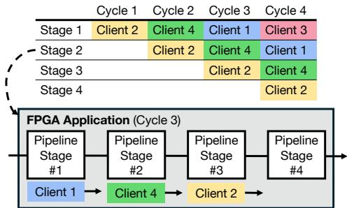  
Figure 1. Example of a pipelined application with four pipeline stages in hardware and each stage independently processing the data of a single client.

While many shells [34, 39, 48, 66] provide such services, they are static; that is they are loaded once during initialization and are not reconfigurable. However, realistic workloads are dynamic in nature and reconfiguring the services (e.g., switching from TCP/IP to RDMA, varying the MMU configuration, or changing the compression algorithm) should not require to reboot the FPGA, thereby interrupting service. To address this limitation, Coyote v2’s three-layer hardware design natively supports run-time reconfiguration of services, enabling efficient adaptation to dynamic workloads.

An additional goal for the design was to establish the FPGA as an equal-class citizen in the landscape of data center hardware, rather than a stand-alone compute node. Therefore, the emphasis when implementing services was on compatibility and seamless interaction with other parts of the system. For this purpose, Coyote v2 includes a highly configurable memory management unit (MMU), which seamlessly moves data between the host CPU and the FPGA. Proof of Coyote v2’s flexible and extensible MMU is an external contribution [8] to the open-source codebase, which extended the MMU to include GPU memory and supports direct data movement between the FPGA and a GPU as proposed in [58]. Another example of an independent service available in Coyote v2 is an open-source, RoCEv2-compatible RDMA stack [53], which, when integrated with Coyote v2’s memory model, enables out-of-the-box interaction between the FPGA and commodity network interface cards (NICs), such as Mellanox and BlueField. How to implement services will be later demonstrated by describing a service for capturing network traffic in real time, similar to ibdump or tcpdump on Linux.

Requirement 2: Multi-tenancy, partial reconfiguration and application pipelining: FPGA hardware has been steadily improving over the past few years, often providing compute, memory and network bandwidth exceeding the requirements of a single application. For example, the recent AMD Alveo V80 [6] is equipped with over 2.5 million LUTs, 800G networking hardware and 32 GB of 810 GBps-capable HBM. Given this trend, several shells [34, 39, 43, 57] have proposed spatial sharing with partial reconfiguration of the user region. Following this trend, Coyote v2 also includes the ability to deploy multiple, reconfigurable user applications, while ensuring fair access to the shared services.

In contrast to existing work, Coyote v2 also enables multiuser, transparent application pipelining, effectively reducing idle time. Certain workloads can be deeply pipelined, but still fail to achieve high throughput due to data dependencies. Examples include (i) AES Chipher Block Chaining (CBC) encryption, which encrypts text sequentially in chunks, but each chunk depends on the previous one, and (ii) LLMs, where each token depends on the previously generated token. In these cases, avoiding idle time in hardware can be achieved by servicing multiple requests simultaneously (Figure 1). This is a direct consequence of the improved user interfaces and the software abstractions, and to the best of our knowledge, not available in other shells.

Requirement 3: Unified and generic application interfaces: To facilitate data movement and kernel control, shells typically provide standardized interfaces. While several platforms [32, 34, 39] have proposed such interfaces, they are often not sufficiently generic as can be shown with the following two examples (Figure 2):

• Neural network inference: Similar to GPUs, FPGAs have been successfully used for neural network inference [31, 45, 56]. Adopting an approach commonly found on GPUs, weights can be pre-loaded to FPGA HBM, while input data can be directly streamed from the host as requests come in. In this case, AmorphOS [32] requires the inputs be first copied from host memory to FPGA HBM, before it can be processed by the application. When compared to Coyote [34], which streams data directly from host memory to the user application, completely bypassing FPGA HBM, the approach taken by AmorphOS incurs a non-negligible latency penalty. Similarly, SDAccel [59] enables host data streams only on some QDMA-supported FPGAs.

• Vector addition: For vector addition, an FPGA application should consume two (or more) vectors and produce a single result vector. Typically, vectors are streamed from host memory to the FPGA; however, most previous shells [34, 39, 48, 66] only provide one data stream from/to host memory, requiring the user to manually pack multiple vectors into a single stream in software and then unpack them in hardware. Doing so for applications with many inputs and outputs is cumbersome and error-prone.

In Coyote v2 we define a single and generic user interface supporting multiple data streams from and to host memory, FPGA memory, and the network. Additionally, the interface allows user applications to issue DMA requests from hardware, rather than relying on the host software to do so.

Finally, only some commercial shells [5, 59, 61] provide interfaces for the user application to issue generic interrupts.

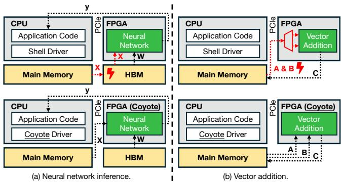  
Figure 2. Limitations of existing shell interfaces and the proposed solutions with Coyote v2’s interfaces.

However, a sufficiently generic interrupt interface is a necessity for realistic workloads, as applications can encounter various unwanted states, such as malformed data or timeouts. An interface like this would enable a closer interaction between the host CPU and the FPGA card, while also enabling the host software to take control in the case of an unexpected situation. In Coyote v2 we include this functionality as part of the generic interface, thereby simplifying the design space without losing flexibility.

## 3 System Overview

In the following, we introduce Coyote v2 (Figure 3(a)), a shell addressing requirements 1-3. Coyote v2 is implemented using a three-layer, hierarchical and modular hardware design: (i) the static layer, (ii) the dynamic (services) layer and (iii) the application (user) layer. Additionally, Coyote v2 includes (i) a user-facing, high-level software API and (ii) a device driver. We describe these layers in more detail in the following section. However, before doing so, it is important to highlight the benefits of the proposed design.

The dynamic and the application layer together make up the so-called shell. In contrast to previous works [34, 57, 66], a key advantage of our approach is that services are no longer part of the static layer. Instead, services are now part of the shell which can be dynamically reconfigured. By separating the services from the static layer, Coyote v2 significantly simplifies the static layer, while also enabling independent run-time reconfiguration of both services and user applications. Without having to implement networking, memory controllers etc., the primary purpose of the static layer is now only to provide a link between the host CPU and the FPGA, which can be used for data movement, control and reconfiguration. Importantly, the static layer does not process the incoming data or control signals; instead it passes them onto the upper layers, routing each request to the correct user application or service. The static layer is often card- and interconnect-dependent, since it relies on a DMA IP (e.g. XDMA, QDMA) for CPU-FPGA communication. Coyote v2 encapsulates the static layer behind industry-standard AXI4 wrappers, ensuring any changes in the static layer remain internal to it. By simplifying and encapsulating the static layer, it becomes easier to port it to other FPGAs; a fact highlighted by a recent shell, Harmonia [39]. Coyote v2 runs on a variety of AMD FPGAs (U250, U55C, U280) taking advantage of this separation of layers, also hiding the details of the hardware from the application, making such designs also portable across FPGAs.

## 4 Shell Reconfiguration

To enable shell reconfiguration, Coyote v2 provides a floorplan and interfaces which connect the static layer to the shell. Both the floorplan and the interfaces are hidden from Coyote v2 users; instead, the users simply choose the various shell configurations they would like to synthesize through compile-time parameters. A shell is fully parametrized by its services and the user applications. Coyote v2 will then synthesize all the necessary partial bitstreams (Figure 3(b)) which can dynamically be loaded onto the FPGA, without having to take the FPGA off-line. As shown in Section 9.3, Coyote v2’s dynamic reconfiguration is two orders of magnitude faster than a full reconfiguration. In addition, prior works have shown that a full reconfiguration, which takes the entire FPGA off-line, can lead to kernel interrupts and sometimes even destabilize the entire system in production deployments [48]. In Coyote v2, however, if a corrupted bitstream is loaded or if the dynamic reconfiguration fails to complete, the temporary configuration is discarded and the old shell configuration remains in use. Therefore, full reconfiguration should only be used for initial system bring-up and wherever possible, dynamic reconfiguration should be used instead of a full reconfiguration.

A further advantage of moving the services from the static layer to the shell layer is faster synthesis. Since the primary role of the static layer is to provide a link between the shell and the host CPU, it is not configurable. Therefore, Coyote v2 provides a routed and locked checkpoint of the static layer for each supported FPGA, which can be linked with the shell. An example of a shell reconfiguration process, alongside common shell configurations, is shown in Figure 4.

Compared to shell reconfiguration, Coyote v2 also includes the option to independently reconfigure individual user applications, without affecting other applications or services. This is similar to approaches proposed by prior work [34, 39, 43, 57] which can trigger reconfiguration of specific applications as user requests arrive, based on some scheduling policy. It is important to note that, in Coyote v2, user applications depend on the shell services; that is, a full shell reconfiguration will reconfigure both the services and the user applications, while an application reconfiguration will only reconfigure the user application. This is primarily a fail-safe mechanism which prevents a running application from losing access to a service it requires. Instead, when synthesizing the hardware, an application is always linked to a shell configuration, which verifies that the services required by the application are indeed provided by the shell configuration. This approach introduces an additional layer of isolation and supports multiple privilege levels. Another clear advantage of this modular design is the ability to link new user applications against previously synthesized shell configurations, reducing synthesis times.

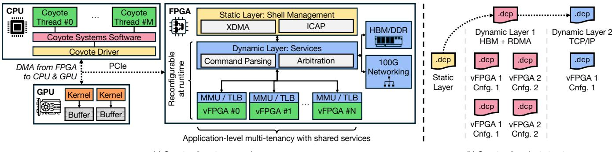  
(a) Coyote v2 system overview.

Figure 3. Coyote v2 system overview and project structure.  
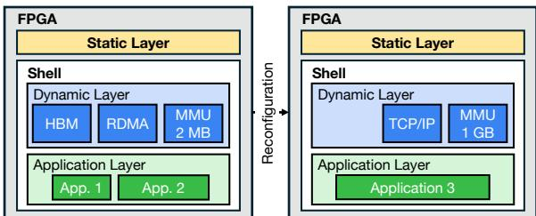  
Figure 4. Shell reconfiguration example.

In conclusion, the proposed three-layer hardware design offers greater design flexibility and reconfiguration opportunities, while still maintaining the ability to only reconfigure user applications, as proposed by previous shells [32, 34, 39, 57, 59, 66]. It simplifies the static layer, which can in turn, simplify the porting of the shell to other FPGAs [39].

## 5 Static Layer

The static layer interfaces with platform-specific hardware, providing a link to the host CPU and the logic necessary to reconfigure the shell. Additionally, the device driver is a core component of the static layer.

## 5.1 CPU-FPGA Link

Heterogeneous CPU-FPGA systems excel at adapting to diverse workloads, by dispatching different tasks to the hardware better suited for the task. Additionally, while FPGAs offer flexibility and high compute performance, they are less suited for management tasks, which are generally better handled on the host CPU. Therefore, the static layer must provide an efficient and generic interface to handle data and control flow between the FPGA and the host CPU. Coyote v2 uses the AMD XDMA core [62], which functions as a DMA wrapper on top a hardened PCIe block on the FPGA, and importantly, can be controlled from both the FPGA and the CPU. Consequently, this allows the FPGA to initiate data transfers with no host involvement. On the other side, the static layer interacts with the shell through these channels:

Shell control: Mapping various shell control registers (e.g., TLB control, network configuration, interrupts, etc.) into host memory via PCIe Base Address Registers (BARs).

Host streaming channel: An AXI4 stream for direct data movement between host memory and user applications. This channel reduces data transfer latency, compared to shells [32, 43, 48] which require a copy from host memory to card memory, before being available to the user application.

Migration channel: Enables migrating buffers from host memory to FPGA-side memory (HBM/DDR). Such operations are required for large buffers where transfer latency is not a concern, e.g. transferring the weights before model serving for inference. Note, this channel is only available when the shell is built with memory support; otherwise, it is tied off in the dynamic layer.

Utility channel: This two-sided channel is primarily reserved for management operations. On one side, partial bitstreams for reconfigurations are loaded from the host via this channel, which we describe further in the following subsection. On the other side, this channel is used for Coyote v2’s writeback functionality. The writeback mechanism enables efficient completion tracking by updating host memory counters when data transfers finish. This reduces unnecessary PCIe polling, thus freeing up bandwidth. While the XDMA core natively supports writeback with host-mapped counters, we extend it to all additional data services: FPGA memory and the network; all of which operate independently of the PCIe. Such functionality is crucial for high-performance systems, but is often found lacking. Finally, this channel is used to raise interrupts to the host, using the standardized MSI-X (Message Signaled Interrupts eXtended) technology, which is processed by the device driver. In a complex system like Coyote v2 there are many sources of interrupts, such as page faults, reconfiguration completions, TLB invalidations and user-issued interrupts, a key feature for realistic workloads, commonly found missing in many shells.

Table 2. Reconfiguration throughput comparison.
<table><tr><td>Application</td><td>Maximum throughput [MB/s]</td><td>Interface</td></tr><tr><td>AXIHWICAP [9]</td><td>19</td><td>AXI Lite</td></tr><tr><td>PCAP [60]</td><td>128</td><td>AXI</td></tr><tr><td>MCAP [60]</td><td>145</td><td>AXI</td></tr><tr><td>Coyote v2 ICAP</td><td>800</td><td>AXI Stream</td></tr></table>

## 5.2 Device Driver

Coyote v2’s device driver is a Linux kernel component bridging user applications in software and in hardware. It manages the FPGA and its peripherals, handling memory mappings, dynamic allocations, page faults, and partial reconfiguration. The driver also initializes all user application in hardware, enabling communication from software via standard system calls like open, close, mmap, and ioctl.

## 5.3 Reconfiguration Controller

Partial reconfiguration in Coyote v2 is managed through the Internal Configuration Access Port (ICAP) [7], a centralized block enabling dynamic partial reconfiguration while the rest of the FPGA remains operational. Achieving high reconfiguration speed is crucial for a realistic data center setting. Standard methods, such as AXI HWICAP [9] and MCAP [60], suffer from low throughput due to their reliance on single-word writes. To maximize performance, we implement an optimized controller that fully utilizes the ICAP bandwidth (∼800 MBps on AMD UltraScale+ devices). This bandwidth is achieved by loading the bitstream from host memory via PCIe and a dedicated XDMA channel. Table 2 summarizes the differences in performance between existing reconfiguration controllers and Coyote v2.

## 6 Dynamic Layer

## 6.1 Memory Management

We build upon Coyote’s [34] shared virtual memory model, enhancing it to support arbitrary page sizes, TLB sizes and associativities. The memory model is similar to the one commonly found in GPUs, issuing a page fault when the requested data is not in the correct memory (CPU DDR, FPGA HBM) and triggering a migration. Coyote v2’s MMU is implemented in a hybrid manner: TLBs are implemented in on-chip SRAM, enabling fast look-ups, while the rest of the MMU is implemented in the host-side driver; that is, when a TLB miss is detected; the system falls back to the driver to obtain the physical address. A stand-out feature of Coyote v2 is that the TLB configuration is parametrizable, allowing Coyote v2 to be deployed on a wide range of systems. For example, associativity and page size are configurable. Given the ever-increasing data requirements of modern applications, the latter is particularly important since the page size can be set to support very large huge pages (1 GB), minimizing page faults. Additionally, NRU eviction can be enabled or disabled. While Coyote v2 does not yet implement prefetching; the MMU and TLB are independent, well-documented modules that can be extended with new algorithms. For example, we are currently developing a TLB with adaptive page size, tailored specifically to each application.

Coyote v2 also abstracts the creation of any memory controllers (HBM/DDR) on the FPGA and is highly configurable, allowing developers to set options such as number of memory channels, memory clock frequency etc. Application requests to FPGA memory are also done with virtual address, with the translation being handled by the MMU. To maximize throughput, Coyote v2 implements memory striping, partitioning data buffers across multiple HBM banks.

## 6.2 Networking

One of the key services in Coyote v2 is BALBOA [53], a 100G, fully RoCEv2-compliant networking stack, that enables the deployment of a Coyote v2-powered FPGA in a heterogeneous networking environment. BALBOA exposes standard AXI-streaming interfaces for both data- and controlflow to the host and network, making it portable and easy to integrate in Coyote v2. Both data- and control-flow are routed through the user applications (vFPGAs) enabling ondatapath custom off-loads and data processing tasks, similar to SmartNICs or Data Processing Units (DPUs). Additionally, BALBOA aligns well with other abstractions from Coyote v2. The network stack, since it implements RDMA, operates on virtual memory addresses that are translated using Coyote v2’s internal MMU and TLB, before writing the data to host memory through the static layer.

## 6.3 Multi-tenant Fair Sharing

To achieve fairness between multiple tenants on bandwidthconstrained links (PCIe, network), Coyote v2 implements packetization, interleaving and a dedicated credit-based system for all data requests (from/to each vFPGA). Packetization divides transfers into manageable 4 KB chunks (default, but configurable), which enables precise control over outstanding transactions while ensuring efficient saturation of both local and remote links. The shell seamlessly splits requests of arbitrary sizes into packets, requiring no user application involvement. Interleaving distributes limited bandwidth links using round-robin arbitration, guaranteeing equal resource allocation while preserving in-order packet handling. For example, with 6 vFPGAs, each one is guaranteed to send/receive at least 4 KB of data every 6 cycles. If some vFPGAs are idle, the remaining accesses are automatically redirected to other vFPGAs. This ensures fair sharing and low idle time, regardless of the application’s access patterns. However, interleaving and arbitration are unnecessary for HBM requests, as the significantly higher local bandwidth allows each vFPGA to utilize dedicated interfaces efficiently.

<table><tr><td rowspan="2"></td><td rowspan="2">Control bus L ?</td><td rowspan="2">Interrupt channel ↑</td><td rowspan="2">DMA</td><td rowspan="2">DMA ：Completions</td></tr><tr><td>Requests +</td></tr><tr><td>clk</td><td>AXI4 Lite</td><td></td><td>VFPGA</td><td></td></tr><tr><td>reset</td><td></td><td>AXI4 Stream</td><td>AXI4 Stream</td><td>AXI4 Stream</td></tr><tr><td></td><td>Ｈ H</td><td></td><td>↑ ↓</td><td>→ ↓</td></tr><tr><td></td><td>Nx</td><td></td><td>Mx</td><td></td></tr><tr><td></td><td></td><td></td><td></td><td>Px</td></tr><tr><td></td><td>Host data</td><td></td><td>Card data</td><td>Net data</td></tr></table>

Figure 5. In- and outgoing vFPGA interfaces.

## 7 Application Layer

The application layer consists of multiple parallel vFPGAs, which can host arbitrary user applications. We begin by describing the generic application interface, which abstracts and virtualizes data movement, control flow and network interaction for the vFPGAs. Secondly, we describe the crediting mechanism, which prevents any vFPGA from exerting back-pressure on the entire system. Finally, we present the software API, which facilitates seamless interaction with the applications described in hardware.

## 7.1 Generic Application Interface

A generic application interfaces solves two problems: (i) the inherent complexity of accessing FPGA peripherals (host, network, card) to fetch data and (ii) portability to other platforms. By providing a standardized execution environment, developers can focus on application development and performance optimization, without having to worry about infrastructure or portability. We base our execution environment on Coyote [34], but extend it to include multiple data streams and user interrupts. The interfaces, illustrated in Figure 5, are built around industry-standard AXI specification, including:

Control bus: enables software control over the deployed user applications. This interface is built around an AXI4 Lite bus, which is memory-mapped for each vFPGA directly into the user space, bypassing the kernel space, to achieve lower latency. On the hardware, this interface connects to a set of control and status registers, whose functionality is application-specific and user-defined.

Interrupt channel: enables hardware applications to issue interrupts, with arbitrary values, to the host software. On the host, interrupts are polled using the Linux eventfd mechanism, which triggers an interrupt callback function.

Parallel host interface: multiple AXI4 streams, for data from and to host memory.

Parallel card interface: multiple AXI4 streams, for data from and to card memory (HBM/DDR). Parallel streams can be used to achieve higher throughput, especially with HBM memory, as discussed in Section 9.1.

Parallel network interface: multiple AXI4 streams, for data from and to the enabled networking stacks.

Read and write send queues: interfaces which enable the vFPGA to trigger local and remote data transfers, without relying on host software, by specifying information such as buffer virtual address, length, type of operation (local or remote), target stream etc. Parallel interfaces for reads and writes to achieve higher performance. This interface is particularly important for accelerated applications that rely on some sort of pointer chasing. In a host-centric system, the CPU would have to manage each data transfer between memory and the FPGA. At every step, the CPU must either poll or handle interrupts to initiate subsequent data movements, leading to increased latency and wasted CPU cycles.

Read and write completion queues: interfaces containing information for completed data transfers.

Key advantages of the proposed interfaces are: (i) easier deployment of applications with multiple inputs/outputs, (ii) higher HBM throughput through parallel accesses (Section 9.1), (iii) pipelining of user applications (Section 9.5), and (iv) better interaction with the host through interrupts.

## 7.2 Untrusted Applications and Crediting

Since Coyote v2’s vFPGAs house arbitrary user logic, they are assumed to be untrusted, and like OS processes, safeguards preventing system-wide disruptions must be implemented. To do so, Coyote v2 first implements a per-vFPGA MMU ensuring memory isolation between multiple vFPGAs. Second, Coyote v2 implements a credit system to tackle backpressure and deadlocks. As an example, consider a scenario in which a single vFPGA requests data but, upon receiving it, fails to consume it. Such scenarios have the potential to create backpressure on the entire system, disrupting the operation of other applications and the system as a whole. Similar scenarios can occur for write requests when no data to write is provided. For each vFPGA, Coyote v2 implements a per-stream crediting mechanism, built on top of destination queues, which verifies the available credits for the specific vFPGA and data stream. Requests are only propagated to the dynamic layer when sufficient space in the queue is available. Otherwise, the request is stalled, exerting back-pressure onto the vFPGA rather than the rest of the system. Credits are replenished when previous requests are marked as complete. Crediting applies to all data requests: host, card memory and, network, with independent crediters implemented for each of the three, maximizing performance and parallelism.

## 7.3 Software API

Finally, we introduce Coyote v2’s software API, implemented in C++ for cross-platform compatibility, high performance, and support for low-level operations. While assigning each vFPGA to an individual host process may seem intuitive, congestion and routing constraints practically limit the number of vFPGAs to between eight and ten. An alternative for achieving higher performance is leveraging pipeline parallelism, which enables independent threads to advance through the pipeline stages of the hardware application without having to wait for other threads to complete (Figure 1). To do so, we introduce Coyote threads, cThreads, corresponding to software threads that execute in parallel on the same vF-PGA pipeline, while preserving thread differentiation. Each cThread is associated with a single vFPGA and multiple, independent cThreads can be associated with the same vFPGA. In an OS analogy, vFPGAs can be thought of as processes in hardware, while cThreads can be thought of as software threads. Assigning multiple cThreads to a single vFPGA can improve hardware utilization and reduce idle time, as shown in the case of AES encryption in Section 9.5.

A cThread can be used to allocate card memory, set and read control registers, trigger data movement, initiate Queue Pair (QP) numbers for RDMA connections and invoke hardware kernels. cThreads provide a high level of abstraction as a C++ class that directly interacts with the device driver through system calls. We demonstrate the simplicity of interaction with Coyote v2 in the following example, showcasing how encryption can be invoked from software.

Code 1. Example Coyote v2 code for memory allocation, control register setting and kernel launch.

// Create a cThread and assign it to vFPGA 0   
cThread<std::any> cThread(0, getpid());   
// Allocate 4KB source & destination memory   
// using huge pages (HPF)   
// Also, getMem adds src and dst to the TLB   
char \*src = cThread.getMem({Alloc::HPF, 4096});   
char \*dst = cThread.getMem({Alloc::HPF, 4096});   
// Some host-side processing on src and dst   
// Set hardware register for encryption key   
const uint64\_t KEY = 0x6167717a7a767668;   
cThread.setCSR(KEY, 0);   
// Create SG entry for DMA transaction   
locaslSg src\_sg = {.addr = src, .len = 4096};   
locaslSg dst\_sg = {.addr = dst, .len = 4096};   
// Launch the kernel with the above SG entries   
cThread.invoke(LOCAL\_TRANSFER, src\_sg, dst\_sg);

In terms of isolation guarantees, a similar OS analogy can be made. Multiple vFPGAs are deployed concurrently, each occupying its own space on the FPGA with strict separation:

each has its own MMU/TLB, is linked to a dedicated character device in the driver, and shared services are managed by shell-wide arbiters. Therefore, data isolation between vFPGAs is guaranteed by the shell. Like OS threads of a single process, the isolation guarantees between cThreads of the same vFPGA are weaker. cThreads of the same vFPGA share a memory space and populate the same TLB. However, entries within the TLB of a single vFPGA are still tagged with the cThread ID, which allows applications to prevent data sharing between cThreads, if required. Akin to software threads of an OS process, the isolation guarantees are the responsibility of the application, not the OS. For example, data isolation between cThreads can be achieved by ensuring that each thread uses a unique subset of the previously described parallel data interfaces in the vFPGA.

Finally, the software API includes the necessary functions to handle reconfiguration. To do so, it is simply required to pass a path to the partial bitstream file:

Code 2. Example Coyote v2 code for dynamic reconfiguration.

// Create a reconfiguration instance   
cRcnfg rcnfg(0);   
// Shell (dynamic + app) reconfiguration   
rcnfg.reconfigureShell("/path/to/shell.bin");   
// vFPGA #2 (app) reconfiguration   
rcnfg.reconfigureApp("/path/to/app.bin", 2);

## 8 Case Study: Traffic Sniffer

As an example of the design of a service using Coyote v2, we describe a traffic sniffer (Figure 6) that illustrates the process but also the potential of Coyote v2 for building, e.g., SmartNICs. When enabled, a network filter is inserted between the available network stacks and the 100G CMAC. By utilizing Coyote v2’s control interface and exposing its own registers, the traffic sniffer can be configured from the host software. Hence, RX- and TX-traffic is filtered based on a user-configured filter. Additionally, partial sniffing of only headers is possible through the same control interface.

On the data plane, the traffic sniffer connects to the shell’s networking stacks, the CMAC, and the application layer, which is used to timestamp the data and store it to a previously allocated HBM buffer. With the same control interface, it is possible to start and stop the traffic recording. Using the previously described mechanisms for memory management, the captured data can be synced back to host memory, where a software parser converts the raw recordings to a PCAP file for analysis with standard networking tools (e.g., Wireshark).

In summary, this sniffer design combines key concepts of Coyote v2’s data- and control-flow in the application layer with the notion of a controllable traffic filter as a reconfigurable service to provide a crucial network debugging utility.

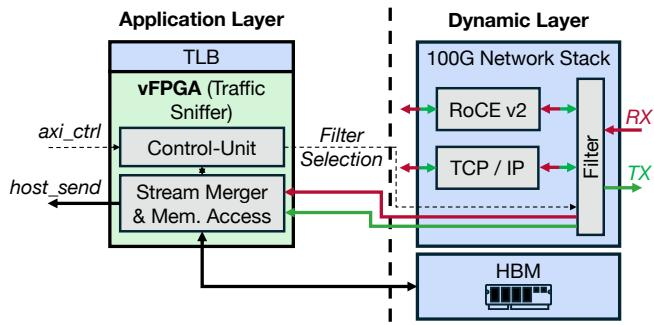  
Figure 6. Schematic of the traffic sniffer design with the filter as service and vFPGA-backed application logic.

## 9 Evaluation

In the following sections, we evaluate Coyote v2 on a wide range of micro- and macro- benchmarks, showcasing the performance and generalizability of the proposed approach in a realistic data center setting.

## 9.1 Micro-benchmark: Throughput Scaling per App with the Number of HBM Channels

A direct consequence of the improved user interfaces and memory striping is improved memory bandwidth compared to existing shells [34, 39], allowing parallel data transfer and processing in a single vFPGA. Figure 7(a) illustrates the throughput of a simple pass-through application that consumes data from and stores it back to the card’s HBM. The results are averaged over 50 trials, with 50 warm-up runs and obtained on an Alveo U55C card, with a system clock of 250 MHz and an HBM clock of 450 MHz. Initially, the throughput follows a linear trend, which tapers off as the number of HBM channels increases, due to the memory virtualization overhead. For applications that require the full HBM bandwidth, it is possible to bypass the MMU and directly expose certain HBM channels. While achieving higher performance, this approach would require careful consideration of memory management between the host and the FPGA, which is abstracted by Coyote v2’s virtual memory model. Keep in mind that while the nominal bandwidth on the HBM of an FPGA is higher, it is very difficult to reach it due to design congestion and timing closure issues [50].

## 9.2 Micro-benchmark: Synthesis Time with Nested Build Flow

An additional consequence of the three-layer hierarchical hardware design is a decoupled build flow of services and user applications, which speeds up the quite lengthy FPGA synthesis process. For a given shell configuration, it is possible to only synthesize a user application and link it to the shell, without having to resynthesize the dynamic or static layer. As these layers interact with peripherals (PCIe, HBM, CMAC), their synthesis often takes long due to congestion and routing complexity. For example, a cloud provider may want to explore various encryption cores for their RDMA stack; however, having to wait 4-6 hours each time for the synthesis, place and route of the RDMA stack with the encryption core would significantly harm productivity. Instead, the cloud provider could compile the RDMA stack once and link the various encryption cores to it. Figure 7(b) highlights the synthesis times of the following configurations:

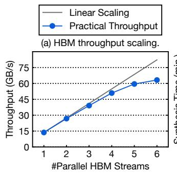

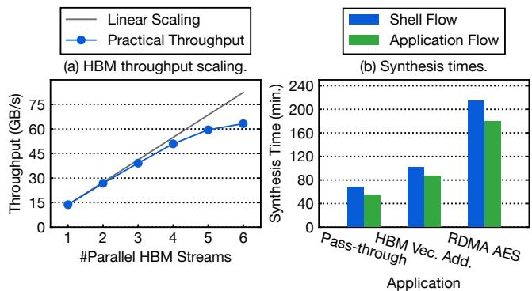

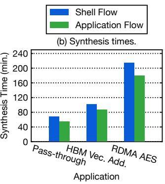  
Figure 7. a) Transfer throughput scaling with the number of HBM channels. b) Comparison of synthesis and implementation times with shell and app flow targeting an Alveo U250.

• A simple data pass-through application, moving data from one host buffer to another. The only included service is a single data interface to the host.

• A vector addition kernel that pulls data from the card’s memory and stores the result back to memory. This shell exhibits some synthesis complexity, due to the complexity of memory controllers [50].

• A shell with RDMA and an AES encryption module. Increased synthesis complexity, due to the presence of a networking stack, which also relies on card memory to handle re-transmissions.

Shell flow refers to a flow which synthesizes, places and routes both the application and the services. App flow refers to a flow which only synthesizes, place and routes the user application, which is then linked against a previously routed and locked shell with the target services and placeholders for the application. The time is reported from the start of the build process, including synthesis, placement, routing and any additional checks and optimizations. Overall, the app flow can reduce the synthesis time by 15% to 20%.

## 9.3 Micro-benchmark: Shell Reconfiguration

Next, we evaluate Coyote v2’s ability to efficiently reconfigure the entire shell; that is both services and user applications. To do so, we consider three reconfiguration scenarios:

Table 3. Reconfiguration latency for various Coyote v2 shell configs. Average latency with STD reported from 5 trials.
<table><tr><td rowspan="3">Scenario</td><td>Coyote v2</td><td>Coyote v2</td><td rowspan="3">Vivado flow [ms]</td></tr><tr><td>kernel</td><td>total</td></tr><tr><td>latency [ms]latency [ms]</td><td></td></tr><tr><td>#1</td><td> $\overline { { 5 1 . 6 \pm 0 . 0 } }$ </td><td> $\overline { { 5 3 6 . 2 \pm 5 . 2 } }$ </td><td> $\overline { { 5 5 9 2 2 . 5 \pm 4 4 3 . 1 } }$ </td></tr><tr><td>#2</td><td> $7 2 . 3 \pm 0 . 2$ </td><td> $7 0 9 . 0 \pm 9 . 1 $ </td><td> $6 3 0 4 5 . 2 \pm 7 8 . 0$ </td></tr><tr><td>#3</td><td> $8 5 . 5 \pm 0 . 7$ </td><td> $9 2 9 . 1 \pm 3 . 5$ </td><td> $7 1 4 1 7 . 9 \pm 5 1 2 . 0$ </td></tr></table>

• Scenario #1: Initially, the FPGA is loaded with a simple pass-through kernel and an MMU supporting 2 MB pages. Then, the shell is reconfigured to include the same kernel, but with an MMU supporting 1 GB pages.

• Scenario #2: Initially, the FPGA is loaded with a shell supporting RDMA and a single kernel which writes the received traffic to host memory. Then, the shell is reconfigured to have two numerical kernels (vector addition, product) and no networking stack.

• Scenario #3: Initially, the FPGA is loaded with a shell that has both RDMA and the previously mentioned traffic sniffer. Then, it is reconfigured to disable the traffic sniffer, while keeping RDMA enabled.

The three scenarios effectively capture Coyote v2’s flexibility and modularity that allow it be applied in a wider range of settings, such as varying the memory model based on the workload (#1), dynamically increasing the number of user applications (#2) or enabling/disabling a network debugger (#3). The results are presented in Table 3. Since the shell bitstream must be read from disk and copied into kernel space, we report two latencies: the kernel latency, corresponding only to the actual reconfiguration, and the total latency, which includes reading from disk and copying the buffer into kernel space. Additionally, the results include a comparison against a full FPGA re-programming with Vivado Hardware Manager, which also includes a PCIe hot-plug and driver re-insertion.

Partial FPGA reconfiguration still remains a slow process; however, compared to a full re-programming the FPGA, Coyote v2’s shell reconfiguration flow is an order of magnitude faster, even when reading the bitstream from disk. In a realistic setting, shell reconfiguration is expected to happen for significant workload changes, rather than single application changes, and as such, the latency can be considered acceptable. Since bitstreams are not too large (tens of MBs), the latency penalty incurred for reading from disk, can be solved by keeping frequently used shell bitstreams in memory.

## 9.4 Macro-benchmark: Multi-tenant AES ECB Encryption

For the next benchmark, we consider deploying multiple instances (vFPGAs) of the AES Electronic Codeblock (ECB) algorithm. While not the strongest encryption algorithm, this benchmark is a valuable test of Coyote v2’s ability to fairly deploy multiple independent applications. Since the algorithm is memory-bound, Coyote v2 must ensure fair sharing of the host memory bandwidth (around 12 GBps on the Alveo U55C with an XDMA core). As shown in Figure 8, the bandwidth is indeed fairly distributed across vFPGAs. Additionally, the cumulative throughput remains constant, indicating no overhead from the arbiter and packetizer.

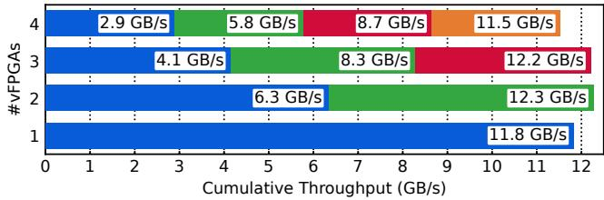  
Figure 8. AES ECB bandwidth sharing across vFPGAs.

## 9.5 Macro-benchmark: Pipeline AES CBC Encryption with Multiple Clients

In this benchmark, we consider an alternative encryption algorithm, AES CBC. In CBC mode, the encryption is inherently sequential: each 128-bit text is XOR’ed with the previously encrypted block, leading to pipeline stalls when processing a single request. Illustrated in Figure 9, the AES core we use consists of a 10-stage pipeline, which, in a singlethreaded execution model, would lead to 9 out of 10 stages remaining idle. Figure 10(a) shows that with a single cThread, the throughput saturates at 280 MBps around 32 KB.

To mitigate this under-utilization, we leverage multiple concurrent software threads (cThreads), associating each request with a unique thread ID. All cThreads use the same (single) vFPGA in hardware. At each clock cycle a cThreads data is in one of the ten stages and with each new clock cycle, each of the inputs move to next stage of the pipeline (Figure 9). A round-robin-based control block is placed before the AES encryption block, ensuring (1) that each cThread has an equal chance of sending inputs for encryption and (2) does not submit new text before the prior chunk of text has been encrypted. Given that data is transferred via AXI streams, the cThread ID is easily assigned to the TID field from the AXI specification. Furthermore, independent cThreads can submit their text independently, by targeting one of the ?? parallel host streams. The cThread software abstraction seamlessly allows this through the dest field in the scatter-gather entry, which corresponds to the target stream (TID) in the vFPGA. Extending the hardware to support this type of processing requires minimal changes to the user application: first, the target number of data streams, corresponding to the maximum number of cThreads, must be set. Then, a 512-to-128 bit data width converter (available as an IP from AMD) and a round-robin arbiter (pre-provided by Coyote) need be included before the AES block. Following the AES block, a simple demultiplexer is needed to assign the AES output one of the ?? output streams, based on the TID value.

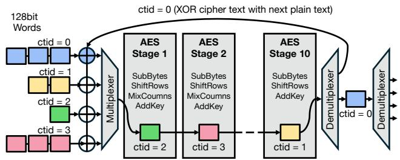  
Figure 9. AES CBC pipeline with multiple clients (cThreads).

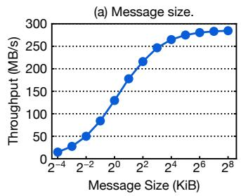

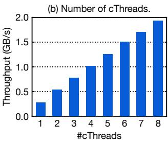  
Figure 10. a) Throughput scaling for AES CBC with the message size for a single cThread b) Throughput scaling for AES CBC with multiple cThreads for a 32 KB message.

Implementing this type of pipelining with a single data stream would require interleaving the chunks of text from different clients (cThreads) in software. This interleaving would have to be extremely fine-grained, since AES operates on 128-bit chunks, making it memory-inefficient. Additionally, as described in Section 7, Coyote v2 transfers data in 512-bit chunks; therefore, packing 128-bit chunks from different clients (IDs) into a single transfer would require additional metadata to be transferred from software to hardware. However, with Coyote v2’s approach, only a simple round-robin arbiter in hardware (pre-provided by Coyote v2) is needed to select the next encryption input.

As shown in Figure 10b, the throughput scales linearly with the number of software threads, indicating negligible overhead from arbitration and effective reduction of hardware idle time. While this example showcases Coyote’s ability to support multiple clients in a pipelined, stateless application, the principle can be extended to more complex, stateful applications. The vFPGA could implement control logic to keep track of the hardware states of each cThread and context-switch between them. Furthermore, leveraging Coyote’s infrastructure for control and status registers, the host software could coordinate the execution of multiple cThreads. While conceptually similar to CPU multithreading, state tracking would be application-specific, since each application can be implemented with arbitrary digital logic (unlike CPUs with a fixed instruction set and registers).

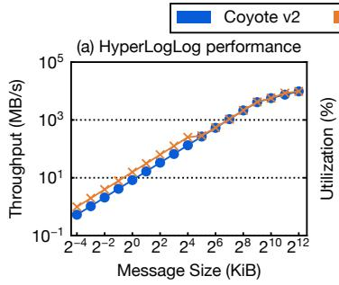

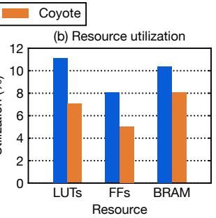  
Figure 11. HyperLogLog performance and resource utilization with Coyote v2 compared to Coyote.

## 9.6 Macro-benchmark: HyperLogLog cardinality estimation with on-demand reconfiguration

In this benchmark, we deploy an High-Level Synthesis (HLS) kernel for HyperLogLog (HLL) cardinality estimation [35] with Coyote v2, showcasing Coyote v2’s ease-of-integration with high-level programming frameworks as well as applicability to realistic workloads. As a baseline, we use Coyote [34] running the same kernel and compare the achieved throughput and overall (base shell + HLL kernel) resource utilization. Figure 11 shows that Coyote v2 achieves comparable performance to Coyote, with slightly higher resource utilization. The increased resource utilization is due to the added features to the shell which provide better interfaces and support at no performance cost; however, it is important to note that the overall utilization remains low, around 10%, leaving ample room for deploying other applications. As an example of the difference in functionality, in Coyote v2 we can run the same kernel as a background daemon loaded on demand. When a client (local or remote) submits a request to run HLL, Coyote v2 loads the kernel through partial reconfiguration and runs it. On average, the partial reconfiguration to load the HLL kernel takes only 57 ms.

## 9.7 Macro-benchmark: Neural network inference

As a final example, we deploy a neural network on the FPGA using Coyote v2 and hls4ml [17, 19]. hls4ml is a widely used, open-source framework that compiles high-level neural networks into quantized FPGA IP cores for real-time inference. Additionally, it includes a set of accelerator backends that integrate the generated IP core with the necessary infrastructure for performing inference on PCIe-attached FPGAs. In a similar manner, we extend hls4ml with a new accelerator backend, CoyoteAccelerator, which will integrate the generated neural network IP as a vFPGA in Coyote v2. Due to Coyote v2’s modular design and high-level software abstractions, we were able to seamlessly integrate the backend in hls4ml’s Python library, as shown in the following code snippet. Important to note, these changes are completely hidden from end-users of hls4ml: to use the new backend, it is sufficient to simply pass the correct backend name when synthesizing the model. Performing inference is equally simple, and can be achieved through the high-level Python function predict. This example shows how Coyote v2 provides an interaction similar to that found on GPUs, through frameworks such as PyTorch [47] or TensorFlow [3].

Code 3. Neural network inference with Coyote v2 and hls4ml.

```python
# Load TensorFlow/Keras model and dataset
model = load_model('sample_keras_model.h5')
X = np.load('sample_data.npy')
# Create hls4ml model targetting Coyote backend
hls_config = config_from_keras_model(keras_model)
hls_model = convert_from_keras_model(
keras_model, hls_config=hls_config,
output_dir='/path/to/output/dir',
backend='CoyoteAccelerator', clock_period=4,
input_data_tb='sample_data.npy',
output_data_tb=f'sample_labels.npy'
)
# Compile and run software emulation
hls_model.compile()
pred_emu = hls_model.predict(X)
# Start hardware synthesis
hls_model.build()
# Once done, create an "Overlay" of the vFPGA
overlay = CoyoteOverlay('/path/to/output/dir')
overlay.program_fpga()
# Run inference on hardware
pred_fpga = overlay.predict(X, (1,), BATCH_SIZE)
```

We evaluate our backend against the hls4ml baseline, which uses the Vitis compilation flow with PYNQ for the Python interface. We deploy a neural network for network intrusion detection [44, 55], a common use case for FPGAs, on a Alveo U55C clocked at 250 MHz. It is important to note that the CoyoteBackend is not tied to a specific model: the actual model conversion and IP generation are the responsibility of the core hls4ml compiler, and any model that is supported by hls4ml can be deployed with Coyote v2. The results are shown in Figure 12, indicating a clear advantage in performance of the proposed backend, while keeping the overall resource utilization approximately equal. While there is a clear advantage in performance, it is important to note that the baseline is not fully optimized, since it requires the data to be copied from host memory to FPGA HBM, before being consumed by the neural network, rather than being streamed directly into the model from the host. Part of the slowdown comes from the fact that the CoyoteBackend integrates directly with Coyote v2’s high-performance C++ library, whereas PYNQ provides a number of additional features and control steps for FPGAs, implemented in Python.

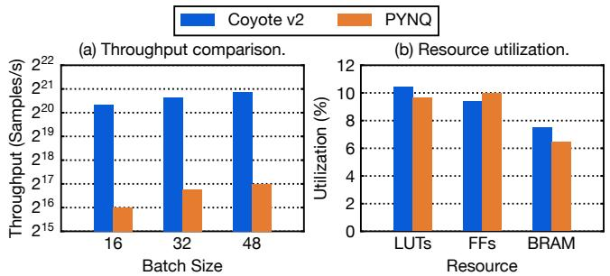  
Figure 12. hls4ml performance and resource utilization with Coyote v2 compared to PYNQ with Vitis.

## 10 Conclusion

In this paper we have described Coyote v2, an open-source FPGA shell with a novel hierarchical architecture and a unified user interface that enables support for reconfigurable services and pipelined application deployment. The proposed approach reduces synthesis and reconfiguration times, while enabling seamless deployment of arbitrary applications (e.g. HyperLogLog, encryption, neural networks). In future work, we want to extend Coyote v2 as a platform for heterogeneous systems, add support for collective communication [22], interaction with storage systems, and improved high-level APIs for ML applications (e.g., PyTorch [47]). Such a heterogeneous platform would open up research possibilities on many real use cases that often rely on CPUs. For example, with Coyote v2’s multitenancy and networking, it is possible to independently process different network flows with arbitrary SmartNIC-like functions (e.g., compression, filtering) hosted in individual vFPGAs. In the context of near-data acceleration, Coyote v2 can be used as an offload engine for SSDs (e.g., relational operators, specialized compression) and memory (e.g., CXL extender controllers). For AI networking hubs, Coyote v2 is intended as a distribution center linking CPUs, GPUs, and DPUs, supporting offloads (e.g., gradient compression) and collective operations for data sharding.

## Acknowledgments

We would like to thank AMD for the donation of the Heterogeneous Accelerated Compute Cluster (HACC) which was used for the development of this project. The work was funded in part through an unrestricted grant from AMD.

## References

[1] Kamaraj A, Vijaya Kumar, P Vishnu Prasanth, Ritam Dutta, Bhaskar Roy, and Prabal Chakraborty. 2024. FPGAs as Hardware Accelerators in Data Centers: A Survey From the Data Centric Perspective. In 2024

2nd International Conference on Device Intelligence, Computing and Communication Technologies (DICCT). 1–6. doi:10.1109/DICCT61038.2 024.10533053

[2] Daniel Abadi, Anastasia Ailamaki, David G. Andersen, Peter Bailis, Magdalena Balazinska, Philip A. Bernstein, Peter A. Boncz, Surajit Chaudhuri, Alvin Cheung, AnHai Doan, Luna Dong, Michael J. Franklin, Juliana Freire, Alon Y. Halevy, Joseph M. Hellerstein, Stratos Idreos, Donald Kossmann, Tim Kraska, Sailesh Krishnamurthy, Volker Markl, Sergey Melnik, Tova Milo, C. Mohan, Thomas Neumann, Beng Chin Ooi, Fatma Ozcan, Jignesh M. Patel, Andrew Pavlo, Raluca A. Popa, Raghu Ramakrishnan, Christopher Ré, Michael Stonebraker, and Dan Suciu. 2022. The Seattle report on database research. Commun. ACM 65, 8 (2022), 72–79.

[3] Martín Abadi, Ashish Agarwal, Paul Barham, Eugene Brevdo, Zhifeng Chen, Craig Citro, Greg S. Corrado, Andy Davis, Jeffrey Dean, Matthieu Devin, Sanjay Ghemawat, Ian Goodfellow, Andrew Harp, Geoffrey Irving, Michael Isard, Yangqing Jia, Rafal Jozefowicz, Lukasz Kaiser, Manjunath Kudlur, Josh Levenberg, Dandelion Mané, Rajat Monga, Sherry Moore, Derek Murray, Chris Olah, Mike Schuster, Jonathon Shlens, Benoit Steiner, Ilya Sutskever, Kunal Talwar, Paul Tucker, Vincent Vanhoucke, Vijay Vasudevan, Fernanda Viégas, Oriol Vinyals, Pete Warden, Martin Wattenberg, Martin Wicke, Yuan Yu, and Xiaoqiang Zheng. 2015. TensorFlow: Large-Scale Machine Learning on Heterogeneous Systems. https://www.tensorflow.org/ Software available from tensorflow.org.

[4] Amazon. [n. d.]. AWS Inferentia. https://aws.amazon.com/ai/machinelearning/inferentia/ [Online; accessed 12-April-2025].

[5] Amazon. 2024. Amazon EC2 F2 Instances. https://aws.amazon.com/e c2/instance-types/f2/

[6] AMD. [n. d.]. AMD Alveo™ V80 Compute Accelerator. https://ww w.amd.com/en/products/accelerators/alveo/v80.html. [Accessed 25-03-2025].

[7] AMD. 2023. ICAP Interface. https://docs.amd.com/r/en-US/pg036\_s em/ICAP-Interface

[8] AMD. 2024. GitHub - Xilinx/ACCL at P2P — github.com. https: //github.com/Xilinx/ACCL/tree/P2P. [Accessed 30-01-2025].

[9] AMD. 2025. AXI HWICAP v3.0 LogiCORE IP Product Guide. https: //docs.amd.com/r/en-US/pg134-axi-hwicap/AXI-HWICAP-v3.0- LogiCORE-IP-Product-Guide

[10] Jeff Barr. 2021. AQUA (Advanced Query Accelerator) – A Speed Boost for Your Amazon Redshift Queries. https://aws.amazon.com/blogs /aws/new-aqua-advanced-query-accelerator-for-amazon-redshift/ [Online; accessed 12-April-2025].

[11] Christophe Bobda, Joel Mandebi Mbongue, Paul Chow, Mohammad Ewais, Naif Tarafdar, Juan Camilo Vega, Ken Eguro, Dirk Koch, Suranga Handagala, Miriam Leeser, Martin Herbordt, Hafsah Shahzad, Peter Hofste, Burkhard Ringlein, Jakub Szefer, Ahmed Sanaullah, and Russell Tessier. 2022. The Future of FPGA Acceleration in Datacenters and the Cloud. ACM Trans. Reconfigurable Technol. Syst. 15, 3, Article 34 (Feb. 2022), 42 pages. doi:10.1145/3506713

[12] Jiyang Chen, Harshavardhan Unnibhavi, Atsushi Koshiba, and Pramod Bhatotia. 2024. vFPIO: A Virtual I/O Abstraction for FPGA-accelerated I/O Devices. In 2024 USENIX Annual Technical Conference (USENIX ATC 24). USENIX Association, Santa Clara, CA, 1167–1184. https: //www.usenix.org/conference/atc24/presentation/chen-jiyang

[13] Jian Chen, Xiaoyu Zhang, Tao Wang, Ying Zhang, Tao Chen, Jiajun Chen, Mingxu Xie, and Qiang Liu. 2022. Fidas: fortifying the cloud via comprehensive FPGA-based offloading for intrusion detection: industrial product. In Proceedings of the 49th Annual International Symposium on Computer Architecture (New York, New York) (ISCA ’22). Association for Computing Machinery, New York, NY, USA, 1029–1041. doi:10.1145/3470496.3533043

[14] Eric S. Chung, Jeremy Fowers, Kalin Ovtcharov, Michael Papamichael, Adrian M. Caulfield, Todd Massengill, Ming Liu, Daniel Lo, Shlomi

Alkalay, Michael Haselman, Maleen Abeydeera, Logan Adams, Hari Angepat, Christian Boehn, Derek Chiou, Oren Firestein, Alessandro Forin, Kang Su Gatlin, Mahdi Ghandi, Stephen Heil, Kyle Holohan, Ahmad El Husseini, Tamás Juhász, Kara Kagi, Ratna Kovvuri, Sitaram Lanka, Friedel van Megen, Dima Mukhortov, Prerak Patel, Brandon Perez, Amanda Rapsang, Steven K. Reinhardt, Bita Rouhani, Adam Sapek, Raja Seera, Sangeetha Shekar, Balaji Sridharan, Gabriel Weisz, Lisa Woods, Phillip Yi Xiao, Dan Zhang, Ritchie Zhao, and Doug Burger. 2018. Serving DNNs in Real Time at Datacenter Scale with Project Brainwave. IEEE Micro 38, 2 (2018), 8–20. doi:10.1109/MM.2018.0220 71131

[15] David A. Cock, Abishek Ramdas, Daniel Schwyn, Michael Giardino, Adam Turowski, Zhenhao He, Nora Hossle, Dario Korolija, Melissa Licciardello, Kristina Martsenko, Reto Achermann, Gustavo Alonso, and Timothy Roscoe. 2022. Enzian: an open, general, CPU/FPGA platform for systems software research. In ASPLOS ’22: 27th ACM International Conference on Architectural Support for Programming Languages and Operating Systems, Lausanne, Switzerland, 28 February 2022 - 4 March 2022, Babak Falsafi, Michael Ferdman, Shan Lu, and Thomas F. Wenisch (Eds.). ACM, 434–451. doi:10.1145/3503222.3507742

[16] Jonas Dann, Daniel Ritter, and Holger Fröning. 2023. Non-relational Databases on FPGAs: Survey, Design Decisions, Challenges. ACM Comput. Surv. 55, 11 (2023), 225:1–225:37. doi:10.1145/3568990

[17] J. Duarte, S. Han, P. Harris, S. Jindariani, E. Kreinar, B. Kreis, J. Ngadiuba, M. Pierini, R. Rivera, N. Tran, and Z. Wu. 2018. Fast inference of deep neural networks in FPGAs for particle physics. Journal of Instrumentation 13, 07 (jul 2018), P07027. doi:10.1088/1748- 0221/13/07/P07027

[18] Hadi Esmaeilzadeh, Emily R. Blem, Renée St. Amant, Karthikeyan Sankaralingam, and Doug Burger. 2011. Dark silicon and the end of multicore scaling. In 38th International Symposium on Computer Architecture (ISCA 2011), June 4-8, 2011, San Jose, CA, USA. ACM, 365– 376.

[19] FastML Team. 2025. fastmachinelearning/hls4ml. FastML Team. doi:10 .5281/zenodo.1201549

[20] Daniel Firestone, Andrew Putnam, Sambrama Mundkur, Derek Chiou, Alireza Dabagh, Mike Andrewartha, Hari Angepat, Vivek Bhanu, Adrian M. Caulfield, Eric S. Chung, Harish Kumar Chandrappa, Somesh Chaturmohta, Matt Humphrey, Jack Lavier, Norman Lam, Fengfen Liu, Kalin Ovtcharov, Jitu Padhye, Gautham Popuri, Shachar Raindel, Tejas Sapre, Mark Shaw, Gabriel Silva, Madhan Sivakumar, Nisheeth Srivastava, Anshuman Verma, Qasim Zuhair, Deepak Bansal, Doug Burger, Kushagra Vaid, David A. Maltz, and Albert G. Greenberg. 2018. Azure Accelerated Networking: SmartNICs in the Public Cloud. In 15th USENIX Symposium on Networked Systems Design and Implementation, NSDI 2018, Renton, WA, USA, April 9-11, 2018, Sujata Banerjee and Srinivasan Seshan (Eds.). USENIX Association, 51–66. https://www.usenix.org/conference/nsdi18/presentation/firestone

[21] Jeremy Fowers, Kalin Ovtcharov, Michael Papamichael, Todd Massengill, Ming Liu, Daniel Lo, Shlomi Alkalay, Michael Haselman, Logan Adams, Mahdi Ghandi, Stephen Heil, Prerak Patel, Adam Sapek, Gabriel Weisz, Lisa Woods, Sitaram Lanka, Steven K. Reinhardt, Adrian M. Caulfield, Eric S. Chung, and Doug Burger. 2018. A Configurable Cloud-Scale DNN Processor for Real-Time AI. In 45th ACM/IEEE Annual International Symposium on Computer Architecture, ISCA 2018, Los Angeles, CA, USA, June 1-6, 2018, Murali Annavaram, Timothy Mark Pinkston, and Babak Falsafi (Eds.). IEEE Computer Society, 1–14. doi:10.1109/ISCA.2018.00012

[22] Zhenhao He, Dario Korolija, Yu Zhu, Benjamin Ramhorst, Tristan Laan, Lucian Petrica, Michaela Blott, and Gustavo Alonso. 2024. {ACCL+}: an {FPGA-Based} Collective Engine for Distributed Applications. In 18th USENIX Symposium on Operating Systems Design and Implementation (OSDI 24). 211–231.

[23] Carsten Heinz, Jaco Hofmann, Jens Korinth, Lukas Sommer, Lukas Weber, and Andreas Koch. 2021. The TaPaSCo Open-Source Toolflow: for the Automated Composition of Task-Based Parallel Reconfigurable Computing Systems. Journal of Signal Processing Systems 93, 5 (May 2021), 545–563. doi:10.1007/s11265-021-01640-8

[24] Seongmin Hong, Seungjae Moon, Junsoo Kim, Sungjae Lee, Minsub Kim, Dongsoo Lee, and Joo-Young Kim. 2023. DFX: A Low-Latency Multi-FPGA Appliance for Accelerating Transformer-Based Text Generation. In Proceedings of the 55th Annual IEEE/ACM International Symposium on Microarchitecture (Chicago, Illinois, USA) (MICRO ’22). IEEE Press, 616–630. doi:10.1109/MICRO56248.2022.00051

[25] Joost Hoozemans, Johan Peltenburg, Fabian Nonnemacher, Akos Hadnagy, Zaid Al-Ars, and H. Peter Hofstee. 2021. FPGA Acceleration for Big Data Analytics: Challenges and Opportunities. IEEE Circuits and Systems Magazine 21, 2 (2021), 30–47. doi:10.1109/MCAS.2021.3071608

[26] Amir Hormati, Manjunath Kudlur, Scott A. Mahlke, David F. Bacon, and Rodric M. Rabbah. 2008. Optimus: efficient realization of streaming applications on FPGAs. In Proceedings of the 2008 International Conference on Compilers, Architecture, and Synthesis for Embedded Systems, CASES 2008, Atlanta, GA, USA, October 19-24, 2008. ACM, 41–50.

[27] Gui Huang, Xuntao Cheng, Jianying Wang, Yujie Wang, Dengcheng He, Tieying Zhang, Feifei Li, Sheng Wang, Wei Cao, and Qiang Li. 2019. X-Engine: An Optimized Storage Engine for Large-scale E-commerce Transaction Processing. In Proceedings of the 2019 International Conference on Management of Data (SIGMOD ’19). 651–665.

[28] Intel. [n. d.]. Intel OneAPI. https://www.intel.com/content/www/us/e n/developer/tools/oneapi/overview.html.

[29] Intel. 2023. Open FPGA Stack. https://www.intel.com/content/www/ us/en/products/details/fpga/platforms/open-fpga-stack.html

[30] Hongsun Jang, Jaeyong Song, Jaewon Jung, Jaeyoung Park, Youngsok Kim, and Jinho Lee. 2024. Smart-Infinity: Fast Large Language Model Training using Near-Storage Processing on a Real System. In 2024 IEEE International Symposium on High-Performance Computer Architecture (HPCA). IEEE, 345–360.

[31] Wenqi Jiang, Zhenhao He, Shuai Zhang, Thomas B. Preuß er, Kai Zeng, Liang Feng, Jiansong Zhang, Tongxuan Liu, Yong Li, Jingren Zhou, Ce Zhang, and Gustavo Alonso. 2021. MicroRec: Efficient Recommendation Inference by Hardware and Data Structure Solutions. In Proceedings of Machine Learning and Systems, A. Smola, A. Dimakis, and I. Stoica (Eds.), Vol. 3. 845–859. https://proceedings.mlsys.org/paper\_ files/paper/2021/file/9e9a5486cb2f8e44d5b5fedd2a9e5fcd-Paper.pdf

[32] Ahmed Khawaja, Joshua Landgraf, Rohith Prakash, Michael Wei, Eric Schkufza, and Christopher J. Rossbach. 2018. Sharing, Protection, and Compatibility for Reconfigurable Fabric with AmorphOS. In 13th USENIX Symposium on Operating Systems Design and Implementation, OSDI 2018, Carlsbad, CA, USA, October 8-10, 2018. USENIX Association, 107–127.

[33] Dario Korolija, Dimitrios Koutsoukos, Kimberly Keeton, Konstantin Taranov, Dejan S. Milojicic, and Gustavo Alonso. 2022. Farview: Disaggregated Memory with Operator Off-loading for Database Engines. In 12th Conference on Innovative Data Systems Research, CIDR 2022, Chaminade, CA, USA, January 9-12, 2022. www.cidrdb.org. https: //www.cidrdb.org/cidr2022/papers/p11-korolija.pdf

[34] Dario Korolija, Timothy Roscoe, and Gustavo Alonso. 2020. Do OS abstractions make sense on FPGAs?. In 14th USENIX Symposium on Operating Systems Design and Implementation, OSDI 2020, Virtual Event, November 4-6, 2020. USENIX Association, 991–1010.

[35] Amit Kulkarni, Monica Chiosa, Thomas B Preußer, Kaan Kara, David Sidler, and Gustavo Alonso. 2020. Hyperloglog sketch acceleration on fpga. In 2020 30th International Conference on Field-Programmable Logic and Applications (FPL). IEEE, 47–56.

[36] Joshua Landgraf, Matthew Giordano, Esther Yoon, and Christopher J. Rossbach. 2023. Reconfigurable Virtual Memory for FPGA-Driven I/O. In Proceedings of the 28th ACM International Conference on Architectural

Support for Programming Languages and Operating Systems, Volume 3 (Vancouver, BC, Canada) (ASPLOS 2023). Association for Computing Machinery, New York, NY, USA, 556–571. doi:10.1145/3582016.3582048

[37] Joshua Landgraf, Tiffany Yang, Will Lin, Christopher J. Rossbach, and Eric Schkufza. 2021. Compiler-driven FPGA virtualization with SYN-ERGY. In Proceedings of the 26th ACM International Conference on Architectural Support for Programming Languages and Operating Systems (Virtual, USA) (ASPLOS ’21). Association for Computing Machinery, New York, NY, USA, 818–831. doi:10.1145/3445814.3446755

[38] Miriam Leeser, Suranga Handagala, Michael Zink, Volodymyr V. Kindratenko, and Anne C. Elster. 2021. FPGAs in the Cloud. Comput. Sci. Eng. 23, 6 (2021), 72–76. doi:10.1109/MCSE.2021.3127288

[39] Luyang Li, Heng Pan, Xinchen Wan, Kai Lv, Zilong Wang, Qian Zhao, Feng Ning, Qingsong Ning, Shideng Zhang, Zhenyu Li, et al. 2025. Harmonia: A Unified Framework for Heterogeneous FPGA Acceleration in the Cloud. In Proceedings of the 30th ACM International Conference on Architectural Support for Programming Languages and Operating Systems, Volume 2. 498–514.

[40] Will Lin, Yizhou Shan, Ryan Kosta, Arvind Krishnamurthy, and Yiying Zhang. 2024. SuperNIC: An FPGA-Based, Cloud-Oriented SmartNIC. In Proceedings of the 2024 ACM/SIGDA International Symposium on Field Programmable Gate Arrays (Monterey, CA, USA) (FPGA ’24). Association for Computing Machinery, New York, NY, USA, 130–141. doi:10.1145/3626202.3637564

[41] Meghna Mandava, Paul Reckamp, and Deming Chen. 2023. Nimblock: Scheduling for Fine-grained FPGA Sharing through Virtualization. In Proceedings of the 50th Annual International Symposium on Computer Architecture (Orlando, FL, USA) (ISCA ’23). Association for Computing Machinery, New York, NY, USA, Article 60, 13 pages. doi:10.1145/35 79371.3589095

[42] Matt McInnes, Melissa Hollingshed, Cynthia Nottingham, Steven Malis, Andy Plank, and Diane Lee. 2024. Overview of Azure Boost — learn.microsoft.com. https://learn.microsoft.com/en-us/azure/azureboost/overview. [Accessed 29-01-2025].

[43] Panagiotis Miliadis, Dimitris Theodoropoulos, Dionisios N. Pnevmatikatos, and Nectarios Koziris. 2024. Architectural Support for Sharing, Isolating and Virtualizing FPGA Resources. ACM Trans. Archit. Code Optim. 21, 2 (2024), 33.

[44] Tadej Murovič and Andrej Trost. 2019. Massively parallel combinational binary neural networks for edge processing. Elektrotehniski Vestnik/Electrotechnical Review 86 (01 2019), 47–53.

[45] Anouar Nechi, Lukas Groth, Saleh Mulhem, Farhad Merchant, Rainer Buchty, and Mladen Berekovic. 2023. FPGA-based Deep Learning Inference Accelerators: Where Are We Standing? ACM Trans. Reconfigurable Technol. Syst. 16, 4, Article 60 (Oct. 2023), 32 pages. doi:10.1145/3613963

[46] Jian Ouyang, Mijung Noh, Yong Wang, Wei Qi, Yin Ma, Canghai Gu, SoonGon Kim, Ki-il Hong, Wang-Keun Bae, Zhibiao Zhao, Jing Wang, Peng Wu, Xiaozhang Gong, Jiaxin Shi, Hefei Zhu, and Xueliang Du. 2020. Baidu Kunlun An AI processor for diversified workloads. In 2020 IEEE Hot Chips 32 Symposium (HCS). 1–18. doi:10.1109/HCS49909.202 0.9220641

[47] Adam Paszke, Sam Gross, Francisco Massa, Adam Lerer, James Bradbury, Gregory Chanan, Trevor Killeen, Zeming Lin, Natalia Gimelshein, Luca Antiga, Alban Desmaison, Andreas Kopf, Edward Yang, Zachary DeVito, Martin Raison, Alykhan Tejani, Sasank Chilamkurthy, Benoit Steiner, Lu Fang, Junjie Bai, and Soumith Chintala. 2019. PyTorch: An Imperative Style, High-Performance Deep Learning Library. In Advances in Neural Information Processing Systems 32, H. Wallach, H. Larochelle, A. Beygelzimer, F. d'Alché-Buc, E. Fox, and R. Garnett (Eds.). Curran Associates, Inc., 8024–8035. http://papers.neurips.cc/ paper/9015-pytorch-an-imperative-style-high-performance-deeplearning-library.pdf

[48] Andrew Putnam, Adrian M. Caulfield, Eric S. Chung, Derek Chiou, Kypros Constantinides, John Demme, Hadi Esmaeilzadeh, Jeremy Fowers, Gopi Prashanth Gopal, Jan Gray, Michael Haselman, Scott Hauck, Stephen Heil, Amir Hormati, Joo-Young Kim, Sitaram Lanka, James R. Larus, Eric Peterson, Simon Pope, Aaron Smith, Jason Thong, Phillip Yi Xiao, and Doug Burger. 2014. A reconfigurable fabric for accelerating large-scale datacenter services. In ACM/IEEE 41st International Symposium on Computer Architecture, ISCA 2014, Minneapolis, MN, USA, June 14-18, 2014. IEEE Computer Society, 13–24.

[49] Jinjie Ruan, Yisong Chang, Ke Zhang, Kan Shi, Mingyu Chen, and Yungang Bao. 2022. Increasing Flexibility of Cloud FPGA Virtualization. In 2022 32nd International Conference on Field-Programmable Logic and Applications (FPL). 350–357. doi:10.1109/FPL57034.2022.00060

[50] Runbin Shi, Kaan Kara, Christoph Hagleitner, Dionysios Diamantopoulos, Dimitris Syrivelis, and Gustavo Alonso. 2022. Exploiting HBM on FPGAs for Data Processing. ACM Trans. Reconfigurable Technol. Syst. 15, 4, Article 36 (Dec. 2022), 27 pages. doi:10.1145/3491238

[51] David Sidler, Zeke Wang, Monica Chiosa, Amit Kulkarni, and Gustavo Alonso. 2020. StRoM: smart remote memory. In EuroSys ’20: Fifteenth EuroSys Conference 2020, Heraklion, Greece, April 27-30, 2020, Angelos Bilas, Kostas Magoutis, Evangelos P. Markatos, Dejan Kostic, and Margo I. Seltzer (Eds.). ACM, 29:1–29:16. doi:10.1145/3342195.3387519

[52] Jake Siegel. 2023. With a systems approach to chips, Microsoft aims to tailor everything ‘from silicon to service’ to meet AI demand. https: //news.microsoft.com/source/features/ai/in-house-chips-silicon-toservice-to-meet-ai-demand/ [Online; accessed 24-February-2025].

[53] ETH Zurich Systems Group. 2024. Scalable Network Stack supporting TCP/IP, RoCEv2, UDP/IP at 10-100Gbit/s. https://github.com/fpgasys tems/fpga-network-stack

[54] Neil C. Thompson and Svenja Spanuth. 2021. The decline of computers as a general purpose technology. Commun. ACM 64, 3 (Feb. 2021), 64–72.

[55] Yaman Umuroglu. 2021. Line-rate intrusion detection demo. https: //xilinx.github.io/finn/2021/04/12/linerate-intrusion-detection.html

[56] Yaman Umuroglu, Nicholas J Fraser, Giulio Gambardella, Michaela Blott, Philip Leong, Magnus Jahre, and Kees Vissers. 2017. Finn: A framework for fast, scalable binarized neural network inference. In Proceedings of the 2017 ACM/SIGDA international symposium on fieldprogrammable gate arrays. 65–74.

[57] Anuj Vaishnav, Khoa Dang Pham, Joseph Powell, and Dirk Koch. 2020. FOS: A Modular FPGA Operating System for Dynamic Workloads. ACM Trans. Reconfigurable Technol. Syst. 13, 4 (2020), 20:1–20:28.

[58] Zeke Wang, Hongjing Huang, Jie Zhang, Fei Wu, and Gustavo Alonso. 2022. FpgaNIC: An FPGA-based Versatile 100Gb SmartNIC for GPUs. In Proceedings of the 2022 USENIX Annual Technical Conference, USENIX ATC 2022, Carlsbad, CA, USA, July 11-13, 2022, Jiri Schindler and Noa Zilberman (Eds.). USENIX Association, 967–986. https://www.usenix .org/conference/atc22/presentation/wang-zeke

[59] Xilinx. 2014. The Xilinx SDAccel Development Environment. https: //www.xilinx.com/content/dam/xilinx/support/documents/backgrou nders/sdaccel-backgrounder.pdf. [Accessed 25-03-2025].

[60] Xilinx. 2016. Vivado Design Suite User Guide Partial Reconfiguration. https://docs.amd.com/r/en-US/pg134-axi-hwicap/AXI-HWICAPv3.0-LogiCORE-IP-Product-Guide

[61] Xilinx. 2017. XRT and Vitis™ Platform Overview. https://xilinx.githu b.io/XRT/master/html/platforms.html

[62] AMD Xilinx. 2019. DMA/Bridge Subsystem for PCI Express v4.1 Product Guide. https://www.amd.com/content/dam/xilinx/support/d ocuments/ip\_documentation/xdma/v4\_1/pg195-pcie-dma.pdf

[63] Chaoliang Zeng, Layong Luo, Qingsong Ning, Yaodong Han, Yuhang Jiang, Ding Tang, Zilong Wang, Kai Chen, and Chuanxiong Guo. 2022. FAERY: An FPGA-accelerated Embedding-based Retrieval System. In 16th USENIX Symposium on Operating Systems Design and Implementation (OSDI 22). USENIX Association, Carlsbad, CA, 841–856.

https://www.usenix.org/conference/osdi22/presentation/zeng

[64] Yue Zha and Jing Li. 2020. Virtualizing FPGAs in the Cloud. In Proceedings of the Twenty-Fifth International Conference on Architectural Support for Programming Languages and Operating Systems (Lausanne, Switzerland) (ASPLOS ’20). Association for Computing Machinery, New York, NY, USA, 845–858. doi:10.1145/3373376.3378491

[65] Yue Zha and Jing Li. 2021. Hetero-ViTAL: A Virtualization Stack for Heterogeneous FPGA Clusters. In 2021 ACM/IEEE 48th Annual International Symposium on Computer Architecture (ISCA). 470–483. doi:10.1109/ISCA52012.2021.00044

[66] Jiansong Zhang, Yongqiang Xiong, Ningyi Xu, Ran Shu, Bojie Li, Peng Cheng, Guo Chen, and Thomas Moscibroda. 2017. The Feniks FPGA Operating System for Cloud Computing. In Proceedings of the 8th Asia-Pacific Workshop on Systems, Mumbai, India, September 2, 2017. ACM, 22:1–22:7.