Latest updates: hps://dl.acm.org/doi/10.1145/3731569.3764846

RESEARCH-ARTICLE

# COpter: Efficient Large-Scale Resource-Allocation via Continual Optimization

SUHAS JAYARAM SUBRAMANYA, Microso Corporation, Redmond, WA, United States

DON KURIAN DENNIS, Meta, Menlo Park, CA, United States

VIRGINIA SMITH, Carnegie Mellon University, Pisburgh, PA, United States

GREGORY R. GANGER, Carnegie Mellon University, Pisburgh, PA, United States

Open Access Support provided by:

Carnegie Mellon University

Meta

Microso Corporation

Published: 12 October 2025

Citation in BibTeX format

SOSP '25: ACM SIGOPS 31st Symposium

on Operating Systems Principles

October 13 - 16, 2025

Seoul, Republic of Korea

Conference Sponsors: SIGOPS

# COpter: Efficient Large-Scale Resource-Allocation via Continual Optimization

Suhas Jayaram Subramanya∗† suhasja@microsoft.com Microsoft Seattle, USA

Gregory R. Ganger Carnegie Mellon University Pittsburgh, USA

## Abstract

Optimization-based resource allocation in large-scale systems often must trade-off responsiveness and allocation quality. Generally, allocations are reconsidered every few minutes (a round) by formulating and solving a new optimization problem. This paper introduces continual optimization, which reframes round-based resource allocation as a sequence of interconnected problems, leveraging the observation that these resource allocation problems often only change by small amounts across successive rounds to reduce solving times. COpter provides a method for continual optimization of Linear Programs (LP) and Mixed Integer Linear Programs (MILP) formulations of resource allocation problems by combining three innovations: (1) an efficient-to-update problem representation for incremental changes, (2) a proximal-point method implementation that can provably benefit from prior computational effort and allocations, and (3) lightweight heuristics for mixed-integer problems that recover feasible integer solutions with negligible quality loss. We evaluate COpter on problems in three domains: GPU cluster scheduling, shard load balancing, and WAN traffic engineering. Overall, we find that COpter finds high-quality solutions while reducing solver runtimes by 57–83× compared to stateof-the-art commercial solvers. Compared to problem partitioning approaches (POP), COpter simultaneously improves allocation quality and reduces end-to-end allocator runtimes by 1.5–30×.

CCS Concepts: • Theory of computation → Scheduling algorithms; Integer programming; Linear programming; Mathematical optimization.

Don Kurian Dennis∗†   
dondennis@meta.com   
Meta   
Menlo Park, USA

Virginia Smith Carnegie Mellon University Pittsburgh, USA

Keywords: resource allocation, optimization, scheduling, linear programming, mixed-integer linear programming

ACM Reference Format:   
Suhas Jayaram Subramanya, Don Kurian Dennis, Gregory R. Ganger, and Virginia Smith. 2025. COpter: Efficient Large-Scale Resource-Allocation via Continual Optimization. In ACM SIGOPS 31st Symposium on Operating Systems Principles (SOSP ’25), October 13–16, 2025, Seoul, Republic of Korea. ACM, New York, NY, USA, 19 pages. https://doi.org/10.1145/3731569.3764846

## 1 Introduction

Resource allocation—the process of assigning finite resources (e.g., GPUs or link capacity) to competing requests (e.g., training jobs or network flows)—is a cornerstone of modern computer systems. For example, in deep learning clusters, schedulers must allocate thousands of GPUs to jobs with diverse requirements while balancing throughput and fairness [21, 29]. In Wide Area Newtork (WAN) traffic engineering, operators allocate flows to links to maximize network utilization and minimize latency [46]. Traditional heuristics, like First-Come-First-Served (FCFS) for cluster scheduling, offer simplicity but lack the expressivity to enforce sophisticated constraints such as quality-of-service guarantees or fairness policies. To address this, many systems turn to mathematical programming or optimization-based methods, which frame resource allocation as linear programs (LPs) or mixed-integer linear programs (MILPs) solvable by modern numerical solvers [21, 24, 30, 31, 43, 51].

Although these methods are practical at small-to-medium scales, they can falter quickly as problem sizes grow—a reality driven by the recent explosive growth of computational infrastructure. Deep learning clusters now deploy over 100,000 GPUs (up from a few thousand in 2019 [22]), with a corresponding increase in users and jobs requesting these resources. Solving allocation problems at this scale with off-the-shelf solvers often exceeds practical time limits. For example, scaling up a state-of-the-art GPU cluster scheduling policy [21] from a 10k GPU cluster to 25k GPUs leads to an ≈ 100× increase in solver run-times (Figure 16, Appendix). As a result, the fraction of problems solved within the allocated round duration of 1 minute decreases from 85% to only 15%. Increasing round duration is not sustainable: resources released by completed jobs idle longer while newly arrived jobs wait for resources in the scheduler queue, leading to reduced utilization and increased job completion times.

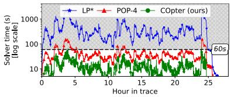

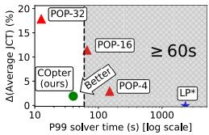  
Figure 1. [Left] Solver runtime for three approaches of solving the Sia scheduler policy MILP [21] and their [Right] quality-runtime trade-offs. The approaches are evaluated on a trace with 100k jobs submitted to a 25k GPU cluster with 7 GPU types over 24-hours. $L P ^ { * }$ solves the LP-relaxation of the MILP in each round independently using a commercial LP solver [19]. POP-?? partitions the set of GPUs and jobs into ?? equal sizes (whenever possible) and solves the MILP for each partition using an MILP solver[12] in parallel. COpter uses continual optimization (see Section 3).

Practitioners have developed various strategies to scale optimization-based resource allocation to large problem sizes: Warm-starting can be beneficial, but is not universally applicable and/or supported by existing commercial solvers [14, 19]; solver computation is not efficiently parallelized [46]; and GPU acceleration is not always applicable and/or beneficial [39] owing to the sparse nature of the solver compute. Forcibly terminating solvers early by setting a compute/time budget can return sub-optimal and/or infeasible solutions that may be meaningless. Partitioning problems by exploiting problem-specific properties can help scale many resource-allocation problems to larger sizes with minimal effort, albeit at the cost of solution quality. POP [29] partitions a large problem by randomly partitioning the set of resources and requests, solves subproblems on the partitions in parallel, and combines their allocations to exploit parallelism for large-scale allocation. However, there exists a quality-runtime tradeoff from applying POP, as can be seen in Figure 1[Right]: 32-way partitioning (POP-32) consistently meets scheduler deadlines but with poor quality allocations, whereas 4-way (POP-4) recovers higher quality allocations but frequently misses scheduler deadlines.

Overall, while these techniques mitigate solver costs, they either degrade allocation quality or fail to meet real-time scheduling deadlines. As a result, scaling solvers to large clusters often precludes frequent, globally-optimal scheduling in practice. At the same time, recent work shows that frequent, global optimization of resource-allocation decisions can significantly improve utilization [6, 31] and reduce job completion times [21, 37, 51]. Yet, because solver runtimes scale poorly, production systems often resort to coarse-grained optimization (e.g., hourly in Meta’s RAS [31], daily in MAST [6]) and rely on heuristic fast-paths for new job arrivals or failures. This tension between the benefits of frequent global optimization and the costs of existing approaches motivates the need for solution techniques that make frequent, at-scale optimization practical.

All the approaches discussed thus far employ a commercial or open-source solver in a black-box manner. This means that the allocation problem in each round is treated as an independent problem instance that is to be passed on to the solver. However, this leads to a fundamental mismatch between the modeling of round-based resource-allocation problems and the dynamics of many systems to which these problems are applied: many large-scale systems evolve slowly across rounds, exhibiting a certain structure across rounds. For example, in a small enough round duration (2-5 minutes) in GPU cluster scheduling, few GPUs fail, most jobs from the previous round continue executing without much change to their allocations, and few new jobs arrive into the cluster. By ignoring this structure and treating each round as an independent problem, existing methods forfeit an opportunity to amortize solving effort over time.

Adapting existing solvers to reuse computational effort from prior rounds is not straightforward. First, a small change to the input problem (e.g., the addition of just one new request) would require reconstructing solver-specific problem representations (e.g., constraint matrices), inducing significant setup cost for even the smallest change. Second, solvers need to reconstruct key internal transformations, such as matrix (Barrier methods [14, 25]) or basis (Simplex methods [18, 19, 25, 32]) factorizations, discarding all prior computational effort. Third, for MILP resource-allocation problems [21, 51], since converting non-integer valued variables to their integer counterparts dominates solver time, this further exacerbates the scalability challenge for large problems.

To address these limitations, we propose continual optimization—a paradigm that formulates resource allocation problems as a sequence of interconnected optimization programs with the goal of amortizing solver work/overhead over multiple rounds. We propose COpter as a system for performing continual optimization and show that it is possible to (a) reflect small changes in the resource-allocation problem to its optimization formulation using an efficient differential update interface to the problem; (b) exploit the slow evolution of the optimal solution to efficiently (and provably) warm-start subsequent problem solves; and (c) use lightweight heuristics to recover high quality integer solutions for MILPs that bypass expensive combinatorial searches entirely.

We demonstrate COpter’s effectiveness on resource allocation problems from three domains: GPU Cluster Scheduling (Sia Policy [21]), Shard Load-Balancing [40] and Wide Area Network (WAN) Traffic Engineering [17, 46]. For each, COpter recovers high quality solutions, solves problems with millions of variables using just a few CPU threads, and reduces solver times by orders of magnitude compared to traditional use of state-of-the-art commercial solvers (Sections 5.1 to 5.3), with minimal quality loss (Sections 5.1 and 5.2). Compared to using POP, COpter can simultaneously improve allocation quality and reudce end-to-end allocator runtimes by 1.5–30×.

This paper makes four main contributions:

1. We identify the disconnect between the traditional “each round as an independent problem” approach to resource allocation and the slow evolution present in many real systems, which is a significant lost opportunity in trying to cope with ever-growing problem scales.

2. We introduce a new paradigm for round-based resourceallocation problems, continual optimization, with the goal of exploiting the slowly evolving nature of the sequence of resource allocation problems at scale.

3. We present COpter, our approach to continual optimization that systematically tackles the three bottlenecks to reusing computation effort from prior rounds. COpter introduces (a) a differential problem update interface for efficient problem manipulation, (b) a factorization-free solver that provably benefits from slowly-evolving nature of solution to resource-allocation problems, and (c) a set of lightweight heuristics to recover feasible integer solutions with negligible quality loss.

4. We extensively evaluate our proposed approach on resourceallocation problems from three domains, showing 57–83× solve time reductions compared to traditional approaches and both allocation quality and solve time improvements compared to POP.

## 2 Background and Motivation

This section describes resource-allocation (RA) problems as linear programs, describe the computation involved in solving linear programs using modern numerical solvers, and discuss challenges in scaling optimization-based resourceallocation to large problem sizes. We discuss other related work in Section 6.

## 2.1 Resource allocation as Linear Programs

Many resource allocation problems can be formulated as linear programs (LPs) or mixed integer linear programs (MILPs). Given a set of resources (e.g., GPUs, CPUs, network bandwidth) and resource requests (e.g., jobs, flow demands), the goal with these programs is to find an allocation of resources to requests in a way that optimizes the given objective (e.g., maximizing throughput, minimizing job completion time, or ensuring fairness). Additionally, constraints are added to ensure that the resulting allocations are valid, realizable, and satisfy any policy requirements (e.g., priority requests must be satisfied before other requests).

Standard form linear program. Without loss of generality, let us consider linear programs in their standard form:

$$
\begin{array} { c } { \displaystyle \operatorname* { m i n } _ { x } ~ f ( x ) = c ^ { T } x } \\ { s \mathbf { u b j e c t  t o : } ~ A x \leq b , x \geq 0 } \end{array}\tag{1}
$$

where: ?? $\in \mathbb { R } ^ { n }$ is a vector of decision variables, $f ( x ) = c ^ { T } x$ is the linear objective function on the decision variables, $A \in \mathbb { R } ^ { m \times n }$ is the constraint matrix, $b \in \mathbb { R } ^ { m }$ is the right-hand side vector. Additionally, in mixed-integer LPs (MILPs), some or all variables are constrained to integral values. MILPs are particularly useful in resource allocation as the decision variables in many problems are inherently discrete. For example, a resource is either allocated to some job or none, and a job is allocated some resource or none.

Example: GPU Cluster Scheduling. Consider a simplified GPU cluster scheduling problem. Let the cluster have ?? GPUs and ?? jobs. Let $g _ { j }$ be the number of GPUs requested by job ?? , and $c _ { j }$ be its throughput when using $g _ { j }$ GPUs. We wish to allocate resources to maximize the throughput of jobs in the cluster under the GPU capacity constraints. This can be stated as the following linear program:

$$
{ \begin{array} { r l } { \operatorname* { m i n } } & { - c ^ { T } x } \\ { \quad } & { } \\ { \quad { \mathrm { s u b j e c t ~ t o : } } \quad G \cdot x \leq N , x _ { j } \in \{ 0 , 1 \} \quad \forall j } \end{array} }
$$

where $c = [ c _ { 1 } , c _ { 2 } , \ldots , c _ { M } ]$ is the throughput vector, $G \ =$ $[ g _ { 1 } , g _ { 2 } , \ldots , g _ { M } ]$ is a $1 \times M$ matrix, and $x = [ x _ { 1 } , x _ { 2 } , \ldots x _ { M } ]$ is the vector of variables. The variable $x _ { j } = 1$ iff ???? GPUs are allocated to job ?? (0 otherwise).

## 2.2 Solving linear programs

The LP/MILP formulations of an RA problem are solved in two stages, with an additional third stage for MILPs.

1. Program compilation. This stage transforms the resource allocation problem into a form that existing solvers can consume. For example, in the example GPU scheduling problem in Section 2.1, this involves (a) ordering the ?? active jobs and assigning them an index in $\{ 1 \ldots M \} , ( \boldsymbol { \mathsf { b } } )$ building the ?? vector and (c) building the ?? matrix.

2. Program solving. The solver then uses one or more optimization algorithms to find an optimal solution to the compiled linear program. If the input program constrains some variables to take only integral values (MILPs), this stage ignores such constraints and finds an optimal solution to the LP relaxation of the MILP instead.

3. (Optional) Integerization. This stage only applies to MILPs and converts any possibly non-integer values for variables with integer constraints to an integer value. Techniques like branch-and-cut often require alternating between the solving and integerization stages as it progressively assigns integral values to variables with integer constraints [25].

High-level modeling frameworks, such as CVXPY and Google OR-Tools [9, 35], provide powerful abstractions to specify optimization problems common in systems, like resource allocation. Developers define problems programmatically using symbolic variables and functions mirroring the mathematical formulation that are then automatically compiled into solver-compatible representations, shielding users from low-level implementation details.

## 2.3 Scalability challenges in solving linear programs

Traditional approaches to round-based resource allocation reformulates and solves one RA problem from scratch in each round. This means that, in each round, we recompile the current linear program from scratch, pass this to an LP solver, and use a procedure like branch-and-bound [14, 25] to recover integer-valued solutions to the problem as needed. As problem sizes grow (e.g., clusters with tens of thousands of GPUs/jobs), each stage in solving an LP faces scalability challenges, which we discuss below.

Program re-compilation discards prior computational effort. For any RA problem, the bulk of the compilation time is spent in constructing the constraint matrix. Constraint matrices are often quite sparse— each row in the matrix corresponds to a constraint on resource or request, and applies to a small subset of variables at once. For large resource-allocation problems, even the sparse representation can contain tens of millions of non-zero values and can take hundreds of seconds to populate in each round. For example, in the 25k GPU experiment run for $L P ^ { * }$ from Figure 1, constructing the CPLEX model using CVXPY [9] took a median of 226s, whereas solving the model required only 11s. This underscores that the dominant cost can lie in compilation rather than optimization, motivating techniques to avoid repeated recompilation.

Further, since current approaches trigger full recompilation for small changes to the problem (e.g., add/remove resources/requests), they discard all prior computational effort spent in creating the constraint matrices for previous rounds. We show in Section 3 that it is possible to reduce this overhead of recompilation every round by adopting a problem-level differential interface, significantly reducing end-to-end runtimes.

Independently solving LPs ignores problem evolution. Many large scale resource-allocation problems evolve slowly, i.e., between two consecutive rounds ?? and ?? +1, few resources are added/removed and few jobs are added/removed (relative to the current sizes of resource and request sets). While, in general, small changes in problems can still induce large changes in the optimum solution, we observe that for resource allocation problems, the optimal solutions in rounds ?? and ?? + 1 only differ by a small amount (see Figure 2).

State-of-the-art LP and MILP solvers [14, 19] use either an Interior-Point (Barrier) or Simplex algorithm, both of which maintain internal state that cannot be easily updated to benefit from the slow evolution of the problems. Interior-Point methods maintain matrix factorizations and adding new variables and/or constraints to the problem requires a refactorization. Similarly, the Simplex algorithm maintains a basis factorization. While theoretically amenable to warmstarted updates when adding variables and/or constraints, in practice this process necessitates expensive updates to the factorization and triggers numerous pivot operations to restore feasibility. Solvers using first-order algorithms like ADMM [4] or Proximal Point Algorithm [34] often maintain very little internal state, so they do not suffer from the same issues, and form the basis for our approach.

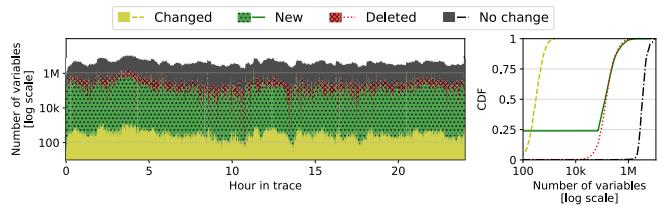  
Figure 2. Changes to the solution between consecutive scheduling rounds over a 24-hour period in a 25k GPU cluster running Sia policy [21]. Most variables remain unchanged: fewer than 0.01% of variables change values and at-most a few % are added/removed between consecutive rounds.

Warm-start not well exploited by existing approaches. Consecutive resource allocation problems often exhibit a significant overlap in the set of resources and requests. Often, even the optimal solutions from successive rounds, $x _ { t - 1 } ^ { * } , x _ { t } ^ { * }$ are also close to each other in Euclidean distance (ℓ2 norm). Intuitively, one might expect that initializing a solver with a point already close to optima would lead to faster convergence. Conventional solvers, however, face challenges in effectively exploiting this $\ell _ { 2 }$ proximity. The runtime of Simplex methods depends on traversing the vertices of the constraint polytope (defined by the constraint matrix ?? and vector ??). A small $\lvert \lvert x _ { t } ^ { * } - x _ { t - 1 } ^ { * }$ ||2 does not guarantee a short path between the corresponding vertices. Furthermore, even minor modifications, such as removing a single constraint, can theoretically lead to worst-case exponential runtime for deterministic Simplex. Interior-Point methods, while capable of warm-starting, measure the quality of an initial point relative to the problem-specific central path. A small $| | x _ { t } ^ { * } - x _ { t - 1 } ^ { * } | |$ | 2 does not necessarily imply proximity to this central path, making the practical benefit of such warm-starts difficult to predict or control [23, 48]. First-order methods [2, 4, 33, 41] can benefit from a small $| | x _ { t } ^ { * } - x _ { t - 1 } ^ { * } | | _ { 2 }$ , but may suffer from slow practical convergence to acceptable tolerances.

Combinatorial explosion for MILPs. Mixed Integer formulations of RA problems are typically solved using a twostage process. First, a traditional, often a Simplex-based, LP solver is used to find an optimal solution to the LP-relaxation of the MILP, where integer constraints are temporarily ignored. However, this solution could assign non-integral values to variables that require integers, leading to integer infeasibilities, that are resolved in the second stage using an algorithm like branch-and-cut [14, 19, 25]. Branch-and-cut systematically explores a tree of refined LP problems: it selects an integer-infeasible variable, say $x _ { j } ,$ , creates branches by adding constraints that push its value towards adjacent integers $( \mathrm { e . g . } , x _ { j } \leq \lfloor x _ { j } ^ { * } \rfloor$ and $x _ { j } \geq \lceil x _ { j } ^ { * } \rceil )$ , and solves the resulting LPs recursively by choosing another $x _ { k }$ for $k \neq j .$ . This continues until we find a solution with zero integer infeasibilities and whose objective value is close (i.e., within a MIP gap) to the LP relaxation’s optimum. However, the number of LPs to solve can scale exponentially, making this stage computationally prohibitive for large problems. We show in Section 5 that problem-specific heuristics are effective in circumventing this bottleneck by efficiently finding feasible integer solutions with negligible quality impact.

## 3 Continual Optimization

In this section we first introduce a notion of slowly evolving linear programs and then describe the continual optimization paradigm along with its goals. We then describe COpter— our proposed approach for continual optimization of largescale round-based resource allocation problems.

## 3.1 Slowly Evolving LPs and Continual Optimization

As discussed in Section 2.3, in many real-world systems, resource allocation problems and their associated optimal solutions evolve slowly over time (see Figure 2). Naturally, such a slowly evolving nature suggests the idea of reusing prior allocations or computation across rounds to improve run-times: if the allocation problem in each round largely remains unchanged, then the solve times should remain small.

Let us describe some notation needed to formalize the notion of slow evolution. We use ?? to index successive rounds in a resource allocation process. With a minor overloading of the notation, let min $\mathbf { \Psi } _ { x } \operatorname { L P } _ { t } ( x )$ denote the LP/MILP solved in round ?? . In the standard form (Equation (1)), $\operatorname { L P } _ { t } ( x )$ can be fully defined using a 3-tuple $\left( c _ { t } , b _ { t } , A _ { t } \right)$ , where $c _ { t }$ is the cost vector, and $A _ { t } , b _ { t }$ are the constraint matrix and vector, respectively. Let $\boldsymbol { x } _ { t } ^ { * }$ be an optimal solution to the problem in round ?? , i.e. $x _ { t } ^ { * } \in$ arg min?? $\mathrm { L P } _ { t } ( x )$ . The size of these LPs is determined by the number of variables ?? and constraints ?? (also the dimensions of $A \in \mathbb { R } ^ { m \times n } )$ . We define problem dimension $\eta _ { t } = \operatorname* { m a x } ( m _ { t } , n _ { t } )$ as the larger of the two for round ?? , and $\eta _ { \mathrm { m a x } } = \operatorname* { m a x } _ { t } \eta _ { t }$ as the largest problem dimension over all rounds $1 \leq t \leq T .$

Definition 1 (Slowly Evolving Linear Programs). We consider a sequence of round-based resource allocation problems $\{ \mathrm { L P } _ { t } ( x ) \bar  \} _ { t = 1 } ^ { T }$ as slowly evolving, if there exists some small $\alpha , \beta \in [ 0 , 1 ] , \alpha \ll 1 , \beta \ll 1$ such that,

$$
\begin{array} { r } { \ d _ { 1 . } \mathcal { P } _ { \eta } ( T ) = \sum _ { t = 2 } ^ { T } | \eta _ { t } - \eta _ { t - 1 } | = O ( T ^ { \alpha } \eta _ { \operatorname* { m a x } } ) , a n d , } \end{array}
$$

$$
\begin{array} { r } { 2 . \ { \mathcal P } _ { x } ( T ) = \sum _ { t = 2 } ^ { T } \| x _ { t } ^ { * } - x _ { t - 1 } ^ { * } \| ^ { 2 } = O ( T ^ { \beta } B ) , } \end{array}
$$

where $B > 0$ is such that $\| x _ { t } \| ^ { 2 } \leq B$ for all feasible ?? and all ?? .

The quantities $\mathcal { P } _ { \eta } ( T )$ and $\mathcal { P } _ { x } ( T )$ are often referred to as path-lengths as they represent the trajectory of a sequence of values: problem dimensions in the case of $\mathcal { P } _ { \eta } ( T )$ and the optimal solutions in the case of $\mathcal { P } _ { x } ( T )$ . The quantities ?? and $\beta$ are used to interpolate between two cases—one where consecutive programs do not change at all (both $\alpha = 0$ and $\beta = 0 )$ , and the other where they change drastically (either $\alpha = 1$ or $\beta = 1 )$ . For example, consider the hypothetical scenario in GPU resource scheduling where an adversary cycles between taking all the GPU nodes offline and then bringing them back online. In such a scenario, in rounds where no nodes are available, the optimal allocation $x ^ { * }$ is all zeros and in rounds where the GPU nodes come back online, ?? takes on non-zero values. Assuming $x _ { i } \in [ 0 , 1 ]$ , the maximum $\ell _ { 2 }$ distance between consecutive optima is at most $\sqrt { n } \left( \mathrm { i . e . } \parallel x _ { t } ^ { * } - x _ { t - 1 } ^ { * } \parallel ^ { 2 } \leq n \right)$ , and therefore, $\begin{array} { r } { \mathcal { P } _ { x } ( T ) = \sum _ { t = 2 } ^ { T } \lVert x _ { t } ^ { * } - \rVert } \end{array}$ $x _ { t - 1 } ^ { * } \| ^ { 2 } \leq T n$ and $\beta = 1$ . Similarly, on the other extreme, consider the scenario where the resources and requests, and therefore the allocations all remain unchanged. This means that $x _ { t } ^ { * } = x _ { 1 } ^ { * } \forall t \leq T$ , so $\mathcal { P } _ { x } ( T ) = 0$ and $\beta = 0$

Continual optimization. Given the model of resource allocation as a sequence of programs, $\{ L P _ { t } ( x ) \} _ { t = 1 } ^ { T }$ , and path lengths $\mathcal { P } _ { x } ( T )$ and $\mathcal { P } _ { \eta } ( T )$ as defined in Definition 1, the goal of continual optimization is to develop approaches where the total end-to-end time to allocation, say ?? (?? ), depends on problem-specific path lengths, ${ \mathcal { P } } _ { x } ( T )$ and $\mathcal { P } _ { \eta } ( T )$ as follows:

$$
\tau ( T ) = O \bigl ( \mathcal { P } _ { x } ( T ) , \mathcal { P } _ { \eta } ( T ) \bigr )
$$

Resource allocation problems have small $\mathcal { P } _ { x } ( T )$ and $\mathcal { P } _ { \eta } ( T )$ $( \mathbf { i . e } ~ \alpha \ll 1 , \beta \ll 1 )$ , and so we can expect continual optimization to enable significant speedups in runtime when compared to treating each problem independently (see Figure 3 [Right]). This notion of problem-dependent bounds have recently received extensive attention in the online optimization literature [3, 49, 50] in the context of dynamic regret, the sum of optimality gaps across all ?? rounds. Continual optimization differs in that we additionally care about the end-to-end runtime for the allocation problem. In fact, it can be shown that the dynamic regret of our approach is indeed bounded by path-length (Theorem 1, Appendix).

Note that since programs across rounds are allowed to have different dimensions $\eta _ { t }$ , the distance $\| x _ { t } ^ { * } - x _ { t - 1 } ^ { * } \| ^ { 2 }$ is defined by padding $\boldsymbol { x } _ { t } ^ { * }$ and $x _ { t - 1 } ^ { * }$ so their dimensions are exactly $\eta _ { \mathrm { m a x } } .$ , the largest problem dimension. We also note that the definition of slowly evolving programs also admits bursts of resources and/or requests as long as such events are not too frequent in the measured ?? rounds.

## 3.2 COpter for Continual Optimization

In this section, we describe COpter, our proposed approach for continual optimization of resource allocation problems.

Figure 3[Left] shows the high-level overview of the scalability challenges in existing memoryless approaches and our proposed approach using continual optimization. COpter proposes techniques to address scalability challenges in each of the three stages involved in solving resource allocation problems as described in Section 2. Taken together, these techniques enable COpter to efficiently reuse computational effort from prior rounds to reduce overall runtimes.

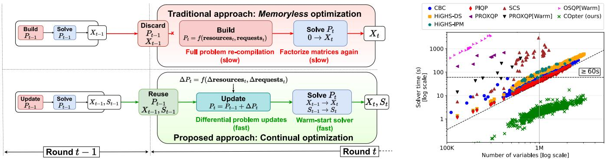  
Figure 3. Existing approaches for RA problems cannot scale to large sizes because: (a) any changes to a problem (from adding/removing resources and/or requests) require problem recompilation; (b) recompiling a problem discards any solver work done for previous rounds; and (c) warm-starting is either not supported or often not beneficial in reducing solver runtimes. [Left] We propose continual optimization and implement a prototype (COpter) with techniques designed for (a) efficient problem manipulation, (b) solver state re-use, and (c) efficient warm-starting. [Right] For the LP-relaxation of the Sia ILP policy [21], COpter using continual optimization is a few orders of magnitude faster than memoryless optimization with any open-source solver, and scales better to larger problem sizes (see Section 5 for comparisons with commercial solvers).

Differential interface for problem updates. COpter uses a differential interface at the problem level that reflects changes to the allocation problem from the addition and/or removal of resources and requests between rounds. To support such differential updates to the problem we need to efficiently support the following methods:

• add-request(request ID, num variables): modifies ?? by (a) appending num variables columns to ??, ??, and ??, (b) appropriately filling in the newly appended columns for all constraints affected by adding this request, and (c) adding any additional constraints (one row per constraint) for the new request to ?? and ??.

• remove-request(request ID): modifies ?? by (a) deleting columns associated with the request, from ??, ??, and ??, and (b) removing any associated constraints from ??.

• add/remove-resources(resource ID, count): modifies ?? to reflect the change in number of resources of type resource ID by ±count units as appropriate.

To efficiently implement such an interface, we manipulate the constraint matrix ?? in-place. Since the matrix ?? is mostly sparse (i.e. few non-zeros per row), it is common to store the non-zero entries in ?? in a contiguous array with a majorization either along the rows or the columns of ?? — compressed sparse row (CSR) representation for row level access, and compressed sparse column (CSC) for columns. However, a contiguous memory layout does not permit efficient modifications to the matrix (like adding or removing rows/columns) without incurring a full copy cost of Θ(min{????, nnz(??)}). So, even when existing solvers provide interfaces for incremental modifications [14, 19], the cost of recompilation from an existing in-memory matrix does not improve significantly.

COpter trades the cache-friendly, contiguous memory layouts for a List-of-List (LoL) representation as a compromise between the latency advantages of contiguous layout and the ease of modification of a non-contiguous representation. We use pointer manipulations to efficiently add and remove rows (i.e. add/remove constraints) in the row-major LoL format. The corresponding column operations are still expensive, but only affect a few rows because ?? is sparse, and are trivially parallelized over rows. We show in Section 5.4 that differential problems updates cut compilation times by upto 30× compared to recompilation each round.

Factorization-free, efficiently warm-started LP solvers. State-of-the-art solvers rely on internal problem transformations of some form, often a factorization of the constraint matrix ??, to speed up solving times. In the context of continual optimization, changes to the ?? matrix from adding/removing resources and/or requests are common operations. However, these changes make the factorizations from prior rounds invalid, forcing us to discard all prior computational work (or adopt expensive procedures to restore factorizations to a reusable state). Additionally, in a slowly evolving system, the optimal allocation for a majority of the requests remains unchanged, and so the previous solution serves as a good starting point for the solver in the current round. However, Simplex and Interior-Point(Barrier) based methods cannot be easily warm-started with guesses that are close in ℓ2 norm to the optimal solution. A simple workaround is to adopt a solver based on first-order methods such as ADMM [4] or Proximal Point Algorithms (PPA) [34] that maintain an easily recomputable internal state.

We adopt the Proximal Point Algorithm (PPA) as our workhorse because it supports warm-starting and exhibits practical, finite-step convergence for LPs. While Simplex algorithms navigate the solution space via repeated linear solves that are brittle under changing constraints, PPA applies a proximal map that yields a sequence of unconstrained (non-smooth) quadratic programs with multiplicative $\ell _ { 2 }$ contraction toward the LP optimum, making prior-round solutions highly effective initializations. In our evaluations, PPA’s iterates concentrate on extreme points and empirically recover largely integral assignments to problem variables for the LP relaxation of the underlying MILPs. We implement PPA via dual coordinate descent with an active set strategy [47], using only sparse matrix-vector primitives and minimal state, which exploits sparsity and warm starts; at scale, this delivers order-of-magnitude speedups over factorizationbased baselines using only a few CPU threads. See Appendix A.3 for a high-level overview of our PPA implementation.

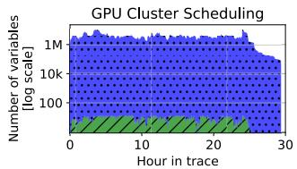

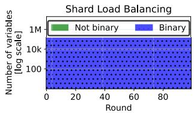  
Figure 4. Solution composition for LP-relaxations of MILP formulations for two RA problems using a commercial simplex based LP solver (CPLEX [19]): GPU cluster scheduling [21] and Shard Load Balancing (see Section 4.2). In the optimal solution to the LP-relaxations, ≥ 99.99% values are either 0 or 1 with $\leq 0 . 0 1 \%$ values in (0, 1).

Lightweight integerization for MILPs. The applicability of traditional MILP solvers to large-scale resource allocation is often limited by the runtime cost of enforcing integer constraints with minimal loss of optimality. After solving the LP relaxation of the MILP, techniques like branch-and-cut [14, 19, 25] are used to fix integer infeasibilities. Since this integer resolution stage frequently dominates the overall solution time, it creates a significant scalability bottleneck.

We find that for many resource allocation MILPs (see Sections 4.1 and 4.2), solvers using Simplex[19] or COpter’s PPA (see Figure 4) often produce solutions to the LP relaxation with only a few integer infeasibilities, in contrast to ADMMbased solvers [4, 33]. While conventional MILP solvers invoke expensive branch-and-cut [14, 19, 25] to guarantee optimality of the integer-feasible solution, this is a bottleneck step and COpter introduces lightweight post-processing, using shims, to produce integer-feasible solutions from the optimal solution to the LP-relaxation. Shims operate heuristically: they round fractional variables and apply fast, local corrections to restore constraint feasibility, and are deliberately designed to prioritize feasibility over optimality.

The crucial result is that COpter delivers high-quality, feasible solutions for large-scale MILPs (millions of variables) in milliseconds, effectively circumventing the traditional bottleneck with minimal impact on quality (Sections 5.1 and 5.2).

Combining COpter and POP. For problems too large to be solved even by COpter, one can also combine COpter with POP [29]: POP can be used to partition a larger problem into smaller subproblems. Each subproblem can then be independently and efficiently handled by COpter.

## 4 Case Studies

In this section, we describe three resource allocation problems that are formulated as optimization problems from three domains: GPU cluster scheduling, shard load balancing, and Wide-Area-Network (WAN) traffic engineering. We describe the problems and how COpter is applied to each problem here, and evaluate the impact of applying COpter in Section 5.

## 4.1 Job-resource co-adaptivity for GPU clusters

The Sia scheduler [21] co-optimizes allocated GPU resources and execution parameters for DNN training jobs to maximize cluster-wide goodput in heterogeneous GPU clusters. Its scheduler policy is formulated as a MILP with one variable for each (job, configuration) pair. Here configurations are a bundle of resources similar to virtual machines in commercial clouds. Sia is a round-based (1 minute) scheduler that periodically re-optimizes the MILP to determine the optimal configuration for each job to maintain high cluster goodput.

The MILP formulation for Sia policy starts with the goodput matrix ?? where $G _ { i j }$ is the normalized goodput for job ?? estimated on configuration ??. ?? is an allocation matrix (same dimension as ??) and job ?? is allocated configuration ?? if $X _ { i j } = 1$ , or no resources if $X _ { i j } = 0$ . Let ${ \mathsf { N G P U } } ( C _ { j } , k )$ be the number of GPUs of type ?? in configuration $C _ { j } ,$ and $N _ { k }$ be the total number of GPUs of type ?? in the cluster. The MILP formulation for the Sia policy is as follows:

$$
\begin{array} { r } { \underset { X } { \operatorname* { m a x } } \sum _ { i = 1 } ^ { N _ { J } } \sum _ { j = 1 } ^ { N _ { C } } X _ { i j } \cdot G _ { i j } + \lambda \sum _ { i } \left( 1 - \sum _ { j } X _ { i j } \right) } \end{array}\tag{??}
$$

$$
\begin{array} { r l } { s \mathbf { u b j e c t  t o : } } & { { } \sum _ { j = 1 } ^ { N _ { C } } X _ { i j } \leq 1 \quad \forall i } \end{array}\tag{??}
$$

$$
\begin{array} { r } { \sum _ { i = 1 } ^ { N _ { J } } \sum _ { j = 1 } ^ { N _ { C } } \mathsf { N G P U } ( C _ { j } , k ) \cdot X _ { i j } \le N _ { k } } \end{array}\tag{??}
$$

$$
X _ { i j } \in \{ 0 , 1 \} \quad \forall i , j\tag{??}
$$

where (a) is the objective that maximizes cluster-wide goodput with an incentive $\lambda ~ \geq ~ 0$ to reduce scheduler queue occupancy[21], (b) ensures each job is allocated at-most one configuration, (c) ensures that each GPU type ?? is not oversubscribed (i.e. allocations do not exceed capacity), and (d) ensures that for any job, choice of a configuration is binary.

Applying COpter. To apply our approach, we first relax the binary constraints on $X _ { i j }$ to $0 \leq X _ { i j } \leq 1 \forall i , j .$ . Then, we solve the relaxed LP and apply a shim to its optimum solution to recover binary and feasible allocations in each round. For each job, the shim simply picks the configuration with highest weight in the solution to the LP-relaxation without violating GPU constraints. If it finds no such configuration for the job, it receives no allocation in this round.

The resulting allocations are both binary and feasible, but possibly sub-optimal. We show in Section 5.1 that COpter’s allocations result in negligible increases to average job completion times and makespan in clusters with 10,000+ GPUs.

## 4.2 Shard Load-Balancing

The shard load-balancing problem frequently arises in the operation of elastic database systems [7, 40, 42] where replicas of data shards are shuffled around a fixed pool of servers to ensure a consistent load across the server fleet.

Problem Formulation. Let $L ~ = ~ \{ l _ { 1 } , l _ { 2 } , . . . , l _ { D } \}$ be the load on each of the ?? shards, and let ?? be the number of servers in the fleet. Let ?? denote the existing shard-server assignment where $T _ { i j } = 1$ iff a replica of shard ?? exists on server $i , S = \{ s _ { 1 } , s _ { 2 } , . . . , s _ { D } \}$ } denote the size of each shard, and $M = \{ m _ { 1 } , m _ { 2 } , . . . m _ { N } \}$ denote the memory capacities of each of the ?? servers. The optimization problem uses two related variables for each (server, shard) pair $( i , j ) \colon R _ { i j }$ and $X _ { i j } . ~ R _ { i j } \ \ge \ 0$ denotes the fraction of load for shard ?? routed to server ??, and $X _ { i , j } ~ \in ~ \{ 0 , 1 \}$ denotes if a server ?? hosts a replica of shard ??. So, $R _ { i j } > 0 \implies X _ { i j } = 1$ , and $R _ { i j } = 0 \Longleftrightarrow X _ { i j } = 0$ . The MILP is defined as follows:

$$
\operatorname* { m i n } _ { R , X } \sum _ { i } \sum _ { j } \bigl ( 1 - T _ { i j } \bigr ) \cdot s _ { i } \cdot X _ { i j }\tag{??}
$$

$$
\begin{array} { r l } { { \mathbf { s u b j e c t  t o : } } } & { { } \sum _ { i = 1 } ^ { N } R _ { i j } = 1 \quad \forall j } \end{array}\tag{??}
$$

$$
\begin{array} { r l } { \mathcal { L } - \epsilon \le \sum _ { j } X _ { i j } \cdot l _ { j } \le \mathcal { L } + \epsilon } & { { } \forall i } \end{array}\tag{??}
$$

$$
\textstyle \sum _ { j = 1 } ^ { D } X _ { i j } \cdot s _ { j } \leq m _ { i } \quad \forall { i }\tag{??}
$$

$$
R _ { i j } \leq X _ { i j } , \quad X _ { i j } \in \{ 0 , 1 \} \quad \forall { i , j }\tag{??}
$$

where (a) is the objective that minimizes the cost of starting up new replicas on servers without a replica for each data shard, (b) ensures all load for each shard ?? is accounted for, (c) ensures the load on each server is within ?? of the average load $\begin{array} { r } { \mathcal { L } = \frac { \sum _ { j } l _ { i } } { N } } \end{array}$ , (d) ensures a server ??’s memory usage does not exceed its capacity $m _ { i }$ , and (e) ensures that if a server ?? executes queries for shard $j ,$ it hosts a replica of shard $j ,$ and that shard-server assignment variables ?? are binary. Note that (c) allows for 2?? load imbalance – the difference in load between the most and least loaded servers – by design.

Applying COpter. We first relax the binary constraints on $X _ { i j }$ to $0 \leq X _ { i j } \leq 1$ . Then we solve the relaxed LP using continual optimization and apply a shim to recover a feasible binary $X ^ { b i { \bar { n } } }$ and continuous ??. We start the shim with an initial shard placement $X ^ { b i n }$ computed using ?? which may exceed some servers’ memory capacities. We pick a server ?? whose memory capacity is exceeded in $X ^ { b i n }$ and greedily remove assigned shards ?? one by one, starting with those placing the least load $R _ { i j } * l _ { j }$ . A shard ?? is only removed if it has replicas on other servers, and if removed, we proportionally shift its load share $R _ { i j }$ from server ?? to all servers hosting its other replicas. We repeat until server ??’s memory capacity is not violated, and move on to the next overloaded server. The final server-shard assignment $X ^ { b i n }$ and load distribution ?? does not violate hard-constraints like server-memory capacity, but may violate the load imbalance soft-constraint.

We show in Section 5.2 that $( X ^ { b i n }$ , ??) rarely violate the soft load balancing constraints, and as a bonus, we find that COpter solutions are sometimes better-than-optimal — an artifact of the problem formulation that allows for reducing the number of replicas for shards without any penalties. We discuss this observation in more detail in Section 5.2.

Note that some solvers, particularly the ADMM-based SCS and OSQP [33, 41], produce degenerate solutions to the LPrelaxation that suggest each shard’s load to be evenly split across all ?? servers, making it an infeasible solution due to server memory capacity constraints. However, our solver and Simplex based solvers produce mostly binary solutions to the LP-relaxation natively (see Figure 4).

## 4.3 WAN Traffic Engineering

In WAN traffic engineering, demands (i.e. flows) are allocated link capacities in the network to maximize total flow through the network of links and routers(max-flow [1, 29]) or minimize the maximum link utilization (MLU [11, 29, 46]) for better network performance. As the demands fluctuate, TE systems must frequently re-optimize flow allocations (often at 5-minute intervals [1, 29, 46]) to maintain optimal network performance. We describe the LP formulation for the maximize total flow, or max-flow for short, objective below.

Problem Formulation. Let $D = \{ d _ { 1 } , \dots d _ { k } \}$ be the set of demands such that demand ?? for source ???? and destination $t _ { j }$ requests bandwidth $d _ { j }$ . Let $P = \{ P _ { 1 } , \ldots P _ { k } \}$ be a set of ?? preconfigured paths for each pair of routers in the network: $P _ { j } =$ $\{ \boldsymbol { p } _ { j } ^ { 1 } , \ldots \boldsymbol { p } _ { j } ^ { N } \}$ , and $c _ { e }$ be the capacity of the link connecting routers ?? and ?? for each edge $e = ( u , v ) \in E$ in the graph $G = \left( V , E \right)$ with routers as vertices ?? and links as edges ??.

$$
\begin{array} { r } { \underset { X } { \operatorname* { m a x } } \sum _ { j } \sum _ { p \in P _ { j } } X _ { j } ^ { p } } \end{array}\tag{??}
$$

$$
\begin{array} { r l } { s \mathbf { u b j e c t  t o : } } & { { } \sum _ { \substack { \boldsymbol { p } \in \boldsymbol { P } _ { j } } } X _ { j } ^ { \boldsymbol { p } } \leq d _ { j } \quad \forall j } \end{array}\tag{??}
$$

$$
\begin{array} { r } { \sum _ { j , p \in P _ { j } | e \in p } X _ { j } ^ { p } \leq c _ { e } \quad \forall e \in E } \end{array}\tag{??}
$$

$$
X _ { j } ^ { p } \ge 0 \quad \forall p \in P _ { j } , \forall j\tag{??}
$$

where (a) is the objective maximizing the total allocated flow through the network, (b) ensures each demand ?? is allocated at-most the requested bandwidth $d _ { j }$ split across its ?? pre-configured paths, (c) ensures that the sum of all flows through a link ?? is limited by the link capacity $c _ { e } ,$ and (d) ensures that all flow allocations are non-negative.

Applying COpter. The variables $X _ { j } ^ { p }$ are continuous as they represent flow values in Mb/s, so COpter will solve the above LP as-is using continual optimization without the use of shims. We show in Section 5.3 that COpter’s flow allocations result in optimal max-flow and for changes to demands across time, new and optimal allocations are quickly computed from previous allocations.

## 4.4 When to apply COpter?

COpter is best applied to critical, large-scale resource allocation problems where the set of resources and requests change slowly over time. COpter can be applied to resource allocation problems that: (a) employ global optimization, (b) can be formulated as linear or mixed-integer linear programs, and (c) are solved frequently with slowly changing set of requests and resources. In addition to the three case studies, other resource-allocation problems like Virtual Machine/Container/Data placement in large datacenters (e.g., Meta’s RAS [31] and MAST [6]) also fit our assumptions.

COpter is not a great fit for resource-allocation problems where the resource requests and/or availabilities change dramatically from round-to-round, rather than in relatively small amounts over time. Some workloads that do not fit our assumptions include scheduling of serverless functions, database queries, and fine-grained streaming tasks.

## 5 Experiments

This section evaluates the effectiveness of applying continual optimization via COpter to the three resource-allocation problems from Section 4 formulated as LP/MILPs. .

• GPU Cluster Scheduling. We run the Sia policy [21], in simulation, with 60 second round on two clusters with 7 GPU types, and 10k and 25k GPUs, respectively. We sample a job traces with 40k and 100k jobs submitted over 24-hours from a real GPU datacenter trace [45], and map each sampled job to one of 10 representative jobs (same as prior work [21, 37]).

• Shard Load Balancing. We follow the experiment setup described in [29] and simulate time-varying load distributions. We re-use the code open-sourced by authors of POP [29] wherever possible and use the same load distributions to benchmark COpter (implemented separately).

• Traffic Engineering. We optimize the max flow objective for two network topologies – the Kentucky Data Link network (Kdl [29, 46]), and an AS-level topology (ASN [46]). We implement COpter in the same evaluation framework as POP [29] to simulate identical traffic patterns.

Testbed. We run all experiments on a 2-socket AMD EPYC 7742 64-core processor with 1TB of DDR4 memory, but limit solvers to 8 threads (no significant speedup is observed beyond 8 threads [46]). For POP, we follow the approach used in prior work [29, 46], solving each subproblem on a single thread, and report estimated parallel runtimes calculated mathematically for 64 cores.

Similar to prior work [1, 30], we adopt trace-driven simulations to evaluate our techniques at scales that exist in production today but are not accessible for academic research in isolation.

<table><tr><td rowspan=1 colspan=4>Cluster size: 10k GPUs</td></tr><tr><td rowspan=1 colspan=1></td><td rowspan=1 colspan=1>Avg JCT(hours)</td><td rowspan=1 colspan=1>Makespan(hours)</td><td rowspan=1 colspan=1>Solve time(p99, seconds)</td></tr><tr><td rowspan=1 colspan=1>LP*</td><td rowspan=1 colspan=1>0.35</td><td rowspan=1 colspan=1>29.3</td><td rowspan=1 colspan=1>233.4</td></tr><tr><td rowspan=1 colspan=1>POP</td><td rowspan=1 colspan=1>0.41</td><td rowspan=1 colspan=1>31.0</td><td rowspan=1 colspan=1>2.9</td></tr><tr><td rowspan=1 colspan=1>COpter</td><td rowspan=1 colspan=1>0.36</td><td rowspan=1 colspan=1>29.4</td><td rowspan=1 colspan=1>6.5</td></tr><tr><td rowspan=1 colspan=4>Cluster size: 25k GPUs</td></tr><tr><td rowspan=1 colspan=1>LP*</td><td rowspan=1 colspan=1>0.35</td><td rowspan=1 colspan=1>29.3</td><td rowspan=1 colspan=1>2277</td></tr><tr><td rowspan=1 colspan=1>POP</td><td rowspan=1 colspan=1>0.39</td><td rowspan=1 colspan=1>30.9</td><td rowspan=1 colspan=1>66.5</td></tr><tr><td rowspan=1 colspan=1>COpter</td><td rowspan=1 colspan=1>0.36</td><td rowspan=1 colspan=1>29.4</td><td rowspan=1 colspan=1>40.3</td></tr></table>

Table 1. Summary of experiments for the GPU cluster scheduling case study using the Sia policy [21] for 10k and 25k GPU clusters using COpter, POP and a commercial LP solver[19].

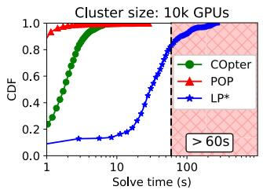

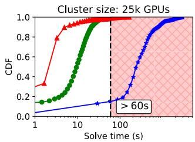  
Figure 5. CDFs of end-to-end solver runtimes for Sia policy [21] in two clusters with 10k and 25k GPUs respectively. We compare COpter to (1) POP, which partitions the ILP 16-way and solves the sub-problems in parallel, and (2) LP\*, which solves the LP-Relaxation with a commercial solver [19] and recovers binary solutions using a shim.

## 5.1 DNN Cluster Scheduling

Evaluated approaches. We compare COpter against two approaches: (a) POP [30] splits the ILP formulation of the Sia policy into 16 sub-problems with equal resources (and jobs whenever possible), solves subproblems in parallel (using ray [27]+cvxpy [9]) with a Simplex-based solver[12], and (b) LP\* solves the LP-relaxation of the Sia ILP using a commercial solver [19] and obtains binary allocations each round using the shim described in Section 4.1.

Metrics. We are interested in the following metrics: (1) average job completion times (avg. JCTs) is the average time taken to execute a job from submission to completion, averaged over all jobs in the trace (lower is better), (2) makespan is the time taken for all jobs in a trace to complete (i.e. time between first job submission and last job completion, lower is better), and (3) solver runtime measures the end-to-end runtime for the scheduler policy (including the time spent in shim for COpter and $L P ^ { * }$ , lower is better).

We summarize the results of our experiments in Table 1 and the CDF of the solver runtimes in Figure 5. From Table 1, we see that for both cluster sizes, COpter is 30-40× faster than $L P ^ { * }$ and achieves a similar average JCT and makespan. POP’s 99th percentile solve time is faster than COpter for the 10k GPU cluster, but exceeds the 60-second threshold for the 25k GPU cluster owing to the combinatorial explosion for the MILP solved in each subproblem. Despite solving the ILP formulation directly, POP’s solutions result in 11–17% and 6% increase in average JCT and makespan, respectively. This also highlights the efficacy of our shims – despite using a heuristic to obtain integer solutions to the MILP, solutions for both COpter and $L P ^ { * }$ result in lower average job completion times and makespan. This indicates that the combinatorial explosion from the integerization stage can be bypassed for large resource-allocation problems without much penalty.

Figure 5 also highlights another characteristic of MILP solvers: the number of variables in the ILP does not always dictate the solver runtime due to the unpredictability of the runtimes for the integerization stage. Since POP solves the ILP formulation directly in each subproblem, we see a large spread of runtimes – over a 30x difference between the 90th and 100th percentile solver times. COpter, on the other hand, shows predictable runtimes – the slowest runtime (70.4s) corresponds to the problem with the most number of variables (over 11-million variables) with just a 2–3× difference between the 90th and 100th percentile solver times.

## 5.2 Load Balancing

Evaluated approaches. We compare COpter against three approaches: (a) Heuristic is a greedy algorithm from E-Store [42], (b) Exact is the MILP formulation described in Section 4.2 and solved using a commercial MILP solver[19], (c) LP-Relaxed solves the LP-relaxation of the MILP formulation, and applies the shim described in Section 4.2 to resolve integer infeasibilities, and (d) POP-k splits the set of servers and shards into ?? pieces and solves the MILP formulation using a commercial MILP solver[19].

Metrics. We are interested in the three metrics: (a) average shard movements is the average number of shards movements per round in response to changing load distributions (lower is better), (b) average load imbalance is the difference in load between the most and least loaded servers (lower is better), and (c) average load balancer time is the time taken to compute shard-server assignments in each round and includes the time spent in the shim for approaches that use it (lower is better).

Load distributions. We benchmark two load distributions computed using one Zipf value $z _ { k }$ for each round $k -$ (a) Stateless where $z _ { k }$ is uniformly random in $[ z _ { m i n } , z _ { m a x } ]$ and models an unpredictable and random query workload [29], and (b) Stateful where the $z _ { k } = z _ { k - 1 } \times \left( 1 \pm 0 . 1 \right)$ with uniformly random direction (i.e. 10% increase/decrease in $z _ { k - 1 } )$ and models smoother changes to load distributions across rounds. Figure 6 shows the average load per server for the two load distributions over time.

Additional details. We set $\epsilon = 5 \%$ (upto 10% load imbalance allowed), run for 100 rounds and exclude the first 20 to remove any startup effects. We evaluate two problem sizes – 1024 shards, 128 servers and 2048 shards, 256 servers.

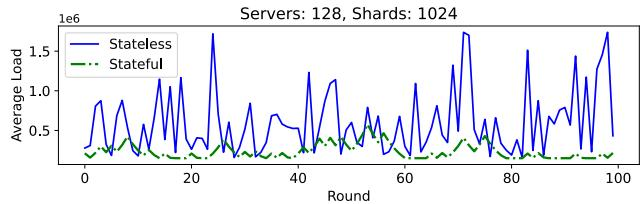  
Figure 6. Average load per server for 1024 shards loadbalanced across 128 servers.

1024 Shards, 128 servers. Figure 7 (top) and (bottom) shows a summary of the results for the two load distributions. Heuristic is quick, produces many shard movements and falls short of maintaining load imbalance under the required 10%. POP-8 using 8 subproblems runs in about a second and reduces shard movements, but also fails to control load imbalance – while all servers within a subproblem maintain low load imbalance, random partitioning of shard loads leads to load imbalance across subproblems, creating imbalance between pairs of servers across subproblems. Exact achieves perfect load imbalance with almost minimum shardmovements by solving the MILP to optimality. LP-Relaxed uses the same solver as Exact, but skips the integerization stage and uses a shim to speedup end-to-end solver times by 2–3× without any adverse impacts to either shard movements or load imbalance. Finally, COpter employing continual optimization exploits the stability of server-shard assignments resulting in the lowest shard movements and load imbalances. However, since neither the set of shards nor the servers change over time, COpter does not benefit from differential updates to the problem as only the cost and constraint vectors are updated in each round.

Super-optimality. Curiously, LP-Relaxed and COpter both achieve lower shard movements compared to Exact. Upon closer inspection, this super-optimality results from a mismatch between the dynamics of the load variance across rounds and the corresponding MILP formulation described in Section 4.2. Starting up a replica for a shard ?? on server ?? has a non-zero objective cost, whereas deleting a replica has zero cost. Consider a shard whose load increases between rounds $k - 1$ and $k ,$ incurring corresponding shard movements in round ??. Let the shard load decrease in the next round ?? + 1 – Exact will find a solution that deletes a few replicas as they are no longer needed to maintain low load imbalance. If the load increases in round $k { + 1 }$ , Exact will start up replicas again and incur shard movements. LP-Relaxed and COpter do not suffer as much from this oscillation for two reasons – (a) their solutions are not fully integral and using the shim to realize a binary solution leads to temporally stable solutions, and (b) COpter maintains solution sparsity that implicitly penalizes deletion of shards. COpter’s approach of continual optimization more closely matches the problem dynamics and delivers better quality solutions at a fraction of the runtime cost compared to Exact running with a commercial MILP solver.

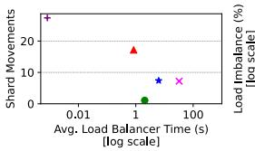

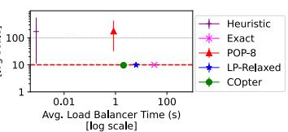

Load:Stateful, Servers:128,Shards:1024  
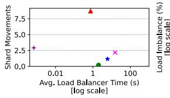

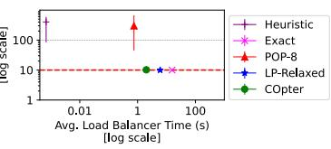  
Figure 7. Summary of experiments with 1024 shards across 128 servers for Stateless (top) and Stateful (bottom) loads.

Load:Stateless,Servers:256,Shards:2048  
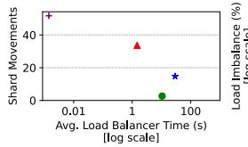

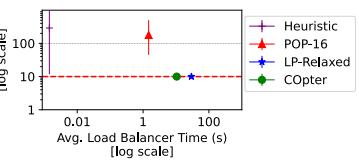  
Load:Stateful, Servers: 256, Shards:2048

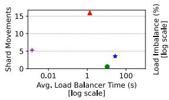

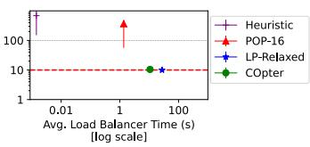  
Figure 8. Summary of experiments with 2048 shards across 256 servers for Stateless (top) and Stateful (bottom) loads.

2048 shards, 256 servers. Figure 8 (top) and (bottom) summarize our experiments with the Stateless and Stateful loads for 2048 shards hosted on 256 servers. We omit Exact from comparisons as each problem takes multiple hours to solve and is impractical for meaningful round durations. Similar to the 1024 shard case, POP-16 is quick, but suffers from load imbalance across subproblems. LP-Relaxed and COpter both meet load imbalance constraints despite using shims to resolve integer infeasibilities, further evidence that we can bypass the combinatorial explosion in large-scale resource allocation problems from integerization stage for MILPs.

COpter obtains high-quality solutions about 2.8× faster than LP-Relaxed using our factorization-free, sparsity-aware, and efficiently warm-started LP solver that benefits from highly stable shard-server assignments.

## 5.3 Traffic Engineering

Evaluated approaches. We compare COpter against three approaches: (a) LP-All solves the full LP on 8 threads using the Gurobi Commercial LP Solver (v11.0.3[14]), (b) LP-Top solves the LP using Gurobi[14] only for top 10% of demands (by volume), and allocates remaining demands to shortest paths (also called demand pinning[28]), and (c) POP-k[29] splits the LP into ?? subproblems. Each subproblem in POP replicates the full topology, but with $\frac { 1 } { k }$ of its link capacities, solves the LP for a random $\frac { 1 } { k }$ of the demands, and uses 4-way client-splitting[29] for large demands to improve allocation quality. Subproblems are solved in a single-thread and a parallel runtime is estimated mathematically.

Traffic matrices. We generate synthetic traffic matrices following the Poisson and Bimodal distributions (similar to prior work[1, 29]). Figure 9 shows the probability distribution of demands used for the Kdl topology. Poisson is dominated by few flows requesting majority of the demand by volume, whereas Bimodal sees roughly even split between two low and high demand bands. In each round, we perturb demands from the previous round by upto 10% to simulate time-varying demands. We run each experiment for 20 rounds and exclude the first 5 to remove startup effects.

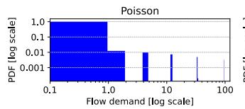

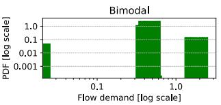  
Figure 9. Distribution of demands in the two synthetic traffic matrices – in Poisson, few large flows dominate the demands, and in Bimodal demand is split across two distinct bands.

Metrics. We consider three metrics: (a) Total allocated flow is the the sum of allocated flow across all demands, averaged across rounds (higher is better), (b) Runtime is the average time taken to compute flow allocations across rounds (lower is better), and (c) Optimality Gap is the difference between the total allocated flow for a given approach and the optimal value found by LP-All (lower is better). We compute optimality gap against COpter for the ASN topology as LP-All takes tens of hours to solve for each round and COpter allocates the most flow among the evaluated approaches.

Figure 10 and Figure 11 summarize our experiments for Poisson and Bimodal traffic matrices, respectively. For the Bimodal traffic matrices, POP-128 takes multiple days to solve all subproblems for a single round, so we present results only for the first round. The first round runtime is representative of POP-128’s average runtime as it does not benefit from any warm-starts because it creates new subproblems from random partitions in each round.

Poisson demands. Poisson is dominated by a small set of demands, so as expected, LP-Top is two orders of magnitude quicker and allocates as much flow as LP-All for Kdl topology, but only reaches 90% of COpter’s allocation for ASN showcasing the limitation of heuristics. POP-64 for Kdl and POP-128 for ASN allocate > 99% of optimal flow with runtimes well under the 5-minute round durations. COpter allocates > 99.9% of optimal and the highest flows for Kdl and ASN topologies, respectively well under a minute.

Bimodal demands. LP-Top fails to allocate > 90% of optimal flow, but is still orders of magnitude quicker than other approaches. LP-All exceeds the 5-minute round duration for Kdl topology, and is omitted from comparisons for ASN as its runtime exceeds 24-hours for each round. POP compares favorably for the Kdl topology, but takes over 20 minutes to solve each problem for the ASN topology, rendering 5-minute durations impractical. COpter’s approach using continual optimization runs in less than a minute and allocates the highest total flow for the ASN topology — a 30× speedup while allocating 1.5% more flow.

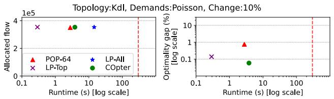

Topology:ASN, Demands:Poisson, Change:10%  
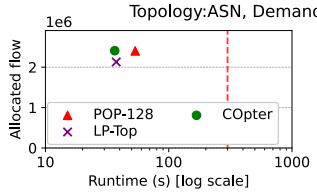

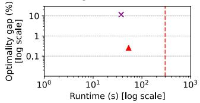

Figure 10. Summary of experiments with Poisson demands for Kdl (upper) and ASN (lower) topologies. Dashed red-line indicates the commonly used 5-minute round duration in WAN traffic engineering [17, 46].  
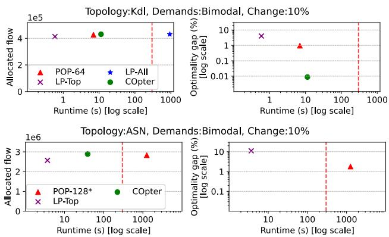  
Figure 11. Summary of experiments with Bimodal demands for Kdl (upper) and ASN (lower) topologies.

## 5.4 Attribution of benefits

COpter provides a varying amount of benefits in our benchmarks. Differential program updates help if the set of resources and requests change, so this only benefits the GPU cluster scheduling problem. While all three problems benefit from our factorization-free, sparsity-aware efficiently warm-started solver, lightweight integerization via problemspecific shims only benefits GPU cluster scheduling and shard load balancing problems.

Figure 12 illustrates the stacking benefits from COpter on the LP-relaxation of the Sia ILP [21] in the previously described 10k GPU cluster. We choose the LP relaxation, and not the ILP directly, as many problems are directly formulated as LPs (like WAN traffic engineering) and do not benefit from using lightweight shims to resolve integer infeasibilities.

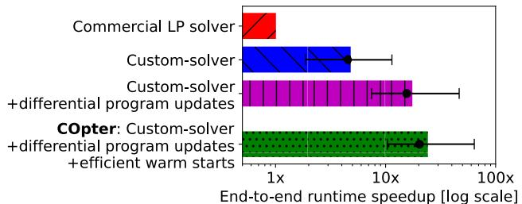  
Figure 12. Speedups in end-to-end solver runtimes from two of the three techniques that make up COpter compared to a commercial LP solver (CPLEX [19]). We show mean, median, 10th and 90th percentile speedups for the LP-relaxation of the Sia ILP [21] for 1 minute rounds on a 10k GPU cluster.

Figure 12 shows the impact of (a) using the custom solver implementation that benefits from problem and solution sparsity, (b) using a differential interface to reflect problem updates efficiently, and (c) efficiently warm-starting the custom solver using previous round’s solution as the initial guess for the current round. On average, each of these contribute a stacking 5×, 3.5×, and 1.5× speedup, respectively, for a total speedup of 24× over independently solving problems using existing LP solvers. Additionally, from Section 5.2, we see that solving MILPs by first solving its LP-relaxation and then applying a problem-specific shim leads to an end-to-end speedup of 2–3× (using the same solver [19] for both MILP and LP-relaxation of the load balancing problem). Thus, we can expect COpter to provide 24–72× speedup for MILPs.

## 6 Related Work and Discussion

In this section, we discuss systems that formulate resourceallocation problems as optimization programs, describe existing approaches to solving these optimization programs, look at the landscape of methods used to reduce solver times in large-scale resource-allocation and contrast our approach to methods in existing literature.

## 6.1 Resource-allocation as Optimization Problems

Cluster Scheduling. Plan-ahead schedulers like Tetri-Sched [43] and Shockwave [51] solve one MILP to determine allocations for multiple rounds, and as a result, are reasonably robust to missing scheduler deadlines in large clusters at the cost of increased queue times and reduced resource utilization. Meta’s RAS [31] solves MILPs hourly for large-scale capacity reservation uses a two-stage decomposition (MILP for server-reservation assignment, then parallel container allocation), but requires problem-specific optimizations and heuristics to scale the MILP stage to large scales. Tetris [6] solves MILPs for load balancing ML workloads and data placement optimization across regions, and employs multilevel scheduling for scalability at the cost of global optimality.

Gavel [30] supports time-slicing DNN jobs across heterogeneous GPUs using LP formulations for many scheduling objectives, but runs into solver bottlenecks if jobs request space-sharing leading to missed scheduler deadlines in large clusters. Rebalancer[24] is a framework to express and compile scheduling policies into MILPs. The MILPs are then solved using off-the-shelf solvers at small scales, and use a faster, sub-optimal local search algorithm on a graph representation at larger scales. COpter complements Rebalancer in two ways – (a) potentially extending the size of problems directly solvable as MILPs, and (b) using COpter’s outputs as initial guesses to initialize the local-search algorithm at scale for better quality solutions.

Traffic Engineering. NCFlow [1] uses a decomposition explicitly designed for the max-flow objective, similar in spirit to POP [29]. Teal [46] uses a learning-based approach that uses historical data for fast online allocation using reinforcement learning coupled with ADMM [4] to obtain feasible flow allocations in seconds. DOTE [36] bypasses formulating TE objectives as LPs and directly computes optimal flow splitting using deep neural networks trained on historical traffic demand data. Teal and DOTE are examples of learning-based approaches for the TE problem. RedTE [13] proposes using distributed decision making with routers computing allocations locally using multi-agent deep reinforcement learning for quicker response to bursts in demands. MegaTE [26] re-architects the TE control loop for bottom-up control that allows for asynchronous updates and finer-granularity flow allocations at container level. RedTE and MegaTE are examples that bypass centralized TE optimization.

## 6.2 Solving Optimization Problems

Offline optimization. Offline optimization deals with problems that are fully specified before optimization starts. Stateof-the-art LP and MILP solvers (e.g., CPLEX [19], Gurobi [14], GLPK [25]) often use simplex or interior-point (barrier) methods that rely on solving linear systems iteratively, and employ optimizations like matrix factorizations (LU, QR, LDL) [19, 25]. These methods scale poorly to large problems issues due to high per-iteration costs. Additionally, factorization often destroys sparsity patterns in the constraint matrices and must be recomputed if the problem changes, rendering them inefficient for continual optimization where problems change frequently. First-order methods (OSQP [41], ADMM [4], ALCD [44, 47], PGD [5], PDLP [2]) address these scalability challenges by trading slower convergence for lower per-iteration costs, and have proven useful in largescale applications [8, 44, 47]. Stochastic variants like SGD reduce per-iteration costs further, sacrificing convergence guarantees and quality of optimum.

Online optimization. Online optimization[15] deals with problems that are revealed over time, often minimizing regret against a fixed optimum (static regret)[15, 38]. Static regret is less suitable for resource allocation problems whose optimal solution changes with time. Instead, dynamic regret, that compares against a sequence of changing optima [3, 49, 50], is more relevant. However, existing work does not focus on runtime efficiency that is important for slowly evolving resource-allocation problems. Our focus in continual optimization is different: we seek algorithms that provide both low dynamic regret and runtimes that scale favorably with the amount of change in the optimal solution over time, especially for slowly evolving resource-allocation problems that are the focus of this paper.

## 7 Conclusion

Our work shows that large-scale resource-allocation problems are better formulated as sequence of interconnected problems. COpter is our approach towards efficient continual optimization of slowly evolving LPs. It pairs a differential problem update interface with a factorization-free LP solver to seamlessly reuse computational effort across rounds, and uses lightweight problem-specific heuristics to recover high-quality feasible solutions to MILPs. Our evaluations show that COpter finds allocations 57–83× faster than state-of-the-art solvers for problems from three domains– GPU cluster scheduling, shard load-balancing, and WAN traffic engineering—with negligible loss in allocation quality. Further, COpter outperforms POP in allocation quality with 1.5–30× speedups and predictable solver runtimes.

## Acknowledgments

We thank Abhishek Shetty, Pratiksha Thaker, the anonymous SOSP reviewers and our shepherd for their insightful discussions, feedback and suggestions in improving the paper. This work is supported in part by NSF Award #2211882 and by the U.S. Army Research Office and the U.S. Army Futures Command under Contract No. W911NF-20-D-0002. We thank the members and companies of the PDL Consortium (Amazon, Bloomberg, Datadog, Google, Hitachi, Honda, IBM, Intel, Jane Street, LayerZero Research, Meta, Microsoft, Oracle, Pure Storage, Salesforce, Samsung, Two Sigma, and Western Digital) and VMware for their interest, insights, feedback, and support. The content of the information does not necessarily reflect the position or the policy of the government and no official endorsement should be inferred.

## References

[1] Firas Abuzaid, Srikanth Kandula, Behnaz Arzani, Ishai Menache, Matei Zaharia, and Peter Bailis. 2021. Contracting wide-area network topologies to solve flow problems quickly. In 18th USENIX Symposium on Networked Systems Design and Implementation (NSDI 21). 175–200.

[2] David Applegate, Mateo Díaz, Oliver Hinder, Haihao Lu, Miles Lubin, Brendan O’Donoghue, and Warren Schudy. 2021. Practical large-scale linear programming using primal-dual hybrid gradient. Advances in Neural Information Processing Systems 34 (2021), 20243–20257.

[3] Dheeraj Baby and Yu-Xiang Wang. 2022. Optimal dynamic regret in proper online learning with strongly convex losses and beyond. In

International Conference on Artificial Intelligence and Statistics. PMLR, 1805–1845.

[4] Stephen Boyd, Neal Parikh, Eric Chu, Borja Peleato, Jonathan Eckstein, et al. 2011. Distributed optimization and statistical learning via the alternating direction method of multipliers. Foundations and Trends® in Machine learning 3, 1 (2011), 1–122.

[5] Paul H Calamai and Jorge J Moré. 1987. Projected gradient methods for linearly constrained problems. Mathematical programming 39, 1 (1987), 93–116.

[6] Arnab Choudhury, Yang Wang, Tuomas Pelkonen, Kutta Srinivasan, Abha Jain, Shenghao Lin, Delia David, Siavash Soleimanifard, Michael Chen, Abhishek Yadav, et al. 2024. MAST: Global scheduling of ML training across Geo-Distributed datacenters at hyperscale. In 18th USENIX Symposium on Operating Systems Design and Implementation (OSDI 24). 563–580.

[7] Carlo Curino, Evan PC Jones, Samuel Madden, and Hari Balakrishnan. 2011. Workload-aware database monitoring and consolidation. In Proceedings of the 2011 ACM SIGMOD International Conference on Management of data. 313–324.

[8] Frédéric Delbos and Jean Charles Gilbert. 2005. Global linear convergence of an augmented Lagrangian algorithm for solving convex quadratic optimization problems. Journal of Convex Analysis 12, 1 (2005), 25.

[9] Steven Diamond and Stephen Boyd. 2016. CVXPY: A Pythonembedded modeling language for convex optimization. Journal of Machine Learning Research 17, 83 (2016), 1–5.

[10] Jonathan Eckstein and Wang Yao. 2015. Understanding the convergence of the alternating direction method of multipliers: Theoretical and computational perspectives. Pac. J. Optim. 11, 4 (2015), 619–644.

[11] Lisa K Fleischer. 2000. Approximating fractional multicommodity flow independent of the number of commodities. SIAM Journal on Discrete Mathematics 13, 4 (2000), 505–520.

[12] John Forrest, Stefan Vigerske, Ted Ralphs, John Forrest, Lou Hafer, jpfasano, Haroldo Gambini Santos, Jan-Willem, Matthew Saltzman, a andre, Bjarni Kristjansson, h-i gassmann, Alan King, Arevall, Bohdan Mart, Pierre Bonami, Ruan Luies, Samuel Brito, and to st. 2024. coinor/Clp: Release releases/1.17.10. doi:10.5281/zenodo.13347196

[13] Fei Gui, Songtao Wang, Dan Li, Li Chen, Kaihui Gao, Congcong Min, and Yi Wang. 2024. RedTE: Mitigating subsecond traffic bursts with real-time and distributed traffic engineering. In Proceedings of the ACM SIGCOMM 2024 Conference. 71–85.

[14] Gurobi Optimization, LLC. 2025. Gurobi Optimizer Reference Manual. https://www.gurobi.com

[15] Elad Hazan et al. 2016. Introduction to online convex optimization. Foundations and Trends® in Optimization 2, 3-4 (2016), 157–325.

[16] Chi-Yao Hong, Srikanth Kandula, Ratul Mahajan, Ming Zhang, Vijay Gill, Mohan Nanduri, and Roger Wattenhofer. 2013. Achieving high utilization with software-driven WAN. In Proceedings of the ACM SIGCOMM 2013 Conference on SIGCOMM. 15–26.

[17] Chi-Yao Hong, Subhasree Mandal, Mohammad Al-Fares, Min Zhu, Richard Alimi, Chandan Bhagat, Sourabh Jain, Jay Kaimal, Shiyu Liang, Kirill Mendelev, et al. 2018. B4 and after: managing hierarchy, partitioning, and asymmetry for availability and scale in google’s softwaredefined WAN. In Proceedings of the 2018 Conference of the ACM Special Interest Group on Data Communication. 74–87.

[18] Qi Huangfu and JA Julian Hall. 2018. Parallelizing the dual revised simplex method. Mathematical Programming Computation 10, 1 (2018), 119–142.

[19] IBM Corporation. 2022. IBM ILOG CPLEX Optimization Studio V22.1.1: User’s Manual. IBM Corporation.

[20] Sushant Jain, Alok Kumar, Subhasree Mandal, Joon Ong, Leon Poutievski, Arjun Singh, Subbaiah Venkata, Jim Wanderer, Junlan Zhou, Min Zhu, et al. 2013. B4: Experience with a globally-deployed software defined WAN. ACM SIGCOMM Computer Communication

Review 43, 4 (2013), 3–14.

[21] Suhas Jayaram Subramanya, Daiyaan Arfeen, Shouxu Lin, Aurick Qiao, Zhihao Jia, and Gregory R Ganger. 2023. Sia: Heterogeneity-aware, goodput-optimized ML-cluster scheduling. In Proceedings of the 29th Symposium on Operating Systems Principles. 642–657.

[22] Myeongjae Jeon, Shivaram Venkataraman, Amar Phanishayee, Junjie Qian, Wencong Xiao, and Fan Yang. 2019. Analysis of Large-Scale Multi-Tenant GPU clusters for DNN training workloads. In 2019 USENIX Annual Technical Conference (USENIX ATC 19). 947–960.

[23] Elizabeth John and E Alper Yıldırım. 2008. Implementation of warmstart strategies in interior-point methods for linear programming in fixed dimension. Computational Optimization and Applications 41, 2 (2008), 151–183.

[24] Neeraj Kumar, Pol Mauri Ruiz, Vijay Menon, Igor Kabiljo, Mayank Pundir, Andrew Newell, Daniel Lee, Liyuan Wang, and Chunqiang Tang. 2024. Optimizing resource allocation in hyperscale datacenters: Scalability, usability, and experiences. In 18th USENIX Symposium on Operating Systems Design and Implementation (OSDI 24). 507–528.

[25] Andrew Makhorin. 2008. GLPK (GNU linear programming kit). http://www. gnu. org/s/glpk/glpk. html (2008).

[26] Congcong Miao, Zhizhen Zhong, Yunming Xiao, Feng Yang, Senkuo Zhang, Yinan Jiang, Zizhuo Bai, Chaodong Lu, Jingyi Geng, Zekun He, et al. 2024. MegaTE: Extending WAN Traffic Engineering to Millions of Endpoints in Virtualized Cloud. In Proceedings of the ACM SIGCOMM 2024 Conference. 103–116.

[27] Philipp Moritz, Robert Nishihara, Stephanie Wang, Alexey Tumanov, Richard Liaw, Eric Liang, Melih Elibol, Zongheng Yang, William Paul, Michael I Jordan, et al. 2018. Ray: A distributed framework for emerging AI applications. In 13th USENIX symposium on operating systems design and implementation (OSDI 18). 561–577.

[28] Pooria Namyar, Behnaz Arzani, Ryan Beckett, Santiago Segarra, Himanshu Raj, and Srikanth Kandula. 2022. Minding the gap between fast heuristics and their optimal counterparts. In Proceedings of the 21st ACM Workshop on Hot Topics in Networks. 138–144.

[29] Deepak Narayanan, Fiodar Kazhamiaka, Firas Abuzaid, Peter Kraft, Akshay Agrawal, Srikanth Kandula, Stephen Boyd, and Matei Zaharia. 2021. Solving large-scale granular resource allocation problems efficiently with pop. In Proceedings of the ACM SIGOPS 28th Symposium on Operating Systems Principles. 521–537.

[30] Deepak Narayanan, Keshav Santhanam, Fiodar Kazhamiaka, Amar Phanishayee, and Matei Zaharia. 2020. Heterogeneity-Aware Cluster Scheduling Policies for Deep Learning Workloads. In 14th USENIX Symposium on Operating Systems Design and Implementation (OSDI 20).

[31] Andrew Newell, Dimitrios Skarlatos, Jingyuan Fan, Pavan Kumar, Maxim Khutornenko, Mayank Pundir, Yirui Zhang, Mingjun Zhang, Yuanlai Liu, Linh Le, et al. 2021. RAS: continuously optimized regionwide datacenter resource allocation. In Proceedings of the ACM SIGOPS 28th Symposium on Operating Systems Principles. 505–520.

[32] Jorge Nocedal and Stephen J. Wright (Eds.). 1999. Numerical Optimization.

[33] Brendan O’Donoghue, Eric Chu, Neal Parikh, and Stephen Boyd. 2013. Operator splitting for conic optimization via homogeneous self-dual embedding. arXiv preprint arXiv:1312.3039 1, 2.1 (2013), 3.

[34] Neal Parikh, Stephen Boyd, et al. 2014. Proximal algorithms. Foundations and trends® in Optimization 1, 3 (2014), 127–239.

[35] Laurent Perron and Vincent Furnon. 2024. OR-Tools. Google. https: //developers.google.com/optimization/

[36] Yarin Perry, Felipe Vieira Frujeri, Chaim Hoch, Srikanth Kandula, Ishai Menache, Michael Schapira, and Aviv Tamar. 2023. DOTE: Rethinking (Predictive)WAN Traffic Engineering. In 20th USENIX Symposium on Networked Systems Design and Implementation (NSDI 23). 1557–1581.

[37] Aurick Qiao, Sang Keun Choe, Suhas Jayaram Subramanya, Willie Neiswanger, Qirong Ho, Hao Zhang, Gregory R Ganger, and Eric P

Xing. 2021. Pollux: Co-adaptive cluster scheduling for goodputoptimized deep learning. In 15th USENIX Symposium on Operating Systems Design and Implementation (OSDI 21).

[38] Sasha Rakhlin and Karthik Sridharan. 2013. Optimization, learning, and games with predictable sequences. Advances in Neural Information Processing Systems 26 (2013).

[39] Michel Schubiger, Goran Banjac, and John Lygeros. 2020. GPU acceleration of ADMM for large-scale quadratic programming. J. Parallel and Distrib. Comput. 144 (2020), 55–67.

[40] Marco Serafini, Essam Mansour, Ashraf Aboulnaga, Kenneth Salem, Taha Rafiq, and Umar Farooq Minhas. 2014. Accordion: Elastic scalability for database systems supporting distributed transactions. Proceedings of the VLDB Endowment 7, 12 (2014), 1035–1046.

[41] Bartolomeo Stellato, Goran Banjac, Paul Goulart, Alberto Bemporad, and Stephen Boyd. 2020. OSQP: An operator splitting solver for quadratic programs. Mathematical Programming Computation 12, 4 (2020), 637–672.

[42] Rebecca Taft, Essam Mansour, Marco Serafini, Jennie Duggan, Aaron J Elmore, Ashraf Aboulnaga, Andrew Pavlo, and Michael Stonebraker. 2014. E-store: Fine-grained elastic partitioning for distributed transaction processing systems. Proceedings of the VLDB Endowment 8, 3 (2014), 245–256.

[43] Alexey Tumanov, Timothy Zhu, Jun Woo Park, Michael A Kozuch, Mor Harchol-Balter, and Gregory R Ganger. 2016. TetriSched: global rescheduling with adaptive plan-ahead in dynamic heterogeneous clusters. In Proceedings of the Eleventh European Conference on Computer Systems. 1–16.

[44] Sinong Wang and Ness Shroff. 2017. A new alternating direction method for linear programming. Advances in neural information processing systems 30 (2017).

[45] Qizhen Weng, Wencong Xiao, Yinghao Yu, Wei Wang, Cheng Wang, Jian He, Yong Li, Liping Zhang, Wei Lin, and Yu Ding. 2022. MLaaS in the wild: Workload analysis and scheduling in Large-Scale heterogeneous GPU clusters. In 19th USENIX Symposium on Networked Systems Design and Implementation (NSDI 22). 945–960.

[46] Zhiying Xu, Francis Y Yan, Rachee Singh, Justin T Chiu, Alexander M Rush, and Minlan Yu. 2023. Teal: Learning-accelerated optimization of wan traffic engineering. In Proceedings of the ACM SIGCOMM 2023 Conference. 378–393.

[47] Ian En-Hsu Yen, Kai Zhong, Cho-Jui Hsieh, Pradeep K Ravikumar, and Inderjit S Dhillon. 2015. Sparse linear programming via primal and dual augmented coordinate descent. Advances in neural information processing systems 28 (2015).

[48] E Alper Yildirim and Stephen J Wright. 2002. Warm-start strategies in interior-point methods for linear programming. SIAM Journal on Optimization 12, 3 (2002), 782–810.

[49] Peng Zhao, Yan-Feng Xie, Lijun Zhang, and Zhi-Hua Zhou. 2022. Efficient methods for non-stationary online learning. Advances in Neural Information Processing Systems 35 (2022), 11573–11585.

[50] Peng Zhao and Lijun Zhang. 2021. Improved analysis for dynamic regret of strongly convex and smooth functions. In Learning for Dynamics and Control. PMLR, 48–59.

[51] Pengfei Zheng, Rui Pan, Tarannum Khan, Shivaram Venkataraman, and Aditya Akella. 2023. Shockwave: Fair and efficient cluster scheduling for dynamic adaptation in machine learning. In 20th USENIX Symposium on Networked Systems Design and Implementation (NSDI 23). 703–723.

## Appendices

We include additional discussion and results in the following sections to help readers get a better understanding of the techniques described in the main paper. The following content has not been peer-reviewed.

## A COpter: Theoretical Discussion

In this section, we deepen the theoretical insights underpinning COpter. We first introduce the notion of dynamic regret, and compare various approaches in terms of their dynamic regret. We then discuss how COpter follows the Follow The Leader (FTL) scheme from online optimization, and as a result enjoys dynamic regret that depends optimally on the path length. We then discuss the Proximal Point Algorithm (PPA), the work horse behind COpter, and show how the algorithm can benefit from warm-starting. We also briefly discuss the trajectory that PPA follows and contrast it with other first order methods, to provide intuition on how COpter obtains mostly integral solutions from its LPrelaxation. We will specialize the discussion to the GPU resource scheduling problem for simplicity, but this section is applicable to all three cases considered in the main text (up to a convex relaxation).

## A.1 Dynamic Regret for GPU Scheduling

Consider the schematic representation of round based GPU cluster scheduling problem in Figure 13. Here we use a jobqueue to illustrate resource requests, and use GPU servers to illustrate resources. As time goes on, various jobs move in and out of the system, and various GPUs come online and offline depending on failures and availability. At the start of each round, the scheduler performs three major steps: (1) inspect the state of resources and jobs in the system, (2) with this information, generate an allocation of resources, and (3) physically realize this allocation by placing jobs onto appropriate resources.

As the state is measured at the start of each round, it is possible that the state of the system diverges from the measurement if computing the allocation takes too long. Let $\mathrm { L P } _ { t - 1 } ( x )$ denote the linear program constructed at the end of round ?? − 1 or, equivalently, the start of round ?? , and let $x _ { t - 1 } ^ { * } = \arg \operatorname* { m a x } \mathrm { L P } _ { t - 1 } ( x )$ be the unique schedule that provides the maximum reward/utility. Let $( c _ { t - 1 } , b _ { t - 1 } , A _ { t - 1 } )$ parameterize the linear program $\mathrm { L P } _ { t - 1 }$ . Unlike the main text, we index the problem parameters using ?? − 1 to highlight the fact that the information that the scheduler uses to compute the allocation in round ?? is from the end of the previous round (or the start of the current round). In fact, let us assume that nature is allowed to modify the job queue (resource requests) and the available resources after the scheduler has provided its allocation for the round ??. Such an entity can behave entirely adversarially, for instance by taking all the resources offline in round ?? . In such a case, the utility for all job resource pairs are zero, and thus $c _ { t } = 0$ . The scheduler was expecting a reward of $c _ { t - 1 } ^ { T } \hat { x } _ { t } > 0 .$ , based on solving $\mathrm { L P } _ { t - 1 } ( x )$ , but in reality receives a reward of $c _ { t } ^ { T } \hat { x } _ { t } = 0$ . On the other hand, nature can also be benign, so that the state of the cluster does not change at all from the $t - 1$ to the ?? -th round. In this case, the scheduler receives the reward implied by the problem it solves, $\mathrm { L P } _ { t - 1 } ( x )$ (i.e., $c _ { t } ^ { T } \hat { x } _ { t } = c _ { t - 1 } ^ { T } \hat { x } _ { t } )$

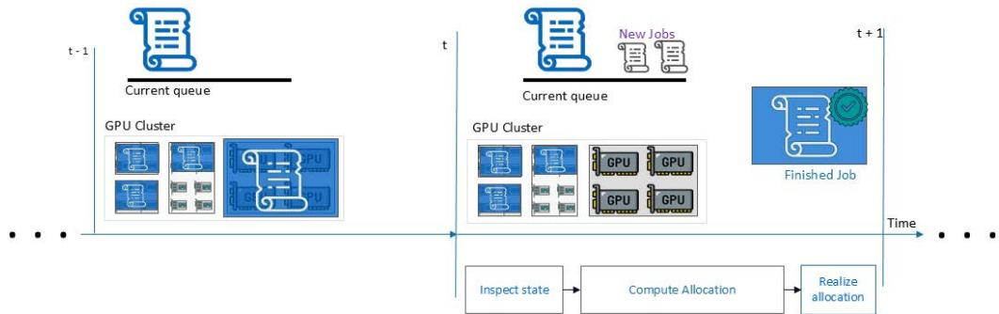  
Figure 13. A schematic representation of round based scheduling. In each round, the scheduler performs three major steps: (1) inspect the state of resources and jobs in the system, (2) with this information, generate an allocation of resources and (3) physically realize this allocation by placing jobs onto appropriate resources. As the state is measured at the start of each round, it is possible that the state of the system diverges from the measurement if computing allocation takes too long.

More generally, let $f _ { t } ( x ) = c _ { t } ^ { T }$ ?? denote the true reward for a schedule $x \in R ^ { n }$ in round ??, based on the reward or utility values $c _ { t }$ that nature chooses. For simplicity, assume that the optimal schedule at ?? is unique, and denote it by $\boldsymbol { x } _ { t } ^ { * }$ With this setup, different scheduling services can now be compared based on their dynamic regret, which measures the difference in reward when compared the against a changing set of optimal moves.

Definition 2 (Dynamic Regret). Let $\{ x _ { t } ^ { * } \} _ { t = 1 } ^ { T }$ denote a sequence of optimal solutions, and similarly let $\{ \hat { x } _ { t } \} _ { t = 1 } ^ { T }$ denote the decisions from a choice of scheduler. Then the dynamicregret of the scheduler after ?? rounds is defined $^ { a s , }$

$$
D \ – R e g ( \{ \hat { x } _ { t } \} _ { t = 1 } ^ { T } ) = \sum _ { t = 1 } ^ { T } f _ { t } ( \hat { x } _ { t } ) - f _ { t } ( x _ { t } ^ { * } ) .
$$

Critically, we reiterate that in this model, at each time ??, nature observes the scheduler’s move $\hat { x } _ { t }$ before making modifications to the system to induce its own decision $\boldsymbol { x } _ { t } ^ { * }$ Without any additional assumptions, nature can exploit this by forcing the scheduler to suffer maximum penalty in each round, resulting in a dynamic-regret that scales as $\Theta ( T )$ . For practical schedulers, this corresponds to an environment that exhibits adversarial changes — such as alternating between turning off half the GPUs in one round and turning them back on in the next, or swapping jobs in and out of scheduler queue across successive rounds. In such cases, no delayed response can perform well, as by the time the schedule is deployed, the environment would have moved on. However, if we assume that nature is benign, meaning the system changes gradually over time, the scheduling strategy can adapt to these slower drifts. When the drift is small, the dynamic regret should also remain small. This drift is typically characterized by various regularity formulations, such as the path length from Definition 1:

$$
\mathcal { P } _ { x } ( T ) = \sum _ { t = 2 } ^ { T } \lVert x _ { t } ^ { * } - x _ { t - 1 } ^ { * } \rVert ^ { 2 } .\tag{2}
$$

## A.2 COpter as Follow The Leader (FTL)

In this setup, the round based scheduling algorithms, and in particular COpter, can be thought of as repeatedly applying solutions $\hat { x } _ { t }$ such that,

$$
\hat { x } _ { t } \in \arg \operatorname* { m a x } _ { } \mathrm { L P } _ { t - 1 } ( x ) .
$$

Such a scheme can be interpreted as the Follow the Leader (FTL) algorithm; where, we use the latest available state of the system and find the optimal solution implied by this state.

$$
\hat { x } _ { t } ^ { \mathrm { F I L } } = \arg \operatorname* { m a x } \mathrm { L P } _ { t - 1 } ( x )\tag{3}
$$

Intuitively, this approach is applicable and effective in cases where the round durations are chosen to be small enough that the system barely changes across successive rounds. In such cases, using slightly stale state should not make much of a difference. Formally, it can be shown that the dynamic regret suffered by the FTL algorithm scales as $O ( \mathcal { P } _ { x } ( T ) )$ ). Thus, if the change in solutions across rounds is small, the dynamic regret stays small (Theorem 1).

Theorem 1 (Simplified Theorem 3, [50]). Let the linear objectives $\begin{array} { r } { f _ { t } ( x ) = c _ { t } ^ { T } , } \end{array}$ be such that $\| c _ { t } \|$ is bounded, and let $\chi _ { t }$ denote the set of feasible solutions in step ?? . Then the greedy FTL strategy in Equation (3) satisfies,

$$
D \cdot R e g ( \{ \hat { x } _ { t } \} _ { t = 1 } ^ { T } ) \leq O ( \operatorname* { m i n } \{ \mathcal { P } _ { x } ( T ) , \mathcal { P } _ { x } ^ { \frac { 1 } { 2 } } ( T ) \} )
$$

```python
import cvxpy as cp
def ppa_step(c, A, b, x0, eta=1.0):
c: Objective vector of shape [n]
A: Constraint matrix of shape [m, n]
b: Constraint vector of shape [m]
x0: Initial guess of shape [n]
x = cp.Variable(A.shape[1])
constraints_g = [0 <= x, A@x <= b]
indicator_g = cp.transforms.indicator(constraints_g)
g = c @ x + indicator_g
obj = cp.Minimize(g + (1/(2*eta)) * cp.norm(x-x0)**2)
prob = cp.Problem(obj)
res = prob.solve()
return x.value
```

Table 2. A simple implementation of a single step of the PPA algorithm for the linear program in Equation (4). Starting from an initial guess for $x _ { 0 }$ and repeatedly applying the solve function to the resultant iterates will converge to the minimizer.

where

$$
\begin{array} { c } { { \displaystyle { \cal D } { \cal - } R e g \big ( \big \{ \hat { x } _ { t } \big \} _ { t = 1 } ^ { T } \big ) = \displaystyle \sum _ { t = 1 } ^ { T } f _ { t } \big ( \hat { x } _ { t } \big ) - \sum _ { t = 1 } ^ { T } f _ { t } \big ( x _ { t } ^ { * } \big ) } }  \\ { { { } } } \\ { { \displaystyle \mathcal { P } _ { x } ( T ) = \displaystyle \sum _ { t = 2 } ^ { T } \lVert x _ { t } ^ { * } - x _ { t - 1 } ^ { * } \rVert ^ { 2 } } } \\ { { { } } } \\ { { \displaystyle \mathcal { P } _ { x } ^ { \frac 1 2 } ( T ) = \displaystyle \sum _ { t = 2 } ^ { T } \lVert x _ { t } ^ { * } - x _ { t - 1 } ^ { * } \rVert } }  \end{array}
$$

Note, however, that the small dynamic regret does not imply that the time to find $\hat { x } _ { t }$ is small, or, even dependent on the path length as measured in Equation (2). The time to find optimum depends on the choice of optimization algorithm used, even when starting from good initial points. For instance, algorithms such as Simplex need not benefit from initializing close in terms of $\ell _ { 2 }$ norm, while algorithms like ADMM spend most of the iterations in the vicinity of the optimum anyway, and need not show meaningful advantages in practice.

## A.3 Proximal Point Algorithm (PPA) and Warm Starting

Given a linear program,

$$
\begin{array} { l } { \operatorname* { m i n } { c ^ { T } x } } \\ { \mathrm { s . t . } A x \leq 0 , x \geq 0 , } \end{array}\tag{4}
$$

we can rewrite the program as the sum of a smooth and two non-smooth terms as follows:

$$
\operatorname* { m i n } { c ^ { T } x } + \mathbb { I } _ { A x \leq b } ( x ) + \mathbb { I } _ { x \geq 0 } ( x ) ,
$$

where the indicator functions $\mathbb { I } _ { C } ( x )$ for some set ?? takes the value of 0 when $x \in C$ and +∞ when ?? ∉ ??. Let,

$$
g ( x ) = c ^ { T } x + \mathbb { I } _ { A x \leq b } ( x ) + \mathbb { I } _ { x \geq 0 } ( x ) .
$$

Then, the PPA algorithm can be thought of as starting some initial point ??0 and repeatedly applying the following operator, referred to as the proximal operator, the to find subsequent iterates:

$$
x _ { k + 1 } = \operatorname { p r o x } _ { \eta g } ( x _ { k } ) = \arg \operatorname* { m i n } _ { x } g ( x ) + { \frac { 1 } { 2 \eta } } \| x _ { k } - x \| ^ { 2 } .\tag{5}
$$

In general, the proximal operator is a non-expansive operation (see Theorem 11, [10]); that is, it never increases the distance of the current iterate to the optimum. In the case of constrained LPs, if ?? is larger than a problem dependent constant, $L > 0 ,$ then the proximal operator is strictly contractive with the optimality gap decreasing by a factor of $\begin{array} { r } { \frac { L } { \eta } . } \end{array}$ Succinctly,

$$
\| \partial g ( x _ { k + 1 } ) \| \leq \operatorname* { m i n } \left( { \frac { L } { \eta } } , 1 \right) \| \partial g ( x _ { k } ) \| .
$$

Here $\partial g ( x )$ denotes the sub-gradient of $\dot { \boldsymbol g } ( \boldsymbol x )$ which generalizes the interpretation of the gradient as a direction of ascent to non-smooth functions. Thus, the minimizer of an LP is characterized as a feasible point that has $\| \partial g ( x ) \| = 0 . \mathrm { \bf ~ A }$ formal proof of this fact can be found, for instance, in Theorem 4, [47] or Theorem 4.5 and Proposition 4.4 from [8]. In particular, this means that, for an appropriate choice of ??, say $\eta \geq 2 L$ the sub-optimality gap measured through ∥????(???? ) ∥, decreases by a factor of at least 2 in each round, starting from $\| \partial g ( x _ { 0 } ) \|$ . Initial points $x _ { 0 }$ that are close to $x ^ { * }$ thus benefit from starting from a low $\| \partial g ( x _ { 0 } ) \|$ , compared to randomly initializing or initializing from a predetermined fixed choice (such as $x _ { 0 } = 0 )$ . Note that we do not need to have access to the value of ?? and it can instead be estimated during the algorithm. If our initial guess of ?? is less than $L ,$ then min $\begin{array} { r } { \mathbf { \nabla } \cdot \underline { { L } } , \mathbf { 1 } ) = 1 } \end{array}$ and the optimality gap remains unchanged. This fact can be used to pick ?? by repeatedly increasing it, say $\begin{array} { r l r } { \eta } & { { } } & { \qquad - 2 \times \eta _ { : } } \end{array}$ , till a desired decrease in gap is attained.

Each PPA iteration solves a unconstrained, non-smooth QP specified in Equation (5). Off-the-shelf solvers or autodiff frameworks (e.g., PyTorch) can be used to implement this step (Table 2 for a CvxPy implementation). However, these general purposes implementations aren’t performant and are unsuitable for COpter. We instead use a custom implementation of a coordinate descent (CD) solver applied to a dual form of this equation [47], which (1) maintains minimal internal state, (2) exploits sparsity via SpMV operations and an active-set strategy, and, (3) benefits from warm-starting both in theory and practice. At large scales, our approach solves problems orders of magnitude faster than the alternative of solving linear systems, all while using just a few CPU threads (see Figure 3 and Section 5.1).

PPA vs. Simplex. The PPA approach to solving a constrained LP, by converting it into a sequence of non-smooth unconstrained quadratic programs, is fundamentally different from that of a Simplex based constrained LP solver. We briefly discuss the intuition behind the Simplex method at a high level here. We assume (for simplicity) that the constraint polytope is bounded (to prevent minimizers at infinity) and that a unique minimizer $x ^ { * }$ exists. To understand the Simplex algorithm intuitively, we begin with four well-known facts, stated without proof:

1. Constraint tightness at the optimum. Each row-level constraint $A _ { i } x \leq b _ { i }$ defines a half-space. If the negative gradient −?? satisfies $- c ^ { \top } A _ { i } > 0 ,$ then moving toward the boundary $A _ { i } x = b _ { i }$ reduces the objective. Hence, at $x ^ { * }$ , a subset of constraints must be tight.

2. The minimizer is a vertex. Since $x ^ { * }$ is unique, it must lie at a vertex of the constraint polytope. Otherwise, there exists a direction along which the objective could be further minimized while remaining feasible.

3. Vertices are defined by intersections of ?? hyperplanes. At any vertex, exactly ?? constraints (out of ??) are tight. The vertex is the solution to the linear system formed by these constraints.

4. Vertices can be computed by solving linear systems. For any index set $\mathcal { I } \subseteq \{ 1 , \ldots , m \}$ of size $n ,$ the vertex defined by those constraints is given by solving the linear system $A _ { I } x = b _ { I }$ for ?? .

These facts suggest the following algorithmic structure: starting from a guess ${ \cal T } _ { 0 } ,$ we solve $A _ { \mathcal { I } _ { 0 } } x = b _ { \mathcal { I } _ { 0 } }$ to get $x _ { 0 } ,$ then inspect the remaining constraints to determine if moving in the direction of −?? yields further improvement. If so, a new constraint is swapped into the active set ${ \cal T } _ { 0 } ,$ forming $\begin{array} { r } { \mathcal { I } _ { 1 } , } \end{array}$ and we resolve. This repeats until convergence to $x ^ { * } ,$ . Each iteration solves an $n \times n$ system, and iteration count depends on the number of vertices traversed, not the Euclidean distance to $x ^ { * }$ . The Simplex algorithm formalizes this approach with pivot rules, cycle-prevention logic, matrix factorization for efficient updates, and other optimizations. The work horse of Simplex is solving a linear system, identifying vertices and moving from vertex to vertex.

## B Additional results

## B.1 Effect of re-using flow allocations

For the plots shown in Figure 14, we randomly perturb requested demands by upto 10% between rounds. We observe that long solver times can reduce total flow (and the corresponding objective) by upto 5% when compared to an ideal solver with zero solve time.

## B.2 Tradeoff between solution quality and solver time

Figure 15 shows the change in solution quality (??-axis) vs time taken (??-axis, 99??ℎ percentile values shown) to find a solution to large-scale resource-allocation problems in three domains using three approaches – (1) $L P / I L P ^ { * }$ solves the (integer) linear program formulation using commercial LP/ILP solvers[14, 19], (2) POP partitions the resource and request sets[29], then solves the partitioned problems using the same commercial LP/ILP solvers in parallel, and (3) COpter formulates allocation problems as slowly evolving linear programs(see Section 3) and reuses computational effort from solving prior problems to speedup solver runtimes. COpter’s finds solutions orders of magnitude faster than commercial LP/ILP solvers with negligible loss in solution quality.

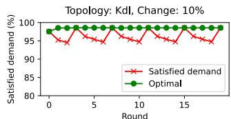

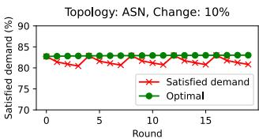  
Figure 14. Effect of re-using flow allocations in an online traffic engineering setting that retains allocations across rounds if the solver fails to complete before the 300-second deadline.

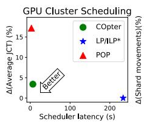

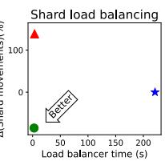

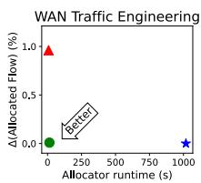  
Figure 15. Change in solution quality vs solver time for largescale resource allocation problems across three domains.

See Section 5.2 to understand why COpter appears to find better-than-optimal solutions for the shard load balancing problem.

## B.3 Solving the LP-Relaxation of Sia Policy using a commercial solver

Figure 16 shows the time taken to solve the LP-relaxation of the Sia [21] scheduler policy using the CPLEX [19] commercial LP solver for two cluster sizes, 10k and 25k GPUs each, with jobs submitted over 24 hours (in simulation). For the duration of the benchmark, 83% and 15.1% of the scheduling problems were solved within the required 60 seconds round duration (shown by the dotted red line), respectively. The scheduler would have missed its 60-second deadline in 17% and 85% of the time of the rounds if run in a real cluster.

## B.4 Solution sparsity for LP-Relaxations of MILPs

Figure 17 shows the sparsity of the optimal solution to the LP-relaxation of the MILP formulations for two resourceallocation problems using the CPLEX [19] commercial LP solver: GPU cluster scheduling with Sia [21] scheduler policy at 60-second intervals for a 10k GPU cluster over 24 hours, and Shard load balancing (see Section 4.2). We observe that the the optimal solution to these problems is over 99% sparse – fewer than 1% of the variables are non-zero.

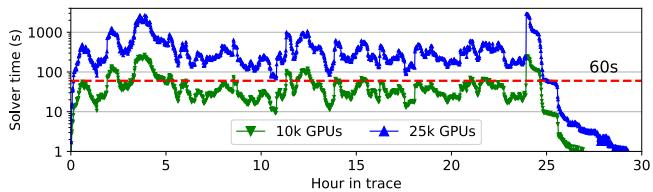  
Figure 16. Time taken to solve the LP-relaxation of the Sia [21] scheduler policy using a commercial LP solver (CPLEX [19]) for 10k and 25k GPUs cluster sizes, respectively.

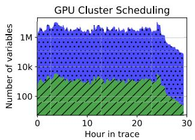

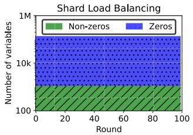  
Figure 17. Solution sparsity for LP-relaxations of two resource-allocation problems using a commercial LP solver (CPLEX [19]).