Latest updates: hps://dl.acm.org/doi/10.1145/3731569.3764847

RESEARCH-ARTICLE

# SAND: A New Programming Abstraction for Video-based Deep Learning

JUNCHEOL YE, Korea Advanced Institute of Science and Technology, Daejeon, South Korea SEUNGKOOK LEE, Korea Advanced Institute of Science and Technology, Daejeon, South Korea

HWIJOON LIM, Korea Advanced Institute of Science and Technology, Daejeon, South Korea JIHYUK LEE, Chung-Ang University, Seoul, South Korea

UITAEK HONG, Korea Advanced Institute of Science and Technology, Daejeon, South Korea YOUNGJIN KWON, Korea Advanced Institute of Science and Technology, Daejeon, South Korea

View all

Open Access Support provided by:

Korea Advanced Institute of Science and Technology

Chung-Ang University

Published: 12 October 2025

Citation in BibTeX format

SOSP '25: ACM SIGOPS 31st Symposium

on Operating Systems Principles

October 13 - 16, 2025

Seoul, Republic of Korea

Conference Sponsors: SIGOPS

# SAND: A New Programming Abstraction for Video-based Deep Learning

Juncheol Ye‡ Seungkook Lee‡ Hwijoon Lim‡ Jihyuk Lee§ Uitaek Hong‡¶∗

Youngjin Kwon‡ Dongsu Han‡

‡ KAIST § Chung-Ang University ¶ Maum.AI

## Abstract

Video-based deep learning (VDL) is increasingly used across diverse applications and has become highly popular, but it faces significant challenges in preprocessing highly compressed video data. Preprocessing pipelines are complex, requiring extensive engineering effort, and introduce computational bottlenecks, with latency exceeding GPU training time. Existing solutions partially mitigate these issues but remain inefficient and resource-constrained.

We present SAND, a framework for VDL that integrates system-level optimizations to simplify the preprocessing pipeline and maximize resource efficiency. First, SAND introduces a view abstraction that encapsulates key preprocessing stages into virtualized objects, eliminating the need for users to manage individual objects. Second, SAND maximizes reuse opportunities through efficient system-level object management, reducing the preprocessing overhead and improving GPU utilization. Evaluation across multiple VDL applications and diverse environments, including Raybased hyperparameter search and distributed data parallel training, shows GPU utilization improvements of up to 12.3× and 2.9× over CPU and GPU baselines, respectively, while reducing preprocessing code complexity from hundreds or thousands of lines to fewer than 10.

## CCS Concepts

• Information systems → Storage management; • Computing methodologies → Machine learning.

## Keywords

Storage Abstraction, View-based Programming, Video-based Deep Learning Training, GPU Utilization

ACM Reference Format:

Juncheol Ye, Seungkook Lee, Hwijoon Lim, Jihyuk Lee, Uitaek Hong, Youngjin Kwon, Dongsu Han. 2025. SAND: A New Programming Abstraction for Video-based Deep Learning. In ACM SIGOPS 31st Symposium on Operating Systems Principles (SOSP ’25), October 13– 16, 2025, Seoul, Republic of Korea. ACM, New York, NY, USA, 17 pages. https://doi.org/10.1145/3731569.3764847

## 1 Introduction

Video-based deep learning (VDL) has become increasingly popular, powering both foundational research and transformative commercial applications. Today’s most prominent AI systems exemplify VDL’s critical role: text-to-video models like OpenAI’s Sora [9] and Runway’s Gen-2 [1] train on millions of video hours to generate photorealistic content; multimodal foundation models including GPT-4V [69] and Gemini [68] incorporate extensive video pretraining for visual understanding; and platforms like YouTube and TikTok deploy VDL for content moderation across billions of daily uploads [32, 45]. These applications span a broad spectrum, from powering large-scale commercial platforms to enabling next-generation generative models. Popular tasks span from traditional classification [31, 72, 73] and analytics [17, 56] to self-supervised learning [20, 29, 40, 54, 55, 57] that creates generic foundational embeddings—now essential for training the generative models reshaping content creation. At the same time, the scale and volume of datasets are increasing.

Despite its widespread adoption, preparing highly compressed video data for deep learning presents significant challenges, particularly during preprocessing. First, video preprocessing pipelines are inherently complex, imposing a substantial implementation burden on developers. These pipelines involve multiple intricate steps, including decoding compressed video streams, selecting frames, and applying augmentations such as blurring, cropping, resizing, and rotation.

For example, SlowFast [18], a VDL workload from Meta, requires over 2.2k lines of code for preprocessing alone, more than double the code needed for model training. This disparity highlights the extensive engineering effort needed to manually manage preprocessing pipelines.

Second, the overhead introduced by video preprocessing significantly impacts computational efficiency. CPU-based preprocessing exhibits significant limitations, with latency being 2.2 to 6.5 times longer than the GPU training time, leading to GPU stalls and underutilization [21]. While hardware decoders such as NVIDIA’s NVDEC [44] can reduce the burden on CPUs, they do not eliminate preprocessing overhead. Moreover, offloading preprocessing tasks to the GPU reduces available memory for training, limiting batch sizes and degrading overall performance.

To overcome the limitations, we introduce SAND, a comprehensive framework that incorporates storage abstraction for video-based deep learning. SAND introduces a new programming abstraction that optimizes training object management and enhances GPU utilization during training. By abstracting away the complexities of preprocessing, SAND enables developers to focus on their core logic for model training while offering flexible and efficient data management tailored to the unique demands of VDL workflows.

At the heart of SAND ’s design lies the view, a programming abstraction that encapsulates key stages of the preprocessing workflow using virtualized objects. This abstraction enables developers to directly access training batches through view interfaces without needing to understand the complexities of the underlying pipeline. The view seamlessly integrates with existing environments by supporting POSIX system calls via the Linux VFS, ensuring compatibility across a wide range of deployment scenarios. By leveraging its viewbased programming model, SAND significantly reduces developers’ workload, as demonstrated by reducing the preprocessing code in SlowFast from 2.2 k lines to just 8 lines.

To enhance training performance, SAND reduces preprocessing overhead and minimizes GPU stalls by leveraging system-level object reuse across multiple training tasks, effectively eliminating redundant computations. To achieve this, SAND employs three key design ideas:

1) View Materialization Planning: SAND constructs a view materialization plan that models the video preprocessing workflow as a dependency graph of view types. This graph effectively captures when and which operations are required, enabling systematic planning for the creation and reuse of intermediate objects.

2) Pre-Materialization: Using the dependency graph, SAND reduces redundant decoding operations by pre-materializing frequently reused intermediate objects for future epochs and caching them in storage. SAND strategically selects objects with high reuse potential, striking a balance between the computational cost of regenerating intermediate objects and the storage constraints of retaining them.

3) Priority-Based Materialization Scheduling: During the materialization process, SAND parallelizes tasks using multiple threads and employs priority-based materialization scheduling to efficiently allocate resources between prematerialization and real-time data feeding. It dynamically boosts lagging threads to ensure that all tasks are completed on time. This approach prevents delays in ongoing data feeding while simultaneously preparing training objects before they are needed by the GPU.

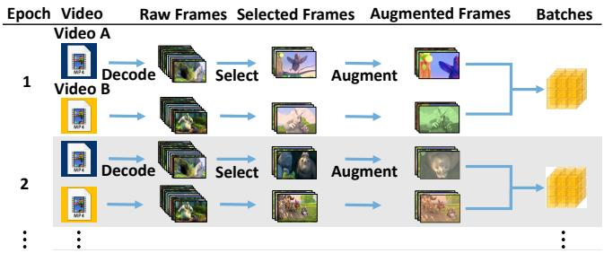  
Figure 1: Video pre-processing workflow for VDL training.

We evaluate SAND across three different video deep learning applications under various scenarios, including singletask training, hyperparameter search, multi-task training, distributed data parallel (DDP) training on cloud-based environments. In our experiments, SAND achieves significant improvements in training time and GPU utilization compared to both CPU and GPU preprocessing baselines. Compared to CPU baseline, SAND improves training time up to 10.2× and GPU utilization 12.3× in hyperparameter search. Compared to GPU baseline, SAND improves training time up to 2.8× and GPU utilization 2.9× in hyperparameter search.

We make the following contributions:

• To our best knowledge, SAND is the first framework to propose a view-based programming abstraction for preprocessing.

• SAND efficiently integrates training object management and scheduling mechanisms in its view-based programming abstraction.

• We demonstrate significant reduction in preprocessing code that developers need to write, alongside superior training performance compared to existing systems that utilize CPUs or GPUs for pre-precessing.

## 2 Background on Video Training Pipeline

Video deep learning (VDL) techniques aim to leverage the temporal patterns found across frames for various tasks. For example, action recognition [19, 20, 70] and temporal action localization [12, 38] focus on identifying and localizing actions within videos, while video summarization [7, 79] and video captioning [74, 75] aim to understand and convey the overall content in shorter or textual forms.

Deep learning models are generally trained with minibatches, which are small subsets of the entire dataset. An update to the model (known as an iteration) occurs each time a mini-batch is processed. A mini-batch consists of multiple training samples. In the case of VDL, preparing a single training sample is computationally demanding because it requires decoding a segment of the original video, extracting frames, and selecting only a subset of these frames based on the requirements of the task. Afterward, the selected frames are grouped in the time domain and then augmented (e.g., cropped, resized) before being combined with other samples to form a mini-batch. This training process is repeated over multiple epochs—typically between 100 and 200 [18, 37]—until the desired accuracy is achieved. The complete processing workflow for video pre-processing is illustrated in Figure 1.

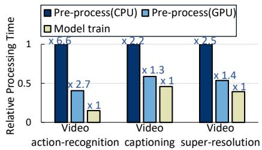  
(a) Pre-processing overhead of VDL applications

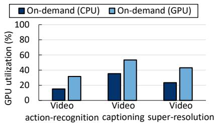  
(b) GPU utilization of VDL applications

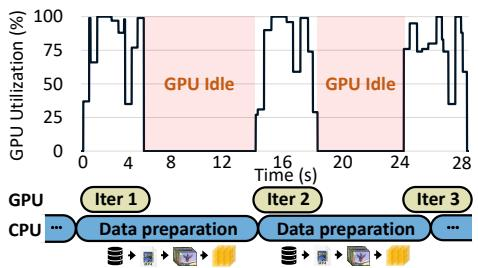  
Figure 2: Video pre-processing is bottleneck in VDL.

Figure 3: High overhead of video preprocessing causes GPU stalls, which ultimately leads to GPU underutilization.  
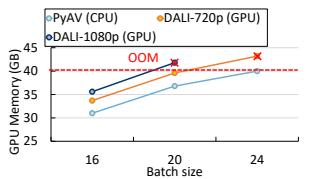

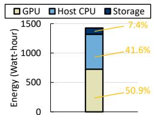  
Figure 4: GPU-based hardware codecs result in GPU memory shortages.  
Figure 5: Component-wise analysis of energy consumption.

A key principle in VDL training is that every video in the dataset is used once per epoch, ensuring complete coverage of the dataset. However, to maintain training effectiveness and prevent overfitting, each epoch samples frames from these videos through random temporal selection and spatial augmentation. This means that with high probability, different frame sequences are extracted and different crops are applied across epochs. Consequently, the preprocessing workflow—from decoding to augmentation—must be repeated for each video in every epoch, as the frames from previous epochs are rarely reusable. This repeated processing with different frame selections leads to significant overhead that becomes a major bottleneck in VDL (§3).

Complexity of pre-processing. Today, application programmers solely bear the burden of implementing the entire pipeline, as existing frameworks offer little or no support for video pre-processing. For instance, Meta’s VDL project, Slow-Fast [18]—which offers state-of-the-art model training for action recognition and classification—involves 2,200 lines of preprocessing code compared to 700 for the model training.

We identify the sources of complexity as follows:

Diverse input source: Video input sources are diverse. For cloud-based training, datasets are typically stored in services like Amazon S3 [2] and GCP Filestore [22] or streamed from live sources for online learning [28]. Consequently, users often develop import code specific to each source, adding to the system’s complexity.

Frame selection: Unlike static images used in many vision tasks, videos consist of sequential visual scenes stored in highly compressed formats. The sheer volume of frames in a video is substantial; for example, while the Kinetics-400 dataset [27] occupies about 350 GB in video format, storing each frame as an individual image would require nearly 80 TB. Consequently, only the necessary frames are loaded and decompressed on-demand using video decoding, since each training iteration typically requires only a sparse subset of the available frames. At the beginning of every training iteration, a small subset of video frames is selected from the video—often following a random sampling policy—to serve as the input. However, the interdependency among compressed frames necessitates that multiple related frames be decoded together, which reduces overall efficiency [11]. Additionally, users are forced to manually decode videos, select frames, and extract corresponding metadata.

Data augmentation: Once the desired frames have been selected, data augmentation is applied. This stage involves various operations such as resizing or cropping the frames to match the model’s input dimensions, as well as performing transformations like color jitter, flipping, or rotation. The exact augmentation employed depends on the specific deep learning task, and users are responsible for implementing these operations within the preprocessing pipeline.

## 3 Overhead of Video Pre-processing

To evaluate the impact of preprocessing on VDL training, we benchmarked applications in video action recognition, video understanding, and video super-resolution. These benchmarks were run on a GCP a2-highgpu-1g instance [21], featuring one A100 GPU and 12 vCPUs, with CPUs dedicated to preprocessing and the GPU handling DNN training. Our results in Figure 2(a) show that video preprocessing takes 2.2 to 6.5 times longer than GPU training. This delay causes GPU stalls during data loading, reducing GPU utilization by 65–88% and increasing total training time by 2.2–6.5× compared to an ideal, stall-free scenario shown in Figure 2(b).

One possible solution to mitigate the bottleneck is to add more CPUs per GPU. However, this faces significant limitations in cloud environments. Cloud instances hosted by public cloud providers typically only provides a limited number of vCPUs per GPU. For instance, AWS p4 and GCP a2 only offer 12 vCPUs per GPU. To reduce GPU stall time to below 10%, we would need roughly 4 to 5 times more vCPUs, highlighting the constraints of scaling with additional CPUs.

Another promising approach is to offload the preprocessing to the GPU’s dedicated hardware decoder, such as NVDEC [44] in NVIDIA GPUs, to reduce burden on CPUs. However, while promising in theory, this approach introduces new inefficiencies that limit its overall effectiveness. Even with NVDEC handling video decoding, the preprocessing pipeline remains a critical bottleneck. As shown in Figure 2(a), GPU preprocessing time still exceeds GPU training time by 1.3 to 2.7 times, significantly hindering throughput. Additionally, offloading decoding to the GPU limits the GPU memory available for training tasks. For instance, when processing 1080p video datasets on an NVIDIA A100 GPU, batch sizes are limited to 16, compared to 24 with CPUbased decoding (Figure 4). This results in a 9.1% decrease in training throughput, which grows more severe with higherresolution videos or larger models. Furthermore, GPU decoding incurs higher energy costs, consuming 2.6 times more energy than CPU-based decoding. This not only increases operational expenses but also exacerbates energy efficiency concerns, particularly in large-scale deployments. These combined factors—preprocessing latency, reduced memory capacity, and increased energy consumption—highlight the limitations of using GPU hardware decoders to address preprocessing bottlenecks [66].

Repeated decoding. Figure 3 shows that decoding is performed at the start of each iteration to prepare a training batch, after which the decoded frames are discarded. Since every video must be used only once in each epoch, decoded frames are never reused within the same epoch. Moreover, due to video codec dependencies, extracting the required frames necessitates decoding many additional frames that are immediately discarded. Thus, existing video-processing pipelines decode far more frames than needed and immediately discard both the unused decoded frames and the used ones after processing. When encountering the same video in the next epoch, they must repeat this inefficient decoding process. Considering the total number of epochs during the entire training, this repeated decoding becomes significant overhead.

The consequences of repeated decoding are severe. First, it drastically reduces the training throughput from GPU underutilization (§3). Second, it leads to increased energy consumption—the CPU usage accounts for 41.6% of the total energy consumption during VDL training, with most of this overhead attributed to decoding (Figure 5).

The inefficiency becomes even more pronounced when multiple jobs share the same dataset. In scenarios such as hyperparameter tuning [33] or concurrent model development, each job redundantly decodes the same video, resulting in a linear increase in decoding operations with the number of jobs. Current frameworks like PyTorch and TensorFlow lack system-level support for sharing decoded objects across independent jobs, further compounding inefficiencies.

Why isn’t caching all frames a solution? One potential solution is to cache all decoded frames in memory and local storage. However, this approach is neither scalable nor feasible, especially in public cloud environments. For example, video datasets require tens to hundreds of terabytes of storage (e.g., Kinetics-400 requires approximately 83.5 TB), which far exceeds the capacity of typical cloud GPU instances. An AWS a2-highgpu-1g instance, for example, offers only 85 GB of memory and 3 TB of local SSD storage, making it impractical to cache an entire dataset.

A seemingly more practical solution is to utilize remote storage, such as Amazon’s Elastic Block Store (EBS). However, training large-scale models like BYOL [20] on the Kinetics-400 dataset requires a sustained bandwidth of 55.8 Gbps between the GPU and the storage system. This demand far exceeds the bandwidth provided by most cloud-based remote storage solutions, including EBS [3, 8], which typically operate at significantly lower rates (3-8× less).

## 4 SAND Key Approach

SAND presents a new framework that effectively handles the complexity of video pipelines and reduces preprocessing overhead. Our core insight is that video-based deep learning applications can benefit from a storage-level abstraction that treats training data objects as first-class entities. In particular, SAND provides a file system that exposes handles to critical objects in the video training pipeline, such as encoded videos, decoded frames, augmented frames, and training batches. This abstraction enables SAND to offer:

• Simplified Preprocessing Management: Deep learning applications no longer need to manage complex preprocessing pipelines or maintain relationships between data objects (e.g., compressed videos, raw frames, augmented frames, and training batches). Instead, they leverage the handles provided by SAND to offload common but resourceintensive tasks, such as video decoding and the management of files, caches, and related objects.

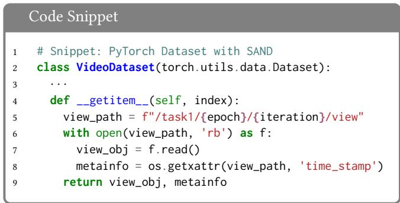  
Figure 6: Training input preparation using SAND API for PyTorch VDL.

• System-Level Optimization: SAND enables system-wide decisions for caching and scheduling data processing, optimizing the use of available resources. For instance, it determines when and what data to cache and how to generate training batches from compressed videos efficiently.

The user-friendly abstraction of SAND greatly reduces the programming burden associated with preprocessing. As shown in Figure 6, complex pipeline code that might ordinarily span thousands of lines can be condensed into fewer than ten lines with SAND ’s interface. Moreover, SAND maintains a holistic perspective of the entire preprocessing pipeline—from reading compressed videos to forming training batches—tracking precisely what training objects (e.g., decoded frames, augmented frames) are generated and when they are needed. This global awareness makes it possible to identify overlapping operations across tasks or epochs, thereby eliminating redundant operations. Figure 7, for example, illustrates a video processing flow represented as a DAG. In this scenario, “frame 4” from “video 1” is resized and then reused multiple times across both single-task and multi-task settings. By caching and reusing this intermediate object, SAND avoids repeated decoding and resizing, significantly reducing the overhead. This example demonstrates how a system-level optimization can reveal opportunities to cut down on preprocessing costs.

To realize these benefits, SAND is designed to satisfy three key requirements:

R1: Seamless integration and abstraction for complex video pipelines. The system must represent complex video pipelines effectively while integrating smoothly with existing applications. Users should access data at the desired stage without handling intricate pre-processing pipelines. Moreover, SAND should be adaptable to various deep learning frameworks and programming languages.

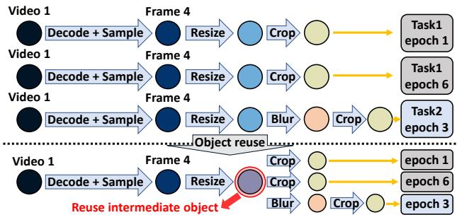  
Figure 7: Optimizing object management by understanding intermediate dependencies can reduce redundant operations.

R2: Enable efficient data reuse. The system must minimize redundant decoding. Even when multiple jobs share the same dataset—as in multi-task learning [61, 65], AutoML [5, 23, 39]—the system should optimize storage and object management to enhance overall pipeline performance.

R3: Minimized GPU stalls and optimized GPU memory usage. To reduce training time and costs, SAND must eliminate pre-processing overheads that create bottlenecks in VDL pipelines. Additionally, it should minimize GPU memory usage, ensuring maximum utilization for training.

## 5 SAND Design

SAND decouples virtual views from physical training objects. A view is a high-level abstraction representing virtual objects that encapsulate the intermediate stages of video preprocessing, such as decoded frames or augmented data. Training objects, on the other hand, are the materialized entities derived from these views, made available only when accessed. This design ensures that the system abstracts away the complexity of preprocessing pipelines while enabling efficient and flexible data management.

## 5.1 SAND Programming Abstractions

View abstraction. SAND introduces the concept of a view, a high-level abstraction that simplifies interaction with video preprocessing pipelines. A view represents a virtual object that encapsulates key stages of the preprocessing workflow, such as video decoding, frame selection, augmentation, and training batch construction. These views act as interfaces, enabling users to access data at the appropriate stage without directly managing the underlying complexities of the pipeline. This abstraction is inspired by the concept of views in database systems, where a view provides a virtual representation of data derived from one or more source tables [62]. Similarly, in SAND, a view allows users to query and interact with training data without dealing with the underlying storage or intermediate transformations.

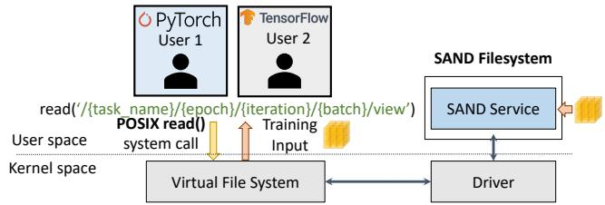  
Figure 8: SAND file system allows users to access views via POSIX system calls through the existing Linux VFS.

As shown in Figure 8, views are exposed as unique file paths in the virtual file system (VFS) [58] and accessed using the POSIX API. SAND views are analogous to database views, as they abstract complex operations while presenting a simplified, virtualized interface for accessing essential data such as training inputs. Furthermore, SAND ensures compatibility with existing preprocessing tools, like PyTorch’s dataloader, facilitating seamless integration across different programming environments. In addition, SAND automatically generates unique path names for each view (Table 1), providing a stable and efficient way to access training objects at each iteration. Beyond training batches, SAND supports multiple views that expose intermediate objects throughout the preprocessing pipeline, giving users enhanced control and flexibility. This capability mirrors the customizable data access patterns enabled by database views.

SAND materializes these views either in advance or ondemand, depending on the task requirements and the specified metadata. Pre-materializing views is advantageous for workflows requiring repeated access to the same data, as it reduces real-time processing overhead and boosts performance. Conversely, for dynamic or large-scale datasets, on-demand materialization optimizes resource utilization by processing data only when needed.

SAND usage. SAND allows users to specify the entire video preprocessing pipeline through a flexible configuration file, which is designed to accommodate a wide variety of training tasks. The configuration is split into two primary sections: Video handling: Users define how raw video data is handled and decoded to produce the frames needed for training. This includes specifying the dataset path, the input source type (e.g., file-based or streaming), and sampling policies such as the number of videos per batch, the number of frames per video, and the stride between frames. Tasks like selfsupervised learning [70] can also leverage the samples per video parameter to generate multiple training samples from the same video.

Augmentation: In typical VDL training, frame-selection policies (e.g., stride, frames-per-video) are fairly standardized and can be captured with a compact, fixed configuration. Augmentation, by contrast, is far more diverse: users often combine transforms conditionally, inject random choices, or explore several augmentation paths in parallel. To express such flexibility, SAND provides five branch types that define possible control flow patterns.

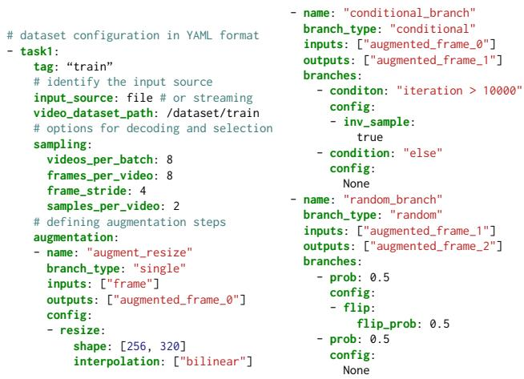

Figure 9: Example of configuration API for setting up SAND to provide abstraction.
<table><tr><td colspan="2">View types Data objects</td></tr><tr><td>Video</td><td>/{task_name}/{video_name}.mp4</td></tr><tr><td>Frame</td><td>/{task_name}/{video_name}/frame{index}</td></tr><tr><td></td><td>Aug.frame /{task_name}/{video_name}/frame{index}/aug{depth}</td></tr><tr><td>View</td><td>/{task_name}/{epoch}/{iteration}/view</td></tr></table>

Table 1: Unique file path description to directly access desired objects.

<table><tr><td>SAND API</td><td>Argument</td><td>Description</td></tr><tr><td>open()</td><td>obj path</td><td>Opens fd for requested obj</td></tr><tr><td>read()</td><td></td><td>Reads from the file descriptor</td></tr><tr><td>getxattr()</td><td>obj path, metadata</td><td>Returns metadata</td></tr><tr><td>close()</td><td></td><td>Closes the file descriptor</td></tr></table>

Table 2: SAND’s POSIX API.

• single: Applies a series of augmentations in sequence.

• conditional: branch based on a specified condition.

• random: Chooses a branch probabilistically, enabling stochastic augmentations.

• multi: Splits the data flow into multiple parallel branches.

• merge: Joins parallel branches into a unified output stream. Each augmentation step specifies both its input and output, allowing users to combine these steps in any order or branching structure required by their task. An example of the configuration API illustrating these details is shown in Figure 9. Leveraging this structure, SAND provides a concise blueprint for managing object dependencies and generating the required views of video data. Additional details on the configuration API are provided in the Supplementary Material.

Example. Figure 6 illustrates a usage example. This example illustrates how SAND handles typical PyTorch VDL workflows. The data path is set in Line 5 based on the view path in Table 1, and the training batch is retrieved using open() and read() system calls in Lines 6-7. Metadata, such as frame timestamps, is retrieved via the getxattr() call in Line 8, and memory is released using close() call. Since SAND leverages POSIX APIs, it integrates seamlessly with any deep learning framework.

SAND drastically simplifies preprocessing, reducing the lines of code (LoC) required for data handling from approximately 2.2k [18] to just eight, significantly improving usability and efficiency. By allowing users to define the entire preprocessing pipeline in a single configuration file, SAND shifts the focus from data processing to model development.

## 5.2 Planning View Materialization

At the core of view materialization lies the strategic planning of preprocessing sequences to maximize the reuse of intermediate objects across multiple tasks.

Generating abstract view dependency graph. The process begins with SAND taking configuration files for each task as input and generating a meta-graph called an abstract view dependency graph. This graph exists for each task, representing preprocessing steps as a dependency chain of view types and operations as shown in Figure 10. Nodes in this graph include view types only as specified in Table 1. The root node of the abstract view dependency graph is labeled with the pathname of the video dataset. From the root node, SAND adds edges representing preprocessing operations, such as decoding or augmentations. Each edge is connected to a node that represents the view type created by the corresponding operation. For example, decoding a video creates a node representing the decoded frames view, while applying augmentations like cropping or resizing adds nodes for augmented views.

Materialization planning as a concrete graph. From the per-task abstract view dependency graphs, SAND generates an epoch-wise, unified concrete object dependency graph, which represents the view materialization plan. Rather than creating a graph for the entire training duration, SAND constructs these concrete graphs in ?? epoch chunks, aligning perfectly with its pre-materialization strategy—videos are decoded once and cached for exactly ?? epochs before refreshing, thereby amortizing expensive decoding costs across multiple epochs. The concrete object dependency graph is a fully specified graph that consolidates all preprocessing information across multiple tasks needed to construct the final training batches, including video files, selected frames, and their augmented variants, as shown in Figure 10. The concrete object dependency graph is generated as follows: SAND first traverses the abstract graphs (abstract view dependency graphs) to identify data objects that can be shared across tasks. For example, if multiple tasks share the same root node in the abstract graph, they are accessing the same video dataset. In this case, SAND adds all corresponding video files from that dataset to the concrete object dependency graph for those tasks. Similarly, when multiple tasks select the same frame indices from a video file (i.e., the paths from the root node are identical), SAND merges the corresponding frame nodes in the concrete object dependency graph. This merged node indicates that preprocessed objects can be reused, reducing redundant computations. Additionally, if tasks share the same augmentation configurations, those augmentation nodes are also merged to maximize reuse.

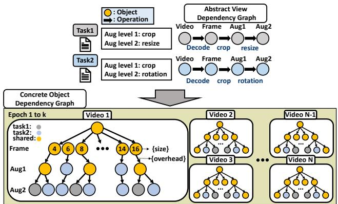  
Figure 10: SAND generates abstract view dependencies and construct a materialization plan as a concrete graph.

As training progresses, SAND generates the next k-epoch concrete graph before the current one expires, ensuring continuous operation. In this way, the abstract view dependency graph serves as a blueprint, enabling SAND to identify sharing opportunities and efficiently translate abstract dependencies into a resource-optimized concrete object dependency graph.

Challenges in materialization planning. If each task individually samples videos per batch, frames per video with frame stride, and runs randomization in augmentation, the chances to merge nodes–thereby reusing objects–are significantly low when generating concrete object dependency graph. On the contrary, to maximize reuse objects, naively forcing a task to use the same frames from another task can violate the randomness requirements for each task, undermining the training correctness.

In particular, to ensure training correctness, it is essential to adhere to strict rules when planning view materialization:

• Data Access Rules: To ensure consistency, the original distribution of the batch must be preserved. Each video must be processed and used exactly once per epoch, avoiding any repetition or omission during training.

• Preservation of Randomness: Randomness is essential for robust training and must be preserved across all random policies. This includes both temporal randomness (e.g., selecting video frames) and spatial randomness (e.g., applying crop augmentations).

The core challenge lies in maximizing object reuse across tasks while strictly adhering to these constraints. SAND resolves this tension through coordinated randomization mechanisms that preserve each task’s randomness requirements while creating shareable intermediate objects. The key insight is that randomness can be preserved at the task level while still coordinating the random choices across tasks to maximize overlap.

Preserving temporal randomness. For temporal randomness, SAND introduces a shared frame pool that coordinates frame selection across all tasks. The construction process follows three steps: (1) SAND collects frame extraction requirements from all task configurations, including frame counts and stride patterns. (2) it calculates a common sampling interval using the greatest common divisor (GCD) of all strides, establishing a unified sampling grid that accommodates all tasks. (3) it performs random frame selection on this common grid up to the maximum clip length required, ensuring the pool contains sufficient frames for any task configuration. This shared pool preserves randomness—frames are still randomly selected—while ensuring that all tasks draw from the same set of decoded frames. When constructing the concrete graph, SAND samples from this pool and merges identical frame nodes, enabling reuse without violating temporal randomness requirements.

Preserving spatial randomness. For spatial randomness, SAND distinguishes between deterministic operations (e.g., resizing to fixed dimensions) and stochastic operations (e.g., random cropping). Deterministic operations naturally produce shareable objects and require no coordination. For stochastic spatial operations, SAND implements a shared window mechanism: (1) it analyzes all tasks’ augmentation requirements to determine the maximum spatial dimensions needed. (2) it selects a single random window large enough to accommodate the largest required crop. (3) individual tasks select their specific regions within this shared window, with smaller crops choosing sub-regions of the larger window. This approach preserves spatial randomness—the window location is randomly chosen—while ensuring that augmented objects remain shareable. Tasks requiring different crop sizes can still share the underlying decoded frame and potentially share larger crop regions.

By applying these coordination mechanisms during concrete graph generation, SAND creates a materialization plan that maximizes reuse opportunities. The shared frame pool ensures frame-level reuse across tasks and epochs, while the shared augmentation windows enable reuse of spatially transformed objects. As illustrated in Figure 10, this coordinated approach can reduce redundant operations by orders of magnitude compared to independent task execution, all while maintaining the randomness properties essential for training correctness.

## 5.3 Materialization under Storage Limit

Based on the generated concrete object dependency graph, SAND executes view materialization. A straightforward approach to materialization would involve caching all intermediate objects represented in the concrete object dependency graph directly in local storage. This naive design minimizes computational overhead because all intermediate and final objects would be readily available for reuse, eliminating the need for recomputation during subsequent epochs or tasks.

Although this approach minimizes computation, it requires a substantial amount of storage. Caching all intermediate objects, especially for large video datasets, demands tens to hundred of terabytes of space. Typical cloud GPU instances, which provide between 1.5 and 3 TB of local storage, are far from sufficient to accommodate this storage requirement. As a result, this naive caching strategy is impractical for most real-world deployments.

Object graph pruning. To address this, SAND selectively decides which objects to retain and which to recompute based on their storage footprint and computational cost. Pruning the concrete object dependency graph involves evaluating the trade-offs between storage and computation. Caching final training objects minimizes retrieval latency but requires significant storage capacity. Conversely, storing only raw video data minimizes storage costs but increases the preprocessing time.

SAND begins with a full concrete graph where all objects could potentially be cached—from raw videos at the root to final training batches at the leaves. The pruning algorithm then determines which subset of these objects to materialize and cache, prioritizing objects that: (1) are frequently reused across tasks or epochs, (2) have high computational costs for regeneration, and (3) require a moderate storage footprint relative to their recomputation cost. The pruning strategy works bottom-up through the graph. Initially, all leaf nodes (training batches) are marked for caching as they represent fully preprocessed data ready for GPU consumption. However, caching all leaves often exceeds storage capacity. SAND then evaluates whether replacing cached leaves with their parent nodes (e.g., decoded frames or augmented frames)

Algorithm 1 Object Graph Pruning   
1: function Prune-Graph(objGraph)   
2: {pNode} ← Get-Parents-of-Leaf(objGraph)   
3: [pNode] ← Sort-by-Subtree-Weights({pNode})   
4: for pNode in {pNode} do   
5: subTree ← Get-Subtree(pNode)   
6: reducedSize ← Size(subTree) − Size(pNode)   
7: if reducedSize > 0 then   
8: Prune-Subtree(pNode, objGraph)   
9: break for   
10: end if   
11: end for   
12: return reducedSize   
13: end function   
14: {objGraph} ← concrete object graph for ?? epochs   
15: dataSize ← Initial data size when caching leaf nodes   
16: while true do   
17: for objGraph in {objGraph} do   
18: reducedSize ← Prune-Graph(objGraph)   
19: dataSize ← dataSize − reducedSize   
20: if dataSize > Budget then   
21: break while   
22: end if   
23: end for   
24: end while

would save storage while maintaining acceptable recomputation costs. This evaluation continues iteratively up the graph until the selected objects fit within the storage budget.

Key idea. In the concrete graph, where each node represents a data object, its value corresponds to the data size, while each edge represents an operation with its weight indicating its computational overhead. Starting at the leaves, SAND repeatedly moves one level up. If caching the parent instead of all underlying leaves saves space without increasing the recomputation time, SAND collapses the entire subtree into that parent. Candidate parents are ranked by subtree edge weight; smaller sums imply less recomputation.

Algorithm 1 implements this strategy. It (i) gathers the current parents of all leaves, (ii) orders them by subtree weight, (iii) greedily prunes the first candidate that yields a net space saving, and (iv) iterates per video until the overall cache fits within the storage budget. This greedy policy maximizes space savings per unit of added recomputation at every step, yielding a compact cache that meets the budget while keeping extra preprocessing work minimal.

## 5.4 Scheduling View Materialization

Once the materialization plan is established (§ 5.2) and optimized (§ 5.3), SAND uses the CPU to execute the materialization plan using a preprocessing engine that invokes multiple threads. SAND defines two primary types of worker threads, each responsible for specific tasks:

• Demand-feeding: These threads handle critical tasks such as verifying whether training objects exist in memory or storage, loading them into memory using APIs in Table 2, if necessary, performing final steps of the preprocessing pipeline, and copying completed objects to the read buffer upon a read() call.

• Pre-materialization: These threads process materialization tasks according to the order specified in concrete object dependency graph, generating training objects for the current and future epochs.

To prevent GPU stalls, the training batch required for the next iteration must be processed in a timely manner. SAND addresses this by creating a thread pool and dynamically assigning threads to tasks, ensuring that training objects are ready when needed. However, this poses challenges. Prematerialization threads and data-feeding threads compete for CPU resources, leading to contention. Additionally, the exact timing of training batch requests (i.e., read()) is unpredictable, as it depends on GPU processing times, further complicating the scheduling process.

Priority-Based Materialization Scheduling. To address these challenges, SAND employs a dynamic priority-based materialization scheduling mechanism that adjusts thread priorities in real time based on task importance and system conditions. First of all, SAND assigns the highest priority to data feeding threads because it reads video frames required in the current epoch to execute materialization threads.

To parallelize materialization tasks, SAND assigns each thread to a subtree in the concrete object dependency graph (i.e., each video view object). Since each subtree spans many epochs, a thread must focus on the nodes required for the current iteration first.

To achieve this, SAND tracks the progress of each materialization thread and calculates deadlines for each training object. A deadline represents the remaining iterations before the training object is required by the GPU. Materialization threads are then prioritized inversely proportional to their deadlines, ensuring the most urgent tasks (those far from the deadline) are processed first.

However, relying solely on a deadline-based priority can lead to an accumulation of pending threads holding decoded raw frames, increasing memory usage and risking memory overflow. To mitigate this, SAND monitors memory usage and dynamically reconfigures thread priorities to a Shortest Job First (SJF) strategy when memory consumption exceeds a predefined threshold (e.g., 80% of total memory). SAND calculates the remaining workload for each thread by counting the number of unprocessed edges in its assigned subtree, and priorities a thread having the smallest unprocessed edges. Once preprocessing tasks are completed, any unnecessary decoded raw frames are promptly freed from memory.

This dynamic runtime policy ensures lagging threads are prioritized to meet deadlines while efficiently clearing pending threads, thereby reducing memory pressure and improving overall performance to maximize GPU utilization.

## 5.5 Discussion

Metadata management and overhead. While SAND’s view-based abstraction requires metadata structures to coordinate materialization and track object dependencies, these overheads are negligible compared to the computational savings achieved through systematic reuse. SAND maintains three primary metadata structures: (1) an abstract view dependency graph constructed from configuration files that captures the preprocessing flow with just a few nodes and edges, serving as a template for concrete plans; (2) a concrete object dependency graph for each video that encodes the materialization plan across ?? epochs, tracking which objects will be cached, their status, and physical storage paths—for a typical 300-frame video, this contains only a few hundred nodes (tens to hundreds of KB) and generates in milliseconds; and (3) auxiliary scheduling tables that track training sequences, frame usage patterns, and object deadlines, requiring only hundreds of MB even for large-scale datasets. This minimal metadata investment—orders of magnitude smaller than the multi-second preprocessing operations it orchestrates—enables SAND to reduce preprocessing time by up to 10.2× compared to naive approaches that lack such coordination.

Extensibility and custom augmentation. SAND offers a default library of augmentation functions commonly used in video deep learning tasks, such as action recognition [18], super-resolution [10], and video captioning [37]. These builtin functions provide a convenient starting point for most use cases. However, when users need additional or specialized transformations not included in the default library, SAND accommodates them through a well-defined interface for creating custom functions. By adhering to this interface, which specifies general input and output formats, new operations can be integrated without modifying the underlying system core. From a system-provider perspective, supporting external libraries often involves running processes with dependencies or runtimes not present in the core environment. SAND addresses this by offering an RPC service mechanism, enabling custom functions to be executed in separate processes. This ensures that external libraries do not conflict with SAND internals and can be updated or replaced independently.

Fault tolerance and recovery. SAND provides robust fault tolerance by persisting all unpruned objects to the file system, ensuring that expensive preprocessing operations (e.g., decoded video frames) survive system failures. Upon restart, SAND follows a three-step recovery process: (1) regenerating the concrete dependency tree from configuration files, (2) scanning disk for previously persisted objects, and (3) using the dependency tree to determine optimal recovery points, performing only necessary computations to regenerate missing objects. The concrete dependency tree can be checkpointed every ?? epochs for faster recovery.

## 6 Implementation

To enable SAND on existing Linux VFS, we implement the SAND filesystem on top of the FUSE library [67]. This allows SAND to effectively intercept POSIX file system calls and provide users with a seamless and efficient view abstraction.

The preprocessing engine responsible for object materialization uses decoders such as libvpx [24] and openh264 [14] for decoding based on file extensions. Various augmentation operations are performed using libtorch-cpu [47] and OpenCV [46]. Once an object is materialized, it is retained in memory if it is expected to be used in the current or nearfuture iterations; otherwise, it is kept in storage. Frames and augmented frames, represented as uint8 types, are cached using lossless compression via libpng [48].

SAND continuously monitors the storage budget allocated for caching. When the storage usage exceeds 75% of the designated threshold, SAND evicts cache in the following order: (1) objects that have already been used and will not be required in future epochs, and (2) objects with the longest deadlines. This efficient caching mechanism ensures optimal use of storage and minimizes materialization overhead.

## 7 Evaluation

We evaluate the usability and performance of SAND to validate its design goals and quantify its benefits. Our evaluation is structured to answer the following key questions:

• How much performance improvement does SAND deliver under various conditions—including single-node, and Ray-based distributed environments—in terms of reduced training time and increased GPU utilization?

• How does the SAND abstraction improve usability measured by reductions in lines of code (LoC)?

• How effectively do SAND ’s materialization planning, pre-materialization, and scheduling strategies enhance resource utilization and improve execution efficiency?

## 7.1 Experimental Setup

We evaluate SAND on a variety of deep learning tasks and models, encompassing video action recognition, video captioning, and video super-resolution. Specifically, we use two models for video action recognition—SlowFast [19] and MAE [7 one model for video captioning—HD-VILA [75], and one model for video super-resolution—BasicVSR++ [10]. We leverage upon three open-source code bases: SlowFast [18] (for SlowFast and MAE), HD-VILA [37] (for the video captioning model), and RVRT [34] (for BasicVSR++).

Datasets. For video action recognition, we use the Kinetics-400 dataset [27], which contains 250k videos with a maximum resolution of 720p. For video captioning, we rely on the HD-VILA dataset [75], a large-scale dataset comprising 100k videos at 720p resolution, specifically designed for tasks combining natural language and video understanding. For video super-resolution, we curated a custom dataset of 1080p videos randomly selected from YouTube, focusing on highquality, real-world video content.

Baselines. We compare SAND against two baseline scenarios: on-demand CPU and on-demand GPU. In the ondemand CPU baseline, each time input data is required, it uses PyAV [50] and Decode libraries [16] for on-the-fly video decoding and apply CPU-based PyTorch preprocessing steps for dataset generation. In contrast, the on-demand GPU baseline employs the DALI library [15] to handle all preprocessing tasks on the GPU. Additionally, we consider an ideal case, where all final training batches are pre-stored, ensuring no GPU stalls occur during training.

Environments & Scenarios. All experiments are conducted on Google Cloud Platform (GCP) A2 instances [21], each equipped with NVIDIA A100 GPU(s) [43] and paired with 12 vCPUs per GPU. Each node is configured with 3TB of NVMe local SSD storage, chosen to maximize local storage capacity per node. We evaluate performance across four distinct scenarios:

• Single task training: We launch a single task of training a single model on a node using an a2-highgpu-1g instance, equipped with one A100 GPU.

• Hyperparameter search: Hyperparameter search is a representative scenario where multiple tasks share the same dataset. We seamlessly integrate SAND into a Ray Tune [42] environment, enabling efficient execution of multiple hyperparameter search jobs on an a2-highgpu-4g instance with four A100 GPUs. The search is executed in parallel across four GPUs. The hyperparameter search space includes the optimizer type and its hyperparameters (e.g., learning rate, weight decay, betas). The tuning process uses the ASHA scheduler [33], which performs early stopping for underperforming configurations, avoiding full training for all epochs. In the hyperparameter search environment, all jobs share the same dataset.

• Multiple heterogeneous task training: We launch multiple training tasks with different models which shares the same dataset. We leverage Ray [42] on a2-highgpu-2g instance with two A100 GPUs to run two training tasks concurrently.

• Distributed training with remote storage: We run distributed training workloads using Ray with two a2-- highgpu-1g instances, each with one A100 GPUs. The dataset is stored remotely in an Google Filestore [22], connected via a WAN. This setup reflects realistic crossnetwork data access conditions common in enterprise settings, where ML models train on continuously updated data in data lakes and warehouses [63, 64].

## 7.2 End-to-end Benefits

Single task training. Figure 11(a) presents the end-toend training time across four different models, normalized to the on-demand GPU baseline. Compared to on-demand CPU, SAND reduces the training time by 2.4× to 5.6×. Notably, even against on-demand GPU, SAND achieves 1.4× to 1.7× faster training. In fact, relative to an ideal scenario. Figure 11(b) illustrates GPU utilization throughout the training process. SAND raises GPU utilization by 2.5× to 5.7× compared to on-demand CPU, and by 1.4× to 1.7× compared to on-demand GPU.

To understand SAND’s advantage, we also evaluate a naive caching baseline that caches all decoded frames up to the 3TB storage limit. This approach achieves only 2.7% speedup over on-demand processing, far below SAND’s improvements. The limited benefit stems from VDL’s random frame selection causing different frames to be sampled each epoch—with only 3TB available, this baseline stores less than 4% of decoded frames, forcing constant re-decoding. In contrast, SAND amortizes decoding costs by decoding once and pre-materializing training batches for the next ?? epochs, eliminating redundant operations. This fundamental difference enables SAND to overcome the storage limitations that cripple naive caching strategies.

Hyperparameter search. Figure 12 shows the results of the hyperparameter search for four different models conducted using Ray Tune in an environment leveraging the SAND abstraction. Compared to the on-demand CPU baseline, SAND speeds up the search by 2.9× to 10.2×. Against on-demand GPU baselines, SAND achieves 1.4× to 2.8× faster search times, with only an 5–14% performance gap from the ideal case. Additionally, SAND achieves 3.1× to 12.3× higher GPU utilization compared to on-demand CPU baselines and 1.8× to 2.9× higher GPU utilization compared to on-demand

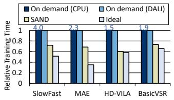  
(a) Speedup in training time

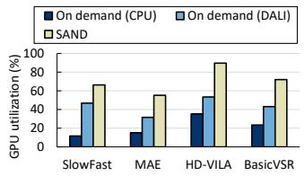  
(b) GPU utilization during training

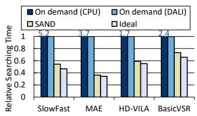  
(a) Speedup in searching time

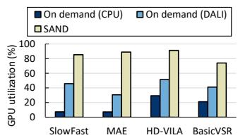  
(b) GPU utilization during searching

Figure 11: Performance comparison of single task train-Figure 12: Performance comparison of hyperparameter ing. search.  
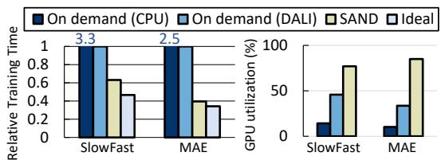  
Figure 13: Performance of heterogeneous task training.

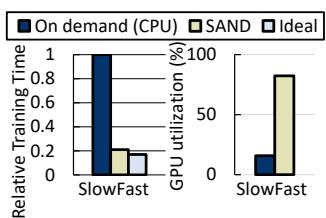

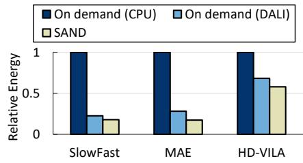  
Figure 14: Performance of distributed training with remote storage  
Figure 15: Power consumption comparison of hyperparameter search.

GPU baselines. In the hyperparameter search scenario, SAND achieves performance much closer to the ideal case compared to single-task training. This is achieved through dynamic real-time materialization of training batches until the search concludes, ensuring that concurrently running tasks share the same dataset for each epoch. This efficient approach minimizes redundant operations and optimizes resource utilization, enabling superior performance.

Multiple heterogeneous task training. Figure 13 shows the performance results when training two different models, SlowFast and MAE, simultaneously for the video action recognition application. Compared to the on-demand CPU baseline, SAND achieves 5.3× and 6.2× faster training times for SlowFast and MAE, respectively. Additionally, SAND delivers 5.4× and 8.3× higher GPU utilization compared to the on-demand CPU baseline, and 1.7× and 2.5× higher GPU utilization compared to the on-demand GPU baseline. As in the hyperparameter search scenario, SAND efficiently maximizes intermediate object reuse through effective view materialization planning, even for heterogeneous tasks sharing the same dataset. As a result, it delivers significant performance improvements compared to single-task scenarios.

Distributed training with remote storage. Figure 14 shows the performance of distributed training with two GPU nodes and remotely stored dataset. For SlowFast model, SAND respectively shows significant speedup of 5.2× compared to the on-demand CPU baseline, which came from 5.2× higher GPU utilization. SAND maximizes the materialized training batches by strategically caching and reusing preprocessed data locally, thereby saving a significant portion of network bandwidth, which is only 3% compared to baseline. This approach prevents training from being bottlenecked by insufficient bandwidth between the GPU instances and the Filestore storage, ensuring smooth and efficient data access for high-performance training.

<table><tr><td></td><td>SlowFast [18] HD-VILA [37]</td></tr><tr><td>Official repository</td><td>2254 LoC 297 LoC</td></tr><tr><td>w/SANDabstractions</td><td>8 LoC 7LoC</td></tr></table>

Table 3: Lines of code needed for the video preprocessing.

Power consumption. Figure 15 compares the energy usage of SAND with two on-demand baselines during a single-epoch hyperparameter search. SAND cuts total power consumption by 42% to 82% relative to the on-demand CPU pipeline and by 15% to 38% relative to the on-demand GPU pipeline. These savings stem from a combination of effects. First, SAND caches and reuses intermediate results, it eliminates redundant preprocessing and slashes CPU-side energy by up to 90%. At the same time, the workflow completes 5.3× to 6.2× faster, so GPUs spend far less time idling at low utilization, further reducing waiting power.

## 7.3 Usability of SAND Abstractions

SAND enhances programmability by decoupling views from training objects and managing them automatically, offering users a simple and intuitive view abstraction. Table 3 compares the total LoC required for video preprocessing in the official repositories of SlowFast and HD-VILA to produce the final training batches in their respective \_\_getitem\_\_ methods. With the SAND abstraction, training batches can be accessed with just 3–4 lines of code, significantly reducing development effort, as shown in Figure 6. The remaining 4 lines are used to communicate the start and end of tasks to the SAND service, implemented through simple open and close calls. SAND allows seamless integration into any codebase via POSIX API access to the desired view path, making it adaptable to a wide range of video deep learning applications without requiring custom preprocessing code for each task. Furthermore, SAND supports distributed training environments like Ray and enables input handling from remote storage, ensuring robust applicability across diverse settings and minimizing the overhead of managing video preprocessing in complex scenarios.

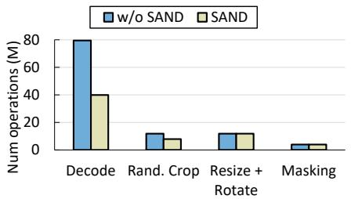

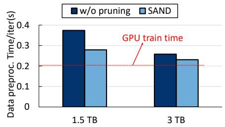

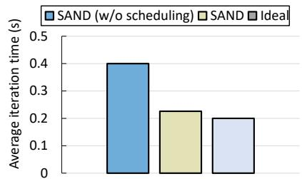

Figure 16: Number of operations per- Figure 17: Video preprocessing time Figure 18: Average iteration time formed in a single training epoch. for various storage sizes. with scheduling.  
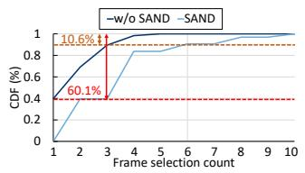

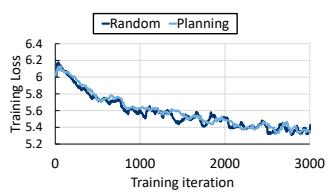  
Figure 19: CDF of frame se- Figure 20: Loss curve with lection count. and without planning.

## 7.4 Component-wise Benefits

Materialization planning. Figure 16 illustrates the benefits of materialization planning by showing the reduction in the total number of operations required in a multi-task setting while training two different video models, SlowFast and MAE. It shows the total number of preprocessing operations required in one training epoch. SAND achieves a 50.3% reduction in decoding operations by sharing frames at the frame level. Similarly, by leveraging a shared augmentation pool, SAND reduces random crop augmentation by 33.1%. The redundant operation removing leads to a significant improvement in GPU utilization, increasing it by 2.64× to 2.78. Figure 19 shows the CDF of how many times each frame is selected over ten epochs. Without SAND, only 10.6% of frames are chosen four or more times; however, with SAND, the share climbs to 60.1%. Finally, Figure 20 compares the accuracy of the model when materialization planning is enabled versus a baseline that draws frames and crops with fresh randomness in every iteration. The two curves overlap, confirming that SAND ’s strategy preserves the statistical randomness required for proper convergence.

Resource optimization with graph pruning. SAND efficiently utilizes available storage capacity through optimized materialization planning, even under changing storage limits, to minimize recomputation and reduce preprocessing overhead. To evaluate this, we analyzed the computational cost of materialization when training SlowFast and MAE simultaneously in a cloud environment with local storage sizes of 1.5TB and 3TB. Figure 17 presents the average video preprocessing time per iteration, comparing cases with and without the object pruning technique. In the case without object pruning, only the final training batches generated based on a naively materialized plan are cached. With 3TB of storage, optimization through object pruning reduced recomputation overhead by 10%, while with 1.5TB, it achieved a significant 25% reduction. This highlights the effectiveness of SAND in minimizing preprocessing overhead through efficient storage utilization.

Priority-based thread scheduling. We evaluate the impact of priority-based thread scheduling by comparing it to the case without scheduling in SAND while training the MAE model. Figure 18 shows the average iteration time, where the absence of scheduling results in a 42.6% slower performance compared to priority-based thread scheduling. This benefit stems from two key factors. First, adjusting the priority of video processing threads based on deadlines helps reduce latency. Second, prioritizing feeding threads required for the current iteration prevents interference from future object generation, ensuring uninterrupted data preparation for the current workload.

## 8 Related work & Discussion

Programming abstraction for video analysis. PyTorch-Video and Decord [16, 51] represent widely-adopted baseline abstractions for video preprocessing in deep learning.

PyTorchVideo provides high-level APIs integrated with Py-Torch’s ecosystem, while Decord offers efficient codec-level video reading. However, both operate at the application level, requiring developers to manage preprocessing pipelines explicitly. Each training job independently decodes videos, causing substantial redundant computation when multiple jobs share datasets or process videos across epochs. These libraries cannot make system-level caching decisions or amortize preprocessing costs across VDL’s iterative workloads.

Scanner [49] offers a more sophisticated abstraction for video processing pipelines, where each video is represented as a logical table, and user-defined video processing pipelines are represented as computation graphs. Scanner then focuses on scheduling these computation graphs across available resources, enhancing the throughput of video analysis. However, Scanner’s design diverges fundamentally from SAND, as it does not handle DNN training nor focus on the iterative nature of VDL, in which the same video is repeatedly processed over multiple epochs and concurrent jobs. Moreover, while SAND ’s graph is used to identify redundant operations and reuse intermediate objects, Scanner’s computation graph primarily represents operations, ultimately enhancing resource utilization and reducing overhead in video deep learning pipelines. Consequently, Scanner cannot support scenarios where multiple jobs share the same dataset and does not provide optimizations to reduce redundant video preprocessing.

Mitigating image preprocessing overhead. Efforts to mitigate data preprocessing overhead, especially for image workloads, have highlighted the challenges of GPU stalls in deep learning tasks and proposed various solutions. Some approaches focus on eliminating fetching overhead by leveraging DRAM caching mechanisms [41]. Others explore cooperative preprocessing pipelines that utilize a combination of local and remote CPUs [71, 76, 77], or exploit idle GPU compute power during GPU stall periods to perform preprocessing tasks [30]. Additionally, there are methods that minimize data stalls by offloading preprocessing tasks to FP-GAs [13]. While these methods work well for static images, they do not address video-specific overheads, most notably the repeated decoding problem.

Streamed video pipeline. Apache Kafka [6] is widely used for managing real-time data streams, while Amazon Kinesis Video Streams [4] is a managed service specifically designed to ingest, store, and process video streams. Both platforms excel at high-volume, real-time ingestion of raw video data, allowing users to build pipelines that handle largescale workloads. However, they focus primarily on transport and buffering of streaming content, providing only basic platform-level capabilities rather than a programming interface for expressing the detailed steps of a video preprocessing pipeline. Additionally, neither system implements performance optimizations that leverage the iterative nature of VDL training, such as caching intermediate data and reusing it across epochs or concurrent tasks.

Generalization beyond video workloads. While SAND targets video deep learning, its core principles apply to other domains with compressed data and iterative processing. Applications across domains face similar decompression overhead—medical imaging [25, 36, 60], point clouds [52, 53, 78], and bioinformatics [26, 35, 59]—that SAND’s pre materialization addresses. The systematic reuse of intermediate objects also benefits multi-job scenarios like AutoML and hyperparameter search. Adapting SAND requires domain-specific customization: (1) modeling preprocessing as computational graphs, (2) developing sampling strategies balancing training properties with reuse, and (3) implementing efficient domain-specific caching. While less effective for highly dynamic preprocessing or severe storage constraints, SAND’s system-level management of preprocessing outputs represents a broadly applicable paradigm for deep learning systems.

## 9 Conclusion

We propose SAND, a new programming abstraction that optimizes video preprocessing for video-based deep learning. SAND improves programmability in complex preprocessing by decoupling view abstraction from training object management. SAND incorporates an efficient data management and scheduling mechanisms working in various environments, significantly improving training time and GPU utilization in single tasking training, distributed data parallel training, and hyperparameter search.

## Acknowledgments

We thank our shepherd and the anonymous reviewers for providing helpful feedback and suggestions to improve our work. This work was supported by Samsung Electronics Co., Ltd (HiPER: High-Performance Exabyte Storage Systems), National Research Foundation of Korea (NRF) grant funded by the Korea government (MSIT) (No. RS-2024-00340099), and Institute for Information & communication Technology Planning & evaluation (IITP) grant funded by the Korea government (MSIT) (No. RS-2023-00215700).

## References

[1] 2023. Runway Gen-2: text-to-video generation. Runway Research Release. Describes Gen-2 as a multimodal AI system generating video from text, image, or video input.

[2] Amazon AWS. 2025. Amazon S3 Official Webpage. https:// aws.amazon.com/s3/.

[3] Amazon AWS. 2025. AWS P3 Instance Official Webpage. https:// aws.amazon.com/ec2/instance-types/p3/?nc1=h\_ls.

[4] Amazon Kinesis. 2025. Amazon Kinesis Video Streams official webpage. https://aws.amazon.com/pm/kinesis/?nc1=h\_ls.

[5] Amazon SageMaker. 2025. Apache SageMaker official webpage. https: //aws.amazon.com/sagemaker/.

[6] Apache Kafka. 2025. Apache Kafka official webpage. https:// kafka.apache.org/.

[7] Evlampios Apostolidis, Georgios Balaouras, Vasileios Mezaris, and Ioannis Patras. 2021. Combining global and local attention with positional encoding for video summarization. In 2021 IEEE international symposium on multimedia (ISM). IEEE, 226–234.

[8] Brian Beach, Steven Armentrout, Rodney Bozo, and Emmanuel Tsouris. 2019. Elastic Block Storage. Apress, Berkeley, CA, 59–84. doi:10.1007/ 978-1-4842-4850-8\_4

[9] Tim Brooks, Bill Peebles, Connor Holmes, Will DePue, Yufei Guo, et al. 2024. Video generation models as world simulators. OpenAI Technical Report. Describes training of Sora on videos and images for text-conditional video generation (latent diffusion transformer).

[10] Kelvin C.K. Chan, Shangchen Zhou, Xiangyu Xu, and Chen Change Loy. 2022. BasicVSR++: Improving video super-resolution with enhanced propagation and alignment. In IEEE Conference on Computer Vision and Pattern Recognition.

[11] Bo Chen, Zhisheng Yan, Yinjie Zhang, Zhe Yang, and Klara Nahrstedt. 2024. LiFteR: Unleash Learned Codecs in Video Streaming with Loose Frame Referencing. In 21st USENIX Symposium on Networked Systems Design and Implementation (NSDI 24). USENIX Association, Santa Clara, CA, 533–548. https://www.usenix.org/conference/nsdi24/ presentation/chen-bo

[12] Guo Chen, Yifei Huang, Jilan Xu, Baoqi Pei, Zhe Chen, Zhiqi Li, Jiahao Wang, Kunchang Li, Tong Lu, and Limin Wang. 2024. Video mamba suite: State space model as a versatile alternative for video understanding. arXiv preprint arXiv:2403.09626 (2024).

[13] Yang Cheng, Dan Li, Zhiyuan Guo, Binyao Jiang, Jinkun Geng, Wei Bai, Jianping Wu, and Yongqiang Xiong. 2021. Accelerating End-to-End Deep Learning Workflow With Codesign of Data Preprocessing and Scheduling. IEEE Transactions on Parallel and Distributed Systems 32, 7 (2021), 1802–1814. doi:10.1109/TPDS.2020.3047966

[14] Cisco. 2025. openh264 github repository. https://github.com/cisco/ openh264.

[15] NVIDIA Corporation. Accessed: 2022. NVIDIA DALI. https:// developer.nvidia.com/DALI.

[16] DMLC Contributors. 2025. Decord github repository. https:// github.com/dmlc/decord.

[17] Haodong Duan, Yue Zhao, Kai Chen, Dahua Lin, and Bo Dai. 2022. Revisiting Skeleton-based Action Recognition. 2022 IEEE/CVF Conference on Computer Vision and Pattern Recognition (CVPR) (Jun 2022). doi:10.1109/cvpr52688.2022.00298

[18] Haoqi Fan, Yanghao Li, Bo Xiong, Wan-Yen Lo, and Christoph Feichtenhofer. 2020. PySlowFast. https://github.com/facebookresearch/ slowfast.

[19] Christoph Feichtenhofer, Haoqi Fan, Jitendra Malik, and Kaiming He. 2019. Slowfast networks for video recognition. In Proceedings of the IEEE/CVF international conference on computer vision. IEEE, 6202–6211. https://openaccess.thecvf.com/content\_ICCV\_2019/html/

Feichtenhofer\_SlowFast\_Networks\_for\_Video\_Recognition\_ICCV\_2019\_paper.html

[20] Christoph Feichtenhofer, Haoqi Fan, Bo Xiong, Ross Girshick, and Kaiming He. 2021. A large-scale study on unsupervised spatiotemporal representation learning. In Proceedings of the IEEE/CVF Conference on Computer Vision and Pattern Recognition. 3299–3309.

[21] Google Cloud Platform. 2025. GCP A2 Instance Official Webpage. https://cloud.google.com/compute/docs/gpus#a100-gpus

[22] Google Cloud Platform. 2025. GCP Filestore Official Webpage. https: //cloud.google.com/filestore.

[23] Google Cloud Platform. 2025. Google Cloud AutoML official webpage. https://cloud.google.com/automl.

[24] Google WebM Project. 2025. libvpx github repository. https:// github.com/webmproject/libvpx.

[25] Fabian Isensee, Paul F. Jaeger, Simon A. A. Kohl, Jens Petersen, and Klaus Hermann Maier-Hein. 2020. nnU-Net: a self-configuring method for deep learning-based biomedical image segmentation. Nature Methods 18 (2020), 203 – 211. doi:10.1038/s41592-020-01008-z

[26] John Jumper, Richard Evans, Alexander Pritzel, Tim Green, Michael Figurnov, Olaf Ronneberger, Kathryn Tunyasuvunakool, Russ Bates, Augustin Žídek, Anna Potapenko, Alex Bridgland, Clemens Meyer, Simon A A Kohl, Andrew J Ballard, Andrew Cowie, Bernardino Romera-Paredes, Stanislav Nikolov, Rishub Jain, Jonas Adler, Trevor Back, Stig Petersen, David Reiman, Ellen Clancy, Michal Zielinski, Martin Steinegger, Michalina Pacholska, Tamas Berghammer, Sebastian Bodenstein, David Silver, Oriol Vinyals, Andrew W Senior, Koray Kavukcuoglu, Pushmeet Kohli, and Demis Hassabis. 2021. Highly accurate protein structure prediction with AlphaFold. Nature 596, 7873 (Aug. 2021), 583–589.

[27] Will Kay, João Carreira, Karen Simonyan, Brian Zhang, Chloe Hillier, Sudheendra Vijayanarasimhan, Fabio Viola, Tim Green, Trevor Back, Paul Natsev, Mustafa Suleyman, and Andrew Zisserman. 2017. The Kinetics Human Action Video Dataset. CoRR abs/1705.06950 (2017). arXiv:1705.06950 http://arxiv.org/abs/1705.06950

[28] Jaehong Kim, Youngmok Jung, Hyunho Yeo, Juncheol Ye, and Dongsu Han. 2020. Neural-Enhanced Live Streaming: Improving Live Video Ingest via Online Learning. In Proceedings of ACM SIGCOMM. Association for Computing Machinery, New York, NY, USA, 107–125. doi:10.1145/3387514.3405856

[29] Jinhyung Kim, Taeoh Kim, Minho Shim, Dongyoon Han, Dongyoon Wee, and Junmo Kim. 2022. Frequency Selective Augmentation for Video Representation Learning. arXiv:2204.03865 [cs.CV]

[30] Taeyoon Kim, ChanHo Park, Mansur Mukimbekov, Heelim Hong, Minseok Kim, Ze Jin, Changdae Kim, Ji-Yong Shin, and Myeongjae Jeon. 2023. FusionFlow: Accelerating Data Preprocessing for Machine Learning with CPU-GPU Cooperation. Proceedings of the VLDB Endowment 17, 4 (2023), 863–876.

[31] Heeseung Kwon, Manjin Kim, Suha Kwak, and Minsu Cho. 2020. MotionSqueeze: Neural Motion Feature Learning for Video Understanding. Lecture Notes in Computer Science (2020), 345–362. doi:10.1007/978-3- 030-58517-4\_21

[32] Rozanna Latiff. 2024. ByteDance’s TikTok cuts hundreds of jobs in shift towards AI content moderation. Reuters (11 October 2024). https://www.reuters.com/technology/bytedance-cuts-over-700- jobs-malaysia-shift-towards-ai-moderation-sources-say-2024-10- 11/

[33] Liam Li, Kevin Jamieson, Afshin Rostamizadeh, Ekaterina Gonina, Jonathan Ben-tzur, Moritz Hardt, Benjamin Recht, and Ameet Talwalkar. 2020. A System for Massively Parallel Hyperparameter Tuning. In Proceedings of Machine Learning and Systems, I. Dhillon, D. Papailiopoulos, and V. Sze (Eds.), Vol. 2. 230– 246. https://proceedings.mlsys.org/paper\_files/paper/2020/file/ a06f20b349c6cf09a6b171c71b88bbfc-Paper.pdf

[34] Jingyun Liang, Yuchen Fan, Xiaoyu Xiang, Rakesh Ranjan, Eddy Ilg, Simon Green, Jiezhang Cao, Kai Zhang, Radu Timofte, and Luc Van Gool. 2022. Recurrent Video Restoration Transformer with Guided Deformable Attention. arXiv preprint arXiv:2206.02146 (2022).

[35] Zeming Lin, Halil Akin, Roshan Rao, Brian Hie, Zhongkai Zhu, Wenting Lu, Nikita Smetanin, Robert Verkuil, Ori Kabeli, Yaniv Shmueli, Allan dos Santos Costa, Maryam Fazel-Zarandi, Tom Sercu, Salvatore Candido, and Alexander Rives. 2023. Evolutionary-scale prediction of atomic-level protein structure with a language model. Science 379, 6637 (2023), 1123–1130. doi:10.1126/science.ade2574 arXiv:https://www.science.org/doi/pdf/10.1126/science.ade2574

[36] Geert Litjens, Thijs Kooi, Babak Ehteshami Bejnordi, Arnaud Arindra Adiyoso Setio, Francesco Ciompi, Mohsen Ghafoorian, Jeroen A.W.M. van der Laak, Bram van Ginneken, and Clara I. Sánchez. 2017. A survey on deep learning in medical image analysis. Medical Image Analysis 42 (2017), 60–88. doi:10.1016/j.media.2017.07.005

[37] Bei Liu and Jianlong Fu. 2022. XPretrain. https://github.com/microsoft/ XPretrain/tree/main.

[38] Shuming Liu, Chen-Lin Zhang, Chen Zhao, and Bernard Ghanem. 2024. End-to-end temporal action detection with 1b parameters across 1000 frames. In Proceedings of the IEEE/CVF Conference on Computer Vision and Pattern Recognition. 18591–18601.

[39] Microsoft Azure. 2025. Microsoft Azure Machine Learning. https: //azure.microsoft.com/en-us/products/machine-learning.

[40] Ishan Misra, C. Lawrence Zitnick, and Martial Hebert. 2016. Shuffle and Learn: Unsupervised Learning using Temporal Order Verification. arXiv:1603.08561 [cs.CV]

[41] Jayashree Mohan, Amar Phanishayee, Ashish Raniwala, and Vijay Chidambaram. 2020. Analyzing and mitigating data stalls in DNN training. arXiv preprint arXiv:2007.06775 (2020).

[42] Philipp Moritz, Robert Nishihara, Stephanie Wang, Alexey Tumanov, Richard Liaw, Eric Liang, Melih Elibol, Zongheng Yang, William Paul, Michael I. Jordan, and Ion Stoica. 2018. Ray: a distributed framework for emerging AI applications. In Proceedings of the 13th USENIX Conference on Operating Systems Design and Implementation (Carlsbad, CA, USA). USENIX Association, USA, 561–577.

[43] NVIDIA. 2025. NVIDIA A100 Official Webpage. https:// www.nvidia.com/en-us/data-center/a100/.

[44] NVIDIA Corporation. accessed 2022. NVIDIA Video Codec SDK. https: //developer.nvidia.com/video-codec-sdk.

[45] Jennifer Flannery O’Connor and Emily Moxley. 2023. Our approach to responsible AI innovation. YouTube Official Blog. https://blog.youtube/inside-youtube/our-approach-to-responsibleai-innovation/ Announces AI-based moderation tools and disclosure of synthetic content.

[46] OpenCV. 2025. opencv github repository. https://github.com/opencv/ opencv.

[47] Adam Paszke, Sam Gross, Francisco Massa, Adam Lerer, James Bradbury, Gregory Chanan, Trevor Killeen, Zeming Lin, Natalia Gimelshein, Luca Antiga, Alban Desmaison, Andreas Köpf, Edward Yang, Zach DeVito, Martin Raison, Alykhan Tejani, Sasank Chilamkurthy, Benoit Steiner, Lu Fang, Junjie Bai, and Soumith Chintala. 2019. PyTorch: An Imperative Style, High-Performance Deep Learning Library. Curran Associates Inc., Red Hook, NY, USA.

[48] Png Group. 2025. libpng github repository. https://github.com/ pnggroup/libpng.

[49] Alex Poms, Will Crichton, Pat Hanrahan, and Kayvon Fatahalian. 2018. Scanner: efficient video analysis at scale. ACM Trans. Graph. 37, 4, Article 138 (July 2018), 13 pages. doi:10.1145/3197517.3201394

[50] PyAV Contributors. 2025. PyAV github repository. https://github.com/ PyAV-Org/PyAV.

[51] PyTorchVideo Team. 2025. PyTorchVideo Official Webpage. https: //pytorchvideo.org/.

[52] Charles Ruizhongtai Qi, Hao Su, Kaichun Mo, and Leonidas J. Guibas. 2017. PointNet: Deep Learning on Point Sets for 3D Classification and Segmentation. In 2017 IEEE Conference on Computer Vision and Pattern Recognition, CVPR 2017, Honolulu, HI, USA, July 21-26, 2017. IEEE Computer Society, 77–85. doi:10.1109/CVPR.2017.16

[53] Charles Ruizhongtai Qi, Li Yi, Hao Su, and Leonidas J. Guibas. 2017. PointNet++: Deep Hierarchical Feature Learning on Point Sets in a Metric Space. In Advances in Neural Information Processing Systems 30: Annual Conference on Neural Information Processing Systems 2017, December 4-9, 2017, Long Beach, CA, USA, Isabelle Guyon, Ulrike von Luxburg, Samy Bengio, Hanna M. Wallach, Rob Fergus, S. V. N. Vishwanathan, and Roman Garnett (Eds.). 5099–5108. https://proceedings.neurips.cc/ paper/2017/hash/d8bf84be3800d12f74d8b05e9b89836f-Abstract.html

[54] Rui Qian, Yeqing Li, Liangzhe Yuan, Boqing Gong, Ting Liu, Matthew Brown, Serge J. Belongie, Ming-Hsuan Yang, Hartwig Adam, and Yin Cui. 2021. Exploring Temporal Granularity in Self-Supervised Video Representation Learning. ArXiv abs/2112.04480 (2021).

[55] Rui Qian, Tianjian Meng, Boqing Gong, Ming-Hsuan Yang, Huisheng Wang, Serge Belongie, and Yin Cui. 2021. Spatiotemporal Contrastive Video Representation Learning. 2021 IEEE/CVF Conference on Computer Vision and Pattern Recognition (CVPR) (Jun 2021). doi:10.1109/ cvpr46437.2021.00689

[56] Xukan Ran, Haolianz Chen, Xiaodan Zhu, Zhenming Liu, and Jiasi Chen. 2018. DeepDecision: A Mobile Deep Learning Framework for Edge Video Analytics. In IEEE INFOCOM 2018 - IEEE Conference on Computer Communications. 1421–1429. doi:10.1109/ INFOCOM.2018.8485905

[57] Adrià Recasens, Pauline Luc, Jean-Baptiste Alayrac, Luyu Wang, Florian Strub, Corentin Tallec, Mateusz Malinowski, Viorica Patraucean, Florent Altch’e, Michael Valko, Jean-Bastien Grill, Aäron van den Oord, and Andrew Zisserman. 2021. Broaden Your Views for Self-Supervised Video Learning. 2021 IEEE/CVF International Conference on Computer Vision (ICCV) (2021), 1235–1245.

[58] Richard Gooch. 1999. Linux Virtual Filesystem Overview. https: //www.kernel.org/doc/html/latest/filesystems/vfs.html.

[59] Alexander Rives, Joshua Meier, Tom Sercu, Siddharth Goyal, Zeming Lin, Jason Liu, Demi Guo, Myle Ott, C Lawrence Zitnick, Jerry Ma, and Rob Fergus. 2021. Biological structure and function emerge from scaling unsupervised learning to 250 million protein sequences. Proc. Natl. Acad. Sci. U. S. A. 118, 15 (April 2021), e2016239118.

[60] Olaf Ronneberger, Philipp Fischer, and Thomas Brox. 2015. U-Net: Convolutional Networks for Biomedical Image Segmentation. In Medical Image Computing and Computer-Assisted Intervention – MICCAI 2015, Nassir Navab, Joachim Hornegger, William M. Wells, and Alejandro F. Frangi (Eds.). Springer International Publishing, Cham, 234–241.

[61] Ozan Sener and Vladlen Koltun. 2018. Multi-Task Learning as Multi-Objective Optimization. In Advances in Neural Information Processing Systems, S. Bengio, H. Wallach, H. Larochelle, K. Grauman, N. Cesa-Bianchi, and R. Garnett (Eds.), Vol. 31. Curran Associates, Inc. https://proceedings.neurips.cc/paper\_files/paper/2018/ file/432aca3a1e345e339f35a30c8f65edce-Paper.pdf

[62] Abraham Silberschatz, Henry F. Korth, and S. Sudershan. 1998. Database System Concepts (3rd ed.). McGraw-Hill, Inc., USA.

[63] Snowflask Delta Lake. 2025. Delta Lake official webpage. https:// delta.io/.

[64] Snowflask Delta Lake. 2025. Snowflake Delta Lake support. https://docs.snowflake.com/en/user-guide/tables-externalintro#delta-lake-support

[65] Trevor Standley, Amir Zamir, Dawn Chen, Leonidas Guibas, Jitendra Malik, and Silvio Savarese. 2020. Which Tasks Should Be Learned

Together in Multi-task Learning?. In Proceedings of the 37th International Conference on Machine Learning (Proceedings of Machine Learning Research, Vol. 119), Hal Daumé III and Aarti Singh (Eds.). PMLR, 9120–9132. https://proceedings.mlr.press/v119/standley20a.html

[66] Stephen Lacey, Nicola Phillips. 2024. Now the power is the major bottleneck of AI. https://www.latitudemedia.com/news/energy-isnow-the-primary-bottleneck-for-ai/.

[67] Miklos Szeredi. 2005. Filesystem in Userspace. http:// fuse.sourceforge.net. Accessed: 2024-09-09.

[68] Gemini Team. 2024. Gemini: A Family of Highly Capable Multimodal Models. arXiv:2312.11805 [cs.CL] https://arxiv.org/abs/2312.11805 Begins to incorporate video understanding as part of multimodal capabilities.

[69] OpenAI Team. 2024. GPT-4 Technical Report. arXiv:2303.08774 [cs.CL] https://arxiv.org/abs/2303.08774

[70] Zhan Tong, Yibing Song, Jue Wang, and Limin Wang. 2022. Videomae: Masked autoencoders are data-efficient learners for self-supervised video pre-training. In Advances in Neural Information Processing Systems (NeurIPS). https://proceedings.neurips.cc/paper\_files/ paper/2022/hash/416f9cb3276121c42eebb86352a4354a-Abstract-Conference.html

[71] Taegeon Um, Byungsoo Oh, Byeongchan Seo, Minhyeok Kweun, Goeun Kim, and Woo-Yeon Lee. 2023. Fastflow: Accelerating deep learning model training with smart offloading of input data pipeline. Proceedings of the VLDB Endowment 16, 5 (2023), 1086–1099.

[72] Xiaolong Wang, Ross Girshick, Abhinav Gupta, and Kaiming He. 2018. Non-Local Neural Networks. In Proceedings of the IEEE Conference on Computer Vision and Pattern Recognition (CVPR). IEEE. https://openaccess.thecvf.com/content\_cvpr\_2018/html/ Wang\_Non-Local\_Neural\_Networks\_CVPR\_2018\_paper.html

[73] Yi Wang, Kunchang Li, Yizhuo Li, Yinan He, Bingkun Huang, Zhiyu Zhao, Hongjie Zhang, Jilan Xu, Yi Liu, Zun Wang, Sen Xing, Guo Chen, Junting Pan, Jiashuo Yu, Yali Wang, Limin Wang, and Yu Qiao. 2022. InternVideo: General Video Foundation Models via Generative and Discriminative Learning. arXiv preprint arXiv:2212.03191 (2022). https://arxiv.org/abs/2212.03191

[74] Hu Xu, Gargi Ghosh, Po-Yao Huang, Dmytro Okhonko, Armen Aghajanyan, Florian Metze, Luke Zettlemoyer, and Christoph Feichtenhofer. 2021. VideoCLIP: Contrastive Pre-training for Zero-shot Video-Text Understanding. In Proceedings of the 2021 Conference on Empirical Methods in Natural Language Processing, Marie-Francine Moens, Xuanjing Huang, Lucia Specia, and Scott Wen-tau Yih (Eds.). Association for Computational Linguistics, Online and Punta Cana, Dominican Republic, 6787–6800. doi:10.18653/v1/2021.emnlp-main.544

[75] Hongwei Xue, Tiankai Hang, Yanhong Zeng, Yuchong Sun, Bei Liu, Huan Yang, Jianlong Fu, and Baining Guo. 2022. Advancing High-Resolution Video-Language Representation with Large-Scale Video Transcriptions. In International Conference on Computer Vision and Pattern Recognition (CVPR).

[76] Hanyu Zhao, Zhi Yang, Yu Cheng, Chao Tian, Shiru Ren, Wencong Xiao, Man Yuan, Langshi Chen, Kaibo Liu, Yang Zhang, et al. 2023. Goldminer: Elastic scaling of training data pre-processing pipelines for deep learning. Proceedings of the ACM on Management of Data 1, 2 (2023), 1–25.

[77] Mark Zhao, Niket Agarwal, Aarti Basant, Buğra Gedik, Satadru Pan, Mustafa Ozdal, Rakesh Komuravelli, Jerry Pan, Tianshu Bao, Haowei Lu, et al. 2022. Understanding data storage and ingestion for largescale deep recommendation model training: Industrial product. In Proceedings of the 49th annual international symposium on computer architecture. 1042–1057.

[78] Yin Zhou and Oncel Tuzel. 2018. VoxelNet: End-to-End Learning for Point Cloud Based 3D Object Detection. In 2018 IEEE Conference on

Computer Vision and Pattern Recognition, CVPR 2018, Salt Lake City, UT, USA, June 18-22, 2018. Computer Vision Foundation / IEEE Computer Society, 4490–4499. doi:10.1109/CVPR.2018.00472

[79] Wencheng Zhu, Jiwen Lu, Jiahao Li, and Jie Zhou. 2020. Dsnet: A flexible detect-to-summarize network for video summarization. IEEE Transactions on Image Processing 30 (2020), 948–962.