Latest updates: hps://dl.acm.org/doi/10.1145/3731569.3764850

RESEARCH-ARTICLE

# TrainVerify: Equivalence-Based Verification for Distributed LLM Training

YUNCHI LU, University of Michigan, Ann Arbor, Ann Arbor, MI, United States

YOUSHAN MIAO, Microso Research, Redmond, WA, United States

CHENG TAN, Northeastern University, Boston, MA, United States

PENG HUANG, University of Michigan, Ann Arbor, Ann Arbor, MI, United States

YI ZHU, Microso Research, Redmond, WA, United States

XIAN ZHANG, Microso Research, Redmond, WA, United States

View all

Open Access Support provided by:

University of Michigan, Ann Arbor

Microso Research

Northeastern University


Published: 12 October 2025

Citation in BibTeX format

SOSP '25: ACM SIGOPS 31st Symposium

on Operating Systems Principles

October 13 - 16, 2025

Seoul, Republic of Korea

Conference Sponsors:

SIGOPS

# TrainVerify: Equivalence-Based Verification for Distributed LLM Training

Yunchi Lu University of Michigan Microsoft Research Asia

Peng Huang University of Michigan

Youshan Miao Microsoft Research Asia

Yi Zhu Microsoft Research Asia

Cheng Tan Northeastern University Microsoft Research Asia

Xian Zhang Microsoft Research Asia

Fan Yang Microsoft Research Asia

## Abstract

Training large language models (LLMs) at scale requires parallel execution across thousands of devices, incurring enormous computational costs. Yet, these costly distributed trainings are prone to correctness bugs, causing silent errors and potentially wasting millions of GPU hours. These bugs are challenging to expose through testing.

We introduce TrainVerify, a system for verifiable distributed training of LLMs to eliminate parallelization bugs. Given a deep learning model’s logical specification as the ground truth, TrainVerify formally verifies that a distributed parallel execution plan is mathematically equivalent to it. Direct verification is notoriously difficult due to the sheer scale of LLMs which often involves billions of variables and highly intricate computation graphs. Therefore, TrainVerify introduces a stage-wise parallel verification algorithm and shape-reduction techniques that significantly reduce complexity while preserving formal correctness. TrainVerify scales to frontier LLMs, including the successful verification of the Llama3 405B and DeepSeek-V3 671B training plans.

CCS Concepts: • Computing methodologies → Machine learning; • Software and its engineering → Software verification.

Keywords: deep neural network, model parallelization, equivalence checking, formal verification, symbolic execution

Yunchi Lu, Youshan Miao, Cheng Tan, Peng Huang, Yi Zhu, Xian Zhang, and Fan Yang. 2025. TrainVerify: Equivalence-Based Verification for Distributed LLM Training. In ACM SIGOPS 31st Symposium on Operating Systems Principles (SOSP ’25), October 13–16, 2025, Seoul, Republic of Korea. ACM, New York, NY, USA, 17 pages. https://doi.org/10.1145/3731569.3764850


This work is licensed under a Creative Commons Attribution-NonCommercial-NoDerivatives 4.0 International License.   
SOSP ’25, Seoul, Republic of Korea   
© 2025 Copyright held by the owner/author(s).   
ACM ISBN 979-8-4007-1870-0/25/10   
https://doi.org/10.1145/3731569.3764850

## 1 Introduction

Recent studies show that scaling a deep neural network (DNN) generally yields better performance [46]. This triggers an “arms race” for large models. Training large models requires extensive resources, necessitating distributed training over a growing number of GPUs [26, 27, 38]. Latest large language models (LLMs), for instance, are trained on clusters with thousands to tens of thousands of high-end GPUs for several weeks or months, costing millions of dollars [8, 34, 38].

Distributed training, however, is notoriously complex. It requires intricate spatial-temporal scheduling and coordination across a large set of devices using sophisticated parallelism techniques [48, 52, 65, 83]. The entire workflow is error-prone (§2.2). Worse still, the bug symptoms are often silent, such as causing wrong gradient updates and improper scaling of the model states, which are difficult to detect and debug.

In this context, the cost of bugs becomes particularly high. Even a single bug can lead to wasting significant resources, financial loss, and low productivity for developers [17, 38]. Moreover, an incorrectly trained model can have far-reaching consequences, especially in critical applications where model accuracy is paramount [37, 45, 68].

Given the high stakes, there is an urgent need to verify the correctness of distributed training. To achieve this goal, one option is to design a new training software stack that is correct-by-construction. While ideal, this is a daunting task from a verification perspective. Large-scale training involves a myriad of external dependencies as well as high concurrency, both of which are challenging to verify [1, 9, 32, 80, 82]. The incompatibility with well-established training libraries [2, 21] and potential performance loss will also pose practical barriers.

In this work, we explore an alternative direction and propose a methodology that aims to provide strong correctness guarantees without rebuilding the whole training stack.

Our key insight is that the correctness of distributed training can be rigorously verified at the level of execution plans. By establishing what we call parallelization equivalence, we prove that the execution plan of a DNN model is equivalent to its logical definition. In other words, for every input, the distributed execution must yield an output equivalent to that of the original model. This verifiability is achieved without running the training task at full scale.

Specifically, the logical definition of a DNN model can be represented as a data flow graph (DFG), where a node represents an operator like matrix computation, and an edge denotes a tensor produced by its upstream operators and consumed by its downstream operators. This representation is logical because operators and tensors are described mathematically. This logical form is usually scrutinized through rigorous math reasoning and empirical validations, providing assurance of correctness [75]. When developers define a model in code, deep learning frameworks still internally use or provide ways to expose a DFG representation [71, 72].

The parallelization of a model decides how operators and tensors in the model are partitioned and scheduled across devices using parallelism techniques. This implementation logic is captured by a materialized execution plan [52], which can be structured as a parallelized DFG. Training systems use this plan to orchestrate the execution of a training task.

Parallelization equivalence guarantees that, for any input, the parallelized DFG yields outputs equivalent to those of the logical DFG. Focusing on this property allows the verification effort to be manageable. It also supports existing frameworks, which makes the approach practical. At the same time, since the execution plan captures the essence of how a training task is parallelized, proving this property eliminates major classes of bugs that jeopardize the correctness of distributed training, providing strong guarantees (§8.3).

Several key research challenges arise: (1) how to formulate the verification problem? (2) what representation to use to carry out the verification? (3) how to scale the verification to large DNNs that have hundreds of billions of parameters?

To address these challenges, we first formally define parallelization equivalence and its verification (§3). We then design TrainVerify with multiple techniques to address the needs of representation and scalability.

• Symbolic DFG (§5.1): TrainVerify defines symbolic operators that encapsulate the mathematical foundations of modern deep learning operations. It converts a logical model and its execution plan into symbolic dataflow graphs and verifies the equivalence between these two representations.

• Staged verification (§5.2) addresses the intractability of verifying long symbolic expressions in DNNs by partitioning the DFGs into stages, each treated as a separate verification unit and verified concurrently. TrainVerify then chains these units into an end-to-end proof by verifying inputoutput equivalence for the dependent units and leveraging lineage metadata to ensure correctness across the entire network.

• Shape reduction (§5.3) mitigates scale explosion in large models by reducing tensor shapes while preserving their structural and functional properties. It enables verification on smaller, manageable shapes and provably extends the results to larger shapes with the same structure.

To our best knowledge, TrainVerify is the first to offer provably correct execution plans for distributed training. It has been integrated into nnScaler [52], a state-of-the-art training framework. We identify the changes needed to make nnScaler amenable to verification. Specifically, we enhance the DFGs to incorporate all training-related computations. In addition, verification requires lineage to effectively map tensor values between the logical DFG and its parallelized counterpart. This information is discarded after parallelization in nnScaler, but is preserved in TrainVerify to enable equivalence checking.

Experiments show that TrainVerify successfully verifies the executions plans for state-of-the-art large language models, Llama3 (8B/70B/405B) [38] and DeepSeek-V3 (16B/236B/ 671B) [36]. The verification finishes within minutes to hours for small and medium models, and up to half a day for the largest models. We also show that TrainVerify can detect and eliminate major classes of real-world parallelization bugs in distributed training. TrainVerify is open sourced at https://github.com/verify-llm/TrainVerify.

## 2 Background and Motivation

## 2.1 Distributed Training

At a high level, distributed training partitions the computational operations over high-dimensional data into multiple operations over smaller data, schedules the partitions among multiple devices spatially, executes them in a specific order temporally, and synchronizes state across different devices.

Different parallelization approaches exist, including data parallelism, tensor parallelism, and pipeline parallelism [6, 41, 67]. Large-scale training commonly employs a combination of these techniques, such as 3D parallelism [30, 38].

To parallelize a specific model, ML engineers typically adapt or handcraft detailed parallelization code on top of a library (e.g., Megatron-Core [9]) that provides APIs for common parallelism techniques. Recent training frameworks [52, 83] also explore the search space automatically to generate efficient parallelization strategies for a given model. To produce a valid distributed program, they operate on computation graphs and apply a series of graph transformation passes, including partitioning tensors and operators, assigning them to devices, injecting inter-device communication and planning the execution schedule.

## 2.2 Error-Proneness of Parallelization

Distributed training is inherently error-prone due to its significant complexities. It requires correctly partitioning the operators and tensors, scheduling them into the right devices, inserting proper communication operators, coordinating execution in the right order, and ensuring that all of this preserves the original model’s semantics under diverse training configurations and parallelization schemes.

TrainVerify: Equivalence-Based Verification for Distributed LLM Training
<table><tr><td>Cause</td><td>MegatronLM</td><td>DeepSpeed</td><td>nnScaler</td></tr><tr><td>op-transformation</td><td>16</td><td>18</td><td>19</td></tr><tr><td>scheduling</td><td>4</td><td>1</td><td>4</td></tr><tr><td>communication</td><td>8</td><td>13</td><td>5</td></tr><tr><td>Total</td><td>26</td><td>28</td><td>25</td></tr></table>

Table 1. Parallelization-specific bugs in distributed training systems, based on commit logs and GitHub issues (categories may overlap).

Indeed, as Table 1 shows, we study three state-of-the-art distributed training systems [52, 66, 67] and find that they all encounter bugs specific to parallelization in nearly every aspect of the workflow. For instance, in distributed data loaders, bugs can cause improper slicing and uneven distribution of global batches [5]. In forward and backward propagation, an operator can be incorrectly transformed, or a tensor can be improperly partitioned [16]. Similarly, the calculation of metrics such as loss averaging and gradient norms can be affected if tensor shards are mistakenly treated as replicated or partitioned [4, 10, 15, 17]. Pipeline scheduling can also misorder operators from different micro-batches or misallocate gradient updates [11, 13, 14]. In addition, a synchronization step may miss or use incorrect communication operations, e.g., assigning wrong GPU ranks as sources or destinations, or using the wrong type of primitive [3, 12, 18, 19].

## 2.3 The Need for Rigorous Parallelization

What makes parallelization errors particularly concerning is that they are often silent, so the training appears deceptively normal, and the impact only becomes apparent later. For instance, incorrect gradient synchronization might only affect certain layers. These errors can evade detection until weeks into training, wasting valuable resources. Such errors are also challenging for developers to diagnose and debug. For example, a subtle incorrect loss scaling bug in MegatronLM took developers and users months of discussions to pinpoint [17].

It is also challenging for traditional testing to expose parallelization bugs. Deep learning relies on floating-point computation, which naturally introduces value drift during parallel training due to variations in the order of operations [69, 79]. This drift is exacerbated by mixed-precision training, which employs low-precision data types, and the use of diverse kernel implementations for the same operator due to efficiency. The numerical instability makes it challenging to distinguish normal numerical noise from actual errors, undermining methods like differential testing that directly compare numerical results between unparallelized and parallelized training [56, 58]. For large-scale training that involves thousands of GPUs, it is also infeasible to obtain another full-scale single-device training result for comparison. Using a smaller-scale testing can easily miss bugs that only appear in full-scale training.

Given the importance of distributed training, the financial costs of training failures, the consequences of an incorrectly trained model, as well as the challenges in detection and diagnosis, it is imperative to provide formal correctness guarantees for parallelization. In other words, we should aim for eliminating parallelization bugs.

## 2.4 Insight: Verifying Parallelization Equivalence

While verifying the entire distributed training stack would be ideal, doing so is impractical. The stack includes numerous interacting components such as DNN compilers, kernel libraries, collective-communication runtimes, etc., each of which is complex and often depends on opaque hardware vendor code [1, 9, 32, 80, 82]. The efforts required for verification would be prohibitively high, and compatibility and performance will also likely be sacrificed. Moreover, new parallelism techniques and operator optimizations emerge rapidly, making it difficult to maintain the verified system.

To alleviate this complexity, our key insight is that crucial correctness of distributed training resides in the execution plan—a representation of a full training iteration of the distributed model—generated by the parallelization framework. Once the plan is fixed, subsequent runtime merely executes the prescribed operations. Based on this insight, we shift the verification focus from the system to parallelization equivalence (PE): the execution plan is equivalent to the model’s logical definition. Both the execution plan and logical definition can be represented as data flow graphs (DFGs). PE requires that for all inputs, executing the parallelized DFG yields outputs that are identical to those produced by the logical DFG.

This verification approach offers several benefits. First, it can support existing training frameworks. As will be introduced in §5.1, it mainly requires the framework to provide a DFG representation for the parallel execution plus lineage information. In our experience, this is not difficult. Second, the state space to verify becomes more tractable. We reason about one concrete plan each time, not the enormous space of all possible plans. Third, the verification of execution plan is less intrusive. Focusing on the output execution plan makes verification largely agnostic to internal transformations, improving transferability and robustness to framework evolution. Moreover, PE reasoning is symbolic over real arithmetic, making it immune to numerical noise. Finally, PE provides strong correctness guarantees: it covers all admissible inputs, and an execution plan faithfully captures the computation and communication logic involved in a training iteration. Frameworks such as Alpa [83] and nnScaler [52] further materialize an execution plan into executable code. If PE holds, the distributed run is functionally indistinguishable from the scrutinized logical model; if it fails, some bug must be present.

```python
1 def require_allreduce_dgrad(cfg) -> Bool: pass
2 def get_model_tp_group(cfg) -> ProcessGroup: pass
3 class LinearWithFrozenW(torch.autograd.Function):
4 def backward(self, gy):
5 gx = gy.matmul(self.w)
6 if require_allreduce_dgrad(self.cfg):
7 torch.distributed.all_reduce(gx,
8 group=get_model_tp_group(self.cfg))
9 return gx
```  
Figure 1. Code snippet of a backward computation.

## 3 Parallelization Equivalence

In this section, we formulate and define the problem of verifying parallelization equivalence.

Formulation. Let ?? : X → Y denote a logical neural network model, assuming for single-device execution. X and Y denote the universe of input and output tensors, respectively. A parallelization procedure P (·) transforms ?? into a model ?? that executes on multiple devices. ?? is parallelization equivalent to ?? iff ∀?? ∈ X, ??(?? ) = ?? (?? ).

While the problem is theoretically broad and intractable— ?? may involve arbitrary operators and $\mathcal { P }$ can be extremely complex—it is constrained in practice. We focus on ?? as valid neural networks, e.g., transformer-based models, and $\mathcal { P }$ as feasible parallelization plans.

Operations in ?? include, but are not limited to, matrix operations (Linear, MatMul, Transpose, Reshape), activations (Softmax, SiLU), and others (Layernorm, Embedding). Parallelization P covers data parallelism [6], tensor parallelism [67], pipeline parallelism [41, 61], and their combinations. Expert [64], context [55], and sequence [51] parallelisms fall within our broader definition of tensor parallelism. P is applied to ?? by inserting partitioning and communication operators (Chunk, AllReduce, AllToAll, etc).

Graph Representation. Both ?? and ?? can be encoded as data flow graphs (DFGs), where nodes represent operators and edges carry tensors. Then, the parallelization procedure $\mathcal { P }$ transforms the logical DFG denoted as $G _ { l } : = ( V _ { l } , E _ { l } )$ into a parallelized DFG denoted as $G _ { \boldsymbol { p } } : = ( V _ { \boldsymbol { p } } , E _ { \boldsymbol { p } } )$ , by partitioning or replicating operators and tensors, and adding aggregation and communication operators. $\mathcal { P }$ assigns and orders $G _ { p }$ to multiple devices. Let M : $E _ { l } \to E _ { p } ^ { \mathbb { N } }$ denote the mapping between each logical tensor and its partitioned counterparts.

Definition 1 (Parallelization Equivalence). $G _ { p }$ is parallelization equivalent to???? $i f f \cdot \forall t \in E _ { l } , \forall x \in X , t ( x ) \overset { \cdot } { = } \bigoplus _ { t _ { i } \in \mathcal { M } ( t ) } t _ { i } ( x ) ,$ where ?? (??) denotes the concrete value of a tensor ?? given the concrete input ??. $\bigoplus$ is a composition operation determined by the parallelization scheme. In practice, É typically instantiates as duplication (identity), all-reduce summation (+), or tensor concatenation.

We refer to $G _ { l }$ as logical model, and $G _ { p }$ as the execution plan for the distributed training task. Both encompass all operations within a training iteration, including all microbatches’ forward passes, backward passes, optimizer steps, and metric computations.

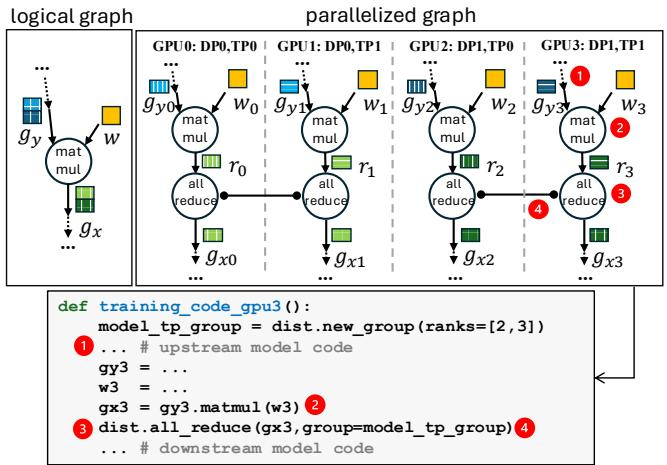  
Figure 2. Logical and parallelized data flow graphs (simplified) for Figure 1 and the distributed training code for GPU 3.

Example. To illustrate how parallelization equivalence applies in practice, consider a custom autograd layer during back propagation, shown in Figure 1. It multiplies the upstream gradient $g _ { y }$ with the fixed weight ?? to obtain the gradient $g _ { x }$ Figure 2 depicts the corresponding logical DFG.

Assume we train the same layer on four GPUs using 2-way data parallelism and 2-way tensor parallelism. Each GPU computes a partial result $r _ { i }$ for the partitioned tensors. As Figure 2 shows, the parallelized DFG introduces an AllReduce operation to aggregate $r _ { i }$ across tensor-parallel replicas.

Parallelization equivalence asserts that all the following algebraic equalities must hold for all valid inputs:

$$
\bullet E _ { 1 } : g _ { y } \left[ { \mathsf { l o w e r - h a l f } } \right] = = g _ { y 2 } + g _ { y 3 }
$$

$$
\bullet E _ { 2 } : g _ { x } \left[ { \mathsf { l o w e r } } \mathsf { - h a l f } \right] = = r _ { 2 } + r _ { 3 }
$$

$$
\bullet E _ { 3 } : g _ { x } \left[ { \mathsf { l o w e r - h a l f } } \right] = = g _ { x 2 } = = g _ { x 3 }
$$

These invariants are not just abstract properties; they capture classes of real-world bugs. To name a few:

• Inconsistent tensor partitioning, due to bugs when producer and consumer layers partition the same tensor inconsistently 1 . They will violate $E _ { 1 }$

• Incorrect computation operator parallelization. For example, if the operator is a custom operator, more complex than MatMul, involving rank-dependent computation, computation logic bugs can easily occur in 2 , violating $E _ { 2 }$

• Missing or wrong communication operator. For example, if require\_allreduce\_dgrad mistakenly returns False, the necessary AllReduce operation at 3 will be missing. Similarly, incorrect primitives may be introduced, e.g., AllGather. All those cases will violate $E _ { 3 }$

• Incorrect communication group. For example, get\_model \_tp\_group may be mistakenly assigned as a global group at 4 , i.e., (0,1,2,3). They will also violate $E _ { 3 }$

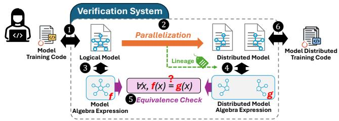  
Figure 3. TrainVerify System Overview.

## 4 Overview of TrainVerify

To realize our verification methodology for DNN models in practice, we develop TrainVerify, a system that provides provably correct execution plans for distributed training.

As shown in Figure 3, developers write the code to describe the logical definition of a neural network. This code is usually device independent or assumes running on a single virtual device with infinite power. The availability of a single-device definition aligns with common development practices. Such code essentially represents a mathematical form of the model and can be rigorously scrutinized, reflecting the intended semantics of the model. To scale training to multiple GPUs, developers create distributed training code, either implemented or by leveraging auto-parallelization frameworks [52, 83].

TrainVerify works in three steps. It takes both versions of training code as inputs and extracts two data flow graphs (DFGs) ( 1 , 6 ) via tracing. Nodes in the DFGs represent operations such as MatMul, AllReduce, etc., while edges carry data tensors. One (logical) DFG defines the logical model, while the other parallelized DFG encodes how the model is partitioned and scheduled for distributed execution.

Next, TrainVerify symbolizes each graph by converting tensors into symbolic ones, and executable operations into symbolic computation ( 3 , 4 ). This symbolic abstraction allows TrainVerify to reason about the underlying algebraic semantics of the computation without being limited by specific data or affected by numeric noises. TrainVerify uses lineage metadata ( 2 ) to track how tensors and operations in the parallelized graph correspond to their counterparts in the logical model.

Finally, TrainVerify checks the parallelization equivalence (PE) for the two symbolic DFGs by constructing formulas representing PE and using an SMT solver to formally verify that these formulas satisfy for all inputs ( 5 ). If PE does not hold, TrainVerify can output counter-examples.

Scope. To make the verification tractable, TrainVerify has a focused scope. It treats the logical model as the specification and assumes it represents the desired semantics. It performs verification at the level of execution plans, which algebraically describe a complete training iteration. It does not target bugs that cause the training frameworks to crash before generating an execution plan, as such bugs can be handled by traditional tools. It focuses on verifying the parallel execution logic and eliminating correctness bugs essential to parallelization, such as incorrect transformation, wrong synchronization, and incorrect rank assignment. It does not aim to verify the runtimes for carrying out an execution plan, such as the kernel or communication libraries, or the operators’ implementation details beyond their semantics (e.g., internal buffer operations in optimizers and collective communication primitives). There are complementary works like dl2 [40], GPUVerify [29], and GKLEE [50] tackling these tricky issues in communication deadlock, memory check, and GPU kernel verification.

## 5 System Design

In this section, we present the design of the TrainVerify system, which enables the representation of Symbolic Data Flow Graphs (sDFG) for verification (§5.1). We also introduce two key techniques that enhance scalability: staged verification (§5.2) and shape reduction (§5.3).

## 5.1 Symbolic Data Flow Graph

As introduced in §2, deep learning models are commonly represented as data flow graphs in many DNN frameworks. However, these off-the-shelf graphs are insufficient for fully capturing the semantics of parallelized model training, due to two limitations: (1) they often omit critical computations involved in training, such as backpropagation, optimizer logic and metrics calculation, e.g., gradient norm (gnorm); and (2) many operators in deep learning frameworks lack formal mathematical definitions that are compatible with verification tools such as SMT solvers. Therefore, TrainVerify extends conventional graphs into symbolic data flow graphs (sDFGs).

Graph Completion. In PyTorch, models are usually defined with only the forward pass. PyTorch tracing therefore yields a DFG of the forward path alone, omitting other operations from the full training iteration that are crucial to verify overall parallelization correctness. Thus, TrainVerify reconstructs the backward pass by following PyTorch built-in automatic differentiation functionality [7, 62]. TrainVerify also reproduces optimizer and metric calculations in the graph, adhering to the implementation in distributed training systems [22, 52]. After completion, a DFG will include all the computations in a training iteration.

Graph Symbolization. TrainVerify symbolizes the completed DFG into sDFG by replacing nodes and edges with algebraically defined symbolic tensors and operators. Symbolic tensors share the same shape with the original tensors in DFG, but with symbolic Real as elements without numeric instability, rather than typical FP32 or BF16 data types. Symbolic operators represent the same arithmetic operations over tensors as their DNN counterparts, including common PyTorch operators such as MatMul, AllReduce, etc. These operators are rewritten in TrainVerify to be compatible with symbolic operands. For example, the symbolic MatMul is defined as: $\begin{array} { r } { C _ { i , j } = \sum _ { k } A _ { i , k } \cdot B _ { k , j } } \end{array}$ where ??, ??, and ?? are symbolic tensors, and the computation is performed element-wise using symbolic expressions. This formulation allows the output tensor to be represented as an algebraic expression over the input tensors through symbolic operations. By recursively substituting input tensors with their corresponding symbolic expressions, one can compose consecutive operators, ultimately constructing an algebraic expression representing the entire model.

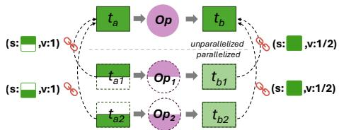  
Figure 4. Lineage of tensors, in format (s,v). s: index mapping from a subtensor to its parent tensor; v: value aggregation required to recover the parent tensor.

Lineage. Lineage is a data structure that preserves the semantics of parallelization, indicating how a tensor in the original logical model is partitioned or replicated during parallelization, analogous to DTensor [70] from PyTorch and many other similar concepts [52, 81, 83]. TrainVerify also includes tensor lineage between the graph for the logical model definition and the corresponding distributed graph as tensor properties. $\mathbf { A } s$ illustrated in Figure 4, operator Op is partitioned into sub-operators ${ \mathsf { O } } { \mathsf { p } } _ { 1 }$ and ${ \tt O p } _ { 2 }$ , with the input tensor $t _ { a }$ spatially partitioned into sub-tensors $t _ { a 1 }$ and $t _ { a 2 }$ . The lineage implies that $t _ { a } = = \mathsf { c o n c a t } \big ( \big [ t _ { a 1 } , t _ { a 2 } \big ] , \mathsf { d i m } = 0 \big )$ ). Similarly, the output tensor $t _ { b }$ is partitioned into $t _ { b 1 }$ and $t _ { b 2 }$ , where the lineage maintains that $t _ { b 1 }$ and $t _ { b 2 }$ share the same shape as $t _ { b }$ but contain partial values, implying $t _ { b 1 } + t _ { b 2 } = t _ { b }$

Not all tensors have lineage, such as the tensors created during parallelization which lack counterpart tensors in the graph for the logical model definition.

Lineage serves as a crucial bridge between the sDFG for logical model definition and the distributed sDFG during equivalence checking. Therefore, all input and output tensors must carry lineage information to enable end-to-end equivalence checking. The lineage of intermediate tensors is used in stage-wise parallel equivalence verification.

## 5.2 Staged Verification

Problem. Modern LLMs are often built with extremely deep architectures. Verifying equivalence of such models experience exponential complexity growth due to their combinatorial nature. As model depth increases, symbolic expressions become intractable, often causing solvers to return unknown, or fail to terminate due to memory overflow, even for comparing a single element access in tensors. This highlights the need for an effective approach—decomposing the end-to-end verification into smaller, tractable sub-problems.

Insight. Inspired by pipeline parallelism, the equivalence verification of the entire model can be decomposed into finer-grained stages, with each stage verified individually. If, for every stage in the logical (non-parallel) model, we can verify that it is equivalent to its corresponding stage in the parallelized model, then it naturally follows that the entire model, formed by composing these stages sequentially, is also equivalent. Given that the available lineage specifies the mapping of tensors between the logical graph and the partitioned graph, both $G _ { l }$ and $G _ { p }$ can be partitioned into stages accordingly. Formally, if two corresponding stages ?? and $f ^ { \prime }$ are equivalent for all inputs, and similarly for ?? and $g ^ { \prime }$ then their composition must also be equivalent:

$$
\begin{array} { r l r } & { } & { \forall x _ { 1 } , f ( x _ { 1 } ) = f ^ { \prime } ( x _ { 1 } ) \wedge \forall x _ { 2 } , g ( x _ { 2 } ) = g ^ { \prime } ( x _ { 2 } ) } \\ & { } & { \implies \forall x , f ( g ( x ) ) = f ^ { \prime } ( g ^ { \prime } ( x ) ) } \end{array}
$$

Design. TrainVerify introduces staged verification. Logical graph $G _ { l }$ and multi-device graph $G _ { p }$ are aligned, then partitioned into stages. Each stage ?? consists of two corresponding subgraphs, $S . G _ { l }$ and $S . G _ { p } ,$ drawn from the two respective graphs. If all stages pass the verification, the process guarantees end-to-end equivalence between the two graphs.

TrainVerify obtains tensor alignment via lineage analysis, identifying bundles that each contains an original tensor in $G _ { l }$ along with its counterparts in $G _ { p }$ . In determining this alignment, TrainVerify traverses $G _ { l }$ in topological order while simultaneously traversing $G _ { p }$

TrainVerify then determines stages by repeatedly applying backward slicing [78] on the dual graphs. Tensor alignment aids in aligning operators and guides the partitioning of the entire graph into stages. Specifically, during a topological traversal of $G _ { l } ,$ , whenever an unvisited tensor with lineage information is encountered, it is designated as the output tensor of a new stage ??. A backward trace is then initiated from this tensor to identify the corresponding input tensors of the stage in $G _ { l }$ . This trace follows the reverse direction of graph edges and terminates upon reaching tensors that also carry lineage, thereby defining the boundaries of a subgraph in $G _ { l }$ . Using the lineage of each boundary tensor, the corresponding boundaries in $G _ { p }$ are also identified. The stage ?? is then constructed by extracting the associated subgraphs from both $G _ { l }$ and $G _ { p }$ . Subsequent stages are determined by continuing the traversal over the remaining unvisited portions of $G _ { l }$ and repeating this process. The procedure eventually terminates at the model’s output tensors, yielding a complete partitioning of all stages for verification.

Parallel Solving. Algorithm 1 shows an overview of stageparallel verification. The global relation pool ?? manages verified relationships among tensors (line 1). The input graphs are partitioned into stages following the aforementioned process (line 2). For each stage, the desired equivalence of both input and output is pre-encoded by lineage, then workers can be invoked sequentially and run in parallel (line 4). After a stage worker is issued, its target output equivalence is assumed correct and added to the global relation pool ?? (line 5). Subsequent workers are invoked without waiting for prior ones to complete. TrainVerify uses a process pool for worker management, with a configurable concurrency limit. All workers are later synchronized at a barrier to ensure successful completion (line 6).

Algorithm 1 Stage Parallel Verification   
Input: Logical graph $G _ { l } ,$ multi-device graph $G _ { p } ,$ , lineage ??   
Output: A Boolean indicating whether $G _ { l }$ is equivalent to $G _ { p } .$   
1: ?? ← equivalence of $G _ { l }$ and $G _ { p }$ inputs ⊲ global relation pool   
2: stages ← align\_and\_partition $( G _ { l } , G _ { p } , L )$   
3: for stage ?? in stages do   
4: async run Worker(??, ??.snapshot())   
5: ??.add $( S . L _ { o u t } )$   
6: return ${ \mathsf { a l l } } \operatorname { l } ( [ S .$ worker.result()==True for ?? in stages])   
7:   
8: function Worker(S, R)   
9: if $( S . L _ { i n }$ not in R) then   
10: return False   
11: ?? ←infer\_rx\_shapes $( S . G _ { l } , \ S . G _ { \boldsymbol { p } } , \ S . L _ { i n } \cup S . L _ { o u t } )$   
12: S.init\_symbolic\_variables(shape=?? )   
13: outputs ← symbolically execute $s . G _ { l }$ and $s . G _ { p }$   
14: cond $ S . G _ { l } .$ input $\mathop { : = } \mathop { = } \mathop { = } \mathop { S } _ { r } G _ { p }$ .inputs   
15: target $ S . G _ { l }$ .outputs $\stackrel { \Delta . \underline { { L } } _ { o u t } } { = } \stackrel { s } { = } S . G _ { p }$ .outputs   
16: if (target is not AlwaysTrue given outputs ∪ cond ) then   
17: return False   
18: return True

In each stage’s worker, input equivalence is first checked against previously verified relations (line 9). If the equivalence condition does not always hold, then algorithm terminates and returns False. The reduced shapes of the involved tensors are inferred (line 11), which will be detailed in §5.3. Symbolic variables for inputs are then instantiated based on reduced shapes (line 12). Output equivalence is verified (lines 15 to 17) based on in-stage computation after applying the corresponding operators (line 13) given the verified relation between inputs (line 14). The verification goals, including losses, final gradient updates, and metrics, correspond to ensuring the desired output equivalence at their affiliated stages.

Supporting Customized Equivalence Approximations. Parallelization of certain model architectures may intentionally introduce approximate mathematical equivalence to optimize performance. For instance, in distributed training of ResNet models, many implementations adopt per-device local Batch-Norm as an approximation of global BatchNorm, omitting the additional cross-device averaging that is implicitly embodied in the formulation for the logical model definition. Similarly, in distributed training of MoE LLMs such as DeepSeek-V3, routing is often restricted to a subset of nodes rather than spanning the entire cluster in order to reduce communication costs. TrainVerify supports such approximations in staged verification by overriding the approximate computation (line 13) with its strict-equivalence version, as configured by the user. For approximated BatchNorm, the overridden computation restores the omitted cross-device averaging. For MoE routing, it bypasses the logic that restricts routing to a subset of nodes.

## 5.3 Shape Reduction

Problem. Modern DNN models often contain tens to hundreds of billions of variables. Even with the stage-parallel design, a single worker may still handle millions of variables, making verification computationally infeasible at such scale. The shape reduction mechanism reduces complexity while preserving verification fidelity.

Insight. Although DNN operators typically process large highdimensional tensors, many operations exhibit redundancy. This redundancy arises from the SIMD (Single Instruction, Multiple Data) property inherent to DNN operators, which apply the same computation across different data elements of a tensor. As shown in Figure 5, elements $c _ { 1 , 1 }$ and ??2,2 from output tensor are computed with the same algebraic expression but over distinct input sets:

$$
\begin{array} { r l } & { c _ { 1 , 1 } = a _ { 1 , 1 } \cdot b _ { 1 , 1 } + a _ { 1 , 2 } \cdot b _ { 2 , 1 } + a _ { 1 , 3 } \cdot b _ { 3 , 1 } } \\ & { c _ { 2 , 2 } = a _ { 2 , 1 } \cdot b _ { 1 , 2 } + a _ { 2 , 2 } \cdot b _ { 2 , 2 } + a _ { 2 , 3 } \cdot b _ { 3 , 2 } } \\ & { \left[ \begin{array} { l l l } { \mathbf { a } _ { 1 , 1 } } & { \mathbf { a } _ { 1 , 2 } } & { \mathbf { a } _ { 1 , 3 } } \\ { \mathbf { a } _ { 2 , 1 } } & { \mathbf { a } _ { 2 , 2 } } & { \mathbf { a } _ { 2 , 3 } } \\ { \mathbf { a } _ { 3 , 1 } } & { \mathbf { a } _ { 3 , 2 } } & { \mathbf { a } _ { 3 , 3 } } \end{array} \right] } \\ & { \left[ \begin{array} { l l l } { \mathbf { a } _ { 3 , 1 } } & { \mathbf { b } _ { 3 , 2 } } & { \mathbf { b } _ { 1 , 3 } } \\ { \mathbf { a } _ { 3 , 1 } } & { \mathbf { a } _ { 3 , 2 } } & { \mathbf { a } _ { 3 , 3 } } \\ { \mathbf { a } _ { 3 , 1 } } & { \mathbf { a } _ { 3 , 2 } } & { \mathbf { a } _ { 3 , 3 } } \end{array} \right] } \end{array}
$$

Figure 5. DNN operator MatMul: different output elements $_ { c _ { 1 , 1 } }$ and $c _ { 2 , 2 }$ are calculated using the same function but on different inputs.

Therefore, verification may be performed on the same sDFG with only tensor shapes reduced, omitting redundant elements without compromising the verification outcome. We formally prove that verification on a shape-reduced sDFG is equivalent to verifying the original one. A proof sketch is provided in §6.

Minimum Shapes. Shape reduction shrinks each dimension of a tensor while preserving its total number of dimensions, resulting in a smaller volume. The reduction must satisfy shape alignment constraints, which enforce consistency across multiple tensors, and semantic intactness constraints, which preserve the representative operations from the original scale.

For example, matrix multiplication, expressed in shape notation as MatMul $\mathbf { \left[ \right]} M , K  \times \left[ K , N \right] ) = \left[ M , N \right]$ , enforces equality relations among the dimensions ??, ??, and ?? respectively across multiple tensors as part of shape alignment. It also enforces semantic intactness, requiring $K \ge 2$ to avoid invalidating the Add computation along this dimension. Shape alignment may further involve algebraic reasoning. For instance, a reshape operation that converts a tensor from shape [??, ?? ] to [??, ??, ??] must satisfy the constraint $P \times Q = N$ to ensure that the total number of elements remains unchanged.

Algorithm 2 Inferring Minimum Reduced Shapes   
Input: Logical graph $G _ { l } ,$ multi-device graph $G _ { p } ,$ , lineage ??   
Output: Tensors’ reduced shapes shape\_map   
1: tensors ← ???? .inputs + ???? .inputs   
2: constraints ← ∅   
3: for all ?? ∈ tensors do   
4: for ?? ← 1 to ?? .ndim do   
5: ?? .rx\_shape[??] ← init\_symbolic\_int()   
6: constraints.add(   
7: 1 ≤ ?? .rx\_shape[??] ≤ ?? .shape[??]) 1   
8: for all $o p \in G _ { l } \cup G _ { p }$ do   
9: inputs ← ????.inputs()   
10: outputs ← ????.outputs()   
11: constraints.add(   
????.shape\_align\_cons(inputs, outputs)) 2   
12: constraints.add(   
????.semantic\_cons(inputs, outputs)) 3   
13: constraints.add(??.align(???? .inputs, ???? .inputs)   
14: + ??.align(???? .outputs, ???? .outputs)) 4   
15: objective ← Í?? ∈tensors Î(?? .rx\_shape) 5   
16: model ← optimizer.minimize(objective)   
17: shape\_map ← {?? : model.eval(?? .rx\_shape)   
18: for ?? ∈ tensors}   
19: return shape\_map

Algorithm. The procedure of shape reduction is shown in Algorithm 2. By collecting the minimum feasible shape for each tensor dimension, it formulates the problem as an integer quadratic optimization, and computes per-stage minimum shapes subject to following constraints: 1 Each dimension’s minimum size should be between 1 and its original size; 2 Operator enforces shape alignment constraints over input and output tensors’ dimensions; 3 Operator enforces semantic intact constraints over tensor dimensions; 4 Lineage enforces that each input/output tensor in $G _ { p }$ holds consistent shapes with its counterpart (sub)tensors in $G _ { l }$ . The optimization goal 5 uses the total tensor volume to approximate solver complexity, while allowing alternative objectives for solver efficiency. The reduced shapes for all tensors in $G _ { l }$ and $G _ { p }$ are then determined.

## 6 Correctness Proof for Shape Reduction

This section presents a proof sketchI for the correctness of the shape reduction method—verified parallelization equivalence for shape-reduced plans extends to their full-size counterparts.

DNN operators are predominantly SIMD (Single-Instruction Multiple-Data), performing repeated, homogeneous computations (a kernel function) over array elements. This SIMD property is central to enabling our shape reduction. We begin by introducing a formal definition of an SIMD function.

## 6.1 Formalization

Consider a function $f ( \mathbf { x } )  \mathbf { y } ,$ where x ∈ $R ^ { d _ { 1 } ^ { a } \times d _ { 2 } ^ { a } \times \dots \times d _ { m } ^ { a } }$ and $\mathbf { y } \in R ^ { d _ { 1 } ^ { b } \times d _ { 2 } ^ { b } \times \dots \times d _ { n } ^ { b } }$ . So, ???????? (x) = ?? and $r a n k ( \mathbf { y } ) = n$ . If ?? is an SIMD function, a kernel function ?? associated with ?? takes a subtensor from x and outputs a scalar value. Formally:

Definition 2 (Kernel function). A kernel function ?? is a function that takes ?? scalar inputs and produces a single scalar output:

$$
\theta : \mathbb { R } ^ { k }  \mathbb { R } .
$$

Next, we define which input subtensor is associated with each output element. Consider the same function $f ( \mathbf { x } )  \mathbf { y }$ A dependency mapping ?? associated with ?? is a function that maps each index i in the output y to a list of indices in the input x. Formally:

Definition 3 (Dependency mapping). A dependency mapping ?? is an affine transformation that maps a vector of integers (an index of tensor y) to a list of indices in another tensor (i.e., x):

$$
\tau : i d x ( \mathbf { y } ) \in \mathbb { N } ^ { n }  [ i d x ( \mathbf { x } ) , \dots ] \in \mathbb { N } ^ { k \times m } ,
$$

where ?????? (·) is the indexing function of the tensor; ?? and ?? are the ranks of x and y; and ?? is the number of inputs in ??.

Definition 4 (SIMD function). A function $f ( \mathbf { x } )  \mathbf { y }$ is an SIMD function if each output element y[i] is computed as:

$$
\mathbf { y } [ \mathbf { i } ] = \theta ( \mathbf { x } _ { 1 } , \mathbf { x } _ { 2 } , \ldots , \mathbf { x } _ { k } ) ,
$$

where ?? is the kernel function of ?? , and

$$
\begin{array} { r } { \mathbf { x } _ { j } = \mathbf { x } [ \tau ( \mathbf { i } ) [ j ] ] , \quad 1 \leq j \leq k } \end{array}
$$

where ?? is the dependency mapping of ?? .

An SIMD function ?? is characterized by its dependency mapping $\theta _ { f }$ and kernel function $\tau _ { f } .$ In compact notation, we write its operation as $\mathbf { y } [ \mathbf { i } ] = \theta _ { f } ( \mathbf { x } [ \tau _ { f } ( \mathbf { i } ) ] )$ II

Another type of LLM operators are reductional operations, such as sum. A reductional function $f : \mathbb { R } ^ { n } $ R returns a single output element from processing a reduction operation among all elements in the input tensor, with the reduction operation satisfying the commutative and associative laws.

Definition 5 (Reductional function). For an input tensor $X \in \mathbb { R } ^ { n }$ , the reductional function ?? applies a binary operation ⊙ to all elements of ?? such that:

$$
f ( X ) = x _ { 1 } \odot x _ { 2 } \odot \cdots \odot x _ { n } ,
$$

and ⊙ satisfies commutativity (?? ⊙ $b = b \odot a )$ and associativity $( ( a \odot b ) \odot c = a \odot ( b \odot c ) )$ .

## 6.2 Observations

We make two key observations about LLM operators that are computational (excluding operators like concat and slice) but not reductional.

Observation 1: LLM operators have kernel functions. We observe that all layers in the transformer architecture have their own kernel functions (Definition 2), including Feed Forward layers, Multi-Head Attention layers without masking (masks discussed in Appendix A), Add & Norm layers, ReLU, Softmax, and Residual addition.

Consider matrix multiplication (i.e., MatMul) as an example. Given two matrices $\mathbf { A } \in \mathbb { R } ^ { m \times p }$ and $\mathbf { B } \in \mathbb { R } ^ { p \times n }$ , the resulting matrix $\mathbf { C } \in \mathbb { R } ^ { m \times n }$ has elements $c _ { i , j }$ (short for $\mathbf { C } [ i ] [ j ] )$ computed by: $\begin{array} { r } { c _ { i , j } = \sum _ { k = 1 } ^ { j } a _ { i , k } { \cdot } b _ { k , j } . } \end{array}$ . Therefore, MatMul has a kernel function:

$$
\begin{array} { r } { \textstyle \theta ( a _ { i , 1 } , . . . , a _ { i , p } , b _ { 1 , j } , . . . , b _ { p , j } ) = \sum _ { k = 1 } ^ { p } a _ { i , k } \cdot b _ { k , j } } \end{array}
$$

Observation 2: LLM operators have dependency mappings that can be expressed as affine transformations. This property is intuitive, as the “striding” of kernel functions across tensors typically occurs at regular, constant intervals [57]. Consequently, when the input to the dependency mapping— corresponding to the output tensor’s index—changes, the resulting input indices change linearly. That is, the mapping takes the affine transformations:

$$
\tau ( \mathbf { i } ) = [ \mathbf { M } _ { 1 } \cdot \mathbf { i } + \mathbf { b } _ { 1 } , \ldots , \ \mathbf { M } _ { k } \cdot \mathbf { i } + \mathbf { b } _ { k } ] .
$$

For example, in the above MatMul case, the dependency mapping $\tau ^ { A }$ can be written as:

$$
\begin{array} { r l } & { \tau ^ { A } ( \left[ i \right] ) = [ \mathbf { M } _ { A 1 } \left[ i \right] + \mathbf { b } _ { A 1 } , \dotsc , \mathbf { M } _ { A P } \left[ i \right] + \mathbf { b } _ { A P } ] , \mathrm { w h e r e } } \\ & { \mathbf { M } _ { A 1 } = \left( \begin{array} { l l } { 1 } & { 0 } \\ { 0 } & { 0 } \end{array} \right) , \mathbf { b } _ { A 1 } = \left( \begin{array} { l } { 0 } \\ { 1 } \end{array} \right) , \dotsc , \mathbf { M } _ { A P } = \left( \begin{array} { l l } { 1 } & { 0 } \\ { 0 } & { 0 } \end{array} \right) , \mathbf { b } _ { A P } = \left( \begin{array} { l } { 0 } \\ { \hat { p } } \end{array} \right) } \end{array}
$$

Putting it all together. MatMul is an SIMD function (Definition 4) because it has

• a kernel function:

$$
\begin{array} { r } { \theta ( a _ { i , 1 } , \ldots , a _ { i , p } , b _ { 1 , j } , \ldots , b _ { p , j } ) = \sum _ { k = 1 } ^ { p } a _ { i , k } \cdot b _ { k , j } ; } \end{array}
$$

• a dependency mapping for each input tensor:

$$
\begin{array} { r } { \tau ^ { A } ( i , j ) = [ ( i , k ) | 1 \leq k \leq p ] , } \\ { \tau ^ { B } ( i , j ) = [ ( k , j ) | 1 \leq k \leq p ] , } \end{array}
$$

where $\tau ^ { A }$ and $\tau ^ { B }$ are the dependency mappings for input matries A and B;

• and MatMul can be expressed as:

$$
c _ { i , j } = \theta ( A [ \tau ^ { A } ( i , j ) ] \oplus B [ \tau ^ { B } ( i , j ) ] ) ,
$$

where ⊕ represents list concatenation.

## 6.3 Proof Sketch

We establish the correctness of TrainVerify’s shape reduction by proving that equivalence between two data flow graphs (DFGs) on size-reduced tensors implies their equivalence on full-scale tensors. We denote the logical and transformed DFGs (before and after applying parallelization) as functions ?? and ??, respectively.

6.3.1 Prerequisite Relations. Before presenting the main theorem, we begin with two equivalent definitions that serve as the foundation for the proof.

Definition 6 (Mapping permutation equivalence). For two dependency mappings $\tau _ { 1 }$ and $\tau _ { 2 } ,$ we say they are mapping permutation equivalent, denoted $\tau _ { 1 } \cong _ { P } \tau _ { 2 } ,$ if there exists a permutation function ??, such that

$$
\forall i , \tau _ { 1 } ( i ) = P ( \tau _ { 2 } ( i ) )
$$

Mapping permutation equivalence captures LLM operators with commutative properties, where permuting the inputs does not affect the output. Similarly, we need to define a corresponding equivalence relation for kernel functions.

Definition 7 (Kernel permutation-set equivalence). For two kernel functions $\theta _ { 1 }$ and $\theta _ { 2 } ,$ we say they are kernel permutationset equivalent, denoted $\theta _ { 1 } \cong _ { Q } \theta _ { 2 }$ , if there exists a non-empty set ?? of permutation functions, such that

$$
\forall P \in Q , \forall \mathbf { x } , \theta _ { 1 } ( \mathbf { x } ) = \theta _ { 2 } ( P ( \mathbf { x } ) )
$$

6.3.2 Premises from SMT Solver. In TrainVerify, we use an SMT solver (Z3) to verify that a shape-reduced model preserves parallelization equivalence. Specifically, if the solver passes, it proves that for all inputs, the logical dataflow graph of the shape-reduced model is equivalent to that of the parallelized version.

This result yields a premise for each stage (§5.2) in Train-Verify of the following form, where i is an ??-dim index.

$$
\begin{array} { l } { \displaystyle \forall \mathbf { x } , \forall \mathbf { i } \in { \mathcal { I } } , f ( \mathbf { x } ) [ \mathbf { i } ] = g ( \mathbf { x } ) [ \mathbf { i } ] , } \\ { \displaystyle \mathrm { w h e r e } { \mathcal { I } } = \{ \sum _ { j = 0 } ^ { n } a _ { j } \mathbf { e } _ { j } \mid a _ { j } \in \{ 0 , 1 \} \mathrm { ~ f o r ~ a l l ~ } j \} } \end{array}
$$

In the equation, $\mathbf { e } _ { i }$ denotes the standard basis vectors in $\mathbb { R } ^ { n }$ defined as:

$$
( \mathbf { e } _ { i } ) _ { j } = { \left\{ \begin{array} { l l } { 1 } & { { \mathrm { i f ~ } } j = i , } \\ { 0 } & { { \mathrm { o t h e r w i s e . } } } \end{array} \right. }
$$

Each $\mathbf { e } _ { i } \in \mathbb { N } ^ { n }$ is a column vector with a single 1 in the i-th position and 0 elsewhere, except for $e _ { 0 }$ which is all 0s; namely,

$$
\mathbf { e } _ { 0 } = { \binom { 0 } { \vdots } } _ { n \times 1 } , \mathbf { e } _ { 1 } = { \binom { 1 } { \vdots } } _ { n \times 1 } , \ldots , \mathbf { e } _ { n } = { \binom { 0 } { \vdots } } _ { n \times 1 }
$$

The above premise holds due to Algorithm 2, lines 4 and 12 where TrainVerify enforces that, for any output dimension of each operator—excluding those not involved in computation (e.g., batch dimensions or element-wise operations)—both the logical and parallelized dataflow graphs retain a size of at least two in those dimensions. Meanwhile, the equivalence for arbitrary input x is established by symbolic execution.

## 6.3.3 Main Proof. We now present the main proof of shape reduction correctness. The argument proceeds in three steps:

1. We first prove $\theta _ { f } \cong _ { Q } \theta _ { g }$ given SMT solver’s premises.

2. We then prove $\tau _ { f } \cong _ { P } \tau _ { g }$ based on the premises.

3. Finally, we apply $\theta _ { f } \cong _ { Q } \theta _ { g }$ and $\tau _ { f } \cong _ { P } \tau _ { g }$ to establish the shape reduction theorem.

Lemma 1. For SIMD functions ?? and ??:

$$
\forall \mathbf { x } , f ( \mathbf { x } ) [ \mathbf { e } _ { 0 } ] = g ( \mathbf { x } ) [ \mathbf { e } _ { 0 } ] \implies \theta _ { f } \cong _ { Q } \theta _ { g } .
$$

We prove this lemma by contradiction—if $\theta _ { f }$ and $\theta _ { g }$ are not kernel permutation-set equivalent, then there must exist some input $\mathbf { x } ^ { \prime }$ where $\theta _ { f } ( \mathbf { x } ^ { \prime } ) \neq \theta _ { q } ( \mathbf { x } ^ { \prime } )$ , which contradicts the premise that for all ${ \bf x } , f ( { \bf x } ) [ { \bf e } _ { 0 } ] = g ( { \bf x } ) [ { \bf e } _ { 0 } ]$

Lemma 2. For SIMD functions ?? and ??:

$$
\forall \mathbf { x } , \forall \mathbf { i } \in { \cal Z } , { \cal f } ( \mathbf { x } ) [ \mathbf { i } ] = g ( \mathbf { x } ) [ \mathbf { i } ] ,
$$

$$
\begin{array} { l } { { w h e r e ~ \displaystyle { \cal J } = \{ \sum _ { j = 0 } ^ { n } a _ { j } { \bf e } _ { j } ~ \vert ~ a _ { j } ~ \in ~ \{ 0 , 1 \} ~ f o r ~ a l l ~ j \} } } \\ { { \qquad \Rightarrow ~ \displaystyle \tau _ { f } \cong _ { \cal P } ~ \tau _ { g } . } } \end{array}
$$

By the premise, we can prove for each dimension $j \in [ 1 , k ]$ $\exists P _ { j } , \forall \mathbf { i } , \tau _ { f } ( \mathbf { i } ) [ j ] \cong _ { P _ { j } } \tau _ { g } ( \mathbf { i } ) [ j ]$ . Later, we prove that all $P _ { j } \mathrm { s }$ are the same permutation $( \mathrm { i } . \mathrm { e } . , \tau _ { f } \cong _ { P } \tau _ { g } )$

Theorems 3 and 4 prove the essence of shape reduction: verified parallelization equivalence on shape-reduced models faithfully extends to the original models.

Theorem 3. Given SIMD functions ?? and ??,

$$
\forall \mathbf { x } , \forall \mathbf { i } \in { \cal Z } , { \cal f } ( \mathbf { x } ) [ \mathbf { i } ] = g ( \mathbf { x } ) [ \mathbf { i } ] ,
$$

$$
\begin{array} { l } { { w h e r e ~ \displaystyle { \cal I } = \{ \sum _ { j = 0 } ^ { n } a _ { j } { \bf e } _ { j } ~ \vert ~ a _ { j } \in \{ 0 , 1 \} } f o r ~ a l l ~ j \} }  \\ { { \Longrightarrow ~ \forall { \bf x } , ~ f ( { \bf x } ) = g ( { \bf x } ) } } \end{array}
$$

Proof. Given the premise:

• By Lemma $1 , \theta _ { f } \cong _ { Q } \theta _ { g }$

• By Lemma 2 $, \tau _ { f } \cong _ { P } \tau _ { g }$ and $P \in Q$

• Finally, we prove

$$
\theta _ { f } \cong _ { Q } \theta _ { g } \wedge \tau _ { f } \cong _ { P } \tau _ { g } \wedge P \in Q \implies f = g
$$

$$
\begin{array} { r l r } { \forall \mathbf { x } , \forall \mathbf { i } , f ( \mathbf { x } ) [ \mathbf { i } ] = \theta _ { f } ( \mathbf { x } ( \tau _ { f } ( \mathbf { i } ) ) ) } & { } & { [ \mathbf { b } \mathbf { y } \mathrm { D e f i n i t i o n } 4 ] } \\ & { = \theta _ { g } ( P ( \mathbf { x } [ \tau _ { f } ( \mathbf { i } ) ] ) ) } & { [ \mathbf { b y } \theta _ { f } \cong _ { Q } \theta _ { g } \land P \in Q ] } \\ & { = \theta _ { g } ( \mathbf { x } [ P ( \tau _ { f } ( \mathbf { i } ) ) ] ) } & { [ \mathbf { b y } \mathrm { t e n s o r i n d e x i n g r u l e s } ] } \\ & { = \theta _ { g } ( \mathbf { x } [ \tau _ { g } ( \mathbf { i } ) ] ) } & { [ \mathbf { b y } \tau _ { f } \cong _ { P } \tau _ { g } ] } \\ & { = g ( \mathbf { x } ) [ \mathbf { i } ] } \end{array}
$$

Because for any input $\mathbf { x } , f ( \mathbf { x } )$ and $g ( \mathbf { x } )$ produce the same result, therefore $f = g .$ □

Theorem 4. Given reductional functions ?? and ??,

$$
\forall \mathbf { x } \in \mathbb { R } ^ { 2 } , f ( \mathbf { x } ) = g ( \mathbf { x } ) \implies \forall \mathbf { x } \in \mathbb { R } ^ { m } , n \geq 2 , f ( \mathbf { x } ) = g ( \mathbf { x } ) .
$$

We prove the theorem by mathematical induction.

## 7 Implementation

We implement TrainVerify in Python with 6,000 lines of code, using the Z3 solver [35] for equivalence checking.

Algebraic Expression of Models. TrainVerify leverages nnScaler, a state-of-the-art distributed training framework [52] that adopts graph-based parallelization. It traces model code written for single-GPU training to obtain an intermediate representation, then compiles it into a parallelized graph (IRGraph), and finally emits the distributed training code.

Building full-fledged execution plans. TrainVerify naturally derives the multi-device plan from the IRGraph, without tracing the distributed code. The IRGraph encodes both forward and backward passes, with nodes representing PyTorch operators [63], communication primitives, and custom operators. As the distributed gnorm computation resides in static code outside the graph, TrainVerify completes the execution plan by injecting semantically equivalent logic as custom operators. The current version of TrainVerify supports only ZeRO Stage 1 [65], and thus abstracts the optimizer as a local gradient update operation. The logical model is obtained by invoking nnScaler to emit a single-GPU execution plan. This process faithfully captures operators during tracing, so the execution plan aligns with its model definition in code. Parallelization equivalence is then verified between the single-device and multi-device execution plans.

Tracking tensor lineage between dual graphs. TrainVerify infers tensor lineage from nnScaler’s metadata, where the index mapping specifies how a sub-tensor is sliced from the full tensor, and the value mapping indicates whether aggregation with sibling tensors is required for reconstruction. However, this metadata has two limitations. First, corresponding tensors across the dual graphs may have mismatched IDs. We resolve this by using the source code locations to match operators and align their associated tensors. Second, both index and value mappings are scoped to a single micro-batch within one data pipeline, which leads to inconsistent parallelization semantics between the graphs. To resolve this, TrainVerify shifts index mappings based on DP rank and micro-batch ID, to reflect the global batch context; and uses SSA-based tensor IDs along with static analysis of communication nodes to identify value-wise aggregation across data pipelines.

Adapting operators for shape-reduced symbolic tensors. Operators in the IRGraphs are not directly applicable to symbolic variables. TrainVerify implements shape-reduction rules and symbolic adaptations for the operators used in GPT [31], Llama3, and DeepSeek-V3 models (Table 4 in Appendix A.1 lists them). TrainVerify rewrites both forward and backward computations. The rewritten operation logic strictly adheres to the original mathematical definitions.

Extension for new model architectures. Adaptation is only needed if new operators are introduced. Shape reduction rules are specified using simple operators like equal, larger, smaller, and divisible, making them straightforward to specify and maintain. The operator rewriting effort is also moderate, primarily involving the use of NumPy [20] and Python’s built-in operators to emulate PyTorch and communication operations. This convenience is enabled by Z3 variables supporting Python operator overloading, allowing symbolic expressions to behave like native types (e.g., int, float). In our experience, it took 32 development hours to rewrite 40 operators, with 500 lines of code.

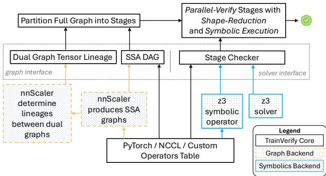  
Figure 6. Implementation Overview.

Appendix A.2 uses modularized feedforward to showcase efforts for operator adaptation. Appendix A.3 describes how we address other practical challenges, without compromising correctness, in shape reduction and adapting non-SIMD operators (e.g., the embedding layer and topK operator).

Adaptation to Other Frameworks. TrainVerify defines a graph interface and a solver interface to decouple from both nnScaler and Z3, as shown in Figure 6. To enable verification, a parallelization framework must provide an SSA computation graph enriched with tensor lineage. This may require framework-specific knowledge when such representations are not natively supported. The modular design of stage checker also facilitates potential switching between symbolic engines (e.g., SymPy [59]) to support operator rewriting and solver-specific optimizations.

Accelerating Solving. To enable practical verification time and memory usage for extremely large execution plans, we design several solver-specific optimizations.

Efficient Equivalence Checking. We design a hybrid equivalence checker. It first applies a superficial but efficient expression comparison: if the expressions are equal under simplification, the checker short-circuits without invoking the solver; otherwise, it falls back to the SMT solver. This design exploits the fact that expression comparison is sound and significantly faster than formal solving, though it may yield false alarms due to its superficial nature. To preserve completeness, any case that fails the expression checker is validated by the SMT solver. TrainVerify implements the expression checker using z3.Tactic("solve-eqs") [24], which simplifies equations via variable elimination and often reduces the problem to an empty conflict core when expressions are equivalent.

<table><tr><td>Exp. ID</td><td>Model</td><td>Layers</td><td>DP</td><td>TP</td><td>PP</td><td>NM</td></tr><tr><td>L1</td><td>Llama3-8B</td><td>32</td><td>512</td><td>1</td><td>1</td><td>1</td></tr><tr><td>L2</td><td>Llama3-70B</td><td>80</td><td>16</td><td>8</td><td>4</td><td>32</td></tr><tr><td>L3</td><td>Llama3-405B</td><td>126</td><td>64</td><td>8</td><td>16</td><td>16</td></tr><tr><td>D1</td><td>DS-V3-16B</td><td>27</td><td>16</td><td>4</td><td>2</td><td>16</td></tr><tr><td>D2</td><td>DS-V3-236B</td><td>60</td><td>16</td><td>8</td><td>4</td><td>16</td></tr><tr><td>D3</td><td>DS-V3-671B</td><td>61</td><td>32</td><td>8</td><td>8</td><td>16</td></tr></table>

Table 2. Evaluated real-world large models.

Lazy Symbolization. TrainVerify instantiates Z3 symbolic variables only within parallel stage solvers, while maintaining metadata in the main process. This design addresses two issues we observed. First, symbolic variables and expressions are costly under Python fork, even with copy-on-write; they can add several seconds to each fork operation. Second, Z3 requires variables and solvers to be initialized within context tables, which have limited capacity (unsigned\_int), making it impractical to store all symbolic tensors globally. Managing metadata alone also significantly reduces memory overhead.

## 8 Evaluation

We answer the following questions: (1) Can TrainVerify verify large parallelized graphs of real-world distributed training settings? (§8.1); (2) How does TrainVerify scale with training parameters? (§8.2); (3) What classes of bugs can TrainVerify eliminate? (§8.3)

## 8.1 Verifying Real-World LLM Parallelization

To demonstrate TrainVerify’s practicality, we experiment on verifying execution plans for Llama3 and DeepSeek-V3 models under various real-world setups.

We generate the evaluated models’ DFGs using nnScaler on a machine with 4 NVIDIA A6000 GPUs. The verification runs on an Azure instance equipped with a 32-core Intel Xeon(R) Platinum 8473C CPU and 1.34 TB memory.

Table 2 shows an overview of the parallelization. Appendix B lists the detailed model specifications. We evaluate the Llama3 models at 8B, 70B, and 405B scales, with plans configured for up to 8192 GPUs, which follows production setup [54, 74]. We evaluate the DeepSeek-V3 models at 16B, 236B, and 671B scales, with plans configured for up to 2048 GPUs. Expert parallelism is treated as a form of tensor parallelism in nnScaler, thus sharing the same degree as TP. As nnScaler currently enforces orthogonality between parallelism strategies, experiment D3 employs the same scale, but uses a different parallelization to approximate the official setup [36].

Table 3 shows the results. For moderate-scale plans, such as L1 and D1, TrainVerify completes verification within half an hour. For large-scale plans, such as L3 and D3, verification takes up to half a day. The increased cost arises from both the larger execution plans and the reduced solver parallelism due to memory constraints. While this cost is non-trivial, it remains acceptable given the correctness guarantees provided,

Yunchi Lu, Youshan Miao, Cheng Tan, Peng Huang, Yi Zhu, Xian Zhang, and Fan Yang

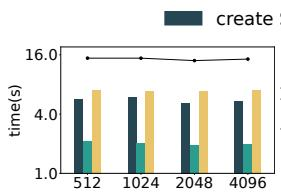  
(a) Global batch size

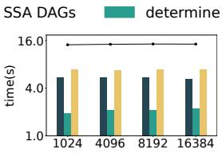  
(b) Hidden dimension size

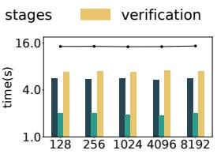  
(c) Sequence length

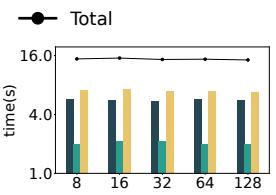  
(d) Attention heads

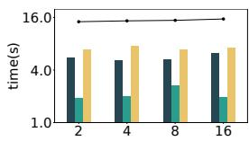  
(e) Pipeline parallelism

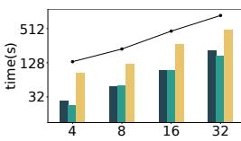  
(f) Layers

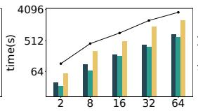  
(g) Data parallelism

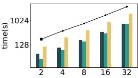  
(h) Micro batches

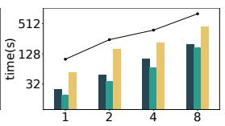  
(i) Tensor parallelism

Figure 7. TrainVerify’s performance trends regarding different training configurations. The y-axes use a log2 scale. Bars indicate the time breakdown by component, while lines represent the end-to-end verification time.
<table><tr><td></td><td>L1</td><td>L2</td><td>L3</td><td>D1</td><td>D2</td><td>D3</td></tr><tr><td>Solver Parallelism</td><td>30</td><td>30</td><td>30</td><td>30</td><td>30</td><td>10</td></tr><tr><td>End-to-end Time</td><td>0.2h</td><td>2.4h</td><td>8.0h</td><td>0.4h</td><td>2.4h</td><td>9.0h</td></tr></table>

Table 3. Verification time for the evaluated models.

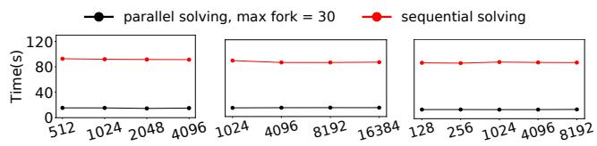

especially when compared to the extended training durations, often several weeks, required for models at this scale.

(a) gbs

(b) hidden

(c) seqlen

## 8.2 Scalability

We evaluate how TrainVerify verification time scales under various parallelization and model configurations. The base model used for variable-controlled experiments is Llama3-8B. Each experimental group is averaged over 5 independent runs. Detailed configurations are provided in Appendix B.

Invariance to Original Tensor Shapes. As shown in Figures 7a to 7d, the verification time of TrainVerify, except for variance introduced by shape reduction solving, is independent of the actual tensor sizes. This invariance is achieved through the shape reduction technique, which effectively compresses the shapes of symbolic tensors in TrainVerify’s graphs. The compressed shapes depend solely on partitions rather than their original dimensions, so the verification time remains constant regardless of variations in these parameters. For attention heads, increasing the number logically introduces more partitions. However, in efficient implementations, each GPU stacks its local heads and computes them with batched matmul. Thus, a larger number of attention heads is treated as reducible and does not impact the verification cost.

Linear Complexity to Parallelization. Stage-parallel verification time consists of two main components: (1) the main process time for iterating over stages and inspecting tensor shard metadata to prepare inputs for the solver; (2) the parallel solver time for initializing symbolic variables, computing, and checking equivalence of each stage in the workers.

Figure 8. Verification time with vs. without stage parallelism.

When resources are not constrained, the solvers are sufficiently parallelized, making the main process time dominate the verification time. Pipeline parallelism introduces a sublinear increase in verification time, as Figure 7e shows, since additional stages contribute only a small number of communication operators. Increasing model layers adds operators sequentially, leading to a linear increase in the number of stages and time, as shown in Figure 7f. For data parallelism, micro-batching, and tensor parallelism, the verification time grows linearly due to increased tensor copies proportional to the parallelism degree, along with the introduction of a small number of communication nodes, as Figures 7g to 7i show.

As the degree of parallelism increases, parallel solver time gradually dominates the verification time. This is because higher parallelism can cause the number of symbolic variables to grow quadratically, leading to quadratic or even greater complexity in the solver. For instance, in experiment D3 (DS-V3–671B in §8.1), the average main process time is much less than 1s per stage, whereas the average solver time reaches 69s per stage, causing the main process to stall while waiting for worker completion. Similar trends are observed in other large experiments. While the dominance of solver time introduces deviations from linear scaling, the overall verification time remains upper-bounded by the statistics reported in §8.1.

Stage-Parallel Verification. We demonstrate the benefit of stage-parallel design by comparing it against a sequential configuration where solver parallelism is disabled. Figure 8 shows the results. These experiments use a relatively smallscale setup (Llama3-8B with 8 GPUs) where individual solvers are already lightweight. Disabling solver parallelism increases the end-to-end verification time from under 18 seconds to over 90 seconds, slowing down by 5 times. The ratio will increase under larger setups as the solver time dominates.

## 8.3 Eliminating Broad Categories of Bugs

To understand whether TrainVerify addresses correctness issues that arise in real training systems, we consider broad categories of bugs that have been found in popular parallelization frameworks [52, 66, 67] and discuss whether enforcing parallelization equivalence eliminates them.

1. Incorrect communication operators. Such as missing AllReduce operations required for gradient synchronization, or activating unnecessary communication primitives.

2. Incorrect device assignment. Such as miscalculating the participating GPUs when initializing communication groups; or confusing the per-data-parallel mesh with the global device mesh.

3. Incorrect partitioning of computational operators. Such as splitting a non-partitionable dimension of a norm operator without proper aggregation or intentional approximation; or applying misaligned masking and slicing when extracting partitioned tensor shards.

4. Incorrect scaling of distributed states. Such as incorrect loss scaling and gradient norm calculation due to miscounting tensor replicas under interleaved parallelism, e.g., expert and context parallelism.

5. Incorrect pipeline scheduling. Such as gradient synchronization occurring before the final backward iteration of a batch; or micro-batches being mistakenly shuffled.

6. Incorrect local buffer updates. Such as updating gradient buffers only for a subset of parameters in the final step; or only updating BF16 buffers during mixed precision training.

7. Incorrect buffer management. Violations of memory layout constraints such as contiguity, alignment, or padding required by collective communication routines.

Bug categories (1–4) can be eliminated by TrainVerify. These communication and computation errors manifest as incorrect arithmetic logic, which is explicitly represented in the parallelized DFG. TrainVerify’s graphs also include loss scaling and gradient norm calculations that adhere to the original manual implementation. Thus, the violations will be detected through equivalence checking in the affected stages. In early debugging of graph parallelization in nnScaler, we observed subtle bugs stemming from in-place operators, which led downstream operators to consume outdated tensor values. TrainVerify also helps eliminating such bugs.

For pipeline scheduling (5), TrainVerify ensures that the execution sequence is valid. Mistakenly shuffled operators that distort the intended data flow are eliminated through early analysis of data dependencies. Omitting micro-batches prior to gradient synchronization is detected through the verification of finalized gradients. While TrainVerify guarantees that micro-batch scheduling is functionally correct, it does not enforce adherence to specific scheduling strategies—such as interleaved-1F1B—that aim to optimize pipeline efficiency.

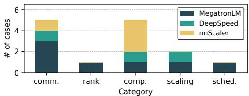  
Figure 9. Reproduced incorrect parallelization cases.

Bugs related to buffers (6–7) are out of scope for Train-Verify as discussed in §4.

Reproduction and Verification. To demonstrate the effectiveness of TrainVerify, we apply it to verify incorrect execution plans. We select 14 non-trivial real-world cases from Table 1, covering the broad categories in §8.3, as shown in Figure 9. As these cases span multiple systems, we identify the underlying causes and reproduce them via careful mutation, either in nnScaler’s system code or directly in the generated plans, ensuring successful model instantiation. Evaluation is conducted on the Llama3-8B model using 2-way DP, TP, and PP.

TrainVerify detects equivalence violations in all 14 plans, each completing within one minute. Two mutations, one in scheduling and one in communication, are caught early via topological sorting due to broken tensor dependencies. Two other communication mutations are flagged during shape reduction inference for invoking incorrect primitives that cause output shape mismatches, e.g. replacing AllReduce with AllGather. The remaining are detected during verification of their respective stages. Upon detection, TrainVerify generates a counterexample with concrete input/output values and violated lineage for the stage. Appendix B.1 includes a case study for a subtle distributed computation bug in MegatronLM and shows how TrainVerify eliminates such bugs.

Exposing New Violations. In applying TrainVerify, we uncover several classes of buggy plans in nnScaler:

• C1: Sharding a non-partitionable dimension.

• C2: Violation of the single static assignment convention.

• C3: Dangling tensors in backward pass.

They are reported to and confirmed by the nnScaler developers. C1 errors were discovered in its example code, where the annotation for the modularized operator apply\_ rotary\_embedding is inaccurate. Under some strategies, the sequence dimension of the activations is partitioned, but the precomputed positional embeddings are not sliced accordingly, leading to sharded subsequences being mis-encoded as independent starts. C2 includes tensors that serve as outputs for different nodes, violating the SSA convention. Although in observed cases the output replicas are mathematically equal, this violation exposes a potential vulnerability: downstream transformations, if present, may undesirably interfere with each other. C3 includes backward tensors with consumers but no producers, which break the data flow. Although they happen to be not reflected in the generated model code due to the autograd accumulation mechanism, this reveals potential errors in the corresponding system implementation.

## 9 Discussions and Limitations

TrainVerify opts to verify full execution plans without assuming homogeneity across layers or parallelism degrees. This preserves generality, adapting to increasingly flexible parallelization strategies, e.g., differentiated parallelism applied across Transformer layers [54], or across data pipelines [42].

TrainVerify operates at the symbolic level; thus, floatingpoint precision issues or value drift from accumulation order are out of scope. Certain parallelization bugs, e.g., a missing AllReduce for tensor averaging (§8.3), can mimic such numeric symptoms (e.g., FP16 to FP8). TrainVerify eliminates these bugs, avoiding complex debugging where parallelization errors are mistaken for numerical instability.

TrainVerify relies on graph-based execution plans and tensor lineage for scalable verification, so it does not directly apply to code-based parallelization such as MegatronLM [67]. It is possible to support these systems by leveraging tools like PyTorchFX [71] to trace graphs, handling communication operations, and obtaining lineage information through either manual or automated annotation.

TrainVerify is currently built on top of nnScaler [52]. Its interface, however, is system-agnostic: any parallelization system that exposes an SSA graph and lineage can be supported. For example, StableHLO [23], as an MLIR [49] dialect, is inherently SSA-based, making the required graph construction straightforward. Moreover, with minor extensions, programs parallelized via XLA [80]’s auto-sharding can retain the lineage information necessary for TrainVerify’s verification.

TrainVerify currently requires manual specification of shape reduction rules and operator rewrites to support symbolic tensors. Automating them, e.g., with autograd and program synthesis, is future work.

## 10 Related Work

Neural network equivalence. A body of work [28, 39, 43, 73] explores neural network equivalence. The closest to Train-Verify is the work by Eleftheriadis et al. [39], which similarly encodes neural networks into SMT clauses, but targets approximate equivalence for knowledge distillation. Their system is restricted to shallow feed-forward networks with at most two layers and thousands of neurons, while TrainVerify scales to state-of-the-art LLMs with billions of parameters.

TASO [43] is a neural network optimization system that accelerates neural networks by substituting certain components with more efficient alternatives. To ensure correctness, TASO includes a verifier that encodes substitution rules as SMT clauses to verify the equivalence of the network before and after substitution. TrainVerify shares a similar philosophy— treating the original network as the ground truth—but differs significantly in scale. Similarly, PET [76] optimizes neural networks via partially equivalent transformations, whose equivalence proof inspires TrainVerify’s formalization of shape reduction proof. While TASO and PET handle a small number of operators for each substitution, TrainVerify operates end-to-end, requiring verification of the entire model.

Other works address neural network equivalence for various purposes, including testing DL compiler [56], supporting model rewriting rules [28, 76], repairing models [60], and ensuring the approximation of pruned and distilled models [73]. In contrast, TrainVerify verifies equivalence and focuses on large-scale parallel training, scaling to models with billions of parameters, a level unmatched by prior work.

Neural network verification. In the intersection of deep learning and formal methods, neural network verification [47, 53, 77] addresses a related but orthogonal problem: verifying whether a trained neural network meets specified requirements. These systems encode the network’s concrete weights and evaluate whether specific input-output pairs, potentially infinite, satisfy predefined specifications. In contrast, Train-Verify operates on symbolic tensors, verifying equivalence across all possible inputs rather than specific cases.

Correctness of DL training. Prior work enhances DL training via runtime monitoring [25, 33, 44]. TrainCheck [44], for instance, checks invariants inferred from previously validated pipelines to capture end-to-end correctness. Such monitoring provides valuable practical assurance, yet can be constrained by overlooked metrics and numerical drift. Complementary to these efforts, TrainVerify offers symbolic verification with correctness guarantees for parallelization.

## 11 Conclusion

We present TrainVerify, a system that provides strong correctness guarantees for distributed training by verifying parallelization equivalence. Through multiple techniques such as symbolic representation, staged verification and shape reduction, TrainVerify successfully scales to state-of-the-art LLMs with hundreds of billions of parameters. Our work demonstrates that formal methods can apply to and effectively benefit complex parallel training workflows in practice.

## Acknowledgments

We thank our collaborators and colleagues for their contributions, as well as the anonymous SOSP reviewers and our shepherd, Steven Hand, whose feedback improved the clarity and rigor of the paper. This work is supported by the Microsoft Accelerate Foundation Models Research (AFMR) grant program. Cheng Tan is partially supported by NSF CAREER Award #2237295. Yunchi Lu and Peng Huang’s participation in the project is supported in part by NSF grants CNS-2317698, CNS-2317751, and CCF-2318937. Youshan Miao is the corresponding author.

## References

[1] CUDA. https://docs.nvidia.com/cuda/.

[2] CUTLASS: CUDA Templates for Linear Algebra Subroutines. https: //github.com/NVIDIA/cutlass.

[3] DeepSpeed: fix bug where ZeRO2 never uses the reduce method. https://github.com/microsoft/DeepSpeed/commit/a85b6e472534d2e 0b61fe234fae4f6a2332c95bf.

[4] DeepSpeed: fix EP grad\_scale/grad\_norm fix. https://github.com/mic rosoft/DeepSpeed/commit/e5dd5501c10227ae33dce7d5bdd897741dd 3adb7.

[5] DeepSpeed: partition balanced return wrong result. https://github.com /deepspeedai/DeepSpeed/commit/2bdf061f4dc8be70878f032d2e48 d2130514f991.

[6] Distributed Data Parallelism. https://pytorch.org/docs/stable/notes/ ddp.html.

[7] A gentle introduction to torch.autograd. https://pytorch.org/tutorials/ beginner/blitz/autograd\_tutorial.html#computational-graph.

[8] Llama3: Model Details. https://github.com/meta-llama/llama3/blob/ main/MODEL\_CARD.md.

[9] Megatron Core. https://developer.nvidia.com/megatron-core.

[10] Megatron: fix cross entropy loss averaging. https://github.com/NVIDI A/Megatron-LM/commit/adfa873d965b240962be6539cb5d387c5084 16b9.

[11] Megatron: fix distopt allgathers with interleaved pipeline parallelism. https://github.com/NVIDIA/Megatron-LM/commit/32bbb76d5767fd bf8dc60d4ef07d103cef8aca02.

[12] Megatron: fix ??????\_????????\_????????????????\_??????\_????????. https://github.com/N VIDIA/Megatron-LM/commit/9ad1944db1f97000377dc5aee36dcd65 6b1ae4a2.

[13] Megatron: fix interleaved schedule with sequence-parallel and overlapp2p-comm. https://github.com/NVIDIA/Megatron-LM/commit/6bd7 4b0e84577317c06c303f4dae26d249ab55d1#diff-c27f9f2765a43b5c78 1756ce9fe4b9abcc3618ec96157f5dc67c4a00a7900b73R777.

[14] Megatron: fix no-interleave pipeline schedule. https://github.com/NVI DIA/Megatron-LM/commit/1f387c2cbdb4ce93f0c885862d570efb66 dca4a4.

[15] Megatron: fix scaling down expert grads. https://github.com/NVIDIA/ Megatron-LM/commit/3373641ff1093073181e219265e8c8ee58d858 7c.

[16] Megatron: fix tiling, use correct input size for splits. https://github.c om/microsoft/DeepSpeed/commit/c543a41b154a991d50cb6cc8c07db f46b0d2bdf6.

[17] Megatron issue: Incorrect loss scaling in context parallel code logic. https://github.com/NVIDIA/Megatron-LM/issues/673.

[18] Megatron: LinearWithFrozenWeight backward fix when TP > 1. https: //github.com/NVIDIA/Megatron-LM/commit/5fffdfc737f14297bc378 1dfc9e273199d1df52e.

[19] Megatron: MoE distributed setup invokes unnecessary all-reduce. https: //github.com/deepspeedai/DeepSpeed/issues/6714.

[20] NumPy. https://numpy.org/.

[21] NVIDIA collective communications library. https://developer.nvidia.c om/nccl.

[22] PyTorch: Loss Functions. https://pytorch.org/docs/stable/nn.html#lo ss-functions.

[23] StableHLO. https://github.com/openxla/stablehlo.

[24] Z3 Tactic Online Guide. https://microsoft.github.io/z3guide/docs/str ategies/tactics/.

[25] Martín Abadi, Paul Barham, Jianmin Chen, Zhifeng Chen, Andy Davis, Jeffrey Dean, Matthieu Devin, Sanjay Ghemawat, Geoffrey Irving, Michael Isard, Manjunath Kudlur, Josh Levenberg, Rajat Monga, Sherry Moore, Derek G. Murray, Benoit Steiner, Paul Tucker, Vijay Vasudevan, Pete Warden, Martin Wicke, Yuan Yu, and Xiaoqiang Zheng. TensorFlow: A system for large-scale machine learning. In Proceedings of the 12th USENIX Conference on Operating Systems Design and

Implementation, OSDI ’16, page 265–283, Savannah, GA, USA, 2016. USENIX Association.

[26] Josh Achiam, Steven Adler, Sandhini Agarwal, Lama Ahmad, Ilge Akkaya, Florencia Leoni Aleman, Diogo Almeida, Janko Altenschmidt, Sam Altman, Shyamal Anadkat, et al. GPT-4 technical report. arXiv preprint arXiv:2303.08774, 2023.

[27] Rohan Anil, Sebastian Borgeaud, Yonghui Wu, Jean-Baptiste Alayrac, Jiahui Yu, Radu Soricut, Johan Schalkwyk, Andrew M Dai, Anja Hauth, Katie Millican, et al. Gemini: A family of highly capable multimodal models. arXiv preprint arXiv:2312.11805, 1, 2023.

[28] Jai Arora, Sirui Lu, Devansh Jain, Tianfan Xu, Farzin Houshmand, Phitchaya Mangpo Phothilimthana, Mohsen Lesani, Praveen Narayanan, Karthik Srinivasa Murthy, Rastislav Bodik, Amit Sabne, and Charith Mendis. TensorRight: Automated verification of tensor graph rewrites. Proc. ACM Program. Lang., 9(POPL), January 2025. https://doi.org/ 10.1145/3704865.

[29] Adam Betts, Nathan Chong, Alastair Donaldson, Shaz Qadeer, and Paul Thomson. GPUVerify: a verifier for GPU kernels. In Proceedings of the ACM International Conference on Object Oriented Programming Systems Languages and Applications, OOPSLA ’12, page 113–132, Tucson, Arizona, USA, 2012. Association for Computing Machinery. https://doi.org/10.1145/2384616.2384625.

[30] Zhengda Bian, Qifan Xu, Boxiang Wang, and Yang You. Maximizing parallelism in distributed training for huge neural networks. arXiv preprint arXiv:2105.14450, 2021.

[31] Tom Brown, Benjamin Mann, Nick Ryder, Melanie Subbiah, Jared D Kaplan, Prafulla Dhariwal, Arvind Neelakantan, Pranav Shyam, Girish Sastry, Amanda Askell, Sandhini Agarwal, Ariel Herbert-Voss, Gretchen Krueger, Tom Henighan, Rewon Child, Aditya Ramesh, Daniel Ziegler, Jeffrey Wu, Clemens Winter, Chris Hesse, Mark Chen, Eric Sigler, Mateusz Litwin, Scott Gray, Benjamin Chess, Jack Clark, Christopher Berner, Sam McCandlish, Alec Radford, Ilya Sutskever, and Dario Amodei. Language models are few-shot learners. In H. Larochelle, M. Ranzato, R. Hadsell, M.F. Balcan, and H. Lin, editors, Advances in Neural Information Processing Systems, volume 33, pages 1877–1901. Curran Associates, Inc., 2020.

[32] Tianqi Chen, Thierry Moreau, Ziheng Jiang, Lianmin Zheng, Eddie Yan, Meghan Cowan, Haichen Shen, Leyuan Wang, Yuwei Hu, Luis Ceze, Carlos Guestrin, and Arvind Krishnamurthy. TVM: An automated end-to-end optimizing compiler for deep learning. In Proceedings of the 13th USENIX Conference on Operating Systems Design and Implementation, OSDI ’18, page 579–594, Carlsbad, CA, USA, 2018. USENIX Association.

[33] CoreWeave. Weights & Biases. https://wandb.ai/site/.

[34] Ben Cottier, Robi Rahman, Loredana Fattorini, Nestor Maslej, Tamay Besiroglu, and David Owen. The rising costs of training frontier AI models. arXiv preprint arXiv:2405.21015, 2024.

[35] Leonardo De Moura and Nikolaj Bjørner. Z3: An efficient SMT solver. In Proceedings of the Theory and Practice of Software, 14th International Conference on Tools and Algorithms for the Construction and Analysis of Systems, TACAS’08/ETAPS’08, page 337–340, Budapest, Hungary, 2008. Springer-Verlag.

[36] DeepSeek-AI, Aixin Liu, Bei Feng, Bing Xue, Bochao Wu, et al. DeepSeek-V3 technical report, 2025. arXiv:2412.19437 [cs.CL] https: //arxiv.org/abs/2412.19437.

[37] Truong-Dong Do, Minh-Thien Duong, Quoc-Vu Dang, and My-Ha Le. Real-time self-driving car navigation using deep neural network. In 2018 4th International Conference on Green Technology and Sustainable Development (GTSD), pages 7–12, 2018.

[38] Abhimanyu Dubey, Abhinav Jauhri, Abhinav Pandey, Abhishek Kadian, Ahmad Al-Dahle, Aiesha Letman, Akhil Mathur, Alan Schelten, Amy Yang, Angela Fan, et al. The Llama 3 herd of models. arXiv preprint arXiv:2407.21783, 2024.

[39] Charis Eleftheriadis, Nikolaos Kekatos, Panagiotis Katsaros, and Stavros Tripakis. On neural network equivalence checking using SMT solvers, 2022. arXiv:2203.11629 [cs.AI] https://arxiv.org/abs/2203.11629.

[40] Yanjie Gao, Jiyu Luo, Haoxiang Lin, Hongyu Zhang, Ming Wu, and Mao Yang. dl2: Detecting communication deadlocks in deep learning jobs. In Proceedings of the 33rd ACM International Conference on the Foundations of Software Engineering, FSE Companion ’25, page 27–38, Clarion Hotel Trondheim, Trondheim, Norway, 2025. Association for Computing Machinery. https://doi.org/10.1145/3696630.3728529.

[41] Yanping Huang, Youlong Cheng, Ankur Bapna, Orhan Firat, Dehao Chen, Mia Chen, HyoukJoong Lee, Jiquan Ngiam, Quoc V Le, Yonghui Wu, and zhifeng Chen. GPipe: Efficient training of giant neural networks using pipeline parallelism. In H. Wallach, H. Larochelle, A. Beygelzimer, F. d'Alché-Buc, E. Fox, and R. Garnett, editors, Advances in Neural Information Processing Systems, volume 32, pages 103–112. Curran Associates, Inc., 2019.

[42] Insu Jang, Zhenning Yang, Zhen Zhang, Xin Jin, and Mosharaf Chowdhury. Oobleck: Resilient distributed training of large models using pipeline templates. In Proceedings of the 29th Symposium on Operating Systems Principles, SOSP ’23, page 382–395, Koblenz, Germany, 2023. Association for Computing Machinery. https://doi.org/10.1145/3600006.3613152.

[43] Zhihao Jia, Oded Padon, James Thomas, Todd Warszawski, Matei Zaharia, and Alex Aiken. TASO: Optimizing deep learning computation with automatic generation of graph substitutions. In Proceedings of the 27th ACM Symposium on Operating Systems Principles, SOSP ’19, page 47–62, Huntsville, Ontario, Canada, 2019. Association for Computing Machinery. https://doi.org/10.1145/3341301.3359630.

[44] Yuxuan Jiang, Ziming Zhou, Boyu Xu, Beijie Liu, Runhui Xu, and Peng Huang. Training with Confidence: Catching silent errors in deep learning training with automated proactive checks. In Proceedings of the 19th USENIX Symposium on Operating Systems Design and Implementation, OSDI ’25, Boston, MA, USA, July 2025. USENIX Association.

[45] John Jumper, Richard Evans, Alexander Pritzel, Tim Green, Michael Figurnov, Olaf Ronneberger, Kathryn Tunyasuvunakool, Russ Bates, Augustin Žídek, Anna Potapenko, et al. Highly accurate protein structure prediction with AlphaFold. Nature, 596(7873):583–589, 2021.

[46] Jared Kaplan, Sam McCandlish, Tom Henighan, Tom B Brown, Benjamin Chess, Rewon Child, Scott Gray, Alec Radford, Jeffrey Wu, and Dario Amodei. Scaling laws for neural language models. arXiv preprint arXiv:2001.08361, 2020.

[47] Guy Katz, Clark Barrett, David L. Dill, Kyle Julian, and Mykel J. Kochenderfer. Reluplex: An efficient SMT solver for verifying deep neural networks. In Rupak Majumdar and Viktor Kunčak, editors, Computer Aided Verification, pages 97–117, Cham, 2017. Springer International Publishing.

[48] Vijay Anand Korthikanti, Jared Casper, Sangkug Lym, Lawrence McAfee, Michael Andersch, Mohammad Shoeybi, and Bryan Catanzaro. Reducing activation recomputation in large transformer models. In D. Song, M. Carbin, and T. Chen, editors, Proceedings of Machine Learning and Systems, volume 5, pages 341–353. Curan, 2023.

[49] Chris Lattner, Mehdi Amini, Uday Bondhugula, Albert Cohen, Andy Davis, Jacques Pienaar, River Riddle, Tatiana Shpeisman, Nicolas Vasilache, and Oleksandr Zinenko. MLIR: Scaling compiler infrastructure for domain specific computation. In Proceedings of the 2021 IEEE/ACM International Symposium on Code Generation and Optimization, CGO ’21, page 2–14. IEEE Press, 2021. https://doi.org/10.1109/CGO51591.2021.9370308.

[50] Guodong Li, Peng Li, Geof Sawaya, Ganesh Gopalakrishnan, Indradeep Ghosh, and Sreeranga P. Rajan. GKLEE: Concolic verification and test generation for GPUs. In Proceedings of the 17th ACM SIGPLAN Symposium on Principles and Practice of Parallel Programming, PPoPP ’12, page 215–224, New Orleans, Louisiana, USA, 2012. Association

for Computing Machinery. https://doi.org/10.1145/2145816.2145844.

[51] Shenggui Li, Fuzhao Xue, Yongbin Li, and Yang You. Sequence parallelism: Making 4d parallelism possible. arXiv preprint arXiv:2105.13120, 2021.

[52] Zhiqi Lin, Youshan Miao, Quanlu Zhang, Fan Yang, Yi Zhu, Cheng Li, Saeed Maleki, Xu Cao, Ning Shang, Yilei Yang, Weijiang Xu, Mao Yang, Lintao Zhang, and Lidong Zhou. nnScaler: Constraint-guided parallelization plan generation for deep learning training. In 18th USENIX Symposium on Operating Systems Design and Implementation (OSDI 24), pages 347–363, Santa Clara, CA, July 2024. USENIX Association. https://www.usenix.org/conference/osdi24/presentation/ lin-zhiqi.

[53] Changliu Liu, Tomer Arnon, Christopher Lazarus, Clark Barrett, and Mykel J. Kochenderfer. Algorithms for verifying deep neural networks. arXiv:1903.06758, 2019.

[54] Guodong Liu, Youshan Miao, Zhiqi Lin, Xiaoxiang Shi, Saeed Maleki, Fan Yang, Yungang Bao, and Sa Wang. Aceso: Efficient parallel DNN training through iterative bottleneck alleviation. In Proceedings of the Nineteenth European Conference on Computer Systems, EuroSys ’24, page 163–181, Athens, Greece, 2024. Association for Computing Machinery. https://doi.org/10.1145/3627703.3629554.

[55] Hao Liu, Matei Zaharia, and Pieter Abbeel. Ring attention with blockwise transformers for near-infinite context. arXiv preprint arXiv:2310.01889, 2023.

[56] Jiawei Liu, Jinkun Lin, Fabian Ruffy, Cheng Tan, Jinyang Li, Aurojit Panda, and Lingming Zhang. NNSmith: Generating diverse and valid test cases for deep learning compilers. In Proceedings of the 28th ACM International Conference on Architectural Support for Programming Languages and Operating Systems, Volume 2, ASPLOS 2023, page 530–543, Vancouver, BC, Canada, 2023. Association for Computing Machinery. https://doi.org/10.1145/3575693.3575707.

[57] Siran Liu, Chengxiang Qi, Ying Cao, Chao Yang, Weifang Hu, Xuanhua Shi, Fan Yang, and Mao Yang. Uncovering nested data parallelism and data reuse in DNN computation with FractalTensor. In Proceedings of the ACM SIGOPS 30th Symposium on Operating Systems Principles, SOSP ’24, page 160–177, Austin, TX, USA, 2024. Association for Computing Machinery. https://doi.org/10.1145/3694715.3695961.

[58] William M McKeeman. Differential testing for software. Digital Technical Journal, 10(1):100–107, 1998.

[59] Aaron Meurer, Christopher P. Smith, Mateusz Paprocki, Ondřej Čertík, Sergey B. Kirpichev, Matthew Rocklin, AMiT Kumar, Sergiu Ivanov, Jason K. Moore, Sartaj Singh, Thilina Rathnayake, Sean Vig, Brian E. Granger, Richard P. Muller, Francesco Bonazzi, Harsh Gupta, Shivam Vats, Fredrik Johansson, Fabian Pedregosa, Matthew J. Curry, Andy R. Terrel, Štěpán Roučka, Ashutosh Saboo, Isuru Fernando, Sumith Kulal, Robert Cimrman, and Anthony Scopatz. SymPy: Symbolic computing in Python. PeerJ Computer Science, 3:e103, January 2017. https: //doi.org/10.7717/peerj-cs.103.

[60] Satoshi Munakata, Susumu Tokumoto, Koji Yamamoto, and Kazuki Munakata. Towards formal repair and verification of industry-scale deep neural networks. In Proceedings of the 45th International Conference on Software Engineering: Companion Proceedings, ICSE ’23, page 360–364. IEEE Press, 2023. https://doi.org/10.1109/ICSE-Companio n58688.2023.00103.

[61] Deepak Narayanan, Aaron Harlap, Amar Phanishayee, Vivek Seshadri, Nikhil R. Devanur, Gregory R. Ganger, Phillip B. Gibbons, and Matei Zaharia. PipeDream: Generalized pipeline parallelism for DNN training. In Proceedings of the 27th ACM Symposium on Operating Systems Principles, SOSP ’19, page 1–15, Huntsville, Ontario, Canada, 2019. Association for Computing Machinery. https://doi.org/10.1145/334130 1.3359646.

[62] Adam Paszke, Sam Gross, Soumith Chintala, Gregory Chanan, Edward Yang, Zachary DeVito, Zeming Lin, Alban Desmaison, Luca Antiga, and Adam Lerer. Automatic differentiation in PyTorch. 2017.

[63] PyTorch Team. PyTorch. https://pytorch.org/.

[64] Samyam Rajbhandari, Conglong Li, Zhewei Yao, Minjia Zhang, Reza Yazdani Aminabadi, Ammar Ahmad Awan, Jeff Rasley, and Yuxiong He. DeepSpeed-MoE: Advancing mixture-of-experts inference and training to power next-generation AI scale. In Kamalika Chaudhuri, Stefanie Jegelka, Le Song, Csaba Szepesvari, Gang Niu, and Sivan Sabato, editors, Proceedings of the 39th International Conference on Machine Learning, volume 162 of Proceedings of Machine Learning Research, pages 18332–18346. PMLR, 17–23 Jul 2022. https://proceedings.mlr.press/v162/rajbhandari22a.html.

[65] Samyam Rajbhandari, Jeff Rasley, Olatunji Ruwase, and Yuxiong He. ZeRO: Memory optimizations toward training trillion parameter models. In Proceedings of the International Conference for High Performance Computing, Networking, Storage and Analysis, SC ’20. IEEE Press.

[66] Jeff Rasley, Samyam Rajbhandari, Olatunji Ruwase, and Yuxiong He. DeepSpeed: System optimizations enable training deep learning models with over 100 billion parameters. In Proceedings of the 26th ACM SIGKDD International Conference on Knowledge Discovery & Data Mining, KDD ’20, page 3505–3506, Virtual Event, CA, USA, 2020. Association for Computing Machinery. https://doi.org/10.1145/339448 6.3406703.

[67] Mohammad Shoeybi, Mostofa Patwary, Raul Puri, Patrick LeGresley, Jared Casper, and Bryan Catanzaro. Megatron-LM: Training multibillion parameter language models using GPU model parallelism. arXiv preprint arXiv:1909.08053, 2019.

[68] Yi Sun, Ding Liang, Xiaogang Wang, and Xiaoou Tang. DeepID3: Face recognition with very deep neural networks, 2015. arXiv:1502.00873 [cs.CV] https://arxiv.org/abs/1502.00873.

[69] Enyi Tang, Earl Barr, Xuandong Li, and Zhendong Su. Perturbing numerical calculations for statistical analysis of floating-point program (in)stability. In Proceedings of the 19th International Symposium on Software Testing and Analysis, ISSTA ’10, page 131–142, Trento, Italy, 2010. Association for Computing Machinery. https://doi.org/10.1145/ 1831708.1831724.

[70] PyTorch Team. PyTorch DistributedTensor (DTensor). https://github.c om/pytorch/pytorch/tree/master/torch/distributed/\_tensor.

[71] PyTorch Team. TorchFX. https://pytorch.org/docs/stable/fx.html.

[72] PyTorch Team. TorchScript. https://pytorch.org/docs/stable/jit.html.

[73] Samuel Teuber, Philipp Kern, Marvin Janzen, and Bernhard Beckert. Revisiting differential verification: Equivalence verification with confidence. arXiv preprint arXiv:2410.20207, 2024.

[74] Hugo Touvron, Louis Martin, Kevin Stone, Peter Albert, Amjad Almahairi, Yasmine Babaei, Nikolay Bashlykov, Soumya Batra, Prajjwal Bhargava, Shruti Bhosale, et al. Llama 2: Open foundation and finetuned chat models. arXiv preprint arXiv:2307.09288, 2023.

[75] Ashish Vaswani, Noam Shazeer, Niki Parmar, Jakob Uszkoreit, Llion Jones, Aidan N Gomez, Ł ukasz Kaiser, and Illia Polosukhin. Attention is all you need. In I. Guyon, U. Von Luxburg, S. Bengio, H. Wallach, R. Fergus, S. Vishwanathan, and R. Garnett, editors, Advances in Neural Information Processing Systems, volume 30. Curran Associates, Inc.

[76] Haojie Wang, Jidong Zhai, Mingyu Gao, Zixuan Ma, Shizhi Tang, Liyan Zheng, Yuanzhi Li, Kaiyuan Rong, Yuanyong Chen, and Zhihao Jia. PET: Optimizing tensor programs with partially equivalent transformations and automated corrections. In 15th USENIX Symposium on Operating Systems Design and Implementation (OSDI 21), pages 37–54. USENIX Association, July 2021. https://www.usenix.org/con ference/osdi21/presentation/wang.

[77] Shiqi Wang, Huan Zhang, Kaidi Xu, Xue Lin, Suman Jana, Cho-Jui Hsieh, and Zico Kolter. Beta-CROWN: Efficient bound propagation with per-neuron split constraints for neural network robustness verification. In Proceedings of the 35th International Conference on Neural Information Processing Systems, NIPS ’21, Red Hook, NY, USA, 2021. Curran Associates Inc.

[78] Mark Weiser. Program slicing. IEEE Transactions on software engineering, (4):352–357, 1984.

[79] Peichen Xie, Yanjie Gao, Yang Wang, and Jilong Xue. Revealing floating-point accumulation orders in software/hardware implementations. In Proceedings of the 2025 USENIX Annual Technical Conference (USENIX ATC). USENIX Association, 2025.

[80] XLA and TensorFlow teams. XLA—TensorFlow, compiled. https: //developers.googleblog.com/2017/03/xla-tensorflow-compiled.html.

[81] Jinhui Yuan, Xinqi Li, Cheng Cheng, Juncheng Liu, Ran Guo, Shenghang Cai, Chi Yao, Fei Yang, Xiaodong Yi, Chuan Wu, et al. OneFlow: Redesign the distributed deep learning framework from scratch. arXiv preprint arXiv:2110.15032, 2021.

[82] Lianmin Zheng, Chengfan Jia, Minmin Sun, Zhao Wu, Cody Hao Yu, Ameer Haj-Ali, Yida Wang, Jun Yang, Danyang Zhuo, Koushik Sen, Joseph E. Gonzalez, and Ion Stoica. Ansor: Generating highperformance tensor programs for deep learning. In Proceedings of the 14th USENIX Conference on Operating Systems Design and Implementation, OSDI ’20, USA, 2020. USENIX Association.

[83] Lianmin Zheng, Zhuohan Li, Hao Zhang, Yonghao Zhuang, Zhifeng Chen, Yanping Huang, Yida Wang, Yuanzhong Xu, Danyang Zhuo, Eric P Xing, et al. Alpa: Automating inter- and intra-operator parallelism for distributed deep learning. In 16th USENIX Symposium on Operating Systems Design and Implementation (OSDI 22), pages 559–578, Carlsbad, CA, July 2022. USENIX Association. https: //www.usenix.org/conference/osdi22/presentation/zheng-lianmin.