Latest updates: hps://dl.acm.org/doi/10.1145/3731569.3764851

RESEARCH-ARTICLE

# Tai Chi: A General High-Efficiency Scheduling Framework for SmartNICs in Hyperscale Clouds

BANG DI, Alibaba Group Holding Limited, Hangzhou, Zhejiang, China YUN XU, Alibaba Group Holding Limited, Hangzhou, Zhejiang, China KAIJIE GUO, Alibaba Group Holding Limited, Hangzhou, Zhejiang, China YIBIN SHEN, Alibaba Group Holding Limited, Hangzhou, Zhejiang, China YU LI, Alibaba Group Holding Limited, Hangzhou, Zhejiang, China SANCHUAN CHENG, Alibaba Group Holding Limited, Hangzhou, Zhejiang, China View all

Open Access Support provided by:

Alibaba Group Holding Limited

Alibaba Group, USA

Published: 12 October 2025

Citation in BibTeX format

SOSP '25: ACM SIGOPS 31st Symposium

on Operating Systems Principles

October 13 - 16, 2025

Seoul, Republic of Korea

Conference Sponsors: SIGOPS

# Tai Chi: A General High-E!ciency Scheduling Framework for SmartNICs in Hyperscale Clouds

Bang Di, Yun Xu, Kaijie Guo, Yibin Shen, Yu Li, Sanchuan Cheng, Hao Zheng, Fudong Qiu, Xiaokang Hu, Naixuan Guan, Dongdong Huang, Jinhu Li, Yi Wang, Yifang Yang, Jintao Li, Hang Yang, Chen Liang, Yilong Lv, Zikang Chen, Zhenwei Lu, Xiaohan Ma, Jiesheng Wu

Alibaba Group

## Abstract

Cloud service providers increasingly adopt SmartNICs to of-!oad data-plane services (e.g., DPDK and SPDK) and controlplane tasks (such as disk and NIC initialization). Our analysis of production environments reveals that data-plane services statically provision CPUs for peak load, resulting in 67.5% idle CPU cycles during 99% of their runtime in IaaS clouds, leading to wasted CPU resources. On the other hand, control-plane tasks fail to meet critical Service Level Objectives (SLOs), such as virtual machine startup time. Unfortunately, achieving control-plane SLO improvements through co-scheduling with idle data-plane services remains highly challenging, due to the combined e"ects of intrinsic scheduling latency and the substantial architectural complexity inherent to control-plane ecosystems.

We present Tai Chi, a hardware and software co-designed scheduler that coordinates control-plane tasks and dataplane services through a SmartNIC-accelerated hybrid virtualization. This hybrid framework uni#es physical and virtual CPUs within a single OS while providing native inter-process communication semantics among all tasks. By achieving microsecond-scale scheduling precision, it reduces controlplane operation latency by 3.1→ (e.g., VM startup) while maintaining data-plane SLO compliance, imposes negligible scheduling overhead, and requires zero code modi#cations to legacy control-plane systems. Its cross-platform SmartNIC compatibility enables seamless and transparent deployment in the production environment, demonstrating compelling advantages over prior solutions in hyperscale cloud infrastructure.

CCS Concepts: • Software and its engineering ↑ Scheduling.

Keywords: Virtualization, Cloud Computing, SmartNIC, Scheduling

## 1 Introduction

Major cloud providers [2, 9, 41] leverage SmartNICs (AWS Nitro [40], Alibaba CIPU [10], and Azure SmartNIC [16]) to o\$oad data-plane (DP) services and control-plane (CP) tasks to pursue high performance. DP services (such as DPDK [15] and SPDK [43]) optimize I/O processing performance. CP tasks primarily handle device management, performance monitoring, and infrastructure-level management (§ 2.3).

To prevent interference, CPU resources on SmartNICs are statically partitioned between DP services and CP tasks. This strategy prioritizes DP services by reserving CPUs based on their peak load to ensure data-plane SLOs (such as latency and IOPS), resulting in 67.5% CPU cycle wastage (§ 3.1). However, a critical yet overlooked issue is the growing number of SLO violations in critical CP tasks such as VM startup latency (§ 3.1). This is because the faster growth rate in server CPU and VM density compared to SmartNIC CPUs results in higher CP workload intensity.

Existing approaches [17, 21, 23, 29, 36] co-schedule beste"ort tasks with latency-critical tasks to utilize idle CPU cycles. However, they face #ve fundamental Constraints when applied to SmartNIC-based DP services and CP tasks in production environments. C1: Neglect of control-plane SLOs. Existing systems treat best-e"ort tasks as low-priority and latency-insensitive. However, CP tasks require strict SLOs (§ 3.1), fundamentally di"ering from best-e"ort tasks and necessitating distinct handling. C2: DP tail latency spikes from CP non-preemptible routines. CP tasks contain numerous ms-scale non-preemptible routines (§ 3.2) with execution time up to three orders of magnitude longer than the µs-scale I/O packet processing latency. These CP routines prevent the kernel scheduler from promptly responding to bursty DP requests, resulting in signi#cant long-tail latency spikes in DP services. C3: Intrusiveness of CP modi!cations. Cloud environments typically host 300 - 500 heterogeneous CP tasks (§ 3.2). Implementing large-scale code modi#cations for these tasks is impractical in hyperscale server !eets. C4:

Incompatibility with SmartNIC hardware. Prior work relying on new hardware features (e.g., UINTR) lacks support in modern SmartNIC CPUs. C5: Non-negligible scheduling overhead. Conventional scheduling methods incur additional CPU resource consumption, making them unsuitable for deployment in resource-constrained environments like Smart-NICs.

Our key insight lies in encapsulating DP services and CP tasks via virtualization technology [1, 12, 47] to seamlessly achieve µs-scale scheduling latency while addressing C1 through C4. However, virtualization incurs both resource and performance overhead (C5). Through hybrid virtualization with hardware-software co-design, we demonstrate that all constraints can be e"ectively eliminated, including C5.

To enable e%cient co-scheduling of DP services and CP tasks on SmartNICs in hyperscale clouds, we propose a general scheduling framework, called Tai Chi, which achieves the following goals.

Substantial CP performance improvement. Tai Chi executes CP tasks on virtual CPUs and leverages idle CPU cycles from DP services to run virtual CPUs, a strategy that simultaneously boosts CP performance (e.g., faster VM startups) during CP task bursts and elevates overall resource e%ciency.

Negligible impact to DP performance. By encapsulating CP tasks in preemptible virtual CPU contexts, Tai Chi breaks their ms-scale non-preemptible routines, eliminating latency spikes for DP services and achieving µs-scale preemption. Furthermore, Tai Chi runs DP services directly on physical CPUs, ensuring native DP performance.

Minimized system overhead. Tai Chi proposes a hybrid virtualization framework where virtual and physical CPUs share a single OS, eliminating virtualization resource taxes for device emulation and guest OS. To eradicate virtualization performance taxes caused by (de)scheduling virtual CPUs, Tai Chi introduces a hardware-software co-designed workload probe to precisely predict I/O workload arrivals before DP processing begins. This provides a scheduling window for virtual CPU switching prior to DP workload handling.

Full transparency. A small yet delicate modi#cation in the OS seamlessly enables interrupts between virtual and physical CPUs (IPIs), allowing virtual CPUs to communicate directly with physical CPUs. This eliminates the need for code modi#cations in CP tasks while enabling native IPC semantics between CP and DP.

Full SmartNIC compatibility. Tai Chi provides comprehensive support for mainstream DP services (including DPDK and SPDK), accommodates arbitrary CP tasks in any quantity or type, and is deployable across major SmartNIC platforms. (e.g., NVIDIA BlueField-3 [35], Intel IPU [19], Alibaba CIPU [10], Azure SmartNICs [16]). These platforms inherently support programmable I/O hardware accelerators to implement our hardware-software co-designed workload probe, along with virtualization capabilities to enable Tai Chi’s hybrid virtualization framework.

The main contributions of this paper are:

• We characterize real-world DP services and CP tasks deployed on SmartNICs in production environments, shedding light on the design principles for high-e%ciency scheduling frameworks.

• We propose Tai Chi. It implements a hybrid scheduling framework that uni#es physical and virtual CPUs within a single OS. By introducing a hardware-software co-designed workload probe, it eliminates virtualization scheduling tax while achieving microsecond-scale scheduling !exibility under low-resource constraints. This design ensures SLO compliance for both control and data planes while supporting large-scale production deployment.

• We analyze production data to demonstrate the compelling bene#ts Tai Chi has delivered over three years of deployment at one of the top-tier cloud providers. Tai Chi improves critical CP task performance (such as VM startup time) by up to 3→ while incurring only an average 0.7% overhead on DP services.

To our knowledge, this work represents the #rst solution ensuring SLO compliance for both DP services and CP tasks leveraging virtualization technology while supporting largescale deployment in production SmartNICs. No prior studies have achieved all these advantages simultaneously.

## 2 Background

## 2.1 Virtualization

Major CPU vendors provide hardware-assisted CPU virtualization technologies such as Intel VT-x [47], which introduces preemptible virtual CPU contexts and utilizes hardwareautomated state transitions for virtual CPU (vCPU) scheduling on physical CPUs. This virtualization capability has become a standard feature in modern x86 [1, 47] and ARM [12] architectures, including SmartNIC CPUs.

Cloud service providers (CSPs) utilize virtualization technologies to create multiple virtual machines (VMs) on a single physical host, enabling resource sharing and isolation across multi-tenant environments. The number of virtual machines (VMs) per physical host, also known as instance density, varies across deployment models. (1) The normal instance density: VMs employ dedicated CPU resources (e.g., 192 physical CPUs supporting 96 instances with 2 vCPUs each). (2) The high instance density: platforms achieve 4→ higher density (384 instances per 192 CPUs node) through CPU over-provisioning techniques.

## 2.2 I/O Acceleration

Bare-metal scenario. In this scenario (shown in Figure 1a), a single tenant exclusively occupies all compute resources. Most academic works [17, 21, 23, 29, 36] focus on accelerating

I/O packet processing (networking and storage) in this setup. They leverage user-space I/O frameworks like DPDK (SPDK is identical with DPDK in all scenarios, and we use DPDK as an example to demonstrate) to bypass the kernel and communicate directly with NICs, while designing custom schedulers to balance latency-critical (LC) performance (e.g., memcached) with best-e"ort (BE) task scheduling (e.g., batch jobs) for improved CPU utilization.

VM scenario. To enable multi-tenant hardware sharing and reduce costs, CSPs employ virtualization. However, tenant VMs cannot directly access physical NICs and instead use QEMU-emulated virtual NICs (vNIC). Early CSPs address I/O acceleration by co-locating DPDK with QEMU and KVM on the host (shown in Figure 1b). While this provides I/O acceleration for latency-critical applications across VMs, it introduces latency spikes due to resource contention (e.g., CPU scheduling priority mismatches) between DPDK and host processes like QEMU.

VM scenario with SmartNICs. SmartNICs provide CSPs with opportunities to mitigate interference and enhance I/O performance through hardware-software co-design. Smart-NICs incorporate a limited number of general purpose cores (ARM or x86 cores) and programmable I/O hardware accelerators (FPGA or ASIC) on a compact PCI device. General purpose cores support to run full-!edged operating systems, enabling DPDK o\$oading to eliminate resource contentioninduced latency spikes. To further eliminate latency spikes caused by internal interferences in DPDK, CSPs partition DPDK into two components (shown in Figure 1c). (1) DP services: they statically reserve the majority of cores for latency-sensitive I/O processing and leverage programmable I/O hardware acceleration to further optimize performance. (2) CP tasks: CP tasks manage device operations through coordination with QEMU on the host, focusing on controlpath functions. Upon a VM launch request, the CSP selects a suitable server from its resource pool. Then, CP tasks and DP services collaborate to provision IO devices, after which the host’s QEMU is noti#ed to instantiate the VM (§ 2.3).

This design pattern has been widely adopted in production environments (e.g., AWS Nitro [40], Azure SmartNIC [16], and Alibaba CIPU [10]) and commercial SmartNIC solutions (e.g., NVIDIA BlueField-3 [35] and Intel IPU [19]).

## 2.3 Data-plane and Control-plane

Data-plane I/O path. Figure 1c (blue arrow) shows dataplane I/O path with SmartNICs. The programmable I/O acceleration hardware in SmartNICs enables multiple emulated NICs (eNIC) and is attached to the physical machine via PCIe, then directly passed through to VMs ( 1 ). I/O requests from the device driver to the eNIC are #rst preprocessed and accelerated by the SmartNIC’s programmable accelerator, then processed by the data-plane service ( 2 ), and #nally forwarded to the NIC for transmission ( 3 and 4 ).

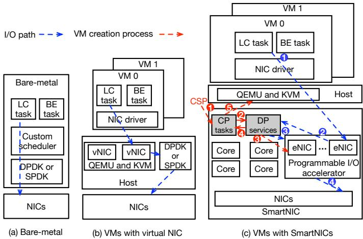  
Figure 1. I/O accelerating architectures across three deployment models: (a) bare-metal with an exclusive NIC, (b) VMs with virtual NIC, and (c) VMs with SmartNICs.

Control-plane tasks. CP tasks primarily consist of three categories. (1) Device Management: Initialize/Deinitialize resources for emulated devices; these operations critically in!uence virtual machine (VM) creation and destruction. (2) Performance monitoring: they collect SmartNIC operational metrics (e.g., eNIC throughput, CPU utilization, power consumption) for load balancing and preserve logs. (3) CSP orchestration: they interface with cluster management software through secured APIs to coordinate infrastructure-level operations. CP tasks have to run on SmartNICs due to their tight coupling with DP operations and SmartNIC management and monitoring infrastructure. Unlike best-e"ort tasks, CP tasks require frequent OS interactions through system calls, thereby inheriting OS scheduling latencies resulting from non-preemptible routines (§ 3.2).

As an example, Figure 1c (red arrow) shows VM creation process via CP tasks. The cluster management software #rst issues commands to the CP tasks with required device speci#cations ( 1 ). These tasks parse the instructions ( 2 ) and coordinate the data-plane to complete device initialization ( 3 ) . Once initialized ( 4 ), CP tasks notify QEMU to trigger VM creation ( 5 ) and subsequently monitor SmartNIC and device performance. This work!ow demonstrates that CP tasks directly impact VM startup SLOs, as device initialization by these tasks is a prerequisite for VM instantiation.

## 3 Motivation

## 3.1 Challenges and Opportunities in Production Environments

CPU shortage of CP tasks. To guarantee I/O SLOs, static partitioning of CPU resources between DP services and CP tasks is implemented to avoid interference. This strategy prioritizes DP services by reserving CPUs based on their peak load to ensure DP SLOs. However, CP tasks involving device management directly impact critical SLOs such as VM startup time. Additionally, as instance density increases, the number of devices managed by CP tasks becomes substantially higher (four times that of the low instance density baseline), further degrading VM startup performance. To quantitatively understand this problem, we collected data on average VM startup time and the execution time of device management CP tasks (§ 2.3) across di"erent instance densities in the production environment. Figure 2 shows that CP task execution time degrades by 8→, while VM startup time exceeds SLO targets by 3.1 at four times the baseline instance density. These SLO violations become so frequent in high-density, million-scale clouds, as can be observed every day in the server !eet.

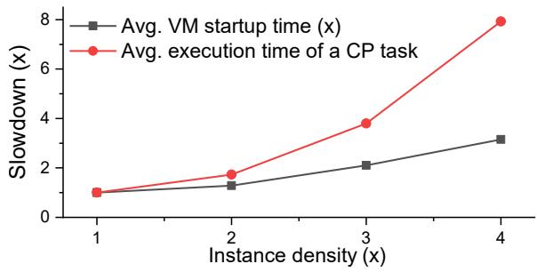  
Figure 2. The average VM startup time and CP task execution time across varying instance densities. The x-axis represents instance density, while the y-axis shows time normalized to SLO targets.

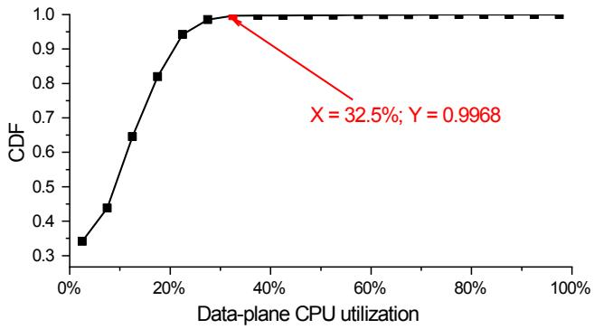  
Figure 3. CDF of data-plane CPU utilization. Each data point represents the proportion (Y) of the dataset where data-plane CPU utilization remains below a speci#ed threshold (X).

Low CPU utilization in DP services. DP services employ over-provisioned CPUs to maintain low tail latency for bursty workloads, resulting in signi#cant CPU underutilization. To quantify this, we collected CPU utilization metrics from DP services (including networking and storage subsystems) per second across hundreds of computing nodes over 12 hours (approximately 1.2 million records). To quantify the distribution, Figure 3 shows a cumulative distribution function (CDF) plot that 99.68% of CPU utilization values fall below 32.5% (indicating 67.5% idle CPU cycles). This ine%- ciency stems from production environments provisioning CPU reserves for storage and networking subsystems based on their peak demands.

Observation 1: DP services have ample idle CPU resources that CP tasks can exploit to address performance bottlenecks.

## 3.2 In-Depth Analysis of Production Environments

Scheduling-constrained CP tasks. Directly scheduling CP tasks onto idle CPU cycles of DP services may introduce latency spikes. This occurs because CP tasks frequently require system calls for operations such as NIC con#guration and logging (§ 2.3), inheriting OS preemption constraints (e.g., non-preemptible kernel routines). During these routines, CP tasks cannot be preempted by the OS scheduler, forcing DP services to wait even when urgent I/O workloads arise, thereby violating latency SLOs. Figure 4 illustrates a latency spike caused by a non-preemptible routine (spinlock) of a CP task. A DP service remains idle during period T1–T2. A CP task, after user-space computation, enters kernel space and acquires a driver-related spinlock to perform the initialization and con#guration of I/O devices. If scheduled at T1, the CP task occupies the CPU until T3, delaying DP execution due to the non-preemptible routine during the lock hold, resulting in a latency spike (T2-T3).

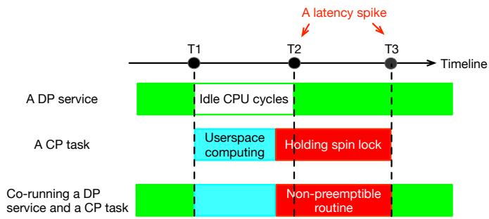  
Figure 4. An example to demonstrate how non-preemptible routines (e.g., spinlock) in CP tasks induce latency spikes when co-scheduled with DP services.

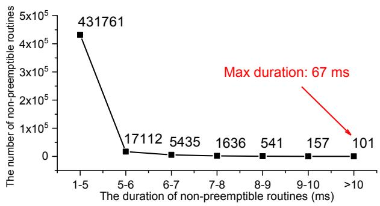  
Figure 5. The number of non-preemptible routines for different durations. The x-y means the duration ranges from x ms to y ms.

To quantify these impacts, we traced non-preemptible routines across dozens of computing nodes over 12 hours in the production server !eets. Figure 5 shows the distribution of long-tail occurrences (>1 ms), with over 456,000 non-preemptible routines exceeding 1 ms (94.5% lasting 1–5 ms) and a maximum duration of 67 ms. In large-scale production environments (hundreds of thousands of nodes), each ms-scale latency spike of DP services in latency-sensitive scenarios (e.g., #nance or live streaming) is unacceptable because it results in customer complaints and #nancial penalties due to SLO violations.

Prohibitive deployment complexity in SmartNICs. Smart-NICs face inherent CPU scarcity (e.g., NVIDIA BlueField-3 provides only 8 to 16 ARM CPUs [35]), necessitating lightweight scheduling mechanisms to minimize resource contention. Furthermore, the CP ecosystem comprises 300–500 heterogeneous tasks spanning C, Python, Java, Bash, and Rust, demanding non-intrusive deployment strategies to accommodate multi-language implementations without code modi#cation.

Observation 2: An e%cient scheduling framework for coscheduling CP tasks and DP services must address two critical requirements: (1) eliminating ms-scale non-preemptible routines in CP operations to achieve µs-scale scheduling granularity, and (2) ensuring lightweight execution and full transparency of CP tasks to enable seamless large-scale deployment.

## 3.3 Limitations of Existing Works

Existing works [17, 21, 23, 29, 36] primarily focus on optimizing latency-critical and best-e"ort tasks in bare-metal environments (§ 2.2), rather than coordinating DP services and CP tasks on SmartNICs. They ensure LC performance by aggressively prioritizing it over BE tasks. However, this strategy is incompatible with CP and DP co-scheduling, as CP demands deterministic SLO compliance like DP (§ 3.1). Furthermore, existing approaches exhibit three critical limitations (summarized in Table 1). (1) Conventional schedulers [17, 21, 36] and modern interrupt-based techniques (e.g., UINTR [23, 29]) rely on OS-internal scheduling mechanisms that cannot bypass non-preemptible routines, resulting in ms-scale latency spikes for DP services. (2) Solutions like Caladan [17] and Shenango [36] employ dedicated I/O polling threads that permanently occupy at least one CPU core on resource-constrained SmartNICs (only 8 to 16 ARM CPUs [35]). This signi#cantly reduces the performance ceiling of DP I/O under high workloads (if the CPU is allocated from the data plane) or degrades CP performance (if taken from the control plane) (3) Existing approaches require intrusive system modi#cations, making them impractical for production environments with complex CP ecosystems.

Table 1. Comparison between prior works and Tai Chi for coordinating DP services and CP tasks on SmartNICs.
<table><tr><td rowspan=1 colspan=1></td><td rowspan=1 colspan=1>Scheduling granularity</td><td rowspan=1 colspan=1>Frameworkoverhead</td><td rowspan=1 colspan=1>Transparencyfor CP tasks</td></tr><tr><td rowspan=1 colspan=1>Shenango [36]</td><td rowspan=1 colspan=1>ms-scale</td><td rowspan=1 colspan=1>High</td><td rowspan=1 colspan=1>Partial</td></tr><tr><td rowspan=1 colspan=1>Caladan [17]</td><td rowspan=1 colspan=1>ms-scale</td><td rowspan=1 colspan=1>High</td><td rowspan=1 colspan=1>Partial</td></tr><tr><td rowspan=1 colspan=1>Concord [21]</td><td rowspan=1 colspan=1>ms-scale</td><td rowspan=1 colspan=1>Low</td><td rowspan=1 colspan=1>Partial</td></tr><tr><td rowspan=1 colspan=1>Skyloft[23]</td><td rowspan=1 colspan=1>ms-scale</td><td rowspan=1 colspan=1>Low</td><td rowspan=1 colspan=1>Partial</td></tr><tr><td rowspan=1 colspan=1>Vessel[29]</td><td rowspan=1 colspan=1>ms-scale</td><td rowspan=1 colspan=1>Low</td><td rowspan=1 colspan=1>Partial</td></tr><tr><td rowspan=1 colspan=1>Tai Chi</td><td rowspan=1 colspan=1>μs-scale</td><td rowspan=1 colspan=1>Low</td><td rowspan=1 colspan=1>Full</td></tr></table>

## 3.4 Virtualization as a Solution

SmartNICs support generalized virtualization which enables preemptible vCPU contexts. An interesting observation is that vCPU contexts can be interrupted at any time (VM-exit) by an external event. This allows us to use vCPUs to isolate DP services and CP tasks while co-scheduling them on the same core. By doing so, we bypass OS scheduler limitations, including non-preemptible routines, thereby enabling µs-scale scheduling precision. Therefore, vCPU contexts are well-suited to execute additional CP tasks while safely stealing idle cycles from DP services. However, traditional type-1 (such as Xen [5]) and type-2 virtualization (e.g., QEMU and KVM) techniques present fundamental limitations for Smart-NIC deployments.

Traditional type-1 virtualization. It places every workload in the same guest OS, forcing both DP services and CP tasks to run in non-root mode. It introduces signi#cant performance slowdowns in DP services due to the inherent virtualization tax: (1) inherent performance degradation (e.g., nested page table) when executing DP services on vCPUs compared to physical CPU execution; (2) a 2µs scheduling latency during vCPU context switching when CP tasks relinquish CPUs to DP services. Our experiments show the introduction of a virtualization layer in the data plane results in an average 7% performance degradation (§ 6.3).

Traditional type-2 virtualization. It is equipped with a native SmartNIC OS, making it suitable for executing DP services while isolating CP tasks in a separate guest OS. However, this approach isolates DP services and CP tasks in separate operating systems, breaking their native interprocess communication (IPC) and violating the aforementioned Observation 2. As illustrated in Figure 1 ( 2 and 4 ), the tightly coupled DP/CP interactions rely on native highperformance IPC mechanisms (e.g., shared memory, signals, pipes, #lesystem access, and direct function calls). Isolating DP and CP in separated OS breaks the native IPC semantics, necessitating intrusive code modi#cations to replace every single IPC with RPC. Further, emulating a redundant guest

Table 2. Comparison among type-1 virtualization, type-2 virtualization, and Tai Chi.
<table><tr><td rowspan=1 colspan=1></td><td rowspan=1 colspan=1>Type-1(Xen [5])</td><td rowspan=1 colspan=1>Type-2(QEMU+KVM)</td><td rowspan=1 colspan=1>Tai Chi</td></tr><tr><td rowspan=1 colspan=1>DP residency</td><td rowspan=1 colspan=1>Guest OS</td><td rowspan=1 colspan=1>SmartNIC OS</td><td rowspan=1 colspan=1>SmartNIC OS</td></tr><tr><td rowspan=1 colspan=1>DP performance</td><td rowspan=1 colspan=1>Low (virtualization tax)</td><td rowspan=1 colspan=1>Medium (a 2μs scheduling latency)</td><td rowspan=1 colspan=1>High</td></tr><tr><td rowspan=1 colspan=1>CP residency (vCPU)</td><td rowspan=1 colspan=1>Guest OS</td><td rowspan=1 colspan=1>Guest OS</td><td rowspan=1 colspan=1>SmartNIC OS</td></tr><tr><td rowspan=1 colspan=1>OS count</td><td rowspan=1 colspan=1>1</td><td rowspan=1 colspan=1>2</td><td rowspan=1 colspan=1>1</td></tr><tr><td rowspan=1 colspan=1>DP-CP IPC</td><td rowspan=1 colspan=1>Native</td><td rowspan=1 colspan=1>Broken</td><td rowspan=1 colspan=1>Native</td></tr></table>

OS wastes valuable CPU and memory resources, necessitating at least one dedicated CPU for both device emulation and the guest OS, excessively encroaching on CPU resources (NVIDIA BlueField-3 provides only 8 to 16 ARM CPUs). Our experiments con#rm this CPU wastage degrades DP performance by 25.9% (§ 6.3). Finally, like type-1 virtualization, a persistent 2µs scheduling latency occurs when CP tasks yield CPUs to DP services.

Hybrid virtualization. We propose a hybrid virtualization approach that seamlessly integrates vCPU contexts with physical CPU contexts within the native SmartNIC OS. This methodology eliminates traditional virtualization overheads while preserving native DP-CP IPC semantics. Speci#cally, it exposes a set of vCPUs as additional physical CPUs to the SmartNIC OS, enabling the OS to schedule tasks across all CPUs without modi#cations. CP tasks execute on vCPUs and can be preempted at µs-scale granularity, circumventing limitations of non-preemptible routines. Then, it runs DP services directly on physical CPUs without virtualization layers, avoiding performance degradation from virtualization. Last, the OS kernel supports various inter-core IPC mechanisms through inter-processor interrupts (IPIs) and shared memory. The hybrid virtualization leverages IPI orchestration and uni#ed memory layer to share the same native OS between vCPUs and physical CPUs, maintaining native CP-DP IPC semantics. Table 2 demonstrates that Tai Chi overcomes the disadvantages of these traditional methods.

Observation 3: A software-oriented hybrid virtualization architecture eliminates virtualization-induced resource overhead, preserves native DP-CP IPC semantics, and e"ectively overcomes limitations of non-preemptible routines.

Hiding scheduling latency. The aforementioned 2µs scheduling latency during vCPU context switching still exists in hybrid virtualization environments when CP tasks (vCPU contexts) relinquish CPUs to DP services. SmartNICs give us a chance to hide it. DP services leverage SmartNIC I/O hardware accelerators for I/O o\$oading (§ 2.3). These accelerators detect I/O workloads earlier than DP services, creating a window to proactively preempt CP’s vCPUs, thereby hiding the 2µs scheduling latency. Figure 6 illustrates timing breakdowns of SmartNIC I/O packet processing (including networking and storage) for packet sending (packet receiving is identical): 1 the device driver sends an I/O request to the SmartNIC; 2 the accelerator preprocesses (2.7µs) the I/O request, including moving the data from the original bu"er to its internal bu"er and processing the payloads; 3 transferring (0.5µs) the preprocessed packets to the memory shared with the corresponding DP service; 4 DP services poll new packets and perform software-based packet processing.

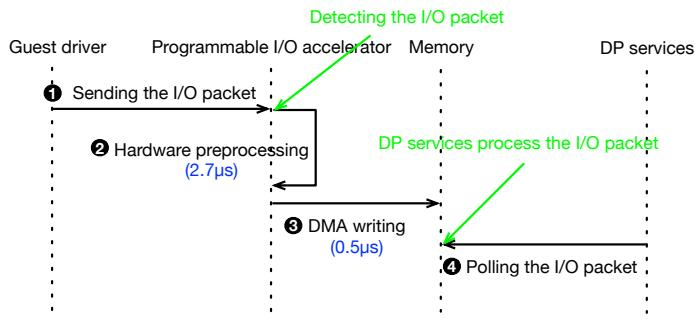  
Figure 6. The breakdown of processing I/O packets in DP services.

Observation 4: By leveraging the 3.2µs I/O preprocessing window ( 2 and 3 ), we can hide the 2µs scheduling latency incurred during vCPU context switching.

## 4 Design

Based on the aforementioned observations and analysis, we propose Tai Chi, a two-layer architecture (shown in Figure 7a) that enables OS-transparent hybrid virtualization. From the perspective of the SmartNIC’s native OS, additional CPUs (virtualized by Tai Chi) are provisioned as if they are physical CPUs (pCPUs), enabling the OS to schedule tasks across all CPUs without modi#cations. Standard tools such as lscpu perceive them all as real physical cores. However, implementing the aforementioned hybrid virtualization is nontrivial, as it necessitates achieving the following objectives: (1) OS transparency: achieving normal physical CPU-like inter-processor interrupt (IPI) communication and establishing identical memory views between vCPUs and pCPUs; (2) e%cient vCPU scheduling: dynamically scheduling CP vCPU onto DP pCPUs while ensuring SLO compliance for both DP services and CP tasks. To achieve OS transparency, Tai Chi designs a uni#ed IPI orchestrator that intercepts and simulates IPIs between vCPUs and pCPUs. Tai Chi implements a 1:1 mapping between guest physical addresses and host physical addresses to ensure a consistent memory view for processes executing on vCPUs and pCPUs. For e%cient vCPU scheduling, Tai Chi introduces the vCPU scheduler and the hardware-software co-design workload probe to dynamically map these vCPUs to idle pCPUs without violating SLOs for either CP tasks or DP services.

Figure 7b illustrates a high-level overview of Tai Chi. Tai Chi consists of three main components: the vCPU scheduler (§4.1), the uni#ed IPI orchestrator (§4.2), and the softwarehardware cooperative workload probe (§4.3).

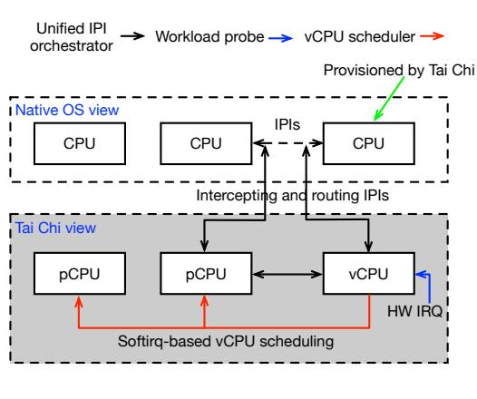  
(a) OS-transparent hybrid virtualization

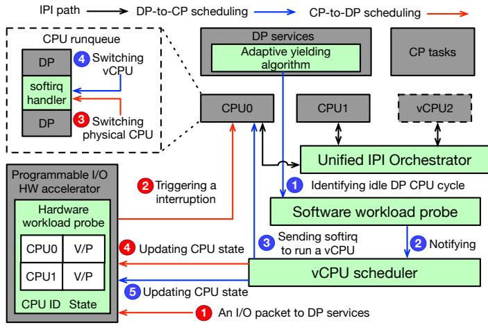  
(b) The overview of Tai Chi  
Figure 7. The demonstration of Tai Chi.

Tai Chi deploys over-provisioned CP tasks on vCPUs. To enable DP-to-CP scheduling that utilizes idle DP CPU cycles to run vCPUs (CP tasks), the software workload probe provides an adaptive yield algorithm that monitors consecutive empty-polling counts (indicating I/O idleness) of every DP service. If the software workload probe identi#es that a CPU becomes idle ( 1 ), it noti#es the vCPU scheduler ( 2 ). The scheduler then selects a vCPU and triggers context switching by delivering a dedicated softirq to an idle CPU ( 3 ), which activates registered softirq handlers to execute a CP task in the vCPU context ( 4 ). Subsequently, the vCPU scheduler updates corresponding CPU state records in the hardware workload probe to "V-state" (denoting vCPU contexts) for future CP-to-DP scheduling coordination ( 5 ). This mechanism breaks ms-scale non-preemptible routines in CP tasks through vCPU execution, achieving microsecondgranularity scheduling while ensuring CP SLOs and enhancing CPU utilization via DP-to-CP scheduling.

To ensure DP SLOs, Tai Chi directly deploys DP services on pCPUs to avoid data-plane virtualization overhead. Additionally, Tai Chi implements the hardware workload probe in the SmartNIC’s programmable I/O accelerator to leverage I/O preprocessing windows (§ 3.4) for proactively restoring DP executions (CP-to-DP scheduling). When detecting a DP I/O packet ( 1 ), the hardware probe veri#es the destination CPU state of the I/O packet. If the CPU is in vCPU state (V-state), the probe triggers an interrupt request to the destination CPU ( 2 ), inducing a VM-exit to halt the vCPU and return control to the vCPU scheduler. The scheduler then restores the DP context, resumes DP service execution ( 3 ), and updates the CPU state to P-state (denoting pCPU contexts and masking interrupt) in the hardware workload probe ( 4 ). The CPU state is used to avoid persistently issuing interrupts to DP services running on pCPUs (P-state), causing performance degradation. This mechanism overlaps DP service restoration with I/O preprocessing windows, effectively hiding virtualization-induced scheduling latency to guarantee DP SLOs.

To ensure seamless sharing of the SmartNIC OS between vCPUs and pCPUs and achieve native IPC, Tai Chi introduces the uni#ed IPI orchestrator to integrate vCPUs and pCPUs in a same OS. This IPI orchestrator hooks into the OS’s IPI dispatch mechanism and routes IPIs to target vCPUs or pCPUs. Based on this uni#ed IPI orchestrator, Tai Chi then registers vCPUs as native CPUs to the OS, allowing CP tasks to bind to vCPUs via standard CPU a%nity mechanisms without requiring code modi#cations.

## 4.1 vCPU Scheduler

To achieve a hybrid virtualization framework, Tai Chi colocates vCPUs with pCPUs within a single OS (§ 4.2). This design requests context switching between vCPUs and pC-PUs within the same OS. To address this, the vCPU scheduler implements a softirq-based context switching mechanism. A softirq-based vCPU scheduling mechanism. (1) pCPUto-vCPU context switching: When the software workload probe noti#es an idle DP CPU, the vCPU scheduler selects a vCPU from the runnable queue via round-robin policy and raises a dedicated softirq on the idle CPU to prepare the vCPU execution. The corresponding softirq handler prepares the vCPU context, saves the current pCPU state, and performs the context switch. (2) vCPU-to-pCPU context switching: Upon vCPU time slice expiration or CP-to-DP scheduling requirements, the scheduler saves the vCPU context, restores the pCPU state, exits the softirq, and resumes native DP service execution.

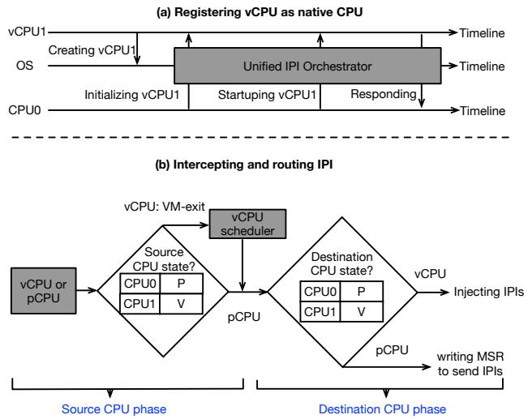  
Figure 8. A demonstration of (a) registering vCPU as native CPU on OS and (b) intercepting and routing IPIs.

An adaptive vCPU time slice. Fixed vCPU time slices can increase unnecessary and costly VM-exits, even when DP services remain idle. To minimize such overhead, the vCPU scheduler dynamically adapts time slices based on VM-exit reasons, thereby aligning scheduling granularity with actual DP patterns. The initial vCPU time slice is set to 50µs and dynamically adjusted based on VM-exit reasons. If vCPU time slice expiration causes VM-exit, the vCPU scheduler doubles vCPU time slices (e.g., 50µs to 100µs) under the assumption of persistent DP CPU idleness, reducing the frequency of VM-exits. If the hardware workload probe (§ 4.3) causes VM-exit, the vCPU scheduler resets the vCPU time slice to 50µs.

Safe CP-to-DP scheduling in lock context. When a CP task holds a lock (such as a spinlock, detailed in § 3.2), a CP-to-DP scheduling that preempts the vCPU of the CP task risks deadlock. This occurs if the preempted vCPU is unscheduled for an extended period while other threads (running on other pCPUs or vCPUs) depend on it to release the lock. To resolve this, Tai Chi immediately reschedules the preempted vCPU onto an idle DP’s pCPU to continue execution. If no idle DP pCPU is available (an event with extremely low probability ?? , where ? denotes the probability of a DP’s pCPU being busy and ? represents the count of DP pCPUs), the preempted vCPU is scheduled onto a dedicated CP’s pCPU via round-robin scheduling. This process guarantees forward progress, eliminating the risk of deadlocks or hung tasks.

## 4.2 Uni"ed IPI Orchestrator

To eliminate virtualization overhead from device emulation and guest OS operations, Tai Chi enables vCPUs and pCPUs to share a single OS. However, direct IPI communication

```c
1 void polling_IO_queue ( uint32_t qid) {
2 ... // Initialization
3 uint32_t empty_polling_num = 0;
4 while ( true ) {
5 uint32_t packet_num = rte_eth_rx_burst (qid );
6 if ( packet_num == 0) {
7 empty_polling_num ++;
8 } else {
9 empty_polling_num = 0;
10 // Processing I / O packets
11 }
12
13 if ( empty_polling_num > threshold )
14 notify_idle_DP_CPU_cycles (); // Notify Tai Chi
15 }
16 }
```

Figure 9. A code snippet demonstrating polling I/O packets and how to notify Tai Chi of an idle CPU cycles in DP services.

between vCPUs and pCPUs is infeasible. The uni#ed IPI orchestrator addresses this by intercepting all IPI transmissions and routing IPIs according to CPU state (virtual or pCPU). Intercepting and routing IPIs. IPIs involve source CPU and destination CPU. As illustrated in Figure 8b, the uni#ed IPI orchestrator operates in two phases. In the source CPU phase, no special action is taken if the source CPU is a pCPU. For a vCPU source, a VM-exit is triggered to return control to the vCPU scheduler, which reissues the IPI, thereby ensuring proper IPI propagation across virtualization boundaries. Then, the uni#ed IPI orchestrator steps into destination CPU phase. For pCPU destination, IPIs are delivered via low-level Model-Speci#c Register (MSR) writes. If a destination CPU is runnable or running vCPU, the uni#ed IPI orchestrator directly injects IPIs. If a destination CPU is sleeping vCPU, the orchestrator #rst awakens the vCPU and subsequently delivers the interrupt.

While Tai Chi provides vCPU contexts for CP task execution, modifying hundreds of heterogeneous CP tasks to assign CP tasks to vCPU contexts is impractical. To address this, Tai Chi leverages the uni#ed IPI orchestrator to register vCPUs as native CPUs on the OS, allowing CP tasks to run on vCPUs via standard CPU a%nity binding without code modi#cations.

As shown in Figure 8a, the vCPU scheduler creates vCPUs with metadata (e.g., CPU ID, LAPIC ID) and registers them with the OS. Initially, these vCPUs appear as o\$ine CPUs to the OS. Tai Chi sends CPU initialization and boot-related IPIs to these o\$ine vCPUs, triggering their activation. Those IPIs are intercepted by uni#ed IPI orchestrator and routed to target vCPUs. Once vCPUs #nish initialization, these vCPUs are online and the OS treats vCPUs as native CPUs, allowing binding CP task to vCPUs via standard a%nity con#guration.

## 4.3 Workload Probe

In this section, we de#ne yield as DP releasing CPU resources to CP, and preempt as DP reclaiming CPU resources from CP. Achieving e%cient scheduling between CP and DP is challenging: (1) For DP-to-CP yielding, Tai Chi should yield idle DP CPU cycles to CP as much as possible. However, striking a balanced yielding point empirically is di%cult, given the varied patterns of DP workloads in the real world. (2) For CP-to-DP preemption, Tai Chi should promptly switch back to DP services to prevent latency spikes in I/O path, yet virtualization inherently introduces a 2µs scheduling overhead during context switching.

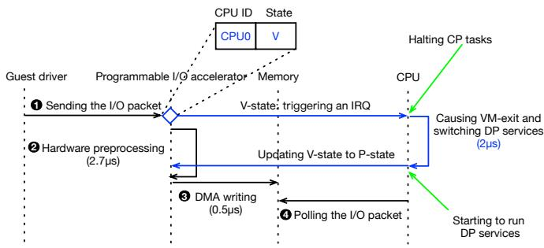  
Figure 10. A demonstration of hardware workload probe.

To address challenge (1), Tai Chi implements a software workload probe that employs adaptive yielding algorithm to dynamically adjust DP-to-CP yield criteria based on VMexit reasons. To address challenge (2), Tai Chi implements hardware workload probe that leverages SmartNIC I/O preprocessing windows to achieve proactively preemption and hide virtualization scheduling latency.

Adaptive yielding algorithm. DP services poll for new I/O requests and empty polling (lines 6-8 in Figure 9) indicates an idle state. When the empty-polling count exceeds a threshold, idle DP CPU cycles are detected, triggering a yield (line 14 in Figure 9). This threshold is introduced to #lter out exceedingly short idle periods. Without this #ltering, a high frequency of such short idle periods can induce frequent context switching between CP and DP, resulting in latency.

A naive approach uses a #xed threshold (N ) of consecutive empty polls to con#rm idleness. However, an overly large N wastes CPU resources, while an overly small N increases false positives. Tai Chi employs an adaptive algorithm. N starts with an initial value and is adjusted based on VM-exit reasons. If the expiration of a vCPU time slice triggers a VM-exit, this indicates sustained idleness in the DP CPU, which prompts the system to decrease the N. This adjustment enables the dynamic reallocation of a larger proportion of idle CPU cycles to CP tasks. If the vCPU is preempted by hardware workload probe (indicating a false-positive yield), N increases. This dynamically optimizes idle detection, balancing false positives and CPU utilization.

Hardware workload probe. As shown in Figure 10, the programmable I/O hardware (§ 2.2) provides I/O preprocessing windows ( 2 and 3 ). Based on this observation, Tai Chi implements a hardware workload probe. The probe maintains internal CPU state information for all pCPUs, which is updated by the vCPU scheduler. Prior to I/O preprocessing ( 2 ), the probe inspects the destination CPU’s state of an I/O packet. When detecting a vCPU state (V-state), the probe asynchronously triggers an interrupt request (IRQ) to the target CPU, notifying the vCPU scheduler to resume DP service execution. Then, the vCPU scheduler transitions the CPU state to pCPU (P-state). By overlapping vCPU preemption with I/O preprocessing windows, it e"ectively hides virtualization scheduling overhead.

## 5 Implementation

Tai Chi’s implementation comprises two components: a software module (approximately 5,800 lines) implementing a hybrid virtualization framework as a Linux kernel module, and a hardware component (approximately 30 lines) modifying programmable I/O processing accelerators to realize the hardware workload probe.

To enable uni#ed IPIs, Tai Chi intercepts all IPIs via the kernel’s x2apic\_send\_IPI function. For data-plane deployment, Tai Chi introduces a dedicated notify\_idle\_DP\_CPU\_cycles API that allows DP services to notify idle CPU time slices with minimal code modi#cations (requiring fewer than 10 lines). Since vCPUs are registered as native CPUs, CP tasks are deployed by binding them to vCPUs and CP-dedicated physical CPUs through standard CPU a%nity con#guration (e.g., cgroup), and DP services are exclusively pinned to physical CPUs.

Tai Chi utilizes Posted-Interrupt technology [47] to minimize vCPU VM-exit overhead, and maintains compatibility with other hardware virtualization features, such as IPIv.

## 6 Evaluation

In this section, we validate that Tai Chi e"ectively addresses the aforementioned challenges by quantitatively answering the following questions:

Q1: What performance improvements does Tai Chi deliver for CP tasks (§ 6.2)?

Q2: Is the hybrid virtualization mechanism su%ciently lightweight to minimize virtualization overhead while preserving data-plane performance (§ 6.3)?

Q3: Can the hardware workload probe e"ectively hide virtualization induced scheduling latency to ensure low-latency DP operations (§ 6.4)?

Q4: Does it minimize performance degradation on DP services (§ 6.5)?

Q5: Can Tai Chi maintain CP’s SLOs in production environments, even under high CP stress (§ 6.6)?

Table 3. Benchmarks with experiment setup and metrics for the evaluation.
<table><tr><td rowspan=1 colspan=1>Name</td><td rowspan=1 colspan=1>Case</td><td rowspan=1 colspan=1>Experiment setup</td><td rowspan=1 colspan=1>Metrics</td></tr><tr><td rowspan=1 colspan=1>synth_cp</td><td rowspan=1 colspan=1>synth_cp</td><td rowspan=1 colspan=1>A synthetic CP benchmark with high-concurrency support.</td><td rowspan=1 colspan=1>The execution time of CP tasks.</td></tr><tr><td rowspan=1 colspan=1>fio [45]</td><td rowspan=1 colspan=1>fio_rw</td><td rowspan=1 colspan=1>Using 16 threads with libaio to assess 4KB block performance.</td><td rowspan=1 colspan=1>IOPS and bandwidth (bw).</td></tr><tr><td rowspan=4 colspan=1>netperf [33]</td><td rowspan=1 colspan=1>udp_stream</td><td rowspan=1 colspan=1>Measuring UDP bandwidth with 64 concurrent connections.</td><td rowspan=1 colspan=1>Average RX bandwidth (avg_rx_bw).</td></tr><tr><td rowspan=1 colspan=1>tcp_stream</td><td rowspan=1 colspan=1>Assessing TCP throughput with 64 concurrent connections.</td><td rowspan=1 colspan=1>Average RX and TX packet per second (avg_rx_pps and avg_tx_pps).</td></tr><tr><td rowspan=1 colspan=1>tcp_rr</td><td rowspan=1 colspan=1>Testing TCP long-connection with 1,024 concurrent connections.</td><td rowspan=1 colspan=1>avg_rx_pps and avg_tx_pps.</td></tr><tr><td rowspan=1 colspan=1>tep_crr</td><td rowspan=1 colspan=1>Testing TCP short-connection with 1,024 concurrent connection.</td><td rowspan=1 colspan=1>Connections per second (CPS),avg_rx_pps,and avg_tx_pps.</td></tr><tr><td rowspan=2 colspan=1>sockperf [42]</td><td rowspan=1 colspan=1>udp</td><td rowspan=1 colspan=1>Measuring average,p99,and p999 latencies within 300 seconds.</td><td rowspan=1 colspan=1>udp_avg_lat,udp_p99_lat,and udp_p999_lat.</td></tr><tr><td rowspan=1 colspan=1>tcp</td><td rowspan=1 colspan=1>Testing average, p99,and p99 latencies within 300 seconds.</td><td rowspan=1 colspan=1>tcp_avg_lat,tcp_p99_lat,and tcp_p999_lat.</td></tr><tr><td rowspan=1 colspan=1>ping</td><td rowspan=1 colspan=1>ping</td><td rowspan=1 colspan=1>Measuring a Round-Trip Time within 30 minutes.</td><td rowspan=1 colspan=1>Minimum, maximum,and mean deviation of latencies.</td></tr></table>

## 6.1 Methodology

Experimental setup. We deployed and evaluated Tai Chi in an IaaS production environment (VM scenario with Smart-NICs as described in § 2.2). In this environment, DP services, including networking and storage, along with CP tasks, run on the SmartNICs to provide I/O performance acceleration for VMs on the host. Detailed speci#cations of the Smart-NICs, host compute nodes, and VMs are presented in Table 4. Baseline. Existing scheduling systems [17, 21, 23, 29, 36] designed for bare-metal environments to coordinate LC and BE tasks cannot be e"ectively deployed on SmartNICs for co-scheduling DP and CP, as they risk violating both DP and CP SLOs (§ 3.3). We adopt the static allocation strategy widely deployed in production environments as the baseline. This static deployment we compare against serves as a valid SOTA, because it includes numerous co-optimizations in scheduling and resource management used in production [26–28, 52], which are essential for our products to deliver market-leading performance. This approach dedicates #xed CPU resources to DP (8 physical CPUs) and CP (4 physical CPUs) respectively, as evidenced by its broad adoption in SmartNIC deployments [3, 16, 27, 52], thereby enabling a rigorous apples-to-apples comparison.

Benchmarks and Metrics. To comprehensively evaluate Tai Chi, we employ #ve benchmarks and two real-world workloads. The synth\_cp benchmark is an in-house synthetic benchmark designed to emulate classic CP tasks that access non-preemptible kernel routines. The synth\_cp benchmark supports high-concurrency multithreading to stress-test the control plane. We tune the synth\_cp to set the execution time of each task to 50ms, simulating a typical CP task while ensuring reproducible results. In addition, we evaluated the data plane performance under Tai Chi using #o [45], netperf [33], sockperf [42], and ping tool, with detailed con#gurations and metrics summarized in Table 3.

Table 4. Environment Con#guration.
<table><tr><td rowspan=1 colspan=1>Types</td><td rowspan=1 colspan=1>Hardware Configuration</td></tr><tr><td rowspan=1 colspan=1>SmartNIC</td><td rowspan=1 colspan=1>Connection: PCIe GEN3,8 lanesMax physical network bandwidth: 2oo Gb/sCPU: 12 CPU</td></tr><tr><td rowspan=1 colspan=1>Host</td><td rowspan=1 colspan=1>AMD EPYCTM Genoa 9T24CPU:96 CPU@2.70GHz in 2 socketsMemory:1TBDRAM</td></tr><tr><td rowspan=1 colspan=1>VM</td><td rowspan=1 colspan=1>96 vCPUs,384GBRAMLinux kernel version: 5.10NIC device: dual queue virtio-net x1Block device: virtio-blk x4</td></tr></table>

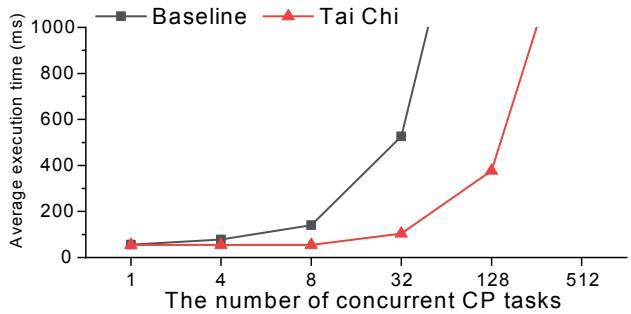  
Figure 11. Evaluating average execution time under various control-plane concurrency.

Real workload. The MySQL [32] workload is an opensource relational database management system known for its high performance, reliability, and ease of use. We generated workloads using 192 sysbench [44] threads and measured both average and peak query throughput (max\_query and avg\_query) alongside transaction number (max\_trans and avg\_trans). The Nginx [34] workload serves as a highperformance web server. To evaluate the performance of Nginx as a web server, we utilized wrk [51] to measure average requests per second under 10,000 concurrent connections for both HTTP and HTTPS protocols.

## 6.2 Control-Plane Performance

To quantify Tai Chi’s control-plane performance improvements, we leverage the syn\_cp benchmark to generate concurrent CP tasks distributed evenly across control-plane CPUs. Data-plane CPU utilization is maintained at 30%, consistent with production p99 case (§ 3.1).

Figure 11 shows the average CP task execution time under varying concurrency levels. Tai Chi achieves 4→ higher performance than the baseline at 32 concurrent tasks. This improvement originates from Tai Chi’s virtualization of idle DP CPU cycles as vCPUs, dynamically expanding available compute resources for the control plane.

## 6.3 Hybrid Virtualization

In this experiment, we compare the unmodi#ed static partitioned SmartNIC environment as baseline with three distinct virtualization implementations. (1) Tai Chi: the full package with all aforementioned features and optimizations. (2) Tai Chi-vDP (emulating type-1 virtualization): identical to Tai Chi except that DP services run in vCPU contexts. (3) Traditional type-2 virtualization (QEMU and KVM). By contrasting the baseline with Tai Chi-vDP, we quantify the performance bene#ts of executing the DP directly on physical CPUs. The comparison between the baseline and traditional type-2 virtualization evaluates performance gains from eliminating device emulation overhead and guest OS.

The netperf (tcp\_crr) benchmark and #o are utilized to evaluate networking and storage DP performance (other test cases exhibit analogous results). As illustrated in Figure 12 and Figure 13, the introduction of a virtualization layer in the data plane results in an average 8% network throughput overhead and 6% IOPS degradation in Tai Chi-vDP, because of the VM-exit and the nested page table. Traditional type-2 virtualization incurs substantially higher penalties, with 26% average network overhead and 25.7% IOPS degradation. This disparity stems from traditional type-2 virtualization’s requirement to exclusively occupy a CPU at least, which

Baseline Tai Chi Tai Chi-vDP QEMU+KVM  
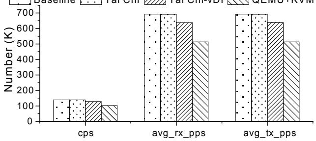

Figure 12. Evaluating network performance (connection per second, average RX packets per second, and average TX packets per second) by benchmark netperf (tcp\_crr).  
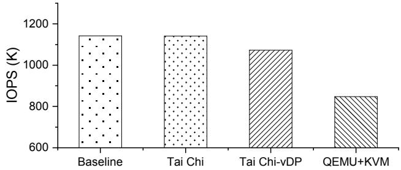  
Figure 13. Evaluating storage IOPS performance by benchmark #o (#o\_rw).

Table 5. RTT across three mechanisms.
<table><tr><td rowspan=1 colspan=1>Mechanism</td><td rowspan=1 colspan=1>Min (μs)</td><td rowspan=1 colspan=1>Avg (us)</td><td rowspan=1 colspan=1>Max (us)</td><td rowspan=1 colspan=1>Mdev (μs)</td></tr><tr><td rowspan=1 colspan=1>Baseline</td><td rowspan=1 colspan=1>26</td><td rowspan=1 colspan=1>30</td><td rowspan=1 colspan=1>38</td><td rowspan=1 colspan=1>5</td></tr><tr><td rowspan=1 colspan=1>Tai Chi</td><td rowspan=1 colspan=1>27</td><td rowspan=1 colspan=1>30</td><td rowspan=1 colspan=1>38</td><td rowspan=1 colspan=1>5</td></tr><tr><td rowspan=1 colspan=1>Tai Chi w/o HW probe</td><td rowspan=1 colspan=1>32</td><td rowspan=1 colspan=1>37</td><td rowspan=1 colspan=1>115</td><td rowspan=1 colspan=1>9</td></tr></table>

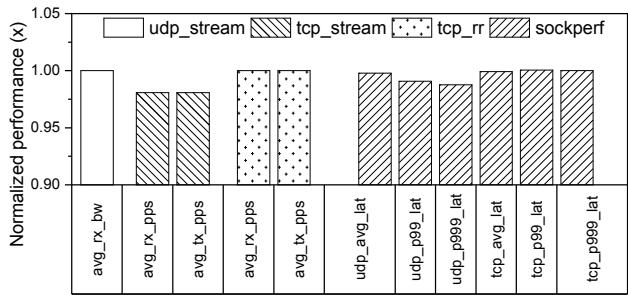

Figure 14. Performance comparison. Results are normalized by the performance of the baseline.  
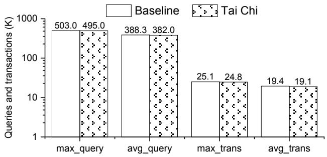  
Figure 15. The performance of MySQL.

severely impacts CPU-constrained SmartNICs by competing for data-plane CPU resources (only 8 data-plane CPUs) and degrading performance. In comparison, Tai Chi incurs negligible overhead (0.2% network and 0.06% storage overhead) with comparison of the baseline, These results demonstrate that hybrid virtualization implemented in Tai Chi preserves near-native data plane e%ciency.

## 6.4 Hardware Workload Probe

To evaluate the performance of the hardware workload probe (§ 4.3), we employ the ping tool to compare Round-Trip Time (RTT) across three scenarios: (1) the baseline, (2) Tai Chi, and (3) Tai Chi without hardware workload probe (Tai Chi w/o HW probe). As summarized in Table 5, Tai Chi without the probe incurs 23%, 23.3%, 203%, and 80% overhead in minimal RTT, average RTT, maximum RTT, and RTT mean deviation compared to the baseline, whereas Tai Chi achieves near-identical performance to the baseline. This demonstrates that the hardware workload probe e"ectively leverages I/O preprocessing windows to preemptively yield vCPU resources, thereby hiding vCPU scheduling latency and ensuring low-latency data plane operations.

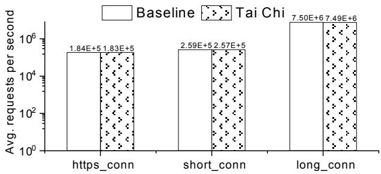  
Figure 16. The performance of Nginx.

## 6.5 Data-Plane Performance

To comprehensively evaluate the impact of Tai Chi on dataplane performance, we compare Tai Chi with the baseline using netperf (udp\_stream, tcp\_stream, and tcp\_rr cases), sockperf (udp and tcp cases), and real-world workloads (MySQL and Nginx).

Figure 14 presents the normalized results for netperf and sockperf benchmarks. Tai Chi introduces an average overhead of 0.6%, with a peak of 1.92% in the avg\_tx\_pps for the tcp\_stream benchmark. To evaluate the performance of MySQL, we generate a load by 192 concurrent sysbench threads. As illustrated in Figure 15, Tai Chi exhibits 1.56% average overhead (peaking at 1.63% in average query throughput). Figure 16 shows the performance of Ngnix for HTTP and HTTPS workloads under 10K concurrent connections. The result shows Tai Chi incurs 0.51% average overhead (up to 1% in short-connection scenarios) for average requests per second. The DP performance overhead stems from cache and TLB pollution caused by scheduling vCPUs onto DP CPUs.

Tai Chi incurs an average 0.7% data plane overhead (up to 1.92%) while delivering substantial control-plane performance improvements (§ 6.2). This e%ciency stems from three key design principles. (1) DP services operate directly on physical CPUs, eliminating virtualization overhead. (2) The hardware workload probe anticipates I/O workload arrivals, enabling the vCPU scheduler to yield vCPUs in advance, thereby ensuring low-latency DP services. (3) The vCPU context breaks non-preemptible routines in CP tasks prevents latency spikes for DP services.

## 6.6 Tai Chi in Production

Tai Chi has been deployed in one of the world’s largest cloud service providers for over three years. No I/O SLO violations were reported by users during Tai Chi upgrade and sustained phases. Next, we present production data gathered from the deployment of Tai Chi.

In high instance density environments, the control plane must manage signi#cantly more I/O devices, necessitating increased CPU resources. We collected the average VM startup times in production environments with and without Tai Chi under such conditions. As shown in Figure 17, deployments utilizing Tai Chi achieve a 3.1→ reduction in average VM startup latency compared to production environments without Tai Chi. This result demonstrates Tai Chi ’s ability to ensure CP SLOs even under extreme CP contention.

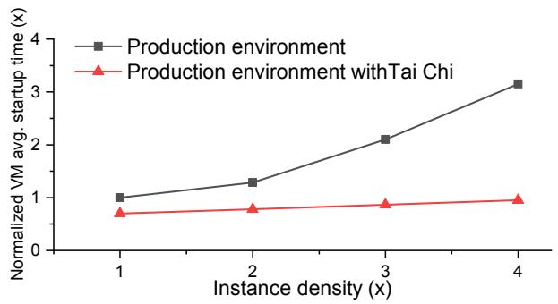  
Figure 17. The average startup time in di"erent instance density. The x-axis shows the instance density normalized by a normal instance density, and the y-axis show the average VM startup time normalized by CP SLOs.

## 7 Related Work

Preemptive scheduling. Many works [23, 24, 29] focus on scheduling LC and BE tasks in a bare-metal scenario Shinjuku [24] leverages Dune [6] to implement a single-address space operating system that enables preemption at the microsecond scale. However, Shinjuku enforces preemption every 5 microseconds, which introduces signi#cant overhead [13]. In contrast, Tai Chi designs the hybrid virtualization and hardware workload probe to ensure low tail latency for DP services.

User-level core reallocation. Many systems [4, 7, 14, 17, 25, 31, 36, 37, 39, 49] are built on thread or core reallocation to enhance CPU e%ciency. For instance, Perséphone [14] di"erentiates between short-running and long-running requests, keeping a limited number of cores idle to ensure low tail latency for short-running tasks while selectively enabling work conservation through work stealing to enhance CPU e%ciency. However, these scheduling methods incur additional CPU resource consumption, making them unsuitable for deployment in resource-constrained environments like SmartNICs.

Resource partitioning. Prior systems [18, 22, 38, 46] statically partition resources. While these approaches successfully achieve low tail latency, they often result in poor CPU e%ciency, as each partitioning must be provisioned with enough resources to handle peak loads. This ine%ciency can lead to signi#cant CPU waste [48], which is unacceptable in real production environments. Dynamic resource partitioning has been explored in systems such as Tessellation [11], PARTIES [8], SEDA [50], PerfIso [20], and Heracles [30]. However, none of these systems are able to achieve microsecond-level tail latency. Tai Chi introduces a hybrid virtualization that schedules vCPUs at µs-scale time-slice granularity to schedule CP tasks during idle time slices in DP services.

## 8 Discussions

Enhanced data-plane performance. Tai Chi proposed in this paper primarily optimizes CP performance in highdensity environments. However, its architectural principles can be inversely adapted to enhance DP throughput in lowdensity scenarios where CP workloads demand reduced intensity. As a proof of concept, we reallocated 50% of CP’s physical CPUs to DP services through Tai Chi’s dynamic resource partitioning, achieving 39% higher peak IOPS and 43% more connections per second. Crucially, despite the CP’s reduced static resource allocation, its performance remains consistent with baseline measurements, by leveraging idle DP cycles.

An always-preemptible kernel-space context. It is a classic priority inversion issue in an operating system where high-priority tasks cannot preempt low-priority kernel-space tasks in real-time when non-preemptible kernel routines are being executed in low-priority tasks. Tai Chi’s hybrid virtualization framework introduces a universal scheduling mechanism for Linux kernels, featuring an always-preemptible kernel-space execution context. This design speci#cally accommodates low-priority tasks requiring kernel access while maintaining deterministic responsiveness for high-priority real-time workloads.

On-demand instruction-level auditing. After integrating hybrid virtualization into the Linux kernel, the vCPU contexts in hybrid virtualization enable instruction-level auditing capabilities to monitor, log, and intercept privileged instructions of target applications. Speci#cally, OS with hybrid virtualization supports !exible on-demand auditing for arbitrary applications through CPU a%nity management. When auditing is required, the OS can instantiate vCPUs and migrate target applications into the auditing domain via CPU a%nity con#guration. Upon audit completion, applications are transparently migrated back to physical CPUs while terminating the vCPUs. This instruction-level telemetry delivers granular data for security analysis and performance optimization without persistent runtime overhead.

## 9 Future work

Further optimizations. The current approach in DP services solely relies on internal statistics of empty polling counts to release DP CPU resources, which still incurs ine%cient CPU cycle utilization. Future optimizations could integrate information from programmable hardware I/O accelerators, such as packet metadata from preprocessing I/O pipelines, to enable a multi-dimensional assessment of DP CPU idle status and achieve more precise CPU resource relinquishment. Additionally, we consider cache and TLB isolation techniques to eliminate performance degradation on DP services caused by scheduling CP tasks on DP CPUs, further enhancing system performance.

Tai Chi as a general-purpose framework. In this paper, we leverage Tai Chi to enhance scheduling e%ciency in SmartNIC environments. While our implementation focuses on this speci#c use case, we posit that with architectureaware tailoring and domain-speci#c optimizations, Tai Chi can serve as a general-purpose scheduling framework in any system sharing SmartNIC’s fundamental constraints, particularly those requiring coordinated management of heterogeneous workloads. A prime example would be co-scheduling latency-sensitive online services and batch-oriented o\$ine tasks within resource-constrained edge devices. We leave this work for future research.

## 10 Conclusions

We introduce Tai Chi, an innovative method that utilizes hybrid virtualization to seamlessly integrate virtual CPUs and physical CPUs within the same operating system. This seamless integration equipped with a hardware workload probe transparently enhances SmartNIC CPU utilization without adversely a"ecting DP performance. Additionally, Tai Chi uni#es IPIs between vCPU and physical CPUs, enabling to represent vCPUs as native CPUs within a single OS. This transparency supports deploying Tai Chi on CP tasks without code modi#cations.

## 11 Acknowledgements

We thank our shepherd and the anonymous reviewers for the insightful comments that improved the quality of this paper.

## References

[1] AMD. Technology (iommu) speci#cation, 2007.

[2] Microsoft Azure. h!ps://azure.microso#.com/en-us.

[3] W Bai, Abdeen SSainul, A Agrawal, Attre KKumar, P Bahl, A Bhagat, G Bhaskara, T Brokhman, L Cao, A Cheema, et al. Empowering azure storage with rdma. In 20th USENIX Symposium on Networked Systems Design and Implementation (NSDI 23). USENIX Association, 2023.

[4] S. Barghi. uthreads: Concurrent user threads in c++(and c). h!ps: //github.com/samanbarghi/uThreads.

[5] Paul Barham, Boris Dragovic, Keir Fraser, Steven Hand, Tim Harris, Alex Ho, Rolf Neugebauer, Ian Pratt, and Andrew War#eld. Xen and the art of virtualization. ACM SIGOPS operating systems review, 37(5):164–177, 2003.

[6] Adam Belay, Andrea Bittau, Ali José Mashtizadeh, David Terei, David Mazières, and Christos Kozyrakis. Dune: Safe user-level access to privileged CPU features. In Chandu Thekkath and Amin Vahdat, editors, 10th USENIX Symposium on Operating Systems Design and Implementation, OSDI 2012, Hollywood, CA, USA, October 8-10, 2012, pages 335–348. USENIX Association, 2012.

[7] Adam Belay, George Prekas, Ana Klimovic, Samuel Grossman, Christos Kozyrakis, and Edouard Bugnion. IX: A protected dataplane operating system for high throughput and low latency. In Jason Flinn and Hank Levy, editors, 11th USENIX Symposium on Operating Systems Design and Implementation, OSDI ’14, Broom!eld, CO, USA, October 6-8, 2014, pages 49–65. USENIX Association, 2014.

[8] Shuang Chen, Christina Delimitrou, and José F. Martínez. PARTIES: qos-aware resource partitioning for multiple interactive services. In Iris Bahar, Maurice Herlihy, Emmett Witchel, and Alvin R. Lebeck, editors, Proceedings of the Twenty-Fourth International Conference on Architectural Support for Programming Languages and Operating Systems, ASPLOS 2019, Providence, RI, USA, April 13-17, 2019, pages 107–120. ACM, 2019.

[9] Alibaba Cloud. h!ps://www.alibabacloud.com.

[10] Alibaba Cloud. A detailed explanation about alibaba cloud cipu. h!ps://www.alibabacloud.com/blog/a-detailed-explanationabout-alibaba-cloud-cipu\_599183.

[11] Juan A. Colmenares, Gage Eads, Steven A. Hofmeyr, Sarah Bird, Miquel Moretó, David Chou, Brian Gluzman, Eric Roman, Davide B. Bartolini, Nitesh Mor, Krste Asanovic, and John Kubiatowicz. Tessellation: refactoring the OS around explicit resource containers with continuous adaptation. In The 50th Annual Design Automation Conference 2013, DAC ’13, Austin, TX, USA, May 29 - June 07, 2013, pages 76:1–76:10. ACM, 2013.

[12] Christo"er Dall, Shih-Wei Li, Jin Tack Lim, Jason Nieh, and Georgios Koloventzos. Arm virtualization: performance and architectural implications. ACM SIGARCH Computer Architecture News, 44(3):304–316, 2016.

[13] Henri Maxime Demoulin, Joshua Fried, Isaac Pedisich, Marios Kogias, Boon Thau Loo, Linh Thi Xuan Phan, and Irene Zhang. When idling is ideal: Optimizing tail-latency for heavy-tailed datacenter workloads with perséphone. In Robbert van Renesse and Nickolai Zeldovich, editors, SOSP ’21: ACM SIGOPS 28th Symposium on Operating Systems Principles, Virtual Event / Koblenz, Germany, October 26-29, 2021, pages 621–637. ACM, 2021.

[14] Henri Maxime Demoulin, Joshua Fried, Isaac Pedisich, Marios Kogias, Boon Thau Loo, Linh Thi Xuan Phan, and Irene Zhang. When idling is ideal: Optimizing tail-latency for heavy-tailed datacenter workloads with perséphone. In Robbert van Renesse and Nickolai Zeldovich, editors, SOSP ’21: ACM SIGOPS 28th Symposium on Operating Systems Principles, Virtual Event / Koblenz, Germany, October 26-29, 2021, pages 621–637. ACM, 2021.

[15] DPDK. Dpdk interrupt mode. h!ps://doc.dpdk.org/guides/prog\_guide/ poll\_mode\_drv.html.

[16] Daniel Firestone, Andrew Putnam, Sambrama Mundkur, Derek Chiou, Alireza Dabagh, Mike Andrewartha, Hari Angepat, Vivek Bhanu, Adrian M. Caul#eld, Eric S. Chung, Harish Kumar Chandrappa, Somesh Chaturmohta, Matt Humphrey, Jack Lavier, Norman Lam, Fengfen Liu, Kalin Ovtcharov, Jitu Padhye, Gautham Popuri, Shachar Raindel, Tejas Sapre, Mark Shaw, Gabriel Silva, Madhan Sivakumar, Nisheeth Srivastava, Anshuman Verma, Qasim Zuhair, Deepak Bansal, Doug Burger, Kushagra Vaid, David A. Maltz, and Albert G. Greenberg. Azure accelerated networking: Smartnics in the public cloud. In Sujata Banerjee and Srinivasan Seshan, editors, 15th USENIX Symposium on Networked Systems Design and Implementation, NSDI 2018, Renton, WA, USA, April 9-11, 2018, pages 51–66. USENIX Association, 2018.

[17] Joshua Fried, Zhenyuan Ruan, Amy Ousterhout, and Adam Belay. Caladan: Mitigating interference at microsecond timescales. In 14th USENIX Symposium on Operating Systems Design and Implementation, OSDI 2020, Virtual Event, November 4-6, 2020, pages 281–297. USENIX Association, 2020.

[18] Stewart Grant, Anil Yelam, Maxwell Bland, and Alex C. Snoeren. Smartnic performance isolation with fairnic. In Henning Schulzrinne and Vishal Misra, editors, SIGCOMM ’20: Proceedings of the 2020 Annual conference of the ACM Special Interest Group on Data Communication on the applications, technologies, architectures, and protocols for computer communication, Virtual Event, USA, August 10-14, 2020, pages 681–693. ACM, 2020.

[19] Jim Henrys. As cloud service providers consider their investment strategies and technology plans for the future, ipus o"er a path to accelerate and #nancially optimize cloud services.

[20] Calin Iorgulescu, Reza Azimi, Youngjin Kwon, Sameh Elnikety, Manoj Syamala, Vivek R. Narasayya, Herodotos Herodotou, Paulo Tomita, Alex Chen, Jack Zhang, and Junhua Wang. Per#so: Performance isolation for commercial latency-sensitive services. In Haryadi S. Gunawi and Benjamin C. Reed, editors, 2018 USENIX Annual Technical Conference, USENIX ATC 2018, Boston, MA, USA, July 11-13, 2018, pages 519–532. USENIX Association, 2018.

[21] Rishabh R. Iyer, Musa Unal, Marios Kogias, and George Candea. Achieving microsecond-scale tail latency e%ciently with approximate optimal scheduling. In Jason Flinn, Margo I. Seltzer, Peter Druschel, Antoine Kaufmann, and Jonathan Mace, editors, Proceedings of the 29th Symposium on Operating Systems Principles, SOSP 2023, Koblenz, Germany, October 23-26, 2023, pages 466–481. ACM, 2023.

[22] Seyyed Ahmad Javadi, Amoghavarsha Suresh, Muhammad Wajahat, and Anshul Gandhi. Scavenger: A black-box batch workload resource manager for improving utilization in cloud environments. In Proceedings of the ACM Symposium on Cloud Computing, SoCC 2019, Santa Cruz, CA, USA, November 20-23, 2019, pages 272–285. ACM, 2019.

[23] Yuekai Jia, Kaifu Tian, Yuyang You, Yu Chen, and Kang Chen. Skyloft: A general high-e%cient scheduling framework in user space. In Proceedings of the ACM SIGOPS 30th Symposium on Operating Systems Principles, pages 265–279, 2024.

[24] Kostis Ka"es, Timothy Chong, Jack Tigar Humphries, Adam Belay, David Mazières, and Christos Kozyrakis. Shinjuku: Preemptive scheduling for ?second-scale tail latency. In Jay R. Lorch and Minlan Yu, editors, 16th USENIX Symposium on Networked Systems Design and Implementation, NSDI 2019, Boston, MA, February 26-28, 2019, pages 345–360. USENIX Association, 2019.

[25] Antoine Kaufmann, Tim Stamler, Simon Peter, Naveen Kr. Sharma, Arvind Krishnamurthy, and Thomas E. Anderson. TAS: TCP acceleration as an OS service. In George Candea, Robbert van Renesse, and Christof Fetzer, editors, Proceedings of the Fourteenth EuroSys Conference 2019, Dresden, Germany, March 25-28, 2019, pages 24:1–24:16. ACM, 2019.

[26] Qiang Li, Lulu Chen, Xiaoliang Wang, Shuo Huang, Qiao Xiang, Yuanyuan Dong, Wenhui Yao, Minfei Huang, Puyuan Yang, Shanyang Liu, et al. Fisc: a large-scale cloud-native-oriented #le system. In 21st USENIX Conference on File and Storage Technologies (FAST 23), pages 231–246, 2023.

[27] Xing Li, Xiaochong Jiang, Ye Yang, Lilong Chen, Yi Wang, Chao Wang, Chao Xu, Yilong Lv, Bowen Yang, Taotao Wu, et al. Triton: A !exible hardware o\$oading architecture for accelerating apsara vswitch in alibaba cloud. In Proceedings of the ACM SIGCOMM 2024 Conference, pages 750–763, 2024.

[28] Xing Li, Xiaochong Jiang, Ye Yang, Lilong Chen, Tianyu Xu, Chao Xu, Longbiao Xiao, Fengmin Shi, Yi Wang, Taotao Wu, et al. Poster: Triton: Accelerating vswitch with !exibility through hardware assisting not bypassing software. In Proceedings of the ACM SIGCOMM 2023 Conference, pages 1156–1158, 2023.

[29] Jiazhen Lin, Youmin Chen, Shiwei Gao, and Youyou Lu. Fast core scheduling with userspace process abstraction. In Proceedings of the ACM SIGOPS 30th Symposium on Operating Systems Principles, pages 280–295, 2024.

[30] David Lo, Liqun Cheng, Rama Govindaraju, Parthasarathy Ranganathan, and Christos Kozyrakis. Heracles: improving resource e%- ciency at scale. In Deborah T. Marr and David H. Albonesi, editors, Proceedings of the 42nd Annual International Symposium on Computer Architecture, Portland, OR, USA, June 13-17, 2015, pages 450–462. ACM, 2015.

[31] Michael Marty, Marc de Kruijf, Jacob Adriaens, Christopher Alfeld, Sean Bauer, Carlo Contavalli, Michael Dalton, Nandita Dukkipati, William C. Evans, Steve D. Gribble, Nicholas Kidd, Roman Kononov, Gautam Kumar, Carl Mauer, Emily Musick, Lena E. Olson, Erik Rubow, Michael Ryan, Kevin Springborn, Paul Turner, Valas Valancius,

Xi Wang, and Amin Vahdat. Snap: a microkernel approach to host networking. In Tim Brecht and Carey Williamson, editors, Proceedings of the 27th ACM Symposium on Operating Systems Principles, SOSP 2019, Huntsville, ON, Canada, October 27-30, 2019, pages 399–413. ACM, 2019.

[32] MySQL. h!ps://github.com/mysql/mysql-server.

[33] netperf. h!ps://hewle!packard.github.io/netperf/.

[34] nginx. h!ps://github.com/nginx/nginx.

[35] NVIDIA. Nvidia blue#eld dpu-3. h!ps://www.nvidia.com/content/ dam/en-zz/Solutions/Data-Center/documents/datasheet-nvidiabluefield-3-dpu.pdf.

[36] Amy Ousterhout, Joshua Fried, Jonathan Behrens, Adam Belay, and Hari Balakrishnan. Shenango: Achieving high CPU e%ciency for latency-sensitive datacenter workloads. In Jay R. Lorch and Minlan Yu, editors, 16th USENIX Symposium on Networked Systems Design and Implementation, NSDI 2019, Boston, MA, February 26-28, 2019, pages 361–378. USENIX Association, 2019.

[37] Heidi Pan, Benjamin Hindman, and Krste Asanovic. Composing parallel software e%ciently with lithe. In Benjamin G. Zorn and Alexander Aiken, editors, Proceedings of the 2010 ACM SIGPLAN Conference on Programming Language Design and Implementation, PLDI 2010, Toronto, Ontario, Canada, June 5-10, 2010, pages 376–387. ACM, 2010.

[38] Simon Peter, Jialin Li, Irene Zhang, Dan R. K. Ports, Doug Woos, Arvind Krishnamurthy, Thomas E. Anderson, and Timothy Roscoe. Arrakis: The operating system is the control plane. In Jason Flinn and Hank Levy, editors, 11th USENIX Symposium on Operating Systems Design and Implementation, OSDI ’14, Broom!eld, CO, USA, October 6-8, 2014, pages 1–16. USENIX Association, 2014.

[39] J. Reinders. Intel threading building blocks: Out#tting c++ for multicore processor parallelism, 2007.

[40] Chris Schlaeger. Aws ec2 virtualization: Introducing nitro. AWS Summit, 2018.

[41] Amazon Web Services. h!ps://aws.amazon.com.

[42] Mellanox sockperf. h!ps://github.com/Mellanox/sockperf.

[43] The Storage Performance Development Kit (SPDK). h!ps://spdk.io.

[44] sysbench. h!ps://github.com/akopytov/sysbench.

[45] Flexible I/O tester. h!ps://fio.readthedocs.io/en/latest/fio\_doc.html.

[46] Amin Tootoonchian, Aurojit Panda, Chang Lan, Melvin Walls, Katerina J. Argyraki, Sylvia Ratnasamy, and Scott Shenker. Resq: Enabling slos in network function virtualization. In Sujata Banerjee and Srinivasan Seshan, editors, 15th USENIX Symposium on Networked Systems Design and Implementation, NSDI 2018, Renton, WA, USA, April 9-11, 2018, pages 283–297. USENIX Association, 2018.

[47] Richard Uhlig, Gil Neiger, Dion Rodgers, Amy L. Santoni, Fernando C. M. Martins, Andrew V. Anderson, Steven M. Bennett, Alain Kägi, Felix H. Leung, and Larry Smith. Intel virtualization technology. Computer, 38(5):48–56, 2005.

[48] Abhishek Verma, Luis Pedrosa, Madhukar Korupolu, David Oppenheimer, Eric Tune, and John Wilkes. Large-scale cluster management at google with borg. In Laurent Réveillère, Tim Harris, and Maurice Herlihy, editors, Proceedings of the Tenth European Conference on Computer Systems, EuroSys 2015, Bordeaux, France, April 21-24, 2015, pages 18:1–18:17. ACM, 2015.

[49] J. Robert von Behren, Jeremy Condit, Feng Zhou, George C. Necula, and Eric A. Brewer. Capriccio: scalable threads for internet services. In Michael L. Scott and Larry L. Peterson, editors, Proceedings of the 19th ACM Symposium on Operating Systems Principles 2003, SOSP 2003, Bolton Landing, NY, USA, October 19-22, 2003, pages 268–281. ACM, 2003.

[50] Matt Welsh, David E. Culler, and Eric A. Brewer. SEDA: an architecture for well-conditioned, scalable internet services. In Keith Marzullo and Mahadev Satyanarayanan, editors, Proceedings of the 18th ACM Symposium on Operating System Principles, SOSP 2001, Chateau Lake Louise, Ban", Alberta, Canada, October 21-24, 2001, pages 230–243. ACM, 2001.

[51] wrk. h!ps://github.com/wg/wrk.

[52] Weidong Zhang, Erci Xu, Qiuping Wang, Xiaolu Zhang, Yuesheng Gu, Zhenwei Lu, Tao Ouyang, Guanqun Dai, Wenwen Peng, Zhe Xu, et al. What’s the story in {EBS} glory: Evolutions and lessons in building cloud block store. In 22nd USENIX Conference on File and Storage Technologies (FAST 24), pages 277–291, 2024.