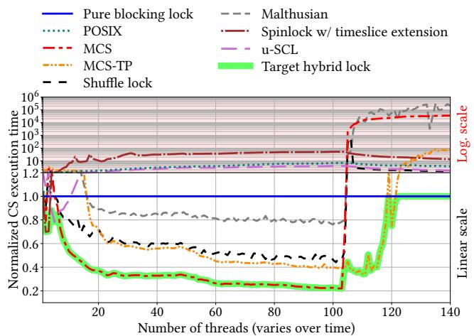
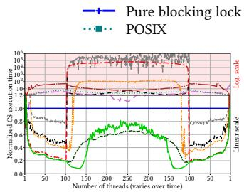
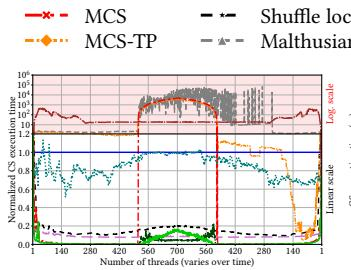
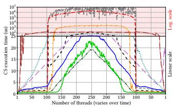
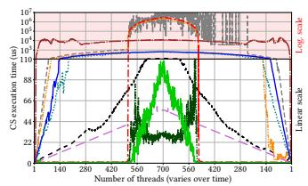
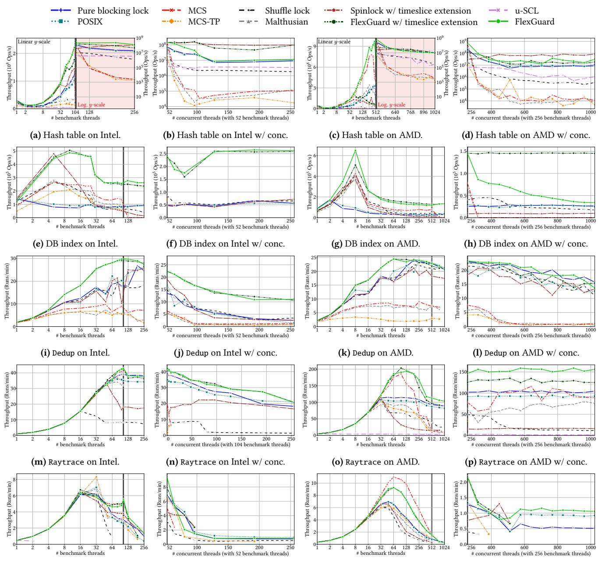
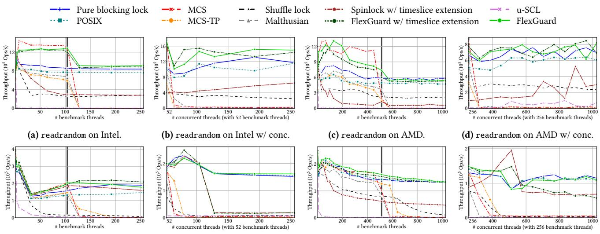
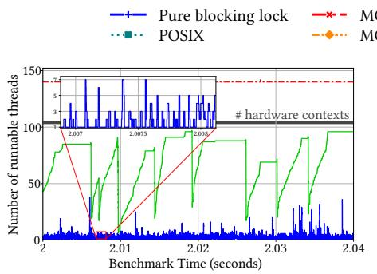
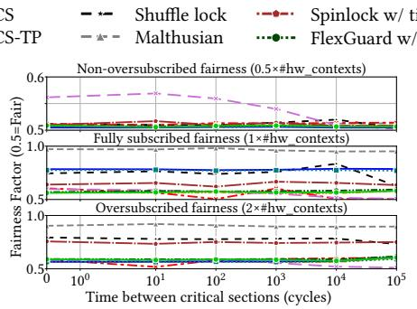
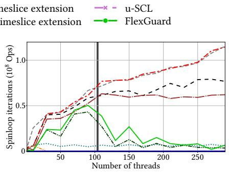

Latest updates: hps://dl.acm.org/doi/10.1145/3731569.3764852

RESEARCH-ARTICLE

## FlexGuard: Fast Mutual Exclusion Independent of Subscription

VICTOR LAFORET, INRIA Institut National de Recherche en Informatique et en Automatique, Le Chesnay, Ile-de-France, France

SANIDHYA KASHYAP, EPFL, Lausanne, Switzerland

CĂLIN IORGULESCU, Oracle Corporation, Austin, TX, United States

JULIA LAWALL, INRIA Institut National de Recherche en Informatique et en Automatique, Le Chesnay, Ile-de-France, France

JEAN-PIERRE LOZI, INRIA Institut National de Recherche en Informatique et en Automatique, Le Chesnay, Ile-de-France, France

Open Access Support provided by:

Oracle Corporation

INRIA Institut National de Recherche en Informatique et en Automatique EPFL


Published: 12 October 2025

Citation in BibTeX format

SOSP '25: ACM SIGOPS 31st Symposium   
on Operating Systems Principles   
October 13 - 16, 2025   
Seoul, Republic of Korea

Conference Sponsors: SIGOPS

# FlexGuard: Fast Mutual Exclusion Independent of Subscription

Victor Laforet   
Inria   
Paris, France   
victor.laforet@inria.fr

Sanidhya Kashyap EPFL Lausanne, Switzerland sanidhya.kashyap@epfl.ch

Julia Lawall   
Inria   
Paris, France   
julia.lawall@inria.fr

## Abstract

Călin Iorgulescu   
Oracle Labs   
Zurich, Switzerland   
calin.iorgulescu@oracle.com

Performance-oriented applications require efficient locks to harness the computing power of multicore architectures. While fast, spinlock algorithms suffer severe performance degradation when thread counts exceed available hardware capacity, i.e., in oversubscribed scenarios. Existing solutions rely on imprecise heuristics for blocking, leading to suboptimal performance. We present FlexGuard, the first approach that systematically switches from busy-waiting to blocking precisely when a lock-holding thread is preempted. Flex-Guard achieves this by communicating with the OS scheduler via eBPF, unlike prior approaches. FlexGuard matches or improves performance in LevelDB, a memory-optimized database index, PARSEC’s Dedup, and SPLASH2X’s Raytrace and Streamcluster, boosting throughput by 1–6× in nonoversubscribed and up to 5× in oversubscribed scenarios.

CCS Concepts: • Software and its engineering → Mutual exclusion; Scheduling; • Computer systems organization → Multicore architectures.

Keywords: locks, eBPF, scheduling, CPU oversubscription

Victor Laforet, Sanidhya Kashyap, Călin Iorgulescu, Julia Lawall, and Jean-Pierre Lozi. 2025. FlexGuard: Fast Mutual Exclusion Independent of Subscription. In ACM SIGOPS 31st Symposium on Operating Systems Principles (SOSP ’25), October 13–16, 2025, Seoul, Republic of Korea. ACM, New York, NY, USA, 16 pages. https://doi. org/10.1145/3731569.3764852

## 1 Introduction

Modern hardware relies heavily on increasing the number of CPU cores to improve performance, implying that most

Jean-Pierre Lozi   
Inria   
Paris, France   
jean-pierre.lozi@inria.fr


performance-oriented applications are multithreaded. However, as stated by Amdahl’s Law [2], as concurrency increases with applications running more threads on more cores, performance becomes increasingly limited by the execution time of the code that runs sequentially, i.e., its critical path.

Locks are the basic building block that ensures threads execute critical sections of code in mutual exclusion, that is, sequentially on the critical path. In order to shorten the critical path to improve performance, application developers use finer-grained locking, i.e., smaller critical sections. Yet this approach has limits—critical sections cannot be shortened infinitely. As critical sections get smaller, the overhead of lock handover between these sections becomes proportionally larger, eventually dominating the critical path and limiting further performance gains. With the growing number of cores in modern architectures and the shrinking size of critical sections in performance-oriented applications, minimizing lock handover time has become more crucial than ever.

Reducing lock handover time has been addressed by the large body of research proposing efficient locks [14]. However, despite such research, many performance-oriented applications still rely on POSIX locks [22, 29], which use a basic spin-then-park algorithm.1 One reason for this choice is that many efficient user-space lock algorithms proposed by academia [3, 13, 18, 34, 37–40, 46] are spinlocks, i.e., they rely on busy-waiting. While spinlocks perform well in controlled environments, their performance collapses when the number of threads competing for the lock exceeds the number of available hardware contexts,2 a condition known as oversubscription. The fundamental issue in this scenario is that as waiting threads keep too many hardware contexts busy, the critical section will inevitably be preempted by the scheduler, halting progress on the critical path [10].

Unlike spinlocks, blocking locks park threads inside the kernel when they are waiting for a lock. This approach does not suffer from the performance collapse of spinlocks in oversubscribed scenarios, but it adds costly context switches in the lock handovers. For this reason, blocking locks perform significantly worse than spinlocks in the non-oversubscribed case. In an attempt to get the best of both worlds, spin-thenpark locks, such as POSIX, busy-wait for some time before blocking. However, the amount of time spent spinning is chosen heuristically, and adapting it based on previous lock acquisitions does not reliably improve performance. Other approaches have been proposed to address this challenge. One technique involves indirectly detecting preemptions of the lock holder by identifying timestamps that have not been updated for more than a heuristically chosen amount of time [27]. Some other designs count the number of threads in the system at regular, heuristically chosen intervals, to coarsely transition between busy-waiting and blocking. Additional heuristics, e.g., determine the number of threads to block [32] or prevent ping-ponging between busy-waiting and blocking [5].

We argue that previous approaches that attempt to combine busy-waiting and blocking are fundamentally flawed. This is because they consider the operating system (OS) scheduler as a black box, relying on arbitrary heuristics that fail to maximize busy-waiting while ensuring consistent progress on the critical path. However, thanks to the extended Berkeley Packet Filter (eBPF) [20], it is nowadays possible, without kernel modification, to monitor context switches in order to precisely know when a critical path is interrupted, and to systematically act in consequence. In an eBPF hook that instruments context switches, the preemption address as well as the stack and registers of the preempted thread are readily available, making it possible to fully understand the thread’s current state and thus know whether the thread is in a critical section.

Based on this insight, we design and implement Flex-Guard, a non-heuristic technique that synchronously detects critical-section preemptions, and an example lock algorithm that leverages this information to ensure that when a thread is preempted inside a critical section, currently waiting threads instantly block, freeing up resources to promptly resume progress on the critical path.

Our contributions can be summarized as follows:

• We present a low-overhead technique that monitors context switches in the OS kernel to systematically detect when a critical section gets preempted.

• We design an efficient lock algorithm that uses this information to turn existing waiters that are busywaiting into blocking waiters until progress resumes on the critical path.

• We evaluate FlexGuard, a combination of the two contributions above, using two microbenchmarks, LevelDB [23], a memory-optimized database index [49], PARSEC’s Dedup [8, 54], and SPLASH2X’s Raytrace and Streamcluster [53, 54]. On average, it improves performance by 1–6× for non-oversubscribed workloads and up to 5× for oversubscribed workloads.

The rest of this paper is organized as follows. §2 presents an overview of the problem and related work, and motivates our approach. §3 presents the design of FlexGuard, and §4 its implementation. §5 evaluates FlexGuard. §6 discusses the approach. Finally, §7 concludes.

## 2 Overview and Motivation

We first present related work on lock algorithms and heuristic contention management techniques targeting oversubscribed spinlocks. We then motivate the need for a nonheuristic mutual exclusion scheme that is capable of progressing fast through the critical path of the application,3 regardless of lock subscription.

## 2.1 Lock Algorithms

Locks are omnipresent in concurrent applications, as avoiding resource sharing [7, 9] or using lock-free synchronization [6, 11, 21, 26, 28, 41] is only possible in specific cases. Two main types of locks exist: blocking locks, whose waiters sleep, and spinlocks, whose waiters busy-wait.

2.1.1 Blocking Locks. Blocking locks park threads that fail to acquire the lock using a system call such as Futex in Linux. On multicore architectures, blocking locks have to pay the overhead of kernel-mediated context switches at lock handover time, as a thread needs to be woken before executing each critical section when the lock is contended. However, the performance of blocking locks does not collapse in oversubscribed scenarios.

2.1.2 Spinlocks. Spinlocks have threads busy-wait on a lock variable until the variable’s value indicates that the lock can be acquired. Busy-waiting avoids context-switch overhead on the critical path at lock handover time. In its most primitive form, a spinlock can be implemented using a single boolean variable that represents the status of the lock, which threads repeatedly attempt to set in a busy-wait loop using, e.g., an atomic test-and-set (TAS) operation. Such TAS locks are inefficient under high contention, due to frequent atomic operations on the lock variable. To alleviate this, improved spinlocks, such as test-and-test-and-set (TATAS) [3] and Ticket [3] locks, busy-wait with simple load instructions instead of atomic load/store instructions, which improves performance. Queue locks, such as MCS [40] or CLH [13, 39], enqueue per-thread nodes into a global shared queue. They have one lock variable per node instead of a global lock variable, which greatly reduces cache line contention.

Modern spinlock designs. The advent of non-uniform memory architectures (NUMA) spurred the design of new spinlocks [18, 34, 38, 52]. These typically extend classic spinlocks to favor handing over the lock to waiters on the same NUMA node, trading short-term fairness for performance. H-CLH [38] (Hierarchical CLH) is such a design based on CLH. Lock cohorting [18] is a universal construction that builds NUMA locks from any pair of locks.

The Shuffle lock [34] is a more recent NUMA lock based on MCS and a TATAS lock. The MCS queue is occasionally reshuffled to prioritize handing over the lock on the same NUMA node. To acquire a Shuffle lock, a thread typically first (i) acquires the MCS lock and then (ii) acquires the TATAS lock, before (iii) releasing the MCS lock and (iv) entering the critical section. When there are no waiters on the lock, a fast path allows directly acquiring the TATAS lock and entering the critical section, without ever acquiring the MCS lock. This design is often able to avoid the overhead of enqueuing nodes in MCS while avoiding contention on the cache line that holds the TATAS lock, since most of the time, at most one thread is busy-waiting on the TATAS lock. Another advantage of a combined MCS/TATAS lock is that since threads release the MCS lock after acquiring the TATAS lock, they only ever hold one MCS lock at a time, even in the case of nested locks. Thus, the Shuffle lock only requires one global MCS queue node per thread instead of one per thread per lock as in regular queue locks, which can significantly reduce memory usage and the queue node allocation time. We take inspiration from the lock acquisition mechanism of the Shuffle lock when we design the lock algorithm of FlexGuard (see §3.2).

Oversubscription and performance collapse. While spinlocks can significantly outperform blocking locks, their performance collapses when they are oversubscribed, i.e., when more threads try to acquire them than there are hardware contexts. In this scenario, threads that busy-wait on the lock can preempt the lock holder, preventing progress on the critical path [10]. Note that oversubscription can also happen when fewer threads access the lock than there are hardware contexts on the machine if some threads from the same or other processes execute concurrently, reducing the number of available hardware contexts.

Oversubscription is common in well-designed, real-world systems. For example, Meta’s DCPerf [50], which models real-world cloud workloads, has thread counts ranging from 10× to 200× the number of hardware contexts. The possibility of oversubscription can be inherent to the design of some applications such as, e.g., databases or web servers that dedicate a thread per request or browsers that create a thread per tab. It can also be caused by multiple concurrent processes being run by the same user or different users. Even in an environment in which a primary workload runs with a controlled number of threads, auxiliary tasks for, e.g., monitoring, data transfer, or debugging/tracing may cause oversubscription.

The performance collapse of oversubscribed spinlocks is illustrated in Figure 1, which shows the critical-section execution time of different lock algorithms, i.e., the time to acquire the lock, execute the critical section, and release the lock. The experiment uses a microbenchmark similar to that of Lozi et al. [37], where all threads repeatedly execute critical sections that acquire two cache lines. We use an Intel machine with 104 hardware contexts (details in §5). The critical-section execution times in Figure 1 are normalized relative to those of a pure blocking lock based on Futex system calls; Figure 2c shows raw values.

  
Figure 1. Microbenchmark on a 104-hardware-context system that repeatedly executes a critical section (CS) accessing two cache lines. CS execution times normalized relative to a pure blocking lock (see Figure 2c for raw values). The ??-axis uses a split scale: linear below 1.2, logarithmic above.

In the non-oversubscribed case, i.e., when there are at most as many threads as there are hardware contexts (104), MCS significantly outperforms the pure blocking lock: its critical-section execution time can be as low as 0.2× that of the blocking lock with 100 threads. However, when MCS is oversubscribed, its performance collapses, with a criticalsection execution time four orders of magnitude higher than for the pure blocking lock. This time includes waiting for many other threads to execute their critical sections, and due to oversubscription, previous lock holders are regularly preempted. When such a preemption occurs, all threads spin with no progress, hence the performance collapse.

Kernel spinlocks. Spinlocks are commonly used in the Linux kernel [12, 30], in non-preemptible context. In this use case, the performance collapse issue is not present as the lock holder cannot be preempted.

## 2.2 Heuristics-based Contention Management

In order to bridge the gap between spinlocks, which can perform exceptionally well in non-oversubscribed scenarios, and blocking locks, whose performance does not collapse in oversubscribed scenarios, several heuristics-based approaches have been proposed. In order to acquire a spin-then-park lock, waiters busy-wait until a timeout expires before blocking. The timeout must be chosen heuristically, however. The POSIX lock [19] implements an adaptive spin-then-park approach. As shown in Figure 1, the POSIX lock performs worse than the pure blocking lock.4 Another heuristics-based approach is the Blocking backoff lock [3], which does not use busy-waiting. Instead, threads try to acquire the lock, and if they fail, they block until a timeout expires, then retry. Again, the timeout needs to be heuristically tuned; e.g., it can increase exponentially and/or be adjusted using a random delay to reduce the chance of conflicts in lock acquisitions.

A variant of the Shuffle lock uses a spin-then-park approach. We set the busy-waiting timeout close to the contextswitch time in our experiments. As shown in Figure 1, the Shuffle lock performs up to 66% better than the pure blocking lock in the non-oversubscribed case. However, in oversubscription, its critical section execution time is at least 46% longer than that of the pure blocking lock. The performance collapse of the Shuffle lock is less visible compared to the 30,000× latency increase of MCS.

Dice [16] proposes a “Malthusian” lock based on MCS with a spin-then-park approach. The MCS queue size is kept minimal through culling operations, and culled threads are moved to a passive list for some time. The threads that are stuck in the passive list eventually block after the spin-thenpark timeout and are prevented from busy-waiting again, as they cannot run as long as they are in the passive list. The Malthusian lock trades short-term fairness for performance by preventing lock acquisitions from a set of threads (in the passive list), so that fewer threads are in the busy-waiting phase of the spin-then-park approach. Once again, this approach uses a busy-waiting timeout that is hard to tune. In Figure 1, the Malthusian lock has a significant overhead over MCS in the non-oversubscribed case and collapses in a similar way as MCS in the oversubscribed case.

Time-published locks [27], such as MCS-TP and CLH-TP, are respectively MCS- and CLH-based spinlocks that use timeouts to heuristically detect that the lock holder or the next waiter has been preempted. Threads store the current timestamp when they acquire the lock and while they are busy-waiting. When attempting to acquire the lock, a thread T checks whether the lock holder’s timestamp is stale, indicating a likely lock holder preemption. In that case, T yields the CPU in order to create an opportunity for the lock holder to be rescheduled. When releasing the lock, T walks the MCS list and aborts lock acquisitions from all likely preempted threads, i.e., threads with a stale timestamp, passing the lock to the next running thread. However, the effectiveness of time-published locks hinges on the accuracy of the timeout heuristics. As shown in Figure 1, MCS-TP, using default heuristics from the LiTL library [24], has an overhead for thread counts lower than 16, but performs similarly to the Shuffle lock for the rest of the non-oversubscribed case. For light-oversubscribed scenarios, with fewer than 120 threads, MCS-TP reduces the magnitude of the performance collapse, achieving the lowest latency for these thread counts. However, beyond 120 threads, MCS-TP performs two orders of magnitude worse than the pure blocking lock.

Antić et al. [5] propose to switch automatically between the Ticket lock, MCS, and a blocking lock. The switch between the Ticket lock and MCS is done heuristically using a threshold on the number of waiting threads. Deciding to switch between MCS and the blocking lock is done in a coarse-grained manner, using a background thread that detects whether there are more threads than hardware contexts in the system every 100 µs and requiring all current waiters to acquire and release their locks at each transition. The 100 µs delay is chosen heuristically. To avoid ping-ponging between MCS and the blocking lock, an extra heuristic is added to ignore exponentially more detections of non-oversubscription before switching back to MCS. Earlier work from Johnson et al. [32] also uses a monitoring thread that checks whether there are more threads than hardware contexts in the system every 100 µs, and controls the number of lock waiters that block by heuristically sizing a sleep-slot buffer in which waiters need to register themselves before they can block.

The user Scheduler-Cooperative Lock (u-SCL), proposed by Patel et al. [44], targets workloads whose critical section length can vary by an order of magnitude across threads. u-SCL grants threads exclusive access to a lock in units of a fixed period of time referred to as a slice. Slices are allocated to threads proportionally to thread “nice” values. Threads whose critical sections are too long, possibly due to preemptions, are blocked at their next lock acquisition attempt until a later lock slice. Patel et al. show that u-SCL outperforms POSIX, which can be observed in Figure 1; however, spinlocks greatly outperform u-SCL in the non-oversubscribed case. Furthermore, Patel et al. also show that performance depends heavily on the heuristically chosen slice duration.

## 2.3 Subscription-Agnostic Mutual Exclusion

Figure 1 includes our target hybrid lock that combines the best of spinlocks and blocking locks: the lock would behave like a state-of-the-art spinlock such as MCS when there is no oversubscription, like MCS-TP for light oversubscription, and like a pure blocking lock in case of heavy oversubscription. The target lock would exhibit this behavior regardless of the characteristics of the workload.

We argue that previous work does not approach the performance of this target hybrid lock because of the reliance on heuristics to decide when to switch from busy-waiting to blocking (§2.2). Such heuristics attempt to detect indirectly when the critical path is blocked due to lock preemptions. Thanks to eBPF, it is now possible to accurately detect when the critical path is interrupted by a lock holder preemption, which makes it possible to switch to blocking exactly when needed. This is what we aim for with FlexGuard.

## 2.4 Preventing Preemptions

Instead of waiters switching between busy-waiting and blocking, an alternative strategy to prevent the performance collapse of spinlocks is to prevent lock holder preemptions. In the context of user-level threading, Scheduler Activations [4] proposes to implement an upcall in the kernel to signal the user space of every kernel-level thread preemption, allowing a user-level thread library to instantly resume the execution of the user-level thread on another kernel-level thread, effectively avoiding any lengthy preemption. Targeting kernel spinlocks in virtual machines, I-Spinlock [51] prevents preemption of the lock holder by only acquiring the lock if it heuristically determines that the critical section will have the time to execute before the next preemption. This method is specifically designed for environments like the Xen hypervisor, where it can leverage the fixed size of host timeslices, and contrasts with FlexGuard, which targets user-level locks.

In Solaris [43], a thread can set a flag that signals the kernel that it will start executing a critical section, requesting that it shall not be preempted until it unsets the flag at lock release. Since applications could abuse this mechanism to avoid preemptions even when they do not execute a critical section, the flag is only treated as a hint by the scheduler, which heuristically decides whether to take it into account. Similarly, a recent Linux patch [55] (not in the mainline) based on restartable sequences (Rseq) [31] allows threads to use a flag in a similar way. When the flag is set, the kernel avoids the next preemption, extending the thread’s timeslice instead. Penalizing the thread later may be required to ensure fairness. As we show in §5, this approach is complementary to ours.

## 3 Design

The goal of FlexGuard is to allow all applications to benefit from the high performance of spinlocks in the nonoversubscribed case while matching the performance of blocking locks in the oversubscribed case, where spinlocks suffer from performance collapse. We aim to achieve this without relying on heuristics by monitoring thread preemptions and transitioning from busy-waiting to blocking precisely when a critical section is preempted. To that end, we present the FlexGuard Preemption Monitor (§3.1), which detects preemptions using eBPF. We then present a lock algorithm (§3.2) that leverages FlexGuard’s Preemption Monitor to only make a busy-waiting thread block when needed, i.e., when a thread in a critical section is preempted and needs a free hardware context on which to be rescheduled.

1 \_\_thread cs\_counter = 0 # Per-thread critical section (CS)   
2 # counter (# of CSs a thread is in)   
3 \_\_thread bool is\_cs\_preempted = False # Thread in CS?   
4 num\_preempted\_cs = 0 # System-wide preemption counter   
5 def lock(L):   
6 while (True):   
7 if L == UNLOCKED:   
8 label at\_xchg   
9 if XCHG(&L, LOCKED) == UNLOCKED: # TAS implem. as XCHG   
10 label at\_break   
11 break   
12 cs\_counter += 1   
13 def unlock(L):   
14 cs\_counter -= 1   
15 label at\_store   
16 L = UNLOCKED   
17 def sched\_switch\_btf(prev, next):   
18 # If next was previously preempted   
19 if next.is\_cs\_preempted:   
20 next.is\_cs\_preempted = False   
21 atomic\_dec(num\_preempted\_cs)   
22 prev\_in\_cs = False # Will be set to true if prev in CS code   
23 if prev.cs\_counter > 0: # values > 1 indicate nesting   
24 prev\_in\_cs = True # prev holding at least one lock; in CS   
25 else # prev.cs\_counter == 0   
26 # Addr. of next instruction to execute after preemption   
27 preemption\_addr = bpf\_get\_task\_stack(prev)[0]   
28 if at\_xchg < preemption\_addr <= at\_break:   
29 registers = bpf\_get\_task\_registers(prev)   
30 if registers.rcx == UNLOCKED:   
31 prev\_in\_cs = True # lock acquired; already in CS code   
32 elif at\_break < preemption\_addr <= lock\$end or   
33 unlock <= preemption\_addr <= at\_store:   
34 prev\_in\_cs = True # prev in already/still in CS code   
35 if prev\_in\_cs:   
36 prev.is\_cs\_preempted = True   
37 atomic\_inc(num\_preempted\_cs)  
Listing 1. The FlexGuard Preemption Monitor: example x86 lock and implementation in the context switch handler.

## 3.1 Preemption Monitor

The FlexGuard Preemption Monitor is responsible for detecting preemptions of critical sections and communicating this information to synchronization primitives, enabling them to react accordingly. This approach enables the design of subscription-agnostic mutual exclusion primitives without relying on complex heuristics by accurately detecting when a critical path is preempted. Using eBPF, the FlexGuard Preemption Monitor hooks onto the sched\_switch event triggered on each context switch. The associated handler filters events to detect only preemptions of threads holding a lock and maintains a counter, num\_preempted\_cs, tracking the number of currently preempted threads while executing a critical section. This counter is system-wide, as a lock holder can be preempted by threads waiting on any lock, even in a different process.

The implementation of the Preemption Monitor is specific to a particular lock, and requires some modifications to that lock’s implementation. Nevertheless, the affected code is entirely under the control of the lock developer, and no analysis or modification of application code or the kernel is needed. For simplicity, we explain the Preemption Monitor implementation for a simple x86 TATAS spinlock as seen in Listing 1. The lock() and unlock() functions are the userspace lock primitives, and the sched\_switch\_btf() function is the eBPF handler called on every context switch. The integration of the Preemption Monitor with a lock must detect when application code is in the critical section, as well as when the lock() and unlock() functions have entered and left the critical section, respectively:

Critical section code inside the application. Detecting that the application code of a critical section is being executed is done using a per-thread counter. The cs\_counter variable is incremented when a lock is acquired (line 12) and decremented when it is released (line 14). The counter is accessible from the eBPF context switch handler. If its value is greater than 0, then the corresponding thread is holding one or more locks.

Critical section code inside the locking functions. A more challenging case is identifying the parts of the lock() and unlock() functions where the thread already holds the lock, but cs\_counter is still 0. This case must be handled accurately, as critical sections are often only a few instructions long in applications. Thus, a preemption may likely happen between the time the lock is effectively acquired and the application’s critical-section code starts, or after this code ends and before the lock is effectively released. Such preemptions are sufficient to lead to performance collapse. For the lock() function of Listing 1, a preemption in the range of addresses between the at\_break label (line 10) and the end of the function occurs when the thread is already holding the lock. Similarly, for the unlock() function, a preemption before or at the at\_store label (line 15), i.e., before the store is executed, occurs when the thread is still holding the lock. In contrast, a preemption after the store occurs when the thread has released the lock. However, labels are insufficient to determine whether a thread is holding the lock if the preemption happens just after XCHG (line 9), between the at\_xchg (line 8) and at\_break (line 10) labels in the lock() function. In that case, the lock has been acquired if and only if the lock value read by XCHG was UNLOCKED (the XCHG instruction set it to LOCKED). This is detected by implementing XCHG using asm volatile to ensure the result of the atomic instruction is stored in a specific register, and then checking the value of that register at preemption time in the eBPF context switch handler. Application registers are dumped to memory at each context switch by the kernel, and their values are thus readily accessible from the task\_struct.

Putting it all together, the pseudocode of sched\_switch\_- btf() in Listing 1 illustrates how preemption detection can be implemented as an eBPF handler for the TATAS lock. If the newly scheduled thread, next, was previously preempted while holding a lock, as represented by the is\_cs\_preempted flag (line 19), the handler clears the flag (line 20) and decrements the num\_preempted\_cs counter (line 21). If the cs\_- counter of the preempted thread prev is positive (line 23), prev is holding a lock (and in a nested critical section if cs\_counter > 1). Otherwise (line 25), the handler needs to determine whether prev was in critical section code. It retrieves the preemption address (line 27) and compares it to the labels present in the lock() and unlock() functions. If the thread was preempted between the at\_xchg (line 8) and at\_break (line 10) labels in the lock() function, the handler reads the RCX register (line 30) to determine the return value of the XCHG instruction (line 9). If the return value of XCHG was UNLOCKED, the lock has been acquired, and prev is in critical section code (line 31). If the thread was preempted between the at\_break label (line 10) and the end of the lock() function (lock\$end in line 32) or between the beginning of the unlock() function and the at\_store label (line 15), prev is in critical section code (line 34). In all other cases, prev is not in critical section code. If prev is in critical section code, the handler marks the thread (line 36) and increments the num\_preempted\_cs counter (line 37).

Integration with the lock algorithm. To adapt a lock algorithm for FlexGuard, a few lines of inline assembly are needed (i) to identify the addresses of some instructions through assembly labels, and (ii) to store the return values of some atomic instructions in known registers. In our example, we prefix the address of the XCHG instruction with an assembly label and ensure its result is stored in the RCX register.

## 3.2 Lock Algorithm

We introduce a user-space lock algorithm that leverages the Preemption Monitor to address oversubscription by dynamically responding to critical section preemptions. When such a preemption is detected, the algorithm makes busy-waiting threads block, freeing CPU resources to help reschedule the preempted critical section. Such transitions happen while the lock remains in use, with no loss of mutual exclusion. We now present the design of the user-space lock algorithm and its integration with the FlexGuard Preemption Monitor, followed by a discussion of its correctness.

3.2.1 Design. Our lock algorithm is designed to minimize resource contention and quickly reschedule threads that have been preempted. To adapt to varying subscription levels, the lock operates in two modes:

If the Preemption Monitor indicates no critical-section preemptions, i.e., num\_preempted\_cs == 0, the lock is in busy-waiting mode. In this mode, threads actively spin in a loop while attempting to acquire the lock, minimizing latency by avoiding context switches and system calls.

When critical-section preemptions are detected by the Preemption Monitor, i.e., num\_preempted\_cs > 0, the lock transitions to blocking mode. This indicates that the system lacks enough hardware contexts to execute all threads concurrently, making busy-waiting a waste of CPU resources. In this mode, threads sleep while waiting for the lock to be released. Those waiting in busy-waiting mode are notified to stop busy-waiting immediately, reducing CPU contention and allowing prompt rescheduling of the preempted threads.

```python
1 # Single-variable lock states 34 def flexguard_slow_path(lock, qnode):
2 # LOCKED_WITH_BLOCKED_WAITERS = at least one thread is blocking, 35 enqueued = False
3 # the holder should call futex_wake when releasing the lock 36 if num_preempted_cs == 0: # If spinning, begin Phase 1
4 UNLOCKED = 0, LOCKED = 1, LOCKED_WITH_BLOCKED_WAITERS = 2 37 enqueued = True
5 # CS preemption counter updated by the eBPF Preemption Monitor 38 qnode.next = None
6 num_preempted_cs = 0 39 qnode.waiting = True
7 40 label at_xchg
8 class Lock: 41 pred = XCHG(&lock.queue, qnode)
9 val = UNLOCKED, queue = None # Single-variable lock, MCS tail 42 if pred is not None:
10 class QNode: 43 pred.next = qnode
11 next = None, waiting = False 44 while qnode.waiting and num_preempted_cs == 0:
12 45 PAUSE()
13 def mcs_exit(lock: Lock, qnode: QNode): 46 label at_phase2 # Begin Phase 2
14 if qnode.next is None: 47 state = CAS(&lock.val, UNLOCKED, LOCKED)
15 if CAS(&lock.queue, qnode, None) == qnode: 48 while state != UNLOCKED:
16 return 49 if num_preempted_cs == 0: # Busy-waiting mode
17 while qnode.next is None: 50 PAUSE()
18 PAUSE() 51 state = CAS(&lock.val, UNLOCKED, LOCKED)
19 qnode.next.waiting = False 52 else: # Blocking mode
20 53 if enqueued:
21 def flexguard_unlock(lock: Lock, qnode: QNode): 54 mcs_exit(lock, qnode)
22 qnode.cs_counter -= 1 55 enqueued = False
23 label at_unlock 56 if state != LOCKED_WITH_BLOCKED_WAITERS:
24 if XCHG(&lock.val, UNLOCKED) == LOCKED_WITH_BLOCKED_WAITERS: 57 state = XCHG(&lock.val, LOCKED_WITH_BLOCKED_WAITERS)
25 futex_wake(&lock.val, 1) # Wake one of the waiting threads 58 if state != UNLOCKED:
26 59 futex_wait(&lock.val, LOCKED_WITH_BLOCKED_WAITERS)
27 def flexguard_lock(lock: Lock, qnode: QNode): 60 state = XCHG(&lock.val, LOCKED_WITH_BLOCKED_WAITERS)
28 label at_fastpath # Try to steal the single-variable lock if free 61 if state != UNLOCKED and num_preempted_cs == 0:
29 if lock.val == UNLOCKED and CAS(&lock.val, UNLOCKED, LOCKED): 62 # Back to spin mode, restart slow path (using MCS)
30 qnode.cs_counter += 1 63 return flexguard_slow_path(lock, qnode)
31 return 64 if enqueued: # Exit the queue if still enqueued
32 # There are waiters in the queue, enter the slow path 65 mcs_exit(lock, qnode)
33 flexguard_slow_path(lock, qnode) 66 qnode.cs_counter += 1
```

To ensure mutual exclusion across mode transitions, we use a single-variable lock, similar to TATAS (Listing 1) in busy-waiting mode, which also supports blocking. Such a lock performs well in low contention scenarios and blocking mode due to its simplicity. However, under contention, a single-variable spinlock’s performance suffers, as simultaneous attempts to acquire it lead to frequent invalidations of a single cache line, straining the cache coherence system. To address this issue, we leverage a queue-based MCS lock in busy-waiting mode, similar to [34]. The MCS lock organizes waiting threads into a queue, allowing only the MCS holder to busy-wait on the single-variable lock. Every other thread busy-waits on a lock variable in its own thread-local MCS node, reducing cache contention. Our hybrid approach uses the single-variable lock in both modes while retaining the performance of MCS in busy-waiting mode. In blocking mode, the MCS queue is bypassed, allowing threads to directly acquire or block on the single-variable lock.

Listing 2 presents the pseudo-code of FlexGuard’s lock algorithm. The Lock structure is 12 bytes (line 8): 4 for the lock value val, and 8 for the MCS tail queue. Each thread allocates a single MCS queue node for all locks, minimizing memory overhead (line 10). To acquire the FlexGuard lock, a thread T first tries to acquire the single-variable lock using TATAS as a fast path (line 29). On success, T enters the critical section; otherwise, it begins the slow path (line 33). The slow path is composed of two phases. In Phase 1, if the lock is in busy-waiting mode, T joins the MCS queue and busy-waits to become the MCS holder. If the lock switches to blocking in that phase, T immediately jumps to Phase 2. In Phase 2, T tries to acquire the single-variable lock by spinning in busy-waiting mode and sleeping in blocking mode. To release the lock, T unlocks the single-variable lock and wakes a blocked thread if there are any.

Phase 1: MCS queue (lines 36—45). This phase is only executed in busy-waiting mode. T first marks its intention to join the queue (line 37) and initializes its MCS QNode (lines 38 and 39). Using an atomic exchange, T updates the tail pointer of the queue with the address of its QNode (line 41). If no other thread is in the queue, T proceeds directly to Phase 2. Otherwise, T links to its predecessor’s QNode (line 43) and busy-waits until it becomes the head of the queue (line 44). If the lock switches to blocking during Phase 1 (num\_preempted\_cs > 0), T jumps to Phase 2 (line 44). At the end of this phase, either T is holding the MCS lock or the lock has switched to blocking mode.

Phase 2: Acquisition of the single-variable lock (lines 47—65). In busy-waiting mode, T continuously attempts to acquire the single-variable lock (line 51). In blocking mode, T exits the MCS queue if it joined it in Phase 1 (line 54)

and updates the lock value (lock.value) to LOCKED\_WITH\_- BLOCKED\_WAITERS to indicate there are blocked threads (line 57). T then blocks. When woken, T tries again to acquire the single-variable lock (line 60) and, if unsuccessful, blocks again. If the lock mode changes back to busy-waiting during this phase, T restarts the slow path (line 63). At the end of this phase, T has acquired the lock by busy-waiting or blocking, and proceeds to the critical section.

To exit the MCS queue and enter blocking mode in Phase 2, T checks for successors. If none exist, it resets the tail pointer (line 15). If a successor thread T2 is present, T notifies it, setting T2.waiting to False (line 19).

To release the FlexGuard lock, T releases the singlevariable lock (line 24). If there are blocked threads, i.e., the lock variable was equal to LOCKED\_WITH\_BLOCKED\_WAITERS, T calls futex\_wake() to wake one of them (line 25). This design minimizes Futex overhead by avoiding the execution of futex\_wake() on each release of the FlexGuard lock. Once the lock has transitioned back to busy-waiting, one blocked thread is woken at each unlock(). On wakeup, threads that fail to acquire the single-variable lock are redirected to the MCS lock, preventing contention on the single-variable lock.

Optimizing MCS exit. The mcs\_exit() function contains a loop (line 17) that is executed when the MCS lock holder waits for the next waiter to finish enqueuing itself before handing over the lock. Because this loop could contribute to excessive busy-waiting in oversubscription, we transformed it into a busy-waiting-or-blocking loop, as we do for the single-variable lock. However, this modification proved ineffective. The loop only executes when the MCS queue is empty, which is uncommon in oversubscribed scenarios. Since the change introduced complexity without performance gains, we ultimately reverted it.

3.2.2 Integration with the Preemption Monitor. In the case of mutual exclusion, preemptions introduce two key performance challenges: lock-holder preemptions and nextwaiter preemptions. FlexGuard handles both issues through its integration with the Preemption Monitor.

Lock-Holder Preemptions occur when the current lock holder is preempted, preventing it from releasing the lock and stalling all waiting threads. When this occurs, the Preemption Monitor increments the num\_preempted\_cs counter. Upon reading the strictly positive counter value, busy-waiting threads transition to blocking to free CPU resources, aiming to allow the lock holder to promptly resume execution and eventually release the lock.

Next-Waiter Preemptions are specific to queue locks, such as MCS, where threads acquire the lock sequentially. For the lock handover to proceed efficiently, the next thread in line (the next waiter) must be ready to acquire the lock immediately after the lock is released. If the next waiter is preempted, the lock handover is delayed, slowing progress for all subsequent threads. FlexGuard addresses this problem by switching to blocking mode when the Preemption Monitor detects that the next waiter (the MCS holder) is preempted. In this mode, the MCS queue is temporarily bypassed, and all waiters transition to blocking on the single-variable lock. Any thread can then acquire the single-variable lock when the lock holder releases it, bypassing the stalled next waiter.

To simultaneously address lock-holder and next-waiter preemptions, FlexGuard considers any thread holding the single-variable lock or the MCS lock to be in a critical section. The Preemption Monitor continuously monitors these threads and updates the num\_preempted\_cs counter, which serves as the central mechanism for switching the lock between its two modes based on the detection of these preemptions. The num\_preempted\_cs counter is maintained systemwide by the FlexGuard Preemption Monitor as waiters from one lock can preempt the critical section of another lock. A per-lock num\_preempted\_cs counter would also reduce the amount of CPU resources released for the lock holder, as waiters transitioning to blocking can release CPU resources for another lock’s holder. We have confirmed experimentally that using a per-lock counter performs worse than using a system-wide counter.

## 3.2.3 Proof Sketch of Correctness.

Mutual exclusion. FlexGuard’s lock algorithm ensures mutual exclusion by maintaining an invariant: a thread holding the FlexGuard lock is guaranteed to hold the singlevariable lock. The mode, busy-waiting or blocking, only changes the method that threads use to wait to acquire the single-variable lock, by busy-waiting or by blocking. Consequently, FlexGuard’s lock algorithm inherits the mutual exclusion property of the single-variable lock.

Liveness. As the lock mode changes, threads wait on the lock in an MCS queue or by blocking. The liveness of MCS has been proven before [36]. When there are blocked threads, FlexGuard guarantees that eventually, they are all woken. The futex\_wait() call ensures that a thread T only blocks if the lock value is atomically seen as being equal to LOCKED\_WITH\_BLOCKED\_WAITERS (line 59), in which case another thread holds the lock and will issue a futex\_wake() when it releases the lock in the future, at line 25 (transitions from LOCKED\_WITH\_BLOCKED\_WAITERS to LOCKED are impossible, as lines 29 and 47 use a CAS that ensures that the lock value that directly precedes LOCKED is necessarily UNLOCKED). Disregarding spurious wakeups, the futex\_wake() will wake exactly one thread since there is at least one blocked thread (T). Consequently, either T will wake, or a newly woken thread will atomically set the lock value to LOCKED\_WITH\_- BLOCKED\_WAITERS (line 60). If the previous lock value was UNLOCKED, the newly woken thread has acquired the lock; otherwise the lock is already held by another thread, and the newly woken thread will try acquiring it again (lines 61 and 48). In either case, since the lock is acquired with the LOCKED\_WITH\_BLOCKED\_WAITERS lock value, a futex\_wake()

will be issued at the next unlock (line 25) and wake either T or another blocked thread. The scheme repeats until T is woken, which necessarily happens since a fixed number of threads were blocked when T blocked, and futex\_wake() wakes threads in first-in-first-out order.5

Fairness. In busy-waiting mode, fairness is maintained by the MCS queue, which organizes waiting threads into a linked list based on their arrival order. Unlocks may wake previously blocked waiters, but the number of these waiters is bounded as long as the lock remains in busy-waiting mode. In blocking mode, fairness is likewise ensured by the Futex queue. On the other hand, during transitions between modes, the lock may experience a brief period of unfairness. For example, when transitioning from busy-waiting to blocking, MCS waiter threads are redirected to the Futex queue in the order they detect the mode change, rather than the arrival order. Similarly, during a transition from blocking to busy-waiting, blocked threads are woken sequentially in the order of their positions in the Futex queue. Those that fail to acquire the single-variable lock are then redirected to the MCS queue, where other threads may already be waiting. Still, our evaluation in §5.5 shows that even in this scenario, the FlexGuard lock is very fair in practice.

Exiting the MCS queue out of order. In busy-waiting mode, threads enter the MCS queue and wait for their turn to busy-wait on the single-variable lock. When transitioning to blocking mode, threads detect the mode change, stop busy-waiting, exit the MCS queue using mcs\_exit(), and then block. However, there is no guarantee on the order in which threads execute mcs\_exit(). For instance, if a thread T has been preempted, it may remain in the queue while all other threads, before and after it, have exited. The thread preceding T will have set T.waiting to False, which prompts T to proceed to exit the MCS queue and wait on the singlevariable lock when it is rescheduled. The lock is expected to be in blocking mode; however, T may remain preempted for a long time, and the lock may switch back to busy-waiting. In that case, T will compete with the MCS holder by busywaiting on the single-variable lock, potentially degrading performance. This effect is limited to some preempted waiter threads and does not affect correctness.

## 4 Implementation

We implement FlexGuard for Linux. Our implementation of FlexGuard’s Preemption Monitor only hooks onto the scheduler’s sched\_switch tracepoint. Portability across kernel versions is unlikely to be problematic: the sched\_switch tracepoint is stable, as it has existed in the kernel since well before the early releases of libbpf [42], which already supported hooking onto tracepoints [15]. FlexGuard can readily be ported to other operating systems that implement a

Futex-like primitive (e.g., WaitOnAddress for Windows or \_umtx\_op for FreeBSD) and support using eBPF to hook onto a tracepoint triggered on context switches. As FlexGuard’s Preemption Monitor only interacts with the kernel’s contextswitch function, it is not impacted by differences in other parts of the kernel or operating system.

We implement the FlexGuard lock algorithm in C for the x86 architecture, adding labels to the lock() and unlock() functions to delimit the sections where a lock is held. The atomic XCHG instruction of the MCS enqueue is issued using inline assembly to store its return value in the RCX register. The eBPF Preemption Monitor uses these labels as values (&&label) and the value in the RCX register to determine if a preempted thread holds a lock. Porting the algorithm to a different architecture can be done by targeting different instructions and registers in the inline assembly, and adding memory fences for weaker memory models. In our experiments, we leverage the LiTL [24] library to use the FlexGuard lock algorithm as well as baseline locks in existing applications. LiTL uses the LD\_PRELOAD interposition mechanism to replace all spinlock, mutex, and rwsem POSIX lock functions. The FlexGuard Preemption Monitor and lock algorithm are written in 111 and 428 Lines of Code (LoC), respectively. They communicate solely through the per-thread cs\_counter and system-wide num\_preempted\_cs variables, which are eBPF global variables and therefore accessible from both the Preemption Monitor’s eBPF code in kernel space [35] and the lock algorithm in user space.

We have extensively tested FlexGuard for concurrency issues, checking, e.g., that it does not have any missed updates when incrementing a global shared counter and never hangs at any contention level, including when the lock often switches between spinning and blocking.

## 5 Evaluation

Our evaluation aims to answer the following questions: Does FlexGuard eliminate the spinlock oversubscription performance collapse in microbenchmarks (§5.2)? How does Flex-Guard impact real-world application performance (§5.3)? Does the FlexGuard Preemption Monitor add significant overhead to the OS scheduler (§5.4)? How does FlexGuard compare to other locks regarding fairness and busy-waiting time (§5.5, §5.6)?

## 5.1 Experimental Setup

We perform all experiments on two dual-socket machines: one equipped with two 26-core Intel Xeon Gold 5320 CPUs clocked at 2.20 GHz (104 hyperthreads in total), and the other with two 128-core AMD EPYC 9754 (Zen 4c) CPUs clocked at 2.25 GHz (512 hyperthreads in total). We run Debian Linux with kernel version 6.9. User-space code is compiled with GCC 12.2.0, and eBPF code with Clang 16.0.6, both optimized with -O3. To minimize file system overhead, we use tmpfs for benchmarks that require disk access. Thread-pinning is disabled to allow thread migrations. Each data point is an average of 50 runs. For each thread count, we set a timeout to 20× the benchmark’s runtime with POSIX; missing points in the figures indicate crashes or timeouts.

  
(a) Intel results (normalized).

  
(b) AMD results (normalized).

  
(c) Intel results (raw).

  
(d) AMD results (raw).  
Figure 2. Shared-memory-access microbenchmark critical section (CS) execution times. (a-b): Normalized relative to the pure blocking lock. (c-d): Raw, in microseconds.

We evaluate the following lock algorithms: (i) the Pure blocking lock: our implementation of a lock that uses the Futex system call to wait (§2.1.1), (ii) the POSIX lock (§2.2), (iii) MCS (§2.1.2), (iv) MCS-TP (§2.2), (v) the spin-then-park variant of the Shuffle lock (§2.2), (vi) the Malthusian lock (§2.2), (vii) u-SCL (§2.2), (viii) FlexGuard (§3, §4), (ix) the spinlock with timeslice extension proposed with the timeslice extension kernel patch [47] (§2.4), and (x) Flex-Guard with timeslice extension (§2.4). For (iii), (iv), and (vi), we use the default implementations from the LiTL library [24]. For (v) and (vii), we use the code provided by the original authors [33, 45].

## 5.2 Eliminating the Performance Collapse

We evaluate whether FlexGuard allows the use of busywaiting, with its better non-oversubscribed performance, while preventing performance collapse on oversubscription. For this, we use a shared-memory-access microbenchmark and a hash-table microbenchmark.

The shared-memory-access microbenchmark evaluates the performance of a single lock under increasing thread contention. The microbenchmark begins with a single worker thread that repeatedly acquires the lock to access (read and write) two cache lines. Worker threads spin for 100 cycles between lock acquisitions. Additional worker threads are introduced at regular intervals, all contending on the same lock and the same cache lines. The critical-section execution time, i.e., the time to acquire the lock, execute the critical section, and release the lock, is measured at each thread count. Figures 2a and 2b present the results, normalized relative to those of the pure blocking lock. Raw critical-section execution times are shown in Figures 2c and 2d.

FlexGuard significantly outperforms all other locks, with up to 92% and 100% lower latency than the pure blocking lock, on Intel and AMD, respectively. Only FlexGuard with timeslice extension exhibits similar performance to Flex-Guard for the non-oversubscribed case, and it outperforms FlexGuard by up to 87% under oversubscription, though on average it performs 54% worse. Spin-then-park locks perform better on AMD than on Intel, with the Shuffle lock and POSIX outperforming the pure blocking lock. On AMD, u-SCL outperforms FlexGuard by up to 29% with more than 600 threads; however, FlexGuard exhibits 20.5× lower latency overall.

The hash-table microbenchmark evaluates the performance of a hash table composed of 100 buckets, each protected by its own lock. It uses a Zipfian distribution randomly shifted across the value range to target different locks. The throughput is measured as the number of hash-table operations completed per second.

First, the benchmark is run by incrementally increasing the number of threads accessing the hash table, as shown in Figures 3a and 3c. Both the spinlock and FlexGuard with timeslice extension outperform POSIX on Intel. Flex-Guard achieves the highest throughput across almost all thread counts. It maintains stable performance even as thread counts increase, avoiding the severe degradation observed in other spinlocks. While many multithreaded applications use threads to parallelize tasks and enhance throughput, other designs spawn threads to handle distinct tasks (e.g., one per web server/database request or per tab in a browser, as mentioned in §2.1.2). This pattern is found in multithreaded hash tables as evaluated here, as well as for LevelDB and the database index evaluated in §5.3. For such workloads, maintaining stable performance at high thread counts is essential.

Second, the benchmark is run with a fixed thread count of half the hardware threads (with no thread pinning), while running a concurrent busy-waiting workload with a variable number of threads (Figures 3b, 3d). While FlexGuard outperforms most locks, it is outperformed by its timeslice extension variant on AMD. This is because the threads of the concurrent workload do not use FlexGuard and are unaffected by FlexGuard’s switch to blocking. As a result, hashtable threads are frequently preempted, causing FlexGuard to predominantly block and perform similarly to other blocking locks. FlexGuard with timeslice extension, however, often avoids critical-section preemptions by extending the timeslice when the thread is about to be preempted.

  
(q) Streamcluster on Intel.  
(r) Streamcluster on Intel w/ conc.  
(s) Streamcluster on AMD.  
(t) Streamcluster on AMD w/ conc.  
Figure 3. Performance benchmark results. Subfigures compare base performance (?? threads) with performance under a concurrent busy-waiting workload (?? threads, while the main benchmark runs 52 non-pinned threads on our Intel machine, and 256 on our AMD machine). (a-d): Hash-table microbenchmark using 100 buckets (100 locks). (e-h): Database index throughput under a skewed workload (self-similar distribution with a skew factor of 0.2; workload balanced between reads and writes). (i-l): Dedup from PARSEC. (m-p): Raytrace from SPLASH-2X. (q-t): Streamcluster from SPLASH-2X.

## 5.3 Application Performance

We evaluate five applications that normally use POSIX locks: a database index [49], Dedup from PARSEC [8, 54], Raytrace and Streamcluster from SPLASH-2X [53, 54], and LevelDB.

Figure 3 reports the throughput for these applications. Similarly to the hash-table microbenchmark, we run each application alone and with a concurrent busy-waiting workload to evaluate the impact of oversubscription on applications that typically do not use more threads than hardware contexts.

PiBench is a unified benchmarking framework for persistent and volatile database indexes. We use PiBench to test lock algorithms on a memory-optimized B+-tree database index. It creates 16 million locks: 14 are heavily contended, others are unused. We show the throughput in Figures 3e, 3f, 3g, and 3h. The high lock count causes u-SCL to crash on this benchmark. In both benchmark settings and on both machines, FlexGuard and its timeslice extension variant exhibit superior performance, outperforming all other locks across every thread count. Notably, FlexGuard achieves an average throughput of 4.2× and 3.4× that of POSIX in non- and oversubscription, respectively. In the Intel concurrent benchmark, FlexGuard and its timeslice extension variant perform similarly. However, on AMD, FlexGuard with timeslice extension outperforms POSIX by up to 6×, while FlexGuard only slightly outperforms POSIX. This disparity stems from the higher number of concurrent workload threads on the AMD machine. As in the hash-table microbenchmark, increased preemptions cause FlexGuard to predominantly block, while FlexGuard with timeslice extension avoids some preemptions by extending the timeslice.

Dedup is a data stream compression workload. It allocates up to 266K locks, all regularly used by multiple threads. Figures 3i, 3j, 3k, and 3l report the throughput. The high lock count causes u-SCL to crash on this benchmark. MCS, MCS-TP, and Malthusian also face performance issues due to their use of one queue node per thread and per lock. The high number of locks exacerbates cache misses when loading a thread’s node, impacting performance. Conversely, the Shuffle lock and FlexGuard use a single global queue node per thread, rendering them immune to high lock counts. FlexGuard outperforms POSIX on average by 24.7% and 38.3% in nonand oversubscription, respectively. This benchmark demonstrates that FlexGuard outperforms other locks in scenarios where contention is distributed across numerous locks.

Raytrace is a parallel raytracing application that uses 45 locks, with a single contended lock. Raytrace does not terminate when using u-SCL on Intel. As shown in Figure 3m, on Intel, all lock algorithms perform similarly at 52 threads due to low lock contention. Our standard 52-benchmark-thread concurrent experiment thus showed no significant differences between lock algorithms. As a result, we ran the Intel concurrent experiment using 104 benchmark threads, the thread count with the highest speedup (Figure 3n). Overall, FlexGuard outperforms POSIX on average by 4% and 21% in non- and oversubscription, respectively, while achieving up to 2× higher throughput in oversubscription on AMD (Figures 3o and 3p).

Streamcluster is a data mining application that contends on a single lock. As shown on Figures 3q and 3r, FlexGuard does not always outperform POSIX on Intel, with up to 82% lower throughput with 80 concurrent threads. This is due to Streamcluster’s use of barriers. By busy-waiting, Flex-Guard introduces additional oversubscription compared to blocking locks. This leads to more frequent preemptions of non-lock-holding threads, delaying barrier completion and degrading performance. This issue highlights the need for future work to adapt FlexGuard to barriers. However, FlexGuard still outperforms POSIX by up to 3.9× in the standalone benchmark. Conversely, on AMD (Figures 3s, 3t), the higher number of threads allows FlexGuard to consistently outperform POSIX on average by 20% and up to 3.5×.

LevelDB is a key-value store. We use the readrandom and fillrandom benchmarks that contend on the global database lock. The overwrite benchmark performs similarly to fillrandom, and fillseq and readseq do not contend on the database lock. Figure 4 presents the throughput of these benchmarks. In readrandom (Figures 4a, 4b, 4c, 4d), Flex-Guard outperforms POSIX on average by 67% and 25%, in non- and oversubscription, respectively, thanks to its ability to use busy-waiting. The fillrandom benchmark contends less on the global lock, and the speedup is less pronounced (Figures 4e, 4f, 4g, and 4h). FlexGuard outperforms POSIX on average by 14% and 11% in non- and oversubscription, respectively, with short phases where POSIX outperforms FlexGuard in the concurrent workload results.

Busy-waiting runnable threads. Figure 5a shows the number of runnable threads in the shared-memory-access microbenchmark using 140 threads on the Intel machine with 104 hardware contexts. Runnable threads are those either executing or ready to execute, i.e., they are not blocked on a futex\_wait(). With MCS, all 140 threads remain runnable since all threads busy-wait to acquire the lock. Because only 104 threads can run concurrently, threads frequently preempt one another, including those in critical sections, resulting in longer critical sections and severe performance degradation, as seen in Figure 2a. In contrast, the pure blocking lock maintains a single runnable thread (the lock holder) 49% of the time, as shown in the zoomed inset. At other times, additional threads may be runnable when one thread manages to acquire the lock multiple times in a row, implying a succession of futex\_wake()s. However, these threads are unlikely to be ready to acquire the lock at the time when it is available, as they attempt to acquire the lock only once and do not busywait. On failure, threads block again, returning to a single runnable thread. Consequently, each handover requires waking a new thread, increasing latency. FlexGuard strikes a balance, keeping enough threads busy-waiting to ensure quick handovers, while avoiding the excessive contention of MCS. As a result, FlexGuard avoids the spinlock performance collapse and outperforms blocking locks in oversubscribed scenarios. Occasional dips to as low as 6 runnable threads occur when a preemption triggers a transition from busywaiting to blocking, putting all waiting threads to sleep. Once the preempted critical section is rescheduled, FlexGuard transitions back to busy-waiting mode, allowing new threads to spin. As explained in §3.2, threads already blocked remain in that state until they are woken one by one during unlocks, which prevents thread contention from becoming excessive.

(e) fillrandom on Intel.  
  
(f) fillrandom on Intel w/ conc.  
(g) fillrandom on AMD.  
(h) fillrandom on AMD w/ conc.  
Figure 4. LevelDB performance benchmarks. Subfigures compare base performance (?? threads) with performance under a concurrent busy-waiting workload (?? threads, while the main benchmark runs 52 non-pinned threads on our Intel Machine, and 256 on our AMD machine). (a-d): LevelDB’s readrandom benchmark (note: Jemalloc allocator not used, affecting results compared to [34]). (e-h): LevelDB’s fillrandom benchmark.

## 5.4 Overhead

To measure the overhead of the Preemption Monitor in the worst case, we use Hackbench [48]. This benchmark creates pairs of threads that send data back and forth to each other using blocking I/O, which stresses the scheduler as threads constantly block and unblock. Each of these operations triggers the Preemption Monitor’s eBPF context switch handler. We compare the runtime output of Hackbench with the Preemption Monitor enabled and disabled. In our experiment, we run Hackbench in process mode with 26 groups of threads, using 25 file descriptors each, which spawns 650 threads. Each pair of threads passes 10,000 messages of 512 bytes. The output shows that the execution time increases by less than 1% with the Preemption Monitor enabled.

## 5.5 Fairness

Dice’s fairness factor [17] is computed by dividing the sum of the highest half of the number of operations by the total number of operations. The fairness factor ranges from 0.5 (perfect fairness) to 1 (complete unfairness). We compute the long-term fairness factor by measuring the number of operations for a 10-second run of the shared-memory-access microbenchmark (§5.2). Figure 5b shows the results in the case of non-oversubscription (0.5 benchmark threads per hardware context), full subscription (1 benchmark thread per hardware context), and oversubscription (2 benchmark threads per hardware context). Each case is tested for different amounts of time between the critical sections to modulate lock contention.

As expected, the tested locks remain fair in the non-oversubscribed case with fairness factors ranging from 0.50 to 0.57. However, in the fully subscribed and oversubscribed cases, Malthusian and the Shuffle lock are the most unfair locks with average fairness factors of 0.90 and 0.77, respectively, due to their re-ordering of threads to increase performance. The spinlock with timeslice extension achieves more balanced fairness, with factors of 0.64 in the fully subscribed case and 0.75 in the oversubscribed case. The pure blocking lock is also not entirely fair. A thread can acquire the lock out of order if it finds the lock unlocked before blocking. In contrast, MCS is theoretically perfectly fair, but under oversubscription, its long-term fairness suffers from the scheduling of multiple threads on each core and excessive busy-waiting: preemptions cause some threads to execute fewer critical sections than others within the allotted time. FlexGuard avoids these issues, but the unsynchronized thread ordering of its MCS and Futex queues may hamper fairness. To measure this, we evaluate FlexGuard’s long-term fairness in a worst-case, fully subscribed scenario (104 threads) where the lock constantly transitions between modes (72 times/s, vs. 0.7 and 4 times/s in the non-oversubscribed and oversubscribed cases, respectively). FlexGuard’s fairness factor remains below 0.58, comparable to that of MCS, highlighting FlexGuard’s robust long-term fairness.

  
(a) Runnable threads over time.

  
(b) Fairness Factor analysis.

  
(c) Busy-waiting time.  
Figure 5. Analysis of FlexGuard on the Intel machine with 104 hardware contexts using the shared-memory-access microbenchmark (§5.2). (a) Number of non-blocking threads over time (140 benchmark threads in total). (b) Fairness measured by the Fairness Factor (0.5 = fair, 1 = unfair), where lock contention decreases as the time between critical sections increases. (c) Sum of the number of spinloop iterations executed per lock across all threads.

## 5.6 Busy-Waiting Time

Figure 5c shows the busy-waiting time of the different lock algorithms on the shared-memory-access microbenchmark. The busy-waiting time of pure spinlocks increases even in oversubscription, indicating that they tend toward a regime in which almost only busy-waiting threads execute as performance collapses. The pure blocking lock never busy-waits. The POSIX lock executes a stable number of busy-waitingloop iterations, avoiding the performance collapse due to excessive spinning. FlexGuard’s amount of busy-waiting increases at first, as it behaves like a spinlock, and decreases in oversubscription, approaching the stable busy-waiting behavior of the POSIX lock.

## 6 Discussion

All approaches combining spinning and blocking [3–5, 16, 19, 27, 32, 34, 43, 44, 51, 55] share a common tradeoff: busywaiting reduces critical section execution time, but excessive spinning leads to significant performance degradation. Unlike other solutions that rely on heuristics to balance this tradeoff, FlexGuard leverages accurate, timely, systemwide information, which is critical for performance. Flex-Guard matches the performance of spinlocks in the nonoversubscribed case while being as stable as blocking locks, i.e., not suffering from performance collapse in the oversubscribed case. FlexGuard even often outperforms blocking locks in the latter case by maintaining a higher number of runnable threads ready to acquire the lock. The timeslice extension approach is complementary to FlexGuard and can further enhance performance.

Opportunities for adoption. Standard libraries such as POSIX mostly rely on blocking to ensure stability. Since

FlexGuard harnesses the performance of busy-waiting without compromising stability, it could be used to improve the performance of their mutex locks. The approach could be extended to speed up other typical synchronization primitives in standard libraries, such as reader/writer locks, condition variables, and barriers. It could also be used in more advanced lock algorithms, such as NUMA-aware, optimistic, and delegation locks [25, 37, 46]. Additionally, the Preemption Monitor could be extended to support detecting virtual CPU preemptions in virtualized scenarios.

## 7 Conclusion

This paper introduced FlexGuard, a novel approach to minimizing lock handover time by leveraging eBPF to detect critical section preemptions in real time. By precisely transitioning between busy-waiting and blocking, FlexGuard eliminates the inefficiencies of heuristic-based methods, achieving high performance by always ensuring progress on the critical path. Our evaluation demonstrates that FlexGuard generally outperforms existing lock algorithms across a range of workloads, regardless of subscription.

FlexGuard is available at https://gitlab.inria.fr/flexguard.

## Acknowledgments

We thank the anonymous reviewers and our shepherd in particular for their valuable feedback. Experiments presented in this paper were carried out using the Grid’5000 testbed, supported by a scientific interest group hosted by Inria and including CNRS, RENATER, and several universities, as well as other organizations [1]. This work was partially supported by Agence Nationale de la Recherche convention ANR-23- PECL-0004 (PEPR Cloud, DiVa project), Inria’s Défi OS, and Swiss National Science Foundation project grant #212884.

## References

[1] The Grille 5k scientific interest group (GIS). 2003–2025. Grid’5000 is a large-scale and flexible testbed for experiment-driven research in all areas of computer science, with a focus on parallel and distributed computing, including Cloud, HPC, Big Data and AI. https://www. grid5000.fr.

[2] Gene M. Amdahl. 1967. Validity of the single processor approach to achieving large scale computing capabilities. In Spring Joint Computer Conference (SJCC). Atlantic City, NJ, USA.

[3] Thomas E. Anderson. 1990. The performance of spin lock alternatives for shared-memory multiprocessors. IEEE Trans. Parallel Distrib. Syst. 1, 1 (Jan. 1990), 6–16.

[4] Thomas E. Anderson, Brian N. Bershad, Edward D. Lazowska, and Henry M. Levy. 1991. Scheduler activations: Effective kernel support for the user-level management of parallelism. In Symposium on Operating Systems Principles (SOSP). Pacific Grove, CA, USA.

[5] Jelena Antić, Georgios Chatzopoulos, Rachid Guerraoui, and Vasileios Trigonakis. 2016. Locking made easy. In International Middleware Conference (Middleware). Trento, Italy.

[6] Oana Balmau, Rachid Guerraoui, Vasileios Trigonakis, and Igor Zablotchi. 2017. FloDB: Unlocking memory in persistent key-value stores. In European Conference on Computer Systems (EuroSys). Belgrade, Serbia.

[7] Andrew Baumann, Paul Barham, Pierre-Evariste Dagand, Tim Harris, Rebecca Isaacs, Simon Peter, Timothy Roscoe, Adrian Schüpbach, and Akhilesh Singhania. 2009. The multikernel: A new OS architecture for scalable multicore systems. In Symposium on Operating Systems Principles (SOSP). Big Sky, MT, USA.

[8] Christian Bienia, Sanjeev Kumar, Jaswinder Pal Singh, and Kai Li. 2008. The PARSEC benchmark suite: Characterization and architectural implications. In International Conference on Parallel Architectures and Compilation Techniques (PACT). Toronto, Canada.

[9] Silas Boyd-Wickizer, Haibo Chen, Rong Chen, Yandong Mao, Frans Kaashoek, Robert Morris, Aleksey Pesterev, Lex Stein, Ming Wu, Yuehua Dai, Yang Zhang, and Zheng Zhang. 2008. Corey: An operating system for many cores. In Symposium on Operating Systems Design and Implementation (OSDI). San Diego, CA, USA.

[10] Silas Boyd-Wickizer, M. Frans Kaashoek, Robert Morris, and Nickolai Zeldovich. 2012. Non-scalable locks are dangerous. In Linux Symposium (OLS). Ottawa, Canada.

[11] Irina Calciu, Siddhartha Sen, Mahesh Balakrishnan, and Marcos K. Aguilera. 2017. Black-box concurrent data structures for NUMA architectures. In International Conference on Architectural Support for Programming Languages and Operating Systems (ASPLOS). Xi’an, China.

[12] Johnathan Corbet. 2008. Ticket spinlocks. https://lwn.net/Articles/ 267968/.

[13] Travis S. Craig. 1993. Building FIFO and priority-queuing spin locks from atomic swap. Technical Report. Technical Report TR 93-02-02, Department of Computer Science, University of Washington.

[14] Tudor David, Rachid Guerraoui, and Vasileios Trigonakis. 2013. Everything you always wanted to know about synchronization but were afraid to ask. In Symposium on Operating Systems Principles (SOSP). Farmington, PA, USA.

[15] Mathieu Desnoyers. 2008. tracing, sched: LTTng instrumentation - scheduler. https://github.com/torvalds/linux/commit/0a16b60758433.

[16] Dave Dice. 2017. Malthusian locks. In European Conference on Computer Systems (EuroSys). Belgrade, Serbia.

[17] Dave Dice and Alex Kogan. 2019. Compact NUMA-aware locks. In European Conference on Computer Systems (EuroSys). Dresden, Germany.

[18] David Dice, Virendra J. Marathe, and Nir Shavit. 2012. Lock cohorting: A general technique for designing NUMA locks. In Symposium on Principles and Practice of Parallel Programming (PPoPP). New Orleans, LA, USA.

[19] Ulrich Drepper and Ingo Molnar. 2003. The native POSIX thread library for Linux. White Paper, Red Hat Inc. 10, 2 (Feb. 2003), 22–42.

[20] The eBPF community. 2014–2025. eBPF - Introduction, Tutorial, & Community Resources. https://ebpf.io/.

[21] Keir Fraser and Tim Harris. 2007. Concurrent programming without locks. ACM Trans. Comput. Syst. 25, 2, Article 5 (May 2007), 61 pages.

[22] Google. 2011–2025. Default use of POSIX locks in LevelDB for Linux. https://github.com/google/leveldb/blob/v1.20/build\_detect\_ platform#L96.

[23] Google. 2011–2025. LevelDB is a fast key-value storage library written at Google that provides an ordered mapping from string keys to string values. https://github.com/google/leveldb.

[24] Hugo Guiroux, Renaud Lachaize, and Vivien Quéma. 2016. Multicore locks: The case is not closed yet. In USENIX Annual Technical Conference (ATC). Denver, CO, USA.

[25] Vishal Gupta, Kumar Kartikeya Dwivedi, Yugesh Kothari, Yueyang Pan, Diyu Zhou, and Sanidhya Kashyap. 2023. Ship your critical section, not your data: Enabling transparent delegation with TCLocks. In Symposium on Operating Systems Design and Implementation (OSDI). Boston, MA, USA.

[26] Timothy L. Harris. 2001. A pragmatic implementation of non-blocking linked-lists. In International Symposium on Distributed Computing (DISC). Mesa, AZ, USA.

[27] Bijun He, William N. Scherer III, and Michael L. Scott. 2005. Preemption adaptivity in time-published queue-based spin locks. In International Conference on High Performance Computing (HiPC). Goa, India.

[28] Maurice Herlihy. 1991. Wait-free synchronization. ACM Trans. Program. Lang. Syst. 13, 1 (Jan. 1991), 124–149.

[29] Danga Interactive. 2003–2025. Default use of POSIX locks in Memcached. https://github.com/memcached/memcached/blob/1.6. 33/memcached.h#L967.

[30] Johnathan Corbet. 2014. MCS locks and qspinlocks. https://lwn.net/ Articles/MCSlocksandqspinlocks/.

[31] Johnathan Corbet. 2022. Restartable sequences in glibc. https://lwn. net/Articles/883104/.

[32] F. Ryan Johnson, Radu Stoica, Anastasia Ailamaki, and Todd C. Mowry. 2010. Decoupling contention management from scheduling. In International Conference on Architectural Support for Programming Languages and Operating Systems (ASPLOS). Pittsburgh, PA, USA.

[33] Sanidhya Kashyap, Irina Calciu, Xiaohe Cheng, Changwoo Min, and Taesoo Kim. 2019. Blocking implementation of the Shuffle lock. https://github.com/sslab-gatech/shfllock/blob/master/ulocks/ src/aqmwonode.c.

[34] Sanidhya Kashyap, Irina Calciu, Xiaohe Cheng, Changwoo Min, and Taesoo Kim. 2019. Scalable and practical locking with shuffling. In Symposium on Operating Systems Principles (SOSP). Huntsville, Canada.

[35] The kernel development community. 2023. libbpf overview: Other advantages of using skeleton file. https://libbpf.readthedocs.io/en/v1. 2.0/libbpf\_overview.html#other-advantages-of-using-skeleton-file.

[36] Jieung Kim, Vilhelm Sjöberg, Ronghui Gu, and Zhong Shao. 2017. Safety and liveness of MCS lock—layer by layer. In Asian Symposium on Programming Languages and Systems (APLAS). Shuzou, China.

[37] Jean-Pierre Lozi, Florian David, Gaël Thomas, Julia Lawall, and Gilles Muller. 2012. Remote Core Locking: Migrating critical-section execution to improve the performance of multithreaded applications. In USENIX Annual Technical Conference (ATC). Boston, MA, USA.

[38] Victor Luchangco, Dan Nussbaum, and Nir Shavit. 2006. A hierarchical CLH queue lock. In International European Conference on Parallel Processing (Euro-Par). Dresden, Germany.

[39] Peter Magnusson, Anders Landin, and Erik Hagersten. 1994. Queue locks on cache coherent multiprocessors. In International Parallel Processing Symposium (IPPS). Cancún, Mexico.

[40] John M. Mellor-Crummey and Michael L. Scott. 1991. Algorithms for scalable synchronization on shared-memory multiprocessors. ACM Trans. Comput. Syst. 9, 1 (Feb. 1991), 21–65.

[41] Maged M. Michael and Michael L. Scott. 1996. Simple, fast, and practical non-blocking and blocking concurrent queue algorithms. In Symposium on Principles of Distributed Computing (PODC). Philadelphia, PA, USA.

[42] Andrii Nakryiko. 2019. sync: Latest libbpf changes from kernel. https: //github.com/libbpf/libbpf/commit/45ad8626.

[43] Oracle. 1993–2017. Solaris man page: schedctl\_start(3C). https://docs. oracle.com/cd/E86824\_01/html/E54766/schedctl-start-3c.html.

[44] Yuvraj Patel, Leon Yang, Leo Arulraj, Andrea C. Arpaci-Dusseau, Remzi H. Arpaci-Dusseau, and Michael M. Swift. 2020. Avoiding scheduler subversion using scheduler-cooperative locks. In European Conference on Computer Systems (EuroSys). Heraklion, Greece.

[45] Yuvraj Patel, Leon Yang, Leo Arulraj, Andrea C. Arpaci-Dusseau, Remzi H. Arpaci-Dusseau, and Michael M. Swift. 2020. User implementation of scheduler-cooperative locks. https://github.com/schedulercooperative-locks/proportional-share/tree/master/u-scl.

[46] Sepideh Roghanchi, Jakob Eriksson, and Nilanjana Basu. 2017. ffwd: Delegation is (much) faster than you think. In Symposium on Operating Systems Principles (SOSP). Shanghai, China.

[47] Steven Rostedt. 2023. sched: Extended scheduler time slice. https://lore. kernel.org/lkml/20231025054219.1acaa3dd@gandalf.local.home/.

[48] Rusty Russell. 2010–2025. Hackbench is both a benchmark and a stress test for the Linux kernel scheduler. https://git.kernel.org/pub/scm/ utils/rt-tests/rt-tests.git/.

[49] Ge Shi, Ziyi Yan, and Tianzheng Wang. 2023. OptiQL: Robust optimistic locking for memory-optimized indexes. Proc. ACM Manag. Data 1, 3, Article 216 (Nov. 2023), 26 pages.

[50] Wei Su, Abhishek Dhanotia, Carlos Torres, Jayneel Gandhi, Neha Gholkar, Shobhit Kanaujia, Maxim Naumov, Kalyan Subramanian, Valentin Andrei, Yifan Yuan, and Chunqiang Tang. 2025. DCPerf: An open-source, battle-tested performance benchmark suite for datacenter workloads. In International Symposium on Computer Architecture (ISCA). Tokyo, Japan.

[51] Boris Teabe, Vlad Nitu, Alain Tchana, and Daniel Hagimont. 2017. The lock holder and the lock waiter pre-emption problems: Nip them in the bud using informed spinlocks (I-Spinlock). In European Conference on Computer Systems (EuroSys). Belgrade, Serbia.

[52] Ronald C. Unrau, Orran Krieger, Benjamin Gamsa, and Michael Stumm. 1994. Experiences with locking in a NUMA multiprocessor operating system kernel. In Symposium on Operating Systems Design and Implementation (OSDI). Monterey, CA, USA.

[53] Steven Cameron Woo, Moriyoshi Ohara, Evan Torrie, Jaswinder Pal Singh, and Anoop Gupta. 1995. The SPLASH-2 programs: Characterization and methodological considerations. In International Symposium on Computer Architecture (ISCA). San Margherita Ligure, Italy.

[54] Xusheng Zhan, Yungang Bao, Christian Bienia, and Kai Li. 2017. PARSEC3.0: A multicore benchmark suite with network stacks and SPLASH-2X. SIGARCH Comput. Archit. News 44, 5 (Feb. 2017), 1–16.

[55] Peter Zijlstra. 2023. sched: Extended scheduler time slice. https://lore.kernel.org/lkml/20231030132949.GA38123@noisy. programming.kicks-ass.net/.