Latest updates: hps://dl.acm.org/doi/10.1145/3731569.3764853

RESEARCH-ARTICLE

# Loom: Efficient Capture and erying of High-Frequency Telemetry

FRANCO SOLLEZA, Brown University, Providence, RI, United States

SHIHANG LI, University of Washington, Seale, WA, United States

WILLIAM SUN, Brown University, Providence, RI, United States

RICHARD TANG, Brown University, Providence, RI, United States

MALTE SCHWARZKOPF, Brown University, Providence, RI, United States

ANDREW CROTTY, Northwestern University, Evanston, IL, United States

View all

Open Access Support provided by:

Brown University

Northwestern University

University of Washington

Intel Labs

Published: 12 October 2025

Citation in BibTeX format

SOSP '25: ACM SIGOPS 31st Symposium

on Operating Systems Principles

October 13 - 16, 2025

Seoul, Republic of Korea

Conference Sponsors:

SIGOPS

# Loom: Efficient Capture and Querying of High-Frequency Telemetry

Franco Solleza Shihang Li †∗ William Sun Richard Tang Malte Schwarzkopf Andrew Crotty ‡ David Cohen ★ Nesime Tatbul ★⋄ Stan Zdonik Brown University † University of Washington ‡ Northwestern University ★ Intel ⋄ MIT

## Abstract

To debug performance issues, engineers often rely on highfrequency telemetry (HFT) from sources like perf, DTrace, or eBPF, which can generate millions of records per second. Current database systems are too slow to capture such highrate data in its entirety, and the de facto standard approach of writing HFT to raw files makes queries slow and cumbersome. Engineers must therefore either work with incomplete data, which risks missing critical events, or accept slow queries.

Loom is a new system specialized for capturing and analyzing HFT with timely, interactive queries. Key to Loom’s design is that it combines the high ingest capability of log-based storage with lightweight, sparse, and domain-specific indexes that accelerate queries. This design strikes a balance: it prioritizes capturing complete data at high rate while indexing just enough to support interactive queries on HFT.

Experiments show that Loom supports both higher ingest throughput and lower query latency than best-in-class systems for ingest-optimized storage (FishStore) and time series databases (InfluxDB), all while consuming substantially fewer host resources and ensuring data completeness.

## CCS Concepts

• Information systems → Information storage systems;   
Database management system engines.

## Keywords

Observability, telemetry, log-based storage, indexing

## ACM Reference Format:

Franco Solleza, Shihang Li, William Sun, Richard Tang, Malte Schwarzkopf, Andrew Crotty, David Cohen, Nesime Tatbul, Stan Zdonik. 2025. Loom: Efficient Capture and Querying of High-Frequency Telemetry. In ACM SIGOPS 31st Symposium on Operating Systems Principles (SOSP ’25), October 13–16, 2025, Seoul, Republic of Korea. ACM, New York, NY, USA, 17 pages. https://doi.org/10.114 5/3731569.3764853

<table><tr><td></td><td>Database</td><td>Log storage</td><td>Raw file</td><td>Loom</td></tr><tr><td>Example system</td><td>[30,51]</td><td>[23,41]</td><td>[9]</td><td>1</td></tr><tr><td>High ingest rate</td><td>X</td><td>√</td><td>√</td><td>√</td></tr><tr><td>Fast queries</td><td></td><td>×</td><td>×</td><td>J</td></tr><tr><td>Low probe effect</td><td>X*</td><td></td><td></td><td>【</td></tr></table>

## 1 Introduction

Performance engineers often instrument applications to collect high-frequency telemetry (HFT) across the stack, ranging from application logs to eBPF events and hardware performance counters [11, 14–16, 18, 36, 38, 39, 48, 57, 58], which they then query and analyze to debug issues in live deployments. Unsurprisingly, many HFT sources generate data at high rates. For example, a key-value store application on a single machine can generate millions of telemetry events per second [58], and debugging outliers with high tail latency requires detailed HFT at a fine granularity [53].

When looking for rare events, important outliers, or unknown correlations, engineers often need to capture and interactively query complete HFT data. Doing so in live deployments must have low probe effect—the slowdown introduced as a result of measuring the system. Random sampling, which reduces data rate and probe effect at the expense of fidelity, works for some use cases but is insufficient for others, such as finding “unknown unknowns” [8]. For example, an engineer might look for the root cause of high-latency requests without knowing what correlated event causes them, requiring the engineer to capture all events.

Systems for capturing and querying HFT face a three-way trade-off between high ingest rates sufficient for complete HFT, fast queries at interactive latencies, and low probe effect on the monitored workload (Figure 1). Navigating this trade-off means making decisions about how to store and index HFT. Classic database systems, including time series databases (TSDBs) like InfluxDB [30] and ClickHouse [51], optimize for fast read queries by updating indexes in the write path. Because this overhead slows down writes, these systems struggle to capture data at the rate of HFT, which either results in dropped data or high probe effect. On the other hand, ingest-oriented log-based storage systems (e.g., FuzzyLog [23], FasterLog [41]) keep up with high-rate data by removing or severely restricting indexes. This means that queries must scan large amounts of data, slowing them down. Hence, the de facto standard approach today is to capture HFT to raw files. But this requires engineers to write scripts that post-process, scan, and analyze the captured data, which is slow and less ergonomic than declarative queries.

Loom is a new system that efficiently captures and queries HFT. To our knowledge, Loom is the first system that maintains the high ingest rates necessary for HFT, supports interactive latencies across a broad class of parameterized observability queries, and imposes low probe effect on the host system. Achieving this balance required careful co-design of storage layout, index structures, and persistence logic in Loom.

The key idea in Loom is to ingest HFT data into a hybrid log that spans main memory and persistent storage with sparse indexes geared toward typical observability queries. Loom supports high-rate ingest through cheap appends. Its indexes are flexible and accelerate queries enough to achieve interactive latency without incurring the maintenance cost of traditional indexes. Finally, the hybrid log design reduces probe effect by using constant, limited host CPU and memory resources. To achieve this, Loom had to address three challenges.

First, any index maintenance on the critical path of writes risks failing to keep up with the high ingest rate necessary for HFT. Existing indexes that support HFT’s data rate need a priori knowledge of the exact query the index will support [63] and are dense indexes that track individual records. Instead, Loom builds sparse indexes that cover fixed-size chunks of records. These lightweight indexes accelerate key classes of parameterized HFT queries, such as time-range queries, aggregations, and correlations across sources, without needing to know an exact query to index. This design takes inspiration from lightweight database indexes like zone maps [68] designed to accelerate analytical queries while limiting index space overhead [20, 42, 52, 65]. Loom leverages inexact indexing to amortize index maintenance costs, but this means Loom must scan chunks that the indexes identify as relevant. Indexing chunks still vastly reduces the amount of data scanned.

Second, to support interactive observability queries, the indexes must be effective at filtering out irrelevant data, but queries must also coexist with concurrent, high-rate ingest processing. Loom addresses this challenge with a layered, append-only index design that accelerates queries by time, data source, and distributive and holistic aggregations, which are common query dimensions in observability. Loom avoids coordination between high-rate ingest and concurrent queries: rather than making the indexes a shared data structure between ingest and queries, Loom does not expose parts of the index still under construction to queries. This avoids synchronization at the cost of requiring a scan over a few megabytes of unindexed, in-memory data.

Third, low probe effect is crucial to prevent resource contention between ingest, queries, and application workloads on the shared host machine from confounding obtained measurements. Loom addresses this with the design of its hybrid log, which has a CPU-efficient ingest path and a small fixed memory footprint. Loom also provides simple, observabilityoriented query operators that similarly use little CPU and memory. This design reduces probe effect by virtue of its small resource footprint and lack of thread coordination costs.

We evaluated our Loom prototype with two workloads based on real-world scenarios. Experiments show that Loom keeps up with ingest rates of up to 9M records/second without dropping data, while also efficiently serving typical observability queries (e.g., aggregations, histograms, correlation queries). By contrast, InfluxDB, a widely used TSDB, drops 38–93% of data as its read-optimized indexing is too slow for HFT workloads, and takes 7–160× longer than Loom to answer queries. Loom also exceeds the ingest performance of FishStore [63], a recent system optimized specifically for ingesting high-volume data, and improves query latency by 1.5–17× over it. Finally, Loom achieves ingest performance and probe effect on par with writing the data to a raw file.

In summary, this paper makes the following contributions:

(1) Loom, a system that efficiently captures and queries HFT data by combining log-based storage and sparse indexes to simultaneously achieve high ingest rate, interactive query latency, and low probe effect;

(2) Loom’s observability-oriented, multi-layer indexing design that creates time-based and value-based indexes over HFT with low overhead; and

(3) query execution strategies and implementation mechanisms that efficiently answer typical observability queries over recent and historical HFT with low resource footprint and probe effect.

Loom has some limitations. It is designed for ad hoc and situational analysis of recently generated HFT. For long-term storage, engineers should move data into existing storage systems that, e.g., support compression. Loom supports high-rate ingest but, like any system, has a finite capacity. Extremely high data rates (e.g., capturing all incoming/outgoing packets on a busy host) can overwhelm Loom, though such workloads are rare in practice because they impose high probe effect.

## 2 Background

## 2.1 Motivating Example

As a motivating example, consider a performance engineer who receives an alert that their Redis cache is experiencing occasional high request tail latency. They begin by collecting application telemetry (865k records/second) and observe high latency in one out of every 5M records. The engineer then traces this back to slow recv system calls by using eBPF to collect system call latencies (+ 2.7M records/second). After further investigation, they collect network packets destined for Redis (+ 3.6M records/second) and discover mangled packets [67] from a buggy eBPF packet filter that correlate exactly with slow recv system calls and slow requests.

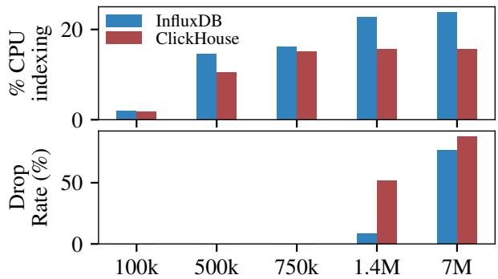  
Figure 2: As ingest rate increases, InfluxDB and ClickHouse spend an increasing fraction of available CPU resources on index maintenance. Once CPU resources run out, they quickly start to drop a substantial percentage of data.

This example illustrates the hardest parts of a typical HFT workload: the engineer iteratively drills down by formulating and testing hypotheses about rare events by correlating data from multiple sources. The correlations are unknown a priori, and the goal is to find such needle-in-a-haystack relationships in fine-grained, high-rate data.

## 2.2 HFT Workloads

HFT workloads exhibit two key characteristics: high data rate and the use of multiple data sources. HFT sources like performance-oriented applications (e.g., key-value stores) or kernel-level tracing like eBPF can each generate millions of records per second. Engineers typically combine multiple HFT sources for analyses (i.e., correlation), which means the total HFT rate can reach several million records per second. They require fast, low-latency queries to interactively iterate over hypotheses as they drill down in their investigation [1, 28, 35].

However, probe effect inherently limits the rate and size of HFT that a system can generate, so HFT records are typically small [53–55, 64]. As it is difficult to interpret correlations from many sources, engineers also typically correlate only a handful of HFT sources at a time.

A system for HFT must therefore (i) keep up with highrate data, (ii) support the interactive iteration that engineers require, and (iii) impose low probe effect on applications.

## 2.3 Existing Approaches

Current approaches fail to keep up with HFT, either dropping data or making queries slow and cumbersome.

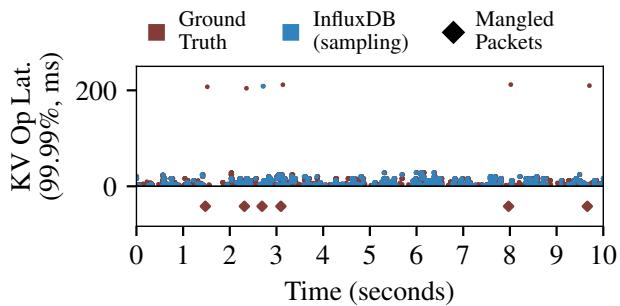  
Figure 3: In the motivating example (§2.1), high-latency Redis requests correlate with packets where a buggy packet filter mangled the destination port. To keep up with the data rate, InfluxDB needs to sample data. Because these events are rare (six mangled packets out of 35M packets affecting six operations out of 9M), sampling captures only one of the slow requests and none of the mangled packets.

Time series databases (TSDBs) struggle with high-rate ingest because they maintain indexes designed to speed up queries. For example, TSM-Bench [19] found that two LSMtree-based TSDBs, InfluxDB [30] and ClickHouse [51], perform best for write-intensive workloads. These systems see an increasing index update cost as the ingest rate increases because they add more background threads to manage indexing. With finite CPU resources, systems must eventually either increase backpressure (i.e., high probe effect) or drop data. Figure 2 shows the percentage of total CPU resources available (16 CPUs) spent on index maintenance in InfluxDB and ClickHouse as a function of the ingest rate, as well as the fraction of data dropped on ingest when these TSDBs fall behind. At 100k writes/second, InfluxDB and ClickHouse spend 2% of CPU on index maintenance. This increases to 15% at 500k writes/second, and at 1.4M writes/second, it increases to 23%, or about four cores. InfluxDB and ClickHouse drop 9% of data at this point, as I/O, request handling, and index maintenance compete for CPU. Consequently, the CPU time spent on index maintenance no longer increases when the rate goes up to 6M writes/second (as in §2.1 and Figure 3), but the fraction of data dropped increases sharply to 77%.

Sampling can help reduce the data rate to ensure the storage system (e.g., a TSDB) can keep up. Unfortunately, this is not a panacea, as sampling can miss rare events and correlation requires coordinated sampling across multiple sources. Figure 3 shows the impact of sampling on the example from §2.1. We uniformly sampled about 10% of the data, which results in a data rate sufficient for InfluxDB to keep up. The ground truth in red shows that six slow Redis requests (out of 9M) occur over a 10-second window, yet sampling captures only one of those requests. To compound this problem, sampling failed to capture any of the six mangled packets, since they are exceedingly rare (six out of 35M packets). The only way to draw a correlation between the two events is to capture slow requests and the mangled packets that caused them. While one could bias sampling or perform retroactive sampling [66], such targeted sampling is not possible for the “unknown unknown” of mangled packets.

Log-based systems (e.g., FasterLog [41], FuzzyLog [23], FishStore [63]) can keep up with high-rate ingest but have prohibitively high query latency because they need to scan the log. To avoid scanning the whole log, these systems typically build back-pointer record chains using rules or heuristics that identify exactly the records required for a query. For example, Fish-Store builds record chains using a restricted indexing structure that sets up exact-match rules called “predicated subset functions” (PSFs). While PSFs excel at finding exact matches, they are not flexible enough for common classes of HFT queries. Since PSFs require a priori knowledge of the exact query, they cannot support queries that look back an arbitrary amount of time (e.g., between 10 and 20 minutes ago) or queries that depend on the data distribution (e.g., records with latency above the 99.99th percentile). For these types of queries, FishStore needs to scan irrelevant data, leading to high query latency. In §2.1’s example, FishStore takes 40 seconds to return the 99.99th percentile Redis requests over a 60-second window, and extracting the packet traces takes another 84 seconds.

Custom scripts to post-process raw data written to files are common in ad hoc performance debugging [12]. Such scripts must scan the data and require engineers to write parsing and analysis code. For the example in §2.1, this requires 50 LoC (as opposed to single-line queries in InfluxDB and FishStore), and the script takes 35 seconds to run, using 8 GB of host memory. Doing so slows down drill-down analysis, as engineers must write a new script for every query.

## 3 Loom Overview

Loom is a new system to capture and query HFT on a single host machine. It supports high-rate ingest and interactive, low-latency queries while using limited resources.

Loom is designed for use as a library within a monitoring daemon (Figure 4), which is a data collector like the Open-Telemetry Collector [44] or FluentD [29]. The monitoring daemon receives data from a variety of HFT sources, including user-space applications instrumented by developers, kernel probes (e.g., collecting eBPF events), and hardware events (e.g., via perf stat). The monitoring daemon uses Loom’s API to manage the data it receives. An engineer can then use Loom to investigate an issue by:

(1) enabling sources of interest, which generate HFT that the monitoring daemon pushes into Loom;

(2) adding indexes over these sources to speed up queries across dimensions of interest (Loom always maintains a time-dimension index by default);

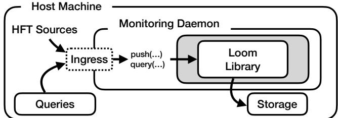  
push(…)Figure 4: Loom is a library intended for use within aSysX push(…) monitoring daemon running locally on a host. HFT sourcesLibrary query(…) Record Log1send data to the monitoring daemon, which invokes Loom’s Timestamp In-Memory PersistentAPI to store data. Querying clients (e.g., an engineer) use Timestamp IndexLoom’s API to run queries over the data.Queries

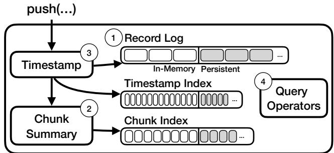  
Figure 5: Loom’s architecture revolves around three logs Ingress push(…) query(…)that span main memory and persistent storage. During ingest, Loom timestamps each record and writes it to the record log. Loom also updates a chunk summary for the current chunk Queriesof records and eventually writes this summary to the chunk Hybrid Logsindex. It also records timestamps in a timestamp index that indexes by time. For queries, Loom scans the indexes first, then the matching chunks and the active chunk in memory.

push(…)(3) issuing queries over the data in Loom by composing one or more query operators; and

(4) repeating this process of enabling/disabling sources, indexes, and queries as necessary.

QueriesIn practice, engineers will typically use a front-end (e.g., a dashboard or CLI) to instantiate query operators with appropriate parameters (e.g., the source, time range).

Goals. Loom must support the high write throughput common in HFT while also offering interactive query latencies. This requires indexes, which could be costly to maintain. Loom must update its indexes without introducing probe effect to the monitored application and without using excessive resources. Finally, Loom must support common classes of observability queries: time-range and time-based correlation queries, histograms, aggregates (including holistic aggregates like percentiles), and outlier detection.

Design Choices. We now use Figure 5 to explain Loom’s architecture, components, and key design choices.

First, Loom organizes its storage as three append-only logs that span main memory and persistent storage: the record log stores the raw records (Figure 5, 1 ), and the other two logs store indexes over the record log. Loom breaks the record log into fixed-size chunks that serve as the units of indexing for the chunk index, which indexes by record values, while the timestamp index indexes by time. Hybrid logs help Loom support high write rates by buffering recent data in memory and amortizing disk writes through large I/O batches. They perform no further data transformations (e.g., sorting, compaction) after chunks are finalized and written.

Second, Loom uses the chunk index and timestamp index as sparse, append-only indexes specialized to the classes of queries common in HFT. The indexes are sparse because they only identify the chunks that contain records of interest rather than the specific records themselves. Each entry in the chunk index is a chunk summary: a small, lightweight structure that contains metadata about a chunk, incrementally updated while the chunk accumulates records. When Loom finalizes a chunk, it writes the chunk summary to the chunk index (Figure 5, 2 ). To build a coarse-grained index by time, Loom also regularly stores a timestamp in the timestamp index (Figure 5, 3 ). This design makes updating indexes cheap, as it amortizes appending a new entry over a chunk of data rather than for every individual record.

Queries use these indexes to skip irrelevant chunks but might need to scan chunks that match in the index. Loom’s hybrid logs for timestamps and indexes grow far more slowly than the record log, so a substantially larger portion of these index logs resides in memory to accelerate queries.

Third, Loom delays exposing under-construction chunk summaries to queries. This reduces the CPU cost of writes, since they no longer need to coordinate with reads (e.g., by taking a lock or performing an atomic operation). This helps Loom support high-rate ingest with limited CPU resources. When serving queries, Loom scans the most recent records in the record log that do not yet have a finalized chunk summary. This is fast, since chunks are small (e.g., 64 KiB).

Fourth, Loom provides a limited set of query operators designed to efficiently serve typical observability queries without burdening host resources. All query operators have a constant maximum memory footprint and run in a single thread. This avoids contention between queries and on-host production workloads. Loom’s query operators scan, filter, and aggregate data, leveraging indexes where possible, and can be composed. This API ensures that more complex operators (e.g., joins that may require significant memory) must execute outside Loom (and ideally off-host).

Managing Historical Data. Loom is primarily designed for ad hoc analysis of ingested HFT that can be discarded after use. This scenario is common in practice (e.g., using temporary files to store data from perf) due to the sheer volume of HFT. For use cases like post-mortem analysis that require long-term storage, Loom complements existing solutions. Specifically, it can capture HFT so that engineers can identify the data of interest for long-term retention or copy data in bulk for compression and/or long-term storage (e.g., HDFS [25], Kafka [26]) outside the critical path.

## 4 Design

At the heart of Loom’s design is a hybrid log abstraction that spans main memory and persistent storage, as well as a layered set of indexes geared toward typical observability queries.

## 4.1 Hybrid Log Abstraction

To support high ingest rates, Loom is built around an appendonly log data structure. Following standard design [3, 4, 7, 61], each inserted record receives a unique address corresponding to its physical offset in the log, making the lookup for a specific record address O (1). To amortize memory and I/O overhead, Loom interleaves records from many sources in the record log, with records from the same source linked together using these addresses as back-pointers to form a record chain.

Loom’s hybrid log abstraction is carefully designed to impose minimal overhead on the write path while operating within a fixed resource envelope. Loom must be highly CPUefficient in order to keep up with ingest rates of millions of records per second without scaling out to many threads such that the CPU load would contend with the application, risking probe effect. Loom stages writes to each log in a fixed-size (e.g., 64 MiB) block in memory. Therefore, in the common case, writes in Loom take only a few hundred cycles. Once the block fills up, Loom evicts its contents to persistent storage in a background thread and switches writing into a second block. Similarly, when the second block fills up, Loom evicts it in the background and switches back to the first block, then repeats this process.

## 4.2 Layered Sparse Indexes

Log-based systems excel at supporting high ingest rates but often fall short when trying to provide interactive query latencies. Loom turns to ideas from sparse indexes in database systems [20, 42, 52, 65, 68] to efficiently skip large amounts of irrelevant data during query processing without adding significant overhead to the write path. Loom builds two lightweight index structures on top of the record log: the chunk index and the timestamp index.

Target Queries. Loom’s indexes target common classes of observability queries. Such queries usually focus on time ranges, value ranges, aggregates, and data-dependent ranges (e.g., high percentiles). For example, correlation queries often retrieve data for the same time range from different sources, while aggregates may count or average events during a time window. These also compose: a query might first retrieve data above a data-dependent threshold (e.g., 99.99th percentile) and then query other sources for times around the timestamps of the outlier records. Loom’s layered indexes seek to support these query classes efficiently—although Loom can execute other operations (e.g., substring search), it cannot leverage any indexes and must scan data.

<table><tr><td></td><td>Kind</td><td>Timestamp</td><td>Event</td></tr><tr><td>1</td><td>Record</td><td>14</td><td>Latency: 10s</td></tr><tr><td>2</td><td>Record</td><td>17</td><td>Latency: 13s</td></tr><tr><td>3</td><td>Record</td><td>18</td><td>Latency: 9s</td></tr><tr><td>4</td><td>Internal</td><td>19</td><td>Chunk Summary</td></tr><tr><td>5</td><td>Record</td><td>25</td><td>Latency: 11s</td></tr><tr><td>6</td><td>Record</td><td>29</td><td>Latency: 23s</td></tr><tr><td>7</td><td>Internal</td><td>31</td><td>Chunk Summary</td></tr><tr><td>8</td><td>Record</td><td>32</td><td>Latency: 6s</td></tr><tr><td>9</td><td>Record</td><td>33</td><td>Latency: 12s</td></tr></table>

Figure 6: Running example. In rows 1–3, 5–6, and 8–9, records from an HFT source that captures latency arrive in Loom at the given timestamp. In rows 4 and 7, Loom fills a fixed-size chunk with records. Timestamps increase monotonically but are not consecutive (i.e., records from other sources or internal events may exist in between events).

Running Example. To illustrate Loom’s indexes, consider the example shown in Figure 6, which depicts a timeline of events. Rows 1–3, 5–6, and 8–9 are records from an HFT source that contain a latency value. Rows 4 and 7 are internal events triggered by Loom filling a fixed-size chunk. Timestamps increase monotonically but are not consecutive, as Loom may have received records from other sources between the events. Record Log. When Loom receives a record from a source, it appends the record to the record log. Loom links records from the same source using back-pointers, building a record chain with each new record pointing to the previous record from the same source. The record log in Figure 7 shows records from the example in Figure 6 in green boxes and back-pointers using dashed green lines. Rows 1 and 2 in Figure 6 correspond to (T14, L10) and (T17, L13) in Figure 7, respectively. Loom interleaves records from multiple sources in the record log. For example, records from other sources can arrive between timestamps 14 and 17, so Figure 7 indicates this with ellipses (...) between the records.

Loom breaks the record log into fixed-size chunks (blue boxes in the record log in Figure 7). It appends the new records to the most recent active chunk (dashed box in Figure 7). The record log contains only one active chunk, which becomes immutable when it fills up (solid boxes in Figure 7).

Chunk Index. Loom maintains a summary of new records appended to the active chunk. When Loom fills the chunk and makes it immutable, it writes this summary into the chunk

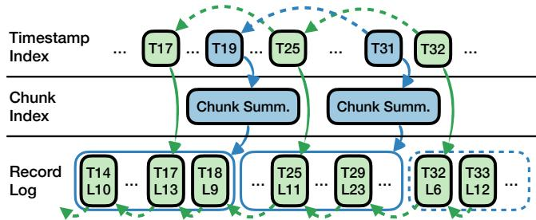  
Figure 7: Loom stores chains of raw records from sources (dotted arrows) in the record log, summaries for each chunk in the chunk index, and timestamps for key events in the timestamp index. Entries in the indexes have addresses to relevant chunks or records in the record log (solid arrows).

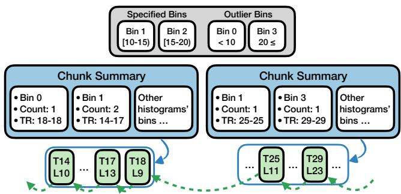  
Figure 8: A detailed view of the chunk summaries in Figure 7. Summaries contain statistics for records in a chunk that fall in an index-specific histogram bin. Loom constructs a summary Index T17 T19 … T25 … T31 T32… … …for the active chunk, but the summary is not accessible to queries. When the active chunk fills up, Loom writes the sum-Chunk Summ. Chunk Summ.Indexmary to the chunk index and makes it available for queries.

L10 L13 L9… … L11 … L23 … L6 L12 …Logindex. Figure 7 shows chunk summaries as filled blue boxes in the chunk index. Loom uses the chunk index for two purposes: answering queries in the record log without needing to read the chunks and skipping irrelevant chunks. Figure 8 continues using the example in Figure 6 to illustrate the chunk index.

The monitoring daemon (or a client calling into it) defines an index for a source’s data using a histogram abstraction (i.e., a set of bins for different value ranges). Since observability queries typically care about outliers, Loom also adds two outlier bins above and below the histogram. In Figure 8, the histogram (in gray) for the source’s latency value has four bins. The monitoring daemon defines bins 1 and 2, and Loom adds bins 0 and 3.

Loom chooses this histogram abstraction due to its flexibility. Histograms can serve value-range queries (e.g., “Does a chunk have data in bins above a threshold?”), aggregates (e.g., “count/sum/max/min of items in each bin”), and percentiles (e.g., “sum bins until the count exceeds X%”), as well as exact-match queries (with match/no-match bins).

Specifying the histogram requires a priori knowledge common in observability. For example, a service-level objective could specify the histogram’s maximum bin, or a historic query latency distribution might inform a histogram for new latencies. In some cases (e.g., percentages), the range of possible values is inherent. Unlike exact indexing approaches, histograms require no knowledge of query parameters.

Chunk summaries contain statistics on the values that fall within a histogram’s bins, including the maximum, minimum, sum, timestamp range, and number of records. Figure 8 contains two chunk summaries corresponding to the two filled chunks in the record log. The first contains entries for bins 0 and 1, since its corresponding chunk contains records with latencies that fall into these bins: the records at timestamps 14 and 17 fall into bin 1, and the record at timestamp 18 is an outlier falling into bin 0. The second contains entries for bins 1 and 3 for the same reason. Chunk summaries have pointers to their corresponding chunks in the record log. Just as chunks in the record log contain records from different sources, the chunk summary contains bins from other histograms with records in the chunk.

Timestamp Index. Loom uses the timestamp index to keep track of a coarse-grained timeline of events and their locations in the other logs. This helps queries quickly find relevant records in the chunk index and record log based on time. The timestamp index is always active and requires no specification, so sources without a specified (or a poorly specified) histogram still benefit from the timestamp index.

Loom writes timestamp index entries for two events: (i) periodic intervals when a source pushes a record, and (ii) when Loom fills and indexes chunks in the record log. The entry contains the timestamp and a pointer to the corresponding record written or chunk summary created during that timestamp.

Figure 7 shows timestamp index entries for records that arrived at timestamps 17, 25, and 32, as well as timestamps 19 and 31 corresponding to the creation of chunk summaries. Like the record log, timestamp entries also have back-pointers to previous timestamp entries from the same source or previous chunk summary creation events.

Implications of Layering. The layered index design ensures that each layer is more coarse-grained and smaller than the layer below. Each chunk summary in the chunk index amortizes many records in the record log, so index entries have small storage overhead. The entries in the timestamp index are infrequent and even smaller than chunk summaries, so writing them adds little overhead.

For example, a 10-minute workload that produces 4.7M records/second will create a record log of 253 GiB—the chunk index is 3 GiB, and the timestamp index is 256 MiB. Loom stores the indexes themselves in hybrid logs. Each hybrid log uses two blocks of host memory (128 MiB), but a larger fraction of the indexes resides in memory, owing to their smaller size (e.g., 50% of the timestamp index and 4% of the chunk index, as opposed to 0.0004% of the record log). This speeds up queries as index scans can happen on in-memory data.

## 4.3 Query Processing

To execute an observability query, Loom uses the timestamp and chunk indexes to progressively reduce the amount of data needed to answer the query. It does so in three steps. First, Loom uses the timestamp index to identify the locations in the chunk index and record log that might contain relevant data. Then, it uses the chunk index to filter or partially aggregate chunks. Finally, Loom reads only these chunks from the record log necessary to calculate a complete result.

Loom has three query operators that follow this access pattern: raw scan, indexed range scan, and indexed aggregate. These operators can be composed into complex queries and correlations. For example, a query to find all requests that exceed the 99th percentile latency is a data-dependent valuerange query, where the value of interest—the 99th percentile latency—is unknown. This query first uses the indexed aggregate operator to find the 99th percentile latency, then finds records above that value via an indexed range scan. Composing these operators also enables data-dependent time-range correlation, as needed for the example in §2.1, where a misconfigured packet filter affects individual application requests. The query in §2.1 uses the indexed aggregate and indexed scan operators to retrieve the slowest request, then uses a raw scan to retrieve packets in the temporal vicinity of this request.

The raw scan operator retrieves records from a source that arrived in Loom during a specified time range, iterating from the most to least recent record. The operator uses the timestamp index to identify the address of the source’s most recent record that falls within the time range. It then scans the source’s record chain backward from that address until finding a record prior to the requested time interval.

The indexed range scan operator retrieves records from a source within a time range (e.g., the last two minutes) and an indexed value within a value range (e.g., latency >50ms) using a specified histogram index. Loom first uses the timestamp index to find the chunk summaries in the chunk index that fall within the time range. Then, it identifies the histogram bins that contain the queried value range and scans the chunk summaries to identify chunks in the record log that contain relevant records. Finally, it scans these chunks to retrieve the records. If the requested time range includes recent data, Loom also scans the source’s records in the active chunk.

The indexed aggregate operator returns the value for aggregates (e.g., min/max, percentile) for a time range using a specified histogram index. To calculate distributive aggregates (min, max, count, sum), the operator identifies the relevant chunk summaries using the timestamp index. It then calculates a partial result using the bins in the chunk summaries for which all records fall inside the query’s time range. Finally, Loom scans chunks in the record log for which the chunk summaries’ bins partially fall inside the query’s time range.

<table><tr><td>Schema Operators</td><td></td></tr><tr><td>define_source(source_id)</td><td>Define a new source.</td></tr><tr><td>close_source(source_id)</td><td>Remove an existing source.</td></tr><tr><td>define_index(source_id,index_func，bins)</td><td>Define a new index.</td></tr><tr><td>close_index(index_id)</td><td>Remove an existing index.</td></tr><tr><td>Data Ingest Operators</td><td></td></tr><tr><td>push(source_id，bytes)</td><td>Write records from a source with content bytes.</td></tr><tr><td>sync(source_id)</td><td>Make all records from a source visible to queriers.</td></tr><tr><td>Query Operators</td><td></td></tr><tr><td>raw_scan(source_id，t_range，func)</td><td>Scan a source ina time range.</td></tr><tr><td>indexed_scan(source_id，index_id，t_range，v_range，func)</td><td>Scan a source in a time and value range using an index.</td></tr><tr><td>indexed_aggregate(source_id,index_id,t_range，method)</td><td>Aggregate a source in a time range using specified method.</td></tr></table>

Figure 9: Loom API. A monitoring daemon uses this API to define sources and indexes, write data into those sources, and perform complex queries using a set of query operators.

Holistic aggregates like percentile typically require looking at all the data at once and sorting it [13]. To avoid this, the operator treats bins in the chunk summaries as a cumulative distribution function (CDF). First, it counts the number of records that fall within each bin (accounting for partial time range coverage by scanning chunks, as before). Examining each bin’s count and summing them, the operator identifies which bin contains the queried percentile. Finally, it scans each chunk in the record log that contains records in that bin to calculate the final result.

## 4.4 Coordination-Avoiding Queries

Query execution typically occurs concurrently with ingest. While queries over historical data touch only immutable parts of the hybrid logs, queries for very recent data need to access the active in-memory block. In this case, Loom needs to coordinate shared access between queries and the writer. A simple solution would lock the in-memory block while the query scans it, but this could block writes for an extended time. For example, with 64 MiB blocks, scanning the block takes up to 60ms, during which 500k new records arrive.

Loom instead opts for an approach based on lock-free snapshots, where the writer has uncontended access to the hybrid log’s in-memory blocks. The reader attempts to copy the portion of the in-memory block that already contains data and which the writer will no longer touch (i.e., it makes a snapshot). This copy fails if the writer concurrently flushes the block to storage. The reader detects this and reattempts to read the data from persistent storage. This means queries never block writes but also that a query can miss data. The next section discusses the consistency implications of this choice.

## 4.5 Guarantees

Traditional database systems typically provide high-overhead transactional guarantees unnecessary for HFT settings. To meet its performance requirements, Loom relaxes some of these classical guarantees in ways that remain consistent with the unique needs of observability use cases.

Consistency. Loom linearizes queries and data ingestion at the point of snapshot creation. All data that arrived before this point is included in the query, and data that arrives afterward is not. In the edge case where a query’s time range extends into the future from Loom’s perspective, Loom’s snapshot can become stale, since new records with timestamps within the queried time range can arrive after Loom creates the snapshot. We expect such queries to be rare.

Durability. Loom’s hybrid log avoids flushing records acknowledged to clients to persistent storage immediately. While doing so would ensure that the records survive if the machine crashes, flushing imposes prohibitive overhead on the write path, and delaying acknowledgment to the client induces probe effect. Instead, Loom’s persistence serves to maintain a fixed memory footprint by evicting older data. A machine failure therefore causes Loom to lose the data in the active in-memory block. Given the limited size of the in-memory block (e.g., 64 MiB), the lost data represents only the absolute freshest data (i.e., on the order of a few hundred milliseconds).

Since Loom runs in a monitoring daemon process, if a monitored application (e.g., a key-value store) crashes, Loom can be used to diagnose the crash using data it received from the application. However, if the application and the monitoring daemon process also crash (e.g., due to a kernel panic), then Loom loses its in-memory data. Whole-host failures and failures of the monitoring daemon are outside of Loom’s scope.

## 5 Implementation

Our Loom prototype is a library that consists of 6k lines of Rust. The library can integrate into a monitoring daemon or directly into an application. We integrated Loom with the OpenTelemetry Collector, a vendor-agnostic monitoring daemon compatible with many applications [44]. This makes Loom deployable as a drop-in replacement for existing telemetry backends. For our experiments, we also implemented a bare-bones monitoring daemon in Rust (2k LoC) to remove sources of overhead that might confound our evaluation.

## 5.1 Loom API

Figure 9 outlines Loom’s API. The monitoring daemon uses this API to write data into Loom and execute queries.

Source and Index Definition. The monitoring daemon uses the schema operators to define and close ad hoc sources and indexes. A source has a unique ID and can have multiple indexes. Loom indexes records from a source based on a user-defined function (UDF) supplied on index definition and based on a histogram describing the bins in the index.

This API supports exact-match indexes (e.g., “== "ERROR"” or “≥ 10”) by specifying a singular bin and an index\_func that returns a value in that bin for matching records.

Ingest. The monitoring daemon uses push to write records into Loom, specifying a source ID and the bytes to be written. The daemon can call sync to force queryability for a source. Querying. The monitoring daemon uses the raw\_scan query operator to apply a UDF (func) to every record in a source. The indexed\_scan provides the same functionality, but it leverages Loom’s indexes to find records in a source that qualify by time and value range. Finally, indexed\_aggregate aggregates records using Loom’s indexes, taking advantage of the query access patterns described in the previous section.

## 5.2 Internal Timestamps

Loom uses the system’s monotonic clock to internally timestamp records and key events, so Loom’s timestamps represent the arrival time of the records. With this internal timestamp approach, Loom supports time-range queries efficiently without the cost of sorting and indexing external timestamps that can arrive out of order. The timestamp index coarsely indexes data by internal timestamp, which allows Loom to efficiently execute time-range queries for historical data by seeking backward in the timestamp index until the requested time and then scanning the record log from there.

If external timestamps are required (e.g., for true “happensafter” relationships), Loom can support them because records can carry their own timestamps in the data. Chunk summaries can capture such external timestamps as indexed min/max values, so Loom can efficiently retrieve matching records similarly to how it serves aggregates. Alternatively, a query could retrieve records within an over-approximated time range (e.g., +/- 1 minute of the external time) that accounts for latearriving records. Either way, the client sorts the returned records based on the embedded external timestamp.

## 5.3 Changing Workloads

Loom’s API allows it to react to changing workloads. When the workload changes, the monitoring daemon (or an engineer) can close a source’s out-of-date index and define a new one using a new histogram. Doing so has no impact on ingest performance, as the new histogram is only active for newly arriving data from the specified source (i.e., older data is not re-indexed). Consequently, the new index only accelerates queries on data that arrives after the index was defined.

## 5.4 Write Path

Loom carefully coordinates the sequence in which it writes to the record log, chunk index, and timestamp index. To process a new record, it first takes a timestamp for that record and writes it to the record log. If it detects that the record is now in a new chunk, it finalizes the chunk summary for the previous chunk and writes that to the chunk index. It then writes this event into the timestamp index. Finally, Loom makes the most recent entries in the record log, chunk index, and timestamp index queryable (in that order) using an atomic operation that indicates to readers which portion of the in-memory blocks is now immutable.

## 5.5 Read Path

To avoid contention with the write path, a reader makes a copy (i.e., a snapshot) of the in-memory blocks of each of the logs up to a high watermark set by the writer (and updated periodically and on sync calls) that denotes immutable data. The reader then reads that snapshot. During the copy, however, the writer might flush and recycle a block, resulting in an invalid copy. Loom employs a lock-free versioning mechanism to detect this event. Observing the event indicates that the block was persisted to storage, so Loom continues reading from persistent storage instead.

## 6 Evaluation

Our evaluation seeks to answer five key questions:

(1) Can Loom keep up with HFT’s high ingest rate while also supporting interactive read queries? (§6.1)

(2) How do Loom’s ingest and query performance compare to those of state-of-the-art alternatives? (§6.1)

(3) What probe effect does Loom induce compared to these alternative approaches? (§6.2)

(4) How does Loom’s hybrid log perform relative to the persistent data structures used in other systems? (§6.3)

(5) How do Loom’s indexes impact query latency? (§6.4) We evaluate Loom and baseline systems using two case studies based on real-world scenarios, as well as synthetic workloads for drill-down experiments.

The Redis case study is the motivating workload from §2, where an engineer observes occasional high latency in a Redis deployment, ultimately caused by a misconfigured packet filter. Its queries (Figure 10a) cover data-dependent range scans for high-latency requests (Phase 1), correlation with slow syscalls (Phase 2), and data-dependent, time-windowed correlation with TCP packets (Phase 3).

<table><tr><td rowspan="2">Phase</td><td rowspan="2">Data Collected</td><td colspan="2">Records</td><td rowspan="2">Queries</td><td rowspan="2">Query Type</td></tr><tr><td>per second</td><td>size</td></tr><tr><td>P1</td><td>Application req. latency</td><td>865k</td><td>48B</td><td> $\overline { { 9 9 . 9 9 } } ^ { \mathrm { { t h } } }$  percentile latency records</td><td>Scan over data</td></tr><tr><td>P2</td><td>+ OS syscall latency</td><td>+ 2.7M</td><td>48B</td><td> $+ ~ 9 9 . 9 9 ^ { \mathrm { t h } }$  percentile sendto latency records</td><td>Correlation b/wrecords</td></tr><tr><td>P3</td><td>+ Client TCP packets</td><td>+ 3.5M</td><td>varies</td><td>Packets 5 sec.before/after slow app.requests</td><td>Time-driven scan</td></tr></table>

a: Redis workload: scan and correlation queries.

<table><tr><td rowspan="2">Phase Data Collected</td><td rowspan="2"></td><td colspan="2">Records</td><td rowspan="2">Queries</td><td rowspan="2">Query Type</td></tr><tr><td>per second</td><td>size</td></tr><tr><td>P1</td><td>RocksDB req. latency</td><td>4.7M</td><td>48B</td><td>Maximum,  $\overline { { 9 9 . 9 9 } } ^ { \mathrm { { t h } } }$  percentile request latency</td><td>Aggregation</td></tr><tr><td>P2</td><td>+ OS syscall latency</td><td>+ 3.2M</td><td>48B</td><td>Maximum,  $9 9 . 9 9 ^ { \mathrm { t h } }$  percentile pread64 latency</td><td>Agg. on 3% of data</td></tr><tr><td>P3</td><td>+ OS page cache events</td><td>+ 39k</td><td>60B</td><td>Count number of page cache events</td><td>Agg. on 0.5% of data</td></tr><tr><td></td><td></td><td></td><td></td><td>(mm_filemap_add_to_page_cache)</td><td></td></tr></table>

b: RocksDB workload: aggregation queries.

Figure 10: End-to-end experiments cover scan, correlation, and aggregation queries at ingest rates that increase across three phases in each experiment. Each phase’s throughput is additive (“+ N”) over the previous phase’s total ingest throughput.
<table><tr><td rowspan=2 colspan=1></td><td rowspan=1 colspan=3>Percentage of data dropped</td></tr><tr><td rowspan=1 colspan=1>InfluxDB</td><td rowspan=1 colspan=1>FishStore</td><td rowspan=1 colspan=1>Loom</td></tr><tr><td rowspan=1 colspan=1>P1Redis P2P3</td><td rowspan=1 colspan=1>38.2%86.3%90.1%</td><td rowspan=1 colspan=1>0%</td><td rowspan=1 colspan=1>0%</td></tr><tr><td rowspan=1 colspan=1>P1RocksDB P2P3</td><td rowspan=1 colspan=1>87.9%92.8%92.7%</td><td rowspan=1 colspan=1>0%</td><td rowspan=1 colspan=1>0%</td></tr></table>

Figure 11: End-to-end, InfluxDB falls behind and drops 38–97% of data. Loom and FishStore capture complete data.

The RocksDB case study is based on a real-world Linux performance debugging example [5]. Figure 10b shows its queries, which cover aggregations (max, 99.99th percentile latency) over HFT (Phase 1), aggregation on a subset of data collected (Phase 2; 250k records/second, 3% of data), and aggregation on very rare events (Phase 3; 0.5% of data).

Baselines. We evaluate Loom against InfluxDB 1.7 [30], a widely used time series analytics database focused on expressive queries, and FishStore [63], a state-of-the-art research query engine designed for HFT-style observability data and queries. We also evaluate Loom’s hybrid log directly against a persistent B-tree in LMDB [22], LSM-tree-based RocksDB [49], and FishStore’s log based on FasterLog [41].

Metrics. We measure the ingest throughput achieved by different systems (in records/second and MiB/second), as well as the fraction of data dropped on ingest. For read queries, we measure latency and the percentage of ground truth data missing from the result. Missing data occurs because the system dropped it on ingest.

Setup. All experiments were conducted on a server running Ubuntu 22.04 (Linux v5.15) with two Intel® Xeon® Gold 6150 CPUs (36× 2.7 GHz), 377 GiB RAM, and a Samsung 2 TB NVM Drive for persistent storage.

## 6.1 End-to-End Evaluation

We first evaluate end-to-end performance of Loom on the Redis and RocksDB workloads, comparing against state-ofthe-art systems (InfluxDB and FishStore). In the experiment, all systems continuously ingest data and concurrently serve different queries (per Figure 10) in three phases.

InfluxDB drops 38–93% of data on ingest because it falls behind (Figure 11). To make the query latency comparison apples-to-apples, we also compare against an idealized InfluxDB with infinitely fast ingest by preloading the data before issuing queries (“InfluxDB-idealized”). A good result for each system would show no dropped data and interactive (i.e., <10 seconds) query latency. While low resource use is desirable, the experiment lets all systems use unlimited resources.

Redis Workload. This workload is characterized by an ingest rate increasing sharply across phases (865k records/second in Phase 1 to 7M records/second in Phase 3) and data-dependent scan queries to support correlations (Figure 10a).

Figure 12 shows the query latencies. In Phase 1 and Phase 2, Loom is consistently 14–97× faster than InfluxDB-idealized and 1.5–10× faster than FishStore. For InfluxDB, the Slow Requests query is dominated by calculating the 99.99th percentile; the data fetch and scan take less than one second. In FishStore, this query is faster in Phase 1 than in Phase 2 (8.7 vs. 20.3 seconds) because FishStore’s log interleaves data from all sources, and FishStore must therefore read more data to find the relevant records in Phase 2. Phase 2’s Slow sendto Executions query takes longer (184 seconds) in InfluxDB-idealized than the Slow Requests query because the former reads and scans more data. In FishStore, both Phase 2 queries have similar latencies, as the log interleaves data from multiple sources and queries have to scan data from other sources.

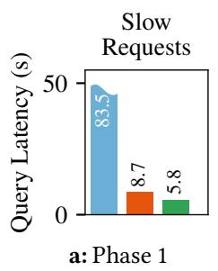

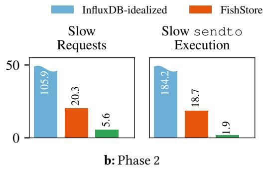

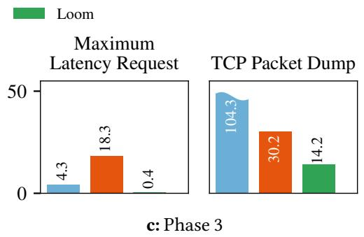  
Figure 12: In Phases 1 and 2 of the Redis workload, Loom has 1.5–10× lower latency than FishStore and 14.4–97× lower latency than (unrealistic) InfluxDB-idealized. For Phase 3, Loom outperforms FishStore by 2–46× and InfluxDB-idealized by 7–11×.

Phase 3 has two queries: Maximum Latency Request, which benefits from indexing because it selects few application requests, and TCP Packet Dump, which fetches the records within a given 10-second window and must scan millions of records even with a time index. Loom outperforms InfluxDBidealized by 7–11× and FishStore by 2–46×. InfluxDB-idealized executes Maximum Latency Request relatively quickly (4.3 seconds) due to its “tag” index. FishStore executes the same query in a streaming fashion, so it avoids having to load all the data into memory. Hence, the query latency (18.3 seconds) is comparable to the Phase 2 queries, even though FishStore must traverse more data to find the relevant records. Loom is fastest (0.4 seconds), as it scans mainly the chunk summaries in the chunk index, in addition to two partial chunks at the start and end of the 10-second window. TCP Packet Dump forces InfluxDB into an expensive scan over its LSM-tree that results in high latency (104.3 seconds), while FishStore—lacking a time index—must scan the log until the relevant time window. Loom finds the relevant chunks via its time index. Because of the number of records scanned, the latency (14.2 seconds) is still higher than for the other queries.

RocksDB Workload. This workload is characterized by highrate ingest (4.7–8M requests/second) and aggregation queries in all phases, with increasingly selective queries (Figure 10b).

Figure 13 shows the query latencies. In Phase 1, Application Max Latency benefits from indexes that track maximum values, while Application Tail Latency must compute a percentile aggregation. InfluxDB-idealized runs these queries in 23.1 and 380 seconds, as InfluxDB’s indexes do not support percentile aggregations, and the tail latency query aggregates over millions of records. This changes in Phase 2, where pread64 Max Latency and pread64 Tail Latency queries need to aggregate over only 3% of the data. Here, InfluxDB’s “tag” index allows it to efficiently find subsets of data and scan them to calculate the percentiles (23–26 seconds). FishStore needs to scan records for all queries, resulting in slow queries (48 and 38 seconds). Since FishStore loads all relevant records into memory, it can calculate the max and percentiles simultaneously. In Phase 1, the Application Tail Latency query is faster in FishStore than InfluxDB because FishStore retrieves records from its PSF index. FishStore’s PSF builds a back-pointer chain of records that match exactly a provided predicate, so scans on a predicate can quickly access relevant records in FishStore’s log. This changes in Phase 2, where InfluxDB’s indexes are more effective in summarizing and skipping to small portions of data that FishStore must scan. Loom serves all four maximum and tail latency queries largely from chunk summaries, so they are fast (0.5–3.2 seconds).

In Phase 3, all systems benefit from indexing. The “tag” index in InfluxDB, which is most effective on narrow subsets of data, helps the Page Cache Count query, which touches only 0.5% of the data. In FishStore, we installed a PSF that selects only data from the page cache event source, so FishStore quickly retrieves the data. Finally, Loom uses counts stored in chunk summaries to answer the query.

Discussion. This experiment shows that Loom and FishStore have the ingest performance required to keep up with HFT, while InfluxDB struggles with high-rate ingest. However, Fish-Store’s PSF indexes are too restrictive and cannot accelerate important classes of HFT queries. InfluxDB’s indexes (“tag” index and value indexes) accelerate distributive aggregates (e.g., maximum) and value-range queries, but not holistic aggregates (e.g., percentiles). Loom’s hybrid log and layered indexes help it maintain high ingest throughput while simultaneously achieving interactive query latency.

In this experiment, FishStore and InfluxDB use substantially more CPU resources than Loom: FishStore has eight index threads and InfluxDB uses 16 ingest threads, in addition to any background resources these systems require. Loom uses only one CPU but still keeps up with ingest, also having the lowest overall query latency.

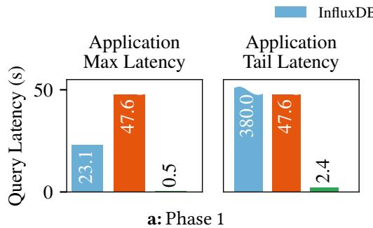

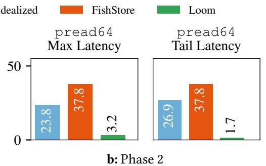

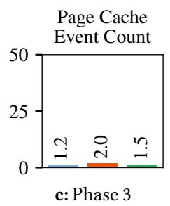  
Figure 13: In Phase 1 and 2 of the RocksDB workload, Loom runs aggregate queries (i.e., max and percentile) 7–160× faster than (unrealistic) InfluxDB-idealized and 8–17× faster than FishStore. In Phase 3, all systems benefit from indexing.

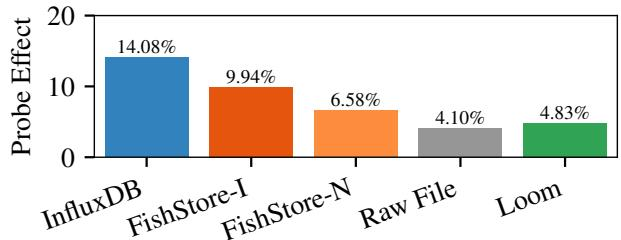  
Figure 14: Probe effect for RocksDB Phase 3: InfluxDB’s heavy-weight indexing has 14% probe effect, while FishStore with indexes (-I) sees 9.9% probe effect proportional to the number of PSFs installed. FishStore without indexes (-N) still has 6.6% probe effect. Loom has similar probe effect (4.83%) to capturing data to a raw, unindexed file (4.10%).

## 6.2 Probe Effect

We now evaluate what probe effect Loom and state-of-the-art systems impose on the application being monitored. We run Phase 3 of the RocksDB workload (≈8M records/second), ingesting the data without any concurrent queries, and measure probe effect (i.e., the decline in performance) on RocksDB’s application-level request throughput. Without telemetry collection, RocksDB achieves 5.06M operations/second.

We consider telemetry collection into (i) InfluxDB; (ii) Fish-Store with indexing (FishStore-I, 3 PSFs); (iii) FishStore without indexing (FishStore-N); (iv) writing the data to a raw file (as e.g., perf record would); and (v) Loom. A good result would show that RocksDB sees high throughput and incurs low probe effect from telemetry collection. Probe effect above 7% is often considered problematic in industry [54].

Figure 14 shows the results. InfluxDB has high probe effect (14.1%, 3.82M operations/second) because its heavy-weight indexing strategy consumes significant resources. Although more lightweight than InfluxDB, FishStore’s probe effect increases with the number of PSF indexes added. FishStore with indexing has 1.5× higher probe effect (9.9%, 4.19M operations/second) than without indexing (6.6%, 4.37M operations/second). Writing to a raw file, which represents the bare minimum overhead for telemetry collection, incurs 4.1% probe effect (4.87M operations/second). Loom’s 4.83% probe effect (4.74M operations/second) comes closest to the raw file baseline. This demonstrates that Loom avoids imposing unacceptable probe effect on applications.

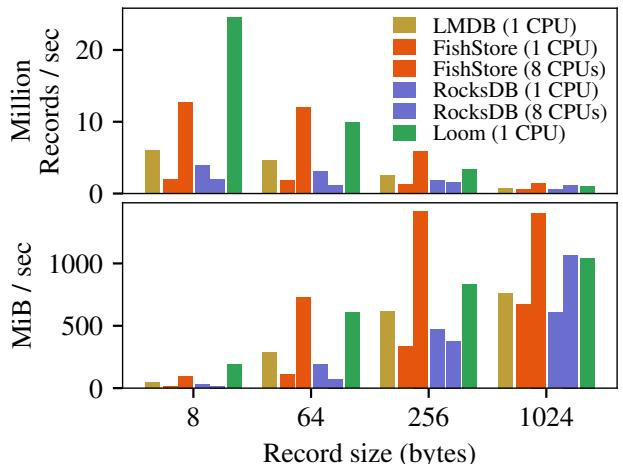  
Figure 15: Loom achieves the highest ingest throughput with small records at high frequency and is competitive for large records, even when FishStore uses 3× and RocksDB uses 8× as many CPU cores.

## 6.3 Data Structure Ingest Scaling

We now evaluate Loom’s hybrid log by comparing it to alternative data structures for storage organization. As baselines, we consider (i) a persistent B-tree (LMDB); (ii) LSM-tree-based storage (RocksDB); and (iii) a log-structured store (FishStore). We benchmark with an ingest-only workload consisting of records whose size varies from 8 to 1024 bytes; this synthetic benchmark is more demanding than the workload in §6.2. Observability workloads are dominated by small records (e.g., 48–60 B for our end-to-end workloads), which makes high performance on small writes critical.

By design, FishStore and RocksDB scale by accepting writes from many ingest threads, while LMDB and Loom are designed to accept writes from one ingest thread. Hence, we run the experiment (i) with FishStore and RocksDB set to accept writes from a single ingest thread, comparing under fixed resources; and (ii) with number of concurrent ingest threads scaled until the baseline systems match Loom’s performance (i.e., eight CPUs for RocksDB and three for FishStore). We impose no restriction on the number of background threads or CPUs each system uses to process writes. For example, RocksDB with one ingest thread still has its internal parallelism set to the number of CPUs (72 cores). For RocksDB, we switch off its write-ahead log, as it slows down writes. For LMDB, we write data in APPEND mode designed for bulk loads of sequential data, the fastest ingest method in LMDB.

Figure 15 shows the results. Across the board, LMDB’s Btree construction means it cannot match Loom’s performance rooted in fast, log-based storage. When writing 8-byte and 64-byte records, Loom also outperforms FishStore’s log and RocksDB’s LSM-tree. This is because writing small records is a CPU-bound task: write throughput is far from saturating I/O bandwidth. LSM-trees/RocksDB in particular suffer due to the CPU cost of merging. As the record size increases, this advantage for Loom shrinks, as FishStore and RocksDB amortize their CPU costs over larger writes, and multiple writer threads can saturate SSD bandwidth better. At 256-byte records, FishStore with three CPUs matches Loom. RocksDB with eight CPUs only (marginally) outperforms Loom at 1024- byte records, writing 1.1M records/second. Similarly, 1024- byte records amortize FishStore’s CPU costs over the shared log, so it performs best, writing 1.4M records/second.

Loom’s large block flushes effectively use the disk bandwidth under limited resources. Notably, while achieving high performance, RocksDB with eight CPUs and FishStore with three CPUs have significant probe effect, reducing co-located application performance by 29% and 19%, respectively. By contrast, Loom has only 2% probe effect.

## 6.4 Impact of Indexes

Next, we consider the impact of Loom’s indexes on query latency. We perform an ablation study in which we run Loom (i) without any indexes; (ii) with only the timestamp index; (iii) with only the chunk index; and (iv) with both indexes (the default). The experiment runs Phase 2 of the RocksDB workload. We vary the lookback time (i.e., how far in the past the queried data starts) and query for high-latency syscalls within a 120-second window. A good result would show that the indexes reduce query latency.

Figure 16 shows the results. Without indexes, the query takes hundreds of seconds, and latency increases linearly with lookback distance. Adding a timestamp index removes this growth proportional to lookback, as the timestamp index helps Loom scan the hybrid log starting from the right address. However, the query still takes 150–160 seconds, as it must scan all data within the 120-second window. Combining timestamp and chunk indexes achieves both benefits simultaneously, reducing query latency below five seconds independent of lookback duration. This shows that Loom’s indexes are effective and necessary for good performance.

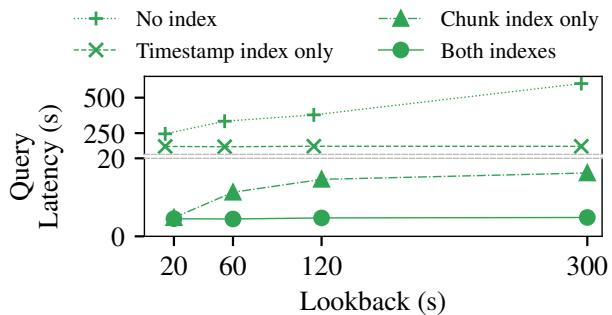  
Figure 16: Loom’s time index is effective at reducing query latency as a function of how far a query looks back in time; the range index reduces the amount of data scanned within the query window (120 seconds). These benefits compose.

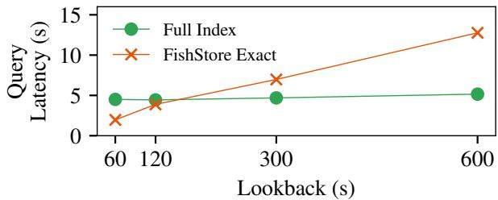  
Figure 17: For exact-match queries, FishStore outperforms Loom for short lookbacks, but Loom outperforms FishStore for longer lookbacks. This is because FishStore lacks range or percentile indexes.

Unlike Loom’s indexes, FishStore’s indexes are exact indexes optimized for exact matches on point lookups (e.g., a specific error ID) and range queries (e.g., all records with a value greater than 50). Although Loom’s histogram-based indexes are more flexible, they can also mimic the behavior of exact indexes by treating them as a histogram with a single bin. We now compare the performance of Loom’s indexes and FishStore’s exact indexes when Loom emulates exact indexing via this approach. The setup is the same as before (RocksDB workload, Phase 2), and we again vary the lookback time from 60 to 600 seconds.

Figure 17 shows the results. FishStore has lower query latency than Loom when querying very recent data (e.g., 2.0 vs. 4.5 seconds at a 60-second lookback). This is because Fish-Store’s indexes identify exactly the records queried while Loom needs to scan some irrelevant data because of its coarsegrained histogram index. But as lookback time increases, Fish-Store’s query latency increases. This happens because Fish-Store lacks a time index and must scan all historic data that matches in the index. Beyond 120 seconds, Loom outperforms FishStore for this workload.

## 7 Related Work

Log-based systems support high-rate ingest and simple record retrieval using log addresses. They fall into two categories. First, shared log abstractions exist for different domains, such as distributed transactions and replicated state machines (e.g., CORFU [3], Tango[4], Scalog [10], vCorfu[61], FuzzyLog [23], LazyLog [24]). Second, ingest-oriented storage systems are more directly applicable to HFT, such as Faster-Log [7, 41] and FishStore [63]. FishStore builds on FasterLog and indexes data using user-defined PSFs. While these systems can keep up with write rates required for HFT, they do so at the expense of query performance, sacrificing indexing entirely (FasterLog) or sacrificing too much indexing expressivity (FishStore). By contrast, Loom’s approach sacrifices indexing specificity, opting for sparse indexes to maintain high write throughput while supporting a broad class of HFT queries.

Key-value stores like Berkeley DB [43], LevelDB [21], Rocks-DB [49], PebblesDB [47], WiredTiger [62], and LMDB [22] are often used to handle high-rate workloads. They use treebased indexes with multiple levels of compaction or treeconstruction costs, thereby suffering from write amplification [47]. These techniques introduce too much overhead for HFT, which results in insufficient ingest performance.

Read-optimized time series databases like InfluxDB [30], OpenTSDB [32], and TimescaleDB [37] store and query timestructured data, but these systems prioritize read performance and use high-overhead indexes (e.g., B-trees) that make it difficult to achieve the ingest rates needed for HFT [6, 19].

Specialized tools like CLP [50], NanoLog [64], ??Slope [59], and LogGrep [60], or systems tracing tools like perf [9] and ETW [40] store one type of data (e.g., logs or system events) in a specialized way. It takes significant engineering effort to query data stored by these tools in conjunction with data from other sources of HFT. Systems like Prometheus [34], Jaeger [31], or others [44, 69] are insufficient, as they only cover specific types of data (e.g., traces) and can only keep up with the ingest rate of heavily sampled events, not with HFT needed for drill-down analysis. By contrast, Loom provides a storage and query engine for arbitrary sources of HFT.

Distributed tracing and diagnosis tools like Fay [12], Canopy [17], Hindsight [66], and Helios [46] aggregate traces from distributed applications to identify and diagnose issues. These systems give engineers a broad view of their deployment, aggregating or sampling data and spreading work across many nodes. Unlike Loom, they are not designed to support high-rate data for drill downs on a single machine. Bespoke tools are also sometimes used for HFT. For example, Google uses specialized tools to correlate statistics from different layers in the stack for characterizing their services [2]. Loom is a generic tool for drilling down and correlating HFT from multiple sources to discover rare events.

## 8 Discussion and Opportunities

Distributed Environments. Loom is designed to run on a single node. However, in modern, large-scale systems, correlated events can happen across multiple (potentially many) nodes. With some additional infrastructure built on top, Loom could extend to the distributed case.

Specifically, a coordinator could execute correlations or aggregations on HFT by contacting the Loom instances in the relevant hosts. To respond to a query, each node would collect the necessary HFT and calculate intermediate results on-host. The coordinator would then aggregate these intermediate results into the final result.

Tracing with Kernel Extensions. Kernel extension programs written in eBPF are a key source of HFT. eBPF loads programs into an OS kernel, verifies that these programs are safe to run, and then runs them in a privileged context.

Several front-ends (e.g., BPFTrace [27], Ply [33], Pixie [45], BQL [56]) make it simpler for engineers to write, load, and run eBPF programs for observability. These front-ends alone cannot efficiently collect the HFT to which they have access, so they follow a streaming aggregation model whereby they summarize and then immediately discard events as they occur. But in this model, an engineer cannot further investigate a specific event because the data for that event was discarded. Deploying Loom as a sink for these front-ends would solve this problem because it can absorb high-rate HFT even while the front-end summarizes it.

## 9 Conclusion

This paper introduced Loom, a new system for capturing and querying HFT. Loom keeps up with the high ingest rates of HFT while simultaneously serving a broad class of parameterized observability queries with interactive latency. The key to Loom’s performance is its combination of lightweight, sparse indexes and fast log-based storage.

Loom achieves higher ingest throughput, drops less data, and sees lower query latency than state-of-the-art systems, all with lower resource utilization and little probe effect.

Loom is open-source software and its code is available at: https://github.com/fsolleza/loom

## Acknowledgments

We thank Sam Thomas, Justus Adam, and the members of the ETOS and Systems groups at Brown for their helpful feedback on drafts of this paper. Ugur Çetintemel and Suman Karumuri also gave feedback on an early version of Loom. Feedback from the anonymous reviewers and Jonathan Mace, our shepherd, greatly improved the paper.

This work was supported by a grant from Intel’s Corporate Research Council, a Microsoft Grant for Customer Experience Innovation, and a Google Research Scholar Award.

## References

[1] Jaeger Github issue #2693. Unstable performance Jaeger UI (query) and lacking insights on the ’why’. url: https: //github.com/jaegertracing/jaeger/issues/2693 (visited on 08/07/2025).

[2] Dan Ardelean, Amer Diwan, and Chandra Erdman. “Performance analysis of cloud applications”. In: Proceedings of the 15th USENIX Symposium on Networked Systems Design and Implementation (NSDI). 2018, pages 405– 417.

[3] Mahesh Balakrishnan, Dahlia Malkhi, Vijayan Prabhakaran, Ted Wobbler, Michael Wei, and John D Davis. “CORFU: A shared log design for flash clusters”. In: Proceedings of the 9th USENIX Symposium on Networked Systems Design and Implementation (NSDI). 2012, pages 1– 14.

[4] Mahesh Balakrishnan, Dahlia Malkhi, Ted Wobber, Ming Wu, Vijayan Prabhakaran, Michael Wei, John D Davis, Sriram Rao, Tao Zou, and Aviad Zuck. “Tango: Distributed data structures over a shared log”. In: Proceedings of the 24th ACM Symposium on Operating Systems Principles (SOSP). 2013, pages 325–340.

[5] Brendan Gregg. Linux Page Cache Hit Ratio. 2014. url: https://brendangregg.com/blog/2014-12-31/linuxpage-cache-hit-ratio.html (visited on 10/09/2024).

[6] HokeunCha,XiangpengHao,TianzhengWang,Huanchen Zhang, Aditya Akella, and Xiangyao Yu. “Blink-hash: An Adaptive Hybrid Index for In-Memory Time-Series Databases”. In: Proceedings of the 49th International Conference on Very Large Data Bases (VLDB). 2023, pages 1235–1248.

[7] Badrish Chandramouli, Guna Prasaad, Donald Kossmann, Justin Levandoski, James Hunter, and Mike Barnett. “Faster: A concurrent key-value store with inplace updates”. In: Proceedings of the 2018 International Conference on the Management of Data (SIGMOD). 2018, pages 275–290.

[8] Liz Fong-Jones Charity Majors and George Miranda. Observability Engineering, Achieving Production Excellence. O’Reilly Media, 2022.

[9] Linux perf wiki Contributors. perf: Linux Profiling with Performance Counters. url: https://perf.wiki.kernel. org/index.php/Main\_Page (visited on 10/09/2024).

[10] Cong Ding, David Chu, Evan Zhao, Xiang Li, Lorenzo Alvisi, and Robbert Van Renesse. “Scalog: Seamless reconfiguration and total order in a scalable shared log”. In: Proceedings of the 17th USENIX Symposium on Networked Systems Design and Implementation (NSDI). 2020, pages 325–338.

[11] Jaana Dogan. Want to Debug Latency? 2018. url: https: / / rakyll . medium . com / want - to - debug - latency -

7aa48ecbe8f7 (visited on 10/09/2024).

[12] Úlfar Erlingsson, Marcus Peinado, Simon Peter, Mihai Budiu, and Gloria Mainar-Ruiz. “Fay: Extensible distributed tracing from kernels to clusters”. In: Proceedings of the 23rd ACM Symposium on Operating Systems Priciples (SOSP). 2011, pages 311–326.

[13] Joseph M Hellerstein and Michael Stonebraker. Readings in database systems. MIT press, 2005.

[14] Alexey Ivanov. Optimizing web servers for high throughput and low latency — dropbox.tech. 2017. url: https: / / dropbox . tech / infrastructure / optimizing - web - servers-for-high-throughput-and-low-latency (visited on 10/09/2024).

[15] Chris Jones. Effective Troubleshooting. url: https://sre. google/sre-book/effective-troubleshooting (visited on 10/09/2024).

[16] Theo Julienne. Debugging network stalls on Kubernetes — github.blog. 2019. url: https://github.blog/2019-11- 21-debugging-network-stalls-on-kubernetes/ (visited on 10/09/2024).

[17] Jonathan Kaldor, Jonathan Mace, Michał Bejda, Edison Gao, Wiktor Kuropatwa, Joe O’Neill, Kian Win Ong, Bill Schaller, Pingjia Shan, Brendan Viscomi, et al. “Canopy: An End-to-End Performance Tracing And Analysis System”. In: Proceedings of the 26th ACM Symposium on Operating Systems Priciples (SOSP). 2017, pages 34–50.

[18] Suman Karumuri, Franco Solleza, Stan Zdonik, and Nesime Tatbul. “Towards observability data management at scale”. In: ACM SIGMOD Record 49.4 (2021), pages 18–23.

[19] Abdelouahab Khelifati, Mourad Khayati, Anton Dignös, Djellel Difallah, and Philippe Cudré-Mauroux. “TSMbench: Benchmarking time series database systems for monitoring applications”. In: Proceedings of the 49th International Conference on Very Large Data Bases (VLDB). 2023, pages 3363–3376.

[20] Harald Lang, Tobias Mühlbauer, Florian Funke, Peter A. Boncz, Thomas Neumann, and Alfons Kemper. “Data Blocks: Hybrid OLTP and OLAP on Compressed Storage using both Vectorization and Compilation”. In: Proceedings of the 2016 International Conference on the Management of Data (SIGMOD). 2016, pages 311–326.

[21] LevelDB maintainers. LevelDB. url: https : / / github. com/google/leveldb (visited on 10/09/2024).

[22] LMDB maintainers. LMDB. url: https://www.symas. com/mdb/ (visited on 10/09/2024).

[23] Joshua Lockerman, Jose M. Faleiro, Juno Kim, Soham Sankaran, Daniel J. Abadi, James Aspnes, Siddhartha Sen, and Mahesh Balakrishnan. “The FuzzyLog: A Partially Ordered Shared Log”. In: Proceedings of the 13th

USENIX Symposium on Operating Systems Design and Implementation (OSDI). 2018, pages 357–372.

[24] Xuhao Luo, Shreesha G Bhat, Jiyu Hu, Ramnatthan Alagappan, and Aishwarya Ganesan. “LazyLog: A New Shared Log Abstraction for Low-Latency Applications”. In: Proceedings of the 30th ACM Symposium on Operating Systems Principles (SOSP). 2024, pages 296–312.

[25] Apache Hadoop maintainers. Apache Hadoop. url: https: //hadoop.apache.org (visited on 09/01/2025).

[26] Apache Kafka maintainers. Apache Kafka. url: https: //kafka.apache.org (visited on 09/01/2025).

[27] BPFTrace maintainers. bpftrace. 2024. url: https : / / github.com/bpftrace/bpftrace (visited on 01/04/2025).

[28] Elastic maintainers. Slow log. 2025. url: https://www. elastic . co / guide / en / elasticsearch / reference / 8 . 18 / index-modules-slowlog.html (visited on 08/07/2025).

[29] FluentD maintainers. FluentD. url: https://github.com/ fluent/fluentd (visited on 10/09/2024).

[30] InfluxDB maintainers. InfluxDB. url: https: / /www. influxdata.com/ (visited on 10/09/2024).

[31] Jaeger maintainers. Jaeger. url: https://www.jaegertracing. io (visited on 10/09/2024).

[32] OpenTSDB maintainers. OpenTSDB. url: http://opentsdb. net (visited on 10/09/2024).

[33] Ply maintainers. Ply, a dynamic tracer for Linux. 2024. url: https://github.com/wkz/ply (visited on 01/04/2025).

[34] Prometheus maintainers. Prometheus Documentation. url: https://prometheus.io/docs/concepts/metric types/ (visited on 10/09/2024).

[35] Prometheus maintainers. Prometheus Queries are very slow. url: https://github.com/prometheus/prometheus/ issues/3234 (visited on 08/07/2025).

[36] Redis maintainers. Diagnosing latency issues — redis.io. 2024. url: https://redis.io/docs/latest/operate/oss and\_stack/management/optimization/latency/ (visited on 10/09/2024).

[37] TimescaleDB maintainers. TimescaleDB. url: https : //www.timescale.com/ (visited on 10/09/2024).

[38] Marek Majkowski. The story of one latency spike — blog.cloudflare.com. 2015. url: https://blog.cloudflare. com / the - story - of - one - latency - spike/ (visited on 10/09/2024).

[39] Morgan McLean. Introducing Stackdriver APM and Stackdriver Profiler. 2018. url: https://cloud.google.com/ blog / products / gcp / introducing - stackdriver - apm - and-stackdriver-profiler-distributed-tracing-debuggingand - profiling - for - your - performance - sensitive - applications (visited on 10/09/2024).

[40] Microsoft. Event Tracing. 2025. url: https : / / learn . microsoft.com/en- us/windows/win32/etw/eventtracing-portal (visited on 08/07/2025).

[41] Microsoft. FasterLog. url: https://microsoft.github.io/ FASTER/docs/fasterlog-basics (visited on 10/09/2024).

[42] Guido Moerkotte. “Small Materialized Aggregates: A Light Weight Index Structure for Data Warehousing”. In: Proceedings of the 24th International Conference on Very Large Data Bases (VLDB). 1998, pages 476–487.

[43] Michael A. Olson, Keith Bostic, and Margo I. Seltzer. “Berkeley DB”. In: Proceedings of the 1999 USENIX Annual Technical Conference (ATC). 1999, pages 183–191.

[44] OpenTelemetry maintainers. OpenTelemetry Collector. url: https://opentelemetry.io/docs/collector (visited on 10/09/2024).

[45] Pixie. How Pixie uses eBPF. 2024. url: https://docs.px. dev/about-pixie/pixie-ebpf (visited on 01/04/2025).

[46] Rahul Potharaju, Terry Kim, Wentao Wu, Vidip Acharya, Steve Suh, Andrew Fogarty, Apoorve Dave, Sinduja Ramanujam, Tomas Talius, Lev Novik, and Raghu Ramakrishnan. “Helios: hyperscale indexing for the cloud & edge”. In: Proceedings of the 46th International Conference on Very Large Data Bases (VLDB). 2020, pages 3231– 3244.

[47] Pandian Raju, Rohan Kadekodi, Vijay Chidambaram, and Ittai Abraham. “PebblesDB: Building key-value stores using fragmented log-structured merge trees”. In: Proceedings of the 26th ACM Symposium on Operating Systems Principles (SOSP). 2017, pages 497–514.

[48] Jian Reis. Lessons from the trenches: Episode 2 - Replicating bugs in production is hard (without Snaplet). 2023. url: https://www.snaplet.dev/post/lessons-from-thetrenches-when-the-bugs-are-real-but-the-data-isnt (visited on 10/09/2024).

[49] RocksDB maintainers. RocksDB. url: https://rocksdb. org/ (visited on 10/09/2024).

[50] Kirk Rodrigues, Yu Luo, and Ding Yuan. “CLP: Efficient and Scalable Search on Compressed Text Logs”. In: Proceedings of the 15th USENIX Symposium on Operating Systems Design and Implementation (OSDI). 2021, pages 183–198.

[51] Robert Schulze, Tom Schreiber, Ilya Yatsishin, Ryadh Dahimene, and Alexey Milovidov. “ClickHouse: Lightning Fast Analytics for Everyone”. In: Proceedings of the 50th International Conference on Very Large Data Bases (VLDB). 2024, pages 3731–3744.

[52] Lefteris Sidirourgos and Martin L. Kersten. “Column imprints: a secondary index structure”. In: Proceedings of the 2013 International Conference on the Management of Data (SIGMOD). 2013, pages 893–904.

[53] Richard Sites. Understanding Software Dynamics. Addison Wesley, 2021.

[54] Richard Sites. Data Center Computers: Modern Challenges in CPU Design. url: https://youtu.be/QBu2Ae8-

8LM?t=1641 (visited on 12/05/2023).

[55] Richard Sites. KUTrace: Where have all the nanoseconds gone? Tracing Summit 2017.

[56] Franco Solleza, Justus Adam, Akshay Narayan, Malte Schwarzkopf, Andrew Crotty, and Nesime Tatbul. “ Kernel Extension DSLs Should Be Verifier-Safe! ” In: Proceedings of the 3rd ACM SIGCOMM Workshop on eBPF and Kernel Extensions (eBPF). ACM, 2025.

[57] Franco Solleza, Andrew Crotty, Suman Karumuri, Nesime. Tatbul, and Stan Zdonik. “Mach: A Pluggable Metrics Storage Engine for the Age of Observability”. In: 12th Conference on Innovative Data Systems Research (CIDR). 2022.

[58] Franco Solleza, Shihang Li, William Sun, Richard Tang, Malte Schwarzkopf, Nesime Tatbul, Andrew Crotty, David Cohen, and Stan Zdonik. “Mach: Firefighting Time-Critical Issues in Complex Systems Using High-Frequency Telemetry (Demo Paper)”. In: Proceedings of the 50th International Conference on Very Large Data Bases (VLDB). 2024, pages 4425–4428.

[59] Rui Wang, Devin Gibson, Kirk Rodrigues, Yu Luo, Yun Zhang, Kaibo Wang, Yupeng Fu, Ting Chen, and Ding Yuan. “??Slope: High Compression and Fast Search on Semi-Structured Logs”. In: Proceedings of the 18th USENIX Symposium on Operating Systems Design and Implementation (OSDI). 2024, pages 529–544.

[60] Junyu Wei, Guangyan Zhang, Junchao Chen, Yang Wang, Weimin Zheng, Tingtao Sun, Jiesheng Wu, and Jiangwei Jiang. “LogGrep: Fast and Cheap Cloud Log Storage by Exploiting Both Static and Runtime Patterns”. In: Proceedings of the 18th European Conference on Computer Systems (EuroSys). 2023, pages 452–468.

[61] Michael Wei, Amy Tai, Christopher J Rossbach, Ittai Abraham, Maithem Munshed, Medhavi Dhawan, Jim Stabile, Udi Wieder, Scott Fritchie, Steven Swanson, et al. “vCorfu: A Cloud-Scale Object Store on a Shared Log”. In: Proceedings of the 14th USENIX Symposium on Networked Systems Design and Implementation (NSDI). 2017, pages 35–49.

[62] WiredTiger maintainers. WiredTiger. url: http://source. wiredtiger.com/ (visited on 10/09/2024).

[63] Dong Xie, Badrish Chandramouli, Yinan Li, and Donald Kossmann. “Fishstore: Faster ingestion with subset hashing”. In: Proceedings of the 2019 International Conference on the Management of Data (SIGMOD). 2019, pages 1711–1728.

[64] Stephen Yang, Seo Jin Park, and John Ousterhout. “NanoLog: A Nanosecond Scale Logging System”. In: Proceedings of the 2018 USENIX Annual Technical Conference (ATC). 2018, pages 335–350.

[65] Jia Yu and Mohamed Sarwat. “Two Birds, One Stone:

A Fast, yet Lightweight, Indexing Scheme for Modern Database Systems”. In: Proceedings of the 22nd International Conference on Very Large Data Bases (VLDB). 2016, pages 385–396.

[66] Lei Zhang, Zhiqiang Xie, Vaastav Anand, Ymir Vigfusson, and Jonathan Mace. “The benefit of hindsight: Tracing Edge-Cases in distributed systems”. In: Proceedings of the 20th USENIX Symposium on Networked Systems Design and Implementation (NSDI). 2023, pages 321– 339.

[67] Danyang Zhuo, Monia Ghobadi, Ratul Mahajan, Klaus-Tycho Förster, Arvind Krishnamurthy, and Thomas Anderson. “Understanding and mitigating packet corruption in data center networks”. In: Proceedings of the 2017 Conference of the ACM Special Interest Group on Data Communication (SIGCOMM). 2017, pages 362– 375.

[68] Mohamed Ziauddin, Andrew Witkowski, You Jung Kim, Janaki Lahorani, Dmitry Potapov, and Murali Krishna. “Dimensions Based Data Clustering and Zone Maps”. In: Proceedings of the 23rd International Conference on Very Large Data Bases (VLDB). 2017, pages 1622– 1633.

[69] Zipkin maintainers. Zipkin. url: https : / / zipkin . io/ (visited on 10/09/2024).