Latest updates: hps://dl.acm.org/doi/10.1145/3731569.3764854

RESEARCH-ARTICLE

# Tiga: Accelerating Geo-Distributed Transactions with Synchronized Clocks

JINKUN GENG, Stanford University, Stanford, CA, United States SHUAI MU, Stony Brook University, Stony Brook, NY, United States ANIRUDH SIVARAMAN, New York University, New York, NY, United States BALAJI PRABHAKAR, Stanford University, Stanford, CA, United States

Open Access Support provided by:

New York University

Stanford University

Stony Brook University

  
Published: 12 October 2025

Citation in BibTeX format

SOSP '25: ACM SIGOPS 31st Symposium   
on Operating Systems Principles   
October 13 - 16, 2025   
Seoul, Republic of Korea

Conference Sponsors: SIGOPS

# Tiga: Accelerating Geo-Distributed Transactions with Synchronized Clocks

Jinkun Geng★\*, Shuai Mu★, Anirudh Sivaraman†, Balaji Prabhakar‡

★Stony Brook University, †New York University, ‡Stanford University

## Abstract

This paper presents Tiga, a new design for geo-replicated and scalable transactional databases such as Google Spanner. Tiga aims to commit transactions within 1 wide-area roundtrip time, or 1 WRTT, for a wide range of scenarios, while maintaining high throughput with minimal computational overhead. Tiga consolidates concurrency control and consensus, completing both strictly serializable execution and consistent replication in a single round. It uses synchronized clocks to proactively order transactions by assigning each a future timestamp at submission. In most cases, transactions arrive at servers before their future timestamps and are serialized according to the designated timestamp, requiring 1 WRTT to commit. In rare cases, transactions are delayed and proactive ordering fails, in which case Tiga falls back to a slow path, committing in 1.5–2 WRTTs. Compared to stateof-the-art solutions, Tiga can commit more transactions at 1-WRTT latency, and incurs much less throughput overhead. Evaluation results show that Tiga outperforms all baselines, achieving 1.3–7.2× higher throughput and 1.4–4.6× lower latency. Tiga is open-sourced at https://github.com/New-Consensus-Concurrency-Control/Tiga.

## ACM Reference Format:

Jinkun Geng★\*, Shuai Mu★, Anirudh Sivaraman†, Balaji Prabhakar‡ ★Stony Brook University, †New York University, ‡Stanford University . 2025. Tiga: Accelerating Geo-Distributed Transactions with Synchronized Clocks . In ACM SIGOPS 31st Symposium on Operating Systems Principles (SOSP ’25), October 13–16, 2025, Seoul, Republic of Korea. ACM, New York, NY, USA, 17 pages. https: //doi.org/10.1145/3731569.3764854

## 1 Introduction

Distributed online transaction processing (OLTP) systems [21, 26, 28, 38–40, 51, 52, 59, 60, 68, 71, 73, 74, 77, 78] are fundamental to cloud infrastructures and online services. These systems partition data to scale and replicate data across different datacenters to tolerate server and datacenter outages. Data accesses are guaranteed to be strongly consistent for easy usage. Replication is linearizable, and operations are wrapped in transactions with strict serializability—together providing users with the illusion of having a single-copy, single-threaded storage with unlimited capacity. To provide this fault-tolerant transaction guarantee, the system uses a concurrency control protocol (e.g., two-phase locking/- commit [24]) to isolate transactions from each other, and a consensus protocol (e.g., Multi-Paxos [43]) to replicate data.

Both concurrency control and consensus protocols are inherently complex and impose significant performance overhead. The overhead includes extra computation (e.g., locking) and additional message roundtrips on the critical path to commit transactions. These additional message roundtrips are especially costly in geo-replicated settings. It may require multiple wide-area roundtrip times (WRTT) to commit a transaction, which significantly impacts latency. Prior work has attempted to reduce the latency overhead, but they often require techniques with substantial computational overhead (e.g., dependency tracking and cycle detection [56, 60]), thus reducing throughput. Additionally, the optimal latency is typically achievable only for a subset of cases, such as when transactions are commutative.

We ask this question in the paper: Can we design a faulttolerant transaction protocol that commits more transactions in 1 WRTT with less overhead? Our answer is Tiga, a lightweight and low-latency protocol based on synchronized clocks. For a wide range of workloads and deployment settings (e.g., server co-location), Tiga can commit transactions in 1 WRTT. Tiga uses an efficient timestamp ordering approach to achieve strong consistency, which yields 2.0–4.5× higher throughput than the other protocols (e.g., Janus/Detock) that rely on intensive graph algorithms for the same consistency guarantee. Tiga achieves this goal through three key design decisions: Consolidating consensus and concurrency control. Both concurrency control and consensus protocols aim to establish a consistent order across servers, with one handling replicas and the other managing shards. When a system stacks two protocols together, it essentially overpays for achieving the same goal twice. To achieve 1-WRTT latency, as pointed out by previous works [56, 76], it is necessary to consolidate these two layers of protocols. Given this insight, Tiga is designed as a consolidated protocol that unifies concurrency control and consensus.

Proactive ordering with synchronized clocks. Tiga uses timestamps to order transactions, which is a classic lightweight approach in concurrency control [69]. Using synchronized clocks, Tiga measures the one-way delay (OWD) from the transaction’s sender (i.e., coordinator) to every participating server and assigns the transaction a future timestamp at submission. The transaction is expected to arrive at all participating servers before the future timestamp. This timestamp includes a headroom—an estimate of transmission delay to reach every participating server, which is calculated based on the measured OWDs (§3.1). The headroom effectively masks the heterogeneous latency from the sender to each server: Even if the transaction arrives early at some servers before its timestamp, the servers will hold the transactions until their local clocks pass the timestamp, and then process the transactions based on their timestamp order. This ordering approach reduces the occurrence of inconsistent arrival orders at different servers, making Tiga’s fast path more stable and allowing more transactions to be committed with low latency. Tiga leverages the significant improvements in clock synchronization accuracy over recent decades. Today’s clock synchronization algorithms (e.g., Huygens [32]) can achieve microsecond accuracy across data centers and scale robustly [17, 19]. This enables Tiga to extract more performance, as the clock inaccuracy (a few microseconds) is often negligible compared to the headroom (10s of milliseconds).

Minimizing server coordination overhead. Tiga’s proactive ordering is best-effort: Transactions can still arrive later than the predicted timestamps—e.g., due to packet drop and retransmission—thereby violating the consistency requirements. Such violations can be subtle and may go undetected by clients or coordinators (Figure 15), unless they communicate with all shards during every transaction commit, which is undesirable in practice. To guarantee correctness, Tiga carefully designates one leader per shard, and coordinates these leaders to agree on a timestamp for every transaction. (1) In common deployments with full replication [7, 13, 20, 38, 49, 53, 56, 59, 62], the leaders can be co-located in one geographic region and incur negligible LAN overhead. This setup enables a 1-WRTT fast path to commit most transactions. (2) In more general deployments with partial replication, leaders cannot be co-located in a single geographic region and their coordination introduces WAN overhead. Tiga still allows commutative transactions to be committed via the 1-WRTT fast path. The extra WAN overhead arises only when multiple conflicting transactions are submitted concurrently: the later transactions will be blocked until the leaders reach timestamp agreement for the earlier ones. If the blocking occurs, it typically costs 0.5 WRTT, leading to a graceful performance degradation compared with the full-replication setup.

Correctness challenge. Building a consolidated protocol like Tiga is non-trivial, as both consensus and concurrency control protocols are inherently complex. A major challenge is that it is error-prone. While timestamp-based consensus protocols can achieve linearizability, timestamp-based concurrency control protocols usually only achieve serializability, not strict serializability—i.e., they drop the external consistency guarantee provided by linearizability. This is summarized as “timestamp inversion” in recent work [50]. We carefully designed Tiga to avoid timestamp inversion. We have formally proved the correctness of Tiga in our technical report [30] and the TLA+ specification is available online [29]. Evaluation. We implement Tiga as a complete protocol that includes both normal processing and failure recovery. We compare Tiga to layered protocols (2PL/OCC+Paxos, NCC, Calvin+ and Detock) and consolidated protocols (Tapir and Janus) in Google Cloud, using a micro benchmark (MicroBench) and an industry-standard benchmark (TPC-C). We find:

(1) Under MicroBench, when contention is low (skew factor=0.5), Tiga outperforms all baselines by 1.3–7.2× in throughput and by 1.4–4.6× in median latency at close to their respective saturation throughputs. As we fix the load and increase the skew factor, all baselines degrade except Calvin+, but Calvin+ incurs 33% higher latency than Tiga.

(2) Under TPC-C, which contains both one-shot and multishot (interactive) transactions, 2PL/OCC+Paxos, Tapir and NCC yield very low throughput (1K–2K txns/s). Tiga outperforms the remaining baselines by 1.6-3.5× in throughput and 1.5-3.7× in median latency.

(3) Tiga’s performance varies when using different clocks. Tiga can achieve high performance by using physical clocks if their synchronization error is negligible compared to the cross-region message delay (tens to hundreds of ms). Based on our evaluation, off-the-shelf clock synchronization services (e.g., chrony in Google Cloud) can already satisfy this requirement (with < 5 ms synchronization error).

## 2 Background and Intuition

Common setup. Distributed OLTP systems are typically modeled as a sharded key-value store. Each shard is replicated across multiple geographic regions. We assume a partial replication setup: different shards can be replicated to different sets of regions. For simplicity, we often use examples with a full replication setup: each region contains a replica from every shard, but this is not necessary.

The system has three roles in transaction processing: client, coordinator, and server. A client sends the transaction request to a coordinator. The coordinator communicates with servers to commit the transaction and returns the execution result to the client. We primarily focus on one-shot transactions, which are written as a stored procedure to be executed on servers. In addition, we incorporate the decomposition technique [70] to support interactive transactions (details explained in our technical report [30]).

Tiga: Accelerating Geo-Distributed Transactions with Synchronized Clocks  
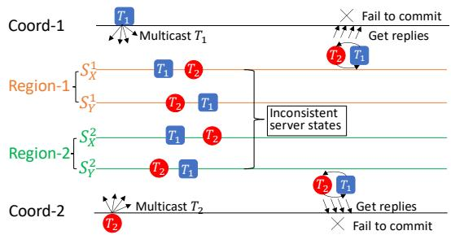  
Figure 1. Tapir fails to commit transactions in the fast path because $T _ { 1 }$ and $T _ { 2 }$ arrive at servers in different orders, causing inconsistent server states.

Necessity of strict serializability. Strict serializability requires that transactions’ executions are equivalent to a serial execution on a single-copy system, and the transactions’ executions also reflect the real-time ordering. While some systems [23, 75] choose to sacrifice real-time ordering for performance and only provide serializability, we find that non-strict serializability is insufficient for many practical cases. For example, (1) Banking systems: When transaction processing does not obey real-time ordering, account balances may appear inconsistent to clients; a withdrawal might not be reflected immediately, potentially leading to overdrafts or business errors. (2) Booking/ticket systems: Late booking orders may succeed over earlier ones, thereby causing unfairness among users. (3) Locking service: Clients may observe outdated lock states and perform unsafe operations under the false assumption of ownership.

Therefore, we target strict serializability. Meanwhile, we aim to achieve fault tolerance, which guarantees strict serializability for all committed transactions in the presence of a minority of server/datacenter failures of any shard.

Consolidated concurrency control and consensus, and 1- WRTT fast path. To achieve strict serializability and fault tolerance, we need concurrency control and consensus protocols to coordinate the servers. Although each category of protocols is usually studied separately, it is recognized that they share the same goal—to achieve consistent ordering among all servers [35]. Prior work has proposed consolidating the two types of protocols into a single layer [56, 76], to reduce redundant coordination overhead. In particular, the commit latency in geo-replicated systems can be reduced from several WRTTs to 1–2 WRTTs by the consolidation.

Existing work has proposed having a 1-WRTT fast path for commutative transactions, i.e., transactions that do not conflict with each other. If transactions conflict, the fast path

SOSP ’25, October 13–16, 2025, Seoul, Republic of Korea

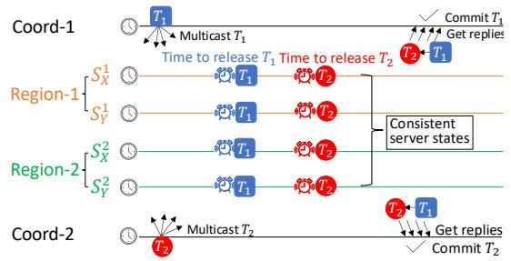  
Figure 2. Tiga rectifies inconsistent arrival order based on synchronized clocks so that servers process ??1 and $T _ { 2 }$ in the same order, and commit both in the fast path.

will fail, and more WRTTs are required to commit the transaction. Consider Figure 1, which shows the timestamp-based protocol Tapir [76] and illustrates the problem. The example has 2 coordinators and 2 shards, ?? and ?? . Both shards are replicated in 2 regions, Region-1 and Region-2 (technically a 3rd region is needed to tolerate failures; this is omitted to simplify discussions). Each coordinator multicasts a transaction (??1/??2) to all servers. $T _ { 1 }$ and $T _ { 2 }$ arrive at the 4 servers in different orders. This inconsistent ordering will form a cyclic dependency that is propagated across servers. Neither $T _ { 1 }$ nor $T _ { 2 }$ can commit in 1 WRTT (fast path). Thus, Tapir needs extra RTTs, which are also WRTTs if coordinators and servers are in different regions, to resolve the cycle.

We realize that the fast paths of Tapir and the others (e.g., Janus, Detock, and so on) fail under conflicts because these protocols optimistically process transactions based on their arrival order, but transactions’ arrival order on different servers can often be different in geo-replicated settings [31].

Intuition: proactive ordering with timestamps. Instead of being optimistic about arrival orders, Tiga chooses the proactive ordering approach—Tiga lets the coordinators predict a timestamp for transactions to arrive before multicast. Servers serialize transactions in their timestamp order. The timestamps are generated with synchronized clocks and indicate an approximate serialization point in the global ordering.

When clocks are used to serialize transactions, their accuracy directly impacts system performance. Classic clock synchronization techniques (e.g., NTP [54]) used to suffer high synchronization errors (10s of milliseconds) [2], which limited the effectiveness of protocols relying on synchronized clocks.

In recent years, however, clock synchronization accuracy has been improved substantially in practice [8, 32, 47, 57]. For example, Huygens [32] has become generally deployable in the public cloud and can yield microsecond- or even nanosecond-level synchronization errors [17, 19]. In our evaluation, even the default NTP service of Google Cloud (i.e., chrony) [34] can steadily converge to 4.54 ms error thanks to well-built cloud infrastructure. This has opened up new opportunities for using physical clocks to serialize transactions: Multiple servers can share a common timeline given the high accuracy of the synchronized clocks. When receiving the transaction, these servers can take actions simultaneously according to its timestamp. However, it is worth noting that even though the clock synchronization accuracy has been greatly improved, there is no guarantee of a deterministic error bound. Even for advanced schemes like Huygens, the worst-case error can still go arbitrarily large in theory. Therefore, a desirable protocol should still assume the clock is loosely synchronized, following Liskov’s design principle to “depend on clock synchronization for performance but not for correctness” [48].

Figure 2 illustrates Tiga’s idea with the same example. When the coordinator multicasts ??1 (or ??2), it proactively assigns a future timestamp to its transaction, and the timestamp is decided by summing up the sending time and the expected delay from the coordinator to enough (i.e., a super quorum, §3.1) participating servers to commit the transaction. Servers receiving the transactions will hold them until the local clocks pass the transactions’ timestamps. Thus, all participating servers can consistently process $T _ { 1 }$ and $T _ { 2 } ,$ and commit both transactions.

Challenges. While having synchronized clocks can create favorable conditions for Tiga’s fast path performance, using the simple rationale we just demonstrated itself is not sufficient to guarantee system correctness. The reason is three-fold. First, timestamps are not assumed to be always accurate. Clocks can be out of sync, or messages can take longer than predicted to arrive. Servers need extra mechanisms to deal with receiving transactions that are supposed to be processed in the past. Second, failures such as crashes and network partitions make it challenging to design a safe protocol that is resilient to corner cases such as recovering a dangling timestamp while the original coordinator has an unknown status (could be either crashed or just slowed). In such cases, the leader is holding the transaction with its timestamp, but the leader becomes isolated due to the network partition. Meanwhile, a new leader is elected and decides a new timestamp for the transaction. As a result, when the old leader becomes reconnected to the system, it must abandon the old timestamp for the transaction. Third, linearizability is a local property that is defined for a single shard but strict serializability is not [1, 37], which leads to the fact that a simple timestamp ordering solution is only serializable, losing the “strict” prefix which covers the external consistency or simply the linearizability part. This is also known as the timestamp inversion pitfall by recent work [50]. Extra cross-shard coordination steps need to be carefully designed to achieve correctness.

## 3 Tiga Design

We follow the workflow in Figure 3 to explain the protocol details. Figure 4 summarizes the state variables maintained at each Tiga server, and Algorithm 1 sketches the server’s

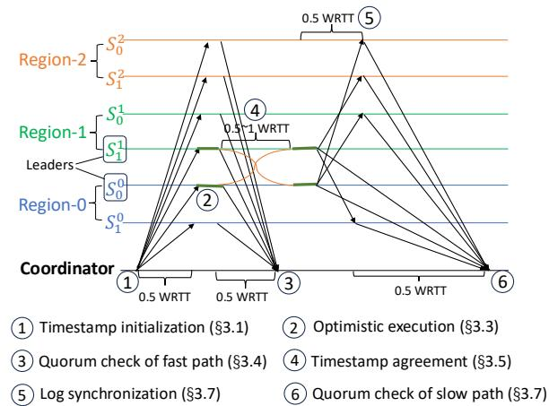  
Figure 3. Workflow of Tiga. ?????? indicates the server’s replicaid is ?? and shard-id is ??. The green solid bars 2 indicate that servers optimistically execute the transaction. However, servers can only know whether the execution is valid after timestamp agreement 4 . If the execution turns out to be invalid, servers will revoke the previous execution and reexecute the transaction (see Case-3 in §3.5).

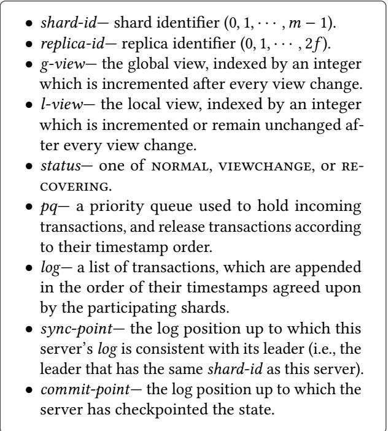  
Figure 4. Local state of Tiga servers.

action in response to different events. We refer to these state variables and actions during our explanation.

## 3.1 Timestamp Initialization

The protocol starts with the coordinator multicasting transactions to servers, i.e., 1 in Figure 3. When multicasting the transaction ?? , the coordinator needs to predict a future timestamp for ?? , so that ?? can arrive at all involved servers just before the timestamp. The future timestamp ?? is calculated by adding the headroom to the transaction’s sending time $t _ { s e n d }$ . We next describe how we estimate the headroom.

Algorithm 1 Server action   
1: upon ?????????????????? ??????, ?? do   
2: if conflict-detection(?? )=OK then ????.insert(?? )   
3: else if am-leader() then ⊲ Only leaders can update ?? .??   
4: ?? .?? ← clock-time( )   
5: ????.insert(?? )   
6: upon ?????????? ???????? ?????????????????????? do ⊲ Periodically check the clock time   
7: ???????? ?????? ← clock-time( )   
8: ???????????????? ?????? ← [ ]   
⊲ Enumerate txns based on timestamp order   
9: for ?? ∈ pq do   
10: if $T . t >$ ???????? ?????? then break ⊲ ?? has not expired   
11: i $\sharp T ^ { \prime } \in p q : T ^ { \prime } . t < T . t$ and $T ^ { \prime }$ conflicts with ?? then   
12: releaseTxns.append(?? )   
13: for ?? ∈ releaseTxns do   
14: ∀ key ∈ T.readSet, rMap[key]←?? .??   
15: ∀ key ∈ T.writeSet, wMap[key]←?? .?? ⊲ For conflict detection   
16: if am-leader() then   
17: ?????? ← execute(?? ) ⊲ Only leaders execute ??   
18: ℎ????ℎ = calculate-hash(??????)   
19: send-fast-reply(?? , ℎ????ℎ, ??????)   
⊲ ???????? contains ?? ’s timestamps used by each leader   
20: ???????? ←timestamp-agreement(?? )   
21: if ?? .?? = max{?? : ?? ∈ ???????? } then   
22: if ???????? .size()>1 then ⊲ Some leaders used incorrect ?? .??   
⊲ After completing second round, leaders agree on ?? .??   
23: timestamp-agreement(?? )   
24: Append ?? to ?????? and syncs ?? .?? with followers   
25: pq.erase(T)   
26: else ⊲ This leader used smaller timestamp   
27: revoke-execution(?? ) ⊲ Previous execution is revoked   
28: ?? .?? ← max{?? : ?? ∈ ???????? }   
29: pq.reposition(?? )   
30: else ⊲ Follower sends fast-reply without execution result   
31: send-fast-reply(?? , ℎ????ℎ, ????????)   
32: pq.erase(T)   
33: upon ?? ?????????????? ′?? ?????????????????? log-sync, ?????? do   
34: Update log to keep consistent with leader’s log   
35: Advance follower’s sync-point   
36: send-slow-reply(?? )

The headroom estimation is based on the measurement of the one-way delays (OWDs) between the coordinator and the servers. We use ?? to represent the coordinator, and use $S _ { s } ^ { r }$ to represent a server whose replica-id is ?? and shardid is ??. We use $O ( C , S _ { s } ^ { r } )$ to represent the OWD from ?? to $S _ { s } ^ { r } .$ . These OWDs can be easily measured since the clocks have been synchronized among coordinators and servers. Huygens achieves clock synchronization errors of only a few microseconds (§5.7), which are negligible compared to WAN OWDs (tens to hundreds of milliseconds), thereby enabling accurate OWD measurement.

Assume that ?? will be submitted to ?? shards, and shardids are $0 , \cdots , m - 1$ . ?? will assign a future timestamp for ?? , by adding the headroom to its sending time $t _ { s e n d }$ . The

SOSP ’25, October 13–16, 2025, Seoul, Republic of Korea

size of the added headroom will decide how likely ?? can be committed in the fast or slow path.

To commit?? via the fast path, its future timestamp ?? should be sufficiently large for ?? to reach at least a super quorum $\left( 1 + f + \lceil f / 2 \rceil \right)$ of replicas in each shard.

$$
t = t _ { s e n d } + \operatorname* { m a x } _ { 0 \leq s < m } \operatorname* { m a x } _ { r \in S Q _ { s } } O ( C , S _ { s } ^ { r } ) + \Delta
$$

$S Q _ { s }$ represents a super quorum of replicas from the shard (shard-id is ??) that are closest to $C ,$ i.e., the replicas with smaller OWDs to ?? than the remaining replicas in the shard. We choose $\Delta \ : = \ : 1 0 m s$ in our implementation so that the headroom added to $t _ { s e n d }$ is slightly larger than the OWDs of the super quorum. The necessity of a super quorum (rather than a simple quorum of $f + 1$ servers) for fast path will be explained later in §3.4.

## 3.2 Conflict Detection and Timestamp Update

On each server, Tiga maintains a priority queue (denoted ???? in Algorithm 1) to buffer transactions and release them according to their timestamp order. Given a transaction ?? , the server performs conflict detection (line 2 in Algorithm 1) to decide whether ?? can be accepted into ????.

Conflict detection. The server checks $T s$ timestamp and will not accept it into ???? if ???? has already released another transaction $T ^ { \prime }$ , which has a larger timestamp and has read-write or write-write conflict with ?? on the same keys. Since transactions are written as (or can be decomposed as) one-shot stored procedures, the server knows their read/write sets before execution. Thus, conflict detection can be implemented very efficiently: The server maintains two maps (???????? and ????????). Both maps associate every data item (key) of the keyvalue store with a timestamp. When $T ^ { \prime }$ is released from ???? (the release conditions will be explained in §3.3), the server uses $T ^ { \prime } { } _ { s }$ timestamp to update the timestamp of every key that falls in $T ^ { \prime } \bar { s }$ read/write set (line 14–15 in Algorithm 1). When ?? arrives, the server directly compares ?? ’s timestamp with the recorded timestamps of keys that ?? will read/write. ?? will be accepted into ???? if its timestamp is larger than the timestamps of all conflicting transactions that have been released from ???? (line 1–2).

Not every transaction can be accepted into ???? after conflict detection. When ?? arrives late at a leader server due to network delay or packet loss, its timestamp may be too small to be accepted into ????. In such cases, the leader updates $T \mathbf { \hat { s } }$ timestamp to the local clock time (line 4), after which ?? can enter the leader’s queue.

Followers, by contrast, do not perform timestamp updates. If ?? .?? is smaller than acceptable for the queue, the follower holds ?? and waits for synchronization instructions from the leader in the slow path (§3.7, line 33–36 in Algorithm 1).

## 3.3 Optimistic Execution

For each transaction ?? in the queue ????, followers refer to the local clock to determine when to release it. Once the local time surpasses ?? .??, the follower releases ?? without executing it: ?? is removed from the queue and then appended to the log list. After that, the follower sends a fast-reply to the coordinator to perform a quorum check (§3.4).

Leaders, on the other hand, must execute transactions before releasing them. To minimize latency (1 WRTT), leaders optimistically execute transactions without coordination. Periodically, the leader refers to its local clock to identify expired transactions (i.e., transactions whose timestamps have been passed by the current clock time) in its queue. It checks these transactions in timestamp order to decide whether each can be optimistically executed. When ?? has reached the head of the queue without any conflicting transactions ahead, ?? can be executed. However, ?? will remain at the head of the queue after execution.

After executing ?? , the leader sends a fast-reply to the coordinator, including the execution results. ?? stays at the head of the leader’s queue to undergo timestamp agreement (see §3.5). After that, ?? is either released (line 25) or repositioned in the queue with a larger timestamp (line 29).

Before ?? can be released, the leader/follower records $T s$ timestamp with its read set and write set (line 14-15) for subsequent conflict detection (§3.2, line 2 in Algorithm 1). The follow-up transaction is no longer acceptable into the queue if it conflicts with ?? but has a smaller timestamp.

## 3.4 Quorum Check of Fast Path

A server’s fast-reply regarding transaction ?? includes a hash value of the log list to represent its state before ?? . The hash of the log list is computed as the bitwise exclusive-or (XOR) of the hashes of all its entries. This allows the server to incrementally compute the hash. When adding/deleting a log entry ??, the new hash is computed as $H _ { n e w } \ =$ $X O R ( H _ { o l d } , h a s h ( e ) )$ . We use a 160-bit SHA-1 hash and assume hashes do not collide in practice. Note that applying XOR on hashes does not make them vulnerable to collisions [11, 12]. It is a commonly applied technique in systems using incremental hash [4, 9, 10, 16, 27, 31]. Our technical report [30] provides more details on how Tiga uses incremental hash. In addition, the fast-reply includes ?? ’s timestamp.

The coordinator receives ?? ’s fast-replies from all servers. ?? is considered fast-committed on a shard if, from this shard, the coordinator receives a super quorum of fast-replies that have the same hash and timestamp for ?? . The super quorum must satisfy two conditions: (1) it contains the leader, and (2) its size is at least $1 + f + \lceil f / 2 \rceil$ . If these are met, the coordinator uses the optimistic results in the leaders’ replies as ?? ’s execution results on this shard.

The reason that Tiga’s fast path requires a super quorum $\left( 1 + f + \lceil f / 2 \rceil \right)$ instead of a simple quorum $( f + 1 )$ is similar to Fast Paxos [44]: Because the fast path omits leader–follower communication, a simple quorum lacks sufficient information for a new leader to distinguish committed from uncommitted transactions. Consider the leader and ?? followers append $T _ { 1 }$ and $T _ { 3 } \ ( T _ { 1 } \  \ T _ { 3 } )$ in their log lists whereas the other $f$ followers append ??2 and $T _ { 3 } ( T _ { 2 }  T _ { 3 } )$ at the same positions of their log lists. Assuming the fast path only requires a simple quorum, then $T _ { 1 }$ and $T _ { 3 }$ will be considered committed. However, when the leader fails, both $T _ { 1 }$ and $T _ { 2 }$ exist among half of the remaining servers, thus the new leader cannot know whether $T _ { 1 }  T _ { 3 } \mathrm { o r } T _ { 2 }  T _ { 3 }$ is previously committed. If the new leader mistakenly believes $T _ { 2 }  T _ { 3 }$ is previously committed, then $T _ { 3 }$ will have a different execution result compared to that before the crash.

If ?? is fast-committed on all its involved shards, the coordinator additionally checks whether leaders have consistent timestamps for ?? in their fast-replies, because some leaders may have updated $T s$ timestamp whereas the others have not. If all participating leaders have used the same timestamp to execute ?? , ?? is committed in the fast path.

## 3.5 Timestamp Agreement

After $T \mathbf { \hat { s } }$ execution, the leaders need to verify whether the execution is valid: all participating leaders should execute ?? in the same timestamp order; otherwise, the execution may violate strict serializability and should be revoked. To support revoking, Tiga maintains multiple versions for each data item (key). $T \mathbf { \hat { s } }$ optimistic execution creates new versions of data. Once the server detects the execution is invalid, it erases the corresponding data versions. Note that the revoking operation is internal to Tiga, and does not cause applicationrelated rollback.

To check the validity of?? ’s execution, leaders start a round of message exchange. Each leader notifies the other participating leaders of its local timestamp ?? .??. Then, each leader collects the full set of $\cdot _ { T \cdot s }$ timestamps used by different leaders, and computes the maximum as the agreed timestamp, $T . t _ { a g r e e d }$ . Since all leaders operate on the same timestamp set, they deterministically compute the same $T . t _ { a g r e e d }$ . The subsequent actions depend on three possible cases:

Case-1: All timestamps match. This is the ideal case, which takes only 0.5 WRTT ( 4 in Figure 3) for leaders to notify each other. If every leader’s local timestamp equals $T . t _ { \mathrm { a g r e e d : } }$ the timestamp agreement succeeds immediately. Each leader releases ?? and then appends ?? to its log.

Case-2: This leader used $\begin{array} { r } { T . t _ { a g r e e d } , } \end{array}$ , but the others did not. In this case, the leader’s optimistic execution remains valid, but some other leaders used smaller timestamps. To avoid potential timestamp inversion (discussed in §3.6), the leader cannot release ?? immediately. Instead, it initiates a second round of timestamp exchange (another 0.5 WRTT) to confirm that all leaders have updated ?? ’s timestamp to $T . t _ { \mathrm { a g r e e d } }$ . Once confirmed, the leader proceeds as in Case-1. In this case, the timestamp agreement 4 takes 1 WRTT in total.

Case-3: This leader used a timestamp smaller than $\it { T . t _ { a g r e e d } . }$ This indicates that the leader’s optimistic execution is invalid, so it revokes $T s$ execution. Then, it updates $T \mathbf { \hat { s } }$ timestamp: $T . t \gets T . t _ { a g r e e d } .$ After that, the leader initiates the second round of timestamp exchange (another 0.5 WRTT) to notify the other leaders. Since $T s$ timestamp changes to a larger value,?? will be repositioned in the leader’s queue. Eventually, ?? will come to the head again, and then the leader will reexecute ?? with the agreed timestamp.

Tiga: Accelerating Geo-Distributed Transactions with Synchronized Clocks
<table><tr><td rowspan=20 colspan=1>Brpeiereeeg</td><td rowspan=1 colspan=1> $L _ { 1 }$ </td><td rowspan=1 colspan=1> $L _ { 2 }$ </td></tr><tr><td rowspan=1 colspan=1> $c l o c k _ { 1 } = 6 ,$ some txn has been releasedwith timestamp of 6</td><td rowspan=1 colspan=1> $c l o c k _ { 2 } = 1$ </td></tr><tr><td rowspan=1 colspan=1> $T _ { 1 }$ arrives with $T _ { 1 } . t = 4$ </td><td rowspan=1 colspan=1> $T _ { 1 }$ arrives with $T _ { 1 } . t = 4$ </td></tr><tr><td rowspan=1 colspan=1> $T _ { 1 }$ enters pq after timestamp update, $T _ { 1 } . t \gets 7$ </td><td rowspan=1 colspan=1> $T _ { 1 }$ enters pq with $T _ { 1 } . t = 4$ </td></tr><tr><td rowspan=1 colspan=1> $\underline { { T _ { 2 } } }$ arrives with $T _ { 2 } . t = 1 0$ </td><td rowspan=1 colspan=1> $c l o c k _ { 2 } = 4 , T _ { 1 }$ is executed</td></tr><tr><td rowspan=1 colspan=1>T2 enters pq with $T _ { 2 } . t = 1 0$ </td><td rowspan=1 colspan=1></td></tr><tr><td rowspan=1 colspan=1> $c l o c k _ { 1 } = 7 , T _ { 1 }$ is executed</td><td rowspan=1 colspan=1></td></tr><tr><td rowspan=1 colspan=1>Send $T _ { 1 } . t \mathsf { t o } L _ { 2 }$ </td><td rowspan=1 colspan=1>Send $T _ { 1 } . t \mathrm { t } 0 L _ { 1 }$ </td></tr><tr><td rowspan=1 colspan=1>Receive $T _ { 1 } . t = 4 ~ \mathrm { f r o m } { \cal L } _ { 2 }$ </td><td rowspan=1 colspan=1></td></tr><tr><td rowspan=1 colspan=1> $T _ { 1 } . t = T _ { 1 } . t _ { a g r e e d } = \operatorname* { m a x } \{ 4 , 7 \}$ T1‘s execution is valid.</td><td rowspan=1 colspan=1></td></tr><tr><td rowspan=1 colspan=1>T1 is released immediately</td><td rowspan=1 colspan=1></td></tr><tr><td rowspan=1 colspan=1> $\_$ isexecuted, releasedand committed in $\cdot$ shard</td><td rowspan=1 colspan=1></td></tr><tr><td rowspan=1 colspan=1></td><td rowspan=1 colspan=1> $T _ { 3 }$ is submitted with $\cdot$ </td></tr><tr><td rowspan=1 colspan=1></td><td rowspan=1 colspan=1> $T _ { 3 }$ enters pq with $T _ { 3 } . t = 5$ </td></tr><tr><td rowspan=1 colspan=1></td><td rowspan=1 colspan=1>Receive $T _ { 1 } . t = 7 \mathrm { f r o m } L _ { 1 }$ </td></tr><tr><td rowspan=1 colspan=1></td><td rowspan=1 colspan=1> $T _ { 1 } . t \gets \operatorname* { m a x } \{ 4 , 7 \} = 7 > 4$ </td></tr><tr><td rowspan=1 colspan=1></td><td rowspan=1 colspan=1> $T _ { 1 } ^ { \prime } { \overset { \underset { \mathrm { \textstyle ~  } } { } } { : } }$ s execution is invalid and revoked</td></tr><tr><td rowspan=1 colspan=1></td><td rowspan=1 colspan=1> $T _ { 1 }$ is repositioned in $p q ,$  $T _ { 3 }$ comes to the head of pq</td></tr><tr><td rowspan=1 colspan=1></td><td rowspan=1 colspan=1> $c l o c k _ { 2 } = 5 , T _ { 3 }$ is executed,releasedand committed in $\underline { { L _ { 2 } } } ^ { \prime } \mathsf { s }$ shard</td></tr><tr><td rowspan=1 colspan=1></td><td rowspan=1 colspan=1> $c l o c k _ { 2 } = 7 , T _ { 1 }$ is executed, releasedand committed in $L _ { 2 } ^ { \prime } \mathsf { s s h a r d }$ </td></tr></table>

Figure 5. Illustration of timestamp inversion. With only one round of message exchange between $L _ { 1 }$ and $L _ { 2 } , T _ { 3 }$ may be submitted after $T _ { 2 }$ is committed, leading to real-time ordering $T _ { 2 }  T _ { 3 }$ that contradicts serializable order $T _ { 3 }  T _ { 1 }  T _ { 2 }$

## 3.6 Avoiding Timestamp Inversion

Readers may wonder why the leader in Case-2, denoted $L _ { 1 } ,$ cannot immediately release ?? since this leader already used the agreed timestamp for ?? . The reason is the timestamp inversion pitfall [50], which hurts correctness, in particular strict serializability. While $L _ { 1 }$ has confirmed it used the proper timestamp $T . t _ { a g r e e d }$ for ?? , the other leader(s), denoted $L _ { 2 } ,$ , used a smaller timestamp $T . t < T . t _ { a q r e e d } ,$ , and $L _ { 1 }$ is uncertain whether $L _ { 2 }$ has completed timestamp agreement and updated ?? .?? to $T . t _ { a g r e e d }$ . As a result, $\mathrm { i f } L _ { 1 }$ releases ?? immediately, timestamp inversion may occur: After $L _ { 1 }$ has committed some transactions with timestamps larger than $\begin{array} { r } { T . t _ { a g r e e d } , } \end{array}$ $L _ { 2 }$ could still commit other transactions with smaller timestamps than $T . t _ { a g r e e d } .$

Figure 5 shows a concrete sequence of events illustrating how timestamp inversion occurs. $L _ { 1 }$ and $L _ { 2 }$ are the leaders of two shards, and they process three transactions $T _ { 1 } , T _ { 2 }$ and $T _ { 3 } , T _ { 1 }$ is a multi-shard transaction that involves both $L _ { 1 } { ' } s$ and $L _ { 2 } ^ { \ ' } s$ shards. $T _ { 2 }$ is only processed by $L _ { 1 } { } ^ { \ ' } s$ s shard; $T _ { 3 }$ is only processed by $L _ { 2 } ^ { \phantom { * } } s$ shard. The leaders’ clocks $( { \mathrm { i . e . } }$ , ??????????1 and ??????????2) are badly synchronized.

SOSP $^ { , } 2 5 ,$ , October 13–16, 2025, Seoul, Republic of Korea

$L _ { 1 } { ' } s$ event sequence indicates the dependency relation $T _ { 1 }  T _ { 2 }$ and $L _ { 2 } { ' } s$ event sequence indicates $T _ { 3 }  T _ { 1 }$ , so the only valid serializable schedule is $T _ { 3 }  T _ { 1 }  T _ { 2 }$ . However, in real time, $T _ { 3 }$ starts after $T _ { 2 }$ has been completed, indicating the real-time ordering relation $T _ { 2 }  T _ { 3 }$ , which contradicts the serializable order.

The fundamental reason behind timestamp inversion lies in the different guarantees of linearizability versus strict serializability. Linearizability is a local property within each shard— $- \mathrm { e . g . , } L _ { 1 }$ only needs to ensure its followers in the same shard use a consistent order between $T _ { 1 }$ and $T _ { 2 }$ with $L _ { 1 }$ itself, and does not consider the ordering between $T _ { 2 }$ and $T _ { 3 } ,$ , which are processed by different shards. The same holds for $L _ { 2 }$ . In contrast, strict serializability enforces a global order across shards. Although $T _ { 2 }$ and $T _ { 3 }$ do not directly conflict, they both access data involved in $T _ { 1 }$ , forming a dependency chain that induces a real-time order between them. This indirect dependency is not captured by linearizability, but is essential for preserving strict serializability.

To avoid timestamp inversion, when a leader notices it is holding a different timestamp from the other leaders for a transaction, it must ensure no other transactions with smaller timestamps $( \mathrm { e } . \mathrm { g } . , T _ { 3 } )$ can be committed later. Specifically in Figure $5 , L _ { 1 }$ should release $T _ { 1 }$ after it confirms that $L _ { 2 }$ has updated $T _ { 1 }$ with the agreed timestamp, and $T _ { 1 }$ has come to the head of the queue again (after repositioning). At this point, (1) $T _ { 3 }$ has been executed on $L _ { 2 }$ whereas $T _ { 2 }$ remains in $L _ { 1 } { ' } s$ queue, because $T _ { 1 }$ is at the head of the queue and blocking $T _ { 2 }$ from execution. (2) $L _ { 2 }$ will no longer allow the other transactions (which conflict with $T _ { 1 } )$ to enter its queue with smaller timestamps than $T _ { 1 }$ ’s agreed timestamp $( T _ { 1 } . t =$ 7). Thus, the second round of timestamp agreement rules out any real-time ordering violations that would otherwise conflict with the serializable schedule. We include the proof in our technical report [30].

In contrast to the leaders, the followers do not engage in timestamp update and agreement, so they may have different timestamps from the leaders at this point. The potential leader-follower inconsistency will be detected in the fast path by comparing the hashes and ?? ’s timestamp (§3.4) and resolved in the slow path (§3.7).

## 3.7 Log Synchronization and Slow Path

Tiga does not guarantee that all transactions are committed in the fast path. If a leader updates a timestamp, it causes inconsistency between itself and its followers. Therefore, after appending the transaction to its log, the leader advances its sync-point and also sends the followers a log synchronization message. In the synchronization messages, the leader includes the entry’s position, unique identifier  and the timestamp agreed by leaders. When receiving the synchronization message, the followers update their logs to keep consistent with the leader’s log: (1) If the follower’s log contains some entry that does not exist in the leader’s log, then the follower removes the entry. (2) If the leader’s log contains some entry that does not exist in the follower’s log, then the follower first tries to obtain the missing entry locally from its server. If the entry is not found, then the follower fetches it from the leader. (3) If some entry exists in both the leader’s and the follower’s logs but has different timestamps, then the follower updates the entry’s timestamp to keep consistent with the leader.

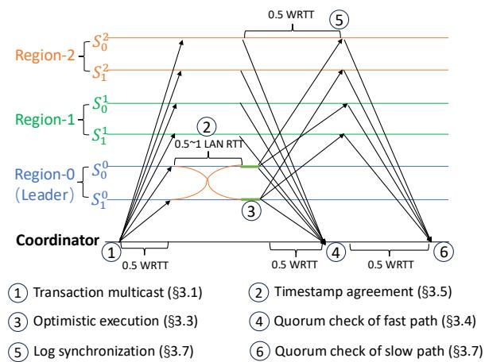  
Figure 6. Workflow of Tiga (preventive approach).

After the log update, the follower advances its sync-point to indicate its log list has been synchronized with the leader’s log list up to this point. Then, the follower sends slow-replies to the coordinators which have multicast those synchronized entries, notifying the coordinators that entries for these transactions have become consistent with the leader. Our technical report [30] describes an optimization that does not require the followers to send the slow reply for every entry.

Followers also periodically report their sync-points to the leader, so that the leader knows which log entries have been sufficiently replicated. After the leader confirms that the log entries have been surpassed by the sync-points from ?? + 1 servers of the same shard, the leader knows these entries are committed. The leader then advances its commit-point and notifies its followers of the updated commit-point. Followers can execute the log entries up to their commit-points and generate checkpoints to accelerate failure recovery (§4).

A transaction is considered slow-committed on a shard if the coordinator (1) receives the fast-reply from the leader and (2) receives slow-replies from at least ?? followers. If the transaction is either fast- or slow-committed on every involved shard, it is considered committed.

## 3.8 Optimization based on Leaders’ Co-location

In §3.3-§3.5, we let the leaders start optimistic execution without waiting for timestamp agreement. The purpose is to minimize the latency of the fast path, because timestamp agreement costs additional WAN latency when leaders are separated across regions. However, skipping timestamp agreement in the fast path introduces the risk of invalid execution, i.e., different shards execute transactions based on inconsistent timestamp orders, incurring expensive rollback.

Alternatively, if timestamp agreement is cheap, i.e., it only costs LAN latency, then prioritizing timestamp agreement over execution is more desirable: It only adds negligible overhead to the commit latency, but avoids the rollback of invalid execution, because all the leaders execute the transactions according to their agreed timestamp order. Fortunately, we realize that this approach is commonly feasible in practical deployment. In typical geo-distributed OLTP systems [7, 13, 38, 49, 53, 56, 59, 62], each datacenter (region) usually contains a full copy of data, thus enabling co-location of all leaders within the same region. In addition, industry workloads also exhibit strong data locality. For example, the Yahoo! trace [20] reveals 85% regional locality for user data accesses; the typical edge workload [13] has 90% of intraregion transactions. By leveraging the co-location property, we can schedule timestamp agreement ahead of execution, as shown in Figure 6, in contrast to Figure 3.

Choose the approach of timestamp agreement. Since there is no one-size-fits-all approach towards different deployments, Tiga incorporates both approaches, with the choice being configurable through its modified view change protocol (§4). Specifically, Tiga leverages Huygens’ probe mesh to continuously monitor the OWDs between servers. Based on the measured OWDs, Tiga initializes a view change to designate the leader for every shard. Tiga tries to co-locate all leaders close to each other, so that it can schedule timestamp agreement before execution, which costs negligible LAN overhead but prevents invalid execution at its root. However, if co-location is infeasible, i.e., Tiga cannot find a group of leaders with OWDs below a predefined threshold (e.g., 10 ms), then the preventive approach becomes inefficient, prompting Tiga to adopt the detective approach (Figure 3). The view change message includes the planned approach (i.e., preventive or detective), so that all servers consistently adopt the planned approach after entering the new view.

## 4 Failure Recovery

Server failures in Tiga can be classified into two categories: leader failures and follower failures. Follower failures are relatively easier to deal with. A minority of follower failures in any shard do not interrupt service availability. Tiga can always use the slow path to commit transactions if the servers alive are insufficient for the super quorum in the fast path. When failed followers reboot, they catch up by synchronizing logs with the leader. Here, we mainly discuss leader failure handling. Further details and the correctness proof are included in our technical report [30].

Tiga uses a view-based [61] protocol to facilitate leader failure recovery. A view records information on membership, including each member’s role, i.e., as a leader or follower.

Tiga: Accelerating Geo-Distributed Transactions with Synchronized Clocks

Tiga distinguishes between two views: a local view (l-view) which stores information about a shard, and a global view (gview) about all shards. A global view includes all local views. Both the global views and the local views are indexed by unique and monotonically increasing integers. The views are managed by a view manager. The view manager is a simple service implemented on a replicated state machine that is resilient to failures, e.g., it could be built with ZooKeeper [6]. It is off the critical path of transaction processing in the common cases, so its performance has no significant impact.

Every server stores both the global and its local view. When the system is stable (no failures), all servers have the same global view, which also implies that servers of the same shard share the same local view. A server attaches the global and local view-ids to every message it sends out. When receiving a message from other shards, a server always checks and rejects the message if the message has a different global view. If the message is from within the shard, the server also checks whether it has the same local view.

The view manager detects server failure(s) using heartbeats, and launches a view change if a leader fails. The view change proceeds in the following steps.

1 The view manager creates a new view that has new leader(s) to replace the failed one(s). When selecting new leaders, the view manager prioritizes choices that can make most leaders co-located in the same region, so that interleader timestamp agreement only costs LAN overhead after the system resumes normal processing in the new view. Based on the latency cost of timestamp agreement, the view manager decides whether to use the preventive or detective approach (§3.8) in the new view. The view manager also creates new view-ids by incrementing the old view-ids. This includes a new global view-id and new local view-ids for the shards whose leaders are changed.

2 The view manager broadcasts the new view to all servers in the system. When a server receives a newer view (i.e., higher <g-view,l-view>), it will update its view, and switch its status from normal to viewchange.

At the start of the view change, the servers stop processing new transactions. Each server empties its queue and appends the transactions in the queue to its log list according to their timestamp order. The new leader is responsible for collecting the servers’ log lists and rebuilding a new log list that contains all the previously committed transactions.

3 If a server is the new leader of a shard, it rebuilds a new log list based on the log lists from any ?? + 1 servers that remain alive in this shard. The reconstruction of the log list includes two parts: (a) The leader finds the server that is holding the largest sync-point among the ?? + 1 servers, and copies its log list up to the sync-point. (b) The leader continues to check the remaining entries. For any remaining entry with a larger timestamp than those recovered in (a), if it exists in the log lists of ⌈?? /2⌉ + 1 participating servers, then this entry will also be appended to the leader’s log list according to its timestamp order.

4 Because the leaders’ timestamp agreement happens before followers advance their sync-points, (a)’s log entries have the agreed timestamps across shards. But (b)’s log entries may have inconsistent timestamps across shards. Therefore, after rebuilding the log lists, the leaders conduct timestamp agreement for (b)’s log entries: (1) If a recovered transaction involves both ??ℎ??????1 and ??ℎ??????2, but it is only recovered in ??ℎ??????1, then ??ℎ??????2’s leader will pick the transaction from ??ℎ??????1 to add to its own log list. (2) If a recovered transaction has inconsistent timestamps across shards, the leaders pick the maximum one as the agreed timestamp.

5 After timestamp agreement, each leader broadcasts its log list to its followers. Leaders execute the recovered logs and switch back to normal. Followers use leaders’ log lists to replace their old ones, then switch back to normal.

To complete the overall design, the coordinator(s) in Tiga also cache the global view from the view manager. It only accepts replies that have the same global view-id. In case of a view change, the coordinator retries the transaction.

Coordinator failure. If a coordinator fails, the servers will detect it after a timeout and launch a recovery coordinator to commit the transaction following the same coordinator procedure (§3.1, §3.4 and §3.7). The newly launched coordinator can always fetch the view information from the view manager, and itself is stateless. As a result, the coordinator failure does not trigger any view change.

Checkpoints to accelerate recovery. Tiga incorporates a periodic checkpoint mechanism, a common practice for accelerating the recovery of transaction processing systems [14, 31, 46, 63]. Since each server maintains the commitpoint, the server can safely execute the log entries prior to its commit-point, and checkpoint the system state. When servers fail, the new leader can restore the system state from the latest checkpoint rather than from scratch. The failed follower can first fetch the latest checkpoint from the leader and catch up, significantly speeding up recovery.

## 5 Evaluation

We build on the Janus codebase [55], which provides a highperformance implementation of several baseline protocols, including 2PL+Paxos, OCC+Paxos, Tapir, Janus, and NCC. Using the same RPC library and runtime environment, we implement Tiga along with additional baselines, such as Detock [60] and an enhanced version of Calvin [71], namely Calvin+. Calvin+ replaces Calvin’s Paxos-based consensus layer with Nezha [31], saving at least 1 WRTT in committing transactions. In total, we compare Tiga against 8 baselines across a range of workloads.

## 5.1 Evaluation Setup

Workloads. We employ 2 benchmarks: a micro-benchmark (MicroBench) and the widely used TPC-C [22]. MicroBench pre-populates each shard with 1 million key-value pairs. Each transaction performs 3 read-write operations across different shards by incrementing 3 key-value pairs. The keyvalue pairs are selected using a Zipfian distribution [36]. We tune the skew factor of the Zipfian distribution to control the contention in MicroBench, where higher skew factors yield more contention. For TPC-C, we implement all 5 types of transactions according to the specification [22]. Additionally, we follow NCC’s approach [50] and make 2 types (Payment and Order-Status) multi-shot (interactive) transactions.

Table 1. Maximum throughput $( 1 0 ^ { 3 }$ txns/s).
<table><tr><td>Benchmark</td><td>2PL+Paxos</td><td>OCC+Paxos</td><td>Tapir</td><td>Janus</td><td>Calvin+</td><td>Detock</td><td>NCC</td><td>Tiga</td></tr><tr><td>MicroBench</td><td>22.9</td><td>21.8</td><td>44.2</td><td>77.8</td><td>119.6</td><td>34.5</td><td>47.4</td><td>157.3</td></tr><tr><td>TPC-C</td><td>2.1</td><td>0.9</td><td>1.1</td><td>10.8</td><td>6.1</td><td>13.3</td><td>0.86</td><td>21.6</td></tr></table>

Baselines and testbed. We compare Tiga to the 8 baseline protocols. 2PL+Paxos utilizes the wound-wait mechanism [66] to prevent deadlocks. Detock performs only local replication at commit and performs geo-replication asynchronously [60]. To tolerate region failures, we make Detock perform synchronous geo-replication during transaction commit. In Detock, we evenly distribute the home directories of data items across regions. NCC’s implementation does not tolerate server failure, and suggests using Paxos to achieve fault tolerance, so we implement NCC+ by placing NCC atop a Paxos replication layer. 2PL/OCC+Paxos and NCC inherently support interactive transactions by design. For the other protocols (Calvin+, Janus, Detock, and Tiga), we integrate the decomposition technique [70] to support interactive transactions.

All experiments are conducted in Google Cloud. We use n2-standard-16 VMs to run servers and coordinators (clients are co-located with coordinators on the same VMs). Data is replicated across 3 regions: South Carolina, Finland, and Brazil. In practical deployment, clients/coordinators can either be co-located or separated from the servers, so we consider both cases: (1) We deploy 2 coordinators in each of the 3 regions (local regions). (2) We also deploy 2 coordinators in the 4th region (remote region), Hong Kong, because some coordinators might not be allowed to co-locate with servers due to governmental regulations (e.g., GDPR [25], DSL [58]) or proprietary business reasons. The system is configured with 3 shards (9 servers in total) for MicroBench and 6 shards (18 servers in total) for TPC-C to be consistent with Janus’ original setup.

Evaluation method. We evaluate the performance of the protocols using an open-loop approach [72]: Each coordinator submits transactions at a given rate. The coordinator maintains a cap on the outstanding transactions and stops submitting new transactions once this cap is reached. Each test is repeated 5 times, and we report the median of the 5 trials. Since each region contains a full copy of the data, Tiga adopts the preventive approach in all evaluations except in §5.5 and §5.6. §5.5 compares the performance of Tiga’s preventive and detective approaches. §5.6 evaluates the impact of headroom on Tiga’s latency and rollback rate.

## 5.2 MicroBench

We first run MicroBench with a fixed skew factor of 0.5 and compare protocols’ performance by increasing the submission rate of each coordinator (Table 1 and Figure 7-8). Then we fix per-coordinator rate at 8K txns/s, and compare the protocols’ performance by varying skew factor from 0.5 to 0.99 (Figure 9). We measure the coordinators’ throughput, commit rate, 50th and 90th percentile latency in each region.

Our evaluation highlights Tiga’s efficiency in achieving strict serializability and fault tolerance, outperforming stateof-the-art protocols across various metrics. Specifically: (1) 2PL/OCC+Paxos reach their throughput bottlenecks very early due to the Paxos consensus layer. Besides, the added WRTTs by the consensus layer inflate commit latency and extend the locking window, leading to more aborts. (2) Tapir’s commit rate decreases rapidly as the load increases, because more concurrent transactions arrive at the servers in different orders, making Tapir abort more transactions to resolve ordering inconsistencies. (3) Janus and Detock run expensive graph algorithms to resolve inconsistencies between servers. When the submission rate grows and/or the contention (skew factor) increases, the graph computation becomes a bottleneck. Detock incurs even more WRTTs due to its layered design. In addition, since the home directories of different data items are distributed across regions, Detock pays extra WRTTs for dependency collection, further impacting performance. (4) Calvin+ uses an epoch-based mechanism to predefine transactions’ order, which is more robust to the various skew factors. However, it suffers from the straggler problem—when one shard is overloaded and slows down, the entire system is affected, reducing throughput and increasing latency. (5) NCC does not include fault tolerance for servers, and all servers are located in one region (South Carolina), so it costs only LAN latency in this region, and requires at least 1 WRTT in the other three regions. However, NCC uses Response Time Control (RTC) to guarantee strict serializability. RTC makes servers release a transaction only after the previous conflicting transaction sends back the commit notification. Thus, RTC artificially creates a 1-WRTT gap between these conflicting transactions. This leads to significant queueing delay. Under high load and contention, RTC limits NCC’s throughput and causes latency to rise rapidly. Besides, after adding fault tolerance, NCC+ experiences further performance degradation.

Compared to the local region (South Carolina), Tiga’s latency advantage becomes more pronounced in the remote region (Hong Kong). In the local region (Figure 7), Janus/- Tapir/Calvin+ can yield 1-WRTT latency at a low submission rate. However, in the remote region without co-located servers (Figure 8), they all require at least 2 WRTTs to commit. In contrast, Tiga consistently achieves 1-WRTT latency in both regions due to its efficient fast path design, delivering higher performance in more general deployment scenarios.

Tiga: Accelerating Geo-Distributed Transactions with Synchronized Clocks  
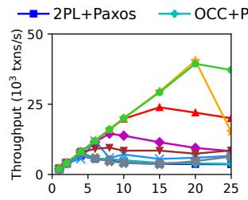

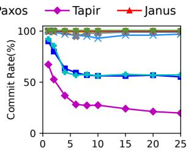

SOSP ’25, October 13–16, 2025, Seoul, Republic of Korea  
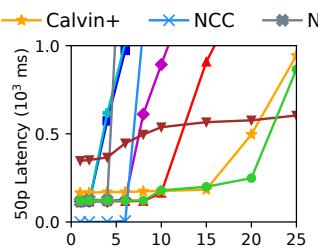  
Per-Coordinator Rate (103  txns/s)

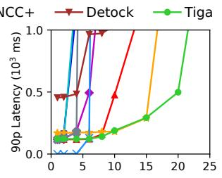

Figure 7. MicroBench (skew factor=0.5) with varying rates in local region (South Carolina).  
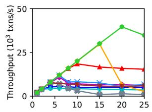

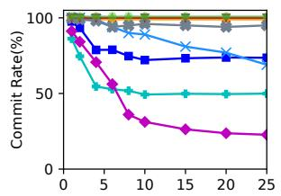

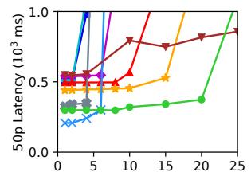  
Per-Coordinator Rate (103  txns/s)

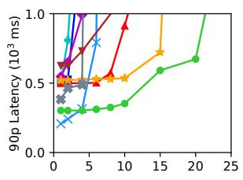

Figure 8. MicroBench (skew factor=0.5) with varying rates in remote region (Hong Kong).  
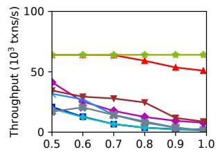

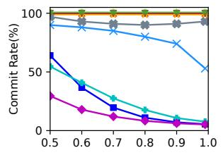

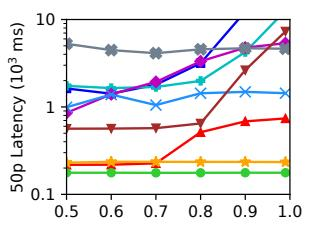  
Skew Factor

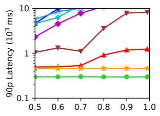

Figure 9. MicroBench (per-coordinator rate=8K txns/s) with varying skew factors (all regions).  
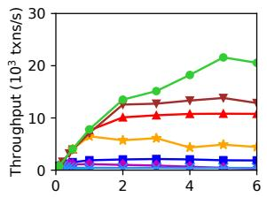

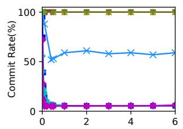

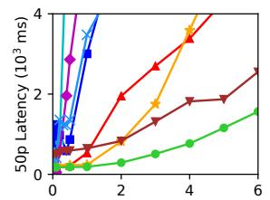  
Per-Coordinator Rate (103  txns/s)

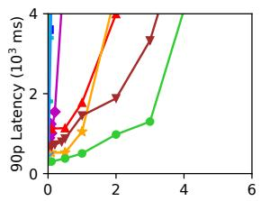  
Figure 10. TPC-C with varying rates (all regions).

## 5.3 TPC-C

Compared with MicroBench, TPC-C exhibits more complexity and higher contention: (1) Over 92% of transactions are read-modify-write operations, with some requiring multiple shots to complete. (2) Since the data is stored in a columnbased manner (as implemented by Janus), transactions can conflict frequently as long as they attempt to write the same column. (3) TPC-C transactions are more CPU-intensive than MicroBench, resulting in lower throughput for all protocols.

Table 1 and Figure 10 present the evaluation results, with three main takeaways. (1) Under such a high-contention workload, 2PL+Paxos, OCC+Paxos, and Tapir all suffer from very low throughput due to frequent transaction aborts. Among them, 2PL+Paxos performs slightly better because its wound-wait mechanism reduces many transaction aborts. (2) NCC only achieves hundreds of txns/s of throughput, and NCC+’s throughput is even lower (not shown in Figure 10).

NCC’s poor performance stems not only from aborts but also from high queueing delays caused by its RTC mechanism. The queueing delay leads to a buildup of outstanding transactions, which can easily reach the cap during our open-loop tests, and prevent coordinators from issuing more transactions. (3) Janus, Calvin+, and Detock all benefit from being largely abort-free, as does Tiga. Under TPC-C, Calvin+ becomes less efficient than Janus and Detock, as more shards are involved and the straggler effect becomes more distinct. However, all baselines are less efficient than Tiga’s approach based on synchronized clocks, enabling Tiga to achieve the highest throughput and lowest latency.

## 5.4 Failure Recovery Evaluation

We re-run MicroBench (skew factor=0.5), and each coordinator submits 10K txns/s (80K txns/s in total). We kill the leader in one shard and compare the performance (latency and throughput) before and after the leader failure. Figure 11a shows that Tiga takes only 3.8 seconds to complete the global view change and recover to the same level of throughput. After the recovery, the commit latency increases (Figure 11b) because one of the shards only has ?? + 1 = 2 remaining servers. When transactions involve the data from this shard, they can only be committed in the slow path. However, even in such cases, Tiga’s coordinators in the remote region (Hong Kong) still yield lower latency than the other protocols under the same workload (Figure 8).

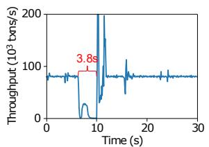  
(a) Total throughput

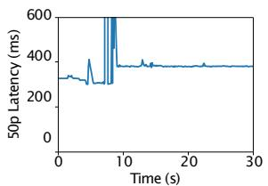  
(b) Latency (Hong Kong)  
Figure 11. Tiga performance before/after leader failure.

Table 2. Performance comparison after server rotation.
<table><tr><td></td><td>2PL+Paxos</td><td>OCC+Paxos</td><td>Tapir</td><td>Janus</td><td>Calvin+</td><td>NCC</td><td>Tiga</td></tr><tr><td>Thpt</td><td>18.6</td><td>18.0</td><td>44.7</td><td>71.9</td><td>120.0</td><td>40.7</td><td>141.9</td></tr><tr><td>+/-%</td><td>-18.8%</td><td>-17.4%</td><td>+1.1%</td><td>-7.5%</td><td>+0.3%</td><td>-16.5%</td><td>-9.7%</td></tr><tr><td>Latency</td><td>1.09</td><td>1.11</td><td>0.44</td><td>0.46</td><td>0.67</td><td>0.73</td><td>0.30</td></tr><tr><td>+/-%</td><td>+47.2%</td><td>+38.9%</td><td>+83.3%</td><td>+39.3%</td><td>+162%</td><td>+72.5%</td><td>+34.0%</td></tr></table>

Since Detock already distributes the home directories of data items across regions, server rotation does not affect its performance.

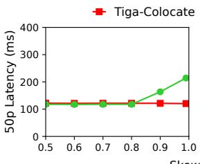

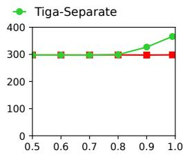  
South Carolina  
Figure 12. MicroBench latency performance with varying skew factors (per-coordinator rate=8K txns/s).

## 5.5 Leaders Separation vs. Leaders Colocation

When leaders cannot be located in the same region, Tiga prioritizes optimistic execution without waiting for timestamp agreement, to achieve 1-WRTT latency. To evaluate Tiga in this setting, we rotate the shard-ids and replica-ids for each server so that servers with the same shard-id are located in different regions. We continue to run MicroBench (skew factor=0.5). Table 2 summarizes the maximum throughput and the 50th percentile latency at this throughput, as well as the relative difference (+/−%) compared to the previous setting (Table 1) where leaders are co-located.

Table 2 indicates that Tiga’s throughput decreases by 9.7%, but it still outperforms the other protocols in both throughput and latency. Calvin+ achieves the highest throughput among baselines, but its latency increases significantly (+162%) after server rotation because each server needs to collect the epoch messages across regions, costing additional WAN overhead and exacerbating the straggler problem.

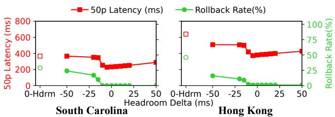  
Figure 13. Tiga performance with varying headroom (percoordinator rate=8K txns/s), 0-Hdrm (i.e., headroom=0 ms) directly uses sending time for proactive ordering.

Table 3. Throughput and clock synchronization errors with different clocks.
<table><tr><td></td><td>Ntpd</td><td>Chrony</td><td>Huygens</td><td>Bad-Clock</td></tr><tr><td>Thpt (10² txns/s)</td><td>156.8</td><td>157.1</td><td>158.1</td><td>154.7</td></tr><tr><td>Clock errors (ms)</td><td>16.45</td><td>4.54</td><td>0.012</td><td>62.55</td></tr></table>

The stats of clock synchronization errors are collected by using Huygens’ real-time monitor functionality [18].

Figure 12 compares Tiga’s performance in the two settings with varying skew factors, represented as Tiga-Separate and Tiga-Colocate. Tiga-Separate incurs higher latency than Tiga-Colocate, as the skew factor (i.e., contention) increases. This is because Tiga-Separate involves more complexity to manage transactions; some transactions also require an additional WRTT to roll back when the execution results prove to be non-serializable. Even so, Tiga-Separate still achieves much lower latency than the other protocols.

## 5.6 Sensitivity Analysis of Headroom

To evaluate the impact of headroom on Tiga’s performance, we run MicroBench (skew factor=0.99) with leaders separated in different regions. Tiga continues to use the approach in §3.1 to estimate the headroom for transactions, but we further adjust the headroom by adding different offsets (Headroom Delta in Figure 13), ranging from −50 ms to 50 ms. We study Tiga’s latency and rollback rate. As shown in Figure 13, Tiga’s estimation approach (Headroom Delta=0 ms) yields a headroom that is close to optimal: Reducing headroom incurs more rollback and worse latency; increasing headroom eliminates rollback but still prolongs latency because transactions are held unnecessarily long at servers. We also evaluate a baseline that uses the sending time directly (0-Hdrm in Figure 13). This approach yields the worst latency and rollback rate, as it cannot tolerate network message reordering (illustrated in Figure 1), thereby highlighting the effectiveness of Tiga’s headroom estimation based on synchronized clocks.

## 5.7 Tiga with Different Clocks

To understand the impact of synchronized clocks on Tiga’s performance, we conduct an ablation study to compare Tiga’s performance with different clocks. We use different synchronization algorithms and design the following variants.

Tiga: Accelerating Geo-Distributed Transactions with Synchronized Clocks  
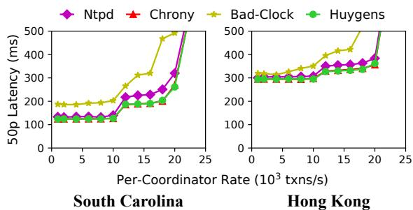  
Figure 14. Tiga latency using different clocks.

(1) Tiga-Ntpd. We use ntpd, which manages time synchronization in most older Linux distributions in Google Cloud [33]. We configure ntpd to only use Google’s internal NTP server as the reference clock.

(2) Tiga-Chrony. We use chrony, which is a newer implementation of NTP [15] as well as the current default NTP service in Google Cloud [34]. We configure chrony to only use Google’s internal NTP server as the reference clock.

(3) Tiga-Huygens. We use the Huygens algorithm to synchronize the clocks for coordinators and servers.

(4) Tiga-Bad-Clock. We simulate the situation when the NTP service becomes unstable (e.g., due to network congestion and partition) by running a local NTP server as the reference clock. We keep periodically restarting and shutting down the NTP server. In this case, the clock synchronization becomes much worse than the previous variants (Table 3).

We run MicroBench (skew factor=0.99) to compare the performance of the four Tiga variants (Table 3 and Figure 14).

While chrony and Huygens yield different levels of synchronization errors (Table 3), Tiga’s latency remains similar when equipped with either of them. This is because crossregion delays range from 60 ms to 150 ms; the synchronization error of chrony, though not as good as Huygens, is still negligible compared to the cross-region delay. As a result, both chrony and Huygens enable Tiga to accurately measure the one-way delay between coordinators and servers and decide a proper timestamp for the transaction at submission. By contrast, ntpd’s synchronization error is larger and causes extra holding time at servers due to the inaccurate measurement of one-way delay. In the worst case, when clocks are poorly synchronized (as in Tiga-Bad-Clock) and the error approaches the one-way delay between regions, Tiga ’s latency inflates substantially.

## 6 Discussion

Timestamp initialization. Tiga initializes transaction timestamps based on the maximum latency from the coordinator to a super quorum of servers in each shard (§3.1). This approach aims to increase the likelihood of fast-path commits. However, in certain deployments, the fast path may actually incur higher latency than the slow path. This situation arises when each shard has a simple quorum located close to the coordinator, while the remaining servers are geographically

SOSP ’25, October 13–16, 2025, Seoul, Republic of Korea

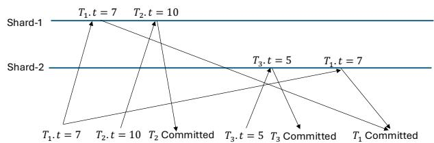  
Figure 15. Undetectable timestamp inversion without intershard (leader) coordination.

distant. In such scenarios, committing through the slow path may be more efficient. To accommodate this, the coordinator can estimate the latencies for both paths and then choose whether to use a super quorum or a simple quorum, based on which option can yield better performance.

Dynamic sharding. Dynamic sharding [3, 5, 41, 65] allows OLTP systems to distribute heavy-hitter keys and co-locate frequently accessed data. We believe it could further enhance Tiga’s performance, and we plan to support it in future versions. Because single-shard transactions do not require timestamp agreement, dynamic sharding can convert multi-shard transactions into single-shard transactions, thereby reducing the overhead of timestamp agreement and rollback.

Clock accuracy and timestamp inversion. To prevent timestamp inversion and ensure strict serializability, Tiga introduces timestamp agreement (§3.5), which requires leaders of different shards to coordinate and confirm that their transactions respect real-time ordering. Without this inter-leader coordination, a shard cannot detect timestamp inversion when it occurs. Figure 15 illustrates such a case: Shard-1’s servers run with faster clocks than Shard-2’s. As a result, Shard-1 commits a single-shard transaction ??2 with a larger timestamp $( T _ { 2 } . t = 1 0 )$ , while Shard-2 later commits another singleshard transaction ??3 with a smaller timestamp (??3.?? = 5). Although $T _ { 2 }$ and $T _ { 3 }$ are processed independently, both conflict with the multi-shard transaction ??1. This yields a serializable schedule $T _ { 2 }  T _ { 1 }  T _ { 3 }$ , which contradicts the real-time order $T _ { 2 }  T _ { 3 }$ . Since all transactions arrive at their shards before their assigned timestamps, both shards treat them as valid, leaving the timestamp inversion undetected. To avoid such violations of strict serializability, the shards (leaders) must coordinate.

However, such inter-leader coordination incurs 0.5–1 RTT of blocking latency for subsequent transactions: if the transaction at the head of the priority queue has not completed timestamp agreement, any conflicting transactions behind it cannot be executed or released. This blocking latency can be costly when leaders are distributed across regions and workloads exhibit high contention. This raises a natural question: Can we avoid coordination by leveraging synchronized clocks?

In fact, if we could assume synchronized clocks with a bounded error ??, Tiga can eliminate inter-leader coordination while still avoiding timestamp inversion. The coordinationfree approach works as follows:

(1) Each leader updates an incoming transaction’s timestamp to its local clock time if the initial timestamp is smaller.

(2) Each leader defers the release of the transaction ?? until its local clock exceeds ?? .?? +??, ensuring that all leaders’ clocks have passed ?? .?? before ?? is released.

Then, we revisit the example in Figure 15. Suppose the local clock time of Shard-1’s leader is ??????????1. Then the local clock time of Shard-2’s leader ???????? $\zeta _ { 2 } \in \left[ c l o c { k _ { 1 } } - \epsilon , c l o c { k _ { 1 } } + \epsilon \right]$ When Shard-1 receives $T _ { 2 } ,$ it defers release until ??????????1 > $T _ { 2 } . t + \epsilon ,$ ensuring that every shard’s clock has already passed ??2.??. Meanwhile, when Shard-2 receives $T _ { 3 }$ and $T _ { 1 } ,$ , it updates their timestamps if they are smaller than ??????????2. Two outcomes follow: (1) if ?? → 0, Shard-2 updates the timestamps for both $T _ { 3 }$ and $T _ { 1 }$ to values greater than $T _ { 2 } . t = 1 0 $ , yielding the order ??2 → ??3 → ??1; (2) if ?? → ∞, Shard-1 defers $T _ { 2 } { } ^ { , }$ s release until after Shard-2 releases $T _ { 3 }$ and $T _ { 1 }$ , yielding the order $T _ { 3 }  T _ { 1 }  T _ { 2 }$ . In both cases, the serializable order remains consistent with the real-time order. Thus, the prior knowledge of ?? provides a straightforward way to prevent timestamp inversion without inter-leader coordination, allowing more transactions to commit in 1 RTT.

We do not assume a deterministic error bound in Tiga’s design due to the probabilistic nature of Huygens. Nonetheless, several clock synchronization systems provide deterministic guarantees. For example, Spanner [21] achieves millisecondlevel error bounds, and Sundial [47] further reduces them to ∼100 ns. While such synchronization requires specialized hardware, we expect these solutions to become increasingly deployable in the future, offering promising opportunities for Tiga to preserve strict serializability more efficiently.

## 7 Related Work

Table 4 compares Tiga with state-of-the-art protocols. While several existing protocols can achieve 1-WRTT commit latency, this optimal performance typically holds only under narrow conditions—such as co-locating servers and/or coordinators. Moreover, they often sacrifice correctness guarantees or incur costly aborts. In contrast, Tiga achieves 1- WRTT latency in more general deployments, and ensures strict serializability with few or no transaction aborts.2

Ordering guarantees in multicast. Several network primitives have been proposed to accelerate distributed protocols. Ordered Unreliable Multicast (OUM) [46] and Multi-Sequencing Groupcast (MSG) [45] both leverage a single sequencer to establish ordering, which can incur centralized bottlenecks with a software-based sequencer in cloud settings. Hydra [14] extends OUM and MSG with multiple sequencers. However, it requires all sequencers to continually send flush messages to receivers. The slowdown of any sequencer can impede the progress of all receivers. Tiga’s design is inspired by the deadline-ordered multicast (DOM) primitive of Nezha [31], but DOM does not consider inter-shard timestamp agreement of transactions. Moreover, Nezha, as a pure consensus protocol, cannot be easily extended to work in the multi-shard setting that Tiga targets. Tiga vs. Mako. The recent protocol, Mako [67], advocates for decoupling consensus and concurrency control to improve throughput. In contrast, Tiga prioritizes latency optimization. Accordingly, we argue that a consolidated design is better suited for minimizing transaction latency. In geo-distributed settings, Mako needs multiple WRTTs to commit transactions when they are issued from followers, or when leaders are not co-located. In contrast, Tiga can consistently commit transactions in the 1-WRTT fast path.

Table 4. Summary of protocol comparison.
<table><tr><td rowspan="2">System</td><td rowspan="2">Consistency Aborts</td><td rowspan="2"></td><td colspan="2">WRTTs</td><td rowspan="2">Require co-locating leaders for best latency?</td></tr><tr><td>Best</td><td>Worst</td></tr><tr><td>Spanner [21]</td><td>Strict Ser.</td><td>High</td><td>3</td><td>≥4</td><td>Required</td></tr><tr><td>AOCC [2]</td><td>Strict Ser.</td><td>High</td><td>2</td><td></td><td> Not Required</td></tr><tr><td>MVTO [64]</td><td>Ser.</td><td>Med</td><td>2</td><td>33</td><td> Not Required</td></tr><tr><td>MDCC [42]</td><td>Ser.</td><td>High</td><td>2</td><td>≥3</td><td>Required</td></tr><tr><td>Calvin [71]</td><td>Strict Ser.</td><td>None</td><td>2</td><td>2.5</td><td>Required</td></tr><tr><td>Tapir[76]</td><td>Ser.</td><td>High</td><td>1</td><td></td><td>Not Required</td></tr><tr><td>Janus [56]</td><td>Strict Ser.</td><td>None</td><td>2</td><td>23</td><td>Required</td></tr><tr><td>OceanVista [26]Strict Ser.</td><td></td><td>None</td><td>2</td><td>2.5</td><td>Required</td></tr><tr><td>Natto [74]</td><td>Strict Ser.</td><td>Med</td><td>2</td><td>≥3</td><td>Not Required</td></tr><tr><td>Detock [60]</td><td> Strict Ser.</td><td>None</td><td>2</td><td>2.5</td><td>Required</td></tr><tr><td>NCC [50]</td><td>Strict Ser.</td><td>Med</td><td>2</td><td>≥3</td><td>Required</td></tr><tr><td>Mako [67]</td><td>Strict Ser.</td><td>Med</td><td>2</td><td>≥5</td><td>Required</td></tr><tr><td>Tiga</td><td>Strict Ser.</td><td>None</td><td>1</td><td>2</td><td>Not Required</td></tr></table>

We discuss the commit latency for each system assuming no co-location requirement between coordinators and servers. For AOCC, MVTO and NCC, we assume they achieve geo-distributed fault tolerance via replication. Some systems incur ≥ ?? WRTTs because of aborts and retries.

## 8 Conclusion

The rapid advancement of accurate clock synchronization enables new protocols that exploit timestamp ordering to accelerate geo-distributed transaction processing. In this paper, we have presented the design, implementation, and evaluation of Tiga, a consolidated protocol that uses synchronized clocks to proactively order transactions at predesignated timestamps and efficiently resolve inconsistencies among servers. Compared with conventional layered designs (e.g., 2PL/OCC+Paxos, Calvin+, Detock, and NCC) and state-ofthe-art consolidated designs (e.g., Tapir and Janus), Tiga can achieve significantly higher throughput and lower latency.

This work does not raise any ethical issues.

## Acknowledgments

We thank the anonymous reviewers for suggestions that improved our work. This project was funded in part by NSF awards CNS-2321725, CNS-2238768, CNS-2130590 and NSF CAREER award 2340748. We also appreciate the support from Google Cloud Research Credits program.

Tiga: Accelerating Geo-Distributed Transactions with Synchronized Clocks

## References

[1] Atul Adya. 1999. Weak Consistency: A Generalized Theory and Optimistic Implementations for Distributed Transactions. Technical Report. USA. https://hdl.handle.net/1721.1/149899

[2] Atul Adya, Robert Gruber, Barbara Liskov, and Umesh Maheshwari. 1995. Efficient Optimistic Concurrency Control Using Loosely Synchronized Clocks. SIGMOD Record 24, 2 (May 1995), 23–34. https: //doi.org/10.1145/568271.223787

[3] Atul Adya, Daniel Myers, Jon Howell, Jeremy Elson, Colin Meek, Vishesh Khemani, Stefan Fulger, Pan Gu, Lakshminath Bhuvanagiri, Jason Hunter, Roberto Peon, Larry Kai, Alexander Shraer, Arif Merchant, and Kfir Lev-Ari. 2016. Slicer: Auto-Sharding for Datacenter Applications. In Proceedings of the 12th USENIX Symposium on Operating Systems Design and Implementation (OSDI 2016). USENIX Association, Savannah, GA, 739–753. https://www.usenix.org/conference/osdi16/ technical-sessions/presentation/adya

[4] Saif Al-Kuwari, James H. Davenport, and Russell J. Bradford. 2011. Cryptographic Hash Functions: Recent Design Trends and Security Notions. (2011). https://eprint.iacr.org/2011/565.pdf

[5] Muthukaruppan Annamalai, Kaushik Ravichandran, Harish Srinivas, Igor Zinkovsky, Luning Pan, Tony Savor, David Nagle, and Michael Stumm. 2018. Sharding the Shards: Managing Datastore Locality at Scale with Akkio. In Proceedings of the 13th USENIX Symposium on Operating Systems Design and Implementation (OSDI 2018). USENIX Association, Carlsbad, CA, 445–460. https://www.usenix.org/conference/ osdi18/presentation/annamalai

[6] Apache Software Foundation. 2021. ZooKeeper. https:// zookeeper.apache.org. (2021). Accessed: 2025-08-31.

[7] AWS. 2019. Global Tables: Multi-Region Replication for DynamoDB. https://docs.aws.amazon.com/amazondynamodb/latest/ developerguide/GlobalTables.html. (2019). Accessed: 2025-08-31.

[8] AWS. 2024. Amazon Time Sync Service expands Microsecond-Accurate time to 87 additonal EC2 instance types. https://aws.amazon.com/ about-aws/whats-new/2024/04/amazon-time-sync-servicemicrosecond-accurate-time-additonal-ec2-instance-types/. (2024). Accessed: 08/31/2024.

[9] Mihir Bellare, Oded Goldreich, and Shafi Goldwasser. 1994. Incremental Cryptography: The Case of Hashing and Signing. In Proceedings of the 14th Annual International Cryptology Conference on Advances in Cryptology (CRYPTO ’94). Springer-Verlag, Berlin, Heidelberg, 216–233.

[10] Mihir Bellare, Oded Goldreich, and Shafi Goldwasser. 1995. Incremental Cryptography and Application to Virus Protection. In Proceedings of the 27th Annual ACM Symposium on Theory of Computing (STOC 1995).

[11] Mihir Bellare, Roch Guérin, and Phillip Rogaway. 1995. XOR MACs: New Methods for Message Authentication Using Finite Pseudorandom Functions. In Proceedings of the Annual International Cryptology Conference (CRYPTO 1995).

[12] Mihir Bellare and Phillip Rogaway. 1997. Collision-Resistant Hashing: Towards Making UOWHFs Practical. In Proceedings of the Annual International Cryptology Conference (CRYPTO 1997).

[13] Xusheng Chen, Haoze Song, Jianyu Jiang, Chaoyi Ruan, Cheng Li, Sen Wang, Gong Zhang, Reynold Cheng, and Heming Cui. 2021. Achieving Low Tail-Latency and High Scalability for Serializable Transactions in Edge Computing. In Proceedings of the 16th European Conference on Computer Systems (EuroSys 2021). 1–16. https://doi.org/10.1145/ 3447786.3456238

[14] Inho Choi, Ellis Michael, Yunfan Li, Dan Ports, and Jialin Li. 2023. Hydra: Serialization-Free Network Ordering for Strongly Consistent Distributed Applications. In Proceedings of the 20th USENIX Conference on Networked Systems Design and Implementation (NSDI 2023). 1–16. https://www.usenix.org/conference/nsdi23/presentation/choi

[15] Chrony Team. 2024. Chrony. https://chrony-project.org/index.html. (2024). Accessed: 09/11/2024.

SOSP ’25, October 13–16, 2025, Seoul, Republic of Korea

[16] Dwaine Clarke, Srinivas Devadas, Marten van Dijk, Blaise Gassend, and G. Edward Suh. 2003. Incremental Multiset Hash Functions and Their Application to Memory Integrity Checking. In Advances in Cryptology – Proceedings of CRYPTO 2003. 1–18.

[17] Clockwork.io. 2022. Cloud Clocksync Showdown: Ntpd vs Chrony vs Clockwork. https://www.clockwork.io/cloud-clocksync-showdownntpd-vs-chrony-vs-clockwork/. (2022).

[18] Clockwork.io. 2024. Clockwork Latency Sensei. https:// www.clockwork.io/latency-sensei/. (2024). Accessed: 09/11/2024.

[19] Clockwork.io. 2024. Why One-Way Latency Measures Are Critical for Distributed Databases, Microservices, and AI Workloads. https://www.clockwork.io/why-one-way-latency-measures-arecritical-for-distributed-databases-microservices-and-ai-workloads/. (2024). Accessed: 08/31/2025.

[20] Brian F. Cooper, Raghu Ramakrishnan, Utkarsh Srivastava, Adam Silberstein, Philip Bohannon, Hans-Arno Jacobsen, Nick Puz, Daniel Weaver, and Ramana Yerneni. 2008. PNUTS: Yahoo!’s Hosted Data Serving Platform. Proceedings of the VLDB Endowment 1, 2 (August 2008), 1277–1288. https://doi.org/10.14778/1454159.1454167

[21] James C. Corbett, Jeffrey Dean, Michael Epstein, Andrew Fikes, Christopher Frost, JJ Furman, Sanjay Ghemawat, Andrey Gubarev, and et al. 2012. Spanner: Google’s Globally-Distributed Database. In 10th USENIX Symposium on Operating Systems Design and Implementation (OSDI 2012). 251–264. https://www.usenix.org/conference/osdi12/technicalsessions/presentation/corbett

[22] Transaction Processing Performance Council. 2022. TPC-C. https: //www.tpc.org/tpcc/. (2022). Accessed: 08/31/2025.

[23] Volt Active Data. 2025. How VoltDB Works. https://docs.voltdb.com/ UsingVoltDB/IntroHowVoltDBWorks.php. (2025). Accessed: 08/31/2025.

[24] K. P. Eswaran, J. N. Gray, R. A. Lorie, and I. L. Traiger. 1976. The Notions of Consistency and Predicate Locks in a Database System. Commun. ACM 19, 11 (1976), 624–633. https://doi.org/10.1145/360363.360369

[25] European Union. 2018. GDPR Personal Data – What Information Does This Cover? https://www.gdpreu.org/the-regulation/key-concepts/ personal-data/. (2018). Accessed: 08/31/2025.

[26] Hua Fan and Wojciech Golab. 2019. Ocean Vista: Gossip-Based Visibility Control for Speedy Geo-Distributed Transactions. Proceedings of the VLDB Endowment 12, 6 (2019), 1471–1484. https: //doi.org/10.14778/3342263.3342627

[27] Marc Fischlin. 1997. Incremental Cryptography and Memory Checkers. In Proceedings of the International Conference on the Theory and Application of Cryptographic Techniques (EUROCRYPT 1997). 275–291.

[28] Aishwarya Ganesan, Ramnatthan Alagappan, Andrea Arpaci-Dusseau, and Remzi Arpaci-Dusseau. 2020. Strong and Efficient Consistency with Consistency-Aware Durability. In Proceedings of the 18th USENIX Conference on File and Storage Technologies (FAST 2020). 1–16. https: //doi.org/10.1145/3423138

[29] Jinkun Geng. 2025. TLA+ Specification of Tiga. https://github.com/ New-Consensus-Concurrency-Control/Tiga-TLA-plus. (2025).

[30] Jinkun Geng, Shuai Mu, Anirudh Sivaraman, and Balaji Prabhakar. 2025. Tiga: Accelerating Geo-Distributed Transactions with Synchronized Clocks [Technical Report]. (2025). https://arxiv.org/abs/ 2509.05759

[31] Jinkun Geng, Anirudh Sivaraman, Balaji Prabhakar, and Mendel Rosenblum. 2023. Nezha: Deployable and High-Performance Consensus Using Synchronized Clocks. Proceedings of the VLDB Endowment 16 (2023), 629–642. https://doi.org/10.14778/3574245.3574250

[32] Yilong Geng, Shiyu Liu, Zi Yin, Ashish Naik, Balaji Prabhakar, Mendel Rosenblum, and Amin Vahdat. 2018. Exploiting a Natural Network Effect for Scalable, Fine-grained Clock Synchronization. In Proceedings of the 15th USENIX Symposium on Networked Systems Design and Implementation (NSDI 18). USENIX Association, Renton, WA, 81–94. https://www.usenix.org/conference/nsdi18/presentation/geng

[33] Google. 2025. Configure NTP on a VM. https://cloud.google.com/ compute/docs/instances/configure-ntp#linux-ntpd. (2025). Accessed: 2025-08-31.

[34] Google. 2025. Configure NTP on a VM (Chrony). https: //cloud.google.com/compute/docs/instances/configure-ntp#linuxchrony. (2025). Accessed: 2025-08-31.

[35] Jim Gray and Leslie Lamport. 2006. Consensus on Transaction Commit. ACM Transactions on Database Systems 31, 1 (March 2006), 133–160. https://doi.org/10.1145/1132863.1132867

[36] Jim Gray, Prakash Sundaresan, Susanne Englert, Ken Baclawski, and Peter J. Weinberger. 1994. Quickly Generating Billion-Record Synthetic Databases. Proceedings of the International Conference on Management of Data (SIGMOD 1994) (1994), 243–252. https://doi.org/10.1145/ 191839.191886

[37] Maurice P. Herlihy and Jeannette M. Wing. 1990. Linearizability: A Correctness Condition for Concurrent Objects. ACM Transactions on Programming Languages and Systems 12, 3 (1990), 463–492. https: //doi.org/10.1145/78969.78972

[38] Joshua Hildred, Michael Abebe, and Khuzaima Daudjee. 2023. Caerus: Low-Latency Distributed Transactions for Geo-Replicated Systems. Proceedings of the VLDB Endowment 17, 3 (November 2023), 469–482. https://doi.org/10.14778/3632093.3632109

[39] Dongxu Huang, Qi Liu, Qiu Cui, Zhuhe Fang, Xiaoyu Ma, Fei Xu, Li Shen, Liu Tang, Yuxing Zhou, Menglong Huang, Wan Wei, Cong Liu, Jian Zhang, Jianjun Li, Xuelian Wu, Lingyu Song, Ruoxi Sun, Shuaipeng Yu, Lei Zhao, Nicholas Cameron, Liquan Pei, and Xin Tang. 2020. TiDB: A Raft-Based HTAP Database. Proceedings of the VLDB Endowment 13, 12 (2020), 3072–3084. https://doi.org/10.14778/3415478.3415535

[40] Robert Kallman, Hideaki Kimura, Jonathan Natkins, Andrew Pavlo, Alexander Rasin, Stanley Zdonik, Evan P. C. Jones, Samuel Madden, Michael Stonebraker, and Yang Zhang. 2008. H-Store: A High-Performance, Distributed Main Memory Transaction Processing System. Proceedings of the VLDB Endowment 1, 2 (2008), 1496–1499. https://doi.org/10.14778/1454159.1454211

[41] Antonios Katsarakis, Yijun Ma, Zhaowei Tan, Andrew Bainbridge, Matthew Balkwill, Aleksandar Dragojevic, Boris Grot, Bozidar Radunovic, and Yongguang Zhang. 2021. Zeus: Locality-Aware Distributed Transactions. In Proceedings of the Sixteenth European Conference on Computer Systems (EuroSys 2021) (EuroSys ’21). Association for Computing Machinery, New York, NY, USA, 145–161. https: //doi.org/10.1145/3447786.3456234

[42] Tim Kraska, Gene Pang, Michael J. Franklin, Samuel Madden, and Alan Fekete. 2013. MDCC: Multi-Data Center Consistency. In Proceedings of the 8th ACM European Conference on Computer Systems (EuroSys 2013) (EuroSys ’13). Association for Computing Machinery, New York, NY, USA, 113–126. https://doi.org/10.1145/2465351.2465363

[43] Leslie Lamport. 2001. Paxos Made Simple. ACM SIGACT News 32, 4 (2001), 51–58. https://doi.org/10.1145/568425.568433

[44] Leslie Lamport. 2006. Fast Paxos. Distributed Computing 19, 2 (October 2006), 79–103. https://doi.org/10.1007/s00446-006-0016-x

[45] Jialin Li, Ellis Michael, and Dan R. K. Ports. 2017. Eris: Coordination-Free Consistent Transactions Using In-Network Concurrency Control. In Proceedings of the 26th ACM Symposium on Operating Systems Principles (SOSP 2017). ACM, Shanghai, China, 17. https://doi.org/10.1145/ 3132747.3132751

[46] Jialin Li, Ellis Michael, Naveen Kr. Sharma, Adriana Szekeres, and Dan R. K. Ports. 2016. Just Say No to Paxos Overhead: Replacing Consensus with Network Ordering. In Proceedings of the 12th USENIX Symposium on Operating Systems Design and Implementation (OSDI 2016). USENIX Association, Savannah, GA, 395–410. https://www.usenix.org/ conference/osdi16/technical-sessions/presentation/li

[47] Yuliang Li, Gautam Kumar, Hema Hariharan, Hassan Wassel, Peter Hochschild, Dave Platt, Simon Sabato, Minlan Yu, Nandita Dukkipati, Prashant Chandra, and Amin Vahdat. 2020. Sundial: Fault-Tolerant Clock Synchronization for Datacenters. In Proceedings of the 14th

USENIX Symposium on Operating Systems Design and Implementation (OSDI 2020). USENIX Association, Santa Clara, CA, 611–630. https: //www.usenix.org/conference/osdi20/presentation/li

[48] Barbara Liskov. 1991. Practical Uses of Synchronized Clocks in Distributed Systems. In Proceedings of the Tenth Annual ACM Symposium on Principles of Distributed Computing. https://doi.org/10.1145/ 112600.112601

[49] Wyatt Lloyd, Michael J. Freedman, Michael Kaminsky, and David G. Andersen. 2011. Don’t Settle for Eventual: Scalable Causal Consistency for Wide-Area Storage with COPS. In Proceedings of the 23rd ACM Symposium on Operating Systems Principles (SOSP ’11). ACM, Cascais, Portugal, 401–416. https://doi.org/10.1145/2043556.2043593

[50] Haonan Lu, Shuai Mu, Siddhartha Sen, and Wyatt Lloyd. 2023. NCC: Natural Concurrency Control for Strictly Serializable Datastores by Avoiding the Timestamp-Inversion Pitfall. In Proceedings of the 17th USENIX Symposium on Operating Systems Design and Implementation (OSDI 2023). USENIX Association, Santa Clara, CA, 821–839. https: //www.usenix.org/conference/osdi23/presentation/lu

[51] Meta. 2021. ZippyDB: Facebook’s Key-Value Store. https:// engineering.fb.com/2021/08/06/core-infra/zippydb/. (2021). Accessed: 2025-08-31.

[52] Microsoft. 2022. Global Data Distribution with Azure Cosmos DB — Under the Hood. https://docs.microsoft.com/en-us/azure/cosmos-db/ global-dist-under-the-hood. (2022). Accessed: 2025-08-31.

[53] Microsoft. 2025. Partitioning and Horizontal Scaling in Azure Cosmos DB. https://learn.microsoft.com/en-us/azure/cosmos-db/partitioningoverview. (2025). Accessed: 2025-08-31.

[54] D. L. Mills. 1991. Internet Time Synchronization: The Network Time Protocol. IEEE Transactions on Communications 39, 10 (1991), 1482– 1493. https://doi.org/10.1109/26.103043

[55] Shuai Mu and et al. 2016. Janus Repo. https://github.com/NYU-NEWS/ janus. (2016). Accessed: 2025-08-31.

[56] Shuai Mu, Lamont Nelson, Wyatt Lloyd, and Jinyang Li. 2016. Consolidating Concurrency Control and Consensus for Commits under Conflicts. In Proceedings of the 12th USENIX Symposium on Operating Systems Design and Implementation (OSDI 2016). USENIX Association, Savannah, GA, 409–425. https://www.usenix.org/conference/osdi16/ technical-sessions/presentation/mu

[57] Ali Najafi and Michael Wei. 2022. Graham: Synchronizing Clocks by Leveraging Local Clock Properties. In Proceedings of the 19th USENIX Symposium on Networked Systems Design and Implementation (NSDI 2022). USENIX Association, Renton, WA, USA, 453–466. https://www.usenix.org/conference/nsdi22/presentation/najafi

[58] National Congress of the People’s Republic of China. 2021. Data Security Law of the People’s Republic of China. https://digichina.stanford.edu/work/translation-data-securitylaw-of-the-peoples-republic-of-china/. (2021). Accessed: 2025-08-31.

[59] Faisal Nawab, Vaibhav Arora, Divyakant Agrawal, and Amr El Abbadi. 2015. Minimizing Commit Latency of Transactions in Geo-Replicated Data Stores. In Proceedings of the 33rd ACM SIGMOD International Conference on Management of Data (SIGMOD ’15). ACM, 1279–1294. https://doi.org/10.1145/2723372.2723729

[60] Cuong D. T. Nguyen, Johann K. Miller, and Daniel J. Abadi. 2023. Detock: High Performance Multi-Region Transactions at Scale. Proc. ACM Manag. Data 1, 2, Article 148 (June 2023), 27 pages. https:// doi.org/10.1145/3589293

[61] Brian M. Oki and Barbara H. Liskov. 1988. Viewstamped Replication: A New Primary Copy Method to Support Highly-Available Distributed Systems. In Proceedings of the Seventh Annual ACM Symposium on Principles of Distributed Computing (PODC). ACM, New York, NY, USA, 8–17. https://doi.org/10.1145/62546.62549

[62] PingCap. 2024. Three Availability Zones in Two Regions Deployment. https://docs.pingcap.com/tidb/stable/multi-data-centers-inone-city-deployment. (2024). Accessed: 2025-08-31.

SOSP ’25, October 13–16, 2025, Seoul, Republic of Korea

[63] Dan R. K. Ports, Jialin Li, Vincent Liu, Naveen Kr. Sharma, and Arvind Krishnamurthy. 2015. Designing Distributed Systems Using Approximate Synchrony in Data Center Networks. In Proceedings of the 12th USENIX Symposium on Networked Systems Design and Implementation (NSDI 2015) (NSDI ’15). USENIX Association, Oakland, CA, USA, 43–57. https://www.usenix.org/conference/nsdi15/technical-sessions/ presentation/ports

[64] David P. Reed. 1983. Implementing Atomic Actions on Decentralized Data. ACM Transactions on Computer Systems 1, 1 (February 1983), 3–23. https://doi.org/10.1145/357353.357355

[65] Kun Ren, Dennis Li, and Daniel J. Abadi. 2019. SLOG: Serializable, Low-Latency, Geo-Replicated Transactions. Proc. VLDB Endow. 12, 11 (July 2019), 1747–1761. https://doi.org/10.14778/3342263.3342647

[66] Daniel J. Rosenkrantz, Richard E. Stearns, and Philip M. Lewis. 1978. System-Level Concurrency Control for Distributed Database Systems. ACM Transactions on Database Systems 3, 2 (1978), 178–198. https: //doi.org/10.1145/320080.320083

[67] Weihai Shen, Yang Cui, Siddhartha Sen, Sebastian Angel, and Shuai Mu. 2025. Mako: Speculative Distributed Transactions with Geo-Replication. In Proceedings of the 19th USENIX Symposium on Operating Systems Design and Implementation (OSDI 2025). USENIX Association, Santa Clara, CA, USA, 1–16. https://www.usenix.org/conference/ osdi25/presentation/shen-weihai

[68] Rebecca Taft, Irfan Sharif, Andrei Matei, Nathan VanBenschoten, Jordan Lewis, Tobias Grieger, Kai Niemi, Andy Woods, Anne Birzin, Raphael Poss, Paul Bardea, Amruta Ranade, Ben Darnell, Bram Gruneir, Justin Jaffray, Lucy Zhang, and Peter Mattis. 2020. CockroachDB: The Resilient Geo-Distributed SQL Database. In Proceedings of the 2020 ACM SIGMOD International Conference on Management of Data (SIG-MOD ’20). Association for Computing Machinery, New York, NY, USA, 1493–1509. https://doi.org/10.1145/3318464.3386134

[69] Robert H. Thomas. 1979. A Majority Consensus Approach to Concurrency Control for Multiple Copy Databases. ACM Transactions on Database Systems 4, 2 (June 1979), 180–209. https://doi.org/10.1145/ 320071.320076

[70] Alexander Thomson and Daniel J. Abadi. 2010. The case for determinism in database systems. Proc. VLDB Endow. 3, 1–2 (Sept. 2010), 70–80. https://doi.org/10.14778/1920841.1920855

[71] Alexander Thomson, Thaddeus Diamond, Shu-Chun Weng, Kun Ren, Philip Shao, and Daniel J. Abadi. 2012. Calvin: Fast Distributed Transactions for Partitioned Database Systems. In Proceedings of the 2012 ACM SIGMOD International Conference on Management of Data (SIG-MOD ’12). Association for Computing Machinery, New York, NY, USA, 1–12. https://doi.org/10.1145/2213836.2213838

[72] Sarah Tollman, Seo Jin Park, and John Ousterhout. 2021. EPaxos Revisited. In Proceedings of the 18th USENIX Symposium on Networked Systems Design and Implementation (NSDI 2021). https://www.usenix.org/ conference/nsdi21/presentation/tollman

[73] Xinan Yan, Linguan Yang, Hongbo Zhang, Xiayue Charles Lin, Bernard Wong, Kenneth Salem, and Tim Brecht. 2018. Carousel: Low-Latency Transaction Processing for Globally-Distributed Data. In Proceedings of the 2018 ACM SIGMOD International Conference on Management of Data. https://dl.acm.org/doi/10.1145/3183713.3196924

[74] Linguan Yang, Xinan Yan, and Bernard Wong. 2022. Natto: Providing Distributed Transaction Prioritization for High-Contention Workloads. In Proceedings of the 2022 ACM SIGMOD International Conference on Management of Data. https://doi.org/10.1145/3514221.3526161

[75] YugabyteDB. 2025. Isolation Levels. (2025). https://docs.yugabyte.com/ preview/explore/transactions/isolation-levels/ Accessed: 2025-08-31.

[76] Irene Zhang, Naveen Kr. Sharma, Adriana Szekeres, Arvind Krishnamurthy, and Dan R. K. Ports. 2015. Building Consistent Transactions with Inconsistent Replication. In Proceedings of the 25th ACM Symposium on Operating Systems Principles (SOSP 2015). https://doi.org/ 10.1145/2815400.2815404

[77] Wenting Zheng, Stephen Tu, Eddie Kohler, and Barbara Liskov. 2014. Fast Databases with Fast Durability and Recovery Through Multicore Parallelism. In Proceedings of the 11th USENIX Symposium on Operating Systems Design and Implementation (OSDI 2014). https://www.usenix.org/conference/osdi14/technical-sessions/ presentation/zheng\_wenting

[78] Jingyu Zhou, Meng Xu, Alexander Shraer, Bala Namasivayam, Alex Miller, Evan Tschannen, Steve Atherton, Andrew J. Beamon, et al. 2021. FoundationDB: A Distributed Unbundled Transactional Key-Value Store. In Proceedings of the 2021 ACM SIGMOD International Conference on Management of Data. https://doi.org/10.1145/3448016.3457559