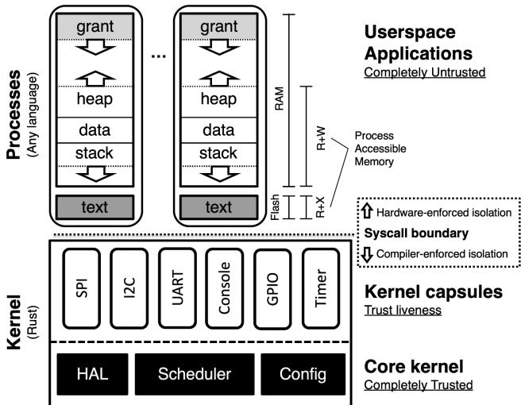
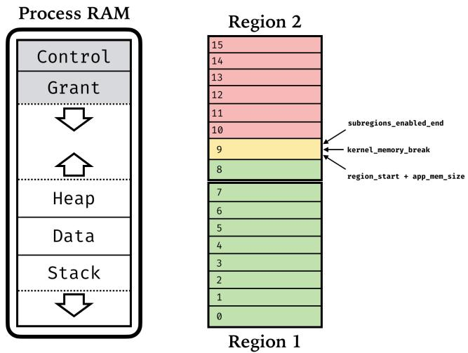
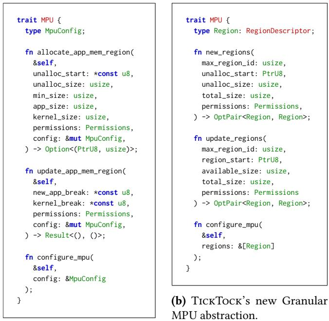
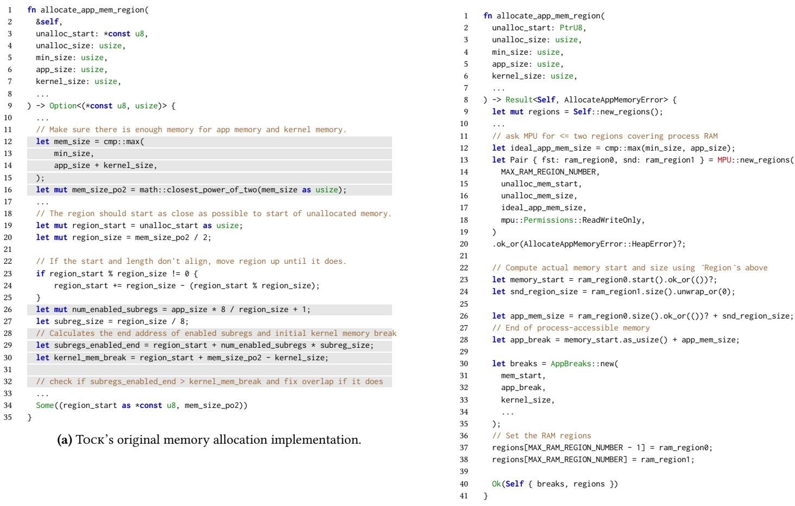
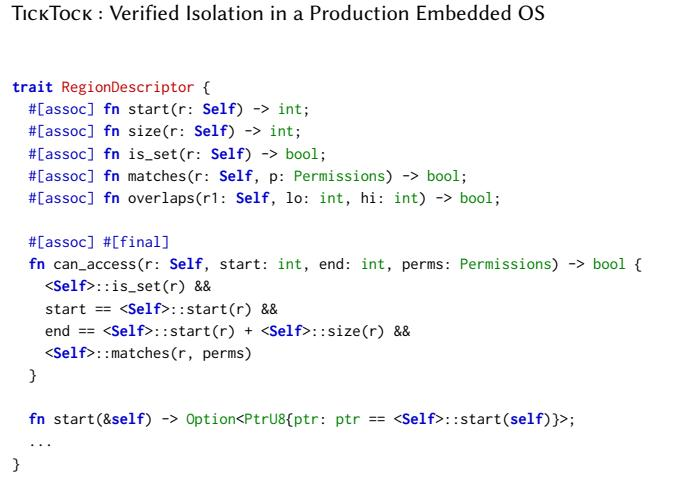
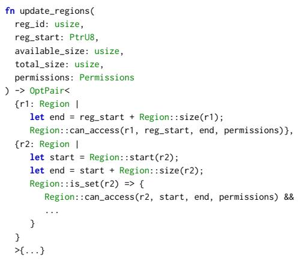
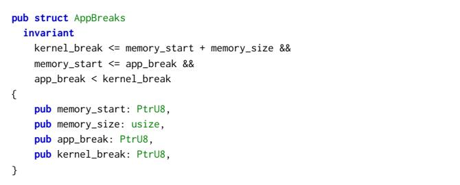
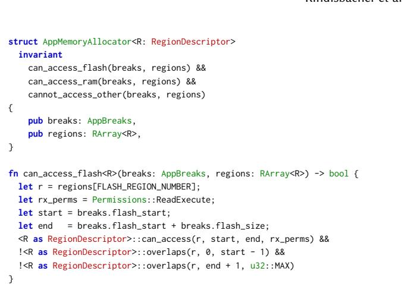
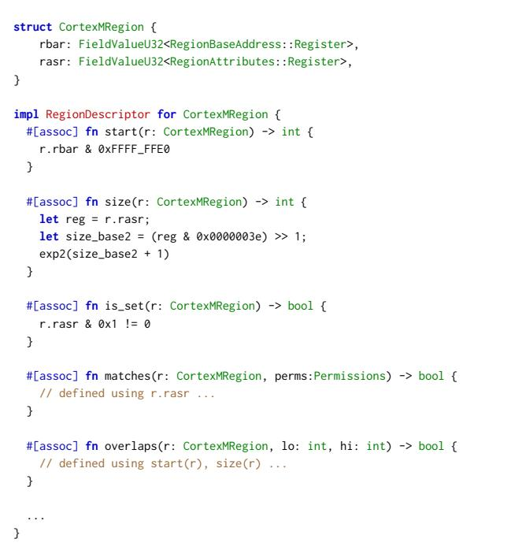
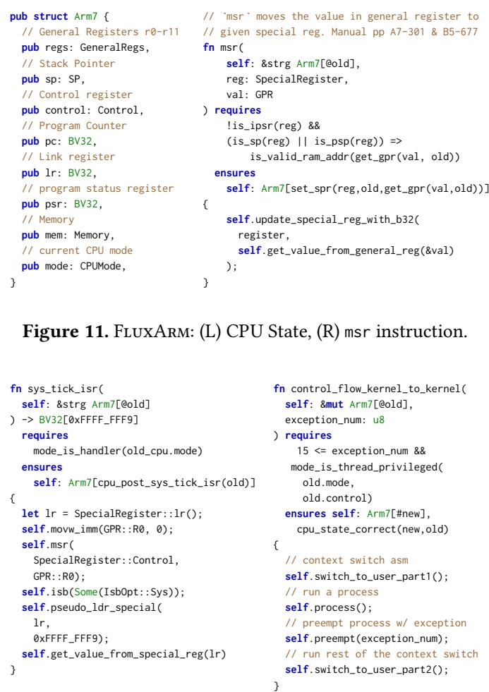

Latest updates: hps://dl.acm.org/doi/10.1145/3731569.3764856

RESEARCH-ARTICLE

VIVIEN RINDISBACHER, University of California, San Diego, San Diego, CA, United States EVAN JOHNSON, University of California, San Diego, San Diego, CA, United States NICO LEHMANN, University of California, San Diego, San Diego, CA, United States TYLER POTYONDY, University of California, San Diego, San Diego, CA, United States PAT PANNUTO, University of California, San Diego, San Diego, CA, United States STEFAN SAVAGE, University of California, San Diego, San Diego, CA, United States View all

Open Access Support provided by:

University of California, San Diego

Published: 12 October 2025

Citation in BibTeX format

SOSP '25: ACM SIGOPS 31st Symposium

on Operating Systems Principles

October 13 - 16, 2025

Seoul, Republic of Korea

Conference Sponsors: SIGOPS

# TickTock: Verified Isolation in a Production Embedded OS

Vivien Rindisbacher UCSD

Evan Johnson NYU

Pat Pannuto UCSD

Stefan Savage UCSD

## Abstract

We present a case study formally verifying process isolation in the Tock production microcontroller OS kernel. Tock combines hardware memory protection units and languagelevel techniques—by writing the kernel in Rust—to enforce isolation between user and kernel code. Our effort to verify Tock’s process abstraction unearthed multiple, subtle bugs that broke isolation—many allowing malicious applications to compromise the whole OS. We describe this effort and TickTock, our fork of the Tock operating system kernel that eliminates isolation bugs by construction. TickTock uses Flux, an SMT-based Rust verifier, to formally specify and verify process isolation for all ARMv7-M platforms Tock supports and for three RISC-V 32-bit platforms. Our verification-guided design and implementation led to a new, granular process abstraction that is simpler than Tock’s, has formal security guarantees (that are verified in half a minute), and outperforms Tock on certain critical code paths.

CCS Concepts: • Security and privacy → Logic and verification; Trusted computing; • Software and its engineering → Formal software verification.

Keywords: Verification, Process Isolation, Kernel Security, Embedded Systems, Secure Systems, Liquid Types

## 1 Introduction

Tock [37] is a microcontroller OS that is increasingly being deployed in security-critical systems—from the Google Security Chip (GSC) [6], the platform powering Google’s Hardware Security Modules, Microsoft’s Pluton 2 security processor [60], the system-on-chip providing functions like the Trusted Platform Module. Like traditional OSes, Tock’s strong security guarantees are rooted in isolation: Tock separates user and kernel space and provides a process abstraction that lets users run multiple untrusted applications in isolation. If a malicious or compromised process can access


Tyler Potyondy UCSD

Nico Lehmann UCSD

Deian Stefan UCSD

Ranjit Jhala UCSD

the kernel or another process’s memory, all bets are off: the process can potentially steal sensitive data (e.g., cryptographic keys handled by platforms like GSC), brick the embedded system (and the platforms relying on Tock as the root of trust), or even take control of the OS.

Unlike traditional OSes like Linux or even secure microkernels like seL4 [30], Tock is written in Rust. This means kernel-space components are isolated from each other at the language level by Rust’s type- and memory-safety. It also means the Tock kernel can use Rust’s type system to distinguish kernel and user-space data and prevent confused deputy attacks that exploit the kernel into clobbering (or leaking) arbitrary memory.

Rust’s language-level isolation alone, however, is not sufficient: Tock user applications are written in arbitrary languages, including memory unsafe languages like C and C++. And, unlike traditional OSes, Tock cannot rely on virtual memory and memory management units (MMUs) to isolate these applications—the OS was designed to run on resourceconstrained devices that lack MMUs. Instead, Tock relies on memory protection units (MPUs) to ensure that each user process can only access its own region of memory and is isolated from other processes and the kernel.

In practice, configuring the MPU is hard. First, the configuration itself is a delicate dance that requires balancing the size and alignment constraints of the underlying MPU hardware and the memory requirements of each process (and the kernel itself). Second, since the MPU can only be configured to enforce access control policies for one process at a time, the Tock kernel must manage MPU configuration, in software, on a per-process basis. Finally, Tock must do this in the presence of interrupts. Subtle bugs in the MPU configuration, interrupt handling, and context-switching code have previously (and silently) broken Tock’s isolation guarantees [11, 19, 62]. As we describe in this paper, our effort to formally specify and verify Tock’s process isolation using an automatic verifier, Flux [35], revealed additional bugs (§ 2.2). While this is partly because this low-level code is difficult to get right, we found that Tock’s original design made the already-challenging implementation harder. Indeed, even specifying isolation proved to be complicated and required code changes, as described in section 3.4.

TickTock is our response: a redesigned fork of the Tock kernel that eliminates isolation bugs by construction. Instead of relying on developers to always get the tricky bits right, TickTock uses an automatic verifier, Flux [35], to formally verify that the kernel provides memory isolation. We develop TickTock via three concrete contributions.

1. Design (§ 3). Our first contribution is a verification-guided implementation of a new granular abstraction for MPUs that decouples the kernel’s requirements from the hardware’s constraints. In verifying the original kernel, we found that Tock’s abstraction of processes and hardware enforcement resulted in complex code—and hence security bugs—as well as a large specification that was slow to check. Fundamentally, this is because the original kernel tries to do too much in a single monolithic abstraction, entangling the details of process memory layout and hardware constraints. Worse, we found the monolithic design creates a disagreement between the kernel’s view of a process’s layout and the actual layout enforced by hardware, necessitating various complex and easy-to-miss checks. Our new granular abstraction cleanly separates process memory layout and hardware configuration details and ensures that the kernel and underlying hardware enforcement always agree. The result is a clearer specification, and a simpler kernel that is (more) “obviously free of bugs, rather than just free of obvious bugs” [25].

2. Verification (§ 4). Our second contribution is a formal verification of isolation using the Flux refinement type-based verifier for Rust [35]. Formally, we analyze the code that configures the ARMv7-M and RISC-V MPU, as well as code that manages the process memory layout to verify that each process can only access its code (in flash) and its stack, data, and heap (in RAM)—and nothing else. To verify the assembly interrupt handlers and context switching code, we develop explicit operational semantics for ARMv7-M hardware, by lifting ARM’s Architecture Specification Language (ASL) [47] to Rust and defining the semantics via Flux specifications. The verification effort of TickTock was quite modest: about 3.5KLOC of Flux annotations for 22KLOC Rust source. Our verification effort identified five previously unknown bugs in Tock’s MPU-configuring code and two in interrupt handling code, yielding six bugs that broke isolation [26, 48–52].

3. Evaluation (§ 6). Our third contribution is an evaluation of the performance of our new granular abstraction. We measure the performance of TickTock on a series of microbenchmarks and compare the performance to upstream Tock. We find that TickTock’s performance is comparable to Tock’s (e.g., context switching is within 0.3% of Tock), while providing stronger security guarantees. Beyond performance, we find that our granular abstraction simplifies verification: the original code took over five minutes to verify, but the newly designed kernel verifies in under one.

## 2 Overview

We start by explaining how Tock uses MPUs to enforce isolation (§ 2.1). Next, we describe how verifying the original

  
Figure 1. Tock’s architecture (from Tock [4], with permission).

Tock kernel unearthed bugs and discuss how these bugs can break isolation guarantees (§ 2.2). Finally, we give an overview of how we formally guarantee isolation (§ 2.3).

## 2.1 Tock: Isolation via MPUs

Figure 1 gives a high-level overview of the Tock architecture which is fashioned from three kinds of components that use a combination of static (language-based) and dynamic (hardware-based) mechanisms to ensure isolation.

Tock Architecture. First, Processes can be written in arbitrary languages and are completely untrusted. These processes are isolated from each other and from the kernel using hardware-based protection mechanisms. Second, Capsules (drivers) run at the same level as the kernel and are scheduled cooperatively. Capsule code is untrusted and must be written entirely in safe Rust, and hence enjoys the isolation guarantees provided by the language’s type system. Finally, we have Core kernel components that can use unsafe Rust to (1) provide safe APIs that capsules can use (e.g., to access hardware registers), and (2) to configure and enforce memory protection. Hence, Tock’s safety (isolation) guarantees rest wholly upon the correctness of the core kernel: the only layer in Tock trusted to enforce isolation.

Memory Protection Units (MPUs). Many modern microcontrollers come equipped with memory protection units (MPUs)1, i.e., specialized hardware units that interpose on every memory access to enforce access control. In practice, an OS kernel can dynamically configure an MPU to only allow access to certain regions of memory by specifying, for each region, a start address, size, and permissions (read, write, execute). Then, by enabling the MPU, the OS can isolate untrusted user code and ensure that each process can only access their own memory and not the memory of other processes or that of the kernel.

Isolation via MPUs. In Tock, the kernel has unrestricted access to the whole address space, i.e., the kernel executes with the MPU disabled. Each user process, however, has an associated MPU configuration, tracking the memory regions the process is allowed to access. When the kernel context switches from kernel space into a user process, the process’s MPU configuration is first used to configure the MPU to enforce isolation—restricting read-execute access to the process code, and read-write access to the process stack, data, and heap. Then, the kernel enables the MPU, switches from kernel to user mode, and transfers control to the process. Context switching back into the kernel does the reverse.

Challenge: MPU Configuration. Like most OSes, Tock’s kernel provides services to user-space applications. For example, the kernel allocates the memory used by each user-space process. When memory is allocated, the MPU must be configured to allow access to the process stack, data, and heap, but not the kernel-owned grant region—a per process region of memory the kernel uses for process specific tasks. As we describe in section 3, this is a nontrivial task and a source of errors. Similarly, Tock provides syscalls that allow applications to request kernel services, e.g., the brk syscall that lets a process grow or shrink its heap. These syscalls are hard to implement securely: they operate on untrusted user inputs and execute with the ambient privilege of the kernel, i.e., they can access the whole address space. An exploitable bug in the brk syscall implementation can thus be used to confuse the kernel into granting a process access to memory outside its own address space.

Challenge: Interrupts and Context Switching. The Tock kernel is a single-threaded, event-driven system, and so interrupts and context switches drive the control flow of the operating system. To this end, Tock manages timers and interrupts to ensure that user-space processes are periodically preempted per a configured scheduling policy. Since an interrupt can preempt any part of kernel (or user process) execution, the (assembly) interrupt handlers that implement the context switching code—from kernel to process and back— must ensure that the MPU is appropriately configured and enabled, and that crucial hardware registers are correctly saved and restored. Failure to do so can crash or corrupt kernel execution, and potentially break isolation.

## 2.2 Bugs Break Isolation

Tock’s language and hardware protections go a long way in ensuring safety, but kernel bugs are not uncommon—and do break isolation [11, 19, 62]. In verifying the original Tock kernel, we uncovered several new kernel bugs including logic errors, missed checks, and integer overflows, which can break isolation and which cannot be prevented by Rust’s type system or run-time checks. We describe three of these bugs next.

Bug: MPU Configuration Logic. In verifying the ARM Cortex-M memory allocation code, we discovered that the original kernel could inadvertently allow a process to access kernel-owned grant memory [50]. Tock maps each process— its stack, heap, and data segment—and its associated kernelowned grant region to MPU subregions, i.e., subdivisions of larger MPU regions that can be individually enabled or disabled to provide fine-grained control over memory accessibility within each region. When scheduling a process, the kernel enables all but the subregions covering grant memory, ensuring the process can only access memory it owns and not memory owned by the kernel. Unfortunately, we found that it’s possible for the process memory and kernel-owned grant memory to overlap—allowing a user process to access kernel memory. Specifically, Flux failed to prove our postcondition on the memory allocating function that specifies that the last enabled MPU subregion should never exceed the start of the grant region. The source of the bug: the MPU has non-trivial constraints on the size and alignment of subregions (§ 3), which Tock tries to hide from its interface at the cost of a more complex implementation.

Bug: Interrupt Assembly Missed Mode Switch. MPU configuration complexity is compounded by having to deal with interrupts and context switching. For example, whenever the kernel decides to run a process or a process is preempted, inline assembly is executed to properly context switch. In addition to yielding execution to either the kernel or process correctly, the inline assembly must be sure to switch the CPU’s execution mode as defined by the hardware. On ARM devices, this means setting the CPU to unprivileged execution mode when branching to a process and privileged execution mode when resuming kernel execution. Accidentally leaving the CPU in privileged mode when context switching means that a process can bypass the MPU protections the kernel carefully set up, breaking isolation. Unfortunately, we found this critical step was omitted in the inline assembly responsible for context switching, making Tock jump into process code while still in privileged execution mode [48].

Bug: Integer Overflow. While Rust eliminates many memory safety bugs by design, handling integer overflows is still left to the programmer. Unsurprisingly, when we initially ran Flux against the Tock kernel, Flux reported a series of possible integer overflows, many of which revealed serious bugs. Consider the bug in update\_app\_mem\_region. When an application uses the brk or sbrk syscall to grow or shrink its memory, the kernel uses a method, update\_app\_mem\_region, to update the MPU configuration appropriately. When checking this method, Flux flagged an expression related to configuring the MPU (num\_enabled\_subregions0 - 1) as potentially underflowing to usize::MAX. To verify that this underflow did not occur, we added a precondition to the method relating the sizes of certain internal pointers. Upon doing so, Flux reported that the calling kernel method failed to uphold the precondition, as it did not correctly validate the sizes requested by the application’s syscall [52]. Indeed, on further investigation we found that a malicious application could pass in parameters that bypassed the kernel’s checks and crash the kernel.

While this bug does not break isolation, such denial of service bugs in embedded kernels are serious. Moreover, a similar underflow could just as easily have configured the MPU in a manner that breaks process isolation. By helping us formally guarantee the absence of overflows, Flux’s verification helped us precisely identify the additional validation needed to protect the kernel.

## 2.3 Formally Verified Isolation

We developed TickTock, a fork of the Tock kernel that eliminates isolation bugs by construction. TickTock uses Flux to formally verify that a process can access its code, stack, data, and heap but nothing else. We assemble TickTock from three key pieces.

1: Decoupling MPU and Kernel Logic. Verification of the Tock kernel made it clear that the complexity and errors in the MPU-configuring code arise in part because the current monolithic abstraction used to configure MPUs entangles MPU constraints with the kernel’s process memory allocation. Additionally, we found that refactoring the code not only simplified verification but also made it possible to remove some expensive and easy-to-miss checks. TickTock’s first piece is this verification-guided granular MPU abstraction that separates the concerns of the kernel and MPU (§ 3).

2: Verifying Kernel, MPU, and Bridge Logic. Next, we verify that TickTock enforces isolation using Flux (§ 2.4). Concretely, we use Flux to define key isolation invariants over the kernel’s logical view of process memory, invariants relating this logical layout to that of the MPU configuration, and finally that the ARMv7-M and RISC-V hardware enforces the MPU configuration (§ 4).

3: Verifying Interrupts and Context Switching. Finally, for the ARMv7-M architecture, we verify that process isolation holds in the presence of interrupts and context switching. Most of the corresponding kernel logic is written in inline assembly so we develop FluxArm, a new executable specification of the ARMv7-M assembly by lifting ASL to Rust and formalizing the semantics with Flux contracts. This allows us to verify isolated interrupt handling programs, the ARM hardware’s interrupt semantics, and the entire control flow of an interrupt to ensure that the code preserves the machine invariants required for isolation (§ 4.5).

## 2.4 Flux

Flux is an SMT-backed refinement type checker for Rust that enables developers to specify correctness properties and have them verified at compile time [35]. Flux extends Rust’s type system with logical predicates that allow programmers to write automatically checked properties about a program’s expected behavior. We use three primary Flux mechanisms to formally specify and prove process isolation in TickTock.

Invariants let developers write properties that must hold through the lifetime of a data structure. For example, the code below uses an invariant on the NonEmptyRange data structure to statically check that any instance of NonEmptyRange has an end greater than its start.

1 pub struct NonEmptyRange   
2 invariant start < end   
3 {   
4 start: usize,   
5 end: usize   
6 }

The method below (new) takes a start and end value, checks that the given end is greater than the given start, and only then, constructs a valid NonEmptyRange.

1 impl NonEmptyRange {   
2 pub fn new(start: usize, end: usize) -> Option<NonEmptyRange> {   
3 if start < end {   
4 Some(NonEmptyRange { start, end })   
5 } else {   
6 None   
7 }   
8 }   
9 }

If we omitted the check in new, or had an incorrect check, e.g., start <= end, then Flux would report an error on line 4 as it would be unable to prove that the constructed structure’s invariants held at that point.

Pre- and Post-Conditions are used to specify contracts about legal inputs and outputs of a function. Preconditions specify requirements that must be satisfied when a function is called, and postconditions describe guarantees about a function’s behavior upon completion, enabling callers to reason about the function’s outputs. For example, the method update\_end updates the end of a NonEmptyRange.

```rust
1 impl NonEmptyRange {
2 pub fn update_end(&mut self, end: usize{self.start < end})
3 ensures self: NonEmptyRange[{start: self.start, end}]
4 {
5 self.end = end;
6 }
7 }
```

The signature for update\_end requires a precondition that the supplied end exceeds self.start, as stipulated by the refinement type usize{self.start < end} for the end parameter. Similarly, the signature ensures that upon completion, the end field of self is updated correctly and, of course, that the invariant continues to hold upon exit. The precondition tells Flux to check that all callers pass in values of end which suffice to maintain the invariant. If we omitted it, Flux would report an error at the return of update\_end as it would be unable to prove that the invariant held at that point.

  
Figure 2. Abstract Tock process memory layout and its mapping to MPU regions.

## 3 Redesigning the MPU Abstraction

MPU capabilities, and hence, configurations, vary widely across different platforms. To support multiple architectures, Tock attempts to separate MPU-specific configuration details from process memory management. We found that much of the complexity of the MPU configuration, and the attendant bugs, had to do with the difficulty of designing an abstraction that balances the kernel’s requirements with those of the underlying hardware. First, we describe these requirements (§ 3.1) and discuss how Tock’s monolithic abstraction results in complex bug-prone code (§ 3.2). We then show how the current abstraction also leads to scenarios where the kernel’s view of a process diverges from the actual hardware-enforced layout, leading to unintuitive checks that must be present to enforce isolation. Finally, we present a new granular abstraction that keeps the views in tune, resulting in code that is simpler, easier to verify, and more efficient (§ 3.5).

## 3.1 Requirements

Kernel Requirements. Figure 2 shows the layout of application (process) memory in the Tock OS. The stack, data, heap, and grant regions are all allocated in RAM. The stack grows downwards to the start of the process’s allocated memory region. The process heap and grant regions grow up and down towards each other. Hence, the kernel’s task is to configure the MPU to ensure that it allows access to the (white) stack, data, and heap, but not the (grey) grant region.

Hardware Requirements. It is rather tricky to actually enforce the kernel’s requirements with MPUs, as MPUs have their own constraints on the structure of regions. For example, the ARM Cortex-M MPU has strict region size and alignment constraints: the sizes must be powers of two, starting from a minimum of 32 bytes, and start addresses must be aligned to the region size. Further, Cortex-M regions are divided into eight equal-sized subregions which can be independently enabled or disabled. This allows finer-grained memory access controls beyond what a single region can provide. The Tock kernel uses this feature to cover the process stack, data, heap, and kernel-owned grant region with two MPU regions. Subregions covering the grant region are disabled and subregions covering the application’s memory are enabled.

  
(a) Tock’s original Monolithic MPU abstraction.  
Figure 3. Tock and TickTock’s MPU abstractions.

## 3.2 A Monolithic Design

Figure 3a summarizes Tock’s existing monolithic design, which abstracts the MPU within a single high-level interface (Rust trait) which exposes operations that allocate and update memory regions for a process.

The method allocate\_app\_mem\_region is responsible for initially allocating the memory of an application. The method takes as arguments the current available memory (as starting address unalloc\_start and unalloc\_size), the length of memory the application requested (app\_size), and the memory needed for the kernel’s grant region (kernel\_size). It then updates the MPU Configuration (config), the struct abstracting the MPU regions corresponding to the process’s memory layout. The method also must properly configure the MPU to deny the application access to kernel-owned grant region(s).

  
(b) TickTock’s new memory allocation implementation.  
Figure 4. Tock and TickTock ARM Cortex-M memory allocation implementations.

The method update\_app\_mem\_region changes the MPU configuration when the process requests to grow or shrink its memory via the brk or sbrk syscall. It takes as arguments the desired end of the process heap (new\_app\_break) and the current start (i.e., lowest address) of the kernel-owned grant region of memory (kernel\_break). It then updates the MPU configuration (config) to reflect the process’s expanded (or shrunken) heap and stack. Again, the method must ensure that the new process-accessible memory does not overlap the kernel-owned grant memory.

The method configure\_mpu takes an MPU configuration and updates the underlying MPU hardware.

Problem: Entanglement. The monolithic abstraction entangles the details of process memory layout and hardware constraints, leading to complex code that opens the door to security bugs. Consider the Cortex-M implementation of the allocate\_app\_mem\_region trait method shown in Figure 4a. The method starts by trying to compute a total size that the process memory can fit in on lines 12–16. Since the ARM Cortex-M MPU requires that the MPU region sizes be powers of two, Tock ensures the total process memory block size is a power of two. Similarly, it takes into account the alignment requirements when computing the start address of the process (regions) on lines 23–25. The code handling these hardware constraints, however, is entangled with code that ignores them—partly in an attempt to present an overly permissive interface to applications.

In particular, Tock doesn’t impose any restrictions on the input arguments like the app\_size, when in reality the application size must (partly) be dictated by the underlying hardware—the hardware can enable/disable regions at the subregion granularity, not arbitrary values. Indeed, things go wrong when the process-controlled app\_size is not a power of two. The method calculates the number of subregions to enable (line 26) using app\_size and then computes the end address of the last enabled subregion (line 30). This address represents the last memory address the process can access (according to the MPU) and must not overlap with the kernel-owned grant region. When app\_size is not a power of two, the MPU allows access to more memory than the process requested. This creates an exploitable scenario: if app\_size is not a power of two but app\_size + kernel\_size is, then mem\_size\_po2 will be exactly app\_size + kernel\_size. Further, subregs\_enabled\_end will exceed region\_start + app\_size, while kernel\_memory\_break is exactly region\_start + app\_size. This places the kernel-owned grant region within an enabled subregion. The Tock developers did try to safeguard against this case, but the check was insufficient, leaving the kernel-owned grant memory exposed to user code.

Problem: Disagreement. The monolithic abstraction creates a disagreement between what the kernel believes the MPU configuration is and how the MPU is actually configured. The allocate\_app\_mem\_region method in Figure 3a computes the end of both the process heap (subregs\_enabled\_end) and the kernel-owned grant region (kernel\_mem\_break), but then discards them, returning only the process memory’s start and size. Clients invoke the method to (1) allocate memory for the process and (2) update the MPU configuration accordingly. However, callers only have access to the returned start and size, so they must redo the work of carving the remaining pool of RAM into process-accessible memory and kernel grant memory. This recomputation is not just wasteful; for any unaligned memory size requested by a process, it introduces a disagreement between what was actually configured in the hardware and what the kernel believes the actual memory layout for the process is.

In summary, Tock’s monolithic abstraction suffers from two fundamental problems. First, it entangles high-level process layout constraints with low-level MPU constraints, which leads to complex, bug-prone code. Second, it creates disagreement between the kernel’s view of process memory layout and the actual hardware-enforced configuration, resulting in wasteful recomputation and (again) potential bugs.

## 3.3 Verification Roadmap

Having outlined the key problems with the existing abstraction, we now describe how our verification efforts helped discover these issues and guided our granular redesign. We first focused on verifying the existing Tock code. To do so, we had to make small modifications to the monolithic MPU interface shown in Figure 3a. We describe these changes in section 3.4 and explain that once we made these changes, we caught subtle bugs in the existing implementations of this interface. Based on this experience finding and fixing these bugs, we developed a new design of the MPU interface, which we describe in detail in section 3.5.

## 3.4 Verification-guided Redesign

Our attempt to verify the Tock kernel surfaced the problems of entanglement and disagreement, and then guided a two-step redesign of the kernel-MPU interface that enabled formally verified isolation.

Step 1: Explication. Recall that allocate\_app\_mem\_region both allocates the memory for a process and updates the MPU configuration to reflect this allocation. However, the method discards the intermediate results delineating the process- and kernel-accessible memory, returning only the start and size. In particular, the method does not return the exact addresses the process is actually allowed to access. This makes it impossible to formally specify the correctness of the MPU configuration, with respect to the kernel’s view of process memory (Figure 2).

Thus, our first step was to explicitly return these values using a new struct, AllocatedAppBreaksAndSize, whose fields contain the exact process memory layout the MPU was configured to enforce. This let us formally specify a postcondition contract for allocate\_app\_mem\_region that says that the returned struct’s fields satisfy the invariants informally shown in Figure 2, in particular, that the process-accessible region does not overlap the kernel-accessible grant region.

Step 2: Abstraction. When we wrote the contract specifying that the process-accessible memory and the grant region do not overlap, Flux complained that the method failed to satisfy its postcondition. Upon investigating the issue, we discovered the buggy edge case described in section 3.2. And, as we mentioned earlier, the allocate\_app\_mem\_region method did try to account for this scenario but did so incorrectly. Anecdotally, it took us many hours to figure out exactly why the code was buggy and why Flux could not verify the postcondition. Once we understood the issue, we used Flux to validate the fix, which is to double mem\_size\_po2 to ensure that kernel\_mem\_size is a power of two away from subregs\_enabled\_end. Still, we found that the now correct code was notoriously tricky to reason about and decided that the low-level details of MPU regions and the high level details of allocating the process and kernel-owned grant regions should be separated. Concretely, the goal of our new abstraction was to eliminate both the entanglement and disagreement introduced by the original monolithic abstraction.

## 3.5 A Granular Redesign

TickTock solves the entanglement and disagreement problems with a granular abstraction that focuses solely on the details needed to configure regions on MPU hardware, while ensuring that the process abstraction tracks precisely what the hardware enforces. The key insight is that we can abstract the hardware details under two interfaces: (1) a RegionDescriptor interface that abstractly characterizes the properties of a single MPU-enforced hardware region while hiding the hardware details entirely, and (2) an MPU interface that has methods to create and modify regions. Next, we describe these abstractions, and show how they disentangle the kernel’s requirements from the low-level hardware constraints, enabling verified and efficient process isolation.

```rust
trait RegionDescriptor {
fn start(&self) -> Option<PtrU8>;
fn size(&self) -> Option<usize>;
fn overlaps(&self, start: usize, end: usize) -> bool;
}
```  
Figure 5. A subset of the RegionDescriptor Abstraction.

The RegionDescriptor Abstraction summarized in Figure 5 characterizes a single contiguous memory region. Intuitively, each region is simply a range, constituting a start address and size, which are respectively returned by the start and size methods. For ARMv7-M implementation, start and size return the accessible start and size as determined by subregions. For the RISC-V implementation, the start and size of the full region are returned, as the RISC-V PMP is far more flexible in terms of region start addresses and sizes. Thus, the RegionDescriptor abstracts hardware-specific details about alignment, subregions, etc.

The MPU Abstraction shown in Figure 3b does the actual work of configuring the MPU. The methods in this abstraction are oblivious to application process layout and instead deal exclusively with configuring hardware or creating regions with the hardware’s restrictions in mind. The interface is parameterized by the associated type Region which implements the RegionDescriptor interface and whose exact representation depends on the hardware implementing the interface. The method new\_regions takes in the highest region ID—TickTock operates on explicitly numbered regions—reserved for the process RAM, available memory start and memory size, a requested total size, and the desired access permissions for the new region. The method returns up to two contiguous Regions if they can be created within the current block of available memory, spanning at least the requested total size, while satisfying the underlying hardware constraints.2 Similarly, the update\_regions method takes in the highest region ID reserved for the process RAM, the desired start address, available size, and desired new total size and permissions, and again, returns the updated Regions if possible. Finally, the configure\_mpu method configures the MPU hardware to only allow access to the provided list of Regions. The new granular abstraction decouples the kernel’s requirements from the hardware constraints.

Hardware-agnostic Process Allocation. TickTock refactors the kernel process allocator to be generic over the MPU and RegionDescriptor abstraction, which lets it reuse the same code across all architectures that implement those traits. Figure 4b shows the refactored process allocator. At a high level, the code invokes new\_regions to obtain—if feasible under the hardware constraints—up to two contiguous Regions in the current RAM pool of the given size. If the MPU abstraction succeeds in creating these regions (ram\_region0, ram\_region1), the allocator then uses the RegionDescriptor interface to compute the actual start and size of the process memory block, and then creates and stores these in a data structure called AppBreaks that saves the pointers describing the actual MPU hardware-enforced layout alongside the MPU configuration.

Solution: No Entanglement. TickTock uses the granular abstraction to implement the process allocator independently of the underlying hardware constraints, which are handled within the new\_regions invocation. That is, the allocation code does not have to reason about subregions and powerof-two constraints. Instead, the kernel requests at most two regions from the MPU, spanning at least app\_size. Then, using these regions, the kernel can place the grant region of memory after the end of the process-accessible heap.

Solution: No Disagreement. Similarly, since the region start and size can be obtained from the RegionDescriptor trait, the kernel is not required to recompute values related to process memory. The kernel tracked end of process’s memory is computed exactly from the hardware-enforced layout. That is, the granular abstraction helps make the code simpler with respect to enforcing process isolation and enables reuse of the same allocation code across architectures.

## 4 Verification

TickTock’s granular redesign of the MPU interface (§ 3.5) simplifies isolation by decoupling the kernel’s requirements from the hardware constraints. However, even with this simpler interface, getting process isolation right is still tricky. The high level software description of regions—stored by the kernel—must be correctly translated into individual bits written to hardware registers to configure the MPU. To address this problem, TickTock formally verifies isolation: no userspace process can interfere with the memory of the kernel or other processes.

We structure the proof into four parts. First, we refine the methods of the granular interface (Figure 3) with contracts that describe how the MPU drivers create and update regions (§ 4.1). Second, we use Flux to verify that the kernel’s logical view of memory matches Tock’s memory model specification (§ 4.2). Third, we connect the refined methods of the granular interface to the kernel’s logical view, enabling Flux to verify that this logical view matches the physical memory layout actually enforced by the MPU. Finally, we use Flux to verify that each (architecture-specific) MPU driver correctly implements the refined contract, i.e., that each driver creates and updates regions by configuring the hardware bits in a way that matches the region start, size, and permissions, as required by the kernel to enforce isolation (§ 4.4). The granular redesign ensures that only the last part is architecture-dependent: the rest of the proof generalizes across architectures. We conclude this section by explaining how we use Flux to reason about interrupts (§ 4.5).

  
Figure 6. Associated Refinements for the RegionDescriptor Trait.

## 4.1 A Refined MPU Interface

Recall that Figure 3a summarizes the key methods of our granular MPU interface, which abstracts away details of specific MPU implementations from the kernel code, allowing us to reuse the same kernel code across different architectures. However, to verify the kernel code in a modular, architectureagnostic way, we need a way to refine the methods of the MPU interface with contracts that are precise enough to describe how the hardware was configured but abstract enough to be independent of any particular architecture.

Associated Refinements. With Flux, we can do so by tying associated refinements with the RegionDescriptor trait (Figure 5). Each associated refinement (1) can be used to specify contracts about abstract regions in the kernel, and (2) must be defined as concrete refinements in each individual MPU driver implementation. Figure 6 shows the associated refinements for the RegionDescriptor trait and how they can be used. For example, the method start, originally shown in Figure 5, now has a contract that states that if successful, the PtrU8 returned must match the value specified by the associated refinement start. Any RegionDescriptor implementation must also furnish Flux with definitions of each associated refinement (start, size, etc.). The actual implementation of trait methods and associated refinements is architecture dependent. The associated refinement can\_access is final, meaning that it is defined directly using the other associated refinements and not re-defined by individual hardware drivers.

Refined Method Contracts. We use the associated refinements to refine the methods of Figure 3b with pre- and postconditions that characterize the properties of the created and updated regions. For example, Figure 7 shows the contract used for the method update\_regions. The contract specifies that the region(s) returned by the method are configured to be accessible with the permissions specified by the kernel. The contract for the second region is conditional on whether the region is set (is\_set), since this region may be unused depending on the underlying architecture and the total\_size requested by the kernel (as mentioned in section 3.5). Note that the actual implementation of size and hence can\_access will depend on the underlying architecture.

  
Figure 7. Refined update\_regions using the Associated Refinements from Figure 6.

## 4.2 Verifying the Kernel’s Logical View of Memory

TickTock uses Flux to verify that the logical process memory layout (as stored in the kernel) matches Tock’s application memory layout policy, as shown in Figure 2.

Process Memory Layout Invariants. The process memory layout is stored in a per-process data structure AppBreaks, abbreviated in Figure 8, which stores pointers that describe each process’s memory layout. To ensure none of the pointers in AppBreaks violate the intended process memory layout, we specify a series of invariants that express these pointers’ expected relationships in memory (Figure 2).

• kernel\_break <= memory\_start + memory\_size checks that the beginning of the grant region of memory (i.e., lowest address) is within the process memory block,

• memory\_start <= app\_break ensures that the end of the process RAM is greater than or equal to the start of the process memory block, and

• app\_break < kernel\_break ensures that the end of the process RAM and the beginning of grant memory never overlap (i.e., the bug described in section 3.4).

Flux statically verifies that these invariants hold anywhere in the code that an AppBreaks is created or an existing instance is updated, e.g., through a mutable reference. Crucially, these invariants will catch any buggy code causing the app\_break to overlap kernel memory in, for example, the brk syscall (responsible for updating the size of the process accessible memory). The challenge, then, is proving that this logical representation actually holds throughout the kernel, and that this logical representation matches the hardware implementation.

  
Figure 8. The kernel’s logical view of process memory.

## 4.3 Verifying Logical-MPU View Correspondence

Next, we use the (abstract) region’s associated refinements to specify that the kernel’s view of memory (as stored in AppBreaks) precisely matches what the MPU enforces.

Specifying Logical-MPU View Correspondence. In the kernel, AppMemoryAllocator stores both the AppBreaks described above, and an array of MPU regions to be written to hardware. Here, we specify that the array of regions—RArray<R>, where R implements the RegionDescriptor trait—should allow access to the application code (in flash), and application stack, data, and heap (in RAM), but should disallow access to any other memory. We can specify this property as an invariant of the AppMemoryAllocator struct as shown in Figure 9. We use the associated refinements from the RegionDescriptor trait (Figure 6) to define can\_access\_flash, can\_access\_ram, and cant\_access\_other, which respectively specify that the process is allowed read-execute access to the flash region, read-write access to the RAM region, and disallowed access to any other memory (in particular, the kernelaccessible grant region). For example, can\_access\_flash is shown in Figure 9. The specification states that the flash region at index FLASH\_REGION\_NUMBER in the regions array must allow access to flash memory (specified by flash\_start and the flash\_size stored in AppBreaks) and must not overlap any other memory addresses.

Verifying Logical-MPU View Correspondence. Flux verifies that the above invariant holds whenever a value of type AppMemoryAllocator is created or updated. For example, in the function allocate\_app\_mem\_region from Figure 4b, the invariants are established by calling functions that set up different parts of process memory. create\_regions creates (up to two) MPU regions for RAM. while create\_exact\_region creates an MPU region for Flash. Each function’s postcondition establishes part of the overall invariant. For instance, when allocate\_app\_mem\_region calls create\_exact\_region, the latter’s postcondition establishes flash\_can\_access.

  
Figure 9. Invariants (and definitions) specified for the AppMemoryAllocator.

## 4.4 Verifying TickTock’s MPU drivers

Finally, Flux must check that the architecture-specific MPU drivers uphold their part of the bargain by verifying that their RegionDescriptor, and hence, MPU implementations, satisfy the refined contracts from section 4.1. To do so, we must write contracts that specify how the code interacts with the MPU hardware to correctly create regions that (1) are well formed according to the logical constraints expressed in the kernel and (2) satisfy hardware requirements and properly encode logical values as bits used to configure the hardware.

Representing Hardware Regions. The pillar of this part of the proof is a refined representation of the struct that represents the configuration of a single MPU region. For example, Figure 10 shows (a simplified version of) the implementation of regions in the ARMv7-M Cortex-M MPU driver which comprises a pair of two 32-bit registers: an rbar, base-address register, and a rasr, region attributes register, whose values represent the contents of the hardware.

Hardware Semantics as Logical Refinements. Next, using the ARMv7-M ISA, we write specifications for the associated refinements needed to implement the RegionDescriptor trait. These refinements serve as our model of the MPU’s semantics. For example, the refinement start (shown in Figure 10) models how the hardware determines a region’s starting address from the raw register bits. Flux uses these specifications to verify that the actual implementations of the MPU methods (e.g., allocate\_regions and update\_regions from Figure 3b) for the Cortex-M driver indeed satisfy their refined contracts. In other words, Flux verifies that the bits of the rbar (base address) and rasr registers are flipped to precisely match the logical values that the kernel tracks, e.g., in AppBreaks (§ 4.2), and AppMemoryAllocator (§ 4.3), thereby formally verifying that the MPU is configured in a way that allows the kernel to enforce isolation.

  
Figure 10. Simplified representation of Cortex-M Regions and their implementation of the RegionDescriptor trait.

## 4.5 Reasoning About Interrupts

Like many OSes, Tock pervasively uses interrupts to handle hardware events or context switches between kernel and user processes. Interrupts are handled via a top-bottom half strategy, similar to many other OSes. All Tock top-half handlers are written in inline assembly and are responsible for properly switching to and from the kernel. While the handlers are short in size, missed details in the low-level assembly can have severe consequences. For example, as shown in section 2.2, failing to appropriately configure the CPU for process or kernel execution can nullify the efforts made to correctly configure the MPU.

TickTock verifies isolation in the presence of interrupts for ARMv7-M architectures using FluxArm—a new Rustexecutable formal semantics of the ARMv7-M ISA—to model Tock’s interrupt handlers and context switching code. We then use Flux to verify that crucial hardware state is preserved between interrupts firing and subsequent kernel execution, and that upon returning to the kernel, the hardware’s configuration matches what the kernel requires for isolation.

Modeling Assembly via FluxArm. We defined FluxArm, an executable formal semantics of (the Tock-relevant subset of) the ARMv7-M ISA, by writing an emulator in Rust and writing Flux contracts that specify what each instruction does to the hardware state. The left side in Figure 11 shows the CPU state we model in FluxArm, and the right side shows the semantics of the msr instruction that is both executable Rust, and has a formal semantics specified as a Flux contract.

  
Figure 12. FluxArm: (L) System Timer Handler, (R) Modeled Context Switch.

Modeling Handlers. The left in Figure 12 shows the FluxArm model of Tock’s timer interrupt handler: an example of how we model assembly used by the kernel with FluxArm. It starts by setting the CPU’s execution mode to unprivileged by setting the control register to 0. It then loads the special value 0xFFFF\_FFF9 into the link register to return execution to kernel. The postcondition cpu\_post\_sys\_tick\_isr precisely reasons about the state of the CPU after this assembly executes. In particular, it checks that the CPU is in privileged execution mode and that the link register contains the value 0xFFFF\_FFF9 needed to resume kernel execution.

Modeling Switching. The right side shows the FluxArm model of context switching and interrupts from kernel to process, and back to kernel. First, switch\_to\_user\_part1 models how Tock switches to a process, via code that ensures the hardware is properly configured to run a process (e.g., the CPU is in unprivileged mode). Second, process models an arbitrary process execution via a postcondition that formalizes the assumptions we can make about the process’s effect on memory, i.e., that erases all the information currently known about the state of the hardware registers and the process region of memory. Next, we model the triggering of an arbitrary interrupt using the method preempt which formalizes how ARMv7-M behaves when exceptions occur by saving the caller-saved registers on the stack, using the exception number to decide which isr (interrupt handler) to call (e.g., the sys\_tick\_isr), and then once the handler finishes, restoring the caller-saved registers off the stack before yielding control back to the specified target (which we verify to be the kernel). We verify that the sequence above doesn’t break isolation with the postcondition cpu\_state\_correct, which checks that all the callee-saved registers and the kernel’s stack pointer are equivalent upon entry and exit (old and new) and that the CPU is in privileged execution mode.

<table><tr><td>Component</td><td>Source</td><td>Fns(Trusted)</td><td>Specs(Trusted)</td></tr><tr><td>Kernel</td><td>12,434</td><td>1400 (14)</td><td>562 (5)</td></tr><tr><td>ARM MPU</td><td>2,486</td><td>777 (19)</td><td>506 (38)</td></tr><tr><td>Risc-V MPU</td><td>2,575</td><td>170 (22)</td><td>408 (51)</td></tr><tr><td>FLUX-STD</td><td>1,231</td><td>116 (65)</td><td>227 (47)</td></tr><tr><td>FLUXARM</td><td>3,405</td><td>118 (5)</td><td>1,900 (45)</td></tr><tr><td>Total</td><td>22,131</td><td>2,581 (125)</td><td>3,603 (186)</td></tr></table>

Figure 13. Proof Effort: Source is the Rust LOC; Fns is the number of Rust functions in the source code, with Trusted being the subset of trusted functions for which Flux does not verify the source against the contract; Specs is the number of LOC of Flux specifications with Trusted being the subset LOC that are specifications for trusted functions.

## 5 Implementation

We implement TickTock using a mix of Rust and Flux. Figure 13 breaks down our implementation effort and trusted computing base (TCB). Overall, TickTock’s proof consists of 3,603 lines of checked annotation across 2,581 functions.

Trusted Functions. Of the 2,581 functions, 125 are marked #[trusted], meaning Flux does not verify their source against their contract. Of these functions, 14 are trusted due to SMT solver limitations (but, as described below, are facts we prove in Lean), 14 are trusted due to outstanding Flux issues, 17 are proof-specific code (e.g., functions used to track certain values in ghost state), and 6 are functions we consider out of scope (e.g., formatting functions called when the kernel hard faults). Additionally, 69 functions in Flux-Std are used to define refined APIs (e.g., that wrap Rust pointers \*const u8 into a PtrU8 that tracks the address of the pointer), and enable verification of (e.g., non-overflowing) pointer arithmetic. In

FluxArm, 5 functions are marked trusted to define a refined API over hashmaps.

Beyond the functions explicitly marked trusted, the TCB also includes 67 functions from FluxArm that correspond to our lifting ARM semantics into Rust. Additionally, our hardware specifications for both the ARM and RISC-V MPUs are trusted since they are lifted from the ARM and RISC-V architecture manuals. These constitute an additional 60 lines of spec for ARM and 78 lines of spec for RISC-V. Note that Flux does check this spec against source code, but the spec itself is unchecked. Finally, we trust the Rust standard library, Flux, and the Rust Compiler which Flux depends on.

Verifying Trusted Lemmas in Lean. TickTock verification requires reasoning about hardware alignment constraints, which involves facts about bit operations and modular arithmetic. For example, we determine if an integer is a powerof-two using a classic bithack, shown below:

```rust
fn is_pow2(n: int) -> bool {
let v = int2bv(n); (v > 0) && (v & v - 1 == 0)
}
```

In the kernel, some specifications require the fact that (sufficiently large) powers of two are aligned to 8 bytes, but modern SMT solvers—both z3 and cvc5 —hang when trying to prove this fact about alignment! We circumvent this limitation by encoding these facts as trusted lemmas: methods that establish the desired fact as a postcondition:

fn lemma\_pow2\_octet(r: u32) requires is\_pow2(r) && 8 <= r ensures r % 8 == 0

We then “call” lemma\_pow2\_octet in the TickTock code to establish the desired fact. Instead of blindly assuming these as axioms, we prove these lemmas interactively in Lean [41]. For example, the theorem below is the encoding of the function lemma\_pow2\_octet shown above. The proof is done by induction over the binary structure of natural numbers:

def is\_pow2(n: Fin 2^32) = (n > 0) ∧ (n &&& n - 1 == 0)   
theorem lemma\_pow2\_octet (r : Fin 2^32) : is\_pow2 r -> 8 <= r -> r % 8 = 0

## 6 Evaluation

We evaluate TickTock along three dimensions:

1. Does TickTock run on real hardware? (§ 6.1)

2. Does TickTock perform as well as Tock? (§ 6.2)

3. Does TickTock verify efficiently? (§ 6.3)

Differential testing on 21 Tock applications shows TickTock runs correctly on real hardware. We find that TickTock’s performance is on par with Tock’s (e.g., context switching overhead is within 0.3%) and even outperforms Tock (by 50%) in some cases. Finally, we find that verifying most TickTock code with Flux takes under a second, while verifying the whole kernel (including the lifted assembly) takes under three minutes—well within continuous integration bounds.

## 6.1 Running TickTock

As we aim to retrofit verification into an existing production OS, it is crucial to demonstrate that TickTock runs properly

TickTock : Verified Isolation in a Production Embedded OS

<table><tr><td>Method</td><td>TICkToCK</td><td>ToCK</td><td>Pct. Diff</td></tr><tr><td>allocate_grant</td><td>641.00</td><td>1290.32</td><td>-50.32%</td></tr><tr><td>brk</td><td>844.51</td><td>1078.66</td><td>-21.71%</td></tr><tr><td>build_readonly_buffer</td><td>115.71</td><td>144.64</td><td>-20.00%</td></tr><tr><td>build_readwrite_buffer</td><td>78.00</td><td>118.22</td><td>-34.02%</td></tr><tr><td>create</td><td>638,544.67</td><td>634,137.40</td><td>+0.70%</td></tr><tr><td>setup_mpu</td><td>97.86</td><td>90.55</td><td>+8.08%</td></tr></table>

Figure 14. Average CPU cycles for process tasks.

on real hardware. To this end, we perform differential testing comparing the outputs of TickTock and Tock on the suite of release tests from the Tock repository [53]. Due to difficulty obtaining RISC-V hardware supported by the Tock kernel, we ran a subset of Tock’s upstream applications on QEMU to ensure that Tock and TickTock were both able to run each app to completion. For ARM architectures, we run a subset of Tock’s upstream tests on a Nordic NRF52840dk chip. Overall, we ran 21 test applications on both Tock and TickTock, 5 of which had different outputs. The differing outputs were expected as the tests were either testing memory layout or reading and printing data from sensors.

## 6.2 Benchmarking TickTock

Next, we evaluate the performance impact of TickTock’s memory allocation and MPU-configuring code changes, relative to Tock. We only compare performance on ARM; we don’t benchmark our RISC-V implementation because QEMU does not reflect the performance characteristics of the target hardware. For ARM architectures, we instrumented key methods implemented by the TickTock and Tock process abstractions to count the number of CPU cycles spent in each. Additionally, we instrument the new and old memory allocating code to show the difference in memory usage and waste. We then ran the instrumented kernels on the 21 tests from section 6.1, and on new benchmarks designed to stress the memory allocating code.

CPU Cycles. Figure 14 summarizes the results of our performance benchmarks, taken as the average of three runs of the 21 tests above. In most cases, TickTock performs as well as or better than Tock. There is one performance regression in setup\_mpu, costing on average 7 extra cycles. On other code paths, TickTock performs significantly better. For example, allocate\_grant in TickTock takes 641 cycles on average and is significantly faster than the Tock implementation because it avoids recomputing MPU regions (§ section 3.2).

Context Switching. We measured the context switching performance of both Tock and TickTock at the application level using one of Tock’s upstream tests, involving two applications implementing a ROT13 cipher. To get a sense for TickTock’s effect on application performance, we count the number of CPU cycles for each process to context switch to the kernel and back. We found that upstream Tock’s context switch took 32,640 cycles, while TickTock took 32,740 cycles on average—a 0.3% overhead.

<table><tr><td>Component</td><td>Fns.</td><td>Total</td><td>Max</td><td>Mean</td><td> StdDev.</td></tr><tr><td>TickTock (Monolithic)</td><td>660</td><td>5m19s</td><td>4m57s</td><td>0.48s</td><td>11.36s</td></tr><tr><td>TickTock (Granular)</td><td>791</td><td>36s</td><td>8s</td><td>0.05s</td><td>0.39s</td></tr><tr><td>Interrupts</td><td>95</td><td>2m34s</td><td>2m3s</td><td>1.63s</td><td>12.82s</td></tr></table>

Figure 15. Time taken by Flux to verify TickTock. Fns. is the number of functions, Total is the total time taken to verify the code, Max is the maximum time taken to verify a single function, Mean is the mean time taken to verify a function, and StdDev. is the standard deviation of the verification time across the functions.

Memory Usage. Comparing the performance of our new memory allocating abstraction is difficult since it differs from Tock’s in a few nuanced ways. But, at a high level, we expect our allocator to perform similarly to Tock’s: both TickTock and Tock use two RAM regions for Cortex-M and one RAM region for RISC-V. To microbenchmark the memory footprint of both allocators, we wrote an application which incrementally grows its memory by one byte until failure. TickTock allocated 7,780 bytes of total memory, with 6,144 bytes of stack, data, and heap memory, 1,200 bytes of kernel grant memory, and 436 bytes of unused memory (5.60% of total memory unused). Tock allocated 8,192 bytes of total memory, with 6,656 bytes of stack, data, and heap memory, 1,284 bytes of kernel grant memory, and 252 bytes of unused memory (3.08% of total memory unused). This difference between Tock and TickTock mostly stems from the fact that the grant region in both cases is nearly equal (1,200 bytes vs 1,284 bytes), but the total size allocated for the process is different. This is because Tock initially sets up more room between the process and kernel-owned grant regions of memory. Therefore, Tock can allocate a few extra bytes when the grant memory is the same between the two. Note that when we configure TickTock to add padding (e.g., a total process size of 8,192 bytes, matching Tock’s allocation), the unused memory becomes 336 bytes—within 84 bytes of Tock’s 252 bytes.

## 6.3 Verifying TickTock

Figure 15 summarizes our measurements of how long it takes Flux to verify TickTock’s kernel and interrupt handling code. Flux is a modular verifier that checks each function in isolation, using the specified contracts (refinement types) for the other functions. This allows for incremental and interactive verification during code development. Hence, we report the total time for the kernel and interrupts to verify, as well as the average time to check methods in each case.

Interrupt Verification. The interrupt code takes significantly longer to verify, despite being smaller (both in LoC and functions) than the rest of the kernel. This is because this code is in essence verifying precise functional correctness of assembly instructions, hardware semantics, and interrupt handlers, which requires heavyweight SMT reasoning about specifications over bit-vectors and finite-maps.

Kernel Verification. In the kernel, a function takes, on average, 0.05s to check, with a worst case of about 8s, meaning that it is possible to verify with Flux continuously during kernel development. Our granular redesign helps considerably in this regard, as it reduces the total verification time down from over five minutes to about half a minute. Over 90% of the time verifying the original Tock code was spent checking allocate\_app\_mem\_region—a fact that motivated us to redesign the MPU abstraction. Overall, it takes around three minutes to verify the entire project, making verification feasible as part of a CI pipeline.

## 7 Related Work

To the best of our knowledge, TickTock is the first system to formally specify and verify process isolation in an embedded OS written in Rust. Hence, TickTock is related but complementary to the existing literature on building verified Operating Systems, isolation mechanisms, and Rust-based systems verification.

Interactive OS Verification. Building formally verified operating systems has long been a goal of the systems community, dating back to the verification of (a model of) PSOS [17] in the late seventies. Operating systems like CertiKOS [20–22], seL4 [30, 55], and ??C/OS-II [32, 61], provide formal, endto-end verification of functional correctness for microkernels using interactive theorem provers like Isabelle [45] and Rocq [8], which impose a substantial proof-to-development overhead, where the sizes of the proofs are often 10−100× the size of the kernel itself. In contrast, our work demonstrates that with careful design, the verification of key security properties is feasible with modest effort.

Automated OS Verification. Systems like HyperKernel [42, 43] aim to reduce this overhead by restricting kernel code (e.g., to be loop- and recursion- free), and then using SMT solvers to automate proof construction. Closer to our work, ExpressOS [39] develops a new kernel in C# and uses the Dafny verifier [36] to verify key security invariants like isolation. Recent work has proposed using Rust’s (non-)aliasing guarantees to simplify SMT-based verification of newly designed kernels [10, 12]. In contrast, TickTock aims to retrofit verification into an existing production kernel.

Verified Isolation Mechanisms. Several groups have formally verified other kinds of isolation mechanisms such as hypervisors and enclaves. An early example is the work by Alkassar et al. [1] which uses VCC [15] to verify the functional correctness of an idealized version of the Hyper-V hypervisor. Uberspark [59] abstracts hypervisors in low-level assembly code into higher-level structured objects about which functional correctness and isolation properties are proved using Frama-C [7]. More recently, SeKVM [38, 58] uses layered refinement proofs in Rocq (similar to CertiKOS), to build a formally-verified Linux KVM hypervisor that provides memory isolation of userspace VMs using traditional page-table based memory protections. Komodo [18] implements trusted enclaves via a combination of hardware support and a formally verified reference monitor written in assembly using Vale [9], a Dafny-based DSL for verifying assembly code, that is similar to how we lift ARM assembly semantics into Flux.

Rust Systems Verification. The VeriSMo system uses Rust to build a security modules for confidential VMs on AMD SEV-SNP [65], and uses Verus a Floyd-Hoare style Rust verifier [33], to verify correctness, confidentiality, and integrity. WaVe [27] implements a WebAssembly sandboxing runtime in Rust, and uses Prusti, another Floyd-Hoare style Rust verifier [3], to verify that the runtime is memory-safe and correctly mediates access to the host OS’ storage and network resources. Finally, SquirrelFS [34] implements a file system in Rust, and uses the type system’s support for the typestate pattern [57] to provide crash-safety guarantees by construction. TickTock, like all the above, relies heavily on Rust’s non-aliasing guarantees to simplify verification, but unlike the above, retrofits verification into a substantial codebase in production.

Isolation in embedded systems There has been extensive work on isolation in embedded systems using hardware like MMUs [2, 23, 24, 44] and MPUs [16, 31, 64]. Additionally, some work has paired MPUs and verification to provide strong intra-kernel isolation guarantees [28]. Others have explored providing isolation via sandboxing [46, 63], automatically separating system code (e.g., via compilation) and enforcing isolation via hardware [13, 14, 29], or a combination of hardware and software mechanisms [5, 54, 56] including those used by Tock [40]. Unlike the above, TickTock provides machine-checked process isolation guarantees.

## Acknowledgements

We thank the SOSP reviewers and especially our shepherd Malte Schwarzkopf for thoughtful comments and insightful feedback on both the system and our presentation. We thank Samir Rashid, Leon Schuermann, and the Tock team for their help throughout the project. This work was supported by the National Science Foundation under grant numbers CNS-2327336, CNS-2155235, CNS-2120642, CNS-2120696, CNS-2154964, CNS-2048262, CNS-2303639, by the Irwin Mark and Joan Klein Jacobs Chair in Information and Computer Science, and the UCSD Center for Networked Systems.

## References

[1] Eyad Alkassar, Mark A Hillebrand, Wolfgang Paul, and Elena Petrova. 2010. Automated verification of a small hypervisor. In International Conference on Verified Software: Theories, Tools, and Experiments. Springer.

[2] Eric Armbrust, Jiguo Song, Gedare Bloom, and Gabriel Parmer. 2014. On spatial isolation for mixed criticality, embedded systems. In Proc. 2nd Workshop on Mixed Criticality Systems (WMC), RTSS.

[3] Vytautas Astrauskas, Aurel Bílý, Jonáš Fiala, Zachary Grannan, Christoph Matheja, Peter Müller, Federico Poli, and Alexander J. Summers. 2022. The Prusti Project: Formal Verification for Rust. In NASA Formal Methods. Springer.

[4] Hudson Ayers, Prabal Dutta, Philip Levis, Amit Levy, Pat Pannuto, Johnathan Van Why, and Jean-Luc Watson. 2022. Tiered trust for useful embedded systems security. In Proceedings of the 15th European Workshop on Systems Security (EuroSec ’22). ACM.

[5] Hudson Ayers, Prabal Dutta, Philip Levis, Amit Levy, Pat Pannuto, Johnathan Van Why, and Jean-Luc Watson. 2022. Tiered trust for useful embedded systems security. In Proceedings of the 15th European Workshop on Systems Security.

[6] Hudson Ayers, Evan Laufer, Paul Mure, Jaehyeon Park, Eduardo Rodelo, Thea Rossman, Andrey Pronin, Philip Levis, and Johnathan Van Why. 2022. Tighten Rust’s belt: shrinking embedded Rust binaries. In Proceedings of the 23rd ACM SIGPLAN/SIGBED International Conference on Languages, Compilers, and Tools for Embedded Systems.

[7] Patrick Baudin, François Bobot, David Bühler, Loïc Correnson, Florent Kirchner, Nikolai Kosmatov, André Maroneze, Valentin Perrelle, Virgile Prevosto, Julien Signoles, and Nicky Williams. 2021. The dogged pursuit of bug-free C programs: the Frama-C software analysis platform. Commun. ACM 64, 8 (2021).

[8] Yves Bertot and Pierre Castran. 2010. Interactive Theorem Proving and Program Development: Coq’Art The Calculus of Inductive Constructions (1st ed.).

[9] Barry Bond, Chris Hawblitzel, Manos Kapritsos, K. Rustan M. Leino, Jacob R. Lorch, Bryan Parno, Ashay Rane, Srinath Setty, and Laure Thompson. 2017. Vale: verifying high-performance cryptographic assembly code. In Proceedings of the 26th USENIX Conference on Security Symposium (SEC’17). USENIX.

[10] Matthias Brun, Reto Achermann, Tej Chajed, Jon Howell, Gerd Zellweger, and Andrea Lattuada. 2023. Beyond isolation: OS verification as a foundation for correct applications. In Proceedings of the 19th Workshop on Hot Topics in Operating Systems (HOTOS ’23). ACM.

[11] Brad Campbell. 2020. riscv: pmp: disallow access above app brk. https: //github.com/tock/tock/pull/2173 GitHub pull request.

[12] Xiangdong Chen, Zhaofeng Li, Lukas Mesicek, Vikram Narayanan, and Anton Burtsev. 2023. Atmosphere: Towards Practical Verified Kernels in Rust. In Proceedings of the 1st Workshop on Kernel Isolation, Safety and Verification (KISV ’23). ACM.

[13] Abraham A Clements, Naif Saleh Almakhdhub, Saurabh Bagchi, and Mathias Payer. 2018. ACES: Automatic compartments for embedded systems. In 27th USENIX Security Symposium (USENIX Security 18).

[14] Abraham A Clements, Naif Saleh Almakhdhub, Khaled S Saab, Prashast Srivastava, Jinkyu Koo, Saurabh Bagchi, and Mathias Payer. 2017. Protecting bare-metal embedded systems with privilege overlays. In 2017 IEEE Symposium on Security and Privacy (SP). IEEE.

[15] Markus Dahlweid, Michal Moskal, Thomas Santen, Stephan Tobies, and Wolfram Schulte. 2009. VCC: Contract-based modular verification of concurrent C. In 2009 31st International Conference on Software Engineering - Companion Volume.

[16] Nicolas Dejon, Chrystel Gaber, and Gilles Grimaud. 2021. Nested compartmentalisation for constrained devices. In 2021 8th International Conference on Future Internet of Things and Cloud (FiCloud).

[17] Richard J Feiertag and Peter G Neumann. 1979. The foundations of a provably secure operating system (PSOS). In 1979 International

Workshop on Managing Requirements Knowledge (MARK). IEEE.

[18] Andrew Ferraiuolo, Andrew Baumann, Chris Hawblitzel, and Bryan Parno. 2017. Komodo: Using verification to disentangle secure-enclave hardware from software. In Proceedings of the 26th Symposium on Operating Systems Principles (SOSP ’17). ACM.

[19] Alistair Francis. 2022. arch/rv32i: pmp/ePMP: Fixup PMP comparision. https://github.com/tock/tock/pull/2947 GitHub pull request.

[20] Liang Gu, Alexander Vaynberg, Bryan Ford, Zhong Shao, and David Costanzo. 2011. CertiKOS: A certified kernel for secure cloud computing. In Proceedings of the Second Asia-Pacific Workshop on Systems.

[21] Ronghui Gu, Zhong Shao, Hao Chen, Jieung Kim, Jérémie Koenig, Xiongnan Wu, Vilhelm Sjöberg, and David Costanzo. 2019. Building certified concurrent OS kernels. Commun. ACM 62, 10 (2019).

[22] Ronghui Gu, Zhong Shao, Hao Chen, Xiongnan Newman Wu, Jieung Kim, Vilhelm Sjöberg, and David Costanzo. 2016. CertiKOS: An extensible architecture for building certified concurrent OS kernels. In 12th USENIX Symposium on Operating Systems Design and Implementation (OSDI 16).

[23] Roberto Guanciale, Hamed Nemati, Mads Dam, and Christoph Baumann. 2016. Provably secure memory isolation for Linux on ARM. Journal of Computer Security 24, 6 (2016).

[24] Gernot Heiser. 2008. The role of virtualization in embedded systems. In Proceedings of the 1st Workshop on Isolation and Integration in Embedded Systems.

[25] Tony Hoare. 1980. Turing Award Lecture.

[26] Evan Johnson. 2024. Defensive programming in MPU driver API. https://github.com/tock/tock/issues/4104 GitHub issue.

[27] Evan Johnson, Evan Laufer, Zijie Zhao, Dan Gohman, Shravan Narayan, Stefan Savage, Deian Stefan, and Fraser Brown. 2023. WaVe: a verifiably secure WebAssembly sandboxing runtime. In IEEE Symposium on Security and Privacy (S&P). IEEE.

[28] Arslan Khan, Dongyan Xu, and Dave Jing Tian. 2023. EC: Embedded Systems Compartmentalization via Intra-Kernel Isolation. In 2023 IEEE Symposium on Security and Privacy (SP).

[29] Chung Hwan Kim, Taegyu Kim, Hongjun Choi, Zhongshu Gu, Byoungyoung Lee, X. Zhang, and Dongyan Xu. 2018. Securing Real-Time Microcontroller Systems through Customized Memory View Switching. In Network and Distributed System Security Symposium.

[30] Gerwin Klein, Kevin Elphinstone, Gernot Heiser, June Andronick, David Cock, Philip Derrin, Dhammika Elkaduwe, Kai Engelhardt, Rafal Kolanski, Michael Norrish, et al. 2009. seL4: Formal verification of an OS kernel. In Proceedings of the ACM SIGOPS 22nd Symposium on Operating systems principles.

[31] Patrick Koeberl, Steffen Schulz, Ahmad-Reza Sadeghi, and Vijay Varadharajan. 2014. TrustLite: a security architecture for tiny embedded devices. In Proceedings of the Ninth European Conference on Computer Systems (EuroSys ’14). ACM.

[32] Jean Labrosse. 2002. MicroC/OS-II: The Real Time Kernel. CRC Press.

[33] Andrea Lattuada, Travis Hance, Chanhee Cho, Matthias Brun, Isitha Subasinghe, Yi Zhou, Jon Howell, Bryan Parno, and Chris Hawblitzel. 2023. Verus: Verifying Rust Programs using Linear Ghost Types. Proc. ACM Program. Lang. 7, OOPSLA (2023).

[34] Hayley LeBlanc, Nathan Taylor, James Bornholt, and Vijay Chidambaram. 2024. SquirrelFS: using the Rust compiler to check filesystem crash consistency. In 18th USENIX Symposium on Operating Systems Design and Implementation (OSDI 24). USENIX.

[35] Nico Lehmann, Adam T. Geller, Niki Vazou, and Ranjit Jhala. 2023. Flux: Liquid Types for Rust. Proc. ACM Program. Lang. 7, PLDI, Article 169 (June 2023).

[36] K. Rustan M. Leino. 2010. Dafny: An Automatic Program Verifier for Functional Correctness. In Logic for Programming, Artificial Intelligence, and Reasoning (LPAR).

[37] Amit Levy, Bradford Campbell, Branden Ghena, Daniel B Giffin, Pat Pannuto, Prabal Dutta, and Philip Levis. 2017. Multiprogramming a

64kb computer safely and efficiently. In Proceedings of the 26th Symposium on Operating Systems Principles.

[38] Shih-Wei Li, Xupeng Li, Ronghui Gu, Jason Nieh, and John Zhuang Hui. 2021. Formally verified memory protection for a commodity multiprocessor hypervisor. In 30th USENIX Security Symposium (USENIX Security 21).

[39] Haohui Mai, Edgar Pek, Hui Xue, Samuel Talmadge King, and Parthasarathy Madhusudan. 2013. Verifying security invariants in ExpressOS. In Proceedings of the eighteenth international conference on Architectural support for programming languages and operating systems.

[40] Alejandro Mera, Yi Hui Chen, Ruimin Sun, Engin Kirda, and Long Lu. 2022. D-box: DMA-enabled compartmentalization for embedded applications. arXiv preprint arXiv:2201.05199 (2022).

[41] Leonardo de Moura and Sebastian Ullrich. 2021. The Lean 4 theorem prover and programming language. In Automated Deduction– CADE 28: 28th International Conference on Automated Deduction, Virtual Event,2021, Proceedings 28.

[42] Luke Nelson, James Bornholt, Ronghui Gu, Andrew Baumann, Emina Torlak, and Xi Wang. 2019. Scaling symbolic evaluation for automated verification of systems code with Serval. In Proceedings of the 27th ACM Symposium on Operating Systems Principles (SOSP ’19). ACM.

[43] Luke Nelson, Helgi Sigurbjarnarson, Kaiyuan Zhang, Dylan Johnson, James Bornholt, Emina Torlak, and Xi Wang. 2017. Hyperkernel: Push-button verification of an OS kernel. In Proceedings of the 26th Symposium on Operating Systems Principles.

[44] Hamed Nemati, Roberto Guanciale, and Mads Dam. 2015. Trustworthy virtualization of the ARMv7 memory subsystem. In 41st International Conference on Current Trends in Theory and Practice of Computer Science. Springer.

[45] Tobias Nipkow, Markus Wenzel, and Lawrence C. Paulson. 2002. Isabelle/HOL — A Proof Assistant for Higher-Order Logic.

[46] Gregor Peach, Runyu Pan, Zhuoyi Wu, Gabriel Parmer, Christopher Haster, and Ludmila Cherkasova. 2020. eWASM: Practical software fault isolation for reliable embedded devices. IEEE Transactions on Computer-Aided Design of Integrated Circuits and Systems 39, 11 (2020).

[47] Alastair Reid. 2016. Trustworthy specifications of ARM v8-A and v8-M system level architecture. In 2016 Formal Methods in Computer-Aided Design (FMCAD). IEEE.

[48] Vivien Rindisbacher. 2024. Thread mode not set to privileged execution in certain ISRs. https://github.com/tock/tock/issues/4246 GitHub issue.

[49] Vivien Rindisbacher. 2025. App crashing allows potential sharing of kernel memory. https://github.com/tock/tock/issues/4371 GitHub issue.

[50] Vivien Rindisbacher. 2025. Cortex-M MPU: allocate\_app\_memory\_region allows access to kernel grant memory. https://github.com/tock/tock/issues/4366 GitHub issue.

[51] Vivien Rindisbacher. 2025. Register clobbering in Generic ISR causes exception exit to return to process rather than Kernel. https://github. com/tock/tock/issues/4245 GitHub issue.

[52] Vivien Rindisbacher. 2025. Underflow in update\_app\_memory\_regions. Private communication with Tock developers.

[53] Leon Schuermann. 2024. Call for Tock 2.2 Release Testing. https:// github.com/tock/tock/issues/4272#issuecomment-2552364086 GitHub issue.

[54] Leon Schuermann, Arun Thomas, and Amit Levy. 2023. Encapsulated Functions: Fortifying Rust’s FFI in Embedded Systems. In Proceedings of the 1st Workshop on Kernel Isolation, Safety and Verification.

[55] Thomas Arthur Leck Sewell, Magnus O Myreen, and Gerwin Klein. 2013. Translation validation for a verified OS kernel. In Proceedings of the 34th ACM SIGPLAN Conference on Programming Language Design and Implementation.

[56] Raoul Strackx, Frank Piessens, and Bart Preneel. 2010. Efficient isolation of trusted subsystems in embedded systems. In International Conference on Security and Privacy in Communication Systems. Springer.

[57] Robert E. Strom and Shaula Yemini. 1986. Typestate: A programming language concept for enhancing software reliability. IEEE Transactions on Software Engineering SE-12, 1 (1986).

[58] Runzhou Tao, Jianan Yao, Xupeng Li, Shih-Wei Li, Jason Nieh, and Ronghui Gu. 2021. Formal verification of a multiprocessor hypervisor on arm relaxed memory hardware. In Proceedings of the ACM SIGOPS 28th Symposium on Operating Systems Principles.

[59] Amit Vasudevan, Sagar Chaki, Petros Maniatis, Limin Jia, and Anupam Datta. 2016. überSpark: Enforcing Verifiable Object Abstractions for Automated Compositional Security Analysis of a Hypervisor. In 25th USENIX Security Symposium (USENIX Security 16).

[60] Christof Windeck. 2024. Microsoft security controller Pluton is also coming to Intel Core. https://www.heise.de/en/news/Microsoftsecurity-controller-Pluton-is-also-coming-to-Intel-Core-9833954.html.

[61] Fengwei Xu, Ming Fu, Xinyu Feng, Xiaoran Zhang, Hui Zhang, and Zhaohui Li. 2016. A practical verification framework for preemptive OS kernels. In International Conference on Computer Aided Verification. Springer.

[62] Ido Yariv. 2018. Potential Sharing of Kernel Memory. https://github. com/tock/tock/issues/1141 GitHub issue.

[63] Lu Zhao, Guodong Li, Bjorn De Sutter, and John Regehr. 2011. ARMor: fully verified software fault isolation. In Proceedings of the Ninth ACM International Conference on Embedded Software (EMSOFT ’11). ACM.

[64] Xia Zhou, Jiaqi Li, Wenlong Zhang, Yajin Zhou, Wenbo Shen, and Kui Ren. 2022. OPEC: operation-based security isolation for baremetal embedded systems. In Proceedings of the Seventeenth European Conference on Computer Systems.

[65] Ziqiao Zhou, Anjali, Weiteng Chen, Sishuai Gong, Chris Hawblitzel, and Weidong Cui. 2024. VeriSMo: A Verified Security Module for Confidential VMs. In 18th USENIX Symposium on Operating Systems Design and Implementation (OSDI 24). USENIX.