Latest updates: hps://dl.acm.org/doi/10.1145/3731569.3764857

RESEARCH-ARTICLE

## Managing Scalable Direct Storage Accesses for GPUs with GoFS

SHAOBO LI, University of Illinois Urbana-Champaign, Urbana, IL, United States YIRUI ERIC ZHOU, University of Illinois Urbana-Champaign, Urbana, IL, United States YUQI XUE, University of Illinois Urbana-Champaign, Urbana, IL, United States YUAN XU, University of Illinois Urbana-Champaign, Urbana, IL, United States JIAN HUANG, University of Illinois Urbana-Champaign, Urbana, IL, United States

Open Access Support provided by:

University of Illinois Urbana-Champaign

Published: 12 October 2025

Citation in BibTeX format

SOSP '25: ACM SIGOPS 31st Symposium   
on Operating Systems Principles   
October 13 - 16, 2025   
Seoul, Republic of Korea

Conference Sponsors: SIGOPS

# Managing Scalable Direct Storage Accesses for GPUs with GoFS

Shaobo Li∗   
shaobol2@illinois.edu   
University of Illinois   
Urbana-Champaign, USA

Yuqi Xue yuqixue2@illinois.edu University of Illinois Urbana-Champaign, USA

Yuan Xu yuanxu4@illinois.edu University of Illinois Urbana-Champaign, USA

Yirui Eric Zhou∗   
yiruiz2@illinois.edu   
University of Illinois   
Urbana-Champaign, USA   
Jian Huang   
jianh@illinois.edu   
University of Illinois   
Urbana-Champaign, USA

## Abstract

As we shift from CPU-centric computing to GPU-accelerated computing for supporting intelligent data processing at scale, the storage bottleneck has been exacerbated. To bypass the host CPU and alleviate unnecessary data movements, modern GPUs enable direct storage access to SSDs (i.e., GPUDirect Storage). However, current GPUDirect Storage solutions still rely on the host file system to manage the storage device, direct storage accesses are still bottlenecked by the host.

In this paper, we develop a GPU-orchestrated file system (GoFS) for scaling the direct storage accesses for GPU programs, by fully offloading the storage management to the GPU. As GoFS provides POSIX API and manages core filesystem structures in GPU memory, it can execute both control path and data path without host CPU involvement. To enable highly concurrent direct storage accesses, we rethink the design and implementation of core filesystem structures with various optimization techniques, such as scalable data indexing, fine-grained per-SM (streaming multiprocessor) block management, and zero-copy I/O accesses, by carefully exploring the GPU-accelerated computing paradigm. GoFS preserves the essential filesystem properties such as crash consistency, and it is compatible with existing host-based file systems like F2FS. GoFS does not require changes to the on-disk filesystem organization, therefore, the host and GPU can manage the SSD in a coordinated fashion, and maintain the data consistency in a primary/secondary mode. We implement GoFS based on F2FS using 7.9K lines of codes with CUDA programming. We examine its efficiency on an A100 GPU. Our experiments with various GPU-based applications show that GoFS outperforms state-of-the-art storage access solutions for GPUs by 1.61× on average.

CCS Concepts: • Software and its engineering → File systems management; Massively parallel systems.

Keywords: GPU, GPUDirect Storage, File System

ACM Reference Format: Shaobo Li, Yirui Eric Zhou, Yuqi Xue, Yuan Xu, and Jian Huang. 2025. Managing Scalable Direct Storage Accesses for GPUs with GoFS. In ACM SIGOPS 31st Symposium on Operating Systems Principles (SOSP ’25), October 13–16, 2025, Seoul, Republic of Korea. ACM, New York, NY, USA, 17 pages. https://doi.org/10.1145/3731569.3764857

## 1 Introduction

As we utilize GPU-accelerated computing for intelligent data processing of large-scale datasets [11, 22, 26, 28, 29, 45, 57, 63], the storage bottleneck is exacerbated. For instance, prior study of using GPUs to execute intelligent queries [43] and graph analytics [58] against datasets on solid-state drives (SSDs) showed that the storage I/O took a significant amount of the total execution time. This is because they still rely on the host CPU to access data on the SSDs, although the data loading via storage I/O has been pipelined with the data transfers between the host memory and GPU memory.

To bypass the host CPU and alleviate extra data movements, hardware accelerators like GPUs support peer-to-peer (P2P) communication with storage devices [4, 21, 58, 76]. A typical example is NVIDIA’s GPUDirect Storage (GDS) [21], which programs the GPU memory to the Base Address Register (BAR) of the PCIe. With PCIe memory-mapped I/O (MMIO), the memory requests can be directly issued to the PCIe endpoint devices like SSDs. GDS offers a promising approach for enabling the GPU to directly communicate with SSDs without host CPU involvements. However, since the SSD is still managed by the host file systems, existing solutions like NVIDIA’s cuFile [56] and GPUfs [62] have to rely on the host CPU to manage the control path and even the data path when interacting with the SSD, resulting in suboptimal performance.

To bypass the host CPU, BaM [58] allows GPU to initiate direct access to the raw disk at the sacrifice of dropping existing storage software stack, and enforces applications to manage the storage devices on their own, which inevitably introduces burden to application developers. As we enable GPUs to directly access storage for high performance, we still need generic and scalable software to manage the storage device. Similar to any other types of persistent storage device, the file system is still the best fit for managing GPUDirect storage, because of its well-developed properties of managing persistent data blocks. However, simply relying on the host for GPUDirect storage management causes severe performance overhead and scalability issues (see our evaluation in §4).

Most recently, GeminiFS [57] developed an applicationspecific solution by preloading file metadata from the host file system into GPU memory to accelerate file metadata accesses, with the assumption that GPU applications have predictable storage I/O access patterns and most of their on-disk data is read-only. However, this approach is not always effective, as many GPU-accelerated applications such as intelligent queries [22, 24, 42, 72], generic graph computing [6], graph neural network (GNN) training [23, 33], and LLM-based retrieval-augmented generation (RAG) [19, 38], do not always generate predictable storage accesses, and their file metadata could be significant large (tens of GBs), especially in comparison with precious GPU memory. And they may incur new writes (e.g., intermediate data) during their workload execution. Therefore, to support diverse GPU-accelerated applications, it is highly desirable to develop a generic solution for managing scalable direct storage accesses for GPUs.

To this end, we develop GoFS, a GPU-orchestrated file system with direct storage access. GoFS provides POSIX APIs and manages core filesystem structures (e.g., inode/dentry, block management, and data pointers) in GPU memory, such that we can execute both control path and data path on the GPU. It enables on-demand direct access to on-disk metadata and data, avoiding unnecessary metadata/data caching in GPU memory. GoFS is compatible with existing host file systems like F2FS. It does not require changes to the on-disk file organization. The host and GPU can manage the SSD in a coordinated fashion and maintain data consistency in a primary/secondary mode.

Developing GoFS is not easy. This is for three major reasons. First, unlike conventional multi-core CPU architecture, modern GPUs offer massive parallelism with more than a hundred SMs (Figure 1). We have to explicitly consider the hierarchy of GPU threads in the design for alleviating the scalability bottlenecks in core filesystem data structures. Second, following the single-instruction-multiple-data (SIMD) computing paradigm, the programming model on the GPU is unique, which requires explicit parallelization in the program. Third, there are limited utility and helper libraries on GPUs for developing system software. Given these reasons, the dropin replacement approach for migrating existing scalability optimizations in host-based file systems [8, 13, 74] cannot be directly employed in the development of GoFS.

In GoFS, we rethink the design and implementation of core filesystem structures for GPUs, and develop various optimization techniques for scaling their concurrent accesses. They involve both metadata (§3.3) and data I/O management (§3.4). Scalable metadata management. We scale the inode/dentry accesses by replacing the conventional mutex lock with a range lock customized for GPUs to alleviate the high contention between storage access requests. We parallelize range checks with GPU’s warp-level reduction primitives to achieve better performance (from ?? (??????(??)) to near-?? (1)) than conventional range lock management in conjunction with interval trees [34]. GoFS also introduces the batched inode (bnode) to track a collection of opened files under the same directory for enabling batched file operations. This greatly reduces metadata management overhead by coalescing metadata operations for thousands of GPU cores. To scale the block allocation on GPUs, GoFS develops per-SM bitmaps to track occupied and free blocks, and coalesces the block allocations of all threads of a thread block into a single allocation. This eliminates the need to track per-core structures [40] proposed for scaling CPU-centric file systems, alleviates the allocation contention, and minimizes the metadata management overheads.

Similar to existing file systems, GoFS uses a tree-like structure to index data blocks in files (i.e., data pointers), but it develops a level-synchronous parallelism scheme that consists of a two-stage (metadata and data) procedure to scale the traversal of data pointers. At the metadata traversal stage, all nodes (data pointers) at the same level in the tree will be processed in parallel to find the nodes at the next level. After that, at the data traversal stage, GoFS fetches all data blocks in parallel to best utilize the SSD bandwidth.

Scalable data I/O management. GoFS maintains multiple NVMe queues in the GPU memory to serve parallel I/O requests from multiple SMs. It enables zero-copy data access by directly transferring data from the SSD to the user’s data buffer via DMA without maintaining a complicated page cache, by considering the characteristics (e.g., stream and batch processing) of GPU applications. It will automatically scale the number of I/O threads based on I/O request size with CUDA dynamic parallelism, and provide both synchronous and asynchronous modes to GPU programs. This simplifies the user’s effort to manage parallel I/O, while allowing GoFS to maximize the I/O throughput with massive parallelism on GPUs.

We preserve the essential filesystem properties such as crash consistency (§3.5) in GoFS. As GoFS allows both the host and GPU to access the on-disk file system, it maintains the data consistency in a primary/secondary mode by running GoFS daemon on the GPU side as the primary, and GoFS client on the host as the secondary. This is reasonable, as GoFS is designed for GPU applications that prefer minimum host involvement for performance. When GoFS daemon is not running, the host client can use the host-based file system like F2FS to manage and access the SSD. When GoFS daemon is active, the host client will sync the filesystem operations with the GPU-side daemon to maintain data consistency.

We leverage the GPU virtual memory to enforce the memory protection between the file system (GoFS daemon) and regular GPU applications. GoFS fulfills the file access control by using the host GoFS client to generate a unique and unforgeable identification (signature) for each user process with a cryptographic algorithm (see detailed procedure in §3.6). Therefore, when a user process initiates file accesses, GoFS daemon will validate its signature for access control.

We implement GoFS daemon using 5.5K lines of code with CUDA programming. We use the popular log-structured file system F2FS to format the SSD and manage the on-disk blocks. We implement GoFS client with 0.8K lines of C/C++ programming code based on FUSE [70] to intercept all the filesystem calls at the host side. We examine the efficiency of GoFS on a server consisting of an A100 GPU with GPUDirect storage enabled, a 16-core Intel Xeon processor, and multiple 2TB Samsung 990 Pro SSDs. We conduct the experiments with a variety of GPU-accelerated applications that include graph analytics, deep learning-based queries for vision, text, and audio data, GNN, and LLM-based RAG system. Our experiments show that GoFS outperforms state-of-the-art storage access solutions for GPUs by 1.61× on average. It also scales well as we increase the number of SSDs. In summary, we make the following contributions in the paper.

• We develop a GPU-orchestrated file system for scaling the direct storage accesses for GPU programs.

• We rethink the design and implementation of metadata and data I/O management in file systems for GPU-accelerated computing, and develop a set of optimization techniques.

• We enable the host and GPU to manage the shared SSD in a coordinated fashion, while ensuring data consistency by running GoFS in a primary/secondary mode.

• We implement an end-to-end system prototype of GoFS based on F2FS, and demonstrate its efficiency using diverse workloads on a real GPU with GPUDirect storage enabled.

## 2 Background and Motivation

In this section, we describe the technical background of GPUDirect storage. And then, we discuss its system support.

## 2.1 GPUDirect Storage

To feed data to the GPU for computation, the default method is to use the host CPU to first read data from the disk to the host memory, and then use cudaMemcpy to move data to the GPU. However, the redundant data copy not only causes performance overhead but also wastes precious CPU cycles [21, 58]. To relieve the host CPU of the costly data transfer, modern GPUs and NVMe SSDs support GPUDirect Storage (GDS) [66], which allows direct PCIe peer-to-peer (P2P) communication between a GPU and an SSD by exposing the GPU device memory to the PCIe Base Address Register (BAR) region. With

PCIe memory-mapped I/O (MMIO), the memory requests can be directly issued to the PCIe end-point devices like SSDs.

To provide system software support for GDS, existing systems mainly rely on two methods. In the first method, the host CPU still handles all file system operations, such as indexing the data blocks. When programming the DMA engine on the SSD, the source/destination address is set to be the GPU device memory rather than the host memory. Thus, the data is directly copied between GPU and SSD without involving the host memory. A typical example is the NVIDIA cuFile library [66]. Since the host CPU still needs to manage the file system, it inevitably becomes a scalability bottleneck. In the second method, the NVMe queues are mapped in the GPU memory, which allows the GPU threads to directly issue NVMe commands to the SSD. An example is BaM [58], which completely removes the host CPU involvement in accessing the SSD. However, the GPU program must explicitly manage the SSD by itself as a raw block device. The most recent study [57] proposed to take advantage of both methods by preloading file metadata from the host to GPU memory beforehand and relying on BaM for direct storage accesses. It has fundamental limitations due to its strong assumption on GPU applications (i.e., predictable I/O pattern and read-only), and this assumption does not always hold in reality (see Table 1). As we accelerate more diverse applications with GPUs, it is essential to develop a generic approach for managing direct storage accesses.

## 2.2 GPU Architecture and Execution Model

Figure 1 shows the GPU architecture. Without loss of generality, we use NVIDIA CUDA terminology. A GPU consists of many streaming multiprocessors (SMs). Each SM has multiple SIMD units (CUDA cores), a private L1 cache, and a softwaremanaged scratchpad memory called shared memory. All SMs share a global L2 cache and the off-chip DRAM memory.

The GPU uses a hierarchical thread execution model. A thread is the smallest unit of sequential execution. Threads are organized into warps (typically 32 threads/warp) to align with the width of the hardware SIMD units. All threads in a warp execute in lock-step. Multiple warps form a thread block, which is a group of threads executing on the same SM. Multiple thread blocks form a GPU program (also called a kernel). To synchronize among threads, the programmer can leverage atomic operations and memory fences at different scopes, such as local synchronization within a warp or a thread block, or global synchronization across thread blocks.

## 2.3 Challenges with System Support for GDS

Due to the unique execution model of GPU, building software for GPUs is much more challenging than for multi-core CPUs. First, we must explicitly consider the hierarchy of GPU threads (i.e., warp, thread block, and kernel) to achieve the best performance. We cannot simply port a file system designed for a multi-core CPU to a GPU, because the filesystem data structures and concurrency mechanisms designed for the CPU will not fit on the GPU. Second, the programming model of a GPU thread resembles a bare-metal CPU core. There is no underlying OS support, such as memory management (e.g., kmalloc). As the GPU programming model follows SIMD computing paradigm, it requires explicit parallelization in the program. Third, there are limited utility and helper libraries on GPUs for developing system software. Most existing GPU libraries focus on high-performance computing and machine learning, such as graph and linear algebra algorithms. However, developing system software requires a completely different set of tools, such as timers, customized data structures, and synchronization primitives. As we develop GoFS, we expect its practice will facilitate the development of these utilities.

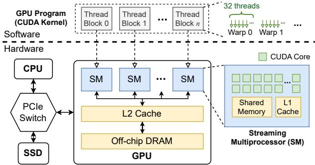  
Figure 1. Modern GPU architecture and its execution model.

## 3 Design and Implementation

In this paper, we develop GoFS, a GPU-orchestrated file system for managing scalable direct storage accesses.

## 3.1 Design Goals of GoFS

• Scalability. GoFS should exploit massive parallelism on the GPU to scale both metadata and data I/O management, while enabling scalable direct storage accesses.

• Programmability. GoFS should provide an easy-to-use interface for GPU programs. GoFS supports POSIX API, which are compatible with the API provided by most other file systems and libraries such as cuFile [66].

• Data consistency. GoFS needs to maintain data consistency between CPU and GPU, such that the host can also access the file system to manage the data on the storage device.

• Protection. GoFS needs to provide protection mechanisms for enforcing the isolation between a GPU program and the file system. It should also enforce file access controls when multiple GPU applications share the storage.

## 3.2 System Overview

We design GoFS as a log-structured file system. It uses the same on-disk format as F2FS [37] – a popular file system optimized for flash-based SSDs. We choose to build upon F2FS to provide the compatibility with existing systems and henceforth minimize the development efforts. We show the system architecture of GoFS in Figure 2. GoFS consists of a host-side client, a GPU-side daemon, and the libgofs library.

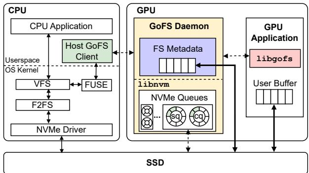  
Figure 2. System architecture of GoFS.

The GPU-side daemon in GoFS manages the in-memory filesystem metadata. We carefully examine all critical filesystem data structures and make them “GPU-friendly” by considering the bulk-synchronous parallel computing paradigm of GPU (§3.3). The daemon maintains the NVMe queues and performs data I/O accesses. GoFS exploits the massive parallelism of GPU to maximize the storage I/O throughput. It also enables zero-copy I/O access by directly transferring data into the user-provided buffer via DMA (§3.4).

The host applications can access GoFS via the host client, which uses FUSE [70] to intercept all filesystem calls. When the GPU-side daemon is not running, the host client uses the unmodified F2FS stack to manage and access the SSD. When the GPU-side daemon is active, the host-side client and GPUside daemon will work in a primary/secondary mode to maintain data consistency. The host client will sync the filesystem operations with the GPU-side daemon. GoFS ensures data consistency and crash consistency (§3.5). GoFS provides data protection and file access control. The GoFS daemon runs in a separate process, which prevents the applications from corrupting the in-memory data structures. To enforce file access controls, the daemon uses cryptographic signatures to verify user identities (§3.6). We will show the workflow of GoFS in §3.7.

## 3.3 Filesystem Metadata Management in GPU

We rethink the design and implementation of in-memory metadata structures of log-structured file systems with various optimization techniques, such as scalable accesses to inode/dentry, scalable data block management with block bitmaps, and parallel traversal of data pointers by carefully exploring the GPU-accelerated computing paradigm. We elaborate each of them as follows.

Scalable accesses to inode. An inode stores the basic information of a file, such as file size, data location, access rights, and modified time. Traditional Linux file systems use a mutex lock or R/W semaphore on the entire inode to serialize concurrent access requests to a single file. However, to best exploit the data parallelism of GPU workloads, GoFS splits data access to a single large file across GPU threads (see §3.4 for details). Thus, a coarse-grained lock on the entire inode will incur high contention between threads even if they do not access overlapped data regions (see Figure 3 left).

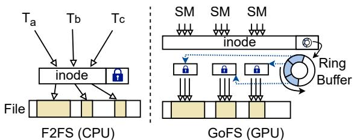  
Figure 3. Inode design with a range lock in GoFS.

GoFS replaces the inode mutex with a range lock for finegrained concurrency control based on accessed I/O ranges (see Figure 3 right). The range lock is structured as a ring buffer. Each slot in the ring buffer can hold an I/O request range, including the I/O state (1B), file offset (8B), and access size (8B). We choose the ring buffer, since it allows us to parallelize range checks with GPU’s warp-level reduction primitives [41].

GoFS acquires a single range lock for all threads in the same thread block, since GPU applications typically organize threads with spatial data locality into the same thread block. GoFS acquires the lock by appending the new range into the ring buffer and performing a conflict check against previous slots. The conflict check is parallelized within a warp using warp reduction primitives, and it incurs negligible overhead compared to the end-to-end latency of an I/O request. Upon access range conflict, the newer request must wait by polling the I/O state field of the conflicting range. For threads in the same thread block, GoFS guarantees non-overlapping data access within a file system operation by partitioning the large request across all threads and performing barrier synchronizations to avoid any lock contention. To prevent starvation, where a lock request with a large range is blocked by subsequent lock requests in smaller overlapping ranges, we guarantee a newer lock acquisition will not succeed earlier than a previous request within an overlapping range.

Unlike range lock management in conjunction with interval trees [34], which has an optimal ?? (??????(??)) complexity for the range conflict check for each single CPU thread, GoFS parallelizes checking the ranges and achieves effectively near-?? (1) complexity with fast warp-level reduction primitives. Scalable accesses to dentry. GoFS implements a dentry cache on the GPU to speed up the path resolution process. Similar to the dentry cache in the host virtual file system (VFS), each in-memory GoFS dentry holds a hash table storing all cached child dentries indexed by the directory/file name. A lookup operation uses the pathname as the key to traverse down the file system hierarchy without reading on-disk inodes. A direct lookup hash table (DLHT) [69] indexed by full pathname serves as a fast path for directories with access locality. Different from a host file system, which uses the RCU lock [46] for the concurrency control of the hash table, GoFS uses a simple per-bucket lock. This is because RCU involves dynamic memory (de)allocation and complicated inter-thread callbacks, which incurs extra performance overhead on GPU. The lock contention will happen only when multiple threads access the same file/directory and one of them tries to rename it, which is a rare case in GPU applications.

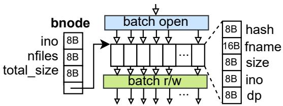  
Figure 4. Batched requests in GoFS.

To further exploit the parallelism across massive files, GoFS introduces the batched node (bnode) structure to support batched file operations. The batch operations are useful for accessing datasets organized in the form of multiple small files in the same directory, which is common for many popular datasets (see Table 1). A bnode tracks a collection of opened files under the same directory, and it uses the same inode number (ino) as the directory inode (see Figure 4). Within the bnode, GoFS records the total file count, total data size, and an array of batch-opened files. With the batched operations, GoFS coalesces metadata operations (e.g., the parent inode for all files under a directory only needs to be updated once) and eliminates unnecessary locks (e.g., all threads in a batched API will process different metadata/data without overlaps).

To use the batched operations, a GPU application needs to call batch\_open() in GoFS with a directory path to open all files under this directory (see §3.7 for API details). GoFS leverages parallel threads to read all child entries under the directory node, check the access permission of the child file, and fill the bnode file array. For each file, we store its name hash, short filename, file size, inode number, and a pointer to its cached data pointer. After calling batch\_open(), the application can issue batched read/write requests on the bnode instance.

Scalable block allocation with per-SM bitmaps. Traditional host file systems typically maintain a centralized data structure (i.e., block bitmaps in F2FS) to track the free blocks. Each bitmap encodes the occupied and free blocks in a 2MB segment (the segment size is usually aligned with the erase block size of an SSD). Upon block allocation, multiple CPU cores will compete for the block bitmaps (Figure 5 left). To avoid this, GoFS applies two optimizations (Figure 5 right).

First, GoFS maintains per-SM bitmaps to eliminate contention between SMs. Upon initialization, GoFS assigns bitmaps to an SM based on the number of free blocks in the segments, such that all SMs have similar numbers of free blocks. When the number of free blocks to any SM is below a certain threshold (5% by default), GoFS will redistribute the free segments among all SMs, which can be fulfilled in-memory quickly.

Second, GoFS coalesces the block allocation operations of all threads in a thread block into a single allocation to reduce contention on the per-SM bitmaps. Instead of letting each thread allocate new blocks on its own and contend on the per-SM bitmaps, we first use all threads in the thread block to collaboratively compute the total number of blocks needed by all threads. Then, a single thread (e.g., thread 0) will be responsible for manipulating the per-SM bitmaps. After that, we assign the allocated blocks to each thread.

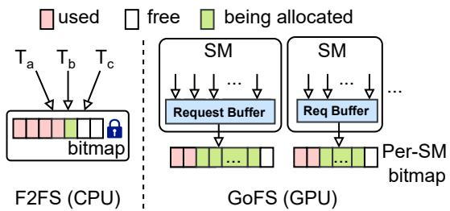  
Figure 5. Block bitmap used in GoFS.

Parallel traversal of data pointers. Similar to other file systems, GoFS uses a tree-like structure to index the file data blocks. The root of the tree is the inode. Each intermediate node is a block of data pointers, and each data pointer either points to a data block (i.e., direct pointer) or another block of pointers (i.e., indirect pointer). All data blocks are leaf nodes.

In a traditional file system, when multiple CPU threads read the same file, each thread independently traverses the tree from the root to find the leaf data blocks (see Figure 6 left). This scheme leads to two problems on the GPU. First, there is a load imbalance among different threads since the leaf nodes can have different depths. As a result, the straggler thread will stall the entire GPU kernel. Second, data blocks and pointer blocks need to be handled differently. This leads to branch divergence if two threads in the same warp follow different code paths to handle different block types, which significantly wastes the parallelism of the GPU.

Inspired by previous GPU graph traversal algorithms [47], we develop a level-synchronous parallelism scheme to traverse the data pointers (see Figure 6 right). We use a two-stage procedure to index and fetch the data blocks. In stage one (metadata stage), we traverse the data pointer tree to find the logical flash page addresses (LPAs) of all leaf data blocks. In the tree traversal, all nodes at the current level can be processed in parallel to find the nodes at the next level, and the threads perform barrier synchronization between consecutive levels. This balances the number of nodes being processed by each thread at each level and eliminates branch divergence since all threads execute the same code path when processing data pointers. In stage two (data stage), we fetch all data blocks in parallel to maximize the storage throughput of SSDs by utilizing the data I/O techniques in §3.4.

Synchronized GPU clock. To ensure the correct ordering of filesystem operations, GoFS requires a timestamp within each log entry. And the timestamps generated on the GPU should be synchronous with the host clock. This is because the timestamps will be used as the creation or modification times of directories and files, and many popular applications depend on this information for correctness. For example, Makefile leverages the file modification time to detect file changes to implement incremental compilation. As GoFS allows both host and GPU to create and modify files, it is necessary to ensure that both sides use consistent timestamps.

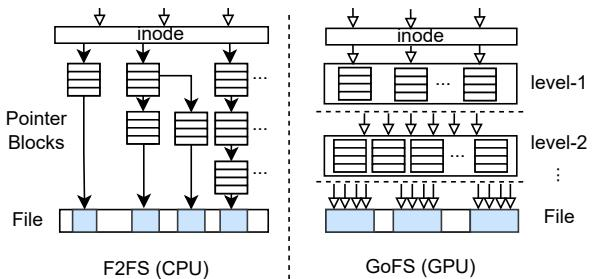  
Figure 6. Level-synchronous data pointer traversal in GoFS.

However, the current GPU does not provide a clock synchronized with the host CPU. Naïvely retrieving every timestamp from a host clock will require frequent communication between CPU and GPU. To avoid such overhead, we implement a GPU-side clock by leveraging the GPU’s special register globaltimer [52] as a fast local timer, and we periodically (every 10 minutes by default) calibrate the GPU clock with the CPU clock. With the default period, the worst clock skew for the GPU-side clock is 1368 ??s (326 ??s on average). GoFS allows the user to configure the synchronization period to achieve higher clock accuracy (e.g., with a 1-minute period, the worst clock skew is less than 150 ??s). This is sufficient for most applications and systems. For example, the common time skew tolerance of Windows Time service (W32time) ranges from 1 millisecond to 1 second [48].

To synchronize the clock, GoFS requests a CPU timestamp and stores the clock offset between the CPU clock and the GPU local timer. GPU local timestamps are calculated by the clock offset and the local timer value.

## 3.4 Data I/O in GoFS

The GoFS daemon maintains multiple NVMe queues in the GPU memory to serve parallel I/O requests from multiple SMs based on libnvm [44]. It enables zero-copy I/O access by directly DMAing data from the SSD to the user’s data buffer without maintaining a complicated page cache, by considering the characteristics (e.g., streaming data access and batch processing) of GPU applications. GoFS automatically scales the number of I/O threads based on request size. And it provides both synchronous and asynchronous APIs to user programs. I/O queue setup. In GoFS, the number of I/O queues (i.e., NVMe queue pairs) and the queue depth can be configured based on the number of SMs and the SSD specification. By default, GoFS creates as many I/O queues as supported by the SSD (e.g., 16 queues for a commercial SSD like Samsung 990 Pro1 and 128 queues for datacenter SSDs like Intel Optane [1]).

The default queue depth is 2048 (i.e., the maximum number of concurrent threads supported by an SM [55], which often cannot be reached due to register and shared memory limits). This is more than enough to saturate the SSD throughput.

I/O request dispatch. GoFS employs a static I/O request dispatching policy. GoFS partitions the I/O queues evenly among all SMs and routes the requests from an SM to its corresponding queues. This simple policy incurs no runtime scheduling overhead. It will not cause queue imbalance since most GPU applications will balance the load across SMs by default.

Zero-copy I/O access. In GoFS, all data I/O accesses are zero-copy. The data will be directly DMAed from/to the user program’s buffer, and we let the user decide whether to employ a caching layer. This is in sharp contrast to a traditional host file system, which uses a page cache to exploit data locality. A page cache will not be helpful to most GPU applications, since they often (1) work on a large dataset that cannot be fully cached, (2) have a streaming data access pattern without any temporal locality, (3) already manually keep frequently used data in GPU memory, and (4) are throughput-oriented workloads that can tolerate the long SSD access latency without a cache. For these applications, adding another layer of cache not only increases I/O overhead but also wastes precious GPU memory. For applications that can benefit from a page cache, we can still rely on existing libraries on top of GoFS to provide caching functions and an mmap-like interface. Note that GoFS still maintains a filesystem metadata cache.

Automatic data-parallel I/O access. To serve a read/write request, GoFS will launch a new GPU kernel using CUDA dynamic parallelism [3]. This gives GoFS the flexibility of automatically scaling the number of threads, such that each thread serves a chunk of the requested data (i.e., data parallelism). In contrast, a host file system will not automatically spawn multiple threads to serve a single read/write request.

GoFS determines the kernel launch configuration (i.e., the number of thread blocks and the number of threads per block) based on the request size. GoFS will try to utilize all SMs so that all I/O queues will be utilized to maximize I/O throughput. Therefore, GoFS launches as many thread blocks as necessary where each thread block serves a minimum of 4KB data chunk (the FS data block size). The maximum number of thread blocks is constrained by the number of SMs. The number of threads per block is 64 by default, as we find out empirically that having more threads per block will not improve I/O throughput when there are already enough thread blocks. GoFS also allows the user to explicitly specify the kernel configuration for a read/write request.

Synchronous and asynchronous data access. In synchronous mode, a read/write API call will block until the data is ready in the user buffer. GoFS will keep polling the I/O queue to determine if the data has been DMAed to the destination. In asynchronous mode, an API call will just forward the request to the GoFS daemon, and the user kernel can continue execution. libgofs provides another API to wait for the request completion by polling the request status from the daemon. The user application can leverage the asynchronous APIs to implement software pipelining to hide the I/O access latency.

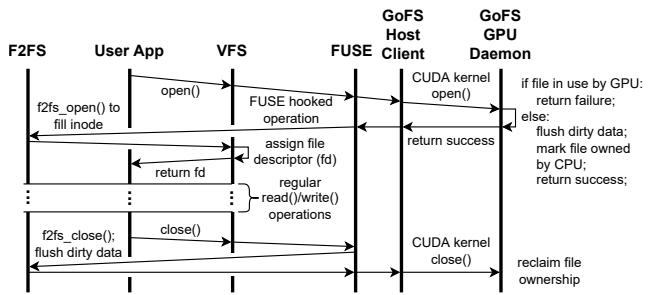  
Figure 7. Data consistency between CPU and GPU in GoFS.

## 3.5 Data Consistency

Data consistency between CPU and GPU. GoFS allows both CPU and GPU programs to access the filesystem. GoFS uses FUSE [70] to implement a host-side client to maintain data consistency between CPU and GPU. FUSE enables the OS kernel to redirect CPU-side GoFS file system syscalls to the userspace host client without modifying user applications or the OS kernel stack, offering the best compatibility with the existing system stack. A userspace client is necessary since a CUDA kernel can only be launched from the userspace. GoFS does not change the F2FS on-disk layout, so we do not need to modify the kernel F2FS implementation.

In GoFS, the GPU daemon manages the ownership of opened files. The GPU-centric design is reasonable as GPU applications typically prefer minimum host involvement.

Figure 7 shows the workflow of file operations issued from CPU-side applications. GoFS redirects the open() syscall to the userspace GoFS client. When the GPU daemon is not running, the host client directly returns the redirected open and enters the original F2FS stack. The host client invokes custom GPU kernels to acquire access ownership of the target file. If no GPU application is accessing the file, the GPU daemon grants the file ownership to the host. FUSE then calls the normal f2fs\_open() function to open the file. After the file is opened, the user application can transparently issue file I/O requests to the underlying F2FS without involving the GPU.

When the application close()s a file, FUSE directs the function call to the normal f2fs\_close(), letting it flush all related dirty data. Then, it forwards the close() to the GPU daemon (similar path as open()) to return the file ownership.

In addition, GoFS allows the GPU and CPU to concurrently read the same file (i.e., sharing ownership) by opening the file in read-only mode. If the CPU/GPU wants to reopen the file in read/write mode, it will wait for all previously opened file instances to be closed. GoFS keeps a per-file reference counter to track the number of opened file instances to achieve this. Crash consistency. Since GoFS does not change the on-disk format of F2FS, it provides the same crash consistency guarantees. As a log-structured file system, GoFS persists new data blocks and node blocks out-of-place and propagates the changes by updating the block address in the NAT table. To provide a consistent recovery point, GoFS triggers a checkpoint procedure to flush all dirty metadata and persist the current metadata within a checkpoint pack. GoFS can directly use the host F2FS stack for crash recovery without GPU involvement. GoFS scans the checkpoint region to extract the latest checkpoint pack and roll back the file system metadata to the latest consistent stage. The recovery overhead is less of a concern as it is not on the critical path of application execution.

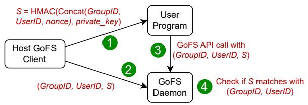  
Figure 8. User identity authentication in GoFS. 1 and 2 only happen once when the user process registers itself with GoFS daemon. 3 and 4 happen for every GoFS API call.

## 3.6 Data Protection

Unlike the CPU, a GPU does not provide multiple privilege rings. Thus, GoFS needs to enable data protection differently. In-memory filesystem integrity protection. GoFS leverages GPU’s virtual memory isolation to enforce “privilege rings”. It maintains a daemon process (i.e., the “kernel space”), which has the privilege of managing filesystem metadata and the NVMe queues in the GPU memory. The user process (i.e., the “user space”) cannot access the memory of the daemon process. The daemon launches a persistent daemon kernel on the GPU to listen to the filesystem API calls from user processes. It only occupies a single SM, and the user process can utilize other SMs with CUDA MPS [51]. The user process forwards GoFS API calls to the daemon via a shared request queue in the GPU memory (implemented using CUDA IPC [55]).

File access control. When GoFS’s daemon process opens a file, it checks whether the user process has permission to access this file. For a host file system, this can be done by directly checking the user/group ID of the user process, since the OS kernel by default maintains the data structures to manage all processes. However, on the GPU, the GoFS daemon cannot directly track the user/group ID of a user process.

To address this challenge, we leverage the trusted host GoFS client to generate a unique and unforgeable “ID” for each user process. We illustrate the user identity authentication mechanism in Figure 8. When a user process initializes GoFS, it needs to register itself with the host GoFS client. The client runs with sudo privilege and can retrieve the correct user/group ID of the user process. Then, the client uses a cryptographic algorithm (e.g., HMAC-SHA256 [50]) to sign the user identity (i.e., group/user ID) and a randomly generated nonce with a private key that can only be accessed by the client. Then, the client passes this signature to the user process and guarantees that the signature will not be exposed to other processes ( 1 ). It also passes the user identity and the signature to the GoFS GPU daemon, such that the daemon can maintain a mapping from user identities to signatures ( 2 ). When the user process invokes a GoFS API, it sends the signature along with the user identity to the daemon process ( 3 ). The daemon then verifies that the user identity and the signature match, which guarantees that the provided user identity is not forged by a malicious process ( 4 ).

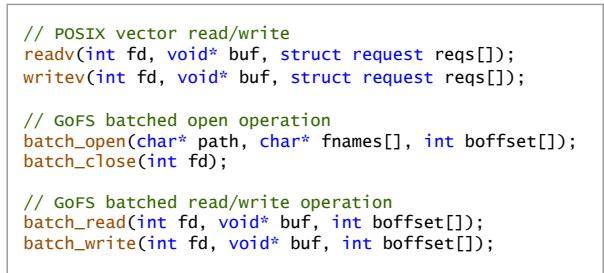  
Figure 9. New file operation APIs supported by GoFS.

## 3.7 Put It All Together

GoFS APIs. GoFS provides the POSIX API for GPU applications for programmability and compatibility, as it is a commonly adopted standard for file systems. Applications only need to call filesystem APIs to access files, GoFS transparently maximizes the I/O throughput with automatic data-parallel I/O accesses. Besides, GoFS also provides a few extended APIs to further optimize file operations, as shown in Figure 9.

readv/writev: Perform file read/write with an array of requests (reqs[]). Each request contains the requested file offset, length, and the offset to the data buffer (buf).

batch\_open/batch\_close: Open up multiple files under the directory with pathname as a bnode. Users may pass an array of fnames[] to specify files to open, otherwise all files are opened under the directory. The file position within the bnode is returned in an array of boffset.

batch\_read/batch\_write: Issue batch read/write requests to the files within the bnode. Batch read fetches the entire file in boffset and loads data into the provided buffer. Batch write overwrites the buffer data to the file according to the boffset. Daemon setup. By design, GoFS can be mounted on any SSD formatted in F2FS. To mount GoFS, a privileged user calls the mount function with the disk controller identification, and the host GoFS client then launches a GPU daemon kernel. The daemon initializes NVMe queue pairs and reads the file system superblock to check the on-disk FS structure. It then builds the runtime structure (e.g., block bitmap) in GPU memory. Before calling GoFS APIs, the user process registers itself with the host GoFS client via IPC. The host client will then set up the GoFS API request queue in the GPU memory. The request queue is shared between the GPU daemon and the user’s GPU kernels via CUDA IPC. The overhead of GoFS initialization is trivial (less than 50 milliseconds in total on our testbed).

File operations. We use an example to show the workflow of GoFS’s file operations. An application first opens the target file with the file path, and GoFS performs a file lookup. After finding the inode and opening the file, the application can issue a file read. GoFS acquires the data range lock (3.3), and performs the two-stage (metadata and data) file read with multiple GPU threads. The read requests are dispatched among SSD I/O queues, and the SSD directly DMAs the requested data to the application buffer (3.4). The range lock is lifted after request completion. After performing some computation, the application can overwrite the result back to the file. During parallel writes, GoFS allocates new free blocks with the per-SM allocation pool for data. After the data is persisted, GoFS updates the data pointer in parallel.

Garbage collection. GoFS implements garbage collection process to reclaim scattered and invalidated blocks in the file system. GoFS daemon periodically checks the number of available free segments, and it triggers foreground (on-demand) GC process when the unused capacity drops below a configurable threshold (5% by default). To speedup the GC procedure, GoFS daemon launches a new GC kernel with multiple thread blocks. Each thread block greedily selects a victim segment (2MB) with the least valid block, and writes the valid 4KB data blocks to a newly allocated segment. It then sends a trim NVMe command to the SSD with the I/O queue to clean up the blocks in the segment. Finally, GoFS updates the in-memory block bitmap and the on-disk SIT table (segment info table).

GoFS also supports background GC. The host client of GoFS monitors GPU utilization using the PROF\_SM\_OCCUPANCY metric of DCGM [54], and derives the number of active warps on the GPU. When there is only one active warp (i.e., only the GoFS daemon is running on the GPU), the host client will launch special GC kernels. GoFS does not trigger the default GC of F2FS on the CPU, since this may require frequent synchronization of file ownership and global file system metadata between the CPU and GPU.

## 3.8 Implementation Details

GPU daemon. We implement the GPU-side GoFS daemon using 5.5K lines of CUDA C++ code with CUDA 12.4. The inmemory data structures, such as hash table, ring buffer, lists, and trees account for 2.4K lines of code. We also implement a buddy allocator within GoFS daemon for managing the file metadata caching. We use the libnvm [44] to enable direct NVMe access inside GPU kernels.

libgofs. We implement a libgofs library with 1.4K LoC which provides library functions for GPU applications to interact with GoFS host client and GPU daemon.

Host client. The GoFS host client is implemented in 0.8K lines of C++ code. We modified around 0.2K lines of C code to redirect the GoFS file operation calls to the userspace GoFS client using the FUSE kernel module.

The kernel launch overhead in GoFS is 9.2 ??s on average. In sync mode, most thread blocks launched by the GoFS kernel will finish after they have submitted the NVMe commands, and only a few thread blocks (empirically, we use 16 thread blocks by default) will remain active to poll for I/O completion. Only up to 16 out of 108 SMs on our A100 GPU are occupied by GoFS, and the user application’s kernels can execute on other SMs. For I/O-intensive applications, occupying a few SMs for polling is acceptable, since they are not bottlenecked by the computation. For compute-intensive workloads like ML training/inference, their I/O demand is relatively low compared to computation, therefore, it usually requires fewer SMs for serving I/O requests. Note that GoFS needs only one SM for its daemon when the I/O is idle, it will dynamically adjust the SM allocation depending on the I/O intensity. In async mode, the GoFS kernels will finish after submitting the NVMe commands and do not occupy any SM to wait for I/O completion, so the interference to the user threads is insignificant.

## 4 Evaluation

Our evaluation shows that: (1) GoFS achieves 1.10×/1.03×, 1.38×/1.65×, and 2.04×/2.40× higher sequential, random, and multi-file read/write throughput compared to current storage solutions for GPUs. GoFS significantly saves host CPU cycles while achieving high I/O throughput (§4.2). (2) GoFS improves real-world GPU application performance by 1.61× compared to state-of-the-art designs (§4.3). (3) GoFS achieves near-linear I/O throughput scalability as we increase the number of SSDs (up to 20.4GB/s sequential read with four SSDs) (§4.4).

## 4.1 Experimental Setup

Testbed. Our testbed has a 16-core Intel Xeon W5-3435X CPU, 64GB DDR5 host memory, and an NVIDIA A100 GPU with 40GB device memory. We use Ubuntu 20.04 with Linux kernel 5.4.0, CUDA 12.4, and NVIDIA GPU driver 550.127. GoFS is mounted on a 2TB Samsung 990 Pro SSD.

Workloads. We evaluate GoFS with microbenchmarks and real data-intensive GPU applications (see Table 1). For the microbenchmarks, we vary the number of host CPU threads and the number of GPU thread blocks for sensitivity analysis. For real applications, we include intelligent queries, graph analytics, graph neural network (GNN) trainings and retrievalaugmented generation (RAG) systems, as they are representative GPU workloads in production today [15, 19, 38, 39]. Finally, we also test GoFS’s scalability with multiple SSDs.

Baselines. We compare GoFS to state-of-the-art storage access solutions for GPUs, which enable different degrees of GPU control over the filesystem:

• Basic: The host CPU executes filesystem operations and accesses the disk using F2FS. Data is first staged in host memory and then transferred to GPU using cudaMemcpy.

• GPUfs [62]: A wrapper library that enables GPU threads to invoke file system APIs. It delegates the API calls to the host filesystem (i.e., F2FS) via Remote Procedure Calls (RPCs). The host CPU runs server threads to process the RPCs and execute filesystem operations. The data still needs to be transferred between CPU and GPU via cudaMemcpy. It maintains a file cache in the GPU memory.

Table 1. Workloads used in our evaluation. The “Predictable” column indicates whether the workload has a predictable storage I/O access patterns or not.
<table><tr><td>Workload</td><td>Description</td><td>Predictable</td></tr><tr><td colspan="3">Microbenchmarks</td></tr><tr><td>Seq-R/W Rand-R/W</td><td>4KB sequential file read/write</td><td>Yes</td></tr><tr><td></td><td>4KB random file read/write</td><td>No Yes</td></tr><tr><td colspan="3">Multi-file-R/W 10oK16KB small files read/write Applications</td></tr><tr><td>IIR [22]</td><td>Given an image query,searches for the most similar image in the 636GBLSUN[75] dataset</td><td>Yes</td></tr><tr><td>TIR [72]</td><td>(53M samples with 12kB file size,preprocessed). Takes a textual query to retrieve the matched images in 24GB ImageNet [24] dataset (2M</td><td>Yes</td></tr><tr><td>MIR [42]</td><td>samples with 12KB file size,preprocessed). Searches for music samples matching a given audio clip in 110GB AudioSet [42] dataset (10M</td><td>Yes</td></tr><tr><td>RAG[19,38]</td><td>samples with 12KB file size,preprocessed). LLM-based retrieval-augmented generation with Llama2-13B [68] and 3.6TB vector DB.</td><td>No</td></tr><tr><td>BFS[6]</td><td>BFS searchwith 15GBGAP-web[6]and 920MB GAP-road [6] dataset.</td><td>No</td></tr><tr><td>CC[6]</td><td>Connected Component Search with 32GB GAP- kron [6] and 15GB GAP-web graph dataset.</td><td>No</td></tr><tr><td>GNN [23,33]</td><td>Graph neural network training with Graph- SAGE[23,25] on 3.2TB WebGraph[9] dataset.</td><td>No</td></tr><tr><td>Image Preprocess [35]</td><td>Preprocessing original 167GB ImageNet [24] dataset for downstream tasks like DNN training.</td><td>Yes</td></tr></table>

• cuFile [66]: The application uses NVIDIA cuFile APIs to load data directly from SSD to GPU device memory via GPUDirect Storage. The data will not be staged in the host memory. However, the host CPU still processes filesystem operations and issues NVMe commands to the SSD. cuFile uses ext4 since it does not support F2FS.

• GeminiFS [57]: GeminiFS uses the host to manage metadata while offloading data I/O to the GPU. Upon opening a file, GeminiFS uses the host filesystem to retrieve its metadata (e.g., data pointer) and copies it to the GPU. With this metadata, the GPU can issue NVMe commands to read-/write the data blocks in the SSD. The GPU can read/write the per-file metadata, but it cannot access directory or global filesystem metadata. The GPU-side metadata is freed upon file closing. We also allocate a 1GB page cache in the GPU for its prefetching mechanism.

## 4.2 Microbenchmarks

We use microbenchmarks to evaluate GoFS’s I/O throughput against the baselines, following popular file system benchmarks such as fio [18] and filebench [65]. For sequential read-/write, we directly call GoFS’s read/write APIs. For random read/write, we pre-generate random 4KB-aligned file offsets and use GoFS’s vector APIs. For multi-file read/write, we use GoFS’s batch APIs (see Figure 9). For all microbenchmarks, GoFS enforces the locking on all file operations to ensure atomicity and guarantee data correctness. GoFS uses range locks to support concurrent accesses to different file regions. We list our findings as follows.

(1) GoFS scales its I/O throughput much better than all baselines as we increase the number of GPU thread blocks. Figure 10 shows the I/O throughput of all designs for varying numbers of GPU thread blocks. For all baselines, we use the number of CPU threads that maximizes the throughput.

For sequential read/write, cuFile has the lowest throughput (0.44GBps/0.48GBps) due to high host stack overhead. The write throughput of Basic is only 1.1GB/s due to lock contentions among CPU threads. GPUfs performs 1.6×/1.2× worse than Basic for read/write, as it has high RPC overhead between CPU and GPU when the request size is small. Both GeminiFS and GoFS achieve better throughput than other baselines, as they leverage the GPU to accelerate data I/O operations. GoFS achieves slightly better sequential read/write throughput than GeminiFS. This is because GoFS carefully optimizes the metadata management in GPU memory to reduce unnecessary locking overheads (e.g., range locks and per-SM bitmaps). In contrast, GeminiFS suffers from higher lock acquire/release overhead even when there is little contention with the sequential access pattern. GoFS achieves 5.5GBps/6.5GBps read/write throughput, which is close to the peak raw throughput of our SSD (6.9–7.5GB/s [2]).

For random read, GoFS achieves 5.1GB/s peak throughput, which is close to the peak raw SSD throughput (5.4GB/s, as measured on the raw block device without a file system). While both GoFS and GeminiFS leverage GPU’s high parallelism to accelerate data I/O, GoFS is 1.4× faster. This is because GoFS allows all GPU threads to issue requests in parallel (at maximum parallelism, each of 6,912 CUDA cores can execute a thread on A100), while GeminiFS’s warp-level lock serializes all requests in a single warp (at most 432 active warps), wasting the thread-level parallelism inside each warp.

For random write, GoFS achieves near-sequential throughput (6.1GB/s). This is because GoFS is log-structured and optimizes for parallel log updates, so random writes are sequentially appended into the log using multiple GPU threads. Basic also uses the log-structured F2FS but cannot scale due to multi-thread contention. GeminiFS is 1.6× slower than GoFS for random writes since (1) it does not exploit parallelism inside a warp (for the similar reason to random read), and (2) it is based on ext4 and the overwrite operations cannot be converted to sequential log appends. Note that GeminiFS cannot be adapted to a log-structured file system by design since the GPU does not manage global filesystem metadata and cannot support data block allocation and invalidation.

For multi-file read/write, GoFS employs the batched APIs to process the files in parallel. This significantly reduces the file system metadata overhead and fully exploits the massive data parallelism of GPU threads. In contrast, all other baselines rely on the host to process metadata operations upon opening/closing a file. As a result, GoFS can achieve 15.5× and 4.6× multi-file read and write throughput improvements compared to the state-of-the-art baseline. To further understand the benefit of batch API enabled in GoFS, we conduct an ablation study in comparison with the case in which each thread calls open/read/write/close on a separate file. Our experiments show that using the batch API improves the throughput by 1.67×/1.38× for multi-file read/write respectively2.

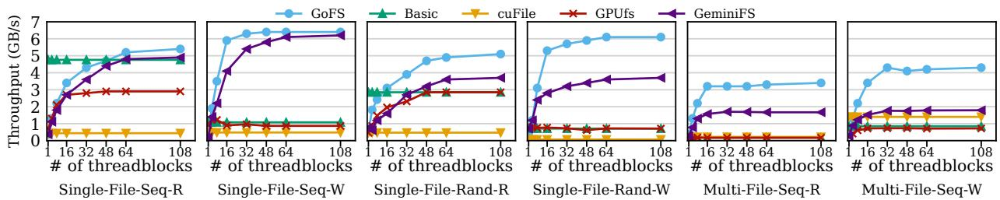  
Figure 10. Performance of microbenchmarks with varying numbers of thread blocks on the GPU.

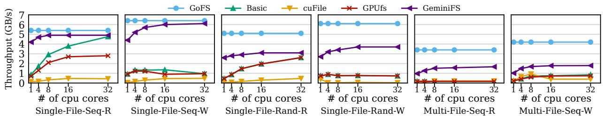  
Figure 11. Performance of microbenchmarks with varying numbers of CPU cores.

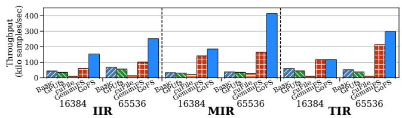  
Figure 12. End-to-end query processing throughput of intelligent query applications.

(2) GoFS significantly saves host CPU cycles while achieving the peak SSD throughput. Figure 11 shows the I/O throughput for varying numbers of CPU threads. GoFS is not affected by this parameter since it does not involve the host CPU at all during I/O accesses. For GPUfs, GoFS, and GeminiFS, we use 108 thread blocks on the GPU to maximize the parallelism. For all microbenchmarks, GoFS achieves better peak I/O throughput than all other baselines as discussed above. Even when other baselines perform close to GoFS (e.g., for sequential read/write), they need to occupy at least 8–16 CPU cores to achieve the best performance. GoFS frees up the precious CPU cores. As we scale to multiple GPUs and multiple SSDs, the CPU bottleneck will be more severe, so saving CPU cycles will become more beneficial.

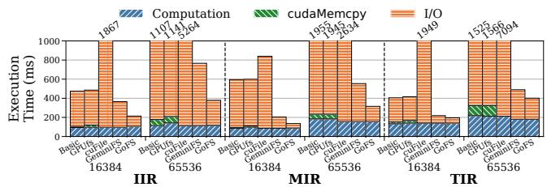  
Figure 13. Execution time breakdown of a single batch in intelligent queries. We show the GPU Computation time, cudaMemcpy time, and I/O time (including filesystem software overhead and disk access time).

## 4.3 Real-World Applications

We now evaluate GoFS with real-world GPU-accelerated applications as listed in Table 1.

4.3.1 Intelligent Queries. The intelligent queries perform batch processing of small files. The dataset is processed iteratively. In each iteration, the application first fetches a batch of samples into the GPU memory, which involves opening and reading a batch of small files. And then, GPU executes a DNN model to conduct similarity search against all samples in the dataset. The computation of the current batch and the data fetch of the next batch are pipelined.

Figure 12 shows the end-to-end query processing throughput. GoFS outperforms Basic, GPUfs, cuFile, and GeminiFS by 6.2/7.5/21.3/2.1× on average. Figure 13 further breaks down the execution time of a single batch. For small batch sizes, the GPU compute capability is not saturated, and computation is the bottleneck. Hence, GoFS can have similar performance to GeminiFS. For larger batch sizes, the end-to-end execution is bounded by I/O time. GoFS significantly reduces the I/O time compared to all other baselines. This is because GoFS employs the batched file API to leverage GPU’s parallelism to handle massive metadata operations due to multi-file accesses, while all other baselines rely on the host to access on-disk metadata. For intelligent queries, our ablation study shows that the batch API of GoFS improves the query throughput by 1.41× on average, compared to the case without using the batch API.

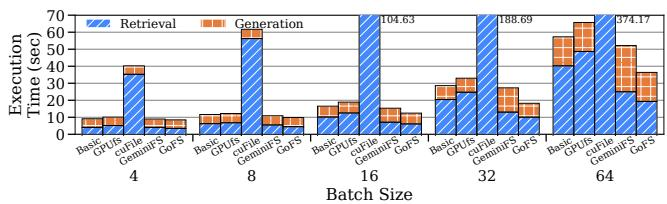  
Figure 14. Request latency breakdown of RAG applications.

Notably, GoFS’s improvement over GeminiFS for IIR (2.5×) and MIR (2.7×) is higher than that for TIR (1.4×). This is because GeminiFS needs to keep the metadata of all opened files in GPU memory, as the GPU cannot retrieve any missing metadata from disk without host intervention. The metadata in GeminiFS occupies at least 8KB of GPU memory per opened file. For TIR, the metadata for the entire dataset (15.3GB) can be kept in GPU memory, so there is no host metadata access overhead. As the dataset gets larger, the metadata (404.4GB for IIR and 76.3GB for MIR) greatly exceeds GPU memory capacity (40GB), so GeminiFS needs to open and close the files for each batch, leading to significant host metadata access overhead.

4.3.2 Retrieval-Augmented Generation. RAG [19, 38] performs similarity search (e.g., ANN) to retrieve the toprelevant items from an on-disk vector database. The database indexing involves graph traversals, resulting in frequent, small, and data-dependent I/O accesses [27]. The retrieved items are fed into the LLM to generate the final answer. We use vLLM [36] as the LLM engine. For Basic, we use the host to perform the retrieval and the GPU to perform LLM generation. For cuFile, GPUfs, GeminiFS, and GoFS, the GPU performs both retrieval and generation. For GeminiFS, we keep the metadata for the entire dataset in GPU memory (7.2GB for our 3.6TB dataset) as opening the files on demand will result in lower performance. We use two 2TB SSDs with RAID0 as the dataset is 3.6TB (see the multi-SSD setup in §4.4).

Figure 14 shows the request latency breakdown for varying batch sizes. cuFile performs significantly worse than all other designs due to its poor random 4K I/O performance (see §4.2). GoFS outperforms Basic, GPUfs, and GeminiFS by up to 1.6/1.8/1.4×. Basic, GPUfs, and GoFS have similar generation time as this does not involve any file I/O. However, GeminiFS suffers from up to 1.6× slower generation time as the batch size increases to 64. This is because GeminiFS keeps the metadata of the entire 3.6TB database in GPU memory (7.2GB footprint), leaving less space for the KV cache. For the retrieval time, both GeminiFS and GoFS perform better than Basic and GPUfs, and GoFS outperforms GeminiFS by 1.2×. This aligns with our observations for the random read access pattern in §4.2.

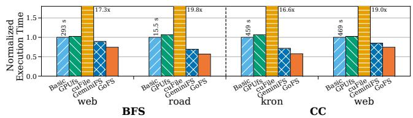  
Figure 15. End-to-end execution time of graph analytics.

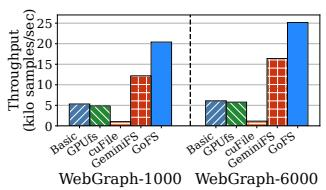

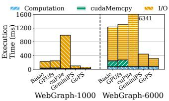  
Figure 16. Throughput (left) and single-batch execution time breakdown (right) of GNN training. 1000/6000 are batch sizes.

4.3.3 Graph Analytics. We evaluate two representative graph algorithms: breadth-first search (BFS) and connected components (CC). Both follow a level-synchronous scheme to iteratively traverse the graph. In each iteration, the algorithm processes all vertices in the current level in parallel to find all vertices in the next level. Then, it fetches the new vertices from the disk into GPU memory, which involves data-dependent, fine-grained, and random accesses to a single large file. After that, it proceeds to the next iteration.

Figure 15 shows the end-to-end execution time of graph analysis applications. The performance trend is highly correlated with the random read throughput in §4.2. GPUfs and Basic have similar performance, as they both utilize the full host file system stack to access the disk and require cudaMemcpy to move data to the GPU. cuFile has the worst performance (up to 19.8× slower than Basic and GPUfs) due to the random access pattern with small I/O sizes. GoFS achieves 1.34–1.76× speedup (1.53× on average) over Basic, since it alleviates host CPU bottleneck and scales the I/O throughput with massive GPU threads. Compared to GeminiFS, GoFS is 1.2× faster, as GoFS utilizes more GPU parallelism to improve I/O throughput, which is especially useful for small random I/O accesses.

4.3.4 Graph Neural Network Training. GNN training involves three steps [23, 33]. In each training iteration, a batch is first formed by sampling multiple subgraphs from the entire graph. This step performs BFS on multiple source nodes up to a certain distance. Second, the node features for each subgraph are gathered from the disk to the GPU memory. Finally, the GPU performs DNN computation on each subgraph. The first two steps incur random I/O accesses on large files and are a major bottleneck in GNN training.

Table 2. Total execution time and speedup vs. Host-Only for dataset preprocessing.
<table><tr><td rowspan=1 colspan=1></td><td rowspan=1 colspan=1>Host-Only</td><td rowspan=1 colspan=1>GeminiFS</td><td rowspan=1 colspan=1>GoFS</td></tr><tr><td rowspan=1 colspan=1>1SSD</td><td rowspan=1 colspan=1>200.08s(1.0×)</td><td rowspan=1 colspan=1>399.18s (0.50×)</td><td rowspan=1 colspan=1>172.26s(1.16x)</td></tr><tr><td rowspan=1 colspan=1>2 SSDs</td><td rowspan=1 colspan=1>190.56s (1.0×)</td><td rowspan=1 colspan=1>339.40s (0.56x)</td><td rowspan=1 colspan=1>97.11s (1.96×)</td></tr><tr><td rowspan=1 colspan=1>4 SSDs</td><td rowspan=1 colspan=1>185.68s(1.0×)</td><td rowspan=1 colspan=1>327.93s (0.57×)</td><td rowspan=1 colspan=1>58.80s (3.16×)</td></tr></table>

Our graph dataset consists of a graph represented by a sparse matrix with per-node features and ground truth labels for training. Due to SSD capacity limitation, we striped the 3.2TB dataset across two 2TB SSDs using RAID0. We extend PyTorch Geometric (PyG) [17] for GNN training.

Figure 16 shows the training throughput and the singlebatch execution time breakdown with different batch sizes. While GNN training also involves BFS, the performance benefits of GoFS over other baselines are more obvious than in the BFS benchmark (§4.3.3). This is because GoFS scales better than other baselines on two SSDs, since GoFS can exploit the GPU parallelism to maximize the bandwidth utilization of all SSDs (see §4.4). For Basic, GPUfs, and cuFile, the host filesystem stack encounters scalability issues and cannot fully utilize the bandwidth of two SSDs [49]. GoFS is 1.54× faster than GeminiFS. The gap between GeminiFS and GoFS is more obvious than in Figure 15 because it requires more GPU parallelism to utilize the bandwidth of two SSDs.

4.3.5 Dataset Preprocessing. Dataset preprocessing is a representative GPU workload that involves intensive read-/write I/O to the storage. The task involves reading the files in the dataset into the GPU, transforming them into a specific format required by the downstream tasks, and writing them back to the storage. The task is common in many real applications like ML training and data analytics. GoFS can benefit data preprocessing, as it accelerates multi-file creation, opening, and writing by managing metadata with GPU parallelism.

Table 2 compares the time of preprocessing the ImageNet dataset (see Table 1) with Host-Only (CPU preprocesses the dataset), GeminiFS (CPU converts input files to the GVDK format required by GeminiFS, opens the GVDK files, and preallocates output GVDK files; GPU performs computation and writes to the output files), and GoFS. Both Host-Only and GeminiFS pipeline I/O and computation. GoFS is 1.16–3.16× faster than Host-Only as it leverages GPU parallelism for metadata operations. In particular, the use of batch API improves the performance of GoFS by 1.10× on average, according to our ablation study. GeminiFS performs worse than Host-Only since it not only suffers from host file open and create overhead, but also incurs extra GVDK file conversion overhead.

## 4.4 Performance with Multiple SSDs

We evaluate GoFS’s scalability with multiple SSDs. We use mdadm to create RAID0 arrays of up to 4 SSDs. On the GPU, GeminiFS and GoFS support a RAID0 array by striping the data across multiple SSDs. As shown in Figure 17, GoFS achieves linear throughput improvement for all microbenchmarks as we increase the number of SSDs. With 4 SSDs, GoFS achieves 20.4GBps/22.1GBps sequential read/write throughput. This is because GoFS exploits the massive GPU parallelism to saturate the total throughput of all four SSDs. In contrast, Basic can only achieve up to 7.8GB/s throughput with 4 SSDs due to host software overhead. GeminiFS also cannot scale beyond 2 SSDs except for sequential read/write since it only exploits warp-level parallelism.

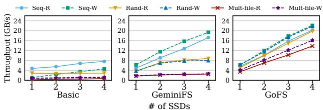  
Figure 17. Performance improvement with multiple SSDs.

## 4.5 GPU Memory Footprint of GoFS

The major sources of GoFS’s GPU memory consumption are the cached inodes and data pointers. With more opened files, GoFS needs more memory space for caching the dentry and inode structures. GoFS minimizes this using a more condensed bnode structure for batched operations. For the applications examined in our study, intelligent query with the batch size of 65,536 incurs the largest GPU memory footprint for GoFS (278 MB, of which 263 MB is the inode cache for small files). This is insignificant compared to tens of GBs of GPU memory.

## 5 Discussion and Future Work

Support for different file system formats. GoFS can be extended to support other on-disk file system formats. Most in-memory data structures in GoFS and the CPU-GPU coordination mechanism can be reused. However, we need to consider two factors for supporting a different file system format. First, log-structured file systems intrinsically help reduce the complexity and overhead of managing crash consistency. For file systems like ext4, extra care may need to be taken, such as the journaling implementation. Second, the concrete implementations of parallelizing on-disk data structure accesses may be different. For example, F2FS uses direct/indirect pointers (Figure 6), while ext4 uses an extent-tree structure and requires a different traversal mechanism.

As for the storage pooling support in file systems like Btrfs [61] and ZFS [10], we implemented RAID0 data sharding to manage multiple SSDs in GoFS. To support more sophisticated multi-device management functions, a similar effort is needed in GoFS, we wish to explore it in future work.

Support for GPUs from different vendors. The design of GoFS is not tied to a specific GPU vendor. GPUs from different vendors (e.g., AMD) usually share a similar architecture and programming model, because they all follow a singleinstruction-multiple-data (SIMD) hardware architecture and a hierarchical thread programming model. As long as the GPU device memory can be mapped to the BAR space on PCIe and supports PCIe P2P DMA with NVMe devices [14, 53], GoFS can be ported to the GPUs from a different vendor.

Support for multiple GPUs. As modern GPU servers are equipped with multiple GPUs to scale the computation, GoFS can be deployed on each GPU to manage its group of local SSDs. To achieve this, we can mount each group of SSDs as an individual file system instance and partition application data across these instances. As multi-GPU applications explicitly manage data and computation partitioning across GPUs (e.g., data/model parallelism in ML workloads), it requires minimal effort for them to manage data sharding across file system instances (such as duplicating or splitting files across instances). This setup is sufficient for most multi-GPU applications to exploit the bandwidth of multiple SSDs. For the rare case that requires data sharing across multiple GPUs, multi-GPU applications need to explicitly manage it upon GoFS.

As future work, we wish to extend GoFS into a distributed file system and manage data sharing across multiple GPUs in a transparent manner. For instance, each GPU runs a GoFS daemon instance, and all daemon instances synchronize to maintain data consistency.

Support for remote storage. GoFS is designed for managing scalable direct storage accesses to local SSDs. It works coordinately with remote storage systems. For input data from a remote storage, it is common for applications to cache data in local storage. For example, the TensorFlow data API [20] caches the entire or part of the dataset locally for future training epochs to avoid expensive data transfer over the network. Also, many applications demand high storage performance that cannot be satisfied by remote storage. For example, an LLM-based RAG online inference service needs to keep the RAG database in local SSDs for fast data retrieval.

Support for application-level optimizations. GoFS opens up new opportunities for GPU applications to optimize the storage access performance. We have already demonstrated example applications in §4.3 that benefit from GoFS’s batched and vector APIs. GoFS can also be employed by GPU memory expander solutions for DNN training, which offloads temporally unused tensors to the SSDs [5, 59, 76]. GoFS can help better utilize the SSD offloading and prefetching bandwidth.

As discussed, GoFS supports atomic file operations, finegrained locking mechanisms, and crash-consistency logging. These features can be leveraged to build full ACID-compliant transaction support on top of GoFS (e.g., building databases on GoFS). As future work, we wish to explore more applications and provide programming guidelines for users to utilize GoFS.

GoFS can also use GPUs to accelerate file system tasks such as data deduplication and compression. For example, existing GPU-based data deduplication algorithms show massive speedup over CPU-based ones [64]. We would like to explore them as future work as well.

## 6 Related Work

Scalable file systems for many-core processors. Prior studies have explored various techniques to scale file systems on CPUs [8, 12, 30, 31, 40, 49, 60]. SpanFS [30] partitioned the file system into independent domains to enable scalable data accesses. ScaleFS [8] used a per-core operation log to delay propagating updates to the disk until an fsync. Max [40] reduced lock contentions for concurrent file system operations using a reader-writer semaphore. Many of them relied on concurrent data structures developed for CPUs, which cannot be easily adapted to GPUs. GoFS addresses these challenges and builds the GPU-orchestrated file system.

Direct storage access for GPUs. Prior studies have explored techniques for direct data movement between the GPU and NVMe SSDs. NVMMU [77], SPIN [7], and cuFile [66] use PCIe P2P DMA to move data between GPU and SSD. However, they still rely on the host file system to manage the SSD, such as file indexing and access control. BaM [58] places NVMe queues in the GPU device memory and allows the GPU to manage the SSD without host CPU involvement. However, it treats the SSD as a raw block device and does not have the system support. GeminiFS [57] leverages BaM to offload data I/O management to the GPU, but it still relies on the host filesystem to manage metadata. GoFS alleviates the host CPU overhead and builds a full-fledged scalable file system on the GPU.

Accelerator-centric OS. There is an ongoing trend to build accelerator-centric systems [16, 32, 58, 62, 67, 71, 73]. For instance, GPUfs [62] built a wrapper library for GPU threads to invoke host file system APIs. GPUnet [32] developed networking APIs for GPU programs. Lynx [67] and FpgaNIC [73] enabled GPU programs to offload network packet processing to SmartNICs. Genesys [71] enabled system calls for GPU programs. Our work GoFS is the first to develop a file system stack that completely runs on the GPU.

## 7 Conclusion

We develop a GPU-orchestrated file system named GoFS for managing scalable direct storage accesses to SSDs. GoFS enables the GPU to share the same on-disk file system with the host, but redesigns core filesystem structures that include both metadata and data I/O management with a set of optimizations for GPU-accelerated computing. GoFS outperforms current storage access solutions for GPUs by 1.61× on average for various GPU-accelerated applications.

## Acknowledgments

We thank the anonymous reviewers and our shepherd Gala Yadgar for their insightful comments and feedback. We thank the members in the Systems Platform Research Group (Illinois PlatformX) at UIUC for constructive discussions. We also thank Anthony Xianyue Zhang for his help with the experiments. This work was partially supported by NSF under the grants CAREER CNS-2144796 and CCF-2107470.

## References

[1] 2021. Optane SSD. https://www.intel.com/content/www/us/en/products/docs/memoryand-storage/optane-ssd/optane-ssd-overview.html.

[2] 2022. Samsung V-NAND SSD 990 PRO Datasheet Rev. 1.0. https://download.semiconductor.samsung.com/resources/datasheet/Samsung\_NVMe\_SSD\_990\_PRO\_Datasheet\_Rev.1.0.pdf.

[3] Andy Adinets. [n. d.]. CUDA Dynamic Parallelism API and Principles. https://developer.nvidia.com/blog/cuda-dynamic-parallelism-apiprinciples/.

[4] AMD DirectGMA. [n. d.]. https://www.bitflow.com/technology/ directgma/.

[5] Jonghyun Bae, Jongsung Lee, Yunho Jin, Sam Son, Shine Kim, Hakbeom Jang, Tae Jun Ham, and Jae W. Lee. 2021. Flash-Neuron: SSD-Enabled Large-Batch Training of Very Deep Neural Networks. In 19th USENIX Conference on File and Storage Technologies (FAST 21). USENIX Association, 387–401. https://www.usenix.org/conference/fast21/presentation/bae

[6] Scott Beamer, Krste Asanović, and David Patterson. 2015. The GAP benchmark suite. arXiv preprint arXiv:1508.03619 (2015).

[7] Shai Bergman, Tanya Brokhman, Tzachi Cohen, and Mark Silberstein. 2017. SPIN: Seamless Operating System Integration of Peer-to-Peer DMA Between SSDs and GPUs. In 2017 USENIX Annual Technical Conference (USENIX ATC 17). USENIX Association, Santa Clara, CA, 167–179. https://www.usenix.org/conference/atc17/technicalsessions/presentation/bergman

[8] Srivatsa S. Bhat, Rasha Eqbal, Austin T. Clements, M. Frans Kaashoek, and Nickolai Zeldovich. 2017. Scaling a file system to many cores using an operation log. In Proceedings of the 26th Symposium on Operating Systems Principles (Shanghai, China) (SOSP ’17). Association for Computing Machinery, New York, NY, USA, 69–86. doi:10.1145/3132747.3132779

[9] Paolo Boldi and Sebastiano Vigna. 2004. The WebGraph Framework I: Compression Techniques. In Proc. of the Thirteenth International World Wide Web Conference (WWW 2004). ACM Press, Manhattan, USA, 595–601.

[10] Jeff Bonwick, Matt Ahrens, Val Henson, Mark Maybee, and Mark Shellenbaum. 2003. The zettabyte file system. In Proc. of the 2nd Usenix Conference on File and Storage Technologies, Vol. 215. 1.

[11] Fedor Borisyuk, Albert Gordo, and Viswanath Sivakumar. 2018. Rosetta: Large Scale System for Text Detection and Recognition in Images. In Proceedings of the 24th ACM SIGKDD International Conference on Knowledge Discovery and Data Mining (KDD’18). London, United Kingdom.

[12] Youmin Chen, Youyou Lu, Bohong Zhu, Andrea C. Arpaci-Dusseau, Remzi H. Arpaci-Dusseau, and Jiwu Shu. 2021. Scalable Persistent Memory File System with Kernel-Userspace Collaboration. In 19th USENIX Conference on File and Storage Technologies (FAST 21). USENIX Association, 81–95. https: //www.usenix.org/conference/fast21/presentation/chen-youmin

[13] Vijay Chidambaram, Thanu S. Pillai, Andrea C. Arpaci-Dusseau, and Remzi H. Arpaci-Dusseau. 2013. Optimistic Crash Consistency. In The 24th ACM Symposium on Operating System Principles (SOSP’13). Farmington, PA.

[14] Advanced Micro Devices. 2025. Troubleshoot BAR access limitation. https://rocm.docs.amd.com/en/latest/how-to/Bar-Memory.html.

[15] Ming Du, Arnau Ramisa, Amit Kumar K C, Sampath Chanda, Mengjiao Wang, Neelakandan Rajesh, Shasha Li, Yingchuan Hu, Tao Zhou, Nagashri Lakshminarayana, Son Tran, and Doug Gray. 2022. Amazon Shop the Look: A Visual Search System for Fashion and Home. In Proceedings of the 28th ACM SIGKDD Conference on Knowledge Discovery and Data Mining (Washington DC, USA) (KDD ’22). Association for Computing Machinery, New York, NY, USA, 2822–2830. doi:10.1145/3534678.3539071

[16] Haggai Eran, Maxim Fudim, Gabi Malka, Gal Shalom, Noam Cohen, Amit Hermony, Dotan Levi, Liran Liss, and Mark Silberstein. 2022.

FlexDriver: a network driver for your accelerator. In Proceedings of the 27th ACM International Conference on Architectural Support for Programming Languages and Operating Systems (Lausanne, Switzerland) (ASPLOS ’22). Association for Computing Machinery, New York, NY, USA, 1115–1129. doi:10.1145/3503222.3507776

[17] Matthias Fey and Jan Eric Lenssen. 2019. Fast Graph Representation Learning with PyTorch Geometric. https://arxiv.org/abs/1903.02428

[18] FIO Benchmarks. [n. d.]. https://linux.die.net/man/1/fio.

[19] Yunfan Gao, Yun Xiong, Xinyu Gao, Kangxiang Jia, Jinliu Pan, Yuxi Bi, Yi Dai, Jiawei Sun, Meng Wang, and Haofen Wang. 2024. Retrieval-Augmented Generation for Large Language Models: A Survey. arXiv:2312.10997 [cs.CL] https://arxiv.org/abs/2312.10997

[20] Google. 2024. Better performance with the tf.data API | TensorFlow Core. https://www.tensorflow.org/guide/data\_performance.

[21] GPUDirect Storage: A Direct Path Between Storage and GPU Memory. [n. d.]. https://developer.nvidia.com/blog/gpudirect-storage/.

[22] M Hadi Kiapour, Xufeng Han, Svetlana Lazebnik, Alexander C Berg, and Tamara L Berg. 2015. Where to Buy It: Matching Street Clothing Photos in Online Shops. In Proceedings of the IEEE international conference on computer vision (ICCV’15). Santiago, Chile.

[23] Will Hamilton, Zhitao Ying, and Jure Leskovec. 2017. Inductive representation learning on large graphs. Advances in neural information processing systems 30 (2017).

[24] Di Hu, Zheng Wang, Haoyi Xiong, Dong Wang, Feiping Nie, and Dejing Dou. 2020. Curriculum audiovisual learning. arXiv preprint arXiv:2001.09414 (2020).

[25] Weihua Hu, Matthias Fey, Hongyu Ren, Maho Nakata, Yuxiao Dong, and Jure Leskovec. 2021. Ogb-lsc: A large-scale challenge for machine learning on graphs. arXiv preprint arXiv:2103.09430 (2021).

[26] Paras Jain, Ajay Jain, Aniruddha Nrusimha, Amir Gholami, Pieter Abbeel, Joseph Gonzalez, Kurt Keutzer, and Ion Stoica. 2020. Breaking the Memory Wall with Optimal Tensor Rematerialization. In Proceedings of Machine Learning and Systems (MLSys’20).

[27] Suhas Jayaram Subramanya, Fnu Devvrit, Harsha Vardhan Simhadri, Ravishankar Krishnawamy, and Rohan Kadekodi. 2019. DiskANN: Fast Accurate Billion-point Nearest Neighbor Search on a Single Node. In Advances in Neural Information Processing Systems, H. Wallach, H. Larochelle, A. Beygelzimer, F. d'Alché- Buc, E. Fox, and R. Garnett (Eds.), Vol. 32. Curran Associates, Inc. https://proceedings.neurips.cc/paper\_files/paper/2019/file/ 09853c7fb1d3f8ee67a61b6bf4a7f8e6-Paper.pdf

[28] Yushi Jing, David Liu, Dmitry Kislyuk, Andrew Zhai, Jiajing Xu, Jeff Donahue, and Sarah Tavel. 2015. Visual Search at Pinterest. In Proceedings of the 21th ACM SIGKDD International Conference on Knowledge Discovery and Data Mining (KDD’15). Sydney, Australia.

[29] Jeff Johnson, Matthijs Douze, and Hervé Jégou. 2017. Billion-scale similarity search with gpus. arXiv preprint arXiv:1702.08734 (2017).

[30] Junbin Kang, Benlong Zhang, Tianyu Wo, Weiren Yu, Lian Du, Shuai Ma, and Jinpeng Huai. 2015. SpanFS: A Scalable File System on Fast Storage Devices. In 2015 USENIX Annual Technical Conference (USENIX ATC 15). USENIX Association, Santa Clara, CA, 249–261. https://www. usenix.org/conference/atc15/technical-session/presentation/kang

[31] Dohyun Kim, Kwangwon Min, Joontaek Oh, and Youjip Won. 2022. ScaleXFS: Getting scalability of XFS back on the ring. In 20th USENIX Conference on File and Storage Technologies (FAST 22). USENIX Association, Santa Clara, CA, 329–344. https: //www.usenix.org/conference/fast22/presentation/kim-dohyun

[32] Sangman Kim, Seonggu Huh, Xinya Zhang, Yige Hu, Amir Wated, Emmett Witchel, and Mark Silberstein. 2014. GPUnet: Networking Abstractions for GPU Programs. In 11th USENIX Symposium on Operating Systems Design and Implementation (OSDI 14). USENIX Association, Broomfield, CO, 201–216. https://www.usenix.org/ conference/osdi14/technical-sessions/presentation/kim

[33] Thomas N Kipf and Max Welling. 2016. Semi-supervised classification with graph convolutional networks. arXiv preprint arXiv:1609.02907 (2016).

[34] Alex Kogan, Dave Dice, and Shady Issa. 2020. Scalable range locks for scalable address spaces and beyond. In Proceedings of the Fifteenth European Conference on Computer Systems (EuroSys’20). Heraklion, Greece.

[35] Alex Krizhevsky, Ilya Sutskever, and Geoffrey E Hinton. 2012. Imagenet classification with deep convolutional neural networks. In Advances in neural information processing systems.

[36] Woosuk Kwon, Zhuohan Li, Siyuan Zhuang, Ying Sheng, Lianmin Zheng, Cody Hao Yu, Joseph Gonzalez, Hao Zhang, and Ion Stoica. 2023. Efficient Memory Management for Large Language Model Serving with PagedAttention. In Proceedings of the 29th Symposium on Operating Systems Principles (Koblenz, Germany) (SOSP ’23). Association for Computing Machinery, New York, NY, USA, 611–626. doi:10.1145/3600006.3613165

[37] Changman Lee, Dongbo Sim, Joo-Young Hwang, and Sangyeun Cho. 2015. F2FS: A New File System for Flash Storage. In Proceedings of the 13th USENIX Conference on File and Storage Technologies (FAST’15). Santa Clara, CA.

[38] Patrick Lewis, Ethan Perez, Aleksandra Piktus, Fabio Petroni, Vladimir Karpukhin, Naman Goyal, Heinrich Küttler, Mike Lewis, Wen tau Yih, Tim Rocktäschel, Sebastian Riedel, and Douwe Kiela. 2021. Retrieval-Augmented Generation for Knowledge-Intensive NLP Tasks. arXiv:2005.11401 [cs.CL] https://arxiv.org/abs/2005.11401

[39] Shuying Liang. 2024. Simple is beautiful: Revolutionizing GNN Training Infrastructure at LinkedIn. https://flyte.org/case-study/simple-isbeautiful-revolutionizing-gnn-training-infrastructure-at-linkedin.

[40] Xiaojian Liao, Youyou Lu, Erci Xu, and Jiwu Shu. 2021. Max: A Multicore-Accelerated File System for Flash Storage. In 2021 USENIX Annual Technical Conference (USENIX ATC 21). USENIX Association, 877–891. https://www.usenix.org/conference/atc21/presentation/liao

[41] Yuan Lin and Vinod Grover. 2018. Using CUDA Warp-Level Primitives. https://developer.nvidia.com/blog/using-cuda-warp-level-primitives.

[42] Rui Lu, Kailun Wu, Zhiyao Duan, and Changshui Zhang. 2017. Deep ranking: Triplet MatchNet for music metric learning. In 2017 IEEE International Conference on Acoustics, Speech and Signal Processing (ICASSP). IEEE, 121–125.

[43] Vikram Sharma Mailthoday, Zaid Qureshi, Weixin Liang, Ziyan Feng, Simon Garcia de Gonzalo, Youjie Li, Hubertus Franke, Jinjun Xiong, Jian Huang, and Wen mei Hwu. 2019. DeepStore: In-Storage Acceleration for Intelligent Queries. In Proceedings of the 52nd IEEE/ACM International Symposium on Microarchitecture (MICRO’19). Columbus, OH.

[44] Jonas Markussen, Lars Bjørlykke Kristiansen, Pål Halvorsen, Halvor Kielland-Gyrud, Håkon Kvale Stensland, and Carsten Griwodz. 2021. SmartIO: Zero-Overhead Device Sharing through PCIe Networking. ACM Transactions on Computer Systems 38, 1–2, Article 2 (jul 2021), 78 pages. doi:10.1145/3462545

[45] Daniel Mawhirter and Bo Wu. 2019. AutoMine: Harmonizing High-Level Abstraction and High Performance for Graph Mining. In Proceedings of the 27th ACM Symposium on Operating Systems Principles (SOSP’19). Huntsville, Ontario, Canada.

[46] P. E. McKenney, D. Sarma, and M. Soni. 2004. Scaling dcache with RCU. Linux Journal (2004).

[47] Duane Merrill, Michael Garland, and Andrew Grimshaw. 2015. High-Performance and Scalable GPU Graph Traversal. ACM Trans. Parallel Comput. 1, 2, Article 14 (Feb. 2015), 30 pages. doi:10.1145/2717511

[48] Microsoft. 2025. Support boundary for high accuracy time - Windows Server | Microsoft Learn. https://learn.microsoft.com/enus/troubleshoot/windows-server/active-directory/supportboundary-high-accuracy-time.

[49] Changwoo Min, Sanidhya Kashyap, Steffen Maass, and Taesoo Kim. 2016. Understanding Manycore Scalability of File Systems. In 2016 USENIX Annual Technical Conference (USENIX ATC 16). USENIX

Association, Denver, CO, 71–85. https://www.usenix.org/conference/ atc16/technical-sessions/presentation/min

[50] National Institute of Standards and Technology (US). 2008. The keyed-hash message authentication code (HMAC). Technical Report. Washington, D.C.

[51] NVIDIA. 2024. Multi-Process Service r555 documentation. https://docs.nvidia.com/deploy/mps/index.html.

[52] NVIDIA. 2024. Time Library – libcudacxx 2.5 documentation. https: //nvidia.github.io/cccl/libcudacxx/standard\_api/time\_library.html.

[53] NVIDIA. 2025. 1. Overview — GPUDirect RDMA 13.0 documentation. https://docs.nvidia.com/cuda/gpudirect-rdma/.

[54] NVIDIA. 2025. Field Identifiers — NVIDIA DCGM Documentation latest documentation. https://docs.nvidia.com/datacenter/dcgm/ latest/dcgm-api/dcgm-api-field-ids.html.

[55] NVIDIA Corporation. 2018. NVIDIA CUDA C Programming Guide.

[56] NVIDIA Magnum IO GPUDirect Stoage CuFile API. [n. d.]. https: //docs.nvidia.com/gpudirect-storage/pdf/api-reference-guide.pdf.

[57] Shi Qiu, Weinan Liu, Yifan Hu, Jianqin Yan, Zhirong Shen, Xin Yao, Renhai Chen, Gong Zhang, and Yiming Zhang. 2025. GeminiFS: A Companion File System for GPUs. In 23rd USENIX Conference on File and Storage Technologies (FAST 25). USENIX Association, Santa Clara, CA, 221–236. https://www.usenix.org/conference/fast25/presentation/qiu

[58] Zaid Qureshi, Vikram Sharma Mailthody, Isaac Gelado, Seungwon Min, Amna Masood, Jeongmin Park, Jinjun Xiong, C. J. Newburn, Dmitri Vainbrand, I-Hsin Chung, Michael Garland, William Dally, and Wen-mei Hwu. 2023. GPU-Initiated On-Demand High-Throughput Storage Access in the BaM System Architecture. In Proceedings of the 28th ACM International Conference on Architectural Support for Programming Languages and Operating Systems, Volume 2 (Vancouver, BC, Canada) (ASPLOS 2023). Association for Computing Machinery, New York, NY, USA, 325–339. doi:10.1145/3575693.3575748

[59] Samyam Rajbhandari, Olatunji Ruwase, Jeff Rasley, Shaden Smith, and Yuxiong He. 2021. ZeRO-Infinity: Breaking the GPU Memory Wall for Extreme Scale Deep Learning. arXiv:2104.07857 [cs.DC] https://arxiv.org/abs/2104.07857

[60] Yujie Ren, Changwoo Min, and Sudarsun Kannan. 2020. CrossFS: A Cross-layered Direct-Access File System. In 14th USENIX Symposium on Operating Systems Design and Implementation (OSDI 20). USENIX Association, 137–154. https://www.usenix.org/conference/osdi20/presentation/ren

[61] Ohad Rodeh, Josef Bacik, and Chris Mason. 2013. BTRFS: The Linux B-Tree Filesystem. ACM Trans. Storage 9, 3, Article 9 (Aug. 2013), 32 pages. doi:10.1145/2501620.2501623

[62] Mark Silberstein, Bryan Ford, Idit Keidar, and Emmett Witchel. 2013. GPUfs: integrating file systems with GPUs. In Proceedings of the 18th International Conference on Architectural Support for Programming Languages and Operating Systems (ASPLOS’13). Houston, Texas, USA.

[63] Cooper Smith. 2013. Facebook users are uploading 350 million new photos each day. Business insider 18 (2013).

[64] Youngjun Son, Chaewon Kim, and Jaejin Lee. 2025. FED: Fast and Efficient Dataset Deduplication Framework with GPU Acceleration. arXiv:2501.01046 [cs.CL] https://arxiv.org/abs/2501.01046

[65] Vasily Tarasov, Erez Zadok, and Spencer Shepler. 2016. Filebench: A flexible framework for file system benchmarking. The USENIX Magazine 41, 1 (2016).

[66] Adam Thompson and CJ Newburn. 2019. GPUDirect Storage: A Direct Path Between Storage and GPU Memory. https://developer.nvidia.com/blog/gpudirect-storage/.

[67] Maroun Tork, Lina Maudlej, and Mark Silberstein. 2020. Lynx: A SmartNIC-driven Accelerator-centric Architecture for Network Servers. In Proceedings of the Twenty-Fifth International Conference on Architectural Support for Programming Languages and Operating Systems (Lausanne, Switzerland) (ASPLOS ’20). Association for Computing Machinery, New York, NY, USA, 117–131. doi:10.1145/3373376.3378528

[68] Hugo Touvron, Louis Martin, Kevin Stone, Peter Albert, Amjad Almahairi, Yasmine Babaei, Nikolay Bashlykov, Soumya Batra, Prajjwal Bhargava, Shruti Bhosale, et al. 2023. Llama 2: Open foundation and fine-tuned chat models. arXiv preprint arXiv:2307.09288 (2023).

[69] Chia-Che Tsai, Yang Zhan, Jayashree Reddy, Yizheng Jiao, Tao Zhang, and Donald E. Porter. 2015. How to get more value from your file system directory cache. In Proceedings of the 25th Symposium on Operating Systems Principles (Monterey, California) (SOSP ’15). Association for Computing Machinery, New York, NY, USA, 441–456. doi:10.1145/2815400.2815405

[70] Bharath Kumar Reddy Vangoor, Vasily Tarasov, and Erez Zadok. 2017. To FUSE or Not to FUSE: Performance of User-Space File Systems. In Proceedings of the 15th USENIX Conference on File and Storage Technologies (FAST’17). Santa Clara, CA.

[71] Ján Veselý, Arkaprava Basu, Abhishek Bhattacharjee, Gabriel H. Loh, Mark Oskin, and Steven K. Reinhardt. 2018. Generic System Calls for GPUs. In 2018 ACM/IEEE 45th Annual International Symposium on Computer Architecture (ISCA’18). 843–856. doi:10.1109/ISCA.2018.00075

[72] Liwei Wang, Yin Li, Jing Huang, and Svetlana Lazebnik. 2018. Learning Two-branch Neural Networks for Image-text Matching Tasks. IEEE Transactions on Pattern Analysis and Machine Intelligence (2018).

[73] Zeke Wang, Hongjing Huang, Jie Zhang, Fei Wu, and Gustavo Alonso. 2022. FpgaNIC: An FPGA-based Versatile 100Gb Smart-NIC for GPUs. In 2022 USENIX Annual Technical Conference (USENIX ATC 22). USENIX Association, Carlsbad, CA, 967–986. https://www.usenix.org/conference/atc22/presentation/wang-zeke

[74] Jian Xu and Steven Swanson. 2016. NOVA: A Log-structured File System for Hybrid Volatile/Non-Volatile Main Memories. In The 14th USENIX Conference on File and Storage Technologies (FAST’16). Santa Clara, CA.

[75] Fisher Yu, Yinda Zhang, Shuran Song, Ari Seff, and Jianxiong Xiao. 2015. LSUN: Construction of a Large-scale Image Dataset using Deep Learning with Humans in the Loop. arXiv preprint arXiv:1506.03365 (2015).

[76] Haoyang Zhang, Yirui Zhou, Yuqi Xue, Yiqi Liu, and Jian Huang. 2023. G10: Enabling An Efficient Unified GPU Memory and Storage Architecture with Smart Tensor Migrations. In Proceedings of the 56th Annual IEEE/ACM International Symposium on Microarchitecture (MICRO’23). Toronto, ON, Canada.

[77] Jie Zhang, David Donofrio, John Shalf, Mahmut T. Kandemir, and Myoungsoo Jung. 2015. NVMMU: A Non-volatile Memory Management Unit for Heterogeneous GPU-SSD Architectures. In 2015 International Conference on Parallel Architecture and Compilation (PACT). 13–24. doi:10.1109/PACT.2015.43