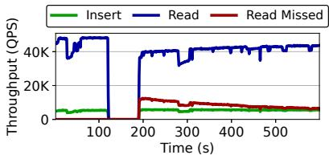
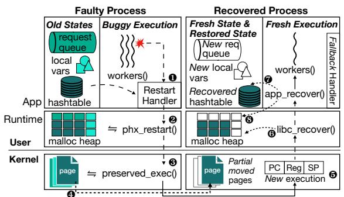
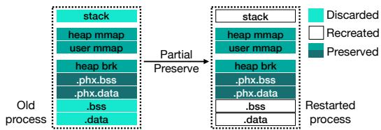
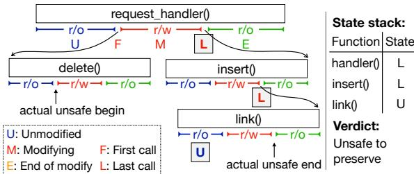
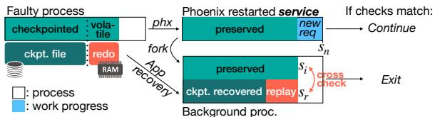
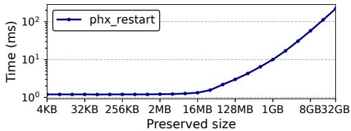
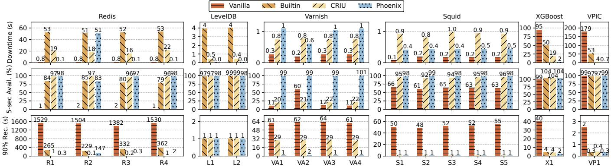
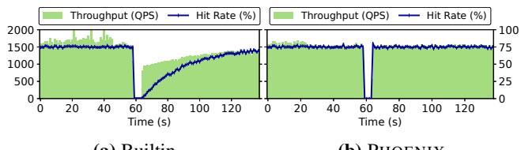
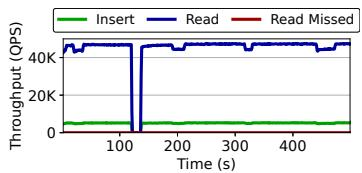
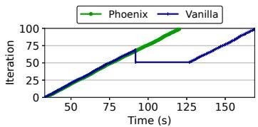

Latest updates: hps://dl.acm.org/doi/10.1145/3731569.3764858

RESEARCH-ARTICLE

# Optimistic Recovery for High-Availability Soware via Partial Process State Preservation

YUZHUO JING, University of Michigan, Ann Arbor, Ann Arbor, MI, United States YUQI MAI, University of Michigan, Ann Arbor, Ann Arbor, MI, United States ANGTING CAI, University of Michigan, Ann Arbor, Ann Arbor, MI, United States YI CHEN, University of Michigan, Ann Arbor, Ann Arbor, MI, United States WANNING HE, University of Michigan, Ann Arbor, Ann Arbor, MI, United States XIAOYANG QIAN, University of Michigan, Ann Arbor, Ann Arbor, MI, United States View all

Open Access Support provided by: University of Michigan, Ann Arbor


Published: 12 October 2025

Citation in BibTeX format

SOSP '25: ACM SIGOPS 31st Symposium   
on Operating Systems Principles   
October 13 - 16, 2025   
Seoul, Republic of Korea

Conference Sponsors: SIGOPS

# Optimistic Recovery for High-Availability Software via Partial Process State Preservation

Yuzhuo Jing University of Michigan

Yuqi Mai University of Michigan

Yi Chen University of Michigan

Angting Cai University of Michigan

Wanning He University of Michigan

Xiaoyang Qian University of Michigan

Peter M. Chen University of Michigan

## Abstract

Achieving high availability for modern software requires fast and correct recovery from inevitable faults. This is notoriously difficult. Existing techniques either guarantee correctness by discarding all state but suffer from long downtime, or preserve all state to recover quickly but reintroduce the fault.

We present PHOENIX, a framework that enables a new design point of optimistic custom recovery for high-availability software through partial process state preservation. PHOENIXmode recovery allows an application to selectively preserve long-lived state, discard transient state, and reset the execution. In the common cases, it combines the effectiveness of full restart with the speed of state reuse. PHOENIX offers simple APIs for annotation, supports consistency checks via unsafe region detection, and provides cross-checking validation with default recovery paths for strong correctness. We implement PHOENIX in Linux kernel and apply it on six large server applications. Our extensive evaluation of real bugs and fault injection testing shows that PHOENIX recovery significantly improves availability while not sacrificing correctness.

CCS Concepts: • Computer systems organization → Availability; Reliability.

Keywords: Availability, software recovery, operating systems, static analysis

ACM Format:   
Yuzhuo Jing, Yuqi Mai, Angting Cai, Yi Chen, Wanning He, Xiaoyang Qian, Peter M. Chen, and Peng Huang. 2025. Optimistic Recovery for High-Availability Software via Partial Process State Preservation. In ACM SIGOPS 31st Symposium on Operating Systems Principles (SOSP ’25), October 13–16, 2025, Seoul, Republic of Korea. ACM, New York, NY, USA, 17 pages. https://doi.org/10. 1145/3731569.3764858 This work is licensed under a Creative Commons Attribution 4.0 International License.   
SOSP ’25, October 13–16, 2025, Seoul, Republic of Korea   
© 2025 Copyright held by the owner/author(s).   
ACM ISBN 979-8-4007-1870-0/25/10   
https://doi.org/10.1145/3731569.3764858


Peng Huang University of Michigan

## 1 Introduction

Availability is crucial for software deployed at scale. Even a brief downtime can impact many users and cause significant financial losses [47]. Yet, production systems inevitably encounter bugs such as crashes, hangs, and memory leaks [25, 30, 43]. To maintain high availability, an application must not only recover from a fault but do so quickly and correctly, i.e., resolving the failure with minimum interruption.

Achieving this level of recovery is notoriously difficult. It is not enough to just bring the application back online as fast as possible. The recovered process must also avoid triggering the same fault. Moreover, for availability to be meaningful [32, 62], the recovered process needs to promptly resume handling requests with near-normal performance. If the system appears “available” but serves virtually no requests or is extremely slow, it is effectively unavailable to users.

The most common recovery technique is process restart. It offers simplicity and correctness: by destroying and reinitializing all application’s state, it avoids the same failure [16, 29, 38, 41] and rejuvenates a system [22, 44, 53]. However, process restart severely hurts availability. The process must reconstruct the entire runtime state from scratch after restart, which involves costly operations such as reading large data files from disk, replaying lengthy logs, and fetching updates over the network. During this time, the system is unable to serve requests. Afterwards, the new process also has to slowly rebuild its cache, suffering a long warm-up time.

To reduce downtime, some developers adopt process checkpointing techniques such as CRIU [8], which periodically freezes a running process and captures its full memory as well as execution state (i.e., registers, instruction pointer, stack pointers). Upon failure, the checkpoint allows restoring the process memory and resuming execution from the last point. While improving availability with faster recovery, it loses state updates that happened after the checkpoint. Wholesystem persistence techniques [49, 70] preserve the latest system state by making main memory non-volatile, which achieves instantaneous recovery and avoids losing updates. However, checkpointing indiscriminately preserves all application state. In the presence of software faults, the checkpoint also includes the buggy state, making the recovery incorrect.

Despite decades of effort, designing recovery mechanisms that deliver speed and post-recovery performance for high availability while ensuring correctness remains a core challenge, especially for modern complex applications.

Behind this core challenge lies a dichotomy of existing solutions: preserve all state or preserve none. The former gains high availability by giving up correctness completely. The latter guarantees correctness but severely damages availability. Few solutions have explored the middle ground. Microreboot [15, 16] and Orleans [13] divides an application into smaller components and restarting only the failed components, but each component still suffers the same pitfall. They also require prohibitive effort to restructure the applications.

This paper presents PHOENIX, a recovery framework that introduces a new design point: optimistic custom recovery through partial process state preservation. PHOENIX does not replace the default recovery (e.g., log replay) an application has but instead adds a fast path—PHOENIX-mode restart, in which an application keeps a subset of its state in memory and carries over this state to the new process. This improves availability by avoiding the costs of rebuilding this state. Importantly, it discards the remaining state and resets the execution. Thus, the new process starts from the main function like a regular restart and reinitializes the unpreserved state.

We make two key insights when designing PHOENIX. First, custom recovery is indispensable for addressing the aforementioned trade-offs. Indeed, Lowell et al. [45] show that it is impossible for generic recovery, i.e. without any help from application, to guarantee failure transparency (recovering to a state that is consistent with prior output and avoids the bug).

Based on this insight, PHOENIX is not designed as a bolt-on recovery solution that can be applied without understanding the application logic. Instead, it relies on developers to apply their application-specific knowledge when using PHOENIX. This matches the trend that custom recovery is common in server applications. For example, instead of using generic process checkpoint, Redis implements an RDB feature [5] that only checkpoints the key-value dictionaries.

PHOENIX is designed to help developers implement custom recovery and leverage the custom code that the applications already have. Different from the existing all-or-nothing choices, PHOENIX provides simple APIs for developers to selectively annotate state for preservation, and add logic for determining whether to use a preserved state or not during a recovery.

Our second insight is that many production software failures are caused by transient state (e.g., local variables, shortlived heap allocations), which do not impact large, stable portions of global or long-lived state. Our study (§2.3) of realworld failures across popular server applications confirms that over half are triggered by temporary state, suggesting the practical viability of selective state preservation.

This asymmetry also has a deeper structural cause. In modern server applications, bugs and bytes are unevenly distributed. Most bugs reside in a small amount of complex code, while most program state is occupied by large data structures managed by simple, well-tested logic. For instance, a web cache server spends most of its memory on cached pages, using only a few data types, while request handling and scheduling code, though smaller in memory footprint, involves intricate logic more likely to contain bugs.

This insight motivates PHOENIX’s design of resetting execution to the beginning, which reinitializes most transient state. Moreover, it reveals a simple yet effective state selection methodology: preserving the largest few data types manipulated by relatively few lines of code offers high availability gain, with low chance of inconsistency.

PHOENIX aims to accelerate recovery but its correctness is bound by the application’s default recovery. It does not attempt to fix errors that the default recovery could not fix. For example, if the application persists a buggy state to the disk, the default recovery may read this corrupt state and fail again. PHOENIX cannot fix this corruption and may fail, too. Similarly, if the bug is calling print(A) instead of print(B), the failure will persist across any recovery method until the code is corrected. We thus define PHOENIX recovery as correct if the application is restored to a state that is equivalent to what the default recovery would produce.

To safeguard correctness, PHOENIX introduces a mechanism of unsafe regions, which identifies code sections that are in the middle of modifying a preservable state. If a failure occurs within these regions, it indicates risk of inconsistent state, and PHOENIX falls back to default recovery. For users who desire stronger assurance of correctness, PHOENIX provides a cross-check validation mechanism. While the main process restarts quickly with PHOENIX and resumes serving requests, a background process runs the default recovery and compares its state against PHOENIX’s initial state. If they match, PHOENIX safely continues; otherwise, the system switches to the validated process. This allows an application to remain available, at the potential cost of some incorrect output in this brief window. If the cross-check passes, both the output during speculation and output in future execution are correct.

PHOENIX is designed for software faults and targets highavailability software. It does not address hardware failures.

We implemented PHOENIX in Linux kernel along with a runtime library, a modified glibc, and a companion compiler tool on top of LLVM. For evaluation, we integrate PHOENIX into six large, popular server applications, with only small code changes. We apply the proposed state selection methodology uniformly. Afterwards, we collect 17 real-world bugs to measure the benefits of PHOENIX-mode restart in practical failure scenarios. In all cases, PHOENIX not only significantly improves the restart performance but also recovers the application successfully. It reduces half-hour-long recovery and warm-up down to sub-second scale, and achieves close to 100% recovered performance in all cases. We further perform large-scale random fault injection testing on the ported applications. PHOENIX-mode restarts are initiated and successful in 85.6% of the injections. PHOENIX falls back to the normal restart for the remaining injections, and does not introduce additional data corruption.

  
Figure 1. Redis case #12290 long downtime and warm-up

In summary, this paper makes the following contributions:

• We propose a new approach of optimistic recovery with selective process state preservation for server software. We identify a simple yet effective state selection methodology.

• We design PHOENIX to realize this approach using a holistic solution spanning kernel, runtime, and compiler.

• We apply PHOENIX on large applications and real-world bugs to evaluate the benefits of PHOENIX-mode restarts.

The source code of PHOENIX is publicly available at:

https://github.com/OrderLab/phoenix

## 2 Motivation and Background

## 2.1 Recovery and Availability

To demonstrate the impact of software faults to availability, we reproduce a real Redis freeze bug [1] using a YCSB 90%-10% read-insert workload with Zipfian key distribution. Figure 1 shows the service timeline. Redis serves requests at a stable rate of 53.3K QPS, and one request puts Redis in an infinite loop for 15 s before our added watchdog forces a restart. The old process is torn down, and a new process is created, loading an RDB file that was saved to disk two minutes ago. However, data unmarshalling and data structure allocation costs significant amount of time, and eventually takes 53.5 s to recover from a 6 GB RDB file on SSD. During this period, 2.8 million requests where impacted. Because Redis recovers to an older RDB file, it also loses two minutes of updates between RDB save time and the crash. The recovered process sees a significant drop in hit rate, and takes 361.7 s to recover 90% of stable performance. Since the keys arrive in Zipfian distribution—hot items are rebuilt quickly while cold items take longer to repopulate—the system will experience continued cache misses and lower throughput for an extended period, further reducing the capacity of the system.

Such a case is not rare but commonly exists in practice, as evidenced by numerous real-world service outages [4, 7].

## 2.2 Existing Solutions

Techniques for software recovery have been extensively studied. Despite the progress, developers remain stuck with hard choices between availability, correctness, and practicality.

Process restart simply discards and reinitializes all in-memory state. It ensures correct recovery since the buggy state is avoided. However, it requires reconstructing all state from data loading, log replay, re-computation, synchronization, etc. For server applications, this reconstruction process is very expensive, resulting in a long downtime and warm-up time.

Checkpointing periodically saves all memory and execution state to a snapshot on disk and restores the application to this snapshot upon failure. This avoids the cost of state reconstruction. In-memory checkpointing, e.g., using fork, further avoids I/O time, at the cost of additional memory for storing the snapshots. These methods significantly improve availability but indiscriminately preserve all state. If the checkpoint is taken after the bug, the buggy state will be persisted, resulting in incorrect recovery. If the checkpoint is infrequent and before the bug, it avoids the buggy state but loses significant updates after the checkpoint. Fork-based checkpointing is also challenging to apply correctly for multithreaded applications.

Journaling immediately persists each transaction to disk and is widely used in databases. Therefore, it preserves more recent progress than checkpointing but incurs higher I/O overhead during normal execution and longer recovery delays due to log replay, often lasting hours [9]. While suitable for systems requiring strong durability and immediate persistence, it is less commonly adopted by other types of applications.

Microreboot [15, 16] and Orleans [13] seek finer-grained recovery by restarting individual components. They reduce the recovery time but require applications to be rewritten and restructured into independently restartable units.

Verification-based solutions, such as in FSCQ [18], use formal methods to prove that recovery behavior satisfies system invariants. They provide the strongest correctness guarantees, but require building the system in special languages with complete specifications and extensive proof effort. They have been limited to a few domains. Extending them to large server applications remains out of reach for most developers.

Beyond single-node recovery, replication reduces state loss and improves cluster-wide availability through automatic failover, though at the cost of additional resources. While replication minimizes downtime, single-node availability remains critical to reduce the duration of capacity loss and to prevent metastable failures [35].

## 2.3 Opportunities

To understand the opportunities for improving recovery, we conduct a study on real-world failures from six widely-used server applications of different categories and in different languages. We randomly select 64 user-reported failures satisfying two criteria: happens during normal service (ruling out startup/shutdown failures) and having explicit failure behaviors (e.g., crash and hang) that trigger recovery. We aim to answer the following questions: (1) What kind of problematic state causes the failure? (2) Can state be reused and what state can be reused?

We categorize the cases by three dimensions: (i) location of affected state: temporary only (short-lived local or heap variables), corrupting global state (long-lived service data),

<table><tr><td>Category</td><td>Redis</td><td>MS.</td><td>HD.</td><td>MDB.</td><td>Ceph</td><td>ES.</td><td>Total</td></tr><tr><td>Language Cases</td><td>C 17</td><td>C++ 14</td><td>Java</td><td>C++</td><td>C++</td><td>Java</td><td></td></tr><tr><td>Temp. Only</td><td>12</td><td>6</td><td>8 2</td><td>9 6</td><td>8 2</td><td>8 7</td><td>64 35</td></tr><tr><td>Bad Global</td><td>3</td><td>4</td><td>0</td><td>1</td><td>0</td><td>0</td><td>8</td></tr><tr><td>Good Global</td><td>2</td><td>4</td><td>6</td><td>2</td><td></td><td></td><td></td></tr><tr><td>Partial Update</td><td>2</td><td>2</td><td></td><td></td><td>6</td><td>1</td><td>21</td></tr><tr><td>Non-partial</td><td>15</td><td>12</td><td>0 8</td><td>0</td><td>5</td><td>0</td><td>9</td></tr><tr><td>Modifying</td><td></td><td></td><td></td><td>9</td><td>3</td><td>8</td><td>55</td></tr><tr><td>Non-modifying</td><td>6 11</td><td>6 8</td><td>4 4</td><td>0 9</td><td>5 3</td><td>0 8</td><td>21 43</td></tr></table>

Table 1. Studied systems and randomly-selected real bug cases, categorized by three independent taxonomies: location of affected state, timing of failure, and affected operation type. MS: MySQL. HD: Hadoop. MDB: MongoDB. ES: ElasticSearch.

no corruption; (ii) timing of failure: partial updates and other;   
(iii) affected operation type: modifying operation, ready-only.   
Table 1 shows the results.

Finding 1: Most (87.5%) of the studied failures only corrupt temporary state or does not corrupt any state.

Among the 64 cases, 35 failures arise from reading or writing problematic values to local variables on the stack or to short-lived heap objects such as client or request structures. These failures do not affect global or long-lived heap state that contains product of completed requests. In another 21 cases, failures stem from incorrect logic or assumptions but still leave global state intact. For example, a MySQL case incorrectly asserts on a nullable pointer, and a Redis case passes a wrong data type to a read-only function.

These results indicate a potential to reuse large amounts of correct global state in most cases. Only eight cases corrupt global state, making them unrecoverable. PHOENIX does not attempt to recover from such scenarios and will fall back to the application’s original recovery. Nevertheless, correctly identifying these scenarios remains crucial. Finding 2 guides us with a method to distinguish them.

Finding 2: Reusability has high correlation with whether failing during modification operation.

Bad or inconsistent state is often a result of buggy state updates. Nine out of all cases fail while updates are applied partially. 21 out of all cases fail in write-related functions, and 43 cases are either in read-only transactions (i.e., modifying only temporary state), or are before or after a modifying part. Those 21 cases cover all nine partial update cases (crashing before an operation finishes), and cover seven out of eight cases where global state is actually corrupted. The remaining one MongoDB buffer overrun case corrupts the heap but can be easily detected by malloc internal checks. Thus, failure happening during modifying operation is a useful indicator for detecting potential inconsistent state.

These findings highlight a practical opportunity: most failures only impact a small subset of short-lived state, and the risk of inconsistency can be localized to specific update paths.

## 3 PHOENIX Design

Guided by our insights and observations in § 2.3, we design PHOENIX, a recovery framework that enables developers to implement custom optimistic recovery for their software through partial process state preservation. PHOENIX offers a third option between the existing preserving all state or discarding all states solutions, by providing a set of convenient APIs for developers to selectively annotate state for preservation and validate the preserved state post-restart. It aims to achieve high availability in the common case by reusing the preserved state, while not sacrificing correctness by falling back to default recovery when necessary.

To achieve these goals, PHOENIX designs a set of novel techniques. We highlight some:

• Fresh Restart with In-memory Preservation. PHOENIX lifts the restriction of full process teardown, enabling the restarted application to selectively salvage reusable state. This retains the benefits of restart—resetting execution— while avoiding the downside of preserve-all which retains bad state, effectively combining the best of both sides.

• Holistic Coordination. PHOENIX employs coordinated OS, library, and compiler techniques to support partial process state preservation as a first-class recovery mechanism. By bridging the gap between OS-level memory management and application semantics, PHOENIX enables efficient state selection tailored to different state types.

• Unsafe Region. PHOENIX introduces unsafe region, a simple yet effective way to determine when the system may be inconsistent. Instead of pinpointing and cutting out bad state, PHOENIX increases the chance of successful in-memory recovery by focusing on when to recover.

• Cross-Check Validation. For higher correctness guarantees, developers can enable background validation with application-specific recovery, while the PHOENIX-restarted application continues serving new requests—improving short-term availability and ensuring long-term correctness.

Targets PHOENIX is most effective when failures stem from temporary state, such as local variables, in-flight requests, or session objects. It is less benefitial if large long-lived state is regularly corrupted. PHOENIX tends to benefit applications with a large memory footprint, for example, in-memory data stores or applications with on-disk persistence (like databases) that still maintain substantial in-memory state for metadata, query result caches, and other structures. Compute-bound applications with mostly transient local state tend to benefit less from it. PHOENIX preserves only memory state and does not retain system state. For example, all files and sockets are closed by default. We rely on the application’s existing startup logic to recreate worker threads and external resources.

## 3.1 APIs and Usage Example

Table 2 shows the main APIs PHOENIX provides. Figure 2 shows a minimum usage example for Redis.

<table><tr><td>API</td><td>Description</td></tr><tr><td>phx_recovery_info *phx_init(int argc，const char **argv, char **env，func *restart_handler) void phx_restart(info，bool with_heap，bool with_section,</td><td>Initialize PHOENIX context; save custom command line for restart use; register restart handler.Retrieve information from terminated process at the same time. PHOENIX restart used by user fault handler or called manually, with options</td></tr><tr><td>range *preserve_ranges，size_t len)</td><td>for preservation targets (whole heap,ELF sections, custom ranges).</td></tr><tr><td>bool phx_is_recovery_mode()</td><td>Check if application is restarted by PHOENIX.</td></tr><tr><td>void phx_mark_preserve(void *object)</td><td>Mark malloc variable as needed to avoid being garbage collected.</td></tr><tr><td>void phx_finish_recovery(bool cleanup_malloc=false)</td><td>Reset PHoENIX recovery mode flag and start garbage collection on malloc.</td></tr><tr><td>phx_unsafe_begin(NAME),phx_unsafe_end(NAME)</td><td>PHOENIX unsafe region begin and end mark.</td></tr><tr><td>phX_Stage(NAME，CODE，PRESERVE_HOOK，RESTORE_HOOK)</td><td>PHOENIX progress recovery hook.</td></tr><tr><td>phx_allocator *phx_create_allocator()</td><td>Create PHOENIX allocator with managed preserve ranges.</td></tr></table>

Table 2. PHOENIX library APIs.  
```c
1 void restart_handler() {
2 redis_info = malloc(...);
3 redis_info->pres_db = server.db;
4 phx_restart(redis_info, true, false, NULL);
5 }
6 int main(int argc, char **argv, char **env) {
7 redis_info = phx_init(argc, argv, env, restart_handler);
8 server.db = phx_is_recovery_mode()
9 ? redis_info->pres_db
10 : redisLoadOrNewDB();
11 phx_finish_recovery(false);
12 handle_requests(); }
```  
Figure 2. PHOENIX usage example in Redis.

Developer initializes the PHOENIX context using phx\_init (line 7), specifying a command line for future restart, and a user-defined restart handler. The handler is automatically registered for SIGSEGV. PHOENIX restart can also be invoked externally, e.g., by a watchdog. A typical handler creates a custom data structure to collect information about the failed process, and passes it to phx\_restart to activate the restart, adding a few options specifying preservation targets (§ 3.3). In the example handler (line 1), the heap is preserved (setting true for with\_heap option), and the server.db pointer is passed in the custom structure redis\_info. After a PHOENIX restart, the restarted application retrieves the custom information (line 7 again), and then checks whether it is in PHOENIX mode (line 8). If so, it recovers the server.db by simply assigning the pointer (line 9); otherwise, it goes through the normal reconstruction (line 10). Finally, developer calls phx\_finish\_recovery (line 11) to signify the end of recovery, so that phx\_is\_recovery\_mode returns false thereafter. The restarted application handles new requests as normal.

## 3.2 PHOENIX Recovery Workflow

PHOENIX orchestrates recovery through the OS kernel, runtime library, libc, and dynamic linker, and application code. Figure 3 shows the recovery workflow for a crashing scenario in an example system that preserves a hash table.

Recovery begins when a worker thread crashes, triggers a user-defined restart handler (step ❶). The handler selects state to preserve, prepares a structure with pointers to preservable data (§ 3.1), and checks if the system is outside any unsafe region. It then invokes phx\_restart (step ❷), which computes the page ranges to preserve. For heap data, it uses our instrumented malloc to identify relevant pages. It also gathers preservable section pages from dynamic linker (§ 3.3).

  
Figure 3. PHOENIX recovery workflow with example preservation.

Next, phx\_restart invokes the preserve\_exec system call (step ❸), a PHOENIX-specific variation of the exec system call that installs the selected pages into the new process’s address space (step ❹) at their original virtual addresses and discards all other pages.

The kernel then switches the execution to a new context (step ❺). During startup (step ❻), the dynamic loader restores executable and shared library mappings, and malloc regains control of the preserved heap. The application’s main function and recovery code are then executed. It reconstructs partial state from the saved information, reinitializes non-preserved components (step ❼), and optionally cleans up unused heap objects (step ❽).

Developers are responsible for providing the restart handler and application recovery logic involved in steps ❶, ❼, and ❽. All other steps are handled automatically by the framework.

By default, if the restarted process fails again shortly after recovery, PHOENIX will not attempt a second restart and will fall back to the application’s full recovery path.

## 3.3 Efficient State Preservation

Strategies for state preservation varies by applications. This section discusses the mechanisms PHOENIX provides to efficiently preserve selected state under different scenarios, and Section 4.2.1 describes a simple methodology in choosing application state for preservation.

  
Figure 4. Partial preservation based section types.

There are three challenges in efficient preservation design. First, a freshly restarted process creates a new address space. Therefore, an efficient transfer mechanism is needed to preserve state across address space boundary while reducing downtime. Second, references preserved in the preserved state must remain valid across restart. Lastly, unused state could be spatially mixed with preservable state, making it hard to retain only selected state.

PHOENIX introduces a zero-copy transfer mechanism to the OS kernel. Using that as a basis, PHOENIX conveniently provides allocation tracking for heap variable preservation and section-based preservation for static variables.

Zero-Copy Transfer To address the first challenge, PHOENIX transfers state directly in memory to the new process. To avoid excessive data copying across address spaces, PHOENIX kernel manipulates page tables. During the perserve\_exec system call, the kernel creates an empty page table, and then moves the page table entries (PTEs) of preserved ranges from the old page table to the new one. The fresh executable image is loaded to the new page table afterwards.

To address the second challenge, one solution is pointer swizzling [67], which instruments all pointer operations but incurs high overhead. Instead, PHOENIX installs preserved pages at their original virtual addresses in the new process, thereby avoiding address translation overhead. We require developers to ensure that the preserved state is self-contained and does not reference discarded memory.

This design is compatible with address space layout randomization (ASLR). During a normal startup, the application receives a randomized offset. PHOENIX reuses this offset upon restart without re-randomization. From an external viewpoint, the application appears as though it never shut down. As long as the offset is not leaked, reusing it does not introduce additional security concerns.

This mechanism provides the low-level foundation for the recovery process. We also expose this raw interface to give developers flexibility in preserving custom memory mappings.

Over-Approximate Allocation Tracking Modern applications often have a large number of variables with complex, nested data structures and mixed allocation locations, including temporary or unpreserved state. Precisely identifying the byte ranges for all variables incurs prohibitive runtime overhead. Furthermore, the kernel must fall back to memory copying when only part of a page needs to be preserved.

To address this challenge, PHOENIX integrates with glibc’s malloc and provides an over-approximation method with

1 static Mem::Allocator \*& GetPool(size\_t type) {

2 static Mem::Allocator \*pools[MEM\_MAX] phxsec("bss");

3 static bool initialized phxsec("bss") = false; ...}

Figure 5. Section-based static variable preservation in Squid.

cleanup to selectively preserve heap variables. We describe the cleanup mechanism in § 3.4.

malloc allocates memory from three sources: (a) arenas for small objects, (b) direct memory mappings for large objects, and (c) the growing data segment (sbrk). PHOENIX adds bookkeeping to track those mmap-backed pages from (a) and (b), and integrates with the kernel to restore the brk range for (c), as shown in Figure 4. The phx\_restart library function provides a with\_malloc option, allowing developers to automatically include glibc heap pages during restart. Alternatively, developers can use the custom phx\_allocator (Table 2) to separate allocations by component, enabling finegrained control over which components are preserved.

Section-Based Preservation Preserving static variables is tedious and error-prone. Consider an example shown in Figure 5, Squid developers must move private static variables to global scope, expose them with extern, add storage fields to the recovery info, and manually copy arrays such as pool. This adds ∼10 lines of boilerplate per variable, and the Squid cache component alone has 29 such variables, breaking encapsulation and polluting the global namespace.

PHOENIX addresses this with section-based preservation. Static variables normally reside in the ELF .data (non-zero) or .bss (zeroed) sections. PHOENIX introduces .phx.data and .phx.bss, whose contents are automatically preserved across restarts (Figure 4). Developers can simply annotate variables with the phxsec marco to place them in these sections (Figure 5). The resulting binary remains backward compatible on systems without PHOENIX.

During recovery, when phx\_restart is invoked with the with\_section option, it instructs the dynamic linker to append the .phx ranges to the preserve\_exec system call. The kernel installs these preserved pages in place of default data. After that, the dynamic linker in the restarted process reloads the remaining sections from binary images.

## 3.4 State Recovery

Memory Mapping Preserving state at the same virtual address requires coordination between the kernel and the dynamic linker, and requires shared knowledge about prior binary object mappings. PHOENIX introduces a private system call that allows the runtime to preserve the link\_map data structure, which contains such information, before invoking preserve\_exec in the PHOENIX runtime.

Then, during phx\_restart, the kernel first installs the preserved pages—including heap pages, selected sections, and user-defined ranges—into the new page table, before loading any object files. When control is passed to the dynamic linker, it skips the kernel-installed ranges and fills the remaining gaps with freshly loaded binaries.

Cleanup PHOENIX automatically discards local state such as stack variables. However, the over-approximate preservation feature (§ 3.3) preserves the entire heap, which can retain unreferenced data. Developers must therefore provide cleanup routines to prevent memory leaks.

To support this, PHOENIX offers a cleanup mechanism based on mark-and-sweep garbage collection. We add a marker bit to the malloc\_chunk metadata structure in glibc malloc. Initially, the markers of all heap allocated variables are set to zero. As a protocol, developers need to write a traversal function over preserved objects. Each time an object is reached, the traversal calls phx\_mark\_used, flipping its marker to one. After all marking, phx\_finish\_recovery scans all objects, frees the unmarked ones, and resets the markers of retained objects to zero for future restarts.

Some preserved objects require special handling. Two notable examples are (1) synchronization objects and (2) reference counts. Synchronization objects (e.g., locks) may contain references to destroyed threads that are invalid after restart, and therefore should be reinitialized. Reference counts may be inflated compared to actual counts, since the purged state may contain references to preserved objects. Therefore, they should be recomputed to ensure correctness.

## 3.5 Consistency

To recover correctly, the preserved state should be consistent. We propose a guideline for developers to check the recovery condition at the crash point. The application proceeds with PHOENIX mode restart only if the recovery condition deems the preserved state safe to reuse.

Unsafe Region Based on our findings in Section 2.3, an effective recovery condition is to check whether the process is in the middle of modifying some preservable state at the crash time. If so, PHOENIX falls back to the normal recovery path to avoid preserving potentially inconsistent state. This helps easily detect faults originating in state modification.

If the application survives the current modification, a failure is likely to manifest soon in the next request, which can still be caught by this check. If a failure happens immediately after PHOENIX restart, PHOENIX does not attempt a second recovery, but falls back to normal recovery. If the failure is silent (e.g., silent data corruption) and survives for a long time, PHOENIX shares the same fate as the original recovery method. Neither PHOENIX nor the original one can clear the corruption; both may persist the corrupted data to disk. In all scenarios above, PHOENIX does not introduce extra harm.

An intuitive definition of unsafe region is reusing the critical sections of the preservable object. However, this approach falls short in several ways. Single-threaded applications such as Redis do not use mutexes, and thus critical sections are not well defined. Moreover, even in multi-threaded applications, critical sections do not precisely capture the region of memory modification. A critical section may include long read-only operations or only write to non-preserved components, with a small portion involving actual writes to preserved state. For instance, we find that Redis only spends 3.9% of its time modifying preserved data during a 50%-50% read-write YCSB workload, and LevelDB spends 27.5% making updates during its async fillseq benchmark.

While unsafe regions and critical sections may overlap, they are not identical. Unsafe regions explicitly exclude readonly portions of critical sections and may span multiple critical sections when they collectively represent a single transaction. As discussed in Section 3.4, locks must be reinitialized after a PHOENIX restart. Clearly, reusing preserved state is unsafe if the application fails while holding a lock and actively modifying that state. Therefore, it is essential that unsafe regions cover such modification intervals, allowing PHOENIX to correctly fall back to the default recovery path. With this guarantee, initializing locks becomes a safe operation.

To identify the modification boundary more precisely, we provide a pair of APIs shown in Table 2. Developers insert a phx\_unsafe\_begin before the first memory write instruction on the preserve state, and insert a phx\_unsafe\_end after the last write. The unsafe region is semantically defined as the smallest range to contain all modifying code per transaction. For example, the code of hash table insertion is the only unsafe region for a SET user request in Redis. If a modifying function is called multiple times within a transaction, developers need to mark the outermost region to include all modifications of one integral transaction.

The two APIs take a component name as an argument and will generate code to increment or decrement unsafe counters related to it. The recovery handler can then access NAME\_is\_safe to make recovery decisions. The component granularity can be chosen based on applications’ needs to aid for determining recoverability of independent components.

Static Analysis Tool To help developers reduce manual annotation efforts, we build a static analysis tool on top of LLVM [40] to automatically annotate unsafe regions.

The analyzer calculates one range that covers the first and last modifications to the preserved data in one transaction. The transaction granularity can be selected by developers. For request-based systems, the request handler is suitable as the entry function of a transaction. Given the entry function’s name, the analyzer searches for all modifications in itself and its callees. The analyzer automatically marks the first and last modifications as the boundary of unsafe region.

There are two challenges in designing the analyzer. First, the inner modifying functions could be invoked by different callers. For example, the dictionary operations in Redis can be called both on preservable KV data, and on non-preserved temporary variables. Simply inserting unsafe regions within dictionary functions will include irrelevant operations. Inserting unsafe region at the caller of dictionary operations is too coarse-grained—a long read-only loop that finds a target slot in insert function is unnecessarily included in unsafe region. Second, modifications could span multiple modify functions. For example, the unsafe region for DELETE and INSERT commands are scoped at delete and insert functions respectively. However, an UPDATE operation that calls delete and insert sequentially should insert a larger unsafe region before the call to delete and after the call to insert.

  
Figure 6. Layered analysis in PHOENIX analyzer.

To solve those challenges, we design a layered analysis algorithm. Figure 6 shows an example of this analysis. The example request handler calls delete and then insert, and the insert has a last step of adding linked list element.

We partition each function in this call chain into three stages: a U stage where no modification has happened in the current function, a E stage where all modifications have ended, separated by the modifying stage M in the middle. Any of the regions can contain regular instructions or function calls. When the first or last modifying operation in M is a function call, we recursively look into the callees’ execution stages.

To calculate the partition of different stages, we use standard def-use analysis to determine the taint set of instructions in each function. The initial taint set for each analysis is one of the arguments and all direct access to preserved global variable specified by the user. To determine whether a callee is modifying, we run analysis from all leaf functions to all callers. We generate a function summary for each function, which tells the caller whether each passed argument will be modified. It also tells whether other arguments will be tainted and whether the return value contains preserved state.

In Figure 6, the actual unsafe begin for the whole request handler is the first M instruction in delete, and the actual end mark should be the last M instruction in link. The analyzer instruments the state transition points. At runtime, the application will update the current function’s state in a state stack. During a restart, PHOENIX restart handler checks whether all functions in the state stack are all on the left or on the right of M regions. In this example, while both the handler and insert function have reached the last modifying call, the link has not started any modification operations. Therefore, the request is in unfinished state, indicating potential inconsistency in the preservable data. PHOENIX falls back to application’s default recovery to avoid introducing inconsistency.

This design finds a range that contains all modifications in one transaction. In implementing this analysis, we prioritize completeness over soundness, and allow the analyzed taint set to be larger than the actual taint set. For example, to speed up analysis, we avoid field-level taint analysis on function arguments. Instead of accurately tracking arg->x, we consider arg and any arg->\* as taint. This heuristic reduces precision, but ensures the taint set contains all possible taints (completeness). The instrumented unsafe region is therefore conservatively larger than theoretical minimum.

Limitations of Static Analysis The current compiler tool only considers memory effects and not external effects. Applications such as LevelDB has an implicit connection between file writes and in-memory state updates, and requires manual annotations to include file writes in unsafe regions.

Indirect calls are another challenge: the current tool conservatively merges all possible callees’s effect for each call site, which can over-approximate. In practice, callees of the same call site often share similar modification semantics, avoiding inaccuracy increase in the caller’s unsafe region analysis.

The tool also requires knowledge of the effects of external libraries (e.g., glibc). When the source code or bitcode is available, developers can compile the libraries together fiwith the application, allowing PHOENIX to instrument them automatically. Otherwise, developers must provide annotations for library functions. In practice, annotating only the library functions actually invoked by the application is usually sufficient, though applications that spend significant time in library code may benefit from finer-grained rules. To reduce annotation efforts, PHOENIX includes built-in annotations for common glibc functions, which are shared across analyses for all applications. In the future, we plan to explore binary lifting techniques to support direct binary analysis.

While the tool can theoretically support any language compiled to LLVM bitcode, we find precise C++ analysis difficult, due to heavy STL inlining and opaque internal function usage. We plan to use ClangIR [2, 3] to assist modification effect analysis based on higher-level language semantics.

## 3.6 Cross-Check Validation

The unsafe region mechanism effectively avoids propagating inconsistent state. For users who may require even stronger assurance, PHOENIX provides a background cross-check validation mechanism.

When this mechanism is enabled, PHOENIX speculatively processes new requests in the restarted process, and runs the application’s default recovery in a background process. The background process then compares the initial PHOENIXpreserved state with the state recovered by default recovery.

As Figure 7 illustrates, after a PHOENIX restart, the main process resumes execution immediately using the preserved state, termed $S _ { i } ,$ and begins serving new requests, which will advance the application state to $S _ { n }$ . In parallel, a background process is forked with the same initial preserved state, Si. This forked process does not process new requests, retaining an isolated snapshot of $S _ { i }$ throughout the cross-check. It then invokes the default recovery function to reconstruct a reference state, $S _ { r } ,$ in a separate memory region from $S _ { i } .$

  
Figure 7. Background cross-check workflow on an example checkpoint-based application.

PHOENIX then compares $S _ { i }$ with $S _ { r } .$ The goal is to ensure the initial preserved state is correct to use. For the comparison to be meaningful, the application needs to recover all completed work at the failure time. Some applications already support this. However, if the default recovery is restoring from an older checkpoint, it would produce a stale state that is not comparable to fresher state $S _ { i }$ . In this case, the background process needs to replay the work completed after the checkpoint. This will establish $S _ { r }$ as an equivalent reference point for comparison. We implement a custom in-memory redo log to support replay. PHOENIX’s state preservation makes it practical to maintain such logs entirely in memory.

A straightforward state comparison method is byte-wise whole memory comparison. However, data placement can be easily affected by system dynamism, making two states that are actually equivalent appear different. A better method is data-structure-level comparison that also tolerates environmentdependent fields such as timestamps. In addition, the comparison should allow the recovered state to either include or exclude the effect of fault-free in-flight requests by whole at the time of the failure.

If the states match, PHOENIX continues serving requests with an assurance of correctness. If they diverge, PHOENIX hot-switches to the validated recovery process, discarding the speculative one. This ensures that any potential inconsistency is confined to the short period before the validation completes.

This mechanism assumes that the reference state $S _ { r }$ is correct. Otherwise, the cross-check will pass but Si is incorrect. PHOENIX cannot be more correct than the default recovery.

## 3.7 Progress Recovery

Besides our main target, request-based applications, some other categories of applications run long computational jobs. Restart in such systems means a recompute from the beginning. Because the preservable state is constantly changing, unsafe regions cover most of the execution, thus preventing PHOENIX from effectively recovering the latest state.

To address this, we introduce the phx\_stage API to support stage-based progress recovery. A stage marks a consistent recovery point in the program, such as before or after a sorting step. For each stage, developers define two hooks: a PRESERVE\_HOOK that saves the variables about to be modified, and a RESTORE\_HOOK that restores them during recovery.

1 void optimize\_one\_step(&model, x) {   
2 phx\_stage(predict\_stage, { pred = model.Forward(x); },   
3 { SAVE(pred) }, { RESTORE(pred) });   
4 phx\_stage(getgrad\_stage, { grad = model.GetGradient(pred); },   
5 { SAVE(grad) }, { RESTORE(grad) });   
6 phx\_stage(update\_stage, { model.Backward(grad); },   
7 { SAVE(model) }, { RESTORE(model) });   
8 }  
Figure 8. PHOENIX progress recovery in XGBoost

  
Figure 9. PHOENIX restart time with preserved memory sizes

Stages are typically defined at a finer granularity than one full iteration. A basic preserve hook implementation may simply copy all variables modified within that stage, while the corresponding restore hook copies them back. However, this approach can be costly for large data structures. To reduce such overhead, we recommend placing stage marks at points where only new temporary variables are created, and the PHOENIX-preserved ones remain unchanged. In such cases, recovery can simply discard temporaries and resume from the last stage point without copying. We find this pattern common in computational systems.

We show a code example in Figure 8 to demonstrate coarsegrained stage definitions for an XGBoost iteration—predict, gradient calculation, and model update. Preserve hooks execute during normal execution, while restore hooks are invoked automatically during recovery. At runtime, each hook invocation records itself in a linked list. During recovery, PHOENIX traverses the chain of restore hooks to reconstruct the stack and resume execution from the nearest consistent stage.

## 4 Evaluation

We answer several questions in evaluation: (1) How much availability improvement does PHOENIX achieve? (2) Does PHOENIX recover correctly? (3) What effort and overhead are required to employ PHOENIX?

The experiments are performed on a bare-metal machine with Intel Xeon Silver 4114 CPU @ 2.20 GHz and 192GB ECC memory, running Ubuntu 22.04 LTS and the PHOENIX kernel. The machine has one 480 GB Intel DC S3500 SSD.

## 4.1 Microbenchmark

We measure the PHOENIX restart time with different amounts of preserved state. We measure the duration from invoking phx\_restart to returning from phx\_init in the restarted process. We allocate heap memory of varying sizes, fill it with non-zero data, and use PHOENIX heap preservation to retain the memory across restart. We pin the test program to a single core using numactl, and average results of 20 times (Figure 9).

<table><tr><td>System</td><td>Description</td><td>PreservedStates</td></tr><tr><td>Redis</td><td>In-memKVdatabase</td><td>In-memKVhash table</td></tr><tr><td>LevelDB</td><td>KVdatabase</td><td>Skiplist memory tables</td></tr><tr><td>Varnish</td><td>Web cache server</td><td>Web page cache objects</td></tr><tr><td>Squid</td><td>Web cache server</td><td>Web page cache objects</td></tr><tr><td>XGBoost</td><td>Gradient boosting</td><td>Gradients and model</td></tr><tr><td>VPIC</td><td>Particle simulation</td><td>Particles and physical fields</td></tr></table>

Table 3. Evaluated systems and state chosen for preservation.

Restart latency is nearly constant for state sizes under 4 MB, taking around 1.20 ms. For larger sizes, the latency grows linearly with the amount of preserved data, due to the increased number of page table remap operations. Restarting with 32 MB of state takes 1.56 ms, and restarting with 32 GB takes 220.6 ms. For comparison, a baseline process restart in a bash loop with no state preserved takes 1.02 ms.

## 4.2 Applications

We apply PHOENIX on 6 large applications, Redis, LevelDB, Varnish, Squid, XGBoost [20], and VPIC [14]. They represent different categories including database systems, caching systems, and computational jobs.

4.2.1 State Selection Methodology We select preserved state based on its semantic importance and the time cost during recovery. Target data structures are closely tied to core application functionality and are costly to reconstruct. If the application already uses custom persistence for specific state, this serves as a useful starting point, as it reflects both importance and time cost sensitivity.

We apply this general method to select preserved state, without tuning for specific bugs. Table 3 lists our selection for each application. For Redis, XGBoost, and VPIC, which already implement custom persistence, we follow their choices and preserve those states. In XGBoost, we preserve not only the model object (small) but also the large calculation workspace, which dominates memory usage and reinitialization time. For cache systems, we observe that cached objects are both semantically important and critical for post-recovery availability (§4.3.3) during warm-up, so we preserve them for Varnish and Squid. LevelDB persists SSTs and logs to disk, but log recovery dominates restart time, we therefore preserve its in-memory counterpart—skiplist—to avoid replay overhead.

4.2.2 Porting Methodology and Effort PHOENIX can be adopted in three steps. First, implement minimal PHOENIX recovery by defining a signal handler, creating a structure to capture necessary state (often just data structure root pointers), and restoring preserved data during restart, just like Figure 2 shown before. Second, select a consistency mechanism— unsafe region, stage-based recovery, or cross-check validation, or a combination of them—based on the required correctness guarantees. These steps require clear understanding of how the data structures are touched during execution. Third, optionally implement a cleanup function to avoid memory leaks from over-preservation. This can often reuse existing traversal logic and may be skipped if memory overhead is acceptable.

<table><tr><td>System</td><td>App.</td><td>Base</td><td>Mark</td><td>CC.</td><td>Clean</td><td>Sum</td></tr><tr><td>Redis</td><td>140,996</td><td>72</td><td>0</td><td>160</td><td>188</td><td>348</td></tr><tr><td>LevelDB</td><td>21,192</td><td>186</td><td>14</td><td>72</td><td>40</td><td>312</td></tr><tr><td>Varnish</td><td>109,564</td><td>196</td><td>0</td><td>N/A</td><td>85</td><td>281</td></tr><tr><td>Squid</td><td>186,219</td><td>46</td><td>82</td><td>N/A</td><td>62</td><td>190</td></tr><tr><td>XGBoost</td><td>38,906</td><td>98</td><td>60</td><td>N/A</td><td>N/A</td><td>158</td></tr><tr><td>VPIC</td><td>44,773</td><td>127</td><td>145</td><td>N/A</td><td>N/A</td><td>272</td></tr></table>

Table 4. Usage effort in lines of C/C++ code. App.: application base LoC. Base: minimal working PHOENIX recovery. Mark: unsafe regions or stage hooks. CC.: cross-check. Clean: cleanup.

We summarize the manual effort in Table 4. Across all systems, we modified 260.2 lines on average, amounting to just 0.52% of the codebase. Minimal PHOENIX recovery typically requires ∼120.8 lines, though it varies across systems. Varnish requires extra integration to accommodate parent-worker communication. Squid enables section-based for static variables and therefore needs less annotation. Unsafe regions or stage hooks add ∼50.2 lines on average. Redis and Varnish are instrumented automatically by the compiler, while VPIC’s higher count comes from duplicating existing functions. Redis and LevelDB have an additional cross-check feature that increases our effort, due to their recursive data structure comparison needs. Cleanup averages 93.8 lines in four systems, mostly duplicating existing traversal code (e.g., Redis RDB walk-through). Varnish requires resetting refcount to discount references from discarded state. XGBoost and VPIC preserve over 90% of memory and thus we skip cleanup with acceptable leakage.

We share our porting experience. Redis, Squid, and VPIC were ported alongside PHOENIX development. With the design finalized, we ported Varnish, LevelDB, and XGBoost. LevelDB and XGBoost each took two days to implement minimum version by a Ph.D. student, plus two more days to verify LevelDB correctness, owing to unfamiliarity with its sequence number logic during both persistence and recovery. Such bugs during porting can be quickly resolved by developers. Varnish required one week of an undergraduate’s effort to handle parent-worker logic and refcount resets. Cleanup logics across all systems were implemented in a few hours.

## 4.3 Real-world Bug Cases

4.3.1 Cases Selection Methodology We collect real-world bug cases to evaluate PHOENIX. We search bug trackers of the evaluated applications (17,183 tickets total), filter for bug tickets with severe-impact keywords (crash, hang, leak), and obtain a pool of 948 candidates. From this pool, we randomly sample 141 tickets—30 each for Redis, LevelDB, Varnish, and XGBoost; 50 for Squid; and 1 for VPIC (due to limited available tickets). We then exclude invalid tickets (e.g., missing description, feature cases, requiring a different OS, runtime, or hardware) and issues outside PHOENIX’s scope (e.g., startup/shutdown only, no explicit failure). We successfully reproduced 17 out of the remaining 56 valid cases. Table 5 summarizes the reproduced cases.

<table><tr><td>No.</td><td>System</td><td>Case#</td><td>Description</td></tr><tr><td>R1</td><td>Redis</td><td>761</td><td>OOM due to integer overflow</td></tr><tr><td>R2</td><td>Redis</td><td>7445</td><td>Unsanitized memory overwrite</td></tr><tr><td>R3</td><td>Redis</td><td>10070</td><td>Nullptr dereference</td></tr><tr><td>R4</td><td>Redis</td><td>12290</td><td>Hang due to infinite loop</td></tr><tr><td>L1</td><td>LevelDB</td><td>169</td><td>Race on file operations</td></tr><tr><td>L2</td><td>LevelDB</td><td>245</td><td>Hang due to unreleased lock</td></tr><tr><td>VA1</td><td>Varnish</td><td>2434</td><td>Unsynchronized critical section</td></tr><tr><td>VA2</td><td>Varnish</td><td>2495</td><td>Memory leak</td></tr><tr><td>VA3</td><td>Varnish</td><td>2796</td><td>Deadlock from priority inversion</td></tr><tr><td>VA4</td><td>Varnish</td><td>3319</td><td>Buffer overflow</td></tr><tr><td>S1</td><td>Squid</td><td>1517</td><td>Buffer overflow</td></tr><tr><td>S2</td><td>Squid</td><td>257</td><td>Using closed file descriptor</td></tr><tr><td>S3</td><td>Squid</td><td>3735</td><td>Passing incorrect type</td></tr><tr><td>S4</td><td>Squid</td><td>3869</td><td>Missing null terminator</td></tr><tr><td>S5</td><td>Squid</td><td>4823</td><td>Incorrect length check assertion</td></tr><tr><td>X1</td><td>XGBoost</td><td>3579</td><td>Memory leak</td></tr><tr><td>VP1</td><td>VPIC</td><td>118</td><td>Out-of-bound, forgot index revert</td></tr></table>

Table 5. Bug cases we reproduced and evaluated.

4.3.2 Effectiveness We run all systems with standard benchmarks and reproduce single fault in the middle of every benchmark. We continue execution after recovery until benchmark finish. PHOENIX successfully recover from all cases, except for one fallback (R2). We check correctness of PHOENIX recovery by comparing workload result with ground truth. We allow partial recovery to miss only in-flight request at restart time. PHOENIX correctly recovers all other data in all cases.

4.3.3 Availability Improvement Figure 10 shows availability comparison. We collect three metrics: (1) total time a system cannot serve any requests or computation (downtime), (2) relative effective availability (defined below) at the fifth second after restart, normalized to that before failure, and (3) time to restore 90% of pre-failure effective availability. We compare PHOENIX with three baselines: (a) Vanilla: application w/o persistence, (b) Builtin: default persistence and recovery mechanism, and (c) CRIU: Vanilla w/ periodical checkpoint. Unless otherwise specified, the default checkpoint interval for both Builtin and CRIU is 30 seconds.

Effective Availability Metric For cache systems, we define effective availability as the rate of successful retrievals (i.e., hit rate for Varnish and Squid, and successful read throughput for Redis). We use system capacity for other systems (i.e., throughput under closed-loop requests). We count recompute period in VPIC and XGBoost as zero effective availability.

Result Overview As shown in Figure 10, for request-based systems, Vanilla generally exhibits the shortest downtime, since no state is recovered, but it suffers the lowest post-restart availability and the longest time to regain pre-restart availability among all mechanisms. For computational systems, where the downtime additionally reflects progress re-computation,

Vanilla shows longer downtime than Builtin, while the relative trends of other metrics stay the same.

Builtin recovery, typically based on custom applicationlevel checkpointing, takes longer to load and unmarshal large data files from disk. In return, it provides improved postrestart availability and significantly reduces recovery time, though the delay remains non-negligible.

CRIU, compared to Builtin, avoids expensive data marshaling by directly saving contiguous memory pages to disk. As a result, it improves downtime while achieving post-restart availability and availability recovery time close to Builtin.

In contrast, PHOENIX often achieves the best trade-off across all metrics—with downtime close to Vanilla, postrestart availability similar to Builtin, and near-zero availability recovery time.

Redis The general trend matches the overview. We run YCSB with a 90%-10% read-insert Zipfian workload using 10 threads on a 6 GB dataset. Builtin Redis saves RDB snapshots every 120 seconds (AOF not enabled).

Figures 1 and 12 show R4’s throughput behavior, and are also representative of R1 and R3. Vanilla restarts in under 1 s but takes 25 minutes to reach 90% throughput. Builtin incurs 53.5 s downtime for RDB loading, recovering 90% throughput in 6 minutes. CRIU improves downtime by 2.8× over Builtin but still adds delay. In contrast, PHOENIX restores memory state directly, reducing downtime by 9× over Vanilla and recovers pre-failure availability within 2 s.

R2 is a special case with heap corruption. PHOENIX immediately decides to fall back after detecting the system in an unsafe region, and therefore shows similar results as Builtin.

LevelDB We use LevelDB’s sequential fill benchmark to insert 10 million 100-byte key-value pairs, with both memory table and compaction threshold set to 256 MB. Because LevelDB always persists to a log, Vanilla is not applicable.

Builtin replays a ∼190 MB log, incurring ∼4.0 s of downtime to restart and reach steady throughput. CRIU restores a memory checkpoint and thus skips replay, but still resumes from a stale snapshot. In contrast, PHOENIX recovers the same progress as Builtin while achieving 14× shorter downtime than CRIU and 130× shorter than Builtin, enabling the fastest return to full availability.

Varnish and Squid We run Varnish and Squid as proxy servers using Web Polygraph [60] with exponentially distributed page sizes and 80% cacheable content. Both are configured with in-memory storage (no Builtin persistence).

For Varnish, applying CRIU disrupts master–worker coordination, triggering a full restart and yielding availability comparable to Vanilla. In contrast, PHOENIX preserves the inmemory cache with only a small cleanup overhead (<0.8 s), improving effective post-restart availability by 7.1× over Vanilla and 4.7× over CRIU. For Squid, the gains are 1.5× and 1.04×, respectively, restoring service to near pre-failure levels almost immediately.

  
Figure 10. Availability of reproduced bug cases using different recovery mechanisms. Downtime (s): total time that system cannot serve any requests; 5-sec. Avail.: relative effective availability at the fifth second after restart; 90% Rec. (s): time to reach 90% effective availability.

  
(a) Builtin  
(b) PHOENIX  
Figure 11. Varnish case VA3 (#2796) restart performance

Figure 11 shows VA3 (#2796), a deadlock that stalls all client requests. The pool-herder watchdog terminates the worker after 5 s of queue inactivity. Because PHOENIX discards temporary state (requests/queues), it breaks the deadlock and resumes high hit-rate service immediately.

XGBoost and VPIC We evaluate both systems on their sample workloads, with 6.1 GB memory footprint for XGBoost and 2.9 GB for VPIC. Builtin uses periodic checkpointing.

Vanilla, Builtin, and CRIU all require re-computation to recover lost progress, whereas PHOENIX resumes from the last preserved stage within the same iteration, reducing effective unavailability by 19.8× (XGBoost) and 76.4× (VPIC) relative to Builtin.

Figure 13 shows XGBoost’s progress timeline. The crash occurs at 92 s. After restart, Builtin takes 35 s to reinitialize, then loads a model checkpoint that is 20 s old, requiring an additional 51 s to catch up 18 iterations. PHOENIX avoids reinitialization and re-computation, resuming in ∼2.5 s and finishing 49.1 s earlier than Builtin.

## 4.4 Large-scale Injection Test

A critical requirement of a successful recovery is that no bad state should be preserved. Since applications spend only short time windows modifying preservable data structures (§ 3.5) and most crashes are caused by temporary state (Finding 1), PHOENIX expects a high chance that preservable states are all consistent at the moment of failure.

We conduct a large-scale random fault injection experiment on four systems to show effectiveness of PHOENIX recovery. We use deterministic workloads to allow cross-comparison with the output of ground truth (no-fault) and vanilla (with fault). We inject representative faults types (shown in Table 6) using an LLVM IR-based approach [19, 50, 69].

  
Figure 12. Redis case #12290 (R4) with PHOENIX

  
Figure 13. XGBoost recovery progress

Injection Method To effectively expose failures, we guide our injector to only inject on those functions activated during a vanilla workload. We first extract this information using gcov. We assume that bugs are evenly distributed across all instructions. In each run, we randomly select 10 LLVM IR instructions from the function list to inject, and compile a unified executable with four versions of functions: PHOENIX and vanilla, each w/ and w/o fault. The original functions are replaced with stubs that dynamically switches between versions. At the beginning of each run, we launch the no-fault version and execute half of the workload. We then signal the application to switch to the fault-injected version. In the next execution of the function stub, it calls the right injected version of the function.

Correctness Validation For all systems, we request all keys that should present after the workload completes to dump the resulting dataset. We compare the end-to-end output from PHOENIX against both the ground truth and the output from faulty Vanilla execution. For Varnish and Squid, we shut down the backend servers before re-requesting all URLs, to avoid interferences. Our validation policy permits PHOENIX to recover a partial dataset, as long as all present values exactly matches the ground truth and contain no incorrect values.

Experiment We run injection experiments until we collect 1,000 failures, by excluding injections that do not trigger observable failures (i.e., crash, freeze, or silent data corruption). Timeout watchdogs are added to force restarts in case of hangs. Table 7 summarizes the results, including the number of successful PHOENIX recoveries (Rec.), fallbacks to the application’s default recovery (Fbk.), and correctness statistics. Specifically, we report cases where PHOENIX causes additional corruption compared to Vanilla, as well as cases where both PHOENIX and Vanilla preserve corrupted state. We compare two configurations: with unsafe region enabled (U) and disabled (N), using the same set of faults across both. We also perform experiment enabling both cross-check validation and unsafe region (C) for Redis and LevelDB, each collecting 200 failures.

<table><tr><td>Fault</td><td>Method</td></tr><tr><td>Comparison inversion Missing assignment</td><td>Example:&gt;becomes &lt;= Removing Store instruction</td></tr><tr><td>Wrong operand Missing if statement</td><td>Example: set operand to O or 1</td></tr><tr><td>Uninitializedvariable</td><td>Remove branch instruction</td></tr><tr><td>Assign wrong result</td><td>Remove first assignment after Alloca</td></tr><tr><td></td><td>Store instruction writes O or 1</td></tr><tr><td>Missing function call</td><td>Remove function call</td></tr></table>

Table 6. Fault injection types

<table><tr><td></td><td rowspan=1 colspan=1>System</td><td rowspan=1 colspan=1>Rec.Chk.Fbk.  Rate</td><td rowspan=1 colspan=1>Add.Shd.Sil.</td></tr><tr><td rowspan=1 colspan=2>Redis (U)</td><td rowspan=1 colspan=1>901   95    490.1%</td><td rowspan=1 colspan=1>0    0   0</td></tr><tr><td rowspan=1 colspan=2> Varn. (U)</td><td rowspan=1 colspan=1>851  142    785.1%</td><td rowspan=1 colspan=1>0    0   0</td></tr><tr><td rowspan=2 colspan=2> Squid (U)LvIDB. (U)</td><td rowspan=1 colspan=1>770  217   1377.0%</td><td rowspan=1 colspan=1>0    0   0</td></tr><tr><td rowspan=1 colspan=1>765  208   27 76.5%</td><td rowspan=1 colspan=1>0    0   0</td></tr><tr><td rowspan=1 colspan=2>Redis (N)</td><td rowspan=1 colspan=1>934    /   6693.4%</td><td rowspan=1 colspan=1>4    7 23</td></tr><tr><td rowspan=3 colspan=2>Varn. (N)Squid (N)LvIDB. (N)</td><td rowspan=1 colspan=1>927     /   7392.7%</td><td rowspan=1 colspan=1>15    0   0</td></tr><tr><td rowspan=1 colspan=1>866     /  13486.6%</td><td rowspan=1 colspan=1>7    0   0</td></tr><tr><td rowspan=1 colspan=1>851     / 14985.1%</td><td rowspan=1 colspan=1>0   15  0</td></tr><tr><td rowspan=2 colspan=2>Redis (C)LvIDB. (C)</td><td rowspan=1 colspan=1>18115+2    289.6%</td><td rowspan=1 colspan=1>0    0   0</td></tr><tr><td rowspan=1 colspan=1>14450+3    379.3%</td><td rowspan=1 colspan=1>0    0   0</td></tr><tr><td rowspan=1 colspan=2>Sum</td><td rowspan=1 colspan=1>7190 732 47885.6%</td><td rowspan=1 colspan=1>26  22 23</td></tr></table>

Table 7. Large-scale fault injection. (U): with unsafe region, (N): no unsafe region, (C): with unsafe region and cross-check. Rec.: successful PHOENIX recovery. Chk.: fallback by check unsafe region (+X by cross-check). Fbk.: fallback by crash after restart. Add.: additional corruption caused by PHOENIX. Shd.: shared corruption caused by Vanilla. Sil.: silent corruption not triggering crash or hang.

Result Out of 8,400 total injection runs, PHOENIX recovers 7,190 times, all of which can finish the remaining workload, achieving an 85.6% overall success rate. Of all fallback cases, 732 are proactively triggered by the unsafe region check, while another 478 crash immediately after recovery and falls back, avoiding the long-term carryover of bad state.

For Redis, disabling unsafe region (from U to N) converts some unsafe region fallbacks into additional successful PHOENIX recoveries and crash-after-recovery cases. Redis’s unsafe region is conservatively instrumented by compiler, covering more code than necessary and causing occasional false positives. While disabling it improves recovery success rates, it also allows incorrect state to persist. Thus, unsafe region remains important for ensuring correctness in Redis.

Varnish and Squid shows similar behavior as Redis when turning off unsafe region, but only without shared corruption cases, since both vanilla systems does not persist data on disk and will always restart to empty memory state. Unsafe region is effective to prevent adding additional harm.

<table><tr><td>Method</td><td>Redis</td><td>LvIDB.</td><td>Varn.</td><td>Squid</td><td>XGB.</td><td>VPIC</td></tr><tr><td>PHOENIX</td><td>2.5%</td><td>1.6%</td><td>2.4%</td><td>0.3%</td><td>0.4%</td><td>8.8%</td></tr><tr><td>CRIU</td><td>29.5%</td><td>7.6%</td><td>14.4%</td><td>23.7%</td><td>43.7%</td><td>16.1%</td></tr><tr><td>Builtin</td><td>3.3%</td><td>N/A</td><td>N/A</td><td>N/A</td><td>1.0%</td><td> 5.0%</td></tr></table>

Table 8. Runtime overhead of PHOENIX, CRIU, and Builtin, compared with Vanilla. PHOENIX has an average overhead of 2.7%.

<table><tr><td>System</td><td>Footprint</td><td>Preserved</td><td>Cleanup</td><td>Reuse Ratio</td></tr><tr><td>Redis</td><td>8,894.1 MB</td><td>8,038.4MB</td><td>97.2MB</td><td>90.4%</td></tr><tr><td>Varnish</td><td>1,358.9 MB</td><td>1,240.2 MB</td><td>8.43MB</td><td>91.3%</td></tr><tr><td>VPIC</td><td>2,914.9 MB</td><td>2,437.8 MB</td><td>N/A</td><td>83.6%</td></tr></table>

Table 9. Memory usage. Footprint: process footprint. Preserved: selected preserved state (after cleanup). Cleanup: state freed by mark-and-sweep. Reuse Ratio: ratio of preserved size over footprint.

LevelDB, unlike checkpoint systems that run periodically, persists all transactions immediately to a log file. Therefore, incorrect results already written to the disk will likely trigger another fault after loaded from disk, even with vanilla LevelDB. Although disabling LevelDB unsafe region does introduce additional corrupted state, it is still helpful to avoid the 15 corrupted cases that vanilla LevelDB also introduces.

Cross-check validation with unsafe region configuration (C) was able to catch a few more potential bad state, before they are accessed. Compared to only using unsafe region, LevelDB reduces the rate of fallbacks due to accessing the bad state. Over all, cross-check validation provides similar successful rate as unsafe region.

## 4.5 Runtime Effect

Overhead PHOENIX adds minimal overhead during application execution, and it only stems from malloc page tracking, unsafe region marks, and stage marks.

We compare the runtime overhead of PHOENIX with Builtin and CRIU recovery. Results are shown in Table 8. We compare job completion time as end-to-end overhead for XGBoost and VPIC, and use throughput for all other systems. Both CRIU and Builtin take snapshots every 30 seconds. PHOENIX and CRIU are tested without built-in recovery enabled.

On average, PHOENIX incurs only 2.7% overhead, comparable to Builtin mechanism (3.1%). In contrast, CRIU introduces 22.5% overhead due to pausing the application. It also disrupts ongoing connections by closing ports, which can cause service interruptions for Varnish. PHOENIX avoids such interruptions and maintains a much lower overhead.

Memory Reuse Table 9 shows the memory footprint, preserved state, and discarded state for evaluated applications. PHOENIX reuses the vast majority of application state, with an average 88.4% of memory safely reused. The small fraction of discarded bad temporary state is precisely what enables

PHOENIX to restore the application to a valid state, while retaining nearly all of the original memory content.

## 5 Related Work

A rich literature exists on application checkpoint [12, 24, 39, 52, 55, 58, 63, 68]. Checkpoint is typically performed periodically during the normal execution. When a failure occurs, the application rolls back to the last checkpoint image. Rx [56] additionally modifies the running environment in the re-execution from a checkpoint to avoid the same failureinducing bug. Checkpoint is also used for process migration [8, 52] and debugging [26, 37, 65, 66]. Checkpointing can incur high overhead. Different optimizations [31, 73] are proposed to reduce its overhead.

The Recovery-Oriented Computing project [54] emphasizes designing systems to anticipate and recover from failures. One technique it proposes is microreboot [16], which reboots only individual application components. This technique requires the application to adopt crash-only design [15] by partitioning itself into loosely-coupled components, keeping all state externally in a dedicated store, etc. Few applications today employ this design due to the substantial restructuring required. Orleans [13] uses a similar approach and restarts by individual virtual actors. However, each actor still suffers from the pitfall of checkpointing. An orthogonal line of work provides sub-process isolation [36, 42] to contain failures of tasks within an application.

Managed runtime languages [10] turn process crash into exceptions, and allow killing a thread upon failure. However, simply doing so does not enforce state consistency checking, and thus has the same flaws as preserve-all approach.

A few works use state preservation across warm reboot to recover FS or OS failures [11, 19]. Rio [19] uses extensive crash tests to show warm reboot with preserved FS cache achieves equivalently high reliability even without protection. Recovery box [11] uses a stable area to selectively preserve state that is unlikely to corrupt and uses checksum error detection to determine fallback scenarios. Results of both works align with our observation that achieves high success rate.

Several efforts [34, 46, 48] use persistent memory (PM) to speed up application recovery. PM reduces the I/O overhead in recovery compared to disk. However, it requires special hardware and heavy porting efforts. Whole-system persistence [49, 70] saves system state to non-volatile memory upon server failure and allows fast recovery. It mainly targets power failures and is not suitable to recover most software failures because it saves all state including the buggy one.

SAP HANA’s Fast Restart option [6] speeds up startup by saving data fragments on tmpfs in memory rather than on disk, but it still saves data as persistent file. In contrast, PHOENIX operates directly at the data-structure level, providing tighter semantic integration with the application’s running state.

Optimistic recovery [21, 64] allows the system to proceed asynchronously with potentially inconsistent state, and then applies posteriori validation to roll back inconsistencies while retaining consistent results. PHOENIX cross-check validation is inspired by this design pattern and enables high availability.

Failure-oblivious computing [57] advocates continuing, instead of crashing, upon memory errors by discarding writes and fabricating read values to maximize availability. PHOENIX also targets high availability but does so by providing a fast recovery path while also aiming to preserve correctness.

Besides mitigating faults, restart is also commonly used for software update. The cost of restart motivates solutions for live updating [17, 27, 33, 51, 59]. They typically require the software to reach a quiescent point before safely applying the update or they allow the old and new versions to co-exist.

Goel et al. [28] explore using shared memory between the old process and new process in the Facebook Scuba database to copy tables and achieve fast restart during update. It shows the benefits of preservation. However, it incurs excessive copying overhead and requires extra physical memory during restart. It also only studies one application. More importantly, this approach is not designed for failure recovery and does not handle the safety aspects of preservation.

VM-PHU [61] speeds up the host OS updates in Microsoft Azure cloud by preserving the VM state in memory, rebooting the host, and restoring the VM state. This preservation approach only works for virtual machines.

To recover progress, lineage-based methods [71, 72] treat computation outputs as immutable and recompute lost progress from arbitrary steps based on computation graph. In contrast, traditional parallel computing jobs update state in-place and thus fall back on checkpointing. PHOENIX’s stage-based recovery enables rollback to one stage with minimal overhead.

## 6 Conclusion

Availability is critical for modern services, but is often hindered by conventional recovery designs. We identify an opportunity to improve recovery by reusing correct in-memory state. We present PHOENIX, a system that enables systematic partial process state preservation. Evaluation on large server applications and real-world failure bugs shows that PHOENIX significantly reduces downtime, improves post-recovery availability, and maintains good correctness.

## Acknowledgments

We thank the anonymous SOSP reviewers and our shepherd, Robert Morris, for their valuable feedback, which greatly improved the rigor and clarity of our work. We thank Cloud-Lab [23] for providing us with the experiment platform. This work was supported in part by NSF grants CNS-2317698, CNS-2317751, and CCF-2318937.

## References

[1] [BUG] Deadlock with streams on redis 7.2. https://github.com/redis/ redis/issues/12290.

[2] ClangIR: A new high-level IR for clang. https://llvm.github.io/clangir/.

[3] Multi-Level Intermediate Representation. https://mlir.llvm.org.

[4] Multiple GCP products impacted in us-west2 region / uswest2-a zone. https://status.cloud.google.com/incidents/ RAGcW4N9jHRkrAjnX2v7.

[5] Redis persistence. https://redis.io/docs/management/persistence/.

[6] Sap hana fast restart option. https://help.sap.com/docs/ SAP\_HANA\_PLATFORM/6b94445c94ae495c83a19646e7c3fd56/ ce158d28135147f099b761f8b1ee43fc.html.

[7] Summary of the amazon s3 service disruption in the northern virginia (us-east-1) region. https://aws.amazon.com/message/41926/.

[8] Checkpoint/restore in userspace. https://criu.org/Main\_Page, 2012.

[9] Panagiotis Antonopoulos, Peter Byrne, Wayne Chen, Cristian Diaconu, Raghavendra Thallam Kodandaramaih, Hanuma Kodavalla, Prashanth Purnananda, Adrian-Leonard Radu, Chaitanya Sreenivas Ravella, and Girish Mittur Venkataramanappa. Constant time recovery in azure sql database. Proceedings of the VLDB Endowment, 12(12):2143–2154, August 2019.

[10] Ken Arnold, James Gosling, and David Holmes. The Java Programming Language. Addison Wesley Professional, 2005.

[11] Mary Baker and Mark Sullivan. The recovery box: Using fast recovery to provide high availability in the UNIX environment. In USENIX Summer 1992 Technical Conference, San Antonio, TX, USA, June 1992. USENIX Association.

[12] Jonathan Bell and Luís Pina. CROCHET: Checkpoint and rollback via lightweight heap traversal on stock JVMs. In Todd Millstein, editor, 32nd European Conference on Object-Oriented Programming (ECOOP 2018), volume 109 of Leibniz International Proceedings in Informatics (LIPIcs), pages 17:1–17:31, Dagstuhl, Germany, 2018. Schloss Dagstuhl–Leibniz-Zentrum fuer Informatik.

[13] Phil Bernstein, Sergey Bykov, Alan Geller, Gabriel Kliot, and Jorgen Thelin. Orleans: Distributed virtual actors for programmability and scalability. Technical Report MSR-TR-2014-41, March 2014.

[14] K. J. Bowers, B. J. Albright, B. Bergen, L. Yin, K. J. Barker, and D. J. Kerbyson. 0.374 pflop/s trillion-particle kinetic modeling of laser plasma interaction on roadrunner. In Proceedings of the 2008 ACM/IEEE Conference on Supercomputing, SC ’08, Austin, TX, USA, 2008. IEEE Press.

[15] George Candea and Armando Fox. Crash-only software. In 9th Workshop on Hot Topics in Operating Systems (HotOS IX), Lihue, HI, USA, May 2003. USENIX Association.

[16] George Candea, Shinichi Kawamoto, Yuichi Fujiki, Greg Friedman, and Armando Fox. Microreboot—a technique for cheap recovery. In Proceedings of the 6th Conference on Symposium on Opearting Systems Design & Implementation, OSDI ’04, pages 3–3, San Francisco, CA, USA, 2004. USENIX Association.

[17] Haibo Chen, Jie Yu, Rong Chen, Binyu Zang, and Pen-Chung Yew. POLUS: A powerful live updating system. In Proceedings of the 29th International Conference on Software Engineering, ICSE ’07, page 271–281, Minneapolis, MN, USA, 2007. IEEE Computer Society.

[18] Haogang Chen, Daniel Ziegler, Tej Chajed, Adam Chlipala, M. Frans Kaashoek, and Nickolai Zeldovich. Using crash hoare logic for certifying the FSCQ file system. In Proceedings of the 25th Symposium on Operating Systems Principles, SOSP ’15, page 18–37, Monterey, CA, USA, 2015. Association for Computing Machinery.

[19] Peter M. Chen, Wee Teck Ng, Subhachandra Chandra, Christopher Aycock, Gurushankar Rajamani, and David Lowell. The Rio file cache: surviving operating system crashes. In Proceedings of the Seventh International Conference on Architectural Support for Programming Languages and Operating Systems, ASPLOS VII, page 74–83, Cambridge, MA, USA, 1996. Association for Computing Machinery.

[20] Tianqi Chen and Carlos Guestrin. XGBoost: A scalable tree boosting system. In Proceedings of the 22nd ACM SIGKDD International Conference on Knowledge Discovery and Data Mining, KDD ’16, page 785–794, San Francisco, CA, USA, 2016. Association for Computing Machinery.

[21] Vijay Chidambaram, Thanumalayan Sankaranarayana Pillai, Andrea C. Arpaci-Dusseau, and Remzi H. Arpaci-Dusseau. Optimistic crash consistency. In Proceedings of the Twenty-Fourth ACM Symposium on Operating Systems Principles, SOSP ’13, page 228–243, Farminton, PA, USA, 2013. Association for Computing Machinery.

[22] Domenico Cotroneo, Roberto Natella, Roberto Pietrantuono, and Stefano Russo. A survey of software aging and rejuvenation studies. ACM Journal of Emerging Technologies in Computing Systems, 10(1), January 2014.

[23] Dmitry Duplyakin, Robert Ricci, Aleksander Maricq, Gary Wong, Jonathon Duerig, Eric Eide, Leigh Stoller, Mike Hibler, David Johnson, Kirk Webb, Aditya Akella, Kuangching Wang, Glenn Ricart, Larry Landweber, Chip Elliott, Michael Zink, Emmanuel Cecchet, Snigdhaswin Kar, and Prabodh Mishra. The design and operation of CloudLab. In 2019 USENIX Annual Technical Conference (USENIX ATC 19), pages 1–14, Renton, WA, USA, July 2019. USENIX Association.

[24] E. N. (Mootaz) Elnozahy, Lorenzo Alvisi, Yi-Min Wang, and David B. Johnson. A survey of rollback-recovery protocols in message-passing systems. ACM Computing Surveys, 34(3):375–408, September 2002.

[25] Daniel Ford, François Labelle, Florentina I. Popovici, Murray Stokely, Van-Anh Truong, Luiz Barroso, Carrie Grimes, and Sean Quinlan. Availability in globally distributed storage systems. In Proceedings of the 9th USENIX Conference on Operating Systems Design and Implementation, OSDI ’10, page 61–74, Vancouver, BC, Canada, 2010. USENIX Association.

[26] Dennis Geels, Gautam Altekar, Scott Shenker, and Ion Stoica. Replay debugging for distributed applications. In 2006 USENIX Annual Technical Conference, USENIX ATC ’06, Boston, MA, USA, May 2006. USENIX Association.

[27] Cristiano Giuffrida, Anton Kuijsten, and Andrew S. Tanenbaum. Safe and automatic live update for operating systems. In Proceedings of the Eighteenth International Conference on Architectural Support for Programming Languages and Operating Systems, ASPLOS ’13, page 279–292, Houston, TX, USA, 2013. Association for Computing Machinery.

[28] Aakash Goel, Bhuwan Chopra, Ciprian Gerea, Dhruv Mátáni, Josh Metzler, Fahim Ul Haq, and Janet Wiener. Fast database restarts at Facebook. In Proceedings of the 2014 ACM SIGMOD International Conference on Management of Data, SIGMOD ’14, page 541–549, Snowbird, UT, USA, 2014. Association for Computing Machinery.

[29] Jim Gray. Why do computers stop and what can be done about it? In Proceedings of the Fifth Symposium on Reliability in Distributed Software and Database Systems, (SRDS 1986), pages 3–12, Los Angeles, CA, USA, January 1986. IEEE Computer Society.

[30] Haryadi S. Gunawi, Mingzhe Hao, Riza O. Suminto, Agung Laksono, Anang D. Satria, Jeffry Adityatama, and Kurnia J. Eliazar. Why does the cloud stop computing? Lessons from hundreds of service outages. In Proceedings of the Seventh ACM Symposium on Cloud Computing, SoCC ’16, page 1–16, Santa Clara, CA, USA, 2016. Association for Computing Machinery.

[31] Michael Haubenschild, Caetano Sauer, Thomas Neumann, and Viktor Leis. Rethinking logging, checkpoints, and recovery for highperformance storage engines. In Proceedings of the 2020 ACM SIG-MOD International Conference on Management of Data, SIGMOD ’20, page 877–892, Portland, OR, USA, 2020. Association for Computing Machinery.

[32] Tamás Hauer, Philipp Hoffmann, John Lunney, Dan Ardelean, and Amer Diwan. Meaningful availability. In 17th USENIX Symposium on Networked Systems Design and Implementation (NSDI 20), pages 545–557, Santa Clara, CA, USA, February 2020. USENIX Association.

[33] Michael Hicks, Jonathan T. Moore, and Scott Nettles. Dynamic software updating. In Proceedings of the ACM SIGPLAN 2001 Conference on Programming Language Design and Implementation, PLDI ’01,

page 13–23, Snowbird, UT, USA, 2001. Association for Computing Machinery.

[34] Terry Ching-Hsiang Hsu, Helge Brügner, Indrajit Roy, Kimberly Keeton, and Patrick Eugster. NVthreads: Practical persistence for multithreaded applications. In Proceedings of the Twelfth European Conference on Computer Systems, EuroSys ’17, page 468–482, Belgrade, Serbia, 2017. Association for Computing Machinery.

[35] Lexiang Huang, Matthew Magnusson, Abishek Bangalore Muralikrishna, Salman Estyak, Rebecca Isaacs, Abutalib Aghayev, Timothy Zhu, and Aleksey Charapko. Metastable failures in the wild. In 16th USENIX Symposium on Operating Systems Design and Implementation (OSDI 22), pages 73–90, Carlsbad, CA, USA, July 2022. USENIX Association.

[36] Yuzhuo Jing and Peng Huang. Operating system support for safe and efficient auxiliary execution. In Proceedings of the 16th USENIX Symposium on Operating Systems Design and Implementation, OSDI ’22, pages 633–648, Carlsbad, CA, USA, July 2022. USENIX Association.

[37] Samuel T. King, George W. Dunlap, and Peter M. Chen. Debugging operating systems with time-traveling virtual machines. In 2005 USENIX Annual Technical Conference, USENIX ATC ’05, Anaheim, CA, USA, April 2005. USENIX Association.

[38] Nick Kolettis and N. Dudley Fulton. Software rejuvenation: Analysis, module and applications. In Proceedings of the Twenty-Fifth International Symposium on Fault-Tolerant Computing, FTCS ’95, page 381, Pasadena, CA, USA, 1995. IEEE Computer Society.

[39] Oren Laadan and Jason Nieh. Transparent checkpoint-restart of multiple processes on commodity operating systems. In 2007 USENIX Annual Technical Conference on Proceedings of the USENIX Annual Technical Conference, ATC ’07, Santa Clara, CA, USA, 2007. USENIX Association.

[40] Chris Lattner and Vikram Adve. Llvm: A compilation framework for lifelong program analysis & transformation. In Proceedings of the International Symposium on Code Generation and Optimization: Feedback-directed and Runtime Optimization, CGO ’04, pages 75–, Washington, DC, USA, 2004. IEEE Computer Society.

[41] Sebastien Levy, Randolph Yao, Youjiang Wu, Yingnong Dang, Peng Huang, Zheng Mu, Pu Zhao, Tarun Ramani, Naga Govindaraju, Xukun Li, Qingwei Lin, Gil Lapid Shafriri, and Murali Chintalapati. Predictive and adaptive failure mitigation to avert production cloud vm interruptions. In Proceedings of the 14th USENIX Conference on Operating Systems Design and Implementation, OSDI ’20, Virtual, 2020. USENIX Association.

[42] James Litton, Anjo Vahldiek-Oberwagner, Eslam Elnikety, Deepak Garg, Bobby Bhattacharjee, and Peter Druschel. Light-Weight contexts: An OS abstraction for safety and performance. In Proceedings of the 12th USENIX Symposium on Operating Systems Design and Implementation, OSDI ’16, pages 49–64, Savannah, GA, November 2016. USENIX Association.

[43] Chang Lou, Cong Chen, Peng Huang, Yingnong Dang, Si Qin, Xinsheng Yang, Xukun Li, Qingwei Lin, and Murali Chintalapati. RESIN: A holistic service for dealing with memory leaks in production cloud infrastructure. In Proceedings of the 16th USENIX Symposium on Operating Systems Design and Implementation, OSDI ’22, pages 109–125, Carlsbad, CA, USA, July 2022. USENIX Association.

[44] Chang Lou, Cong Chen, Peng Huang, Yingnong Dang, Si Qin, Xinsheng Yang, Xukun Li, Qingwei Lin, and Murali Chintalapati. RESIN: A holistic service for dealing with memory leaks in production cloud infrastructure. In 16th USENIX Symposium on Operating Systems Design and Implementation, OSDI ’22, pages 109–125, Carlsbad, CA, USA, July 2022. USENIX Association.

[45] David E. Lowell, Subhachandra Chandra, and Peter M. Chen. Exploring failure transparency and the limits of generic recovery. In Proceedings of the 4th Conference on Symposium on Operating System Design & Implementation - Volume 4, OSDI ’00, San Diego, CA, USA, 2000.

USENIX Association.

[46] Virendra J. Marathe, Margo Seltzer, Steve Byan, and Tim Harris. Persistent Memcached: Bringing legacy code to byte-addressable persistent memory. In Proceedings of the 9th USENIX Conference on Hot Topics in Storage and File Systems, HotStorage’17, pages 4–4, Santa Clara, CA, USA, 2017. USENIX Association.

[47] Jeffrey C. Mogul, Rebecca Isaacs, and Brent Welch. Thinking about availability in large service infrastructures. In Proceedings of the 16th Workshop on Hot Topics in Operating Systems, HotOS ’17, page 12–17, Whistler, BC, Canada, 2017. Association for Computing Machinery.

[48] Sanketh Nalli, Swapnil Haria, Mark D. Hill, Michael M. Swift, Haris Volos, and Kimberly Keeton. An analysis of persistent memory use with WHISPER. In Proceedings of the Twenty-Second International Conference on Architectural Support for Programming Languages and Operating Systems, ASPLOS ’17, pages 135–148, Xi’an, China, 2017. ACM.

[49] Dushyanth Narayanan and Orion Hodson. Whole-system persistence. In Proceedings of the Seventeenth International Conference on Architectural Support for Programming Languages and Operating Systems, ASPLOS XVII, page 401–410, London, England, UK, 2012. Association for Computing Machinery.

[50] Roberto Natella, Domenico Cotroneo, Joao A. Duraes, and Henrique S. Madeira. On fault representativeness of software fault injection. IEEE Transactions on Software Engineering, 39(1):80–96, January 2013.

[51] Iulian Neamtiu, Michael Hicks, Gareth Stoyle, and Manuel Oriol. Practical dynamic software updating for c. In Proceedings of the 27th ACM SIGPLAN Conference on Programming Language Design and Implementation, PLDI ’06, page 72–83, Ottawa, Ontario, Canada, 2006. Association for Computing Machinery.

[52] Steven Osman, Dinesh Subhraveti, Gong Su, and Jason Nieh. The design and implementation of Zap: A system for migrating computing environments. In 5th Symposium on Operating Systems Design and Implementation, OSDI ’02, Boston, MA, USA, December 2002. USENIX Association.

[53] Biswaranjan Panda, Deepthi Srinivasan, Huan Ke, Karan Gupta, Vinayak Khot, and Haryadi S. Gunawi. IASO: A fail-slow detection and mitigation framework for distributed storage services. In Proceedings of the 2019 USENIX Conference on Usenix Annual Technical Conference, USENIX ATC ’19, page 47–61, Renton, WA, USA, 2019. USENIX Association.

[54] David Patterson, Aaron Brown, Pete Broadwell, George Candea, Mike Chen, James Cutler, Patricia Enriquez, Armando Fox, Emre Kiciman, Matthew Merzbacher, David Oppenheimer, Naveen Sastry, William Tetzlaff, Jonathan Traupman, and Noah Treuhaft. Recovery oriented computing (ROC): Motivation, definition, techniques, and case studies. Technical Report UCB/CSD-02-1175, March 2002.

[55] James S. Plank, Micah Beck, Gerry Kingsley, and Kai Li. Libckpt: Transparent checkpointing under UNIX. In USENIX 1995 Technical Conference, USENIX ATC ’95, New Orleans, LA, USA, January 1995. USENIX Association.

[56] Feng Qin, Joseph Tucek, Jagadeesan Sundaresan, and Yuanyuan Zhou. Rx: Treating bugs as allergies—a safe method to survive software failures. In Proceedings of the Twentieth ACM Symposium on Operating Systems Principles, SOSP ’05, page 235–248, Brighton, UK, 2005. Association for Computing Machinery.

[57] Martin Rinard, Cristian Cadar, Daniel Dumitran, Daniel M. Roy, Tudor Leu, and Jr. William S. Beebee. Enhancing server availability and security through Failure-Oblivious computing. In 6th Symposium on Operating Systems Design & Implementation (OSDI 04), San Francisco, CA, USA, December 2004. USENIX Association.

[58] Eric Roman. A survey of checkpoint/restart implementations. Technical report, Lawrence Berkeley National Laboratory, Tech, 2002.

[59] Florian Rommel, Christian Dietrich, Daniel Friesel, Marcel Köppen, Christoph Borchert, Michael Müller, Olaf Spinczyk, and Daniel

Lohmann. From global to local quiescence: Wait-Free code patching of Multi-Threaded processes. In 14th USENIX Symposium on Operating Systems Design and Implementation, OSDI ’20, pages 651–666, Virtual, November 2020. USENIX Association.

[60] Alex Rousskov and Duane Wessels. High-performance benchmarking with web polygraph. Software: Practice and Experience, 34(2):187– 211, February 2004.

[61] Mark Russinovich, Naga Govindaraju, Melur Raghuraman, David Hepkin, Jamie Schwartz, and Arun Kishan. Virtual machine preserving host updates for zero day patching in public cloud. In Proceedings of the Sixteenth European Conference on Computer Systems, EuroSys ’21, page 114–129, Online Event, UK, 2021. Association for Computing Machinery.

[62] Lingshuang Shao, Junfeng Zhao, Tao Xie, Lu Zhang, Bing Xie, and Hong Mei. User-perceived service availability: A metric and an estimation approach. In 2009 IEEE International Conference on Web Services, pages 647–654. IEEE, 2009.

[63] Sudarshan M. Srinivasan, Srikanth Kandula, Christopher R. Andrews, and Yuanyuan Zhou. Flashback: A lightweight extension for rollback and deterministic replay for software debugging. In Proceedings of the Annual Conference on USENIX Annual Technical Conference, ATEC ’04, page 3, Boston, MA, USA, 2004. USENIX Association.

[64] Rob Strom and Shaula Yemini. Optimistic recovery in distributed systems. ACM Transactions on Computer Systems, 3(3):204–226, August 1985.

[65] Dinesh Subhraveti and Jason Nieh. Record and transplay: Partial checkpointing for replay debugging across heterogeneous systems. ACM SIGMETRICS Performance Evaluation Review, 39(1):109–120, June 2011.

[66] Ana-Maria Visan, Kapil Arya, Gene Cooperman, and Tyler Denniston. Urdb: A universal reversible debugger based on decomposing debugging histories. In Proceedings of the 6th Workshop on Programming Languages and Operating Systems, PLOS ’11, Cascais, Portugal, 2011. Association for Computing Machinery.

[67] Robert Wahbe, Steven Lucco, Thomas E. Anderson, and Susan L. Graham. Efficient software-based fault isolation. In Proceedings of the Fourteenth ACM Symposium on Operating Systems Principles, SOSP ’93, page 203–216, Asheville, NC, USA, 1993. Association for Computing Machinery.

[68] Yi-Min Wang, Yennun Huang, Kiem-Phong Vo, Pe-Yu Chung, and C. Kintala. Checkpointing and its applications. In Proceedings of the Twenty-Fifth International Symposium on Fault-Tolerant Computing, FTCS ’95, page 22, Pasadena, CA, USA, 1995. IEEE Computer Society.

[69] Jiesheng Wei, Anna Thomas, Guanpeng Li, and Karthik Pattabiraman. Quantifying the accuracy of high-level fault injection techniques for hardware faults. In Proceedings of the 2014 44th Annual IEEE/IFIP International Conference on Dependable Systems and Networks, DSN ’14, page 375–382, Atlanta, GA, USA, 2014. IEEE Computer Society.

[70] Fangnuo Wu, Mingkai Dong, Gequan Mo, and Haibo Chen. TreeSLS: A Whole-system Persistent Microkernel with Tree-structured State Checkpoint on NVM. In Proceedings of the 29th Symposium on Operating Systems Principles, SOSP ’23, page 1–16, Koblenz, Germany, 2023. Association for Computing Machinery.

[71] Matei Zaharia, Mosharaf Chowdhury, Tathagata Das, Ankur Dave, Justin Ma, Murphy McCauley, Michael J. Franklin, Scott Shenker, and Ion Stoica. Resilient distributed datasets: A fault-tolerant abstraction for in-memory cluster computing. In Proceedings of the 9th USENIX Conference on Networked Systems Design and Implementation, NSDI ’12, page 2, San Jose, CA, USA, 2012. USENIX Association.

[72] Matei Zaharia, Mosharaf Chowdhury, Michael J. Franklin, Scott Shenker, and Ion Stoica. Spark: cluster computing with working sets. In Proceedings of the 2nd USENIX Conference on Hot Topics in Cloud Computing, HotCloud’10, page 10, Boston, MA, USA, 2010. USENIX Association.

[73] Wenting Zheng, Stephen Tu, Eddie Kohler, and Barbara Liskov. Fast databases with fast durability and recovery through multicore parallelism. In Proceedings of the 11th USENIX Conference on Operating Systems Design and Implementation, OSDI ’14, page 465–477, Broomfield, CO, USA, 2014. USENIX Association.