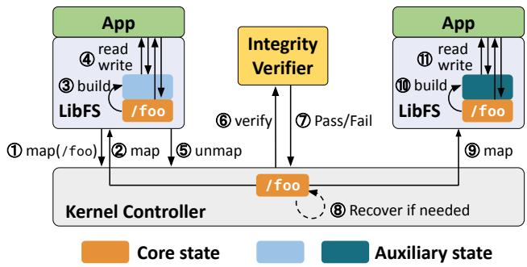
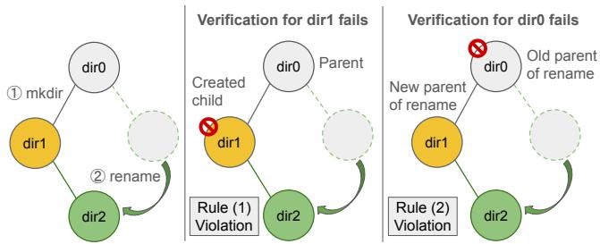
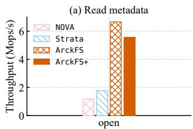
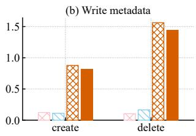
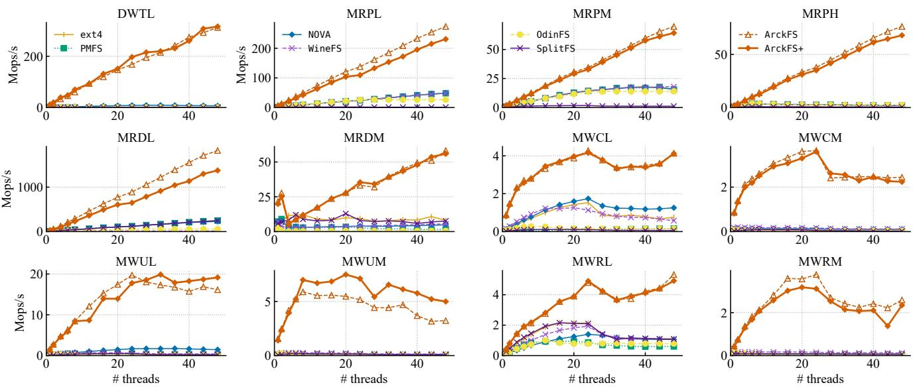

Latest updates: hps://dl.acm.org/doi/10.1145/3731569.3768291

SHORT-PAPER

# Analyzing and Enhancing ArckFS: An Anecdotal Example of Benefits of Artifact Evaluation

JONGUK JEON, Korea Advanced Institute of Science and Technology, Daejeon, South Korea SUBEEN PARK, Korea Advanced Institute of Science and Technology, Daejeon, South Korea SANIDHYA KASHYAP, EPFL, Lausanne, Switzerland

SUDARSUN KANNAN, Rutgers University–New Brunswick, New Brunswick, NJ, United States

DIYU ZHOU, Peking University, Beijing, China

JEEHOON KANG, Korea Advanced Institute of Science and Technology, Daejeon, South Korea

Open Access Support provided by:

Korea Advanced Institute of Science and Technology

EPFL

Peking University

Rutgers University–New Brunswick

Published: 12 October 2025

Citation in BibTeX format

SOSP '25: ACM SIGOPS 31st Symposium   
on Operating Systems Principles   
October 13 - 16, 2025   
Seoul, Republic of Korea

Conference Sponsors: SIGOPS

# Analyzing and Enhancing ArckFS: An Anecdotal Example of Benefits of Artifact Evaluation

Jonguk Jeon∗   
KAIST   
Korea   
jonguk.jeon@kaist.ac.kr

Sudarsun Kannan Rutgers University USA sudarsun.kannan@rutgers.edu

Subeen Park∗   
KAIST   
Korea   
subeen.park@kaist.ac.kr   
Diyu Zhou†   
Peking University   
China   
diyu.zhou@pku.edu.cn   
Sanidhya Kashyap   
EPFL   
Switzerland   
sanidhya.kashyap@epfl.ch   
Jeehoon Kang†   
KAIST / FuriosaAI   
Korea   
jeehoon.kang@furiosa.ai

## Abstract

We analyze and enhance Trio and ArckFS by Zhou et al. (SOSP 2023), high-performance NVM file system architecture and file system. A group of authors from KAIST initiated this study through a careful review of the paper and the released artifact, seeking to enhance the Trio work. Their analysis identifies (1) insufficient clarity in the paper on the handling of multi-inode operations, and (2) several implementation bugs in ArckFS that cause occasional operation failures or potential crash inconsistencies during inode creation.

Through close collaboration between the KAIST and Trio authors, we have enhanced the Trio work. (1) We clarify a few relevant rules for ArckFS to handle multi-inode operations. (2) We develop patches for the identified bugs, which essentially maintain the performance claims made in the Trio paper. Our study highlights the crucial role of artifact evaluation in systems research and its potential benefits.

CCS Concepts: • Hardware → Non-volatile memory; • Information systems → Phase change memory; • Software and its engineering → File systems management.

Keywords: Userspace File Systems, Persistent Memory

## ACM Reference Format:

Jonguk Jeon, Subeen Park, Sanidhya Kashyap, Sudarsun Kannan, Diyu Zhou, and Jeehoon Kang. 2025. Analyzing and Enhancing ArckFS: An Anecdotal Example of Benefits of Artifact Evaluation. In ACM SIGOPS 31st Symposium on Operating Systems Principles (SOSP ’25), October 13–16, 2025, Seoul, Republic of Korea. ACM, New York, NY, USA, 9 pages. https://doi.org/10.1145/3731569.3768291

## 1 Introduction

Recent advances in non-volatile memory (NVM) technologies, such as Intel Optane persistent memory [11] and Samsung CMM-H [17], offer high throughput, low latency, byteaddressability, and persistence. These characteristics have motivated the development of high-performance file systems that go beyond the limitations of traditional storage.

Prior systems such as BPFS [6], PMFS [9], and NOVA [20] leveraged NVM to redesign kernel file systems. However, they reside in the kernel and applications must still access them via system calls and the virtual file system (VFS) layer, which incurs non-negligible overhead [4].

To better leverage the performance potential of NVM, recent work shifts parts or all of file system logic from the kernel to userspace. This design enables direct access to NVM, which can significantly reduce software overhead [4, 8, 13, 15, 19, 21]. In addition, userspace file systems enable application-specific customization [19, 21], which is particularly beneficial for specific workloads where general-purpose designs often fall short.

In userspace file systems, it is challenging to ensure security, especially metadata integrity. They can be vulnerable to attacks from malicious applications without proper safeguards. To address this, conventional NVM file systems have adopted two main strategies. KucoFS [4], SplitFS [13], and Strata [14] enforce integrity by verifying it on every metadata operation. While this approach improves security, it incurs substantial performance overheads due to the frequent involvement of trusted components. In contrast, ctFS [15] omits integrity checks altogether by assuming a trusted environment, thereby limiting their applicability.

Trio and ArckFS (§2). To break the trade-off between performance and security for NVM file systems, Zhou et al. proposed the Trio architecture and the ArckFS file system in their paper “Enabling High-Performance and Secure Userspace NVM File Systems with Trio Architecture” [21].

Trio aims for high performance with direct userspace file access and per-application customization, while ensuring metadata integrity through verification. To achieve this, Trio separates the file system state into two parts: a unique core state for sharing and integrity, and per-application auxiliary state for high performance. Each application shares the core state at the inode granularity, and metadata integrity is verified only when inode ownership is transferred between applications in most cases to amortize verification cost.

ArckFS is a Trio-based userspace NVM file system designed for multicore scalability. ArckFS stores data in NVM as core state, while using indexes in DRAM as auxiliary state for fast lookups. ArckFS exhibits high scalability and consistent performance improvements over secure NVM file systems across a wide range of benchmarks. Furthermore, the paper describes two customizations of ArckFS for performance improvement in specific workloads.

Enhancing ArckFS through collaboration (§3 and §4). A group of authors from KAIST initiated this study through a careful review of the paper and the released artifact, seeking to enhance the Trio work. Their analysis identifies one presentation issue in the Trio paper and six implementation bugs in ArckFS. (1) The description of how Trio and ArckFS handle multi-inode operations is not sufficiently clear in the paper, and the ArckFS implementation prevents a LibFS from performing a legitimate cross-directory rename operation. (2) The implemented crash consistency mechanism for inode creation misses a memory fence, leading to partially persisted dentries and inodes. (3) The artifact has several concurrency bugs, leading to segmentation faults or directory cycles.

Nevertheless, the KAIST authors found no inherent vulnerabilities in Trio. Therefore, they contacted the Trio authors and the two parties (hereafter referred to as “we”) joined forces to enhance the Trio work. The collaboration results in an enhanced version of ArckFS named ArckFS+. (1) Through a careful review and discussion of the verifier code, we identify and clarify a few rules relevant to multi-inode operations that are not presented in the Trio paper, and ensure that ArckFS adheres to them. (2) To resolve crash inconsistency, we enforce write ordering with an additional memory fence. (3) To address the concurrency bugs, we carefully enhance the concurrency control mechanisms with minimal performance impact.

In §5, we evaluate ArckFS+. ArckFS+ delivers performance comparable to ArckFS, essentially maintaining the original performance claims. In microbenchmarks, ArckFS+ achieves 97.23% (geomean) of ArckFS performance under 48 threads in FxMark [16], and reaches 92.8% and 83.3% for the create and open workloads with a single thread. In macrobenchmarks, ArckFS+ achieves 101.1% and 102.1% of ArckFS performance with a single thread, and 97.1% and 98.8% with 16 threads on the Webproxy and Varmail workloads of Filebench [1], respectively.

  
Figure 1. The Trio architecture (reproduction of Zhou et al. [21, Figure 2]).

In §6, we conclude by discussing the implications of our study for Trio and for systems research in general.

## 2 Trio and ArckFS

We first review the Trio file system architecture and the Trio-based ArckFS file system due to Zhou et al. [21].

## 2.1 The Trio File System Architecture

Trio is a novel file system architecture designed to fully exploit the performance potential of NVM while ensuring metadata integrity. It achieves high performance by maximizing direct userspace file access and enabling unprivileged, private customization of LibFSes.

Trio decomposes the file system state into two distinct parts. A unique core state encompasses the file contents and the essential metadata such as file names or directory hierarchy in NVM, and is used for integrity verification. The per-application auxiliary state includes customizable caches and index structures in DRAM to achieve high performance, which can be built from the core state.

The core state is shared among applications at the inode granularity. The Trio paper refers to this sharing unit as a file (covering both regular files and directories), and the ArckFS implementation [7] uses inode. For clarity, we refer to this granularity as an inode.

Trio defers and batches metadata integrity verification until inode ownership is transferred between applications in most cases, thereby amortizing the verification cost. As illustrated in Figure 1, Trio enables this through three components: per-application LibFSes, an in-kernel access controller, and a trusted userspace integrity verifier. ① When a LibFS requests access to an inode, ② the kernel controller grants access if it has the appropriate permissions and maps the inode’s core state to the LibFS. ③ The LibFS builds its auxiliary state from the core state and ④ uses it to directly access the inode’s core state. ⑤ Upon sharing, the accessing LibFS unmaps the inode, and ⑥ the kernel controller forwards it to the integrity verifier. The integrity verifier inspects the file’s core state, and ⑦ any corruption is reported to the kernel controller. ⑧ The kernel controller resolves corruption based on predefined policies, such as rolling back to the state before the affected inode was acquired or marking the inode as inaccessible. ⑨-⑪ Subsequently, other LibFSes are ensured to always access the verified core state of the inode.

## 2.2 The ArckFS File System

ArckFS is a Trio-based userspace NVM file system designed for high performance, with a particular focus on flexible customization and multicore scalability.

To enable flexible customization and reduce metadata verification cost, the file system has a minimal core state comprising a superblock, a shadow inode table, and file pages. Notably, the shadow inode table serves as the ground truth for comparison with the inodes used by LibFSes.

To achieve high multicore scalability, ArckFS employs scalable data structures and fine-grained locking across its file and directory representations. For directories, LibFS uses hash tables in DRAM as auxiliary state and organizes pages in a multi-tailed log in NVM as core state. This design allows parallel directory operations by supporting independent updates to separate logging tails. For concurrency control, each directory uses three types of locks: per-bucket readers-writer locks in the hash table, locks for each logging tail, and a lock for the index tail. All data and metadata operations are persisted synchronously, and fsync() returns immediately.

Evaluation results confirm that ArckFS scales efficiently and outperforms other secure NVM file systems across a range of benchmarks, including FxMark [16], fio [2], Filebench [1], and LevelDB [10]. Furthermore, the authors present two customizations of ArckFS that further improve performance for specific workloads.

## 3 Handling Multi-Inode Operations

The original Trio paper [21] offers a limited discussion of how Trio and ArckFS handle operations involving multiple inodes, such as the directory relocation operation (i.e., when a non-empty directory is moved to another directory via rename()). As a result, one might wonder whether the single-inode-granularity sharing design in Trio can correctly handle the aforementioned multi-inode operations. To address this, we review how Trio ensures metadata integrity for multi-inode operations by using directory relocation as an example (§3.1), and present the rules that LibFS must satisfy for these operations (§3.2).

## 3.1 Ensuring Integrity for Directory Relocation

A key metadata invariant. The Trio paper [21, §4.3] states that the verifier enforces Invariant “I3”: the file system hierarchy forms a connected tree, e.g., by disallowing the deletion of non-empty directories.

  
Figure 2. Possible circular dependency when renaming a non-empty directory under a newly created sibling: Committing or releasing dir1 and dir0 is impossible due to LibFS Rules (1) and (2), respectively. To resolve this, we need to commit dir1 before performing the rename, as specified by Rule (3).

Preventing attacks. This invariant prevents a seemingly valid attack involving directory relocation. The initial file system state has /dir1/dir3/file1 and /dir2. App1 is a malicious process, while App2 is well-behaved. Both processes have full access permissions to these inodes, except that App1 lacks write permissions for dir3 and file1.

This scenario proceeds as follows: ① App1 acquires dir1 and dir2. ② App1 moves dir3 to dir2 via rename(). ③ App2 attempts to acquire dir1. ④ App1 releases dir1. ⑤ App2 acquires dir1. ⑥ App1 corrupts dir2 and then releases it.

At first glance, one might expect that after Step ⑥, the integrity verification for dir2 would fail, causing Trio to revert dir2 to its initial empty state, as discussed in Step ⑧ of §2.1. If that were the case, App1 would succeed in removing dir3 and file1, despite lacking permission.

However, Trio correctly handles this scenario by detecting corruption at Step ④ and rolling back dir1, preventing the deletion of dir3 and file1. Specifically, the release of dir1 in Step ④ fails because dir3 is non-empty, as prevented by the I3 invariant. Consequently, Trio rolls back dir1 to its initial state with dir3 intact. When App1 eventually releases dir2 after Step ⑥, verification on dir2 also fails, and dir2 is restored to its initial state. Thus, in this scenario, the rename operation does not expose any design vulnerability in Trio.

Supporting legitimate operations. Nevertheless, verification fails at Step ④ even though App1 tries to corrupt at Step ⑥. This shows that the verifier can reject a well-behaved application performing a legitimate operation. This is because App1 fails to perform a key step required by Trio after a directory relocation, as we discuss in §3.2.

## 3.2 LibFS Rules for Multi-Inode Operations

We clarify that the LibFS should additionally adhere to the following rules that are not presented in the Trio paper. Rule (1): The LibFS is only allowed to commit [21, §4.3] or release a newly created inode after its parent directory has been released. Otherwise, the verification of the newly created inode will fail because, from the kernel’s perspective, it appears disconnected from the root, violating invariant I3. Rule (2): After a directory relocation operation where the target directory is non-empty before its parent is acquired, the LibFS must commit or release the new parent directory before committing or releasing the old parent. As further detailed in §4.1, this is necessary for a legitimate directory relocation process to pass the verifier, thereby avoiding verification failure.

SOSP ’25, October 13–16, 2025, Seoul, Republic of Korea Jonguk Jeon, Subeen Park, Sanidhya Kashyap, Sudarsun Kannan, Diyu Zhou, and Jeehoon Kang
<table><tr><td rowspan=1 colspan=1>Bug category</td><td rowspan=1 colspan=1>ARCKFS&#x27;s bug</td><td rowspan=1 colspan=1>ARCKFS+&#x27;s patch</td><td rowspan=1 colspan=1> The patch&#x27;s performance impact</td></tr><tr><td rowspan=1 colspan=1>Integrity violation</td><td rowspan=1 colspan=1>S4.1: Cross-directory rename failure</td><td rowspan=1 colspan=1>Use commit for directory relocation</td><td rowspan=1 colspan=1>Directory relocation overhead</td></tr><tr><td rowspan=1 colspan=1>Crash inconsistency</td><td rowspan=1 colspan=1>S4.2: Partially persisted dentry and inode</td><td rowspan=1 colspan=1>Add a memory fence</td><td rowspan=1 colspan=1>File creation overhead</td></tr><tr><td rowspan=4 colspan=1>Concurrency bugs</td><td rowspan=1 colspan=1>S4.3: Incorrect synchronization of inode sharing</td><td rowspan=1 colspan=1>Acquire locks on inode release</td><td rowspan=1 colspan=1>Inode release overhead</td></tr><tr><td rowspan=1 colspan=1>S4.4: Inconsistent core and auxiliary states</td><td rowspan=1 colspan=1>Extend bucket lock to PM</td><td rowspan=1 colspan=1>Directory write contention</td></tr><tr><td rowspan=1 colspan=1>S4.5: Incorrect synchronization for directory bucket</td><td rowspan=1 colspan=1>Introduce RCU to the bucket</td><td rowspan=1 colspan=1>Directoryread overhead</td></tr><tr><td rowspan=1 colspan=1>S4.6: Directory cycle</td><td rowspan=1 colspan=1>Add a lock and descendant check</td><td rowspan=1 colspan=1>Directory relocation overhead</td></tr></table>

Table 1. Bugs in ArckFS and their classification, with corresponding patches in ArckFS+. The overall performance impact of these patches is minor; see §5.

We also find that a new rule is required to resolve the potential circular dependencies between Rules (1) and (2), as shown in Figure 2. After performing this rename under a newly created sibling, verification of dir0 and dir1 will deadlock: dir1 cannot be verified before dir0 due to Rule (1), and dir0 cannot be verified before dir1 due to Rule (2). To break this cycle, the LibFS should follow Rule (3): before performing this rename, the LibFS should also commit the new parent directory (in our example, dir1).

## 4 ArckFS’s Bugs and ArckFS+

We identify several bugs in ArckFS by analyzing the Trio paper [21] and its artifact [7]. We develop ArckFS+1 by patching these bugs.

## 4.1 Cross-Directory Rename Failure

ArckFS does not correctly implement the directory relocation operation, leading to a verification failure of a legitimate operation. This failure occurs in the old parent inode of the relocation due to the following reasons: (1) The verifier cannot distinguish whether the absence of a child is due to deletion or directory relocation via rename(). (2) The LibFS does not follow Rules (2) and (3) as described in §3.2.

We manifest this bug by observing verification failures on the old parent inode after a directory relocation, regardless of whether the new parent inode has been released.

Patch in ArckFS+. We fix the verifier and the LibFS to correctly handle this rename.

We patch the verifier to check whether a child has been renamed rather than deleted, and to pass verification if so. To achieve this, we introduce a parent pointer in the shadow inode in the kernel, and the kernel uses this pointer when the old parent inode is released: if the missing child’s parent differs, it indicates that the child has been renamed rather than deleted. The parent pointer of the child inode is updated only when the LibFS commits or releases its new parent and verification passes. Verification of the new parent passes if both the general checks and the following checks succeed: (1) The LibFS currently acquires the old parent, (2) The new parent is not a descendant of the renaming inode, and (3) The LibFS holds the global rename lock (§4.6).

We simply patch the LibFS to follow Rules (2) and (3), i.e., committing the new parent directory both before and after performing the rename.

With this patch, directory relocation becomes a special operation in ArckFS that requires per-operation verification. However, directory relocations are rare, and none of the workloads evaluated in the Trio paper perform them; thus, this does not affect our performance evaluation.

## 4.2 Partially Persisted Dentry and Inode

The Trio paper describes an atomic commit mechanism to ensure crash consistency of large structures on hardware that supports atomic updates of up to 16 bytes [21, §4.4]. This mechanism relies on a commit marker2 and ordered flushes to persist directory entries and inodes. During file creation, the LibFS: (1) Persists the directory entry with the commit marker set to the sentinel value 0, marking the entry as invalid; and then (2) Updates and persists the commit marker with the correct value to complete file creation. As a result, the cache line containing the commit marker is persisted at least twice.

The Trio artifact applies an optimization3 that ensures each cache line is persisted only once. Specifically, the artifact skips persisting the cache line containing the commit marker in step (1) to reduce the number of flushes. This is safe in principle because multiple writes to the same cache line can be ordered at no additional cost [5, 9].

However, the artifact introduces a bug by omitting a memory fence that prevents reordering of multiple cache-line writes. As a result, in the event of a crash, a directory entry with a valid commit marker may be only partially persisted.

We observe a partially persisted dentry and inode after a crash. For better reproducibility, we insert a flush of the cache line containing the commit marker, followed by a sleep immediately after updating the commit marker.

Patch in ArckFS+. Our fix adds a single memory fence before flushing the cache line containing the commit marker, incurring minimal overhead.

## 4.3 Incorrect Synchronization of Inode Sharing

In ArckFS, there are two types of inode release: (1) voluntary release, where the LibFS actively releases an inode to the kernel, and (2) involuntary release, where the kernel forcefully releases an inode from the LibFS if the LibFS does not return it on time. While the LibFS may crash during an involuntary release, ArckFS must ensure that it does not crash during a voluntary release.

However, ArckFS misses synchronization during inode release. In particular, one thread may voluntarily release and unmap an inode while another thread is still accessing it, leading to a dereference of unmapped memory and causing a crash.

We observe a bus error and a crash due to dereferencing unmapped memory by concurrently invoking unmap and writing to the directory. For better reproducibility, we insert a sleep() during the directory write.

Patch in ArckFS+. To prevent crashes, we ensure that no other thread can operate on an inode during its release. The thread releasing an inode acquires all relevant locks for that inode: for a regular file, the write lock of the readers-writer lock; for a directory, all locks in its hash buckets. To avoid dereferencing freed auxiliary state, ArckFS+ retains both the lock and the auxiliary state upon inode release. For directory read operations (e.g., path lookup, stat) that do not acquire locks and rely on RCU (§4.5), ArckFS+ caches the relevant inode state in the in-memory inode. Read operations then use this cached state, avoiding direct access to the mapped inode.

This patch incurs overhead during inode release but does not affect normal operations.

## 4.4 Inconsistent Core and Auxiliary States

In ArckFS, the core state holds the actual data of files and directories, while the auxiliary state is used for indexing. However, synchronization between the two states is not implemented in the artifact. As a result, a thread that updates only the auxiliary state may cause another thread to access non-existent core data, leading to a segmentation fault.

We observe such segmentation faults by concurrently invoking creat() and unlink(). For better reproducibility, we insert a sleep() between the two state updates in creat().

Patch in ArckFS+. To minimize performance overhead, we extend the critical section of each fine-grained hash bucket lock in the directory’s auxiliary state to also cover the corresponding updates in the core state. This extension increases contention among multiple threads for the same bucket during insertion or resizing, which degrades performance.

## 4.5 Incorrect Synchronization for Directory Bucket

ArckFS uses a spinlock on each directory hash bucket to protect directory entries but does not acquire a lock on the reader side.4 This design was based on the assumption that the hash table does not free entries, which turns out to be incorrect. Consequently, when a reader thread traverses a bucket to find an item, a concurrent writer thread may delete and free it, causing the reader to dereference a dangling pointer and trigger a segmentation fault.

We observe segmentation faults by concurrently invoking lookup and removal on the same bucket. For better reproducibility, we insert a sleep() during bucket traversal and immediately reallocate the freed memory to prevent reuse.

Patch in ArckFS+. We introduce read-copy-update (RCU) to protect the hash bucket. RCU defers freeing items deleted from the hash table until no threads can access them, eliminating the use-after-free condition described above.

This patch introduces a performance overhead on the reader side of the hash table, affecting workloads such as file open and directory enumeration. Nonetheless, the general scalability trend remains unchanged.

## 4.6 Directory Cycle

ArckFS should forbid directory cycles, a standard practice in modern file systems. The presence of cycles makes directory traversal difficult and complicates operations like file deletion, as they can lead to infinite loops or unreachable data. However, its artifact does not enforce this constraint.

We observe directory cycles in two cases: (1) during concurrent renames of directories across different parent directories, e.g., by concurrently executing rename(/c, /a/b/c) and rename(/a, /c/d/a), and (2) when a directory is renamed into one of its own descendants.

Patch in ArckFS+. For case (1), we introduce a global lock in the kernel for cross-directory renames of directories, similar to s\_vfs\_rename\_mutex [18] in Linux VFS. Each LibFS issues a system call to acquire and release this lock before and after a directory rename, respectively. The global rename lock is implemented as a lease with a timeout to prevent a malicious application from holding it indefinitely. For case (2), we add checks in the LibFS to prevent renaming a directory to one of its own descendants.

  
Figure 3. Single-thread throughput for metadata operations.

While this patch adds overhead to directory rename operations, it does not affect the performance evaluation, as none of the workloads perform directory renames.

## 5 Performance Evaluation

We compare ArckFS+ with ArckFS, ext4 [3], PMFS [9], NOVA [20], OdinFS [22], WineFS [12], SplitFS [13], and Strata [14] included in the Trio artifact [7].

In summary, ArckFS+ delivers performance comparable to ArckFS while addressing bugs through patches with minor overhead, thus essentially maintaining the original performance claims of the Trio paper.

Machine. We conduct our experiments on a different server than the one used in the Trio paper to evaluate reproducibility. This server is equipped with a dual-socket (dual NUMA nodes) configuration featuring (1) 2× 24-core Intel Xeon Gold 6248R processors (48 cores in total), (2) 12× 32GB DDR4 DRAM (384GB in total), and (3) 6× Intel Optane Persistent Memory 100 Series 256GB modules (1,536GB in total). The server runs Ubuntu 20.04 with a Linux kernel version 5.13.13.

Methodology. We evaluate the performance of ArckFS+ using the same experiments as in the Trio paper [21], covering single-thread performance (§5.1), scalability (§5.2), macrobenchmarks and real-world applications (§5.3), and sharing cost (§5.4).

## 5.1 Single Thread Performance

Metadata performance. Figure 3 shows the single-threaded throughput for common file system metadata operations. For the open, create, and delete workloads, the throughput of ArckFS+ drops to 83.3%, 92.8%, and 92.2%, respectively. The throughput drop in open and delete is caused by entering the RCU read-side critical section during directory reads (§4.5). The throughput drop in create is caused by the additional memory fence operation (§4.2).

Data performance. For read and write operations, ArckFS+ achieves throughput comparable to ArckFS, as all bugs are primarily related to metadata operations.

## 5.2 Scalability

We evaluate file system scalability using the FxMark [16] and fio [2] benchmark provided in the Trio artifact. This FxMark differs from the original in that (1) it uses threads instead of processes for parallel execution to introduce synchronization within a library file system process, and (2) the write operation is omitted in the MWCM workload to focus on the inode creation operation. Additionally, we configure DWTL to use a file size of 256 MB instead of the 3 GB used in the Trio evaluation, due to insufficient PM capacity.

Metadata scalability. Figure 4 presents the scalability results for metadata operations in FxMark. Labels are explained in Table 3. ArckFS+ and ArckFS outperform other secure file systems, thanks to direct NVM access and the absence of integrity verification. ArckFS+ delivers a geometric mean of 97.23% of ArckFS’s throughput in metadata workloads under 48 threads in FxMark. The largest throughput drop occurs in MRDL due to entering the RCU read-side critical section during directory reads (§4.5). The throughput increase in MWUM is caused by a change in cache line alignment due to the addition of a shadow inode fields in in-memory inode (§4.3).

Data scalability. In both FxMark data operations and fio, ArckFS outperforms other file systems by leveraging direct access and I/O delegation [21]. With the same optimizations, ArckFS+ achieves throughput comparable to ArckFS.

## 5.3 Macrobenchmarks and Real-World Applications

Filebench. The Trio artifact modifies the Webproxy and Varmail workloads to use private directories instead of a shared directory, as originally used in Filebench [1]. According to the Trio paper [21], this change addresses the scalability limitations of the original Filebench by avoiding the overhead of locking the entire fileset during file selection. However, it also deviates from the original workload semantics.

To preserve the intent of the original Filebench while still addressing its scalability bottlenecks, we build a new framework that restores the use of a shared directory. To minimize contention, we introduce fine-grained locks on filenames rather than locking the entire fileset.

In this framework, ArckFS+ delivers performance comparable to ArckFS, with relative throughput of 101.1% and 102.1% for a single thread, and 97.1% and 98.8% for 16 threads on the Webproxy and Varmail workloads, respectively.

LevelDB. Since the LevelDB benchmark is dominated by data operations, ArckFS+ and ArckFS exhibit similar performance and outperform other file systems for the same reasons discussed in §5.1 and 5.2.

Figure 4. Metadata scalability of FxMark.
<table><tr><td>Workload</td><td>DWTL</td><td>MRPL</td><td>MRPM</td><td>MRPH</td><td>MRDL</td><td>MRDM</td><td>MWCL</td><td>MWCM</td><td>MWUL</td><td>MWUM</td><td>MWRL</td><td>MWRM</td></tr><tr><td>ARCKFS+</td><td>101.25%</td><td>84.47%</td><td>92.09%</td><td>89.18%</td><td>75.45%</td><td>95.94%</td><td>99.71%</td><td>91.6%</td><td>118.82%</td><td>154.70%</td><td>92.25%</td><td>90.66%</td></tr></table>

Table 2. Relative performance of ArckFS+ compared to ArckFS across FxMark’s metadata workloads at 48 threads.

<table><tr><td>Name</td><td>Description</td></tr><tr><td>DWTL</td><td>Reduces the size of a private file by 4K.</td></tr><tr><td>MRP(L/M/H)</td><td>Opena (private/random/same) file in five-depth dirs.</td></tr><tr><td>MRD(L/M)</td><td>Enumerate files of a (private/shared) directory.</td></tr><tr><td>MWC(L/M)</td><td>Create an empty file ina (private/shared) dir.</td></tr><tr><td>MWU(L/M)</td><td>Unlink an empty file ina (private/shared) dir.</td></tr><tr><td>MWRL</td><td>Rename a private fle in a private dir.</td></tr><tr><td>MWRM</td><td>Moveaprivate file toa shared dir.</td></tr></table>

Table 3. Summary of FxMark’s metadata workloads (reproduction of Zhou et al. [21, Table 2]).

## 5.4 Sharing Cost

Additionally, we reproduce the sharing cost experiment with ArckFS+. The configuration details follow those described in the Trio paper [21, §6.5]. Concurrent write access to a shared inode incurs a sharing cost for ArckFS+. To reduce this cost, a user can use a trust group, where multiple applications share inodes within the group without verification, thereby essentially maintaining the claims of the Trio paper.

<table><tr><td></td><td>NOVA</td><td>ARCKFS+</td><td>ARCKFS+-trust-group</td></tr><tr><td>4KB-write 2MB</td><td>1.18GiB/s</td><td>2.07GiB/s</td><td>2.01GiB/s</td></tr><tr><td>4KB-write 1GB</td><td>1.16GiB/s</td><td>0.41GiB/s</td><td>1.80GiB/s</td></tr><tr><td>Create 10</td><td>6.38μs</td><td>10.18μs</td><td>0.76μs</td></tr><tr><td>Create 100</td><td>6.08μs</td><td>10.64μs</td><td>2.25μs</td></tr></table>

Table 4. Performance of ArckFS+ when updating shared files or directories among multiple applications. Higher values are better for the top two rows, while lower values are better for the bottom two rows.

## 6 Conclusion

The Trio architecture and the ArckFS file system [21] have been proposed to achieve high performance and security in NVM userspace file systems (SOSP 2023).

In this collaborative study, we have strengthened the original work. Specifically, we have (1) discovered issues in the ArckFS; (2) addressed these issues in ArckFS+, and (3) demonstrated that ArckFS+ achieves comparable performance to ArckFS, essentially maintaining the original performance claims.

Our analysis highlights the well-known challenge of achieving high performance while ensuring correctness in NVM file systems. The core difficulty lies in the inherent concurrency among multiple threads operating on DRAM and NVM. While particularly relevant to NVM file systems, this challenge (especially concerning DRAM) extends to scalable systems in general. Therefore, such systems should employ best practices to ensure correctness by, e.g., employing rigorous stress testing protocols or even formal verification to validate their behavior.

Most importantly, our work demonstrates the significance and benefits of artifact evaluation. Beyond improving reproducibility and transparency, our experience highlights two additional benefits for advancing science. (1) Publicly available artifacts enable researchers beyond the original authors to identify issues, thereby enhancing prior work. (2) Artifacts provide a basis for close collaboration among different research groups. Such collaboration was essential for this work, as many fixes require multiple rounds of discussion between the groups to resolve potential issues introduced by the fixes, including correctness bugs. We hope the systems research community continues to prioritize and encourage artifact evaluation.

## Acknowledgments

We are deeply grateful to Shan Lu for her dedicated guidance that fostered a constructive collaboration between the two groups. This work would not have been possible without her. We also thank the SOSP 2025 Program Committee for championing this paper. Their commitment to supporting studies that analyze and enhance existing work highlights a new paradigm for academic rigor in systems research.

This work was supported by the Institute for Information & Communications Technology Planning & Evaluation (IITP) grant funded by the Korea government (MSIT) partly under the project (No. RS-2024-00459026, Energy-Aware Operating System for Disaggregated System, 60%), partly under the project (No. RS-2024-00396013, DRAM PIM Hardware Architecture for LLM Inference Processing with Efficient Memory Management and Parallelization Techniques, 20%), partly under the Information Technology Research Center (ITRC) support program (No. IITP-2025-RS-2020-II201795, 10%), and partly under the Graduate School of Artificial Intelligence Semiconductor (No. IITP-2025-RS-2023-00256472, 10%). This work was supported by Samsung Electronics (HiPER: High-Performance Exabyte Storage Systems). The experimental environment was provided by the Samsung Memory Research Center (SMRC).

## References

[1] [n. d.]. Filebench - A Model Based File System Workload Generator. https://github.com/filebench/filebench.

[2] [n. d.]. Flexible I/O Tester. https://github.com/axboe/fio.

[3] 2025. ext4(5) — Linux manual page. https://man7.org/linux/manpages/man5/ext4.5.html.

[4] Youmin Chen, Youyou Lu, Bohong Zhu, Andrea C. Arpaci-Dusseau, Remzi H. Arpaci-Dusseau, and Jiwu Shu. 2021. Scalable Persistent Memory File System with Kernel-Userspace Collaboration. In 19th USENIX Conference on File and Storage Technologies (FAST 21). USENIX Association, 81–95. https://www.usenix.org/conference/ fast21/presentation/chen-youmin

[5] Kyeongmin Cho, Sung-Hwan Lee, Azalea Raad, and Jeehoon Kang. 2021. Revamping hardware persistency models: view-based and axiomatic persistency models for Intel-x86 and Armv8. In Proceedings of the 42nd ACM SIGPLAN International Conference on Programming Language Design and Implementation (Virtual, Canada) (PLDI 2021). Association for Computing Machinery, New York, NY, USA, 16–31. doi:10.1145/3453483.3454027

[6] Jeremy Condit, Edmund B. Nightingale, Christopher Frost, Engin Ipek, Benjamin Lee, Doug Burger, and Derrick Coetzee. 2009. Better I/O through byte-addressable, persistent memory. In Proceedings of the ACM SIGOPS 22nd Symposium on Operating Systems Principles (Big Sky, Montana, USA) (SOSP ’09). Association for Computing Machinery, New York, NY, USA, 133–146. doi:10.1145/1629575.1629589

[7] Diyu Zhou. [n. d.]. Artifact Evaluation Submission for Trio, SOSP 2023 (commit 8fa7f83). https://github.com/vmexit/trio-sosp23-ae/ tree/8fa7f83.

[8] Mingkai Dong, Heng Bu, Jifei Yi, Benchao Dong, and Haibo Chen. 2019. Performance and protection in the ZoFS user-space NVM file system. In Proceedings of the 27th ACM Symposium on Operating Systems Principles (Huntsville, Ontario, Canada) (SOSP ’19). Association for Computing Machinery, New York, NY, USA, 478–493. doi:10.1145/3341301.3359637

[9] Subramanya R. Dulloor, Sanjay Kumar, Anil Keshavamurthy, Philip Lantz, Dheeraj Reddy, Rajesh Sankaran, and Jeff Jackson. 2014. System software for persistent memory. In Proceedings of the Ninth European Conference on Computer Systems (Amsterdam, The Netherlands) (EuroSys ’14). Association for Computing Machinery, New York, NY, USA, Article 15, 15 pages. doi:10.1145/2592798.2592814

[10] Google. [n. d.]. LevelDB. https://github.com/google/leveldb.

[11] Intel Corporation. [n. d.]. Intel Optane Persistent Memory. https://www.intel.com/content/www/us/en/products/docs/memorystorage/optane-persistent-memory/overview.html.

[12] Rohan Kadekodi, Saurabh Kadekodi, Soujanya Ponnapalli, Harshad Shirwadkar, Gregory R. Ganger, Aasheesh Kolli, and Vijay Chidambaram. 2021. WineFS: a hugepage-aware file system for persistent memory that ages gracefully. In Proceedings of the ACM SIGOPS 28th Symposium on Operating Systems Principles (Virtual Event, Germany) (SOSP ’21). Association for Computing Machinery, New York, NY, USA, 804–818. doi:10.1145/3477132.3483567

[13] Rohan Kadekodi, Se Kwon Lee, Sanidhya Kashyap, Taesoo Kim, Aasheesh Kolli, and Vijay Chidambaram. 2019. SplitFS: reducing software overhead in file systems for persistent memory. In Proceedings of the 27th ACM Symposium on Operating Systems Principles (Huntsville, Ontario, Canada) (SOSP ’19). Association for Computing Machinery, New York, NY, USA, 494–508. doi:10.1145/3341301.3359631

[14] Youngjin Kwon, Henrique Fingler, Tyler Hunt, Simon Peter, Emmett Witchel, and Thomas Anderson. 2017. Strata: A Cross Media File System. In Proceedings of the 26th Symposium on Operating Systems Principles (Shanghai, China) (SOSP ’17). Association for Computing Machinery, New York, NY, USA, 460–477. doi:10.1145/3132747.3132770

[15] Ruibin Li, Xiang Ren, Xu Zhao, Siwei He, Michael Stumm, and Ding Yuan. 2022. ctFS: Replacing File Indexing with Hardware Memory Translation through Contiguous File Allocation for Persistent Memory. ACM Trans. Storage 18, 4, Article 30 (Dec. 2022), 24 pages. doi:10.1145/ 3565026

[16] Changwoo Min, Sanidhya Kashyap, Steffen Maass, Woonhak Kang, and Taesoo Kim. 2016. Understanding Manycore Scalability of File Systems. In Proceedings of the 2016 USENIX Annual Technical Conference (ATC). Denver, CO.

[17] Samsung. 2024. Samsung CXL Solutions – CMM-H. https: //semiconductor.samsung.com/news-events/tech-blog/samsung-cxlsolutions-cmm-h/.

[18] The kernel development community. [n. d.]. Directory Locking. https: //www.kernel.org/doc/html/v6.2/filesystems/directory-locking.html.

[19] Haris Volos, Sanketh Nalli, Sankarlingam Panneerselvam, Venkatanathan Varadarajan, Prashant Saxena, and Michael M. Swift. 2014. Aerie: flexible file-system interfaces to storage-class memory. In Proceedings of the Ninth European Conference on Computer Systems (Amsterdam, The Netherlands) (EuroSys ’14). Association for Computing Machinery, New York, NY, USA, Article 14, 14 pages. doi:10.1145/2592798.2592810

[20] Jian Xu and Steven Swanson. 2016. NOVA: a log-structured file system for hybrid volatile/non-volatile main memories. In Proceedings of the

14th Usenix Conference on File and Storage Technologies (Santa Clara, CA) (FAST’16). USENIX Association, USA, 323–338.

[21] Diyu Zhou, Vojtech Aschenbrenner, Tao Lyu, Jian Zhang, Sudarsun Kannan, and Sanidhya Kashyap. 2023. Enabling High-Performance and Secure Userspace NVM File Systems with the Trio Architecture. In Proceedings of the 29th Symposium on Operating Systems Principles (Koblenz, Germany) (SOSP ’23). Association for Computing Machinery, New York, NY, USA, 150–165. doi:10.1145/3600006.3613171

[22] Diyu Zhou, Yuchen Qian, Vishal Gupta, Zhifei Yang, Changwoo Min, and Sanidhya Kashyap. 2022. ODINFS: Scaling PM Performance with Opportunistic Delegation. In 16th USENIX Symposium on Operating Systems Design and Implementation (OSDI 22). USENIX Association, Carlsbad, CA, 179–193. https://www.usenix.org/conference/osdi22/ presentation/zhou-diyu