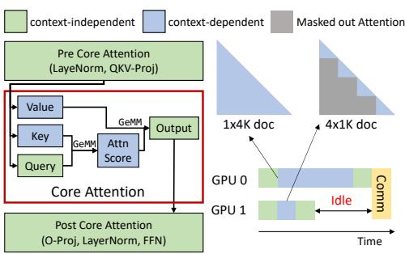
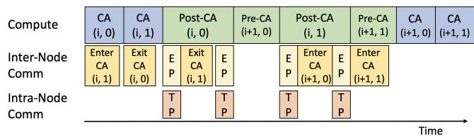
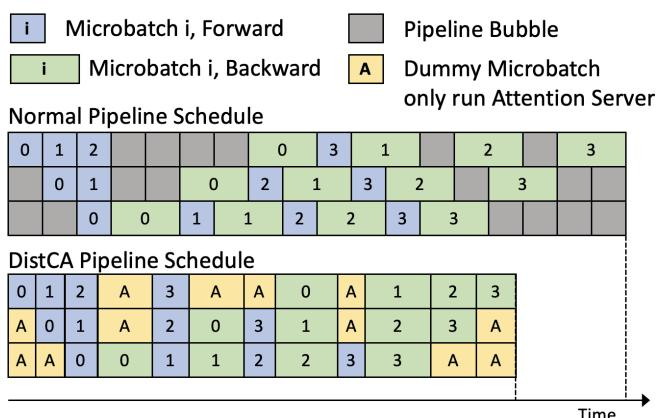
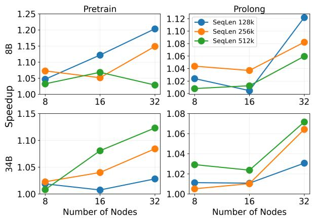
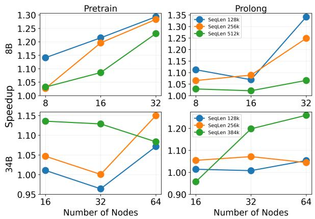
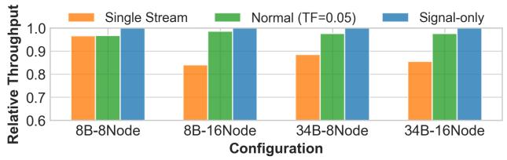
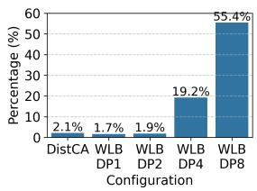

# Efficient Long-Context Language Model Training by Core Attention Disaggregation

**作者**:Yonghao Zhuang, Junda Chen, Bo Pang, Yi Gu, Yibo Zhu, Yimin Jiang, Ion Stoica, Eric Xing, Hao Zhang
**单位**:CMU, UC San Diego, MBZUAI, StepFun, UC Berkeley
**会议**:MLSys 2026
**链接**:[MLSys 2026 Proceedings](https://proceedings.mlsys.org/paper_files/paper/2026)
**源文件**:[[93db85ed909c13838ff95ccfa94cebd9.pdf]]

---

## 1. 背景

长上下文 LLM 训练正成为主流需求:推理模型的长链式思维、代码 agent 的多文件仓库处理都需要 100K–1M token 的上下文窗口。为训练出长上下文能力,数据集通常混合长短文档,并采用 **document packing**(把多个文档拼成固定长度的 chunk、用 attention mask 阻断跨文档注意力)以提升吞吐。

然而 Transformer 的 self-attention 对序列长度是二次复杂度,而其余层(QKV-projection、FFN、LayerNorm)近似线性复杂度。这导致同一 chunk 中长短文档组合不同时,**attention FLOPs 差异极大**:一个 4K token 的单文档 chunk 和一个 4×1K token 的多文档 chunk,虽总 token 数相同,前者的 attention FLOPs 约是后者的 4 倍。

这种计算不均衡在大规模分布式训练中演化为 **straggler 问题**:DP 中拿到高 attention 负载的 replica 拖慢梯度同步;PP 中高负载 microbatch 让某一 stage 变成流水线瓶颈,造成 bubble。论文引用的先前工作(WLB-LLM、Understanding stragglers)观测到 1.34–1.44× 的端到端减速,即便在较短的上下文下也显著。

---

## 2. 要解决的问题

核心问题:**长上下文训练中,由 attention 二次复杂度导致的计算-内存联合不均衡,无法被现有技术有效化解**。

现有方案各有瓶颈:

1. **Variable-length data chunking**(WLB-LLM):给 attention FLOPs 高的 chunk 塞更少 token、FLOPs 低的 chunk 塞更多 token,以均衡 attention compute。但这样 $\sum l$ 不再相等,short-doc-heavy 的 rank 激活内存成倍上涨(512K 最大长度时某些 rank 需要 1.08–1.17× 的额外内存)。当内存打满后,attention 仍无法均衡,idle time 比例在 DP=4 时升到 19%,DP=8 时升到 55%。

2. **Context parallelism (CP)** + per-document sharding:把每个文档沿序列维切分到 2c 个 shard,再以 head-tail 方式分发给 c 个 CP rank。**三个瓶颈**:
   - 短文档被过度切片,每 shard 小于 128 token 导致 attention kernel 填不满 tile,吞吐急剧下降;
   - KV states 需要 all-gather,通信量随全局 token 数线性增长;CP=32 时 all-gather 占比从 3% 涨到近 40%;
   - 最后一个 CP rank 要持有整个文档的 KV 以供 backward,KV 内存占比从 3% 涨到近 30%。

3. **CP 无法缓解 PP straggler**:不同 PP stage 持有不同层,不能联合处理同一文档的 shard,stage-level 的 attention 差异依旧存在。

---

## 3. 洞察与设计

**关键洞察**(论文作者的核心观察):Core Attention(CA,即 `softmax(QK^T)V` 的纯计算部分,不含 QKV-proj / O-proj / FFN)具备两个特殊属性,使得"把 CA 从模型其他部分拆开独立调度"成为可能且高效:

1. **Statelessness**:CA 没有可训练参数,且由于 modern IO-aware kernel(如 FlashAttention)不物化注意力矩阵 P、在 backward 时重算,CA 几乎不产生 transient state。因此 CA 调度问题退化为纯 compute-bound 任务的调度。
2. **Composability / 分片可组合**:CA 可以在 token 粒度任意切分(每个 shard 只需自己的 Q 和对应上下文的 K、V 即可独立算)。modern attention kernel 的吞吐只取决于融合调用里 aggregate token 数,与 token 来自哪个文档无关——只要每个 shard ≥ FA2 的 tile 大小(128 tokens)。这意味着可以把来自不同文档、不同 DP replica、不同 PP stage 的 CA shard 重新 batch 到一个 high-occupancy kernel 里。

基于以上两点,论文提出 **Core Attention Disaggregation (CAD)** 及其实现 **DistCA**。核心设计:

- **把 CA 从模型其他部分剥离**,交给 "attention servers" 池子处理。一个 CA-task $t$ 定义为 $(q(t), kv(t))$ 上的 CA 计算。
- **token 级动态切分 + 任意重组**:scheduler 把一 batch 文档切成 CA-tasks,并跨 attention servers 重平衡,使 FLOPs 基本相等;然后每个 server 把分到的 CA-tasks 融合为单次高占用 kernel call。
- **与 DP / PP / TP 解耦**:CA 调度不再受 DP 或 PP 分组约束,跨 DP replica / 跨 PP stage 的 CA shard 都可以互相重平衡,从根本上消除 DP 和 PP 两种 straggler。与 CP 不同,CAD 不强制 uniform split,可以只对长文档切分、短文档整体下发,避免 CP 的 kernel 效率损失。

---

## 4. 实现细节

DistCA 由两部分组成:runtime 和 scheduler。

### 4.1 Runtime

**In-place attention server**。若把部分 GPU 专门划给 CA,会严重浪费内存(FFN 是主要内存占用大户,而 CA 是 stateless 的)。DistCA 采用**同一 GPU 分时切换角色**:在一个 transformer layer 内,GPU 先算 context-independent 层,然后切换为 attention server 处理分配到的 CA-tasks,再切回继续下一层。这样 compute 和 memory 都保持高利用率。

**Ping-Pong 执行计划**。为隐藏 CA 分发的跨节点通信,把每个 microbatch 拆成两个等量 nano-batch "Ping" 和 "Pong",在 GPU 上交错执行:一个 nano-batch 的 compute 与另一个 nano-batch 的 inter-node comm 重叠。同时,intra-node TP 通信(NVLink)和 inter-node CA 通信(InfiniBand)也重叠。

**Pipeline parallelism 支持**。CAD 与 DP、TP 天然兼容,并替代 CP。对 PP,因 CA 无权重,来自不同 PP stage 的 CA-tasks 与来自不同 DP replica 的任务在调度器眼里等价,可一起重平衡。为了避免 GPU 在"算其他层"与"当 attention server"两个角色间来回切换造成 idle,DistCA 修改 1F1B schedule,让同一 tick 内所有 stage 都做同向(全 forward 或全 backward)操作——把某些 backward microbatch 推迟到 schedule 尾部的 bubble 里执行,总 tick 数不增加。warmup / drain-down 阶段 idle 的 GPU 也被重利用为 attention server。

### 4.2 Communication-aware greedy scheduler

在 CPU 上跑,目标是同时最小化 (1) CA servers 间的 FLOPs 不均衡 和 (2) 跨节点通信量。

- **Profiler**:对 $(q, kv)$ 长度网格测得 CA kernel 的延时和吞吐,给定 CA-task 用双线性插值预测执行时间,饱和区用峰值吞吐。
- **贪心迁移**:计算理想 per-server 负载 $\bar{F}$;把 server 分成 surplus 和 deficit;对每个 deficit 目标,遍历候选 Item,用 cost-benefit 评分 $E = \Delta F_{\max} / V_{\mathrm{comm}}$ 选出"单位通信换到最多 FLOPs"的迁移方案;可以把一个 Item 切成两个 sub-Item。
- **终止条件**:各 server 负载进入 $\epsilon \bar{F}$ 容差(tolerance factor),或剩余迁移的 $E$ 低于阈值。
- **Comm 建模**:保持 head-tail CP 的思路——一个 shard 既拿文档前 $i..j$ 又拿后 $i..j$ token,使 FLOPs 估计在不同 MFU 下仍相对准确(Appendix B 推导了 $n_q, n_{kv}$ 的最优取值)。

### 实现规模

DistCA 用 2K 行 Python + 1K 行 CUDA/C++,Python 端集成 Megatron-LM 以复用 token-independent 层、4D parallel 框架和端到端训练 pipeline。All-to-All 通信参考 FLASH 的思路并基于 NVSHMEM 实现。

### 理论分析(Appendix A)

对 Llama-34B 配置、50 GB/s InfiniBand、50% H200 MFU,作者推出理论上每个文档最多可切 31 个 shard 且通信仍能被 compute 完全覆盖;模型更大时这个上限还会更高。

---

## 5. 实验结果

**平台**:最多 64 个 NVIDIA DGX H200 节点(512× H200 GPU,每卡 140 GB HBM)。**模型**:Llama-3-8B、Llama-3-34B。**数据分布**:Pretrain(上采样长文档)和 ProLong(长短混合公开数据集)。**基线**:WLB-ideal(复现 WLB-LLM 的 variable-length chunk + per-doc CP,固定 TP=8,对 DP/CP/PP 做网格搜索取最佳)。

### 3D Parallelism(无 PP)

- Pretrain 上 DistCA 相对 WLB-ideal 提速 **1.07–1.20×**,ProLong 上 **1.05–1.12×**。
- 8B 模型在 MaxDocLen 较小时提速更明显(总 token 数多、all-gather 占比高);34B 模型在 MaxDocLen 较大时提速更明显(长度分布更离散、WLB 更难均衡)。

### 4D Parallelism(含 PP)

- 8B 模型提速 **1.15–1.30×**(Pretrain)/ **1.10–1.35×**(ProLong)。
- 34B 模型提速最高 **1.25×**(ProLong, 64 node, 384K),但也出现若干接近 1× 甚至 < 1× 的配置(Pretrain 34B 32-node 某配置跌到 0.96)。作者将其归因于变长 CA 请求引起的 PyTorch 内存分配碎片和 GC 开销,计划以静态分配 + CUDA Graphs 在未来改进。
- WLB-LLM 在更大 CP 或 DP 时频繁 OOM,PP 也放大了 attention 的 stage-level 不均衡。

### Ablation

**通信隐藏**(Figure 11):

把 CA 通信容量降成 1-byte "Signal"(理论下界)和关闭 ping-pong 的 "Single Stream" 对比。DistCA normal 几乎与 Signal 等吞吐,而 Single Stream 在 16 节点的配置上会多付出 10–17% 的延迟。**结论:ping-pong 成功隐藏了绝大部分 inter-node 通信**。唯一例外是 8B-8node,compute 太小不足以完全 cover comm。

**Memory divergence**(Figure 4a):DistCA 的 per-microbatch 内存发散仅 2.1%,而 WLB 在 DP=4 时为 19.2%、DP=8 时达到 55.4%。

**Tolerance factor**(Figure 12):8B 模型在 0–0.20 之间延迟基本稳定;34B 模型必须 ≥ 0.10 才能保证通信能被隐藏。把 $\epsilon$ 从 0 调到 0.15 可以降低 20–25% 通信量而延迟不变或反而更低。

### 关键数字小结

| 指标 | DistCA | WLB-ideal |
|---|---|---|
| 端到端提速(最高) | 1.35× | 1.00×(baseline) |
| 内存发散(8B 4D) | 2.1% | 1.7% (DP=1) → 55.4% (DP=8) |
| ping-pong 隐藏后额外 comm 延迟 | 近 0 | N/A |
| 规模 | 最高 512 H200 + 512K context | 通常 OOM |

---

## 6. 批判性分析

**6.1 34B 模型上的 speedup 不稳定,论文的解释被轻描淡写**。Figure 10 左下角 Pretrain 34B 在 32 节点时出现 0.96× 的 *减速*(即 DistCA 比 WLB 还慢),128K / 256K 长度多数配置也只有 1.00–1.05×。作者把原因归为 PyTorch 内存分配器碎片和 GC,并承诺"未来用 CUDA Graphs 修复"——但这恰恰意味着**当前系统在生产最常用的中等长度大模型场景下,优势可能被工程开销抵消**。把 Abstract 的"up to 1.35×"作为主卖点,而实际 Pretrain 34B 的平均提速只有 1.02–1.08×,存在一定挑樱桃嫌疑。

**6.2 基线复现的公平性问题**。"WLB-ideal" 并非官方实现,而是作者自己在 DistCA 框架里重新实现 WLB-LLM 的方法;同时省略了 WLB-LLM 原论文里的 "deferred execution" 机制(理由是"会改变训练动态,留待未来")。这可能低估了真实 WLB-LLM 的性能。与真正独立实现的端到端对比(如开源 WLB-LLM)缺失,在审稿视角下是一个可攻击点。

**6.3 "Ping-pong 完美隐藏 comm" 的前提并不普适**。Figure 11 显示 8B-8node 的 normal 吞吐与 Signal 并非一致——仅在 compute 足够大的 16-node 配置上才达到近似 Signal。论文没讨论在更小规模、或 compute-to-comm ratio 较低的新硬件(如 B200 大幅加速 FP8 / GEMM 但 InfiniBand 不同比例提升)上,这个假设能否继续成立。

**6.4 In-place attention server 的开销未展开**。角色切换需要激活缓存管理、CUDA stream 同步、可能的 NCCL group 重建,而 4D 并行 34B 的 memory fragmentation 问题(§6.2)可能就源于此。论文没给 "in-place vs 专用 pool" 的公平对比。

**6.5 可扩展性的理论上界依赖 MFU=50% 的乐观假设**。Appendix A 中 s ≤ 31 的推导假设 context-independent 层能跑到 50% MFU。实际上 LLaMA-34B 在 H200 上 MFU 随着 PP / TP 进一步下降;如果真实 MFU 是 30%,上界会降到约 18,论文称"模型更大时上限还会增加"但未给出实测曲线来佐证。

**6.6 调度器的假设过于简化**。贪心 scheduler 假设"每个 shard 迁移独立",但多 server 同时发送会竞争网络带宽;FLOPs-based 代价函数忽略了 attention kernel 的实际 variance(论文自己也承认需要 head-tail CP 技巧才能让估计准)。作者没报告 scheduler 在 CPU 上的运行时间——对 pp-per-tick 调度,如果 scheduler 是几十毫秒级,累积下来也不小。

**6.7 batched CA 的数值稳定性和梯度一致性**。多个文档的 CA shard 融合到同一个 kernel call 里,softmax 统计量的 reduction 精度、FA2 的 log-sum-exp 组合行为是否在 backward 产生微小差异?论文只对 throughput 做了评测,未给 loss curve 或最终模型质量对比,读者无法判断"调度可变 → training 可复现"的保证。

---

## 7. AI Infra / MLSys 视角

本文是非常典型的 MLSys 方向论文,对 AI Infra 研究者有直接借鉴意义:

- **"统计学视角的 workload modeling" 是基础**。论文在 §3.1 把 FLOPs 建模为 $\alpha l^2 + \beta l$、memory 建模为 $\gamma l$,并系统证明"任意打包方案无法同时满足 FLOPs 与 memory 等式约束"。这种把系统问题转化为简洁数学条件的方法论对任何带二次或超线性项的计算(long-context inference、MoE routing skew、hybrid-modal training)都适用。
- **Stateless + composable 是新的 disaggregation boundary**。过去 disaggregation 主要在推理(prefill/decode、attention/FFN in MoE)。本文把这个 pattern 推广到训练:只要某个子模块 stateless(无参数、无重要中间状态)且 composable(可任意切分),就值得作为调度单元独立处理。将来可以类比:training 中的 normalization、embedding lookup、RoPE 预计算、甚至 reward model 的批量打分,是否也满足"局部 stateless"的条件?
- **In-place server(时分复用)** vs **dedicated pool** 的权衡是 AI 集群调度的常见母题。本文选择了"时分 + ping-pong"走向 compute+memory 双高利用率,代价是复杂的 schedule 设计。对推理侧长 KV cache、MoE expert shard 等 stateful 子模块,类似 trade-off 也值得研究。

**可切入的延伸研究**:

1. **把 CAD 思路迁移到推理**:长上下文推理(>1M token)的 prefill 阶段也有同样的 attention 二次 vs FFN 线性错配。结合 Mooncake / DistServe 的 KV cache 分离,能否把 CA 独立调度到一个 attention-specialized 节点池(高 HBM 带宽 + 低精度 GEMM)?
2. **解决 §6.1 的内存碎片**:论文坦承 34B 4D 跑 PyTorch 时碎片严重。可以研究 NVIDIA Expandable Segments、CUDA graph 捕获下的动态 shape 处理、或基于 FlexAttention 的静态 shard 池,看能否把 34B 提速拉到与 8B 一致的 1.2× 以上。
3. **Scheduler 的在线学习**:当前 profiler 是离线构建、在线插值。对异构集群(混合 H100 + H200 + B200),scheduler 需要更细粒度的实时 feedback;可以用 contextual bandit 或在线 regression 动态更新 profile。
4. **与 zero-bubble PP / interleaved 1F1B 的深度融合**:论文只 retrofit 到经典 1F1B,但新的 zero-bubble schedule(NVIDIA)对 forward/backward 的顺序有更细要求。CAD 的 "全 forward or 全 backward 同 tick" 设计如何与 ZB 兼容是个开放问题。
5. **Fault tolerance 与 attention server 隔离**:§8 Limitations 自己提到"dedicated pool 可提供更好的 fault isolation"。可以研究可插拔 attention server 池,在节点故障时动态 drain/再调度 CA-tasks,类似推理侧的 graceful scaling。
6. **理论推广到更宽的模型架构**:Hybrid Attention(SSM/Mamba + attention)、Mixture-of-Depths、Sparse Attention 等变体下,CA 的"近零 state"假设还成立吗?何时 disaggregation 才有意义?这个 boundary 值得形式化。

---

## 8. 总结

DistCA 通过 **Core Attention Disaggregation** 把 LLM 训练中二次增长的 attention 计算从其余线性层里剥离出来,使用 token 级动态切分 + 跨 DP/PP 重组 + attention server 池化 + ping-pong 通信隐藏的组合拳,彻底绕开了"attention FLOPs / memory 同时均衡不可兼得"的困境。在 8B 模型和 512 H200 规模上最高达到 1.35× 的端到端提速,并把 per-microbatch 内存发散从 55% 降到 2.1%。适用场景主要是长上下文(>128K)LLM 预训练,对短上下文或小规模训练收益有限;主要局限是 34B 级别模型上因 PyTorch 动态分配引起的内存碎片削弱了优势,且基线为作者自复现版本,公平性有待独立验证。整体方法论——识别 stateless+composable 的子模块并 disaggregate——对未来 AI Infra 的调度设计有清晰的启发意义。
